# A Multi-Domain and Multi-Task Generative Framework with Explicit Task and Domain Conditioning for Cross-Domain Event Extraction

Siting Liang<sup>1,2</sup> and Omar Adjali<sup>1</sup> and Daniel Sonntag<sup>1,2</sup>

<sup>1</sup>German Research Center for Artificial Intelligence

<sup>2</sup>Carl von Ossietzky University of Oldenburg

{siting.liang, omar.adjali, omair\_shahzad.bhatti, daniel.sonntag}@dfki.de

## Abstract

Event extraction aims to identify event triggers, classify event types, and extract arguments to construct structured event representations. Despite strong in-domain performance, developing models that generalize robustly across do mains remains challenging due to variations in contextual expressions and event schemas. Prior unified and multi-task approaches improve in-domain accuracy but exhibit limited flexibility when applied to unseen domains. Even large language model–based methods that provide full event ontologies at inference time often underperform compared to smaller, task-specific fine-tuned models. We propose a unified multi-domain and multi-task training framework that models heterogeneous event schemas within a single model. Our approach introduces domain conditioning signals, jointly with task-specific prompts, enabling dynamic adaptation to dataset-specific schemas without requiring complete event label sets at inference time. The framework supports both pipeline and end-to-end extraction settings, facilitating efficient task- and domain-level transfer. Experiments on diverse event extraction benchmarks demonstrate that our method achieves competitive performance, strong cross-domain generalization, and practical scalability, while preserving domain-specific precision.

## 1 Introduction

Event extraction (EE) is a fundamental task in information extraction that aims to identify and structure mentions of events from unstructured text. A typical event extraction pipeline involves two core tasks (Yang et al., 2019): (i) Event Detection (ED), which detects spans of text that evoke the occurrence of an event and assigns the detected trigger word to a predefined event type; and (ii) Event Argument Extraction (EAE), which identifies and labels the participants or entities that fulfill specific roles in the event. Together, these tasks enable the construction of structured representations of events that support downstream applications such as eventcentric knowledge graph construction (Gottschalk and Demidova, 2019).

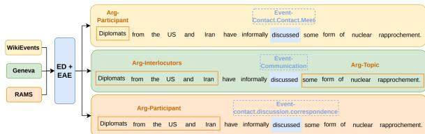  
Figure 1: Illustration of cross-domain event extraction, where a single unified model generates domain-specific predictions for the same input text by conditioning on the target domain at inference time.

Prior work on event extraction predominantly relies on discriminative models that decompose the task into separate modules, or on unified generative models that jointly encode event structures within a single framework (Huang et al., 2023; Wang et al., 2023). Building on the latter paradigm, we extend unified event extraction to a fully multi-domain and multi-task setting, training a single model to handle all domains and event subtasks in a scalable and efficient manner. Figure 1 illustrates cross-domain event extraction at inference time, where our unified multi-domain fine-tuned model leverages domain indicators (e.g., WikiEvents, Geneva, RAMS) to generate domain-specific predictions given the identical input text.

We adopt a text-to-text multi-task framework that reformulates core event extraction subtasks into a unified generation paradigm, enabling a single encoder–decoder model to jointly perform event detection (ED) and event argument extraction (EAE) (Lu et al., 2022). This formulation builds on prior work in prefix-based conditioning, controllable generation, and unified information extraction, where task-specific tokens serve as lightweight prompts to guide generation across different subtasks (Hsu et al., 2023a,b). Extending this paradigm, we further generalize the framework to a multi-domain setting by incorporating additional domain-level conditioning. Specifically, lightweight domain indicators are prepended to the input sequence (e.g., Domain: Geneva.), allowing the model to adapt its generation behavior to diverse domain-specific event patterns without requiring explicit schema definitions or full event ontologies at inference time. As illustrated in Figure 2, the resulting framework unifies multi-task and multi-domain learning under a single generative model guided by both task-specific prompts and domain indicators. The unified framework allows a single model to operate flexibly in either a pipeline setting, detecting and classifying triggers and arguments extraction in successive steps: Pipeline of ED ⇒ EAE, or in an End-to-End manner that jointly generates structured event representations (ED+EAE). Detailed descriptions of the unified framework and both operating modes are provided in the Section 3.

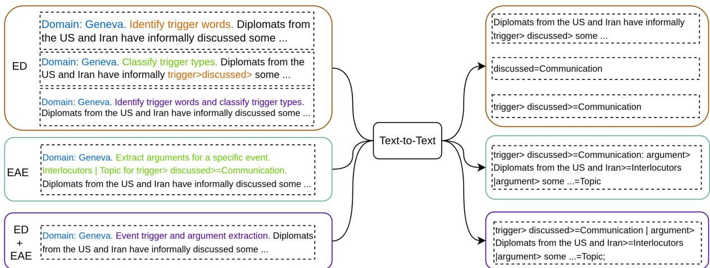  
Figure 2: The unified framework is built on a text-to-text architecture, allowing a single model to learn multiple tasks simultaneously through task-specific prompts while training on multiple datasets. During training, domainconditioned signals (e.g., Domain: Geneva.) enable robust cross-domain transfer while maintaining strong domainspecific precision.

Our experiments demonstrate that a single T5- base model (Chung et al., 2024) can effectively handle all event extraction subtasks, operating either sequentially in a pipeline setting or jointly through end-to-end prediction. The key contributions of our work are: (1) proposing a single generative model capable of flexible event extraction in multiple paradigms, (2) demonstrating mutual benefits of joint multi-task and multi-domain training, and (3) showing effective cross-domain generalization with a single model. We will publish our code and T5-based event extraction models of this work.

## 2 Related Work

Event extraction systems have traditionally relied on discriminative sequence-labeling approaches, where classifiers are fine-tuned on human-annotated label sets, often resulting in domain-specific models trained separately for each dataset (Wadden et al., 2019; Yang et al., 2019). Recent mainstream event extraction systems are typically built on joint or unified modeling paradigms, where entities, relations, and events are learned together through multi-task training to boost indomain performance, especially under limited training resources (Lin et al., 2020; Lu et al., 2022; Hsu et al., 2022, 2023a). However, these approaches remain tightly coupled to fixed label sets and predefined schemas, which limits their scalability and transferability across domains. Moreover, they are often evaluated on only a small number of event extraction datasets, leaving their generalization to diverse domains and heterogeneous event schemas largely unvalidated (Huang et al., 2024).

Zero-shot prompting with large language models (LLMs) suggests the promise of generalized event extraction, but in practice yields consistently low performance and relies heavily on explicitly provided schemas, labels, and output constraints, and still exhibit weak schema adherence. Instruction fine-tuning can improve schema adherence and reduce format inconsistency and invalid outputs (Wang et al., 2023; Zuo et al., 2025). However, these approaches scale poorly to evolving schemas and provide limited domain transferability. While constraint-aware instructions and optimization improve output validity, they focus on generation correctness rather than representation transfer, leaving LLM-based methods behind fine-tuned non-LLM models in F1 performance (Srivastava et al., 2025; Adjali et al., 2026).

## 3 Approach

We propose a unified event extraction framework that balances performance, efficiency, and flexibility across tasks while scaling seamlessly to a number of diverse domains. As illustrated in Figure 2, our approach formulates event extraction as a prompt-conditioned text-to-text generation problem, where each input S is prefixed with a domain indicator [Domain: d] and a task-specific prompt $\pi _ { t } .$ . The domain indicator d is a simple string (e.g., Geneva, RAMS) that provides lightweight contextual signals about domain-specific event semantics. The task prompt $\pi _ { t }$ is defined using fixed natural language templates, each corresponding to a distinct subtask (e.g., trigger identification, trigger classification, argument extraction), enabling a unified model to handle multiple tasks within a shared framework.

Multi-domain Multi-task Learning. Our framework extends prior unified formulations by jointly addressing multiple tasks and domains, enabling a single model to learn shared structures while adapting to heterogeneous event semantics. Training minimizes the negative log-likelihood (1)jointly across tasks and domains, enabling a unified model to perform multi-task, multi-domain event extraction.

$$
\begin{array} { r } { p _ { \theta } ( y \mid d , \pi _ { t } , S ) = \prod _ { i = 1 } ^ { | y | } p _ { \theta } ( y _ { i } \mid y _ { < i } , d , \pi _ { t } , S ) } \end{array}\tag{1}
$$

Multi-task Formulation. Table 1 summarizes the input–target patterns used in our unified multitask learning framework. We design structured target sequences to support different modeling configurations, including pipeline and end-to-end settings. This diverse multi-task formulation, on the one hand, supports flexible operation modes by unifying pipeline and end-to-end configurations within a single framework. On the other hand, it augments training data through heterogeneous input–target patterns, enabling the model to capture a broader range of structural dependencies, from span-level trigger prediction and type classification to schemaguided argument extraction and fully structured event generation, thereby improving generalization and robustness across domains and tasks.

<table><tr><td>Task(Mode)</td><td>Task-Specific Input Pattern</td><td>Target Pattern</td></tr><tr><td>ED (P1)</td><td>[Domain:d][Task: TI] S</td><td> $S \ + \ { \tt < t r i g g e r > \ W > }$ </td></tr><tr><td>ED (P2)</td><td>[Domain:d][Task: TC] S + &lt;trigger&gt; w = t</td><td></td></tr><tr><td>ED (E2E)</td><td>[Domain:d][Task: TI+TC] S</td><td> $< \mathrm { t r i g g e r } > \ w > = t$ </td></tr><tr><td>EAE (P)</td><td>[Domain:d][Task: EAE] S + (w, t)</td><td>a1 = r1 ; a2 = r2</td></tr><tr><td>ED+EAE (E2E)</td><td>[Domain: d][Task: EE] S</td><td> $w = t ~ \mid ~ a _ { 1 } = r _ { 1 } ~ ; ~ a _ { 2 } = r _ { 2 }$ </td></tr></table>

Table 1: Abstract input–output patterns for multi-task event extraction under pipeline (P) and end-to-end (E2E) settings. Symbols denote: w (trigger word), t (event type), a (argument text), and r (role type).

Pipeline Event Generation. In pipeline mode, event detection is decomposed into sequential subtasks: trigger identification (ED–P1), type classification (ED–P2), and argument extraction (EAE–P). Concretely, the model first predicts triggers using [Domain:d][Task: TI] S, then classifies their types via [Domain:d][Task: TC] S +<trigger> , and finally performs argument extraction with [Domain:d][Task: EAE] S + (w, t). A key advantage of this formulation is that each input corresponds to a single event instance, conditioning argument extraction on a specific trigger and event type. This allows EAE to leverage schemaconstrained prompts instantiated from the predicted type and domain, explicitly encoding valid argument roles and guiding the model to extract eventspecific arguments with higher precision. However, this design is sensitive to error propagation: incorrect trigger or type predictions can lead to entirely incorrect downstream arguments. To mitigate this, trigger identification and type classification can also be performed jointly in an end-to-end formulation (ED–E2E) using [Domain:d][Task: TI+TC] S, which serves as an additional subtask during multitask training, increases training diversity, and provides greater flexibility at inference time. Argument extraction is executed based on the results of either ED–pipeline or ED–E2E.

End-to-End Event Generation. The model also supports a fully end-to-end event extraction mode (ED+EAE–E2E) with [Domain:d][Task: EE] S, directly generating complete event structures in a single pass without intermediate predictions, thereby reducing cascading errors. However, this approach does not explicitly incorporate schema constraints for EAE, requiring the model to implicitly capture role structures and dependencies, which poses additional challenges for accurate and consistent generation.

## 4 Experiments

Datasets. We conduct our main experiments on publicly accessible event extraction datasets. For standardized evaluation, we adopt the preprocessed versions provided by Huang et al. (2024), excluding other information extraction datasets that lack event argument annotations and firstly focusing on English-only datasets. The datasets employed in this study are as follows:

• CASIE (Satyapanich et al., 2020): A cybersecurity event extraction dataset. It defines event subtypes (e.g., Vulnerability Disclosure, Attack) focusing on the critical domain of cybersecurity intelligence.

• Geneva (Parekh et al., 2023): A large-scale benchmark for event extraction aligned to FrameNet (Fillmore et al., 2002) structures. It specifies hundreds of event types and roles across diverse textual sources, including books, articles, journals, and Wikipedia.

• Genia2013 (Kim et al., 2013): A widely used biomedical event extraction dataset, it centers on molecular-level events (e.g., Gene Expression, Phosphorylation) in scientific literature, representing a challenging domain characterized by specialized terminology.

• M2E2 (Li et al., 2020): A multimedia newsdomain event extraction dataset. It defines events and arguments from annotated news articles and images, bridging textual and visual modalities. Only the text-based annotations for events and arguments are applied in our experiments.

• RAMS (Ebner et al., 2020): A news-domain event extraction dataset. It defines argument roles across multiple sentences, emphasizing cross-sentence argument linking in news articles.

• WikiEvents (Li et al., 2021a): A Wikipedia current-events domain event extraction dataset. It defines event triggers and arguments at the document level. It requires identifying event triggers and their arguments throughout an entire document.

Examples of event and argument roles are shown in Table 2.

<table><tr><td rowspan=1 colspan=1>Dataset</td><td rowspan=1 colspan=1>Example Event Type</td><td rowspan=1 colspan=1>Example Argument Roles</td></tr><tr><td rowspan=1 colspan=1>CASIE(Cybersecurity)</td><td rowspan=1 colspan=1>Attack_Databreach</td><td rowspan=1 colspan=1>Attacker, Target, Malware, Vulnerability, CompromisedData, Instrument</td></tr><tr><td rowspan=1 colspan=1>Geneva(General)</td><td rowspan=1 colspan=1>Protest</td><td rowspan=1 colspan=1>Protester, Target, Place, Time, Reason, Organizer</td></tr><tr><td rowspan=1 colspan=1>Genia2013(Biomedical)</td><td rowspan=1 colspan=1>Gene_expression</td><td rowspan=1 colspan=1>Theme (Gene/Protein), Agent (Cause), Site (Location),Resulting Entity</td></tr><tr><td rowspan=1 colspan=1>M2E2(Geopolitical)</td><td rowspan=1 colspan=1>Conflict_attack</td><td rowspan=1 colspan=1>Location, Victims, Casualties, Time</td></tr><tr><td rowspan=1 colspan=1>RAMS(Newswire)</td><td rowspan=1 colspan=1>Contact_negotiate_meet</td><td rowspan=1 colspan=1>Participant, Location, Time, Topic, Outcome</td></tr><tr><td rowspan=1 colspan=1>WikiEvents(Wikipedia)</td><td rowspan=1 colspan=1>Personnel_EndPosition</td><td rowspan=1 colspan=1>Entity, Organization, Position, Place, Time, Reason</td></tr></table>

Table 2: Representative event-type examples and their domain-specific argument roles across diverse eventextraction datasets.

Table 3 summarizes the dataset splits, number of samples, annotated event types, argument roles, and annotation instances. These datasets exhibit substantial variation in both scale and semantic complexity. For instance, Geneva and RAMS contain large and diverse event ontologies with over 100 event types and tens to hundreds of role types, while CASIE and M2E2 involve fewer event types but differ significantly in data density and annotation sparsity.

<table><tr><td>Dataset</td><td>Split</td><td>Event Types</td><td>Event Mentions</td><td>Role Types</td><td>Arguments</td></tr><tr><td rowspan="3">CASIE</td><td>Train(1047)</td><td>5</td><td>5980</td><td>26</td><td>15869</td></tr><tr><td>Dev(218)</td><td>5</td><td>1221</td><td>26</td><td>3175</td></tr><tr><td>Test (218)</td><td>5</td><td>1268</td><td>26</td><td>3531</td></tr><tr><td rowspan="3">Geneva</td><td>Train (2582)</td><td>115</td><td>5290</td><td>220</td><td>8618</td></tr><tr><td>Dev (509)</td><td>115</td><td>1016</td><td>159</td><td>1683</td></tr><tr><td>Test (593)</td><td>115</td><td>1199</td><td>171</td><td>2013</td></tr><tr><td rowspan="3">Genia2013</td><td>Train (420)</td><td>13</td><td>4077</td><td>7</td><td>3921</td></tr><tr><td>Dev (105)</td><td>10</td><td>950</td><td>7</td><td>858</td></tr><tr><td>Test(139)</td><td>11</td><td>974</td><td>7</td><td>881</td></tr><tr><td rowspan="3">M2E2</td><td>Train (4211)</td><td>8</td><td>748</td><td>15</td><td>1120</td></tr><tr><td>Dev (901)</td><td>8</td><td>183</td><td>15</td><td>280</td></tr><tr><td>Test (901)</td><td>8</td><td>174</td><td>15</td><td>259</td></tr><tr><td rowspan="3">RAMS</td><td>Train (7827)</td><td>139</td><td>7287</td><td>65</td><td>16951</td></tr><tr><td>Dev (910)</td><td>136</td><td>910</td><td>64</td><td>2132</td></tr><tr><td>Test (910)</td><td>135</td><td>910</td><td>63</td><td>2123</td></tr><tr><td rowspan="3">WikiEvents</td><td>Train (450)</td><td>50</td><td>3131</td><td>57</td><td>4393</td></tr><tr><td>Dev (53)</td><td>39</td><td>422</td><td>43</td><td>592</td></tr><tr><td>Test (62)</td><td>38</td><td>379</td><td>46</td><td>516</td></tr></table>

Table 3: Statistics of six event extraction datasets applied in our experiments.

In addition, the number of event mentions and arguments also varies widely across datasets: RAMS and CASIE include dense annotations with thousands of event instances and arguments, whereas M2E2 contains relatively sparse event mentions despite a larger number of training samples. Additionally, Genenia2013 focuses on specialized biomedical events with a limited role schema (7 role types), in contrast to the more complex role structures observed in Geneva (more than 200 role types). Overall, this collection reflects a wide spectrum of domain shifts in event semantics, label distributions, and structural complexity, making it well-suited for evaluating cross-domain event extraction.

<table><tr><td>Dataset</td><td>#Samples</td><td>Mean #Tokens</td><td>Mean #Annotated Tokens</td></tr><tr><td>CASIE</td><td>1047</td><td>295.2</td><td>46.77</td></tr><tr><td>Geneva</td><td>2582</td><td>26.6</td><td>14.08</td></tr><tr><td>Genia2013</td><td>420</td><td>225.2</td><td>20.92</td></tr><tr><td>M2E2</td><td>4211</td><td>28.2</td><td>0.520</td></tr><tr><td>RAMS</td><td>7287</td><td>132.9</td><td>5.416</td></tr><tr><td>WikiEvents</td><td>450</td><td>329.0</td><td>18.92</td></tr></table>

Table 4: Overview of token annotation statistics. The first column shows the number of annotated samples, the second column indicates the average number of tokens per sample, and the third column reports the average number of tokens with assigned labels.

The datasets exhibit substantial variation in sequence length and annotation density across domains. WikiEvents and CASIE contain long articles as input, with average lengths of 329.0 and 295.2 tokens, respectively, followed by Genia2013 (225.2) and RAMS (132.9). In contrast, Geneva and M2E2 consist of sentence input, averaging only 26.6 and 28.2 tokens per sample. However, the number of annotated tokens does not scale proportionally with input length, revealing notable sparsity in several datasets. Geneva has the highest annotation density, nearly half of the input tokens are labeled per sample. Genia2013 also exhibit moderate annotation coverage (14.08 and 20.92, respectively). In contrast, datasets such as RAMS (5.416), WikiEvents (18.92), and especially M2E2 (0.520) show significantly fewer annotated tokens relative to their input length. This indicates that, for these datasets, only a small fraction of the text is labeled, resulting in highly sparse supervision. Overall, while some datasets provide relatively dense annotations, M2E2 and RAMS are characterized by sparse labeling. These pose additional challenges for cross-domain learning and evaluation.

Models. We conducted preliminary experiments (see Appedix B) to identify a suitable base model in our experiments. Similar to Chanin (2023), we found that T5-Base (Chung et al., 2024) demonstrated the best balance between performance and computational efficiency. Scaling up to T5-Large provided negligible improvement in performance relative to the increased computational cost. While BART-base (Lewis et al., 2020) and GPT-2 (Radford et al., 2019) achieved competitive results in trigger identification task, they exhibited instability in argument extraction, consistent with prior observations in related studies (Li et al., 2021b; Chanin, 2023). Hence, T5-Base is selected as the primary architecture in the multi-domain experiments.

Training. We train six single-domain models and one multi-domain joint model. Each model is trained for 40 epochs, enabling a controlled comparison between in-domain specialization and cross-domain generalization. All models are based on T5ForConditionalGeneration, optimized with a learning rate of 5e-05. We apply gradient accumulation with gradient\_accumulation\_steps=4 and clip gradients with a maximum norm (max\_grad\_norm=1.0) to ensure stable training.

Post-processing. Given the generative nature of our framework, the model outputs linearized text sequences encoding triggers, event types, and arguments. To recover structured event representations, we apply a deterministic post-processing procedure that parses these sequences into structured records. Specifically, we first extract trigger spans and their associated event types from patterns such as w > = t. Based on the identified triggers, we then parse argument tuples by matching patterns of the form a=r, optionally conditioned on trigger-specific context in pipeline settings. Each event is represented by a trigger (with text span, type, and offset) and a set of associated arguments (with text, role, and offset). The final outputs are organized in a hierarchical format grouped by inference mode (pipeline or end-to-end), as illustrated below:

```json
{
" events ": {
" pipeline ": [
{
" trigger ": {
" text ": "{ w }" ,
" type ": "{ t }" ,
" offset ": [ int , int ]
} ,
" arguments ": [
{
" text ": "{ a }" ,
" role ": "{ r }" ,
" offset ": [int , int]
}
]
}
] ,
"ened -to -end ": [...]
}
}
}
```

This post-processing step is required to bridge the gap between free-form text generation and structured event extraction, ensuring consistent and comparable evaluation across different tasks and inference modes.

Evaluation. For event detection (ED), trigger identification (TI) evaluates the correctness of predicted trigger offsets, while trigger classification (TC) additionally requires correct event types. For event argument extraction (EAE), following Huang et al. (2023), argument identification (AI) evaluates correct argument spans linked to triggers, and argument classification (AC) further requires correct argument roles. Both AI and AC enforce correct argument–trigger associations, enabling faithful evaluation of complete event structures.

We evaluate TI, TC, AI, and AC using precision, recall, and F1 based on matching between predicted(p) and gold structures(g):

• TI: match trigger spans $( w _ { p } , w _ { g } )$

• TC: match trigger span and event type $( ( w _ { p } , t _ { p } ) , ( w _ { g } , t _ { g } ) )$ .

• AI: match argument–trigger pairs $( ( a _ { p } , w _ { p } ) , ( a _ { g } , w _ { g } ) )$

• AC: match argument, role, and trigger $( ( a _ { p } , r _ { p } , w _ { p } ) , ( a _ { g } , r _ { g } , w _ { g } ) )$

## 5 Results

We report the general results for TI, TC, AI and AC in Table 5 and Table 6 after 40 epochs of training. Models are evaluated in different modes, including ED-gold (gold triggers), ED-pipeline, ED-e2e followed by EAE in pipeline mode, and fully endto-end generation. A clear performance gap between ED-gold and all predicted-trigger settings confirms that trigger identification errors remain the primary bottleneck for event extraction. This is particularly evident in the consistent drop from TC to AI/AC under both pipeline and end-to-end settings, underscoring the critical role of accurate trigger localization. We also include comparisons with representative prior single-domain systems.

Benefit of Multi-domain Learning. jointly training on all datasets achieves performance comparable to (and often exceeding) single-domain models, while using a single unified model across all datasets. This provides a clear practical advantage, as it eliminates the need to maintain and deploy separate models for each domain, significantly improving scalability and efficiency. Empirically, the benefits are most evident on resource-limited or schema-diverse datasets such as Genia2013 and WikiEvents. For example, multi-domain training leads to substantial gains in TC, AI, and especially AC on Genia2013, where argument classification improves markedly compared to singledomain training. Similarly, on WikiEvents, both trigger and argument metrics consistently increase under the multi-domain setting. These results indicate that knowledge learned from high-resource domains (e.g., CASIE, M2E2, Geneva) transfers effectively to lower-resource or structurally different domains. Moreover, the gains are more pronounced for argument-level metrics (AI, AC) than for trigger-level metrics (TI, TC). This suggests that argument extraction benefits more from shared cross-domain representations, as argument roles and semantic patterns generalize across datasets, even when trigger vocabularies differ. In contrast, trigger identification remains more domain-specific and thus shows smaller improvements.

As shown in Figures 3a–4c from Appendix D, joint multi-domain training consistently yields stable improvement across epochs. Precision stabilizes early and remains largely unchanged, while recall improves progressively with training, with the most substantial gains observed in most domains. These observations indicate that shared representation primarily enhances coverage rather than classification confidence. This trend is especially pronounced for end-to-end (E2E) mode.

ED-pipeline, ED-e2e vs. fully End-to-End. Both ED-pipeline and ED-e2e consistently outperform the fully generative end-to-end setting, particularly on AI and AC. While the gap on TI and TC is relatively small, the difference becomes substantial for argument extraction. Moreover, EDe2e achieves comparable or slightly better trigger performance than ED-pipeline, while maintaining strong argument scores, demonstrating the advantage ofjointly modeling TI and TC under structured supervision. While ED-e2e jointly predicts TI and TC, it still leverages schema-constrained decoding for downstream arguments prediction, where valid argument roles are conditioned on the predicted event type. In contrast, the fully end-to-end setting must generate triggers, arguments, and roles simultaneously without explicit constraints. The fully end-to-end mode often fails to predict valid or consistent argument roles, leading to significant degradation in AC. This trend highlights the advantage of the pipeline mode to incorporate structured schema knowledge during argument prediction.

<table><tr><td rowspan="2">Metrics</td><td rowspan="2">TI</td><td colspan="3">CASIE</td><td colspan="3">M2E2</td><td rowspan="2"></td><td colspan="3">Genia2013</td><td rowspan="2">AC</td></tr><tr><td>TC</td><td>AI</td><td>AC</td><td>TI TC</td><td>AI</td><td>AC</td><td>TI</td><td>TC</td><td>AI</td></tr><tr><td colspan="10">Single-Domain Multi-Task Training</td><td></td><td></td><td></td><td></td></tr><tr><td>ED-gold</td><td></td><td>95.1</td><td>65.1</td><td>61.6</td><td></td><td>88.8</td><td>58.4</td><td>51.5</td><td></td><td>67.9</td><td>66.7</td><td>51.9</td></tr><tr><td>ED-pipeline</td><td>67.7</td><td>66.2</td><td>56.4</td><td>52.9</td><td>68.2</td><td>62.4</td><td>53.8</td><td>40.4</td><td>41.6</td><td>33.4</td><td>43.8</td><td>31.5</td></tr><tr><td>ED-e2e</td><td>66.2</td><td>65.3</td><td>57.7</td><td>54.2</td><td>69.1</td><td>65.5</td><td>53.2</td><td>43.6</td><td>45.6</td><td>40.5</td><td>56.7</td><td>43.9</td></tr><tr><td>End-to-End</td><td>62.7</td><td>61.1</td><td>39.9</td><td>37.3</td><td>64.6</td><td>59.7</td><td>28.0</td><td>23.6</td><td>41.2</td><td>36.3</td><td>21.8</td><td>19.5</td></tr><tr><td colspan="10">Multi-Domain Multi-Task Training</td><td colspan="3"></td></tr><tr><td>ED-gold</td><td></td><td>95.0</td><td>65.2</td><td>62.5</td><td></td><td>89.7</td><td>58.7</td><td>55.6</td><td></td><td>86.3</td><td>78.1</td><td>71.0</td></tr><tr><td>ED-pipeline</td><td>68.1</td><td>66.9</td><td>58.8</td><td>55.3</td><td>70.7</td><td>69.0</td><td>51.5</td><td>44.4</td><td>65.2</td><td>64.6</td><td>71.1</td><td>66.0</td></tr><tr><td>ED-e2e</td><td>68.1</td><td>67.4</td><td>58.1</td><td>55.4</td><td>72.2</td><td>69.3</td><td>53.4</td><td>46.0</td><td>64.6</td><td>61.0</td><td>68.9</td><td>60.4</td></tr><tr><td>End-to-End</td><td>63.9</td><td>62.7</td><td>41.7</td><td>39.8</td><td>68.6</td><td>65.7</td><td>36.0</td><td>32.3</td><td>65.2</td><td>60.7</td><td>53.4</td><td>50.2</td></tr><tr><td colspan="10">Other Previous System (Single-Domain Training)</td><td colspan="3"></td></tr><tr><td>OneIE</td><td>70.8</td><td>70.6</td><td>57.2</td><td>54.2</td><td>52.4</td><td>50.6</td><td>37.8</td><td>36.1</td><td>78.0</td><td>74.3</td><td>52.3</td><td>51.0</td></tr><tr><td>DyGIE++</td><td>44.9</td><td>44.7</td><td>37.5</td><td>36.4</td><td>53.1</td><td>51.0</td><td>34.6</td><td>33.4</td><td>76.3</td><td>72.9</td><td>62.7</td><td>60.5</td></tr><tr><td>DEGREE(e2e)</td><td>60.9</td><td>60.7</td><td>36.0</td><td>27.0</td><td>50.9</td><td>49.5</td><td>33.7</td><td>32.5</td><td>66.4</td><td>62.6</td><td>37.1</td><td>33.3</td></tr><tr><td>DEGREE(pipe)</td><td>57.4</td><td>57.1</td><td>49.7</td><td>48.0</td><td>50.4</td><td>48.3</td><td>34.0</td><td>33.1</td><td>64.9</td><td>61.0</td><td>51.0</td><td>49.4</td></tr><tr><td>TagPrime</td><td>69.5</td><td>69.3</td><td>63.3</td><td>61.0</td><td>71.7</td><td>71.1</td><td>60.9</td><td>51.7</td><td>75.7</td><td>73.0</td><td>61.8</td><td>60.8</td></tr></table>

Table 5: Event extraction performance (F1 %) on CASIE, M2E2, and Genia2013 under single-domain and multidomain multi-task training. The best scores are highlighted for each dataset. Multi-domain training consistently improves performance across datasets for the fully end-to-end mode. We also include comparisons with representative prior single-domain systems.
<table><tr><td>Metrics</td><td>TI TC</td><td>RAMS</td><td>AI AC</td><td>TI</td><td>Geneva TC</td><td>AI</td><td>AC</td><td>TI</td><td>WikiEvents TC</td><td>AI</td><td>AC</td></tr><tr><td colspan="10">Single-Domain Multi-Task Training</td></tr><tr><td>ED-gold</td><td></td><td>37.0</td><td>53.5</td><td>46.9</td><td></td><td></td><td>76.8</td><td></td><td></td><td></td><td>64.1</td><td>58.0</td></tr><tr><td>ED-pipeline</td><td>一 79.6</td><td>30.7</td><td>46.8</td><td>34.9</td><td>84.6</td><td>93.4 81.4</td><td>83.1 72.7</td><td>63.7</td><td>45.3</td><td>72.3 38.9</td><td>39.8</td><td>31.3</td></tr><tr><td>ED-e2e</td><td>80.2</td><td>30.6</td><td>46.7</td><td>34.8</td><td>83.4</td><td>81.2</td><td>72.1</td><td>62.8</td><td></td><td>38.0</td><td>42.3</td><td>31.5</td></tr><tr><td>End-to-End</td><td>79.4</td><td>30.1</td><td>39.2</td><td>29.6</td><td>81.3</td><td>79.1</td><td>65.2</td><td>59.8</td><td>46.4</td><td>35.5</td><td>26.0</td><td>21.1</td></tr><tr><td colspan="10">Multi-Domain Multi-Task Training</td></tr><tr><td>ED-gold</td><td>一</td><td>38.9</td><td>53.0</td><td>45.8</td><td></td><td>93.5</td><td>82.3</td><td>75.9</td><td></td><td>79.6</td><td>64.9</td><td>59.9</td></tr><tr><td>ED-pipeline</td><td>79.1</td><td>28.9</td><td>45.7</td><td>34.4</td><td>84.6</td><td>81.4</td><td>71.8</td><td>61.6</td><td>46.6</td><td>41.4</td><td>39.8</td><td>32.4</td></tr><tr><td>ED-e2e</td><td>79.4</td><td>30.5</td><td>45.9</td><td>34.5</td><td>82.3</td><td>79.5</td><td>70.3</td><td>60.5</td><td>50.7</td><td>44.8</td><td>42.4</td><td>33.4</td></tr><tr><td>End-to-End</td><td>78.9</td><td>32.1</td><td>39.4</td><td>30.6</td><td>80.7</td><td>78.7</td><td>64.8</td><td>59.5</td><td>49.3</td><td>43.3</td><td>28.9</td><td>24.2</td></tr><tr><td colspan="10">Other Previous Systems (Single-Domain Training)</td></tr><tr><td>OneIE(EAE)</td><td>一</td><td>一</td><td>48.0</td><td>40.7</td><td></td><td>一</td><td>38.9</td><td>37.1</td><td></td><td>一</td><td>17.5</td><td>15.0</td></tr><tr><td>DyGIE++(EAE)</td><td>一</td><td></td><td>44.3</td><td>35.3</td><td></td><td></td><td>66.0</td><td>62.5</td><td></td><td></td><td>39.8</td><td>35.3</td></tr><tr><td>DEGREE(EAE)</td><td>一</td><td></td><td>50.5</td><td>45.5</td><td></td><td></td><td>67.2</td><td>64.1</td><td></td><td>一</td><td>60.4</td><td>57.3</td></tr><tr><td>TagPrime-C</td><td>一</td><td>一</td><td>54.4</td><td>48.3</td><td></td><td>一</td><td>83.0</td><td>79.2</td><td></td><td>一</td><td>70.4</td><td>65.7</td></tr></table>

Table 6: F1 Scores for Event Extraction Tasks on RAMS, Geneva, WIKIEVENTS Datasets. Scores reported for previous systems correspond only to argument extraction tasks using gold trigger words and types.

Fine-grained Event Type Classification Challenges. While coarse-grained, single-word types (e.g., "Attack") offer simpler learning targets and higher data density, fine-grained, canonical types (e.g., "Conflict\_Attack\_Detonate") introduce severe challenges of data sparsity. We plot the granularity distribution in Figure 5 shown in Appendex E. CASIE, Geneva, and Genia2013 operate primarily with coarse-grained (Levels 1-2) and moderately fine-grained (Level 3) event types and exhibit relatively stable performance. RAMS features numerous fine-grained event types (Levels 4-8) that suffer from data sparsity and require more nuanced semantic distinctions in event classification. On the

RAMS dataset, the F1 scores for predicted event types matching at Level 1 (77.42%) far exceed the event types matching at whole level (31.25%) as presented in Table 7. Both WikiEvents and M2E2 include fine-grained event types, as shown in Figure 5; their annotations predominantly concentrate on the coarse-grained types. Analysis of granularity reveals that the complexity of multi-level eventtype structures poses challenges that go beyond those caused by trigger word identification. The granularity of event types poses significant difficulties for proper annotation and model prediction.

<table><tr><td>Dataset</td><td>Level 1</td><td>Level 2</td><td>Whole</td></tr><tr><td>M2E2</td><td>65.20</td><td></td><td>63.74</td></tr><tr><td>RAMS</td><td>77.42</td><td>64.23</td><td>31.25</td></tr><tr><td>WikiEvents</td><td>48.67</td><td>47.27</td><td>44.72</td></tr></table>

Table 7: Trigger Classification F1 (%) decline by increasing granularity levels.

Misaligned in AI/AC Metrics. EAE-related scores AI and AC of our systema and other previous systems presented in Table 5 and Table 6 demonstrate significant underperformance compared to ED-related scores. We observe systematic mismatches in evaluating the matching between the predicted argument text and gold annotation that reduce performance scores. For instance: the model correctly identifies the core argument element Place=Boston, but misses the possessive marker "’s" in the gold annotation "Boston’s". Similarly, the model correctly identifies the victms=members, but omits the determiner ’the’, which is present in the gold span "the members". This highlights a critical limitation of the metric: it prioritizes surface-form precision over semantic accuracy. Consequently, the reported scores for argument extraction, particularly for argument identification, are likely to significantly underestimate the model’s true semantic understanding and extraction capability. Therefore, methods that improve the performance of the current system on EAE tasks, as well as a more appropriate evaluation metric in this field, require further exploration.

Summary. These results demonstrate that a unified multi-domain model achieves strong and competitive performance across datasets while significantly improving efficiency by removing the need for domain-specific models. Multidomain training consistently benefits recall and generalization, particularly for resource-limited or schema-diverse datasets, highlighting effective cross-domain knowledge transfer. Moreover, finegrained event type classification poses a significant challenge. Comparisons across ED-pipeline, ED-e2e, and fully end-to-end settings reveal that precise trigger identification remains critical. Endto-end modes offer more flexibility but tend to introduce additional spurious events and arguments. Notably, pipeline-based AI+AC benefits from explicit schema constraints, leading to more structurally consistent and controlled argument extraction compared to fully end-to-end approaches (see example predictions in Table 12).

## 6 Conclusion

In this work, we demonstrate that a single T5- based Seq2Seq model based on unified multidomain multi-task learning can effectively perform all event extraction subtasks across diverse domain datasets. Our results show that a unified model trained on consolidated multi-domain data achieves competitive performance compared to domain-specific models, while significantly improving efficiency by eliminating the need for multiple specialized systems. Notably, multi-domain training yields clear gains on resource-limited or schema-diverse datasets (e.g., Genia2013 and WIKIEVENTS), highlighting the benefits of crossdomain knowledge transfer for improved generalization.

However, fully end-to-end inference lacks explicit control over structural and role constraints, and is further limited by the relatively scarce and less diverse supervision signals available for such formulations. Additionally, the fine-grained granularity of event types poses challenges for both annotation consistency and model prediction. While the proposed unified framework provides a practical and scalable solution for multi-domain information extraction, maintaining sufficient domain similarity remains important to ensure stable performance. Overall, our unified framework offers a strong balance between performance and efficiency, providing a streamlined and adaptable framework for real-world deployment across heterogeneous domains. Future work will focus on improving robustness to fine-grained event structures, as well as exploring more flexible learning strategies to better accommodate domain-specific linguistic variations.

## Limitations

Our work has several limitations that present opportunities for future research. Firstly, the scope of our cross-domain evaluation was limited by the availability of event extraction datasets from various domains, which may impact the broader generalizability of our findings. Secondly, we deliberately restricted our focus to event extraction tasks. Although the unified model architecture is extensible in principle to broader information extraction tasks, such as entity and relation extraction, a systematic investigation of this extension remains a focus for future work. Thirdly, the emergence of powerful large language models (LLMs) introduces a compelling alternative paradigm for generative information extraction, particularly in multi-domain settings where unified training can leverage broad contextual knowledge. A systematic comparison between unified multi-domain models and LLMbased approaches, especially in terms of efficiency and scalability, remains an important direction for future work.

## Acknowledgment

We greatly appreciate the foundational work of TEXTEE (Huang et al., 2023), which undertook the significant effort to benchmark existing event extraction systems and standardize the preprocessing of diverse datasets.

## Declaration on the Use of AI Assistants

During the preparation of this work, we acknowledge the use of GPT-4o-mini for only spell checking, paraphrasing, and latex formatting purposes; Copilot for reviewing coding errors. After the use of the AI tools, We systematically reviewed and edited the all content as needed and take full responsibility for the publication’s content.

## References

Omar Adjali, Siting Liang, Omair Shahzad Bhatti, and Daniel Sonntag. 2026. Aligning instruction-tuned llms for event extraction with multi-objective reinforcement learning. In European Conference on Information Retrieval, pages 586–595.

David Chanin. 2023. Open-source frame semantic parsing. arXiv preprint arXiv:2303.12788.

Hyung Won Chung, Le Hou, Shayne Longpre, Barret Zoph, Yi Tay, William Fedus, Yunxuan Li, Xuezhi

Wang, Mostafa Dehghani, Siddhartha Brahma, Albert Webson, Shixiang Shane Gu, Zhuyun Dai, Mirac Suzgun, Xinyun Chen, Aakanksha Chowdhery, Alex Castro-Ros, Marie Pellat, Kevin Robinson, and 16 others. 2024. Scaling instruction-finetuned language models. Journal of Machine Learning Research, 25(70):1–53.

Seth Ebner, Patrick Xia, Ryan Culkin, Kyle Rawlins, and Benjamin Van Durme. 2020. Multi-sentence argument linking. In Proceedings of the 58th Annual Meeting ofthe Associationfor Computational Linguistics, pages 8057–8077.

Charles J. Fillmore, Collin F. Baker, and Hiroaki Sato. 2002. The FrameNet database and software tools. In Proceedings of the Third International Conference on Language Resources and Evaluation (LREC’02), Las Palmas, Canary Islands - Spain. European Language Resources Association (ELRA).

Simon Gottschalk and Elena Demidova. 2019. Eventkg– the hub of event knowledge on the web–and biographical timeline generation. Semantic Web, 10(6):1039– 1070.

I-Hung Hsu, Kuan-Hao Huang, Elizabeth Boschee, Scott Miller, Prem Natarajan, Kai-Wei Chang, and Nanyun Peng. 2022. DEGREE: A data-efficient generation-based event extraction model. In Proceedings ofthe 2022 Conference ofthe North American Chapter of the Association for Computational Linguistics: Human Language Technologies (NAACL).

I-Hung Hsu, Kuan-Hao Huang, Shuning Zhang, Wenxin Cheng, Prem Natarajan, Kai-Wei Chang, and Nanyun Peng. 2023a. TAGPRIME: A unified framework for relational structure extraction. In Proceedings of the 61st Annual Meeting of the Association for Computational Linguistics (ACL).

I-Hung Hsu, Zhiyu Xie, Kuan-Hao Huang, Prem Natarajan, and Nanyun Peng. 2023b. AMPERE: amr-aware prefix for generation-based event argument extraction model. In Proceedings ofthe 61st Annual Meeting of the Associationfor Computational Linguistics (ACL).

Kuan-Hao Huang, I-Hung Hsu, Tanmay Parekh, Zhiyu Xie, Zixuan Zhang, Prem Natarajan, Kai-Wei Chang, Nanyun Peng, and Heng Ji. 2024. Textee: Benchmark, reevaluation, reflections, and future challenges in event extraction. In Findings ofthe Associationfor Computational Linguistics ACL 2024, pages 12804– 12825.

Kuan-Hao Huang, I-Hung Hsu, Tanmay Parekh, Zhiyu Xie, Zixuan Zhang, Premkumar Natarajan, Kai-Wei Chang, Nanyun Peng, and Heng Ji. 2023. Textee: Benchmark, reevaluation, reflections, and future challenges in event extraction. arXiv preprint arXiv:2311.09562.

Jin-Dong Kim, Yue Wang, and Yamamoto Yasunori. 2013. The Genia event extraction shared task, 2013 edition - overview. In Proceedings of the BioNLP Shared Task 2013 Workshop, pages 8–15, Sofia, Bulgaria. Association for Computational Linguistics.

Mike Lewis, Yinhan Liu, Naman Goyal, Marjan Ghazvininejad, Abdelrahman Mohamed, Omer Levy, Veselin Stoyanov, and Luke Zettlemoyer. 2020. Bart: Denoising sequence-to-sequence pre-training for natural language generation, translation, and comprehension. In Proceedings of the 58th Annual Meeting of the Association for Computational Linguistics, pages 7871–7880.

Manling Li, Alireza Zareian, Qi Zeng, Spencer Whitehead, Di Lu, Heng Ji, and Shih-Fu Chang. 2020. Cross-media structured common space for multimedia event extraction. In Proceedings ofthe 58th Annual Meeting of the Association for Computational Linguistics, pages 2557–2568.

Sha Li, Heng Ji, and Jiawei Han. 2021a. Documentlevel event argument extraction by conditional generation. In Proceedings of the 2021 Conference of the North American Chapter ofthe Associationfor Computational Linguistics: Human Language Technologies, pages 894–908.

Sha Li, Heng Ji, and Jiawei Han. 2021b. Documentlevel event argument extraction by conditional generation. In Proceedings of the 2021 Conference of the North American Chapter ofthe Associationfor Computational Linguistics: Human Language Technologies (NAACL-HLT).

Ying Lin, Heng Ji, Fei Huang, and Lingfei Wu. 2020. A joint neural model for information extraction with global features. In Proceedings of the 58th Annual Meeting of the Association for Computational Linguistics (ACL).

Yaojie Lu, Qing Liu, Dai Dai, Xinyan Xiao, Hongyu Lin, Xianpei Han, Le Sun, and Hua Wu. 2022. Unified structure generation for universal information extraction. In Proceedings ofthe 60th Annual Meeting ofthe Associationfor Computational Linguistics (Volume 1: Long Papers), pages 5755–5772, Dublin, Ireland. Association for Computational Linguistics.

Tanmay Parekh, I-Hung Hsu, Kuan-Hao Huang, Kai-Wei Chang, and Nanyun Peng. 2023. Geneva: Benchmarking generalizability for event argument extraction with hundreds of event types and argument roles. In Proceedings of the 61st Annual Meeting of the Associationfor Computational Linguistics (Volume 1: Long Papers), pages 3664–3686.

Alec Radford, Jeff Wu, Rewon Child, David Luan, Dario Amodei, and Ilya Sutskever. 2019. Language models are unsupervised multitask learners.

Taneeya Satyapanich, Francis Ferraro, and Tim Finin. 2020. Casie: Extracting cybersecurity event information from text. Proceedings ofthe AAAI Conference on Artificial Intelligence, 34(05):8749–8757.

Saurabh Srivastava, Sweta Pati, and Ziyu Yao. 2025. Instruction-tuning llms for event extraction with annotation guidelines. In Findings of the Association for Computational Linguistics: ACL 2025, pages 13055–13071.

David Wadden, Ulme Wennberg, Yi Luan, and Hannaneh Hajishirzi. 2019. Entity, relation, and event extraction with contextualized span representations. In Proceedings of the 2019 Conference on Empirical Methods in Natural Language Processing and the 9th International Joint Conference on Natural Language Processing (EMNLP-IJCNLP).

Xiao Wang, Weikang Zhou, Can Zu, Han Xia, Tianze Chen, Yuansen Zhang, Rui Zheng, Junjie Ye, Qi Zhang, Tao Gui, and 1 others. 2023. Instructuie: Multi-task instruction tuning for unified information extraction. arXiv preprint arXiv:2304.08085.

Sen Yang, Dawei Feng, Linbo Qiao, Zhigang Kan, and Dongsheng Li. 2019. Exploring pre-trained language models for event extraction and generation. In Proceedings of the 57th Annual Meeting of the Association for Computational Linguistics, pages 5284– 5294, Florence, Italy. Association for Computational Linguistics.

Yue Zuo, Yuxiao Fei, Wanting Ning, Jiayi Huang, Yubo Feng, and Lishuang Li. 2025. Rule-guided extraction: A hierarchical rule optimization framework for document-level event argument extraction. In Findings ofthe Associationfor Computational Linguistics: EMNLP 2025, pages 21155–21171.

## A Comparison of capabilities of different existing EE systems

presents a comparative overview of representative event extraction (EE) systems across key sub-tasks, as well as their support for cross-domain generalization. The systems span two main paradigms: classification-based approaches (e.g., DyGIE++, OneIE, TagPrime) and generation-based methods (e.g., DEGREE, BartGEN). Our approach extends the generation paradigm by adopting a unified sequence-to-sequence (Seq2Seq) framework that jointly models all EE components while explicitly supporting cross-domain transfer. This enables consistent handling of diverse event schemas and improves scalability compared to prior systems.

## B Comparisions of Different Model Architectures.

We compare the generation behaviors of T5-base, BART, and GPT-2 on event extraction in preliminary experiments. The results in Table 8 reveal clear performance gaps across model architectures, particularly between encoder–decoder models (T5, BART) and the decoder-only GPT-2. Trigger identification indicates that trigger detection is relatively robust for encoder-decoder models. However, substantial differences emerge in argument extraction quality. Given the example of successfully identifying the event trigger (“pressing”) shown in Table 11, GPT-2, as a decoder-only model, exhibits severe over-generation, including repeated structures, inconsistent argument-role assignments, and formatting errors, reflecting its weaker control over structured outputs. BART, despite its encoder–decoder architecture, shows improved coherence but still introduces minor inconsistencies in argument alignment and formatting, likely due to differences in pretraining objectives and less effective conditioning on structured prompts compared to T5. In contrast, T5-base produces fully correct and well-structured predictions that closely match the gold reference. Its text-to-text formulation and strong prompt adherence enable precise argument identification and role assignment. Overall, while trigger prediction is consistent across models, argument extraction highlights clear architectural differences, with T5 demonstrating superior reliability and structural fidelity.

<table><tr><td>Model</td><td>TI</td><td>TC</td><td>AI</td><td>AC</td></tr><tr><td>T5-base</td><td>84.6</td><td>81.4</td><td>72.7</td><td>63.7</td></tr><tr><td>GPT-2</td><td>58.1</td><td>48.2</td><td>44.8</td><td>27.4</td></tr><tr><td>BART</td><td>82.5</td><td>70.3</td><td>55.5</td><td>55.4</td></tr><tr><td>T5-large</td><td>85.1</td><td>81.9</td><td>70.7</td><td>59.3</td></tr></table>

Table 8: F1 scores (%) on the Geneva dataset for trigger identification (TI), trigger classification (TC), argument identification (AI), and argument classification (AC).

## C Zero-shot prompting for ED-e2e.

We evaluate GPT-4o-mini under a zero-shot EDe2e setting using a constrained prompting template. Given an input sentence and a set of candidate event types, the model is instructed to directly generate trigger-type pairs in a structured format: trigger > ⟨trigger\_text⟩ => ⟨EventType⟩. The prompt explicitly enumerates all valid event labels and enforces label selection from this predefined set. Despite this constraint, the results in Table 9 show that GPT-4o-mini struggles with accurate trigger localization and classification. This suggests that while labelconstrained prompting can partially guide type prediction, it is insufficient to ensure precise span detection or consistent alignment with gold triggers. Consequently, the low TI/TC performance indicates that directly extending this setup to argument extraction would be unreliable.

<table><tr><td>F1</td><td>|CASIE</td><td>M2E2</td><td>Genia2013</td><td>RAMS</td><td>Geneva</td><td>WikiEvents</td></tr><tr><td>TI</td><td>5.96</td><td>40.79</td><td>11.57</td><td>6.28</td><td>5.64</td><td>17.58</td></tr><tr><td>TC</td><td>5.63</td><td>34.21</td><td>8.76</td><td>1.96</td><td>1.98</td><td>12.68</td></tr></table>

Table 9: Trigger identification (TI) and trigger classification (TC) F1 (%) scores for GPT-4o-mini under zero-shot ED-e2e setting across six datasets.

## D Benefit of Multi-domain Learning.

Joint multi-domain training exhibits a consistent divergence between precision and recall dynamics across datasets. Precision tends to stabilize early and remains largely unchanged throughout training, particularly in high-resource or simpler domains such as Geneva. Recall improves progressively with training, with the most substantial gains observed in challenging and heterogeneous domains, indicating effective cross-domain knowledge transfer.

## E Granularity Distribution of different Domains.

Figure 5 presents the granularity distribution of each dataset. The analysis of granularity distribution reveals a fundamental divergence that directly impacts model performance in trigger classification (TC). Because granularity introduces significant challenges, including data sparsity for rare event types and more complex semantic decision boundaries, which consequently lead to higher error rates and explain the performance gap observed across the diverse datasets. In particular, datasets with deeper and more uneven granularity hierarchies (such as RAMS and WikiEvents), where finegrained event types account for a disproportionately small portion of the data, are more difficult to learn effectively. By contrast, datasets with shallower or more balanced granularity levels (e.g., CASIE and Genia2013) allow models to achieve more stable predictions, highlighting the importance of granularity-aware modeling strategies for robust cross-domain generalization.

<table><tr><td>Model</td><td>TI</td><td>TC</td><td>EAE</td><td>Cross-Domain</td><td>Paradigm</td></tr><tr><td>DEGREE (Hsu et al., 2022)</td><td>√</td><td>√</td><td>√</td><td>一</td><td>Generation</td></tr><tr><td>BartGEN(Li et al., 2021b)</td><td></td><td>一</td><td>√</td><td>一</td><td>Generation</td></tr><tr><td>DyGIE++ (Wadden et al., 2019)</td><td>√</td><td>V</td><td>√</td><td>一</td><td>Classification</td></tr><tr><td>OneIE(Lin et al., 2020)</td><td>√</td><td>√</td><td>√</td><td>一</td><td>Classification</td></tr><tr><td>TagPrime(Hsu et al., 2023a)</td><td>一</td><td>V</td><td>√</td><td>一</td><td>Classification (Seq Tagging)</td></tr><tr><td>Ours</td><td>√</td><td>√</td><td>√</td><td>√</td><td>Generation (Seq2Seq)</td></tr></table>

Table 10: Coverage of event extraction tasks and paradigm for each model.

<table><tr><td rowspan=1 colspan=1>Model</td><td rowspan=1 colspan=1>Prediction</td></tr><tr><td rowspan=1 colspan=1>Gold Reference</td><td rowspan=1 colspan=1>trigger&gt; pressing&gt;: argument&gt; Iran&gt;=Addressee | argument&gt; to give up itsnuclear program altogether&gt;=Content I argument&gt; the US leader&gt;=Speaker INone=Topic</td></tr><tr><td rowspan=1 colspan=1>T5 Base</td><td rowspan=1 colspan=1>trigger&gt; pressing&gt;: argument&gt; Iran&gt;=Addressee | argument&gt; to give up itsnuclear program altogether&gt;=Content I argument&gt; the US leader&gt;=Speaker INone=Topic</td></tr><tr><td rowspan=1 colspan=1>BART Base</td><td rowspan=1 colspan=1>trigger&gt; pressing&gt;: argument&gt; Iran&gt;=Addressee | argument&gt; to give up itsnuclear program altogether&gt;=Content I the US leader&gt;=Speaker I None=Topic</td></tr><tr><td rowspan=1 colspan=1>GPT-2</td><td rowspan=1 colspan=1>trigger&gt; pressing&gt;: argument&gt; Iran&gt;=Addressee | argument&gt; to give upits nuclear program altogether&gt;=Content | argument&gt; Sharon&gt;=Speaker| None=Topic&gt;=Topic for event Convincing of trigger&gt; pressing&gt;:None=Addressee | argument&gt; the US leader&gt;=Content I argument&gt; tokeep&gt;=Speaker I None=Topic&gt;=Topic for event Convincing of trigger&gt; press-ing&gt;: None=Addressee I argument&gt; Iran&gt;=Content I argument&gt; to give up itsnuclear program altogether&gt;=Addressee I argument</td></tr></table>

Table 11: Event Extraction Predictions: Event with Trigger pressing. GPT-2 struggles due to being decoder-only, producing over-generation, repetition, and label errors. BART is better but still less precise than T5, especially in formatting and alignment with prompts. T5’s encoder–decoder design and text-to-text pretraining allow accurate, structured, prompt-compliant generation, making it the most suitable base model for unified event extraction.

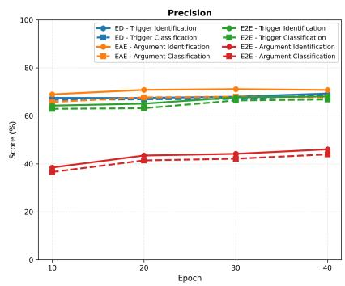

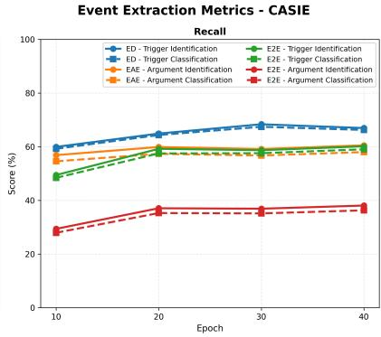

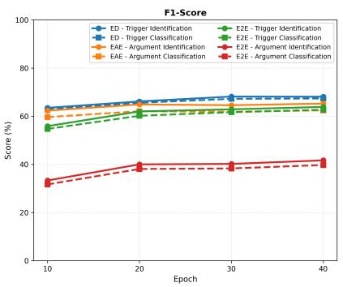  
(a) Training dynamics across epochs. Each row shows precision, recall, and F1-score curves over epochs for ED, EAE, and E2E paradigms on the CASIE dataset.

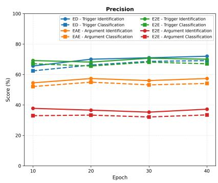

Event Extraction Metrics - M2E2  
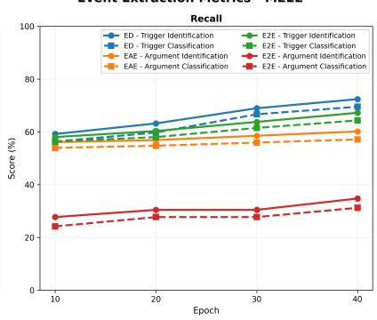

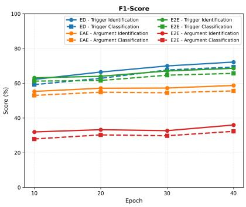  
(b) Training dynamics across epochs. Each row shows precision, recall, and F1-score curves over epochs for ED, EAE, and E2E paradigms on the M2E2 dataset.

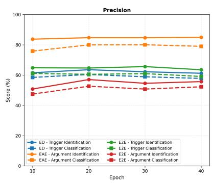

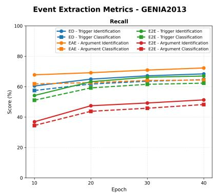  
(c) Training dynamics across epochs. Each row shows precision, recall, and F1-score curves over epochs for ED, EAE, and E2E paradigms on the Genia2013 dataset.

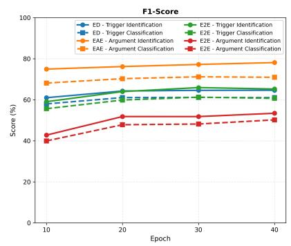

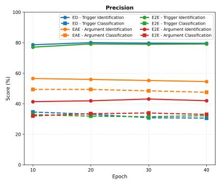

Event Extraction Metrics - RAMS  
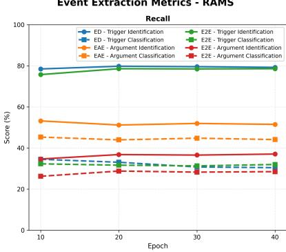

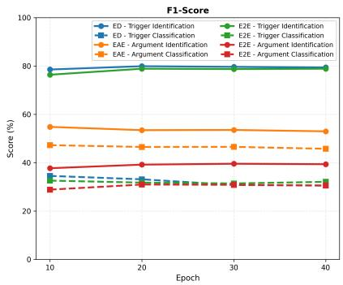  
(a) Training dynamics across epochs. Each row shows precision, recall, and F1-score curves over epochs for ED, EAE, and E2E paradigms on the RAMS dataset.

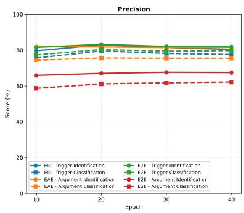

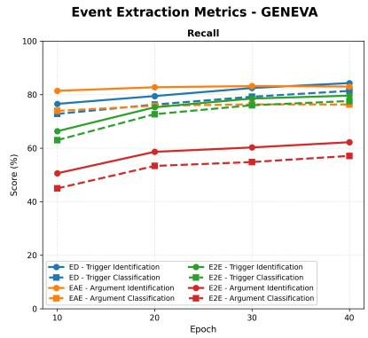

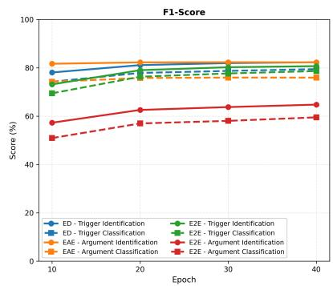  
(b) Training dynamics across epochs. Each row shows precision, recall, and F1-score curves over epochs for ED, EAE, and E2E paradigms on the Geneva dataset.

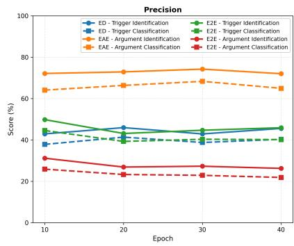

Event Extraction Metrics - WIKIEVENTs  
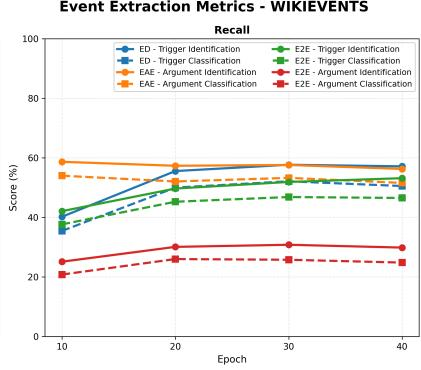  
(c) Training dynamics across epochs. Each row shows precision, recall, and F1-score curves over epochs for ED, EAE, and E2E paradigms on the WikiEvents dataset.

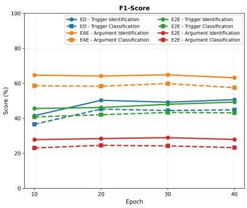

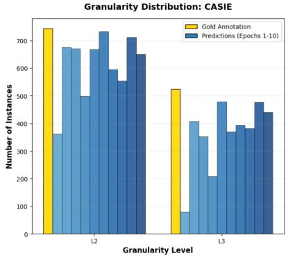

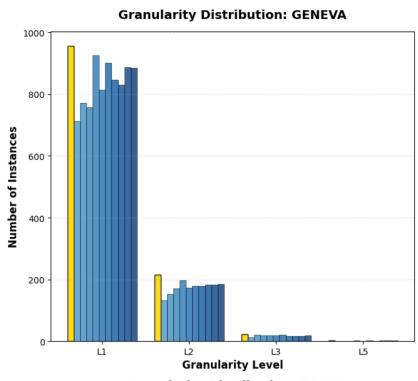

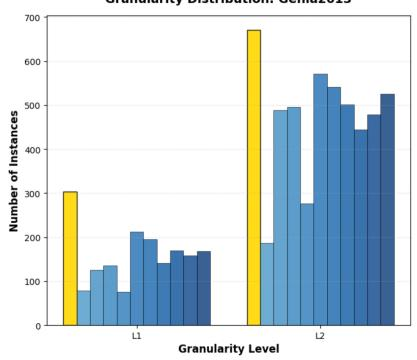

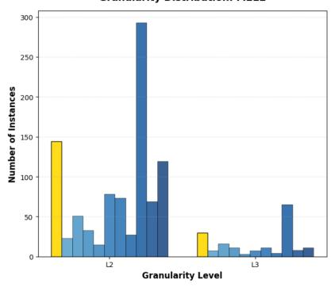

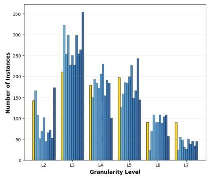

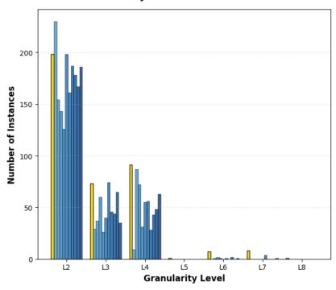  
Figure 5: Comparison of event type granularity distributions of different datasets between annotation and predictions across training Epochs

<table><tr><td rowspan=1 colspan=23>Single-Domain                               Multi-Domain</td></tr><tr><td rowspan=1 colspan=23>Sub-Task       Reference            Input (Single)         Prediction (Single)     Input (Multi)          Prediction (Multi)</td></tr><tr><td rowspan=1 colspan=5>TI            When farmers became</td><td rowspan=1 colspan=11>Domain: geneva. Identify When farmers</td><td rowspan=3 colspan=7>Domain: geneva. Identify When farmerstrigger words. When     trigger&gt;became&gt; capablefarmers became capable of of trigger&gt;producing&gt; food</td></tr><tr><td rowspan=7 colspan=5>capable of producing foodbeyond the needs of theirown families, others intheir society were freed todevote themselves toprojects other than foodtrigger&gt;acquisition&gt;.</td><td rowspan=2 colspan=5>trigger words. Whenfarmers became capable of of</td><td rowspan=2 colspan=6>trigger&gt;became&gt; capabletrigger&gt;producing&gt; food</td></tr><tr><td rowspan=1 colspan=5>armers became capable of</td></tr><tr><td rowspan=2 colspan=5>producing food beyond theneeds of their own families,</td><td rowspan=1 colspan=6>beyond the needs of their</td><td rowspan=5 colspan=7>producing food beyond the beyond the needs of theirneeds of their own families, own families, others inothers in their society were their society were freed toprojects other than foodacquisition.            trigger&gt;acquisition&gt;</td></tr><tr><td rowspan=1 colspan=6>own families, others in</td></tr><tr><td rowspan=1 colspan=1>d</td><td rowspan=1 colspan=5>freed to devote themselves</td><td rowspan=1 colspan=6>devote themselves to</td><td rowspan=1 colspan=6>freed to devote themselves</td></tr><tr><td rowspan=1 colspan=2></td><td rowspan=1 colspan=5>to projects other than food</td><td rowspan=1 colspan=6>projects other than food</td><td rowspan=1 colspan=6>to projects other than food</td></tr><tr><td rowspan=1 colspan=2></td><td rowspan=1 colspan=5>acquisition.</td><td rowspan=1 colspan=6>trigger&gt;acquisition&gt;.</td></tr><tr><td rowspan=10 colspan=5>ED-pipeline     acquisition=Getting</td><td rowspan=1 colspan=1></td><td rowspan=1 colspan=5>Domain: geneva. Classify</td><td rowspan=1 colspan=8>became=Becoming I</td><td rowspan=1 colspan=3>Domain: geneva. Classify</td><td rowspan=2 colspan=1>became=Becomingproducing=Manufacturing</td></tr><tr><td rowspan=1 colspan=5>trigger types. When</td><td rowspan=1 colspan=6>producing=Manufacturing t</td><td rowspan=1 colspan=6>rigger types. When</td></tr><tr><td rowspan=1 colspan=5>farmers trigger&gt;became&gt;</td><td rowspan=1 colspan=6></td><td rowspan=3 colspan=6>farmers trigger&gt;became&gt;</td><td rowspan=8 colspan=1></td></tr><tr><td rowspan=1 colspan=5>capable of</td><td rowspan=1 colspan=6>acquisition=Getting</td><td rowspan=4 colspan=6>beyond the needs of theirown families, others in</td><td rowspan=2 colspan=1>acquisition=Getting</td></tr><tr><td rowspan=1 colspan=5>trigger&gt;producing&gt; food</td><td rowspan=2 colspan=6></td></tr><tr><td rowspan=1 colspan=4>beyond the needs o</td><td rowspan=1 colspan=2>f their</td><td rowspan=1 colspan=1></td></tr><tr><td rowspan=1 colspan=2>own families, others in</td><td></td><td></td><td rowspan=1 colspan=1>in</td><td rowspan=1 colspan=6></td><td rowspan=1 colspan=4>own families,</td></tr><tr><td rowspan=1 colspan=2>their societ</td><td rowspan=1 colspan=3>y were</td><td rowspan=1 colspan=2>freed to</td><td rowspan=1 colspan=6></td><td rowspan=3 colspan=6>their society were freed todevote themselves toprojects other than foodtrigger&gt;acquisition&gt;.</td></tr><tr><td rowspan=1 colspan=2></td><td rowspan=1 colspan=4>devote themselves to</td><td rowspan=1 colspan=3>selves to</td><td rowspan=1 colspan=6></td></tr><tr><td rowspan=1 colspan=5>projects other than foodtrigger&gt;acquisition&gt;.</td><td rowspan=1 colspan=6></td></tr><tr><td rowspan=1 colspan=5>ED-e2e         trigger&gt;acquisition&gt;</td><td rowspan=1 colspan=5>Domain: geneva. Classify</td><td rowspan=1 colspan=6>trigger&gt;became&gt;</td><td rowspan=1 colspan=6>Domain: geneva. Classify</td><td rowspan=6 colspan=1>trigger&gt;became&gt;=Becoming Itrigger&gt;producing&gt;=Manufacturing Itrigger&gt;acquisition&gt;=Getting</td></tr><tr><td rowspan=9 colspan=5></td><td rowspan=1 colspan=6>=Getting</td><td rowspan=1 colspan=8>trigger types end-to-end.</td><td rowspan=1 colspan=3>=Becoming I</td><td rowspan=1 colspan=1>trigger types end-to-end.</td></tr><tr><td rowspan=1 colspan=5>When farmers became</td><td rowspan=1 colspan=6>trigger&gt;producing&gt;</td><td rowspan=1 colspan=6>When farmers became</td></tr><tr><td rowspan=1 colspan=5>capable of producing food</td><td rowspan=1 colspan=6>=Manufacturing I</td><td rowspan=1 colspan=6>capable of producing food</td></tr><tr><td rowspan=1 colspan=5>beyond the needs of their</td><td rowspan=1 colspan=6>trigger&gt;freed&gt;</td><td rowspan=1 colspan=6>bevond the needs of their</td></tr><tr><td rowspan=1 colspan=5>own families, others in</td><td rowspan=1 colspan=6>=Causation I</td><td rowspan=1 colspan=6>own families, others in</td></tr><tr><td rowspan=1 colspan=5>their society were freed to</td><td rowspan=1 colspan=6>trigger&gt;acquisition&gt;</td><td rowspan=1 colspan=6>their society were freed to</td><td rowspan=4 colspan=1></td></tr><tr><td rowspan=1 colspan=5>devote themselves to</td><td rowspan=1 colspan=6>=Getting</td><td rowspan=1 colspan=6>devote themselves to</td></tr><tr><td rowspan=1 colspan=5>projects other than food</td><td rowspan=1 colspan=6></td><td rowspan=1 colspan=6>projects other than food</td></tr><tr><td rowspan=1 colspan=5>acquisition.</td><td rowspan=1 colspan=6></td><td rowspan=1 colspan=6>acquisition.</td></tr><tr><td rowspan=1 colspan=5>EAE(ED-pipeline) trigger&gt;acquisition&gt;</td><td rowspan=1 colspan=5>Domain: geneva. Extract</td><td rowspan=1 colspan=6>trigger&gt;</td><td rowspan=1 colspan=6>Domain: geneva. Extract</td><td rowspan=2 colspan=1>trigger&gt;became&gt;=Becoming:</td></tr><tr><td rowspan=12 colspan=5>None=Source Iargument&gt;food&gt;=Theme</td><td rowspan=2 colspan=9></td><td rowspan=1 colspan=7>arguments for a specific</td><td rowspan=1 colspan=2>became&gt;=Becoming:</td></tr><tr><td rowspan=1 colspan=5>event. argument&gt; Entity I</td><td rowspan=1 colspan=6>argument&gt;</td><td rowspan=1 colspan=6>event. argument&gt; Entity I</td><td rowspan=4 colspan=1>argument&gt;farmers&gt;=Entity None=Final_category Iargument&gt; capable of</td></tr><tr><td rowspan=1 colspan=5>Final_category I</td><td rowspan=1 colspan=6>farmers&gt;=Entity </td><td rowspan=1 colspan=6>Final_category I</td></tr><tr><td rowspan=1 colspan=5>Final_quality for trigger&gt;</td><td rowspan=1 colspan=6>None=Final_category I</td><td rowspan=1 colspan=6>Final_quality for trigger&gt;</td></tr><tr><td rowspan=1 colspan=5>became&gt;=Becoming;</td><td rowspan=1 colspan=6>argument&gt; capable of</td><td rowspan=1 colspan=6>became&gt;=Becoming;</td></tr><tr><td rowspan=1 colspan=5>argument&gt; Factory I</td><td rowspan=1 colspan=6>producing food beyond the</td><td rowspan=1 colspan=6>argument&gt; Factory I</td><td rowspan=1 colspan=1>producing food beyond the</td></tr><tr><td rowspan=2 colspan=4></td><td rowspan=1 colspan=5>Instrument | Producer I</td><td rowspan=1 colspan=6>needs of their own</td><td rowspan=1 colspan=6>Instrument | Producer I</td><td rowspan=1 colspan=1>needs of their own</td></tr><tr><td rowspan=1 colspan=4></td><td rowspan=1 colspan=5>Product | Resource for</td><td rowspan=1 colspan=6>families&gt;=Final_quality;</td><td rowspan=1 colspan=6>Product | Resource for</td><td rowspan=1 colspan=1>families&gt;=Final_quality;</td></tr><tr><td rowspan=1 colspan=4></td><td rowspan=1 colspan=5>trigger&gt; produc-</td><td rowspan=1 colspan=6>trigger&gt; producing&gt;</td><td rowspan=1 colspan=6>trigger&gt; producing&gt;=</td><td rowspan=3 colspan=1>trigger&gt; produc-ing&gt;=Manufacturing:None=Factory I</td></tr><tr><td rowspan=1 colspan=5>ing&gt;=Manufacturing;</td><td rowspan=1 colspan=6>=Manufacturing:</td><td rowspan=1 colspan=6>Manufacturing; argument&gt;</td></tr><tr><td rowspan=1 colspan=5>argument&gt; Means I</td><td rowspan=1 colspan=6>None=Factory </td><td rowspan=1 colspan=6>Means I Recipient I Source</td></tr><tr><td rowspan=1 colspan=5>Recipient I Source I Theme</td><td rowspan=1 colspan=6>None=Instrument I</td><td rowspan=1 colspan=6>I Theme for</td><td rowspan=1 colspan=1>None=Instrument I</td></tr><tr><td rowspan=11 colspan=5></td><td rowspan=1 colspan=5>for trigger&gt;acquisition&gt;</td><td rowspan=1 colspan=6>argument&gt;</td><td rowspan=1 colspan=6>trigger&gt;acquisition&gt;</td><td rowspan=2 colspan=1>argument&gt;farmers&gt;=Producer I</td></tr><tr><td rowspan=1 colspan=5>=Getting: When farmers</td><td rowspan=1 colspan=6>farmers&gt;=Producer I</td><td rowspan=1 colspan=6>=Getting: When farmers</td></tr><tr><td rowspan=1 colspan=5>became capable of</td><td rowspan=1 colspan=6>argument&gt; food beyond th</td><td rowspan=1 colspan=6>e became capable of</td><td rowspan=1 colspan=1>argument&gt; food&gt;=Product</td></tr><tr><td rowspan=1 colspan=5>producing food beyond the</td><td rowspan=1 colspan=6>needs of their own</td><td rowspan=1 colspan=6>producing food beyond the | N</td><td rowspan=1 colspan=1>one=Resource; trigger&gt;</td></tr><tr><td rowspan=1 colspan=5>needs of their own</td><td rowspan=1 colspan=6>families&gt;=Product I</td><td rowspan=1 colspan=6>needs of their own</td><td rowspan=1 colspan=1>acquisition&gt;=Getting:</td></tr><tr><td rowspan=1 colspan=5>families...</td><td rowspan=1 colspan=6>None=Resource;</td><td rowspan=1 colspan=6>families...</td><td rowspan=1 colspan=1>None=Means I</td></tr><tr><td rowspan=1 colspan=5></td><td rowspan=1 colspan=6>trigger&gt;acquisition&gt;</td><td rowspan=1 colspan=6></td><td rowspan=1 colspan=1>None=Recipient I</td></tr><tr><td rowspan=1 colspan=5></td><td rowspan=1 colspan=6>=Getting: None=Means I</td><td rowspan=1 colspan=6></td><td rowspan=1 colspan=1>None=Source I argument&gt;</td></tr><tr><td rowspan=1 colspan=5></td><td rowspan=1 colspan=6>None=Recipient I</td><td rowspan=1 colspan=6></td><td rowspan=3 colspan=1>food&gt;=Theme</td></tr><tr><td rowspan=1 colspan=5></td><td rowspan=1 colspan=6>None=Source I</td><td rowspan=2 colspan=6></td></tr><tr><td rowspan=1 colspan=5></td><td rowspan=1 colspan=6>argument&gt;food&gt;=Theme</td></tr><tr><td rowspan=1 colspan=5>End-to-End      trigger&gt;acquisition&gt;</td><td rowspan=1 colspan=5>Domain: geneva. Event</td><td rowspan=1 colspan=6>trigger&gt;became&gt;</td><td rowspan=1 colspan=6>Domain: geneva. Event</td><td rowspan=1 colspan=1>trigger&gt;became&gt;</td></tr><tr><td rowspan=20 colspan=10>=Getting Iargument&gt;food&gt;=Theme  extraction. When farmersneeds of their own families, producing food beyond the</td><td rowspan=1 colspan=6>trigger and argument</td><td rowspan=1 colspan=6>=Becoming I</td><td rowspan=1 colspan=1>trigger and argument</td></tr><tr><td rowspan=1 colspan=5>extraction. When farmers</td><td rowspan=1 colspan=6>argument&gt;farmers&gt;</td><td rowspan=1 colspan=6>extraction. When farmers</td><td rowspan=4 colspan=1>argument&gt;farmers&gt;=Entity Igument&gt;capable ofproducing food beyond the</td></tr><tr><td rowspan=1 colspan=5>became capable of</td><td rowspan=1 colspan=6>=Entity I</td><td rowspan=1 colspan=6>became capable of</td></tr><tr><td rowspan=1 colspan=5>producing food beyond the</td><td rowspan=1 colspan=6>argument>capable of</td><td rowspan=1 colspan=6>producing food beyond the ar</td></tr><tr><td rowspan=1 colspan=5>needs of their own families.</td><td rowspan=1 colspan=6>producing food beyond the</td><td rowspan=1 colspan=6>needs of their own families,</td></tr><tr><td rowspan=1 colspan=5>others in their society were</td><td rowspan=1 colspan=6>needs of their own</td><td rowspan=1 colspan=6>others in their society were</td><td rowspan=2 colspan=1>needs of their ownmilies&gt;</td></tr><tr><td rowspan=1 colspan=5>freed to devote themselves</td><td rowspan=1 colspan=6>families></td><td rowspan=1 colspan=6>freed to devote themselves fa</td></tr><tr><td rowspan=1 colspan=5>to projects other than food</td><td rowspan=1 colspan=6>=Final_category ||</td><td rowspan=1 colspan=6>to projects other than food</td><td rowspan=1 colspan=1>=Final_quality||</td></tr><tr><td rowspan=1 colspan=5></td><td rowspan=1 colspan=6>trigger&gt;producing&gt;=Manufacturing</td><td rowspan=1 colspan=6>acquisition.</td><td rowspan=2 colspan=1>trigger&gt;producing&gt;=Manufacturingargument&gt;farmers&gt;</td></tr><tr><td rowspan=1 colspan=5></td><td></td><td></td><td></td><td></td><td></td><td></td><td></td><td></td><td></td><td></td><td></td><td></td></tr><tr><td rowspan=1 colspan=5></td><td rowspan=1 colspan=6>=Producer I</td><td rowspan=1 colspan=6></td><td rowspan=1 colspan=1>=Producerl</td></tr><tr><td rowspan=2 colspan=6>argument&gt;food&gt;</td><td rowspan=1 colspan=6></td><td rowspan=4 colspan=1>argument&gt;food&gt;trigger&gt;acquisition&gt;=Gettinglargument&gt;food&gt;</td></tr><tr><td rowspan=1 colspan=4>=Product</td><td rowspan=1 colspan=6></td><td rowspan=1 colspan=1>Product ||</td></tr><tr><td rowspan=1 colspan=5>trigger&gt;freed&gt;=Causation I</td><td rowspan=1 colspan=1>tion</td><td></td><td rowspan=1 colspan=6></td><td rowspan=1 colspan=1>ger>a</td></tr><tr><td rowspan=1 colspan=3>argument&gt;other</td><td rowspan=1 colspan=4>s in their</td><td rowspan=1 colspan=6></td></tr><tr><td rowspan=5 colspan=13>society&gt;                                    =Theme=Affected I argument&gt;toprojects other than foodtrigger&gt;acquisition&gt;=Getting Iargument&gt;food&gt;=Theme</td><td rowspan=1 colspan=4></td><td rowspan=1 colspan=4>II argument>to</td><td rowspan=1 colspan=1></td><td rowspan=1 colspan=1></td></tr><tr><td rowspan=1 colspan=6>devote themselves to</td></tr><tr><td rowspan=1 colspan=6>projects other than food</td><td rowspan=1 colspan=2></td><td rowspan=1 colspan=2></td><td rowspan=1 colspan=3></td></tr><tr><td rowspan=1 colspan=6></td></tr><tr><td rowspan=1 colspan=4></td></tr></table>

Table 12: Comparison of prediction per sub-task between single-domain and multi-domain models on Geneva.