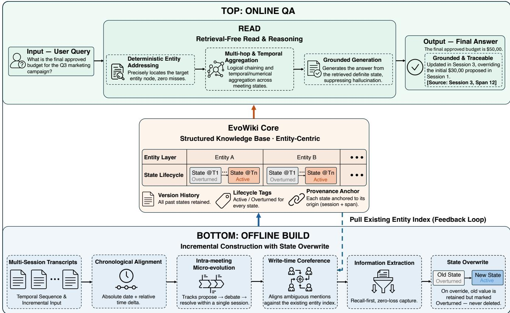
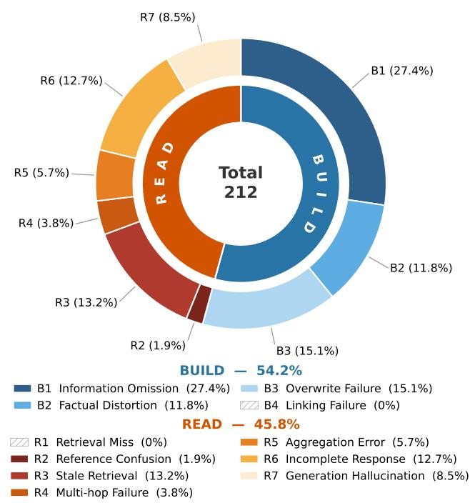
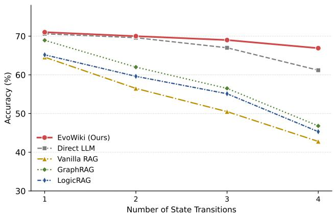
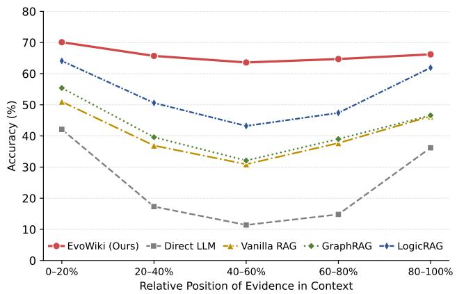
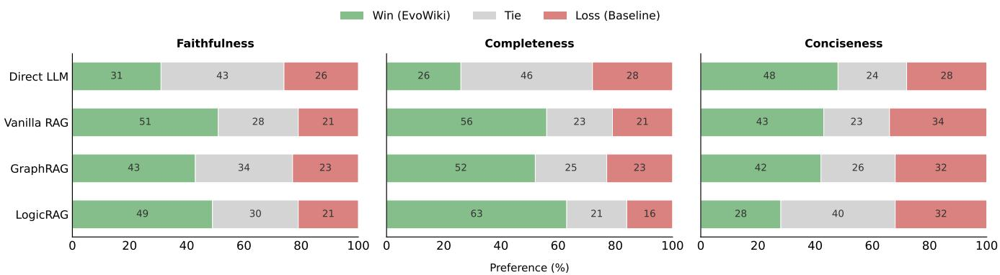

# EvoWiki: Incremental State Overwriting and Traceable Question Answering for Cross-Meeting Knowledge Evolution

Dongsheng Chen, Tianyu Wang, Wenhui Que

WeChat, Tencent Inc., Beijing, China {joeydschen, tianyuwang, victorque}@tencent.com

## Abstract

In long-term collaboration spanning multiple meetings, fac- tual states such as decisions, risks, and ownership are contin- ually revised, overturned, and replaced. Existing long-context methods typically stack the entire history, while many RAG, LLM-Wiki, and structured-memory methods organize knowl- edge as static or append-only facts and rely on semantic relevance at read time. Without explicit modeling of intra meeting decision processes and knowledge lifecycles, these approaches may retain conflicting old and new states simulta neously or discard history when updating snapshots, leading to stale retrieval and answers that are dificult to verify. We present EvoWiki (Evolving Wiki), an incremental question-answering architecture for dynamic long-form text. EvoWiki decouples ofline incremental construction (Build) from online structured reading (Read). Build captures the intra-meeting micro-evolution from proposal through discussion to decision and uses entity version chains and a fine-grained State-Overwrite Protocol to explicitly distinguish current valid states from superseded history while preserving meeting-level provenance anchors. Read bypasses relevance-based Top-k retrieval over raw meetings and performs deterministic entity addressing, temporal resolution, and cross-entity multi-hop aggregation over the complete Wiki to produce grounded and traceable answers. We further introduce CrossMeet, a high- fidelity bilingual benchmark derived from real-world busi- ness seeds and designed to simulate long-term state evolu tion, covering factual consistency, temporal reasoning, and cross-meeting multi-hop reasoning. Across six datasets and two reader models, EvoWiki improves macro-average Judge Accuracy over the strongest baselines by 9.72 and 10.00 per- centage points, respectively. Further analyses and human eval- uation show that EvoWiki is more robust and factually faithful under frequent state flips, validating valid-state-oriented evo- lutionary reading as a more reliable technical approach to cross-meeting knowledge evolution.

## Introduction

Successive meeting records characterize evolving project states: key decisions, risks, and responsibilities may be re- peatedly revised, and historically valid statements may no longer represent current decisions. Cross-meeting QA must therefore identify the version valid at the query time and trace it to its source meeting. Prior work exposes the temporal- awareness limitations of static models and the challenges of meeting understanding, long-context QA, and cross-session knowledge updates (Li et al. 2026; Prasad et al. 2023; Thonet, Besacier, and Rozen 2025; Wu et al. 2024), but existing tasks still inadequately cover role binding, version replacement, and multi-hop evidence composition across meetings.

Three approaches remain insuficient. Long-context mod- els place meeting histories in a single window, but nominal length does not guarantee reliable evidence use or reason- ing (Hsieh et al. 2024; Yen et al. 2025; Modarressi et al. 2025). Conventional RAG (Lewis et al. 2020) ranks evidence by semantic relevance rather than validity; even recency- and conflict-aware methods (Vu et al. 2024; Wang et al. 2025) may assign similar relevance to obsolete and current statements about the same entity. LLM-Wiki and structured- memory methods improve knowledge organization (Sarthi et al. 2024; Edge et al. 2024; Gutiérrez et al. 2025; Chen et al. 2026b) but do not model the lifecycles and replacement relations of cross-meeting decisions. Superseded and current states may therefore coexist and cause stale retrieval.

We therefore propose EvoWiki (Evolving Wiki). Build captures proposal–discussion–decision evolution and main- tains versions and provenance through write-time corefer- ence resolution, entity routing, and state overwriting; Read deterministically reads valid states from the complete Wiki without accessing raw meetings. This asymmetry moves dis- ambiguation and conflict resolution to write time. We also introduce bilingual CrossMeet. Across six datasets and two readers, EvoWiki sur asses the stron est baselines b 9.72 and 10.00 percentage points, with additional analyses con- firming robustness and factual faithfulness. The dataset and implementation will be released upon acceptance. Our con- tributions are: (1) We propose EvoWiki, whose asymmet-ric Build–Read design combines intra-meeting evolution, entity version chains, and fine-grained state overwriting to maintain a current valid view with traceable history and evidence. (2) We construct CrossMeet, a bilingual cross-meeting benchmark covering factual consistency, temporal reasoning, and multi-hop QA; each language contains 100 projects, 500 high-fidelity simulated meetings, and 2,000 QA pairs with average contexts exceeding 26K tokens, plus question-type, reasoning-hop, and cross-meeting evidence- chain annotations. (3) We enable traceable valid-state rea-soning with low hallucination risk: experiments across six benchmarks and two readers, together with state-flip analy- sis and human evaluation, show reliable valid-state reading and factually faithful answers with verifiable evidence.

## Related Work

## Long-Context QA, Long-Term Memory, and Meetings

Long-context models and RAG ofer complementary performance–cost profiles (Li et al. 2024), yet nominal window length does not guarantee reliable evidence use (Bai et al. 2025; Hsieh et al. 2024; Yen et al. 2025; Modarressi et al. 2025). Prior work covers conversational evaluation and temporal or structured agent memory (Wu et al. 2024; Su et al. 2026; Latimer et al. 2026; Jiang et al. 2026), meeting understanding, QA, and generation (Prasad et al. 2023; Thonet, Besacier, and Rozen 2025; Zhu et al. $2 0 2 5 \mathrm { a } ;$ Kirstein et al. 2025), and general multi-hop reasoning (Trivedi et al. 2022). Most tasks focus on single meetings, general mem-ory, or static evidence; CrossMeet targets state evolution, role binding, and multi-hop evidence across bilingual meet- ing sequences.

## Retrieval-Augmented Generation and Structured Knowledge

Classical RAG accesses external memory through sparse, dense, or hybrid retrieval (Lewis et al. 2020; Robertson and Zaragoza 2009; Karpukhin et al. 2020; Zhang et al. 2025); Self-RAG, Corrective RAG, and Adaptive-RAG improve re- trieval control (Asai et al. 2024; Yan et al. 2024; Jeong et al. 2024). WiCER compiles sources into persistent LLM-Wiki memory (Huerta 2026). RAPTOR, GraphRAG/LightRAG, and HippoRAG 2/LogicRAG respectively use hierarchical summaries, entity graphs, and associative or multi-step rea- soning (Sarthi et al. 2024; Edge et al. 2024; Guo et al. 2024; Gutiérrez et al. 2025; Chen et al. 2026b); other work studies adaptive structures, graph expansion, and path pruning (Li et al. 2025; Zhu et al. 2025b; Chen et al. 2026a). These meth-ods do not explicitly maintain cross-meeting decision life- cycles and replacement relations. EvoWiki maintains both a current valid view and traceable version history at write time.

## Temporal Updating, Traceability, and Evaluation

Temporal retrieval handles time-sensitive and arriving knowledge (Vu et al. 2024; Zhang et al. 2024; Schumacher et al. 2025; Hou et al. 2025; Liska et al. 2022). Paramet-ric editing studies fact localization, multi-hop consistency, and lifelong updates (Meng et al. 2022; Zhong et al. 2023; Wang et al. 2024; Fang et al. 2025; Cheng et al. 2025), but struggles to preserve meeting-level provenance; exist- ing evaluation also examines factual retrieval and reasoning (Krishna et al. 2025). EvoWiki instead binds current and superseded states to evidence in a versioned ledger, jointly supporting valid-state QA and historical audit. Unlike tem-poral knowledge graphs or append-only event sourcing, it processes unstructured meeting streams and maintains entity lifecycles at write time.

## Methodology

## Task Formulation

Given a chronologically ordered meeting sequence

$$
\mathcal { D } = \{ M _ { 1 } , M _ { 2 } , \ldots , M _ { T } \} ,\tag{1}
$$

the goal is to answer query q after processing the T-th meeting. Unlike static multi-document QA, an entity’s attributes may be supplemented, replaced, or overturned by later meet- ings; the system must identify the state valid at the query time while retaining the historical evidence for its evolution.

EvoWiki represents atomic meeting knowledge as

$$
s _ { i } = \langle e _ { i } , r _ { i } , v _ { i } , \tau _ { i } , \ell _ { i } , p _ { i } \rangle ,\tag{2}
$$

where $e _ { i } , r _ { i } , v _ { i } , \tau _ { i } , \ell _ { i }$ denote the canonical entity, attribute or relation, state value, efective time, and lifecycle label, re- spectively, while $p _ { i } = ( m _ { i } , \mathrm { s p a n } _ { i } )$ denotes the source meet- ing and evidence span. The system maintains a structured Wiki ${ \mathcal { W } } _ { t }$ under the causal constraint

$$
\mathcal { W } _ { t } = F _ { \mathrm { B u i l d } } ( \mathcal { W } _ { t - 1 } , M _ { t } ) ,\tag{3}
$$

so processing $M _ { t }$ accesses only the prior Wiki and the current meeting, never future meeting information.

## Build–Read Architecture

Figure 1 presents EvoWiki’s three components. Ofline Build performs temporal alignment, intra-meeting micro- evolution parsing, write-time coreference resolution, infor- mation extraction, entity routing, and state overwriting. EvoWiki Core stores entities, active states, complete ver- sion histories, lifecycle labels, and provenance anchors. On- line Read uses the complete Wiki as its sole context and generates an answer through deterministic entity address- ing, cross-entity multi-hop reasoning, and temporal aggregation; provenance anchors bound to supporting states enable evidence-trail recovery. This read/write asymmetry moves temporal alignment, entity disambiguation, and conflict reso- lution to write time, lets queries reuse the construction result, and transforms online QA from re-identifying valid facts in conflicting passages into reading valid versions from a nor- malized state space.

## Ofline Incremental Construction

For each meeting $M _ { t } .$ , Build executes four steps. First, tem- poral alignment (Resolve) normalizes the meeting timeline from dates and relative time expressions and parses the intra- meeting micro-evolution from proposal through discussion to decision, preventing candidate plans from being written as final states. Second, write-time coreference resolution (Coref) combines the current meeting with the entity index in $\mathcal { W } _ { t - 1 }$ to map expressions such as “the client,” “the above risk,” or role titles to canonical entities. Fact extraction (Extract) then produces candidate updates, and entity routing (Route) binds them to the corresponding entity–attribute slots. Finally, the State-Overwrite Protocol merges the update set $\mathcal { U } _ { t }$ into the Wiki:

$$
\mathcal { U } _ { t } = \mathrm { R o u t e } ( \mathrm { E x t r a c t } ( \mathrm { C o r e f } ( \mathrm { R e s o l v e } ( M _ { t } ) , \mathcal { W } _ { t - 1 } ) ) ) ,\tag{4}
$$

$$
\mathcal { W } _ { t } = \mathrm { O v e r w r i t e } ( \mathcal { W } _ { t - 1 } , \mathcal { U } _ { t } ) .\tag{5}
$$

  
Figure 1: EvoWiki architecture. Build writes meetings chronologically into an entity-centered core with version and provenance information. Wiki-only Read uses deterministic addressing and cross-entity temporal aggregation to produce a grounded answer while retaining state-level provenance for evidence-trail recovery.

Write-time coreference resolution and entity routing con- solidate cross-meeting aliases, job titles, and elliptical ex-pressions into one entity version chain, enabling strong role binding.

## State Overwriting and the Structured Wiki

EvoWiki represents its knowledge base as

$$
\mathcal { W } _ { t } = ( \mathcal { E } _ { t } , \mathcal { H } _ { t } , \mathcal { A } _ { t } , \mathcal { P } _ { t } ) ,\tag{6}
$$

whose components denote entities and relations, complete version histories, the current active-state view, and prove- nance anchors. For each entity–attribute pair (e, r), the system maintains a chronologically ordered version chain

$$
\mathcal { H } _ { e , r } ^ { ( t ) } = \langle s _ { e , r } ^ { 1 } , s _ { e , r } ^ { 2 } , . . . , s _ { e , r } ^ { n } \rangle .\tag{7}
$$

When a new state replaces, revises, or revokes the current active state, the old record is not physically deleted. The protocol closes its validity interval, labels it Overturned, appends the new state with an Active label, and creates an explicit version-replacement edge. Facts that do not conflict with the attribute remain in their respective slots. For any fixed entity–attribute pair, the protocol maintains at most one active version, where 1[·] denotes the indicator function:

$$
\sum _ { s \in \mathcal { H } _ { e , r } ^ { ( t ) } } \mathbf { 1 } [ \ell ( s ) = \mathrm { A c t i v e } ] \leq 1 .\tag{8}
$$

The current state therefore has a unique canonical entry point, while superseded versions and their provenance remain avail- able for historical queries and audit. If a state’s validity inter- val is $I ( s ) = [ \tau _ { \mathrm { s t a r t } } , \tau _ { \mathrm { e n d } } )$ , a query targeting time $\tau _ { q }$ reads the version satisfying $\tau _ { q } \in I ( s )$ ; a current-state query without an explicit time defaults to the active version.

## Wiki-Only Online Reading

During Read, the complete Wiki is serialized as the sole knowledge context:

$$
C _ { T } = \mathrm { S e r i a l i z e } ( \mathcal { W } _ { T } ) , \qquad ( \hat { y } , \hat { S } _ { q } ) = G ( q \mid C _ { T } ) ,\tag{9}
$$

where $\hat { y }$ is the answer and $\hat { S } _ { q }$ contains its supporting Wiki- state identifiers. Only $\hat { y }$ is evaluated; $\hat { S } _ { q }$ remains metadata for evidence-trail recovery via the traceability mechanism described below. Read is isolated from raw meetings: it per- forms no source-text Top-k retrieval and has no fallback that accesses raw meetings when the context window permits. Online inference locates valid states, performs multi-hop or temporal aggregation along entity relations and version timelines, and generates answers from those states and their provenance anchors. “Deterministic Entity Addressing” in Figure 1 denotes reading valid states in the Wiki by entity, attribute, and lifecycle label rather than retrieving raw meet- ings or an external corpus. Because Build has written valid states into a unified structure, Read bypasses source-text rel- evance ranking and Top-k errors without deciding the current version among mixed old and new passages.

## Traceability and Cost

Every state is linked to its source meeting and evidence span, while version-replacement edges record how states evolve. For the supporting-state set $\hat { S } _ { q }$ returned with an answer, its evidence chain is

$$
\operatorname { T r a c e } ( \hat { y } ) = \bigcup _ { s \in \hat { S } _ { q } } p ( s ) \cup \operatorname { V e r s i o n E d g e s } ( \hat { S } _ { q } ) .\tag{10}
$$

The system can therefore locate the meeting evidence sup- porting the final answer and trace why one state replaced an earlier version. If all meetings produce U state updates, retaining all historical versions requires $O ( U )$ storage. For a serialized Wiki of length $S _ { W }$ , each query has an input-context size of $O ( S _ { W } )$ and makes no retrieval call to an external corpus. The main Build cost occurs during ofline writing and can be amortized over subsequent queries; corre- spondingly, complete-Wiki input length grows linearly with $\bar { S } _ { W }$ . This linear reading cost is an explicit architectural trade- of for broader state coverage and reduced risks of retrieval omission and obsolete-version selection.

## Experimental Setup

## CrossMeet Construction and Quality Validation

CrossMeet follows a controlled project-blueprint–meetingsequence–cross-meeting-QA pipeline. Its English and Chi-nese versions are generated independently rather than trans- lated from one another. To improve the business realism of the simulated meetings, project blueprints are expanded from abstract project topics representing common workflows on large-scale digital platforms. Only generic topic cate- gories and collaboration patterns are used, without any real business records, personal identifiers, operational metrics, or sensitive business content. Claude Opus 4.5 (Anthropic 2025) constructs the meetings and QA instances; Gemini 3.1 Pro (Google DeepMind 2026), Claude Opus 4.7 (Anthropic 2026), and DeepSeek-V4-Pro (Xu et al. 2026) cross-validate answer–evidence consistency, answerability, and question- type labels and independently classify question types to com- pute Fleiss’ κ as agreement over the three categories.

Table 1 summarizes dataset scale and quality. Each lan- guage contains 100 projects, 500 consecutive meetings, and 2,000 QA pairs, with average context lengths of 26,861 and 29,480 tokens for English and Chinese, respectively. Fleiss’ κ for the three-model question-type classification is 0.937 in English and 0.909 in Chinese, indicating high agreement in the task taxonomy. Table 2 reports question-type and hop distributions: factual-consistency, temporal-reasoning, and cross-meeting multi-hop questions account for 50%, 30%, and 20%. Every question requires at least two hops; four- and five-hop instances constitute 21.2% of the English data and 19.3% of the Chinese data, ensuring long-evidence-chain coverage.

<table><tr><td>Metric</td><td>CM-EN</td><td>CM-ZH</td></tr><tr><td>Topics</td><td>100</td><td>100</td></tr><tr><td>Meetings</td><td>500</td><td>500</td></tr><tr><td>QA Pairs</td><td>2,000</td><td>2,000</td></tr><tr><td>Context Tokens (Avg.)</td><td>26,861</td><td>29,480</td></tr><tr><td>Answer Tokens (Avg.)</td><td>64.6</td><td>108.1</td></tr><tr><td>Reasoning Hops (Avg. / Max.)</td><td>2.84 / 5</td><td>2.77 / 5</td></tr><tr><td>Taxonomy κ</td><td>0.937</td><td>0.909</td></tr></table>

Table 1: Statistics of CrossMeet-EN and CrossMeet-ZH. Taxonomy κ measures question-type classification agree-ment among three validation models.
<table><tr><td>Dimension</td><td>Type</td><td>CM-EN</td><td>CM-ZH</td></tr><tr><td rowspan="3">Question</td><td>Factual Consistency</td><td>1000 (50.0%)</td><td>1000 (50.0%)</td></tr><tr><td>Timeline Reasoning</td><td>600 (30.0%)</td><td>600 (30.0%)</td></tr><tr><td>Multi-hop Reasoning</td><td>400 (20.0%)</td><td>400 (20.0%)</td></tr><tr><td rowspan="4">Hops</td><td>2 Hops</td><td>941 (47.0%)</td><td>1005 (50.2%)</td></tr><tr><td>3 Hops</td><td>635 (31.8%)</td><td>608 (30.4%)</td></tr><tr><td>4 Hops</td><td>235 (11.8%)</td><td>222 (11.1%)</td></tr><tr><td>5 Hops</td><td>189 (9.4%)</td><td>165 (8.2%)</td></tr></table>

Table 2: Distribution of question types and reasoning hops in CrossMeet.

Independent human validation. We sample 150 QA in-stances and their complete state-evolution paths from each CrossMeet language, yielding 300 of 4,000 instances. Three independent annotators with natural language processing ex- perience, none involved in data generation, review every sample without access to generation prompts or automatic validation labels. Each receives the question, reference an- swer, cited evidence, and complete evolution path. They as- sess whether the answer is supported, whether proposal– discussion–decision transitions are authentic and coher- ent, and whether question-type and reasoning-hop annota- tions are correct. Each annotator judges the samples independently; pass rates follow majority decisions, and interannotator agreement is measured with Fleiss’ κ. Table 3 summarizes the results.

All dimensions exceed a 95% pass rate, with agreement of at least 0.84. The 98.3% answer–evidence rate confirms that reference answers are grounded in the supplied meeting evidence. The meeting/update result further indicates that the simulated discussions preserve credible proposal, revi- sion, rejection, and resolution processes rather than merely presenting disconnected facts. Metadata accuracy shows that the benchmark’s question categories and annotated reasoning depth are also reliable. This jointly validates both reasoning targets and metadata used in stratified analyses. The audit thus complements automatic cross-validation with direct hu- man evidence of benchmark fidelity and annotation quality.

## Evaluation Datasets

In addition to CrossMeet-EN and CrossMeet-ZH, experi ments use four public benchmarks. MeetingQA is based on human-recorded AMI scenario meetings and evaluates QA over meeting transcripts (Prasad et al. 2023); ELITR-Bench is based on ASR transcripts of real project meetings and covers retrieval, summarization, and QA in long meetings (Thonet, Besacier, and Rozen 2025); LongMemEval tests long-term memory and knowledge updates across sessions (Wu et al. 2024); and MuSiQue evaluates static compositional multi-hop reasoning (Trivedi et al. 2022). MeetingQA and ELITR-Bench both use human meeting tran-scripts as their core data. Together, the six datasets cover bilingual cross-meeting evolution, single-meeting under- standing, long-term interactive memory, and general multi- hop reasoning.

<table><tr><td>Evaluation Dimension</td><td>Pass Rate</td><td>Fleiss&#x27;κ</td></tr><tr><td>Answer-Evidence</td><td>98.3%</td><td>0.89</td></tr><tr><td>Meeting/Update Coherence</td><td>95.7%</td><td>0.84</td></tr><tr><td>Type/Hop Accuracy</td><td>97.7%</td><td>0.91</td></tr></table>

Table 3: Human validation on 300 CrossMeet instances sam- pled equally from English and Chinese.

## Baselines, Reader Models, and Metrics

We compare nine representative baselines: Direct LLM for full-context reading (Li et al. 2024); VanillaRAG (BM25), VanillaRAG (Dense), and VanillaRAG (Hybrid) for sparse, dense, and fused retrieval (Robertson and Zaragoza 2009; Karpukhin et al. 2020; Zhang et al. 2025); RAPTOR for hierarchical summarization (Sarthi et al. 2024); GraphRAG (Edge et al. 2024) and LightRAG (Guo et al. 2024) for graph retrieval; HippoRAG 2 for associative memory (Gutiérrez et al. 2025); and LogicRAG for query-time logical decom-position (Chen et al. 2026b). Dense retrieval uses Qwen3- Embedding-8B (Zhang et al. 2025). Together, they span di-rect reading, sparse/dense retrieval, hierarchical compres- sion, graph retrieval, associative memory, and logical plan- ning. All retrieval baselines share tiered chunking and bud- gets scaled to dataset context length; Direct LLM reads the full raw context within each reader’s native window.

EvoWiki’s ofline Build stage uniformly uses DeepSeek- V4-Flash (Xu et al. 2026) to perform temporal alignment, intra-meeting micro-evolution parsing, write-time corefer- ence resolution, fact extraction, and entity routing, and to produce the structured Wiki according to the State-Overwrite Protocol. Strong structured baselines such as GraphRAG and HippoRAG 2 likewise strictly follow their oficially recom- mended complete ofline LLM-based graph construction and indexing pipelines. Thus, all methods start from the same raw meetings and retain their native construction and read- ing pipelines: the main results compare end-to-end system capability, while the matched ablation study identifies the contributions of state overwriting and structural tags. On- line Read uses either DeepSeek-V4-Flash (Xu et al. 2026) or Qwen3.5-397B-A17B (Qwen Team 2026) as the reader; both settings share the same Build configuration to isolate reader- model diferences. EvoWiki strictly follows Wiki-only Read: the online reader receives only the complete Wiki produced by Build and never accesses raw meeting records. Under the same reader model, all methods use identical questions, prompts, and generation settings. We do not provide conven- tional RAG with EvoWiki’s intermediate structures because doing so would alter its native raw-text retrieval paradigm and make it dependent on EvoWiki’s extractor, rather than com- pare each method’s own end-to-end knowledge-organization capability.

Judge Accuracy is the primary metric. Following the LLM-as-a-Judge paradigm (Zheng et al. 2023), Gemini 3.1 Pro (Google DeepMind 2026) assigns 0 to an incorrect an-swer, 0.5 to a correct but incomplete core conclusion, and 1 to a fully correct answer. Each method runs five times with matched online decoding while its ofline Wiki, graph, or index remains fixed; Table 4 reports mean scores from this sole primary judge. Scores are averaged per dataset and then equally macro-averaged across all six. We also report abstention and anonymized pairwise human win/tie/loss re- sults, and analyze ablations, state flips, evidence positions, error attribution, and qualitative cases; the pairwise results are independently judged by human evaluators.

Retrieval and decoding configurations. All retrieval baselines use a unified length-tiered configuration deter- mined solely by each dataset’s median context length rather than tuned on experimental results. MeetingQA and MuSiQue use a chunk size of 200 tokens, an overlap of 25 tokens, and Top-3 retrieval; CrossMeet-EN, CrossMeet-ZH, ELITR-Bench, and LongMemEval use a chunk size of 512 tokens, an overlap of 64 tokens, and Top-10 retrieval. RAP- TOR halves the leaf-chunk configuration to 100/12 tokens for short-context datasets and 256/32 tokens for long-context datasets, while retaining Top-3 and Top-10 retrieval, respec- tively.

Except for the multi-run stability experiment, all methods use the same deterministic final-reader configuration: tem- perature is set to 0.0, the maximum generation length is 1,024 tokens, and explicit reasoning output is disabled. Top-p is not explicitly specified and therefore follows the default of the corresponding serving endpoint. The five-run stability anal- ysis varies only the online-generation seed and temperature, using 0.1, 0.3, 0.5, 0.7, and 0.9; the ofline Wiki, graph, or index remains fixed, and the maximum generation length and all other settings are unchanged.

Direct LLM performs no chunking, retrieval, or structural compression and instead feeds the complete raw context di- rectly to the corresponding reader model. Qwen3.5-397B-A17B has a native context window of262,144 tokens (256K), while DeepSeek-V4-Flash supports 1,048,576 tokens (1M); all raw experimental contexts fall within the input capacity of the corresponding model.

## Main Results

## Overall Performance

Table 4 summarizes the main results. With DeepSeek-V4- Flash, EvoWiki achieves the highest Judge Accuracy on all six datasets and a macro-average of 60.09, 9.72 percent- age points above LogicRAG (50.37). With Qwen3.5-397B-

<table><tr><td>Model</td><td>Method</td><td>CM-EN</td><td>CM-ZH</td><td>ELITR</td><td>LongMemEval</td><td>MeetingQA</td><td>MuSiQue</td><td>Avg</td></tr><tr><td rowspan="10">DeepSeek-V4-Flash</td><td>Direct LLM</td><td>65.90</td><td>66.03</td><td>59.62</td><td>19.80</td><td>37.82</td><td>49.03</td><td>49.70</td></tr><tr><td>VanillaRAG (BM25)</td><td>43.98</td><td>54.93</td><td>48.46</td><td>37.60</td><td>37.40</td><td>45.92</td><td>44.72</td></tr><tr><td>VanillaRAG (Dense)</td><td>51.10</td><td>59.43</td><td>55.38</td><td>34.60</td><td>37.12</td><td>46.13</td><td>47.29</td></tr><tr><td>VanillaRAG (Hybrid)</td><td>51.60</td><td>58.75</td><td>51.15</td><td>39.20</td><td>37.06</td><td>46.03</td><td>47.30</td></tr><tr><td>RAPTOR</td><td>49.20</td><td>55.20</td><td>46.54</td><td>40.10</td><td>33.84</td><td>48.57</td><td>45.57</td></tr><tr><td>GraphRAG</td><td>56.33</td><td>61.30</td><td>58.08</td><td>39.10</td><td>35.40</td><td>51.76</td><td>50.33</td></tr><tr><td>HippoRAG2</td><td>51.60</td><td>59.20</td><td>56.15</td><td>39.70</td><td>36.17</td><td>52.32</td><td>49.19</td></tr><tr><td>LightRAG</td><td>52.40</td><td>60.30</td><td>52.69</td><td>44.30</td><td>35.72</td><td>49.50</td><td>49.15</td></tr><tr><td>LogicRAG</td><td>54.20</td><td>58.50</td><td>54.62</td><td>48.50</td><td>29.42</td><td>56.99</td><td>50.37</td></tr><tr><td>EvoWiki (Ours)</td><td>68.78</td><td>69.55</td><td>60.77</td><td>61.60</td><td>39.16</td><td>60.67</td><td>60.09</td></tr><tr><td rowspan="9">Qwen3.5-397B-A17B</td><td>Direct LLM</td><td>71.43</td><td>75.13</td><td>63.46</td><td>22.20</td><td>39.92</td><td>45.28</td><td>52.90</td></tr><tr><td>VanillaRAG (BM25)</td><td>44.98</td><td>61.18</td><td>54.62</td><td>42.20</td><td>40.13</td><td>42.72</td><td>47.64</td></tr><tr><td>VanillaRAG (Dense)</td><td>52.45</td><td>65.63</td><td>59.62</td><td>41.00</td><td>39.76</td><td>44.06</td><td>50.42</td></tr><tr><td>VanillaRAG (Hybrid)</td><td>53.35</td><td>65.45</td><td>58.85</td><td>43.20</td><td>40.33</td><td>43.42</td><td>50.77</td></tr><tr><td>RAPTOR</td><td>50.20</td><td>60.30</td><td>53.46</td><td>43.30</td><td>36.33</td><td>48.14</td><td>48.62</td></tr><tr><td>GraphRAG</td><td>57.05</td><td>65.23</td><td>58.08</td><td>47.40</td><td>36.11</td><td>52.15</td><td>52.67</td></tr><tr><td>HippoRAG2</td><td>52.65</td><td>64.50 66.20</td><td>59.23 58.46</td><td>41.90 46.30</td><td>39.68</td><td>51.65</td><td>51.60</td></tr><tr><td>LightRAG</td><td>53.20 55.35</td><td>67.83</td><td>59.62</td><td>51.90</td><td>37.02 28.53</td><td>53.43 54.90</td><td>52.44</td></tr><tr><td>LogicRAG</td><td></td><td></td><td></td><td></td><td></td><td></td><td>53.02</td></tr><tr><td></td><td>EvoWiki (Ours)</td><td>73.18</td><td>77.28</td><td>64.62</td><td>66.00</td><td>40.81</td><td>56.25</td><td>63.02</td></tr></table>

Table 4: Judge Accuracy (%) across six datasets. Best results within each reader block are shown in bold.

<table><tr><td>Variant</td><td>CM-EN</td><td>CM-ZH</td><td>ELITR</td><td>LongMemEval</td><td>MeetingQA</td><td>MuSiQue</td><td>Avg</td></tr><tr><td>w/o Overwrite</td><td>62.63</td><td>65.13</td><td>41.54</td><td>47.20</td><td>36.37</td><td>55.88</td><td>51.46</td></tr><tr><td>w/o Coref</td><td>61.03</td><td>66.60</td><td>43.46</td><td>43.20</td><td>35.74</td><td>55.52</td><td>50.93</td></tr><tr><td>w/o Entity</td><td>63.88</td><td>68.23</td><td>47.31</td><td>49.00</td><td>36.65</td><td>57.30</td><td>53.73</td></tr><tr><td>w/o Tags</td><td>60.43</td><td>62.78</td><td>42.31</td><td>41.40</td><td>35.50</td><td>56.29</td><td>49.79</td></tr><tr><td>EvoWiki</td><td>68.78</td><td>69.55</td><td>60.77</td><td>61.60</td><td>39.16</td><td>60.67</td><td>60.09</td></tr></table>

Table 5: Component ablation of EvoWiki with DeepSeek-V4-Flash, reporting Judge Accuracy (%) across six datasets.

A17B, its macro-average is 63.02, 10.00 points above Logi- cRAG (53.02). Consistent gains across readers indicate that the improvement stems from knowledge-state organization rather than a particular reader. On LongMemEval, EvoWiki scores 61.60 and 66.00, leading the strongest baselines by 13.10 and 14.10 points and confirming that state overwriting mitigates long-running knowledge conflicts and evidence- localization dificulty; its lead on the other five datasets shows that the advantage extends beyond CrossMeet.

## Ablation Study

Table 5 quantifies the contribution of each component under DeepSeek-V4-Flash. The w/o Overwrite variant keeps up- stream temporal alignment, intra-meeting micro-evolution parsing, coreference resolution, fact extraction, entity rout- ing, the entity-centered Wiki, and the reader unchanged; at write time, it discards Active labels emitted by the generic Build prompt, suppresses Overturned labels, and disables lifecycle transitions and version-replacement edges, causing conflicting states to coexist in an append-only form without lifecycle distinctions. It therefore provides a structured con- trol with the same extraction strength as full EvoWiki but without version invalidation. The w/o Tags variant retains the same Wiki content but removes all structural tags used to organize entities, relations, time, states, and provenance, thereby measuring the overall efect of explicit structural representation. Full EvoWiki achieves an average accuracy of 60.09. Removing state overwriting, write-time corefer- ence resolution, entity-centered organization, or all structural tags reduces the average to 51.46, 50.93, 53.73, and 49.79, corresponding to drops of 8.63, 9.16, 6.36, and 10.30 per- centage points. The components play complementary roles: removing state overwriting reintroduces historical conflicts into the reading context; removing write-time coreference resolution causes entity fragmentation and broken evidence chains; and removing entity-centered organization increases the dificulty of cross-document addressing and aggregation. Removing all structural tags causes the largest drop (10.30 points), showing that entity, relation, temporal, state, and provenance boundaries jointly guide Read; without them, the reader must reconstruct structure and version validity from flattened content and is more likely to confuse current and superseded states.

<table><tr><td>Method</td><td>CM-EN</td><td>CM-ZH</td><td>ELITR</td><td>LongMemEval</td><td>MeetingQA</td><td>MuSiQue</td><td>Macro-Avg</td></tr><tr><td>Direct LLM</td><td> $6 5 . 9 0 \pm 0 . 7 4$ </td><td> $6 6 . 0 3 \pm 0 . 6 8$ </td><td> $5 9 . 6 2 \pm 0 . 9 1$ </td><td> $1 9 . 8 0 \pm 1 . 2 2 $ </td><td> $3 7 . 8 2 \pm 0 . 9 5$ </td><td> $4 9 . 0 3 \pm 0 . 8 3$ </td><td> $4 9 . 7 0 \pm 0 . 8 9$ </td></tr><tr><td>VanillaRAG</td><td> $5 1 . 6 0 \pm 1 . 1 0$ </td><td> $5 8 . 7 5 \pm 1 . 0 5$ </td><td> $5 1 . 1 5 \pm 0 . 9 6$ </td><td> $3 9 . 2 0 \pm 1 . 1 8$ </td><td> $3 7 . 0 6 \pm 1 . 0 2$ </td><td> $4 6 . 0 3 \pm 0 . 9 3$ </td><td> $4 7 . 3 0 \pm 1 . 0 4$ </td></tr><tr><td>GraphRAG</td><td> $5 6 . 3 3 \pm 0 . 8 2$ </td><td> $6 1 . 3 0 \pm 0 . 7 5$ </td><td> $5 8 . 0 8 \pm 0 . 7 9$ </td><td> $3 9 . 1 0 \pm 1 . 0 6$ </td><td> $3 5 . 4 0 \pm 0 . 8 8$ </td><td> $5 1 . 7 6 \pm 0 . 8 1$ </td><td> $5 0 . 3 3 \pm 0 . 8 5$ </td></tr><tr><td>LogicRAG</td><td> $5 4 . 2 0 \pm 0 . 7 6$ </td><td> $5 8 . 5 0 \pm 0 . 7 2$ </td><td> $5 4 . 6 2 \pm 0 . 8 3$ </td><td> $4 8 . 5 0 \pm 0 . 9 7$ </td><td> $2 9 . 4 2 \pm 1 . 1 0$ </td><td> $5 6 . 9 9 \pm 0 . 7 8$ </td><td> $5 0 . 3 7 \pm 0 . 8 6$ </td></tr><tr><td>EvoWiki</td><td> ${ \bf 6 8 . 7 8 \pm 0 . 5 2 }$ </td><td> ${ \bf 6 9 . 5 5 \pm 0 . 4 9 }$ </td><td> ${ \bf 6 0 . 7 7 \pm 0 . 5 8 }$ </td><td> ${ \bf 6 1 . 6 0 \pm 0 . 7 1 }$ </td><td> ${ \bf 3 9 . 1 6 \pm 0 . 6 9 }$ </td><td> ${ \bf 6 0 . 6 7 \pm 0 . 5 5 }$ </td><td> ${ \bf 6 0 . 0 9 \pm 0 . 5 9 }$ </td></tr></table>

Table 6: Performance stability across five runs under the DeepSeek-V4-Flash reader. Results are Judge Accuracy (%) reported as mean ± standard deviation; VanillaRAG denotes the Hybrid variant.

  
Figure 2: Error attribution for 212 EvoWiki errors, separated into Build and Read causes.

## Performance Stability

We compare EvoWiki with Direct LLM, VanillaRAG, GraphRAG, and LogicRAG under the DeepSeek-V4-Flash reader. Each method is run five times with diferent online- generation seeds and temperatures in {0.1, 0.3, 0.5, 0.7, 0.9}, while its ofline Wiki, graph, or index is constructed once and held fixed across runs; Gemini 3.1 Pro scores all outputs. Ta- ble 6 reports mean Judge Accuracy and deviation across these decoding conditions. Because seed and temperature vary jointly, the deviation measures overall online-decoding robustness rather than seed-only variation. EvoWiki achieves the highest mean on all six datasets and the lowest macro- average deviation (0.59).

## Analysis and Discussion

## Inference Eficiency and Construction Cost

We measure QA eficiency on CrossMeet-EN with DeepSeek-V4-Flash as the reader, using 200 QA instances from 20 projects. Questions are processed serially, while project indexes, graphs, and Wiki structures are constructed, warmed, and cached before query timing. Table 7 reports non-streaming end-to-end Read latency, mean Read tokens per query, and mean one-time Build tokens per project; “–” denotes methods without ofline construction. Latency is av- eraged across all instances and measures complete response time rather than time to first token. Compared with Direct LLM, EvoWiki reduces latency by 45.0% and Read-token usage by 35.0%. Retrieval methods remain cheaper online because they expose only a small Top-k context, whereas EvoWiki reads the complete Wiki to preserve access to valid states and their histories. The measurements capture the eficiency–coverage trade-of, with the one-time Build cost amortized across subsequent queries.

<table><tr><td>Method</td><td>Latency (s)</td><td>Read Tokens</td><td>Build Tokens</td></tr><tr><td>EvoWiki (Ours)</td><td>3.60</td><td>17,143</td><td>114,016</td></tr><tr><td>Direct LLM</td><td>6.54</td><td>26,374</td><td></td></tr><tr><td>VanillaRAG (Hybrid)</td><td>1.01</td><td>3,481</td><td></td></tr><tr><td>GraphRAG</td><td>1.94</td><td>9,452</td><td>131,298</td></tr><tr><td>LogicRAG</td><td>4.68</td><td>11,238</td><td></td></tr><tr><td>LightRAG</td><td>1.78</td><td>7,352</td><td>67,263</td></tr></table>

Table 7: Mean query latency and read/build token usage on CrossMeet-EN. Read costs are averaged per query and build costs per project.
<table><tr><td>Method</td><td>Gemini 3.1 Pro</td><td>Claude Opus 4.7</td><td>DeepSeek-V4-Pro</td></tr><tr><td>EvoWiki</td><td>60.50</td><td>60.17</td><td>59.83</td></tr><tr><td>Direct LLM</td><td>50.17</td><td>50.50</td><td>49.83</td></tr><tr><td>VanillaRAG</td><td>46.83</td><td>46.50</td><td>46.33</td></tr><tr><td>GraphRAG</td><td>49.83</td><td>50.00</td><td>49.50</td></tr><tr><td>LogicRAG</td><td>50.00</td><td>50.33</td><td>49.33</td></tr></table>

Table 8: Judge Accuracy (%) on the 300-question subset. Rows denote evaluated methods and columns denote judge models. Agreement with Gemini 3.1 Pro over 1,500 re- sponses is $\kappa = 0 . 9 0 1$ for Claude Opus 4.7 and $\kappa = 0 . 8 8 7$ for DeepSeek-V4-Pro. VanillaRAG denotes the Hybrid variant.

## Cross-Model Judge Robustness

We sample 50 questions from each benchmark to form a 300-question subset that preserves the equal-dataset weight- ing of the primary metric. Under the DeepSeek-V4-Flash reader, outputs from EvoWiki and four representative base- lines yield 1,500 anonymized responses per judge. All three judges grade exactly the same predictions. Gemini 3.1 Pro,

<table><tr><td>Source (Summary)</td><td>The project&#x27;s “primary launch risk&quot; evolved twice across meetings. It was first flagged as an SOC2 certification delay; in Meeting 4 it was updated to insufficient customer onboarding capacity (only 2 customer support staff covering 3 enterprise accounts); in Meeting 5 this risk was overridden again to the third customer&#x27;s contract negotiation possibly slipping past Q4, affecting the ARR milestone. The question asks for the primary launch risk at the delivery stage, i.e., it requires the latest (Meeting 5) state, not any overturned earlier risk.</td></tr><tr><td>Question</td><td>What was the primary launch risk identified for the Nexus Analytics project at the delivery stage?</td></tr><tr><td>Reference EvoWiki</td><td>Third customer contract negotiation may slip past Q4, affecting ARR milestone Third customer contract negotiation potentially slipping past Q4, affecting ARR milestone.</td></tr><tr><td>Direct LLM VanillaRAG GraphRAG</td><td>Customer onboarding capacity. (Landed on the Meeting-4 risk, one version behind—missed the Meeting-5 override.) SOC2 certification delay. (Landed on an even earlier risk that had already been overturned twice.) Customer onboarding capacity, with only 2 customer support staff for 3 enterprise accounts. (Same stale Meeting-4 state</td></tr></table>

Table 9: Case study of cross-meeting launch-risk evolution and final-state recovery.

  
Figure 3: Judge Accuracy as the number of state flips in- creases on CrossMeet-EN.

Claude Opus 4.7, and DeepSeek-V4-Pro independently ap- ply the same 0/0.5/1 rubric using only the question, reference answer, and system response; method identities and other judges’ decisions are hidden. Quadratic-weighted Cohen’s κ measures each auxiliary judge’s agreement with Gemini over all responses and respects the ordinal distance between incorrect, partially correct, and fully correct ratings. Table 8 reports both system scores and cross-judge agreement. All threejudges rank EvoWiki first. Its margins over the strongest baseline are 10.33, 9.67, and 10.00 points under Gemini, Claude, and DeepSeek, respectively. Claude and DeepSeek achieve agreement scores of 0.901 and 0.887 with Gemini, indicating that both the absolute assessments and method ordering remain stable across model families rather than reflecting one judge’s preference. Because the comparison includes full-context reading, conventional retrieval, static graph organization, and logical graph reasoning, the conclu- sion is robust to both judge origin and baseline paradigm.

## Error Attribution

Figure 2 divides 212 EvoWiki errors into Build (115, 54.2%) and Read (97, 45.8%) failures. The main failure modes are extraction omission (27.4%), overwrite failure (15.1%), stale-state reading (13.2%), incomplete answers (12.7%), and fact-extraction distortion (11.8%); generation hallucination accounts for 8.5%. Build failures mainly indicate that key facts were not written completely or accurately, whereas Read failures more often reflect obsolete-version selection or insuficient answer coverage. No entity-linking or Wiki state- location errors are observed, suggesting stable entity routing and deterministic addressing. Overall, the main bottleneck has shifted from retrieval recall to ofline write fidelity, com- plex state updates, and answer completeness during reading.

  
Figure 4: Judge Accuracy by the relative position of support- ing evidence in LongMemEval.

## State Flips and Evidence Position

Figure 3 groups CrossMeet-EN questions by entity-state flips; here and in subsequent analyses, VanillaRAG denotes the VanillaRAG (Hybrid) variant in Table 4. As flips rise from 0–1 to four, EvoWiki declines only from 71.03% to 66.90%, a drop of 4.13 percentage points. Direct LLM falls from 70.62% to 61.20%, while VanillaRAG, GraphRAG, and LogicRAG fall from 64.57%, 68.93%, and 65.18% to 42.80%, 46.80%, and 45.32%. On the high-conflict four-flip subset, EvoWiki leads these methods by 5.70, 24.10, 20.10, and 21.58 points, showing that explicit state overwriting lim- its degradation as version conflicts accumulate.

  
Figure 5: Pairwise human evaluation of EvoWiki against representative baselines on faithfulness, completeness, and conciseness. Results are percentages of wins, ties, and losses from EvoWiki’s perspective.

Figure 4 divides the 470 answerable LongMemEval in- stances into five evidence-position bins. EvoWiki remains between 63.58% and 70.10%, with a spread of 6.52 points. In the middle bin, Direct LLM, VanillaRAG, GraphRAG, and LogicRAG score 11.36%, 30.93%, 32.12%, and 43.24%, whereas EvoWiki reaches 63.58%, leading the runner-up by 20.34 points. Because Read operates on a Wiki reorganized by entity and state, answers no longer depend on evidence position in the original meeting sequence, efectively miti- gating the Lost-in-the-Middle efect (Liu et al. 2024).

## Qualitative Case Study

Table 9 presents cross-meeting risk evolution and final-state recovery. Nexus Analytics’ primary risk changes from a SOC2 certification delay to insuficient customer-onboarding capacity and is ultimately overwritten by the risk that the third customer’s contract negotiation may slip beyond Q4 and afect the ARR milestone. EvoWiki returns the final valid risk. Direct LLM and GraphRAG remain at the intermediate Meeting 4 state; VanillaRAG returns the SOC2 risk, already superseded twice; and LogicRAG abstains incorrectly. This case shows that semantically relevant evidence need not be the currently valid state and highlights the role of state over- writing and provenance chains.

## Human Evaluation

Beyond automatic metrics, three researchers with NLP backgrounds independently conduct blinded evaluations on the same 200 CrossMeet-EN questions: for each question, EvoWiki’s answer is paired separately with anonymized an- swers from Direct LLM, VanillaRAG, GraphRAG, and Log- icRAG. Unaware of method identity, they judge EvoWiki as a win, tie, or loss on faithfulness, completeness, and con- ciseness. Final labels follow majority vote, with three-way disagreements resolved through discussion. Figure 5 reports results from EvoWiki’s perspective. Against the four base- lines, EvoWiki’s faithfulness win rates are 31.0%–51.5%, above loss rates of 21.0%–26.5%. Against the three RAG methods, completeness win rates are 51.5%–62.5%, above loss rates of 16.0%–23.0%, while EvoWiki ties Direct LLM. For conciseness, its win rates against Direct LLM, Vanil- laRAG, and GraphRAG are 48.5%, 43.0%, and 42.0%, above loss rates of 27.5%, 34.5%, and 32.0%; against LogicRAG, the 28.5% win rate is slightly below the 32.0% loss rate. Human evaluation shows that the advantage arises from fac- tual faithfulness and information completeness rather than generation verbosity.

<table><tr><td>Method</td><td>CM-ZH</td><td>CM-EN</td><td>LongMemEval</td></tr><tr><td>Direct LLM</td><td>1.0%</td><td>0.3%</td><td>70.6%</td></tr><tr><td>VanillaRAG (BM25)</td><td>3.6%</td><td>8.6%</td><td>54.9%</td></tr><tr><td>VanillaRAG (Dense)</td><td>2.5%</td><td>4.1%</td><td>55.7%</td></tr><tr><td>VanillaRAG (Hybrid)</td><td>2.3%</td><td>3.3%</td><td>54.5%</td></tr><tr><td>RAPTOR</td><td>3.7%</td><td>10.7%</td><td>52.6%</td></tr><tr><td>GraphRAG</td><td>1.3%</td><td>1.8%</td><td>51.7%</td></tr><tr><td>HippoRAG2</td><td>3.1%</td><td>11.7%</td><td>54.5%</td></tr><tr><td>LightRAG</td><td>2.1%</td><td>4.8%</td><td>46.8%</td></tr><tr><td>LogicRAG</td><td>10.1%</td><td>17.8%</td><td>34.5%</td></tr><tr><td>EvoWiki</td><td>1.1%</td><td>0.2%</td><td>22.8%</td></tr></table>

Table 10: Abstention rates on CrossMeet and LongMemEval.

## Abstention

Table 10 compares abstention rates. Every CrossMeet ques- tion is answerable, so abstention is erroneous. EvoWiki’s rates are 0.2% on CrossMeet-EN and 1.1% on CrossMeet- ZH, indicating that Wiki-only Read usually provides suf- ficient valid states. Of LongMemEval’s 500 instances, 30 are unanswerable. To make abstention reflect failure to re- cover a valid state, we compute it only on the remaining 470 answerable instances, where any abstention is erroneous. EvoWiki’s rate is 22.8%, below LogicRAG’s 34.5%, Vanil- laRAG’s 54.5%, and Direct LLM’s 70.6%.

## Conclusion

We presented EvoWiki for dynamic cross-meeting QA, combining incremental Build and Wiki-only Read with entity version chains, write-time coreference resolution, state over- writing, and meeting-level provenance to maintain a cur- rent view and traceable history. We also introduced bilingual CrossMeet for factual consistency, temporal reasoning, and multi-hop QA. Across six datasets and two readers, EvoWiki achieves macro-average Judge Accuracy of 60.09 and 63.02, surpassing the strongest baselines by 9.72 and 10.00 points; state-flip, evidence-position, and human analyses confirm ro- bust current-state reading and traceability. Wiki-only Read remains constrained by Build extraction completeness, es- pecially under ASR noise and informal speech. Future work will explore uncertainty-aware writing, selective source veri- fication, and broader languages, domains, and time horizons.

## References

Anthropic. 2025. Claude Opus 4.5 System Card. System card, Anthropic. https://www.anthropic.com/system-cards.

Anthropic. 2026. Claude Opus 4.7 System Card. System card, Anthropic. https://www.anthropic.com/system-cards.

Asai, A.; Wu, Z.; Wang, Y.; Sil, A.; and Hajishirzi, H. 2024. Self-rag: Learning to retrieve, generate, and critique through self-reflection. In International conference on learning representations, volume 2024, 9112–9141.

Bai, Y.; Tu, S.; Zhang, J.; Peng, H.; Wang, X.; Lv, X.; Cao, S.; Xu, J.; Hou, L.; Dong, Y.; et al. 2025. Longbench v2: Towards deeper understanding and reasoning on realistic long-context multitasks. In Proceedings of the 63rd Annual Meeting of the Associationfor Computational Linguistics (Volume 1: Long Papers), 3639–3664.

Chen, B.; Guo, Z.; Yang, Z.; Chen, Y.; Chen, J.; Liu, Z.; Shi, C.; and Yang, C. 2026a. Pathrag: Pruning graph-based retrieval augmented generation with relational paths. In Proceedings of the AAAI conference on artificial intelligence, volume 40, 30183–30191.

Chen, S.; Zhou, C.; Yuan, Z.; Zhang, Q.; Cui, Z.; Chen, H.; Xiao, Y.; Cao, J.; and Huang, X. 2026b. You don’t need pre- built graphs for rag: Retrieval augmented generation with adaptive reasoning structures. In Proceedings of the AAAI Conference on Artificial Intelligence, volume 40, 30270– 30278.

Cheng, Y.; Yu, Y.-C.; Chang, K.-P.; and Wang, Y.-C. F. 2025. Serial lifelong editing via mixture of knowledge experts. In Proceedings of the 63rd Annual Meeting of the Associationfor Computational Linguistics (Volume 1: Long Papers), 30888–30903.

Edge, D.; Trinh, H.; Cheng, N.; Bradley, J.; Chao, A.; Mody, A.; Truitt, S.; Metropolitansky, D.; Ness, R. O.; and Larson, J. 2024. From local to global: A graph rag approach to query- focused summarization. arXiv preprint arXiv:2404.16130.

Fang, J.; Jiang, H.; Wang, K.; Ma, Y.; Shi, J.; Wang, X.; He, X.; and Chua, T.-S. 2025. Alphaedit: Null-space con- strained knowledge editing for language models. In International Conference on Learning Representations, volume 2025, 16366–16396.

Google DeepMind. 2026. Gemini 3.1 Pro Model Card. Model card, Google DeepMind. https://deepmind.google/ models/model-cards/gemini-3-1-pro/.

Guo, Z.; Xia, L.; Yu, Y.; Ao, T.; and Huang, C. 2024. Ligh- trag: Simple and fast retrieval-augmented generation. arXiv preprint arXiv:2410.05779, 2(3).

Gutiérrez, B. J.; Shu, Y.; Qi, W.; Zhou, S.; and Su, Y. 2025. From rag to memory: Non-parametric continual learning for large language models. arXiv preprint arXiv:2502.14802.

Hou, Y.; Tamoto, H.; Zhao, Q.; and Miyashita, H. 2025. SynapticRAG: Enhancing Temporal Memory Retrieval in Large Language Models through Synaptic Mechanisms. In Findings of the Association for Computational Linguistics: ACL 2025, 20422–20436.

Hsieh, C.-P.; Sun, S.; Kriman, S.; Acharya, S.; Rekesh, D.; Jia, F.; Zhang, Y.; and Ginsburg, B. 2024. RULER: What’s the real context size of your long-context language models? arXiv preprint arXiv:2404.06654.

Huerta, J. M. 2026. WiCER: Wiki-memory Compile, Evalu- ate, Refine Iterative Knowledge Compilation for LLM Wiki Systems. arXiv preprint arXiv:2605.07068.

Jeong, S.; Baek, J.; Cho, S.; Hwang, S. J.; and Park, J. C. 2024. Adaptive-rag: Learning to adapt retrieval-augmented large language models through question complexity. In Proceedings of the 2024 Conference of the North American Chapter of the Association for Computational Linguistics: Human Language Technologies (Volume 1: Long Papers), 7036–7050.

Jiang, D.; Li, Y.; Li, G.; and Li, B. 2026. MAGMA: A Multi- Graph based Agentic Memory Architecture for AI Agents. arXiv preprint arXiv:2601.03236.

Karpukhin, V.; Oguz, B.; Min, S.; Lewis, P.; Wu, L.; Edunov, S.; Chen, D.; and Yih, W.-t. 2020. Dense passage retrieval for open-domain question answering. In Proceedings of the 2020 conference on empirical methods in natural language processing (EMNLP), 6769–6781.

Kirstein, F.; Khan, M.; Wahle, J. P.; Ruas, T.; and Gipp, B. 2025. You need to MIMIC to get FAME: Solving Meet- ing Transcript Scarcity with Multi-Agent Conversations. In Findings of the Association for Computational Linguistics: ACL 2025, 11482–11525.

Krishna, S.; Krishna, K.; Mohananey, A.; Schwarcz, S.; Stambler, A.; Upadhyay, S.; and Faruqui, M. 2025. Fact, fetch, and reason: A unified evaluation of retrieval- augmented generation. In Proceedings of the 2025 Conference of the Nations of the Americas Chapter of the Association for Computational Linguistics: Human Language Technologies (Volume 1: Long Papers), 4745–4759.

Latimer, C.; Boschi, N.; Neeser, A.; Bartholomew, C.; Sri- vastava, G.; Wang, X.; and Ramakrishnan, N. 2026. HIND- SIGHT: Structured Agent Memory that Retains, Recalls, and Reflects. In Proceedings of the 64th Annual Meeting of the Association for Computational Linguistics (Volume 3: System Demonstrations), 275–285.

Lewis, P.; Perez, E.; Piktus, A.; Petroni, F.; Karpukhin, V.; Goyal, N.; Küttler, H.; Lewis, M.; Yih, W.-t.; Rocktäschel, T.; et al. 2020. Retrieval-augmented generation for knowledge- intensive nlp tasks. Advances in neural information processing systems, 33: 9459–9474.

Li, C.; Song, D.; Zhou, C.; Yang, J.; Tian, Y.; Ma, H.; Feng, G.; Zhang, L.; Li, X.; and Duan, K. 2026. Static Models, Dy- namic World: A Unified Perspective on Temporal Perception

in Large Language Models. In Findings of the Association for Computational Linguistics: ACL 2026, 1913–1932.

Li, Z.; Chen, X.; Yu, H.; Lin, H.; Lu, Y.; Tang, Q.; Huang, F.; Han, X.; Sun, L.; and Li, Y. 2025. Structrag: Boosting knowl- edge intensive reasoning of llms via inference-time hybrid information structurization. In International Conference on Learning Representations, volume 2025, 36107–36124.

Li, Z.; Li, C.; Zhang, M.; Mei, Q.; and Bendersky, M. 2024. Retrieval augmented generation or long-context llms? a com- prehensive study and hybrid approach. In Proceedings of the 2024 Conference on Empirical Methods in Natural Language Processing: Industry Track, 881–893.

Liska, A.; Kocisky, T.; Gribovskaya, E.; Terzi, T.; Sezener, E.; Agrawal, D.; D’Autume, C. D. M.; Scholtes, T.; Zaheer, M.; Young, S.; et al. 2022. Streamingqa: A benchmark for adaptation to new knowledge over time in question answering models. In International Conference on Machine Learning, 13604–13622. PMLR.

Liu, N. F.; Lin, K.; Hewitt, J.; Paranjape, A.; Bevilacqua, M.; Petroni, F.; and Liang, P. 2024. Lost in the middle: How language models use long contexts. Transactions of the associationfor computational linguistics, 12: 157–173.

Meng, K.; Bau, D.; Andonian, A.; and Belinkov, Y. 2022. Locating and editing factual associations in gpt. Advances in neural information processing systems, 35: 17359–17372.

Modarressi, A.; Deilamsalehy, H.; Dernoncourt, F.; Bui, T.; Rossi, R. A.; Yoon, S.; and Schütze, H. 2025. Nolima: Long- context evaluation beyond literal matching. arXiv preprint arXiv:2502.05167.

Prasad, A.; Bui, T.; Yoon, S.; Deilamsalehy, H.; Dernoncourt, F.; and Bansal, M. 2023. MeetingQA: Extractive questionanswering on meeting transcripts. In Proceedings of the 61st Annual Meeting of the Association for Computational Linguistics (Volume 1: Long Papers), 15000–15025.

Qwen Team. 2026. Qwen3.5: Towards Native Multimodal Agents. Qwen Blog. https://qwen.ai/blog?id=qwen3.5.

Robertson, S.; and Zaragoza, H. 2009. The probabilistic relevance framework: BM25 and beyond, volume 4. Now Publishers Inc.

Sarthi, P.; Abdullah, S.; Tuli, A.; Khanna, S.; Goldie, A.; and Manning, C. 2024. Raptor: Recursive abstractive processing for tree-organized retrieval. In International Conference on Learning Representations, volume 2024, 32628–32649.

Schumacher, D.; Haji, F.; Grey, T.; Bandlamudi, N.; Karnik, N.; Kumar, G. U.; Chiang, C.-Y. J.; Najafirad, P.; Vishwamitra, N.; and Rios, A. 2025. RASTeR: Robust, Agentic, and Structured Temporal Reasoning. In Proceedings ofthe 14th International Joint Conference on Natural Language Processing and the 4th Conference of the Asia-Pacific Chapter of the Associationfor Computational Linguistics, 3098–3123.

Su, M.; Guo, Y.; Hou, Z.; Bai, L.; Li, Z.; Zhang, Y.; Yin, G.; Lin, W.; Jin, X.; Guo, J.; et al. 2026. Beyond Dialogue Time: Temporal Semantic Memory for Personalized LLM Agents. arXiv preprint arXiv:2601.07468.

Thonet, T.; Besacier, L.; and Rozen, J. 2025. Elitr-bench: A meeting assistant benchmark for long-context language

models. In Proceedings of the 31st International Conference on Computational Linguistics, 407–428.

Trivedi, H.; Balasubramanian, N.; Khot, T.; and Sabharwal, A. 2022. MuSiQue: Multihop Questions via Single-hop Question Composition. Transactions of the Association for Computational Linguistics, 10: 539–554.

Vu, T.; Iyyer, M.; Wang, X.; Constant, N.; Wei, J.; Wei, J.; Tar, C.; Sung, Y.-H.; Zhou, D.; Le, Q.; et al. 2024. Freshllms: Refreshing large language models with search engine aug- mentation. In Findings ofthe Associationfor Computational Linguistics: ACL 2024, 13697–13720.

Wang, F.; Wan, X.; Sun, R.; Chen, J.; and Arik, S. O. 2025. Astute RAG: Overcoming Imperfect Retrieval Augmentation and Knowledge Conflicts for Large Language Models. In Proceedings of the 63rd Annual Meeting of the Association for Computational Linguistics, 30553–30571.

Wang, P.; Li, Z.; Zhang, N.; Xu, Z.; Yao, Y.; Jiang, Y.; Xie, P.; Huang, F.; and Chen, H. 2024. Wise: Rethinking the knowledge memory for lifelong model editing of large lan- guage models. Advances in Neural Information Processing Systems, 37: 53764–53797.

Wu, D.; Wang, H.; Yu, W.; Zhang, Y.; Chang, K.-W.; and Yu, D. 2024. Longmemeval: Benchmarking chat as- sistants on long-term interactive memory. arXiv preprint arXiv:2410.10813.

Xu, A.; Lin, B.; Xue, B.; Wang, B.; Xu, B.; Wu, B.; Zhang, B.; Lin, C.; Dong, C.; Ling, C.; et al. 2026. Deepseek-v4: Towards highly eficient million-token context intelligence. arXiv preprint arXiv:2606.19348.

Yan, S.-Q.; Gu, J.-C.; Zhu, Y.; and Ling, Z.-H. 2024. Corrective Retrieval Augmented Generation. arXiv:2401.15884.

Yen, H.; Gao, T.; Hou, M.; Ding, K.; Fleischer, D.; Izsak, P.; Wasserblat, M.; and Chen, D. 2025. HELMET: How to evaluate long-context models efectively and thoroughly. In The Thirteenth International Conference on Learning Representations.

Zhang, S.; Xue, Y.; Zhang, Y.; Wu, X.; Luu, A. T.; and Zhao, C. 2024. MRAG: A modular retrieval frame- work for time-sensitive question answering. Preprint at https://arxiv.org/abs/2412.15540.

Zhang, Y.; Li, M.; Long, D.; Zhang, X.; Lin, H.; Yang, B.; Xie, P.; Yang, A.; Liu, D.; Lin, J.; et al. 2025. Qwen3 embedding: Advancing text embedding and reranking through foundation models. arXiv preprint arXiv:2506.05176.

Zheng, L.; Chiang, W.-L.; Sheng, Y.; Zhuang, S.; Wu, Z.; Zhuang, Y.; Lin, Z.; Li, Z.; Li, D.; Xing, E.; et al. 2023. Judging llm-as-a-judge with mt-bench and chatbot arena. Advances in neural informationprocessing systems, 36: 46595– 46623.

Zhong, Z.; Wu, Z.; Manning, C. D.; Potts, C.; and Chen, D. 2023. Mquake: Assessing knowledge editing in language models via multi-hop questions. In Proceedings of the 2023 Conference on Empirical Methods in Natural Language Processing, 15686–15702.

Zhu, J.; Li, J.; Wen, Y.; Li, X.; Guo, L.; and Chen, F. 2025a. MFinMeeting: A Multilingual, Multi-Sector, and Multi-Task

Financial Meeting Understanding Evaluation Dataset. In Findings of the Association for Computational Linguistics: ACL 2025, 244–266.

Zhu, X.; Xie, Y.; Liu, Y.; Li, Y.; and Hu, W. 2025b. Knowl- edge graph-guided retrieval augmented generation. In Proceedings of the 2025 Conference of the Nations of the Americas Chapter of the Association for Computational Linguistics: Human Language Technologies (Volume 1: Long Papers), 8912–8924.