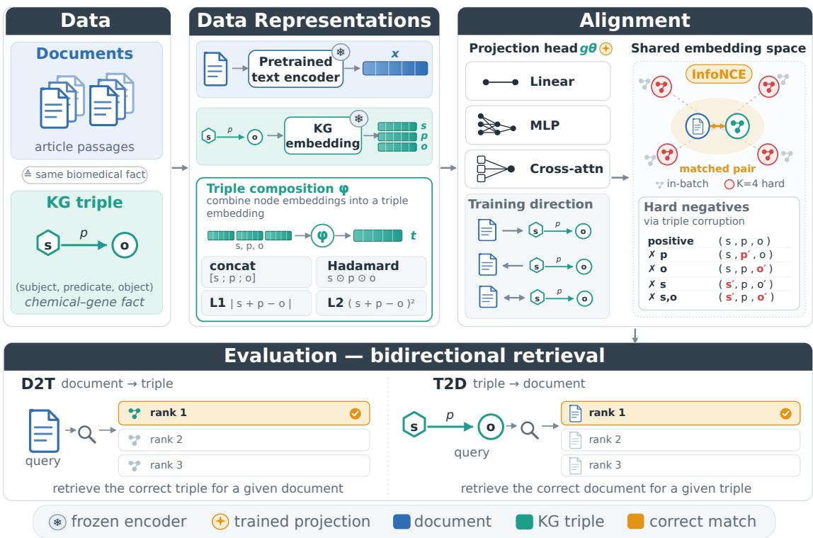
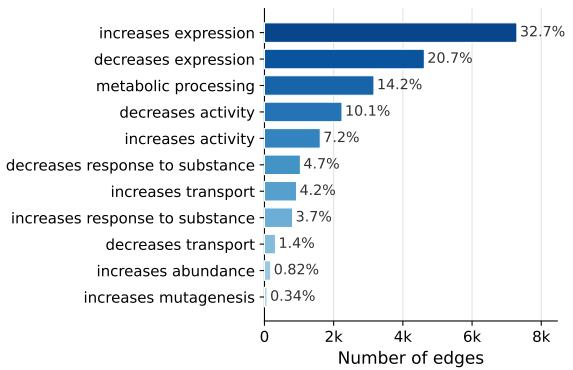
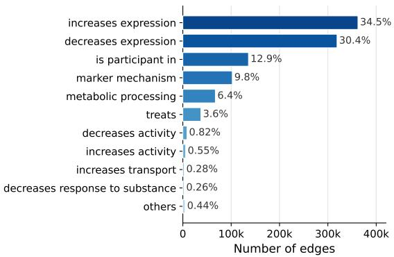
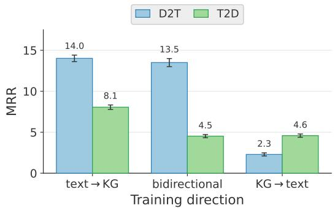
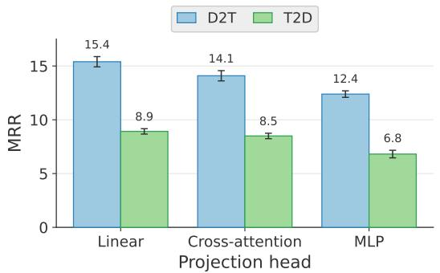
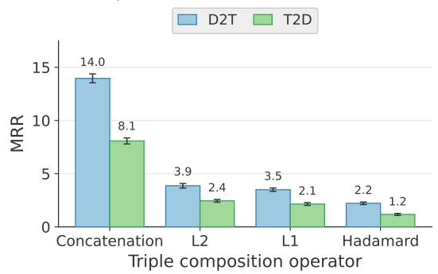
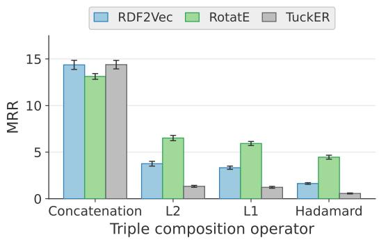
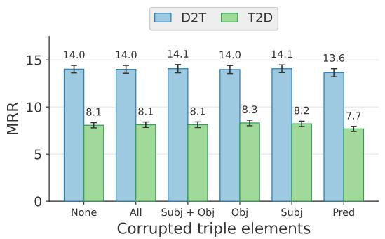
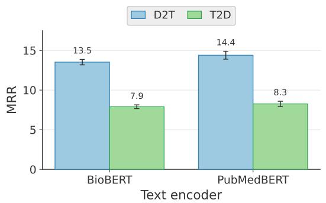

# Aligning Biomedical Texts and Knowledge Graphs: A Systematic Comparison of Lightweight Alignment Strategies

Artem Bisliouk1,\*, Elizaveta Nosova1,\*, Heiko Paulheim2, Andreea Iana2,\*,† and Rita T. Sousa2,\*

1University of Mannheim, Germany

2Data and Web Science Group, University of Mannheim, Germany

## Abstract

Biomedical knowledge exists in two complementary but distinct forms: unstructured scientific literature and structured knowledge graphs (KGs). Aligning them is essential for knowledge grounding, evidence retrieval, and KG completion, yet existing methods do not explicitly align free-text evidence with KG triples. We present a unified framework for systematically studying design choices for aligning biomedical text and KGs. With a text encoder and a KG embedding model both frozen, we learn only a lightweight projection between their spaces via a contrastive objective. This enables a fair comparison across six design dimensions: text encoder, KG embedding model, projection head, triple composition, training direction, and hard-negatives sampling. We construct CTD-Align, a corpus of over 22K one-to-one triple document pairs linking chemical-gene interactions from the Comparative Toxicogenomics Database to supporting PubMed passages. We evaluate alignment on it in two retrieval settings: document-to-triple and triple-to-document. We find that the triple composition and the training direction (i.e., shared retrieval space) have the greatest impact, whereas the text encoder and hard-negatives sampling matter little. Overall, simple choices win: projecting text into the KG space with a linear head over concatenated subject, predicate, and object embeddings performs best. These findings establish lightweight contrastive alignment as an efective, practical foundation for bridging biomedical text and KGs.

## Keywords

Biomedical Knowledge Graph, Language Models, Contrastive Learning, Representation Alignment, Knowledge Graph Embedding, Evaluation

## 1. Introduction

Large language models (LLMs) have showcased impressive natural language understanding and generation capabilities [1, 2, 3, 4], making them increasingly valuable for advancing domains characterized by massive amounts of complex, unstructured data [5, 6, 7]. Despite their fluency, however, LLMs remain prone to hallucinating convincing yet unsupported or factually incorrect answers [8, 9] and to relying on outdated knowledge [10, 11]. These limitations are particularly concerning in knowledge-intensive domains that require specialized expertise [12], such as biomedicine and healthcare, where incorrect claims about chemicals, genes, or diseases may have direct clinical and toxicological consequences [13, 14, 15].

Biomedical knowledge is available in two complementary forms. The biomedical literature, through repositories such as PubMed [16], PMC [17], or Europe PMC [18], provides a vast but unstructured collection of scientific publications that LLMs can easily process. In parallel, biomedical knowledge graphs (KGs) provide structured, manually curated, and continually updated facts about biomedical entities (e.g., chemicals, genes, diseases) and their relationships [19, 20]. Although these resources describe many overlapping facts, they represent them fundamentally diferently: biomedical literature expresses knowledge in natural language, whereas KGs encode it as symbolic triples. Consequently, there is no explicit correspondence between a scientific document (or one of its sections) and the relation that it describes. Yet many biomedical applications, such as grounding LLM-generated responses in KG information to mitigate hallucinations [21, 22, 23], retrieving textual evidence supporting or contradicting a given KG fact [24, 25, 26, inter alia], and extracting relations from the literature to enrich or complete KGs as new findings are published [27, 28, 29], require precisely such correspondences. However, existing methods do not explicitly align biomedical free-text evidence with KG triples.

Existing approaches for integrating language models (LMs) and KGs sufer from two major limitations. First, representation integration approaches either inject pre-aligned KG entity or triple embeddings into an LM to enrich its representations [30, 31, 32, 33] or leverage LMs for KG-specific tasks, such as link prediction or KG completion, by encoding entities and relations using their textual descriptions [34, 35, 36]. Consequently, these methods are optimized for downstream tasks (i.e., question answering, relation extraction), rather than for learning an explicit mapping between free-text evidence and structured triples. Second, text-graph alignment methods typically align individual nodes instead of complete facts [37, 38] or ignore graph structure by linearizing triples into text [39]. Moreover, these techniques are developed and evaluated on general-domain data, whose vocabulary, entity types, and relation semantics difer significantly from those found in biomedicine [40, 41].

In this work, we address these shortcomings by investigating which design choices drive the alignment quality between structured and unstructured representations of biomedical facts. Concretely, we make three main contributions. 1) We introduce a unified, modular framework for systematically comparing alignment strategies between LMs and KGs. The framework is built around a simple backbone: given a biomedical text encoder and a KG embedding model, we keep both components frozen and train only a lightweight projection between their embedding spaces using a contrastive (InfoNCE) objective [42]. This training objective encourages paired documents and triples to occupy nearby positions in a shared embedding space. We evaluate alignment quality in two retrieval settings: recovering the KG triple expressed by a document (document-to-triple) and, conversely, retrieving the document describing a triple (triple-todocument). Keeping the backbone fixed, we isolate the impact of six key design choices: the text encoder, the KG embedding model, the projection head, the triple-composition operator, the training direction, and the hard-negatives sampling strategy. By varying one component at a time under a common tuning and evaluation protocol we can attribute performance diferences directly to each design dimension. 2) To the best of our knowledge, no existing resource pairs biomedical triples with the documents that express them. We therefore construct CTD-Align, a reusable corpus of 22,293 one-to-one triple-document pairs with full provenance, obtained by pairing chemical-gene interactions from the Comparative Toxicogenomics Database (CTD) [43] with their supporting evidence from PubMed articles [16]. The resulting dataset supports future research on text-graph alignment, evidence retrieval, and knowledge attribution. 3) Lastly, we find that the triple-composition operator and the training direction (i.e., the shared retrieval space) have the greatest impact on alignment quality, whereas the choice of text encoder and hard-negatives sampling strategy has little impact once the spaces are aligned. We further show that simpler design choices outperform more complex alternatives. In particular, projecting text into the KG space with a linear head over concatenated subject, predicate, and object embeddings yields the best alignment in both retrieval settings.

Overall, our findings demonstrate that lightweight alignment constitutes an efective bridge between biomedical text and KG representations, ofering a simple yet practical foundation for applications such as knowledge grounding, evidence retrieval, and KG completion.

## 2. Related Work

## 2.1. Integrating Language Models and Knowledge Graphs

Integrating LMs and KGs constitutes a well-established research direction [44, 21]. One line of work injects structured knowledge into LMs to improve downstream tasks such as relation classification or question answering: ERNIE [30] and KnowBERT [31] fuse linked entity embeddings into contextual word representations, K-BERT [32] inserts relevant triples into the input as a soft-positioned sentence tree, KEPLER [33] jointly optimizes a knowledge embedding and a masked language modeling objective, and DRAGON [45] fuses a text encoder and a graph neural network through joint pretraining. A complementary line uses LMs for KG-specific tasks, most prominently KG completion. Early works learned a shared text-KG embedding space from scratch, aligning word and entity embeddings through co-occurrence and entity names [46, 34] or encoding entity descriptions directly into the KG model [47]. Later approaches, such as KG-BERT [35], fine-tune BERT as a cross-encoder over a triple’s concatenated component descriptions to score its plausibility, whereas SimKGC [36] recasts this as a contrastive learning with a bi-encoder for eficient and more accurate KG completion.

All of these approaches primarily train the underlying encoders for a downstream task or for KG completion. We instead keep both the KG and the text encoder frozen, learn only a lightweight projection between their output spaces, and target the retrieval between evidence documents and triples rather than knowledge injection or completion.

## 2.2. Embedding Space Alignment and Retrieval

We study an alignment scheme from a broader family that maps two independently trained embedding spaces onto one another with a lightweight transformation, an idea rooted in crosslingual work, where a linear map aligns separately trained word embeddings [48]. The same principle underpins cross-modal alignment. CLIP [49] aligns image and text encoders with an

InfoNCE objective [42], LiT [50] shows that freezing one encoder and tuning only the projection often sufices, and recent work aligns two frozen unimodal encoders by training only lightweight projectors, matching contrastively trained models at a fraction of the data and compute [51].

Several works align natural language with graph structure. ConGraT [38] contrastively aligns node-associated text with graph representations, and JointGT [52] learns joint graphtext representations with an alignment objective for KG-to-text generation. In contrast to our approach, these models train their encoders rather than keeping them frozen, and align individual nodes or general graph-structured inputs rather than KG triples. A similar approach is proposed by [39], who linearize RDF graphs into token sequences and train twin Transformer encoders with an in-batch contrastive loss so that a document and its parallel graph become neighbors. Our setting difers in three ways: we retain an independently trained structural KG embedding space instead of re-encoding a linearized graph as text and learn only a lightweight projection over frozen encoders. Moreover, we pair each document with an exact subjectpredicate-object triple rather than with a graph that may contain multiple triples.

## 2.3. Text-Knowledge Graph Alignment in the Biomedical Domain

A key motivation for aligning text and KGs is the tendency of LLMs to hallucinate [8]. Retrievalaugmented generation grounds LLM outputs in retrieved documents [53]. Biomedical variants extend this idea to structured sources such as KGs for multi-hop reasoning and prompt construction [23, 22], drawing on curated resources such as CTD [43], Hetionet [19], and PrimeKG [54]. Aligned-LLM [55] aligns frozen KG entity embeddings with an LM’s space via a learned projection to improve factual grounding, and BALI [56] contrastively aligns an LM with a UMLS graph encoder using linked concept mentions. At the mention level, biomedical bi-encoders such as SapBERT [57] link text spans to single KG concepts. These approaches operate at the entity or concept level and target improved generation or classification. In contrast, we align triples with their evidence documents, evaluate bidirectional retrieval between them, and study the efect of diferent encoders and alignment components under a controlled frozen-encoder framework. To the best of our knowledge, such a systematic study of triple-level biomedical text-KG alignment has not yet been conducted.

## 3. Methodology

Fig. 1 depicts our unified framework for evaluating biomedical text-KG alignment along six critical dimensions that determine its quality. Given biomedical documents and KG triples describing the same facts, we first encode each modality with a dedicated text encoder and KG embedding model (§3.1). Keeping both encoders frozen, we then learn only a lightweight projection between their embedding spaces using a contrastive objective, varying the training direction and hard-negatives sampling strategy (§3.2). Because both encoders remain frozen, the framework is modular: any pretrained text or KG encoder can be substituted, and only the alignment must be retrained, at a fraction of the cost of fine-tuning either encoder. Finally, we assess alignment quality through bidirectional retrieval between documents and triples. Next, we describe each dimension and formalize the concrete design choices.

  
Figure 1: Overview of our unified framework for biomedical text-KG alignment. Documents and KG triples expressing the same fact are embedded by frozen encoders; the only trained component is a lightweight projection aligning the two spaces under a contrastive objective. We vary six components, shown here as separate modules: the text encoder, KG embedding model, triple-composition operator, projection head, training direction, and hard-negative strategy. We evaluate alignment by retrieval in two settings: document-to-triple (D2T) and triple-to-document (T2D).

## 3.1. Data Representations

The input data consists of biomedical facts, each expressed in two complementary modalities. In a knowledge graph $G \subseteq E \times R \times E$ with entity set $E$ and relation set �, a fact is represented as a triple $t = ( s , p , o )$ with subject and object entities $s , o \in E$ and a predicate (relation) $p \in R$ In the biomedical literature, the same fact is described by a document $x _ { i } ,$ namely a passage of an article $( \mathrm { i . e . , }$ sentence or paragraph), that states the relation between � and $o .$ The input data thus consists of aligned pairs $\mathbf { \mathcal { P } } = \{ ( x _ { i } , t _ { i } ) \} _ { i = 1 } ^ { n }$ , where document $x _ { i }$ expresses triple $t _ { i } .$ . We embed the two modalities separately with a frozen text encoder and a frozen KG embedding model: each document is mapped to $\mathbf { x } _ { i } \in \mathbb { R } ^ { d _ { \mathrm { t x t } } }$ , and its triple to $\mathbf { t } _ { i } = \phi ( \mathbf { s } _ { i } , \mathbf { p } _ { i } , \mathbf { o } _ { i } ) \in \mathbb { R } ^ { d _ { \mathrm { k g } } }$ , where $\mathbf { s } _ { i } , \mathbf { p } _ { i } , \mathbf { o } _ { i }$ are the KG embeddings of $s _ { i } , p _ { i } , o _ { i }$ of dimensionality $d ,$ and $\phi$ combines them into a single representation. As the choice of $\phi$ constitutes an important design dimension, we evaluate four triple-composition operators: (i) concatenation $\mathbf { t } _ { i } = \left[ \mathbf { s } _ { i } ; \mathbf { p } _ { i } ; \mathbf { o } _ { i } \right]$ , (ii) Hadamard product $\mathbf { t } _ { i } = \mathbf { s } _ { i } \odot \mathbf { p } _ { i } \odot \mathbf { o } _ { i } ,$ , (iii) element-wise $L _ { 1 }$ combination $\mathbf { t } _ { i } = | \mathbf { s } _ { i } + \mathbf { p } _ { i } - \mathbf { o } _ { i } |$ , and (iv) element-wise $L _ { 2 }$ combination $\mathbf { t } _ { i } = ( \mathbf { s } _ { i } + \mathbf { p } _ { i } - \mathbf { o } _ { i } ) ^ { 2 }$

## 3.2. Alignment Methods

Starting from the frozen document and triple embeddings obtained in the previous step, the alignment stage learns a lightweight projection $g _ { \boldsymbol { \theta } }$ that maps one modality into the embedding space of the other, such that a document and its corresponding triple become nearest neighbors under cosine similarity. The triple-composition operator $\phi$ determines the triple embedding dimension: concatenation yields $d _ { \mathrm { k g } } = 3 d ,$ , whereas the Hadamard product and the $L _ { 1 }$ and $L _ { 2 }$ approaches yield $d _ { \mathrm { k g } } = d .$ The projection therefore maps between $\mathbb R ^ { d _ { \mathrm { t x t } } }$ and $\mathbb { R } ^ { d _ { \mathrm { k g } } }$ , with the input and output sizes set by the training direction and the triple-composition operator.

Projection Heads. We compare three projection heads of increasing complexity. The Linear head applies a single linear transformation without any hidden layer, nonlinearity, normalization, and dropout. The MLP head is a feed-forward network whose hidden layers each apply a linear transformation, layer normalization, a GELU activation, and dropout, before a final linear layer maps the intermediate representation to the target dimension. Finally, the cross-attention head projects the document embedding into a single key-value vector, to which three learnable query vectors – one per triple element (subject, predicate, object) – attend through a multi-head attention layer. Their outputs are concatenated and linearly mapped to the target dimension. As the key-value sequence is a single vector, this amounts to a learned multi-query projection of the document embedding rather than token-level attention over words to triple components.

Training Direction. The training direction determines which embedding space serves as the alignment target. We consider three settings: (i) text→KG projects document embeddings into the KG triple space, (ii) KG →text projects triple embeddings into the document space, and (iii) bidirectional randomly assigns each batch to one of the two directions. As the input and output dimensionalities difer, we train a separate projection network for each direction.

Training Objective. We train all alignment models with the InfoNCE loss [42]. For each anchor (a document or triple), its pair is the positive and the other mini-batch items are in-batch negatives. Optionally, we augment these with hard negatives by corrupting a positive triple $( s , p , o )$ in the KG space. We compare four corruption schemes that replace (i) the predicate (keeping � and �), (ii) the object (keeping � and �), (iii) the subject (keeping � and �), or (iv) both entities (keeping only the predicate). We also consider using no hard negatives (None, i.e., in-batch negatives only) and the union of all four schemes (All). Because the corruptions live in the KG-triple space, they apply naturally to the text→KG training direction, where the model predicts a triple embedding that the loss contrasts against the true triple and its corruptions. In the KG →text direction the target is a document embedding, for which no hard negatives are generated. In the bidirectional setting we use hard negatives only on text→KG batches.

## 3.3. Retrieval Tasks

We evaluate alignment quality as retrieval over the full candidate pool. Given a query (i.e., a document �� or a triple $t _ { i } )$ , we project it through the learned mapping and rank all candidates of the target modality by cosine similarity. We thus define two complementary tasks: (i) document-to-triple (D2T), retrieving the correct KG triple for a given evidence document, and (ii) triple-to-document (T2D), retrieving the correct document for a given triple.

## 4. Biomedical Corpora & Dataset Construction

Our analysis relies on biomedical facts expressed in two complementary forms: as structured KG triples and as free-text evidence. We take the structured facts from the Comparative Toxicogenomics Database knowledge graph (§4.1) and the textual evidence from PubMed (§4.2), and combine them into a new triple-document dataset CTD-Align (§4.3).

## 4.1. CTD Knowledge Graph

The Comparative Toxicogenomics Database (CTD) is a publicly available resource that manually curates relationships between chemicals, genes, phenotypes, and human diseases from the scientific literature [58, 43]. It is part of the Bio2RDF [59] linked data project for the life sciences and comprises roughly 3.8 million curated direct interactions, from which further relationships are inferred. Crucially for our purpose, every direct interaction is annotated with the PubMed identifier(s) of the article(s) that report it (PMIDs), giving each fact an explicit textual provenance.

We extract several association types over four entity classes (chemicals, genes, diseases, pathways): (i) chemical-gene interactions (restricted to single-action interactions), (ii) chemicaldisease and gene-disease associations (both restricted to manually curated direct evidence and flattened to treats and marker/mechanism relations), and (iii) gene-pathway memberships (i.e., is participant in). Chemical-gene interactions form the backbone of the core KG and are the only interactions paired with documents, whereas the remaining associations enrich the graph’s structure to provide the context needed to learn informative KG embeddings.

Dereification. Like many other RDF resources, CTD represents each n-ary interaction through reification, i.e., an intermediate node to which metadata can be attached.1 Standard KG embedding models [60, 61, 62, inter alia], however, tend to treat each triple independently, which makes multi-hop paths through auxiliary nodes less straightforward to capture. We therefore dereify CTD during extraction, collapsing each three-triple pattern into a single direct edge labeled with the interaction’s action type (e.g., increases expression).

Graph construction. We build the enriched CTD KG by iteratively growing it outward from the chemical-gene interactions linked to textual evidence (i.e., our core set): we attach every chemical-disease, gene-disease, and gene-pathway association whose chemical or gene is already in the graph, so that the added disease and pathway nodes act as hubs linking otherwise-isolated chemicals and genes. We repeat this process until no further connected association can be added or a target graph size is reached. We finally keep the largest connected component, discarding 10 small isolated ones. The resulting enriched graph has 74,137 nodes, and 1,048,611 edges spanning 14 relation types. Table 1 summarizes its statistics, and Fig. 2 shows the distribution of relation types in both core and enriched CTD KG.

## 4.2. PubMed Corpus

We obtain the documents describing these chemical-gene interactions from PubMed [16], the reference publicly available database of biomedical citations and abstracts maintained by the

## Table 1

Statistics of the core and enriched CTD KGs.
<table><tr><td rowspan="2"></td><td rowspan="2"># Relations # Edges</td><td rowspan="2"></td><td colspan="5"># Nodes</td></tr><tr><td>Chemicals</td><td>Genes</td><td>Diseases</td><td>Pathways</td><td>Total</td></tr><tr><td>Core</td><td>11</td><td>22,293</td><td>4,179</td><td>3,431</td><td></td><td>-</td><td>7,610</td></tr><tr><td>Enriched</td><td>14</td><td>1,048,611</td><td>13,773</td><td>50,709</td><td>7,292</td><td>2,363</td><td>74,137</td></tr></table>

  
(a) Core CTD KG.

  
(b) Enriched CTD KG.  
Figure 2: Distribution of relation types in the (a) core and (b) enriched CTD KGs. "Others" combines 4 relation types from the enriched KG with fewer than 2,600 edges (0.44%): increases response to substance, decreases transport, increases abundance, increases mutagenesis.

National Center for Biotechnology Information (NCBI) at the US National Library of Medicine, from which CTD draws all of its curated interactions. To obtain the relevant abstracts together with reliable entity annotations, we use PubTator [29], an NCBI service that automatically annotates biomedical entities and their relations across PubMed. We retrieve, using the PubTator 3.0 API, for every PMID recorded in our CTD interactions, the corresponding abstract and title with its chemical and gene mentions normalized to CTD identifiers, which allows us to locate the entities of each triple directly in the text.

## 4.3. CTD-Align Triple-Document Dataset

We construct CTD-Align, a dataset of one-to-one triple-document pairs used to train and evaluate alignment by pairing CTD’s chemical-gene interactions with their PubMed evidence.2

Candidate Document Selection. We start from over 3M raw chemical-gene interactions CTD records and keep only single-action interactions, discarding the approximately 1.2M multi-action records (40.5%). A compound action such as (increases-phosphorylation, decreases-degradation) has no unambiguous KG representation, and retaining such records would degrade the semantic quality of the alignment data. This filtering results in 1,546,310 unique single-action triples. Rather than forcing a single paper per triple, which succeeds for only 23.6% of triples, as papers typically discuss several interactions together, we allow multiple triples per document during collection. From the 63,274 unique articles referenced by these triples, we download 63,239 abstracts via PubTator and, for each triple, extract the passages mentioning both its chemical and its gene as candidate evidence spans, yielding 45,684 triples with at least one candidate.

Document Evidence. Co-occurrence is necessary but not suficient, as a sentence may name both entities without describing their relationship (e.g., “Both aspirin and COX-2 were measured at baseline”). We therefore rank the candidate spans of each triple by semantic relevance. Specifically, we verbalize the triple as a short natural-language query by concatenating its subject name, a human-readable phrasing of the predicate, and its object name (e.g., “Dichlorvos decreases activity of ACHE”), and score every candidate span against this query with a biomedical cross-encoder that applies full cross-attention between query and span. Concretely, we use MedCPT’s re-ranker [63], a cross-encoder initialized from PubMedBERT [40] and contrastively trained on 18.3M query-article pairs mined from PubMed search logs.3 For each triple, we select the highest-scoring span as the supporting document.

One-to-one Mapping. To obtain a paired dataset, we enforce a strict one-to-one tripledocument correspondence: when the same span is selected for several triples, we keep the triple with the least frequent (most informative) predicate and drop the others. This produces the CTD-Align dataset, sourced from 17,530 source publications and consisting of 22,293 triple-document pairs (794 collisions removed, 3 relation types dropped as a consequence), each comprising a chemical, a gene, a single-action relation, a supporting document (with an average length of 303 characters), and the source PMID for full provenance. Table 1 reports the statistics of the corresponding core graph.

## 5. Experimental Setup

## 5.1. Training and Optimization Details

Knowledge Graph Embeddings. We experiment with three KG embedding models that capture diferent aspects of the graph structure: (i) RotatE [65], (ii) TuckER [66], and (iii) RDF2Vec [67]. RotatE [65] embeds entities and relations in a complex vector space and models each relation as an element-wise rotation from the subject to the object entity, thus capturing patterns such as symmetry/asymmetry, inversion, and composition. TuckER [66] is a bilinear model based on the Tucker decomposition of the binary subject-predicate-object tensor into entity and relation embeddings and a shared core tensor, yielding a fully expressive factorization. RDF2Vec [67], in contrast, does not optimize a triple-scoring objective, but extracts random walks [68] over the graph and trains a Word2Vec model [69] on them to obtain entity embeddings.4

We pretrain all models on the enriched CTD KG, including the complete set of core triples, to obtain domain-adapted KG embeddings. For all three models we combine entity and relation

## Table 2

Hyperparameter search spaces and best values selected for each model, reported in the format search space / best value. We use the following abbreviations: dim. = dimension, self-adv. sampling temp. = the self-adversarial sampling temperature of RotatE [65]. A dash (—) indicates that the hyperparameter was either not tuned (in which case, we report only the value used) or not applicable to the given model.
<table><tr><td>Hyperparameter</td><td>RotatE</td><td>TuckER</td><td>RDF2Vec</td></tr><tr><td>Entity dim.</td><td>{100, . . . , 500} / 500</td><td>{100, 200, 300} / 200</td><td>{100, 200, 300} / 200</td></tr><tr><td>Relation dim.</td><td>= entity dim</td><td>{30, 65, 100} / 65</td><td>= entity dim</td></tr><tr><td>Learning rate</td><td> $[ 1 0 ^ { - 5 } , \stackrel { \prime } { 5 } \times 1 0 ^ { - 4 } ] / 2 . 8 \times 1 0 ^ { - 4 }$ </td><td> $\left[ 5 \times 1 0 ^ { - 4 } , 5 ^ { ^ { \prime } } \times 1 0 ^ { - 3 } \right] / 5 . 7 \times 1 0 ^ { - 4 }$ </td><td></td></tr><tr><td>Margin</td><td>{3, 6, 9, 12} / 9</td><td></td><td></td></tr><tr><td>Adv. sampling temp.</td><td>[0.5, 1.0] / 0.91</td><td></td><td></td></tr><tr><td>Negative samples</td><td>[50, 500] / 467</td><td></td><td>{10, 15, 25} / 10</td></tr><tr><td>Dropout (3 layers)</td><td></td><td>[0.1, 0.5] / 0.22, 0.35, 0.27</td><td></td></tr><tr><td>Label smoothing</td><td></td><td>{0.0, 0.1, 0.2} / 0.1</td><td></td></tr><tr><td>Walk depth</td><td></td><td></td><td>{4, 6, 8} / 4</td></tr><tr><td>Walks / entity</td><td></td><td></td><td>{100, 200, 500} / 200</td></tr><tr><td>Word2Vec epochs</td><td></td><td></td><td>{10, 25, 50} / 25</td></tr></table>

embeddings into a triple representation using the triple-composition operators from §3.1.5 We tune the most important hyperparameters of RotatE and TuckER for link prediction using TPE sampling [70] on 51,289 validation triples (5% of the enriched CTD KG), and those of RDF2Vec using grid search on entity-type prediction. Table 2 reports the search spaces and optimal values for each tuned hyperparameter. We set the remaining hyperparameters to the values reported in the respective papers, and use the gensim defaults for the Word2Vec Skip-gram model of RDF2Vec.6 We train RotatE and TuckER with Adam [71] for up to 500 epochs, using batch sizes of 512 and 128, and early stopping on validation MRR with a patience of 10 and 5, respectively.

Document Embeddings. We embed the PubMed corpus documents (§4.2) using two domain-specific pretrained LMs: BioBERT (biobert-v1.14) [72] and PubMedBERT (PubMedBERT-base-uncased-abstract) [40]. BioBERT is initialized from BERT [73] and further pre-trained on PubMed abstracts and PubMed Central full-text articles, whereas Pub-MedBERT is trained from scratch exclusively on biomedical corpora. In both cases, we obtain a 768-dimensional document embedding via mean pooling over the token-level representations.7

Alignment Model. We evaluate three projection heads (cf. §3.2). We run hyperparameter optimization separately for each combination of text encoder, KG embedding model, projection head, triple-composition operator, hard-negatives sampling strategy, and training direction using TPE sampling. We search for the optimal hidden size of the alignment projector in the interval {256, 512}, finding 256 as the best value. We note that this hyperparameter is not used for the linear projector. Similarly, we select a dropout of 0.273 over the interval [0.1, 0.3], a weight decay of $1 . 3 3 \times 1 0 ^ { - }$ − 3 over the log-scaled interval [10−5, 10−2], and a learning rate of

$1 . 0 5 \times 1 0 ^ { - 3 }$ over the log-scaled interval $[ 1 0 ^ { - 4 } , 5 \times 1 0 ^ { - 3 } ]$ . We train the alignment model with the InfoNCE loss [42] using in-batch negatives and a temperature of 0.07. Optionally, we add four hard KG negatives per example, generated with diferent triple-corruption strategies as per §3.2. We optimize using AdamW [74], for a maximum of 100 epochs with early stopping (patience of 15 epochs), a batch size of 256, and gradient clipping at 1.0.

Infrastructure and Compute. We conduct all training and evaluation on a cluster with virtual machines. We train the RotatE and TuckER KG embedding models on single NVIDIA A100 (80 GB) and H100 (94 GB) GPUs, and the RDF2Vec model on a machine with 48 CPU cores and 128 GB RAM. We conduct all alignment experiments on CPU, allocating 50 GB of RAM per job.8

## 5.2. Evaluation Protocol

In addition to the full grid comparison, we include a simple baseline that verbalizes each triple using its subject name, predicate label, and object name (e.g., “Cyclophosphamide metabolic processing CYP2B6”) and embeds the resulting text using the same text encoder used for documents. Candidates are then ranked by cosine similarity to the query: in D2T we rank all verbalized triples against the query document, and in T2D we rank all document embeddings against the verbalized query triple. Thus, this baseline relies solely on the text encoder and uses no KG embeddings. We evaluate using 5-fold cross-validation grouped by PubMed paper to ensure that documents from the same article never appear in both the training and test sets. Within each fold, we hold out 15% of the training samples for validation. We report the mean and standard deviation across the five folds for standard ranking metrics MRR and Hits@�, as well as the median rank of the correct item computed over the full candidate pool. That is, each query is ranked against the entire candidate pool of the target modality, i.e., all KG triples in D2T and all documents in T2D, rather than against a sampled subset of negatives.

## 6. Results and Discussion

We evaluate the quality of alignment as full-pool document-to-triple and triple-to-document retrieval. We first discuss the performance of the best model configurations, comparing the results against the verbalized nearest-neighbor baseline (§5.2). Afterwards, we discuss the choice of alignment target space, and finally decompose the remaining dimensions.

## 6.1. Overall Retrieval Performance

Table 3 contrasts the best alignment configuration under each training direction (i.e., under each choice of shared retrieval space) with the verbalization baseline, in both retrieval settings. Learning a projection between the two frozen text and KG embedding spaces substantially outperforms the baseline in both retrieval settings. The best model projects text into the KG space with a linear head over the concatenation of the subject, predicate, and object embeddings; it improves MRR by 90% on D2T and 64% on T2D over the stronger (BioBERT) baseline. The gain is even larger over the full ranking, namely the median rank of the correct items drops

## Table 3

Retrieval performance in both settings. We report averages and standard deviations over five folds. Rank denotes absolute median rank. For each training direction, we report its best-on-average configuration; the baseline uses no KG embeddings. The Config column reports the text encoder and KG embedding model. All aligned configurations use a linear projection head over concatenated subject, predicate, object embeddings. The best results per column are highlighted in bold, the second best are underlined.
<table><tr><td></td><td></td><td colspan="4">D2T (document→triple)</td><td colspan="4">T2D (triple→document)</td></tr><tr><td>Model</td><td>Config</td><td>MRR</td><td>Hits@1</td><td>Hits@10</td><td>Rank</td><td>MRR</td><td>Hits@1</td><td>Hits@10</td><td>Rank</td></tr><tr><td>Verbalized</td><td>BioBERT / -</td><td> $8 . 4 1 _ { \pm 0 . 3 }$ </td><td> $5 . 4 7 _ { \pm 0 . 3 }$ </td><td> $1 3 . 6 9 _ { \pm 0 . 4 }$ </td><td> $9 2 7 \pm 4 5$ </td><td> $\underline { { 7 . 4 1 \pm 0 . 1 } }$ </td><td> $\underline { { 4 . 4 8 _ { \pm 0 . 1 } } }$ </td><td> $1 2 . 9 8 _ { \pm 0 . 2 }$ </td><td> $8 4 5 _ { \pm 5 1 }$ </td></tr><tr><td>Verbalized</td><td> $\mathsf { P u b } M e d \mathsf { B E R T } / -$ </td><td> $\underline { { 4 . 4 3 _ { \pm 0 . 3 } } }$ </td><td> $2 . 8 1 _ { \pm 0 . 2 }$ </td><td> $7 . 4 5 { \scriptstyle \pm 0 . 4 } _ { - }$ </td><td> $4 8 2 6 \pm 9 6$ </td><td> $2 . 8 3 _ { \pm 0 . 2 }$ </td><td> $1 . 6 8 _ { \pm 0 . 2 }$ </td><td> $\stackrel { - } { \underline { { 4 . 8 7 \pm 0 . 3 } } } .$ </td><td> $\underline { { 5 } } 0 6 6 \underline { { \pm } } 1 3 6 \underline { { \cdot } }$ </td></tr><tr><td> $\bar { \mathsf { A } } \bar { \mathsf { I i g n e d } } \ \bar { ( } \mathsf { t e x t } \bar { \to } \bar { \mathsf { K } } \bar { \mathsf { G } } )$ </td><td> $\bar { \mathsf { P } } \bar { \mathsf { u b } } \bar { \mathsf { M e d B E R T } } / \bar { \mathsf { R D F } } 2 \bar { \mathsf { V e c } }$ </td><td> $\overline { { { \bf 1 5 . 9 9 2 0 . 6 } } }$ </td><td> $\mathbf { 8 . 7 4 \bot 0 . 6 }$ </td><td> $\mathbf { 3 0 . 1 7 { \scriptstyle \pm 0 . 7 } }$ </td><td> $\overline { { 3 8 } } \overline { { \pm 2 } }$ </td><td> $\overline { { 1 2 . 1 3 } } \overline { { \pm } } 0 . 3 $ </td><td> $\bar { { \bf 5 . 9 2 } } _ { \pm { \bf 0 . 2 } } ^ { - }$ </td><td> $\bar { 2 4 . 3 0 } \bar { \pm } 0 . 8$ </td><td> $5 5 { \scriptstyle \pm 2 }$ </td></tr><tr><td>Aligned (KG →text)</td><td> $\mathsf { B i o B E R T / R o t a t E }$ </td><td> $3 . 7 5 { \scriptstyle \pm 0 . 3 }$ </td><td> $1 . 3 4 \pm \ : 0 . 3$ </td><td> $7 . 8 4 \pm 0 . 6$ </td><td> $3 4 9 \pm 1 8$ </td><td> $5 . 8 9 \pm 0 . 2$ </td><td> $2 . 2 1 \pm 0 . 3$ </td><td> $1 2 . 4 1 \pm 0 . 3$ </td><td> $1 4 7 \pm 7$ </td></tr><tr><td>Aligned (bidirectional)</td><td>PubMedBERT / RotatE</td><td> $\underline { { 1 5 . 1 5 _ { \pm 0 . 6 } } }$ </td><td> $\underline { { 8 . 5 1 \pm 0 . 6 } }$ </td><td> $\underline { { 2 8 . 2 7 \pm 0 . 6 } }$ </td><td> $4 8 _ { \pm 3 }$ </td><td> $5 . 7 4 _ { \pm 0 . 3 }$ </td><td> $2 . 2 9 _ { \pm 0 . 3 }$ </td><td> $1 1 . 9 7 _ { \pm 0 . 5 }$ </td><td> $1 5 9 _ { \pm 5 }$ </td></tr></table>

from 927 to 38 on D2T (a 24× improvement), and from 845 to 55 on T2D (a 15× improvement), while Hits@10 roughly doubles in both settings. Performance is also balanced across relation types. For the best model, relation-averaged (macro) MRR exceeds the instance-level (micro) value (18.00 vs. 15.99 on D2T), indicating that the results are not dominated by a few frequent predicates. Notably, the strongest baseline uses BioBERT, whereas the best alignment model uses PubMedBERT, indicating that once the projection is learned, retrieval becomes largely independent of the text encoder that a purely text-based approach depends on.

## 6.2. The Alignment Target Space

Crucially, projecting text into the KG space outperforms the other training directions in both evaluation settings. The alternative strategies are strongly asymmetric: the bidirectional approach matches text→KG on D2T (15.15 vs. 15.99 MRR), but collapses on T2D (5.74 vs. 12.13 MRR), while KG →text heavily underperforms in both settings, falling below the strong (BioBERT) verbalization baseline. We confirm this ordering through a controlled comparison holding the remaining factors fixed, as shown in Fig. 3a.

We hypothesize that this asymmetry stems from the two mappings being ill-posed in opposite ways. Projecting text into the KG space is a reduction: a document encodes more information than its triple counterpart, e.g., additional entities, surface form, and syntax. Consequently, the model needs only discard information that becomes redundant once the relation is identified. The reverse mapping is an addition: from a compact, decontextualized triple, KG →text must reconstruct precisely this missing context and surface realization. This inverse problem is under determined, as a single triple may fit many documents, and recovering absent information is inherently harder than discarding it. The geometry of the two spaces reinforces this asymmetry, as pretrained text embeddings are anisotropic, occupying a narrow cone [75, 76, 77], so retrieving in text space means separating tightly packed neighbors, whereas the KG space ofers more discriminative targets. Fixing the better-structured space as the target resembles the lockedencoder recipe that has proven efective in cross-modal alignment [50]. Finally, we find that the bidirectional strategy brings no further gains. In each evaluation setting, it mirrors the corresponding single-direction projection (text→KG for D2T and KG →text for T2D), inheriting the latter’s weakness. Consequently, T2D is still ranked in the less discriminative text space.

  
(a) Training direction (concatenation, in-batch neg atives only).

(b) Projection head (within text→KG, concatenation).  
  
(c) Triple composition overall.

  
(d) Triple composition by KG embedding (D2T).  
Figure 3: Impact of the training direction, projection head, and triple-composition operator on MRR. Bars show both retrieval settings (D2T, T2D), except (d), which shows D2T only.

## 6.3. Impact of Design Dimensions

We next rank the six design dimensions by their impact on performance. For each factor, we average MRR over all configurations that share a given level of that factor (its marginal efect) and quantify the factor’s share of the variance with a one-way $\eta ^ { 2 }$ (i.e., the between-group over total sum of squares across configurations) on the balanced grid combining the text→KG and bidirectional training directions. Almost all of the variance can be attributed to a single factor. Specifically, the triple composition alone explains 87% of the D2T and 62% of the T2D MRR variance, and the KG embedding a further 6% and 3%, respectively. The projection head, text encoder, and negative sampling scheme, have a negligible impact, each explaining less than 1%. Note that per-factor main efects do not need to sum to one. The remainder reflects interactions, particularly between KG embedding and triple composition (see below), and residual variance. Therefore, we first analyze the efect of the triple-composition operator, then fix it to its best value (concatenation) and study the remaining factors as conditional efects.

Triple Composition. Concatenation substantially outperforms the other operators (Fig. 3c): within text→KG it reaches 14.0 MRR on D2T, compared to 3.9 or less for $L _ { 1 } , L _ { 2 } ,$ and Hadamard operators. Concatenation preserves the separable subject-predicate-object structure in a 3� vector, whereas the other three operators collapse the triple into a �-dimensional vector – the

  
(a) Hard-negatives selection (within text→KG, con- (b) Text encoder (within text $ K G ,$ concatenation). catenation).  
Figure 4: Impact of hard-negatives selection and the text encoder on MRR, in both retrieval settings.

Hadamard product via a fixed multiplicative form (as in DistMult [61]), and the $L _ { 1 } / L _ { 2 }$ operators via a translation one (as in TransE [60]) – potentially discarding the information needed by the projection to recover the relation.9 This gap can also be observed in the baseline comparison, where only the concatenation-based models exceed the verbalization baseline. Alignment quality thus depends heavily on how the triple representation is composed.

Interaction of KG Embedding and Triple Composition. The quality of a KG embedding is tightly intertwined with the triple-composition operator (Fig. 3d). Averaged over all operators, RotatE appears best, but only because it is the least harmed by the poorly performing operators (i.e., averaging artifact). Under concatenation, the ranking reverses, namely RDF2Vec and TuckER (both 14.4 MRR) outperform RotatE (13.1 MRR) for D2T, and the gap widens sharply for T2D, where RotatE collapses to 4.2 MRR against RDF2Vec’s 10.6 MRR. Marginal averages over the composition operator are thus misleading. RDF2Vec, built from Word2Vec over graph walks [67], yields a distributional geometry closest to that of LMs (i.e., semantically meaningful relation embeddings). This plausibly makes it the easiest and most robust alignment target across retrieval settings. In contrast, TuckER’s tensor-factorization geometry [66] and RotatE’s rotational one [65] are optimized for link prediction rather than cosine similarity with text.

## 6.4. Secondary Design Choices

Fixing triple composition to concatenation, we find that the remaining within-setup choices have small and often negligible efects.

Projection Head. The linear projection outperforms both the MLP and the cross-attention in both retrieval settings (Fig. 3b). The marginal view hides this efect entirely, as the projection head explains under 0.4% of MRR variance when averaged over all operators. However, once the triple composition is fixed to concatenation, the projection head becomes the single largest factor on D2T, explaining 69% of the variance among concatenation-based configurations. On T2D, it is second only to the KG embedding, whose choice dominates because of the RotatE collapse discussed above.

Hard Negative Sampling Scheme. Fig. 4a shows that contrasting the paired document and triple against in-batch negatives sufices for training the alignment model. No hard negative selection strategy based on corrupting the triple provides any meaningful benefits over using none, in either text→KG or bidirectional training directions.10 The only visible deviation is predicate-only corruption, which performs slightly worse in both settings.

Text Encoder. Lastly, the choice between BioBERT and PubMedBERT has only a small impact once the projection is learned (Fig. 4b). This contrasts sharply with the verbalization baseline, where BioBERT far outperforms PubMedBERT (e.g., 8.41 vs. 4.43 MRR on D2T, 7.41 vs. 2.83 on T2D). After alignment, this gap reverses, as PubMedBERT performs slightly better and yields the best overall configuration. This points to the fact that most of the encoder-level diference observed in the baseline could be explained by the verbalized representation rather than the encoder itself, and is rendered largely inconsequential once a projection is learned.

## 7. Limitations and Future Work

Our analysis trades breadth for a controlled comparison of design dimensions. First, we evaluate a single relation family (chemical-gene interactions) from one resource (CTD). Replicating the comparison on broader biomedical KGs with richer relation sets (e.g., Hetionet [19], PrimeKG [54]), would test whether the findings transfer to other relation types. Second, we restrict evalu ation to one-to-one triple-document pairs, whereas in practice a document may describe several interactions (one-to-many) and multiple documents may support the same triple (many-to-one). This isolates the core alignment signal and simplifies evaluation, but it also coincides with the single-positive assumption of InfoNCE [42]. A natural extension is many-to-many alignment via a multi-positive (supervised) contrastive objective [78] that treats all valid document-triple matches as positives. Finally, we assess alignment intrinsically through retrieval. Evaluating the learned representations on a downstream task, such as KG completion or evidence-grounded retrieval, would more directly measure their practical utility.

## 8. Conclusion

We introduce a unified framework to systematically compare lightweight strategies for aligning biomedical text and KGs across six key design dimensions: text encoder, KG embedding model, triple-composition operator, projection head, training direction, and hard-negatives selection strategy. Through extensive retrieval experiments on CTD-Align, a new corpus of over 22K one-to-one chemical-gene triple-document pairs, we find that the triple-composition operator and the shared retrieval space (i.e., training direction) have the greatest impact, whereas the text encoder and hard-negatives selection matter comparatively little for retrieval performance. Simpler approaches consistently outperform more complex ones: projecting text into the KG space with a linear head over the concatenated subject, predicate, and object embeddings yields the best alignment. We hope these findings will inspire more transparent evaluation, including systematic ablations that uncover the components driving performance.

## Acknowledgments

The work presented in this paper has been partly funded by the German Federal Ministry of Education and Research under grant number 13GW0661C (KI-DiabetesDetektion). The authors also acknowledge support by the state of Baden-Württemberg through bwHPC.

## Declaration on Generative AI

During the preparation of this work, the authors used Opus 4.8 and Codex (GPT 5.5) in order to: generate images, generate the abstract, paraphrase and reword, improve the writing style, grammar and spelling check, peer review simulation, and code support. After using these tools, the authors reviewed and edited the content as needed and take full responsibility for the publication’s content.

## References

[1] T. Brown, B. Mann, N. Ryder, M. Subbiah, J. D. Kaplan, P. Dhariwal, A. Neelakantan, P. Shyam, G. Sastry, A. Askell, et al., Language Models are Few-Shot Learners, Advances in Neural Information Processing Systems 33 (2020) 1877–1901.

[2] J. Wei, Y. Tay, R. Bommasani, C. Rafel, B. Zoph, S. Borgeaud, D. Yogatama, M. Bosma, D. Zhou, D. Metzler, et al., Emergent Abilities of Large Language Models, Transactions on Machine Learning Research (2022).

[3] V. Liévin, C. E. Hother, A. G. Motzfeldt, O. Winther, Can Large Language Models Reason about Medical Questions?, Patterns 5 (2024).

[4] W. X. Zhao, K. Zhou, J. Li, T. Tang, X. Wang, Y. Hou, Y. Min, B. Zhang, J. Zhang, Z. Dong, et al., A Survey of Large Language Models, arXiv preprint arXiv:2303.18223 1 (2023) 1–124.

[5] R. Luo, L. Sun, Y. Xia, T. Qin, S. Zhang, H. Poon, T.-Y. Liu, BioGPT: Generative Pre-trained Transformer for Biomedical Text Generation and Mining, Briefings in Bioinformatics 23 (2022).

[6] A. J. Thirunavukarasu, D. S. J. Ting, K. Elangovan, L. Gutierrez, T. F. Tan, D. S. W. Ting, Large Language Models in Medicine, Nature medicine 29 (2023) 1930–1940.

[7] J. Zhou, H. Li, S. Chen, Z. Chen, Z. Han, X. Gao, Large Language Models in Biomedicine and Healthcare, npj Artificial Intelligence 1 (2025) 44.

[8] Z. Ji, N. Lee, R. Frieske, T. Yu, D. Su, Y. Xu, E. Ishii, Y. J. Bang, A. Madotto, P. Fung, Survey of Hallucination in Natural Language Generation, ACM Computing Surveys 55 (2023) 1–38.

[9] L. Huang, W. Yu, W. Ma, W. Zhong, Z. Feng, H. Wang, Q. Chen, W. Peng, X. Feng, B. Qin, et al., A Survey on Hallucination in Large Language Models: Principles, Taxonomy, Challenges, and Open Questions, ACM Transactions on Information Systems 43 (2025) 1–55.

[10] J. Kasai, K. Sakaguchi, R. Le Bras, A. Asai, X. Yu, D. Radev, N. A. Smith, Y. Choi, K. Inui, et al., RealTime QA: What’s the Answer Right Now?, Advances in Neural Information Processing Systems 36 (2023) 49025–49043.

[11] C. Zhu, N. Chen, Y. Gao, Y. Zhang, P. Tiwari, B. Wang, Is Your LLM Outdated? A Deep Look at Temporal Generalization, in: Proceedings of the 2025 Conference of the Nations of the Americas Chapter of the Association for Computational Linguistics: Human Language Technologies (Volume 1: Long Papers), 2025, pp. 7433–7457.

[12] A. Mallen, A. Asai, V. Zhong, R. Das, D. Khashabi, H. Hajishirzi, When Not to Trust Language Models: Investigating Efectiveness of Parametric and Non-Parametric Memories, in: Proceedings of the 61st Annual Meeting of the Association for Computational Linguistics (volume 1: Long papers), 2023, pp. 9802–9822.

[13] M. Omar, V. Sorin, J. D. Collins, D. Reich, R. Freeman, N. Gavin, A. Charney, L. Stump, N. L. Bragazzi, G. N. Nadkarni, et al., Multi-model assurance analysis showing large language models are highly vulnerable to adversarial hallucination attacks during clinical decision support, Communications Medicine 5 (2025) 330.

[14] K. Singhal, S. Azizi, T. Tu, S. S. Mahdavi, J. Wei, H. W. Chung, N. Scales, A. Tanwani, H. Cole-Lewis, S. Pfohl, et al., Large language models encode clinical knowledge, Nature 620 (2023) 172–180.

[15] S. Tian, Q. Jin, L. Yeganova, P.-T. Lai, Q. Zhu, X. Chen, Y. Yang, Q. Chen, W. Kim, D. C. Comeau, et al., Opportunities and challenges for chatgpt and large language models in biomedicine and health, Briefings in Bioinformatics 25 (2024).

[16] Z. Lu, PubMed and beyond: a survey of web tools for searching biomedical literature, Database 2011 (2011).

[17] R. J. Roberts, Pubmed central: The genbank of the published literature, 2001.

[18] E. P. Consortium, Europe pmc: a full-text literature database for the life sciences and platform for innovation, Nucleic acids research 43 (2015) D1042–D1048.

[19] D. S. Himmelstein, A. Lizee, C. Hessler, L. Brueggeman, S. L. Chen, D. Hadley, A. Green, P. Khankhanian, S. E. Baranzini, Systematic integration of biomedical knowledge prioritizes drugs for repurposing, elife 6 (2017).

[20] D. N. Nicholson, C. S. Greene, Constructing knowledge graphs and their biomedical applications, Computational and structural biotechnology journal 18 (2020) 1414–1428.

[21] S. Pan, L. Luo, Y. Wang, C. Chen, J. Wang, X. Wu, Unifying large language models and knowledge graphs: A roadmap, IEEE Transactions on Knowledge and Data Engineering 36 (2024) 3580–3599.

[22] K. Soman, P. W. Rose, J. H. Morris, R. E. Akbas, B. Smith, B. Peetoom, C. Villouta-Reyes, G. Cerono, Y. Shi, A. Rizk-Jackson, et al., Biomedical knowledge graph-optimized prompt generation for large language models, Bioinformatics 40 (2024).

[23] N. Matsumoto, J. Moran, H. Choi, M. E. Hernandez, M. Venkatesan, P. Wang, J. H. Moore, Kragen: a knowledge graph-enhanced rag framework for biomedical problem solving using large language models, Bioinformatics 40 (2024).

[24] Z. H. Syed, M. Röder, A.-C. Ngonga Ngomo, Factcheck: Validating rdf triples using textual evidence, in: Proceedings of the 27th ACM International Conference on Information and Knowledge Management, 2018, pp. 1599–1602.

[25] D. Zhang, S. Mohan, M. Torkar, A. McCallum, A distant supervision corpus for extracting biomedical relationships between chemicals, diseases and genes, in: Proceedings of the Thirteenth Language Resources and Evaluation Conference, 2022, pp. 1073–1082.

[26] A. Wührl, Y. M. Resendiz, L. Grimminger, R. Klinger, What Makes Medical Claims

(Un)Verifiable? Analyzing Entity and Relation Properties for Fact Verification, in: Proceedings of the 18th Conference of the European Chapter of the Association for Computational Linguistics (Volume 1: Long Papers), 2024, pp. 2046–2058.

[27] M. Mintz, S. Bills, R. Snow, D. Jurafsky, Distant supervision for relation extraction without labeled data, in: Proceedings of the Joint Conference of the 47th Annual Meeting of the ACL and the 4th International Joint Conference on Natural Language Processing of the AFNLP, 2009, pp. 1003–1011.

[28] A. Miranda-Escalada, F. Mehryary, J. Luoma, D. Estrada-Zavala, L. Gasco, S. Pyysalo, A. Valencia, M. Krallinger, Overview of drugprot task at biocreative vii: data and methods for large-scale text mining and knowledge graph generation of heterogenous chemical– protein relations, Database 2023 (2023).

[29] C.-H. Wei, A. Allot, P.-T. Lai, R. Leaman, S. Tian, L. Luo, Q. Jin, Z. Wang, Q. Chen, Z. Lu, Pubtator 3.0: an ai-powered literature resource for unlocking biomedical knowledge, Nucleic Acids Research 52 (2024) W540–W546.

[30] Z. Zhang, X. Han, Z. Liu, X. Jiang, M. Sun, Q. Liu, ERNIE: Enhanced Language Representation with Informative Entities, in: Proceedings of the 57th Annual Meeting of the Association for Computational Linguistics, 2019, pp. 1441–1451.

[31] M. E. Peters, M. Neumann, R. Logan, R. Schwartz, V. Joshi, S. Singh, N. A. Smith, Knowledge Enhanced Contextual Word Representations, in: Proceedings of the 2019 Conference on Empirical Methods in Natural Language Processing and the 9th International Joint Conference on Natural Language Processing (EMNLP-IJCNLP), 2019, pp. 43–54.

[32] W. Liu, P. Zhou, Z. Zhao, Z. Wang, Q. Ju, H. Deng, P. Wang, K-BERT: Enabling Language Representation with Knowledge Graph, in: Proceedings of the AAAI Conference on Artificial Intelligence, volume 34, 2020, pp. 2901–2908.

[33] X. Wang, T. Gao, Z. Zhu, Z. Zhang, Z. Liu, J. Li, J. Tang, Kepler: A unified model for knowledge embedding and pre-trained language representation, Transactions of the Association for Computational Linguistics 9 (2021) 176–194.

[34] K. Toutanova, D. Chen, P. Pantel, H. Poon, P. Choudhury, M. Gamon, Representing text for joint embedding of text and knowledge bases, in: Proceedings of the 2015 Conference on Empirical Methods in Natural Language Processing, 2015, pp. 1499–1509.

[35] L. Yao, C. Mao, Y. Luo, KG-BERT: BERT for Knowledge Graph Completion, arXiv preprint arXiv:1909.03193 (2019).

[36] L. Wang, W. Zhao, Z. Wei, J. Liu, SimKGC: Simple Contrastive Knowledge Graph Completion with Pre-trained Language Models, in: Proceedings of the 60th Annual Meeting of the Association for Computational Linguistics (volume 1: long papers), 2022, pp. 4281–4294.

[37] D. Kartsaklis, M. T. Pilehvar, N. Collier, Mapping text to knowledge graph entities using multi-sense lstms, in: Proceedings of the 2018 Conference on Empirical Methods in Natural Language Processing, 2018, pp. 1959–1970.

[38] W. Brannon, W. Kang, S. Fulay, H. Jiang, B. Roy, D. Roy, J. Kabbara, Congrat: Selfsupervised contrastive pretraining for joint graph and text embeddings, in: Proceedings of TextGraphs-17: Graph-based Methods for Natural Language Processing, 2024, pp. 19–39.

[39] T. Le Scao, C. Gardent, Joint representations of text and knowledge graphs for retrieval and evaluation, in: Findings of the Association for Computational Linguistics: IJCNLP-AACL 2023 (Findings), 2023, pp. 110–122.

[40] Y. Gu, R. Tinn, H. Cheng, M. Lucas, N. Usuyama, X. Liu, T. Naumann, J. Gao, H. Poon, Domain-specific language model pretraining for biomedical natural language processing, ACM Transactions on Computing for Healthcare (HEALTH) 3 (2021) 1–23.

[41] S. Gururangan, A. Marasović, S. Swayamdipta, K. Lo, I. Beltagy, D. Downey, N. A. Smith, Don’t Stop Pretraining: Adapt Language Models to Domains and Tasks, in: Proceedings of the 58th Annual Meeting of the Association for Computational Linguistics, 2020, pp. 8342–8360.

[42] A. v. d. Oord, Y. Li, O. Vinyals, Representation Learning with Contrastive Predictive Coding, arXiv preprint arXiv:1807.03748 (2018).

[43] A. P. Davis, T. C. Wiegers, D. Sciaky, F. Barkalow, M. Strong, B. Wyatt, J. Wiegers, R. Mc-Morran, S. Abrar, C. J. Mattingly, Comparative toxicogenomics database’s 20th anniversary: update 2025, Nucleic acids research 53 (2025) D1328–D1334.

[44] L. Hu, Z. Liu, Z. Zhao, L. Hou, L. Nie, J. Li, A survey of knowledge enhanced pre-trained language models, IEEE Transactions on Knowledge and Data Engineering 36 (2023) 1413–1430.

[45] M. Yasunaga, A. Bosselut, H. Ren, X. Zhang, C. D. Manning, P. S. Liang, J. Leskovec, Deep bidirectional language-knowledge graph pretraining, Advances in Neural Information Processing Systems 35 (2022) 37309–37323.

[46] Z. Wang, J. Zhang, J. Feng, Z. Chen, Knowledge graph and text jointly embedding, in: Proceedings of the 2014 Conference on Empirical Methods in Natural Language Processing (EMNLP), 2014, pp. 1591–1601.

[47] R. Xie, Z. Liu, J. Jia, H. Luan, M. Sun, Representation learning of knowledge graphs with entity descriptions, in: Proceedings of the AAAI Conference on Artificial Intelligence, volume 30, 2016.

[48] T. Mikolov, Q. V. Le, I. Sutskever, Exploiting similarities among languages for machine translation, arXiv preprint arXiv:1309.4168 (2013).

[49] A. Radford, J. W. Kim, C. Hallacy, A. Ramesh, G. Goh, S. Agarwal, G. Sastry, A. Askell, P. Mishkin, J. Clark, et al., Learning transferable visual models from natural language supervision, in: International Conference on Machine Learning, PMLR, 2021, pp. 8748– 8763.

[50] X. Zhai, X. Wang, B. Mustafa, A. Steiner, D. Keysers, A. Kolesnikov, L. Beyer, LiT: : Zero-Shot Transfer with Locked-image Text Tuning, in: Proceedings of the IEEE/CVF Conference on Computer Vision and Pattern Recognition, 2022, pp. 18123–18133.

[51] M. Maniparambil, R. Akshulakov, Y. A. D. Djilali, S. Narayan, A. Singh, N. E. O’Connor, Harnessing frozen unimodal encoders for flexible multimodal alignment, in: Proceedings of the Computer Vision and Pattern Recognition Conference, 2025, pp. 29847–29857.

[52] P. Ke, H. Ji, Y. Ran, X. Cui, L. Wang, L. Song, X. Zhu, M. Huang, JointGT: Graph-Text Joint Representation Learning for Text Generation from Knowledge Graphs, in: Findings of the Association for Computational Linguistics: ACL-IJCNLP 2021, 2021, pp. 2526–2538.

[53] P. Lewis, E. Perez, A. Piktus, F. Petroni, V. Karpukhin, N. Goyal, H. Küttler, M. Lewis, W.-t. Yih, T. Rocktäschel, et al., Retrieval-augmented generation for knowledge-intensive nlp tasks, Advances in Neural Information Processing Systems 33 (2020) 9459–9474.

[54] P. Chandak, K. Huang, M. Zitnik, Building a knowledge graph to enable precision medicine, Scientific data 10 (2023) 67.

[55] N. A. Z. Nishat, A. Coletta, L. Bellomarini, K. Amouzouvi, J. Lehmann, S. Vahdati, Aligning knowledge graphs and language models for factual accuracy, arXiv preprint arXiv:2507.13411 (2025).

[56] A. Sakhovskiy, E. Tutubalina, BALI: enhancing biomedical language representations through knowledge graph and language model alignment, in: Proceedings of the 48th International ACM SIGIR Conference on Research and Development in Information Retrieval, 2025, pp. 1152–1164.

[57] F. Liu, E. Shareghi, Z. Meng, M. Basaldella, N. Collier, Self-alignment pretraining for biomedical entity representations, in: Proceedings of the 2021 Conference of the North American Chapter of the Association for Computational Linguistics: Human Language Technologies, 2021, pp. 4228–4238.

[58] C. J. Mattingly, M. C. Rosenstein, G. T. Colby, J. Forrest Jr, J. Boyer, The Comparative Toxicogenomics Database (CTD): A Resource for Comparative Toxicological Studies, Journal of Experimental Zoology Part A: Comparative Experimental Biology 305 (2006) 689–692.

[59] F. Belleau, M.-A. Nolin, N. Tourigny, P. Rigault, J. Morissette, Bio2rdf: towards a mashup to build bioinformatics knowledge systems, Journal of biomedical informatics 41 (2008) 706–716.

[60] A. Bordes, N. Usunier, A. Garcia-Duran, J. Weston, O. Yakhnenko, Translating embeddings for modeling multi-relational data, Advances in Neural Information Processing Systems 26 (2013).

[61] B. Yang, S. W.-t. Yih, X. He, J. Gao, L. Deng, Embedding entities and relations for learning and inference in knowledge bases, in: Proceedings of the International Conference on Learning Representations (ICLR), 2015.

[62] T. Trouillon, J. Welbl, S. Riedel, É. Gaussier, G. Bouchard, Complex embeddings for simple link prediction, in: International conference on machine learning, PMLR, 2016, pp. 2071–2080.

[63] Q. Jin, W. Kim, Q. Chen, D. C. Comeau, L. Yeganova, W. J. Wilbur, Z. Lu, MedCPT: Contrastive Pre-trained Transformers with large-scale PubMed search logs for zero-shot biomedical information retrieval, Bioinformatics 39 (2023).

[64] NeuML, BiomedBERT base reranker, Hugging Face model repository, 2025. URL: https://huggingface.co/NeuML/biomedbert-base-reranker, cross-encoder reranker fine-tuned from BiomedBERT (microsoft/BiomedNLP-BiomedBERT-base-uncased-abstract-fulltext).

[65] Z. Sun, Z.-H. Deng, J.-Y. Nie, J. Tang, Rotate: Knowledge graph embedding by relational rotation in complex space, in: International Conference on Learning Representations, 2019.

[66] I. Balažević, C. Allen, T. Hospedales, Tucker: Tensor factorization for knowledge graph completion, in: Proceedings of the 2019 Conference on Empirical Methods in Natural Language Processing and the 9th International Joint Conference on Natural Language Processing (EMNLP-IJCNLP), 2019, pp. 5185–5194.

[67] P. Ristoski, H. Paulheim, Rdf2vec: Rdf graph embeddings for data mining, in: International Semantic Web Conference, Springer, 2016, pp. 498–514.

[68] G. K. D. De Vries, S. De Rooij, Substructure counting graph kernels for machine learning from rdf data, Journal of Web Semantics 35 (2015) 71–84.

[69] T. Mikolov, K. Chen, G. Corrado, J. Dean, Eficient estimation of word representations in vector space, arXiv preprint arXiv:1301.3781 (2013).

[70] S. Watanabe, Tree-structured parzen estimator: Understanding its algorithm components and their roles for better empirical performance, arXiv preprint arXiv:2304.11127 (2023).

[71] D. P. Kingma, J. Ba, Adam: A method for stochastic optimization, arXiv preprint arXiv:1412.6980 (2014).

[72] J. Lee, W. Yoon, S. Kim, D. Kim, S. Kim, C. H. So, J. Kang, Biobert: a pre-trained biomedical language representation model for biomedical text mining, Bioinformatics 36 (2020) 1234–1240.

[73] J. Devlin, M.-W. Chang, K. Lee, K. Toutanova, BERT: Pre-training of Deep Bidirectional Transformers for Language Understanding, in: Proceedings of the 2019 Conference of the North American Chapter of the Association for Computational Linguistics: Human Language Technologies, Volume 1 (Long and Short Papers), 2019, pp. 4171–4186.

[74] I. Loshchilov, F. Hutter, Decoupled weight decay regularization, in: International Conference on Learning Representations, 2019.

[75] K. Ethayarajh, How contextual are contextualized word representations? Comparing the geometry of BERT, ELMo, and GPT-2 embeddings, in: Proceedings of the 2019 Conference on Empirical Methods in Natural Language Processing and the 9th International Joint Conference on Natural Language Processing (EMNLP-IJCNLP), 2019, pp. 55–65.

[76] B. Li, H. Zhou, J. He, M. Wang, Y. Yang, L. Li, On the sentence embeddings from pre-trained language models, in: Proceedings of the 2020 Conference on Empirical Methods in Natural Language Processing (EMNLP), 2020, pp. 9119–9130.

[77] T. Gao, X. Yao, D. Chen, Simcse: Simple contrastive learning of sentence embeddings, in: Proceedings of the 2021 Conference on Empirical Methods in Natural Language Processing, 2021, pp. 6894–6910.

[78] P. Khosla, P. Teterwak, C. Wang, A. Sarna, Y. Tian, P. Isola, A. Maschinot, C. Liu, D. Krishnan, Supervised contrastive learning, Advances in Neural Information Processing Systems 33 (2020) 18661–18673.