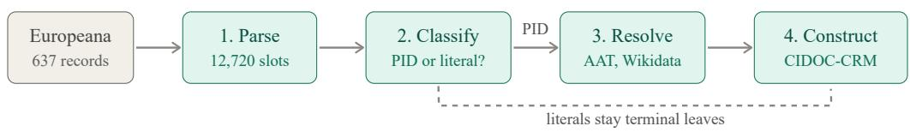

# Automated Construction of FAIR Digital Object Knowledge Graphs from Flat Cultural Heritage Records

Zeyd Boukhers✉ zeyd.boukhers@fit.fraunhofer.de Fraunhofer Institute for Applied Information Technology FIT Germany University Hospital of Cologne Cologne, Germany

Xenophon Zabulis zabulis@ics.forth.gr Foundation for Research and Technology Greece

## Abstract

The FAIR Digital Object (FDO) framework mandates that metadata attribute values be expressed as persistent identifiers (PIDs) wherever possible, to produce a fully machine-actionable graph in which every reference is resolvable. The Europeana Data Model was designed long before the FDO specification, and it stores most metadata values as plain text. This serves human browsing well enough, but gives an automated agent nothing to follow across records or collections. We present a pipeline that transforms flat Europeana records into an FDO-compliant knowledge graph structured with CIDOC-CRM. Following the FDO specification, we model every heritage entity as a discrete FDO with its own PID, type, profile, and metadata layer. The core technical challenge is automating the FDO-prescribed distinction between values that must become PID references (resolvable entities) and those that may remain literals (terminal leaves such as notes, measurements, and dates). We address this with a large language model that classifies each metadata value, routes it to a controlled vocabulary (Getty AAT, Wikidata, VIAF, PeriodO), and links it to a shared entity FDO. We evaluate using 637 archaeological records from five Europeana providers, processing each with the LLM. The pipeline links 86% of metadata slots, resolving 58.5% of values Europeana had not already enriched. It also merges cross-lingual surface forms that byte-identical matching keeps apart, where 17 of 33 such merges are correct on manual review. Graph connectivity does not separate this from string matching; what distinguishes the FDO graph is that every node is typed and resolvable.

## CCS Concepts

• Information systems → Entity resolution; Digital libraries and archives; Semantic web description languages.

Lingxiao Kong lingxiao.kong@fit.fraunhofer.de Fraunhofer Institute for Applied Information Technology FIT Germany University of Cologne Cologne, Germany

Georgios Toubekis georgios.toubekis@fit.fraunhofer.de Fraunhofer Institute for Applied Information Technology FIT Germany

Keywords   
FAIR Digital Objects, cultural heritage metadata, knowledge graph construction, entity resolution, CIDOC-CRM, large language models, Europeana

## 1 Introduction

The FAIR Digital Object (FDO) framework [2] provides an operational architecture for making digital resources Findable, Accessible, Interoperable, and Reusable by machines without human mediation. A core requirement of the FDO specification is that metadata attribute values are expressed as persistent identifiers (PIDs) rather than plain strings [23]. The goal is to produce a fully machineactionable graph in which every reference can be resolved, typed, and traversed algorithmically. Only terminal leaf values (i.e. numeric measurements, free-text notes, dates, checksums) may remain as literals [4, 28].

Cultural heritage aggregators such as Europeana [12] hold millions of records, yet the majority of metadata values remain expressed as plain-text strings rather than PID references. This is a gap between current practice and the degree of machine-actionability that the FDO framework envisions. A record’s dcterms:spatial field typically contains the string “Bracara Augusta” rather than a PID resolving to a Place FDO. A dcCreator field stores “Cristina Braga” rather than a VIAF or ORCID reference. Machine actionability is therefore limited and no automated agent can traverse from an object to its findspot or relate all objects from the same excavation. It cannot, for example, tell that “Braga” and “Bracara Augusta” name the same place.

To maximise machine actionability in compliance with the FDO specification, metadata values that denote reusable entities must be replaced by PID references to shared FDOs. The technical challenge, then, is not merely one of entity linking. It is rather the automated enforcement of the FDO-prescribed boundary between PID-expressed values (entities that can and should be shared across records) and literal-expressed values (terminal leaves that cannot be meaningfully shared). This boundary is defined by the FDO architecture itself [4]:

a value is a PID reference if and only if it denotes a reusable realworld entity (place, material, actor, event, concept). Otherwise, it remains a literal.

We present a pipeline that operationalises this principle at scale. Given flat Europeana records, a large language model (LLM) classifies each metadata value into a semantic type and determines whether it crosses the PID/literal boundary. Values that cross it are resolved to a shared entity FDO identified in a controlled vocabulary. The resulting knowledge graph follows the FDO architecture of [4, 28]: every entity is a discrete FDO with its own persistent identifier, FDO Type, FDO Profile, and Metadata FDO carrying CIDOC-CRM [6] assertions. The contribution here lies in automating the population of these FDOs from flat records rather than redefining the architecture itself.

Our contributions are:

(1) An LLM-driven pipeline that automates the FDO-compliant transformation of flat metadata into PID references, achieving 58.5% resolution on values it must resolve itself and 89.6% overall once Europeana’s pre-linked URIs are counted, reported separately throughout.

(2) An FDO-native knowledge graph instantiated automatically by our pipeline, in which every resolved entity is a full FDO (i.e. self-describing, PID-resolvable, and carrying declared operations), building directly on the FDO Manager specification [28].

(3) An empirical evaluation on 637 records from five providers, with every record processed by the LLM. Over an identical slot population, entity resolution reduces disconnected components from 32 to 20; given all content values, including those the pipeline leaves unlinked, string matching reaches 8. The direction of the connectivity result depends on the slot population, which bounds what connectivity establishes about machine actionability (Section 4).

## 2 Related Work

FAIR Digital Objects and machine actionability. The FAIR principles shifted data-management practice from human-readable documentation toward resources that can be discovered, accessed, interpreted, and reused by machines [25]. FAIR Digital Objects (FDOs) operationalise this goal by treating digital resources as persistent, typed, and self-describing units with machine-resolvable identifiers and explicit metadata [2, 8]. Recent FDO work further emphasises the separation between a minimal PID/kernel layer and richer semantic descriptions, so that machines can first resolve an object, inspect its type and profile, and then retrieve domain-specific metadata or operations [28]. Autonomous FDOs add policy and agreement layers so that objects validate and reconcile their own assertions [3], which builds on the resolvable metadata values we produce here. We adopt this architecture, but address a different problem: given flat cultural-heritage records, how can the system decide which metadata values should become PID references to reusable entities and which values should remain literals? This PID/literal boundary is central to producing machine-actionable FDO graphs, yet it is not addressed by existing FDO infrastructure alone.

Cultural heritage metadata, CIDOC-CRM, and linked data. Cultural heritage institutions have long used semantic models to improve interoperability across heterogeneous collections. The Europeana

Data Model (EDM) provides an aggregation-oriented model for publishing and enriching collection records [12], while CIDOC-CRM provides an event-centric ontology for integrating complex heritage information across institutions [6]. Prior work has shown that CIDOC-CRM and EDM can capture complementary aspects of museum data, but also that real institutional records remain difficult to model because they are heterogeneous, incomplete, historically accumulated, and often expressed as weakly structured strings [10]. Cultural heritage linked-data projects such as the Zeri Photo Archive, the Smithsonian American Art Museum, and the Beyond 2022 knowledge graph demonstrate the value of RDF, CIDOC-CRM, named graphs, and external authority links for collection discovery and scholarly interpretation [7, 9, 22]. However, these efforts typically rely on substantial manual modelling, project-specific mappings, or curated transformation rules. In contrast, our pipeline targets aggregator-scale Europeana records and automates the conversion from flat metadata slots into FDO entities and CIDOC-CRM relations.

Entity linking and cultural-heritage authority control. Entity linking connects textual mentions to canonical entities in knowledge bases and has been widely studied as a core step for semantic search, knowledge-base population, and data integration [20, 21]. Wikidata has become especially important because it is multilingual, continuously updated, community-curated, and broadly connected to external authority files [16, 24]. In the cultural heritage domain, systems such as Heritage Connector use machine learning to build linked open data from museum catalogues, perform record linkage to Wikidata, and extract new entities from textual collection descriptions [11]. More recent cultural-heritage knowledge-graph work combines entity extraction, relation extraction, and deep learning to structure fragmented museum data [14]. These approaches are close to our goal, but they optimise primarily for linking or graph construction. Our task is narrower and more FDO-specific: before linking, the system must determine whether a metadata value denotes a reusable entity that should be represented by a PID, or a terminal attribute that should remain a literal. This makes our problem not only entity linking, but specification-driven metadata normalisation for machine-actionable FDO construction.

AI-based semantic enrichmentfor cultural heritage. A recent line of work enriches cultural resources with AI-generated identifications, entity links, and graph structure. CulturAI applies semantic technologies and machine learning to augment cultural records with external knowledge [5]; comparative evaluations of state-of-the-art entity linkers on community-generated cultural content report that off-the-shelf models degrade on domain vocabulary and multilingual mentions [1]; multimodal systems extend heritage knowledge graphs by combining language and vision models [26]; and LLMs combined with ontological engineering have been used to generate knowledge graphs from cultural heritage texts [19]. These systems target richer or more accurate links than we do, and several are stronger entity linkers. What differs here is the decision the system is asked to make. Those pipelines link mentions that are given to them as entities; ours must first decide which values are entities at all, because the FDO specification, not a benchmark, fixes what may remain a literal. Our contribution is that boundary decision and its use to populate an FDO graph, rather than linking accuracy, which we do not benchmark against dedicated linkers.

LLMs for data integration and knowledge-graph construction. Recent data-management research shows that foundation models can generalise to classical data tasks such as schema matching, data cleaning, and entity resolution when these tasks are formulated through prompts or structured outputs [15, 17]. In parallel, work on the convergence of large language models and knowledge graphs argues that LLMs can support KG construction, completion, and semantic enrichment, while KGs provide grounding, structure, and interpretability [18]. General KG surveys also identify entity canonicalisation, type assignment, relation extraction, and knowledge fusion as persistent challenges in automatic graph construction [13, 27]. Our pipeline applies this emerging LLM–KG paradigm to cultural heritage metadata, but with an explicit architectural constraint from the FDO model: the LLM is not used merely to generate triples, but to enforce the PID/literal decision, route resolvable values to appropriate authority vocabularies, and instantiate the resulting entities as FDOs connected through CIDOC-CRM properties. This positions the work between cultural heritage linked data, entity linking, and FDO-based machine actionability.

## 3 System Overview

Our pipeline transforms flat Europeana records into an FDO-compliant knowledge graph through four stages (Figure 1), following the architecture of [4, 28]. The design is governed such that: 1) every heritage entity is a discrete FDO; 2) metadata values are PIDs wherever the value denotes a reusable entity; 3) literals are reserved only for terminal leaves.

Stage 1: Slot Extraction and Prior Assignment: Each Europeana record is retrieved from the Search API under the rich profile and decomposed into a set of slots (�, �) where � is the metadata field and � is its value. This projection carries EDM-derived fields rather than raw EDM elements, so the field names are those of the API response: dctermsSpatial, edmPlace, dcCreator, edmConcept, edmTimespan and organizations for entity-bearing values, and title, dcDescription, rights, edmIsShownAt,

dcLanguage and year for values expected to remain literal. Each field carries a prior semantic class (e.g., dctermsSpatial → PLACE, edmTimespan → PERIOD) that the LLM may override. Neither dcterms:medium nor dc:type occurs in this projection, which is why the corpus yields almost no MATERIAL slots (Section 4). Slots whose values are already URIs from Europeana’s enrichment pipeline are classified directly from the URI domain (Getty TGN → PLACE, AAT → OBJECT\_TYPE, ULAN → AC-TOR) and bypass the LLM.

Stage 2: PID/Literal Boundary Classification. For each non-prelinked slot, we must determine whether � denotes a reusable entity that should become a PID reference, or a terminal leaf that remains literal. Per the FDO specification [4], the distinction is:

• PID reference: the value denotes a place, material, actor, period, event, object type, or other shared concept that can be identified in a controlled vocabulary and reused across records.

• Literal: the value is a free-text description, numeric measurement, date, access URL, inventory number, or rights statement that cannot be meaningfully shared as a discrete entity.

We frame this as a structured classification task for an LLM. Given (� , �) and the record’s context (title, type, country), the model outputs: (1) a semantic type from a 16-class taxonomy; (2) a binary resolvable decision implementing the PID/literal boundary; and (3) the target vocabulary for resolution (AAT, Wikidata, VIAF, PeriodO). All three decisions are produced in a single structured JSON call.

Stage 3: Entity Resolution and Linking. For each slot classified as resolvable, the pipeline queries the target vocabulary’s API using an LLM-generated search string. A vocabulary fallback chain ensures robustness: VIAF → Wikidata, AAT → Wikidata, PeriodO → AAT → Wikidata. PLACE values route to Wikidata: GeoNames is not used, as no endpoint credential was available. When multiple candidates are returned with similar confidence scores, the LLM reranks them using the record context for disambiguation.

Stage 4: FDO Graph Construction. Following the architecture of [4] and the kernel/metadata separation of [28], resolved entities are instantiated as full FDOs:

Kernel Record. A lean structural envelope containing only PIDs: this FDO’s PID, FDO Type PID, FDO Profile PID, Metadata FDO PID, Content PIDs, applicable Operation PIDs, a timestamp, and a checksum. No domain semantics reside in the kernel.

Metadata FDO. A separate FDO carrying CIDOC-CRM property assertions. Object FDOs (E22\_Human-Made\_Object) link to entity FDOs via CRM properties: P53\_has\_former\_or \_current\_location points to a Place FDO (E53),

P45\_consists\_of to a Material FDO (E57),

P14\_carried\_out\_by to a Person FDO (E21) and P50\_has \_current\_keeper to a Group FDO (E74), separating the actor who acted from the institution that holds the object; P2\_has\_type to a Type FDO (E55); and P10\_falls\_within to a Period FDO (E4). Crucially, property objects are PIDs of other FDOs—not vocabulary URIs directly. External URIs (e.g., http://vocab.ge tty.edu/tgn/...) appear only as owl:sameAs on the entity FDO itself.

Self-describing infrastructure. FDO Types (Place, Material, Actor, etc.) and FDO Operations (Resolve, GetMetadata, Validate, Link) are themselves FDOs with PIDs, registered in a type/operations registry. This makes the graph navigable by machines without out-ofband documentation [28].

The result is a knowledge graph where every node is a PIDresolvable FDO, every metadata edge is a typed CIDOC-CRM relation, and every entity can be traversed, queried, and composed by automated agents. Whether this constitutes machine actionability in the sense the FDO specification intends is what Section 4 sets out to test.

## 4 Evaluation

We evaluate two research questions: (RQ1) What does graph connectivity capture, and what does it miss? (RQ2) How consistently does the pipeline type and route the values it resolves?

  
Figure 1: Pipeline architecture. Flat Europeana records are parsed into (field, value) slots. An LLM enforces the FDO-prescribed PID/literal boundary by classifying each value’s semantic type and resolvability. Resolvable values are linked to shared entity FDOs via controlled vocabularies; literals remain as terminal leaves.

Dataset and Setup: We harvest 637 archaeological records from five Europeana data providers spanning four countries, yielding 12,720 metadata slots over content-bearing fields (see below); 9,197 already carry a vocabulary URI from Europeana’s enrichment and 3,523 are plain strings. The LLM is a 120B-parameter instructiontuned model (“gpt-oss-120b”) run at temperature 0 with every response cached, which makes re-runs deterministic. Every one of the 637 records is processed by the LLM. Code, configuration, and evaluation outputs are available at https://github.com/ZResearch/ aFDO\_CIKM. The accompanying test suite covers the record parser, the FDO kernel and serialisation layer, and the graph metrics.

Field restriction. All figures below are computed over contentbearing fields. Five fields are excluded, for two different reasons. organizations (six distinct aggregator identifiers across all 637 records), rights and edmIsShownAt carry provenance rather than content. dcLanguage is excluded because the classifier fails on it: language codes are marked resolvable and linked to unrelated art-historical concepts—“en” and “English” both resolve to the AAT concept English Baroque across 334 records, and “ro” to Romanian (Cyrillic) across 148. These pass the type–vocabulary check, which validates a URI’s domain rather than the entity behind it. They are 28% of pipeline links and are a boundary classification failure, not a routing failure; we report them here and exclude them from the figures below.

RQ1: What Connectivity Captures. We operationalise machine actionability as graph connectivity—a machine agent can traverse the graph from one record to another if and only if they share at least one node. We compare $G _ { \mathrm { f l a t } } ,$ records connected by byte-identical string values appearing in ≥2 records, against � , records connected through shared entity FDOs.

Two controls are required. First, both graphs must be built from the same slot population, since a baseline that excludes URI-valued slots that the FDO graph counts is weaker by construction. Second, connectivity saturates. A single Creative Commons rights URI appears in 589 of 637 records and connects the flat graph on its own; the aggregator organization URIs do the same to the FDO graph. With those hubs present, all three graphs collapse to a single component and the metric distinguishes nothing. We therefore restrict both graphs to content-bearing fields and drop any value occurring in more than 10% of records.

Table 1 reports the result. Given the same 10,995 slots, entity resolution reduces components from 32 to 20 and raises the largest component from 69.4% to 73.6%. Given all 12,720 content values, string matching reaches 8 components: values the pipeline leaves unlinked still connect records as byte-identical strings. Connectivity therefore does not separate the two approaches in a stable way, and its direction depends on a choice of slot population that the metric itself does not fix. Europeana already ships vocabulary URIs for 65% of slots, and those URIs are byte-identical across records, so string matching recovers them without any resolution step. Over content-bearing fields the pipeline produces 800 entity FDOs and 9,054 CIDOC-CRM edges.

Table 1: Connectivity over 637 records, content-bearing fields, values occurring in more than 10% of records removed. $G _ { \mathbf { f l a t } } ^ { = }$ is restricted to the same slots as �FDO; $G _ { \mathbf { f l a t } } ^ { + }$ adds the content values the pipeline left unlinked, which still connect records as byte-identical strings.
<table><tr><td>Metric</td><td> $G _ { \mathrm { f l a t } } ^ { + }$ </td><td> $G _ { \mathrm { f l a t } } ^ { = }$ </td><td>GFDO</td></tr><tr><td>Slots used</td><td>12720</td><td>10995</td><td>10995</td></tr><tr><td>Distinct shared nodes</td><td>479</td><td>359</td><td>369</td></tr><tr><td>Connected components</td><td>8</td><td>32</td><td>20</td></tr><tr><td>Largest component (% records)</td><td>71.6%</td><td>69.4%</td><td>73.6%</td></tr><tr><td>Cross-provider bridges</td><td>13</td><td>12</td><td>13</td></tr><tr><td>Nodes with resolvable URI Surface forms merged</td><td>63.8%</td><td>63.8%</td><td>100.0%†</td></tr><tr><td>Slot-level resolution</td><td>0</td><td>0</td><td>176</td></tr><tr><td>Pre-linked URIs</td><td></td><td> $9 1 9 7 / 9 1 9 7 = 1 0 0 . 0 \% ^ { \dag }$ </td><td></td></tr><tr><td>Resolved by pipeline</td><td></td><td></td><td></td></tr><tr><td></td><td></td><td> $1 7 9 8 / 3 0 7 5 = 5 8 . 5 \%$ </td><td></td></tr><tr><td>Combined</td><td></td><td></td><td> $1 0 9 9 5 / 1 2 2 7 2 = 8 9 . 6 \%$ </td></tr></table>

† induced by construction, not measured.

Surface-form merging. Connectivity counts reachable records; it does not distinguish a node that is a resolved entity from one that is a shared string. Two properties do. Every node in �FDO carries a resolvable external identifier and a semantic type, against 63.8% of $G _ { \mathrm { f l a t } }$ nodes that happen to be URI strings, the remainder being bare literals that support no further resolution. And 33 entity FDOs absorb 176 distinct surface forms that byte-identical matching keeps apart.

We reviewed all 33 merges by hand: 17 are correct, and 16 are not. The correct ones absorb 34 surface forms but attach to 327 records, and are cross-lingual or variant alignments of places and organisations—Athens/“A����´ ” across 135 records, National Theatre of Greece/“E�����´ Θ�����´ ” across 29, Epidaurus/“E��������´ ” across 12. The incorrect ones absorb 142 forms across only 163 records and concentrate in PERIOD: 59 internal record identifiers of the form share3d:\*/TMP.1 resolve to a concept labelled Human parainfluenza virus 1 and 47 more to ISO 2-numbers. Failures are numerous but shallow; successes are few but deep. PERIOD is also the only class where type–vocabulary consistency is measurable, at 62.5%, and all 124 observed type errors fall in it.

Table 2: Entity resolution quality, content-bearing fields. Pre-linked slots are omitted from the accuracy rows: their semantic type is inferred from the same URI domain the check validates, so that the figure measures the URI rules rather than the model.
<table><tr><td>Metric</td><td>Value</td></tr><tr><td>Total linked slots Pre-linked URIs (Europeana)</td><td>10995</td></tr><tr><td>Resolved by pipeline</td><td>9197 1798</td></tr><tr><td>Type-vocabulary consistency (pipeline-resolved) PERIOD (n=331)</td><td>62.5%</td></tr><tr><td>Other classes</td><td>not measurable</td></tr><tr><td>Vocabulary routing (pipeline-resolved) Strict (n=1798)</td><td>73.1%</td></tr><tr><td>Surface-form merging</td><td></td></tr><tr><td>Entities merging ≥2 forms</td><td></td></tr><tr><td>Correct on manual review</td><td>33 17</td></tr></table>

RQ2: Typing and Routing Consistency. Label similarity is not reported. Fuzzy string overlap between a source value and its resolved label is a common proxy for link quality, but it is invalid on a multilingual corpus: it scores correct cross-lingual links at zero. “A����´ ” → “Athens” and “E��������´ ” → “Epidaurus” are right and score 0.00. Over this corpus, the mean is 0.493 with 43.6% of links below 0.3, and the low scores are dominated by correct Greek and Romanian resolutions. The metric penalises precisely the alignments that distinguish resolution from string matching, so we report no figure for it.

Typing and routing. Type–vocabulary consistency is reported only for pipeline-resolved slots, since for pre-linked slots the type is inferred from the URI domain the check then validates. It is measurable for PERIOD alone, at 62.5% on 331 slots; the other classes route predominantly to Wikidata, where any semantic type is admissible, and the check is vacuous. Strict vocabulary routing is 73.1% (1315/1798). A fallback-inclusive figure can also be computed, but it counts any fall-through to Wikidata as correct and is therefore bounded by the design rather than measured, so we omit it.

Discussion. What connectivity measures. Connectivity is a weak discriminator here. It saturates on values that denote no entity— a rights statement shared by 589 records connects the graph as effectively as a resolved place—and its verdict reverses with the choice of slot population. What separates the graphs is not how many records are reachable but what the nodes are: typed, resolvable identifiers rather than strings. The denominators are as follows: of 12,720 slots the classifier marks 12,272 resolvable and 10,995 of those are linked, giving 89.6%. That denominator is the classifier’s own decision, so a value wrongly ruled literal is invisible to this measure.

Cross-provider bridges. Thirteen entity FDOs are shared across providers. A machine agent starting at a record in the National Heritage Institute of Bucharest can reach records in the Huis van Hilde collection (Netherlands) through a shared Type FDO (AAT 300192802); no Place FDO connects those two providers, and all Place bridges in the corpus are intra-Romanian. One of the 13 is spurious—an AAT concept labelled “Human parainfluenza virus 1”

typed as PERIOD, spanning 59 records across two countries. Twelve of the 13 carry a raw URI as their label, because pre-linked URIs are not dereferenced for canonical labels; this limits how far such bridges can be audited automatically.

Limitations. The current evaluation uses automatic quality proxies rather than human-annotated gold; a full annotation study is planned. This is the main limitation, and it bounds every number above: none of these measures verifies that a link is the right entity, that a literal was correctly left unresolved, or that a bridge is meaningful. Type–vocabulary consistency is agreement with a URI-domain rule, not with a human judgement, and it is measurable for one class only. Two further limits are specific to this corpus. The Search API projection carries no material or medium field, so the pipeline produces no MATERIAL entities and the P45\_consists\_of relation is never instantiated; the edge distribution is dominated by P2\_has\_type (4701) and P53 (4658), with P10 (1278), P14 (245) and P50 (113). And all results come from one domain, archaeology, in one aggregator, so we make no claim of generalisation to other collections or aggregators.

## 5 Conclusion

We presented an LLM-driven pipeline for transforming flat Europeana metadata into a machine-actionable FAIR Digital Object knowledge graph. The central contribution is the automated enforcement of the FDO PID/literal boundary. Specifically, values that denote reusable cultural heritage entities are resolved to persistent identifiers, while terminal attributes remain literals. By representing resolved places, actors, periods, object types, and concepts as full FDOs connected through CIDOC-CRM relations, the resulting graph moves beyond conventional metadata enrichment toward a self-describing structure that machines can resolve, traverse, and reuse.

This work shows that FDO principles can be operationalised over heterogeneous aggregator metadata without requiring fully manual modelling. The measured benefit is that nodes are typed, resolvable, and merge surface variants, not that more records are reachable. It also rests on automatic proxies rather than human judgement. More broadly, it suggests that LLMs can support the transition from stringbased cultural heritage records to interoperable, PID-centred knowledge infrastructures. Future work will prioritise a human-annotated gold set, which is the prerequisite for every quality claim above; compare against dedicated entity-linking and record-linkage systems; replace graph connectivity with a downstream traversal or discovery task, since connectivity saturates on trivial shared values; and extend the pipeline to additional Europeana domains and aggregators to test whether any of this generalises.

## Acknowledgements

This work was supported by the European Union’s Horizon Europe programme through the ARXIVE project (Grant Agreement No. 101233418) and the ARGUS project (Grant Agreement No. 101132308), and by the German Research Foundation (DFG) through NFDI4DataScience (NFDI4DS) (project no. 460234259).

## GenAI Usage Disclosure

The authors used generative AI tools to assist with language editing, paragraph restructuring, and drafting of non-technical explanatory text. The authors also used generative AI tools to support software development, including assistance with code drafting, debugging, and improving implementation clarity. All generated text and code were reviewed, verified, tested where applicable, and approved by the authors. The authors take full responsibility for the content, technical claims, implementation, results, and conclusions presented in this submission.

## References

[1] Youcef Benkhedda, Adrians Skapars, Viktor Schlegel, Goran Nenadic, and Riza Batista-Navarro. 2024. Enriching the Metadata of Community-Generated Digita Content through Entity Linking: An Evaluative Comparison of State-of-the-Art Models. In Proceedings ofthe 8th Joint SIGHUM Workshop on Computational Linguistics for Cultural Heritage, Social Sciences, Humanities and Literature (LaTeCH-CLfL 2024). Association for Computational Linguistics, St. Julians, Malta, 213–220. doi:10.18653/v1/2024.latechclfl-1.20

[2] Luiz Olavo Bonino da Silva Santos, Tiago Prince Sales, Claudenir M. Fonseca, and Giancarlo Guizzardi. 2023. Towards a Conceptual Model for the FAIR Digital Object Framework. In Formal Ontology in Information Systems (Frontiers in Artificial Intelligence and Applications). IOS Press. doi:10.3233/FAIA231131

[3] Zeyd Boukhers, Oya Beyan, Cong Yang, and Christoph Lange. 2026. Autonomous FAIR Digital Objects: From Passive Assertions to Active Knowledge. In The International Semantic Web Conference (ISWC). arXiv:2605.10370 [cs.AI] https: //arxiv.org/abs/2605.10370

[4] Zeyd Boukhers, Lingxiao Kong, and Georgios Toubekis. 2024. FAIR Digital Objects for Archaeological Heritage: A CIDOC-CRM Knowledge Graph Archi tecture. In Proceedings ofthe Digital Heritage Conference. ARXIVE project, EU Grant 101233418.

[5] Salvatore M. Carta, Sergio Consoli, Alessandro Giuliani, Alessandro Sebastian Podda, and Diego Reforgiato Recupero. 2022. CulturAI: Semantic Enrichmen of Cultural Data Leveraging Artificial Intelligence. IEEE Access 10 (2022), 127328–127344. doi:10.1109/ACCESS.2022.3226070

[6] CIDOC CRM Special Interest Group. 2024. Definition ofthe CIDOC Conceptual Reference Model. Technical Report. ICOM/CIDOC. Version 7.1.3; corresponds to ISO 21127:2023. https://cidoc-crm.org/sites/default/files/cidoc\_crm\_version\_ 7.1.3.pdf

[7] Marilena Daquino, Francesca Mambelli, Silvio Peroni, Francesca Tomasi, and Fabio Vitali. 2017. Enhancing Semantic Expressivity in the Cultural Heritage Domain: Exposing the Zeri Photo Archive as Linked Open Data. ACM Journal on Computing and Cultural Heritage 10, 4 (2017), 21:1–21:21. doi:10.1145/3051487

[8] Koenraad De Smedt, Dimitris Koureas, and Peter Wittenburg. 2020. FAIR Digital Objects for Science: From Data Pieces to Actionable Knowledge Units. Publica tions 8, 2 (2020), 21. doi:10.3390/publications8020021

[9] Christophe Debruyne, Gary Munnelly, Lynn Kilgallon, Declan O’Sullivan, and Peter Crooks. 2022. Creating a Knowledge Graph for Ireland’s Lost History: Knowledge Engineering and Curation in the Beyond 2022 Project. ACM Journal on Computing and Cultural Heritage 15, 2 (2022), 25:1–25:25. doi:10.1145/ 3474829

[10] Chris Dijkshoorn, Lora Aroyo, Jacco van Ossenbruggen, and Guus Schreiber. 2018. Modeling Cultural Heritage Data for Online Publication. Applied Ontology 13, 4 (2018), 255–271. doi:10.3233/AO-180201

[11] Kalyan Dutia and John Stack. 2021. Heritage Connector: A Machine Learning Framework for Building Linked Open Data from Museum Collections. Applied AI Letters 2, 2 (2021), e23. doi:10.1002/ail2.23

[12] Europeana. 2013. Europeana Data Model Primer. Technical Report. Europeana. Edited by Antoine Isaac; version dated 14 July 2013. https://pro.europeana.eu/files/Europeana\_Professional/Share\_your\_data/ Technical\_requirements/EDM\_Documentation/EDM\_Primer\_130714.pdf

[13] Aidan Hogan, Eva Blomqvist, Michael Cochez, Claudia d’Amato, Gerard de Melo, Claudio Gutierrez, Sabrina Kirrane, José Emilio Labra Gayo, Roberto Navigli,

Sebastian Neumaier, Axel-Cyrille Ngonga Ngomo, Axel Polleres, Sabbir M. Rashid, Anisa Rula, Lukas Schmelzeisen, Juan Sequeda, Steffen Staab, and Antoine Zimmermann. 2021. Knowledge Graphs. Comput. Surveys 54, 4 (2021), 71:1–71:37. doi:10.1145/3447772

[14] Yuexin Huang, Suihuai Yu, Jianjie Chu, Hao Fan, and Bin Du. 2023. Using Knowledge Graphs and Deep Learning Algorithms to Enhance Digital Cultural Heritage Management. Heritage Science 11 (2023), 204. doi:10.1186/s40494- 023-01042-y

[15] Guoliang Li, Xuanhe Zhou, and Xinyang Zhao. 2024. LLM for Data Management. Proceedings ofthe VLDB Endowment 17, 12 (2024), 4213–4216. doi:10.14778/ 3685800.3685838

[16] Cedric Möller, Jens Lehmann, and Ricardo Usbeck. 2022. Survey on English Entity Linking on Wikidata: Datasets and Approaches. Semantic Web 13, 6 (2022), 925–966. doi:10.3233/SW-212865

[17] Avanika Narayan, Ines Chami, Laurel Orr, and Christopher Ré. 2022. Can Foundation Models Wrangle Your Data? Proceedings ofthe VLDB Endowment 16, 4 (2022), 738–746. doi:10.14778/3574245.3574258

[18] Shirui Pan, Linhao Luo, Yufei Wang, Chen Chen, Jiapu Wang, and Xindong Wu. 2024. Unifying Large Language Models and Knowledge Graphs: A Roadmap. IEEE Transactions on Knowledge and Data Engineering 36, 7 (2024), 3580–3599. doi:10.1109/TKDE.2024.3352100

[19] Andrea Schimmenti, Valentina Pasqual, Fabio Vitali, and Marieke van Erp. 2026. Knowledge Graphs Generation from Cultural Heritage Texts: Combining LLMs and Ontological Engineering for Scholarly Debates. Journal ofDocumentation 82, 7 (2026), 206–250. doi:10.1108/JD-07-2025-0203

[20] Özge Sevgili, Artem Shelmanov, Mikhail Arkhipov, Alexander Panchenko, and Chris Biemann. 2022. Neural Entity Linking: A Survey of Models Based on Deep Learning. Semantic Web 13, 3 (2022), 527–570. doi:10.3233/SW-222986

[21] Wei Shen, Jianyong Wang, and Jiawei Han. 2015. Entity Linking with a Knowledge Base: Issues, Techniques, and Solutions. IEEE Transactions on Knowledge and Data Engineering 27, 2 (2015), 443–460. doi:10.1109/TKDE.2014.2327028

[22] Pedro Szekely, Craig A. Knoblock, Fengyu Yang, Xuming Zhu, Eleanor E. Fink, Rachel Allen, and Georgina Goodlander. 2013. Connecting the Smithsonian American Art Museum to the Linked Data Cloud. In The Semantic Web: Semantics and Big Data (Lecture Notes in Computer Science, Vol. 7882). Springer, 593–607. doi:10.1007/978-3-642-38288-8\_40

[23] Georgios Toubekis, Lingxiao Kong, and Zeyd Boukhers. 2026. Considerations for Accountable AI in Cultural Heritage Documentation: Toward FAIR Digital Objects for the European Collaborative Cloud. In International Symposium on Digital Ecosystemsfor Heritage 2026.

[24] Denny Vrandeciˇ c, Lydia Pintscher, and Markus Krötzsch. 2023. Wikidata: The´ Making Of. In Companion Proceedings ofthe ACM Web Conference 2023. ACM, 615–624. doi:10.1145/3543873.3585579

[25] Mark D. Wilkinson, Michel Dumontier, IJsbrand Jan Aalbersberg, Gabrielle Appleton, Myles Axton, Arie Baak, Niklas Blomberg, Jan-Willem Boiten, Luiz Bonino da Silva Santos, Philip E. Bourne, et al. 2016. The FAIR Guiding Principles for Scientific Data Management and Stewardship. Scientific Data 3 (2016), 160018. doi:10.1038/sdata.2016.18

[26] Yang Zhang, Nada Mimouni, Jean-Claude Moissinac, and Fayçal Hamdi. 2026. Multimodal Cultural Heritage Knowledge Graph Extension with Language and Vision Models. arXiv:2605.17669 https://arxiv.org/abs/2605.17669

[27] Lingfeng Zhong, Jia Wu, Qian Li, Hao Peng, and Xindong Wu. 2024. A Comprehensive Survey on Automatic Knowledge Graph Construction. Comput. Surveys 56, 4 (2024), 1–62. Article 94; published online 30 November 2023. doi:10.1145/3618295

[28] Oussama Zoubia, Nagaraj Bahubali Asundi, Adamantios Koumpis, Christoph Lange, Sezin Dogan, Oya Beyan, and Zeyd Boukhers. 2025. FDO Manager: Minimum Viable FAIR Digital Object Implementation. In International FAIR Digital Objects Implementation Summit 2024 (Open Conference Proceedings, Vol. 5). doi:10.52825/ocp.v5i.1421