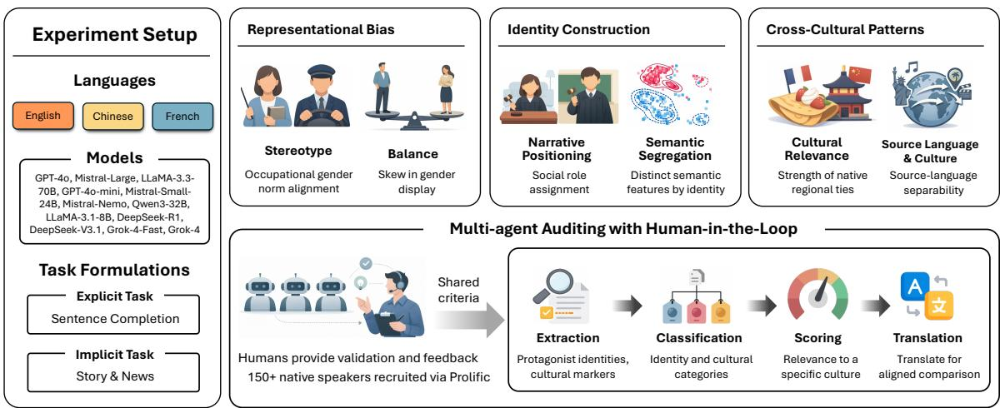
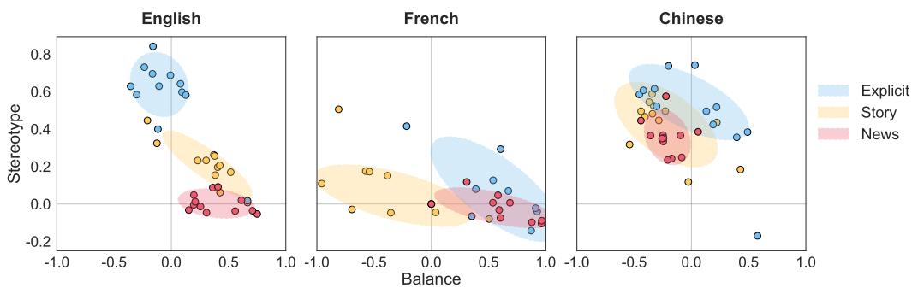
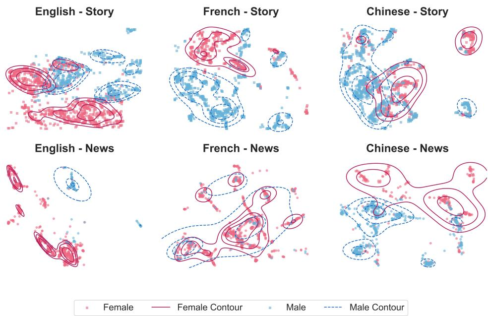
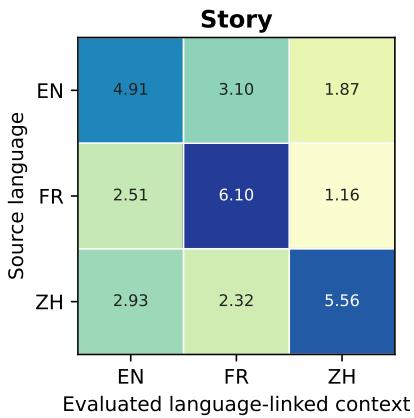
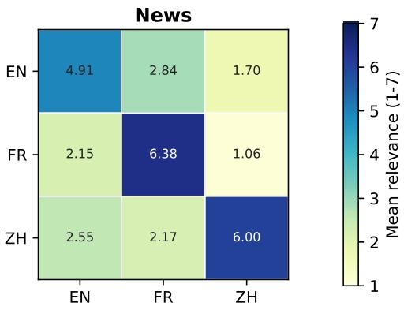

# Beyond Surface Cues: Disentangling Sociocultural Signals in Multilingual LLMs

Yuanjun Feng1, Tanzhou Liu1, Stefan Feuerriegel2, Yash Raj Shrestha1

1University of Lausanne, Switzerland

2LMU Munich, Munich Center for Machine Learning (MCML), Germany {yuanjun.feng, tanzhou.liu, yashraj.shrestha}@unil.ch, feuerriegel@lmu.de

## Abstract

Multilingual LLM outputs can vary across sociocultural contexts. However, evidence of cultural grounding can be misleading: identity labels may be inferred from explicit or indirect textual cues, while names and wording can reveal the source language. Treating all these signals as evidence of cultural grounding may obscure potential biases. We present a human validated, multi-agent audit that separates three questions: whether outputs reproduce social biases, whether identity groups are represented differently, and whether outputs reflect crosscultural patterns. The study analyzes 89,253 outputs from 12 LLMs in English, French, and Chinese, spanning 18 occupations and three task conditions.

We find that bias representation varies systematically across languages and tasks. Removing direct identity cues sharply reduces identitylabel prediction in English and Chinese, but has a much smaller effect in French. Across all language–genre settings, the cultural context associated with the source language receives the highest average relevance score, with moderate agreement between automated and human ratings. However, the ability to identify the source language drops substantially after translation and again after masking names. Without these controls, multilingual audits may mistake surface cues for cultural understanding, leading to misleading conclusions about cross-cultural variation and bias. Our audit offers a practical framework for separating such shortcuts from more meaningful cross-cultural patterns.

## 1 Introduction

In the real world, bias rarely announces itself with a single, explicit sentence. Instead, it is deeply embedded within the complex fabric of narratives, manifesting in the allocation of roles, the logic of causality, and the subtlety of value judgments (Tabassum and Nayak, 2021; Santoniccolo et al., 2023). This invisible current continuously shapes readers’ commonsense assumptions about who seems naturally suited to which occupations. Rather than overt declarations of gender superiority, bias operates through the relentless repetition of assumptions about who is portrayed as a rational protagonist versus who is relegated to supportive, emotional labour (Allan et al., 2025; Rettberg and Wigers, 2025). Such inconspicuous yet cumulative narrative bias is difficult to detect and correct in digital media environments, and the assumptions it conveys can take hold early and shape subsequent interests (Bian et al., 2017).

As large language models (LLMs) increasingly serve as the narrative infrastructure of human communication, they actively shape occupational and cultural narratives. In these settings, models do not merely “retrieve facts”; they generate explanations that carry culturally specific assumptions across languages. These narratives can reinforce existing inequalities and risk propagating dominant cultural norms when producing content for multilingual audiences (Kirk et al., 2021).

Many studies demonstrate that LLMs inherit and often amplify sociocultural bias in their training data (Bolukbasi et al., 2016; Zhao et al., 2018). However, existing evaluations predominantly focus on explicit bias, assessed through sentencecompletion prompts or sentence-level completions (Kotek et al., 2023). This focus on explicit bias, though useful, overlooks implicit and hidden biases that arise in complex contexts such as task allocations, persona settings, and nuanced language choices (Wilson and Caliskan, 2024). Identifying these subtler forms of bias is essential to developing fairer and more reliable language models.

Moreover, a fundamental tension persists between the pursuit of universal fairness and robustness and the preservation of culturally grounded diversity. Although recent discourse has shifted from identifying direct harms to examining how LLMs shape social perceptions (Weidinger et al., 2021;

Lin and Li, 2025), their cultural impact remains insufficiently understood. In particular, it is unclear whether biases measured in explicit, controlled settings persist in implicit, long-form contexts, and how these dynamics vary across languages that encode distinct discursive norms and cultural traditions (Ghosh and Wilson, 2025). As LLMs are deployed globally, there is still limited systematic evidence on how sociocultural patterns in generated narratives vary across linguistic settings and whether apparent cross-cultural differences persist after surface cues are controlled.

To bridge this gap in linguistic and cultural understanding, we introduce a multi-agent framework to audit sociocultural patterns in LLM-generated narratives. Our framework connects three complementary analytical lenses: bias representation, identity-linked semantic separation, and crosscultural patterns.

We organize the audit around these lenses:

Bias Representation: examines how socially patterned   
associations vary across language-linked contexts and task   
conditions.   
Identity-Linked Semantic Separation: uses full-text label   
recovery as a positive control and examines how identity  
label recoverability changes after direct-cue deletion across   
languages.   
Cross-Cultural Patterns: examines context-specific rele  
vance alongside the sensitivity of source-language separa  
bility to surface-cue controls.

Figure 1 provides an overview of the experiment setup and multi-agent auditing workflow.

Appendix A maps each analytical lens to its study-specific focus and evidence.

Contributions: (1) Multi-level sociocultural framework: We conceptualize multilingual sociocultural evaluation as a multi-level problem spanning bias representation, identity-linked semantic separation, and cross-cultural patterns, and operationalize these levels in a unified audit. (2) Empirical findings: Our experiments show that language and task shape how LLMs represent social bias, identity, and cultural context, while cue-removal controls show that some apparent differences rely on names and language-specific wording; cultural grounding should therefore be evaluated through meaning and contextual relevance rather than surface cues alone.

## 2 Related Work

As LLMs increasingly function as the narrative infrastructure of human communication, their reliance on vast, uncurated textual data exposes them to deeply embedded gender and occupational stereotypes (Bolukbasi et al., 2016; Caliskan et al., 2017). This raises significant concerns regarding representational bias, particularly in socially impactful contexts such as career-path recommendations and résumé screening (Wilson and Caliskan, 2024; Gaebler et al., 2024), and in the political framing of automatically generated content (Bang et al., 2024; Motoki et al., 2024).

Existing research on LLM bias can be divided by task formulation. One stream uses controlled, explicit prompts and sentence-completion benchmarks to detect isolated bias patterns (Nangia et al., 2020; Nadeem et al., 2021). WinoBias, for example, tests associations between occupations and gendered pronouns in sentence completions (Zhao et al., 2018, 2019). However, these isolated metrics often miss how bias surfaces in long-form generation. Another stream focuses on implicit tasks. Here, bias is not overt but woven into the logic and evaluative framing of stories or news reports (Hofmann et al., 2024; Rettberg and Wigers, 2025). In these settings, prompts can shape the semantic construction of generated identities (Steinborn et al., 2022; Gnadt et al., 2025).

The influence of language structure on the reproduction of gender stereotypes is deeply connected to cultural context and the composition of training data (Abid et al., 2021; Zhong et al., 2024). Language and culture intertwine, as cultural dimensions like gender norms shape institutions and civic participation (Alesina et al., 2013). Grammatical gender is a key linguistic driver. In gendered languages such as French, gender is morphologically expressed in nouns and adjectives. Non-gendered languages (such as English) or character-based languages (such as Chinese) employ different morphological or semantic strategies. Cross-country evidence suggests that gendered language structure correlates with higher societal gender inequality (Mavisakalyan, 2015). Evidence from immigrant households further suggests that speakers of more gender-marked mother tongues divide household labour along more traditional lines (Hicks et al., 2015).

LLM development, especially Reinforcement Learning from Human Feedback (RLHF), adds complexity. RLHF can suppress overtly biased language while complying with safety policies (Dai et al., 2024). However, RLHF yields only limited improvements on bias benchmarks (Ouyang et al., 2022), and reduced overt bias need not imply the absence of gender-associated differences in longerform content. This motivates measuring both aggregate representation and separation in narrative embedding space.

  
Figure 1: Overview of the experiment setup.

To evaluate and mitigate these biases, studies have shifted from static evaluations (Kurita et al., 2019; Cryan et al., 2020) toward dynamic and agentic approaches. Tools such as RUTEd (Lum et al., 2025), multi-agent debate frameworks (Feng et al., 2025), and simulations of interaction with stereotypically biased AI (Allan et al., 2025) provide infrastructure for diagnosing long-form behavior. Yet multilingual cultural audits introduce an additional identification problem. A marker may reveal its source language through original-language wording, names, institutions, or places; treating a language as a culture can also erase within-language heterogeneity (Hershcovich et al., 2022). Existing work documents cross-cultural preferences and cultural dominance, but rarely tests source-language separability under translation and named-entity masking. Our analysis pairs three-context relevance scores with those two controls.

## 3 Methodology

We conduct a multilingual evaluation of sociocultural patterns in LLM-generated outputs under different task conditions. The audit is organized around three complementary analytical lenses— bias representation, identity-linked semantic separation, and cross-cultural patterns.

## 3.1 Multi-Agent Auditing Framework

The framework coordinates four agents: extraction, classification, cultural scoring, and translation. They identify protagonist labels and text-grounded cultural markers, select and score markers in three contexts, and prepare non-English markers for the surface-cue controls. Figure 1 summarizes output generation, framework processing, and the subsequent three-lens analysis; full agent roles and scoring settings appear in Appendix D.

Two Prolific human studies validate culturalmarker annotations (39 raters; 624 marker-level comparisons) and protagonist-label extraction (116 raters). Human endorsement of automated markerinclusion decisions is 80.0%. After weighting to match the full-corpus distribution, automated and human protagonist labels agree for 91.3% of EN, 82.6% of FR, and 81.6% of ZH cases. Appendix D details sampling, aggregation, agreement metrics, and resampling procedures.

## 3.2 Materials

## 3.2.1 Task Formulations

We use occupations as a focused and socially consequential case domain for measuring representational bias. Diverse professions provide semantic variation and are intertwined with sociocultural factors such as gender norms, power, and stereotypes (Kirk et al., 2021).

Explicit Task (Sentence Completion): We prompt the model with “{Occupation} is [MASK]” and require it to select exactly one item from a fixed list of gendered labels (e.g., male, female, man, woman).1

Implicit Task (Contextualized Generation): We instruct LLMs to generate long-form text in two writing genres: Story and News. These genres serve as narrative settings where subtle biases may be embedded.

Together, the Explicit Task isolates bias under controlled constraints, whereas the Implicit Task (Story and News) captures how bias manifests during contextualized generation. We refer to Explicit, Story, and News collectively as task conditions and reserve genre for Story and News.

## 3.2.2 Occupations

We select 18 common occupations that span a range of gender-associated stereotypes (Zhao et al., 2018) and differ in occupational prestige (Hughes et al., 2024). A prespecified shared mapping in the experiment configuration designates eight occupations as female-associated and ten as male-associated, with translated equivalents used across EN, FR, and ZH; the complete mapping is provided with the accompanying materials.

## 3.2.3 Models

We select 12 LLMs to balance training-language coverage and parameter scale. For each available language–task–model–occupation configuration, we target 50 outputs and analyze the records available after parsing and processing. All 12 models contribute EN and ZH cells, and nine contribute FR cells. Exact versions, language availability, and generation settings are listed in Appendix D.

## 3.2.4 Cultural Markers

Following prior work (Masoud et al., 2025; Myung et al., 2024), the cross-cultural analysis extracts markers from the Implicit Task narratives using a ten-category taxonomy (Appendix B). An included cultural marker is an extracted candidate that satisfies the prespecified inclusion rule. A markerbearing narrative contains at least one included cultural marker; only these narratives receive threecontext relevance scores.

## 3.3 Metrics

We compute probabilities (P) from occurrence frequencies among the available outputs for each language–task–model–occupation configuration. In the Explicit Task, P is the proportion of times a specific label is selected from the candidate set. In the Implicit Task, P is estimated from protagonistlabel occurrence frequencies.

## 3.3.1 Bias Representation Metrics

Building on prior work (Lum et al., 2025) and adapting it to our multilingual setting, we assess representational bias with two metrics. For each model–language–task–occupation configuration, unidentified labels remain in the denominator but contribute to neither the female nor male numerator.

Stereotype $( M _ { \mathbf { s } , o } ) \colon$ Measures the degree to which the model’s gender portrayals align with the occupation’s predefined gender stereotype.

$$
M _ { \mathrm { s } , o } = P _ { o } ^ { s } - P _ { o } ^ { a } ,\tag{1}
$$

where $P _ { o } ^ { s }$ and $P _ { o } ^ { a }$ denote the probabilities of producing the stereotypical versus anti-stereotypical gender for occupation o.

Balance $( M _ { \mathbf { b } , o } ) \colon$ Measures skew in the model’s gender portrayals, computed as the difference between female and male assignment probabilities.

$$
\begin{array} { r } { M _ { \mathfrak { b } , o } = P _ { o } ^ { f } - P _ { o } ^ { m } , } \end{array}\tag{2}
$$

where $P _ { o } ^ { f }$ and $P _ { o } ^ { m }$ are the probabilities of female versus male portrayals for occupation o.

When reporting aggregate scores for a specific model, language, and task, we average these occupation-level metrics across occupations with parsed outputs:

$$
M _ { q } = \frac { 1 } { \left| \mathcal { O } _ { m , l , t } \right| } \sum _ { o \in \mathcal { O } _ { m , l , t } } M _ { q , o } , \qquad q \in \{ \mathrm { s } , \mathrm { b } \} .\tag{3}
$$

Here, q denotes the stereotype or balance metric, and $\mathcal { O } _ { m , l , t }$ is the available occupation set for model m, language l, and task condition t.

Within the Bias Representation lens, we fit separate Type-III ANOVAs with sum contrasts to aggregate $M _ { \mathrm { s } }$ and $M _ { \mathrm { b } }$ scores. Each model– language–task aggregate is one observation; predictors are language, task condition, their interaction, and model. We report partial $\omega ^ { 2 }$ and Benjamini– Hochberg-adjusted $p \mathrm { - }$ values. Alternative denominators, common-model subsets, and trial-level models appear in Appendix C.

## 3.3.2 Identity-Linked Semantic Separation

Within the Identity-Linked Semantic Separation lens, we sample 3,000 implicit narratives from each language–genre cell (18,000 total; random seed 42) and encode the complete original-language content with multilingual E5-large.2 Primary inference remains in the original 1,024-dimensional space.

Within each cell, a logistic-regression probe with balanced class weights predicts the female versus male protagonist label under five-fold stratified group cross-validation; model–occupation groups are kept within a single fold. We compute ROC AUC from all out-of-fold predictions and report 95% intervals from 2,000 bootstrap resamples of these groups. Because the labels are extracted from the same narratives and full texts retain names and direct gender terms, we use full-text performance as a positive control confirming that the probe can recover labels when direct cues remain.

The main comparison repeats the probe on a paired, label-balanced subset after deleting protagonist names and prespecified direct gender terms. Figure 3 uses a shared two-dimensional UMAP for visualization; all inference remains in the original E5 space. Full preprocessing, resampling, and visualization settings appear in Appendix D.

## 3.3.3 Cross-Cultural Pattern Measures

The Cross-Cultural Patterns lens uses two complementary quantities: self-context advantage derived from the three-context relevance scores and sourcelanguage separability derived from a classification probe. The design is motivated by work on crosscontext preference and cultural adaptability (Wang et al., 2024; Naous et al., 2024; Rao et al., 2025; Li et al., 2024), as well as calls for distributional diagnostics and human verification in cultural evaluation (Dai et al., 2025; Chiu et al., 2025).

Narrative-weighted relevance: Let $r _ { m , c } \in$ [1, 7] be the automated relevance assigned to marker m for language-linked context c. To prevent narratives with many extracted markers from receiving greater weight, we first average within each marker-bearing narrative d:

$$
\bar { r } _ { d , c } = \frac { 1 } { | \mathcal { M } _ { d } | } \sum _ { m \in \mathcal { M } _ { d } } r _ { m , c } .\tag{4}
$$

We average $\bar { r } _ { d , c }$ across narratives separately by source language and genre. This measure is conditional on $| \mathcal { M } _ { d } | > 0$

Self-context advantage: For each markerbearing narrative, we compare the relevance of its source-linked (“self”) context with the mean relevance of the other two contexts:

$$
A _ { d } = \bar { r } _ { d , \mathrm { s e l f } } - \frac { \bar { r } _ { d , \mathrm { o t h e r } 1 } + \bar { r } _ { d , \mathrm { o t h e r } 2 } } { 2 } .\tag{5}
$$

Positive values indicate an automated self-context advantage: the included cultural markers in a narrative are scored as more relevant to the context linked to their source language than to the other two contexts.

Source-language separability under surfacecue controls: We test how readily a marker’s source language can be recovered from (i) the original marker, (ii) its English translation, and (iii) the translation after detected named entities are replaced by a common token. We encode the three versions with multilingual E5-large and evaluate a multinomial probe with balanced class weights under five-fold stratified group cross-validation. Balanced accuracy computed from all out-of-fold predictions is termed source-language separability; translation grouping, masking, and intervalestimation details appear in Appendix D.

## 4 Results

We report findings through the three analytical lenses in turn: bias representation, identity-linked semantic separation, and cross-cultural patterns.

## 4.1 Bias Representation Across Languages and Tasks

Figure 2 plots model–task combinations in the Balance and Stereotype space (Eq. 1 and Eq. 2). Higher Stereotype indicates stronger alignment with gender stereotypes, and Balance captures the overall female-to-male skew.

In English, task conditions show clear separation: the Explicit Task yields high Stereotype (0.5 to 0.8), while Story drops to 0.1 to 0.4. News further minimizes Stereotype (≈ 0) and shifts to a positive Balance $( > 0 . 6 )$ . In French, differences appear along Balance rather than Stereotype. Story skews into negative Balance $( < - 0 . 4 )$ , whereas Explicit and News shift positive. In Chinese, task conditions overlap substantially: models consistently output moderate-to-high Stereotype (0.2 to 0.7).

The primary all-output ANOVAs detect language, task condition, and their interaction for both metrics (all adjusted $p < 0 . 0 0 1 )$ . The interaction is substantial for Balance $( F ( 4 , 7 9 ) = 2 1 . 6 3$ , partial $\omega ^ { 2 } = 0 . 4 9 5 )$ and Stereotype $( F ( 4 , 7 9 ) = 9 . 0 7 ,$ partial $\omega ^ { 2 } = 0 . 2 7 8 )$ , matching Figure 2. Modellevel variation is detected for Balance in the primary specification $( F ( 1 1 , 7 9 ) = 1 . 9 8 $ , adjusted $p = 0 . 0 4 7$ , partial $\omega ^ { 2 } = 0 . 1 0 6 )$ and for Stereotype in complementary specifications; the language– task interaction remains detected throughout (Appendix C).

  
Figure 2: task-level Balance and Stereotype scores by language. Each point corresponds to one model in one task condition. Shaded ellipses summarize dispersion across models within each condition.

Some implicit narratives receive an unidentified protagonist label, particularly in News; the language–task interaction remains detected when estimates are conditioned on female or male labels. Trial-level analyses likewise detect language–genre and model terms (all $p < 0 . 0 0 1 $ , providing consistent evidence of variation across settings and models (Appendix C).

Overall, the representational metrics vary across languages and task conditions. We next turn to the Identity-Linked Semantic Separation lens, examining how protagonist-gender recoverability changes after direct-cue deletion.

## 4.2 Identity-Linked Semantic Separation Across Languages and Genres

Beyond aggregate representation, the Identity-Linked Semantic Separation lens uses full-text label recovery as a positive control and tests how recoverability changes after direct-cue deletion on held-out model–occupation groups.

The paired comparison in Table 1 shows that deleting names and direct gender terms reduces AUC by 0.230–0.365 in EN and 0.320–0.342 in ZH, but by only 0.003–0.037 in FR. Separately, the full-sample full-text probe yields near-ceiling outof-fold AUCs of 0.992–1.000, with 95% interval lower bounds of at least 0.985, as expected when labels are extracted from the same narratives and direct cues remain. The remaining high French recoverability shows that identity-linked separation is less dependent on the removed direct lexical cues.

Figure 3 provides a descriptive visualization of the full-text multilingual sample. Figure 4 provides an illustrative within-occupation contrast in narrative positioning.

♀ Girl’s Story (Private Setting) ...Lila donned her grandmother’s oversized spectacles and fashioned a cape from an old tablecloth. She transformed her treehouse into a grand courtroom, complete with a gavel made from a wooden spoon. Lila’s first case was the Great Cookie Caper. Her little brother, Max, had been accused ofsneaking cookies before dinner. Lila gathered evidence, questioned witnesses...

♂ Boy’s Story (Public Setting)   
...Leo’s school announced a “Career Day” event. Each student was to dress up as their dream profession. Excited, Leo donned a tiny suit and crafted a paper badge that read “Leo the Lawyer.” During the event, Leo conducted a mock trial about who ate the last cookiefrom the cookie jar. His classmates giggled as Leo presented his case with enthusiasm, listing clues and interviewing witnesses...

Figure 4: Example of distinct narrative positioning for the same occupation. Both stories depict a child aspiring to become a lawyer. In the girl’s story, the scene unfolds in a private, family setting; in the boy’s story, it takes place in a public, school-based setting. Despite the shared occupation, the narratives associate gender with different social contexts.

Direct-cue deletion causes large AUC losses in EN and ZH but much smaller losses in FR, revealing language-dependent reliance on direct identity cues; near-ceiling full-text performance serves only as a positive control. We next turn to the Cross-Cultural Patterns lens, examining marker relevance and source-language separability under surface-cue controls.

## 4.3 Cross-Cultural Patterns

Human raters endorse 80.0% of the automated marker-inclusion decisions (95% CI [76.3%,

<table><tr><td>Language</td><td>Genre</td><td>Full text</td><td>Cue-deleted</td><td>∆ AUC</td></tr><tr><td>EN</td><td>Story</td><td>.999 [.996, 1.000]</td><td>.634 [.555, .713]</td><td>-.365[−.444, -.286]</td></tr><tr><td>EN</td><td>News</td><td>1.000 [1.000, 1.000]</td><td>.771 [.703, .827]</td><td>-.230 [−.297, −.173]</td></tr><tr><td>FR</td><td>Story</td><td>.998 [.992, 1.000]</td><td>.994 [.988, .999]</td><td>-.003[-.010, .002]</td></tr><tr><td>FR</td><td>News</td><td>.997 [.989, 1.000]</td><td>.960 [.935, .981]</td><td>-.037[−.060, -.018]</td></tr><tr><td>ZH</td><td>Story</td><td>.994 [.984, 1.000]</td><td>.674[.601, .744]</td><td>-.320[-.390, −.252]</td></tr><tr><td>ZH</td><td>News</td><td>.988 [.976, .997]</td><td>.646 [.573, .717]</td><td>-.342[−.411, −.273]</td></tr></table>

Table 1: Identity-label probe evaluated on held-out model–occupation groups in the paired subset (200 narratives per cell). Full text is the positive-control condition; values are ROC AUC with 95% intervals computed by resampling these groups, and ∆ is cue-deleted minus full-text AUC.

  
Figure 3: Shared UMAP projection of the full-text multilingual narrative embeddings. Pink points and solid contours denote narratives associated with females, and blue points and dashed contours denote narratives associated with males; squares indicate Story and circles indicate News. Contours indicate density regions (20/50/80 percentiles). Display-only percentile trimming is described in the methodology; the UMAP axes are not used for inference.

83.5%]). Across 624 comparisons between human and automated relevance scores, agreement within two scale points is 0.641, quadratic-weighted κ is 0.280, mean absolute error (MAE) is 2.09, and marker-level Spearman correlation is 0.555; all four metrics outperform their within-language permutation baselines $( p < 0 . 0 0 1 )$ . Among 54 markers with at least two valid ratings whose human relevance scores span at most one scale point, the automated mean self-context advantage remains 3.28 [2.53, 3.95], and the source-linked-context score is strictly highest for 77.8% [64.8%, 88.9%]. Bootstrap intervals and human–human agreement statistics appear in Appendix D.

Our analysis comprises 4,562 included cultural markers from 3,926 marker-bearing implicit narratives. We first test whether the automated relevance scores favor the source-linked context.

Figure 5 reports the narrative-weighted automated relevance defined in Eq. 4. Each sourcelanguage row has its largest mean on the diagonal: included cultural markers are scored as most relevant to the context linked to the language in which the narrative was requested.

The mean self-context advantages (Eq. 5) are 2.42, 4.26, and 2.94 for EN, FR, and ZH Story, respectively, and 2.64, 4.78, and 3.64 for News. Thus, all six cells show a positive automated selfcontext advantage.

The surface-cue controls substantially reduce source-language separability. On markers with English translations, balanced accuracy is 0.991 (95% CI [0.987, 0.994]) for original markers and falls to 0.721 [0.706, 0.736] after translation. Replacing detected named entities with a common token reduces it further to 0.558 [0.542, 0.575], against a three-class chance level of 0.333.

Overall, the two measures characterize complementary aspects of the observed cross-cultural pattern: included cultural markers show a positive automated self-context advantage, while their sourcelanguage separability is reduced by translation and named-entity masking.

  
Figure 5: Cross-cultural relevance pattern among marker-bearing narratives. Each cell shows narrative-weighted mean automated relevance on the original 1–7 scale by source language, evaluated language-linked reference context, and genre.

## 5 Discussion

First, the language–task interaction is our largest effect. In English, Explicit Task outputs strongly align with stereotypes, whereas News approaches zero Stereotype but shows a female skew; the Chinese conditions overlap more. Cue deletion likewise reduces identity-label recoverability in English and Chinese but not French, where grammatical agreement remains informative. Together, these results show that sociocultural scores are conditional on both elicitation and language, rather than stable model properties (Lum et al., 2025).

Second, every language–genre cell shows a positive self-context advantage, yet source-language separability falls after translation and entity masking. This decline shows that wording and names contribute to apparent cultural grounding. Unlike closed-form benchmarks with answer keys (Chiu et al., 2025; Rao et al., 2025), our open-ended audit asks what remains after surface cues are weakened. Separating contextual relevance from language recognition therefore provides a more falsifiable test without equating language with a bounded culture (Hershcovich et al., 2022).

Finally, the appropriate evaluator depends on the construct. High human and automated–human agreement for structured protagonist labels supports automated scaling. Cultural relevance is more interpretive: human–human agreement is moderate, and automated–human agreement is lower. LLM judges offer consistent coverage but may share model priors, while human raters provide a more independent reference but are costly and necessarily partial. Human involvement is therefore essential for defining constructs, revealing legitimate disagreement, and calibrating automated judges; LLMs can then extend the validated rubric at scale. Future evaluations should condition results on language and elicitation, use translation and entity controls, and report human–human agreement, automated–human agreement, and recruitment composition together.

## 6 Conclusion

We introduced a human-validated, multi-agent audit that separates social bias, identity representation, and cross-cultural patterns. Representation varies across languages and tasks, while cue removal reduces identity-label prediction in English and Chinese much more than in French. Sourcelinked contexts receive the highest average relevance scores, but translation and name masking substantially reduce source-language recognition.

These signals are therefore not interchangeable: multilingual audits can mistake names and wording for cultural understanding. Our framework evaluates them separately and tests whether apparent cross-cultural patterns remain after surface cues are weakened.

## Limitations

1. Our evidence is limited to three high-resource language-linked contexts (EN, FR, and ZH), not bounded cultures. The dataset covers

18 occupations, two implicit genres, unequal model pools, and three protagonist labels. Four aggregate cells have partial occupation coverage, while unidentified labels affect some News estimates.

2. Some aggregate estimates depend on the ANOVA specification. The embedding probe measures identity-label recoverability, not causal effects; cue deletion may leave grammatical or indirect cues, especially in French.

3. The cross-cultural analysis covers 3,926 marker-bearing narratives (6.6% of implicit outputs). Human validation examines 178 detected markers and only their relevance to the source-linked context, so it does not measure extraction recall or validate other-context scores. The probe translates individual markers rather than full narratives. Thus, our findings describe patterns in this corpus, not cultural authenticity, competence, causality, or broader generalizability.

## Ethical Considerations

Our language-linked comparisons are analytical contrasts among model outputs, not definitions of authentic English, French, or Chinese culture. We do not attribute the observed patterns to inherent values of any community or prescribe what a culturally authentic narrative should contain. The findings should be used as diagnostic signals about model behavior without treating language groups or stereotypes as fixed categories.

Participants in both Prolific studies provided informed consent; participants in the cultural-marker study were compensated at a rate of at least GBP 15 per hour.

AI Usage Statement: We used generative AI to assist with writing and icon editing. All claims, analyses, and citations were verified by the authors.

## References

Abubakar Abid, Maheen Farooqi, and James Zou. 2021. Persistent anti-muslim bias in large language models. In AIES ’21, pages 298–306.

Alberto Alesina, Paola Giuliano, and Nathan Nunn. 2013. On the origins of gender roles: Women and the plough. The Quarterly Journal of Economics, 128(2):469–530.

Kevin Allan, Jacobo Azcona, Somayajulu Sripada, Georgios Leontidis, Clare A. M. Sutherland, Louise H. Phillips, and Douglas Martin. 2025. Stereotypical bias amplification and reversal in an experimental model of human interaction with generative artificial intelligence. Royal Society Open Science, 12(4):241472.

Yejin Bang, Delong Chen, Nayeon Lee, and Pascale Fung. 2024. Measuring Political Bias in Large Language Models: What Is Said and How It Is Said. In ACL ’24, pages 11142–11159.

Lin Bian, Sarah-Jane Leslie, and Andrei Cimpian. 2017. Gender stereotypes about intellectual ability emerge early and influence children’s interests. Science, 355(6323):389–391.

Tolga Bolukbasi, Kai-Wei Chang, James Y. Zou, Venkatesh Saligrama, and Adam T. Kalai. 2016. Man is to computer programmer as woman is to homemaker? Debiasing word embeddings. In NeurIPS ’16, pages 4349–4357.

Aylin Caliskan, Joanna J. Bryson, and Arvind Narayanan. 2017. Semantics derived automatically from language corpora contain human-like biases. Science, 356(6334):183–186.

Yu Ying Chiu, Liwei Jiang, Bill Yuchen Lin, Chan Young Park, Shuyue Stella Li, Sahithya Ravi, Mehar Bhatia, Maria Antoniak, Yulia Tsvetkov, Vered Shwartz, and Yejin Choi. 2025. CulturalBench: A robust, diverse and challenging benchmark for measuring LMs’ cultural knowledge through human-AI red-teaming. In ACL’25, pages 25663–25701.

Jenna Cryan, Shiliang Tang, Xinyi Zhang, Miriam J. Metzger, Haitao Zheng, and Ben Y. Zhao. 2020. Detecting gender stereotypes: Lexicon vs. Supervised learning methods. In CHI ’20, pages 1–11.

Juntao Dai, Xuehai Pan, Ruiyang Sun, Jiaming Ji, Xinbo Xu, Mickel Liu, Yizhou Wang, and Yaodong Yang. 2024. Safe RLHF: Safe Reinforcement Learning from Human Feedback. In ICLR ’24.

Xunlian Dai, Li Zhou, Benyou Wang, and Haizhou Li. 2025. From word to world: Evaluate and mitigate culture bias in LLMs via word association test. In EMNLP’25, pages 24510–24526.

Zhaopeng Feng, Jiayuan Su, Jiamei Zheng, Jiahan Ren, Yan Zhang, Jian Wu, Hongwei Wang, and Zuozhu Liu. 2025. M-MAD: Multidimensional multi-agent debate for advanced machine translation evaluation. In ACL’25, pages 7084–7107.

Johann D. Gaebler, Sharad Goel, Aziz Huq, and Prasanna Tambe. 2024. Auditing large language models for race & gender disparities: Implications for artificial intelligence-based hiring. Behavioral Science & Policy, 10(2):46–55.

Saibo Geng, Hudson Cooper, Michał Moskal, Samuel Jenkins, Julian Berman, Nathan Ranchin, Robert West, Eric Horvitz, and Harsha Nori. 2025. JSON-SchemaBench: A rigorous benchmark of structured outputs for language models. Preprint, arXiv:2501.10868.

Sourojit Ghosh and Kyra Wilson. 2025. Bias is a math problem, ai bias is a technical problem: 10-year literature review of ai/llm bias research reveals narrow [gender-centric] conceptions of ‘bias’, and academiaindustry gap. Proceedings ofthe AAAI/ACM Conference on AI, Ethics, and Society, 8(2):1091–1106.

Kristin Gnadt, David Thulke, Simone Kopeinik, and Ralf Schlüter. 2025. Exploring Gender Bias in Large Language Models: An In-depth Dive into the German Language. In GeBNLP ’25, pages 427–450.

Daniel Hershcovich, Stella Frank, Heather Lent, Miryam de Lhoneux, Mostafa Abdou, Stephanie Brandl, Emanuele Bugliarello, Laura Cabello Piqueras, Ilias Chalkidis, Ruixiang Cui, Constanza Fierro, Katerina Margatina, Phillip Rust, and Anders Søgaard. 2022. Challenges and strategies in cross-cultural NLP. In ACL’22, pages 6997–7013.

Daniel L. Hicks, Estefania Santacreu-Vasut, and Amir Shoham. 2015. Does mother tongue make for women’s work? Linguistics, household labor, and gender identity. Journal of Economic Behavior & Organization, 110:19–44.

Valentin Hofmann, Pratyusha Ria Kalluri, Dan Jurafsky, and Sharese King. 2024. AI generates covertly racist decisions about people based on their dialect. Nature, 633(8028):147–154.

Bradley T. Hughes, Sanjay Srivastava, Magdalena Leszko, and David M. Condon. 2024. Occupational Prestige: The Status Component of Socioeconomic Status. Collabra: Psychology, 10(1):92882.

Hannah Rose Kirk, Yennie Jun, Filippo Volpin, Haider Iqbal, Elias Benussi, Frederic Dreyer, Aleksandar Shtedritski, and Yuki Asano. 2021. Bias out-of-thebox: An empirical analysis of intersectional occupational biases in popular generative language models. In NeurIPS’21, volume 34, pages 2611–2624.

Hadas Kotek, Rikker Dockum, and David Sun. 2023. Gender bias and stereotypes in Large Language Models. In CI ’23: Collective Intelligence Conference, pages 12–24.

Keita Kurita, Nidhi Vyas, Ayush Pareek, Alan W. Black, and Yulia Tsvetkov. 2019. Measuring Bias in Contextualized Word Representations. In GeBNLP @ ACL ’19, pages 166–172.

Cheng Li, Mengzhuo Chen, Jindong Wang, Sunayana Sitaram, and Xing Xie. 2024. CultureLLM: Incorporating Cultural Differences into Large Language Models. In NeurIPS’24, volume 37, pages 84799– 84838.

Xinru Lin and Luyang Li. 2025. Implicit bias in LLMs: A survey. Preprint, arXiv:2503.02776.

Kristian Lum, Jacy Reese Anthis, Kevin Robinson, Chirag Nagpal, and Alexander Nicholas D’Amour. 2025. Bias in Language Models: Beyond Trick Tests and Towards RUTEd Evaluation. In ACL ’25, pages 137– 161.

Reem I. Masoud, Ziquan Liu, Martin Ferianc, Philip Treleaven, and Miguel Rodrigues. 2025. Cultural alignment in large language models: An explanatory analysis based on hofstede’s cultural dimensions. In COLING’25, pages 8474–8503.

Astghik Mavisakalyan. 2015. Gender in Language and Gender in Employment. Oxford Development Studies, 43(4):403–424.

Fabio Motoki, Valdemar Pinho Neto, and Victor Rodrigues. 2024. More human than human: measuring ChatGPT political bias. Public Choice, 198(1-2):3– 23.

Junho Myung, Nayeon Lee, Yi Zhou, Jiho Jin, Rifki Afina Putri, Dimosthenis Antypas, Hsuvas Borkakoty, Eunsu Kim, Carla Perez-Almendros, Abinew Ali Ayele, Víctor Gutiérrez-Basulto, Yazmín Ibáñez-García, Hwaran Lee, Shamsuddeen Hassan Muhammad, Kiwoong Park, Anar Sabuhi Rzayev, Nina White, Seid Muhie Yimam, Mohammad Taher Pilehvar, and 3 others. 2024. BLEnD: A benchmark for LLMs on everyday knowledge in diverse cultures and languages. In NeurIPS ’24, volume 37, pages 78104–78146.

Moin Nadeem, Anna Bethke, and Siva Reddy. 2021. StereoSet: Measuring stereotypical bias in pretrained language models. In ACL ’21, pages 5356–5371.

Nikita Nangia, Clara Vania, Rasika Bhalerao, and Samuel R. Bowman. 2020. CrowS-Pairs: A Challenge Dataset for Measuring Social Biases in Masked Language Models. In EMNLP ’20, pages 1953– 1967.

Tarek Naous, Michael J. Ryan, Alan Ritter, and Wei Xu. 2024. Having beer after prayer? measuring cultural bias in large language models. In ACL’24, pages 16366–16393.

Long Ouyang, Jeffrey Wu, Xu Jiang, Diogo Almeida, Carroll Wainwright, Pamela Mishkin, Chong Zhang, Sandhini Agarwal, Katarina Slama, Alex Ray, John Schulman, Jacob Hilton, Fraser Kelton, Luke Miller, Maddie Simens, Amanda Askell, Peter Welinder, Paul F. Christiano, Jan Leike, and Ryan Lowe. 2022. Training language models to follow instructions with human feedback. In NeurIPS’22, volume 35, pages 27730–27744.

Abhinav Sukumar Rao, Akhila Yerukola, Vishwa Shah, Katharina Reinecke, and Maarten Sap. 2025. NormAd: A framework for measuring the cultural adaptability of large language models. In NAACL’25, pages 2373–2403.

Jill Walker Rettberg and Hermann Wigers. 2025. AIgenerated stories favour stability over change: homogeneity and cultural stereotyping in narratives generated by gpt-4o-mini. Open Research Europe, 5:202.

Fabrizio Santoniccolo, Tommaso Trombetta, Maria Noemi Paradiso, and Luca Rollè. 2023. Gender and media representations: A review of the literature on gender stereotypes, objectification and sexualization. International Journal of Environmental Research and Public Health, 20(10):5770.

Victor Steinborn, Philipp Dufter, Haris Jabbar, and Hinrich Schütze. 2022. An Information-Theoretic Approach and Dataset for Probing Gender Stereotypes in Multilingual Masked Language Models. In Findings of NAACL ’22, pages 921–932.

Naznin Tabassum and Bhabani Shankar Nayak. 2021. Gender stereotypes and their impact on women’s career progressions from a managerial perspective. IIM Kozhikode Society & Management Review, 10(2):192– 208.

Wenxuan Wang, Wenxiang Jiao, Jingyuan Huang, Ruyi Dai, Jen-tse Huang, Zhaopeng Tu, and Michael R. Lyu. 2024. Not all countries celebrate thanksgiving: On the cultural dominance in large language models. In ACL’24, pages 6349–6384.

Laura Weidinger, John Mellor, Maribeth Rauh, Conor Griffin, Jonathan Uesato, Po-Sen Huang, Myra Cheng, Mia Glaese, Borja Balle, Atoosa Kasirzadeh, Zac Kenton, Sasha Brown, Will Hawkins, Tom Stepleton, Courtney Biles, Abeba Birhane, Julia Haas, Laura Rimell, Lisa Anne Hendricks, and 4 others. 2021. Ethical and social risks of harm from language models. Preprint, arXiv:2112.04359.

Kyra Wilson and Aylin Caliskan. 2024. Gender, race, and intersectional bias in resume screening via language model retrieval. In AIES ’24, volume 7, pages 1578–1590.

Jieyu Zhao, Tianlu Wang, Mark Yatskar, Ryan Cotterell, Vicente Ordonez, and Kai-Wei Chang. 2019. Gender bias in contextualized word embeddings. In NAACL ’19, pages 629–634.

Jieyu Zhao, Tianlu Wang, Mark Yatskar, Vicente Ordonez, and Kai-Wei Chang. 2018. Gender bias in coreference resolution: evaluation and debiasing methods. In NAACL ’18, pages 15–20.

Qishuai Zhong, Yike Yun, and Aixin Sun. 2024. Cultural value differences of LLMs: Prompt, language, and model size. Preprint, arXiv:2407.16891.

## A Evidence Map for the Analytical Lenses

Bias representation: Focus: gender–occupation associations. Evidence: Stereotype and Balance across language and task cells, followed by interaction, model-coverage, denominator, and trial-level robustness analyses.

Identity-linked semantic separation: Focus: protagonist-gender labels. Evidence: a full-text positivecontrol probe and paired direct-cue-deletion comparison evaluated on held-out model–occupation groups, with a displayonly shared UMAP projection and an illustrative narrative contrast.

Cross-cultural patterns: Focus: included cultural markers. Evidence: narrative-weighted relevance with human validation of source-linked scores, self-context advantage, and source-language separability measured with a classification probe under original, translated, and named-entity-masked inputs.

## B Experiment Materials

## B.1 Corpus Dimensions

The study covers 18 occupations: Attendant, Cashier, Chef, Manager, Teacher, Librarian, Principal, School Bus Driver, Nurse, Surgeon, Secretary, Accountant, HR, Receptionist, CEO, Lawyer, Developer, and Salesperson. It uses three task conditions—Explicit Task, Story, and News—in English (EN), French (FR), and Chinese (ZH). Outputs come from 12 models; exact model versions and language coverage appear in Appendix D.

## B.2 Cultural-Marker Taxonomy and Examples

The classification agent maps retained markers to the following ten-category taxonomy. Examples are illustrative items observed in the corpus; translations are provided for non-English examples.

Toponyms. New York; Silicon Valley; Paris; Quartier Latin (Latin Quarter); 北京 (Beijing).

Institutions. MIT; Université de Paris-Sorbonne; Bibliothèque Nationale de France (National Library of France); 哈佛大学 (Harvard University).

Anthroponyms. Ms. Brown; Monsieur Léon; 李 奶 奶 (Grandma Li).

Cuisine. Apple Pie; Macaroni and Cheese; Croissant; Crêpes (Crepes); Coq au Vin (Chicken in Wine); 川菜 (Sichuan Cuisine); 八宝鸭 (Eight Treasure Duck).

Rituals. Thanksgiving; Christmas; Noël (Christmas); 中秋 (Moon Festival).

Religion. Church; Église (Church); 庙宇 (Temple); 神庙 (Shrine).

Material culture. Baseball Cards; Montre à Gousset (Pocket Watch); Moulin à Vent (Windmill); 算盘 (Abacus).

Arts and media. Shakespeare; Grimm’s Fairy Tales; Théâtre de l’Étoile; 小王子 (The Little Prince).

Mythology. Dragon; Fairy Godmother; Tooth Fairy; Fée(Fairy); 凤凰 (Phoenix); 龙王 (Dragon King).

Value orientations. Individualism; Liberté (Liberty); 集体 奉献 (Collective Dedication).

## C Bias-Representation Robustness

The primary Type-III ANOVAs use all available outputs. Complementary specifications condition the probabilities on female or male labels and repeat both measure definitions on the nine models observed in every language. Trial-level binomial GLMs on the common-model subset model female versus male protagonist labels and whether a protagonist label is identified, using language–genre interactions, model, and occupation terms with cluster-robust covariance by model–occupation group. Both trial-level analyses detect the language–genre interaction and model terms (all p < 0.001). The language–task interaction is detected for both aggregate metrics in every specification.

Table 2: Adjusted model-term p-values across the Type-III ANOVA specifications. The language–task interaction remains significant for both metrics in every specification.
<table><tr><td>Specification</td><td>Balance</td><td>Stereotype</td></tr><tr><td>All available; all outputs</td><td>.047</td><td>.056</td></tr><tr><td>All available; identified only</td><td>.144</td><td>.023</td></tr><tr><td>Common nine; all outputs</td><td>.398</td><td>.048</td></tr><tr><td>Common nine; identified only</td><td>.540</td><td>.021</td></tr></table>

## D Methodological and Validation Details

## D.1 Agent Roles and Generation Settings

The extraction agent identifies protagonist attributes and proposes short, text-grounded candidate cultural markers while excluding occupation terms. The classification agent makes a binary inclusion decision (Keep/Remove) and maps included cultural markers to a ten-category taxonomy: place names (toponyms), institutions, personal names (anthroponyms), cuisine, rituals, religion, material culture, arts and media, mythology, and value orientations. A candidate enters the analysis when it is classified as a non-generic, culturally specific entity, practice, or concept and has scores available for all three contexts. The cultural-scoring agent rates each included cultural marker separately against the EN-, FR-, and ZH-linked contexts on a 1–7 scale (1–2: not commonly associated; 3– 4: somewhat associated; 5–7: strongly associated), based on meaning rather than original-language wording. The translation agent produces an English rendering of non-English markers. Marker-inclusion classification and three-context scoring use anthropic/claude-3.5-sonnet. Full prompt templates and the extraction and translation implementation are provided with the accompanying materials.

Generation uses a unified Chat Completion API3 with temperature 0.7 and a target of 50 outputs per occupation– language–task cell. The FR pool comprises nine models; FR outputs are unavailable for Qwen3-32B, DeepSeek-R1-0528, and DeepSeek-V3.1-Terminus. Exact model versions are:

gpt-4o-2024-11-20   
gpt-4o-mini-2024-07-18   
mistral-large-2411   
Mistral-Small-3.1-24B-Instruct-2503   
Mistral-Nemo-Instruct-2407   
Llama-3.3-70B-Instruct   
Llama-3.1-8B-Instruct   
Qwen3-32B   
DeepSeek-R1-0528   
DeepSeek-V3.1-Terminus   
Grok-4   
Grok-4-Fast

## D.2 Human Validation

Recruitment and compensation: We recruited adult, source-language readers through Prolific and administered the studies in Qualtrics. Recruitment was languagematched for EN, FR, and ZH; the cultural-marker study required native speakers, and the protagonist-label study used separate language-specific recruitment. Rewards were fixed and advertised before consent. Their hourly equivalents met or exceeded Prolific’s recommended rate at recruitment (GBP 9/hour).4 The cultural-marker study paid at least GBP 15/hour and had a median completion time of 16.6 minutes. The protagonist-label study was advertised as approximately 15 minutes and had a retained-sample median of 10.5 minutes. Payment decisions were kept separate from analytical inclusion and followed the advertised terms and Prolific policy; disagreement with the automated labels was never an exclusion criterion.

Consent, ethics, and data handling: Before either task, participants saw a localized overview describing the research purpose, the AI-generated materials they would read, the task modules, expected duration, compensation, and data handling. They then chose either “Yes, I consent to participate” or “No, I do not consent”; selecting No ended the survey. Consent was followed by a short language-matched reading-comprehension check. The protocol was approved by the relevant institutional ethics-review body before recruitment; identifying institutional information is omitted during anonymous review. The surveys requested no names or contact details. They collected only country of upbringing and years lived in an environment where the source language is spoken, in addition to task responses and Prolific submission identifiers. Analysis used pseudonymous rater identifiers, and demographic information is reported only in aggregate. The occupation-association module explicitly stated that it concerned perceived social associations, not participants’ personal beliefs or the occupations’ actual gender distributions.

Participant-facing instructions: All substantive instructions were provided in the participant’s selected language; the complete localized wording is included in the accompanying Qualtrics survey files. For the cultural-marker task, participants were told that a marker is a specific word, phrase, or concept indicating a particular socio-cultural context, including localized artifacts, norms, idioms, slang, and culturally specific titles. They were instructed to judge the original text, to distinguish such markers from generic terms, and to rate relevance to the context they know on a 1–7 scale. For the protagonist task, the central individual was defined as the person whose actions, experience, or professional role organizes the text. Participants were explicitly instructed not to infer gender from occupation, name, nationality, or expectation, and instead to use only pronouns, titles, grammatical marking, or direct identity statements expressed in the text. Six worked examples covered female, male, unclear, non-binary, multiple-protagonist, and no-individual cases.

## D.2.1 Cultural-Marker Study

The study retains 39 raters: 15 EN, 11 FR, and 13 ZH native speakers. Participants completed the same localized threestage procedure:

1. Consent and comprehension check. Participants provided informed consent and completed a readingcomprehension check.

2. Definitions and training. Participants received the definition of a cultural marker and the 1–7 relevance scale, followed by three training items with immediate feedback.

3. Formal evaluation. Qualtrics randomly and evenly presented each participant with eight narratives from the relevant language-specific pool. Each case showed an AI-generated narrative and two extracted candidate markers. Participants made a Keep/Remove decision for each marker and rated its relevance to their own language-linked context from 1 (not at all) to 7 (very strongly), yielding 16 marker-level judgments per participant. A direct attention check and the two demographic questions followed.

The resulting 624 comparisons cover 178 cultural markers sampled from the included set. Intervals use 2,000 bootstrap resamples at the marker level, and 10,000 within-language shuffles of automated scores across items provide permutation baselines. The pooled human–human agreement baseline comprises 834 pairs over 176 markers (κ = 0.376 [0.282, 0.463]; MAE = 1.79 [1.64, 1.95]). The high-agreement subset requires at least two valid ratings per marker and a human-rating range of at most one scale point.

Table 3: Agreement between automated and human cultural-marker relevance scores.
<table><tr><td>Metric</td><td>Estimate</td><td>95% interval</td></tr><tr><td>Within two scale points</td><td>.641</td><td>[.593, .688]</td></tr><tr><td>Quadratic-weighted κ</td><td>.280</td><td>[.213, .352]</td></tr><tr><td>Mean absolute error</td><td>2.09</td><td>[1.91, 2.28]</td></tr><tr><td>Spearman correlation</td><td>.555</td><td>[.466, .641]</td></tr></table>

## D.2.2 Protagonist-Label Study

Each participant labeled 12 blinded narratives and then completed one unambiguous gold item, an 18-occupation association matrix, a direct attention check, and the demographic questions. The formal sample contains 120 implicit narratives per language, stratified into the six genre-by-automated-label cells (Story/News × female/male/unknown). Qualtrics evenly sampled two of the 20 items in each cell for every participant; automated labels were hidden. Raters chose among seven finegrained outcomes: female, male, unstated/unclear, non-binary or another identity, multiple central individuals, no central individual, or unable to decide because the text was incomplete or ill-formed. The last five outcomes were mapped to unknown only after annotation.

We received 120 completed submissions and retained 116 raters (49 EN, 36 FR, and 31 ZH), yielding 1,392 formal judgments. Quality rules were applied before comparison with the automated labels: a response required consent, survey completion, a correct comprehension check, all 12 formal judgments, a correct training-rule item, gold item, and attention check, and no joint speed flag (total duration below seven minutes and median narrative-page time below five seconds). Two EN responses failed the training-rule item, one EN response failed the gold item, and one FR response failed the gold item; no response was removed for incompleteness, comprehension, attention, speed, frequent use of unknown, low confidence, or disagreement with the automated label.

An item-level human reference requires a clear majority among at least two valid ratings; 352 of 360 sampled items were resolved. We apply post-stratification, weighting items to match the corresponding genre-by-label distribution in the full implicit corpus. Human inter-rater reliability is Fleiss $\kappa = 0 . 7 2 – 0 . 8 2$ , and weighted automated–human $\kappa = 0 . 7 2 –$ 0.86.

Table 4: Geographic and language-environment characteristics of retained protagonist-label raters. EN, FR, and ZH responses span 5, 3, and 6 normalized country groups, respectively.
<table><tr><td>Lang.</td><td>n</td><td>Largest upbringing group</td><td>Years, median [range]</td></tr><tr><td>EN</td><td>49</td><td>UK: 19 (38.8%)</td><td>36 [5, 64] (n=48)</td></tr><tr><td>FR ZH</td><td></td><td>36 France: 29 (80.6%) 31 China: 26 (83.9%)</td><td>26.5 [18, 58] 24 [12, 43]</td></tr></table>

We did not collect additional demographic attributes because they were not required for the language-matched validation. The cultural-marker study analogously records the rater counts by language above and collected the same two background variables.

## D.3 Metric Illustration

For a female-associated occupation with 40 female and 10 male protagonists, Eq. 1 gives $M _ { \mathrm { s } , o } = 0 . 8 - 0 . 2 = 0 . 6 .$ . For an occupation with one female and 49 male protagonists, Eq. 2 gives $\hat { M } _ { \mathrm { b } , o } = 0 . 0 2 - 0 . 9 8 = - 0 . 9 6$

## D.4 Identity-Probe and Visualization Settings

The paired cue-deletion analysis, which provides the main identity-probe comparison, samples 100 female- and 100 malelabeled narratives per language–genre cell. It deletes the extracted protagonist name, reusable multi-character name components, and a prespecified multilingual list of direct gender terms without inserting placeholders; full-text and cue-deleted probes use the same folds. Paired AUC changes use 2,000 bootstrap resamples at the model–occupation-group level. The shared UMAP projection uses cosine distance, 15 neighbors, minimum distance 0.1, and seed 42. All sampled narratives enter the projection, whereas probes use the female- and malelabeled subset. For display, Figure 3 omits points outside the 15th–90th percentile range on either coordinate within each label and cell.

## D.5 Cross-Cultural Probe Settings

EN-source markers are left unchanged in the translation condition. Five-fold stratified group cross-validation groups identical normalized English translations, preventing the same translated content from appearing in train and test folds; all three marker versions use the same folds. Intervals use 2,000 bootstrap resamples of translation groups. Named entities are detected with spaCy en\_core\_web\_md; person, nationality or group, facility, organization, geopolitical, location, product, event, work-of-art, law, and language spans are replaced by the common token entity. The probe uses markers with an available English translation.