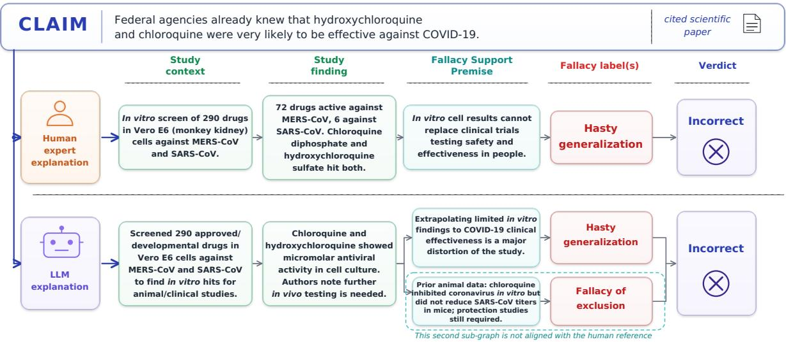
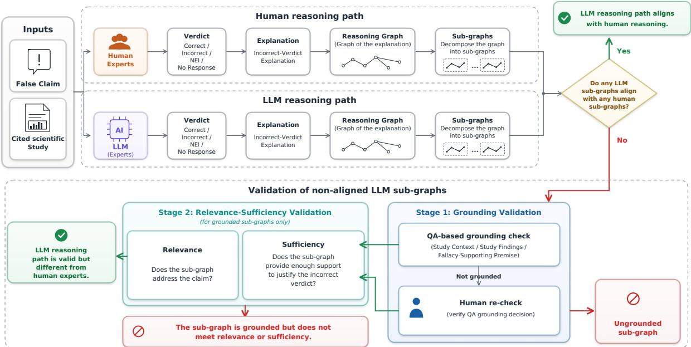
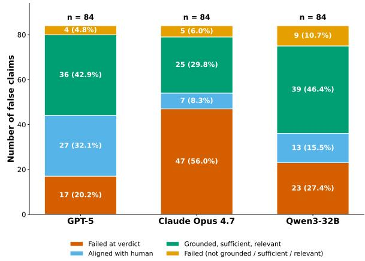
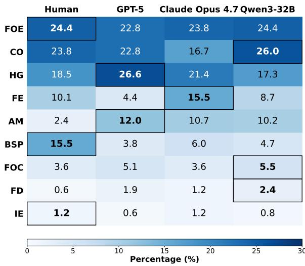
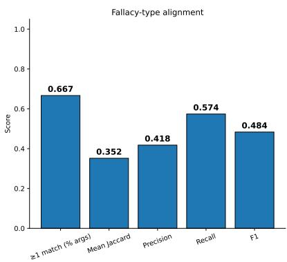
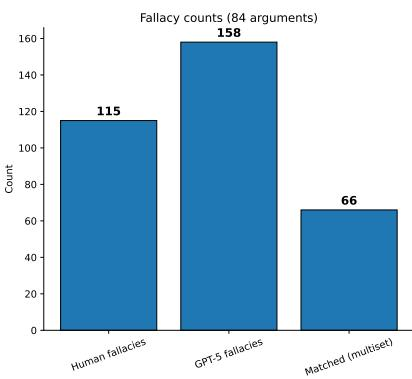
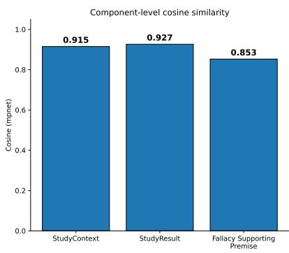
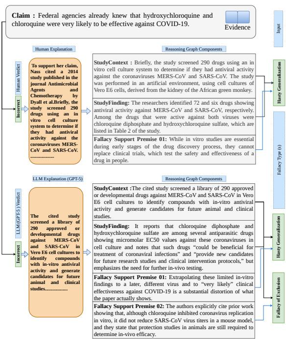
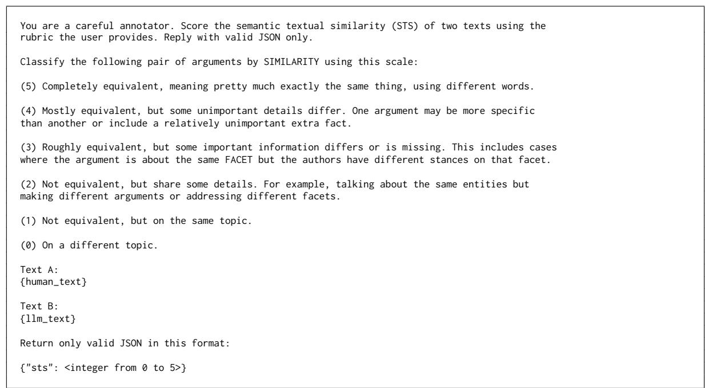
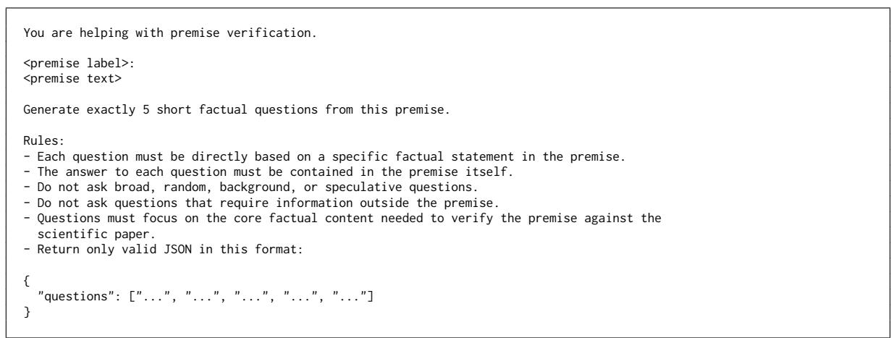

# Beyond Verdicts: A Graph-Based Analysis of Human and LLM Reasoning in Scientific Fact-Checking

Abdul Ghafoor, Muhammad Arslan Manzoor, Yufang Hou Interdisciplinary Transformation University Austria (ITU) {abdul.ghafoor, muhammad.manzoor, yufang.hou}@it-u.at

## Abstract

Misinformation that cites legitimate papers can be especially harmful when it distorts what those studies actually report. While existing automatic fact-checking systems based on large language models (LLMs) can assess whether a model assigns an Incorrect verdict and can generate explanations for that decision, they typically do not indicate whether the model follows the same reasoning path as human experts or arrives at the verdict through a different but still valid path. In this work, we introduce a graphbased framework (typed reasoning graph) for comparing human and LLM reasoning paths in scientific fact-checking. Building on prior work on fallacious reasoning in biomedical misinformation, MISSCIPLUS (Glockner et al., 2025), we model each explanation as a reasoning graph that links the false claim to the relevant study context, study findings, fallacysupporting premises, and fallacy labels. This representation enables one-to-one alignment of human and LLM reasoning at the level of fallacy-specific sub-graphs. For non-humanaligned LLM paths, we validate grounding in the cited study, relevance to the claim, and suf ficiency for the verdict. Using 84 false claims from MISSCIPLUS, we evaluate GPT-5, Claude Opus 4.7, and Qwen3-32B across prompt and evidence settings. Results show distinct perfor mance dimensions: Qwen3-32B has the lowest verdict failure rate, GPT-5 the highest human alignment, and Claude Opus 4.7 weak verdict prediction but often valid reasoning in successful cases.<sup>1</sup>

## 1 Introduction

Misinformation is often most persuasive when it cites real scientific studies while misrepresenting what they report (Glockner et al., 2024, 2025). For scientific fact-checking, the main challenge is therefore not only to determine a claim as true or false, but also to assess how the cited evidence is interpreted and how the reasoning from study findings to verdict is constructed. This distinction is important in the context of fact-checking systems based on large language models (LLMs): a model may produce a correct verdict and a fluent explanation, yet rely on reasoning that diverges from human experts, is insufficiently grounded in the cited study, or fails to justify the verdict (Atanasova et al., 2023; Parcalabescu and Frank, 2024).

Previous work on scientific and biomedical factchecking has advanced claim verification, evidence retrieval, rationale selection, and explanation generation (Wadden et al., 2020, 2022; Kotonya and Toni, 2020; Sarrouti et al., 2021; Vladika et al., 2024). A closely related line of work shows that false scientific claims frequently arise from fallacious reasoning over genuine studies: MISSCI (Glockner et al., 2024) reported such cases as fallacious arguments, and MISSCIPLUS (Glockner et al., 2025) grounds those fallacies in passages from misrepresented studies. However, existing evaluations primarily assess verdicts, retrieved evidence, fallacy labels, or free-text explanations, rather than directly comparing whether LLMs and human experts reach the verdict through the same reasoning path. They also leave open a crucial question: when an LLM’s reasoning diverges from expert reasoning, is it still a valid alternative path, or is it ungrounded, irrelevant, or insufficient to justify the verdict?

We frame this gap as a process-level evaluation problem: to assess whether an LLM explanation is trustworthy, we must evaluate the inferential structure that connects the cited study to the verdict. We define a typed reasoning graph as this structure: it links the claim, relevant study context and findings, the premises that expose the misrepresentation, and the fallacy label that characterizes it (Section 2).

As illustrated in Figure 1, this structure matters because two explanations can reach the same Incorrect verdict while citing different parts of the study, drawing different intermediate premises, or identifying different fallacy types. In the example, the human expert and the LLM agree on the final verdict, but the LLM extracts an additional fallacy-supporting premise, leading to a second fallacy label that does not align with the human reference. Such differences are difficult to capture through verdict accuracy, fallacy labels, or free-text comparison alone. This representation allows us to align human and LLM explanations at the level of fallacy-specific subgraphs: fine-grained reasoning units that capture a particular fallacy judgment together with its supporting premises.

  
Figure 1: Example reasoning-path comparison for a misleading scientific claim: Both explanations reach the same verdict, Incorrect. The LLM aligns with the human reference on the upper reasoning path labeling it as Hasty Generalization. In addition, the LLM extracts a second reasoning path labeling it as Fallacy ofExclusion

Conversely, divergence from the human reference should not automatically be treated as an error: an LLM may reach the same verdict through a different but still valid reasoning path. We therefore assess non-aligned reasoning paths by asking whether they are grounded in the cited study, relevant to the claim, and sufficient to justify the verdict. This separates principled alternative reasoning from explanations that merely sound plausible, drawing on work in attribution, grounded explanation, and structured rationales (DeYoung et al., 2020; Dalvi et al., 2021; Fabbri et al., 2022; Min et al., 2023; Li et al., 2024; Tang et al., 2024).

Building on our typed reasoning graph representation, we study three questions that separate verdict correctness from reasoning quality. (RQ1) Given a misleading scientific claim and its cited study, how reliably do LLMs predict the expected Incorrect verdict? (RQ2) When LLMs reach the expected verdict, how often do their reasoning paths align with the human expert path at the level of fallacy-specific sub-graphs? (RQ3) When LLM reasoning is not human-aligned, does it remain grounded in the cited study, relevant to the claim, and sufficient to justify the verdict?

Using 84 false claims and the corresponding scientific papers from MISSCIPLUS (Glockner et al., 2025), we evaluate GPT-5, Claude Opus 4.7, and Qwen3-32B across prompt and evidence settings. Our results show that verdict accuracy alone substantially overstates reasoning quality (Section 4). Even under the full-study evidence setting with the detailed prompt, human-aligned reasoning accounts for only a minority of claims: 32.1% for GPT-5, 8.3% for Claude Opus 4.7, and 15.5% for Qwen3-32B. However, many non-aligned reasoning paths are still valid after validation, indicating that LLMs often reach correct verdicts through alternative reasoning paths rather than by reproducing expert rationales. This pattern is most pronounced for Qwen3-32B, which has the lowest verdict failure rate but limited human alignment, and for Claude Opus 4.7, whose high verdict failure rate contrasts with a substantial share of valid non-aligned reasoning among the remaining cases.

These findings suggest that LLM-based systems may support real-world scientific fact-checking by generating structured reasoning paths for inspection. Experts can use these paths as candidate explanations to verify or revise, while the public can use them to see how a verdict is justified and where a claim misrepresents cited evidence. However, such systems should remain explanation aids rather than standalone arbiters, since assessing grounding and sufficiency often requires domain expertise.

To summarize, our main contributions are: (1) we propose a graph-based framework for comparing human and LLM reasoning paths in scientific fact-checking that decomposes each explanation into fallacy-specific sub-graphs and aligns them one-to-one, moving beyond final-verdict evaluation; (2) we introduce a validation for non-humanaligned sub-graphs that define valid alternative reasoning paths from paths that are not grounded in the cited study or inadequate to justify the verdict; (3) we apply this method to GPT-5, Claude Opus 4.7, and Qwen3-32B on 84 false claims from MISSCIPLUS, and show that verdict accuracy and reasoning-path quality dissociate: the model with the highest Incorrect recall is not the model with the highest human-aligned reasoning rate.

## 2 Problem Definition and Method

We study whether LLMs follow the same evidencebased reasoning paths as human expert factcheckers when evaluating scientific claims that misrepresent cited studies. We approach Human-LLM reasoning comparison as a graph alignment and validation problem. Given an inaccurate scientific claim and its cited study, we generate LLM verdicts and explanations, convert Incorrect-verdict explanations into reasoning graphs, and compare them with human expert reasoning graphs.

As shown in Figure 2, proposed framework proceeds in four stages. First, we characterize model verdict behavior by aggregating outputs across repeated runs. Second, for outputs that assign the expected Incorrect verdict, we represent both human and LLM explanations using a shared reasoninggraph schema (Section 2.2). Third, we compare both reasoning using fallacy-specific sub-graphs (Section 2.3). Fourth, non-aligned LLM sub-graphs are further assessed for study grounding, relevance, and sufficiency (Section 2.4).

## 2.1 Task Formulation

Each instance consists of a misleading scientific claim c and a cited primary study s. The claim misrepresents the study by overstating, generalizing, or incorrectly interpreting the evidence reported in s. Given c and evidence e from the cited study, we define the human reference as $( v , x )$ , where v is the expert verdict and x is the expert explanation; an LLM produces a corresponding output $( \boldsymbol { v } ^ { \prime } , \boldsymbol { x } ^ { \prime } )$ where $v ^ { \prime }$ is the model verdict and $x ^ { \prime }$ is its naturallanguage explanation.

The model is prompted to output a verdict in {Correct, Incorrect, Not Enough Information}; outputs that are missing, malformed, or refused are labeled No Response for analysis. The analysistime verdict space is therefore {Correct, Incorrect, Not Enough Information, No Response}. Since all claims in our dataset are false or misleading, the expected verdict is Incorrect.

We treat verdict prediction, reasoning-path alignment, and validation of non-aligned reasoning as distinct evaluation targets. Verdict prediction asks whether the model reaches the expected Incorrect verdict. Reasoning-path alignment asks, among expected-verdict outputs, whether the LLM follows the same fallacy-specific reasoning path as the human expert. Validation of non-aligned reasoning asks whether divergent LLM paths are nevertheless grounded in the cited study s, relevant to the claim $^ { c , }$ and sufficient to justify the verdict.

## 2.2 Reasoning Graph Construction

Building on prior work on fallacious reasoning in biomedical misinformation (Glockner et al., 2025), we represent both human and LLM explanations (x and $x ^ { \prime } )$ using a shared reasoning-graph schema. The graph makes explicit the reasoning chain by which the cited study is used to identify the mismatch between the claim and the evidence, and how this mismatch supports a fallacy assignment. Each graph follows the structure:

Study Context: captures information needed to interpret the cited study, such as the study design, population, scope, setting, methodology, or limitations. Study Findings: capture the relevant reported outcomes, conclusions, effects, or empirical observations. Fallacy-Supporting Premises: are reasoning statements that justify the assignment of a fallacy label by explaining the mismatch between the claim and the cited evidence. Fallacies: are the reasoning-error labels assigned to the claim.

Formally, each reasoning graph is a directed graph $G = ( V , E )$ whose nodes V are typed by the five classes above (Claim, Study Context, Study Findings, Fallacy-Supporting Premises, Fallacies) and whose edges E follow the chain order shown.

We use GPT-5 as the graph constructor. Given a free-text explanation x or $x ^ { \prime }$ , GPT-5 is prompted to extract the Study Context, Study Findings, and

  
Figure 2: Overview of our graph-based framework for comparing human and LLM reasoning in scientific factchecking. For Incorrect-verdict cases, human and LLM explanations are converted into reasoning graphs and compared at the level of fallacy-specific sub-graphs. Non-aligned LLM reasoning paths are further evaluated for study grounding, relevance to the claim, and sufficiency for the verdict.

Fallacy-Supporting Premises fields with spans copied verbatim from the explanation (paraphrasing, summarisation, and rewording are explicitly disallowed) and to assign each premise a Fallacy label drawn from the nine-class taxonomy defined in MISSCI (Glockner et al., 2024). The full prompt is provided in Appendix Figure 10. To calibrate our LLM-based graph constructor, we conducted human annotations of the constructed reasoning graphs. Appendix Figure 5 provides details. The graph constructor achieved strong alignment with human annotators, indicating that it reliably captures the reasoning structure expressed in LLMgenerated or human-written explanations.

## 2.2.1 Fallacy-Specific Sub-graphs:

A single explanation may contain multiple reasoning errors. We therefore decompose each reasoning graph into fallacy-specific sub-graphs and use them as the basic unit of alignment and validation. Each sub-graph is centered on one fallacy type and contains the study context, study findings, and fallacy support premise.

## 2.3 Human and LLM Sub-graph Alignment

For each claim, we compare every LLM fallacyspecific subgraph against human reference. An LLM subgraph is marked as human-aligned if it matches at least one human subgraph. A match requires two conditions: the two subgraphs must assign the same fallacy type, and their text-based components must be semantically aligned.

We assess semantic alignment with three LLM judges: GPT-5, Qwen3-32B, and Claude Opus 4.7. Each judge assigns a semantic textual similarity (STS) score from 0 to 5 to each component pair, following the rubric in Appendix Figure 8. A score of 5 indicates complete semantic equivalence, whereas a score of 0 indicates unrelated or contradictory meanings. We aggregate the three judge scores by majority vote; if no two judges assign the same score, we use the median.

A component pair is considered matched if its final STS score is at least 3. This threshold corresponds to cases where the two components express the same semantic facet, although some details may differ or be omitted.

## 2.4 Validation of Non-Aligned Sub-graphs

Non-alignment with the human reference does not necessarily imply invalid reasoning. An LLM may identify a reasoning path that is absent from the human explanation but still grounded in the cited study and sufficient to support the Incorrect verdict. We therefore validate non-aligned LLM sub-graphs in two stages: grounding and relevance–sufficiency validation.

Grounding Validation. Grounding validation checks whether each component of a non-aligned sub-graph is supported by the cited study. We evaluate grounding for Study Context, Study Findings, and Fallacy-Supporting Premise. For each component, we use GPT-5 to generate five questions capturing its key information and answers each question using two sources: the component itself and the full cited study, refer to Appendix Figure 11 for full prompt. One author of this paper manually compares the component-based and study-based answers. If any answer pair does not match, the component is initially marked as not grounded.

Relevancy and Sufficiency Validation. Grounded non-aligned sub-graphs are further evaluated for relevance to the claim and sufficiency for the Incorrect verdict using the prompt in Appendix Figure 9. Three LLM judges GPT-5, Claude Opus 4.7, and Qwen3-32B score each sub-graph on both dimensions using a three-point scale: 2 = clearly satisfied, 1 = partially satisfied, and 0 = not satisfied. Scores are aggregated using the same majority-vote and median procedure described in Section 2.3. Finally, we combine the final relevance and sufficiency scores into a single label. A sub-graph receives a combined score of 2 only if both receive 2.

## 3 Experimental Setup

## 3.1 Data and Evidence Settings

We use the MISSCIPLUS (Glockner et al., 2025) test set, which contains 84 false scientific claims paired with cited primary studies and claimrelevant study passages. Each claim is associated with a HealthFeedback<sup>2</sup> expert review explaining why the cited study does not support the claim.

One author of this paper manually extracts, for each of the 84 instances, the portion of the Health-Feedback review that explains the mismatch between the claim and the cited study. The extracted text serves as the human expert reasoning reference for the Incorrect verdict. We treat Health-Feedback reviewers as the underlying experts and the extracted spans as a faithful selection of their reasoning; we do not paraphrase, summarise, or otherwise rewrite the review text.

We consider two evidence settings. In the selected-passage setting, the model receives the claim-relevant passages provided in MISSCIPLUS (Glockner et al., 2025) as the evidence. In the fullstudy setting, the model receives the full text of the cited primary study as the evidence.

## 3.2 LLM Verdict and Explanation Generation

For each claim – evidence pair, we prompt an testing LLM to assign a verdict and generate an explanation.<sup>3</sup> Each experimental configuration is defined by the model, prompt template, and evidence setting. We use two prompt templates: a concise prompt adapted from Glockner et al. (2025) and a detailed fact-checking prompt designed for this study. The detailed prompt is provided in Appendix Figure 7. For each configuration, we run the same input three times to account for output variability.

For claim i and verdict label ℓ, we compute the per-claim verdict proportion as:

$$
p _ { i , \ell } = \frac { n _ { i , \ell } } { 3 } ,\tag{1}
$$

where $n _ { i , \ell }$ is the number of runs, out of three, in which the model produces label ℓ for claim i. We then average these per-claim proportions across all N claims:

$$
\bar { p } _ { \ell } = 1 0 0 \cdot \frac { 1 } { N } \sum _ { i = 1 } ^ { N } p _ { i , \ell } .\tag{2}
$$

The resulting value $\bar { p } _ { \ell }$ represents the overall percentage assigned to verdict label ℓ under a given experimental configuration. We also report verdict consistency, defined as the proportion of claims for which all three runs produce the same verdict.

Verdict distributions are computed over three runs for each experimental configuration, defined by model, one of two prompt templates, and one of two evidence settings. Since all claims are false or misleading, the expected verdict for each instance is Incorrect. The reported Incorrect rate therefore corresponds to recall on the expected label rather than overall accuracy; the Correct column represents Type-I errors (false-positive support of misleading claims), and the NEI column represents abstention. We discuss this asymmetry and its implications in Section 4.4.

## 3.3 Reasoning Graph Construction Settings

For reasoning-graph analysis, we focus on the fullstudy evidence with the detailed prompt. This setting gives the model the strongest opportunity to ground its explanation in the complete cited study while following explicit fact-checking instructions. Because each claim-model pair is run three times, we select one valid explanation that assigns the expected Incorrect verdict for graph construction. We then convert the selected explanations into reasoning graphs and evaluate them using the alignment and validation procedures described in Sections 2.2

## 3.4 Testing Models

We evaluate three LLMs as fact-checkers: GPT-5 (OpenAI, 2026), Claude Opus 4.7(Anthropic, 2026), and Qwen3-32B (Team, 2025). GPT-5 is accessed through the Academic-AI gateway, Claude Opus 4.7 through the Anthropic API, and Qwen3- 32B is served locally using vLLM. Within each experimental configuration, all models receive the same claim, evidence, and prompt template. Temperature is set to 0.1 for all models.

## 4 Results and Discussion

We evaluate models along two complementary axes: verdict prediction and reasoning-path quality. The first measures whether models identify false claims as Incorrect; the second examines whether their explanations align with human expert reasoning or, when non-aligned, still form grounded and sufficient alternative reasoning paths.

## 4.1 Verdict Prediction

Table 1 reports verdict distributions across models, evidence settings, and prompt templates. Since all instances in the dataset are false claims, higher Incorrect rates correspond to higher recall of the expected label. Overall, the detailed prompt improves Incorrect prediction for GPT-5 and Qwen3- 32B. For GPT-5, the Incorrect rate increases from 32.54% to 74.60% in the full-study setting and from 42.46% to 69.05% in the selected-passage setting. Qwen3-32B achieves the highest overall Incorrect rate, reaching 76.98% with selected passages and the detailed prompt, and 73.41% with full-study evidence and the detailed prompt. These results suggest that explicit fact-checking instructions help models connect the claim to the cited evidence and produce the expected verdict.

The effect of evidence length is modeldependent. GPT-5 performs best with full-study evidence under the detailed prompt, whereas Qwen3- 32B performs best with selected passages. This indicates that more evidence is not uniformly beneficial: selected passages may reduce distracting context for some models, while full studies may help others access information needed for a more complete interpretation. Surprisingly, Claude Opus 4.7 shows lower Incorrect rates overall, with its best result reaching 44.58% in the full-study/detailedprompt setting. However, Claude is highly stable across repeated runs, reaching 100% consistency in both detailed-prompt settings. This contrast shows that a model can be stable while still assigning many false claims to the wrong verdict label.

  
Figure 3: Claim-level outcome breakdown under the full-study evidence setting with the detailed prompt (n = 84 per model).

## 4.2 Reasoning-Path Alignment and Validation

Table 2 reports the alignment and validation results for LLM reasoning sub-graphs. A sub-graph is accepted if it either aligns with a human subgraph or, when non-aligned, passes grounding and receives the maximum relevance and sufficiency score. This evaluation tests whether models reach the expected verdict through expert-like or otherwise valid reasoning paths (DeYoung et al., 2020). To reduce false rejections caused by QA or annotation errors, all initially not-grounded components undergo a second human re-check by the same author. If the re-check confirms study support, the component is treated as grounded; otherwise, it remains not grounded. A sub-graph is classified as not grounded if at least one of its components remains unsupported after re-check.

GPT-5 produces the strongest reasoning results: 19.0% of its 158 sub-graphs are human-aligned, and 81.6% are accepted overall after validation. This indicates that GPT-5 often reasons differently from the human expert, but many of its alternative paths are grounded, relevant, and sufficient for the

<table><tr><td>Model</td><td>Evidence</td><td>Prompt</td><td>Correct</td><td>Incorrect</td><td>NEI</td><td>No Response</td><td>Consistency</td></tr><tr><td rowspan="3">Qwen3-32B</td><td>Internal Knowledge (IK)</td><td>IK_Prompt</td><td>4.76</td><td>82.14</td><td>8.33</td><td>4.76</td><td>100.00 80.95</td></tr><tr><td>Full Study</td><td>Short Prompt Detailed Prompt</td><td>30.56 23.81</td><td>39.68 73.41</td><td>29.76 2.78</td><td>0.00 0.00</td><td>85.71</td></tr><tr><td>Selected Passages</td><td>Short Prompt</td><td>27.78</td><td>31.75</td><td>40.48</td><td>0.00</td><td>79.76</td></tr><tr><td rowspan="4">GPT-5</td><td>Internal Knowledge (IK)</td><td>Detailed Prompt IK_Prompt</td><td>19.84 7.54</td><td>76.98 84.92</td><td>3.17 7.54</td><td>0.00 0.00</td><td>86.90 78.57</td></tr><tr><td>Full Study</td><td>Short Prompt</td><td>20.63</td><td>32.54</td><td>46.83</td><td>0.00</td><td>71.43</td></tr><tr><td></td><td>Detailed Prompt</td><td>15.87</td><td>74.60</td><td>9.52</td><td>0.00</td><td>72.62</td></tr><tr><td>Selected Passages</td><td>Short Prompt Detailed Prompt</td><td>18.65 19.05</td><td>42.46</td><td>38.10</td><td>0.79</td><td>77.38 95.24</td></tr><tr><td rowspan="4">Claude Opus 4.7</td><td>Internal Knowledge (IK)</td><td>IK_Prompt</td><td>12.70</td><td>69.05 76.59</td><td>11.90 9.52</td><td>0.00 1.19</td><td>85.71</td></tr><tr><td>Full Study</td><td>Short Prompt</td><td>32.14</td><td>19.84</td><td>45.63</td><td>2.38</td><td>87.80</td></tr><tr><td></td><td>Detailed Prompt</td><td>38.55</td><td>44.58</td><td>15.66</td><td>1.20</td><td>100.00</td></tr><tr><td>Selected Passages</td><td>Short Prompt</td><td>48.81</td><td>34.52</td><td>16.67</td><td>0.00</td><td>95.24</td></tr><tr><td rowspan="3">Claude Sonnet 4.6</td><td>Internal Knowledge (IK)</td><td>Detailed Prompt IK_Prompt</td><td>26.59</td><td>48.02</td><td>21.83</td><td>3.57</td><td>97.62</td></tr><tr><td>Full Study</td><td>Detailed Prompt</td><td>8.73 15.48</td><td>78.97 76.19</td><td>11.11 7.14</td><td>1.19 1.19</td><td>88.10</td></tr><tr><td>Selected Passages</td><td>Detailed Prompt</td><td>18.25</td><td>66.67</td><td>12.70</td><td>2.38</td><td>94.05</td></tr></table>

Table 1: LLM-based fact-checking results across prompting strategies and evidence settings. Values report average verdict distribution (%) over three runs and model consistency (agreement across runs), except Claude Sonnet 4.6 full-study results, which are from seed 1 only. The internal-knowledge setting uses no external evidence.

Incorrect verdict. The hydroxychloroquine case in Figure 1 illustrates this pattern: the human reference assigns only Hasty generalization, while the LLM additionally introduces Fallacy ofexclusion via an extra fallacy-supporting premise. As confirmed by the validation pipeline (Section 2.4), this additional subgraph is grounded, relevant, and sufficient to be accepted as a valid alternative reasoning path. Qwen3-32B shows a different pattern. Although it achieves the strongest verdict-level performance in Table 1, only 10.2% of its sub-graphs are human-aligned, with 80.3% accepted overall. Thus, high verdict accuracy does not necessarily imply strong human reasoning alignment. Claude Opus 4.7 obtains the highest accepted proportion, with 86.9% of its evaluated sub-graphs accepted, despite its lower Incorrect verdict rate. This suggests that Claude less often reaches the expected verdict, but when it does, its reasoning is frequently grounded and adequate. Figure 3 further shows that models differ not only in verdict failures, but also in whether their Incorrect-verdict explanations are human-aligned, valid but different, or rejected after validation. Overall, these results show that verdict prediction and reasoning quality capture distinct aspects of model behavior.

Table 3 reports moderate cross-model agreement on fallacy choice. Agreement is highest between GPT-5 and Qwen3-32B (κ = 0.511), followed by GPT-5 and Claude Opus 4.7 (κ = 0.466), and Claude Opus 4.7 and Qwen3-32B (κ = 0.428). This moderate agreement suggests that fallacy assignment remains a challenging and model-sensitive aspect of scientific fact-checking. It also supports the need to evaluate reasoning components rather than relying only on final verdicts.

  
Figure 4: Fallacy-label distributions across human and model reasoning graphs. Black outlines mark the highest percentage within each fallacy type. The most frequent labels are Fallacy of Exclusion (FOE), Causal Oversimplification (CO), and Hasty Generalization (HG). Fallacy abbreviations are listed in Appendix Table 5.

## 4.3 Contamination check

Table 4 reports a small contamination check on 10 recent false claims from 2025–2026 that are not part of the main dataset. All three models still identify most of these claims as Incorrect, but their human-alignment rates differ substantially: GPT-5 reaches 64.7% human alignment, compared with 27.8% for Claude Opus 4.7 and 11.8% for Qwen3- 32B. This limited check suggests that the observed reasoning behavior is not confined to the original benchmark instances, and that verdict-level success can again diverge from reasoning alignment.

<table><tr><td>LLM (n)</td><td>Human-</td><td colspan="8">Not Human-Aligned</td><td colspan="3"></td><td colspan="3">Final</td></tr><tr><td></td><td>Aligned</td><td>Grounded (QA) Grounded (final)</td><td></td><td>Ungrounded</td><td></td><td>Relevance</td><td></td><td></td><td>Sufficiency</td><td></td><td></td><td>Rel.+Suff.</td><td></td><td></td><td>Accepted Not Accepted</td></tr><tr><td></td><td></td><td></td><td></td><td></td><td>2</td><td>1</td><td>0</td><td>2</td><td>1</td><td>0</td><td>2</td><td>1</td><td>0</td><td></td><td></td></tr><tr><td>GPT-5 (158)</td><td>19.0</td><td>62.7</td><td>74.7</td><td>6.3</td><td>74.1</td><td>0.6</td><td>0.0</td><td>63.3</td><td>11.4</td><td>0.0</td><td>62.7</td><td>12.0</td><td>0.0</td><td>81.7</td><td>18.3</td></tr><tr><td>Qwen3-32B (127)</td><td>10.2</td><td>49.6</td><td>81.1</td><td>8.7</td><td>79.5</td><td>0.8</td><td>0.8</td><td>70.1</td><td>10.2</td><td>0.8</td><td>70.1</td><td>10.2</td><td>0.8</td><td>80.3</td><td>19.7</td></tr><tr><td>Claude Opus 4.7 (84)</td><td>11.9</td><td>69.0</td><td>82.1</td><td>6.0</td><td>81.0</td><td>1.2</td><td>0.0</td><td>75.0</td><td>6.0</td><td>1.2</td><td>75.0</td><td>6.0</td><td>1.2</td><td>86.9</td><td>13.1</td></tr></table>

Table 2: Alignment and validation of LLM reasoning sub-graphs, reported as % of each model’s total sub-graph set. Human-Aligned + Grounded (final) + Ungrounded sum to 100% per row; Accepted + Not Accepted also sum to 100%. Grounded (QA) is the subset of Grounded (final) admitted by the automatic QA layer alone; QA over-flagged premises as not-grounded due to overly generic questions and granularity mismatches with the document ; human re-verification corrected these cases, raising the Grounded (final) number. Relevance, Sufficiency, and Rel.+Suff. columns report the three-LLM-judge consensus score distribution (2/1/0) over the Grounded (final) pool. A subgraph is Accepted if it is human-aligned, or if its Rel.+Suff. score is 2; otherwise Not Accepted. A high accepted rate alone does not imply strong overall performance, since Claude performs poorly at verdict prediction.

<table><tr><td>Model pair</td><td>Cohen&#x27;s κ</td></tr><tr><td>GPT-5 ↔ Qwen3-32B</td><td>0.511</td></tr><tr><td>GPT-5 ↔ Claude Opus 4.7</td><td>0.466</td></tr><tr><td>Claude Opus 4.7 ↔ Qwen3-32B</td><td>0.428</td></tr></table>

Table 3: Cross-model agreement in fallacy assignment. Cohen’s κ measures whether two models assign the same fallacy label to the same claim, showing moderate agreement across model pairs.

## 4.4 Discussion

Our results clarify the relationship between verdict correctness and reasoning quality in scientific factchecking. First, at the level of verdict prediction (RQ1), Table 1 shows that LLMs often identify misleading scientific claims as Incorrect, but their performance depends on the model, prompting strategy, and evidence setting. Detailed prompting improves Incorrect prediction for GPT-5 and Qwen3- 32B, whereas the benefit of providing the full study rather than selected passages is model-dependent. This suggests that additional evidence does not uniformly improve verdict prediction; models differ in how effectively they use broader scientific context.

Second, when models do reach the expected Incorrect verdict, their reasoning paths do not necessarily match the human expert explanation (RQ2). Table 2 shows that Qwen3-32B achieves the strongest verdict-level performance, while GPT-5 produces more fallacy-specific reasoning subgraphs that align with the human expert path and are accepted by validation. This gap demonstrates that final-label accuracy and reasoning-path alignment capture distinct aspects of model behavior. A model can assign the expected verdict while relying on a different fallacy decomposition or evidenceuse pattern than the human reference.

Third, when model reasoning diverges from the human path, the divergence is not always an error (RQ3). The validation results show that many non-human-aligned sub-graphs remain grounded in the cited study, relevant to the claim, and sufficient to justify the verdict. These cases represent valid alternative reasoning paths rather than reasoning failures. At the same time, rejected sub-graphs expose genuinely defective reasoning, including unsupported, irrelevant, or insufficient justifications.

Overall, these findings show that scientific factchecking evaluation should move beyond verdict accuracy alone. Typed reasoning graphs make it possible to distinguish four behaviorally important cases: human-aligned reasoning, valid alternative reasoning, ungrounded reasoning, and grounded but inadequate reasoning. This distinction is especially important for misleading scientific claims, where a correct Incorrect label can mask substantial variation in how models interpret evidence, identify fallacies, and justify their decisions.

## 5 Conclusion

We present a graph-based framework for evaluating LLM reasoning in scientific fact-checking by comparing typed reasoning graphs with human expert paths and validating divergent paths for grounding, relevance, and sufficiency. Our Experiments shows that verdict accuracy and reasoning quality diverge: Qwen3-32B performs best at verdict prediction, while GPT-5 produces more humanaligned reasoning, and many non-human-aligned paths remain valid alternatives. These results suggest that LLM-based systems have the potential to serve as explanation aids: they can help experts inspect candidate reasoning paths and help readers understand how claims misrepresent cited evidence. However, final judgments should remain humanled, since models can still produce reasoning paths that are unsupported, irrelevant, or insufficient, and distinguishing these failures from valid alternative reasoning often requires expert assessment.

## Limitations

We outline several limitations of the present study; addressing them is the focus of our planned followup work.

Sample size and scope. Our evaluation uses 84 false claims from the MISSCIPLUS test set, which constrains the statistical resolution of cross-model comparisons. We do not report confidence intervals, paired bootstrap estimates over claims, or significance tests; differences of a few percentage points in Tables 1 and 2 should therefore be read as indicative rather than conclusive. The dataset is also restricted to English-language biomedical and health claims, so generalization to other languages and scientific domains remains open.

Human annotation protocol. Both the Health-Feedback gold extraction (Section 3.1) and the human re-check of QA-based grounding (Section 2.4) were performed by a single annotator (an author of this paper), not blinded to the source LLM. We therefore did not measure inter-annotator agreement and did not perform double annotation with adjudication. The grounding re-check shifts the Grounded (final) column by 5–19 percentage points relative to the QA-only baseline in Table 2, so a stricter multi-annotator and blinded protocol— particularly for the re-check step—is a clear priority for future work.

Evaluation set design. Because all 84 instances are false claims, the reported Incorrect rate corresponds to recall on the expected label rather than to verdict accuracy. The Correct column reflects false-positive endorsement of misleading claims and NEI reflects abstention. A model that systematically prefers Incorrect can therefore score highly on this metric without engaging with the evidence; a held-out set of correctly-supported claims (e.g., drawn from HealthFC or SciFact) would be needed to compute precision on Incorrect and to separate verdict-class bias from genuine fact-checking ability.

Training-data exposure. MISSCIPLUS and the underlying HealthFeedback reviews are public web content that may have been seen during pretraining or post-training of the proprietary models (GPT-5, Claude Opus 4.7). The contamination check on ten 2025-2026 claims (Section 4.3) is too small to bound this effect. Reported human-alignment rates for the proprietary models may therefore be inflated relative to Qwen3-32B, which is an open-weight model with weaker memorization of the same web sources.

## References

Carlos Alvarez, Maxwell Bennett, and Lucy Wang. 2024. Zero-shot scientific claim verification using LLMs and citation text. In Proceedings of the Fourth Workshop on Scholarly Document Processing (SDP 2024), pages 269–276, Bangkok, Thailand. Association for Computational Linguistics.

Anthropic. 2026. Claude Opus 4.7 System Card. Accessed: 2026-05-25.

Pepa Atanasova, Oana-Maria Camburu, Christina Lioma, Thomas Lukasiewicz, Jakob Grue Simonsen, and Isabelle Augenstein. 2023. Faithfulness tests for natural language explanations. In Proceedings of the 61st Annual Meeting of the Association for Computational Linguistics (Volume 2: Short Papers), pages 283–294, Toronto, Canada. Association for Computational Linguistics.

Oana-Maria Camburu, Tim Rocktäschel, Thomas Lukasiewicz, and Phil Blunsom. 2018. e-snli: natural language inference with natural language explanations. In Proceedings of the 32nd International Conference on Neural Information Processing Systems, NIPS’18, page 9560–9572, Red Hook, NY, USA. Curran Associates Inc.

Bhavana Dalvi, Peter Jansen, Oyvind Tafjord, Zhengnan Xie, Hannah Smith, Leighanna Pipatanangkura, and Peter Clark. 2021. Explaining answers with entailment trees. In Proceedings of the 2021 Conference on Empirical Methods in Natural Language Processing, pages 7358–7370, Online and Punta Cana, Dominican Republic. Association for Computational Linguistics.

Jay DeYoung, Sarthak Jain, Nazneen Fatema Rajani, Eric Lehman, Caiming Xiong, Richard Socher, and Byron C. Wallace. 2020. ERASER: A benchmark to evaluate rationalized NLP models. In Proceedings of the 58th Annual Meeting of the Association for Computational Linguistics, pages 4443–4458, Online. Association for Computational Linguistics.

Alexander Fabbri, Chien-Sheng Wu, Wenhao Liu, and Caiming Xiong. 2022. QAFactEval: Improved QAbased factual consistency evaluation for summarization. In Proceedings ofthe 2022 Conference ofthe North American Chapter ofthe Associationfor Computational Linguistics: Human Language Technologies, pages 2587–2601, Seattle, United States. Association for Computational Linguistics.

Tianyu Gao, Howard Yen, Jiatong Yu, and Danqi Chen. 2023. Enabling large language models to generate text with citations. In Proceedings of the 2023 Conference on Empirical Methods in Natural Language Processing, pages 6465–6488, Singapore. Association for Computational Linguistics.

Max Glockner, Yufang Hou, Preslav Nakov, and Iryna Gurevych. 2024. Missci: Reconstructing fallacies in misrepresented science. In Proceedings of the 62nd Annual Meeting of the Association for Computational Linguistics (Volume 1: Long Papers), pages 4372– 4405, Bangkok, Thailand. Association for Computational Linguistics.

Max Glockner, Yufang Hou, Preslav Nakov, and Iryna Gurevych. 2025. Grounding fallacies misrepresenting scientific publications in evidence. In Proceedings of the 2025 Conference of the Nations of the Americas Chapter of the Association for Computational Linguistics: Human Language Technologies (Volume 1: Long Papers), pages 9732–9767, Albuquerque, New Mexico. Association for Computational Linguistics.

Peter Jansen, Elizabeth Wainwright, Steven Marmorstein, and Clayton Morrison. 2018. WorldTree: A corpus of explanation graphs for elementary science questions supporting multi-hop inference. In Proceedings of the Eleventh International Conference on Language Resources and Evaluation (LREC 2018), Miyazaki, Japan. European Language Resources Association (ELRA).

Shashidhar Reddy Javaji, Yupeng Cao, Haohang Li, Yangyang Yu, Nikhil Muralidhar, and Zining Zhu. 2025. Can AI validate science? benchmarking LLMs on claim →Evidence reasoning in AI papers. In Proceedings ofthe 14th International Joint Conference on Natural Language Processing and the 4th Conference ofthe Asia-Pacific Chapter ofthe Associationfor Computational Linguistics, pages 2355– 2379, Mumbai, India. The Asian Federation of Natural Language Processing and The Association for Computational Linguistics.

Neema Kotonya and Francesca Toni. 2020. Explainable automated fact-checking for public health claims. In Proceedings of the 2020 Conference on Empirical Methods in Natural Language Processing (EMNLP), pages 7740–7754, Online. Association for Computational Linguistics.

John Lawrence and Chris Reed. 2019. Argument mining: A survey. Computational Linguistics, 45(4):765– 818.

Yifei Li, Xiang Yue, Zeyi Liao, and Huan Sun. 2024. AttributionBench: How hard is automatic attribution evaluation? In Findings of the Association for Computational Linguistics: ACL 2024, pages 14919– 14935, Bangkok, Thailand. Association for Computational Linguistics.

Siting Liang and Daniel Sonntag. 2025. Advancing biomedical claim verification by using large language models with better structured prompting strategies. In Proceedings ofthe 24th Workshop on Biomedical Language Processing, pages 148–166, Viena, Austria. Association for Computational Linguistics.

Sewon Min, Kalpesh Krishna, Xinxi Lyu, Mike Lewis, Wen-tau Yih, Pang Koh, Mohit Iyyer, Luke Zettlemoyer, and Hannaneh Hajishirzi. 2023. FActScore: Fine-grained atomic evaluation of factual precision in long form text generation. In Proceedings ofthe 2023 Conference on Empirical Methods in Natural Language Processing, pages 12076–12100, Singapore. Association for Computational Linguistics.

Amita Misra, Pranav Anand, Jean E. Fox Tree, and Marilyn Walker. 2015. Using summarization to discover argument facets in online idealogical dialog. In Proceedings of the 2015 Conference of the North American Chapter of the Association for Computational Linguistics: Human Language Technologies, pages 430–440, Denver, Colorado. Association for Computational Linguistics.

OpenAI. 2026. Openai GPT-5 system card. CoRR, abs/2601.03267.

Letitia Parcalabescu and Anette Frank. 2024. On measuring faithfulness or self-consistency of natural language explanations. In Proceedings ofthe 62nd Annual Meeting ofthe Associationfor Computational Linguistics (Volume 1: Long Papers), pages 6048– 6089, Bangkok, Thailand. Association for Computational Linguistics.

Mourad Sarrouti, Asma Ben Abacha, Yassine Mrabet, and Dina Demner-Fushman. 2021. Evidence-based fact-checking of health-related claims. In Findings of the Association for Computational Linguistics: EMNLP 2021, pages 3499–3512, Punta Cana, Dominican Republic. Association for Computational Linguistics.

Xin Tan, Bowei Zou, and Ai Ti Aw. 2025. Improving explainable fact-checking with claim-evidence correlations. In Proceedings ofthe 31st International Conference on Computational Linguistics, pages 1600– 1612, Abu Dhabi, UAE. Association for Computational Linguistics.

Liyan Tang, Philippe Laban, and Greg Durrett. 2024. MiniCheck: Efficient fact-checking of LLMs on grounding documents. In Proceedings of the 2024 Conference on Empirical Methods in Natural Language Processing, pages 8818–8847, Miami, Florida, USA. Association for Computational Linguistics.

Qwen Team. 2025. Qwen3 technical report. CoRR, abs/2505.09388.

Miles Turpin, Julian Michael, Ethan Perez, and Samuel R. Bowman. 2023. Language models don’t always say what they think: unfaithful explanations in chain-of-thought prompting. In Proceedings ofthe 37th International Conference on Neural Information Processing Systems, NIPS ’23, Red Hook, NY, USA. Curran Associates Inc.

Juraj Vladika, Ivana Hacajova, and Florian Matthes. 2025. Step-by-step fact verification system for medical claims with explainable reasoning. In Proceedings of the 2025 Conference of the Nations of the Americas Chapter of the Association for Computational Linguistics: Human Language Technologies (Volume 2: Short Papers), pages 805–816, Albuquerque, New Mexico. Association for Computational Linguistics.

Juraj Vladika, Phillip Schneider, and Florian Matthes. 2024. HealthFC: Verifying health claims with evidence-based medical fact-checking. In Proceedings of the 2024 Joint International Conference on Computational Linguistics, Language Resources and Evaluation (LREC-COLING 2024), pages 8095– 8107, Torino, Italia. ELRA and ICCL.

public health fact-checking with large language models. In Proceedings of the 4th Workshop on Trustworthy Natural Language Processing (TrustNLP 2024), pages 252–278, Mexico City, Mexico. Association for Computational Linguistics.

David Wadden, Shanchuan Lin, Kyle Lo, Lucy Lu Wang, Madeleine van Zuylen, Arman Cohan, and Hannaneh Hajishirzi. 2020. Fact or fiction: Verifying scientific claims. In Proceedings of the 2020 Conference on Empirical Methods in Natural Language Processing (EMNLP), pages 7534–7550, Online. Association for Computational Linguistics.

David Wadden, Kyle Lo, Bailey Kuehl, Arman Cohan, Iz Beltagy, Lucy Lu Wang, and Hannaneh Hajishirzi. 2022. SciFact-open: Towards open-domain scientific claim verification. In Findings of the Association for Computational Linguistics: EMNLP 2022, pages 4719–4734, Abu Dhabi, United Arab Emirates. Association for Computational Linguistics.

Chengye Wang, Yifei Shen, Zexi Kuang, Arman Cohan, and Yilun Zhao. 2025. SciVer: Evaluating foundation models for multimodal scientific claim verification. In Proceedings ofthe 63rd Annual Meeting of the Association for Computational Linguistics (Volume 1: Long Papers), pages 8562–8579, Vienna, Austria. Association for Computational Linguistics.

Zhengnan Xie, Sebastian Thiem, Jaycie Martin, Elizabeth Wainwright, Steven Marmorstein, and Peter Jansen. 2020. WorldTree v2: A corpus of sciencedomain structured explanations and inference patterns supporting multi-hop inference. In Proceedings ofthe Twelfth Language Resources and Evaluation Conference, pages 5456–5473, Marseille, France. European Language Resources Association.

Majid Zarharan, Pascal Wullschleger, Babak Behkam Kia, Mohammad Taher Pilehvar, and Jennifer Foster. 2024. Tell me why: Explainable

## A Related Work

Scientific and Biomedical Claim Verification. Scientific fact-checking is commonly treated as verifying claims against scientific evidence. SciFact evaluates evidence retrieval, rationale selection, and veracity prediction (Wadden et al., 2020), while PUBHEALTH, HEALTHVER, and HealthFC focus on public-health and biomedical claim verification (Kotonya and Toni, 2020; Sarrouti et al., 2021; Vladika et al., 2024). Later work extends this setting to open-domain and richer evidence scenarios, including SciFact-Open, SciVer, and CLAIM-BENCH (Wadden et al., 2022; Wang et al., 2025; Javaji et al., 2025). These benchmarks establish evidence-grounded claim verification, but they mainly evaluate verdicts, retrieved evidence, or rationale spans rather than the evidence-to-verdict reasoning path followed by the model.

Misrepresentation of Scientific Evidence. A closely related line of work studies how scientific evidence is misrepresented. MISSCI models misleading scientific claims as fallacious arguments, where real studies are used to support inaccurate claims through implicit reasoning errors (Glockner et al., 2024). MISSCIPLUS grounds these fallacies in passages from the misrepresented publications (Glockner et al., 2025). These studies show that scientific misinformation often arises from distorted reasoning over valid evidence. However, they primarily focus on reconstructing premises, grounding fallacies, or classifying fallacy types, rather than comparing human and LLM explanations as parallel reasoning paths.

LLMs for Fact-Checking and Explanation Generation. Recent work evaluates LLMs for scientific, biomedical, and public-health fact-checking. LLMs can generate plausible verdicts and explanations when guided by evidence or structured prompts (Alvarez et al., 2024; Liang and Sonntag, 2025; Vladika et al., 2025; Zarharan et al., 2024; Tan et al., 2025). However, explanationfaithfulness studies show that fluent explanations may not faithfully reflect the underlying decision process (Turpin et al., 2023; Atanasova et al., 2023; Parcalabescu and Frank, 2024). This motivates evaluating whether LLM explanations follow expert reasoning paths, not only whether they provide plausible evidence-based justifications.

Human Rationales and Structured Reasoning Explanations. Our work also relates to human rationales and structured explanations. Datasets such as e-SNLI and ERASER use human explanations and rationales as evaluation targets beyond final labels (Camburu et al., 2018; DeYoung et al., 2020). Explanation-graph and multi-step reasoning work, including WorldTree and EntailmentBank, represents explanations as connected reasoning structures (Jansen et al., 2018; Xie et al., 2020; Dalvi et al., 2021). Argument-mining research similarly models claims, premises, warrants, and support relations (Lawrence and Reed, 2019). Building on these ideas, we represent fact-checking explanations as reasoning graphs and compare them at the level of fallacy-specific sub-graphs.

Grounding and Faithfulness Evaluation. Grounding and faithfulness work examines whether generated content is supported by source documents. Prior studies evaluate attribution, citation faithfulness, QA-based factuality, and atomic-fact support (Gao et al., 2023; Min et al., 2023; Fabbri et al., 2022; Tang et al., 2024; Li et al., 2024). These approaches usually assess grounding at the level of claims, sentences, citations, or atomic facts. Our study shifts the focus to grounded reasoning paths: for non-human-aligned LLM graphs, we test whether the alternative path is grounded in the cited study, relevant to the claim, and sufficient for the Incorrect verdict.

These lines of work address complementary parts of process-level evaluation but remain disconnected. Verification benchmarks emphasize verdicts and retrieved evidence; fallacy work identifies reasoning errors; faithfulness and grounding work assess whether explanations are decision-consistent or evidence-supported; and structured-rationale datasets model generic reasoning chains rather than fallacy-specific paths. Our framework connects these perspectives by aligning human and LLM explanations through fallacy-specific subgraphs and validating non-aligned LLM paths for grounding in the cited study, relevance to the claim, and sufficiency for the verdict.

## B Fallacy Abbreviations

Table 5 lists the abbreviations used along the axes of the fallacy-distribution panels (Figure 4) together with their full names. The nine categories follow the taxonomy used throughout the annotation protocol.





  
Figure 5: Agreement between human and GPT-5 annotations for the same 84 GPT-5 fact-checking explanations. Each explanation was independently converted into a reasoning graph by a human annotator and by GPT-5. The figure summarizes the extent to which the GPT-5-generated reasoning graphs align with the human reference graphs. Left: fallacy-type agreement at the argument level, including at-least-one type match, mean Jaccard similarity, precision, recall, and $F _ { 1 }$ under type-equal multiset matching. Middle: total fallacy labels produced by each annotator and the subset matched between them. Right: mean cosine similarity using all-mpnet-base-v2 for corresponding textual components: Study Context, Study Result, and Fallacy-Supporting Premise. For fallacy-supporting premises, each GPT-5 premise is scored against its best-matching human premise and then averaged at the argument level.

<table><tr><td>Metric</td><td>Claude Opus 4.7</td><td>GPT-5</td><td>Qwen3-32B</td></tr><tr><td>Veracity</td><td></td><td></td><td></td></tr><tr><td>Correct</td><td>30.0</td><td>10.0</td><td>0.0</td></tr><tr><td>Incorrect</td><td>70.0</td><td>70.0</td><td>80.0</td></tr><tr><td>Not Enough Information</td><td>0.0</td><td>20.0</td><td>20.0</td></tr><tr><td>No Response</td><td>0.0</td><td>0.0</td><td>0.0</td></tr><tr><td>Consistency</td><td>90.0</td><td>90.0</td><td>90.0</td></tr><tr><td>Human Alignment</td><td>27.8</td><td>64.7</td><td>11.8</td></tr></table>

Table 4: Contamination check on 10 false claims published in 2025–2026 that are not part of the dataset used in this study. Values are reported as %.

<table><tr><td>Abbr.</td><td>Full name</td></tr><tr><td>FOE</td><td>Fallacy of Exclusion</td></tr><tr><td>CO</td><td>Causal Oversimplification</td></tr><tr><td>HG</td><td>Hasty Generalization</td></tr><tr><td>FE</td><td>False Equivalence</td></tr><tr><td>AM</td><td>Ambiguity</td></tr><tr><td>BSP</td><td>Biased Sample Fallacy</td></tr><tr><td>FOC</td><td>Fallacy of Composition</td></tr><tr><td>FD</td><td>False Dilemma</td></tr><tr><td>IE</td><td>Impossible Expectations</td></tr></table>

Table 5: Abbreviations for the nine fallacy categories used in Figure 4.

  
Figure 6: Illustration of human and LLM reasoning paths for a scientific fact-checking example. The example shows that an LLM reasoning path can align with the human reasoning path, while it can also take a different but valid reasoning path.

You are an expert scientific fact-checker specializing in evaluating whether public claims   
accurately represent findings from scientific research papers. You have access to the full cited   
study provided as input. Your task is to determine if the claim faithfully reflects the evidence   
presented in that study.   
Input   
## Claim:   
{[claim]}   
## Cited Study:   
{[study]}   
Instructions   
1. Study Understanding   
Carefully read and summarize the main purpose, methods, and findings of the cited study.   
Identify the key conclusions or outcomes that the authors report.   
2. Claim Interpretation   
Summarize what the claim asserts or implies.   
Identify whether the claim refers to a specific result, a general conclusion, or a causal statement.   
3. Evidence Mapping   
Locate and quote or paraphrase the specific parts of the study that:   
(a) Support the claim, if any.   
(b) Contradict or differ from what the claim asserts.   
(c) Have been distorted or exaggerated by the claim.   
4. Verdict   
Choose one clear verdict:   
Correct -- The claim correctly represents the cited study.   
Incorrect -- The claim misrepresents or contradicts the study's findings.   
Not Enough Information -- The study does not provide adequate evidence to support or refute the claim.   
5. Reasoning behind verdict   
Provide the justification and reasoning behind the final verdict in 3--10 sentences, based on the   
evidence above.   
6. Output Format   
{Justification and reasoning behind final verdict in 3--10 sentences based on the evidence above.}   
{"final\_verdict": "Correct / Incorrect / Not Enough Information"}  
Figure 7: Scientific fact-checking prompt used to assess whether a claim faithfully represents the evidence presented in its cited scientific paper.

  
Figure 8: Prompt used to score semantic textual similarity (STS) between human and LLM reasoning components. (Misra et al., 2015)

```jsonl
You are an expert evaluator of scientific fact-checking explanations and argumentative reasoning.
Task: Evaluate whether the reasoning graph is relevant to the Claim and sufficient to justify an
Incorrect verdict.
Important: Assume the graph components are valid. Judge only whether they are relevant to the
Claim and sufficient to support the Incorrect verdict. The Claim is the target statement being
assessed; it is not itself evaluated as a graph component.
Target Statement
Claim:
{[CLAIM]}
Reasoning Graph Components
StudyContext:
{[STUDY_CONTEXT]}
StudyResult:
{[STUDY_RESULT]}
ContextPremises / FallacySupportingPremises:
{[CONTEXT_PREMISES]}
FallacyType, if available:
{[FALLACY_TYPE]}
FinalVerdict: Incorrect
1. StudyContext: Contextual information used in the graph, including scope, setting,
population, method, comparison, limitation, or other relevant details.
2. StudyResult: The study result, finding, conclusion, outcome, or reported effect represented
in the graph.
3. ContextPremises / FallacySupportingPremises: Reasoning premises that explain how the Claim
relates to the graph context and result, and why the Claim may be false, misleading, overstated,
unsupported, or inconsistent.
4. FallacyType, if available: The type of reasoning error identified in the explanation. Treat
this as an optional part of the reasoning chain, not the main evaluation target.
5. FinalVerdict: The target verdict for all samples in this task is Incorrect.
Evaluation Dimensions
1. Relevance to the Claim
Evaluate whether the graph components are relevant to the Claim.
Ask:
- Do the components address the same main assertion as the Claim?
- Are they focused on the Claim's key issue, entity, relation, population, outcome, comparison,
or causal statement?
- Do they explain why the Claim may be false, misleading, overstated, unsupported, or inconsistent?
- Are any components off-topic or unrelated?
Score:
2 = Clearly relevant: the components directly address the Claim.
1 = Partially relevant: the components are related, but the connection is incomplete, indirect,
or only partly focused.
0 = Not relevant: the components do not meaningfully address the Claim.
2. Sufficiency for the Incorrect Verdict
Evaluate whether the graph components, taken together, provide enough support for judging the
Claim as Incorrect.
Ask:
- Assuming the graph components are true, do they justify an Incorrect verdict?
- Does the chain explain why the Claim is false, misleading, overstated, unsupported, or
inconsistent?
Are important reasoning steps missing?
Score:
2 = Clearly sufficient: the graph chain supports an Incorrect verdict.
1 = Partially sufficient: the graph chain gives some support, but important reasoning is missing,
weak, or underdeveloped.
0 = Not sufficient: the graph chain does not justify an Incorrect verdict.
Overall Adequacy:
- Adequate: relevance = 2 and sufficiency = 2.
- Partially adequate: neither relevance nor sufficiency is 0, but at least one score is 1.
- Not adequate: relevance = 0 or sufficiency = 0.
Important Instructions:
- Do not require the graph to match a human expert's reasoning path.
Do not focus only on the FallacyType.
Treat FallacyType only as an optional component in the reasoning chain.
Give short, direct reasons.
Return only valid JSON.
- Do not include markdown, explanations outside JSON, or extra text.
Return format:
{
"relevance_to_claim": {
"score":
"label":
"reason":
"score": 0,
"label": "Clearly sufficient / Partially sufficient / Not sufficient",
"reason":
"label": "Adequate / Partially adequate / Not adequate",
"reason":
}
}
```  
Figure 9: Prompt used to evaluate whether non-human-aligned reasoning sub-graphs are relevant to the claim and sufficient to justify an Incorrect verdict.

You are converting a fact-checking explanation into a structured reasoning graph and assigning   
fallacy labels.   
You will receive a CLAIM and an EXPLANATION that evaluates the claim using a primary scientific   
study.   
VERBATIM EXTRACTION RULE: All textual fields below (StudyContext, StudyResult,   
supporting\_premise) MUST be COPIED VERBATIM from the EXPLANATION. Do NOT paraphrase,   
summarise, rephrase, abbreviate, expand, or change the wording in any way. Only select   
word-for-word spans from the explanation. Preserve original wording, punctuation, numbers,   
casing, and references exactly as written.   
Reasoning flow: perform internally IN THIS ORDER, then emit the JSON.   
Step 1 -- Find StudyContext   
Locate the span(s) in the explanation that describe the cited primary study: study design,   
population, setting, time period, and what was measured. Take the relevant sentence(s)   
verbatim. If multiple studies are referenced, focus on the primary study the claim is based on.   
If the explanation does not contain study context, leave StudyContext as an empty string.   
Step 2 -- Find StudyResult   
Locate the span(s) in the explanation that state the study's reported finding(s). Take them   
verbatim. Numbers and effect sizes must be preserved exactly. If the explanation does not state   
a study finding, leave StudyResult as an empty string.   
Step 3 -- Collect candidate supporting premises   
From the explanation, pick out single sentences that help REFUTE the claim, e.g., sentences that   
point out biases, scope limits, missing evidence, oversimplifications, ambiguity, or other   
reasons the claim does not follow from the study. Each candidate must be one sentence copied   
verbatim from the explanation. Ignore background, tangential, or non-refuting sentences.   
Step 4 -- Pair-and-classify   
For each candidate supporting\_premise, pair it with StudyContext + StudyResult and ask whether   
this 3-tuple identifies one of the allowed fallacy types. If yes, emit a fallacy entry whose   
\`type\` is that fallacy and whose \`supporting\_premise\` is that single verbatim sentence. If the   
3-tuple does not clearly fit any allowed fallacy type, drop that supporting\_premise. Even if   
StudyContext or StudyResult is empty, classify a fallacy using whatever information is available.   
Step 5 -- Empty Fallacies when the claim is supported   
If the explanation indicates the claim is correct or well-supported by the study, return an empty   
Fallacies list. Still emit StudyContext and StudyResult.   
Allowed fallacy types:   
"Ambiguity", "Impossible Expectations", "False Equivalence", "False Dilemma",   
"Biased Sample Fallacy", "Hasty Generalization", "Causal Oversimplification",   
"Fallacy of Composition", "Fallacy of Exclusion"   
]   
Fallacy Definitions:   
[definitions and logical forms for each of the nine fallacy types follow the MISSCI taxonomy;   
abbreviated here for space, full text in the released code.]   
Input   
Claim:   
<CLAIM TEXT>   
Explanation:   
<EXPLANATION TEXT>   
Output requirements   
- Return only valid JSON. No prose, no code fences.   
- Schema: exactly these keys, in this order.   
{   
"StudyContext":   
"StudyResult":   
"Fallacies": [   
"type": "<one of the allowed fallacy types>",   
"supporting\_premise": "<single most-relevant premise sentence>"   
}   
]   
}   
supporting\_premise must be a non-empty string: a single sentence taken VERBATIM from the   
explanation. It is NOT a list and NOT an index.   
Only emit a fallacy entry when the 3-tuple clearly identifies one of the allowed fallacy types.   
StudyContext, StudyResult, and supporting\_premise text MUST appear word-for-word in the   
EXPLANATION. Do not rewrite or summarise.   
StudyContext or StudyResult may be empty strings if the explanation does not contain that   
information.   
"Fallacies" must be an empty list when the explanation supports the claim.  
Figure 10: Prompt used to extract structured reasoning graphs from free-text fact-checking explanations. The prompt is applied to both human expert explanations and LLM-generated explanations. The verbatim-extraction rule constrains the extractor to copy spans word-for-word. The full fallacy definitions block, omitted here for space, follows the nine-class MISSCI taxonomy (Glockner et al., 2024).

  
Figure 11: Prompt used with GPT-5 to generate five factual questions per premise during the QA-grounding stage. <premise label> is one of Study context premise, Studyfinding premise, or Fallacy supporting premise.