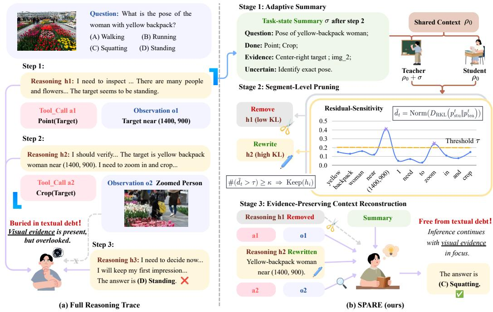
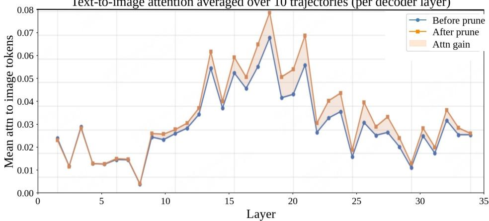

# Buried in Textual Debt: Context Pruning with Visual Evidence Preservation for MLLM Agents

Yuchen Huang∗ Sijia Li∗ Jun Zhang† Yi R. (May) Fung Hong Kong University of Science and Technology {yhuanggn,slifg}@connect.ust.hk {eejzhang,yrfung}@ust.hk

## Abstract

Multimodal Large Language Models (MLLMs) are increasingly deployed as multistep agents, where explicit reasoning supports task decomposition and tool coordination but also accumulates self-generated text. Over long trajectories, this text can dominate the context and suppress visual evidence, creating textual debt. We observe that reasoning becomes redundant once task-relevant visual evidence is grounded, while stale hypotheses can misguide later inference when grounding remains uncertain. Pruning must therefore remove redundant text without discarding visual evidence. We propose SPARE, a Kullback–Leibler (KL)-guided framework for pruning accumulated reasoning in multimodal tool-use agents. SPARE uses a compact task-state summary as privileged diagnostic context. For each candidate segment, it replays the same model under the original and summary conditioned contexts. Reverse-KL divergence from on-policy self-distillation (OPSD) then tests whether the summary sufficiently covers the segment without disrupting future reasoning. We further fine-tune the summarizer with supervised fine-tuning (SFT), enabling more compact summaries, broader coverage, and more aggressive pruning. Across multi-step visual tool-use benchmarks, SPARE achieves the highest average accuracy among pruning methods while removing 37.89–64.58% of reasoning tokens. This favorable accuracy–context trade-off shows that reducing textual dominance restores reliance on visual evidence and mitigates over-conditioning on self-generated language. Code is available at https://github.com/lukahhcm/spare.

## 1 Introduction

Multimodal Large Language Models (MLLMs) are increasingly deployed as agents that reason, call tools, inspect intermediate observations, and revise their answers over time [1]. Explicit reasoning is beneficial in this setting, as it helps agents decompose visual tasks, coordinate multi-step tool use, interpret returned observations, and maintain progress across turns [2]. Yet it also introduces a largely overlooked cost: each interaction step adds self-generated text to the working context. Over long trajectories, this accumulated text can dominate computation relative to the original image and newly returned observations, making the model increasingly conditioned on its own plans, descriptions, and assumptions rather than external visual evidence.

Not all reasoning history remains useful throughout a multimodal reasoning trajectory. When early reasoning correctly captures task-relevant visual evidence, the accumulated text may still provide a faithful abstraction of the image. However, when early reasoning fails to attend to the relevant visual regions, the model may elaborate on an incomplete or weakly grounded textual state. In this case, additional reasoning tokens become textual debt: stale linguistic context that contributes little new evidence while competing with image tokens for attention and context budget. From this view, pruning reasoning tokens is not merely a way to reduce computation or sequence length. It can also function as a grounding mechanism by reducing over-conditioning on stale textual context and restoring the opportunity to re-attend to the visual input.

Existing approaches do not directly address this problem. Visual-token compression reduces redundancy in the visual stream by dropping or merging image tokens [3, 4, 5, 6, 7]. While effective for reducing computation, it targets a modality that is often already under-attended in deep layers, and further compression can weaken the relative contribution of image evidence [8]. Concise-reasoning methods primarily shorten newly generated rationales, while generic summarization compresses his tory at a coarse level. Neither identifies which historical segments remain functionally necessary. In multi-step agents, the more pressing source of redundancy is the self-generated text that accumulates across rounds.

We therefore reframe context compression as a light-weight, evidence-preserving selectiveforgetting problem and instantiate it as SPARE (Selective Pruning of Accumulated Reasoning with Visual Evidence Preservation), a KL-guided reasoning-pruning framework for multimodal tool-use agents. The key idea is to use a compact task-state summary as privileged diagnostic context rather than as a replacement for the history: instead of overwriting the trajectory with the summary, we test whether each historical segment retains information beyond the consolidated state. Concretely, SPARE replays the same model under the original and summary-conditioned contexts and uses reverse-KL between token-level continuation distributions to measure residual dependence on the original segment. Segments with low residual sensitivity are pruned, while high-sensitivity segments are preserved as evidence-critical content. This diagnostic requires neither an external verifier nor a separate reward model. We further fine-tune the summarizer with supervised fine-tuning (SFT), enabling more compact summaries, broader coverage, and more aggressive pruning. Across multistep visual tool-use benchmarks, SPARE achieves the highest average accuracy among pruning methods while removing 37.89–64.58% of reasoning tokens. We also show that suppressing textual dominance increases attention to image tokens, supporting our claim that reducing textual debt restores reliance on visual evidence.

Our contributions are summarized as follows:

• We propose SPARE, an evidence-preserving selective-forgetting method that uses summaryconditioned KL divergence to estimate the functional redundancy of prior reasoning and prune segments whose information has already been consolidated.

• We further fine-tune the summarizer with SFT to produce more compact task-state summaries, enabling broader coverage and more aggressive pruning while preserving task-relevant information.

• Experiments across multiple backbones and visual tool-use benchmarks show that SPARE improves the accuracy and restores the influence of visual evidence on downstream reasoning.

## 2 Related Work

Token Pruning for MLLM Existing MLLM token pruning methods primarily aim to remove redundancy from the visual stream [3, 4, 5, 7, 9, 10]. While effective for efficiency, this objective can be misaligned with multimodal reasoning tasks, where many questions are partially answerable from textual cues and visual evidence is already under-attended in deep layers [11, 12, 13, 8]. Concisereasoning and generic summarization methods can shorten generated text or compress history, but they do not directly diagnose which historical reasoning segments remain functionally necessary. Our method instead targets accumulated textual redundancy in multi-step tool-use trajectories and prunes only segments already covered by a compact task-state summary.

Mitigating Language-Prior Bias A related line of work mitigates language-prior bias or weak visual grounding in multimodal models. Prior approaches include counterfactual training for VQA [14], contrastive decoding [15], attention calibration [16, 17, 18], and preference optimization for image-grounded responses [19, 20]. These methods shift attention toward visual evidence through training, decoding, or attention reweighting, but they leave the competing textual redundancy intact and often require extra inference or auxiliary data. In contrast, our method operates at test time, requires no auxiliary model, and improves grounding by pruning stale self-generated text that competes with visual evidence.

## 3 Preliminaries

## 3.1 Multi-Step Tool Use in MLLMs

We consider a vision language model (VLM) $\pi _ { \theta }$ that answers a user question through multi-step, tool-augmented reasoning. The input consists of a question q and a set of image tokens I, and the model may query a fixed set of external tools $\tau$ over at most $\bar { T }$ interaction steps.

At step t, the model conditions on the current message history Ht and produces an assistant message

$$
m _ { t } = ( h _ { t } , a _ { t } ) ,\tag{1}
$$

where $h _ { t }$ is a free-form reasoning span and $a _ { t }$ is either a tool invocation ⟨tool\_call⟩ or a final answer ⟨response⟩. $\operatorname { I f } a _ { t }$ invokes a tool, the corresponding tool result is appended to the history, yielding $\mathbf { H } _ { t + 1 }$ , and the interaction proceeds to the next step. $\operatorname { I f } a _ { t }$ emits a final response, the episode terminates. We denote the sequence of past reasoning–action segments by $S _ { t } = \{ s _ { i } = ( h _ { i } , a _ { i } ) \} _ { i < t }$

## 3.2 On-policy Self-Distillation

Knowledge distillation trains a student model $\pi _ { \theta }$ to match a teacher distribution $\pi _ { \mathrm { t e a c h e r } }$ over next tokens. Conventional off-policy distillation applies this objective on fixed teacher or ground-truth sequences, which creates exposure bias because the training prefixes differ from the student-generated prefixes encountered at inference [21]. On-policy distillation reduces this mismatch by applying the distillation loss to trajectories sampled from the student itself, so that the model is supervised on its own inference-time states [21].

In the on-policy self-distillation (OPSD) instantiation, the teacher and student share the same model, so no external teacher is required [22]. Given a multimodal input $( q , { \mathcal { T } } )$ , we first sample a response $y \sim \pi _ { \boldsymbol { \theta } } ( \cdot \mid q , { \mathcal { T } } )$ and then align the student’s per-token distribution with a teacher distribution defined over the same model:

$$
\mathcal { L } _ { \mathrm { O P S D } } ( \theta ) = \mathbb { E } _ { ( q , T ) } \mathbb { E } _ { y \sim \pi _ { \theta } ( \cdot | q , T ) } [ \frac { 1 } { L } \sum _ { k = 1 } ^ { L } D _ { \mathrm { K L } } ( \pi _ { \mathrm { t e a c h e r } } ( \cdot | \ y _ { < k } , q , T ) \| \pi _ { \theta } ( \cdot | \ y _ { < k } , q , T ) ) ] .\tag{2}
$$

Here the gradient is taken with respect to the student parameters θ, while the teacher distribution is treated as a fixed target. Sampling y from $\pi _ { \theta }$ makes the objective on-policy, and defining πteacher from the same model makes it self-distillation.

Our method adopts this OPSD view only as a diagnostic principle: rather than optimizing a distillation objective, we replay the same model under two related contexts and use the resulting distributional shift to estimate whether a historical reasoning segment still contains information not covered by a compact task-state summary.

Attention over modalities. For visualization, we measure text-to-image attention across decoder layers following prior work [3]. The exact definition is provided in Appendix A.

## 4 Method

We propose SPARE (Selective Pruning of Accumulated Reasoning with Visual Evidence Preservation), a post-hoc context-pruning method for multi-step MLLM agents, as shown in Figure 1. The motivation is that explicit reasoning is useful for decomposing visual questions, planning tool calls, and integrating intermediate observations, but retaining the entire self-generated textual trace indefinitely can create textual debt: the agent’s later predictions become increasingly conditioned on its own textual history rather than on the visual evidence underlying the task. SPARE therefore does not aim to suppress reasoning generation. Instead, it diagnoses which accumulated text has low residual sensitivity to a compact task state and compresses only those low-residue segments, while preserving modality-critical content such as OCR strings, coordinates, bounding boxes, visual anchors, tool calls, and external observations. In this sense, SPARE compresses linguistic scaffolding rather than task state.

  
Figure 1: Overview of SPARE. (a) In the full reasoning trace, accumulated self-generated text reinforces a stale hypothesis and obscures visual evidence returned by the tools, leading to an incorrect answer. (b) SPARE invokes a compact task-state summary as a transient probe that is not written into the persistent trajectory. It replays each historical reasoning segment with and without summary conditioning and measures its token-level residual sensitivity using normalized reverse KL. A count-based rule prunes summary-covered segments with insufficient high-KL residue while retaining evidence-critical segments. Each pruned segment is replaced by concise structured visual evidence extracted from its original reasoning, whereas planning-dominated text is removed and the original tool calls, observations, and images remain unchanged. The resulting context reduces textual debt, refocuses subsequent inference on visual evidence, and produces the correct answer.

## 4.1 Summary-Conditioned Coverage Estimation

Adaptive summary trigger. SPARE is invoked only after the student agent itself calls an internal summarize\_the\_task tool and produces a compact task-state summary σ. This self-generated summary contain the original question, completed tool calls, accumulated visual evidence, and remaining uncertainty. We use σ only as auxiliary diagnostic context to test which prior reasoning spans are already covered by the consolidated task state. This adaptive trigger avoids fixed-interval compression: short trajectories incur no pruning cost, and longer trajectories are considered for pruning only after the student has explicitly produced a compact state.

Summary-conditioned replay. Let ${ \pmb x } = ( x _ { 1 } , \dots , x _ { N } )$ be the tokenized concatenation of candidate reasoning segments, separated by a fixed delimiter. To test whether the self-generated summary σ covers a segment’s information, we replay x under two contexts:

$$
\rho _ { \mathrm { s t u } } = \rho _ { 0 } ,\tag{3}
$$

$$
\rho _ { \mathrm { t e a } } = \rho _ { 0 } \| \sigma ,\tag{4}
$$

where $\rho _ { 0 }$ contains the shared system, tool-use, and task prefix. The teacher context receives σ as privileged information, while the student context does not. Importantly, this does not introduce an external teacher model: the teacher distribution is produced by the same model, conditioned on the self-generated summary. The same model $\pi _ { \theta }$ is then queried under both contexts:

$$
p _ { k } ^ { \mathrm { s t u } } ( u ) = P _ { \pi _ { \theta } } ( u \mid \rho _ { \mathrm { s t u } } , \pmb { x } _ { < k } ) ,\tag{5}
$$

$$
p _ { k } ^ { \mathrm { t e a } } ( u ) = P _ { \pi _ { \theta } } ( u \mid \rho _ { \mathrm { t e a } } , \pmb { x } _ { < k } ) ,\tag{6}
$$

where k indexes replay tokens and u indexes vocabulary tokens. If adding σ changes the continuation distribution only slightly, the summary already covers the replayed content. A larger shift indicates that the original reasoning contains information not represented in the summary and should therefore be preserved.

Top-K reverse-KL coverage score. For each replay token position $k ,$ we compute a truncated reverse-KL score over the student’s top-K vocabulary support $\hat { \Omega } _ { k } ^ { \mathrm { s t u } }$ :

$$
d _ { k } = \left[ \sum _ { u \in \Omega _ { k } ^ { \mathrm { s t u } } } p _ { k } ^ { \mathrm { s t u } } ( u ) \left( \log p _ { k } ^ { \mathrm { s t u } } ( u ) - \log p _ { k } ^ { \mathrm { t e a } } ( u ) \right) \right] .\tag{7}
$$

We use $K = 2 0$ in all experiments. If $u \in \Omega _ { k } ^ { \mathrm { s t u } }$ is absent from the teacher top-K support, log $p _ { k } ^ { \mathrm { t e a } } ( u )$ is set $\mathrm { t o } - 2 0$ . The resulting score $d _ { k }$ measures the residual information not covered by the summary: high values indicate that the token remains summary-sensitive and should be protected, while low values indicate that the summary sufficiently explains the token’s context.

KL scales vary across pruning events, we normalize scores within each event:

$$
\tilde { d } _ { k } = \frac { d _ { k } - d _ { \operatorname* { m i n } } } { d _ { \operatorname* { m a x } } - d _ { \operatorname* { m i n } } + \epsilon } , d _ { \operatorname* { m i n } } = \operatorname* { m i n } _ { k ^ { \prime } } d _ { k ^ { \prime } } , d _ { \operatorname* { m a x } } = \operatorname* { m a x } _ { k ^ { \prime } } d _ { k ^ { \prime } } .\tag{8}
$$

We set $\epsilon = 1 0 ^ { - 1 2 }$ and assign all normalized scores to zero when $d _ { \operatorname* { m a x } } = d _ { \operatorname* { m i n } }$ . Segment-level pruning then aggregates $\ddot { d } _ { k }$ to determine whether the summary covers each reasoning segment.

## 4.2 Segment-Level Pruning

Segment token sets. The replay sequence x is formed by concatenating historical assistant reasoning segments. Let $h _ { i }$ be the i-th candidate segment and

$$
{ \mathcal { P } } _ { i } = \{ k : x _ { k } \in h _ { i } \}\tag{9}
$$

denote its token positions in the replay sequence. Since segment boundaries are known during concatenation, token-level residual-sensitivity scores can be mapped back to their original segments.

Keep rule. A segment is retained if it contains at least κ high-sensitivity tokens:

$$
\mathrm { K e e p } ( h _ { i } ) = \mathbf { 1 } \left\{ \left| \left\{ k \in \mathcal { P } _ { i } : \tilde { d } _ { k } > \tau \right\} \right| \geq \kappa \right\} .\tag{10}
$$

High-KL tokens indicate residual textual influence not covered by the compact task-state summary. Thus, segments with enough high-KL residue are kept verbatim, while low-residue segments are removed.

Why a count-based threshold. We use a count rule rather than an average score because modality critical evidence is often sparse. A long reasoning segment may be mostly obsolete but still contain a few crucial tokens, such as an OCR string, coordinate, bounding box, or candidate label. Averaging can dilute these signals, whereas the count rule conservatively preserves segments containing even sparse high-sensitivity evidence.

## 4.3 Evidence-Preserving Pruning

Summary as auxiliary context. SPARE does not rewrite the assistant trace or insert the summary into it. The compact task-state summary is used only as auxiliary context for the next reasoning step, matching our controlled baselines and avoiding rewriting artifacts. A large KL divergence suggests that self-generated summaries do not faithfully preserve prior tool-use reasoning, so inserting them into the context may distort the original reasoning state.

KL-driven reconstruction. After reverse-KL scoring, each reasoning segment is handled according to its estimated residual information. High-KL segments contain information that is not sufficiently recoverable from the summarized interaction history and are therefore reconstructed into concise, verifiable visual evidence, such as crop locations, recognized text, numeric values, or relative relations among candidates, rather than retaining the original lengthy reasoning. Low-KL segments are removed entirely because their information is already captured by the summary. In both cases, tool outputs, visual observations, and image tokens remain unchanged.

## 4.4 Strengthening the Summarizer via SFT

The effectiveness of SPARE depends on the quality of the task-state summary: a summary that covers more of the accumulated reasoning enables more aggressive low-residue pruning without disrupting future decisions. To this end, we further fine-tune the summarizer via supervised fine-tuning (SFT). A stronger summarizer expands the coverage of each summary, so that a larger fraction of reasoning segments can be safely explained by the summary alone. Under the same reverse-KL criterion, more segments therefore fall into the low-residue regime and become prunable, while high-residue visually-grounded segments remain preserved.

## 5 Experiments

## 5.1 Experimental Settings

Benchmarks. We evaluate SPARE on several visual tool-use benchmarks requiring multi-step reasoning, tool invocation, and intermediate visual observations. VisualToolBench (VTB) [23] requires models to actively “think with images” through operations such as cropping, editing, and enhancement, a paradigm increasingly studied in multimodal reasoning [24]. m&m’s (MNMS) [25] includes 4000+ multi-step multimodal tasks over 33 tools, covering multimodal models, public APIs, and image-processing modules. GTA [26] provides real-world tasks with human-written queries and executable tool chains across perception, operation, logic, and creativity. V∗ [27] evaluates guided visual search on high-resolution images, requiring fine-grained target localization before answering. BLINK-Jigsaw (B-Jig.) [28] tests spatial perception by requiring models to reassemble image fragments. Together, these benchmarks cover long-horizon tool use and perceptionintensive reasoning, making them suitable for testing whether reasoning compression preserves visual grounding.

Backbones. To evaluate SPARE’s generality, we test three vision–language backbones: Qwen3- VL-8B-Instruct, Qwen3-VL-30B-A3B-Instruct, and Llama-3.1-Nemotron-Nano-VL-8B-V1. We keep generation settings and the tool interface fixed.

Compared methods. For each backbone, we compare five inference strategies under an identical tool-use harness. (i) Tool Baseline (Full Trace) executes the standard multi-round tool loop and retains the complete reasoning–action–observation history. (ii) - Tools (Direct Answer) answers the query directly without invoking tools and serves as a non-agentic reference. (iii) + Delete All Reasoning removes every completed reasoning span while preserving the original action blocks, tool observations, and images. (iv) + Visual Evidence-Only non-selectively rewrites every completed reasoning span as compact structured visual evidence while preserving its original action block. (v) + SPARE (Ours) first uses the task-state summary as a probe, estimates the residual sensitivity of historical reasoning through summary-conditioned reverse KL, and reconstructs only selected low-residue segments as structured visual evidence. If the probe selects no segment for pruning, the summary is discarded and does not enter the subsequent history. If pruning is triggered, the summary interaction may be retained together with the reconstructed context. Full Trace represents complete context retention, whereas Delete All Reasoning and Visual Evidence-Only provide nonselective compression controls for evaluating SPARE’s segment selection and evidence-preserving reconstruction.

Metrics. Following each benchmark’s official protocol, we report task success or accuracy, where higher is better (↑). We also report Pruned (%), the net percentage of reasoning-side history tokens removed relative to Tool Baseline. Token counts include remaining reasoning, structured evidence blocks, and any task-state summary, but exclude unchanged action blocks, tool observations, and image tokens. Thus, Full Trace has 0.0% pruning, Delete All Reasoning has 100.0%, and Direct Answer is assigned 0.0% for reporting consistency as it produces no comparable trajectory. The main table reports the macro-average pruning ratio across benchmarks on the common evaluation set.

Implementation details. SPARE is applied purely at test time. Pruning is triggered only when the model invokes the internal summarize\_the\_task tool, so short trajectories without summaries incur no compression cost. We compute the truncated reverse-KL coverage score on the student’s top-K support and map token scores to reasoning segments using the count-based rule with fixed τ = 0.2 and κ = 2 across all models and benchmarks (Section 4). The same model provides both student and teacher distributions by conditioning on prompts with and without the task-state summary σ, avoiding any auxiliary model.

Table 1: Task performance and average reasoning pruning across five visual tool-use benchmarks. Benchmark columns report accuracy. Acc. and Pr. denote average accuracy and reasoning-token pruning rate, respectively. Note that MNMS evaluates tool planning and therefore is inapplicable for Direct Answer mode.
<table><tr><td>Model / Metric</td><td>GTA ↑</td><td>V*↑</td><td>B-Jig. ↑</td><td>VTB↑</td><td>MNMS↑</td><td>Acc. ↑</td><td>Pr. %</td></tr><tr><td colspan="8">Qwen3-VL-30B-A3B-Instruct</td></tr><tr><td>Tool Baseline (Full Trace)</td><td>45.76</td><td>55.85</td><td>67.33</td><td>27.31</td><td>36.84</td><td>44.30</td><td>0.00</td></tr><tr><td>— Tools (Direct Answer)</td><td>33.90</td><td>52.36</td><td>70.67</td><td>21.43</td><td></td><td>43.42</td><td>0.00</td></tr><tr><td>+ Delete All Reasoning</td><td>50.85</td><td>37.17</td><td>57.33</td><td>26.05</td><td>24.56</td><td>35.22</td><td>99.86</td></tr><tr><td>+ Visual Evidence-Only</td><td>59.32</td><td>61.78</td><td>64.00</td><td>26.47</td><td>25.44</td><td>42.73</td><td>77.09</td></tr><tr><td>+ SPARE (ours)</td><td>59.32</td><td>62.30</td><td>64.00</td><td>26.47</td><td>49.56</td><td>49.19</td><td>63.70</td></tr><tr><td colspan="8">Qwen3-VL-8B-Instruct</td></tr><tr><td>Tool Baseline (Full Trace)</td><td>42.37</td><td>72.77</td><td>74.00</td><td>23.53</td><td>60.96</td><td>54.27</td><td>0.00</td></tr><tr><td>- Tools (Direct Answer)</td><td>42.37</td><td>63.35</td><td>72.00</td><td>20.17</td><td></td><td>47.34</td><td>0.00</td></tr><tr><td>+ Delete All Reasoning</td><td>40.68</td><td>68.59</td><td>62.00</td><td>23.53</td><td>57.02</td><td>50.12</td><td>100.00</td></tr><tr><td>+ Visual Evidence-Only</td><td>44.07</td><td>69.63</td><td>59.33</td><td>24.79</td><td>56.58</td><td>50.35</td><td>72.58</td></tr><tr><td>+ SPARE (ours)</td><td>49.15</td><td>73.30</td><td>72.00</td><td>23.11</td><td>57.46</td><td>53.47</td><td>37.89</td></tr><tr><td colspan="8">Llama-3.1-Nemotron-Nano-VL-8B-V1</td></tr><tr><td>Tool Baseline (Full Trace)</td><td>40.68</td><td>48.69</td><td>45.33</td><td>6.16</td><td>26.75</td><td>30.10</td><td>0.00</td></tr><tr><td>— Tools (Direct Answer)</td><td>44.07</td><td>56.02</td><td>51.33</td><td>9.46</td><td></td><td>36.44</td><td>0.00</td></tr><tr><td>+ Delete All Reasoning</td><td>37.29</td><td>45.03</td><td>46.67</td><td>6.75</td><td>21.49</td><td>28.07</td><td>99.38</td></tr><tr><td>+ Visual Evidence-Only</td><td>37.29</td><td>43.98</td><td>44.00</td><td>6.26</td><td>17.98</td><td>26.32</td><td>54.84</td></tr><tr><td>+ SPARE (ours)</td><td>42.37</td><td>46.60</td><td>48.67</td><td>9.46</td><td>21.93</td><td>29.97</td><td>64.58</td></tr></table>

## 5.2 Main Results

Table 1 reports task accuracy and reasoning pruning across five benchmarks. Across all three backbones, SPARE consistently achieves the highest average accuracy among the pruning methods, while matching or outperforming Full Trace overall. On Qwen3-VL-30B, it improves average accuracy from 44.30% to 49.19% while pruning 63.70% of the reasoning tokens. On Qwen3-VL-8B, it preserves comparable performance (53.47% vs. 54.27%) with 37.89% pruning. Nemotron shows a different pattern: Direct Answer outperforms Full Trace on all applicable benchmarks, consistent with weaker tool-use capability causing the accumulated tool-use context to interfere with later decisions. Even so, SPARE improves Full Trace on GTA, B-Jigsaw, and VTB and nearly matches its overall accuracy under 64.58% pruning. This suggests that selective context reduction can partially mitigate tool-induced textual debt without discarding the benefits of the visual interaction history. Additional analyses further support the textual-debt hypothesis: a controlled diagnostic shows that SPARE is less likely to follow stale textual hypotheses than both Full Trace and random deletion, while attention visualizations show increased reliance on image tokens after pruning (Appendix C).

## 5.3 SFT for Summarization Capability

We further study whether stronger task-state summaries enable more aggressive pruning. To this end, we collect 376 on-policy trajectories from Qwen3-VL-8B on VTC-Bench (VTC) [29] and prompt the stronger Qwen3- 235B to produce a compact task-state summary at each intermediate context. Qwen3- VL-8B is then fine-tuned on the resulting (context, summary) pairs with a standard nexttoken objective, distilling the 235B model’s

Table 2: SFT results on VTB and MNMS.
<table><tr><td>Model / Metric</td><td>VTB</td><td>MNMS</td></tr><tr><td>Base (Qwen3-VL-8B)</td><td>26.83</td><td>60.61</td></tr><tr><td>+ SFT summarizer</td><td>28.73</td><td>65.44</td></tr><tr><td>More pruned tokens vs. Base</td><td>23.8%</td><td>13.5%</td></tr></table>

summarization capability into the 8B agent. Table 2 reports task accuracy under the SPARE pipeline before and after SFT-based summarizer fine-tuning. The last row shows the relative increase in pruned tokens per trajectory compared with the base summarizer. The SFT summarizer enables more aggressive pruning and improves task accuracy on both VisualToolBench and MNMS, supporting our motivation that stronger summaries expand the safe-to-prune region and allow more redundan reasoning to be removed without harming downstream decisions.

## 5.4 Ablation Study

Why combine selective pruning with evidence reconstruction? We conduct ablations using Llama-3.1-Nemotron-Nano-VL-8B-V1 on GTA, with the results summarized in Table 3. Full trace retains all reasoning as the reference. Summary probe only summarizes the current task state to assist subsequent reasoning but does not prune the history. + KL selection deletes low-KL segments while retaining high-KL segments in their original form. + Evidence omits KL selection and replaces every reasoning segment with structured visual evidence. The complete SPARE removes low-KL segments and reconstructs high-KL segments as concise visual evidence. The results show that summary assistance alone is insufficient. KL selection avoids unsafe pruning but provides no compression when high-KL reasoning is retained verbatim, whereas evidence-only

Table 3: Ablations on GTA. Accuracy and pruning rates are percentages.
<table><tr><td>Ablation Setting</td><td>Acc.</td><td>Pr.</td></tr><tr><td>Selective Pruning and Evidence Reconstruction</td><td></td><td></td></tr><tr><td>Full trace baseline</td><td>40.68</td><td>0.00</td></tr><tr><td>Summary probe only</td><td>35.59</td><td>0.00</td></tr><tr><td>+ KL selection</td><td>40.68</td><td>0.00</td></tr><tr><td>+ Evidence</td><td>37.29</td><td>56.08</td></tr><tr><td>+ KL selection + Evidence (ours)</td><td>42.37</td><td>62.42</td></tr><tr><td>Adaptive Summary Triggering</td><td></td><td></td></tr><tr><td>Every round</td><td>32.20</td><td>52.54</td></tr><tr><td>Before final answer</td><td>38.98</td><td>51.38</td></tr><tr><td>Model-selected (ours)</td><td>42.37</td><td>62.42</td></tr><tr><td>Parameter Robustness (τ = 0.2)</td><td></td><td></td></tr><tr><td>κ = 1</td><td>42.37</td><td>62.42</td></tr><tr><td>κ = 2 (default)</td><td>42.37</td><td>62.42</td></tr><tr><td>κ = 3</td><td>38.98</td><td>63.16</td></tr></table>

reconstruction compresses the history at the cost of accuracy. Combining selection and reconstruction achieves the best accuracy (42.37%) with substantial pruning (62.42%), demonstrating that the two components are complementary.

When should the context be summarized and pruned? The second block compares three triggering policies. Every round forces the model to summarize after each reasoning round, whereas Before final answer invokes the summary once immediately before answering. Model-selected allows the model to decide whether and when summarization is necessary. Frequent forced summarization can disrupt reasoning, while summarizing only before the final answer cannot control earlier context accumulation. The model-selected policy achieves the highest accuracy (42.37%) and pruning rate (62.42%), demonstrating that adaptive summarization is more effective than fixed triggering schedules. We next ablate the KL-based decision rule by varying the required number of consecutive pruning decisions, $\kappa \in { 1 , 2 , 3 } .$ , while fixing $\tau = 0 . 2$ . The settings κ = 1 and κ = 2 yield identical results. Increasing κ to 3 slightly improves the pruning rate but reduces accuracy. Based on this local stability, we adopt $( \tau , \kappa ) = ( 0 . 2 , 2 )$ as the default setting.

## 6 Conclusion

In this paper, we identify textual debt as a key failure mode of multi-step MLLM agents, where accumulated self-generated reasoning gradually dominates the context and weakens reliance on visual evidence. Our motivation is that pruning reasoning tokens can help because their utility changes over time: once task-relevant visual information has been captured, later text often becomes redundant, while incorrect or incomplete early grounding can make accumulated text reinforce stale linguistic assumptions. Based on this insight, we propose SPARE, a OPSD KL-guided framework that selectively removes redundant reasoning while preserving visual evidence, thereby reducing textual dominance and redirecting attention to images. Experiments show that SPARE improves task performance, reduces reasoning-token usage, and restores attention to visual evidence, suggesting that inference-time selective forgetting is an effective mechanism for long-context multimodal reasoning.

## References

[1] Zongxia Li, Xiyang Wu, Hongyang Du, Huy Nghiem, and Guangyao Shi. Benchmark evaluations, applications, and challenges of large vision language models: A survey. arXiv preprint arXiv:2501.02189, 1:1, 2025.

[2] Fucai Ke, Joy Hsu, Zhixi Cai, Zixian Ma, Xin Zheng, Xindi Wu, Sukai Huang, Weiqing Wang, Pari Delir Haghighi, Gholamreza Haffari, et al. Explain before you answer: A survey on compositional visual reasoning. arXiv preprint arXiv:2508.17298, 2025.

[3] Liang Chen, Haozhe Zhao, Tianyu Liu, Shuai Bai, Junyang Lin, Chang Zhou, and Baobao Chang. An image is worth 1/2 tokens after layer 2: Plug-and-play inference acceleration for large vision-language models. In European Conference on Computer Vision, pages 19–35. Springer, 2024.

[4] Senqiao Yang, Yukang Chen, Zhuotao Tian, Chengyao Wang, Jingyao Li, Bei Yu, and Jiaya Jia. Visionzip: Longer is better but not necessary in vision language models. In Proceedings of the IEEE/CVF Conference on Computer Vision and Pattern Recognition, pages 19792–19802, 2025.

[5] Yuzhang Shang, Mu Cai, Bingxin Xu, Yong Jae Lee, and Yan Yan. Llava-prumerge: Adaptive token reduction for efficient large multimodal models. In Proceedings of the IEEE/CVF International Conference on Computer Vision, pages 22857–22867, 2025.

[6] Yuan Zhang, Chun-Kai Fan, Junpeng Ma, Wenzhao Zheng, Tao Huang, Kuan Cheng, Denis Gudovskiy, Tomoyuki Okuno, Yohei Nakata, Kurt Keutzer, et al. Sparsevlm: Visual token sparsification for efficient vision-language model inference. arXiv preprint arXiv:2410.04417, 2024.

[7] Xudong Tan, Peng Ye, Chongjun Tu, Jianjian Cao, Yaoxin Yang, Lin Zhang, Dongzhan Zhou, and Tao Chen. Tokencarve: Information-preserving visual token compression in multimodal large language models. arXiv e-prints, pages arXiv–2503, 2025.

[8] Rinyoichi Takezoe, Yaqian Li, Zihao Bo, Anzhou Hou, Mo Guang, and Kaiwen Long. Learnpruner: Rethinking attention-based token pruning in vision language models. arXiv preprint arXiv:2604.23950, 2026.

[9] Qizhe Zhang, Mengzhen Liu, Lichen Li, Ming Lu, Yuan Zhang, Junwen Pan, Qi She, and Shanghang Zhang. Beyond attention or similarity: Maximizing conditional diversity for token pruning in mllms. Advances in Neural Information Processing Systems, 38:25438–25468, 2026.

[10] Jaewoo Lee, Keyang Xuan, Chanakya Ekbote, Sandeep Polisetty, Yi R Fung, and Paul Pu Liang. Tamp: Token-adaptive layerwise pruning in multimodal large language models. In Findings of the Association for Computational Linguistics: ACL 2025, pages 6892–6908, 2025.

[11] Weichen Zhang, Zhui Zhu, Ningbo Li, Shilong Tao, Kebin Liu, and Yunhao Liu. Adaptinfer: Adaptive token pruning for vision-language model inference with dynamical text guidance. arXiv preprint arXiv:2508.06084, 2025.

[12] Qizhe Zhang, Aosong Cheng, Ming Lu, Renrui Zhang, Zhiyong Zhuo, Jiajun Cao, Shaobo Guo, Qi She, and Shanghang Zhang. Beyond text-visual attention: Exploiting visual cues for effective token pruning in vlms. In Proceedings ofthe IEEE/CVF International Conference on Computer Vision, pages 20857–20867, 2025.

[13] Dongxu Zhang, Yiding Sun, Cheng Tan, Wenbiao Yan, Ning Yang, Jihua Zhu, and Haijun Zhang. Chain-of-thought compression should not be blind: V-skip for efficient multimodal reasoning via dual-path anchoring. In Proceedings of the 64th Annual Meeting of the Association for Computational Linguistics (Volume 1: Long Papers), pages 19402–19415, 2026.

[14] Yulei Niu, Kaihua Tang, Hanwang Zhang, Zhiwu Lu, Xian-Sheng Hua, and Ji-Rong Wen. Counterfactual vqa: A cause-effect look at language bias. In Proceedings of the IEEE/CVF conference on computer vision and pattern recognition, pages 12700–12710, 2021.

[15] Jianfei Zhao, Feng Zhang, Xin Sun, Lingxing Kong, Zhixing Tan, and Chong Feng. Cross-image contrastive decoding: Precise, lossless suppression of language priors in large vision-language models. arXiv preprint arXiv:2505.10634, 2025.

[16] Sangmin Woo, Donguk Kim, Jaehyuk Jang, Yubin Choi, and Changick Kim. Don’t miss the forest for the trees: Attentional vision calibration for large vision language models. In Findings ofthe Associationfor Computational Linguistics: ACL 2025, pages 1927–1951, 2025.

[17] Mehrdad Fazli, Bowen Wei, Ahmet Sari, and Ziwei Zhu. Mitigating hallucination in large vision-language models via adaptive attention calibration. arXiv preprint arXiv:2505.21472, 2025.

[18] Haozhe Zhao, Shuzheng Si, Liang Chen, Yichi Zhang, Maosong Sun, Baobao Chang, and Minjia Zhang. Looking beyond text: Reducing language bias in large vision-language models via multimodal dual-attention and soft-image guidance. In Proceedings ofthe 2025 Conference on Empirical Methods in Natural Language Processing, pages 19677–19701, 2025.

[19] Yuxi Xie, Guanzhen Li, Xiao Xu, and Min-Yen Kan. V-dpo: Mitigating hallucination in large vision language models via vision-guided direct preference optimization. In Findings of the Association for Computational Linguistics: EMNLP 2024, pages 13258–13273, 2024.

[20] Ashutosh Chaubey, Jiacheng Pang, and Mohammad Soleymani. Mod-dpo: Towards mitigating cross-modal hallucinations in omni llms using modality decoupled preference optimization. In Proceedings of the IEEE/CVF Conference on Computer Vision and Pattern Recognition, pages 18284–18294, 2026.

[21] Rishabh Agarwal, Nino Vieillard, Yongchao Zhou, Piotr Stanczyk, Sabela Ramos Garea, Matthieu Geist, and Olivier Bachem. On-policy distillation of language models: Learning from self-generated mistakes. In International Conference on Learning Representations, volume 2024, pages 21246–21263, 2024.

[22] Siyan Zhao, Zhihui Xie, Mengchen Liu, Jing Huang, Guan Pang, Feiyu Chen, and Aditya Grover. Self-distilled reasoner: On-policy self-distillation for large language models. arXiv preprint arXiv:2601.18734, 2026.

[23] Xingang Guo, Utkarsh Tyagi, Advait Gosai, Paula Vergara, Jayeon Park, Ernesto Gabriel Hernández Montoya, Chen Bo Calvin Zhang, Bin Hu, Yunzhong He, Bing Liu, et al. Beyond seeing: Evaluating multimodal llms on tool-enabled image perception, transformation, and reasoning. arXiv preprint arXiv:2510.12712, 2025.

[24] Zhaochen Su, Peng Xia, Hangyu Guo, Zhenhua Liu, Yan Ma, Xiaoye Qu, Jiaqi Liu, Yanshu Li, Kaide Zeng, Zhengyuan Yang, Linjie Li, Yu Cheng, Heng Ji, Junxian He, and Yi R. Fung. Thinking with images for multimodal reasoning: Foundations, methods, and future frontiers, 2025.

[25] Zixian Ma, Weikai Huang, Jieyu Zhang, Tanmay Gupta, and Ranjay Krishna. m & m’s: A benchmark to evaluate tool-use for m ulti-step m ulti-modal tasks. In European Conference on Computer Vision, pages 18–34. Springer, 2024.

[26] Jize Wang, Zerun Ma, Yining Li, Songyang Zhang, Cailian Chen, Kai Chen, and Xinyi Le. Gta: A benchmark for general tool agents, 2024.

[27] Penghao Wu and Saining Xie. V?: Guided visual search as a core mechanism in multimodal llms. In Proceedings of the IEEE/CVF Conference on Computer Vision and Pattern Recognition, pages 13084–13094, 2024.

[28] Xingyu Fu, Yushi Hu, Bangzheng Li, Yu Feng, Haoyu Wang, Xudong Lin, Dan Roth, Noah A Smith, Wei-Chiu Ma, and Ranjay Krishna. Blink: Multimodal large language models can see but not perceive. In European Conference on Computer Vision, pages 148–166. Springer, 2024.

[29] Xuanyu Zhu, Yuhao Dong, Rundong Wang, Yang Shi, Zhipeng Wu, Yinlun Peng, YiFan Zhang, Yihang Lou, Yuanxing Zhang, Ziwei Liu, et al. Vtc-bench: Evaluating agentic multimodal models via compositional visual tool chaining. arXiv preprint arXiv:2603.15030, 2026.

## A Additional Preliminaries

## A.1 Multi-Step Tool Use in MLLMs

We consider a vision language model (VLM) $\pi _ { \theta }$ that answers a user question through multi-step, tool-augmented reasoning. The input consists of a question q and a set of image tokens I, and the model may query a fixed set of external tools $\tau$ over at most T interaction steps.

At step $t ,$ the model conditions on the current message history $\mathbf { H } _ { t }$ and produces an assistant message

$$
m _ { t } = ( h _ { t } , a _ { t } ) ,\tag{11}
$$

which is composed of a free-form reasoning span $h _ { t }$ and an action block $a _ { t }$ . The action block is either a tool invocation ⟨tool\_call⟩ or a final answer ⟨response⟩. If $a _ { t }$ invokes a tool, the corresponding tool result is appended to the history, yielding $\mathbf { H } _ { t + 1 }$ , and the interaction proceeds to the next step; if $a _ { t }$ emits a final response, the episode terminates. We denote the sequence of past reasoning–action segments by $S _ { t } = { \bf { \bar { \{ \} } } } s _ { i } = ( h _ { i } , { \bf \bar { { a } } } _ { i } ) { \bf \epsilon } _ { { i } < t }$

## A.2 On-policy self-distillation.

Knowledge distillation trains a student model $\pi _ { \theta }$ to match a teacher distribution $\pi _ { \mathrm { t e a c h e r } }$ over next tokens. Conventional off-policy distillation minimizes this divergence on fixed teacher or ground-truth sequences, which creates exposure bias because training prefixes differ from the student-generated prefixes encountered at inference [21]. On-policy distillation reduces this mismatch by applying the distillation loss to trajectories sampled from the student itself, so the model is supervised on its own inference-time states [21].

In the on-policy self-distillation instantiation, the teacher and the student share the same model, so no external teacher is required [22]. Concretely, given a multimodal input $( q , { \mathcal { T } } )$ , we first roll out a response on-policy, $y \sim \pi _ { \boldsymbol { \theta } } ( \cdot \mid q , { \mathcal { T } } )$ , and then align the student’s per-token distribution with a teacher distribution $\pi _ { \mathrm { t e a c h e r } }$ defined over the same model:

$$
\begin{array} { r } { \mathcal { L } _ { \mathrm { O P S D } } ( \theta ) = \mathbb { E } _ { ( q , \mathcal { T } ) } \mathbb { E } _ { y \sim \pi _ { \theta } ( \cdot \vert q , \mathcal { T } ) } \Bigg [ \cfrac { 1 } { L } \sum _ { k = 1 } ^ { L } } \\ { D _ { \mathrm { K L } } \Big ( \pi _ { \mathrm { t e a c h e r } } ( \cdot \vert ~ y _ { < k } , q , \mathcal { T } ) \left. \right. \pi _ { \theta } ( \cdot \vert ~ y _ { < k } , q , \mathcal { T } ) \Big ) \Bigg ] , } \end{array}\tag{12}
$$

where the gradient is taken with respect to the student parameters θ and the teacher distribution is treated as a fixed target (stop-gradient). Sampling y from $\pi _ { \theta }$ makes the objective on-policy, while defining $\pi _ { \mathrm { t e a c h e r } }$ from the same model makes it self-distillation. This formulation lets the model learn from its own generated trajectories and provides the training signal on which our method builds.

## A.3 Self-attention over modalities.

Within a transformer layer ℓ with attention heads indexed by b, the attention weight from a query token i to a key token $j$ is

$$
A _ { i j } ^ { ( \ell , b ) } = \mathrm { s o f t m a x } _ { j } \left( \frac { q _ { i } ^ { ( \ell , b ) } \cdot k _ { j } ^ { ( \ell , b ) } } { \sqrt { d } } \right) , \qquad \sum _ { j = 1 } ^ { N } A _ { i j } ^ { ( \ell , b ) } = 1 ,\tag{13}
$$

where $q$ and k are the query and key projections and d is the head dimension. For a query token i we measure how much of its attention is directed to the visual stream by summing over visual keys and averaging over heads,

$$
a _ { i  \mathcal { T } } ^ { ( \ell ) } = \frac { 1 } { H } \sum _ { b = 1 } ^ { H } \sum _ { j \in \mathcal { T } } A _ { i j } ^ { ( \ell , b ) } ,\tag{14}
$$

which we refer to as the visual attention ratio of token i at layer ℓ. Aggregating $a _ { i   { \mathbb { T } } } ^ { ( \ell ) }$ over the textual query tokens gives a scalar summary of how strongly the model attends to the image while producing its response. A well-documented empirical observation is that this ratio is high in the first few layers but decays sharply with depth, so that in deep layers the model attends almost entirely to textual tokens [3].

## B Additional Experimental Details

## B.1 Reasoning-Token Accounting

All tool-based methods use the same backbone, decoding configuration, tool set, and execution environment. They differ only in how accumulated assistant reasoning is retained or reconstructed. Original tool calls, tool observations, and images remain unchanged. Task-state summaries used by SPARE are transient probes and are not written into the persistent trajectory.

Counting scope. For method $m ,$ , let $\mathcal { D } _ { b }$ denote the evaluated examples from benchmark $b ,$ and let $\mathcal { H } _ { j , b } ^ { m }$ denote all completed tool-use reasoning segments generated for example $j \in \mathcal { D } _ { b }$

For each segment $h \in \mathcal { H } _ { j , b } ^ { m } , R _ { \mathrm { o r i g } } ( h )$ is the original assistant reasoning preceding its corresponding <tool\_call> block, and $\widetilde { R } _ { \mathrm { f i n a l } } ^ { m } ( h )$ is its final persistent reasoning-side representation. The latter equals the original reasoning for an unpruned segment, is empty when the reasoning is deleted, and contains the reconstructed structured visual evidence when the segment is compressed.

Tool-call JSON, tool observations, images, final answers, and transient summary probes are excluded.   
All token counts use the tokenizer and chat serialization of the evaluated backbone.

Multiple summary events. A trajectory may invoke the summary tool multiple times. Each reasoning segment is counted exactly once using its original text and final persistent representation, regardless of how many summary events inspect or modify it.

Original and retained reasoning tokens. The total number of original reasoning tokens generated by method m on benchmark b is

$$
O _ { m , b } = \sum _ { j \in \mathcal { D } _ { b } } \sum _ { h \in \mathcal { H } _ { j , b } ^ { m } } \mathrm { T o k } ( R _ { \mathrm { o r i g } } ( h ) ) .\tag{15}
$$

The number of reasoning tokens remaining in the persistent history is

$$
K _ { m , b } = \sum _ { j \in \mathcal { D } _ { b } } \sum _ { h \in \mathcal { H } _ { j , b } ^ { m } } \mathrm { T o k } \left( \widetilde { R } _ { \mathrm { f i n a l } } ^ { m } ( h ) \right) .\tag{16}
$$

Removed reasoning tokens. The total number of net reasoning tokens removed is

$$
\begin{array} { r } { P _ { m , b } = O _ { m , b } - K _ { m , b } . } \end{array}\tag{17}
$$

The difference is not clipped if an evidence reconstruction is longer than its original reasoning segment.

Reasoning-token pruning rate. The reasoning-token pruning rate reported in the main table is

$$
r _ { m , b } = 1 0 0 \times \frac { O _ { m , b } - K _ { m , b } } { O _ { m , b } } .\tag{18}
$$

Higher values indicate stronger compression of the persistent reasoning history. The rate is computed from aggregate token counts rather than by averaging per-example percentages.

Full Trace has $r _ { m , b } = 0 \%$ . Direct Answer contains no comparable tool-use reasoning history and is therefore reported as N/A.

## B.2 Computational Cost

All training and test-time experiments were conducted using eight NVIDIA A100 GPUs. At each pruning event, SPARE generates a task-state summary and performs two forward replays of the candidate reasoning history to compute the summary-conditioned KL signal. This introduces tempo rary inference overhead but requires neither an auxiliary model nor parameter updates at test time. Adaptive triggering avoids this cost for short trajectories, while longer trajectories can amortize it by reusing the reduced context over subsequent interaction steps.

## C Supplementary Analyses of Textual Interference

## C.1 Controlled Diagnostic of Textual Interference

Relation to the main experiments. The main experiments evaluate the complete SPARE pipeline across multiple MLLM backbones and full benchmarks. Complementary to those end-to-end results and the attention analysis, we conduct an additional controlled diagnostic to test whether pruning stale reasoning makes the model less likely to follow an obsolete textual hypothesis when later visual or tool evidence supports a different answer. This diagnostic is separate from the aggregate benchmark evaluation.

Controlled construction. We construct a subset from GTA containing audited cases in which an early reasoning segment expresses a plausible but incorrect answer and a later tool observation provides corrective evidence. Across conditions, the original question, image, tool calls, action blocks, and tool observations are held fixed; only the retained reasoning history changes.

We compare three conditions. Full Trace keeps the complete history, including the stale hypothesis. Random-1 removes one eligible reasoning segment at random, providing a control for context shortening without targeted selection. SPARE automatically applies its pruning procedure to the eligible reasoning history while preserving the tool interaction and visual evidence. Every audited conflict case is retained in the evaluation, including cases in which pruning does not activate and the context therefore remains unchanged.

Metrics. We report forced-choice accuracy (Acc.), which measures how often the model selects the answer supported by the later evidence, and stale-copy rate (SCR), which measures how often the final prediction instead repeats the obsolete textual hypothesis. Formally, for method m,

$$
\mathrm { A c c } _ { m } = \frac { 1 } { N } \sum _ { i = 1 } ^ { N } { \bf 1 } \left[ \hat { y } _ { i } ^ { m } = y _ { i } \right] ,\tag{19}
$$

$$
\mathrm { S C R } _ { m } = \frac { 1 } { N } \sum _ { i = 1 } ^ { N } \mathbf { 1 } \left[ \hat { y } _ { i } ^ { m } = s _ { i } \right] ,\tag{20}
$$

where $y _ { i }$ and $s _ { i }$ denote the ground-truth and stale answers, respectively. A lower SCR indicates that the final decision is less likely to follow obsolete textual reasoning when it conflicts with later evidence.

Table 4: Controlled textual-interference results on the constructed GTA subset. All values are percentages. Random-1 results are averaged over random draws; cases without an eligible deletion remain unchanged. SPARE is evaluated as an automatic procedure rather than with a manually specified deletion mask.
<table><tr><td>Model</td><td>Method</td><td>Acc. ↑</td><td>SCR↓</td></tr><tr><td rowspan="3">Qwen3-VL-8B</td><td>Full Trace</td><td>63.64</td><td>36.36</td></tr><tr><td>Random-1</td><td>72.73</td><td>27.27</td></tr><tr><td>SPARE</td><td>90.91</td><td>9.09</td></tr><tr><td rowspan="3">Qwen3-VL-30B-A3B</td><td>Full Trace</td><td>54.55</td><td>45.45</td></tr><tr><td>Random-1</td><td>72.73</td><td>22.73</td></tr><tr><td>SPARE</td><td>81.82</td><td>18.18</td></tr></table>

Results. For Qwen3-VL-8B, SPARE improves forced-choice accuracy from 63.64% to 90.91% and reduces stale-answer copying from 36.36% to 9.09%. For Qwen3-VL-30B-A3B, accuracy increases from 54.55% to 81.82%, while SCR decreases from 45.45% to 18.18%. Thus, across both backbones, SPARE improves accuracy and reduces stale copying by 27.27 percentage points.

Random-1 produces smaller improvements than SPARE for both backbones. This comparison indicates that the benefit cannot be explained solely by shortening the reasoning history: selecting which reasoning content to remove is important for reducing interference from stale textual hypotheses. Free-form answer accuracy remains unchanged between Full Trace and SPARE, suggesting that the observed effect reflects reduced reliance on conflicting textual history rather than a general change in task-solving ability.

Scope. This deliberately controlled diagnostic is intended as mechanism-level support for the textual-debt motivation, rather than as a separate benchmark result. It shows that the automatic SPARE procedure can reduce interference from stale reasoning while retaining the later visual and tool evidence. Because the diagnostic isolates a specific form of text–evidence conflict, it should not be interpreted as a general comparison between SPARE and every possible reasoning-compression strategy.

## C.2 Attention Visualization After Pruning

To further examine whether pruning reduces textual dominance and restores reliance on visual evidence, we visualize per-layer text-to-image attention averaged over 10 tool-use trajectories. After applying SPARE, attention to image tokens increases across nearly all layers. This supports our motivation: redundant accumulated text can dominate the context and distract the model from visual evidence, while pruning it reallocates computation back to the image. The cross-layer attention shift provides additional evidence that suppressing textual dominance restores the role of visual evidence in downstream reasoning.

Text-to-image attention averaged over 10 trajectories (per decoder layer)  
  
Figure 2: Text-to-image attention across decoder layers, averaged over 10 tool-use trajectories. Blue and orange denote attention before and after pruning, respectively, and the shaded region shows the gain. Pruning summary-covered reasoning consistently increases attention to image tokens, indicating stronger reliance on visual evidence.

## D Limitations

SPARE is currently designed for multi-step multimodal agents with explicit reasoning and tool-use histories, making its application to single-turn or unstructured agents less direct. It also introduces additional computation for summary generation and context replay; however, adaptive triggering avoids this cost on short trajectories, requires no auxiliary model, and allows the pruned context to be reused in subsequent steps. Although consistent results across three backbones and five benchmarks under the same pruning configuration support its generality, extending SPARE to additional modalities and agent architectures, together with more comprehensive end-to-end latency evaluation, remains an important direction for future work.