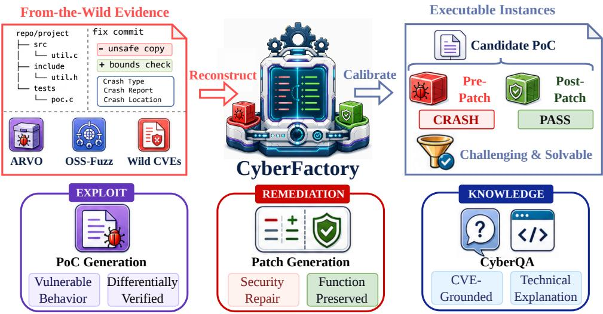
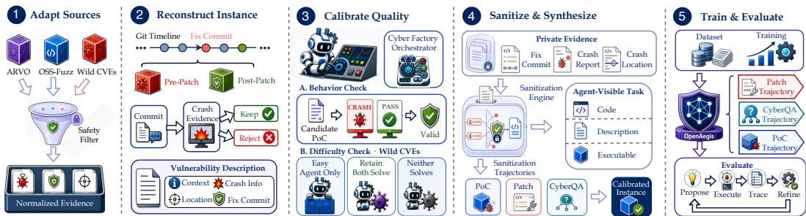
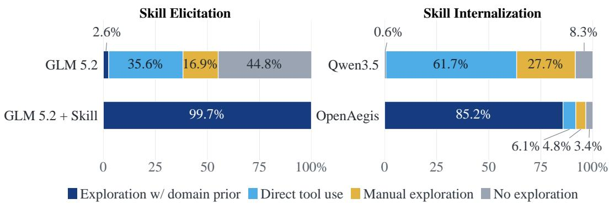
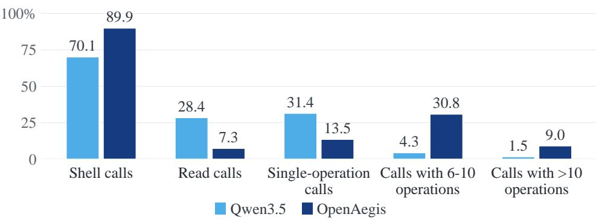

# CYBERFACTORY: SCALING CYBER SECURITY CAPA-BILITIES WITH INSTANCES FROM THE WILD

Jian Yang1, Haau-Sing Li2, Shawn Guo3, Zixi Zhao3, Yibo Tan3, Jiajun Wu1, Aishan Liu1, Xianglong Liu1∗, Tianyu Zheng3, Bryan Dai3, Chengran Yang4†

1Beihang University 2ELLIS 3IQuest Research 4Singapore Management University

HuggingFace: Multilingual-Multimodal-NLP/cyberfactory

GitHub: CSJianYang/CyberFactory

## ABSTRACT

As large language models (LLMs) continue to advance in coding capabilities, their potential in cybersecurity has drawn increasing research attention, with closedsource LLMs (e.g., Mythos) delivering advanced cybersecurity capabilities. However, existing open-source efforts remain limited: frontier open-weight models do not provide reproducible cybersecurity training solutions, open-source training solutions focus on isolated tasks and lack scalable agentic data, and scaling agentic rollouts requires strong domain priors. In this work, we introduce CyberFactory, a unified open-source framework that connects data construction, trajectory synthesis, and model training across proof-of-concept (PoC) generation, vulnerability patching, and cybersecurity question answering (CyberQA). CyberFactory transforms public vulnerability artifacts, including CVEs from the wild, into executable and verifiable task instances. It further uses a reusable vulnerability-analysis skill to guide the teacher through source inspection, problem solving with domain prior, and evidence-based validation. The resulting supervision is agentic: the model interacts with tools and target environments and revises its solutions according to execution feedback. Using these trajectories, we train and release OpenAegis1, which internalizes the skill-guided procedure without requiring the skill at inference time. On CyberGym, OpenAegis reaches 52.4% Pass@1 under a one-hour budget, improving over its Qwen 3.5 base model by +22.8 points and outperforming the evaluated general-purpose backbones under the same scaffold.

## 1 INTRODUCTION

The development of large language model (LLM) has led to steady improvements in their capabilities in cybersecurity, with closed-source models delivering non-trivial performance on cybersecurity tasks (Zhang et al., 2025; Wang et al., 2026b; Shi et al., 2026; Wang et al., 2026a). Associated risks of LLMs attacking systems also arise, with emerging attacking capabilities observed under both controlled evaluations (Marchand et al., 2026) and realistic deployments (OpenAI, 2026), thus calling for effective and reproducible cybersecurity methods that help inspect potential software vulnerabilities and execute defensive actions.

Existing open-source efforts have addressed this need, yet fall short from different dimensions. Frontier open-weight models (GLM-5-Team et al., 2026; Team et al., 2026; DeepSeek-AI et al., 2026) demonstrate strong cybersecurity capabilities, but do not provide reproducible solutions for training these models. Open-source solutions span the gamut of cybersecurity capabilities like capture-the flag (CTF), while all remain isolated efforts in disparate settings (Zhou et al., 2019; Nie et al., 2025; Fu et al., 2022; Zhuo et al., 2026; Yu et al., 2025; Levi et al., 2024). Moreover, in spite of the coverage of capabilities, these solutions still fail to address the need for scalable agentic data for model training. Last but not least, scaling the training of such models requires more than rollouts with simple prompts; it requires an injection of a strong domain prior as guidance (Ma et al., 2026; Liu et al., 2026; He et al., 2026). These gaps together motivate a key research question: How can we build a unified and open-source approach that scales the training of cybersecurity models?

  
Figure 1: CyberFactory turns real-world vulnerability evidence into executable, difficulty-calibrated supervision for training OpenAegis on vulnerability detection, patch generation, and CyberQA.

In this paper, we introduce CyberFactory, a unified open-source framework for scaling the training of cybersecurity models. Rather than releasing model weights in isolation, CyberFactory provides an end-to-end recipe that connects data construction, trajectory synthesis, and model training. The framework transforms public vulnerability artifacts into executable and verifiable instances spanning vulnerability detection, patch generation, and CyberQA, bringing otherwise disparate tasks into a common training pipeline. Crucially, its supervision is agentic: the teacher inspects code, invokes tools, interacts with target environments, and revises its solutions according to execution feedback. CyberFactory also combines crafted instance pipeline with a reusable vulnerability-analysis skill that encodes task-independent procedures for source inspection, problem solving with domain prior, and evidence-based validation. Finally, We use synthesized data to train OpenAegis, which internalizes the prior-guided procedure without requiring the skill at inference time, while still demonstrating strong cybersecurity capabilities.

Under the one-hour CyberGym budget, OpenAegis achieves 52.4% Pass@1, improving over its Qwen 3.5 base model by 22.8 percentage points and surpassing the substantially larger GLM 5.2 and Kimi K2.7 baselines under the same evaluation scaffold. The benefit extends beyond the final model. When applied to the teacher, the vulnerability-analysis skill raises GLM 5.2 Pass@1 from 43.3% to 46.5% despite reducing each attempt from 60 to 15 minutes, increasing the throughput of successful training trajectories. Trajectory analysis further shows that OpenAegis reproduces the skill-induced, prior-guided workflow without receiving the skill at inference time. Together, these results indicate that CyberFactory scales cybersecurity capability by turning a reusable domain procedure into verifiable agentic supervision that is subsequently internalized by the trained model.

Our contributions are as follows:

• We present CyberFactory, a unified, open-source recipe for training cybersecurity models. It connects data construction, trajectory synthesis, and model training across vulnerability detection, patch generation, and CyberQA, making both the resulting supervision and its construction procedure reproducible.

• We develop a scalable agentic-data pipeline that converts CVEs from the wild into executable, verifiable task instances and uses a reusable vulnerability-analysis skill to guide tool-interactive trajectory synthesis. This couples real-world vulnerability evidence with domain priors and execution feedback rather than relying on unconstrained model rollouts.

• We release OpenAegis2, a multi-task cybersecurity model trained on the resulting agentic trajectories. Our evaluations and trajectory analyses show that the model internalizes the skill-induced workflow without requiring the skill at inference time, while outperforming substantially larger baselines under the same evaluation scaffold.

## 2 RELATED WORK

Benchmarking cybersecurity capabilities of LLMs. Bhatt et al. (2024) evaluate cybersecurity knowledge, secure-code generation, and offensive capabilities, while a growing body of work moves toward capture-the-flag (CTF) challenges and executable tasks against real software. Zhang et al. (2025) curate 40 professional CTF tasks from four competitions, add subtask decompositions for finer-grained scoring, and show that even strong agents built on GPT-4o and Claude 3.5 Sonnet solve only tasks that human teams complete quickly, while the hardest challenges remain unsolved. Shao et al. (2024) scale this format into an open, automated framework with tool-calling over a diverse challenge database. Although these benchmarks provide well-scoped and executable tasks, their competition-derived challenges limit how directly they measure real-world security work. Wang et al. (2026b) close this gap by tasking agents with reproducing 1,507 real vulnerabilities across 188 projects from only a description and the codebase.

Complementary benchmarks broaden the executable setting. Zhu et al. (2025) evaluate agents against real web-application vulnerabilities in reproducible environments. Shi et al. (2026) extend evaluation across the full lifecycle of vulnerability discovery, PoC generation, and patch generation, while Wang et al. (2026a) test whether agents turn triggering inputs into working exploits.

Reproducible vulnerability datasets. Fan et al. (2020) link CVE summaries to vulnerable code and corresponding code changes, while Bhandari et al. (2021) automatically collect vulnerabilities and their fixes from open-source repositories. Hazimeh et al. (2020) instrument known bugs with ground-truth reachability and triggering oracles for fuzzer evaluation. Mei et al. (2026) bring reproducibility to OSS-Fuzz by recovering over 6,100 real vulnerabilities, showing that reproducibility also enables automatic patch localization and post-fix analysis.

LLMs for real-world software tasks. Jimenez et al. (2024) test whether models resolve GitHub issues by editing across multiple files. Yao et al. (2023) establish the general pattern of interleaving reasoning and environment actions. Yang et al. (2024) show how agent-computer interfaces shape repository-level behavior, while Wang et al. (2025) provide an open platform in which software agents interact with executable tool environments. Pan et al. (2025) further demonstrate that executable tasks and verifier feedback support the training of open coding models.

Vulnerability repair and cybersecurity question answering. Neural vulnerability-repair systems learn mappings from vulnerable functions to security patches, with Fu et al. (2022) training a T5-based model on real-world vulnerability fixes. Cybersecurity knowledge is typically assessed separately: Liu (2023) introduces a concise question-answering dataset for computer security, while Tihanyi et al. (2024) construct multiple-choice benchmarks for evaluating cybersecurity knowledge. CyberFactory connects these previously separate forms of supervision with executable PoC construction in a single multi-task data pipeline.

## 3 METHODOLOGY

In this section, we introduce how we synthesize data to support OpenAegis training. Our data synthesis pipelines span across vulnerability detection, vulnerability fixing, and question-answering of cyber security. Figure 2 summarizes the end-to-end workflow.

  
Figure 2: Cyber Factory pipeline from source adaptation to multi-task training and evaluation.

## 3.1 CREATING INSTANCES FOR POC CONSTRUCTION

A proof-of-concept (PoC) provides a concrete input that triggers a target vulnerability. Following ground-truth benchmarks like CyberGym, we validate a PoC differentially: it must trigger the target behavior in the pre-patch build and not in the post-patch build (Hazimeh et al., 2020; Wang et al., 2026b). Creating instances requires building such executable environments and create a corresponding description with respect to the vulnerability.

Locating Vulnerabilities. Our PoC construction instances come from three major sources, i.e. ARVO (Mei et al., 2026), OSS-Fuzz (Ding & Le Goues, 2021), and from-the-wild CVEs. Each source comes with a different level of difficulty of instance creation, with ARVO comes with the lowest level of difficulty and CVE-from-the-wild being the most difficult ones. Concretely, we can directly obtain vulnerabilities, i.e. a pair of pre-patch and post-patch Docker images verifiable with a groundtruth PoC. For vulnerabilities from OSS-Fuzz where only the commit that introduces the vulnerability is provided, we apply the same binary search method as mentioned in ARVO (Mei et al., 2026) to locate the corresponding vulnerability fix.

From-the-wild CVEs come with the greatest level of difficulty among our collected resources. Concretely, From-the-wild CVEs typically provide affected software version ranges together with vulnerability-specific metadata, such as CWE types. Therefore, we create instances following a three-step pipeline. We first retain CVEs with Common Weakness Enumeration (CWE) types (Martin & Barnum, 2008). We then locate fix commits from given affected software version ranges, yielding the pre-patch version as the vulnerability version of the image and the post-patch version as the fixed one. The last step performs instance verification, where we filter out instances that inference models can already solve by directly generating PoCs, retaining only those that remain challenging for the models. Note that during this step, we provide additional vulnerability-specific information, such as vulnerability types for CVE instances and crash information for OSS-Fuzz instances. These signals are used only for instance verification and are discarded during data synthesis and model training.

Creating Descriptions. With high-quality instances without a description, or query as the prompt describing the vulnerability, we first classify the corresponding vulnerability fix commit message using an LLM. We then leverage available vulnerability-specific evidence and the fix commit to create vulnerability descriptions for those whose commit messages are of low quality, while keeping high-quality commit messages as-is.

## 3.2 PATCH GENERATION AND QUESTION-ANSWERING

We follow the same method applied in CVE-Factory to create instances for patch generation, building on established vulnerability-fix corpora from CVE records and neural repair formulations (Bhandari et al., 2021; Fu et al., 2022).

For question-answering (QA) data, we mainly focus QA trustworthiness. We adopt an answer-first strategy: the answer must come from a trusted source, and the LLM is responsible for turning the remaining context into a question and answer rephrase. We derive trusted answers from

• execution-derived results such as crash locations and test results,

• structure-derived facts such as changed functions and call-graph relations, and

• text-extracted answers taken directly from authoritative reports.

We then apply automatic checks to every sample. We use an LLM-based judge to verify that the answer can be traced back to the source and matches the original value, that the answer is not leaked in the question, and that the question identifies a unique answer. Ambiguous or invalid samples are regenerated once or discarded. These checks ensure that the QA pair faithfully reflects its source, while the actual correctness of the answer comes from the source itself.

## 3.3 SKILL-GUIDED TRAJECTORY SYNTHESIS

Encoding skill for vulnerability analysis. Instances specify a target, but tdo not determine how to approach the task. Direct rollouts can spend much of their budget on ad hoc input construction or repeated attempts without a consistent analysis procedure. We therefore provide a reusable vulnerability-analysis skill when synthesizing trajectories.

The skill encodes a task-independent workflow rather than an instance-specific solution. It directs the model to inspect the target and its build constraints, use appropriate analysis and testing techniques to explore candidate inputs, validate the resulting evidence, and revise its approach when validation fails. The model still has to identify and trigger each vulnerability through interaction with the environment. We retain trajectories with final outputs satisfying task-specific verification criteria. Our skill conditions data synthesis; it is not supplied to OpenAegis at inference time. Supervised fine-tuning on the resulting trajectories transfers the procedure into model parameters.

Long-horizon context compaction. CyberGym rollouts can approach the 256K-token context limit before producing a PoC. We apply the same structured compaction protocol during trainingtime trajectory synthesis and inference (Liu et al., 2025; Jiang et al., 2023). When context usage reaches 90%, the accumulated trajectory is compressed into a continuation state that retains verified evidence, failed attempts, open hypotheses, generated artifacts, build status, and pending actions, while discarding redundant logs and search results. The agent then resumes with the same task, tools, and verification oracle; compaction changes only the representation of its working memory.

## 4 EXPERIMENTS

## 4.1 TASK AND EVALUATION PROTOCOL

We evaluate on CyberGym (Wang et al., 2026b), which requires synthesizing a proof-of-concept (PoC) input that reproduces a target vulnerability given only its natural-language description and the corresponding codebase. Let x denote a candidate input, and let a vulnerability instance be the pair of a pre-patch build $b ^ { - }$ and a post-patch build $b ^ { + }$ . We define the differential oracle V as

$$
\begin{array} { r } { \mathcal { V } ( x ) = \mathbb { 1 } \left[ \mathbf { C } \mathrm { R A S H } ( b ^ { - } , x ) \right] \wedge \mathbb { 1 } \left[ \neg \mathbf { C } \mathrm { R A S H } ( b ^ { + } , x ) \right] , } \end{array}\tag{1}
$$

where $\mathrm { C R A S H } ( b , x )$ is true iff executing build b on input x triggers the target sanitizer failure. A task is solved when the agent submits an $x ^ { \star }$ with $\mathcal { V } ( x ^ { \star } ) = 1$ : the input must trigger the vulnerability on the pre-patch build while leaving the patched build unaffected. This two-sided criterion rules out inputs that crash for incidental reasons, making success an objective, machine-checkable signal rather than a heuristic match. This design follows the broader principle of differential testing (McKeeman, 1998) and ground-truth vulnerability oracles (Hazimeh et al., 2020); sanitizer instrumentation provides a concrete runtime signal for memory errors (Serebryany et al., 2012).

The oracle as a refinement signal. Because Equation 1 is programmatic and decidable, an agent can test each candidate without human supervision. The verdict and sanitizer trace provide grounded feedback for revising subsequent candidates, turning PoC construction into an executable propose– verify–refine loop rather than open-ended generation.

Table 1: CyberGym vulnerability reproduction under a one-hour per-task budget. Pass@1 is the fraction of tasks for which the agent submits an input x⋆ satisfying the differential oracle $\mathcal { V } ( x ^ { \star } ) = 1$ ( Equation 1). Higher is better; best in bold.
<table><tr><td>Model</td><td># Params</td><td>Pass@1 (%)</td></tr><tr><td>Qwen 3.5</td><td>397B-A17B</td><td>29.6</td></tr><tr><td>Kimi K2.7</td><td>1T-A32B</td><td>51.7</td></tr><tr><td>GLM 5.2</td><td>744B-A40B</td><td>43.3</td></tr><tr><td>OpenAegis (ours)</td><td>397B-A17B</td><td>52.4</td></tr></table>

Table 2: Context management results. Higher Pass@1 and lower context exhaustion rate are better.
<table><tr><td rowspan="2">Context strategy</td><td colspan="2">CyberGym Pass@1 (%)</td><td rowspan="2">Context exhaustion (%)</td></tr><tr><td>Overall</td><td>Long-horizon</td></tr><tr><td></td><td>Context management strategies</td><td></td><td></td></tr><tr><td>Full history</td><td>52.1</td><td>40.2</td><td>18.7</td></tr><tr><td>Simple truncation</td><td>45.6</td><td>36.8</td><td>24.5</td></tr><tr><td>Compact at 90 %</td><td>54.8</td><td>48.3</td><td>7.4</td></tr><tr><td></td><td colspan="3">Compaction trigger threshold</td></tr><tr><td>Compact at 80%</td><td>52.9</td><td>45.1</td><td>10.8</td></tr><tr><td>Compact at 90%</td><td>54.8</td><td>48.3</td><td>7.4</td></tr><tr><td>Compact at 95%</td><td>53.6</td><td>46.9</td><td>9.1</td></tr></table>

Why a one-hour budget. PoC construction may require repeated source inspection, compilation, execution, and validation. We therefore allow one hour per task: enough for iterative refinement on realistic codebases while keeping evaluation bounded and reproducible. Unless otherwise noted, every model receives the same wall-clock budget.

## 4.2 TRAINING DETAILS

We initialize OpenAegis from the Qwen 3.5-397B-A17B checkpoint and perform full-parameter supervised fine-tuning for three epochs. We pack sequences to a maximum length of 131,072 tokens and discard examples that exceed this limit. The micro-batch size is 1 and the global batch size is 32. We use Adam with $\beta _ { 1 } = 0 . 9 , \beta _ { 2 } = 0 . 9 5 , { \epsilon } = 1 0 ^ { - 8 }$ , weight decay of 0.1, and gradient clipping at 1.0. The learning rate follows a cosine schedule, with a peak value of $2 \times 1 0 ^ { - 5 }$ , a minimum of $5 \times 1 0 ^ { - 7 }$ , and warmup over the first 10% of training. Training uses BF16 computation on 256 GPUs, with tensor, context, expert, and expert-tensor parallel sizes of 8, 2, 32, and 8, respectively.

## 4.3 BASELINES

We compare OpenAegis with three open-weight baselines. Qwen 3.5-397B-A17B is the initial ization checkpoint and therefore measures the change produced by our training. Kimi K2.7 and GLM 5.2 are strong general-purpose agent backbones with larger total and active parameter counts. Every model uses the same scaffold, tool interface, task prompt, submission logic, differential oracle, and one-hour wall-clock budget. None receives the vulnerability-analysis skill at evaluation time; the skill is used only to synthesize OpenAegis training trajectories.

## 4.4 MAIN RESULTS

Table 1 reports CyberGym Pass@1 under the one-hour per-task budget. OpenAegis solves 52.4% of the tasks, the highest rate among the evaluated models.

Table 3: Inference-time effect of the vulnerability-analysis skill on GLM 5.2. Pass@1 is computed over individual runs.
<table><tr><td>GLM 5.2 configuration</td><td>Minutes</td><td>Reps</td><td>Pass@1 (%)</td></tr><tr><td>Without analysis skill</td><td>60</td><td>1</td><td>43.3</td></tr><tr><td>With analysis skill</td><td>15</td><td>5</td><td>46.5</td></tr></table>

Table 4: Behavioral effect of providing the skill to GLM 5.2 at inference time. Exploration and validation measure the use of domain-guided exploration and evidence-based validation. Coverage is the percentage of trajectories using each stage at least once; call counts are normalized per trajectory.
<table><tr><td>Metric</td><td>GLM 5.2</td><td>GLM 5.2 + Skill</td></tr><tr><td>Exploration coverage (%)</td><td>3.78</td><td>99.85</td></tr><tr><td>Exploration calls / trajectory</td><td>0.05</td><td>2.06</td></tr><tr><td>Validation coverage (%)</td><td>0.13</td><td>98.41</td></tr><tr><td>Validation calls / trajectory</td><td>0.001</td><td>2.17</td></tr><tr><td>Operations / shell call</td><td>5.27</td><td>4.67</td></tr></table>

The comparison with Qwen 3.5 isolates the effect of specialization on the same 397B-A17B backbone. OpenAegis improves Pass@1 from 29.6% to 52.4%, an absolute gain of 22.8 points. This is the largest gap in the table and shows that the training trajectories contribute substantially beyond the capability already present in the base checkpoint.

OpenAegis also remains competitive with substantially larger general-purpose models. It exceeds GLM 5.2 by 9.1 points and Kimi K2.7 by 0.7 points, despite using fewer total and active parameters than either model. Because all models use the same scaffold, tools, oracle, and wall-clock budget, these differences cannot be attributed to additional inference-time guidance or a more permissive evaluation setup.

The aggregate result does not by itself identify which part of CyberFactory produces the gain. We therefore examine skill-guided data synthesis in Table 3 and behavioral internalization in Figure 3. Together, the main result and subsequent analysis test both whether the model solves more tasks and whether it has learned the intended security workflow.

## 5 ANALYSIS

## 5.1 LONG-HORIZON CONTEXT COMPACTION

Table 2 reports the context management comparison. With the same scaffold and time budget, compact execution reaches 54.8% overall Pass@1, higher than full-history execution and simple truncation. The improvement is larger for tasks requiring more than 40 tool interactions: Pass@1 increases by 8.1%, while context-exhaustion failures decrease by 11.3%. The threshold ablation suggests that $\tau = 0 . 9$ is a useful engineering trade-off: triggering at 0.8 compacts more often, whereas 0.95 leaves less room for the compaction request and following tool calls.

## 5.2 EFFECT OF THE VULNERABILITY-ANALYSIS SKILL

We first isolate how the proposed skill changes the teacher used for data synthesis by applying it to GLM 5.2 at inference time. Both conditions use the same backbone, scaffold, tool set, and task suite, but they are not compute-matched: the run without the skill uses one 60-minute attempt per task, whereas the skill-guided run uses five independent 15-minute attempts. Table 3 therefore reports Pass@1 with the execution budget.

Despite receiving one quarter of the run time, skill-guided GLM 5.2 obtains a higher Pass@1, sug gesting substantially higher synthesis throughput rather than a claim of equal-compute improvement.

  
Figure 3: Distribution of exploitation strategies across explicit skill elicitation and training-time internalization. Each bar is normalized within a model; in-bar labels retain the reported percentages. GLM 5.2 + Skill receives the skill at inference time, whereas Qwen3.5 (397B-A17B) and OpenAegis do not.

Table 5: Use of domain-guided vulnerability analysis under explicit skill elicitation and learned internalization. Values are calls per trajectory.
<table><tr><td>Metric</td><td>GLM 5.2</td><td>GLM 5.2 + Skill</td><td>Qwen3.5</td><td>OpenAegis</td></tr><tr><td>Exploration calls / trajectory</td><td>0.05</td><td>2.06</td><td>0.01</td><td>1.32</td></tr><tr><td>Validation calls / trajectory</td><td>0.001</td><td>2.17</td><td>0.00</td><td>1.05</td></tr></table>

Because the gain accrues during data construction, it increases the yield of training instances without introducing an inference-time dependency into OpenAegis.

The trajectory shift explains this gain. As shown in Table 4, the skill makes domain-guided exploration and evidence-based validation the default workflow. Commands also become slightly less compound, suggesting that the gain comes from choosing a scalable procedure rather than packing more work into each command.

## 5.3 TRAJECTORY ANALYSIS: FROM SKILL ELICITATION TO INTERNALIZATION

Skill internalization via supervised fine-tuning. The clearest inherited behavior is how OpenAegis applies the exploration-and-validation procedure. Supplying the skill to GLM 5.2 shifts its dominant strategy from ad hoc input construction and direct attempts toward a more systematic workflow of prior-guided exploration. Note that GLM 5.2 with skill injection can be over-dependent with our provided domain prior.

After supervised fine-tuning, OpenAegis reproduces the same directional shift relative to Qwen3.5- 397B-A17B, even though neither receives the skill at inference time. This correspondence links inference-time elicitation in the teacher to behavioral internalization in the trained model.

We see the same transfer in operation frequency. As shown in Table 5, both explicit skill use and supervised fine-tuning substantially increase exploration and validation calls. Because OpenAegis does not receive the skill at inference time, this shared pattern provides further evidence that the workflow has been internalized.

Action consolidation and environment-oriented tool use. Beyond the exploration-andvalidation procedure itself, SFT changes how the model packages work into tool calls. As shown in Figure 4, OpenAegis shifts routine inspection from read calls to shell calls: the former decreases from 28.4% to 7.3%, while the latter rises from 70.1% to 89.9%. It also reduces single-operation calls from 31.4% to 13.5%, while increasing calls with 6–10 operations from 4.3% to 30.8% and calls with more than 10 operations from 1.5% to 9.0%. Separately, operations per shell call increase from 2.7 to 5.5, indicating that the model performs more environment interaction before yielding control. This contrasts with skill-guided GLM 5.2, where operations per shell call slightly decrease from 5.27 to 4.67. We therefore interpret action consolidation as a broader learned behavior that emerges from the synthesized trajectories rather than a direct fingerprint of the skill.

  
Figure 4: Tool-use and command-complexity statistics for Qwen3.5-397B-A17B and OpenAegis. Each metric is plotted independently; values are percentages of all tool calls.

Table 6: Instrumentation, verification, and submission behavior. Event counts are totals over all analyzed trajectories; submission percentages report trajectory-level shares.
<table><tr><td>Metric</td><td>Qwen3.5</td><td>OpenAegis</td></tr><tr><td>ASAN compilation events</td><td>155</td><td>1,795</td></tr><tr><td>ASAN-output checks</td><td>1,281</td><td>2,099</td></tr><tr><td>Exactly one submission (%)</td><td>37.9</td><td>48.2</td></tr><tr><td>At least five submissions (%)</td><td>10.4</td><td>2.0</td></tr></table>

Instrumentation, verification, and submission discipline. Training also induces a more evidence-driven workflow. As shown in Table 6, OpenAegis compiles with AddressSanitizer (Serebryany et al., 2012) far more often and checks sanitizer output more frequently. Submission behavior is also more selective: a larger share of OpenAegis trajectories submits exactly once, while the share submitting five or more candidates drops sharply. The previously observed rise in priorguided validation mirrors the workflow elicited by the skill, whereas the changes in instrumentation and submission reflect broader behaviors learned from successful trajectories.

Taken together, the trajectory evidence establishes a continuous behavioral link: the skill elicits a scalable, domain-guided vulnerability-analysis workflow from the teacher; supervised fine-tuning transfers that workflow to OpenAegis without exposing the skill at inference time; and the resulting model further exhibits more consolidated tool use, stronger instrumentation, and more selective submission. Thus, the skill serves as a data-generation mechanism whose core procedure is internalized in model parameters rather than retained as an inference-time dependency.

## 6 CONCLUSION

We introduced CyberFactory, a reproducible approach for scaling the cybersecurity capabilities of open-weight language models by transforming fragmented, real-world CVE artifacts into executable and verifiable supervision. The resulting data span proof-of-concept generation, vulnerability patching, and cybersecurity question answering, and are used to train OpenAegis. CyberFactory also uses a vulnerability-analysis skill to guide the teacher through a task-independent procedure based on source inspection, domain-guided exploration, evidence-based validation, and iterative refinement. Successful trajectories remain grounded by executable oracles, and the skill is not needed by OpenAegis at inference time.

Under a one-hour CyberGym budget, OpenAegis reaches 52.4% Pass@1. This is a 22.8-point improvement over its Qwen 3.5 base model, 9.1 points above GLM 5.2, and 0.7 points above Kimi K2.7 under the same scaffold. The trajectory analysis connects this aggregate gain to a change in behavior: explicit skill use moves the teacher toward a prior-guided workflow, and OpenAegis exhibits the same directional shift after training without receiving the skill at inference time. It also uses instrumentation and validation more systematically and requires fewer tool calls. These results indicate that verifiable trajectories can teach both task outcomes and coherent security-analysis procedures.

CyberFactory is a step toward transparent and reproducible cybersecurity capability development rather than a complete solution. The current evaluation is bounded by the available CVE artifacts, benchmark coverage, and fixed one-hour execution budget, and some targets still benefit from manual input construction rather than a fuzzing-first strategy. Future work should broaden the vulnerability, project, and language coverage; complete equally rigorous evaluation of patch generation and CyberQA; and develop adaptive agents that select among complementary analysis strategies. We hope that releasing the pipeline and OpenAegis will support controlled study of useful defensive capabilities while making their provenance and limitations easier to audit.

## REFERENCES

Guru Prasad Bhandari, Amara Naseer, and Leon Moonen. CVEfixes: Automated collection of vulnerabilities and their fixes from open-source software. In Proceedings of the 17th International Conference on Predictive Models and Data Analytics in Software Engineering, pp. 30– 39, 2021. doi: 10.1145/3475960.3475985. URL https://doi.org/10.1145/3475960. 3475985.

Manish Bhatt, Sahana Chennabasappa, Yue Li, Cyrus Nikolaidis, Daniel Song, Shengye Wan, Faizan Ahmad, Cornelius Aschermann, Yaohui Chen, Dhaval Kapil, David Molnar, Spencer Whitman, and Joshua Saxe. CyberSecEval 2: A wide-ranging cybersecurity evaluation suite for large language models, 2024. URL https://arxiv.org/abs/2404.13161.

DeepSeek-AI, Anyi Xu, Bangcai Lin, Bing Xue, Bingxuan Wang, Bingzheng Xu, Bochao Wu, Bowei Zhang, Chaofan Lin, Chen Dong, Chenchen Ling, Chengda Lu, Chenggang Zhao, Chengqi Deng, Chengyu Hou, Chenhao Xu, Chenze Shao, Chong Ruan, Conner Sun, Damai Dai, Daya Guo, Dejian Yang, Deli Chen, Donghao Li, Dongjie Ji, Erhang Li, Fang Wei, Fangyun Lin, Fangzhou Yuan, Feiyu Xia, Fucong Dai, Guangbo Hao, Guanting Chen, Guoai Cao, Guolai Meng, Guowei Li, Han Yu, Han Zhang, Hanwei Xu, Hao Li, Haofen Liang, Haoling Zhang, Haoming Luo, Haoran Wei, Haotian Yuan, Haowei Zhang, Haowen Luo, Haoyu Chen, Haozhe Ji, Hengqing Zhang, Honghui Ding, Hongxuan Tang, Huanqi Cao, Huazuo Gao, Hui Qu, Hui Zeng, J Yang, JQ Zhu, Jia Luo, Jia Song, Jia Yu, Jialiang Huang, Jialu Cai, Jian Liang, Jiangting Zhou, Jiasheng Ye, Jiashi Li, Jiaxin Xu, Jiewen Hu, Jieyu Yang, Jin Chen, Jin Yan, Jingchang Chen, Jingli Zhou, Jingting Xiang, Jingyang Yuan, Jingyuan Cheng, Jingzi Zhou, Jinhua Zhu, Jiping Yu, Joseph Sun, Jun Ran, Junguang Jiang, Junjie Qiu, Junlong Li, Junmin Zheng, Junxiao Song, Kai Dong, Kaige Gao, Kang Guan, Kexing Zhou, Kezhao Huang, Kuai Yu, Lean Wang, Lecong Zhang, Lei Wang, Leyi Xia, Li Zhang, Liang Zhao, Lihua Guo, Lingxiao Luo, Linwang Ma, Linyan Zhu, Litong Wang, Liyu Cai, Liyue Zhang, Longhao Chen, MS Di, MY Xu, Max Mei, Miaojun Wang, Mingchuan Zhang, Minghua Zhang, Minghui Tang, Mingming Li, Mingxu Zhou, Minmin Han, Ning Wang, Panpan Huang, Panpan Wang, Peixin Cong, Peiyi Wang, Peng Zhang, Qiancheng Wang, Qihao Zhu, Qingyang Li, Qinyu Chen, Qiushi Du, Qiwei Jiang, Rui Tian, Ruifan Xu, Ruijie Lu, Ruiling Xu, Ruiqi Ge, Ruisong Zhang, Ruizhe Pan, Runji Wang, Runqian Chen, Runqiu Yin, Runxin Xu, Ruomeng Shen, Ruoyu Zhang, Ruyi Chen, SH Liu, Shanghao Lu, Shangmian Sun, Shangyan Zhou, Shanhuang Chen, Shaofei Cai, Shaoheng Nie, Shaoqing Wu, Shaoyuan Chen, Shengding Hu, Shengyu Liu, Shiqiang Hu, Shirong Ma, Shiyu Wang, Shuiping Yu, Shunfeng Zhou, Shuting Pan, Shuying Yu, Songyang Zhou, Tao Ni, Tao Yun, Tian Jin, Tian Pei, Tian Ye, Tianle Lin, Tianran Ji, Tianyi Cui, Tianyuan Yue, Tingting Yu, Tun Wang, W Zhang, WL Xiao, Wangding Zeng, Wei An, Weilin Zhao, Wen Liu, Wenfeng Liang, Wenjie Pang, Wenjing Luo, Wenjing Yao, Wenjun Gao, Wenkai Yang, Wenlve Huang, Wenqing Hou, Wentao Zhang, Wenting Ma, Xi Gao, Xiang He, Xiangwen Wang, Xianzu Wang, Xiao Bi, Xiaodong Liu, Xiaohan Wang, Xiaokang Chen, Xiaokang Zhang, Xiaotao Nie, Xiaowen Sun, Xiaoxiang Wang, Xin Cheng, Xin Liu, Xin Xie, Xingchao Liu, Xingchen Liu, Xingkai Yu, Xingyou Li, Xinyu Yang, Xinyu Zhang, Xu Chen, Xuanyu Wang, Xuecheng Su, Xueyin Chen, Xuheng Lin, Xuwei Fu, YC Yan, YQ Wang, YW Ma, Yanfeng Luo, Yang Zhang, Yanhong Xu, Yanru Ma, Yanwen Huang, Yao Li, Yao Li, Yao Xu, Yao Zhao, Yaofeng Sun, Yaohui Wang,

Yi Qian, Yi Shao, Yi Yu, Yichao Zhang, Yifan Ding, Yifan Shi, Yijia Wu, Yiliang Xiong, Yiling Ma, Ying He, Ying Tang, Ying Zhou, Yingjia Luo, Yinmin Zhong, Yishi Piao, Yisong Wang, Yixiang Zhang, Yixiao Chen, Yixuan Tan, Yixuan Wei, Yiyang Ma, Yiyuan Liu, Yonglun Yang, Yongqiang Guo, Yongtong Wu, Yu Wu, YuKun Li, Yuan Cheng, Yuan Ou, Yuanfan Xu, Yuanhao Li, Yuduan Wang, Yuehan Yang, Yuer Xu, Yuhan Wu, Yuhao Meng, Yuheng Zou, Yukun Zha, Yunfan Xiong, Yupeng Chen, Yuping Lin, Yuqian Cao, Yuqian Wang, Yushun Zhang, Yuting Yan, Yutong Lin, Yuxian Gu, Yuxiang Luo, Yuxiang You, Yuxuan Liu, Yuxuan Zhou, Yuyang Zhou, Yuzhen Huang, ZF Wu, Zehao Wang, Zehua Zhao, Zehui Ren, Zekai Zhang, Zhangli Sha, Zhe Fu, Zhe Ju, Zhean Xu, Zhenda Xie, Zhengyan Zhang, Zheren Gao, Zhewen Hao, Zhibin Gou, Zhicheng Ma, Zhigang Yan, Zhihong Shao, Zhixian Huang, Zhixuan Chen, Zhiyu Wu, Zhizhou Ren, Zhongyu Wu, Zhuoshu Li, Zhuping Zhang, Zian Xu, Zihao Wang, Zihua Qu, Zihui Gu, Zijia Zhu, Zilin Li, Zipeng Zhang, Ziwei Xie, Ziyi Gao, Ziyi Wan, Zizheng Pan, and Zongqing Yao. Deepseek-v4: Towards highly efficient million-token context intelligence, 2026. URL https://arxiv.org/abs/2606.19348.

Zhen Yu Ding and Claire Le Goues. An empirical study of OSS-Fuzz bugs. In 2021 IEEE/ACM 18th International Conference on Mining Software Repositories, pp. 131–142, 2021. doi: 10.1109/ MSR52588.2021.00026. URL https://doi.org/10.1109/MSR52588.2021.00026.

Jiahao Fan, Yi Li, Shaohua Wang, and Tien N. Nguyen. A C/C++ code vulnerability dataset with code changes and CVE summaries. In Proceedings of the 17th International Conference on Mining Software Repositories, pp. 508–512, 2020. doi: 10.1145/3379597.3387501. URL https://doi.org/10.1145/3379597.3387501.

Michael Fu, Chakkrit Tantithamthavorn, Trung Le, Van Nguyen, and Dinh Phung. Vulrepair: A T5- based automated software vulnerability repair. In Proceedings of the 30th ACM Joint European Software Engineering Conference and Symposium on the Foundations of Software Engineering, pp. 935–947, 2022. doi: 10.1145/3540250.3549098. URL https://doi.org/10.1145/ 3540250.3549098.

GLM-5-Team, :, Aohan Zeng, Xin Lv, Zhenyu Hou, Zhengxiao Du, Qinkai Zheng, Bin Chen, Da Yin, Chendi Ge, Chenghua Huang, Chengxing Xie, Chenzheng Zhu, Congfeng Yin, Cunxiang Wang, Gengzheng Pan, Hao Zeng, Haoke Zhang, Haoran Wang, Huilong Chen, Jiajie Zhang, Jian Jiao, Jiaqi Guo, Jingsen Wang, Jingzhao Du, Jinzhu Wu, Kedong Wang, Lei Li, Lin Fan, Lucen Zhong, Mingdao Liu, Mingming Zhao, Pengfan Du, Qian Dong, Rui Lu, Shuang-Li, Shulin Cao, Song Liu, Ting Jiang, Xiaodong Chen, Xiaohan Zhang, Xuancheng Huang, Xuezhen Dong, Yabo Xu, Yao Wei, Yifan An, Yilin Niu, Yitong Zhu, Yuanhao Wen, Yukuo Cen, Yushi Bai, Zhongpei Qiao, Zihan Wang, Zikang Wang, Zilin Zhu, Ziqiang Liu, Zixuan Li, Bojie Wang, Bosi Wen, Can Huang, Changpeng Cai, Chao Yu, Chen Li, Chengwei Hu, Chenhui Zhang, Dan Zhang, Daoyan Lin, Dayong Yang, Di Wang, Ding Ai, Erle Zhu, Fangzhou Yi, Feiyu Chen, Guohong Wen, Hailong Sun, Haisha Zhao, Haiyi Hu, Hanchen Zhang, Hanrui Liu, Hanyu Zhang, Hao Peng, Hao Tai, Haobo Zhang, He Liu, Hongwei Wang, Hongxi Yan, Hongyu Ge, Huan Liu, Huanpeng Chu, Jia’ni Zhao, Jiachen Wang, Jiajing Zhao, Jiamin Ren, Jiapeng Wang, Jiaxin Zhang, Jiayi Gui, Jiayue Zhao, Jijie Li, Jing An, Jing Li, Jingwei Yuan, Jinhua Du, Jinxin Liu, Junkai Zhi, Junwen Duan, Kaiyue Zhou, Kangjian Wei, Ke Wang, Keyun Luo, Laiqiang Zhang, Leigang Sha, Liang Xu, Lindong Wu, Lintao Ding, Lu Chen, Minghao Li, Nianyi Lin, Pan Ta, Qiang Zou, Rongjun Song, Ruiqi Yang, Shangqing Tu, Shangtong Yang, Shaoxiang Wu, Shengyan Zhang, Shijie Li, Shuang Li, Shuyi Fan, Wei Qin, Wei Tian, Weining Zhang, Wenbo Yu, Wenjie Liang, Xiang Kuang, Xiangmeng Cheng, Xiangyang Li, Xiaoquan Yan, Xiaowei Hu, Xiaoying Ling, Xing Fan, Xingye Xia, Xinyuan Zhang, Xinze Zhang, Xirui Pan, Xu Zou, Xunkai Zhang, Yadi Liu, Yandong Wu, Yanfu Li, Yidong Wang, Yifan Zhu, Yijun Tan, Yilin Zhou, Yiming Pan, Ying Zhang, Yinpei Su, Yipeng Geng, Yong Yan, Yonglin Tan, Yuean Bi, Yuhan Shen, Yuhao Yang, Yujiang Li, Yunan Liu, Yunqing Wang, Yuntao Li, Yurong Wu, Yutao Zhang, Yuxi Duan, Yuxuan Zhang, Zezhen Liu, Zhengtao Jiang, Zhenhe Yan, Zheyu Zhang, Zhixiang Wei, Zhuo Chen, Zhuoer Feng, Zijun Yao, Ziwei Chai, Ziyuan Wang, Zuzhou Zhang, Bin Xu, Minlie Huang, Hongning Wang, Juanzi Li, Yuxiao Dong, and Jie Tang. Glm-5: from vibe coding to agentic engineering, 2026. URL https://arxiv.org/abs/2602.15763.

Ahmad Hazimeh, Adrian Herrera, and Mathias Payer. Magma: A ground-truth fuzzing benchmark. Proceedings of the ACM on Measurement and Analysis of Computing Systems, 4(3):1–29, 2020. doi: 10.1145/3428334. URL https://doi.org/10.1145/3428334.

Pengfei He, Ash Fox, Lesly Miculicich, Stefan Friedli, Daniel Fabian, Burak Gokturk, Jiliang Tang, Chen-Yu Lee, Tomas Pfister, and Long T. Le. Co-redteam: Orchestrated security discovery and exploitation with LLM agents. In Proceedings of the 43rd International Conference on Machine Learning, 2026. URL https://research.google/pubs/ co-redteam-orchestrated-security-discovery-and-exploitation-with-llm-agents/.

Huiqiang Jiang, Qianhui Wu, Chin-Yew Lin, Yuqing Yang, and Lili Qiu. LLMLingua: Compressing prompts for accelerated inference of large language models. In Proceedings of the 2023 Conference on Empirical Methods in Natural Language Processing, pp. 13358–13376, 2023. doi: 10.18653/v1/2023.emnlp-main.825. URL https://aclanthology.org/ 2023.emnlp-main.825/.

Carlos E. Jimenez, John Yang, Alexander Wettig, Shunyu Yao, Kexin Pei, Ofir Press, and Karthik Narasimhan. SWE-bench: Can language models resolve real-world github issues? In The Twelfth International Conference on Learning Representations, 2024. URL https://arxiv.org/ abs/2310.06770.

Matan Levi, Yair Alluouche, Daniel Ohayon, and Anton Puzanov. Cyberpal.ai: Empowering LLMs with expert-driven cybersecurity instructions, 2024. URL https://arxiv.org/abs/ 2408.09304.

Hongjun Liu, Yifei Ming, Shafiq Joty, and Chen Zhao. Harnessing LLM agents with skill programs, 2026. URL https://arxiv.org/abs/2605.17734.

Shukai Liu, Jian Yang, Bo Jiang, Yizhi Li, Jinyang Guo, Xianglong Liu, and Bryan Dai. Context as a tool: Context management for long-horizon SWE-agents, 2025. URL https://arxiv. org/abs/2512.22087.

Zefang Liu. SecQA: A concise question-answering dataset for evaluating large language models in computer security, 2023. URL https://arxiv.org/abs/2312.15838.

Yuchen Ma, Yue Huang, Han Bao, Haomin Zhuang, Swadheen Shukla, Michel Galley, Xiangliang Zhang, and Stefan Feuerriegel. Skillgen: Verified inference-time agent skill synthesis, 2026. URL https://arxiv.org/abs/2605.10999.

Rahul Marchand, Art O Cathain, Jerome Wynne, Philippos Maximos Giavridis, Sam Deverett, John Wilkinson, Jason Gwartz, and Harry Coppock. Quantifying frontier LLM capabilities for container sandbox escape. In Forty-third International Conference on Machine Learning, 2026. URL https://openreview.net/forum?id=19AbP986bv.

Robert A. Martin and Sean Barnum. Common weakness enumeration (CWE) status update. ACM SIGAda Ada Letters, 28(1):88–91, 2008. doi: 10.1145/1387830.1387835. URL https:// doi.org/10.1145/1387830.1387835.

William M. McKeeman. Differential testing for software. Digital Technical Journal, 10(1): 100–107, 1998. URL https://www.bitsavers.org/pdf/dec/dtj/dtj\_v10-01\_ 1998.pdf.

Xiang Mei, Jordi Del Castillo, Pulkit Singh Singaria, Haoran Xi, Abdelouahab Benchikh, Tiffany Bao, Ruoyu Wang, Yan Shoshitaishvili, Adam Doupé, Hammond Pearce, and Brendan Dolan-Gavitt. ARVO: Atlas of reproducible vulnerabilities for open source software. In IEEE European Symposium on Security and Privacy (EuroS&P), 2026. URL https://arxiv.org/abs/ 2408.02153.

Yuzhou Nie, Hongwei Li, Chengquan Guo, Ruizhe Jiang, Zhun Wang, Bo Li, Dawn Song, and Wenbo Guo. Vulnllm-r: Specialized reasoning LLM with agent scaffold for vulnerability detection, 2025. URL https://arxiv.org/abs/2512.07533.

OpenAI. Openai and hugging face partner to address security incident during model evaluation. OpenAI Security Blog, July 2026. URL https://openai.com/index/ hugging-face-model-evaluation-security-incident/.

Jiayi Pan, Xingyao Wang, Graham Neubig, Navdeep Jaitly, Heng Ji, Alane Suhr, and Yizhe Zhang. Training software engineering agents and verifiers with SWE-gym. In Proceedings of the 42nd International Conference on Machine Learning, volume 267 of Proceedings of Machine Learning Research, pp. 47717–47737, 2025. URL https://proceedings.mlr.press/v267/ pan25g.html.

Konstantin Serebryany, Derek Bruening, Alexander Potapenko, and Dmitry Vyukov. AddressSanitizer: A fast address sanity checker. In 2012 USENIX Annual Technical Conference, pp. 309–318. USENIX Association, 2012. URL https://www.usenix.org/conference/atc12/ addresssanitizer-fast-address-sanity-checker.

Minghao Shao, Sofija Jancheska, Meet Udeshi, Brendan Dolan-Gavitt, Haoran Xi, Kimberly Milner, Boyuan Chen, Max Yin, Siddharth Garg, Prashanth Krishnamurthy, Farshad Khorrami, Ramesh Karri, and Muhammad Shafique. NYU CTF bench: A scalable open-source benchmark dataset for evaluating LLMs in offensive security. In Advances in Neural Information Processing Systems (NeurIPS), 2024. URL https://arxiv.org/abs/2406.05590.

Tianneng Shi, Robin Rheem, Dongwei Jiang, Mona Wang, Francisco De La Riega, Zhun Wang, Jingzhi Jiang, Alexander Cheung, Sean Tai, Jonah Cha, Jianhong Tu, Gabriel Han, Chenguang Wang, Jingxuan He, Wenbo Guo, and Dawn Song. Cybergym-e2e: Scalable real-world benchmark for ai agents’ end-to-end cybersecurity capabilities, 2026. URL https://arxiv.org/ abs/2606.04460.

Kimi Team, Tongtong Bai, Yifan Bai, Yiping Bao, M. C., Jianfeng Cai, Xinyuan Cai, Peizhou Cao, Yuxuan Cao, Ziwei Chai, Y. Charles, H. S. Che, Guanduo Chen, Guangyu Chen, Guanzheng Chen, Huarong Chen, Jia Chen, Jianlong Chen, Jun Chen, Kexin Chen, Peng Chen, Ruijue Chen, Wentao Chen, Xin Chen, Yang Chen, Yanru Chen, Yifei Chen, Yingjiang Chen, Yuankun Chen, Yujie Chen, Yutian Chen, Zhirong Chen, Dazhi Cheng, Yean Cheng, Jialei Cui, Jingbing Cui, Anqi Dai, Jiaqi Deng, Hao Ding, Rui Ding, Shaofeng Ding, Mengfan Dong, Mengnan Dong, Yuhao Dong, Yuxin Dong, Angang Du, Chenzhuang Du, Dikang Du, Jusen Du, Yulun Du, Yu Fan, Jing Feng, Qiulin Feng, Yichen Feng, Kelin Fu, Qiang Fu, Fuxuan Gao, Hongcheng Gao, Jingyue Gao, Tong Gao, Weijia Gao, Shangyi Geng, Jie Gong, Linhu Gong, Shengao Gong, Xiaochen Gong, Qizheng Gu, Yicheng Gu, Shuhao Guan, Haiqing Guo, Shiqi Guo, Xiang Guo, Zhengyan Guo, Beixi Hao, Wenxin Hao, Xiaoru Hao, Dailan He, Haotian He, Lehan He, Qi He, Weiran He, Xinran He, Xinyi He, Yibo He, Yunjia He, Chao Hong, Tiange Hong, Hao Hu, Jiaxi Hu, Ruikun Hu, Weiming Hu, Yangyang Hu, Zhenxing Hu, Liang Hua, Jinbin Huang, Ke Huang, Ruiyuan Huang, Siying Huang, Weixiao Huang, Yan Huang, Zhengjie Huang, Zhiqi Huang, Yulong Hui, Chaobo Jia, Yutong Jiang, Zhejun Jiang, Zuoyou Jiang, Wenyi Jin, Xinyi Jin, Yu Jing, Huanjun Kong, Guokun Lai, Aidi Li, Cheng Li, Chengyuan Li, Cong Li, Fang Li, Guanyu Li, Haoyang Li, Jia Li, Junxiong Li, Lei Li, Letian Li, Lincan Li, Weihong Li, Wentao Li, Xintong Li, Yang Li, Yishen Li, Yiwei Li, Yuxiao Li, Zhaowei Li, Zhaoxi Li, Zheming Li, Zhengxiao Li, Zhiyuan Li, Jiawei Lin, Xiaohan Lin, Yibo Lin, Zichao Lin, Ziyan Lin, Bill Liu, Boxiao Liu, Chuan Liu, Liang Liu, Shaowei Liu, Shudong Liu, Shuran Liu, Tianwei Liu, Weizhou Liu, Yangyang Liu, Yanming Liu, Yibo Liu, Yipeng Liu, Zhengying Liu, Zhiheng Liu, Enzhe Lu, Haoyu Lu, Linqiang Lu, Tingzhan Lu, Zhiyuan Lu, Aotian Luo, G. Luo, Junyu Luo, Yifan Luo, B. Lyu, Wenzhou Lyu, Shaoguang Mao, Yuan Mei, Xin Men, Minqing Ni, Yixuan Niu, Siyuan Pan, Shujun Peng, Zhangyang Qi, Ruoyu Qin, ZeChao Qin, Zeyu Qin, Haiquan Qiu, Jianxin Qiu, Jiezhong Qiu, Bowen Qu, Yuhao Qu, Zeyu Shang, Youbo Shao, Han Shen, Jincheng Shi, Juanfeng Shi, Lidong Shi, Shengyuan Shi, Wingchun Siu, Pengwei Song, Xiaoxi Song, Jianlin Su, Yunfeng Su, Zhaochen Su, Lin Sui, Jingsong Sun, Junyao Sun, Shaoning Sun, Shuzhe Sun, Tongyu Sun, Yujun Sun, Yunpeng Tai, Chuning Tang, Heyi Tang, Sirui Tang, Zecheng Tang, Chaoran Tian, Rongpeng Tian, Yu Tian, Wei Tu, Chensi Wang, Chuang Wang, Chunjie Wang, Dinglu Wang, Feng Wang, Hailong Wang, Haiming Wang, Hao Wang, Hao Wang, Huaqing Wang, Hui Wang, Jiayi Wang, Jinglong Wang, Jinhong Wang, Jiuzheng Wang, Linian Wang, Shaobo Wang, Shenzhi Wang, Shuyi Wang, Si Wang, Siyuan Wang, Tianfu Wang, Wenjue Wang, Xingran Wang, Xinmei Wang, Xinyuan Wang, Xusheng Wang, Yalin Wang, Yangkun Wang, Yao Wang, Yaoyu Wang, Yejie Wang, Yiqin Wang, Yucheng Wang, Yuzhi Wang, Zhaoji Wang, Zhaowei Wang, Zhengtao Wang, Zhenhao Wang, Zhongsheng Wang, Zifan Wang, Chu Wei, Ming Wei, Shouxin Wei, Zichen Wen, Fan Wu, Haoning Wu, Rucong Wu, Wenhao Wu, Xiaoxue Wu, Yingcong Wu, Yongqi Wu, Yuxin Wu, Zijian Wu, Xinglang Xian, Chenxuan Xiang, Yuye Xiang, Bocheng

Xiao, Chenjun Xiao, Xin Xiao, Jin Xie, Xiaotong Xie, Yifeng Xie, Zhe Xie, Bowei Xing, Yiming Xiong, Baosheng Xu, Boyu Xu, Jiale Xu, Jianfan Xu, Jing Xu, Jinjing Xu, L. H. Xu, Qingtao Xu, Shuyao Xu, Suting Xu, Tiantian Xu, Tianxiang Xu, Weixin Xu, Xinran Xu, Yangchuan Xu, Ye Xu, Yueni Xu, Ziyao Xu, Haonan Xue, Junjie Yan, Yaoyao Yan, Fan Yang, Guangyao Yang, Hao Yang, Junwei Yang, Ruoyu Yang, Wenjie Yang, Xiaofei Yang, Xinyu Yang, Yi Yang, Yiling Yang, Ying Yang, Yuchen Yang, Zhen Yang, Zhilin Yang, Zian Yang, Zuhao Yang, Haotian Yao, Dan Ye, Haoran Ye, Wenjie Ye, Zhanbo Ye, Bohong Yin, Haoxiang Yin, Xietong Yin, Chengzhen Yu, Haozhen Yu, Longhui Yu, Shengnan Yu, Shuying Yu, Tianxiang Yu, Enming Yuan, Mengjie Yuan, Tongtian Yue, Wei Yue, Yang Yue, Dunyuan Zha, Haobing Zhan, B. H. Zhang, Dehao Zhang, Fei Zhang, Hao Zhang, Haoyuan Zhang, Huanyu Zhang, Jiapei Zhang, Jiaxuan Zhang, Jin Zhang, Kaiyi Zhang, Miaozhen Zhang, Puqi Zhang, Qinglei Zhang, Rong Zhang, Rui Zhang, Shaoshuai Zhang, Shiyi Zhang, Xiaobin Zhang, Xiaoyun Zhang, Y. Zhang, Yangkun Zhang, Ye Zhang, Yichi Zhang, Yikun Zhang, Yizhi Zhang, Yongting Zhang, Yu Zhang, Yutao Zhang, Yutong Zhang, Zheng Zhang, Zijing Zhang, Bin Zhao, Chenguang Zhao, Feifan Zhao, Jinglun Zhao, Jinxiang Zhao, Shuai Zhao, Wenshuo Zhao, Xiangyu Zhao, Xuanle Zhao, Yikai Zhao, Zijia Zhao, Haozhi Zheng, Huabin Zheng, Ruihan Zheng, Shaojie Zheng, Tengyang Zheng, Haofeng Zhong, Lei Zhong, Longguang Zhong, M. Zhou, Qiankang Zhou, Runjie Zhou, Ruozhang Zhou, Xinyu Zhou, Yiqiao Zhou, Zaida Zhou, Jinguo Zhu, Liya Zhu, Xinhao Zhu, Yangjunfeng Zhu, Yuxuan Zhu, Zhen Zhu, Chen Zhuang, Weiyu Zhuang, and Xinxing Zu. Kimi k3: Open frontier intelligence, 2026. URL https://arxiv.org/abs/2607.24653.

Norbert Tihanyi, Mohamed Amine Ferrag, Ridhi Jain, Tamas Bisztray, and Merouane Debbah. CyberMetric: A benchmark dataset based on retrieval-augmented generation for evaluating LLMs in cybersecurity knowledge, 2024. URL https://arxiv.org/abs/2402.07688.

Xingyao Wang, Boxuan Li, Yufan Song, Frank F. Xu, Xiangru Tang, Mingchen Zhuge, Jiayi Pan, Yueqi Song, Bowen Li, Jaskirat Singh, Hoang Tran, Fuqiang Li, Ren Ma, Mingzhang Zheng, Bill Qian, Daniel Shao, Niklas Muennighoff, Yizhe Zhang, Binyuan Hui, Junyang Lin, Robert Brennan, Hao Peng, Heng Ji, and Graham Neubig. OpenHands: An open platform for AI software developers as generalist agents. In The Thirteenth International Conference on Learning Representations, 2025. URL https://proceedings.iclr.cc/paper\_files/paper/2025/ hash/a4b6ad6b48850c0c331d1259fc66a69c-Abstract-Conference.html.

Zhun Wang, Nico Schiller, Hongwei Li, Srijiith Sesha Narayana, Milad Nasr, Nicholas Carlini, Xiangyu Qi, Eric Wallace, Elie Bursztein, Luca Invernizzi, Kurt Thomas, Yan Shoshitaishvili, Wenbo Guo, Jingxuan He, Thorsten Holz, and Dawn Song. Exploitgym: Can ai agents turn security vulnerabilities into real attacks?, 2026a. URL https://arxiv.org/abs/2605. 11086.

Zhun Wang, Tianneng Shi, Jingxuan He, Matthew Cai, Jialin Zhang, and Dawn Song. Cybergym: Evaluating AI agents’ real-world cybersecurity capabilities at scale. In The Fourteenth International Conference on Learning Representations, 2026b. URL https://openreview.net/ forum?id=2YvbLQEdYt.

John Yang, Carlos E. Jimenez, Alexander Wettig, Kilian Lieret, Shunyu Yao, Karthik Narasimhan, and Ofir Press. SWE-agent: Agent-computer interfaces enable automated software engineering. In Advances in Neural Information Processing Systems, volume 37, 2024. URL https://papers.nips.cc/paper\_files/paper/2024/hash/ 5a7c947568c1b1328ccc5230172e1e7c-Abstract-Conference.html.

Shunyu Yao, Jeffrey Zhao, Dian Yu, Nan Du, Izhak Shafran, Karthik Narasimhan, and Yuan Cao. ReAct: Synergizing reasoning and acting in language models. In The Eleventh International Conference on Learning Representations, 2023. URL https://openreview.net/forum? id=WE\_vluYUL-X.

Yao-Ching Yu, Tsun-Han Chiang, Cheng-Wei Tsai, Chien-Ming Huang, and Wen-Kwang Tsao. Primus: A pioneering collection of open-source datasets for cybersecurity LLM training. In Proceedings of the 2025 Conference on Empirical Methods in Natural Language Processing, pp. 10391–10413. Association for Computational Linguistics, 2025. doi: 10.18653/v1/2025. emnlp-main.527. URL https://aclanthology.org/2025.emnlp-main.527/.

Andy K. Zhang, Neil Perry, Riya Dulepet, Joey Ji, Celeste Menders, Justin W. Lin, Eliot Jones, Gashon Hussein, Samantha Liu, Donovan Jasper, Pura Peetathawatchai, Ari Glenn, Vikram Sivashankar, Daniel Zamoshchin, Leo Glikbarg, Derek Askaryar, Mike Yang, Teddy Zhang, Rishi Alluri, Nathan Tran, Rinnara Sangpisit, Polycarpos Yiorkadjis, Kenny Osele, Gautham Raghupathi, Dan Boneh, Daniel E. Ho, and Percy Liang. Cybench: A framework for evaluating cybersecurity capabilities and risks of language models. In The Thirteenth International Conference on Learning Representations, 2025. URL https://arxiv.org/abs/2408.08926.

Yaqin Zhou, Shangqing Liu, Jingkai Siow, Xiaoning Du, and Yang Liu. Devign: Effective vulnerability identification by learning comprehensive program semantics via graph neural networks. In Advances in Neural Information Processing Systems, volume 32, 2019. URL https://papers.nips.cc/paper\_files/paper/2019/hash/ 49265d2447bc3bbfe9e76306ce40a31f-Abstract.html.

Yuxuan Zhu, Antony Kellermann, Dylan Bowman, Philip Li, Akul Gupta, Adarsh Danda, Richard Fang, Conner Jensen, Eric Ihli, Jason Benn, Jet Geronimo, Avi Dhir, Sudhit Rao, Kaicheng Yu, Twm Stone, and Daniel Kang. CVE-Bench: A benchmark for AI agents’ ability to exploit realworld web application vulnerabilities. In Proceedings of the 42nd International Conference on Machine Learning, volume 267 of Proceedings ofMachine Learning Research, pp. 79850–79867, 2025. URL https://proceedings.mlr.press/v267/zhu25i.html.

Terry Yue Zhuo, Dingmin Wang, Hantian Ding, Varun Kumar, and Zijian Wang. Cyber-zero: Training cybersecurity agents without runtime. In The Fourteenth International Conference on Learning Representations, 2026. doi: 10.48550/arXiv. 2508.00910. URL https://proceedings.iclr.cc/paper\_files/paper/2026/ file/f9f54762cbb4fe4dbffdd4f792c31221-Paper-Conference.pdf.