# Closed-Loop Bayesian Molecular Inverse Design with Semantic LLM Surrogates

Yaoyao Xu   
School of Data Science, The Chinese University of Hong Kong, Shenzhen   
Shanghai Artificial Intelligence Laboratory   
Xinjian Zhao   
School of Data Science, The Chinese University of Hong Kong, Shenzhen   
Shanghai Artificial Intelligence Laboratory   
Xiaozhuang Song   
School of Data Science, The Chinese University of Hong Kong, Shenzhen   
Shanghai Artificial Intelligence Laboratory

Lei Bai

Shanghai Artificial Intelligence Laboratory

Tianshu Yu∗

School of Data Science, The Chinese University of Hong Kong, Shenzhen Shanghai Artificial Intelligence Laboratory

xuyaoyao@link.cuhk.edu.cn

xinjianzhao1@link.cuhk.edu.cn

xiaozhuangsong1@link.cuhk.edu.cn

bailei@pjlab.org.cn

yutianshu@cuhk.edu.cn

## Abstract

Practical molecular inverse design is rarely a one-shot generation problem; it often takes the form of closed-loop candidate-pool enrichment, where under a limited oracle budget the goal is to increase the fraction of generated molecules that match a desired property profile. Bayesian optimization (BO) ofers a natural framework for this setting, yet standard Gaussian-process surrogates typically operate in compressed continuous embeddings, which discard the substructural and reference-similarity signals that chemists naturally use to decide where to look next. We propose BoMolLLM, a closed-loop framework in which the surrogate, rather than the generator, is treated as the locus of design choice, and instantiate it with a frozen large language model that reasons directly over the task instruction, SMILESlevel optimization history, and oracle feedback in their native textual form. At each iteration, the surrogate returns a structured decision signal that selects informative reference molecules under an exploration and exploitation principle, optionally with a concise guidance sentence. This signal is converted into next-round conditioning text for a frozen molecular generator, yielding an inspectable optimization trace in natural language. Experiments on MolQA drug and material design tasks show that BoMolLLM improves over one-shot prompting, is competitive with or stronger than GP-based BO baselines, and reveals a domain-dependent interface: reference-only transfer works best for binary drug targets, while adding a concise surrogate summary is more beneficial for continuous material targets.

## 1 Introduction

Molecular inverse design aims to construct molecules that satisfy desired biological or physicochemical property profiles, and is a core problem in drug discovery and materials science (Sanchez-Lengeling & Aspuru-Guzik, 2018; Lu et al., 2022; Butler et al., 2018; Zunger, 2018). Beyond the enormous size of chemical space, often estimated to contain around 1060 drug-like molecules (Reymond, 2015), a central challenge is that the useful region for a given target profile can be small, irregular, and dificult to reach by unconstrained generation. In practical screening pipelines, success is therefore better viewed as candidate-pool enrichment: under a limited oracle budget, the goal is to increase the fraction of generated molecules that match the desired target, rather than to rely on a single isolated high-scoring sample (Brown et al., 2019; Polykovskiy et al., 2020; Huang et al., 2021).

Recent large language models have shown strong capability in molecular representation, property reasoning, synthesis planning, and conditional generation (Chithrananda et al., 2020; Edwards et al., 2022; Zhao et al., 2026; Edwards et al., 2021; Taylor et al., 2022; Song et al., 2026; Liu et al., 2023). For example, Llamole (Liu et al., 2025) combines an instruction-following language model with a graph difusion transformer and performs well on instruction-guided molecule generation. However, such generators are typically used in a one-shot manner. They can follow a target prompt, but they do not explicitly use oracle feedback to correct the search trajectory. As a result, when the initial batch only weakly matches the desired profile, the generator has no mechanism to identify which structural patterns should be refined, which failures should be avoided, or which underexplored regions should be sampled next.

Bayesian optimization (BO) ofers a natural closed-loop mechanism for sample-eficient black-box optimization (Shahriari et al., 2015; Snoek et al., 2012; Jones et al., 1998), and has commonly been applied to molecular design with a Gaussian-process (GP) surrogate fitted over continuous latent codes or learned embeddings (Gómez-Bombarelli et al., 2018; Kusner et al., 2017; Jin et al., 2018; Seeger, 2004). This paradigm is attractive in principle, but tied to a numerical embedding space: chemical and task-level knowledge present in molecular strings and design instructions can only enter the loop indirectly, through the choice of representation. Practical pressures compound this gap, since GPs scale poorly in high dimensions and typically rely on dimensionality reduction or local search heuristics (Binois & Wycof, 2022; Wang et al., 2016; Eriksson et al., 2019), which further compress the chemical signal available to the surrogate.

Our key observation is that molecular optimization histories are naturally semantic objects. They contain SMILES strings (Weininger, 1988), target descriptions, oracle scores, and round-by-round evidence about which molecular patterns move the generated population toward the desired property profile. We therefore use a large language model as a semantic surrogate: given the target context and the full history, the LLM selects reference molecules and produces a structured decision signal for the next generation round. This keeps the closed-loop exploration–exploitation logic of BO, but moves the surrogate decision from a compressed numerical space to a chemically meaningful history expressed in molecules and text. We do not require the LLM to produce a calibrated GP-style posterior; instead, we treat it as a BO-style decision module whose selected references and rationale make the search process inspectable.

We propose BoMolLLM, a closed-loop framework for molecular inverse design with LLM surrogates. After an initial generation round, a frozen LLM surrogate reads the task, target value, and optimization history, then returns selected reference molecules, optionally with a concise trajectory summary, to condition the next generator call. This turns oracle feedback into semantic search guidance for a frozen molecular generator. On drug and material inverse-design tasks, BoMolLLM improves over one-shot generation, is competitive with or stronger than GP-BO baselines, and provides an inspectable optimization trace. Our contributions are summarized as follows:

• Closed-loop framework with replaceable surrogate. We formulate molecular inverse design as a closed-loop candidate-pool enrichment problem in which a surrogate reads the optimization history and selects reference molecules to condition the next generator call. The framework admits both classical Gaussian-process and LLM-based surrogates within the same loop, isolating the surrogate layer as the locus of design choice.

• Semantic LLM surrogate. We propose BoMolLLM, an LLM instantiation of the surrogate that operates directly on SMILES strings, oracle scores, and target context. The surrogate admits a BO-style interpretation in which pretrained chemical knowledge, in-context conditioning, and explicit reference selection play the roles of prior, posterior update, and acquisition.

• Empirical evidence and analysis. Across three generator backbones and six tasks, BoMolLLM matches or surpasses GP-BO baselines. Trajectory and behavioral analyses show that the surrogate discovers high-scoring molecules earlier, exhibits a BO-style transition from exploration to exploitation, and produces interpretable design rationales unavailable from numeric surrogates.

## 2 Related Work

Goal-directed molecular design. Goal-directed molecular design has progressed from rule-based search and reinforcement learning to deep generative models that optimize molecules in learned latent spaces or directly in graph space (Olivecrona et al., 2017; Gómez-Bombarelli et al., 2018; Jin et al., 2018; Popova et al., 2018; You et al., 2018). Representative systems include policy-based methods, latent-variable models, and benchmark-driven optimization frameworks such as GuacaMol and PMO (Brown et al., 2019; Gao et al., 2022). Recent work has begun to explore LLMs for instruction-conditioned molecular generation (Bhattacharya et al., 2024; Wang et al., 2025; Liu et al., 2025). Llamole (Liu et al., 2025), for example, couples an instruction-following LLM with a graph difusion decoder. Most of this literature either retrains the generator for a target objective or uses the generator in a one-shot manner, leaving iterative oracle-guided conditioning less explored.

LLMs as surrogate models in optimization. Recent work has explored LLMs as components within sequential optimization and BO loops. LLAMBO (Liu et al., 2024) integrates LLMs into BO for warm-starting, surrogate modeling, and candidate sampling from natural-language descriptions of optimization problems. OPRO (Yang et al., 2023) uses LLMs as optimizers that iteratively propose new solutions conditioned on previously evaluated solutions and their scores. These works show that language models can serve as flexible optimization modules, but they focus mainly on hyperparameter, prompt, or configuration spaces. Molecular inverse design raises an additional challenge: the search objects are discrete chemical structures, and the optimization signal must be translated back into conditional generation.

## 3 Preliminaries

Bayesian Optimization. Bayesian optimization (BO) (Frazier, 2018) maximizes a black-box function $f : \mathcal { X } \to \mathbb { R }$ by maintaining a probabilistic surrogate over f and iteratively selecting candidates that maximize an acquisition function. Starting from a prior $p ( f )$ that encodes initial beliefs about $f \ ( \mathrm { e . g . }$ , smoothness through a kernel), the surrogate is updated to a posterior $p ( f \mid { \mathcal { D } } _ { n } )$ after observing data $\begin{array} { r } { \mathcal { D } _ { n } = \{ ( \mathbf { x } _ { i } , y _ { i } ) \} _ { i = 1 } ^ { n } , } \end{array}$ which yields a predictive mean $\mu ( \mathbf { x } )$ and uncertainty $\sigma ( \mathbf { x } )$ at any query point. The acquisition function $\alpha ( \mathbf { x } )$ then trades of exploitation (high $\mu )$ against exploration (high $\sigma )$ to choose the next evaluation point. With a Gaussian-process surrogate and Expected Improvement (EI) acquisition, this takes the closed form

$$
\operatorname { E I } ( \mathbf { x } ) = \left( \mu ( \mathbf { x } ) - f ^ { * } \right) \Phi ( \gamma ) + \sigma ( \mathbf { x } ) \phi ( \gamma ) , \quad \gamma = { \frac { \mu ( \mathbf { x } ) - f ^ { * } } { \sigma ( \mathbf { x } ) } } ,\tag{1}
$$

where $f ^ { * }$ is the best observed value and Φ, ϕ are the standard normal CDF and PDF: the first term rewards high predicted mean (exploitation), while the second rewards high uncertainty (exploration).

Frozen molecular generator. Our framework assumes a frozen instruction-conditioned molecular generator M that maps text prompts to candidate molecules. In this paper, M is instantiated by Llamole (Liu et al., 2025), which couples an instruction-following language model with a graph-based molecular decoder. Given a design prompt, the language model produces a conditioning representation that guides graph generation, and the sampled graph is decoded into a SMILES string.

## 4 Method

BoMolLLM consists of a frozen molecular generator $\mathcal { M } , \mathrm { a }$ task oracle ${ \mathcal { O } } _ { \tau }$ , and a surrogate decision module L. At each round, the generator produces candidate molecules, the oracle scores them, and the surrogate uses the accumulated history to construct the next prompt. We formalize this loop below through the optimization objective, the task-specific alignment score, and the surrogate modules.

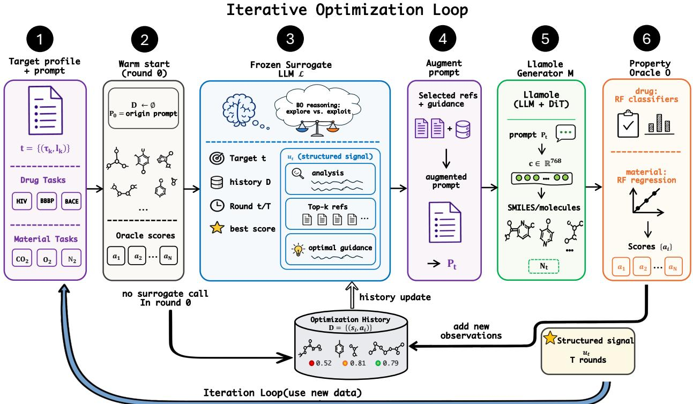  
Figure 1: Overview of BoMolLLM. A frozen molecular generator M and a property oracle ${ \mathcal { O } } _ { \tau }$ drive a closed loop of T rounds, with each round’s SMILES scored and appended to the history D. From round 1 onward, a frozen surrogate LLM $\mathcal { L }$ reads the task, history, round index, and best score, and emits a structured signal $u _ { t }$ (trajectory analysis, top-k references, optional one-sentence guidance) under an exploration and exploitation principle, which is parsed into the next-round prompt $p _ { t }$ . The generator and oracle are held fixed throughout.

## 4.1 Problem Formulation

With this closed-loop structure in place, each inverse-design instance begins with a natural-language instruction $x .$ This instruction specifies the desired molecular design problem, including property requirements, structural preferences, and synthesis-related context. We denote the generator prompt at round t by $p _ { t }$ , with $p _ { 0 } = x$ at warm start. The generated batch $S _ { t }$ is:

$$
S _ { t } = \{ s _ { i } ^ { ( t ) } \} _ { i = 1 } ^ { N _ { t } } , \qquad s _ { i } ^ { ( t ) } \sim \mathcal { M } ( p _ { t } ) .\tag{2}
$$

Each run optimizes a single oracle task τ. For drug design, $\tau \in \{ \mathrm { H I V }$ , BBBP, BACE} and the target is a desired binary label $y _ { \tau } ^ { \star } \in \{ 0 , 1 \}$ . For material design, $\tau \in \{ \mathrm { C O _ { 2 } } , \mathrm { O _ { 2 } } , \mathrm { N _ { 2 } } \}$ and the target is a desired continuous permeability value $y _ { \tau } ^ { \star } \in \mathbb { R } _ { \geq 0 }$ . The design instruction may contain additional conditions beyond $\tau ,$ but the optimization objective for a run is always defined with respect to this single chosen task.

We use a task-specific oracle ${ \mathcal { O } } _ { \tau }$ to evaluate each generated molecule. For a molecule $s ,$ the oracle returns a raw task prediction $\hat { y } _ { \tau } ( s )$ : a class probability for drug tasks and a regression value for material tasks. Because these raw predictions live on diferent scales and have diferent desiderata, we convert them into a unified alignment score $a _ { \tau } ( s ; y _ { \tau } ^ { \star } ) \in [ 0 , 1 ]$ , where larger values always mean better agreement with the target. The optimization history after round t is therefore:

$$
{ \mathcal D } _ { t } = \bigcup _ { \nu = 0 } ^ { t } \{ ( s _ { i } ^ { ( \nu ) } , a _ { i } ^ { ( \nu ) } ) \} _ { i = 1 } ^ { N _ { \nu } } , \qquad a _ { i } ^ { ( \nu ) } = a _ { \tau } ( s _ { i } ^ { ( \nu ) } ; y _ { \tau } ^ { \star } ) .\tag{3}
$$

Let $\textstyle { \mathcal { P } } = \bigcup _ { t = 0 } ^ { T - 1 } S _ { t }$ denote the full population of molecules generated over the multi-round trajectory. Our goal is not merely to identify a single best molecule. Instead, we aim to improve the overall quality of the generated candidate population under the target task, so that a larger fraction of the molecules produced across rounds aligns well with the design requirement. At the level of alignment score, this corresponds to increasing the population-level utility:

$$
\bar { a } _ { \tau } ( \mathcal { P } ; y _ { \tau } ^ { \star } ) = \frac { 1 } { | \mathcal { P } | } \sum _ { s \in \mathcal { P } } a _ { \tau } ( s ; y _ { \tau } ^ { \star } ) .\tag{4}
$$

This formulation is consistent with the practical motivation of inverse design: in downstream screening, one typically values a high-yield population of promising candidates more than a single isolated optimum. It also matches our evaluation protocol, which measures quality over all generated molecules in the trajectory rather than only the best sample.

## 4.2 Task-Specific Alignment Score

We use a task-specific alignment score $a _ { \tau } ( s ; y _ { \tau } ^ { \star } ) \in [ 0 , 1 ]$ so that larger values always mean better agreement with the target, regardless of whether the oracle is a classifier or a regressor. For drug tasks, the oracle outputs the probability $\hat { y } _ { \tau } ( s ) = P _ { \tau } ( y = 1 \mid s )$ . The target label is $y _ { \tau } ^ { \star } \in \{ 0 , 1 \}$ , so we define

$$
a _ { \tau } ( s ; y _ { \tau } ^ { \star } ) = \left\{ { \begin{array} { l l } { \hat { y } _ { \tau } ( s ) } & { { \mathrm { i f ~ } } y _ { \tau } ^ { \star } = 1 , } \\ { 1 - \hat { y } _ { \tau } ( s ) } & { { \mathrm { i f ~ } } y _ { \tau } ^ { \star } = 0 . } \end{array} } \right.\tag{5}
$$

This converts the raw oracle output into a score that is always maximized by better target alignment.

For material tasks, the oracle outputs a continuous permeability prediction $\hat { y } _ { \tau } ( s )$ . We optimize one gas permeability at a time and compare the prediction and the target in log space:

$$
a _ { \tau } ( s ; y _ { \tau } ^ { \star } ) = \exp ( - \left| \log _ { 1 0 } ( 1 + \hat { y } _ { \tau } ( s ) ) - \log _ { 1 0 } ( 1 + y _ { \tau } ^ { \star } ) \right| / \sigma _ { \tau } ) ,\tag{6}
$$

where $\sigma _ { \tau } > 0$ is a task-specific scale parameter. This score equals 1 when the prediction matches the target exactly and decays smoothly as the prediction moves away from the target.

## 4.3 Closed-Loop Framework

BoMolLLM runs an independent optimization loop for each test instance over T rounds. Round 0 is a warm-start step that uses only the original instruction x. For rounds $t \geq 1$ , a frozen surrogate $\mathcal { L }$ reads the current history $\mathcal { D } _ { t - 1 }$ and produces a decision that conditions the next generator call. Concretely, the surrogate selects a top-k reference set $R _ { t } \subseteq { \mathcal { D } } _ { t - 1 }$ under an exploration–exploitation principle, and may additionally produce a short conditioning text $g _ { t }$ . These outputs are converted into an augmented generator prompt

$$
p _ { t } = \mathrm { A U G M E N T P R O M P T } ( x , R _ { t } , g _ { t } ) ,\tag{7}
$$

which is passed to M for the next batch of molecule generation. The framework is surrogate-agnostic: Section 4.4 instantiates $\mathcal { L }$ in two complementary ways, an LLM-based semantic surrogate (our main contribution) and a classical Gaussian-process variant.

## 4.4 Surrogate Instantiations

We instantiate the surrogate L in two complementary ways: a frozen LLM that reads the discrete history directly (the main contribution of this paper), and a classical Gaussian-process surrogate that we adapt to the same closed-loop framework as a baseline.

## 4.4.1 Semantic LLM Surrogate

We use a frozen instruction-following LLM as a single-call surrogate over the history. The surrogate input contains the original instruction x, the chosen oracle task τ, the target value $y _ { \tau } ^ { \star }$ , the available history $\mathcal { D } _ { t - 1 }$

and the current round, together with a BO-style selection principle. The surrogate output is a structured signal

$$
\boldsymbol { u } _ { t } = ( r _ { t } , R _ { t } , g _ { t } ) ,\tag{8}
$$

where $r _ { t }$ is a natural-language analysis of the current trajectory, $R _ { t }$ is the selected top-k reference set drawn from the history, and $g _ { t }$ is an optional one-sentence guidance field. The output follows a strict format with an ANALYSIS field and structured decision fields, which are parsed into generator-facing conditioning text. We consider two prompt interfaces for the augmentation step: Top-k only, which appends $R _ { t }$ and their alignment scores after the design instruction, and $T o p { - } k \ + \ g u i d a n c e ,$ which additionally includes $g _ { t }$ as one concise summary sentence. The full prompt template is in Appendix D.

## 4.4.2 Classical GP Surrogate

A classical alternative is a Gaussian-process surrogate, which we adapt to the same closed-loop framework following the design of BOPRO (Agarwal et al., 2025). The GP is fitted on the same alignment scores used by the LLM variant, and operates in a PCA-compressed space derived from Llamole’s conditioning embeddings. For each generator input, Llamole produces a 768-dimensional DiT conditioning embedding $\mathbf { c } \in \mathbb { R } ^ { 7 6 8 }$ . These embeddings are reduced to r dimensions via truncated SVD, fitted once on the first batch and then frozen: $\mathbf { z } = \mathbf { V } ^ { \top } ( \mathbf { c } - \bar { \mathbf { c } } ) \in \mathbb { R } ^ { r }$ . A Matérn-5/2 kernel with ARD and Gamma(4, 2) priors on length scales is fitted via marginal log-likelihood maximization (Snoek et al., 2012). LogEI is then optimized in the PCA space (Ament et al., 2023; Balandat et al., 2020) to obtain a proposal embedding, and the top-k historical molecules nearest this proposal form the reference set $R _ { t }$ . This variant produces no guidance text $g _ { t }$ and serves as the classical BO reference under the same prompt-update loop.

The two surrogates correspond to diferent points in the BO design space. The GP variant follows the standard recipe: a probabilistic posterior over the alignment score in continuous embedding space, optimized through an explicit acquisition function. The LLM surrogate admits an analogous interpretation in which pretrained chemical knowledge plays the role of a semantic prior, in-context conditioning on the history plays the role of a posterior update, and explicit reference selection plays the role of the acquisition step, with the search now operating over the discrete history of molecules and scores rather than a compressed continuous space. The full mapping is in Appendix C.

## 5 Experiments

## 5.1 Setup

Datasets and evaluation metrics. We evaluate on two MolQA benchmark families (Liu et al., 2025): drug design with binary oracle tasks over HIV, BBBP, and BACE, and material design with continuous targets over $\mathrm { C O } _ { 2 } , \mathrm { O } _ { 2 }$ , and $\mathrm { N _ { 2 } }$

In both domains, each run optimizes a single oracle task, while the original instruction may still include additional design constraints. We use trajectory-level metrics over all generated SMILES in all optimization rounds. For Drug, we report mean AUC computed from oracle probabilities against ground-truth labels; invalid SMILES are counted and penalized as wrong predictions in the AUC evaluation pipeline. For Material, we report MAE in log10 space between oracle predictions and ground-truth targets; invalid SMILES are skipped in MAE computation. Therefore, for each material metric, we additionally report the invalid ratio (inv.%) to reflect generation validity.

Experimental details. We use the pretrained property oracles provided by Llamole. Drug properties are evaluated by random-forest classifiers on ECFP4 fingerprints (Rogers & Hahn, 2010), and material properties are evaluated by random-forest regressors (Rogers & Hahn, 2010; Gao et al., 2022). The surrogate-to-generator interface is configured by domain. For drug tasks, the next-round input is the original instruction followed by the surrogate’s selected top-k molecules and their scores. For material tasks, the same top-k references are augmented with one concise surrogate summary sentence. The Llamole generator and the surrogate LLM use the same language-model backbone(Llama-3.1-8B (Grattafiori et al., 2024), Mistral-7B (Jiang et al., 2023), and Qwen2-7B (Yang et al., 2024)), while serving diferent roles: graph-decoder-based molecule generation and history-conditioned surrogate decision making, respectively. More details can be found in Appendix G.

Baselines. We compare five strategies: Llamole-OneShot, which generates once without iterative refinement; external one-shot LLMs: As reference points for general LLM capability, we include one-shot results from two frontier models prompted directly for molecular design without a graph-constrained decoder: InternS1-mini (Bai et al., 2025), a science-oriented reasoning model, and Qwen3.5-27B (Team, 2026), a general-purpose instruction model.

Among iterative strategies, Llamole + Random, which uses random in-context references, draws references uniformly from the history; Llamole + GP-BO, selects references via classical BO in a PCA-compressed embedding space; and BoMolLLM, whose single-call surrogate LLM selects top-k references under a BO-style exploration–exploitation principle and transfers them to the generator through the domain-specific prompt interface above.

## 5.2 Main Results

Table 1: Main results across three generator backbones. Drug columns report mean AUC (↑) over all generated SMILES. Material columns report $\mathrm { M A E } ( \log _ { 1 0 } )$ (↓) over valid SMILES only, plus invalid ratio (inv.%) for each target gas. Bold marks the best score per column within each backbone group.
<table><tr><td rowspan="2">Backbone</td><td rowspan="2">Strategy</td><td colspan="3">Drug AUC ↑</td><td colspan="6">Material MAE(log10) ↓ + invalid_ratio</td></tr><tr><td>HIV</td><td>BBBP</td><td>BACE</td><td> $\mathrm { C O _ { 2 } }$ </td><td>inv.%</td><td> $\mathrm { O _ { 2 } }$ </td><td>inv.%</td><td> $\mathrm { N _ { 2 } }$ </td><td>inv.%</td></tr><tr><td>External LLM</td><td>InternS1-mini (OneShot)</td><td>0.5404</td><td>0.5382</td><td>0.5499</td><td>1.0314</td><td>15.79</td><td>0.8023</td><td>14.48</td><td>0.9165</td><td>14.62</td></tr><tr><td>External LLM</td><td>Qwen3.5-27B (OneShot)</td><td>0.4991</td><td>0.5526</td><td>0.4523</td><td>1.1259</td><td>40.89</td><td>0.7659</td><td>41.65</td><td>0.7800</td><td>38.54</td></tr><tr><td>Qwen</td><td>Llamole-OneShot</td><td>0.4335</td><td>0.5172</td><td>0.3261</td><td>1.0040</td><td>5.45</td><td>0.7636</td><td>17.68</td><td>0.7700</td><td>8.95</td></tr><tr><td>Qwen</td><td>Llamole + Random</td><td>0.4787</td><td>0.5609</td><td>0.4897</td><td>1.0224</td><td>3.32</td><td>0.7631</td><td>3.24</td><td>0.7640</td><td>3.70</td></tr><tr><td>Qwen</td><td>Llamole + GP-BO</td><td>0.4809</td><td>0.5643</td><td>0.4899</td><td>1.0163</td><td>3.44</td><td>0.7592</td><td>3.36</td><td>0.7779</td><td>3.77</td></tr><tr><td>Qwen</td><td>BoMolLLM (LLM-as-BO)</td><td>0.4760</td><td>0.5668</td><td>0.4972</td><td>1.0101</td><td>4.37</td><td>0.7594</td><td>4.01</td><td>0.7631</td><td>3.47</td></tr><tr><td>Mistral</td><td>Llamole-OneShot</td><td>0.5644</td><td>0.6252</td><td>0.6209</td><td>1.0052</td><td>3.64</td><td>0.7621</td><td>3.68</td><td>0.7942</td><td>4.01</td></tr><tr><td>Mistral</td><td>Llamole + Random</td><td>0.5643</td><td>0.6253</td><td>0.6209</td><td>1.0060</td><td>1.93</td><td>0.7585</td><td>1.76</td><td>0.7874</td><td>1.66</td></tr><tr><td>Mistral</td><td>Llamole + GP-BO</td><td>0.5655</td><td>0.6229</td><td>0.6166</td><td>1.0058</td><td>1.58</td><td>0.7578</td><td>1.85</td><td>0.7864</td><td>1.54</td></tr><tr><td>Mistral</td><td>BoMolLLM (LLM-as-BO)</td><td>0.5687</td><td>0.6293</td><td>0.6443</td><td>1.0036</td><td>1.87</td><td>0.7535</td><td>1.63</td><td>0.7844</td><td>1.75</td></tr><tr><td>Llama</td><td>Llamole-OneShot</td><td>0.5579</td><td>0.6083</td><td>0.5111</td><td>1.0070</td><td>3.96</td><td>0.7626</td><td>5.03</td><td>0.7671</td><td>5.04</td></tr><tr><td>Llama</td><td>Llamole + Random</td><td>0.5332</td><td>0.6064</td><td>0.5638</td><td>1.0009</td><td>2.63</td><td>0.7498</td><td>2.46</td><td>0.7660</td><td>2.59</td></tr><tr><td>Llama</td><td>Llamole + GP-BO</td><td>0.5512</td><td>0.6127</td><td>0.5707</td><td>0.9941</td><td>2.45</td><td>0.7473</td><td>2.37</td><td>0.7646</td><td>2.66</td></tr><tr><td>Llama</td><td>BoMolLLM (LLM-as-BO)</td><td>0.5653</td><td>0.6213</td><td>0.6040</td><td>0.9967</td><td>2.36</td><td>0.7496</td><td>2.20</td><td>0.7603</td><td>2.22</td></tr></table>

Table 1 reveals a consistent picture across all three generator backbones. Closed-loop refinement is broadly beneficial: both random reference selection and GP-BO improve over Llamole-OneShot, confirming that iterative oracle feedback adds value regardless of how the surrogate is implemented. Among iterative strategies, BoMolLLM matches or surpasses GP-BO in nearly every setting; the advantage is most pronounced on drug tasks, where BoMolLLM achieves the best AUC on all three targets under both Mistral and Llama. Importantly, this improvement is not tied to a specific generator: the same LLM surrogate mechanism transfers without modification across Qwen, Mistral, and Llama backbones. Frontier models prompted without graph-constrained decoding (InternS1-mini, Qwen3.5-27B) show high invalid-SMILES rates and are generally outperformed by iterative Llamole strategies, underscoring the role of structured generation in producing chemically valid candidates. The choice of domain-specific interface is not cosmetic: drug runs use the reference-only template while material runs use the reference-plus-guidance template, and their relative merits are examined directly in the ablation below.

## 5.3 Ablation Studies

Beyond reference selection, the BoMolLLM surrogate can emit a one-sentence guidance field that synthesizes the optimization trajectory into an explicit design direction, serving as an interpretable intermediate of the search process. Table 2 isolates the contribution of this field by comparing Top-k only against Top-k + guidance across all three backbones. The outcome depends on the oracle type: guidance consistently improves material tasks across all three backbones, while providing no consistent benefit on drug tasks. For binary drug targets, high-scoring reference molecules may already supply a suficiently crisp structural signal, leaving little room for the guidance sentence to contribute further. For continuous material targets, where the oracle signal is softer and more graded, the guidance sentence may help compress trajectory-level patterns into an actionable direction that references alone cannot readily encode. The consistency of this pattern across Qwen, Mistral, and Llama suggests that the value of the guidance channel is governed primarily by the oracle type rather than the generator.

Table 2: Prompt-interface ablation for BoMolLLM. Rows compare the two prompt interfaces under each generator backbone. Drug tasks report mean AUC, and material tasks report MAE(log10).
<table><tr><td>Backbone</td><td>Prompt interface</td><td>HIV</td><td>BBBP</td><td>BACE</td><td> $\mathbf { C O _ { 2 } }$ </td><td> $\mathbf { O } _ { 2 }$ </td><td> $\mathbf { N } _ { 2 }$ </td></tr><tr><td>Qwen</td><td>Top-k only</td><td>0.4760</td><td>0.5668</td><td>0.4972</td><td>1.0179</td><td>0.7656</td><td>0.7722</td></tr><tr><td>Qwen</td><td>Top-k + guidance</td><td>0.4670</td><td>0.5525</td><td>0.4859</td><td>1.0101</td><td>0.7594</td><td>0.7631</td></tr><tr><td>Mistral</td><td>Top-k only</td><td>0.5687</td><td>0.6293</td><td>0.6443</td><td>1.0084</td><td>0.7546</td><td>0.7875</td></tr><tr><td>Mistral</td><td>Top-k + guidance</td><td>0.5521</td><td>0.6108</td><td>0.6027</td><td>1.0036</td><td>0.7535</td><td>0.7844</td></tr><tr><td>Llama</td><td>Top-k only</td><td>0.5653</td><td>0.6213</td><td>0.6040</td><td>1.0062</td><td>0.7530</td><td>0.7306</td></tr><tr><td>Llama</td><td> ${ \mathrm { T o p } } { \cdot } k + { \mathrm { g u i d a n c e } }$ </td><td>0.5387</td><td>0.6190</td><td>0.5697</td><td>0.9967</td><td>0.7496</td><td>0.7603</td></tr></table>

## 5.4 Analysis

Beyond the performance in Table 1, we examine three questions: whether BoMolLLM improves the search trajectory over rounds, whether the surrogate exhibits genuine exploration–exploitation behavior, and where in chemical space the search budget is allocated.

Convergence analysis. The closed-loop framing is valuable if oracle feedback materially shapes later rounds. For each test instance, we track the best-so-far score as a running maximum over rounds, and the cumulative fraction of samples whose best-so-far score has crossed a fixed quality threshold; the first measures search frontier quality, the second measures how quickly high-scoring molecules are discovered. Figure 2 shows results on BACE and $\mathrm { N _ { 2 } }$ as representative drug and material tasks. Two patterns emerge consistently: all iterative methods improve as rounds accumulate, confirming that closed-loop refinement is broadly useful; and BoMolLLM improves more strongly than the baselines, discovering high-scoring molecules earlier and more reliably. Appendix I.1 provides the visualization for additional tasks.

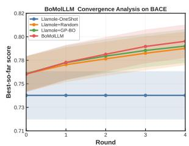  
(a) BACE Convergence

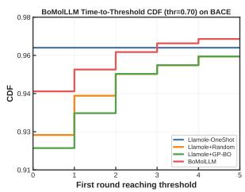  
(b) BACE Threshold (0.7)

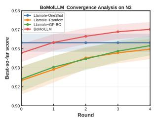  
(c) $\mathrm { N _ { 2 } }$ Convergence

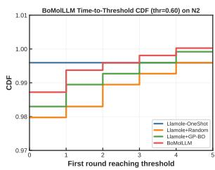  
(d) $\mathrm { N _ { 2 } }$ Threshold (0.6)

Figure 2: BoMolLLM discovers high-scoring molecules earlier and more reliably than all baselines on representative drug (BACE) and material $\left( \mathrm { N } _ { 2 } \right)$ tasks. Left: mean best-so-far score as a function of round, with 95% confidence intervals across test instances. Right: cumulative fraction of samples whose best-so-far score has crossed a fixed threshold by each round. Both views show that closed-loop refinement is beneficial, and that BoMolLLM benefits most from iterative feedback.

BO-style surrogate behavior. Better convergence could arise from simple greedy exploitation, reusing only the current top-scoring molecules each round. To examine whether the surrogate instead balances exploration and exploitation, we track two complementary quantities per round: the score quantile of the selected molecules within the available history (higher values indicate stronger exploitation, as the surrogate favors molecules near the top of the observed score distribution) and their mean Tanimoto distance to the current top-history set (larger values indicate broader exploration). Figure 3 shows a consistent pattern across BACE, BBBP, $\mathrm { N _ { 2 } } .$ , and $\mathrm { O _ { 2 } } \mathrm { : }$ the score quantile increases over rounds while the distance decreases, a transition from broad early exploration to focused exploitation as history grows. This trend holds across both drug and material tasks, ruling out a task-specific prompt artifact and indicating that the surrogate carries out the intended BO-like search policy through in-context reasoning rather than an explicit acquisition function.

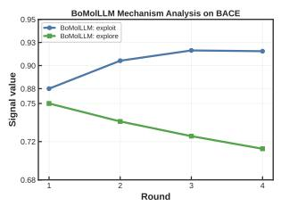  
(a) BACE

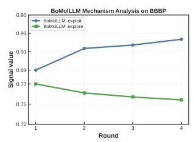  
(b) BBBP

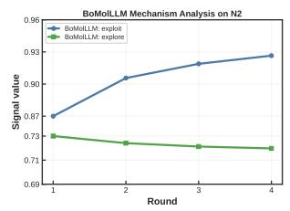  
(c) $\mathrm { N _ { 2 } }$

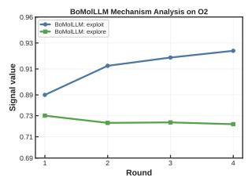  
(d) $\mathrm { O _ { 2 } }$  
Figure 3: Mechanism analysis of BoMolLLM across four tasks. Each panel summarizes two complementary signals of surrogate behavior: the score quantile of selected references within the current history (exploitation) and their mean Tanimoto distance to the current top-history set (exploration). The shared trend across all four tasks indicates a consistent transition from early exploration to later exploitation.

Case study. The analyses above characterize the surrogate’s behavior statistically; we now look inside a concrete trace to show what form its reasoning takes.

We include one compact case study from the $\mathrm { N _ { 2 } }$ task using the Llama backbone.

For this sample, the best score improves from 0.620 at round 0 to 0.866 by round 3. The main point of the example is not only the score gain itself, but the fact that the surrogate updates its decision as the history becomes more informative. Unlike a GP that outputs only a scalar acquisition value, the surrogate reasons in the language of molecules and chemistry, producing decisions that are both strategically principled and directly human-readable. The full surrogate prompt template is given in Appendix $\mathrm { D } ;$ here we show a condensed version of the actual round-2 prompt and the corresponding response.

## Case Study: N2 Optimization Trace

Surrogate input(round 2).   
Task: Can you design a polymer with zero nitrogen or N2 gas permeability,   
a fractional free volume of 0.415, and a specific molecular structure?   
Target properties: N2=0.0, FFV=0.415, SC=3.33, SA=5.38   
=== Optimization History ({n} molecules) ===   
[10] \*CC(B)(CCC(F)(F)F)C(=O)C(=O)CNC(=O)O\* | score=0.6200 (N2:2.01)   
[36] \*CC(\*)(C)C(=O)OCCC(F)(F)C(F)C(F)(F)C(F)F | score=0.5805 (N2:2.50)   
=== Selection Principle (Bayesian Optimization) ===   
Surrogate output(round 2).   
ANALYSIS: After analyzing the optimization history, we observe that high-scoring   
molecules (e.g., [10], [36], [39]) tend to have a higher presence of heteroatoms (e.g.,   
O, N, S, B, F, Cl) and a more complex molecular structure. They also often feature a   
combination of polar and non-polar functional groups, which may contribute to their low   
N2 permeability. On the other hand, low-scoring molecules (e.g., [3], [6], [30]) often   
contain heavy metals (e.g., Na, Ge, Sn, Se) and/or unusual bonding patterns, which may   
hinder their performance. Unexplored directions that might be promising include   
incorporating more fluorine atoms, using alternative heteroatoms (e.g., P, As), or   
introducing new functional groups that can enhance the polymer’s properties without   
increasing N2 permeability.   
SELECTED: 10, 36, 39

GUIDE\_FOCUS:   
Refine high-scoring fluorinated structures and explore alternative heteroatoms to improve the property balance.

As later rounds accumulate stronger candidates, the surrogate shifts its emphasis toward simpler and more symmetric motifs, indicating that the guidance is updated by the observed trajectory rather than copied from a fixed heuristic. This example highlights a distinctive property of BoMolLLM: the search policy is adaptive, yet it remains directly inspectable through the surrogate input and output. Longer traces and hard-case examples are deferred to Appendix I.3.

Search budget allocation. The convergence and mechanism analyses show that BoMolLLM searches more efectively and follows a BO-like policy; we ask here whether this translates into a measurable diference in where molecules are generated in chemical space. We represent all generated molecules by ECFP4 fingerprints, project them to two dimensions, and apply a shared high-score threshold across methods so that the highlighted points are directly comparable. Figure 4 shows a representative example on $\mathrm { N _ { 2 } } \mathrm { : }$ compared with one-shot generation, random prompting, and GP-BO, BoMolLLM places a larger fraction of its molecules in regions that contain these high-scoring points, while still covering multiple neighborhoods rather than collapsing to a single cluster. This geometric result complements the trajectory and behavioral analyses: the semantic surrogate not only discovers better molecules faster, but steers generation toward the parts of chemical space where good molecules are found. Additional visualizations for other tasks are in Appendix I.2.

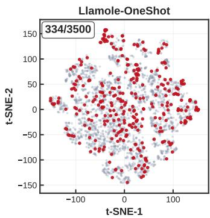

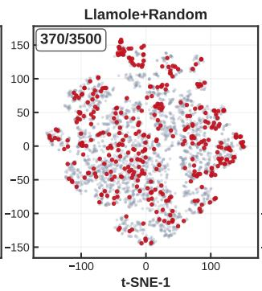

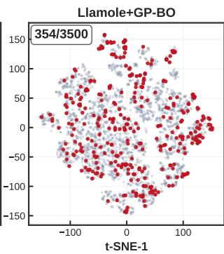

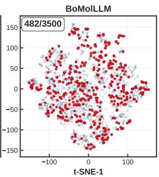  
Figure 4: Visualization of generated molecules on $\mathrm { N _ { 2 } }$ , with high-scoring candidates highlighted under a uniform threshold across methods. BoMolLLM concentrates more of its search budget in regions enriched with high-scoring candidates, without collapsing to a single cluster.

## 6 Conclusion

We introduced BoMolLLM, a closed-loop framework for target-aligned molecular inverse design under limited oracle feedback. The framework treats molecular optimization as candidate-pool enrichment and replaces the usual numerical surrogate with a semantic decision module that reads molecular histories directly and returns next-round references, optionally with concise guidance. Across drug and material tasks, BoMolLLM improves over one-shot generation and is competitive with, or stronger than, GP-based BO baselines across multiple generator backbones. The main analyses support the same picture: the surrogate improves search trajectories over rounds, exhibits an exploration-to-exploitation transition, and steers generation toward regions enriched with high-scoring candidates. Together, these results suggest that LLM surrogates are a useful closed-loop alternative to classical BO surrogates for discrete molecular design.

## References

Dhruv Agarwal, Manoj Ghuhan Arivazhagan, Rajarshi Das, Sandesh Swamy, Sopan Khosla, and Rashm Gangadharaiah. Searching for optimal solutions with llms via bayesian optimization. In The Thirteenth International Conference on Learning Representations, 2025.

Sebastian Ament, Samuel Daulton, David Eriksson, Maximilian Balandat, and Eytan Bakshy. Unexpected improvements to expected improvement for bayesian optimization. Advances in neural information processing systems, 36:20577–20612, 2023.

Lei Bai, Zhongrui Cai, Yuhang Cao, Maosong Cao, Weihan Cao, Chiyu Chen, Haojiong Chen, Kai Chen, Pengcheng Chen, Ying Chen, et al. Intern-s1: A scientific multimodal foundation model. arXiv preprint arXiv:2508.15763, 2025.

Maximilian Balandat, Brian Karrer, Daniel Jiang, Samuel Daulton, Ben Letham, Andrew G Wilson, and Eytan Bakshy. Botorch: A framework for eficient monte-carlo bayesian optimization. Advances in neural information processing systems, 33:21524–21538, 2020.

Debjyoti Bhattacharya, Harrison J Cassady, Michael A Hickner, and Wesley F Reinhart. Large language models as molecular design engines. Journal of Chemical Information and Modeling, 64(18):7086–7096, 2024.

Mickael Binois and Nathan Wycof. A survey on high-dimensional gaussian process modeling with application to bayesian optimization. ACM Transactions on Evolutionary Learning and Optimization, 2(2):1–26, 2022.

Nathan Brown, Marco Fiscato, Marwin HS Segler, and Alain C Vaucher. Guacamol: benchmarking models for de novo molecular design. Journal of chemical information and modeling, 59(3):1096–1108, 2019.

Keith T Butler, Daniel W Davies, Hugh Cartwright, Olexandr Isayev, and Aron Walsh. Machine learning for molecular and materials science. Nature, 559(7715):547–555, 2018.

Seyone Chithrananda, Gabriel Grand, and Bharath Ramsundar. Chemberta: large-scale self-supervised pretraining for molecular property prediction. arXiv preprint arXiv:2010.09885, 2020.

Carl Edwards, ChengXiang Zhai, and Heng Ji. Text2mol: Cross-modal molecule retrieval with natural language queries. In Proceedings of the 2021 conference on empirical methods in natural language processing, pp. 595–607, 2021.

Carl Edwards, Tuan Lai, Kevin Ros, Garrett Honke, Kyunghyun Cho, and Heng Ji. Translation between molecules and natural language. In Proceedings of the 2022 Conference on Empirical Methods in Natural Language Processing, pp. 375–413, 2022.

David Eriksson, Michael Pearce, Jacob Gardner, Ryan D Turner, and Matthias Poloczek. Scalable global optimization via local bayesian optimization. Advances in neural information processing systems, 32, 2019.

Peter I Frazier. A tutorial on bayesian optimization. arXiv preprint arXiv:1807.02811, 2018.

Wenhao Gao, Tianfan Fu, Jimeng Sun, and Connor Coley. Sample eficiency matters: a benchmark for practical molecular optimization. Advances in neural information processing systems, 35:21342–21357, 2022.

Rafael Gómez-Bombarelli, Jennifer N Wei, David Duvenaud, José Miguel Hernández-Lobato, Benjamín Sánchez-Lengeling, Dennis Sheberla, Jorge Aguilera-Iparraguirre, Timothy D Hirzel, Ryan P Adams, and Alán Aspuru-Guzik. Automatic chemical design using a data-driven continuous representation of molecules. ACS central science, 4(2):268–276, 2018.

Aaron Grattafiori, Abhimanyu Dubey, Abhinav Jauhri, Abhinav Pandey, Abhishek Kadian, Ahmad Al-Dahle, Aiesha Letman, Akhil Mathur, Alan Schelten, Alex Vaughan, et al. The llama 3 herd of models. arXiv preprint arXiv:2407.21783, 2024.

Kexin Huang, Tianfan Fu, Wenhao Gao, Yue Zhao, Yusuf Roohani, Jure Leskovec, Connor W Coley, Cao Xiao, Jimeng Sun, and Marinka Zitnik. Therapeutics data commons: Machine learning datasets and tasks for drug discovery and development. Advances in Neural Information Processing Systems, 2021.

Albert Q. Jiang, Alexandre Sablayrolles, Arthur Mensch, Chris Bamford, Devendra Singh Chaplot, Diego de Las Casas, Florian Bressand, Gianna Lengyel, Guillaume Lample, Lucile Saulnier, Lélio Renard Lavaud, Marie-Anne Lachaux, Pierre Stock, Teven Le Scao, Thibaut Lavril, Thomas Wang, Timothée Lacroix, and William El Sayed. Mistral 7b. CoRR, abs/2310.06825, 2023. doi: 10.48550/ARXIV.2310.06825. URL https://doi.org/10.48550/arXiv.2310.06825.

Wengong Jin, Regina Barzilay, and Tommi Jaakkola. Junction tree variational autoencoder for molecular graph generation. In International conference on machine learning, pp. 2323–2332. PMLR, 2018.

Donald R Jones, Matthias Schonlau, and William J Welch. Eficient global optimization of expensive black-box functions. Journal of Global optimization, 13(4):455–492, 1998.

Matt J Kusner, Brooks Paige, and José Miguel Hernández-Lobato. Grammar variational autoencoder. In International conference on machine learning, pp. 1945–1954. PMLR, 2017.

Gang Liu, Michael Sun, Wojciech Matusik, Meng Jiang, and Jie Chen. Multimodal large language models for inverse molecular design with retrosynthetic planning. In International Conference on Learning Representations, 2025.

Shengchao Liu, Weili Nie, Chengpeng Wang, Jiarui Lu, Zhuoran Qiao, Ling Liu, Jian Tang, Chaowei Xiao, and Animashree Anandkumar. Multi-modal molecule structure–text model for text-based retrieval and editing. Nature Machine Intelligence, 5(12):1447–1457, 2023.

Tennison Liu, Nicolás Astorga, Nabeel Seedat, and Mihaela van der Schaar. Large language models to enhance bayesian optimization. arXiv preprint arXiv:2402.03921, 2024.

Shuaihua Lu, Qionghua Zhou, Xinyu Chen, Zhilong Song, and Jinlan Wang. Inverse design with deep generative models: next step in materials discovery. National science review, 9(8):nwac111, 2022.

Marcus Olivecrona, Thomas Blaschke, Ola Engkvist, and Hongming Chen. Molecular de-novo design through deep reinforcement learning. Journal of cheminformatics, 9(1):48, 2017.

Daniil Polykovskiy, Alexander Zhebrak, Benjamin Sanchez-Lengeling, Sergey Golovanov, Oktai Tatanov, Stanislav Belyaev, Rauf Kurbanov, Aleksey Artamonov, Vladimir Aladinskiy, Mark Veselov, et al. Molecular sets (moses): a benchmarking platform for molecular generation models. Frontiers in pharmacology, 11: 565644, 2020.

Mariya Popova, Olexandr Isayev, and Alexander Tropsha. Deep reinforcement learning for de novo drug design. Science advances, 4(7):eaap7885, 2018.

Jean-Louis Reymond. The chemical space project. Accounts of chemical research, 48(3):722–730, 2015.

David Rogers and Mathew Hahn. Extended-connectivity fingerprints. Journal of chemical information and modeling, 50(5):742–754, 2010.

Benjamin Sanchez-Lengeling and Alán Aspuru-Guzik. Inverse molecular design using machine learning: Generative models for matter engineering. Science, 361(6400):360–365, 2018.

Matthias Seeger. Gaussian processes for machine learning. International journal of neural systems, 14(02): 69–106, 2004.

Bobak Shahriari, Kevin Swersky, Ziyu Wang, Ryan P Adams, and Nando De Freitas. Taking the human out of the loop: A review of bayesian optimization. Proceedings of the IEEE, 104(1):148–175, 2015.

Jasper Snoek, Hugo Larochelle, and Ryan P Adams. Practical bayesian optimization of machine learning algorithms. Advances in neural information processing systems, 25, 2012.

Xiaozhuang Song, Xuanhao Pan, Xinjian Zhao, Hangting Ye, Shufei Zhang, Jian Tang, and Tianshu Yu. Aot\*: Eficient synthesis planning via llm-empowered and-or tree search. In Findings of the Association for Computational Linguistics: ACL 2026, pp. 34727–34758, 2026.

Ross Taylor, Marcin Kardas, Guillem Cucurull, Thomas Scialom, Anthony Hartshorn, Elvis Saravia, Andrew Poulton, Viktor Kerkez, and Robert Stojnic. Galactica: A large language model for science. arXiv preprint arXiv:2211.09085, 2022.

Qwen Team. Qwen3.5: Accelerating productivity with native multimodal agents, February 2026. URL https://qwen.ai/blog?id=qwen3.5.

Ziqing Wang, Kexin Zhang, Zihan Zhao, Yibo Wen, Abhishek Pandey, Han Liu, and Kaize Ding. A survey of large language models for text-guided molecular discovery: from molecule generation to optimization. arXiv preprint arXiv:2505.16094, 2025.

Ziyu Wang, Frank Hutter, Masrour Zoghi, David Matheson, and Nando De Feitas. Bayesian optimization in a billion dimensions via random embeddings. Journal of Artificial Intelligence Research, 55:361–387, 2016.

David Weininger. Smiles, a chemical language and information system. 1. introduction to methodology and encoding rules. Journal of chemical information and computer sciences, 28(1):31–36, 1988.

An Yang, Baosong Yang, Binyuan Hui, Bo Zheng, Bowen Yu, Chang Zhou, Chengpeng Li, Chengyuan Li, Dayiheng Liu, Fei Huang, Guanting Dong, Haoran Wei, Huan Lin, Jialong Tang, Jialin Wang, Jian Yang, Jianhong Tu, Jianwei Zhang, Jianxin Ma, Jianxin Yang, Jin Xu, Jingren Zhou, Jinze Bai, Jinzheng He, Junyang Lin, Kai Dang, Keming Lu, Keqin Chen, Kexin Yang, Mei Li, Mingfeng Xue, Na Ni, Pei Zhang, Peng Wang, Ru Peng, Rui Men, Ruize Gao, Runji Lin, Shijie Wang, Shuai Bai, Sinan Tan, Tianhang Zhu, Tianhao Li, Tianyu Liu, Wenbin Ge, Xiaodong Deng, Xiaohuan Zhou, Xingzhang Ren, Xinyu Zhang, Xipin Wei, Xuancheng Ren, Xuejing Liu, Yang Fan, Yang Yao, Yichang Zhang, Yu Wan, Yunfei Chu, Yuqiong Liu, Zeyu Cui, Zhenru Zhang, Zhifang Guo, and Zhihao Fan. Qwen2 technical report. CoRR, abs/2407.10671, 2024. doi: 10.48550/ARXIV.2407.10671. URL https://doi.org/10.48550/arXiv.2407.10671.

Chengrun Yang, Xuezhi Wang, Yifeng Lu, Hanxiao Liu, Quoc V Le, Denny Zhou, and Xinyun Chen. Large language models as optimizers. In The Twelfth International Conference on Learning Representations, 2023.

Jiaxuan You, Bowen Liu, Zhitao Ying, Vijay Pande, and Jure Leskovec. Graph convolutional policy network for goal-directed molecular graph generation. Advances in neural information processing systems, 31, 2018.

Xinjian Zhao, Wei Pang, Zhixuan Yu, Xiangru Jian, Xiaozhuang Song, Yaoyao Xu, Zhongkai Xue, Dingshuo Chen, Shu Wu, Philip Torr, et al. When vision meets graphs: A survey on graph reasoning and learning. 2026.

Alex Zunger. Inverse design in search of materials with target functionalities. Nature Reviews Chemistry, 2 (4):0121, 2018.

## A Limitations.

Our experiments are designed to assess closed-loop optimization behavior under controlled oracle feedback, but several limitations remain. The MolQA oracles enable scalable evaluation across drug and material design tasks, yet they are learned predictors and therefore do not capture the full fidelity of experimenta validation, docking, synthesizability, or downstream multi-property screening. Accordingly, our results should be interpreted as evidence of improved oracle-guided candidate enrichment rather than direct experimental validation of the generated molecules. In addition, the LLM surrogate provides semantic reference selection but is not a calibrated probabilistic model; it does not produce explicit posterior uncertainty or inherit the theoretical guarantees of classical Bayesian optimization. Its behavior may therefore depend on the prompt, the underlying LLM, and the distribution of molecules represented in the design history.

## B Algorithm

Algorithm 1 summarizes the closed-loop procedure of BoMolLLM, where the LLM surrogate uses the accumulated oracle history to update the generation prompt and iteratively enrich the candidate pool.

Algorithm 1: BoMolLLM: single-call BoMolLLM loop for instruction x and oracle task τ   
Input : Instruction x, target value y⋆, frozen surrogate LLM L, frozen generator M, task oracle Oτ,   
rounds T, warm-start size N0, per-round batch size N   
Output : Generated population P and trajectory history D   
D ← ∅;   
for $t = 0 , \ldots , T - 1$ do   
if t = 0 then   
$p _ { t } \gets x ;$   
$N _ { t } \gets N _ { 0 } ;$   
else   
$u _ { t } \gets \mathscr { L } ( \mathrm { S U R R O G A T E P R O M P T } ( x , \tau , y _ { \tau } ^ { \star } , \mathcal { D } , t , T ) ) ;$   
$p _ { t } \gets \mathrm { A }$ ugmentPrompt $( x , u _ { t } ) ;$   
$N _ { t } \gets N ;$   
$\mathcal { S } _ { t } = \{ \boldsymbol { s } _ { i } ^ { ( t ) } \} _ { i = 1 } ^ { N _ { t } }  \mathcal { M } ( p _ { t } ) ;$   
$\{ a _ { i } ^ { ( t ) } \} _ { i = 1 } ^ { N _ { t } }  \mathcal { O } _ { \tau } ( S _ { t } , y _ { \tau } ^ { \star } ) ;$   
$\mathcal { D }  \mathcal { D } \cup \{ ( s _ { i } ^ { ( t ) } , a _ { i } ^ { ( t ) } ) \} _ { i = 1 } ^ { N _ { t } }$   
$\textstyle { \mathcal { P } } \gets \bigcup _ { t = 0 } ^ { T - 1 } S _ { t } ;$   
return (P, D);

## C BO Perspective and LLM Surrogate Mapping

The diference between classical BO and BoMolLLM lies in the surrogate layer. In the GP baseline, the search state is represented in a compressed continuous embedding space, the posterior is updated through kernel conditioning, and the acquisition rule is optimized numerically. In BoMolLLM, these operations are replaced by a large language model that reads the discrete optimization history directly as molecules and scores.

This replacement preserves the decision logic of BO while changing the form of the surrogate. The prior is interpreted as the surrogate LLM’s pretrained chemical and optimization knowledge, the posterior-like state update is realized through in-context conditioning on the full history, and the acquisition-style step appears as explicit reference selection under an explore–exploit instruction. Because the search is expressed in terms of molecules and scores rather than latent coordinates alone, each round becomes readable in natural language.

This design is motivated by the structure of molecular optimization. First, the search space is discrete and highly compositional, so useful structure–property patterns may be dificult to capture with a smooth kernel in a compressed latent space. Second, the utility of a reference molecule depends on the whole trajectory and the target context, not only on pairwise geometric proximity. Third, the surrogate output can be inspected directly through its analysis, selected references, and guidance, which makes the optimization policy more transparent than a purely numerical acquisition value.

## D Complete Prompt Templates

Baseline generator prompt interface. All iterative baselines keep the original MolQA instruction unchanged and only modify the additional conditioning block appended after the instruction. The downstream generator-facing template is:

Shared Generator Prompt   
{original MolQA instruction}   
Here are some previously designed molecules for reference:   
1. SMILES: {smiles\_1} (score: {score\_1})   
2. SMILES: {smiles\_2} (score: {score\_2})

k. SMILES: {smiles\_k} (score: {score\_k})   
Based on these references, design a new and better molecule.

The diference across baselines is only how the reference set is chosen: Random samples references uniformly from the previous history; GP-BO retrieves the top-k molecules nearest to the GP proposal in embedding space; and BoMolLLM (top-k) uses the surrogate LLM’s selected references.

BoMolLLM guidance interface. For the guidance variant, the same reference information is followed by one concise surrogate summary sentence:

BoMolLLM Guidance Prompt   
{original MolQA instruction}   
Optimization guidance:   
Use [{smiles\_1} ({score\_1}), ..., {smiles\_k} ({score\_k})] as references.   
{surrogate guidance sentence}.   
Design focus on {round-dependent design focus}.   
Based on this guidance, design a new and better molecule.

Surrogate selection prompt. The single-call surrogate prompt has the following structure:

LLM Surrogate Prompt   
You are helping optimize molecular design. Your job is to select {k}   
reference molecules from the history below. These will guide the next   
round of molecule generation.   
=== Task ===   
{molqa\_instruction}   
Target properties: {target\_properties}   
Property ranges:   
{property\_name}: target={target}, dataset range=[{min}, {max}]   
=== Optimization History ({n} molecules) ===   
[1] {SMILES\_1} | score={score\_1} ({individual oracle outputs})   
[2] {SMILES\_2} | score={score\_2} ({individual oracle outputs})   
...   
=== Current State ===   
Best score: {best\_score} (molecule [{best\_index}])   
Round: {current\_round}/{total\_rounds}   
Stage: {early / mid / late stage instruction}   
=== Selection Principle (Bayesian Optimization) ===   
Do NOT simply pick the {k} highest-scoring molecules. Instead, balance:   
- EXPLOIT: pick molecules with high scores -- these are good structures to refine.   
- EXPLORE: pick molecules with diverse or unusual structures -- even if scores are   
moderate, they may represent promising unexplored directions.   
=== Output Format ===   
ANALYSIS: ...   
SELECTED: [{k} molecule numbers, comma-separated]  
When the guidance interface is enabled, the surrogate is additionally asked to produce a compact guidance field, which is later converted into the generator-facing summary sentence.

## E Implementation Details

Model families. Our experiments use two model families with diferent roles. The first family is the Llamole generator, which couples an instruction-tuned language model with graph-generation modules, and is used in all iterative methods. The second family is the external one-shot baselines, which are prompted directly to produce molecular outputs without the Llamole graph decoder or any iterative optimization loop. Table 3 summarizes the model backbones used in the study. All experiments were conducted on a single compute node with eight NVIDIA A100 GPUs.

Table 3: Language-model backbones used in the study.
<table><tr><td>Role</td><td>Model</td><td>Nominal size</td></tr><tr><td>Llamole backbone</td><td>Qwen2-7B-Instruct</td><td>7B</td></tr><tr><td>Llamole backbone</td><td>Mistral-7B-Instruct-v0.3</td><td>7B</td></tr><tr><td>Llamole backbone</td><td>Llama-3.1-8B-Instruct</td><td>8B</td></tr><tr><td>External one-shot baseline</td><td>Intern-S1-mini</td><td>8B LM + 0.3B vision encoder</td></tr><tr><td>External one-shot baseline</td><td>Qwen3.5-27B</td><td>27B</td></tr></table>

Intern-S1-mini is used in text-only mode in our one-shot baseline.

Llamole generator. Llamole is the molecular generator used throughout the iterative methods. It combines an instruction-following backbone LLM with a graph difusion transformer (DiT), a graph encoder, and a graph predictor. Given a natural-language design instruction, the backbone LLM produces a conditioning representation, which is mapped to a 768-dimensional latent vector used to steer the DiT. The DiT then samples a molecular graph that is decoded into a SMILES string. In the original Llamole formulation, the language-model output can also support textual explanation and retrosynthetic context. In our work, however, Llamole is used only as the generator: all optimization logic is handled externally by either a GP surrogate or an LLM surrogate.

Classical GP-BO baseline. Our classical BO baseline is inspired by latent-space BO methods such as BOPRO, but it is adapted to the molecular inverse-design setting considered in this paper. The baseline is built around a fixed molecular generator and an explicit property oracle, so the surrogate is optimized against the same target-aware alignment score used elsewhere in the paper. This difers from sequence-level verifier objectives and keeps the optimization target aligned with the final evaluation metric.

The representation used by the GP is the 768-dimensional DiT conditioning embedding produced by Llamole. This choice is important because the embedding directly controls the downstream graph generator, making it a more faithful search space than a generic text embedding. To make GP fitting stable in this highdimensional space, we first run a warm-start round that generates 30 molecules, fit PCA on the resulting embeddings, and optimize thereafter in the fixed PCA-projected space. The GP itself uses a Matérn-5/2 kernel with ARD, a standard choice in practical GP-BO that imposes weaker smoothness assumptions than the squared-exponential kernel while allowing diferent PCA dimensions to have separate lengthscales. We use LogEI acquisition, and warm-start GP hyperparameters from the previous round rather than reinitializing them from scratch.

The GP proposal is not decoded directly into a molecule. Instead, following BOPRO, it retrieves the top-k nearest historical molecules in the embedding space, and these molecules are appended to the next Llamole prompt as references. This keeps the generator interface matched across iterative methods: all of them steer Llamole through textual conditioning, while difering only in how the references are chosen.

Property oracles. Drug tasks use one random-forest classifier per property, and material tasks use one random-forest regressor per target gas. For drug tasks, the oracle score is flipped when the desired label is zero so that higher alignment always means better agreement with the target. For material tasks, the regression output is converted into an exponential alignment score in log space so that lower target error corresponds to higher optimization score.

## F Data Overview

Task format. Each MolQA instance contains an instruction, an optional input field, a reference output, and a property dictionary. The instruction defines the inverse-design problem in natural language, while the property dictionary specifies the target profile to be matched. In drug tasks, these targets are binary labels such as HIV activity, BBBP, and BACE inhibition. In material tasks, they are continuous values such as $\mathrm { C O } _ { 2 } , \mathrm { N } _ { 2 }$ , and $\mathrm { O _ { 2 } }$ permeability, along with auxiliary structural or physical attributes.

Drug and material domains. The drug tasks evaluate whether the generated molecule matches a desired multi-property binary profile. The material tasks evaluate whether the generated molecule is aligned with a continuous gas-permeability target. This distinction matters throughout the paper because the oracle signal is qualitatively diferent in the two domains: classification-style supervision in drug design is relatively crisp, whereas regression-style supervision in material design is softer and more fine-grained. This is one of the main reasons we study prompt-interface diferences across domains.

Illustrative examples. To make the task format concrete, we include one schematic drug-style example and one material example below. The purpose of these examples is only to show the interface seen by the generator and the surrogate; they are not used as evaluation cases.

Illustrative Drug Example   
[Instruction]   
Design a molecule that is active against HIV, permeable to the   
blood-brain barrier, and inactive against BACE.   
[Target properties]   
{HIV: 1, BBBP: 1, BACE: 0}   
Illustrative Material Example   
[Instruction]   
What is the optimal molecular design and synthesis route for a   
polymer with high CO2 gas permeability and low permeability to   
N2 and O2, featuring an aromatic ring and specific functional   
groups?   
[Target properties]   
{CO2: 0.94, N2: 0.0, O2: 0.0, FFV: 0.381, SC: 2.28, SA: 4.21}

## G Hyper-Parameter Summary

All iterative methods share the same common optimization budget unless otherwise specified. We use $T = 5$ optimization rounds, with $N _ { 0 } = 3 0$ warm-start molecules at round 0 and N = 10 molecules for each subsequent round. All methods use Top-k in-context references with $k = 3$ . Method-specific hyperparameters are set only where required: the surrogate LLM for BoMolLLM, and r = 30 PCA dimensions, a Matérn-5/2 kernel, and LogEI acquisition for the GP-BO baseline. The full set of shared and method-specific hyperparameters is summarized in Table 4.

## H Analysis Protocols

This section summarizes the quantitative protocols used in the analysis section.

Convergence metrics. For sample i at round $t ,$ let $s _ { i } ^ { ( t ) }$ denote the best score obtained within that round. We define the best-so-far trajectory as

$$
b _ { i } ^ { ( t ) } = \operatorname* { m a x } _ { \tau \leq t } s _ { i } ^ { ( \tau ) } .
$$

Table 4: Main hyperparameters used in the experiments.
<table><tr><td>Component</td><td>Value</td></tr><tr><td>Optimization rounds  $T$ </td><td>5</td></tr><tr><td>Warm-start molecules  $N _ { 0 }$ </td><td>30</td></tr><tr><td>Molecules per later round N</td><td>10</td></tr><tr><td>Top-k references</td><td>3</td></tr><tr><td>Surrogate temperature</td><td>0.3</td></tr><tr><td>DiT conditioning dimension</td><td>768</td></tr><tr><td>GP PCA dimension</td><td>30</td></tr><tr><td>GP kernel</td><td>Matérn-5/2 with ARD</td></tr><tr><td>GP acquisition</td><td>LogEI</td></tr><tr><td>Material guidance mode</td><td>Top-k + one-sentence summary</td></tr><tr><td>Drug guidance mode</td><td>Top-k only</td></tr></table>

The convergence curve reports the sample mean of $b _ { i } ^ { ( t ) }$ together with a 95% confidence interval across test instances. To measure sample eficiency, we fix a task-specific threshold λ and define the first hitting time

$$
T _ { i } ( \lambda ) = \operatorname* { m i n } \{ t : b _ { i } ^ { ( t ) } \geq \lambda \} .
$$

The corresponding threshold plot reports the cumulative fraction of samples whose hitting time is at most t.   
This figure therefore measures how quickly a method reaches the high-score region.

Mechanism metrics. At round t, let $\mathcal { H } _ { t }$ be the set of molecules already observed and let $S _ { t }$ be the set of references selected by the surrogate. We measure exploitation through the empirical score quantile of selected molecules within the available history:

$$
q _ { t } = \frac { 1 } { | S _ { t } | } \sum _ { x \in S _ { t } } \frac { 1 } { | \mathcal { H } _ { t } | } \sum _ { y \in \mathcal { H } _ { t } } \mathbf { 1 } [ a ( y ) \leq a ( x ) ] .
$$

Higher $q _ { t }$ means that the surrogate is selecting references from the top of the observed score distribution. We measure exploration by comparing the selected references with the current top-history set $\mathcal { T } _ { t } \subset \mathcal { H } _ { t }$ , defined as the highest-scoring historical molecules up to a fixed cutof:

$$
d _ { t } = \frac { 1 } { \vert S _ { t } \vert \vert \mathcal { T } _ { t } \vert } \sum _ { x \in S _ { t } } \sum _ { y \in \mathcal { T } _ { t } } \big ( 1 - \mathrm { T a n } ( x , y ) \big ) ,
$$

where $\mathrm { T a n } ( x , y )$ is the Tanimoto similarity between ECFP4 fingerprints. Larger $d _ { t }$ indicates broader exploration, while decreasing $d _ { t }$ together with increasing $q _ { t }$ indicates a transition toward exploitation.

Latent-space visualization. Each valid molecule is represented by a 2048-bit ECFP4 fingerprint. To obtain a stable two-dimensional visualization, we first reduce the fingerprint vectors with PCA and then apply t-SNE to the reduced representation. For each task, all methods are embedded in the same two-dimensional space so that their spatial distributions are directly comparable. To highlight promising regions, we pool the scores of all methods for that task and define a global high-score threshold $\theta _ { q }$ as the empirical q-quantile of the pooled score distribution. The highlighted set is then

$$
\mathcal { G } _ { q } = \{ x : a ( x ) \geq \theta _ { q } \} .
$$

Because the same threshold is used for all methods, the highlighted points identify the same top portion of the score distribution in every panel. The latent-space figure therefore, visualizes not only where each method generates molecules, but also how much of that generation budget falls into regions enriched with high-scoring candidates.

## I Additional Results

## I.1 Additional Convergence Figures

Beyond the representative BACE and $\mathrm { N _ { 2 } }$ examples shown in the main text, we also include the corresponding convergence plots for additional tasks. Figure 5 serves as a task-level complement to the main-text examples and shows that the same trajectory-level improvement pattern holds broadly across the benchmark.

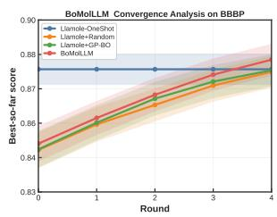  
(a) BBBP Convergence

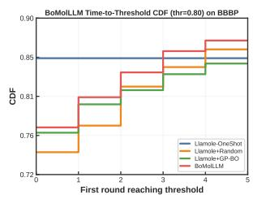  
(b) BBBP Threshold (0.8)

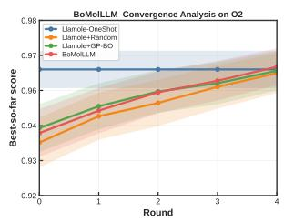  
(c) $\mathrm { O _ { 2 } }$ Convergence

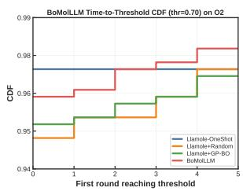  
(d) O2 Threshold (0.7)  
Figure 5: Convergence diagnostics on BBBP and $\mathrm { O _ { 2 } }$ . Left: mean best-so-far score as a function of round, with 95% confidence intervals across test instances. Right: cumulative fraction of samples whose best-so-far score has crossed a fixed threshold by each round. In both tasks, iterative methods improve with rounds.

## I.2 Additional Latent-Space Visualizations

We also include additional latent-space visualizations for BACE with Llama as the backbone. Figure 6 shows that the same high-score concentration pattern appears consistently across tasks rather than only in the $\mathrm { N _ { 2 } }$ example shown in the main text.

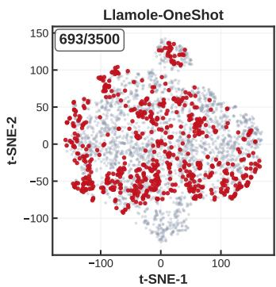

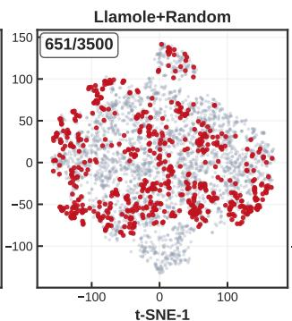

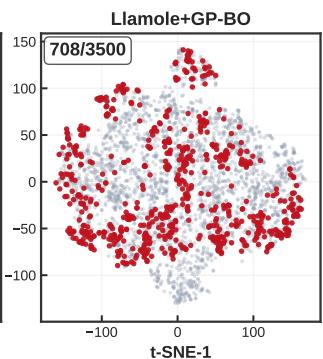

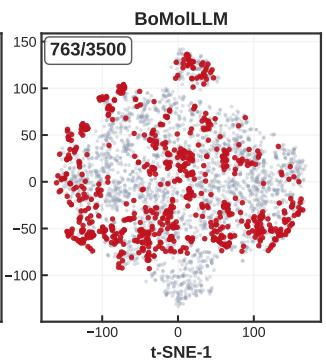  
Figure 6: Latent-space visualization of generated molecules on BACE. Molecules are represented by ECFP4 fingerprints, projected to two dimensions, and colored by whether they exceed a global high-score threshold shared across methods. The numerator shown in each panel counts highlighted molecules, and the denominator counts all displayed molecules for that method. A higher highlighted fraction and a tighter concentration around promising regions indicate more efective allocation of the search budget.

## I.3 Additional Case Studies and Hard Cases

The main text includes a compact $\mathrm { N _ { 2 } }$ case study to illustrate an optimization trajectory. Here, we complement it with a hard case from the Llama backbone on BACE and show the full iterative trace. This example is informative because the optimization does not improve smoothly: the best round-level score drops from 0.4767 at warm start to 0.4300 and 0.4140 in rounds 1 and 2, then recovers only in the later rounds to 0.5700 and 0.6208. The case, therefore, illustrates a failure-prone regime in which efective refinement emerges only after several non-monotonic updates.

The warm-start round 0 does not involve any surrogate call; it initializes the history that is later consumed by the surrogate. We then provide the full surrogate interaction trace for rounds 1–4. The box below contains the actual prompt passed to the surrogate and the corresponding model output for this sample. Since BACE uses the top-k only interface, the surrogate output here contains ANALYSIS and SELECTED fields only, without an additional guidance sentence. Several aspects of this trace are notable. First, the surrogate remains semantically coherent across rounds: it repeatedly emphasizes aromatic rings, heterocycles, halogen substitution, and polar functional groups as candidate design cues for BACE. Second, these consistent local heuristics do not immediately translate into monotonic optimization progress. The trajectory initially moves away from the best warm-start point and only later returns to a stronger region, which is shown in Figure 7.

BoMolLLM Hard-Case Trajectory on BACE (sample 436)  
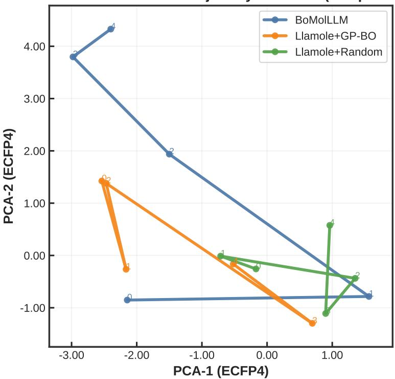

Figure 7: Latent trajectory of a hard case on BACE (sample 436). Each point is the best-scoring molecule found in each round, projected by PCA over ECFP4 fingerprints. Compared with the smoother trajectories of easier examples, the BoMolLLM path for this sample makes large early jumps and only reaches a stronger region in the last two rounds.  
Full Iteration Trace for Hard Case 436   
Round 0: Warm Start   
Round 0 is warm start, so no surrogate call is made.   
The generator receives only the original MolQA instruction.   
Top warm-start molecules:   
[1] N#Cc1cnc(S)c(O)c1 | score=0.4767   
[2] CC(C)(C)OC(=O)N1CCc2ccccc2C(=O)N1c1ccc(C)cc1C(=O)N1CCc2ccccc2C(=O)N1 | score=0.3700   
[3] O=C(OC(F)C(F)c1c(F)c(F)c(F)c(F)c1C(F)(F)F)C(F)(F)C(F)(F)C(F)F | score=0.3400   
[4] O=[N+](O)c1cc(F)c(F)c(F)c1C(F)(F)C(F)(F)F | score=0.3300   
[5] O C(O)CC(O)( 1 (F) (F) 1F)C(F)(F)F | 0 3250   
Round 1: Surrogate Prompt   
You are helping optimize molecular design. Your job is to select 3 reference molecules   
from the history below. These will guide the next round of molecule generation.

=== Task ===   
Can you design a molecule that inhibits Human Immunodeficiency Virus and Beta-Secretase   
1, with a molecular weight of 646.76, four aromatic rings, and 13 rotatable bonds,   
and describe its synthesis?   
Target properties: HIV=1.0, BACE=1.0, SC=2.11, SA=3.09   
Property ranges:   
HIV: target=1.0, dataset range=[0.0, 1.0]   
BACE: target=1.0, dataset range=[0.0, 1.0]   
SC: target=2.11, dataset range=[1.0, 5.0]   
SA: target=3.09, dataset range=[1.0, 8.48]   
=== Optimization History (30 molecules) ===   
[1] CC=CC(=O)OC(CN)c1c(F)c(F)c(F)c(F)c1F | score=0.1800 (BACE:0.18)   
[2] O=C(OC(F)(F)F)C(=O)C(=O)c1c(F)c(F)c(F)c(F)c1[N+](=O)O | score=0.2300 (BACE:0.23)   
[3] COC(=O)Cc1ccc(Nc2cc(C)cc(-c3ccccc3)c2)cc1 | score=0.2467 (BACE:0.25)   
[4] FC1=C(F)C(C(F)(F)C(F)(F)F)=C(F)C(F)=C(F)C(C(F)(F)C(F)(F)C(F)(F)F)=C1F | score=0.1100 (BACE:0.11)   
[5] O=C(OC(F)C(F)c1c(F)c(F)c(F)c(F)c1C(F)(F)F)C(F)(F)C(F)(F)C(F)F | score=0.3400 (BACE:0.34)   
[6] O=C(O)CC(O)(c1cc(F)c(F)cc1F)C(F)(F)F | score=0.3250 (BACE:0.32)   
[7] Fc1c(F)c(F)c(F)c(F)c(F)c(F)c(F)c(F)c(F)c(F)c(F)c(F)c(F)c(F)c(F)c(F)c1F | score=0.0900 (BACE:0.09)   
[8] COc1cc(OC[Si](C)(C)C)cc(Br)c1C=O | score=0.2100 (BACE:0.21)   
[9] CCOC(=O)c1ccc(-c2ccc(-c3ccc(O)cc3)cc2)cc1 | score=0.2900 (BACE:0.29)   
[10] CCOC(=O)c1ccc(OCc2ccc3c(c2)C(=O)Nc1=6c(n2ccc(C#N)cc2)c(OC)c(OC)cc6)cc2ccc   
(C=7cnnn[nH]7)cc2 | score=0.0000   
[11] CC(C)(C)OC(=O)N1CCc2ccccc2C(=O)N1c1ccc(C)cc1C(=O)N1CCc2ccccc2C(=O)N1 | score=0.3700 (BACE:0.37)   
[12] CCOC(=O)c1c(Nc2nc3ccccc3c2)c(C)N1c1ccc(C(=O)OC)cc1 | score=0.0000   
[13] Fc1cc(F)c(OC(F)(F)C(F)(F)C(F)(F)F)c(F)c1 | score=0.2990 (BACE:0.30)   
[14] O=[N+](O)c1cc(C(F)(F)C(F)(F)C(F)(F)F)c(F)c(F)c1[N+](=O)O | score=0.2200 (BACE:0.22)   
[15] FC1=C(F)C(F)=C(F)C(F)=C(F)C(F)=C(Br)C(F)=C(C(F)(F)F)C(F)=C(F)C(F)=C(F)C(F)   
=C1F | score=0.1000 (BACE:0.10)   
[16] N#Cc1cnc(S)c(O)c1 | score=0.4767 (BACE:0.48)   
[17] O=[N+](O)c1cc(F)c(F)c(F)c1C(F)(F)C(F)(F)F | score=0.3300 (BACE:0.33)   
[18] CCOC(=O)c1ccc(C)c(C)c(-c2nc3cc(C)cc(C)c(-c3nc2=O)n3cc(C)cc(C)c(C)c3c[nH]n3)c1   
| score=0.0000   
[19] CC1(C)CCCN(c2ncccn2)c1C(=O)Nc1ccc(C(=O)Nc2ccc(C(=O)Nc3ccc(C(=O)Nc4ccc(C(=O)   
Nc5ccc(C(=O)Nc1ccc(C(=O)N)cc1)cc5)cc4)cc3)cc1 | score=0.0000   
[20] CC(C)(C)OC(=O)N[C@H]1CCCN(c2ccc3c(c2)C(=O)Nc2ccc(OC)cc2c3)CC1 | score=0.0000   
[21] CC(C)CCNc1nc(Cc2ccccc2)c(=O)n1Cc1ccc(C)c(C(=O)O)cc1 | score=0.0000   
[22] COC(=O)c1ccc(-c2c(-c3ccccc3)cc2)cc1 | score=0.0400 (BACE:0.04)   
[23] Fc1cc(Cl)c(S)nc1Cl | score=0.2500 (BACE:0.25)   
[24] COC(=O)C(C)(F)Oc1c(F)c(F)c(F)c(F)c(F)c(F)c(OC)c(F)c1F | score=0.2500 (BACE:0.25)   
[25] CC0C(=0)C(C)C1=C(/C=C(\C)C)SC1C(=0)Nc1ccc(-c2c[nH]c3ccccc23)cc1   
| score=0.3100 (BACE:0.31)   
[26] 1 ( ) ( ) (OC( )( )COC( )( ) ) ( ) 1 | 0 1840 ( AC 0 18)   
[27] CCOC(=N)C(=S)Nc1c(F)c(F)c(F)c(F)c1F | score=0.2300 (BACE:0.23)   
[28] CCOC(=O)C(C)C(=O)Nc1cccc(-c2cc3c(c2)C(=O)Nc4ccccc4C(=O)Nc2cc(Cl)ccc2C(=O)   
Nc1=2)C(=O)Nc1ccccc1C(F)(F)F | score=0.0000   
[29] FC1=C(F)C(F)=C(F)C(F)(F)C(F)=C(F)C(OC(F)(F)C(F)(F)F)=C1F | score=0.1400 (BACE:0.14)   
[30] CCOC(=O)C=C(/C=C/C=C/B1=5\C(=O)Oc1ccc(O)cc1O)N1CCN(c2ccc3nccnc3c2)CC1 | score=0.0000   
=== Current State ===   
Best score: 0.4767 (molecule [16])   
Round:1/5   
Stage: Early stage - favor more EXPLORATION (try diverse structures)   
=== Selection Principle (Bayesian Optimization) ===   
Do NOT simply pick the 3 highest-scoring molecules. Instead, balance:   
- EXPLOIT: pick molecules with high scores - these are good structures to refine   
- EXPLORE: pick molecules with diverse or unusual structures - even if scores are   
moderate, they may represent promising unexplored directions that could lead to   
breakthroughs.   
Think of it like an investment portfolio: some safe bets (high-scoring) + some wild   
cards (diverse structures). This is how Bayesian Optimization balances exploitation   
and exploration to avoid getting stuck in local optima.   
=== Output Format ===

First, write your analysis, then write your selection in this exact format:   
ANALYSIS: (describe what structural patterns you observe in high-scoring vs low-scoring   
molecules, and what unexplored directions might be promising).   
SELECTED: [3 molecule numbers, comma-separated, e.g. 1,5,12,3,8]   
Round 1: Surrogate Output   
ANALYSIS:   
High-scoring molecules (e.g., 16, 11, 25) tend to have complex structures with multiple   
rings, nitrogen-containing groups, and a variety of functional groups such as amides,   
ureas, and sulfonamides. These structures often have a high degree of molecular   
complexity, which may be beneficial for inhibiting the target proteins.   
Low-scoring molecules (e.g., 1, 7, 22) tend to have simpler structures with fewer rings   
and fewer nitrogen-containing groups. These structures may lack the complexity needed   
to effectively interact with the target proteins.   
Unexplored directions that might be promising include incorporating more   
sulfur-containing groups, exploring different ring systems, and introducing more   
complex nitrogen-containing groups. Molecules with unusual structures, such as those   
with a high degree of branching or unusual functional groups, may also be   
worth investigating.   
SELECTED: 16, 11, 25   
Round 2: Surrogate Prompt   
You are helping optimize molecular design. Your job is to select 3 reference molecules   
from the history below. These will guide the next round of molecule generation.   
=== Task ===   
Can you design a molecule that inhibits Human Immunodeficiency Virus and Beta-Secretase   
1, with a molecular weight of 646.76, four aromatic rings, and 13 rotatable bonds, and   
describe its synthesis?   
Target properties: HIV=1.0, BACE=1.0, SC=2.11, SA=3.09   
Property ranges:   
HIV: target=1.0, dataset range=[0.0, 1.0]   
BACE: target=1.0, dataset range=[0.0, 1.0]   
SC: target=2.11, dataset range=[1.0, 5.0]   
SA 3 09 d [1 0 8 48]   
=== Optimization History (40 molecules) ===   
[1] CC=CC(=O)OC(CN)c1c(F)c(F)c(F)c(F)c1F | score=0.1800 (BACE:0.18)   
[2] O=C(OC(F)(F)F)C(=O)C(=O)c1c(F)c(F)c(F)c(F)c1[N+](=O)O | score=0.2300 (BACE:0.23)   
[3] COC(=O)Cc1ccc(Nc2cc(C)cc(-c3ccccc3)c2)cc1 | score=0.2467 (BACE:0.25)   
[4] FC1=C(F)C(C(F)(F)C(F)(F)F)=C(F)C(F)=C(F)C(C(F)(F)C(F)(F)C(F)(F)F)=C1F | score=0.1100 (BACE:0.11)   
[5] O=C(OC(F)C(F)c1c(F)c(F)c(F)c(F)c1C(F)(F)F)C(F)(F)C(F)(F)C(F)F | score=0.3400 (BACE:0.34)   
[6] O=C(O)CC(O)(c1cc(F)c(F)cc1F)C(F)(F)F | score=0.3250 (BACE:0.32)   
[7] Fc1c(F)c(F)c(F)c(F)c(F)c(F)c(F)c(F)c(F)c(F)c(F)c(F)c(F)c(F)c(F)c(F)c1F | score=0.0900 (BACE:0.09)   
[8] COc1cc(OC[Si](C)(C)C)cc(Br)c1C=O | score=0.2100 (BACE:0.21)   
[9] CCOC(=O)c1ccc(-c2ccc(-c3ccc(O)cc3)cc2)cc1 | score=0.2900 (BACE:0.29)   
[10] CCOC(=O)c1ccc(OCc2ccc3c(c2)C(=O)Nc1=6c(n2ccc(C#N)cc2)c(OC)c(OC)cc6)cc2ccc   
(C=7cnnn[nH]7)cc2 | score=0.0000   
[11] CC(C)(C)OC(=O)N1CCc2ccccc2C(=O)N1c1ccc(C)cc1C(=O)N1CCc2ccccc2C(=O)N1 | score=0.3700 (BACE:0.37)   
[12] CCOC(=O)c1c(Nc2nc3ccccc3c2)c(C)N1c1ccc(C(=O)OC)cc1 | score=0.0000   
[13] Fc1cc(F)c(OC(F)(F)C(F)(F)C(F)(F)F)c(F)c1 | score=0.2990 (BACE:0.30)   
[14] O=[N+](O)c1cc(C(F)(F)C(F)(F)C(F)(F)F)c(F)c(F)c1[N+](=O)O | score=0.2200 (BACE:0.22)   
[15] FC1=C(F)C(F)=C(F)C(F)=C(F)C(F)=C(Br)C(F)=C(C(F)(F)F)C(F)=C(F)C(F)=C(F)C(F)=C1F | score=0.1000   
(BACE:0.10)   
[16] N#Cc1cnc(S)c(O)c1 | score=0.4767 (BACE:0.48)   
[17] O=[N+](O)c1cc(F)c(F)c(F)c1C(F)(F)C(F)(F)F | score=0.3300 (BACE:0.33)   
[18] CCOC(=O)c1ccc(C)c(C)c(-c2nc3cc(C)cc(C)c(-c3nc2=O)n3cc(C)cc(C)c(C)c3c[nH]n3)c1 | score=0.0000   
[19] CC1(C)CCCN(c2ncccn2)c1C(=O)Nc1ccc(C(=O)Nc2ccc(C(=O)Nc3ccc(C(=O)Nc4ccc(C(=O)Nc5ccc   
(C(=O)Nc1ccc(C(=O)N)cc1)cc5)cc4)cc3)cc1 | score=0.0000   
[20] CC(C)(C)OC(=O)N[C@H]1CCCN(c2ccc3c(c2)C(=O)Nc2ccc(OC)cc2c3)CC1 | score=0.0000

[21] CC(C)CCNc1nc(Cc2ccccc2)c(=O)n1Cc1ccc(C)c(C(=O)O)cc1 | score=0.0000   
[22] COC(=O)c1ccc(-c2c(-c3ccccc3)cc2)cc1 | score=0.0400 (BACE:0.04)   
[23] Fc1cc(Cl)c(S)nc1Cl | score=0.2500 (BACE:0.25)   
[24] COC(=O)C(C)(F)Oc1c(F)c(F)c(F)c(F)c(F)c(F)c(OC)c(F)c1F | score=0.2500 (BACE:0.25)   
[25] CCOC(=O)C(C)C1=C(/C=C(\C)C)SC1C(=O)Nc1ccc(-c2c[nH]c3ccccc23)cc1 | score=0.3100 (BACE:0.31)   
[26] Fc1c(F)c(F)c(OC(F)(F)COC(F)(F)F)c(F)c1F | score=0.1840 (BACE:0.18)   
[27] CCOC(=N)C(=S)Nc1c(F)c(F)c(F)c(F)c1F | score=0.2300 (BACE:0.23)   
[28] CCOC(=O)C(C)C(=O)Nc1cccc(-c2cc3c(c2)C(=O)Nc4ccccc4C(=O)Nc2cc(Cl)ccc2C(=O)   
Nc1=2)C(=O)Nc1ccccc1C(F)(F)F | score=0.0000   
[29] FC1=C(F)C(F)=C(F)C(F)(F)C(F)=C(F)C(OC(F)(F)C(F)(F)F)=C1F | score=0.1400 (BACE:0.14)   
[30] CCOC(=O)C=C(/C=C/C=C/B1=5\C(=O)Oc1ccc(O)cc1O)N1CCN(c2ccc3nccnc3c2)CC1 | score=0.0000   
[31] Cc1ccc(-c2ccccc2)cc1C(=O)N1CCc2ccccc2C(=O)N1C(=O)N(C)CC(C)(C)OC(C)(C)C | score=0.3940 (BACE:0.39)   
[32] Nc1nc(S)c(Sc2c(F)c(F)c(F)c(F)c2F)s1 | score=0.1900 (BACE:0.19)   
[33] O=C(O)c1c(F)cc(CC(c2c(F)cc(F)c(F)c(F)c(F)c(F)c(F)c2F)C(F)(F)F)c(F)c1F | score=0.4300 (BACE:0.43)   
[34] CC(C)C1=C(/C=C(\C)C)SC1C(=O)Nc1ccc(-c2c[nH]c3ccccc23)cc1 | score=0.2500 (BACE:0.25)   
[35] Cc1c(-c2ccccc2)nc(NC(=O)c1-c1ccc(C)cc1)c1ccc(C)cc1 | score=0.0000   
[36] COc1c(BOC(C)C)cc(C(F)(F)F)cc1N(O)O | score=0.2400 (BACE:0.24)   
[37] O=C(C=CO)c1c(F)c(F)c(F)c(F)c1C(F)(F)F | score=0.1800 (BACE:0.18)   
[38] O=CC1=C(F)C(F)=C(F)C(F)=C(F)C(F)=C(F)C(F)=C(F)C(F)=C1F | score=0.1700 (BACE:0.17)   
[39] CCc1cc(C)c(C)c(-c2nc3ccccc3s2)cc1C(=O)N1CCc2ccccc2C(=O)N1 | score=0.0000   
[40] O[SH](O)(O)(C1=C(F)C(F)=C(F)C(F)=C(F)C1(F)F)C(F)(F)C(F)(F)F | score=0.1600 (BACE:0.16)   
=== Current State ===   
Best score: 0.4767 (molecule [16])   
Round: 2/5   
Stage: Mid stage - BALANCE exploration and exploitation   
=== Selection Principle (Bayesian Optimization) ===   
Do NOT simply pick the 3 highest-scoring molecules. Instead, balance:   
- EXPLOIT: pick molecules with high scores - these are good structures to refine   
- EXPLORE: pick molecules with diverse or unusual structures - even if scores are   
moderate, they may represent promising unexplored directions that could lead   
to breakthroughs   
Think of it like an investment portfolio: some safe bets (high-scoring) + some wild   
cards (diverse structures). This is how Bayesian Optimization balances exploitation and   
exploration to avoid getting stuck in local optima.   
=== Output Format ===   
First, write your analysis, then write your selection in this exact format:   
ANALYSIS: (describe what structural patterns you observe in high-scoring vs low-scoring   
molecules, and what unexplored directions might be promising)   
SELECTED: [3 molecule numbers, comma-separated, e.g. 1,5,12,3,8]   
Round 2: Surrogate Output   
ANALYSIS   
Analyzing the optimization history, I observe that high-scoring molecules (scores above   
0.3) tend to have a combination of structural features, including:   
1. Fluorine atoms: Many high-scoring molecules contain multiple fluorine atoms,   
which may contribute to their potency against both HIV and BACE.   
2. Nitrogen-containing rings: Molecules with nitrogen-containing rings, such as   
pyridines or pyrimidines, tend to have higher scores.   
3. Oxygen-containing groups: Oxygen-containing groups, such as carbonyls or alcohols,   
are also common in high-scoring molecules.   
4. Aromatic rings: The presence of aromatic rings, particularly those with multiple   
fused rings, is a common feature among high-scoring molecules.   
In contrast, low-scoring molecules often lack these features or have fewer fluorine   
atoms, nitrogen-containing rings, or oxygen-containing groups.   
Unexplored directions that might be promising include:

1. Increasing the number of fluorine atoms: While many high-scoring molecules contain   
multiple fluorine atoms, there is still room for exploration in this area.   
2. Incorporating more nitrogen-containing rings: Molecules with multiple   
nitrogen-containing rings or novel ring systems might lead to breakthroughs.   
3. Exploring different oxygen-containing groups: Alternative oxygen-containing groups,   
such as ethers or esters, could be used to enhance potency.   
SELECTED: 16, 31, 33   
These three molecules were chosen to balance exploitation and exploration:   
1. \*\*Molecule 16\*\* (score: 0.4767) is the current best molecule, with a high score and   
a promising structure that includes multiple nitrogen-containing rings and fluorine   
atoms. This molecule serves as a good example for refinement.   
2. \*\*Molecule 31\*\* (score: 0.3940) has a moderate score but an interesting structure   
that includes multiple aromatic rings and a nitrogen-containing ring. This molecule   
represents a promising direction for further exploration.   
3. \*\*Molecule 33\*\* (score: 0.4300) has a high score and a unique structure that includes   
multiple fluorine atoms and an oxygen-containing group. This molecule offers a novel   
combination of features that might lead to breakthroughs.   
Round 3: Surrogate Prompt   
You are helping optimize molecular design. Your job is to select 3 reference molecules   
from the history below. These will guide the next round of molecule generation.   
=== Task ===   
Can you design a molecule that inhibits Human Immunodeficiency Virus and Beta-Secretase   
1, with a molecular weight of 646.76, four aromatic rings, and 13 rotatable bonds, and   
describe its synthesis?   
Target properties: HIV=1.0, BACE=1.0, SC=2.11, SA=3.09   
Property ranges:   
HIV: target=1.0, dataset range=[0.0, 1.0]   
BACE: target=1.0, dataset range=[0.0, 1.0]   
SC: target=2.11, dataset range=[1.0, 5.0]   
SA: target=3.09, dataset range=[1.0, 8.48]   
=== Optimization History (50 molecules) ===   
[1] CC=CC(=O)OC(CN)c1c(F)c(F)c(F)c(F)c1F | score=0.1800 (BACE:0.18)   
[2] O=C(OC(F)(F)F)C(=O)C(=O)c1c(F)c(F)c(F)c(F)c1[N+](=O)O | score=0.2300 (BACE:0.23)   
[3] COC(=O)Cc1ccc(Nc2cc(C)cc(-c3ccccc3)c2)cc1 | score=0.2467 (BACE:0.25)   
[4] FC1=C(F)C(C(F)(F)C(F)(F)F)=C(F)C(F)=C(F)C(C(F)(F)C(F)(F)C(F)(F)F)=C1F | score=0.1100 (BACE:0.11)   
[5] O=C(OC(F)C(F)c1c(F)c(F)c(F)c(F)c1C(F)(F)F)C(F)(F)C(F)(F)C(F)F | score=0.3400 (BACE:0.34)   
[6] O=C(O)CC(O)(c1cc(F)c(F)cc1F)C(F)(F)F | score=0.3250 (BACE:0.32)   
[7] Fc1c(F)c(F)c(F)c(F)c(F)c(F)c(F)c(F)c(F)c(F)c(F)c(F)c(F)c(F)c(F)c(F)c1F | score=0.0900 (BACE:0.09)   
[8] COc1cc(OC[Si](C)(C)C)cc(Br)c1C=O | score=0.2100 (BACE:0.21)   
[ ] ( ) ( ( ( ) ) ) | ( )   
[10] CCOC(=O)c1ccc(OCc2ccc3c(c2)C(=O)Nc1=6c(n2ccc(C#N)cc2)c(OC)c(OC)cc6)cc2ccc   
(C=7cnnn[nH]7)cc2 | score=0.0000   
[ ] ( )( ) ( ) ( ) ( ) ( ) ( ) | 7 ( A 7)   
[12] CCOC(=O)c1c(Nc2nc3ccccc3c2)c(C)N1c1ccc(C(=O)OC)cc1 | score=0.0000   
[13] F 1 (F) (OC(F)(F)C(F)(F)C(F)(F)F) (F) 1 | 0 2990 (BACE 0 30)   
[14] O=[N+](O)c1cc(C(F)(F)C(F)(F)C(F)(F)F)c(F)c(F)c1[N+](=O)O | score=0.2200 (BACE:0.22)   
[15] FC1=C(F)C(F)=C(F)C(F)=C(F)C(F)=C(Br)C(F)=C(C(F)(F)F)C(F)=C(F)C(F)=C(F)C(F)=C1F   
| score=0.1000 (BACE:0.10)   
[16] N#Cc1cnc(S)c(O)c1 | score=0.4767 (BACE:0.48)   
[17] O=[N+](O)c1cc(F)c(F)c(F)c1C(F)(F)C(F)(F)F | score=0.3300 (BACE:0.33)   
[18] CCOC(=O)c1ccc(C)c(C)c(-c2nc3cc(C)cc(C)c(-c3nc2=O)n3cc(C)cc(C)c(C)c3c[nH]n3)c1 | score=0.0000   
[19] CC1(C)CCCN(c2ncccn2)c1C(=O)Nc1ccc(C(=O)Nc2ccc(C(=O)Nc3ccc(C(=O)Nc4ccc(C(=O)Nc5ccc   
(C(=O)Nc1ccc(C(=O)N)cc1)cc5)cc4)cc3)cc1 | score=0.0000   
[20] CC(C)(C)OC(=O)N[C@H]1CCCN(c2ccc3c(c2)C(=O)Nc2ccc(OC)cc2c3)CC1 | score=0.0000   
[21] CC(C)CCNc1nc(Cc2ccccc2)c(=O)n1Cc1ccc(C)c(C(=O)O)cc1 | score=0.0000   
[22] COC(=O)c1ccc(-c2c(-c3ccccc3)cc2)cc1 | score=0.0400 (BACE:0.04)   
[23] Fc1cc(Cl)c(S)nc1Cl | score=0.2500 (BACE:0.25)

[24] COC(=O)C(C)(F)Oc1c(F)c(F)c(F)c(F)c(F)c(F)c(OC)c(F)c1F | score=0.2500 (BACE:0.25)   
[25] CCOC(=O)C(C)C1=C(/C=C(\C)C)SC1C(=O)Nc1ccc(-c2c[nH]c3ccccc23)cc1 | score=0.3100 (BACE:0.31)   
[26] Fc1c(F)c(F)c(OC(F)(F)COC(F)(F)F)c(F)c1F | score=0.1840 (BACE:0.18)   
[27] CCOC(=N)C(=S)Nc1c(F)c(F)c(F)c(F)c1F | score=0.2300 (BACE:0.23)   
[28] CCOC(=O)C(C)C(=O)Nc1cccc(-c2cc3c(c2)C(=O)Nc4ccccc4C(=O)Nc2cc(Cl)ccc2C(=O)Nc1=2)   
C(=O)Nc1ccccc1C(F)(F)F | score=0.0000   
[29] FC1=C(F)C(F)=C(F)C(F)(F)C(F)=C(F)C(OC(F)(F)C(F)(F)F)=C1F | score=0.1400 (BACE:0.14)   
[30] CCOC(=O)C=C(/C=C/C=C/B1=5\C(=O)Oc1ccc(O)cc1O)N1CCN(c2ccc3nccnc3c2)CC1 | score=0.0000   
[31] Cc1ccc(-c2ccccc2)cc1C(=O)N1CCc2ccccc2C(=O)N1C(=O)N(C)CC(C)(C)OC(C)(C)C | score=0.3940 (BACE:0.39)   
[32] Nc1nc(S)c(Sc2c(F)c(F)c(F)c(F)c2F)s1 | score=0.1900 (BACE:0.19)   
[33] O C(O) 1 (F) (CC( 2 (F) (F) (F) (F) (F) (F) (F) 2F)C(F)(F)F) (F) 1F | 0 4300 (BACE 0 43)   
[34] CC(C)C1=C(/C=C(\C)C)SC1C(=O)Nc1ccc(-c2c[nH]c3ccccc23)cc1 | score=0.2500 (BACE:0.25)   
[35] Cc1c(-c2ccccc2)nc(NC(=O)c1-c1ccc(C)cc1)c1ccc(C)cc1 | score=0.0000   
[36] COc1c(BOC(C)C)cc(C(F)(F)F)cc1N(O)O | score=0.2400 (BACE:0.24)   
[37] O=C(C=CO)c1c(F)c(F)c(F)c(F)c1C(F)(F)F | score=0.1800 (BACE:0.18)   
[38] O=CC1=C(F)C(F)=C(F)C(F)=C(F)C(F)=C(F)C(F)=C(F)C(F)=C1F | score=0.1700 (BACE:0.17)   
[39] CCc1cc(C)c(C)c(-c2nc3ccccc3s2)cc1C(=O)N1CCc2ccccc2C(=O)N1 | score=0.0000   
[40] O[SH](O)(O)(C1=C(F)C(F)=C(F)C(F)=C(F)C1(F)F)C(F)(F)C(F)(F)F | score=0.1600 (BACE:0.16)   
[41] CC(C)(C)OC(=O)N1CCc2ccccc2C(=O)N1C(=O)N(C)CCc1ccc(-c2ccccc2)cc1C(=O)N1CCc2ccccc2C   
( ) ( ) ( ) ( )( ) ( )( ) | ( )   
[42] CC(C)(C)OC(=O)N1CCc2ccccc2C(=O)N1C(=O)Nc1cccc(C)c1C(F)(F)F | score=0.3200 (BACE:0.32)   
[43] CC(C)(C)OC(=O)N1CCc2ccccc2C(=O)N1C(=O)Nc1ccc(C=8=8)cc1C(=O)N(C)CC(C)(C)OC(C)(C)C | score=0.0000   
[44] O=[N+](O)c1c(F)c(F)c(F)c(F)c1[N+](=O)OF | score=0.1600 (BACE:0.16)   
[45] FC1=C(F)C(F)=C(F)C(F)=C(F)C([Se]c2c(F)c(F)c(F)c(F)c2F)=C(F)C(F)=C(F)C(F)=C1F | score=0.1400   
(BACE:0.14)   
[ ]  ( ( ) ( ) ) ( )( ) ( )( ) | ( )   
[47] O=S(=O)(OC(F)(F)C(F)(F)F)C(F)(F)c1c(F)c(F)c(F)c(F)c1F | score=0.1400 (BACE:0.14)   
[48] CC(C)OC(=O)N1CCc2ccccc2C(=O)N1C(=O)Nc1cc(C=8=7)cc(C=8=2)cc1C(=O)Nc1cc(C=1=O)   
ccc1C(=O)N1CCc2ccccc2C(=O)N1C(=O)N(C)CC(C)(C)OC(C)(C)C | score=0.0000   
[49] CC(C)(C)OC(=O)N1CCc2ccccc2C(=O)N1C(=O)Nc1ccc(C#N)c(Cl)c1C(=O)O | score=0.3400 (BACE:0.34)   
[50] CC(C)(C)OC(=O)N1CCc2ccccc2C(=O)N1C(=O)Nc1ccc(C(C)(C)OC(C)(C)C)cc1 | score=0.2267 (BACE:0.23)   
=== Current State ===   
Best score: 0.4767 (molecule [16])   
Round: 3/5   
Stage: Mid stage - BALANCE exploration and exploitation   
=== Selection Principle (Bayesian Optimization) ===   
Do NOT simply pick the 3 highest-scoring molecules. Instead, balance:   
- EXPLOIT: pick molecules with high scores - these are good structures to refine   
- EXPLORE: pick molecules with diverse or unusual structures - even if scores are   
moderate, they may represent promising unexplored directions that could lead to   
breakthroughs   
Think of it like an investment portfolio: some safe bets (high-scoring) + some wild   
cards (diverse structures). This is how Bayesian Optimization balances exploitation and   
exploration to avoid getting stuck in local optima.   
=== Output Format ===   
First, write your analysis, then write vour selection in this exact format   
ANALYSIS: (describe what structural patterns you observe in high-scoring vs low-scoring   
molecules, and what unexplored directions might be promising)   
SELECTED: [3 molecule numbers, comma-separated, e.g. 1,5,12,3,8]   
Round 3: Surrogate Output   
ANALYSIS:   
Upon analyzing the optimization history, we observe that high-scoring molecules (e.g.,   
16, 11, 31, 33, 49) tend to have a combination of features such as:   
1. Fluorine substitution: Many high-scoring molecules have multiple fluorine atoms   
attached to aromatic rings, which may enhance their biological activity.   
2. Nitrogen-containing heterocycles: Compounds with nitrogen-containing rings (e.g.,

pyridine, pyrimidine) often have high scores, suggesting their importance in the design.   
3. Aromatic ring systems: Molecules with multiple aromatic rings, especially those with   
specific substitution patterns, tend to perform well.   
4. Polar functional groups: The presence of polar functional groups (e.g., -OH, -NH,   
-O-) is common in high-scoring molecules.   
Low-scoring molecules, on the other hand, often lack these features or have different   
substitution patterns.   
Unexplored directions that might be promising include:   
1. Incorporating sulfur or selenium atoms into the molecule, as seen in molecules 32   
and 47.   
2. Exploring different nitrogen-containing heterocycles, such as triazines orazines.   
3. Investigating the effect of different aromatic ring systems, such as benzothiophene   
or indole.   
4. Introducing more polar functional groups, like amide or urea, to enhance binding   
affinity.   
SELECTED: 16, 11, 49   
Round 4: Surrogate Prompt   
You are helping optimize molecular design. Your job is to select 3 reference molecules   
from the history below. These will guide the next round of molecule generation.   
=== Task ===   
Can you design a molecule that inhibits Human Immunodeficiency Virus and Beta-Secretase   
1, with a molecular weight of 646.76, four aromatic rings, and 13 rotatable bonds, and   
describe its synthesis?   
Target properties: HIV=1.0, BACE=1.0, SC=2.11, SA=3.09   
Property ranges:   
HIV: target=1.0, dataset range=[0.0, 1.0]   
BACE: target=1.0, dataset range=[0.0, 1.0]   
SC: target=2.11, dataset range=[1.0, 5.0]   
SA: target=3.09, dataset range=[1.0, 8.48]   
=== Optimization History (60 molecules) ===   
[1] CC=CC(=O)OC(CN)c1c(F)c(F)c(F)c(F)c1F | score=0.1800 (BACE:0.18)   
[2] O=C(OC(F)(F)F)C(=O)C(=O)c1c(F)c(F)c(F)c(F)c1[N+](=O)O | score=0.2300 (BACE:0.23)   
[3] COC(=O)Cc1ccc(Nc2cc(C)cc(-c3ccccc3)c2)cc1 | score=0.2467 (BACE:0.25)   
[4] FC1=C(F)C(C(F)(F)C(F)(F)F)=C(F)C(F)=C(F)C(C(F)(F)C(F)(F)C(F)(F)F)=C1F | score=0.1100 (BACE:0.11)   
[5] O=C(OC(F)C(F)c1c(F)c(F)c(F)c(F)c1C(F)(F)F)C(F)(F)C(F)(F)C(F)F | score=0.3400 (BACE:0.34)   
[6] O=C(O)CC(O)(c1cc(F)c(F)cc1F)C(F)(F)F | score=0.3250 (BACE:0.32)   
[7] Fc1c(F)c(F)c(F)c(F)c(F)c(F)c(F)c(F)c(F)c(F)c(F)c(F)c(F)c(F)c(F)c(F)c1F | score=0.0900 (BACE:0.09)   
[8] COc1cc(OC[Si](C)(C)C)cc(Br)c1C=O | score=0.2100 (BACE:0.21)   
[9] CCOC(=O)c1ccc(-c2ccc(-c3ccc(O)cc3)cc2)cc1 | score=0.2900 (BACE:0.29)   
[10] CCOC(=O)c1ccc(OCc2ccc3c(c2)C(=O)Nc1=6c(n2ccc(C#N)cc2)c(OC)c(OC)cc6)cc2ccc   
(C=7cnnn[nH]7)cc2 | score=0.0000   
[11] CC(C)(C)OC(=O)N1CCc2ccccc2C(=O)N1c1ccc(C)cc1C(=O)N1CCc2ccccc2C(=O)N1 | score=0.3700 (BACE:0.37)   
[12] CCOC(=O)c1c(Nc2nc3ccccc3c2)c(C)N1c1ccc(C(=O)OC)cc1 | score=0.0000   
[13] Fc1cc(F)c(OC(F)(F)C(F)(F)C(F)(F)F)c(F)c1 | score=0.2990 (BACE:0.30)   
[14] O=[N+](O)c1cc(C(F)(F)C(F)(F)C(F)(F)F)c(F)c(F)c1[N+](=O)O | score=0.2200 (BACE:0.22)   
[15] FC1=C(F)C(F)=C(F)C(F)=C(F)C(F)=C(Br)C(F)=C(C(F)(F)F)C(F)=C(F)C(F)=C(F)C(F)=C1F | score=0.1000   
(BACE:0.10)   
[16] N#Cc1cnc(S)c(O)c1 | score=0.4767 (BACE:0.48)   
[17] O=[N+](O)c1cc(F)c(F)c(F)c1C(F)(F)C(F)(F)F | score=0.3300 (BACE:0.33)   
[18] CCOC(=O)c1ccc(C)c(C)c(-c2nc3cc(C)cc(C)c(-c3nc2=O)n3cc(C)cc(C)c(C)c3c[nH]n3)c1 | score=0.0000   
[19] CC1(C)CCCN(c2ncccn2)c1C(=O)Nc1ccc(C(=O)Nc2ccc(C(=O)Nc3ccc(C(=O)Nc4ccc(C(=O)Nc5ccc   
(C(=O)Nc1ccc(C(=O)N)cc1)cc5)cc4)cc3)cc1 | score=0.0000   
[20] CC(C)(C)OC(=O)N[C@H]1CCCN(c2ccc3c(c2)C(=O)Nc2ccc(OC)cc2c3)CC1 | score=0.0000   
[21] CC(C)CCNc1nc(Cc2ccccc2)c(=O)n1Cc1ccc(C)c(C(=O)O)cc1 | score=0.0000   
[22] COC(=O)c1ccc(-c2c(-c3ccccc3)cc2)cc1 | score=0.0400 (BACE:0.04)   
[23] Fc1cc(Cl)c(S)nc1Cl | score=0.2500 (BACE:0.25)   
[24] COC(=O)C(C)(F)Oc1c(F)c(F)c(F)c(F)c(F)c(F)c(OC)c(F)c1F | score=0.2500 (BACE:0.25)

[25] CCOC(=O)C(C)C1=C(/C=C(\C)C)SC1C(=O)Nc1ccc(-c2c[nH]c3ccccc23)cc1 | score=0.3100 (BACE:0.31)   
[26] F 1 (F) (F) (OC(F)(F)COC(F)(F)F) (F) 1F | 0 1840 (BACE 0 18)   
[27] CCOC(=N)C(=S)Nc1c(F)c(F)c(F)c(F)c1F | score=0.2300 (BACE:0.23)   
[28] CCOC(=O)C(C)C(=O)Nc1cccc(-c2cc3c(c2)C(=O)Nc4ccccc4C(=O)Nc2cc(Cl)ccc2C(=O)   
Nc1=2)C(=O)Nc1ccccc1C(F)(F)F | score=0.0000   
[29] FC1=C(F)C(F)=C(F)C(F)(F)C(F)=C(F)C(OC(F)(F)C(F)(F)F)=C1F | score=0.1400 (BACE:0.14)   
[30] CCOC(=O)C=C(/C=C/C=C/B1=5\C(=O)Oc1ccc(O)cc1O)N1CCN(c2ccc3nccnc3c2)CC1 | score=0.0000   
[31] Cc1ccc(-c2ccccc2)cc1C(=O)N1CCc2ccccc2C(=O)N1C(=O)N(C)CC(C)(C)OC(C)(C)C | score=0.3940 (BACE:0.39)   
[32] Nc1nc(S)c(Sc2c(F)c(F)c(F)c(F)c2F)s1 | score=0.1900 (BACE:0.19)   
[33] O=C(O)c1c(F)cc(CC(c2c(F)cc(F)c(F)c(F)c(F)c(F)c(F)c2F)C(F)(F)F)c(F)c1F | score=0.4300 (BACE:0.43)   
[34] CC(C)C1=C(/C=C(\C)C)SC1C(=O)Nc1ccc(-c2c[nH]c3ccccc23)cc1 | score=0.2500 (BACE:0.25)   
[35] Cc1c(-c2ccccc2)nc(NC(=O)c1-c1ccc(C)cc1)c1ccc(C)cc1 | score=0.0000   
[36] COc1c(BOC(C)C)cc(C(F)(F)F)cc1N(O)O | score=0.2400 (BACE:0.24)   
[37] O=C(C=CO)c1c(F)c(F)c(F)c(F)c1C(F)(F)F | score=0.1800 (BACE:0.18)   
[38] O CC1 C( )C( ) C( )C( ) C( )C( ) C( )C( ) C( )C( ) C1 | 0 1700 ( AC 0 17)   
[39] CCc1cc(C)c(C)c(-c2nc3ccccc3s2)cc1C(=O)N1CCc2ccccc2C(=O)N1 | score=0.0000   
[40] O[SH](O)(O)(C1=C(F)C(F)=C(F)C(F)=C(F)C1(F)F)C(F)(F)C(F)(F)F | score=0.1600 (BACE:0.16)   
[41] CC(C)(C)OC(=O)N1CCc2ccccc2C(=O)N1C(=O)N(C)CCc1ccc(-c2ccccc2)cc1C(=O)N1CCc2ccccc2   
C(=O)N1C(=O)N(C)CC(C)(C)OC(C)(C)C | score=0.4140 (BACE:0.41)   
[42] CC(C)(C)OC(=O)N1CCc2ccccc2C(=O)N1C(=O)Nc1cccc(C)c1C(F)(F)F | score=0.3200 (BACE:0.32)   
[43] CC(C)(C)OC(=O)N1CCc2ccccc2C(=O)N1C(=O)Nc1ccc(C=8=8)cc1C(=O)N(C)CC(C)(C)OC(C)(C)C | score=0.0000   
[44] O=[N+](O)c1c(F)c(F)c(F)c(F)c1[N+](=O)OF | score=0.1600 (BACE:0.16)   
[45] FC1=C(F)C(F)=C(F)C(F)=C(F)C([Se]c2c(F)c(F)c(F)c(F)c2F)=C(F)C(F)=C(F)C(F)=C1F | score=0.1400   
(BACE:0.14)   
[46] O=[N+](O)C(c1cc(F)c(F)cc1F)C(F)(F)C(F)(F)F | score=0.2900 (BACE:0.29)   
[47] O=S(=O)(OC(F)(F)C(F)(F)F)C(F)(F)c1c(F)c(F)c(F)c(F)c1F | score=0.1400 (BACE:0.14)   
[48] CC(C)OC(=O)N1CCc2ccccc2C(=O)N1C(=O)Nc1cc(C=8=7)cc(C=8=2)cc1C(=O)Nc1cc(C=1=O)   
( ) ( ) ( ) ( ) ( )( ) ( )( ) |   
[49] CC(C)(C)OC(=O)N1CCc2ccccc2C(=O)N1C(=O)Nc1ccc(C#N)c(Cl)c1C(=O)O | score=0.3400 (BACE:0.34)   
[50] CC(C)(C)OC(=O)N1CCc2ccccc2C(=O)N1C(=O)Nc1ccc(C(C)(C)OC(C)(C)C)cc1 | score=0.2267 (BACE:0.23)   
[51] Fc1c(F)c(F)c([Se]c2c(F)c(F)c(F)c(F)c2F)c(F)c1F | score=0.1500 (BACE:0.15)   
[52] Cc1cnc(S)c(O)c1.Cc1c(C(=O)N2CCc3ccccc3C(=O)N2)cccc1C(=O)N1CCc2ccccc2C(=O)N1 | score=0.0000   
[53] O=S(=O)(Cl)C(Cl)=Cc1c(F)cc(F)c(F)c1F | score=0.2550 (BACE:0.25)   
[54] O=CC1=C(F)C(F)=C(F)C(F)=C(F)C(F)=C(F)C(F)=C(F)C(F)=C1F | score=0.1700 (BACE:0.17)   
[55] O=C(NC(=S)C(F)(F)F)c1cc(F)c(F)c(F)c1F | score=0.3350 (BACE:0.34)   
[56] O=C(C(C(F)(F)C(F)F)C(F)(F)C(F)(F)C(F)(F)C(F)(F)F)C(F)(F)F | score=0.2200 (BACE:0.22)   
[57] CC(C)(C)OC(=O)N1CCc2ccc(-c3ccccc3-c4ccccc4)cc2C(=O)N1c1ccc(C)cc1   
C(=O)N1CCc2ccccc2C(=O)N1 | score=0.3600 (BACE:0.36)   
[ ] ( )( ) ( ) ( ) ( ) ( ) ( ) ( ) | ( )   
[59] CC(C)(C)OC(=O)N1CCc2ccccc2C(=O)N1C(=O)Nc1ccc(C#N)cc1-c1ccc(C(C)C)cc1C(=O)O | score=0.5700   
(BACE:0.57)   
[60] O=Cc1cc(SCl)c(F)c(F)c1F | score=0.2500 (BACE:0.25)   
=== Current State ===   
Best score: 0.5700 (molecule [59])   
Round: 4/5   
Stage: Late stage - favor more EXPLOITATION (refine best structures)   
=== Selection Principle (Bayesian Optimization) ===   
Do NOT simply pick the 3 highest-scoring molecules. Instead, balance:   
- EXPLOIT: pick molecules with high scores - these are good structures to refine   
- EXPLORE: pick molecules with diverse or unusual structures - even if scores are   
moderate, they may represent promising unexplored directions that could lead to   
breakthroughs   
Think of it like an investment portfolio: some safe bets (high-scoring) + some wild   
cards (diverse structures). This is how Bayesian Optimization balances exploitation and   
exploration to avoid getting stuck in local optima.   
=== Output Format ===   
First, write your analysis, then write your selection in this exact format:   
ANALYSIS: (describe what structural patterns you observe in high-scoring vs low-scoring   
molecules, and what unexplored directions might be promising)   
SELECTED: [3 molecule numbers, comma-separated, e.g. 1,5,12,3,8]

Round 4: Surrogate Output   
ANALYSIS:   
After analyzing the optimization history, I observe that high-scoring molecules (e.g.,   
59, 57, 41) tend to have a combination of the following structural patterns:   
1. Multiple aromatic rings (often with multiple fused rings)   
2. Nitrogen-containing heterocycles (e.g., pyridines, pyrazines)   
3. Oxygen-containing functional groups (e.g., carbonyls, ethers)   
4. Halogen atoms (e.g., fluorine, chlorine) often attached to aromatic rings   
5. Sulfur-containing functional groups (e.g., sulfones, thioethers)   
Low-scoring molecules (e.g., 10, 12, 20) tend to have fewer aromatic rings and fewer   
heterocycles. They often have more aliphatic chains and fewer halogen atoms.   
Unexplored directions that might be promising include:   
1. Incorporating more sulfur-containing functional groups (e.g., thioamides, thioureas)   
2. Exploring different types of heterocycles (e.g., imidazoles, triazoles)   
3. Increasing the number of aromatic rings and heterocycles in molecules with moderate   
scores (e.g., 26, 30)   
SELECTED: 59, 57, 41

## I.4 Impact of Iteration Rounds

Table 1 in the main text reports BoMolLLM results with 5 optimization rounds. To examine how the number of rounds afects performance, we conduct an additional study on the Llama backbone using two representative tasks, BACE and $\mathrm { O _ { 2 } }$ . We vary the number of optimization rounds in {3, 5, 7, 9, 11}, while keeping all other settings fixed. In each round, 10 molecules are generated, and we compare against Llamole-OneShot under the same evaluation protocol.

Figure 8 shows the resulting trends. On BACE, where higher AUC is better, BoMolLLM improves from 0.5831 at 3 rounds to 0.6269 at 11 rounds, while Llamole-OneShot remains around 0.51–0.53. On $\mathrm { O _ { 2 } } .$ , where lower $\mathrm { M A E } ( \log _ { 1 0 } )$ is better, BoMolLLM achieves lower error than Llamole-OneShot for all tested round counts, with the error changing from 0.7482 at 3 rounds to 0.7431 at 11 rounds. These results show that increasing the number of closed-loop rounds can improve performance under the fixed per-round generation budget. Across all tested round counts, BoMolLLM consistently outperforms Llamole-OneShot on both tasks, showing that the closed-loop procedure maintains an advantage over one-shot generation as the number of optimization rounds increases.

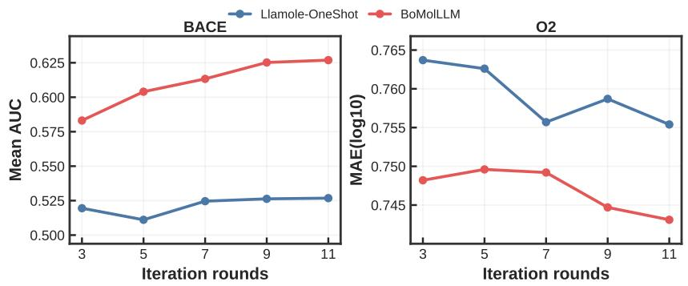  
Figure 8: Efect of optimization round count on Llamole-OneShot and BoMolLLM (Llama backbone). Left: $\mathrm { B A C E ; \ r i g h t { : } \ O _ { 2 } }$ . All settings are fixed except the number of rounds (3, 5, 7, 9, 11). Each round generates 10 molecules.