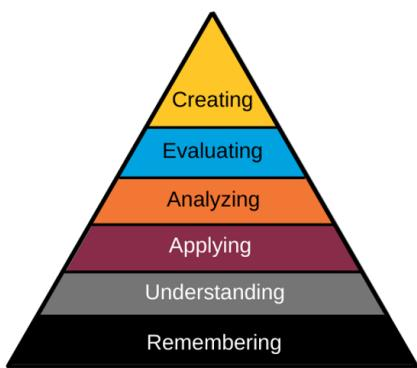
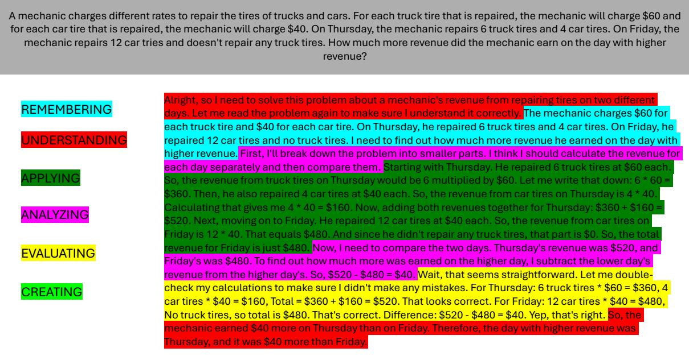
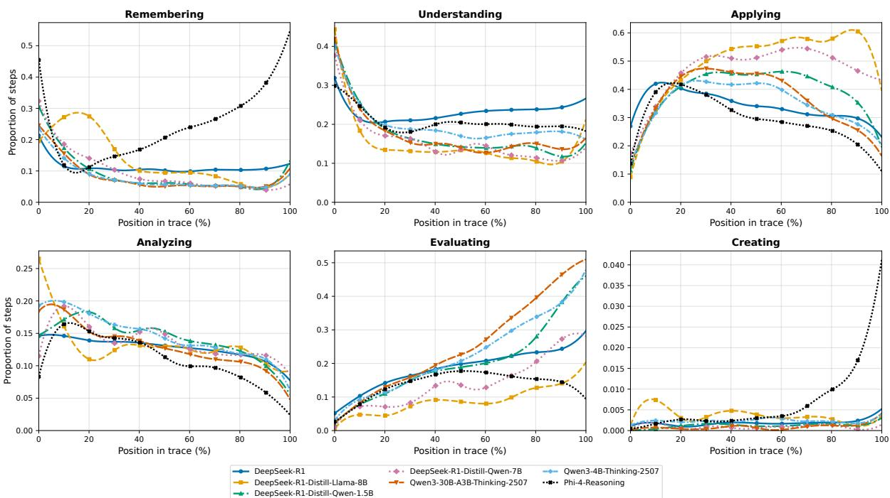
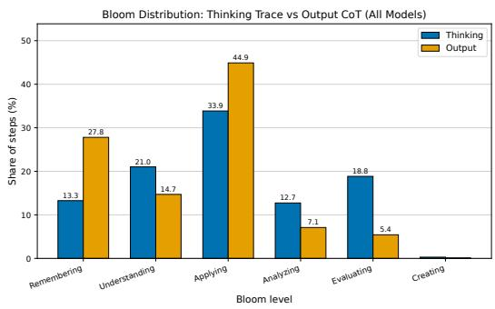
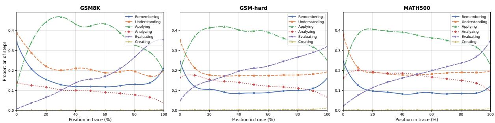
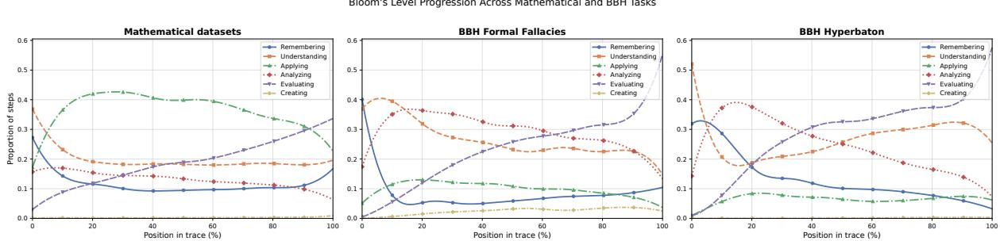
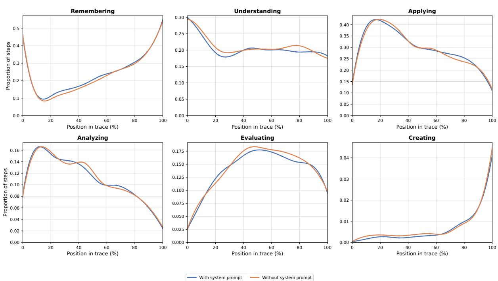
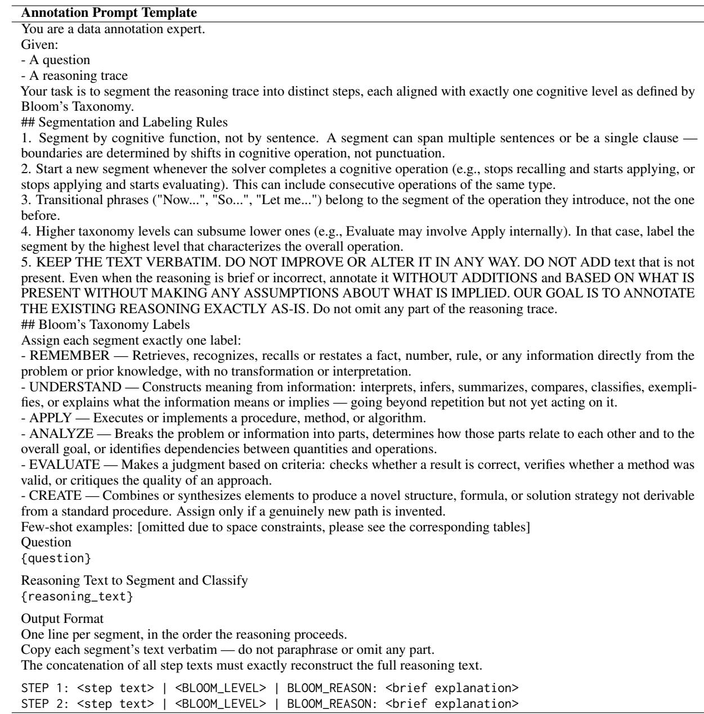
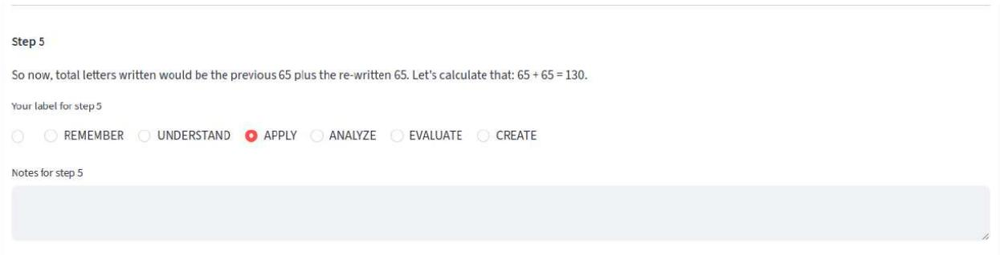

# Cognitive Profiling of LRMs’ Reasoning Traces Using Bloom’s Taxonomy

Maria-Eleni Zoumpoulidi1 Georgios Paraskevopoulos1 Alexandros Potamianos2

1Institute for Language and Speech Processing, Athena Research Center, Greece 2Speech and Language Processing Group, National Technical University of Athens, Greece mzoumpoulidi@gmail.com g.paraskevopoulos@athenarc.gr potam@central.ntua.gr

## Abstract

Large Reasoning Models (LRMs) have revolutionized reasoning in LLMs, and the increasing public availability of reasoning traces creates valuable opportunities to study model behavior not only at the surface level but also at the granularity of individual reasoning steps. However, understanding the types of thinking employed during reasoning - which offers critical insights into models’ reasoning patterns and enables actionable applications - remains underexplored. To address this gap, we intro duce a framework for automatic annotation of reasoning steps through the lens of Bloom’s Taxonomy, which classifies thinking into six cognitive levels, such as Remembering, Applying and Evaluating. Using this framework, we perform a large-scale analysis across models and datasets, revealing both similarities and differences in thinking patterns across models and tasks. Moreover, we demonstrate that thinking type information derived from reasoning traces correlates with correctness, paving the way for improved reasoning. Our findings establish a fine-grained framework for analyzing thinking patterns in LRMs and provide actionable insights for enhancing reasoning quality.

## 1 Introduction

Reasoning has long been regarded as the cornerstone of human intellect, making its emulation one of the grand aspirations of language models.

Initial approaches relied on chain-of-thought (CoT) prompting, which encourages models to develop textual rationales step-by-step (Wei et al. (2022), Kojima et al. (2022)) and related variants (e.g., Yao et al. (2023), Wang et al. (2023)). Recently, attention has shifted toward Large Reasoning Models (e.g. Guo et al. (2025)), which use selfgenerated CoT rationales as training signals to perform explicit reasoning before generating final responses, thereby achieving enhanced performance. The increasing public availability of these reasoning traces prompted a growing body of research. Recognizing the value of step-level analysis for studying phenomena such as overthinking (Kumar et al. (2026)), where length does not guarantee improved correctness, recent research has evolved beyond initial surface-level statistical metrics such as accuracy to incorporate step-level analyses. For instance, Marjanovic et al. (2026) define a taxonomy of reasoning processes in DeepSeek-R1, revealing its core building blocks. Similarly, Kargupta et al. (2026) propose a taxonomy of invariants, metacognitive controls, representations, and operations. Li et al. (2025b) and Li et al. (2025a) analyze the reasoning steps of LLMs and LRMs through the lens of Schoenfeld’s Episode Theory, a framework that decomposes reasoning for mathematical problem solving into procedural stages, called episodes, such as Reading, Planning, Implementation, Exploration, and Verification, revealing a consistent pattern in reasoning steps across reasoning models. Motivated by this line of work, we focus on a complementary yet underexplored question: rather than asking what process occurs at each reasoning step, we ask what type of thinking or cognitive function the model employs at each step.

We introduce a framework for analyzing LRM reasoning traces through the lens of Bloom’s Taxonomy, which hierarchically classifies cognition into six levels such as Remembering, Applying, and Evaluating (fig. 2). We first generate chain-ofthought (CoT) traces, automatically segment them into reasoning steps, and annotate each step with a Bloom level using a human-validated automated pipeline. Figure 1 illustrates the annotation framework. Using these annotations, we analyze reasoning characteristics across diverse LRMs, datasets, and tasks to address the following research questions: RQ1: What similarities and differences exist in the cognitive profiles exhibited by different LRMs’ internal reasoning traces for mathematical problem solving? RQ2: How do internal reasoning traces differ from output traces in cognitive profile? RQ3: How do cognitive profiles vary across different types of mathematical problems and among diverse (both mathematical and non-mathematical) tasks? RQ4: Are Bloom-level features associated with correctness, and which cognitive transitions characterize correct/incorrect reasoning?

Our focus on cognitive function rather than process provides a complementary level of abstraction. For example, our framework distinguishes restating a question verbatim (Remembering) from constructing meaning through paraphrasing or inferring what is being asked (Understanding), whereas Schoenfeld classifies both as Reading. Conversely, we group recalling a relevant theorem or fact with recalling the question itself under Remembering, while Schoenfeld categorizes the former as Analyzing and the latter as Reading.

Our main contributions are as follows:

• We introduce a novel framework for the automatic segmentation, annotation, and analysis of reasoning traces of LRMs through the lens of Bloom’s Taxonomy. Our code and data is available under the Apache 2.0 license 1.

• We analyze thinking patterns in LRM reasoning traces across models, datasets, and tasks, finding: for mathematical reasoning, (i) a shared remember–understand–apply–evaluate arc with model-specific traits, (ii) output trace cognitive compression relative to internal traces, and (iii) a shift from application to analysis with increasing difficulty; and across tasks, (iv) task-dependent profiles with backloaded verification.

• We demonstrate the practical utility of our framework through a case study on correctness.

Our results yield novel insights into the thinking profiles of LRMs, revealing distinct patterns across models and tasks. Furthermore, they demonstrate the practical significance of thinking-level annotations for yielding improved reasoning.

## 2 Related Work

## 2.1 Reasoning in LLMs

Early research on LLMs emphasized eliciting reasoning through chain-of-thought (CoT) prompting (Wei et al. (2022), Kojima et al. (2022)), i.e., encouraging the model to produce step-by-step solutions, and related variants, such as traversing tree-like structures of reasoning states (Tree of Thoughts) (Yao et al., 2023) or sampling a diverse set of reasoning paths and then selecting the most consistent answer (Wang et al., 2023). More recently, attention has shifted toward LRMs, where self-generated CoTs serve as training signals and reasoning mechanisms are more explicitly embedded within the model, enabling it to reason through a problem before producing a final answer. (e.g. Guo et al. (2025), Team (2025)).

## 2.2 Reasoning Traces Analysis

A growing body of research aims to shed light on the reasoning traces of LRMs. Motivated by the value of step-level analysis for studying phenomena such as overthinking (Kumar et al. (2026)), where longer reasoning does not necessarily imply improved correctness, recent work has moved beyond surface-level statistical metrics such as accuracy toward more fine-grained step-level analyses. Marjanovic et al. (2026) define a taxonomy of reasoning processes in DeepSeek-R1, revealing its core building blocks: problem definition, followed by decomposition, and repeated reconstruction cycles before a final answer. They further examine whether reasoning chains correlate with human cognitive processes in terms of sentence processing load, and investigate factors such as reasoning length, context handling, and management of long or ambiguous inputs, as well as cultural and safety considerations. Similarly, Kargupta et al. (2026) introduce a taxonomy covering reasoning invariants (e.g., logical coherence), metacognitive controls (e.g., self-awareness, strategy selection), representations (e.g., hierarchical), and operations (e.g., backtracking, forward chaining) to characterize the structural and procedural com ponents of a reasoning trace. Grounding their analysis in Schoenfeld’s Episode Theory- a framework that decomposes reasoning for mathematical problem solving into procedural stages, called episodes, such as Reading, Planning, Implementation, Exploration, and Verification, Li et al. (2025b) introduce an annotated corpus and automatic annotation framework for classifying reasoning behavior at the step level within reasoning traces, which Li et al. (2025a) subsequently apply to large-scale comparative analysis across models, with both works focusing on mathematical problem solving. Their findings demonstrate a consistent heartbeat of reasoning steps across reasoning models. Halim et al. (2025) focus on reasoning traces in the context of code generation, identifying both human-like performance patterns and notable differences across models.

## 2.3 Bloom’s Taxonomy in NLP

A growing body of NLP research employs Bloom’s taxonomy. Zoumpoulidi et al. (2025b) introduce a Bloom’s taxonomy-inspired prompting technique aimed at enhancing mathematical reasoning. Huber and Niklaus (2025) present a mapping of widely used benchmarks to Bloom’s taxonomy, identifying imbalances across cognitive levels. Zoumpoulidi et al. (2025a) introduce a framework for Bloomaligned LLM-generated explanations.

## 3 Preliminaries: Bloom’s Taxonomy

  
Figure 2: Bloom’s Taxonomy (revised by Anderson and Krathwohl (2001)).

Bloom’s Taxonomy (fig. 2) organizes thinking into a hierarchy of six levels of increasing complexity, defined as follows (Forehand et al., 2005):

Remembering: Retrieving, recognizing, and recalling relevant knowledge from long-term memory.

Understanding: Constructing meaning from oral, written, and graphic messages through interpreting, exemplifying, classifying, summarizing, inferring, comparing, and explaining.

Applying: Carrying out or using a procedure through executing, or implementing.

Analyzing: Breaking material into constituent parts, determining how the parts relate to one another and to an overall structure or purpose through differentiating, organizing, and attributing.

Evaluating: Making judgments based on criteria and standards through checking and critiquing.

Creating: Putting elements together to form a coherent or functional whole; reorganizing elements into a new pattern or structure through generating, planning, or producing.

## 4 Our Approach

## 4.1 Methodology

Our goal is to conduct a thorough analysis of the thinking patterns of LRMs’ reasoning traces through the lens of Bloom’s Taxonomy. To this end, we design a multi-stage pipeline consisting of chain-of-thought (CoT) generation, step-level segmentation and annotation with Bloom’s Taxonomy labels, and subsequent analysis.

Our framework is structured as follows:

• CoT Generation: We generate zero-shot chain-of-thought (CoT) solutions for each problem and store both the (internal) reasoning traces and the corresponding final responses. Full prompting details are provided in Appendix A.

• Annotation: We employ Llama-3.3-70B-Instruct to perform automatic annotation. Specifically, the model is prompted to segment each reasoning trace into discrete cognitive steps, assign a corresponding Bloom’s Taxonomy level to each step and provide a justification for the assigned label. We adopt LLM-based segmentation rather than more rigid alternatives, such as sentence-level annotation, because individual thinking processes may span multiple sentences. More structured approaches can therefore artificially fragment a single cognitive function, leading to less accurate annotations. This design choice reflects a trade-off between annotation uniformity and semantic fidelity. The full annotation prompt is provided in Appendix A. To assess annotation reliability, two human annotators (one author and one non-author trained by the authors, both with an AI background and familiarity with Bloom’s Taxonomy) independently labeled (based on the prompt) a uniformly randomly sampled subset of 100 samples drawn from all models and datasets, comprising 1,633 reasoning steps, and we measured agreement with the LLM-generated annotations (details in D). We compute Cohen’s Kappa (Table 1), with the high agreement values indicating strong annotation quality. For simplicity, the evaluation focused solely on the labeling quality rather than on both segmentation and labeling. Segmentation quality was additionally assessed through qualitative inspection of 50 samples by one of the authors.

  
Figure 1: Example of our annotation framework. The reasoning trace is automatically segmented, and each segment is labeled according to its corresponding level in Bloom’s Taxonomy.

<table><tr><td>Agreement</td><td>Cohen&#x27;s Kappa</td></tr><tr><td>H1-H2</td><td>0.8928</td></tr><tr><td>LLM-H1</td><td>0.9173</td></tr><tr><td>LLM-H2</td><td>0.9132</td></tr></table>

Table 1: Cohen’s Kappa between the LLM annotator (Llama3.3-70B-Instruct) and human annotators (H1, H2) on a uniformly randomly sampled subset of 100 samples (1633 reasoning steps) drawn from all models and datasets.

## 4.2 Experimental setting

Datasets: We conduct our main experiments on a diverse collection of three math reasoning datasets, each covering different challenging problem types: GSM8K (Cobbe et al., 2021), GSM-hard (Gao et al., 2022) and MATH500 (Hendrycks et al. (2021), Lightman et al. (2024)). The GSM-hard dataset is a modified version of GSM8K, where small numerical values have been replaced with larger ones to introduce greater computational difficulty. Together, these datasets span three levels of difficulty: grade-school (GSM8K), computationally intensive (GSM-hard), and competition-level (MATH500). The total number of samples is 3138 (GSM8K, GSM-hard:1319 each, MATH500: 500). Models: For our experiments, we query Qwen3- 30B-A3B-Thinking-2507, Qwen3-4B-Thinking-2507 (Team, 2025), DeepSeek-R1, R1-Distill-Qwen-1.5B, R1-Distill-Qwen-7B, DeepSeek-R1- Distill-Llama-8B (Guo et al., 2025) and Phi-4- reasoning (Abdin et al., 2025). For all models, we use the default settings recommended by the providers to avoid introducing artifacts or distortions in the reasoning traces due to our experimental setup. For Phi-4-Reasoning, the default configuration includes a detailed system prompt, which is provided in the official report.

## 5 Experiments

## 5.1 RQ1: Thinking Patterns Across LRMs in Mathematical Problem Solving

## 5.1.1 Bloom’s Taxonomy Level Coverage

Table 2 reports the share of reasoning steps assigned to each Bloom’s level across LRMs, considering only (internal) reasoning traces (output traces are excluded).

Apply dominates, Create is negligible. Across all models, Applying accounts for the largest or near-largest share of thinking steps (26.9%– 44.2%), indicating that LRMs on mathematical tasks are predominantly oriented toward executiontype thinking. In contrast, Creating is virtually absent in every model (<1.0%), suggesting that LRMs rarely engage in the kind of thinking that synthesizes genuinely novel patterns or structures—consistent with the nature of the benchmarks used. Understanding (17.7%–24.0%) and Analyzing (10.1%–14.3%) occupy stable middle bands across all models, acting as cognitive connective tissue regardless of model family or scale.

<table><tr><td>Model</td><td>Remember</td><td>Understand</td><td>Apply</td><td>Analyze</td><td>Evaluate</td><td>Create</td></tr><tr><td>DeepSeek-R1</td><td>11.8</td><td>24.0</td><td>32.9</td><td>12.5</td><td>18.6</td><td>0.2</td></tr><tr><td>DeepSeek-R1-Distill-Llama-8B</td><td>13.5</td><td>18.7</td><td>44.2</td><td>14.1</td><td>9.3</td><td>0.3</td></tr><tr><td>R1-Distill-Qwen-7B</td><td>11.5</td><td>17.7</td><td>43.9</td><td>12.8</td><td>14.1</td><td>0.1</td></tr><tr><td>R1-Distill-Qwen-1.5B</td><td>10.9</td><td>18.8</td><td>35.6</td><td>13.5</td><td>21.0</td><td>0.1</td></tr><tr><td>Qwen3-30B-A3B-Thinking-2507</td><td>9.4</td><td>18.8</td><td>33.4</td><td>12.7</td><td>25.6</td><td>0.1</td></tr><tr><td>Qwen3-4B-Thinking-2507</td><td>9.0</td><td>20.8</td><td>32.5</td><td>14.3</td><td>23.1</td><td>0.2</td></tr><tr><td>Phi-4-Reasoning</td><td>28.4</td><td>21.0</td><td>26.9</td><td>10.1</td><td>12.7</td><td>0.9</td></tr></table>

Table 2: Percentage of reasoning steps assigned to each level of Bloom’s Taxonomy across different LRMs.

Distillation profile is scale-dependent. Comparing DeepSeek-R1 (32.9% Apply, 18.6% Evaluate) with its distilled variants reveals a systematic shift in thinking style: R1-Distill-Llama-8B (44.2%, 9.3%) and R1-Distill-Qwen-7B (43.9%, 14.1%) lean more heavily on execution-type thinking and engage less in evaluative thinking. This pattern is non-monotonic in scale: the smaller R1-Distill-Qwen-1.5B (35.6%, 21.0%) more closely resembles the teacher than its larger 7B and 8B siblings, suggesting that possibly the Apply-heavy bias intensifies as the distilled student grows.

The Qwen3 family is evaluation-heavy. Both Qwen3-30B-A3B-Thinking-2507 (25.6% Evaluate) and Qwen3-4B-Thinking-2507 (23.1%) exhibit the highest proportions of Evaluating thinking among all models, paired with the lowest proportions of Remembering (9.0%–9.4%)—a cognitive style that favors checking and critiquing over fact recall.

Phi-4-Reasoning is a clear outlier. Phi-4- Reasoning exhibits a markedly different cognitive profile: the highest share of Remembering (28.4%, more than double that of most other models), the lowest Analyzing (10.1%), the lowest Apply (tied at 26.9%), and the highest—though still small—share of Creating (0.9%). Rather than concentrating its thinking in Applying, Phi-4-Reasoning distributes cognitive effort more evenly across levels, with an unusually large portion devoted to recall-type thinking. This may reflect differences in training data and post-training objectives relative to the DeepSeek and Qwen families.

## 5.1.2 Temporal Dynamics

Figure 3 traces the proportion of each Bloom level as a function of relative position in the reasoning trace, revealing the temporal organization of thinking. For each trace, step positions are normalized to [0,100] and assigned to one of 10 equally spaced position bins. Each curve shows, within each bin, the share of steps at the corresponding Bloom level (again, output traces are excluded).

An emergent cognitive arc. Across almost all models, the temporal dynamics of cognitive levels follow a coherent Remember-Understand-Apply-Evaluate arc that mirrors Bloom’s hierarchy itself—an emergent ordering that, despite never being explicitly enforced, aligns with the canonical Bloom progression. We examine each level in turn.

Remembering is front-loaded—except for Phi-4-Reasoning. For most models, Remembering starts near 0.2–0.45 and decays sharply within the first 20% of the trace, concentrating recall-type thinking at the outset. Notably, R1-Distill-Llama-8B, rises sharply before joining the general decay. Some models show a slight late-trace rebound, suggesting a brief return to recall-type thinking near the end. Phi-4-Reasoning is the striking exception: its curve is U-shaped, rising sharply in the final portion to ∼0.55—significantly higher than that of any other model.

Understanding decays quickly but rebounds at the end. Understanding starts near 0.3–0.45 and collapses within the first 20% of the trace for most models, mirroring Remembering. Some models again show a slight late-trace rebound, suggesting a brief return to interpretation-type thinking near the final answer. DeepSeek-R1 stands out as the only model that sustains an elevated share throughout the entire trace, indicating a cognitive style that continues reinterpreting rather than fully committing to execution-type thinking.

  
Figure 3: Temporal Dynamics of Bloom’s Levels in Reasoning Traces

Applying dominates the middle of the trace. Applying rises from roughly 0.1–0.3 to a sustained plateau of 0.4–0.6 across the middle of the trace, becoming the dominant mode of LRMs’ thinking. The larger distilled R1 variants (Llama 8B and Qwen 7B) exhibit the highest peaks (∼0.55–0.60), whereas DeepSeek-R1 and Phi-4-Reasoning maintain the lowest plateau (∼0.42), which is reached relatively early, suggesting they transition more quickly into execution. Qwen models peak near the middle of the trace before declining, while the distilled models sustain elevated Applying levels longer into the trace, indicating more persistent execution-type thinking.

Analyzing peaks early. Analyzing peaks slightly later than Remembering and Understanding (5– 20%) before gradually declining, consistent with early decomposition-type thinking. R1-Distill-Llama-8B shows an unusually high early share before dropping quickly, suggesting early decomposition into parts. Phi-4-Reasoning maintains the lowest proportion of Analyzing steps in the middle and end of the trace.

Evaluating ramps up at the end—most aggressively for Qwen3 and the small distilled model.

Evaluating mirrors Remembering: near zero at the start and climbing monotonically by the end, reflecting back-loaded evaluative thinking. The two Qwen3 variants exhibit the steepest ramps (∼0.48– 0.52), with the smallest distilled variant (R1-Distill-Qwen-1.5B) following close behind (∼0.46)—well above its larger 7B and 8B siblings and DeepSeek-R1. Phi-4-Reasoning again deviates, remaining flat and low throughout, with only a modest mid-trace peak.

Creating is negligible—except for a Phi-4- Reasoning spike at the end. Creating remains near zero throughout for all models. Phi-4- Reasoning is the sole exception, spiking at the end of the trace—small in absolute terms, but an order of magnitude above any other model.

For the interested reader, a further analysis of Phi-4- reasoning’s divergent behavior (which we demonstrate to be a property of the model rather than its system prompt) can be found in Appendix B.

## 5.2 RQ2: Internal vs. Output Reasoning Trace Cognitive Profiles

Figure 4 compares the thinking distribution of (internal) reasoning traces against final output CoTs, aggregated across all models. Thinking traces are cognitively broad, distributing effort across Applying (33.9%), Understanding (21.0%), Evaluating (18.8%), and Analyzing (12.7%). Outputs, by contrast, compress this richness into recall and execution: Remembering (27.8%) and Applying (44.9%) alone account for nearly three quarters of all steps, while evaluative and analytical thinking are largely stripped away (Evaluating drops from 18.8% to 5.4%). This compression is expected and consistent with the role of final CoTs as concise step-bystep solutions, whereas internal reasoning traces more closely resemble think-aloud processes that include intermediate deliberation, revisiting of assumptions, evaluation, and exploratory reasoning.

  
Figure 4: Output-Reasoning steps distribution comparison

## 5.3 RQ3: Cognitive Profiles Across Tasks

## 5.3.1 Cognitive Profiles Across Mathematical Problem Types

Figure 5 shows the temporal thinking trajectories of reasoning traces across GSM8K, GSM-hard, and MATH500, aggregated over all models (output traces are excluded). Across GSM8K, GSM-hard, and MATH500, the overall remember–understand– apply–evaluate arc is preserved, but proportions shift with difficulty. Applying dominates the middle of the trace in all three datasets, yet its plateau is highest on GSM8K (∼0.47), flattens on GSM-hard (∼0.40), and decays most steeply on MATH500, indicating that harder problems pull effort away from pure execution. Evaluating ramps up toward the end across all datasets. Analyzing is also more prominent on MATH500, sustaining an elevated share (∼0.18–0.20) rather than decaying early as in GSM8K, consistent with the greater need for decomposition in competition-level problems.

## 5.3.2 Cognitive Profiles Across Diverse (mathematical and non-mathematical) Tasks

Figure 6 compares the temporal thinking dynamics of reasoning traces (aggregated over all models- internal traces only) across three reasoning domains:

mathematical (pooled GSM8K, GSM-hard, and MATH500-all samples) and two BBH tasks (Suzgun et al., 2023), 250 samples each — Formal Fallacies, which asks the model to assess the logical validity of informal arguments, and Hyperbaton, which requires determining the correct adjective ordering — capturing mathematical, logical, and linguistic reasoning respectively. The corresponding prompts and one-shot examples can be found in Appendix A. The profiles differ substantially. Mathematical reasoning is Apply-heavy, whereas Formal Fallacies emphasizes Analyzing and Understanding, reflecting the need to translate naturallanguage premises into logical structures and decompose their relations. Creating also rises slightly, consistent with generating counterexamples for validity testing. Hyperbaton shows a distinct pattern: Remembering and Understanding dominate early as the model interprets the question and recalls adjective-order rules, followed by an early Analyzing peak and sustained Understanding, while Applying remains consistently low, reflecting categorical rather than procedural reasoning. Both Formal Fallacies and Hyperbaton show elevated mid-trace Evaluating, reflecting the role of evaluation not only for verification but also in the task itself (validity or order assessment), while its late rise across tasks suggests back-loaded verification as a general LRM property. Examples are in Appendix C.

## 5.4 RQ4: Bloom-Level Features and Correctness

To demonstrate the practical value of our framework, we investigate whether Bloom’s Taxonomy thinking levels are associated with solution correctness. We construct a balanced dataset for the mathematical datasets by independently balancing each model × dataset cell, by retaining all samples from the minority correctness class and randomly sampling an equal number from the majority class (9132 samples in total). We then train an $L _ { 1 } -$ regularized logistic regression model to predict correctness from 43 standardized features: total token count, six Bloom-level token proportions, and the flattened 6 × 6 transition matrix normalized by the number of transitions. Evaluation uses nested crossvalidation with a 5-fold outer loop and a 3-fold inner loop. Coefficients can be found in Table 3. Applying → evaluating is the strongest positive coefficient, suggesting that correct solutions often move from execution-oriented reasoning into explicit assessment of intermediate results. Remembering → understanding also receives a strong positive coefficient, indicating that successful traces frequently benefit from explicitly constructing meaning from recalled information. By contrast, total token count is the strongest predictor of incorrectness, indicating that longer traces are generally associated with lower solution quality. Transitions such as evaluating → analyzing and analyzing → evaluating suggest that unsuccessful traces more frequently oscillate between analysis and evaluation without converging on a stable solution. Overall, incorporating Bloom-level proportions and transition dynamics improves performance over a length-only baseline, where the only feature is the number of tokens. The full 43-feature model achieves an AUC of $0 . 6 7 6 \pm 0 . 0 1 2$ compared to $0 . 6 1 3 \pm 0 . 0 0 8$ for the baseline, with smaller gains in accuracy (0.631 vs. 0.623) and F1 (0.667 vs. 0.666). These findings suggest that Bloom-based features capture information related to correctness which have the potential to yield improved reasoning by explicitly shaping such structural patterns during training or inference.

Figure 5: Comparison of temporal thinking dynamics of reasoning traces across GSM8K, GSM-hard, and MATH500, aggregated over all models.  
  
Figure 6: Comparison of temporal thinking dynamics of reasoning traces across math datasets and the BBH tasks Formal Fallacies and Hyperbaton, aggregated over all models.

## 6 Conclusions

We introduce a framework for automatically annotating LRM reasoning steps using Bloom’s Taxonomy. Analysis across LRMs and datasets reveals: for mathematical reasoning, (i) a shared remember–understand–apply–evaluate arc with modelspecific traits; (ii) internal traces are cognitively broader than output CoTs, which compress into recall and execution; (iii) cognitive effort shifts from execution to analysis with increasing difficulty; across tasks, (iv) cognitive profiles are task-dependent, though back-loaded verification remains consistent; and (v) Bloom-based features correlate with correctness, suggesting potential for improving reasoning.

<table><tr><td colspan="2">Positive Coefficients</td><td colspan="2">Negative Coefficients</td></tr><tr><td>Feature</td><td>Coef.</td><td>Feature</td><td>Coef.</td></tr><tr><td>trans_appl→eval</td><td>+0.1769</td><td>total_tokens</td><td>-0.4373</td></tr><tr><td>trans_reme→unde</td><td>+0.1290</td><td>trans_eval→anal</td><td>-0.1271</td></tr><tr><td>trans_eval→reme</td><td>+0.1059</td><td>trans_anal→eval</td><td>-0.1236</td></tr><tr><td>trans_eval→eval</td><td>+0.0897</td><td>trans_eval→appl</td><td>-0.1155</td></tr><tr><td>trans_appl→unde</td><td>+0.0813</td><td>trans_eval→crea</td><td>-0.1132</td></tr><tr><td>trans_eval→unde</td><td>+0.0598</td><td>tok_analyzing</td><td>-0.0677</td></tr><tr><td>trans_reme→eval</td><td>+0.0568</td><td>trans_unde→appl</td><td>-0.0559</td></tr><tr><td>trans_appl→reme</td><td>+0.0473</td><td></td><td></td></tr></table>

Table 3: Top positive and negative logistic regression coefficients from the Bloom-based correctness model. Positive coefficients are associated with correct solutions, while negative coefficients are associated with incorrect solutions.

## Limitations

We acknowledge that, despite the informative and actionable insights provided by our method and analysis - particularly regarding the relationship between correctness and reasoning depth - this work does not explicitly enforce or shape such structural patterns to improve reasoning performance, which we plan to explore in future work. Additionally, extending the study to a broader and more diverse set of tasks would enable a more comprehensive and well-rounded analysis.

## References

Marah Abdin, Sahaj Agarwal, Ahmed Awadallah, Vidhisha Balachandran, Harkirat Behl, Lingjiao Chen, Gustavo de Rosa, Suriya Gunasekar, Mojan Javaheripi, Neel Joshi, Piero Kauffmann, Yash Lara, Caio César Teodoro Mendes, Arindam Mitra, Besmira Nushi, Dimitris Papailiopoulos, Olli Saarikivi, Shital Shah, Vaishnavi Shrivastava, and 4 others. 2025. Phi-4-reasoning technical report. Preprint, arXiv:2504.21318.

L. W. Anderson and D. R. Krathwohl. 2001. A Taxonomyfor Learning, Teaching, and Assessing: A Revision of Bloom’s Taxonomy of Educational Objectives. Longman.

Karl Cobbe, Vineet Kosaraju, Mohammad Bavarian, Mark Chen, Heewoo Jun, Lukasz Kaiser, Matthias Plappert, Jerry Tworek, Jacob Hilton, Reiichiro Nakano, Christopher Hesse, and John Schulman. 2021. Training verifiers to solve math word problems. Preprint, arXiv:2110.14168.

Mary Forehand and 1 others. 2005. Bloom’s taxonomy: Original and revised. Emerging Perspectives on Learning, Teaching, and Technology, 8:41–44.

Luyu Gao, Aman Madaan, Shuyan Zhou, Uri Alon, Pengfei Liu, Yiming Yang, Jamie Callan, and Graham Neubig. 2022. PAL: Program-Aided Language Models. CoRR, abs/2211.10435. Preprint available at arXiv.

Daya Guo, Dejian Yang, Haowei Zhang, Junxiao Song, Peiyi Wang, Qihao Zhu, Runxin Xu, Ruoyu Zhang, Shirong Ma, Xiao Bi, Xiaokang Zhang, Xingkai Yu, Yu Wu, Z. F. Wu, Zhibin Gou, Zhihong Shao, Zhuoshu Li, Ziyi Gao, Aixin Liu, and 175 others. 2025. Deepseek-r1 incentivizes reasoning in llms through reinforcement learning. Nature, 645(8081):633–638.

Kevin Halim, Sin G. Teo, Ruitao Feng, Zhenpeng Chen, Yang Gu, Chong Wang, and Yang Liu. 2025. A study on thinking patterns of large reasoning models in code generation. Preprint, arXiv:2509.13758.

Dan Hendrycks, Collin Burns, Saurav Kadavath, Akul Arora, Steven Basart, Eric Tang, Dawn Song, and

Jacob Steinhardt. 2021. Measuring mathematical problem solving with the math dataset. NeurIPS.

Thomas Huber and Christina Niklaus. 2025. LLMs meet bloom’s taxonomy: A cognitive view on large language model evaluations. In Proceedings of the 31st International Conference on Computational Linguistics, pages 5211–5246, Abu Dhabi, UAE. Association for Computational Linguistics.

Priyanka Kargupta, Shuyue Stella Li, Haocheng Wang, Dean Light, Jinu Lee, Shan Chen, Orevaoghene Ahia, Kerem Oktar, Thomas L. Griffiths, Max Kleiman-Weiner, Jiawei Han, Asli Celikyilmaz, and Yulia Tsvetkov. 2026. Cognitive foundations for reasoning and their manifestation in LLMs. In ICLR 2026 Workshop - From Human Cognition to AI Reasoning: Models, Methods, and Applications.

Takeshi Kojima, Shixiang (Shane) Gu, Machel Reid, Yutaka Matsuo, and Yusuke Iwasawa. 2022. Large language models are zero-shot reasoners. In Advances in Neural Information Processing Systems, volume 35, pages 22199–22213. Curran Associates, Inc.

Abhinav Kumar, Jaechul Roh, Ali Naseh, Marzena Karpinska, Mohit Iyyer, Amir Houmansadr, and Eugene Bagdasarian. 2026. Overthink: Slowdown attacks on reasoning llms. Preprint, arXiv:2502.02542.

Ming Li, Chenrui Fan, Yize Cheng, Soheil Feizi, and Tianyi Zhou. 2025a. Schoenfeld’s anatomy of mathematical reasoning by language models. Preprint, arXiv:2512.19995.

Ming Li, Nan Zhang, Chenrui Fan, Hong Jiao, Yanbin Fu, Sydney Peters, Qingshu Xu, Robert Lissitz, and Tianyi Zhou. 2025b. Understanding the thinking process of reasoning models: A perspective from schoenfeld’s episode theory. In Proceedings of the 2025 Conference on Empirical Methods in Natural Language Processing, pages 18267–18288, Suzhou, China. Association for Computational Linguistics.

Hunter Lightman, Vineet Kosaraju, Yuri Burda, Harrison Edwards, Bowen Baker, Teddy Lee, Jan Leike, John Schulman, Ilya Sutskever, and Karl Cobbe. 2024. Let's verify step by step. In International Conference on Learning Representations, volume 2024, pages 39578–39601.

Sara Vera Marjanovic, Arkil Patel, Vaibhav Adlakha, Milad Aghajohari, Parishad BehnamGhader, Mehar Bhatia, Aditi Khandelwal, Austin Kraft, Benno Krojer, Xing Han Lù, Nicholas Meade, Dongchan Shin, Amirhossein Kazemnejad, Gaurav Kamath, Marius Mosbach, Karolina Stanczak, and Siva Reddy. 2026. Deepseek-r1 thoughtology: Let’s think about LLM reasoning. Transactions on Machine Learning Research.

Mirac Suzgun, Nathan Scales, Nathanael Schärli, Sebastian Gehrmann, Yi Tay, Hyung Won Chung, Aakanksha Chowdhery, Quoc Le, Ed Chi, Denny Zhou, and Jason Wei. 2023. Challenging BIG-bench tasks and whether chain-of-thought can solve them.

In Findings of the Association for Computational Linguistics: ACL 2023, pages 13003–13051, Toronto, Canada. Association for Computational Linguistics.

Qwen Team. 2025. Qwen3 technical report. Preprint, arXiv:2505.09388.

Xuezhi Wang, Jason Wei, Dale Schuurmans, Quoc V Le, Ed H. Chi, Sharan Narang, Aakanksha Chowdhery, and Denny Zhou. 2023. Self-consistency improves chain of thought reasoning in language models. In The Eleventh International Conference on Learning Representations.

Jason Wei, Xuezhi Wang, Dale Schuurmans, Maarten Bosma, brian ichter, Fei Xia, Ed Chi, Quoc V Le, and Denny Zhou. 2022. Chain-of-thought prompting elicits reasoning in large language models. In Advances in Neural Information Processing Systems, volume 35, pages 24824–24837. Curran Associates, Inc.

Shunyu Yao, Dian Yu, Jeffrey Zhao, Izhak Shafran, Tom Griffiths, Yuan Cao, and Karthik Narasimhan. 2023. Tree of thoughts: Deliberate problem solving with large language models. In Advances in Neural Information Processing Systems, volume 36, pages 11809–11822. Curran Associates, Inc.

Maria-Eleni Zoumpoulidi, Eleni Batsi, Georgios Paraskevopoulos, Vassilis Katsouros, and Alexandros Potamianos. 2025a. Bloomxplain: A framework and benchmark dataset for pedagogically sound LLMgenerated explanations based on bloom’s taxonomy. In NeurIPS 2025 Workshop on Evaluating the Evolving LLM Lifecycle: Benchmarks, Emergent Abilities, and Scaling.

Maria-Eleni Zoumpoulidi, Georgios Paraskevopoulos, and Alexandros Potamianos. 2025b. Bloom-Wise: Enhancing problem-solving capabilities of large language models using bloom’s-taxonomyinspired prompts. In Proceedings of The 3rd Workshop on Mathematical Natural Language Processing (MathNLP 2025), pages 34–49, Suzhou, China. Association for Computational Linguistics.

## A Prompts

In this section, we provide the prompts used for CoT generation (Mathematical Datasets: Table 4, BBH tasks: 7) and automatic segmentation of reasoning traces into discrete cognitive steps and assignment of a corresponding Bloom’s Taxonomy level to each step with a justification (Table 5). The few-shot examples used for the annotation of the mathematical datasets can be found in Table 6 and examples used for BBH formal fallacies and hyperbaton can be found in Tables 8 and 9 respectively.

## B A closer look at the outlier Phi-4-Reasoning

Phi-4-Reasoning’s divergent thinking profile warrants further analysis, in which we emphasize two aspects: first, we examine whether this behavior is enforced by the system prompt provided by the model developers; second, we conduct a smallscale qualitative analysis of selected examples to gain deeper insight into this phenomenon. As far as the first aspect is concerned, we reran the experiments without the system prompt, and the resulting distribution and temporal dynamics can be found in Table 10 and fig. 7. Removing the system prompt only marginally shifts the distribution (e.g., Remembering 28.4% → 27.6%, Evaluating 12.7% → 13.0%), while the overall profile and temporal dynamics are preserved: Remembering remains by far the highest across models with a rise at the end, Applying the lowest, and Creating nonzero. The outlier cognitive profile is thus a property of the model rather than an artifact of the system prompt. While we cannot pinpoint the exact cause, several aspects of Phi-4-Reasoning’s training (Abdin et al., 2025) offer plausible explanations: a different teacher model (o3-mini), SFT-only training without an outcome-based RL stage, and a heavily curated, knowledge-dense training corpus. A smallscale qualitative inspection of traces, focused on the most striking divergence—Remembering at the end of the trace—reveals that (with both prompt settings) the model frequently terminates by repeat edly restating its intended final answer and output format (e.g., "I’ll produce answer with final line: The answer is 540.", "We’ll produce a final answer¨ message with that format: The answer is X."). This¨ terminal-repetition pattern is consistent with the absence of an outcome-based RL stage, which would otherwise pressure clean termination.

## C Example Outputs across Diverse Tasks

In this section, we present example outputs of our annotation framework across diverse tasks in order to demonstrate the differences in characteristics across tasks (Tables 11, 12, 13).

## D Human Annotation Details

In this section, we describe the annotation process in detail. First, the authors introduced the volunteer non-author annotator to the project’s objectives and task requirements. Although the annotator was already familiar with Bloom’s taxonomy, we also provided general background information on the topic (similar to the material presented in Section 3 of the paper). Finally, both annotators—the author and the non-author annotator—completed the annotations independently using the same prompt that was provided to the LLM annotator through a user interface designed to facilitate the annotation process (see fig 8).

CoT Prompt Template (Mathematical Datasets)   
Solve the following math problem step by step. End your response with the final numerical answer in this format: “The   
answer is X.”   
Problem: {question}  
Table 4: Prompt template used for Chain of Thought generation (Mathematical Datasets)

  
Figure 7: Temporal Dynamics of Bloom’s Levels in Reasoning Traces (Phi-4-reasoning is ran with and without system prompt- internal reasoning traces only)

  
Table 5: Prompt template used for Annotation (used for both mathematical datasets and BBH tasks). Few-shot examples are omitted due to space constraints, please see the corresponding tables.

<table><tr><td>Annotation Prompt Few-shot examples (Mathematical Datasets) Example 1</td></tr><tr><td>Question: Julie is reading a 120-page book. Yesterday, she was able to read 12 pages and today, she read twice as many pages as yesterday. If she wants to read half of the remaining pages tomorrow, how many pages should she read? Reasoning trace: Okay, lets tackle this problem step by step. First, I need to figure out how many pages Julie has read so far and then</td></tr><tr><td>determine how many are left. The book is 120 pages total. Yesterday, she read 12 pages. Today, she read twice as many as yesterday. So, today's pages would be 2 times 12, which is 24 pages. Let me add those up: 12 + 24 = 36 pages read in total over the two days. Now, subtract that from the total pages to find the remaining pages. 120 minus 36 equals 84 pages left. The question says she wants to read half of the remaining pages tomorrow. So, half of 84 is 42. Therefore, she should read 42 pages tomorrow. Let me double-check to make sure I didn't make a mistake. Total pages: 120. Yesterday: 12. Today: 24. Total read: 36. Remaining: 84. Half of 84 is 42. Yep, that seems right. Correct segmentation:</td></tr><tr><td>STEP 1: Okay, let's tackle this problem step by step. First, I need to figure out how many pages Julie has read so far and then determine how many are left. I ANALYZE | BLOOM_REASON: The solver breaks the overall task into subproblems (finding pages read so far and pages remaining) and identifies how these parts relate to the goal of solving the problem. STEP 2: The book is 120 pages total. Yesterday, she read 12 pages. Today, she read twice as many as yesterday. I REMEMBER | BLOOM_REASON: The solver restates numerical facts given in the problem (total pages, pages read</td></tr><tr><td>yesterday, and the relationship for today) without any transformation or interpretation. STEP 3: So, today's pages would be 2 times 12, which is 24 pages. Let me add those up: 12 + 24 = 36 pages read in total over the two days. Now, subtract that from the total pages to find the remaining pages. 120 minus 36 equals 84 pages left</td></tr><tr><td>I APPLY I BLOOM_REASON: The solver executes a sequence of arithmetic procedures (multiplication, addition, and</td></tr><tr><td>subtraction) to compute pages read so far and the number of remaining pages. STEP 4: The question says she wants to read half of the remaining pages tomorrow. I REMEMBER | BLOOM_REASON:</td></tr><tr><td>The solver restates a condition directly from the problem (reading half of the remaining pages) without performing any operation on it. STEP 5: So, half of 84 is 42. Therefore, she should read 42 pages tomorrow. I APPLY | BLOOM_REASON: The solver</td></tr><tr><td>applies a procedure by calculating half of the remaining pages to determine the required number of pages to read. STEP 6: Let me double-check to make sure I didn't make a mistake. Total pages: 120. Yesterday: 12. Today: 24. Total</td></tr><tr><td>read: 36. Remaining: 84. Half of 84 is 42. Yep, that seems right. | EVALUATE | BLOOM_REASON: The solver checks the correctness of the solution by verifying intermediate results and confirming that the final answer is consistent with the problem conditions.</td></tr><tr><td>Example 2</td></tr><tr><td>Question:</td></tr><tr><td>Michael had 58 golf balls. On Tuesday, he lost 23 golf balls. On Wednesday, he lost 2 more. How many golf balls did he have at the end of Wednesday?</td></tr><tr><td>Reasoning trace: Okay, let's tackle this problem step by step. So, Michael starts with 58 golf balls. On Tuesday, he lost 23. Then on</td></tr><tr><td>Wednesday, he lost 2 more. I need to find out how many he has left by the end of Wednesday. First, let's figure out how</td></tr><tr><td>many he had after Tuesday. He started with 58 and lost 23. So, subtract 23 from 58. Let me do that calculation. 58 minus 20 is 38, and then minus 3 more would be 35. Wait, 58 - 23. Let me check again: 58 minus 20 is 38, then subtract 3 more</td></tr><tr><td>(since 23 is 20+3), so 38 - 3 = 35. Yeah, that's right. So after Tuesday, he has 35 golf balls left. Then on Wednesday, he</td></tr><tr><td>lost 2 more. So now, take the 35 and subtract 2. 35 - 2 = 33. So, after Wednesday, he should have 33 golf balls. Let me double-check to make sure I didn't make a mistake. Starting with 58, lose 23: 58 - 23. Let's do it another way. 23 + 35 =</td></tr><tr><td>58, so yes, 58 -23 is 35. Then 35 -2 is 33. That seems right. So the answer should be 33.</td></tr><tr><td>Correct segmentation: STEP 1: Okay, let's tackle this problem step by step. So, Michael starts with 58 golf balls. On Tuesday, he lost 23. Then</td></tr><tr><td>on Wednesday, he lost 2 more. I REMEMBER I BLÔOM_REASON: The solver restates facts given in the problem without</td></tr><tr><td>any transformation or interpretation.</td></tr><tr><td>STEP 2: I need to find out how many he has left by the end of Wednesday. I UNDERSTAND | BLOOM_REASON: The</td></tr><tr><td></td></tr><tr><td>solver interprets the goal of the problem by expressing what needs to be determined in their own words.</td></tr><tr><td></td></tr><tr><td>STEP 3: First, let's figure out how many he had after Tuesday. I ANALYZE | BLOOM_REASON: The solver breaks the</td></tr><tr><td>problem into parts by identifying an intermediate quantity (the number of golf balls after Tuesday) needed to reach the</td></tr><tr><td></td></tr><tr><td>final answer.</td></tr><tr><td></td></tr><tr><td></td></tr><tr><td>STEP 4: He started with 58 and lost 23. So, subtract 23 from 58. Let me do that calculation. 58 minus 20 is 38, and then</td></tr><tr><td></td></tr><tr><td>minus 3 more would be 35. I APPLY I BLOOM_REASON: The solver executes arithmetic procedures by performing</td></tr><tr><td></td></tr><tr><td></td></tr><tr><td></td></tr><tr><td></td></tr><tr><td>subtraction to compute the number of golf balls remaining after Tuesday.</td></tr><tr><td></td></tr><tr><td></td></tr><tr><td></td></tr><tr><td></td></tr><tr><td>STEP 5: Wait, 58 - 23. Let me check again: 58 minus 20 is 38, then subtract 3 more (since 23 is 20+3), so 38 - 3 = 35.</td></tr><tr><td></td></tr><tr><td></td></tr><tr><td></td></tr><tr><td></td></tr><tr><td></td></tr><tr><td></td></tr><tr><td>Yeah, that's right. So after Tuesday, he has 35 golf balls left. | EVALUATE | BLOOM_REASON: The solver checks the</td></tr><tr><td></td></tr><tr><td></td></tr><tr><td></td></tr><tr><td></td></tr><tr><td></td></tr><tr><td></td></tr><tr><td></td></tr><tr><td></td></tr><tr><td></td></tr><tr><td></td></tr><tr><td></td></tr><tr><td></td></tr><tr><td></td></tr><tr><td></td></tr><tr><td></td></tr><tr><td></td></tr><tr><td></td></tr><tr><td></td></tr><tr><td></td></tr><tr><td></td></tr><tr><td></td></tr><tr><td></td></tr><tr><td></td></tr><tr><td>correctness of the calculation by recomputing the subtraction and confirming that the result is accurate.</td></tr><tr><td></td></tr><tr><td></td></tr><tr><td></td></tr><tr><td></td></tr><tr><td></td></tr><tr><td></td></tr><tr><td></td></tr><tr><td></td></tr><tr><td></td></tr><tr><td></td></tr><tr><td></td></tr><tr><td></td></tr><tr><td></td></tr><tr><td></td></tr><tr><td></td></tr><tr><td></td></tr><tr><td></td></tr><tr><td></td></tr><tr><td></td></tr><tr><td></td></tr><tr><td></td></tr><tr><td></td></tr><tr><td></td></tr><tr><td></td></tr><tr><td></td></tr><tr><td></td></tr><tr><td></td></tr><tr><td></td></tr><tr><td></td></tr><tr><td></td></tr><tr><td></td></tr><tr><td></td></tr><tr><td></td></tr><tr><td></td></tr><tr><td></td></tr><tr><td></td></tr><tr><td></td></tr><tr><td></td></tr><tr><td></td></tr><tr><td></td></tr><tr><td></td></tr><tr><td></td></tr><tr><td></td></tr><tr><td></td></tr><tr><td></td></tr><tr><td></td></tr><tr><td></td></tr><tr><td>STEP 6: Then on Wednesday, he lost 2 more. So now, take the 35 and subtract 2. 35 - 2 = 33. So, after Wednesday, he</td></tr><tr><td></td></tr><tr><td></td></tr><tr><td></td></tr><tr><td></td></tr><tr><td></td></tr><tr><td></td></tr><tr><td></td></tr><tr><td></td></tr><tr><td></td></tr><tr><td></td></tr><tr><td></td></tr><tr><td></td></tr><tr><td></td></tr><tr><td></td></tr><tr><td></td></tr><tr><td></td></tr><tr><td></td></tr><tr><td></td></tr><tr><td></td></tr><tr><td></td></tr><tr><td></td></tr><tr><td></td></tr><tr><td></td></tr><tr><td></td></tr><tr><td></td></tr><tr><td></td></tr><tr><td></td></tr><tr><td></td></tr><tr><td></td></tr><tr><td></td></tr><tr><td></td></tr><tr><td></td></tr><tr><td></td></tr><tr><td></td></tr><tr><td></td></tr><tr><td></td></tr><tr><td></td></tr><tr><td></td></tr><tr><td></td></tr><tr><td></td></tr><tr><td>should have 33 golf balls. I APPLY I BLOOM_REASON: The solver executes arithmetic procedures by subtracting the</td></tr><tr><td></td></tr><tr><td>CoT Prompt Template (BBH Tasks)</td></tr><tr><td>Answer the following question step by step. End your response by stating the chosen option in the format: "The answer is</td></tr><tr><td> $\mathbf { \delta } _ { \mathbf { X } , \ " } ^ { \mathbf { \delta } _ { \mathbb { \Gamma } } } ,$  where X is the correct option.</td></tr><tr><td>Question: {question}</td></tr><tr><td>Annotation Prompt One-shot example (BBH Formal Fallacies)</td></tr><tr><td>Example Question: It is not always easy to grasp who is consuming which products. The following argument pertains to this question: Every</td></tr><tr><td>infrequent user of Paul Mitchell shampoo is either a rare consumer of Nioxin shampoo or à loyal buyer of Caress soap, or both. No regular consumer of Lush soap is a rare consumer of Nioxin shampoo and, in the same time, a loyal buyer of Caress soap. It follows that whoever is an infrequent user of Paul Mitchell shampoo is not a regular consumer of Lush soap." Is the argument, given the explicitly stated premises, deductively valid or invalid? Options: - valid - invalid</td></tr><tr><td>Reasoning trace: [omitted due to space constraints] Correct segmentation: STEP 1: Okay, let's try to figure out if this argument is deductively valid. So, the question is about whether the conclusion follows logically from the premises. Let me break it down step by step. I REMEMBER | BLOOM_REASON: The solver</td></tr><tr><td>states what's asked in the question. STEP 2: First, let's parse the premises. The first premise says: "Every infrequent user of Paul Mitchell shampoo is either a rare consumer of Nioxin shampoo or a loyal buyer of Caress soap, or both.  ${ \mathrm { ~  ~ \hat { ~ } { ~ } ~ } } \cdot { \mathrm { ~ S 0 , ~ } }$  if someone is an infrequent user of Paul</td></tr><tr><td>Mitchell (let's call this  $\mathrm { P } ) ,$  then they are either à rare consumer of Nioxin (N) or a loyal buyer of Caress (C), or both. In</td></tr><tr><td>logical terms, that's  $P \to ( N \lor C )$  . I ANALYZE | BLOOM_REASON: The solver breaks down the first premise into</td></tr><tr><td>parts and determines how they relate to each other in logic terms. STEP 3: The second premise: "No regular consumer of Lush soap is a rare consumer of Nioxin shampoo and, in the same</td></tr><tr><td>time, a loyal buyer of Caress soap." So, if someone is a regular consumer of Lush soap (L), then they cannot be both a rare consumer of Nioxin (N) and a loyal buyer of Caress (C). In logical terms, this would be  ${ \cal L }  \neg ( \dot { N } \wedge C )$  .|ANALYZE|</td></tr><tr><td>BLOOM_REASON: The solver breaks down the second premise into parts and determines how they relate to each other in logic terms.</td></tr><tr><td>STEP 4: Which is equivalent to  $L \to ( \neg N \lor \neg C )$  by De Morgan's law. | APPLY | BLOOM_REASON: The solver applies De Morgan's Law.</td></tr><tr><td>STEP 5: The conclusion is: "Whoever is an infrequent user of Paul Mitchell shampoo is not a regular consumer of Lush</td></tr><tr><td> $\operatorname { s o a p . } ^ { \mathfrak { w } } \mathbf { S } \mathbf { 0 } , P \to \lnot L .$  | UNDERSTAND | BLOOM_REASON: The solver interprets the conclusion in logical terms.</td></tr><tr><td>STEP 6: We need to check if from  $P \to ( N \lor C )$  and  $L \to \neg ( N \land C )$  , we can derive  $P  \neg L$  | UNDERSTAND I</td></tr><tr><td>BLOOM_REASON: The solver interprets what should be done. STEP 7: Hmm. Let's see. Let's assume P is true. Then from the first premise,  $N \vee C$  is true. Now, suppose for</td></tr><tr><td>contradiction that L is true. Then from the second premise,  $\neg ( N \land C )$  must be true, so either  $\neg N \lor \neg C$  But since  $N \vee C$ </td></tr><tr><td>is true (from P), if both N and C were false, then  $\bar { N } \vee C$  would be false. Wait, but if  $N \vee C$  is true, then at least one of N , so they can't both be true. So if</td></tr><tr><td>or C is true. But if L is true, then  $\neg ( N \land C )$   $N \vee C$  is true  $\mathrm { a n d } \neg ( N \land C )$  is true, that</td></tr><tr><td>means exactly one of N or C is true (exclusive OR). But how does that relate to L? Wait, the conclusion is that P implies</td></tr><tr><td>not L. So if P is true, then L must be false. Let's see if the premises lead to that. I ANALYZE | BLOOM_REASON: The solver examines how the premises' logical parts interact and decomposes the relationship between  $N \vee C$  and –  $\mathsf { \Omega } _ { \mathsf { N } } \wedge C ) .$ </td></tr><tr><td>STEP 8: Suppose someone is a P (infrequent user of Paul Mitchell). Then they are  $\hat { N } \vee C$  Now, if they were also an</td></tr><tr><td>L (regular consumer of Lush), then from the second premise, they can't be  $N \wedge C .$  But since they are  $N \lor C ,$  being L would require that they are not both N and C. But  $N \backslash C$  is true, so if they are L, then they must be exactly one of N or C.</td></tr><tr><td>| APPLYÎ BLOOM_REASON: The solver applies logical rules.</td></tr><tr><td></td></tr><tr><td>STEP 9: But does that lead to a contradiction? Wait, the conclusion is that P implies ¬L. So we need to see if P leads to</td></tr><tr><td> $\neg L$  Let's assume P and  $\mathrm { L , }$  and see if that leads to a contradiction. Assume  $P \land \bar { L }$  Then from first premise,  $N \lor C$  From</td></tr><tr><td>second premise, since L is true, –  $\neg ( N \land C )$  So we have  $N \vee C$  and –  $\neg ( N \land C )$  That's possible; for example, N is true and</td></tr><tr><td>C is false, or vice versa. So there's no contradiction here. Therefore, it's possible for someone to be  $\mathrm { ~ P , L , }$  and have either N</td></tr><tr><td>or C but not both. So the assumption of  $P \land L$  doesn't lead to a contradiction. Therefore, the conclusion  $P  \neg L$  doesn't</td></tr><tr><td>necessarily follow. I EVALUAE | BLOOM_REASON: The solver checks whether there is a contradiction.</td></tr><tr><td>STEP 10: Wait, but the argument says ’it follows that whoever is an infrequent user of Paul Mitchell shampoo is not a</td></tr><tr><td>regular consumer of Lush soap'. So if there exists someone who is P and L, then the conclusion is false. I UNDERSTAND</td></tr><tr><td>| BLOOM_REASON: The solver interprets a part of the question.</td></tr><tr><td>STEP 11: But according to the premises, can such a person exist? Let's construct a scenario. Let's say someone is an</td></tr><tr><td></td></tr><tr><td>infrequent user of Paul Mitchell (P), so they are either N or C (or both). Suppose they are a rare consumer of Nioxin (N)</td></tr><tr><td>but not a loyal buyer of Caress (so C is false). Then  $N \vee C$  is true (since N is true). Now, they are a regular consumer of</td></tr><tr><td></td></tr><tr><td>Lush (L). The second premise says that L implies  $\neg ( N \land C )$  Since N is true and C is false,  $N \wedge C$  is false,  $\mathbf { s o } \neg ( N \land C )$ </td></tr><tr><td>is true. So L can be true here. So this person is  $\mathrm { P } , \mathrm { L } , \mathrm { N } , \lnot C .$  So they satisfy both premises but the conclusion  $( P  \neg L ) )$ </td></tr><tr><td></td></tr><tr><td>would be false for them because they are P and L. Therefore, the conclusion doesn't hold in this case. So the argument</td></tr><tr><td></td></tr><tr><td>is invalid. I CREATE | BLOOM_REASON: The solver constructs an original counterexample with specific truth-value</td></tr><tr><td></td></tr><tr><td>assignments to demonstrate invalidity.</td></tr><tr><td></td></tr><tr><td></td></tr><tr><td>STEP 12: Wait, but the first premise says "every infrequent user of Paul Mitchell is either a rare consumer of Nioxin or a</td></tr><tr><td></td></tr><tr><td></td></tr><tr><td></td></tr><tr><td>loyal buyer of Caress or both." So in this example, the person is a rare consumer of Nioxin (so N is true), so they satisfy</td></tr><tr><td></td></tr><tr><td></td></tr><tr><td></td></tr><tr><td></td></tr><tr><td></td></tr><tr><td></td></tr><tr><td></td></tr><tr><td></td></tr><tr><td></td></tr><tr><td></td></tr><tr><td></td></tr><tr><td></td></tr><tr><td></td></tr><tr><td></td></tr><tr><td></td></tr><tr><td></td></tr><tr><td></td></tr><tr><td></td></tr><tr><td></td></tr><tr><td></td></tr><tr><td></td></tr><tr><td></td></tr><tr><td></td></tr><tr><td></td></tr><tr><td></td></tr><tr><td></td></tr><tr><td></td></tr><tr><td></td></tr><tr><td></td></tr><tr><td></td></tr><tr><td></td></tr><tr><td></td></tr><tr><td></td></tr><tr><td></td></tr><tr><td></td></tr><tr><td></td></tr><tr><td></td></tr><tr><td></td></tr><tr><td></td></tr><tr><td></td></tr><tr><td></td></tr><tr><td></td></tr><tr><td></td></tr><tr><td></td></tr><tr><td></td></tr><tr><td></td></tr><tr><td></td></tr><tr><td></td></tr><tr><td></td></tr><tr><td></td></tr><tr><td></td></tr><tr><td></td></tr><tr><td></td></tr><tr><td></td></tr><tr><td></td></tr><tr><td></td></tr><tr><td></td></tr><tr><td></td></tr><tr><td></td></tr><tr><td></td></tr><tr><td></td></tr><tr><td></td></tr><tr><td></td></tr><tr><td></td></tr><tr><td></td></tr><tr><td></td></tr><tr><td></td></tr><tr><td></td></tr><tr><td></td></tr><tr><td></td></tr><tr><td></td></tr><tr><td></td></tr><tr><td></td></tr><tr><td></td></tr><tr><td></td></tr><tr><td></td></tr><tr><td></td></tr><tr><td>the first premise. The second premise says no regular consumer of Lush is both N and C. In this case, the person is L, N,</td></tr><tr><td></td></tr><tr><td></td></tr><tr><td></td></tr><tr><td></td></tr><tr><td></td></tr><tr><td></td></tr><tr><td></td></tr><tr><td></td></tr><tr><td></td></tr><tr><td></td></tr><tr><td></td></tr><tr><td></td></tr><tr><td></td></tr><tr><td></td></tr><tr><td></td></tr><tr><td></td></tr><tr><td></td></tr><tr><td></td></tr><tr><td></td></tr><tr><td></td></tr><tr><td></td></tr><tr><td></td></tr><tr><td></td></tr><tr><td></td></tr><tr><td></td></tr><tr><td></td></tr><tr><td></td></tr><tr><td></td></tr><tr><td> $\neg C ,$ </td></tr><tr><td></td></tr><tr><td></td></tr><tr><td>so they are not both N and C, so the second premise is satisfied. Therefore, the premises don't prevent someone</td></tr><tr><td>Annotation Prompt One-shot example (BBH Hyperbaton) Example</td></tr><tr><td>Question: Which sentence has the correct adjective order: Options:(A) lovely tiny modern French restaurant (B) French modern tiny lovely restaurant Reasoning trace: [omitted due to space constraints]</td></tr><tr><td>Correct segmentation: STEP 1: Okay, the user is asking about correct adjective order in English. They've given two options for describing a restau- rant and want to know which one follows the standard adjective sequence rules. I UNDERSTAND | BLOOM_REASON: The solver interprets the task and identifies that the question concerns adjective ordering in English grammar. STEP 2: Hmm, this seems like a grammar question testing knowledge of the "royal order" of adjectives. I UNDERSTAND</td></tr><tr><td>I BLOOM_REASON: The solver classifies the type of problem and connects it to a known grammatical concept.</td></tr><tr><td>STEP 3: I recall that in English, adjectives follow a specific hierarchy: opinion, size, age, shape, color, origin, material, purpose. I REMEMBER | BLOOM_REASON: The solver recalls the standard adjective order rule from prior knowledge. STEP 4: Let me mentally run through the options. Option A: "lovely tiny modern French restaurant" — "lovely" =</td></tr><tr><td>opinion (good), "tiny" = size (small), "modern" = age (new), "French" = origin, "restaurant" = noun. | ANALYZE I BLOOM_REASON: The solver decomposes Option A into grammatical categories and examines how its parts relate to the adjective hierarchy.</td></tr><tr><td>STEP 5: Option B: "French modern tiny lovely restaurant" — "French" = origin (should come later), "modern" = age (should come before origin), "tiny" = size (should come before age), "lovely" = opinion (should come first), "restaurant" = noun. I ANALYZE | BLOOM_REASON: The solver breaks down Option B and compares the adjective positions against</td></tr><tr><td>the expected ordering.</td></tr><tr><td>STEP 6: Yes, the standard order is opinion → size → age → origin. I REMEMBER | BLOOM_REASON: The solver restates the grammatical rule needed for verification. STEP 7: So "lovely" (opinion) should come first, then "tiny" (size), then "modern" (age), then "French" (origin). I APPLY I BLOOM_REASON: The solver applies the adjective-ordering rule to determine the correct sequence. STEP 8: That matches option A perfectly. I EVALUATE | BLOOM_REASON: The solver judges that Option A satisfies the grammatical criteria.</td></tr></table>

Table 6: Few-shot examples used in the Annotation Prompt for Mathematical datasets

Table 7: Prompt template used for Chain of Thought generation (BBH Tasks)

Table 8: One-shot example used in the Annotation Prompt for BBH Formal Fallacies

Table 9: One-shot example used in the Annotation Prompt for BBH Hyperbaton

<table><tr><td>Setting</td><td>Remember</td><td>Understand</td><td>Apply</td><td>Analyze</td><td>Evaluate</td><td>Create</td></tr><tr><td>With system prompt</td><td>28.4</td><td>21.0</td><td>26.9</td><td>10.1</td><td>12.7</td><td>0.9</td></tr><tr><td>Without system prompt</td><td>27.6</td><td>21.5</td><td>26.8</td><td>10.1</td><td>13.0</td><td>1.0</td></tr></table>

Table 10: Distribution comparison for Phi-4-Reasoning with and without the default system prompt (internal reasoning traces only).

<table><tr><td colspan="3" rowspan="1">Question:Mike plays ping pong for 40 minutes. In the first 20 minutes, he scores 4 points. In the second 20 minutes, he scores 25%more points. How many total points did he score?</td></tr><tr><td colspan="1" rowspan="1">Reasoning Text</td><td colspan="1" rowspan="1">Label</td><td colspan="1" rowspan="1">Justification</td></tr><tr><td colspan="1" rowspan="1">Okay, let's see. Mike plays ping pong for 40minutes. The problem says in the first 20 minutes,he scores 4 points. Then in the second 20 minutes,he scores 25% more points. I need to find thetotal points.</td><td colspan="1" rowspan="1">REMEMBERING</td><td colspan="1" rowspan="1">The solver restates facts given in the problemwithout any transformation or interpretation.</td></tr><tr><td colspan="1" rowspan="1">First, let's confirm the time: 40 minutes total,split into two 20-minute intervals. First 20 min-utes: 4 points. Second 20 minutes: 25% morethan the first 20 minutes.</td><td colspan="1" rowspan="1">UNDERSTANDING</td><td colspan="1" rowspan="1">The solver interprets the problem by expressingthe given information in their own words andidentifying the key elements.</td></tr><tr><td colspan="1" rowspan="1">Wait, does “25% more points" mean 25% morethan the first 20 minutes' points? I think that'swhat it means. So first part is 4 points, secondpart is 4 plus 25% of 4.</td><td colspan="1" rowspan="1">UNDERSTANDING</td><td colspan="1" rowspan="1">The solver clarifies the meaning of “25% morepoints" and relates it to the first 20 minutes'points.</td></tr><tr><td colspan="1" rowspan="1">Let me calculate that. 25% of 4 is 0.25 × 4 = 1.So 25% more would be 4 + 1 = 5 points in thesecond 20 minutes.</td><td colspan="1" rowspan="1">APPLYING</td><td colspan="1" rowspan="1">The solver executes a calculation to find 25% of4 and then applies this result to determine thepoints scored in the second 20 minutes.</td></tr><tr><td colspan="1" rowspan="1">Then total points would be 4 + 5 = 9.</td><td colspan="1" rowspan="1">APPLYING</td><td colspan="1" rowspan="1">The solver applies basic arithmetic to calculatethe total points scored.</td></tr><tr><td colspan="1" rowspan="1">Wait, let me make sure. 25% more than 4. So $4 \times 1 . 2 5 = 5 .$ Yeah, that's right. So second 20minutes is 5 points. Total is $4 + 5 = 9 .$ </td><td colspan="1" rowspan="1">EVALUATING</td><td colspan="1" rowspan="1">The solver checks the calculation by using analternative method (multiplication by 1.25) andconfirms that the result is accurate.</td></tr><tr><td colspan="1" rowspan="1">Let me double-check. First 20 minutes: 4 points.Second 20 minutes: 25% more than first. 25%of 4 is 1, so $4 + 1 = 5$ Total $4 + 5 = 9 .$ Thatseems right. I don't think there's any trick here.The problem says “in the second 20 minutes, hescores 25% more points" – more than the first 20minutes, which is 4. So yes, 25% more than 4 is5. Total points 9.</td><td colspan="1" rowspan="1">EVALUATING</td><td colspan="1" rowspan="1">The solver verifies the correctness of the solutionby rechecking calculations and confirming thatthe final answer is consistent with the problemconditions.</td></tr><tr><td colspan="3" rowspan="1">Question:“Here comes a perfectly valid argument: First, being a cousin of Chris is sufficient for not being a son of Kermit. We mayconclude that whoever is not a son of Kermit is a cousin of Chris."Is the argument, given the explicitly stated premises, deductively valid or invalid? Options: valid / invalid.</td></tr><tr><td colspan="1" rowspan="1">Okay, let's try to figure out if this argument isdeductively valid. So, the question says: “First,being a cousin of Chris is sufficient for not beinga son of Kermit. We may conclude that whoeveris not a son of Kermit is a cousin of Chris."</td><td colspan="1" rowspan="1">REMEMBER</td><td colspan="1" rowspan="1">The solver recalls the question and the argumentto be evaluated.</td></tr><tr><td colspan="1" rowspan="1">Hmm, let's break this down. The first part is apremise: “being a cousin of Chris is sufficient fornot being a son of Kermit." In logical terms, ifsomeone is a cousin of Chris (let's call that C),then they are not a son of Kermit (not S). So, $C  \neg { \dot { S } } .$ </td><td colspan="1" rowspan="1">ANALYZE</td><td colspan="1" rowspan="1">The solver breaks down the premise into logi-cal terms and identifies the relationship betweenbeing a cousin of Chris and not being a son ofKermit.</td></tr><tr><td colspan="1" rowspan="1">The conclusion is: "whoever is not a son of Ker-mit is a cousin of ${ \mathrm { C h r i s . ^ { \prime \prime } S o } } , \lnot S \to C .$ </td><td colspan="1" rowspan="1">UNDERSTAND</td><td colspan="1" rowspan="1">The solver interprets the conclusion in logicalterms and identifies the relationship between notbeing a son of Kermit and being a cousin of Chris.</td></tr><tr><td colspan="1" rowspan="1">Wait a second, the premise is ${ \overline { { C \ \to \ \neg S , } } }$ butthe conclusion is  $\neg \hat { S }  C .$ That looks like theconverse of the premise. In logic, the converse ofan implication isn't necessarily true. For example,if “if it's a dog, then it's a mammal’ $( D \to { \hat { M } } ) ,$ the converse would be “if it's a mammal, then it'sa dog" $( M \to D ) .$ which isn't true because thereare mammals that aren't dogs.</td><td colspan="1" rowspan="1">ANALYZE</td><td colspan="1" rowspan="1">The solver recognizes the relationship betweenthe premise and the conclusion, and identifies theconverse of the premise.</td></tr><tr><td colspan="1" rowspan="1">So here, the premise is C implies ¬S. The con-clusion is saying ¬S implies C. That's the con-verse, which isn't valid. So the argument is as-suming that because C leads to $\partial S .$ then ¬Smust lead to C. But that's a fallacy. It's like say-ing “if it's raining, the ground is wet” $( R \to W ) ,$ so “if the ground is wet, it's raining" $( W \to R ) ,$ which isn't necessarily true because the groundcould be wet for other reasons.</td><td colspan="1" rowspan="1">EVALUATE</td><td colspan="1" rowspan="1">The solver evaluates the argument and identifiesthe fallacy of assuming the converse is true.</td></tr><tr><td colspan="1" rowspan="1">Let me check again. The premise: $\overline { { C \to \neg S . \mathrm { T h e } } }$ conclusion: $\neg \bar { S }  C .$ So the argument is taking $C  \lnot S$ and concluding $\neg S  C$ But that'snot a valid deduction. The correct contrapositiveof $C  \lnot S$ would be $S \to \lnot C ,$ right? Becausethe contrapositive of $P \to Q { \mathrm { ~ i s } } \neg Q \to \neg P .$ Sohere, the contrapositive would be $S  \lnot C$ Butthe conclusion $\mathrm { i } \mathrm { s } \neg S  C ,$ which is different.</td><td colspan="1" rowspan="1">ANALYZE</td><td colspan="1" rowspan="1">The solver re-examines the premise and conclu-sion, and identifies the correct contrapositive.</td></tr><tr><td colspan="1" rowspan="1">So the argument is confusing the implicationwith its converse. Therefore, the argument isinvalid because the conclusion doesn't logicallyfollow from the premise. The premise says beinga cousin of Chris ensures you’re not a son of Ker-mit, but it doesn't say that everyone who isn't ason of Kermit must be a cousin of Chris. Therecould be other people who aren't sons of Kermitbut aren't cousins of Chris either.</td><td colspan="1" rowspan="1">EVALUATE</td><td colspan="1" rowspan="1">The solver evaluates the argument and concludesthat it is invalid.</td></tr><tr><td colspan="1" rowspan="1">For example, suppose Kermit has a daughterwho's not a son, so she's not a son of Kermit,but she's not a cousin of Chris. The premisesays cousins of Chris aren't sons of Kermit, butit doesn't say that all non-sons are cousins. Sothe conclusion is making a broader claim thanthe premise supports. Hence, invalid.</td><td colspan="1" rowspan="1">CREATE</td><td colspan="1" rowspan="1">The solver constructs a counterexample todemonstrate the invalidity of the argument.</td></tr><tr><td colspan="3" rowspan="1">Question:Which sentence has the correct adjective order: Options: (A) silly old prismlike Mexican sock (B) Mexican prismlike old sillysock</td></tr><tr><td colspan="1" rowspan="1">Reasoning Text</td><td colspan="1" rowspan="1">Label</td><td colspan="1" rowspan="1">Justification</td></tr><tr><td colspan="1" rowspan="1">Okay, the user is asking about adjective orderin English, specifically which sentence correctlyorders adjectives. The options are: (A) “silly oldprismlike Mexican sock" (B) “Mexican prismlikeold silly sock".</td><td colspan="1" rowspan="1">UNDERSTAND</td><td colspan="1" rowspan="1">The solver interprets the task and identifies thequestion concerns adjective ordering in Englishgrammar.</td></tr><tr><td colspan="1" rowspan="1">Hmm, I recall that English has a specific se-quence for multiple adjectives before a noun. It'snot random—it follows a pattern: opinion, size,age, shape, color, origin, material, purpose.</td><td colspan="1" rowspan="1">REMEMBER</td><td colspan="1" rowspan="1">The solver recalls the standard adjective orderrule from prior knowledge.</td></tr><tr><td colspan="1" rowspan="1">Let me mentally run through the rules. First,“silly" is an opinion adjective—it describes howsomeone feels about the sock. Then “old" isclearly about age. “Prismlike" is a shape descrip-tor, and “Mexican" indicates origin.</td><td colspan="1" rowspan="1">ANALYZE</td><td colspan="1" rowspan="1">The solver breaks down the adjectives into theirrespective categories and examines how they re-late to the adjective hierarchy.</td></tr><tr><td colspan="1" rowspan="1">So the correct order should be opinion → age→ shape → origin. That would be "silly oldprismlike Mexican sock."</td><td colspan="1" rowspan="1">APPLY</td><td colspan="1" rowspan="1">The solver applies the adjective-ordering rule todetermine the correct sequence.</td></tr><tr><td colspan="1" rowspan="1">Option (B) has "Mexican" first, which is origin,but origin should come after shape, not before. Italso has “prismlike" before “old," which messesup the age order. “Old" should come before“prismlike" because age comes before shape inthe sequence.</td><td colspan="1" rowspan="1">EVALUATE</td><td colspan="1" rowspan="1">The solver critiques Option B by checking itagainst the grammatical rule and identifying vio-lations.</td></tr><tr><td colspan="1" rowspan="1">Wait, let me double-check the standard order:Opinion → Size → Age → Shape → Color →Origin → Material → Purpose.</td><td colspan="1" rowspan="1">REMEMBER</td><td colspan="1" rowspan="1">The solver restates the grammatical rule neededfor verification.</td></tr><tr><td colspan="1" rowspan="1">Yep, so "silly" (opinion) → "old" (age) →"prismlike" (shape) → “Mexican" (origin). Op-tion A matches this perfectly. Option B has originfirst, then shape, then age, then opinion—totalchaos.</td><td colspan="1" rowspan="1">EVALUATE</td><td colspan="1" rowspan="1">The solver judges that Option A satisfies thegrammatical criteria and further critiques OptionB.</td></tr><tr><td colspan="1" rowspan="1">The user seems to be learning English grammar,probably a student or non-native speaker. They'rebeing careful by asking for step-by-step reason-ing, which is smart. I should make sure my ex-planation is clear but not overwhelming.</td><td colspan="1" rowspan="1">UNDERSTAND</td><td colspan="1" rowspan="1">The solver interprets the user's likely needs andadjusts the communication approach accordingly.</td></tr><tr><td colspan="1" rowspan="1">Also, the sock example is oddly specific-prismlike? That's a fun detail. Maybe it's a typofor “prism-like" or a creative descriptor, but thegrammar still holds.</td><td colspan="1" rowspan="1">UNDERSTAND</td><td colspan="1" rowspan="1">The solver notes an unusual aspect of the examplebut recognizes it does not affect the grammaticalanalysis.</td></tr><tr><td colspan="1" rowspan="1">Final check: Option A = silly (opinion) + old(age) + prismlike (shape) + Mexican (origin).Correct. Option B = Mexican (origin) + prism-like (shape) + old (age) + silly (opinion). Wrongorder.</td><td colspan="1" rowspan="1">EVALUATE</td><td colspan="1" rowspan="1">The solver conducts a final verification of theoptions against the grammatical rule.</td></tr><tr><td colspan="1" rowspan="1">Yep, A is definitely right. I'll wrap up by statingit plainly at the end as requested.</td><td colspan="1" rowspan="1">EVALUATE</td><td colspan="1" rowspan="1">The solver confirms the correctness of the con-clusion before presenting the final answer.</td></tr></table>

Table 11: Example of an annotated sample (GSM8K)

Table 12: Example of an annotated sample (BBH formal fallacies)

Table 13: Example of an annotated sample (BBH hyperbaton)

  
Figure 8: Human Annotation UI