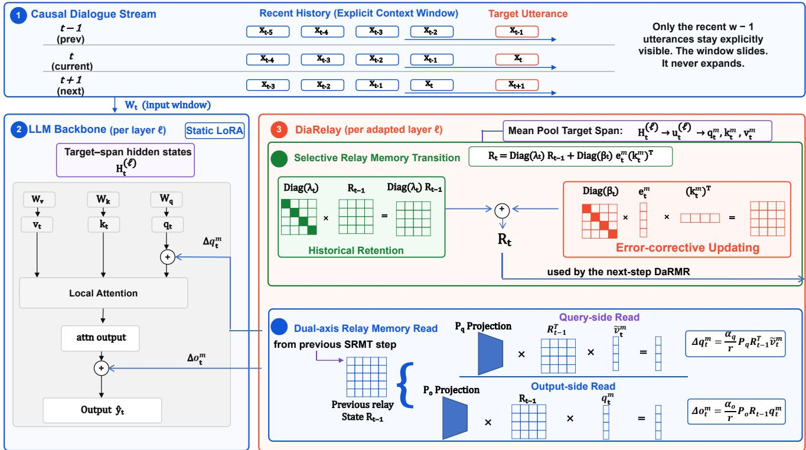
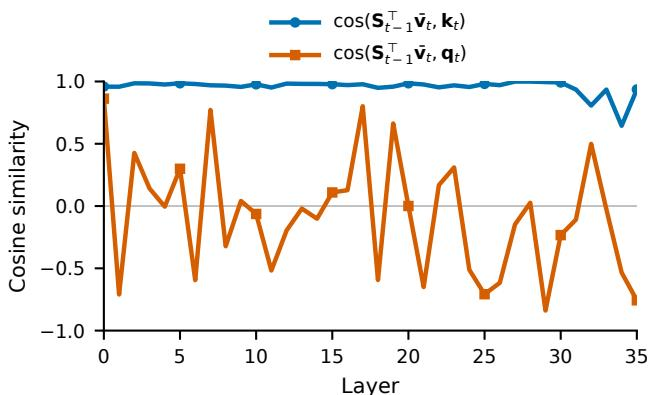
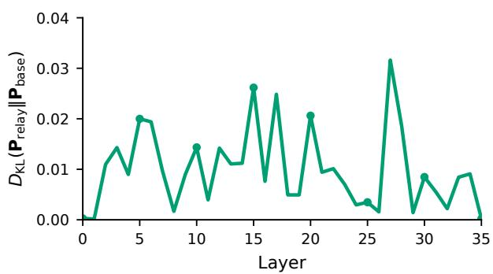

# DiaRelay: Relaying Dialogue Context with a Constant-Size Memory for Emotion Recognition in Conversation

Zihao Zhou<sup>1</sup>, Bin Yang<sup>1</sup>, Jinghui Qin<sup>1∗</sup>, Kebing Jin<sup>2</sup>

<sup>1</sup>Guangdong University of Technology

<sup>2</sup>Guizhou Provincial Laboratory of Big Data, State Key Laboratory of Public Big Data, Guizhou University zhouzihao1@mails.gdut.edu.cn, yangbin59@mails.gdut.edu.cn, qinjinghui@gdut.edu.cn, kbjin@gzu.edu.cn

## Abstract

Emotion Recognition in Conversation (ERC) requires models to identify subtle emotional cues that are often distributed across distant dialogue turns. Existing methods typically incorporate dialogue history through a fixed context window. However, short windows discard potentially useful long-range evidence, while enlarging the window repeatedly re-encodes overlapping utterances, increases computational and memory costs, and may introduce irrelevant context. Moreover, commonly used parameter-eficient adaptation methods, such as LoRA, mainly introduce fixed low-rank transformations in the feature space and do not explicitly maintain a dialogue-level state or condition their transformations on the evolving conversational context. To address these limitations, we propose a lightweight adapter, named DiaRelay, to enable large language models (LLMs) to explicitly maintain a dialogue-level memory for accurate ERC. Based on LoRA, DiaRelay introduces two extra tightly collaborative components, Selective Relay Memory Transition and Dual-axis Relay Memory Read. Selective Relay Memory Transition progressively aggregates useful historical evidence into a bounded relay memory and propagates it across successive utterance predictions. This allows earlier emotional cues to influence later predictions after they leave the local context window, without re-encoding the complete dialogue history or expanding the backbone context length. Dual-axis Relay Memory Read uses the propagated memory to dynamically modulate low-rank feature transformations, enabling context-dependent representation adaptation without test-time gradient updates. Extensive experiments show that DiaRelay can achieve state-of-the-art weighted F1 and accuracy on MELD while obtaining competitive results on IEMOCAP with only an extra ∼7.1M trainable parameters, indicating the efectiveness and generalizability of our DiaRelay in enhancing LLM-based emotional understanding.

## Introduction

Emotion Recognition in Conversation (ERC) aims to identify the emotion expressed by each utterance in a dialogue. It plays an important role in afective computing and supports a wide range of applications, including conversational agents, social media analysis, and human–computer interaction. Unlike isolated emotion classification, ERC requires models to interpret each utterance in relation to its conversational context. A short or semantically ambiguous utterance may convey diferent emotions depending on preceding events, speaker interactions, and previously expressed attitudes. Therefore, efectively modeling dialogue history is a central challenge in ERC (Poria et al. 2019b; Majumder et al. 2019; Ghosal et al. 2019).

Existing ERC methods capture contextual information using recurrent networks, graph-based reasoning, attention mechanisms, and pretrained language models (Majumder et al. 2019; Ghosal et al. 2019; Shen et al. 2021a; Lei et al. 2023). With the increasing adoption of large language models, a common strategy is to concatenate the current utterance with a fixed number of preceding utterances as context and deploy parameter-eficient fine-tuning (PEFT) technology to endow LLMs with the capability to predict the emotion inherent in the current utterance. However, this strategy has the following limitation. A short context window may exclude potentially useful historical evidence once earlier utterances fall outside the context window. Enlarging the context window provides broader historical coverage, but it increases computational and memory costs, and may introduce irrelevant context. Although parameter-eficient adaptation methods such as LoRA (Hu et al. 2022) are deployed to enable LLMs to understand emotions and reason eficiently, this limitation can not be resolved by these methods since the learned mappings of LoRA or its variants are shared across dialogue turns and do not explicitly maintain a persistent dialoguelevel memory that is crucial for accurate emotion recognition in conversation with limited context. Consequently, once an utterance leaves the explicit context window, standard PEFT technology can not preserve useful cues antecedent to the current context window or condition later transformations on the evolving dialogue history.

This limitation motivates us to develop a new memoryaugmented adaptation mechanism that complements explicit local context modeling with a compact dialogue-level memory. Such a mechanism should preserve useful historical information beyond the local context window, process each utterance adaptively according to the accumulated conversation, and maintain a bounded memory size as the dialogue grows. Meanwhile, it also should retain the parameter eficiency of low-rank adaptation and avoid gradient-based pa rameter updates during inference.

To this end, we propose DiaRelay, a lightweight memoryaugmented adapter that enables LLMs to explicitly maintain and exploit dialogue-level memory for ERC. Based on

LoRA, DiaRelay complements a fixed local context window with a bounded cross-utterance constant-size relay memory, which is progressively propagated across successive utterance predictions. Rather than retaining an ever-growing sequence of historical representations, DiaRelay compresses conversation history into a constant-size memory and uses it to condition the low-rank adaptation applied to the current utterance. DiaRelay contains two tightly collaborative components: Selective Relay Memory Transition (SRMT) and Dual-axis Relay Memory Read (DaRMR). SRMT progressively updates the relay memory through a gated errorcorrective operation. It selectively incorporates useful information from the current utterance while retaining useful historical content, allowing the memory to evolve throughout the conversation without increasing the memory size. DaRMR retrieves complementary information from the propagated memory and produces context-dependent low-rank corrections for the query and output pathways of self-attention. In this way, the backbone representation is dynamically adapted according to the accumulated dialogue context rather than relying solely on a fixed low-rank transformation. The two components operate under a "read-before-write" paradigm. When predicting the t-th utterance, DaRMR accesses only the relay memory of the previous t−1 turns. After the prediction, SRMT incorporates the current utterance into the relay memory for memory updating. This paradigm prevents the current utterance from being written into the memory before its own prediction, while allowing it to provide historical information for subsequent utterances. As a result, earlier emotional cues can continue to afect later predictions after leaving the explicit context window, without expanding the context length of inputs, re-encoding the complete dialogue history, or performing test-time gradient updates. Extensive experiments on MELD and IEMOCAP under a unified history-only setting show that DiaRelay improves both accuracy and weighted F1 over strong LoRA-based fixedwindow baselines, indicating the efectiveness and generalizability of our DiaRelay in enhancing LLM-based emotional understanding. In particular, DiaRelay achieves state-of-theart weighted F1 on MELD while obtaining competitive performance on IEMOCAP.

Overall, our main contributions are threefold:

• We propose DiaRelay, a lightweight memory-augmented adapter that complements a fixed local context window with a bounded cross-utterance constant-size relay memory. DiaRelay enables historical information to persist across successive utterance predictions without expanding the input context length or requiring test-time parameter updates.

• In DiaRelay, we introduce SRMT and DaRMR. The SRMT selectively updates the relay memory through a gated error-corrective transition, while the DaRMR retrieves complementary memory information to generate context-dependent low-rank corrections for the query and output pathways. Together, they establish a "read-beforewrite" paradigm for dialogue-level memory propagation and utilization.

• Extensive experiments on MELD and IEMOCAP demonstrate that DiaRelay outperforms strong LoRA-based fixed-window baselines in both accuracy and weighted F1, indicating the efectiveness and generalizability of our DiaRelay in enhancing LLM-based emotional understanding. DiaRelay achieves state-of-the-art weighted F1 on MELD while adding only ∼7.1M trainable parameters, approximately 0.09% of the Qwen3-8B backbone.

# Related Work

Contextual Modeling for ERC. Modeling conversational context has long been a central topic in Emotion Recognition in Conversation (ERC). Early approaches mainly rely on recurrent architectures to propagate contextual and speakerspecific representations along a dialogue. For example, DialogueRNN (Majumder et al. 2019) tracks the evolving states of individual speakers, while DialogueCRN (Hu, Wei, and Huai 2021) performs iterative retrieval and reasoning to integrate emotional clues from conversational history. Graphbased methods further represent utterances as nodes and model conversational dependencies through explicit message passing. DialogueGCN (Ghosal et al. 2019) captures intra- and inter-speaker relations using a conversation graph, whereas DAG-ERC (Shen et al. 2021b) combines graph propagation with recurrent information flow to connect nearby context with long-distance dialogue background. Although these methods efectively model contextual dependencies, they rely on task-specific recurrent reasoning or explicitly constructed utterance-level structures. Such designs are not directly tailored to parameter-eficient adaptation of large language models, where the dialogue history is commonly re-encoded as part of the input for each target utterance.

Several studies have introduced memory-related mechanisms into ERC. DialogXL (Shen et al. 2021a) modifies the recurrence mechanism of XLNet from the segment level to the utterance level and replaces its original self-attention with dialog-aware self-attention, allowing longer historical representations to be retained across utterances. However, this design is closely coupled with the internal recurrence and attention architecture of XLNet, making it dificult to transfer directly to a general LoRA-adapted LLM without modifying the backbone. CoMPM (Lee and Lee 2022) combines a context model with an additional pretrained memory extractor to obtain speaker-specific information from previous utterances. Its memory primarily serves as an additional pretrained representation and requires a separate memory extraction pathway alongside the context encoder. In contrast, DiaRelay maintains an online and bounded relay memory that evolves after each utterance prediction. It neither constructs an explicit conversation graph nor replaces the backbone attention mechanism, and directly uses the propagated memory to condition low-rank feature transformations.

LLM-based ERC. Recent studies have explored large language models for ERC by reformulating emotion classification as an instruction-following or generative task. InstructERC (Lei et al. 2023) introduces a retrieval-based template and auxiliary speaker identification and emotion prediction objectives to incorporate multi-granularity dialogue supervision. Subsequent methods further enrich LLMs with additional speaker knowledge and reasoning supervision. LaERC-S (Fu et al. 2025) prompts LLMs to derive speaker characteristics, such as mental states and behaviors, and adopts a two-stage learning procedure to inject these characteristics into emotion prediction. CoE (Shen et al. 2025) progressively integrates conversational clues through role-playing, speaker identification, and emotion reasoning tasks under a multi-stage auxiliary learning strategy. PRC-Emo (Li et al. 2026) combines emotion-sensitive prompting, demonstration retrieval, and curriculum learning, supported by a dedicated repository containing retrieved and generated dialogue demonstrations.

These methods substantially improve the ability of LLMs to interpret emotional cues, but their gains mainly arise from richer input construction, additional knowledge, auxiliary supervision, or multi-stage training. Dialogue history is still primarily conveyed through the explicit context constructed for each target utterance, requiring overlapping historical content to be repeatedly encoded across successive predictions. Moreover, retrieval-based demonstrations, generated speaker descriptions, and auxiliary reasoning objectives introduce additional data construction or training complexity. They do not explicitly maintain a compact state that continuously evolves across utterance predictions.

Parameter-eficient fine-tuning methods such as LoRA (Hu et al. 2022) make the adaptation of LLMs substantially more afordable by introducing trainable low-rank transformations while freezing most backbone parameters. Nevertheless, the learned low-rank mappings are shared across dialogue turns and provide no explicit mechanism for carrying accumulated dialogue information from one prediction to the next. DiaRelay addresses this orthogonal limitation by propagating a bounded relay memory across utterances and using it to condition low-rank transformations. It therefore complements explicit local context modeling without relying on retrieved demonstrations, externally generated speaker profiles, additional reasoning labels, or test-time gradient updates.

## DiaRelay

## Problem Formulation & Framework Overview

Given a dialogue containing $T$ utterances, we denote it as $\mathcal { D } = \{ ( x _ { t } , s _ { t } ) \} _ { t = 1 } ^ { T }$ , where $x _ { t }$ and $s _ { t }$ denote the text and speaker of the t-th utterance, respectively. The goal of ERC is to predict an emotion label $y _ { t } \in \mathcal { V }$ for each utterance x<sub>t</sub> according to dialogue context $\mathcal { C } _ { t }$ , where $\mathcal { V }$ are the emotion label space. For the current utterance $x _ { t } .$ , the dialogue context $\mathcal { C } _ { t }$ , which is also the model input, is constructed from continuous utterances in a fixed contextual window:

$$
\mathcal { C } _ { t } = \left[ ( x _ { \operatorname* { m a x } ( 1 , t - w + 1 ) } , s _ { \operatorname* { m a x } ( 1 , t - w + 1 ) } ) , \dots , ( x _ { t } , s _ { t } ) \right] ,
$$

where w is the contextual window size.

Based on LoRA, DiaRelay equips each adapted Transformer layer with an independent relay memory. Let $\mathcal { L } _ { \mathrm { D } }$ denote the set of layers augmented with DiaRelay. At the ℓ-th adapted layer, the relay memory is represented as $\mathbf { R } _ { t } ^ { ( \ell ) } \in \mathbb { R } ^ { r \times r }$ , where r is the relay rank. The memory is initialized at the beginning of each dialogue as $\mathbf { R } _ { 0 } ^ { ( \ell ) } = \mathbf { 0 }$

After tokenizing $\mathcal { C } _ { t }$ , let $\mathbf { H } _ { t } ^ { ( \ell ) } \in \mathbb { R } ^ { N _ { t } \times d }$ denote the hidden states entering the ℓ-th self-attention layer, where $N _ { t }$ is the number of input tokens and d is the output hidden dimension. Let $\mathcal { T } _ { t }$ denote the token indices corresponding to the target utterance $x _ { t } .$ . Its layer-wise representation $\mathbf { u } _ { t } ^ { ( \bar { \ell } ) } \in \mathbb { R } ^ { d }$ is obtained by mean pooling over the target span as follows:

$$
\mathbf { u } _ { t } ^ { ( \ell ) } = \frac { 1 } { \vert \mathcal { T } _ { t } \vert } \sum _ { i \in \mathcal { T } _ { t } } \mathbf { H } _ { t , i } ^ { ( \ell ) } .\tag{1}
$$

As shown in Figure 1, DiaRelay contains two tightly collaborative components. Selective Relay Memory Transition (SRMT) converts the target-utterance representation into low-dimensional memory vectors and updates the bounded relay memory. Dual-axis Relay Memory Read (DaRMR) retrieves the information accumulated in the relay memory and maps it to query-side and output-side corrections for self-attention calibration. At step $t , \mathbf { R } _ { t - 1 }$ denotes the historical memory available before the current utterance/update, while R denotes the updated memory after incorporating the current utterance representation.

Since the formulations for diferent layers are the same, we omit the layer superscript (ℓ) in the following derivations for simplicity when no ambiguity arises.

## Selective Relay Memory Transition (SRMT)

SRMT converts the target-utterance representation into a compact relay space and progressively integrates the resulting information into a bounded constant-size relay memory. SRMT first constructs low-dimensional coordinates for memory writing and reading via Relay-Space Projection. Then, SRMT applies Selective Memory Relay to update the memory through dimension-wise selection and errorcorrective information propagation.

Relay-Space Projection. Since the layer-wise utterance representation ${ \mathbf { u } } _ { t } \in \mathbb { R } ^ { d }$ lies in the high-dimensional feature space and cannot be directly incorporated into the compact relay memory, we project it into $\mathbf { \dot { \zeta } } _ { 3 }$ low-dimensional relay vectors $\mathbf { q } _ { t } ^ { m } \in \mathbb { R } ^ { r } , \mathbf { k } _ { t } ^ { m } \in \mathbb { R } ^ { r }$ , and $\mathbf { v } _ { t } ^ { m } \in \mathbb { R } ^ { r }$

$$
\mathbf { q } _ { t } ^ { m } = \mathrm { N o r m } \left( \operatorname { t a n h } \left( \mathbf { W } _ { q } ^ { m } \mathbf { u } _ { t } \right) \right) ,\tag{2}
$$

$$
\mathbf { k } _ { t } ^ { m } = \mathrm { N o r m } \left( \operatorname { t a n h } \left( \mathbf { W } _ { k } ^ { m } \mathbf { u } _ { t } \right) \right) ,\tag{3}
$$

$$
\mathbf { v } _ { t } ^ { m } = \mathbf { W } _ { v } ^ { m } \mathbf { u } _ { t } ,\tag{4}
$$

where $\mathbf { W } _ { q } ^ { m }$ $\mathbf { W } _ { k } ^ { m }$ , and $\mathbf { W } _ { v } ^ { m }$ are learnable projection matrices with the size of $r \times d$ , Norm(·) denotes $\ell _ { 2 }$ normalization, and tanh is Tanh activation function. Here, $\mathbf { k } _ { t } ^ { m }$ and $\mathbf { v } _ { t } ^ { m }$ form the key–value association written into the relay memory, while $\mathbf { q } _ { t } ^ { m }$ serves as the read vector used by the subsequent DaRMR component.

Selective Memory Relay. Given the previous relay memory $\mathbf { R } _ { t - 1 } \in \mathbb { R } ^ { r \times r }$ and the current relay vectors, the memory is updated as follows:

$$
\mathbf { R } _ { t } = \operatorname { D i a g } \left( \pmb { \lambda } _ { t } \right) \mathbf { R } _ { t - 1 } + \operatorname { D i a g } \left( \pmb { \beta } _ { t } \right) \left( \mathbf { e } _ { t } ^ { m } \right) \mathbf { k } _ { t } ^ { m \top } ,\tag{5}
$$

where $\beta _ { t }$ is the update gate and $\lambda _ { t }$ is its complementary retention gate. ${ \bf e } _ { t } ^ { m }$ is the relay operation. $\beta _ { t }$ is generated from the current utterance representation as follows:

$$
\mathbf { \boldsymbol { \beta } } _ { t } = \sigma \left( \mathbf { W } _ { \beta } \mathbf { u } _ { t } + \mathbf { b } _ { \beta } \right) \in ( 0 , 1 ) ^ { r } ,\tag{6}
$$

  
Figure 1: Overall architecture of DiaRelay.

and its complementary retention gate is defined as

$$
\lambda _ { t } = 1 - \beta _ { t } ,\tag{7}
$$

where $\mathbf { W } _ { \beta } \in \mathbb { R } ^ { r \times d }$ and $\mathbf { b } _ { \beta } \in \mathbb { R } ^ { r }$ . These two gates operate independently over the relay value dimensions. Accordingly, $\lambda _ { t }$ controls how much of the historical memory is retained, whereas $\beta _ { t }$ controls how strongly the current information modifies each memory dimension. This dimension-wise gating constitutes the selective operation of SRMT. Inspired by the delta rule (Schlag, Irie, and Schmidhuber 2021), we construct an error-corrective write signal:

$$
\mathbf { e } _ { t } ^ { m } = \mathbf { v } _ { t } ^ { m } - \mathbf { R } _ { t - 1 } \mathbf { k } _ { t } ^ { m } .\tag{8}
$$

Here, $\mathbf { R } _ { t - 1 } \mathbf { k } _ { t } ^ { m }$ is the value that the existing memory associates with the current key direction, and ${ \bf e } _ { t } ^ { m }$ is the component of the current value that is not recovered from the previous memory. This operation allows SRMT to relay this residual component through ${ \mathbf e } _ { t } ^ { m } { \mathbf k } _ { t } ^ { m ^ { \top } }$ in Equation (5), rather than indiscriminately accumulating the complete current value.

Thus, each relay dimension independently balances historical retention and residual write-in, allowing the bounded relay memory to preserve stable dialogue information while continuously incorporating newly observed content.

## Dual-axis Relay Memory Read (DaRMR)

DaRMR retrieves the information accumulated in the relay memory and converts it into two complementary corrections for self-attention. Specifically, the memory $\mathbf { R } _ { t - 1 } \in \mathbb { R } ^ { r \times r }$ is read along two directions to generate a query-side correction $\Delta { \bf q } _ { t } ^ { m }$ and an output-side correction $\Delta \mathbf { o } _ { t } ^ { m }$

Dual-axis Memory Readout. The two memory-conditioned corrections $\Delta { \bf q } _ { t } ^ { m }$ and $\Delta \mathbf { o } _ { t } ^ { m }$ are computed as follows:

$$
\Delta \mathbf { q } _ { t } ^ { m } = \frac { \alpha _ { q } } { r } \mathbf { P } _ { q } \mathbf { R } _ { t - 1 } ^ { \top } \mathrm { N o r m } \left( \operatorname { t a n h } \left( \mathbf { v } _ { t } ^ { m } \right) \right) ,\tag{9}
$$

$$
\Delta \mathbf { o } _ { t } ^ { m } = \frac { \alpha _ { o } } { r } \mathbf { P } _ { o } \mathbf { R } _ { t - 1 } \mathbf { q } _ { t } ^ { m } .\tag{10}
$$

where $\mathbf { P } _ { q } \in \mathbb { R } ^ { d _ { q } \times r }$ and $\mathbf { P } _ { o } \in \mathbb { R } ^ { d \times r }$ are trainable projections, while $\alpha _ { q }$ and $\alpha _ { o }$ control the correction scales. Equation (9) reads the relay memory along its value-to-key direction and produces a correction for the attention query. Equation (10) reads the memory along its key-to-value direction and retrieves a correction for the attention output.

Memory-conditioned Attention Correction. The two memory readouts $\Delta { \bf q } _ { t } ^ { m }$ and $\Delta \mathbf { o } _ { t } ^ { m }$ are incorporated into the query and output pathways of self-attention for attention correction. For each token position $i \in \mathcal { Z } _ { t }$ belonging to the target utterance, the final query representation is defined as follows:

$$
\widetilde { \mathbf { q } } _ { t , i } = \mathbf { q } _ { t , i } ^ { 0 } + \Delta \mathbf { q } _ { t , i } ^ { \mathrm { L } } + \Delta \mathbf { q } _ { t } ^ { m } ,\tag{11}
$$

where ${ \bf q } _ { t , i } ^ { 0 }$ is the original backbone query, $\Delta \mathbf { q } _ { t , i } ^ { \mathrm { L } }$ is the LoRA query residual, and $\Delta { \bf q } _ { t } ^ { \mathrm { m } }$ is the query-side correction retrieved from the relay memory.

By using the corrected query in the standard attention computation, the final output representation is defined as follows:

$$
\widetilde { \mathbf { o } } _ { t , i } = \mathbf { o } _ { t , i } ^ { 0 } + \Delta \mathbf { o } _ { t , i } ^ { \mathrm { L } } + \Delta \mathbf { o } _ { t } ^ { m } ,\tag{12}
$$

where ${ \mathbf o } _ { t , i } ^ { 0 }$ and $\Delta \mathbf { o } _ { t , i } ^ { \mathrm { L } }$ denote the original backbone output and its LoRA residual, respectively, while $\Delta \mathbf { o } _ { t } ^ { \mathrm { { m } } }$ is the output-side correction retrieved from the relay memory.

<table><tr><td>Dataset</td><td>Partition</td><td>Utterances</td><td>Dialogues</td></tr><tr><td rowspan="2">IEMOCAP</td><td>train + valid</td><td>5,810</td><td>120</td></tr><tr><td>test</td><td>1,623</td><td>31</td></tr><tr><td rowspan="2">MELD</td><td>train + valid</td><td>11,098</td><td>1,152</td></tr><tr><td>test</td><td>2,610</td><td>280</td></tr></table>

Table 1: Statistics of the two datasets.

The query-side correction steers the attention computation according to the propagated dialogue memory, while the output-side correction injects the retrieved historical information into the resulting representation. The corrections are applied only to the target utterance span, leaving the representations of the explicit historical context unchanged.

## Learning Objective

DiaRelay preserves the original generative objective ofLLMbased ERC. Let $\mathbf { y } _ { t } ~ = ~ ( y _ { t , 1 } , \dots , y _ { t , M _ { t } } )$ denote the token sequence representing the ground-truth emotion label of utterance $x _ { t } , M _ { t }$ is the length of the target emotion label after tokenization. The training objective is the autoregressive negative log-likelihood:

$$
\mathcal { L } _ { \mathrm { E R C } } = - \sum _ { t = 1 } ^ { T } \sum _ { j = 1 } ^ { M _ { t } } \log p _ { \theta } \left( y _ { t , j } \mid y _ { t , < j } , \mathcal { C } _ { t } , \left\{ \mathbf { R } _ { t - 1 } ^ { ( \ell ) } \right\} _ { \ell \in \mathcal { L } _ { \mathrm { D } } } \right) .\tag{13}
$$

It is noted that in our DiaRelay, no additional memory supervision, retrieved demonstration, speaker-profile label, or reasoning annotation is required. During both training and inference, the relay memory is propagated sequentially within each dialogue and reset at dialogue boundaries.

## Experiments

## Experimental Settings

Datasets. We use two ERC datasets: IEMOCAP (Busso et al. 2008), which consists of dyadic conversations, and MELD (Poria et al. 2019a), a multiparty conversation dataset derived from the TV series Friends. Dataset statistics are shown in Table 1.

Metrics. We use weighted F1 (W-F1) as the primary evaluation metric and additionally report accuracy (Acc) for performance comparison. Since Macro-F1 is not consistently reported by existing baselines, we include it only in the ablation studies to provide an additional class-balanced comparison among our model variants.

Baselines. We compare DiaRelay with representative ERC methods, including conventional neural models such as DialogueRNN (Majumder et al. 2019) and DialogueGCN (Ghosal et al. 2019), pretrained language-model methods such as COSMIC (Ghosal et al. 2020), and recent LLM-based methods such as MMLA (Zhang et al. 2025), InstructERC (Lei et al. 2023), BiosERC (Xue et al. 2024), MSG-LLM (Ding et al. 2025), LaERC-S (Fu et al. 2025), SpeechCueLLM (Wu et al. 2024), Causal-ERC (Jing et al. 2026), and PRC-Emo (Li et al. 2026). For a fair comparison

<table><tr><td rowspan="2">Method</td><td rowspan="2">Backbone</td><td rowspan="2">Mod</td><td colspan="2">IEMOCAP</td><td colspan="2">MELD</td></tr><tr><td>Acc.</td><td>W-F1</td><td>Acc.</td><td>W-F1</td></tr><tr><td>DialogueRNN†</td><td>CNN</td><td>T</td><td>63.40</td><td>62.75</td><td>59.54</td><td>57.03</td></tr><tr><td>DialogueGCN†</td><td>CNN</td><td>T</td><td>65.25</td><td>64.18</td><td>59.46</td><td>58.10</td></tr><tr><td>COSMIC</td><td>RoBERTa</td><td>T</td><td></td><td>65.28</td><td></td><td>65.21</td></tr><tr><td>MMLA (SFT)</td><td>Llama-3.2-3B</td><td>T</td><td>50.00</td><td>49.24</td><td>64.41</td><td>63.40</td></tr><tr><td>MSE-Adapter†</td><td>ChatGLM3-6B</td><td>TAV</td><td></td><td></td><td>66.23</td><td>65.13</td></tr><tr><td>InstructERC</td><td>LLaMA2-7B</td><td>T</td><td></td><td>71.39</td><td></td><td>69.15</td></tr><tr><td>BiosERC-7B†</td><td>LLaMA2-7B</td><td>T</td><td></td><td>68.72</td><td></td><td>69.02</td></tr><tr><td>MSG-LLM‡</td><td>LLaMA2-7B</td><td>T</td><td></td><td>72.02</td><td></td><td>69.14</td></tr><tr><td>LaERC-S†‡</td><td>LLaMA2-7B</td><td>T</td><td></td><td>72.40</td><td></td><td>69.27</td></tr><tr><td>SpeechCueLLM</td><td>LLaMA2-7B</td><td>TA</td><td></td><td>72.60</td><td></td><td>67.60</td></tr><tr><td>Causal-ERC (T)</td><td>LLaMA-3.1-8B</td><td>T</td><td>69.19</td><td>69.13</td><td>69.43</td><td>68.10</td></tr><tr><td>PRC-Emo (Causal)‡, *</td><td>Qwen2.5-7B/Qwen3-8BT</td><td></td><td>69.75</td><td>69.76</td><td>70.61</td><td>69.63</td></tr><tr><td>DiaRelay (Ours)</td><td>Qwen3-4B</td><td>T</td><td>67.34</td><td>67.08</td><td>67.56</td><td>65.53</td></tr><tr><td>DiaRelay (Ours)</td><td>Qwen3-8B</td><td>T</td><td>69.93</td><td>70.01</td><td>71.15</td><td>70.06</td></tr></table>

Table 2: Comparison with representative ERC methods on IEMOCAP and MELD. Bold values indicate the best overall results, while underlined values indicate the best results among methods using backbones no larger than 6B. <sup>†</sup> indicates the use of future or full-dialogue information. <sup>‡</sup> indicates the use of additional retrieved, generated, commonsense, biography, or speaker-related knowledge. ∗ denotes our causal reimplementation of PRC-Emo, where future utterances are excluded. Mod denotes modality, T denotes text modality, A denotes audio modality, and V denotes visual modality. For PRC-Emo (Causal), the two backbones correspond to IEMOCAP and MELD, respectively.

under the history-only setting, we further reimplement PRC-Emo in a causal manner by excluding future utterances from its dialogue context. We also include MSE-Adapter (Yang, Dong, and Qiang 2025) as a multimodal comparison method. As these methods difer in their available contextual information and auxiliary resources, we explicitly mark those methods using future or full-dialogue information, external knowledge, or additional audio and visual modalities in the main experimental Table 2. The brief introduction to baselines is provided in Supplementary Material A1.

Implementation Details. We implement DiaRelay with Qwen3-4B and Qwen3-8B (Yang et al. 2025), where Qwen3- 8B serves as the primary backbone and Qwen3-4B is used to evaluate its efectiveness with a more compact language model. LoRA is applied for parameter-eficient adaptation. The explicit input context contains at most four preceding utterances and the current target utterance. DiaRelay uses a relay rank of 8 and is inserted into all Transformer layers. The relay state is propagated along each dialogue and reset at dialogue boundaries.

All experiments are conducted on a single NVIDIA 3090 GPU. The main results are averaged over three runs with random seeds. Detailed optimization and training configurations are provided in Supplementary Material A2.

## Comparison with State-of-the-Art Methods

As shown in Table 2, DiaRelay with Qwen3-4B outperforms the previous best results among backbones no larger than 6B by 1.80%/2.09% W-F1/accuracy on IEMOCAP and 0.32/1.33 on MELD. This demonstrates that the proposed relay mechanism remains efective with a relatively compact

<table><tr><td>Region</td><td>Turn</td><td>Speaker</td><td>Utterance</td></tr><tr><td colspan="4">Case 1: Dialogue 1264; Ground-truth emotion: fear</td></tr><tr><td>Outside- window clue</td><td> $u \ t - 6$ </td><td>Chandler</td><td>You kissed my best Ross! ... Or something to that effect.</td></tr><tr><td rowspan="4">Local window</td><td></td><td>Chandler</td><td>Really stupid.</td></tr><tr><td> $u _ { t - 4 }$   $u _ { t - 3 }$ </td><td>Mrs. Bing</td><td>Really stupid.</td></tr><tr><td> $u _ { t - 2 }$ </td><td>Mrs. Bing</td><td>And I don&#x27;t even know how it happened.</td></tr><tr><td> $u _ { t - 1 }$ </td><td>Mrs. Bing</td><td>I&#x27;m sorry, honey, I promise it will never happen again.</td></tr><tr><td>Target</td><td>Ut</td><td>Mrs. Bing</td><td>Are we okay now?</td></tr><tr><td colspan="4">Gold: fear LoRA: neutral Window-local: neutral Full DiaRelay: fear</td></tr><tr><td colspan="4">Case 2: Dialogue 1293; Ground-truth emotion: sadness</td></tr><tr><td>Outside- window clue</td><td> $u _ { t - 1 2 }$ </td><td>Joey</td><td>That part was perfect for me! I can&#x27;t believe I didn&#x27;t get it!</td></tr><tr><td rowspan="4">Local window</td><td> $u _ { t - 4 }$ </td><td>Joey</td><td>Come on Ross, be realistic. If I did write something, what are the chances I could get</td></tr><tr><td> $u _ { t - 3 }$ </td><td>Joey</td><td>those guys to star in it? Wait a second, I could star in it!</td></tr><tr><td> $u _ { t - 2 }$ </td><td>Ross</td><td>Or that.</td></tr><tr><td> $u _ { t - 1 }$ </td><td>Joey</td><td>I can&#x27;t write!</td></tr><tr><td>Target</td><td> $u _ { t }$ </td><td>Joey</td><td>Y&#x27;know, I mean I-I-I&#x27;m an actor, I don&#x27;t have the discipline that takes, y&#x27;know?</td></tr><tr><td>Gold: sadness LoRA: fear</td><td colspan="4">Window-local: fear Full DiaRelay: sadness</td></tr></table>

Table 3: Case studies on MELD. For each example, we show one representative historical clue outside the explicit four-utterance history window, the complete local window, and the predictions of diferent variants. Correct predictions are shown in bold.

backbone.

With Qwen3-8B, DiaRelay further exceeds the previous best MELD results by 0.43% W-F1 and 0.54% accuracy. Despite using only a lightweight internal relay memory and no external retrieved or generated knowledge, DiaRelay establishes a new state-of-the-art result on MELD. On IEMO-CAP, DiaRelay achieves competitive W-F1 without any external augmentation (InstructERC) or complex graph modeling (MSG-LLM). Unlike most compared methods, DiaRelay obtains nearly identical W-F1 on IEMOCAP and MELD. We conjecture that the smaller training scale of IEMOCAP may provide insuficient supervision for fully optimizing the newly introduced attention-based memory interactions.

Overall, these results show the efectiveness and generalizability of our DiaRelay in enhancing LLM-based emotional understanding across diferent datasets and diferent backbone scales.

## Case Study

To qualitatively investigate how dialogue-level relay memory supports emotion recognition beyond the explicit context window, we present two representative examples from MELD in Table 3. In both cases, LoRA and Window-local DiaRelay make incorrect predictions, whereas Full DiaRelay correctly identifies the target emotion.

In Case 1, the earlier accusation establishes unresolved interpersonal tension, making the apparently neutral question “Are we okay now?” an expression of fear. Both LoRA and Window-local DiaRelay predict neutral, whereas Full DiaRelay correctly identifies fear.

In Case 2, Joey’s earlier audition failure provides the emotional cause underlying his later self-doubt. Without this earlier context, both LoRA and Window-local DiaRelay interpret the target as fear, while Full DiaRelay correctly predicts sadness. These examples are consistent with dialogue-level relay preserving useful emotional evidence after it has left the explicit local context.

## Ablation Studies

We conduct ablation studies to evaluate the overall efectiveness of DiaRelay and the contributions of its major design components. Unless otherwise specified, all component ablations are conducted on MELD with Qwen3-8B using the same data split, prompt construction, optimization configuration, random seed, and fixed evaluation checkpoint.

In addition to the LoRA-only baseline, we consider three types of controlled variants. First, for each target utterance, Window-local DiaRelay reinitializes the relay memory to zero and sequentially writes, in chronological order, all historical utterances that precede the target utterance within the current explicit context window into the memory. The resulting local state is then read by DaRMR to predict the target utterance, after which the state is discarded. Thus, the complete SRMT and DaRMR computations are retained within each window, while the relay state is not propagated across consecutive sliding windows. Second, w/o Error-Corrective $U p \cdot$ dating replaces the residual write signal $e _ { t } ^ { m } = v _ { t } ^ { m } - R _ { t - 1 } \dot { k _ { t } ^ { m } }$ with the complete current value $v _ { t } ^ { m }$ , while retaining the memory gates and the dual-axis read.Finally, we remove the query-side correction $\Delta q$ and the output-side correction $\Delta o$ separately.

Overall efectiveness. As shown in Table 4, the full DiaRelay consistently outperforms the LoRA-only baseline on both datasets. On MELD, DiaRelay improves weighted F1, macro

<table><tr><td>Variant</td><td> $\Delta q$ </td><td> $\Delta o$ </td><td>W-F1</td><td>M-F1</td><td>Acc.</td></tr><tr><td>MELD, Qwen3-8B</td><td></td><td></td><td></td><td></td><td></td></tr><tr><td>LoRA-only</td><td></td><td>一</td><td>67.01</td><td>52.20</td><td>68.74</td></tr><tr><td>Window-local DiaRelay</td><td>√</td><td>√</td><td>68.95</td><td>55.75</td><td>70.42</td></tr><tr><td>w/o Error-Corrective Updating</td><td>√</td><td>√</td><td>69.37</td><td>54.67</td><td>70.70</td></tr><tr><td>w/o Output Correction</td><td>√</td><td>一</td><td>69.10</td><td>54.18</td><td>70.65</td></tr><tr><td>w/o Query Correction</td><td>一</td><td>√</td><td>69.41</td><td>55.42</td><td>70.84</td></tr><tr><td>Full DiaRelay</td><td>√</td><td>√</td><td>70.06</td><td>57.04</td><td>71.15</td></tr><tr><td>IEMOCAP, Qwen3-8B</td><td></td><td></td><td></td><td></td><td></td></tr><tr><td>LoRA-only</td><td>_</td><td>一</td><td>67.43</td><td>65.30</td><td>67.59</td></tr><tr><td>Full DiaRelay</td><td>√</td><td>5</td><td>70.01</td><td>68.74</td><td>69.93</td></tr></table>

Table 4: Ablation results of DiaRelay. Component-level ablations are conducted on MELD with Qwen3-8B, while the IEMOCAP results evaluate the overall improvement over the LoRA-only baseline. W-F1, M-F1, and Acc. denote weighted F1, macro F1, and accuracy, respectively. All values are percentages.

F1, and accuracy by 3.05%, 4.84%, and 2.41%, respectively. On IEMOCAP, it produces corresponding gains of 2.58%, 3.44%, and 2.34%. These consistent improvements demonstrate that augmenting LoRA with a dialogue-dependent relay memory provides substantial benefits beyond static lowrank adaptation. The particularly clear gains in macro F1 also indicate that the improvement is not limited to dominant emotion classes.

Efect of Dialogue-level Relay. Window-local DiaRelay improves the LoRA-only baseline by 1.94% weighted F1, 3.55% macro F1, and 1.68% accuracy, showing that memorybased aggregation remains useful even when restricted to the explicit local context. Notably, this variant does not reduce to LoRA-only: before predicting the target utterance, its relay state has already been sequentially updated using the preceding utterances within the current input window and is therefore generally nonzero.

Nevertheless, this local state is discarded after each prediction and cannot preserve evidence once it leaves the explicit context window. Full DiaRelay further surpasses the window-local variant by 1.11% weighted F1, 1.29% macro F1, and 0.73% accuracy. Since the two variants use the same explicit context, SRMT update, and dual-axis memory read, while difering in whether the relay state is propagated across consecutive windows, the performance gap demonstrates the benefit of persistent cross-window memory propagation.

Efect of Error-corrective Updating. Replacing the errorcorrective updating signal with the complete current value reduces weighted F1 from 70.06% to 69.37%, macro F1 from 57.04% to 54.67%, and accuracy from 71.15% to 70.70%. The degradation is especially pronounced in macro F1, with a drop of 2.37%. These results support the residual updating strategy used in Selective Relay Memory Transition. Rather than repeatedly accumulating the complete current value, writing only the component that is not recovered from the previous memory produces a more efective dialogue state.

Efect of dual-axis memory read. Removing either correction path consistently degrades all three metrics, confirming that both $\Delta q$ and $\dot { \Delta } o$ contribute to the final prediction. The output-only variant outperforms the query-only variant by 0.31%, 1.24%, and 0.19% in weighted F1, macro F1, and accuracy, respectively, indicating a stronger standalone contribution from the output-side path. Nevertheless, the full dual-axis read improves over the output-only variant by 0.65%, 1.62%, and 0.31%, and over the query-only variant by 0.96%, 2.86%, and 0.50%. These results demonstrate that the two correction paths provide complementary historical guidance, particularly for class-balanced macro F1.

Due to space limitations, further mechanism analysis of DiaRelay and the ablation study ofrelay rank in DiaRelay are provided in Supplementary Material B1, B2.

## Limitations and Future Work

Although DiaRelay achieves strong performance on MELD and IEMOCAP, we evaluate it primarily under the text-only ERC setting. Its applicability to multimodal conversational understanding and more general dialogue tasks therefore remains to be explored. In addition, the current framework focuses on classification performance and does not explicitly identify the historical evidence associated with each prediction or provide a natural-language explanation for the predicted emotion. Future work will extend DiaRelay to multimodal and general-purpose dialogue settings, and incorporate an explanation generation mechanism that jointly produces emotion predictions and faithful, human-readable rationales grounded in the relayed dialogue memory.

## Conclusion

In this paper, we present DiaRelay, a lightweight memoryaugmented plug-in that equips large language models with persistent dialogue-level memory without extending the explicit context window. By maintaining a constant-size relay state across successive utterances, DiaRelay allows useful historical emotional evidence to continue influencing later predictions after it leaves the local input window. Extensive experiments on MELD and IEMOCAP with Qwen3-4B and Qwen3-8B show the efectiveness and generalizability of DiaRelay for LLM-based emotion recognition. Moreover, DiaRelay retains the original autoregressive training objective and standard inference pipeline of the backbone, without requiring auxiliary memory supervision, external retrieval, generated knowledge, speaker profiles, or test-time parameter updates. Overall, DiaRelay provides a new lightweight solution and establishes a strong history-only baseline for emotion recognition in conversation.

## References

Busso, C.; Bulut, M.; Lee, C.-C.; Kazemzadeh, A.; Mower, E.; Kim, S.; Chang, J. N.; Lee, S.; and Narayanan, S. S. 2008. IEMOCAP: Interactive Emotional Dyadic Motion Capture Database. Language Resources and Evaluation, 42(4): 335– 359.

Ding, J.; Zheng, Z.; Lin, B.; Xue, Y.; and Song, Y. 2025. MSG-LLM: A Multi-scale Interactive Framework for Graph-

enhanced Large Language Models. In Proceedings of the 31st International Conference on Computational Linguistics, 9687–9700. Abu Dhabi, UAE: Association for Computational Linguistics.

Fu, Y.; Wu, J.; Wang, Z.; Zhang, M.; Shan, L.; Wu, Y.; and Liu, B. 2025. LaERC-S: Improving LLM-based Emotion Recognition in Conversation with Speaker Characteristics. In Proceedings of the 31st International Conference on Computational Linguistics, 6748–6761. Association for Computational Linguistics.

Ghosal, D.; Majumder, N.; Gelbukh, A.; Mihalcea, R.; and Poria, S. 2020. COSMIC: COmmonSense Knowledge for eMotion Identification in Conversations. In Findings of the Association for Computational Linguistics: EMNLP 2020, 2470–2481. Association for Computational Linguistics.

Ghosal, D.; Majumder, N.; Poria, S.; Chhaya, N.; and Gelbukh, A. 2019. DialogueGCN: A Graph Convolutional Neural Network for Emotion Recognition in Conversation. In Proceedings of the 2019 Conference on Empirical Methods in Natural Language Processing and the 9th International Joint Conference on Natural Language Processing, 154–164. Association for Computational Linguistics.

Hu, D.; Wei, L.; and Huai, X. 2021. DialogueCRN: Contextual Reasoning Networks for Emotion Recognition in Conversations. In Proceedings ofthe 59th Annual Meeting ofthe Associationfor Computational Linguistics andthe 11th International Joint Conference on Natural Language Processing, 7042–7052. Association for Computational Linguistics.

Hu, E. J.; Shen, Y.; Wallis, P.; Allen-Zhu, Z.; Li, Y.; Wang, S.; Wang, L.; and Chen, W. 2022. LoRA: Low-Rank Adaptation of Large Language Models. In International Conference on Learning Representations.

Jing, R.; Tu, G.; Zhang, Y.; and Xu, R. 2026. Causal-ERC: A Multimodal Framework with Causal Prompting for Emotion Recognition in Conversations with Large Language Models. In Proceedings of the AAAI Conference on Artificial Intelligence, volume 40, 31383–31391.

Lee, J.; and Lee, W. 2022. CoMPM: Context Modeling with Speaker’s Pre-trained Memory Tracking for Emotion Recognition in Conversation. In Proceedings of the 2022 Conference of the North American Chapter of the Association for Computational Linguistics: Human Language Technologies, 5669–5679. Association for Computational Linguistics.

Lei, S.; Dong, G.; Wang, X.; Wang, K.; Qiao, R.; and Wang, S. 2023. InstructERC: Reforming Emotion Recognition in Conversation with Multi-task Retrieval-Augmented Large Language Models. arXiv preprint arXiv:2309.11911.

Li, X.; Liu, Y.; Qiao, J.; and Xu, X. 2026. Do LLMs Feel? Teaching Emotion Recognition with Prompts, Retrieval, and Curriculum Learning. In Proceedings of the AAAI Conference on Artificial Intelligence, volume 40, 31778–31786.

Majumder, N.; Poria, S.; Hazarika, D.; Mihalcea, R.; Gelbukh, A.; and Cambria, E. 2019. DialogueRNN: An Attentive RNN for Emotion Detection in Conversations. In Proceedings of the AAAI Conference on Artificial Intelligence, volume 33, 6818–6825.

Poria, S.; Hazarika, D.; Majumder, N.; Naik, G.; Cambria, E.; and Mihalcea, R. 2019a. MELD: A Multimodal Multi-Party Dataset for Emotion Recognition in Conversations. In Proceedings of the 57th Annual Meeting of the Association for Computational Linguistics, 527–536. Association for Computational Linguistics.

Poria, S.; Majumder, N.; Mihalcea, R.; and Hovy, E. 2019b. Emotion Recognition in Conversation: Research Challenges, Datasets, and Recent Advances. IEEE Access, 7: 100943– 100953.

Schlag, I.; Irie, K.; and Schmidhuber, J. 2021. Linear Transformers Are Secretly Fast Weight Programmers. In Proceedings of the 38th International Conference on Machine Learning, 9355–9366.

Shen, W.; Chen, J.; Quan, X.; and Xie, Z. 2021a. DialogXL: All-in-One XLNet for Multi-Party Conversation Emotion Recognition. In Proceedings of the AAAI Conference on Artificial Intelligence, volume 35, 13789–13797.

Shen, W.; Wu, S.; Yang, Y.; and Quan, X. 2021b. Directed Acyclic Graph Network for Conversational Emotion Recognition. In Proceedings of the 59th Annual Meeting of the Association for Computational Linguistics and the 11th International Joint Conference on Natural Language Processing, 1551–1560. Association for Computational Linguistics.

Shen, Z.; Pang, Y.; Rao, Y.; and Yu, J. 2025. CoE: A Clue of Emotion Framework for Emotion Recognition in Conversations. In Proceedings of the 63rd Annual Meeting of the Association for Computational Linguistics, 23548–23563. Association for Computational Linguistics.

Wu, Z.; Gong, Z.; Ai, L.; Shi, P.; Donbekci, K.; and Hirschberg, J. 2024. Beyond Silent Letters: Amplifying LLMs in Emotion Recognition with Vocal Nuances. arXiv preprint arXiv:2407.21315.

Xue, J.; Nguyen, M.-P.; Matheny, B.; and Nguyen, L.-M. 2024. BiosERC: Integrating Biography Speakers Supported by LLMs for ERC Tasks. In Artificial Neural Networks and Machine Learning – ICANN 2024, 277–292. Springer Nature Switzerland.

Yang, A.; Li, A.; Yang, B.; et al. 2025. Qwen3 Technical Report. arXiv preprint arXiv:2505.09388.

Yang, Y.; Dong, X.; and Qiang, Y. 2025. MSE-Adapter: A Lightweight Plugin Endowing LLMs with the Capability to Perform Multimodal Sentiment Analysis and Emotion Recognition. In Proceedings of the AAAI Conference on Artificial Intelligence, volume 39, 25642–25650.

Zhang, H.; Li, Z.; Zhu, Y.; Xu, H.; Wang, P.; Zhang, J.; Zhou, J.; and Zhu, H. 2025. Can Large Language Models Help Multimodal Language Analysis? MMLA: A Comprehensive Benchmark. arXiv preprint arXiv:2504.16427.

This supplementary material provides additional experimental details and analyses omitted from the main paper due to the page limit. Section A1 briefly introduces the compared baselines, and Section A2 provides further implementation details. Section B1 presents a mechanism analysis and layerwise diagnostics of DiaRelay, while Section B2 studies the efect of the relay rank.

## A1. Brief Introduction to Baselines

Table S5 summarizes the contextual information, auxiliary resources, modalities, and result sources of the methods compared in the main paper. “Future/full dialogue” indicates that the reported setting can use utterances after the current target or representations constructed from the complete dialogue. “External knowledge” includes retrieved demonstrations, generated speaker descriptions, commonsense knowledge, biographies, or other speaker-related information beyond the original dialogue text. The indicators are consistent with those used in Table 2 of the main paper. The brief introduction of all baselines is as follows:

DialogueRNN and DialogueGCN: DialogueRNN models conversational dynamics with recurrent speaker-aware states, while DialogueGCN represents utterances as graph nodes and propagates information through conversational relations. Their reported results are obtained under settings that use full-dialogue contextual information.

COSMIC: COSMIC augments contextual emotion modeling with commonsense knowledge. We therefore mark it as using both full-dialogue information and additional external knowledge.

MMLA: MMLA is included as a recent LLM-based benchmark. We report its supervised fine-tuning result with the Llama-3.2-3B backbone under the setting reported by the original work.

MSE-Adapter: MSE-Adapter is a lightweight multimodal adapter evaluated with textual, acoustic, and visual information. In the comparison table, it is marked as using future/fulldialogue information according to the input construction used for the reported result.

InstructERC: InstructERC reformulates ERC as an instruction-following task and incorporates retrieved demonstrations together with auxiliary speaker- and emotionrelated supervision. Its result is therefore marked as using additional external information.

BiosERC-7B: BiosERC-7B introduces speaker biographies generated or collected beyond the original target dialogue. The reported setting also uses full-dialogue information and is marked accordingly.

MSG-LLM: MSG-LLM combines large language models with multi-scale graph-enhanced conversational modeling and additionally incorporates speaker-related information. It is therefore marked as using external knowledge.

LaERC-S: LaERC-S introduces speaker characteristics, such as mental states and behavioral descriptions, through a multi-stage learning procedure. Its reported setting uses both full-dialogue information and additional speaker-related knowledge.

SpeechCueLLM: SpeechCueLLM incorporates vocal cues in addition to dialogue text. We include it as a text–audio comparison method and report the result from the original work.

Causal-ERC (T): Causal-ERC is designed for causal conversational emotion recognition. We include its text-only result to provide a comparison under a causal information setting without additional audio or visual inputs.

PRC-Emo (Causal): The original PRC-Emo framework combines emotion-sensitive prompting, demonstration retrieval, and curriculum learning. For a fair history-only comparison, we construct a causal version by excluding all future utterances from the context of the current target while retaining the remaining prompting and training procedures. Qwen2.5-7B is used for IEMOCAP and Qwen3-8B is used for MELD, following the backbone assignment reported in the main paper. All PRC-Emo (Causal) scores in Table 2 of the main paper are obtained from this reimplementation.

## A2. More Implementation Details

## Dataset Preprocessing and Label Space

We use the oficial dialogue-level splits of IEMOCAP and MELD. The training and validation portions are combined for model fitting, while the oficial test split is kept unchanged for evaluation and reporting. Each dialogue is processed in its original chronological order. The relay memories of all adapted layers are initialized to zero at the beginning of each dialogue and reset before processing the next dialogue.

For the prediction of the t-th utterance, the explicit input contains the current target utterance and at most four immediately preceding utterances, resulting in a maximum window length of five utterances. No future utterance is included. MELD retains the original speaker names provided by the dataset. For IEMOCAP, the original session and gender identifiers are converted to fixed session-specific speaker names so that the two speakers remain distinguishable throughout each dialogue.

The exact label strings used during both training and evaluation are: neutral, surprise, fear, sadness, joy, disgust, and anger for MELD, and happy, sad, neutral, angry, excited, and frustrated for IEMOCAP.

At inference time, the decoded text following the assistant marker and preceding the end-of-message token is stripped of surrounding whitespace. A prediction is treated as valid only when it exactly matches one of the dataset-specific label strings above. We do not apply lowercase conversion, semantic alias mapping, or post-hoc correction to unmatched outputs. Unmatched generations are counted as incorrect predictions.

## Prompt Construction

For each target utterance, we construct a chat-formatted input using the following template. The target utterance is included in the chronological context and repeated in the user query. Candidate labels are not explicitly enumerated in the prompt. The prompt template we used is as below:

\### You are an expert at analyzing the emotion of utterances among speakers in

Table S5: Information settings of the compared methods. T, A, and V denote text, audio, and visual modalities, respectively.
<table><tr><td>Method</td><td>Future/full dialogue</td><td>External knowledge</td><td>Modality</td><td>Result source</td></tr><tr><td>DialogueRNN</td><td>Yes</td><td>No</td><td>T</td><td>Published result</td></tr><tr><td>DialogueGCN</td><td>Yes</td><td>No</td><td>T</td><td>Published result</td></tr><tr><td>COSMIC</td><td>Yes</td><td>Yes</td><td>T</td><td>Published result</td></tr><tr><td>MMLA (SFT)</td><td>No</td><td>No</td><td>T</td><td>Published result</td></tr><tr><td>MSE-Adapter</td><td>Yes</td><td>No</td><td>TAV</td><td>Published result</td></tr><tr><td>InstructERC</td><td>No</td><td>Yes</td><td>T</td><td>Published result</td></tr><tr><td>BiosERC-7B</td><td>Yes</td><td>Yes</td><td>T</td><td>Published result</td></tr><tr><td>MSG-LLM</td><td>No</td><td>Yes</td><td>T</td><td>Published result</td></tr><tr><td>LaERC-S</td><td>Yes</td><td>Yes</td><td>T</td><td>Published result</td></tr><tr><td>SpeechCueLLM</td><td>No</td><td>No</td><td>TA</td><td>Published result</td></tr><tr><td>Causal-ERC (T)</td><td>No</td><td>No</td><td>T</td><td>Published result</td></tr><tr><td>PRC-Emo (Causal)</td><td>No</td><td>Yes</td><td>T</td><td>Causal reimplementation</td></tr></table>

```markdown
a conversation.
### Given the following conversation as
a context
[Speaker<sub>t−4</sub>]: [utterance<sub>t−4</sub>]
[Speaker<sub>t−1</sub>]: [utterance<sub>t−1</sub>]
[Speaker<sub>t</sub>]: [target utterance<sub>t</sub>]
User:
Based on above conversation, which
emotional label of [Speaker<sub>t</sub>] in the
utterance “[target utterance<sub>t</sub>]”.
```

[ground-truth label]

The same prompt construction and explicit context window are used by LoRA-only, Window-local DiaRelay, the component-ablation variants, and Full DiaRelay. Although the target is repeated in the user query, DiaRelay identifies its token span internally and applies the memory-conditioned corrections only to the target-utterance token positions.

## Model and Optimization Configuration

Table S6 summarizes the shared implementation settings. The backbone is loaded with 4-bit NF4 quantization and bfloat16 computation. LoRA is applied to all linear modules, while DiaRelay is inserted into all Transformer layers. Each adapted layer maintains an independent r × r relay memory. This memory is a dialogue-dependent activation rather than a trainable parameter, and its size remains constant as the dialogue grows.

For Qwen3-8B, the backbone contains 8,190,735,360 parameters. LoRA introduces 87,293,952 trainable parameters, while DiaRelay only adds an extra 7,078,176 trainable parameters. The resulting model contains 94,372,128 trainable parameters in total, while the backbone remains frozen. Therefore, the additional DiaRelay parameters account for approximately 0.09% of the Qwen3-8B backbone.

## Training and Evaluation Protocol

All experiments are conducted on a single NVIDIA RTX 3090 GPU. Following PRC-Emo, the train and validation splits are merged, and the oficial test split is evaluated at the end of each epoch. We use fixed reporting checkpoints rather than selecting the numerically best test result. For both Qwen3-8B and Qwen3-4B on MELD, we report the thirdepoch checkpoint, whereas for both backbones on IEMO-CAP, we report the eighth-epoch checkpoint. Because the two datasets contain diferent numbers of training instances per epoch, these dataset-specific epoch indices correspond to the same predefined optimization-step budget.

The main results follow the multi-run evaluation protocol described in the main paper. To limit the computational cost of fine-tuning large language models, the auxiliary controlled runs, including the LoRA-only reference, componentablation variants, and alternative relay-rank settings, are conducted with a fixed random seed. For these runs, the data split, prompt construction, explicit context window, optimization configuration, and reporting rule are kept unchanged.

## Sequential Processing Procedure

DiaRelay follows a read-before-write procedure. For a dialogue containing T utterances, $D ~ \doteq ~ \{ ( x _ { t } , s _ { t } ) ~ \} ~ t ~ =$ $1 , \ldots , T \}$ , where $x _ { t }$ and $s _ { t }$ denote the t-th utterance and its speaker identity, respectively, training and inference proceed as follows:

1. Initialize $R _ { 0 } ^ { ( \ell ) } = 0$ for every adapted layer ℓ.

2. Construct the explicit context $\mathcal { C } _ { t }$ from the current target utterance and at most four preceding utterances.

3. At each adapted layer, DaRMR reads only the previous relay memory $R _ { t - 1 } ^ { ( \ell ) }$ and produces query-side and outputside corrections for the target span.

4. The backbone predicts the emotion label of the current target utterance.

5. The target-span representation $u _ { t } ^ { ( \ell ) }$ is mean pooled and projected into the relay space.

6. SRMT updates the memory from $R _ { t - 1 } ^ { ( \ell ) }$ to $R _ { t } ^ { ( \ell ) }$ using the gated error-corrective transition.

7. The updated memory is passed to the prediction of the next utterance. After the dialogue ends, all relay memories are reset to zero.

This order ensures that the current utterance cannot be written into the relay memory before its own prediction. It can only afect subsequent utterances, preserving the causal history-only setting.

Table S6: Model, optimization, and decoding configuration used in the main DiaRelay experiments.
<table><tr><td>Item</td><td>Setting</td></tr><tr><td>Backbones</td><td>Qwen3-4B and Qwen3-8B</td></tr><tr><td>Input modality</td><td>Text only</td></tr><tr><td>Explicit context</td><td>At most four preceding utterances plus the current target</td></tr><tr><td>Backbone quantization</td><td>4-bit NF4 with double quantization</td></tr><tr><td>Computation precision</td><td>bfloat16; relay memories stored in FP32</td></tr><tr><td>LoRA rank / alpha / dropout</td><td>32 / 128 / 0.05</td></tr><tr><td>LoRA target modules</td><td>All linear modules; no trainable bias</td></tr><tr><td>Relay rank r</td><td>8 in the main experiments</td></tr><tr><td>Relay scaling factor</td><td>16</td></tr><tr><td>Adapted layers</td><td>All Transformer layers</td></tr><tr><td>Memory initialization</td><td>Zero at each dialogue boundary</td></tr><tr><td>Optimizer</td><td>AdamW</td></tr><tr><td>Per-device micro-batch</td><td>One target utterance</td></tr><tr><td>LoRA learning rate</td><td> $3 \times 1 0 ^ { - 4 }$ </td></tr><tr><td>DiaRelay learning rate</td><td> $2 \times 1 0 ^ { - 4 }$ </td></tr><tr><td>Weight decay</td><td>0</td></tr><tr><td>Learning-rate schedules</td><td>Linear for LoRA; cosine for DiaRelay</td></tr><tr><td>Warmup ratios</td><td>0.03 for LoRA; 0.10 for DiaRelay</td></tr><tr><td>Gradient accumulation</td><td>Four target utterances per optimizer update</td></tr><tr><td>Maximum sequence length</td><td>2048 tokens</td></tr><tr><td>Gradient clipping</td><td>0.3 SDPA</td></tr><tr><td>Attention implementation</td><td></td></tr><tr><td>Gradient checkpointing</td><td>Disabled for dialogue-stream training</td></tr><tr><td>Decoding</td><td>Greedy decoding without sampling</td></tr><tr><td>Maximum generated tokens</td><td>10</td></tr><tr><td>Learning objective</td><td>Autoregressive negative log-likelihood</td></tr><tr><td>Test-time parameter updates</td><td>None</td></tr></table>

Cross-utterance gradient span. During dialogue-stream training, the relay memory is propagated throughout the entire dialogue. However, retaining the complete crossutterance computation graph would result in substantial memory consumption. Thus, we employ truncated backpropagation across utterance transitions. Let K denote the number of consecutive utterance computations whose relay memories remain connected in the same autograd graph before the memory is detached. Importantly, K controls only the crossutterance gradient span and does not limit the amount of dialogue history carried by the relay memory during forward propagation or inference.

With K = 1, the relay memory is detached after every utterance, and no gradient is propagated through an interutterance memory transition. With ${ \bar { K } } = 2 .$ , the prediction loss of the subsequent utterance can directly optimize the preceding relay-memory update. For $K > \dot { 1 }$ , we additionally apply the ofset segmentation protocol to reduce the dependence on a single set of fixed segment boundaries.

As shown in Table S7, setting K = 2 achieves the strongest overall performance. Compared with $K = 1$ , it improves weighted F1, macro F1, and accuracy by 1.24, 3.03, and 1.65 points, respectively. This result indicates that enabling gradients to pass through an adjacent relay transition is beneficial for jointly optimizing memory writing and subsequent

Table S7: Efect of the cross-utterance gradient span K on MELD with Qwen3-8B. All results are reported at the fixed third epoch. K controls the diferentiable span during training rather than the forward memory horizon.
<table><tr><td>Gradient span K</td><td>W-F1</td><td>M-F1</td><td>Acc.</td></tr><tr><td>1</td><td>68.82</td><td>54.01</td><td>69.50</td></tr><tr><td>2</td><td>70.06</td><td>57.04</td><td>71.15</td></tr><tr><td>3</td><td>68.30</td><td>54.32</td><td>69.69</td></tr><tr><td>4</td><td>69.07</td><td>54.75</td><td>70.61</td></tr></table>

memory utilization.

Further extending the diferentiable span to $K = 3 \mathrm { o r } K =$ 4 does not provide additional improvements. In particular, $K = 2$ exceeds $K = 3$ by 1.76 weighted-F1 points and exceeds $K = 4$ by 0.99 points. These results suggest that a longer cross-utterance gradient chain is not necessarily more efective. Therefore, we therefore use $K = 2 ,$ which provides efective cross-utterance credit assignment while keeping the training graph compact.

## B1. Mechanism Analysis of DiaRelay

Here, we analyze how the two memory-readout paths in DaRMR afect the self-attention computation of the backbone. The query-side and output-side paths intervene at different stages of self-attention and therefore provide complementary forms of historical guidance. For clarity, we omit the layer superscript (ℓ) in the following derivation when no ambiguity arises.

For a target-token position i, let

$$
q _ { t , i } ^ { \mathrm { b a s e } } = q _ { t , i } ^ { 0 } + \Delta q _ { t , i } ^ { L }\tag{S14}
$$

denote the query produced by the frozen backbone and its LoRA correction. After introducing the query-side memory correction, the query becomes

$$
\widetilde { q } _ { t , i } = q _ { t , i } ^ { \mathrm { b a s e } } + \Delta q _ { t } ^ { m } .\tag{S15}
$$

For a visible token position $j$ with key $k _ { t , j }$ , the original attention logit is

$$
a _ { i , j } ^ { \mathrm { b a s e } } = \frac { \left( q _ { t , i } ^ { \mathrm { b a s e } } \right) ^ { \top } k _ { t , j } } { \sqrt { d _ { h } } } ,\tag{S16}
$$

whereas the memory-conditioned logit can be written as

$$
a _ { i , j } ^ { \mathrm { r e l a y } } = a _ { i , j } ^ { \mathrm { b a s e } } + \underbrace { \frac { \left( \Delta q _ { t } ^ { m } \right) ^ { \top } k _ { t , j } } { \sqrt { d _ { h } } } } _ { \delta _ { i , j } } .\tag{S17}
$$

Accordingly, the new attention probability satisfies

$$
p _ { i , j } ^ { \mathrm { r e l a y } } = \frac { p _ { i , j } ^ { \mathrm { b a s e } } \exp ( \delta _ { i , j } ) } { \sum _ { j ^ { \prime } } p _ { i , j ^ { \prime } } ^ { \mathrm { b a s e } } \exp ( \delta _ { i , j ^ { \prime } } ) } .\tag{S18}
$$

This expression shows that the query-side path does not append new visible tokens or directly replace the pretrained attention pattern. Instead, it introduces a history-conditioned logit bias whose efect depends on the alignment between the retrieved memory correction and each visible key. Tokens aligned with the relayed historical evidence receive relatively larger attention weights, while inconsistent tokens are relatively downweighted. Because the correction is applied only to target-token queries, the representations of the explicit historical context remain unchanged.

Figure S2 provides a direct diagnostic view of the queryside memory read. In Figure S2(a), the memory-derived direction $R _ { t - 1 } ^ { \top } \bar { v } _ { t }$ remains strongly aligned with the current key representation, whereas its similarity with the query representation varies substantially across layers. This pattern is consistent with the value-conditioned addressing used in DaRMR: the relay memory transforms the current value representation into a direction that can interact with the key space when injected into the target query.

Figure S2(b) further shows that the query-side correction produces nonzero but generally small changes in the attention distribution, with larger deviations concentrated in a subset of layers. This layer-dependent pattern supports the interpretation given by Eq. (S5). The correction does not reconstruct or replace the backbone attention distribution; instead, it selectively adjusts the relative weighting of currently visible evidence. The query-side branch therefore acts as a lightweight routing signal conditioned on the relayed history.

The output-side path operates at a diferent stage. Let $o _ { t , i } ^ { \mathrm { b a s e } }$ denote the original attention output and its LoRA residual. It is obtained as follows:

$$
o _ { t , i } ^ { \mathrm { b a s e } } = o _ { t , i } ^ { 0 } + \Delta o _ { t , i } ^ { L }\tag{S19}
$$

Table S8: Efect of the relay rank on MELD with Qwen3-8B. Memory entries denote the number of elements in the $r \times r$ relay memory maintained by each adapted layer.
<table><tr><td>Rank r</td><td>Memory entries</td><td>W-F1</td><td>M-F1</td><td>Acc.</td></tr><tr><td>4</td><td>16</td><td>68.47</td><td>54.34</td><td>70.27</td></tr><tr><td>8</td><td>64</td><td>70.06</td><td>57.04</td><td>71.15</td></tr><tr><td>16</td><td>256</td><td>69.63</td><td>55.46</td><td>71.00</td></tr><tr><td>32</td><td>1024</td><td>69.84</td><td>55.96</td><td>70.84</td></tr></table>

DaRMR adds the memory-conditioned output correction after attention aggregation:

$$
\begin{array} { r c l } { { } } & { { } } & { { \widetilde { o } _ { t , i } = o _ { t , i } ^ { \mathrm { b a s e } } + \Delta o _ { t } ^ { m } , } } \\ { { } } & { { } } & { { \Delta o _ { t } ^ { m } = \displaystyle \frac { \alpha _ { o } } { r } P _ { o } R _ { t - 1 } q _ { t } ^ { m } . } } \end{array}\tag{S20}
$$

According to Equation (S20), the output-side correction directly supplements the aggregated target representation with information retrieved from the historical relay memory, rather than modifying the attention probabilities. In other words, the query-side path controls how currently visible evidence is weighted, whereas the output-side path adds a history-conditioned residual after the visible evidence has been aggregated.

Thus, the two paths are complementary rather than redundant. The component ablations in Table 4 of the main paper support this insight: removing either path degrades all three metrics, while the complete dual-axis read achieves the strongest overall performance. The output-only variant performs better than the query-only variant when each path is used separately, suggesting that direct historical supplementation has a stronger standalone contribution. Nevertheless, combining it with query-side reweighting produces further gains, especially in macro F1, showing that historical retrieval and local-evidence routing work together in DaRMR.

## B2. Ablation Study of Relay Rank

The relay rank r controls both the dimensionality of the relay vectors and the size of the per-layer memory $R _ { t } \in \mathbb { R } ^ { r \times r }$ . To study the capacity–compactness trade-of, we evaluate $r \in$ {4, 8, 16, 32} on MELD with Qwen3-8B. All configurations use the same data split, prompt construction, explicit context window, training schedule, and reporting rule. Only the relay rank is changed. Following the MELD reporting protocol, all variants are evaluated at the third-epoch checkpoint. The main experiments use $r = 8$

As shown in Table S8, increasing the relay rank from 4 to 8 improves weighted F1, macro F1, and accuracy by 1.59, 2.70, and 0.88 points, respectively. This indicates that an excessively small relay space limits the capacity to preserve diverse dialogue evidence. However, further increasing the rank to 16 or 32 does not produce additional gains. The $r = 8$ setting exceeds $r = 1 6$ by 0.43/1.58/0.15 points and exceeds $r \ = 3 2$ by 0.22/1.08/0.31 points in weighted F1, macro F1, and accuracy, respectively. These results show that simply enlarging the relay memory is not suficient to improve performance and that $r = 8$ provides the strongest overall result with a compact per-layer memory. Therefore, we use $r = 8$ as the default setting in the main experiments.

  
(a)

  
(b)  
Figure S2: Layer-wise diagnostics of the query-side memory read in DaRMR. (a) Cosine similarity between the memoryderived address and the current key and query representations. The symbol $S _ { t - 1 }$ shown in the panel denotes the same relay memory written as $R _ { t - 1 }$ in the paper. (b) KL divergence between the relay-conditioned and base attention distributions across Transformer layers. The panels are used as mechanism diagnostics rather than standalone performance comparisons.