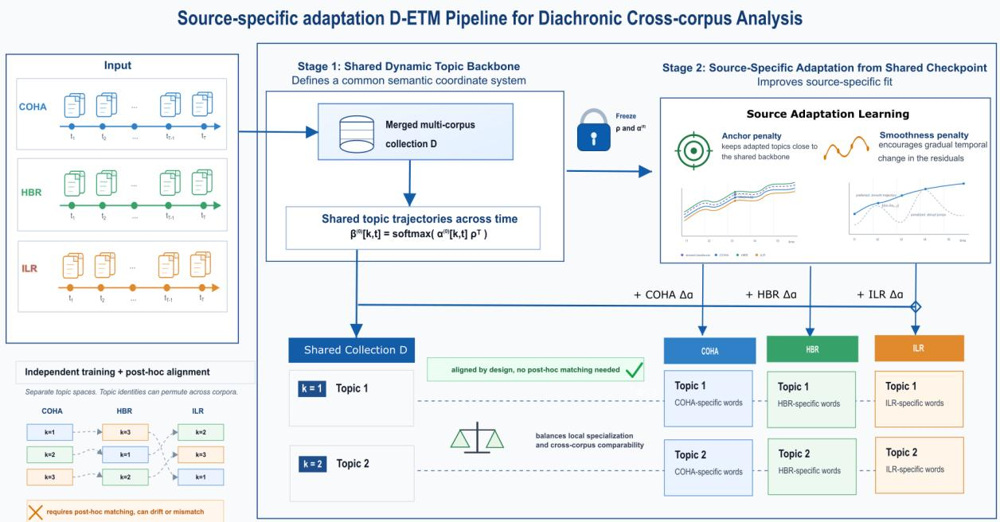
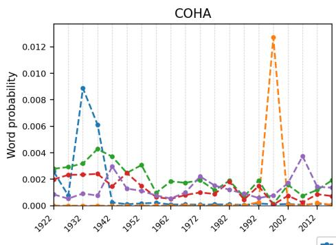
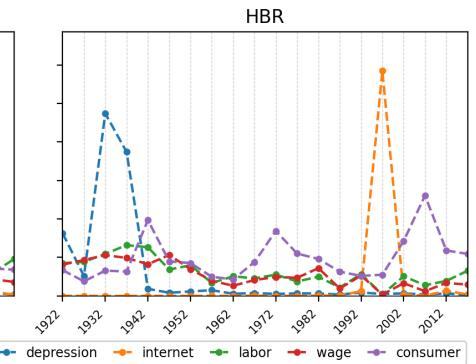
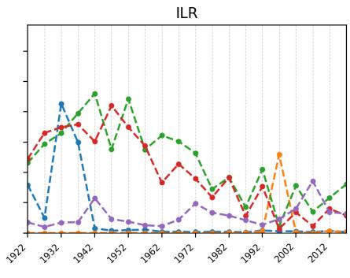
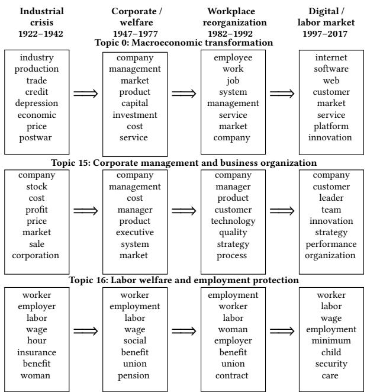

# Dynamic Topic Modeling for Cross-Corpus Temporal Analysis

Ruoxuan Li

Columbia University

New York, NY, USA

rl3403@columbia.edu

Bruce Kogut

Department of Sociology and Columbia Business School

Columbia University

New York, NY, USA

bk2263@columbia.edu

## Abstract

Dynamic Embedded Topic Models (D-ETM) provide an interpretable framework for modeling temporal semantic evolution, but cross- corpus comparison remains dificult because topics are often learned independently and aligned only after training, a process that does not guarantee stable topic correspondence across corpora and time. To address this problem, we propose a D-ETM framework that first learns a common dynamic topic space over a merged multi-corpus collection, which we call the shared backbone, then introduces corpus-specific residual adaptation around the frozen backbone without creating separate latent topic spaces. This design preserves a shared topic index for cross-corpus comparison while allowing each corpus to specialize lexically. We evaluate the framework on three temporally structured corpora spanning 97 years: the Cor-pus of Historical American English, Harvard Business Review, and International Labour Review. Residual adaptation improves corpus- specific fit relative to the shared backbone while preserving the same-index cross-corpus topic trajectories, achieving substantially stronger alignment than full fine-tuning from the same backbone, with 97.5±0.7% versus 17.9±1.1% trajectory Retrieval@1, as well as stronger alignment than independent training with post-hoc Hun-garian matching. These results suggest that incorporating topic alignment into the model can support more stable over-time cross- corpus comparisons while retaining corpus-specific lexical variation.

## CCS Concepts

• Computing methodologies → Topic modeling; • Information systems → Document topic models; Document collection models.

## Keywords

Cross-corpus analysis, Dynamic topic modeling, Diachronic textanalysis, Topic alignment

## ACM Reference Format:

Ruoxuan Li and Bruce Kogut. 2026. Dynamic Topic Modeling for Cross- Corpus Temporal Analysis. In Proceedings ofthe 35th ACM International Conference on Information andKnowledge Management(CIKM’26), November 7–11, 2026, Rome, Italy. ACM, New York, NY, USA, 12 pages. https://doi.org/ 10.1145/3799682.3841048

## 1 Introduction

Computational analysis of large-scale text collections has become a well-established practice in social science, where topic models are widely used to discover and interpret latent thematic patterns in textual corpora [16, 17, 26, 40, 43, 45]. Latent Dirichlet Allocation (LDA) provides a foundational probabilistic framework by representing documents as mixtures of latent topics, where each topic is a distribution over words [4]. For over-time text analysis, Dynamic Topic Models (DTM) extend this framework to sequential corpora by allowing topic-word distributions to evolve over time [3]. More recent neural topic models improve topic representations by using distributed word and topic embeddings. The Dynamic Embedded Topic Model (D-ETM) represents time-specific topic-word distributions through word and topic embeddings and learns smooth topic trajectories under a random-walk prior [12]. These trajectories make D-ETM attractive for historical and social-science text analysis, where researchers often need interpretable themes that can be traced over long periods and related to social, political, or economic context [17, 42, 43].

Although D-ETM is well suited for modeling temporal semantic evolution within a single corpus, it introduces additional complexity in cross-corpus analysis. A common approach for comparing multiple corpora is to model each corpus separately and then align the resulting topics post hoc [1, 5, 30]. However, post-hoc topic alignment is non-trivial: independently trained topic models do not guarantee that topic indices correspond across runs or corpora. Even two equivalent topic models can assign the same semantic topic to diferent indices, so topic comparison requires an explicit alignment procedure [51]. Prior work on topic model stability has therefore treated alignment as a prerequisite for comparing topic models, often relying on assignment-based procedures such as the Hungarian algorithm and similarity or divergence measures over topic-word distributions [31]. Such post-hoc alignment procedures become more dificult in over-time cross-corpus analysis using D-ETM, where the learned topic trajectories must remain identifiable across both corpora and time. A previous study on cross-corpus topic trends notes that such settings require identifying shared topics and their temporal evolution, while also acknowledging that there is no guarantee that matching topics can be found ex post [5].

Given these challenges, we propose a shared-backbone D-ETM framework1 for over-time cross-corpus analysis. Instead of training separate dynamic topic models and aligning the resulting topics after training, our proposed framework learns a common semantic coordinate system across corpora and time over the merged multi-corpus collection, which we define as the shared dynamic topic backbone. We then introduce source-specific residual adaptation around the shared backbone, allowing each corpus to specialize while preserving same-index topic correspondence across corpora. In this way, the framework treats cross-corpus comparability as a modeling assumption rather than as a post-hoc alignment problem. The contributions of our work are as follows:

(1) We propose a shared-backbone D-ETM framework for over-time cross-corpus topic analysis, enabling corpus-specific adaptation while preserving aligned topic identities across corpora.

(2) We evaluate the trade-of between source-specific fit and crosscorpus alignment under independent training, source-specific adap- tation, and full fine-tuning.

(3) We provide qualitative case studies showing how aligned topic trajectories support comparative over-time interpretation across heterogeneous corpora.

## 2 Related Work

## 2.1 Dynamic Topic Modeling

Dynamic topic modeling studies how latent themes evolve over time in temporally ordered document collections.2 LDA provides the foundation for probabilistic topic modeling by representing each document as a mixture of latent to ics, each of which is a distribution over vocabulary words [4]. However, LDA assumes a static topic set and cannot capture how topics shift over time. DTM addresses this limitation by allowing topic-word distributions to evolve across discrete time steps via a state-space model [3]. Sub sequent work has explored alternative temporal representations. Topics over Time replaces discrete time slices with continuous timestamps to model topical trends [48], while continuous-time DTM uses Brownian motion to capture topic evolution over se- quentially ordered documents [47]. Recent neural extensions im-prove topic representations and enable more scalable inference in dynamic topic models. D-ETM combines dynamic topic modeling with embedding-based topic representations. It parameterizes time-specific topic-word distributions through topic and word embeddings and encourages smooth topic trajectories through a random-walk prior over topic embeddings [12]. This embedding space view is also central to ETM, which represents topics and words in a shared vector space and helps topic models handle large and heavy-tailed vocabularies more efectively [13]. More recent work further enriches dynamic topic modeling by capturing dependencies among co-evolving topics. For instance, DSNTM applies self-attention across topics to model branching and merging be- haviors over time [34]. Despite these advances, existing methods primarily focus on modeling topic evolution within a single tem-porally ordered corpus, not on preserving topic correspondence across multiple corpora.

## 2.2 Cross-Corpus Topic Alignment

Cross-corpus topic alignment aims to establish correspondences between topics learned from diferent document collections. One common strategy is to train topic models independently on each corpus and align the resulting topics in a post-hoc step. In cross-corpus topic trend analysis, for example, topics are first identified within each corpus, then matched across corpora, and finally com- pared through their temporal trajectories [5]. Bidirectional Topic Matching (BTM) adopts a similar post-hoc strategy, where it trains separate topic models on two corpora and applies each model to the other corpus to identify shared and corpus-specific topics [1]. Other methods use topic-level similarity or divergence measures to compare topics across multiple corpora without joint training [30]. While these approaches make cross-corpus comparison possible, the resulting correspondences depend on the chosen topic repre- sentation, similarity measure, and matching criterion. This problem becomes more dificult in dynamic topic models, where alignment must hold not only between static topic-word distributions, but across evolving topic trajectories over time.

Another line of work builds topic alignment directly into the modeling process. Polylingual topic models use comparable docu- ment tuples to learn topics that are aligned across languages [32]. Subsequent multilingual topic models relax the requirement for closely parallel corpora by learning soft, weighted links between cross-lingual topics instead ofenforcing strict one-to-one correspondence [50]. Cross-collection topic models take a similar approach, jointly learning shared and collection-specific topic structure across multiple document collections [37]. While these methods show that topic alignment can be incorporated into the modeling process, they are not designed for dynamic topic trajectories over a shared temporal span. Our work extends this modeling-oriented view of alignment to the D-ETM setting, where topic identity must remain comparable across both corpora and time.

## 2.3 Topic Model Evaluation

Topic model evaluation typically combines predictive and inter-pretable metrics. Predictive measures such as held-out likelihood and perplexity assess how well a model explains unseen documents [46], but better predictive fit does not necessarily yield more interpretable topics [8]. As a result, topic modeling work commonly reports semantic coherence measures such as normalized pointwise mutual information (NPMI), which evaluate whether high-probability topic words tend to co-occur more often than expected by chance [28, 33, 36]. In social-science applications, coherence is often considered alongside exclusivity, since coherent topics may still be dominated by common vocabulary and fail to distinguish one topic from another [42, 43]; neural topic models similarly report coherence, diversity, and topic quality to assess interpretability and redundancy [13]. For dynamic topic models, evaluation must also account for temporal consistency, since year-wise topic quality can remain stable even when topic transitions are disrupted [24].

However, these metrics assess topic quality after topic identities have already been defined within a model. They do not directly test whether topic indices provide comparable semantic coordinates across corpora. Independently trained models may produce coher- ent and temporally smooth topics within each corpus while still failing to preserve same-index topic correspondence across corpora and time. We therefore introduce trajectory-level alignment metrics to evaluate whether topic identities remain comparable in the cross-corpus dynamic setting.

  
Figure 1: Overview of the two-stage shared-backbone framework: merged-corpus backbone training followed by source-specific residual adaptation.

## 3 Preliminaries

## 3.1 Problem Definition

Inspired by prior research on semantics in social science, we define the problem of dynamic topic modeling over multiple corpora that difer in domain and style but are aligned over a shared temporal span. Let $C = \{ c _ { 1 } , c _ { 2 } , \ldots , c _ { S } \}$ denote a collection of � corpora, and let the shared temporal span be indexed by $t \in \{ 1 , \ldots , T \}$ , where each document is associated with both a source label $s \in \{ 1 , . . . , S \}$ and a time index �. Our goal is to model topic evolution over time while enabling reliable comparison of thematic structure across cor- pora, where an inherited topic index remains closer across sources than alternative topic indices after source-specific adaptation, as evaluated by the trajectory-alignment metrics in Section 5.3.

For a fixed number of topics �, we seek to learn topic trajectories indexed by $k \in \{ 1 , \ldots , K \}$ . In a standard single-corpus dynamic topic model, topic index � identifies an evolving topic trajectory within one corpus. In the cross-corpus setting, however, we want topic identity to be preserved across both time and source, where topic � in corpus $c _ { i }$ and topic � in corpus $c _ { j }$ ideally refer to the same thematic context while allowing each topic to be expressed through source-specific vocabulary.

## 3.2 Dynamic Embedded Topic Model

The Dynamic Embedded Topic Model (D-ETM) represents topics in a continuous embedding space and models their evolution over ordered time slices [12]. Let � denote the vocabulary size, � the number of topics, � the embedding dimension, and � the number of time slices. D-ETM maintains a word embedding matrix $\boldsymbol { \rho } \in \mathbb { R } ^ { V \times L }$ where each row corresponds to the embedding of a vocabulary term. For each topic $k \in \{ 1 , \ldots , K \}$ and time slice $t \in \{ 1 , \ldots , T \}$ the model learns a time-specific topic embedding $\boldsymbol { \alpha _ { k , t } } \in \mathbb { R } ^ { L }$

The sequence $\{ \alpha _ { k , t } \} _ { t = 1 } ^ { T }$ defines the temporal trajectory of topic �. D-ETM encourages this trajectory to evolve smoothly by placing a random-walk prior over the topic embeddings:

$$
\alpha _ { k , t } \ | \ \alpha _ { k , t - 1 } \sim N ( \alpha _ { k , t - 1 } , \sigma _ { \alpha } ^ { 2 } I ) , t = 2 , . . . , T .
$$

Given $\alpha _ { k , t }$ and the shared word embedding matrix $\rho ,$ the topic-word distribution for topic � at time � is

$$
\beta _ { k , t } = \operatorname { s o f t m a x } ( \alpha _ { k , t } \rho ^ { \top } ) ,
$$

where $\beta _ { k , t } \in \Delta ^ { V - 1 }$ is a probability distribution over the vocabulary.

## 4 Methodology

## 4.1 Proposed Framework Architecture

Figure 1 summarizes the end-to-end structure of the framework, including Stage 1 backbone training and Stage 2 source adaptation.

4.1.1 Shared Dynamic Topic Backbone. In the first stage, we train a single D-ETM on the merged multi-corpus collection. Let $\mathcal { D } =$ $\{ ( x _ { d } , s _ { d } , t _ { d } ) \} _ { d = 1 } ^ { N }$ denote the merged multi-corpus collection, where document �� has source label $s _ { d } \in \{ 1 , . . . , S \}$ and time index $t _ { d } \in$ $\{ 1 , . . . , T \}$ . The source label records which corpus the document comes from. Let $N _ { s }$ denote the number of documents from source �. To prevent larger corpora from dominating the shared backbone, we assign each document from source � a source-aware weight

$$
w _ { s } = \frac { N } { S N _ { s } } .
$$

This weighting gives each corpus equal total weight in the Stage 1 objective. We then maximize the weighted D-ETM objective

$$
\mathcal { L } _ { \mathrm { b a c k b o n e } } = \sum _ { d = 1 } ^ { N } w _ { s _ { d } } \mathcal { L } _ { \mathrm { D - E T M } } ( x _ { d } , t _ { d } ) ,
$$

where $\mathcal { L } _ { \mathrm { D - E T M } } ( x _ { d } , t _ { d } )$ denotes the document-level D-ETM evidence lower bound for document $x _ { d }$ observed at time $t _ { d }$

Using the D-ETM formulation introduced above, Stage 1 learns a shared dynamic topic trajectory for each topic:

$$
\alpha _ { k , 1 : T } ^ { ( 0 ) } = \{ \alpha _ { k , 1 } ^ { ( 0 ) } , \dots , \alpha _ { k , T } ^ { ( 0 ) } \} ,
$$

where $\boldsymbol { \alpha } _ { k , t } ^ { ( 0 ) } \in \mathbb { R } ^ { L }$ represents the backbone embedding of topic � at time slice �. The superscript (0) indicates that these are shared backbone parameters, before any source-specific adaptation is in troduced. As in D-ETM, these topic embeddings evolve smoothly over time under the random-walk prior.

Given a shared word embedding matrix $\rho ~ \in ~ \mathbb { R } ^ { V \times L }$ over the merged vocabulary, the corresponding backbone topic-word distri- bution is

$$
\beta _ { k , t } ^ { ( 0 ) } = \operatorname { s o f t m a x } ( \alpha _ { k , t } ^ { ( 0 ) } \rho ^ { \top } ) ,
$$

where $\beta _ { k , t } ^ { ( 0 ) } \in \Delta ^ { V - 1 }$ gives a probability distribution over the merged vocabulary. For a document $x _ { d }$ observed at time $t _ { d } ,$ , the decoder uses the time-specific backbone topics $\{ \beta _ { 1 , t _ { d } } ^ { ( 0 ) } , \dots , \beta _ { K , t _ { d } } ^ { ( 0 ) } \}$

The purpose of Stage 1 is to learn a common semantic coordi-nate system across the merged collection before any corpus-specific residual adaptation is introduced. Since all corpora share the same dynamic topic trajectories $\alpha _ { k , 1 : T } ^ { ( 0 ) } ,$ , word embedding matrix $\rho ,$ and backbone topic-word distributions $\beta _ { k , t } ^ { ( 0 ) }$ , topic index � is defined with respect to a common dynamic backbone rather than separately within each corpus. This makes same-index comparison meaning ful at the backbone level. Stage 2 then introduces source-specific residuals as controlled deviations from this shared topic coordinate.

4.1.2 Source-Specific Adaptation. To preserve cross-corpus comparability while allowing corpus-local specialization, Stage 2 models each source as a residual perturbation around the shared dynamic backbone. For each source � $\in \{ 1 , \ldots , S \}$ , topic $k \in \{ 1 , \ldots , K \}$ , and time slice $t \in \{ 1 , . . . , T \}$ , we introduce a source-specific residual topic ofset $\Delta \alpha _ { s , k , t } \in \mathbb { R } ^ { L }$ . The source-adapted topic embedding is therefore defined as

$$
\tilde { \alpha } _ { s , k , t } = \alpha _ { k , t } ^ { ( 0 ) } + \Delta \alpha _ { s , k , t } ,
$$

where $\alpha _ { k , t } ^ { ( 0 ) }$ is the shared backbone topic embedding learned in Stage 1. Given the shared word embedding matrix $\rho ,$ the source-specific topic-word distribution is

$$
\begin{array} { r } { \beta _ { k , t } ^ { ( s ) } = \mathrm { s o f t m a x } ( \tilde { \alpha } _ { s , k , t } \rho ^ { \top } ) = \mathrm { s o f t m a x } \big ( ( \alpha _ { k , t } ^ { ( 0 ) } + \Delta \alpha _ { s , k , t } ) \rho ^ { \top } \big ) . } \end{array}
$$

The residual-adaptation design is conceptually related to parameter-eficient adaptation, where a shared backbone is kept fixed while a small number of task- or domain-specific parameters are learned [20, 21]. In our setting, the learnable residuals $\Delta \alpha _ { s , k , t }$ model corpus- specific drift around a shared D-ETM topic trajectory. This allows each corpus to adjust the lexical realization of a shared topic while preserving the common topic coordinate system needed for diachronic cross-corpus comparison.

We regularize the residual ofsets in two complementary ways. The anchor penalty controls the overall magnitude ofsource-specific drift by keeping $\Delta \alpha _ { s , k , t }$ close to the shared backbone:

$$
\mathcal { L } _ { \mathrm { a n c h o r } } = \lambda _ { \mathrm { a n c h o r } } \sum _ { s = 1 } ^ { S } \sum _ { k = 1 } ^ { K } \sum _ { t = 1 } ^ { T } \left\| \Delta \alpha _ { s , k , t } \right\| _ { 2 } ^ { 2 } .
$$

A larger $\lambda _ { \mathrm { a n c h o r } }$ therefore keeps the source-adapted topic embedding $\tilde { \alpha } _ { s , k , t }$ closer to the shared trajectory $\alpha _ { k , t } ^ { ( 0 ) }$ , preserving cross-corpus topic identity more strongly.

The temporal smoothness penalty controls how abruptly the source-specific drift changes over time:

$$
\mathcal { L } _ { \mathrm { s m o o t h } } = \lambda _ { \mathrm { s m o o t h } } \sum _ { s = 1 } ^ { S } \sum _ { k = 1 } ^ { K } \sum _ { t = 2 } ^ { T } \left. \Delta \alpha _ { s , k , t } - \Delta \alpha _ { s , k , t - 1 } \right. _ { 2 } ^ { 2 } .
$$

A larger $\lambda _ { \mathrm { s m o o t h } }$ discourages sharp changes in the residual ofsets between adjacent time slices, encouraging corpus-specific special- ization to evolve smoothly over the temporal trajectory.

During Stage 2, the shared backbone parameters $\alpha _ { k , t } ^ { ( 0 ) }$ and $\rho$ are frozen, and the residuals $\Delta \alpha _ { s , k , t }$ are initialized at zero so that each source be ins from the shared backbone with $\tilde { \alpha } _ { s , k , t } = \alpha _ { k , t } ^ { ( 0 ) }$ . For a document $x _ { d }$ from source $s _ { d }$ and time slice $t _ { d } ,$ reconstruction is evaluated using the source-specific topic-word distributions $\{ \beta _ { k , t _ { d } } ^ { ( s _ { d } ) } \} _ { k = 1 } ^ { K } .$ Gradients from the reconstruction loss therefore update the cor- responding residual ofsets $\Delta \alpha _ { s _ { d } , k , t _ { d } }$ through the softmax parame- terization, while the shared backbone remains fixed. The trainable parameters are the residual ofsets and the amortized inference net- works. We minimize an adaptation loss consisting of the reconstruction negative log-likelihood, a warmup-scheduled Kullback–Leibler (KL) divergence term that regularizes the inferred document-topic mixture $q _ { \phi } ( \theta _ { d } \mid x _ { d } , \eta _ { t _ { d } } )$ toward its prior $p ( \theta _ { d } \mid \eta _ { t _ { d } } )$ , and the two residual regularization terms:

$$
\begin{array} { r l } & { \mathcal { T } _ { \mathrm { a d a p t } } = \displaystyle \sum _ { d = 1 } ^ { N } w _ { d } [ - \mathbb { E } _ { q _ { \phi } ( \theta _ { d } \mid x _ { d } , \eta _ { t _ { d } } ) } \log p ( x _ { d } \mid \theta _ { d } , \beta _ { : , t _ { d } } ^ { ( s _ { d } ) } )  } \\ & { \qquad \quad +  \omega _ { \theta } ( e ) \mathrm { K L } \big ( q _ { \phi } ( \theta _ { d } \mid x _ { d } , \eta _ { t _ { d } } ) \mid \big \Vert \hat { p } ( \theta _ { d } \mid \eta _ { t _ { d } } ) \big ) ] } \\ & { \qquad \quad +  \mathcal { L } _ { \mathrm { a n c h o r } } + \mathcal { L } _ { \mathrm { s m o o t h } } , } \end{array}
$$

where $\boldsymbol { w } _ { d } = 1 / ( S | \mathcal { D } _ { s _ { d } } | )$ is a source-aware document weight, � de- notes the adaptation epoch, and $\omega _ { \theta } ( e )$ is a linear warmup schedule capped at ��:

$$
\omega _ { \theta } ( e ) = \operatorname* { m i n } \left( \frac { e } { E _ { \mathrm { w a r m } } } , 1 \right) \kappa _ { \theta } .
$$

## 5 Experiments

## 5.1 Datasets

We conduct experiments on three temporally structured corpora: the Harvard Business Review (HBR) [19], the International Labour Review (ILR) [22], and the Corpus of Historical American English (COHA) [10]. Prior social-science research has used HBR and ILR to compare business and labor discourse through static LDA [14]. 3 Our study continues the use of these two datasets, while intro- ducing COHA as a third, general-domain point of triangulation. Together, the three corpora cover overlapping historical periods but represent distinct linguistic domains: HBR captures manage- rial and business discourse, ILR captures labor, employment, and social-policy discourse, and COHA provides a broader baseline for historical American English. This combination allows us to test whether a shared dynamic topic space can capture common temporal structures while preserving corpus-specific specialization.

Table 1: Dataset statistics after preprocessing. Counts refer to 500-token chunks in the merged-vocabulary configuration.
<table><tr><td>Corpus</td><td>Train</td><td>Valid</td><td>Test</td><td>Total</td></tr><tr><td>COHA (Mag. /News, ρ=0.3)</td><td>32,460</td><td>1,999</td><td>6,042</td><td>40,501</td></tr><tr><td>HBR</td><td>33,513</td><td>1,777</td><td>6,358</td><td>41,648</td></tr><tr><td>ILR</td><td>32,615</td><td>2,169</td><td>5,821</td><td>40,605</td></tr><tr><td>Merged D</td><td>98,588</td><td>5,945</td><td>18,221</td><td>122,754</td></tr></table>

$\overbrace { T = 2 0 } ^ { }$ five-year bins covering 1922–2019; shared vocabulary $\overline { { | V | = 1 9 , 4 3 3 \mathrm { ~ w i t h } } }$ min\_df=100 and max\_df=0.6.

All corpora are restricted to the period 1922–2019 and grouped into non-overlapping five-year bins, yielding � = 20 time slices. To make COHA more comparable to the periodical structure of HBR and ILR, we restrict COHA to its Magazine and News genres. Since COHA remains much larger than the other two corpora after this restriction, we downsample COHA chunks within each year using a fixed sampling rate $\rho _ { \mathrm { C O H A } } = 0 . 3$ , bringing its efective corpus size close to HBR and ILR while preserving its temporal distribution. All documents are lowercased, cleaned, tokenized, and segmented into non-overlapping chunks of at most 500 tokens. Each chunk inherits the source label and publication year of its original docu- ment. We construct a shared vocabulary from the training split of the merged corpus using a global document-frequency filter with mi $ { \mathsf { n \_ d f } } = 1 0 0$ and max $\_ { \mathrm { d } } \mathsf { f } = 0 . 6 .$ These thresholds remove extremely rare and highly ubiquitous terms from the shared vocabulary and are held fixed across conditions. Documents with fewer than 50 post-vocabulary tokens are removed. The final shared vocabulary contains 19,433 words. Train, validation, and test splits are created at the original-document level, so that chunks from the same doc ument never appear in diferent splits. We use stratified shufling over the joint (year, source) label and allocate 80% of documents to training, 5% to validation, and 15% to test, as shown in Table 1.

## 5.2 Setup

We evaluate five training conditions designed to separate the ef-fects of vocabulary choice, joint multi-corpus training, residual adaptation, and full fine-tuning, summarized in Table 2.

5.2.1 Training protocol. The Stage 1 conditions, Ind-CS, Ind-MV, and SB-Joint, use the same core D-ETM configuration unless oth erwise noted. We set the number of topics to � = 20 and use nonoverlapping five-year temporal bins as a stable common operating point for comparing training regimes across corpora. This choice is driven by our goal to evaluate whether topics learned across the three corpora remain comparable under the same modeling conditions. In preliminary experiments with independently trained D-ETM models on our corpora, larger topic counts produced more repeated or weakly interpretable topics, especially for HBR and ILR. Finer temporal bins also made trajectories less stable because some source-year slices contain sparse or uneven data. Since the goal of this paper is to evaluate built-in alignment of dynamic topic trajectories across corpora, we fix both topic count and temporal granularity across all models. We use � = 20 and five-year bins as a practical common setting that balances interpretability and cross-corpu.

Table 2: Training and comparison conditions.
<table><tr><td>Condition</td><td>Description</td></tr><tr><td>Ind-CS</td><td>Independently train one D-ETM per corpus using that corpus&#x27;s own active vocabulary. This represents the standard independent-training setting, where cross-</td></tr><tr><td>Ind-MV</td><td>corpus comparison requires post-hoc topic matching. Independently train one D-ETM per corpus using the shared merged vocabulary. This controls for vocab- ulary differences while keeping the training process</td></tr><tr><td>SB-Joint</td><td>corpus-specific. Train a single D-ETM on the merged multi-corpus collection. This model learns the shared dynamic topic backbone used to define common topic indices across</td></tr><tr><td>SB-RA</td><td>corpora. Initialize from SB-Joint, freeze the shared backbone, and learn source-specific residual topic offsets. This is the proposed method for corpus-local lexical special-</td></tr><tr><td>SB-FT</td><td>ization while preserving shared topic identities. Initialize from SB-Joint and fully fine-tune all model parameters separately on each corpus. This provides a less constrained adaptation baseline that tests what happens when the shared backbone is not preserved.</td></tr></table>

Optimization uses learning rate $5 \times 1 0 ^ { - 5 }$ for 80 epochs. We set the D-ETM transition variance to $\delta = 0 . 0 1$ , use KL\_ALPHA\_SCALE = $1 0 ^ { - 6 }$ to downweight the KL term associated with the random-walk prior over dynamic topic embeddings, and apply a 50-epoch KL warmup with maximum weight KL\_WEIGHT $\mathsf { M A X } = 0 . 9 .$ These KL settings were chosen empirically because, without suficient down- weighting and warmup, the trajectory KL term dominated the reconstruction objective early in training and limited the model’s ability to learn coherent topic-word structure. Ind-CS and Ind-MV are independently trained corpus-specific baselines, while SB-Joint is trained on the merged multi-corpus collection and provides the shared-backbone checkpoint used in Stage 2.

The Stage 2 conditions, SB-RA and SB-FT, are initialized from the SB-Joint checkpoint. In SB-RA, the shared word embedding matrix � and shared backbone topic embeddings $\alpha _ { k , t } ^ { ( 0 ) }$ are frozen, while the source-specific residuals $\Delta \alpha _ { s , k , t }$ and inference networks remain trainable. The residuals are initialized at zero and optimized for 20 adaptation epochs with learning rate $1 \times 1 0 ^ { - 5 }$ . During adaptation, we retain only the document-topic KL term and use a shorter warmup schedule, with ADAPT\_WARMUP\_EPOCHS = 5 and maximum KL weight ADAPT\_KL\_THETA\_MAX = 0.3.

5.2.2 Post-hoc Topic Matching Baseline. For independently trained models, topic indices are arbitrary and cannot be compared directly across corpora. We therefore use post-hoc topic matching as the alignment baseline for Ind-CS and Ind-MV, following prior crosscorpus topic comparison work [5]. To match our trajectory-level alignment evaluation, we perform post-hoc matching over full topic trajectories rather than separately within each time slice.

For source � and topic $k ,$ we represent the full topic trajectory as a probability distribution over word–time pairs:

$$
P _ { s , k } ( w , t ) = \frac { 1 } { T } \beta _ { k , t } ^ { ( s ) } ( w ) .
$$

For each corpus pair $( s , s ^ { \prime } )$ , we then construct a trajectory-level cost matrix using Jensen–Shannon divergence (JSD), computed with base-2 logarithms [29]:

$$
C _ { k , \ell } ^ { ( s , s ^ { \prime } ) } = \mathrm { J S D } \left( P _ { s , k } , P _ { s ^ { \prime } , \ell } \right) .
$$

Finally, we apply the Hungarian algorithm to find the one-to-one topic matching that minimizes total trajectory divergence [27]:

$$
\pi ^ { \star } = \arg \operatorname* { m i n } _ { \pi } \sum _ { k = 1 } ^ { K } C _ { k , \pi ( k ) } ^ { ( s , s ^ { \prime } ) } .
$$

For Ind-MV, trajectory JSD is computed directly in its vocabulary space. For Ind-CS, we restrict topic-word distributions to the vocabulary intersection and renormalize them before computing JSD, giving the independently trained models a common support for post-hoc comparison.

## 5.3 Evaluation Metrics

We evaluate all training conditions along three dimensions: pre-dictive fit, full-reference topic quality, and cross-corpus trajectory alignment. Predictive fit and topic quality follow standard topic modeling and D-ETM evaluation practice, while the trajectory alignment metrics are designed for the cross-corpus dynamic setting.

5.3.1 Predictive Fit and Topic Quality. We report held-out perplexity on the shared merged test split for all five training conditions, following standard topic modeling evaluation practice [3, 4, 12]. We use perplexity mainly to assess whether the proposed adaptation remains in a comparable predictive range. Following the D-ETM evaluation protocol [12], we also report topic diversity (TD), measured as the proportion of unique words among the top topic words, pairwise NPMI-based topic coherence (TC), computed over high-probability topic words with −1 assigned to word pairs with zero document co-occurrence, and topic quality (TQ), computed as $\mathrm { T D } \times \mathrm { T C }$

5.3.2 Cross-Corpus Trajectory Alignment. Our main alignment metrics compare entire topic trajectories across corpora. For source � and topic �, we define a trajectory distribution over word–time pairs:

$$
P _ { s , k } ( w , t ) = \frac { 1 } { T } \beta _ { k , t } ^ { ( s ) } ( w ) .
$$

This distribution gives equal weight to each time bin and forms a probability vector over the $T \times V$ word–time space. For each source pair $( s , s ^ { \prime } )$ , we construct a trajectory-level JSD matrix:

$$
M _ { k \ell } ^ { \left( s , s ^ { \prime } \right) } = \mathrm { J S D } \left( P _ { s , k } , P _ { s ^ { \prime } , \ell } \right) ,
$$

Each entry measures the distance between the full trajectory of topic � in source � and topic ℓ in source $s ^ { \prime } .$ . Based on this trajectorylevel JSD matrix, we define four complementary trajectory-level alignment metrics based on ${ \cal M } ^ { ( s , s ^ { \prime } ) }$ . It is worth noting that, since all four metrics are derived from the same trajectory-level JSD matrix

$M ^ { ( s , s ^ { \prime } ) }$ , they should not be interpreted as statistically independent measures of alignment quality. Instead, they capture complementary aspects of cross-corpus trajectory alignment.

1) Same-index trajectory JSD. This metric measures the average trajectory distance between topics with the same inherited index. Lower values indicate that same-index topic trajectories remain closer across sources:

$$
\mathrm { S a m e J S D _ { t r a j } } ( s , s ^ { \prime } ) = \frac { 1 } { K } \sum _ { k = 1 } ^ { K } M _ { k k } ^ { ( s , s ^ { \prime } ) } .
$$

2) Trajectory margin. This metric measures whether each sameindex trajectory is closer than its nearest wrong-index alternative. Higher positive values indicate stronger separation between the same-index trajectory and the nearest wrong-index competitor:

$$
\mathrm { M a r g i n } _ { \mathrm { t r a j } } ( s , s ^ { \prime } ) = \frac { 1 } { K } \sum _ { k = 1 } ^ { K } \left[ \operatorname* { m i n } _ { \ell \neq k } { \cal M } _ { k \ell } ^ { ( s , s ^ { \prime } ) } - { \cal M } _ { k k } ^ { ( s , s ^ { \prime } ) } \right] .
$$

3) Trajectory Retrieval@1. This metric measures how often the nearest topic trajectory in the other source has the same index. Higher values indicate that the inherited topic index remains a more reliable cross-corpus semantic coordinate:

$$
{ \mathrm { R } } @ 1 _ { { \mathrm { t r a j } } } ( s , s ^ { \prime } ) = \frac { 1 } { K } \sum _ { k = 1 } ^ { K } \mathbb { K } \left[ k = \arg \operatorname* { m i n } _ { \ell } M _ { k \ell } ^ { ( s , s ^ { \prime } ) } \right] .
$$

4) Hungarian-matched trajectory JSD. This metric reports the minimum post-hoc one-to-one matching cost under the same trajectory JSD matrix ${ \cal M } ^ { ( s , s ^ { \prime } ) }$ . Lower values indicate that a lower-cost post-hoc alignment can be found, but this metric does not test whether the original shared topic index is preserved:

$$
\mathrm { H u n g J S D _ { t r a j } } ( s , s ^ { \prime } ) = \frac { 1 } { K } \sum _ { k = 1 } ^ { K } M _ { k , \pi ^ { \star } ( k ) } ^ { ( s , s ^ { \prime } ) } ,
$$

where $\pi ^ { \star }$ is the minimum-cost one-to-one topic matching found by the Hungarian algorithm.

## 5.4 Experiment Analysis

5.4.1 Comparison ofPredictive Fit and Topic Quality. We first eval-uate whether the shared-backbone framework provides reasonable predictive fit and topic quality before examining cross-corpus align-ment. Table 3 reports held-out perplexity across all experimental conditions on the shared merged test split. SB-FT achieves the low-est perplexity on all three sources. On COHA, Ind-CS and Ind-MV obtain perplexities both substantially lower than SB-RA, indicating a predictive-fit cost for constrained residual adaptation on this corpus. On HBR and ILR, however, SB-RA improves over both independently trained baselines. Across all three sources, SB-RA also improves over SB-Joint. These results suggest that residual adaptation recovers meaningful source-specific fit from the shared backbone and remains broadly comparable to independently trained models, although full fine-tuning remains strongest in predictive performance.

Table 4 reports full-reference topic quality. SB-Joint obtains the highest NPMI-based coherence when evaluated against the merged reference corpus. Among source-specific models, SB-FT achieves the strongest topic quality across the three sources, consistent with its stronger source-specific predictive fit. SB-RA improves NPMIbased TC and TQ over both independent baselines on COHA and HBR, but yields negative NPMI-based coherence on ILR.

Table 3: Held-out perplexity across experimental conditions on the shared merged test split. Lower values are better. Each row is evaluated on the same held-out documents within the corresponding source.
<table><tr><td>Source</td><td> $n _ { \mathrm { t e s t } }$ </td><td>Ind-CS</td><td>Ind-MV</td><td>SB-Joint</td><td>SB-RA</td><td>SB-FT</td></tr><tr><td>COHA</td><td>6,042</td><td>6,446.75</td><td>6,458.27</td><td>9,819.13</td><td>7,896.94</td><td>6,364.36</td></tr><tr><td>HBR</td><td>6,358</td><td>2,479.74</td><td>2,530.01</td><td>2,570.88</td><td>2,396.78</td><td>2,127.39</td></tr><tr><td>ILR</td><td>5,821</td><td>1,722.68</td><td>1,701.09</td><td>1,561.29</td><td>1,486.90</td><td>1,320.03</td></tr></table>

Table 4: Full-reference topic quality across experimental conditions.
<table><tr><td>Setup</td><td>TD</td><td>TC</td><td> $\mathbf { C } _ { V }$ </td><td>TQ</td></tr><tr><td>Ind-CS-COHA</td><td>0.5843</td><td>0.0551</td><td>0.2300</td><td>0.0322</td></tr><tr><td>Ind-CS-HBR</td><td>0.5304</td><td>0.0460</td><td>0.1968</td><td>0.0244</td></tr><tr><td>Ind-CS-ILR</td><td>0.4494</td><td>0.0350</td><td>0.2172</td><td>0.0157</td></tr><tr><td>Ind-MV-COHA</td><td>0.5810</td><td>0.0558</td><td>0.2229</td><td>0.0324</td></tr><tr><td>Ind-MV-HBR</td><td>0.5015</td><td>0.0413</td><td>0.1975</td><td>0.0207</td></tr><tr><td>Ind-MV-ILR</td><td>0.4824</td><td>0.0377</td><td>0.2198</td><td>0.0182</td></tr><tr><td>SB-Joint-ALL</td><td>0.4538</td><td>0.1685</td><td>0.3041</td><td>0.0765</td></tr><tr><td>SB-RA-COHA</td><td>0.4611</td><td>0.0946</td><td>0.2536</td><td>0.0436</td></tr><tr><td>SB-RA-HBR</td><td>0.4466</td><td>0.0638</td><td>0.1991</td><td>0.0285</td></tr><tr><td>SB-RA-ILR</td><td>0.4335</td><td>-0.0157</td><td>0.2240</td><td>-0.0068</td></tr><tr><td>SB-FT-COHA</td><td>0.5690</td><td>0.1174</td><td>0.3027</td><td>0.0668</td></tr><tr><td>SB-FT-HBR</td><td>0.5660</td><td>0.0979</td><td>0.2357</td><td>0.0554</td></tr><tr><td>SB-FT-ILR</td><td>0.5059</td><td>0.0780</td><td>0.2353</td><td>0.0394</td></tr></table>

We therefore include $\complement _ { V }$ as an additional diagnostic coherence measure [44]. Unlike the pairwise NPMI-based TC used in the D-ETM protocol, $\complement _ { V }$ uses a sliding-window co-occurrence representation and an indirect confirmation measure, making it less directly driven by individual zero co-occurrence word pairs. The $\complement _ { V }$ results provide a more nuanced interpretation of the ILR case: although SB-RA has negative NPMI-based coherence on ILR, its $\complement _ { V }$ coherence remains within the range of the baseline models and is higher than both independent ILR baselines. This suggests that the negative ILR NPMI reflects the sensitivity of pairwise co-occurrence-based TC to sparse word co-occurrence patterns in this corpus, and does not by itself indicate a loss of interpretable topic structure. Overall, SB-RA preserves usable topic quality relative to the independently trained baselines, even though it does not maximize coherence in all source-specific settings.

5.4.2 Cross-Corpus Trajectory Alignment and Ablations. Table 5 reports trajectory-level cross-corpus alignment. For independently trained baselines, topic indices are arbitrary, so same-index metrics are not meaningful. We therefore report only post-hoc Hungarian trajectory JSD for Ind-CS and Ind-MV. Both independent baselines yield substantially higher post-hoc matching costs than SB-RA, indicating that independent training followed by post-hoc matching does not recover strong cross-corpus trajectory correspondence.

For shared-backbone-initialized models, same-index metrics test whether the topic index inherited from SB-Joint remains meaningful after adaptation. The main SB-RA setting achieves the strongest alignment, with same-index and Hungarian-matched trajectory JSD both at $0 . 1 6 9 \pm 0 . 0 0 1$ , a positive margin of $+ 0 . 1 6 6 \pm 0 . 0 0 2$ , and Re- trieval@1 of $9 7 . 5 \pm 0 . 7 \%$ , showing that the inherited topic indices already realize the optimal one-to-one matching.

The ablations show that alignment preservation is driven primarily by the anchor penalty, with anchor-only adaptation performing nearly identically to the full SB-RA model. Temporal smoothness also contributes to alignment preservation, but its efect is weaker and less stable across seeds. Removing both regularizers yields the lowest Retrieval@1 among the SB-RA variants $( 3 3 . 8 \pm 4 . 3 \% )$ , yet still outperforms SB-FT (17.9 ± 1.1%). More broadly, SB-FT achieves substantially weaker inherited topic correspondence than the main SB-RA setting across all alignment metrics, despite its stronger predictive fit and topic quality. This suggests that both the explicit regularization and the fixed-backbone residual parameterization contribute to preserving the shared topic coordinate system.

5.4.3 K-Sensitivity Test and Runtime Analysis. We additionally evaluate sensitivity to the number of topics using $K \in \{ 1 0 , 2 0 , 3 0 \}$ while holding the random seed fixed. As shown in Table 6, the alignment advantage of SB-RA over SB-FT is preserved across all three topic counts. SB-RA maintains substantially lower same-index trajectory JSD and positive trajectory margins at each �, while SB-FT yields negative margins throughout. Retrieval@1 similarly remains substantially higher for SB-RA compared to SB-FT. These results indicate that the relative alignment advantage of residual adaptation is not specific to the default � = 20 configuration.

We further characterize computational cost using the $K = 1 0$ and $K = 3 0$ sensitivity runs, both executed on NVIDIA A100-SXM4- 80GB $\mathrm { G P U s . ^ { 4 } }$ As shown in Table 7, increasing the topic count from � = 10 to � = 30 increases SB-Joint training time and SB-RA adaptation time, while peak allocated GPU memory also increases.

## 5.5 Case Study

The quantitative results show that SB-RA preserves same-index topic trajectories across sources while allowing source-specific adaptation. This preservation is important not only for alignment metrics, but also for qualitative interpretation. In a standard D-ETM, the random-walk prior encourages each topic to evolve as a smooth time-indexed trajectory, and the learned topic-word distributions provide an observable way to inspect this temporal semantic change.

Table 5: Trajectory-level cross-corpus alignment across experimental and ablation conditions. All results are averaged over the three corpus pairs: COHA–HBR, COHA–ILR, and HBR–ILR. Shared-backbone-initialized adaptation conditions (SB-RA and SB-FT) are reported as mean ± standard deviation over four Stage-2 random seeds using the same pretrained SB-Joint backbone. Independently trained baselines are single runs and are evaluated using post-hoc Hungarian matching.
<table><tr><td></td><td></td><td></td><td>Same</td><td>Hung.</td><td></td><td></td></tr><tr><td>Method</td><td> $\lambda _ { \mathbf { a n c h o r } }$ </td><td> $\lambda _ { \mathbf { s m o o t h } }$ </td><td>JSD ↓</td><td>JSD↓</td><td>Margin ↑</td><td>R@1↑</td></tr><tr><td>Ind-CS</td><td></td><td></td><td>1</td><td>0.594</td><td>1</td><td></td></tr><tr><td>Ind-MV</td><td>一</td><td>一</td><td>一</td><td>0.619</td><td>一</td><td>一</td></tr><tr><td>SB-RA</td><td> $1 0 ^ { - 3 }$ </td><td> $1 0 ^ { - 3 }$ </td><td> $\mathbf { 0 . 1 6 9 \pm 0 . 0 0 1 }$ </td><td> $\mathbf { 0 . 1 6 9 \pm 0 . 0 0 1 }$ </td><td> $\mathbf { + 0 . 1 6 6 \pm 0 . 0 0 2 }$ </td><td> $9 7 . 5 \pm 0 . 7 \%$ </td></tr><tr><td>SB-RA</td><td> $3 \times 1 0 ^ { - 4 }$ </td><td> $3 \times 1 0 ^ { - 4 }$ </td><td> $0 . 3 3 4 \pm 0 . 0 0 4$ </td><td> $0 . 3 3 4 \pm 0 . 0 0 4$ </td><td> $+ 0 . 0 2 9 \pm 0 . 0 0 2$ </td><td> $7 0 . 4 \pm 0 . 8 \%$ </td></tr><tr><td>SB-RA</td><td> $1 0 ^ { - 4 }$ </td><td> $1 0 ^ { - 4 }$ </td><td> $0 . 4 2 8 \pm 0 . 0 0 9$ </td><td> $0 . 4 2 4 \pm 0 . 0 0 8$ </td><td> $- 0 . 0 3 4 \pm 0 . 0 0 5$ </td><td> $4 7 . 1 \pm 3 . 1 \%$ </td></tr><tr><td>SB-RA</td><td> $1 0 ^ { - 3 }$ </td><td>0</td><td> $0 . 1 7 6 \pm 0 . 0 0 1$ </td><td> $0 . 1 7 6 \pm 0 . 0 0 1$ </td><td> $+ 0 . 1 5 5 \pm 0 . 0 0 1$ </td><td> $9 6 . 9 \pm 0 . 4 \%$ </td></tr><tr><td>SB-RA</td><td>0</td><td> $1 0 ^ { - 3 }$ </td><td> $0 . 4 2 4 \pm 0 . 0 3 9$ </td><td> $0 . 4 2 2 \pm 0 . 0 3 8$ </td><td> $- 0 . 0 1 9 \pm 0 . 0 2 3$ </td><td> $5 5 . 2 \pm 1 5 . 6 \%$ </td></tr><tr><td>SB-RA</td><td>0</td><td>0</td><td> $0 . 4 7 8 \pm 0 . 0 1 7$ </td><td> $0 . 4 7 2 \pm 0 . 0 1 6$ </td><td> $- 0 . 0 6 0 \pm 0 . 0 0 9$ </td><td> $3 3 . 8 \pm 4 . 3 \%$ </td></tr><tr><td>SB-FT</td><td>一</td><td>7</td><td> $0 . 5 8 6 \pm 0 . 0 0 6$ </td><td> $0 . 5 6 8 \pm 0 . 0 0 4$ </td><td> $- 0 . 0 7 7 \pm 0 . 0 0 6$ </td><td> $1 7 . 9 \pm 1 . 1 \%$ </td></tr></table>

<table><tr><td>K</td><td>SB-Joint time</td><td>SB-RA time</td><td>SB-FT time</td><td>Peak GPU memory</td></tr><tr><td>10</td><td>57m 26s</td><td>13m 11s</td><td>14m 53s</td><td>3.14 GB</td></tr><tr><td>30</td><td>82m 13s</td><td>18m 21s</td><td>20m 07s</td><td>7.51 GB</td></tr></table>

Table 7: Runtime and peak GPU memory for the �-sensitivity experiments on NVIDIA A100-SXM4-80GB GPUs. SB-FT runtime is summed across COHA, HBR, and ILR.

We use a simple Top-30 overlap check to summarize how closely each source-specific topic stays to the shared backbone (see Table 8). For each source, topic, and time bin, we compare the source-specific

Our framework extends this qualitative use of D-ETM to the cross- corpus setting. The shared backbone lets us examine whether the merged corpus learns historically meaningful base topics and broad temporal trends, while residual adaptation lets us compare how each corpus expresses the same shared topic trajectory through source-specific vocabulary. The case study therefore focuses on two questions. First, whether the shared backbone learns interpretable historical topic trajectories. Second, whether the source-adapted topics reveal meaningful corpus-local lexical specialization around the same topic coordinate.

Table 6: Sensitivity of trajectory alignment to the number of topics. All models use the same random seed within each topic-count setting. Results are averaged over the three cor pus pairs.
<table><tr><td></td><td>Method</td><td>Same JSD↓</td><td>Hung. JSD↓</td><td>Margin ↑</td><td> $\operatorname { R @ 1 } \uparrow$ </td></tr><tr><td>10</td><td>SB-RA</td><td>0.257</td><td>0.257</td><td>+0.106</td><td>85.0%</td></tr><tr><td></td><td>SB-FT</td><td>0.533</td><td>0.526</td><td>-0.058</td><td>26.7%</td></tr><tr><td>20</td><td>SB-RA</td><td>0.170</td><td>0.170</td><td>+0.164</td><td>98.3%</td></tr><tr><td></td><td>SB-FT</td><td>0.592</td><td>0.573</td><td>-0.074</td><td>17.5%</td></tr><tr><td>30</td><td>SB-RA</td><td>0.106</td><td>0.106</td><td>+0.196</td><td>100.0%</td></tr><tr><td></td><td>SB-FT</td><td>0.570</td><td>0.553</td><td>-0.087</td><td>13.9%</td></tr></table>

Table 8: Average Top-30 vocabulary overlap with the shared backbone across all topics and time bins.
<table><tr><td></td><td></td><td>Avg. Top-30 overlap Avg. # outside shared Top-30</td></tr><tr><td>COHA</td><td> $0 . 8 5 3 \pm 0 . 1 0 6$ </td><td> $4 . 4 2 \pm 3 . 1 9$ </td></tr><tr><td>HBR</td><td> $0 . 7 9 0 \pm 0 . 1 0 3$ </td><td> $6 . 3 1 \pm 3 . 0 8$ </td></tr><tr><td>ILR</td><td> $0 . 7 9 1 \pm 0 . 1 3 1$ </td><td> $6 . 2 6 \pm 3 . 9 3$ </td></tr></table>

Top-30 words with the shared-backbone Top-30 words. The over- lap is the proportion of shared words between the two lists. We also report the average number of source-specific Top-30 words that do not appear in the shared Top-30 list. This gives a simple descriptive view of how much additional corpus-local vocabulary appears around the shared topic coordinate. COHA has the highest average overlap with the shared backbone. This pattern may reflect COHA’s role as a broad general-domain corpus. It is also possible that the shared backbone is learned from the merged collection and can therefore be more strongly shaped by the corpus with broader lexical coverage.

5.5.1 Historical Interpretability. We present three topic trajecto-ries via the shared-backbone learnin hase in Table 10. The four historical phases are derived from the trajectory of Topic 0 and are used as a common reference frame for presenting how these topics evolve over the same time period. This overview suggests that the D-ETM backbone learns meaningful shared topic trajectories on the merged corpus. Topic 0 captures a broad macroeconomic trajectory that is relevant across all three corpora, while Topic 15 and Topic 16 reflect more corpus-specific discourse around HBR and ILR.

Using the macroeconomic trajectory of Topic 0 as a historical scafold, Topic 15 and Topic 16 provide two complementary perspectives on the same broad economic transformation, one centered on corporate management and business organization, and the other on labor welfare and employment protection. In the Industrial crisis phase from 1922 to 1942, Topic 0 is centered on industrial production, trade, credit, and depression, consistent with the Great Depression and its efects on industrial production and economic activity in the 1930s [41]. Against this macroeconomic background, Topic 15 remains concentrated on market calculation, with salient terms such as price, profit, sale, and stock. Topic 16, by contrast, highlights the labor-protection side of the same period, where hour, wage, insurance, and benefit point to employment conditions and social protection concerns under industrial crisis.

Table 9: Corpus-local Top-30 words for Topic 0. Source-local words are obtained by removing the corresponding shared-backbone Top-30 words from each source-specific Top-30 list.
<table><tr><td></td><td>Industrial crisis 1922-1942</td><td>Corporate management 1947-1977</td><td>Workplace organization 1982-1992</td><td>Digital services 1997-2017</td></tr><tr><td>COHA</td><td>man, credit, public, power, department material, period, place</td><td>control, policy, operation, production, price, service, major, small</td><td>information, change, state, price, rate, power, group, small</td><td>people, world, group, price, return, board, industry, cost</td></tr><tr><td>HBR</td><td>bank, rate, export, cost, material, credit,</td><td>profit, sale, capital, investment, product,</td><td>price, capital, competition, investment,</td><td>cost, product, customer, sale, consumer,</td></tr><tr><td>ILR</td><td>income, investment wage, labor, worker, condition, factory rate, income, country</td><td>price, rate, tax worker, labor, country, wage, policy, income, estimate, level</td><td>product, company, profit, corporate policy, level, worker, labor, trade, economic, rate, price</td><td>manager, stock, revenue social, worker, labor, job, pay, country, level, cost</td></tr></table>

Topic: 0 - Macro Economics  

  
Figure 2: Raw topic-word probability trajectories for selected Topic 0 words across COHA, HBR, and ILR. The plotted values are source-specific topic-word probabilities over five-year bins.

Table 10: Phase-level summaries for three topics selected from the trained shared-backbone model.  

In the Corporate and welfare expansion phase from 1947 to 1977, Topic 0 shifts from crisis and production vocabulary toward firms, markets, and managerial economy. Topic 15 sharpens this shift into an explicitly managerial vocabulary: terms such as management, manager, executive, and system are consistent with the rise of large managerial enterprises and administrative coordination in postwar capitalism [7]. Topic 16 shows the labor-side counterpart of this institutional expansion. The persistent presence of wage is joined by terms such as union, pension, benefit, and unemployment, sug-gesting a stronger welfare-capitalist vocabulary around collective bargaining, employment security, and social provision [15].

In the Workplace reorganization phase from 1982 to 1992, Topic 0 places more weight on work, jobs, systems, management, and services, suggesting a move toward workplace organization and service-oriented economic vocabulary. Topic 15 responds to this shift through customer, technology, quality, strategy, and process. These terms fit broader accounts of flexible specialization, lean production, and technology-enabled organizational restructuring during the late twentieth century [39, 49]. Topic 16 continues to track the labor consequences of this reorganization, suggesting that workplace change is also reflected in employment relations, gendered work, and contractual protection.

Finally, in the Digital and labor-market transformation phase from 1997 to 2017, Topic 0 turns toward internet, platform, service, customer, and innovation vocabulary, consistent with the expansion of commercial Internet services and digital-economy discourse in the 1990s and after [35]. Topic 15 translates this macroeconomic shift into a digital-era organizational vocabulary: innovation, leader, team, strategy, performance, and organization suggest a managerial discourse oriented toward adaptability and knowledge-intensive co- ordination, consistent with accounts of the networked information economy [6]. Topic 16 remains anchored in wages and employ- ment, but terms such as minimum, security, care, child, and domestic broaden the trajectory toward labor-market protection and social care. Taken together, the three trajectories suggest that the shared backbone learns historically meaningful base topics at diferent levels of economic discourse.

5.5.2 Source-local realization of Topic 0. We focus the detailed source-local analysis on Topic 0: Macroeconomic transformation because its shared historical axis is broadly interpretable across COHA, HBR, and ILR, providing a clear basis for examining corpus-specific lexical diferentiation. Table 9 shows that COHA has relatively sparse and generic source-local vocabulary for Topic 0, consistent with its higher overlap with the shared backbone. HBR realizes Topic 0 through business and market-facing vocabulary, including bank, export, price, product, stock, revenue, share, and customer. ILR realizes the same aligned topic through labor-economic vocabulary, including wage, factory, worker, labor, policy, social, and pay.

We manually chose words from the learned Topic 0 with high probability in the shared or source-specific distributions at his- torically relevant time bins. We chose these words because they help illustrate both diachronic change and corpus-specific lexical realization. Figure 2 plots the source-specific topic-word probabilities for depression, internet, consumer, wage, and labor. Depression receives higher probability in the early part of the trajectory and peaks around the 1930s across all three corpora, consistent with the Great Depression and its efects on industrial production and economic activity [41]. This shared peak suggests that the aligned topic captures a common historical economic signal across corpora. Internet increases sharply in the later part of the trajectory across all three corpora, consistent with the commercialization and rapid expansion of Internet services in the 1990s [35].

The remaining words show how this shared topic is realized diferently across corpora. Consumer captures market-facing economic discourse and is especially relevant for HBR. This pattern is consistent with the role of consumer demand and consumer mar- kets in postwar and late twentieth-century economic discourse [9, 38]. Wage and labor capture the labor-economic side of the same topic and are especially relevant for ILR, whose source-local words include labor-economic terms such as wage, worker, labor, policy, social, and pay. This pattern is consistent with ILR’s focus on labor conditions and social-economic regulation [22, 23]. Overall, the trajectories show that the same aligned topic can support corpus-specific lexical emphasis, with each corpus assigning higher probability to words that reflect its own domain focus.

## 6 Conclusion and Future Work

We introduced a shared-backbone D-ETM framework for over-time cross-corpus topic analysis. The framework first learns a common dynamic topic backbone over a merged multi-corpus collection, then models each corpus through source-specific residual adap- tation around that backbone. Across three temporally structured corpora spanning 97 years, residual adaptation improves corpus-specific fit relative to the unadapted shared backbone while largely preserving the shared topic coordinate system. Compared with full fine-tuning from the same backbone, SB-RA achieves substan- tially stronger same-index trajectory alignment, with 97.5 ± 0.7% trajectory Retrieval@1 versus 17.9 ± 1.1% . The ablation results further show that both residual regularizers contribute to preserv- ing same-index topic trajectories. Qualitative analysis illustrates that the learned backbone supports historically meaningful topic trajectories and corpus-specific lexical diferentiation across the three corpora studied here. These findings suggest that over-time cross-corpus comparison is better supported when models preserve not only coherent topics within each corpus, but also a stable se- mantic coordinate system across corpora and time. Future work can evaluate the robustness of the proposed framework through human assessments of topic interpretability. The framework can also be evaluated on additional corpus combinations with varying levels of domain overlap and temporal coverage. Another direction is to explore richer adaptation structures, such as adaptive resid-ual strength or structured priors over source-specific drift. More broadly, the same modeling principle could be extended to newer topic modeling architectures, provided that they support explicit temporal trajectories and interpretable source-specific variation.

## Acknowledgments

We acknowledge Adji B. Dieng, Francisco J. R. Ruiz, and David M. Blei for their foundational work on the D namic Embedded Topic Model. We are especially grateful to Francisco J. R. Ruiz for his generous technical guidance. We thank Sasha Disko, Hanyu Li, Jennifer Zhang, Max Terouanne, and Aneri B. Modi for their contributions to the preparation and earlier analysis of the Har-vard Business Review and International Labour Review corpora, on which the present work builds. We also thank Mark Davies, creator of the Corpus of Historical American English, for developing and making this valuable corpus resource available. Ruoxuan Li also thanks David Zhou for his encouragement and support throughout this project. Finally, we gratefully acknowledge Columbia Business School for providing computational resources, technical support, and research funding for this work.

## GenAI Usage Disclosure

The authors used GenAI tools to assist with language editing and revision of manuscript text, formatting, experimental planning, and code development and debugging. All experimental outputs, analy- ses, citations, and reported results were verified by the authors.

## References

[1] Raven Adam and Marie Kogler. 2025. Bidirectional Topic Matching: Quantifying Thematic Intersections Between Climate Change and Climate Mitigation News Corpora Through Topic Modelling. In Proceedings ofthe 2nd Workshop on Natural Language Processing Meets Climate Change. Association for Computational Linguistics, Vienna, Austria, 208–217. doi:10.18653/v1/2025.climatenlp-1.14

[2] Federico Bianchi, Silvia Terragni, and Dirk Hovy. 2021. Pre-training is a Hot Topic: Contextualized Document Embeddings Improve Topic Coherence. In Proceedings of the 59th Annual Meeting of the Association for Computational Linguistics and the 11th International Joint Conference on Natural Language Processing (Volume

2: Short Papers). Association for Computational Linguistics, Online, 759–766. doi:10.18653/v1/2021.acl-short.96

[3] David M. Blei and John D. Laferty. 2006. Dynamic Topic Models. In Proceedings of the 23rd International Conference on Machine Learning (ICML ’06). Association for Computing Machinery, New York, NY, USA, 113–120. doi:10.1145/1143844. 1143859

[4] David M. Blei, Andrew Y. Ng, and Michael I. Jordan. 2003. Latent Dirichlet Allocation. Journal ofMachine Learning Research 3 (2003), 993–1022.

[5] Victor Bystrov, Viktoriia Naboka, Anna Staszewska-Bystrova, and Peter Winker. 2022. Cross-Corpora Comparisons of Topics and Topic Trends. Jahrbücherfür Nationalökonomie und Statistik 242, 4 (2022), 433–469. doi:10.1515/jbnst-2022- 0024

[6] Manuel Castells. 1996. The Rise of the Network Society. Blackwell, Oxford.

[7] Alfred D. Chandler. 1977. The Visible Hand: The Managerial Revolution in American Business. Belknap Press of Harvard University Press, Cambridge, MA.

[8] Jonathan Chang, Jordan Boyd-Graber, Sean Gerrish, Chong Wang, and David M. Blei. 2009. Reading Tea Leaves: How Humans Interpret Topic Models. In Advances in Neural Information Processing Systems, Vol. 22. Curran Associates, Inc., Vancouver, British Columbia, Canada, 288–296.

[9] Lizabeth Cohen. 2003. A Consumers’ Republic: The Politics ofMass Consumption in Postwar America. Alfred A. Knopf, New York.

[10] Mark Davies. 2010. The Corpus of Historical American English (COHA). Available online. https://www.english-corpora.org/coha/ Accessed through institutional library access.

[11] Jacob Devlin, Min -Wei Chan , Kenton Lee, and Kristina Toutanova. 2019. BERT: Pre-training of Deep Bidirectional Transformers for Language Understanding. In Proceedings ofthe 2019Conference ofthe North American Chapter ofthe Association for Computational Linguistics: Human Language Technologies. Association for Computational Linguistics, Minneapolis, Minnesota, 4171–4186. doi:10.18653/ v1/N19-1423

[12] Adji B. Dieng, Francisco J. R. Ruiz, and David M. Blei. 2019. The Dynamic Embedded Topic Model. doi:10.48550/arXiv.1907.05545 arXiv:1907.05545.

[13] Adji B. Dieng, Francisco J. R. Ruiz, and David M. Blei. 2020. Topic Modeling in Embedding Spaces. Transactions of the Association for Computational Linguistics 8 (2020), 439–453. doi:10.1162/tacl\_a\_00325

[14] Sasha Disko, Bruce Kogut, Hanyu Li, and Jennifer Zhang. 2023. Eficient Work: Exploring Algorithmic Approaches to Categorization. In Shifting Categories ofWork, Lisa Herzog and Bénédicte Zimmermann (Eds.). Routledge, 204–222. doi:10.4324/9781003341321-18

[15] Gøsta Esping-Andersen. 1990. The Three Worlds of Welfare Capitalism. Princeton University Press, Princeton, NJ.

[16] James A. Evans and Pedro Aceves. 2016. Machine Translation: Mining Text for Social Theory. Annual Review ofSociology 42 (2016), 21–50. doi:10.1146/annurevsoc-081715-074206

[17] Justin Grimmer and Brandon M. Stewart. 2013. Text as Data: The Promise and Pitfalls of Automatic Content Analysis Methods for Political Texts. Political Analysis 21, 3 (2013), 267–297. doi:10.1093/pan/mps028

[18] Maarten Grootendorst. 2022. BERTopic: Neural Topic Modeling with a Class-Based TF-IDF Procedure. doi:10.48550/arXiv.2203.05794 arXiv:2203.05794.

[19] Harvard Business Review. n.d. Harvard Business Review. Harvard Business Publishing. https://hbr.org/magazine Historical archive used as corpus source. Corpus coverage: 1922–2019.

[20] Neil Houlsby, Andrei Giurgiu, Stanislaw Jastrzebski, Bruna Morrone, Quentin de Laroussilhe, Andrea Gesmundo, Mona Attariyan, and Sylvain Gelly. 2019. Parameter-Eficient Transfer Learning for NLP. In Proceedings ofthe 36th International Conference on Machine Learning, Vol. 97. PMLR, Long Beach, California, USA, 2790–2799.

[21] Edward J. Hu, Yelong Shen, Phillip Wallis, Zeyuan Allen-Zhu, Yuanzhi Li, Shean Wan , Lu Wan , and Weizhu Chen. 2022. LoRA: Low-Rank Ada tation of Lar e Language Models. In International Conference on Learning Representations. Open Review.net. https://openreview.net/pdf?id=nZeVKeeFYf9

[22] International Labour Organization. n.d. International Labour Review. https: //researchrepository.ilo.org/ Historical archive used as corpus source. Corpus coverage: 1921–2019.

[23] International Labour Organization. n.d. Wages. International Labour Organiza tion. https://www.ilo.org/topics-and-sectors/wages Accessed 2026-05-14.

[24] Charu Karakkaparambil James, Mayank Nagda, Nooshin Haji Ghassemi, Marius Kloft, and Sophie Fellenz. 2024. Evaluating Dynamic Topic Models. In Proceedings of the 62nd Annual Meeting of the Association for Computational Linguistics (Volume 1: Long Papers), Lun-Wei Ku, Andre Martins, and Vivek Srikumar (Eds.). Association for Computational Linguistics, Bangkok, Thailand, 160–176. doi:10.18653/v1/2024.acl-long.11

[25] Bruce Kogut. 2026. Shared-Backbone of the Cross-Corpora. (2026). Unpublished memo on how data is retrieved and collected.

[26] Austin C. Kozlowski, Matt Taddy, and James A. Evans. 2019. The Geometry of Culture: Analyzing the Meanings of Class through Word Embeddings. American Sociological Review 84, 5 (2019), 905–949. doi:10.1177/0003122419877135

[27] Harold W. Kuhn. 1955. The Hungarian Method for the Assignment Problem. Naval Research Logistics Quarterly 2, 1–2 (1955), 83–97. doi:10.1002/nav. 3800020109

[28] Jey Han Lau, David Newman, and Timothy Baldwin. 2014. Machine Reading Tea Leaves: Automatically Evaluating Topic Coherence and Topic Model Quality. In Proceedings of the 14th Conference of the European Chapter of the Association for Computational Linguistics. Association for Computational Linguistics, Gothenburg, Sweden, 530–539. doi:10.3115/v1/E14-1056

[29] Jianhua Lin. 1991. Divergence Measures Based on the Shannon Entropy. IEEE Transactions on Information Theory 37, 1 (1991), 145–151. doi:10.1109/18.61115

[30] Jinghui Lu, Maeve Henchion, and Brian Mac Namee. 2019. A Topic-Based Ap proach to Multiple Corpus Comparison. In Proceedings ofthe 27th AIAI Irish Conference on Artificial Intelligence and Cognitive Science (Galway, Ireland) (CEUR Workshop Proceedings, Vol. 2563). CEUR-WS.org, 64–75. https://ceur-ws.org/Vol-2563/aics\_8.pdf

[31] John Miller and Kathleen McCoy. 2017. Topic Model Stability for Hierarchical Summarization. In Proceedings ofthe Workshop on New Frontiers in Summarization. Association for Computational Linguistics, Copenhagen, Denmark, 64–73. doi:10. 18653/v1/W17-4509

[32] David Mimno, Hanna M. Wallach, Jason Naradowsky, David A. Smith, and Andrew McCallum. 2009. Polylingual Topic Models. In Proceedings of the 2009 Conference on Empirical Methods in Natural Language Processing. Association for Computational Linguistics, Singapore, 880–889. doi:10.3115/1699571.1699627

[33] David Mimno, Hanna M. Wallach, Edmund Talle , Miriam Leenders, and Andrew McCallum. 2011. Optimizing Semantic Coherence in Topic Models. In Proceedings of the 2011 Conference on Empirical Methods in Natural Language Processing. Association for Computational Linguistics, Edinburgh, Scotland, UK, 262–272.

[34] Nozomu Miyamoto, Masaru Isonuma, Sho Takase, Junichiro Mori, and Ichiro Sakata. 2023. Dynamic Structured Neural Topic Model with Self-Attention Mechanism. In Findings ofthe Association for Computational Linguistics: ACL 2023. Association for Computational Linguistics, Toronto, Canada, 5916–5930. doi:10.18653/v1/2023.findings-acl.366

[35] National Science Foundation. 2024. Birth of the Commercial Internet. NSF Impacts. https://www.nsf.gov/impacts/internet Accessed 2026-05-14.

[36] David Newman, Jey Han Lau, Karl Grieser, and Timothy Baldwin. 2010. Automatic Evaluation of Topic Coherence. In Human Language Technologies: The 2010 Annual Conference ofthe North American Chapter ofthe Association for Computational Linguistics. Association for Computational Linguistics, Los Angeles, California, 100–108.

[37] Michael Paul and Roxana Girju. 2009. Cross-Cultural Analysis of Blogs and Forums with Mixed-Collection Topic Models. In Proceedings ofthe 2009 Conference on Empirical Methods in Natural Language Processing. Association for Computational Linguistics, Singapore, 1408–1417. https://aclanthology.org/D09-1146.pdf

[38] PBS American Experience. n.d. The Rise ofAmerican Consumerism. American Ex-perience. https://www.pbs.org/wgbh/americanexperience/features/tupperwareconsumer/ Accessed 2026-05-14.

[39] Michael J. Piore and Charles F. Sabel. 1984. The Second Industrial Divide: Possibilities for Prosperity. Basic Books, New York.

[40] Kevin M. Quinn, Burt L. Monroe, Michael Colaresi, Michael H. Crespin, and Dragomir R. Radev. 2010. How to Analyze Political Attention with Minimal Assumptions and Costs. American Journal ofPolitical Science 54, 1 (2010), 209– 228. doi:10.1111/j.1540-5907.2009.00427.x

[41] Gary Richardson. 2013. The Great Depression. Federal Reserve History. https: //www.federalreservehistory.org/essays/great-depression Accessed 2026-05-14.

[42] Margaret E. Roberts, Brandon M. Stewart, and Dustin Tingley. 2019. stm: An R Package for Structural Topic Models. Journal ofStatistical Software 91, 2 (2019), 1–40. doi:10.18637/jss.v091.i02

[43] Margaret E. Roberts, Brandon M. Stewart, Dustin Tingley, Christopher Lucas, Jetson Leder-Luis, Shana Kushner Gadarian, Bethan Albertson, and David G. Rand. 2014. Structural To ic Models for O en-Ended Surve Res onses. American Journal of Political Science 58, 4 (2014), 1064–1082. doi:10.1111/ajps.12103

[44] Michael Röder, Andreas Both, and Alexander Hinneburg. 2015. Exploring the S ace of To ic Coherence Measures. In Proceedings ofthe Eighth ACM International Conference on Web Search and Data Mining. Association for Computing Machinery, New York, NY, USA, 399–408. doi:10.1145/2684822.2685324

[45] Matt Taddy. 2013. Multinomial Inverse Regression for Text Analysis. J. Amer. Statist. Assoc. 108, 503 (2013), 755–770. doi:10.1080/01621459.2012.734168

[46] Hanna M. Wallach, Iain Murray, Ruslan Salakhutdinov, and David Mimno. 2009. Evaluation Methods for To ic Models. In Proceedings ofthe 26th International Conference on Machine Learning (ICML ’09). Omnipress, Montreal, Quebec, Canada, 1105–1112. doi:10.1145/1553374.1553515

[47] Chong Wang, David Blei, and David Heckerman. 2008. Continuous Time Dynamic Topic Models. In Proceedings ofthe 24th Conference on Uncertainty in Artificial Intelligence (Proceedings of Machine Learning Research, Vol. R6). PMLR, Helsinki, Finland, 579–586.

[48] Xuerui Wang and Andrew McCallum. 2006. Topics over Time: A Non-Markov Continuous-Time Model of Topical Trends. In Proceedings of the 12th ACM SIGKDD International Conference on Knowledge Discovery and Data Mining

(KDD ’06). Association for Com utin Machiner , New York, NY, USA, 424– 433. doi:10.1145/1150402.1150450

[49] James P. Womack, Daniel T. Jones, and Daniel Roos. 1990. The Machine That Changed the World: The Story of Lean Production. Rawson Associates, New York.

[50] Weiwei Yang, Jordan Boyd-Graber, and Philip Resnik. 2019. A Multilingual Topic Model for Learning Weighted Topic Links Across Corpora with Low Comparability. In Proceedings ofthe 2019 Conference on Empirical Methods in Natural

Language Processing and the 9th International Joint Conference on Natural Language Processing. Association for Computational Linguistics, Hong Kong, China, 1243–1248. doi:10.18653/v1/D19-1120

[51] Yi Yang, Shimei Pan, Yangqiu Song, Jie Lu, and Mercan Topkara. 2016. Improving Topic Model Stability for Efective Document Exploration. In Proceedings of the Twenty-Fifth International Joint Conference on Artificial Intelligence (IJCAI’16). AAAI Press, New York, New York, USA, 4223–4227.