# Expectations and Practices around AI Disclosure in CS Research

Arati Mohapatra   
Indian Institute of Science   
Bengaluru, KA, India   
aratim@iisc.ac.in   
Danish Pruthi   
Indian Institute of Science   
Bengaluru, KA, India   
danishp@iisc.ac.in

## Abstract

As generative AI tools find increasing use in research workflows, ongoing debates on their impact, appropriateness and responsible use have led policymakers to enact policies to disclose AI use at multiple publishing venues. However, are current AI disclosure policies and practices reflective of their purpose? In this work, we first investigate disclosure policies of top computer science venues and find that despite their prevalence, they remain highly under-specified. Secondly, through a survey of computer science researchers (N=109), we characterize the necessity of disclosures across different research tasks and levels of human involvement. We learn that researchers find disclosures most necessary for tasks involving research design, and for tasks when the human involvement is low. We also compile expectations that researchers have about the information to be conveyed in AI disclosure statements. Lastly, through an analysis of 13867 disclosure statements from EMNLP 2025 and ICLR 2026, we reveal a large disconnect between these expectations and AI disclosures in practice—a prime example being writing assistance which is deemed less necessary but is frequently disclosed. We conclude with recommendations to align AI disclosure policies and practices with expectations, suggesting a categorization of research tasks by perceived necessity and a boilerplate template capturing expected details.1

## 1 Introduction

Accompanying the ongoing release of increasingly capable and efficient generative AI tools are discussions around the appropriateness of their use across professions (Inie et al., 2023; Li et al., 2024; Butler et al., 2025). The scientific community is similarly engaged in such a debate, and while researchers report improvements in quality and efficiency from the integration of generative AI tools into scientific workflows, concerns around their ethical use abound (Khalifa and Albadawy, 2024). Due to their ability to generate coherent natural language content on demand, generative AI tools may potentially shortcut intellectual contributions that were once considered indicators of rigorous human effort (Watermeyer et al., 2025). Hence, to maintain the credibility, transparency, and reproducibility of research, strong arguments for disclosing generative AI use have emerged (Hosseini et al., 2023; van Dis et al., 2023; Resnik and Hosseini, 2026).

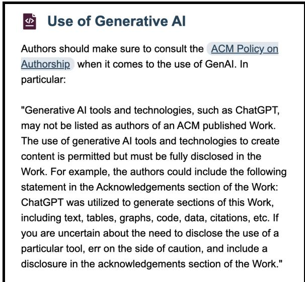  
Figure 1: ACM SIGCOMM’s AI Disclosure policy.

As a consequence, multiple publishing venues set up policies encouraging the inclusion of an AI disclosure statement in submitted research papers (Ganjavi et al.; Bhavsar et al., 2025). The introduction of such policies was especially swift in the field of computer science, given the role of the community in developing these tools, and their relevance to computer science research (Chairs, 2023). Relatedly, perceptions of quality and trust placed in research papers containing AI disclosures are mixed, perhaps due to shifting norms around generative AI use (Akpinar et al., 2026). It is however evident that the presence of AI disclosures can shape the trust placed in scientific discourse. Yet, there have been minimal efforts to characterize the current state of AI disclosures in research.

In this work, we first examine the prevalence and evolution of publishing venue policies that dictate the existence of AI disclosures in computer science research. We find that all major publishing societies (AAAI, ACL, ACM, and IEEE) and 35 out of 65 top computer science conferences have AI disclosure guidelines in place. However, we notice that they have stayed fairly constant since their introduction despite the rapidly evolving capabilities of AI tools, and provide limited guidance on when generative AI use should be disclosed and what specific details to include in a disclosure statement (see Figure 1 for an example).

To characterize current perspectives around the necessity and content of AI disclosures, we then conduct a survey of computer science researchers (N=109). Specifically, we ask the question: For what research tasks and levels of human involvement is it necessary to disclose generative AI use? We observe that generally, participants find it more imperative to disclose generative AI use for research design and analysis than for writing. However, we also highlight the large variation in these opinions, which prevents us from recommending a few categories of tasks that warrant disclosure. Moreover, we show that the perceived necessity of disclosure depends on the level of human involvement during generative AI use, with higher levels of human involvement uniformly requiring less frequent disclosure.

To understand whether current disclosure practices are reflective of these expectations, we analyze AI disclosure statements from EMNLP 2025 and ICLR 2026, two computer science conferences with established AI disclosure policies. We find that disclosures are included in 40% and 64% of research papers accepted at EMNLP 2025 and submitted to ICLR 2026 respectively. However, our analysis reveals a disconnect between expected disclosure behavior and how disclosing generative AI use plays out in practice. Specifically, while a declaration of responsibility for AI-assisted work is consistently expected, concerningly, 98% and 77% of AI disclosure statements in EMNLP and ICLR do not include this information. Moreover, the most frequently disclosed tasks are polishing text and editing code, for which disclosure is less expected.

Overall, our findings underscore both the complexity of formulating precise AI disclosure policies and the misaligned nature of current disclosure practices. As initial steps, we recommend that policies move towards task-based guidelines, clarifying disclosure needs per research task rather than imposing a blanket requirement across all uses. Specifically, we suggest organizing research tasks into mandatory, recommended, and optional categories based on the disclosure necessity scores assigned by the participants in our survey. We further recommend standardizing the format of disclosures, and design a boilerplate template that captures widely expected details (see §7).

While we expect norms around AI disclosure to evolve organically, we hope this work will provide a starting point for the alignment of policies and practices with expectations, thus contributing to ongoing efforts to maintain credibility and transparency in research communication.

## 2 Related Work

## 2.1 Generative AI in Research Workflows

Given the recent interest in AI for Science, efforts are underway to develop AI tools to assist researchers with the aim of accelerating scientific discovery (Eger et al., 2026). Usage data from AllenAI’s Asta, a research-specific generative AI service shows the prevalence of use for tasks from literature retrieval and idea generation to designing methods and writing (Haddad et al., 2026). The use of generative AI assistance at multiple stages spanning the research lifecycle is supported by researchers’ self-reported Large Language Model (LLM) use (Liao et al., 2024). Notably, perceptions of appropriateness of AI use vary by research tasks, which may in turn indicate differing necessity for AI disclosure (Kwon, 2025). Moreover, these norms themselves vary across different fields of research, with researchers in quantitative or experimental fields, such as computer science, demonstrating more openness towards both AI use and disclosure (Andersen et al., 2025).

## 2.2 AI Disclosure Policies

Since the introduction of the first publicly available generative AI chatbots and tools in 2022-2023, the policy landscape on AI use and disclosure has seen multiple shifts. Initial policies set up by publishers and journals across domains, while sufficiently prevalent, demonstrated considerable heterogeneity regarding the appropriateness of generative AI use and disclosure, particularly on when and how generative AI use should be disclosed (Ganjavi et al.; Bhavsar et al., 2025). In computer science specifically, a temporal analysis of conferences policies from 2023-2025 shows an uptick in the establishment of policies around generative AI use for authors, albeit with varying leniency and sanctions (Nahar et al., 2025). Domain-agnostic attempts to standardize AI disclosure policies have recommended declaring generative AI assistance when used in an intentional and substantial manner, but have not yet reached consensus on the details to include in an AI disclosure statement, thus leaving significant room for author interpretation (Weaver, 2024; Resnik and Hosseini, 2026; BaHammam, 2025). While these frameworks provide a valuable starting point for standardization, ensuring their representativeness of broader opinions of the research community remains essential.

## 2.3 Perceptions of AI Disclosures

AI disclosures in research papers have been shown to impact perceptions of information quality and trust. A recent study shows that among abstracts disclosing differing levels of human and LLM involvement, human-written but LLM-edited abstracts receive the highest clarity ratings, whereas fully LLM-written abstracts score the least on both quality and trust scales, implying that the level of human involvement plays a role in influencing perceptions (Akpinar et al., 2026). Moreover, this study shows that while the absence of an AI disclosure leads to speculations about the origins of the given text rather than quality evaluations, its presence puts these suspicions to rest, and increases trustworthiness. However, despite these recent findings demonstrating the positive effects of AI disclosure, hesitation towards full transparency may linger, due to a variety of reasons including how generative AI assistance was used, and social and personal factors (Fang and Lee, 2025). Evidence from a survey of 777 researchers shows that selfdecided appropriateness and the normalization of generative AI use are potential reasons for nondisclosure (Yusuf et al., 2025). Thus, in the absence of clear AI disclosure standards, non-disclosure may persist, with the potential to hamper transparency and trust in research (BaHammam, 2025).

## 3 Research Questions

The review of related work highlights the prevalent use of generative AI assistance in research workflows, along with the attempts to introduce and standardize AI disclosure policies. This is especially imperative given the ability of declared AI assistance to impact the trust placed in research. Past work has also shown that these effects are closely entangled with the perceived appropriateness of generative AI use, that varies based on specific research tasks and levels of human involvement. In light of their potential impact, we attempt to characterize the current landscape of AI disclosures by addressing the following research questions:

RQ1: How prevalent are AI disclosure policies, and how have they evolved over time? RQ2: For what research tasks and levels of human involvement is it necessary to disclose generative AI use? RQ3: How well do current AI disclosure practices align with reader expectations?

We detail the procedures and results of the mixed-methods approach we took to answer these research questions in the following sections.

## 4 AI Disclosure Policy Analysis

RQ1: How prevalent are AI disclosure policies, and how have they evolved over time?

## 4.1 Method and Procedure

To answer RQ1, we analyzed 65 computer science conferences, examining the existence, origins and evolution of their AI disclosure policies. The 65 conferences, spanning subdomains of Artificial Intelligence, Systems, Theory, and Interdisciplinary Areas were taken from the CSRankings website.2 This list, developed in consultation with faculty and through community surveys, is representative of the top conferences in computer science. Since our aim was to characterize the current state of AI disclosure policies, we limited ourselves to an analysis of conference policies from 2025-2026. We also analyzed the policies of AAAI, ACL, ACM, and IEEE, since many computer science conferences are affiliated with these societies, and hence may have contributed to shaping their current policies. We mapped each of the 65 conferences to one or more of these society policies if they link to, mention, or verbatim quote a particular society policy. To trace the evolution of society policies since their origin, we used the Internet Archive’s Wayback Machine,3 which stores snapshots of web pages across time. We initially conducted these analyses from January 5-19, 2026, and reviewed and revised them from May 18-20, 2026.

## 4.2 Results

Our analysis of 65 computer science conferences shows that roughly half (35) of the conferences have set up AI disclosure policies. Moreover, we find that the major societies, AAAI, ACL, ACM, and IEEE, all have established AI disclosure policies: 29 of the 35 conferences with AI disclosure policies borrow closely from these society-level policies. Notably, 21 conferences directly link to, mention, or verbatim quote the ACM policy on authorship, which includes guidelines on disclosing the use of generative AI. From our study of the evolution of society-level policies, we find that they have undergone only 1 to 4 changes since their first introduction in early 2023, with revisions being minor, including restructuring existing content, adding reviewer guidelines or sanctions for prompt injections. We also note that the ACL and ACM policies include clear guidelines on the conditions necessitating disclosure of generative AI use based on either the novelty of generated text or the distinction between AI assistance for research versus writing. However, the AAAI and IEEE policies remain majorly open-ended, providing limited guidance on when and where to disclose generative AI use, only stating that any use of generative AI should be disclosed. Moreover, worryingly, none of the society-level policies provide specific guidance on what details are required to be mentioned while disclosing generative AI use.

## 5 AI Disclosure Expectations Survey

RQ2: For what research tasks and levels of human involvement is it necessary to disclose generative AI use?

<table><tr><td>Level</td><td>Description</td></tr><tr><td>Assumed</td><td>No explicit mention of human involve- ment. Participants assume a certain base- line level of human involvement.</td></tr><tr><td>High</td><td>When the author provides most of the con- tribution and initiative, while AI outputs are closely supervised and verified.</td></tr><tr><td>Low</td><td>When the AI assistant provides most of the contribution and initiative, and AI out- puts are loosely supervised and verified by the author.</td></tr></table>

Table 1: Descriptions of different levels of human involvement considered in the survey (See §5.1).
<table><tr><td>Dimension</td><td>Variants</td></tr><tr><td>Detail</td><td>Task Model name Reason for AI use Non-use of AI Human oversight Responsibility declaration</td></tr><tr><td>Length</td><td>Purpose of disclosure 1-2 sentences A few sentences or a short paragraph Multiple paragraphs Length and detail proportionate to the ex- tent of AI use</td></tr></table>

Table 2: Dimensions along which survey participants indicate their preferences for framing AI disclosures.

## 5.1 Method and Procedure

To answer RQ2, we administered an online survey (on LimeSurvey) with 109 respondents. Participants rated the necessity of AI disclosure for 21 research tasks at 3 levels of human involvement on a 5-point Likert scale, where 1 indicates that AI use need not be disclosed and 5 implies that disclosure is always necessary. The chosen 21 research tasks span the 5 chronological phases central to the preparation of a research manuscript: idea generation, research design, data collection, data analysis, and writing and reporting.

The taxonomy of research tasks we used was adapted from Andersen et al. (2025), with minor changes to ensure suitability to our study and minimize cognitive load on participants. For instance, we removed all tasks related to peer review and research proposal writing, as these are unrelated to manuscript preparation, and also grouped together all coding tasks (for data analysis, statistical analysis, and simulations). We ensured that the final taxonomy is representative of tasks known to be assisted through generative AI tools (Liao et al.,

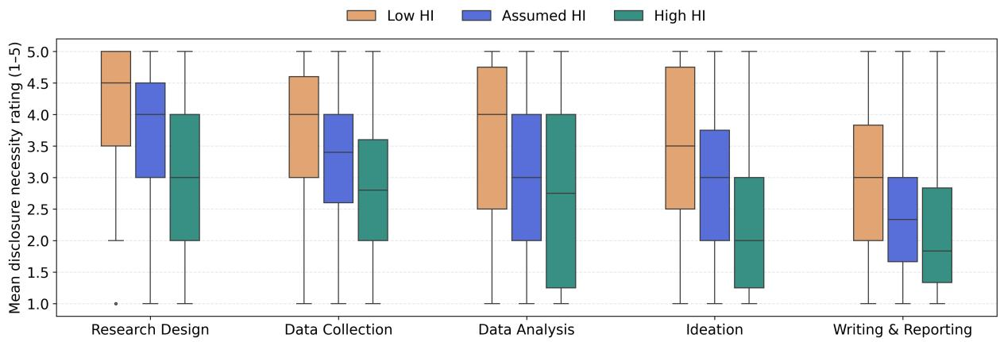  
Figure 2: AI disclosure necessity ratings across research phases and human involvement (HI) conditions.

2024; Kapania et al., 2025). The research phasewise categorization of tasks can be found in the Appendix, but individual tasks will also be listed in the subsequent sections, when we detail and discuss their necessity scores.

Given the diverse methods of using current generative AI tools, the appropriateness of use does not only hinge on what AI assistance was used for, but also on how it was used. Particularly, since computer science societies and conferences across the board, including $\mathrm { { A C L ^ { 4 } } }$ , NeurIPS5 and RTAS6, stress the need for human intellectual contribution, integrity and verification, we try to understand whether the level of human involvement impacts AI disclosure necessity. The levels of human involvement used are described in Table 1.

To characterize expectations on the framing of an AI disclosure statement, we elicit preferences on details and length through multiple-choice questions. The specific options, present in Table 2 were consolidated from existing conference guidelines and conceptual frameworks outlined in past work (Resnik and Hosseini, 2026; BaHammam, 2025; Weaver, 2024). We empirically validate these options, by analyzing 110 random AI disclosure statements from ICLR 2026, which notably led to the inclusion of the Purpose ofdisclosure and Non-use ofAI categories within the details dimension.

To circulate our survey, we used a combination of purposive and snowball sampling through professional networks, university mailing lists, and departmental channels, targeting computer science researchers across AI, Systems, Theory and Interdisciplinary research. Participants span all 4 subdomains, career stages (<1 to >10 years), and countries (e.g., US, Germany, India). The full survey instrument and participant demographics are included in the appendix. Participants were compensated with an Amazon Gift Card worth \$10/ 10/ |500, depending on self-reported geographical location. The study received ethical approval from an institutional review board.

To estimate differences in necessity between different research tasks and levels of human involvement, we fit a linear mixed effects model with necessity rating as the target variable, research task and human involvement as fixed effects, and participant-level random effects. Since norms around AI disclosure are still in flux, we expect substantive individual variability in respondents’ ratings. Linear mixed-effects models, which account for such variability through a participantlevel random intercept, can isolate the fixed effects of research task and human involvement from this between-participant noise. This model can be formulated as:

$$
\begin{array} { r l } & { y _ { \mathrm { t a r g e t } } = \beta _ { 0 } + \beta _ { \mathrm { t a s k } } \times x _ { \mathrm { t a s k } } + \beta _ { \mathrm { h u m a n } } \times x _ { \mathrm { h u m a n } } } \\ & { ~ + u _ { \mathrm { p a r t } } \times x _ { \mathrm { p a r t } } + \epsilon , } \end{array}
$$

where ytarget corresponds to the user-provided necessity rating, $\beta _ { 0 }$ is the fixed intercept, $x _ { \mathrm { t a s k } }$ and xhuman are indicator variables for research task and level of human involvement, and $u _ { \mathrm { p a r t } }$ is a participant-level random intercept.

## 5.2 Results

Overall, we observe that participants find disclosing generative AI use moderately necessary, with a mean necessity rating of 2.95 (95% confidence interval: [2.78, 3.13]). Through a subsequent research phase-wise analysis, we observe that AI disclosure is the most necessary for tasks in the research design phase, and the least necessary for tasks in the writing and reporting phase (see Figure 2). Contrary to what we had expected given the emphasis on novel ideas in research, we find that disclosing generative AI assistance for tasks from the idea generation phase is considered relatively less necessary, with a mean rating of only 2.86.

<table><tr><td>Research Task</td><td>Phase</td><td>Necessary? Mean Rating</td><td></td><td></td><td></td></tr><tr><td>Generate synthetic data sets*</td><td>Data Collection</td><td>Usually</td><td>2</td><td></td><td>中 V 5</td></tr><tr><td>Help develop theoretical models or conceptual frameworks*</td><td>Research Design</td><td>Usually</td><td></td><td></td><td>5</td></tr><tr><td>Propose new hypotheses*</td><td>Idea Generation</td><td>Usually</td><td></td><td>1</td><td>5</td></tr><tr><td>Help design research methodology or experiments*</td><td>Research Design</td><td>Sometimes</td><td>2</td><td>3</td><td>4 5</td></tr><tr><td>Translate a research paper into a different language*</td><td>Writing &amp; Reporting</td><td>Sometimes</td><td>2</td><td></td><td>5</td></tr><tr><td>Clean and reformat dataset*</td><td>Data Collection</td><td>Sometimes</td><td></td><td>1 3</td><td>4 5</td></tr><tr><td>Help pattern recognition in data*</td><td>Data Analysis</td><td>Sometimes</td><td>2</td><td>2</td><td>A 5</td></tr><tr><td>Support qualitative and thematic data analysis*</td><td>Data Analysis</td><td>Sometimes</td><td>2</td><td>3</td><td>4 5</td></tr><tr><td>Formulate questions for surveys or interviews</td><td>Data Collection</td><td>Sometimes</td><td></td><td></td><td></td></tr><tr><td>Create or modify scientific figures or images</td><td>Data Analysis</td><td>Sometimes</td><td></td><td></td><td></td></tr><tr><td>Suggest experimental parameters</td><td>Data Collection</td><td>Sometimes</td><td></td><td></td><td></td></tr><tr><td>Create or edit software code</td><td>Data Analysis</td><td>Sometimes</td><td></td><td></td><td></td></tr><tr><td>Draft parts of a research paper</td><td>Writing &amp; Reporting</td><td>Sometimes</td><td></td><td>3</td><td>4 5</td></tr><tr><td>Transcribe recordings of research material</td><td>Data Collection</td><td>Sometimes</td><td></td><td>2</td><td>5</td></tr><tr><td>Summarize or analyse existing literature</td><td>Idea Generation</td><td>Sometimes</td><td></td><td>3</td><td>4 5</td></tr><tr><td>Discover research topics or identify gaps*</td><td>Idea Generation</td><td>Sometimes</td><td>2</td><td>3 4</td><td>5</td></tr><tr><td>Edit a research paper to improve readability*</td><td>Writing &amp; Reporting</td><td>Rarely</td><td>2</td><td>3 4</td><td>5</td></tr><tr><td>Identify relevant literature</td><td>Idea Generation</td><td>Rarely</td><td></td><td></td><td>5</td></tr><tr><td>Format references*</td><td>Writing &amp; Reporting Rarely</td><td></td><td>1</td><td>4</td><td>5</td></tr><tr><td>Suggest a structure for a research paper*</td><td>Writing &amp; Reporting Rarely</td><td></td><td>2</td><td></td><td>5</td></tr><tr><td>Propose a title or keywords for a research paper*</td><td>Writing &amp; Reporting Rarely</td><td></td><td>4 2</td><td>3 4 3</td><td>4 5</td></tr></table>

Table 3: Research tasks ordered by mean disclosure-necessity rating. The third column reports the necessity of disclosure, by identifying the nearest option in the Likert scale, and the Mean Rating column visualizes each task’s mean and 95% confidence interval. Significance markers $( ^ { * } p < . 0 5 )$ indicate differences from the median-rated task (Suggest experimental parameters) in a linear mixed-effects model.

We also observe a surprisingly high amount of variability in the perceived disclosure necessity across all phases and levels of human involvement. This effect could potentially be explained by individual tasks within the same phase receiving wildly different ratings. For instance, within the idea generation phase, Proposing new hypotheses (mean=3.54) and Identifying relevant literature (mean=2.46) differ by more than an entire point on the Likert scale, and fall on opposite sides of the median-rated task. Tasks within the data collection phase, specifically Generating synthetic data sets (mean=4.02) and Transcribing recordings of research material (mean=2.93), exhibit similar differences in ratings. Task-wise necessity ratings are available in Table 3, where we also observe that most writing and reporting tasks are clustered together at the lower end of the necessity scale.

Interestingly, across all research phases, shifts from the assumed level of human involvement exhibit a consistent trend: low human involvement raises disclosure expectations, (β=0.49, 95% CI=[0.42, 0.55], p < 0.001) while high human involvement causes drops in the perceived necessity ofdisclosure (β=−0.44, 95% CI=[−0.51, −0.38], $p < 0 . 0 0 1 )$ . The shifts in either direction, are however not always similar. For instance, the median necessity ratings for the low and assumed human involvement conditions in the data analysis phase are 1 point apart, while this difference for the assumed and high human involvement conditions is less than 0.5. The direction of asymmetry is reversed in the idea generation and research design phases, with a 1-point drop in necessity ratings from the assumed to the high human involvement conditions, but only a 0.5-point increase from the assumed level of human involvement to the low human involvement condition. This indicates that the loss of human agency in certain phases (e.g., in data analysis) drives disclosure necessity up, perhaps due to the potential errors that could arise in this situation, while the assurance of retained human agency for certain phases (e.g., in idea generation) lowers the need for disclosure.

Our findings complicate recommendations that outline the necessity of disclosing generative AI use based on a categorization of tasks, given the high variability in necessity ratings per phase. Resnik and Hosseini (2026) advocate for disclosure when AI-assistance either directly impacts research results or is used to generate or analyze content, data or images. While research tasks fitting this description are generally assigned higher necessity ratings by our participants, we highlight the observed variability, as illustrated by the difference in perceived necessity of disclosure for Generating synthetic datasets (mean=4.02) and Creating or modifying scientific figures or images (mean=3.00). Similarly, we show that while Creating or editing software code is stressed upon by ACM’s guidelines,7 this is considered less necessary by our participants (mean=2.96). Further, ACL’s guidelines4 that necessitate AI disclosure depending on the novelty of text or ideas produced, evoke similar mismatches, particularly for idea generation tasks, where participants find AI disclosure to be relatively less needed. Lastly, we highlight tasks that exhibit high perceived necessity, but cannot be neatly compartmentalized based on current policy guidelines: Translating a research paper (mean=3.31) and Cleaning and reformatting data sets (mean=3.24), both tasks that could introduce subtle erroneous artifacts if AI-assisted.

## 6 AI Disclosure Practices Audit

RQ3: How well do current AI disclosure practices align with reader expectations?

## 6.1 Method and Procedure

To answer RQ3, we extracted AI disclosure statements from 19525 research papers submitted to ICLR 2026 and 3216 research papers accepted to

EMNLP 2025 Main and Findings, and analyzed the prevalence of tasks and details being disclosed. We chose to focus on these 2 specific conferences due to their established AI disclosure policies, their recency, and the open availability of research papers. Interestingly, the two conferences present a key policy difference: ICLR 2026 encouraged the inclusion of AI disclosure statements in a separate section within the submitted manuscript, while EMNLP 2025 allowed for generative AI use to be disclosed either in the main text or in the author submission checklist. This allows us to also comment on differing disclosure behavior due to differences in policy design.

We accessed accepted, withdrawn, rejected, and desk-rejected ICLR research papers through the OpenReview API, and EMNLP Main and Findings submission checklists and research papers from the ACL Anthology. We then used Gemini 2.5 Flash to evaluate the presence of and extract AI disclosure statements in research papers or submission checklists. We also used Gemini 2.5 Flash to annotate extracted AI disclosures with the details, tasks, and length present, in accordance with the taxonomies presented in Table 2 and Table 3. For extraction, Gemini achieved 100% F1 against human annotations on 100 papers, while on 100 disclosures annotated by three researchers, Gemini scored average micro F1 of 96.5% (details) and 90.6% (tasks). While these scores are not perfect, we believe they are satisfactory for our extraction and annotation purposes.

## 6.2 Results

Despite the lack of strict enforcement of AI disclosure policies, our analysis of 12577 extracted ICLR disclosures and 1290 extracted EMNLP disclosures reveals a moderately high prevalence of AI disclosures, with 64% of research papers submitted to ICLR and 40% of EMNLP Main and Findings research papers containing disclosure statements. We observe that tasks with lower perceived necessity are disclosed the most frequently: Editing a research paper (96.5% in ICLR and 81.4% in EMNLP) and Creating or editing software code (16.1% in ICLR and 23.3% in EMNLP). On the contrary, only a small fraction of disclosures exist for higher-rated tasks such as Generating synthetic data sets (2.1% in ICLR and 2.5% in EMNLP) and Translating a research paper (1.6% in ICLR and 2.0% in EMNLP). This gap may exist because generative AI use for tasks like polishing text or editing code is seen as more appropriate, and is therefore more common and more frequently disclosed.

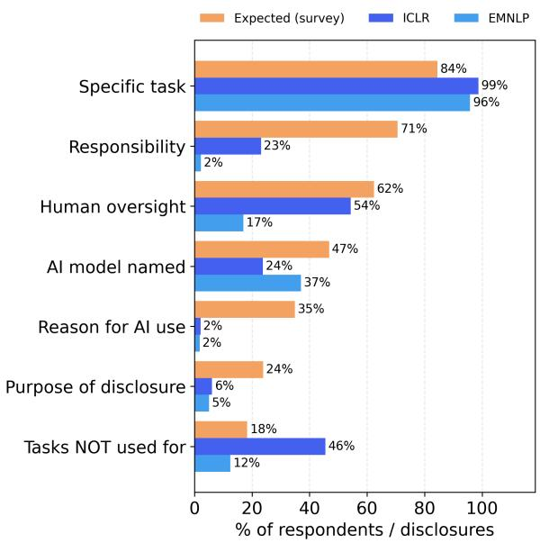  
Figure 3: Expected vs. observed coverage of disclosure details, comparing survey expectations against ICLR and EMNLP practice.

Despite the structural difference between ICLR’s free-text disclosure statements and EMNLP’s checklist responses, we observe similar disclosure behavior in both venues, as shown in Figure 3. However, concerningly, while 71% of participants expect disclosures to contain a statement of responsibility from the authors, only 2% and 23% of EMNLP and ICLR disclosures respectively include such a declaration. It is also interesting to note that almost 50% of ICLR disclosures disclose the tasks generative AI was not used for, but this detail is considered the least necessary by participants. While authors may understandably include such information to emphasize the scope of AI assistance and their own contributions, perhaps this information is better included while expanding on the extent of human oversight, which is more frequently expected (62%). Moreover, surprisingly, less than 50% of participants exhibit a preference for the inclusion of the specific AI model used, perhaps due to the limited number of commercial models in widespread use, and their roughly equivalent capabilities.

We also find that while the general expectation for the length of an AI disclosure statement is A few sentences or one short paragraph, most disclosures in practice tend to be 1-2 sentences long. This prevalence of shorter disclosure statements (91%) is especially pronounced in EMNLP. This is in contrast to ICLR, where a sizeable chunk of disclosures (41%) are a few sentences long.

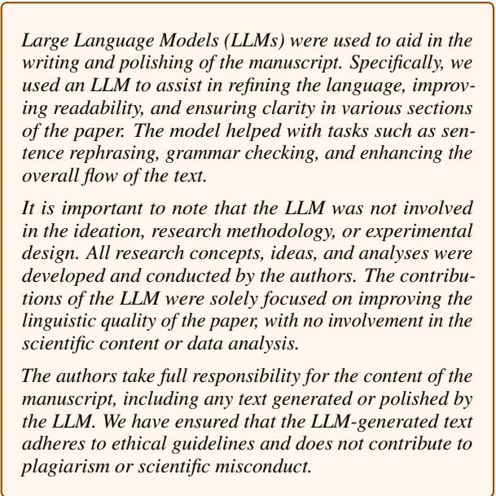  
Figure 4: An identical AI disclosure statement appearing in 95 ICLR 2026 submissions.

Alarmingly, during our analysis, we uncover the existence of multiple duplicate disclosures. One such disclosure statement (c.f., Figure 4) was found verbatim in 95 unique ICLR submissions.8 While the statement itself is comprehensive and includes all expected details, its recurrence across unrelated papers suggests that the disclosure is not specific to any individual submission’s actual AI use. Given the difficulty of enforcing disclosure policies, this highlights the potential issue of performative disclosures, intended to comply with policies rather than to inform.

## 7 Recommendations

Informed by our findings, we recommend that publishing venues specify when disclosure is needed, and standardize what a disclosure should contain.

Task-based AI disclosure policies The results of our survey show that disclosing AI use is not considered equally necessary across research tasks, and we also note that existing policy categories, at their current granularity, do not reflect these varying expectations. While we acknowledge that policies around AI disclosure are hard to formu-

In this work, we used generative AI tools for <some mandatory disclosure tasks>. We have not used generative AI tools for <other mandatory disclosure tasks>, and <the rest of mandatory disclosure tasks> are not applicable to this work. Additionally, we used generative AI toolsfor <some recommended disclosure tasks> [and optionally for <some optional disclosure tasks>]. We have reviewed all AI-assisted work [Elaborate. For example, “We checked LLM-generated research ideas for potential plagiarism through a manual literature survey”, “LLM-generated code was verified and tested for correctness by 2 authors”, etc.]. We take responsibility for the final content of this work, including text/claims/artifacts produced with the aid of generative AI.

Figure 5: A structured AI disclosure template, designed to capture details that survey respondents prioritize.

late precisely, we recommend that wherever possible, policies specify disclosure requirements at the level of individual tasks instead of broad rules. Such policies could include a list of tasks at differing levels of disclosure necessity: mandatory disclosure for tasks where disclosure is widely expected (e.g., Proposing new hypotheses), recommended disclosure for tasks where expectations are more diffuse (e.g., Creating or editing software code), and optional disclosure for tasks where disclosure is deemed less necessary (e.g., Editing or polishing text). We encourage policymakers at publishing venues to reproduce our survey, and use the resulting task-wise necessity ratings to inform the level of disclosure appropriate for different research tasks, for example, classifying tasks scoring ≥ 3.5 as mandatory, 2.5–3.5 as recommended, and the rest as optional.

Standardized AI disclosure formats Our analysis of AI disclosures in practice shows that current disclosure statements are rarely aligned with expectations, and may be performative. We speculate that this is in part due to the absence of a common format. We construct a boilerplate template from the details expected by over half of our survey participants, and recommend that publishing venues include it as an example in their policies and embed it directly within conference-specific LAT X files. We also suggest this boilerplate template include the tasks requiring disclosure, as outlined in §5.2. We provide an example boilerplate disclosure statement in Figure 5, with task lists omitted for brevity, but included in Table 4. A disclosure within the paper primarily serves readers; we additionally recommend a dedicated field in author submission checklists for disclosing mandatory tasks, which would better serve reviewers and area chairs.

<table><tr><td>Research Tasks by Disclosure Level</td></tr><tr><td>Mandatory (rating ≥ 3.5) Generate synthetic data sets Develop theoretical models or frameworks</td></tr><tr><td>Propose new hypotheses Recommended (2.5 ≤ rating &lt; 3.5)</td></tr><tr><td>Design research methodology or experiments Translate a research paper</td></tr><tr><td>Clean and reformat a dataset Pattern recognition in data</td></tr><tr><td>Qualitative and thematic data analysis</td></tr><tr><td></td></tr><tr><td>Formulate survey or interview questions</td></tr><tr><td></td></tr><tr><td>Create or modify scientific figures</td></tr><tr><td>Suggest experimental parameters</td></tr><tr><td></td></tr><tr><td>Create or edit software code</td></tr><tr><td>Draft parts of a research paper</td></tr><tr><td></td></tr><tr><td>Transcribe research recordings</td></tr><tr><td>Summarize or analyze existing literature</td></tr><tr><td></td></tr><tr><td>Discover research topics or gaps</td></tr><tr><td></td></tr><tr><td>Optional (rating &lt; 2.5)</td></tr><tr><td></td></tr><tr><td>Edit a paper for readability or language</td></tr><tr><td></td></tr><tr><td></td></tr><tr><td>Identify relevant literature</td></tr><tr><td></td></tr><tr><td></td></tr><tr><td></td></tr><tr><td></td></tr><tr><td>Format references</td></tr><tr><td></td></tr><tr><td></td></tr><tr><td></td></tr><tr><td></td></tr><tr><td></td></tr><tr><td></td></tr><tr><td></td></tr><tr><td></td></tr><tr><td></td></tr><tr><td>Suggest a structure for a paper</td></tr><tr><td></td></tr><tr><td></td></tr><tr><td></td></tr><tr><td></td></tr><tr><td></td></tr><tr><td></td></tr><tr><td></td></tr><tr><td></td></tr><tr><td></td></tr><tr><td></td></tr><tr><td></td></tr><tr><td></td></tr><tr><td></td></tr><tr><td></td></tr><tr><td></td></tr><tr><td></td></tr><tr><td></td></tr><tr><td></td></tr><tr><td></td></tr><tr><td></td></tr><tr><td></td></tr><tr><td></td></tr><tr><td></td></tr><tr><td></td></tr><tr><td></td></tr><tr><td></td></tr><tr><td></td></tr><tr><td></td></tr><tr><td></td></tr><tr><td></td></tr><tr><td></td></tr><tr><td></td></tr><tr><td></td></tr><tr><td></td></tr><tr><td></td></tr><tr><td></td></tr><tr><td></td></tr><tr><td></td></tr><tr><td></td></tr><tr><td></td></tr><tr><td></td></tr><tr><td></td></tr><tr><td></td></tr><tr><td></td></tr><tr><td></td></tr><tr><td></td></tr><tr><td></td></tr><tr><td></td></tr><tr><td></td></tr><tr><td></td></tr><tr><td></td></tr><tr><td></td></tr><tr><td></td></tr><tr><td></td></tr><tr><td></td></tr><tr><td></td></tr><tr><td></td></tr><tr><td></td></tr><tr><td></td></tr><tr><td></td></tr><tr><td></td></tr><tr><td></td></tr><tr><td></td></tr><tr><td></td></tr><tr><td></td></tr><tr><td></td></tr><tr><td></td></tr><tr><td></td></tr><tr><td></td></tr><tr><td></td></tr><tr><td></td></tr><tr><td></td></tr><tr><td></td></tr><tr><td></td></tr><tr><td></td></tr><tr><td></td></tr><tr><td></td></tr><tr><td></td></tr><tr><td></td></tr><tr><td></td></tr><tr><td></td></tr><tr><td></td></tr><tr><td></td></tr><tr><td></td></tr><tr><td></td></tr><tr><td></td></tr><tr><td></td></tr><tr><td></td></tr><tr><td></td></tr><tr><td></td></tr><tr><td></td></tr><tr><td></td></tr><tr><td></td></tr><tr><td></td></tr><tr><td></td></tr><tr><td></td></tr><tr><td></td></tr><tr><td></td></tr><tr><td></td></tr><tr><td></td></tr><tr><td></td></tr><tr><td></td></tr><tr><td></td></tr><tr><td></td></tr><tr><td></td></tr><tr><td></td></tr><tr><td></td></tr><tr><td></td></tr><tr><td></td></tr><tr><td></td></tr><tr><td></td></tr><tr><td></td></tr><tr><td></td></tr><tr><td></td></tr><tr><td></td></tr><tr><td></td></tr><tr><td></td></tr><tr><td></td></tr><tr><td></td></tr><tr><td></td></tr><tr><td></td></tr><tr><td></td></tr><tr><td></td></tr><tr><td></td></tr><tr><td></td></tr></table>

Table 4: Suggested disclosure levels for research tasks, based on ratings from survey participants.

## 8 Conclusion

In this work, we examined AI disclosure in computer science research through a policy analysis of 65 conferences, a survey of 109 researchers, and an audit of 13867 disclosure statements. We find that high variability in the perceived disclosure necessity across research tasks complicates the formulation of precise disclosure policies, and that current author practices diverge substantially from these expectations. Our findings offer empirical grounding to inform ongoing efforts to standardize and maintain transparency in research communication.

## Limitations

Self-selection bias Our survey relied on convenience-based recruitment, and participants who chose to respond likely already held opinions about AI disclosure. Expectations from a broader, less self-selected population may be weaker or more diffuse than those we report.

Future work could mitigate this through stratified sampling across computer science subdomains or randomized recruitment via venue mailing lists.

Scope to CS Research Our findings are limited to computer science research, where AI tools are arguably most familiar and disclosure norms are evolving most rapidly. While this focus is deliberate given that disclosure expectations likely differ across disciplines, extending this characterization to other research communities is a natural direction for future work.

LLM Annotation Reliability We also make use of an LLM judge (Gemini 2.5 Flash) to annotate disclosure statements. Although we validated these annotations against human annotators with high agreement (average micro F1 of 96.5% (details) and 90.6% (tasks)), residual errors are possible, particularly for rare details or task categories with limited validation support.

## Ethical Considerations

This work characterizes AI disclosure expectations through a survey with human participants. Informed consent was explicitly confirmed at the beginning of the survey, and respondents were given the option to stop participation at any point. The survey was completely anonymous, and providing demographic details was optional. Participants who completed the survey were compensated with Amazon Gift cards worth \$10/ 10/ |500, depending on self-reported geographical location. We only collected contact details (such as e-mail) to dispense the gift cards, and this information was deleted immediately after confirmation of receipt of compensation. As these details were obtained through a separate form, linking contact details to survey responses (thus risking deanonymization), was not possible. This study received approval from an institutional review board.

Our work further recommends policy changes, and while these are made in the spirit of improving transparency and are grounded in community opinions, AI disclosures carry broader consequencess. For instance, researchers who disclose legitimate uses of AI assistance such as translation may inadvertently reveal that they are non-native English speakers, an attribute that, once inferred during peer review, risks reinforcing existing biases against them. To amend this, we suggest masking language support disclosures during the review period. More broadly, AI disclosures may invite negative perceptions of the work. While current norms around the appropriateness of AI use are still in flux, this cannot be fully eradicated. We nonetheless believe that standardized disclosure formats and processes from policymakers, along with authors’ thoughtful efforts to emphasize the extent of their oversight and responsibility will help. On the other hand, disclosures may also occasionally benefit authors: because they are made a priori, they can serve as evidence for the actual extent of AI use when work is incorrectly flagged for violating AI use policies by venues relying on (potentially inaccurate) AI text detectors.

## Acknowledgments

We are grateful to all participants who took part in our survey and (whenever possible) forwarded it. We thank Rounak Saha and Rose Sathyanathan for annotations to validate the LLM judge used to label AI disclosure statements. We also thank Shobini NS for providing feedback on initial versions of the survey, and Kirti Bhagat for thoughtful discussions on interpreting results. We are also grateful to Vani A for administrative support. This work was supported in part by Schmidt Sciences, and additionally, DP is grateful to Google, Microsoft Research, and the Indian Institute of Science for supporting his group’s research.

AI Disclosure In this work, we used generative AI tools (Claude Code) to create and edit software code, specifically for parallelizing the AI disclosure statement extraction pipeline. All generated code was manually verified for correctness. We have not used generative AI tools for generating synthetic data sets, developing theoretical models/frameworks, or proposing new hypotheses. We take responsibility for the final content of this work, including the artifacts produced with the aid of generative AI.

## References

Nil-Jana Akpinar, Sandeep Avula, Chia-Jung Lee, Brandon Dang, Kaza Razat, and Vanessa Murdock. 2026. Llm or human? perceptions of trust and quality in research summaries. In Proceedings of the 2026 CHI Conference on Human Factors in Computing Systems, CHI ’26, New York, NY, USA. Association for Computing Machinery.

Jens Peter Andersen, Lise Degn, Rachel Fishberg, Ebbe K. Graversen, Serge P. J. M. Horbach, Evan-

thia Kalpazidou Schmidt, Jesper W. Schneider, and Mads P. Sørensen. 2025. Generative Artificial Intelligence (GenAI) in the research process – A survey of researchers’ practices and perceptions. Technology in Society, 81:102813.

Ahmed BaHammam. 2025. The Transparency Paradox: Why Researchers Avoid Disclosing AI Assistance in Scientific Writing. Nature and Science of Sleep, Volume 17:2569–2574.

Daivat Bhavsar, Laura Duffy, Hamin Jo, Cynthia Lokker, R. Brian Haynes, Alfonso Iorio, Ana Marusic, and Jeremy Y. Ng. 2025. Policies on artificial intelligence chatbots among academic publishers: a crosssectional audit. Research Integrity and Peer Review, 10(1):1.

Jenna Butler, Jina Suh, Sankeerti Haniyur, and Constance Hadley. 2025. Dear Diary: A Randomized Controlled Trial of Generative AI Coding Tools in the Workplace. In 2025 IEEE/ACM 47th International Conference on Software Engineering: Software Engineering in Practice (ICSE-SEIP), pages 319–329. ISSN: 2832-7659.

Program Chairs. 2023. ACL 2023 Policy on AI Writing Assistance.

Steffen Eger, Yong Cao, Jennifer D’Souza, Andreas Geiger, Christian Greisinger, Stephanie Gross, Yufang Hou, Brigitte Krenn, Anne Lauscher, Yizhi Li, Chenghua Lin, Nafise Sadat Moosavi, Wei Zhao, and Tristan Miller. 2026. Transforming Science with Large Language Models: A Survey on AIassisted Scientific Discovery, Experimentation, Content Generation, and Evaluation. arXiv preprint. ArXiv:2502.05151 [cs.CL].

Jingchao Fang and Mina Lee. 2025. What Shapes Writers’ Decisions to Disclose AI Use? arXiv preprint. ArXiv:2505.20727 [cs].

Conner Ganjavi, Michael B Eppler, Asli Pekcan, Brett Biedermann, Andre Abreu, Gary S Collins, Inderbir S Gill, and Giovanni E Cacciamani. A BIB-LIOMETRIC ANALYSIS OF PUBLISHER AND JOURNAL INSTRUCTIONS TO AUTHORS ON GENERATIVE-AI IN ACADEMIC AND SCIEN-TIFIC PUBLISHING.

Dany Haddad, Dan Bareket, Joseph Chee Chang, Jay DeYoung, Jena D. Hwang, Uri Katz, Mark Polak, Sangho Suh, Harshit Surana, Aryeh Tiktinsky, Shriya Atmakuri, Jonathan Bragg, Mike D’Arcy, Sergey Feldman, Amal Hassan-Ali, Rubén Lozano, Bodhisattwa Prasad Majumder, Charles McGrady, Amanpreet Singh, and 3 others. 2026. Understanding Usage and Engagement in AI-Powered Scientific Research Tools: The Asta Interaction Dataset. arXiv preprint. Version Number: 1.

Mohammad Hosseini, David B Resnik, and Kristi Holmes. 2023. The ethics of disclosing the use of artificial intelligence tools in writing scholarly manuscripts. Research Ethics, 19(4):449–465.

Nanna Inie, Jeanette Falk, and Steve Tanimoto. 2023. Designing Participatory AI: Creative Professionals Worries and Expectations about Generative AI. In Extended Abstracts ofthe 2023 CHI Conference on Human Factors in Computing Systems, CHI EA ’23, pages 1–8, New York, NY, USA. Association for Computing Machinery.

Shivani Kapania, Ruiyi Wang, Toby Jia-Jun Li, Tianshi Li, and Hong Shen. 2025. ’I’m Categorizing LLM as a Productivity Tool’: Examining Ethics of LLM Use in HCI Research Practices. Proc. ACM Hum.- Comput. Interact., 9(2):CSCW102:1–CSCW102:26.

Mohamed Khalifa and Mona Albadawy. 2024. Using artificial intelligence in academic writing and research: An essential productivity tool. Computer Methods and Programs in Biomedicine Update, 5:100145.

Diana Kwon. 2025. Is it OK for AI to write science papers? Nature survey shows researchers are split. Nature, 641(8063):574–578. Bandiera\_abtest: a Cg\_type: News Feature Subject\_term: Machine learning, Publishing, Lab life.

Jie Li, Hancheng Cao, Laura Lin, Youyang Hou, Ruihao Zhu, and Abdallah El Ali. 2024. User Experience Design Professionals’ Perceptions of Generative Artificial Intelligence. In Proceedings ofthe 2024 CHI Conference on Human Factors in Computing Systems, CHI ’24, pages 1–18, New York, NY, USA. Association for Computing Machinery.

Zhehui Liao, Maria Antoniak, Inyoung Cheong, Evie Yu-Yen Cheng, Ai-Heng Lee, Kyle Lo, Joseph Chee Chang, and Amy X. Zhang. 2024. Llms as research tools: A large scale survey of researchers’ usage and perceptions. Preprint, arXiv:2411.05025.

Mahjabin Nahar, Sian Lee, Rebekah Guillen, and Dongwon Lee. 2025. Generative AI Policies under the Microscope: How CS Conferences Are Navigating the New Frontier in Scholarly Writing. arXiv preprint. ArXiv:2410.11977 [cs].

David B. Resnik and Mohammad Hosseini. 2026. Disclosing artificial intelligence use in scientific research and publication: When should disclosure be mandatory, optional, or unnecessary? Accountability in Research, 33(2):2481949. \_eprint: https://doi.org/10.1080/08989621.2025.2481949.

Eva A. M. van Dis, Johan Bollen, Willem Zuidema, Robert van Rooij, and Claudi L. Bockting. 2023. ChatGPT: five priorities for research. Nature, 614(7947):224–226. Bandiera\_abtest: a Cg\_type: Comment Subject\_term: Computer science, Research management, Publishing, Machine learning.

Richard Watermeyer, Donna Lanclos, Lawrie Phipps, Hanne Shapiro, Danielle Guizzo, and Cathryn Knight. 2025. Academics’ Weak(ening) Resistance to Generative AI: The Cause and Cost of Prestige? Postdigital Science and Education, 7(4):1171–1191.

Kari D. Weaver. 2024. The Artificial Intelligence Disclosure (AID) Framework: An Introduction. College & Research Libraries News, 85(10). ArXiv:2408.01904 [cs].

Abdullahi Yusuf, Samia Mouas, and Mohammad Hamad Al-khresheh. 2025. Understanding the Psychological Factors Associated with (non) Disclosure Behaviour after GenAI Usage. Journal ofAcademic Ethics, 24(1):34.

## A Appendix

The contents of the Appendix are organized as follows: Table 5 outlines the prevalence of AI disclosure policies across computer science conferences, grouped by subdomain. Table 6 shows the mapping of conferences with established AI disclosure policies to corresponding societies, along with the number of revisions the society policies have undergone since their introduction. Table 7 details the taxonomy of research tasks we used, categorized by research phase. Table 8 contains examples of extracted disclosure statements, grouped by type of detail. Tables 9–14 include the full survey instrument. Table 15 contains survey participant demographic information. Tables 16–18 detail the prompts used for the extraction of AI disclosure statements. Table 19 and Table 20 show validation results of Gemini 2.5 Flash for annotating extracted disclosures. Tables 21–23 contain the specific annotation prompt used.

<table><tr><td>Area</td><td>Conference</td><td>n</td><td>Year</td><td>Disclosure</td></tr><tr><td rowspan="4">AI</td><td>NeurIPS, ACL, EMNLP, SIGIR, WWW</td><td>5</td><td>2026</td><td>Yes</td></tr><tr><td>ICLR, NAACL</td><td>2</td><td>2025</td><td>Yes</td></tr><tr><td>AAAI, IJCAI, CVPR, ECCV, ICML</td><td>5</td><td>2026</td><td>No</td></tr><tr><td>ICCV</td><td>1</td><td>2025</td><td>No</td></tr><tr><td rowspan="5">Systems</td><td>ISCA, SIGCOMM, NSDI, CCS, IEEE S&amp;P, SIGMOD, DAC, RTAS, HPDC, ICS, MobiSys, IMC, SIGMETRICS, FSE, ICSE</td><td>15</td><td>2026</td><td>Yes</td></tr><tr><td></td><td>2</td><td>2025</td><td>Yes</td></tr><tr><td>RTSS, SC ASPLOS, USENIX Security, VLDB, EMSOFT, MobiCom, Sen-</td><td>10</td><td>2026</td><td>No</td></tr><tr><td>Sys, OSDI, SOSP, PLDI, POPL MICRO, ICCAD</td><td>2</td><td>2025</td><td>No</td></tr><tr><td>STOC, CRYPTO, EuroCrypt</td><td></td><td></td><td></td></tr><tr><td rowspan="3">Theory</td><td>SODA, CAV, LICS</td><td>3</td><td>2026</td><td>Yes</td></tr><tr><td>FOCS</td><td>3 1</td><td>2026 2025</td><td>No No</td></tr><tr><td>SIGGRAPH, SIGGRAPH Asia, SIGCSE, CHI, ICRA, VIS, VR</td><td></td><td></td><td></td></tr><tr><td rowspan="4">Interdisciplinary</td><td>IROS</td><td>7</td><td>2026</td><td>Yes</td></tr><tr><td>ISMB, RECOMB, Pervasive, UIST, RSS</td><td>1</td><td>2025</td><td>Yes</td></tr><tr><td>EC, WINE, UbiComp</td><td>5</td><td>2026</td><td>No</td></tr><tr><td></td><td>3</td><td>2025</td><td>No</td></tr></table>

Table 5: AI disclosure policy presence across major CS conferences.
<table><tr><td>Society</td><td>Conferences</td><td>n</td><td>#Changes</td></tr><tr><td>AAAI</td><td></td><td>0</td><td>1</td></tr><tr><td>ACL</td><td>ACL, EMNLP, NAACL</td><td>3</td><td>2</td></tr><tr><td>ACM</td><td>SIGIR, WWW, SIGCOMM, CCS, SIGMOD, DAC, HPDC, ICS, MobiSys, IMC, SIGMET- 21 RICS, FSE, ICSE, STOC, CRYPTO, EuroCrypt, SIGGRAPH, SIGGRAPH Asia, SIGCSE, CHI, ISCA</td><td></td><td>1</td></tr><tr><td>IEEE</td><td>ISCA, IEEE S&amp;P, ICSE, ICRA, IROS, VIS, VR</td><td>7</td><td>4</td></tr><tr><td>None</td><td>ICLR, NeurIPS, NSDI, RTAS, RTSS, SC</td><td>6</td><td></td></tr></table>

Table 6: Conferences inspired by each society’s disclosure policy, and the number of revisions made.
<table><tr><td>Phase</td><td>Task</td></tr><tr><td>Idea Generation</td><td>Discover research topics or identify gaps in current research Identify relevant literature Summarize or analyse existing literature Propose new hypotheses</td></tr><tr><td>Research Design</td><td>Help design research methodology or experiments Help develop theoretical models or conceptual frameworks</td></tr><tr><td>Data Collection</td><td>Suggest experimental parameters (e.g., choosing sample size, experimental conditions, or training settings) Formulate questions for surveys or interviews Transcribe recordings of research material (e.g. interviews, workshops or focus groups) Generate synthetic data sets Clean and reformat dataset</td></tr><tr><td>Data Analysis</td><td>Create or edit software code for data analysis, statistical analysis or simulations Support qualitative and thematic data analysis and coding Help pattern recognition in data Create or modify scientific figures or images</td></tr><tr><td>Writing and Reporting</td><td>Suggest a structure for a research paper Draft parts of a research paper Propose a title or keywords for a research paper Edit a research paper to improve readability and/or language Format references Translate a research paper into a different language</td></tr></table>

Table 7: Taxonomy of research phases and associated tasks.

<table><tr><td>Detail</td><td>Description</td><td>Example</td></tr><tr><td>Task</td><td>The specific task AI was used for.</td><td>“In writing this work, LLMs have been used inhelping find rele- vant works, format LaTeX, and implement code, and proofread.&quot;</td></tr><tr><td>Model name</td><td>The AI model or system that was used.</td><td>“Specifically, we employedClaude Sonnet 4 (Anthropic)and GPT-5 (OpenAI)for language polishing and refinement pur- poses.&quot;</td></tr><tr><td>Reason</td><td>The reason AI was used instead of a non-AI method.</td><td>“We use large language models (LLMs)to support labor-inten- sive and mistake-prone work.</td></tr><tr><td>Non-use</td><td>Tasks for which AI was not used</td><td>“LLMs werenot used for generating novel scientific ideas, ex- periments, or analyses.&#x27;</td></tr><tr><td>Human oversight</td><td>The extent of human oversight or contributions during or after AI use.</td><td>“All outputs from LLMs werecarefully reviewed, verified, and edited by the authorsto ensure correctness and originality.&quot;</td></tr><tr><td>Responsibility</td><td>The authors’ declaration of re- sponsibility for outcomes of AI use, such as potential errors or biases.</td><td>“The authors retainfull responsibility for the entire content, in- cluding any errors or inaccuracies.</td></tr><tr><td>Purpose of disclosure</td><td>The purpose of the disclosure itself (why the information is shared), such as for transparency or compliance.</td><td>“In accordance with ICLR guidelines, we disclose that Large Language Models (LLMs) were used during the preparation of this manuscript.&quot;</td></tr></table>

Table 8: Disclosure details, with the relevant portion of each example highlighted.

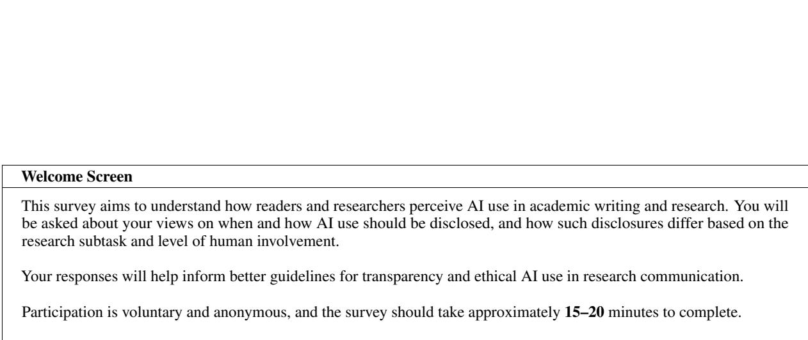  
Table 9: Welcome screen of the survey instrument.

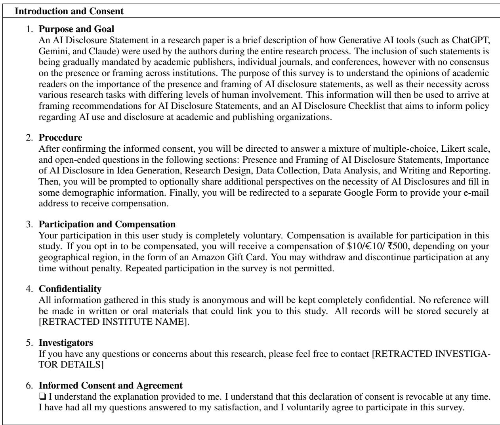  
Table 10: Introduction and Consent section of the survey instrument.

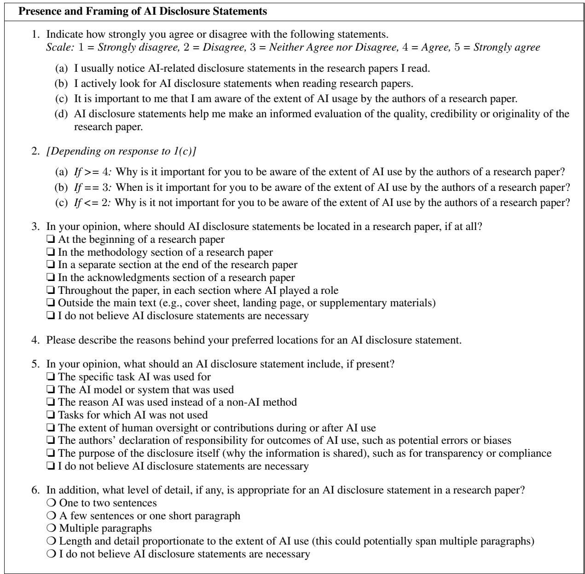  
Table 11: Presence and Framing of AI Disclosure Statements section of the survey instrument.

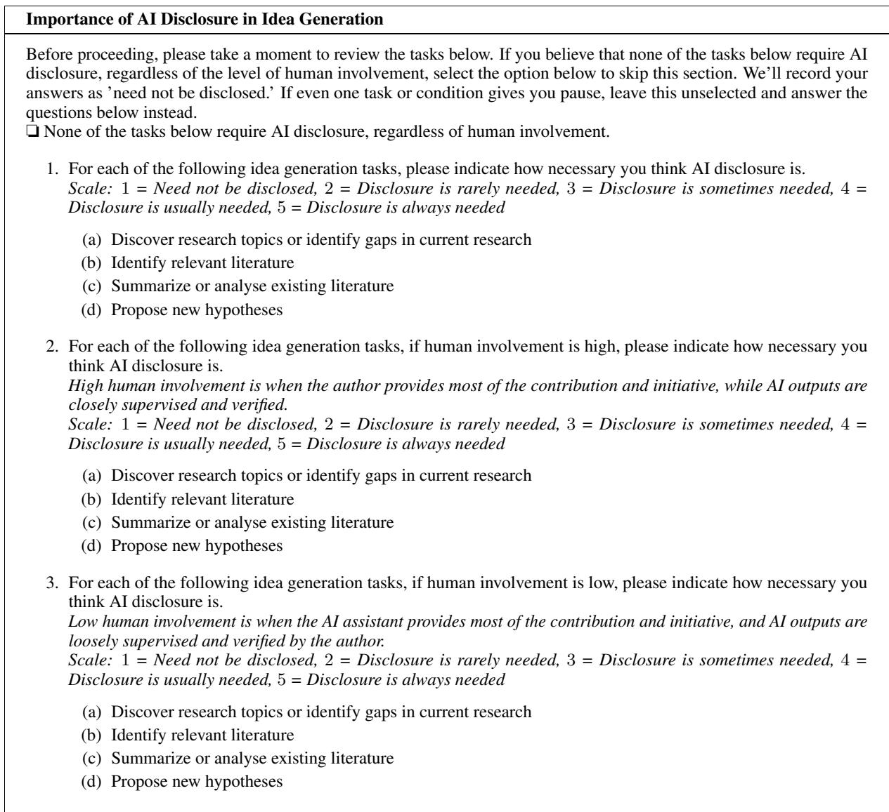  
Table 12: Importance of AI Disclosure in Idea Generation section of the survey instrument. All subsequent phases follow the same template, and are thus excluded for brevity.

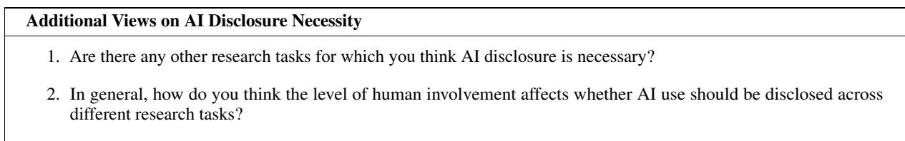  
Table 13: Additional Views on AI Disclosure Necessity section of the survey instrument.

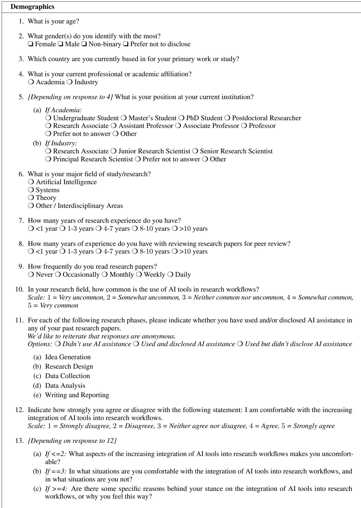  
Table 14: Demographics section of the survey instrument.

<table><tr><td>Demographic</td><td>Level</td><td>n</td></tr><tr><td rowspan="4">Gender</td><td>Female</td><td>36</td></tr><tr><td>Male</td><td>67</td></tr><tr><td>Non-binary</td><td>1</td></tr><tr><td>Prefer not to disclose</td><td>5</td></tr><tr><td rowspan="6">Country of work / residence</td><td>India</td><td>46</td></tr><tr><td>United States</td><td>40</td></tr><tr><td>Germany</td><td>7</td></tr><tr><td>Canada</td><td>5</td></tr><tr><td>United Arab Emirates</td><td>4</td></tr><tr><td>Israel</td><td>1</td></tr><tr><td rowspan="3">Affiliation</td><td>Academia</td><td>104</td></tr><tr><td>Industry</td><td>3</td></tr><tr><td>Other</td><td>2</td></tr><tr><td rowspan="3">Field of study</td><td>Artificial Intelligence</td><td>52</td></tr><tr><td>Systems Theory</td><td>13</td></tr><tr><td>Other / Interdisciplinary Areas</td><td>12</td></tr><tr><td rowspan="5">Years of research experience</td><td>&lt;1 years</td><td>32 22</td></tr><tr><td>1–3 years</td><td>48</td></tr><tr><td>4-7 years</td><td>21</td></tr><tr><td>8-10 years</td><td></td></tr><tr><td>&gt;10 years</td><td>11 7</td></tr><tr><td rowspan="5">Years of review experience</td><td>&lt;1 years</td><td>56</td></tr><tr><td>1–3 years</td><td>29</td></tr><tr><td>4-7 years</td><td>15</td></tr><tr><td>8-10 years</td><td>5</td></tr><tr><td>&gt;10 years</td><td>4</td></tr></table>

Table 15: Demographics of survey respondents (N = 109). Mean age: 26.64 years (SD = 6.28). Counts in the n column are unweighted respondent totals; categories within each demographic are mutually exclusive.

<table><tr><td>ICLR Disclosure Extraction Prompt</td></tr><tr><td>You are extracting AI/LLM usage disclosure statements from academic papers.</td></tr><tr><td>Your task: find a dedicated section where the authors disclose how they used AI tools or Large Language Models (LLMs) in **preparing or writing the manuscript** — for example, grammar checking, text polishing, writing assistance, or code editing.</td></tr><tr><td>IMPORTANT DISTINCTIONS: - DO extract: sections about LLMs used for manuscript preparation (writing, editing, grammar, coding assistance for the paper itself). - DO extract: negative disclosures where authors explicitly state they did NOT use LLMs. - DO NOT extract: inline mentions of LLM use embedded within Methods, Experiments, or Results sections that are not part of a dedicated disclosure statement or paragraph.</td></tr><tr><td>Where to look: - This section almost always appears near the END of the paper (after Conclusions, near Acknowledgments or References). - Common headings include: &quot;LLM Usage&quot;, &quot;Use of Large Language Models&quot;, &quot;AI Disclosure&quot;, &quot;Declaration of LLM Usage&quot;, &quot;LLM Usage Statement&quot;, etc. - It may also be embedded inside an &quot;Ethics Statement&quot; or &quot;Acknowledgments&quot; section. - Occasionally there is no heading — look for a standalone paragraph near the end of the</td></tr><tr><td>paper that explicitly addresses AI tool usage in manuscript preparation. Return a JSON object with: - &quot;found&quot;: true if a disclosure section or paragraph was found, false otherwise - &quot;heading&quot;: the</td></tr><tr><td>exact heading of the section (empty string if embedded or no heading) - &quot;content&quot;: the full text content of the disclosure (empty string if not found)</td></tr></table>

Table 16: Prompt used for extracting ICLR disclosures.

EMNLP Disclosure Extraction Prompt 1   
You are reading the "Responsible NLP Checklist" of an EMNLP paper.   
The checklist has a legend at the top that explains the symbols: ✓ (checkmark / tick) = the authors responded YES ✗   
(cross / X) = the authors responded NO N/A = does not apply empty box = no response   
These two symbols are DIFFERENT and must not be confused: ✓ = YES (a tick, checkmark, or filled checkmark — the   
answer is affirmative) ✗ = NO (a cross, X, or filled X — the answer is negative)   
Find section E, which concerns AI assistant use: E. Did you use AI assistants (e.g., ChatGPT, Copilot) in your research,   
coding, or writing? E1. If you used AI assistants, did you include information about their use?   
Your task:   
1. Look at the symbol next to question E (not E1). Read it carefully. - If it is ✗ (cross/X/NO) or N/A: set ai\_used = false   
and stop. - If it is ✓ (tick/checkmark/YES): set ai\_used = true and continue.   
2. Read the answer text written next to or below question E1 (do NOT rely on E1’s symbol — it varies across submissions   
and is unreliable). Instead, classify by the text itself:   
- "paper\_section": the text is a location pointer — either a bare pointer (just a section number, heading name, appendix   
letter, or page, e.g. "Section 5", "Ethics Statement", "Appendix A", "page 8", "see §4") OR a wrapper sentence that   
only says the disclosure IS in a section without describing WHAT AI was used for (e.g. "We include information in   
the Acknowledgement section", "We disclosed AI usage in Appendix G", "In the Ethics Statement we specified the AI   
usage", "Yes we include the use of AI assistants in Section 3", "We mention the usage in pre-appendix", "We have detailed   
how to use it in Appx. G"). Key test: does the text tell you WHAT AI was used for? If no — it is paper\_section. → set   
disclosure\_location = "paper\_section", copy the text to section\_reference.   
- "inline": the text describes WHAT AI was used for — it contains actual content about the usage, not just a pointer   
to where it is described. It may also mention a section, but the description itself is informative without needing to   
look elsewhere (e.g. "Used for grammar correction", "We used ChatGPT only for writing polish", "Used for machine   
translation. We outline in Section 4.6."). → set disclosure\_location = "inline", copy the full text to content.   
- "none": E1 has no meaningful answer text (blank, just "N/A", bare "yes"/"no"). → set disclosure\_location = "none".   
Return a JSON object with exactly these fields: - "ai\_used": true or false - "disclosure\_location": one of "inline", "pa  
per\_section", "none" - "content": the inline disclosure text if disclosure\_location is "inline", else "" - "section\_reference":   
the section/page pointer if disclosure\_location is "paper\_section", else "" - "e\_symbol\_seen": the exact symbol you saw   
next to question E (e.g. "✓", "✗", "N/A", "empty")   
Return ONLY valid JSON.  
Table 17: First-stage prompt for the two-stage EMNLP extraction pipeline. Reads the Responsible NLP Checklist (Section E and E1) and returns AI-use status, disclosure type (inline vs. paper-section pointer), and the corresponding content or section reference.

EMNLP Disclosure Extraction Prompt 2   
You are extracting an AI usage disclosure from an EMNLP paper.   
The authors’ checklist section E1 points to this location: "section\_reference"   
Locate that section, appendix, or page. Your task is to determine whether it contains a GENUINE AI usage disclosure and,   
if so, extract ONLY the AI disclosure portion.   
A GENUINE disclosure is one where the authors explicitly address their use (or non-use) of AI tools in the   
context of THIS paper — for example: - Using LLMs or AI assistants to write, edit, polish, proofread, or translate   
the manuscript - Using AI coding assistants (Copilot, Cursor) to write code for the paper - Explicitly stating they   
did NOT use any AI tools - Any deliberate statement of AI usage made to inform readers about how the paper was produced   
NOT genuine (set found = false): - Sections that only describe LLMs as the subject of study or research methodology (e.g.   
"we used GPT-4 to generate our dataset", "we evaluated ChatGPT on our benchmark") with no separate statement about   
manuscript preparation - Generic ethics or limitations sections with no mention of AI tool use at all - Sections that do not   
exist in the paper   
IMPORTANT — partial extraction: The referenced section may be a broader section (Ethics Statement, Acknowledgments,   
Limitations, etc.) that contains other content unrelated to AI tool usage. In that case, extract ONLY the sentences or   
paragraph that specifically address AI/LLM usage. Do NOT copy the entire section — only the AI disclosure part. Set   
"heading" to the section’s actual heading even if only part of it is extracted.   
Return a JSON object with: - "found": true if a genuine AI usage disclosure was found, false otherwise - "heading": the   
exact section heading where the disclosure appears (empty string if no heading) - "content": ONLY the AI disclosure text,   
not the full surrounding section   
Return ONLY valid JSON.  
Table 18: Second-stage prompt for the two-stage EMNLP extraction pipeline. Reads the referenced section of the paper PDF and returns whether a genuine AI usage disclosure is present, the section heading, and the disclosure text itself.

<table><tr><td rowspan="2">Annotator</td><td colspan="3">Details</td><td colspan="3">Tasks</td><td rowspan="2">Length Acc.</td></tr><tr><td>P</td><td>R</td><td>F1</td><td>P</td><td>R</td><td>F1</td></tr><tr><td>Annotator 1</td><td>98.2</td><td>97.4</td><td>97.8</td><td>91.8</td><td>93.7</td><td>92.7</td><td>90.0</td></tr><tr><td>Annotator 2</td><td>98.2</td><td>95.7</td><td>96.9</td><td>88.4</td><td>90.2</td><td>89.3</td><td>86.0</td></tr><tr><td>Annotator 3</td><td>91.1</td><td>98.6</td><td>94.7</td><td>91.1</td><td>88.7</td><td>89.9</td><td>87.0</td></tr><tr><td>Average</td><td>95.8</td><td>97.2</td><td>96.5</td><td>90.4</td><td>90.9</td><td>90.6</td><td>87.7</td></tr></table>

Table 19: Validation of LLM-based annotation against 3 human annotators on N = 100 disclosures. We report micro precision (P), recall (R), and F1 for the multi-label Details and Tasks schemas, and classification accuracy for the single-label Length schema. All values are percentages; numbers compare each human annotator’s labels to Gemini’s annotations.

<table><tr><td rowspan="2">Annotator A</td><td rowspan="2">Annotator B</td><td colspan="3">Details</td><td colspan="3">Tasks</td><td rowspan="2">Length Acc.</td></tr><tr><td>P</td><td>R</td><td>F1</td><td>P</td><td>R</td><td>F1</td></tr><tr><td>Annotator 1</td><td>Annotator 2</td><td>94.8</td><td>96.5</td><td>95.6</td><td>90.2</td><td>90.2</td><td>90.2</td><td>81.0</td></tr><tr><td>Annotator 1</td><td>Annotator 3</td><td>98.1</td><td>89.9</td><td>93.8</td><td>87.3</td><td>91.6</td><td>89.4</td><td>90.0</td></tr><tr><td>Annotator 2</td><td>Annotator 3</td><td>98.6</td><td>88.7</td><td>93.4</td><td>84.7</td><td>88.8</td><td>86.7</td><td>80.0</td></tr><tr><td>Average</td><td></td><td>97.2</td><td>91.7</td><td>94.3</td><td>87.4</td><td>90.2</td><td>88.8</td><td>83.7</td></tr></table>

Table 20: Pairwise inter-annotator agreement on N = 100 disclosures. We report micro precision (P), recall (R), and F1 for the multi-label Details and Tasks schemas, and classification accuracy for the single-label Length schema. All values are percentages.

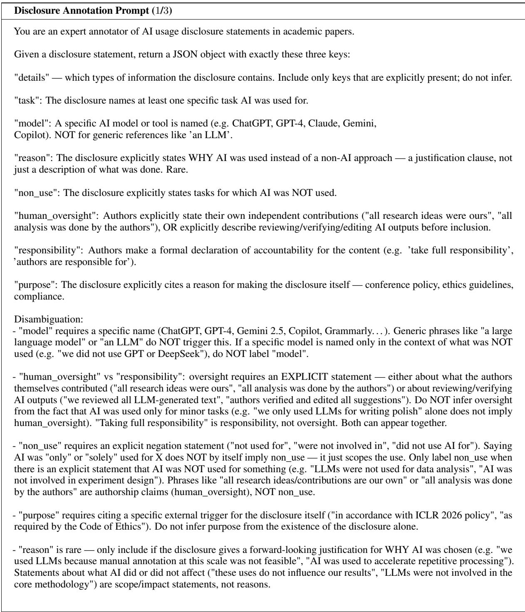  
Table 21: Annotation prompt (1/3): defines the seven detail labels (task, model, reason, non\_use, human\_oversight, responsibility, purpose) and the disambiguation rules.

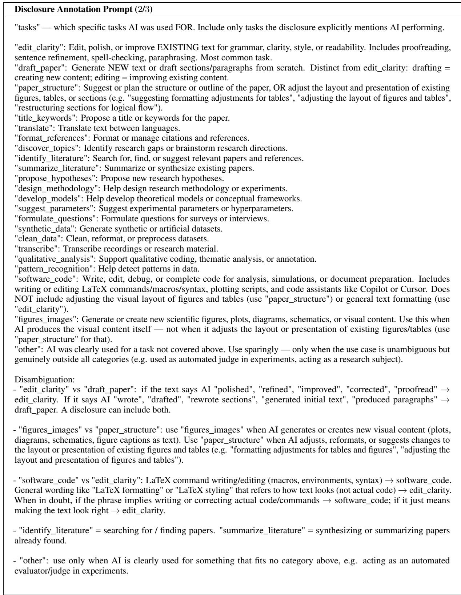  
Table 22: Annotation prompt (2/3): defines the task labels (e.g., edit\_clarity, draft\_paper, software\_code, synthetic\_data) and disambiguation rules for borderline cases.

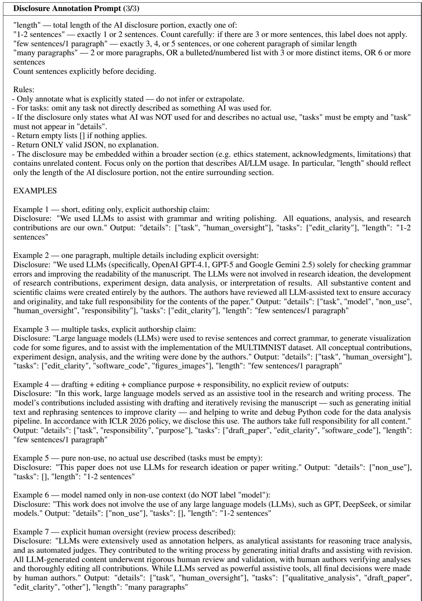  
Table 23: Annotation prompt (3/3): defines the length categories, general output rules, and worked examples for the model to follow.