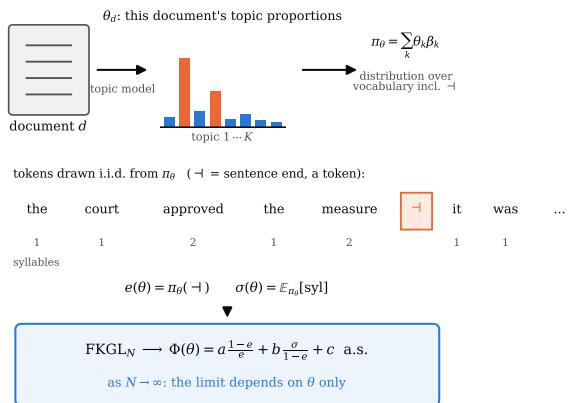
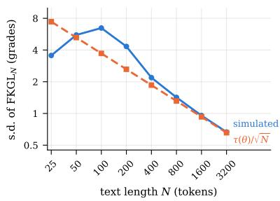
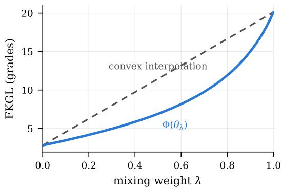
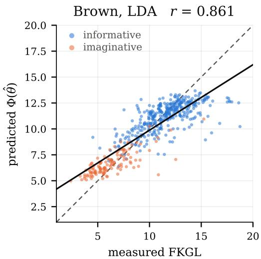
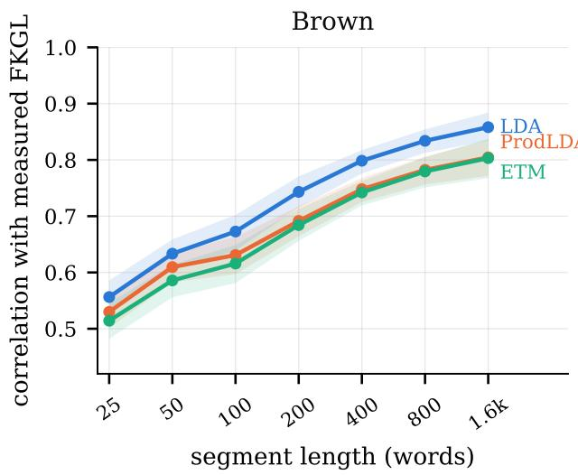
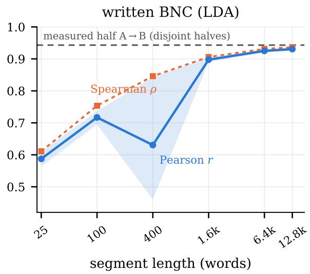

# Flesch–Kincaid Readability Depends Only on the Topic Distribution in Long Texts under Topic Models

Yo Ehara   
Tokyo Gakugei University   
Tokyo, Japan   
ehara@u-gakugei.ac.jp

## Abstract

Flesch Reading Ease (FRE) and the Flesch– Kincaid Grade Level (FKGL) are computed from the same two document statistics, and stability on long documents need not imply invariance to lexical composition. Under a topic model with an explicit sentence-boundary token, these scores converge almost surely to a deterministic function of the document topic distribution; the theory covers both formulae, while the experiments evaluate FKGL. For admixture models the limit depends on two linear functionals; product-of-experts models share the factorisation. In a fixed admixture with rank[1, q, s] = 3, fibres through interior topic vectors are locally (K − 3)-dimensional, whereas regular iso-score level sets are locally (K−2)-dimensional and curved. Out of fold on Brown and the written BNC, a topic vector inferred from one document half’s content words predicts the other half’s FKGL at r = 0.779 and 0.884. On Brown, adding the topic prediction to genre and mean content-word syllable count yields $\Delta R ^ { 2 } = 0 . 0 0 2$ , with a confidence interval spanning zero; on the BNC, the corresponding split-half increment is 0.024, positive in four of five K=100 fits (median 0.021). Long-text scores are thus strongly predictable from lexical composition, with increments varying by corpus and model fit. We do not evaluate human readability or causal effects.

## 1 Introduction

Flesch Reading Ease (FRE; Flesch, 1948) and the Flesch–Kincaid Grade Level (FKGL; Kincaid et al., 1975), which we collectively call the Flesch– Kincaid readability formulae, are widely used metrics for English readability (Si and Callan, 2001; Collins-Thompson and Callan, 2005). Both are computed from exactly the same two document statistics: words per sentence and syllables per word. For word, sentence and syllable counts W,

  
Figure 1: The setting and the claim. A topic model assigns each document d its own topic proportions $\theta _ { d } ;$ θ mixes per-topic word distributions into a token distribution π over the vocabulary including a sentenceboundary token ⊣. Both FKGL terms are ratios of tokenlevel sample means, so as the text grows FKGL converges a.s. to a closed-form function of θ (Theorem 2).

S and Y , their common form is

$$
R _ { a , b , c } \equiv a \frac { W } { S } + b \frac { Y } { W } + c ,\tag{1}
$$

with $( a , b , c ) ~ = ~ ( - 1 . 0 1 5 , - 8 4 . 6 , 2 0 6 . 8 3 5 )$ for FRE and (0.39, 11.8, −15.59) for FKGL. Given W/S and $Y / W$ , either formula converts exactly into the other by replacing these three fixed coefficients; no further document information is required (a single score alone does not determine the other). We therefore derive the common theory once and use FKGL notation thereafter; the formal results cover FRE after coefficient substitution, while the corpus experiments concern FKGL.

The formulae require no word list and are computable in one pass over raw text; FKGL additionally expresses its output as a US school grade. They remain in wide use and increasingly serve as automatic evaluation signals for controllable generation and simplification with large language models (Tanprasert and Kauchak, 2021; Imperial and Tayyar Madabushi, 2023; Kew et al., 2023). Practitioners know FKGL is unstable on short texts, and the standard remedy is to aggregate: score a long document and treat the stabilised value as a property of its writing. Stability with length, however, need not imply invariance to lexical composition. We ask what the score converges to under an explicit generative model, taking LDA (Blei et al., 2003), ETM (Dieng et al., 2020) or ProdLDA (Srivastava and Sutton, 2017) as that model.

Under a topic model with an explicit sentenceboundary token, the long-text score converges almost surely not to a document-independent constant plus noise, but to a deterministic function $\Phi ( \pmb \theta )$ of the document topic distribution vector (the topic vector) θ, a probability vector with $\theta _ { k } \geq 0$ and $\textstyle \sum _ { k } \theta _ { k } = 1$ Throughout, “depends only on $\pmb { \theta } ^ { \ast }$ means that once the topic-model decoder, vocabulary, boundary convention, syllable map and formula coefficients are fixed, θ is the limit’s only document-varying argument. The mechanism is elementary: a word’s syllable count is a property of its type, and words per sentence is the reciprocal of a boundary-symbol rate, so both terms of Eq. (1) are ratios of token-level sample means, which converge conditionally on θ. Beyond this law-of-largenumbers limit, we derive its explicit two-rate factorisation, invariance geometry and asymptotic variance.

Two clarifications delimit the claim. First, a bagof-words topic vector absorbs whatever documentpersistent variation the model can represent — genre, register and style along with subject matter — so the result concerns the model variable θ, not semantics alone. Second, it does not show that either formula fails to measure readability: lexical composition may reflect genuine difficulty, as when children’s vocabulary makes prose easier; our corpora contain no human judgements, and the experiments identify no causal effects. The structural conclusion is that, under the model, long-text Flesch– Kincaid scores are determined by document-level lexical composition through only two scalar rates (Fig. 1).

Contributions.

• Using FKGL notation, under any topic model with conditionally i.i.d. tokens, $\mathrm { F K G L } _ { N } $ Φ(θ) almost surely, in closed form for admixture and product-of-experts models (Theorem 2, Cor. 4, Prop. 5), with $\mathrm { F K G L } _ { N }$ Φ $( \pmb \theta ) = O _ { p } ( N ^ { - 1 / 2 } )$ and an explicit asymptotic variance (Theorem 10); the results apply to FRE after inserting its coefficients.

• The limit factors through two scalars: the boundary-token rate and the expected syllable contribution per token. For a fixed Ktopic admixture with rank $[ { \bf 1 } , { \bf q } , { \bf s } ] = 3 { \bf \underline { { { \sigma } } } }$ , fibres through interior topic vectors are locally $\left( K - 3 \right)$ -dimensional, while regular iso-score level sets are locally (K − 2)-dimensional and curved transverse to those fibres (Prop. 7); along a two-topic mixing path, Φ is a ratio of polynomials of degree at most two, not an average of the endpoint scores (Prop. 8).

• We audit this dependence out of fold on Brown and the written BNC under masked inputs, disjoint document halves, genre controls and a one-feature lexical baseline. A topic vector inferred from one half’s content words predicts the other half’s FKGL at $r = 0 . 7 7 9$ (Brown) and 0.884 (BNC). On Brown, adding the topic prediction to genre and mean contentword syllable count yields $\Delta R ^ { 2 } ~ = ~ 0 . 0 0 2$ with a confidence interval spanning zero; on the BNC the increment is 0.024 in the default fit and positive in four of five K=100 fits (median 0.021): the pipeline adds no detectable value over the baseline on Brown, while the modest BNC increment depends on the fit.

## 2 Related Work

Readability formulae and their critique. Classical formulae combine a sentence-length term with a word-difficulty term (Flesch, 1948; Kincaid et al., 1975; Smith and Senter, 1967; Coleman and Liau, 1975). Their limitations are well documented: insensitivity to grammatical and discourse difficulty, gameability, and weak correlation with human judgements (Tanprasert and Kauchak, 2021; Vajjala, 2022). Modern readability assessment uses supervised models over rich features or contextual encoders (Si and Callan, 2001; Collins-Thompson and Callan, 2005; Pitler and Nenkova, 2008; Martinc et al., 2021; Lee et al., 2021; Crossley et al., 2023); that formulae transfer poorly across genres is known and usually treated as a calibration caveat (Sheehan et al., 2014; Xia et al., 2016). Attia et al. (2023) predict human-annotated readability from document-level statistical and lexical features; our object is instead the FKGL formula itself. Closest to us, Belem et al. (2025) report that human readability judgements themselves shift with topic and information content, and Cachola et al. (2025)

analyse the mismatch between FKGL and human judgements in plain-language summarisation; both study judgements or deployments; we derive the sensitivity as a structural property of the formula under an explicit generative model.

Rate-based readings of FKGL. Both terms of Eq. (1) are reciprocals of token rates, and reading them that way is useful in itself. Treat a document as a token sequence in which every sentence ends with an explicit boundary symbol ⊣, and write $\ p _ { s w } =$ #sentences/#words, $\begin{array} { r l } { p _ { w \ell } } & { { } = } \end{array}$ #words/#syllables and $p _ { s \ell } ~ = ~ p _ { s w } p _ { w \ell }$ Then Eq. (1) rearranges exactly, with no approximation, into

$$
\mathrm { F K G L } - c ~ = ~ \frac { 1 } { p _ { s \ell } } \big ( a p _ { w \ell } + b p _ { s w } \big ) ~ = ~ \frac { M } { p _ { s \ell } } ,\tag{2}
$$

with $M \equiv a p _ { w \ell } + b p _ { s w } ;$ for observed documents every word carries at least one syllable and every segmented sentence at least one word — our preprocessing appends ⊣ only to non-empty sentences, so the counts satisfy $0 < S \le W \le Y$ — hence $0 < p _ { w \ell } , p _ { s w } \le 1$ and $| M | \leq | a | + | b |$ (a property of observed counts, not of the generative model, whose i.i.d. boundary process can emit empty sentences): for either formula, the score minus its intercept is the average number of syllables per sentence rescaled by a bounded, coefficient-dependent factor. The factorisation in Eq. (2), the boundedness of M, and a BNC-based analysis of these rates were established in prior work (Ehara, 2024, see also Ehara, 2023). Beyond those results, this paper introduces the token-exchangeable generative model, the limit $\Phi ( \pmb \theta )$ and its fibre and level-set geometry, the asymptotic variance, and the masked out-of-fold audit. Cross-genre bias of readability formulae was measured directly by Sheehan et al. (2013), and Goldstein-Stewart et al. (2008) manipulated topic and genre and reported effects on Flesch scores; we add the generative account of why they are structural.

Topic models. LDA (Blei et al., 2003) represents a document as a mixture $\begin{array} { r } { \pi _ { \pmb { \theta } } = \sum _ { k } \theta _ { k } \beta _ { k } } \end{array}$ over topic–word distributions. Neural topic models replace the Dirichlet posterior with an amortised logistic-normal one (Kingma and Welling, 2014; Miao et al., 2016): ProdLDA (Srivastava and Sutton, 2017) replaces the mixture with a product of experts, $\pi _ { \pmb { \theta } } = \operatorname { s o f t m a x } ( \widetilde { \pmb { \beta } } ^ { \top } \pmb { \theta } )$ , while ETM (Dieng et al., 2020) keeps the mixture but parameterises each topic by an embedding, $\beta _ { k v } \propto \exp ( \rho _ { v } ^ { \top } { \alpha } _ { k } )$

All three share the property our theory needs: a document-level simplex vector θ inducing a probability distribution $\pi _ { \pmb { \theta } }$ with tokens conditionally i.i.d. given it, which is what makes $e ( \pmb \theta )$ and $\sigma ( \pmb \theta )$ well defined. NMF can be normalised into an admixture, truncated SVD in general cannot; both serve only as reconstruction controls (App. E).

## 3 FKGL under Topic Models

## 3.1 Setup

Let V be a word vocabulary and $\widetilde { \mathcal { V } } = \mathcal { V } \cup \{ \mathrm { - } \mathrm { i } \}$ the vocabulary augmented with a sentence-boundary token. Let $\operatorname { s y l } : \mathcal { V } \to [ 1 , s _ { \operatorname* { m a x } } ]$ be a bounded syllable count — a deterministic property of the word type — extended by $\operatorname { s y l } ( \lnot 1 ) = 0$ . (Non-integer values are allowed because the experiments assign an averaged count to an <unk> type; only boundedness and syl ≥ 1 on words are used.) All probabilistic statements below are conditional on $\pmb \theta .$

Definition 1 (Token-exchangeable topic model). A token-exchangeable topic model on $\widetilde { \mathcal { V } }$ consists of a document-level variable $\pmb { \theta } \in \Delta ^ { K - 1 }$ with some prior, and a map $\pmb \theta \mapsto \pi _ { \pmb \theta } \in \Delta ^ { | \widetilde \nu | - 1 }$ , such that the tokens $v _ { 1 } , \ldots , v _ { N }$ of a document are i.i.d. draws from $\pi _ { \pmb { \theta } }$

LDA and ETM are of this form with the admixture map $\begin{array} { r } { \pi _ { \pmb { \theta } } ( v ) ~ = ~ \sum _ { k = 1 } ^ { K } \theta _ { k } \beta _ { k v } \frac { } { } } \end{array}$ ProdLDA is of this form with the product-of-experts map $\pi _ { \pmb { \theta } } = \mathrm { s o f t m a x } ( \tilde { \boldsymbol { \beta } } ^ { \top } \pmb { \theta } + { \bf b } )$

Letting the same document-level mixture emit sentence boundaries is a modelling assumption, and a consequential one: the count of ⊣ tokens is, together with the syllable-weighted word counts, a sufficient statistic for Eq. (1). We return to what this costs us in Sec. 3.7 and test it empirically in Sec. 4.3. We define, for any θ, the two token functionals

$$
e ( \pmb { \theta } ) \equiv \pi \pmb { \theta } ( - 1 ) ,\tag{3}
$$

$$
\sigma ( \pmb \theta ) \equiv \sum _ { w \in \mathcal { V } } \pi _ { \pmb \theta } ( w ) \mathrm { s y l } ( w ) .\tag{4}
$$

$e ( \pmb \theta )$ is the probability that a token is a sentence boundary; $\sigma ( \pmb \theta )$ is the expected number of syllables contributed by a token.

## 3.2 The long-text limit

Theorem 2 (FKGL is a function of θ alone). Let a document ofN tokens be generated by a tokenexchangeable topic model with $0 < e ( \pmb { \theta } ) < 1$ . Let

FKGLN denote Eq. (1) computed on that document. Then, almost surely as $N \to \infty$

$$
\begin{array} { r c l } { { \displaystyle \mathrm { F K G L } _ { N } \longrightarrow \Phi ( \pmb { \theta } ) , } } \\ { { \Phi ( \pmb { \theta } ) \equiv a \displaystyle \frac { 1 - e ( \pmb { \theta } ) } { e ( \pmb { \theta } ) } + b \displaystyle \frac { \sigma ( \pmb { \theta } ) } { 1 - e ( \pmb { \theta } ) } + c . } } \end{array}\tag{5}
$$

The proof (App. B) is the strong law of large numbers applied to the bounded i.i.d. sentence, word and syllable counts, followed by the continuous mapping theorem.

For finite N, $S _ { N } = 0$ or $W _ { N } = 0 \ : ( \mathrm { F K G L } _ { N }$ undefined) occurs with probability $( 1 - e ) ^ { N } + e ^ { N } $ 0; assigning any fixed value on this vanishing event leaves the limit unchanged (the simulation of App. D discards such replicates, which arise only at $N \leq 5 0 )$ .

Proposition 3 (Dependent tokens). Suppose that, conditionally on θ, the token process $( v _ { n } ) _ { n \geq 1 }$ is stationary and ergodic with one-dimensional marginal π . Then the conclusion of Theorem 2 holds, with the same Φ.

The proof is identical: only two sample averages need to converge, and Birkhoff’s theorem supplies that. This covers burstiness, ngram dependence and sentence-length autocorrelation. Within-document topic drift is a special case with a twist. Conditional on the drift $\left( \pmb \theta _ { n } \right)$ let $v _ { n } \sim \pi _ { \pmb { \theta } _ { r } }$ independently (bounded martingale differences suffice) and let the occupation measures $\begin{array} { r } { \mu _ { N } = N ^ { - 1 } \sum _ { n < N } \delta _ { \pmb { \theta } _ { n } } \Rightarrow \mu } \end{array}$ weakly with $\begin{array} { r } { \bar { e } \equiv \int e d \mu \in ( 0 , 1 ) } \end{array}$ . For admixture models π is linear in $\theta ,$ so the document converges to $\Phi ( { \bar { \pmb { \theta } } } )$ with $\begin{array} { r } { \bar { \pmb { \theta } } = \int \pmb { \theta } d \mu ; } \end{array}$ for ProdLDA the softmax is nonlinear, and the averaged rate pair $( \bar { e } , \bar { \sigma } )$ need not lie in the image of any single topic vector.

## 3.3 Closed form for admixture models

Corollary 4 (LDA, ETM). For an admixture model $\begin{array} { r } { \pi _ { \pmb { \theta } } = \sum _ { k } \theta _ { k } \beta _ { k } , } \end{array}$ define the per-topic scalars

$$
q _ { k } \equiv \beta _ { k \mathrm { - } 1 } , s _ { k } \equiv \sum _ { w \in \mathcal { V } } \beta _ { k w } \mathrm { s y l } ( w ) ,\tag{6}
$$

and collect them into $\mathbf { q } , \mathbf { s } \in \mathbb { R } ^ { K }$ . Then $e ( \pmb \theta ) =$ $\mathbf { q } ^ { \intercal } \pmb { \theta }$ and $\begin{array} { r } { \boldsymbol { \sigma } ( \pmb { \theta } ) = \mathbf { s } ^ { \top } \pmb { \theta } , } \end{array}$ ; writing $\mathcal { D } \equiv \{ \pmb { \theta } \in \Delta ^ { K - 1 }$ $0 < \mathbf { q } ^ { \intercal } \pmb { \theta } < 1 \}$ for the set on which Φ is defined, for every $\pmb \theta \in \mathcal D$

$$
\Phi ( \pmb \theta ) = a \frac { 1 - \mathbf { q } ^ { \top } \pmb \theta } { \mathbf { q } ^ { \top } \pmb \theta } + b \frac { \mathbf { s } ^ { \top } \pmb \theta } { 1 - \mathbf { q } ^ { \top } \pmb \theta } + c .\tag{7}
$$

In the notation of Eq. (2), the average number of syllables per sentence becomes a ratio of two linear forms, $1 / p _ { s \ell } ( \pmb { \theta } ) = \mathbf { s } ^ { \top } \pmb { \theta } / \mathbf { q } ^ { \top } \pmb { \theta }$ , and $\Phi ( \pmb { \theta } ) - c =$ $M ( \pmb \theta ) \mathbf { s } ^ { \top } \pmb \theta / \mathbf { q } ^ { \top } \pmb \theta \colon \mathrm { E q . ~ } ( 2 )$ with every quantity determined by the topic vector. For ETM the same expressions hold with $\beta _ { k v } = \exp ( \rho _ { v } ^ { \top } \alpha _ { k } ) / Z _ { k }$ substituted into Eq. (6).

Proposition 5 (ProdLDA). For $\_ { \pi \theta }$ $\operatorname { s o f t m a x } ( \widetilde { \beta } ^ { \prime } \pmb \theta + \mathbf b )$ , write $\ell _ { v } ( \pmb \theta ) = ( \widetilde \beta ^ { \prime } \pmb \theta ) _ { v } + b _ { v }$ Then

$$
\begin{array} { l } { { \displaystyle e ( \pmb { \theta } ) = \frac { \exp \ell _ { + } ( \pmb { \theta } ) } { \sum _ { v \in \widetilde { \mathcal { V } } } \exp \ell _ { v } ( \pmb { \theta } ) } , } } \\ { { \displaystyle \sigma ( \pmb { \theta } ) = \frac { \sum _ { w \in \mathcal { V } } \mathrm { s y l } ( w ) \exp \ell _ { w } ( \pmb { \theta } ) } { \sum _ { v \in \widetilde { \mathcal { V } } } \exp \ell _ { v } ( \pmb { \theta } ) } , } } \end{array}\tag{8}
$$

and Φ is given by Eq. (5). The outer form is unchanged, but e and σ are no longer linear in θ, so Eq. (7) does not apply.

## 3.4 What the limit discards

Corollary 6 (Two-scalar factorisation). $\Phi = g \circ$ $( e , \sigma )$ with $g ( u , z ) = a ( 1 - u ) / u + b z / ( 1 - u ) + c$ Hence $\Phi ( \pmb { \theta } ) = \Phi ( \pmb { \theta } ^ { \prime } )$ whenever $e ( \pmb \theta ) = e ( \pmb \theta ^ { \prime } )$ and $\sigma ( { \pmb \theta } ) = \sigma ( { \pmb \theta } ^ { \prime } )$

Corollary 6 says that FKGL reads a Kcoordinate document description and keeps two numbers; $^ { * } K - 2$ dimensions discarded” conflates two different objects, and the correct statement is sharper.

Proposition 7 (Invariance geometry, admixture case). Let M $\mathbf { \Sigma } = \mathbf { \Sigma } [ \mathbf { 1 } , \mathbf { q } , \mathbf { s } ] ^ { \top } \in \mathbb { R } ^ { 3 \times K }$ with $\rho =$ rank M, and let $\begin{array} { r } { \mathcal { F } _ { \Delta } ( u , z ) ~ = ~ \{ \pmb { \theta } ~ \in ~ \Delta ^ { K - 1 } ~ : } \end{array}$ $\mathbf { q } ^ { \top } \pmb { \theta } = u , \ \mathbf { s } ^ { \top } \pmb { \theta } = z \}$ be the set of valid topic vectors sharing the two rates.

(i) For $u \in ( 0 , 1 )$ with $\mathcal { F } _ { \Delta } ( u , z ) \neq \emptyset : \mathcal { F } _ { \Delta } ( u , z )$ is a convex polytope on which Φ is constant; its affine hull has dimension at most $K - \rho ,$ and when $( u , z )$ is attained at a point of relint $\Delta ^ { K - 1 }$ the polytope has that full local dimension $- f o r \rho = 3 ,$ , exactly $K - 3 .$

(ii) At any $\pmb \theta \in$ relint $\Delta ^ { K - 1 } \cap \mathcal { D }$ with $g _ { e } \mathbf { q } + g _ { \sigma } \mathbf { s } \notin$ span{1}, the level set of Φ in the simplex is locally a smooth manifold ofdimension $K - 2 ,$ with tangent space $\{ \delta : { \bf 1 } ^ { \top } \delta = 0 , ( g _ { e } { \bf q } +$ $g _ { \sigma } { \bf s } ) ^ { \top } \pmb { \delta } = 0 \}$

(iii) If ρ = 3: for any convex set $C \subset \mathcal { D }$ on which Φ is constant, the image of C under $\theta \mapsto$ $( \mathbf { q } ^ { \top } \pmb { \theta } , \mathbf { s } ^ { \top } \pmb { \theta } )$ is a convex subset of a strictly concave level curve of g, hence a singleton; so

$C \subset \mathcal { F } _ { \Delta } ( u , z )$ for a single $( u , z )$ . Level sets therefore contain no line segment transverse to thefibres: they are curved.

Parts (i) and (ii) are immediate; part (iii) follows because the level curves of g are strictly concave and so contain no line segment (App. B); “regular” throughout means condition (ii), regularity of the simplex-restricted differential. The two notions come apart: the valid reallocations FKGL discards by construction form a polytope of local dimension generically $K - 3$ , while the FKGL-preserving perturbations at a given document form one dimension more, $K - 2 ,$ , whose extra direction rotates with θ. These are properties of the parameterisation, not invariants of the generative distribution — duplicating a topic raises K and the fibre dimension without changing πθ — hence the rank and interiority qualifiers. For ProdLDA the analogue of (ii) holds locally, with $\nabla \Phi = g _ { e } \nabla e + g _ { \sigma } \nabla \sigma$ , wherever $\nabla \Phi ( { \pmb \theta } ) \notin $ span{1}. Fibres need not be convex polytopes, but a regular $( e , \sigma )$ -fibre is still locally a $\left( K - 3 \right)$ -manifold wherever the simplex-restricted Jacobian of $( e , \sigma )$ has rank two (constant-rank theorem); what need not carry over is the convexity of (i) and the no-transverse-segment conclusion of (iii), since $e , \sigma$ are not linear in θ.

## 3.5 Mixing two topics

Proposition 8 (Two-topic mixing path). For an admixture model and $\pmb { \theta } _ { \lambda } = ( 1 - \lambda ) \mathbf { e } _ { j } + \lambda \mathbf { e } _ { k }$ , write $q _ { \lambda } = ( 1 - \lambda ) q _ { j } + \lambda q _ { k }$ and $s _ { \lambda } = ( 1 - \lambda ) s _ { j } + \lambda s _ { k } ,$ and suppose $q _ { \lambda } \in \mathsf { \Gamma } ( 0 , 1 )$ for all $\lambda \in [ 0 , 1 ]$ (e.g. $q _ { j } , q _ { k } \in ( 0 , 1 ) )$ . Then

$$
\Phi ( \pmb \theta _ { \lambda } ) - c = \frac { a ( 1 - q _ { \lambda } ) ^ { 2 } + b s _ { \lambda } q _ { \lambda } } { q _ { \lambda } ( 1 - q _ { \lambda } ) } ,\tag{9}
$$

a ratio of polynomials of degree at most two in $\lambda .$ In particular $\Phi ( \pmb \theta _ { \lambda } )$ is in general neither affine nor linear-fractional in $\lambda ,$ and $\Phi ( \pmb \theta _ { \lambda } )$ need not equal $( 1 - \lambda ) \Phi ( \mathbf { e } _ { j } ) + \lambda \Phi ( \mathbf { e } _ { k } )$

Each term of Eq. (9) is separately linearfractional in λ, but their sum has $\mathrm { t y p e ~ } \left( 2 , 2 \right)$ not (1, 1), so Φ along the path is not a Möbius transform; only the syllables-per-sentence factor $1 / p _ { s \ell } ( \pmb { \theta } _ { \lambda } ) = s _ { \lambda } / q _ { \lambda }$ is. Practically: a chapter half easy narrative and half hard exposition does not receive the average grade.

Corollary 9 (When is the statement vacuous?). For an admixture model with $q _ { k } \in ( 0 , 1 )$ for all $k - s o$ that Φ is defined on all $o f \Delta ^ { K - 1 } - \Phi$ is constant on $\Delta ^ { K - 1 }$ if and only if $q _ { k } \equiv q$ and $s _ { k } \equiv s$ for all $k .$

The proof (App. B) maps the simplex to conv $\{ ( q _ { k } , s _ { k } ) \} _ { k }$ , which constancy of Φ confines to a strictly concave level curve, hence to a point. Corollary 9 characterises the restrictive condition under which FKGL would be invariant to topic mixture in this fixed model: $\left( q _ { k } , s _ { k } \right)$ constant across topics. Sec. 4.2 measures the spread.

## 3.6 Rate of convergence

Theorem 10 (Asymptotic normality). Under the conditions of Theorem $^ { 2 , }$ conditionally on θ and with $\begin{array} { r } { \sigma _ { 2 } ( \pmb { \theta } ) \equiv \sum _ { w } \pi _ { \pmb { \theta } } ( w ) \mathrm { s y l } ( w ) ^ { 2 } } \end{array}$

$$
\sqrt { N } \big ( \mathrm { F K G L } _ { N } - \Phi ( \pmb { \theta } ) \big ) \ \Rightarrow \ \mathcal { N } \big ( 0 , \tau ^ { 2 } ( \pmb { \theta } ) \big )\tag{10}
$$

$$
\begin{array} { l } { { \displaystyle \tau ^ { 2 } = g _ { e } ^ { 2 } e ( 1 - e ) ~ - ~ 2 g _ { e } g _ { \sigma } e \sigma ~ + ~ g _ { \sigma } ^ { 2 } ( \sigma _ { 2 } - \sigma ^ { 2 } ) , } } \\ { { \displaystyle g _ { e } = - \frac { a } { e ^ { 2 } } + \frac { b \sigma } { ( 1 - e ) ^ { 2 } } , ~ g _ { \sigma } = \frac { b } { 1 - e } . ~ \ ~ ( 1 1 ) } } \end{array}
$$

$$
I n p a r t i c u l a r \mathrm { F K G L } _ { N } - \Phi ( \pmb \theta ) = O _ { p } ( N ^ { - 1 / 2 } ) .
$$

The proof (App. B) applies the multivariate CLT and the delta method to the bounded i.i.d. vector $T _ { n } = ( \mathbf { 1 } [ v _ { n } \ = \ - 1 ] , \mathrm { s y l } ( v _ { n } ) )$ , whose covariance is determined by $e , \sigma , \sigma _ { 2 }$ because $\operatorname { s y l } ( \lnot 1 ) = 0$ . (On the undefined event $\mathrm { F K G L } _ { N }$ is fixed arbitrarily, as after Theorem 2.) The error is $O _ { p } .$ , not almost-sure, and its constant blows up as $e \to 0 :$ texts with long sentences need more tokens for FKGL to stabilise, because the sentence-count term is the reciprocal of a rare-event rate.

## 3.7 What θ is, and what it is not

Three qualifications precede any interpretation. First, θ is not semantics: a bag-of-words topic model has exactly one document-level latent, so everything persistent is pushed into it. A model with a semantic θ and a separate style variable z would give Φ $( \pmb \theta , \mathbf z )$ by the same proof, and nothing says the z dependence is weak. Second, putting ⊣ in the vocabulary is not innocuous. The ⊣ count is the sentence count, so an inference network that sees the augmented bag of words has been handed one of the two sufficient statistics of $\operatorname { E q }$ . (1) directly; no readability supervision enters the model, but that is much weaker than no readability information. Sec. 4.3 therefore re-estimates θ with ⊣, and then all NLTK stopword-list types, masked from the inference input. Third, the measurable quantity is not the theorem: a corpus experiment can only ask how much of the measured FKGL is recoverable from a fitted K-dimensional representation, controlled against non-topic-model representations (Sec. 4.3).

## 4 Experiments

Theorem 2 is an asymptotic statement about an idealised generative process, and no corpus experiment can verify it directly. What an experiment can measure is how much of the FKGL of a heldout document is recoverable from a topic vector inferred by a model fitted without it — and how much of that is recoverable from far cruder summaries of the same lexical information. We therefore evaluate against masked inference inputs, across disjoint document halves, under genre control, and against a one-dimensional lexical baseline, jointly rather than one at a time.

## 4.1 Setup

Corpora and preprocessing. We use two corpora. The Brown corpus (Francis and Kuceraˇ , 1979), via NLTK (Bird et al., 2009): 500 documents of about 2,000 words (1,005,119 word tokens) in 15 categories grouped into informative and imaginative prose. The written BNC (BNC Consortium, 2007): every written text with ≥ 50 sentences, giving 3,021 documents, 86.7M word tokens, median 31,040 words per document — fifteen times Brown. Genre controls pool Lee’s (2001) super-genres with $n { < } 2 0$ as “other”; within-genre summaries use the 12 with $n { \geq } 2 0$ On both corpora we keep every token containing a letter, casefold only, remove no stopwords, and append an explicit ⊣ per sentence; types below a frequency floor (5 / 10) map to <unk> with the frequencyweighted mean syllable count of the absorbed types (Brown 2.663, 5.55% of tokens; BNC 2.715, 1.46%); $| \widetilde { \mathcal { V } } | = 1 3 \small , 9 7 6$ and 75,002. Syllables come from CMUdict (version 0.7a, via NLTK; Weide, 2008) with a vowel-group fallback. Computing FKGL from raw surface forms instead changes nothing (App. F). The vocabulary, frequency floor and <unk> syllable value are computed corpuswide, so “out of fold” below refers to model fitting, not to preprocessing.

Models. On Brown: LDA (Blei et al., 2003), ProdLDA (Srivastava and Sutton, 2017) and ETM (Dieng et al., 2020), K = 50. On the BNC: LDA with K = 100, within the range of the original studies (up to 100 in Blei et al., 2003; 50–200 in Srivastava and Sutton, 2017; 50–300 in Dieng et al.,

2020) — a capacity choice for the larger corpus, not claimed optimal (fit sensitivity in Sec. 4.4 and App. K); hyperparameters in App. A. Each fitted model yields $\hat { \pmb { \theta } } _ { d }$ and $\hat { \boldsymbol { \pi } } _ { d } = \boldsymbol { \pi } _ { \hat { \boldsymbol { \theta } } _ { d } }$ , from which Φ is read off (Cor. 4, Prop. 5); matrix factorisations serve only as reconstruction baselines (App. E).

Protocol. All headline predictive results (Tables 1, 2, and App. F–H) are out of fold: 5-fold cross-validation over a seed-0 random partition (not genre-stratified), the model — hence (q, s) or the decoder — fitted only on the training folds; explicitly labelled topic illustrations and K/seed sensitivity analyses use whole-corpus fits. “Not seen” means the decoder was fitted without the document; $\hat { \pmb { \theta } }$ is always inferred from (part of) its own counts. Half A is the contiguous first half of each document, cut at the median sentence boundary, half B the remainder; the same fixed partition serves all models and only the A→B direction is evaluated (chosen ex ante). The genre-mean baseline is fitted on outer training folds only. Genre-residual correlations use category means estimated on the outer training folds (out-of-fold centring); the whole-sample descriptive variant is shown alongside. Documentlevel bootstrap 95% intervals (2,000 resamples) are conditional on the fitted folds, seed and decoder (they do not propagate fold-partition or fitting variation). Correlations and RMSEs in Table 1 are uncalibrated; the regression combinations of Sec. 4.4 are cross-fitted.

Inference-input variants and baselines. Because the ⊣ count is the sentence count (Sec. 3.7), we use three inference inputs: full; $n o \dashv$ (the query document’s ⊣ coordinate zeroed); and content (⊣ and all 198 NLTK stopwords zeroed). Masking removes the boundary and stopword coordinates (198 NLTK stopword-list types, not all function words), while content-word identities still encode syllable length: the content variant tests whether lexical composition suffices to infer the omitted rates, not whether semantics determines FKGL. Masking is test-time only, but a word-only model reproduces the result (Sec. 4.4); either way the regularity is empirical, not a consequence of Theorem 2. To calibrate how much of the signal is trivially lexical, we also evaluate $B _ { C }$ , the mean syllable count of a text’s content words: a single number, computable without any model.

<table><tr><td rowspan="2">model</td><td>whole document</td><td colspan="2">half A → B</td></tr><tr><td>full no- cont.</td><td>full</td><td>no- cont.</td></tr><tr><td colspan="4">Brown (500 docs, ~2k words,  $K { = } 5 0 )$  LDA 0.861 0.8530.8480.7860.7790.779 ProdLDA 0.8090.797 0.797 0.751 0.7390.745 ETM 0.8050.7900.7650.743 0.730 0.700 Bc (1 feature) 0.867 measured half A</td></tr><tr><td colspan="4">category mean 0.736 written BNC (3,021 docs, median 31k words, LDA 0.928 0.920 0.908 0.900 0.892 0.884 Bc (1 feature) 0.888 measured half A genre mean 0.813</td></tr></table>

Table 1: Out-of-fold Pearson r between predictions and measured FKGL (5-fold; the decoder is always fitted without the evaluated document). full: inference input is the whole ⊣-augmented bag of words; $n o  !$ its ⊣ coordinate zeroed; cont.: ⊣ and all 198 NLTK stopwords zeroed. $B _ { C } = { \mathrm { m e a n } }$ content-word syllable count of the input text (of half A in the split columns). CIs, slopes, RMSE and $R ^ { 2 }$ for the LDA rows in App. F.

## 4.2 Are topics FKGL-neutral?

Corollary 9 says Theorem 2 has content only to the extent that $\left( q _ { k } , s _ { k } \right)$ vary across topics. They vary: in the $K = 5 0$ Brown LDA model, the 13 topics with $q _ { k } \ge 0 . 0 1$ carry 97.8% of posterior topic mass, spanning implied sentence lengths of 9.6–46.7 words and 1.24–1.80 syllables per word (Table 4: dialogue and narration at the low end; government, technical and mathematical prose at the high end). Cautions: pure-topic vertices are unoccupied (observed $\Phi ( { \hat { \pmb { \theta } } } _ { d } )$ spans 4.5–14.1 at the 1st–99th percentile for this fit; App. I) and per-topic values are only moderately seed-stable (App. I).

## 4.3 Out-of-fold agreement

Out of fold, LDA correlates with measured FKGL at $r ~ = ~ 0 . 8 6 1$ (CI [0.833, 0.887]) on Brown and 0.928 (CI [0.922, 0.933]) on the BNC; RMSEs 1.70 and 1.27 grades. The prediction plots further show that the fitted values are less dispersed than the measured FKGL scores, especially near the extremes (App. F, Fig. 4). Masking barely moves the topic models: ⊣ zeroed, $0 . 8 6 1  0 . 8 5 3$ and $0 . 9 2 8  0 . 9 2 0 $ ; stopword types zeroed too, 0.848 and 0.908. Predicting the FKGL measured on half B from $\hat { \pmb { \theta } }$ inferred on half A gives 0.786/0.779 (Brown, full/content) and 0.900/0.884 (BNC), against test–retest reference correlations of 0.880 and 0.943 (a different protocol). The strongest single number: a topic vector inferred from one half’s content words predicts the other half’s measured FKGL at $r = 0 . 8 8 4$ (BNC).

<table><tr><td colspan="2">Brown</td><td>BNC</td></tr><tr><td colspan="2">features (from half A) FKGLB  $( \mathsf { W } / \mathsf { S } ) _ { B }$ </td><td>FKGLB</td></tr><tr><td>genre dummies</td><td>0.511 0.307</td><td>0.651</td></tr><tr><td> $\mathrm { g e n r e } + B _ { C }$ </td><td>0.660 0.335</td><td>0.785</td></tr><tr><td>genre  $+ B _ { C } + \Phi ( { \hat { \pmb { \theta } } } )$ </td><td>0.661 0.337</td><td>0.810</td></tr><tr><td>Φ() alone</td><td>0.599 一</td><td>0.781</td></tr></table>

Table 2: Cross-fitted out-of-fold $R ^ { 2 }$ of linear models predicting half-B FKGL (Brown and BNC) and half-B words-per-sentence (Brown) from half-A features; $\Phi ( { \dot { \theta } } )$ is the content-masked topic prediction. Split-half $\Delta R ^ { 2 }$ of adding Φ to genre+ $B _ { C } \colon$ 0.002 [−0.003, 0.007] on Brown, 0.024 [0.018, 0.031] on the BNC. In the less stringent whole-document analyses (full-input prediction) the increments are 0.010 [0.000, 0.020] and 0.041 [0.035, 0.048]. BNC fit sensitivity in App. H.

## 4.4 How much of this is trivially lexical?

The $B _ { C }$ rows of Table 1 are the sobering calibration: on Brown, $B _ { C }$ alone predicts wholedocument FKGL at 0.867 and half-B FKGL at 0.784, matching the topic pipeline (0.861, 0.779). Cross-fitted models sharpen this (Table 2): genre dummies give out-of-fold $R ^ { 2 } = 0 . 5 1$ , genre $+ B _ { C }$ $0 . 6 6 ,$ and adding $\Phi ( { \hat { \pmb { \theta } } } )$ 0.66; paired document bootstrap puts the $\Phi { - } B _ { C }$ correlation difference $\mathrm { a t \ - 0 . 0 0 7 \ [ - 0 . 0 3 4 , 0 . 0 2 0 ] }$ and the $\Delta R ^ { 2 }$ at 0.002 [−0.003, 0.007], so “matches” is statistical. Brown restarts $0 / 1 / 2$ on fixed folds give 0.779–0.785. Component-level evaluation (Table 6) locates the signal: from content-masked half A, half B’s syllable rate is recovered at $r = 0 . 8 3 3$ , near its test– retest reference correlation of 0.887; its sentencelength rate only at 0.552 (reference correlation 0.812): on Brown, what the representation carries is essentially the lexical component. A word-only LDA with a rate-supervised ridge probe $\pmb \theta  ( e , \sigma )$ (App. H) reaches $r = 0 . 8 4 5$ on the content-masked whole-document task, against 0.848 boundaryaugmented (0.911 vs 0.908 on the BNC) — though the probe uses measured training-document rates as supervision, so it is not equivalent to the unsupervised decoder pipeline. On Brown, then, the topic pipeline recovers FKGL no better than average content-word length plus genre — an empirical regularity, not a consequence of Theorem 2. The BNC differs: Φ beats $B _ { C }$ by $\Delta r$ = 0.039 [0.031, 0.048], and under the content-masked splithalf protocol adding Φ to genre and $B _ { C }$ yields $\Delta R ^ { 2 } = 0 . 0 2 4 \left[ 0 . 0 1 8 , 0 . 0 3 1 \right] ( 0 . 0 4 1 \left[ 0 . 0 3 5 , 0 . 0 4 8 \right]$ in the less stringent whole-document, full-input analysis; Tables 2, 7). All headline BNC numbers use the default fit $( K { = } 1 0 0$ , seed 0), fixed in advance. Because variational LDA reaches restartdependent local optima, we refitted four further $K { = } 1 0 0$ fits and one K=50 fit (App. H): the wholedocument increment is positive in all six fits (0.038– 0.074), and the split-half increment is positive in the K=50 fit and four of the five $K { = } 1 0 0$ fits (median 0.021), reversing for one boundary-dominated fit; the intervals above are conditional on the fitted model (Sec. 4.1). Unlike Brown, the BNC shows a positive incremental signal in four of the five $K { = } 1 0 0$ fits, although its magnitude and even its sign are not fully robust to model fitting.

## 4.5 Is it just genre?

With out-of-fold centring, the genre-residual correlation on whole documents, full input, is 0.670 on Brown (whole-sample variant 0.656) and 0.768 on the BNC (0.771); with content masking and split-half applied simultaneously it is 0.475 (0.460) on Brown — against 0.549 for $B _ { C }$ and 0.740 for measured half A — and 0.638 (0.643) on the BNC (App. H). BNC within-genre correlations have a Fisher-z, size-weighted mean of 0.784 over the 12 super-genres with $n \geq 2 0$ (range 0.520–0.912); genre-mean baselines: 0.736/0.813. These are separate summaries, not a decomposition: strong between genres, moderate within; on Brown the within-genre part is carried at least as well by $B _ { C }$

## 4.6 Text length

Agreement rises with segment length on both corpora (Fig. 5, App. L): on Brown from 0.556 (25 words) to 0.858 (1,600); on the BNC from 0.587 to 0.930 (12,800), with Spearman $\rho$ monotone throughout. This is descriptive: the theorem concerns one document’s convergence, not crossdocument correlation; sampling error of $\mathrm { F K G L } _ { N }$ and estimation error of θˆ shrink together.

## 4.7 Convergence rate and plug-in bias

Fig. 2 shows the asymptotic standard deviation becoming accurate for long texts: within ${ \sim } 3 \%$ of the empirical s.d. at $N = 1 { , } 6 0 0$ , but substantially underestimating variability for $N ~ \leq ~ 2 0 0$ We therefore read the closed-form variance as a long-text approximation, not a finite-sample guarantee. Posterior-predictive averaging over 64 draws changes correlations by $\leq 0 . 0 0 2 \ ( \mathrm { A p p . \ D } )$ ; this does not bound bias in grade units, correlation being insensitive to additive and scale bias.

  
Figure 2: Finite-sample validation of the asymptotic s.d. of Theorem 10: observed s.d. of $\mathrm { F K G L } _ { N }$ under i.i.d. resampling against $\tau ( \pmb { \theta } ) / \sqrt { N }$ (60 Brown documents, 300 replicates; App. D). Within ∼3% of the empirical $\mathrm { s . d . }$ at $N = 1 { , } 6 0 0$ ; underestimates variability for $N \leq$ 200.

## 5 Discussion

What the experiments license. FKGL is strongly predictable, out of fold, from the document-level lexical distribution a topic model compresses; the association is not exhausted by coarse genre labels. On Brown, the incremental signal is consistently largely exhausted by genre plus one lexical scalar $( B _ { C } ) ;$ on the BNC, this conclusion depends on the fitted topic model, with a positive incremental signal in four of the five K=100 fits. This does not say FKGL fails to measure readability — nor that it is useless: genre centring leaves a substantial within-genre association with lexical composition, whose topical and stylistic components we do not separate.

Consequences. FKGL is routinely used to check that a language model writes at a requested level, increasingly as an automatic reward (Sec. 1). A generator can lower FKGL by shifting its lexical distribution towards smaller Φ, or move along fibre directions with FKGL constant (Prop. 7); whether such shifts are simplification FKGL cannot say, likewise for FKGL-band filtering.

## 6 Conclusion

Under a topic model with conditionally i.i.d. tokens, FKGL converges a.s. to a closed-form function of the topic vector with $O _ { p } ( N ^ { - 1 / 2 } )$ error; for rank $[ { \bf 1 } , { \bf q } , { \bf s } ] = 3 { \bf \Gamma }$ , interior fibres are locally $\left( K - 3 \right)$ - and regular level sets $\left( K - 2 \right)$ -dimensional and curved. A topic vector from one half’s content words predicts the other half’s FKGL at $r = 0$ .884 (BNC) and 0.779 (Brown); a one-feature baseline matches this on Brown; the BNC increment is fitdependent, positive in four of five K=100 fits.

## Limitations

Theory. The conditional i.i.d. assumption is false of real text. Prop. 3 relaxes it to stationarity and ergodicity given θ (almost-sure convergence only; the $O _ { p } ( N ^ { - 1 / 2 } )$ rate and Theorem 10 are proved under independence and will understate the variance under sentence-length autocorrelation). The drift extension requires convergence of the empirical occupation measures; without it, FKGLN need not converge. The geometry of Prop. 7 is a property of a fixed admixture parameterisation, not of the generative distribution.

θ is not semantics. A bag-of-words topic model has one document-level latent, so genre, register, style and typographic convention are absorbed into θ with subject matter, and Sec. 4.4 shows that on Brown the recoverable signal is matched by mean content-word syllable length plus genre. Nothing in our data separates subject matter from style; a model with separate latents would yield Φ(θ, z) by the same proof.

The ⊣ construction. Placing ⊣ in the vocabulary is what defines the first term of Eq. (1) under a bag-of-words model, and it hands the model one of the two sufficient statistics of FKGL; the masked variants change the inference input only, and $q _ { k }$ is still estimated from training documents in which ⊣ was observed.

Empirical scope. Two corpora, one language; neither is controlled for topic — graded readers or paired simplification corpora remain the natural next experiment. The BNC audit is limited to LDA, and variational LDA reaches a restart-dependent local optimum: across five K=100 fits and one K=50 fit, the whole-document increment is positive in all six, while the content-masked split-half increment is positive in the K=50 fit and four of the five K=100 fits but negative in the remaining K=100 fit (App. H); bootstrap intervals are conditional on the fitted model, and fold-partition sensitivity remains untested. Vocabulary and <unk> statistics are corpus-wide, so preprocessing is not fold-separated. Segment bootstrap intervals in Fig. 5 ignore document clustering. Brown LDA at K = 50 effectively used 13 topics, and per-topic quantities are only moderately stable across seeds (App. I). $\Phi ( { \hat { \pmb { \theta } } } )$ is a diagnostic, not a proposed readability predictor.

## Ethical Considerations

Our analysis is mathematical and our experiments use two long-standing, licensed corpora of published English, Brown and the British National Corpus; we see no direct ethical risk in the work itself. One downstream risk deserves note: FKGL responds to document-level lexical composition, so using it as an automatic reward or filter can systematically disadvantage texts with particular lexical profiles — which correlate with subject matter and genre — regardless of qualities our data cannot measure. Practitioners who gate content on FKGL should be aware of what the score actually tracks. Regarding release: the BNC licence does not permit redistribution of the corpus text, so we will release code, document identifiers and derived statistics only, sufficient to reproduce every number from a licensed copy.

## Acknowledgements

This work was supported by JSPS KAKENHI Grant Numbers JP22K12287 and JP26K15085, and by JST, PRESTO Grant Number JPMJPR2363.

## References

Mohammed Attia, Younes Samih, and Yo Ehara. 2023. Statistical measures for readability assessment. In Proceedings of the Joint 3rd International Conference on Natural Language Processing for Digital Humanities and 8th International Workshop on Computational Linguisticsfor Uralic Languages, pages 153–161, Tokyo, Japan. Association for Computational Linguistics.

Catarina Belem, Parker Glenn, Alfy Samuel, Anoop Kumar, and Daben Liu. 2025. Readability reconsidered: A cross-dataset analysis of reference-free metrics. In Proceedings ofthe Fourth Workshop on Text Simplification, Accessibility and Readability (TSAR 2025), pages 47–69, Suzhou, China. Association for Computational Linguistics.

Steven Bird, Ewan Klein, and Edward Loper. 2009. Natural Language Processing with Python. O’Reilly Media.

David M. Blei, Andrew Y. Ng, and Michael I. Jordan. 2003. Latent Dirichlet allocation. Journal of Machine Learning Research, 3:993–1022.

BNC Consortium. 2007. The British National Corpus, XML edition. Oxford Text Archive.

Isabel Cachola, Daniel Khashabi, and Mark Dredze. 2025. Evaluating the evaluators: Are readability metrics good measures of readability? In Proceedings of the 2025 Conference on Empirical Methods in Natural Language Processing, pages 24011–24027, Suzhou, China. Association for Computational Linguistics.

Meri Coleman and T. L. Liau. 1975. A computer readability formula designed for machine scoring. Journal of Applied Psychology, 60(2):283–284.

Kevyn Collins-Thompson and Jamie Callan. 2005. Predicting reading difficulty with statistical language models. Journal of the American Society for Information Science and Technology, 56(13):1448–1462.

Scott Crossley, Aron Heintz, Joon Suh Choi, Jordan Batchelor, Mehrnoush Karimi, and Agnes Malatinszky. 2023. A large-scaled corpus for assessing text readability. Behavior Research Methods, 55(2):491– 507.

Adji B. Dieng, Francisco J. R. Ruiz, and David M. Blei. 2020. Topic modeling in embedding spaces. Transactions of the Association for Computational Linguistics, 8:439–453.

Yo Ehara. 2023. A novel interpretation of classical readability metrics: Revisiting the language model underpinning the Flesch-Kincaid index. In Proceedings of the 31st International Conference on Computers in Education (Work-in-Progress Poster), pages 939–941. Asia-Pacific Society for Computers in Education.

Yo Ehara. 2024. An analytical study of the Flesch-Kincaid readability formulae to explain their robustness over time. In Proceedings of the 38th Pacific Asia Conference on Language, Information and Computation, pages 989–997, Tokyo, Japan. Tokyo University of Foreign Studies.

Rudolf Flesch. 1948. A new readability yardstick. Journal ofApplied Psychology, 32(3):221–233.

W. Nelson Francis and Henry Kucera. 1979. ˇ Manual of Information to Accompany a Standard Corpus of Present-Day Edited American English, for use with Digital Computers. Department of Linguistics, Brown University.

Jade Goldstein-Stewart, Kerri Goodwin, Roberta Sabin, and Ransom Winder. 2008. Creating and using a correlated corpus to glean communicative commonalities. In Proceedings ofthe Sixth International Conference on Language Resources and Evaluation (LREC). https://aclanthology.org/L08-1198/.

Charles R. Harris, K. Jarrod Millman, Stéfan J. van der Walt, Ralf Gommers, Pauli Virtanen, David Cournapeau, Eric Wieser, Julian Taylor, Sebastian Berg, Nathaniel J. Smith, Robert Kern, Matti Picus, Stephan Hoyer, Marten H. van Kerkwijk, Matthew Brett, Allan Haldane, Jaime Fernández del Río, Mark Wiebe, Pearu Peterson, and 7 others. 2020. Array programming with NumPy. Nature, 585(7825):357– 362.

Matthew D. Hoffman, Francis R. Bach, and David M. Blei. 2010. Online learning for latent Dirichlet allocation. Advances in Neural Information Processing Systems, 23:856–864.

Joseph Marvin Imperial and Harish Tayyar Madabushi. 2023. Flesch or fumble? Evaluating readability standard alignment of instruction-tuned language models. In Proceedings ofthe Third Workshop on Natural Language Generation, Evaluation, and Metrics (GEM), pages 205–223.

Tannon Kew, Alison Chi, Laura Vásquez-Rodríguez, Sweta Agrawal, Dennis Aumiller, Fernando Alva-Manchego, and Matthew Shardlow. 2023. BLESS: Benchmarking large language models on sentence simplification. In Proceedings of the 2023 Conference on Empirical Methods in Natural Language Processing, pages 13291–13309.

J. Peter Kincaid, Robert P. Fishburne, Jr., Richard L. Rogers, and Brad S. Chissom. 1975. Derivation of new readability formulas (automated readability index, fog count and flesch reading ease formula) for Navy enlisted personnel. Research Branch Report 8- 75, Naval Technical Training Command, Millington TN Research Branch.

Diederik P. Kingma and Max Welling. 2014. Autoencoding variational Bayes. In International Conference on Learning Representations.

Bruce W. Lee, Yoo Sung Jang, and Jason Hyung-Jong Lee. 2021. Pushing on text readability assessment: A transformer meets handcrafted linguistic features. In Proceedings of the 2021 Conference on Empirical Methods in Natural Language Processing, pages 10669–10686.

David Y. W. Lee. 2001. Genres, registers, text types, domains and styles: Clarifying the concepts and navigating a path through the BNC jungle. Language Learning & Technology, 5(3):37–72.

Matej Martinc, Senja Pollak, and Marko Robnik-Šikonja. 2021. Supervised and unsupervised neural approaches to text readability. Computational Linguistics, 47(1):141–179.

Yishu Miao, Lei Yu, and Phil Blunsom. 2016. Neural variational inference for text processing. In Proceedings ofthe 33rd International Conference on Machine Learning, pages 1727–1736.

Adam Paszke, Sam Gross, Francisco Massa, Adam Lerer, James Bradbury, Gregory Chanan, Trevor Killeen, Zeming Lin, Natalia Gimelshein, Luca Antiga, Alban Desmaison, Andreas Köpf, Edward Yang, Zachary DeVito, Martin Raison, Alykhan Tejani, Sasank Chilamkurthy, Benoit Steiner, Lu Fang, and 2 others. 2019. PyTorch: An imperative style, high-performance deep learning library. In Advances in Neural Information Processing Systems, volume 32. Curran Associates, Inc.

Fabian Pedregosa et al. 2011. Scikit-learn: Machine learning in Python. Journal of Machine Learning Research, 12:2825–2830.

Emily Pitler and Ani Nenkova. 2008. Revisiting readability: A unified framework for predicting text quality. In Proceedings ofthe 2008 Conference on Empirical Methods in Natural Language Processing, pages 186–195.

Radim Reh˚u ˇ ˇrek and Petr Sojka. 2010. Software framework for topic modelling with large corpora. In Proceedings of the LREC 2010 Workshop on New Challengesfor NLP Frameworks, pages 45–50.

Kathleen M. Sheehan, Michael Flor, and Diane Napolitano. 2013. A two-stage approach for generating unbiased estimates of text complexity. In Proceedings of the Workshop on Natural Language Processing for Improving Textual Accessibility, pages 49–58, Atlanta, Georgia. Association for Computational Linguistics. https://aclanthology.org/ W13-1506/.

Kathleen M. Sheehan, Irene Kostin, Diane Napolitano, and Michael Flor. 2014. The TextEvaluator tool: Helping teachers and test developers select texts for use in instruction and assessment. The Elementary School Journal, 115(2):184–209.

Luo Si and Jamie Callan. 2001. A statistical model for scientific readability. In Proceedings of the Tenth International Conference on Information and Knowledge Management, pages 574–576.

Carson Sievert and Kenneth Shirley. 2014. LDAvis: A method for visualizing and interpreting topics. In Proceedings of the Workshop on Interactive Language Learning, Visualization, and Interfaces, pages 63–70, Baltimore, Maryland, USA. Association for Computational Linguistics.

Edgar A. Smith and R. J. Senter. 1967. Automated readability index. Technical Report AMRL-TR-66- 220, Aerospace Medical Research Laboratories.

Akash Srivastava and Charles Sutton. 2017. Autoencoding variational inference for topic models. In International Conference on Learning Representations.

Teerapaun Tanprasert and David Kauchak. 2021. Flesch-Kincaid is not a text simplification evaluation metric. In Proceedings of the 1st Workshop on Natural Language Generation, Evaluation, and Metrics (GEM 2021), pages 1–14.

The joblib developers. 2025. joblib. Zenodo. Version 1.5.3.

Sowmya Vajjala. 2022. Trends, limitations and open challenges in automatic readability assessment research. In Proceedings of the Thirteenth Language Resources and Evaluation Conference (LREC), pages 5366–5377.

Pauli Virtanen, Ralf Gommers, Travis E. Oliphant, Matt Haberland, Tyler Reddy, David Cournapeau, Evgeni Burovski, Pearu Peterson, Warren Weckesser, Jonathan Bright, Stéfan J. van der Walt, Matthew Brett, Joshua Wilson, K. Jarrod Millman, Nikolay Mayorov, Andrew R. J. Nelson, Eric Jones, Robert Kern, Eric Larson, and 16 others. 2020. SciPy 1.0: Fundamental algorithms for scientific computing in python. Nature Methods, 17:261–272.

Robert L. Weide. 2008. The Carnegie Mellon University pronouncing dictionary, version 0.7a. Carnegie Mellon University. http://www.speech.cs.cmu.edu/ cgi-bin/cmudict.

Menglin Xia, Ekaterina Kochmar, and Ted Briscoe. 2016. Text readability assessment for second language learners. In Proceedings of the 11th Workshop on Innovative Use ofNLPfor Building Educational Applications, pages 12–22.

## A Hyperparameters

All models use K = 50 topics unless stated otherwise and are trained on the same ⊣-augmented count matrix of 500 documents over |V|e = 13,976 types.

LDA. Batch variational Bayes as implemented in scikit-learn (Pedregosa et al., 2011) following Hoffman et al. (2010); symmetric document–topic and topic–word priors both set to 1/K; 200 EM iterations. θˆ is the normalised variational Dirichlet mean returned by transform.

ProdLDA and ETM. Both use the same inference network: two fully connected layers of width 400 with softplus activations, dropout 0.1 (ProdLDA: 0.2), and linear heads producing the mean and log-variance of a logistic-normal posterior, each followed by a non-affine batchnormalisation layer. $\pmb \theta = \mathrm { s o f t m a x } ( z )$ with z reparameterised. Training uses Adam $( \beta _ { 1 } = 0 . 9 9 )$ with batch size 128. ProdLDA is trained for 300 epochs at learning rate $2 \times 1 0 ^ { - 3 }$ with the KL term annealed linearly over the first 100 epochs; its decoder is softmax $( \widetilde { \beta } ^ { \top } \pmb \theta { + } \mathbf b )$ with b initialised to the log unigram distribution (we use this per-type bias in place of the usual decoder batch-normalisation, which distorts the absolute token probabilities that Eq. (5) requires). ETM is trained for 600 epochs at learning rate $5 \times 1 0 ^ { - 3 }$ with KL annealing over 200 epochs; its word embeddings $\pmb { \rho } \in \mathbb { R } ^ { | \widetilde { \mathcal { V } } | \times 1 2 8 }$ are initialised from skip-gram vectors trained on the same ⊣-augmented corpus (window 5, 15 epochs, gensim (Reh˚u ˇ ˇrek and Sojka, 2010)) and fine-tuned.

At evaluation time $\hat { \pmb { \theta } } = \mathrm { s o f t m a x } ( \mu )$ . The skipgram initialisation is fitted on the whole corpus, so ETM’s preprocessing is transductive; the decoder and inference network themselves are fitted per fold.

BNC. The written BNC (XML edition) is parsed keeping texts with $\geq 5 0$ sentences; tokens are the <w> elements of $< s >$ units, case-folded, with ⊣ appended per sentence. LDA uses $K = 1 0 0$ , symmetric $1 / K$ priors, batch variational Bayes, 150 iterations; folds, masks, split-half and bootstrap are identical to Brown. Genre analysis uses David $\mathrm { L e e ^ { \prime } s }$ classification (Lee, 2001) collapsed to supergenres; genre controls pool those with $n \ : < \ : 2 0$ documents as “other”, and within-genre summaries use the 12 with $n \geq 2 0 .$

Reproducibility. Brown experiments run on CPU in under two hours; the BNC experiment in under five hours on 50 cores. Seeds are fixed (0 for models, 1 for segment subsampling). Upon acceptance, we will release code, document identifiers and derived statistics (results\_lda\_K100\_seed0.json and companions); corpus text is not redistributed (see Ethical Considerations). Artifact licences, compute and package versions are detailed in App. M.

## B Deferred proofs

Thm. 2. Write $\begin{array} { r } { S _ { N } = \sum _ { n = 1 } ^ { N } \mathbf { 1 } [ v _ { n } = - 1 ] } \end{array}$ for the number of sentences, $W _ { N } = N - S _ { N }$ for the number of words, and $\begin{array} { r } { Y _ { N } = \sum _ { n = 1 } ^ { N } \mathrm { s y l } ( v _ { n } ) } \end{array}$ for the number of syllables (the convention $\operatorname { s y l } ( \lnot 1 ) = 0$ makes the boundary tokens contribute nothing). The summands are bounded i.i.d. random variables, so by the strong law of large numbers $S _ { N } / N $ $e ( \pmb { \theta } ) , W _ { N } / N  1 - e ( \pmb { \theta } )$ and $Y _ { N } / N \to \sigma ( \pmb { \theta } )$ almost surely, hence ${ \cal W } _ { N } / S _ { N }  ( 1 - e ( \pmb { \theta } ) ) / e ( \pmb { \theta } )$ and $Y _ { N } / W _ { N } \to \sigma ( \pmb { \theta } ) / ( 1 - e ( \pmb { \theta } ) )$ almost surely by the continuous mapping theorem. Substituting into Eq. (1) gives Eq. (5). □

Cor. 9. (⇐) is immediate. For (⇒): the image of $\Delta ^ { K - 1 }$ under $\begin{array} { r l } { \pmb { \theta } } & { { } \mapsto \quad ( \mathbf { q } ^ { \top } \pmb { \theta } , \mathbf { s } ^ { \top } \pmb { \theta } ) } \end{array}$ is conv $\{ ( q _ { k } , s _ { k } ) \} _ { k = 1 } ^ { K }$ . If Φ is constant, this convex set lies in one level curve of $g ,$ , which is strictly concave (see the proof of Prop. 7 below) and so contains no non-degenerate segment; hence the hull is a single point and $\left( q _ { k } , s _ { k } \right)$ is the same for all $k .$ □

Prop. 7. (i) and (ii) follow from the definitions and the implicit function theorem, using $\nabla \Phi = g _ { e } \mathbf { q } + g _ { \sigma } \mathbf { s }$ with $g _ { e } , g _ { \sigma }$ as in Eq. (11). For (iii), let $C \subseteq { \mathcal { D } }$ be convex with Φ constant at value v on C. The image of C under the linear map $\pmb \theta \mapsto ( \mathbf { q } ^ { \top } \pmb \theta , \mathbf { s } ^ { \top } \pmb \theta )$ is a convex subset of the level curve $\{ g \ : = \ : v \}$ , which is the graph of $h ( u ) = ( 1 - u ) ( v - c ) / b - a ( 1 - u ) ^ { 2 } / ( b u )$ with $h ^ { \prime \prime } ( u ) = - 2 a / ( b u ^ { 3 } ) < 0 \mathrm { o n } ( 0 , 1 )$ , since $a / b > 0$ for both standard formulae (FKGL: $a , b > 0 ;$ FRE: $a , b < 0 )$ . A strictly concave graph contains no non-degenerate line segment, so a convex subset of it is a single point, i.e. C lies in one fibre.

Thm. 10. The vector $T _ { n } = ( \mathbf { 1 } [ v _ { n } = \ - \ - ] , \ \mathrm { s y l } ( v _ { n } ) )$ is i.i.d. and bounded with mean $( e , \sigma )$ . Its covariance has entries $\operatorname { V a r } ( \mathbf { 1 } [ v _ { n } = \ - 1 ] ) = e ( 1 - e )$ $\mathrm { V a r } ( \mathrm { s y l } ( v _ { n } ) ) = \sigma _ { 2 } - \sigma ^ { 2 }$ and $\mathrm { C o v } = \mathbb { E } [ { \bf 1 } [ v _ { n } = - 1 ]$ $\mathrm { ] s y l } ( v _ { n } ) ] - e \sigma = - e \sigma$ , using $\operatorname { s y l } ( \lnot 1 ) = 0$ . Since $\mathrm { F K G L } _ { N } = g ( { \bar { T } } _ { N } )$ and g is continuously differentiable at $( e , \sigma )$ for $0 \textless e \textless 1$ , the multivariate CLT and the delta method give the result with $\nabla g = \left( g _ { e } , g _ { \sigma } \right)$

## C The two-topic mixing curve

  
Figure 3: Mixing the lowest- and highest-Φ LDA topics of Table 4. By Prop. 8 the curve is a ratio of two quadratics in $\lambda ;$ it is neither the convex interpolation (dashed) nor a linear-fractional function.

Fig. 3 illustrates Prop. 8 with fitted topics.

## D Convergence rate and plug-in bias

To test Eq. (11) free of topic-model estimation error, we take 60 random Brown documents, treat each one’s own token distribution as $\pi _ { \pmb { \theta } }$ , draw 300 i.i.d. texts of N tokens from it, and compare the observed standard deviation of $\mathrm { F K G L } _ { N }$ with $\tau ( \pmb { \theta } ) / \sqrt { N }$ . The observed-to-predicted ratio is 1.18 at $N = 4 0 0 , 1 . 0 8$ at 800, 1.03 at 1,600 and 1.015 at $3 , 2 0 0 \left( \mathrm { F i g } . 2 \right)$ . Below $N \approx 2 0 0$ the delta method underestimates substantially, because the sentence count is then small and $W _ { N } / S _ { N }$ is heavy-tailed — the familiar instability of FKGL on short texts, in quantitative form; a 0.5-grade standard deviation needs ∼5,700 tokens (τ averaged over the 60 documents).

For the plug-in check we draw 64 samples from each document’s posterior (the variational Dirichlet for LDA, the logistic-normal for the neural models), evaluate Φ at each and average. Out-of-fold correlations move from 0.861/0.809/0.805 (plugin) to 0.861/0.807/0.805 (posterior predictive) for LDA/ProdLDA/ETM.

## E Matrix-factorisation baselines

An earlier version of this work excluded NMF and truncated SVD on the grounds that they define no probability distribution. For NMF that argument is wrong, and we retract it: given $X \approx W H$ with non-negative factors, setting $\begin{array} { r } { r _ { k } = \sum _ { v } H _ { k v } , } \end{array}$ $\beta _ { k v } ~ = ~ H _ { k v } / r _ { k }$ and $\theta _ { d k } ~ = ~ W _ { d k } r _ { k } / \sum _ { j } W _ { d j } r _ { j }$ renormalises the reconstruction exactly into an admixture $\textstyle \sum _ { k } \theta _ { d k } \beta _ { k v }$ (components with $r _ { k } = 0$ are dropped, and each document is assumed to have positive row sum $\Sigma _ { i } W _ { d j } r _ { j } > 0 )$ , so $\left( q _ { k } , s _ { k } \right)$ are perfectly well defined for NMF. SVD components can be negative and admit no such renormalisation. We therefore draw the line differently: we reserve “generative topic model” for models fitted with an explicit token likelihood, and report NMF and SVD as algebraic reconstruction baselines.

As baselines they are informative about circularity rather than about topics. On Brown, rank-50 reconstructions read FKGL off the very counts that define it: SVD reaches $r = 0 . 9 4 5$ and NMF 0.918 on the unablated task, above every topic model; with the ⊣ coordinate and stopword types deleted from the input they fall to 0.112 and 0.023 (topic models: 0.848/0.797/0.765), and a random rank-50 subspace gives $r = - 0 . 0 7 9$ throughout. The unablated comparison measures reconstruction fidelity; only the masked comparison says anything about what a document-level representation carries.

Protocol. Both are fitted on the outer training folds only, exactly like the topic models, and evaluated on the held-out fold. NMF (scikit-learn, nndsvd initialisation, at most 400 iterations, tolerance 10−4) is fitted to training rows $L ^ { 1 }$ -normalised and rescaled to 1,000 tokens; a held-out row is normalised the same way and encoded by transform, i.e. non-negative least squares against the fixed dictionary, and the reconstruction is WH. Truncated SVD is fitted to $L ^ { 1 }$ -normalised training rows after centring at the training mean; a held-out row is normalised, centred, projected onto the K components and reconstructed. The random baseline projects onto a fixed rank-50 orthonormal subspace drawn once. In every case the (possibly negative) reconstruction is clipped below at $1 0 ^ { - 1 2 }$ and renormalised to a distribution before $( e , \sigma )$ are read off — an algebraic device, not a probability model, which is how a negative SVD reconstruction yields rates at all; the comparison with the topic models’ outof-fold numbers should be read with that in mind. Masked variants zero the specified coordinates of the held-out row before encoding, as for the topic models.

## F Confidence intervals, error and calibration

  
Figure 4: Out-of-fold topic-predicted FKGL against measured FKGL (Brown, LDA). Dashed: identity; solid: least-squares fit. ProdLDA/ETM look alike; numbers in Table 1.

<table><tr><td>setting</td><td>corpus r</td><td>95% CI slope RMSE MAE  $R ^ { 2 }$ </td></tr><tr><td>full, whole Brown .861 [.833, .887] 1.17 1.70 cont., whole Brown .848 [.817, .874] 1.30 1.87 full, A→B Brown .786 [.746, .823] 1.10 2.10</td></tr><tr><td>1.57.61 cont., A→B Brown .779 [.742, .814] 1.21 2.22 1.73 .57</td></tr><tr><td>cont., whole BNC .908 [.901, .914] 1.09 1.52</td></tr><tr><td>full, whole BNC .928 [.922, .933] 1.08 1.27 0.94 .86 1.43 1.06.82</td></tr></table>

Table 3: LDA, out of fold, uncalibrated. Slope regresses measured on predicted; RMSE in grade levels; $R ^ { 2 } \ = \ 1 - \mathrm { M S E / V a r }$ The neural Brown models are under-dispersed (slopes 1.79, 1.25), the familiar shrinkage of amortised inference. Replacing the vocabulary-consistent target by FKGL from raw surface forms (which correlate at $r = 0 . 9 9 7 8$ on Brown) changes the Brown correlations to 0.866/0.811/0.810 (LDA/ProdLDA/ETM), i.e. nothing material.

## G Example topics

<table><tr><td> $\Phi ( \mathbf { e } _ { k } )$ </td><td>w/s syl/w distinctive words</td><td></td></tr><tr><td>2.80</td><td>9.6 1.242</td><td>him said did don&#x27;t would what</td></tr><tr><td>5.36 12.9</td><td>1.350</td><td>down back front head feet into</td></tr><tr><td>7.34 12.1</td><td>1.543</td><td>your feed per inches pool</td></tr><tr><td>7.78</td><td>16.8 1.424</td><td>af t n polynomial operator v</td></tr><tr><td>13.71</td><td>21.9 1.760</td><td>state states government federal united</td></tr><tr><td>14.33 28.1</td><td>1.606</td><td>clay mold pieces lid design glaze</td></tr><tr><td>19.21 34.8</td><td>1.799</td><td>index stations electronic radiation</td></tr><tr><td>20.12 46.7</td><td>1.483</td><td> $\ast \ast _ { \mathrm { Z g } } { \mathrm { q } }$  tangent curve c vertex</td></tr></table>

Table 4: The four lowest- and four highest-Φ Brown LDA topics $( K = 5 0 ,$ , whole corpus), among the 13 with $q _ { k } \ge 0 . 0 1 . \Phi ( \mathbf { e } _ { k } )$ is the FKGL of a text generated by topic k alone — a simplex vertex, not an observed document. Words ranked by LDAvis relevance $( \lambda =$ 0.4; Sievert and Shirley, 2014), function words removed for display.

## H Combined controls and lexical baseline

Word-only representation with a supervised rate probe. To check that nothing above is specific to placing ⊣ in the vocabulary, we train LDA on the word-only vocabulary and read the rates off a supervised probe: a ridge regression $\pmb \theta \mapsto ( e , \sigma )$ fitted on the outer training folds only, with α chosen by 5-fold internal cross-validation over 13 log-spaced values in $[ 1 0 ^ { - 3 } , 1 0 ^ { 3 } ]$ , features standardised with training-fold statistics, and eˆ clipped to $[ 1 0 ^ { - 4 } , 1 - 1 0 ^ { - 4 } ]$ . On the content-masked wholedocument task this reaches $r ~ = ~ 0 . 8 4 5$ (genreresidual 0.607) against the boundary-augmented model’s 0.848 — the comparison quoted in the body, with input, protocol and document length identical. Under the split protocol the probe is sensitive to how its supervision is supplied, because $\hat { \pmb { \theta } } \mathrm { ^ { * } s }$ posterior concentration depends on document length: a probe fitted on half-length inputs against those halves’ own rates transfers to unseen documents at $r ~ = ~ 0 . 6 9 4$ , one fitted against the training documents’ other halves reaches 0.801 — but the latter learns the half-to-half shift directly and is therefore not comparable with the plugin decoder — and a probe fitted on whole documents and applied to halves collapses (0.183). We therefore rest the word-only claim on the wholedocument comparison. The BNC replicates it: the whole-document probe reaches 0.911 against the boundary-augmented 0.908 (matched-supervision split: 0.879 vs 0.884). In all variants the probe, unlike the decoder, uses the training documents’ measured rates as supervision.

<table><tr><td>predictor</td><td>target raw r g-res. OOF</td><td></td><td>g-res.</td></tr><tr><td> $\Phi ( { \hat { \pmb { \theta } } } )$  , full</td><td>whole 0.861</td><td>0.670</td><td>0.656</td></tr><tr><td> $\Phi ( { \hat { \pmb { \theta } } } )$  , content</td><td>whole 0.848</td><td>0.635</td><td>0.621</td></tr><tr><td> $B _ { C } ^ { \mathrm { ~ \cdot ~ } } ( \operatorname* { d o c } )$ </td><td>whole 0.867</td><td>0.714</td><td>0.705</td></tr><tr><td> $\Phi ( { \hat { \pmb { \theta } } } )$  , full, A</td><td>half B 0.786</td><td>0.492</td><td>0.475</td></tr><tr><td> $\Phi ( { \hat { \pmb { \theta } } } )$  , content, A</td><td>half B 0.779</td><td>0.475</td><td>0.460</td></tr><tr><td> $B _ { C }$  (half A)</td><td>half B 0.784</td><td>0.563</td><td>0.549</td></tr><tr><td>measured FKGL of half A half B0.880</td><td></td><td>0.746</td><td>0.740</td></tr></table>

Table 5: Brown, LDA $K { = } 5 0 .$ , all out of fold. $g \cdot$ res. OOF: Pearson r after removing category means estimated on the outer training folds from predictor and target; $g { - } r e s .$ : the descriptive variant with whole-sample category means. $B _ { C }$ is the mean syllable count of the input text’s content words.

<table><tr><td>model</td><td>target (half B) r</td><td>g-res.</td><td>RMSE  $R ^ { 2 }$ </td></tr><tr><td>boundary-aug.  $W / S$  boundary-aug.  $Y / W$  boundary-aug. FKGL</td><td>0.552 0.833 0.779</td><td>0.202 4.63 0.603 0.097 0.460 2.22</td><td>0.30 0.56 0.57</td></tr><tr><td>measured half A W/S measured half A  $Y / W$  measured half A FKGL</td><td>0.812 0.887 0.880</td><td>0.718 0.763 0.740</td><td>3.36 0.64 0.070 0.77 1.64 0.76</td></tr><tr><td>written BNC (LDA K=100) boundary-aug.  $W / S$ </td><td></td><td>0.7620.465</td><td>3.88 0.55</td></tr><tr><td>boundary-aug.  $Y / W$  boundary-aug.  $\mathrm { F K G L }$ </td><td></td><td>0.9200.803 0.8840.643</td><td>0.076 0.72 1.64 0.77 2.52</td></tr><tr><td>measured half A  $W / S$  measured half A  $Y / W$  measured half A FKGL</td><td>0.900 0.942 0.943</td><td>0.839</td><td>0.81 0.049 0.89 1.15 0.89</td></tr></table>

Table 6: Direct two-component evaluation: predicted $\widehat { W / S } ~ = ~ ( 1 ~ - ~ \widehat { e } ) / \widehat { e }$ and $\widehat { Y / W } ~ = ~ \hat { \sigma } / ( 1 - \hat { e } )$ from content-masked half A against half B’s measured rates (boundary-aug.: the standard ⊣-augmented LDA), with the measured half-A rates as test–retest reference rows (whole-sample genre centring, matching the gres. column). On Brown the syllable rate is recovered near its reference correlation (0.833 vs. 0.887) but the sentence-length rate is not (0.552 vs. 0.812); on the BNC the sentence-length rate recovers much further (0.762 vs. 0.900). MAE and further detail in results\_lda\_K100\_seed0.json (released upon acceptance).

<table><tr><td>half-A predictor</td><td>r</td><td>g-res. OOF</td><td> $R ^ { 2 }$ </td><td>RMSE MAE</td><td></td></tr><tr><td> $B _ { C }$ </td><td>0.844</td><td>0.613</td><td>0.713</td><td>1.86</td><td>1.44</td></tr><tr><td> $\Phi ( { \hat { \pmb { \theta } } } )$ </td><td>0.884</td><td>0.635</td><td>0.781</td><td>1.62</td><td>1.22</td></tr><tr><td>measured  $\operatorname { F K G L } _ { A }$ </td><td>0.943</td><td>0.838</td><td>0.889</td><td>1.15</td><td>0.81</td></tr><tr><td>genre</td><td>0.807</td><td></td><td>0.651</td><td>2.05</td><td>1.57</td></tr><tr><td> ${ \mathrm { g e n r e } } + B _ { C }$ </td><td>0.886</td><td>0.607</td><td>0.785</td><td>1.60</td><td>1.20</td></tr><tr><td> $\mathrm { g e n r e } + B _ { C } + \Phi$ </td><td>0.900</td><td>0.661</td><td>0.810</td><td>1.51</td><td>1.12</td></tr></table>

Table 7: BNC baseline audit (LDA $K { = } 1 0 0 ,$ seed 0), split-half protocol: cross-fitted out-of-fold linear predictions of half-B FKGL from half-A features, as in Table 2; all 3,021 documents (genres with $n \ < \ 2 0$ pooled into an “other” dummy). Paired document bootstrap: $\Delta r ( \Phi - B _ { C } ) = 0 . 0 3 9 \ [ 0 . 0 3 1 , 0 . 0 4 8 ] ; \Delta R ^ { 2 }$ of adding Φ to genre+B : 0.024 [0.018, 0.031]. The whole-document analysis uses the full-input prediction (as in the whole-document columns of Table 1) and reaches 0.927 (Φ), 0.915 (genre $\mathbf { \nabla } _ { - B _ { C } ) }$ and 0.938 $( \mathrm { g e n r e } + B _ { C } + \Phi )$ , with $\Delta R ^ { 2 } = 0 . 0 4 1 ~ [ 0 . 0 3 5 , 0 . 0 4 8 ]$ Rows are per-fold calibrated, so residual correlations differ slightly from the raw-prediction values of Sec. 4.5 (0.635 here vs. 0.638 there). The genre-only residual entry is omitted: residualising the genre prediction by the same grouping variable leaves only leavefold-out estimation noise and is not interpretable. Fit sensitivity (same folds; the headline fit, $K { = } 1 0 0$ seed 0, was fixed in advance): split-half $\Delta R ^ { 2 }$ across the five K=100 fits (seeds 0–4) is 0.024 [0.018, 0.031], $0 . 0 2 1 \ [ 0 . 0 1 5 , 0 . 0 2 7 ] , - 0 . 0 0 7 \ [ - 0 . 0 1 4 , - 0 . 0 0 1 ] , 0 . 0 2 4$ [0.017, 0.030] and 0.013 [0.007, 0.020] (median 0.021; the K=50 fit: 0.019 [0.014, 0.025]); whole-document $\Delta R ^ { 2 }$ : 0.041, 0.040, 0.074, 0.046, 0.061 (K=50: 0.038), positive in all six fits. Variational LDA converges to restart-dependent local optima; the reversing fit allocates most weight to the boundary coordinate (highest unmasked accuracy, $r = 0 . 9 4 9 ;$ ; lowest contentmasked, 0.860), which masking exposes (Sec. 3.7).

## I Robustness

Random seeds. Refitting on the whole corpus with seeds 0, 1, 2 gives whole-corpus r of 0.870/0.869/0.884 (LDA), 0.814/0.815/0.814 (ProdLDA) and 0.811/0.846/0.799 (ETM). The overall correlation is stable; per-topic quantities are much less so. The number of LDA topics with $q _ { k } ~ \ge ~ 0 . 0 1$ is $1 3 / 1 9 / 2 0$ across the three seeds, and the range of $\Phi ( \mathbf { e } _ { k } )$ over those topics moves from [2.80, 20.12] to [4.66, 21.45] to [2.48, 16.10]. What does stay stable is the range over the observed posterior support: the 1st–99th percentile of Φ $\grave { \left( \theta _ { d } \right) }$ is [4.47, 14.07], [4.66, 14.18] and [4.04, 14.46]. Table 4 should accordingly be read as an illustration of the mechanism, not as a measurement of particular topics’ grade levels.

Formula placeholders. Brown renders mathematical formulae as placeholder tokens (\*\*zg and four others), which account for 0.006% of tokens. Deleting all five types leaves the corpus FKGL unchanged to two decimals $( 1 0 . 2 7 \pm 3 . 2 2 )$ , gives a whole-corpus LDA correlation of $r ~ = ~ 0 . 8 7 1$ (against 0.870 with them), and shrinks the wellformed per-topic Φ range only from [2.80, 20.12] to [2.80, 19.31]. The long sentences of the highest-Φ topic are therefore a property of mathematical prose under this tokenisation, not of the placeholder tokens.

Leave-one-genre-out. Fitting the topic model on one of Brown’s two super-groups and evaluating on the other is a hard transfer test, since (q, s) must be estimated from documents of a different kind. LDA trained on informative prose reaches $r = 0 . 6 4 2$ on imaginative prose (n = 126), and trained on imaginative prose reaches $r ~ = ~ 0 . 4 2 5$ on informative prose $( n = 3 7 4 )$ ; ProdLDA gives 0.429 and 0.612. The mapping from topic vectors to grade levels therefore transfers across the genre divide, but with a substantial loss relative to the in-domain numbers of Table 1.

## J Genre analysis

<table><tr><td></td><td>all</td><td>within</td><td>partial</td><td>inform.</td><td>imagin.</td></tr><tr><td>LDA</td><td>0.861</td><td>0.651</td><td>0.656</td><td>0.682</td><td>0.757</td></tr><tr><td>ProdLDA</td><td>0.809</td><td>0.548</td><td>0.523</td><td>0.528</td><td>0.727</td></tr><tr><td>ETM</td><td>0.805</td><td>0.500</td><td>0.498</td><td>0.507</td><td>0.721</td></tr></table>

Table 8: Genre confound. within: Fisher-z, sizeweighted mean (weights $n _ { c } - 3 )$ of the Pearson r computed separately inside each of the 15 Brown categories. partial: r after removing category means from both the prediction and the target. inform./imagin.: r within Brown’s two super-groups. All predictions are out of fold; partial uses whole-sample category means.

## K Sensitivity to the number of topics

<table><tr><td>K</td><td>10</td><td>25</td><td>50</td><td>100</td></tr><tr><td>LDA</td><td>0.837</td><td>0.868</td><td>0.870</td><td>0.879</td></tr><tr><td>ProdLDA ETM</td><td>0.806 0.790</td><td>0.809 0.814</td><td>0.814 0.811</td><td>0.814 0.827</td></tr><tr><td></td><td></td><td></td><td></td><td></td></tr><tr><td>Spearman ρ</td><td></td><td></td><td></td><td></td></tr><tr><td>LDA</td><td>0.843</td><td>0.868</td><td>0.861</td><td>0.873</td></tr><tr><td>ProdLDA</td><td>0.786</td><td>0.781</td><td>0.781</td><td>0.782</td></tr><tr><td>ETM</td><td>0.712</td><td>0.794</td><td>0.774</td><td>0.777</td></tr></table>

Table 9: Pearson r (top) and Spearman $\rho$ (bottom) between $\Phi ( { \hat { \pmb { \theta } } } )$ and measured FKGL as a function of the number of topics. Unlike the main results, these use the in-sample protocol (model fitted on all 500 documents), so they are not comparable in level to Table 1; they are reported only to show that the ordering and magnitude are not artefacts of $K = 5 0$

## L Agreement as a function of segment length

Fig. 5 plots the length curves discussed in Sec. 4.6.

## M Responsible Research Checklist Details

## M.1 Scientific artifacts and release

Sec. 4.1 and App. A identify and cite the Brown corpus, the written BNC, NLTK, LDA, ProdLDA, ETM, scikit-learn and gensim. Syllable counts use CMUdict version 0.7a (Weide, 2008), distributed through NLTK’s cmudict corpus (123,455 word types), with a vowel-group fallback for uncovered word types.

The BNC licence does not permit redistribution of corpus text, and we redistribute none. The released artifacts will contain only code, document identifiers and derived statistics needed to reproduce the reported results from a licensed copy of the corpus. The code and the derived result files will be made publicly available upon acceptance under an open-source licence. The release will contain no person-level metadata, text excerpts or free-text fields copied from either corpus.

  
Figure 5: Out-of-fold agreement as a function of segment length (whole-segment, full-input evaluation; consecutive sentences from held-out documents; bands are segment-level bootstrap 95% CIs, optimistic because segments share documents). Left: Brown. Right: the BNC continues the curve into the long-text regime; the dashed line is the disjoint-halves correlation of measured FKGL, a different protocol, shown for orientation only. The Pearson dip at 400 words has a wide CI while Spearman ρ is monotone, indicating a small number of extreme segments; segment cohorts differ across lengths, so the curve is descriptive.

## M.2 Model size and computational budget

All experiments ran on CPUs. The Brown experiments ran on a CPU-only x86-64 virtual machine and completed in under two hours; each BNC fit ran on an AMD Ryzen Threadripper PRO 7995WX (96 cores, 192 threads; 503 GiB RAM) and completed in under five hours on 48– 50 workers (App. A). Across the final models, the fit-sensitivity analyses, the topic-count sensitivity analyses and the simulations, the total computational budget was approximately 1,200 CPU-core-hours (wall-clock times multiplied by worker counts). The fitted topic–word matrices have 698,800 parameters (Brown LDA, K=50), 7,500,200 (BNC LDA, K=100) and 3,750,100 (BNC LDA, K=50); on Brown, ProdLDA has 6,504,076 and ETM 7,586,628 parameters including their amortised inference networks (batchnormalisation layers are non-affine and contribute no learned parameters).

## M.3 Software and package parameters

The experiments used Python 3.10.9, NLTK 3.10.0, CMUdict 0.7a, scikit-learn 1.7.2, NumPy 2.2.6 (Harris et al., 2020), SciPy 1.15.3 (Virtanen et al.,

2020) and joblib 1.5.3 (The joblib developers, 2025); the neural topic models used PyTorch 2.13.0 (Paszke et al., 2019), and the ETM skipgram initialisation used gensim 4.4.0. The official project pages are NumPy (https://numpy.org/), SciPy (https://scipy.org/), joblib (https:// joblib.readthedocs.io/) and PyTorch (https: //pytorch.org/). Sec. 4.1 and App. A report the preprocessing and model parameters; a complete dependency list will be released with the code.

## M.4 Use of AI assistants

AI assistants were used to review manuscript wording and mathematical exposition and to assist with bibliographic verification and preparation of submission metadata and checklist responses. Responsibility for the final claims, calculations, citations, experimental results and wording remains with the authors.