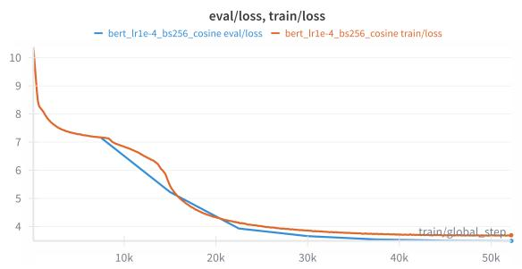
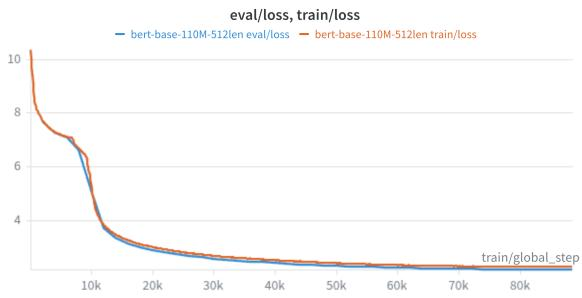
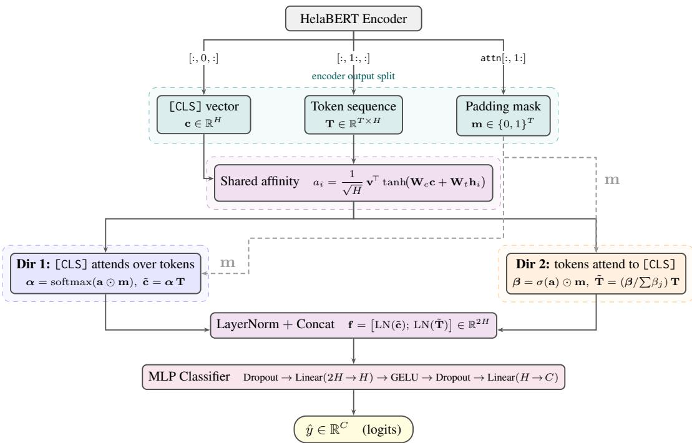
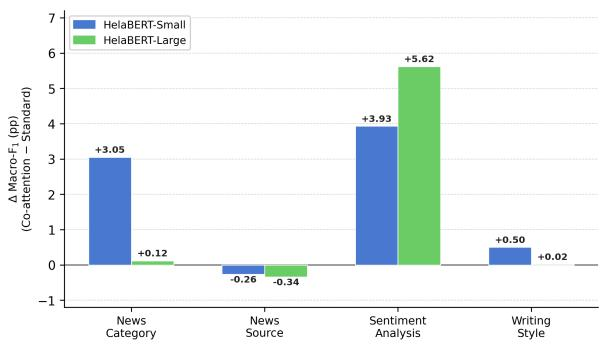

# HelaBERT: Enhancing Sinhala Language Understanding with Dual Pooling Classification Head

Thisen Ekanayake Nisansa de Silva Department of Computer Science & Engineering University of Moratuwa {thisene.23,NisansaDdS}@cse.mrt.ac.lk

## Abstract

We present HelaBERT, a family of two BERTbased masked language models pre-trained from scratch on approximately 1 billion tokens of Sinhala text sourced from MADLAD-400, CulturaX, and a custom corpus comprising news articles, Sinhala Wikipedia, and web crawl data. HelaBERT-Small (∼23.3M parameters, 6 layers) and HelaBERT-Large (∼110M parameters, 12 layers) both use a SentencePiece Unigram tokenizer (vocabulary size 32,000) tailored to Sinhala’s agglutinative morphology and complex script. We evaluate both models on four downstream Sinhala text classification tasks: news category classification, news source classification, sentiment analysis, and writing style classification, using 5 independent seed runs with stratified 80/20 train/test splits. We additionally propose a dual pooling classification head and evaluate it systematically across all four tasks, finding consistent improvements on sentiment analysis and a moderate gain on news category classification for HelaBERT-Small, while the standard [CLS]- linear head remains competitive on news source classification, a headline-level task with short average input length. We release both models to support further research in Sinhala NLP.

## 1 Introduction

Sinhala is an Indo-Aryan language spoken by approximately 17 million people in Sri Lanka, characterized by a complex abugida script and rich agglutinative morphology. Despite its regional importance, Sinhala remains severely under-resourced in NLP: pre-trained language models, annotated corpora, and benchmarks are scarce. While multilingual models such as mBERT (Devlin et al., 2019) and XLM-R (Conneau et al., 2020) provide some coverage, they allocate limited capacity to low-resource languages, and dedicated monolingual models consistently outperform them on downstream tasks (Martin et al., 2020; Delobelle et al., 2020).

We introduce HelaBERT, a family of two BERTbased masked language models pre-trained from scratch on ∼1 billion tokens of Sinhala text, using a SentencePiece Unigram tokenizer designed for Sinhala’s agglutinative morphology and complex script. We fine-tune both models on four Sinhala text classification tasks — news category, news source, sentiment, and writing style — and compare against existing multilingual and monolingual baselines under a common evaluation protocol. Beyond the standard [CLS]-linear classification head, we propose a dual pooling head that lets the [CLS] token and the full token sequence attend to each other, and we analyze systematically when this richer interaction helps and when it does not. Our main contributions are:

1. Two BERT-based models: HelaBERT-Small and HelaBERT\_Large, with a SentencePiece Unigram tokenizer tailored to Sinhala morphology;

2. A fine-tuning evaluation on four Sinhala classification benchmarks using 5 independent seed runs following the methodology of Dhananjaya et al. (2022), enabling direct comparison with SinBERT (Dhananjaya et al. (2022)) and other baselines; and

3. A dual pooling classification head evaluated across all four tasks, yielding consistent gains on sentiment analysis (+3.9–5.6 macro-F1 points) and a moderate improvement on news category classification for HelaBERT-Small (+3.1 points), while demonstrating that the standard head remains competitive on very short-input tasks such as news source classification.

Section 2 situates HelaBERT relative to prior multilingual and Sinhala-specific models; Sections 3–5 describe pre-training and fine-tuning;

Section 6 compares HelaBERT against baselines; Section 7 introduces and analyzes the co-attention head; and Section 8 discusses broader implications and limitations.

## 2 Related Work

## 2.1 Multilingual and Monolingual Pre-trained Language Models

BERT (Devlin et al., 2019) established masked language modelling as the dominant NLP pre-training paradigm. Multilingual extensions such as mBERT and XLM-R (Conneau et al., 2020) provide broad language coverage but allocate limited capacity to low-resource languages; dedicated monolingual models consistently outperform them (Dhananjaya et al., 2022; Martin et al., 2020). Language-specific models for French (CamemBERT; Martin et al. 2020), Arabic (AraBERT; Antoun et al. 2020), Vietnamese (PhoBERT; Nguyen and Tuan Nguyen 2020), and Indic languages (IndicBERT; Kakwani et al. 2020) confirm this pattern across diverse, morphologically rich settings. HelaBERT follows this line of work for Sinhala.

## 2.2 Pre-trained Language Models for Sinhala

SinBERT. Dhananjaya et al. (2022) pre-trained two RoBERTa-based (Liu et al., 2019) monolingual models — SinBERT-Small and SinBERT-Large — and evaluated them on four classification benchmarks, introducing the evaluation datasets and protocol reused in this work. HelaBERT competes directly on the same tasks using the same evaluation methodology, while contrasting in backbone (BERT vs. RoBERTa) and tokenizer (Sentence-Piece Unigram vs. BPE).

SinLlama. Aravinda et al. (2025) introduced the first decoder-based Sinhala LLM via continual pretraining of Llama-3-8B (Grattafiori et al., 2024). HelaBERT and SinLlama are complementary: a lightweight encoder for classification and sequence labelling versus a generative model for instructionfollowing.

## 2.3 Sinhala News Category Classification

Prior work on topical categorization of Sinhala news includes an early Naïve Bayes and SVM system and an LDA-based approach that builds Sinhala news topic hierarchies for categorization (de Silva, 2026). The benchmark we use, however, is the news category dataset introduced by

Dhananjaya et al. (2022), which we adopt for direct comparability with SinBERT.

## 2.4 Sinhala News Source Classification

News source identification for Sinhala has mostly been studied alongside the related task of misinformation detection, including an ontology-based approach to fake news detection and a credibilitytagged Sinhala news dataset (de Silva, 2026). We evaluate on the news source dataset released by Dhananjaya et al. (2022), a headline-level task with short average input length.

## 2.5 Sinhala Writing Style Classification

Writing style classification for Sinhala has been explored directly, including a character-level model for identifying student authors and a dedicated writing-style identification dataset covering Romanized Sinhala text (de Silva, 2026). We use the writing style classification dataset of Dhananjaya et al. (2022), on which prior BERT-based models already report near-ceiling performance.

## 2.6 Sinhala Sentiment Analysis

Pre-transformer work established strong baselines using Word2Vec and fastText embeddings (Senevirathne et al., 2020) and hierarchical attention and capsule networks (Ranathunga and Liyanage, 2021). HelaBERT extends this line of work with a dual pooling classification head that operates over the intra-sequence interaction between the [CLS] token and the remaining token representations.

## 3 HelaBERT Pre-training

We pre-train two models — HelaBERT-Small and HelaBERT-Large — sharing the same corpus, tokenizer, and MLM objective, but differing in architecture scale and training configuration.

## 3.1 Pre-training Data

HelaBERT-Small was pre-trained on approximately 900 million tokens and HelaBERT-Large on approximately 1.1 billion tokens of Sinhala text sourced from three corpora:

• MADLAD-400 (Kudugunta et al., 2023): the Sinhala subset of the multilingual documentlevel dataset.

• CulturaX (Nguyen et al., 2024): the Sinhala subset of the cleaned multilingual web corpus.

• Custom Sinhala Corpus: a dataset compiled from Sinhala Wikipedia, Sinhala news articles, and Sinhala web crawl data.

## 3.2 Data Preprocessing

Raw text was NFC-normalized, invisible Unicode characters removed (retaining ZWJ/ZWNJ for Sinhala ligature rendering), and lines lacking Sinhala script or fewer than five characters discarded. Non-Sinhala characters were stripped, preserving ASCII digits, punctuation, and ZWJ/ZWNJ. Repeated punctuation, extra whitespace, unmatched brackets, and date-like numeric patterns were then normalized before tokenization with the SentencePiece Unigram model described below.

## 3.3 Tokenizer

Both models use a SentencePiece Unigram tokenizer (Kudo and Richardson, 2018) with a vocabulary size of 32,000 and a character coverage of 99.95%. The tokenizer is trained from scratch on a ∼180M-token subset of the pre-training corpus described in Section 3.1, rather than adapted from an existing multilingual vocabulary. Operating directly on raw Unicode without word-boundary assumptions, it is well-suited to Sinhala’s agglutinative morphology and complex script.

## 3.4 Model Architectures

Both models follow the standard BERT encoderonly architecture (Devlin et al., 2019) with MLM as the pre-training objective. Table 1 compares the two configurations.

<table><tr><td>Parameter</td><td>Small</td><td>Large</td></tr><tr><td>Parameters</td><td>~23.3M</td><td>~110M</td></tr><tr><td>Hidden size</td><td>384</td><td>768</td></tr><tr><td>Transformer layers</td><td>6</td><td>12</td></tr><tr><td>Attention heads</td><td>6</td><td>12</td></tr><tr><td>Intermediate size</td><td>1,536</td><td>3,072</td></tr><tr><td>Max sequence length</td><td>512</td><td>512</td></tr><tr><td>Vocabulary size</td><td>32,000</td><td>32,000</td></tr><tr><td>Activation function</td><td>GELU</td><td>GELU</td></tr><tr><td>Position embeddings</td><td>Absolute</td><td>Absolute</td></tr><tr><td>Hidden dropout</td><td>0.1</td><td>0.1</td></tr><tr><td>Attention dropout</td><td>0.1</td><td>0.1</td></tr></table>

Table 1: Architecture comparison between HelaBERT-Small and HelaBERT-Large.

MLM Objective. At each step, 15% of nonpadding tokens are selected: 80% replaced with [MASK], 10% with a random token, and 10% left unchanged. Cross-entropy loss is computed only over masked positions; unmasked positions are assigned label −100 and excluded.

  
Figure 1: Training and validation loss curves for HelaBERT-Small.

## 3.5 Pre-training Configuration

Both models were pre-trained using the Hugging-Face Trainer API (Wolf et al., 2020) with a custom SimpleMLMCollator applying masking per batch at runtime.1 Full hyperparameters are listed in Table 9 (Appendix A).

## 3.6 Pre-training Results

HelaBERT-Small trained for 2 epochs (∼52,000 steps). Training loss decreased from ∼10.0 to 3.69 and validation loss from ∼7.0 to 3.49, with no significant overfitting observed (Figure 1).

HelaBERT-Large trained for 6 epochs (∼90,700 steps). Training loss decreased from ∼10.3 to 2.26 and validation loss from ∼7.5 to 2.17, again with no significant overfitting (Figure 2). The substantially lower final loss relative to HelaBERT-Small reflects the larger model’s representational capacity. Final metrics for both models are reported in Table 2.

<table><tr><td>Metric</td><td>Small</td><td>Large</td></tr><tr><td>Final train loss</td><td>3.69</td><td>2.26</td></tr><tr><td>Final eval loss</td><td>3.49</td><td>2.17</td></tr><tr><td>Total training steps</td><td>~52,000</td><td>~90,700</td></tr></table>

Table 2: Pre-training results for HelaBERT-Small and HelaBERT-Large.  
1Pre-training code: https://anonymous.4open.scienc e/r/HelaBERT-Train. Code was developed with assistance from Claude Code (Anthropic).

  
Figure 2: Training and validation loss curves for HelaBERT-Large.

## 3.7 Hardware and Environmental Impact

HelaBERT-Small was trained on a single NVIDIA RTX 4060 (8 GB, 55 W) for ∼16 hours, yielding an estimated footprint of ≈0.29 kg $\mathrm { C O _ { 2 } e q }$ (Sri Lanka grid: 0.329 kg $\mathrm { { C O _ { 2 } / k W h } }$ (Our World in Data, 2025)). HelaBERT-Large was trained on an AMD Instinct MI300X (192 GB, 700 W) via DigitalOcean (Atlanta) for ∼22.5 hours, giving ≈6.09 kg $\mathrm { C O _ { 2 } e q }$ (US-SRSO grid: 0.384 $\mathrm { k g C O _ { 2 } / k W }$ h (Our World in Data, 2025)).

## 4 Fine-tuning Datasets

We fine-tune and evaluate both HelaBERT models on four Sinhala text classification tasks, following the methodologies used by Dhananjaya et al. (2022) to enable direct comparison.

## 4.1 News Category Classification

Sinhala news sentences across five categories: political, business, technology, sports, and entertainment. Originally introduced by de Silva (2015) and cleaned by Dhananjaya et al. (2022).2

## 4.2 News Source Classification

Sinhala news headlines from nine online sources. Derived from Sachintha et al. (2021) and processed by Dhananjaya et al. (2022).3

## 4.3 Sentiment Analysis

We use a publicly available Sinhala sentiment dataset with three labels: POSITIVE, NEGATIVE, and NEUTRAL.4

We note that Dhananjaya et al. (2022) and all prior baselines were evaluated on a different fourclass sentiment dataset that also includes a CON-FLICT label; that dataset is no longer publicly available. Our sentiment results therefore use a different, publicly accessible three-class dataset and are not directly comparable to those baselines on this task specifically. We report them alongside the other baselines for reference, with this distinction clearly noted.

## 4.4 Writing Style Classification

Longer-form Sinhala text across four styles: NEWS, ACADEMIC, CREATIVE, and BLOG. Originally compiled by Upeksha et al. (2015) and released by Dhananjaya et al. (2022).5

## 4.5 Dataset Overview

Table 3 summarises statistics for all four datasets.
<table><tr><td>Dataset</td><td>Classes</td><td>Train</td><td>Test</td><td>Avg. W</td></tr><tr><td>News Category</td><td>5</td><td>2,596</td><td>640</td><td>23.8</td></tr><tr><td>News Source</td><td>9</td><td>18,280</td><td>4,571</td><td>8.3</td></tr><tr><td>Sentiment</td><td>3</td><td>2,049</td><td>513</td><td>16.8</td></tr><tr><td>Writing Style</td><td>4</td><td>10,008</td><td>2,462</td><td>182.6</td></tr></table>

Table 3: Summary statistics of the four fine-tuning datasets. Avg. Words computed over the training split.

## 5 Fine-tuning Methodology

We fine-tune both HelaBERT models on the four tasks described above.6 All experiments follow the evaluation setup of Dhananjaya et al. (2022): 5 independent training runs with different random seeds, a stratified 80/20 train/test split, and macro-$\mathrm { F _ { 1 } }$ as the primary evaluation metric. We report results from the best-performing run (highest test $\mathrm { m a c r o - F _ { 1 } ) }$ for each task and model.

## 5.1 Standard Classification Head

For all four tasks, the fine-tuning architecture consists of the pre-trained HelaBERT backbone followed by a classification head applied to the [CLS] token representation $\mathbf { h } _ { \mathsf { C L S } } \in \mathbb { R } ^ { H }$

$$
\hat { y } = \mathrm { L i n e a r } ( \operatorname { D r o p o u t } ( \mathbf { h } _ { \mathbb { C } \bot \mathbb { S } } ) ) .\tag{1}
$$

The linear layer maps from hidden size H to the number of classes, with dropout probability 0.1.

## 5.2 Training Configuration

All models are trained using the HuggingFace Trainer API (Wolf et al., 2020) with AdamW optimization, linear learning rate scheduling with a 6% warmup ratio, weight decay 0.01, batch size 16, and FP16 mixed precision. The best run is selected by highest test $\bf { m a c r o { - } F _ { 1 } }$ across five seeds (42, 123, 456, 789, 1024). Per-task hyperparameters are listed in Table 4.

<table><tr><td></td><td>News Cat.</td><td>News Src.</td><td>Senti.</td><td>Style</td></tr><tr><td>LR (Small)</td><td>1e-5</td><td>5e-5</td><td>3e-5</td><td>1e-5</td></tr><tr><td>LR (Large)</td><td>3e-5</td><td>5e-5</td><td>5e-6</td><td>1e-5</td></tr><tr><td>Epochs (Small)</td><td>10</td><td>3</td><td>6</td><td>3</td></tr><tr><td>Epochs (Large)</td><td>3</td><td>3</td><td>10</td><td>3</td></tr><tr><td>Max seq. len.</td><td>512</td><td>512</td><td>512</td><td>512</td></tr><tr><td>Batch size</td><td></td><td>16 0.01</td><td></td><td></td></tr><tr><td>Weight decay</td><td></td><td>0.06</td><td></td><td></td></tr><tr><td>Warmup ratio</td><td></td><td></td><td></td><td></td></tr><tr><td>LR schedule</td><td></td><td>Linear</td><td></td><td></td></tr></table>

Table 4: Fine-tuning hyperparameters per task. $\mathbf { L } \mathbf { R } =$ learning rate.

## 6 Results: Comparison with Baselines

Table 5 reports $\bf { m a c r o - F _ { 1 } }$ scores for HelaBERT-Small and HelaBERT-Large alongside baseline results reported by Dhananjaya et al. (2022). The baselines include LaBSE, LASER, XLM-R (base and large), $\operatorname { S i n B E R T } _ { O }$ , Sinhalan ${ \mathrm { B E R T } } _ { O } .$ SinBERT-Small, and SinBERT-Large, all evaluated on the same News Category, News Source, and Writing Style datasets. As noted in Section 4.3, sentiment results for HelaBERT are not directly comparable to the baselines due to the use of a different threeclass dataset; they are included for completeness with an explicit marker.

News Category. HelaBERT-Large achieves 90.38% macro-F1, surpassing XLM-R-large (89.54%) by 0.8 points and outperforming all Sin-BERT variants by a margin of 5.2–5.6 points over SinBERT-Large (85.19%) and SinBERT-Small (84.75%) respectively. HelaBERT-Small (85.97%) outperforms both SinBERT-Small (84.75%) and SinBERT-Large (85.19%) by 1.2 and 0.8 points respectively.

News Source. HelaBERT-Large (63.65%) outperforms all SinBERT models and XLM-R models, and exceeds SinBERT-Large by 3.1 points. HelaBERT-Small (60.16%) is comparable to SinBERT-Small (60.42%), falling marginally short by 0.3 points. News source is the most challenging task, reflecting stylistic overlap across sources.

Writing Style. HelaBERT-Large achieves 97.73%, falling 0.7 points short of XLM-R-large (98.41%) but outperforming all SinBERT models by a clear margin of 2.2 points over the best SinBERT-Large (95.49%). HelaBERT-Small (95.92%) similarly outperforms all SinBERT variants on this task.

Sentiment. As discussed, HelaBERT-Small (65.34%) and HelaBERT-Large (64.60%) were evaluated on a three-class dataset. The baseline figures are shown for reference only and should not be interpreted as performance comparisons.

## 7 Dual Pooling Classification Head

Standard fine-tuning for classification uses only the [CLS] token representation as the sequence summary. We propose a dual pooling classification head that jointly attends over [CLS] and the full token sequence within the same input, producing richer representations that capture both global and local sequence information. We apply this head to all four tasks on both HelaBERT-Small and HelaBERT-Large.

## 7.1 Dual pooling Architecture

Given the encoder output, let $\mathbf { c } = \mathbf { h } _ { 0 } \in \mathbb { R } ^ { H }$ be the [CLS] vector and $\mathbf { T } ^ { - } = \{ \mathbf { h } _ { 1 } , \dots , \mathbf { h } _ { T } \} \in \mathbb { R } ^ { T \times H }$ be the remaining token representations, with m ∈ $\{ 0 , 1 \} ^ { T }$ the corresponding padding mask.

A shared affinity score is computed for each token position i:

$$
a _ { i } = \frac { 1 } { \sqrt { H } } \mathbf { v } ^ { \top } \operatorname { t a n h } ( \mathbf { W } _ { c } \mathbf { c } + \mathbf { W } _ { t } \mathbf { h } _ { i } ) ,\tag{2}
$$

where $\mathbf { W } _ { c } , \mathbf { W } _ { t } \in \mathbb { R } ^ { H \times H }$ and $\mathbf { v } \in \mathbb { R } ^ { H }$ are learned parameters.

We used $\scriptstyle { \frac { 1 } { \sqrt { H } } }$ scaling to keep the affinity scores at a stable magnitude as the hidden dimension increases, preventing the attention scores from becoming excessively large and promoting stable optimization.

Direction 1: [CLS] attends over tokens. Softmax attention over real token positions yields an attended [CLS] representation:

$$
{ \pmb { \alpha } } = \mathrm { s o f t m a x } \big ( { \bf a } + ( 1 - { \bf m } ) \cdot ( - 1 0 ^ { 4 } ) \big ) , \quad \tilde { \bf c } = \pmb { \alpha } { \bf T } .\tag{3}
$$

Padding positions are masked to − $\cdot 1 0 ^ { 4 }$ before softmax to prevent numerical overflow in FP16.

<table><tr><td>Model</td><td>Sentiment†</td><td>News Source</td><td>News Category</td><td>Writing Style</td></tr><tr><td>Baseline (majority class)</td><td>59.42 (w-F1)</td><td></td><td></td><td></td></tr><tr><td>LaBSE</td><td>20.63</td><td>11.85</td><td>24.09</td><td></td></tr><tr><td>LASER</td><td>54.07</td><td>28.84</td><td>48.54</td><td>87.06</td></tr><tr><td>XLM-Rbase</td><td>58.08</td><td>58.29</td><td>85.12</td><td>96.89</td></tr><tr><td> $\mathbf { X L M - R _ { l a r g e } }$ </td><td>60.45</td><td>61.84</td><td>89.54</td><td>98.41</td></tr><tr><td>SinBERTO</td><td>50.83</td><td>57.22</td><td>78.07</td><td>93.84</td></tr><tr><td>SinhalanBERTO</td><td>49.71</td><td>57.34</td><td>82.73</td><td>94.10</td></tr><tr><td>SinBERT-Small</td><td>53.85</td><td>60.42</td><td>84.75</td><td>95.00</td></tr><tr><td>SinBERT-Large</td><td>54.08</td><td>60.51</td><td>85.19</td><td>95.49</td></tr><tr><td>HelaBERT-Small</td><td>65.34</td><td>60.16</td><td>85.97</td><td>95.92</td></tr><tr><td>HelaBERT-Large</td><td>64.60</td><td>63.65</td><td>90.38</td><td>97.73</td></tr></table>

Table 5: Macro-F (%) comparison on four Sinhala text classification tasks. All baseline results are taken from Dhananjaya et al. (2022). †Sentiment results for HelaBERT models are evaluated on a different publicly available 3-class dataset (positive/negative/neutral); all other models used a 4-class dataset (including CONFLICT) that is no longer publicly available. These columns are not directly comparable.

Direction 2: Token sequence attends back to [CLS]. A sigmoid gate weighted by the padding mask provides a [CLS]-guided summary of the token sequence:

$$
\beta = \sigma ( \mathbf { a } ) \odot \mathbf { m } , \quad \hat { \boldsymbol { \beta } } = \frac { \beta } { \sum _ { j } \beta _ { j } + \varepsilon } , \quad \tilde { \mathbf { T } } = \hat { \boldsymbol { \beta } } \mathbf { T } .\tag{4}
$$

Classification head. The two attended vectors are layer-normalized, concatenated, and passed through a two-layer MLP:

$$
\mathbf { f } = \left[ \mathrm { L N } ( \tilde { \mathbf { c } } ) ; \mathrm { L N } ( \tilde { \mathbf { T } } ) \right] \in \mathbb { R } ^ { 2 H } ,\tag{5}
$$

$$
\begin{array} { r } { \mathbf { h } = \mathrm { L i n e a r } _ { 2 H  H } \big ( \mathrm { D r o p o u t } ( \mathbf { f } ) \big ) , } \end{array}\tag{6}
$$

$$
\mathbf { g } = \mathrm { D r o p o u t } \big ( \mathrm { G E L U } ( \mathbf { h } ) \big ) ,\tag{7}
$$

$$
{ \hat { y } } = \operatorname { L i n e a r } _ { H \to C } ( \mathbf { g } ) ,\tag{8}
$$

where C is the number of classes.

Figure 3 illustrates the full architecture.

## 7.2 Training Configuration

The dual pooling classification head uses the same 5-run seed protocol and 80/20 stratified split as the standard fine-tuning experiments (Section 5.2). Hyperparameters are identical to those in Table 4 for each respective task.

## 7.3 Results Across All Tasks

Table 6 summarises macro- $\cdot \mathrm { F _ { 1 } }$ for both the standard and dual pooling classfication heads across all four tasks and both model sizes. Detailed sentiment results including per-class scores are provided in Tables 7 and 8.

<table><tr><td>Model</td><td>Head</td><td>News Cat.</td><td>News Src.</td><td>Sentiment</td><td>Writing</td></tr><tr><td rowspan="3">Small</td><td>Standard</td><td>85.97</td><td>60.16</td><td>65.34</td><td>95.92</td></tr><tr><td>Co-attn</td><td>89.02</td><td>59.90</td><td>69.27</td><td>96.42</td></tr><tr><td>∆</td><td>+3.05</td><td>-0.26</td><td>+3.93</td><td>+0.50</td></tr><tr><td rowspan="3">Large</td><td>Standard</td><td>90.38</td><td>63.65</td><td>64.60</td><td>97.73</td></tr><tr><td>Co-attn</td><td>90.50</td><td>63.31</td><td>70.22</td><td>97.75</td></tr><tr><td>∆</td><td>+0.12</td><td>-0.34</td><td>+5.62</td><td>+0.02</td></tr></table>

Table 6: Standard [CLS]-linear head vs. dual pooling classification head: macro-F (%) on all four tasks (best run of 5 seeds). ∆ = dual pooling − standard. Positive ∆ favours dual pooling; negative values in italics.

<table><tr><td>Model / Head</td><td>Acc.</td><td>Macro-F1</td><td>W-F1</td></tr><tr><td>HelaBERT-Small, standard</td><td>0.6589</td><td>0.6534</td><td>0.6581</td></tr><tr><td>HelaBERT-Small, dual pooling</td><td>0.6881</td><td>0.6927</td><td>0.6904</td></tr><tr><td>∆ (dual pooling − std.)</td><td>+0.029</td><td>+0.039</td><td>+0.032</td></tr><tr><td>HelaBERT-Large, standard</td><td>0.6530</td><td>0.6460</td><td>0.6539</td></tr><tr><td>HelaBERT-Large, dual pooling</td><td>0.7135</td><td>0.7022</td><td>0.7096</td></tr><tr><td>∆ (dual pooling − std.)</td><td>+0.061</td><td>+0.056</td><td>+0.056</td></tr></table>

Table 7: Standard vs. dual pooling sentiment results (best run of 5). All figures on the same 3-class test set (N = 513).

<table><tr><td></td><td colspan="3">Standard</td><td colspan="3">Dual pooling</td></tr><tr><td>Model</td><td>NEG</td><td>NEU</td><td>POS</td><td>NEG</td><td>NEU</td><td>POS</td></tr><tr><td>Small Large</td><td>0.54 0.55</td><td>0.67 0.68</td><td>0.75 0.70</td><td>0.64 0.59</td><td>0.67 0.73</td><td>0.77 0.78</td></tr></table>

Table 8: Per-class $\mathrm { F _ { 1 } }$ for standard vs. dual pooling on sentiment (best run; $N = 5 1 3 )$ . NEG = negative, NEU = neutral, POS = positive.

  
Figure 3: Dual pooling classification head on top of HelaBERT. The encoder output is split into the [CLS] vector c, the token sequence T, and a padding mask m. A shared affinity vector is computed via additive attention. Dir 1 (blue): [CLS] attends over tokens via softmax, yielding c˜. Dir 2 (orange): tokens attend back to [CLS] via a sigmoid gate, yielding T˜ . Both outputs are layer-normalized, concatenated to R2H, and passed through a two-layer MLP to produce class logits.

Sentiment benefits most. The co-attention head yields the largest gains on sentiment: +3.9 macro-$\mathrm { F _ { 1 } }$ points for HelaBERT-Small and +5.6 points for HelaBERT-Large over the respective standard baselines. For HelaBERT-Small, the gain is driven primarily by the NEGATIVE class, whose recall improves from 0.51 to 0.74 (+0.23) while $\mathrm { F _ { 1 } }$ increases from 0.54 to 0.64. The NEUTRAL and POSITIVE classes are largely unaffected (+0.00 and +0.02 F1 respectively). For HelaBERT-Large, the pattern differs: NEGATIVE recall slightly decreases (0.55→0.51) but precision gains 0.14 points (0.55→0.69), yielding a net $\mathrm { F _ { 1 } }$ improvement of +0.04. More notably, the NEUTRAL class improves by +0.05 F (0.68→0.73), and POSITIVE improves by +0.08 (0.70→0.78), suggesting that the larger model’s richer representations allow coattention to resolve ambiguous sentiment boundaries between neutral and the other classes.

The larger absolute gain for HelaBERT-Large (+5.6 pp) relative to HelaBERT-Small (+3.9 pp) is consistent with the intuition that richer 768- dimensional token representations provide more informative keys and values for the co-attention computation, making the cross-interaction between [CLS] and the token sequence more productive.

News category shows moderate gains for the small model. HelaBERT-Small improves by +3.1 points on news category, while HelaBERT-Large gains only +0.1 points. We attribute this asymmetry to representational capacity: at H=384, the [CLS] vector provides a weaker sequence summary, and co-attention supplies a meaningful second-order aggregation over the token sequence. At H=768, the encoder’s contextualised [CLS] representation already captures sufficient category information, leaving little room for the co-attention head to contribute further.

News source classification favours the standard head. The co-attention head performs marginally worse on news source classification for both model sizes (∼0.3 pp for Small, ∼0.3 pp for Large). News source headlines average only ∼8 tokens — the shortest inputs across all four tasks. With so few real tokens, the attended representations in both co-attention directions are computed over a very sparse key set, providing limited additional signal beyond the [CLS] token itself. Furthermore, the co-attention head introduces approximately $4 H ^ { 2 }$ additional parameters (≈590K for Small, ≈2.4M for Large), which 3 training epochs over short headlines is insufficient to fully converge.

  
Figure 4: Co-attention vs. standard head: ∆ macro-F (percentage points) across all four tasks for HelaBERT-Small (blue) and HelaBERT-Large (green). Bars below zero indicate tasks where the standard head outperforms co-attention.

Writing style gains are negligible. Both models show near-zero macro-F1 gains on writing style (+0.5 pp for Small, +0.0 pp for Large). This task operates at performance ceiling (>95% macro-F1), leaving little measurable headroom for any architectural improvement.

Summary. Taken together, these results suggest that co-attention classification heads are most beneficial when the task relies on a small number of discriminative tokens within moderate-length sequences, and when the base model’s representational capacity is limited. For very short sequences (≲8 tokens), near-saturated tasks, or large models with strong [CLS] representations, the standard [CLS]-linear head remains competitive. Figure 4 summarises the ∆ macro-F1 gains across all tasks and both model sizes.

## 8 Discussion

HelaBERT vs. multilingual and monolingual baselines. HelaBERT-Large surpasses XLM-Rlarge on news category classification despite Sinhala comprising only ∼0.15% of XLM-R’s pretraining data, confirming that a monolingual model on a focused corpus can overcome multilingual capacity dilution. It also outperforms SinBERT-Large on all four tasks despite SinBERT using the stronger RoBERTa recipe. We attribute this to HelaBERT’s substantially larger corpus (∼1.1B vs. ∼192M tokens) and its Sinhala-specific SentencePiece Unigram tokenizer, which better handles agglutinative morphology than BPE trained on a multilingual vocabulary. The only task where HelaBERT-Large trails XLM-R-large is writing style (−0.7 pp), likely due to XLM-R’s crosslingual exposure to diverse document styles providing complementary inductive biases.

When does co-attention help? Co-attention is most effective when polarity or category is signaled by a few discriminative tokens within moderatelength sequences and when encoder capacity is limited. Sentiment benefits most (+3.9–5.6 pp) because negations and intensifiers are sparse yet decisive. Gains are negligible on writing style (near ceiling, >95%) and slightly negative on news source (∼8-token headlines too short for meaningful attention over tokens). The larger gain for HelaBERT-Large on sentiment (+5.6 pp vs. +3.9 pp) suggests richer 768-dimensional representations make co-attention more discriminative, indicating a productive interaction between model scale and the proposed head.

## 9 Limitations

Both HelaBERT models are monolingual and do not support cross-lingual transfer. The Sentence-Piece tokenizer requires manual loading via the sentencepiece library and is not compatible with the HuggingFace AutoTokenizer API out of the box. HelaBERT-Small was pre-trained on 256- token windows despite a 512-token positional limit; performance on sequences longer than 256 tokens is therefore untested. The web-crawled pre-training corpus may retain noise not fully removed by preprocessing and skews toward formal written Sinhala, potentially underrepresenting dialectal and colloquial registers. Finally, downstream evaluation is restricted to text classification; sequence labelling, question answering, and generative tasks are left to future work.

## 10 Conclusion

We presented HelaBERT, a family of two BERTbased masked language models pre-trained from scratch on Sinhala text. HelaBERT-Large achieves state-of-the-art results among monolingual Sinhala models on all four evaluated classification tasks, surpassing XLM-R-large on news category classification, news source classification and outperforming SinBERT-Large across the board. HelaBERT-Small provides a competitive lightweight alternative with substantially fewer parameters.

We proposed and systematically evaluated a coattention classification head that computes bidirectional attention between the [CLS] token and the full token sequence. The head yields consistent gains on sentiment analysis (+3.9–5.6 macro-F1 points) and a moderate improvement on news category classification for HelaBERT-Small (+3.1 points), while the standard [CLS]- linear head remains competitive on short-input and near-saturated tasks.

Both models and the SentencePiece Unigram tokenizer are released publicly to support further research in Sinhala NLP. Future work includes extending evaluation to sequence labelling and question answering tasks, exploring continued pretraining with additional Sinhala data, and investigating the co-attention mechanism in combination with larger model architectures.

## References

Wissam Antoun, Fady Baly, and Hazem Hajj. 2020. AraBERT: Transformer-based model for Arabic language understanding. In Proceedings ofthe 4th Workshop on Open-Source Arabic Corpora and Processing Tools, with a Shared Task on Offensive Language Detection, pages 9–15, Marseille, France. European Language Resources Association.

HWK Aravinda, Rashad Sirajudeen, Samith Karunathilake, Nisansa de Silva, Rishemjit Kaur, and Surangika Ranathunga. 2025. Sinllama-a large language model for sinhala. In 2025 Moratuwa Engineering Research Conference (MERCon), pages 617–622. IEEE.

Alexis Conneau, Kartikay Khandelwal, Naman Goyal, Vishrav Chaudhary, Guillaume Wenzek, Francisco Guzmán, Edouard Grave, Myle Ott, Luke Zettlemoyer, and Veselin Stoyanov. 2020. Unsupervised cross-lingual representation learning at scale. In Proceedings of the 58th Annual Meeting of the Association for Computational Linguistics, pages 8440– 8451, Online. Association for Computational Linguistics.

Nisansa de Silva. 2015. Sinhala text classification: observations from the perspective of a resource poor language. ResearchGate.

Nisansa de Silva. 2026. Survey on publicly available sinhala natural language processing tools and research. Preprint, arXiv:1906.02358.

Pieter Delobelle, Thomas Winters, and Bettina Berendt. 2020. RobBERT: a Dutch RoBERTa-based Language Model. In Findings of the Association for Computational Linguistics: EMNLP 2020, pages 3255–3265, Online. Association for Computational Linguistics.

Jacob Devlin, Ming-Wei Chang, Kenton Lee, and Kristina Toutanova. 2019. BERT: Pre-training of

deep bidirectional transformers for language understanding. In Proceedings of the 2019 Conference of the North American Chapter ofthe Associationfor Computational Linguistics: Human Language Technologies, Volume 1 (Long and Short Papers), pages 4171–4186, Minneapolis, Minnesota. Association for Computational Linguistics.

Vinura Dhananjaya, Piyumal Demotte, Surangika Ranathunga, and Sanath Jayasena. 2022. BERTifying Sinhala - a comprehensive analysis of pre-trained language models for Sinhala text classification. In Proceedings of the Thirteenth Language Resources and Evaluation Conference, pages 7377–7385, Marseille, France. European Language Resources Association.

Aaron Grattafiori, Abhimanyu Dubey, Abhinav Jauhri, Abhinav Pandey, Abhishek Kadian, Ahmad Al-Dahle, Aiesha Letman, Akhil Mathur, Alan Schelten, Alex Vaughan, Amy Yang, Angela Fan, Anirudh Goyal, Anthony Hartshorn, Aobo Yang, Archi Mitra, Archie Sravankumar, Artem Korenev, Arthur Hinsvark, and 542 others. 2024. The llama 3 herd of models. In Neural Information Processing Systems. Curran Associates.

Divyanshu Kakwani, Anoop Kunchukuttan, Satish Golla, Gokul N.C., Avik Bhattacharyya, Mitesh M. Khapra, and Pratyush Kumar. 2020. IndicNLPSuite: Monolingual corpora, evaluation benchmarks and pre-trained multilingual language models for Indian languages. In Findings ofthe Associationfor Computational Linguistics: EMNLP 2020, pages 4948– 4961, Online. Association for Computational Linguistics.

Taku Kudo and John Richardson. 2018. SentencePiece: A simple and language independent subword tokenizer and detokenizer for neural text processing. In Proceedings of the 2018 Conference on Empirical Methods in Natural Language Processing: System Demonstrations, pages 66–71, Brussels, Belgium. Association for Computational Linguistics.

Sneha Kudugunta, Isaac Caswell, Biao Zhang, Xavier Garcia, Derrick Xin, Aditya Kusupati, Romi Stella, Ankur Bapna, and Orhan Firat. 2023. Madlad-400: A multilingual and document-level large audited dataset. Advances in Neural Information Processing Systems, 36:67284–67296.

Yinhan Liu, Myle Ott, Naman Goyal, Jingfei Du, Mandar Joshi, Danqi Chen, Omer Levy, Mike Lewis, Luke Zettlemoyer, and Veselin Stoyanov. 2019. Roberta: A robustly optimized bert pretraining approach. arXiv preprint arXiv:1907.11692.

Louis Martin, Benjamin Muller, Pedro Javier Ortiz Suárez, Yoann Dupont, Laurent Romary, Éric de la Clergerie, Djamé Seddah, and Benoît Sagot. 2020. CamemBERT: a tasty French language model. In Proceedings of the 58th Annual Meeting of the Association for Computational Linguistics, pages 7203– 7219, Online. Association for Computational Linguistics.

Dat Quoc Nguyen and Anh Tuan Nguyen. 2020. PhoBERT: Pre-trained language models for Vietnamese. In Findings ofthe Associationfor Computational Linguistics: EMNLP 2020, pages 1037–1042, Online. Association for Computational Linguistics.

Thuat Nguyen, Chien Van Nguyen, Viet Dac Lai, Hieu Man, Nghia Trung Ngo, Franck Dernoncourt, Ryan A. Rossi, and Thien Huu Nguyen. 2024. CulturaX: A cleaned, enormous, and multilingual dataset for large language models in 167 languages. In Proceedings ofthe 2024 Joint International Conference on Computational Linguistics, Language Resources and Evaluation (LREC-COLING 2024), pages 4226– 4237, Torino, Italia. ELRA and ICCL.

Our World in Data. 2025. Carbon intensity of electricity generation. https://ourworldindata.o rg/grapher/carbon-intensity-electricity. Accessed 2026.

Surangika Ranathunga and Isuru Udara Liyanage. 2021. Sentiment analysis of sinhala news comments. ACM Trans. Asian Low-Resour. Lang. Inf. Process., 20(4).

Dilan Sachintha, Lakmali Piyarathna, Charith Rajitha, and Surangika Ranathunga. 2021. Exploiting parallel corpora to improve multilingual embedding based document and sentence alignment. arXiv preprint arXiv:2106.06766.

Lahiru Senevirathne, Piyumal Demotte, Binod Karunanayake, Udyogi Munasinghe, and Surangika Ranathunga. 2020. Sentiment analysis for sinhala language using deep learning techniques. arXiv preprint arXiv:2011.07280.

Dimuthu Upeksha, Chamila Wijayarathna, Maduranga Siriwardena, Lahiru Lasandun, Chinthana Wimalasuriya, Nisansa de Silva, and Gihan Dias. 2015. Implementing a corpus for Sinhala language. In Symposium on Language Technologyfor South Asia 2015.

Thomas Wolf, Lysandre Debut, Victor Sanh, Julien Chaumond, Clement Delangue, Anthony Moi, Pierric Cistac, Tim Rault, Remi Louf, Morgan Funtowicz, Joe Davison, Sam Shleifer, Patrick von Platen, Clara Ma, Yacine Jernite, Julien Plu, Canwen Xu, Teven Le Scao, Sylvain Gugger, and 3 others. 2020. Transformers: State-of-the-art natural language processing. In Proceedings ofthe 2020 Conference on Empirical Methods in Natural Language Processing: System Demonstrations, pages 38–45, Online. Association for Computational Linguistics.

## A Pre-training Hyperparameters

Table 9 lists the full set of pre-training hyperparameters for HelaBERT-Small and HelaBERT-Large, referenced in Section 3.5.

## B Dataset Details

This appendix provides exhaustive details for the four fine-tuning datasets summarised in Table 3

<table><tr><td>Hyperparameter</td><td>Small</td><td>Large</td></tr><tr><td>Sequence length</td><td>256 (stride 128)</td><td>512</td></tr><tr><td>Total training samples</td><td>~7.4M</td><td>~4.3M</td></tr><tr><td>Train / validation split</td><td>90% / 10%</td><td>90% / 10%</td></tr><tr><td>MLM probability</td><td>15%</td><td>15%</td></tr><tr><td>Per-device batch size</td><td>32</td><td>256</td></tr><tr><td>Gradient accumulation steps</td><td>8</td><td>1</td></tr><tr><td>Effective batch size</td><td>256</td><td>256</td></tr><tr><td>Learning rate</td><td> $1 \times 1 0 ^ { - 4 }$ </td><td>1 × 10−4</td></tr><tr><td>LR scheduler</td><td>Cosine</td><td>Cosine</td></tr><tr><td>Warmup ratio</td><td>5%</td><td>10%</td></tr><tr><td>Weight decay</td><td>0.01</td><td>0.01</td></tr><tr><td>Epochs</td><td>2</td><td>6</td></tr><tr><td>Mixed precision</td><td>FP16</td><td>BF16</td></tr></table>

Table 9: Pre-training hyperparameters for HelaBERT-Small and HelaBERT-Large.

(Section 4), including per-class label distributions, licensing and access information, and collection methodology.

## B.1 News Category Classification

Table 10 reports the per-class train/test split for the five news category labels. Label identities in the released dataset are numeric (0–4); the original dataset card does not document a mapping from these numeric IDs to the five named categories used in the main text (political, business, technology, sports, entertainment), so we report counts by numeric label rather than assume a correspondence.

<table><tr><td>Label</td><td>Train</td><td>Test</td></tr><tr><td>0</td><td>418</td><td>102</td></tr><tr><td>1</td><td>365</td><td>91</td></tr><tr><td>2</td><td>675</td><td>166</td></tr><tr><td>3</td><td>797</td><td>199</td></tr><tr><td>4</td><td>341</td><td>82</td></tr><tr><td>Total</td><td>2,596</td><td>640</td></tr></table>

Table 10: Per-label train/test distribution for News Category Classification.

## B.2 News Source Classification

Table 11 reports the per-source train/test split across the nine news source labels. As with the category dataset, source identities are released only as numeric labels (0–8); the dataset card does not document a mapping to the underlying site names, so we report counts by numeric label.

## B.3 Sentiment Analysis

Table 12 reports the per-class train/test split for the three-class sentiment dataset used in this work (see Section 4.3 for discussion of why this differs from the four-class dataset used by prior baselines).

<table><tr><td>Label</td><td>Train</td><td>Test</td></tr><tr><td>0</td><td>2,233</td><td>558</td></tr><tr><td>1</td><td>1,303</td><td>326</td></tr><tr><td>2</td><td>2,334</td><td>584</td></tr><tr><td>3</td><td>1,143</td><td>286</td></tr><tr><td>4</td><td>2,366</td><td>592</td></tr><tr><td>5</td><td>2,282</td><td>571</td></tr><tr><td>6</td><td>2,243</td><td>560</td></tr><tr><td>7</td><td>2,201</td><td>550</td></tr><tr><td>8</td><td>2,175</td><td>544</td></tr><tr><td>Total</td><td>18,280</td><td>4,571</td></tr></table>

Table 11: Per-label train/test distribution for News Source Classification.
<table><tr><td>Label</td><td>Train</td><td>Test</td></tr><tr><td>Neutral</td><td>899</td><td>225</td></tr><tr><td>Positive</td><td>599</td><td>150</td></tr><tr><td>Negative</td><td>551</td><td>138</td></tr><tr><td>Total</td><td>2,049</td><td>513</td></tr></table>

Table 12: Per-label train/test distribution for Sentiment Analysis.

## B.4 Writing Style Classification

Table 13 reports the per-style train/test split for the four writing style labels.

<table><tr><td>Label</td><td>Train</td><td>Test</td></tr><tr><td>News</td><td>3,568</td><td>885</td></tr><tr><td>Academic</td><td>2,834</td><td>701</td></tr><tr><td>Creative</td><td>1,919</td><td>458</td></tr><tr><td>Blog</td><td>1,687</td><td>418</td></tr><tr><td>Total</td><td>10,008</td><td>2,462</td></tr></table>

Table 13: Per-label train/test distribution for Writing Style Classification.