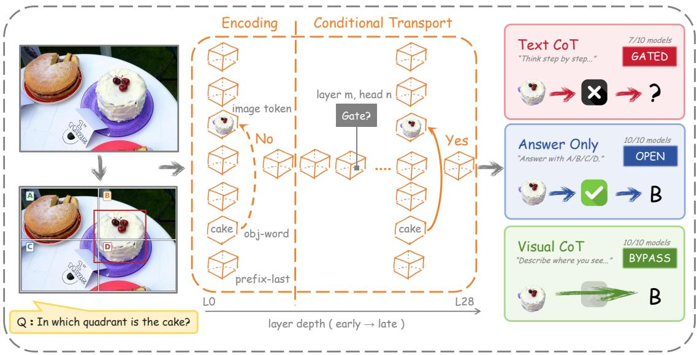
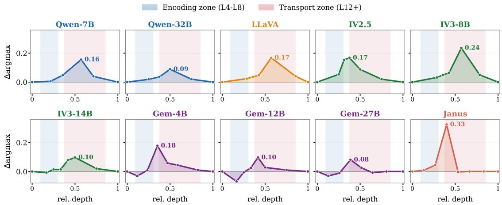
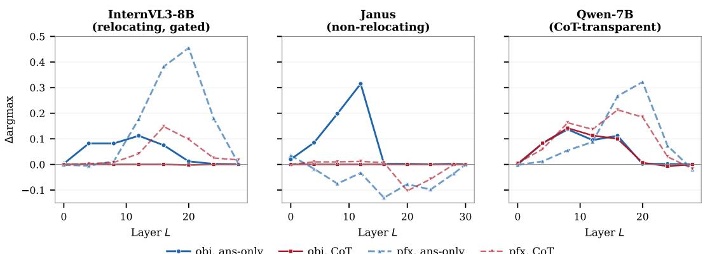
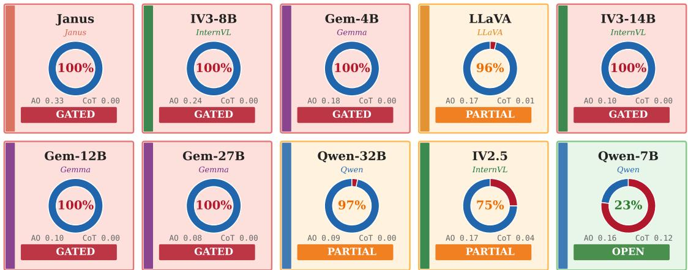
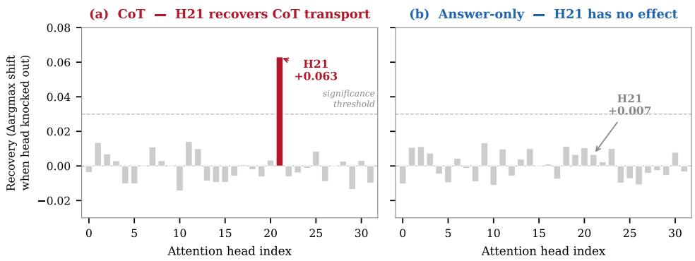
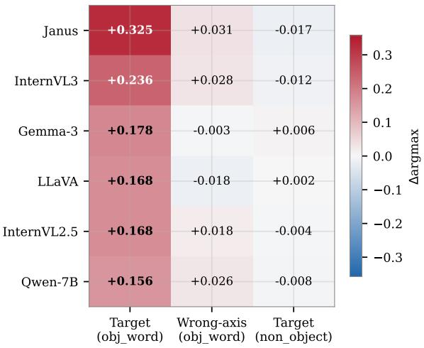
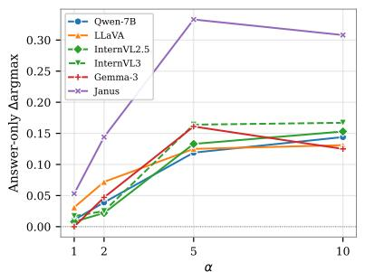
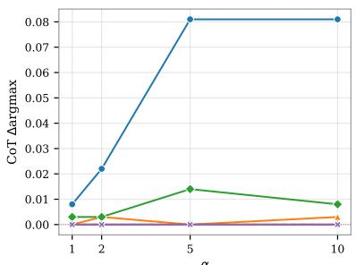
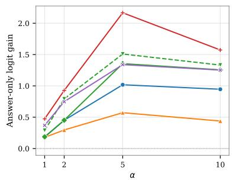
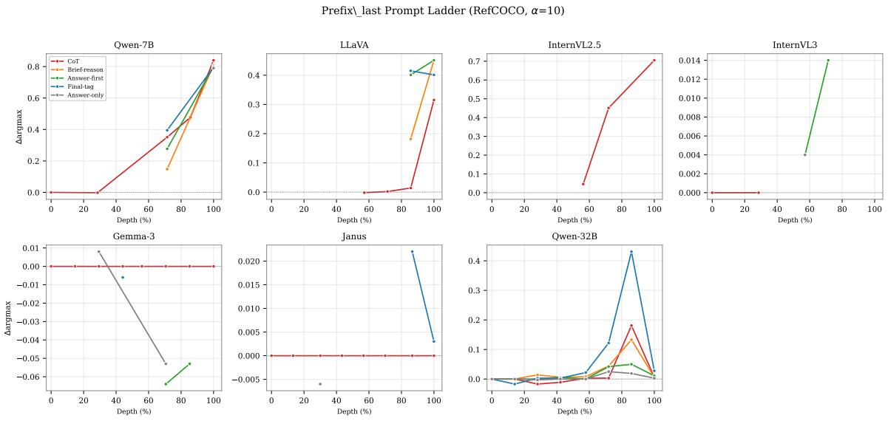

# Knowing Isn’t Always Saying: When Do Spatial Encodings Reach Answers in Vision-Language Models?

Zeyu Wang\* Peking University Beijing, China 2501210409@stu.pku.edu.cn

Xinming Xu Tsinghua University Beijing, China xu-zh23@mails.tsinghua.edu.cn

## Abstract

Vision-language models are known to encode spatial information in their hidden states, yet often fail to use it when answering. However, it remains unclear when and where this encoded information reaches the answer. We address this with direction patching, a classconditioned causal intervention applied across layers, token positions, and prompt formats. Using spatial-ID directions constructed following prior encoding evidence, we find that causal influence on answer logits emerges only at mid-to-deep depths. Text chain-of-thought suppresses immediate object-word argmaxlevel transport in most models, while visually grounded prompts keep it open. Positive targetlogit gain can remain below the argmax threshold, and transport can re-emerge at the final prefix token or at the answer step in deeper layers. Across the ten VLMs we study, these local effects form descriptive transport patterns. Complementary experiments characterize how these patterns shift across datasets, attributes, and encoding amplitudes. Together, these results reframe the encoding-grounding gap as a problem of conditional transport in VLMs.

## 1 Introduction

Vision-Language Models have achieved remarkable progress across a wide range of visual reasoning tasks. However, recent interpretability studies reveal a puzzling dissociation between representation and behavior: models can correctly encode visual attributes in their hidden states, yet often fail to use that information when producing answers (Nooralahzadeh et al., 2026; Liu et al., 2026; Asadi et al., 2026). Chain-of-Thought prompting is commonly adopted to mitigate reasoning failures, but on spatial tasks it can produce the opposite effect: introducing text CoT often substantially degrades performance across multiple open-source VLMs.

To understand this paradox, we move beyond static representation analysis and instead trace the causal dynamics of information flow. Prior work has established the encoding-utilization dissociation (Li et al., 2025; Kamath et al., 2023), but it remains unclear under what local conditions encoded visual information causally reaches the answer. The missing piece is a transport-level account: when the spatial signal becomes causally effective, where it is routed inside the prompt, and how reasoning prompts change that route.

We investigate these questions using direction patching (Kang et al., 2026), a causal intervention inspired by activation patching (Vig et al., 2020; Wang et al., 2023). The method manipulates classconditioned hidden-state directions at controlled layers and token positions, isolating their direct causal effect on answer logits. We build on the spatial-ID directions established by Kang et al. (2026) and contribute the first systematic mapping of how these directions transport to answer logits across layer, position, and prompt format.

Applying direction patching to ten VLMs across three datasets and seven prompt formats, we analyze spatial transport at both a local and a model-level scale. Three local regularities emerge. Late emergence: the spatial-ID direction is constructed from early-layer representation evidence, but causal transport activates only at L12–L32. CoT gating: text CoT suppresses immediate object-word argmax-level transport in most models, whereas visual grounding prompts keep it open. Position dependence: spatial transport can reappear at the final prefix token in deeper layers, making the pathway jointly governed by prompt format and token position.

At the model level, these local patterns organize into a small number of descriptive transport groupings rather than a single uniform behavior. We further test the logit-level map with generatemode behavioral experiments, where steering interventions induce substantial accuracy changes under open transport pathways, and with a headknockout probe that provides initial, architecturespecific causal evidence for a CoT-specific gating component in one architecture. The patterns also replicate across datasets and expose attribute- and amplitude-dependent boundaries. Together, the results provide a mechanistic mapping of how text CoT can alter spatial transport (Kancheti et al., 2026) and identify visual grounding prompts (Jiang et al., 2025; Qin et al., 2025) as a prompt-only intervention that keeps the object-word pathway open.

  
Figure 1: Direction patching reveals conditional transport. Spatial encoding is broadly present across VLMs, but whether it reaches the answer depends on prompt type, token position, and layer depth. Text CoT can block object-word transport, whereas visual grounding prompts keep this pathway open.

## 2 Experiment

## 2.1 Tasks

We evaluate on three four-way MCQ tasks that share a common pipeline but target different visual attributes. RefCOCO spatial: from Ref-COCO/RefCOCO+ (Kazemzadeh et al., 2014; Yu et al., 2016) referring expressions, each instance becomes “In which quadrant is the [object]? (A) top-left (B) top-right (C) bottom-left (D) bottomright”, with the gold label set by the bounding-box centroid. Ambiguous boundary cases are filtered. We use n=50 per quadrant for 7B/8B models and n=30 for Qwen-32B, Gemma-3, and Janus. GQA spatial uses analogous four-quadrant questions derived from GQA scene graphs (Hudson and Manning, 2019), providing different images and object distributions. GQA color replaces the spatial question with “What color is the [object]?” (red / blue / white / black); the centroid computation, crossfit, and α settings are identical, only the patched direction changes from spatial-ID to color-ID.

<table><tr><td>Model</td><td>Family</td><td>Params</td><td>Layers</td></tr><tr><td>Qwen2.5-VL-7B</td><td>Qwen</td><td>7B</td><td>28</td></tr><tr><td>Qwen2.5-VL-32B</td><td>Qwen</td><td>32B</td><td>64</td></tr><tr><td>LLaVA-OneVision-7B</td><td>LLaVA</td><td>7B</td><td>28</td></tr><tr><td>InternVL2.5-8B</td><td>InternVL</td><td>8B</td><td>32</td></tr><tr><td>InternVL3-8B</td><td>InternVL</td><td>8B</td><td>28</td></tr><tr><td>InternVL3-14B</td><td>InternVL</td><td>14B</td><td>48</td></tr><tr><td>Gemma-3-4B-IT</td><td>Gemma</td><td>4B</td><td>34</td></tr><tr><td>Gemma-3-12B-IT</td><td>Gemma</td><td>12B</td><td>48</td></tr><tr><td>Gemma-3-27B-IT</td><td>Gemma</td><td>27B</td><td>62</td></tr><tr><td>Janus-Pro-7B</td><td>DeepSeek</td><td>7B</td><td>30</td></tr></table>

Table 1: Ten evaluated VLMs spanning five families, including three within-family scale pairs: Qwen 7B/32B, InternVL3 8B/14B, and Gemma-3 4B/12B/27B. Row tints group rows by family.

## 2.2 Models

We evaluate ten open-weight VLMs from five families (Table 1): Qwen2.5-VL-7B and -32B (Bai et al., 2025), LLaVA-OneVision-7B (Li et al., 2024), InternVL2.5-8B (Chen et al., 2024), InternVL3-8B and -14B (Zhu et al., 2025), Gemma-3-4B, -12B, and -27B (Gemma Team, Google

DeepMind, 2025), and DeepSeek-Janus-Pro-7B (Chen et al., 2025b). All models expose residualstream activations required for direction patching. The set includes three within-family scale pairs (Qwen 7B/32B, InternVL3 8B/14B, Gemma-3 4B/12B/27B), enabling controlled comparisons of how model scale affects transport.

## 2.3 Method: Direction Patching

We build on the spatial-ID encoding reported by Kang et al. (2026). At each layer $\ell ,$ we compute class-conditioned centroids $C _ { q } ^ { ( \ell ) }$ (one per quadrant or color) from hidden states at the object-word token position, using a five-fold crossfit split to avoid circularity. The intervention shifts the residualstream activation at position $p ,$ layer ℓ:

$$
\begin{array} { r } { h _ { p } ^ { ( \ell ) }  h _ { p } ^ { ( \ell ) } + \alpha \big ( C _ { \mathrm { t a r g e t } } ^ { ( \ell ) } - C _ { \mathrm { s o u r c e } } ^ { ( \ell ) } \big ) , } \end{array}
$$

where $\alpha { = } 5$ for obj\_word and α=10 for prefix\_last unless stated otherwise. These canonical values were chosen from an $\alpha \in \{ 1 , 2 , 5 , 1 0 \}$ sweep as the midpoint of the monotonically increasing doseresponse range (App. E). The model then completes a forward pass and we read next-token logits over {A, B, C, D}.

Metric. ∆argmax = target flip rate under intervention − target flip rate under a same-norm random-direction baseline. A positive value indicates that the patched direction causally shifts the model’s answer toward the target class beyond what a generic perturbation achieves. We also report the continuous target-logit gain, defined as the mean target-letter logit under the direction patch minus the corresponding mean under the randomdirection baseline. Thus, target-logit gain measures directional influence even when the four-way argmax does not change. We use generate-mode experiments (128 tokens) to measure the change in parsed-answer accuracy (∆acc) as a separate behavioral validation. For these runs, we additionally report $\Delta _ { \mathrm { p a r s e } } .$ , the intervention-minus-noise contrast in the final parsed target rate; it is distinct from both $\Delta$ acc and the fixed-state next-token $\Delta$ argmax.

Operational definition of transport. For the coarse answer-option diagnostic, we use argmaxlevel transport to mean a non-zero ∆argmax under direction patching at a given layer ℓ, token position $p ,$ and prompt format. A zero ∆argmax does not imply zero target-logit gain. The measurement is causal evidence that the spatial direction influences the answer competition along the linear subspace identified by Kang et al. (2026); it is silent on transport that may occur through non-linear pathways or alternative directions outside this subspace (see Limitations).

Intervention positions. We patch at two positions: obj\_word, the token span matched to the mentioned object expression (falling back to content-word anchor tokens when an exact span match is unavailable), and prefix\_last, the final token of the input sequence before generation begins. The prefix\_last experiments intentionally reuse the object-word-derived spatial direction rather than recomputing a position-specific centroid; they therefore test whether the same direction can be read out at a later position.

Prompt formats. We use seven instruction suffixes appended to a shared question stem, spanning a reasoning-length spectrum from cot (“Let’s think step by step”) through brief\_reason, answer\_first, final\_tag, and answer\_only (“Answer with only the letter”), plus two visual-grounding prompts (visual\_cot, visual\_direct) that direct reasoning toward visual observation rather than abstract spatial logic. Verbatim templates are in App. A.

## 3 Local Dynamics of Conditional Transport

We first examine conditional transport at the local scale, across controlled layers and token positions. Spatial-ID directions can be available before they causally affect the answer (§3.1). Transport from encoding to answer is then conditional along two axes: prompt type (§3.2, §3.3) and token position (§3.4). Layer depth tells us when the pathway activates; token position tells us where it is routed.

## 3.1 Spatial Encoding Does Not Immediately Become Transport

Following Kang et al. (2026), we extract objectword hidden states and compute per-quadrant centroids via five-fold crossfit. We take the early-layer class-contrastability used to construct this direction as prior encoding evidence; this subsection does not introduce an independent separability or probing curve. Under the answer-only prompt, direction patching at the object-word position yields positive ∆argmax in all ten models, with peak transport clustering in L8–L16 for 7B/8B models and shifting to L20–L32 for larger models. The same object-word centroid construction is used across prompt formats, so the prompt effects reported below are not attributable to changing the patched spatial direction. The question is whether these available spatial directions influence the answer as soon as they are detectable, or only after later-layer processing.

  
Figure 2: Layer-wise ∆argmax for ten models (obj\_word, answer\_only, α=5). Argmax-level transport activates only at mid-to-deep layers, although the Kang-style spatial-ID direction is constructed from early-layer representation evidence.

Figure 2 plots ∆argmax across layers for all ten models under the answer-only prompt at the object-word position. Shallow layers (L0–L8) produce near-zero ∆argmax in every model, even though the spatial-ID direction is available from the early-layer representation used for its construction. Transport activates in mid-to-deep layers (Qwen-7B L16 +0.156; Gemma-3-4B L12 +0.178; Janus L12 +0.325, the largest peak we observe). For larger models the peak appears at a higher absolute layer index (Qwen-32B L32 of 64, +0.089), although the depth relative to total layer count is comparable to the 7B/8B models.

The gap between early-layer direction availability (L4–L8) and transport depth (L12–L32) shows that representation and causal use are dissociable within a single forward pass. Object-word tokens carry spatial directions from early layers, but those directions do not causally shift the answer distribution until many layers later. Thus, detecting a spatial code is not sufficient to show that the code is being transmitted to the answer; transport has its own layer condition.

Controls. Wrong-axis and non-object-position patching both stay within an order of magnitude of zero ([−0.018, +0.031] and [−0.017, +0.006], respectively) across all ten models, confirming the effect is direction- and position-specific (App. C).

## 3.2 CoT Suppresses Immediate Object-Word Transport

Having established an answer-only transport pathway at obj\_word, we next change only the prompt: from answer\_only to standard chain-of-thought (“Let’s think step by step”).

At the object-word position, this single change suppresses the immediate argmax-level transport established in the previous subsection. Eight of ten models show CoT peak $\Delta \mathrm { a r g m a x } \le 0 . 0 0 6$ at obj\_word (we use < 0.01 as a descriptive near-zero threshold; six of these are exactly zero and LLaVA and Qwen-32B are borderline near-zero cases), including the model with the strongest answer-only peak: Janus drops from +0.325 to below this resolution. The three Gemma-3 variants are uniformly near-zero regardless of scale, and Qwen-32B sits within the noise floor at +0.003. The two exceptions are Qwen-7B (+0.120) and InternVL2.5 (+0.042, 75% reduction from answer-only); both are analysed in §4. Per-model peak values and bootstrap CIs are in App. B.

Gating is argmax-level, not signal erasure. If CoT merely weakened the signal, increasing α should systematically lift CoT ∆argmax above the near-zero range. Sweeping $\alpha \in \{ 1 , 2 , 5 , 1 0 \}$ (App. E), answer-only grows across the dose range, whereas the suppressed models remain at or near zero; the two borderline cases do not show a systematic rise into the open range. The block is at the argmax-flip level, not at the underlying logit: under CoT, IV3-8B’s ∆argmax is 0 while the targetletter logit gain remains +0.421 (App. D), a subthreshold directional signal the head knockout in §4.2 exploits. This connects to the accuracy-side observation of Kancheti et al. (2026), who report CoT-induced spatial accuracy degradation without identifying a mechanism: in our data, CoT suppresses the obj\_word argmax-level route in the majority, so the patched direction does not reliably change the answer option competition at that position.

<table><tr><td>Model</td><td>CoT Vis-CoT</td><td>Ans-only</td></tr><tr><td>Qwen-7B +.081 Qwen-32B +.006</td><td>+.136 +.117*</td><td>+.169 +.089</td></tr><tr><td>LLaVA</td><td>.000 +.103</td><td>+.158</td></tr><tr><td>InternVL2.5</td><td>.000  $+ . 1 5 3 ^ { * }$ </td><td>+.114</td></tr><tr><td>InternVL3-8B</td><td>.000 +.164</td><td>+.236</td></tr><tr><td>InternVL3-14B Gemma-3-4B</td><td>.000  $+ . 1 1 7 ^ { * }$ </td><td>+.097</td></tr><tr><td>Gemma-3-12B</td><td>.000 +.092</td><td>+.178</td></tr><tr><td></td><td>.000 +.064</td><td>+.097</td></tr><tr><td>Gemma-3-27B</td><td>.000 +.022</td><td>+.081</td></tr><tr><td>Janus</td><td>.000  $+ . 4 0 3 ^ { * }$ </td><td>+.069</td></tr></table>

Table 2: ∆argmax at obj\_word at each model’s visual\_cot peak layer (RefCOCO, α=5). ∗: visual\_cot exceeds answer\_only. All ten models recover positive transport under visual\_cot, including eight suppressed under text CoT.

Answer-step timing control. The canonical readout fixes the prompt state, layer, and token position so that it measures a comparable immediate answer-option effect. To test whether this choice misses a later answer readout, we generated a clean CoT prefix, located the model’s actual answer-letter step, reconstructed the prefix immediately before that letter, and repeated the same obj\_word direction patch. In LLaVA-OV-7B, Qwen2.5-VL-7B, and InternVL3-8B, the target-logit gain is positive across L8–L20 and fades at L24; at L16 the values are +0.430, +0.309, and +0.538, respectively (App. L). This timing control supports the interpretation that the first-step result is not caused only by a mismatch between the fixed readout and the eventual answer step. It does not imply that the effect is identical at every generated token.

## 3.3 Visual Grounding Bypasses the Gate

The previous subsection established that text CoT suppresses immediate spatial transport at obj\_word. Is the gating triggered by having intermediate reasoning tokens, or specifically by text-abstract reasoning? We keep the intervention fixed at obj\_word and vary the prompt attribute.

We compare text CoT to two visual-grounding prompts that also generate intermediate tokens but redirect the chain toward visual evidence (visual\_cot: “describe where you see the object”; visual\_direct: “note its position relative to the center”; full templates in App. A).

Table 2 compares peak ∆argmax at obj\_word for text CoT, visual\_cot, and answer-only. All ten models recover positive obj\_word ∆argmax under visual\_cot, including the eight that are suppressed under text CoT. Four models produce visual\_cot effects that even exceed answer-only: Qwen-32B (+.117 vs. +.089), IV2.5 (+.153 vs. +.114), IV3- 14B (+.117 vs. +.097), and most strikingly Janus (+.403 vs. +.069, a 5.8× amplification). The Janus jump shows visual grounding does not just “unblock” but actively elicits a spatial direction that answer-only under-extracts. Because visual\_cot generates intermediate tokens like text CoT, a token-count explanation for obj\_word gating fails: the conditional variable is the reasoning format (text-abstract “think step by step” closes the pathway; visual grounding “describe what you see” leaves it open).

## 3.4 Transport Pathways Are Position-Dependent

Patching at prefix\_last (the final token before generation) tests whether closing the obj\_word pathway removes spatial transport entirely or leaves a later-position route open. Here we reuse the objectword-derived spatial direction and change only the injection position, so the comparison tests relocation/readout compatibility rather than a separately optimized prefix\_last basis. We use GQA Spatial for its full position × prompt grid at α=5; the Ref-COCO prefix\_last ladder (App. F) gives converging evidence at α=10.

Most models show a relocation pattern (Figure 3): obj\_word ∆argmax peaks in early-to-mid layers and declines, while prefix\_last ∆argmax emerges deeper. InternVL3-8B is the clearest case (obj\_word L12 +0.112, prefix\_last L20 +0.455), and CoT is near-zero at obj\_word but not at prefix\_last. The suppression is therefore local to one transport route, and the conditional pathway is jointly determined by prompt type and token position.

We call this two-step shape (obj\_word peak in early-to-mid layers, prefix\_last re-emergence in deeper layers) the relocation pattern and use this term throughout §4. Not all models follow it: Janus concentrates transport at obj\_word (+0.315 at L12)

  
Figure 3: Position-dependent transport (GQA Spatial, three models). Left: InternVL3-8B shows the relocation pattern (obj\_word L12 → prefix\_last L20; CoT gated only at obj\_word). Center: Janus concentrates at obj\_word. Right: Qwen-7B transports at both positions under both prompts.

<table><tr><td>Pattern</td><td>Models</td><td>Obj. route</td><td>Reloc.</td></tr><tr><td>Open</td><td>Qwen-7B</td><td>Open</td><td>Yes</td></tr><tr><td>Reduced supp.,reloc.</td><td>LLaVA, IV2.5, IV3-8B, IV3-14B</td><td>Supp./red.</td><td>Yes</td></tr><tr><td>Suppressed, non-reloc.</td><td>Gemma-3 (4/12/27B), Janus</td><td>Supp.</td><td>No</td></tr><tr><td>Prompt- selective</td><td>Qwen-32B</td><td>Near-zero</td><td>Sel.</td></tr></table>

Table 3: Four descriptive transport patterns across ten models. “Reloc.”: whether transport reappears at prefix\_last (Yes / Sel. = prompt-selective / No). Colors match Figure 4.

with prefix\_last ∆argmax going negative (patching pushes the answer away from target, indicating that prefix\_last is dominated by competing features rather than spatial content), and Gemma-3 shows only weak, dataset-dependent prefix\_last effects. These differences motivate §4.1.

## 4 Model-Level Patterns and Boundary Conditions

§3 isolated the local conditions under which spatial information reaches the answer: layer depth, prompt type, and token position. We now move to a model-level view: whether these local patterns organize into structured cross-model variation (§4.1), whether the logit-level map is reflected beyond next-token logits (§4.2), and where the map transfers or changes across datasets, attributes, and encoding amplitudes (§4.3).

## 4.1 Transport Groupings Across Models

Figure 4 summarizes the per-model gating signatures, and Table 3 organizes the ten models into four descriptive patterns. The reduced/suppressed, relocating pattern is the modal pattern (4/10 models): LLaVA and the three InternVL variants suppress or sharply reduce transport at obj\_word but show positive prefix\_last transport in deeper layers. The suppressed, non-relocating pattern (4/10) comprises the three Gemma-3 variants and Janus: spatial information either stays at the object-word token (Janus, +0.325 at L12) or does not recover at prefix\_last (Gemma-3). Qwen-7B is the sole open model: CoT does not block transport at either position; §4.3 treats this as an amplitude-sensitive boundary case. Qwen-32B is prompt-selective: near-zero CoT transport at obj\_word but a promptformat-dependent prefix\_last pathway (final\_tag +0.431 vs. answer-only +0.019 at L55; App. F). With N=10 models, two of the four patterns have a single member, so these labels summarize the observed combinations rather than define a statistically validated classification. Grouping is consistent within family in two of three multi-scale families (InternVL3-8B and -14B share identical gating; Gemma-3 4B/12B/27B all fall in the suppressed, non-relocating pattern), but the Qwen family shifts from open (7B) to prompt-selective (32B), so family is not a sufficient predictor of grouping in our data.

Janus: dual role. Janus is the strongest visualbypass case (§3.3): visual\_cot lifts obj\_word ∆argmax from +0.069 to +0.403, a 5.8× amplification no other model approaches. The same model is also the cleanest counter-example to a strong reading of “linear-subspace transport ⇒ behaviour”: despite the +0.403 logit effect, generatemode steering changes accuracy by 0pp (baseline 50–58%), suggesting that Janus’s unified architecture routes generation through a pathway misaligned with our linear subspace. This is a concrete boundary for the operational definition in §2.3 (see Limitations).

  
Figure 4: Per-model CoT gating signature (obj\_word, RefCOCO, α=5). Eight of ten models fall below the descriptive 0.01 threshold: six are exact-zero and two are near-zero/borderline; Qwen-7B retains substantial CoT transport. Numerical values in App. B.

## 4.2 Behavioral Consequences and Head-Level Probe

We next test whether the logit-level map has support beyond next-token logits.

Behavioral validation. Full 128-token generation with the same intervention provides a behavioral check on the logit-level map. Under answeronly, steering toward incorrect quadrants drops accuracy by 8–21pp in nine of ten models (Qwen-7B 74.2% → 53.6%; IV3-8B 77.5% → 56.9%; App. G). Janus is the boundary case, with no answer-only accuracy drop in this generation protocol. Under CoT, models with intact CoT baselines (LLaVA 55.8%, IV3-14B 60.8%, Gem-12B 45.8%) still show 13–16pp accuracy drops under the same object-word intervention, even though their fixed-state obj\_word ∆argmax is near zero for CoT. Because the intervention is applied before autoregressive generation, the perturbation can affect later hidden states and the final parsed answer without changing the immediate answer-option argmax. The independent prefix\_last sweep identifies a compatible later readout route in relocating models; the generate-mode table itself does not patch prefix\_last. Under visual\_cot, steering produces sizable drops for many models, while IV2.5, Gemma-3, and Janus show weaker changes. This pattern is consistent with visual grounding preserving an active spatial pathway, but also highlights the model dependence of generate-mode validation.

For Qwen-32B and IV2.5, CoT collapses the baseline well below 4-way chance (9.2%, 4.2%); the ≤ 2.2pp post-steering drop is consistent with logit-level gating but cannot be cleanly separated from generic CoT derailing, so behavioral evidence rests on the intact-baseline group above.

Head-level evidence: proof of concept. We sweep attention head knockouts downstream of the steer layer: for each of 32 heads at a candidate layer, we zero its output projection and measure CoT ∆argmax recovery at obj\_word. In InternVL3-8B, a single head L27.H21 produces +0.063 recovery under CoT (n=100; CoT baseline +0.095), while all 31 other heads stay within ±0.02 of baseline (Figure 5a). H21 has no effect under answer-only (Figure 5b, +0.007), consistent with a CoT-specific gating role. A parallel scan in LLaVA-OV-7B finds no comparable concentration: the best candidate (L22.H25) recovers only +0.013 at n=100 (App. Q). We do not test Qwen-7B because it is open at obj\_word and has no suppressed route to localize. Head-level concentration is thus evident in at least one architecture but architecturedependent; a full circuit account (upstream triggers, downstream completion, cross-architecture comparison) remains open.

## 4.3 Generality and Boundary Conditions

We test the generality of the transport map across datasets, visual attributes, and encoding amplitudes.

Cross-dataset generalization. We derive fourquadrant spatial MCQs from GQA scene graphs (Hudson and Manning, 2019) and test three structural predictions from the RefCOCO map (Table 4): CoT suppression status transfers in 9/10 models, peak layers stay within ±8 layers in the 6 models with full coverage, and 8/10 reproduce the relocation pattern. Janus stays non-relocating; Gemma-3-27B shows a weak prefix\_last effect (+0.187 at L40) not captured by the cross-dataset ladder.

InternVL3-8B: Attention Head Knockout at L27 (n = 100)  
  
Figure 5: Attention head knockout at L27 of InternVL3-8B (n=100, RefCOCO, α=5). (a) Under CoT, knocking out H21 recovers +0.063 ∆argmax, the only head above the significance threshold among all 32 heads. (b) Under answer-only, H21 has no effect (+0.007). H21 is a CoT-specific gating candidate in this scan, rather than a general transport component.

<table><tr><td>Prediction</td><td>Match</td><td>Note</td><td></td></tr><tr><td>CoT suppression obj_word</td><td>at</td><td>9/10</td><td>Qwen-7B: remains open</td></tr><tr><td>Peak layer ±8L</td><td></td><td>6/6</td><td>original 6 models</td></tr><tr><td>pfx_last deeper obj_word</td><td>than</td><td>8/10</td><td>Janus, Gem-27B anomalous</td></tr></table>

Table 4: Structural transfer from RefCOCO to GQA Spatial. Three transport-map predictions tested with independent images, scene graphs, and object distributions.

Cross-attribute generalization. We extend the framework to a non-spatial attribute via GQA color MCQs on all ten models. CoT gates color transport in 10/10, including Qwen-7B (open on spatial), whose color answer-only peak (+0.082 at L4) collapses to 0.000 under CoT. Color peaks lie ∼ 4–8 layers earlier than spatial peaks (Table 5), consistent with color being a shallower visual attribute.

Amplitude as a boundary condition. Why does Qwen-7B flip between open (spatial) and fully suppressed (color)? Across the ten models, gating strength is not monotone in encoding amplitude: Janus encodes at +0.325 yet is fully suppressed, while Qwen-7B at +0.156 is not, so there is no universal amplitude threshold across architectures. Within Qwen-7B alone, however, lowering the encoding amplitude flips the outcome: on spatial tasks (GQA +0.137; RefCOCO +0.156), CoT does not gate; on color (+0.082), gating is complete. The model, pipeline, and intervention are identical; only the encoding amplitude differs. This is consistent with a model-specific threshold: amplitude can flip a single architecture’s gating behaviour even when no universal threshold separates architectures.

<table><tr><td colspan="3">Model Spatial peak Color peak Shift</td></tr><tr><td>Qwen-7B</td><td>L8</td><td>L4 -4</td></tr><tr><td>Qwen-32B</td><td>L24</td><td>L16 一 -8</td></tr><tr><td>LLaVA</td><td>L8</td><td>L4</td></tr><tr><td>InternVL2.5</td><td>L8</td><td>L4 -4</td></tr><tr><td>InternVL3-8B</td><td>L12</td><td>L4 -8</td></tr><tr><td>InternVL3-14B</td><td>L12</td><td>L12 0</td></tr><tr><td>Gemma-3-4B</td><td>L8-12</td><td>L8 0 to –4</td></tr><tr><td>Gemma-3-12B</td><td>L18</td><td>L12</td></tr><tr><td>Gemma-3-27B</td><td>L24</td><td>L16 一 -8</td></tr><tr><td>Janus</td><td>L12</td><td>L8</td></tr></table>

Table 5: Obj\_word peak layer on GQA Spatial vs. GQA Color (answer\_only), all ten models. Color peaks ∼ 4–8 layers earlier than spatial in 9/10 models; InternVL3- 14B is the lone exception (same peak layer).

## 5 Related Work

VLM spatial probing and grounding failures. VLMs are known to encode rich visual and spatial properties internally while failing to use them at output (Nooralahzadeh et al., 2026; Liu et al., 2026; Asadi et al., 2026; Li et al., 2025; Kamath et al., 2023; Liu et al., 2023). Closest to our setup, Kang et al. (2026) isolate linear spatial-

ID directions, with concurrent probes on finetuning origins (Naghashyar et al., 2026) and the encoder/backbone split (Cui et al., 2026). Broader probes cover grounding, hidden representations, corruption, and storage–transfer (Yu and Lee, 2025; Liu et al., 2025; Golovanevsky et al., 2025; Basu et al., 2024); Wu et al. (2026) decompose visualto-language flow via PID and attention knockouts. These are largely static probes of what is encoded; we take encoding as given and ask about transport.

Causal diagnostics and intervention. Selective heads and grounding circuits have been mapped via attention inspection (Ma et al., 2026; Chen et al., 2025a; Bi et al., 2025; Kang et al., 2025; Basile et al., 2025), but attention overlap is correlational. Activation patching, causal mediation, and representation engineering trace or steer LM computation via direction shifts (Meng et al., 2022; Geva et al., 2023; Wang et al., 2023; Vig et al., 2020; Zou et al., 2023; Turner et al., 2023; Li et al., 2023), and causal abstraction (Geiger et al., 2024) formalizes such groupings. Our direction patching shares this primitive but localizes it across layer, position, and prompt to map transport rather than steer behavior.

CoT and visual grounding prompts. CoT (Wei et al., 2022; Kojima et al., 2022) is the default for complex reasoning, but Kancheti et al. (2026) report that text CoT degrades VLM spatial accuracy and Mehrafarin et al. (2026) find correct solutions still recoverable from hidden states; neither localizes where the pathway is blocked. Visually grounded prompts (Jiang et al., 2025; Zhang et al., 2025; Qin et al., 2025) are typically framed as better recipes. Recent decoding-time work also uses the temporal evolution of LVLM output logits to preserve visual grounding: Residual Decoding aggregates logits from semantically stable historical steps to provide history-aware guidance against language-prior hallucinations (Chen et al., 2026). Our analysis complements this line by localizing the upstream transport of spatial evidence across residual-stream layers and token positions under different prompt interfaces. We provide complementary transport evidence: text CoT suppresses immediate obj\_word argmax-level transport while visual grounding keeps that route open, and a prefix-token route remains available in many suppressed models.

## 6 Conclusion

This work traces when encoded spatial information becomes causally available for VLM answers. Direction patching shows that spatial transport is conditional on layer depth, prompt type, and token position: spatial-ID directions can be available before they produce answer-logit effects, text CoT often suppresses immediate object-word argmax-level transport, and visually grounded prompts keep this pathway open. Across models, these local effects form descriptive transport groupings, with behavioral steering and a proof-of-concept head knockout providing additional, architecture-dependent evidence. Together, the results refine the encodinggrounding dissociation: VLMs may encode spatial information, but whether they use it depends on how the prompt changes the layer, position, and route through which that information reaches the answer logits. The answer-step and stepwise controls further show that an immediate argmax-level suppression does not by itself establish trajectorywide erasure.

## Limitations

Direction patching probes the linear subspace identified by Kang et al. (2026): it manipulates a classconditioned direction in the residual stream and reads the resulting change in answer logits. All claims of “transport”, “gating”, and “closed pathway” in this paper therefore refer to causal influence along this linear subspace under the tested prompt state, layer, and token position. In particular, “gated” denotes suppression of the four-way answer-option argmax effect below the descriptive threshold; it does not denote complete erasure of the target-logit signal or of every later decoding route. The crossfit protocol and noise baselines control for spurious effects within the subspace, but direction patching is silent on transport that may occur through non-linear pathways or through alternative directions outside this subspace. The Janus case (§4.1: +0.403 visual\_cot ∆argmax but 0pp generate-mode accuracy change) is a concrete example of this gap: the linear subspace is highly responsive to patching, yet the architecture’s actual generation appears to rely on a distinct pathway that our method cannot reach. A fuller account of gating in VLMs will likely require complementary non-linear probes (e.g. sparse autoencoders, dictionary learning) in addition to direction patching.

We test two visual attributes (spatial position and color) in a four-way forced-choice format. Freeform spatial descriptions, fine-grained localization, and other attribute types (size, shape, material) re-

main untested.

All ten models are open-weight, ranging from 4B to 32B parameters. Closed-source models and architectures above 32B may exhibit different transport patterns.

Generate-mode behavioral validation uses 128- token generation and a single object-word intervention at the specified layer. The resulting parsedanswer changes can reflect effects that propagate through later autoregressive states, so they should not be read as a direct estimate of the fixed-state next-token ∆argmax. Longer generation or multiturn interaction could produce different accuracy patterns that our single-pass evaluation does not capture.

The visual grounding prompts we test are manually designed. Systematic optimization of prompt wording for maximal bypass could yield stronger effects but is beyond the scope of this study.

Our head-level localization is proof-of-concept, not a complete circuit. The InternVL3-8B knockout identifies a single CoT-specific gating head (L27.H21) whose removal reliably reopens transport, and a parallel LLaVA-OV scan rules out a comparable single head there. Tracing the upstream features that activate H21, the downstream computation that completes the gate, and the architectural reasons different families concentrate versus distribute the same function are open questions.

## References

Mohammad Asadi, Jack W. O’Sullivan, Fang Cao, Tahoura Nedaee, Kamyar Rajabalifardi, Fei-Fei Li, Ehsan Adeli, and Euan Ashley. 2026. MIRAGE: The illusion of visual understanding. arXiv preprint arXiv:2603.21687.

Shuai Bai, Keqin Chen, Xuejing Liu, Jialin Wang, Wenbin Ge, Sibo Song, Kai Dang, Peng Wang, Shijie Wang, and Jun Tang. 2025. Qwen2.5-VL technical report. arXiv preprint arXiv:2502.13923.

Lorenzo Basile, Valentino Maiorca, Diego Doimo, Francesco Locatello, and Alberto Cazzaniga. 2025. Head pursuit: Probing attention specialization in multimodal transformers. In Advances in Neural Information Processing Systems (NeurIPS).

Samyadeep Basu, Martin Grayson, Cecily Morrison, Besmira Nushi, Soheil Feizi, and Daniela Massiceti. 2024. Understanding information storage and transfer in multi-modal large language models. In Advances in Neural Information Processing Systems.

Jing Bi, Junjia Guo, Yunlong Tang, Lianggong Bruce Wen, Zhang Liu, Bingjie Wang, and Chenliang Xu. 2025. Unveiling visual perception in language models: An attention head analysis approach. In Proceedings ofthe IEEE/CVF Conference on Computer Vision and Pattern Recognition (CVPR).

Shiqi Chen, Tongyao Zhu, Ruochen Zhou, Jinghan Zhang, Siyang Gao, Juan Carlos Niebles, Mor Geva, Junxian He, Jiajun Wu, and Manling Li. 2025a. Why is spatial reasoning hard for VLMs? an attention mechanism perspective on focus areas. In Proceedings of the 42nd International Conference on Machine Learning (ICML).

Xiaokang Chen, Zhiyu Wu, Xingchao Liu, Zizheng Pan, Wen Liu, Zhenda Xie, Xingkai Yu, and Chong Ruan. 2025b. Janus-Pro: Unified multimodal understanding and generation with data and model scaling. arXiv preprint arXiv:2501.17811.

Xinrong Chen, Xu Chu, Yingmin Qiu, Hengyuan Zhang, Jing Xiong, Shiyu Tang, Shuai Liu, Shaokang Yang, Cheng Yang, Hayden Kwok-Hay So, and Ngai Wong. 2026. Residual decoding: Mitigating hallucinations in large vision-language models via history-aware residual guidance. In Proceedings ofthe IEEE/CVF Conference on Computer Vision and Pattern Recognition (CVPR), pages 25281–25292.

Zhe Chen, Weiyun Wang, Yue Cao, Yangzhou Liu, Zhangwei Gao, Erfei Cui, Jinguo Zhu, Shenglong Ye, Hao Tian, and Zhaoyang Liu. 2024. Expanding performance boundaries of open-source multimodal models with model, data, and test-time scaling. arXiv preprint arXiv:2412.05271. InternVL2.5 technical report.

Kelly Cui, Nikhil Prakash, Ayush Raina, David Bau, Antonio Torralba, and Tamar Rott Shaham. 2026. The dual mechanisms of spatial reasoning in vision– language models. arXiv preprint arXiv:2603.22278.

Atticus Geiger, Zhengxuan Wu, Christopher Potts, Thomas Icard, and Noah D. Goodman. 2024. Finding alignments between interpretable causal variables and distributed neural representations. In Proceedings ofthe Third Conference on Causal Learning and Reasoning (CLeaR), volume 236 of PMLR, pages 160–187.

Gemma Team, Google DeepMind. 2025. Gemma 3 technical report. arXiv preprint arXiv:2503.19786. Covers 4B, 12B, and 27B variants.

Mor Geva, Jasmijn Bastings, Katja Filippova, and Amir Globerson. 2023. Dissecting recall of factual associations in auto-regressive language models. In Proceedings of the 2023 Conference on Empirical Methods in Natural Language Processing.

Michal Golovanevsky, William Rudman, Vedant Palit, Carsten Eickhoff, and Ritambhara Singh. 2025. What do VLMs NOTICE? A mechanistic interpretability pipeline for Gaussian-noise-free textimage corruption and evaluation. In Proceedings

ofthe 2025 Conference ofthe North American Chapter ofthe Associationfor Computational Linguistics: Human Language Technologies (Volume 1: Long Papers), Albuquerque, New Mexico. Association for Computational Linguistics.

Drew A. Hudson and Christopher D. Manning. 2019. GQA: A new dataset for real-world visual reasoning and compositional question answering. In Proceedings ofthe IEEE/CVF Conference on Computer Vision and Pattern Recognition (CVPR).

Chaoya Jiang, Yongrui Heng, Wei Ye, Han Yang, Haiyang Xu, Ming Yan, Ji Zhang, Fei Huang, and Shikun Zhang. 2025. VLM-R3: Region recognition, reasoning, and refinement for enhanced multimodal chain-of-thought. In Advances in Neural Information Processing Systems (NeurIPS).

Amita Kamath, Jack Hessel, and Kai-Wei Chang. 2023. What’s “up” with vision-language models? Investigating their struggle with spatial reasoning. In Proceedings ofthe 2023 Conference on Empirical Methods in Natural Language Processing (EMNLP).

Sai Srinivas Kancheti, Aditya Kanade, Vineeth N. Balasubramanian, and Tanuja Ganu. 2026. Chainof-thought degrades visual spatial reasoning capabilities of multimodal LLMs. arXiv preprint arXiv:2604.16060.

Raphi Kang, Hongqiao Chen, Georgia Gkioxari, and Pietro Perona. 2026. Linear mechanisms for spatiotemporal reasoning in vision language models. In International Conference on Learning Representations (ICLR).

Seil Kang, Jinyeong Kim, Junhyeok Kim, and Seong Jae Hwang. 2025. Your large vision-language model only needs a few attention heads for visual grounding. In Proceedings ofthe IEEE/CVF Conference on Computer Vision and Pattern Recognition (CVPR).

Sahar Kazemzadeh, Vicente Ordonez, Mark Matten, and Tamara Berg. 2014. ReferItGame: Referring to objects in photographs of natural scenes. In Proceedings ofthe 2014 Conference on Empirical Methods in Natural Language Processing (EMNLP), pages 787–798. Association for Computational Linguistics.

Takeshi Kojima, Shixiang Shane Gu, Machel Reid, Yutaka Matsuo, and Yusuke Iwasawa. 2022. Large language models are zero-shot reasoners. In Advances in Neural Information Processing Systems.

Bo Li, Yuanhan Zhang, Dong Guo, Renrui Zhang, Feng Li, Hao Zhang, Kaichen Zhang, Peiyuan Zhang, Yanwei Li, Ziwei Liu, and Chunyuan Li. 2024. LLaVA-OneVision: Easy visual task transfer. Transactions on Machine Learning Research (TMLR).

Kenneth Li, Oam Patel, Fernanda Viégas, Hanspeter Pfister, and Martin Wattenberg. 2023. Inference-time intervention: Eliciting truthful answers from a language model. In Advances in Neural Information Processing Systems.

Rang Li, Lei Li, Shuhuai Ren, Hao Tian, Shuhao Gu, Shicheng Li, Zihao Yue, Yudong Wang, Wenhan Ma, Zhe Yang, Jingyuan Ma, Zhifang Sui, and Fuli Luo. 2025. GroundingME: Exposing the visual grounding gap in MLLMs through multi-dimensional evaluation. arXiv preprint arXiv:2512.17495.

Tsung-Yi Lin, Michael Maire, Serge Belongie, James Hays, Pietro Perona, Deva Ramanan, Piotr Dollár, and C. Lawrence Zitnick. 2014. Microsoft COCO: Common objects in context. In European Conference on Computer Vision (ECCV).

Benlin Liu, Amita Kamath, Madeleine Grunde-McLaughlin, Winson Han, and Ranjay Krishna. 2025. Visual representations inside the language model. In Conference on Language Modeling (COLM).

Fangyu Liu, Guy Emerson, and Nigel Collier. 2023. Visual spatial reasoning. Transactions ofthe Association for Computational Linguistics, 11:635–651.

Zhining Liu, Ziyi Chen, Hui Liu, Chen Luo, Xianfeng Tang, Suhang Wang, Jingying Zeng, Zhenwei Dai, Zhan Shi, Tianxin Wei, Hanqing Lu, Benoit Dumoulin, and Hanghang Tong. 2026. Seeing but not believing: Probing the disconnect between visual attention and answer correctness in VLMs. In International Conference on Learning Representations (ICLR).

Xueqi Ma, Shuo Yang, Yanbei Jiang, Shu Liu, Zhenzhen Liu, Jiayang Ao, Xingjun Ma, Sarah Monazam Erfani, and James Bailey. 2026. Attention in space: Functional roles of VLM heads for spatial reasoning. arXiv preprint arXiv:2603.20662.

Houman Mehrafarin, Amit Parekh, and Ioannis Konstas. 2026. When chain-of-thought fails, the solution hides in the hidden states. arXiv preprint arXiv:2604.23351.

Kevin Meng, David Bau, Alex Andonian, and Yonatan Belinkov. 2022. Locating and editing factual associations in GPT. In Advances in Neural Information Processing Systems.

Lachin Naghashyar, Hunar Batra, Ashkan Khakzar, Philip Torr, Ronald Clark, Christian Schroeder de Witt, and Constantin Venhoff. 2026. Towards understanding multimodal fine-tuning: A case study into spatial features. arXiv preprint arXiv:2602.08713.

Farhad Nooralahzadeh, Omid Rohanian, Yi Zhang, Jonathan Fürst, and Kurt Stockinger. 2026. Arbitration failure, not perceptual blindness: How visionlanguage models resolve visual-linguistic conflicts. arXiv preprint arXiv:2604.09364.

Yiming Qin, Bomin Wei, Jiaxin Ge, Konstantinos Kallidromitis, Stephanie Fu, Trevor Darrell, and Xudong Wang. 2025. Chain-of-visual-thought: Teaching VLMs to see and think better with continuous visual tokens. arXiv preprint arXiv:2511.19418.

Alexander Matt Turner, Lisa Thiergart, Gavin Leech, David Udell, Juan J. Vazquez, Ulisse Mini, and Monte MacDiarmid. 2023. Steering language models with activation engineering. arXiv preprint arXiv:2308.10248.

Jesse Vig, Sebastian Gehrmann, Yonatan Belinkov, Sharon Qian, Daniel Nevo, Yaron Singer, and Stuart Shieber. 2020. Investigating gender bias in language models using causal mediation analysis. In Advances in Neural Information Processing Systems.

Kevin Ro Wang, Alexandre Variengien, Arthur Conmy, Buck Shlegeris, and Jacob Steinhardt. 2023. Interpretability in the wild: A circuit for indirect object identification in GPT-2 small. In International Conference on Learning Representations (ICLR).

Jason Wei, Xuezhi Wang, Dale Schuurmans, Maarten Bosma, Brian Ichter, Fei Xia, Ed H. Chi, Quoc V. Le, and Denny Zhou. 2022. Chain-of-thought prompting elicits reasoning in large language models. In Advances in Neural Information Processing Systems.

Hongxuan Wu, Yukun Zhang, and Xueqing Zhou. 2026. How vision becomes language: A layer-wise information-theoretic analysis of multimodal reasoning. arXiv preprint arXiv:2602.15580.

Licheng Yu, Patrick Poirson, Shan Yang, Alexander C. Berg, and Tamara L. Berg. 2016. Modeling context in referring expressions. In European Conference on Computer Vision (ECCV).

Zhuoran Yu and Yong Jae Lee. 2025. How multimodal LLMs solve image tasks: A lens on visual grounding, task reasoning, and answer decoding. In Conference on Language Modeling (COLM).

Xinyu Zhang, Yuxuan Dong, Lingling Zhang, Chengyou Jia, Zhuohang Dang, Basura Fernando, Jun Liu, and Mike Zheng Shou. 2025. CoFFT: Chain of foresight-focus thought for visual language models. In Advances in Neural Information Processing Systems (NeurIPS).

Jinguo Zhu, Weiyun Wang, Zhe Chen, Zhaoyang Liu, Shenglong Ye, Lixin Gu, Yuchen Duan, Hao Tian, Weijie Su, and Jie Shao. 2025. InternVL3: Exploring advanced training and test-time recipes for open-source multimodal models. arXiv preprint arXiv:2504.10479. Covers 8B and 14B variants.

Andy Zou, Long Phan, Sarah Chen, James Campbell, Phillip Guo, Richard Ren, Alexander Pan, Xuwang Yin, Mantas Mazeika, and Ann-Kathrin Dombrowski. 2023. Representation engineering: A top-down approach to AI transparency. arXiv preprint arXiv:2310.01405.

## A Prompt Templates

All experiments in the paper hold the question stem fixed and vary only the instruction suffix appended to it. This isolates the prompt as the manipulated variable so that any change in transport (e.g. CoT gating in §3.2, visual bypass in §3.3) can be attributed to the suffix rather than to differences in the upstream visual or linguistic input.

Table 6 lists the verbatim suffix for each of the seven prompt formats. The first five (cot, brief\_reason, answer\_first, final\_tag, answer\_only) span a reasoning-length spectrum from full text CoT down to direct letter output, and are used in the prompt ladder of §4.1. The last two (visual\_cot, visual\_direct) are visual- grounding prompts that introduce intermediate tokens but redirect the reasoning chain to visual evidence, isolating reasoningformat from token count.

## B Per-Model Peak ∆argmax Values

Figure 4 summarises CoT gating as donut cards; this section provides the underlying numerical values. Table 7 reports per-model peak ∆argmax under CoT and answer-only at the object-word position, together with the layer at which each peak is attained.

Eight of ten models fall below the descriptive 0.01 threshold: six have CoT peak ∆argmax exactly 0.000, while LLaVA (+0.006) and Qwen-32B (+0.003) are near-zero/borderline cases. These values support the descriptive transport patterns in §4.1, not a validated classification system. InternVL2.5 is partially gated: CoT collapses from +0.168 to +0.042, a 75% reduction, but the residual is non-zero. Qwen-7B is the only open model: its CoT peak (+0.120) remains close to the answeronly peak (+0.156).

The peak layer is itself informative. Most 7B– 8B models peak in the L8–L16 band, but Qwen-32B and Gemma-3-27B shift to L24–L32; this latelayer shift in larger models also appears in §3.1 and Appendix O. The peak values in this table are the canonical numbers used in the abstract, the descriptive grouping, and the threshold analysis of §4.3.

## C Controls

A positive ∆argmax at the object-word position could in principle arise from two trivial sources rather than from direction-specific spatial transport: any sufficiently large perturbation of the residual stream might bias the answer logits, or the model might be sensitive to any change at the object-word token regardless of its semantic content. We address both possibilities here.

<table><tr><td>Format</td><td>Instruction suffix</td></tr><tr><td>cot</td><td>“Let&#x27;s think step by step.&quot;</td></tr><tr><td>brief_reason</td><td>“Give a brief reason, then answer with the letter.&quot;</td></tr><tr><td>answer_first</td><td>“First, answer with only the letter (A-D). Then explain briefly.&quot;</td></tr><tr><td>final_tag</td><td>“Think about it, then give your final answer as Final Answer:  $X ^ { \ast }$ </td></tr><tr><td>answer_only</td><td>“Answer with only the letter  $( \mathrm { A } \mathrm { - } \mathrm { D } ) . \because$ </td></tr><tr><td>visual_cot</td><td>“First, carefully look at the image and describe where you see the object mentioned above. Then answer with only the letter.&quot;</td></tr><tr><td>visual_direct</td><td>“Look at the object in the image. Note its position relative to the center. Answer with only the letter (A–D).&quot;</td></tr></table>

Table 6: Verbatim instruction suffixes appended to a shared question stem. The first five suffixes (cot through answer\_only) span a reasoning-length spectrum and are used in the prompt ladder of §4.1; the last two (visual\_cot, visual\_direct) are visual-grounding prompts evaluated in §3.3.

<table><tr><td>Model</td><td>CoT</td><td>Ans-only Gated?</td><td></td></tr><tr><td>Qwen-7B InternVL2.5</td><td></td><td>+0.120L16 +0.156L16 +0.042L12 +0.168L12</td><td>No Weak</td></tr><tr><td>LLaVA InternVL3-8B</td><td>+0.006L10 +0.168L16 0.000 all</td><td> $+ 0 . 2 3 6 \mathrm { L } 1 6$ </td><td>Yes Yes</td></tr><tr><td>InternVL3-14B</td><td></td><td>0.000 all +0.097 L24</td><td>Yes</td></tr><tr><td></td><td></td><td></td><td></td></tr><tr><td>Gemma-3-4B</td><td></td><td>0.000 all +0.178 L12</td><td>Yes</td></tr><tr><td>Gemma-3-12B</td><td>0.000 all +0.097 L20</td><td></td><td></td></tr><tr><td>Gemma-3-27B</td><td></td><td></td><td>Yes</td></tr><tr><td></td><td></td><td>0.000 all +0.081 L24</td><td>Yes</td></tr><tr><td>Janus</td><td></td><td>0.000 all +0.325 L12</td><td>Yes</td></tr><tr><td>Qwen-32B</td><td>+0.003 L32 +0.089L32</td><td></td><td>Yes</td></tr></table>

Table 7: Peak obj\_word ∆argmax under CoT and answer-only (RefCOCO, α=5), with the layer at which each peak is attained. The sample count is n=50/quadrant for 7B/8B models and n=30/quadrant for Qwen-32B, Gemma-3, and Janus; each source sample is paired with the three non-source target quadrants. Top two rows (above the midrule) are open or partially suppressed; the bottom eight rows fall at or below 0.006.

Figure 6 and Table 8 report two control conditions matched in $L _ { 2 }$ norm to the target patch. Wrong-axis patches inject the perpendicular spatial direction at the correct token, holding norm constant. Non-object patches inject the correct direction at a non-object token (a content word that is not the referent). Both controls produce ∆argmax within ±0.03 across all ten models, an order of magnitude below the matched target direction (e.g. Janus target +0.325 vs. wrong-axis +0.031 vs. non-obj −0.017).

Together, these controls rule out the two trivial explanations: the target effect requires both the correct spatial direction and the correct object-word position. The same axis-specific behaviour also holds on COCO-Spatial (Appendix N), where horizontal centroids do not shift vertical answers and vice versa.

Controls: Specificity of Direction Patching  
  
Figure 6: Wrong-axis and non-object patching produce near-zero ∆argmax, confirming direction and position specificity.

<table><tr><td rowspan=1 colspan=4>Model   Lyr Target WrongNon-obj</td></tr><tr><td rowspan=1 colspan=4>Qwen-7B 16 +.156 +.026  -.008</td></tr><tr><td rowspan=1 colspan=4>LLaVA    16 +.168-.018  +.002</td></tr><tr><td rowspan=1 colspan=4>IV2.5     12 +.168 +.018  -.004</td></tr><tr><td rowspan=1 colspan=3>IV3-8B    16+.236 +.028</td><td rowspan=1 colspan=1>-.012</td></tr><tr><td rowspan=1 colspan=3>IV3-14B  24+.097 +.006</td><td rowspan=1 colspan=1>+.003</td></tr><tr><td rowspan=1 colspan=1>Gem-4B   12</td><td rowspan=1 colspan=2>+.178-.003</td><td rowspan=1 colspan=1>+.006</td></tr><tr><td rowspan=1 colspan=1>Gem-12B 20+</td><td rowspan=1 colspan=2>.097-.006</td><td rowspan=1 colspan=1>-.017</td></tr><tr><td rowspan=1 colspan=1>Gem-27B 24 +</td><td rowspan=1 colspan=1>.081</td><td rowspan=1 colspan=1>-.011</td><td rowspan=1 colspan=1>+.000</td></tr><tr><td rowspan=1 colspan=1>Janus     12</td><td rowspan=1 colspan=1>+.325</td><td rowspan=1 colspan=1>+.031</td><td rowspan=1 colspan=1>-.017</td></tr></table>

Table 8: Direction and position controls (RefCOCO, ans-only, α=5). Wrong: perpendicular direction. Nonobj: correct direction at a non-object token.

<table><tr><td>Model</td><td>Pmt Lyr  $\Delta _ { \mathrm { a r g m a x } }$ </td><td>95% CI</td></tr><tr><td>Qwen-7B ans</td><td>16 +.156</td><td> $[ + . 1 2 2 , + . 1 9 2 ]$ </td></tr><tr><td>Qwen-7B cot</td><td>16 +.120</td><td> $[ + . 0 9 0 , + . 1 5 0 ]$ </td></tr><tr><td>LLaVA ans</td><td>16 +.168</td><td> $[ + . 1 3 4 , + . 2 0 2 ]$ </td></tr><tr><td>LLaVA cot</td><td>16 +.002</td><td> $+ . 0 0 0 , + . 0 0 6 \dot { ] }$ </td></tr><tr><td>IV2.5 ans</td><td>12 +.168</td><td> $[ + . 1 3 4 , + . 2 0 4 ]$ </td></tr><tr><td>IV2.5 cot</td><td>12 +.042</td><td> $[ + . 0 2 6 , + . 0 6 0 ]$ </td></tr><tr><td>IV3-8B ans</td><td>16 +.236</td><td> $[ + . 1 9 2 , + . 2 7 9 ]$ </td></tr><tr><td>IV3-8B cot</td><td>16 +.000</td><td>[+  $\cdot . 0 0 0 , + . 0 0 0 ]$ </td></tr></table>

Table 9: 95% sample-cluster bootstrap CIs (2000 resamples, n=50/quadrant) for obj\_word ∆argmax under each prompt at each model’s canonical layer (RefCOCO, $\alpha { = } 5 )$ . IV3-8B CoT is exactly zero with zero-width CI; LLaVA CoT lower bound touches zero.

<table><tr><td>Model</td><td>Pmt Lyr gain</td><td>95% CI</td></tr><tr><td>Qwen-7B ans</td><td> $1 6 + 1 . 2 5 2$ </td><td> $\left[ + 1 . 1 3 0 , + 1 . 3 8 6 \right]$ </td></tr><tr><td>Qwen-7B cot</td><td> $1 6 ~ { + } 0 . 5 0 0$ </td><td> $\mathrm { \Delta \ l + 0 . 4 1 7 , + 0 . 5 8 9 } \mathrm { \Delta }$ </td></tr><tr><td>LLaVA</td><td>ans  $1 6 ~ + 0 . 8 5 5$ </td><td> $\left[ + 0 . 7 5 3 , + 0 . 9 6 4 \right]$ </td></tr><tr><td>LLaVA</td><td>cot  $1 6 ~ { + } 0 . 1 4 6$ </td><td> $[ + 0 . 0 7 5 , + 0 . 2 1 7 ]$ </td></tr><tr><td>IV2.5</td><td>ans  $1 2 \ + 1 . 5 2 7$ </td><td> $\left[ + 1 . 3 6 7 , + 1 . 6 7 9 \right]$ </td></tr><tr><td>IV2.5</td><td>cot  $1 2 \ + 0 . 3 1 1$ </td><td> $[ + 0 . 2 6 3 , + 0 . 3 6 2 ]$ </td></tr><tr><td>IV3-8B IV3-8B</td><td>ans  $1 6 + 1 . 8 5 0$  cot  $1 6 ~ + 0 . 4 2 1$ </td><td> $\left[ + 1 . 6 7 6 , + 2 . 0 2 8 \right]$   $[ + 0 . 3 4 1 , + 0 . 5 0 1 ]$ </td></tr></table>

Table 10: 95% bootstrap CIs for the raw shift in the target-letter logit (n=50/quadrant, 2000 resamples, Ref-$\mathrm { C O C O } , \alpha { = } 5 )$ . Target logit gain is positive even when ∆argmax is zero (IV3-8B CoT +0.421), showing that CoT gating suppresses the argmax flip rather than erasing the directional signal.

## D Bootstrap Confidence Intervals

The main text reports point estimates for ∆argmax and target logit gain. We additionally report sample-cluster bootstrap CIs (2000 resamples; resampling unit is the sample id rather than the sample–target pair) for the original four models at their canonical layers $( \mathrm { R e f C O C O } , \ \alpha { = } 5 $ n=50/quadrant). CIs use heldout centroids within each bootstrap fold, so no in-fold leakage inflates significance.

Table 9 reports CIs for obj\_word ∆argmax. For ans-only the CIs are tight and exclude zero by a wide margin (e.g. Qwen-7B [+.122, +.192]). For CoT, LLaVA’s lower bound touches zero $( [ + . 0 0 0 , + . 0 0 6 ] )$ , and IV3-8B’s CI is exactly $[ + . 0 0 0 , + . 0 0 0 ]$ . These intervals support the distinction between exact zero and borderline nearzero cases; they do not turn the descriptive threshold into a universal significance test.

Table 10 reports CIs for target logit gain (the raw shift in the target-letter logit, before argmax). The relevant contrast is between argmax and logit gain. Even when ∆argmax is exactly zero (IV3-8B CoT), the logit gain is positive (+0.421, [+.341, +.501]). The direction is still pushing the target logit upward; it is simply not enough to flip the argmax. The tested CoT interface therefore shows a threshold phenomenon (directional influence on the logit distribution survives while argmax-level transport is suppressed), not complete signal erasure. This distinction matters for the head-knockout analysis (§4.2): recovering even small amounts of ∆argmax is meaningful because the underlying logit signal is not zeroed out.

## E Alpha Sweep

If CoT gating were merely a small effect size, scaling the patch strength α upward should eventually push the CoT ∆argmax above zero. We test this with an α sweep at both intervened positions and compare the dose–response curve of answer-only to that of CoT for the same model and layer.

We sweep $\alpha \in \{ 1 , 2 , 5 , 1 0 \}$ at obj\_word (Table 11) and at prefix\_last (Table 12). The qualitative pattern is the same at both positions and is summarised in Figure 7 for obj\_word: answeronly is monotonic and grows with α (e.g. Qwen-$7 { \bf B } + . 0 1 1  + . 1 4 4 , \mathrm { I V 3 - } 8 { \bf B } + . 0 1 7  + . 1 6 7 )$ while the suppressed models remain at or near zero across the sweep. LLaVA and Qwen-32B stay in the near-zero range, while the larger non/partially suppressed effects occur for Qwen-7B and InternVL2.5. The sweep therefore supports the same descriptive grouping without turning the 0.01 threshold into a claim of exact equality.

The prefix\_last sweep adds two specific observations. Qwen-7B CoT ∆argmax is non-monotonic in α, peaking at α=5 (+.356) and collapsing at α=10 (+.069), suggesting that the prefix\_last pathway saturates earlier than the obj\_word pathway. InternVL3-14B is the only model with an exactzero pattern at prefix\_last under both prompts at every α; this is consistent with its non-relocating transport pattern in §4.1. The α=5 value used throughout the main text sits comfortably in the linear regime for both positions, justifying our choice of a single canonical α.

## F Prompt Ladder at Prefix\_last

§4.1 distinguishes the prompt-selective pattern (Qwen-32B) from the suppressed–relocating pattern (LLaVA, IV2.5, IV3-8B/14B) based on whether the prefix\_last pathway responds uniformly across prompt formats. This appendix supplies the underlying data. Holding the patch position fixed at prefix\_last and the layer at each model’s prefix\_last peak, we vary the prompt suffix across the reasoning-length ladder of Appendix A.

Figure 7: Alpha sweep at obj\_word (RefCOCO, ten models). Answer-only: increasing dose-response across the tested range. CoT: near-zero for the suppressed majority, with LLaVA and Qwen-32B as borderline cases.
<table><tr><td>Model</td><td> $\mathrm { L y r }$ </td><td> $\alpha { = } 1$ </td><td> $\alpha { = } 2$ </td><td> $\alpha { = } 5$ </td><td> $\alpha { = } 1 0$ </td></tr><tr><td colspan="6">Answer-only</td></tr><tr><td>Qwen-7B</td><td>16</td><td>+.011</td><td>+.039</td><td>+.119</td><td>+.144</td></tr><tr><td>LLaVA</td><td>16</td><td>+.031</td><td>+.072</td><td>+.125</td><td>+.131</td></tr><tr><td>IV2.5</td><td>12</td><td>+.008</td><td>+.022</td><td>+.133</td><td>+.153</td></tr><tr><td>IV3-8B</td><td>16</td><td>+.017</td><td>+.025</td><td>+.164</td><td>+.167</td></tr><tr><td>Gem-4B</td><td>12</td><td>.000</td><td>+.047</td><td>+.161</td><td>+.125</td></tr><tr><td>Janus</td><td>12</td><td>+.053</td><td>+.144</td><td>+.333</td><td>+.308</td></tr><tr><td>Qwen-32B</td><td>32</td><td>+.008</td><td>+.008</td><td>+.083</td><td>+.294</td></tr><tr><td>IV3-14B</td><td>16</td><td>-.006</td><td>.000</td><td>+.014</td><td>+.075</td></tr><tr><td>Gem-12B</td><td>16</td><td>+.003</td><td>+.003</td><td>+.036</td><td>+.019</td></tr><tr><td>Gem-27B</td><td>24</td><td>+.022</td><td>+.028</td><td>+.089</td><td>+.189</td></tr><tr><td colspan="6">CoT</td></tr><tr><td>Qwen-7B</td><td>16</td><td>+.008</td><td>+.022</td><td>+.081</td><td>+.081</td></tr><tr><td>LLaVA</td><td>16</td><td>.000</td><td>+.003</td><td>.000</td><td>+.003</td></tr><tr><td>IV2.5</td><td>12</td><td>+.003</td><td>+.003</td><td>+.014</td><td>+.008</td></tr><tr><td>IV3-8B</td><td>16</td><td>.000</td><td>.000</td><td>.000</td><td>.000</td></tr><tr><td>Gem-4B</td><td>12</td><td>.000</td><td>.000</td><td>.000</td><td>.000</td></tr><tr><td>Janus</td><td>12</td><td>.000</td><td>.000</td><td>.000</td><td>.000</td></tr><tr><td>Qwen-32B</td><td>32</td><td>.000</td><td>.000</td><td>+.006</td><td>.000</td></tr><tr><td>IV3-14B</td><td>16</td><td>.000</td><td>.000</td><td>.000</td><td>.000</td></tr><tr><td>Gem-12B</td><td>16</td><td>.000</td><td>.000</td><td>.000</td><td>.000</td></tr><tr><td>Gem-27B</td><td>24</td><td></td><td></td><td></td><td></td></tr><tr><td></td><td></td><td>.000</td><td>.000</td><td>.000</td><td>.000</td></tr></table>

Table 11: Obj\_word ∆argmax across $\alpha \in \{ 1 , 2 , 5 , 1 0 \}$ at each model’s canonical obj\_word layer (RefCOCO). Answer-only grows across the dose range; the suppressed models remain at or near zero. LLaVA and Qwen-32B are borderline near-zero cases, while Qwen-7B and InternVL2.5 retain larger CoT effects.

Figure 8 and Table 13 reveal three prefix\_last behaviours. The prompt-stable pattern is exemplified by Qwen-7B at L28: ∆argmax stays near 0.80 across all five formats, so the prefix\_last route is open regardless of prompt. The promptselective pattern is exemplified by Qwen-32B at L55: ∆argmax reaches +0.431 under final\_tag but only +0.019 under answer\_only, a 23× swing that tracks whether the prompt creates an explicit answer-anchor token. The near-zero pattern covers IV3-14B, Gem-12B and Gem-27B, which remain at zero across every layer and every prompt at prefix\_last, consistent with their non-relocating transport pattern. LLaVA and IV2.5 sit in between: the prefix\_last route opens under reasoning-style prompts (CoT, Brief, Ans-1st) but does not match Qwen-7B’s universal-open behaviour. This prompt ladder is the data underlying the four descriptive transport patterns in §4.1.

## G Generate-Mode Accuracy

The fixed-state transport results use next-token logit ∆argmax at t=0. To test whether an intervention at that state can influence the actual decoded answer, we run 128-token greedy generation under the same direction patches and compare parsedanswer accuracy before and after the intervention. These are related measurements with different denominators and readout times.

<table><tr><td>Model</td><td>Lyr</td><td>α=1</td><td>α=2</td><td>α=5</td><td>α=10</td></tr><tr><td>Answer-only</td><td></td><td></td><td></td><td></td><td></td></tr><tr><td>Qwen-7B</td><td>20</td><td>+.014</td><td>+.047</td><td>+.150</td><td>+.275</td></tr><tr><td>LLaVA</td><td>20</td><td>+.014</td><td>+.031</td><td>+.075</td><td>+.214</td></tr><tr><td>IV2.5</td><td>24</td><td>+.003</td><td>+.008</td><td>+.017</td><td>+.039</td></tr><tr><td>IV3-8B</td><td>20</td><td>+.008</td><td>+.025</td><td>+.097</td><td>+.461</td></tr><tr><td>IV3-14B</td><td>36</td><td>+.028</td><td>+.044</td><td>+.086</td><td>+.344</td></tr><tr><td>Gem-4B</td><td>24</td><td>.000</td><td>+.031</td><td>+.050</td><td>-.025</td></tr><tr><td>Gem-12B</td><td>30</td><td>+.008</td><td>+.014</td><td>+.033</td><td>+.006</td></tr><tr><td>Gem-27B</td><td>40</td><td>+.011</td><td>+.017</td><td>+.056</td><td>+.069</td></tr><tr><td>Janus</td><td>20</td><td>+.039</td><td>+.094</td><td>+.178</td><td>+.228</td></tr><tr><td>Qwen-32B</td><td>55</td><td>.000</td><td>.000</td><td>+.008</td><td>+.003</td></tr><tr><td>CoT</td><td></td><td></td><td></td><td></td><td></td></tr><tr><td>Qwen-7B</td><td>20</td><td>+.072</td><td>+.211</td><td>+.356</td><td>+.069</td></tr><tr><td>LLaVA</td><td>20</td><td>.000</td><td>.000</td><td>+.008</td><td>+.028</td></tr><tr><td>IV2.5</td><td>24</td><td>+.008</td><td>+.006</td><td>+.022</td><td>+.100</td></tr><tr><td>IV3-8B</td><td>20</td><td>.000</td><td>+.006</td><td>+.033</td><td>+.097</td></tr><tr><td>IV3-14B</td><td>36</td><td>.000</td><td>.000</td><td>.000</td><td>.000</td></tr><tr><td>Gem-4B</td><td>24</td><td>.000</td><td>.000</td><td>+.006</td><td>-.003</td></tr><tr><td>Gem-12B</td><td>30</td><td>.000</td><td>.000</td><td>-.056</td><td>+.008</td></tr><tr><td>Gem-27B</td><td>40</td><td>.000</td><td>.000</td><td>-.003</td><td>+.008</td></tr><tr><td>Janus</td><td>20</td><td>.000</td><td>.000</td><td>.000</td><td>+.064</td></tr><tr><td>Qwen-32B</td><td>55</td><td>+.017</td><td>+.019</td><td>-.014</td><td>-.022</td></tr></table>

Table 12: Prefix\_last alpha sweep (RefCOCO). Qwen-7B CoT non-monotonic (peak $\alpha { = } 5 \colon + . 3 5 6 )$ . IV3-14B: hard-zero at prefix\_last.

  
Figure 8: Prompt ladder at prefix\_last (RefCOCO, α=10). Qwen-7B prompt-stable; Qwen-32B prompt-selective.

Table 14 shows that steering toward incorrect quadrants under answer-only drops accuracy by 8 to 21pp in nine of ten models (Qwen-7B $7 4 . 2 \%  5 3 . 6 \% ; 1 8 3 - 8 8 ~ 7 7 . 5 \%  5 6 . 9 \%$ ; Gem-12B 50.8% → 32.8%). Under text CoT the picture splits: models whose CoT baselines have collapsed to near-chance (Qwen-32B 9.2%, IV2.5

4.2%) show ≤ 2.2pp further drop, whereas models with intact CoT baselines (LLaVA 55.8%, IV3- 14B 60.8%, Gem-12B 45.8%) still show 13 to 16pp drops despite near-zero immediate obj\_word ∆argmax. An obj\_word perturbation can affect later autoregressive states and the final parsed answer even when it does not change the first answeroption argmax; the independent prefix\_last experiments provide the position-level route analysis.

Two cases deserve note. Visual\_cot steering produces sizable accuracy drops for many models, while IV2.5, Gemma-3, and Janus show weaker

<table><tr><td>Model</td><td>Lyr</td><td>CoT</td><td>Brief</td><td>Ans-1st</td><td>Final</td><td>Ans</td></tr><tr><td>Qwen-7B Qwen-7B</td><td>20</td><td>+.351</td><td>+.148</td><td>+.277</td><td>+.395</td><td></td></tr><tr><td>Qwen-32B</td><td>28 46</td><td>+.840 +.003</td><td>+.808 +.044</td><td>+.800 +.042</td><td>+.796 +.122</td><td>+.790 +.025</td></tr><tr><td>Qwen-32B LLaVA</td><td>55 24</td><td>+.181 +.014</td><td>+.133 +.182</td><td>+.050 +.401</td><td>+.431 +.415</td><td>+.019</td></tr><tr><td>LLaVA IV2.5</td><td>28</td><td>+.315</td><td>+.451</td><td>+.451</td><td>+.401</td><td>二</td></tr><tr><td>IV2.5</td><td>23 32</td><td>+.451 +.705</td><td>一</td><td>1</td><td>一</td><td></td></tr><tr><td></td><td></td><td></td><td></td><td></td><td></td><td></td></tr><tr><td>IV3-8B</td><td></td><td></td><td></td><td></td><td></td><td></td></tr><tr><td></td><td>16-20</td><td>+.004</td><td>+.004</td><td>+.004</td><td></td><td>+.004</td></tr><tr><td>Gem-4B</td><td></td><td></td><td></td><td></td><td></td><td></td></tr><tr><td></td><td>0-34</td><td>0</td><td>-.064</td><td>-.053</td><td>-.006</td><td>0</td></tr><tr><td>Janus</td><td>0-30</td><td>0</td><td>+.003</td><td>+.003</td><td>+.022</td><td>0</td></tr></table>

All zero across layers and prompts: IV3-14B, Gem-12B, Gem-27B

Table 13: Prefix\_last ∆argmax under five prompt suffixes at each model’s prefix\_last layer (RefCOCO, α=10). Qwen-7B is prompt-stable; Qwen-32B is prompt-selective (final\_tag +0.431 vs. ans-only +0.019); IV3-14B, Gem-12B, Gem-27B are zero at every layer and every prompt. Dashes: condition not run.

or absent changes. This is consistent with visual grounding preserving an active behavioral pathway in many, but not all, generation tests. Janus is the principal exception: its visual\_cot ∆argmax is the strongest in the study (+0.403), yet generatemode accuracy moves by ≤ 3pp under any prompt. The unified vision–language architecture appears to route generation through a pathway decoupled from the linear spatial subspace we patch; this is the sharpest encoding-without-behavior boundary case in our data.

## H GQA Spatial Layer Sweep

The RefCOCO-derived MCQs in the main text use referring expressions and COCO images. GQA Spatial uses different images, scene graphs, and an independent object distribution, so reproducing the transport map on GQA tests whether the patterns are dataset-specific or properties of the underlying models. Table 15 reports the complete layer-bylayer sweep for four representative models that span the four descriptive transport patterns.

Three structural predictions from RefCOCO are preserved on GQA. First, the suppression status is stable: LLaVA, IV3-8B and Janus remain near-zero at obj\_word under CoT (peak ≤ 0.003), and Qwen-7B remains open (+.142 under CoT). Second, peak layers are stable within ±8 layers: IV3-8B’s obj\_word peak is at L12 on GQA and L16 on RefCOCO, well within the 8-layer tolerance. Third, the relocation pattern holds for the suppressed–relocating models: IV3-8B’s prefix\_last peaks at L20 with +0.455 (its largest cell), while obj\_word saturates at L12 (+0.112).

Janus stays non-relocating with negative prefix\_last throughout.

The takeaway is that the transport map is a model property, not a quirk of RefCOCO scene composition. The two minor deviations are consistent with the boundary analysis in §4.3: Gemma-3-27B shows a weak prefix\_last effect on GQA (+0.187 at L40) not visible at the RefCOCO ladder resolution, and Janus reproduces its sharp non-relocating shape across both datasets, suggesting the architecture is the controlling factor rather than the input distribution.

## I GQA Color Sweep

We also test whether the transport apparatus applies to a non-spatial visual attribute. GQA Color MCQs are constructed by the same procedure as GQA Spatial, replacing the spatial question with a “what color is the X” question grounded in scene-graph color annotations. The framework is held constant; only the attribute changes.

All ten models were evaluated on GQA Color, and CoT gates color transport in 10/10 (compared with 8/10 on spatial; per-model peak layers in Table 5). Table 16 gives the full obj\_word layer sweep for the six models with ≤ 30-layer LMs; peak layer summaries for the larger variants (Qwen-32B, InternVL3-14B, Gemma-3-12B, Gemma-3-27B) are in Table 5 of the main text. Color peaks are systematically four to eight layers earlier than the corresponding spatial peaks, consistent with color being a shallower visual feature. Peak amplitudes are also smaller on color (typical maxima +0.08 to +0.14 for color vs. +0.10 to +0.32 for spatial), reflecting a weaker color direction in our centroid construction.

<table><tr><td>Model</td><td>Pmt</td><td>Lyr</td><td>Pos</td><td>Base</td><td>Steer</td><td>∆acc</td><td>∆parse</td></tr><tr><td>Qwen-7B</td><td>ans</td><td>16</td><td>obj</td><td>74.2</td><td>53.6</td><td>-20.6</td><td>+.125</td></tr><tr><td></td><td>vis</td><td>16</td><td>obj</td><td>72.5</td><td>57.8</td><td>-14.7</td><td>+.114</td></tr><tr><td></td><td>cot</td><td>16</td><td>obj</td><td>20.0</td><td>18.6</td><td>-1.4</td><td>-.006</td></tr><tr><td>Qwen-32B</td><td>ans</td><td>32</td><td>obj</td><td>77.5</td><td>61.1</td><td>-16.4</td><td>+.072</td></tr><tr><td></td><td>vis</td><td>32</td><td>obj</td><td>70.8</td><td>54.7</td><td>-16.1</td><td>+.044</td></tr><tr><td></td><td>cot</td><td>32</td><td>obj</td><td>9.2</td><td>6.9</td><td>-2.2</td><td>-.019</td></tr><tr><td>LLaVA</td><td>ans</td><td>16</td><td>obj</td><td>55.8</td><td>36.9</td><td>-18.9</td><td>+.106</td></tr><tr><td></td><td>vis</td><td>16</td><td>obj</td><td>57.5</td><td>36.9</td><td>-20.6</td><td>+.131</td></tr><tr><td></td><td>cot</td><td>16</td><td>obj</td><td>55.8</td><td>40.6</td><td>-15.3</td><td>+.117</td></tr><tr><td>IV2.5</td><td>ans</td><td>16</td><td>obj</td><td>69.2</td><td>60.3</td><td>-8.9</td><td>+.053</td></tr><tr><td></td><td>vis</td><td>16</td><td>obj</td><td>67.5</td><td>60.6</td><td>-6.9</td><td>+.053</td></tr><tr><td></td><td>cot</td><td>16</td><td>obj</td><td>4.2</td><td>4.4</td><td>+0.3</td><td>+.019</td></tr><tr><td>IV3-8B</td><td>ans</td><td>16</td><td>obj</td><td>77.5</td><td>56.9</td><td>-20.6</td><td>+.164</td></tr><tr><td></td><td>vis</td><td>16</td><td>obj</td><td>78.3</td><td>57.2</td><td>–21.1</td><td>+.122</td></tr><tr><td></td><td>cot</td><td>16</td><td>obj</td><td>33.3</td><td>27.5</td><td>-5.8</td><td>+.064</td></tr><tr><td>IV3-14B</td><td>ans</td><td>20</td><td>obj</td><td>81.7</td><td>65.6</td><td>-16.1</td><td>+.072</td></tr><tr><td></td><td>vis</td><td>20</td><td>obj</td><td>82.5</td><td>64.4</td><td>-18.1</td><td>+.094</td></tr><tr><td></td><td>cot</td><td>20</td><td>obj</td><td>60.8</td><td>47.8</td><td>-13.1</td><td>+.067</td></tr><tr><td>Gem-4B</td><td>ans</td><td>12</td><td>obj</td><td>40.0</td><td>26.7</td><td>-13.3</td><td>+.125</td></tr><tr><td></td><td>vis</td><td>12</td><td>obj</td><td>44.2</td><td>31.9</td><td>-12.2</td><td>+.078</td></tr><tr><td></td><td>cot</td><td>12</td><td>obj</td><td>30.0</td><td>26.7</td><td>-3.3</td><td>+.028</td></tr><tr><td>Gem-12B</td><td>ans</td><td>18</td><td>obj</td><td>50.8</td><td>32.8</td><td>-18.1</td><td>+.139</td></tr><tr><td></td><td>vis</td><td>18</td><td>obj</td><td>50.8</td><td>38.9</td><td>-11.9</td><td>+.036</td></tr><tr><td></td><td>cot</td><td>18</td><td>obj</td><td>45.8</td><td>30.3</td><td>-15.6</td><td>+.061</td></tr><tr><td>Gem-27B</td><td>ans</td><td>24</td><td>obj</td><td>55.8</td><td>46.4</td><td>-9.4</td><td>+.100</td></tr><tr><td></td><td>vis</td><td>24</td><td>obj</td><td>60.0</td><td>53.3</td><td>-6.7</td><td>+.067</td></tr><tr><td></td><td>cot</td><td>24</td><td>obj</td><td>55.8</td><td>49.4</td><td>-6.4</td><td>+.042</td></tr><tr><td>Janus</td><td>ans</td><td>16</td><td>obj</td><td>50.0</td><td>50.0</td><td>+0.0</td><td>-.006</td></tr><tr><td></td><td>vis</td><td>16</td><td>obj</td><td>57.5</td><td>60.3</td><td>+2.8</td><td>-.014</td></tr><tr><td></td><td>cot</td><td>16</td><td>obj</td><td>41.7</td><td>41.1</td><td>-0.6</td><td>+.017</td></tr></table>

Table 14: Full 128-token greedy-generation accuracy (%, RefCOCO, n=30/quadrant, 120 source samples and 360 source–target intervention records per cell) before steering (Base) and after steering toward an incorrect quadrant (Steer). Pos: obj = obj\_word. ∆acc is the change in parsed-answer accuracy in percentage points; $\Delta _ { \mathrm { p a r s e } }$ is the intervention-minus-noise contrast in the final parsed target rate. It is not the fixed-state next-token ∆argmax. Pmt: ans = answer-only, vis = visual\_cot, cot = text CoT.
<table><tr><td>Model</td><td>Cond</td><td>L0</td><td>L4</td><td>L8</td><td>L12</td><td>L16</td><td>L20</td><td>L24</td><td>L28</td></tr><tr><td>Qwen-7B</td><td>0,a</td><td>0</td><td>+.083</td><td>+.137</td><td>+.095</td><td>+.112</td><td>+.002</td><td>+.002</td><td>0</td></tr><tr><td></td><td>0,c</td><td>+.003</td><td>+.083</td><td>+.142</td><td>+.113</td><td>+.100</td><td>+.007</td><td>-.007</td><td>0</td></tr><tr><td></td><td>p,a</td><td>-.002</td><td>+.012</td><td>+.055</td><td>+.088</td><td>+.267</td><td>+.322</td><td>+.073</td><td>-.020</td></tr><tr><td></td><td>p,c</td><td>+.005</td><td>+.060</td><td>+.163</td><td>+.137</td><td>+.213</td><td>+.185</td><td>+.030</td><td>-.017</td></tr><tr><td>LLaVA</td><td>o,a</td><td>+.002</td><td>+.085</td><td>+.117</td><td>+.090</td><td>+.050</td><td>-.003</td><td>0</td><td>0</td></tr><tr><td></td><td>0,c</td><td>0</td><td>0</td><td>+.002</td><td>+.003</td><td>+.002</td><td>0</td><td>0</td><td>0</td></tr><tr><td></td><td>p,a</td><td>0</td><td>+.025</td><td>+.037</td><td>+.085</td><td>+.347</td><td>+.245</td><td>+.055</td><td>+.068</td></tr><tr><td></td><td>p,c</td><td>+.002</td><td>+.040</td><td>+.020</td><td>+.042</td><td>+.182</td><td>+.142</td><td>+.010</td><td>+.048</td></tr><tr><td>IV3-8B</td><td>0,a</td><td>+.003</td><td>+.082</td><td>+.082</td><td>+.112</td><td>+.075</td><td>+.012</td><td>+.002</td><td>0</td></tr><tr><td></td><td>0,c</td><td>0</td><td>0</td><td>0</td><td>0</td><td>0</td><td>–.002</td><td>0</td><td>0</td></tr><tr><td></td><td>p,a</td><td>-.002</td><td>-.005</td><td>+.012</td><td>+.177</td><td>+.382</td><td>+.455</td><td>+.180</td><td>+.002</td></tr><tr><td></td><td>p,c</td><td>0</td><td>+.003</td><td>+.008</td><td>+.042</td><td>+.148</td><td>+.098</td><td>+.025</td><td>+.018</td></tr><tr><td>Janus</td><td>0,a</td><td>+.020</td><td>+.085</td><td>+.198</td><td>+.315</td><td>+.002</td><td>+.002</td><td>0</td><td>+.002</td></tr><tr><td></td><td>0,c</td><td>0</td><td>0</td><td>0</td><td>0</td><td>0</td><td>0</td><td>0</td><td>0</td></tr><tr><td></td><td>p,a</td><td>+.035</td><td>-.017</td><td>-.075</td><td>-.033</td><td>-.130</td><td>-.077</td><td>-.098</td><td>-.035</td></tr><tr><td></td><td>p,c</td><td>0</td><td>+.010</td><td>+.010</td><td>+.012</td><td>+.007</td><td>-.103</td><td>-.057</td><td>0</td></tr></table>

Table 15: GQA Spatial layer sweep (4 models). o = obj\_word, p = prefix\_last, a = ans-only, c = CoT. Bold: peak. IV3-8B: relocation (obj L12, pfx L20) with position-specific gating. Janus: obj peaks at L12; pfx negative.

These two effects together explain the Qwen-7B gating flip discussed in §4.3. Qwen-7B is open on spatial tasks, but its color answer-only peak is only +0.082, below the threshold needed to sustain CoT transport, and CoT color ∆argmax collapses to 0.000. The architecture, pipeline, and intervention are identical; only the encoding amplitude differs.

## J Visual Prompt Comparison

§3.3 contrasts text CoT (cot) with visual grounding (visual\_cot) and reports that the latter bypasses obj\_word gating. We compare both visual prompts (visual\_cot and the briefer visual\_direct) against text CoT and answer\_only at both intervened positions, testing whether the bypass is a property of visual grounding in general or a property of the specific prompt wording.

Table 17 shows that both visual prompts bypass CoT gating at obj\_word in every gated model: Vis-C and Vis-D both produce positive ∆argmax even when standard CoT is exactly zero (e.g. IV3-8B Vis-C +.164, Vis-D +.144, CoT .000). The bypass is not specific to one wording. A second observation is that visual prompts sometimes open routes that even answer-only cannot: Janus’s Vis-C/Vis-D values (+.403/+.397) exceed its answer-only peak (+.069) by a factor of ∼ 6, suggesting that visual grounding prompts can amplify spatial transport beyond the canonical answer-only baseline in models that route through visual-thinking pathways.

At prefix\_last, the bypass is also visible: Gem-4B reaches +.206 under Vis-C despite a null prefix\_last under both CoT and answer-only, indicating that visual grounding can reopen a positionlevel route that standard prompts leave this route near zero. Qwen-32B shows a similar pattern, with prefix\_last Vis-C +.217 and Vis-D +.200, consistent with its prompt-selective grouping in which the prefix\_last route depends on prompt format.

Across families, the two visual prompts generally agree in direction and magnitude: the Pearson correlation between Vis-C and Vis-D at obj\_word is r > 0.99 across the ten models, and the largest Vis-C / Vis-D discrepancy is Gem-12B (+.064 vs. +.103). This confirms that visual grounding bypass is a property of the prompt class, not a quirk of one template. Janus remains the most amplified case: its Vis-C and Vis-D values at obj\_word (+.403 / +.397) also extend to prefix\_last (+.244 / +.203), making it the only non-relocating model with strong positive prefix\_last under visual prompts.

As an additional axis-specific control, horizontalaxis centroids do not shift vertical-axis answers, and vice versa (8 axis-transfer experiment files on RefCOCO), so the spatial transport documented here is direction-specific rather than a generic sensitivity to any centroid difference.

## K Stepwise CoT Generation Probe

The obj\_word gating result in §3.2 measures ∆argmax only at the first generation step. If CoT merely delays rather than blocks the spatial pathway, the patched direction should surface at some later step in the reasoning trace and shift the parsed final answer. We test this with a stepwise probe.

We record per-step A/B/C/D logits at every greedy decoding step for Qwen-7B and LLaVA at L16, α=5, and report both the best single-step target-logit gain over the trajectory and the final answer hit rate (Table 18). Object-word patching does move later-step logits in absolute terms (best gain +1.32 at Qwen-7B step 65; +2.88 at LLaVA step 109). These are non-trivial logit shifts, but they do not by themselves establish a stable answer readout at those steps.

What does not change, however, is the parsed answer. Across 32, 64 and 128-step traces, the finalanswer hit rate moves by at most +0.10 over the noise control. The intervention pushes the target logit upward, but rarely enough to flip the argmax against the rest of the sequence’s accumulated evidence. The probe therefore does not support a simple “first token versus later token” explanation: later logit shifts can occur without systematic parsed-answer recovery. It also does not prove that every generated step has the same transport status. The empty-answer fractions in the rightmost column (intervention/noise) are matched, ruling out the explanation that the intervention simply destabilises generation into unparseable output.

## L Answer-Step Timing Control

The stepwise probe above follows every generated token, but it does not force the readout to occur at the model’s eventual answer step. We therefore run a targeted timing control on RefCOCO. For each clean text-CoT generation, we locate the step at which the model produces its answer letter, reconstruct the prefix immediately before that letter, and read the A/B/C/D logits there. We then apply the same object-word direction patch and same-norm random-direction control at that answer step. The direction, crossfit procedure, $\alpha { = } 5$ , and 128-token budget are otherwise unchanged.

<table><tr><td>Model</td><td>L0</td><td>L4</td><td>L8</td><td>L12</td><td>L16</td><td>L20</td><td>L24</td><td>L28</td></tr><tr><td>Qwen-7B</td><td>0</td><td>+.082</td><td>+.040</td><td>+.028</td><td>+.010</td><td>0</td><td>-.002</td><td>0</td></tr><tr><td>LLaVA</td><td>+.002</td><td>+.103</td><td>+.062</td><td>+.018</td><td>+.007</td><td>-.002</td><td>+.002</td><td>0</td></tr><tr><td>IV2.5</td><td>+.003</td><td>+.102</td><td>+.098</td><td>+.023</td><td>+.018</td><td>+.005</td><td>0</td><td>-.002</td></tr><tr><td>IV3-8B</td><td>+.002</td><td>+.107</td><td>+.073</td><td>+.033</td><td>-.002</td><td>0</td><td>0</td><td>0</td></tr><tr><td>Gem-4B</td><td>+.047</td><td>+.017</td><td>+.078</td><td>+.018</td><td>+.005</td><td>0</td><td>-.002</td><td>+.002</td></tr><tr><td>Janus</td><td>+.015</td><td>+.077</td><td>+.082</td><td>+.052</td><td>+.002</td><td>0</td><td>0</td><td>0</td></tr></table>

Table 16: Layer-wise ∆argmax at obj\_word on GQA Color (answer-only, α=5, n=50/quadrant). Bold: per-model peak layer. Color peaks at L4–L8, approximately four layers earlier than the spatial-attribute peaks at L8–L16.
<table><tr><td colspan="5">Obj_word peak</td><td colspan="5">Prefix_last peak</td></tr><tr><td>Model</td><td>CoT</td><td>Vis-C</td><td>Vis-D</td><td>Ans</td><td>Model</td><td>CoT</td><td>Vis-C</td><td>Vis-D</td><td>Ans</td></tr><tr><td>Qwen-7B</td><td>+.081</td><td>+.136</td><td>+.111</td><td>+.169</td><td>Qwen-7B</td><td></td><td>+.122</td><td>+.169</td><td></td></tr><tr><td>Qwen-32B</td><td>+.006</td><td>+.117</td><td>+.097</td><td>+.089</td><td>Qwen-32B</td><td></td><td>+.217</td><td>+.200</td><td></td></tr><tr><td>LLaVA</td><td>.000</td><td>+.103</td><td>+.117</td><td>+.158</td><td>LLaVA</td><td></td><td>+.108</td><td>+.097</td><td></td></tr><tr><td>IV2.5</td><td>.000</td><td>+.153</td><td>+.128</td><td>+.114</td><td>IV2.5</td><td></td><td>+.058</td><td>+.047</td><td></td></tr><tr><td>IV3-8B</td><td>.000</td><td>+.164</td><td>+.144</td><td>+.236</td><td>IV3-8B</td><td></td><td>+.144</td><td>+.156</td><td></td></tr><tr><td>IV3-14B</td><td>.000</td><td>+.117</td><td>+.108</td><td>+.097</td><td>IV3-14B</td><td></td><td>+.108</td><td>+.097</td><td></td></tr><tr><td>Gem-4B</td><td>.000</td><td>+.092</td><td>+.100</td><td>+.178</td><td>Gem-4B</td><td></td><td>+.206</td><td>+.142</td><td></td></tr><tr><td>Gem-12B</td><td>.000</td><td>+.064</td><td>+.103</td><td>+.097</td><td>Gem-12B</td><td></td><td>+.131</td><td>+.022</td><td></td></tr><tr><td>Gem-27B</td><td>.000</td><td>+.022</td><td>+.061</td><td>+.081</td><td>Gem-27B</td><td></td><td>+.022</td><td>+.072</td><td></td></tr><tr><td>Janus</td><td>.000</td><td>+.403</td><td>+.397</td><td>+.069</td><td>Janus</td><td></td><td>+.244</td><td>+.203</td><td></td></tr></table>

Table 17: Peak ∆argmax under four prompt types at obj\_word (left) and prefix\_last (right), RefCOCO, α=5. Vis-C = visual\_cot, Vis-D = visual\_direct, Ans = answer\_only. Both visual prompts produce positive ∆argmax in every gated model. Dashes: condition not run.
<table><tr><td>Model</td><td>steps</td><td>n/q</td><td>best step</td><td>best ∆argmax</td><td>final ∆</td><td>empty</td></tr><tr><td>Qwen-7B</td><td>32</td><td>20</td><td>19</td><td>+.008</td><td>+.017</td><td>.82/.80</td></tr><tr><td>Qwen-7B</td><td>64</td><td>10</td><td>13</td><td>+.008</td><td>-.025</td><td>.63/.48</td></tr><tr><td>Qwen-7B</td><td>128</td><td>20</td><td>65</td><td>+.031</td><td>+.025</td><td>.41/.35</td></tr><tr><td>LLaVA</td><td>32</td><td>20</td><td>3</td><td>+.013</td><td>+.042</td><td>.251.37</td></tr><tr><td>LLaVA</td><td>64</td><td>10</td><td>60</td><td>+.030</td><td>+.025</td><td>.07/.10</td></tr><tr><td>LLaVA</td><td>128</td><td>20</td><td>109</td><td>+.200</td><td>+.104</td><td>.02/.01</td></tr></table>

Table 18: Stepwise CoT probe. “best step”: generation index with maximal target-logit gain; “best ∆argmax”: target-option argmax-rate contrast at that step. “final $\Delta \mathit { \Psi } :$ change in parsed-answer hit rate (intervention − noise). “empty”: fraction of unparseable outputs (intervention/noise).

Table 19 reports the target-logit gain on all samples for which an answer step was found. Each source sample is paired with the three non-source target quadrants, giving 240, 177, and 216 records for LLaVA, Qwen, and InternVL3, respectively. The target-logit gain is positive from L8 through L20 in all three models and fades at L24. The same sign pattern holds on the clean-correct subset, although the secondary ∆argmax is smaller and model-dependent. This control addresses the possibility that the first fixed readout is mistimed without claiming that all decoding steps share one transport profile.

## M Blank-Image and Full-CoT Sanity

Two further controls address residual confounds. Blank-image: if the patched centroids were dominated by linguistic priors rather than visual content, patching at a blank canvas should still reproduce the original effect. Full-CoT generation: if the gating result depended on the specific phrasing of our cot suffix, a longer or differently worded CoT chain might still expose transport at later steps.

Table 21 shows that the blank-image substitution collapses the original-image effect (+.156 for Qwen-7B, +.168 for LLaVA) to a residual ±0.04 at n=20/q. This residual is within the noise floor of the bootstrap CIs in Appendix D for the same models. The direction we patch is therefore imagegrounded, not image-independent. The full-CoT rows are intentionally underpowered $( n { = } 1 0 / \mathrm { q } )$ and serve only as a cross-check against the more informative 128-step probe in Table 18; both point in the same direction.

<table><tr><td>Model</td><td>answer-found n</td><td>L8</td><td>L12</td><td>L16</td><td>L20</td><td>L24</td></tr><tr><td>LLaVA-OV-7B</td><td>80</td><td>+.100</td><td>+.280</td><td>+.430</td><td>+.080</td><td>-.019</td></tr><tr><td>Qwen2.5-VL-7B</td><td>59</td><td>+.221</td><td>+.204</td><td>+.309</td><td>+.111</td><td>-.000</td></tr><tr><td>InternVL3-8B</td><td>72</td><td>+.649</td><td>+.763</td><td>+.538</td><td>+.176</td><td>-.081</td></tr></table>

Table 19: Target-logit gain at the model’s actual generated answer step under an obj\_word direction patch (RefCOCO, text CoT, $\alpha { = } 5$ , five-fold crossfit). Values use all answer-found samples; the answer step is the position immediately before the generated A/B/C/D letter. The corresponding ∆argmax at L16 is +.125, +.011, and −.005 for LLaVA, Qwen, and InternVL3, respectively, so the continuous gain is the primary timing-control readout.

## N COCO-Spatial Axis Transfer

The four-quadrant RefCOCO MCQs combine horizontal (left/right) and vertical (above/below) information into a single answer letter, so the quadrant centroid we patch in principle mixes both axes. To check that each axis is independently encoded and transported, we construct a parallel COCO-Spatial benchmark from 2-object captions and convert it to two separate binary MCQs (left/right; above/below).

Table 20 reports L16, n=50/class, α=5, with 5-fold heldout centroids per axis. Horizontal transport reproduces cleanly: Qwen-7B reaches ∆argmax +.220 under CoT and +.210 under answer-only, mirroring its open RefCOCO behaviour, and LLaVA shows the same CoT-zero / ans-positive split as on RefCOCO (.000 vs. +.170). Vertical transport is systematically weaker than horizontal: both models drop by roughly an order of magnitude on the above/below task (+.070 for Qwen-7B; .000 / −.010 for LLaVA).

This horizontal–vertical asymmetry is consistent with the broader literature on VLM spatial reasoning, where left/right has stronger linguistic and visual scaffolding than above/below (Kamath et al., 2023; Liu et al., 2023). For our purposes the relevant result is that each axis is independently steerable, so the quadrant centroid we patch in Ref-COCO is not an artefact of axis confounding.

## O Qwen-32B Scaling Sanity

Qwen-32B has 64 layers, more than twice Qwen-7B’s 28, so the late-emergence pattern observed at L16 in Qwen-7B is expected to shift to proportionally deeper layers. This appendix performs the sanity check.

<table><tr><td>Model</td><td>Ax</td><td> $\mathrm { C o T } _ { \Delta }$ </td><td> $\mathbf { A n s } _ { \Delta }$   $\mathrm { C o T } _ { g }$ </td><td> $\mathrm { A n s } _ { g }$ </td></tr><tr><td>Qwen-7B H</td><td></td><td>+.220</td><td>+.210 +1.04 +0.34</td><td></td></tr><tr><td>LLaVA</td><td>H</td><td>.000</td><td>+.170  $+ 0 . 4 4$ </td><td> $+ 0 . 4 0$ </td></tr><tr><td>Qwen-7B V</td><td></td><td>+.070</td><td> +.060 +0.35</td><td> $+ 0 . 1 7$ </td></tr><tr><td>LLaVA</td><td>V</td><td></td><td> $. 0 0 0 - . 0 1 0 + 0 . 1 6 + 0 . 0 6$ </td><td></td></tr></table>

Table 20: Axis-specific transport on COCO-Spatial binary MCQs (n=50/class, α=5, L16, 5-fold heldout centroids). Ax: H = horizontal (left/right), V = vertical (above/below). $\Delta = \Delta \mathrm { a r g m a x } ;$ g = target-letter logit gain. Horizontal axis reproduces the RefCOCO CoTzero / ans-positive pattern; vertical axis is systematically weaker.
<table><tr><td>Model</td><td>Pmt Eval Img</td><td></td><td>n/q Contrast</td><td></td><td>gain</td></tr><tr><td>Qwen-7B cot</td><td></td><td>gen orig</td><td>10</td><td>-.033</td><td></td></tr><tr><td>LLaVA</td><td>cot</td><td>gen orig</td><td>10</td><td>+.042</td><td></td></tr><tr><td>Qwen-7B ans logit blank 20</td><td></td><td></td><td></td><td> $- . 0 4 2 + . 0 6 4$ </td><td></td></tr><tr><td>LLaVA</td><td>ans</td><td>logit blank</td><td>20</td><td> $+ . 0 4 2 \ - . 0 9 4$ </td><td></td></tr></table>

Table 21: Blank-image and full-CoT sanity controls (α=5, L16). Eval: gen = full 128-token generation hit rate, logit = next-token ∆argmax. Img: orig = true image, blank = uniform-grey canvas. Blank-image patching collapses the original-image effect to within noise; the full-CoT rows are intentionally underpowered (n=10/q) and cross-checked by Table 18.

Table 22 reports a layer sub-sweep on $n { = } 3 0 / \mathrm { q }$ and a larger n=168 rerun at L32. CoT argmax stays at 0.000 at every layer tested, while answeronly ∆argmax grows monotonically from +.019 at L16 to +.089 at L32, with the n=168 rerun confirming +.085 [.060, .111]. This mirrors Qwen-7B’s late-emergence shape at a deeper layer index, supporting the scaling interpretation of §3.1.

The sweep also clarifies Qwen-32B’s transport pattern. Within Qwen-7B the obj\_word route is open under both prompts (the open pattern), but Qwen-32B’s CoT ∆argmax is null even at the deepest answer-only peak. The transition from 7B to 32B therefore moves the model from the open pattern into the prompt-selective pattern identified in §4.1. The Qwen family is the only family where the transport pattern is not stable across scales, providing a within-family counter-example to treating family as a sufficient predictor explicitly flag in the main text.

<table><tr><td colspan="2">Run Pmt Lyr ∆argmax</td><td>95% CI</td><td>gain</td></tr><tr><td colspan="2">n=30/q layer sub-sweep</td><td></td><td></td></tr><tr><td rowspan="9"></td><td>cot 16 -.003</td><td></td><td>+.057</td></tr><tr><td>cot 24</td><td>+.003</td><td>+.095</td></tr><tr><td>cot 32</td><td>+.003</td><td>+.108</td></tr><tr><td>ans 16</td><td>+.019</td><td>+.165</td></tr><tr><td>ans 24</td><td>+.036</td><td>+.360</td></tr><tr><td>ans 32</td><td>+.089</td><td>+.676</td></tr><tr><td>n=168 rerun at L32</td><td></td><td></td></tr><tr><td>cot 32</td><td>+.000</td><td>+.089</td></tr><tr><td>ans</td><td>32 +.085</td><td>[.000, .000] [.060, .111] +.721</td></tr></table>

Table 22: Qwen-32B obj\_word ∆argmax and target logit gain across layers (top: n=30/q sub-sweep without CIs; bottom: n=168 rerun with 95% bootstrap CIs). Answer-only ∆argmax grows monotonically from L16 to L32 while CoT stays at zero, mirroring Qwen-7B’s late-emergence pattern at a deeper layer index.

## P Implementation Details

This section documents the implementation choices that the main text references but does not spell out: how the object-word position is located in each tokenizer, how centroids are constructed without in-fold leakage, how the bootstrap is parametrized, where the patching hook is inserted, and what the compute budget was.

Object-word position rule. For each MCQ sample, we tokenize the question with the model’s own tokenizer and locate the contiguous substring matching the referring expression for the gold object. The patch is applied to all tokens in this matched span. If an exact span match is unavailable, we fall back to the matched content word anchor tokens after removing common stopwords. This is the implementation used for the obj\_word cells and matches the token-span rule used by the evaluation scripts.

Centroid construction. For sample s in fold f, we compute heldout centroids $C _ { q } ^ { \left( \ell \right) }$ from folds $\{ 1 , . . . , 5 \} \setminus \{ f \}$ with gold quadrant q. Patching uses $\alpha ( C _ { \mathrm { t a r g e t } } ^ { ( \ell ) } - C _ { \mathrm { s o u r c e } } ^ { ( \ell ) } )$ , guaranteeing no in-fold leakage. The same object-word-derived centroids are reused for prefix\_last interventions; no separate prefix\_last basis is fitted. This holds the direction source fixed while changing the injection position. Random-direction baselines sample isotropic Gaussian directions, project to unit norm, and rescale to the L2 norm of the ∆-centroid.

Bootstrap. Sample-cluster bootstrap with 2000 resamples; the resampling unit is the sample id (not the (sample, target) pair), so CIs reflect acrosssample variability.

Hook implementation. Direction patching is a forward-pre-hook on the residual stream at the chosen LM layer. The hook adds $\alpha ( C _ { \mathrm { t a r g e t } } - C _ { \mathrm { s o u r c e } } )$ to the residual at every matched object-word token (or at the final prefix token for prefix\_last). Logits at the next-token position are read for {A, B, C, D}.

Compute. All 7B–8B models run on a single A800 80GB GPU. Qwen-32B and Gemma-3-27B use two A800 GPUs with model parallelism. Each canonical cell (one layer × one prompt × one position) takes ∼20–40 minutes per model; the sourcesample count follows the per-model protocol in Section 2. The full experimental grid (10 models × 7 prompts × multi-layer sweeps × two positions) totals approximately 200 A800 GPU-hours.

## Q Attention Head Knockout Details

The head-knockout experiment in §4.2 reports a single number: L27.H21 in InternVL3-8B recovers +0.063 ∆argmax under CoT. This appendix documents the full sweep used to localise that head, so that the result is not the product of multiple comparisons or a cherry-picked layer.

InternVL3-8B multi-layer scan. We zero each of the 32 attention heads at each of four candidate downstream layers (L17, L20, L24, L27) under CoT, n=50/q. For each layer we report the besthead recovery. Table 23 shows that only L27.H21 exceeds the +0.03 significance threshold (+0.062 at n=50, +0.063 at n=100 confirmation). All other 31×4 = 124 head–layer cells are at or below threshold. Under answer-only the same head produces only +0.007, ruling out a generic “alwayshelpful” interpretation of H21 and supporting its identification as a CoT-specific gating candidate in this architecture.

LLaVA-OV-7B: distributed gating. A ninelayer scan over L17–L27 in LLaVA, also under CoT n=50/q, finds no head exceeding the same +0.03 threshold. The best candidate is L22.H25 at +0.040 (n=50), which shrinks to +0.013 at n=100 confirmation and remains +0.003 under answer-only. LLaVA’s gating is therefore distributed rather than concentrated in a single head, consistent with the broader observation that gate localisation, not gate existence, is architecturedependent.

<table><tr><td>KO Layer</td><td>Baseline ∆ Best Head Recovery</td></tr><tr><td>L17</td><td>+0.072 H14 +0.032</td></tr><tr><td>L20</td><td>+0.078 H21 +0.028</td></tr><tr><td>L24</td><td>+0.080 H18 +0.006</td></tr><tr><td>L27</td><td>+0.080 H21 +0.062</td></tr><tr><td>L27 confirmation (n=100)</td><td></td></tr><tr><td>L27 (CoT)</td><td>+0.095 H21 +0.063</td></tr><tr><td>L27 (AO)</td><td>+0.236 H21 +0.007</td></tr></table>

Table 23: InternVL3-8B head knockout (steer L16, obj\_word, RefCOCO, α=5). KO Layer is the layer at which a single attention head is zeroed out; Baseline ∆ is the CoT ∆argmax without knockout; Recovery is the change after knockout (positive value = gate is opened); AO = answer-only. Bold values mark the only head and condition above the +0.03 significance threshold.

We do not run head knockout on Qwen-7B because it is open at obj\_word and therefore has no gate to localise. A full upstream–downstream circuit account, including which heads write the gating signal and which downstream paths it suppresses, remains open and is discussed in the Limitations section of the main text.

## R Responsible NLP Checklist

Reproducibility. All hyperparameters are reported: 5-fold crossfit, α=5 canonical / α=10 for the prefix\_last ladder, sample-cluster bootstrap with 2000 resamples. Code and scripts will be released.

Data. All evaluation uses three public research datasets: RefCOCO and RefCOCO+ (Kazemzadeh et al., 2014; Yu et al., 2016), the GQA scenegraph benchmark (Hudson and Manning, 2019), and COCO captions (Lin et al., 2014) for the axistransfer probe. Our MCQ derivation reuses the existing bounding-box and scene-graph annotations and introduces no new human labels. No personally identifiable information is collected or released.

Compute. Total: ∼200 A800 GPU-hours for all experiments.

AI assistants. AI coding assistance was used for codebase management and LaTeX formatting; all scientific claims, experimental design, and analysis are by the authors.

Ethical considerations. This paper studies model internals on a spatial MCQ task and does not involve user data, deployed systems, or sensitive content.