# LITERARYBIGFIVE: Author-Personalized Text Generation in a Unified Interpretable Space

Jinghui Zhang<sup>1</sup>, Lang Gao<sup>1</sup>, Ao Li<sup>2</sup>, Mingzhe Li<sup>3</sup>, Ruihong Zeng<sup>1</sup>, Zirui Song<sup>1</sup>, Kentaro Inui<sup>1,4,5</sup>, Xiuying Chen<sup>1,\*</sup> <sup>1</sup>MBZUAI, <sup>2</sup>Shandong University, <sup>3</sup>ByteDance, <sup>4</sup>Tohoku University, <sup>5</sup>RIKEN {jinghui.zhang,lang.gao,ruihong.zeng,zirui.song,kentaro.inui,xiuying.chen}@mbzuai.ac.ae liaolea@mail.sdu.edu.cn, limingzhe.lmz@bytedance.com

## AbstractOur LITE

Personalized text generation for authors and<sup>Jane</sup> <sup>Austen</sup> <sup>Stevenson</sup> literary writing is essential for applications such as adaptive writing assistants, creative sup-<sup>Reframe</sup>R. L. Stevenson port tools, and computational literary analysis. However, existing approaches to author modeling and personalization often represent writing behavior as independent labels, requiring<sup>Edmund</sup> <sup>Burke George</sup> <sup>Orwell</sup> <sup>Edmund</sup> <sup>Burke</sup> large-scale corpus collection or fine-tuning forLearn Separately each author or stylistic category. Such formula tions are costly, difficult to interpret, and poorly suited for generalizing across authors. Inspired by the Big Five model’s dimensional view of personality, we propose LITERARYBIGFIVE, a framework that reframes authorial writingAusten’s Voice characteristics as coordinates within a unified and interpretable space. In this space, we de rive each interpretable axis (e.g., Classicism, Emotionality) from activation-space contrasts between author-written and neutral passages, yielding distinct stylistic dimensions that allow texts or authors to be positioned within a five-dimensional system. Beyond localizing different authors, we further introduce an interpretable steering mechanism, which adaptively guides text generation toward target co ordinates to perform author-personalized writing. Experimental results show that LITER-ARYBIGFIVE improves authorial expressiveness while preserving semantic fidelity. The derived author per-axis scores strongly correlate with real-world literary consensus, offering transparent and interpretable explanations of author-specific generation behavior: ‡ Github.

## 1 Introduction

Personalized text generation models individual writing styles, especially for authors and literary writers with distinctive voices. It supports stylistic preference matching and voice emulation in applications such as creative writing (Yu et al., 2024; Qin et al., 2025) and personalized assistants (Zhang et al., 2025b; Ning et al., 2025).

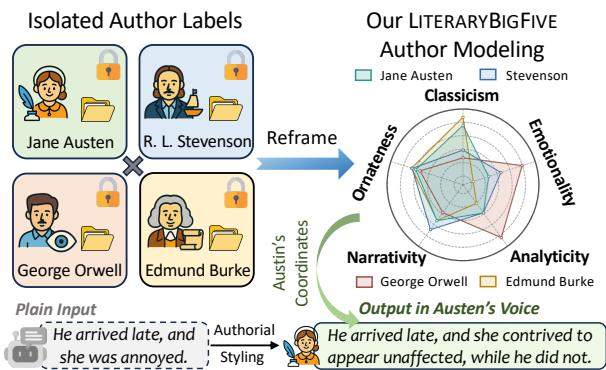  
Figure 1: Previous work models each author as an isolated label; LITERARYBIGFIVE reframes authorial characteristics as a unified, interpretable space spanned by five axes, enabling measurement, comparison, and con-<sub>On</sub>One Unified Space <sub>trol across authors and books.</sub>

However, existing approaches predominantly treat individual authors as isolated categories. As shown in Figure 1, previous methods typically set up a separate task for each author, and apply specific prompting (Bhandarkar et al., 2024), model training (Jhamtani et al., 2017), or steering (Konen et al., 2024) to capture their characteristics independently. This design suffers from two key limitations. First, adapting to a new author typically requires collecting hundreds or thousands of texts or retraining the model (Zhang et al., 2025c), making large-scale expansion extremely costly and impractical. Second, it fails to reveal how different writing patterns relate to one another, offering limited interpretability or a unified representation of authorial variation.

Linguistic and literary studies offer a more systematic and theoretically grounded perspective for understanding complex writing patterns and stylistic variation across texts. Decades of analysis show that variation in written language is often organized along a few stable and interpretable dimensions, such as narrativity, emotion, and elaboration, rather than an unlimited and highly fragmented set of individual author labels (Martin and White, 2003; Kuiken and Jacobs, 2021; Biber and Gray, 2016).

This dimensional view echoes the idea behind the Big Five model in psychology, where complex human personalities are described by five high-level axes (Goldberg, 1993; John et al., 1999). These works suggest that unified, interpretable coordinates could support a more flexible paradigm for author personalization than categorical tags.

Building on these observations, we propose LIT-ERARYBIGFIVE, a framework that reframes authorial characteristics as coordinates in a unified fivedimensional space rather than a set of unrelated labels. Concretely, we define five interpretable axes: Classicism, Ornateness, Narrativity, Emotionality, and Analyticity for our LITERARYBIGFIVE, which are informed by established literary and linguistic analysis (Biber and Conrad, 2019; Abbott, 2021; Biber and Gray, 2016; Booth, 1983). To construct the space, we select representative classics for each dimension and derive axis directions by contrasting original author-written and neutral passage pairs that preserve semantics while varying axis-specific features. Since raw activations show a general shift from neutral rewrites toward original literary texts that entangle distinct axes, we introduce an axis decomposition step to explicitly remove the shared principal component from all axes and reinterpret it as the overall expressiveness direction, thereby yielding the refined BigFive axes system. This improves axis independence and enables more stable multi-axis control over individual authorial traits.

With the LITERARYBIGFIVE space established, we propose localize-and-steer for both authorial coordinates analysis and personalized generation. For a target author, we first locate their position by projecting the reference text onto the BigFive directions, and yield unique scores that capture their authorial characteristics. This allows us to position different authors or books within a unified space and compare them along shared dimensions. Next, we leverage the BigFive axes for interpretable personalized generation by steering model activations toward target authorial coordinates, enabling immediate adaptation to a wide range of new authors, from classic novelists to contemporary writers.

To validate the effectiveness of LITERARYBIG-FIVE on unseen authors, we evaluate it on books spanning distinct writing identities. Experiments show that LITERARYBIGFIVE better matches target authors while preserving meaning. Meanwhile, the learned author coordinates align with established literary consensus, suggesting that the space provides an interpretable representation of style.

In general, our contributions can be summarized as follows: (i) We introduce LITERARYBIGFIVE, a framework motivated by linguistic and literary studies that advances author modeling from isolated labels to a unified, interpretable five-dimensional space, capturing core dimensions of authorial variation. (ii) We propose a localize-and-steer mechanism that maps individual authors to precise coordinates in the LITERARYBIGFIVE space and enables latent space steering for personalized generation, adapting to new authors instantly without retraining. (iii) We demonstrate that LITERARYBIGFIVE improves authorial expressiveness while preserving semantic fidelity, and that the resulting axis scores align well with established literary consensus, providing transparent, per-dimension explanations of authorial characteristics.

## 2 Related Work

Personalized Text Generation. Personalized generation aims to align LLMs with specific user profiles or authorial identities while preserving semantic content (Zhang et al., 2025c). Traditional approaches often frame this as a supervised rewriting task requiring parallel corpora (Hu et al., 2017), or employ unsupervised disentanglement to separate content from linguistic expression (Prabhumoye et al., 2018). In the era of LLMs, the research focus has shifted to prompting (Reif et al., 2022) or fine-tuning on author-specific corpora (Wang et al., 2024). However, these methods typically treat individual authors as independent, categorical labels. This label-based paradigm scales poorly, as modeling a new author needs separate corpus collection, modeling retraining or extensive prompt engineering. We address this by learning a unified latent space that adapts to new authors instantly without such per-author overhead.

Dimensional Modeling of Linguistic Variation. Traditional stylometry often treats authors discretely, assigning each author a unique label and modeling style differences as class distinctions (Holmes, 1998). In contrast, linguistic studies have shown that written language can also be characterized along multiple interpretable dimensions, such as involved versus informational writing (Biber, 1991; Biber and Gray, 2016). These studies provide an empirical basis for dimensional analysis of linguistic variation, but are not designed for controlling language model generation at inference time. Beyond linguistics, the Big Five framework in psychology also shows that complex human individual variation can be described through compact interpretable axes (Goldberg, 1993), and this dimensional view has been widely adopted in NLP research for assessing personality (Jiang et al., 2024) and simulating personas (Wang et al., 2024). However, it remains underexplored for controllable personalized text generation, where categorical style or author labels still dominate. Our work builds on this dimensional perspective and represents authorial writing characteristics as coordinates in a shared, interpretable space, enabling both author localization and activation-based steering for personalized generation.

Activation Steering. Activation steering modifies a model’s output at inference time by intervening in its intermediate representations using direction vectors (Zou et al., 2023). By computing difference in latent activations between samples that express a target concept and those that do not, one can isolate a semantic vector corresponding to a specific attribute, and steering the model along this direction induces the associated behavior (Kim et al., 2018). Key advantages of activation steering include its interpretability, as abstract attributes are explicitly represented as vectors (Rimsky et al., 2024), as well as its efficiency compared to conventional adaptation methods such as finetuning (Gan et al., 2025). Recent studies have applied activation steering to personalized writing (Zhang et al., 2025a), emotion control (Banayeeanzade et al., 2025), and persona adoption (Chen et al., 2025). Although existing methods can steer models toward target outputs, they are mostly limited to single, binary traits or learn distinct vectors for individual authors. In contrast, LITERARYBIGFIVE enables multi-dimensional personalized steering within a unified space across diverse authors.

## 3 Problem Formulation

We formulate interpretable author-personalized generation as two coupled sub-tasks: localization and steering, jointly framed in a unified fivedimensional space. In the localization stage, let $\mathcal { S } = \mathbb { R } ^ { 5 }$ denote the LITERARYBIGFIVE space with interpretable axes. Given few k reference passages $\{ x _ { b , i } \} _ { i = 1 } ^ { k }$ sampled from a target book $b ,$ a locator $\phi : T \to S$ maps each passage to its coordinates in $\boldsymbol { s }$ . We estimate the target authorial coordinates by averaging the coordinates of its passages:

$$
\begin{array} { r } { \mathbf { s } _ { b } = \frac { 1 } { k } \sum _ { i = 1 } ^ { k } \phi ( x _ { b , i } ) \in \mathcal { S } , } \end{array}\tag{1}
$$

which represents the author’s or book’s characteristic position within the space.

In the steering stage, given a neutral input passage x and the target position $\mathbf { s } _ { b } .$ , the goal is to generate a rewritten passage:

$$
\hat { x } = f ( x , { \mathbf s } _ { b } ) ,\tag{2}
$$

whose semantics remain consistent with x while its linguistic expression aligns with $\mathbf { s } _ { b }$

## 4 Method

In this section, we introduce the LITERARYBIG-FIVE in detail. First, §4.1 presents the space construction with five axes; then, §4.2 describes how to locate a book to obtain its authorial coordinates; and finally, §4.3 explains how to steer generation to the target author using these coordinates.

## 4.1 LITERARYBIGFIVE Space Construction

Dimension Definitions and Representative Books. Drawing on prior work in linguistic and literary analysis (Biber and Conrad, 2019), we define five interpretable dimensions to capture several major variations in English literary writing. Ornateness reflects lexical richness and syntactic complexity, particularly within noun phrases, rather than simple sentence length (Biber and Gray, 2016). Narrativity distinguishes storytelling text, focused on action verbs and time markers (Abbott, 2021). Emotionality quantifies affective intensity through sentiment words, regardless of the specific topic (Booth, 1983). Classicism reflects the traditional writing patterns of the 18th and 19th centuries, emphasizing complex sentence structures and historical vocabulary (Boyd et al., 2022). Analyticity corresponds to expository and reasoning-oriented writing, characterized by abstract nouns and logical relations (Biber, 1995).

For each dimension, we select representative classics discussed in literary analysis to anchor the corresponding axis. Examples include Daniel Defoe’s Robinson Crusoe, a foundational work for modern linear Narrativity (Watt, 1957), and Virginia Woolf’s Mrs. Dalloway, distinguished by the intense Emotionality of its affective experience (Auerbach and Said, 2013). We curate selected books and clean these texts to retain only the authorial content and segment them into coherent passages. The full list of authors and books, detailed data sources, and preprocessing procedures are provided in Appendix C.

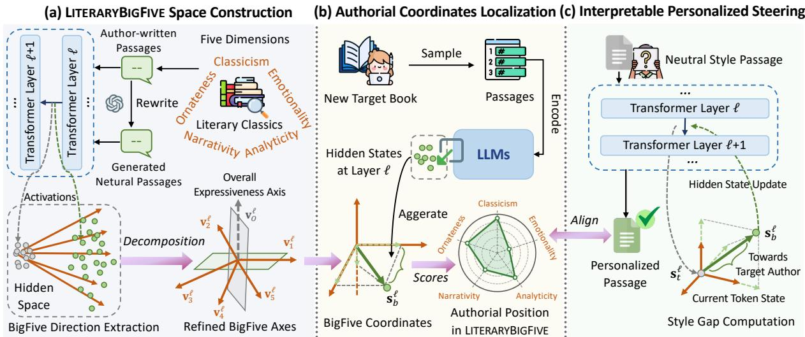  
Figure 2: Illustration of LITERARYBIGFIVE framework. (a) We begin with constructing the LITERARYBIGFIVE space using author-written passages from selected literary classics that strongly exhibit each defined dimension, and extract BigFive direction with axis decomposition. (b) For a new target book, LITERARYBIGFIVE locates its authorial position by projecting reference passages onto the BigFive axes to obtain authorial coordinates. (c) During generation, we align the output with the target author by computing the style gap between the current token and the target coordinates, then updating the hidden states along the interpretable axes to close this gap.

Paired Dataset Construction. To derive the axes for the five dimensions, we construct paired passages that share semantics but differ in authorial expression. For each dimension $k \in \{ 1 , \ldots , 5 \}$ , we denote the set of representative books as $\boldsymbol { B _ { k } }$ . Following (Ma et al., 2025), for each cleaned authorwritten passage $x _ { b , i } ^ { + }$ from a book $b \in B _ { k }$ , we use GPT-4 (OpenAI et al., 2024) to suppress authorial cues along the five defined dimensions (prompt in Appendix O.1), obtaining a semantics-preserving neutral rewrite $x _ { b , i } ^ { - } ,$ , yielding $N _ { b }$ passage pairs:

$$
\mathcal { P } _ { b , k } = \{ ( x _ { b , i } ^ { + } , x _ { b , i } ^ { - } ) \} _ { i = 1 } ^ { N _ { b } } .\tag{3}
$$

The collection of all pairs for dimension k forms the dataset $\begin{array} { r } { \mathcal { D } _ { k } = \bigcup _ { b \in \mathcal { B } _ { k } } \mathcal { P } _ { b , k } } \end{array}$ , and the complete corpus for axis construction is $\textstyle { \mathcal { D } } = \bigcup _ { k = 1 } ^ { 5 } { \mathcal { D } } _ { k }$

Axis Extraction. After defining the five dimensions and preparing representative author data for each axis, we next extract the corresponding axis directions in hidden space. Let $a ^ { \ell } ( s ) \in \mathbb { R } ^ { d }$ denote the last-token activation at layer ℓ for a token sequence s. The key is to identify, for each dimension, the activation shift that captures authorial variation rather than semantic content or positional bias. Hence, for each paired passage $( x _ { b , i } ^ { + } , x _ { b , i } ^ { - } )$ we use the same neutral input $x _ { b , i } ^ { - }$ and concatenate it with either the author-written passage $x _ { b , i } ^ { + }$ or the neutral rewrite $x _ { b , i } ^ { - }$ , and then compute the authorwritten and neutral hidden states:

$$
\mathbf { h } _ { + , b , i } ^ { \ell } = a ^ { \ell } ( x _ { b , i } ^ { - } \oplus x _ { b , i } ^ { + } ) , \quad \mathbf { h } _ { - , b , i } ^ { \ell } = a ^ { \ell } ( x _ { b , i } ^ { - } \oplus x _ { b , i } ^ { - } ) ,
$$

where ⊕ concatenates the neutral input and the model’s rewritten output. Since the input $x _ { b , i } ^ { - }$ is identical in both sequences and only the output’s style differs, we can obtain the contrast $\delta _ { b , i } ^ { \bar { \ell } } \ =$ $\mathbf { h } _ { + , b , i } ^ { \ell } - \mathbf { h } _ { - , b , i } ^ { \ell }$ that isolates stylistic differences. Finally, we average these vectors over all N pairs from anchor books and renormalize, yielding the raw axis $\tilde { \mathbf { v } } _ { k } ^ { \ell }$ for the k-th dimension at layer ℓ:

$$
\begin{array} { r } { \tilde { \mathbf { v } } _ { k } ^ { \ell } = \frac { 1 } { N } \sum _ { i = 1 } ^ { N } \delta _ { b , i } ^ { \ell } \in \mathbb { R } ^ { d } . } \end{array}\tag{4}
$$

Axis Refinement via Decomposition. In preliminary analyses, we observed that although the five directions $\{ \tilde { \mathbf { v } } _ { k } ^ { \ell } \} _ { k = 1 } ^ { 5 }$ capture distinct linguistic variations across dimensions, they appear to share a global offset trend, i.e., all axes tend to move activations from the “neutral” region toward the “authorwritten” region, rather than changing in completely independent directions. To verify this intuition, we take the paired neutral and original passages used for axis construction, average their last-token activations across layers and project them into a 3D PCA space. As shown in Figure 3(a), the neutral (blue) and author-written (red) samples form two compact clusters separated mainly along a single direction, revealing a strong global neutral→authorwritten shift shared across dimensions. Motivated by this finding, we propose to explicitly remove this shared component on a per-layer basis, in order to isolate axis-specific variations and improve the stability of multi-axis composition.

Concretely, for layer $\ell ,$ we stack the five axis

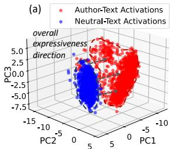

  
Figure 3: (a) 3D PCA reveals a dominant expressiveness direction from neutral-text (blue) to author-text (red) activations. (b) Correlation heatmap shows reduced cross-axis similarity after removing this global trend, demonstrating effective disentanglement of our refined dimensions. Results shown for LLaMA2-7B-Chat.

vectors into

$$
\begin{array} { r } { \tilde { { \bf V } } ^ { \ell } = \left[ \tilde { { \bf v } } _ { 1 } ^ { \ell } , \tilde { { \bf v } } _ { 2 } ^ { \ell } , \cdot \cdot \cdot , \tilde { { \bf v } } _ { 5 } ^ { \ell } \right] \in \mathbb { R } ^ { d \times 5 } , } \end{array}
$$

and perform Singular Value Decomposition (SVD) $\tilde { \mathbf { V } } ^ { \ell } = \mathbf { U } ^ { \ell } \pmb { \Sigma } ^ { \ell } \mathbf { Q } ^ { \ell } ^ { \top }$ . The first left singular vector $\mathbf { v } _ { O } ^ { \ell } = \mathbf { U } _ { : 1 } ^ { \ell } \in \mathbb { R } ^ { d }$ corresponds to the most dominant direction of variation shared across all dimensions. We identify this vector as the overall expressiveness direction, which captures the collective tendency of activations to drift toward more stylized representations. Simultaneously, we also compute its average magnitude $\rho _ { O } ^ { \ell }$ by projecting the raw axes onto ${ \bf v } _ { O } ^ { \ell }$ to preserve the layer-wise intensity of this global trend. Next, to emphasize the unique contribution of each axis, we remove this global trend from every $\tilde { \mathbf { v } } _ { k } ^ { \ell }$ , and obtain the refined unit axis $\mathbf { v } _ { k } ^ { \ell }$ with its magnitude $\rho _ { k } ^ { \ell }$ :

$$
\boldsymbol { \rho } _ { k } ^ { \ell } \cdot \mathbf { v } _ { k } ^ { \ell } = \tilde { \mathbf { v } } _ { k } ^ { \ell } - \mathbf { v } _ { O } ^ { \ell } { \mathbf { v } _ { O } ^ { \ell } } ^ { \top } \tilde { \mathbf { v } } _ { k } ^ { \ell } .\tag{5}
$$

We retain the extracted magnitudes $\rho _ { O } ^ { \ell }$ and $\rho ^ { \ell } =$ $[ \rho _ { 1 } ^ { \ell } , \ldots , \rho _ { 5 } ^ { \ell } ]$ to restore the natural scale of interventions during the steering phase. As shown in Figure 3(b) and Appendix Figure 6, this decomposition step effectively reduces cross-axis correlations, and leads to more stable multi-axis combination.

## 4.2 Authorial Coordinates Localization

After deriving the axes, we aim to localize a target book’s position within the LITERARYBIGFIVE space. Let $\{ x _ { b , i } \} _ { i = 1 } ^ { k }$ be k reference passages from test book $b .$ For layer ℓ, let $a ^ { \ell } ( x ) \in \bar { \mathbb { R } } ^ { d }$ denote the last-token activation and define its unit-normalized form $\widehat { a } ^ { \ell } ( x )$ = norm $\left( a ^ { \ell } ( x ) \right)$ . We stack the refined axes into the basis matrix:

$$
\mathbf { V } ^ { \ell } = \left[ \mathbf { v } _ { 1 } ^ { \ell } , \mathbf { v } _ { 2 } ^ { \ell } , \cdots , \mathbf { v } _ { 5 } ^ { \ell } \right] \in \mathbb { R } ^ { d \times 5 } .
$$

Since the inner product with unit axes provides a signed, scale-invariant measure of each dimension’s intensity, for each reference passage, we can

obtain per-layer authorial scores $\mathbf { s } _ { b , i } ^ { \ell }$ by projecting its unit activation $\widehat { a } ^ { \ell } ( x _ { b , i } )$ onto the five axes:

$$
\mathbf { s } _ { b , i } ^ { \ell } = \mathbf { V } ^ { \ell ^ { \top } } \widehat { a } ^ { \ell } ( x _ { b , i } ) \in \mathbb { R } ^ { 5 } .\tag{6}
$$

To interpret the style of the book and guide generation toward it, we aggregate these passage-level projections over k references, yielding the booklevel raw coordinates $\mathbf { s } _ { b } ^ { \ell }$ at layer ℓ:

$$
\begin{array} { r } { \mathbf { s } _ { b } ^ { \ell } = \frac { 1 } { k } \sum _ { i = 1 } ^ { k } \mathbf { s } _ { b , i } ^ { \ell } \in \mathbb { R } ^ { 5 } . } \end{array}\tag{7}
$$

These per-layer scores serve as personalized steering targets at the selected intervention layers $\mathcal { L } .$ capturing linguistic attributes ranging from local syntax to global semantics encoded at different depths (Geva et al., 2021). Furthermore, for analyzing the book’s writing characteristics, we average the scores $\mathbf { s } _ { b } ^ { \ell }$ across $\ell \in \mathcal L$ to derive book-level authorial coordinates:

$$
\begin{array} { r } { { \bf s } _ { b } = \frac { 1 } { \vert \mathcal { L } \vert } \sum _ { \ell \in \mathcal { L } } { \bf s } _ { b } ^ { \ell } \in \mathbb { R } ^ { 5 } . } \end{array}\tag{8}
$$

Note that the coordinates above are not directly comparable across dimensions, as different axes exhibit varying dynamic ranges. To establish a consistent scale, we calibrate each dimension of $\mathbf { s } _ { b }$ to a [0, 100] range using axis-specific anchor books (detailed procedure in Appendix E), enabling intuitive visualization of authorial profiles.

## 4.3 Interpretable Personalized Steering

After localizing the target book b’s authorial position in the LITERARYBIGFIVE space as s<sub>b</sub>, we steer the model to rewrite an input passage x into xˆ so that its writing patterns align with the target authorial style while preserving the original semantic content. Unlike prior methods that rely on a single direction per author (Konen et al., 2024; Zhang et al., 2025a), our method performs editing in an interpretable axis-aligned space with explicit and controllable per-dimension modulation.

Let $\mathbf h _ { t } ^ { \ell } \in \mathbb R ^ { d }$ denote the hidden state at token t and layer $\ell ,$ and let $\widehat { \mathbf { h } } _ { t } ^ { \ell } = \mathrm { n o r m } \big ( \mathbf { h } _ { t } ^ { \ell } \big )$ be its normalized form. To stabilize steering, we augment the five-axis directions $\mathbf { V } ^ { \ell }$ with the shared expressiveness direction ${ \bf v } _ { O } ^ { \ell }$ , which captures the global shift from neutral to literary style. During generation, we project $\widehat { \mathbf { h } } _ { t } ^ { \ell }$ onto both $\mathbf { V } ^ { \ell }$ and ${ \bf v } _ { O } ^ { \ell }$ to obtain the current layer-wise authorial scores:

$$
\mathbf { s } _ { t } ^ { \ell } = \mathbf { V } ^ { \ell ^ { \top } } \widehat { \mathbf { h } } _ { t } ^ { \ell } \in \mathbb { R } ^ { 5 } , \quad s _ { O , t } ^ { \ell } = \langle \widehat { \mathbf { h } } _ { t } ^ { \ell } , \mathbf { v } _ { O } ^ { \ell } \rangle .
$$

Similarly, the target overall expressiveness score is computed by averaging the projections of k reference passages onto ${ \bf v } _ { O } ^ { \ell }$ :

$$
\begin{array} { r } { s _ { O , b } ^ { \ell } = \frac { 1 } { k } \sum _ { i = 1 } ^ { k } \langle \widehat { a } ^ { \ell } ( \boldsymbol { x } _ { b , i } ) , \mathbf { v } _ { O } ^ { \ell } \rangle . } \end{array}\tag{9}
$$

Based on the current and target scores above, we can observe the style gap $\mathbf { s } _ { b } ^ { \ell } - \mathbf { s } _ { t } ^ { \ell }$ (and $s _ { O , b } ^ { \ell } - s _ { O , t } ^ { \ell } )$ between the current t-th token and the target author. This gap indicates along which direction to move and by how much to bring the token closer to the target author in our LITERARYBIGFIVE space. We therefore convert it into edit strengths by rescaling it with the axis magnitudes $\rho ^ { \ell }$ and $\rho _ { O } ^ { \ell }$ extracted in the decomposition step:

$$
\begin{array} { c } { \alpha _ { t } ^ { \ell } = \lambda \rho ^ { \ell } \odot ( \mathbf { s } _ { b } ^ { \ell } - \mathbf { s } _ { t } ^ { \ell } ) , } \\ { \alpha _ { O , t } ^ { \ell } = \lambda \rho _ { O } ^ { \ell } ( s _ { O , b } ^ { \ell } - s _ { O , t } ^ { \ell } ) , } \end{array}\tag{10}
$$

where $\odot$ denotes element-wise product and λ is a global control strength. Finally, using these obtained coefficients, we steer the current token to the target author by updating its hidden state $\mathbf { h } _ { t } ^ { \ell } \to \mathbf { h } _ { t } ^ { \ell ^ { \prime } }$ for each selected intervention layer $\ell \in { \mathcal { L } } :$

$$
\mathbf { h } _ { t } ^ { \ell ^ { \prime } } = \mathbf { h } _ { t } ^ { \ell } + \mathbf { V } ^ { \ell } \alpha _ { t } ^ { \ell } + \alpha _ { O , t } ^ { \ell } \mathbf { v } _ { O } ^ { \ell } .\tag{11}
$$

Edits proceed from shallow to deep layers, allowing style effects to accumulate across layers while avoiding over-correction at a single place.

## 5 Experiments

## 5.1 Experimental Setup

Evaluation Data. To evaluate LITERARYBIGFIVE across diverse authors, we further curate a test set consisting of well-known books: Reflections on the Revolution in France by Edmund Burke, 1984 by George Orwell, Kidnapped by R. L. Stevenson, and Pride and Prejudice by Jane Austen. The resulting evaluation comprises 590 passage-level samples totaling 5,716 sentences, which substantially exceeds standard benchmarks such as the Shakespeare test set by Xu et al. (2012), containing 1.4 thousand sentences. Each book possesses a distinct authorial expression, allowing for a comprehensive and rigorous assessment of our method’s cross-author generalizability.

Evaluation Metrics. Following previous works (Krishna et al., 2020; Zhang et al., 2025a), we adopt ROUGE-1/L (Lin, 2004) to evaluate reconstruction quality by comparing generated passages against original texts of the target author.

To measure semantic preservation, we report embedding similarity (SIM), computed based on the cosine similarity of sentence representations encoded by the BGE model (Chen et al., 2024).

Beyond objective metrics, we leverage the strong capabilities of LLMs in evaluating complex writing characteristics (Ostheimer et al., 2024) by utilizing GPT-4 as a judge. Specifically, we rate passages on a 0-10 scale considering two key dimensions: i) Authorial Adherence measures how well the rewrite aligns with the target author’s distinctive characteristics; and ii) Semantic Fidelity, which evaluates the preservation of original meaning (prompt in Appendix O.4). To mitigate potential bias, we complement this with human evaluation, where two annotators rate responses using the same twodimensional criteria.

Baselines. We compare our LITERARYBIG-FIVE against various state-of-the-art baselines categorized as follows: (1) Few-shot Prompting; (2) Supervised Fine-Tuning, specifically LLM-Steer (Han et al., 2024), which fine-tunes word embeddings via a linear transformation, and LoRA (Hu et al., 2022), a parameter-efficient low-rank adaptation method; (3) Activation Steering, including ICV (Liu et al., 2024), Mean-Centering (Jorgensen et al., 2023), and CAA (Rimsky et al., 2024), RepE (Zou et al., 2023). Method introductions are detailed in Appendix K.

Implementation Details. We apply Llama2-7B-Chat (Touvron et al., 2023) as the base LLM to implement our LITERARYBIGFIVE and all baselines, with additional results on Qwen2.5-3B-Instruct (Yang et al., 2025) reported in Appendix B. All experiments were conducted with NVIDIA RTX 5880 Ada GPUs. Detailed Hyperparameters setting are provided in the Appendix L.

## 5.2 Main Results

As shown in Table 1, across four stylistically diverse books, LITERARYBIGFIVE consistently outperforms all baselines on ROUGE, SIM, GPT-4 and human evaluations. We summarize three key observations. (1) Interpretable, axis-aligned editing yields the strongest and most stable personalized generation. Unlike conventional editing methods that operate in entangled latent spaces, LITERARYBIGFIVE leverages interpretable Big-Five axes to support context-aware and fine-grained author-specific adjustment (with qualitative examples provided in Appendix M), consistently achieving higher ROUGE scores while preserving semantic fidelity and stylistic coherence. (2) Robustness across diverse authors. The evaluation ranges from Burke’s political rhetoric to Austen’s narrative prose. While baseline performance fluctuates, LITERARYBIGFIVE maintains high scores across all domains. This indicates that our model generalizes well to different styles without overfitting to specific corpora. (3) High authorial adherence with robust semantic preservation. A major challenge in personalized generation is aligning the output with a target author’s writing characteristics without altering the original meaning. As visualized in Figure 4, LITERARYBIGFIVE occupies the optimal region (top-right), achieving the highest scores on both dimensions simultaneously. This demonstrates that our approach effectively disentangles authorial expression from content, enabling faithful personalization while preserving core semantics. Human annotators achieve a Cohen’s κ of 0.59, demonstrating moderate inter-annotator agreement. It can also be observed that GPT-4’s scores closely align with human evaluations, supporting the reliability of LLM-based assessment.

Table 1: Experimental results on four books. For all metrics, higher scores indicate better performance. The best-performing methods are highlighted in bold, all results are scaled to 0-100 (two-tailed paired t-test, p<0.01).
<table><tr><td rowspan="2">Method</td><td colspan="5">Reflections on the Revolution in France</td><td colspan="5">1984</td></tr><tr><td>ROUGE-1</td><td>ROUGE-L</td><td>SIM</td><td>GPT-4</td><td>Human</td><td>ROUGE-1</td><td>ROUGE-L</td><td>SIM</td><td>GPT-4</td><td>Human</td></tr><tr><td>Few-shot</td><td>38.0</td><td>28.7</td><td>73.9</td><td>64.6</td><td>42.5</td><td>55.1</td><td>46.6</td><td>87.1</td><td>69.7</td><td>54.5</td></tr><tr><td>LLM-Steer</td><td>44.3</td><td>35.2</td><td>92.5</td><td>65.4</td><td>60.3</td><td>52.7</td><td>45.9</td><td>90.8</td><td>68.8</td><td>53.9</td></tr><tr><td>LoRA</td><td>43.0</td><td>29.8</td><td>82.5</td><td>60.8</td><td>49.5</td><td>51.7</td><td>38.9</td><td>87.1</td><td>69.3</td><td>57.2</td></tr><tr><td>ICV</td><td>43.6</td><td>33.8</td><td>93.6</td><td>65.4</td><td>60.3</td><td>54.7</td><td>48.6</td><td>92.8</td><td>73.1</td><td>71.5</td></tr><tr><td>Mean-Centering</td><td>45.6</td><td>35.2</td><td>93.9</td><td>67.9</td><td>65.9</td><td>55.6</td><td>46.3</td><td>93.8</td><td>73.8</td><td>73.9</td></tr><tr><td>CAA</td><td>41.6</td><td>31.9</td><td>89.7</td><td>59.7</td><td>45.8</td><td>43.3</td><td>35.9</td><td>85.7</td><td>57.5</td><td>46.7</td></tr><tr><td>RepE</td><td>45.3</td><td>35.7</td><td>94.0</td><td>68.6</td><td>65.4</td><td>56.5</td><td>47.9</td><td>94.3</td><td>73.5</td><td>70.9</td></tr><tr><td>LITERARYBIGFIVE</td><td>46.1</td><td>36.4</td><td>94.4</td><td>69.4</td><td>69.2</td><td>57.8</td><td>49.4</td><td>95.1</td><td>75.2</td><td>75.3</td></tr><tr><td rowspan="2">Method</td><td></td><td></td><td>Kidnapped</td><td></td><td></td><td></td><td>Pride and Prejudice</td><td></td><td></td><td></td></tr><tr><td>ROUGE-1</td><td>ROUGE-L</td><td>SIM</td><td>GPT-4</td><td>Human</td><td>ROUGE-1</td><td>ROUGE-L</td><td>SIM</td><td>GPT-4</td><td>Human</td></tr><tr><td>Few-shot</td><td>51.0</td><td>41.0</td><td>84.8</td><td>58.5</td><td>47.6</td><td>48.2</td><td>37.3</td><td>82.3</td><td>52.6</td><td>48.9</td></tr><tr><td>LLM-Steer</td><td>50.3</td><td>43.3</td><td>91.2</td><td>58.8</td><td>57.1</td><td>44.8</td><td>37.0</td><td>90.3</td><td>55.2</td><td>51.5</td></tr><tr><td>LoRA</td><td>53.3</td><td>44.9</td><td>92.2</td><td>58.7</td><td>56.4</td><td>49.1</td><td>34.1</td><td>87.5</td><td>56.1</td><td>53.7</td></tr><tr><td>ICV</td><td>54.5</td><td>46.1</td><td>95.8</td><td>65.0</td><td>65.5</td><td>49.2</td><td>39.2</td><td>94.0</td><td>61.5</td><td>63.0</td></tr><tr><td>Mean-Centering</td><td>55.7</td><td>47.0</td><td>96.1</td><td>66.5</td><td>61.8</td><td>50.9</td><td>40.0</td><td>94.6</td><td>64.0</td><td>66.7</td></tr><tr><td>CAA</td><td>48.7</td><td>40.7</td><td>90.5</td><td>56.0</td><td>41.0</td><td>44.7</td><td>35.3</td><td>89.5</td><td>51.2</td><td>49.1</td></tr><tr><td>RepE</td><td>55.9</td><td>47.6</td><td>96.4</td><td>65.9</td><td>68.3</td><td>50.2</td><td>40.2</td><td>94.4</td><td>63.5</td><td>67.8</td></tr><tr><td>LITERARYBIGFIVE</td><td>56.5</td><td>48.3</td><td>96.7</td><td>67.8</td><td>73.8</td><td>51.3</td><td>41.7</td><td>94.8</td><td>65.9</td><td>69.5</td></tr></table>

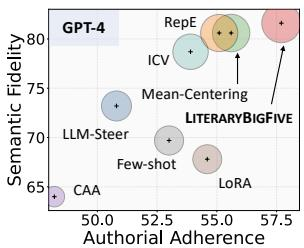

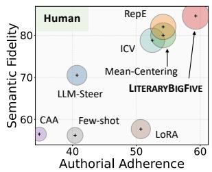  
Figure 4: Performance analysis of Semantic Fidelity and Authorial Adherence. Radius denotes mean value.

Table 2: Ablation study on LITERARYBIGFIVE. Bold numbers indicate statistically significant improvements over the best baseline (two-tailed paired t-test, p<0.01).
<table><tr><td>Variants</td><td>ROUGE-1</td><td>ROUGE-L</td><td>SIM</td><td>GPT-4</td></tr><tr><td>-w/o Decomposition</td><td>52.1</td><td>43.2</td><td>94.7</td><td>68.8</td></tr><tr><td>-w/o Style Gap</td><td>49.3</td><td>40.0</td><td>91.6</td><td>66.6</td></tr><tr><td>LITERARYBIGFIVE</td><td>53.0</td><td>44.0</td><td>95.2</td><td>69.6</td></tr></table>

## 6 Analysis and Discussion

## 6.1 Ablation Study

We also conduct an ablation study to examine the contribution of each key component in LITERARY-BIGFIVE, as shown in Table 2. First, removing the axis decomposition step in §4.1 and using raw book-level directions (-w/o Decomposition) leads to a noticeable drop across all metrics, indicating that refinement is essential for isolating clean, dimension-specific authorial signals. Furthermore, disabling the dynamic adaption of the style gap in §4.2 and applying a fixed steering strength (- w/o Style Gap) yields an even larger performance degradation than removing refinement. This highlights the crucial role of adaptive token-level steering, as authorial cues are unevenly distributed across a passage and require context-sensitive adjustment to avoid insufficient or excessive intervention. Overall, these findings validate that combining axis refinement with adaptive steering is necessary to achieve optimal personalization and semantic preservation.

## 6.2 Authorial Coordinates Analysis

To assess the interpretability of authorial coordinates derived in the LITERARYBIGFIVE space, we evaluate their alignment with independent stylistic judgements produced by frontier LLMs.

Table 3: Qualitative comparison of observed shifts, with linguistic analysis highlighted in shaded rows. We present cases with steering strengths $\alpha \in \{ - 0 . 8 , + 0 . 8 \}$ here, while more results and analysis are available in Appendix N.
<table><tr><td>Dimension</td><td>Strength</td><td>Generated Text Snippet</td></tr><tr><td>Classicism</td><td>-0.8 0.8</td><td>.….persons... who hadcaused resentmenttowards the throne byaccepting its generous rewards... ..persons... who hadbrought an odiumon the throne by theprodigal dispensation of its bounties.</td></tr><tr><td colspan="3">Analysis: High Classicism steers towards Archaic Lexicon. Note the shift from modern “caused resentment&quot; to Latinateodium, and from simple “generous rewards&quot; to more period-specific phrasingprodigal dispensation.</td></tr><tr><td rowspan="2">Emotionality</td><td></td><td>...Kitty was not completely surprised.I am very sorry. It is an imprudent matchfor both of them! But</td></tr><tr><td>-0.8</td><td>I hope for the best... ...Kitty.. does not seem so wholly unexpected. Our poor mother is sadly grieved. So imprudent a</td></tr><tr><td></td><td>0.8</td><td>matchon both sides! But I am willing to hope... Analysis: High Emotionality drives Affective Intensity. The text shifts from neutral observation to personal sentiment, adding</td></tr><tr><td></td><td>-0.8</td><td>emotional weight through words likesadly grievedand emphatic structures (“So imprudent...&quot;). ...She isfriendly and gracious, and she will probablypay some attentionto you...</td></tr><tr><td rowspan="2">Ornateness</td><td>0.8</td><td>..She isall affability and condescension, and I doubt not but you will behonoured with some portion</td></tr><tr><td></td><td>of her notice... Analysis: High Ornateness promotes Syntactic Complexity. Straightforward adjectives like (“friendly&quot;) are elaborated into abstract</td></tr><tr><td colspan="3">noun phrases (affability and condescension), resulting in a more decorative and indirect writing style.</td></tr></table>

Accordingly, we ask GPT-5, Claude 3.5, and Gemini 3 to rate each book on a 0–100 scale along the five dimensions defined in LITERARY-BIGFIVE (prompt in Appendix O.5). We then compute the Pearson correlation between our model coordinates and the ensemble average of the LLM scores. Results in Appendix G show strong alignment between LITERARYBIGFIVE and the LLM consensus, with an average Pearson correlation of $r = 0 . 9 6$ across all axes. As shown in the radar charts (Figure 5), our method captures stylistic patterns consistent with advanced LLM judgments. For example, the high Classicism of Edmund Burke and the high Analyticity of George Orwell are reflected in both our coordinates and the LLM ratings. Discrepancies in the radar plots further improve interpretability by revealing dimensions where our model diverges from the LLM consensus.

## 6.3 Case Study: Dimension Steering

To explore the interpretability of LITERARYBIG-FIVE and gain qualitative insight into individual dimensions, we conduct a case study examining stylistic shifts induced by steering along a single dimension. Specifically, we randomly sample 40 texts from our test set. For each text, we apply the axis to one target dimension at a time while keeping other dimensions at zero to ensure isolation, and generate rewrites by varying the steering strength $\alpha \in \{ - 0 . 8 , - 0 . 4 , 0 , + 0 . 4 , + 0 . 8 \}$ . As reflected in Table 3 (full version is in Appendix N), the results show that BigFive axes effectively modulate corresponding dimensions, such as the transition to Latinate diction in Classicism, without changing the underlying meaning of the text.

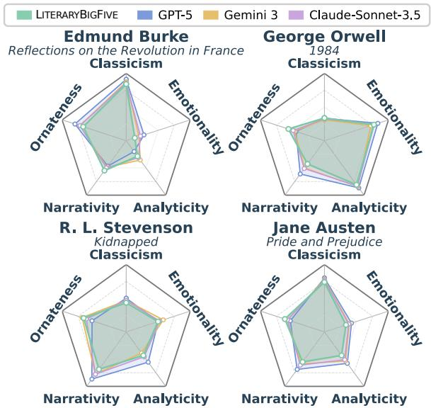  
Figure 5: Radar charts comparing LITERARYBIGFIVE coordinates with LLM-based authorial scores across four authors. The strong overlap indicates consistent authorial stylistic characterization.

## 7 Conclusion

We present LITERARYBIGFIVE, a framework that reframes isolated author’s writing characteristics into a unified and interpretable five-dimensional space. By leveraging a localize-and-steer mechanism, our approach integrates precise, interpretable analysis of authorial expression with low-cost personalized generation for new authors. Experimental results demonstrate that LITERARYBIGFIVE outperforms baselines in authorial expressiveness and semantic fidelity, while the derived coordinates closely match established literary consensus. Future work may extend this paradigm to multilingual settings and interactive writing support systems.

## Limitations

Despite the effectiveness of our framework, we acknowledge specific constraints in its design and application. First, the axes in this study are primarily derived from English literary classics, which reflects the currently limited exploration of this task within the broader research landscape. We expect future work to extend this approach to richer linguistic and literary settings. Second, the steering mechanism operates globally on the residual stream layers. While this approach effectively captures holistic writing attributes, it lacks the granularity required to manipulate specific long-range dependencies, which might be better addressed by targeting individual attention heads or specific components. Finally, our method relies on the extraction and manipulation of internal activation vectors. This dependency on white-box access limits the framework’s applicability to open-weight models and prevents it from working with closed-source language model APIs that do not provide direct access to these internal embeddings.

## Ethical Considerations

We prioritize the responsible development of personalized text generation frameworks and strictly adhere to ethical guidelines regarding data usage and model deployment. All datasets used in our experiments are derived from publicly available sources, primarily consisting of literary works in the public domain, and no private, sensitive, or personally identifiable information is included. Consequently, the generation process follows open and reproducible settings without targeting any real individuals. While our framework enables the adaptation of writing characteristics, we acknowledge the potential risks associated with automated author imitation, such as non-consensual impersonation or the generation of misleading content. We emphasize that LITERARYBIGFIVE is designed specifically for creative support, literary analysis, and adaptive assistance; by grounding our method in interpretable literary dimensions, we aim to foster transparency in how text style is manipulated.

## References

H Porter Abbott. 2021. The Cambridge introduction to narrative. Cambridge University Press.

Erich Auerbach and Edward W Said. 2013. Mimesis:

The representation of reality in western literature-new and expanded edition.

Amin Banayeeanzade, Ala N. Tak, Fatemeh Bahrani, Anahita Bolourani, Leonardo Blas, Emilio Ferrara, Jonathan Gratch, and Sai Praneeth Karimireddy. 2025. Psychological steering in llms: An evaluation of effectiveness and trustworthiness. Preprint, arXiv:2510.04484.

Avanti Bhandarkar, Ronald Wilson, Anushka Swarup, and Damon Woodard. 2024. Emulating author style: A feasibility study of prompt-enabled text stylization with off-the-shelf LLMs. In Proceedings ofthe 1st Workshop on Personalization of Generative AI Systems (PERSONALIZE 2024).

Douglas Biber. 1991. Variation across speech and writing. Cambridge university press.

Douglas Biber. 1995. Dimensions of register variation: A cross-linguistic comparison. Cambridge University Press.

Douglas Biber and Susan Conrad. 2019. Register, Genre, and Style. Cambridge University Press, New York.

Douglas Biber and Bethany Gray. 2016. Grammatical complexity in academic English: Linguistic change in writing. Cambridge University Press.

Wayne C Booth. 1983. The rhetoric of fiction. University of Chicago Press.

Ryan L Boyd, Ashwini Ashokkumar, Sarah Seraj, and James W Pennebaker. 2022. The development and psychometric properties of liwc-22. Austin, TX: University of Texas at Austin.

Jianlyu Chen, Shitao Xiao, Peitian Zhang, Kun Luo, Defu Lian, and Zheng Liu. 2024. M3- embedding: Multi-linguality, multi-functionality, multi-granularity text embeddings through selfknowledge distillation. In Proceedings ofACL Findings.

Runjin Chen, Andy Arditi, Henry Sleight, Owain Evans, and Jack Lindsey. 2025. Persona vectors: Monitoring and controlling character traits in language models. Preprint, arXiv:2507.21509.

Thomas Stearns Eliot. 2024. The Sacred Wood, Essays on Poetry and Criticism. Otbebookpublishing.

William Faulkner. 1956. William faulkner, the art of fiction no. 12. The Paris Review.

Jinwei Gan, Zifeng Cheng, Zhiwei Jiang, Cong Wang, Yafeng Yin, Xiang Luo, Yuchen Fu, and Qing Gu. 2025. Steering when necessary: Flexible steering large language models with backtracking. In Proceedings ofNeurIPS.

Mor Geva, Roei Schuster, Jonathan Berant, and Omer Levy. 2021. Transformer feed-forward layers are key-value memories. In Proceedings ofEMNLP.

Lewis R Goldberg. 1993. The structure of phenotypic personality traits. American psychologist.

Chi Han, Jialiang Xu, Manling Li, Yi Fung, Chenkai Sun, Nan Jiang, Tarek Abdelzaher, and Heng Ji. 2024. Word embeddings are steers for language models. In Proceedings of ACL.

Ernest Hemingway. 1999. Death in the Afternoon. Simon and Schuster.

Roger Henkle. 1970. The boundaries of fiction: Carlyle, macaulay, newman. In Novel: A Forum on Fiction.

David I Holmes. 1998. The evolution of stylometry in humanities scholarship. Literary and linguistic computing.

Edward J Hu, yelong shen, Phillip Wallis, Zeyuan Allen-Zhu, Yuanzhi Li, Shean Wang, Lu Wang, and Weizhu Chen. 2022. LoRA: Low-rank adaptation of large language models. In Proceedings ofICLR.

Zhiting Hu, Zichao Yang, Xiaodan Liang, Ruslan Salakhutdinov, and Eric P. Xing. 2017. Toward controlled generation of text. In Proceedings of ICML.

Kazuo Ishiguro. 2007. The art of fiction no. 196. Paris Review.

Harsh Jhamtani, Varun Gangal, Eduard Hovy, and Eric Nyberg. 2017. Shakespearizing modern language using copy-enriched sequence to sequence models. In Proceedings of the Workshop on Stylistic Variation.

Hang Jiang, Xiajie Zhang, Xubo Cao, Cynthia Breazeal, Deb Roy, and Jad Kabbara. 2024. PersonaLLM: Investigating the ability of large language models to express personality traits. In Proceedings of ACL Findings.

Oliver P John, Sanjay Srivastava, and 1 others. 1999. The big-five trait taxonomy: History, measurement, and theoretical perspectives.

Ole Jorgensen, Dylan Cope, Nandi Schoots, and Murray Shanahan. 2023. Improving activation steering in language models with mean-centring. Preprint, arXiv:2312.03813.

Been Kim, Martin Wattenberg, Justin Gilmer, Carrie J. Cai, James Wexler, Fernanda B. Viégas, and Rory Sayres. 2018. Interpretability beyond feature attribution: Quantitative testing with concept activation vectors (TCAV). In Proceedings ofICML.

Kai Konen, Sophie Jentzsch, Diaoulé Diallo, Peer Schütt, Oliver Bensch, Roxanne El Baff, Dominik Opitz, and Tobias Hecking. 2024. Style vectors for steering generative large language models. In Proceedings ofEACL Findings.

Kalpesh Krishna, John Wieting, and Mohit Iyyer. 2020. Reformulating unsupervised style transfer as paraphrase generation. In Proceedings of EMNLP.

Donald Kuiken and Arthur M Jacobs. 2021. Handbook ofempirical literary studies. Walter de Gruyter GmbH & Co KG.

William Labov. 1972. Language in the inner city: Studies in the Black English vernacular. University of Pennsylvania Press.

Richard A Lanham. 1991. A handlist of rhetorical terms. University of California Press.

Chin-Yew Lin. 2004. ROUGE: A package for automatic evaluation of summaries. In Text Summarization Branches Out.

Sheng Liu, Haotian Ye, Lei Xing, and James Y Zou. 2024. In-context vectors: Making in context learning more effective and controllable through latent space steering. In Proceedings of ICML.

Xinyu Ma, Yifeng Xu, Yang Lin, Tianlong Wang, Xu Chu, Xin Gao, Junfeng Zhao, and Yasha Wang. 2025. DRESSing up LLM: Efficient stylized question-answering via style subspace editing. In Proceedings ofICLR.

James R Martin and Peter R White. 2003. The language of evaluation. Springer.

Michael McKeon. 2002. The origins of the English novel, 1600-1740. JHU Press.

Lin Ning, Luyang Liu, Jiaxing Wu, Neo Wu, Devora Berlowitz, Sushant Prakash, Bradley Green, Shawn O’Banion, and Jun Xie. 2025. User-llm: Efficient llm contextualization with user embeddings. In Companion Proceedings ofthe ACM on Web Conference 2025.

Alistair Niven. 1978. DH Lawrence: the novels. Cambridge University Press.

OpenAI, Josh Achiam, Steven Adler, and et al. 2024. Gpt-4 technical report. Preprint, arXiv:2303.08774.

Phil Ostheimer, Mayank Nagda, Marius Kloft, and Sophie Fellenz. 2024. Text style transfer evaluation using large language models. In Proceedings of LREC-COLING.

Walter Pater. 2023. The Renaissance: studies in art and poetry. Univ of California Press.

Shrimai Prabhumoye, Yulia Tsvetkov, Ruslan Salakhutdinov, and Alan W Black. 2018. Style transfer through back-translation. In Proceedings ofACL.

Hua Xuan Qin, Guangzhi Zhu, Mingming Fan, and Pan Hui. 2025. Toward personalizable ai node graph creative writing support: Insights on preferences for generative ai features and information presentation across story writing processes. In Proceedings ofthe 2025 CHI Conference on Human Factors in Computing Systems.

Emily Reif, Daphne Ippolito, Ann Yuan, Andy Coenen, Chris Callison-Burch, and Jason Wei. 2022. A recipe for arbitrary text style transfer with large language models. In Proceedings of ACL.

Nina Rimsky, Nick Gabrieli, Julian Schulz, Meg Tong, Evan Hubinger, and Alexander Turner. 2024. Steering llama 2 via contrastive activation addition. In Proceedings ofACL.

Hugo Touvron, Louis Martin, Kevin Stone, and et al. 2023. Llama 2: Open foundation and fine-tuned chat models. Preprint, arXiv:2307.09288.

Brian Vickers. 1968. Francis Bacon and renaissance prose. Cambridge.

Noah Wang, Zy Peng, Haoran Que, Jiaheng Liu, Wangchunshu Zhou, Yuhan Wu, Hongcheng Guo, Ruitong Gan, Zehao Ni, Jian Yang, and 1 others. 2024. Rolellm: Benchmarking, eliciting, and enhancing role-playing abilities of large language models. In Proceedings ofACL Findings.

Ian Watt. 1957. The Rise of the Novel: Studies in Defoe, Richardson and Fielding. University of California Press, Berkeley.

W.K. Wimsatt. 1941. The Prose Style of Samuel Johnson. Yale University Press.

Wei Xu, Alan Ritter, Bill Dolan, Ralph Grishman, and Colin Cherry. 2012. Paraphrasing for style. In Proceedings of COLING.

An Yang, Baosong Yang, Beichen Zhang, Binyuan Hui, Bo Zheng, Bowen Yu, Chengyuan Li, Dayiheng Liu, Fei Huang, Haoran Wei, Huan Lin, Jian Yang, Jianhong Tu, Jianwei Zhang, Jianxin Yang, Jiaxi Yang, Jingren Zhou, Junyang Lin, Kai Dang, and 23 others. 2025. Qwen2.5 technical report. Preprint, arXiv:2412.15115.

Chengyue Yu, Lei Zang, Jiaotuan Wang, Chenyi Zhuang, and Jinjie Gu. 2024. CharPoet: A Chinese classical poetry generation system based on tokenfree LLM. In Proceedings of ACL.

Jinghao Zhang, Yuting Liu, Wenjie Wang, Qiang Liu, Shu Wu, Liang Wang, and Tat-Seng Chua. 2025a. Personalized text generation with contrastive activation steering. In Proceedings ofACL.

Jinghui Zhang, Kaiyang Wan, Longwei Xu, Ao Li, Zongfang Liu, and Xiuying Chen. 2025b. From individuals to crowds: Dual-level public response prediction in social media. In Proceedings of ACM MM.

Zhehao Zhang, Ryan A. Rossi, Branislav Kveton, Yijia Shao, Diyi Yang, Hamed Zamani, Franck Dernoncourt, Joe Barrow, Tong Yu, Sungchul Kim, Ruiyi Zhang, Jiuxiang Gu, Tyler Derr, Hongjie Chen, Junda Wu, Xiang Chen, Zichao Wang, Subrata Mitra, Nedim Lipka, and 2 others. 2025c. Personalization of large language models: A survey. TMLR.

Andy Zou, Long Phan, Sarah Chen, James Campbell, Phillip Guo, Richard Ren, Alexander Pan, Xuwang Yin, Mantas Mazeika, Ann-Kathrin Dombrowski, Shashwat Goel, Nathaniel Li, Michael J. Byun, Zifan Wang, Alex Mallen, Steven Basart, Sanmi Koyejo, Dawn Song, Matt Fredrikson, and 2 others. 2023. Representation engineering: A top-down approach to ai transparency. Preprint, arXiv:2310.01405.

## A Algorithm for LITERARYBIGFIVE

Algorithm 1 presents the overall procedure of LIT-ERARYBIGFIVE, including the construction of interpretable literary axes, the localization of target authorial coordinates, and the adaptive steering of generation based on the style gap between the current hidden state and the target coordinates.

Algorithm 1 LITERARYBIGFIVE Framework.   
Require: LLM M, paired anchor passages D, target passages   
$\{ x _ { b , i } \} _ { i = 1 } ^ { m }$ , input x, layers ${ \mathcal { L } } ,$ strength λ.   
Ensure: Stylized output xˆ.   
Offline: Literary space construction   
1: for each dimension $\mathbf { \bar { \chi } } _ { k } \in \{ 1 , \ldots , 5 \}$ and layer $\ell \in { \mathcal { L } }$ do   
2: Compute contrast vectors $\delta _ { i } ^ { \ell ^ { - } } = a ^ { \ell } ( x _ { i } ^ { - } \oplus x _ { i } ^ { + } ) \ - $   
$a ^ { \ell } ( x _ { i } ^ { - } \oplus x _ { i } ^ { - } )$   
3: Obtain raw axis $\begin{array} { r } { \tilde { \mathbf { v } } _ { k } ^ { \ell }  \frac { 1 } { N } \sum _ { i = 1 } ^ { N } \delta _ { i } ^ { \ell } . } \end{array}$   
4: end for   
5: for each layer $\ell \in { \mathcal { L } }$ do   
6: Stack $\check { \tilde { \mathbf { V } } } ^ { \ell } = [ \tilde { \mathbf { v } } _ { 1 } ^ { \ell } , \dots , \tilde { \mathbf { v } } _ { 5 } ^ { \ell } ]$ and perform SVD.   
7: Extract shared expressiveness axis ${ \bf v } _ { O } ^ { \ell } .$   
8: Remove ${ \bf v } _ { O } ^ { \ell }$ from each raw axis to obtain refined axes   
$\mathbf { V } ^ { \ell }$ and magnitudes $\rho ^ { \ell } .$   
9: end for   
Online: Target localization   
10: for each layer $\ell \in { \mathcal { L } }$ do   
11: $\begin{array} { r } { \mathbf { s } _ { b } ^ { \ell }  \frac { 1 } { m } \sum _ { i = 1 } ^ { m } \mathbf { V } ^ { \ell } } \end{array}$ norm $( a ^ { \ell } ( x _ { b , i } ) )$   
12: $\begin{array} { r } { s _ { O , b } ^ { \ell } \longleftarrow \frac { 1 } { m } \sum _ { i = 1 } ^ { m } \langle \mathrm { n o r m } ( a ^ { \ell } ( x _ { b , i } ) ) , \mathbf { v } _ { O } ^ { \ell } \rangle } \end{array}$   
13: end for   
Online: Interpretable steering   
14: for each generated token t and layer $\ell \in { \mathcal { L } }$ do   
15: $\begin{array} { r } { \mathbf { s } _ { t } ^ { \ell } \gets \mathbf { V } ^ { \ell ^ { \top } } \mathrm { n o r m } ( \mathbf { h } _ { t } ^ { \ell } ) , \quad s _ { O , t } ^ { \ell } \gets \langle \mathrm { n o r m } ( \mathbf { h } _ { t } ^ { \ell } ) , \mathbf { v } _ { O } ^ { \ell } \rangle . } \end{array}$   
16: $\begin{array} { r } { \pmb { \alpha } _ { t } ^ { \ell }  \lambda \pmb { \rho } ^ { \ell } \odot ( \mathbf { s } _ { b } ^ { \ell } - \mathbf { s } _ { t } ^ { \ell } ) , \quad \pmb { \alpha } _ { O , t } ^ { \ell }  \lambda \rho _ { O } ^ { \ell } ( \acute { s } _ { O , b } ^ { \ell } - \acute { s } _ { O , t } ^ { \ell } ) } \end{array}$   
17: $\mathbf { h } _ { t } ^ { \ell ^ { \prime } } \gets \mathbf { h } _ { t } ^ { \ell } + \mathbf { V } ^ { \ell } \pmb { \alpha } _ { t } ^ { \ell } + \alpha _ { O , t } ^ { \ell } \mathbf { v } _ { O } ^ { \ell } .$   
18: end for   
19: return generated output xˆ.

## B Generalization to Other Backbones

To further evaluate the cross-model generalizability of LITERARYBIGFIVE, we additionally conduct experiments on Qwen2.5-3B-Instruct (Yang et al., 2025). As shown in Table 4, LITERARYBIGFIVE achieves the best performance across all four books and all evaluation metrics. These results suggest that the effectiveness of LITERARYBIGFIVE is not tied to a specific backbone, and can extend across different model series and scales.

## C Dataset Details

## C.1 Dataset Construction

Guided by the defined five dimensions, we curate an author-personalization dataset from English literary classics in the open-access <sup>W</sup>Gutenberg Library, which hosts over 75,000 ebooks. The texts are freely available through Project Gutenberg, and we follow its Terms of Use and Project Gutenberg License for data access and redistribution.

To construct the LITERARYBIGFIVE axes, we select 10 English literary classics, each authored by a distinct well-known writer, with details provided in Appendix C.2.

For evaluation, we further curate four held-out books with distinct authorial expressions: Reflections on the Revolution in France by Edmund Burke, 1984 by George Orwell, Kidnapped by R. L. Stevenson, and Pride and Prejudice by Jane Austen. Each book possesses a distinct authorial expression, allowing us to evaluate LITERARYBIGFIVE across diverse writing patterns.

Due to formatting and compilation artifacts in the raw Gutenberg files which may distort analysis, we implement a cleaning pipeline to ensure the dataset focuses solely on literary content rather than formatting artifacts. Specifically, we remove indentation symbols not present in the original texts and delete lines consisting of repeated $\cdot \langle \underline { { \mathbf { \delta } } } _ { = } , \mathbf { \delta } _ { }$ symbols that lack semantic value. Regarding line segmentation, we delete isolated line breaks used for visual alignment and reduce multiple consecutive line breaks to correctly preserve paragraph boundaries. We also filter out unrelated segments, such as compiler contact information and hyperlinks. Following this preprocessing, we segment the clean texts into passages with a length constraint of 120 to 400 tokens. After preprocessing and segmentation, the axis-construction corpus comprises 1,322 passages spanning 12,741 sentences, while the held-out evaluation set comprises 590 passage-level samples totaling 5,716 sentences.

To construct authorial–neutral passage pairs, we rewrite each author-written passage $x ^ { + }$ into a neutralized version $x ^ { - }$ using an LLM, where the rewrite strips authorial cues while preserving the original meaning (Ma et al., 2025; Zhang et al., 2025a). This pairing isolates authorial traits from content differences: $x ^ { + }$ and $x ^ { - }$ <sup>−</sup> hold the same meaning, but only $x ^ { + }$ carries the author’s voice. Concretely, we prompt GPT-4 (OpenAI et al., 2024) to suppress authorial cues across the five dimensions defined above without altering the core content, the prompt is provided in Appendix O.1. At evaluation time, the neutralized passage $x ^ { - }$ is used as input, and the original author-written passage $x ^ { + }$ serves as the target reference.

To verify data quality, we conduct an empirical analysis on 100 randomly selected passage pairs after preprocessing and neutralization. Specifically, we check whether formatting artifacts have been removed, whether the neutralized passage retains the core meaning of the original, and whether distinctive authorial expressions are sufficiently suppressed. Overall, the inspected pairs appear clean and suitable for both axis construction and evaluation. This suggests that our pipeline removes formatting noise while preserving semantic content effectively, providing a usable contrast for extracting authorial directions.

Table 4: Experimental results on Qwen2.5-3B-Instruct. For all metrics, higher scores indicate better performance. The best-performing methods are highlighted in bold, and all results are scaled to 0–100.
<table><tr><td rowspan="2">Method</td><td colspan="4">Reflections on the Revolution in France</td><td colspan="4">1984</td></tr><tr><td>ROUGE-1</td><td>ROUGE-L</td><td>SIM</td><td>GPT-4</td><td>ROUGE-1</td><td>ROUGE-L</td><td>SIM</td><td>GPT-4</td></tr><tr><td>Few-shot</td><td>31.9</td><td>21.3</td><td>85.9</td><td>44.2</td><td>32.1</td><td>22.6</td><td>85.6</td><td>41.6</td></tr><tr><td>LLM-Steer</td><td>39.5</td><td>26.2</td><td>89.3</td><td>41.8</td><td>44.1</td><td>31.4</td><td>88.6</td><td>39.8</td></tr><tr><td>LoRA</td><td>42.2</td><td>35.7</td><td>90.0</td><td>46.5</td><td>62.5</td><td>56.2</td><td>94.8</td><td>52.4</td></tr><tr><td>ICV</td><td>36.7</td><td>24.6</td><td>89.5</td><td>33.6</td><td>49.6</td><td>41.8</td><td>86.8</td><td>34.9</td></tr><tr><td>Mean-Centering</td><td>50.6</td><td>40.2</td><td>94.0</td><td>47.4</td><td>56.2</td><td>48.3</td><td>92.9</td><td>47.1</td></tr><tr><td>CAA</td><td>45.8</td><td>34.6</td><td>91.6</td><td>39.8</td><td>48.9</td><td>40.3</td><td>89.6</td><td>41.2</td></tr><tr><td>RepE</td><td>38.8</td><td>30.2</td><td>86.5</td><td>43.1</td><td>42.2</td><td>35.4</td><td>86.3</td><td>45.6</td></tr><tr><td>LITERARYBIGFIVE</td><td>51.5</td><td>41.8</td><td>94.1</td><td>49.3</td><td>63.9</td><td>57.8</td><td>97.4</td><td>54.1</td></tr><tr><td rowspan="2">Method</td><td rowspan="2">ROUGE-1</td><td rowspan="2">Kidnapped ROUGÊ-L</td><td rowspan="2">SIM</td><td rowspan="2">GPT-4</td><td colspan="3">Pride and Prejudice</td><td rowspan="2">GPT-4</td></tr><tr><td>ROUGE-1</td><td>ROUGE-L</td><td>SIM</td></tr><tr><td>Few-shot</td><td>35.4</td><td>25.1</td><td>85.9</td><td>38.7</td><td>35.2</td><td>24.0</td><td>87.8</td><td>35.9</td></tr><tr><td>LLM-Steer</td><td>44.4</td><td>31.6</td><td>88.5</td><td>40.8</td><td>41.6</td><td>28.2</td><td>89.4</td><td>37.2</td></tr><tr><td>LoRA</td><td>59.1</td><td>52.5</td><td>96.5</td><td>50.6</td><td>56.2</td><td>47.5</td><td>95.7</td><td>54.3</td></tr><tr><td>ICV</td><td>39.8</td><td>30.6</td><td>91.4</td><td>34.2</td><td>33.8</td><td>23.3</td><td>88.6</td><td>24.8</td></tr><tr><td>Mean-Centering</td><td>51.0</td><td>42.3</td><td>92.5</td><td>52.1</td><td>49.1</td><td>38.1</td><td>91.7</td><td>45.0</td></tr><tr><td>CAA</td><td>47.7</td><td>38.6</td><td>90.1</td><td>53.0</td><td>45.3</td><td>35.0</td><td>90.1</td><td>42.1</td></tr><tr><td>RepE</td><td>49.2</td><td>40.7</td><td>90.2</td><td>56.4</td><td>44.1</td><td>33.8</td><td>87.9</td><td>49.5</td></tr><tr><td>LITERARYBIGFIVE</td><td>62.0</td><td>55.3</td><td>97.6</td><td>57.2</td><td>59.9</td><td>50.8</td><td>97.8</td><td>56.0</td></tr></table>

## C.2 Anchor Writers and Books

To construct the LITERARYBIGFIVE space, we selected representative “anchor” literary works for each dimension, whose writing patterns are representative of the corresponding dimension and have been discussed in prior literary and linguistic analysis. The operational definitions and corresponding anchor books used to instantiate the positive direction of each axis are as follows:

• Analyticity. This dimension focuses on logical reasoning and propositional density. Following Biber’s Multidimensional Analysis (Biber, 1995), high analyticity is marked by a high frequency of abstract nouns and logical connectors (e.g., causal and conditional links), which facilitate complex information integration. The selected books are as follows:

– The Sacred Wood by T. S. Eliot

– The Problems of Philosophy by Bertrand Russell

Rationale: These works represent a logicdriven style that values intellectual clarity. Both Eliot and Russell provide representative examples of argument-driven prose, where the writing is organized around conceptual development and logical progression (Eliot, 2024).

• Ornateness. This dimension represents aesthetic richness. It is characterized by high vocabulary diversity and complex sentence structures, particularly through the frequent use of descriptive phrases and extra details attached to nouns to create vivid imagery (Lanham, 1991). The selected works are as follows:

– Sartor Resartus by Thomas Carlyle

– The Renaissance by Walter Pater

Rationale: Carlyle’s prose is known for its intentional "overflow" of language to match his complex philosophical themes (Henkle, 1970), while Pater’s work is closely associated with the Aesthetic Movement, using rhythmic and highly decorated sentences to elevate the sensory experience of the reader (Pater, 2023).

• Narrativity. This dimension captures eventdriven storytelling. Following established narrative theory (Labov, 1972), high narrativity is identified by the frequent use of action verbs and time markers (e.g., “then,” “afterward”) that move the plot forward in a clear sequence. The selected works are as follows:

– Robinson Crusoe by Daniel Defoe

– The Call ofthe Wild by Jack London

Rationale: These texts provide representative examples of linear, event-driven storytelling. Defoe’s Crusoe is widely discussed for its step-by-step account of physical actions (Watt, 1957), while London’s direct and action-focused prose offers another anchor for narrative progression.

• Emotionality. This axis measures the intensity of the characters’ internal feelings and psychological states. It is characterized by the use of emotive adjectives, exclamations, and verbs related to internal thoughts, reflecting the “inward turn” of the novel (Auerbach and Said, 2013). The selected works are as follows:

– Mrs. Dalloway and To the Lighthouse by Virginia Woolf

– Sons and Lovers and Women in Love by D. H. Lawrence

Rationale: These works prioritize affective subjective experience over external plot. Woolf’s novels are famous for capturing the fluid "stream of consciousness" (Auerbach and Said, 2013), while Lawrence’s novels explore the raw, deep-seated emotional and psychological tensions between individuals (Niven, 1978).

• Classicism. This dimension captures formal and balanced prose patterns associated with 18th- and 19th-century English writing. This period is chosen because it reflects relatively standardized prose conventions, including shared expectations about structure and decorum before many 20th-century experimental writing practices (McKeon, 2002). The selected works are as follows:

– The Rambler by Samuel Johnson

– The Spectator by Addison and Steele

Rationale: These authors are central figures in the “Golden $\mathrm { A g e } ^ { \mathrm { , \cdot } }$ of English essay writing. Johnson’s work exemplifies Neoclassical balance and symmetry (Wimsatt, 1941), while the essays in The Spectator helped popularize a formal, polite, and standardized prose style.

## D Effectiveness of Axis Decomposition

To directly verify the effect of the decomposition step, Figure 6 compares the pairwise cosine similarity heatmaps of the five axes before and after decomposition. Before decomposition, the raw axes exhibit uniformly high positive cross-axis similarity, indicating a substantial shared component, which we term the overall expressiveness direction.

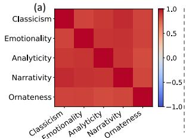

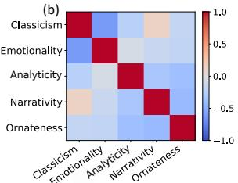  
Figure 6: Pairwise cosine similarity heatmaps of the five axes before and after decomposition. (a) Before decomposition, the raw axes are strongly correlated. (b) After decomposition, cross-axis similarity is substantially reduced. Results shown for LLaMA2-7B-Chat.

After decomposition, the cross-axis similarities are markedly reduced, with the mean absolute offdiagonal cosine decreasing from 0.87 to 0.27. This substantial drop provides direct evidence in Section 4.1 that the decomposition effectively removes the shared global trend among the raw axes, thereby yielding more disentangled and dimension-specific directions for stable multi-axis composition.

## E Coordinate Calibration

Raw per-axis coordinates can differ in dynamic range across dimensions, so we calibrate them using the all anchor passages employed to construct each axis (i.e., all passages from the representative books for that dimension). For the k-th axis, let $\mathcal { A } _ { k }$ be its anchor corpus, we compute layer-averaged projection on axis k for each passage $x _ { i } \in \mathcal A _ { k }$

$$
\begin{array} { r } { s ( x _ { i } ; k ) ~ = ~ \frac { 1 } { | \mathcal { L } | } \sum _ { \ell \in \mathcal { L } } \langle \widehat { a } ^ { \ell } ( x _ { i } ) , \mathbf { v } _ { k } ^ { \ell } \rangle , } \end{array}
$$

and collect the projections of all passages $\mathcal { P } _ { k } =$ $\{ s ( x _ { i } ; k ) : x _ { i } \in \mathcal { A } _ { k } \}$ . We then set an axis-specific scale $\alpha _ { k }$ from this distribution $\mathcal { P } _ { k }$ to make coordinates comparable across dimensions. Concretely, we use the 95th percentile of $| p |$ , which is a standard robust-scaling choice that limits the influence of outliers, avoids saturating typical books at the bounds, and remains stable as the anchor corpus grows:

$$
\alpha _ { k } = \mathrm { q u a n t i l e } _ { 0 . 9 5 } \big ( \{ | p | : p \in \mathcal { P } _ { k } \} \big ) .
$$

Given a book’s layer-averaged raw scores $\mathbf { s } _ { b } \in \mathbb { R } ^ { 5 }$ from $\ S 4 . 2$ , its calibrated coordinate on axis k is

$$
z _ { b , k } = \mathrm { c l i p } \left( { \frac { s _ { b , k } } { \alpha _ { k } } } , - 1 , 1 \right) ,
$$

combining every dimension together forms a fivedimensional score vector $\mathbf { z } _ { b } \in [ - 1 , 1 ] ^ { 5 }$ . Building upon this, we map to [0, 100] for visualization in radar plots:

$$
R _ { b , k } \ = \ 5 0 ( 1 + z _ { b , k } ) , \quad { \bf R } _ { b } = ( R _ { b , 1 } , \ldots , R _ { b , 5 } ) .
$$

## F Detailed Evaluation Scores

In this section, we report the complete GPT-4 and human evaluation scores across the two dimensions, namely Semantic Fidelity (SF) and Authorial Adherence (AA). Table 7 presents the average performance, providing the numerical data visualized in Figure 4, while Table 5 provides a detailed breakdown for each of the four books.

## G Authorial Coordinate Scores

We provide the detailed authorial scores in Figure 5, as shown in Table 6.

To better show how these stylistic dimensions separate by book, we plot the score distributions for each author-written passage from our test set. As shown in Figure 7, the results are very consistent with known writing patterns of the selected books. Orwell’s 1984 has a high level of Analyticity, which fits with its focus on complex political and social critique. In contrast, Burke’s Reflections shows the highest scores for Classicism and Ornateness, as expected for formal, highly-stylized 18th-century work. Kidnapped stands out for Narrativity, reflecting its narrative-driven adventure story style. These clear, separated distributions prove that our LITER-ARYBIGFIVE framework can accurately capture and distinguish different author characteristics.

## H Efficiency Comparison

We analyze the computational efficiency of LITER-ARYBIGFIVE from both theoretical and empirical perspectives, as summarized in Table 8.

Theoretical Complexity. Our method maintains a linear computational complexity of $O ( K \cdot d )$ per token, where K is the number of vectors used to intervene the models (here $K \ : = \ : 6 )$ and d is the hidden dimension. This represents a significant theoretical advantage over fine-tuning methods like LLM-Steer (Han et al., 2024), which require a dense matrix multiplication with quadratic complexity $O ( d ^ { 2 } )$ . Even compared to parameterefficient methods such as unmerged LoRA (Hu et al., 2022) with complexity $O ( r \cdot d )$ (where r is the rank, in our settings $r = 8 )$ , our approach remains more efficient as $K \leq r \ll d .$ Given that $6 \leq 8 \ll 4 0 9 6$ for Llama-2-7B-Chat, the theoretical FLOPs required by our steering mechanism are orders of magnitude lower than fine-tuning and more streamlined than LoRA configurations.

Inference Latency. To evaluate real performance, we measured the average inference latency (ms/token) over 100 generated cases in our test set. As shown in Table 8, static vector-based baselines (e.g., Mean-Centering, CAA) exhibit the lowest latency (∼18.9–19.0 ms/token) since they apply a fixed bias. In contrast, the training-based LoRA baseline incurs higher latency (23.50 ms/token) due to the additional low-rank adapter computation. Despite the computational overhead of calculating projections and style gaps along K axes for dynamic adaptation, LITERARYBIGFIVE records a latency of 19.88 ms/token. This corresponds to a marginal overhead of less than 1.0 ms compared to the fastest static baseline (Mean-Centering, 18.93 ms) and is effectively equivalent to LLM-Steer (19.92 ms). These results demonstrate that our method’s dynamic control comes at a practically negligible cost, remaining highly efficient for real-time generation while offering the unique capability of disentangled, interpretable personalized steering that static vector addition cannot achieve.

## I BIGFIVE Dimension Vector Analysis

To investigate where and how the LITERARYBIG-FIVE dimensions are encoded within the model’s internal representations, we conduct a layer-wise linear probing analysis. Specifically, for each dimension, we train a logistic regression classifier on the hidden states $\mathbf { h } ^ { \ell }$ extracted from each layer ℓ to distinguish between texts exhibiting high versus low intensity along that dimension. Figure 8 illustrates the probing AUC trajectories across model layers, revealing two critical insights into how these dimensions are represented in the model.

Universal Dimension Encodability. First, we observe that the model achieves high classification performance (AUC > 0.90) across all five dimensions. This indicates that dimension-level information is not an abstract external label, but is robustly embedded within the LLM’s latent space. Even without explicit supervision during pre-training, the model spontaneously learns to discriminate these dimension-specific patterns, validating the probingbased foundation of our steering approach.

Table 5: GPT-4 and Human evaluation across four books on two dimensions: Semantic Fidelity (SF) and Authorial Adherence (AA). Best results are bolded, all results are scaled to a 0–100 scale.
<table><tr><td rowspan="3">Method</td><td colspan="4">Reflections on the Revolution in France</td><td colspan="4">1984</td></tr><tr><td colspan="2">GPT-4</td><td colspan="2">Human</td><td colspan="2">GPT-4</td><td colspan="2">Human</td></tr><tr><td>SF</td><td>AA</td><td>SF</td><td>AA</td><td>SF</td><td>AA</td><td>SF</td><td>AA</td></tr><tr><td>Few-shot</td><td>72.2</td><td>57.0</td><td>50.0</td><td>35.0</td><td>77.3</td><td>62.1</td><td>73.9</td><td>35.1</td></tr><tr><td>LLM-Steer</td><td>76.3</td><td>54.4</td><td>74.5</td><td>46.0</td><td>79.0</td><td>58.7</td><td>72.7</td><td>35.1</td></tr><tr><td>LoRA</td><td>68.4</td><td>53.2</td><td>52.8</td><td>46.2</td><td>75.1</td><td>63.4</td><td>60.6</td><td>53.8</td></tr><tr><td>ICV</td><td>77.4</td><td>53.4</td><td>72.3</td><td>53.2</td><td>84.1</td><td>62.2</td><td>83.6</td><td>59.3</td></tr><tr><td>Mean-Centering</td><td>80.4</td><td>55.4</td><td>78.2</td><td>53.5</td><td>84.6</td><td>63.1</td><td>85.7</td><td>62.0</td></tr><tr><td>CAA</td><td>67.5</td><td>51.9</td><td>59.5</td><td>32.0</td><td>64.0</td><td>51.1</td><td>56.1</td><td>37.3</td></tr><tr><td>RepE</td><td>81.0</td><td>56.1</td><td>77.7</td><td>53.0</td><td>84.9</td><td>62.0</td><td>83.5</td><td>58.2</td></tr><tr><td>LITERARYBIGFIVE</td><td>80.8</td><td>58.1</td><td>81.8</td><td>56.5</td><td>85.5</td><td>65.0</td><td>86.5</td><td>64.1</td></tr></table>

<table><tr><td>Method</td><td colspan="4">Kidnapped</td><td colspan="4">Pride and Prejudice</td></tr><tr><td></td><td colspan="2">GPT-4</td><td colspan="2">Human</td><td colspan="2">GPT-4</td><td colspan="2">Human</td></tr><tr><td></td><td>SF</td><td>AA</td><td>SF</td><td>AA</td><td>SF</td><td>AA</td><td>SF</td><td>AA</td></tr><tr><td>Few-shot</td><td>67.5</td><td>49.5</td><td>45.5</td><td>48.8</td><td>61.7</td><td>43.4</td><td>54.8</td><td>42.9</td></tr><tr><td>LLM-Steer</td><td>71.2</td><td>46.3</td><td>73.3</td><td>40.8</td><td>66.5</td><td>43.9</td><td>61.9</td><td>41.0</td></tr><tr><td>LoRA</td><td>65.3</td><td>52.1</td><td>60.1</td><td>52.6</td><td>62.4</td><td>49.8</td><td>57.2</td><td>50.2</td></tr><tr><td>ICV</td><td>79.1</td><td>50.8</td><td>85.0</td><td>45.9</td><td>74.1</td><td>48.9</td><td>74.4</td><td>51.5</td></tr><tr><td>Mean-Centering</td><td>80.3</td><td>52.8</td><td>78.2</td><td>45.3</td><td>77.0</td><td>51.0</td><td>77.8</td><td>55.6</td></tr><tr><td>CAA</td><td>64.9</td><td>47.0</td><td>50.8</td><td>31.2</td><td>59.8</td><td>42.7</td><td>59.5</td><td>38.6</td></tr><tr><td>RepE</td><td>80.4</td><td>51.4</td><td>84.2</td><td>52.3</td><td>76.3</td><td>50.7</td><td>82.5</td><td>53.1</td></tr><tr><td>LITERARYBIGFIVE</td><td>81.6</td><td>54.1</td><td>89.7</td><td>57.8</td><td>78.5</td><td>53.3</td><td>80.5</td><td>58.5</td></tr></table>

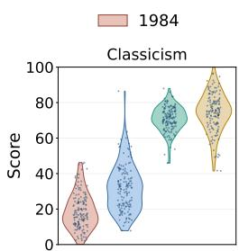

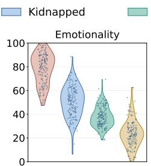

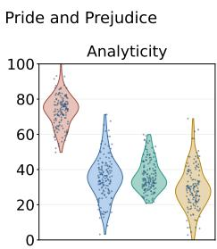

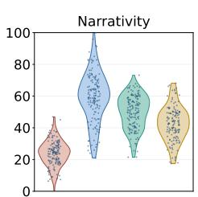

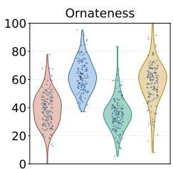  
Figure 7: Per-book distributions across the five stylistic dimensions. The clear separation between books matches their known literary characteristics, demonstrating the framework’s effectiveness.

Hierarchical Encoding of Each Dimension. Crucially, our fine-grained analysis reveals a clear layer-wise hierarchy regarding when different dimensions become linearly separable. While all dimensions are eventually encoded, they do so at different depths within the network:

• Surface-Level Dimensions (Classicism, Narrativity): As shown in the plots for Classicism and Narrativity, the AUC scores saturate rapidly, reaching near-perfect performance within the first few layers (Layers 0–5). This suggests that these dimensions are closely associated with lexical markers (e.g., archaic function words) or shallow syntactic patterns (e.g., verb and event distributions), which are captured early in the bottom-up processing.

• Semantic-Level Dimensions (Analyticity, Emotionality, Ornateness): In contrast, dimensions such as Analyticity, Emotionality, and Ornateness exhibit a more gradual ascent in AUC, peaking only in the middle-to-late layers (Layers 15–25). Analyticity, in particular, shows higher variance in lower layers, indicating that its reliable representation requires compositional reasoning and longrange contextual integration.

Overall, these results indicate that while shallow layers encode surface-level lexical and structural patterns, the representation of more abstract reasoning processes and affective nuances relies on the deeper abstraction capabilities of the network.

## J More Authorial Coordinates Analysis

To further validate the robustness and discriminative ability of the LITERARYBIGFIVE space across a broader spectrum of authors, we analyze six additional authors with distinct writing patterns. Table 9 presents their localized coordinates, demonstrating how the model situates diverse authorial patterns within our five-dimensional framework.

Table 6: Comparison of LITERARYBIGFIVE dimension scores across models on four books. Higher indicates stronger presence of the corresponding attribute.
<table><tr><td rowspan="2">Model</td><td colspan="4">Reflections on the Revolution in France</td><td colspan="6"></td></tr><tr><td>Classicism</td><td>Emotionality</td><td>Analyticity</td><td>Narrativity</td><td>Ornateness</td><td>Classicism</td><td>Emotionality</td><td>Analyticity</td><td>Narrativity</td><td>Ornateness</td></tr><tr><td>LITERARYBIGFIVE</td><td>75.7</td><td>12.1</td><td>25.7</td><td>49.4</td><td>60.4</td><td>30.3</td><td>69.5</td><td>72.9</td><td>38.5</td><td>50.6</td></tr><tr><td>GPT-5</td><td>82.0</td><td>25.0</td><td>18.0</td><td>42.0</td><td>72.0</td><td>30.0</td><td>75.0</td><td>78.0</td><td>55.0</td><td>40.0</td></tr><tr><td>Gemini 3</td><td>78.5</td><td>18.0</td><td>32.0</td><td>44.0</td><td>65.0</td><td>28.0</td><td>65.0</td><td>76.0</td><td>45.0</td><td>42.0</td></tr><tr><td>Claude-Sonnet-3.5</td><td>77.0</td><td>20.0</td><td>28.0</td><td>45.0</td><td>65.0</td><td>29.0</td><td>70.0</td><td>75.0</td><td>46.0</td><td>44.0</td></tr></table>

<table><tr><td rowspan="2">Model</td><td rowspan="2">Classicism</td><td colspan="3">Kidnapped Emotionality</td><td rowspan="2"></td><td colspan="5">Pride and Prejudice</td></tr><tr><td></td><td>Analyticity</td><td>Narrativity Ornateness</td><td>Classicism</td><td>Emotionality</td><td>Analyticity</td><td>Narrativity</td><td>Ornateness</td></tr><tr><td>LITERARYBIGFIVE</td><td>39.0</td><td>44.7</td><td>38.9</td><td>61.9</td><td>59.8</td><td>66.6</td><td>30.3</td><td>38.9</td><td>49.7</td><td>55.6</td></tr><tr><td>GPT-5</td><td>45.0</td><td>45.0</td><td>50.0</td><td>78.0</td><td>48.0</td><td>72.0</td><td>38.0</td><td>52.0</td><td>62.0</td><td>48.0</td></tr><tr><td>Gemini 3</td><td>42.0</td><td>52.0</td><td>35.0</td><td>70.0</td><td>62.0</td><td>70.0</td><td>35.0</td><td>48.0</td><td>53.0</td><td>52.0</td></tr><tr><td>Claude-Sonnet-3.5</td><td>42.0</td><td>47.0</td><td>41.0</td><td>70.0</td><td>56.0</td><td>69.0</td><td>34.0</td><td>46.0</td><td>55.0</td><td>52.0</td></tr></table>

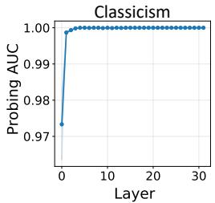

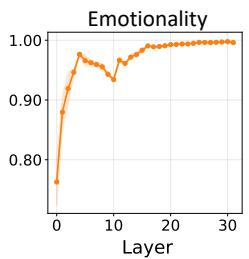

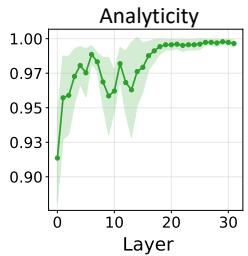

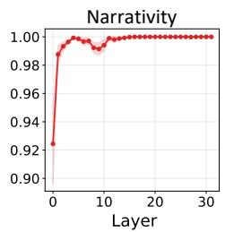

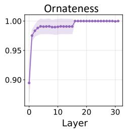  
Figure 8: Layer-wise linear probing performance (AUC) across the five LITERARYBIGFIVE dimensions. The results reveal a hierarchical encoding mechanism: surface-level attributes (e.g., Classicism, Narrativity) saturate rapidly in early layers, whereas complex semantic attributes (e.g., Emotionality, Analyticity) require deeper processing to reach maximal separability.

Table 7: Performance comparison of different methods on two dimensions: Semantic Fidelity (SF) and Authorial Adherence (AA). Best results are bolded, all results are scaled to 0–100.
<table><tr><td rowspan="2">Method</td><td colspan="2">GPT-4</td><td colspan="2">Human</td></tr><tr><td>SF</td><td>AA</td><td>SF</td><td>AA</td></tr><tr><td>Few-shot</td><td>69.7</td><td>53.0</td><td>56.2</td><td>40.4</td></tr><tr><td>LLM-Steer</td><td>73.2</td><td>50.8</td><td>70.5</td><td>40.7</td></tr><tr><td>LoRA</td><td>67.8</td><td>54.6</td><td>57.7</td><td>50.7</td></tr><tr><td>ICV</td><td>78.7</td><td>53.9</td><td>78.8</td><td>52.5</td></tr><tr><td>Mean-Centering</td><td>80.6</td><td>55.6</td><td>80.0</td><td>54.2</td></tr><tr><td>CAA</td><td>64.0</td><td>48.2</td><td>56.5</td><td>34.8</td></tr><tr><td>RepE</td><td>80.6</td><td>55.1</td><td>82.0</td><td>54.2</td></tr><tr><td>LITERARYBIGFIVE</td><td>81.6</td><td>57.7</td><td>84.6</td><td>59.3</td></tr></table>

The model’s positioning aligns closely with established literary criticism. For instance, while Ernest Hemingway and William Faulkner both show high Emotionality, they are separated by Ornateness $( \Delta = 4 . 6 )$ . Hemingway’s lower score quantitatively reflects his “Iceberg Theory,” which favors a sparse, direct lexicon over decorative language (Hemingway, 1999), whereas Faulkner’s higher score captures his famously multi-layered sentence structures (Faulkner, 1956). Similarly, the contrast between Francis Bacon and Agatha Christie highlights nuances in Narrativity. Bacon’s high scores in Narrativity (67.8) and Classicism (68.3) reflect the 17th-century rhetorical tradition, where progression is driven by explicit logical steps (Vickers, 1968). Conversely, Christie’s lower Narrativity (34.0) reflects a style that relies more on dialogue and internal deduction than on physical action. Finally, the model captures the historical shift from 19th-century eloquence to modern restraint. John Henry Newman’s high Ornateness (66.0) is consistent with Victorian rhythmic and stylized prose (Henkle, 1970), while Kazuo Ishiguro’s lower score (48.7) and high Emotionality (80.2) accurately represent his intentional use of "plainspoken" language to mask deep psychological tension (Ishiguro, 2007).

Table 8: Efficiency comparison. We report the theoretical Computational Complexity per token and the measured Inference Latency (ms/token).
<table><tr><td>Method Complexity</td><td>Latency</td></tr><tr><td>Fine-tuning Methods LoRA  $O ( r \cdot d )$ </td><td>23.50</td></tr><tr><td>LLM-Steer  $O ( d ^ { 2 } )$ </td><td>19.92</td></tr><tr><td>Activation Steering Methods</td><td></td></tr><tr><td>ICV O(d)</td><td>19.49</td></tr><tr><td>Mean-Centering O(d)</td><td>18.93</td></tr><tr><td>RepE O(d)</td><td>19.29</td></tr><tr><td>CÁA O(d) LITERARYBIGFIVE  $O ( K \cdot d )$ </td><td>19.02 19.88</td></tr></table>

## K Baseline Details

In this section, we describe the baseline methods used in our experiments, categorized into prompting, fine-tuning, and activation steering.

Table 9: Style coordinates for additional canonical authors in the LITERARYBIGFIVE space. Higher values indicate a stronger presence of the corresponding attribute.
<table><tr><td>Author</td><td>Work</td><td>Classicism</td><td>Emotionality</td><td>Analyticity</td><td>Narrativity</td><td>Ornateness</td></tr><tr><td>Ernest Hemingway</td><td>The Old Man and the Sea</td><td>24.0</td><td>81.1</td><td>65.1</td><td>45.4</td><td>51.0</td></tr><tr><td rowspan="2">William Faulkner Francis Bacon</td><td>The Sound and the Fury</td><td>23.9</td><td>81.4</td><td>53.8</td><td>44.2</td><td>55.6</td></tr><tr><td>The Essays</td><td>68.3</td><td>9.5</td><td>33.6</td><td>67.8</td><td>63.8</td></tr><tr><td>Agatha Christie</td><td>Murder on the Orient Express</td><td>31.3</td><td>57.4</td><td>61.5</td><td>34.0</td><td>62.8</td></tr><tr><td>John Henry Newman</td><td>Apologia Pro Vita Sua</td><td>51.9</td><td>27.0</td><td>38.0</td><td>43.2</td><td>66.0</td></tr><tr><td>Kazuo Ishiguro</td><td>Never Let Me Go</td><td>24.3</td><td>80.2</td><td>66.7</td><td>49.6</td><td>48.7</td></tr></table>

First, we use few-shot prompting as a basic comparison. Specifically, we prepend k reference passages written by the target author to the input prompt. This baseline evaluates how well the model can adapt its generation to an author’s writing characteristics purely through in-context examples, without modifying any internal parameters. The specific prompts are listed in Appendix O.3.

Second, for methods that require training, we adopt LLM-Steer (Han et al., 2024) and LoRA (Hu et al., 2022). Instead of retraining the entire model, LLM-Steer learns a lightweight linear transformation over word embeddings to align the generated text with the target author’s writing patterns, while LoRA injects trainable low-rank adapters into selected layers to achieve parameter-efficient style adaptation with a frozen backbone.

Finally, we compare our approach against four representative activation steering methods that intervene directly in the model’s hidden states: (1) ICV (Liu et al., 2024), which extracts intervention vectors from few reference examples; (2) Mean-Centering (Jorgensen et al., 2023), which computes a fixed direction by subtracting the average activations of neutral rewrites from those of the target author’s expressions; (3) CAA (Rimsky et al., 2024), which derives a steering direction by contrasting activations between author-written and neutral texts, thereby covering the mean-difference steering formulation used by StyleVector for personalized text generation (Zhang et al., 2025a); and (4) RepE (Zou et al., 2023), which identifies the principal direction of linguistic variation via PCA on contrastive activation pairs.

Since these baselines are typically designed for single-target steering and lack an inherent unified style space, we adapt them to our framework to ensure a fair comparison. Specifically, for all methods except ICV, we aggregate the anchor books used to construct each style axis (see Section §4.1) and utilize this full data for training, while ICV follows its standard setup.

## L Implementation Details

We compare LITERARYBIGFIVE against several state-of-the-art steering and prompting baselines with specific hyperparameter configurations. For Few-shot prompting, we randomly sample 3 passages to guide generation. For LLM-Steer, we use the learned transform with $\epsilon _ { 0 } = 1 \times 1 0 ^ { - 3 }$ scaled by a factor of $6 ~ ( \mathrm { i . e . , } ~ \epsilon = 6 \epsilon _ { 0 } )$ . For LoRA, we set the rank to 8 and train for 3 epochs. We use a cosine learning-rate scheduler with a warm-up stage covering 10% of total steps, with the maximum learning rate set to $5 \times 1 0 ^ { - 5 }$ . The batch size is 2 with gradient accumulation of 16. For methods involving activation steering, we adhere to the following configurations, selected by grid search: (1) For ICV, we randomly sample 3 reference passages to extract vectors and apply the intervention across all layers except the first embedding layer, with a steering strength $\alpha = 0 . 3 .$ . (2) Regarding Mean-Centering, the editing strength is set to $\alpha = 1$ applied to layers $\ell \in \{ 2 2 , 2 3 , 2 5 , 2 7 , 2 9 \}$ (3) For CAA, we set the scaling α = 1 for layers $\ell \in \{ 2 3 , 2 5 , 2 7 , 2 9 \}$ . (4) For RepE, we configure α = 6 targeting layers $\ell \in \{ 2 2 , 2 3 , \ldots , 2 9 \}$ . Finally, for our proposed LITERARYBIGFIVE, we apply steering vectors with a global strength of λ = 1 across layers $\ell \in \{ 2 0 , 2 4 , 2 8 \}$ and randomly sample 10 passages as reference. To rigorously evaluate semantic preservation and eliminate metric instability caused by random sampling, we set the decoding temperature to 0 for all experiments to ensure deterministic outputs.

## M Case Study

We present representative examples from the test sets of each book. We highlight desirable linguistic features in green and hallucinations or flattening in red, followed by a detailed analysis for each case.

Table 10: Qualitative comparison on Reflections on the Revolution in France by Edmund Burke. We highlight desirable linguistic features in green and hallucinations or flattening in red.
<table><tr><td>LITERARYBIGFIVE (Ours)</td><td>RepE</td><td>Few-Shot</td></tr><tr><td colspan="3">Original Text 1: “The first, calling itself the Constitutional Society... What improvements they have had... I cannot tell: But I never heard a man... speak a word in praise of the greater part of the publications...&quot;</td></tr><tr><td>The first group, known as theConstitu- tional Society.. While it is possible that some of the books were sent to France... I have never heard anyone praisethe publications circulated by this society...</td><td>The first group, known as the Constitu- tional Society... Some claim that books transported across the sea can improve... butthis is unverified. Despite good in- tentions... their publicationshave not been widely praised...</td><td>TheNational Assembly, composed of practitioners in the law, has been around for about seven or eight years. ... I have heard talk about the glories of theNa- tional Assembly...</td></tr><tr><td colspan="3">Analysis: Few-Shot suffers from severe hallucination, replacing “Constitutional Society&quot; with“National Assembly&quot;. RepE accurately keeps the entity butflattens the style: it converts the author&#x27;s strong first-person voice (“I cannot tell&quot;, “I never heard’) into dry, objective summaries (“this is unverified&quot;, “have not been widely praised&quot;). Our method preserves the</td></tr><tr><td colspan="3">subjective, critical voiceessential to Burke&#x27;s style. Original Text 2: “Well! but these men were to be tempered... Were they then to be awed by the... dignity of an handful of country clowns...? No! both these descriptions were more formed to be overborne...&quot;</td></tr><tr><td>The men were supposed to be influ- enced...However, were they intimi- dated by the authority and dignity of a few country people in the Assembly...? No, both groups were more likelyto be influenced by the tactics of lawyers...</td><td>The men were supposed to be in- fluenced... However, they were un- likely to be intimidatedby the authority and dignity of a few country people... The lawyers would likely govern the whole...</td><td>The clergy had much to do with these transactions. Their estates were bound to the last acre.They were false to every other interest and held out the church lands as a security...</td></tr><tr><td colspan="3">Analysis: Few-Shot retrievescompletely irrelevant contextabout “the clergy&quot; from a different chapter. RepE correctly identifies the content butloses the rhetorical structure, turning a dramatic Question-Answer sequence (“Were they...? No!&quot;) into a flat statement (“they were unlikely to be&quot;). Our method successfully retains therhetorical question and emphatic negation, preserving the argumentative tension.</td></tr></table>

Table 11: Qualitative comparison on 1984 by George Orwell. We highlight desirable linguistic features in green and hallucinations or flattening in red.
<table><tr><td>LITERARYBIGFIVE (Ours)</td><td>RepE Few-Shot</td></tr><tr><td colspan="2">Original Passage 1: “.the shouting, the singing, the banners, the posters, the films, the waxworks, the rolling of drums and squealing of trumpets, the tramp of marching feet... when the great orgasm was quivering to its climax...&quot;</td></tr><tr><td>On the sixth day of Hate Week,af- On the sixth day of Hate Week,af- ter the events such as processions, ter the events such as processions, speeches,shouting, singing,banners, speeches,shouting, singing, banners, posters, films, waxworks, drums,trum- posters, films, waxworks, drums, trum- pets, marching feet, tank caterpillars, pets, marching feet, tank caterpillars, planes, and guns, when theintense ex- planes, and guns,when the intense ex- citement was reaching its peak... citement was reaching its peak..</td><td>On the sixth day of Hate Week, af- ter the events such as processions, speeches, shouting, singing, banners, posters, films, waxworks, drums, trum- pets, marching feet, tank caterpillars, planes, and guns,after six days of this...</td></tr><tr><td colspan="2">Analysis: While RepE converts the vivid description into a mechanical list (highlighted inred), losing the sensory overload, our methodpreserves the density and rhythmof the “wall of sound&quot; effect essential to the scene&#x27;s atmosphere.</td></tr><tr><td colspan="2">Original Passage 2: “The past, he reflected, had not merely been altered, it had been actually destroyed. For how could you establish even the most obvious fact when there existed no record outside your own memory?&quot; Winston disliked this exercise... The Winston disliked this exercise... The Winston disliked this exercise... The past, he thought, had not only been pastseemed somewhat pleasant, yet it somewhat pleasant aspect left his</td></tr></table>

Table 12: Qualitative comparison on Kidnapped by R. L. Stevenson. We highlight desirable linguistic features in green and hallucinations or flattening in red.
<table><tr><td>LITERARYBIGFIVE (Ours)</td><td>RepE</td><td>Few-Shot</td></tr><tr><td colspan="3">Original Text 1: “Well, David,&quot; said he... “Ardshiel was to starve... King George is to whistle for his rents... what cares Red Colin? If he can hurt Ardshiel.. he will gang hame singing to Gienure!&quot;</td></tr><tr><td>.“Ardshiel was to be starved: that was his goal... King George will get less rent...what does Red Colin care?If he can harm Ardshiel... he will go home singing to Glenure!’</td><td>...Ardshiel was to be starved, his ulti- mate goal... King George would receive less rent...Red Colin didn&#x27;t care... if he could take food...he would return home in high spirits to Glenure!</td><td>He then began to question me cun- ningly, whenceI came, whether I was rich...We were now upon a sort of green cattle-track... the catechist grew an- grier...</td></tr><tr><td colspan="3">Analysis: Few-Shot suffers from a catastrophichallucination, generating text about a “catechist&quot; and a “cattle-track&quot; (from a totally different chapter) instead of the Red Fox story. RepE preserves meaning butflattens the tone, changing the mocking “gang hame singing&quot; to the generic “return home in high spirits.&quot; Our method preserves thecynical voiceof the character.</td></tr><tr><td colspan="3">Original Text 2: “The captain was in the right of it. We had run down a boat in the fog, and she had parted in the midst... This man... had leaped up and caught hold of the brig&#x27;s bowsprit...&quot;</td></tr><tr><td>The captain was correct.We had col- lided with a boat in the fog, and it had broken in the middle... This person... managed tograb the ship&#x27;s bowsprit with his hands fre...</td><td>The captain was correct. We had col- lided with a boat in the fog... This per- son... was thrown into the air andman- aged to grab the ship’s bowsprit...</td><td>The sound of an infinite number of rivers came up from all round. In this steady rainthe springs of the mountain were broken up... I could well under- stand the story of the Water Kelpie...</td></tr><tr><td colspan="3">Analysis: Few-Shot againhallucinates a completely different scene(describing rain and rivers instead of a shipwreck). RepE is accurate but mechanical. Our method maintains the narrative flow and specific details (collision, bowsprit) without</td></tr></table>

Table 13: Qualitative comparison on Pride and Prejudice by Jane Austen. We highlight desirable linguistic features in green and hallucinations or flattening in red.
<table><tr><td>LITERARYBIGFIVE (OurS)</td><td>RepE</td><td>Few-Shot</td></tr><tr><td colspan="3">Original Text 1: “..Mr. Darcy soon drew the attention of the room by his fine, tall person... and the report... of his having ten thousand a year... till his manners gave a disgust which turned the tide of his popularity; for he was discovered to be proud, to be above his company, and above being pleased...&#x27;</td></tr><tr><td>...Mr. Darcy quickly caught the atten- tion... with his tall build... The men said he was a fine-looking man... He was found to beproud, above the com- pany, and hard to please. Not even his large estate... could prevent him from being seen as unpleasant...</td><td>...The news of his ten thousand a year in- come spread soon... earning himpraise from both men and women. He was ad- mired... until his behavior turned peo- ple against him, marking him as proud, aloof...</td><td>During their walk, it was resolved that Mr. Bennet&#x27;s consent should be asked... Elizabeth reserved to herself the appli- cation for her mother&#x27;s...&quot;If we are ever able to learn what Wickham&#x27;s debts have been,&quot; said Elizabeth...</td></tr><tr><td colspan="3">Analysis: Few-Shot fails completely, generating text aboutWickham&#x27;s debtsandMr. Bennet(hallucinated from a later chapter). RepE summarizes the events but loses the specific descriptive flavor (&quot;above his company&quot;). Our method preserves thenarrative detailand the specific criticisms of Darcy&#x27;s character.</td></tr><tr><td colspan="3">Original Text 3: “Mrs. Collins, you must send a servant with them. You know I always speak my mind... It is highly improper... Young women should always be properly guarded and attended...&quot;</td></tr><tr><td>Lady Catherine expressed her view, “You should send a servant with them. I always speak directly, and I don&#x27;t like the idea of two young women traveling alone. It is not appropriate...&quot;</td><td>Lady Catherineexpressed her view, say- ing, “You should send a servant with them...&quot; (RepE mixes summary with dialogue and loses the imperious open- ing).</td><td>Here is the rewritten text in the same style:Lady Catherine expressed her view. &quot;Mrs. Collins, you should send a servant with them... I always speak directly...&#x27;</td></tr><tr><td colspan="3">Analysis: RepE often weakens the character&#x27;s voice by introducing the text withreporting verbs(&quot;expressed her view&quot;). Our method maintains theauthoritative and intrusive voiceof Lady Catherine directly, preserving the stylistic structure of her commands.</td></tr></table>

## N Dimension Steering Generation

Table 14: Fine-grained Stylistic Progression Spectrum. We compare the generated outputs across five steering strengths. Dark Blue and Light Blue denote negative steering (dimension suppression), while Light Orange and Dark Orange denote positive steering (dimension intensification).
<table><tr><td>Dimension</td><td>Strength</td><td>Generated Text Snippet &amp; Analysis</td></tr><tr><td rowspan="5">Classicism</td><td>-0.8</td><td>In the time of England&#x27;s civil troubles, there wereindividuals like the Earl of Hollandwho brought an odium on the throne...These individuals later joined in the rebellionsarising from their own discontents.</td></tr><tr><td>-0.4</td><td>There were persons in England, in the time of civil troubles, who brought an odium on the throne...These men helped to subvertthe throne to which they owed their existence.</td></tr><tr><td>0</td><td>During England&#x27;s civil troubles, some people, like the Earl of Holland, had caused resentment towards the throne by accepting its generous rewards. Later, they joined rebellions caused by their own actions.</td></tr><tr><td>+0.4</td><td>There were persons... who had brought an odium on the throne...Confounded by the complication of distempered passions, their reason is disturbed; their views become vast and perplexed.</td></tr><tr><td>+0.8</td><td>The author observes that if these men are not restrained,their avarice will know no bounds.. The confusion and disorder are such that their own reason is disturbed...In the midst of this confusion, all appears limitless.</td></tr><tr><td colspan="3">Trend: The writing shifts from simple, short sentences (-0.8) to long, complex structures (+0.8). At higher strength, the text uses more formal words and nested clauses to sound more old-fashioned and serious.</td></tr><tr><td colspan="3"></td></tr><tr><td rowspan="5">Emotionality</td><td>-0.8</td><td>The man was frightened because a bowed, grey-coloured thing was coming towards him. The creature&#x27;s face was distorted...The man&#x27;s own face had changed... the emotions it registered were different.</td></tr><tr><td>-0.4</td><td>The man was frightened because a bowed, grey-coloured, skeleton-like creature was approaching...Despite his initial confusion, the man realized that the creature was his own body.</td></tr><tr><td>0</td><td>He stopped because he was scared. A bent, gray-colored, skeleton-like figure was coming towards him... It was definitely his own face, but it seemed to him that it had changed more than he had changed inside.</td></tr><tr><td>+0.4</td><td>The man was frightened... Its eyes werewatchful and fierce... He could not help but think that this was asick man, sixty years old at the very least, suffering from some malignant disease.</td></tr><tr><td>+0.8</td><td>The man wasterrified.. Its face wastwisted and distorted, with a nobby forehead... He had gone partially bald, and his body was emaciated and covered in red scars.. the spine wascurved in a sickening way.</td></tr><tr><td colspan="3">Trend: The text moves from a cold, objective description (-0.8: &quot;The man&quot;) to an intense emotional experience (+0.8). High levels use strong words like &quot;terrified&quot; and &quot;sickening&quot; to emphasize the character&#x27;s fear and disgust.</td></tr><tr><td rowspan="5">Analyticity</td><td>-0.8</td><td>The moment any restraint is laid upon the full rights of men, the whole system of government becomes a matter</td></tr><tr><td>-0.4</td><td>of delicate skill.It requires a deep understandingof human nature. The moment you diminish men&#x27;s full rights to self-governance... the entire systemnecessitates a profound</td></tr><tr><td>0</td><td>understandingof human nature and the requirements of civil institutions. When you reduce any of the full rights... government becomes a matter of convenience. This is what makes the</td></tr><tr><td>+0.4</td><td>structure of a state... a complex and delicate task. This it is which makes the constitution of a state... a matter of the most delicate skill.It requires a deep knowledge</td></tr><tr><td>+0.8</td><td>of human nature and human necessities, and of the things which facilitate or obstruct the various ends. What is the use of discussing a man’s abstract rightto food or to medicine?The question is upon the method of</td></tr><tr><td colspan="3">procuringand administering them. In that deliberation I shall always advise to call in the aid of the farmer... Trend: Low levels simply state facts or requirements. High levels (+0.8) actively argue a point, using rhetorical questions and step-by-step logic to differentiate between abstract theory and practical method.</td></tr><tr><td colspan="3"></td></tr><tr><td rowspan="5">Narrativity</td><td>-0.8</td><td>The text describes a scenefrom a movie theater where the audience is watching a war film. The scene shows a ship full of refugees...The text ends with a shotof a child&#x27;s arm going up into the air.</td></tr><tr><td>-0.4</td><td>The date is April 4th...It was a scene of a shipfull of refugees being bombed... The last shot was of a child&#x27;s arm... The audience applauded, but a woman in the proletariat section... started kicking up a fuss.</td></tr><tr><td>0</td><td>April 4th, 1984. Went to the movies last night... One was about a ship full of refugees being bombed... The audience was amused by shots of a large man trying to swim away...</td></tr><tr><td>+0.4</td><td>The audience was amused by a shot of a fat man... and theylaughed when he sank... The helicopter then planted a bomb... whichexploded and killedeveryone on board.</td></tr><tr><td>+0.8</td><td>...he ishit with many holes and sinksinto the water. Next, a lifeboat... is shown... A middle-aged woman is seen comforting a young boy who is terrified... The helicopter then drops a bomb.. causing it todisintegrate</td></tr><tr><td colspan="3">Trend: At -0.8, the text summarizes the plot from the outside (&quot;The text describes...&quot;). At +0.8, it tells the story directly, using action verbs like &quot;sinks&quot; and &quot;drops&quot; to show what is happening in the moment.</td></tr><tr><td rowspan="5">Ornateness</td><td>-0.8</td><td>The hate reached its climax. The voicehad become a bleat.. Then the sheep-facemelted into the figureof a Eurasian soldier... But in the same moment, the hostile figure melted into the face of Big Brother.</td></tr><tr><td>-0.4</td><td>The Hate reached its climax. The voiceturned into a bleat... and for an instant his facetransformed intothat of a sheep... Nobody could hear what Big Brother was saying.</td></tr><tr><td>0</td><td>The Hate reached its peak. Goldstein&#x27;s voice sounded like a sheep&#x27;s bleat... Then the sheep&#x27;s face changed into the figure of a Eurasian soldier... huge and terrible... full of power and mysterious calm.</td></tr><tr><td>+0.4</td><td>..the sheep-face melted into the figure of a Eurasian soldier,advancing with his sub-machine gun roaring.. the hostile figure melted into the face of Big Brother...so vast that it almost filled the screen.</td></tr><tr><td>+0.8</td><td>The soldier&#x27;s sub-machine gunroared, and it seemed to spring out of the screen... His words were encouraging</td></tr><tr><td colspan="3">andrestored confidence by their mere utterance. Trend: The description goes from plain and simple (-0.8) to highly detailed (+0.8). The high-style text adds dramatic adjectives and specific</td></tr></table>

## O Prompt Templates

## O.1 Prompt for Removing Authorial Traits

```markdown
Prompt for Removing Authorial Traits
System
You are a rewriting assistant. Rewrite each passage into a neutral, plain English version.
## Goal:
Remove stylistic signals so the text shows no clear sign of any of these styles:
- Classicism (archaic or period-specific flavor)
- Ornateness (decorative or complex phrasing)
- Narrativity (story-like sequencing or dramatization)
- Emotionality (affective or expressive tone)
- Analyticity (logical structuring or explicit reasoning)
## Rules:
- Keep the same meaning, tense, and sentence order.
- Do not explain, interpret, or summarize.
- Do not add or remove information.
- Use plain, neutral, modern English.
- Avoid emotional, archaic, figurative, or decorative language.
- Keep syntax close to the original unless clearly stylistic.
## Output format:
{"id":"<id>", "neutral_text":"<rewritten>"}
User
Rewrite the following paragraph into neutral and standard English according to the system rules.
ID: {id}
Passage: {text}
```

## O.2 Passage Rewrite

```markdown
Passage Rewrite Prompt
### Instruction:
Please rewrite the following text without any explanation before or after the text:
<Neutral Passage>
### Response:
<Original Author-written Passage>
```

## O.3 Few-Shot Prompt

```markdown
Few-Shot Prompt
System
Here are some examples of the author’s original text:
<Sample Text 1>
<Sample Text 2>
<Sample Text k>
User
### Instruction:
Please rewrite the following text in the same style without any explanation before or after the text:
<Query Text>
### Response:
```

## O.4 GPT Evaluation Prompt

```markdown
You are an expert literary critic. Rate the [Rewrite] based on the [Original] on a scale of 0–10.
## 1. Authorial Adherence (AA):
Assess how well does the rewrite capture the specific flavor of the original. Consider deep writing
characteristics like distinctive voice, rhythm, and lexicon.
### Instruction: penalize the score if the text sounds like generic, neutral English (e.g., standard
AI assistant or Wikipedia), even if it is fluent. High scores require capturing the specific “flavor” of
the author even if word choice or syntax differs slightly.
## 2. Semantic Fidelity (SF):
Assess how well the rewrite preserves the core meaning of the original.
Note: if the rewrite contains hallucinations (events/characters NOT in the original text) or changes
the topic entirely, you should penalize the two aspects above.
## Input Passages:
[Original]: {original_text}
[Rewrite]: {rewritten_text}
## Output Format:
Output ONLY the scores in this exact format: AA:<0-10> SF:<0-10>
```

## O.5 Prompt for LITERARYBIGFIVE Dimension Scoring

## Prompt for LITERARYBIGFIVE Dimension Scoring

## System

You are an expert literary critic and computational linguist. Your task is to analyze the stylistic attributes of a given book text.

\## Scoring Guidelines:

1. Evaluate the text on the 5 stylistic dimensions provided by the user.

2. Provide a score from 0 to 100 for each dimension.

3. Adopt a high-resolution scale, avoid saturation at extremes unless theoretical absolute. Focus on capturing fine-grained nuances.

## User

\## Book Description: [Book Name] by [Author]

\## Dimensions to Evaluate:

\- Analyticity: Measures reasoning orientation (abstract nouns, logical connectors, hierarchical structures).

\- Ornateness: Measures lexical decoration and syntactic elaboration (“grand style”, complex embedding), distinct from logic.

\- Narrativity: Measures storytelling momentum (action verbs, temporal adverbs, rapid progression).

\- Emotionality: Measures affective intensity and tension (warmth, surprise, expressive punctuation).

\- Classicism: Measures resemblance to 18th-19th century traditions (archaic markers like whilst, old register), distinct from ornamentation.

Please output the scores in JSON format: