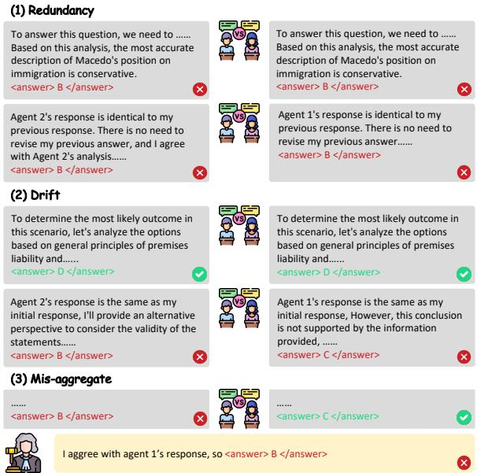
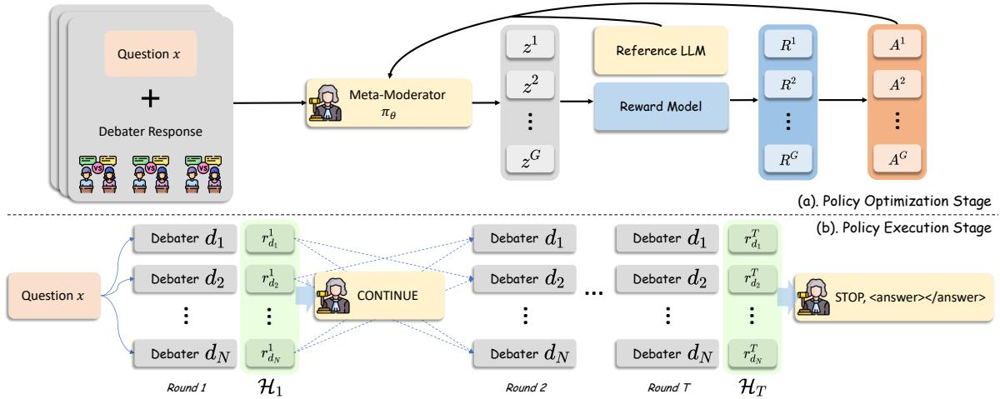
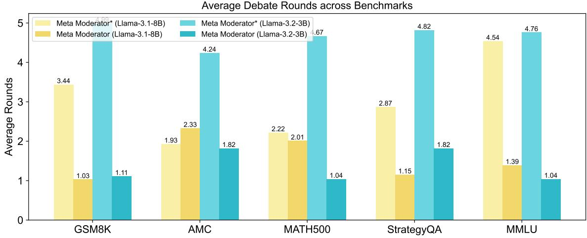

# Meta-Moderator: Empowering Multi-Agent Debate with Meta-Cognition

Wentao Hu<sup>♠</sup> Zhuoyue WAN<sup>♠</sup> Jinhao Shen<sup>♠</sup>

Chen Jason Zhang<sup>♠</sup> Xiaoyong Wei<sup>♡,♠,</sup>\* Qing Li<sup>♠</sup> <sup>♠</sup>The Hong Kong Polytechnic University <sup>♡</sup>Sichuan University wayne-wt.hu@connect.polyu.hk {jason-c.zhang, cs007.wei}@polyu.edu.hk

## Abstract

Multi-agent debate can improve large language model reasoning by eliciting diverse hypotheses and critiques, yet its performance is often constrained by weak moderation. Common pipelines rely on fixed budgets, agreementbased stopping, or untrained judges, leading to redundant deliberation and unreliable evidence aggregation. We cast moderation as a meta-cognitive process, monitoring debate utility, controlling deliberation, and adjudicating a final answer, and introduce Meta-Moderator, a learnable framework that dynamically regulates debate and decides when to finalize an answer. Meta-Moderator is trained independently of the debaters via outcome-driven policy optimization, making debate regulation an explicit capability rather than an incidental effect of prompting. Across five benchmarks, Meta-Moderator outperforms widely used decision layers and transfers across tasks and system configurations. Further analyses show that it allocates debate more selectively and reduces mis-aggregation after informative hypotheses appear.<sup>1</sup>

## 1 Introduction

Large language models (LLMs) often achieve stronger reasoning when multiple agents are allowed to interact, critique one another, and iteratively refine their answers (Du et al., 2024; Liang et al., 2024; Chan et al., 2024). This multi-agent debate (MAD) paradigm has produced consistent gains across tasks such as mathematical reasoning, multi-hop question answering, and factual verification, motivating the common belief that structured interaction yields more reliable reasoning than a single agent (Zhang and Xiong, 2025; Hu et al., 2025b).

  
Figure 1: Three common issues in standard multi-agent debate: redundancy, drift, and mis-aggregation.

Despite its promise, MAD is far from reliably beneficial. As shown in Figure 1, debates can (i) become redundant, expending additional rounds that contribute little new information; (ii) drift away from the key uncertainty, accumulating plausible but irrelevant details; or (iii) mis-aggregate highquality arguments into an incorrect final decision, for instance due to superficial consensus, last-round bias, or voting failures under dispersed opinions (Becker, 2024; Zheng et al., 2024; Choi et al., 2025; Cui et al., 2025; Hong et al., 2025). These failure modes arise naturally when collective deliberation is run without reliable mechanisms for assessing progress, allocating deliberation, and committing to a final decision.

We argue that these issues point to a central, under-modeled bottleneck in MAD: the moderator. In real-world adversarial deliberation (e.g., courtroom argumentation), advocates focus on local evidence and persuasive reasoning, while a neutral adjudicator maintains global context, tracks what has been resolved, and decides when the discussion is ready for a decision. By contrast, most MAD systems treat moderation as a heuristic add-on: interaction is governed by fixed budgets, shallow consensus checks, or voting-based aggregation (Choi et al., 2025; Cui et al., 2025). Recent work has begun to explore measurement-driven controllers that stop when debate signals plateau or when judge dynamics stabilize (Chang and Chang, 2025; Hu et al., 2025a). However, these approaches still rely on predefined signals and hand-chosen stopping criteria, rather than learning a moderation policy optimized for end-task accuracy. Some approaches introduce an LLM judge, but it typically operates as a prompted black-box evaluator rather than a policy optimized for regulating debate dynamics (Liang et al., 2024; Hong et al., 2026). As a result, the very capabilities that determine whether debate translates into accuracy gains are left implicit and fragile.

This motivates a meta-cognitive view of moderation. Drawing inspiration from meta-reasoning and metacognition, which study how cognitive processes are monitored and regulated under limited resources (Ackerman and Thompson, 2017; Ball and Richardson, 2025; Gao et al., 2024; De Sabbata et al., 2024), we characterize effective moderation as a tightly coupled loop of three functions: Monitoring whether deliberation is making substantive progress versus repeating or drifting; Control allocating deliberation by deciding whether to prolong deliberation or commit to a decision (Wei and Yang, 2013); and Adjudication synthesizing a final answer from the debate content in a way that is robust to superficial agreement and aggregation biases. Under this perspective, moderation is not merely another round of object-level reasoning; it is a distinct, policy-like capability that must decide when further deliberation is worthwhile and when to commit to a final decision.

Motivated by this framing, we introduce Meta-Moderator, a framework for learnable moderation that treats debate regulation as a meta-level decision problem. Meta-Moderator learns an explicit moderation policy that decides, at each round, whether further deliberation is warranted or whether to stop and commit to a final answer. We train this policy independently from debaters with outcome-driven reinforcement learning, so that moderation becomes a dedicated, learnable competence rather than an incidental outcome of prompting or heuristic aggregation.

Our contributions are threefold:

• We identify moderation as a central bottleneck in multi-agent debate and formalize MAD as a meta-level regulation problem characterized by a monitoring-control-adjudication loop.

• We propose Meta-Moderator, a framework for learnable moderation that instantiates an explicit moderation policy to decide whether to continue deliberation or stop and commit to a final answer.

• Across multiple reasoning tasks, we show that learned meta-level regulation improves final answer accuracy compared to common MAD baselines.

## 2 Related Work

## 2.1 Multi-Agent Debate

Multi-agent debate (MAD) aims to improve LLM reasoning by having agents propose answers, critique one another, and refine arguments (Du et al., 2024). Subsequent work promotes divergent thinking, structured argumentation, and stronger verification in multimodal and retrieval-augmented settings (Liang et al., 2024; Zheng et al., 2024; Hu et al., 2025b).

However, recent analyses suggest that debate is not consistently beneficial. Gains are often attributable to diversity in initial answers rather than multi-round deliberation, and debate trajectories do not reliably increase correctness (Choi et al., 2025). Other work further reports conformity and bias amplification, where consensus-seeking dynamics suppress minority hypotheses and propagate shared errors (Cui et al., 2025). These findings imply that debate effectiveness depends not only on debaters’ object-level reasoning, but also on how debate is monitored, budgeted, and aggregated into a final decision.

Most MAD pipelines rely on fixed debate lengths, agreement-based stopping, or untrained judges. Measurement-driven stopping moves beyond fixed rounds but still depends on predefined signals and hand-tuned criteria (Chang and Chang, 2025; Hu et al., 2025a). We address this gap by learning a moderation policy optimized for endtask accuracy.

## 2.2 Metacognition for LLMs

Recent work on metacognition in LLMs mainly focuses on self-monitoring and self-regulation (Gao et al., 2024). Typical operationalizations include confidence estimation, uncertainty awareness, and failure prediction (Ji-An et al., 2025). Although such self-evaluative signals can be elicited, they are often miscalibrated and only weakly aligned with models’ true knowledge limitations (Wang et al., 2025; Wang and Zhao, 2024). Complementary work frames meta-reasoning as a control mechanism over actions such as tool use, retrieval, or allocating additional computation (Li et al., 2025; Alazraki and Rei, 2025; De Sabbata et al., 2024).

In contrast, we study metacognition as coordination in multi-agent deliberation: a moderator monitors agents’ externalized reasoning traces and regulates whether further debate is worthwhile. This motivates a learnable moderation policy for MAD.

## 2.3 Reinforcement Learning for LLMs

Reinforcement learning (RL) is increasingly used to shape LLM behavior beyond supervised finetuning (Wu et al., 2025b; Wan et al., 2025), including improving multi-step reasoning and learning decision policies for LLM-based agents (Shao et al., 2024; Guo et al., 2025; Chen et al., 2026). RL has also been applied to higher-level control, such as planning, tool selection, and allocating search or computation, making it a natural approach for learning meta-level policies over hierarchical reasoning processes (Jin et al., 2025; Chen et al., 2025; Qian et al., 2025; Wu et al., 2025a).

However, prior work largely optimizes a single agent’s reasoning or tool-use policy, leaving the moderation policy, when to stop and how to adjudicate multi-agent evidence, underexplored. We address this gap by training a meta-level moderator with GRPO to directly optimize end-task accuracy.

## 3 Meta-Moderator

## 3.1 Problem Formulation

Let X denote the input space (e.g., questions) and Y the output space (e.g., free-form or multiplechoice answers). Given an instance $x \in \mathcal { X }$ with gold label $y ^ { \star } \in \mathcal { V }$ , we consider a multi-agent debate system composed of N LLM-based debaters $\mathcal { D } = \{ d _ { 1 } , \ldots , d _ { N } \}$

Agent responses. Each debater produces a textual response at round t, denoted by $r _ { d _ { i } } ^ { t }$ . In our setting, $r _ { d _ { i } } ^ { t }$ contains both reasoning and a ${ \mathit { f } } i { \mathit { \cdot } }$ nal answer; we denote the extracted answer by $y _ { d _ { i } } ^ { t } = f _ { \mathrm { a n s } } ( r _ { d _ { i } } ^ { t } )$ . At initialization $( t = 0 )$ , each debater independently generates an initial response:

$$
r _ { d _ { i } } ^ { 0 } \sim \mathrm { I n i t } ( x ) , \quad i \in \{ 1 , \ldots , N \} ,\tag{1}
$$

where Init samples an initial response conditioned on x.

Debate dynamics. The debate runs for at most $T _ { \mathrm { m a x } }$ rounds. At each round $t \geq 1$ , debater $d _ { i }$ observes the set of other debaters’ responses from the previous round,

$$
\mathcal { R } _ { - d _ { i } } ^ { t } = \{ r _ { d _ { j } } ^ { t - 1 } \ | \ j \in \{ 1 , \dots , N \} , \ j \neq i \} ,\tag{2}
$$

and updates its response via a one-round debate operator Debate:

$$
\begin{array} { r } { r _ { d _ { i } } ^ { t } \sim \tt D e b a t e ( \boldsymbol { x } ; \mathcal { R } _ { - d _ { i } } ^ { t } ) . } \end{array}\tag{3}
$$

All debaters update in parallel using the responses from the previous round.

Let $\mathcal { H } _ { t }$ denote the debate transcript from initialization through round t:

$$
\mathcal { H } _ { t } = \{ r _ { d _ { i } } ^ { \tau } \ | \ i \in \{ 1 , \dots , N \} , \ \tau \in \{ 1 , \dots , t \} \} .\tag{4}
$$

Decision layer. A moderator (decision layer) observes the debate and may terminate at any round $t \leq T _ { \mathrm { m a x } }$ . Formally, the system outputs

$$
\hat { y } = \mathcal { F } ( \mathcal { H } _ { t } ) ,\tag{5}
$$

where t is the (data-dependent) stopping time chosen by the moderator. The function $\mathcal { F }$ abstracts the decision layer of debate: it can be instantiated as majority voting over $\{ y _ { d _ { i } } ^ { t } \} _ { i = 1 } ^ { N }$ , or as a judge model conditioning on $\mathcal { H } _ { t }$

Objective. Our goal is to maximize end-task correctness of the overall debate system by improving the decision layer:

$$
\operatorname* { m a x } \mathbb { E } \big [ { \bf 1 } \{ \hat { y } = y ^ { \star } \} \big ] ,\tag{6}
$$

where the expectation is over task instances and the stochasticity of debater generation and debate updates. Next, we will parameterize $\mathcal { F }$ as a learnable moderator policy that decides when to stop and how to adjudicate, enabling the system to better exploit debate evidence when producing $\hat { y } .$

  
Figure 2: Overview of Meta-Moderator. The moderator monitors debate states and adjudicates a final answer when the debate stops; it is trained via outcome-driven policy optimization and used as a drop-in decision layer.

## 3.2 Meta-Moderator Policy

The formulation above separates the debate layer, which generates multi-agent evidence through interaction, from the decision layer F, which maps debate evidence to a single prediction and an adaptive stopping point. Most existing MAD systems instantiate $\mathcal { F }$ with static heuristics or a prompted judge. In contrast, we parameterize $\mathcal { F }$ as a Meta-Moderator: a learnable meta-level policy that performs monitoring, control (adaptive stopping), and adjudication over the evolving debate.

Moderator state. At round t, the moderator observes a debate state

$$
s _ { t } = \phi ( \mathcal { H } _ { t } ) ,\tag{7}
$$

where $\phi ( \cdot )$ specifies the moderator’s input view. In general, ϕ may expose the full transcript or a compressed representation. In this work, we use a round-level view:

$$
s _ { t } = \phi \left( \boldsymbol { x } , \{ r _ { d _ { i } } ^ { t } \} _ { i = 1 } ^ { N } \right) ,\tag{8}
$$

constructed from the question and the currentround debater responses. Importantly, debaters responses at round t may include summaries of prior discussion, allowing $s _ { t }$ to encode relevant history without explicitly concatenating $\mathcal { H } _ { t }$

Moderator policy and structured output. The moderator is implemented as a conditional language-model policy $\pi _ { \boldsymbol { \theta } } ( \cdot \mathrm { ~  ~ \vert ~ } s _ { t } )$ that produces a structured moderation output.

Monitoring. Monitoring refers to assessing whether the current debate state contains sufficient, non-redundant evidence for a reliable decision. Rather than introducing an explicit scalar monitor, we treat monitoring as an implicit internal signal represented by the policy when producing its control decision at round t. Formally, the control distribution $\pi _ { \boldsymbol { \theta } } ( a _ { t } \mid s _ { t } )$ depends on $s _ { t }$ and thus implicitly captures whether additional deliberation is expected to be beneficial under the current debate evidence.

Control. Control uses the monitoring assessment to regulate deliberation depth. The moderator selects a control decision

$$
a _ { t } \in \{ \mathsf { C O N T I N U E } , \mathsf { S T O P } \} ,\tag{9}
$$

where CONTINUE allocates an additional debate round and STOP terminates deliberation. While moderation can in principle include richer interventions that shape the next-step information flow (e.g., requesting counterexamples or verification), we focus on this minimal control space to isolate the core question: isfurther interaction beneficial given $s _ { t } ?$

Adjudication. When the moderator decides to stop, it produces a single final prediction by aggregating multi-agent evidence in the current state. This is realized as conditional generation under the same policy:

$$
\hat { y } _ { t } \sim \pi _ { \theta } ( \cdot \mid s _ { t } , a _ { t } = 5 7 0 \mathsf { P } ) ,\tag{10}
$$

yielding a learnable instantiation of $\mathcal { F }$ that may adjudicate at an intermediate round rather than relying on a fixed horizon. Unlike surface-level consensus, learnable adjudication can weigh competing rationales and identify unresolved inconsistencies before committing to $\hat { y } _ { t }$

Overall, Meta-Moderator performs inter-agent meta-level regulation by monitoring debate utility, controlling whether to continue deliberation, and adjudicating a final answer from accumulated debate evidence.

## 3.3 Training Data Construction

We train Meta-Moderator from an offline dataset of debate states. For each training instance $x \in \mathcal { X } ^ { \prime }$ we run a fixed multi-agent debate protocol to obtain a multi-round transcript $\mathcal { H } _ { t }$ up to $T _ { \mathrm { m a x } }$ . We then extract, for each round t, the moderator-observable state

$$
s _ { t } = \phi \bigl ( x , \{ r _ { d _ { i } } ^ { t } \ | \ i \in \{ 1 , \dots , N \} \} \bigr ) ,\tag{11}
$$

where $\phi ( \cdot )$ is a deterministic formatting function that maps the question and the current-round debater responses into the moderator’s input.

Each training example is a tuple $( s _ { t } , y ^ { \star } , \eta _ { t } )$ Here $\eta _ { t } ~ \in ~ \{ 0 , 1 \}$ is an offline auxiliary signal indicating whether a correct candidate answer already appears among debaters at round t. We compute $\eta _ { t }$ by automatically extracting each debater’s predicted answer from $r _ { d _ { i } } ^ { t }$ , followed by datasetspecific normalization and matching against $y ^ { \star }$ This signal is used only to shape rewards during training; at inference time, Meta-Moderator observes only $s _ { t }$ and never accesses gold labels.

## 3.4 Reinforcing Meta-Cognition in Debate

We train the Meta-Moderator to exhibit metacognition over multi-agent debate: it must monitor whether the current debate state already contains sufficient evidence for a correct answer, and control the process by either continuing deliberation or committing to a final answer. Given a debate state $s _ { t } ,$ , the moderator generates a textual decision $z _ { t } \sim \pi _ { \theta } ( \cdot \mid s _ { t } )$ . We constrain the output space to two executable forms:

$$
z _ { t } \in \Bigl \{ \mathsf { C O N T I N U E } , \mathsf { S T O P } \parallel \langle \mathsf { a n s w e r } \rangle \hat { y } _ { t } \langle / \mathsf { a n s w e r } \rangle \Bigr \} ,\tag{12}
$$

which is parsed into an action-answer pair $( a _ { t } , \hat { y } _ { t } )$

Reward. We use three additive reward components to reinforce (i) protocol-compliant decisions, (ii) sufficiency monitoring for debate termination, and (iii) correctness upon commitment:

$$
\begin{array} { r l } { R ( s _ { t } , z _ { t } ) = R _ { \mathrm { f m t } } ( z _ { t } ) + R _ { \mathrm { c t r l } } ( s _ { t } , a _ { t } ) ~ } & { { } } \\ { + R _ { \mathrm { a n s } } ( y ^ { \star } , a _ { t } , \hat { y } _ { t } ) . } \end{array}\tag{13}
$$

Format reward $R _ { \mathrm { f m t } }$ enforces an observable and machine-parseable control protocol: CONTINUE alone, or STOP with a properly delimited ⟨answer⟩ span. We assign 1 for a valid format; for STOP without an answer span we give partial credit (0.5); otherwise 0.

Control reward $R _ { \mathrm { c t r l } }$ reinforces sufficiency monitoring: the moderator should stop when the debate already contains a gold-matching proposal, and continue otherwise. We use an offline indicator $\eta _ { t } \in \{ 0 , 1 \}$ , where $\eta _ { t } = 1$ means that at round t at least one debater proposes a gold-matching answer (estimated by automatic answer extraction and normalization). We reward STOP when $\eta _ { t } = 1$ and reward CONTINUE when $\eta _ { t } = 0 ;$ ; otherwise the reward is 0. This gold-derived signal is used only for offline reward shaping during training and is never provided as an inference-time input.

Answer reward $R _ { \mathrm { a n s } }$ reinforces commitment correctness and is only applied at termination:

$$
R _ { \mathrm { a n s } } ( y ^ { \star } , a _ { t } , \hat { y } _ { t } ) = \left\{ \begin{array} { l l } { { \mathbb { I } } [ \hat { y } _ { t } = y ^ { \star } ] , } & { a _ { t } = 5 \mathsf { T } 0 \mathsf { P } , } \\ { 0 , } & { a _ { t } = \mathsf { C } 0 \mathsf { N } \mathsf { T } \mathrm { I } \mathsf { N } \mathsf { U } \mathsf { E } . } \end{array} \right.\tag{14}
$$

Dataset-specific matching is used for correctness.

GRPO optimization. For each state $s _ { t }$ , we sample G candidate decisions $\{ z _ { t } ^ { ( i ) } \} _ { i = 1 } ^ { G }$ from the old policy and compute total rewards $\{ R ^ { ( i ) } \} _ { i = 1 } ^ { G }$ . We construct group-relative advantages by normalizing rewards within the group:

$$
A ^ { ( i ) } = \frac { R ^ { ( i ) } - \mu _ { \{ R \} } } { \sigma _ { \{ R \} } } ,\tag{15}
$$

and update $\pi _ { \theta }$ with a clipped surrogate objective and a KL regularizer, following GRPO (Shao et al., 2024). More details are presented in Appendix C.

## 3.5 Inference-Time Moderation Protocol

At test time, Meta-Moderator is used as a dropin regulator for any fixed set of debaters. Given an instance $x ,$ the system iterates rounds $t \_ =$ $0 , 1 , \dots , T _ { \mathrm { m a x } } \colon$ (i) debaters produce responses $\{ r _ { d _ { i } } ^ { t } \} _ { i = 1 \ldots N }$ under the debate protocol; (ii) the moderator state $s _ { t } = \phi ( x , \{ r _ { d _ { i } } ^ { t } \} _ { i = 1 \dots N } )$ is constructed; (iii) the moderator samples or decodes a decision $z _ { t }$ from $\pi _ { \boldsymbol { \theta } } ( \cdot \mathrm { ~ \boldsymbol ~ { ~ \vert ~ } ~ } s _ { t } )$ and parses it into $( a _ { t } , \hat { y } _ { t } )$ . If $a _ { t } = { \tt C O N T I N U E }$ , the debate proceeds to the next round. If $a _ { t } = \mathsf { S T O P }$ , the system terminates and returns $\hat { y } _ { t }$ as the final answer. If no stop decision is made by $T _ { \mathrm { m a x } }$ , the system terminates at $T _ { \mathrm { m a x } }$ using the moderator’s final output.

<table><tr><td>Method</td><td>Use Moderator</td><td>GSM8K</td><td>AMC</td><td>MATH500</td><td>StrategyQA</td><td>MMLU</td></tr><tr><td colspan="3">Single-agent</td><td colspan="3">Llama-3.1-8B-Instruct</td><td></td></tr><tr><td>Naive</td><td></td><td>22.20</td><td>7.23</td><td>3.80</td><td>68.20</td><td>57.00</td></tr><tr><td>Reflection (Shinn et al., 2023)</td><td></td><td>30.40</td><td>3.61</td><td>7.40</td><td>57.80</td><td>34.20</td></tr><tr><td>CoT (Wei et al., 2022)</td><td></td><td>83.40</td><td>16.87</td><td>33.60</td><td>67.40</td><td>62.60</td></tr><tr><td colspan="3">Multi-Agent Debate</td><td colspan="3">Llama-3.1-8B-Instruct</td></tr><tr><td>+ Majority-Voting (Cui et al., 2025)</td><td>x</td><td>79.00</td><td>25.20</td><td>27.80</td><td>66.40</td><td>61.80</td></tr><tr><td>+ Consensus (Du et al., 2024)</td><td>x</td><td>81.80</td><td>22.89</td><td>27.20</td><td>69.80</td><td>64.00</td></tr><tr><td>+ LLM-as-Judge (Liang et al., 2024)</td><td>V</td><td>80.00</td><td>25.30</td><td>33.60</td><td>63.00</td><td>62.00</td></tr><tr><td>+ Meta-Moderator* (Ours)</td><td></td><td>79.80</td><td>19.28</td><td>33.80</td><td>68.80</td><td>61.60</td></tr><tr><td>+ Meta-Moderator (Ours)</td><td></td><td>83.80</td><td>27.71</td><td>35.80</td><td>72.00</td><td>67.20</td></tr><tr><td colspan="3">Single-agent</td><td colspan="3">Qwen-2.5-7B-Instruct</td><td></td></tr><tr><td>Naive</td><td></td><td>20.60</td><td>15.66</td><td>4.00</td><td>65.20</td><td>69.60</td></tr><tr><td>Reflection (Shinn et al., 2023)</td><td></td><td>89.20</td><td>20.48</td><td>18.80</td><td>69.80</td><td>68.60</td></tr><tr><td>CoT (Wei et al., 2022)</td><td></td><td>90.20</td><td>21.69</td><td>15.40</td><td>70.00</td><td>61.20</td></tr><tr><td colspan="3">Multi-Agent Debate</td><td colspan="3">Qwen-2.5-7B-Instruct</td><td></td></tr><tr><td>+ Majority-Voting (Cui et al., 2025)</td><td>x</td><td>90.80</td><td>26.51</td><td>14.40</td><td>67.20</td><td>68.80</td></tr><tr><td>+ Consensus (Du et al., 2024)</td><td>x</td><td>90.60</td><td>26.51</td><td>14.40</td><td>67.20</td><td>68.80</td></tr><tr><td>+ LLM-as-Judge (Liang et al., 2024)</td><td></td><td>90.80</td><td>43.37</td><td>19.00</td><td>67.40</td><td>69.80</td></tr><tr><td>+ Meta-Moderator* (Ours)</td><td></td><td>90.80</td><td>39.76</td><td>13.80</td><td>67.60</td><td>70.60</td></tr><tr><td>+ Meta-Moderator (Ours)</td><td>L</td><td>91.20</td><td>42.96</td><td>29.40</td><td>70.40</td><td>69.80</td></tr></table>

Table 1: Overall results of Meta-Moderator and baselines on five benchmarks under two backbone settings.Meta-Moderator<sup>∗</sup> denotes the untrained (prompted) moderator. Blue and light blue denote the best and second-best performances, respectively. All methods are evaluated under the same debate protocol and decoding configuration.

## 4 Experiments

## 4.1 Experimental Settings

Baselines. We compare Meta-Moderator with single-agent prompting and multi-agent debate baselines under a unified setup. For single-agent methods, we include Naive, CoT (Wei et al., 2022), and Reflection (Shinn et al., 2023). For MAD, we use a standard protocol where debaters iteratively revise responses conditioned on peers’ previousround outputs (Du et al., 2024), and vary only the decision layer: Majority Voting (Cui et al., 2025), Consensus (Du et al., 2024), or LLM-as-a-Judge (Liang et al., 2024).

Datasets and Metrics. We evaluate on five benchmarks covering mathematical reasoning, logical reasoning, and general knowledge: GSM8K (Cobbe et al., 2021), AMC, MATH500 (Hendrycks et al., 2021), StrategyQA (Geva et al., 2021), and MMLU (Hendrycks et al., 2020). For large test sets, we randomly sample 500 instances; for smaller benchmarks, we use the full test set (e.g., AMC has 83 instances). We report accuracy. To train Meta-Moderator, we sample 500 instances each from the training splits of GSM8K and MMLU to construct per-round moderation decisions.

Implementation Details. We instantiate both debaters and the moderator with instruction-tuned LLMs, using Llama-3.1-8B-Instruct and Qwen-2.5- 7B-Instruct as backbones (Dubey et al., 2024; Bai et al., 2023). Unless otherwise specified, we use N=2 debaters and a maximum debate budget of $T _ { \mathrm { m a x } } { = } 5$ rounds. All methods use the same debater protocol and decoding configuration; only the decision layer differs. Additional backbone settings are reported in Appendix H.

## 4.2 Main Results

We evaluate Meta-Moderator against single-agent prompting and multi-agent debate baselines across five benchmarks. As shown in Table 1, Meta-Moderator generally improves over common MAD decision layers and achieves the strongest overall performance across the evaluated settings, supporting the value of learnable debate regulation. By contrast, heuristic strategies (e.g., majority voting and consensus-based stopping) are often brittle and can underperform strong single-agent CoT prompting, indicating that additional interaction alone does not reliably yield accuracy gains.

Meta-Moderator is particularly beneficial where heuristic aggregation is brittle, including StrategyQA, MATH500, and MMLU, while prompted LLM-as-a-judge remains competitive on AMC.

<table><tr><td>Method</td><td>GSM8K</td><td>AMC</td><td>MATH500</td><td>StrategyQA</td><td>MMLU</td></tr><tr><td>Multi-Agent Debate</td><td colspan="5">Llama-3.1-8B-Instruct &amp; Llama-3.2-3B-Instruct</td></tr><tr><td>+ LLM-as-Judge (Liang et al., 2024)</td><td>79.80</td><td>26.51</td><td>29.60</td><td>64.80</td><td>62.80</td></tr><tr><td>+ Meta-Moderator* (Ours)</td><td>79.40</td><td>26.51</td><td>27.80</td><td>60.60</td><td>61.40</td></tr><tr><td>+ Meta-Moderator (Ours)</td><td>83.60</td><td>22.89</td><td>28.00</td><td>71.20</td><td>65.60</td></tr></table>

Table 2: Results with decoupled debater and moderator backbones: debaters use Llama-3.1-8B-Instruct while the moderator uses Llama-3.2-3B-Instruct.
<table><tr><td>Method</td><td>GSM8K</td><td>AMC</td><td>MATH500</td><td>StrategyQA</td><td>MMLU</td></tr><tr><td>Multi-Agent Debate</td><td colspan="5">Llama-3.1-8B-Instruct</td></tr><tr><td>+ Majority-Voting (Cui et al., 2025)</td><td>77.40</td><td>18.07</td><td>23.60</td><td>68.20</td><td>62.80</td></tr><tr><td>+ Consensus (Du et al., 2024)</td><td>79.00</td><td>20.48</td><td>23.80</td><td>72.00</td><td>63.40</td></tr><tr><td>+ LLM-as-Judge (Liang et al., 2024)</td><td>78.20</td><td>24.10</td><td>31.60</td><td>69.60</td><td>63.80</td></tr><tr><td>+ Meta-Moderator* (Ours)</td><td>78.40</td><td>24.10</td><td>29.40</td><td>67.80</td><td>63.60</td></tr><tr><td>+ Meta-Moderator (Ours)</td><td>83.80</td><td>22.89</td><td>35.60</td><td>72.60</td><td>66.00</td></tr></table>

Table 3: Results with more debaters (N=3) under the same debate budget.

Relative to voting-based aggregation and prompted LLM-as-a-judge, Meta-Moderator more reliably converts useful debate evidence into final-answer accuracy, suggesting that learning when to stop and how to adjudicate helps turn debate into gains. The learned moderator is also robust across backbone families and model strengths: while heuristic MAD variants can degrade through error propagation and conformity, Meta-Moderator remains competitive with strong single-agent baselines, implying that meta-level regulation can mitigate imperfect objectlevel reasoning.

Finally, the untrained variant Meta-Moderator<sup>∗</sup> is consistently weaker than the trained moderator and can underperform heuristic alternatives on multiple datasets. This gap suggests that effective moderation is not merely a byproduct of role prompting; rather, it requires learning a stable policy via outcome-driven optimization.

## 4.3 Generalization

We evaluate the generalization of Meta-Moderator along three dimensions.

Cross-task generalization. Trained only on GSM8K and MMLU, Meta-Moderator improves accuracy on unseen benchmarks (AMC, MATH500, and StrategyQA; Table 1), suggesting that it learns transferable signals of debate utility and decision readiness rather than dataset-specific heuristics.

Cross-backbone generalization. To decouple debater and moderator backbones, we pair Llama-3.1-8B-Instruct debaters with a smaller Llama-3.2- 3B-Instruct moderator (Table 2). Meta-Moderator remains effective and outperforms prompted LLMas-a-Judge on several benchmarks, suggesting that gains come from the learned policy rather than moderator scale.

Robustness to the number of debaters. Increasing the number of debaters from N=2 to N=3 while keeping the backbone and debate budget fixed (Table 3), Meta-Moderator remains competitive on most benchmarks, showing robustness beyond a specific debate size.

Overall, these results support moderation as a policy-like capability that transfers across tasks, heterogeneous system instantiations, and debate group sizes.

## 4.4 Ablation: Decoupling Stopping and Adjudication

To disentangle adaptive stopping from learned adjudication, we evaluate two decoupled variants under the same debaters, protocol, budget T<sub>max</sub>, and decoding: (i) Adjudication-only fixes the debate length to 3 and uses Meta-Moderator only for the final answer; (ii) Stopping-only uses Meta-Moderator for CONTINUE/STOP but applies a fixed heuristic aggregator upon stopping. Table 4 shows that neither component alone consistently recovers the full model’s gains, while combining adaptive stopping with learned adjudication performs best across all five benchmarks.

<table><tr><td>Method</td><td>GSM8K</td><td>AMC</td><td>MATH500</td><td>StrategyQA</td><td>MMLU</td></tr><tr><td>Multi-Agent Debate</td><td colspan="3">Llama-3.1-8B-Instruct</td><td></td><td></td></tr><tr><td>+ Meta-Moderator* (Ours)</td><td>79.80</td><td>19.28</td><td>33.80</td><td>68.80</td><td>61.60</td></tr><tr><td>+ Meta-Moderator (Ours)</td><td>83.80</td><td>27.71</td><td>35.80</td><td>72.00</td><td>67.20</td></tr><tr><td>+ Adjudication Only</td><td>81.80</td><td>24.10</td><td>28.00</td><td>62.00</td><td>63.60</td></tr><tr><td>+ Adaptive Stopping Only (Majority-Voting)</td><td>79.40</td><td>24.10</td><td>29.40</td><td>66.20</td><td>62.40</td></tr><tr><td>+ Adaptive Stopping Only (LLM-as-Judge)</td><td>80.40</td><td>27.71</td><td>33.60</td><td>66.80</td><td>62.20</td></tr></table>

Table 4: Ablation separating adaptive stopping and learned adjudication under the same debate protocol.

  
Figure 3: Average debate rounds across benchmarks, comparing the untrained Meta-Moderator<sup>∗</sup> and the trained Meta-Moderator under the same maximum debate budget.

<table><tr><td colspan="5">GSM8K AMC MATH StratQA MMLU</td></tr><tr><td>Meta-Moderator*</td><td></td><td></td><td></td><td></td></tr><tr><td> ${ \boldsymbol y } ^ { * } \in \mathcal { H } _ { t } ( \uparrow )$ </td><td>432</td><td>21 180</td><td>386</td><td>385</td></tr><tr><td> $\hat { y } \neq y ^ { * } \ldots ( \downarrow )$ </td><td>33 8</td><td>25</td><td>42</td><td>77</td></tr><tr><td>Meta-Moderator</td><td></td><td></td><td></td><td></td></tr><tr><td> ${ \boldsymbol y } ^ { * } \in \mathcal { H } _ { t } ( \uparrow )$ </td><td>431</td><td>24</td><td>187 369</td><td>351</td></tr><tr><td> $\hat { y } \neq y ^ { * } \ldots ( \downarrow )$ </td><td>12 1</td><td>8</td><td>9</td><td>15</td></tr></table>

Table 5: Analysis of debate coverage and adjudication.

## 4.5 Analysis of Debate Coverage and Adjudication

To understand why Meta-Moderator helps, we decompose outcomes into coverage: whether a correct hypothesis ever appears; adjudication: whether it is selected once available. For each instance, let $\mathcal { H } _ { t }$ be the set of debaters’ answers observed up to the moderator’s stopping time t, and let $y ^ { \ast }$ denote the gold answer. We count oracle availability when the gold answer appears in the debate, $\boldsymbol { y } ^ { * } \in \mathcal { H } _ { t } .$ , and mis-aggregation when the final prediction is still incorrect despite oracle availability, $\hat { y } \neq y ^ { * } \land y ^ { * } \in \mathcal { H } _ { t }$

As shown in Table 5, training does not uniformly increase oracle availability: coverage improves on AMC and MATH500, remains nearly unchanged on GSM8K, and decreases on StrategyQA and MMLU. In contrast, the trained Meta-Moderator consistently reduces mis-aggregation across all five benchmarks (from 33 to 12 on GSM8K, 8 to 1 on AMC, 25 to 8 on MATH500, 42 to 9 on Strate-$\mathrm { g y Q A }$ , and $7 7$ to 15 on MMLU). Since $\mathcal { H } _ { t }$ is defined at the method-specific stopping time, lower coverage may partly reflect earlier termination rather than poorer hypothesis generation. These results suggest that the accuracy gains primarily arise from more reliable finalization when useful debate evidence is available, rather than from uniformly increasing debate coverage.

## 4.6 Analysis of Debate Rounds

We analyze stopping behavior by reporting the average number of debate rounds used by Meta-Moderator and the untrained Meta-Moderator<sup>∗</sup> in Figure 3 (maximum budget $T _ { \mathrm { m a x } } { = } 5 )$ . Meta-

Moderator<sup>∗</sup> tends to over-deliberate, often consuming nearly the full budget, especially with the smaller backbone. After training, Meta-Moderator uses substantially fewer rounds across benchmarks while remaining adaptive: it reduces redundant debate on easier instances but allocates more rounds when helpful on harder benchmarks (Figure 3).

Overall, Meta-Moderator learns adaptive debate budgeting rather than a fixed stopping heuristic.

## 5 Conclusion

We identify moderation as a central bottleneck in multi-agent debate and argue that effective debate requires a meta-cognitive loop of monitoring, control, and adjudication. We therefore propose Meta-Moderator, a learnable framework that regulates deliberation by deciding at each round whether to continue debating or to stop and commit to a final answer. The moderation policy is trained independently of debaters via outcome-driven reinforcement learning. Across five reasoning benchmarks and two backbone settings, Meta-Moderator consistently improves accuracy over common debate decision layers and generalizes across tasks, heterogeneous moderator/debater backbones, and debate group sizes. Analyses further show that it budgets debate adaptively, increases the likelihood that a correct hypothesis emerges, and reduces misaggregation once it does, enabling more reliable and efficient deliberation.

## Limitations

A key limitation of our approach is the additional training and inference cost of learning and running a dedicated moderator in conjunction with multiagent debate. Although Meta-Moderator often reduces debate rounds at test time, it still requires extra model calls for monitoring and adjudication, and outcome-driven RL training further increases compute relative to purely prompted decision layers.

Moreover, our moderator has a restricted control interface due to our data construction: we only consider the minimal continue/stop action space. While this design isolates the effect of learnable stopping and adjudication, it does not capture richer interventions that may further improve debate quality.

Future work could reduce overhead by distilling the moderator to a smaller model, amortizing monitoring signals, or pruning agents adaptively. It would also be valuable to expand the moderation action space and develop objectives and evaluation suites beyond final-answer accuracy, enabling moderators that learn not only when to stop, but also how to steer deliberation.

## Acknowledgement

This work was partially supported by NSFC/RGC Joint Research Scheme (N\_PolyU5179/25), Hong Kong RGC (PolyU25600624), Innovation Technology Fund (ITS/052/23MX, PRP/009/22FX), industrial sponsors and RMGS (P0045948, P0048183, P0048191, P0046453, P0060272). This work was also supported by the National Natural Science Foundation of China (Grant No.: 62372314). The experimental part of this work was supported by The Centre for Large AI Models (CLAIM) of The Hong Kong Polytechnic University.

## References

Rakefet Ackerman and Valerie A Thompson. 2017. Meta-reasoning: Monitoring and control of thinking and reasoning. Trends in cognitive sciences, 21(8):607–617.

Lisa Alazraki and Marek Rei. 2025. Meta-reasoning improves tool use in large language models. In Findings of the Association for Computational Linguistics: NAACL 2025, pages 7885–7897, Albuquerque, New Mexico. Association for Computational Linguistics.

Jinze Bai, Shuai Bai, Yunfei Chu, Zeyu Cui, Kai Dang, Xiaodong Deng, Yang Fan, Wenbin Ge, Yu Han, Fei Huang, et al. 2023. Qwen technical report. arXiv preprint arXiv:2309.16609.

Linden J Ball and Beth H Richardson. 2025. Metareasoning: Theoretical and methodological developments.

Jonas Becker. 2024. Multi-agent large language models for conversational task-solving. arXiv preprint arXiv:2410.22932.

Chi-Min Chan, Weize Chen, Yusheng Su, Jianxuan Yu, Wei Xue, Shanghang Zhang, Jie Fu, and Zhiyuan Liu. 2024. Chateval: Towards better LLM-based evaluators through multi-agent debate. In The Twelfth International Conference on Learning Representations.

Edward Y Chang and Ethan Y Chang. 2025. Multiagent collaborative intelligence: Dual-dial control for reliable llm reasoning. arXiv preprint arXiv:2510.04488.

Mingyang Chen, Tianpeng Li, Haoze Sun, Yijie Zhou, Chenzheng Zhu, Haofen Wang, Jeff Z. Pan, Wen Zhang, Huajun Chen, Fan Yang, Zenan Zhou, and

Weipeng Chen. 2025. Research: Learning to reason with search for llms via reinforcement learning. Preprint, arXiv:2503.19470.

Xiuwei Chen, Wentao Hu, Hanhui Li, Yongxin Wang Jun Zhou, Zisheng Chen, Meng Cao, Yihan Zeng, Kui Zhang, Yu-Jie Yuan, Jianhua Han, Hang Xu, and Xiaodan Liang. 2026. Syncloop: A multimodal dual-loop framework for self-improving mathematical reasoning. Preprint, arXiv:2507.16518.

Hyeong Kyu Choi, Jerry Zhu, and Sharon Li. 2025. Debate or vote: Which yields better decisions in multiagent large language models? In The Thirty-ninth Annual Conference on Neural Information Processing Systems.

Karl Cobbe, Vineet Kosaraju, Mohammad Bavarian, Mark Chen, Heewoo Jun, Lukasz Kaiser, Matthias Plappert, Jerry Tworek, Jacob Hilton, Reiichiro Nakano, et al. 2021. Training verifiers to solve math word problems. arXiv preprint arXiv:2110.14168.

Yu Cui, Hang Fu, Haibin Zhang, Licheng Wang, and Cong Zuo. 2025. Free-mad: Consensus-free multiagent debate. arXiv preprint arXiv:2509.11035.

C Nicolò De Sabbata, Theodore R Sumers, Badr AlKhamissi, Antoine Bosselut, and Thomas L Griffiths. 2024. Rational metareasoning for large language models. arXiv preprint arXiv:2410.05563.

Yilun Du, Shuang Li, Antonio Torralba, Joshua B. Tenenbaum, and Igor Mordatch. 2024. Improving factuality and reasoning in language models through multiagent debate. In Proceedings ofthe 41st International Conference on Machine Learning, ICML’24. JMLR.org.

Abhimanyu Dubey, Abhinav Jauhri, Abhinav Pandey, Abhishek Kadian, Ahmad Al-Dahle, Aiesha Letman, Akhil Mathur, Alan Schelten, Amy Yang, Angela Fan, et al. 2024. The llama 3 herd of models. arXiv preprint arXiv:2407.21783.

Peizhong Gao, Ao Xie, Shaoguang Mao, Wenshan Wu, Yan Xia, Haipeng Mi, and Furu Wei. 2024. Meta reasoning for large language models. arXiv preprint arXiv:2406.11698.

Mor Geva, Daniel Khashabi, Elad Segal, Tushar Khot, Dan Roth, and Jonathan Berant. 2021. Did aristotle use a laptop? a question answering benchmark with implicit reasoning strategies. Transactions of the Association for Computational Linguistics, 9:346– 361.

Daya Guo, Dejian Yang, Haowei Zhang, Junxiao Song, Ruoyu Zhang, Runxin Xu, Qihao Zhu, Shirong Ma, Peiyi Wang, Xiao Bi, et al. 2025. Deepseek-r1: Incentivizing reasoning capability in llms via reinforcement learning. arXiv preprint arXiv:2501.12948.

Dan Hendrycks, Collin Burns, Steven Basart, Andy Zou, Mantas Mazeika, Dawn Song, and Jacob Steinhardt. 2020. Measuring massive multitask language understanding. arXiv preprint arXiv:2009.03300.

Dan Hendrycks, Collin Burns, Saurav Kadavath, Akul Arora, Steven Basart, Eric Tang, Dawn Song, and Jacob Steinhardt. 2021. Measuring mathematical problem solving with the math dataset. arXiv preprint arXiv:2103.03874.

Mengze Hong, Wailing Ng, Chen Jason Zhang, and Di Jiang. 2025. Qualbench: Benchmarking chinese llms with localized professional qualifications for vertical domain evaluation. Preprint, arXiv:2505.05225.

Mengze Hong, Xia Zeng, Zeyang Lei, Sheng Wang, Chen Jason Zhang, Di Jiang, Taiming Fu, Jinfeng Huang, Mengqiao Liu, Qinghe Chang, Haosheng Zou, Qiongyi Zhou, Sijun He, Simonjmdeng, Haojing Huang, Zijian Li, Lucas Mu Li, Fubao Zhang, Mona Zhou, Wei Ma, Yuan Hua, Qi Zhu, Shuo Jiang, Chenxuan Ma, Yuanmeng Zhang, Jian Song, Minlong Peng, Di Liang, and Davey Chen. 2026. Uxbench: Benchmarking user experience in ai assistants. Preprint, arXiv:2606.09570.

Tianyu Hu, Zhen Tan, Song Wang, Huaizhi Qu, and Tianlong Chen. 2025a. Multi-agent debate for LLM judges with adaptive stability detection. In The Thirty-ninth Annual Conference on Neural Information Processing Systems.

Wentao Hu, Wengyu Zhang, Yiyang Jiang, Chen Jason Zhang, Xiaoyong Wei, and Li Qing. 2025b. Removal of hallucination on hallucination: Debate-augmented RAG. In Proceedings of the 63rd Annual Meeting of the Associationfor Computational Linguistics (Volume 1: Long Papers), pages 15839–15853, Vienna, Austria. Association for Computational Linguistics.

Li Ji-An, Hua-Dong Xiong, Robert Wilson, Marcelo G Mattar, and Marcus K. Benna. 2025. Language models are capable of metacognitive monitoring and control of their internal activations. In The Thirty-ninth Annual Conference on Neural Information Processing Systems.

Bowen Jin, Hansi Zeng, Zhenrui Yue, Jinsung Yoon, Sercan Arik, Dong Wang, Hamed Zamani, and Jiawei Han. 2025. Search-r1: Training llms to reason and leverage search engines with reinforcement learning. arXiv preprint arXiv:2503.09516.

Wenjun Li, Dexun Li, Kuicai Dong, Cong Zhang, Hao Zhang, Weiwen Liu, Yasheng Wang, Ruiming Tang, and Yong Liu. 2025. Adaptive tool use in large language models with meta-cognition trigger. In Proceedings ofthe 63rd Annual Meeting ofthe Association for Computational Linguistics (Volume 1: Long Papers), pages 13346–13370, Vienna, Austria. Association for Computational Linguistics.

Tian Liang, Zhiwei He, Wenxiang Jiao, Xing Wang, Yan Wang, Rui Wang, Yujiu Yang, Shuming Shi, and Zhaopeng Tu. 2024. Encouraging divergent thinking in large language models through multi-agent debate. In Proceedings of the 2024 Conference on Empirical Methods in Natural Language Processing, pages 17889–17904, Miami, Florida, USA. Association for Computational Linguistics.

Cheng Qian, Emre Can Acikgoz, Qi He, Hongru Wang, Xiusi Chen, Dilek Hakkani-Tür, Gokhan Tur, and Heng Ji. 2025. Toolrl: Reward is all tool learning needs. arXiv preprint arXiv:2504.13958.

Zhihong Shao, Peiyi Wang, Qihao Zhu, Runxin Xu, Junxiao Song, Xiao Bi, Haowei Zhang, Mingchuan Zhang, YK Li, et al. 2024. Deepseekmath: Pushing the limits of mathematical reasoning in open language models. arXiv preprint arXiv:2402.03300.

Noah Shinn, Federico Cassano, Ashwin Gopinath, Karthik Narasimhan, and Shunyu Yao. 2023. Reflexion: Language agents with verbal reinforcement learning. Advances in Neural Information Processing Systems, 36:8634–8652.

Zhuoyue Wan, Yuanfeng Song, Shuaimin Li, Chen Jason Zhang, and Raymond Chi-Wing Wong. 2025. Datavist5: A pre-trained language model for jointly understanding text and data visualization. In 2025 IEEE 41st International Conference on Data Engineering (ICDE), pages 1704–1717.

Guoqing Wang, Wen Wu, Guangze Ye, Zhenxiao Cheng, Xi Chen, and Hong Zheng. 2025. Decoupling metacognition from cognition: a framework for quantifying metacognitive ability in llms. In Proceedings of the Thirty-Ninth AAAI Conference on Artificial Intelligence and Thirty-Seventh Conference on Innovative Applications of Artificial Intelligence and Fifteenth Symposium on Educational Advances in Artificial Intelligence, AAAI’25/IAAI’25/EAAI’25. AAAI Press.

Yuqing Wang and Yun Zhao. 2024. Metacognitive prompting improves understanding in large language models. In Proceedings of the 2024 Conference of the North American Chapter ofthe Associationfor Computational Linguistics: Human Language Technologies (Volume 1: Long Papers), pages 1914–1926, Mexico City, Mexico. Association for Computational Linguistics.

Jason Wei, Xuezhi Wang, Dale Schuurmans, Maarten Bosma, Fei Xia, Ed Chi, Quoc V Le, Denny Zhou, et al. 2022. Chain-of-thought prompting elicits reasoning in large language models. Advances in neural information processing systems, 35:24824–24837.

Xiao-Yong Wei and Zhen-Qun Yang. 2013. Coaching the exploration and exploitation in active learning for interactive video retrieval. IEEE Transactions on Image Processing, 22(3):955–968.

Junlin Wu, Xianrui Zhong, Jiashuo Sun, Bolian Li, Bowen Jin, Jiawei Han, and Qingkai Zeng. 2025a. Structure-r1: Dynamically leveraging structural knowledge in llm reasoning through reinforcement learning. arXiv preprint arXiv:2510.15191.

Qian Wu, Zheyao Gao, Longfei Gou, and Qi Dou. 2025b. DDxTutor: Clinical reasoning tutoring system with differential diagnosis-based structured reasoning. In Proceedings of the 63rd Annual Meeting

of the Association for Computational Linguistics (Volume 1: Long Papers), pages 30934–30957, Vienna, Austria. Association for Computational Linguistics.

Shaowei Zhang and Deyi Xiong. 2025. Debate4MATH: Multi-agent debate for fine-grained reasoning in math. In Findings of the Association for Computational Linguistics: ACL 2025, pages 16810–16824, Vienna, Austria. Association for Computational Linguistics.

Changmeng Zheng, Dayong Liang, Wengyu Zhang, Xiao-Yong Wei, Tat-Seng Chua, and Qing Li. 2024. A picture is worth a graph: A blueprint debate paradigm for multimodal reasoning. In Proceedings of the 32nd ACM International Conference on Multimedia, pages 419–428.

## A More Implementation Details

For large benchmarks, we evaluate all methods on the same fixed subset of 500 instances sampled once with a shared random seed, ensuring identical evaluation sets across methods. We use deterministic decoding (temperature=0) for all model components.

For inference, Qwen-3-30B-Instruct was run on two NVIDIA RTX A6000 GPUs, while all other models used one RTX A6000. For GRPO training, the Llama-3.1-8B-Instruct, Llama-3.2-3B-Instruct, and Qwen-2.5-7B-Instruct models were each trained on one RTX A6000.

## B Algorithm

Algorithm 1 describes our inference-time moderation protocol for multi-agent debate.

## C Learning Meta-Moderator with Reinforcement Learning

The GRPO update maximizes a PPO-style clipped surrogate objective with a KL regularizer:

$$
\begin{array} { r l } & { \mathcal { I } _ { \mathrm { G R P O } } ( \theta ) = \mathbb { E } _ { s _ { t } \sim P ( S ) , \ \{ z _ { t } ^ { ( i ) } \} _ { i = 1 } ^ { G } \sim \pi _ { \theta _ { 0 d } } ( \cdot \vert s _ { t } ) } } \\ & { \qquad [ \frac { 1 } { G } \sum _ { i = 1 } ^ { G } \operatorname* { m i n } ( \rho _ { i } ( \theta ) A ^ { ( i ) } ,   } \\ & { \qquad \mathrm { c l i p } ( \rho _ { i } ( \theta ) , 1 - \epsilon , 1 + \epsilon ) A ^ { ( i ) } )  } \\ & { \qquad - \beta D _ { \mathrm { K L } } ( \pi _ { \theta } ( \cdot \vert \ s _ { t } ) \Vert \pi _ { \mathrm { r e f } } ( \cdot \vert s _ { t } ) ) ] _ { ( 1 6 ) } } \\ & { \qquad ( 1 6 ) , \qquad } \end{array}
$$

where $\begin{array} { r } { \rho _ { i } ( \theta ) = \frac { \pi _ { \theta } ( z _ { t } ^ { ( i ) } | s _ { t } ) } { \pi _ { \theta _ { \mathrm { o l d } } } ( z _ { t } ^ { ( i ) } | s _ { t } ) } } \end{array}$ is the importance ratio. The clipping operator constrains the update magnitude within $[ 1 - \epsilon , 1 + \epsilon ]$ to stabilize learning, while the KL term regularizes the policy toward a reference model $\pi _ { \mathrm { r e f } }$ with strength $\beta .$ In all experiments, we use a group size of $G { = } 8$ , a clipping ratio of $\epsilon { = } 0 . 2$ , and a KL coefficient of $\beta { = } 0$ , and optimize the moderator for 3000 gradient-update steps. This group-relative, clipped update yields stable policy improvements under sparse, outcome-driven rewards and directly optimizes the moderator’s regulation behavior.

## D Prompt Templates

This section presents the prompt templates used in our implementation for both the debaters and the Meta-Moderator. We adopt a lightweight tagbased protocol for parsing: each debater ends with <answer>...</answer>, and the Meta-Moderator outputs either CONTINUE or STOP with an optional <answer> span.

Algorithm 1 Meta-Moderator Inference-Time   
Moderation for Multi-Agent Debate   
Require: Input $x ,$ debaters $\mathcal { D } = \{ d _ { 1 } , \ldots , d _ { N } \}$   
init operator Init, debate operator Debate,   
moderator policy $\pi _ { \theta } .$ , state formatter $\phi ( \cdot )$ , max   
rounds $T _ { \mathrm { m a x } } .$   
Ensure: Final answer $\hat { y } .$   
1: Initialize round $t  0$   
2: Initialize transcript $\mathcal { H }  \emptyset$   
3: for $i = 1$ to $N$ do   
4: Initial response $r _ { d _ { i } } ^ { 0 } \sim \mathrm { I n i t } ( x )$   
5: end for   
6: Update transcript $\mathcal { H }  \mathcal { H } \cup \{ r _ { d _ { i } } ^ { 0 } \} _ { i = 1 } ^ { N }$   
7: while $t \leq T _ { \mathrm { m a x } }$ do   
8: Construct moderator state $s _ { t }$ ←   
$\phi \big ( x , \{ r _ { d _ { i } } ^ { t } \} _ { i = 1 } ^ { N } \big )$   
9: Moderator decision $z _ { t } \sim \pi _ { \theta } ( \cdot \mid s _ { t } )$   
10: Parse $( a _ { t } , \hat { y } _ { t } ) \quad \gets$ ParseDecision $\left( z _ { t } \right)$   
$ { \mathsf { \Sigma } } \subset \Sigma _ { t } \subset \Sigma _ { \tau } $ {CONTINUE, STOP ∥   
<answer> $\hat { y } _ { t } { < } /$ answer>}   
11: if $a _ { t } = { \mathsf { S T O P } }$ then   
12: return $\hat { y } _ { t }$   
13: end if   
14: if $t = T _ { \mathrm { m a x } }$ then ▷ No stop decision   
within budget; terminate with final moderator   
output   
15: $\hat { y } \gets$ FinalizeAtBudget $( s _ { t } , \pi _ { \theta } )$   
16: return $\hat { y }$   
17: end if   
18: ▷ One-round parallel debate update   
19: $t \gets t + 1$   
20: for $i = 1$ to N in parallel do   
21: Observe peers $\mathsf { \bar { \mathcal { R } } } _ { - d _ { i } } ^ { t } \gets \{ r _ { d _ { j } } ^ { t - 1 } \mid j \neq i \}$   
22: Update response $r _ { d _ { i } } ^ { t }$ ∼   
Debate $( x ; \mathcal { R } _ { - d _ { i } } ^ { t } )$   
23: end for   
24: Update transcript $\mathcal { H }  \mathcal { H } \cup \{ r _ { d _ { i } } ^ { t } \} _ { i = 1 } ^ { N }$   
25: end while

## D.1 Prompt for Meta-Moderator (STOP/CONTINUE)

Prompt for Meta-Moderator   
(STOP/CONTINUE)   
You are a moderator in a debate. Your task   
is to decide whether to CONTINUE or   
STOP the debate based on the arguments   
presented by debaters.   
If STOP, output the STOP first and then   
the final answer between <answer> and   
</answer> tags with no explanations or   
additional text.   
If CONTINUE, output the CONTINUE   
only.   
Question:   
{question}   
Other agents’ responses:   
{agents\_responses}

## D.2 Prompt for Meta-Moderator (Forced Answer at $T _ { \mathrm { m a x } } )$

```latex
Prompt for Meta-Moderator (Forced An
swer at $\langle \overline { { I ( \mathbf { e } ) } } , \overline { { S } } , \overline { { S } } \rangle$
You are a moderator in a debate competition.
Your task is to determine the correct final
answer based on the arguments presented
by debaters.
Output only the final answer with no
explanations or additional text.
Question:
{question}
Other agents’ responses:
{agents_responses}
```

## D.3 Debater Prompts

## Prompt for Debater Agent (Initial Round)

## Prompt for Debater Agent (Debate Round)

I will give the answers and arguments to this question from other agents. Use their solution as additional advice; note that they may be wrong. If you disagree with the other agents, please give your reasons and answer; otherwise, revise your previous answer. Explain your answer step by step, and put the answer between <answer> and </answer> tags at the end of your response.

## E Training Template

Training data generation. We construct the Meta-Moderator training set by first generating multi-agent debate traces using the standard Multi-Agent Debate (MAD) pipeline, with Llama3.1-8B-Instruct as the underlying generator. For each question, MAD produces debater responses per round. In our data construction, we only retain two debaters (N = 2) and use their responses to form the debate state; any additional agent outputs are discarded. Each training instance is a single-round snapshot consisting of the original question and the two agents’ responses at that round, paired with a Meta-Moderator decision label (CONTINUE or STOP) and (when applicable) a target final answer.

Template. We train the Meta-Moderator using a single prompt template constructed from the current-round debate state. The input consists of: (i) an instruction that constrains the output space to CONTINUE or STOP (with <answer>...</answer> when stopping), and (ii) the question plus the two debaters’ responses at the current round.

## Training Template for Meta-Moderator

You are a moderator in a debate. Your task is to decide whether to CONTINUE or STOP the debate based on the arguments presented by debaters. If STOP, output the STOP first and then the final answer between <answer> and </answer> tags with no explanations or additional text. If CONTINUE, output the CONTINUE only.

Question: {question}

Other agents’ responses:

Agent 1: {response\_1}

Agent 2: {response\_2}

## F Efficiency and Cost Accounting

We report the training and inference overhead of Meta-Moderator for completeness.

## F.1 Training cost

Meta-Moderator requires constructing offline debate trajectories and performing RL optimization. The total generation cost for constructing training data is approximately 11.25M tokens (9.78M input + 1.46M output). The moderator is trained once and reused across tasks and backbone configurations; debaters are not fine-tuned.

## F.2 Inference cost, latency, and memory

We additionally report inference token usage for all methods in Table 7 to quantify the accuracy–compute trade-off. At inference time, all methods share the same debate protocol, backbone, maximum round budget $( T _ { m a x } )$ , and decoding configuration; the only difference is the decision layer. Meta-Moderator introduces one additional moderator call per round. However, it typically reduces the average number of debate rounds (Figure 3), thereby lowering the number of debater-side generation tokens. As a result, the net inference token cost is comparable and is often reduced due to adaptive early stopping. The memory overhead is limited to loading one additional moderator model, which can be smaller than the debaters (as demonstrated by the decoupled debater-moderator setting in Table 2). From an implementation perspective, our framework only replaces the decision layer and does not modify the debate protocol itself. Importantly, our claim is not that Meta-Moderator is universally cheaper than all prompt-based baselines, but that it improves the accuracy-compute trade-off by allocating deliberation adaptively.

## G Trained Single-Agent GRPO Baseline

To isolate whether performance gains come from GRPO training alone, we implement a trained single-agent baseline in Table 6. We use the same backbone (Llama-3.1-8B-Instruct) and the same GRPO optimizer. The reward is based on finalanswer correctness with dataset-specific matching. We train on the same training splits used to construct Meta-Moderator training data (500 instances each from GSM8K and MMLU).

Overall, Naive+GRPO can improve over naive prompting on some benchmarks, but it remains below Meta-Moderator. This suggests that the gains are not explained by GRPO training alone, and that meta-level regulation of multi-agent debate (adaptive stopping and adjudication) provides additional benefits.

## H Additional Results with Different Backbone Settings

Shown in Table 8, we report additional backbone settings for the debate system beyond the main results. We evaluate three settings: (i) we use Llama-3.2-3B-Instruct (Dubey et al., 2024) as both the debaters and the moderator; (ii) we use Qwen-2.5- 14B-Instruct (Bai et al., 2023) as the debaters, while using Llama-3.1-8B-Instruct as the moderator; and (iii) we use Qwen-3-30B-Instruct (Bai et al., 2023) as the debaters, while using Llama-3.1-8B-Instruct as the moderator. Following our main setup, we construct the moderator state using responses from two debaters (N = 2). All numbers are accuracies (%).

Discussion. Across both settings, using a learned Meta-Moderator consistently improves over heuristic aggregation baselines (Majority-Voting / Consensus) and is competitive with (or better than) an LLM-as-Judge. Notably, in the 7B setting, Meta-Moderator yields clear gains on MATH500 and StrategyQA compared to heuristic aggregation, indicating better debate termination and answer selection.

<table><tr><td>Method</td><td>GSM8K</td><td>AMC</td><td>MATH500</td><td>StrategyQA</td><td>MMLU</td></tr><tr><td>Naive</td><td>22.20</td><td>7.23</td><td>3.80</td><td>68.20</td><td>57.00</td></tr><tr><td>Naive+GRPO</td><td>81.60</td><td>19.28</td><td>4.60</td><td>68.80</td><td>62.80</td></tr><tr><td>Meta-Moderator (Ours)</td><td>83.80</td><td>27.71</td><td>35.80</td><td>72.00</td><td>67.20</td></tr></table>

Table 6: Trained single-agent GRPO baseline (Naive+GRPO) under Llama-3.1-8B-Instruct.
<table><tr><td>Method</td><td>GSM8K</td><td>AMC</td><td>MATH500</td><td>StrategyQA</td><td>MMLU</td></tr><tr><td>Single-agent</td><td colspan="5">Llama-3.1-8B-Instruct</td></tr><tr><td>Naive</td><td>147.89</td><td>210.96</td><td>252.53</td><td>87.38</td><td>175.95</td></tr><tr><td>Reflection</td><td>2408.09</td><td>3573.96</td><td>3223.21</td><td>2118.11</td><td>2763.92</td></tr><tr><td>CoT</td><td>336.06</td><td>614.43</td><td>516.29</td><td>354.07</td><td>485.06</td></tr><tr><td>Multi-Agent Debate</td><td colspan="5">Llama-3.1-8B-Instruct</td></tr><tr><td>+ Majority-Voting</td><td>10972.33</td><td>17785.76</td><td>16442.11</td><td>18460.87</td><td>13222.93</td></tr><tr><td>+ Consensus</td><td>10034.28</td><td>16890.30</td><td>15809.21</td><td>18740.09</td><td>12238.40</td></tr><tr><td>+ LLM-as-Judge</td><td>9401.76</td><td>15335.23</td><td>14399.28</td><td>14614.69</td><td>11084.35</td></tr><tr><td> $\mathbf { + M e t a { \mathbf { - M o d e r a t o r } } ^ { * } }$ </td><td>12329.51</td><td>8598.46</td><td>10060.58</td><td>7008.93</td><td>22350.50</td></tr><tr><td> $\mathbf { + \mathbf { M e t a } { - } M o d e r a t o r }$ </td><td>3522.08</td><td>12802.40</td><td>10668.56</td><td>4192.31</td><td>4017.78</td></tr></table>

Table 7: Inference token statistics (average tokens per instance; input+output) across five benchmarks under the same debate protocol, backbone, round budget, and decoding configuration. Token counts include all LLM calls used by each method (e.g., debaters and the decision component).

## I Case Study

We present a qualitative case study illustrating how moderation failures can negate the potential benefits of multi-agent debate, and how a trained moderator mitigates these issues. Figure 4 shows an instance where the untrained Meta-Moderator<sup>∗</sup> fails to stop in time and eventually commits to an incorrect answer due to late-round drift, whereas the trained Meta-Moderator stops earlier and selects the correct hypothesis.

Oracle availability but mis-aggregation. In the early rounds, both debaters independently propose the correct option (B. friendship), meaning the gold hypothesis is already present in the debate history (i.e., oracle availability holds, $\boldsymbol { y } ^ { * } \in \mathcal { H } _ { t } )$ However, Meta-Moderator<sup>∗</sup> chooses to continue, spending additional rounds despite diminishing marginal utility. As the debate proceeds, one agent introduces a spurious line of reasoning (arguing that none of the options perfectly match and then selecting C. luxury by elimination), which shifts the discussion away from the previously consistent correct hypothesis. The moderator then stops and commits to the wrong answer, constituting a mis-aggregation error despite oracle availability $( \hat { y } \neq y ^ { * } \land y ^ { * } \in \mathcal { H } _ { t } )$

Why learned moderation helps. This example highlights two failure modes of untrained moderation: (i) over-deliberation, where redundant interaction consumes budget after a correct hypothesis has emerged, and (ii) problem drift, where additional rounds introduce distracting arguments that increase the risk of mis-aggregation. In contrast, the trained Meta-Moderator recognizes early decision readiness and terminates the debate before drift dominates, selecting B. friendship. This behavior is consistent with our quantitative findings that learning a moderation policy reduces unnecessary rounds and lowers mis-aggregation once informative hypotheses appear (Sections 4.5 and Figure 3).

<table><tr><td>Method</td><td>Use Moderator</td><td>GSM8K</td><td>AMC</td><td>MATH500</td><td>StrategyQA</td><td>MMLU</td></tr><tr><td>Single-agent</td><td colspan="6">Llama-3.2-3B-Instruct</td></tr><tr><td>Naive</td><td></td><td>4.80</td><td>3.61</td><td>2.60</td><td>66.00</td><td>32.80</td></tr><tr><td>Reflection</td><td></td><td>17.80</td><td>2.41</td><td>16.20</td><td>47.00</td><td>39.00</td></tr><tr><td>CoT</td><td></td><td>74.20</td><td>14.46</td><td>25.20</td><td>57.60</td><td>40.00</td></tr><tr><td>Multi-Agent Debate</td><td colspan="6">Llama-3.2-3B-Instruct</td></tr><tr><td>+ Majority-Voting</td><td>x</td><td>28.80</td><td>3.61</td><td>13.60</td><td>44.80</td><td>32.40</td></tr><tr><td>+ Consensus</td><td>X</td><td>33.40</td><td>2.41</td><td>16.20</td><td>47.00</td><td>39.00</td></tr><tr><td>+ LLM-as-Judge</td><td></td><td>66.20</td><td>7.23</td><td>17.40</td><td>24.40</td><td>41.40</td></tr><tr><td>+ Meta-Moderator*</td><td></td><td>63.40</td><td>8.43</td><td>17.40</td><td>44.80</td><td>39.80</td></tr><tr><td>+ Meta-Moderator</td><td></td><td>74.60</td><td>18.07</td><td>23.40</td><td>56.40</td><td>42.40</td></tr><tr><td>Single-agent</td><td colspan="6">Qwen-2.5-14B-Instruct</td></tr><tr><td>Naive</td><td></td><td>28.80</td><td>9.64</td><td>7.20</td><td>69.80</td><td>67.40</td></tr><tr><td>Reflection</td><td></td><td>92.40</td><td>33.73</td><td>47.60</td><td>77.60</td><td>67.00</td></tr><tr><td>CoT</td><td></td><td>92.40</td><td>16.87</td><td>44.00</td><td>77.00</td><td>64.20</td></tr><tr><td>Multi-Agent Debate</td><td colspan="6">Debaters: Qwen-2.5-14B-Instruct + Moderator: Llama-3.1-8B-Instruct</td></tr><tr><td>+ Majority-Voting + Consensus</td><td>X</td><td>92.00</td><td>44.58</td><td>55.00</td><td>77.60</td><td>67.80</td></tr><tr><td>+ LLM-as-Judge</td><td>X</td><td>92.00</td><td>44.58</td><td>55.60</td><td>77.40</td><td>68.20</td></tr><tr><td></td><td></td><td>92.20</td><td>44.58</td><td>53.56</td><td>76.80</td><td>68.60</td></tr><tr><td>+ Meta-Moderator*</td><td></td><td>92.40</td><td>42.71</td><td>52.20</td><td>77.60</td><td>69.40</td></tr><tr><td>+ Meta-Moderator</td><td></td><td>92.60</td><td>44.58</td><td>56.00</td><td>77.80</td><td>69.00</td></tr><tr><td colspan="7">Single-agent Qwen-3-30B-Instruct</td></tr><tr><td>Naive</td><td></td><td>52.20</td><td>13.25</td><td>14.20</td><td>73.00</td><td>78.40</td></tr><tr><td>Reflection</td><td></td><td>93.00</td><td>7.23</td><td>33.00</td><td>73.00</td><td>76.60</td></tr><tr><td>CoT</td><td></td><td>93.80</td><td>13.25</td><td>37.80</td><td>76.00</td><td>76.80</td></tr><tr><td>Multi-Agent Debate</td><td colspan="6">Debaters: Qwen-3-30B-Instruct + Moderator: Llama-3.1-8B-Instruct</td></tr><tr><td>+ Majority-Voting</td><td>X</td><td>93.00</td><td>27.71</td><td>30.40</td><td>73.40</td><td>75.20</td></tr><tr><td>+ Consensus</td><td>X</td><td>93.40</td><td>24.10</td><td>28.20</td><td>69.80</td><td>68.60</td></tr><tr><td>+ LLM-as-Judge</td><td></td><td>93.40</td><td>36.14</td><td>47.00</td><td>73.40</td><td>78.40</td></tr><tr><td>+ Meta-Moderator*</td><td></td><td>92.80</td><td>36.14</td><td>47.40</td><td>72.40</td><td>76.60</td></tr><tr><td>+ Meta-Moderator</td><td></td><td>93.60</td><td>39.76</td><td>59.60</td><td>75.60</td><td>79.80</td></tr></table>

Table 8: Additional results under different backbone choices for debaters and moderators.

Q: Epicurus states that of all the things required for a complete life, the greatest is: (A) honor., (B) friendship., (C) luxury., (D) good food.   
A: B.

## Meta-Moderator\*

To answer this question, let‘s consider the philosophical ideas of Epicurus, a Greek philosopher who founded Epicureanism. Based on Epicurus' philosophical ideas, the correct answer is: <answer> B. friendship. </answer>


Agent 2's response is identical to my previous response, which concluded that the correct answer is B. friendship. ……on the original analysis and the additional perspectives from the other agents, my previous answer remains the same: <answer> B. friendship. </answer> 0


To answer this question, let‘s consider the philosophical ideas of Epicurus, a Greek philosopher who founded Epicureanism. ….. Based on Epicurus' philosophical ideas, the correct answer is: <answer> B. friendship. </answer>


Agent 1's response is identical to my previous response, and it correctly identifies friendship as the greatest requirement for a complete life according to Epicurusclarification.I still believe that friendship is the closest match to Epicurus' ideas. <answer> B. friendship. </answer>

## CONTINUE


Agent 2's response provides a new perspective on the question. ……Among the provided options, I would argue that the closest match to Epicurus' ideas on simplicity and avoiding excessive desires is actually living modestly, but it is not listed.\n\nGiven the available options, I would still argue that none of them accurately represent Epicurus' ideas on the greatest requirement for a complete life. However, if I had to choose from the given options, I would choose: <answer> C. luxury. </answer>


Agent 1's response is identical to my previous response, and it correctly identifies friendship as the greatest requirement for a complete life according to Epicurus. …… However, based on the options provided, I still believe that friendship is the closest match to Epicurus' ideas.   
<answer> B. friendship. </answer>


## STOP, <answer> C </answer>

## Meta-Moderator

To answer this question, let‘s consider the philosophical ideas of Epicurus, a Greek philosopher who founded Epicureanism. Based on Epicurus' philosophical ideas, the correct answer is: <answer> B. friendship. </answer>


Agent 2's response is identical to my previous response, which concluded that the correct answer is B. friendship. ……on the original analysis and the additional perspectives from the other agents, my previous answer remains the same: <answer> B. friendship. </answer>


To answer this question, let‘s consider the philosophical ideas of Epicurus, a Greek philosopher who founded Epicureanism. ….. Based on Epicurus' philosophical ideas, the correct answer is: <answer> B. friendship. </answer>

Agent 1's response is identical to my previous response, and it correctly identifies friendship as the greatest requirement for a complete life according to Epicurusclarification.I still believe that friendship is the closest match to Epicurus' ideas. <answer> B. friendship. </answer>

  
Figure 4: Case study comparing a failure of the untrained Meta-Moderator<sup>∗</sup> with a successful decision by the trained Meta-Moderator.

## STOP\n<answer> B. friendship. </answer>