# PROXY RELIANCE IN LARGE LANGUAGE MODEL DECISIONS IS UNCALIBRATED TO PREDICTIVE EVIDENCE

Zengqing Wu   
University of Osaka   
Osaka, Japan   
Chuan Xiao∗   
University of Osaka   
Osaka, Japan

## ABSTRACT

Large language models (LLMs) are entering decisions in triage and lending, where task-relevant inference must be distinguished from impermissible proxy use. Current audits ask whether decisions change when demographics change. But attributes correlated with a protected group carry predictive value, so a changed decision can be discrimination or sound inference. We measure causal proxy effects in four LLMs on a clinical-ranking task with known ground truth, where the reliance the evidence warrants can be computed exactly and used as the reference. One audit signal yields three verdicts: over-reliance, warranted and under-reliance. Under neutral labels every model relies on proxies with no information. Informative proxies draw all three. Social field names push reliance down, below the reference in one model. Two findings explain this. Reliance severely undertracks the evidence, and social-label suppression is fragile, since in-context examples raise it above zero in every model. Accuracy-based evaluation detects none of this.

Keywords large language models · proxy discrimination · algorithmic audit · counterfactual fairness · machine behaviour

## 1 Introduction

Large language models (LLMs) are being evaluated for, and deployed in, decisions about people. Emergencydepartment triage is a leading example, where LLMs have been evaluated at scale on simulated clinical decision tasks under physician review [1, 2]. In such settings the law draws a line that behavioural evaluations have so far struggled to draw. Using a variable because it predicts the outcome is ordinarily treated as legitimate inference. Using that same variable because it stands in for a protected attribute, such as race or gender, is, on the dominant legal account, proxy discrimination [3], though the concept admits several formalizations [4]. The difficulty is that a variable can be both things at once. A neighbourhood indicator may correlate with a patient’s race and also carry real information about environmental exposure. How much reliance on it is justified is a quantitative question, not a yes-or-no question, and scrutinizing which inputs a system receives cannot settle it [5].

Existing audits do not answer it. The dominant paradigm changes a demographic attribute or its correlates and observes whether the model’s decision changes [6, 7, 8, 9, 10]. A changed decision is treated as evidence of bias. But a rational decider would change its decision whenever the manipulated attributes carry genuine signal, and an unchanged decision can mean fairness or ignored evidence. Benchmarks of social bias in language models share this limitation in a different form. They are largely built so that group membership should not be used as evidence, which makes them solvable by a model that declines to draw inferences from group membership, and silent about situations where group-correlated information legitimately should matter [11, 12, 13, 14]. The limitation is increasingly recognized. Difference-aware evaluations ask in which situations group information should matter [15], and causal audits separate job-relevant from impermissible pathways [16]. What is still missing is a quantitative reference for how much reliance the available evidence supports. Without one, an audit can report a difference but cannot render a verdict.

A recent line of work shows the way out: hold LLM judgment against an explicit normative standard. Comparing LLM confidence to Bayesian updating revealed structured, competing biases rather than noise [17], and related comparisons exposed systematic gaps between LLM belief dynamics and probability theory [18, 19, 20]. We take the same step for discrimination. The normative reference is not a posterior probability but the degree of reliance on group-correlated attributes that a prediction-optimal decision rule with the same information would show. We call this quantity the evidence-warranted level. The reference is statistical and task-conditional: it measures the reliance warranted by the specified outcome rule and ranking loss, and it does not by itself establish that such reliance is legally permissible or morally justified [3, 4, 21]. Computing it requires knowing the true relationship between attributes and outcomes, which observational data alone cannot identify without strong assumptions about the generating process. Our study therefore runs on a fully specified synthetic generating process, a simulated population in which we control exactly how each attribute relates to the outcome and to a protected attribute. This is not a convenience but a precondition: the central quantity cannot be identified without a known outcome rule [22]. We separately anchor the synthetic population to reality by locating seven public clinical datasets on the same structural axes we manipulate.

Within this population, models rank pairs of patients for treatment priority. We measure a directed proxy-specific effect, defined as the change in the model’s ranking when we flip one patient’s protected attribute in a causal simulation and let the change propagate only through the proxy attributes [23, 24, 25, 26, 27, 28]. The protected attribute itself never appears in any prompt, mirroring deployments where it is withheld but its correlates are not. Because the generating process is known, the same effect can be computed for a Bayes-optimal decider and, when the model learns from examples, for an ideal learner, a Bayesian regression fitted on exactly the examples the model saw. The ideal learner matters because holding a finite-evidence learner to the perfect-knowledge standard would mistake ordinary statistical caution for model failure.

Three questions guide the study. First, how much of an LLM’s causal proxy effect is warranted by the predictive evidence available to it? Second, does proxy reliance track evidence strength, and how is it shaped by field semantics, in-context examples, attribute dimensionality and dependence structure? Third, can accuracy-based evaluation reveal whether proxy reliance is calibrated? Across four LLMs from four providers (Claude Sonnet 4.5, DeepSeek-V4-Flash-0731, Qwen3.7-max and GPT-5.6 Terra), proxy reliance appears even when proxies carry no outcome information and severely undertracks the evidence as its predictive value grows. Social field names suppress reliance, but even provably clean in-context examples weaken the suppression. Attribute structure moves accuracy and reliance in different ways, so accuracy is an unreliable diagnostic of calibrated proxy use. For practice, an audit can clear a miscalibrated system or penalize reliance the evidence supports, and the configurations where models look safest are least like deployment. All results use evaluation items shared across conditions and models, verdict criteria fixed in advance and quantities recomputed from raw records, and the headline results replicate on two fresh generating-process draws for two models (Supplementary Note 1).

## 2 Results

Every experiment uses one task: prompted as a triage specialist, the model sees two simulated patients described by named numeric indicators and picks one to prioritize. The clinical vignette is only the surface. The statistical structure underneath is fully known, because we generate the patients ourselves, and the prompt contains either no help at all or eighty labelled example patients from the same population. Within each structural condition, all rule conditions, models and evidence levels share the same 99 evaluation pairs (cross-dimension comparisons cannot share items, Methods). The results proceed in three steps. We first measure reliance against the reference, then ask whether reliance follows the evidence as its predictive value grows, and finally map the conditions that modulate it and what they imply for how audits should be run.

## 2.1 One audit signal, three verdicts

Patients are described by k numeric attributes. Legitimate attributes determine the true risk. Proxy attributes correlate with the protected attribute, which is never shown. The key experimental lever is the proxies’ true predictive value. In the zero-information condition the proxies carry no outcome information beyond the legitimate attributes, so the warranted level is exactly zero and any measured proxy effect is unwarranted by construction. In the informative condition the proxies genuinely predict the outcome and the warranted level is positive and computable.

With zero-information proxies and neutrally named fields, Sonnet shows proxy effects of +11.1, +19.7 and +14.6 percentage points at k = 6, 12 and 18, with all 95% confidence intervals excluding zero (Fig. 1). At field level the two proxy fields are among the strongest correlates of the model’s choices, and the ratio of proxy to legitimate correlation rises from 1.3 to 4.2 as the attributes become more entangled. The models are not merely brushing against the proxies. They weight fields that carry no diagnostic content, which is reliance with no predictive warrant at all. The excess is nearly identical across providers, +19.7, +22.2 and +20.2 points for the three identically configured models, a shared baseline rather than a quirk of one system.

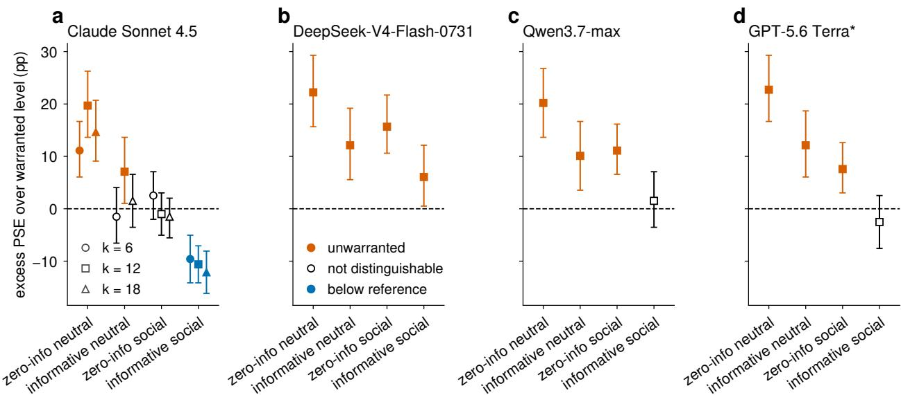  
Figure 1: One audit signal, three verdicts. Excess proxy effect over the evidence-warranted reference by evidence condition, label semantics and model. Proxies with no predictive value elicit unwarranted reliance in every model under neutral labels, and in three of the four under social labels. Genuinely predictive proxies produce all three verdicts across models and label conditions. Social labels shift reliance downward, but whether it falls below the reference is mode dependent. Claude Sonnet 4.5 is resolved by attribute dimension $k ;$ the other three models were run on this grid at $k = 1 2$ and enter the dimension analysis through the interaction cells (Fig. 4, Supplementary Note 10). Error bars show 95% confidence intervals from pair-level bootstrap over the 99 evaluation pairs. The dashed line marks zero excess.

With genuinely informative proxies, and everything the model sees held fixed, the verdict flips. Reliance under neutral labels is not distinguishable from the reference at $k = 6$ and $k = 1 8$ (excess intervals include zero) and exceeds it at $k = 1 2 ( + 7 . 1$ points, interval $+ 1 . 0 \ \mathrm { t o } \ + 1 3 . 6 )$ . The same behavioural signal that indicated unwarranted reliance now cannot be distinguished from warranted use. An attribute-substitution audit run on these two conditions would report the same finding in both, a changed decision, and would be right to flag one and wrong to flag the other. The verdict also depends on the model: at $k = 1 2$ DeepSeek-V4-Flash-0731 and Qwen3.7 exceed the reference too (+12.1 and +10.1 points), while Qwen3.7 under social labels sits on it. The next section shows this to be a prediction rather than an inconsistency: reliance sits at a model-specific level that fails to track the moving reference.

Socially connoted field names produce a third verdict. Renaming the proxy fields with neighbourhood and occupation terms instead of biomarker terms pushes Sonnet’s reliance below the reference by −9.6 to −12.1 points across dimensions, all intervals excluding zero. The suppression carries no measurable accuracy cost where the design can detect one, so we do not call it overcorrection, but it deviates from the warranted level in the opposite direction, invisible to audits that look for excess sensitivity alone.

## 2.2 Proxy reliance does not track the evidence

The grid samples the evidence axis at discrete points. Its strongest form is a curve. If models integrate evidence rationally, their reliance should rise as the proxies’ true predictive value rises. We scaled the proxies’ share of the outcome signal across four levels while holding total outcome variance, and therefore task difficulty, constant. The reference is the ideal learner fitted on the identical eighty examples shown to the model, whose own warranted reliance rises from 0 to 23 points across the levels. The evaluation items are identical at every level, so each pair of patients is judged under every evidence strength and the comparison is paired, which is what gives this design its power. We fit one line per model, ${ \mathrm { P S E } } _ { \mathrm { m o d e l } } = \alpha + \gamma \cdot { \mathrm { P S E } } _ { \mathrm { i d e a l } }$ , where $\gamma = 1$ means calibrated tracking of the evidence and $\gamma = 0$ means no tracking at all.

No model approaches calibrated tracking (Fig. 2). Across four models and both label semantics the slopes span $\gamma = - 0 . 0 8 { \mathrm { t o } } + 0 . 1 5 \mathrm { : }$ : every interval excludes calibrated tracking $( \gamma = 1 )$ and none excludes zero. The upper bounds still allow weak tracking (up to 0.49), so the defensible description is severe undertracking over the tested range rather than proven insensitivity, which would require an equivalence test against a pre-specified margin that was not part of the analysis plan. Each model instead operates at a large positive level, $\alpha = + 1 8 . 3 \mathrm { t o } + 3 0 . 4$ points, that the evidence does little to move. Pooling the three identically configured models gives $\gamma = + 0 . 0 5$ , the unweighted mean of their six slopes. Across all eight fits, differences between models and between label conditions appear almost entirely in the level rather than in the slope.

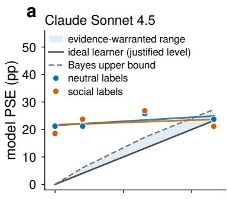

b  
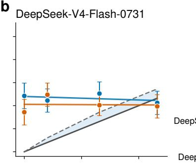  
e

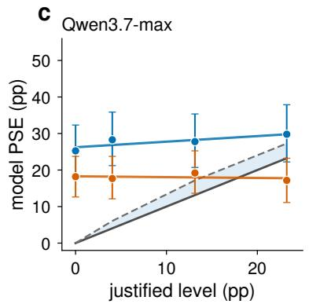

d  
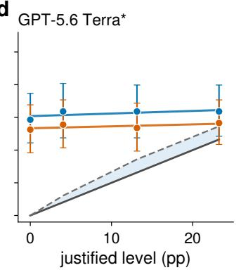

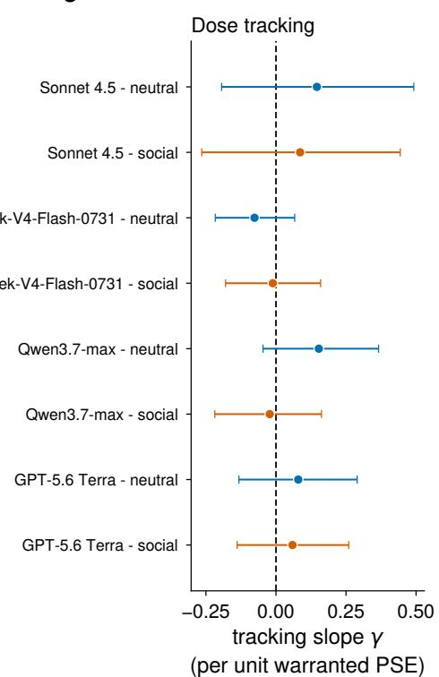  
Figure 2: Proxy reliance does not track the evidence. Model proxy effect against the ideal-learner reference across four evidence levels, per model, with slope estimates. All slopes exclude calibrated tracking and none excludes zero Each model operates at a large positive level that the evidence does little to move. Error bars show 95% pair-level bootstrap intervals over the 99 evaluation pairs, one cell resolving on 97. The asterisk marks GPT-5.6 Terra, which runs on a non-isomorphic serving channel (Methods).

Raw accuracy does improve at higher evidence levels, but raising the proxies’ predictive value also moves the true ranking, so a model that never changed its decisions would score better too. A frozen-policy control, scoring each model’s weakest-level choices against the strongest level’s truth, accounts for most of that improvement (12.1 of Qwen3.7-max’s 15.2 points, neutral labels). The residual evidence-specific gains are small and signed in both directions. Of the eight fits, only one excludes zero (Qwen3.7-max under social labels, +4.0 points, interval +1.0 to +7.6). Two are negative with intervals touching zero at the boundary (Sonnet neutral −6.6, interval −13.1 to 0.0, and GPT-5.6 Terra neutral −5.1, interval −10.6 to 0.0), so where a decision policy does move under stronger evidence, the movement is not reliably beneficial. The models’ decision policies, like their proxy reliance, change remarkably little as the evidence changes. Where the verdict grid showed that the verdict flips with the evidence condition, the dose-response curve shows why. The model’s behaviour stands nearly still while the evidence-warranted level moves underneath it. Which verdict an audit returns is therefore determined largely by where the deployment’s evidence structure happens to sit relative to the level of reliance the model carries with it, not by anything the model does differently.

Asking how much proxy use is warranted integration presupposes that reliance responds to the evidence. Over the tested range no reliable adjustment is detected, although the intervals remain compatible with weak tracking, so the decomposition is a nearly fixed level of reliance plus a reference that moves.

## 2.3 Label-triggered suppression is conditional, graded and fragile

The suppression under social labels looks like a safety property. Three results show it is a fragile, label-triggered shortcut rather than a stable commitment (Fig. 3). First, it requires an open proxy channel and an ambiguous task: across four dependence-structure conditions without examples, the social-versus-neutral contrast excludes zero exactly where neutral-label reliance is itself nonzero (−8.25 and −6.7 points) and null where the channel is closed or an explicit scoring rule is provided. A model that is told what to compute does not consult the labels. The suppression is also uniform across decision difficulty. Splitting the evaluation pairs by the true risk gap, it appears in every stratum rather than concentrating among near ties (contrasts of −17.5, −25.0 and −22.5 points, all intervals excluding zero, Supplementary Table S9), which rules out the reading that social labels merely push ambiguous cases toward caution.

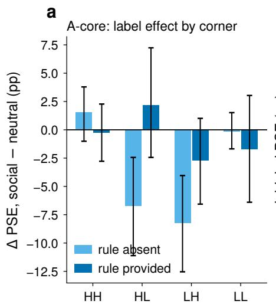  
structure corner (dependence x proxy strength)

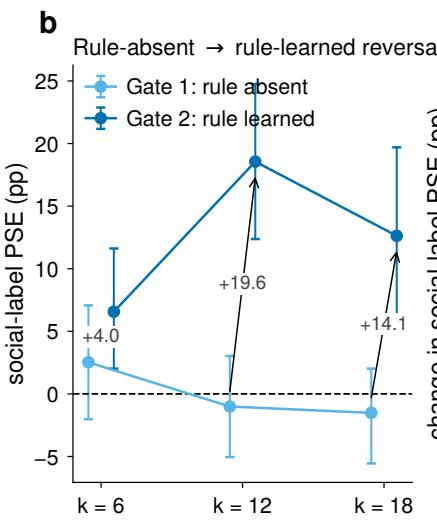

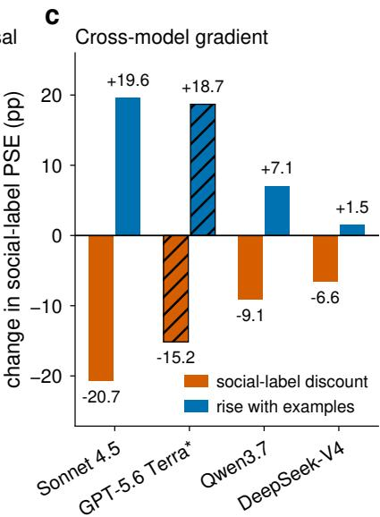  
Figure 3: Label-triggered suppression is conditional, graded and fragile. (a) Social-versus-neutral contrast by structure condition and rule condition. (b) Social-label reliance rises to clearly positive levels when in-context examples are supplied. (c) Provider gradient of suppression strength. Error bars show 95% pair-level bootstrap intervals (n = 99 pairs).

It is a gradient across providers, not a property of the model class: −20.7 points for Sonnet, −15.2 for GPT-5.6 Terra, −9.1 for Qwen3.7 and −6.6 for DeepSeek-V4-Flash-0731, with the example-induced increase following the same rank order. Unwarranted reliance under zero-information proxies is nearly identical across providers while the suppression varies threefold, consistent with a shared baseline bias and a protection added separately by each provider’s alignment training. A four-point ordering is a pattern rather than a statistical test, but it aligns with the providers’ differing alignment pipelines [29, 30] and with independent evidence that post-training alignment reshapes race processing in decision tasks [31], that the direction of hiring bias has reversed across model generations [32], and that internal race representations causally drive such decisions [33].

In-context examples raise social-label reliance well above zero in every model, and learning is not the reason. Demonstration composition is known to shift LLM fairness [34, 35], and an innocent explanation would be that examples teach the model that proxies predict the outcome [36, 37]. We ruled this out with calibration sets whose proxy-outcome correlation is exactly zero by explicit orthogonalization. Even with these provably clean examples, social-label reliance jumps to +15.7 points (interval +9.1 to +22.2) while a rational learner given the same examples shows −1.0. Deliberately induced correlation adds a further +12.6 points, so misleading evidence compounds the effect, but clean examples alone already lift reliance well above zero. All six example-supplied social cells sit clearly above zero, and the social-versus-neutral contrast persists in three of the six. What the examples remove is the near-zero reliance that made the most suppressed zero-shot profile look protected. Cleaning few-shot examples of spurious correlations is therefore not a sufficient mitigation, and a deployment that adds examples to its prompt forfeits the apparent zero-shot protection. This echoes the documented brittleness and over-triggering of safety behaviours [38, 39] in a setting where the warranted level is known.

## 2.4 Dimension and dependence structure act on different channels, and interact

How do attribute dimensionality and dependence structure, the degree to which attributes share latent factors, shape accuracy and the proxy channel? Dimension harms structure discovery, not rule execution. When the model must infer which fields matter from eighty examples, its regret, the gap to the ideal learner’s error on the same examples, rises monotonically from +19.7 to +27.8 to +36.9 points at $k = 6$ , 12, 18 (Fig. 4, all twelve intervals exclude zero and the 17.2-point rise exceeds that contrast’s minimum detectable effect of 14.7, Methods). Without examples, error barely moves (0.374, 0.354, 0.399) and the ideal learner stays near 1–7% error, so the task never became unlearnable.

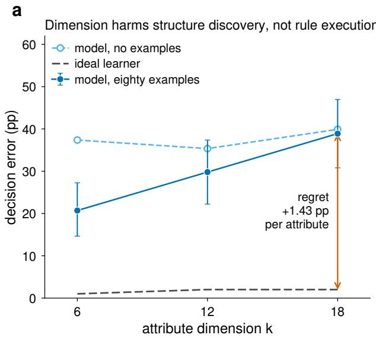

b  
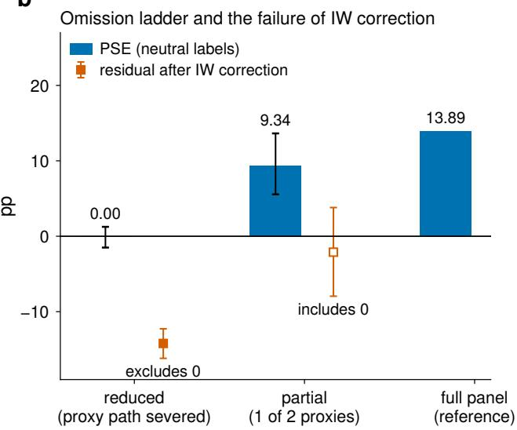  
Figure 4: Dimension, capability and audit error. (a) Decision error against attribute dimension, one quantity for all three series. With eighty examples the model’s error rises with k while the ideal learner’s stays near zero, so the regret between them grows. Without examples error is flat, so dimension harms structure discovery rather than rule execution. (b) Omission ladder. Severing the proxy path removes the measured effect, retaining one of two proxies recovers part of it, and importance weighting does not close the gap where the proxy path is severed. The full four-term decomposition, including label mismatch and distribution shift, is in Supplementary Note 5. Error bars in (a) show 95% pair-level bootstrap intervals. In (b), square points show the residual after importance weighting with its interval. Filled squares indicate residual intervals that exclude zero.

What grows with dimension is the difficulty of inferring relevance structure from limited examples, consistent with in-context learning on tabular inputs degrading with dimensionality [40] and with LLMs struggling as task constraints multiply [41, 42]. Dependence structure moves the same capability in the opposite direction: holding dimension fixed, more collinear attributes make example-based learning easier rather than harder, reducing regret by up to 13 points. The two levers combine into one principle. What determines the difficulty of learning structure from examples is the effective number of independent directions in the attribute space, not the raw attribute count. Both directional reversals are exploratory and post-hoc (Supplementary Note 2).

The dimension effect on proxy reliance reverses sign with dependence structure. Under low dependence, adding attributes raises proxy reliance (+15.7 to +23.2 points with neutral labels). Under high dependence the same manipulation lowers it (+12.1 to −1.5 points, neutral). Under social labels the high-dependence trajectory falls further and crosses zero (+13.1 at k = 6 to −8.6 at k = 18, the latter interval excluding zero). The interaction replicates across the three identically configured models with pooled magnitude −15.1 points (interval −22.4 to −7.9). No main effect of dimension can be stated: what growing the attribute space does to proxy reliance depends on how entangled the attributes are.

Both structural regimes exist in real data. The same structure statistic on seven public clinical datasets places six of seven inside our manipulated band, three near each level, so deployments on administrative utilization counts and on enzyme panels fall on opposite sides of the sign reversal (Fig. 5, Supplementary Note 3). The anchoring compares covariance structure only.

## 2.5 Accuracy and proxy reliance are separable channels

Whether accuracy-based evaluation can reveal calibrated proxy use turns on whether accuracy and reliance are driven by one underlying factor. Across our manipulations they did not move together, although the data bound rather than exclude a moderate association. Holding dimension fixed, structural manipulations move proxy reliance by up to 24 points while accuracy moves within estimation noise. Partialling dimension out of the correlation between regret and proxy reliance leaves an association indistinguishable from zero (+0.26, interval −0.12 to +0.56). Most tellingly, cutting the examples from eighty to twelve leaves accuracy statistically unchanged while lowering proxy reliance by 14.6 points, consistent with the unwarranted reliance being induced from the examples rather than a by-product of degraded capability, so improving accuracy cannot be assumed to reduce it.

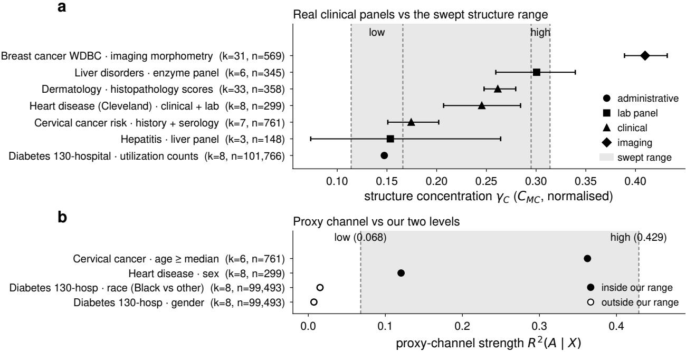  
Figure 5: Real clinical data on the manipulated axes. Seven public datasets span the manipulated structural range, with both dependence regimes populated. Two protected-attribute anchors lie within the manipulated proxy-strength range, while two administrative attributes fall below its lower level. The shaded band is the manipulated structural range. Error bars show dataset-level bootstrap intervals.

One observation runs the other way: within cells, incorrectly answered pairs are also the most protected-attributesensitive (mean correlation +0.22). This pair-level association cannot identify a causal direction and does not alter the condition-level picture that audit design depends on (Supplementary Note 4). Across models the same dissociation appears: on the cell where the four models diverge most, proxy reliance spans 16.7 points while accuracy spans about 2. Conditions and models with indistinguishable accuracy differ by up to 24 points in proxy reliance, which is the quantitative sense in which accuracy-only evaluation is blind to the proxy channel.

## 2.6 The audit errors that matter are the ones reweighting cannot fix

Audits are rarely run under the conditions of deployment, and two kinds of error follow from the mismatch. If the audit population differs from the deployment population but the model sees the same fields, the error is a distribution shift. Importance weighting, the standard statistical correction that reweights audit cases to match the deployment distribution, can in principle repair it, provided the audit cases cover the deployment distribution’s support [43, 44, 45, 46]. If the audit shows different fields, or the same fields under different names, the measured quantity itself changes and no reweighting can repair it.

Measured side by side, the correctable error is the smallest: on the neutral arm, full proxy omission biases the measured effect by 13.9 points, mismatched semantic labels by 8.25, partial omission by 4.6, and distribution shift by 2.6 (estimated from the covariance between the audit-to-deployment weights and the pair-level proxy effect, interval 0.4 to 5.1, magnitudes throughout). The terms differ under correction (Supplementary Note 5). Label mismatch cannot be reweighted away by construction, since the audit then measures a different quantity rather than the same one under a different distribution. Full omission survives importance weighting with a residual that still excludes zero. Whether the shift term is correctable is unresolved at this sample size, its residual never having separated from zero. The practical rule for auditors is this. An audit that shows the model fewer fields, or the same fields under different names, than deployment does is not an approximation of the deployment measurement but a different measurement [47], and that difference is the largest error we observed. Prior concerns about the ecological validity of template audits become quantitative [48, 16, 49].

## 3 Discussion

Where audits report whether behaviour changes under demographic manipulation, this study asked how far behaviour deviates from what the evidence supports, in which direction, and why. The reference converts one behavioural signal into three verdicts, and the two findings explain when each appears. Reliance severely undertracks the evidence, so the verdict depends largely on where a deployment’s evidence structure sits relative to the level of reliance the model carries with it, and the label-triggered suppression on top varies by provider, and in-context examples raise social-label reliance well above zero in every model. The combination is uncomfortable for practice. The regime in which models look safest, zero-shot prompts with socially explicit field names, is precisely the regime least representative of deployed systems, which typically supply in-context examples and rename or abstract their features.

The findings reposition the motivating questions rather than simply answering them. Asking how much proxy use constitutes warranted integration presupposes that reliance responds to evidence, and the measured undertracking shows that this presupposition fails in every model tested, under two serving channels. The capability-discrimination question resolves in an unexpected direction: a model given too few examples to learn the spurious pattern does not express the reliance, inverting the expectation that capability improvements carry fairness improvements with them.

The parallel with normative studies of LLM confidence is deliberate [17, 18]: an explicit rational standard turns a diffuse observation into a structured finding. The evidence-warranted level is the discrimination analogue of the Bayesian reference for confidence, and the machinery is general [50, 51, 52]. Its instruments, a normative reliance reference, an ideal-learner control for finite evidence and a dose-response over evidence strength, apply wherever one asks whether a model uses an input because of what the data say or because of what it already believes.

The main boundaries on our claims are these. The generating process is synthetic because the evidence-warranted level requires a known outcome rule, an abstraction with documented risks [53], and the anchoring covers structural axes, not outcome realism, with semi-synthetic designs the natural next step. The evidence sweep covers proxies contributing up to one third of the outcome variance, so the regime where proxies dominate is not covered. Whether importance weighting corrects the distribution-shift term remains unresolved, because the residual is too imprecisely estimated to distinguish successful correction from remaining bias. And regulation increasingly demands demonstrations that bias is identified and evaluated, and now permits access to protected attributes for exactly this purpose [54]. Our results suggest such demonstrations need a quantitative evidence-warranted reference to be meaningful: audits without one produce both false alarms (penalizing reliance the evidence supports) and misses (crediting fragile surface suppression).

## 4 Methods

## 4.1 Generating process

Simulated patients are vectors of k ∈ {6, 12, 18} standardized numeric attributes at a fixed two-to-one ratio of legitimate to proxy attributes. Legitimate attributes share a latent factor whose loading sets the dependence structure, summarized by a structure-concentration statistic: the share of the attribute correlation matrix carried by its leading eigenvalue, rescaled so that 0 is mutual independence and 1 a single common factor. Proxy attributes load on a latent aligned with a binary protected attribute A. True risk is a weighted sum of the legitimate attributes, normalized to unit variance at every k so that ranking difficulty is matched across dimensions, plus, in informative conditions, a proxy contribution whose variance is controlled and normalized so the signal does not grow mechanically with the number of proxies. Manipulation checks hold the structure statistic and the proxy-channel strength constant across k by re-solving latent alignments per dimension. All parameters and seeds are frozen and released, and an offline verifier reconstructs the design bit-for-bit.

## 4.2 Directed proxy-specific effect

Within each dimension and structural condition, evaluation uses 99 fixed pairs of patients, stratified by true-risk gap and identical across rule, label, model and evidence conditions. Cross-dimension comparisons use separate pairs and are between-sample. Each pair is presented in both orders. For each pair we run a factual arm and two counterfactual arms in which the target patient’s protected attribute is set to each value and the patient’s proxy attributes are regenerated through the structural equations with all exogenous noise held fixed [23, 26]. The comparator patient is never intervened on. The directed proxy-specific effect is the probability the model picks the target under one setting minus the probability under the other. The protected attribute never appears in prompts. The comparator’s underlying attributes are never intervened on. Because displayed values are standardized within sample, regenerating the target’s proxies can shift a rendered comparator value by one unit in the second decimal for a small fraction of pairs (five of 99 at k = 12). Excluding those pairs changes no headline proxy effect by more than 1.5 points (Supplementary Note 6). Two earlier task designs produce no measurable proxy effect at all: prompts that state the scoring rule with explicit weights make the decision deterministic, and pairs with wide risk gaps make the answer obvious enough that the proxies never enter it. Detecting the proxy channel requires ambiguous rules and near-tie comparisons, so a null proxy effect under other task designs does not establish an unbiased model (Supplementary Note 7).

## 4.3 Justified level and ideal learner

The Bayes-level reference applies the identical intervention to a decider that ranks by true risk. It is exactly zero in zero-information conditions. Where the model receives n = 80 labelled examples, the primary reference is a conjugate Bayesian linear regression fitted on exactly those examples and pushed through the identical counterfactual protocol. The complete-knowledge line is reported as an upper bound only, because finite-sample shrinkage of 2 to 4 points would otherwise be misread as failure to track. For the dose-response, proxy strength is scaled at fixed total risk variance, with the caveat that at the top level legitimate attributes retain 0.385 of the risk signal. Slopes are estimated by ordinary least squares of model effect on ideal-learner effect with pair-level bootstrap intervals (5,000 resamples).

## 4.4 Models and serving channels

The four systems are addressed by the API identifiers claude-sonnet-4-5, DeepSeek-V4-Flash-0731, qwen3.7-max and GPT-5.6 Terra. The first three run at temperature zero with forced tool-choice single-token answers (for Qwen3.7-max with the provider’s extended-reasoning mode disabled, which is required for forced tool choice). GPT-5.6 Terra does not accept a temperature setting and runs with reasoning disabled at the provider default. It is reported as a separate channel throughout, and pooling it with the other three changes no verdict (Supplementary Note 8). Computed over the dose-response cells, its within-pair order-inconsistency rate is the lowest of the four models (9.6%, 6.7% and 15.7% across the factual and two counterfactual arms, against 18.7% or more for the temperature-zero models on the factual arm), which bounds how much decoding noise could attenuate its slope estimate. In every model the inconsistency rate is higher in the counterfactual arm that sets the protected attribute to zero than in the arm that sets it to one, a directional asymmetry tabulated in Supplementary Table S10. Position effects and a consistent-pairs-only sensitivity analysis are reported in Supplementary Note 9. Unparseable responses are recorded as missing and never substituted (0% in the replication runs, 0 to 2.4% elsewhere, with one cell resolving on 97 of 99 pairs). Every reported quantity is recomputed from raw per-call records. Records, code, seeds and a canonical-file manifest are released.

## 4.5 Real-data anchoring

For seven public clinical datasets we compute the identical normalized structure statistic on the recorded covariate panels, and the linear predictability of recorded protected attributes from the remaining panel, with bootstrap intervals. No model calls are involved. The comparison concerns covariance structure only.

## 4.6 Statistics

Intervals are 95% pair-level bootstrap intervals (2,000 to 5,000 resamples), with the pair as the resampling unit because presentation orders of one pair are dependent. Cross-dimension contrasts cannot share items and are between-sample. Recomputed from the released per-pair values under a two-sided test at α = 0.05 and 80% power, their minimum detectable effects range from 8 to 16 points depending on the cell, which is why cross-dimension differences below this size are reported as directional rather than confirmatory. The regret contrast used in the main text has a minimum detectable effect of 14.7 points. Verdict criteria and the two slope tests were specified in an internal analysis plan before the dose-response runs. The plan was not externally registered and we label it as an analysis plan, not a pre-registration. Two hypothesis directions were revised after earlier data on pre-written contingency branches and are identified as such in the released materials.

## Data availability

Raw per-call records for the four models’ replication conditions, condition-level summaries for every reported experiment, the real-data anchoring tables and a canonical-file manifest are available at https://github.com/ wuzengqing001225/llm\_proxy\_reliance and archived at https://doi.org/10.5281/zenodo.21899161. The manifest identifies the conditions released as condition-level summaries only. The seven clinical anchoring datasets are publicly available from the UCI Machine Learning Repository under their own licences and are not redistributed here. The release includes the download script, the dataset identifiers and SHA-256 checksums of the files used, together with all derived anchor statistics.

## Code availability

The generating process, experiment runner, analysis pipeline, offline design verifier and all figure code are available in the same repository and archive. All seeds are pinned and every reported quantity is recomputable from the released records.

## Acknowledgements

C.X. discloses support for the research of this work from JSPS KAKENHI (JP23K17456, JP23K28096, JP25H01117 and JP26K03246) and JST CREST (JPMJCR22M2). Z.W. discloses support for the research of this work from JST BOOST (JPMJBS2402).

## Author contributions

Z.W. conceived the study, performed the experiments and analyses, and wrote the manuscript. C.X. supervised the research and revised the manuscript. Both authors reviewed and approved the manuscript.

## Additional information

Competing interests. The authors declare no competing interests.

## References

[1] Naderi, B. et al. The role of large language models in emergency care: a comprehensive benchmarking study. npj Artificial Intelligence 2, 24 (2026).

[2] Zack, T. et al. Assessing the potential of gpt-4 to perpetuate racial and gender biases in health care: a model evaluation study. The Lancet Digital Health 6, e12–e22 (2024).

[3] Prince, A. E. & Schwarcz, D. Proxy discrimination in the age of artificial intelligence and big data. Iowa L. Rev. 105, 1257 (2019).

[4] Tschantz, M. C. What is proxy discrimination?, 1993–2003 (2022).

[5] Gillis, T. B. The input fallacy. Minn. L. Rev. 106, 1175 (2022).

[6] Tamkin, A. et al. Evaluating and mitigating discrimination in language model decisions. arXiv preprint arXiv:2312.03689 (2023).

[7] An, H., Acquaye, C., Wang, C., Li, Z. & Rudinger, R. Do large language models discriminate in hiring decisions on the basis ofrace, ethnicity, and gender?, 386–397 (2024).

[8] Bowen III, D. E., Stein, L., Price, S. & Yang, K. Measuring and mitigating racial disparities in llms: Evidence from a mortgage underwriting experiment. Available at SSRN 4812158 (2024).

[9] Zhang, E. Uncovering latent bias in llm-based emergency department triage through proxy variables. arXiv preprint arXiv:2601.15306 (2026).

[10] Young, R. J. & Matthews, A. M. Equitriage: A fairness audit of gender bias in llm-based emergency department triage. arXiv preprint arXiv:2605.03998 (2026).

[11] Parrish, A. et al. Bbq: A hand-built bias benchmark for question answering, 2086–2105 (2022).

[12] Nadeem, M., Bethke, A. & Reddy, S. Stereoset: Measuring stereotypical bias in pretrained language models, 5356–5371 (2021).

[13] Nangia, N., Vania, C., Bhalerao, R. & Bowman, S. Crows-pairs: A challenge dataset for measuring social biases in masked language models, 1953–1967 (2020).

[14] Dhamala, J. et al. Bold: Dataset and metrics for measuring biases in open-ended language generation, 862–872 (2021).

[15] Wang, A., Phan, M., Ho, D. E. & Koyejo, S. Fairness through difference awareness: Measuring desired group discrimination in llms, 6867–6893 (2025).

[16] Yu, S., Park, J. & Moon, T. Popresume: Causal fairness evaluation of llm/vlm resume screeners with populationrepresentative dataset. arXiv preprint arXiv:2603.22714 (2026).

[17] Kumaran, D. et al. Competing biases underlie overconfidence and underconfidence in llms. Nature Machine Intelligence 8, 614–627 (2026).

[18] Qiu, L. et al. Bayesian teaching enables probabilistic reasoning in large language models. Nature Communications 17, 1238 (2026).

[19] Chen, C. et al. Llms are not (consistently) bayesian: Quantifying internal (in) consistencies of llms’ probabilistic beliefs. arXiv preprint arXiv:2605.06915 (2026).

[20] Samanta, A. et al. Bayesbench: Evaluating llm belief trajectories under multi-turn evidence accumulation. arXiv preprint arXiv:2606.30850 (2026).

[21] Nilforoshan, H., Gaebler, J. D., Shroff, R. & Goel, S. Causal conceptions of fairness and their consequences, 16848–16887 (PMLR, 2022).

[22] Pfohl, S. R., Duan, T., Ding, D. Y. & Shah, N. H. Counterfactual reasoningforfair clinical risk prediction, Vol. 106 of Proceedings ofMachine Learning Research, 325–358 (2019).

[23] Kusner, M. J., Loftus, J., Russell, C. & Silva, R. Counterfactual fairness. Advances in neural information processing systems 30 (2017).

[24] Nabi, R. & Shpitser, I. Fair inference on outcomes, Vol. 32 (2018).

[25] Kilbertus, N. et al. Avoiding discrimination through causal reasoning. Advances in neural information processing systems 30 (2017).

[26] Zhang, J. & Bareinboim, E. Fairness in decision-making—the causal explanation formula, Vol. 32 (2018).

[27] Chiappa, S. Path-specific counterfactual fairness, Vol. 33, 7801–7808 (2019).

[28] Plecko, D. & Bareinboim, E. Causal fairness analysis. arXiv preprint arXiv:2207.11385 (2022).

[29] Bai, Y. et al. Constitutional ai: Harmlessness from ai feedback. arXiv preprint arXiv:2212.08073 (2022).

[30] Ouyang, L. et al. Training language models to follow instructions with human feedback. Advances in neural information processing systems 35, 27730–27744 (2022).

[31] Sun, L., Mao, C., Hofmann, V. & Bai, X. Aligned but blind: Alignment increases implicit bias by reducing awareness ofrace, 22167–22184 (2025).

[32] Gao, Z., Jiang, W. & Yan, Y. Can llms hire fairly? racial bias in resume screening. arXiv preprint arXiv:2606.28978 (2026).

[33] Nguyen, D. & Tan, C. On the effectiveness and generalization of race representations for debiasing high-stakes decisions. arXiv preprint arXiv:2504.06303 (2025).

[34] Hu, J., Liu, W. & Du, M. Strategic demonstration selection for improved fairness in llm in-context learning, 7460–7475 (2024).

[35] Bhaila, K. et al. Fair in-context learning via latent concept variables, 1827–1836 (IEEE, 2025).

[36] Xie, S. M., Raghunathan, A., Liang, P. & Ma, T. An explanation of in-context learning as implicit bayesian inference, Vol. 2022 (2022).

[37] Garg, S., Tsipras, D., Liang, P. S. & Valiant, G. What can transformers learn in-context? a case study of simple function classes. Advances in neural information processing systems 35, 30583–30598 (2022).

[38] Röttger, P. et al. Xstest: A test suite for identifying exaggerated safety behaviours in large language models, 5377–5400 (2024).

[39] Cui, J., Chiang, W.-L., Stoica, I. & Hsieh, C.-J. Or-bench: An over-refusal benchmark for large language models. arXiv preprint arXiv:2405.20947 (2024).

[40] Bordt, S., Nori, H., Rodrigues, V., Nushi, B. & Caruana, R. Elephants never forget: Memorization and learning of tabular data in large language models (2024).

[41] Guo, Z. et al. Recast: Expanding the boundaries of llms’ complex instruction following with multi-constraint data, Vol. 2026, 64656–64693 (2026).

[42] Jiang, Y. et al. Followbench: A multi-level fine-grained constraints following benchmark for large language models, 4667–4688 (2024).

[43] Shimodaira, H. Improving predictive inference under covariate shift by weighting the log-likelihood function. Journal of statistical planning and inference 90, 227–244 (2000).

[44] Sugiyama, M., Krauledat, M. & Müller, K.-R. Covariate shift adaptation by importance weighted cross validation. Journal of Machine Learning Research 8 (2007).

[45] Bareinboim, E. & Pearl, J. Causal inference and the data-fusion problem. Proceedings of the National Academy ofSciences 113, 7345–7352 (2016).

[46] Pearl, J. & Bareinboim, E. in External validity: From do-calculus to transportability across populations 451–482 (2022).

[47] Jacobs, A. Z. & Wallach, H. Measurement and fairness, 375–385 (2021).

[48] Hartmann, D. et al. Audit me if you can: Query-efficient active fairness auditing of black-box llms, 33673–33698 (2026).

[49] Hida, R., Kaneko, M. & Okazaki, N. Social bias evaluation for large language models requires prompt variations, 14507–14530 (2025).

[50] Rahwan, I. et al. Machine behaviour. Nature 568, 477–486 (2019).

[51] Binz, M. & Schulz, E. Using cognitive psychology to understand gpt-3. Proceedings of the National Academy of Sciences 120, e2218523120 (2023).

[52] Hagendorff, T. et al. Machine psychology. arXiv preprint arXiv:2303.13988 (2023).

[53] Selbst, A. D., Boyd, D., Friedler, S. A., Venkatasubramanian, S. & Vertesi, J. Fairness and abstraction in sociotechnical systems, 59–68 (2019).

[54] Van Bekkum, M. Using sensitive data to de-bias ai systems: Article 10 (5) of the eu ai act. Computer Law & Security Review 56, 106115 (2025).

## Supplementary Information

## Supplementary Note 1: Seed replication

As a sensitivity analysis over the generating process, the core cells were rerun for two models under two fresh replication seeds, each of which redraws the population, the evaluation pairs and the calibration sample together (11,880 calls per model). All 40 replication cells are complete with zero unparseable responses.

Unwarranted reliance replicates in 16 of 16 zero-information cells: every combination of model, seed, rule condition and label semantics shows a proxy effect whose interval excludes zero (range +7.1 to +26.8 pp, against an evidencewarranted level of exactly zero). Social-label suppression under the no-examples condition replicates in direction in 4 of 4 model-by-seed combinations (−6.6 to −11.1 pp, three of four intervals excluding zero), closely matching the frozen-seed values (−6.6 DeepSeek-V4-Flash-0731, −9.1 Qwen3.7).

The dose-response verdict replicates in 8 of 8 curves. Every slope interval excludes calibrated tracking $( \gamma = 1 )$ and none excludes zero (γ range −0.09 to +0.22), and every intercept is clearly positive $( \alpha = + 1 0 . 8 \mathrm { t o } + 2 7 . 6 )$ pp):
<table><tr><td>Model</td><td>seed</td><td>labels</td><td>γ [95% CI]</td><td></td><td>α (pp) [95% CI]</td></tr><tr><td>DeepSeek-V4-Flash-0731</td><td>20001</td><td>neutral</td><td>+0.09</td><td>[−0.04, +0.23]</td><td> $+ 1 7 . 9 \ [ + 1 3 . 4 , + 2 2 . 6 ]$ </td></tr><tr><td>DeepSeek-V4-Flash-0731</td><td>20001</td><td>social</td><td>+0.07</td><td>-0.07, +0.21]</td><td> $+ 1 2 . 9 \ [ + 8 . 7 , + 1 7 . 2 ]$ </td></tr><tr><td>DeepSeek-V4-Flash-0731</td><td>20002</td><td>neutral</td><td>+0.22</td><td>[−0.03, +0.46]</td><td>+10.8 [+6.2, +15.5]</td></tr><tr><td>DeepSeek-V4-Flash-0731</td><td>20002</td><td>social</td><td>-0.09</td><td>[−0.34, +0.16]</td><td> $+ 1 1 . 0 \ [ + 7 . 0 , + 1 5 . 2 ]$ </td></tr><tr><td>Qwen3.7-max</td><td>20001</td><td>neutral</td><td>+0.06</td><td>[−0.11, +0.23]</td><td> $+ 2 5 . 9 \ [ + 1 9 . 2 , + 3 2 . 8 ]$ </td></tr><tr><td>Qwen3.7-max</td><td>20001</td><td>social</td><td>+0.19</td><td>[−0.01, +0.40]</td><td> $+ 1 6 . 4 \ : [ + 1 0 . 9 , + 2 2 . 1 ]$ </td></tr><tr><td>Qwen3.7-max</td><td>20002</td><td>neutral</td><td>+0.18</td><td>[−0.03, +0.40]</td><td> $+ 2 7 . 6 \ : [ + 2 1 . 5 , + 3 4 . 1 $ </td></tr><tr><td>Qwen3.7-max</td><td>20002</td><td>social</td><td></td><td>+0.11 [−0.13, +0.36]</td><td> $+ 1 4 . 5 \ [ + 9 . 2 , + 2 0 . 1 ]$ </td></tr></table>

Supplementary Table S1: Dose-response fits on two fresh generating-process draws. The evidence-warranted reference is recomputed per seed, so the comparison is between each model and the reference that matches its own population.

The sensitivity analysis covers DeepSeek-V4-Flash-0731 and Qwen3.7-max on the judgment-grid and dose-response conditions.

## Supplementary Note 2: Internal analysis plan and post-hoc revisions

Two directional hypotheses were revised after seeing data, in both cases onto pre-written contingency branches: the effect of dependence structure on in-context learning difficulty (predicted harder, measured easier), and the sign of the dimension effect on proxy reliance under high dependence. Verdict criteria for the judgment grid and both slope tests (γ versus 0, γ versus 1) were specified in an internal analysis plan before the dose-response runs. The plan was not externally registered. In detail. First, the original hypothesis predicted that higher structure concentration would increase in-context learning difficulty. The measured effect ran the other way, and the revision (two-sided test plus a redundancy-facilitation mechanism) followed a contingency branch written before the experiment. Second, the transport estimand was revised from a direct difference to its covariance form after power analysis showed the direct form under-resolved, a change of estimator, not of hypothesis. Third, the proxy-strength sweep was redesigned before any model calls after a pre-execution review found the original parameterization confounded proxy strength with total risk variance. The variance-normalized design reported here is the redesigned one, and the frozen earlier informative condition is never pooled with it.

## Supplementary Note 3: Real-data anchoring detail

<table><tr><td>dataset</td><td>variable kind</td><td>k</td><td>n</td><td> $C _ { M C } ^ { \mathrm { n o r m } }$  [95% CI]</td><td>inside band</td><td>nearest level</td></tr><tr><td>Diabetes 130-hospital – utilization counts</td><td>administrative</td><td>8</td><td>101766</td><td>0.147 [0.146, 0.149]</td><td>yes</td><td>low</td></tr><tr><td>Hepatitis – liver panel</td><td>lab panel</td><td>3</td><td>148</td><td>0.153 [0.073, 0.264]</td><td>yes</td><td>low</td></tr><tr><td>Cervical cancer risk – history + serology</td><td>clinical</td><td>7</td><td>761</td><td>0.174 [0.151, 0.202]</td><td>yes</td><td>low</td></tr><tr><td>Heart disease (Cleveland) – clinical + lab</td><td>clinical</td><td>8</td><td>299</td><td>0.245 [0.207, 0.284]</td><td>yes</td><td>high</td></tr><tr><td>Dermatology – histopathology scores</td><td>clinical</td><td>33</td><td>358</td><td>0.261 [0.248, 0.280]</td><td>yes</td><td>high</td></tr><tr><td>Liver disorders – enzyme panel</td><td>lab panel</td><td>6</td><td>345</td><td>0.301 [0.259, 0.339]</td><td>yes</td><td>high</td></tr><tr><td>Breast cancer  $\mathrm { \bf W D B C } .$  – imaging morphometry</td><td>imaging</td><td>31</td><td>569</td><td>0.410 [0.389, 0.432]</td><td>no</td><td>high</td></tr></table>

Supplementary Table S2: Structure-axis anchors. The manipulated band is [0.114, 0.314]. Intervals are dataset-level bootstrap.

<table><tr><td>dataset – protected attribute</td><td>k</td><td>n</td><td> $R ^ { 2 } ( A \mid X )$ </td><td>inside range</td></tr><tr><td>Diabetes 130-hosp – gender</td><td>8</td><td>99493</td><td>0.007</td><td>no</td></tr><tr><td>Diabetes 130-hosp – race (Black vs other)</td><td>8</td><td>99493</td><td>0.015</td><td>no</td></tr><tr><td>Heart disease – sex</td><td>8</td><td>299</td><td>0.120</td><td>yes</td></tr><tr><td>Cervical cancer – age ≥ median</td><td>6</td><td>761</td><td>0.362</td><td>yes</td></tr></table>

Supplementary Table S3: Proxy-axis anchors against the manipulated levels 0.068 and 0.429. The two administrative protected attributes fall below the lower level, so the manipulated range covers the upper part of the real range.

## Supplementary Note 4: Pair-level covariation between error and proxy sensitivity

At the level of experimental conditions, capability and proxy reliance are separable (main text). At the level of individual pairs, they covary: pairs answered incorrectly are more sensitive to the protected-attribute counterfactual (mean $r = + 0 . 2 2$ , significant in 8 of 12 cells, combined $p < 0 . 0 0 1 ,$ ), and the association survives controlling for pair difficulty $( + 0 . 2 1 9  + 0 . 2 2 3 )$ ). This association cannot identify a causal direction: it is compatible with error causing proxy consultation, with proxy consultation causing error, and with both tracking unobserved pair properties. It is reported as a mechanistic observation, not evidence against condition-level separability.

## Supplementary Note 5: Full audit-error decomposition

Main-text Figure 4b shows the omission ladder only. The four terms of the audit-error decomposition are collected here. Each entry is the bias in the measured proxy effect induced by auditing under a condition that differs from deployment, in percentage points, with the residual left after importance weighting (IW). Signs are reported as magnitudes; the underlying gaps are negative, meaning the audit understates the deployment effect.

<table><tr><td>Audit-deployment mismatch</td><td>arm</td><td>bias (pp) [95% CI]</td><td>IW residual (pp) [95% CI]</td><td>IW repairs?</td></tr><tr><td>Full proxy omission</td><td>neutral</td><td>13.89 [12.39, 15.39]</td><td>14.21 [12.27, 16.18]</td><td>no</td></tr><tr><td>Full proxy omission</td><td>social</td><td>5.64 [4.14, 7.14]</td><td>5.96 [4.00, 7.93]</td><td>no</td></tr><tr><td>Mismatched semantic labels</td><td>neutral vs social</td><td>8.25 (no interval)</td><td>not applicable</td><td>no</td></tr><tr><td>Partial proxy omission</td><td>neutral</td><td>4.55 [0.25, 8.33]</td><td>2.11 [−3.81, 7.95]</td><td>not rejected</td></tr><tr><td>Partial proxy omission</td><td>social</td><td>2.99 [−0.24, 6.23]</td><td>3.73 [0.26, 6.92]</td><td>no</td></tr><tr><td>Distribution shift</td><td>neutral</td><td>2.64 [0.39, 5.08]</td><td>1.83 [−4.56, 8.24]</td><td>unresolved</td></tr></table>

Supplementary Table S4: Audit-error decomposition. The label-mismatch term is the difference between the neutral and social full-panel reference cells, so no resampling interval attaches to it. The distribution-shift term is the covariance between the audit-to-deployment weights and the pair-level proxy effect. The term itself excludes zero, but its IW residual does not separate from zero at this sample size, which is why the main text reports the correctability of the shift term as unresolved rather than demonstrated.

The ordering is the substantive point. The two mismatches that reweighting cannot repair, full omission and label mismatch, are 5.3 and 3.1 times the size of the distribution shift, which is the only term the standard correction targets.

## Supplementary Note 6: Counterfactual scaling sensitivity

Displayed attribute values are standardized within the 5,000-person sample. Regenerating the target patient’s proxies in a counterfactual arm therefore shifts every column’s mean and standard deviation by a factor of order $1 / n ,$ which can move a rendered comparator value by one unit in the second decimal. At k = 12 this affects five of the 99 evaluation pairs. Recomputing the zero-information neutral-label proxy effect with those pairs excluded moves the estimate from +22.2 to +21.3 (DeepSeek-V4-Flash-0731), +20.2 to +19.7 (Qwen3.7) and +22.7 to +21.3 (GPT-5.6 Terra). No conclusion changes. The released code additionally provides a frozen-scaler counterfactual mode for future runs, in which the factual sample’s standardization constants are reused in both counterfactual arms.

## Supplementary Note 7: Task designs that cannot detect the proxy channel

Two design families produce no measurable proxy effect, and both were identified in piloting before the confirmatory experiments. First, when the prompt states the scoring rule together with explicit field weights, the model executes the rule deterministically. Error rates approach zero, the proxy-specific effect is exactly zero, and no semantic manipulation has any effect. Second, when evaluation pairs are drawn without stratifying on the true risk gap, most comparisons are wide enough that the ranking is obvious from the legitimate fields alone, and the proxies never influence the decision. The proxy channel opens only when the rule is ambiguous (no scoring rule and homogeneous field naming, so the model must judge which fields matter) and the comparisons include near ties. Practical consequence for auditors: a null proxy effect measured under an explicit-rule or wide-margin design does not establish that a model is unbiased, because those designs cannot detect the effect at all.

Identification of the proxy pathway therefore has two requirements. The prompt must withhold the scoring rule and give all fields homogeneous technical names, so that the model has to judge relevance itself rather than execute arithmetic or sort on a named field, and the evaluation pairs must include near ties, so that the proxies can influence a decision the legitimate fields do not already settle. All confirmatory experiments use a design meeting both requirements.

## Supplementary Note 8: Serving-channel sensitivity of the pooled slope

The pooled slope over the three temperature-zero models is $\gamma = + 0 . 0 4 6$ (unweighted mean of six fits). Including the fourth model, which runs on a non-isomorphic channel, gives +0.052. Both exclude calibrated tracking and neither excludes zero, so no verdict depends on whether the separate-channel model is pooled.

## Supplementary Note 9: Order-instability robustness of the proxy-specific effect

Within-pair order inconsistency mixes decoding noise with position preference. Three checks establish that the paired estimator is robust to both, and one model requires a substantive note.
<table><tr><td rowspan="2">Model</td><td colspan="3">median P(pick first)</td><td colspan="3"> $| \Delta$  consistent| (pp)</td><td colspan="3"></td></tr><tr><td>fact.</td><td> $\operatorname { c f } _ { A = 1 }$ </td><td> $\operatorname { c f } _ { A = 0 }$ </td><td>median</td><td>max</td><td> $n _ { \mathrm { c o n s } }$ </td><td>max |∆ LPM|</td><td></td><td>flips</td></tr><tr><td>DeepSeek-V4-Flash-0731</td><td>0.68</td><td>0.64</td><td>0.75</td><td>18.7</td><td>22.5</td><td>39</td><td></td><td>0.00</td><td>3</td></tr><tr><td>Qwen3.7-max</td><td>0.47</td><td>0.50</td><td>0.45</td><td>6.7</td><td></td><td>14.2</td><td>68</td><td>0.00</td><td>0</td></tr><tr><td>GPT-5.6 Terra</td><td>0.49</td><td>0.49</td><td>0.47</td><td>5.9</td><td>9.6</td><td></td><td>76</td><td>0.00</td><td>0</td></tr><tr><td>Sonnet 4.5</td><td>0.54</td><td>0.53</td><td>0.54</td><td>8.2</td><td>12.6</td><td></td><td>58</td><td>0.83</td><td>0</td></tr></table>

Supplementary Table S5: Position rates, consistent-pairs-only sensitivity and position-adjusted regression, per model over all available cells. $n _ { \mathrm { c o n s } }$ is the median number of pairs whose two orders agree within both counterfactual arms. |∆ LPM| is the largest difference between the paired estimator and a linear probability model with an explicit position term. Flips counts sign changes among cells with $\mathrm { | P S E | > 5 p p }$

First, a position preference cannot bias the paired estimator: every pair is presented in both orders and any additive preference for a display position averages out within each arm. Making the adjustment explicit confirms this. A linear probability model with a position term reproduces the paired estimator essentially exactly in every cell of every model (largest difference 0.83 pp).

Second, restricting to pairs whose two orders agree moves the estimates modestly for the three models with little position preference (median absolute change 5.9 to 8.2 pp, no sign changes among cells with effects larger than 5 pp).

Third, DeepSeek-V4-Flash-0731 requires a substantive interpretation rather than a pass. Its position rates are high and, notably, higher in the A = 0 counterfactual arm than in the A = 1 arm (0.75 versus 0.64), and its consistent-pairs-only estimates collapse toward zero in the example-supplied cells (for instance +24.2 → +2.7). These facts fit together: part of DeepSeek-V4-Flash-0731’s proxy effect operates by modulating decisiveness. Setting the protected attribute to one makes the model decisively favour the target, while setting it to zero leaves the model closer to indifferent, at which point its choice follows display position. Conditioning on cross-order agreement selects exactly the pairs where this indifference channel is absent, so the shrinkage reflects a selected estimand, not an artefact in the full estimator. The same asymmetry, weaker, appears in every model (Supplementary Table S10). No cross-model conclusion in the main text rests on DeepSeek-V4-Flash-0731 alone.

## Supplementary Note 10: Full cell-level results

<table><tr><td>k</td><td>corner</td><td>rule</td><td>labels</td><td>proxies</td><td>β</td><td>error</td><td>regret</td><td>PSE [95% CI]</td><td>ideal</td><td>excess</td></tr><tr><td>12</td><td>LH</td><td>absent</td><td>neutral</td><td>zero</td><td></td><td>0.343</td><td></td><td>+22.2 [+15.7, +29.3]</td><td></td><td>+22.2</td></tr><tr><td>12</td><td>LH</td><td>absent</td><td>social</td><td>zero</td><td></td><td>0.303</td><td></td><td>+15.7 [+10.6, +21.7]</td><td></td><td>+15.7</td></tr><tr><td>12</td><td>LH</td><td>absent</td><td>neutral</td><td>info</td><td>0.40</td><td>0.298</td><td></td><td>+22.2 [+15.7, +29.3]</td><td></td><td>+12.1</td></tr><tr><td>12</td><td>LH</td><td>absent</td><td>social</td><td>info</td><td>0.40</td><td>0.268</td><td></td><td>+16.2 [+10.6, +22.2]</td><td></td><td>+6.1</td></tr><tr><td>6</td><td>HH</td><td>learned</td><td>neutral</td><td>zero</td><td></td><td>0.338</td><td>32.8</td><td>+17.7 [+12.1, +23.2]</td><td></td><td>+17.7</td></tr><tr><td>6</td><td>LH</td><td>learned</td><td>neutral</td><td>zero</td><td></td><td>0.328</td><td>31.8</td><td>+15.7 [+10.6, +20.7]</td><td></td><td>+15.7</td></tr><tr><td>12</td><td>LH</td><td>learned</td><td>neutral</td><td>zero</td><td></td><td>0.338</td><td>31.8</td><td>+24.2 [+18.7, +29.8]</td><td></td><td>+24.2</td></tr><tr><td>12</td><td>LH</td><td>learned</td><td>social</td><td>zero</td><td></td><td>0.333</td><td>31.3</td><td>+17.2 [+11.6, +22.7]</td><td></td><td>+17.2</td></tr><tr><td>18</td><td>HH</td><td>learned</td><td>neutral</td><td>zero</td><td></td><td>0.288</td><td>25.8</td><td>+14.1 [+8.6, +19.7]</td><td></td><td>+14.1</td></tr><tr><td>18</td><td>LH</td><td>learned</td><td>neutral</td><td>zero</td><td></td><td>0.404</td><td>38.4</td><td>+21.2 [+16.2, +26.3]</td><td></td><td>+21.2</td></tr><tr><td>12</td><td>LH</td><td>learned</td><td>neutral</td><td>info</td><td>0.30</td><td>0.328</td><td>28.8</td><td>+22.2 [+17.2, +27.3]</td><td>4.0</td><td>+16.2</td></tr><tr><td>12</td><td>LH</td><td>learned</td><td>social</td><td>info</td><td>0.30</td><td>0.333</td><td>29.3</td><td>+24.7 [+19.7, +29.8]</td><td>4.0</td><td>+18.7</td></tr><tr><td>12</td><td>LH</td><td>learned</td><td>neutral</td><td>info</td><td>0.45</td><td>0.263</td><td>21.2</td><td>+25.3 [+20.2, +30.3]</td><td>13.1</td><td>+8.1</td></tr><tr><td>12</td><td>LH</td><td>learned</td><td>social</td><td>info</td><td>0.45</td><td>0.323</td><td>27.3</td><td>+20.2 [+15.7, +25.3]</td><td>13.1</td><td>+3.0</td></tr><tr><td>12</td><td>LH</td><td>learned</td><td>neutral</td><td>info</td><td>0.60</td><td>0.288</td><td>24.7</td><td>+21.2 [+16.2, +26.3]</td><td>23.2</td><td>-6.1</td></tr><tr><td>12</td><td>LH</td><td>learned</td><td>social</td><td>info</td><td>0.60</td><td>0.313</td><td>27.3</td><td>+19.7 [+14.6, +24.7]</td><td>23.2</td><td>-7.6</td></tr></table>

Supplementary Table S6: All sixteen replication cells, DeepSeek-V4-Flash-0731. Corners LH/HH/LL/HL denote the dependence-structure condition. Regret, PSE, the ideal-learner line and excess are in percentage points. Excess is PSE minus the complete-knowledge justified level. For dose-response cells the ideal-learner line is reported in its own column.

<table><tr><td>k</td><td>corner</td><td>rule</td><td>labels</td><td>proxies</td><td> $\beta$ </td><td>error</td><td>regret</td><td>PSE [95% CI]</td><td>ideal</td><td>excess</td></tr><tr><td>12</td><td>LH</td><td>absent</td><td>neutral</td><td>zero</td><td></td><td>0.359</td><td></td><td>+20.2 [+13.6, +26.8]</td><td></td><td>+20.2</td></tr><tr><td>12</td><td>LH</td><td>absent</td><td>social</td><td>zero</td><td></td><td>0.318</td><td></td><td>+11.1 [+6.6, +16.2]</td><td></td><td>+11.1</td></tr><tr><td>12</td><td>LH</td><td>absent</td><td>neutral</td><td>info</td><td>0.40</td><td>0.318</td><td></td><td>+20.2 [+13.6, +26.8]</td><td></td><td>+10.1</td></tr><tr><td>12</td><td>LH</td><td>absent</td><td>social</td><td>info</td><td>0.40</td><td>0.308</td><td></td><td>+11.6 [+6.6, +17.2]</td><td></td><td>+1.5</td></tr><tr><td>6</td><td>HH</td><td>learned</td><td>neutral</td><td>zero</td><td></td><td>0.293</td><td>28.3</td><td>+26.3 [+19.2, +33.8]</td><td></td><td>+26.3</td></tr><tr><td>6</td><td>LH</td><td>learned</td><td>neutral</td><td>zero</td><td></td><td>0.318</td><td>30.8</td><td>+19.7 [+13.6, +26.3]</td><td></td><td>+19.7</td></tr><tr><td>12</td><td>LH</td><td>learned</td><td>neutral</td><td>zero</td><td></td><td>0.379</td><td>35.9</td><td>+25.3 [+18.7, +32.3]</td><td></td><td>+25.3</td></tr><tr><td>12</td><td>LH</td><td>learned</td><td>social</td><td>zero</td><td></td><td>0.348</td><td>32.8</td><td>+18.2 [+12.6, +23.7]</td><td></td><td>+18.2</td></tr><tr><td>18</td><td>HH</td><td>learned</td><td>neutral</td><td>zero</td><td></td><td>0.242</td><td>21.2</td><td>+15.7 [+9.6, +21.7]</td><td></td><td>+15.7</td></tr><tr><td>18</td><td>LH</td><td>learned</td><td>neutral</td><td>zero</td><td></td><td>0.434</td><td>41.4</td><td>+24.2 [+18.2, +30.3]</td><td></td><td>+24.2</td></tr><tr><td>12</td><td>LH</td><td>learned</td><td>neutral</td><td>info</td><td>0.30</td><td>0.323</td><td>28.3</td><td>+28.3 [+21.2, +35.9]</td><td>4.0</td><td>+22.2</td></tr><tr><td>12</td><td>LH</td><td>learned</td><td>social</td><td>info</td><td>0.30</td><td>0.318</td><td>27.8</td><td>+17.7 [+12.1, +23.7]</td><td>4.0</td><td>+11.6</td></tr><tr><td>12</td><td>LH</td><td>learned</td><td>neutral</td><td>info</td><td>0.45</td><td>0.268</td><td>21.7</td><td>+27.8 [+20.7, +35.4]</td><td>13.1</td><td>+10.6</td></tr><tr><td>12</td><td>LH</td><td>learned</td><td>social</td><td>info</td><td>0.45</td><td>0.258</td><td>20.7</td><td>+19.2 [+13.6, +25.3]</td><td>13.1</td><td>+2.0</td></tr><tr><td>12</td><td>LH</td><td>learned</td><td>neutral</td><td>info</td><td>0.60</td><td>0.227</td><td>18.7</td><td>+29.8 [+22.2, +37.9]</td><td>23.2</td><td>+2.5</td></tr><tr><td>12</td><td>LH</td><td>learned</td><td>social</td><td>info</td><td>0.60</td><td>0.258</td><td>21.7</td><td>+17.2 [+11.1, +23.2]</td><td>23.2</td><td>-10.1</td></tr></table>

Supplementary Table S7: All sixteen replication cells, Qwen3.7-max. Corners LH/HH/LL/HL denote the dependence structure condition. Regret, PSE, the ideal-learner line and excess are in percentage points. Excess is PSE minus the complete-knowledge justified level. For dose-response cells the ideal-learner line is reported in its own column.

<table><tr><td> $k$ </td><td>corner</td><td>rule</td><td>labels</td><td>proxies</td><td> $\beta$ </td><td>error</td><td>regret</td><td>PSE [95% CI]</td><td>ideal</td><td>excess</td></tr><tr><td>12</td><td>LH</td><td>absent</td><td>neutral</td><td>zero</td><td></td><td>0.348</td><td></td><td>+22.7 [+16.7, +29.3]</td><td></td><td>+22.7</td></tr><tr><td>12</td><td>LH</td><td>absent</td><td>social</td><td>zero</td><td></td><td>0.323</td><td></td><td>+7.6 [+3.0, +12.6]</td><td></td><td>+7.6</td></tr><tr><td>12</td><td>LH</td><td>absent</td><td>neutral</td><td>info</td><td>0.40</td><td>0.308</td><td></td><td>+22.2 [+16.2, +28.8]</td><td></td><td>+12.1</td></tr><tr><td>12</td><td>LH</td><td>absent</td><td>social</td><td>info</td><td>0.40</td><td>0.313</td><td></td><td>+7.6 [+2.5, +12.6]</td><td></td><td>-2.5</td></tr><tr><td>6</td><td>HH</td><td>learned</td><td>neutral</td><td>zero</td><td></td><td>0.217</td><td>20.7</td><td>+8.6 [+4.0, +13.1]</td><td></td><td>+8.6</td></tr><tr><td>6</td><td>LH</td><td>learned</td><td>neutral</td><td>zero</td><td></td><td>0.086</td><td>7.6</td><td>+6.6 [+2.5, +11.1]</td><td></td><td>+6.6</td></tr><tr><td>12</td><td>LH</td><td>learned</td><td>neutral</td><td>zero</td><td></td><td>0.333</td><td>31.3</td><td>+29.3 [+22.2, +37.4]</td><td></td><td>+29.3</td></tr><tr><td>12</td><td>LH</td><td>learned</td><td>social</td><td>zero</td><td></td><td>0.288</td><td>26.8</td><td>+26.3 [+19.2, +33.8]</td><td></td><td>+26.3</td></tr><tr><td>18</td><td>HH</td><td>learned</td><td>neutral</td><td>zero</td><td></td><td>0.202</td><td>17.2</td><td>+11.6 [+6.6, +16.7]</td><td></td><td>+11.6</td></tr><tr><td>18</td><td>LH</td><td>learned</td><td>neutral</td><td>zero</td><td></td><td>0.429</td><td>40.9</td><td>+27.3 [+19.7, +35.4]</td><td></td><td>+27.3</td></tr><tr><td>12</td><td>LH</td><td>learned</td><td>neutral</td><td>info</td><td>0.30</td><td>0.338</td><td>29.8</td><td>+31.8 [+23.7, +40.4]</td><td>4.0</td><td>+25.8</td></tr><tr><td>12</td><td>LH</td><td>learned</td><td>social</td><td>info</td><td>0.30</td><td>0.258</td><td>21.7</td><td>+27.8 [+20.7, +35.4]</td><td>4.0</td><td>+21.7</td></tr><tr><td>12</td><td>LH</td><td>learned</td><td>neutral</td><td>info</td><td>0.45</td><td>0.237</td><td>18.7</td><td>+31.8 [+23.7, +39.9]</td><td>13.1</td><td>+14.6</td></tr><tr><td>12</td><td>LH</td><td>learned</td><td>social</td><td>info</td><td>0.45</td><td>0.187</td><td>13.6</td><td>+26.8 [+19.7, +34.3]</td><td>13.1</td><td>+9.6</td></tr><tr><td>12</td><td>LH</td><td>learned</td><td>neutral</td><td>info</td><td>0.60</td><td>0.212</td><td>17.2</td><td>+31.8 [+24.2, +39.9]</td><td>23.2</td><td>+4.5</td></tr><tr><td>12</td><td>LH</td><td>learned</td><td>social</td><td>info</td><td>0.60</td><td>0.187</td><td>14.6</td><td>+28.3 [+21.7, +35.4]</td><td>23.2</td><td>+1.0</td></tr></table>

Supplementary Table S8: All sixteen replication cells, GPT-5.6 Terra. Corners LH/HH/LL/HL denote the dependence structure condition. Regret, PSE, the ideal-learner line and excess are in percentage points. Excess is PSE minus the complete-knowledge justified level. For dose-response cells the ideal-learner line is reported in its own column.

All quantities are recomputable from the raw per-call records with the released code. Sonnet’s corresponding conditionlevel results appear in the released gate summaries and the canonical dose-response artifact.

## Supplementary Note 11: Suppression across difficulty strata

Social-label suppression is not concentrated among near ties. Splitting the evaluation pairs by the true risk gap $\lvert \Delta r \rvert$ into three strata:
<table><tr><td>Stratum  $( | \Delta r | )$ </td><td>n pairs</td><td>PSE social (pp)</td><td>PSE neutral (pp)</td><td>contrast [95% CI]</td></tr><tr><td>[0.0, 0.3)</td><td>20</td><td>+13.8</td><td>+31.3</td><td> $- 1 7 . 5 \ [ - 3 0 . 0 , - 5 . 0 ]$ </td></tr><tr><td>[0.3, 0.6)</td><td>20</td><td> $+ 1 1 . 3$ </td><td>+36.3</td><td> $- 2 5 . 0 \left[ - 3 7 . 5 , - 1 2 . 5 \right]$ </td></tr><tr><td>[0.6, 1.0)</td><td>20</td><td>+6.3</td><td>+28.7</td><td>-22.5  $[ - 3 5 . 0 , - 1 1 . 3 ]$ </td></tr><tr><td>overall</td><td>60</td><td>+10.4</td><td>+32.1</td><td> $- 2 1 . 7 [ - 2 8 . 3 , - 1 4 . 2 ]$ </td></tr></table>

Supplementary Table S9: Suppression by difficulty stratum. All three contrasts exclude zero, so the suppression is an approximately uniform reduction in proxy weight rather than a near-tie phenomenon.

## Supplementary Note 12: Order-inconsistency rates by model and arm

Within-pair inconsistency is the fraction of evaluation pairs whose two presentation orders receive different answers. Two scopes are reported: the dose-response cells (used in Methods to bound decoding-noise attenuation of the slope) and all sixteen replication cells.
<table><tr><td></td><td></td><td colspan="3">dose-response cells</td><td colspan="3">all 16 cells</td></tr><tr><td>Model</td><td>temp</td><td>fact.</td><td> $\operatorname { c f } _ { A = 1 }$ </td><td> $\operatorname { c f } _ { A = 0 }$ </td><td>fact.</td><td> $\operatorname { c f } _ { A = 1 }$ </td><td> $\operatorname { c f } _ { A = 0 }$ </td></tr><tr><td>GPT-5.6 Terra</td><td>default</td><td>9.6</td><td>6.7</td><td>15.7</td><td>15.0</td><td>12.1</td><td>18.6</td></tr><tr><td>Qwen3.7-max</td><td>0</td><td>18.7</td><td>9.8</td><td>21.7</td><td>19.9</td><td>14.0</td><td>23.9</td></tr><tr><td>Sonnet 4.5</td><td>0</td><td>19.8</td><td>18.2</td><td>28.1</td><td></td><td></td><td></td></tr><tr><td>DeepSeek-V4-Flash-0731</td><td>0</td><td>41.1</td><td>33.7</td><td>54.2</td><td>34.6</td><td>27.8</td><td>45.0</td></tr></table>

Supplementary Table S10: Order-inconsistency rates (%). Sonnet’s replication-format cells cover the dose-response scope only, so its all-cell columns are not defined. In every model the $\operatorname { c f } _ { A = 0 }$ arm is more inconsistent than the $\operatorname { c f } _ { A = 1 }$ arm, a directional asymmetry that does not affect the paired estimands (both arms enter every proxy-effect estimate symmetrically) but is reported here for completeness.