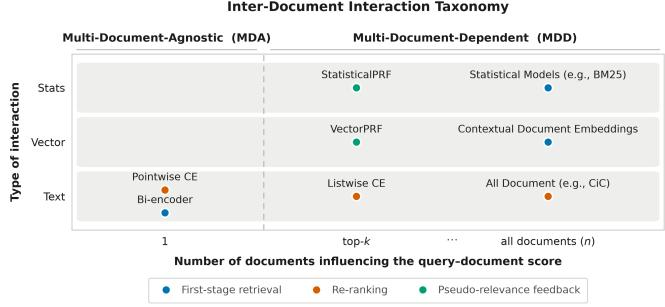
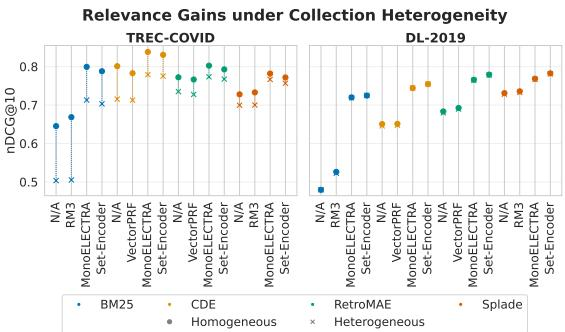

# Robustness of IR Models to Collection Growth

Emmanouil Georgios Lionis University of Glasgow Glasgow, United Kingdom e.lionis.1@research.gla.ac.uk

Sean MacAvaney University of Glasgow Glasgow, United Kingdom Sean.MacAvaney@glasgow.ac.uk

Debasis Ganguly University of Glasgow Glasgow, United Kingdom debasis.ganguly@glasgow.ac.uk

## Abstract

Information Retrieval (IR) systems seek to identify relevant documents within a collection. In practical applications, collections are dynamic, with documents frequently added. We argue that ideally, a retriever’s efectiveness should not decrease when non-relevant documents are added to a collection. This study formalises this concept and empirically evaluates it by merging two collections with negligible topic overlap. We hypothesise that the way an IR model conditions its ranking on other documents in a collection (e.g., the IDF component in BM25 or contextual documents in listwise rerankers) plays an important role in its robustness to the addition of non-relevant documents. We broadly classify models as those that do not depend on other documents (Multi-Document-Agnostic, MDA) and those that do (Multi-Document-Dependent, MDD). Our results show that neither MDD nor MDA models are fully robust to the addition of non-relevant documents, as all models exhibit some performance degradation. Interestingly, among the models we test, MDA is more efective than MDD for retrieval, whereas MDD and MDA rerankers are equally efective.

§ lionisakis/subcollection

## CCS Concepts

• Computing methodologies → Information extraction; • Information systems → Document representation; Retrieval tasks and goals; Evaluation of retrieval results.

## Keywords

Information Retrieval, Neural IR, Robustness, Collection Growth

## ACM Reference Format:

Emmanouil Georgios Lionis, Sean MacAvaney, and Debasis Ganguly. 2026. Robustness of IR Models to Collection Growth. In Proceedings of the 35th ACM International Conference on Information and Knowledge Management (CIKM ’26), November 07–11, 2026, Rome, Italy. ACM, New York, NY, USA, 7 pages. https://doi.org/10.1145/3799682.3839935

## 1 Introduction

Ad hoc retrieval, a core task in Information Retrieval (IR), aims to rank documents from a given collection according to their relevance to a user query. In real-world retrieval systems, document collec tions are rarely static; they continually evolve through additions, updates, and deletions as content changes over time [15, 43]. We believe that adding new documents to a collection should not decrease retrieval efectiveness for queries whose information needs are defined with respect to the pre-existing collection. Symmetrically, retrieval efectiveness for queries targeting information needs associated with the newly added documents should remain unaffected by the presence of older, unrelated content. In summary, for any query whose relevant documents are limited to a specific subset of the collection, retrieval performance should remain invariant to the addition of documents that are non-relevant to that query.

In the present work, we term this property as the robustness to non-relevant additions and formalise it as the collection growth axiom (CG Axiom). Notably, this formulation difers from prior research on out-of-domain collection robustness, such as multiple out-of-domain collection evaluation (BEIR [37]), corpus subsam pling for large-scale evaluation [9], temporal collection growth with new queries regardless of document relevance [15, 21, 43], or adversarial additions [20].

To empirically evaluate this robustness, we examine IR systems with multiple components that can be afected by collection growth. We consider the degree and manner in which each model accounts for other documents in the collection (their interdocument dependencies) as essential to its capacity to handle nonrelevant documents within the collection. Two principal categories of inter-document dependency are identified in this study, as depicted in Figure 1. Multi-Document-Agnostic (MDA) models compute relevance scores independently, without reference to other documents in the collection. Examples include Dense Retrievers (DR) [12, 16], Learned Sparse Retrievers (LSR) [8, 24, 25], and pointwise Cross Encoders (CE) [3, 27, 28]. In contrast, Multi-Document-Dependent (MDD) approaches incorporate external context or collection-level information into the scoring process. Some MDD models are conditioned on the top-� documents returned by a retriever, such as Pseudo-Relevance Feedback [14, 17, 19, 32] and listwise CE [30, 33, 36]. Others do not rely on explicit conditioning and instead gather contextual information from the entire collection, as in clustering-based methods [35], including Contextual Document Embeddings (CDE) [23], traditional probabilistic retrieval models [1, 2, 10, 31] and Corpus-in-Context (CiC) [18]. Such models are typically employed in a multi-stage pipeline comprising firststage retrievers and second-stage re-rankers [11, 22, 25], where retrievers select a candidate set from a large corpus, and re-rankers refine the ranking to improve precision at top ranks.

To empirically test the robustness of an IR model to the addition of non-relevant documents, we require an evaluation setting that expands the collection while preserving relevance semantics. We therefore construct a heterogeneous collection by merging two standard IR benchmark collections, each with its own relevance judgements, which remain applicable to the combined corpus. We further require that the two collections have negligible topical overlap, so that documents from one collection can be treated as non-relevant additions with respect to queries from the other. This design provides a controlled testbed to examine whether IR models maintain retrieval efectiveness amid collection growth.

We evaluate a diverse set of IR models on this heterogeneous benchmark to assess their behaviour under collection growth. Our analysis reveals that existing retrieval models exhibit varying degrees of robustness to the addition of non-relevant documents. These observations point to a systematic limitation of current IR architectures in evolving collections and motivate the need for retrieval models explicitly designed to handle collection growth.

In summary, this work ofers the following contributions: (1) we propose the measurement of IR systems based on their robustness to the addition of non-relevant content via the mathematical CG Axiom; (2) we propose a novel taxonomy of IR models characterised by types of inter-document dependency and mode of interaction query-document; (3) We examine whether IR models with diverse architectural and scoring characteristics satisfy robustness to additional non-relevant content under controlled collection growth.

## 2 Collection Growth

Collections are rarely static in production, with non-relevant documents continuously added. Thus, a well-behaved system should not demote relevant documents in response to such additions. To precisely characterise this invariance, we formalise this via an IR axiom, which states desirable system properties [6, 13, 34]. Let $\mathcal { L } _ { k } ( C , q )$ denote the top-� list of documents obtained by executing a retriever on a collection �. We introduce the Collection Growth (CG) Axiom to formalise the characteristic of robustness to nonrelevant collection expansion as a necessary rationality, as shown below:

Axiom (CG – Collection Growth). Let C be an existing collection ofdocuments to which a set ofnew documents D are added to yield a larger collection $C ^ { + } = C \cup { \mathcal { D } }$ . Retrieval performance of a model � measured with a metric $M : \mathcal { L } _ { k } ( C , q ) \mapsto \mathbb { R }$ for a query � should then satisfy:

$$
\forall d \in \mathcal { D } : \mathrm { r e l } ( q , d ) = 0 \Rightarrow \frac { M ( \mathcal { L } _ { k } ( C ^ { + } , q ) ) - M ( \mathcal { L } _ { k } ( C , q ) ) } { M ( \mathcal { L } _ { k } ( C , q ) ) } \leq \epsilon\tag{1}
$$

where $\epsilon \in \mathbb { R } ^ { + }$ is a small positive number. The axiom states retrieval model performance of a query whose relevant documents are limited to a specific subset ofthe collection (C) should remain invariant up to a certain small diference to the addition of documents $( C ^ { + } )$ that are non-relevant to that query.

One way to confirm robustness to non-relevant document addition is to verify Equation 1 by measuring retrieval performance through �. Yet � does not capture the origin of � $\in \mathcal { L } _ { k } ( C + , q )$ This issue is more pronounced when C and D have diferent topics or information. When a query is formulated for C, then the retriever should surface only � $\in C$ as all $d \in D$ are out of topic. We quantify this with Collection Precision (CP), the proportion of top-� results drawn from the original collection C. Formally,

$$
\mathrm { C P } ( C , \mathcal { L } _ { k } ( C ^ { + } , q ) ) = \frac { 1 } { k } \sum _ { d \in \mathcal { L } _ { k } ( C ^ { + } , q ) } \mathbb { I } \left[ d \in C \right] .\tag{2}
$$

  
Figure 1: Inter-Document Interaction Taxonomy. Models are organ ised by (i) how many documents influence scoring (single, top-k, all) and (ii) interaction type (text, vector, statistics), distinguishing MDA methods that score documents independently from MDD methods that model inter-document dependencies, with representative retrieval and re-ranking approaches shown.

## 3 Inter-Document Dependency

This section formalises our taxonomy of multi-document dependency, showing how retrieval and ranking architectures model inter-document dependency in relevance estimation (Figure 1).

## 3.1 Multi-Document-Agnostic (MDA) Models

MDA models estimate relevance independently for each document through query–document interaction, without using interdocument or collection-level context.

Bi-Encoders and Cross-Encoders (CE). Bi-encoders [8, 12, 16, 24, 25] estimate relevance by independently encoding the query and document representations followed by a similarity score computation (e.g., dot-product between the embedded vectors), without conditioning on any other documents. Formally,

$$
S _ { \mathrm { b i } } ( q , d ) = f ( E _ { \theta } ( q ) , E _ { \theta } ( d ) ) ,\tag{3}
$$

where $S _ { \mathrm { b i } } ( q , d )$ denotes the estimated relevance score of document � to query $q , E _ { \theta } ( \cdot ) : t \mapsto \mathbb { R } ^ { d }$ represents an embedding of text � into a dense vector of some dimension � obtained via an encoder model �, and � is a similarity function (e.g., a dot product between the embedded vectors). In contrast to the separate encoding of queries and documents, pointwise CE [3, 27, 28] jointly encode a query and a document to estimate the relevance score. Similar to bi-encoders, in pointwise CE models the relevance computation is independent of other documents in the collection or any other collection statistics. Formally,

$$
S _ { \mathrm { p o i n t } } ( q , d ) = E _ { \theta } ( q , d ) ,\tag{4}
$$

where similar to Equation 3, �� is an encoder model. The bi-encoders and point-wise cross-encoders are hence shown to belong to the bottom-left part of Figure 1, as these both are multi-document agnostic. Through Equations 3 and 4, it can be seen that each query–document pair score is computed independently from other candidates or corpus-level information.

## 3.2 Multi-Document-Dependent (MDD)

MDD models estimate relevance conditioned on information beyond an isolated query-document pair, with scores that depend on other retrieved documents, candidate sets, or collection-level statistics, thereby inducing structured dependence through shared context, feedback signals, or the global corpus structure.

Table 1: Statistics and relevance label distributions for TREC-COVID and DL-2019. Hom, Het, and Het+ represent the original, combined, and augmented qrel configurations, respectively.
<table><tr><td rowspan="2">Statistic</td><td colspan="2">TREC-COVID</td><td colspan="3">DL-2019</td></tr><tr><td>Hom</td><td>Het</td><td>Hom</td><td>Het</td><td> $\mathrm { H e t ^ { + } }$ </td></tr><tr><td>Total Documents</td><td>171K</td><td>9.1M</td><td>8.8M</td><td>9.1M</td><td>9.1M</td></tr><tr><td>Avg. Doc. Length</td><td>197.1</td><td>58.3</td><td>56.3</td><td>58.3</td><td>58.3</td></tr><tr><td>TREC-COVID Docs (%)</td><td>100.0</td><td>1.9</td><td>0.0</td><td>1.9</td><td>1.9</td></tr><tr><td>MS MARCO Docs (%)</td><td>0.0</td><td>98.1</td><td>100.0</td><td>98.1</td><td>98.1</td></tr><tr><td>Total Queries</td><td>200</td><td>200</td><td>50</td><td>50</td><td>50</td></tr><tr><td>Avg. Query Length</td><td>10.6</td><td>10.6</td><td>5.8</td><td>5.8</td><td>5.8</td></tr><tr><td>Total Qrels</td><td>66,336</td><td>66,336</td><td>9,260</td><td>9,260</td><td>9,273</td></tr></table>

Listwise Cross-Encoders. Listwise CE models [30, 33, 36] estimate the relevance conditioned on the candidate set itself (which is often a window of documents to rerank), making each document’s score dependent on the presence and content of other retrieved documents within the local window. Formally,

$$
S _ { \mathrm { l i s t } } ( q , d ) = E _ { \boldsymbol \theta } ( q , d , d _ { 1 } ^ { \prime } , \cdot \cdot \cdot d _ { n } ^ { \prime } , ) ,\tag{5}
$$

where $d ^ { \prime } \in { \mathcal { L } } _ { k } ( C , q )$ and � defined by the model $( n = 1$ in a Pairwise CE [29] while $n = 1 0$ in a listwise CE, like RankZephyr [30]). In Equation 5 we note that in contrast to $S _ { \mathrm { p o i n t } } ( q , d ) \ ( \mathrm { E q . \ 4 } )$ , the similarity now depends on $\mathcal { L } _ { k } ( C , q )$ , which means that growing a collection from $c$ to $C ^ { \prime }$ may have a more pronounced efect on the quality of the retrieved results.

Pseudo Relevance Feedback (PRF). PRF models [17, 19, 32] enrich the information need of a query by including additional terms (in sparse representations) or modifying the query vector (for dense representations). The modified query $q ^ { + }$ is then used to either rerank the initial results or execute a second-stage retrieval. Formally, the PRF-based scoring is of the form:

$$
S _ { \mathrm { P R F } } ( q , d ) = f ( q ^ { + } , d ) , \mathrm { w h e r e } q ^ { + } = g ( q , d _ { 1 } ^ { \prime } , \cdot \cdot \cdot d _ { n } ^ { \prime } , ) ,\tag{6}
$$

where � is a function that derives the new query representation given the $d ^ { \prime } \in \mathcal { L } _ { k } ( C , q )$ . Typically $n = 4$ in PRF models [17, 19, 32].

Equation 6 manifests diferently under statistical and vectorbased implementations, and collection growth impacts each through distinct mechanisms. Statistical PRF [17, 32, 44] constructs $q ^ { + }$ from term co-occurrence statistics over $\mathcal { L } _ { k } ( C , q )$ , coupling local top-� evidence with global collection statistics, a dual dependency reflected by its position in Figure 1. Collection growth therefore exposes statistical PRF through two channels: new terms $t \in C ^ { + } \setminus C$ can enter $q ^ { + }$ . Dense vector PRF [19, 41] takes the same top-� signal but encodes it as document embeddings, bypassing collection statistics entirely. Though Vector PRF may still be negatively influenced through the non-relevant documents in $\mathcal { L } _ { k } ( C , q )$ , as they will enrich the queries’ representation.

Contextual Document Encoding (CDE). CDE [23] encodes document representations conditioned on local neighbourhoods of document clusters. The model induces dependency through a contextual structure derived from the entire index rather than through direct document interaction. In general, this scoring function in CDE is of the form

  
Figure 2: Relevance shifts under collection growth. Results are reported for nDCG@10 on TREC-COVID and DL-2019, evaluated on homogeneous (Circle) and heterogeneous (Cross, TREC-COVID + DL-2019) collections.

$$
S _ { \mathrm { C D E } } ( q , d ) = f ( E _ { \theta } ( q ) , E _ { \theta } ( d ) , \sum _ { d ^ { \prime } \in N _ { p } ( d ) } E _ { \theta } ( d ^ { \prime } ) ) ,\tag{7}
$$

where $N _ { p } ( d )$ denotes a �-sized cluster of document � derived during indexing. This approach relies on collection-based clusters that influence the relevance score of a query-document, thereby justifying its placement in Figure 1. Collection growth can lead to new (distractor) documents in a neighbourhood $N _ { p } ( d )$ of a document $d \in C .$ , which, in turn, may significantly change $\begin{array} { r } { \sum _ { d ^ { \prime } \in N _ { p } ( d ) } E _ { \theta } ( d ^ { \prime } ) } \end{array}$ where $d ^ { \prime } \in C ^ { + } - C$

Lexical Retrievers. Lexical retrievers [1, 2, 31] typically use document-term weights $P ( t | d )$ and corpus statistics $P ( t | C )$ to compute similarity scores of the form

$$
S _ { \mathrm { L e x } } ( q , d ) = \sum _ { t \in q } f ( P ( t | d ) , P ( t | C ) ) ,\tag{8}
$$

and, like sparse PRF, can substantially alter scores as the collection grows due to shifts in collection statistics.

## 4 Experiments and Discussion

Research Questions. This study investigates three central Research Questions (RQ) regarding inter-document dependency in the context of robustness to non-relevant document addition collection growth: RQ1: Do first-stage MDD models outperform MDA ones under collection growth? RQ2: Does PRF enhance MDA retrievers by inducing MDD behaviour in a collection growth setting? RQ3: Does incorporating MDD improve re-ranking performance in a collection growth setting?

Datasets and Data Integrity. MS MARCO [26] and TREC-COVID [37, 39, 40] were combined to simulate collection growth, yielding 9.1M documents (MS MARCO: 98.1%; TREC-COVID: 1.9%). We term the original collection as Homogeneous (Hom) while the merged collection as Heterogeneous (Het). We exclusively use the DL-2019 queries [5] to minimise topical overlap with TREC-COVID. This is allowed because both MS MARCO passages and DL-2019 queries predate 2019, whereas TREC-COVID documents and their queries were created after 2019 and are pandemic-focused. DL-2020 queries were excluded to avoid health- or coronavirus-related bias.

Table 2: Performance of diferent IR models under collection growth. Results are reported for TREC-COVID and TREC DL-2019 on homogeneous (Hom) and heterogeneous (Het ≡ TREC-COVID + DL-2019). Arrows and colour indicate the sign of $\Delta ( M ) = \left( M _ { \mathrm { H e t } } - M _ { \mathrm { H o m } } \right) / M _ { \mathrm { H o m } } .$ Bold font marks the best value in each metric column, and underline indicates the best value among N/A, RM3, and VectorPRF. Statistical significant diferences (� < 0.05) are indicated with the following: ★ compares CDE N/A with other N/A variants; ⋄ compares each Hom and Het indicated above Δ; † compares the N/A baseline with variations in each group; ‡ compares the Set-Encoder and corresponding MonoElectra in each group.
<table><tr><td colspan="9"></td><td colspan="8">DL-2019</td></tr><tr><td></td><td></td><td></td><td colspan="3">nDCG@10</td><td colspan="3">P@100</td><td>CP@10</td><td colspan="3">nDCG@10</td><td colspan="2">R(rel=2)@100</td><td colspan="2">CP@10</td></tr><tr><td colspan="2">Retriever Reranker</td><td>Type</td><td>Hom</td><td>Het</td><td>Δ</td><td>Hom</td><td>Het</td><td>Δ</td><td>Het</td><td>Hom</td><td>Het</td><td>Δ</td><td>Hom</td><td>Het</td><td>Δ</td><td>Het</td></tr><tr><td rowspan="4">BM25</td><td>N/A</td><td>MDD</td><td>.645*</td><td></td><td>.503* ↓ .220°</td><td>.531*</td><td></td><td>.341* ↓ .358°</td><td>.862*</td><td>.479*</td><td>.480*↑</td><td>.000</td><td>.488*</td><td>.489*↑ .002</td><td></td><td>.997</td></tr><tr><td>RM3</td><td>MDD</td><td>.668</td><td>.505</td><td>↓.244°</td><td>.556</td><td>.363</td><td>↓.347°</td><td>.842</td><td>.526†</td><td>.523†</td><td>↓.007</td><td>.507†</td><td>.505†</td><td>↓ .005</td><td>.999†</td></tr><tr><td>MonoELECTRA MDA</td><td></td><td>.799†</td><td>.713†</td><td>↓ .108°</td><td>.531</td><td>.340</td><td>↓.359°</td><td>.932†</td><td>.720†</td><td>.719†</td><td>↓.001</td><td>.488</td><td>.489</td><td>↑.001</td><td>.999</td></tr><tr><td>Set-Encoder</td><td>MDD</td><td>.788†</td><td>.703†</td><td>↓.108°</td><td>.531</td><td>.340</td><td>↓.359°</td><td>.924†</td><td>.725†</td><td>.725†</td><td>↑.001</td><td>.488</td><td>.489</td><td>↑.001</td><td>.999</td></tr><tr><td rowspan="4">CDE</td><td>N/A</td><td>MDD</td><td>.801</td><td>.716</td><td>↓.107°</td><td>.656</td><td>.515</td><td>↓.214°</td><td>.924</td><td>.650</td><td>.646</td><td>↓.007</td><td>.573</td><td>.572</td><td>↓.001</td><td>.997</td></tr><tr><td>VectorPRF</td><td>MDD</td><td>.783</td><td>.713</td><td>↓.089°</td><td>.628†</td><td>.556†</td><td>↓ .115°</td><td>.906</td><td>.651</td><td>.648</td><td>↓.005</td><td>.589</td><td>.592</td><td>↑.004</td><td>.996</td></tr><tr><td>MonoELECTRA MDA</td><td></td><td>.838†</td><td>.779†</td><td>↓ .071°</td><td>.655</td><td>.516</td><td>↓ .213°</td><td>.952†</td><td>.744†</td><td>.744†</td><td>- .000</td><td>.573</td><td>.572</td><td>↓.001</td><td>.999</td></tr><tr><td>Set-Encoder</td><td>MDD</td><td>.831†</td><td>.775†</td><td>↓ .067°</td><td>.655</td><td>.516</td><td>↓ .213°</td><td>.952†</td><td>.754†</td><td>.755†</td><td>↑.000</td><td>.573</td><td>.572</td><td>↓ .001</td><td>.999</td></tr><tr><td rowspan="4">SPLADE</td><td>N/A</td><td>MDA</td><td>.728*</td><td>.700*</td><td>.039</td><td>.562*</td><td>.547*</td><td>↓.026</td><td>.950</td><td>.731*</td><td>.728*</td><td>↓.004</td><td>.639</td><td>.635</td><td>↓.006</td><td>.997</td></tr><tr><td>RM3</td><td>MDD</td><td>.733</td><td>.700</td><td>↓.045</td><td>.568†</td><td>.547†</td><td>↓.036°</td><td>.942</td><td>.736</td><td>.733</td><td>↓.004</td><td>.643</td><td>.638</td><td>↓.009</td><td>.997</td></tr><tr><td>MonoELECTRA MDA</td><td></td><td>.782†</td><td>.767†</td><td>↓.019</td><td>.562</td><td>.547</td><td>↓.026</td><td>.966</td><td>.768</td><td>.767†</td><td>↓.002</td><td>.639</td><td>.635</td><td>↓.006</td><td>.998</td></tr><tr><td>Set-Encoder</td><td>MDD</td><td>.772</td><td>.757</td><td>↓.020</td><td>.562</td><td>.547</td><td>↓.026</td><td>.970</td><td>.782†</td><td>.781†</td><td>↓.002</td><td>.639</td><td>.635</td><td>↓.006</td><td>.999</td></tr><tr><td rowspan="4">RetroMAE</td><td>N/A</td><td>MDA</td><td>.772</td><td>.735</td><td>↓.048</td><td>.574*</td><td>.550*</td><td>↓.041°</td><td>.924</td><td>.683</td><td>.680</td><td>↓.005</td><td>.610</td><td>.609</td><td>↓.002</td><td>.998</td></tr><tr><td>VectorPRF</td><td>MDD</td><td>.766</td><td>.728</td><td>↓ .051°</td><td>.579</td><td>.554</td><td>↓.042</td><td>.928</td><td>.692</td><td>.690</td><td>↓.004</td><td>.627</td><td>.624</td><td>↓ .006</td><td>.999</td></tr><tr><td>MonoELECTRA MDA</td><td></td><td>.802</td><td>.773</td><td>↓.036</td><td>.574</td><td>.550</td><td>↓ .041°</td><td>.952</td><td>.766†</td><td>.764†</td><td>↓.002</td><td>.610</td><td>.609</td><td>↓.002</td><td>.999</td></tr><tr><td>Set-Encoder</td><td>MDD</td><td>.793</td><td>.767</td><td>↓.032</td><td>.574</td><td>.550</td><td>↓ .041°</td><td>.960</td><td>.779†</td><td>.778†</td><td>↓.002</td><td>.610</td><td>.609</td><td>↓.002</td><td>.999</td></tr></table>

To estimate the total number of new relevant documents this merged collection may introduce, we conducted a relevanceestimation validation. Firstly, we found that no MS MARCO documents are relevant to TREC-COVID queries, as pre-2019 corpus entries contain no SARS-CoV-2-specific content (e.g., docno: 410049). For the DL-2019 queries, we manually flagged two queries (792752, 1108939) as potentially health-related. Across all retrieval pipelines, 13 TREC-COVID documents appeared in their top-� lists given those queries and we assested their relevance via the Umbrella [38] framework, yielding $\{ R e l _ { 0 } { : } 5 , \ R e l _ { 1 } { : } 2 , \ R e l _ { 2 } { : } 6 , \ R e l _ { 3 } { : } 0 \} ^ { 1 }$ . The results2 with the new Umbrella relevance distribution demonstrate the same trends as with the results DL-2019 (Table 2).

## Model Configuration. We evaluate the following:

• Retrievers: As MDD we evaluate BM25 [31] (statistical) and CDE [23] (dense), while as MDA we evaluate RetroMAE [42] (dense) and SPLADE [7] (sparse) bi-encoders.

• Converters: As MDA to MDD converters we utilize RM3 [14] applied to lexical retrievers (BM25, SPLADE) and VectorPRF [19] applied to dense retrievers (RetroMAE, CDE). Both PRFs use the top-10 feedback documents.

• Rerankers: As MDA we evaluate monoELECTRA [4, 33], while as MDD we use Set-Encoders [33]. Both re-rank the top 100 candidates and follow the specifications of [33].

Metrics. Ranking efectiveness is measured using nDCG@10. The quality of document first-stage candidates is evaluated with Recall at a relevance cutof of 2 (�(��� = 2)@100) for DL-2019 and with Precision (P@100) for TREC-COVID, reflecting the high density of relevant documents. Collection interaction is quantified using CP@10, as defined in Eq. (2).

Discussion. Figure 2 shows an asymmetric efect of collection heterogeneity. Specifically, TREC-COVID performance (Δ����@10) drops � ≈ [−0.244, −0.019] under heterogeneous conditions, while DL-2019 remains stable � ≈ [−0.009, +0.002]. As the � is large in TREC-COVID, no model satisfies the CG Axiom (Eq. 1). In contrast, for DL-2019, the observed stability in performance (� is very small) and near-perfect CP@10 ensure that the CG Axiom is satisfied. This diference is attributed to the retrievers’ pre-training on MS MARCO and the large dominant subcollection (98.1%).

RQ1. To verify whether MDD or MDA retrievers are robust, we evaluate them across the heterogeneous collections. Given Table 2, MDA retrievers achieve the highest $n D C G _ { \mathrm { H e t } } @ 1 0$ performance for both TREC-COVID (RetroMAE: 0.735, SPLADE: 0.700) and DL-2019 (RetroMAE: 0.680, SPLADE: 0.728). In contrast, MDD retrievers experience a substantial performance decrease (Δ����@10) on TREC-COVID (BM25: −0.220; CDE: −0.107) in comparison to MDA (approx. 0.1). For DL-2019 queries, MDD achieves fewer overall decreases in recall and performance compared to MDA approaches, while recall increases for BM25 (Δ�(��� = 2)@100: 0.002). Overall, first-stage MDA retrievers exhibit the least degradation and remained robust to topic and temporal shifts, whereas MDD retrievers were more biased toward the larger collection and can improve performance under certain conditions.

RQ2. To verify whether PRF compensates for the absence of MDA characteristics in MDD retrievers, we evaluate the PRF component in both MDA and MDD retrievers in our setup. Given Table 2 and the TREC-COVID setting, for all retrievers, when a PRF component is added, we observe a higher decrease in ����@10 and/or in ����@10 compared to not adding any component (N/A) (RetroMAE-N/A: 0.735 vs RetroMAE-VectorPRF: 0.728). On the other hand, in DL-2019, the ���@10 performance is consistently better when no component is added (N/A) (Splade-N/A: 0.728 vs Splade-RM3: 0.733). Notably, for CDE in Trec-COVID, not only does performance decrease, but CP@10 also drops from 0.924 to 0.906. In other words, when we retrieve questions targeted at the larger collection, performance improves, whereas retrieving for the smaller collection hurts performance. Overall, PRF demonstrates bias toward the dominant collection and the documents retrieved in the top-k, regardless of the specific query intent.

RQ3. Lastly, to validate the robustness of MDA and MDD rerankers given our collection growth, we evaluate them in our setting. On Table 2 and in the TREC-COVID queries, MDD and MDA achieve nearly identical ����@10 values (CDE-MonoElectra: 0.779, CDE-Set-Encoder: 0.775), representing the best results across all combinations. This small diference (0.002) indicates comparable performance between MDA and MDD. A similar trend is observed with ��@10 (SPLADE-MonoELECTRA: 0.966, SPLADE-Set-Encoder: 0.700), with minimal diference between rerankers (0.004). For DL-2019, MDD achieves a higher nDCG@10 (SPLADE-MonoELECTRA: 0.767, SPLADE-Set-Encoder: 0.781) by 0.014 points. Overall, both MDD and MDA rerankers perform competitively when non-relevant documents were added. Thus, both MDD and MDA rerankers perform competitively, confirming that rerankers are robust to collection growth of non-relevant documents.

## 5 Conclusion

This study demonstrates that retrieval pipelines vary in their robustness to the addition of irrelevant documents. MDA retrievers are more robust during first-stage retrieval in heterogeneous, nonrelevant document additions, while both MDA and MDD rerankers are equally robust at the reranking stage. Additionally, PRF modules exhibit bias in larger collections, rendering them inefective when the introduced paradigm is detected. These results highlight that current IR architectures exhibit systematic limitations as collections grow. Addressing this requires retrieval models that account for both pipeline stage and evolving collection characteristics from the outset.

## Limitations

Our study simulates collection growth with a single corpus pairing, MS MARCO and TREC-COVID, where the injected subcollection forms only 1.9% of the merged corpus. However, the CG Axiom and the MDA/MDD taxonomy remain corpus-agnostic, and they extend to other domains and injection ratios in future work. This imbalance, together with the shared MS MARCO pre-training, may drive our results as much as inter-document dependency itself.

## GenAI Usage Disclosure

Generative AI was used solely for coding, grammar and phrasing assistance. All scientific content, methodology, and conclusions are the authors’ own.

## References

[1] Giambattista Amati. 2006. Frequentist and Bayesian Approach to Information Retrieval. In Advances in Information Retrieval, 28th European Conference on IR Research, ECIR 2006, London, UK, April 10-12, 2006, Proceedings (Lecture Notes in Computer Science, Vol. 3936), Mounia Lalmas, Andy MacFarlane, Stefan M. Rüger, Anastasios Tombros, Theodora Tsikrika, and Alexei Yavlinsky (Eds.). Springer, 13–24. doi:10.1007/11735106\_3

[2] Gianni Amati and C. J. van Rijsbergen. 2002. Probabilistic models of information retrieval based on measuring the divergence from randomness. ACM Trans. Inf. Syst. 20, 4 (2002), 357–389. doi:10.1145/582415.582416

[3] Dongmei Chen, Sheng Zhang, Xin Zhang, and Kaijing Yang. 2020. Cross-Lingual Passage Re-Ranking With Alignment Augmented Multilingual BERT. IEEE Access 8 (2020), 213232–213243. doi:10.1109/ACCESS.2020.3041605

[4] Kevin Clark, Minh-Thang Luong, Quoc V. Le, and Christopher D. Manning. 2020. ELECTRA: Pre-training Text Encoders as Discriminators Rather Than Generators. In 8th International Conference on Learning Representations, ICLR 2020, Addis Ababa, Ethiopia, April 26-30, 2020. OpenReview.net. https://openreview.net/ forum?id=r1xMH1BtvB

[5] Nick Craswell, Bhaskar Mitra, Emine Yilmaz, Daniel Campos, and Ellen M. Voorhees. 2020. Overview of the TREC 2019 deep learning track. CoRR abs/2003.07820 (2020). arXiv:2003.07820 https://arxiv.org/abs/2003.07820

[6] Hui Fang and ChengXiang Zhai. 2006. Semantic term matching in axiomatic approaches to information retrieval. In SIGIR 2006: Proceedings of the 29th Annual International ACM SIGIR Conference on Research and Development in Information Retrieval, Seattle, Washington, USA, August 6-11, 2006, Efthimis N. Efthimiadis, Susan T. Dumais, David Hawking, and Kalervo Järvelin (Eds.). ACM, 115–122. doi:10.1145/1148170.1148193

[7] Thibault Formal, Carlos Lassance, Benjamin Piwowarski, and Stéphane Clinchant. 2022. From Distillation to Hard Negative Sampling: Making Sparse Neural IR Models More Efective. In SIGIR ’22: The 45th International ACM SIGIR Conference on Research and Development in Information Retrieval, Madrid, Spain, July 11 - 15, 2022, Enrique Amigó, Pablo Castells, Julio Gonzalo, Ben Carterette, J. Shane Culpepper, and Gabriella Kazai (Eds.). ACM, 2353–2359. doi:10.1145/3477495. 3531857

[8] Thibault Formal, Benjamin Piwowarski, and Stéphane Clinchant. 2021. SPLADE: Sparse Lexical and Expansion Model for First Stage Ranking. In SIGIR ’21: The 44th International ACM SIGIR Conference on Research and Development in Information Retrieval, Virtual Event, Canada, July 11-15, 2021, Fernando Diaz, Chirag Shah, Torsten Suel, Pablo Castells, Rosie Jones, and Tetsuya Sakai (Eds.). ACM, 2288– 2292. doi:10.1145/3404835.3463098

[9] Maik Fröbe, Andrew Parry, Harrisen Scells, Shuai Wang, Shengyao Zhuang, Guido Zuccon, Martin Potthast, and Matthias Hagen. 2025. Corpus Subsampling: Estimating the Efectiveness of Neural Retrieval Models on Large Corpora. In Advances in Information Retrieval, Claudia Hauf, Craig Macdonald, Dietma Jannach, Gabriella Kazai, Franco Maria Nardini, Fabio Pinelli, Fabrizio Silvestri, and Nicola Tonellotto (Eds.). Springer Nature Switzerland, Cham, 453–471.

[10] Debasis Ganguly, Dwaipayan Roy, Mandar Mitra, and Gareth J. F. Jones. 2015. Word Embedding based Generalized Language Model for Information Retrieval. In Proceedings ofthe 38th International ACM SIGIR Conference on Research and Development in Information Retrieval, Santiago, Chile, August 9-13, 2015, Ricardo Baeza-Yates, Mounia Lalmas, Alistair Mofat, and Berthier A. Ribeiro-Neto (Eds.). ACM, 795–798. doi:10.1145/2766462.2767780

[11] Jiafeng Guo, Yinqiong Cai, Yixing Fan, Fei Sun, Ruqing Zhang, and Xueqi Cheng. 2022. Semantic Models for the First-Stage Retrieval: A Comprehensive Review. ACM Trans. Inf. Syst. 40, 4 (2022), 66:1–66:42. doi:10.1145/3486250

[12] Jiafeng Guo, Yixing Fan, Qingyao Ai, and W. Bruce Croft. 2016. A Deep Relevance Matching Model for Ad-hoc Retrieval. In Proceedings ofthe 25th ACMInternational Conference on Information and Knowledge Management, CIKM 2016, Indianapolis, IN, USA, October 24-28, 2016, Snehasis Mukhopadhyay, ChengXiang Zhai, Elisa Bertino, Fabio Crestani, Javed Mostafa, Jie Tang, Luo Si, Xiaofang Zhou, Yi Chang, Yunyao Li, and Parikshit Sondhi (Eds.). ACM, 55–64. doi:10.1145/2983323.2983769

[13] Maximilian Heinrich, Marvin Vogel, Alexander Bondarenko, Matthias Hagen, and Benno Stein. 2025. Axiomatic Re-Ranking for Argument Retrieval. In Proceedings ofthe 48th International ACM SIGIR Conference on Research and Development in Information Retrieval, SIGIR 2025, Padua, Italy, July 13-18, 2025, Nicola Ferro, Maria Maistro, Gabriella Pasi, Omar Alonso, Andrew Trotman, and Suzan Verberne (Eds.). ACM, 2864–2869. doi:10.1145/3726302.3730169

[14] Nasreen Abdul Jaleel, James Allan, W. Bruce Croft, Fernando Diaz, Leah S. Larkey, Xiaoyan Li, Mark D. Smucker, and Courtney Wade. 2004. UMass at TREC 2004: Novelty and HARD. In Proceedings ofthe Thirteenth Text REtrieval Conference, TREC 2004, Gaithersburg, Maryland, USA, November 16-19, 2004 (NIST Special Publication, Vol. 500-261), Ellen M. Voorhees and Lori P. Buckland (Eds.). National Institute of Standards and Technology (NIST). http://trec.nist.gov/pubs/trec13/ papers/umass.novelty.hard.pdf

[15] Jüri Keller, Timo Breuer, and Philipp Schaer. 2024. Evaluation of Temporal Change in IR Test Collections. In Proceedings ofthe 2024 ACM SIGIR International Conference on Theory ofInformation Retrieval, ICTIR 2024, Washington, DC, USA,

13 July 2024, Harrie Oosterhuis, Hannah Bast, and Chenyan Xiong (Eds.). ACM 3–13. doi:10.1145/3664190.3672530

[16] Omar Khattab and Matei Zaharia. 2020. ColBERT: Eficient and Efective Passage Search via Contextualized Late Interaction over BERT. In Proceedings ofthe 43rd International ACM SIGIR conference on research and development in Information Retrieval, SIGIR 2020, Virtual Event, China, July 25-30, 2020, Jimmy X. Huang, Yi Chang, Xueqi Cheng, Jaap Kamps, Vanessa Murdock, Ji-Rong Wen, and Yiqun Liu (Eds.). ACM, 39–48. doi:10.1145/3397271.3401075

[17] Victor Lavrenko and W. Bruce Croft. 2001. Relevance-Based Language Models. In SIGIR 2001: Proceedings ofthe 24th Annual International ACM SIGIR Conference on Research and Development in Information Retrieval, September 9-13, 2001, New Orleans, Louisiana, USA, W. Bruce Croft, David J. Harper, Donald H. Kraft, and Justin Zobel (Eds.). ACM, 120–127. doi:10.1145/383952.383972

[18] Jinhyuk Lee, Anthony Chen, Zhuyun Dai, Dheeru Dua, Devendra Singh Sachan, Michael Boratko, Yi Luan, Sébastien M. R. Arnold, Vincent Perot, Siddharth Dalmia, Hexiang Hu, Xudong Lin, Panupong Pasupat, Aida Amini, Jeremy R. Cole, Sebastian Riedel, Iftekhar Naim, Ming-Wei Chang, and Kelvin Guu. 2024. Can Long-Context Language Models Subsume Retrieval, RAG, SQL, and More? CoRR abs/2406.13121 (2024). arXiv:2406.13121 doi:10.48550/ARXIV.2406.13121

[19] Hang Li, Ahmed Mourad, Shengyao Zhuang, Bevan Koopman, and Guido Zuccon. 2023. Pseudo Relevance Feedback with Deep Language Models and Dense Retrievers: Successes and Pitfalls. ACM Trans. Inf. Syst. 41, 3 (2023), 62:1–62:40. doi:10.1145/3570724

[20] Yu-An Liu, Ruqing Zhang, Jiafeng Guo, Maarten de Rijke, Yixing Fan, and Xueqi Cheng. 2024. Robust Neural Information Retrieval: An Adversarial and Out-of distribution Perspective. CoRR abs/2407.06992 (2024). arXiv:2407.06992 doi:10. 48550/ARXIV.2407.06992

[21] Yu-An Liu, Ruqing Zhang, Jiafeng Guo, Changjiang Zhou, Maarten de Rijke, and Xueqi Cheng. 2025. On the Robustness of Generative Information Retrieval Models: An Out-of-Distribution Perspective. In Advances in Information Retrieval - 47th European Conference on Information Retrieval, ECIR 2025, Lucca, Italy, April 6-10, 2025, Proceedings, Part II (Lecture Notes in Computer Science, Vol. 15573), Claudia Hauf, Craig Macdonald, Dietmar Jannach, Gabriella Kazai, Franco Maria Nardini, Fabio Pinelli, Fabrizio Silvestri, and Nicola Tonellotto (Eds.). Springer, 407–423. doi:10.1007/978-3-031-88711-6\_26

[22] Craig Macdonald and Nicola Tonellotto. 2020. Declarative Experimentation in Information Retrieval using PyTerrier. In ICTIR ’20: The 2020 ACM SIGIR International Conference on the Theory ofInformation Retrieval, Virtual Event, Norway, September 14-17, 2020, Krisztian Balog, Vinay Setty, Christina Lioma, Yiqun Liu, Min Zhang, and Klaus Berberich (Eds.). ACM, 161–168. doi:10.1145/ 3409256.3409829

[23] John Xavier Morris and Alexander M. Rush. 2025. Contextual Document Embeddings. In The Thirteenth International Conference on Learning Representations, ICLR 2025, Singapore, April 24-28, 2025. OpenReview.net. https://openreview.net/ forum?id=Wqsk3FbD6D

[24] Thong Nguyen, Shubham Chatterjee, Sean MacAvaney, Iain Mackie, Jef Dalton, and Andrew Yates. 2024. DyVo: Dynamic Vocabularies for Learned Sparse Re trieval with Entities. In Proceedings ofthe 2024 Conference on Empirical Methods in Natural Language Processing, EMNLP 2024, Miami, FL, USA, November 12-16, 2024, Yaser Al-Onaizan, Mohit Bansal, and Yun-Nung Chen (Eds.). Association for Computational Linguistics, 767–783. doi:10.18653/V1/2024.EMNLP-MAIN.45

[25] Thong Nguyen, Sean MacAvaney, and Andrew Yates. 2023. A Unified Framework for Learned Sparse Retrieval. In Advances in Information Retrieval - 45th European Conference on Information Retrieval, ECIR 2023, Dublin, Ireland, April 2-6, 2023, Proceedings, Part III (Lecture Notes in Computer Science, Vol. 13982), Jaap Kamps, Lorraine Goeuriot, Fabio Crestani, Maria Maistro, Hideo Joho, Brian Davis, Catha Gurrin, Udo Kruschwitz, and Annalina Caputo (Eds.). Springer, 101–116. doi:10. 1007/978-3-031-28241-6\_7

[26] Tri Nguyen, Mir Rosenberg, Xia Song, Jianfeng Gao, Saurabh Tiwary, Rangan Majumder, and Li Deng. 2016. MS MARCO: A Human Generated MAchine Reading COmprehension Dataset. In Proceedings of the Workshop on Cognitive Computation: Integrating neural and symbolic approaches 2016 co-located with the 30th Annual Conference on Neural Information Processing Systems (NIPS 2016), Barcelona, Spain, December 9, 2016 (CEUR Workshop Proceedings, Vol. 1773), Tarek Richard Besold, Antoine Bordes, Artur S. d’Avila Garcez, and Greg Wayne (Eds.). CEUR-WS.org. https://ceur-ws.org/Vol-1773/CoCoNIPS\_2016\_paper9.pdf

[27] Rodrigo Nogueira, Zhiying Jiang, Ronak Pradeep, and Jimmy Lin. 2020. Document Ranking with a Pretrained Sequence-to-Sequence Model. In Findings of the Association for Computational Linguistics: EMNLP 2020, Online Event, 16- 20 November 2020 (Findings of ACL, Vol. EMNLP 2020), Trevor Cohn, Yulan He, and Yang Liu (Eds.). Association for Computational Linguistics, 708–718. doi:10.18653/V1/2020.FINDINGS-EMNLP.63

[28] Ronak Pradeep, Yuqi Liu, Xinyu Zhang, Yilin Li, Andrew Yates, and Jimmy Lin. 2022. Squeezing Water from a Stone: A Bag of Tricks for Further Improving Cross-Encoder Efectiveness for Reranking. In Advances in Information Retrieval - 44th European Conference on IR Research, ECIR 2022, Stavanger, Norway, April 10-14, 2022, Proceedings, Part I (Lecture Notes in Computer Science, Vol. 13185), Matthias Hagen, Suzan Verberne, Craig Macdonald, Christin Seifert, Krisztian

Balog, Kjetil Nørvåg, and Vinay Setty (Eds.). Springer, 655–670. doi:10.1007/978- 3-030-99736-6\_44

[29] Ronak Pradeep, Rodrigo Nogueira, andJimmy Lin. 2021. The Expando-Mono-Duo Design Pattern for Text Ranking with Pretrained Sequence-to-Sequence Models. CoRR abs/2101.05667 (2021). arXiv:2101.05667 https://arxiv.org/abs/2101.05667

[30] Ronak Pradeep, Sahel Sharifymoghaddam, and Jimmy Lin. 2023. RankZephyr: Effective and Robust Zero-Shot Listwise Reranking is a Breeze! CoRR abs/2312.02724 (2023). arXiv:2312.02724 doi:10.48550/ARXIV.2312.02724

[31] Stephen E. Robertson, Steve Walker, and Micheline Hancock-Beaulieu. 1998. Okapi at TREC-7: Automatic Ad Hoc, Filtering, VLC and Interactive. In Proceedings ofThe Seventh Text REtrieval Conference, TREC 1998, Gaithersburg, Maryland, USA, November 9-11, 1998 (NIST Special Publication, Vol. 500-242), Ellen M. Voorhees and Donna K. Harman (Eds.). National Institute of Standards and Tech nology (NIST), 199–210.

[32] Dwaipayan Roy, Debasis Ganguly, Mandar Mitra, and Gareth J. F. Jones. 2016. Word Vector Compositionality based Relevance Feedback using Kernel Density Estimation. In Proceedings ofthe 25th ACMInternational Conference on Information and Knowledge Management, CIKM2016, Indianapolis, IN, USA, October24-28, 2016, Snehasis Mukhopadhyay, ChengXiang Zhai, Elisa Bertino, Fabio Crestani, Javed Mostafa, Jie Tang, Luo Si, Xiaofang Zhou, Yi Chang, Yunyao Li, and Parikshi Sondhi (Eds.). ACM, 1281–1290. doi:10.1145/2983323.2983750

[33] Ferdinand Schlatt, Maik Fröbe, Harrisen Scells, Shengyao Zhuang, Bevan Koopman, Guido Zuccon, Benno Stein, Martin Potthast, and Matthias Hagen. 2025. Set-Encoder: Permutation-Invariant Inter-passage Attention for Listwise Passage Re-ranking with Cross-Encoders. In Advances in Information Retrieval - 47th European Conference on Information Retrieval, ECIR 2025, Lucca, Italy, April 6-10, 2025, Proceedings, Part II (Lecture Notes in Computer Science, Vol. 15573), Claudia Hauf, Craig Macdonald, Dietmar Jannach, Gabriella Kazai, Franco Maria Nardini, Fabio Pinelli, Fabrizio Silvestri, and Nicola Tonellotto (Eds.). Springer, 1–19. doi:10.1007/978-3-031-88711-6\_1

[34] Procheta Sen, Debasis Ganguly, Manisha Verma, and Gareth J. F. Jones. 2020. The Curious Case of IR Explainability: Explaining Document Scores within and across Ranking Models. In SIGIR. ACM, 2069–2072.

[35] Eilon Sheetrit and Oren Kurland. 2019. Cluster-Based Focused Retrieval. In Proceedings of the 28th ACM International Conference on Information and Knowledge Management, CIKM 2019, Beijing, China, November 3-7, 2019, Wenwu Zhu, Dacheng Tao, Xueqi Cheng, Peng Cui, Elke A. Rundensteiner, David Carmel, Qi He, and Jefrey Xu Yu (Eds.). ACM, 2305–2308. doi:10.1145/3357384.3358087

[36] Weiwei Sun, Lingyong Yan, Xinyu Ma, Shuaiqiang Wang, Pengjie Ren, Zhumin Chen, Dawei Yin, and Zhaochun Ren. 2023. Is ChatGPT Good at Search? Investigating Large Language Models as Re-Ranking Agents. In Proceedings of the 2023 Conference on Empirical Methods in Natural Language Processing, EMNLP 2023, Singapore, December 6-10, 2023, Houda Bouamor, Juan Pino, and Kalika Bali (Eds.). Association for Computational Linguistics, 14918–14937. doi:10.18653/V1/2023.EMNLP-MAIN.923

[37] Nandan Thakur, Nils Reimers, Andreas Rücklé, Abhishek Srivastava, and Iryna Gurevych. 2021. BEIR: A Heterogenous Benchmark for Zero-shot Evaluation of Information Retrieval Models. CoRR abs/2104.08663 (2021). arXiv:2104.08663 https://arxiv.org/abs/2104.08663

[38] Shivani Upadhyay, Ronak Pradeep, Nandan Thakur, Nick Craswell, and Jimmy Lin. 2024. UMBRELA: UMbrela is the (Open-Source Reproduction of the) Bing RELevance Assessor. CoRR abs/2406.06519 (2024). arXiv:2406.06519 doi:10.48550/ ARXIV.2406.06519

[39] Ellen M. Voorhees, Tasmeer Alam, Steven Bedrick, Dina Demner-Fushman, William R. Hersh, Kyle Lo, Kirk Roberts, Ian Soborof, and Lucy Lu Wang. 2020. TREC-COVID: constructing a pandemic information retrieval test collection. SIGIR Forum 54, 1 (2020), 1:1–1:12. doi:10.1145/3451964.3451965

[40] Lucy Lu Wang, Kyle Lo, Yoganand Chandrasekhar, Russell Reas, Jiangjiang Yang, Darrin Eide, Kathryn Funk, Rodney Kinney, Ziyang Liu, William Merrill, Paul Mooney, Dewey A. Murdick, Devvret Rishi, Jerry Sheehan, Zhihong Shen, Brandon Stilson, Alex D. Wade, Kuansan Wang, Chris Wilhelm, Boya Xie, Douglas Raymond, Daniel S. Weld, Oren Etzioni, and Sebastian Kohlmeier. 2020. CORD-19: The Covid-19 Open Research Dataset. CoRR abs/2004.10706 (2020). arXiv:2004.10706 https://arxiv.org/abs/2004.10706

[41] Xiao Wang, Craig MacDonald, Nicola Tonellotto, and Iadh Ounis. 2023. ColBERT-PRF: Semantic Pseudo-Relevance Feedback for Dense Passage and Document Retrieval. ACM Trans. Web 17, 1, Article 3 (Jan. 2023), 39 pages. doi:10.1145/ 3572405

[42] Shitao Xiao, Zheng Liu, Yingxia Shao, and Zhao Cao. 2022. RetroMAE: Pre-Training Retrieval-oriented Language Models Via Masked Auto-Encoder. In Proceedings of the 2022 Conference on Empirical Methods in Natural Language Processing, EMNLP 2022, Abu Dhabi, United Arab Emirates, December 7-11, 2022, Yoav Goldberg, Zornitsa Kozareva, and Yue Zhang (Eds.). Association for Com putational Linguistics, 538–548. doi:10.18653/V1/2022.EMNLP-MAIN.35

[43] Eugene Yang, Nicola Tonellotto, Dawn J. Lawrie, Sean MacAvaney, James Mayfield, Douglas W. Oard, and Scott Miller. 2025. MURR: Model Updating with Regularized Replay for Searching a Document Stream. In Advances in Information Retrieval - 47th European Conference on Information Retrieval, ECIR 2025,

Lucca, Italy, April 6-10, 2025, Proceedings, Part I (Lecture Notes in Computer Science, Vol. 15572), Claudia Hauf, Craig Macdonald, Dietmar Jannach, Gabriella Kazai, Franco Maria Nardini, Fabio Pinelli, Fabrizio Silvestri, and Nicola Tonellotto (Eds.). Springer, 85–100. doi:10.1007/978-3-031-88708-6\_6

[44] Hamed Zamani, Javid Dadashkarimi, Azadeh Shakery, and W. Bruce Croft. 2016. Pseudo-Relevance Feedback Based on Matrix Factorization. In CIKM. ACM, 1483– 1492.