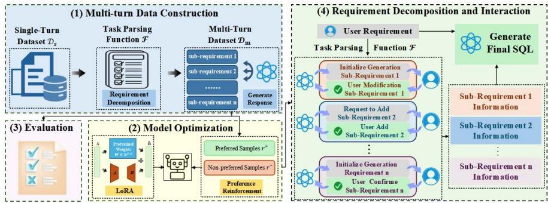
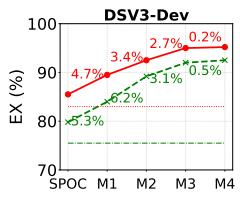
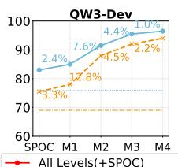
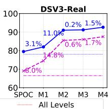
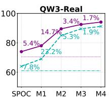
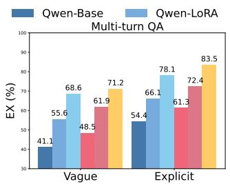
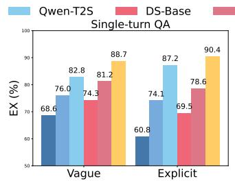
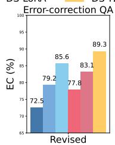
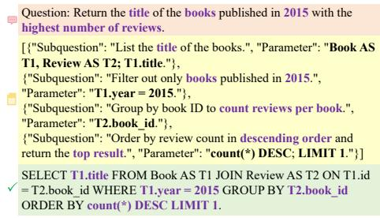
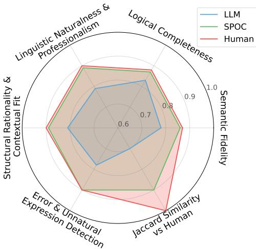

# SPOC-SQL: Stage-wise Preference Optimization for Controllable Text-to-SQL

Yingnan Chen†, Chun Ding†, Tianshi Xu, Xu Yang\*, and Si Wu

South China University of Technology, Guangzhou, Guangdong 510006, P.R. China chen.m0rem@gmail.com, csdingchun@mail.scut.edu.cn, {xtshi,yxu8}@grgbanking.com, cswusi@scut.edu.cn † Joint first authors. Corresponding author.

Abstract. Text-to-SQL aims to translate natural language questions into executable SQL queries over relational databases, requiring multistage structured reasoning over database schemas and query constraints. However, existing methods treat this task as single-step generation, where models optimize entire SQL sequences without targeted feedback at key decision points and lack support for interacting with and controlling the intermediate generation process. To address this issue, we propose SPOC-SQL, which decomposes Text-to-SQL into four sequential subtasks following standard SQL execution logic and designs stage-specific optimization strategies for the model to learn key decisions. Specifically, we propose the implementation of fine-grained preference optimisation at key decision points across SQL stages, with the objective of enhancing structured decision-making during query construction. Furthermore, a structured decomposition strategy is designed, facilitating stage-wise intervention and correction through explicit intermediate representations. This results in more controllable and reliable SQL generation. Experiments demonstrate that incorporating stage-wise human knowledge consistently improves performance, validating the efectiveness of stage perception controllable generation.

Keywords: Text-to-SQL · Interactive Querying · Preference Learning

## 1 Introduction

Text-to-SQL (T2S) is the process of translating natural language questions into SQL queries that function on relational databases. T2S tasks frequently require handling multi-table joins, nested subqueries, and complex conditions [17], thereby forming a multi-step decision-making process similar to multi-turn QA scenarios [3]. Modeling this process accurately is challenging due to the complex relationships in the database schema and the semantic complexities involved.

Existing methods generate SQL sequences by jointly encoding questions and database schemas. Examples include RAT-SQL[15], which employs relationaware attention, BRIDGE[11], which utilizes tagged sequence encoding, and RESDSQL[10], which applies decoupled schema linking. However, these methods typically treat the entire SQL sequence as the optimization objective and learn it holistically without stage-level modeling, due to the scarcity of high-quality multi-turn T2S data. Specifically, when the model assigns equal importance to both key interaction steps that drive task progress and irrelevant conversational content, the signals required for efective decision-making are diluted. This approach hinders the model’s ability to master core decisions that advance the task and restricts its capacity to develop essential interaction strategies [2]. Furthermore, the absence of structured modeling impedes interpretability, making it harder to trace errors to specific reasoning stages. Limited interpretability also constrains user engagement with intermediate query components, resulting in a reliance on either complete acceptance of the generated SQL or only coarse-grained modifications.

  
Fig. 1: The workflow of SPOC-SQL. (1) The task parsing function F decomposes single-turn queries into multi-turn sequences with stage-specific subrequirements. (2) LoRA fine-tuning combined with preference-based optimization to enhance decision capability through fine-grained policy optimization. (3) Evaluation of multi-turn QA capabilities. (4) At inference, F decomposes user requirements into sub-tasks for iterative confirmation, generating the final SQL.

To address this issue, we propose SPOC-SQL, which decomposes T2S into four sequential subtasks aligned with standard SQL execution logic and employs stage-wise optimization strategies to enable the model to learn key decisions. Specifically, SPOC-SQL decomposes T2S into structured subtasks corresponding to SQL execution stages, enabling progressive decision-making rather than single-step generation. Single-turn instances are decomposed into sequential substages to construct multi-turn QA samples. Based on this dataset, we propose Preference-based Multi-turn QA Decision Optimization (PMDO), which builds preference pairs at key decision points across subtasks. Preferred samples correspond to correct intermediate decisions derived from the gold SQL execution process, while non-preferred samples are automatically generated through promptguided controlled perturbations using the LLM [5]. Specifically, the model is prompted to intentionally modify critical intermediate reasoning elements, including selecting irrelevant columns, introducing incorrect filtering conditions [21], mismatching aggregation operations, and applying improper sorting constraints, while preserving the overall query context and linguistic plausibility. Additionally, PMDO integrates LoRA [8] with DPO [14], enabling eficient stagelevel preference learning and improving decision discrimination. We further design a Requirement Decomposition and Interaction Module (RDIM), which decomposes queries into stage-specific subtasks. Intermediate results are exposed for verification or correction, and the final SQL is synthesized from validated outputs, thereby improving interpretability and controllability. The primary contributions of our work are summarized as follows:

• Diferent from existing methods that approach Text-to-SQL as a single-step sequence generation task, we propose SPOC-SQL, a framework that models the task as a stage-wise structured decision process. Stage perception strategies are integrated into both training and inference, which facilitates unified fine-grained preference optimization and controllable generation.

• To enhance decision accuracy on core subtasks, we design a stage-level preference optimization strategy, PMDO, which extends DPO supervision from the sequence level to key decision points across distinct SQL logical stages.

• We propose RDIM to enable stage-wise verification and correction during inference, endowing the SQL generation process with explicit interpretability and user-driven intervention capabilities.

## 2 Methodology

## 2.1 Overview

The workflow of SPOC-SQL is outlined in Fig. 1. Multi-turn Data Construction uses a task-parsing function $\mathcal F ( \cdot )$ to decompose natural language queries into stage-specific subtasks, such as table and column selection, condition filtering, group aggregation, and ordering or limiting. This approach transforms single-turn queries into multi-turn interaction sequences that capture incremental user intent expression, supplementation, and correction. Model Optimization, based on the constructed dataset $\mathcal { D } _ { \mathrm { m } }$ , incorporates preference constraints at key decision-making nodes in each interaction turn. The model is updated through a policy optimization paradigm that integrates LoRA-based eficient fine-tuning with DPO. This process enhances decision-making capability at key interactive steps and improves SQL generation accuracy in multi-turn scenarios. Evaluation assesses model performance across multi-turn dialogue completion, single-turn reasoning, and error correction, thereby capturing both global consistency and local decision accuracy. Finally, Requirement Decomposition and Interaction is designed for inference, where user queries are decomposed into structured subtasks and intermediate results are iteratively refined through user feedback, enabling a controllable and correctable SQL generation process for complex queries.

## 2.2 Multi-turn Data Construction and Evaluation Module

Multi-turn data construction. T2S queries expressed in natural language often correspond to multiple stage-specific sub-tasks aligned with SQL execution logic. To explicitly model stage-wise structure, we define a task parsing function $\mathcal F ( \cdot )$ that decomposes a QA sample into several predefined stages following the canonical SQL execution pipeline, namely SELECT-FROM, WHERE, GROUP-HAVING, and ORDER-LIMIT. Given a single-turn QA sample (x, y), where x denotes a natural language query and y represents the corresponding SQL statement, the decomposition is expressed as:

$$
( s ^ { \mathrm { { S F } } } , s ^ { \mathrm { { W H } } } , s ^ { \mathrm { { G H } } } , s ^ { \mathrm { { O L } } } ) = \mathcal { F } ( x ) ,\tag{1}
$$

where $s ^ { \mathrm { S F } }$ represents table and column selection (SELECT-FROM), $s ^ { \mathrm { W H } }$ represents condition filtering (WHERE), $s ^ { \mathrm { G H } }$ represents grouping and aggregation (GROUP-HAVING), and $\dot { s } ^ { \mathrm { O L } }$ represents ordering and limits (ORDER-LIMIT). Sub-tasks absent in a query may be left empty or skipped during dataset construction. The single-turn query is transformed into a multi-turn interaction sequence. At turn t, user input focuses on the current stage sub-task while maintaining overall semantic consistency with the complete query and standard SQL. The model generates the intermediate result conditioned on previous context:

$$
\begin{array} { r l } & { \boldsymbol { u } ^ { ( t ) } = ( s ^ { ( t ) } , x , y ) , } \\ & { r ^ { ( t ) } = \mathcal { M } ( \boldsymbol { u } ^ { ( t ) } , \mathbf { h } ^ { ( t - 1 ) } ) , } \end{array}\tag{2}
$$

where $\mathcal { M } ( \cdot )$ denotes the large language model (LLM) that produces $r ^ { ( t ) }$ conditioned on the previous context $\Breve { \mathbf { h } } ^ { ( t - 1 ) }$ . The final turn $T$ directly adopts the original standard SQL as the output, $r ^ { ( T ) } \equiv y _ { : }$ , ensuring consistency between multi-turn generated results and the original annotations. Diferent query types are simulated to reflect realistic user behavior. Explicit-demand queries provide complete conditions in the initial turn, resulting in fewer dialogue turns. Ambiguous-demand queries involve stage-wise supplementation of filter conditions or aggregation requirements, forming an iterative refinement process. Errorcorrection queries introduce inconsistent or erroneous conditions in some turns, corrected in subsequent turns to enhance the model’s capability for intention correction. The multi-turn dataset is formally defined as:

$$
\begin{array} { r } { \mathcal { D } _ { \mathrm { m } } = \{ \mathcal { C } _ { i } \} _ { i = 1 } ^ { N } , \quad \mathcal { C } _ { i } = \{ ( u _ { i } ^ { ( t ) } , y _ { i } ^ { ( t ) } ) \} _ { t = 1 } ^ { T _ { i } } , } \end{array}\tag{3}
$$

where each $\mathcal { C } _ { i }$ represents a complete multi-turn query process. The conversion transforms static single-turn T2S data into dynamic multi-turn interaction sequences, preserving original semantics while explicitly modeling incremental user expression, supplementation, and correction. The constructed dataset contains three types of multi-turn interactions: explicit requests, where the full user requirement is provided in the first turn; vague requests, where the complete requirement is gradually revealed across multiple turns; and revised requests, where partial or incorrect sub-requirements are corrected in subsequent turns.

Multi-turn QA evaluation. The evaluation framework assesses model performance across three sub-tasks: multi-turn $\mathrm { Q A }$ , single-turn QA, and errorcorrection tasks. Evaluation captures overall dialogue consistency, local context comprehension, and response to user correction instructions. The multi-turn QA sub-task requires completion of a full dialogue. At each turn t, the model generates a response based on current input and accumulated dialogue state:

$$
\begin{array} { r l } & { \boldsymbol { r } _ { i } ^ { ( t ) } = \mathcal { M } ( \boldsymbol { u } _ { i } ^ { ( t ) } , \boldsymbol { h } _ { i } ^ { ( t - 1 ) } ) , } \\ & { \boldsymbol { h } _ { i } ^ { ( t ) } = \boldsymbol { h } _ { i } ^ { ( t - 1 ) } \cup \{ \boldsymbol { u } _ { i } ^ { ( t ) } , \boldsymbol { r } _ { i } ^ { ( t ) } \} , } \end{array}\tag{4}
$$

where $t = 1 , \ldots , T _ { i }$ denotes the turn index within the i-th dialogue consisting of $T _ { i }$ turns, and $h _ { i } ^ { ( 0 ) } = \emptyset$ indicates that the dialogue history is initially empty. $\bar { u } _ { i } ^ { ( t ) }$ and $r _ { i } ^ { ( t ) }$ denote the user input and model response at turn t, respectively, and $h _ { i } ^ { ( t ) }$ represents the accumulated dialogue history up to turn t. Evaluation relies on the final turn output $r _ { i } ^ { ( T _ { i } ) }$ compared to the standard SQL $y _ { i } ^ { ( T _ { i } ) }$ , emphasizing global consistency in extended dialogues. The single-turn $\mathrm { Q A }$ sub-task treats each turn independently to prevent error accumulation across turns. Historical context $h _ { i } ^ { ( t - 1 ) }$ is provided directly from the dataset and remains unchanged. Evaluation across all turns measures the model’s comprehension of local context and the execution of stage-specific sub-tasks. The error-correction $\mathrm { Q A }$ sub-task focuses on turns containing explicit user corrections. Responses are generated based on corrected input $\tilde { u } _ { i } ^ { ( t ) }$ and preceding context:

$$
\boldsymbol { r } _ { i } ^ { ( t ) } = \mathcal { M } ( \tilde { \boldsymbol { u } } _ { i } ^ { ( t ) } , \boldsymbol { h } _ { i } ^ { ( t - 1 ) } ) ,\tag{5}
$$

where $t \in \mathcal { T } _ { i } ^ { \mathrm { e r r } }$ denotes the set of turns that involve explicit correction instructions from the user. The evaluation setting measures the model’s ability to identify and revise previously generated erroneous conditions based on user feedback. The three-tier evaluation framework ofers a comprehensive assessment of multiturn T2S capability.

## 2.3 Requirement Decomposition and Interaction Module

Requirement decomposition and extraction. During inference, user queries expressed in natural language are mapped to $\mathrm { S Q I }$ statements with explicit logical structure. The initial task information set is defined as:

$$
\mathcal { T } _ { i } ^ { ( 0 ) } = ( s _ { i } ^ { \mathrm { S F } } , r _ { i } ^ { \mathrm { S F } } ) , ( s _ { i } ^ { \mathrm { W H } } , r _ { i } ^ { \mathrm { W H } } ) , ( s _ { i } ^ { \mathrm { G H } } , r _ { i } ^ { \mathrm { G H } } ) , ( s _ { i } ^ { \mathrm { O L } } , r _ { i } ^ { \mathrm { O L } } ) ,\tag{6}
$$

where stage-wise decomposition using $\mathcal F ( \cdot )$ generates four sub-tasks, and the model produces the corresponding initial stage responses $r _ { i } ^ { ( k ) }$ . Stage responses enables stage-level interaction with the user for confirmation and correction, ensuring accurate and controllable task information.

Interactive knowledge. User confirmation or correction at each stage serves to refine the model’s understanding of the task requirements. At turn t, the user reviews the intermediate outputs produced for each sub-task and provides feedback, which may include confirming correct predictions or correcting errors. The feedback updates the stage-specific sub-tasks $\tilde { s } _ { i } ^ { ( k ) }$ and their corresponding responses $\tilde { r } _ { i } ^ { ( k ) }$ , resulting in the aggregated set of updated interactions:

$$
\mathcal { T } _ { i } ^ { ( t ) } = \{ ( \tilde { s } _ { i } ^ { \mathrm { S F } } , \tilde { r } _ { i } ^ { \mathrm { S F } } ) , ( \tilde { s } _ { i } ^ { \mathrm { W H } } , \tilde { r } _ { i } ^ { \mathrm { W H } } ) , ( \tilde { s } _ { i } ^ { \mathrm { G H } } , \tilde { r } _ { i } ^ { \mathrm { G H } } ) , ( \tilde { s } _ { i } ^ { \mathrm { O L } } , \tilde { r } _ { i } ^ { \mathrm { O L } } ) \} ,\tag{7}
$$

where each pair $( \tilde { s } _ { i } ^ { ( k ) } , \tilde { r } _ { i } ^ { ( k ) } )$ captures the corrected sub-task state and the corresponding model output for the k-th stage, enabling a precise and user-aligned representation of the task at that point in the dialogue. The model subsequently leverages the complete task query $x _ { i }$ , together with the updated stage-specific information $\mathcal { T } _ { i } ^ { ( t ) }$ , to generate the final SQL statement:

$$
y _ { i } = \mathcal { M } ( x _ { i } , \mathcal { T } _ { i } ^ { ( t ) } ) ,\tag{8}
$$

where the integration of $x _ { i }$ with $\mathcal { I } _ { i } ^ { ( t ) }$ allows the model to account for both the original user intent and the refinements provided through user interaction. The stage-wise guidance ensures that the generated SQL query faithfully reflects the user’s intentions while maintaining syntactic correctness, logical consistency, and adherence to the specific requirements of each sub-task. The interaction strategy establishes a controllable inference path, providing opportunities for user intervention and iterative correction throughout the generation process.

## 2.4 Model Optimization

Following the construction of ${ \mathcal { D } } _ { \mathrm { m } } ,$ the model undergoes task-specific optimization for stable execution of stage-wise decisions and generation of accurate SQL queries. The proposed PMDO approach combines LoRA for eficient fine-tuning with DPO. Each multi-turn sample $x _ { i } \in \mathcal { D } _ { \mathrm { m } }$ is parsed into ordered stage subtasks $( s _ { i } ^ { \mathrm { S F } } , s _ { i } ^ { \mathrm { W H } } , s _ { i } ^ { \mathrm { G H } } , s _ { i } ^ { \mathrm { O L } } )$ , where each stage contains a set of key decision elements ${ \mathcal { U } } _ { i } ^ { ( k ) }$ , including table and column selection, condition constraints, aggregation/grouping, and ordering/limiting rules. The decision elements define the core decision space afecting semantic correctness of SQL generation.

LoRA fine-tuning updates linear layer weights $W _ { 0 }$ with low-rank increments $\varDelta W = \alpha B A$ , freezing original parameters to preserve general model capabilities while adapting to stage-wise decision characteristics. Preference signals are constructed for each decision element $u \in \mathcal { U } _ { i } ^ { ( k ) }$ , forming pairs $( r _ { i , u } ^ { + } , r _ { i , u } ^ { - } )$ , where positive samples $r _ { i , u } ^ { + }$ correspond to correct outputs and negative samples $r _ { i , u } ^ { - }$ introduce controlled perturbations, such as incorrect tables, columns, conditions, aggregations, groupings, or ordering rules. Unlike standard preference optimization methods that operate at the sequence level, we perform preference learning at the stage-specific decision level. For each stage $k ,$ preference signals are conditioned on the corresponding sub-task context, enabling the model to distinguish fine-grained decision errors and learn stage perception decision boundaries. The optimization objective is formulated as:

$$
\mathcal { L } _ { \mathrm { { D P O } } } = - \sum _ { i , k } \sum _ { u \in \mathcal { U } _ { i } ^ { ( k ) } } \log \sigma \left( \log \frac { \pi _ { \theta } ( r _ { i , u } ^ { + } \mid s _ { i } ^ { ( k ) } ) } { \pi _ { \mathrm { r e f } } ( r _ { i , u } ^ { + } \mid s _ { i } ^ { ( k ) } ) } - \log \frac { \pi _ { \theta } ( r _ { i , u } ^ { - } \mid s _ { i } ^ { ( k ) } ) } { \pi _ { \mathrm { r e f } } ( r _ { i , u } ^ { - } \mid s _ { i } ^ { ( k ) } ) } \right) ,\tag{9}
$$

where $\pi _ { \theta }$ denotes the policy model under optimization, $\pi _ { \mathrm { r e f } }$ denotes the frozen reference model, and $s _ { i } ^ { ( k ) }$ represents the context for stage k of sample $i ,$ including both the user query and any outputs from previous SQL generation stages. Preference signals are introduced sequentially according to the SQL generation stage, with outputs from previous stages serving as context for subsequent stages. Stage-specific preference losses are accumulated to update LoRA parameters, establishing a generation bias aligned with task logic and ensuring coherence across multi-turn decision sequences.

## 3 Experiments

In this section, SPOC-SQL is evaluated on multiple Text-to-SQL benchmarks and a multi-turn dataset, analyzing its efectiveness in both single-turn and multi-turn scenarios. Dataset details, and implementation settings are presented, followed by comprehensive comparison with state-of-the-art methods, performance assessments across models and dificulty levels, ablation study, case study, user study, providing a thorough evaluation of the proposed method.

Table 1: Comparative performance on Spider benchmarks.
<table><tr><td>Method</td><td>Model</td><td>Venue</td><td>SF</td><td>WH</td><td>GH</td><td>OL</td><td>Dev</td><td>Real.</td></tr><tr><td>ACT-SQL [20]</td><td>ChatGPT</td><td>EMNLP’23</td><td></td><td></td><td></td><td></td><td>80.4</td><td>75.8</td></tr><tr><td>C3 [6]</td><td>ChatGPT</td><td>arXiv&#x27;23</td><td></td><td></td><td></td><td></td><td>81.8</td><td>75.4</td></tr><tr><td>DIN-ŠQL [13]</td><td>GPT-4</td><td>NeurIPS&#x27;23</td><td></td><td></td><td></td><td></td><td>82.8</td><td>78.1</td></tr><tr><td>ACT-SQL[20]</td><td>GPT-4</td><td>EMNLP&#x27;23</td><td></td><td></td><td></td><td></td><td>82.9</td><td></td></tr><tr><td>DAIL-SQL [7]</td><td>DS-V3</td><td>VLDB&#x27;24</td><td></td><td></td><td></td><td></td><td>83.2</td><td>77.2</td></tr><tr><td>DAIL-SQL [7]</td><td>GPT-4</td><td>VLDB&#x27;24</td><td></td><td></td><td></td><td></td><td>84.4</td><td>75.6</td></tr><tr><td>MAC-SQL [16]</td><td>GPT-4</td><td>COLING&#x27;25</td><td></td><td></td><td></td><td></td><td>86.8</td><td></td></tr><tr><td>MCS-SQL [9]</td><td>GPT-4</td><td>COLING&#x27;25</td><td></td><td></td><td></td><td></td><td>89.5</td><td></td></tr><tr><td></td><td></td><td></td><td></td><td></td><td></td><td></td><td>85.5</td><td>79.5</td></tr><tr><td></td><td></td><td></td><td>√</td><td></td><td></td><td></td><td>89.7</td><td>82.3</td></tr><tr><td>SPOC-SQL</td><td>DS-V3</td><td></td><td>√</td><td>√</td><td></td><td></td><td>92.7</td><td>91.3</td></tr><tr><td></td><td></td><td></td><td>V</td><td>√</td><td>√</td><td></td><td>95.4</td><td>91.5</td></tr><tr><td></td><td></td><td></td><td>√</td><td>√</td><td>√</td><td>√</td><td>95.6</td><td>93.1</td></tr></table>

## 3.1 Settings

Datasets. The Spider-Dev dataset [19] has 8,659 training instances across 200 databases. Spider-Realistic [4] removes explicit column references to test semantic understanding. In addition, we construct a multi-turn T2S dataset, T2S-MTD, consisting of 71,772 instances categorized into explicit, vague, and revised request interactions to simulate progressive user requirements in real business scenarios. Explicit requests provide suficient information for direct SQL generation, vague requests require progressive supplementation across multiple turns, and revised requests involve modifying previous requirements during interaction. Evaluation uses execution accuracy (EX) and error correction (EC), measuring result equivalence and correction ability across turns.

Implementation details. The LoRA uses a rank of r = 8 and a scaling factor $\alpha = 1 6 ,$ and is injected into the self-attention layers and the linear projection layers of the feed-forward network. During fine-tuning, the original model is frozen, and only the LoRA parameters A and B are updated. The optimizer is AdamW with a learning rate of $\eta = 2 \times 1 0 ^ { - 4 }$ and weight decay $w _ { \mathrm { d e c a y } } = 0 . 0 1$ The single-device batch size is $B _ { \mathrm { s i n g l e } } = 2$ , with gradient accumulation resulting in an efective batch size of $B _ { \mathrm { e f f } } = 3 2 $ . The maximum input length is $L _ { \mathrm { m a x } } =$ 4096, and training is conducted for $E = 5$ epochs. Competing methods include GPT-4 [1], DeepSeek-V3 [12], Qwen3 [18], C3 [6], ACT-SQL [20], DIN-SQL [13], DAIL-SQL [7], MAC-SQL [16], and MCS-SQL [9], with 4,096 context length. We adopt a simulated human–computer interaction setting, where stage-wise intervention signals are constructed ofline and progressively injected to simulate user corrections on intermediate representations, ensuring reproducibility.

## 3.2 Comparison with State-of-the-Arts

We evaluate the performance of the proposed SPOC-SQL method on the Spider-Dev and Spider-Realistic benchmark datasets against competing Text-to-SQL methods. In Table 1, “−” in the columns SF, WH, GH, or OL indicates that human knowledge was not incorporated at the corresponding stage, while $^ { 6 6 } { \checkmark } ^ { 9 9 }$ indicates that human knowledge was progressively introduced at that stage. With incremental intervention of human knowledge, performance improves consistently and substantially. Introducing knowledge at the schema-focused stage (SF) raises EX to 89.7%, exceeding MCS-SQL (89.5%), a Competing method. Further incorporation of additional components leads to continued gains, ultimately reaching 95.6% on Spider-Dev and 93.1% on Spider-Realistic with fullcomponent integration. The results demonstrate that SPOC-SQL provides a competitive performance without external knowledge and achieves significant improvements through human knowledge intervention. The proposed method decomposes complex Text-to-SQL generation tasks into multiple structured subtasks, reducing overall task complexity while enabling precise human knowledge intervention at diferent stages. Such a design not only improves controllability and interpretability but also allows targeted correction of intermediate errors. Consistent and substantial performance gains across both benchmark datasets clearly highlight the efectiveness, scalability, and overall robustness of the proposed method in improving Text-to-SQL generation performance.

Table 2: Performance by dificulty on Spider-Dev and Spider-Realistic.
<table><tr><td>Method</td><td>Data</td><td>Model</td><td>SF</td><td>WH</td><td>GH</td><td>OL</td><td>Easy</td><td>Med.</td><td>Hard</td><td>X-Hard</td><td>All</td></tr><tr><td>MCS-SQL [9]</td><td>Dev</td><td>GPT-4</td><td></td><td></td><td></td><td></td><td>94.0</td><td>93.5</td><td>88.5</td><td>72.9</td><td>89.5</td></tr><tr><td>DAIL-SQL</td><td>Dev 2</td><td>DS-V3</td><td></td><td></td><td></td><td></td><td>93.5</td><td>83.0</td><td>83.9</td><td>67.5</td><td>83.2</td></tr><tr><td rowspan="5">SPOC-SQL</td><td rowspan="5">Dev</td><td rowspan="5">DS-V3</td><td></td><td></td><td></td><td></td><td>95.2</td><td>84.3</td><td>85.6</td><td>74.1</td><td>85:5</td></tr><tr><td></td><td></td><td></td><td></td><td>96.0</td><td>90.1</td><td>89.1</td><td>79.5</td><td>89.7</td></tr><tr><td></td><td></td><td></td><td></td><td>97.2</td><td>91.9</td><td>97.1</td><td>83.7</td><td>92.7</td></tr><tr><td></td><td></td><td></td><td></td><td>97.6</td><td>96.6</td><td>96.6</td><td>87.5</td><td>95.4</td></tr><tr><td></td><td></td><td></td><td></td><td>97.6</td><td>96.6</td><td>96.6</td><td>88.6</td><td>95.6</td></tr><tr><td>DAIL-SQL [7]</td><td>Real.</td><td>DS-V3</td><td></td><td></td><td></td><td></td><td>87.2</td><td>81.8</td><td>74.7</td><td>58.8</td><td>77.2</td></tr><tr><td rowspan="5">SPOC-SQL</td><td></td><td></td><td></td><td></td><td></td><td></td><td>92.7</td><td>82.8</td><td>74.7</td><td>62:9</td><td>79.5</td></tr><tr><td rowspan="5">Real.</td><td>DS-V3</td><td></td><td></td><td></td><td></td><td>89.0</td><td>86.2</td><td>79.8</td><td>69.1</td><td>82.3</td></tr><tr><td></td><td></td><td></td><td></td><td></td><td>98.2</td><td>93.1</td><td>91.9</td><td>79.4</td><td>91.3</td></tr><tr><td></td><td></td><td></td><td>√</td><td></td><td>96.8</td><td>95.5</td><td>91.9</td><td>81.5</td><td>92.4</td></tr><tr><td>√</td><td></td><td>√</td><td></td><td></td><td>97.2</td><td>96.0</td><td>92.1</td><td>83.5</td><td>93.1</td></tr></table>

Spider-Dev and Spider-Realistic are further divided into four dificulty levels, namely Easy, Medium, Hard, and Extra Hard, to provide a more fine-grained evaluation of model performance. Table 2 presents the detailed results under different dificulty settings. On the Extra Hard subset of Spider-Dev, SPOC-SQL achieves 74.1% EX even without human knowledge intervention, surpassing the current best method, MCS-SQL (72.9%). Such improvement can be attributed to the decomposition of complex Text-to-SQL tasks into multiple structured subtasks, which reduces task complexity and enables more accurate intermediate reasoning. With human knowledge intervention, performance improves across all dificulty levels. On Spider-Realistic, performance on the Extra Hard subset increases from 62.9% to 83.5%, demonstrating consistent gains under more challenging and realistic conditions [22]. Results show that the proposed requirement decomposition and interaction module efectively simplify complex queries and support targeted human intervention, leading to consistent performance improvements on complex Text-to-SQL tasks.

## 3.3 Performance of SPOC-SQL Across Models and Datasets

To evaluate the performance of SPOC-SQL with diferent large language models on diferent datasets, we present an experiment in Fig. 2, where the method is tested with DeepSeek-V3 and Qwen3-72B models on Spider-Dev and Spider-Realistic datasets. We compare the base SPOC (without human intervention) and four progressively enhanced configurations: M1 with human intervention in the SF stage, M2 adding WH stage, M3 further incorporating GH stage, and M4 with intervention in all four stages (SF, WH, GH, and OL). Performance improvements are consistently observed across all model-dataset combinations when incorporating interactive components, with the magnitude of improvement on the Hard & Extra Hard subsets exceeding that on all levels. The results indicate that SPOC-SQL efectively improved performance on complex queries and demonstrate the method’s generalizability across diferent models and datasets.

Hard&ExtraHard(+SPOC)  

Fig. 2: Performance of SPOC-SQL across diferent datasets and models: Evaluations on DeepSeekV3(DSV3) and Qwen3-72B(QW3) across Spider-Dev(Dev) and Spider-Realistic(Real) Datasets.  

  
Fig. 3: Comparison of models on multi-turn QA, single-turn QA, and errorcorrection QA tasks.

We further evaluate SPOC-SQL on the multi-turn T2S dataset T2S-MTD using Qwen3-72B and DeepSeek-V3. Base models without fine-tuning are Qwen-Base and DS-Base. Fine-tuning is done either with LoRA on single-turn Spider dataset (-LoRA) or with LoRA combined with the proposed optimization method on T2S-MTD (-T2S), enabling fair comparison and isolating the efect of multi-turn reinforcement. Evaluation follows the multi-turn QA, single-turn QA, and error-correction QA tasks designed in the prior work. As shown in Fig. 3, Qwen-T2S outperforms Qwen-Base and Qwen-LoRA on multi-turn QA, single-turn QA, and error-correction QA tasks, while DS-T2S further surpasses Qwen-T2S under the same training strategy. The results confirm that SPOC-SQL’s task-decomposition and stage-wise optimization consistently improve performance and generalize across models.

## 3.4 Ablation Study

To evaluate the contributions of SPOC-SQL, we conduct an ablation study based on DeepSeek-V3 on Spider-Dev, Spider-Realistic, and the proposed multi-turn

Table 3: Ablation study of SPOC-SQL.
<table><tr><td>Model</td><td>Spider-Dev</td><td>Spider-Real.</td><td>T2S-MTD</td></tr><tr><td>SPOC-SQL</td><td>95.6</td><td>93.1</td><td>84.6</td></tr><tr><td>w/o PMDO</td><td>93.2</td><td>90.1</td><td>80.7</td></tr><tr><td>w/o RDIM</td><td>87.5</td><td>84.6</td><td>78.4</td></tr><tr><td>LoRA-only</td><td>83.7</td><td>79.8</td><td>75.4</td></tr><tr><td>Base</td><td>80.1</td><td>74.5</td><td>66.3</td></tr></table>

Question: List the name and year of the expedition that included both the explorer named 'John Cabot' and the explorer named 'Amerigo'. [{"Subquestion": "List the name and year of expeditions.", "Parameter": "expedition as T1, explorer as T2; T1.name, T1.year."} { "Subquestion": "Filter expeditions to those involved the explorer named 'John Cabot'; Filter expeditions to those involved the explorer named 'Amerigo'.", "Parameter": "T2.name = 'John Cabot'; INTERSECT; T2.name = 'Amerigo'."}, {"Subquestion": "", "Parameter": ""}, {"Subquestion": "", "Parameter": ""}] SELECT T1.name , T1.year FROM expedition AS T1 JOIN explorer AS T2 ON T1.id = T2.expedition WHERE T2.name = 'John Cabot' INTERSECT SELECT T1.name , T1.year FROM expedition AS T1 JOIN explorer AS T2 ON T1.id = T2.expedition WHERE T2.name = 'Amerigo

(a)  
  
(b)  
Fig. 4: Case Study: (a) Decomposition of complex nested queries and set operations; (b) Modular parsing of multi-component SQL queries.

T2S-MTD dataset. The evaluated modules include: (1) Preference-driven Multiturn QA Decision Optimization (PMDO), which introduces stage-wise preference optimization during training; and (2) Requirement Decomposition and Interaction Module (RDIM), which decomposes SQL generation into stage-wise sub-tasks during inference. We consider the following variants: SPOC-SQL employs both PMDO and RDIM; w/o PMDO denotes SPOC-SQL without PMDO while keeping RDIM; w/o RDIM denotes SPOC-SQL without RDIM while keeping PMDO; LoRA-only applies LoRA on the single-turn dataset Spider without proposed modules; and Base represents the base model without fine-tuning or proposed modules. As shown in Table 3, removing either PMDO or RDIM degrades performance on both Spider benchmarks and T2S-MTD. Full SPOC-SQL achieves the best overall results, while LoRA-only improves over the base model but remains inferior to SPOC-SQL. These results demonstrate the efectiveness of stage-wise decomposition and preference-driven optimization.

## 3.5 Case Study

We further illustrate the structure and workflow of SPOC-SQL by designing a case study shown in Fig. 4, where SQL generation is decomposed into structured components with detailed sub-questions and corresponding parameters. Fig. 4 (a) illustrates Case 1, which involves complex nested subqueries and set operations, while Fig. 4 (b) presents Case 2, showing multi-component queries including joins, filtering, and grouping. In both cases, queries are split into subquestions with corresponding SQL parameters, greatly reducing the complexity of generating accurate SQL and also helping users better understand the basis for the final SQL generation process.

## 3.6 User Study

To validate whether the human intervention design in SPOC-SQL can efectively simulate real human intervention, we conducted a large-scale user study comparing three SQL Info versions: LLM, SPOC, and Human. Over 100 participants evaluated multiple subjective metrics on ten-point scales using samples from Spider-Dev and Spider-Realistic. As shown in Fig. 5, SPOC achieved scores close to Human and consistently outperformed LLM across all metrics. The correlation between subjective improvement and SQL accuracy gain was significant $( \rho = 0 . 6 6 9 9 , p < 0 . 0 1 )$ , and the Jaccard Similarity vs Human metric further showed that SPOC outputs closely resemble human-authored content. These results demonstrate that the proposed intervention design can efectively simulate real human intervention.

  
Fig. 5: Comparison of SQL Info versions across subjective and objective metrics.

## 4 Conclusion

In this paper, we propose SPOC-SQL, which efectively integrates multi-turn alignment procedures with preference optimization strategies for Text-to-SQL tasks. SPOC-SQL systematically decomposes single-turn queries into structured multi-turn supervision signals and incorporates PMDO to impose fine-grained preference constraints at key decision points across various SQL logical stages. Additionally, RDIM facilitates stage-wise decomposition and interactive verification, transforming SQL generation into a transparent, controllable, and collaborative process with correction capabilities at each generation phase. Extensive experimental results across multiple models and datasets demonstrate the efectiveness, robustness, and generalizability of the proposed method, underscoring its capacity to enhance both accuracy and interpretability in complex T2S tasks.

## References

1. Achiam, J., Adler, S., Agarwal, S., et al.: GPT-4 technical report. arXiv preprint arXiv:2303.08774 (2023)

2. Cai, J., Xie, L., Xue, W., Wu, S.: Text-vision guided latent prediction for highfidelity blind face restoration. IEEE MultiMedia (2026)

3. Dai, Z., Ding, C., Chen, T., et al.: IP-KGQA: Intent-aware prompt learning for knowledge graph question answering. In: Proc. IEEE ICME. pp. 1–6 (2025)

4. Deng, X., Hassan, A., Meek, C., et al.: Structure-grounded pretraining for Textto-SQL. In: Proc. NAACL-HLT. pp. 1337–1350 (2021)

5. Ding, C., Xue, W., Fan, X., et al.: LLM-Inpainter: LLM-adapted feature prediction with fine-grained mask-aware reinforcement for high-fidelity face image inpainting. IEEE Trans. Multimedia (2026)

6. Dong, X., Zhang, C., Ge, Y., et al.: C3: Zero-shot Text-to-SQL with ChatGPT. arXiv preprint arXiv:2307.07306 (2023)

7. Gao, D., Wang, H., Li, Y., et al.: Text-to-SQL empowered by large language models: A benchmark evaluation. Proc. VLDB Endow. 17(5), 1132–1145 (2024)

8. Hu, E.J., Shen, Y., Wallis, P., et al.: LoRA: Low-rank adaptation of large language models. In: Proc. ICLR (2022)

9. Lee, D., Park, C., Kim, J., Park, H.: MCS-SQL: Leveraging multiple prompts and multiple-choice selection for Text-to-SQL generation. In: Proc. COLING. pp. 337– 353 (2025)

10. Li, H., Zhang, J., Li, C., Chen, H.: RESDSQL: Decoupling schema linking and skeleton parsing for Text-to-SQL. In: Proc. AAAI. vol. 37, pp. 13067–13075 (2023)

11. Lin, X.V., Socher, R., Xiong, C.: Bridging textual and tabular data for crossdomain Text-to-SQL semantic parsing. In: Findings of EMNLP. pp. 4870–4888 (2020)

12. Liu, A., Feng, B., Xue, B., et al.: DeepSeek-V3 technical report. arXiv preprint arXiv:2412.19437 (2024)

13. Pourreza, M., Rafiei, D.: DIN-SQL: Decomposed in-context learning of Text-to-SQL with self-correction. In: Proc. NeurIPS (2023)

14. Rafailov, R., Sharma, A., Mitchell, E., et al.: Direct preference optimization: Your language model is secretly a reward model. In: ICML Workshop on Preference-Based Learning (2023)

15. Wang, B., Shin, R., Liu, X., Polozov, O., Richardson, M.: RAT-SQL: Relationaware schema encoding and linking for Text-to-SQL parsers. In: Proc. ACL. pp. 7567–7578 (2020)

16. Wang, B., Ren, C., Yang, J., et al.: MAC-SQL: A multi-agent collaborative framework for Text-to-SQL. In: Proc. COLING. pp. 540–557 (2025)

17. Xie, L., Xu, Z., Wu, S.: Fine-grained conditional inpainting difusion for component-aware face makeup rendering. Pattern Recognit. 179, 113609 (2026)

18. Yang, A., Li, A., Yang, B., et al.: Qwen3 technical report. arXiv preprint arXiv:2505.09388 (2025)

19. Yu, T., Zhang, R., Yang, K., et al.: Spider: A large-scale human-labeled dataset for complex and cross-domain semantic parsing and Text-to-SQL. In: Proc. EMNLP. pp. 3911–3921 (2018)

20. Zhang, H., Cao, R., Chen, L., Xu, H., Yu, K.: ACT-SQL: In-context learning for Text-to-SQL with automatically generated chain-of-thought. In: Findings of EMNLP. pp. 3501–3532 (2023)

21. Zhang, Y., Huo, X., Chen, T., et al.: Class-conditional image synthesis with intraclass relation preservation. Knowl.-Based Syst. p. 114487 (2025)

22. Zhang, Y., Wang, J., Huang, Y., et al.: Classbooth: Boost class semantics with bidirectional feature fusion in text-to-image difusion models. IEEE Trans. Multimedia (2026)