# SWE Refactor Bench: Can Coding Agents Complete a Long-Horizon, Whole-Repository Stack Migration?

Deyao Hong∗†, Yizhe Chi∗, Wenyi Li∗, Xiaoqiu Wang, Mingju Gao, Kaisen Yang, Bingxiang He, Youjie Zheng, Calvin Xiao, Qinhuai Na‡

Navers Lab, Einsia.AI Tsinghua University

∗Equal Contribution †Project Lead ‡Corresponding Author

Modern software systems accumulate technical debt over decades of development, which makes migration expensive and largely manual. As coding agents become increasingly capable at bug fixing, can they autonomously perform such migrations? Existing benchmarks cannot answer this question because they evaluate only behavioural correctness, not whether the migration actually occurred. This leads an easy hack: agents copy the original implementation to make tests pass. We call this Blindness. To address this problem, we introduce SWE Refactor Bench, a benchmark comprising 20 whole-repository migrations, covering 4 kinds of technical debt. A three-stage evaluation protocol measures both migration completeness and behavioural correctness. (1) Migration Audit verifies that the migration occurred. (2) Behavioural Tests measure correctness with a fixed test suite. (3) Agentic Verification uses 6 independent coding agents to generate targeted tests for hidden behavioural diferences. Across 520 runs from 8 frontier models and 26 model-efort configurations, only 28 of 520 runs (5.4%) pass all three stages, 13 of the 20 tasks receive no accepted solution, and the best model (claude-opus-5) scores 47.0/100. Migration completeness and behavioural correctness are distinct abilities: a few runs preserve behaviour by skipping the migration and are stopped at Migration Audit; most attempt it and break behaviour, and are stopped at Behavioural Tests. Agents cannot deliver a perfect migration: among the 340 runs that pass Migration Audit, 58% reach 99% of the fixed checks, yet only 26% reach 100%. Agent capability difers across migration categories: agents score 31.4 on build toolchain rewrites but only 5.6 on language rewrites. Together, these findings position SWE Refactor Bench as a rigorous testbed for developing coding agents for reliable whole-repository migrations.

Date: August 25, 2026

Homepage: https://lab.einsia.ai/swe-refactor-bench

## 1 Introduction

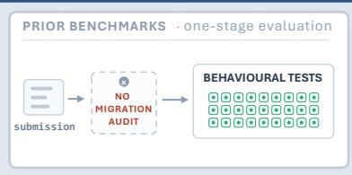

## SWE Refactor Bench

One stage cannot judge a migration. Did it happen? Does it still behave? What did the tests miss?

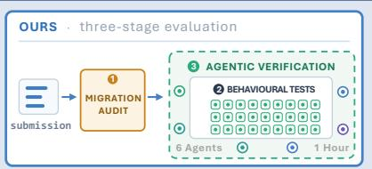

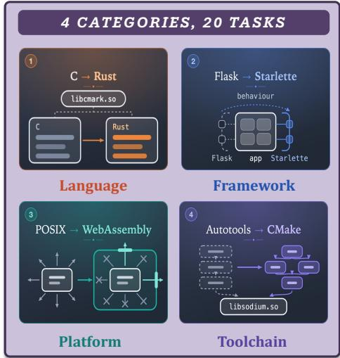

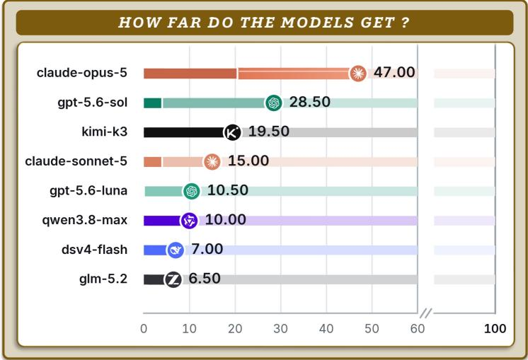  
Figure 1 SWE Refactor Bench at a glance. Top: how a migration gets scored. Left, prior benchmarks: one stage, a behavioural test suite. With no migration audit in front of it, a submission that never migrated anything still turns every check green, so the suite cannot tell a completed migration from an untouched repository. Right, SWE Refactor Bench: three stages in series—Migration Audit asks whether the migration happened at all, Behavioura Tests is that same fixed suite, and Agentic Verification sends six coding agents, one hour each, after the diferences the suite was never written to catch. Bottom left: the 20 tasks span four kinds of technical debt—language, framework, platform, and build toolchain. Bottom right: composite scores of 8 frontier models, each in its strongest configuration (out of 100; defined in (4)).

at least one test fails before the patch and passes after it. Whole-repository migration, however, starts from a repository whose tests already pass. A correct migration and an untouched repository can therefore receive the same perfect test score. Fixed tests measure behavioural correctness, but they cannot establish whether the migration actually occurred. This creates an easy shortcut: agents can retain or copy the original implementation to make the tests pass. We call this failure mode Blindness: a behaviour-only evaluator awards full credit without establishing that the target stack replaced the original implementation. Such an evaluator can detect whether known behaviour was broken, but not whether the migration occurred. This failure reflects a mismatch between what fixed tests observe and what migration requires. Fixed tests compare observable behaviour, whereas migration completeness asks whether the target stack actually replaced the original implementation. Adding more behavioural checks strengthens the evidence that behaviour was preserved, but it cannot establish replacement: the untouched implementation passes those checks by construction. Conversely, verifying replacement does not establish that behaviour survived. Evaluating migration therefore requires separate evidence for both properties.

We introduce SWE Refactor Bench, which collects three forms of evidence through a three-stage protocol. Migration Audit is a hard gate that checks whether the target stack replaced the old implementation; any failed criterion vetoes the submission. This gate prevents unchanged code and wrapper patches from earning credit. The Behavioural Tests stage measures behavioural correctness with 130,118 fixed checks recorded from the original system and requires every check to pass. Agentic Verification tests behaviours that a fixed suite may miss: six independent coding agents receive the original and migrated codebases and one hour each to generate diferential tests. These tests are generated after submission, vary across verifier runs, and remain invisible to the migration agent. A verifier can reject a submission only with an executable counterexample that passes on the original and fails on the migrated system. The three stages prevent migration shortcuts, enforce known behavioural requirements, and probe diferences not encoded in the fixed suite.

The benchmark comprises 20 whole-repository migrations of real open-source infrastructure, including SQLite, zlib, libsodium, and GraphHopper. The tasks cover language (7), framework (7), platform (3), and build toolchain (3) migrations and give agents 6 to 30 hours of autonomous work per task. Each task requires the repository to use the target stack throughout while ensuring behavioural correctness. We evaluate 8 frontier models under 26 model–efort configurations, running each configuration once on all 20 tasks for 520 scored runs. Current agents remain far from reliable whole-repository migration. The best configuration, claude-opus-5 at xhigh efort, scores 47.0/100; only 28 of 520 runs (5.4%) pass all three stages, and 13 of the 20 tasks receive no accepted solution. Migration completeness and behavioural correctness are distinct abilities, and agents miss them in opposite directions: 30 runs preserved behaviour by skipping the migration, and were stopped at Migration Audit; 252 completed the migration but broke behaviour, and were stopped at Behavioural Tests. Agents also struggle to close the final correctness gap. Among the 340 runs that pass Migration Audit, 58% reach 99% of the fixed checks, yet only 26% reach 100%. Agent capability difers across migration categories: agents score 31.4 on build toolchain rewrites but only 5.6 on language rewrites. These results establish a capability gap on the 20 tasks in SWE Refactor Bench; they do not rank the intrinsic dificulty of all migration projects.

In summary, we make the following contributions:

• Blindness and benchmark. We identify Blindness: behaviour-only evaluation can award full credit without establishing that a migration occurred. And we introduce SWE Refactor Bench, a benchmark of 20 long-horizon, whole-repository migrations drawn from real open-source infrastructure and spanning language, framework, platform, and build toolchain migrations.

• Three-stage adversarial evaluation. We design a protocol that combines a hard migration audit and 130,118 fixed behavioural checks with agentic verification. During Agentic Verification, six independent coding agents actively search for hidden behavioural diferences after submission and can reject a migration only with an executable counterexample.

• Revealing agent capability gaps. “Getting the code right” is not the same as “getting the migration done”—and even doing both is not enough. Agents miss the two conditions in opposite directions—30 runs skip the migration, 252 complete it and break behaviour—so neither stage can stand in for the other; and among the 88 submissions that satisfy both under the fixed suite, agentic verifiers break 60. Only 28 of 520 runs (5.4%) survive all three stages. Current agents therefore rarely deliver migrations that are complete, behaviour-preserving, and robust to agentic verification.

## 2 SWE Refactor Bench: Benchmark Design

SWE Refactor Bench measures one ability: given a working repository built on one technology stack, can an agent deliver the same repository on another stack, with its observable behaviour intact and the old stack gone.

## 2.1 Task Formulation

A behaviour-preserving migration task is a tuple

$$
\tau = ( R _ { A } , \Sigma _ { A } \to \Sigma _ { B } , \mathcal { O } , \mathcal { T } , E , B ) .\tag{1}
$$

$R _ { A } { \mathrm { - w h i c h } }$ we call State A—is a real open-source repository, taken at one commit, in a buildable and working condition. $\Sigma _ { A }$ is the stack it is built on and $\Sigma _ { B }$ the stack it must be built on afterwards: a language, an application framework, a host platform, or a build toolchain. O is the observable interface of the artifact, that is, the surface available for inspection once the repository has been built—process output and exit status, the symbols exported by an installed library, the manifest of an installation tree, the responses of a served endpoint. I is the instruction given to the agent, E an ofline image and B a time budget.

The agent’s input is $( R _ { A } , { \mathcal { T } } , E , B )$ : a container holding the original repository, the toolchains of both stacks, and an instruction saying what is to be done, with no network. Its output is the working tree $R _ { S }$ at the end of the run. Writing ${ \mathcal { O } } ( R )$ for the observations produced by the artifact that repository R builds, $R _ { S }$ solves τ exactly when both of the following hold:

<table><tr><td>Debt class</td><td>Representative migrations</td><td>Tasks</td><td>Source LoC</td><td>Budget (h)</td><td>Criteria (Stage I)</td><td>Modules (Stage II)</td><td>Checks (Stage II)</td></tr><tr><td>Language</td><td>C → Rust, C → Java, Go → Zig</td><td>7</td><td>4.4 k-39.8 k</td><td>12-30</td><td>60</td><td>117</td><td>59,771</td></tr><tr><td>Framework</td><td>Flask → Starlette, Gin → chi, Vue → React</td><td>7</td><td>0.8 k–94.8 k</td><td>6-16</td><td>39</td><td>79</td><td>55,852</td></tr><tr><td>Platform</td><td>POSIX → wasm32-wasi, Node → V8 realm</td><td>3</td><td>16.0 k-358.0 k</td><td>6-10</td><td>19</td><td>31</td><td>6,725</td></tr><tr><td>Build toolchain</td><td>Autotools → CMake, Maven → Gradle</td><td>3</td><td>19.0 k–78.8 k</td><td>6</td><td>18</td><td>37</td><td>7,770</td></tr><tr><td>Total</td><td>20 upstream projects, 20 tasks</td><td>20</td><td>867,062</td><td>262</td><td>136</td><td>264</td><td>130,118</td></tr></table>

Table 1 Composition of the SWE Refactor Bench task set. Every task requires a real open-source repository to be migrated in its entirety onto another stack, with its interface and observable behaviour unchanged. Budget is the time limit given to the agent; criteria are the Stage I migration questions, modules are the independent test modules of Stage II, and checks are the behavioural cases those modules hold.

$\Sigma _ { B }$ builds the delivered artifact, and $\Sigma _ { A }$ is absent from the repository and from the build closure, (2) $\mathcal { O } ( R _ { S } ) = \mathcal { O } ( R _ { A } )$ (3)

We call (2) the migration condition and (3) the preservation condition. The first is a claim about the text of a repository and about what its build compiles; the second is a claim about the behaviour of an artifact. No new functionality has to be designed anywhere in this work: State A already does everything State B must do; the whole dificulty is to rebuild those behaviours exactly, on a stack that expresses them in an entirely diferent way.

Why behavioural tests fail here. A behavioural test suite T is a finite set of observations drawn from O; the score it gives a repository R is the fraction it passes, rate(R; T). Since the preservation condition (3) is defined relative to $R _ { A }$ and $T \subseteq { \mathcal { O } }$ , we have rate $( R _ { A } ; T ) = 1$ for any T—by construction, and for every task in this family. Setting $R _ { S } = R _ { A }$ (the empty $d i f f$ : the agent hands the repository back untouched) therefore earns full marks on any behavioural suite while satisfying not one clause of the migration condition (2). This is exactly the blindness of Section 1: the maximum of the reward sits on a submission with zero work in it, and enlarging T does not help, because every case the migrated repository must pass is a case the original already passes.

## 2.2 Where the Tasks Come From

Pick the debt first, the repository second. We did not choose repositories and then invent a change for them; we went the other way: fix on a migration that a maintainer would call overdue, then look for a project where that migration is the whole job. Three admission requirements follow. First, the old stack has to be load-bearing rather than incidental, so that removing it reaches the design and not merely the import statements—cmark’s parser state machine, for instance, is hand-written C, and moving it to Rust means redesigning ownership rather than adding a layer of FFI. Second, the observable interface has to be one that something outside actually depends on, so that “behaviour preserved” is a constraint with content rather than a slogan—a C ABI, an HTTP API, an installation tree all have downstream consumers. Third, there has to be a runnable reference: State A itself can be built and executed repeatedly, which is what makes diferential testing possible. We deliberately chose load-bearing infrastructure rather than exercises: SQLite [20, 59], zlib and the DEFLATE format it implements [18, 44], libsodium [7, 17], and GraphHopper, whose routing is built on contraction hierarchies [22, 26], among others.

Four kinds of technical debt. A repository’s stack comes down to four things: what language it is written in, what framework it is organised around, what host it assumes, and what builds it. Each class of task moves exactly one of them (Table 1). Language rewrites (7 tasks) replace the implementation language while keeping the shape of the artifact: the original language’s implementation details are deleted along with its source, yet the external behaviour of the artifact has to be reproduced exactly, and the new language will not make the same choices by itself. Framework rewrites (7) keep the language and replace the dependency the application is organised around: most of what has to be reproduced is not code the application wrote but what the framework did on its behalf—how errors are represented, how parameters are coerced, how content is negotiated. Platform ports (3) replace the host the code assumes: from POSIX to wasm32-wasi [27], process control, the filesystem namespace and memory mapping are withdrawn, leaving only what the host explicitly grants. Build-toolchain rewrites (3) move the part that produces the artifact rather than the part that runs: what is compared is not only what the program does when it runs but what it was packaged into.

What a task ships. Once (1) is instantiated, the agent receives: a State A that builds cleanly, a State B declaration naming the target stack down to specific versions, an instruction stating the requirements and how the build is invoked, an ofline image—which also carries State A’s own toolchain, since the original is its reference—and an artifact contract saying what will be collected from the finished workspace. The rest it arranges itself: read the repository and the requirements, form a plan, rewrite the code onto the target stack, get it to build into a real artifact, and finally check its own work against State A. On the evaluation side sit three things it never touches: the Migration Audit criteria, written as prompt questions about this repository; the Behavioural Tests tests, whose expectations are recorded from a reference build and run of State A inside the evaluation image; and the further checks the six verifiers of Agentic Verification perform beyond those fixed tests. All three live in a separate image that is never mounted into the agent’s container, so those tests are not merely “unread” by it—they do not exist for it.

## 2.3 The Three-Stage Protocol

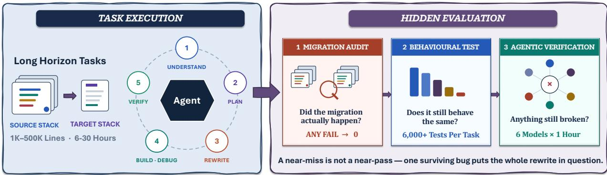  
Figure 2 On the left, what the agent sees: a real repository on the source stack, an instruction, an ofline image, and the process it works through on its own—read the repository and the requirements, rewrite onto the target stack, get it to build, then check itself against the original. On the right, the three-stage evaluation it never touches: Migration Audit checks whether the migration actually happened, Behavioural Tests checks whether the fixed behaviour is preserved exactly, and Agentic Verification goes looking for whatever diferences remain beyond the fixed tests.

Figure 2 separates the agent’s workspace and workflow from the hidden three-stage evaluation. A submission is the working tree at the end of the agent’s run; nothing it built is carried into evaluation, and each stage rebuilds from the submitted source whatever it needs. The three stages are applied in order, and each of them can end the run—except that we ran the fixed suite on every submission, vetoed or not, since blindness cannot be counted otherwise; those runs still score zero.

Stage I: Migration Audit. It asks one thing: did the migration actually happen—has the old stack disappeared from the repository and from the build. The blindness of Section 1 is exactly why someone has to ask: a behavioural suite gives full marks to a repository handed back untouched, so “was the work done at all” has to be checked separately. The criteria are written as prompt questions about this repository, answered one by one by a model reading both source trees; every failing verdict must cite re-checkable evidence, and each criterion is judged three times independently, with the majority taken.

Stage II: Behavioural Tests. It asks whether behaviour survived unchanged. These tests were not written out of thin air but built from State A: the same calls are run against the original repository and the recorded output becomes the expected answer, so the same inputs must afterwards produce the same outputs and the same exit status. Across the suite there are 130,118 checks, on average more than six thousand per task; a single wrong check scores zero, and only a clean sweep opens Stage III.

Stage III: Agentic Verification. The first two stages check what we thought of in advance; this one checks what we did not. A fixed suite can only ask what its author happened to think of, and a submission that reaches this point has answered all of it correctly. So we change the kind of checker—six coding agents, one hour each, each holding both source trees and looking for something the original repository does that this submission does not. The six are divided up: five each probe one assigned direction (a C ABI, a set of routes, an installation tree, and so on) and the sixth is unrestricted, so they complement one another in coverage instead of re-searching the same ground. What they hand in cannot be a report, only an executable test case: passing on State A and failing on the submission, and it must first go green against the reference and then reproduce three times, so that a broken test and a flaky test both fail to win. This is diferential testing [46] in an agentic form: a verifier may work the way a real tester does—generate inputs against a stated property [13], relate one output to another [12], or shrink a diference until it is reportable [70]—but what it says does not count; only a diference that runs does.

Scoring. Let g be the Migration Audit verdict, $r _ { i }$ the pass rate of module i in Behavioural Tests, and $s \in \{ 0 , \ldots , 6 \}$ the number of verifiers that failed to produce a counterexample. A submission scores

$$
S ( \tau ) ~ = ~ \underbrace { \mathbf { 1 } \big [ g = { \mathrm { p a s s } } \big ] } _ { \mathrm { S t a g e ~ \vec { t } : ~ v e t o } } \cdot \underbrace { \mathbf { 1 } \big [ r _ { i } = 1 ~ \forall i \big ] } _ { \mathrm { S t a g e ~ \vec { I } : ~ a l l ~ o r ~ n o t h i n g } } \cdot \left( 0 . 4 ~ + ~ \underbrace { 0 . 6 \cdot \frac { s } { 6 } } _ { \mathrm { S t a g e ~ \vec { I } I : ~ p e r ~ v e r i f i e r } } \right) ~ \in ~ \{ 0 \} \cup [ 0 . 4 , 1 ] .\tag{4}
$$

Every factor in the formula corresponds to one condition from Section 2.1. Stage I multiplies rather than adds, because without the migration the task was not done at all, and no amount of behavioural correctness should buy points for it. Stage II is all or nothing, because what this family of tasks asks is whether this is a drop-in replacement, and a library that is wrong once in a thousand calls is not: behind the failing test stands a downstream consumer, and it will not be spared because the other 99.99% of the behaviour is right (Section 3.3.2 gives concrete examples). Stage III carries 0.6 because what it looks at is a residue that no fixed suite can see, and so deserves the larger share; it is scored linearly rather than all-or-nothing because not broken is not the same as no diference: six verifiers finding nothing is more credible than one verifier finding nothing, but this is still a matter of how strong the evidence is, not a demonstration of equivalence, and a linear score records precisely that degree.

## 3 Experiments

This section first states the setup and the metrics (Section 3.1), then answers two questions: how far today’s agents get on whole-repository behaviour-preserving migration (Sections 3.2–3.3), and whether the evaluation itself holds up (Section 3.4).

## 3.1 Setup and Metrics

We evaluate eight frontier models: claude-opus-5 and claude-sonnet-5; gpt-5.6-luna and gpt-5.6-sol; kimik3 [34]; qwen3.8-max [66]; dsv4-flash [15]; and glm-5.2 [23]. The two GPT-series models use Codex as their harness; the other six use Claude Code. Every model ran all 20 tasks, for a total of 8 models, 26 configurations and 520 scored runs. A run is one independent attempt by one model at one task: a fresh container is created from that task’s image, the instruction is handed to the agent, and it works on its own within the time budget the task declares, with no network beyond the model endpoint; when the budget runs out or it stops of its own accord, the working tree is collected as a submission and sent into the three-stage evaluation.

Six metrics, each answering a diferent question. Alongside the composite score of (4) we report counts, because a count states what happened to a submission, whereas a score only states it after weighting. The following definitions are used throughout the paper.

Table 2 The three-stage funnel: where each of the 520 runs stops. Each row aggregates 20 runs, one per task. Values are numbers of runs; the five outcome columns are mutually exclusive and exhaustive, so they sum to 20 across a row. Harness identifies the coding-agent client: GPT-series models use Codex, and all others use Claude Code. Colour marks the stage at which a run stops: Migration Audit , Behavioural Tests , Agentic Verification , all three passed ; within a column, darker means more runs in that cell. Blindness is a special kind of Stage I failure: all fixed checks pass, yet the repository was never migrated.
<table><tr><td rowspan=1 colspan=10>Stopped at Stage I: not migratedStopped at Stage II Stopped at Stage IIIPassedModel          Harness   Effortfixed checks pass     fixed checks       counterexamplefixed checks  acceptedalso fail                              fail               found(Blindness)</td></tr><tr><td rowspan=1 colspan=5>米Claude Opus 5     Claude Code low</td><td rowspan=1 colspan=1>2</td><td rowspan=1 colspan=1>0</td><td rowspan=1 colspan=1>13</td><td rowspan=1 colspan=1>3</td><td rowspan=1 colspan=1>2</td></tr><tr><td rowspan=1 colspan=4>米Claude Opus 5    Claude Code</td><td rowspan=1 colspan=1>medium</td><td rowspan=1 colspan=1>1</td><td rowspan=1 colspan=1>2</td><td rowspan=1 colspan=1>10</td><td rowspan=1 colspan=1>5</td><td rowspan=1 colspan=1>2</td></tr><tr><td rowspan=1 colspan=4>米Claude Opus 5    Claude Code h</td><td rowspan=1 colspan=1>igh</td><td rowspan=1 colspan=1>0</td><td rowspan=1 colspan=1>2</td><td rowspan=1 colspan=1>10</td><td rowspan=1 colspan=1>4</td><td rowspan=1 colspan=1>4</td></tr><tr><td rowspan=1 colspan=4>米Claude Opus 5    Claude Code x</td><td rowspan=1 colspan=1>high</td><td rowspan=1 colspan=1>0</td><td rowspan=1 colspan=1>1</td><td rowspan=1 colspan=1>8</td><td rowspan=1 colspan=1>6</td><td rowspan=1 colspan=1>5</td></tr><tr><td rowspan=1 colspan=4>米Claude Opus 5    Claude Code</td><td rowspan=1 colspan=1>max</td><td rowspan=1 colspan=1>2</td><td rowspan=1 colspan=1>2</td><td rowspan=1 colspan=1>9</td><td rowspan=1 colspan=1>4</td><td rowspan=1 colspan=1>3</td></tr><tr><td rowspan=1 colspan=4>SGPT-5.6 Sol       Codex</td><td rowspan=1 colspan=1>none</td><td rowspan=1 colspan=1>11</td><td rowspan=1 colspan=1>0</td><td rowspan=1 colspan=1>8</td><td rowspan=1 colspan=1>1</td><td rowspan=1 colspan=1>0</td></tr><tr><td rowspan=1 colspan=1>G</td><td rowspan=1 colspan=3>GPT-5.6 Sol       Codex</td><td rowspan=1 colspan=1>low</td><td rowspan=1 colspan=1>11</td><td rowspan=1 colspan=1>0</td><td rowspan=1 colspan=1>7</td><td rowspan=1 colspan=1>2</td><td rowspan=1 colspan=1>0</td></tr><tr><td rowspan=1 colspan=1>S</td><td rowspan=1 colspan=3>GPT-5.6 Sol       Codex</td><td rowspan=1 colspan=1>medium</td><td rowspan=1 colspan=1>8</td><td rowspan=1 colspan=1>3</td><td rowspan=1 colspan=1>7</td><td rowspan=1 colspan=1>2</td><td rowspan=1 colspan=1>0</td></tr><tr><td rowspan=1 colspan=1>G</td><td rowspan=1 colspan=3>GPT-5.6 Sol       Codex</td><td rowspan=1 colspan=1>high</td><td rowspan=1 colspan=1>8</td><td rowspan=1 colspan=1>0</td><td rowspan=1 colspan=1>7</td><td rowspan=1 colspan=1>4</td><td rowspan=1 colspan=1>1</td></tr><tr><td rowspan=1 colspan=1>S</td><td rowspan=1 colspan=3>GPT-5.6 Sol       Codex</td><td rowspan=1 colspan=1>xhigh</td><td rowspan=1 colspan=1>5</td><td rowspan=1 colspan=1>1</td><td rowspan=1 colspan=1>11</td><td rowspan=1 colspan=1>3</td><td rowspan=1 colspan=1>0</td></tr><tr><td rowspan=1 colspan=1>S</td><td rowspan=1 colspan=3>GPT-5.6 Sol       Codex</td><td rowspan=1 colspan=1>max</td><td rowspan=1 colspan=1>5</td><td rowspan=1 colspan=1>0</td><td rowspan=1 colspan=1>8</td><td rowspan=1 colspan=1>3</td><td rowspan=1 colspan=1>4</td></tr><tr><td rowspan=1 colspan=1>KK</td><td rowspan=1 colspan=3>imi K3          Claude Code</td><td rowspan=1 colspan=1>max</td><td rowspan=1 colspan=1>5</td><td rowspan=1 colspan=1>0</td><td rowspan=1 colspan=1>10</td><td rowspan=1 colspan=1>3</td><td rowspan=1 colspan=1>2</td></tr><tr><td rowspan=1 colspan=1>米</td><td rowspan=1 colspan=3>Claude Sonnet 5   Claude Code l</td><td rowspan=1 colspan=1>ow</td><td rowspan=1 colspan=1>5</td><td rowspan=1 colspan=1>1</td><td rowspan=1 colspan=1>13</td><td rowspan=1 colspan=1>1</td><td rowspan=1 colspan=1>0</td></tr><tr><td rowspan=1 colspan=1>米</td><td rowspan=1 colspan=3>Claude Sonnet 5   Claude Code</td><td rowspan=1 colspan=1>medium</td><td rowspan=1 colspan=1>6</td><td rowspan=1 colspan=1>0</td><td rowspan=1 colspan=1>10</td><td rowspan=1 colspan=1>3</td><td rowspan=1 colspan=1>1</td></tr><tr><td rowspan=1 colspan=1>米</td><td rowspan=1 colspan=3>Claude Sonnet 5   Claude Code h</td><td rowspan=1 colspan=1>igh</td><td rowspan=1 colspan=1>3</td><td rowspan=1 colspan=1>2</td><td rowspan=1 colspan=1>13</td><td rowspan=1 colspan=1>2</td><td rowspan=1 colspan=1>0</td></tr><tr><td rowspan=1 colspan=1>米</td><td rowspan=1 colspan=3>Claude Sonnet 5   Claude Code x</td><td rowspan=1 colspan=1>high</td><td rowspan=1 colspan=1>7</td><td rowspan=1 colspan=1>1</td><td rowspan=1 colspan=1>10</td><td rowspan=1 colspan=1>1</td><td rowspan=1 colspan=1>1</td></tr><tr><td rowspan=1 colspan=1>米</td><td rowspan=1 colspan=1>Claude Sonnet</td><td rowspan=1 colspan=2>5   Claude Code</td><td rowspan=1 colspan=1>max</td><td rowspan=1 colspan=1>5</td><td rowspan=1 colspan=1>1</td><td rowspan=1 colspan=1>12</td><td rowspan=1 colspan=1>1</td><td rowspan=1 colspan=1>1</td></tr><tr><td rowspan=1 colspan=1>G</td><td rowspan=1 colspan=1>GPT-5.6 Luna</td><td rowspan=1 colspan=2>Codex</td><td rowspan=1 colspan=1>none</td><td rowspan=1 colspan=1>10</td><td rowspan=1 colspan=1>1</td><td rowspan=1 colspan=1>8</td><td rowspan=2 colspan=1>11</td><td rowspan=2 colspan=1>00</td></tr><tr><td rowspan=1 colspan=1>S</td><td rowspan=1 colspan=1>GPT-5.6 Luna</td><td rowspan=1 colspan=1>Codex</td><td rowspan=1 colspan=1></td><td rowspan=1 colspan=1>low</td><td rowspan=1 colspan=1>14</td><td rowspan=1 colspan=1>1</td><td rowspan=1 colspan=1>4</td></tr><tr><td rowspan=1 colspan=1>S</td><td rowspan=1 colspan=1>GPT-5.6 Luna</td><td rowspan=1 colspan=1>Codex</td><td rowspan=1 colspan=1></td><td rowspan=1 colspan=1>medium</td><td rowspan=1 colspan=1>7</td><td rowspan=1 colspan=1>1</td><td rowspan=1 colspan=1>12</td><td rowspan=1 colspan=1>0</td><td rowspan=1 colspan=1>0</td></tr><tr><td rowspan=1 colspan=1>S</td><td rowspan=1 colspan=1>GPT-5.6 Luna</td><td rowspan=1 colspan=1>Codex</td><td rowspan=1 colspan=1></td><td rowspan=1 colspan=1>high</td><td rowspan=1 colspan=1>6</td><td rowspan=1 colspan=1>2</td><td rowspan=1 colspan=1>11</td><td rowspan=1 colspan=1>1</td><td rowspan=1 colspan=1>0</td></tr><tr><td rowspan=1 colspan=1>S</td><td rowspan=1 colspan=1>GPT-5.6 Luna</td><td rowspan=1 colspan=1>Codex</td><td rowspan=1 colspan=1></td><td rowspan=1 colspan=1>xhigh</td><td rowspan=1 colspan=1>4</td><td rowspan=1 colspan=1>2</td><td rowspan=1 colspan=1>12</td><td rowspan=1 colspan=1>2</td><td rowspan=1 colspan=1>0</td></tr><tr><td rowspan=1 colspan=1>S</td><td rowspan=1 colspan=1>GPT-5.6 Luna</td><td rowspan=1 colspan=1>Codex</td><td rowspan=1 colspan=1></td><td rowspan=1 colspan=1>max</td><td rowspan=1 colspan=1>2</td><td rowspan=1 colspan=1>1</td><td rowspan=1 colspan=1>14</td><td rowspan=1 colspan=1>3</td><td rowspan=1 colspan=1>0</td></tr><tr><td rowspan=1 colspan=1>女</td><td rowspan=1 colspan=1>Qwen 3.8 Max</td><td rowspan=1 colspan=2>Claude Code</td><td rowspan=1 colspan=1>max</td><td rowspan=1 colspan=1>8</td><td rowspan=1 colspan=1>4</td><td rowspan=1 colspan=1>6</td><td rowspan=1 colspan=1>0</td><td rowspan=1 colspan=1>2</td></tr><tr><td rowspan=1 colspan=1>Q</td><td rowspan=1 colspan=3>DeepSeek V4 Flash Claude Code</td><td rowspan=1 colspan=1>max</td><td rowspan=1 colspan=1>6</td><td rowspan=1 colspan=1>1</td><td rowspan=1 colspan=1>11</td><td rowspan=1 colspan=1>2</td><td rowspan=1 colspan=1>0</td></tr><tr><td rowspan=1 colspan=1>新</td><td rowspan=1 colspan=4>GLM 5.2          Claude Code max</td><td rowspan=1 colspan=1>9</td><td rowspan=1 colspan=1>1</td><td rowspan=1 colspan=1>8</td><td rowspan=1 colspan=1>2</td><td rowspan=1 colspan=1>0</td></tr></table>

• Migrated (Stage I passed): runs in which every migration criterion was judged to pass by majority.  
• All tests pass (Stage II perfect): runs that passed every fixed check in Behavioural Tests.  
• Accepted: runs that migrated, passed every fixed check, and survived all six verifiers.  
• Broken: the share of runs that migrated and passed every fixed check but were then defeated by at least one verifier.  
• Blindness: runs that passed every fixed check yet were vetoed at Stage I. A behavioural instrument gives full marks to a repository that was never migrated—this count corresponds directly to the blindness phenomenon of Section 1.

• Score: the mean over runs of the score from (4), out of 100.

## 3.2 Overall Performance

Leaderboard. Table 3 lists all 26 configurations with their behavioural pass rate, score and cost, with each model’s best-scoring row shaded. Comparing strongest configurations, claude-opus-5 leads on acceptances and score: 5 acceptances in 20 runs and a score of 47.0; behind it are gpt-5.6-sol at 28.5, kimi-k3 at 19.5 and claude-sonnet-5 at 15.0. Across the eight models in their strongest configurations, 160 runs yield only 14 acceptances.

The rows worth studying are the three with no acceptances at all. gpt-5.6-luna, dsv4-flash and glm-5.2 never

Table 3 Behavioural pass rate, score and cost for the same runs. Behavioural pass rate is the row mean of the fraction of Behavioural Tests fixed checks passed (a perfect score is not required), score is defined in (4), and cost is the average API spend per task. Harness identifies the coding-agent client: GPT-series models use Codex, and all others use Claude Code. Shading encodes only the magnitude of a value within its column; each model’s best-scoring row is marked with a shaded background .
<table><tr><td>Model</td><td>Harness</td><td>Effort</td><td>Behavioural pass ↑</td><td>Score↑</td><td>Cost↓</td></tr><tr><td></td><td></td><td></td><td>%</td><td>out of 100</td><td>USD / task</td></tr><tr><td> Claude Opus 5</td><td>Claude Code</td><td>low</td><td>92.5</td><td>20.5</td><td>34.8</td></tr><tr><td> Claude Opus 5</td><td>Claude Code</td><td>medium</td><td>92.7</td><td>28.5</td><td>38.4</td></tr><tr><td>米 Claude Opus 5</td><td>Claude Code</td><td>high</td><td>92.8</td><td>34.5</td><td>55.7</td></tr><tr><td> Claude Opus 5</td><td>Claude Code</td><td>xhigh</td><td>92.8 91.9</td><td>47.0 31.0</td><td>74.9</td></tr><tr><td>Claude Opus 5 S</td><td>Claude Code</td><td>max</td><td></td><td></td><td>72.4</td></tr><tr><td>GPT-5.6 Sol S GPT-5.6 Sol</td><td>Codex</td><td>none</td><td>63.6</td><td>4.0</td><td>2.9</td></tr><tr><td>S</td><td>Codex</td><td>low</td><td>62.0</td><td>7.0</td><td>5.9</td></tr><tr><td>GPT-5.6 Sol S</td><td>Codex</td><td>medium</td><td>70.8</td><td>6.5</td><td>6.0</td></tr><tr><td>GPT-5.6 Sol S GPT-5.6 Sol</td><td>Codex</td><td>high</td><td>74.0</td><td>19.0</td><td>7.7</td></tr><tr><td>S GPT-5.6 Sol</td><td>Codex</td><td>xhigh</td><td>73.5</td><td>9.5</td><td>19.1</td></tr><tr><td>KKimi K3</td><td>Codex</td><td>max</td><td>84.1</td><td>28.5</td><td>143.5</td></tr><tr><td> Claude Sonnet 5</td><td>Claude Code</td><td>max</td><td>93.9</td><td>19.5</td><td>28.9</td></tr><tr><td> Claude Sonnet 5</td><td>Claude Code</td><td>low</td><td>79.2 73.9</td><td>4.0 15.0</td><td>4.4</td></tr><tr><td>米 Claude Sonnet 5</td><td>Claude Code</td><td>medium high</td><td>85.6</td><td>6.0</td><td>11.9 24.6</td></tr><tr><td>米 Claude Sonnet 5</td><td>Claude Code Claude Code</td><td>xhigh</td><td>76.5</td><td>9.0</td><td>27.0</td></tr><tr><td>米 Claude Sonnet 5</td><td>Claude Code</td><td>max</td><td>84.3</td><td>8.5</td><td>27.5</td></tr><tr><td>S GPT-5.6 Luna</td><td>Codex</td><td>none</td><td>66.4</td><td>4.0</td><td>1.6</td></tr><tr><td>S GPT-5.6 Luna</td><td>Codex</td><td>low</td><td>58.3</td><td>4.0</td><td>1.7</td></tr><tr><td>S GPT-5.6 Luna</td><td>Codex</td><td>medium</td><td>66.6</td><td>0.0</td><td>1.7</td></tr><tr><td>S GPT-5.6 Luna</td><td>Codex</td><td>high</td><td>75.6</td><td>4.0</td><td>1.8</td></tr><tr><td>S GPT-5.6 Luna</td><td>Codex</td><td>xhigh</td><td>83.8</td><td>5.5</td><td>2.9</td></tr><tr><td>S GPT-5.6 Luna</td><td>Codex</td><td>max</td><td>89.1</td><td>10.5</td><td>2.8</td></tr><tr><td>Qwen 3.8 Max</td><td></td><td></td><td></td><td>10.0</td><td>14.5</td></tr><tr><td>DeepSeek V4 Flash</td><td>Claude Code</td><td>max</td><td>74.7</td><td>7.0</td><td>4.3</td></tr><tr><td>GLM 5.2</td><td>Claude Code Claude Code</td><td>max max</td><td>90.7 85.2</td><td>6.5</td><td>17.5</td></tr><tr><td></td><td></td><td></td><td></td><td></td><td></td></tr></table>

Table 4 Summary by debt class, pooling all 26 configurations. Column meanings follow the metric definitions of Section 3.1; shading follows Table 3. Stage I pass rate and acceptance count do not move together: build toolchain is the easiest class to get past Stage I and the one that loses most at Stage III; framework rewrites contribute 14 of the 28 acceptances; language rewrites score lowest.
<table><tr><td></td><td></td><td></td><td colspan="2">Migrated↑</td><td>All tests pass ↑</td><td>Accepted↑</td><td>Broken↓</td><td>Blindness↓</td><td>Score ↑</td></tr><tr><td>Class</td><td>Tasks</td><td>Runs</td><td>n</td><td>%</td><td>n</td><td>n</td><td>%</td><td>n</td><td>mean</td></tr><tr><td>Build toolchain</td><td>3</td><td>78</td><td>63</td><td>80.8</td><td>36</td><td>6</td><td>82.4</td><td>2</td><td>31.4</td></tr><tr><td>Platform port</td><td>3</td><td>78</td><td>45</td><td>57.7</td><td>21</td><td>4</td><td>76.5</td><td>4</td><td>17.2</td></tr><tr><td>Framework rewrite</td><td>7</td><td>182</td><td>132</td><td>72.5</td><td>40</td><td>14</td><td>44.0</td><td>15</td><td>12.0</td></tr><tr><td>Language rewrite</td><td>7</td><td>182</td><td>100</td><td>54.9</td><td>21</td><td>4</td><td>66.7</td><td>9</td><td>5.6</td></tr></table>

got one, yet each produced runs that passed every fixed check—4, 3, and 3, respectively, scattered across the blindness and counterexample found columns of Table 2—and those runs then fell at Stage I or Stage III. Judged by the fixed checks alone, each of these three models would appear on the leaderboard with a few “perfect scores”; under the three-stage protocol they solved nothing.

(b) Per task, the two do not track each other

The funnel is narrow, and it narrows for three diferent reasons. Table 2 decomposes each row’s 20 runs into five mutually exclusive outcomes. Of the 520 scored runs, 340 (65.4%) passed Stage I and 118 (22.7%) passed every fixed check, but only 88 did both and thereby reached Stage III, of which 28 (5.4%) survived all six verifiers; 13 of the 20 tasks were never solved by any model. The mean score over all 520 runs is only 13.44/100, but over the 88 that reached Stage III it is 79.43—so the dificulty is in getting to Stage III at all. Moreover the three gates stop diferent submissions; no group is filtered out twice: stages that overlap are redundant, whereas stages that are disjoint are measuring three diferent things. With the fixed suite as the only instrument, 118 submissions would tie for first place, among them submissions that never migrated anything and submissions that a verifier breaks within the hour.

Outcomes also vary by migration category (Table 4). Build toolchain rewrites have the highest Stage I pass rate (80.8%) and mean score (31.4), whereas framework rewrites contribute 14 of the 28 accepted runs.

## 3.3 Analysis of Agent Behaviour

## 3.3.1 “Getting the code right” and “getting the migration done” are two different abilities

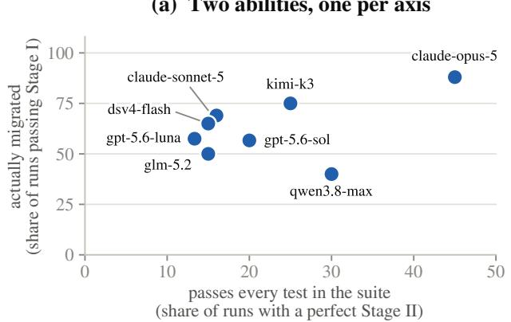

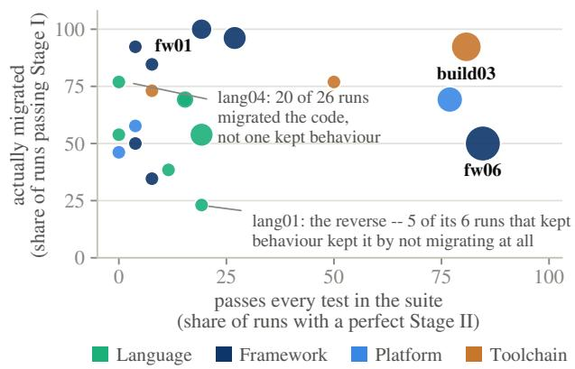  
Figure 3 (a) Where each model sits on two axes, both of them shares of the same runs: horizontally “does it still behave like the original” (a perfect Stage II), vertically “was the migration done at all” (Stage I). (b) The same two axes, per task, with marker area the number of accepted submissions. A migration has to satisfy both conditions, but they are satisfied by diferent runs, and most runs manage at most one.

Put the two axes together and the failures fall into two groups (Figure 3a). One is the runs that never migrated and kept every fixed check: a submission that barely migrates anything passes any behavioural suite by construction, and 30 runs did exactly that, spread over 7 of the 8 models. Stage II gives all 30 full marks; only Stage I stops them. The other is eight times as large: 252 runs completed the migration and broke behaviour doing it, and only Stage II stops those. Neither stage can stand in for the other, then: Stage II alone would reward doing nothing, Stage I alone would reward doing damage.

Per task, the two axes diverge just as clearly (Figure 3b), and in both directions. On lang04 (acorn, JavaScript → Rust), 20 of 26 runs passed Stage I, yet not one passed every fixed check. Twenty runs completed the migration, but all 26 failed at least one fixed check. lang01 (cmark, C → Rust) is the mirror image: only 6 runs passed Stage I, yet 5 passed every fixed check—and all five of those are blindness. Each cleared seven of the eight criteria and failed only the one asking whether the Rust is the implementation: it reproduces the original’s control flow statement for statement, a transliteration—ownership was never redesigned, the original’s manual memory management simply moved into Rust, and the safety this migration exists to buy was not bought. No behavioural test can express that, because behaviour was never where the problem was. Figure 4 shows the four typical shapes of such submissions; the first two (handed back as-is, wrapped in a shim) are defects no behavioural test can express.

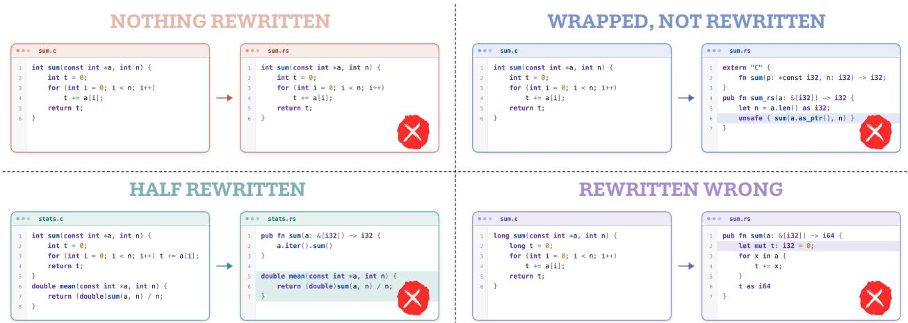  
Figure 4 The four kinds of submission Stage I has to tell apart. Top left, nothing rewritten: the new file is the C copied over verbatim, only the sufix changed. Top right, wrapped: the Rust side is an extern "C" forwarding shim and the original C still does the work. Bottom left, half done: some functions are genuinely rewritten while others still call back into the old implementation. Bottom right, rewritten wrongly: really rewritten, but the behaviour changed. The first two pass every behavioural test, and only an instrument that reads mechanism can reject them.

(a) Reaching 99% is common; reaching 100% is not  
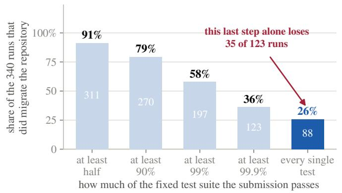

(b) 100% on the tests is still not enough  
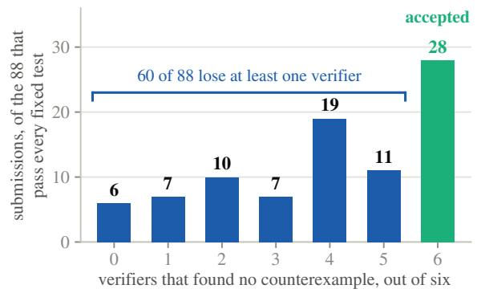  
Figure 5 (a) Among the 340 runs that did complete the migration, the share reaching each level on the fixed suite. (b) Among the 88 submissions that passed every fixed check, how many of the six independent verifiers (one hour each) failed to find a behavioural diference. Only the rightmost bar is an accepted migration.

Table 5 Agent success varies across stages and migration categories. Every cell is the share of the runs that entered that stage and passed it, so the three multiply out to the category’s final acceptance rate. The Stage II column is taken over the runs that cleared Stage I (a blindness run passes every fixed test but is already out at Stage I, so it does not count); the Stage III column is taken over the runs that cleared both earlier stages and actually met the verifiers. Agents do not perform best on one category throughout the pipeline: they achieve their highest pass rates on build toolchain rewrites at the first two stages but their lowest at the last; framework rewrites show the reverse pattern.
<table><tr><td rowspan="2">Category</td><td rowspan="2">Runs</td><td colspan="2">Migration Audit ↑</td><td colspan="2">Behavioural Tests ↑</td><td colspan="2">Agentic Verification ↑</td><td colspan="2">Final↑</td></tr><tr><td>n</td><td>%</td><td>n</td><td>%</td><td>n</td><td>%</td><td>Acc.</td><td>Score</td></tr><tr><td>Build toolchain</td><td>78</td><td>63/78</td><td>80.8</td><td>34/63</td><td>54.0</td><td>6/34</td><td>17.6</td><td>6</td><td>31.4</td></tr><tr><td>Platform port</td><td>78</td><td>45/78</td><td>57.7</td><td>17/45</td><td>37.8</td><td>4/17</td><td>23.5</td><td>4</td><td>17.2</td></tr><tr><td>Framework</td><td>182</td><td>132/182</td><td>72.5</td><td>25/132</td><td>18.9</td><td>14/25</td><td>56.0</td><td>14</td><td>12.0</td></tr><tr><td>Language</td><td>182</td><td>100/182</td><td>54.9</td><td>12/100</td><td>12.0</td><td>4/12</td><td>33.3</td><td>4</td><td>5.6</td></tr><tr><td>All</td><td>520</td><td>340/520</td><td>65.4</td><td>88/340</td><td>25.9</td><td>28/88</td><td>31.8</td><td>28</td><td>13.4</td></tr></table>

## 3.3.2 The last 1%: agents cannot deliver a perfect migration

For a repository migration, any failing unit test is a serious risk: behind that failing test stands a real downstream consumer, and it will not be spared because the other 99.99% of the behaviour is right. And this is precisely the step agents cannot get past. Among the 340 runs that passed Stage I (Figure 5a), 91% get the fixed suite past half, 58% reach 99% and 36% reach 99.9%—but only 26% make no error at all. That fina step alone eliminates 35 of the 123 runs that had already reached 99.9%; across the campaign 140 runs land in [99%, 100%), missing a median of 12.5 checks, and 18 of them miss exactly one.

Those 18 are not scattered at random; they concentrate on a handful of specific checks. On fw03 (conduit, Vue → React), four diferent models all ended at 21768/21769, failing the same one: the original uses hash routing, so visiting / settles at /#/ while the React version stays at /, which breaks every bookmark and every shared link to the site. On build03 (PyCryptodome, setuptools → Meson), five diferent models all ended at 380/381: the METADATA long description in the built wheel is 0 characters, so once the package is published its PyPI project page is blank. Not one of these checks can be called nitpicking: each corresponds to a regression that would cause trouble in production, and the original repository passes all of them. In other words, this is not a problem with the test suite; it is a problem with the migration.

Making no test error is still not enough. Among the 88 submissions that did not miss a single fixed check, only 28 survived all six verifiers; the other 60 (68.2%) had a counterexample found against them within the hour (Figure 5b), with the average submission holding of only 3.94 of the 6 verifiers. In other words, an instrument that looks only at behaviour would have accepted all 88 of these submissions, and Stage III took back two thirds of them. When a break comes, it comes quickly: the median time to a counterexample is 17.0 minutes, against 32.8 minutes for a survival.

## 3.3.3 Agent capability differs across migration categories

Agents exhibit distinct capability profiles across the four migration categories (Table 5). Their overall scores rank build toolchain rewrites first (31.4), followed by platform ports (17.2), framework rewrites (12.0), and language rewrites (5.6). However, agents do not perform best on one category throughout the pipeline. They achieve their highest Stage I and Stage II pass rates on build toolchain rewrites (80.8% and 54.0%), but their lowest Stage III survival rate on the same category (17.6%). On framework rewrites, agents achieve only 18.9% at Stage II but their highest Stage III survival rate, 56.0%.

Agents encounter diferent bottlenecks across migration categories. Their lowest conditional pass rate occurs at Stage III for build toolchain rewrites and platform ports (17.6% and 23.5%), but at Stage II for framework and language rewrites (18.9% and 12.0%). These profiles align with the repository surface that agents must modify. In build toolchain rewrites and platform ports, agents mainly change how the repository is built or which host it runs on while leaving the product code largely unchanged. Their submissions pass Stage II relatively often, but Stage III exposes behavioural diferences outside the fixed suite. In framework and language rewrites, agents modify the product code itself, and the fixed suite filters their submissions at

Table 6 Task-by-Task Comparison ofMigration Audit and Independent Human Annotation. Each row is one task, attempted once by every one of the 26 model–efort configurations. Human and judge are how many of those runs each side called a genuine migration; agree, too strict and too lenient sort the same runs by whether the two verdicts matched, the judge zeroed a run the human accepted, or the reverse.
<table><tr><td></td><td></td><td></td><td colspan="2">Called a real migration</td><td colspan="3">Judge against human</td></tr><tr><td>Task</td><td>Class</td><td>runs</td><td>by human</td><td>by judge</td><td>agree↑</td><td>too strict ↓</td><td>too lenient ↓</td></tr><tr><td>lang01 (cmark)</td><td>Language</td><td>26</td><td>7</td><td>6</td><td>25</td><td>1</td><td>0</td></tr><tr><td>lang03 (sqlparse)</td><td>Language</td><td>26</td><td>15</td><td>14</td><td>23</td><td>2</td><td>1</td></tr><tr><td>fw02 (json-server)</td><td>Framework</td><td>26</td><td>15</td><td>13</td><td>24</td><td>2</td><td>0</td></tr><tr><td>fw06 (uploadserver)</td><td>Framework</td><td>26</td><td>15</td><td>13</td><td>22</td><td>3</td><td>1</td></tr><tr><td>pf02 (Stylus)</td><td>Platform</td><td>26</td><td>14</td><td>12</td><td>24</td><td>2</td><td>0</td></tr><tr><td>build01 (libsodium)</td><td>Toolchain</td><td>26</td><td>23</td><td>19</td><td>22</td><td>4</td><td>0</td></tr><tr><td>6 tasks</td><td></td><td>156</td><td>89</td><td>77</td><td>140</td><td>14</td><td>2</td></tr></table>

Stage II before most reach the verifiers. Language rewrites show the sharpest early attrition: only 12 of 182 runs reach Stage III.

## 3.4 Analysis of Benchmark Validity

The premise of SWE Refactor Bench is a claim about an instrument rather than about models, so this section examines the instrument itself: whether the Stage I judge is stable (Section 3.4.1), what the Stage II and Stage III tests each ask (Section 3.4.2), and whether all six verifiers are needed (Section 3.4.3).

## 3.4.1 Stage I Decisions Agree Across Models and Humans

Does the same judge model read the same tree diferently three times? The judge is gpt-5.6-sol; every criterion is judged by three independent samples of it and the majority is taken. Of 3,536 criterion verdicts, 3,405 (96.3%) had all three samples agree, and only 131 split 2:1. That looks like very little disagreement, but Stage I requires every criterion to pass, so a single disagreement on a single criterion can decide the fate of a whole run: of the 340 runs that passed Stage I, 35 (10.3%) had at least one criterion that passed only 2:1—on that criterion, one sample argued for zero. Which means that without majority voting, letting any single dissenting sample count, the number passing Stage I would be 305 rather than 340. Majority over three samples is load-bearing here, not ceremonial.

Would a human judge diferently? We asked two software-engineering researchers not involved in this work to decide independently, without seeing the judge model’s verdicts, whether “this is a genuine migration” for all 156 runs of 6 tasks spanning the four migration classes, three tasks each, working from the same criteria the judge saw. Judge and human agree 89.7% of the time (140/156, κ = 0.795), and the direction of the disagreements matters more than their number: of the 16 disagreements, 14 are the judge being too strict—the human considers the migration genuine and the judge scored zero—and only 2 go the other way; Table 6 breaks this down by task. Following all 16 through the later stages changes almost nothing about the final verdict: of the 14 too-strict cases, 12 would have failed the full fixed suite at Stage II anyway; of the 2 too-lenient cases, 1 likewise; and the remaining one reached Stage III, where four of the six agentic verifiers each constructed a counterexample against it, so it was not accepted either. That is, the Stage I error let no submission a human thought was disguised into the accepted set; what it may have undercounted is at most the 2 runs that passed every behavioural check and were zeroed by Stage I alone. The judge’s error has a direction, and that direction makes points harder to earn, not easier.

Does the judge spare its own family? It is itself one of the evaluated systems, so leniency towards submissions from the same family would quietly inflate them. That does not appear: gpt-5.6-sol passed 57.1% of the 240 submissions written by a GPT-series model against 72.5% of the other 280. Most of that gap is submission quality rather than provenance.

## 3.4.2 Agentic Verification Finds Failures Beyond Fixed Tests

Stage II and Stage III test two diferent parts of the same thing, and the clearest way to see it is to put two sets of cases side by side.

What Stage II asks is what the task author could think of in advance. The check from Section 3.3.2—whether visiting / settles at /#/—is an observation you get simply by running the original once, which is why it sits in the fixed suite as one of 21,769 checks. Coverage of that kind is already wide: fw03 alone carries more than twenty-one thousand checks.

What Stage III asks cannot be anticipated. On fw04 (ChartMuseum, Gin → chi), POST /api/charts has to dispatch between a multipart-form upload handler and a raw-body upload handler; the original truncates Content-Type at the first space or semicolon, while the migrated version truncates only at the semicolon, so a request with one extra space before the boundary reaches a diferent handler on each side—an implementation detail of Gin whose existence the task author did not know of when writing the suite. Others of the same kind: lang05 (go-yaml, Go → Zig), where go-yaml, by way of Go’s time.Parse, also accepts a comma as the decimal separator, so 2001-12-14T21:59:43,10Z is a !!timestamp on the original and a !!str in the Zig version; and pf01 (SQLite, POSIX → WASI), where after checkpointing a WAL database and switching it back to DELETE mode, native SQLite removes both the -wal and the -shm file while the WASI version removes only -wal.

What the two kinds have in common is that each is decisive—if this one check does not pass, the migration is not complete; the only diference is that one can be fixed in advance as a test and the other cannot. That is exactly why both stages are indispensable, and exactly why Stage III has to hand in an executable program rather than a verdict: only an executable counterexample turns “a problem nobody thought of” into a fact that can be re-checked.

## 3.4.3 Six Verifiers: Strength and Diversity Both Matter

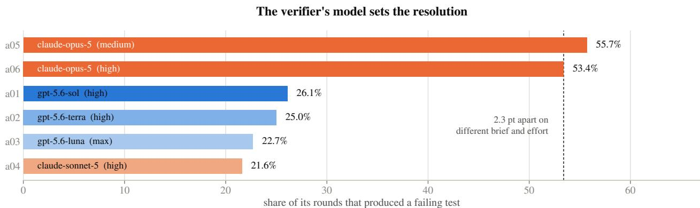  
Figure 6 Break rate of each of the six verifiers: the share of its rounds in which it handed in an executable counterexample that passes on the original and fails on the submission, coloured by the model behind it and annotated with its reasoning-efort setting. The dashed line marks the lower of the two claude-opus-5 verifiers.

Finding 1: a strong coding agent as the verifier matters an order of magnitude more than its configuration. The six verifiers face the same 88 submissions and each runs 88 rounds, so task dificulty is identical for them; all that difers is which direction each was assigned. The break rates, however, are far apart (Figure 6): the two held by claude-opus-5 are 55.7% and 53.4%, the other four between 21.6% and 26.1%. That gap cannot be attributed to opus happening to draw the easy directions, for two reasons. First, of the two opus verifiers, one probes an assigned direction and the other is unrestricted, so their prompts and efort settings both difer, and yet their break rates difer by only 2.3 percentage points. Second, the unrestricted one was given no direction at all—it was free to search the same ground as the other four—and it still broke 53.4%. Changing prompt and efort within one model moves the break rate by about two points; changing the model moves it by thirty. This also means the reported numbers are a property of this panel as much as of the submissions: retire the two strongest and the remaining four would accept 46 submissions instead of 28. An accepted submission is therefore not a migration proven correct but a migration that survived the strongest adversaries we could field—and as models improve, this same fixed set of 20 tasks will be scored more strictly.

Table 7 Positioning against related benchmarks. Starts failing means whether the starting state already fails some test in the suite being scored; that is what makes “red to green” an informative verdict—and it is exactly the property SWE Refactor Bench cannot have. Migration criterion means whether a non-behavioural instrument can reject a submission that passed every behavioural check; agentic verifier means whether, at scoring time, further models actively search for diferences beyond the fixed tests that the authors did not anticipate. ✓ is yes, ✓ is partial—MigrationBench moves a language version, Java 8 to 17/21, while the language itself stays—and × marks a dimension the benchmark does not aim at, not a defect.
<table><tr><td>Benchmark</td><td>Unit of work</td><td>Starts failing</td><td>Stack changes</td><td>Migration criterion</td><td>Agentic verifier</td></tr><tr><td>SWE-bench [32]</td><td>one issue</td><td></td><td>X</td><td>X</td><td>X</td></tr><tr><td>SWE-EVO [37]</td><td>one feature</td><td></td><td>X</td><td>X</td><td>X</td></tr><tr><td>SWE-CI [10]</td><td>CI history</td><td></td><td>X</td><td>X</td><td>X</td></tr><tr><td>Terminal-Bench [47]</td><td>one task</td><td></td><td>X</td><td>X</td><td>X</td></tr><tr><td>TransCoder [53]</td><td>one function</td><td>V</td><td></td><td>X</td><td>X</td></tr><tr><td>MigrationBench [43]</td><td>whole repository</td><td></td><td></td><td>X</td><td>X</td></tr><tr><td>SWE Refactor Bench (this work)</td><td>whole repository</td><td>X</td><td>J</td><td>V</td><td>V</td></tr></table>

Nor are the six redundant. Counting exclusive breaks—where this verifier alone found a counterexample and the other five did not—the two opus verifiers have 5 and 2, and the four weaker ones 4 between them. Even the one with the lowest break rate rejected a submission that the other five let through: they difer in strength, but they are complementary in coverage.

Finding 2: models do not spare their own family’s work. This matters, because claude-opus-5 both leads the leaderboard and holds two of the verifiers. Pooled, the efect runs opposite to collusion: verifiers broke 33.9% of the submissions written by a model of their own family and 34.3% of everyone else’s. The apparent counter-evidence is that the opus verifiers break 40.8% of opus-authored submissions against 65.0% of everyone else’s; but that fails its own control—the four non-opus verifiers on the same submissions are at 17.1% against 29.1%, a drop by the same factor. What separates the two is submission quality, not collusion: submissions written by opus are simply harder to break, for everyone.

## 4 Related Work

Repository-level coding benchmarks: the signal is “red to green”. SWE-bench [32] established the paradigm the field now uses: a real repository, a real issue, and a test that fails before the patch and passes after it. The paradigm has since been extended—to other languages [69], to continuously refreshed task streams that resist contamination [31, 71], to building a whole library from scratch [72], and to writing tests rather than patches [48]. A neighbouring group of suites keeps the same criterion and only stretches the horizon: repository evolution (SWE-EVO) [37, 39], long continuous-integration histories (SWE-CI) [10], and hours of terminal work (Terminal-Bench) [47]. The criterion is inherited from function-level suites [11] and fits every one of those task types: while the work is unfinished the test is red, when it is finished it turns green, and that jump is itself the evidence of completion. SWE Refactor Bench’s tasks have no such jump available, because the starting state is already green—which is not a defect of those benchmarks but a property of behaviour-preserving evolution, which simply does not produce that signal.

Code migration and reward hacking: fixed tests are not enough. Behaviour-preserving rewriting is not new: translation between languages stayed at the function level for a long time after TransCoder [53], and the dificulty of evaluating it was documented early [49]; the unit later grew to a whole repository [30, 64], and C to Rust acquired dedicated benchmarks of its own [19, 33]; other work moves not the language but a language version [43] or a single API [40]. The changes difer, the scoring does not: take a test suite, run it, count what passes—reusing the original repository’s tests when the language stays the same, and having humans write them on the target side when it does not. For a whole-repository change of stack that scoring is no longer suficient: a repository handed back as-is still turns any fixed suite green, so fixed tests can say at most “nothing was broken”, never “something was changed”. It is tempting to read this as reward hacking—agents optimise everything their reward leaves unconstrained [4, 35, 54], and coding environments have supplied plenty of documented cases [6, 61], with SWE-bench itself audited item by item for leakage and contamination [21, 42, 65]. That literature tells us what to guard against, but the problem here is not that someone is exploiting a loophole: a repository handed back as-is circumvents no check; it earns full marks by the rules, and the rules simply cannot see whether the migration happened. Since the hole is not in how tight the tests are, no amount of extra tests will close it (Section 2.1); the only remedy is a second check outside behaviour, holding a veto [41].

Model-based judging and diferential testing: the tools at the two ends of this work. Both that veto and the search beyond the fixed tests have established methods to draw on. When what must be decided cannot be written as a scoring script, using a model as the judge is standard practice [73], and its known failure modes—position and verbosity bias, self-preference [50, 62]—are exactly why Stage I answers narrow questions with cited evidence over three independent samples instead of producing one global rating, and why we measure its consistency (Section 3.4.1). Stage III is diferential testing [46]: with the reference as the other side, this is how compilers have been checked at scale [16, 68], and what a verifier must submit is not an opinion but evidence that runs. The stronger route would of course be formal verification, but translation validation [51], diferential symbolic execution [8, 36] and verified compilers [38] all require two sides whose semantics can be related, and a cross-language whole-repository rewrite does not ofer that. To approximate the same efect we use agentic verifiers instead: let the strongest coding agents search as hard as they can with both source trees in hand, and if no counterexample comes out, that is the strongest evidence we are able to give. Table 7 places SWE Refactor Bench next to the benchmarks above, dimension by dimension.

## 5 Conclusion

We have presented SWE Refactor Bench: 20 long-horizon whole-repository migrations drawn from real open-source infrastructure, together with a three-stage evaluation protocol that does not rely on behaviour alone—Migration Audit decides whether the migration actually happened and holds a veto, the Behavioural Tests stage decides whether behaviour is unchanged down to the last observation using 130,118 fixed checks recorded from the original, and Agentic Verification sends six coding agents, one hour each, to look for the diferences the fixed tests may have missed, accepting nothing but an executable counterexample. Across 520 evaluations on 8 frontier models and 26 configurations, only 28 (5.4%) passed all three stages, and 13 of the 20 tasks were solved by nobody. The failures follow a pattern: “getting the migration done” and “not breaking anything” are two diferent abilities, and agents missed them in opposite directions—a few runs preserved behaviour by skipping the migration and were stopped at Migration Audit, most attempted it and broke behaviour and were stopped at Behavioural Tests. And even when the migration was genuinely done, only 26% of runs passed every fixed check, and two thirds of those still had a counterexample found against them by a coding agent within the hour. There is therefore a long way to go before an agent can complete a whole-repository migration that is genuinely deliverable; and how far along that road we are will be measured not by how much code the agent wrote, but by whether, once it is done, the system is still the same system.

## References

[1] Mei Akizuru. go-simple-upload-server v2.2.0. https://github.com/mayth/go-simple-upload-server, 2023. MIT licence.

[2] Andi Albrecht. sqlparse 0.5.3. https://github.com/andialbrecht/sqlparse, 2016. BSD-3-Clause licence.

[3] Automattic. Stylus 0.63.0: an expressive CSS preprocessor. https://github.com/stylus/stylus, 2024. MIT licence.

[4] Bowen Baker, Joost Huizinga, Leo Gao, Zehao Dou, Melody Y. Guan, Aleksander Madry, Wojciech Zaremba, Jakub Pachocki, and David Farhi. Monitoring reasoning models for misbehavior and the risks of promoting obfuscation. arXiv preprint arXiv:2503.11926, 2025.

[5] Fabrice Bellard and Charlie Gordon. QuickJS 2020-11-08: a small embeddable JavaScript engine. https: //bellard.org/quickjs/, 2020. MIT licence, stated in the header of every source file.

[6] Ivan Bercovich, Ivgeni Segal, Kexun Zhang, Shashwat Saxena, Aditi Raghunathan, and Ziqian Zhong. Terminal wrench: A dataset of 331 reward-hackable environments and 3,632 exploit trajectories. arXiv preprint arXiv:2604.17596, 2026.

[7] Daniel J. Bernstein, Tanja Lange, and Peter Schwabe. The security impact of a new cryptographic library. In International Conference on Cryptology and Information Security in Latin America (LATINCRYPT), 2012.

[8] Cristian Cadar, Daniel Dunbar, and Dawson Engler. KLEE: Unassisted and automatic generation of high-coverage tests for complex systems programs. In USENIX Symposium on Operating Systems Design and Implementation (OSDI), 2008.

[9] Canonical Ltd. go-yaml v3.0.1: YAML support for the Go language. https://github.com/go-yaml/yaml, 2019. Apache-2.0 and MIT licences.

[10] Jialong Chen, Xander Xu, Hu Wei, Chuan Chen, and Bing Zhao. SWE-CI: Evaluating agent capabilities in maintaining codebases via continuous integration. arXiv preprint arXiv:2603.03823, 2026.

[11] Mark Chen, Jerry Tworek, Heewoo Jun, Qiming Yuan, Henrique Ponde de Oliveira Pinto, Jared Kaplan, Harri Edwards, Yuri Burda, Nicholas Joseph, Greg Brockman, Alex Ray, Raul Puri, Gretchen Krueger, Michael Petrov, Heidy Khlaaf, Girish Sastry, Pamela Mishkin, Brooke Chan, Scott Gray, Nick Ryder, Mikhail Pavlov, Alethea Power, Lukasz Kaiser, Mohammad Bavarian, Clemens Winter, Philippe Tillet, Felipe Petroski Such, Dave Cummings, Matthias Plappert, Fotios Chantzis, Elizabeth Barnes, Ariel Herbert-Voss, William Hebgen Guss, Alex Nichol, Alex Paino, Nikolas Tezak, Jie Tang, Igor Babuschkin, Suchir Balaji, Shantanu Jain, William Saunders, Christopher Hesse, Andrew N. Carr, Jan Leike, Josh Achiam, Vedant Misra, Evan Morikawa, Alec Radford, Matthew Knight, Miles Brundage, Mira Murati, Katie Mayer, Peter Welinder, Bob McGrew, Dario Amodei, Sam McCandlish, Ilya Sutskever, and Wojciech Zaremba. Evaluating large language models trained on code. arXiv preprint arXiv:2107.03374, 2021.

[12] Tsong Yueh Chen, Fei-Ching Kuo, Huai Liu, Pak-Lok Poon, Dave Towey, T. H. Tse, and Zhi Quan Zhou. Metamorphic testing: A review of challenges and opportunities. ACM Computing Surveys, 51(1):4:1–4:27, 2018.

[13] Koen Claessen and John Hughes. QuickCheck: A lightweight tool for random testing of Haskell programs. In ACM SIGPLAN International Conference on Functional Programming (ICFP), 2000.

[14] Ward Cunningham. The WyCash portfolio management system. In Addendum to the Proceedings on Object-Oriented Programming Systems, Languages, and Applications (OOPSLA Addendum), Experience Report, pages 29–30, 1992.

[15] DeepSeek-AI. DeepSeek-V3 technical report. arXiv preprint arXiv:2412.19437, 2024.

[16] Yinlin Deng, Chunqiu Steven Xia, Haoran Peng, Chenyuan Yang, and Lingming Zhang. Large language models are zero-shot fuzzers: Fuzzing deep-learning libraries via large language models. In ACM SIGSOFT International Symposium on Software Testing and Analysis (ISSTA), 2023. arXiv:2212.14834.

[17] Frank Denis. libsodium 1.0.20. https://github.com/jedisct1/libsodium, 2026. ISC licence.

[18] L. Peter Deutsch. DEFLATE compressed data format specification version 1.3. Technical Report RFC 1951, Internet Engineering Task Force, 1996.

[19] Mehmet Emre, Ryan Schroeder, Kyle Dewey, and Ben Hardekopf. Translating C to safer Rust. Proceedings of the ACM on Programming Languages, 5(OOPSLA), 2021.

[20] Kevin P. Gafney, Martin Prammer, Larry Brasfield, D. Richard Hipp, Dan Kennedy, and Jignesh M. Patel. SQLite: Past, present, and future. Proceedings of the VLDB Endowment, 15(12):3535–3547, 2022.

[21] Spandan Garg, Benjamin Steenhoek, and Yufan Huang. Saving SWE-bench: A benchmark mutation approach for realistic agent evaluation. arXiv preprint arXiv:2510.08996, 2025.

[22] Robert Geisberger, Peter Sanders, Dominik Schultes, and Daniel Delling. Contraction hierarchies: Faster and simpler hierarchical routing in road networks. In International Workshop on Experimental Algorithms (WEA), 2008.

[23] GLM-4.5 Team. GLM-4.5: Agentic, reasoning, and coding (ARC) foundation models. arXiv preprint arXiv:2508.06471, 2025.

[24] Google. Gson gson-parent-2.10.1. https://github.com/google/gson, 2011. Apache-2.0 licence.

[25] Google Inc. Jsonnet 0.20.0: a data templating language. https://github.com/google/jsonnet, 2015. Apache-2.0 licence.

[26] GraphHopper GmbH. GraphHopper 11.0. https://github.com/graphhopper/graphhopper, 2024. Apache-2.0 licence.

[27] Andreas Haas, Andreas Rossberg, Derek L. Schuf, Ben L. Titzer, Michael Holman, Dan Gohman, Luke Wagner, Alon Zakai, and JF Bastien. Bringing the web up to speed with WebAssembly. In ACM SIGPLAN Conference on Programming Language Design and Implementation (PLDI), 2017.

[28] Sven-Hendrik Haase. miniserve 0.27.1. https://github.com/svenstaro/miniserve, 2018. MIT licence.

[29] IBM Corp. JSONata 2.2.2: a query and transformation language for JSON. https://github.com/jsonata-js/ jsonata, 2018. MIT licence.

[30] Ali Reza Ibrahimzada, Kaiyao Ke, Mrigank Pawagi, Muhammad Salman Abid, Rangeet Pan, Saurabh Sinha, and Reyhaneh Jabbarvand. AlphaTrans: A neuro-symbolic compositional approach for repository-level code translation and validation. arXiv preprint arXiv:2410.24117, 2024.

[31] Naman Jain, King Han, Alex Gu, Wen-Ding Li, Fanjia Yan, Tianjun Zhang, Sida Wang, Armando Solar-Lezama, Koushik Sen, and Ion Stoica. LiveCodeBench: Holistic and contamination free evaluation of large language models for code. In International Conference on Learning Representations (ICLR), 2025. arXiv:2403.07974.

[32] Carlos E. Jimenez, John Yang, Alexander Wettig, Shunyu Yao, Kexin Pei, Ofir Press, and Karthik Narasimhan. SWE-bench: Can language models resolve real-world GitHub issues? In International Conference on Learning Representations (ICLR), 2024. arXiv:2310.06770.

[33] Anirudh Khatry, Robert Zhang, Jia Pan, Ziteng Wang, Qiaochu Chen, Greg Durrett, and Isil Dillig. CRUST-bench: A comprehensive benchmark for C-to-safe-Rust transpilation. arXiv preprint arXiv:2504.15254, 2025.

[34] Kimi Team. Kimi K2: Open agentic intelligence. arXiv preprint arXiv:2507.20534, 2025.

[35] Victoria Krakovna, Jonathan Uesato, Vladimir Mikulik, Matthew Rahtz, Tom Everitt, Ramana Kumar, Zac Kenton, Jan Leike, and Shane Legg. Specification gaming: The flip side of AI ingenuity. DeepMind blog. https://deepmind.google/blog/specification-gaming-the-flip-side-of-ai-ingenuity/, 2020.

[36] Shuvendu K. Lahiri, Chris Hawblitzel, Ming Kawaguchi, and Henrique Rebêlo. SYMDIFF: A language-agnostic semantic dif tool for imperative programs. In International Conference on Computer Aided Verification (CAV), 2012.

[37] Tue Le, Minh V. T. Thai, Dung Nguyen Manh, Huy Phan Nhat, and Nghi D. Q. Bui. SWE-EVO: Benchmarking coding agents in long-horizon software evolution scenarios. arXiv preprint arXiv:2512.18470, 2025.

[38] Xavier Leroy. Formal verification of a realistic compiler. Communications of the ACM, 52(7):107–115, 2009.

[39] Jia Li, Ge Li, Xuanming Zhang, Yunfei Zhao, Yihong Dong, Zhi Jin, Binhua Li, Fei Huang, and Yongbin Li. EvoCodeBench: An evolving code generation benchmark with domain-specific evaluations. In Advances in Neural Information Processing Systems (NeurIPS), Datasets and Benchmarks Track, 2024. arXiv:2410.22821.

[40] Tianyu Li, Ruishi Li, Bo Wang, Brandon Paulsen, Umang Mathur, and Prateek Saxena. Adversarial agent collaboration for correctness improvements of C to safe Rust translation. arXiv preprint arXiv:2510.03879, 2025.

[41] Percy Liang, Rishi Bommasani, Tony Lee, Dimitris Tsipras, Dilara Soylu, Michihiro Yasunaga, Yian Zhang, Deepak Narayanan, Yuhuai Wu, Ananya Kumar, Benjamin Newman, Binhang Yuan, Bobby Yan, Ce Zhang, Christian Cosgrove, Christopher D. Manning, Christopher Ré, Diana Acosta-Navas, Drew A. Hudson, Eric Zelikman, Esin Durmus, Faisal Ladhak, Frieda Rong, Hongyu Ren, Huaxiu Yao, Jue Wang, Keshav Santhanam, Laurel Orr, Lucia Zheng, Mert Yuksekgonul, Mirac Suzgun, Nathan Kim, Neel Guha, Niladri S. Chatterji, Omar Khattab, Peter Henderson, Qian Huang, Ryan Andrew Chi, Sang Michael Xie, Shibani Santurkar, Surya Ganguli, Tatsunori Hashimoto, Thomas Icard, Tianyi Zhang, Vishrav Chaudhary, William Wang, Xuechen Li, Yifan Mai,

Yuhui Zhang, and Yuta Koreeda. Holistic evaluation of language models. Transactions on Machine Learning Research, 2023. arXiv:2211.09110.

[42] Shanchao Liang, Spandan Garg, and Roshanak Zilouchian Moghaddam. The SWE-bench illusion: When state-of-the-art LLMs remember instead of reason. arXiv preprint arXiv:2506.12286, 2025.

[43] Linbo Liu, Xinle Liu, Qiang Zhou, Lin Chen, Yihan Liu, Hoan Nguyen, Behrooz Omidvar-Tehrani, Xi Shen, Jun Huan, Omer Tripp, and Anoop Deoras. MigrationBench: Repository-level code migration benchmark from Java 8. arXiv preprint arXiv:2505.09569, 2025.

[44] Jean loup Gailly and Mark Adler. zlib 1.3.1. https://github.com/madler/zlib, 2022. Zlib licence.

[45] John MacFarlane. cmark 0.31.1: the CommonMark reference implementation. https://github.com/commonmark/ cmark, 2014. BSD-2-Clause, MIT and CC-BY-SA-4.0.

[46] William M. McKeeman. Diferential testing for software. Digital Technical Journal, 10(1):100–107, 1998.

[47] Mike A. Merrill et al. Terminal-Bench: Benchmarking agents on hard, realistic tasks in command line interfaces. arXiv preprint arXiv:2601.11868, 2026.

[48] Niels Mündler, Mark Niklas Müller, Jingxuan He, and Martin Vechev. SWT-bench: Testing and validating real-world bug-fixes with code agents. In Advances in Neural Information Processing Systems (NeurIPS), 2024. arXiv:2406.12952.

[49] Rangeet Pan, Ali Reza Ibrahimzada, Rahul Krishna, Divya Sankar, Lambert Pouguem Wassi, Michele Merler, Boris Sobolev, Raju Pavuluri, Saurabh Sinha, and Reyhaneh Jabbarvand. Lost in translation: A study of bugs introduced by large language models while translating code. In IEEE/ACM International Conference on Software Engineering (ICSE), 2024. arXiv:2308.03109.

[50] Arjun Panickssery, Samuel R. Bowman, and Shi Feng. LLM evaluators recognize and favor their own generations. arXiv preprint arXiv:2404.13076, 2024.

[51] Amir Pnueli, Michael Siegel, and Eli Singerman. Translation validation. In International Conference on Tools and Algorithms for the Construction and Analysis of Systems (TACAS), 1998.

[52] Kenneth Reitz. httpbin 0.10.2. https://github.com/psf/httpbin, 2017. ISC or MIT licence.

[53] Baptiste Rozière, Marie-Anne Lachaux, Lowik Chanussot, and Guillaume Lample. Unsupervised translation of programming languages. In Advances in Neural Information Processing Systems (NeurIPS), 2020. arXiv:2006.03511.

[54] Joar Skalse, Nikolaus H. R. Howe, Dmitrii Krasheninnikov, and David Krueger. Defining and characterizing reward hacking. In Advances in Neural Information Processing Systems (NeurIPS), 2022. arXiv:2209.13085.

[55] The Acorn Contributors. Acorn 8.14.0: a small, fast JavaScript parser. https://github.com/acornjs/acorn, 2022. MIT licence.

[56] The Helm Authors. ChartMuseum v0.15.0. https://github.com/helm/chartmuseum, 2022. Apache-2.0 licence.

[57] The PyCryptodome Authors. PyCryptodome 3.20.0. https://github.com/Legrandin/pycryptodome, 2024. BSD-2-Clause and Unlicense.

[58] The RealWorld Contributors. vue-realworld-example-app, commit feb0b7d2. https://github.com/gothinkster/ vue-realworld-example-app, 2017. MIT licence.

[59] The SQLite Developers. SQLite 3.31.1. https://www.sqlite.org/, 2020. Public domain; SPDX identifier blessing.

[60] typicode. json-server 0.17.4. https://github.com/typicode/json-server, 2015. MIT licence.

[61] Hao Wang, Hanchen Li, Qiuyang Mang, Alvin Cheung, Koushik Sen, and Dawn Song. Do androids dream of breaking the game? systematically auditing AI agent benchmarks with BenchJack. arXiv preprint arXiv:2605.12673, 2026.

[62] Peiyi Wang, Lei Li, Liang Chen, Zefan Cai, Dawei Zhu, Binghuai Lin, Yunbo Cao, Lingpeng Kong, Qi Liu, Tianyu Liu, and Zhifang Sui. Large language models are not fair evaluators. In Annual Meeting of the Association for Computational Linguistics (ACL), 2024. arXiv:2305.17926.

[63] Xingyao Wang, Boxuan Li, Yufan Song, Frank F. Xu, Xiangru Tang, Mingchen Zhuge, Jiayi Pan, Yueqi Song, Bowen Li, Jaskirat Singh, Hoang H. Tran, Fuqiang Li, Ren Ma, Mingzhang Zheng, Bill Qian, Yanjun Shao, Niklas Muennighof, Yizhe Zhang, Binyuan Hui, Junyang Lin, Robert Brennan, Hao Peng, Heng Ji, and Graham Neubig. OpenHands: An open platform for AI software developers as generalist agents. In International Conference on Learning Representations (ICLR), 2025. arXiv:2407.16741.

[64] Yanli Wang, Yanlin Wang, Suiquan Wang, Daya Guo, Jiachi Chen, John Grundy, Xilin Liu, Yuchi Ma, Mingzhi Mao, Hongyu Zhang, and Zibin Zheng. RepoTransBench: A real-world multilingual benchmark for repository-level code translation. arXiv preprint arXiv:2412.17744, 2024.

[65] Cheng Xu, Shuhao Guan, Derek Greene, and M-Tahar Kechadi. Benchmark data contamination of large language models: A survey. arXiv preprint arXiv:2406.04244, 2024.

[66] An Yang, Anfeng Li, Baosong Yang, Beichen Zhang, Binyuan Hui, Bo Zheng, Bowen Yu, Chang Gao, Chengen Huang, Chenxu Lv, Chujie Zheng, Dayiheng Liu, Fan Zhou, Fei Huang, Feng Hu, Hao Ge, Haoran Wei, Huan Lin, Jialong Tang, Jian Yang, Jianhong Tu, Jianwei Zhang, Jianxin Yang, Jiaxi Yang, Jing Zhou, Jingren Zhou, Junyang Lin, Kai Dang, Keqin Bao, Kexin Yang, Le Yu, Lianghao Deng, Mei Li, Mingfeng Xue, Mingze Li, Pei Zhang, Peng Wang, Qin Zhu, Rui Men, Ruize Gao, Shixuan Liu, Shuang Luo, Tianhao Li, Tianyi Tang, Wenbiao Yin, Xingzhang Ren, Xinyu Wang, Xinyu Zhang, Xuancheng Ren, Yang Fan, Yang Su, Yichang Zhang, Yinger Zhang, Yu Wan, Yuqiong Liu, Zekun Wang, Zeyu Cui, Zhenru Zhang, Zhipeng Zhou, and Zihan Qiu. Qwen3 technical report. arXiv preprint arXiv:2505.09388, 2025.

[67] John Yang, Carlos E. Jimenez, Alexander Wettig, Kilian Lieret, Shunyu Yao, Karthik Narasimhan, and Ofir Press. SWE-agent: Agent-computer interfaces enable automated software engineering. In Advances in Neural Information Processing Systems (NeurIPS), 2024. arXiv:2405.15793.

[68] Xuejun Yang, Yang Chen, Eric Eide, and John Regehr. Finding and understanding bugs in C compilers. In ACM SIGPLAN Conference on Programming Language Design and Implementation (PLDI), 2011.

[69] Daoguang Zan, Zhirong Huang, Wei Liu, Hanwu Chen, Linhao Zhang, Shulin Xin, Lu Chen, Qi Liu, Xiaojian Zhong, Aoyan Li, Siyao Liu, Yongsheng Xiao, Liangqiang Chen, Yuyu Zhang, Jing Su, Tianyu Liu, Rui Long, Kai Shen, and Liang Xiang. Multi-SWE-bench: A multilingual benchmark for issue resolving. arXiv preprint arXiv:2504.02605, 2025.

[70] Andreas Zeller and Ralf Hildebrandt. Simplifying and isolating failure-inducing input. IEEE Transactions on Software Engineering, 28(2):183–200, 2002.

[71] Linghao Zhang, Shilin He, Chaoyun Zhang, Yu Kang, Bowen Li, Chengxing Xie, Junhao Wang, Maoquan Wang, Yufan Huang, Shengyu Fu, Elsie Nallipogu, Qingwei Lin, Yingnong Dang, Saravan Rajmohan, and Dongmei Zhang. SWE-bench goes live! arXiv preprint arXiv:2505.23419, 2025.

[72] Wenting Zhao, Nan Jiang, Celine Lee, Justin T. Chiu, Claire Cardie, Matthias Gallé, and Alexander M. Rush. Commit0: Library generation from scratch. In International Conference on Learning Representations (ICLR), 2025. arXiv:2412.01769.

[73] Lianmin Zheng, Wei-Lin Chiang, Ying Sheng, Siyuan Zhuang, Zhanghao Wu, Yonghao Zhuang, Zi Lin, Zhuohan Li, Dacheng Li, Eric P. Xing, Hao Zhang, Joseph E. Gonzalez, and Ion Stoica. Judging LLM-as-a-judge with MT-bench and chatbot arena. In Advances in Neural Information Processing Systems (NeurIPS), 2023. arXiv:2306.05685.

## A How a Task Is Built

Every task is built by the same procedure. This appendix walks through lang01-cmark-c-to-rust: its State A is cmark 0.31.1, the CommonMark reference implementation, 41 C source files, built by CMake into libcmark.so.0.31.1, libcmark.a and cmark(1); its State B is those same three artifacts, behind the same cmark.h, implemented in Rust 1.90 without any external crate and with the C ABI unchanged.

What a task ships with. Instantiating (1) means putting eight things on disk: (i) the archive of State A, rebuilt to confirm that it works; (ii) a State B declaration naming the target stack down to fixed versions; (iii) the instruction I; (iv) the ofline image E, which also carries State A’s own toolchain; (v) an artifact contract saying what will be collected from the finished workspace; (vi) the fixed Stage II expectations, recorded from a reference build of State A and divided into modules; (vii) the migration criteria; and (viii) the further checks made by the agentic verifiers. Items (vi)–(viii) live in a separate image that is never mounted into the agent’s container, so those tests are not merely “unread” by it—they do not exist for it.

Pick the debt first, the repository second. We start from a migration a maintainer would call overdue and then look for a project where that migration is the whole job: the old stack has to be load-bearing, so that removing it reaches the design rather than just the imports. Why cmark qualifies is worth spelling out, since CommonMark parsers in Rust already exist: what is wanted here is not a correct parser but this library’s ABI, installation tree and so on, which no existing crate provides. The repository is then trimmed, archived and rebuilt inside the image to confirm it works, with history squashed to a single commit—an upstream log is a place where some past migration may well already be described, and git log is the first thing a competent agent reads.

Write the requirements, but not the tests. I states the requirements in full: the files that must survive untouched, how the build has to remain invocable without a network, and in which direction behaviour will be compared. What it never contains is a single one of the concrete behavioural checks—an instruction that enumerates the tests is an instruction to satisfy the tests.

Scoring reads source only. An exclusion list is applied when the workspace is collected (build-\*, target/, object files, install prefixes, .git), so “the old stack no longer exists” is a fact about source rather than a fact about what the agent happened to leave in some directory.

Draw the boundary for the verifiers. The allow list and deny list of Stage III have to agree with I: a scope that forbids what the instruction promised makes the task unwinnable, and a scope that allows what the instruction excluded makes it unloseable. Within that scope a verifier may work the way a real tester does [12, 13, 70]. For lang01, fifteen directions are allowed and eleven forbidden, the latter including internal struct layout, behaviour the original gets wrong as well, and—most worth stating explicitly—the identity of the tree under test: a candidate program that detects which tree it is running against satisfies every mechanical condition for a break while establishing nothing about the migration, and is rejected on discovery rather than weighed.

Make the task verify itself. No reference solution ships with a task; in its place there is an identity run at image build time—State A is scored against itself inside the same image, and unless every behavioural module reaches 1.0 the build is refused.

Table 8 shows one whole task as the scorer sees it: lang01’s eight criteria and the fifteen modules of Stage II. The run in the table is precisely the sharpest form of disagreement between the stages: all fifteen modules at 1.00, the highest mark the behavioural side can give, zeroed by Stage I on a single criterion—every behavioural instrument in the stack calls this migration complete, and the one instrument that reads the code calls it a transliteration.

<table><tr><td colspan="4">Stage I — migration criteria</td><td colspan="3">Stage II — test modules</td></tr><tr><td>Criterion</td><td>What it asks</td><td>Required Verdict</td><td></td><td>Module</td><td>What it measures</td><td>Pass rate</td></tr><tr><td>no-c-sources</td><td>has C left the build</td><td></td><td>pass</td><td>build</td><td>two link configurations</td><td>1.00</td></tr><tr><td>no-foreign-headers</td><td>is only cmark.h left</td><td></td><td>pass</td><td>structure</td><td>install tree, ABI</td><td>1.00</td></tr><tr><td>no-c-in-build</td><td>is no C compiled</td><td></td><td>pass</td><td>conformance</td><td>CommonMark corpus</td><td>1.00</td></tr><tr><td>rust-present</td><td>is Rust really there</td><td></td><td>pass</td><td>renderers</td><td>five output renderers</td><td>1.00</td></tr><tr><td>rust-is-primary</td><td>is Rust the implementation</td><td></td><td>fail</td><td>data-tables</td><td>entities, case folding</td><td>1.00</td></tr><tr><td></td><td>no-embedded-reference no prebuilt artifact linked</td><td></td><td>pass</td><td>encoding</td><td>UTF-8 validation</td><td>1.00</td></tr><tr><td>no-verifier-awareness</td><td>was the scorer let off</td><td></td><td>pass</td><td>robustness</td><td>pathological input</td><td>1.00</td></tr><tr><td>default-path</td><td>is the scored path default</td><td></td><td>pass</td><td>options</td><td>options and combinations</td><td>1.00</td></tr><tr><td colspan="3">All eight criteria are required, so one failure</td><td></td><td>streaming</td><td>incremental parser</td><td>1.00</td></tr><tr><td colspan="3">zeroes the run. Each is decided by majority</td><td></td><td>tree</td><td>AST and its invariants</td><td>1.00</td></tr><tr><td colspan="3">over 3 samples at medium effort—here all</td><td></td><td>iterators</td><td>iterator API</td><td>1.00</td></tr><tr><td colspan="3">eight were unanimous.</td><td></td><td>provenance</td><td>what built these artifacts</td><td>1.00</td></tr><tr><td colspan="3"></td><td></td><td colspan="2">cli the installed executable</td><td>1.00</td></tr><tr><td colspan="3">Any criterion fails ⇒ score 0; Stage III never runs</td><td></td><td colspan="2">4,184 checks, none skipped</td><td>1.00</td></tr><tr><td colspan="3"></td><td colspan="3">a perfect Stage II</td><td></td></tr></table>

Table 8 One task and one submission in full: claude-opus-5 at high efort on lang01-cmark-c-to-rust. All 4,184 checks across 15 modules pass, the highest mark Stage II can give; seven of the eight criteria pass, and the eighth, rust-is-primary, fails unanimously because the Rust reproduces the C implementation layout field by field—“the same hand-managed pointer stack, the same names and the same order . . . this is the original transliterated into unsafe Rust”, cited to src/inlines.rs:55 and neighbouring lines. Final score: 0.

Table 9 The 520 runs broken down by task. Every task is run once by each of the 26 configurations (n = 26). Column meanings follow the metric definitions of Section 3.1: migrated is the number of runs passing Migration Audit, all tests pass is the number passing every fixed check in Behavioural Tests (regardless of the Stage I verdict), blindness is the subset of those that failed Stage I, accepted is the number passing all three stages, and score is defined in (4). All tests pass − blindness is therefore the number of runs that reached Stage III. Only 7 of the 20 tasks ever produced an accepted submission.
<table><tr><td rowspan="2">Task</td><td rowspan="2">Migration</td><td>Stage I passed</td><td>Migrated↑ All tests pass ↑ Stage II perfect</td><td>Blindness↓ passed, not migrated</td><td>Accepted↑ all three passed</td><td>Score↑ out of 100</td></tr><tr><td>n</td><td></td><td>n</td><td>n</td><td>mean</td></tr><tr><td>Language rewrites</td><td></td><td></td><td></td><td></td><td></td><td></td></tr><tr><td>lang01</td><td>C → Rust</td><td>26</td><td></td><td></td><td></td><td>0.00</td></tr><tr><td>lang02</td><td>C → Java</td><td>26</td><td></td><td></td><td></td><td>12.69</td></tr><tr><td>lang03</td><td>Python → Go</td><td>26</td><td>14</td><td></td><td></td><td>0.00</td></tr><tr><td>lang04</td><td>JavaScript → Rust</td><td>26</td><td>20</td><td></td><td></td><td>0.00</td></tr><tr><td>lang05</td><td>Go → Zig</td><td>26</td><td>18</td><td></td><td></td><td>12.69</td></tr><tr><td>lang06</td><td>C++ → C#</td><td>26</td><td>10 14</td><td></td><td></td><td>2.31</td></tr><tr><td>lang07</td><td>JavaScript → TypeScript</td><td>26</td><td></td><td></td><td></td><td>11.54</td></tr><tr><td colspan="2">Framework rewrites</td><td></td><td></td><td></td><td></td><td>0.00</td></tr><tr><td>fw01</td><td>Flask → Starlette</td><td>26</td><td>24</td><td></td><td></td><td>0.00</td></tr><tr><td>fw02</td><td>Express → Fastify</td><td>26</td><td>13</td><td></td><td></td><td></td></tr><tr><td>fw03</td><td>Vue → React</td><td>26</td><td>26</td><td></td><td></td><td></td></tr><tr><td>fw04</td><td>Gin → chi</td><td>26</td><td>25</td><td></td><td></td><td>16.92 21.54</td></tr><tr><td>fw05</td><td>actix-web → axum</td><td>26</td><td>22</td><td></td><td></td><td>2.31</td></tr><tr><td>fw06</td><td>gorilla/mux → net/http</td><td>26</td><td>13</td><td></td><td></td><td>43.08</td></tr><tr><td>fw07</td><td>Dropwizard → Spring Boot</td><td>26</td><td>9</td><td></td><td></td><td>0.00</td></tr><tr><td colspan="2">Platform ports</td><td></td><td></td><td></td><td></td><td></td></tr><tr><td>pf01</td><td>POSIX → wasm32-wasi</td><td>26</td><td></td><td></td><td></td><td>2.31</td></tr><tr><td>pf02</td><td>CommonJS → V8 realm</td><td>26</td><td>12</td><td></td><td></td><td></td></tr><tr><td>pf03</td><td>x86-64 → 3 architectures</td><td>26</td><td>18</td><td></td><td></td><td>0.00 49.23</td></tr><tr><td colspan="2">Build-toolchain rewrites</td><td></td><td></td><td></td><td></td><td>4.23</td></tr><tr><td>build01</td><td>Autotools → CMake</td><td>26</td><td></td><td></td><td></td><td></td></tr><tr><td>build02</td><td>Maven → Gradle</td><td>26</td><td></td><td></td><td></td><td>25.38</td></tr><tr><td>build03</td><td>setuptools → Meson</td><td>26</td><td>20 24</td><td></td><td></td><td>64.62</td></tr><tr><td colspan="2">All tasks</td><td>520</td><td>340</td><td>118</td><td>30</td><td>28</td></tr></table>

## B Per-Task Breakdown

Table 9 takes the funnel of Section 3.2 apart task by task: of the 26 runs, how many completed the migration, how many passed every fixed check, how many of those fall into blindness, and how many were finally accepted.

Of the 20 tasks, 13 were never solved by any model, and for seven of them not a single submission even reached the verifiers—and they fail in two diferent ways. On lang03, lang04, and pf02, no run passed every fixed check. On lang01, fw01, fw02, and fw07, by contrast, some runs passed every fixed check, but every such run was rejected at Stage I as blindness. A behavioural instrument would report these four tasks as solved and the three-stage protocol reports them as unsolved, which is exactly the disagreement this benchmark was built to expose.

## C Detailed Task Catalogue

Table 10 gives all 20 tasks one by one; Table 1 in Section 2.2 is its summary by class.

<table><tr><td>Task</td><td>Upstream project</td><td>Source stack</td><td>Target stack</td><td>LoC B(h)</td><td>Criteria Modules</td><td></td><td></td><td>Checks</td></tr><tr><td colspan="9">Language rewrites—the implementation language moves, the artifact does not</td></tr><tr><td>lang01</td><td>cmark 0.31.1</td><td>C11</td><td>Rust 1.90</td><td>22,619</td><td>30</td><td>8</td><td>15</td><td>4,184</td></tr><tr><td>lang02</td><td>zlib 1.3.1</td><td>C89</td><td>Java 17</td><td>22,732</td><td>20</td><td>10</td><td>18</td><td>4,162</td></tr><tr><td>lang03</td><td>sqlparse 0.5.3</td><td>Python</td><td>Go (stdlib)</td><td>4,393</td><td>15</td><td>8</td><td>15</td><td>8,530</td></tr><tr><td>lang04</td><td>acorn 8.14.0</td><td>JavaScript</td><td>Rust 1.90</td><td>9,571</td><td>30</td><td>7</td><td>13</td><td>16,039</td></tr><tr><td>lang05</td><td>go-yaml v3.0.1</td><td>Go</td><td>Zig 0.14.1</td><td>11,967</td><td>20</td><td>8</td><td>22</td><td>10,271</td></tr><tr><td>lang06</td><td>jsonnet 0.20.0</td><td>C++11</td><td>C# / .NET 8</td><td>39,842</td><td>20</td><td>9</td><td>19</td><td>2,608</td></tr><tr><td>lang07</td><td>JSONata 2.2.2</td><td>JavaScript</td><td>TypeScript 5.9</td><td>9,247</td><td>12</td><td>10</td><td>15</td><td>13,977</td></tr><tr><td colspan="9">Framework rewrites—the language stays; what is replaced is the framework the code is organised around</td></tr><tr><td>fw01</td><td>httpbin</td><td>Flask (WSGI)</td><td>Starlette (ASGI3)</td><td>2,455</td><td>9</td><td>5</td><td>11</td><td>2,830</td></tr><tr><td>fw02</td><td>json-server</td><td>Express 4</td><td>Fastify 5</td><td>2,992</td><td>9</td><td>5</td><td>10</td><td>6,760</td></tr><tr><td>fw03</td><td>RealWorld Conduit</td><td>Vue 2 + webpack</td><td>React 18 + Vite</td><td>2,261</td><td>11</td><td>5</td><td>10</td><td>21,769</td></tr><tr><td>fw04</td><td>ChartMuseum</td><td>Gin</td><td>chi v5 (net/http)</td><td>5,401</td><td>12</td><td>5</td><td>14</td><td>11,429</td></tr><tr><td>fw05</td><td>miniserve</td><td>actix-web 4</td><td>axum 0.7 (tower)</td><td>3,484</td><td>8</td><td>6</td><td>14</td><td>12,466</td></tr><tr><td>fw06</td><td>uploadserver</td><td>gorilla/mux</td><td>net/http ServeMux</td><td>803</td><td>6</td><td>6</td><td>9</td><td>485</td></tr><tr><td>fw07</td><td>GraphHopper 11.0</td><td>Dropwizard 4</td><td>Spring Boot 3.5</td><td>94,766</td><td>16</td><td>7</td><td>11</td><td>113</td></tr><tr><td colspan="9">Platform ports—the host the code assumes changes</td></tr><tr><td>pf01</td><td>SQLite 3.31.1</td><td>POSIX (unix + win)</td><td>wasm32-wasi</td><td>358,006</td><td>10</td><td>6</td><td>7</td><td>2,668</td></tr><tr><td>pf02</td><td>Stylus 0.63.0</td><td>CommonJS + Node</td><td>ESM in a V8 realm</td><td>16,012</td><td>10</td><td>7</td><td>12</td><td>2,570</td></tr><tr><td>pf03</td><td>QuickJS</td><td>x86-64 host layout</td><td>3 architectures, endian-clean</td><td>89,429</td><td>6</td><td>6</td><td>12</td><td>1,487</td></tr><tr><td colspan="9">Build-toolchain rewrites—what produces the artifact changes, and the package is the observable</td></tr><tr><td></td><td>build01 libsodium 1.0.20</td><td>Autotools</td><td>CMake 3.20+</td><td>73,228</td><td>6</td><td>6</td><td>15</td><td>4,720</td></tr><tr><td>build02</td><td>Gson 2.10.1</td><td>Maven</td><td>Gradle (offline)</td><td>19,015</td><td>6</td><td>6</td><td>10</td><td>2,669</td></tr><tr><td>build03</td><td>pycryptodome 3.20.0 setuptools</td><td></td><td>Meson</td><td>78,839</td><td>6</td><td>6</td><td>12</td><td>381</td></tr><tr><td colspan="5">20 tasks</td><td>867,062 262</td><td>136</td><td></td><td>264 130,118</td></tr></table>

Table 10 The task set, task by task. LoC counts newlines in the version-controlled implementation source of State A, excluding tests, vendored trees and documentation, measured the same way for every task rather than transcribed from each project’s own description; together these repositories hold 10,594 version-controlled files. B is the agent’s time budget in hours. Criteria is the number of prompt-form migration criteria, each of them required: a single failure zeroes the submission. Modules is the number of independent test modules and checks the number of fixed behavioural cases they hold, recorded from a reference build of State A. The size of a test suite is set by how much of the product is mechanically observable, not by the size of the repository. Every task has six verifiers of one hour each. Table 1 summarises these rows by class. Each row ships an upstream release verbatim, at the version shown and under its own licence: cmark [45], zlib [44], sqlparse [2], Acorn [55], go-yaml [9], Jsonnet [25], JSONata [29], httpbin [52], json-server [60], the RealWorld Conduit app [58], ChartMuseum [56], miniserve [28], go-simple-upload-server [1], GraphHopper [26], SQLite [59], Stylus [3], QuickJS [5], libsodium [17], Gson [24] and PyCryptodome [57].