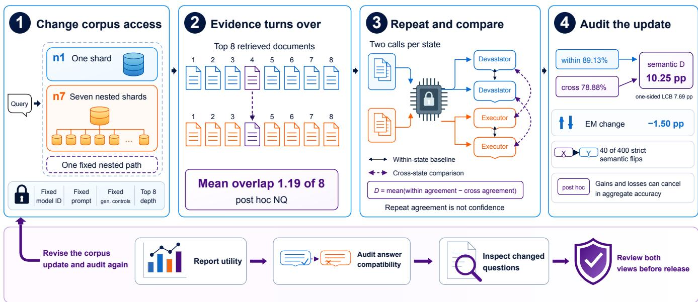
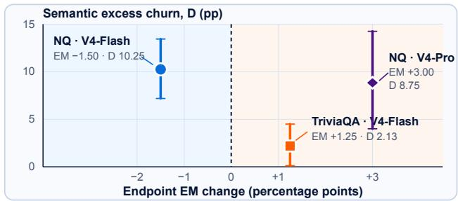
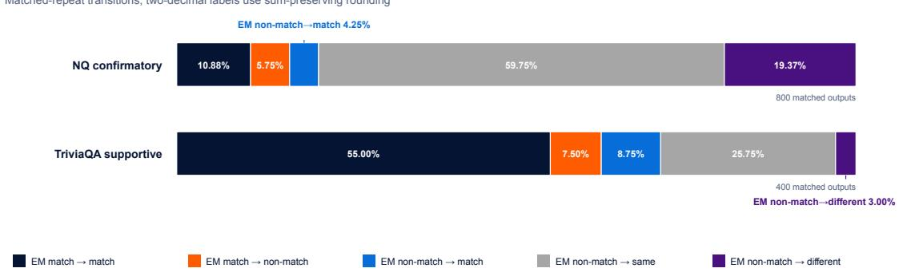
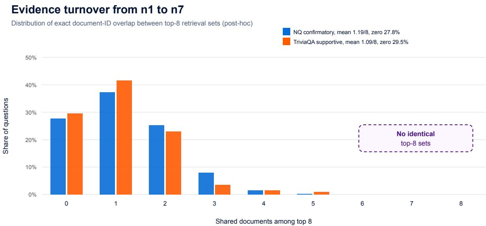

# Same Agent, Diferent Answers

A Repeat-Aware Audit of Corpus-Induced Answer Churn in Retrieval-Augmented QA

Jingjie Ning School of Computer Science, Carnegie Mellon University Pittsburgh, Pennsylvania, USA jening@cs.cmu.edu

## Abstract

A retrieval-augmented QA system can return diferent answers after an index expansion even when its requested model identifier, prompt, retrieval policy, evidence depth, rendering, and exposed generation controls are held fixed. Aggregate accuracy may hide these changes when gains and losses cancel, while ordinary generation variability makes one-shot comparisons overstate up date efects. We call the hidden phenomenon accuracy-blind answer churn and introduce the Snapshot Compatibility Audit, which estimates excess answer churn by subtracting same-snapshot repeat disagreement from cross-snapshot disagreement. We instantiate it by expanding one frozen FineWeb prefix from one to seven shards. In a preregistered 400-question Natural Questions study, normalized-exact and blinded-semantic excess churn are 6.44 and 10.25 percentage points while exact-match accuracy changes by only −1.50 points. A post-hoc analysis finds repeat-stable semantic flips on 40/400 questions. A separately preregistered 200-question TriviaQA study yields smaller, directionally consistent excess churn while exact-match accuracy moves in the opposite direction. An outcome-blind post-hoc 100-question subset replication with a second DeepSeek generator and serving configuration finds 8.75 pp of semantic excess churn even as exact match rises by 3.00 percentage points. Answer-level compatibility can therefore fail without a conspicuous or consistently directed utility shift. Retrieval-augmented releases should audit compatibility alongside utility.

## CCS Concepts

• Information systems → Retrieval models and ranking; Evaluation of retrieval results; • Computing methodologies → Natural language generation.

## Keywords

retrieval-augmented generation, retrieval-augmented QA, LLM evaluation, RAG evaluation, corpus updates, answer churn, regression testing, backward compatibility

## 1 Introduction

Web collections evolve, and crawling and refresh policies determine what a search system can expose [1, 12, 13]. Retrieval-augmented generation couples these familiar index dynamics to generated answers. Production indexes grow, documents are refreshed, and retrieval infrastructure is rebuilt, yet such changes are usually evaluated through aggregate utility. Corpus-scaling studies likewise ask how average quality changes as more inference-time data becomes available [49, 63]. We ask a question. Did the system preserve its answer-level behavior?

Xueqi Li School of Computer Science, Carnegie Mellon University Pittsburgh, Pennsylvania, USA xueqil@cs.cmu.edu

Language-agent formulations can couple an LLM to external memory and retrieval [73]. Here, same agent means that the requested model identifier, prompt, retrieval policy, evidence depth, rendering, and exposed generation controls are fixed. Pairing this identity with a particular accessible corpus defines a deployed snapshot. The evaluated system is a single-turn retriever-generator rather than an autonomous multi-step policy [16].

Figure 1 traces the full audit and shows one locked example. With one FineWeb shard, the fixed generator answered The Devastator twice. With seven shards, it answered The Executor twice. The Executor is plausible but refers to a diferent ship. Expansion can also repair an answer. For a question about who plays Jill Bigelow in Line of Duty, two UNKNOWN responses become two reference-matching Polly Walker responses. Corpus expansion therefore changes which answer regime the system selects rather than moving every question in the same utility direction.

These cases distinguish utility from compatibility. Utility asks whether a new snapshot is better on average. Compatibility asks whether it preserves behavior that users and downstream applications previously observed. An index rebuild can alter compatibility without changing the model binary, prompt, or public API version. This matters when answers feed caches, regression tests, automated workflows, or human decisions because balanced improvements and regressions may leave a dashboard green while changing which questions receive which facts. A useful corpus-update audit must ask whether the new state is more useful and whether it remains behaviorally interchangeable with the old one.

Aggregate accuracy is poorly suited to expose such changes. Gains and losses cancel, while transitions between two exact-match nonmatches remain invisible. Stochastic generation creates a second obstacle because a diferent string after an index change need not be caused by the index. The relevant baseline is how often the same system changes its answer when nothing changes. This is the RAG analogue of prediction churn and backward compatibility in model updates [43, 68], although the outputs are open-ended and the model remains fixed.

We therefore compare two independent responses at each corpus scale. For a similarity function �, the Snapshot Compatibility Audit subtracts cross-snapshot agreement from within-snapshot repeat agreement. Positive excess answer churn �b means that answers move across snapshots more than they vary under repeated calls to the same snapshot. We use normalized exact agreement and a blinded semantic-equivalence judge, then perform inference by resampling whole questions. The protocol requires paired inputs and independent repeated outputs from each stochastic snapshot. Our evidence covers one concrete intervention in which a fixed nested FineWeb prefix expands from one to seven shards while the query and all other recorded interface controls remain fixed.

  
Figure 1: Overview of the Snapshot Compatibility Audit for a corpus update to a fixed single-turn retriever-generator. One nested FineWeb prefix grows from one shard to seven while all other pipeline components stay fixed. Repeated calls separate same-state variation from cross-state movement. The lower release workflow is recommended practice rather than a policy evaluated by this study. Overlap and strict semantic flips are post hoc.

We study whether expanded corpus access moves answers beyond same-state generator variation in RQ1, how much movement aggregate accuracy misses in RQ2, and what locked post-hoc diagnostics reveal about moving questions and scale trajectories in RQ3. Only RQ1 is confirmatory. RQ2 uses preregistered utility metrics and transitions, while RQ3 remains explicitly descriptive.

Our main study is a preregistered fresh cohort of 400 Natural Questions (NQ) [34]. It confirms normalized-exact excess churn of 6.44 percentage points (pp) and semantic excess churn of 10.25 pp, while aggregate exact match (EM) moves by only −1.50 pp. A separately preregistered 200-question TriviaQA study [30] gives smaller but directionally consistent excess churn even though its EM moves in the opposite direction, +1.25 pp. A post-hoc decomposition finds strict repeat-stable semantic flips on 40/400 NQ and 5/200 TriviaQA questions. An outcome-blind 100-question NQ subset replication with a second DeepSeek generator and serving configuration yields 8.75 pp semantic excess churn while EM rises by 3.00 pp.

We make three contributions.

• We identify accuracy-blind answer churn. Expanding the accessible corpus can make a new retrieval-augmented snapshot behaviorally incompatible with the earlier snapshot even when aggregate utility barely moves.

• We introduce the Snapshot Compatibility Audit, a repeataware protocol for comparing stochastic system snapshots. Its excess-answer-churn estimand accounts for samesnapshot repeat variability. Whole-question inference and flip diagnostics reveal behavior hidden by aggregate utility.

• We provide preregistered evidence on NQ, supportive crossbenchmark evidence on TriviaQA, and locked post-hoc analyses spanning a second within-family generator configuration, evidence turnover, scale trajectories, and crossfamily semantic-judge robustness.

## 2 Related Work

2.1 Retrieval Architectures and Corpus Scaling Retrieval-based language models externalize knowledge through sparse or dense search, passage-fusion readers, and non-parametric stores [23, 27, 31, 33, 35, 57]. Later systems retrieve from trilliontoken stores, expose replaceable indexes, or wrap frozen black-box generators [7, 28, 58, 66]. Active and selective systems decide when or how much evidence to use [2, 29, 76], while Chain-of-Note generates per-document reading notes to assess noisy or irrelevant evidence [80] and empirical analysis shows retrieval can help long-tail facts yet mislead elsewhere [42]. Retrieval-pretraining, datastore/corpus-scaling, and agentic rollout-breadth studies primarily report aggregate utility [46, 49, 63, 70, 77]; rollout breadth can also retrieve overlapping evidence from redundant initial queries. We fix the query, generator, and retrieval depth, change corpus access, and test compatibility along one nested path.

## 2.2 Evidence Robustness and RAG Evaluation

Retrieved or supplied context can degrade QA when it is irrelevant, detrimental, position-sensitive, adversarial, or conflicting [26, 38, 52, 55, 64, 65, 79]. Conflict studies examine whether answers follow supplied context or previously elicited knowledge [40, 75], while DisentQA explicitly separates parametric and contextual predictions [47]. Context-faithful prompting ofers a complementary mitigation objective [85]. Our no-retrieval output is only a descriptive closed-book anchor, not a direct observation of parametric memory. RGB tests noise robustness, negative rejection, information integration, and counterfactual robustness [10]. RAGAS, ARES, RAGChecker, and RAGTruth collectively evaluate relevance, faithfulness, component errors, and hallucinations [19, 50, 59, 60]. Prior work measures answer consistency under constructed context changes and robustness to an added retrieved document [40, 55, 62]. Factual-consistency work varies semantically equivalent question forms and retrieval augmentation, Con-RAG decomposes retriever, generator, and end-to-end consistency across paraphrased queries, and Stable-RAG measures answer sensitivity to permutations of a fixed retrieved set [24, 25, 83]. We fix the query, expand a nested corpus, let evidence change endogenously, and estimate snapshot-to-snapshot semantic excess churn after subtracting same-snapshot disagreement.

## 2.3 Behavioral Compatibility and Stochastic Evaluation

Prediction churn and backward-compatible updating show that aggregate performance can conceal instance-level changes and negative flips [4, 5, 43, 68, 78]. The concern extends to structured NLP, data updates, deployed language systems, and generative LLM evolution [8, 9, 18, 61]; unlike those works, we change the retrieval corpus rather than model weights. Hosted LLM behavior can drift across service snapshots and nominally repeated calls [3, 11]. Self consistency is also fragile when questions admit multiple valid readings [6], motivating uncertainty-aware evaluation [36, 41, 44]. Our within-versus-cross contrast is related to kernel two-sample testing [21]. LLM judges enable scalable open-ended evaluation [39, 84], but position and self-preference biases remain [53, 71, 84]; this motivates our blinding and cross-family audit.

## 2.4 Dynamic Corpora and Agent Knowledge Interfaces

Web evolution, crawling, and refresh work treats the indexed collection as a time-varying system object [1, 12, 13, 20, 51]. SituatedQA and time-aware language modeling formalize extra-linguistic context and changing facts [17, 82]. StreamingQA, RealTime $\mathrm { Q A } ,$ and FreshLLMs target news streams, recurring current-world questions, or fresh QA [32, 37, 69]. Our frozen experiment uses FineWeb [56] but is not a temporal refresh. These works motivate snapshotaware deployment tests but do not instantiate our treatment. Prior work distinguishes fixed RAG from systems that iteratively refine evidence, while interaction logs show later agent queries often reuse terms from accumulated evidence [16, 48]. A diference at one retrieval interface may propagate through a trajectory or be corrected downstream. Measuring trajectory-level compatibility remains open, and our single-turn estimand is neither an estimate nor a lower bound for it. Ambiguous questions can support multiple interpretations [45]. Language-agent architectures store and retrieve experience or feedback [54, 67, 81]. HippoRAG and Long-MemEval broaden this line to long-term knowledge retrieval and conversational-memory evaluation [22, 74]. Applying our protocol there is a proposed extension rather than an empirical claim.

## 3 Measuring Corpus-Induced Churn

## 3.1 Snapshot Excess-Churn Estimand

Scope. Our testbed is a fixed single-turn retriever-generator. It does not plan, choose tools, reformulate queries, retrieve iteratively, write memory, or interact across turns. The empirical claims concern corpus access along one frozen shard path. The audit itself is interface-level and can compare stochastic snapshots, but it attributes only the changes isolated by a given comparison.

Let � and � denote two deployed snapshots evaluated on the same questions. In our experiment, they share the requested model identifier, prompt, retriever, evidence depth, rendering, and exposed generation controls and difer only in accessible corpus scale. For question �, we draw two independent generator responses at each state, $L _ { i , a } , L _ { i , b }$ and $H _ { i , a } , H _ { i , b }$ . Question-state evidence is locked, so repeats measure generator rather than retrieval variability. We define the following quantities for similarity $k \in [ 0 , 1 ]$

$$
\begin{array} { r } { w _ { i } = \frac { 1 } { 2 } \left[ k ( L _ { i , a } , L _ { i , b } ) + k ( H _ { i , a } , H _ { i , b } ) \right] , } \end{array}\tag{1}
$$

$$
c _ { i } = \textstyle { \frac { 1 } { 4 } } \sum _ { r \in \{ a , b \} } \sum _ { s \in \{ a , b \} } k ( L _ { i , r } , H _ { i , s } ) ,\tag{2}
$$

$$
\widehat { D } = \textstyle { \frac { 1 } { N } } \sum _ { i = 1 } ^ { N } ( w _ { i } - c _ { i } ) .\tag{3}
$$

Thus $\widehat { D } > 0$ means that cross-snapshot answers are less similar than ordinary same-snapshot repeats. We call $\widehat { D }$ excess answer churn, the increase in cross-snapshot disagreement above the average same-snapshot disagreement floor. It is an agreement gap rather than the percentage of questions whose answer changed. In this experiment, it is a path-specific corpus-associated contrast rather than a universal scaling efect.

The noise correction can be written equivalently as follows.

$$
\widehat { D } = \left( 1 - \bar { c } \right) - \left( 1 - \bar { w } \right) .\tag{4}
$$

The first term is observed cross-state disagreement and the second is the same-state noise floor. A one-answer-per-state comparison estimates only the first and consequently attributes ordinary decoding variation to the update.

We use two co-primary kernels. The normalized-exact kernel is one when two answers match after the benchmark normalization and zero otherwise. The semantic kernel is a blinded pairwise judg ment of whether two strings give the same factual answer under reasonable aliases. Each question’s eight answers across four scales are anonymously labeled, and all 28 unordered pairs are judged before gold answers are loaded.

## 3.2 What the Contrast Measures

Let $P _ { i } ^ { L }$ and $P _ { i } ^ { H }$ denote the conditional answer distributions induced by the two snapshots. With independent draws within each distribution, the population version of the question-level contrast is

$$
\begin{array} { r l } & { D _ { i } ( k ) = \frac { 1 } { 2 } \left[ \mathbb { E } _ { X , X ^ { \prime } \sim P _ { i } ^ { L } } k ( X , X ^ { \prime } ) + \mathbb { E } _ { Y , Y ^ { \prime } \sim P _ { i } ^ { H } } k ( Y , Y ^ { \prime } ) \right] } \\ & { \qquad - \mathbb { E } _ { X \sim P _ { i } ^ { L } , Y \sim P _ { i } ^ { H } } k ( X , Y ) , } \end{array}\tag{5}
$$

The observed $w _ { i } - c _ { i }$ is an unbiased two-repeat estimate of Equation 5. Two repeats are the minimum that let us estimate samestate agreement without self-comparisons, an important distinction when nominally identical LLM calls need not reproduce exactly [3]. Because $k \in [ 0 , 1 ]$ , the sample contrast lies in $[ - 1 , 1 ]$ . Negative finite-sample values are retained rather than clipped.

For normalized equality, let $p _ { i , L } ( y )$ and $p _ { i , H } ( y )$ be the probabilities of normalized answer �. Equation 5 becomes

$$
D _ { i } ( k _ { \mathrm { e x a c t } } ) = \textstyle { \frac { 1 } { 2 } } \sum _ { y } \left( p _ { i , L } ( y ) - p _ { i , H } ( y ) \right) ^ { 2 } .\tag{6}
$$

It is zero when the two conditional answer distributions coincide and positive when probability mass is redistributed, even when their expected EM scores are equal.

For a positive-semidefinite kernel, $2 D _ { i } ( k )$ is the squared maximum mean discrepancy between $P _ { i } ^ { L }$ and $P _ { i } ^ { H }$ , and twice Equation 3 is its unbiased two-sample estimator [21]. The exact-equality kernel satisfies this condition. We do not assume that pairwise LLM semantic judgments form a positive-semidefinite kernel. Rare nontransitive judgments are retained and audited, so semantic $\widehat { D }$ is interpreted operationally as an agreement gap rather than an unconditional MMD estimate.

The subtraction is consequential. On NQ, cross-scale semantic disagreement is 21.125%, but ordinary same-scale repeat disagreement is already 10.875% so their diference is the 10.250-pp semantic $\widehat { D } .$ . Under normalized exact matching, the raw cross-scale disagreement is 81.188%, but 74.750% remains when the corpus state is un changed, leaving 6.438 pp. A raw “answer changed” indicator would therefore substantially overstate corpus-induced movement. Conversely, a strict stable flip contributes the maximum question-level value of one, while partial or ofsetting relation changes contribute fractional or negative values.

## 3.3 Inference and Confirmatory Gate

Inference resamples whole questions, retaining all eight outputs and 28 semantic relations for a sampled question. Each study uses a preregistered 50,000-draw bootstrap stream. The NQ decision gate requires normalized-exact $\widehat { D } \geq 3$ pp, a positive one-sided 95% lower confidence bound (LCB) for exact $\widehat { D } _ { : }$ and a positive one-sided 95% LCB for semantic ${ \widehat { D } } .$ This is an intersection-union rule under which no secondary scale, subgroup, F1 score, or accuracy result can rescue a failed gate. We also report two-sided intervals. TriviaQA is a frozen supportive validation, never pooled with NQ.

## 3.4 Post-Hoc Stable-Flip Diagnostic

After the primary analyses were locked, we defined a stricter question-level diagnostic. A question is a repeat-stable semantic flip between � and � when

$$
k ( L _ { a } , L _ { b } ) = k ( H _ { a } , H _ { b } ) = 1 , \qquad k ( L _ { r } , H _ { s } ) = 0 \forall r , s \in \{ a , b \} .\tag{7}
$$

“Stable” here means semantic agreement across two calls, not verbatim identity, calibrated confidence, or factual correctness. This diagnostic is post-hoc and explains the locked estimand. Equation 3 remains the inferential backbone.

## 4 Experimental Design

## 4.1 Data and Corpus Treatment

The confirmatory population is a fresh hash-selected set of 400 questions from a 3,610-question NQ test artifact. We excluded all 2,400 question IDs used in prior development, then took the first 400 under a preregistered SHA-256 order (seed 20260810), without answerability, topic, retrieval, or outcome filtering. The supportive population is an independent hash-selected set of 200 questions from the 9,951-question TriviaQA RC-Web validation split, using seed 20260813. Questions and selection hashes, but not gold aliases, were frozen before retrieval.

The search service uses the reproducible DeepResearchGym infrastructure [14] over a FineWeb index [56]. Before the experiment, that index had been partitioned into seven shards. Its search interface exposes only fixed nested prefixes. We evaluate no retrieval (�0) and prefixes of one, three, and seven shards (�1, �3, �7). This is an accessible-scale treatment rather than a shard-order experiment. The relation �1 $\subset n 3 \subset$ �7 defines a single frozen path. At each nonzero scale, the unchanged question retrieves the top eight documents. Each rendered document includes its identifier, URL, and up to 1,200 characters of whitespace-compacted text. Rendering and prompt surface are fixed.

The answer prompt asks for a concise answer using the model’s own knowledge and any supplied evidence, warns that evidence may be incomplete, irrelevant, or untrusted, and permits the exact response UNKNOWN. Each independent call must return one nonempty structured answer of at most 512 UTF-8 bytes. These constraints are identical across scales and benchmarks.

## 4.2 Locked Generation and Delayed Gold

We collected primary and audit retrievals into independent empty caches before generation. All NQ and TriviaQA retrieval cells, including every endpoint, matched exactly in ordered document IDs and rendered evidence bytes across the two passes. Generation used deepseek-v4-flash through a Claude CLI harness configured to route calls through the DeepSeek adapter in bare singleton mode, requesting low reasoning efort, with tools disabled, no session persistence, and a fixed JSON output schema. Temperature and top-p were not set by our harness, and their numerical providerdefault values are not recorded. For each question and scale, the same prompt and locked evidence were sent twice, producing 4,800 accepted answers. We used Williams orders [72] to counterbalance the four conditions, and the second repeat reversed the first repeat’s order. UNKNOWN and EM-nonmatching outputs were accepted without selective redraw.

The protocol used four successive gates covering the retrieval lock, answer lock, blind semantic lock, and gold unlock. Durable attempt records were written before external calls; successful cells were immutable; and only missing or transport-invalid cells could resume. The semantic judge saw the question and eight anonymous answers, but not scale, repeat, evidence, document IDs, gold, or correctness. Gold aliases were parsed only after both answer and semantic ledgers validated. The protocol, selection, schedules, prompts, source files, model controls, analysis code, and bootstrap streams were hash-bound before the relevant call stage.

Table 1: Locked experimental design. NQ is confirmatory, while TriviaQA is a separately preregistered supportive validation.
<table><tr><td>Component</td><td>NQ</td><td>TriviaQA</td></tr><tr><td>Cohort</td><td>400 fresh questions after excluding 2,400 development IDs</td><td>200 RC-Web validation questions</td></tr><tr><td>Conditions</td><td>n0, n1, n3, n7; top-8 evidence at nonzero scales</td><td></td></tr><tr><td>Retrieval audit</td><td>1,200 primary + 1,200 audit cells; 100% exact</td><td>600 primary + 600 audit cells; 100% exact</td></tr><tr><td>Generator</td><td>deepseek-v4-flash; tools of; independent singleton sessions</td><td></td></tr><tr><td>Answer cells</td><td> $4 0 0 \times 4 \times 2 = 3 , 2 0 0$ </td><td> $2 0 0 \times 4 \times 2 = 1 , 6 0 0$ </td></tr><tr><td>Semantic judging</td><td>400 blind calls, 28 pairs/question</td><td>200 blind calls, 28 pairs/question</td></tr><tr><td>Inference</td><td>50,000 whole-question bootstrap draws</td><td>50,000 whole-question bootstrap draws</td></tr></table>

After locking the primary analyses, we selected an outcome-blind hash sample of 100 questions from the frozen NQ-400 cohort and reran the frozen �1 and �7 prompts and evidence twice through a stateless direct deepseek-v4-pro interface. Thinking was enabled, the request submitted low reasoning efort, tools were absent, and temperature and top-p were not set. All 400 answers and 100 blind V4-Flash judgments covering all six endpoint pairs per question were locked before gold access. Because the requested model and serving interface both changed and provider-default sampling values were not recorded, this is a post-hoc within-family generatorand-serving-configuration replication rather than a model-only or cross-family comparison.

## 4.3 Metrics and Robustness Checks

We report normalized EM, token F1, and UNKNOWN rate at all scales. NQ and TriviaQA use their respective oficial-style normalizations and all available aliases. Correctness transitions are labeled EMmatch and EM-nonmatch, rather than correct and wrong, because long answers that contain a reference can fail full-string EM.

Post-hoc diagnostics use only frozen outputs and labels. We compare exact document-ID overlap between the �1 and �7 topeight sets, decompose stable flips across the scale ladder, and com pare endpoint answers with the repeat-stable �0 response. Finally, an outcome-blind hash sample of 50 questions (34 NQ, 16 TriviaQA; 1,400 pair labels) was independently judged by OpenAI gpt-5.6-sol after the primary analysis was locked. This checks semantic-judge family robustness and is not human validation. The generator replication above and this cross-family judge audit address diferent sources of sensitivity.

## 4.4 Reproducibility Artifact

The anonymized artifact contains ID-only manifests, sanitized answer and judgment cells and attempts, terminal locks and results, code, summaries, and a claim matrix. It excludes question text, gold aliases, retrieved passages, and provider traces while retaining their hashes. It covers 5,200 answers, 17,400 DeepSeek labels, and 1,400 OpenAI labels. NQ, TriviaQA, and V4-Pro have 3,272/1,641/407 answer attempts and 403/204/101 judge attempts. A zero-network verifier checks completeness and regenerates churn, transitions, stability, overlap, cross-judge, V4-Pro, and trajectory claims. Golddependent EM and F1 stay locked.

## 5 Results

## 5.1 Expanded Corpus Access Moves Answers Beyond Repeat Noise

The preregistered endpoint test confirms that expanding access from �1 to �7 moves NQ answers beyond ordinary repeat variation. Normalized-exact agreement falls from 25.25% within snapshots to 18.81% across snapshots, leaving �b = 6.44 pp of excess answer churn. Its one-sided 95% LCB is 4.56 pp, and the point estimate exceeds the preregistered 3-pp threshold. Semantic agreement falls from 89.13% to 78.88%, yielding $\widehat { D } = 1 0 . 2 5$ pp with a 7.69-pp LCB. NQ therefore passes all three confirmatory gates in Table 2. The semantic efect persists after alias and formatting normalization, making a purely surface-form explanation unlikely.

TriviaQA provides a directionally consistent supportive result at a diferent accuracy level and smaller magnitude. Its normalizedexact and semantic excess-answer-churn estimates are 3.00 and 2.125 pp, with one-sided LCBs of 0.50 and 0.375 pp. The two-sided normalized-exact interval touches zero. TriviaQA remains a separately preregistered supportive validation and is not pooled with NQ. Frozen bootstrap draws with $\widehat { \cal D } \le 0$ account for 0% under both NQ kernels, 2.764% under TriviaQA exact, and 2.174% under TriviaQA semantic.

A locked post-hoc decomposition shows no high-scale collapse in pairwise generator stability. At the NQ endpoints, exact withinsnapshot agreement is 25.25% at both scales and semantic agreement is 88.50% versus 89.75%; TriviaQA semantic agreement is 97.00% versus 96.50%.

## 5.2 A Second Configuration Reproduces Churn

The outcome-blind post-hoc NQ-100 subset also finds movement beyond repeat noise. V4-Pro normalized-exact and semantic $\widehat { D }$ are 7.25 and 8.75 pp, with one-sided LCBs of 3.25 and 4.75 pp and twosided intervals of [2.50, 12.50] and [4.00, 14.25] pp. Six questions are strict semantic flips. EM rises from 38.00% to 41.00%, with a +3.00- pp interval of [−2.00, 8.50] pp. On the same question IDs, frozen V4-Flash exact and semantic �b are 6.25 and 9.25 pp with zero EM change. Paired V4-Pro-minus-V4-Flash intervals are [−4.75, 6.75] pp for exact and [−6.75, 5.75] pp for semantic, both including zero. The matched semantic comparison remains descriptive because frozen V4-Flash labels came from eight-answer, 28-pair packets, whereas V4-Pro labels came from four-answer, six-pair endpoint packets.

Table 2: Preregistered �1 → �7 excess answer churn. All values are percentage points. LCB is the one-sided 95% whole-question bootstrap lower bound. It enters the frozen NQ decision rule and is reported descriptively for TriviaQA, while CI is the two-sided 95% interval.
<table><tr><td>Study</td><td>Kernel</td><td>Within</td><td>Cross</td><td> $\widehat { D }$ </td><td>LCB</td><td>95% CI</td></tr><tr><td>NQ confirmatory</td><td>Normalized exact</td><td>25.250</td><td>18.813</td><td>6.438</td><td>4.563</td><td>[4.188, 8.750]</td></tr><tr><td>NQ confirmatory</td><td>Blind semantic</td><td>89.125</td><td>78.875</td><td>10.250</td><td>7.688</td><td>[7.188, 13.438]</td></tr><tr><td>TriviaQA supportive</td><td>Normalized exact</td><td>64.500</td><td>61.500</td><td>3.000</td><td>0.500</td><td>[0.000, 6.250]</td></tr><tr><td>TriviaQA supportive</td><td>Blind semantic</td><td>96.750</td><td>94.625</td><td>2.125</td><td>0.375</td><td>[0.125, 4.500]</td></tr></table>

  
Figure 2: Semantic excess churn stays positive as endpoint exact match falls or rises. Points show locked V4-Flash NQ and TriviaQA estimates and post-hoc V4-Pro NQ; whiskers show two-sided 95% intervals.

Churn directionally reproduces while the endpoint EM point estimate moves opposite to the main NQ result. This replication is reported separately.

## 5.3 Accuracy Is an Incomplete Dashboard

Figure 2 exposes the distinction between utility and compatibility. From �1 to �7, NQ EM decreases by 1.50 pp, TriviaQA EM increases by 1.25 pp, and V4-Pro EM increases by 3.00 pp, while semantic excess churn remains positive in all three settings. Closed-book EM is highest at every observed scale, including 17.625% versus 15.125% at �7 for NQ and 68.250% versus 63.750% for TriviaQA; generic FineWeb retrieval therefore shows no utility gain here.

For binary EM, the cancellation is

$$
\Delta \mathrm { E M } = \mathrm { P r } ( \mathrm { n o n m a t c h } \longrightarrow \mathrm { m a t c h } ) - \mathrm { P r } ( \mathrm { m a t c h } \longrightarrow \mathrm { n o n m a t c h } ) .\tag{8}
$$

Accuracy subtracts the two directional flows. Compatibility cares that both occur and additionally includes changes between two EMnonmatching answers. The matched-repeat decomposition appears in Figure 3. On NQ, 46/800 comparisons move from EM-match to EM-nonmatch and 34/800 move in the reverse direction. Their dif ference is only $- 1 2 / 8 0 0 = - 1 . 5 0$ pp, but the gross correctness flow is 80/800 (10.00%). A further 155/800 (19.38%) move between semantically diferent EM-nonmatches and cannot afect binary accuracy at all. TriviaQA similarly has 30 losses and 35 gains, whose diference produces +1.25 pp, plus 12/400 (3.00%) diferent-nonmatch transitions. Most changes are between non-UNKNOWN answers, so the pattern is not simply greater willingness to answer.

These transitions are diagnostic rather than noise-corrected. A matched pair can difer partly because generation is stochastic.

They show how a net score discards behavior, while $\widehat { D }$ determines whether cross-state movement exceeds the same-state baseline.

## 5.4 Repeat-Stable Flips Explain Churn

Forty of 400 NQ questions and 5/200 TriviaQA questions meet the strict criterion in Equation 7. Each contributes the maximum per-question value of one to semantic $w _ { i } - c _ { i } .$ . Consequently, the 40 NQ flips contribute 10.00 pp of the total 10.25 pp semantic ${ \widehat { D } } ,$ while all other questions net only +0.25 pp. The five TriviaQA flips contribute 2.50 pp, while the remainder nets −0.375 pp. This diagnostic explains the locked efect without replacing its preregistered endpoint test.

The diagnostic is semantic rather than literal. Only 2/40 NQ flips have verbatim-identical repeats at both scales, and none of the five TriviaQA flips do. All four endpoint outputs are EM-nonmatches for 35/40 NQ flips, so most of these flips are completely invisible to binary EM. The raw-string flip set need not be semantically diferent. We therefore avoid “confidence” and use repeat-stable only in the two-call semantic sense.

Table 3 shows why a single utility delta is insuficient. Corpus expansion can remove an EM-matching answer, recover one from abstention, select a diferent interpretation of an underspecified question, or traverse a non-monotone $X  Y  X$ trajectory while EM remains unchanged throughout.

Evidence changes substantially at the endpoint, as shown in Figure 4. The mean exact document-ID overlap between the two top-eight sets is 1.19/8 for NQ and 1.09/8 for TriviaQA. The corresponding zero-overlap rates are 27.75% and 29.50%, and no question has an identical top-eight set. Yet cross-scale semantic agreement remains 78.88% and 94.63%. Most answers remain semantically stable despite this turnover, while $\widehat { D }$ isolates the smaller residual shift beyond repeat noise. Flip questions have lower mean overlap than nonflips (0.825 versus 1.231 documents for NQ), but overlap-bin efects are not monotone and Fisher tests are inconclusive. We treat this only as a mechanism hint.

Absolute agreement and the corrected gap answer diferent questions. Cross-scale semantic agreement of 78.88% on NQ and 94.63% on TriviaQA means that most answers survive severe top-eight turnover. Positive $\widehat { D }$ says the residual disagreement is nevertheless larger than the same-state baseline. Reporting only agreement would make the snapshots appear interchangeable. Reporting only $\widehat { D }$ could make a 10.25-pp gap sound as if every tenth question deterministically changed. The strict flip diagnostic locates one interpretable part of the gap but can miss difuse probability shifts.

n1 to n7 exact-match transition composition Matched-repeat transitions; two-decimal labels use sum-preserving rounding

  
Figure 3: Matched-repeat EM transition composition from �1 to �7. Aggregate EM retains only the diference between nonmatch→match and match→nonmatch flows; it discards their gross volume and every diferent-answer transition in side the EM-nonmatch class.

Table 3: Illustrative post-hoc NQ answer trajectories from the frozen ledger.
<table><tr><td>Question and behavior</td><td>n1 answers a/b</td><td>n3 answers a/b</td><td>n7 answers a/b</td><td>Semantic path</td></tr><tr><td>Darth Vader&#x27;s Star Destroyer</td><td>Devastator / Devastator [M/M]</td><td>Executor / Executor [N/N]</td><td>Executor / Executor [N/N]</td><td>X → Y → Y endpoint flip</td></tr><tr><td>EM regression abstention recovery</td><td>Who plays Jill Bigelow? UNKNOWN / UNKNOWN [N/N]</td><td>UNKNOWN / UNKNOWN [N/N]</td><td>Polly Walker / Polly Walker [M/M]</td><td>X→X →Y endpoint flip</td></tr><tr><td>Grand National top three</td><td>2013 winners, Auroras Encore, Cappa Bleu, Teaforthree [N/N]</td><td>2019 winners, Tiger Roll, Magic of Light, Rathvinden [N/N]</td><td>2019 winners, Tiger Roll, Magic of Light, Rathvinden [N/N]</td><td>X→ Y →Y endpoint flip</td></tr><tr><td>underspecified year When did Rachel have</td><td>April 4, 2002 / April 4, 2002 [N/N]</td><td>May 16, 2002 / May 16, 2002 [N/N] May 16, 2002 / May 16, 2002 [N/N]</td><td></td><td>X → Y → Y</td></tr><tr><td>her baby? EM blind spot New Gotham season release?</td><td>final season in January 2019 /</td><td></td><td>no new season; series ended April final season premiered January 3,</td><td>endpoint flip X→Y→X</td></tr></table>

Reading key. Each scale cell gives faithful answer-bearing spans for repeats a/b. Bracketed M/N markers record normalized EM match status for the complete outputs. �, � denote locked gold-blind semantic classes, not confidence

An audit should report absolute cross-state agreement, baselinecorrected ${ \widehat { D } } ,$ and question-level diagnostics.

## 5.5 Answer Trajectories Across Scales

The primary contrast uses only �1 and �7, but the locked 28-pair labels permit a post-hoc view of every adjacent step. Strict stable flips occur at every observed transition. Across the three adjacent NQ steps, the counts are 33/400, 29/400, and 26/400, compared with 40/400 for the endpoint. TriviaQA has 3/200, 5/200, and 2/200 across adjacent steps, compared with 5/200 for the endpoint. The corresponding excess-answer-churn estimates are positive at every step in Table 4. Churn is therefore not confined to the largest endpoint contrast, although one fixed path cannot establish a general dose-response law or predict arbitrary index updates.

The NQ union over three adjacent flip sets contains 59 questions. Twelve flip at both �1 → �3 and �3 → �7; for six of them, �1 and �7 return to the same semantic regime, yielding an $X  Y $ � trajectory. Among the 40 endpoint flips, the intermediate �3 responses strictly align with �1 in 8 cases, align with �7 in 12, form a stable third answer in $^ { 6 , }$ and disagree across repeats in 12. Two additional questions have mixed or non-transitive pair labels and are reported separately rather than forced into a class. Endpoint-flip questions are enriched for �3 repeat disagreement (30.0% versus 8.89% among other NQ questions). This enrichment is consistent with an answer-fragile subset but does not establish a universal “unstable middle” scale.

Table 4: Post-hoc trajectory decomposition. Semantic $\widehat { D }$ is in pp, and flips use the strict all-four-cross-pairs definition.
<table><tr><td>Study</td><td>Transition</td><td>D</td><td>Stable flips</td></tr><tr><td>NQ</td><td>n0 → n1</td><td>10.563</td><td>33/400 (8.25%)</td></tr><tr><td>NQ</td><td>n1 → n3</td><td>7.938</td><td>29/400 (7.25%)</td></tr><tr><td>NQ</td><td>n3 → n7</td><td>6.313</td><td>26/400 (6.50%)</td></tr><tr><td>NQ</td><td>n1 → n7</td><td>10.250</td><td>40/400 (10.00%)</td></tr><tr><td>TriviaQA</td><td>n0 → n1</td><td>1.500</td><td>3/200 (1.50%)</td></tr><tr><td>TriviaQA</td><td>n1 → n3</td><td>2.125</td><td>5/200 (2.50%)</td></tr><tr><td>TriviaQA</td><td>n3 → n7</td><td>0.875</td><td>2/200 (1.00%)</td></tr><tr><td>TriviaQA</td><td>n1 → n7</td><td>2.125</td><td>5/200 (2.50%)</td></tr></table>

  
Figure 4: Post-hoc distribution of exact document-ID overlap between the �1 and �7 top-eight retrieval sets. Large evidence turnover coexists with high cross-scale semantic agreement.

The no-retrieval output is a descriptive closed-book anchor, not a direct measurement of parametric memory. Of the 40 NQ endpoint flips, 29 have a repeat-stable �0 answer. Among them, 11 align only with �1, 10 only with �7, and 8 with neither endpoint. There is no dominant one-way movement relative to closed-book behavior. This corpus-scaling intervention complements controlled knowledgeconflict studies but does not identify which evidence or internal memory caused a regime selection.

## 5.6 Cross-Family Semantic-Judge Audit

On the outcome-blind 50-question audit sample, the DeepSeek and OpenAI judges agree on 1,340/1,400 pair labels (95.71%), with Cohen’s � = 0.855 [15] and 43/50 exactly matching 28-pair partitions. Question-cluster bootstrap intervals are [91.86, 98.86] for agreement and [0.709, 0.959] for �. NQ agreement is 93.70% (� = 0.827), and TriviaQA agreement is 100%. On the same sample, semantic excess churn is 9.50 pp with the original judge and 11.00 pp with the cross-family judge. The robustness audit therefore argues against the efect being produced by same-family judging alone. It does not replace human annotation, and the raw execution trace was not retained. The locked judgment ledgers and recorded zero-tool metadata are hash-bound, and all reported audit statistics were independently recomputed from the ledgers.

## 6 Implications and Limitations

## 6.1 The Snapshot Compatibility Audit

From a release-engineering perspective, an index rebuild can be a behavioral release even when model weights and the public API do not change. Old and new retrieval-augmented snapshots should therefore receive the same compatibility scrutiny as two model versions [8, 43, 68]. The Snapshot Compatibility Audit organizes this check into four stages.

(1) Freeze the comparison. Select queries without outcome filtering; name the old and new snapshots; and lock the prompt, all exposed generation controls, retrieval depth, rendered evidence, and gold-access boundary. If retrieval is stochastic, either lock its output, as we do, or include its variation in the repeated system state.

(2) Replicate at question level. Collect at least two independent responses per query and state, counterbalancing execution order when shared service conditions may drift. Preserve retries and accepted failures such as UNKNOWN. Selective redraws invalidate the noise baseline.

(3) Compare blindly. Report exact and semantic within/cross agreement, ${ \widehat { D } } ,$ and question-cluster intervals. Semantic comparison should hide state, evidence, and correctness. A second judge family or human subset can measure construct sensitivity, but observed outcomes must not determine a replacement.

(4) Triage, then decide. Alongside average utility, inspect repeat-stable flips, EM-match/nonmatch transitions, and retrieval overlap. Manually review high-impact changes. The threshold must be application-specific. Positive excess churn establishes incompatibility but does not by itself establish factual harm or justify blocking deployment.

The output-only protocol could audit an index refresh, retriever replacement, chunking or deduplication change, or a change to external memory. For every retrieval-afecting release, we recommend reporting excess answer churn alongside utility. These applications remain untested, and our empirical treatment is limited to one fixed nested FineWeb prefix.

Answer changes are not automatically regressions or harms. The Jill Bigelow answer improves from UNKNOWN to the EM reference, and ambiguous queries can support alternatives, so deployment thresholds require application-specific review.

## 6.2 Threats to Validity and Claim Boundary

Treatment and mechanism. The identified contrast is the total behavioral diference between two accessible index states on one frozen path, �1 $\subset n 3 \subset n 7$ . Added shards can introduce new topeight documents and displace documents retrieved at the smaller state; both are part of the treatment. Because shard order is fixed, nominal scale is confounded with the identities and ranking efects of documents added on this path. We neither randomize shard subsets nor observe enough independent paths to estimate a contentaveraged scaling efect. Evidence overlap and trajectories expose possible mediators but do not identify which document caused a changed answer. The results establish that this expansion can alter behavior, not a monotone or universal law assigning a churn rate to “more corpus.”

Construct validity. Normalized exact agreement can overcount stylistic changes, while a semantic judge can merge distinct answers or split acceptable aliases. We therefore report both. The larger NQ semantic efect, blind all-pairs design, and cross-family audit make formatting-only and same-family-only explanations unlikely, but the 50-question audit is not human validation. In a narrow post-hoc style sanity check, every normalization-identical endpoint pair in both benchmarks received a semantic-same label within and across snapshots, including every raw-diferent normalizationequivalent pair, but this does not exclude broader style leakage. Pairwise labels are occasionally non-transitive; we retain rather than repair them after seeing outcomes. Repeat-stable means only within-state semantic agreement across two calls. It is not verbatim stability, calibrated confidence, factual correctness, or user harm. Likewise, EM-nonmatch is not synonymous with falsehood because a verbose answer containing a reference may fail full-string EM.

Sampling and stochasticity. Each estimate is conditional on its realized serving interface, and same-snapshot repeats estimate that interface’s stochastic baseline. The bootstrap treats questions as the independent sampling units and preserves all repeated outputs and pair labels within each unit. It quantifies question-sampling uncertainty for the frozen cohorts, not uncertainty over alterna tive corpus partitions, prompts, models, or deployment dates. Two responses per state are the minimum design that permits a withinstate baseline, but give a coarse view of each conditional output distribution; more repeats would reduce contribution-level variance. Only NQ is confirmatory. The separately preregistered 200-question TriviaQA cohort remains supportive and unpooled.

External validity. We study two DeepSeek generator and serving configurations, one search service, one FineWeb index, top-eight evidence, and two English open-domain QA benchmarks. Both V4- Flash benchmark studies are preregistered, while the V4-Pro subset is post hoc. The V4-Pro replication changes model and transport together, so it does not isolate a model efect or replace cross-family generator evidence. Generic FineWeb retrieval lowers average EM relative to no retrieval in the main setup, so the work neither demonstrates a utility benefit from retrieval nor characterizes an optimized production RAG stack. Replication across model families, retrievers, task types, random corpus paths, and temporal index refreshes is needed before assigning a general prevalence or scaling curve to the phenomenon.

## 7 Conclusion

We asked whether a fixed retrieval-augmented QA system remains behaviorally compatible with its earlier snapshot when only corpus access grows. Accuracy hides ofsetting changes, while generation noise confounds one-shot comparisons. The Snapshot Compatibility Audit subtracts cross-snapshot agreement from within-snapshot agreement to estimate excess answer churn beyond ordinary generator variation.

On a fixed DeepSeek QA system whose nested FineWeb prefix grew from one shard to seven, preregistered NQ normalized-exact and semantic excess churn were 6.44 and 10.25 pp, with one-sided 95% lower bounds of 4.56 and 7.69 pp, while EM changed by −1.50 pp. Separately preregistered TriviaQA found supportive excess churn of 3.00 and 2.125 pp while EM moved by +1.25 pp. The outcome-blind post-hoc V4-Pro NQ-100 subset found exact and semantic excess churn of 7.25 and 8.75 pp while EM moved by +3.00 pp. Stable semantic flips occurred on 40/400 NQ, 5/200 TriviaQA, and 6/100 V4-Pro questions.

Endpoint top-eight sets shared only 1.19 NQ and 1.09 TriviaQA documents on average, yet most answers survived the turnover while a concentrated subset moved beyond repeat noise. On an outcome-blind sample, a cross-family judge agreed with 95.71% of the original V4-Flash study labels and yielded comparable churn. These small EM shifts did not establish answer-level compatibility.

The evidence comes from one generator family, two serving configurations, one search service, one fixed FineWeb path, and two English QA benchmarks. It does not establish a universal scaling law or document-level cause, and human semantic validation remains open. Even so, positive churn persists across negative, positive, and zero endpoint EM point estimates in the main and matchedsubset analyses. Corpus access can therefore alter which answers a system returns without a reliable utility warning. Release tests should report excess answer churn alongside utility.

## Ethical Considerations

The study uses public QA benchmarks and a web-derived corpus without recruiting participants or inferring user attributes. Natural Questions contains anonymized queries, while web text and model outputs may contain errors, bias, or sensitive material. We release only permitted identifiers and outputs, excluding benchmark text and gold aliases. Excess churn is not a proxy for harm.

## References

[1] Eytan Adar, Jaime Teevan, Susan T. Dumais, and Jonathan L. Elsas. 2009. The Web Changes Everything: Understanding the Dynamics of Web Content. In Proceedings ofthe Second ACM International Conference on Web Search and Data Mining (WSDM ’09). Association for Computing Machinery, New York, NY, USA, 282–291. doi:10.1145/1498759.1498837

[2] Akari Asai, Zeqiu Wu, Yizhong Wang, Avirup Sil, and Hannaneh Hajishirzi. 2024. Self-RAG: Learning to Retrieve, Generate, and Critique through Self Reflection. In The Twelfth International Conference on Learning Representations. https://openreview.net/forum?id=hSyW5go0v8

[3] Berk Atıl, Sarp Aykent, Alexa Chittams, Lisheng Fu, Rebecca J. Passonneau, Evan Radclife, Guru Rajan Rajagopal, Adam Sloan, Tomasz Tudrej, Ferhan Ture, Zhe Wu, Lixinyu Xu, and Breck Baldwin. 2025. Non-Determinism of “Deterministic” LLM System Settings in Hosted Environments. In Proceedings ofthe 5th Workshop on Evaluation and Comparison of NLP Systems. Association for Computationa Linguistics, 135–148. doi:10.18653/v1/2025.eval4nlp-1.12

[4] Dara Bahri and Heinrich Jiang. 2021. Locally Adaptive Label Smoothing Improves Predictive Churn. In Proceedings ofthe 38th International Conference on Machine Learning (Proceedings ofMachine Learning Research, Vol. 139). PMLR, 532–542. https://proceedings.mlr.press/v139/bahri21a.html

[5] Gagan Bansal, Besmira Nushi, Ece Kamar, Daniel S. Weld, Walter S. Lasecki, and Eric Horvitz. 2019. Updates in Human-AI Teams: Understanding and Addressing the Performance/Compatibility Tradeof. In Proceedings ofthe AAAI Conference on Artificial Intelligence, Vol. 33. 2429–2437. doi:10.1609/aaai.v33i01.33012429

[6] Henning Bartsch, Ole Jorgensen, Domenic Rosati, Jason Hoelscher-Obermaier, and Jacob Pfau. 2023. Self-Consistency of Large Language Models under Ambigu ity. In Proceedings of the 6th BlackboxNLP Workshop: Analyzing and Interpreting Neural Networks for NLP. Association for Computational Linguistics, 89–105. doi:10.18653/v1/2023.blackboxnlp-1.7

[7] Sebastian Borgeaud, Arthur Mensch, Jordan Hofmann, Trevor Cai, Eliza Rutherford, Katie Millican, George Bm Van Den Driessche, Jean-Baptiste Lespiau, Bogdan Damoc, Aidan Clark, Diego De Las Casas, Aurelia Guy, Jacob Menick, Ro man Ring, Tom Hennigan, Safron Huang, Loren Maggiore, Chris Jones, Al bin Cassirer, Andy Brock, Michela Paganini, Geofrey Irving, Oriol Vinyals, Simon Osindero, Karen Simonyan, Jack Rae, Erich Elsen, and Laurent Sifre. 2022. Improving Language Models by Retrieving from Trillions of Tokens. In Proceedings of the 39th International Conference on Machine Learning (Proceedings of Machine Learning Research, Vol. 162). PMLR, 2206–2240. https: //proceedings.mlr.press/v162/borgeaud22a.html

[8] Andrea Caciolai, Verena Weber, Tobias Falke, Alessandro Pedrani, and Davide Bernardi. 2023. Regression-Free Model Updates for Spoken Language Understand ing. In Proceedings ofthe 61st Annual Meeting ofthe Association for Computational Linguistics (Volume 5: Industry Track). Association for Computational Linguistics, 538–551. doi:10.18653/v1/2023.acl-industry.52

[9] Deng Cai, Elman Mansimov, Yi-An Lai, Yixuan Su, Lei Shu, and Yi Zhang. 2022. Measuring and Reducing Model Update Regression in Structured Prediction for NLP. In Advances in Neural Information Processing Systems, Vol. 35. Curran Associates, Inc., 19384–19397. doi:10.52202/068431-1409

[10] Jiawei Chen, Hongyu Lin, Xianpei Han, and Le Sun. 2024. Benchmarking Large Language Models in Retrieval-Augmented Generation. In Proceedings of the AAAI Conference on Artificial Intelligence, Vol. 38. 17754–17762. doi:10.1609/aaai.v38i16. 29728

[11] Lingjiao Chen, Matei Zaharia, and James Zou. 2023. How is ChatGPT’s behavior changing over time? arXiv:2307.09009 [cs.CL] doi:10.48550/arXiv.2307.09009

[12] Junghoo Cho and Hector Garcia-Molina. 2000. The Evolution of the Web and Implications for an Incremental Crawler. In Proceedings of the 26th International Conference on Very Large Data Bases. Morgan Kaufmann, 200–209. https://www. vldb.org/conf/2000/P200.pd

[13] Junghoo Cho and Hector Garcia-Molina. 2003. Efective Page Refresh Policies for Web Crawlers. ACM Transactions on Database Systems 28, 4 (2003), 390–426. doi:10.1145/958942.958945

[14] João Coelho, Jingjie Ning, Jingyuan He, Kangrui Mao, Abhijay Sai Paladugu, Pranav Setlur, Jiahe Jin, Jamie Callan, João Magalhães, Bruno Martins, and Chenyan Xiong. 2026. DeepResearchGym: A Free, Transparent, and Reproducible Sandbox for Deep Research. In Proceedings ofthe 2026 International ACM SIGIR Conference on Innovative Concepts and Theories in Information Retrieval. Association for Computing Machinery, 34–43. doi:10.1145/3805713.3820409

[15] Jacob Cohen. 1960. A Coeficient of Agreement for Nominal Scales. Educational and Psychological Measurement 20, 1 (1960), 37–46. doi:10.1177/ 001316446002000104

[16] Jingwen Deng, Jihao Huang, Zhen Hao Wong, Hao Liang, Quanqing Xu, Bin Cui, and Wentao Zhang. 2026. Data-Centric Perspectives on Agentic Retrieval-Augmented Generation: A Survey. In Findings ofthe AssociationforComputational Linguistics: ACL 2026. Association for Computational Linguistics, San Diego, California, United States, 1570–1588. doi:10.18653/v1/2026.findings-acl.78

[17] Bhuwan Dhingra, Jeremy R. Cole, Julian Martin Eisenschlos, Daniel Gillick, Jacob Eisenstein, and William W. Cohen. 2022. Time-Aware Language Models as

Temporal Knowledge Bases. Transactions ofthe Association for Computational Linguistics 10 (2022), 257–273. doi:10.1162/tacl\_a\_00459

[18] Jessica Maria Echterhof, Fartash Faghri, Raviteja Vemulapalli, Ting-Yao Hu, Chun-Liang Li, Oncel Tuzel, and Hadi Pouransari. 2024. MUSCLE: A Model Update Strategy for Compatible LLM Evolution. In Findings of the Association for Computational Linguistics: EMNLP 2024. Association for Computational Lin guistics, 7320–7332. doi:10.18653/v1/2024.findings-emnlp.430

[19] Shahul Es,JithinJames, Luis Espinosa Anke, and Steven Schockaert. 2024. RAGAs: Automated Evaluation of Retrieval Augmented Generation. In Proceedings of the 18th Conference ofthe European Chapter ofthe Association for Computational Linguistics: System Demonstrations. Association for Computational Linguistics, 150–158. doi:10.18653/v1/2024.eacl-demo.16

[20] Dennis Fetterly, Mark Manasse, Marc Najork, and Janet L. Wiener. 2003. A Large-Scale Study of the Evolution of Web Pages. In Proceedings ofthe 12th International Conference on World Wide Web. Association for Computing Machinery, 669–678. doi:10.1145/775152.775246

[21] Arthur Gretton, Karsten M. Borgwardt, Malte J. Rasch, Bernhard Schölkopf, and Alexander Smola. 2012. A Kernel Two-Sample Test. Journal ofMachine Learning Research 13, 25 (2012), 723–773. https://www.jmlr.org/papers/v13/gretton12a. html

[22] Bernal Jiménez Gutiérrez, Yiheng Shu, Yu Gu, Michihiro Yasunaga, and Yu Su. 2024. HippoRAG: Neurobiologically Inspired Long-Term Memory for Large Language Models. In Advances in Neural Information Processing Systems, Vol. 37. 59532–59569. doi:10.52202/079017-1902

[23] Kelvin Guu, Kenton Lee, Zora Tung, Panupong Pasupat, and Mingwei Chang. 2020. Retrieval Augmented Language Model Pre-Training. In Proceedings of the 37th International Conference on Machine Learning (Proceedings ofMachine Learning Research, Vol. 119). PMLR, 3929–3938. https://proceedings.mlr.press v119/guu20a.html

[24] Lovisa Hagström, Denitsa Saynova, Tobias Norlund, Moa Johansson, and Richard Johansson. 2023. The Efect of Scaling, Retrieval Augmentation and Form on the Factual Consistency of Language Models. In Proceedings of the 2023 Conference on Empirical Methods in Natural Language Processing. Association for Computational Linguistics, Singapore, 5457–5476. doi:10.18653/v1/2023.emnlp-main.332

[25] Faisal Hamman, Chenyang Zhu, Anoop Kumar, Xujun Peng, Sanghamitra Dutta, Daben Liu, and Alfy Samuel. 2025. Improving Consistency in Retrieval Augmented Systems with Group Similarity Rewards. Accepted at the NeurIPS 2025 Workshop on Reliable ML from Unreliable Data. arXiv:2510.04392 [cs.CL] doi:10.48550/arXiv.2510.04392

[26] Giwon Hong, Jeonghwan Kim, Junmo Kang, Sung-Hyon Myaeng, and Joyce Jiyoung Whang. 2024. Why So Gullible? Enhancing the Robustness of Retrieval Augmented Models against Counterfactual Noise. In Findings ofthe Association for Computational Linguistics: NAACL 2024. Association for Computational Lin guistics, 2474–2495. doi:10.18653/v1/2024.findings-naacl.159

[27] Gautier Izacard and Edouard Grave. 2021. Leveraging Passage Retrieval with Generative Models for Open Domain Question Answering. In Proceedings ofthe 16th Conference ofthe European Chapter ofthe Association for Computational Linguistics: Main Volume. Association for Computational Linguistics, 874–880. doi:10.18653/v1/2021.eacl-main.74

[28] Gautier Izacard, Patrick Lewis, Maria Lomeli, Lucas Hosseini, Fabio Petroni, Timo Schick, Jane Dwivedi-Yu, Armand Joulin, Sebastian Riedel, and Edouard Grave. 2023. Atlas: Few-shot Learning with Retrieval Augmented Language Models. Journal of Machine Learning Research 24, 251 (2023), 1–43. https: //www.jmlr.org/papers/v24/23-0037.html

[29] Zhengbao Jiang, Frank Xu, Luyu Gao, Zhiqing Sun, Qian Liu, Jane Dwivedi-Yu, Yiming Yang, Jamie Callan, and Graham Neubig. 2023. Active Retrieval Augmented Generation. In Proceedings ofthe 2023 Conference on Empirical Methods in Natural Language Processing. Association for Computational Linguistics, 7969–7992. doi:10.18653/v1/2023.emnlp-main.495

[30] Mandar Joshi, Eunsol Choi, Daniel S. Weld, and Luke Zettlemoyer. 2017. TriviaQA: A Large Scale Distantly Supervised Challenge Dataset for Reading Comprehension. In Proceedings of the 55th Annual Meeting of the Association for Computational Linguistics (Volume 1: Long Papers). Association for Computa tional Linguistics, 1601–1611. doi:10.18653/v1/P17-1147

[31] Vladimir Karpukhin, Barlas Oguz, Sewon Min, Patrick Lewis, Ledell Wu, Sergey Edunov, Danqi Chen, and Wen-tau Yih. 2020. Dense Passage Retrieval for Open-Domain Question Answering. In Proceedings of the 2020 Conference on Empirical Methods in Natural Language Processing (EMNLP). Association for Computational Linguistics, 6769–6781. doi:10.18653/v1/2020.emnlp-main.550

[32] Jungo Kasai, Keisuke Sakaguchi, Yoichi Takahashi, Ronan Le Bras, Akari Asai, Xinyan Yu, Dragomir Radev, Noah A. Smith, Yejin Choi, and Kentaro Inui. 2023. RealTime QA: What’s the Answer Right Now?. In Advances in Neural Information Processing Systems, Vol. 36. 49025–49043. doi:10.52202/075280-2130

[33] Urvashi Khandelwal, Omer Levy, Dan Jurafsky, Luke Zettlemoyer, and Mike Lewis. 2020. Generalization through Memorization: Nearest Neighbor Lan guage Models. In International Conference on Learning Representations. https: //openreview.net/forum?id=HklBjCEKvH

[34] Tom Kwiatkowski, Jennimaria Palomaki, Olivia Redfield, Michael Collins, Ankur Parikh, Chris Alberti, Danielle Epstein, Illia Polosukhin, Jacob Devlin, Kenton Lee, Kristina Toutanova, Llion Jones, Matthew Kelcey, Ming-Wei Chang, Andrew M. Dai, Jakob Uszkoreit, Quoc Le, and Slav Petrov. 2019. Natural Questions: A Benchmark for Question Answering Research. Transactions ofthe Association for Computational Linguistics 7 (2019), 453–466. doi:10.1162/tacl\_a\_00276

[35] Patrick Lewis, Ethan Perez, Aleksandra Piktus, Fabio Petroni, Vladimir Karpukhin, Naman Goyal, Heinrich Küttler, Mike Lewis, Wen-tau Yih, Tim Rocktäschel, Sebastian Riedel, and Douwe Kiela. 2020. Retrieval Augmented Generation for Knowledge-Intensive NLP Tasks. In Advances in Neural Information Processing Systems, Vol. 33. Curran Asso ciates, Inc., 9459–9474. https://proceedings.neurips.cc/paper/2020/hash/ 6b493230205f780e1bc26945df7481e5-Abstract.htm

[36] Gili Lior, Eliya Habba, Shahar Levy, Avi Caciularu, and Gabriel Stanovsky. 2025. ReliableEval: A Recipe for Stochastic LLM Evaluation via Method of Moments. In Findings ofthe AssociationforComputational Linguistics: EMNLP2025. Association for Computational Linguistics, Suzhou, China, 11146–11153. doi:10.18653/v1/ 2025.findings-emnlp.594

[37] Adam Liska, Tomas Kocisky, Elena Gribovskaya, Tayfun Terzi, Eren Sezener, Devang Agrawal, Cyprien De Masson D’Autume, Tim Scholtes, Manzil Zaheer, Susannah Young, Ellen Gilsenan-Mcmahon, Sophia Austin, Phil Blunsom, and Angeliki Lazaridou. 2022. StreamingQA: A Benchmark for Adaptation to New Knowledge over Time in Question Answering Models. In Proceedings ofthe 39th International Conference on Machine Learning (Proceedings ofMachine Learning Research, Vol. 162). PMLR, 13604–13622. https://proceedings.mlr.press/v162/ liska22a.html

[38] Nelson F. Liu, Kevin Lin, John Hewitt, Ashwin Paranjape, Michele Bevilacqua, Fabio Petroni, and Percy Liang. 2024. Lost in the Middle: How Language Models Use Long Contexts. Transactions ofthe Association for Computational Linguistics 12 (2024), 157–173. doi:10.1162/tacl\_a\_00638

[39] Yang Liu, Dan Iter, Yichong Xu, Shuohang Wang, Ruochen Xu, and Chenguang Zhu. 2023. G-Eval: NLG Evaluation using GPT-4 with Better Human Alignment. In Proceedings of the 2023 Conference on Empirical Methods in Natural Language Processing. Association for Computational Linguistics, 2511–2522. doi:10.18653/ v1/2023.emnlp-main.153

[40] Shayne Longpre, Kartik Perisetla, Anthony Chen, Nikhil Ramesh, Chris DuBois, and Sameer Singh. 2021. Entity-Based Knowledge Conflicts in Question An swering. In Proceedings of the 2021 Conference on Empirical Methods in Natural Language Processing. Association for Computational Linguistics, 7052–7063. doi:10.18653/v1/2021.emnlp-main.565

[41] Lovish Madaan, Aaditya K. Singh, Rylan Schaefer, Andrew Poulton, Sanmi Koyejo, Pontus Stenetorp, Sharan Narang, and Dieuwke Hupkes. 2024. Quantify ing Variance in Evaluation Benchmarks. arXiv:2406.10229 [cs.LG] doi:10.48550/ arXiv.2406.10229

[42] Alex Mallen, Akari Asai, Victor Zhong, Rajarshi Das, Daniel Khashabi, and Hannaneh Hajishirzi. 2023. When Not to Trust Language Models: Investigating Efectiveness of Parametric and Non-Parametric Memories. In Proceedings of the 61st Annual Meeting ofthe Association for Computational Linguistics (Volume 1: Long Papers). Association for Computational Linguistics, 9802–9822. doi:10. 18653/v1/2023.acl-long.546

[43] Mahdi Milani Fard, Quentin Cormier, Kevin Canini, and Maya R. Gupta. 2016. Launch and Iterate: Reducing Prediction Churn. In Advances in Neural Information Processing Systems, Vol. 29. Curran Asso ciates, Inc., 3171–3179. https://proceedings.neurips.cc/paper/2016/hash/ dc5c768b5dc76a084531934b34601977-Abstract.htm

[44] Evan Miller. 2024. Adding Error Bars to Evals: A Statistical Approach to Language Model Evaluations. arXiv:2411.00640 [stat.AP] doi:10.48550/arXiv.2411.00640

[45] Sewon Min, Julian Michael, Hannaneh Hajishirzi, and Luke Zettlemoyer. 2020. AmbigQA: Answering Ambiguous Open-domain Questions. In Proceedings ofthe 2020 Conference on Empirical Methods in Natural Language Processing (EMNLP). Association for Computational Linguistics, 5783–5797. doi:10.18653/v1/2020. emnlp-main.466

[46] Sidhaarth Murali, João Coelho, Jingjie Ning, João Magalhães, Bruno Martins, and Chenyan Xiong. 2026. Beyond Parallel Sampling: Diverse Query Initialization for Agentic Search. arXiv preprint arXiv:2606.17209 (2026). doi:10.48550/arXiv. 2606.17209

[47] Ella Neeman, Roee Aharoni, Or Honovich, Leshem Choshen, Idan Szpektor, and Omri Abend. 2023. DisentQA: Disentangling Parametric and Contextual Knowledge with Counterfactual Question Answering. In Proceedings of the 61st Annual Meeting of the Association for Computational Linguistics (Volume 1: Long Papers). Association for Computational Linguistics, 10056–10070. doi:10.18653/ v1/2023.acl-long.559

[48] Jingjie Ning, João Coelho, Yibo Kong, Yunfan Long, Bruno Martins, João Ma galhães, Jamie Callan, and Chenyan Xiong. 2026. Agentic Search in the Wild: Intents and Trajectory Dynamics from 14M+ Real Search Requests. In Proceedings of the 49th International ACM SIGIR Conference on Research and Development in Information Retrieval. Association for Computing Machinery, 1404–1415. doi:10.1145/3805712.3809627

[49] Jingjie Ning, Yibo Kong, Yunfan Long, and Jamie Callan. 2026. Less LLM, More Documents: Searching for Improved RAG. In Advances in Information Retrieval (Lecture Notes in Computer Science, Vol. 16483). Springer Nature Switzerland, 598–613. doi:10.1007/978-3-032-21289-4\_38

[50] Cheng Niu, Yuanhao Wu, Juno Zhu, Siliang Xu, KaShun Shum, Randy Zhong, Juntong Song, and Tong Zhang. 2024. RAGTruth: A Hallucination Corpus for Developing Trustworthy Retrieval-Augmented Language Models. In Proceedings of the 62nd Annual Meeting of the Association for Computational Linguistics (Volume 1: Long Papers). Association for Computational Linguistics, 10862–10878. doi:10.18653/v1/2024.acl-long.585

[51] Alexandros Ntoulas, Junghoo Cho, and Christopher Olston. 2004. What’s New on the Web?: The Evolution of the Web from a Search Engine Perspective. In Proceedings of the 13th International Conference on World Wide Web. Association for Computing Machinery, 1–12. doi:10.1145/988672.988674

[52] Philhoon Oh and James Thorne. 2023. Detrimental Contexts in Open-Domain Question Answering. In Findings ofthe Association for Computational Linguistics: EMNLP 2023. Association for Computational Linguistics, 11589–11605. doi:10. 18653/v1/2023.findings-emnlp.776

[53] Arjun Panickssery, Samuel R. Bowman, and Shi Feng. 2024. LLM Evaluators Recognize and Favor Their Own Generations. In Advances in Neural Information Processing Systems, Vol. 37. Curran Associates, Inc., 68772–68802. doi:10.52202/ 079017-2197

[54] Joon Sung Park, Joseph C. O’Brien, Carrie J. Cai, Meredith Ringel Morris, Percy Liang, and Michael S. Bernstein. 2023. Generative Agents: Interactive Simulacra of Human Behavior. In Proceedings ofthe 36th Annual ACM Symposium on User Interface Software and Technology. Association for Computing Machinery, Article 2, 22 pages. doi:10.1145/3586183.3606763

[55] Seong-Il Park and Jay-Yoon Lee. 2024. Toward Robust RALMs: Revealing the Impact of Imperfect Retrieval on Retrieval-Augmented Language Models. Transactions ofthe Association for Computational Linguistics 12 (2024), 1686–1702. doi:10.1162/tacl\_a\_00724

[56] Guilherme Penedo, Hynek Kydlíček, Loubna Ben Allal, Anton Lozhkov, Margaret Mitchell, Colin Rafel, Leandro Von Werra, and Thomas Wolf. 2024. The FineWeb Datasets: Decanting the Web for the Finest Text Data at Scale. In Advances in Neural Information Processing Systems, Vol. 37. Curran Associates, Inc., 30811– 30849. doi:10.52202/079017-0970

[57] Fabio Petroni, Aleksandra Piktus, Angela Fan, Patrick Lewis, Majid Yazdani, Nicola De Cao, James Thorne, Yacine Jernite, Vladimir Karpukhin, Jean Mail lard, Vassilis Plachouras, Tim Rocktäschel, and Sebastian Riedel. 2021. KILT: a Benchmark for Knowledge Intensive Language Tasks. In Proceedings of the 2021 Conference of the North American Chapter of the Association for Computational Linguistics: Human Language Technologies. Association for Computational Linguistics, 2523–2544. doi:10.18653/v1/2021.naacl-main.200

[58] Ori Ram, Yoav Levine, Itay Dalmedigos, Dor Muhlgay, Amnon Shashua, Kevin Leyton-Brown, and Yoav Shoham. 2023. In-Context Retrieval-Augmented Language Models. Transactions ofthe Association for Computational Linguistics 11 (2023), 1316–1331. doi:10.1162/tacl\_a\_00605

[59] Dongyu Ru, Lin Qiu, Xiangkun Hu, Tianhang Zhang, Peng Shi, Shuaichen Chang, Cheng Jiayang, Cunxiang Wang, Shichao Sun, Huanyu Li, Zizhao Zhang, Binjie Wang, Jiarong Jiang, Tong He, Zhiguo Wang, Pengfei Liu, Yue Zhang, and Zheng Zhang. 2024. RAGChecker: A Fine-grained Framework for Diagnosing Retrieval Augmented Generation. In Advances in Neural Information Processing Systems, Vol. 37. Curran Associates, Inc., 21999–22027. doi:10.52202/079017-0692

[60] Jon Saad-Falcon, Omar Khattab, Christopher Potts, and Matei Zaharia. 2024. ARES: An Automated Evaluation Framework for Retrieval-Augmented Generation Systems. In Proceedings ofthe 2024 Conference ofthe North American Chapter ofthe Association for Computational Linguistics: Human Language Technologies (Volume 1: Long Papers). Association for Computational Linguistics, 338–354. doi:10.18653/v1/2024.naacl-long.20

[61] Raphael Schumann, Elman Mansimov, Yi-An Lai, Nikolaos Pappas, Xibin Gao, and Yi Zhang. 2024. Backward Compatibility During Data Updates by Weight Interpolation. In Proceedings of the 18th Conference of the European Chapter of the Association for Computational Linguistics (Volume 1: Long Papers). Association for Computational Linguistics, 2846–2861. doi:10.18653/v1/2024.eacl-long.174

[62] Sagi Shaier, Lawrence Hunter, and Katharina von der Wense. 2024. Desiderata For The Context Use Of Question Answering Systems. In Proceedings of the 18th Conference of the European Chapter of the Association for Computational Linguistics (Volume 1: Long Papers). Association for Computational Linguistics, 777–792. doi:10.18653/v1/2024.eacl-long.47

[63] Rulin Shao, Jacqueline He, Akari Asai, Weijia Shi, Tim Dettmers, Sewon Min, Luke Zettlemoyer, and Pang Wei Koh. 2024. Scaling Retrieval-Based Language Models with a Trillion-Token Datastore. In Advances in Neural Information Processing Systems, Vol. 37. Curran Associates, Inc., 91260–91299. doi:10.52202/079017-2896

[64] Xiaoyu Shen, Rexhina Blloshmi, Dawei Zhu, Jiahuan Pei, and Wei Zhang. 2024. Assessing “Implicit” Retrieval Robustness of Large Language Mod els. In Proceedings of the 2024 Conference on Empirical Methods in Natural Language Processing. Association for Computational Linguistics, 8988–9003. doi:10.18653/v1/2024.emnlp-main.507

[65] Freda Shi, Xinyun Chen, Kanishka Misra, Nathan Scales, David Dohan, Ed H. Chi, Nathanael Schärli, and Denny Zhou. 2023. Large Language Models Can Be Easily Distracted by Irrelevant Context. In Proceedings ofthe 40th International Conference on Machine Learning (Proceedings ofMachine Learning Research, Vol. 202). PMLR, 31210–31227. https://proceedings.mlr.press/v202/shi23a.html

[66] Weijia Shi, Sewon Min, Michihiro Yasunaga, Minjoon Seo, Richard James, Mike Lewis, Luke Zettlemoyer, and Wen-tau Yih. 2024. REPLUG: Retrieval-Augmented Black-Box Language Models. In Proceedings of the 2024 Conference of the North American Chapter ofthe Association for Computational Linguistics: Human Language Technologies (Volume 1: Long Papers). Association for Computational Linguistics, 8371–8384. doi:10.18653/v1/2024.naacl-long.463

[67] Noah Shinn, Federico Cassano, Ashwin Gopinath, Karthik Narasimhan, and Shunyu Yao. 2023. Reflexion: Language Agents with Verbal Reinforcement Learning. In Advances in Neural Information Processing Systems, Vol. 36. 8634– 8652. doi:10.52202/075280-0377

[68] Frederik Träuble, Julius von Kügelgen, Matthäus Kleindessner, Francesco Locatello, Bernhard Schölkopf, and Peter V. Gehler. 2021. Backward-Compatible Prediction Updates: A Probabilistic Approach. In Advances in Neural Information Processing Systems, Vol. 34. Curran Associates, Inc., 116–128. https://proceedings.neurips.cc/paper/2021/hash/ 012d9fe15b2493f21902cd55603382ec-Abstract.html

[69] Tu Vu, Mohit Iyyer, Xuezhi Wang, Noah Constant, Jerry Wei, Jason Wei, Chris Tar, Yun-Hsuan Sung, Denny Zhou, Quoc Le, and Thang Luong. 2024. FreshLLMs: Refreshing Large Language Models with Search Engine Augmentation. In Findings ofthe Association for Computational Linguistics: ACL 2024. Association for Computational Linguistics, 13697–13720. doi:10.18653/v1/2024.findings-acl.813

[70] Boxin Wang, Wei Ping, Peng Xu, Lawrence McAfee, Zihan Liu, Mohammad Shoeybi, Yi Dong, Oleksii Kuchaiev, Bo Li, Chaowei Xiao, Anima Anandkumar, and Bryan Catanzaro. 2023. Shall We Pretrain Autoregressive Language Models with Retrieval? A Comprehensive Study. In Proceedings of the 2023 Conference on Empirical Methods in Natural Language Processing. Association for Computational Linguistics, 7763–7786. doi:10.18653/v1/2023.emnlp-main.482

[71] Peiyi Wang, Lei Li, Liang Chen, Zefan Cai, Dawei Zhu, Binghuai Lin, Yunbo Cao, Lingpeng Kong, Qi Liu, Tianyu Liu, and Zhifang Sui. 2024. Large Language Models are not Fair Evaluators. In Proceedings of the 62nd Annual Meeting of the Association for Computational Linguistics (Volume 1: Long Papers). Association for Computational Linguistics, 9440–9450. doi:10.18653/v1/2024.acl-long.511

[72] E. J. Williams. 1949. Experimental Designs Balanced for the Estimation of Residual Efects of Treatments. Australian Journal ofScientific Research Series A: Physical Sciences 2, 2 (1949), 149–168. doi:10.1071/CH9490149

[73] Cheng-Kuang Wu, Zhi Rui Tam, Chieh-Yen Lin, Yun-Nung Chen, and Hung yi Lee. 2024. StreamBench: Towards Benchmarking Continuous Improvement of Language Agents. In Advances in Neural Information Processing Systems, Vol. 37. 107039–107063. doi:10.52202/079017-3398

[74] Di Wu, Hongwei Wang, Wenhao Yu, Yuwei Zhang, Kai-Wei Chang, and Dong Yu. 2025. LongMemEval: Benchmarking Chat Assistants on Long-Term Interactive Memory. In The Thirteenth International Conference on Learning Representations. https://openreview.net/forum?id=pZiyCaVuti

[75] Jian Xie, Kai Zhang, Jiangjie Chen, Renze Lou, and Yu Su. 2024. Adaptive Chameleon or Stubborn Sloth: Revealing the Behavior of Large Language Models in Knowledge Conflicts. In The Twelfth International Conference on Learning Representations. https://openreview.net/forum?id=auKAUJZMO6

[76] Fangyuan Xu, Weijia Shi, and Eunsol Choi. 2024. RECOMP: Improving Retrieval-Augmented LMs with Context Compression and Selective Augmentation. In The Twelfth International Conference on Learning Representations. https://openreview. net/forum?id=mlJLVigNHp

[77] Ran Xu, Yuchen Zhuang, Yue Yu, Haoyu Wang, Wenqi Shi, and Carl Yang. 2026. RAG in the Wild: On the (In)efectiveness of LLMs with Mixture-of-Knowledge Retrieval Augmentation. In Findings ofthe Association for Computational Linguistics: ACL 2026. Association for Computational Linguistics, 17191–17206. doi:10.18653/v1/2026.findings-acl.849

[78] Sijie Yan, Yuanjun Xiong, Kaustav Kundu, Shuo Yang, Siqi Deng, Meng Wang, Wei Xia, and Stefano Soatto. 2021. Positive-Congruent Training: Towards Regression-Free Model Updates. In Proceedings ofthe IEEE/CVF Conference on Computer Vision and Pattern Recognition. 14299–14308. doi:10.1109/CVPR46437.2021.01407

[79] Ori Yoran, Tomer Wolfson, Ori Ram, and Jonathan Berant. 2024. Making Retrieval-Augmented Language Models Robust to Irrelevant Context. In The Twelfth International Conference on Learning Representations. https://openreview.net/forum? id=ZS4m74kZpH

[80] Wenhao Yu, Hongming Zhang, Xiaoman Pan, Peixin Cao, Kaixin Ma, Jian Li, Hongwei Wang, and Dong Yu. 2024. Chain-of-Note: Enhancing Robustness in Retrieval-Augmented Language Models. In Proceedings ofthe 2024 Conference on Empirical Methods in Natural Language Processing. Association for Computational Linguistics, 14672–14685. doi:10.18653/v1/2024.emnlp-main.813

[81] Danyang Zhang, Lu Chen, Situo Zhang, Hongshen Xu, Zihan Zhao, and Kai Yu. 2023. Large Language Models Are Semi-Parametric Reinforcement Learning Agents. In Advances in Neural Information Processing Systems, Vol. 36. 78227– 78239. doi:10.52202/075280-3419

[82] Michael Zhang and Eunsol Choi. 2021. SituatedQA: Incorporating Extra-Linguistic Contexts into QA. In Proceedings ofthe 2021 Conference on Empirical Methods in Natural Language Processing. Association for Computational Linguistics, 7371–7387. doi:10.18653/v1/2021.emnlp-main.586

[83] Qianchi Zhang, Hainan Zhang, Liang Pang, Hong-Wei Zheng, and Zhiming Zheng. 2026. Stable-RAG: Mitigating Retrieval-Permutation-Induced Hallucinations in Retrieval-Augmented Generation. In Proceedings ofthe 64th Annual Meeting of the Association for Computational Linguistics (Volume 1: Long Papers). Association for Computational Linguistics, San Diego, California, United States, 25907–25926. doi:10.18653/v1/2026.acl-long.1188

[84] Lianmin Zheng, Wei-Lin Chiang, Ying Sheng, Siyuan Zhuang, Zhanghao Wu, Yonghao Zhuang, Zi Lin, Zhuohan Li, Dacheng Li, Eric P. Xing, Hao Zhang, Joseph E. Gonzalez, and Ion Stoica. 2023. Judging LLM-as-a-Judge with MT-Bench and Chatbot Arena. In Advances in Neural Information Processing Systems, Vol. 36. Curran Associates, Inc., 46595–46623. doi:10.52202/075280-2020

[85] Wenxuan Zhou, Sheng Zhang, Hoifung Poon, and Muhao Chen. 2023. Contextfaithful Prompting for Large Language Models. In Findings ofthe Association for Computational Linguistics: EMNLP 2023. Association for Computational Linguistics, 14544–14556. doi:10.18653/v1/2023.findings-emnlp.968