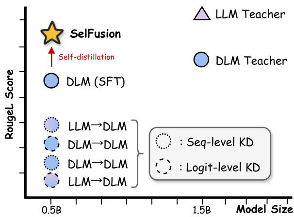
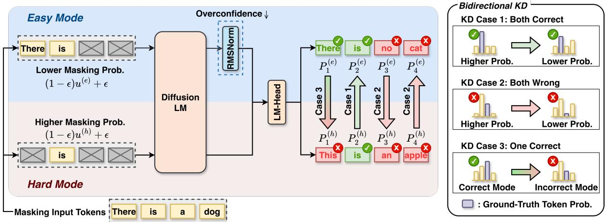
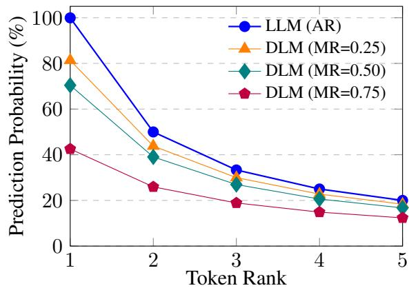
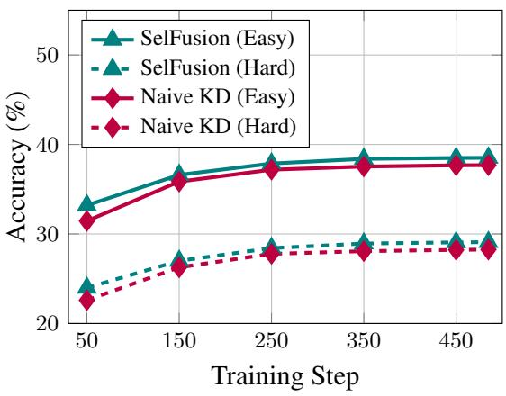
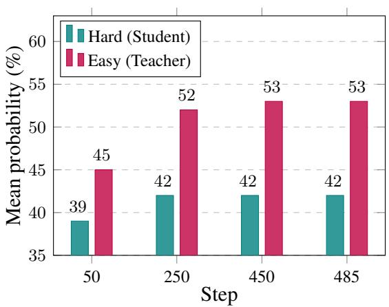
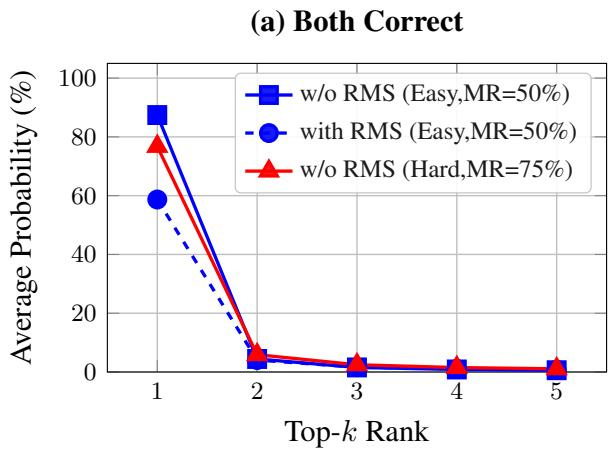
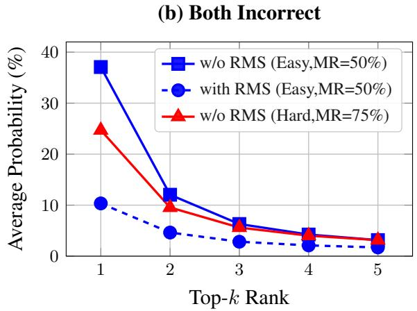
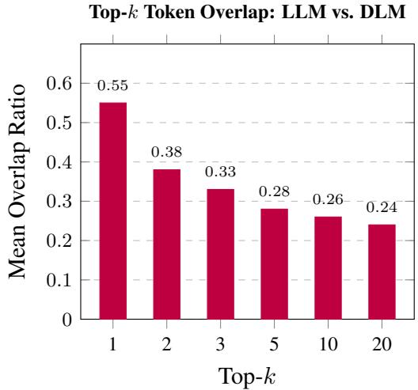
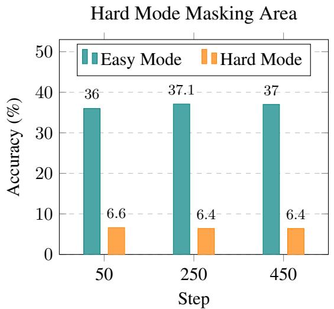
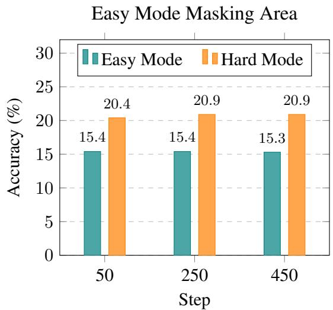

# SelFusion: Self-distillation for Diffusion Language Models

Hyeong Soo Lim1,\* Jin Young Kim1,\* Eun Seo Seo1 Min Ho Jang1 Ji Won Yoon1,†

1Department of Artificial Intelligence, Chung-Ang University

{andrew1001, wlsdud338, jeo0534, sunbi8534, jiwonyoon}@cau.ac.kr \*Equal contribution †Corresponding author

## Abstract

Diffusion language models (DLMs) alleviate the inherent latency bottleneck of autoregressive (AR) large language models (LLMs), but their degraded generation quality limits practical applicability. Although knowledge distillation (KD) can be a promising direction for improving performance, we empirically find that naively applying conventional KD yields only marginal gains, or even degrades generation quality. Based on these observations, we propose a novel self-distillation framework for DLMs, namely SelFusion. To enable effective KD without an external teacher model, SelFusion performs two forward passes with different masking levels, defining the hard mode with a larger masking probability and the easy mode with a smaller masking probability. However, the easy mode is not always more accurate than the hard mode and can be overconfident on incorrect tokens. Thus, we introduce bidirec tional KD between the two modes, which can dynamically determine the distillation direction based on token-level correctness. Experimental results on instruction-following tasks show that the proposed self-distillation substantially outperforms other KD methods with external LLM and DLM teachers. In many configurations, the student trained with SelFusion even surpasses the performance of the LLM teacher, providing a practical path toward improving DLM generation quality. Source code can be found at https://github.com/ scai-research/SelFusion\_official

## 1 Introduction

Recently, diffusion language models (DLMs) have emerged as a compelling alternative autoregressive (AR) large language models (LLMs). By leveraging parallel decoding mechanisms, DLMs offer faster inference capabilities, making them highly suitable for real-time applications. LLaDA (Nie et al., 2025b) and SMDM(Nie et al., 2025a) have demonstrated notable inference speedups over AR counterparts. However, DLMs typically underperform LLMs in terms of generation quality due to their non-autoregressive (NAR) nature (Nie et al., 2025b,a; Sahoo et al., 2024).

  
Figure 1: Rouge-L scores on the Dolly dataset. Existing KD methods for DLMs often underperform the SFT baseline, regardless of whether the teacher is DLM or LLM. In contrast, SelFusion significantly outperforms all baselines at the same model size.

To bridge this performance gap, knowledge distillation (KD) (Hinton et al., 2015) can be a promising direction, enabling a student to mimic the behaviors of a strong teacher. In the context of LLMs, KD has been extensively studied and is typically categorized into two strategies. First, logit-level KD performs distribution matching between teacher and student, which is the most common approach (Chen et al., 2024; Gu et al., 2024a). Second, sequence-level KD trains the student on teacher-generated text, remaining useful when teacher distributions are inaccessible (Kim and Rush, 2016). While these strategies have proven effective in improving LLMs, their extension to the DLMs remains largely underexplored.

To examine the applicability of KD to DLMs, we distill DLM students from both LLM and DLM teachers. Surprisingly, as shown in Figure 1, distilled students achieve only marginal gains, or even exhibit performance degradation. In the case of LLM-to-DLM distillation, the distribution mismatch between the AR teacher and the NAR student limits the effectiveness of logit-level knowledge transfer, which will be further discussed in Section 3.1. Sequence-level KD relies solely on teacher-generated outputs and thus provides improvements over logit-level supervision, but remains limited in terms of performance gains. Moreover, DLM-to-DLM KD scenarios remain suboptimal, largely due to the limited generation quality of the DLM teacher.

Motivated by these observations, we propose SelFusion, a novel self-distillation framework for DLMs. Specifically, SelFusion leverages the noising process of DLMs to enable two forward modes within a single model, namely the easy mode and the hard mode. The input to the easy mode has a lower masking ratio than that of the hard mode. Since fewer tokens are masked, the easy mode is expected to yield more accurate predictions and provide more beneficial knowledge for KD. However, it is not always more accurate than the hard mode and can also be overconfident on incorrect tokens. Thus, we introduce bidirectional KD between the easy and hard modes, dynamically determining the distillation direction by evaluating token-level correctness.

We evaluate SelFusion on multiple instructionfollowing benchmarks against existing KD methods. The proposed self-distillation consistently outperforms conventional KD baselines that depend on external teacher models across all configurations. More surprisingly, SelFusion even surpasses the teacher models, including both DLMs and LLMs. These results suggest that self-distillation with two modes effectively transfers knowledge within a single model.

## 2 Related Work

## 2.1 Diffusion Language Models

DLMs for text generation can be categorized into continuous and discrete methods. Continuous methods embed tokens into continuous space, while discrete methods operate directly on token space (Gulrajani and Hashimoto, 2023). Recently, masked diffusion has been predominantly adopted among discrete approaches, where the forward process progressively masks tokens and the reverse process learns to predict them (Sahoo et al., 2024;

Lou et al., 2024; Nie et al., 2025a,b). Generally, increasing the number of denoising steps improves generation quality. LLaDA scaled masked diffusion to 8B parameters, demonstrating the potential of DLMs for fast inference through parallel generation (Nie et al., 2025b). Despite these advances, DLMs still lag behind AR models in generation quality. For instance, recent DLMs underperform AR baselines by 10-32% in perplexity (Nie et al., 2025b). This gap highlights the need for further improvements in DLM generation quality.

## 2.2 Knowledge Distillation for Language Models

KD (Romero et al., 2015; Shridhar et al., 2023; Hsieh et al., 2023; Li et al., 2024; Jung et al., 2025) is a promising approach to improve model performance by transferring knowledge from a teacher model. Early work in AR models proposed logitlevel KD that matches output logits (Hinton et al., 2015), followed by sequence-level KD that trains on teacher-generated sequences (Kim and Rush, 2016). Recent advances have improved distillation for generative models. MiniLLM (Gu et al., 2024a) addressed the limitations of forward KL divergence by proposing reverse KL divergence with on-policy optimization for instruction-following tasks, while GKD (Agarwal et al., 2024) explored on-policy distillation using student-generated samples. Self-distillation methods have also shown promise by training models to match their own predictions from different configurations (Hahn and Choi, 2019; Yoon et al., 2023; Yang et al., 2024). However, KD for DLMs to improve generation quality remains largely unexplored. Furthermore, existing work on DLM distillation has primarily focused on the pretraining phase, leaving post-training distillation scenarios unaddressed.

## 3 Methodology

## 3.1 Motivation

LLM-to-DLM Distillation. As aforementioned, logit-level distillation from an AR teacher is often ineffective due to distribution mismatch. We empirically observe that AR models assign near 100% probabilty to the top-1 token, whereas DLMs exhibit approximately 60% probability at a 50% masking ratio. This gap hinders effective knowledge transfer, as the student struggles to match the teacher’s spiky predictions. We also provide a detailed analysis of this mismatch in Section 4.3.5.

  
Figure 2: Overall architecture of SelFusion. The framework comprises easy and hard modes that generate tokens under less and more masked context, respectively. Bidirectional KD determines the distillation direction based on token-level correctness.

DLM-to-DLM Distillation. In the DLM-to-DLM setting, distillation is limited by the absence of sufficiently high-quality DLM teachers. Even when DLM teachers are available, their generation quality remains substantially lower than that of AR models. As a result, logit-level KD yields only marginal gains relative to its increased training cost. Sequence-level KD also shows limited effectiveness, even when the teacher generates outputs with more denoising steps.

## 3.2 SelFusion

Based on our findings that DLMs lack an effective teacher for KD, we propose a novel self-distillation, namely SelFusion. The overall process of SelFusion is illustrated in Figure 2.

Two Modes with Different Masking. The key idea is to leverage the noising process of DLMs to construct ‘easy mode’ and ‘hard mode’ within the same model. Specifically, while the hard mode follows the original random masking scheme, the easy mode is designed to use a lower masking ratio to expose more context, resulting in relatively higher masking ratios for the hard mode. As a result, the easy mode is expected to yield more accurate predictions. For example, in our experiments, the easy mode assigns approximately 10% higher probability to the correct token than the hard mode throughout training. This behavior is consistent with prior KD studies that emphasize student-friendly teachers, which maintain output distributions close to the student (Gu et al., 2024a; Kim et al., 2024; Lee et al., 2024). The easy mode tends to serve as the teacher for the hard mode, as it applies less masking and can thus provide relatively more accurate knowledge. Further details are provided in Section 4.3.3.

Bidirectional KD. However, the easy mode with lower masking does not always guarantee correct predictions, which motivates us to adaptively determine the distillation target. Therefore, we additionally present bidirectional KD, where the distillation direction for each token is determined based on correctness and confidence, considering three cases:

• Both correct: When both modes predict correctly, the mode assigning higher probability to the predicted token serves as the distillation target.

• Both wrong: When both modes predict incorrectly, the mode assigning higher probability to the ground-truth token serves as the distillation target.

• One correct: When only one mode predicts correctly, that mode serves as the distillation target.

Formally, the token-level distillation direction $\mathcal { D } _ { t }$ is defined as follows:

$$
\mathcal { D } _ { t } = \left\{ \begin{array} { l l } { e \to h , } & { \mathrm { i f ~ } c _ { e } > c _ { h } , } \\ { h \to e , } & { \mathrm { i f ~ } c _ { h } > c _ { e } , } \\ { \arg \underset { m \in \{ h , e \} } { \operatorname* { m a x } } p _ { m } ( y _ { e } \mid x ) , } & { \mathrm { i f ~ } c _ { h } = c _ { e } . } \end{array} \right.\tag{1}
$$

where $c _ { h }$ and $c _ { e }$ are binary indicators of correctness for the hard and easy mode predictions, respectively. Distillation therefore follows the more reliable prediction at the token level.

  
Figure 3: Comparison of average prediction probabilities for masked tokens in the Dolly dataset for LLM and DLM. For a fair comparison, we compute token probabilities using the same token prediction procedure as in training. Unlike AR models, DLMs exhibit flatter distributions, especially at higher MR.

RMSNorm-based Logit Calibration. Since the easy mode has access to more context during token generation, it tends to produce overconfident predictions. Figure 3 shows that lower masking ratios lead to more peaked distributions. More importantly, this overconfidence occurs not only on correct tokens but also on incorrect ones. Given that both modes predict incorrectly in approximately 40% of cases, such overconfidence from the easy mode can hinder effective distillation. To address this, we apply RMSNorm-based logit calibration. Specifically, we insert RMSNorm between the final hidden state and the LM head of the easy mode. This selectively suppresses overconfidence, preserving confidence for correct predictions while substantially reducing it for incorrect ones. With only 1,280 parameters, RMSNorm alleviates overconfident predictions, enabling more effective knowledge transfer. Further analysis of RMSNorm is provided in Section 4.3.4.

## 3.3 Objective Function for SelFusion

SelFusion jointly optimizes the hard mode diffusion loss, the easy mode diffusion loss, and the token-wise bidirectional distillation loss. Let x be an input sequence and $y _ { i }$ the ground-truth token at position i.

Masking Process and Notation. For each mode $m \in \{ e , h \}$ , we sample a noise level $u ^ { ( m ) } \in ( 0 , 1 )$ and define the per-position masking probability as follows:

$$
q _ { i } ^ { ( m ) } = ( 1 - \epsilon ) u ^ { ( m ) } + \epsilon ,\tag{2}
$$

where ϵ is a small constant. We then sample a binary mask variable $z _ { i } ^ { ( m ) } \sim$ Bernoulli $( q _ { i } ^ { ( m ) } )$ independently for each position i. $\mathrm { I f } z _ { i } ^ { ( m ) } = 1$ , the token at position i is replaced by the special [MASK] token; otherwise it remains visible. We denote by $\mathcal { M } _ { m } = \{ i \mid z _ { i } ^ { ( m ) } = 1 \}$ the set of masked positions in mode m. The model output distribution at position i in mode m is denoted by ${ P } _ { i } ^ { ( m ) } ( \cdot )$

Diffusion Losses for Easy and Hard Mode. We compute the diffusion token-prediction losses over the masked positions, reweighted by the corresponding masking probabilities, which are defined as

$$
\mathcal { L } _ { \mathrm { d i f f } } ^ { ( h ) } = \frac { 1 } { \vert \mathcal { M } _ { h } \vert } \sum _ { i \in \mathcal { M } _ { h } } \frac { - \log P _ { i } ^ { ( h ) } ( y _ { i } ) } { q _ { i } ^ { ( h ) } } ,\tag{3}
$$

$$
\mathcal { L } _ { \mathrm { d i f f } } ^ { ( e ) } = \frac { 1 } { \left| \mathcal { M } _ { e } \right| } \sum _ { i \in \mathcal { M } _ { e } } \frac { - \log P _ { i } ^ { ( e ) } ( y _ { i } ) } { q _ { i } ^ { ( e ) } } .\tag{4}
$$

Bidirectional KD Loss. Let D be the set of distillation positions. For each $i \in \mathcal { D }$ , the distillation direction $\mathcal { D } _ { i } \in \{ e  h , ~ h  e \}$ is determined by the rule defined in Eq. (1). With temperature $T ,$ we define the temperature-scaled distributions from the logits $z _ { i } ^ { ( m ) }$ as follows:

$$
P _ { i , T } ^ { ( m ) } ( \cdot ) = \mathrm { s o f t m a x } \Big ( z _ { i } ^ { ( m ) } / T \Big ) ,\tag{5}
$$

where V denotes the vocabulary (with size $| \nu | )$ where $z _ { i } ^ { ( m ) } \in \mathbb { R } ^ { | \nu | }$ denotes the logits at position i under mode $m \in \{ h , e \}$ . We use the Kullback-Leibler (KL) divergence to measure the discrepancy between two output distributions. The bidirectional KD loss is given by

$$
\mathcal { L } _ { \mathrm { b k d } } = \frac { T ^ { 2 } } { | \mathcal { D } | } \sum _ { i \in \mathcal { D } } { \mathrm { K L } } ( P _ { i , T } ^ { ( j ) } | | P _ { i , T } ^ { ( k ) } ) ,\tag{6}
$$

where $( j , k ) \in \{ ( e , h ) , ( h , e ) \}$ depending on the direction $\mathcal { D } _ { i }$

Total Objective. The final training objective can be calculated as

$$
{ \mathcal { L } } _ { \mathrm { S e l F u s i o n } } = { \mathcal { L } } _ { \mathrm { d i f f } } ^ { ( h ) } + { \mathcal { L } } _ { \mathrm { d i f f } } ^ { ( e ) } + { \mathcal { L } } _ { \mathrm { b k d } } .\tag{7}
$$

Since both modes share the same parameters, the combined loss updates both modes simultaneously in a single backward pass.

<table><tr><td rowspan=1 colspan=1>Method</td><td rowspan=1 colspan=1>Model</td><td rowspan=1 colspan=2>Size</td><td rowspan=1 colspan=1>Dolly</td><td rowspan=1 colspan=1>Self-inst</td><td rowspan=1 colspan=1>Vicuna</td><td rowspan=1 colspan=1>Sinst</td><td rowspan=1 colspan=1>Uinst</td></tr><tr><td rowspan=6 colspan=1>SFT</td><td rowspan=1 colspan=1> $\mathrm { L L M } _ { t e a }$ </td><td rowspan=1 colspan=2></td><td rowspan=1 colspan=1>24.4765</td><td rowspan=1 colspan=1>11.0382</td><td rowspan=1 colspan=1>14.9436</td><td rowspan=1 colspan=1>23.2118</td><td rowspan=1 colspan=1>27.1273</td></tr><tr><td rowspan=1 colspan=1> $\mathrm { D L M } _ { t e a } \ ( 8 \ \mathrm { S t e p s } )$ </td><td rowspan=1 colspan=2>1476M</td><td rowspan=1 colspan=1>17.2631</td><td rowspan=1 colspan=1>9.7284</td><td rowspan=1 colspan=1>12.4577</td><td rowspan=1 colspan=1>22.6308</td><td rowspan=1 colspan=1>21.9190</td></tr><tr><td rowspan=1 colspan=1> $\mathrm { D L M } _ { t e a } \left( 1 6 \mathrm { S t e p s } \right)$ </td><td rowspan=1 colspan=2></td><td rowspan=1 colspan=1>18.6108</td><td rowspan=1 colspan=1>10.5172</td><td rowspan=1 colspan=1>14.7385</td><td rowspan=1 colspan=1>24.3427</td><td rowspan=1 colspan=1>23.9995</td></tr><tr><td rowspan=1 colspan=1> $\mathrm { L L M } _ { s t u }$ </td><td rowspan=1 colspan=2></td><td rowspan=1 colspan=1>25.5660</td><td rowspan=1 colspan=1>11.1115</td><td rowspan=1 colspan=1>14.6017</td><td rowspan=1 colspan=1>22.4033</td><td rowspan=1 colspan=1>25.2105</td></tr><tr><td rowspan=1 colspan=1> $\mathrm { D L M } _ { s t u } \left( 8 \mathrm { S t e p s } \right)$ </td><td rowspan=1 colspan=2>472M</td><td rowspan=1 colspan=1>18.7688</td><td rowspan=1 colspan=1>10.6877</td><td rowspan=1 colspan=1>15.0473</td><td rowspan=1 colspan=1>24.7139</td><td rowspan=1 colspan=1>23.8430</td></tr><tr><td rowspan=1 colspan=1> $\mathrm { D L M } _ { s t u } \left( 1 6 \mathrm { S t e p s } \right)$ </td><td rowspan=1 colspan=2></td><td rowspan=1 colspan=1>19.5204</td><td rowspan=1 colspan=1>11.6416</td><td rowspan=1 colspan=1>16.3351</td><td rowspan=1 colspan=1>25.7185</td><td rowspan=1 colspan=1>25.5245</td></tr><tr><td rowspan=1 colspan=1>Method</td><td rowspan=1 colspan=1>KD</td><td rowspan=1 colspan=2>Steps</td><td rowspan=1 colspan=1>Dolly</td><td rowspan=1 colspan=1>Self-inst</td><td rowspan=1 colspan=1>Vicuna</td><td rowspan=1 colspan=1>Sinst</td><td rowspan=1 colspan=1>Uinst</td></tr><tr><td rowspan=2 colspan=1>Logit-level KD</td><td rowspan=1 colspan=1> $\mathrm { L L M } _ { t e a } {  } \mathrm { D L M } _ { s t u }$ </td><td rowspan=3 colspan=2></td><td rowspan=1 colspan=1>15.1075</td><td rowspan=1 colspan=1>8.7333</td><td rowspan=1 colspan=1>14.3417</td><td rowspan=1 colspan=1>16.5709</td><td rowspan=1 colspan=1>17.8998</td></tr><tr><td rowspan=1 colspan=1> $\mathrm { D L M } _ { t e a } {  } \mathrm { D L M } _ { s t u }$ </td><td rowspan=1 colspan=1>17.2276</td><td rowspan=1 colspan=1>9.8326</td><td rowspan=1 colspan=1>14.4729</td><td rowspan=1 colspan=1>20.4459</td><td rowspan=1 colspan=1>19.8666</td></tr><tr><td rowspan=2 colspan=1>Seq-level KD</td><td rowspan=1 colspan=1> $\mathrm { L L M } _ { t e a } {  } \mathrm { D L M } _ { s t u }$ </td><td rowspan=1 colspan=1></td><td rowspan=1 colspan=1>18.8576</td><td rowspan=1 colspan=1>10.0266</td><td rowspan=1 colspan=1>14.3811</td><td rowspan=1 colspan=1>22.4884</td><td rowspan=1 colspan=1>22.6125</td></tr><tr><td rowspan=1 colspan=1> $\mathrm { D L M } _ { t e a } {  } \mathrm { D L M } _ { s t u }$ </td><td rowspan=2 colspan=2></td><td rowspan=1 colspan=1></td><td rowspan=1 colspan=1>14.6822</td><td rowspan=1 colspan=1>8.3684</td><td rowspan=1 colspan=1>14.6454</td><td rowspan=1 colspan=1>16.2587</td><td rowspan=1 colspan=1>17.1783</td></tr><tr><td rowspan=1 colspan=1>Ours, SelFusion</td><td rowspan=1 colspan=1> $\mathrm { D L M } _ { s t u } {  } \mathrm { D L M } _ { s t u }$ </td><td rowspan=1 colspan=1>21.3926</td><td rowspan=1 colspan=1>12.0022</td><td rowspan=1 colspan=1>16.6586</td><td rowspan=1 colspan=1>26.3464</td><td rowspan=1 colspan=1>26.4189</td></tr><tr><td rowspan=2 colspan=1>Logit-level KD</td><td rowspan=1 colspan=1> $\mathrm { L L M } _ { t e a } {  } \mathrm { D L M } _ { s t u }$ </td><td rowspan=5 colspan=2>16</td><td rowspan=1 colspan=1>15.3833</td><td rowspan=1 colspan=1>9.0501</td><td rowspan=1 colspan=1>15.4732</td><td rowspan=1 colspan=1>16.5188</td><td rowspan=1 colspan=1>17.9967</td></tr><tr><td rowspan=1 colspan=1> $\mathrm { D L M } _ { t e a } {  } \mathrm { D L M } _ { s t u }$ </td><td rowspan=1 colspan=1>17.6549</td><td rowspan=1 colspan=1>10.1753</td><td rowspan=1 colspan=1>16.0814</td><td rowspan=1 colspan=1>21.4601</td><td rowspan=1 colspan=1>21.4262</td></tr><tr><td rowspan=2 colspan=1>Seq-level KD</td><td rowspan=1 colspan=1> $\mathrm { L L M } _ { t e a } {  } \mathrm { D L M } _ { s t u }$ </td><td rowspan=1 colspan=1>19.9478</td><td rowspan=1 colspan=1>11.0604</td><td rowspan=1 colspan=1>16.1340</td><td rowspan=1 colspan=1>23.7022</td><td rowspan=1 colspan=1>24.4449</td></tr><tr><td rowspan=1 colspan=1> $\mathrm { D L M } _ { t e a } {  } \mathrm { D L M } _ { s t u }$ </td><td rowspan=1 colspan=1>15.5604</td><td rowspan=1 colspan=1>9.5634</td><td rowspan=1 colspan=1>16.4462</td><td rowspan=1 colspan=1>16.9650</td><td rowspan=1 colspan=1>18.4398</td></tr><tr><td rowspan=1 colspan=1>Ours, SelFusion</td><td rowspan=1 colspan=1> $\mathrm { D L M } _ { s t u } {  } \mathrm { D L M } _ { s t u }$ </td><td rowspan=1 colspan=1>21.6317</td><td rowspan=1 colspan=1>12.8707</td><td rowspan=1 colspan=1>17.0788</td><td rowspan=1 colspan=1>27.0745</td><td rowspan=1 colspan=1>27.8595</td></tr></table>

Table 1: Performance comparison on multiple evaluation datasets. The first block reports $\mathrm { S F T }$ results of the teacher and student baselines, where $\mathrm { L L M } _ { \mathrm { t e a } }$ and $\mathrm { D L M } _ { \mathrm { t e a } }$ denote the teacher models and $\mathrm { L L M _ { s t u } }$ and $\mathrm { D L M _ { s t u } }$ denote the student baseline models. The second block reports KD results, where the KD column indicates the distillation direction. Bold indicates the best result.

## 4 Experiments

## 4.1 Experimental Settings

Datasets. Following previous studies (Gu et al., 2024a; Kim et al., 2024), we evaluated on instruction-following tasks, where the model generates responses conditioned on instructions. We used Databricks-Dolly-15K (Conover et al., 2023) as our training dataset, with 12K samples for training and 500 samples for evaluation. We evaluated on five instruction-following benchmarks, including Dolly (500 samples), Self-Inst (252 samples) (Wang et al., 2023), Vicuna (80 samples) (Peng et al., 2023), and the [11, +∞) response-length subsets of S-NI (1,694 samples) (Wang et al., 2022) and UnNI (23,916 samples) (Honovich et al., 2023). The five benchmarks described above are the evaluation datasets reported in Table 1.

Models and Training Setup. All experiments were conducted using SMDM architectures with 472M and 1476M parameters (Nie et al., 2025a), with the number of training epochs fixed to 20. To identify the optimal configuration for each model and method, we explored various learning rates and epochs. The LLM teacher used in our experiments was a TinyLlama model with 1,476M parameters. We used the DLM and LLM teachers from (Nie et al., 2025a), where both models were trained under the same setup with matched training data, model size, and training epochs. Comprehensive details regarding the hyperparameter search space and final configurations are provided in the Appendix A. All models were evaluated using the checkpoint from the final training step. Experiments were executed on four NVIDIA H200 GPUs, each with 141GB of memory.

Evaluation Configurations. Following prior work on DLMs (Nie et al., 2025a), we fixed the classifier-free guidance (CFG) scale to 1.0 for all DLMs. For LLMs, the sampling temperature was set to 1.0 during evaluation. Generation quality was assessed using the ROUGE-L metric (Lin, 2004), which is widely adopted for evaluating instruction-following text generation. We evaluated each benchmark using three different random seeds and report the average across the three runs. Additional implementation and training details are provided in the Appendix A.

<table><tr><td rowspan=1 colspan=1>Method</td><td rowspan=1 colspan=1>KD</td><td rowspan=1 colspan=1>Student training</td><td rowspan=1 colspan=1>Teacher training</td><td rowspan=1 colspan=1>Total</td></tr><tr><td rowspan=1 colspan=1>SFT</td><td rowspan=1 colspan=1></td><td rowspan=1 colspan=1> $2 . 8 \times 1 0 ^ { 2 }$ </td><td rowspan=1 colspan=1></td><td rowspan=1 colspan=1> $2 . 8 \times 1 0 ^ { 2 }$ </td></tr><tr><td rowspan=2 colspan=1>Seq-level KD</td><td rowspan=1 colspan=1> $\mathrm { L L M } _ { \mathrm { t e a } } \to \mathrm { D L M } _ { \mathrm { s t u } }$ </td><td rowspan=1 colspan=1> $2 . 8 \times 1 0 ^ { 2 }$ </td><td rowspan=1 colspan=1> $7 . 5 \times 1 0 ^ { 2 }$ </td><td rowspan=1 colspan=1> $1 . 0 3 \times 1 0 ^ { 3 }$ </td></tr><tr><td rowspan=1 colspan=1> $\mathrm { D L M } _ { \mathrm { t e a } } \to \mathrm { D L M } _ { \mathrm { s t u } }$ </td><td rowspan=1 colspan=1> $2 . 8 \times 1 0 ^ { 2 }$ </td><td rowspan=1 colspan=1> $7 . 5 \times 1 0 ^ { 2 }$ </td><td rowspan=1 colspan=1> $1 . 0 3 \times 1 0 ^ { 3 }$ </td></tr><tr><td rowspan=2 colspan=1>Logit-level KD</td><td rowspan=1 colspan=1> $\mathrm { D L M } _ { \mathrm { t e a } } \to \mathrm { D L M } _ { \mathrm { s t u } }$ </td><td rowspan=1 colspan=1> $5 . 4 \times 1 0 ^ { 2 }$ </td><td rowspan=1 colspan=1> $7 . 5 \times 1 0 ^ { 2 }$ </td><td rowspan=1 colspan=1> $1 . 2 9 \times 1 0 ^ { 3 }$ </td></tr><tr><td rowspan=1 colspan=1> $\mathrm { L L M } _ { \mathrm { t e a } } \to \mathrm { D L M } _ { \mathrm { s t u } }$ </td><td rowspan=1 colspan=1> $5 . 4 \times 1 0 ^ { 2 }$ </td><td rowspan=1 colspan=1> $7 . 5 \times 1 0 ^ { 2 }$ </td><td rowspan=1 colspan=1> $1 . 2 9 \times 1 0 ^ { 3 }$ </td></tr><tr><td rowspan=1 colspan=1>Ours, SelFusion</td><td rowspan=1 colspan=1> $\mathrm { D L M } _ { \mathrm { s t u } }  \mathrm { D L M } _ { \mathrm { s t u } }$ </td><td rowspan=1 colspan=1> $5 . 6 \times 1 0 ^ { 2 }$ </td><td rowspan=1 colspan=1></td><td rowspan=1 colspan=1> $\mathbf { 5 . 6 \times 1 0 ^ { 2 } }$ </td></tr></table>

Table 2: Training cost analysis measured in TFLOPs. Although SelFusion requires higher per-iteration computation than SFT, it eliminates teacher training and thus reduces total training computation compared to KD methods that rely on a separately trained teacher. All methods are compared under the same training setup with 485 iterations.

## 4.2 Experimental Results

Firstly, we evaluated conventional logit-level and sequence-level KD in both the LLM-to-DLM and DLM-to-DLM settings, as shown in Table 1. For logit-level KD, we minimized the KL divergence between the teacher and student distributions. Since the student was a DLM, we applied the KD loss only to the masked tokens, following the DLM generation principle. In the case of sequence-level KD, we trained the student with teacher-generated outputs, as described in Section 2. This approach required the teacher that could generate high-quality target sequences to provide effective supervision (Kim and Rush, 2016). Prior work showed that DLMs’ generation quality can be improved by increasing the number of diffusion steps (Deschenaux and Gulcehre, 2025; Nie et al., 2025a; Chen et al., 2025). Thus, in the DLM-to-DLM setting, we generated teacher pseudo-targets using 64-step inference and performed sequence-level KD on these sequences. We presented results for 8 and 16 diffusion steps in Table 1.

We began by evaluating LLM-to-DLM distillation with 8 diffusion steps. From the results, it is confirmed that logit-level KD with the LLM teacher led to substantial performance degradation. For example, on Dolly, the score dropped to 15.11, compared to 18.77 for the DLM SFT baseline. This trend was consistent across all benchmarks, indicating that direct logit matching from the LLM teacher to the DLM student was ineffective. Sequencelevel KD also did not surpass the DLM SFT baseline on most benchmarks, with Dolly as the only exception. We next evaluated DLM-to-DLM distillation using the pretrained DLM teacher. Distillation did not improve over the SFT baseline. For example, on Uinst with 8 diffusion steps, the DLM

SFT model achieved 23.84, whereas logit-level KD reached only 19.87. Sequence-level KD further exhibited performance drops across benchmarks. These results suggested that the DLM teacher’s generation quality was insufficient to provide beneficial knowledge at either the sequence or logit level.

In contrast, the proposed self-distillation method achieved substantial performance gains without relying on any external teacher model. Table 1 shows that SelFusion outperformed the strongest competing baseline, LLM-to-DLM sequence-level KD, by 2 to 4 points, corresponding to an approximate 16% relative improvement. Compared with the DLM SFT baseline, it consistently improved performance by 1.5 to 3 points across all five benchmarks. Notably, SelFusion also surpassed the LLM teacher on multiple benchmarks. For example, Sel-Fusion achieved 12.87 on Self-inst and 17.08 on Vicuna, exceeding the LLM teacher scores of 11.04 and 14.95, respectively. It also improved from 23.21 to 27.07 on Sinst and from 27.13 to 27.86 on Uinst. Overall, these results demonstrated that our self-distillation design provides a practical path for DLMs, requiring no external teacher and introducing only 1,280 additional parameters.

## 4.3 Analysis

## 4.3.1 Training Efficiency

We analyzed the training cost of SelFusion using TFLOPs. As shown in Table 2, SelFusion required about 2× more per-iteration computation than SFT, but substantially less total computation than KD methods with a separately trained teacher. By removing the teacher-training stage, SelFusion reduced the overall training cost by roughly 2× while maintaining competitive performance. All results were measured under the same training configura-

<table><tr><td rowspan=1 colspan=1>Method</td><td rowspan=1 colspan=1>Steps</td><td rowspan=1 colspan=1>Dolly</td><td rowspan=1 colspan=1>Self-inst</td><td rowspan=1 colspan=1>Vicuna</td><td rowspan=1 colspan=1>Sinst</td><td rowspan=1 colspan=1>Uinst</td></tr><tr><td rowspan=1 colspan=1>SelFusion</td><td rowspan=3 colspan=1>16</td><td rowspan=1 colspan=1>21.6317</td><td rowspan=1 colspan=1>12.8707</td><td rowspan=1 colspan=1>17.0788</td><td rowspan=1 colspan=1>27.0745</td><td rowspan=1 colspan=1>27.8595</td></tr><tr><td rowspan=1 colspan=1>w/o bidirectional KD(easy→hard)</td><td rowspan=1 colspan=1>13.6755(-7.9562)</td><td rowspan=1 colspan=1>8.5558(-4.3149)</td><td rowspan=1 colspan=1>10.6129(-6.4659)</td><td rowspan=1 colspan=1>21.8953(-5.1792)</td><td rowspan=1 colspan=1>20.9376(-6.9219)</td></tr><tr><td rowspan=1 colspan=1>w/o bidirectional KD(hard→easy)</td><td rowspan=1 colspan=1>15.7107(-5.9210)</td><td rowspan=1 colspan=1>9.6470(-3.2237)</td><td rowspan=1 colspan=1>11.0940(-5.9848)</td><td rowspan=1 colspan=1>23.9227(-3.1518)</td><td rowspan=1 colspan=1>23.2298(-4.6297)</td></tr><tr><td rowspan=1 colspan=1>w/o RMSNorm</td><td rowspan=1 colspan=1></td><td rowspan=1 colspan=1>17.3566(-4.2751)</td><td rowspan=1 colspan=1>11.0430(-1.8277)</td><td rowspan=1 colspan=1>16.4204(-0.6584)</td><td rowspan=1 colspan=1>21.2283(-5.8462)</td><td rowspan=1 colspan=1>21.9992(-5.8603)</td></tr></table>

Table 3: Ablation results of SelFusion. We perform ablation studies by individually removing bidirectional KD and RMSNorm. For bidirectional KD, we further examine each unidirectional variant (easy→hard and hard→easy) to isolate the contribution of each direction. Across all benchmarks, removing either component leads to consistent performance degradation, and neither unidirectional variant matches the bidirectional setting

  
Figure 4: Training accuracy comparison between SelFusion and the naive KD baseline. Naive KD uses a fixed one-way distillation direction between the two modes, Easy→Hard. Accuracy is evaluated only on the masked positions for each of the Easy and Hard modes, which use different masking ratios.

tion with 485 iterations.

## 4.3.2 Effect of Bidirectional Distillation

We further analyzed the effect of distillation direction by comparing easy→hard, hard→easy, and bidirectional KD. Although the easy mode is expected to be a stronger teacher due to its richer visible context, Table 3 shows that hard→easy outperformed easy→hard on several benchmarks, while neither unidirectional direction matched bidirectional distillation. As illustrated in Figure 2, SelFusion dynamically switches the token-level distillation direction between the easy and hard modes based on accuracy and confidence, allowing each mode to guide the other when it produces more confident predictions. Figure 4 provides quantitative support for this behavior. Under identical settings, easy→hard distillation (denoted as Naive KD) resulted in an approximately 1% drop in masked token accuracy for both modes during training. Consistent with this, Table 3 shows that removing bidirectional KD causes substantial performance drops across all benchmarks, highlighting the importance of dynamic distillation target selection in self-distillation.

  
Figure 5: Step-wise comparison of the mean probability assigned to the ground truth tokens by the easy and hard modes during training.

## 4.3.3 Token-level Probability Comparison of Easy and Hard Modes

To verify whether the easy mode assigns higher probability to ground-truth tokens than the hard mode, we analyze the model outputs under a controlled masking setup. Figure 5 presents the mean probability assigned to ground-truth tokens across training steps. Specifically, we evaluated step-wise checkpoints of SelFusion by fixing the hard mode masking ratio to 60% and using a reduced ratio of 30% for the easy mode, where the easy mode mask was constructed as a subset of the hard mode mask. We then measured the mean probability assigned to ground-truth tokens over this shared masked subset. The easy mode consistently assigned higher probability to the correct token than the hard mode, with the gap increasing from approximately 6% to about 10% over training. This observation supported our design intuition of treating the easy mode as the teacher and the hard mode as the student. Importantly, the easy mode maintains an output distribution that is more closely aligned with the student model, thereby facilitating effective knowledge transfer in line with prior student-friendly KD principles (Gu et al., 2024b; Kim et al., 2024).

  
Figure 6: Analysis of RMSNorm effect on SelFusion. We analyze tokens that are masked in both modes. (a) shows the probability distribution when both modes are correct, while (b) shows the case when both modes are incorrect. Easy mode uses 50% masking ratio (MR), and hard mode uses 75% MR.

## 4.3.4 Logit Calibration by RMSNorm

We applied RMSNorm-based logit calibration to mitigate overconfident predictions from the easy mode. As shown in Figure 6, RMSNorm selectively calibrated confidence depending on prediction correctness. When both modes were correct, RMSNorm moderately reduced the top-1 probability from approximately around 90% to about 60%. More importantly, when both modes were incorrect, RMSNorm substantially suppressed the overconfident probability from around 40% to about 10%, approximately 75% reduction. This stronger calibration on incorrect predictions was crucial, as it prevented learning from unreliable signals. Table 3 further confirmed that removing RMSNorm resulted in consistent performance drops, indicating its importance in suppressing overly confident incorrect predictions during distillation.

  
Figure 7: Mean top-k token overlap between LLM and DLM fine-tuned on the Dolly dataset. For each position, overlap is computed as $| S _ { k } ^ { \mathrm { L L M } } \cap S _ { k } ^ { \mathrm { D L M } } | / k$ , where $S _ { k }$ denotes the set of top-k predicted tokens.

## 4.3.5 Distribution Mismatch between LLMs and DLMs

The primary challenge of LLM-to-DLM distillation stemmed from logit distribution mismatch caused by different generation mechanisms. We categorized this mismatch into two types: (1) top-k logit scale mismatch and (2) top-k token mismatch. As shown in Figure 3, LLMs and DLMs exhibited different probability scales: LLMs showed peaked distributions dominated by the top-1 token, whereas DLMs exhibited flatter distributions due to parallel generation. Figure 7 also showed limited top-k token overlap, with top-1 overlap at about 60% and decreasing as k increased. These mismatches hindered direct logit-level distillation from LLMs to

<table><tr><td rowspan=1 colspan=1>Method</td><td rowspan=1 colspan=1>KD</td><td rowspan=1 colspan=1>Steps</td><td rowspan=1 colspan=1>Dolly</td><td rowspan=1 colspan=1>Self-inst</td><td rowspan=1 colspan=1>Vicuna</td><td rowspan=1 colspan=1>Sinst</td><td rowspan=1 colspan=1>Uinst</td></tr><tr><td rowspan=2 colspan=1>Logit-level KD</td><td rowspan=1 colspan=1> $\mathrm { L L M } _ { t e a } {  } \mathrm { D L M } _ { s t u }$ </td><td rowspan=5 colspan=1>32</td><td rowspan=1 colspan=1>14.7424</td><td rowspan=1 colspan=1>8.9812</td><td rowspan=1 colspan=1>15.2372</td><td rowspan=1 colspan=1>15.6568</td><td rowspan=1 colspan=1>17.1595</td></tr><tr><td rowspan=1 colspan=1> $\mathrm { D L M } _ { t e a } {  } \mathrm { D L M } _ { s t u }$ </td><td rowspan=1 colspan=1>18.8043</td><td rowspan=1 colspan=1>11.6876</td><td rowspan=1 colspan=1>16.0992</td><td rowspan=1 colspan=1>26.8568</td><td rowspan=1 colspan=1>26.1251</td></tr><tr><td rowspan=2 colspan=1>Seq-level KD</td><td rowspan=1 colspan=1> $\mathrm { L L M } _ { t e a } {  } \mathrm { D L M } _ { s t u }$ </td><td rowspan=1 colspan=1>20.1426</td><td rowspan=1 colspan=1>11.7443</td><td rowspan=1 colspan=1>16.6505</td><td rowspan=1 colspan=1>24.1393</td><td rowspan=1 colspan=1>25.1063</td></tr><tr><td rowspan=1 colspan=1> $\mathrm { D L M } _ { t e a } {  } \mathrm { D L M } _ { s t u }$ </td><td rowspan=1 colspan=1>15.9906</td><td rowspan=1 colspan=1>9.8436</td><td rowspan=1 colspan=1>17.2801</td><td rowspan=1 colspan=1>16.9256</td><td rowspan=1 colspan=1>18.6831</td></tr><tr><td rowspan=1 colspan=1>Ours, SelFusion</td><td rowspan=1 colspan=1> $\mathrm { D L M } _ { s t u } {  } \mathrm { D L M } _ { s t u }$ </td><td rowspan=1 colspan=1>21.7828</td><td rowspan=1 colspan=1>12.4917</td><td rowspan=1 colspan=1>17.1310</td><td rowspan=1 colspan=1>27.1185</td><td rowspan=1 colspan=1>28.1247</td></tr></table>

Table 4: Ablation on larger diffusion steps. We evaluate DLMs with 32 diffusion steps to assess generalization beyond the main 8 and 16 step settings. Bold indicates the best result.

<table><tr><td></td><td>Step</td><td>Latency (ms)</td><td>Speed-up</td></tr><tr><td>AR</td><td>一</td><td>2240</td><td>1.00×</td></tr><tr><td rowspan="6">DLM</td><td>1</td><td>61.4</td><td>36.5×</td></tr><tr><td>2</td><td>109.7</td><td>20.4×</td></tr><tr><td>4</td><td>199.1</td><td>11.3×</td></tr><tr><td>8</td><td>378.4</td><td>5.9×</td></tr><tr><td>16</td><td>745.4</td><td>3.0×</td></tr><tr><td>32</td><td>1479.0</td><td>1.5×</td></tr><tr><td></td><td>64</td><td>2952.2</td><td>0.76×</td></tr></table>

Table 5: Per-sample inference latency and speed-up for AR and DLM with varying diffusion steps, measured on the Dolly validation set.

DLMs, which SelFusion addressed via the inherent generation mechanism of DLMs.

## 4.3.6 Generalization on Larger Steps

We further evaluated its generalization to larger diffusion step settings. Beyond the standard 8 and 16 steps, we additionally evaluated 32-step inference. As shown in Table 4, SelFusion generally outperforms baseline distillation methods under the 32-step setting, achieving the best average performance across benchmarks.

## 4.4 Time Comparison of DLM and LLM

We compared the inference speed of DLMs and AR language models (LLMs). As shown in Table 5, DLMs achieved significantly lower inference latency than LLMs. This advantage stemmed from the parallel token generation of DLMs, whereas LLMs generated tokens sequentially. As a result, even with 32 diffusion steps, DLMs achieved approximately a 1.5× speedup over LLMs in practice.

## 5 Conclusions

In this paper, we propose SelFusion, a novel selfdistillation framework that enables effective logitlevel KD for DLMs. By leveraging different masking ratios with simultaneous forward passes, we decompose the model into two modes. This provides a more suitable distribution for learning, enabling effective training within a single model. Experimental results show that SelFusion outperforms conventional KD methods without relying on external teacher models.

## Limitations

Despite SelFusion’s consistent performance gains, several limitations remain. First, the current availability of DLM backbones is limited, constraining validation across a broader set of architectures. Second, our evaluation is limited to instruction tuning in English, leaving broader domains and multilingual settings for future work. Despite these limitations, SelFusion offers a practical advantage as a distillation framework that does not rely on external teacher models, including LLMs or DLMs.

## Ethical Considerations

This work does not raise any ethical concerns.

## Acknowledgments

This work was supported by the Institute of Information & Communications Technology Planning & Evaluation (IITP) grant funded by the Korea government (MSIT) (RS-2025-02653113, High-Performance Research AI Computing Infrastructure Support at the 2 PFLOPS Scale). This work was also supported by the Institute of Information & Communications Technology Planning & Evaluation (IITP) grant funded by the Korea government (MSIT) (RS-2021-II211341, Artificial Intelligence Graduate School Program (Chung-Ang University)), and the National Research Foundation of Korea (NRF) grant funded by the Korea government (MSIT) (RS-2025-00515722).

## References

Rishabh Agarwal, Nino Vieillard, Yongchao Zhou, Piotr Stanczyk, Sabela Ramos, Matthieu Geist, and Olivier Bachem. 2024. On-policy distillation of language models: Learning from self-generated mistakes. In Proc. NeurIPS.

Hongzhan Chen, Ruijun Chen, Yuqi Yi, Xiaojun Quan, Chenliang Li, Ming Yan, and Ji Zhang. 2024. Knowledge distillation of black-box large language models. Preprint, arXiv:2401.07013.

Tianqi Chen, Shujian Zhang, and Mingyuan Zhou. 2025. Dlm-one: Diffusion language models for one-step sequence generation. Preprint, arXiv:2506.00290.

Mike Conover, Matt Hayes, Ankit Mathur, Jianwei Xie, Jun Wan, Sam Shah, Ali Ghodsi, Patrick Wendell, Matei Zaharia, and Reynold Xin. 2023. Free dolly: Introducing the world’s first truly open instructiontuned llm.

Justin Deschenaux and Caglar Gulcehre. 2025. Beyond autoregression: Fast LLMs via self-distillation through time. In Proc. ICLR.

Bogdan Gliwa, Iwona Mochol, Maciej Biesek, and Aleksander Wawer. 2019. SAMSum corpus: A humanannotated dialogue dataset for abstractive summarization. In Proceedings of the 2nd Workshop on New Frontiers in Summarization, pages 70–79, Hong Kong, China. Association for Computational Linguistics.

Yuxian Gu, Li Dong, Furu Wei, and Minlie Huang. 2024a. Minillm: Knowledge distillation of large language models. In Proc. ICLR.

Yuxian Gu, Li Dong, Furu Wei, and Minlie Huang. 2024b. Minillm: Knowledge distillation of large language models. In Proc. ICLR.

Ishaan Gulrajani and Tatsunori B. Hashimoto. 2023. Likelihood-based diffusion language models. In Advances in Neural Information Processing Systems, volume 36.

Sangchul Hahn and Heeyoul Choi. 2019. Selfknowledge distillation in natural language processing. In Proc. RANLP.

Geoffrey Hinton, Oriol Vinyals, and Jeff Dean. 2015. Distilling the knowledge in a neural network. Preprint, arXiv:1503.02531.

Or Honovich, Thomas Scialom, Omer Levy, and Timo Schick. 2023. Unnatural instructions: Tuning language models with (almost) no human labor. In Proc. ACL.

Cheng-Yu Hsieh, Chun-Liang Li, Chih-kuan Yeh, Hootan Nakhost, Yasuhisa Fujii, Alex Ratner, Ranjay Krishna, Chen-Yu Lee, and Tomas Pfister. 2023. Distilling step-by-step! outperforming larger language models with less training data and smaller model

sizes. In Findings of the Association for Computational Linguistics: ACL 2023, pages 8003–8017, Toronto, Canada. Association for Computational Linguistics.

Seongryong Jung, Suwan Yoon, DongGeon Kim, and Hwanhee Lee. 2025. Todi: Token-wise distillation via fine-grained divergence control. Preprint, arXiv:2505.16297.

Gyeongman Kim, Doohyuk Jang, and Eunho Yang. 2024. Promptkd: Distilling student-friendly knowledge for generative language models via prompt tuning. Preprint, arXiv:2402.12842.

Yoon Kim and Alexander M. Rush. 2016. Sequencelevel knowledge distillation. In Proc. EMNLP.

Hojae Lee, Junho Kim, and SangKeun Lee. 2024. Mentor-kd: Making small language models better multi-step reasoners. In Proc. EMNLP.

Zheng Li, Xiang Li, Xinyi Fu, Xin Zhang, Weiqiang Wang, Shuo Chen, and Jian Yang. 2024. Promptkd: Unsupervised prompt distillation for vision-language models. In Proc. CVPR.

Chin-Yew Lin. 2004. ROUGE: A package for automatic evaluation of summaries. In Proc. ACL (Workshop).

Aaron Lou, Chenlin Meng, and Stefano Ermon. 2024. Discrete diffusion modeling by estimating the ratios of the data distribution. In Proceedings of the 41st International Conference on Machine Learning, volume 235 of Proceedings of Machine Learning Research, pages 32819–32848. PMLR.

Shen Nie, Fengqi Zhu, Chao Du, Tianyu Pang, Qian Liu, Guangtao Zeng, and Min Lin. 2025a. Scaling up masked diffusion models on text. Preprint, arXiv:2410.18514.

Shen Nie, Fengqi Zhu, Zebin You, Xiaolu Zhang, Jingyang Ou, Jun Hu, Jun Zhou, Yankai Lin, Ji-Rong Wen, and Chongxuan Li. 2025b. Large language diffusion models. Preprint, arXiv:2502.09992.

Baolin Peng, Chunyuan Li, Pengcheng He, Michel Galley, and Jianfeng Gao. 2023. Instruction tuning with gpt-4. arXiv preprint arXiv:2304.03277.

Adriana Romero, Nicolas Ballas, Samira Ebrahimi Kahou, Antoine Chassang, Carlo Gatta, and Yoshua Bengio. 2015. Fitnets: Hints for thin deep nets. In Proc. ICLR.

Subham Sekhar Sahoo, Marianne Arriola, Aaron Gokaslan, Edgar Mariano Marroquin, Alexander M Rush, Yair Schiff, Justin T Chiu, and Volodymyr Kuleshov. 2024. Simple and effective masked diffusion language models. In Proc. NeurIPS.

Kumar Shridhar, Alessandro Stolfo, and Mrinmaya Sachan. 2023. Distilling reasoning capabilities into smaller language models. In Findings of the Association for Computational Linguistics: ACL 2023, pages 7059–7073, Toronto, Canada. Association for Computational Linguistics.

Yizhong Wang, Yeganeh Kordi, Swaroop Mishra, Alisa Liu, Noah A. Smith, Daniel Khashabi, and Hannaneh Hajishirzi. 2023. Self-Instruct: Aligning language models with self-generated instructions. In Proc. ACL.

Yizhong Wang, Swaroop Mishra, Pegah Alipoormolabashi, Yeganeh Kordi, Amirreza Mirzaei, Anjana Arunkumar, Arjun Ashok, Arut Selvan Dhanasekaran, Atharva Naik, David Stap, Eshaan Pathak, Giannis Karamanolakis, Haizhi Gary Lai, Ishan Purohit, Ishani Mondal, Jacob Anderson, Kirby Kuznia, Krima Doshi, Maitreya Patel, and 21 others. 2022. Super-NaturalInstructions: Generalization via declarative instructions on 1600+ NLP tasks. In Proc. EMNLP.

Zhaorui Yang, Tianyu Pang, Haozhe Feng, Han Wang, Wei Chen, Minfeng Zhu, and Qian Liu. 2024. Selfdistillation bridges distribution gap in language model fine-tuning. In Proc. ACL.

Ji Won Yoon, Sunghwan Ahn, Hyeonseung Lee, Minchan Kim, Seok Min Kim, and Nam Soo Kim. 2023. EM-network: Oracle guided self-distillation for sequence learning. In Proc. ICML.

## A Appendix

## A.1 Training Configuration

We present the detailed training configurations used in our experiments in Table 6. We determined the optimal learning rates through grid search, taking into account both model scale and architectural differences. For the 1.4B teacher models, including both AR and DLM architectures, we explored a wider range of learning rates, {1e-5, 5e-5, 1e-4, 2e-4}, due to their distinct architectural characteristics. For the 0.472B DLM target models, we conducted grid search over {5e-5, 1e-4, 2e-4}. Following the same procedure, we also selected the learning rate for SelFusion via grid search and used 5e-5 in the final configuration. The table also reports hyperparameters shared across all experimental settings. For evaluation, we used three random seeds, 10, 20, and 30, and report the average over these runs.

## A.2 Prompt Formatting for Instruction Tuning

We standardized the instruction tuning data by converting each example into a Dolly style prompt template. Specifically, when an example contains an input field, we construct the prompt as follows:

<table><tr><td>Stage Setting</td><td></td><td>Value</td></tr><tr><td rowspan="3">SFT</td><td>DLM (472M)</td><td> $5 \times 1 0 ^ { - 5 }$ </td></tr><tr><td>DLM (1.476B)</td><td> $1 \times 1 0 ^ { - 5 }$ </td></tr><tr><td>LLM (472M) LLM (1.476B)</td><td> $2 \times 1 0 ^ { - 4 }$   $1 \times 1 0 ^ { - 4 }$ </td></tr><tr><td rowspan="3">KD</td><td>DLM→DLM (logit KD)</td><td> $5 \times 1 0 ^ { - 5 }$ </td></tr><tr><td>DLM→DLM (seq KD)</td><td> $5 \times 1 0 ^ { - 5 }$ </td></tr><tr><td>LLM→DLM (logit KD) LLM→DLM (seq KD)</td><td> $5 \times 1 0 ^ { - 5 }$   $5 \times 1 0 ^ { - 5 }$ </td></tr></table>

<table><tr><td>Shared hyperparameters Value</td></tr><tr><td># devices 4</td></tr><tr><td>Global batch size 512</td></tr><tr><td>Max tokens 256</td></tr><tr><td>Epoch (final) 20</td></tr><tr><td>LR decay enabled</td></tr><tr><td>Warmup ratio 0.05</td></tr><tr><td>Min LR LR/10</td></tr><tr><td>Weight decay 0.1</td></tr><tr><td>Adam betas (0.9, 0.95)</td></tr><tr><td>Grad clip 1.0</td></tr><tr><td>Seed 3407</td></tr></table>

Table 6: Selected hyperparameters from grid search and shared training settings.

Below is an instruction that describes a task,   
paired with an input that provides further   
context. Write a response that appropriately   
completes the request.   
### Instruction:   
{instruction}   
### Input:   
{context}   
### Response:

When the input field is absent, the following template is used:

Below is an instruction that describes a task.   
Write a response that appropriately completes   
the request.   
### Instruction:   
{instruction}   
### Response:

All datasets used in our experiments are publicly available from the MiniLLM data release: https://github.com/microsoft/LMOps/tree/ main/minillm

  
Figure 8: Masked-token prediction accuracy comparison between the easy and hard modes. The left plot evaluates both modes on hard mode masked positions, and the right plot evaluates both modes on easy mode masked positions. Note that a token masked in one mode may remain visible in the other mode. Thus, for a token masked in one mode, the counterpart mode may observe the ground truth token at that position.

## A.3 Masking Strategy for Easy and Hard Modes

We specify the masking configuration for the easy and hard modes following the standard DLM noising procedure. Given an input sequence ${ \textbf { x } } \in$ $\{ 0 , \ldots , V - 1 \} ^ { L }$ , we sample a noise level $t \sim$ $\mathcal { U } ( 0 , 1 )$ for each example and convert it into a token masking probability

$$
p _ { \mathrm { m a s k } } ( t ) = ( 1 - \epsilon ) t + \epsilon ,\tag{8}
$$

where ϵ is a small constant to avoid degenerate masking. We then independently mask each position i with probability $p _ { \mathrm { m a s k } } ( t )$ and replace masked tokens with a dedicated mask token (implemented by using the vocabulary index V ):

$$
\tilde { x } _ { i } = \left\{ \begin{array} { l l } { [ \mathsf { M A S K } ] } & { \mathrm { w i t h } \mathsf { p r o b . } p _ { \mathrm { m a s k } } ( t ) , } \\ { x _ { i } } & { \mathrm { o t h e r w i s e . } } \end{array} \right.\tag{9}
$$

To construct paired easy and hard modes within a single training step, we first sample the hard mode noise level $t _ { \mathrm { h a r d } } \sim \mathcal { U } ( 0 , 1 )$ . We then sample the easy mode noise level conditioned on it as

$$
t _ { \mathrm { e a s y } } \sim \mathcal { U } ( 0 , t _ { \mathrm { h a r d } } ) ,\tag{10}
$$

which ensures $t _ { \mathrm { e a s y } } \le t _ { \mathrm { h a r d } }$ and thus $p _ { \mathrm { m a s k } } ( t _ { \mathrm { e a s y } } ) \leq$ $p _ { \mathrm { m a s k } } \big ( t _ { \mathrm { h a r d } } \big )$ . Accordingly, the easy mode observes more visible context (lower masking), while the hard mode operates under reduced visibility (higher masking). Although the easy mode masking ratio is determined by conditioning on the hard mode noise level, the specific masked token positions are sampled independently for the two modes.

## A.4 Token level Accuracy Comparison Details

To examine whether bidirectional KD is activated during training, we analyze the probability that only one of the two modes correctly predicts a masked token. As shown in Figure 8, we measure this probability on masked token positions for each mode. In the left plot, which evaluates hard mode masked tokens, we observe that only the hard mode predicts the correct token in approximately 6% of cases, whereas the easy mode alone is correct in about 37% of cases. In contrast, in the right plot corresponding to easy mode masked tokens, the hard mode correctly predicts the token in around 20% of cases, while the easy mode alone is correct in only about 15% of cases. These results indicate that even on its own masked positions, the easy mode is not always more accurate, and the hard mode can provide more accurate token predictions depending on the masking configuration. This complementary behavior explains why SelFusion benefits from bidirectional KD, as distillation can dynamically proceed from the mode with higher token accuracy at each masked position.

## A.5 Generalization Across Tasks

To evaluate the generality of SelFusion beyond instruction-following, we further tested it on the summarization benchmark SAMSum (Gliwa et al., 2019). As shown in Table 7, SelFusion outperformed strong baselines, including SFT and existing KD methods, in both the 8-step and 16-step settings. The improvement was more pronounced in the 8-step setting, indicating that SelFusion remained effective under tighter inference budgets.

<table><tr><td rowspan=1 colspan=1>Method</td><td rowspan=1 colspan=1>KD</td><td rowspan=1 colspan=1>8 Steps</td><td rowspan=1 colspan=1>16 Steps</td></tr><tr><td rowspan=1 colspan=1>SFT</td><td rowspan=1 colspan=1></td><td rowspan=1 colspan=1>27.9175</td><td rowspan=1 colspan=1>29.3172</td></tr><tr><td rowspan=2 colspan=1>Seq-level KD</td><td rowspan=1 colspan=1> $\mathrm { L L M } _ { t e a }  \mathrm { D L M } _ { s t u }$ </td><td rowspan=1 colspan=1>27.7835</td><td rowspan=1 colspan=1>29.2686</td></tr><tr><td rowspan=1 colspan=1> $\mathrm { D L M } _ { t e a } \to \mathrm { D L M } _ { s t u }$ </td><td rowspan=1 colspan=1>21.9711</td><td rowspan=1 colspan=1>23.4053</td></tr><tr><td rowspan=2 colspan=1>Logit-level KD</td><td rowspan=1 colspan=1> $\mathrm { L L M } _ { t e a }  \mathrm { D L M } _ { s t u }$ </td><td rowspan=1 colspan=1>26.3727</td><td rowspan=1 colspan=1>26.6891</td></tr><tr><td rowspan=1 colspan=1> $\mathrm { D L M } _ { t e a } \to \mathrm { D L M } _ { s t u }$ </td><td rowspan=1 colspan=1>28.9661</td><td rowspan=1 colspan=1>30.0167</td></tr><tr><td rowspan=1 colspan=1>Ours, SelFusion</td><td rowspan=1 colspan=1> $\mathrm { D L M } _ { s t u }  \mathrm { D L M } _ { s t u }$ </td><td rowspan=1 colspan=1>29.3575</td><td rowspan=1 colspan=1>30.4928</td></tr></table>

Table 7: Results on SAMSum measured by ROUGE-L across different diffusion steps. SelFusion consistently outperforms strong baselines, with larger gains under the more efficient 8-step setting. Bold indicates the best result.