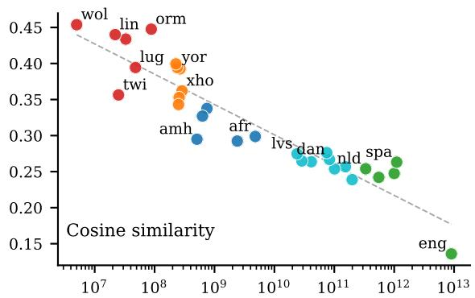
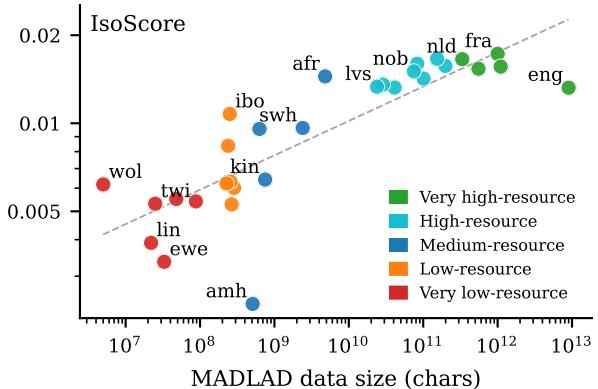
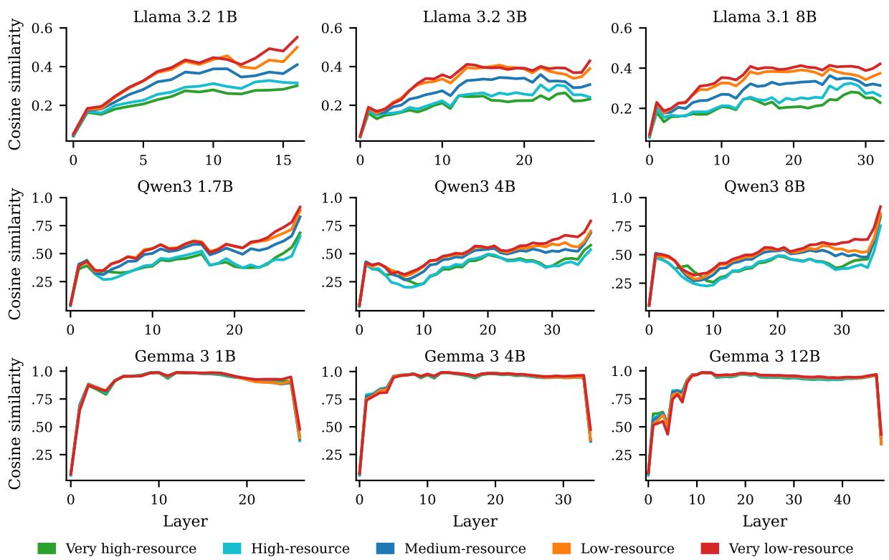
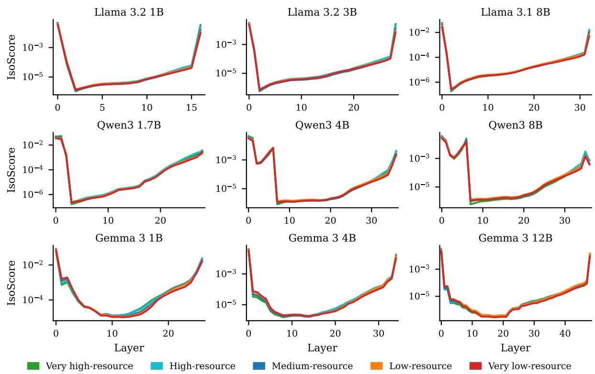
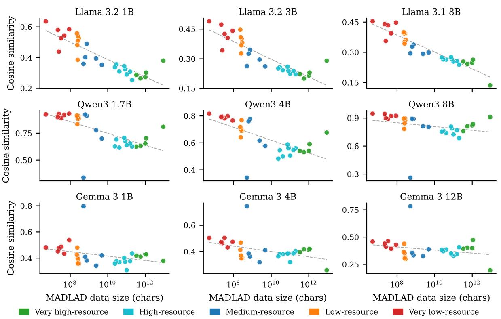
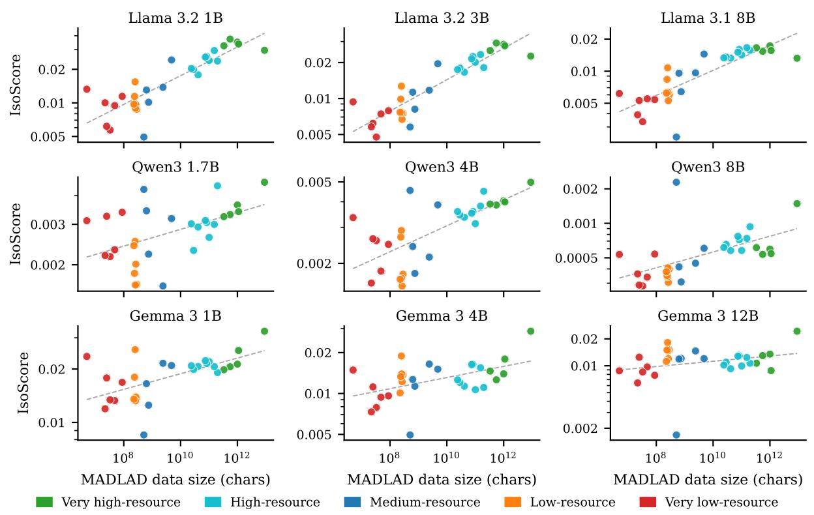
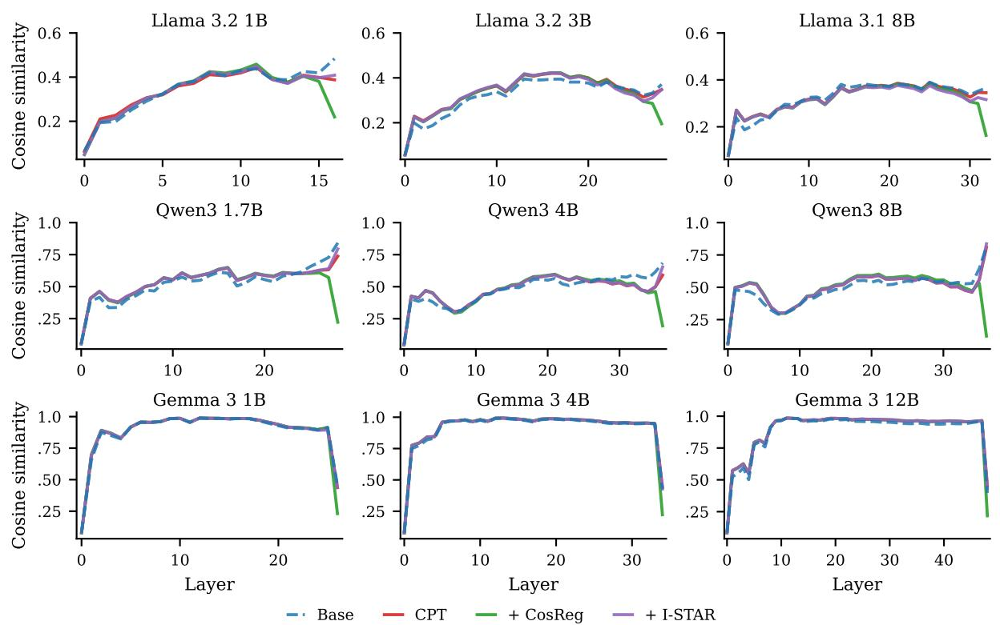
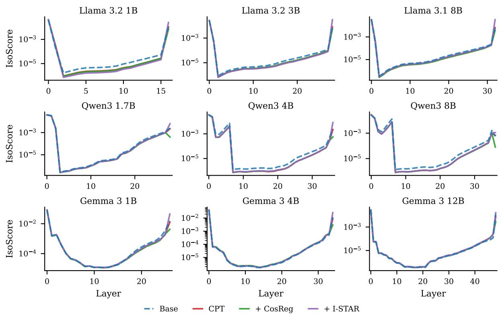

# The Geometry of Low-Resource Language Representations

Francois Meyer and Jan Buys Department of Computer Science University of Cape Town francois.meyer@uct.ac.za, jbuys@cs.uct.ac.za

## Abstract

The performance gap between low- and highresource languages in LLMs is widely known, but it remains unclear which internal model factors drive these disparities. In this paper, we characterise this gap through the lens of representational geometry. Comparing the geometric properties of hidden representations across 30 languages reveals that LLM geometry is systematically related to language data availability. The most consistent effect is in final layers, where low-resource languages exhibit representational degeneration. To counter this, we investigate the effectiveness of regularisation terms to penalise degeneration during continued pretraining (CPT). Experiments monolingually adapting 9 base LLMs to 10 African languages show that geometric regularisation successfully reduces representational degeneration during CPT. For larger models, cosine similarity-based regularisation marginally improves performance over vanilla CPT, with more consistent gains on the most challenging tasks. We establish that the representational geometry of low- and high-resource languages in LLMs is measurably distinct, and that targeted geometric intervention is a viable strategy for improving CPT for low-resource languages.

## 1 Introduction

LLM capabilities have developed unevenly across languages, with performance in low-resource languages lagging far behind that of high-resource languages (Adelani et al., 2025). This is primarily attributed to data scarcity (Joshi et al., 2020), with low-resource languages lacking sufficient pretraining data to enable generalisation across tasks. From an interpretability perspective, it is unclear which internal model factors contribute to performance degradation for low-resource languages. One way to study this is to compare how multilingual LLMs represent and process low- versus high-resource languages, with the goal of identifying the underlying causes of cross-lingual performance disparities.

  
Figure 1: Geometric properties of final-layer token representations in Llama 3.1 8B (see Figures 4 and 5 in the appendix for all models). Lower-resource languages exhibit greater representational degeneration.

In this work, we study the role of LLM geometry. We analyse how the geometric properties of language vector spaces (token embeddings across model layers) relate to data size. Our hypothesis is that vector spaces of low-resource languages are geometrically degenerate, that is, they fail to utilise the full representational capacity. To test this, we use two metrics that characterise representational geometry from complementary perspectives: (1) Cosine similarity measures how directionally distinct individual vectors are, with high similarities indicating representational collapse (Gao et al., 2019). (2) Isotropy measures how uniformly the dimensions are utilised – anisotropic spaces have reduced effective dimensionality, which acts as a representational bottleneck (Rudman et al., 2022).

Cosine similarity is a local, relational metric, while isotropy measures global space utilisation.

First, we conduct a multilingual analysis of LLM geometry. Using cosine similarity and isotropy, we compare how LLMs represent low- and highresource languages. Across 30 languages and 9 open models, we observe a clear relationship between resource level and layer-wise geometry. The most consistent trend across metrics is in final layer representations: low-resource languages exhibit higher cosine similarity and anisotropy (as shown in Figure 1), both of which reflect representational degeneration. This shows that LLMs fail to learn geometrically rich representations for low-resource languages, limiting their ability to fully leverage their representational capacity.

Next, we use these findings to augment continued pretraining (CPT), wherein a base LLM is adapted for a low-resource language. We employ two regularisation terms that augment the training objective to explicitly steer LLM representations toward desired geometric properties: CosReg (Gao et al., 2019), which reduces pairwise cosine similarity to encourage more separable representations, and I-STAR (Rudman and Eickhoff, 2024), which increases isotropy to encourage more uniform use of the embedding space. These regularisation techniques have not previously been applied to CPT.

We adapt 9 base LLMs through monolingual CPT for 10 African languages, comparing vanilla CPT to geometrically regularised CPT. Geometric regularisation effectively reduces representational degeneration, offering a simple method for targeted geometric intervention. Evaluating on IrokoBench (Adelani et al., 2025), CosReg marginally improves CPT for larger models (Llama 3.1 8B, Qwen 3 8B, and Gemma 3 4/12B), producing its largest gains on AfriMGSM, a highly challenging task for underresourced languages. CosReg outperforms I-STAR, suggesting that local separability is a more influential factor in low-resource language modelling than overcoming global representational bottlenecks.

In summary: we analyse how LLM geometry differs between low- and high-resource languages, observe clear differences in final-layer representations, and use geometrically regularised CPT to reduce these differences. Our findings highlight representational degeneration as a factor in the underperformance of low-resource languages, and present geometrically regularised CPT as a practical option for countering it.

## 2 Related Work

Previous studies on model geometry have repeatedly identified representational degeneration: embeddings fail to utilise the full capacity of the space. The most common metric for quantifying this phenomenon is cosine similarity, with high similarities reflecting embeddings clustered in a narrow region (Gao et al., 2019; Godey et al., 2024). LM representation spaces have also been shown to be anisotropic: variance is dominated by a few axes and available dimensions are not utilised uniformly (Rajaee and Pilehvar, 2022; Rudman et al., 2022). Godey et al. (2024) studied the connection between representational degeneration and model capacity, showing that final-layer representations of smaller LMs collapse onto a lower-dimensional subspace that acts as a representational bottleneck.

Several methods have been proposed to address representational collapse. A common strategy is to penalise degeneration during training with regularisation terms, based on cosine similarity (Gao et al., 2019), isotropic metrics (Zhang et al., 2022; Ji et al., 2023; Rudman and Eickhoff, 2024), or contrastive learning (Zhang et al., 2022; Xiao et al., 2023). Findings have been mixed and there is no clear consensus about the relationship between geometric properties and downstream performance. Reducing representational degeneration improved performance in some contexts (Gao et al., 2019; Rajaee and Pilehvar, 2022; Zhang et al., 2022; Hämmerl et al., 2023; Ji et al., 2023), but in others it had no effect or even degraded it (Rajaee and Pilehvar, 2021; Kovaleva et al., 2021; Zhang et al., 2022; Ding et al., 2022; Rudman and Eickhoff, 2024).

Some of the works outlined above have studied multilingual models (Rajaee and Pilehvar, 2022; Hämmerl et al., 2023; Ji et al., 2023) and designed methods to counter representational collapse in multilingual settings, such as training on parallel corpora (Hämmerl et al., 2023) or code-switched data (Ji et al., 2023). However, these studies focussed on masked LMs and sentence-level semantic tasks. In modern decoder-only LLMs, the relationship between data scarcity and representational geometry has not been studied. The question of whether low-resource languages have systematically different representational geometry from high-resource ones, and whether this can be addressed through geometric regularisation, remains unexplored. In this work we investigate both.

## 3 Methodology

This paper presents two complementary studies. First, we systematically compare the geometry of LLM representation spaces across low- and highresource languages (Section 4). Second, based on these findings, we test regularisation terms that counteract the geometric deficiencies observed for low-resource languages (Section 5). Our overall approach follows the paradigm of actionable interpretability (Mosbach et al., 2024; Orgad et al. 2026): using insights from interpretability analysis to inform modelling decisions.¹ In this section, we describe the experimental setup of our geometric analysis (Section 3.1) and our CPT experiments with geometric regularisation (Sections 3.2–3.3).

## 3.1 Geometric Analysis

Our starting point is to compare the geometric properties of representation spaces across different languages, models, and layers. We study 30 languages, selected to span a wide range of data availability. To quantify per-language data scarcity, we use corpus size in the MADLAD-400 dataset (Kudugunta et al., 2023) as a proxy. MADLAD is a popular multilingual pretraining corpus based on CommonCrawl. Although it does not reflect the exact training mixtures of the models we analyse (their pretraining corpora are not publicly disclosed), it provides a reasonable approximation of relative web-scale data availability across languages. Based on MADLAD data size, we group languages into five tiers of “resourcedness":

• Very high (>200B chars): English, Spanish, French, Italian, Dutch

• High (>5B chars): Estonian, Turkish, Swedish, Finnish, Danish, Norwegian, Lithuanian, Latvian

• Medium (500M–5B chars): Afrikaans, Kiswahili, Kinyarwanda, Hausa, Amharic

• Low (100M–500M chars): isiXhosa, chiShona, isiZulu, Igbo, Yorùbá, Sesotho

• Very low (<100M chars): Oromo, Luganda, Ewe, Twi, Lingala, Wolof

We compare the representation spaces of these languages across 9 open models: Llama 3.2 (1B, 3B), 3.1 (8B) (Llama Team, 2024), Gemma 3 (1B, 4B, 12B) (Gemma Team, 2025), and Qwen 3 (1.7B, 4B, 8B) (Qwen Team, 2025). Our setup spans languages with varying levels of data availability, models with varying levels of multilingual competence, and models ranging from 1B to 12B parameters.

We use two metrics to quantify vector space geometry: cosine similarity and isotropy. For each language, we pass sentences from FLORES (Goyal et al., 2022) through a model and compute both metrics based on token embeddings from each layer.

## 3.1.1 Cosine similarity

For layer l, we compute the average pairwise cosine similarity as

$$
\mathrm { C o s S i m } ( l ) = \frac { 1 } { N } \sum _ { ( i , j ) } \frac { \mathbf { h } _ { i } \cdot \mathbf { h } _ { j } } { | \mathbf { h } _ { i } | | \mathbf { h } _ { j } | } ,\tag{1}
$$

where $i , j$ correspond to randomly sampled pairs of tokens from FLORES sentences, and $\mathbf { h } _ { i } , \mathbf { h } _ { j }$ are hidden representations of these tokens in layer l. We sample $N = 1 0 0 0$ token pairs per layer.

Cosine similarity is a local, relational metric, quantifying how directionally distinct vectors are. Averaged across a sample of embeddings, it estimates how geometrically concentrated or dispersed the representations of a language are. For LLM representations, cosine similarity typically ranges from 0 to 1. Low values indicate well-separated embeddings, while high values indicate embeddings collapsed onto a narrow, high-dimensional cone.

## 3.1.2 Isotropy

Average pairwise cosine similarity is often used as a measure of isotropy. However, Rudman et al. (2022) argue that it fails to capture the true definition of isotropy: how uniformly variance is distributed across the dimensions of a vector space.

They propose IsoScore, a metric that quantifies the degree to which the variance of a set of embeddings is uniformly distributed across all dimensions. Based on eigenvalues of the covariance matrix, it quantifies how evenly variance is spread across dimensions. Unlike cosine similarity, it is invariant to transformations that do not change isotropy (e.g. mean-based shifting). IsoScore measures global space utilisation, while cosine similarity captures local separability between individual vectors.

Following Rudman et al. (2022), we compute IsoScore for layer l, over a point cloud X of $N =$ 5000 randomly sampled token embeddings from FLORES sentences, as

$$
\operatorname { I s o S c o r e } ( l ) = { \frac { \left( d - \delta ( X ) ^ { 2 } ( d - { \sqrt { d } } ) \right) ^ { 2 } - d } { d ( d - 1 ) } } ,\tag{2}
$$

where d is the embedding dimension and $\delta ( X ) \in$ [0, 1] is the isotropy defect, measuring how far the variance distribution of X deviates from uniformity (we refer the reader to Rudman et al. (2022) for a more detailed presentation of the IsoScore metric). A score of 1 indicates perfectly isotropic representations (all dimensions utilised evenly), while lower values reflect increasing anisotropy.

## 3.2 CPT with Geometric Regularisation

Our geometric analysis, outlined above, is an interpretability study that aims to highlight differences in LLM geometry across languages. Next, we consider a practical application where these differences might provide actionable insights: continued pretraining (CPT). In CPT, a pretrained checkpoint is further trained on a target language corpus under the model's original pretraining objective. It is used to adapt pretrained models to a specific language or limited set of languages.

CPT is the standard approach for developing high-quality LMs for low-resource languages, particularly in settings where training from scratch is computationally infeasible. For African languages, CPT has produced state-of-the-art results across different architectures, from masked language models (Alabi et al., 2022), to encoder-decoder models (Oladipo et al., 2023), and more recently decoderbased LLMs (Buzaaba et al., 2025; Yu et al., 2026).

We apply monolingual CPT to all 9 LLMs from our geometric analysis, on corpora from 10 African languages: Kinyarwanda, Hausa, Amharic, isi-Xhosa, chiShona, isiZulu, Igbo, Yorùbá, Sesotho, and Oromo. For CPT we use the WURA corpus (Oladipo et al., 2023), a high-quality filtered subset of mC4. We select languages in WURA that are in our very low-, low-, and medium-resource tiers, as this is where CPT offers most benefit (see Table 4 in the Appendix for corpus statistics). For each model and language, we continue pretraining the base $\mathrm { L L M } ^ { 2 }$ for 1 epoch on the target-language corpus. Our baseline models are adapted with vanilla CPT, in which the standard LM loss is minimised over the target-language corpus. Our hyperparameter tuning process and final CPT configuration is detailed in Appendix A.1.

Vanilla CPT is a strong baseline for low-resource language adaptation. Because CPT updates model parameters on target-language data, it provides an opportunity to correct the geometric deficiencies inherited from pretraining. We explicitly encourage this by augmenting the CPT objective with regularisation terms that penalise representational degeneration. We test two regularisation strategies, each targeting one of the geometric metrics from our analysis. We tune hyperparameters for both regularisers, as detailed in Appendix A.2.

CosReg Following Gao et al. (2019), we augment the training objective with a penalty based on the mean pairwise cosine similarity of all M token representations at layer l in a batch:

$$
\mathcal { L } _ { \mathrm { C o s R e g } } = \mathcal { L } _ { \mathrm { N L L } } + \lambda \cdot \frac { 1 } { M ^ { 2 } } \sum _ { i } \sum _ { j \neq i } \frac { \mathbf { h } _ { i } \cdot \mathbf { h } _ { j } } { | \mathbf { h } _ { i } | | \mathbf { h } _ { j } | } ,\tag{3}
$$

where $\mathbf { h } _ { 1 } , \dots , \mathbf { h } _ { M }$ are token representations at layer l in a training mini-batch. We set $\lambda = 1$ to penalise high pairwise cosine similarity and encourage more separable representations.

I-STAR Rudman and Eickhoff (2024) propose I-STAR, a regularisation term that estimates isotropy from the representations of a batch. It is based on IsoScore\*, a differentiable variant of IsoScore that can be optimised during training. They apply it during masked LM finetuning, but suggest its use in pretraining as a promising direction for future work. We adopt I-STAR for CPT of decoder LLMs.

At each training step, we compute IsoScore\* for a randomly sampled batch subset of $M ^ { \prime } =$ 1,000 token embeddings at layer $l ,$ and augment the training objective as follows:

$$
{ \mathcal { L } } _ { \mathrm { I - S T A R } } = { \mathcal { L } } _ { \mathrm { N L L } } + \lambda \cdot ( 1 - \mathrm { I s o S c o r e } ^ { \star } ) .\tag{4}
$$

We set $\lambda = 1$ to penalise anisotropy and encourage more even utilisation of dimensions. Rudman and Eickhoff (2024) found that encouraging anisotropy with I-STAR $( \lambda < 0 )$ produced better results in the context of masked LM finetuning. We did test negative values of λ during hyperparameter tuning (Appendix A.2) but found no benefit for CPT.

## 3.3 Evaluation

To test the impact of geometric intervention, we compare target-language performance after vanilla CPT and geometrically regularised CPT. We evaluate adapted models on target-language data sets in IrokoBench (Adelani et al., 2025), a humantranslated benchmark for African languages that includes natural language inference (AfriXNLI), multi-choice knowledge-based QA (AfriMMLU), and mathematical reasoning (AfriMGSM). We evaluate with LM Evaluation Harness (Gao et al., 2024) in zero-shot and few-shot settings (5-shot for AfriMMLU and AfriXNLI, 8-shot for AfriMGSM), using prompt templates from Adelani et al. (2025).

  
Figure 2: Pairwise cosine similarity of representations across model layers, calculated as specified in Section 3.1.1 and averaged across languages within each tier of data availability.

## 4 Multilingual Geometric Analysis

We present our geometric analysis (Section 3.1) of nine models across 30 languages.

## 4.1 Geometry Across Languages and Layers

We observe clear differences between the geometric properties of high- and low-resource languages. Figure 2 plots average cosine similarity, grouped by data tier. Lower-resource languages have higher cosine similarity across most layers, while higherresource language representations are more dispersed, indicating better local separability.

This trend is not only a binary distinction between low- and high-resource languages. In many layers, language data size and cosine similarity are strongly correlated: the lower-resource a language is, the higher its cosine similarity. This relationship can be seen in the Llama and Qwen plots of Figure 2, where cosine similarity decreases monotonically with data tier for many layers (from very low-resource to very high-resource). To quantify this relationship, we compute Spearman ρ correlation coefficients between MADLAD data size and cosine similarity for each layer. Table 1 reports ρ for evenly-spaced layers across all models. Deeper layers have strong negative correlations (similarity decreases as language “resourcedness" increases).

We also observe clear differences between the isotropy of high- and low-resource languages in some layers. Low-resource language representation spaces tend to be more anisotropic. This is hard to visualise because IsoScore differences are small (see Figure 3 in the appendix), but the correlation analysis between data size and IsoScore in Table 1 shows a clear pattern. Input layers have weak positive correlations, middle-layers have inconsistent correlations, and final layers have the strongest, positive correlations (IsoScore increases as language “resourcedness" increases).

One language emerged as an outlier: Amharic consistently deviated from what its data availability would predict (as shown in Figure 1). The layer-wise geometric profiles of Amharic were also markedly different from other languages in its resource tier. We attribute this to Amharic's use of the Ge’ez script, which sets it apart from the remaining languages, all of which use Latin script.

<table><tr><td>Model</td><td>0%</td><td>25%</td><td>50%</td><td>75%</td><td>100%</td></tr><tr><td>Cosine similarity</td><td></td><td></td><td></td><td></td><td></td></tr><tr><td>Llama 3.2 1B</td><td>-0.52</td><td>-0.84</td><td>-0.89</td><td>-0.88</td><td>-0.88</td></tr><tr><td>Llama 3.2 3B</td><td>-0.24</td><td>-0.87</td><td>-0.89</td><td>-0.85</td><td>-0.90</td></tr><tr><td>Llama 3.1 8B</td><td>-0.52</td><td>-0.93</td><td>-0.93</td><td>-0.90</td><td>-0.95</td></tr><tr><td>Qwen3 1.7B</td><td>-0.56</td><td>-0.76</td><td>-0.85</td><td>-0.82</td><td>-0.73</td></tr><tr><td>Qwen3 4B</td><td>-0.56</td><td>-0.78</td><td>-0.91</td><td>-0.85</td><td>-0.74</td></tr><tr><td>Qwen3 8B</td><td>-0.56</td><td>-0.73</td><td>-0.89</td><td>-0.89</td><td>-0.58</td></tr><tr><td>Gemma 3 1B</td><td>-0.27</td><td>0.58</td><td>0.47</td><td>-0.17</td><td>-0.42</td></tr><tr><td>Gemma 3 4B</td><td>-0.54</td><td>0.80</td><td>-0.75</td><td>-0.83</td><td>-0.40</td></tr><tr><td>Gemma 3 12B</td><td>-0.52</td><td>0.38</td><td>-0.71</td><td>-0.81</td><td>-0.25</td></tr><tr><td>IsoScore</td><td></td><td></td><td></td><td></td><td></td></tr><tr><td></td><td></td><td></td><td></td><td></td><td></td></tr><tr><td>Llama 3.2 1B</td><td>0.20</td><td>0.04</td><td>0.20</td><td>0.29</td><td>0.85</td></tr><tr><td>Llama 3.2 3B</td><td>0.15</td><td>0.10</td><td>0.13</td><td>0.36</td><td>0.88</td></tr><tr><td>Llama 3.1 8B</td><td>0.72</td><td>-0.26</td><td>0.06</td><td>0.07</td><td>0.85</td></tr><tr><td>Qwen3 1.7B</td><td>0.39</td><td>0.09</td><td>0.26</td><td>0.30</td><td>0.48</td></tr><tr><td>Qwen3 4B</td><td>0.47</td><td>-0.10</td><td>-0.11</td><td>-0.19</td><td>0.73</td></tr><tr><td>Qwen3 8B</td><td>0.45</td><td>-0.33</td><td>-0.17</td><td>-0.39</td><td>0.70</td></tr><tr><td>Gemma 3 1B</td><td>-0.04</td><td>-0.06</td><td>0.83</td><td>0.76</td><td>0.53</td></tr><tr><td>Gemma 3 4B</td><td>0.03</td><td>-0.29</td><td>0.53</td><td>0.68</td><td>0.47</td></tr><tr><td>Gemma 3 12B</td><td>0.30</td><td>-0.27</td><td>0.55</td><td>0.71</td><td>0.25</td></tr></table>

Table 1: Spearman $\rho$ between MADLAD size and geometric metrics across layers (0% = input embeddings, 100% = final layer, remaining columns are evenlyspaced hidden layers). We boldface $\rho \ : < \ : - 0 . 5$ for cosine similarity and $\rho > 0 . 5$ for IsoScore.

Amharic shares no subword tokens with our other languages. Its representations originate from a geometrically isolated set of input embeddings and remain geometrically distinct throughout model layers. This highlights that resource level is not the only factor influencing LLM geometry and that linguistic typology can also play a role.

## 4.2 Final Layer Degeneration

The most consistent trend across metrics and models concerns final layer representations, where lowresource languages reliably exhibit greater representational degeneration than high-resource ones. As shown in Figure 1 for Llama 3.1 8B (and Figures 4 and 5 in the appendix for all models), finallayer degeneration worsens as language data decreases. While absolute measures of degeneration actually improve for some models/languages in final layers (e.g. cosine similarity of Gemma models in Figure 2, IsoScore of most models in Figure 3), cross-lingual geometric differences persist and, in many instances, become more pronounced. The last column of Table 1 shows that the final layer is the only layer where representational degeneration correlates with data scarcity across all models and both metrics (ρ is consistently negative for cosine similarity and positive for IsoScore).

<table><tr><td></td><td colspan="3">∆ Cosine similarity</td></tr><tr><td>Model</td><td>CPT +CR +IS</td><td>CPT +CR</td><td>+IS</td></tr><tr><td>Llama 3.2 1B Llama 3.2 3B</td><td>-.096 -.278 -.089 -.023 -.176 -.024</td><td>.000 -.004 .000 -.003</td><td>+.014 3+.022</td></tr><tr><td>Llama 3.1 8B</td><td>-.020 -.202 -.049</td><td>.000 -.003 +.027</td><td></td></tr><tr><td>Qwen3 1.7B</td><td>-.105 5-.620 -.048</td><td>.000 -.002 +.004</td><td></td></tr><tr><td>Qwen3 4B</td><td>-.095 5-.491 -.032</td><td>.000 -.002 +.006</td><td></td></tr><tr><td>Qwen3 8B</td><td>-.004-.691 +.023</td><td>.000</td><td>.000+.001</td></tr><tr><td>Gemma 3 1B</td><td>-.016-.222 -.012</td><td>-.003 -.011 +.029</td><td></td></tr><tr><td>Gemma 3 4B</td><td>+.020-.204 +.001</td><td>-.003</td><td>-.009 +.014</td></tr><tr><td>Gemma 3 12B</td><td>+.054 -.180 +.035</td><td>5-.004 -.009 +.005</td><td></td></tr><tr><td></td><td></td><td></td><td></td></tr></table>

Table 2: Final-layer geometry change from base models to CPT and regularised CPT (+CR: cosine regularisation, +IS: I-STAR), averaged over 10 CPT languages.

## 4.3 Geometry Across Models

Figures 2 and 3 also show geometric differences between model families. Yu et al. (2026) showed that Gemma 3 has strong multilingual capabilities, followed by Qwen 3 and Llama 3. This is reflected in LLM geometry – differences between lower and higher-resource languages shrink as multilingual coverage expands from Llama, to Qwen, and Gemma. Table 1 also shows that the correlation between data size and final-layer degeneration is strongest in Llama, weaker in Qwen, and weakest in Gemma (this holds for both cosine similarity and IsoScore). However, broader multilingual coverage does not eliminate cross-lingual disparities completely. Even in Gemma, where geometric differences are hard to discern in our plots, data scarcity still consistently correlates with representational degeneration in deeper layers.

A notable feature of our plots is the distinct geometric profile of Gemma compared to Llama and Qwen. In Figure 2, Gemma has high cosine similarity across most layers and a dramatic drop in the final layer. This likely reflects differences in architecture and pretraining between the model families. For example, unlike Llama and Qwen, Gemma applies layer normalisation both before and after each sublayer, which may constrain angular variation across layers. Gemma also uses a larger vocabulary, which requires more discriminative final-layer representations to predict next tokens. Other factors in Gemma pretraining, such as knowledge distillation and multi-modal pretraining, might also influence model geometry. Given architectural differences and varying pretraining choices, it is unsurprising that models have distinct geometric profiles. A detailed investigation of these effects is outside the scope of this work. Instead, we focus on what is consistent across all models: low-resource languages exhibit greater representational degeneration, regardless of architecture.

<table><tr><td>Model</td><td>Variant</td><td colspan="2">AfriXNLI</td><td colspan="2">AfriMMLU</td><td colspan="2">AfriMGSM</td><td colspan="3">Overall</td></tr><tr><td></td><td></td><td>0-shot</td><td>5-shot</td><td>0-shot</td><td>5-shot</td><td>0-shot</td><td>8-shot</td><td>Avg</td><td>Δ</td><td>∆%</td></tr><tr><td>Llama 3.2 1B</td><td>Base</td><td>32.9</td><td>32.4</td><td>27.1</td><td>25.8</td><td>2.1</td><td>2.7</td><td>20.5</td><td></td><td>一</td></tr><tr><td></td><td>CPT</td><td>34.0</td><td>33.5</td><td>26.1</td><td>26.6</td><td>2.2</td><td>2.5</td><td>20.8</td><td>+0.3</td><td>+1.5%</td></tr><tr><td></td><td>+ CosReg</td><td>33.4</td><td>33.2</td><td>26.5</td><td>26.6</td><td>2.3</td><td>2.6</td><td>20.8</td><td>+0.3</td><td>+1.5%</td></tr><tr><td></td><td>+ I-STAR</td><td>33.9</td><td>33.2</td><td>26.0</td><td>26.5</td><td>2.2</td><td>2.6</td><td>20.7</td><td>+0.2</td><td>+1.0%</td></tr><tr><td>Gemma 3 1B</td><td>Base</td><td>33.4</td><td>32.7</td><td>24.9</td><td>25.8</td><td>1.7</td><td>2.7</td><td>20.2</td><td></td><td></td></tr><tr><td></td><td>CPT</td><td>34.5</td><td>33.4</td><td>24.2</td><td>25.9</td><td>2.2</td><td>3.7</td><td>20.7</td><td>+0.5</td><td>+2.5%</td></tr><tr><td></td><td>+ CosReg</td><td>34.4</td><td>33.0</td><td>24.4</td><td>25.2</td><td>1.9</td><td>4.0</td><td>20.5</td><td>+0.3</td><td>+1.5%</td></tr><tr><td></td><td>+ I-STAR</td><td>34.9</td><td>33.0</td><td>24.4</td><td>25.8</td><td>2.0</td><td>3.7</td><td>20.6</td><td>+0.4</td><td>+2.0%</td></tr><tr><td>Qwen3 1.7B</td><td>Base</td><td>33.3</td><td>31.4</td><td>29.2</td><td>29.7</td><td>3.3</td><td>4.5</td><td>21.9</td><td></td><td>一</td></tr><tr><td></td><td>CPT</td><td>33.4</td><td>32.6</td><td>28.0</td><td>29.8</td><td>2.4</td><td>3.3</td><td>21.6</td><td>-0.3</td><td>-1.4%</td></tr><tr><td></td><td>+ CosReg</td><td>33.9</td><td>32.3</td><td>28.2</td><td>30.0</td><td>2.6</td><td>3.2</td><td>21.7</td><td>-0.2</td><td>-0.9%</td></tr><tr><td></td><td>+ I-STAR</td><td>33.4</td><td>32.6</td><td>28.4</td><td>29.9</td><td>2.4</td><td>3.3</td><td>21.7</td><td>-0.2</td><td>-0.9%</td></tr><tr><td>Llama 3.2 3B</td><td>Base</td><td>33.6</td><td>32.3</td><td>26.4</td><td>27.5</td><td>2.7</td><td>4.1</td><td>21.1</td><td></td><td>一</td></tr><tr><td></td><td>CPT</td><td>33.8</td><td>32.7</td><td>26.5</td><td>28.4</td><td>2.7</td><td>4.0</td><td>21.3</td><td>+0.2</td><td>+0.9%</td></tr><tr><td></td><td>+ CosReg</td><td>33.9</td><td>32.4</td><td>27.0</td><td>28.0</td><td>2.7</td><td>3.9</td><td>21.3</td><td>+0.2</td><td>+0.9%</td></tr><tr><td></td><td>+ I-STAR</td><td>33.9</td><td>32.6</td><td>26.6</td><td>28.2</td><td>2.6</td><td>3.7</td><td>21.3</td><td>+0.2</td><td>+0.9%</td></tr><tr><td>Qwen3 4B</td><td>Base</td><td>33.6</td><td>32.1</td><td>31.8</td><td>34.4</td><td>4.7</td><td>6.6</td><td>23.9</td><td></td><td>1</td></tr><tr><td></td><td>CPT</td><td>33.8</td><td>33.0</td><td>30.9</td><td>34.8</td><td>3.1</td><td>6.5</td><td>23.7</td><td>-0.2</td><td>-0.8%</td></tr><tr><td></td><td>+ CosReg</td><td>33.1</td><td>33.3</td><td>30.6</td><td>34.5</td><td>3.5</td><td>6.5</td><td>23.6</td><td>-0.3</td><td>-1.3%</td></tr><tr><td></td><td>+ I-STAR</td><td>34.0</td><td>33.3</td><td>30.9</td><td>34.6</td><td>3.3</td><td>6.5</td><td>23.8</td><td>-0.1</td><td>-0.4%</td></tr><tr><td>Gemma 3 4B</td><td>Base</td><td>34.9</td><td>33.6</td><td>30.4</td><td>34.0</td><td>4.0</td><td>7.9</td><td>24.2</td><td>1</td><td>一</td></tr><tr><td></td><td>CPT</td><td>36.1</td><td>35.7</td><td>31.9</td><td>34.9</td><td>5.7</td><td>11.4</td><td>25.9</td><td>+1.7</td><td>+7.0%</td></tr><tr><td></td><td>+ CosReg</td><td>36.9</td><td>35.6</td><td>32.7</td><td>35.1</td><td>6.1</td><td>11.5</td><td>26.3</td><td>+2.1</td><td>+8.7%</td></tr><tr><td></td><td>+ I-STAR</td><td>36.0</td><td>35.9</td><td>32.1</td><td>34.4</td><td>5.6</td><td>11.3</td><td>25.9</td><td>+1.7</td><td>+7.0%</td></tr><tr><td>Llama 3.1 8B</td><td>Base</td><td>33.4</td><td>32.9</td><td>28.7</td><td>32.0</td><td>4.8</td><td>6.9</td><td>23.1</td><td>1</td><td>一</td></tr><tr><td></td><td>CPT</td><td>35.0</td><td>35.3</td><td>30.2</td><td>33.6</td><td>6.7</td><td>9.4</td><td>25.0</td><td>+1.9</td><td>+8.2%</td></tr><tr><td></td><td>+ CosReg</td><td>35.3</td><td>36.1</td><td>29.9</td><td>33.4</td><td>6.8</td><td>9.2</td><td>25.1</td><td>+2.0</td><td>+8.7%</td></tr><tr><td></td><td>+ I-STAR</td><td>35.5</td><td>35.3</td><td>29.9</td><td>32.8</td><td>6.6</td><td>8.8</td><td>24.8</td><td>+1.7</td><td>+7.4%</td></tr><tr><td>Qwen3 8B</td><td>Base</td><td>34.3</td><td>32.5</td><td>31.8</td><td>37.0</td><td>6.2</td><td>8.2</td><td>25.0</td><td></td><td></td></tr><tr><td></td><td>CPT</td><td>33.9</td><td>32.3</td><td>33.4</td><td>36.8</td><td>5.9</td><td>9.0</td><td>25.2</td><td>+0.2</td><td>+0.8%</td></tr><tr><td></td><td>+ CosReg</td><td>33.6</td><td>32.6</td><td>33.4</td><td>37.0</td><td>5.9</td><td>9.6</td><td>25.3</td><td>+0.3</td><td>+1.2%</td></tr><tr><td></td><td>+ I-STAR</td><td>33.9</td><td>32.5</td><td>33.1</td><td>37.3</td><td>5.4</td><td>9.4</td><td>25.3</td><td>+0.3</td><td>+1.2%</td></tr><tr><td>Gemma 3 12B</td><td>Base</td><td>38.6</td><td>38.0</td><td>38.3</td><td>48.0</td><td>13.1</td><td>22.1</td><td>33.0</td><td></td><td></td></tr><tr><td></td><td>CPT</td><td>40.0</td><td>40.5</td><td>43.8</td><td>49.6</td><td>15.6</td><td>28.2</td><td>36.3</td><td>+3.3</td><td>+10.0%</td></tr><tr><td></td><td>+ CosReg</td><td>40.1</td><td>40.3</td><td>43.7</td><td>49.5</td><td>16.5</td><td>28.2</td><td>36.4</td><td>+3.4 +3.2</td><td>+10.3% +9.7%</td></tr><tr><td></td><td>+ I-STAR</td><td>40.1</td><td>40.5</td><td>43.7</td><td>49.2</td><td>16.2</td><td>27.8</td><td>36.2</td></table>

Table 3: Average performance (%) across CPT languages (Base = pretrained model, CPT = vanilla continued pretraining, +CosReg / +I-STAR = regularised CPT). AfriMGSM scores are the averages of direct and chain-ofthought evaluations. We boldface the best-performing variant per model. $\Delta$ and ∆% show, respectively, absolute and relative performance gains over base models.

## 5 CPT with Geometric Regularisation

In the previous section, we found that final-layer degeneration reliably worsens with data scarcity. We therefore apply regularisation (Equations 3 and 4) to final-layer token representations during CPT. We present our CPT experiments (Sections 3.2–3.3), comparing the impact of vanilla CPT and geometrically regularised CPT on LLM geometry and downstream performance across 10 African languages.

## 5.1 CPT and Representational Degeneration

First, we test whether geometric regularisation successfully changes LLM geometry as intended. Table 2 confirms that it does. CosReg consistently decreases average pairwise cosine similarity in the final layer, so token representations become more locally separable. I-STAR consistently increases IsoScore in the final layer, so representation spaces utilise available dimensions more evenly. The effect of cosine similarity-based regularisation on isotropy, and vice versa, is negligible. This reaffirms that the two metrics measure different aspects of LLM geometry and that intervening on one does not affect the other. The effect of final-layer regularisation on other layers is also negligible (see Figures 6 and 7 in the appendix), so our intervention is localised. We alter the geometry of a specific layer as intended, without disrupting the representational geometry of other layers.

Without regularisation, vanilla CPT already reduces final-layer degeneration, but only marginally. Table 2 shows that final-layer cosine similarity decreases after vanilla CPT for most models, more so for the less multilingual models (Llama and Qwen) than for Gemma. Models learn more locally separable representations for low-resource languages, which might partially explain the success of CPT. Next, we study whether explicitly encouraging this geometric shift through regularisation can improve downstream performance over vanilla CPT.

## 5.2 IrokoBench Results

Table 3 summarises the performance of our CPT models on IrokoBench, while Tables 5 and 6 in the appendix report the full set of results. Results are mixed across individual tasks and languages, but a clearer pattern emerges when results are viewed by model size, which is why Table 3 orders models from smallest to largest. The final three columns of Table 3 report average performance level and average gains over base models (in absolute and relative terms), across all tasks and languages.

CPT and geometric regularisation performance scales with model size. For smaller models (3B and below), geometrically regularised CPT offers no gains beyond vanilla CPT. However, at this scale, all forms of CPT achieve only marginal (or no) improvements over base models. With smaller models and limited pretraining data, CPT is generally less effective for language adaptation, and geometric regularisation fails to overcome this.

For larger models (4B and above), CPT more reliably improves over base models, and CosReg marginally improves average performance over vanilla CPT. While average gains are small, Cos-Reg achieves notable improvements over vanilla CPT in several instances: AfriXNLI 5-shot for Llama 3.1 8B (35.3 → 36.1), and AfriXNLI and AfriMMLU 0-shot for Gemma 3 4B (36.1 → 36.9 and 31.9 → 32.7). On AfriMGSM, the most challenging task in IrokoBench, CosReg outperforms vanilla CPT across nearly all larger models, with notable gains in some cases (9.0 → 9.6 for Qwen3 8B and 15.6 → 16.5 for Gemma 3 12B). At these low absolute performance levels, such improvements are proportionally substantial and reflect the average gain across 10 languages.

CosReg outperforms I-STAR. Across models and tasks, CosReg tends to perform better than I-STAR. We cannot rule out that I-STAR could prove effective for CPT under different conditions, such as larger target-language corpora or if applied across multiple layers (the latter would require reducing the computational overhead of I-STAR). However, the comparison between CosReg and I-STAR is informative because, as shown in Table 2, both regularisers alter model geometry as intended. Our results show that decreasing finallayer cosine similarity is a more reliable way to improve downstream performance than increasing final-layer isotropy. This suggests that, for lowresource language adaptation, local separability between token representations is more influential than global utilisation of the embedding space.

## 6 Conclusion

This work conducts a systematic analysis of LLM geometry, highlighting clear differences in how models construct representation spaces for lowand high-resource languages. Our results reveal a direct link between data scarcity and LLM geometry: lower-resource languages exhibit progressively worse representational degeneration, especially in final layers. Based on these findings, we adopt geometric regularisation techniques and apply them during CPT, where they successfully reduce finallayer degeneration for target languages. Cosine similarity-based regularisation frequently improves downstream performance for larger models, offering a simple technique to enhance CPT.

Our approach is based on actionable interpretability (Mosbach et al., 2024; Orgad et al., 2026), which aims to use insights from interpretability experiments to inform modelling decisions. Our work shows how the perspective of LLM geometry is suited to this paradigm: geometric analyses can reveal internal deficiencies, while targeted geometric intervention can shift representational geometry towards desirable properties. More broadly, our work shows that actionable interpretability offers a promising approach to low-resource NLP. By first understanding why models underperform in low-resource settings, we can move beyond trial-and-error towards principled modelling decisions for low-resource languages.

## 7 Limitations

Analysis scope Our geometric analysis focusses on the relationship between language resource level and representational degeneration. While our results highlight the impact of other factors on LLM geometry, such as Amharic typography (Section 4.1) and model architecture (Section 4.3), we do not investigate these effects in detail. The role of linguistic typology and architectural choices in shaping LLM geometry warrants further study, as such insights could similarly inform strategies for improving low-resource language representations. We do not claim that data availability is the primary determinant of representational geometry, only that it is a strong and consistent one. Our main finding – that cross-lingual geometric disparities scale with data availability – holds across all 9 models and is robust when restricted to the Latin-script languages in our set, where script effects are controlled for.

Training scope The main practical limitation is that we focus on a single phase of LLM training, namely CPT. We cannot guarantee that geometric regularisation will effectively steer LLM geometry in other phases, such as training from scratch or instruction tuning. We initially applied geometric regularisation during instruction tuning of base models, but all forms of instruction tuning failed to reliably improve IrokoBench performance. Given the lack of high-quality instruction following data for African languages, this remains challenging for our target languages. We therefore focus on CPT, a reliable method for improving low-resource language performance and a natural setting for evaluating geometric intervention.

Performance gains The impact of geometric regularisation on performance is inconsistent across tasks, and most gains are small in absolute terms. CosReg marginally improves average performance over vanilla CPT, but only for larger models. Our primary practical contribution is not a new method for state-of-the-art CPT. Rather, we demonstrate that representational geometry is a measurable and actionable factor in low-resource language modelling. Our approach requires no additional data. Yet it reliably shifts final-layer geometry as intended, without degrading performance, and in some cases leads to meaningful gains on challenging tasks like AfriMGSM. This is sufficient to establish geometric regularisation as a promising direction for low-resource language adaptation.

## 8 Acknowledgements

This research was supported by Google.org and the Google Cloud Research Credits program for the Gemma Academic Program. Computations were also performed using facilities provided by the University of Cape Town's ICTS High Performance Computing team: hpc.uct.ac.za. This work is also based on research supported in part by the National Research Foundation of South Africa (Grant Number: 151601).

## References

David Ifeoluwa Adelani, Jessica Ojo, Israel Abebe Azime, Jian Yun Zhuang, Jesujoba Oluwadara Alabi, Xuanli He, Millicent Ochieng, Sara Hooker, Andiswa Bukula, En-Shiun Annie Lee, Chiamaka Ijeoma Chukwuneke, Happy Buzaaba, Blessing Kudzaishe Sibanda, Godson Koffi Kalipe, Jonathan Mukiibi, Salomon Kabongo Kabenamualu, Foutse Yuehgoh, Mmasibidi Setaka, Lolwethu Ndolela, Nkiruka Odu, Rooweither Mabuya, Salomey Osei, Shamsuddeen Hassan Muhammad, Sokhar Samb, Tadesse Kebede Guge, Tombekai Vangoni Sherman, and Pontus Stenetorp. 2025. IrokoBench: A new benchmark for African languages in the age of large language models. In Proceedings of the 2025 Conference of the Nations of the Americas Chapter of the Association for Computational Linguistics: Human Language Technologies (Volume 1: Long Papers), pages 2732–2757, Albuquerque, New Mexico. Association for Computational Linguistics.

Jesujoba O. Alabi, David Ifeoluwa Adelani, Marius Mosbach, and Dietrich Klakow. 2022. Adapting pretrained language models to African languages via multilingual adaptive fine-tuning. In Proceedings of the 29th International Conference on Computational Linguistics, pages 4336–4349, Gyeongju, Republic of Korea. International Committee on Computational Linguistics.

Happy Buzaaba, Alexander Wettig, David Ifeoluwa Adelani, and Christiane Fellbaum. 2025. Lughallama: Adapting large language models for african languages. Preprint, arXiv:2504.06536.

Yue Ding, Karolis Martinkus, Damian Pascual, Simon Clematide, and Roger Wattenhofer. 2022. On isotropy calibration of transformer models. In Proceedings of the Third Workshop on Insights from Negative Results in NLP, pages 1–9, Dublin, Ireland. Association for Computational Linguistics.

Jun Gao, Di He, Xu Tan, Tao Qin, Liwei Wang, and Tieyan Liu. 2019. Representation degeneration problem in training natural language generation models. In International Conference on Learning Representations.

Leo Gao, Jonathan Tow, Baber Abbasi, Stella Biderman, Sid Black, Anthony DiPofi, Charles Foster, Laurence

Golding, Jeffrey Hsu, Alain Le Noac'h, Haonan Li, Kyle McDonell, Niklas Muennighoff, Chris Ociepa, Jason Phang, Laria Reynolds, Hailey Schoelkopf, Aviya Skowron, Lintang Sutawika, Eric Tang, Anish Thite, Ben Wang, Kevin Wang, and Andy Zou. 2024. The language model evaluation harness.

Google Gemma Team. 2025. Gemma 3.

Nathan Godey, Éric Villemonte de la Clergerie, and Benoît Sagot. 2024. Why do small language models underperform? studying language model saturation via the softmax bottleneck. In First Conference on Language Modeling.

Naman Goyal, Cynthia Gao, Vishrav Chaudhary, Peng-Jen Chen, Guillaume Wenzek, Da Ju, Sanjana Krishnan, Marc'Aurelio Ranzato, Francisco Guzmán, and Angela Fan. 2022. The Flores-101 evaluation benchmark for low-resource and multilingual machine translation. Transactions of the Association for Computational Linguistics, 10:522–538.

Katharina Hämmerl, Alina Fastowski, Jindřich Libovický, and Alexander Fraser. 2023. Exploring anisotropy and outliers in multilingual language models for cross-lingual semantic sentence similarity. In Findings of the Association for Computational Linguistics: ACL 2023, pages 7023–7037, Toronto, Canada. Association for Computational Linguistics.

Yixin Ji, Jikai Wang, Juntao Li, Hai Ye, and Min Zhang. 2023. Isotropic representation can improve zero-shot cross-lingual transfer on multilingual language models. In Findings of the Association for Computational Linguistics: EMNLP 2023, pages 8104–8118, Singapore. Association for Computational Linguistics.

Pratik Joshi, Sebastin Santy, Amar Budhiraja, Kalika Bali, and Monojit Choudhury. 2020. The state and fate of linguistic diversity and inclusion in the NLP world. In Proceedings of the 58th Annual Meeting of the Association for Computational Linguistics, pages 6282–6293, Online. Association for Computational Linguistics.

Olga Kovaleva, Saurabh Kulshreshtha, Anna Rogers, and Anna Rumshisky. 2021. BERT busters: Outlier dimensions that disrupt transformers. In Findings of the Association for Computational Linguistics: ACL-IJCNLP 2021, pages 3392–3405, Online. Association for Computational Linguistics.

Sneha Kudugunta, Isaac Rayburn Caswell, Biao Zhang, Xavier Garcia, Derrick Xin, Aditya Kusupati, Romi Stella, Ankur Bapna, and Orhan Firat. 2023. MADLAD-400: A multilingual and document-level large audited dataset. In Thirty-seventh Conference on Neural Information Processing Systems Datasets and Benchmarks Track.

AI @ Meta Llama Team. 2024. The llama 3 herd of models. Preprint, arXiv:2407.21783.

Marius Mosbach, Vagrant Gautam, Tomás Vergara Browne, Dietrich Klakow, and Mor Geva. 2024. From insights to actions: The impact of interpretability and analysis research on NLP. In Proceedings of the 2024 Conference on Empirical Methods in Natural Language Processing, pages 3078–3105, Miami, Florida, USA. Association for Computational Linguistics.

Akintunde Oladipo, Mofetoluwa Adeyemi, Orevaoghene Ahia, Abraham Toluwalase Owodunni, Odunayo Ogundepo, David Ifeoluwa Adelani, and Jimmy Lin. 2023. Better quality pre-training data and t5 models for African languages. In Proceedings of the 2023 Conference on Empirical Methods in Natural Language Processing, pages 158–168, Singapore. Association for Computational Linguistics.

Hadas Orgad, Fazl Barez, Tal Haklay, Isabelle Lee, Marius Mosbach, Anja Reusch, Naomi Saphra, Byron Wallace, Sarah Wiegreffe, Eric Wong, Ian Tenney, and Mor Geva. 2026. Interpretability can be actionable. Preprint, arXiv:2605.11161.

Alibaba Group Qwen Team. 2025. Qwen3 technical report. Preprint, arXiv:2505.09388.

Sara Rajaee and Mohammad Taher Pilehvar. 2021. How does fine-tuning affect the geometry of embedding space: A case study on isotropy. In Findings of the Association for Computational Linguistics: EMNLP 2021, pages 3042–3049, Punta Cana, Dominican Republic. Association for Computational Linguistics.

Sara Rajaee and Mohammad Taher Pilehvar. 2022. An isotropy analysis in the multilingual BERT embedding space. In Findings of the Association for Computational Linguistics: ACL 2022, pages 1309–1316, Dublin, Ireland. Association for Computational Linguistics.

William Rudman and Carsten Eickhoff. 2024. Stable anisotropic regularization. In The Twelfth International Conference on Learning Representations.

William Rudman, Nate Gillman, Taylor Rayne, and Carsten Eickhoff. 2022. IsoScore: Measuring the uniformity of embedding space utilization. In Findings of the Association for Computational Linguistics: ACL 2022, pages 3325–3339, Dublin, Ireland. Association for Computational Linguistics.

Chenghao Xiao, Yang Long, and Noura Al Moubayed. 2023. On isotropy, contextualization and learning dynamics of contrastive-based sentence representation learning. In Findings of the Association for Computational Linguistics: ACL 2023, pages 12266–12283, Toronto, Canada. Association for Computational Linguistics.

Hao Yu, Tianyi Xu, Michael A. Hedderich, Wassim Hamidouche, Syed Waqas Zamir, and David Ifeoluwa Adelani. 2026. Afriquellm: How data mixing and model architecture impact continued pre-training for african languages. Preprint, arXiv:2601.06395.

Haode Zhang, Haowen Liang, Yuwei Zhang, Liming Zhan, Xiaolei Lu, Albert Lam, and Xiao-Ming Wu. 2022. Fine-tuning pre-trained language models for few-shot intent detection: Supervised pre-training and isotropization. In Proceedings of the 2022 Conference of the North American Chapter of the Association for Computational Linguistics: Human Language Technologies, pages 532–542, Seattle, United States. Association for Computational Linguistics.

## A Hyperparameters

## A.1 Vanilla CPT

We tune hyperparameters for vanilla CPT based on three pilot languages (Oromo, isiXhosa, isiZulu) using Llama 3.1 8B and Gemma 3 4B as representative models, selecting final settings based on AfriXNLI validation performance. We test two learning rates, $1 \times 1 0 ^ { - 5 }$ and $1 \times 1 0 ^ { - 4 }$ . The higher rate performed worse, so we adopt $1 \times 1 0 ^ { - 5 }$ with cosine decay to $1 \times 1 0 ^ { - 6 }$ . We train for 1, 2, and 3 epochs and find that performance plateaus after 1 epoch, so we train all subsequent models for 1 epoch only. We use a maximum sequence length of 512 tokens. These settings carry over unchanged to geometrically regularised CPT.

## A.2 Geometric regularisation

For both regularisers, we tune on the same three pilot languages, carrying over the CPT settings above. We select final hyperparameter values based on AfriXNLI validation performance and apply them uniformly to all other languages and models.

CosReg. We tune the regularisation coefficient $\lambda \in \{ - 1 0 , - 1 , 0 . 1 , 1 , 1 0 \}$ , where positive values penalise high cosine similarity (encouraging separation) and negative values do the opposite. We find $\lambda = 1$ performs best, which aligns with our expectation that penalising representational degeneration is beneficial. We also compare applying CosReg to the final layer only, to all layers, and to subsets of the final 3 and 5 layers, finding that regularising more layers fails to improve over finallayer only. We use λ = 1 applied to the final layer for all CosReg experiments.

I-STAR. I-STAR introduces several additional hyperparameters, which we describe before detailing our tuning procedure.

Rudman and Eickhoff (2024) propose I-STAR, a regularisation term based on IsoScore\*, which is a differentiable variant of IsoScore (Rudman et al., 2022). Estimating covariance from one batch underestimates the true IsoScore of a representation space, which I-STAR addresses via shrinkage: interpolating the batch covariance with a stable reference covariance. At regular intervals, we compute a reference covariance matrix $C _ { 0 }$ from a sample of N token embeddings at layer l drawn from WURA training data. At each training step, we compute the empirical covariance C over a randomly sampled batch subset of $M ^ { \prime } = 1 { , } 0 0 0$ token embeddings at layer l, and form the shrinkage estimate:

<table><tr><td>Code</td><td>Language</td><td>Words</td><td>Characters</td></tr><tr><td>hau</td><td>Hausa</td><td>151,868,683</td><td>858,393,671</td></tr><tr><td>amh</td><td>Amharic</td><td>86,144,742</td><td>453,397,345</td></tr><tr><td>sot</td><td>Sesotho</td><td>35,331,080</td><td>193,620,015</td></tr><tr><td>zul</td><td>isiZulu</td><td>31,584,011</td><td>271,658,420</td></tr><tr><td>yor</td><td>Yorùbá</td><td>30,854,371</td><td>155,028,472</td></tr><tr><td>ibo</td><td>Igbo</td><td>29,890,153</td><td>161,814,604</td></tr><tr><td>sna</td><td>chiShona</td><td>28,464,659</td><td>216,818,585</td></tr><tr><td>kin</td><td>Kinyarwanda</td><td>26,327,273</td><td>194,417,463</td></tr><tr><td>xho</td><td>isiXhosa</td><td>13,082,332</td><td>111,534,373</td></tr><tr><td>orm</td><td>Oromo</td><td>6,296,883</td><td>49,322,425</td></tr></table>

Table 4: Corpus sizes for CPT (word counts are based on white-space separated tokens in the raw text).

$$
\Sigma = ( 1 - \zeta ) C + \zeta C _ { 0 } ,\tag{5}
$$

where $\zeta \in [ 0 , 1 ]$ controls the balance between the batch and the global reference estimate. IsoScore\* is computed from Σ, giving the training objective:

$$
{ \mathcal { L } } _ { \mathrm { I - S T A R } } = { \mathcal { L } } _ { \mathrm { N L L } } + \lambda \cdot ( 1 - \mathrm { I s o S c o r e } ^ { \star } ) .\tag{6}
$$

The sign of λ determines the direction of the intervention: positive values encourage greater isotropy, while negative values encourage greater anisotropy. As with CosReg, the regularisation can be applied to a single layer or to all layers simultaneously.

In all our experiments, we apply I-STAR regularisation to final-layer representations. Applying I-STAR to all layers requires computing IsoScore\* at every layer at each training step, which is prohibitively slow for the scale of our experiments. Selecting the final layer is also motivated by our analysis showing that the strongest representational degeneration effect, in terms of IsoScore, is found in the final layer (Table 1).

We tune the regularisation coefficient $\lambda \in$ $\{ - 1 0 , - 1 , 1 , 1 0 \}$ , testing both signs to assess whether encouraging or discouraging isotropy is more beneficial. We also tune the shrinkage parameter $\zeta ~ \in ~ \{ 0 . 1 , 0 . 2 , 0 . 5 , 0 . 8 \}$ , which controls how strongly the batch covariance is regularised towards the global reference. Lastly, we tune the reference sample size $N \_ { } \in \qquad $ {10,000, 50,000, 100,000, 250,000}, which determines how many token embeddings are used to compute the stable reference covariance $C _ { 0 }$

  
Figure 3: Isotropy (IsoScore) of representations across model layers, calculated as specified in Section 3.1.2 and averaged across languages within each tier of data availability.

We find that λ = 1, ζ = 0.2, and $N = 2 5 0 { , } 0 0 0$ perform best and use these values across all models and languages.

Figure 4: The relationship between pretraining data availability and average pairwise cosine similarity of final-layer representations. Each dot represents a single language.  
  
Figure 5: The relationship between pretraining data availability and isotropy (IsoScore) of final-layer representations. Each dot represents a single language.

  
Figure 6: How do CPT and geometric regularisation change cosine similarity? We plot layer-wise cosine similarity, averaged across all 10 languages from our CPT experiments, comparing base models to vanilla CPT models (which only marginally affect cosine similarity), and geometrically regularised CPT models (CosReg successfully reduces final-layer cosine similarity, while leaving other layers unaffected).

  
Figure 7: How do CPT and geometric regularisation change isotropy? We plot layer-wise IsoScore, averaged across all 10 languages from our CPT experiments, comparing base models to vanilla CPT models (which only marginally affect isotropy), and geometrically regularised CPT models (I-STAR successfully increases final-layer IsoScore, while leaving other layers unaffected).

<table><tr><td rowspan=1 colspan=7>ModelVariant</td><td rowspan=1 colspan=13>kin hau amh xho sna zul ibo yor sot orm Avg</td><td rowspan=1 colspan=13>kin hau amh xho sna zul ibo yor sot orm Avg</td></tr><tr><td rowspan=1 colspan=7></td><td rowspan=1 colspan=13></td><td rowspan=1 colspan=13></td></tr><tr><td rowspan=2 colspan=7>Llama 3.2 1B Base</td><td rowspan=1 colspan=6>33.3 34.5 32.8 32.3 31.3 33.0</td><td rowspan=1 colspan=2>32.7 34.2</td><td rowspan=1 colspan=5>33.7 30.8 32.9</td><td rowspan=1 colspan=10>31.7 33.7 30.7 31.7 29.2 32.3 32.7 34-7</td><td rowspan=1 colspan=3>32.8 32.5 32.4</td></tr><tr><td rowspan=4 colspan=7></td><td rowspan=1 colspan=1>PT</td><td rowspan=1 colspan=1>33.3</td><td rowspan=1 colspan=6>33.3 34.8 33.0 33.5 33.7 36.2</td><td rowspan=1 colspan=4>33.8 33.8</td><td rowspan=1 colspan=1>33.3 3</td><td rowspan=1 colspan=2>33.5 34.0</td><td rowspan=1 colspan=3>34.3 33.7 33.8</td><td rowspan=1 colspan=5>34.2 31.3 35.5</td><td rowspan=1 colspan=2>33.2 32.8</td><td rowspan=1 colspan=1>33.8 33.0 33.5</td></tr><tr><td rowspan=3 colspan=4>33.3 34.7 32.5 33.2</td><td rowspan=1 colspan=4>32.7 33.3 34.5 33.0</td><td rowspan=1 colspan=2>33.5 33.0</td><td rowspan=3 colspan=5>35.2 33. 33.</td><td rowspan=1 colspan=2>3 33.4</td><td rowspan=1 colspan=3>33.2 35.0 34.2</td><td></td><td></td><td></td><td></td><td></td><td></td><td></td><td></td><td></td><td></td></tr><tr><td rowspan=2 colspan=2>33.5 34.2</td><td rowspan=2 colspan=1>33.7</td><td rowspan=2 colspan=1>33.5</td><td></td><td></td><td></td><td></td><td></td><td></td><td></td><td></td><td></td><td></td><td></td><td></td><td></td></tr><tr><td rowspan=1 colspan=6>33.0 34.7 33.3 33.2 31.5 347</td><td rowspan=1 colspan=4>33.58 33.3</td><td rowspan=1 colspan=3>327 31.7 33.2</td></tr><tr><td rowspan=4 colspan=7>Llama .23 BP</td><td rowspan=4 colspan=4>3 3 3 </td><td rowspan=1 colspan=2>33.3 34.5</td><td rowspan=1 colspan=1>33.8</td><td rowspan=1 colspan=1>33.0</td><td rowspan=1 colspan=4>33.5 34.0</td><td rowspan=1 colspan=1>33.6</td><td rowspan=1 colspan=4>33.3 33.7 34.3 31.8</td><td rowspan=1 colspan=1>30.8</td><td rowspan=1 colspan=1>33.7</td><td rowspan=1 colspan=4>31.8 29.2</td><td rowspan=1 colspan=3>33.0 33.2 32.3</td></tr><tr><td rowspan=1 colspan=2>34.3 34.8</td><td></td><td></td><td></td><td></td><td rowspan=1 colspan=2>33.5</td><td rowspan=1 colspan=1>33.8</td><td rowspan=1 colspan=3>31.5 33.0 34.5</td><td rowspan=1 colspan=1>32.7</td><td rowspan=1 colspan=1>33.5</td><td rowspan=1 colspan=1>34.7</td><td rowspan=1 colspan=2>31.7</td><td></td><td></td><td></td><td></td><td></td></tr><tr><td rowspan=2 colspan=2>34.2 35.7</td><td rowspan=2 colspan=1>34.2</td><td rowspan=2 colspan=1>32.0</td><td rowspan=2 colspan=4>33.3 33.3</td><td rowspan=2 colspan=1>33.9</td><td rowspan=2 colspan=1>30.2</td><td rowspan=2 colspan=2>33.0 33.3</td><td rowspan=2 colspan=1>32.7</td><td rowspan=2 colspan=1>34.3</td><td rowspan=2 colspan=1>35.8</td><td rowspan=2 colspan=2>31.8</td><td></td><td></td><td></td><td></td><td></td></tr><tr><td rowspan=1 colspan=2>29.7</td><td rowspan=1 colspan=3>30.2 33.8 32.7</td></tr><tr><td rowspan=1 colspan=7>+I-STAR</td><td rowspan=1 colspan=4>33.3 34.5 35.0 33.7</td><td rowspan=1 colspan=2>33.7 35.0</td><td rowspan=1 colspan=2>34.2 32.5</td><td rowspan=1 colspan=4>35.0 33.2</td><td rowspan=1 colspan=1>33.9</td><td rowspan=1 colspan=1>31.2</td><td rowspan=1 colspan=2>32.5 34.8</td><td rowspan=1 colspan=1>33.0</td><td rowspan=1 colspan=2>33.5 33.8</td><td rowspan=1 colspan=4>33.5 30.7</td><td rowspan=1 colspan=3>32.7 32.7 32.6</td></tr><tr><td rowspan=1 colspan=7>Llama 3.1 8B Base</td><td rowspan=1 colspan=4>32.5 35.2 34.3 33.7</td><td rowspan=1 colspan=2>32.3 35.5</td><td rowspan=1 colspan=2>33.5 30.5</td><td rowspan=1 colspan=4>34.2 33.3</td><td rowspan=1 colspan=1>33.4</td><td rowspan=1 colspan=1>32.3</td><td rowspan=1 colspan=2>32.7 31.2</td><td rowspan=1 colspan=1>33.7</td><td rowspan=1 colspan=1>33.3</td><td rowspan=1 colspan=1>33.2</td><td rowspan=1 colspan=4>32.8 29.8</td><td rowspan=1 colspan=3>32.8 35.7 32.9</td></tr><tr><td rowspan=5 colspan=7></td><td rowspan=1 colspan=2>32.7 40.0</td><td rowspan=1 colspan=1>34.5</td><td rowspan=1 colspan=1>35.0</td><td rowspan=1 colspan=1>36.2</td><td rowspan=1 colspan=1>32.7</td><td rowspan=1 colspan=1>34.0</td><td rowspan=1 colspan=1>37.0</td><td rowspan=1 colspan=2>35.0</td><td rowspan=1 colspan=2>32.8</td><td rowspan=1 colspan=1>35.0</td><td rowspan=1 colspan=1>31.5</td><td rowspan=1 colspan=1>39.0</td><td rowspan=1 colspan=1>37.3</td><td rowspan=1 colspan=1>34.8</td><td rowspan=1 colspan=1>35.3</td><td rowspan=1 colspan=1>37.2</td><td rowspan=1 colspan=2>33.5</td><td rowspan=1 colspan=2>34.7</td><td rowspan=1 colspan=3>36.535.235.3</td></tr><tr><td rowspan=4 colspan=2>34.7 39.2</td><td rowspan=4 colspan=1>34.2</td><td rowspan=4 colspan=1>3.0</td><td rowspan=1 colspan=1>37.3</td><td rowspan=1 colspan=1>34.3</td><td rowspan=1 colspan=1>34.0</td><td rowspan=1 colspan=1>35.8</td><td rowspan=1 colspan=2>35.3</td><td rowspan=1 colspan=2>33.3</td><td rowspan=1 colspan=1>35.3</td><td rowspan=1 colspan=1>32.0</td><td rowspan=1 colspan=1>40.0</td><td rowspan=1 colspan=1>36.3</td><td rowspan=1 colspan=1>36.8</td><td rowspan=1 colspan=1>35.7</td><td rowspan=1 colspan=1>38.0</td><td rowspan=1 colspan=2>32.8</td><td rowspan=1 colspan=2>37.3</td><td></td><td></td><td></td></tr><tr><td></td><td rowspan=3 colspan=1>33.7</td><td></td><td></td><td></td><td></td><td rowspan=3 colspan=2>34.0</td><td></td><td></td><td></td><td></td><td rowspan=3 colspan=1>36.7</td><td></td><td></td><td></td><td></td><td></td><td></td><td></td><td></td><td></td></tr><tr><td></td><td></td><td></td><td></td><td></td><td></td><td></td><td></td><td></td><td></td><td></td><td></td><td></td><td></td><td></td><td rowspan=2 colspan=3>35.8 35.3 35.3</td></tr><tr><td rowspan=1 colspan=1>35.8</td><td rowspan=1 colspan=1>34.3</td><td rowspan=1 colspan=1>39.5</td><td rowspan=1 colspan=2>34.3</td><td rowspan=1 colspan=1>35.5</td><td rowspan=1 colspan=1>32.7</td><td rowspan=1 colspan=1>39.7</td><td rowspan=1 colspan=1>35.7</td><td rowspan=1 colspan=1>33.7</td><td rowspan=1 colspan=1>35.8</td><td rowspan=1 colspan=2>33.3</td><td rowspan=1 colspan=2>35.7</td></tr><tr><td rowspan=1 colspan=7>Owen3.1.7BBase</td><td rowspan=1 colspan=4>33.5 33.3 35.2 33.2</td><td rowspan=1 colspan=2>32.8 33.2</td><td rowspan=1 colspan=1>33.2</td><td rowspan=1 colspan=1>32.5</td><td rowspan=1 colspan=4>33.7 34.0</td><td rowspan=1 colspan=1>33.3</td><td rowspan=1 colspan=1>28.7</td><td rowspan=1 colspan=2>32.3 32.3</td><td rowspan=1 colspan=1>33.2</td><td rowspan=1 colspan=1>30.2</td><td rowspan=1 colspan=1>31.8</td><td rowspan=1 colspan=4>31.8 33.0</td><td rowspan=1 colspan=3>29.3 32.5 31.4</td></tr><tr><td rowspan=2 colspan=7></td><td rowspan=1 colspan=4>33.3 32.3 36.3 33.3</td><td rowspan=1 colspan=2>34.7 32.7</td><td rowspan=1 colspan=1>33.5</td><td rowspan=1 colspan=1>35.2</td><td rowspan=1 colspan=4>32.8 33.0</td><td rowspan=1 colspan=1>33.4</td><td rowspan=1 colspan=1>32.2</td><td rowspan=1 colspan=2>33.2 34.3</td><td rowspan=1 colspan=1>32.7</td><td rowspan=1 colspan=1>34.7</td><td rowspan=1 colspan=1>32.5</td><td rowspan=1 colspan=4>31.8 32.3</td><td rowspan=1 colspan=3>32.5 31.2 32.6</td></tr><tr><td rowspan=1 colspan=1>-STAR</td><td rowspan=1 colspan=2>33.5 35.0</td><td rowspan=1 colspan=1>35.0</td><td rowspan=1 colspan=1>33.5</td><td rowspan=1 colspan=1>34.5</td><td rowspan=1 colspan=1>31.3</td><td rowspan=1 colspan=1>33.3</td><td rowspan=1 colspan=1>32.8</td><td rowspan=1 colspan=2>33.2</td><td rowspan=1 colspan=2>33.3</td><td rowspan=1 colspan=1>33.4</td><td rowspan=1 colspan=1>32.0</td><td rowspan=1 colspan=1>31.5</td><td rowspan=1 colspan=1>34.5</td><td rowspan=1 colspan=1>32.8</td><td rowspan=1 colspan=1>35.0</td><td rowspan=1 colspan=1>33.7</td><td rowspan=1 colspan=2>32.0</td><td rowspan=1 colspan=2>32.7</td><td rowspan=1 colspan=1>32.5</td><td rowspan=1 colspan=2>31.5 32.6</td></tr><tr><td rowspan=1 colspan=5>Owen34B</td><td rowspan=1 colspan=2>Base</td><td rowspan=1 colspan=2>32.7 33.3</td><td rowspan=1 colspan=1>37.5</td><td rowspan=1 colspan=1>33.2</td><td rowspan=1 colspan=1>34.0</td><td rowspan=1 colspan=1>33.7</td><td rowspan=1 colspan=1>33.7</td><td rowspan=1 colspan=1>34.5</td><td rowspan=1 colspan=2>33.5</td><td rowspan=1 colspan=2>33.5</td><td rowspan=1 colspan=1>33.6</td><td rowspan=1 colspan=1>31.2</td><td rowspan=1 colspan=1>30.3</td><td rowspan=1 colspan=1>34.3</td><td rowspan=1 colspan=1>32.7</td><td rowspan=1 colspan=1>32.3</td><td rowspan=1 colspan=1>32.8</td><td rowspan=1 colspan=2>31.2</td><td rowspan=1 colspan=2>33.2</td><td rowspan=1 colspan=1>31.5</td><td rowspan=1 colspan=1>34.0</td><td rowspan=1 colspan=1>32.1</td></tr><tr><td rowspan=2 colspan=5></td><td rowspan=1 colspan=2></td><td rowspan=1 colspan=1></td><td rowspan=1 colspan=2>CPT</td><td rowspan=1 colspan=1>33.5</td><td rowspan=1 colspan=1>32.0</td><td rowspan=1 colspan=1>34.8</td><td rowspan=1 colspan=1>33.5</td><td rowspan=1 colspan=1>34.3</td><td rowspan=1 colspan=2>34.7</td><td rowspan=1 colspan=2>33.5</td><td rowspan=1 colspan=1>34.5</td><td rowspan=1 colspan=1>34.5</td><td rowspan=1 colspan=1>33.3</td><td rowspan=1 colspan=1>33.8</td><td rowspan=1 colspan=1>33.5</td><td rowspan=1 colspan=1>31.3</td><td rowspan=1 colspan=1>35.7</td><td rowspan=1 colspan=2>34.0</td><td rowspan=1 colspan=2>31.8</td><td rowspan=1 colspan=1>35.0</td><td rowspan=1 colspan=1>30.7</td><td rowspan=1 colspan=1>34.5</td></tr><tr><td rowspan=1 colspan=2>+ CosReg</td><td rowspan=1 colspan=1>33.5</td><td rowspan=1 colspan=1>32.5</td><td rowspan=1 colspan=1>34.2</td><td rowspan=1 colspan=1>34.0</td><td rowspan=1 colspan=1>31.3</td><td rowspan=1 colspan=1>33.2</td><td rowspan=1 colspan=1>33.8</td><td rowspan=1 colspan=1>32.7</td><td rowspan=1 colspan=2>33.5</td><td rowspan=1 colspan=2>33.8</td><td rowspan=1 colspan=1>33.1</td><td rowspan=1 colspan=1>34.2</td><td rowspan=1 colspan=1>33.0</td><td rowspan=1 colspan=1>38.5</td><td rowspan=1 colspan=1>34.2</td><td rowspan=1 colspan=1>31.8</td><td rowspan=1 colspan=1>32.7</td><td rowspan=1 colspan=2>32.5</td><td rowspan=1 colspan=2>34.7</td><td rowspan=1 colspan=1>33.5</td><td rowspan=1 colspan=2>33.2 33.3</td></tr><tr><td rowspan=1 colspan=5></td><td rowspan=1 colspan=2>+ I-STAR</td><td rowspan=1 colspan=1>33.5</td><td rowspan=1 colspan=1>32.2</td><td rowspan=1 colspan=1>34.3</td><td rowspan=1 colspan=1>33.3</td><td rowspan=1 colspan=1>35.3</td><td rowspan=1 colspan=1>34.5</td><td rowspan=1 colspan=1>33.5</td><td rowspan=1 colspan=1>36.0</td><td rowspan=1 colspan=2>34.3</td><td rowspan=1 colspan=2>33.3</td><td rowspan=1 colspan=1>34.0</td><td rowspan=1 colspan=1>33.0</td><td rowspan=1 colspan=1>32.3</td><td rowspan=1 colspan=1>36.3</td><td rowspan=1 colspan=1>34.3</td><td rowspan=1 colspan=1>33.7</td><td rowspan=1 colspan=1>34.3</td><td rowspan=1 colspan=2>32.8</td><td rowspan=1 colspan=2>33.0</td><td rowspan=1 colspan=1>34.0</td><td rowspan=1 colspan=2>32.5 33.3</td></tr><tr><td rowspan=1 colspan=5>Owen3.8B</td><td rowspan=1 colspan=2>Base</td><td rowspan=1 colspan=1>32.2</td><td rowspan=1 colspan=1>34.8</td><td rowspan=1 colspan=1>33.2</td><td rowspan=1 colspan=1>33.8</td><td rowspan=1 colspan=1>32.5</td><td rowspan=1 colspan=1>35.8</td><td rowspan=1 colspan=1>34.2</td><td rowspan=1 colspan=1>34.5</td><td rowspan=1 colspan=2>34.0</td><td rowspan=1 colspan=2>36.5</td><td rowspan=1 colspan=1>34.3</td><td rowspan=1 colspan=1>32.3</td><td rowspan=1 colspan=1>32.3</td><td rowspan=1 colspan=1>37.3</td><td rowspan=1 colspan=1>31.8</td><td rowspan=1 colspan=1>31.7</td><td rowspan=1 colspan=1>34.3</td><td rowspan=1 colspan=2>31.7</td><td rowspan=1 colspan=2>31.3</td><td rowspan=1 colspan=1>33.3</td><td rowspan=1 colspan=2>33.5 32.5</td></tr><tr><td rowspan=1 colspan=5></td><td rowspan=1 colspan=2>CPT</td><td rowspan=1 colspan=1>33.2</td><td rowspan=1 colspan=1>34.2</td><td rowspan=1 colspan=1>33.7</td><td rowspan=1 colspan=1>33.5</td><td rowspan=1 colspan=1>33.3</td><td rowspan=1 colspan=1>33.8</td><td rowspan=1 colspan=1>34.2</td><td rowspan=1 colspan=1>32.3</td><td rowspan=1 colspan=2>34.2</td><td rowspan=1 colspan=2>36.3</td><td rowspan=1 colspan=1>33.9</td><td rowspan=1 colspan=1>32.2</td><td rowspan=1 colspan=1>32.5</td><td rowspan=1 colspan=1>39.0</td><td rowspan=1 colspan=1>33.8</td><td rowspan=1 colspan=1>32.5</td><td rowspan=1 colspan=1>33.8</td><td rowspan=1 colspan=2>29.8</td><td rowspan=1 colspan=2>33.2</td><td rowspan=1 colspan=1>31.7</td><td rowspan=1 colspan=2>31.0 32.3</td></tr><tr><td rowspan=2 colspan=5></td><td rowspan=1 colspan=2>+ CosReg</td><td rowspan=1 colspan=1>30.3</td><td rowspan=1 colspan=1>38.2</td><td rowspan=1 colspan=1>34.2</td><td rowspan=1 colspan=1>32.3</td><td rowspan=1 colspan=1>33.8</td><td rowspan=1 colspan=1>34.0</td><td rowspan=1 colspan=1>31.8</td><td rowspan=1 colspan=1>32.7</td><td rowspan=1 colspan=2>34.3</td><td rowspan=1 colspan=2>35.2</td><td rowspan=1 colspan=1>33.6</td><td rowspan=1 colspan=1>34.0</td><td rowspan=1 colspan=1>32.2</td><td rowspan=1 colspan=1>38.3</td><td rowspan=1 colspan=1>33.3</td><td rowspan=1 colspan=1>31.7</td><td rowspan=1 colspan=1>35.0</td><td rowspan=1 colspan=2>31.5</td><td rowspan=1 colspan=2>30.5</td><td rowspan=1 colspan=3>33.7 31.5 32.6</td></tr><tr><td rowspan=1 colspan=2>+ I-STAR</td><td rowspan=1 colspan=1>33.0</td><td rowspan=1 colspan=1>34.7</td><td rowspan=1 colspan=1>33.2</td><td rowspan=1 colspan=1>32.2</td><td rowspan=1 colspan=1>33.2</td><td rowspan=1 colspan=1>33.7</td><td rowspan=1 colspan=1>33.2</td><td rowspan=1 colspan=1>35.5</td><td rowspan=1 colspan=2>35.0</td><td rowspan=1 colspan=2>35.0</td><td rowspan=1 colspan=1>33.9</td><td rowspan=1 colspan=1>31.3</td><td rowspan=1 colspan=1>32.3</td><td rowspan=1 colspan=1>38.8</td><td rowspan=1 colspan=1>34.3</td><td rowspan=1 colspan=1>31.7</td><td rowspan=1 colspan=1>34.8</td><td rowspan=1 colspan=2>31.0</td><td rowspan=1 colspan=2>29.2</td><td rowspan=1 colspan=3>35.3 32.3 32.5</td></tr><tr><td rowspan=1 colspan=5>Gemma 3.1B</td><td rowspan=1 colspan=2>Base</td><td rowspan=1 colspan=2>33.8 35.0</td><td rowspan=1 colspan=1>36.0</td><td rowspan=1 colspan=1>33.3</td><td rowspan=1 colspan=1>32.0</td><td rowspan=1 colspan=1>33.8</td><td rowspan=1 colspan=1>32.8</td><td rowspan=1 colspan=1>33.0</td><td rowspan=1 colspan=2>33.0</td><td rowspan=1 colspan=2>33.8</td><td rowspan=1 colspan=1>33.4</td><td rowspan=1 colspan=1>32.7</td><td rowspan=1 colspan=1>34.0</td><td rowspan=1 colspan=1>36.2</td><td rowspan=1 colspan=1>33.3</td><td rowspan=1 colspan=1>32.3</td><td rowspan=1 colspan=1>32.5</td><td rowspan=1 colspan=2>34.5</td><td rowspan=1 colspan=2>32.0</td><td rowspan=1 colspan=3>31.0 31.8 32.7</td></tr><tr><td rowspan=3 colspan=7></td><td rowspan=1 colspan=2>35.2 37.0</td><td rowspan=1 colspan=1>34.7</td><td rowspan=1 colspan=1>33.3</td><td rowspan=1 colspan=1>35.5</td><td rowspan=1 colspan=1>33.3</td><td rowspan=1 colspan=1>33.8</td><td rowspan=1 colspan=1>33.2</td><td rowspan=1 colspan=2>34.0</td><td rowspan=1 colspan=2>35.2</td><td rowspan=1 colspan=1>34.5</td><td rowspan=1 colspan=1>32.8</td><td rowspan=1 colspan=1>35.5</td><td rowspan=1 colspan=1>37.0</td><td rowspan=1 colspan=1>34.0</td><td rowspan=1 colspan=1>32.0</td><td rowspan=1 colspan=1>33.5</td><td rowspan=1 colspan=2>33.5</td><td rowspan=1 colspan=2>34.0</td><td rowspan=1 colspan=3>32.7 32.8 33.4</td></tr><tr><td rowspan=2 colspan=5></td><td rowspan=1 colspan=2>33.0 36.5</td><td rowspan=1 colspan=1>34.3</td><td rowspan=1 colspan=1>34.5</td><td rowspan=1 colspan=1>35.2</td><td rowspan=1 colspan=1>33.8</td><td rowspan=1 colspan=1>33.8</td><td rowspan=1 colspan=1>33.3</td><td rowspan=1 colspan=2>34.0</td><td rowspan=1 colspan=2>35.8</td><td rowspan=1 colspan=1>34.4</td><td rowspan=1 colspan=1>31.2</td><td rowspan=1 colspan=1>36.2</td><td rowspan=1 colspan=1>38.2</td><td rowspan=1 colspan=1>34.0</td><td rowspan=1 colspan=1>30.8</td><td rowspan=1 colspan=1>33.5</td><td rowspan=1 colspan=2>33.3</td><td rowspan=1 colspan=2>33.8</td><td rowspan=1 colspan=3>31.8 32.2 33.0</td></tr><tr><td rowspan=1 colspan=1>33.7</td><td rowspan=1 colspan=1>38.2</td><td rowspan=1 colspan=1>35.0</td><td rowspan=1 colspan=1>34.0</td><td rowspan=1 colspan=1>36.2</td><td rowspan=1 colspan=1>34.2</td><td rowspan=1 colspan=1>33.8</td><td rowspan=1 colspan=1>33.3</td><td rowspan=1 colspan=2>36.0</td><td rowspan=1 colspan=2>34.8</td><td rowspan=1 colspan=1>34.9</td><td rowspan=1 colspan=1>32.2</td><td rowspan=1 colspan=1>35.8</td><td rowspan=1 colspan=1>36.3</td><td rowspan=1 colspan=1>32.8</td><td rowspan=1 colspan=1>33.0</td><td rowspan=1 colspan=1>33.8</td><td rowspan=1 colspan=4>32.7 33.2</td><td rowspan=1 colspan=1>31.3</td><td rowspan=1 colspan=2>32.3 33.0</td></tr><tr><td rowspan=2 colspan=5>Gemma 3 4B</td><td rowspan=1 colspan=1>Ger</td><td rowspan=2 colspan=1>Base</td><td rowspan=1 colspan=1>35.2</td><td rowspan=1 colspan=1>38.0</td><td rowspan=1 colspan=1>38.7</td><td rowspan=1 colspan=1>34.3</td><td rowspan=1 colspan=1>36.5</td><td rowspan=1 colspan=1>33.2</td><td rowspan=1 colspan=1>31.8</td><td rowspan=1 colspan=1>35.8</td><td rowspan=1 colspan=2>35.8</td><td rowspan=1 colspan=2>33.8</td><td rowspan=1 colspan=1>34.9</td><td rowspan=1 colspan=1>32.7</td><td rowspan=1 colspan=1>36.0</td><td rowspan=1 colspan=1>39.8</td><td rowspan=1 colspan=1>35.8</td><td rowspan=1 colspan=1>34.8</td><td rowspan=1 colspan=1>33.7</td><td rowspan=1 colspan=2>31.2</td><td rowspan=1 colspan=2>33.7</td><td rowspan=1 colspan=1>34.2</td><td rowspan=1 colspan=1>30.8</td><td rowspan=1 colspan=1>33.6</td></tr><tr><td></td><td rowspan=1 colspan=1>34.8</td><td rowspan=1 colspan=1>39.2</td><td rowspan=1 colspan=1>37.0</td><td rowspan=1 colspan=1>37.3</td><td rowspan=1 colspan=1>42.5</td><td rowspan=1 colspan=1>33.3</td><td rowspan=1 colspan=1>31.3</td><td rowspan=1 colspan=1>34.8</td><td rowspan=1 colspan=2>37.0</td><td rowspan=1 colspan=2>34.5</td><td rowspan=1 colspan=1>36.1</td><td rowspan=1 colspan=1>35.2</td><td rowspan=1 colspan=1>41.5</td><td rowspan=1 colspan=1>40.5</td><td rowspan=1 colspan=1>36.8</td><td rowspan=1 colspan=1>34.7</td><td rowspan=1 colspan=1>35.5</td><td rowspan=1 colspan=2>35.7</td><td rowspan=1 colspan=2>33.5</td><td rowspan=1 colspan=1>35.8</td><td rowspan=1 colspan=1>32.7</td><td rowspan=1 colspan=1>35.7</td></tr><tr><td rowspan=1 colspan=5></td><td rowspan=1 colspan=2>+ CosReg</td><td rowspan=1 colspan=1>37.5</td><td rowspan=1 colspan=1>39.8</td><td rowspan=1 colspan=1>36.5</td><td rowspan=1 colspan=1>37.8</td><td rowspan=1 colspan=1>41.0</td><td rowspan=1 colspan=1>34.3</td><td rowspan=1 colspan=1>35.0</td><td rowspan=1 colspan=1>36.7</td><td rowspan=1 colspan=2>37.2</td><td rowspan=1 colspan=2>33.0</td><td rowspan=1 colspan=1>36.9</td><td rowspan=1 colspan=1>35.8</td><td rowspan=1 colspan=1>41.3</td><td rowspan=1 colspan=1>41.3</td><td rowspan=1 colspan=1>35.8</td><td rowspan=1 colspan=1>35.2</td><td rowspan=1 colspan=1>35.8</td><td rowspan=1 colspan=2>34.5</td><td rowspan=1 colspan=2>35.2</td><td rowspan=1 colspan=1>34.5</td><td rowspan=1 colspan=1>32.5</td><td rowspan=1 colspan=1>35.6</td></tr><tr><td rowspan=1 colspan=5></td><td rowspan=1 colspan=2>+ I-STAR</td><td rowspan=1 colspan=1>35.5</td><td rowspan=1 colspan=1>40.2</td><td rowspan=1 colspan=1>37.7</td><td rowspan=1 colspan=1>36.5</td><td rowspan=1 colspan=1>39.2</td><td rowspan=1 colspan=1>33.2</td><td rowspan=1 colspan=1>33.2</td><td rowspan=1 colspan=1>34.5</td><td rowspan=1 colspan=2>36.2</td><td rowspan=1 colspan=2>36.0</td><td rowspan=1 colspan=1>36.0</td><td rowspan=1 colspan=1>35.5</td><td rowspan=1 colspan=1>41.0</td><td rowspan=1 colspan=1>40.5</td><td rowspan=1 colspan=1>37.3</td><td rowspan=1 colspan=1>36.2</td><td rowspan=1 colspan=1>34.7</td><td rowspan=1 colspan=2>35.3</td><td rowspan=1 colspan=2>34.3</td><td rowspan=1 colspan=1>35.0</td><td rowspan=1 colspan=2>33.835.9</td></tr><tr><td rowspan=1 colspan=5>Gemma 3 12B</td><td rowspan=1 colspan=2>Base</td><td rowspan=1 colspan=1>39.2</td><td rowspan=1 colspan=1>44.5</td><td rowspan=1 colspan=1>38.7</td><td rowspan=1 colspan=1>36.3</td><td rowspan=1 colspan=1>43.3</td><td rowspan=1 colspan=1>39.2</td><td rowspan=1 colspan=1>38.2</td><td rowspan=1 colspan=1>34.2</td><td rowspan=1 colspan=2>35.7</td><td rowspan=1 colspan=2>36.7</td><td rowspan=1 colspan=1>38.6</td><td rowspan=1 colspan=1>37.2</td><td rowspan=1 colspan=1>42.7</td><td rowspan=1 colspan=1>43.0</td><td rowspan=1 colspan=1>39.3</td><td rowspan=1 colspan=1>40.0</td><td rowspan=1 colspan=1>43.2</td><td rowspan=1 colspan=2>35.0</td><td rowspan=1 colspan=2>37.2</td><td rowspan=1 colspan=3>35.032.538.0</td></tr><tr><td rowspan=3 colspan=5></td><td rowspan=1 colspan=2>CPT</td><td rowspan=1 colspan=1>40.8</td><td rowspan=1 colspan=1>43.0</td><td rowspan=1 colspan=1>41.5</td><td rowspan=1 colspan=1>36.2</td><td rowspan=1 colspan=1>43.2</td><td rowspan=1 colspan=1>38.8</td><td rowspan=1 colspan=1>42.2</td><td rowspan=1 colspan=1>42.3</td><td rowspan=1 colspan=2>39.7</td><td rowspan=1 colspan=2>34.2</td><td rowspan=1 colspan=1>40.0</td><td rowspan=1 colspan=1>39.5</td><td rowspan=1 colspan=1>43.3</td><td rowspan=1 colspan=1>45.8</td><td></td><td></td><td></td><td></td><td></td><td></td><td></td><td></td><td></td><td></td></tr><tr><td rowspan=2 colspan=2>+ CosReg+ I-STAR</td><td rowspan=2 colspan=2>40.043.741.243.3</td><td rowspan=2 colspan=1>42.042.2</td><td rowspan=2 colspan=1>36.836.0</td><td rowspan=1 colspan=1>43.5</td><td rowspan=1 colspan=1>37.3</td><td rowspan=1 colspan=1>40.2</td><td rowspan=1 colspan=1>45.0</td><td rowspan=1 colspan=2>40.7</td><td rowspan=1 colspan=2>34.0</td><td rowspan=2 colspan=1>40.140.1</td><td rowspan=2 colspan=1>38.340.0</td><td rowspan=2 colspan=1>44.345.3</td><td rowspan=2 colspan=1>44.744.0</td><td rowspan=2 colspan=1>46.345.2</td><td rowspan=2 colspan=1>41.842.5</td><td rowspan=2 colspan=1>42.343.2</td><td rowspan=1 colspan=2>36.8</td><td rowspan=2 colspan=2>41.339.7</td><td rowspan=2 colspan=1>36.337.0</td><td rowspan=2 colspan=1>34.833.2</td><td rowspan=2 colspan=1>40.340.5</td></tr><tr><td rowspan=1 colspan=1>44.7</td><td rowspan=1 colspan=1>38.5</td><td rowspan=1 colspan=1>41.0</td><td rowspan=1 colspan=1>42.2</td><td rowspan=1 colspan=2>39.0</td><td rowspan=1 colspan=2>34.8</td><td rowspan=1 colspan=2>38.2</td></tr><tr><td rowspan=1 colspan=7></td><td rowspan=1 colspan=5>AfriMML</td><td rowspan=1 colspan=1>U 0-sh</td><td rowspan=1 colspan=2>ot (%)</td><td rowspan=1 colspan=4></td><td rowspan=1 colspan=1></td><td rowspan=1 colspan=1></td><td rowspan=1 colspan=3>Af</td><td rowspan=1 colspan=1>riMML</td><td rowspan=1 colspan=1>U 5-sh</td><td rowspan=1 colspan=4>ot (%)</td><td rowspan=1 colspan=3></td></tr><tr><td rowspan=1 colspan=5>Llama 3.2 1B</td><td rowspan=2 colspan=2>BaseCPT</td><td rowspan=6 colspan=2>24.427.225.025.624.825.4</td><td rowspan=1 colspan=1>25.6</td><td rowspan=1 colspan=1>24.2</td><td rowspan=1 colspan=1>29.8</td><td rowspan=1 colspan=1>26.2</td><td rowspan=1 colspan=1>28.4</td><td rowspan=1 colspan=1>28.2</td><td rowspan=1 colspan=2>28.8</td><td rowspan=1 colspan=2>26.6</td><td rowspan=1 colspan=1>27.1</td><td rowspan=1 colspan=1>24.2</td><td rowspan=1 colspan=1>26.2</td><td rowspan=1 colspan=1>26.8</td><td rowspan=1 colspan=1>25.0</td><td rowspan=1 colspan=1>26.4</td><td rowspan=1 colspan=1>26.2</td><td rowspan=1 colspan=2>24.4</td><td rowspan=1 colspan=2>26.0</td><td rowspan=1 colspan=1>25.4</td><td rowspan=1 colspan=1>28.8</td><td rowspan=1 colspan=1>25.8</td></tr><tr><td rowspan=6 colspan=5></td><td rowspan=5 colspan=2>+ CosReg</td><td rowspan=5 colspan=1>25.225.6</td><td rowspan=5 colspan=1>24.025.0</td><td rowspan=1 colspan=1>27.4</td><td rowspan=1 colspan=1>25.2</td><td rowspan=1 colspan=1>26.2</td><td rowspan=1 colspan=1>28.4</td><td rowspan=5 colspan=2>26.626.6</td><td rowspan=5 colspan=2>26.426.0</td><td rowspan=5 colspan=1>26.126.5</td><td></td><td></td><td></td><td></td><td></td><td></td><td></td><td></td><td></td><td></td><td></td><td></td><td></td></tr><tr><td rowspan=4 colspan=1>29.2</td><td rowspan=4 colspan=1>26.6</td><td rowspan=4 colspan=1>27.0</td><td rowspan=4 colspan=1>27.8</td><td rowspan=4 colspan=1>24.8</td><td rowspan=4 colspan=1>26.2</td><td></td><td></td><td></td><td></td><td></td><td></td><td></td><td></td><td></td><td></td><td></td></tr><tr><td rowspan=3 colspan=1>26.827.6</td><td rowspan=3 colspan=1>28.227.2</td><td rowspan=3 colspan=1>26.827.4</td><td></td><td></td><td></td><td></td><td></td><td></td><td></td><td></td></tr><tr><td rowspan=2 colspan=1>26.6</td><td rowspan=2 colspan=2>24.8</td><td rowspan=2 colspan=2>26.2</td><td></td><td></td><td></td></tr><tr><td rowspan=1 colspan=1>25.827.4</td><td rowspan=1 colspan=1>27.828.8</td><td rowspan=1 colspan=1>26.626.6</td></tr><tr><td rowspan=1 colspan=2>+ I-STAR</td><td rowspan=1 colspan=2>25.025.0</td><td rowspan=1 colspan=1>25.2</td><td rowspan=1 colspan=1>24.0</td><td rowspan=1 colspan=1>28.2</td><td rowspan=1 colspan=1>25.8</td><td rowspan=1 colspan=1>25.6</td><td rowspan=1 colspan=1>27.8</td><td rowspan=1 colspan=2>26.4</td><td rowspan=1 colspan=2>26.0</td><td rowspan=1 colspan=1>26.0</td><td rowspan=1 colspan=1>25.2</td><td rowspan=1 colspan=1>27.4</td><td rowspan=1 colspan=1>25.4</td><td rowspan=1 colspan=1>27.0</td><td rowspan=1 colspan=1>26.6</td><td rowspan=1 colspan=1>27.0</td><td rowspan=1 colspan=2>24.2</td><td rowspan=1 colspan=2>26.8</td><td rowspan=1 colspan=1>25.2</td><td rowspan=1 colspan=1>28.8</td><td rowspan=1 colspan=1>26.5</td></tr><tr><td rowspan=1 colspan=5>Llama 3.2 3B</td><td rowspan=1 colspan=2>Base</td><td rowspan=1 colspan=2>23.624.6</td><td rowspan=1 colspan=1>25.8</td><td rowspan=1 colspan=1>23.6</td><td rowspan=1 colspan=1>27.6</td><td rowspan=1 colspan=1>28.4</td><td rowspan=1 colspan=1>26.4</td><td rowspan=1 colspan=1>28.0</td><td rowspan=1 colspan=2>27.2</td><td rowspan=1 colspan=2>27.8</td><td rowspan=2 colspan=1>26.426.5</td><td rowspan=2 colspan=1>26.627.8</td><td rowspan=2 colspan=1>28.829.4</td><td rowspan=2 colspan=1>24.225.8</td><td rowspan=2 colspan=1>24.425.4</td><td rowspan=2 colspan=1>27.629.2</td><td rowspan=2 colspan=1>28.227.4</td><td rowspan=2 colspan=2>25.827.4</td><td rowspan=2 colspan=2>29.629.4</td><td rowspan=2 colspan=1>27.229.0</td><td rowspan=2 colspan=1>29.030.6</td><td rowspan=2 colspan=1>27.528.4</td></tr><tr><td rowspan=3 colspan=5></td><td rowspan=1 colspan=2>CPT</td><td rowspan=1 colspan=2>24.825.6</td><td></td><td></td><td></td><td></td><td></td><td></td><td></td><td></td><td></td><td></td></tr><tr><td rowspan=2 colspan=2>+ CosReg+ I-STAR</td><td rowspan=2 colspan=3>24.827.026.825.026.426.2</td><td rowspan=2 colspan=1>24.824.6</td><td rowspan=2 colspan=1>27.027.8</td><td rowspan=2 colspan=1>28.626.4</td><td rowspan=2 colspan=1>26.426.6</td><td rowspan=1 colspan=1>26.4</td><td rowspan=1 colspan=2>29.6</td><td rowspan=2 colspan=2>28.428.8</td><td rowspan=2 colspan=1>27.026.6</td><td rowspan=2 colspan=1>27.2</td><td rowspan=1 colspan=1>30.0</td><td rowspan=1 colspan=1>25.8</td><td rowspan=1 colspan=1>24.4</td><td rowspan=1 colspan=1>27.6</td><td rowspan=1 colspan=1>27.0</td><td rowspan=1 colspan=2>27.2</td><td rowspan=1 colspan=2>29.0</td><td rowspan=1 colspan=1>27.8</td><td rowspan=1 colspan=1>31.6</td><td rowspan=2 colspan=1>28.028.2</td></tr><tr><td rowspan=1 colspan=1>26.2</td><td rowspan=1 colspan=2>27.8</td><td rowspan=1 colspan=1>29.6</td><td rowspan=1 colspan=1>25.4</td><td rowspan=1 colspan=1>25.4</td><td rowspan=1 colspan=1>28.8</td><td rowspan=1 colspan=1>26.6</td><td rowspan=1 colspan=2>27.4</td><td rowspan=1 colspan=2>28.6</td><td rowspan=1 colspan=1>29.0</td><td rowspan=1 colspan=1>31.0</td></tr><tr><td rowspan=3 colspan=7>Llama 3.1 8B BaseCPT+ CosReg+ I-STAR</td><td rowspan=3 colspan=6>29.027.230.227.028.229.830.430.231.028.230.230.430.030.631.228.230.629.231.230.029.428.6</td><td rowspan=2 colspan=2>29.429.430.830.4</td><td rowspan=2 colspan=2>28.830.0</td><td rowspan=2 colspan=2>29.630.8</td><td rowspan=2 colspan=1>28.730.2</td><td rowspan=2 colspan=1>34.034.0</td><td rowspan=2 colspan=3>35.434.628.037.034.828.4</td><td rowspan=2 colspan=1>30.235.0</td><td rowspan=1 colspan=1>33.2</td><td rowspan=1 colspan=2>32.8</td><td rowspan=1 colspan=2>32.0</td><td rowspan=1 colspan=1>29.0</td><td rowspan=1 colspan=2>33.832.0</td></tr><tr><td rowspan=1 colspan=1>35.2</td><td rowspan=1 colspan=2>34.8</td><td rowspan=1 colspan=2>33.2</td><td rowspan=1 colspan=1>31.2</td><td rowspan=1 colspan=2>33.233.6</td></tr><tr><td rowspan=1 colspan=1>30.8</td><td rowspan=1 colspan=1>30.0</td><td rowspan=1 colspan=1>30.030.8</td><td rowspan=1 colspan=1>29.629.2</td><td rowspan=1 colspan=2>30.629.4</td><td rowspan=1 colspan=2>30.028.8</td><td rowspan=1 colspan=1>29.929.9</td><td rowspan=1 colspan=1>34.433.6</td><td rowspan=1 colspan=1>36.036.0</td><td rowspan=1 colspan=1>35.633.0</td><td rowspan=1 colspan=1>28.827.6</td><td rowspan=1 colspan=1>34.033.8</td><td rowspan=1 colspan=1>32.833.6</td><td rowspan=1 colspan=2>34.633.6</td><td rowspan=1 colspan=2>32.831.8</td><td rowspan=1 colspan=1>32.830.8</td><td rowspan=1 colspan=1>34.834.0</td><td rowspan=1 colspan=1>33.432.8</td></tr><tr><td rowspan=5 colspan=7>Qwen3 1.7B BaseCPT+ CosReg+ I-STAR</td><td rowspan=5 colspan=4>27.029.030.028.226.428.230.627.426.429.630.426.626.429.630.828.4</td><td rowspan=4 colspan=1>30.229.428.6</td><td rowspan=4 colspan=1>27.826.826.8</td><td rowspan=4 colspan=1>28.427.828.2</td><td rowspan=4 colspan=1>32.430.430.4</td><td rowspan=4 colspan=2>29.628.229.2</td><td rowspan=4 colspan=2>30.027.627.6</td><td rowspan=4 colspan=1>29.228.028.2</td><td rowspan=4 colspan=1>29.028.828.0</td><td rowspan=1 colspan=1>27.8</td><td rowspan=1 colspan=1>32.0</td><td rowspan=1 colspan=1>30.2</td><td rowspan=1 colspan=1>29.8</td><td rowspan=1 colspan=1>27.2</td><td rowspan=1 colspan=2>31.0</td><td rowspan=1 colspan=2>30.4</td><td rowspan=1 colspan=1>29.6</td><td rowspan=4 colspan=2>29.730.030.229.831.230.230.0</td></tr><tr><td rowspan=3 colspan=1>27.427.8</td><td></td><td></td><td></td><td></td><td></td><td></td><td></td><td></td><td></td></tr><tr><td rowspan=2 colspan=1>33.4</td><td></td><td></td><td></td><td></td><td></td><td></td><td></td><td></td></tr><tr><td rowspan=1 colspan=1>28.628.8</td><td rowspan=1 colspan=1>30.830.4</td><td rowspan=1 colspan=1>30.229.0</td><td rowspan=1 colspan=2>30.232.0</td><td rowspan=1 colspan=2>32.032.6</td><td></td></tr><tr><td rowspan=1 colspan=1>29.2</td><td rowspan=1 colspan=1>27.2</td><td rowspan=1 colspan=1>27.0</td><td rowspan=1 colspan=1>30.8</td><td rowspan=1 colspan=2>28.4</td><td rowspan=1 colspan=2>28.4</td><td rowspan=1 colspan=1>28.4</td><td rowspan=1 colspan=1>28.6</td><td rowspan=1 colspan=1>27.8</td><td rowspan=1 colspan=1>32.2</td><td rowspan=1 colspan=1>29.6</td><td rowspan=1 colspan=1>29.8</td><td rowspan=1 colspan=1>31.2</td><td rowspan=1 colspan=2>30.2</td><td rowspan=1 colspan=2>33.0</td><td rowspan=1 colspan=3>29.629.629.9</td></tr><tr><td rowspan=2 colspan=7>Qwen3 4B   BaseCPT</td><td rowspan=2 colspan=3>30.632.831.628.830.431.2</td><td rowspan=2 colspan=1>31.229.4</td><td rowspan=2 colspan=1>31.232.0</td><td rowspan=1 colspan=1>31.8</td><td rowspan=1 colspan=1>31.8</td><td rowspan=1 colspan=1>30.8</td><td rowspan=1 colspan=2>30.0</td><td rowspan=1 colspan=2>35.8</td><td rowspan=1 colspan=1>31.8</td><td rowspan=1 colspan=1>31.4</td><td rowspan=1 colspan=1>35.0</td><td rowspan=1 colspan=1>34.8</td><td rowspan=1 colspan=1>34.0</td><td rowspan=1 colspan=1>33.0</td><td rowspan=1 colspan=1>33.4</td><td rowspan=1 colspan=2>35.6</td><td rowspan=1 colspan=2>34.4</td><td rowspan=1 colspan=3>35.837.234.4</td></tr><tr><td rowspan=1 colspan=1>32.2</td><td rowspan=1 colspan=1>29.4</td><td rowspan=1 colspan=1>31.6</td><td rowspan=1 colspan=2>30.0</td><td rowspan=1 colspan=2>34.6</td><td rowspan=1 colspan=1>30.9</td><td rowspan=1 colspan=1>30.2</td><td rowspan=1 colspan=1>36.6</td><td rowspan=1 colspan=1>38.0</td><td></td><td></td><td></td><td></td><td></td><td></td><td></td><td></td><td></td><td></td></tr><tr><td rowspan=2 colspan=7>+ CosReg+ I-STAR</td><td rowspan=2 colspan=4>28.831.231.629.828.830.230.429.2</td><td rowspan=2 colspan=1>31.232.0</td><td rowspan=1 colspan=1>31.6</td><td rowspan=1 colspan=1>28.8</td><td rowspan=1 colspan=1>30.4</td><td rowspan=1 colspan=2>29.2</td><td rowspan=1 colspan=2>34.6</td><td rowspan=1 colspan=1>30.6</td><td rowspan=1 colspan=1>30.8</td><td rowspan=1 colspan=1>36.0</td><td rowspan=1 colspan=1>38.8</td><td rowspan=1 colspan=1>32.8</td><td rowspan=1 colspan=1>32.4</td><td rowspan=1 colspan=1>35.2</td><td rowspan=1 colspan=2>37.8</td><td rowspan=1 colspan=2>35.6</td><td rowspan=1 colspan=3>34.635.434.5</td></tr><tr><td rowspan=1 colspan=1>31.6</td><td rowspan=1 colspan=1>30.0</td><td rowspan=1 colspan=1>31.2</td><td rowspan=1 colspan=2>30.0</td><td rowspan=1 colspan=2>35.0</td><td rowspan=1 colspan=1>30.9</td><td rowspan=1 colspan=1>29.8</td><td rowspan=1 colspan=1>36.0</td><td rowspan=1 colspan=1>38.2</td><td rowspan=1 colspan=1>32.8</td><td rowspan=1 colspan=1>33.2</td><td rowspan=1 colspan=1>34.4</td><td rowspan=1 colspan=2>36.6</td><td rowspan=1 colspan=2>36.4</td><td rowspan=1 colspan=3>36.036.434.6</td></tr><tr><td rowspan=2 colspan=7>Qwen3 8B   BaseCPT+ CosReg+ I-STAR</td><td rowspan=1 colspan=5>27.433.234.432.631.828.635.835.634.232.8</td><td rowspan=1 colspan=1>32.034.8</td><td rowspan=1 colspan=1>29.030.6</td><td rowspan=1 colspan=1>34.634.6</td><td rowspan=1 colspan=2>31.433.4</td><td rowspan=1 colspan=2>34.236.0</td><td rowspan=1 colspan=1>31.833.4</td><td rowspan=1 colspan=1>33.233.2</td><td rowspan=1 colspan=1>37.237.8</td><td rowspan=1 colspan=1>41.243.4</td><td rowspan=1 colspan=1>36.035.8</td><td rowspan=1 colspan=1>38.434.6</td><td rowspan=1 colspan=1>39.039.8</td><td rowspan=1 colspan=2>37.436.2</td><td rowspan=1 colspan=2>37.436.4</td><td rowspan=1 colspan=3>35.638.437.038.039.436.8</td></tr><tr><td rowspan=1 colspan=4>29.035.036.233.628.034.836.233.4</td><td rowspan=1 colspan=1>33.233.4</td><td rowspan=1 colspan=1>36.235.2</td><td rowspan=1 colspan=1>30.830.2</td><td rowspan=1 colspan=1>34.235.0</td><td rowspan=1 colspan=4>33.634.833.634.2</td><td rowspan=1 colspan=1>33.433.1</td><td rowspan=1 colspan=1>32.832.4</td><td rowspan=1 colspan=1>38.637.0</td><td rowspan=1 colspan=1>43.243.8</td><td rowspan=1 colspan=1>34.835.6</td><td rowspan=1 colspan=1>36.035.8</td><td rowspan=1 colspan=3>40.237.040.238.4</td><td rowspan=1 colspan=2>37.037.0</td><td rowspan=1 colspan=3>37.438.837.039.440.037.3</td></tr><tr><td rowspan=3 colspan=7>Gemma 3 1B BaseCPT+ CosReg+ I-STAR</td><td rowspan=3 colspan=6>22.422.821.226.023.625.222.623.022.624.424.823.622.623.020.825.624.624.223.222.624.625.223.6</td><td rowspan=1 colspan=1>24.224.8</td><td rowspan=2 colspan=1>27.624.824.8</td><td rowspan=2 colspan=4>27.625.027.222.627.821.8</td><td rowspan=2 colspan=1>24.924.224.4</td><td rowspan=2 colspan=1>24.625.624.2</td><td rowspan=2 colspan=1>24.623.822.8</td><td rowspan=2 colspan=1>22.823.222.4</td><td rowspan=2 colspan=1>27.828.025.6</td><td rowspan=2 colspan=1>24.625.226.0</td><td rowspan=2 colspan=1>26.227.626.0</td><td rowspan=2 colspan=2>25.423.824.8</td><td rowspan=2 colspan=2>25.624.624.2</td><td rowspan=2 colspan=3>27.626.225.828.626.025.927.426.225.2</td></tr><tr><td rowspan=1 colspan=2>24.6 23.8</td><td rowspan=1 colspan=1>25.2</td></tr><tr><td rowspan=1 colspan=2>25.2 23.6</td><td rowspan=1 colspan=1>24.8</td><td rowspan=1 colspan=1>24.4</td><td rowspan=1 colspan=2>27.4</td><td rowspan=1 colspan=2>22.6</td><td rowspan=1 colspan=1>24.4</td><td rowspan=1 colspan=1>24.6</td><td rowspan=1 colspan=1>23.4</td><td rowspan=1 colspan=1>22.6</td><td rowspan=1 colspan=1>27.8</td><td rowspan=1 colspan=1>26.2</td><td rowspan=1 colspan=1>26.6</td><td rowspan=1 colspan=2>24.6</td><td rowspan=1 colspan=2>25.0</td><td rowspan=1 colspan=3>27.026.625.8</td></tr><tr><td rowspan=6 colspan=7>Gemma 3 4B BaseCPT+ CosReg</td><td rowspan=2 colspan=4>27.831.430.632.628.835.432.632.4</td><td rowspan=1 colspan=2>30.430.2</td><td rowspan=1 colspan=1>30.8</td><td rowspan=1 colspan=1>33.4</td><td rowspan=1 colspan=2>28.4</td><td rowspan=1 colspan=2>29.0</td><td rowspan=1 colspan=1>30.4</td><td rowspan=2 colspan=1>34.235.4</td><td rowspan=2 colspan=1>36.237.8</td><td rowspan=2 colspan=1>36.838.6</td><td rowspan=2 colspan=1>35.036.2</td><td rowspan=2 colspan=1>35.436.6</td><td rowspan=2 colspan=1>35.634.2</td><td rowspan=2 colspan=2>36.437.0</td><td rowspan=2 colspan=2>30.032.6</td><td rowspan=2 colspan=3>33.629.434.034.629.834.9</td></tr><tr><td rowspan=1 colspan=2>33.031.2</td><td rowspan=1 colspan=1>33.4</td><td rowspan=1 colspan=1>30.6</td><td rowspan=1 colspan=2>32.8</td><td rowspan=1 colspan=2>29.2</td><td rowspan=1 colspan=1>31.9</td></tr><tr><td rowspan=4 colspan=5></td><td rowspan=4 colspan=4>28.435.033.233.628.835.034.233.6</td><td rowspan=1 colspan=2>34.631.6</td><td rowspan=1 colspan=1>32.8</td><td rowspan=1 colspan=1>33.8</td><td rowspan=1 colspan=2>33.8</td><td rowspan=1 colspan=2>30.4</td><td rowspan=1 colspan=1>32.7</td><td rowspan=1 colspan=1>34.8</td><td rowspan=1 colspan=1>37.8</td><td rowspan=1 colspan=1>38.4</td><td rowspan=1 colspan=1>36.4</td><td rowspan=4 colspan=4>37.632.436.432.037.4</td><td rowspan=1 colspan=2>36.2</td><td rowspan=1 colspan=2>32.8</td><td></td><td></td><td></td></tr><tr><td rowspan=3 colspan=2>32.832.2</td><td></td><td></td><td></td><td></td><td></td><td></td><td></td><td></td><td></td><td></td><td></td><td rowspan=3 colspan=3>32.2</td><td></td><td></td><td></td></tr><tr><td></td><td></td><td></td><td></td><td></td><td></td><td></td><td></td><td></td><td></td><td></td><td rowspan=2 colspan=3>35.432.835.134.229.834.4</td></tr><tr><td rowspan=1 colspan=1>33.0</td><td rowspan=1 colspan=1>31.2</td><td rowspan=1 colspan=2>32.4</td><td rowspan=1 colspan=2>30.0</td><td rowspan=1 colspan=1>32.1</td><td rowspan=1 colspan=1>35.2</td><td rowspan=1 colspan=1>37.2</td><td rowspan=1 colspan=1>37.8</td><td rowspan=1 colspan=1>35.4</td></tr><tr><td rowspan=1 colspan=2>Gen</td><td rowspan=3 colspan=6>Gemma 3 12BBaseCPT+ CosReg+ I-STAR</td><td rowspan=2 colspan=7>39.842.244.237.836.239.242.242.448.848.646.044.641.445.4</td><td rowspan=1 colspan=2>35.6</td><td rowspan=1 colspan=3>38.033.6</td><td rowspan=1 colspan=1>38.3</td><td rowspan=1 colspan=1>47.4</td><td rowspan=1 colspan=2>52.853.4</td><td rowspan=1 colspan=1>46.6</td><td rowspan=1 colspan=6>52.249.248.2</td><td rowspan=1 colspan=1>44.8</td><td rowspan=2 colspan=1>50.041.048.053.244.849.6</td></tr><tr><td></td><td></td><td rowspan=1 colspan=1>42.2</td><td rowspan=1 colspan=4>44.838.6</td><td rowspan=1 colspan=1>43.8</td><td rowspan=1 colspan=1>46.8</td><td rowspan=1 colspan=2>51.256.4</td><td rowspan=1 colspan=1>50.2</td><td rowspan=1 colspan=6>55.450.848.645.0</td><td></td><td></td></tr><tr><td></td><td></td><td rowspan=1 colspan=13>42.448.448.245.244.040.846.443.844.437.843.741.049.649.045.644.041.845.841.845.038.843.7</td><td rowspan=1 colspan=13>45.452.055.249.253.850.249.846.453.844.849.546.452.055.249.853.450.848.646.251.044.849.2</td></tr></table>

Table 5: AfriXNLI and AfriMMLU performance (%) across CPT languages. Best variants boldfaced.

<table><tr><td></td><td></td><td></td><td></td><td></td><td></td><td></td><td></td><td></td><td></td><td></td><td></td><td></td><td></td><td></td><td></td><td></td><td></td><td></td><td></td><td></td><td></td></tr><tr><td></td><td></td><td></td><td></td><td></td><td></td><td></td><td></td><td></td><td></td><td></td><td></td><td></td><td></td><td></td><td></td><td></td><td></td><td></td><td></td><td></td><td></td></tr><tr><td></td><td></td><td></td><td></td><td></td><td></td><td></td><td></td><td></td><td></td><td></td><td></td><td></td><td></td><td></td><td></td><td></td><td></td><td></td><td></td><td></td><td></td></tr><tr><td></td><td></td><td></td><td></td><td></td><td></td><td></td><td></td><td></td><td></td><td></td><td></td><td></td><td></td><td></td><td></td><td></td><td></td><td></td><td></td><td></td><td></td></tr><tr><td></td><td></td><td></td><td></td><td></td><td></td><td></td><td></td><td></td><td></td><td></td><td></td><td></td><td></td><td></td><td></td><td></td><td></td><td></td><td></td><td></td><td></td></tr><tr><td></td><td></td><td></td><td></td><td></td><td></td><td></td><td></td><td></td><td></td><td></td><td></td><td></td><td></td><td></td><td></td><td></td><td></td><td></td><td></td><td></td><td></td></tr><tr><td></td><td></td><td></td><td></td><td></td><td></td><td></td><td></td><td></td><td></td><td></td><td></td><td></td><td></td><td></td><td></td><td></td><td></td><td></td><td></td><td></td><td></td></tr><tr><td></td><td></td><td></td><td></td><td></td><td></td><td></td><td></td><td></td><td></td><td></td><td></td><td></td><td></td><td></td><td></td><td></td><td></td><td></td><td></td><td></td><td></td></tr><tr><td></td><td>CPT</td><td></td><td>6.0 8.0 8.4</td><td>5.2 5.6</td><td>4.4 5.2</td><td>4.4</td><td>3.2 3.6</td><td>5.6</td><td>4.4</td><td>4.7</td><td>10.8</td><td>10.4</td><td>12.8</td><td>8.8 10.0</td><td></td><td></td><td></td><td></td><td></td><td></td><td></td></tr><tr><td>Gemma 3 12B</td><td>+ CosReg + I-STAR Base</td><td>5.6 4.0 14.0 15.6</td><td>7.2 6.8 7.2 15.6 19.2 16.0 14.8</td><td>4.8 11.2 13.2</td><td>4.8 11.2 15.2</td><td>5.6 4.8 12.4 17.6</td><td>3.2 5.2 2.4 4.0 8.8 7.6 11.2 12.4</td><td>4.4 4.0 11.6 16.8</td><td>5.6 4.4 8.0 15.2</td><td>5.3 4.4 11.2 14.8</td><td>10.4 11.2 20.8 24.4</td><td>10.4 10.8 20.8 23.2</td><td>12.0 12.4 21.6 24.4</td><td>9.2 8.0 18.4</td><td>10.8 10.0 23.2</td><td>9.6 10.4 9.6 20.0 14.4</td><td>8.8 7.6 8.8 7.6 8.8 6.8 12.8</td><td>19.6</td><td>8.8 9.2 9.2</td><td>8.0 8.8 8.4 14.4</td><td>9.2 9.5 9.2 18.3</td></tr><tr><td></td><td>CPT + CosReg + I-STAR</td><td>17.6 16.0</td><td>16.4 13.6 16.4 14.0</td><td>12.8 14.4</td><td>16.4 17.6</td><td>18.0 18.0 AfriMGSM CoT 0-shot (%)</td><td>10.4 13.2 10.4 13.6</td><td>17.6 17.6</td><td>16.8 16.8</td><td>15.5 15.6</td><td>23.2 24.0</td><td>23.2 22.4</td><td>22.0 24.0</td><td>20.4 17.6 18.8 AfriMGSM CoT 8-shot (%)</td><td>22.4 22.4 22.0</td><td>24.4 21.2 23.6</td><td>17.6 17.2 18.0 17.2 17.6 18.8</td><td>22.4</td><td>23.6 23.6</td><td>20.8 22.4 22.4</td><td>21.6 21.0 21.3</td></tr><tr><td>Llama 3.2 1B</td><td>Base CPT + CosReg</td><td>2.8 2.0 2.8 2.4</td><td>1.2 2.0 1.6 1.6 2.0 1.6 2.0 2.0</td><td>2.0 3.2 3.2 2.4</td><td>2.0 2.8 2.0 2.0</td><td>2.4 2.0 2.4 1.6</td><td>2.0 2.4 2.0 2.0 2.0 2.4 1.6 2.4</td><td>1.6 2.0 2.4 2.0</td><td>2.0 2.0 2.0 2.0</td><td>2.0 2.2 2.4 2.0</td><td>3.2 2.8 2.4 3.6</td><td>2.0 2.8 2.4 2.8</td><td>2.0 1.6 1.6</td><td>3.2 2.8 3.2</td><td>4.8 2.0 2.8 2.4 2.8 2.8</td><td>2.0 1.2 1.2</td><td>3.2 2.4 1.2</td><td>3.2 2.4 3.6</td><td></td><td>2.4 2.9 1.6 2.4 2.0 2.4</td><td>2.5</td></tr><tr><td>Llama 3.2 3B</td><td>+ I-STAR Base CPT + CosReg</td><td>2.0 2.8 3.2 2.0</td><td>2.0 2.8 2.4 3.2</td><td>2.0 3.2 2.8 2.4 2.0 2.8 2.4 2.8</td><td>2.0 2.8 2.4 2.8</td><td>3.2 1.6 2.0 1.2</td><td>1.2 1.6 2.4 2.4 3.2 2.8 1.6 2.0</td><td>2.8 2.4 2.0 2.0</td><td>2.0 3.2 2.4 3.2</td><td>2.2 2.5 2.6</td><td>2.8 4.0 3.6</td><td>6.0 3.2 2.8</td><td>0.8 3.6 2.4 2.8</td><td>3.2 3.2 5.2 3.2</td><td>2.8 3.6 2.4 4.8 4.4 4.0 4.0</td><td>2.0 1.2 2.4 1.6 2.4</td><td>2.8 3.6 4.0 4.8</td><td>2.4 4.8 3.6 4.0</td><td>1.6</td><td>4.4 3.7 5.2 4.0 4.8</td><td>3.7 3.5</td></tr><tr><td>Llama 3.1 8B</td><td>+ I-STAR Base CPT + CosReg</td><td>4.4 5.6 6.4 6.4</td><td>7.6 9.2 10.0 8.0</td><td>3.6 3.6 3.6 4.4 2.8 4.8 2.8 4.8</td><td>3.6 8.8 9.6 8.4</td><td>2.0 7.6 4.8 5.2</td><td>4.4 3.6 4.4 4.4 4.4 4.8 4.0 4.8</td><td>4.8 6.4 7.6</td><td>2.0 4.0 2.4 4.4</td><td>2.3 4.0 6.1 6.1</td><td>4.4 7.6 14.0 14.0</td><td>3.2 15.6 16.8 14.0</td><td>2.4 3.6 5.6 4.8</td><td>2.8 4.8 10.8 15.2 12.4 14.4</td><td>4.4 8.0 6.8 12.0 12.8</td><td>4.0 2.0 8.4 14.0 13.2</td><td>4.0 6.8 11.2 11.2</td><td>2.0 7.2 14.4 15.2</td><td>4.4</td><td>6.4 8.8 13.0 8.8</td><td>8.0 12.9 12.2</td></tr><tr><td>Qwen3 1.7B</td><td>+ I-STAR Base CPT + CosReg</td><td>3.6 2.0 2.4 2.4</td><td>2.8 7.2 3.2 4.4 2.8 3.6 2.0 4.0</td><td>3.2 3.2 4.0 2.0</td><td>3.6 3.2 2.0 2.4</td><td>2.8 2.4 2.8 1.6</td><td>3.6 2.4 2.4 2.0 3.6 3.2 4.4 2.4</td><td>5.6 2.0 1.2 2.0 1.6</td><td>2.4 2.4 2.4 2.0</td><td>5.7 2.9 2.4 2.8 2.3</td><td>14.4 4.0 3.2 3.2 4.0</td><td>12.8 5.2 5.6 5.6 4.4</td><td>4.4 3.6 4.0 2.4 4.4</td><td>9.6 14.0 3.2 4.4 3.2 4.4</td><td>10.4 6.4 6.4 4.4 3.2 5.2 4.8</td><td>12.8 3.2 2.4 2.4</td><td>11.2 5.2 6.4 5.6</td><td>14.4 4.8 2.8 3.6</td><td>10.0</td><td>4.4 4.8 5.2 4.2 3.6</td><td>4.1 4.1</td></tr><tr><td>Qwen3 4B</td><td>+ I-STAR Base CPT + CosReg</td><td>3.6 2.0 3.2 2.0</td><td>7.6 7.6 9.2 4.8 10.4 3.6 9.2 4.4</td><td>5.2 3.2 3.2 3.6</td><td>6.0 3.6 4.0 5.2</td><td>4.8 2.0 4.4 4.0</td><td>3.2 4.4 2.4 2.8 2.8 4.0 2.4 3.2</td><td>6.4 3.2 2.8 2.4</td><td>4.4 4.0 5.6 5.6</td><td>5.1 3.6 4.5 4.2</td><td>8.4 6.0 7.6 8.4</td><td>8.4 12.4 15.2 13.2</td><td>10.8 10.4 8.8 11.2</td><td>4.4 7.6 8.8 6.8 8.4 7.2 9.6 6.4 8.0</td><td>2.8 8.4 8.4 8.8 9.2</td><td>2.4 2.8 3.2 2.8 2.8</td><td>6.0 7.2 7.2 7.6 8.0</td><td>4.0 10.4 9.2 8.8 8.0</td><td>4.8</td><td>10.8 8.1 9.2 8.4 9.2</td><td>7.9 8.4 8.1</td></tr><tr><td>Qwen3 8B</td><td>+ I-STAR Base CPT + CosReg + I-STAR</td><td>7.6 6.8 8.4 6.0</td><td>6.4 19.2 12.4 8.4 10.0 9.2 10.0 8.0</td><td>7.6 3.2 3.6 4.4</td><td>6.8 7.2 9.2 6.8</td><td>8.4 8.0 7.2 6.0</td><td>4.0 5.2 3.6 5.2 3.2 4.8 3.6 4.4</td><td>6.8 9.6 9.2 8.8</td><td>8.8 5.2 6.8 5.6</td><td>6.8 6.8 6.9 6.2</td><td>10.4 10.8 11.2 10.8</td><td>8.8 16.8 23.2 23.2</td><td>15.2 16.8 15.6 16.8</td><td>10.8 10.8 10.8 12.4 13.2 10.8 10.8</td><td>9.2 9.2 12.0 12.0 12.8</td><td>3.6 5.6 4.8</td><td>9.2 10.8 6.0 10.4 10.8</td><td>12.4 15.6 13.6 14.8</td><td></td><td>13.2 14.0 14.8 12.8</td><td>9.6 11.9 13.0 12.4</td></tr><tr><td>Gemma 3 1B</td><td>Base CPT + CosReg + I-STAR</td><td>3.2 4.0 2.8 3.2</td><td>1.6 3.2 2.4 2.0</td><td>2.4 2.0 1.6 1.6 1.6 2.0 1.2 2.4</td><td>1.6 2.4 3.2 1.6</td><td>1.6 2.0 1.6 2.8</td><td>1.6 2.0 1.2 2.0 0.8 1.6 1.2 2.4</td><td>1.6 2.0 2.0 1.6</td><td>1.6 2.4 3.2 2.4</td><td>1.9 2.3 2.2 2.2</td><td>3.6 3.2 4.4 2.4</td><td>2.8 1.6 2.4 2.0</td><td>3.2 2.8 2.0 2.8</td><td>1.6 2.8 3.2 3.2</td><td>3.2 2.0 3.2 2.8 2.0</td><td>1.6 2.8 4.0 3.2</td><td>2.0 1.6 2.8 2.4 2.0 1.6 2.0</td><td>1.2 2.0 1.2 1.6</td><td></td><td>2.8 1.6 2.8 2.0</td><td>2.3 2.4 2.8 2.4</td></tr><tr><td>Gemma 3 4B Gemma 3 12B</td><td>Base CPT + CosReg + I-STAR Base CPT + CosReg + I-STAR</td><td>5.2 10.0 9.2 9.6 16.8 23.2 23.6 19.2</td><td>7.6 10.8 9.6 6.4 10.0 6.8 9.6 7.2 23.6 23.2 22.4 21.6 21.2 24.0 23.2 22.0</td><td>6.8 8.0 6.8 8.4 11.6 9.6 16.8 10.4</td><td>4.4 7.6 9.2 6.8 14.4 16.4 17.6</td><td>5.2 7.6 6.8 6.8 16.4 16.0 15.6</td><td>5.6 2.8 3.6 4.0 2.8 5.2 3.6 4.4 10.0 14.4 11.6 18.0 10.4 18.0</td><td>5.6 6.0 7.2 6.4 18.8 14.0 16.0</td><td>3.2 3.6 5.6 4.4 10.0 16.4</td><td>5.2 6.7 7.0 6.7 15.1 16.4</td><td>9.2 15.2 16.4 15.6 26.8 39.6</td><td>15.2 19.2 20.0 21.2 18.4 37.2 41.2</td><td>10.0 18.4 13.6 20.4 13.2 21.2 14.4 46.4 27.6 40.8 31.2</td><td>14.4 18.4 18.0 18.0 33.2 38.0</td><td>12.8 15.6 16.4 14.4 30.4 37.6</td><td>5.6 10.4 8.8 10.8 24.0 29.2</td><td>6.0 5.6 6.0 6.4 7.6</td><td>14.8 13.2 14.4 29.6</td><td>10.4 4.0 17.6</td><td>8.8 13.6 8.4 13.5 8.0 13.4</td><td>9.7 26.0</td></tr></table>

Table 6: AfriMGSM direct and chain-of-thought performance (%) across CPT languages. Best variants boldfaced.