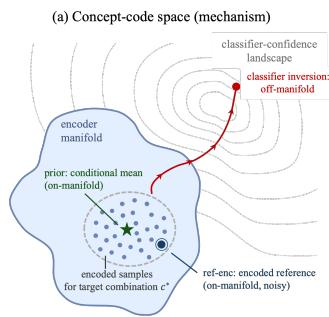
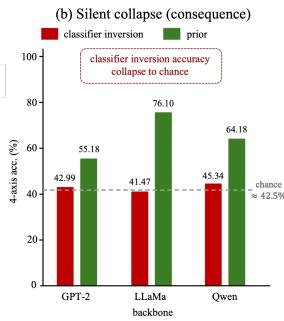
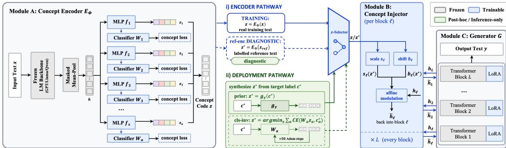
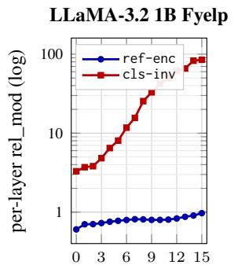
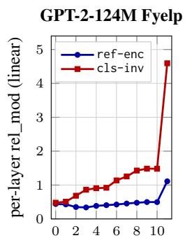

# The Illusion of Control: Why Bare Classifier Inversion Silently Fails in Concept-Bottleneck Text Generation

Qi Bing Shanghai Jiao Tong University peach19981011@gmail.com

Xiaowei Shao Shanghai Jiao Tong University xw.shao@sjtu.edu.cn

## Abstract

Concept-bottleneck controllable generation routes multi-attribute control through a lowdimensional concept code that, at deployment, must be synthesised from a target attribute configuration. We study this problem in concept-bottleneck text generation under multi-axis compositional generalisation, comparing three ways to obtain the inference-time code: classifier inversion against the encoder heads, reference-text encoding, and a posthoc label-conditioned prior. Since a concept code admits no direct LM-fluency term, regularising inversion must instead constrain the code toward the encoder’s training distribution. We therefore test bare inversion and three regularised variants: label-agnostic and labelconditioned Mahalanobis penalties, and a conditional normalising-flow density baseline. Every inversion variant we test underperforms a simple post-hoc prior fitted to per-combination encoder means on the same checkpoints, across three backbone families spanning 124M to 8B parameters. The bare form of classifier inversion also silently collapses to chance, traceable to a directly measured off-manifold code. We validate this diagnosis on real-world benchmarks and under external evaluators, enabling fair comparison with published baselines.

## 1 Introduction

Multi-attribute controllable text generation (MCTG) requires generating text that satisfies several attribute axes $\begin{array} { l l l } { \mathbf { c } } & { = } & { \left( c _ { 1 } , \ldots , c _ { A } \right) } \end{array}$ , and is commonly evaluated through compositional generalisation, where performance is measured by accuracy on attribute combinations held out during training (Keysers et al., 2020; Zhong et al., 2024). Recent concept-bottleneck language models (CB-LLMs) (Sun et al., 2025) show that language generation can be routed through interpretable concept units and steered by intervening on them, making the CB-LLM design a natural starting point for concept-bottleneck MCTG. In such a setting, deployment requires synthesising a code $\mathbf { z } ^ { \star }$ from a target configuration $\mathbf { c } ^ { \star }$ . Since the bottleneck exposes classifier heads over $\mathbf { z } ,$ a natural inference path is to optimise z against those heads. The broader CTG steering literature typically combines such classifier gradients with fluency, prototype-distance, or manifold regularisation (Dathathri et al., 2020; Gu et al., 2022, 2023). Unlike token-level or decoding-time steering, however, optimisation over a concept code has no direct LM-fluency term; any regularisation must act through the code distribution itself. As a result, the role and failure mode of classifier-based code optimisation are often hidden inside compound inference objectives. We therefore isolate this component in the concept-bottleneck setting and ask what happens when the target attributes are read out directly through the bottleneck classifier heads.

  
Figure 1: The illusion of control. (a) In concept-code space, classifier inversion drifts off the encoder’s training manifold; a label-conditioned prior sits at the onmanifold per-combination mean, and ref-enc is one on-manifold sample. (b) CompMCTG Fyelp 4-axis accuracy: cls-inv sits at the ≈ 42.5% chance baseline while the prior recovers compositional control on the same checkpoints (split details: Table 1 †).

We isolate this component experimentally (Fig. 1) and identify a directly measured failure mechanism: the inverted code lies 3 to 7 times farther from the encoder’s training distribution than a working code, both in diagonal-Gaussian Mahalanobis distance and in mean distance to its 10 nearest training neighbours. Adding a manifold regulariser to the inversion objective lifts accuracy off chance (§5). The corrective protocol is a single forward pass: freeze the trained encoder and fit a post-hoc MLP $g _ { \gamma }$ to the per-combination means of the encoded training data. Given the target labels, the prior model estimates the conditional mean of the encoder code. Because the within-combination variation we measure exceeds the across-combination signal, the prior acts as a denoiser of sample-specific code variation, explaining its advantage over single-sample reference encoding (§6.2).

This paper makes three contributions.

• We systematically compare classifier inversion against a simple post-hoc labelconditioned prior on matched checkpoints. We test bare inversion and three regularised inversion variants (label-agnostic Mahalanobis, label-conditioned Mahalanobis, and a conditional normalising-flow density baseline) and find that every tested inversion variant underperforms the prior by 7 to 29 pp (Tab. 2; Apps. I, K). The bare form also collapses to chance, which we trace to a directly measured off-manifold code (§5).

• We introduce a deployable post-hoc labelconditioned prior that recovers compositional generalisation on the same checkpoints, with no inference-time optimisation and no reference text. The prior is fitted on our proposed multi-axis concept-bottleneck architecture that extends existing single-axis steering designs. To our knowledge, this is the first concept-bottleneck text-generation protocol evaluated under multi-axis compositional generalisation (§6, §7).

• We show that the prior acts as a conditionalmean denoiser, and provide evidence that the non-additive residual of the concept code is dominated by per-sample encoder noise rather than measurable attribute interaction (§6.2).

## 2 Related Work

Concept-bottleneck language models. Conceptbottleneck models constrain output through a lowdimensional, interpretable code, originating in vision (Koh et al., 2020) and recently adapted to language as text-classification bottlenecks (Tan et al., 2024; Sun et al., 2024; Bhan et al., 2025; Labadie-Tamayo et al., 2025; Chaudhary et al., 2025) and, for generation, as CB-LLMs (Sun et al., 2025), which evaluate single-axis steering on each dataset. To our knowledge, this paper is the first to extend the per-axis bottleneck from single-axis steering to multi-axis compositional generalisation on combinations unseen during training — the setting in which the inference-protocol pathology surfaces (§5).

Compositional and multi-attribute CTG. Multi-attribute CTG includes joint-training methods (Keskar et al., 2019; Yang et al., 2023; Qian et al., 2022; Zeng et al., 2023), decoding-time classifier-gradient or logit-biasing methods (Dathathri et al., 2020; Yang and Klein, 2021; Krause et al., 2021; Liu et al., 2021), latent-space control (Gu et al., 2022, 2023), adapter fusion (Roy and Mishra, 2024), hidden-state edits (Kumar et al., 2023), token-level RL (Li et al., 2024), and learning-free FFN reweighting (Feng et al., 2024). Closest to our prior is Gu et al. (2023), who map an encoder posterior to a Gaussian via a normalising flow. Instead, we fit a deterministic post-hoc label-to-latent MLP without an invertibility constraint. Our generator is conditioned through hidden-state injection, a mechanism related to FiLM (Perez et al., 2018), AdaLN (Peebles and Xie, 2023), prefix-tuning (Li and Liang, 2021), and adapters (Houlsby et al., 2019), and implemented with AdaLN-zero and rank-8 LoRA (Hu et al., 2022). We evaluate on CompMCTG Fyelp (Zhong et al., 2024), built from the Maximum Compound Divergence split (Keysers et al., 2020), under its official RoBERTa-large evaluator.

Inference protocols for concept-conditioned generation. Inference-time construction of the concept code remains under-specified in conceptbottleneck generation. Existing classifier-gradient methods such as PPLM (Dathathri et al., 2020), classifier-guided diffusion (Li et al., 2022; Liu et al., 2023), and activation steering (Oozeer et al., 2025; Li et al., 2023) optimise control representations with additional fluency, prototype-distance, or distributional regularisation (Dathathri et al., 2020; Gu et al., 2022, 2023). In contrast, our focus is the inference protocol exposed by a trained concept bottleneck. We compare several protocol choices on matched checkpoints and find that the post-hoc prior consistently dominates the tested inversion variants. Other steering work constructs control vectors without classifier inversion, e.g., by meandifference or contrastive construction (Hsu et al., 2026; Lee et al., 2025; Stolfo et al., 2025).

  
Figure 2: Architecture of the concept-bottleneck CTG framework (§3.1). Module A encodes input text x into a concatenated concept code $\mathbf { z } = ( \mathbf { z } _ { 1 } , \ldots , \mathbf { z } _ { A } )$ using a frozen-LM encoder, per-axis MLPs, and classifier heads. z-Selector supplies the injector input: during training, ${ \bf z } = E _ { \phi } ( { \bf x } )$ ; during inference, $\mathbf { z } ^ { \star }$ is obtained by one of the protocols in §3.2 (prior, cls-inv, or ref-enc). Module B maps the selected code to per-layer AdaLN-zero updates. Module C is a LoRA-adapted frozen Transformer generator that emits y autoregressively.

## 3 Background

Since our target is an inference protocol, we first fix the object of study: a multi-axis concept-bottleneck architecture for compositional CTG, extending the single-axis concept-bottleneck generation design of Sun et al. (2025). This architecture poses the inference problem we study: synthesising an inferencetime concept code from a target attribute configuration. It serves as the experimental vehicle for our protocol diagnosis.

## 3.1 Framework

Problem formulation. A controllable text generation task specifies A attribute axes, each with a finite value set $\mathcal { A } _ { a }$ . A concept configuration is $\begin{array} { r } { \mathbf { c } = ( c _ { 1 } , \ldots , c _ { A } ) \in \mathcal { A } : = \prod _ { a } \mathcal { A } _ { a } } \end{array}$ . Given c, the model generates text y that satisfies all specified attributes, modelling $p _ { \theta } ( \mathbf { y } \mid \mathbf { c } )$ . During training, the generator is teacher-forced on x in an autoencoding setup, with $\textbf { y } : = \textbf { x }$ . Following the MCD protocol (Keysers et al., 2020; Zhong et al., 2024), training covers only $\mathcal { C } _ { \mathrm { s e e n } } \subset \mathcal { A } ;$ we report performance on both seen and unseen combinations, where $\mathcal { C } _ { \mathrm { u n s e e n } } : = \mathcal { A } \setminus \mathcal { C } _ { \mathrm { s e e n } }$

Architecture. The architecture has three modules connected through continuous concept vectors (Fig. 2). First, a concept encoder $E _ { \phi } : \mathcal { X }  \mathbb { R } ^ { A d _ { c } }$ mean-pools a frozen backbone representation and passes it through A per-axis MLPs $f _ { a } ,$ producing sub-codes $\mathbf { z } _ { a } \in \mathbb { R } ^ { d _ { c } }$ with per-axis classifier heads ${ \bf W } _ { a }$ . The full concept code is $\mathbf { z } = ( \mathbf { z } _ { 1 } , \ldots , \mathbf { z } _ { A } )$ Second, a concept injector $I _ { \psi }$ maps the code to per-layer gated residual updates for the generator blocks; our default implementation uses AdaLNzero (Peebles and Xie, 2023). Third, the generator G is a frozen pretrained Transformer adapted with LoRA (Hu et al., 2022). During training, the injector receives the encoder code ${ \bf z } = E _ { \phi } ( { \bf x } )$ and maps it to per-layer updates $\{ \Delta \mathbf { h } _ { \ell } \}$ . At inference, the encoder path is bypassed, so an inference-time code $\mathbf { z } ^ { \star }$ must be synthesised from the target configuration $\mathbf { c } ^ { \star }$ (§3.2). Training uses a teacher-forced LM loss, a per-axis concept-classification loss, and an inter-axis orthogonality regulariser; the injector update and four-phase training schedule are given in App. A.

## 3.2 Inference Protocols

Any procedure that maps a target configuration $\mathbf { c } ^ { \star }$ to an inference-time code $\mathbf { z } ^ { \star }$ defines a distinct evaluation protocol. We compare three code sources.

Classifier inversion (CLS-INV). Given the exposed classifier heads, the direct classifier-based protocol optimises the code so that the heads predict the target labels:

$$
\mathbf { z } _ { \mathrm { c l s } } ^ { \star } = \arg \operatorname* { m i n } _ { \mathbf { z } } \sum _ { a } \mathrm { C E } ( \mathbf { W } _ { a } \mathbf { z } _ { a } , c _ { a } ^ { \star } ) .\tag{1}
$$

The objective decouples over axes. We solve each axis with 50 Adam steps from $\mathbf { z } _ { a } ^ { ( 0 ) } = \mathbf { W } _ { a } [ c _ { a } ^ { \star } , : ] ^ { \top }$

Reference-text encoding (REF-ENC). As a single-sample diagnostic, we encode one labelled held-out example: $\mathbf { z } _ { \mathrm { r e f - e n c } } ^ { \star } : = \ E _ { \phi } ( \mathbf { x } _ { \mathrm { r e f } } )$ , where $\pi _ { a } ( { \bf x } _ { \mathrm { r e f } } ) = c _ { a } ^ { \star }$ . We do not treat this as an upper bound. The encoded reference carries the surface idiosyncrasies of one sentence, so a conditionalmean estimator can outperform it by averaging away sample-specific variation. We include REF-ENC alongside PRIOR to make this variance source explicit (§6.2); it is not deployable, since it requires a labelled reference sentence matching the requested configuration.

Amortised label prior (PRIOR). After the main model has been trained, we freeze $E _ { \phi }$ and fit a post-hoc MLP $g _ { \gamma } : \mathcal { A } \overset { } {  } \mathbb { R } ^ { A d _ { c } }$ by

$$
\mathcal { L } ( \gamma ) = \mathbb { E } _ { ( \mathbf { x } , \mathbf { c } ) \sim \mathcal { D } _ { \mathrm { t r a i n } } } \big | \big | g _ { \gamma } ( \mathbf { c } ) - E _ { \phi } ( \mathbf { x } ) \big | \big | _ { 2 } ^ { 2 } .\tag{2}
$$

At inference, we use $\mathbf { z } _ { \mathrm { p r i o r } } ^ { \star } : = g _ { \gamma } ( \mathbf { c } ^ { \star } )$ . The MLP $g _ { \gamma }$ has a single hidden layer of 128 units (GELU) and is fitted post-hoc in well under a minute. It is trained only on $\mathcal { C } _ { \mathrm { s e e n } }$ but queried on $\mathcal { C } _ { \mathrm { u n s e e n } }$ . The encoder’s per-axis structure lets the learned labelto-code map provide a compositional estimate of the per-configuration encoder mean.

## 4 Experimental Setup

Our evaluation centres on CompMCTG Fyelp, a real multi-attribute review benchmark with compositional splits that supports the main claims. We also use a synthetic 4-axis task and single-axis YelpP as controlled checks.

Datasets. Our primary setting is Fyelp (CompMCTG, 4-axis sentiment × gender × cuisine × tense; 65K/1.5K/1.5K/1,750 train/val/test\_seen/test\_unseen) under two compositional splits: Hold-Out idx=−0 (39 seen and 1 unseen combination) and ACD (half of the 40 combinations unseen; §7.1). We also evaluate on Amazon (CompMCTG, 2-axis sentiment × topic; App. C), and use two controlled checks: a Synthetic 4-axis MCD task $( 4 ^ { 4 }$ combinations, 200 seen / 56 unseen via the MCD protocol (Keysers et al., 2020); §5–§6) and YelpP (binary sentiment, single-axis CB-LLMs cross-check; App. B).

Backbones. Tab. 1 reports four Fyelp backbones spanning 124M–1.5B: GPT-2 124M, GPT-2-Medium 355M (the backbone every CompM-CTG baseline uses, and therefore our matched comparison in §7.1), LLaMA-3.2 1B (primary scale), and Qwen-2.5 1.5B. The first three use AdaLNzero; Qwen-2.5 1.5B uses the additive injector after AdaLN-zero proved unstable. The synthetic sanity check (§5) adds Qwen-2.5 0.5B and LLaMA-3.2 3B, and a LLaMA-3 8B YelpP checkpoint covers the single-axis check. All models are LoRAadapted on frozen weights (rank 8, α = 16), trained for 25 epochs with AdamW and a cosine schedule, with concept dimension $d _ { c } = 3 2$

Evaluation. For Fyelp, we use the official CompMCTG 4-axis RoBERTa-large classifier suite (Zhong et al., 2024), invoked verbatim through a subprocess wrapper to match the published baseline pipeline; perplexity is computed with GPT2- large under the same pipeline. We never use the bottleneck encoder’s own classifier heads for evaluation. We report per-axis and 4-axis-mean accuracy on generated text, joint all-axes-correct accuracy, and fluency metrics (perplexity and Distn); headline numbers are on test\_unseen, except for CLS-INV on Hold-Out, which we report on test\_seen because the single held-out combination admits a classifier-default artefact (App. Q); the ACD split gives the artefact-free within-split comparison. Tab. 1 marks the affected cells. For comparability, we fix one validation-selected stable recipe per backbone and a fixed evaluation seed 42; the full seven-point comparability policy is in App. O.

Artefacts. Every benchmark, evaluator, and backbone we use is a public third-party release under its own licence. We release our code under the MIT Licence, together with the trained concept encoder, classifier heads, injector, LoRA adapter, and label prior for all four main-table backbones on both splits.1

## 5 Classifier inversion silently collapses across backbones

Classifier inversion is the most direct classifierbased answer to the inference problem in §3.2. We isolate this procedure from the regularised objectives that usually surround classifier-gradient methods (§2) and find that it silently fails: on every trained checkpoint, it produces text with little or no concept signal while training metrics remain healthy. Through direct measurement and regulariser ablations, we trace the collapse to a consistent mechanism: classifier inversion drives the control code off the encoder’s training distribution.

## 5.1 The collapse: chance-level accuracy on every backbone

We applied classifier inversion (Eq. 1) to every trained checkpoint and evaluated the generated text under the official CompMCTG Fyelp evaluator. On the seen split (39 combinations), which we headline for CLS-INV for the reason given in §4, 4-axis accuracy is 41.47% on LLaMA-3.2 1B, 42.99% on GPT-2 124M, 45.34% on Qwen-2.5 1.5B, and 46.88% on GPT-2-Medium 355M. Every backbone is within 5 pp of the 42.5% random baseline, and 12 to 35 pp below the prior’s test\_unseen accuracy on the same checkpoints (Fig. 1); the like-for-like ACD comparison in $\ S 6$ shows the same ordering. The generated text carries little concept signal: it degenerates into token-repetition loops or coherent but off-domain pretrain-mode text, and an LLM judge rates none of 20 CLS-INV samples as fluent reviews (Apps. F, G). The collapse is invisible from training metrics: they remain healthy to the final epoch, and the 50-step inversion optimiser does maximise classifier accuracy on $\mathbf { z } ^ { \star }$ . The failure occurs at generation time.

The same collapse on a controlled sanity check. The collapse is not specific to Fyelp. On a synthetic 4-axis task with marginal-independent attributes, CLS-INV accuracy stays within ±0.03 of the 0.25 baseline on five backbones across three families and 124M–3B parameters. On single-axis YelpP with LLaMA-3 8B, it remains at the 0.50 binary baseline (App. D, Tab. 5). The failure appears under both injector mechanisms — AdaLN-zero and the additive fallback for Qwen-1.5B — and is total on the joint all-axes-correct metric (≤ 0.005). This points to the inference protocol rather than a single backbone or injector design.

## 5.2 The mechanism: an off-manifold control code

The classifier-inversion objective (Eq. 1) contains no term that keeps $\mathbf { z } ^ { \star }$ within the code distribution on which the generator was trained. We show that the inverted code leaves this distribution, overdrives the injector, and that constraining it back toward the encoder manifold repairs the collapse.

The inverted code is measurably off-manifold. We fit a per-dimension diagonal Gaussian $( \mu , \sigma )$ to the encoder codes of 4000 training reviews, the code distribution on which the AdaLN injector was trained, and measure how far each inference-time $\mathbf { z } ^ { \star }$ lies from it (App. H). Classifier inversion is a clear outlier on both backbones: its Mahalanobis distance is 3.3–3.7, compared with 0.50–0.60 for the prior and ≈ 1.0 for REF-ENC. This gives a 3–7× gap, with the same separation in nearestneighbour distance. The prior and REF-ENC lie inside the encoder’s code distribution; the inverted code does not. This is measured directly, not inferred from downstream generation quality.

  
transformer block index ℓ

  
transformer block index ℓ  
Figure 3: Activation-level signature of classifier inversion (§5.2). We plot per-layer relative modulation rel\_mod $\lvert \mathbf { \Delta } \rvert _ { \ell } = \lvert \lvert \tilde { \mathbf { h } } _ { \ell } - \mathbf { h } _ { \ell } \rvert \rvert / \lvert \lvert \mathbf { h } _ { \ell } \rvert \rvert$ , averaged over tokens and prompts, on trained Fyelp checkpoints. REF-ENC remains bounded on both backbones, while CLS-INV produces depth-amplified over-modulation: severe on LLaMA-3.2 1B (log y-axis) and milder but still visible on GPT-2 124M. The corresponding off-manifold distances are reported in Table 10.

Off-manifold codes over-drive the injector. An off-manifold $\mathbf { z } ^ { \star }$ pushes the AdaLN injector outside its trained range. We probe per-layer relative modulation, rel\_modℓ $= \| \tilde { \mathbf h } _ { \ell } - \mathbf h _ { \ell } \| / \| \mathbf h _ { \ell } \|$ , on the trained Fyelp checkpoints (Fig. 3). On LLaMA-3.2 1B, classifier inversion produces a depth-amplified perturbation: rel\_mod rises from 3.3 at layer 0 to 85 at layer 15, averaging a 40× over-shoot over REF-ENC. On GPT-2 124M, the same over-shoot is present but milder (2.7×). Both backbones show the same signature: an off-manifold code amplified through depth, with a magnitude that depends on the backbone family. The resulting text degenerates into high-perplexity pretrain-mode loops (LLaMA-1B perplexity > 130).

Does a regulariser close the gap to the prior? A standard manifold regulariser repairs the bareform collapse, and more targeted regularisers narrow the gap further. However, no tested variant matches the post-hoc prior. We re-run inversion with a label-agnostic manifold regulariser on the per-axis objective, $\mathrm { C E } ( \mathbf { W } _ { a } \mathbf { z } _ { a } , c _ { a } ^ { \star } ) + \beta R ( \mathbf { z } _ { a } )$ sweeping $\beta$ under two penalty forms, two backbones, and three seeds (App. I). A Mahalanobis penalty, $R = \mathbb { E } [ ( \mathbf { z } _ { a } - \pmb { \mu } _ { a } ) / \pmb { \sigma } _ { a } ) ^ { 2 } ]$ , lifts 4-axis accuracy from chance to 57.4% on GPT-2 and 52.8% on LLaMA, while reducing perplexity from ∼ 130 to ∼ 20. A shell penalty is zero inside the ±2σ ellipsoid and has no centring pull, avoiding a trivial mean-collapse explanation. It still lifts accuracy by +8.5 and +9.0 pp; every lift exceeds seed noise (≤ 1.6 pp) by roughly an order of magnitude.

A manifold constraint, under either penalty and on either backbone, converts a chance-level protocol into a working one, supporting the off-manifold diagnosis. This is the failure mode that regularisation in classifier-gradient methods helps prevent. The best regularised inversion variant still trails the label prior by $7$ to 29 pp on test\_seen, as does a conditional normalising-flow density baseline (Tab. 2; Apps. I, K, J for an inversion-side hyperparameter grid). We therefore adopt the prior as the recommended protocol.

## 6 A label-conditioned prior recovers compositional control

If classifier inversion is an unreliable way to obtain a control code from a target configuration, what alternative inference protocol should be used? We show that a post-hoc label-conditioned prior, which estimates the conditional mean of the encoder code given the target labels, recovers compositional control on the same checkpoints where classifier inversion fails, with no inference-time optimisation and no reference text.

## 6.1 Prior inference recovers compositional generalisation

We evaluate the post-hoc label-conditioned MLP $g _ { \gamma }$ on CompMCTG Fyelp under the official RoBERTalarge 4-axis evaluator. We compare it against two reference protocols: the collapsed classifierinversion protocol CLS-INV and the single-sample reference encoding REF-ENC.

Prior inference recovers control on every backbone. While classifier inversion remains near the ≈ 42.5% random baseline even on test\_seen (Tab. 1 (†)), the prior reaches 55.18% (GPT-2 124M), 61.50% (GPT-2-Medium 355M), 64.18% (Qwen-2.5 1.5B), and 76.10% (LLaMA-3.2 1B) 4- axis accuracy on the Hold-Out test\_unseen split — a +12 to +35 pp recovery on identical checkpoints. The comparison is confirmed like-for-like on ACD, where half of all attribute combinations are unseen and both protocols can be read off the same split without the singleton artefact: on ACD test\_unseen, the prior improves over CLS-INV by +7.4 to +18.8 pp (Tab. 1, within-split block; App. R). The gain is not merely over the bare protocol. Tab. 2 compares the prior with regularised inversion variants on matched checkpoints. Both a label-agnostic Mahalanobis penalty (App. I) and a sharper label-conditioned variant, which pulls ${ \bf z } _ { a }$ toward the per-(axis, target-label) marginal mean, still trail the prior by $7$ to 29 pp. They also require a 50-step inner optimisation per query and a backbone-specific $\beta$ sweep, both of which the deterministic prior avoids.

The prior also exceeds the encoded reference REF-ENC. On Fyelp Hold-Out, the prior improves over REF-ENC on every backbone by +3.3 to +12.3 pp in Tab. 1. The only exception is Qwen-1.5B on ACD, where the prior is −1.6 pp below REF-ENC. We do not interpret this as surpassing an upper bound: REF-ENC is a single-sample diagnostic and carries the surface idiosyncrasies of one reference sentence. A conditional-mean estimator can therefore outperform it by averaging away sample-specific variation, confirming that $g _ { \gamma }$ acts as the intended per-combination denoiser (§6.2). The same direction holds on the synthetic check (App. D), survives the bf16/fp32 recipe shift within ±1.0 pp (App. P), and is reproduced by an LLM judge on both attribute match and fluency (App. G). The prior also beats a non-parametric nearest-seencombination retrieval baseline on every unseen split by +2.6 to +9.5 pp (App. L).

## 6.2 Mechanism: prior as a conditional-mean denoiser

Why the conditional mean is the right target. Three properties of the two objectives account for the gap between them. (i) The inversion objective (Eq. 1) depends on z only through the per-axis classifier heads $\mathbf { W } _ { a } .$ , so nothing in it penalises displacement from the code distribution on which the injector was trained; its minimisers are unconstrained on that distribution. (ii) The prior objective (Eq. 2) is a squared loss, so on the combinations it is fitted to its population minimiser is the conditional mean,

$$
g _ { \gamma } ( \mathbf { c } ) = \mathbb { E } [ E _ { \phi } ( \mathbf { x } ) \mid \mathbf { c } ] , \qquad \mathbf { c } \in \mathcal { C } _ { \mathrm { s e e n } } ,\tag{3}
$$

<table><tr><td>Method / z-source</td><td>Backbone</td><td>HO</td><td>ACD</td></tr><tr><td colspan="4">CompMCTG-paper baselines, GPT-2-Medium 355M (quoted from Zhong et al. 2024)</td></tr><tr><td>PPLM (Dathathri et al., 2020)</td><td>GPT-2-M 355M</td><td>42.49</td><td>40.63</td></tr><tr><td>Fudge (Yang and Klein, 2021)</td><td>GPT-2-M 355M</td><td>41.71</td><td>40.42</td></tr><tr><td>CatPrompt (Yang et al., 2023)</td><td>GPT-2-M 355M</td><td>64.57</td><td>54.77</td></tr><tr><td>DCG (Zeng et al., 2023)</td><td>GPT-2-M 355M</td><td>66.39</td><td>64.71</td></tr><tr><td>Con.Prefix (Qian et al., 2022)</td><td>GPT-2-M 355M</td><td>67.50</td><td>63.93</td></tr><tr><td>CTRL (Keskar et al., 2019)</td><td>GPT-2-M 355M</td><td>68.29</td><td>65.31</td></tr><tr><td>Prior (Gu et al., 2023)</td><td>GPT-2-M 355M</td><td>54.64</td><td>52.29</td></tr><tr><td>Dis-Lens (Gu et al., 2022)</td><td>GPT-2-M 355M</td><td>67.06</td><td>57.31</td></tr><tr><td>Meta-CTRL (Zhong et al., 2024)</td><td>GPT-2-M 355M</td><td>68.69</td><td>65.77</td></tr><tr><td colspan="4">Ours — 65K-train _ful1 runs, 4-axis mean accuracy (%)</td></tr><tr><td>CLS-INV†</td><td>GPT-2 124M</td><td>42.99</td><td>40.14</td></tr><tr><td>REF-ENC</td><td>GPT-2 124M</td><td>47.64</td><td>49.46</td></tr><tr><td>PRIOR</td><td>GPT-2 124M</td><td>55.18</td><td>55.91</td></tr><tr><td> ${ \mathrm { C L S - I N V } } ^ { \dagger }$ </td><td>GPT-2-M 355M</td><td>46.88</td><td>43.72</td></tr><tr><td>REF-ENC</td><td>GPT-2-M 355M</td><td> $4 9 . 7 9 { \scriptstyle \pm 0 . 0 8 }$ </td><td> $4 6 . 7 3 { \scriptstyle \pm 0 . 0 6 }$ </td></tr><tr><td>PRIOR</td><td>GPT-2-M 355M</td><td> $\mathbf { 6 1 . 5 0 } _ { \pm 0 . 6 7 }$ </td><td> ${ \bf 5 9 . 5 2 _ { \pm 0 . 3 2 } }$ </td></tr><tr><td>CLS-INv†</td><td>LLaMA-3.2 1B</td><td> $4 1 . 4 7 { \scriptstyle \pm 0 . 4 6 }$ </td><td>34.51</td></tr><tr><td>REF-ENC</td><td>LLaMA-3.2 1B</td><td> $6 3 . 8 0 { \scriptstyle \pm 3 . 1 6 }$ </td><td>67.79</td></tr><tr><td>PRIOR</td><td>LLaMA-3.2 1B</td><td> $\mathbf { 7 6 . 1 0 _ { \pm 0 . 0 6 } }$ </td><td>69.53</td></tr><tr><td>CLS-INV†</td><td></td><td>45.34</td><td></td></tr><tr><td>REF-ENC</td><td>Qwen-2.5 1.5B</td><td></td><td>34.82</td></tr><tr><td>PRIOR</td><td>Qwen-2.5 1.5B Qwen-2.5 1.5B</td><td>60.90 64.18</td><td>62.04 60.48</td></tr><tr><td colspan="4">Within-split sanity, ACD test_unseen‡ (artefact-free; App. R for per-axis)</td></tr><tr><td colspan="4"></td></tr><tr><td> ${ \mathrm { C L S - I N V } } ^ { \ddagger }$ </td><td> $\mathrm { G P T - 2 \ 1 2 4 M / L L a M A { - } 1 B / Q w e n { - } 1 . 5 B }$ </td><td></td><td>48.47/50.75/52.82</td></tr><tr><td>REF-ENC</td><td> $\mathrm { G P T - 2 \ 1 2 4 M / L L a M A { - } 1 B / \tilde { Q } w e n { - } 1 . 5 B }$ </td><td></td><td>49.46/67.79/62.04</td></tr><tr><td>PRIOR</td><td> $\mathrm { G P T - 2 \ 1 2 4 M / L L a M A { - } 1 B / Q w e n { - } 1 . 5 B }$ </td><td></td><td> $\mathbf { 5 5 . 9 1 } / 6 9 . 5 3 / 6 0 . 4 8$ </td></tr></table>

Table 1: 4-axis mean accuracy (%) on CompMCTG Fyelp under the official RoBERTa-large evaluator (Zhong et al., 2024); Hold-Out (HO) and ACD splits, $\operatorname { i d x } = - 0 ,$ , chance baseline ≈ 42.5%. Unmarked rows report test\_unseen (the compositional-generalisation number); † CLS-INV on test\_seen (its Hold-Out test\_unseen number is inflated by a singleton artefact, App. $\mathbf { Q } ) ; \mathbf { \vec { \mathbf { \psi } } }$ ‡ artefact-free test\_unseen on the ACD split, whose half-combination hold-out admits no singleton — the corresponding within-split lift over the PRIOR cells is $+ 7 . 4 \mathrm { t o } + 1 8 . 8 \mathrm { p p }$ . Multi-seed entries (42/7/11) are marked $\pm \mathrm { s d }$ . Backbones differ: every CompMCTG baseline uses GPT-2-Medium 355M; the strictly matched comparison is our GPT-2-Medium 355M block, where PRIOR does not surpass Meta-CTRL on either split; the LLaMA-1B win is cross-scale (≈ 3.5× the baseline backbone). Per-axis breakdown in Tab. 7 (App. E).

which averages away variation not shared across examples of the same combination and which we measure to lie inside the encoder’s code distribution (§5.2). (iii) Whether that conditional mean extends to combinations never seen in training depends on how far the code factorises across axes, which we quantify below.

At training time, $E _ { \phi } ( \mathbf { x } )$ encodes both percombination concept information and sentencespecific stylistic variation. Fitted to the percombination mean, $g _ { \gamma }$ therefore acts as a denoised prototype: it retains the shared code component of a combination and discards idiosyncratic sentencelevel variation. Consistent with this view, prior PPL is lower than REF-ENC PPL across all three backbones.

The sample-specific noise is measurable and exceeds the concept signal. On the GPT-2-

Medium checkpoint, the mean per-dimension σ of $E _ { \phi } ( \mathbf { x } )$ within a fixed combination is 0.43, against only 0.33 across the per-combination means: REF-ENC carries the full 0.43 into the generator, whereas $g _ { \gamma } ,$ the conditional mean, discards it and retains the 0.33 of concept signal. A direct control, averaging k same-combination reference encodings, matches the learned prior within 0.4 pp at $k = 2 5 6 ( \mathrm { A p p . } \mathrm { M } )$ . Conversely, a conditional normalising flow $p ( \mathbf { z } \mid \mathbf { c } )$ underperforms the MLP by 10.5/11.8 pp, consistent with the view that preserving within-combination variance is harmful for this inference protocol (App. K). A synthetic conceptswap diagnostic shows a compatible family-level pattern, with partial per-axis fidelity on LLaMA and stronger entanglement on GPT-2/Qwen; we report it only as a supplementary check (App. S).

<table><tr><td>Protocol</td><td>GPT-2-124M</td><td>LLaMA-1B</td></tr><tr><td>CLS-INV bare</td><td>42.99</td><td>41.47</td></tr><tr><td>+ Mahal.  $\left( \mathrm { a g n . } \right) ^ { \circ }$ </td><td>57.52</td><td>52.91</td></tr><tr><td>+ Mahal.  $( \mathrm { c o n d . } ) ^ { \circ }$ </td><td>60.74</td><td>52.73</td></tr><tr><td>flow-prior (cond. NF)†</td><td>57.21</td><td>69.95</td></tr><tr><td>PRIOR  $( g _ { \gamma } )$ </td><td>67.7</td><td>81.7</td></tr></table>

Table 2: Inversion-protocol comparison on Fyelp Hold-Out test\_seen, 4-axis mean accuracy (%); the same checkpoints report 55.18%/76.10% on test\_unseen (Tab. 1). agn./cond.: label-agnostic / label-conditioned per-axis manifold penalty (App. I; best $\beta \in \{ 0 . 1 , 0 . 3 , 1 . 0 , 3 . 0 \}$ , ⋄; the label-agnostic row is the single-seed full test\_seen number, matching the 57.4/52.8 three-seed subset means in Tab. 11). flow-prior: conditional normalising flow $p ( \mathbf { z } \mid c ) \mathbf { \alpha } ( \mathbf { \vec { \tau } } ;$ App. K); trails the MLP by 10.5/11.8 pp, matching the denoiser prediction (§6.2). Label-conditioned row uses the 312-row subset (Tab. 12); others use full test\_seen. Same ordering on ACD (Tab. 1 within-split block).

Additivity of the concept code, and why the prior generalises. The prior can generalise to unseen combinations when the frozen encoder code z is sufficiently structured by attribute axes. An additive per-axis model $\begin{array} { r } { \pmb { \mu } + \sum _ { a } \Delta _ { a } ( y _ { a } ) } \end{array}$ explains only 31.7–47.6% of the variance of $\mathbf { z } ,$ increasing with backbone scale. However, the remaining nonadditive residual is not explained by measurable label co-occurrence: all six Fyelp axis pairs have zero mutual information and Cramér’s V, since CompM-CTG samples combinations uniformly and the axes are independent by construction. We therefore interpret the residual primarily as a label-invariant encoder artefact dominated by per-sample variation, the same variation discarded by the conditionalmean prior. An additive label prior is therefore well matched to Fyelp, and adding an explicit interaction term gives no reliable gain on either backbone tested (App. N).

## 7 Baseline comparison and cross-benchmark robustness

The prior-over-classifier-inversion result of §6 is already evaluated under the official CompMCTG RoBERTa-large evaluator (§4). We now compare it against published CompMCTG baselines on Fyelp, test cross-dataset robustness on a second CompM-CTG benchmark, Amazon, and add a single-axis YelpP check against CB-LLMs under their independently built RoBERTa evaluator.

## 7.1 Comparison with the CompMCTG baselines

We place the prior result on CompMCTG Fyelp (Tab. 1) against the CompMCTG-paper baselines (Zhong et al., 2024) under the same official evaluator.

Matched-backbone comparison: GPT-2- Medium 355M. The only strictly matched comparison retrains our framework at GPT-2- Medium 355M. In this setting, the prior reaches 61.50% on Hold-Out and 59.52% on ACD in 4-axis unseen accuracy over three training seeds, slightly below the strongest baseline. However, the prior sits above the mean of the nine published CompMCTG baselines on both splits (60.15% HO, 56.13% ACD), and above the median on ACD, where it beats PPLM, Fudge, Gu et al.’s Prior, CatPrompt, and Dis-Lens. The contribution is an inference-protocol correction, not an accuracy record. The matched setting nonetheless establishes the within-method ordering with seed-level error bars far smaller than the reported gaps: the prior beats REF-ENC by +12.8 pp on ACD unseen and collapsed classifier inversion by +14–16 pp, while achieving roughly 3× lower perplexity than Meta-CTRL. The 4-axis score is depressed roughly uniformly by the near-chance gender axis; the matched prior reaches 72.34% on 3-axis ACD unseen.

Cross-scale result and scaling trend. For completeness, on Fyelp Hold-Out our LLaMA-3.2 1B prior reaches 76.10% 4-axis unseen accuracy, +7.41 pp over Meta-CTRL. We label this as a crossscale comparison rather than a state-of-the-art claim, since LLaMA-3.2 1B has roughly 3.5× the parameters of the GPT-2-Medium baselines. Prior Hold-Out accuracy increases with backbone size across our four backbones, a family-confounded trend showing only that the protocol does not saturate in the tested range. Only the LLaMA-1B point clears Meta-CTRL, and only cross-scale.

Second real-world dataset: Amazon. To check that the result is not Fyelp-specific, we run the same GPT-2-124M pipeline on CompMCTG Amazon, a product-review dataset with two axes, sentiment × topic, under the official 2-axis classifier suite (App. C). The ordering reproduces: on the seen split, PRIOR reaches 76.5%, beating collapsed classifier inversion by +30.0 pp and REF-ENC by +14.4 pp, and it is also best on the unseen split.

The collapse is clearest on the multi-class topic axis: classifier inversion is near chance (20.2% vs. 16.7%), whereas the prior reaches 74.3%, with a 5× perplexity gap. The binary sentiment axis partly survives, but the content-bearing topic axis collapses cleanly and the prior-over-REF-ENC advantage reproduces.

Single-axis check at a matched backbone. A minimal single-axis YelpP experiment against CB-LLMs (Sun et al., 2025) uses LLaMA-3 8B backbone and RoBERTa evaluator (App. B). The likefor-like result is consistent with the multi-axis findings: classifier inversion collapses to the 0.500 binary-chance level, while PRIOR reaches 0.964 steerability, +1.4 pp above the 0.95 reported by CB-LLMs under our byte-identical reproduction.

## 8 Conclusion

Classifier inversion silently collapses to chance on every tested backbone while training metrics remain healthy. We trace the failure to an offmanifold inference-time code that over-drives the injector, and confirm the diagnosis with a manifoldregulariser ablation. A post-hoc label-conditioned prior, fitted to per-combination encoder means, recovers compositional generalisation on the same checkpoints under external evaluators and on a second real-world dataset. At a matched backbone, it does not beat the strongest CompMCTG baseline; this is an inference-protocol correction, not a state-of-the-art claim. For this family of conceptbottleneck CTG models, prior inference should be the default z-source rather than bare classifier inversion.

## Limitations

Benchmark granularity. The Fyelp Hold-Out idx=−0 split holds out a single 4-axis combination, so its test\_unseen score is a coarse singlecombination measurement and can inflate classifierdefault artefacts (App. Q). We therefore also report ACD, where half of all combinations are unseen, as the more reliable compositional-shift measurement.

Architectural scope. Our collapse claim applies to concept-bottleneck CTG models whose generator is conditioned through an injector trained on the encoder’s code distribution. This covers the CB-LLM-style architecture studied here, but not all possible controllable-generation mechanisms.

Mechanistic scope. The off-manifold diagnosis is supported by distance measurements, activation diagnostics, and manifold-regulariser ablations. However, it does not fully explain why the same off-manifold displacement yields different activation magnitudes across backbone families. A more detailed analysis of injector sensitivity, depth effects, and hidden-state scaling is left for future work.

Scale, language, and regulariser coverage. Experiments are limited to English benchmarks and to backbones up to 3B for multi-axis CTG, with an 8B single-axis check. Multilingual, long-form, and larger-scale multi-axis generation remain untested. Some backbone–dataset cells are single-seed due to compute cost, although the multi-seed blocks show protocol gaps larger than seed variation. Finally, we do not claim that no regularised inversion method can close the gap: we test label-agnostic and labelconditioned Mahalanobis penalties, a shell penalty, and a conditional normalising-flow density baseline, but broader regularisation schemes remain future work.

## Ethical considerations

The Fyelp benchmark includes a binary gender attribute inherited from prior style-transfer datasets. We treat this label only as a benchmark-specific writing-style marker, not as an identity attribute, and do not advocate generating gendered content about identifiable people. Gender is used only through the standard CompMCTG evaluator; we do not train or deploy an additional gender classifier beyond the benchmark protocol.

This work diagnoses inference protocols on public benchmarks and releases no new dataset or deployed model. The label-conditioned prior improves the reliability of controlling already-labelled attributes, but does not expand the set of controllable attributes beyond those present in the training data. Misuse risks are therefore tied to the underlying controllable-generation setting rather than to a new capability introduced here.

## Acknowledgements

We used AI assistants for language polishing, copyediting, and minor coding/debugging assistance. All scientific claims, experimental design, analyses, and final text were reviewed and verified by the authors, who take full responsibility for the submission.

## References

Milan Bhan, Yann Choho, Pierre Moreau, Jean-Noel Vittaut, Nicolas Chesneau, and Marie-Jeanne Lesot. 2025. Towards achieving concept completeness for textual concept bottleneck models. Preprint, arXiv:2502.11100.

Kumar Satvik Chaudhary, Chengshuai Zhao, Fan Zhang, Garima Agrawal, Yuli Deng, and Huan Liu. 2025. EssayCBM: Rubric-aligned concept bottleneck models for transparent essay grading. Preprint, arXiv:2512.20817.

Sumanth Dathathri, Andrea Madotto, Janice Lan, Jane Hung, Eric Frank, Piero Molino, Jason Yosinski, and Rosanne Liu. 2020. Plug and play language models: A simple approach to controlled text generation. In International Conference on Learning Representations (ICLR).

Zijian Feng, Hanzhang Zhou, Zixiao Zhu, and Kezhi Mao. 2024. FreeCtrl: Constructing control centers with feedforward layers for learning-free controllable text generation. In Annual Meeting ofthe Association for Computational Linguistics (ACL).

Yuxuan Gu, Xiaocheng Feng, Sicheng Ma, Lingyuan Zhang, Heng Gong, and Bing Qin. 2022. A distributional lens for multi-aspect controllable text generation. In Conference on Empirical Methods in Natural Language Processing (EMNLP).

Yuxuan Gu, Xiaocheng Feng, Sicheng Ma, Lingyuan Zhang, Heng Gong, and Bing Qin. 2023. Controllable text generation via probability density estimation in the latent space. In Annual Meeting of the Associationfor Computational Linguistics (ACL).

Neil Houlsby, Andrei Giurgiu, Stanislaw Jastrzebski, Bruna Morrone, Quentin de Laroussilhe, Andrea Gesmundo, Mona Attariyan, and Sylvain Gelly. 2019. Parameter-efficient transfer learning for NLP. In International Conference on Machine Learning (ICML).

Brandon Hsu, Daniel Beaglehole, Adityanarayanan Radhakrishnan, and Mikhail Belkin. 2026. Contextual linear activation steering of language models. Preprint, arXiv:2604.24693.

Edward J. Hu, Yelong Shen, Phillip Wallis, Zeyuan Allen-Zhu, Yuanzhi Li, Shean Wang, Lu Wang, and Weizhu Chen. 2022. LoRA: Low-rank adaptation of large language models. In International Conference on Learning Representations (ICLR).

Nitish Shirish Keskar, Bryan McCann, Lav R. Varshney, Caiming Xiong, and Richard Socher. 2019. CTRL: A conditional transformer language model for controllable generation. Preprint, arXiv:1909.05858.

Daniel Keysers, Nathanael Schärli, Nathan Scales, Hylke Buisman, Daniel Furrer, Sergii Kashubin, Nikola Momchev, Danila Sinopalnikov, Lukasz Stafiniak, Tibor Tihon, Dmitry Tsarkov, Xiao Wang,

Marc van Zee, and Olivier Bousquet. 2020. Measuring compositional generalization: A comprehensive method on realistic data. In International Conference on Learning Representations (ICLR).

Pang Wei Koh, Thao Nguyen, Yew Siang Tang, Stephen Mussmann, Emma Pierson, Been Kim, and Percy Liang. 2020. Concept bottleneck models. In International Conference on Machine Learning (ICML).

Ben Krause, Akhilesh Deepak Gotmare, Bryan McCann, Nitish Shirish Keskar, Shafiq Joty, Richard Socher, and Nazneen Fatema Rajani. 2021. GeDi: Generative discriminator guided sequence generation. In Findings of the Association for Computational Linguistics: EMNLP (Findings of EMNLP).

Vaibhav Kumar, Hana Koorehdavoudi, Masud Moshtaghi, Amita Misra, Ankit Chadha, and Emilio Ferrara. 2023. Controlled text generation with hidden representation transformations. In Findings ofthe Associationfor Computational Linguistics (ACL Findings).

Roberto Labadie-Tamayo, Djordje Slijepceviˇ c, Xihui´ Chen, Adrian Jaques Böck, Andreas Babic, Liz Freimann, Christiane Atzmüller, and Matthias Zeppelzauer. 2025. Distilling knowledge from large language models: A concept bottleneck model for hate and counter speech recognition. Information Processing & Management.

Bruce W. Lee, Inkit Padhi, Karthikeyan Natesan Ramamurthy, Erik Miehling, Pierre Dognin, Manish Nagireddy, and Amit Dhurandhar. 2025. Programming refusal with conditional activation steering. In International Conference on Learning Representations (ICLR).

Kenneth Li, Oam Patel, Fernanda Viégas, Hanspeter Pfister, and Martin Wattenberg. 2023. Inference-time intervention: Eliciting truthful answers from a language model. In Advances in Neural Information Processing Systems (NeurIPS).

Wendi Li, Wei Wei, Kaihe Xu, Wenfeng Xie, Dangyang Chen, and Yu Cheng. 2024. Reinforcement learning with token-level feedback for controllable text generation. In Findings of the North American Chapter ofthe Associationfor Computational Linguistics (NAACL Findings).

Xiang Lisa Li and Percy Liang. 2021. Prefix-tuning: Optimizing continuous prompts for generation. In Annual Meeting ofthe Associationfor Computational Linguistics (ACL).

Xiang Lisa Li, John Thickstun, Ishaan Gulrajani, Percy Liang, and Tatsunori B. Hashimoto. 2022. Diffusion-LM improves controllable text generation. In Advances in Neural Information Processing Systems (NeurIPS).

Alisa Liu, Maarten Sap, Ximing Lu, Swabha Swayamdipta, Chandra Bhagavatula, Noah A. Smith,

and Yejin Choi. 2021. DExperts: Decoding-time controlled text generation with experts and anti-experts. In Annual Meeting ofthe Associationfor Computational Linguistics (ACL).

Guangyi Liu, Zeyu Feng, Yuan Gao, Zichao Yang, Xiaodan Liang, Junwei Bao, Xiaodong He, Shuguang Cui, Zhen Li, and Zhiting Hu. 2023. Composable text controls in latent space with ODEs. In Conference on Empirical Methods in Natural Language Processing (EMNLP).

Narmeen Oozeer, Luke Marks, Shreyans Jain, Fazl Barez, and Amirali Abdullah. 2025. Beyond linear steering: Unified multi-attribute control for language models. In Findings of the Association for Computational Linguistics: EMNLP (Findings of EMNLP).

William Peebles and Saining Xie. 2023. Scalable diffusion models with transformers. In IEEE/CVF International Conference on Computer Vision (ICCV).

Ethan Perez, Florian Strub, Harm de Vries, Vincent Dumoulin, and Aaron Courville. 2018. FiLM: Visual reasoning with a general conditioning layer. In AAAI Conference on Artificial Intelligence.

Jing Qian, Li Dong, Yelong Shen, Furu Wei, and Weizhu Chen. 2022. Controllable natural language generation with contrastive prefixes. In Findings of the Associationfor Computational Linguistics (ACL Findings).

Tathagato Roy and Rahul Mishra. 2024. One arrow, many targets: Probing LLMs for multiattribute controllable text summarization. Preprint, arXiv:2411.01213.

Alessandro Stolfo, Vidhisha Balachandran, Safoora Yousefi, Eric Horvitz, and Besmira Nushi. 2025. Improving instruction-following in language models through activation steering. In International Conference on Learning Representations (ICLR).

Chung-En Sun, Tuomas Oikarinen, Berk Ustun, and Tsui-Wei Weng. 2025. Concept bottleneck large language models. In International Conference on Learning Representations (ICLR).

Chung-En Sun, Tuomas Oikarinen, and Tsui-Wei Weng. 2024. Crafting large language models for enhanced interpretability. In ICML Workshop on Mechanistic Interpretability.

Zhen Tan, Tianlong Chen, Zhenyu Zhang, and Huan Liu. 2024. Sparsity-guided holistic explanation for LLMs with interpretable inference-time intervention. In AAAI Conference on Artificial Intelligence.

Kevin Yang and Dan Klein. 2021. FUDGE: Controlled text generation with future discriminators. In Proceedings of the 2021 Conference of the North American Chapter of the Association for Computational Linguistics: Human Language Technologies (NAACL-HLT).

Kexin Yang, Dayiheng Liu, Wenqiang Lei, Baosong Yang, Mingfeng Xue, Boxing Chen, and Jun Xie. 2023. Tailor: A soft-prompt-based approach to attribute-based controlled text generation. In Annual Meeting ofthe Associationfor Computational Linguistics (ACL).

Weihao Zeng, Lulu Zhao, Keqing He, Ruotong Geng, Jingang Wang, Wei Wu, and Weiran Xu. 2023. Seen to unseen: Exploring compositional generalization of multi-attribute controllable dialogue generation. In Annual Meeting ofthe Associationfor Computational Linguistics (ACL).

Tianqi Zhong, Zhaoyi Li, Quan Wang, Linqi Song, Ying Wei, Defu Lian, and Zhendong Mao. 2024. Benchmarking and improving compositional generalization of multi-aspect controllable text generation. In Annual Meeting ofthe Associationfor Computational Linguistics (ACL).

## Appendix

## A Training details

This appendix specifies the injector update, training objective, and loss schedule for the framework in §3.1.

Concept injector. Our default injector is AdaLN (Peebles and Xie, 2023). At every generator block ℓ, we apply

$$
\tilde { \mathbf { h } } _ { \ell } ^ { ( t ) } = \left( 1 + \mathbf { s } _ { \ell } ( \mathbf { z } ) \right) \odot \mathbf { h } _ { \ell } ^ { ( t ) } + \mathbf { b } _ { \ell } ( \mathbf { z } ) ,\tag{4}
$$

where the scale and shift networks $\mathbf { s } _ { \ell } , \mathbf { b } _ { \ell }$ are zeroinitialised. For Qwen-2.5 1.5B, AdaLN-zero was unstable in our runs, so we use an additive fallback:

$$
\tilde { \mathbf { h } } _ { \ell } ^ { ( t ) } = \mathbf { h } _ { \ell } ^ { ( t ) } + s \sigma ( g _ { \ell } ) P ( \mathbf { z } ) ,\tag{5}
$$

with gate initialisation $g _ { \mathrm { i n i t } } = - 3 . 0$ and front scale $s = 1$ . We use a negative gate initialisation rather than reducing s, since the former only bounds the initial perturbation, whereas the latter also scales the gradient through the perturbation at every update step.

Training objective. With trainable parameters $\theta = ( \phi , \psi , \theta _ { \mathrm { L o R A } } )$ , we minimise

$$
\mathcal { L } = \mathcal { L } _ { \mathrm { g e n } } + \lambda _ { \mathrm { c } } ( \tau ) \mathcal { L } _ { \mathrm { c o n c e p t } } + \lambda _ { \mathrm { o } } ( \tau ) \mathcal { L } _ { \mathrm { o r t h } } ,\tag{6}
$$

where ${ \mathcal { L } } _ { \mathrm { g e n } }$ is teacher-forced language-model cross-entropy using $\textbf { z } = ~ E _ { \phi } ( { \bf x } )$ $\mathcal { L } _ { \mathrm { c o n c e p t } } ~ =$ $\textstyle \sum _ { a } \mathrm { C E } \left( { \hat { \mathbf { p } } } _ { a } , c _ { a } \right)$ supervises the encoder classifier heads, and

$$
\mathcal { L } _ { \mathrm { o r t h } } = \mathbb { E } \left[ \sum _ { a \neq b } \left( \frac { \mathbf { z } _ { a } ^ { \top } \mathbf { z } _ { b } } { \left\| \mathbf { z } _ { a } \right\| \left\| \mathbf { z } _ { b } \right\| } \right) ^ { 2 } \right]\tag{7}
$$

penalises inter-axis cosine similarity. We use a four-phase schedule: first warming up ${ \mathcal { L } } _ { \mathrm { g e n } }$ , then ramping $\lambda _ { \mathrm { c } }$ and $\lambda _ { \mathrm { o } }$ in sequence. The per-phase weights are listed in Tab. 17.

Why no intervention-consistency term. Earlier versions included an intervention-consistency loss: when the sub-vector for axis a is replaced, the classifier-head predictions for axes $b \neq a$ should remain unchanged. In our per-axis bottleneck, this term is identically zero. Each classifier head $\mathbf { W } _ { b }$ reads only its own sub-vector $\mathbf { z } _ { b }$ , so replacing $\mathbf { z } _ { a }$ for $a \neq b$ leaves ${ \bf W } _ { b } { \bf z } _ { b }$ unchanged. The loss and its gradient are therefore zero by construction. We consequently use only the three-term objective in

Eq. 6. The orthogonality regulariser remains active throughout phase 4 with weight 0.1 for all main-table checkpoints. All remaining constants were selected during preliminary validation on the synthetic 4-axis split and then held fixed across backbones.

## B Single-axis YelpP check vs. CB-LLMs

To verify that the protocol findings are not artefacts of the multi-axis MCD setup, we run a deliberately minimal single-attribute experiment matched to the closest published concept-bottleneck generation work, CB-LLMs (Sun et al., 2025). CB-LLMs report a YelpP steerability score of 0.95 with a LLaMA-3 8B backbone under a RoBERTa-base classifier fine-tuned on yelp\_polarity (their Table 5). We train our framework with the same LLaMA-3 8B base backbone, an AdaLN injector at every block, rank-8 LoRA, fp32-encoder mixed precision, and 25 epochs on the 6,000- sample YelpP single-axis split. We also re-run the test\_steerability.py script from CB-LLMs on the official cesun/cbllm-generation checkpoint, exactly reproducing their reported score of 0.950 $( \Delta = 0 . 0 0 0 )$ . The comparison is therefore head-tohead in backbone, evaluator, and metric.

Result. Our PRIOR reaches 0.964/0.964 (test\_seen / test\_unseen, $n ~ = ~ 6 { , } 0 0 0$ each) under the CB-LLMs RoBERTa evaluator, +1.4 pp above the reproduced CB-LLMs score (Tab. 3). Unlike the cross-scale CompMCTG comparison, this check is strictly backbone-matched, using LLaMA-3 8B on both sides. We therefore read the result as like-for-like corroboration of the protocol finding, not as a new state-of-the-art claim. The within-method PRIOR−REF-ENC gap is +6.9 pp, consistent with the conditional-mean denoising mechanism of §6.2.

Classifier inversion collapses to exactly 0.500 under our internal DistilBERT-SST-2 evaluator. Under the CB-LLMs RoBERTa evaluator, it instead scores 0.916, but the per-class breakdown (negative 0.83, positive 1.00) shows this to be a defaultpositive evaluator artefact on lexically degraded generations. The collapse is further confirmed by perplexity: CLS-INV has PPL 432, compared with 17 for REF-ENC, a 25× increase at the LLaMA-3 8B scale.

<table><tr><td>z-source</td><td>DistilBERT-SST-2</td><td>CB-LLMs RoBERTa</td></tr><tr><td>REF-ENC</td><td>0.846 / 0.850</td><td>0.895 / 0.891</td></tr><tr><td>PRIOR</td><td>0.915 / 0.921</td><td>0.964 / 0.964</td></tr><tr><td>CLS-INV</td><td>0.500 / 0.500</td><td>0.916 / 0.918</td></tr><tr><td>CB-LLMs (official ckpt, BOS)</td><td></td><td>0.950</td></tr></table>

Table 3: LLaMA-3 8B YelpP single-axis check (seen / unseen). Our PRIOR reaches 0.964 under the CB-LLMs RoBERTa evaluator, +1.4 pp above the reproduced CB-LLMs score at matched backbone and evaluator. YelpP is single-axis, so test\_seen and test\_unseen are random subsamples of the same distribution and agree within $\leq 0 . 7 \mathrm { p p }$ . The high CB-LLMs RoBERTa score for CLS-INV reflects a default-positive prediction artefact on lexically degraded generations; the DistilBERT score and perplexity diagnostics show the collapse.

## C Second real benchmark: CompMCTG Amazon

To test whether the prior-over-classifier-inversion result is specific to Fyelp, we run the same GPT-2- 124M pipeline on a second CompMCTG dataset, Amazon. Amazon is a product-review benchmark with two attribute axes: sentiment with 2 values and topic with 6 values, giving 12 combinations. We use Hold-Out idx=−0, where the held-out combination is positive\_clothing. The training recipe, three z-sources, and official CompMCTG evaluation protocol are unchanged from the Fyelp runs; only the dataset and 2-axis classifier suite differ.

<table><tr><td>z-source</td><td>split</td><td>sent.</td><td>topic</td><td>2-axis</td></tr><tr><td>CLS-INv†</td><td>seen</td><td>72.8</td><td>20.2</td><td>46.5</td></tr><tr><td>REF-ENC</td><td>seen</td><td>71.6</td><td>52.7</td><td>62.1</td></tr><tr><td>PRIOR</td><td>seen</td><td>78.7</td><td>74.3</td><td>76.5</td></tr><tr><td>CLS-INv†</td><td>unseen</td><td>99.4</td><td>9.7</td><td>54.6</td></tr><tr><td>REF-ENC</td><td>unseen</td><td>78.4</td><td>27.8</td><td>53.1</td></tr><tr><td>PRIOR</td><td>unseen</td><td>94.9</td><td>61.2</td><td>78.1</td></tr></table>

Table 4: CompMCTG Amazon results with GPT-2- 124M under Hold-Out idx=−0, evaluated by the official 2-axis Amazon classifier suite. We report per-axis and 2- axis-mean accuracy (%). Topic is six-way classification, with 16.7% chance accuracy; sentiment is binary, with 50% chance accuracy. PRIOR is the best protocol on both splits. Classifier inversion collapses most clearly on the topic axis and has a 5× perplexity inflation on the seen split (PPL 65.1 vs. 13.0 for PRIOR). † On the unseen split, the held-out combination is a singleton with positive sentiment; the high CLS-INV sentiment score is therefore a classifier-default artefact (App. Q).

The protocol ordering reproduces. As shown in Tab. 4, PRIOR is the best protocol on both seen and unseen splits. On the seen split, it reaches 76.5% 2-axis accuracy, improving over classifier inversion by +30.0 pp and over REF-ENC by +14.4 pp. The latter gap reproduces the conditional-mean denoising advantage of §6.2 on a second real benchmark and a new domain.

The collapse concentrates on the contentbearing axis. Classifier inversion is near chance on the six-way topic axis: 20.2% on seen and 9.7% on unseen, compared with 74.3% and 61.2% for PRIOR. The binary sentiment signal partly survives in degraded text, so the 2-axis mean collapse is less complete than the 4-axis Fyelp collapse. Nevertheless, the content-bearing topic axis collapses cleanly, and the elevated classifier-inversion perplexity (65.1 vs. 13.0) matches the off-manifold signature documented on Fyelp (§5).

## D Synthetic 4-axis sanity check

The synthetic 4-axis MCD task (§4) has marginally independent attributes and a controlled compositional split. We use it only as a sanity check for the two main protocol findings: classifier inversion collapses to the random baseline (§5), and the prior improves over single-sample reference encoding (§6). The synthetic task is not load-bearing for the main natural-language claims, which are supported by Fyelp, Amazon, and YelpP.

The prior-over-REF-ENC direction also reproduces on the synthetic task (Tab. 6): the prior improves over REF-ENC on every backbone, consistent with the denoising pattern observed on natural data.

## E Per-axis Fyelp Hold-Out breakdown

Tab. 1 reports the 4-axis mean; this appendix gives the per-axis Hold-Out test\_unseen accuracy behind it in Tab. 7.

## F Qualitative generation samples

Tab. 8 shows representative generations for one target configuration on the GPT-2-124M Fyelp Hold-Out checkpoint, one per z-source. The example makes the collapse of §5 visible at the surface level: classifier inversion produces a degenerate tokenrepetition loop, whereas REF-ENC and PRIOR produce fluent restaurant-review text. Samples are verbatim, lowercased as in the corpus, and truncated to their first \~30 words.

<table><tr><td>Backbone</td><td>Scale</td><td>Task</td><td>CLS-INV mean</td></tr><tr><td>GPT-2</td><td>124M</td><td>synthetic 4-axis</td><td>0.239</td></tr><tr><td>Qwen-0.5B</td><td>500M</td><td>synthetic 4-axis</td><td>0.276</td></tr><tr><td>Qwen-1.5B</td><td>1.5B</td><td> $\mathrm { s y n t h e t i c 4 - a x i s }$ </td><td>0.239</td></tr><tr><td>LLaMA-1B</td><td>1B</td><td> $\mathrm { s y n t h e t i c 4 - a x i s }$ </td><td>0.280</td></tr><tr><td>LLaMA-3B</td><td>3B</td><td>synthetic 4-axis</td><td>0.224</td></tr><tr><td> $\mathrm { L L a M A } – 3 \ 8 \mathrm { B }$ </td><td>8B</td><td> $\mathrm { Y e l p P b i n a r y } ^ { \dagger }$ </td><td>0.500</td></tr></table>

Table 5: Classifier-inversion collapse on the synthetic 4-axis sanity check and single-axis YelpP. CLS-INV mean accuracy on generated text stays within ±0.03 of the random baseline on every backbone. †YelpP is single-axis binary, with random baseline 0.50; the synthetic rows are four-axis, with random baseline 0.25.
<table><tr><td>Backbone</td><td>CLS-INV</td><td>REF-ENC</td><td>PRIOR</td><td>∆pp</td></tr><tr><td>GPT-2 124M</td><td>0.239</td><td>0.536</td><td>0.574</td><td>+3.8</td></tr><tr><td>Qwen-0.5B</td><td>0.276</td><td>0.603</td><td>0.679</td><td>+7.55</td></tr><tr><td>Qwen-1.5B†</td><td>0.239</td><td>0.360</td><td>0.379</td><td>+1.9</td></tr><tr><td>LLaMA-1B (n=5)</td><td>0.280</td><td> $\mathbf { 0 . 7 9 1 \pm 0 . 0 2 1 }$ </td><td> $\mathbf { 0 . 8 4 0 \pm 0 . 0 2 6 }$ </td><td> $+ 4 . 8 6 \pm 0 . 9 6$ </td></tr><tr><td>LLaMA-3B</td><td>0.224</td><td>0.857</td><td> $\mathbf { 0 . 9 0 7 }$ </td><td> $+ 4 . 9 3$ </td></tr></table>

Table 6: Synthetic 4-axis unseen mean accuracy for classifier inversion, reference encoding, and the post-hoc prior. The prior improves over REF-ENC on every backbone, matching the direction observed on natural data (§6). † Qwen-1.5B uses the additive injector with gate initialisation −3.0. The LLaMA-1B row reports the 5-seed mean ± standard deviation.

## G LLM-as-judge qualitative evaluation

The headline numbers rest on automatic metrics (official classifier accuracy, perplexity, Dist-n). Because one of those metrics — the official classifier — has a documented default-prediction artefact on degraded text (App. Q), we add a small LLM-asjudge study as an independent qualitative check.

Protocol. From the GPT-2-124M Fyelp Hold-Out test\_seen generations we drew 20 target combinations (seed 42) and, for each, the generation under every z-source — 60 texts, combinationmatched across z-sources. An LLM judge (Claude Opus 4.7) rated each text under a fixed rubric, applied per generation. The rubric has two parts. (a) Attribute match: for each of the three policycontrolled axes (sentiment, cuisine, tense; gender excluded per the ethics scope of §8), the judge scores 1 if the text exhibits the target value for that axis and 0 otherwise — sentiment by the review’s overall polarity, cuisine by the food/venue named, tense by the dominant verb tense — summed to a 0–3 attribute-match score. (b) Fluency: a single categorical label — fluent (a coherent, ondomain review), degraded (grammatical but incoherent or off-domain), or token-salad (repetition loop or word/character soup). Under uniform random guessing the per-axis hit rates are 0.5 (sentiment, binary), 0.2 (cuisine, 5-way), and 0.5 (tense, binary), so chance scores ≈ 1.2 on attribute match.

Findings (Tab. 9). (1) The prior satisfies the attributes: it scores 2.45/3 on attribute match, against 1.90 for REF-ENC and 0.80 for CLS-INV — the last below the ≈ 1.2/3 chance baseline, because collapsed text often expresses no attribute at all. (2) The prior does not sacrifice naturalness: all 20 prior generations are rated fluent, slightly ahead of REF-ENC (16/20) — the conditionalmean code does not trade fluency for control. (3) The single-sample idiosyncrasy of REF-ENC is visible: REF-ENC trails the prior on attribute match (−0.55) and fluency (4/20 degraded vs. 0), because an individual reference encoding carries the quirks of the chosen sentence — wrong tense, off-topic drift — exactly the sample-specific noise that the conditional mean removes (§6.2). (4) Classifierinversion failure is not only repetition: no CLS-INV generation is a fluent review; 9/20 are tokensalad (repetition loops, word or character soup) and 11/20 are degraded — grammatical but offdomain pretrain-mode text (city news, TV-show, essay fragments) carrying no attribute signal. The collapse is therefore both degenerate looping and reversion to the pretraining prior of the backbone, both consistent with an off-manifold control code (§5.2).

<table><tr><td>Method / z-source</td><td>Backbone</td><td> $\operatorname { A c c } _ { \mathrm { s } }$ </td><td> $\operatorname { A c c } _ { \mathrm { g } }$ </td><td> $\operatorname { A c c } _ { \mathrm { c } }$ </td><td> $\operatorname { A c c } _ { \mathfrak { t } }$ </td></tr><tr><td colspan="6">CompMCTG-paper baselines (GPT-2-Medium 355M)</td></tr><tr><td>PPLM</td><td>GPT-2-M</td><td>49.96</td><td>50.02</td><td>19.93</td><td>50.06</td></tr><tr><td>Fudge</td><td>GPT-2-M</td><td>49.61</td><td>48.80</td><td>20.91</td><td>47.50</td></tr><tr><td>CatPrompt</td><td>GPT-2-M</td><td>83.82</td><td>54.07</td><td>56.04</td><td>64.36</td></tr><tr><td>DCG</td><td>GPT-2-M</td><td>90.29</td><td>56.39</td><td>57.00</td><td>61.88</td></tr><tr><td>Con.Prefix</td><td>GPT-2-M</td><td>93.66</td><td>59.24</td><td>48.30</td><td>68.78</td></tr><tr><td>CTRL</td><td>GPT-2-M</td><td>87.88</td><td>59.65</td><td>59.02</td><td>66.61</td></tr><tr><td>Prior</td><td>GPT-2-M</td><td>63.56</td><td>50.79</td><td>43.58</td><td>60.62</td></tr><tr><td>Dis-Lens</td><td>GPT-2-M</td><td>77.03</td><td>56.05</td><td>78.23</td><td>56.93</td></tr><tr><td colspan="6">Ours, Hold-Out idx=—0, 65K-train _ful1 runs, single seed</td></tr><tr><td>CLS-INV</td><td>GPT-2 124M</td><td>50.6</td><td>41.2</td><td>19.2</td><td>61.0</td></tr><tr><td>REF-ENC</td><td>GPT-2 124M</td><td>61.6</td><td>35.1</td><td>36.9</td><td>57.0</td></tr><tr><td>PRIOR</td><td>GPT-2 124M</td><td>66.3</td><td>39.1</td><td>52.1</td><td>63.2</td></tr><tr><td>CLS-INV</td><td>GPT-2-M 355M</td><td>55.4</td><td>63.6</td><td>19.8</td><td>48.7</td></tr><tr><td>REF-ENC</td><td>GPT-2-M 355M</td><td>52.9</td><td>41.4</td><td>39.8</td><td>64.9</td></tr><tr><td>PRIOR</td><td>GPT-2-M 355M</td><td>80.9</td><td>41.3</td><td>53.2</td><td>66.9</td></tr><tr><td>CLS-INV</td><td>LLaMA-3.2 1B</td><td>46.2</td><td>48.3</td><td>23.5</td><td>46.6</td></tr><tr><td>REF-ENC</td><td>LLaMA-3.2 1B</td><td>87.5</td><td>62.3</td><td>50.6</td><td>62.3</td></tr><tr><td>PRIOR</td><td>LLaMA-3.2 1B</td><td>98.1</td><td>67.6</td><td>64.9</td><td>75.0</td></tr><tr><td>CLS-INV</td><td>Qwen-2.5 1.5B</td><td>59.0</td><td>54.5</td><td>20.6</td><td>47.3</td></tr><tr><td>REF-ENC</td><td>Qwen-2.5 1.5B</td><td>80.6</td><td>62.8</td><td>38.2</td><td>61.9</td></tr><tr><td>PRIOR</td><td>Qwen-2.5 1.5B</td><td>83.8</td><td>60.2</td><td>50.9</td><td>61.9</td></tr><tr><td></td><td></td><td></td><td></td><td></td><td></td></tr></table>

Table 7: Per-axis CompMCTG Fyelp Hold-Out idx=−0 test\_unseen accuracy (sentiment / gender / cuisine / tense), official RoBERTa-large evaluator; our rows are 65K-train $\_ { \mathsf { f u l l } }$ runs, single seed (seed 42). Random baselines: $\mathrm { s / g / t } = 5 0 . 0 , \mathrm { c } = 2 0 . 0$ . Averaging the per-axis cells recovers the 4-axis means of Tab. 1, except its LLaMA-3.2 1B Hold-Out column: that column is a 3-seed mean whereas these per-axis rows are the single seed-42 run, so they differ — by 0.3 pp for PRIOR and CLS-INV but 1.9 pp for REF-ENC, whose single-combination unseen split is the most seed-sensitive. CLS-INV rows are reported on test\_seen (per Tab. 1, footnote †). Gender is the weakest-controlled axis for almost every method — near or below the 50% chance level for the baselines and for classifier inversion — consistent with gender being barely encoded in z (§6.2).

## H Off-manifold distance of the inverted code

Tab. 10 reports the direct measurement behind §5.2: the distance of each inference-time control code $\mathbf { z } ^ { \star }$ to the training-data code distribution of the encoder, on the Fyelp Hold-Out checkpoints.

## I Manifold-regulariser sweep

Tab. 11 gives the full $\beta$ sweep behind the regulariser ablation in $\ S 5 \colon$ classifier inversion re-run with a label-agnostic manifold regulariser on the per-axis objective, using two penalty forms, two backbones, and three seeds.

Full-test-set regularised inversion. Tab. 11 sweeps $\beta$ on a stratified 312-row subset; we also ran the best Mahalanobis setting on the full Hold-Out test sets. The lift holds: 4-axis seen accuracy rises from 42.99 to 57.52 on GPT-2-124M and from 41.47 to 52.91 on LLaMA-3.2 1B, matching the subset sweep. The regularised optimum still trails the label prior — by 10.2 and 28.8 pp on the seen split and 4.5 and 23.5 pp on the unseen split. A sharpened label-conditioned variant that pulls toward the per-(axis, target-label) marginal mean (Eq. 8, Tab. 12) modestly improves over the labelagnostic centroid on $\mathrm { G P T - 2 } \left( \mathrm { + 3 . 2 p p } \right)$ but is tied on LLaMA, still trailing $g _ { \gamma }$ by $7$ and 29 pp — the advantage of the prior is structural (per-combination, not per-axis), not merely optimisation cost.

Perplexity and diversity along the sweep. On the GPT-2-124M Hold-Out subset the regulariser collapses perplexity from 131.6 (β = 0, bare classifier inversion) to 18–23 for every $\beta > 0$ , while 4-axis accuracy peaks at 58.7% $( \beta = 0 . 1 )$ and then declines. Distinct-2 is highest at $\beta = 0 ( 0 . 5 0 )$ and falls to ∼ 0.30 as $\beta$ grows: the elevated diversity of bare classifier inversion is the token-salad signature (random n-grams), not useful variety, and must be read alongside the 131.6 perplexity.

Label-conditioned variant. A natural sharpening of the label-agnostic penalty in Tab. 11 replaces the per-axis global mean $\pmb { \mu } _ { a }$ with the per-(axis, target-label) conditional mean, conditioned on the inference target $c _ { a } ^ { \star } \colon$

<table><tr><td>z-source</td><td>Generated text (target: negative_female_bar_past)</td></tr><tr><td>CLS- INV Children...</td><td>class class class Class Class Class Kids Class Class Sing Kid Class Kids Special Kids Special Children Class Kids Kids Special Special Kids</td></tr><tr><td>REF- ENC</td><td>adios everyone, this place is totally worth going back to. the owner, who was seated at the bar, told us he had come to check out and that he</td></tr><tr><td>PRIOR</td><td>had some frien .. . was so disappointed in this place. i ordered the last meal i had, which was a very small portion of the pizza. the waiter was so nice and attentive ...</td></tr></table>

Table 8: Representative generations per z-source on GPT-2-124M Fyelp Hold-Out for target negative\_female\_bar\_past. Classifier inversion degenerates into a repetition loop, while REF-ENC and PRIOR produce fluent restaurant-review text; only PRIOR clearly reflects the negative target in this example.
<table><tr><td rowspan="2">z-source</td><td rowspan="2">attr. match (mean /3)</td><td colspan="2">fluency  $( n = 2 0 )$ </td></tr><tr><td>fluent</td><td>degraded / salad</td></tr><tr><td>CLS-INV</td><td>0.80</td><td>0</td><td>11/9</td></tr><tr><td>REF-ENC</td><td>1.90</td><td>16</td><td>4/0</td></tr><tr><td>PRIOR</td><td>2.45</td><td>20</td><td>0/0</td></tr></table>

Table 9: LLM-as-judge evaluation: 20 combinationmatched generations per z-source, GPT-2-124M Fyelp Hold-Out test\_seen, judge = Claude under a fixed rubric. Attribute match counts the three policycontrolled axes; chance guessing $\approx 1 . 2 / 3$ . The prior leads on both attribute match and fluency, and classifier inversion yields no fluent review.

$$
R _ { \mathrm { c o n d } } ( \mathbf { z } _ { a } ) = \mathrm { m e a n } \Bigl ( \bigl ( ( \mathbf { z } _ { a } - \pmb { \mu } _ { a } ^ { c _ { a } ^ { \star } } ) / \pmb { \sigma } _ { a } ^ { c _ { a } ^ { \star } } \bigr ) ^ { 2 } \Bigr ) ,\tag{8}
$$

where $( \mu _ { a } ^ { v } , \sigma _ { a } ^ { v } )$ are the per-axis mean/std of the encoder code over training samples whose axis-a label is v. Conditioning the pull on the target label is a strict sharpening of the label-agnostic centroid and the natural candidate to close the gap to the prior. Tab. 12 reports the same $\beta$ sweep as Tab. 11 on the same 312-row stratified subset, single seed (seed 42).

Why label-conditioning cannot close the gap. The label-agnostic penalty imposes only a manifold constraint — “stay near the training distribution of the encoder” — and leaves the directional choice to the cross-entropy loss against $\mathbf { W } _ { a } .$ . The label-conditioned penalty also specifies where on the manifold to head: toward the per-axis marginal mean $\mu _ { a } ^ { c _ { a } ^ { \star } }$ . This direction averages over all training combinations that share $c _ { a } ^ { \star }$ on axis a, regardless of the labels of the other axes. The post-hoc prior $g _ { \gamma }$ avoids this averaging by amortising percombination means directly; that structural distinction (per-axis marginal → per-combination joint), not merely per-query optimisation cost, is why the prior beats every regularised inversion variant we tested.

<table><tr><td>Backbone</td><td> $\mathbf { z } ^ { \star }$  source</td><td>Mahalanobis</td><td>kNN-dist</td></tr><tr><td rowspan="2">GPT-2 124M</td><td>CLS-INV</td><td> $3 . 3 4 _ { \pm 0 . 0 6 }$ </td><td> $1 7 . 6 { \scriptstyle \pm 0 . 5 }$ </td></tr><tr><td>REF-ENC PRIOR</td><td> $1 . 0 0 { \scriptstyle \pm 0 . 2 1 }$   $\mathbf { 0 . 5 0 } _ { \pm 0 . 0 5 }$ </td><td> $4 . 5 { \scriptstyle \pm 0 . 5 }$   $\mathbf { 3 . 2 \pm 0 . 1 }$ </td></tr><tr><td rowspan="3">LLaMA-3.2 1B</td><td>CLS-INV</td><td> $3 . 7 4 _ { \pm 0 . 1 5 }$ </td><td> $1 0 . 2 { \scriptstyle \pm 0 . 9 }$ </td></tr><tr><td>REF-ENC</td><td> $1 . 0 0 { \scriptstyle \pm 0 . 2 0 }$ </td><td> $2 . 4 { \pm } 0 . 2$ </td></tr><tr><td>PRIOR</td><td> $\mathbf { 0 . 6 0 _ { \pm 0 . 0 9 } }$ </td><td> ${ \bf 1 . 7 \pm 0 . 1 }$ </td></tr></table>

Table 10: Distance of each inference-time control code to the encoder’s training-data code distribution (Fyelp Hold-Out; mean $\pm \mathrm { s d }$ across the 39 seen combinations). Diagonal-Gaussian Mahalanobis and mean distance to 10 nearest training neighbours. Classifier inversion lands 3–7× farther off-manifold than the prior or an encoded reference, on both backbones, with the gap many times its combination-level spread.
<table><tr><td rowspan="2"> $\beta$ </td><td colspan="2">GPT-2-124M</td><td colspan="2">LLaMA-3.2 1B</td></tr><tr><td>Mahal.</td><td>shell</td><td>Mahal.</td><td>shell</td></tr><tr><td>0</td><td> $4 3 . 8 { \scriptstyle \pm 0 . 6 }$ </td><td> $4 3 . 8 { \scriptstyle \pm 0 . 6 }$ </td><td> $4 1 . 7 _ { \pm 1 . 2 }$ </td><td> $4 0 . 5 { \scriptstyle \pm 0 . 5 }$ </td></tr><tr><td>0.03</td><td> $5 5 . 7 { \pm } 1 . 3 $ </td><td> $5 1 . 5 { \scriptstyle \pm 0 . 6 }$ </td><td> $4 9 . 8 { \scriptstyle \pm 0 . 3 }$ </td><td> $4 3 . 9 { \scriptstyle \pm 0 . 8 }$ </td></tr><tr><td>0.1</td><td> ${ \bf 5 7 . 4 } _ { \pm 1 . 2 }$ </td><td> ${ \bf 5 2 . 2 } _ { \pm 0 . 4 }$ </td><td> $4 7 . 5 { \scriptstyle \pm 0 . 8 }$ </td><td> $4 3 . 0 { \scriptstyle \pm 0 . 7 }$ </td></tr><tr><td>0.3</td><td> $5 4 . 0 { \scriptstyle \pm 0 . 8 }$ </td><td> $5 1 . 7 _ { \pm 1 . 3 }$ </td><td> ${ \bf 5 2 . 8 _ { \pm 0 . 4 } }$ </td><td> $4 9 . 1 _ { \pm 0 . 1 }$ </td></tr><tr><td>1</td><td> $5 0 . 5 { \scriptstyle \pm 0 . 3 }$ </td><td> $5 0 . 7 { \scriptstyle \pm 1 . 6 }$ </td><td> $4 8 . 5 { \scriptstyle \pm 1 . 2 }$ </td><td> $\mathbf { 4 9 . 6 _ { \pm 0 . 8 } }$ </td></tr><tr><td>3</td><td> $4 8 . 7 { \scriptstyle \pm 1 . 1 }$ </td><td> $5 0 . 8 { \scriptstyle \pm 1 . 5 }$ </td><td> $4 8 . 1 { \pm } 1 . 0 $ </td><td> $5 2 . 0 { \scriptstyle \pm 5 . 1 }$ </td></tr></table>

Table 11: Classifier inversion with a label-agnostic manifold regulariser of weight β: 4-axis seen accuracy (%), $\mathrm { \ m e a n _ { \pm s d } }$ over 3 seeds (42/7/11). Fyelp, official evaluator, fixed 312-row stratified test\_seen subset (8 reviews per seen combination); $\beta = 0$ reproduces plain classifier inversion. Mahal.: $( ( { \bf z } - { \pmb \mu } ) / \sigma ) ^ { 2 }$ , pulls toward the per-axis centroid. shell: relu $( ( ( { \bf z } - { \pmb \mu } ) / \sigma ) ^ { 2 } - \rho ^ { 2 } )$ $\rho = 2 - \mathsf { z e r o }$ inside the ±2σ ellipsoid, no centring pull. Every $\beta > 0$ lifts accuracy off chance on both backbones and both penalties (bold: per-column peak); the +8 to +14 pp lift exceeds the seed noise (≤ 1.6 pp on 23/24 cells) by roughly 10×.

## J Bare cls-inv: inversion-side hyperparameter grid

The bare-inversion collapse in §5 is measured at a single inversion-side configuration (50 Adam steps, lr = 0.1, initialised from $\mathbf { W } _ { a } [ c _ { a } ^ { \star } , : ] ^ { \top } )$ . To rule out the alternative explanation that this single setting is merely under-optimised, we sweep $( \mathbf { l r } , \mathbf { s t e p s } ) \in \{ 0 . 0 1 , 0 . 1 , 1 . 0 \} \times \{ 5 0 , 2 0 0 , 1 0 0 0 \}$ on the same 312-row Fyelp Hold-Out test\_seen subset used in App. I, single seed (42), no regulariser $( \beta = 0 )$ , with all other settings identical to the main run (Tab. 13). Chance is 42.5% (uniform over 4×2×5×3 axis labels with the per-axis size mix the evaluator uses).

<table><tr><td> $\beta$ </td><td>GPT-2-124M</td><td>LLaMA-3.2 1B</td></tr><tr><td>0.1</td><td>60.74</td><td>52.73</td></tr><tr><td>0.3</td><td>56.65</td><td>48.31</td></tr><tr><td>1.0</td><td>53.93</td><td>49.92</td></tr><tr><td>3.0</td><td>54.89</td><td>49.36</td></tr><tr><td colspan="3">Reference (from Tab. 11, 3-seed mean):</td></tr><tr><td>Mahal., best β (label-agnostic)</td><td>57.4</td><td>52.8</td></tr><tr><td>prior  $g _ { \gamma }$  (§6.2) </td><td>~67.7</td><td>~81.7</td></tr></table>

Table 12: Label-conditioned manifold regulariser (Eq. 8), 4-axis seen accuracy (%) on the same 312-row stratified Fyelp Hold-Out test\_seen subset as Tab. 11, single seed (42). Bold: per-column peak. The label-conditioned penalty modestly outperforms the label-agnostic centroid on GPT-2-124M (+3.2 pp at $\beta = 0 . 1 )$ and roughly ties on LLaMA-3.2 1B (−0.1 pp), yet remains 7 and 29 pp below $g _ { \gamma }$ . The per-axis conditional marginal collapses the cross-axis structure that $g _ { \gamma }$ amortises directly per combination, so it cannot reach the prior’s per-combination join pull target.

<table><tr><td></td><td colspan="3">steps</td></tr><tr><td>lr</td><td>50</td><td>200</td><td>1000</td></tr><tr><td>GPT-2-124M (paper default in bold):</td><td></td><td></td><td></td></tr><tr><td>0.01</td><td>42.53</td><td>43.57</td><td>42.48</td></tr><tr><td>0.1</td><td>43.63</td><td>41.91</td><td>42.28</td></tr><tr><td>1.0</td><td>46.61</td><td>45.74</td><td>46.96</td></tr><tr><td colspan="4">LLaMA-3.2 1B at steps= 1000:</td></tr><tr><td>0.01</td><td></td><td></td><td>44.23</td></tr><tr><td>0.1</td><td></td><td></td><td>41.74</td></tr><tr><td>1.0</td><td></td><td></td><td>45.75</td></tr></table>

Table 13: Bare CLS-INV accuracy (%) on a $3 \times 3$ inversion-side grid (GPT-2-124M) plus three LLaMA-3.2 1B sanity cells, Fyelp Hold-Out test\_seen 4-axis mean. All 12 cells lie within ±5 pp of the 42.5% chance line; the best cell (lr = 1.0, GPT-2) reaches 46.96%, still 10.5 pp below the cheapest manifold regulariser (Mahal. label-agn., 57.52%, Tab. 11) and 20.7 pp below the post-hoc prior. The bare-inversion collapse is therefore not an under-optimisation artefact of the paper’s default schedule.

## K Density-modelling baseline: conditional normalising flow

The post-hoc prior $g _ { \gamma }$ in the main text is a deterministic MLP fitted to the per-combination encoder means. The natural sharper alternative — and the closest competitor in the latent-CTG literature (Gu et al., 2023) — is a learned conditional density $p ( \mathbf { z } \mid c )$ . If the within-combination encoder variance carries useful signal, modelling the full conditional distribution should outperform predicting only its mean. The denoiser interpretation in §6.2 predicts the opposite: removing withincombination noise is what the deterministic mean delivers, so a density model should underperform the MLP.

We fit an 8-layer conditional RealNVP $p ( \mathbf { z } \mid c )$ on the frozen encoder’s training (z, c) pairs (percombination one-hot labels), max-likelihood for 5000 Adam steps at $\mathrm { l r } = 1 0 ^ { - 3 } $ , 128-unit affinecoupling MLPs. At inference, we sample $\mathbf { z } \sim p ( \mathbf { z } \mid$ $c ^ { \star } )$ given the target labels. The flow uses the same frozen encoder, the same generator checkpoint, and the same external CompMCTG evaluator as every other row of Tab. 2.

Result. On Fyelp Hold-Out test\_seen, the flowprior reaches 57.21% (GPT-2-124M) and 69.95% (LLaMA-3.2 1B) on the official 4-axis evaluator — a genuine working baseline, well above bare CLS-INV $( + 1 4 . 2 / + 2 8 . 5 \mathrm { p p } )$ and above the label-agnostic Mahalanobis regulariser on LLaMA (+17 pp). It still trails the deterministic MLP $g _ { \gamma }$ by 10.5 pp (GPT-2) and 11.8 pp (LLaMA-1B). The ordering is consistent with the denoiser hypothesis: the density target $p ( \mathbf { z } \mid c ^ { \star } )$ retains the withincombination variance that the conditional-mean estimator $\mathbb { E } [ { \mathbf { z } } \mid c ^ { \star } ]$ averages out, so sampling from the flow injects sample-specific variation that the injector of the generator then has to process. The implicit denoising of $g _ { \gamma }$ is therefore not a sideeffect of architectural simplicity — a strictly more expressive density model with the same fitting data underperforms by roughly 11 pp on each backbone.

## L Nearest-seen-combo retrieval baseline

To check whether the learned prior $g _ { \gamma }$ does more than retrieve the closest observed combination, we compare it with a non-parametric baseline. Given a target combination, the baseline returns the per-combination mean encoder code of the nearest seen combination, using Hamming distance in label-index space; a seen target retrieves itself. Both methods are evaluated under the official CompMCTG evaluator on the four Fyelp checkpoints (Tab. 14).

<table><tr><td rowspan="2">Run</td><td colspan="2">seen</td><td colspan="2">unseen</td></tr><tr><td>retr.</td><td>prior</td><td>retr.</td><td>prior</td></tr><tr><td>GPT-2 124M, HO</td><td>68.8</td><td>67.7</td><td>46.6</td><td>55.2</td></tr><tr><td>GPT-2 124M, ACD</td><td>74.6</td><td>74.2</td><td>53.3</td><td>55.9</td></tr><tr><td>LLaMA-3.2 1B, HO</td><td>83.0</td><td>81.7</td><td>66.9</td><td>76.4</td></tr><tr><td>LLaMA-3.2 1B, ACD</td><td>87.0</td><td>86.9</td><td>64.0</td><td>69.5</td></tr></table>

Table 14: Nearest-seen-combination retrieval baseline versus the learned label prior $g _ { \gamma } \colon$ 4-axis accuracy (%) under the official CompMCTG evaluator. On seen combinations, retrieval and the prior agree within 1.3 pp, as both recover the observed per-combination mean. On every unseen split, the learned prior wins by +2.6 to +9.5 pp.

On seen combinations, retrieval and the learned prior are nearly equivalent, as expected. On unseen combinations, however, the prior wins consistently. This shows that $g _ { \gamma }$ is not merely a lookup table: its learned label-to-code map performs useful compositional interpolation where compositional generalisation is tested.

## M Isolating within-combination denoising: the k-sample control

§6.2 attributes the advantage of the prior over a single-sample reference encoding to conditionalmean denoising. We test that directly with a nonparametric control. For each test\_seen target combination we draw k training references ofthat same combination, encode each, and average their concept codes; the averaged code drives generation in place of $g _ { \gamma } ( \mathbf { c } ^ { \star } )$ . As k grows this is an increasingly low-variance estimate of the per-combination mean $\mathbb { E } [ E _ { \phi } ( \mathbf { x } ) \ | \ \mathbf { c } ]$ — exactly the quantity that Eq. 2 fits. The control is defined on test\_seen only: unseen combinations have no training references. We sweep $k \in \{ 1 , 4 , 1 6 , 6 4 \}$ with three independent reference draws each, plus a single

k=256 draw, on GPT-2-124M for both the Hold-Out and ACD Fyelp checkpoints, scored by the official 4-axis evaluator. The k=1 row here is one training-pool reference scored on test\_seen; it is therefore not the REF-ENC row of Tab. 1, which encodes each test sentence’s own text and is scored on test\_unseen.
<table><tr><td>k references</td><td>Hold-Out</td><td>ACD</td></tr><tr><td>1</td><td> $6 1 . 5 2 { \scriptstyle \pm 2 . 0 0 }$ </td><td> $6 7 . 6 2 { \scriptstyle \pm 0 . 7 4 }$ </td></tr><tr><td>4</td><td> $6 2 . 7 0 { \scriptstyle \pm 0 . 3 1 }$ </td><td> $6 9 . 3 8 { \scriptstyle \pm 0 . 4 3 }$ </td></tr><tr><td>16</td><td> $6 3 . 3 5 { \scriptstyle \pm 0 . 3 1 }$ </td><td> $7 0 . 6 0 { \scriptstyle \pm 0 . 2 6 }$ </td></tr><tr><td>64</td><td> $6 3 . 6 5 { \scriptstyle \pm 0 . 2 6 }$ </td><td> $7 0 . 0 7 { \scriptstyle \pm 0 . 1 6 }$ </td></tr><tr><td>256</td><td>68.05</td><td>74.45</td></tr><tr><td>prior  $g _ { \gamma }$ </td><td>67.67</td><td>74.23</td></tr><tr><td>retrieval  $( k \to \infty )$ </td><td>68.8</td><td>74.6</td></tr></table>

Table 15: The k-sample within-combination averaging control: 4-axis test\_seen accuracy (%) under the official evaluator, $\mathrm { \ m e a n _ { \pm s d } }$ over three reference draws for $k \leq 6 4$ . Averaging more same-combination references denoises the code: accuracy rises with k and the crossdraw spread collapses. By $k { = } 2 5 6$ the non-parametric average reaches the learned prior $g _ { \gamma }$ to within 0.4 pp on both datasets.

Three things hold on both datasets (Tab. 15). (i) Accuracy increases with $k - \mathbf a$ single reference is a noisy code, and averaging denoises it. (ii) The cross-draw standard deviation collapses, from ±2.0 at k=1 to below ±0.3 for $k \geq 6 4 -$ the $\propto 1 / \sqrt { k }$ signature of a conditional-mean estimator. (iii) By k=256 the average reaches 68.05 (Hold-Out) and 74.45 (ACD), within 0.4 pp of the learned prior $g _ { \gamma }$ In the limit $k  \infty$ the within-combination average is, by construction, the full per-combination training mean; we verified numerically that this mean is byte-identical (cosine 1.000) to the nearestseen-combo code of the retrieval baseline (App. L), whose accuracy (68.8 / 74.6) brackets $g _ { \gamma } .$ . The edge of the prior over a single-sample REF-ENC is thus confirmed to be within-combination denoising: averaging enough references of a combination reproduces the accuracy of the prior.

## N Concept-code additivity and the factorised prior

This appendix supports the additivity analysis in $\ S 6 .$ We ask three questions: how additive the frozenencoder concept code is, whether the non-additive residual is explained by label co-occurrence, and whether adding an explicit interaction term improves the label prior.

<table><tr><td rowspan=1 colspan=1></td><td rowspan=1 colspan=1>0.00</td><td rowspan=1 colspan=1>0.00</td><td rowspan=1 colspan=1>0.00</td></tr><tr><td rowspan=1 colspan=1>0.00</td><td rowspan=1 colspan=1>一</td><td rowspan=1 colspan=1>0.00</td><td rowspan=1 colspan=1>0.00</td></tr><tr><td rowspan=1 colspan=1>0.00</td><td rowspan=1 colspan=1>0.00</td><td rowspan=1 colspan=1>一</td><td rowspan=1 colspan=1>0.00</td></tr><tr><td rowspan=1 colspan=1>0.00</td><td rowspan=1 colspan=1>0.00</td><td rowspan=1 colspan=1>0.00</td><td rowspan=1 colspan=1></td></tr></table>

Figure 4: Inter-attribute statistical dependence on the full Fyelp corpus (70K records, all 40 attribute combinations). Each off-diagonal cell is the normalised mutual information (NMI ∈ [0, 1]) between two attribute axes. Every pair is exactly 0.00 — raw mutual information and Cramér’s V are likewise exactly zero, and every value-pair pointwise mutual information is +0.000. The four Fyelp axes are independent by construction: CompMCTG samples attribute combinations uniformly. The non-additive residual of the concept code (§6.2) therefore cannot be attribute interaction — it is an encoder artefact.

The concept code is only partially additive. We fit an additive per-axis model to the frozen-encoder code,

$$
\begin{array} { r } { \hat { \mathbf { z } } = \pmb { \mu } + \displaystyle \sum _ { a = 1 } ^ { A } \Delta _ { a } ( y _ { a } ) , } \\ { \Delta _ { a } ( v ) = \mathbb { E } [ \mathbf { z } \mid y _ { a } = v ] - \pmb { \mu } . } \end{array}\tag{9}
$$

and report the fraction of variance explained on the Fyelp training pool (Tab. 16). The additive model explains 31.7% of the variance at GPT-2 124M, 38.3% at GPT-2-Medium 355M, and 47.6% at LLaMA-3.2 1B. Thus additivity increases with backbone scale, but even the largest backbone leaves more than half of the concept-code variance unexplained by per-axis offsets. The per-block breakdown is also informative: the gender block is weakly axis-localised at every scale (5–12%), consistent with gender being the weakest attribute signal in the CompMCTG Fyelp results.

The residual is not explained by label cooccurrence. A natural interpretation of the nonadditive residual is that the attributes interact, e.g., that the code for negative × Mexican is not a linear superposition of its parts. We therefore measure statistical dependence between the four Fyelp axes on the full corpus. All six axis pairs have zero mutual information, normalised mutual information, and Cramér’s V ; value-pair PMI is also +0.000 throughout (Fig. 4). This confirms that Fyelp does not contain measurable label co-occurrence structure for the prior to exploit. The remaining nonadditivity is therefore better interpreted as arising from the learned encoder representation, rather than from dataset-level attribute dependence.

Most recoverable signal is already captured by the mean. The residual can contain two components. The first is deterministic encoder entanglement: the encoder may mix otherwise independent axes in a way that a richer label-conditioned prior could, in principle, recover. The second is per-sample variation: two reviews with the same attribute combination can encode to different z values because of surface content, style, or wording. This component is not recoverable from labels alone and is precisely the variation removed by the conditional-mean prior.

The within-versus-between decomposition suggests that the second component is substantial. On GPT-2-Medium, the mean per-dimension standard deviation is 0.43 within a fixed combination, compared with 0.33 across per-combination means. The within-combination variance therefore sets a noise floor for any deterministic label-only predictor. A factorised prior fitted to the same checkpoint reaches residual MSE 0.20, close to this floor; Tab. 16 shows the same pattern across backbones.

Explicit interaction terms do not improve the prior. We also test whether a richer factorised prior helps in practice: a per-axis additive base plus a rank-24 interaction term. It matches the plain prior within noise on GPT-2-Medium (seen 76.4 vs. 78.5%, unseen 57.7 vs. 59.1% on Fyelp ACD) and performs worse on LLaMA-3.2 1B (seen 83.0 vs. 86.9%, unseen 60.2 vs. 69.5%), with a larger seen-to-unseen drop. We therefore retain the plain additive prior. The result should be read conservatively: in this benchmark, the extra interaction capacity does not provide reliable gains and may overfit seen combinations.

## O Training schedule, loss-weight policy, and comparability policy

Four-phase loss-weight schedule. Training follows the objective in Eq. 6. Let $\tau _ { 1 }$ denote the number of LM warm-up epochs, with default $\tau _ { 1 } = 1 0$ for natural-language datasets and $\tau _ { 1 } = 5$ for the synthetic task. All main runs train for 25 epochs.

<table><tr><td></td><td colspan="5">Additive decomposition (% variance explained)</td><td colspan="4">Concept-code variance</td></tr><tr><td>Backbone</td><td>Full</td><td>sent.</td><td>cuis.</td><td>tense</td><td>gend.</td><td>intra-std</td><td>inter-std</td><td>ratio</td><td>prior MSE</td></tr><tr><td>GPT-2 124M</td><td>31.7</td><td>45</td><td>23</td><td>10</td><td>5</td><td>0.42</td><td>0.29</td><td>0.68</td><td>0.20</td></tr><tr><td>GPT-2-Med. 355M</td><td>38.3</td><td>54</td><td>38</td><td>13</td><td>6</td><td>0.43</td><td>0.33</td><td>0.76</td><td>0.20</td></tr><tr><td>LLaMA-3.2 1B</td><td>47.6</td><td>67</td><td>51</td><td>20</td><td>12</td><td>0.25</td><td>0.25</td><td>1.02</td><td>0.07</td></tr></table>

Table 16: Structure of the frozen-encoder concept code z on the Fyelp training pool. Additive decomposition: percentage of variance explained by an additive per-axis model $\begin{array} { r } { \pmb { \mu } + \sum _ { a } \Delta _ { a } ( y _ { a } ) } \end{array}$ , and by each concatenated per-axis block alone. Concept-code variance: mean per-dimension within-combination and between-combination standard deviation, their ratio, and the residual MSE of a factorised label prior. Additivity rises with backbone scale, but within-combination variation is comparable to or larger than between-combination variation, suggesting a substantial sample-specific component in the encoder code.
<table><tr><td>Phase</td><td>Range</td><td> $\lambda _ { \mathrm { c } }$ </td><td> $\lambda _ { \mathrm { o } }$ </td></tr><tr><td>1 (LM warm-up)</td><td> $\tau < \tau _ { 1 }$ </td><td> $0$ </td><td>0</td></tr><tr><td>2 (concept ramp)</td><td> $\tau _ { 1 } \leq \tau < \tau _ { 1 } + 5$ </td><td> $\to 1 ^ { \dagger }$ </td><td>0</td></tr><tr><td>3 (orthogonality ramp)</td><td> $\tau _ { 1 } + 5 \leq \tau < \tau _ { 1 } + 1 0$ </td><td>1</td><td> $ 0 . 1 ^ { \dagger }$ </td></tr><tr><td>4 (full objective)</td><td> $\tau \geq \tau _ { 1 } + 1 0$ </td><td>1</td><td>0.1</td></tr></table>

Table 17: Four-phase loss-weight schedule for Eq. 6. †Linear ramp from 0 over 5 epochs. In phase 4, the concept and orthogonality weights are fixed at $\lambda _ { \mathrm { c } } = 1$ and $\lambda _ { \mathrm { o } } = 0 . 1$ , respectively.

Comparability policy. To keep the protocol comparisons interpretable, we use the following policies throughout the main results.

P1: Synthetic-task setting. All synthetic-task results use the 4-axis configuration (purpose × rhetoric × structure × style), excluding the topic axis.

P2: Fixed evaluation seed. Training seeds vary only in designated multi-seed runs; the evaluation seed is fixed at 42 for sampling, prior-MLP initialisation, and diagnostic pair selection.

P3: Three z-source protocols. We report classifier inversion (CLS-INV, Eq. 1), single-sample reference encoding (REF-ENC), and the labelconditioned prior (PRIOR, Eq. 2). REF-ENC is a diagnostic, not an upper bound.

P4: One stable recipe per backbone. Each backbone uses one validation-selected stable recipe, with no within-row recipe mixing. Four main backbones use the AdaLN injector with inject\_every\_n = 1; Qwen-2.5 1.5B uses the additive injector with $g _ { \mathrm { i n i t } } = - 3$ and inject\_every\_n = 2 after AdaLN proved unstable on that backbone.

P5: Unseen split as primary. Headline results use test\_unseen. We report test\_seen when analysing seen–unseen gaps, matchedbaseline comparisons, or classifier-default artefacts.

P6: Precision recipe fixed by backbone. GPT-2 124M and Qwen-2.5 1.5B train in fp32. Qwen-2.5 0.5B, LLaMA-3.2 1B, and LLaMA-3.2 3B use a bf16 backbone with fp32 small modules, including encoder MLPs, classifier heads, injector, and prior. App. P reports the precision ablation.

P7: Phase-4 loss weights fixed. All main runs use $\lambda _ { \mathrm { c } } = 1$ and $\lambda _ { \mathrm { o } } = 0 . 1$ in phase 4, as shown in Tab. 17. These constants are held fixed across backbones and seeds.

Training hyperparameters. Unless otherwise specified, all main runs use AdamW $( \beta _ { 1 } = 0 . 9 $ $\beta _ { 2 } = 0 . 9 9 9 )$ , learning rate $5 \times 1 0 ^ { - 5 }$ for non-LoRA parameters and $2 \times 1 0 ^ { - 5 }$ for LoRA adapters, cosine decay, gradient clipping at norm 1.0, and 25 training epochs. Batch size is 16 for backbones up to 1.5B and 4 for LLaMA-3 8B due to memory constraints. The per-axis concept dimension is $d _ { c } = 3 2$ , with A = 4 for 4-axis tasks and A = 1 for YelpP.

All generators use LoRA rank r = 8 and α = 16, targeting attention-projection modules: c\_attn for GPT-2 and q\_proj, v\_proj for Qwen-2.5 and LLaMA-3.2. The label-prior MLP $g _ { \gamma }$ has one hidden layer with 128 GELU units and is fitted posthoc for 1000 Adam steps with learning rate 10−3 and batch size 64. Encoding the training pool and fitting the prior takes under 30 seconds per checkpoint on a single GPU.

## P Precision-recipe (dtype) ablation

The precision recipe in P6 uses a bf16 backbone with fp32 small modules: the concept-encoder MLPs, classifier heads, injector projections, and prior MLP. We include a dtype ablation because early full-bf16 runs showed substantially lower absolute accuracy on Qwen-0.5B and LLaMA-1B. Holding the backbone in bf16 while casting the small modules to fp32 recovered this loss. Tab. 18 reports both recipes for the backbones where both runs are available.

Interpretation. The dtype recipe shifts absolute REF-ENC and PRIOR accuracies in the same direction, but leaves the prior-over-REF-ENC gap stable. We therefore treat the dtype choice as an implementation stability issue rather than a confound for the protocol comparison. The most plausible source is bf16 rounding in the small MLPs and classifier heads that operate on frozen-backbone activations; the LoRA-adapted backbone itself appears to tolerate bf16. GPT-2 124M and Qwen-2.5 1.5B were trained in full fp32 and are not included in this ablation because no bf16 counterpart was run.

## Q Singleton-combo classifier-default artefact (Fyelp test\_unseen, CLS-INV)

This appendix documents the singleton-combo classifier-default artefact referenced in Tab. 1 footnote † and §4.

Symptom (Tab. 19). The Fyelp Hold-Out idx=−0 test\_unseen split contains a single attribute combination, negative\_male\_american\_present. Classifier inversion on LLaMA-3.2 1B produces token-salad output (PPL 1181 ± 850, 27× ref-enc), yet the CompMCTG official RoBERTa-large classifier reports an inflated 4-axis mean of $6 4 . 1 6 \pm 1 4 . 2 5 \% \ : ( n = 5 )$ . On the seen split (39 distinct combinations), the same checkpoints score 41.27 ± 1.56% — within 1.3 pp of the random baseline 42.5% and with 9× smaller cross-seed variance.

Mechanism. On degraded text, the official classifier tends to fall back to dataset-prior predictions: negative for sentiment, male for gender, present for tense, and a non-american cuisine class. Three of these defaults match the singleton unseen target, while the cuisine default does not. The result is an artificially high 4-axis mean on a one-combination evaluation set. The same pattern appears on other backbones: Qwen-2.5 1.5B shows high gender and tense but near-chance cuisine on test\_unseen, and GPT-2 124M shows the same gender/cuisine imbalance.

Why this is not the protocol succeeding. Two independent diagnostics confirm classifier inversion has collapsed even on test\_unseen despite the inflated 4-axis number: (i) the per-axis breakdown above does not look like a conceptconditioned generation pattern (gender is locked at 100% with zero variance; cuisine is below random; sentiment and tense show > 25 pp variance across seeds); (ii) the corresponding PPL is 1181 ± 850, roughly 27× the ref-enc’s 43.08 ± 2.27, consistent with the activation-level over-shoot signature of §5.2 (rel\_mod amplifying from 3.3 to 85 across the 16-layer LLaMA-1B stack).

Both diagnostics agree with the seen-split number (41.27 ± 1.56%, within 0.4 pp of chance): the protocol genuinely collapses; the test\_unseen 4- axis mean is an artefact of the single-combination evaluation set interacting with the dataset-prior default predictions of the classifier on degraded text. We therefore report the seen-split number as the headline collapse evidence in §5 and use the test\_unseen CLS-INV numbers only as illustrations of the artefact.

## R Artefact-free ACD comparison of prior and CLS-INV

The within-split prior–CLS-INV comparison on Fyelp Hold-Out idx=−0 test\_unseen is affected by the singleton-combination classifier-default artefact described in App. Q. In contrast, ACD idx=−0 holds out half of all attribute combinations, so its test\_unseen split provides an artefact-free withinsplit comparison (Tab. 20).

This within-split comparison confirms the protocol ordering in Tab. 1: on the same checkpoints and without the singleton artefact, the prior consistently recovers more compositional control than CLS-INV.

## S Concept-swap fidelity

We use a concept-swap diagnostic to test whether the learned code z is factored across axes or only

<table><tr><td></td><td>bf16-everywhere</td><td>bf16 + fp32 small</td></tr><tr><td>Synthetic 4-axis Acc4ax,unseen (mean)</td><td></td><td></td></tr><tr><td>LLaMA-3.2 1B (ref-enc)</td><td> $0 . 6 5 5 \pm 0 . 0 9 8$ </td><td> $\mathbf { 0 . 7 9 1 \pm 0 . 0 2 1 }$ </td></tr><tr><td> $\operatorname { L L a M A - 3 . 2 } \ 1 \mathbf { B } \ ( \mathrm { p r i o r } )$ </td><td> $0 . 7 1 2 \pm 0 . 0 9 8$ </td><td> $\mathbf { 0 . 8 4 0 \pm 0 . 0 2 6 }$ </td></tr><tr><td>∆ prior – ref-enc</td><td> $+ 5 . 7 \pm 0 . 8$ </td><td> $\mathbf { + 4 . 8 6 \pm 0 . 9 6 }$ </td></tr><tr><td>Qwen-2.5 0.5B (ref-enc)</td><td>0.424</td><td>0.603</td></tr><tr><td>Qwen-2.5 0.5B (prior)</td><td>0.497</td><td>0.679</td></tr><tr><td>∆ prior – ref-enc</td><td>+7.32</td><td>+7.55</td></tr><tr><td> $\mathrm { L L a M A } { - } 3 . 2 3 \mathrm { B ( r e f { - } e n c ) }$ </td><td>≈ 0.66</td><td>0.857</td></tr><tr><td> $\mathrm { L L a M A } { - } 3 . 2 3 \mathrm { B ( p r i o r ) }$ </td><td> $\approx 0 . 7 1$ </td><td>0.907</td></tr><tr><td> $\Delta \mathrm { p r i o r - r e f - e n c }$ </td><td> $\approx + 5 . 6$ </td><td>+4.93</td></tr></table>

Table 18: Precision-recipe ablation: bf16-everywhere vs. mixed precision (bf16 backbone, fp32 small modules), four-axis synthetic, test\_unseen. Absolute ref-enc/prior accuracies depend on dtype recipe by ∼+18 pp; the ∆ magnitude between prior and ref-enc stays within ±1.0 pp on all three backbones we measured. LLaMA-1B numbers are 5-seed means (phase1c bf16-everywhere vs. phase1d fp32-small modules); Qwen-0.5B and LLaMA-3B are single seed=42 (R5/R5d and R7/R7d ablation pairs); LLaMA-3B bf16-everywhere absolute numbers are approximate as the original bf16 run was not multi-seeded.
<table><tr><td>Axis</td><td>target</td><td>seen-split prior</td><td>cls-inv unseen</td></tr><tr><td>sentiment</td><td>negative</td><td>~50%</td><td> $8 3 . 7 9 \pm 2 7 . 6 2 \%$ </td></tr><tr><td>gender</td><td>male</td><td>~48%</td><td> ${ \bf 1 0 0 . 0 \pm 0 . 0 \% }$ </td></tr><tr><td>cuisine</td><td>american</td><td>~20%</td><td> $5 . 1 5 \pm 6 . 5 8 \% ^ { \ddagger }$ </td></tr><tr><td>tense</td><td>present</td><td>~50%</td><td> $6 7 . 7 0 \pm 3 7 . 3 7 \%$ </td></tr><tr><td>4-axis mean</td><td></td><td>～42% chance</td><td> $6 4 . 1 6 \pm 1 4 . 2 5 \%$ </td></tr></table>

Table 19: Per-axis breakdown of the singleton-combo artefact (LLaMA-1B Fyelp test\_unseen CLS-INV, n = 5). ‡ cuisine is the only axis whose classifier default $( \sim 1 / 5 )$ does not match the singleton target american; the resulting cell is below random and confirms the classifier defaults are not informative on token-salad input.

<table><tr><td>Backbone</td><td>CLS-INV</td><td>PRIOR</td><td>lift</td></tr><tr><td>GPT-2 124M</td><td>48.47</td><td>55.91</td><td> $+ 7 . 4 4$ </td></tr><tr><td> $\mathrm { L L a M A } { - } 3 . 2 ~ \mathrm { 1 B }$ </td><td>50.75</td><td>69.53</td><td> $+ 1 8 . 7 8$ </td></tr><tr><td> $\mathrm { Q w e n } { - 2 . 5 } \ 1 . 5 \mathrm { B }$ </td><td>52.82</td><td>60.48</td><td> $+ 7 . 6 6$ </td></tr></table>

Table 20: Artefact-free prior–CLS-INV comparison on CompMCTG Fyelp ACD test\_unseen, evaluated by the official RoBERTa-large classifier suite. ACD holds out half of all attribute combinations, so the evaluation does not reduce to a singleton target. The prior improves over CLS-INV by +7.4 to +18.8 pp on matched checkpoints.

coherent at the full combination level. For two test samples $( u , v )$ that differ on every axis, and for an axis a, we form

$$
\begin{array} { r } { { \bf z } _ { \mathrm { s w a p } } ^ { a } = [ { \bf z } _ { v } ^ { ( 0 ) } , \ldots , { \bf z } _ { u } ^ { ( a ) } , \ldots , { \bf z } _ { v } ^ { ( A - 1 ) } ] . } \end{array}
$$

If the code is axis-factored, generation from $\mathbf { z } _ { \mathrm { s w a p } } ^ { a }$ should realise the axis-a label of u and the labels of v on all other axes. We report mean joint fidelity under the loose taxonomy: $\mathrm { H I G H > 0 . 4 0 }$ PARTIAL 0.10–0.40, and ENT < 0.10.

The synthetic task shows a family-level pattern: LLaMA reaches the PARTIAL range, increasing from 0.145 at 1B to 0.268 at 3B, whereas GPT-2 and Qwen remain entangled. On Fyelp, however, this pattern does not transfer; both tested natural-data checkpoints remain below the entanglement threshold. Although the attribute labels are marginally independent by construction (§6.2), their textual realisations can still be entangled in the encoder representation. We therefore treat conceptswap fidelity as a supplementary diagnostic and make no interpretability claim from it in the main text.

<table><tr><td>Backbone</td><td>Mean joint</td><td>Grade</td></tr><tr><td colspan="3">Synthetic 4-axis, marginal-independent attributes</td></tr><tr><td>GPT-2 (R4) Qwen-0.5B (R5d)</td><td>0.028 0.037</td><td>ENT ENT</td></tr><tr><td>Qwen-1.5B (R2)</td><td>0.004</td><td>ENT</td></tr><tr><td>LLaMA-1B (n=5) LLaMA-3B (R7d)</td><td>0.145 ± 0.019 0.268</td><td>PARTIAL PARTIAL</td></tr><tr><td colspan="3"></td></tr><tr><td>Fyelp natural data, seed=42 LLaMA-1B Fyelp</td><td>0.063</td><td>ENT</td></tr><tr><td>Qwen-1.5B Fyelp</td><td>0.047</td><td>ENT</td></tr></table>

Table 21: Concept-swap fidelity. Bins are heuristic: HIGH > 0.40, PARTIAL 0.10–0.40, and ENT < 0.10. On the synthetic task, LLaMA shows partial axis-wise fidelity while GPT-2 and Qwen remain entangled. On Fyelp, the same pattern does not transfer: both tested natural-data checkpoints remain entangled under this diagnostic.