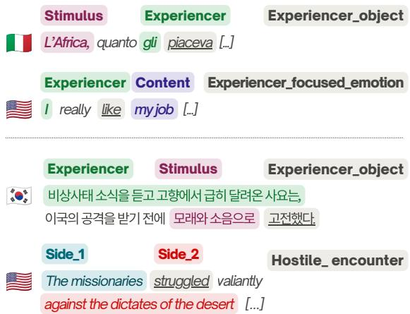
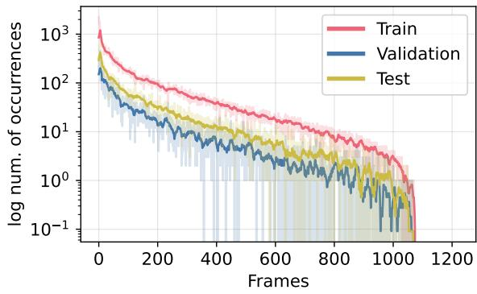
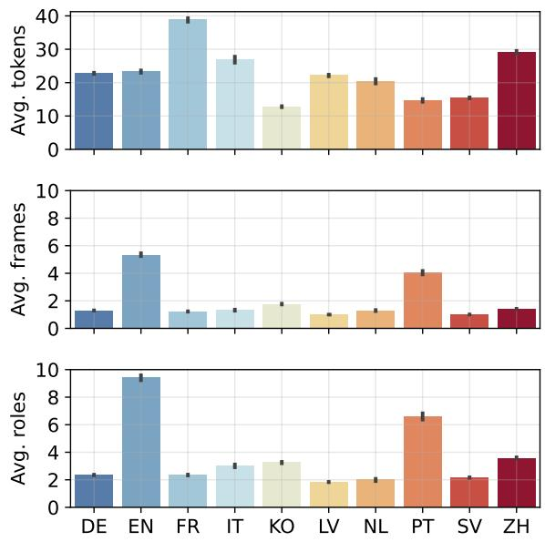
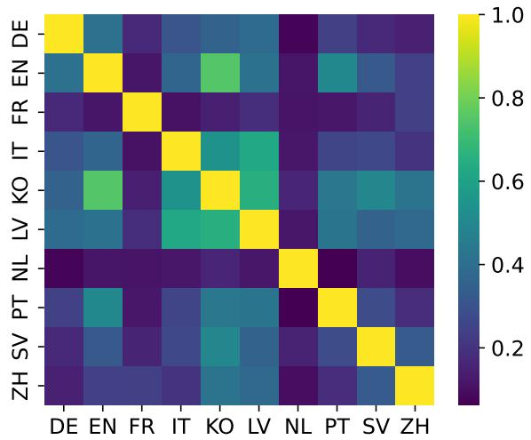
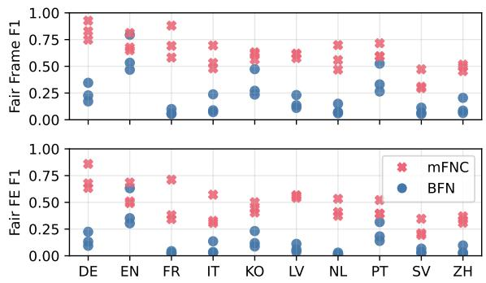
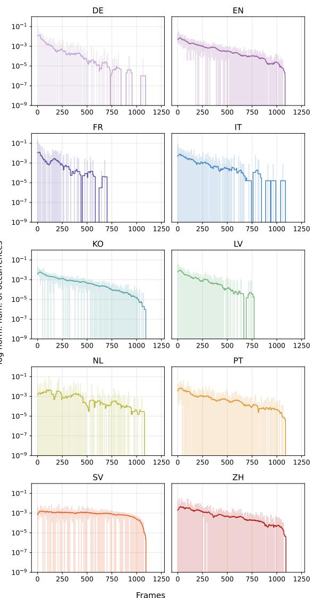

# The Multilingual FrameNet Corpus

Beatrice Fiumanò1,\*, Nicolas Lazzari1,2, Simone Paolo Ponzetto3, Valentina Presutti1

1University of Bologna, Italy, 2University of Pisa, Italy,

3University of Mannheim, Germany

{beatrice.fiumano,nicolas.lazzari3,valentina.presutti}@unibo.it, ponzetto@uni-mannheim.de \*Corresponding author

## Abstract

This paper introduces the Multilingual FrameNet Corpus (mFNC), a novel resource that extends the English Berkeley FrameNet corpus by collecting and harmonizing existing language-specific corpora across nine additional languages: Brazilian Portuguese, Chinese, Dutch, French, German, Italian, Korean, Latvian and Swedish.

By training models that rely on diferent architectures on the mFNC, we consistently outperform existing state-of-the-art Frame Semantic Parsers in both multilingual and cross-lingual settings, underscoring the importance of multilingual training data.

The mFNC and our trained FSP models are openly available at https://github.com/ beatrice-f/mFNC.

## 1 Introduction

Frame Semantic Parsing (FSP) is the task of automatically identifying semantic frames in text according to Fillmore’s Frame Semantics theory (Fillmore, 1976). FSP has proven beneficial across several NLP tasks, such as information extraction (Li et al., 2025), Knowledge Graph construction (Alam et al., 2021), opinion mining (Recupero et al., 2015), sentiment analysis (Atzeni et al., 2018) and framing detection (Minnema et al., 2022; Coschignano et al., 2023).

Despite its wide range of applications, the multilingual dimension of FSP remains largely underexplored. Recent state-of-the-art (SotA) approaches (e.g., Devasier et al. (2024)) are trained and evaluated exclusively on the Berkeley FrameNet (BFN) corpus (Baker et al., 1998), with isolated attempts at cross-lingual transfer through multilingual Transformer-based architectures (e.g., Xia et al. (2021)). Unlike other tasks, however, FSP presents unique challenges due to cross-lingual variations in the grammatical, cultural and conceptual dimensions of language. For instance, in the

  
Figure 1: Example of annotated sentences from the mFNC. Lexical Units are underlined. Textual spans classified by a Frame Elements are shaded using the same color. : “Africa, how much he liked it [...]”. Q: “The person who rushed back from their hometown upon hearing news of the emergency struggled with sand and noise beforefacing attackfrom aforeign country.”.

Italian “piacere” (to like), the thing being liked acts upon the liker, while in English it is the liker who actively likes something (Baker and Lorenzi, 2020). Similarly, the Korean expression “고전하 다” (to struggle) casts the struggling entity as acted upon by an external force, while English frames the same situation with the struggling entity as an active participant. These examples illustrate how languages can conceptualize the same situation in diferent ways, expressing it through distinct syntactic and semantic patterns. As shown in Figure 1, these diferences are captured by Frame Semantics.

The lack of a unified large-scale multilingual corpus annotated using BFN is largely responsible for this under-exploration, preventing FSP systems from being trained or tested on languages beyond English. Although numerous independent language-specific FrameNets have been developed since the inception of BFN, these resources remain scattered and heterogeneous in their format and annotation scheme, hampering integration. Approaches to automatically align them have been proposed (Baker and Lorenzi, 2020), but to the best of our knowledge no unified corpus exists to date.

To address this gap, we present the mFNC (Multilingual FrameNet Corpus), a novel multilingual dataset that collects and harmonizes ten languagespecific corpora annotated using BFN. Alongside English, the mFNC extends coverage to Brazilian Portuguese, Chinese, Dutch, French, German, Italian, Korean, Latvian and Swedish. Figure 1 shows an example of sentences and annotations from the mFNC.

Using the mFNC, we demonstrate that FSP models trained on multilingual data consistently outperform models trained on English only. Beyond FSP, the mFNC contributes to the broader goal of a unified Multilingual FrameNet (Gilardi and Baker, 2018), ofering an empirical basis to investigate how frame-semantic structures vary across typologically diverse languages (Ellsworth et al., 2021).

In summary, our contribution is two-fold:

1. We present the mFNC, a multilingual benchmark that collects and harmonizes ten language-specific FrameNets;

2. We openly share three multilingual FSP systems that outperform existing SotA baselines in multilingual and cross-lingual settings.

The rest of the paper is structured as follows: Section 2 introduces the background on Frame Semantics and reviews existing work on BFN applications, resources that extend BFN to other languages, and existing FSP approaches. Section 3.1 describes the resources used to construct the mFNC and provides insights on them. Section 4 presents a comparative evaluation of SotA FSP models trained on BFN and on the mFNC, in both multilingual and cross-lingual settings. Section 5 discusses our findings and outlines directions for future work. Finally, Section 6 summarizes our contributions and Section 7 highlights limitations.

## 2 Related Work

Before reviewing multilingual FrameNet resources and parsers, we provide an example of how a natural language sentence is annotated using BFN.

Consider the sentence “I really like my job”, shown in Figure 1.

The Lexical Unit (LU) “like” evokes the frame EXPERIENCER\_FOCUSED\_EMOTION, which represents the concept of “someone experiencing some emotion with respect to some content”. In turn, the span “I” is classified by the Frame Element (FE) EXPERIENCER, while “my job” is classified by the FE CONTENT.

BFN defines a large set of frames, FEs, and English LUs. For a complete treatment, we refer the reader to Ruppenhofer et al. (2016).

## 2.1 Toward a Multilingual FrameNet

While BFN originally focused on English, extending it to a multilingual setting has been a central objective of the project since its inception. This ambition has driven the development of numerous language-specific resources, and resulted in the Global FrameNet project1, which aims both at aligning existing datasets (Baker and Lorenzi, 2020) and at creating new multilingual ones through shared annotation tasks (Gilardi and Baker, 2018).

As with other lexical-semantic networks, the creation of new FrameNets follows distinct lexicographic strategies, such as projecting the BFN frame inventory onto another language, developing a new culture-specific inventory, or combining both practices by reusing and expanding the BFN repertoire (Boas, 2009). As detailed in Section 3.1, we focus on resources that fully or partially reuse the English set of frames, as this enables crosslingual alignment and the construction of a cohesive dataset.

## 2.2 Frame Semantic Parsing

The FSP task consists of automatically annotating a natural language sentence with semantic frames, as shown in Figure 1. The task is usually decomposed into four sequential sub-tasks: detecting the frame-evoking LUs, classifying them with the correct frame, and identifying the spans classified by the FEs of the frame. Existing FSP systems either address each step in isolation or jointly solve multiple sub-tasks.

FSP Applications As introduced above, FSP enables structuring natural language text according to semantic frames and FEs, making its predicateargument structure explicit.

This approach has proven useful across a wide range of NLP tasks. Alongside the applications listed in Section 1, Taniguchi et al. (2019) use FSP for yes/no QA to extract predicate-argument configurations from legal texts, enabling semantic matching between questions and candidate answers beyond surface string overlap. More recently, Li et al. (2025) proposed FrameRTE, a three-stage pipeline that combines an FSP’s output and LLMs for zero-shot relation triplet extraction. In text summarization, frame-based graphs have been exploited to improve salience estimation for both extractive (Guan et al., 2021a) and abstractive (Guan et al., 2021b) summarization. Beyond core NLP tasks, FSP has also been leveraged for applications at the discourse level. Frame-based embeddings have been used to train transformer models for metaphor detection (Li et al., 2023) and generation (Stowe et al., 2021). Remijnse et al. (2024) use frames to analyze framing and perspectivization of events’ participants across documents, while Ryazanov et al. (2025) and Fiumanò et al. (2026) apply FSP to trace diferences in media narratives. In light of these applications, the utility of FSP clearly extends across all languages, reinforcing the need for multilingual systems.

Multilingual FSP In general, SotA models are trained and tested on the BFN corpus (Swayamdipta et al., 2017; Das et al., 2010; Kalyanpur et al., 2020a; Devasier et al., 2024), while models operating in multilingual or crosslingual settings have received less attention. Notable exceptions include Johannsen et al. (2015), where the model by Das et al. (2010) is extended with multilingual word embeddings and its crosslingual performance is evaluated on a novel corpus of nine languages. Although the corpus is too small to train an FSP from scratch, the results demonstrate that a multilingual backbone is beneficial for cross-lingual generalization.

More recently, Xia et al. (2021) build upon this finding by proposing LOME, an FSP model that fine-tunes the multilingual XLM-RoBERTa encoder model on the BFN corpus. However, the model is only evaluated on the English language.

To the best of our knowledge, no FSP models trained and evaluated in a multilingual setting have been proposed to date.

LLM-driven FSP Beyond specialized approaches to FSP, LLMs represent valid languageagnostic tools thanks to their broad multi-language coverage. Unlike previous approaches, their application so far has been limited to individual FSP sub-tasks, such as frame identification (Chundru et al., 2025) and FE classification (Devasier et al., 2025), or in modular pipelines (Liu et al., 2024). Results have shown that LLMs underperform in zero- and few-shot settings, narrowing the performance gap with specialized FSP models only through fine-tuning.

## 3 mFNC: Multilingual FrameNet Corpus

In this section we present the mFNC which, to the best of our knowledge, is the first large-scale multilingual corpus annotated using BFN. We construct the mFNC by collecting ten diferent corpora annotated using BFN and harmonizing them in a shared format. In the next sections we first describe our data selection (Section 3.1) and harmonization (Section 3.2) processes, and later provide insights on the mFNC statistics (Section 3.3) and content (Section 3.4).

## 3.1 Data Selection

Table 2 provides an overview of the ten original resources used to construct the mFNC.

The resources vary in their development strategy and the type of language data they annotate. However, they converge in their full or partial adoption of BFN frames and FEs.

Bottom-up approaches With the exception of Swedish and Korean, all resources adopt a bottomup approach, meaning they derive frame annotations from existing or newly collected languagespecific corpora and treebanks, with varying degrees of adherence to BFN. Although more labor intensive, this method preserves the conceptual structure of the source language and avoids being constrained by the set of BFN’s LUs.

Top-down approaches Korean FrameNet is instead developed using a top-down (or extension (Dannélls et al., 2021)) approach, where sentences from the BFN corpus are translated into Korean, enabling the identification of language-specific LUs. While this approach is more eficient, it forces an English-centric conceptualization on the new resource. At a later stage, the Korean FN was expanded via cross-language projection of the

<table><tr><td rowspan="2"></td><td rowspan="2"></td><td rowspan="2">Tokens</td><td rowspan="2">Frames</td><td rowspan="2">FEs</td><td colspan="4"># Sentences</td></tr><tr><td>Train</td><td>Valid.</td><td>Test</td><td>Total</td></tr><tr><td>DE</td><td>I</td><td>345247</td><td>19688 (230)</td><td>35597 (848)</td><td>10543</td><td>1629</td><td>2989</td><td>15161</td></tr><tr><td>EN</td><td>M</td><td>112907</td><td>25951 (788)</td><td>45639 (3668)</td><td>3312</td><td>325</td><td>1211</td><td>4848</td></tr><tr><td>FR</td><td>ı</td><td>206729</td><td>6536 (51)</td><td>12514 (198)</td><td>3733</td><td>558</td><td>1043</td><td>5334</td></tr><tr><td>IT</td><td>ı</td><td>25585</td><td>1255 (192)</td><td>2860 (726)</td><td>621</td><td>105</td><td>225</td><td>951</td></tr><tr><td>KO</td><td>0</td><td>153391</td><td>21094 (800)</td><td>38972 (4226)</td><td>8407</td><td>1395</td><td>2188</td><td>11990</td></tr><tr><td>LV</td><td>π</td><td>299341</td><td>13527 (242)</td><td>24836 (1131)</td><td>9451</td><td>1350</td><td>2726</td><td>13527</td></tr><tr><td>NL</td><td>I</td><td>21128</td><td>1339 (200)</td><td>2054 (479)</td><td>713</td><td>104</td><td>218</td><td>1035</td></tr><tr><td>PT</td><td>Q</td><td>28236</td><td>7767 (519)</td><td>12685 (1730)</td><td>1319</td><td>171</td><td>433</td><td>1923</td></tr><tr><td>SV</td><td>出</td><td>122939</td><td>8018 (954)</td><td>17209 (5174)</td><td>5506</td><td>769</td><td>1694</td><td>7969</td></tr><tr><td>ZH</td><td>O</td><td>189257</td><td>9107 (584)</td><td>23202 (3660)</td><td>4365</td><td>786</td><td>1347</td><td>6498</td></tr><tr><td>total</td><td>臨</td><td>1504760</td><td>114282 (1070)</td><td>215568 (8954)</td><td>47970</td><td>7192</td><td>14074</td><td>69236</td></tr></table>

Table 1: Composition of the mFNC. Unique frames and FEs are reported within the parenthesis.

<table><tr><td>Lang.</td><td>Source</td><td>Acc.</td></tr><tr><td>DE</td><td>(Rehbein et al., 2012)</td><td rowspan="6">UR OA OA</td></tr><tr><td>EN</td><td>(Baker et al., 1998)</td></tr><tr><td>FR</td><td>(Djemaa et al., 2016)</td></tr><tr><td>IT</td><td>(Venturi et al., 2009) OA</td></tr><tr><td>KO</td><td>(Kim et al., 2016)</td></tr><tr><td>LV</td><td>OA (Gruzitis et al., 2018) OA</td></tr><tr><td>NL</td><td>(Vossen et al., 2020)</td></tr><tr><td>PT O</td><td>OA (Belcavello et al., 2024) OA</td></tr><tr><td>SV 出</td><td>(Dannélls et al., 2021)</td></tr><tr><td></td><td>OA UR</td></tr><tr><td>ZH</td><td>(You and Liu, 2005)</td></tr></table>

Table 2: FrameNet resources selected to construct the mFNC. Datasets marked with OA are openly accessible, while datasets marked with UR are available upon request.

Japanese FrameNet2(Ohara et al., 2004).

Hybrid construction The Swedish FrameNet is developed following a hybrid approach, first reusing BFN frames and translating English LUs into Swedish, and later defining new frames and LUs by adopting a corpus-based approach.

Document genre The ten resources also differ in the genre of annotated documents, spanning newspaper articles (German, Italian, partially French), multi-genre treebanks covering medical, legal, and parliamentary texts (French), large general-domain and specialized corpora (Chinese), multi-genre texts reporting on selected event types (Dutch), a mixed corpus of news, fiction, legal, and spoken texts (Latvian), and informal sources such as TV series transcripts (Brazilian Portuguese). This diversity contributes to the richness of topics and styles in the mFNC documents.

## 3.2 Data Harmonization

We seek to construct the mFNC to contain both plain and tokenized documents, aligning with the original BFN corpus format. However, the ten FrameNets difer in how they provide the documents, sometimes ofering only the plain or tokenized text.

To achieve a fully harmonized resource, we recover missing full-text documents from their tokenized version using the language-specific detokenizers available in the SacreMoses Python library3. Similarly, we tokenize full-text documents that are not already tokenized using the same library.

Finally, we collect all the annotations for each document. An annotation is defined by the LU that evokes a frame, the frame, and the list of annotated FEs. We remove language-specific frames for those resources that follow a hybrid annotation approach, to ensure full cross-language compatibility with BFN.4

## 3.3 mFNC composition

Table 1 reports an overview of the composition of the mFNC after the harmonization phase. In total, the mFNC includes 1.5M tokens collected from approximately 70k sentences, accumulating a total of over 100k annotated frames and 200k annotated FEs. To support reproducibility, for English we reuse the splits already available for the BFN corpus, as computed by Swayamdipta et al. (2017)5. Following the same work, we only retain annotations of the full-text documents, discarding annotations of the exemplar sentences provided for each frame. Indeed, Das et al. (2014) noted that training on exemplar sentences hurt model performance, probably due to their lack of representativeness and incomplete annotations. We compute novel splits for the remaining languages by prioritizing a balanced distribution of frames (Sechidis et al., 2011).

  
Figure 2: Number of occurrences of all BFN frames (in log space) in each mFNC split.

Frames coverage Figure 2 shows that the number of occurrences of each frame follows a Zipfian distribution, hinting at its highly unbalanced nature inherited from the resources of Table 2 (see also Figure 6 in the Appendix for language-specific breakdown).

For example, the frames CAUSATION and STATE-MENT are the two most frequently annotated frames, while CAUSATION\_SCENARIO and EXPLO-SION are both annotated only once in the mFNC (see Table 6 in the Appendix for the most common frames annotated for each language). We report that 151 of the 1221 total frames in BFN ( 12%) never occur in the mFNC annotations.

Annotation density The resources difer in the density of available annotations. In Figure 3, we report the average length, number of frames and number of annotated FEs for each document. We observe, for instance, that the English and Brazil ian Portuguese corpora contain, on average, twice as many annotated frames as the other languages, indicating a high density of annotations. On the other hand, the French dataset contains longer documents than the other languages but displays a similar number of frames, indicating a lower annotation density.

  
Figure 3: Average number of tokens, frames and FEs annotated in each document.

  
Figure 4: Cosine similarity between the centroids of each language computed using frame similarity.

In the next section we further explore these annotation diferences.

## 3.4 Similarity of annotations

In this section, we investigate in more detail how the ten resources converge and diverge with respect to their frame annotations, analyzing frame similarity. To do so, we rely on the FFICF measure, which adapts TF-IDF to derive typicality scores for each frame (Vossen et al., 2020). The frame frequency is computed with respect to all the documents in the mFNC corpus. For each language we compute the centroid of its vectors and compare it with the centroids of other languages using cosine similarity. Hence, two languages are similar if they share a similar set of typical frames.

Results are shown in Figure 4.

Topic Specificity We observe that Dutch and French have the most dissimilar annotations when compared to the BFN corpus and to the other resources. We speculate that this is due to the domain-specificity of annotated texts. For instance, the Dutch FrameNet corpus only collects documents that report on specific events (e.g., disease outbreak and wildfires) (Vossen et al., 2020), resulting in CATASTROPHE being one of the most commonly annotated frames. Similarly, the French FrameNet corpus includes specialized documents in the medical and political domains (Djemaa et al., 2016; Candito et al., 2014). As a consequence, these resources show a biased distribution of frames, which reflects their topicspecificity.

Annotation Practice In contrast, the set of most typical Korean frames is similar to that of the BFN corpus, which reflects the use of a projective annotation practice. A similar behavior can be observed in the Swedish corpus, which also partially relies on projective annotations.

## 4 Experiments

In this section we demonstrate the efectiveness of the mFNC by training diferent FSP models on both the BFN corpus and on the mFNC, and compare their performance.

## 4.1 Experimental Setting

We experiment with two architectures representative of SotA approaches: the multi-stage approach proposed in LOME (Xia et al., 2021), where an XLM-RoBERTa encoder model is fine-tuned to parameterize a CRF layer used to extract spans from the input sentence that are then classified using two MLP layers (one for frames and one for FEs); and a generative approach inspired by Kalyanpur et al. (2020b), where FSP is framed as a generative seq2seq task. In particular, we use the sentinel approach described in Raman et al. (2022) and finetune the small and base versions of mT5 (Xue et al., 2021).

<table><tr><td>Model F1↑</td></tr><tr><td>Swayamdipta et al. (2017)*</td></tr><tr><td>0.733 Lin et al. (2021)* 0.763</td></tr><tr><td>Devasier et al. (2024)* 0.775</td></tr><tr><td>mT5 small 0.560</td></tr><tr><td>mT5 base 0.583</td></tr><tr><td>LOME 0.800</td></tr><tr><td>mT5 small† 0.677</td></tr><tr><td>mT5 base† 0.668</td></tr><tr><td>LOME† 0.812</td></tr></table>

Table 3: Training on the mFNC outperforms training on the BFN on the English language. Traditional micro-F1 score on the target identification and classification task. Results marked with ∗ are taken from Devasier et al. (2024). Results marked with are trained on the mFNC.

We train LOME using the default hyperparameters defined by the authors on an RTX3090 with 24 GB of VRAM for a maximum of 50 epochs, stopping the model if it does not improve its performance on the validation split for 3 consecutive epochs. We fine-tune the mT5 models using the hyperparameters suggested in Raman et al. (2022) for 30 epochs on an RTX6000 with 48 GB of VRAM, using the same early-stopping mechanism used for LOME.

## 4.2 Results on the BFN corpus

Before evaluating the performance of FSP systems in a multilingual setting, we evaluate whether training on the mFNC maintains competitive performance compared to training only on the BFN corpus.

In Table 3 we report the traditional microaveraged F1 score of the models trained on the BFN corpus and on the mFNC in the target classification task, i.e., on frame-evoking LU detection and frame attribution.

A prediction is considered correct when it fully matches the gold annotation. We compare our results with those from (i) Swayamdipta et al. (2017), who frame the task as a token classification problem relying on pre-trained static word embeddings and an LSTM model, (ii) Lin et al. (2021), who frame the problem as a graph generation problem, fine-tuning a BERT-based encoder model, and (iii) Devasier et al. (2024), who formulate the task as a

QA task solved by fine-tuning a RoBERTa encoder model.

We find that training on the mFNC maintains competitive performance with models trained on the BFN corpus, demonstrating that additional training data on other languages does not harm performance. Additionally, we demonstrate that training LOME on the mFNC outperforms existing SotA models. This result encourages novel FSP systems to be trained on the mFNC.

## 4.3 Results on the mFNC

In Table 4 we report the performance of our models trained on the BFN corpus and on the mFNC and evaluated on the testing set of the mFNC by aggregating over the ten languages. Unlike Table 3, we report micro-averaged precision, recall and F1 scores computed using the suggested configuration of the FairEval framework (Ortmann, 2022). This allows us to account for correctly identified but mislabeled LUs and FEs, and for predictions whose boundaries partially overlap with the gold ones.

Note that the metrics grouped under the Frame column measure performance in identifying and labeling frame-evoking LUs. In turn, the FE column evaluates the identification and classification of FEs. In other words, the metrics grouped under the FE column evaluate the end-to-end performance of the FSP model, accounting for errors propagated from the frame identification process.

Multilingual performance The results provide strong evidence of the impact of the mFNC on the parsers’ performance. Each model, regardless of the employed architecture, greatly outperforms the corresponding variant trained only on the English corpus. In particular, LOME trained on the mFNC consistently outperforms all the other FSP models across all the evaluated dimensions, providing evidence that FSP benefits from being treated as a sequence labeling task rather than as a seq2seq one.

Although training on the mFNC consistently improves results, performance gains are not equally distributed across the ten languages in the corpus.

Language-wise improvements In Figure 5 we show how F1 scores vary across diferent languages when training on the BFN corpus or on the mFNC (see Table 7 in the Appendix for a more detailed overview). Similar to the results in Table 3, performance on the English language is similar across the English-only and multilingual training settings, while it improves significantly on other languages, particularly in German, French, Dutch and Latvian. The Swedish corpus is the most challenging one, showing less pronounced improvements.

  
Figure 5: Training on the mFNC outperforms training on the BFN on all languages. F1 scores on frame and FEs performance on each language when trained on BFN vs mFNC.

While we do not have a definitive explanation for this behavior, we found that the Swedish FrameNet has the largest coverage of annotated frames, annotating 78% of BFN frames compared to 64% for the BFN corpus. We speculate that the unbalanced nature of the mFNC (cf. Figure 2) might hamper generalization to infrequent frames, leaving open the question of whether it is possible to counterbalance this phenomenon during training (e.g., by annealing frequent frames), or pre-processing of the dataset (e.g., by performing data augmentation based on the hierarchical structure defined in the BFN).

This result might also indicate that even when trained on multilingual data, the parser does not generalize to unseen languages. However, in the next section we demonstrate the opposite.

## 4.3.1 Cross-lingual Generalization

In light of previous findings, we evaluate the impact that training on the mFNC has in cross-lingual settings by removing the Swedish dataset from the mFNC and training LOME from scratch on it. We follow the same experimental setting of previous experiments. Table 5 reports the results, showing that models trained on the mFNC have stronger cross-lingual generalization abilities compared to training on the BFN corpus. This further demonstrates the impact that the mFNC can have on future FSP models.

<table><tr><td rowspan="2">Model</td><td rowspan="2">Train</td><td colspan="6">Frame</td><td colspan="6">FE</td></tr><tr><td colspan="2">Precision</td><td colspan="2">Recall</td><td colspan="2">F1</td><td colspan="2">Precision</td><td colspan="2">Recall</td><td colspan="2">F1</td></tr><tr><td rowspan="2">LOME</td><td>BFN</td><td></td><td> $0 . 2 5 ~ \pm 0 . 2 3$ </td><td></td><td> $0 . 6 0 ~ \pm 0 . 2 2$ </td><td></td><td> $0 . 3 2 \ \pm 0 . 2 2$ </td><td> $0 . 1 5 ~ \pm 0 . 1 8$ </td><td></td><td> $0 . 3 3 \ \pm 0 . 2 0$ </td><td></td><td> $0 . 1 9 \ \pm 0 . 1 8$ </td><td></td></tr><tr><td>mFNC</td><td></td><td> $\underline { { \mathbf { 0 . 7 7 } } } \pm 0 . 1 1$ </td><td></td><td> $\underline { { \mathbf { 0 . 6 5 } } } ~ \pm 0 . 2 0$ </td><td></td><td> $\underline { { \mathbf { 0 . 6 9 } } } ~ \pm 0 . 1 5$ </td><td> $\underline { { \mathbf { 0 . 6 1 } } } ~ \pm 0 . 1 5$ </td><td></td><td> $\underline { { \mathbf { 0 . 5 4 } } } ~ \pm 0 . 1 8$ </td><td></td><td> $\underline { { \mathbf { 0 . 5 6 } } } \ \pm 0 . 1 5$ </td><td></td></tr><tr><td rowspan="2">mT5</td><td>BFN</td><td></td><td> $0 . 1 4 \ \pm 0 . 1 5$ </td><td></td><td> $0 . 4 3 \ \pm 0 . 1 9$ </td><td></td><td> $0 . 1 9 \ \pm 0 . 1 5$ </td><td> $0 . 0 8 \ \pm 0 . 1 0$ </td><td></td><td> $0 . 1 9 \ \pm 0 . 1 3$ </td><td></td><td> $0 . 1 0 \ \pm 0 . 1 0$ </td><td></td></tr><tr><td>mFNC</td><td></td><td> $\underline { { 0 . 5 3 } } ~ \pm 0 . 1 2$ </td><td> $\underline { { 0 . 5 7 } } ~ \pm 0 . 1 3$ </td><td></td><td></td><td> $0 . 5 5 \ \pm 0 . 1 2$ </td><td> $\underline { { 0 . 4 0 } } ~ \pm 0 . 1 3$ </td><td></td><td> $\underline { { 0 . 4 1 } } ~ \pm 0 . 1 3$ </td><td></td><td> $\underline { { 0 . 4 0 } } ~ \pm 0 . 1 3$ </td><td></td></tr><tr><td rowspan="2">mT5 small</td><td>BFN</td><td></td><td> $0 . 1 1 \ \pm 0 . 1 2$ </td><td></td><td> $0 . 3 7 \ \pm 0 . 1 7$ </td><td></td><td> $0 . 1 6 ~ \pm 0 . 1 3$ </td><td> $0 . 0 6 ~ \pm 0 . 0 8$ </td><td></td><td> $0 . 1 5 ~ \pm 0 . 1 0$ </td><td></td><td></td><td> $0 . 0 8 \ \pm 0 . 0 9$ </td></tr><tr><td>mFNC</td><td> $\underline { { 0 . 5 9 } } \ \pm 0 . 1 4$ </td><td></td><td></td><td> $\underline { { 0 . 6 0 } } ~ \pm 0 . 1 4$ </td><td></td><td> $\underline { { 0 . 5 9 } } \ \pm 0 . 1 4$ </td><td> $\underline { { 0 . 4 2 } } ~ \pm 0 . 1 3$ </td><td></td><td> $\underline { { 0 . 4 2 } } ~ \pm 0 . 1 4$ </td><td></td><td> $\underline { { 0 . 4 2 } } ~ \pm 0 . 1 3$ </td><td></td></tr></table>

Table 4: Training on the mFNC outperforms training on the BFN on all metrics. FairEval metrics computed on the mFNC averaged over the ten languages.

An annotation is defined by the span that 283 activates a frame, the activated frame, and the list 284 of annotated arguments. Each argument is defined 285 by a role and the span that it classifies.
<table><tr><td>Metric</td><td>BFN</td><td>mFNC\SW</td><td>mFNC</td></tr><tr><td rowspan="3">Frame</td><td>P 0.07</td><td>0.30</td><td>0.55</td></tr><tr><td>R 0.26</td><td>0.28</td><td>0.42</td></tr><tr><td>F1 0.11</td><td>0.29</td><td>0.47</td></tr><tr><td rowspan="3">FE</td><td>P 0.04</td><td>0.20</td><td>0.36</td></tr><tr><td>R 0.20</td><td>0.20</td><td>0.33</td></tr><tr><td>F1 0.07</td><td>0.20</td><td>0.35</td></tr></table>

Table 5: Training on the mFNC achieves better crosslingual generalization than the BFN. Performance of LOME trained on the BFN corpus, the mFNC without Swedish data (mFNC SW) and on the full mFNC on the same setting as Table 4. Best results are in bold. Best between the mFNC SW and the mFNC are underlined.

## 5 Discussion

The results described in Section 4 demonstrate that current SotA FSP models trained on the BFN corpus struggle in cross-lingual settings. Their results, however, greatly improve when trained on our corpus, both in multilingual (Table 4) and cross-lingual (Table 5) settings.

Moreover, our results indicate that models tailored to the FSP task (LOME) perform significantly better than more general seq2seq approaches (mT5-based models).

Integrating the mFNC with other resources As addressed in Section 3.3 and in Figure 2, the mFNC is unbalanced with respect to the number of annotated frames. The efectiveness of FSP models is directly afected by this aspect, as illustrated in Section 4.3.1. Although in this paper we only collect corpora annotated using the BFN, previous works (e.g., Conia et al. (2022)) have shown that integrating additional semantic resources such as PropBank (Pradhan et al., 2022) and VerbNet (Palmer et al., 2017) results in better FSP performance.

We refrained from adopting this approach because of the diferent nature of these resources compared to $\mathrm { B F N } ^ { 6 }$ . Nonetheless, it is worth investigating whether the mFNC could be extended by relying on recent eforts at aligning BFN with other resources (Lopez de Lacalle et al., 2016), which can result in broader linguistic coverage, for example by integrating the Polish (Jindal et al., 2022) or Arabic (Palmer et al., 2008) PropBank-annotated datasets.

Extending the mFNC The mFNC is the first corpus of multilingual documents annotated using BFN frames, but it is still characterized by limited coverage when compared to other multilingual datasets. For example, there is a lack of representation for Middle-Eastern or African languages. Possible approaches to overcome this limitation include translating texts and projecting their annotations (Yu et al., 2022), as discussed in Section 3.1. We remark, however, that fully automating this approach might produce imprecise annotations that do not take into account the tight relationship between the lexical, semantic and cultural dimensions of language. Other promising approaches include relying on (L)LMs to generate annotated sentences by explicitly defining the semantics of a frame as found in the original BFN resource (Cui and Swayamdipta, 2024). In this context, the mFNC can serve as a repository of multilingual examples that show the linguistic diversity spanned by a frame.

Frame-based Linguistic Analyses In this paper, we focused on the impact that the mFNC has on the training of FSP models. Nonetheless, the corpus’s value extends beyond this application. By harmonizing ten language-specific datasets across typologically and conceptually diverse languages, the mFNC also enables a wide range of crosslingual analyses at scale. These include investigating why semantically equivalent expressions evoke diferent frames across languages (Yong et al., 2022), how language-specific phenomena such as compound nouns are realized diferently (Ponkiya et al., 2021), and how conceptual metaphors difer across languages (Otmakhova et al., 2026).

## 6 Conclusion

This paper presented the mFNC, a multilingual dataset harmonizing ten language-specific resources annotated using FrameNet. This contribution addresses the lack of multilingual training and evaluation data for the Frame Semantic Parsing task, demonstrating that training on multilingual data substantially improves the performance of multilingual and cross-lingual systems. Beyond parsing, the mFNC allows researchers to explore new directions for comparative research on conceptual and frame-semantic diferences across languages by relying on a large, unified resource.

## 7 Limitations

In this section we discuss the main limitations of our contributions concerning two main aspects: the mFNC construction described in Section 3.1, and the experiments presented in Section 4.

## 7.1 On constructing the mFNC

Flattened linguistic diversity As shown in Figure 1, Frame Semantic annotations are highly dependent on the grammatical and semantic patterns of each language. In Section 3.1, we combine language-specific corpora annotated using BFN, implicitly assuming that the conceptual structure of BFN correctly transfers to languages other than English. Nonetheless, we are aware that adopting this approach remains an open question in NLP and linguistic research.

Recent work demonstrates its limits (Ellsworth et al., 2021; Hahm et al., 2020), particularly when translations and projective annotations are used. These works, however, do not flag the assumption as incorrect. Rather, they argue that not all the frames defined in BFN apply equally to diferent languages, positing the existence of a languageagnostic portion of BFN (Čulo, 2013). In this context, the mFNC can serve as a research tool to identify this subset using data-driven approaches (Baker et al., 2018; Baker and Lorenzi, 2020).

Domain bias As highlighted in Section 3.4, the mFNC comprises some resources that are domainspecific. Specifically, the Dutch and French corpora difer from the other FrameNets in that they annotate documents that focus on specific topics. While this thematic diversity can be beneficial, it also induces a representational bias whereby some frames may be under-represented in a resource due to the predominant topics of its documents (see for instance the top 5 most common frames used by each corpus in Table 6 in the Appendix). Assessing the impact of this limitation and mitigating its efects is an important step toward ensuring more cross-lingual balance in the mFNC.

Annotation bias Related to the previous limitations, combining the corpora described in Section 3.1 also assumes consistency across the human annotations of each resource. This assumption may introduce additional biases in the mFNC. For instance, Dumitrache et al. (2018) and Hahm et al. (2020) observed cross-annotator diferences in resources annotated using BFN, in both expert and crowd-sourced annotations.

Although this does not necessarily translate to low quality annotations, it might result in an uneven distribution of frames across corpora, similar to the domain bias described previously. Overcoming this limitation is not trivial, due to the inherent complexity of the annotation task. On the other hand, we argue that the mFNC can serve as a resource for analyzing annotation perspectives and diferences (Cabitza et al., 2023), such as crosslanguage and cross-cultural ones.

We also note that retaining the original tokenization of documents, as described in Section 3.2, leads to combining diferent (possibly incompatible) tokenization practices (Habert et al., 1998). Similarly, recovering the full-text document through detokenization or tokenizing fulltext documents using an automated tool may introduce noise, depending on the accuracy of the tool (van der Goot, 2024). Our approach is maximally conservative with respect to the design of each corpus, allowing researchers to study diferences or apply refinements if needed.

Language coverage The languages collected in the mFNC are mostly high-resource ones (e.g., English, German, French), which leaves open the question of how well the FSP systems evaluated in Section 4 generalize to low-resource languages. We already identified the extension of the mFNC to other languages as one of the main follow-ups (Section 5) of this work. In this context, we highlight that there exist frame annotation eforts for low-resource languages (e.g., Arabic (Gargett and Leung, 2020) and Bengali (Datta et al., 2025)), which represent promising integrations in this direction.

## 7.2 On experimenting with the mFNC

Assuming a correct frame As reported previously, diferent sets of frames might apply to the same sentence depending on how it is interpreted by the annotator (Dumitrache et al., 2018; Hahm et al., 2020). This identifies an important limitation of FSP models as well. From a general perspective, the models of Section 4 treat the FSP task in a discriminative fashion by assuming that an LU is classified by a single, correct frame (and similarly for FEs). It follows that those models inherit the (unknown) biases induced by the annotator’s perspective. Ongoing research on how to tackle this limitation, which is shared by other common NLP tasks (Frenda et al., 2025), can benefit from the mFNC as an additional corpus for experimentation.

Recall vs precision The limitation discussed above also raises the question of whether the evaluation metrics used in Section 4 over- or underestimate the applicability of the tested FSP systems. For instance, a system that reaches a high precision at the expense of a low recall might reflect a conservative parsing behavior. This might be beneficial in some settings, but for many of the FSP applications reviewed in Section 2, a low volume of predictions translates to a limited amount of available information. By relying on the FairEval framework (Ortmann, 2022), we partially address this problem, so that correctly identified but mislabeled spans are treated as half-correct predictions. Nonetheless, evaluating whether the metrics of Section 4 improve performance on downstream FSP applications remains an open problem that requires further research.

Diverse morphologies The models evaluated in Section 4 rely on Transformer-based multilingual models, which assumes that their internal representations act as a cross-lingual bridge. It is well known, however, that the tokenization phase of those models might disfavor some languages (Petrov et al., 2023). Coupled with the limitations discussed previously, this poses further questions on the abilities of FSP models to process lowresource languages. Although out of scope for this paper, experimenting with backbone models that rely on a diferent tokenization strategy (e.g., ByT5 (Xue et al., 2022)) might result in better crosslingual generalization.

## Acknowledgments

We wish to thank the anonymous reviewers and area chairs for their valuable comments; Ines Rehbein for providing us with access to the Salsa dataset; Arianna Graciotti for proofreading an early draft of the paper; Carmelo Caruso, Ludovica Pannitto and the Laboratorio Sperimentale of the Department of Modern Languages, Literatures and Cultures (University of Bologna) for providing access to their computational resources. Beatrice Fiumanò and Valentina Presutti are supported by INFINITY: a EU Horizon Europe project under Grant Agreement No 101233051. Beatrice Fiumanò is funded by the National Recovery and Resilience Plan (NRRP), funded by the European Union – NextGenerationEU - Mission 4 ”Education and Research”, Component 1 ”Enhancement of the ofer of educational services: from nurseries to universities” - Investment 4.1 “Extension of the number of research doctorates and innovative doctorates for public administration and cultural heritage” .(DM 118/2023).

## References

Mehwish Alam, Aldo Gangemi, Valentina Presutti, and Diego Reforgiato Recupero. 2021. Semantic Role Labeling for Knowledge Graph Extraction from Text. Progress in Artificial Intelligence, 10(3):309–320.

Mattia Atzeni, Amna Dridi, and Diego Reforgiato Recupero. 2018. Using frame-based resources for sentiment analysis within the finan-

cial domain. Progress in Artificial Intelligence, 7(4):273–294.

Collin F. Baker, Michael Ellsworth, Miriam R. L. Petruck, and Swabha Swayamdipta. 2018. Frame Semantics across Languages: Towards a Multilingual FrameNet. In Proceedings of the 27th International Conference on Computational Linguistics: Tutorial Abstracts, pages 9– 12, Santa Fe, New Mexico, USA. Association for Computational Linguistics.

Collin F. Baker, Charles J. Fillmore, and John B. Lowe. 1998. The Berkeley FrameNet Project. In 36th Annual Meeting of the Association for Computational Linguistics and 17th International Conference on Computational Linguistics, COLING-ACL ’98, August 10-14, 1998, Université de Montréal, Montréal, Quebec, Canada. Proceedings of the Conference, pages 86–90. Morgan Kaufmann Publishers / ACL.

Collin F. Baker and Arthur Lorenzi. 2020. Exploring Crosslinguistic Frame Alignment. In Proceedings of the International FrameNet Workshop 2020: Towards a Global, Multilingual FrameNet, pages 77–84, Marseille, France. European Language Resources Association.

Frederico Belcavello, Tiago Timponi Torrent, Ely E. Matos, Adriana S. Pagano, Maucha Gamonal, Natalia Sigiliano, Lívia Vicente Dutra, Helen de Andrade Abreu, Mairon Samagaio, Mariane Carvalho, Franciany Campos, Gabrielly Azalim, Bruna Mazzei, Mateus Fonseca de Oliveira, Ana Carolina Loçasso Luz, Lívia Pádua Ruiz, Júlia Bellei, Amanda Pestana, Josiane Costa, and 5 others. 2024. Frame2: A FrameNet-based Multimodal Dataset for Tackling Text-image Interactions in Video. In Proceedings ofthe 2024 Joint International Conference on Computational Linguistics, Language Resources and Evaluation (LREC-COLING 2024), pages 7429–7437, Torino, Italia. ELRA and ICCL.

Hans C. Boas, editor. 2009. Multilingual FrameNets in Computational Lexicography. De Gruyter Mouton, Berlin, New York.

Claire Bonial, Julia Bonn, Kathryn Conger, Jena D. Hwang, and Martha Palmer. 2014. Prop-Bank: Semantics of New Predicate Types. In

Proceedings of the Ninth International Conference on Language Resources and Evaluation (LREC’14), pages 3013–3019, Reykjavik, Iceland. European Language Resources Association (ELRA).

Federico Cabitza, Andrea Campagner, and Valerio Basile. 2023. Toward a Perspectivist Turn in Ground Truthing for Predictive Computing. In Thirty-Seventh AAAI Conference on Artificial Intelligence, AAAI 2023, Thirty-Fifth Conference on Innovative Applications ofArtificial Intelligence, IAAI 2023, Thirteenth Symposium on Educational Advances in Artificial Intelligence, EAAI 2023, Washington, DC, USA, February 7- 14, 2023, pages 6860–6868. AAAI Press.

Marie Candito, Guy Perrier, Bruno Guillaume, Corentin Ribeyre, Karën Fort, Djamé Seddah, and Éric Villemonte de la Clergerie. 2014. Deep Syntax Annotation of the Sequoia French Treebank. In Proceedings of the Ninth International Conference on Language Resources and Evaluation, LREC 2014, Reykjavik, Iceland, May 26-31, 2014, pages 2298–2305. European Language Resources Association (ELRA).

Jayanth Krishna Chundru, Rudrashis Poddar, Jie Cao, and Tianyu Jiang. 2025. Do LLMs Encode Frame Semantics? Evidence from Frame Identification. In Proceedings of the 2025 Conference on Empirical Methods in Natural Language Processing, EMNLP 2025, Suzhou, China, November 4-9, 2025, pages 29488–29500. Association for Computational Linguistics.

Simone Conia, Edoardo Barba, Alessandro Scirè, and Roberto Navigli. 2022. Semantic Role Labeling Meets Definition Modeling: Using Natural Language to Describe Predicate-Argument Structures. In Findings of the Association for Computational Linguistics: EMNLP 2022, pages 4253–4270, Abu Dhabi, United Arab Emirates. Association for Computational Linguistics.

Serena Coschignano, Gosse Minnema, and Chiara Zanchi. 2023. Explaining the distribution of implicit means of misrepresentation: A case study on Italian immigration discourse. Journal of Pragmatics, 213:107–125.

Xinyue Cui and Swabha Swayamdipta. 2024. Annotating FrameNet via Structure-Conditioned

Language Generation. In Proceedings of the 62nd Annual Meeting of the Association for Computational Linguistics (Volume 2: Short Papers), pages 681–692, Bangkok, Thailand. Association for Computational Linguistics.

Dana Dannélls, Lars Borin, and Karin Friberg Heppin, editors. 2021. The Swedish FrameNet++. John Benjamins Publishing Company.

Dipanjan Das, Desai Chen, André F. T. Martins, Nathan Schneider, and Noah A. Smith. 2014. Frame-semantic parsing. Computational Linguistics, 40(1):9–56.

Dipanjan Das, Nathan Schneider, Desai Chen, and Noah A. Smith. 2010. Probabilistic Frame-Semantic Parsing. In Human Language Technologies: The 2010 Annual Conference of the North American Chapter of the Association for Computational Linguistics, pages 948–956, Los Angeles, California. Association for Computational Linguistics.

Sima Datta, Kunal Chakma, Dwijen Rudrapal, and Anupam Jamatia. 2025. Mapping the Linguistic Landscape: Progress Towards a Bengali FrameNet. Procedia Computer Science, 258:3814–3825. International Conference on Machine Learning and Data Engineering.

Jacob Devasier, Yogesh Gurjar, and Chengkai Li. 2024. Robust Frame-Semantic Models with Lexical Unit Trees and Negative Samples. In Proceedings of the 62nd Annual Meeting of the Association for Computational Linguistics (Volume 1: Long Papers), pages 6930–6941, Bangkok, Thailand. Association for Computational Linguistics.

Jacob Daniel Devasier, Rishabh Mediratta, and Chengkai Li. 2025. Can llms extract framesemantic arguments? In Proceedings of the 2025 Conference on Empirical Methods in Natural Language Processing, EMNLP 2025, Suzhou, China, November 4-9, 2025, pages 30609–30622. Association for Computational Linguistics.

Marianne Djemaa, Marie Candito, Philippe Muller, and Laure Vieu. 2016. Corpus Annotation within the French FrameNet: a Domain-by-domain Methodology. In Proceedings of the Tenth International Conference on

Language Resources and Evaluation LREC 2016, Portorož, Slovenia, May 23-28, 2016. European Language Resources Association (ELRA).

Anca Dumitrache, Lora Aroyo, and Chris Welty. 2018. Capturing Ambiguity in Crowdsourcing Frame Disambiguation. In Proceedings of the Sixth AAAI Conference on Human Computation and Crowdsourcing, HCOMP 2018, Zürich, Switzerland, July 5-8, 2018, pages 12– 20. AAAI Press.

Michael Ellsworth, Collin Baker, and Miriam R. L. Petruck. 2021. FrameNet and Typology. In Proceedings of the Third Workshop on Computational Typology and Multilingual NLP, pages 61–66, Online. Association for Computational Linguistics.

Charles J. Fillmore. 1976. Frame Semantics and the Nature of Language. Annals of the New York Academy ofSciences, 280(1):20–32.

Beatrice Fiumanò, Nicolas Lazzari, Simone Paolo Ponzetto, and Valentina Presutti. 2026. Victim or assailant? exploring narratives through knowledge graph queries. In Proceedings of 10th Workshop on Linked Data in Linguistics (LDL-2026), pages 40–49, Palma, Mallorca, Spain. European Language Resources Association (ELRA).

Simona Frenda, Gavin Abercrombie, Valerio Basile, Alessandro Pedrani, Rafaella Panizzon, Alessandra Teresa Cignarella, Cristina Marco, and Davide Bernardi. 2025. Perspectivist Approaches to Natural Language Processing: a Survey. Lang. Resour. Evaluation, 59(2):1719– 1746.

Andrew Gargett and Tommi Leung. 2020. Building the Emirati Arabic FrameNet. In Proceedings of the International FrameNet Workshop 2020: Towards a Global, Multilingual FrameNet, pages 70–76, Marseille, France. European Language Resources Association.

Luca Gilardi and Collin Baker. 2018. Learning to Align across Languages: Toward Multilingual FrameNet. In Proceedings of the Eleventh International Conference on Language Resources and Evaluation (LREC 2018), Paris, France. European Language Resources Association (ELRA).

Normunds Gruzitis, Gunta Nespore-Berzkalne, and Baiba Saulite. 2018. Creation of Latvian FrameNet based on Universal Dependencies. In Proceedings of the International FrameNet Workshop (IFNW), pages 23–27.

Yong Guan, Shaoru Guo, Ru Li, Xiaoli Li, and Hongye Tan. 2021a. Frame Semantic-Enhanced Sentence Modeling for Sentence-level Extractive Text Summarization. In Proceedings ofthe 2021 Conference on Empirical Methods in Natural Language Processing, pages 4045–4052, Online and Punta Cana, Dominican Republic. Association for Computational Linguistics.

Yong Guan, Shaoru Guo, Ru Li, Xiaoli Li, and Hu Zhang. 2021b. Frame Semantics Guided Network for Abstractive Sentence Summarization. Knowledge-Based Systems, 221:106973.

Benoit Habert, Gilles Adda, Martine Adda-Decker, Philippe Boula de Mareüil, Silvana Ferrari, Olivier Ferret, Gabriel Illouz, and P. Paraubeck. 1998. Towards tokenization evaluation. In Proceedings of the First International Conference on Language Resources and Evaluation, LREC 1998, May 28-30, 1998, Granada, Spain, pages 427–432. European Language Resources Association.

Younggyun Hahm, Youngbin Noh, Ji Yoon Han, Tae Hwan Oh, Hyonsu Choe, Hansaem Kim, and Key-Sun Choi. 2020. Crowdsourcing in the Development of a Multilingual FrameNet: A Case Study of Korean FrameNet. In Proceedings of the Twelfth Language Resources and Evaluation Conference, pages 236–244, Marseille, France. European Language Resources Association.

Ishan Jindal, Alexandre Rademaker, Michał Ulewicz, Ha Linh, Huyen Nguyen, Khoi-Nguyen Tran, Huaiyu Zhu, and Yunyao Li. 2022. Universal Proposition Bank 2.0. In Proceedings of the Thirteenth Language Resources and Evaluation Conference, pages 1700–1711, Marseille, France. European Language Resources Association.

Anders Johannsen, Héctor Martínez Alonso, and Anders Søgaard. 2015. Any-language framesemantic parsing. In Proceedings of the 2015 Conference on Empirical Methods in Natural

Language Processing, pages 2062–2066, Lisbon, Portugal. Association for Computational Linguistics.

Aditya Kalyanpur, Or Biran, Tom Brelof, Jennifer Chu-Carroll, Ariel Diertani, Owen Rambow, and Mark Sammons. 2020a. Open-Domain Frame Semantic Parsing Using Transformers. CoRR, abs/2010.10998.

Aditya Kalyanpur, Or Biran, Tom Brelof, Jennifer Chu-Carroll, Ariel Diertani, Owen Rambow, and Mark Sammons. 2020b. Open-Domain Frame Semantic Parsing Using Transformers. CoRR, abs/2010.10998.

Jeong-uk Kim, Younggyun Hahm, and Key-Sun Choi. 2016. Korean FrameNet Expansion Based on Projection of Japanese FrameNet. In Proceedings of COLING 2016, the 26th International Conference on Computational Linguistics: System Demonstrations, pages 175–179, Osaka, Japan. The COLING 2016 Organizing Committee.

Yucheng Li, Shun Wang, Chenghua Lin, Frank Guerin, and Loic Barrault. 2023. FrameBERT: Conceptual Metaphor Detection with Frame Embedding Learning. In Proceedings of the 17th Conference of the European Chapter of the Association for Computational Linguistics, pages 1558–1563, Dubrovnik, Croatia. Association for Computational Linguistics.

Zehan Li, Fu Zhang, Wenqing Zhang, Jiawei Li, Zhou Li, Jingwei Cheng, and Tianyue Peng. 2025. Frame First, Then Extract: A Frame-Semantic Reasoning Pipeline for Zero-Shot Relation Triplet Extraction. In Proceedings of the 2025 Conference on Empirical Methods in Natural Language Processing, pages 27363–27376, Suzhou, China. Association for Computational Linguistics.

ZhiChao Lin, Yueheng Sun, and Meishan Zhang. 2021. A Graph-Based Neural Model for End-to-End Frame Semantic Parsing. In Proceedings of the 2021 Conference on Empirical Methods in Natural Language Processing, pages 3864– 3874, Online and Punta Cana, Dominican Republic. Association for Computational Linguistics.

Yahui Liu, Chen Gong, and Min Zhang. 2024. Leveraging LLMs for Chinese Frame Semantic

Parsing. In Proceedings ofthe 23rd Chinese National Conference on Computational Linguistics (Volume 3: Evaluations), pages 21–31, Taiyuan, China. Chinese Information Processing Society of China.

Maddalen Lopez de Lacalle, Egoitz Laparra, Itziar Aldabe, and German Rigau. 2016. Predicate Matrix: Automatically Extending the Semantic Interoperability between Predicate Resources. Language Resources and Evaluation, 50(2):263–289.

Gosse Minnema, Sara Gemelli, Chiara Zanchi, Tommaso Caselli, and Malvina Nissim. 2022. SocioFillmore: A Tool for Discovering Perspectives. In Proceedings of the 60th Annual Meeting of the Association for Computational Linguistics: System Demonstrations, pages 240– 250, Dublin, Ireland. Association for Computational Linguistics.

Kyoko Hirose Ohara, Seiko Fujii, Toshio Ohori, Ryoko Suzuki, Hiroaki Saito, and Shun Ishizaki. 2004. The Japanese Framenet Project: An Introduction. In Proceedings of LREC-04 Satellite Workshop “Building Lexical Resources from Semantically Annotated Corpora”(LREC 2004), pages 9–11.

Katrin Ortmann. 2022. Fine-Grained Error Analysis and Fair Evaluation of Labeled Spans. In Proceedings of the Thirteenth Language Resources and Evaluation Conference, LREC 2022, Marseille, France, 20-25 June 2022, pages 1400– 1407. European Language Resources Association.

Yulia Otmakhova, Matteo Guida, and Lea Frermann. 2026. Not all ANIMALs are equal: metaphorical framing through source domains and semantic frames. In Findings of the Association for Computational Linguistics: ACL 2026, pages 38334–38355, San Diego, California, United States. Association for Computational Linguistics.

Martha Palmer, Olga Babko-Malaya, Ann Bies, Mona Diab, Mohamed Maamouri, Aous Mansouri, and Wajdi Zaghouani. 2008. A pilot Arabic Propbank. In Proceedings of the Sixth International Conference on Language Resources and Evaluation (LREC’08), Marrakech, Mo-

rocco. European Language Resources Association (ELRA).

Martha Palmer, Claire Bonial, and Jena Hwang. 2017. VerbNet: Capturing English Verb Behavior, Meaning, and Usage.

Aleksandar Petrov, Emanuele La Malfa, Philip H. S. Torr, and Adel Bibi. 2023. Language Model Tokenizers Introduce Unfairness Between Languages. In Advances in Neural Information Processing Systems 36: Annual Conference on Neural Information Processing Systems 2023, NeurIPS 2023, New Orleans, LA, USA, December 10 - 16, 2023.

Girishkumar Ponkiya, Diptesh Kanojia, Pushpak Bhattacharyya, and Girish Palshikar. 2021. FrameNet-assisted Noun Compound Interpretation. In Findings ofthe Associationfor Computational Linguistics: ACL-IJCNLP 2021, pages 2901–2911, Online. Association for Computational Linguistics.

Sameer Pradhan, Julia Bonn, Skatje Myers, Kathryn Conger, Tim O’gorman, James Gung, Kristin Wright-bettner, and Martha Palmer. 2022. PropBank Comes of Age—Larger, Smarter, and more Diverse. In Proceedings of the 11th Joint Conference on Lexical and Computational Semantics, pages 278–288, Seattle, Washington. Association for Computational Linguistics.

Karthik Raman, Iftekhar Naim, Jiecao Chen, Kazuma Hashimoto, Kiran Yalasangi, and Krishna Srinivasan. 2022. Transforming Sequence Tagging Into A Seq2Seq Task. In Proceedings of the 2022 Conference on Empirical Methods in Natural Language Processing, pages 11856– 11874, Abu Dhabi, United Arab Emirates. Association for Computational Linguistics.

Diego Reforgiato Recupero, Valentina Presutti, Sergio Consoli, Aldo Gangemi, and Andrea Giovanni Nuzzolese. 2015. Sentilo: Frame-Based Sentiment Analysis. Cogn. Comput., 7(2):211– 225.

Ines Rehbein, Josef Ruppenhofer, Caroline Sporleder, and Manfred Pinkal. 2012. Adding nominal spice to SALSA - frame-semantic annotation of German nouns and verbs. In 11th Conference on Natural Language Processing,

KONVENS 2012, Empirical Methods in Natural Language Processing, Vienna, Austria, September 19-21, 2012, Scientific series of the ÖGAI, pages 89–97. ÖGAI, Wien, Österreich.

Levi Remijnse, Pia Sommerauer, Antske Fokkens, and Piek T.J.M. Vossen. 2024. Tracking Perspectives on Event Participants: a Structural Analysis of the Framing of Real-World Events in Co-Referential Corpora. In Proceedings of the First Workshop on Reference, Framing, and Perspective @ LREC-COLING 2024, pages 1– 12, Torino, Italia. ELRA and ICCL.

Josef Ruppenhofer, Michael Ellsworth, Myriam Schwarzer-Petruck, Christopher R Johnson, and Jan Schefczyk. 2016. FrameNet II: Extended theory and practice. Technical report, International Computer Science Institute.

Ilia Ryazanov, Carl Öhman, and Jonas Björklund. 2025. How ChatGPT Changed the Media’s Narratives on AI: A semi-automated narrative analysis through frame semantics. Minds and Machines, 35(2).

Konstantinos Sechidis, Grigorios Tsoumakas, and Ioannis Vlahavas. 2011. On the stratification of multi-label data. Machine Learning and Knowledge Discovery in Databases, pages 145–158.

Kevin Stowe, Tuhin Chakrabarty, Nanyun Peng, Smaranda Muresan, and Iryna Gurevych. 2021. Metaphor Generation with Conceptual Mappings. In Proceedings ofthe 59th Annual Meeting of the Association for Computational Linguistics and the 11th International Joint Conference on Natural Language Processing (Volume 1: Long Papers), pages 6724–6736, Online. Association for Computational Linguistics.

Swabha Swayamdipta, Sam Thomson, Chris Dyer, and Noah A. Smith. 2017. Frame-Semantic Parsing with Softmax-Margin Segmental RNNs and a Syntactic Scafold. arXiv preprint arXiv:1706.09528.

Ryosuke Taniguchi, Reina Hoshino, and Yoshinobu Kano. 2019. Legal Question Answering System Using FrameNet. In New Frontiers in Artificial Intelligence, pages 193–206, Cham. Springer International Publishing.

Rob van der Goot. 2024. Where are we still split on tokenization? In Findings of the Association for Computational Linguistics: EACL 2024, pages 118–137, St. Julian’s, Malta. Association for Computational Linguistics.

Giulia Venturi, Alessandro Lenci, Simonetta Montemagni, Eva Maria Vecchi, Maria Teresa Sagri, Daniela Tiscornia, and Tommaso Agnoloni. 2009. Towards a FrameNet resource for the legal domain. In Proceedings of the 3rd Workshop on Legal Ontologies and Artificial Intelligence Techniques: 2nd Workshop on Semantic Processing of Legal Text, pages 67–76.

Piek Vossen, Filip Ilievski, Marten Postma, Antske Fokkens, Gosse Minnema, and Levi Remijnse. 2020. Large-scale Cross-lingual Language Resources for Referencing and Framing. In Proceedings of the Twelfth Language Resources and Evaluation Conference, pages 3162–3171, Marseille, France. European Language Resources Association.

Patrick Xia, Guanghui Qin, Siddharth Vashishtha, Yunmo Chen, Tongfei Chen, Chandler May, Craig Harman, Kyle Rawlins, Aaron Steven White, and Benjamin Van Durme. 2021. LOME: Large Ontology Multilingual Extraction. In Proceedings of the 16th Conference of the European Chapter of the Association for Computational Linguistics: System Demonstrations, pages 149–159, Online. Association for Computational Linguistics.

Linting Xue, Aditya Barua, Noah Constant, Rami Al-Rfou, Sharan Narang, Mihir Kale, Adam Roberts, and Colin Rafel. 2022. ByT5: Towards a Token-Free Future with Pre-trained Byte-to-Byte Models. Transactions ofthe Association for Computational Linguistics, 10:291– 306.

Linting Xue, Noah Constant, Adam Roberts, Mihir Kale, Rami Al-Rfou, Aditya Siddhant, Aditya Barua, and Colin Rafel. 2021. mT5: A Massively Multilingual Pre-trained Text-to-Text Transformer. In Proceedings of the 2021 Conference ofthe North American Chapter ofthe Association for Computational Linguistics: Human Language Technologies, pages 483–498, Online. Association for Computational Linguistics.

Zheng Xin Yong, Patrick D. Watson, Tiago Timponi Torrent, Oliver Czulo, and Collin Baker. 2022. Frame Shift Prediction. In Proceedings of the Thirteenth Language Resources and Evaluation Conference, pages 976–986, Marseille, France. European Language Resources Association.

Liping You and Kaiying Liu. 2005. Building Chinese FrameNet database. In 2005 International Conference on Natural Language Processing and Knowledge Engineering, pages 301–306.

Xinyan Yu, Trina Chatterjee, Akari Asai, Junjie Hu, and Eunsol Choi. 2022. Beyond Counting Datasets: A Survey of Multilingual Dataset Construction and Necessary Resources. In Findings of the Association for Computational Linguistics: EMNLP 2022, pages 3725–3743, Abu Dhabi, United Arab Emirates. Association for Computational Linguistics.

Oliver Čulo. 2013. Constructions-and-frames analysis of translations: The interplay of syntax and semantics in translations between English and German. Constructions and Frames, 5(2):143– 167.

## A Appendix

  
Figure 6: Number of occurrences of all BFN frames (in log space) for each resource of Table 2.

(a) DE  
(b) EN
<table><tr><td>#</td><td>Frame</td><td>#</td><td>Frame</td></tr><tr><td>1852</td><td>CALENDRIC_UNIT</td><td>842</td><td>WEAPON</td></tr><tr><td>1623</td><td>TELLING</td><td>672</td><td>LOCALE_BY_USE</td></tr><tr><td>1565</td><td>PEOPLE</td><td>603</td><td>STATEMENT</td></tr><tr><td>1368</td><td>POLITICAL_LOCALES</td><td>556</td><td>POLITICAL_LOCALES</td></tr><tr><td>796</td><td>REQUEST</td><td>451</td><td>LEADERSHIP</td></tr><tr><td colspan="2">(c) FR</td><td colspan="2">(d) IT</td></tr><tr><td>#</td><td>Frame</td><td>#</td><td>Frame</td></tr><tr><td>1599</td><td>CAUSATION</td><td>109</td><td>STATEMENT</td></tr><tr><td>786</td><td>EVIDENCE</td><td>47</td><td>ARRIVING</td></tr><tr><td>514</td><td>COMMERCE_BUY</td><td>37</td><td>ATTEMPT</td></tr><tr><td>414</td><td>COMMERCE_SELL</td><td>33</td><td>KINSHIP</td></tr><tr><td>318</td><td>REASON</td><td>33</td><td>DESIRING</td></tr><tr><td colspan="2">(e) KO</td><td colspan="2">(f) LV</td></tr><tr><td>#</td><td>Frame</td><td>#</td><td>Frame</td></tr><tr><td>505</td><td>STATEMENT</td><td>475</td><td>TELLING</td></tr><tr><td>329</td><td>EXPERIENCER_FOCUS</td><td>466</td><td>STATEMENT</td></tr><tr><td>316</td><td>LOCALE_BY_USE</td><td>349</td><td>POSSESSION</td></tr><tr><td>253</td><td>LEADERSHIP</td><td>346</td><td>EXISTENCE</td></tr><tr><td>248</td><td>POSSESSION</td><td>343</td><td>ARRIVING</td></tr><tr><td colspan="2">(g) NL</td><td colspan="2"></td></tr><tr><td>#</td><td>Frame</td><td># Frame</td><td></td></tr><tr><td>149</td><td>CATASTROPHE</td><td>354</td><td>DEGREE</td></tr><tr><td>97</td><td>SUSPICION</td><td>311</td><td>CARDINAL_NUMBERS</td></tr><tr><td>77</td><td>CAUSE_HARM</td><td>248</td><td>NEGATION</td></tr><tr><td>65</td><td>PARTICIPATION</td><td>237</td><td>LOCATIVE_RELATION</td></tr><tr><td>55</td><td>COMMITTING_CRIME</td><td>157</td><td>POSSESSION</td></tr><tr><td colspan="2">(i) SV</td><td colspan="2">(j) ZH</td></tr><tr><td>#</td><td>Frame</td><td>#</td><td>Frame</td></tr><tr><td>66</td><td>EMPTYING</td><td>288</td><td>CAUSE_TO_MAKE_PROGRESS</td></tr><tr><td>58</td><td>MAKE_NOISE</td><td>261</td><td>CHANGE_POSITION_ON_A_SCAI</td></tr><tr><td>47</td><td>SELF_MOTION</td><td>249</td><td>BEING_IN_CATEGORY</td></tr><tr><td>42</td><td>EXPERIENCER_OBJ</td><td>218</td><td>AMOUNTING_TO</td></tr><tr><td>42</td><td>PLACING</td><td>178</td><td>CAUSATION</td></tr></table>

Table 6: Top 5 most common annotated frames for each of the language-specific corpora of Table 2.

<table><tr><td colspan="4"></td><td rowspan="2">Frame R</td><td rowspan="2">F1</td><td rowspan="2">P</td><td rowspan="2">FE R</td><td rowspan="2">F1</td><td rowspan="2"></td></tr><tr><td>lang flag</td><td>model</td><td></td><td>P dataset</td></tr><tr><td rowspan="4">DE</td><td>LOME</td><td>BFN mFNC</td><td>0.217 0.925</td><td>0.853 0.929</td><td>0.346 0.927</td><td>0.139 0.859</td><td>0.587 0.859</td><td>0.224</td><td>0.859</td></tr><tr><td></td><td>mT5</td><td>BFN mFNC</td><td>0.136 0.748</td><td>0.706 0.749</td><td>0.228 0.748</td><td>0.079 0.632</td><td>0.382 0.636</td><td>0.131 0.634</td></tr><tr><td>M</td><td>mT5 small</td><td>BFN mFNC</td><td>0.101 0.833</td><td>0.583 0.823</td><td>0.172 0.828</td><td>0.057 0.678</td><td>0.268 0.676</td><td>0.094 0.677</td></tr><tr><td rowspan="2">EN</td><td>LOME</td><td>BFN mFNC</td><td>0.744 0.785</td><td>0.852 0.840</td><td>0.794 0.812</td><td>0.595 0.666</td><td>0.673 0.705</td><td>0.632 0.685</td></tr><tr><td>mT5</td><td>BFN mFNC</td><td>0.466 0.614</td><td>0.623 0.691</td><td>0.533 0.650</td><td>0.320 0.491</td><td>0.390 0.494</td><td>0.352 0.492</td></tr><tr><td>FR</td><td></td><td>mT5 small BFN mFNC</td><td>0.382 0.642</td><td>0.603 0.713</td><td>0.468 0.676</td><td></td><td>0.267 0.351 0.502 0.515</td><td>0.304 0.508</td><td></td></tr><tr><td></td><td>LOME</td><td>BFN mFNC</td><td>0.059 0.874</td><td>0.332 0.887</td><td>0.100 0.880</td><td></td><td>0.027 0.107 0.712 0.713</td><td>0.043 0.712</td><td></td></tr><tr><td></td><td>mT5</td><td>BFN mFNC</td><td>0.031 0.580</td><td>0.225 0.584</td><td>0.054 0.582</td><td></td><td>0.015 0.061 0.344 0.342</td><td>0.024 0.343</td><td></td></tr><tr><td>IT</td><td></td><td>mT5 small BFN mFNC</td><td>0.033 0.704</td><td>0.261 0.679</td><td>0.691</td><td>0.058</td><td>0.016 0.058 0.382 0.378</td><td></td><td>0.025 0.380</td></tr><tr><td></td><td>LOME</td><td>BFN mFNC</td><td>0.142</td><td>0.747 0.700 0.690</td><td>0.695</td><td>0.238</td><td>0.084 0.564</td><td>0.348 0.578</td><td>0.136 0.571</td></tr><tr><td></td><td>mT5</td><td>BFN mFNC</td><td>0.051 0.438</td><td>0.341 0.533</td><td>0.481</td><td>0.088</td><td>0.022 0.296</td><td>0.090 0.318</td><td>0.035 0.307</td></tr><tr><td>KO</td><td>mT5 small</td><td>BFN mFNC</td><td>0.041 0.530</td><td>0.272 0.534</td><td>0.071 0.532</td><td></td><td>0.018 0.069 0.330</td><td>0.323</td><td>0.029 0.327</td></tr><tr><td></td><td>LOME</td><td>BFN mFNC</td><td>0.364 0.791</td><td>0.679 0.525</td><td>0.631</td><td>0.474</td><td>0.187 0.303 0.534</td><td>0.471</td><td>0.231 0.501</td></tr><tr><td></td><td>mT5</td><td>BFN mFNC</td><td>0.176 0.495</td><td>0.588 0.651</td><td>0.271 0.562</td><td></td><td>0.079 0.238 0.378</td><td>0.436</td><td>0.119 0.405</td></tr><tr><td>LV</td><td>mT5 small</td><td>BFN mFNC</td><td>0.155 0.585</td><td>0.487 0.654</td><td>0.617</td><td>0.236</td><td>0.059 0.166 0.435 0.437</td><td></td><td>0.087 0.436</td></tr><tr><td></td><td>π LOME</td><td>BFN mFNC</td><td>0.135</td><td>0.855 0.435</td><td>0.806</td><td>0.231 0.577</td><td>0.063 0.797</td><td>0.463 0.410</td><td>0.111 0.542</td></tr><tr><td></td><td>mT5</td><td>BFN mFNC</td><td>0.076 0.612</td><td>0.649 0.612</td><td>0.136 0.612</td><td></td><td>0.033 0.310 0.566 0.567</td><td></td><td>0.059 0.566</td></tr><tr><td>NL</td><td>mT5 small</td><td>BFN mFNC</td><td>0.061 0.619</td><td>0.560 0.619</td><td>0.111 0.619</td><td></td><td>0.021 0.206 0.555 0.563</td><td></td><td>0.037 0.559</td></tr><tr><td></td><td>U LOME</td><td>BFN mFNC</td><td>0.088 0.752</td><td>0.491 0.652</td><td>0.149 0.699</td><td></td><td>0.017 0.127 0.617 0.468</td><td></td><td>0.030 0.533</td></tr><tr><td></td><td>mT5</td><td>BFN mFNC</td><td></td><td>0.042 0.290 0.446</td><td>0.495</td><td>0.073 0.469</td><td>0.008 0.373</td><td>0.066 0.375</td><td>0.014 0.374</td></tr><tr><td>PT</td><td>mT5 small</td><td>BFN mFNC</td><td></td><td>0.034 0.570</td><td>0.260 0.547</td><td>0.060 0.559</td><td>0.007 0.430</td><td>0.058 0.390</td><td>0.012 0.409</td></tr><tr><td></td><td>O LOME</td><td>BFN mFNC</td><td></td><td>0.515 0.688</td><td>0.536 0.746</td><td>0.525 0.716</td><td>0.311 0.517</td><td>0.320 0.525</td><td>0.316 0.521</td></tr><tr><td></td><td>mT5</td><td>BFN mFNC</td><td>0.326 0.574</td><td>0.336 0.618</td><td>0.331</td><td>0.595</td><td>0.174 0.189 0.397 0.394</td><td></td><td>0.182 0.396</td></tr><tr><td>SV</td><td>mT5 small</td><td>BFN mFNC</td><td>0.262 0.561</td><td>0.267 0.626</td><td>0.264 0.592</td><td></td><td>0.131 0.148 0.388 0.393</td><td>0.139</td><td>0.390</td></tr><tr><td></td><td>出 LOME</td><td>BFN mFNC</td><td>0.072 0.545</td><td>0.260 0.417</td><td>0.113 0.472</td><td></td><td>0.040 0.202 0.362 0.332</td><td></td><td>0.067 0.346</td></tr><tr><td></td><td>mT5</td><td>BFN mFNC</td><td>0.041 0.318</td><td>0.191 0.301</td><td>0.067 0.309</td><td></td><td>0.020 0.114 0.211 0.211</td><td></td><td>0.034 0.211</td></tr><tr><td>ZH</td><td>mT5 small</td><td>BFN mFNC</td><td>0.033 0.304</td><td>0.164 0.288</td><td>0.054 0.296</td><td></td><td>0.015 0.092 0.194 0.195</td><td></td><td>0.026 0.194</td></tr><tr><td></td><td>LOME</td><td>BFN mFNC</td><td>0.135 0.747</td><td>0.428 0.369</td><td>0.205 0.494</td><td></td><td>0.075 0.135 0.472 0.303</td><td></td><td>0.097 0.369</td></tr><tr><td></td><td>mT5</td><td>BFN mFNC</td><td>0.049 0.440</td><td>0.317 0.471</td><td>0.086 0.455</td><td>0.020 0.306</td><td>0.081 0.310</td><td></td><td>0.032 0.308</td></tr><tr><td></td><td>mT5 small</td><td>BFN mFNC</td><td>0.037 0.517</td><td>0.239 0.514</td><td>0.063 0.516</td><td>0.013 0.336</td><td>0.051 0.338</td><td>0.021 0.337</td><td></td></tr></table>

Table 7: Results obtained by each model on each language, computed using the FairEval framework.