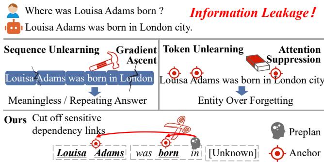
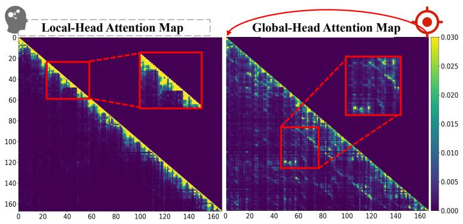
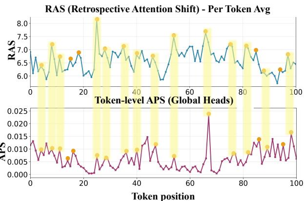
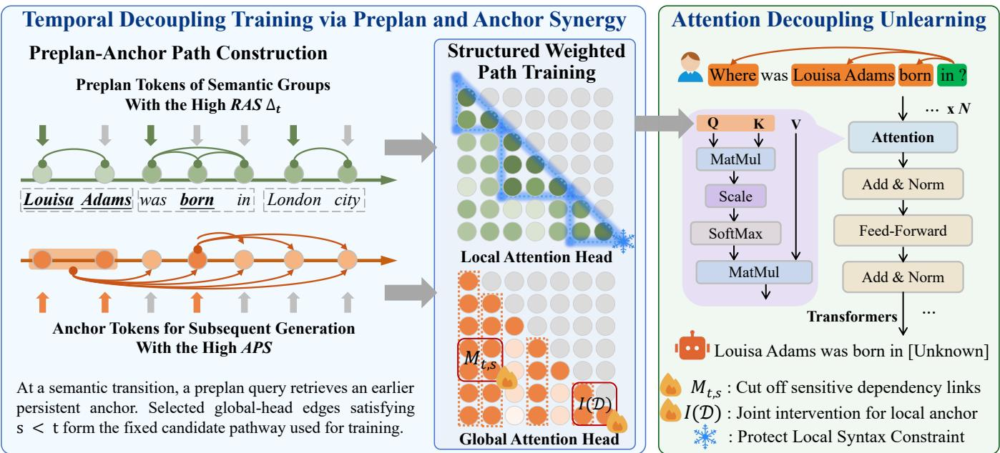
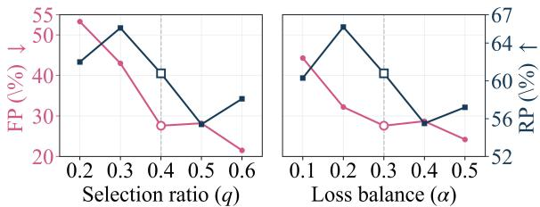
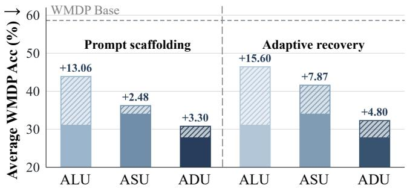

# Unlearning Is Not Just Erasing: Temporal Decoupling via Generation Inequality

Xunlei Chen1 Qirui Ye1, Yuang Li1, Yi Gong1,

Zhaokun Wang1, Wenyi Li1, Shiyao Guo1, Jinyu Guo2

1School of Information and Software Engineering, University of Electronic Science and Technology of China 2School of Computer Science and Engineering, University of Electronic Science and Technology of China xunlei@std.uestc.edu.cn

## Abstract

Large language models (LLMs) require efective unlearning to address privacy regulations and safety concerns. However, achieving precise forgetting without compromising general utility remains challenging. Existing sequence- and tokenlevel methods penalize target outputs without modeling their context-dependent retrieval paths, which can disrupt linguistic structure or suppress benign knowledge. We present ADU, a fine-grained, training-based framework that shifts unlearning from token erasure to contextual attention-pathway decoupling. Exploiting the functional distinction between local and global attention heads, ADU identifies preplan positions that retrieve persistent sensitive anchors and fixes their candidate paths under the original model. It then trains attentionprojection adapters to suppress attention mass along these paths while preserving local-attention structure and retainset language modeling. Post-training activation exchange tests whether the modified attention-output module transmits the learned forgetting efect. ADU achieves the strongest aggregate performance among evaluated baselines on the TOFU and WMDP benchmarks, including a Forget Quality of 0.93 on TOFU. It preserves 87–98% of model utility (92.9% on average versus 81.9% for baselines) while reducing side efects in benign contexts.

## Introduction

Large language models (LLMs) have achieved advances in language understanding and generation (Lee et al. 2020; Ranjan et al. 2026) through model scaling (Hu et al. 2025) and diverse pretraining data (Zhao et al. 2025a). However, models can reproduce sensitive content (Gong et al. 2026), private information (Maini et al. 2024), or unsafe material (Shi et al. 2024a, 2025). As the General Data Protection Regulation (GDPR) and the “right to be forgotten” receive attention (Grynbaum et al. 2023), machine unlearning has emerged as a privacy mechanism (Zhao et al. 2025b). It aims to reduce the accessibility of requested knowledge while preserving unrelated model capabilities (Yu et al. 2025).

Balancing unlearning eficacy and model utility remains fundamentally challenging (Pu et al. 2026; Cha et al. 2024). Prompt-based (Bhaila, Van, and Wu 2025; Wang et al. 2026) and auxiliary-model approaches (Geng et al. 2025; Sun et al. 2025) can change outputs without updating the target model, yet knowledge may remain recoverable through extraction attacks (Shah et al. 2025). Parameter-level unlearning remains necessary when the objective is to modify the deployed model itself, particularly for private or copyrighted content.

  
Figure 1: Sequence methods minimize the joint probability(a) Current unlearning methods performance of the entire QA pair. Token methods blindly suppress the probabilities of individual tokens. We sever attention pathways that point to the anchor tokens.

Existing parameter-level methods are categorized by their optimization target (Zhuang et al. 2025; Kim et al. 2026). Sequence-level unlearning treats an entire question–answer sequence as the forget target (Liu et al. 2025). Because its loss spans syntactic and content tokens, it can damage linguistic structure and generation fluency (Nguyen et al. 2025). Tokenlevel unlearning instead penalizes selected sensitive tokens (Jiang et al. 2025) and limits damage by avoiding noncritical positions (Yu et al. 2025; Lee, Liu, and Xiong 2026). Nevertheless, both approaches define forgetting over visible output targets rather than the internal, context-dependent computation through which sensitive knowledge is retrieved.

This distinction matters because the same entity can be sensitive in one context and benign in another. Static sequence or token penalties may therefore suppress legitimate occurrences, causing excessive forgetting and degraded factual behavior in non-sensitive contexts (Tan et al. 2025). As illustrated in Fig. 1, the desired intervention should target the corresponding retrieval computation rather than erase the entity itself. This raises a natural question: Can an LLM forget a context-specific retrieval route without destabilizing ordinary generation?

Motivated by evidence that attention heads contribute unevenly to model behavior (Lin et al. 2025), we call their asymmetric temporal roles generation inequality. Local heads maintain short-range dependencies, whereas global heads route information from distant, persistently attended tokens. Around semantic transitions, local attention shifts retrospectively at preplan positions, after which global heads retrieve earlier anchors that shape subsequent generation. Average Backward Distance separates the two head groups, while Retrospective Attention Shift and Anchor Persistence Score locate candidate preplans and anchors (Fig. 2).

  
(a) Visualization of local and global attention patterns on MMLU

  
(b) Token-level RAS and APS trajectories on a WMDP sample  
Figure 2: Generation inequality and temporal retrieval rhythm. (a) Local heads preserve near-diagonal dependencies, global heads form long-range patterns. (b) RAS peaks indicate preplan transitions, APS peaks identify persistent anchors, shaded bands mark selected regions. Post-training edge-contribution replacement tests path-specific causal mediation after unlearning.

Based on this rhythm, we propose Attention Decoupling Unlearning (ADU), a training-based method for contextspecific pathway suppression. ADU computes the head partition and preplan–anchor paths once under the original model and keeps them fixed during training. Attention-projection adapters reduce path mass, while retained language modeling and local-attention preservation constrain collateral changes. The learned decoupling operates in every forward pass; bidirectional edge-contribution replacement runs only after training to test whether the selected preplan–anchor paths causally mediate the resulting forgetting efect.

Unlike representation-level methods such as RMU, tokenediting methods such as MET, and broad attention suppression such as ASU, ADU optimizes a context-indexed retrieval pathway rather than a hidden representation or token identity. Attention weights locate candidate routes but are not treated as explanations by themselves: the pathway objective controls transported contributions under bounded values, while bidirectional edge-contribution replacement provides post-training tests of path-specific causal mediation. Across TOFU, WMDP, and MUSE-Harry Potter, ADU achieves the strongest aggregate forgetting–retention trade-of among the evaluated baselines. It obtains 93% Forget Quality on TOFU and preserves 87–98% of model utility, averaging 92.9% compared with 81.9% for baselines. These results support contextual pathway suppression as a more targeted alternative to sequence or token erasure. In summary, our contributions are:

1. We formulate LLM unlearning as contextual pathway decoupling and characterize a preplan–anchor temporal pattern arising from the functional specialization of local and global attention heads.

2. We propose ADU, which trains attention-projection adapters to suppress fixed preplan-to-anchor pathways while retaining language modeling and local-attention preservation constrain collateral behavior.

3. We provide conditional theoretical guarantees and extensive evaluations on WMDP, TOFU, and MUSE-Books, demonstrating state-of-the-art forgetting retention trade-ofs and validating the causal role of the targeted pathways.

## Related Work

Sequence-level Unlearning Many parameter-level methods optimize a coarse sequence-level objective. Gradient Ascent (GA) (Thudi et al. 2022) directly maximizes the forget-set loss and can produce unstable parameter updates. Negative Preference Optimization (NPO) (Zhang et al. 2024) regularizes this process with a preference objective, but still treats the complete QA pair as one optimization target. Together with their variants (Wang, Wei et al. 2025; Zhao et al. 2024; Wang et al. 2025; Yang et al. 2025), such objectives distribute forgetting pressure across many sequence positions, including syntactic function words, without explicitly separating knowledge-bearing content from linguistic structure. Consequently, stronger forgetting can coincide with degraded generation fluency and reduced general capabilities.

Token-level Unlearning Token-level methods narrow the target by suppressing specific token logits or redirecting them toward alternatives (Yu et al. 2025; Li et al. 2025a). Although this avoids some sequence-wide penalties, residual latent semantics may remain, while redirected generation can introduce factual hallucinations. Recently, Tan et al. (2025) identifies important tokens and suppresses attention toward them across the sequence. However, this strategy remains centered on static token salience rather than a context-specific query-to-key retrieval route, limiting contextual discrimination (Tran, Liu, and Xiong 2025; Jin et al. 2025). The same entity may therefore be weakened in both sensitive and benign contexts, causing excessive forgetting and disrupting normal knowledge retrieval (Yuan et al. 2025).

  
Figure 3: Illustration of the workflow. Before predicting the next important token, the preplan token “in” queries earlier sensitive anchors through long-range backward attention. After training, ADU suppresses this sensitive dependency path while preserving local anchor structure and maintaining the continuity of local semantic segments.

These families difer in granularity but define forgetting mainly over the sequence or token being generated, rather than the contextual computation that retrieves it. ADU instead identifies a recurring preplan–anchor rhythm under the original model and fixes the resulting candidate paths before training. Attention-projection adapters then suppress mass along these paths, while retain language modeling and localattention preservation constrain collateral changes. Thus, ADU targets context-specific retrieval without directly erasing the sensitive token itself.

## Method

ADU is a training-based unlearning method (see Figure 3). Given an original model $\theta _ { 0 } .$ , a forget set $D _ { f }$ , and a retain set $D _ { r } ,$ it learns $\theta _ { 1 } = \mathcal { U } _ { \mathrm { A D U } } ( \theta _ { 0 } ; D _ { f } ^ { - } , D _ { r } )$ through attentionprojection adapters. The learned pathway decoupling acts in every standard forward pass of $\theta _ { 1 } .$ , while counterfactual activation exchange is used only after training to identify the internal computation mediating forgetting.

## Generation Inequality and Temporal Rhythm

During autoregressive generation, we formalize generation inequality as unequal temporal roles: local heads maintain short-range dependencies, whereas global heads retrieve distant, persistently attended tokens. Around semantic transitions, retrospective local shifts mark preplan positions, and persistent global attention identifies earlier anchors that shape generation. This pattern yields the preplan–anchor retrieval hypothesis operationalized below (Figure 2).

Let $x = ( u , o )$ be a context continuation sequence and $R _ { x }$ the continuation positions. Let $A _ { \theta , t , s } ^ { ( l , h ) } ( x )$ be the causal attention weight from query position t to key position $s \leq t$ in layer l, head h. On a held-out calibration split $\mathcal { D } _ { \mathrm { c a l } }$ , the head’s average backward distance under the model:

$$
d ^ { ( l , h ) } = \mathbb { E } _ { x \sim \mathcal { D } _ { \mathrm { c a l } } } \left[ \frac { 1 } { | R _ { x } | } \sum _ { t \in R _ { x } } \sum _ { s \leq t } A _ { \theta _ { 0 } , t , s } ^ { ( l , h ) } ( x ) ( t - s ) \right] .\tag{1}
$$

The bottom and top $\rho$ fractions form $H _ { \mathrm { l o c } }$ and $H _ { \mathrm { g l o b } }$ respectively. We use $\rho = 0 . 3 ,$ , compute the partition once from the original model, and keep it fixed during training.

Let $\bar { A } _ { \theta _ { 0 } } ^ { \mathrm { l o c } } ( x )$ and $\bar { A } _ { \theta _ { 0 } } ^ { \mathrm { g l o b } } ( x )$ denote original-model attention averaged over the fixed local and global head sets. Given a retrospective distance cap W and a fixed future continuation window $F _ { x } ( s )$ , we define

$$
\begin{array} { r l } & { { \boldsymbol r } _ { t } = \displaystyle \sum _ { s \leq t } \bar { \boldsymbol A } _ { \boldsymbol \theta _ { 0 } , t , s } ^ { \mathrm { l o c } } ( \boldsymbol x ) \operatorname* { m i n } ( t - s , W ) , } \\ & { \Delta _ { t } = | { \boldsymbol r } _ { t } - { \boldsymbol r } _ { t - 1 } | , \qquad a _ { s } = \displaystyle \frac 1 { | F _ { x } ( s ) | } \sum _ { u \in F _ { x } ( s ) } \bar { \boldsymbol A } _ { \boldsymbol \theta _ { 0 } , u , s } ^ { \mathrm { g l o b } } ( \boldsymbol x ) . } \end{array}\tag{2}
$$

Here, $\Delta _ { t }$ is evaluated at continuation positions with a preceding continuation position, and positions without a valid future window are excluded from APS selection. Large $\Delta _ { t }$ identifies a candidate transition, whereas large $a _ { s }$ indicates persistent influence on subsequent queries. For selection ratio $q ,$ let $Q _ { 1 - q } ( \Delta ; x )$ and $Q _ { 1 - q } ( a ; x )$ denote the corresponding within-sequence quantiles. We define

$$
\begin{array} { r l } & { T _ { \mathrm { p r e } } ( x ) = \left\{ t \in R _ { x } \vert \Delta _ { t } \geq Q _ { 1 - q } ( \Delta ; x ) , r _ { t } \geq \tau _ { \mathrm { r a s } } \right\} , } \\ & { S _ { \mathrm { a n c } } ( x ) = \left\{ s \in R _ { x } \vert a _ { s } \geq Q _ { 1 - q } ( a ; x ) \right\} \cap C _ { f } ( x ) . } \end{array}\tag{3}
$$

Here, $C _ { f } ( x )$ contains candidate sensitive positions derived from the forget continuation. Exact window construction and sensitive-position filtering are detailed in Appendix B. These signals locate candidate retrieval sites; ADU turns the identified rhythm into a trainable mechanism by suppressing the corresponding attention pathway.

## Pathway Contributions and Causal Mediation

For each forget sample, ${ \mathcal { P } } ( x )$ contains tuples $e = ( l , h , t , s )$ such that $( l , h ) \in H _ { \mathrm { g l o b } } , t \in T _ { \mathrm { p r e } } ( x ) , s \in S _ { \mathrm { a n c } } ( x )$ , and $s < t ,$ , where the last condition enforces causal attention order. We distinguish the contribution before and after the efective output projection:

$$
\begin{array} { l } { { \widetilde { C } _ { e } ( \theta , x ) = A _ { \theta , t , s } ^ { ( l , h ) } ( x ) V _ { \theta , s } ^ { ( l , h ) } ( x ) , } } \\ { { C _ { e } ( \theta , x ) = W _ { O , \theta } ^ { ( l , h ) } \widetilde { C } _ { e } ( \theta , x ) . } } \end{array}\tag{4}
$$

Here, $\widetilde { C } _ { e }$ is the head-space contribution manipulated by the intervention, while $C _ { e }$ is its residual-stream image controlled by the pathway objective. For $a \in \{ 0 , 1 \}$ , define the pathspecific causal mediator as

$$
\mathbf { M } _ { a } ( x ) = \left( \widetilde { C } _ { e } ( \theta _ { a } , x ) \right) _ { e \in \mathcal { P } ( x ) } .\tag{5}
$$

Replacing ${ { \mathbf { M } } _ { a } } ( x )$ by ${ \bf M } _ { b } ( x )$ subtracts the running model’s selected contributions and adds the source model’s corresponding contributions at each afected pre-outputprojection head output. The recipient model retains its own $W _ { O }$ and every unpatched computation, and all downstream activations are recomputed. Here, $a = 0$ denotes the original model and $a = 1$ the trained ADU model.

For theoretical and causal analysis, let $I _ { f } ( x )$ denote the positions of a sensitive continuation span. For each $i \in I _ { f } ( x )$ let $y _ { i }$ be the target token and $\bar { \mathcal { C } } _ { i } ( \bar { \boldsymbol { x } } )$ a prespecified set of non-target contrasts. Under teacher forcing, the sensitive accessibility score is

$$
Y _ { \theta } ( x ) = \frac { 1 } { | I _ { f } ( x ) | } \sum _ { i \in I _ { f } ( x ) } s _ { \theta } ( y _ { i } , x _ { < i } ) ,\tag{6}
$$

where

$$
s _ { \theta } ( y _ { i } , x _ { < i } ) = z _ { \theta } ( y _ { i } \mid x _ { < i } ) - \log \sum _ { c \in \mathcal { C } _ { i } ( x ) } \exp z _ { \theta } ( c \mid x _ { < i } ) .
$$

This dataset-agnostic score is used only to formalize sensitive accessibility and counterfactual efects; it is not part of the ADU training objective.

$$
\begin{array} { r l } & { \Delta _ { f } = \mathbb { E } _ { x \sim D _ { f } } \left[ Y _ { \theta _ { 0 } } ( x ) - Y _ { \theta _ { 1 } } ( x ) \right] \geq \epsilon _ { f } > 0 , } \\ & { \Delta _ { r } = \mathbb { E } _ { x \sim D _ { r } } \left[ \mathcal { D } _ { \mathrm { r e t } } \left( \pi _ { \theta _ { 1 } } ( \cdot \mid x ) , \pi _ { \theta _ { 0 } } ( \cdot \mid x ) \right) \right] \leq \epsilon _ { r } , } \end{array}\tag{7}
$$

where $\mathcal { D } _ { \mathrm { r e t } }$ measures retain-behavior discrepancy.

Let $Y ( a , \mathbf { m } ; x )$ denote the counterfactual score from $\theta _ { a }$ when its selected head-space contributions are replaced by m before $W _ { O , \theta _ { a } }$ . All unpatched computations and parameters stay as $\theta _ { a } ,$ , and downstream activations are recomputed. Define $Y _ { a b } ( x ) = Y ( a , \mathbf { M } _ { b } ( x ) ; x )$ , where the first index marks the running model and the second the mediator source. Writing $\mathbb { E } _ { f }$ for expectation over $D _ { f }$ , we obtain

$$
\begin{array} { r l } & { \mathrm { T E } = \mathbb { E } _ { f } [ Y _ { 0 0 } - Y _ { 1 1 } ] , } \\ & { \mathrm { I E } _ { \mathrm { s u p } } = \mathbb { E } _ { f } [ Y _ { 0 0 } - Y _ { 0 1 } ] , \quad \mathrm { I E } _ { \mathrm { r e s } } = \mathbb { E } _ { f } [ Y _ { 1 0 } - Y _ { 1 1 } ] . } \end{array}\tag{8}
$$

Under consistency, $Y ( a , \mathbf { M } _ { a } ( x ) ; x ) = Y _ { \theta _ { a } } ( x )$ , so $Y _ { a a } =$ $Y _ { \theta _ { a } }$ and $\mathrm { T E } = \Delta _ { f }$ . The suppression efect replaces Base contributions with their ADU counterparts, whereas the restoration efect replaces ADU contributions with their Base counterparts. These bidirectional interventions test whether the selected preplan–anchor contributions causally mediate the learned forgetting efect. Direct remainders representing additional unpatched routes are defined in Appendix A.

## Training Objective and Theoretical Guarantees

Let $N _ { x } = \operatorname* { m a x } ( 1 , | \mathcal { P } ( x ) | )$ and $A _ { \theta , e } ( x ) = A _ { \theta , t , s } ^ { ( l , h ) } ( x )$ for $e = ( l , h , t , s )$ . The pathway mass and forget loss are

$$
\mathrm { P M } _ { \theta } ( x ) = \frac { 1 } { N _ { x } } \sum _ { e \in \mathcal { P } ( x ) } A _ { \theta , e } ( x ) , \qquad \mathscr { L } _ { f } = \mathbb { E } _ { x \sim D _ { f } } [ \mathrm { P M } _ { \theta } ( x ) ] .\tag{9}
$$

The pathway indices are computed once under $\theta _ { 0 }$ and kept fixed during training; gradients flow through the selected attention values but not through the discrete mask. We combine $\mathcal { L } _ { f }$ with language modeling on $D _ { r }$ and a row-wise loss that preserves original-model local attention on $D _ { f } \cup D _ { r }$

$$
\mathcal { L } _ { \mathrm { A D U } } = \alpha \mathcal { L } _ { f } + \left( 1 - \alpha \right) \left( \mathcal { L } _ { \mathrm { l m } } + \mathcal { L } _ { \mathrm { l o c } } \right) .\tag{10}
$$

Here, $\alpha \in [ 0 , 1 ]$ controls the forget–retain balance. The backbone remains frozen, while LoRA adapters update $W _ { Q } , W _ { K } , W _ { V }$ , and $W _ { O }$ in layers containing selected global heads. Samples with $\mathcal { P } ( x ) = \emptyset$ contribute zero to $\mathcal { L } _ { f }$ . The complete retain objective, trainable scope, and empty-path handling are detailed in Appendix B.

From pathway training to knowledge suppression. If $\| W _ { O , \theta } ^ { ( l , h ) } V _ { \theta , s } ^ { ( l , h ) } ( x ) \| _ { 2 } \leq B$ for all selected edges, then

$$
\frac { 1 } { N _ { x } } \sum _ { e \in \mathcal { P } ( x ) } \| C _ { e } ( \theta , x ) \| _ { 2 } \leq B \operatorname { P M } _ { \theta } ( x ) .\tag{11}
$$

Thus, minimizing pathway mass controls the average transported magnitude of selected edge contributions rather than treating attention weights as explanations. These contributions form the path-specific component of the attentionoutput computation examined by activation exchange.

For an afected query–head row $j ,$ let $p _ { j }$ and $p _ { j } ^ { \prime }$ be its selected-anchor mass before and after pathway decoupling, with $\delta _ { j } = p _ { j } - p _ { j } ^ { \prime } \ge 0$ . Write

$$
\begin{array} { r } { \mathbf { o } _ { j } ( p _ { j } ) = p _ { j } \mu _ { S , j } + ( 1 - p _ { j } ) \mu _ { \bar { S } , j } , \qquad \Gamma _ { j } = \mu _ { S , j } - \mu _ { \bar { S } , j } , } \end{array}
$$

where $\mu _ { S , j }$ and $\mu _ { \bar { S } , j }$ are the normalized selected-anchor and complementary value-output mixtures. A mass-transfer intervention holds these mixtures fixed while reducing $p _ { j }$ yielding ${ \bf o } _ { j } ( p _ { i } ^ { \prime } ) - { \bf o } _ { j } ( p _ { j } ) = - \delta _ { j } \Gamma _ { j }$

Let $g ( \mathbf { p } ) { \overset { } { = } } Y ( \mathbf { o } _ { 1 } ( p _ { 1 } ) , \dots , \mathbf { o } _ { J } ( p _ { J } ) )$ be the sensitive score induced by the afected attention outputs. Assume that $g$ is diferentiable and, at every point along the intervention path, $\left. \nabla _ { \mathbf { o } _ { j } } g , \Gamma _ { j } \right. \geq \kappa _ { j } > 0$ . For the retain-discrepancy functional gr, assume L-Lipschitz continuity and $\| \Gamma _ { j } \| _ { 2 } \le B _ { j }$ . Then

<table><tr><td rowspan="2">Method Llama3.1-8B-Instruct</td><td colspan="2">Forget tasks(%)</td><td colspan="3">Retain tasks(%)</td></tr><tr><td>Bio.↓</td><td>Cyber↓</td><td>MMLU↑</td><td>GSM8K↑</td><td>Flu.↑</td></tr><tr><td>Base</td><td>71.86</td><td>45.37</td><td>68.16</td><td>67.83</td><td>3.74</td></tr><tr><td>NPO_KL‡ (Zhang et al. 2024)</td><td>56.38</td><td>34.32</td><td>52.37</td><td>53.55</td><td>2.79</td></tr><tr><td>RMU‡ (Li et al. 2025b)</td><td>39.55</td><td>31.75</td><td>53.43</td><td>52.64</td><td>2.90</td></tr><tr><td>ICUL (Pawelczyk, Neel, and Lakkaraju 2024) ALU° (Sanyal and Mandal 2025)</td><td>41.31 31.87</td><td>30.46 29.94</td><td>60.69</td><td>58.40</td><td>3.58</td></tr><tr><td>MET† (Yu et al. 2025)</td><td>34.63</td><td>31.47</td><td>63.78 52.19</td><td>58.65 54.19</td><td>3.26 3.18</td></tr><tr><td>ASU† (Tan et al. 2025)</td><td>34.49</td><td>33.17</td><td>58.58</td><td>57.24</td><td>3.31</td></tr><tr><td>ALTER† (Chen et al. 2026)</td><td>29.69</td><td>30.77</td><td>60.10</td><td></td><td></td></tr><tr><td>ADU† (Ours)</td><td></td><td></td><td></td><td>57.60</td><td>3.20</td></tr><tr><td></td><td>27.32</td><td>27.97</td><td>62.84</td><td>58.82</td><td>3.34</td></tr><tr><td>Qwen3-14B</td><td>Bio.↓</td><td>Cyber↓</td><td>MMLU↑</td><td>GSM8K↑</td><td>Flu.↑</td></tr><tr><td>Base</td><td>76.07</td><td>50.98</td><td>75.18</td><td>79.25</td><td>3.80</td></tr><tr><td>NPO_KL‡ (Zhang et al. 2024) RMU‡ (Li et al. 2025b)</td><td>60.59</td><td>39.85</td><td>64.88</td><td>63.50</td><td>2.88</td></tr><tr><td></td><td>43.85</td><td>36.24</td><td>66.51</td><td>64.86</td><td>3.08</td></tr><tr><td>ICUL (Pawelczyk, Neel, and Lakkaraju 2024) ALU (Sanyal and Mandal 2025)</td><td>46.82 31.71</td><td>31.50 30.38</td><td>65.22 67.67</td><td>68.37</td><td>3.69</td></tr><tr><td>MET† (Yu et al. 2025)</td><td>38.28</td><td></td><td></td><td>68.81</td><td>3.58</td></tr><tr><td>ASU† (Tan et al. 2025)</td><td>32.09</td><td>34.53</td><td>65.49</td><td>66.29</td><td>3.27</td></tr><tr><td>ALTER† (Chen et al. 2026)</td><td></td><td>33.89</td><td>69.88</td><td>71.54</td><td>3.47</td></tr><tr><td></td><td>34.24</td><td>36.58</td><td>71.55</td><td>70.83</td><td>3.35</td></tr><tr><td>ADU† (Ours)</td><td>29.40</td><td>29.12</td><td>70.91</td><td>73.28</td><td>3.57</td></tr></table>

Table 1: Multiple-choice accuracy on the forgetting/retention benchmark after unlearning. †, ⋄, and ‡ denote token-level training, prompt-based methods, and sequence-level training, respectively.

$$
\begin{array} { r } { g ( \mathbf { p } ^ { \prime } ) - g ( \mathbf { p } ) \le - \displaystyle \sum _ { j } \kappa _ { j } \delta _ { j } , } \\ { | g _ { r } ( \mathbf { p } ^ { \prime } ) - g _ { r } ( \mathbf { p } ) | \le L \displaystyle \sum _ { j } B _ { j } \delta _ { j } . } \end{array}\tag{12}
$$

The first inequality gives a suficient condition for reducing sensitive log-odds, while the second bounds the retaindiscrepancy change attributable to the same intervention. Complete proofs are provided in Appendix A.

Together, the pathway loss controls attention contributions, directional alignment translates their reduction into lower sensitive log-odds, and the retain objective constrains changes outside the pathway. Bidirectional activation exchange then tests whether the modified attention-output computation mediates the forgetting efect.

## Experiment

## Experiment Settings

Datasets We evaluate our method on three benchmarks. WMDP (Li et al. 2025b) verifies forgetting and retention effectiveness by assessing model knowledge in sensitive domains such as biosafety and cybersecurity. MUSE-Harry Potter (Shi et al. 2024b) assesses copyright unlearning: models are first fine-tuned on the Harry Potter book content to memorize it, then unlearned to forget that content. TOFU (Maini et al. 2024) examines boundary preservation between the forget set and its neighboring retain set, simulating synthetic and real-world unlearning scenarios. We note that all three benchmarks involve extended, context-rich responses where the model must retrieve factual knowledge through multi-token generation–precisely the regime where preplanto-anchor attention patterns emerge and ADU’s pathway decoupling is most efective. To test general ability, we apply MMLU (Hendrycks et al. 2021) for fact answering and GSM8K (Cobbe et al. 2021) for math reasoning. Datasets details and configurations are provided in Appendix C.1.

Metrics For WMDP, we report multiple choice accuracy on Bio and Cyber as forgetting metrics, where lower values indicate stronger forgetting. MMLU and GSM8K are used as retention metrics, where higher values indicate stronger utility preservation. For MUSE Harry Potter, we report BLEU and ROUGE-L to measure textual overlap with copyrighted content, together with MMLU and fluency for utility. For TOFU, we report ROUGE-L on the target unlearned data, Top 5 exclusion rate, Forget Quality, ROUGE-L on neighboring knowledge, neighboring accuracy, and general knowledge accuracy. Fluency is evaluated by GPT-4o on a 1 to 5 scale. We also report Forgetting Performance (FP) and Retaining Performance (RP) in analysis, where FP is the average of WMDP Bio and Cyber, and RP is the average of MMLU and GSM8K. Details are provided in Appendix C.2.

Baselines We compare with sequence-level training, prompt-based methods, and token-level training methods. Sequence-level training includes NPO\_KL (Zhang et al. 2024), and Representation Misdirection for Unlearning (RMU) (Li et al. 2025b). Prompt-based methods include ICUL (Pawelczyk, Neel, and Lakkaraju 2024) and ALU (Sanyal and Mandal 2025). Token-level training includes Model Edit Token (MET) (Yu et al. 2025), Attention Shift Unlearning (ASU) (Tan et al. 2025), and Hydra Suppress Unlearning (ALTER) (Chen et al. 2026).

<table><tr><td rowspan="2">Method Llama3.1-8B</td><td colspan="3">TUD</td><td colspan="2">NEK</td><td>GEK</td></tr><tr><td>R-L↓</td><td>TR↑</td><td>FQ↑</td><td>R-L↑</td><td>Acc↑</td><td>Acc↑</td></tr><tr><td>NPO_KL‡ (Zhang et al. 2024)</td><td>0.31</td><td>0.78</td><td>0.72</td><td>0.58</td><td>62.2</td><td>64.2</td></tr><tr><td>RMU‡ (Li et al. 2025b)</td><td>0.19</td><td>0.91</td><td>0.88</td><td>0.62</td><td>65.1</td><td>68.3</td></tr><tr><td>ICUL (Pawelczyk, Neel, and Lakkaraju 2024) ALU (Sanyal and Mandal 2025)</td><td>0.17 0.13</td><td>0.94 0.95</td><td>0.54 0.67</td><td>0.61 0.64</td><td>63.8 66.7</td><td>69.0</td></tr><tr><td>MET† (Yu et al. 2025)</td><td>0.18</td><td>0.88</td><td>0.92</td><td>0.64</td><td>63.3</td><td>70.6 70.2</td></tr><tr><td>ASU† (Tan et al. 2025)</td><td>0.16</td><td>0.93</td><td>0.87</td><td>0.66</td><td>69.6</td><td>71.0</td></tr><tr><td>ALTER† (Chen et al. 2026)</td><td>0.14</td><td>0.91</td><td>0.81</td><td>0.60</td><td>67.2</td><td>71.3</td></tr><tr><td>ADU† (Ours)</td><td>0.11</td><td>0.96</td><td>0.93</td><td>0.69</td><td>70.8</td><td>72.3</td></tr></table>

Table 2: Performance comparison on TOFU (10%) with Llama3.1-8B-Instruct.

<table><tr><td>Method</td><td>BLEU↓</td><td>R-L↓</td><td>MMLU↑</td><td>Flu.↑</td></tr><tr><td>Original</td><td>74.80</td><td>85.14</td><td>46.33</td><td>3.63</td></tr><tr><td>NPO‡</td><td>1.55</td><td>14.08</td><td>42.70</td><td>2.96</td></tr><tr><td>WHP</td><td>23.68</td><td>17.93</td><td>43.49</td><td>2.52</td></tr><tr><td>ALU</td><td>7.21</td><td>14.85</td><td>44.34</td><td>3.27</td></tr><tr><td>ICUL</td><td>27.50</td><td>25.89</td><td>44.02</td><td>3.34</td></tr><tr><td>ALTER†</td><td>6.96</td><td>10.40</td><td>43.84</td><td>2.32</td></tr><tr><td>Ours†</td><td>4.78</td><td>9.49</td><td>45.64</td><td>3.29</td></tr></table>

Table 3: Results on MUSE-Harry Potter with Llama2-7B.

## Main Result

Forgetting-Retention Efectiveness We report WMDP forgetting and general retention results (Table 1). On Llama3.1-8B-Instruct, ADU reduces Bio accuracy from 71.86 to 27.32 and Cyber accuracy from 45.37 to 27.97, retaining MMLU and GSM8K at 62.84 and 58.82. On Qwen3- 14B, ADU achieves the lowest Bio and Cyber accuracy and the best GSM8K retention among unlearning methods; prompt-based ALU ranks second on Cyber forgetting without modifying model parameters. These results show that ADU improves trainable forgetting and retention trade of instead of optimizing one forgetting metric at the cost of utility. Table 3 evaluates copyright unlearning on MUSE Harry Potter. ADU achieves the lowest ROUGE-L among unlearning methods and strongest MMLU retention. Although NPO gives lower BLEU, its MMLU drops to 42.70, while ADU keeps MMLU at 45.64 and fluency at 3.29. This pattern supports the pathway view. ADU weakens the route to memorized content while avoiding broad degradation of general next token behavior. Settings and costs are in Appendix C.4.

<table><tr><td>Setting</td><td>Avg↓</td><td>MMLU↑</td><td>GSM8K↑</td></tr><tr><td>ADU</td><td>27.65</td><td>62.84</td><td>58.82</td></tr><tr><td>w/o pathway loss</td><td>47.79</td><td>63.22</td><td>58.44</td></tr><tr><td>w/o retain objective</td><td>25.68</td><td>56.32</td><td>52.10</td></tr><tr><td>random heads</td><td>34.79</td><td>59.26</td><td>55.28</td></tr><tr><td>w/o anchor filter</td><td>26.19</td><td>58.40</td><td>54.32</td></tr><tr><td>w/o RAS preplan</td><td>32.38</td><td>60.05</td><td>55.99</td></tr></table>

Table 4: Component ablation on Llama3.1-8B-Instruct. Avg denotes the average of WMDP Bio and Cyber.

Boundary Preservation To further verify the impact of unlearning methods on neighboring and retained knowledge, we conducted experiments on TOFU (10%), as shown in Table 2. Sequence-level training methods struggle to balance the trade-of between forgetting and model utility. Promptbased methods provide stronger retention, but their forgetting and neighboring preservation remain unstable. Although token-level training methods improve this balance, existing variants may still disrupt semantic dependencies shared with neighboring facts. For example, ASU obtains 69.6% NEK accuracy, but its TUD R-L remains 0.16. By severing hazardous retrieval pathways while preserving adjacent semantic pathways, ADU achieves the best TUD R-L of 0.11, TR of 0.96, and the best NEK and GEK of 70.8% and 72.3%, showing stronger boundary preservation and general utility.

## Discussions

Component ablation Table 4 isolates each ADU component on Llama3.1-8B-Instruct. Removing the pathway loss raises forgetting metrics sharply, indicating that suppressing sensitive pathway mass drives forgetting. Removing the retain loss keeps forgetting but reduces MMLU and GSM8K by 6.52 and 6.72 points, showing that retain language modeling is essential for utility. Random heads weaken both forgetting and retention, suggesting that the local-global partition is non-interchangeable. Removing the sensitive anchor filter harms MMLU and GSM8K by penalizing benign high-APS anchors. Removing the RAS based preplan selection weakens forgetting and retention, confirming that ADU benefits from intervening at the transition point before sensitive anchors guide later generation. Full results including TOFU metrics are provided in Appendix D.2.

<table><tr><td>Condition</td><td>WMDP Avg.↓</td><td>MMLU↑</td></tr><tr><td>Base</td><td>58.62</td><td>68.16</td></tr><tr><td>Base — Selected  $\widetilde { C } _ { e }$ </td><td>36.37</td><td>67.58</td></tr><tr><td>Base — Matched random  $\widetilde { C } _ { e }$ </td><td>57.09</td><td>67.52</td></tr><tr><td>ADU</td><td>27.65</td><td>62.84</td></tr><tr><td>ADU ← Base selected</td><td>47.23</td><td>63.37</td></tr><tr><td>ADU ← Base matched random</td><td>28.82</td><td>61.64</td></tr></table>

Table 5: Path-specific contribution interventions on Llama3.1-8B-Instruct. “←” replaces selected contributions in the running model with their source-model counterparts.  
  
Figure 4: Parameter sensitivity analysis on WMDP and retention tasks with Llama3.1-8B-Instruct.

Path-specific causal validation. Figure 2(b) visualizes how RAS peaks mark preplan transitions and APS peaks identify persistently attended anchors, localizing candidate pathways without proving they control sensitive retrieval. We therefore intervene directly on the pre-output-projection contributions of the identified preplan–anchor edges. Removing them from Base lowers WMDP Avg. from 58.62 to 36.37, whereas removing a cardinality-matched random edge set yields 57.09, showing retrieval depends specifically on the selected pathway rather than an arbitrary same-sized perturbation. Conversely, replacing ADU’s selected contributions with their Base counterparts restores WMDP Avg. from 27.65 to 47.23, while matched-random replacement reaches only 28.82. The selected interventions change MMLU by only -0.58 and +0.53 points, respectively. These complementary results link ADU’s training target to its behavioral efect: the selected contributions support a substantial portion of Base retrieval, and restoring their original computation recovers much of the access suppressed by ADU. Appendix E provides complete bidirectional replacement analysis.

Hyperparameter Sensitivity Analysis We analyze the selection ratio q, and the loss balance α on Llama3.1-8B-Instruct. Figure 4 reports the forgetting-retention trade-of when varying one hyperparameter while fixing the others to their default values. Small q misses sensitive pathways and leaves higher WMDP accuracy, whereas large q includes benign anchors and harms retention. The default $q = 0 . 4$ achieves FP 27.65 and RP 60.83, which forms a stable tradeof knee while avoiding the retention degradation observed at larger q values. A small α underweights the pathway objective and generally weakens forgetting, whereas large α provides limited forgetting gains and lowers retention performance. The default $\alpha = 0 . 3$ gives the best tested balance. Full numerical results and seed stability are reported in Appendix D.3 and Appendix D.4.

  
Figure 5: Groupwise worst-case WMDP accuracy under different attacks on Llama3.1-8B-Instruct.

Robustness Analysis. We group six attacks into prompt scafolding (few-shot, masking, and role-play CoT) and adaptive recovery (anchor shift, multi-turn probing, and repeated sampling). They test whether altered reasoning contexts or retrieval strategies re-elicit forgotten knowledge. As shown in Fig. 5, although ASU has a smaller increase under prompt scafolding, ADU still achieves the lowest attacked accuracy. Under adaptive recovery, ADU has both the smallest increase and lowest final accuracy, remaining below ALU and ASU. Thus, pathway decoupling limits knowledge recovery beyond the original prompt. More results and details are in Appendix F.1.

## Conclusion

Our work formulates LLM unlearning as contextual pathway decoupling: sensitive knowledge is retrieved through contextdependent internal routes and should not be reduced to an entire sequence, a static token, or a prompt-level refusal. Based on this view, we introduce ADU, which identifies a preplan– anchor rhythm from the temporal specialization of local and global attention heads, fixes candidate retrieval paths under the original model, and trains attention-projection adapters to suppress them while preserving retain-set language modeling and local-attention structure. The resulting framework provides a persistent parameter-level mechanism that targets sensitive retrieval in context, while limiting excessive forgetting, utility degradation, and recovery under altered prompts. Experiments on WMDP, TOFU, and MUSE-Books demonstrate strong forgetting–retention trade-ofs, and bidirectional edge-contribution interventions establish that the selected paths causally mediate a substantial portion of sensitive retrieval and the learned forgetting efect. Future work will extend pathway identification beyond attention, improve automatic anchor construction, and develop stronger guarantees against residual knowledge recovery.

## References

Bhaila, K.; Van, M.-H.; and Wu, X. 2025. Soft prompting for unlearning in large language models. In Proceedings of the

2025 Conference of the Nations of the Americas Chapter of the Associationfor Computational Linguistics: Human Language Technologies (Volume 1: Long Papers), 4046–4056.

Cha, S.; Cho, S.; Hwang, D.; Lee, H.; Moon, T.; and Lee, M. 2024. Learning to unlearn: Instance-wise unlearning for pretrained classifiers. In Proceedings of the AAAI conference on artificial intelligence, volume 38, 11186–11194.

Chen, X.; Guo, J.; Li, Y.; Wang, Z.; Gong, Y.; Zou, J.; Wei, J.; and Tian, W. 2026. ALTER: Asymmetric loRA for token-entropy-guided unlearning of LLMs. In Proceedings of the AAAI Conference on Artificial Intelligence, volume 40, 35366–35374.

Cobbe, K.; Kosaraju, V.; Bavarian, M.; Chen, M.; Jun, H.; Kaiser, L.; Plappert, M.; Tworek, J.; Hilton, J.; Nakano, R.; et al. 2021. Training verifiers to solve math word problems. arXiv preprint arXiv:2110.14168.

Geng, J.; Li, Q.; Woisetschlaeger, H.; Chen, Z.; Cai, F.; Wang, Y.; Nakov, P.; Jacobsen, H.-A.; and Karray, F. 2025. A comprehensive survey of machine unlearning techniques for large language models. arXiv preprint arXiv:2503.01854.

Gong, Q.; Yang, X.; Chen, X.; Lai, J.; Meng, H.; and Tang, X. 2026. FedOrtho: Eficient Federated Unlearning Via Orthogonal Convolution and Adaptive Soft Pruning. In Proceedings of the IEEE/CVF Conference on Computer Vision and Pattern Recognition (CVPR) Findings, 8009–8018.

Grynbaum, M. M.; et al. 2023. The Times sues OpenAI and Microsoft over AI use of copyrighted work. The New York Times, 27(1).

Hendrycks, D.; Burns, C.; Basart, S.; Zou, A.; Mazeika, M.; Song, D.; and Steinhardt, J. 2021. Measuring Massive Multitask Language Understanding. In International Conference on Learning Representations.

Hu, Z.; Zhang, Y.; Xiao, M.; Wang, W.; Feng, F.; and He, X. 2025. Exact and eficient unlearning for large language model-based recommendation. IEEE Transactions on Knowledge and Data Engineering.

Jiang, P.; Lyu, X.; Li, Y.; and Ma, J. 2025. Backdoor Token Unlearning: Exposing and Defending Backdoors in Pretrained Language Models. In Proceedings ofthe AAAI Conference on Artificial Intelligence, volume 39, 24285–24293.

Jin, M.; Luo, W.; Cheng, S.; Wang, X.; Hua, W.; Tang, R.; Wang, W. Y.; and Zhang, Y. 2025. Disentangling memory and reasoning ability in large language models. In Proceedings of the 63rd Annual Meeting of the Association for Computational Linguistics (Volume 1: Long Papers), 1681– 1701.

Kim, H.; Kim, K.; Chae, S.; and Yoon, S. 2026. Unlearningaware minimization. Advances in Neural Information Processing Systems, 38: 93806–93829.

Lee, H. K.; Liu, R.; and Xiong, L. 2026. Direct Token Optimization: A Self-Contained Approach to Large Language Model Unlearning. In Findings ofthe Associationfor Computational Linguistics: ACL 2026, 42083–42100.

Lee, J.; et al. 2020. BioBERT: a pre-trained biomedical language representation model for biomedical text mining. Bioinformatics, 36(4): 1234–1240.

Li, J.; Zhang, C.; Du, M.; Zhang, H.; Chen, Y.; Wei, Q.; Fang, J.; Wang, R.; Bi, S.; and Qi, G. 2025a. Forget the Token and Pixel: Rethinking Gradient Ascent for Concept Unlearning in Multimodal Generative Models. In Findings ofthe Associationfor Computational Linguistics: ACL 2025, 12179–12200.

Li, N.; Pan, A.; Gopal, A.; Yue, S.; Berrios, D.; Gatti, A.; Li, J. D.; Dombrowski, A.-K.; Goel, S.; Mukobi, G.; et al. 2025b. The WMDP Benchmark: Measuring and Reducing Malicious Use with Unlearning. In International Conference on Machine Learning, 28525–28550. PMLR.

Lin, Z.; Liang, T.; Xu, J.; Liu, Q.; Wang, X.; Luo, R.; Shi, C.; Li, S.; Yang, Y.; and Tu, Z. 2025. Critical Tokens Matter: Token-Level Contrastive Estimation Enhances LLM’s Reasoning Capability. In International Conference on Machine Learning, 37906–37918. PMLR.

Liu, Z.; Maharjan, S.; Wu, F.; Parikh, R.; Bayar, B.; Sengamedu, S. H.; and Jiang, M. 2025. Disentangling biased knowledge from reasoning in large language models via machine unlearning. In Proceedings of the 63rd Annual Meeting ofthe Associationfor Computational Linguistics (Volume 1: Long Papers), 6105–6123.

Maini, P.; Feng, Z.; Schwarzschild, A.; Lipton, Z. C.; and Kolter, J. Z. 2024. Tofu: A task of fictitious unlearning for llms. arXiv preprint arXiv:2401.06121.

Nguyen, T. T.; Huynh, T. T.; Ren, Z.; Nguyen, P. L.; Liew, A. W.-C.; Yin, H.; and Nguyen, Q. V. H. 2025. A survey of machine unlearning. ACM Transactions on Intelligent Systems and Technology, 16(5): 1–46.

Pawelczyk, M.; Neel, S.; and Lakkaraju, H. 2024. In-Context Unlearning: Language Models as Few-Shot Unlearners. In International Conference on Machine Learning, 40034– 40050. PMLR.

Pu, J.; Shi, M.; Ren, X.; Wang, Y.; Zhang, X.; Wang, Z.; and She, K. 2026. Decoding-Unlearning: Fact Forgetting via Entropy-Guided Inference. In Proceedings of the 64th Annual Meeting of the Association for Computational Linguistics (Volume 1: Long Papers), 39834–39860.

Ranjan, R.; Grover, U.; Lin, X.; and Polyzou, A. 2026. Razor: Ratio-aware layer editing for targeted unlearning in vision transformers and difusion models. In Proceedings of the IEEE/CVF Conference on Computer Vision and Pattern Recognition, 7998–8008.

Sanyal, D.; and Mandal, M. 2025. Agents are all you need for LLM unlearning. arXiv preprint arXiv:2502.00406.

Shah, R. S.; Huang, J.; Murugesan, K.; Baracaldo, N.; and Yang, D. 2025. The unlearning mirage: A dynamic framework for evaluating LLM unlearning. In Second Conference on Language Modeling.

Shi, D.; et al. 2024a. Large Language Model Safety: A Holistic Survey. CoRR, abs/2412.17686.

Shi, W.; Lee, J.; Huang, Y.; Malladi, S.; Zhao, J.; Holtzman, A.; Liu, D.; Zettlemoyer, L.; Smith, N.; and Zhang, C. 2025. Muse: Machine unlearning six-way evaluation for language models. In International Conference on Learning Representations, volume 2025, 27797–27818.

Shi, W.; Malladi, S.; Zhao, J.; Holtzman, A.; Liu, D.; Zettlemoyer, L.; Smith, N. A.; and Zhang, C. 2024b. MUSE: Machine Unlearning Six-Way Evaluation for Language Models. arXiv preprint arXiv:2407.06460.

Sun, H.; Zhu, T.; Chang, W.; and Zhou, W. 2025. Generative adversarial networks unlearning. IEEE Transactions on Dependable and Secure Computing.

Tan, C.; Qu, Y.; Li, X.; Zhang, H.; Cui, S.; Chen, C.; and Gao, L. 2025. Wisdom is Knowing What not to Say: Hallucination-Free LLMs Unlearning via Attention Shifting. NeurIPS 2025.

Thudi, A.; Deza, G.; Chandrasekaran, V.; and Papernot, N. 2022. Unrolling sgd: Understanding factors influencing machine unlearning. In EuroS&P 2022, 303–319. IEEE.

Tran, T.; Liu, R.; and Xiong, L. 2025. Tokens for Learning, Tokens for Unlearning: Mitigating Membership Inference Attacks in Large Language Models via Dual-Purpose Training. In Che, W.; Nabende, J.; Shutova, E.; and Pilehvar, M. T., eds., Findings ofthe Associationfor Computational Linguistics: ACL 2025, 22872–22888. Vienna, Austria: Association for Computational Linguistics. ISBN 979-8-89176-256-5.

Wang, L.; Zeng, X.; Guo, J.; Wong, K.-F.; and Gottlob, G. 2025. Selective forgetting: Advancing machine unlearning techniques and evaluation in language models. In Proceedings of the AAAI Conference on Artificial Intelligence, volume 39, 843–851.

Wang, Y.; Wei, J.; et al. 2025. LLM Unlearning via Loss Adjustment with Only Forget Data. In The Thirteenth International Conference on Learning Representations.

Wang, Z.; Guo, J.; Pu, J.; Pu, H.; Yang, M.; Chen, X.; Ou, J.; Li, W.; Luo, G.; and Tian, W. 2026. CAP: Controllable Alignment Prompting for Unlearning in LLMs. In Proceedings of the 64th Annual Meeting of the Association for Computational Linguistics (Volume 1: Long Papers).

Yang, T.; Dai, L.; Wang, X.; Cheng, M.; Tian, Y.; and Zhang, X. 2025. Cliperase: Eficient unlearning of visual-textual associations in clip. In Proceedings of the 63rd Annual Meeting of the Association for Computational Linguistics (Volume 1: Long Papers), 30438–30452.

Yu, M.; et al. 2025. UniErase: Unlearning Token as a Universal Erasure Primitive for Language Models. arXiv preprint arXiv:2505.15674.

Yuan, H.; Jin, Z.; Cao, P.; Chen, Y.; Liu, K.; and Zhao, J. 2025. Towards robust knowledge unlearning: An adversarial framework for assessing and improving unlearning robustness in large language models. In Proceedings of the AAAI Conference on Artificial Intelligence, volume 39, 25769– 25777.

Zhang, R.; Lin, L.; Bai, Y.; and Mei, S. 2024. Negative Preference Optimization: From Catastrophic Collapse to Efective Unlearning. In First Conference on Language Modeling.

Zhao, H.; Yuan, C.; Huang, F.; Hu, X.; Zhang, Y.; Yang, A.; Yu, B.; Liu, D.; Zhou, J.; Lin, J.; et al. 2025a. Qwen3guard technical report. arXiv preprint arXiv:2510.14276.

Zhao, K.; Kurmanji, M.; Bărbulescu, G.-O.; Triantafillou, E.; and Triantafillou, P. 2024. What makes unlearning hard

and what to do about it. Advances in Neural Information Processing Systems, 37: 12293–12333.

Zhao, S.; Wu, X.; Nguyen, C.-D. T.; Jia, Y.; Jia, M.; Yichao, F.; and Tuan, L. A. 2025b. Unlearning backdoor attacks for llms with weak-to-strong knowledge distillation. In Findings of the Association for Computational Linguistics: ACL 2025, 4937–4952.

Zhuang, H.; Zhang, Y.; Guo, K.; Jia, J.; Liu, G.; Liu, S.; and Zhang, X. 2025. SEUF: Is Unlearning One Expert Enough for Mixture-of-Experts LLMs? In Proceedings of the 63rd Annual Meeting of the Association for Computational Linguistics (Volume 1: Long Papers), 8664–8678.