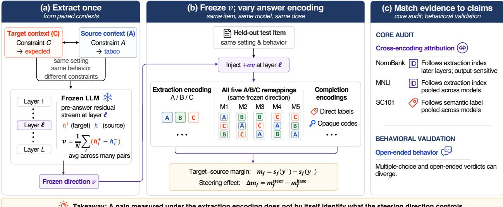
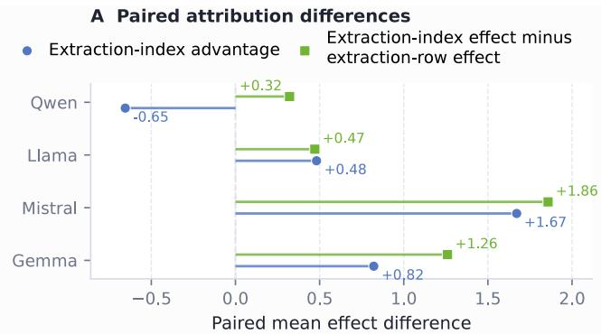
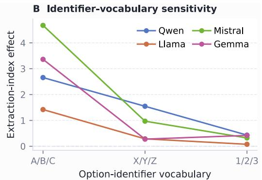
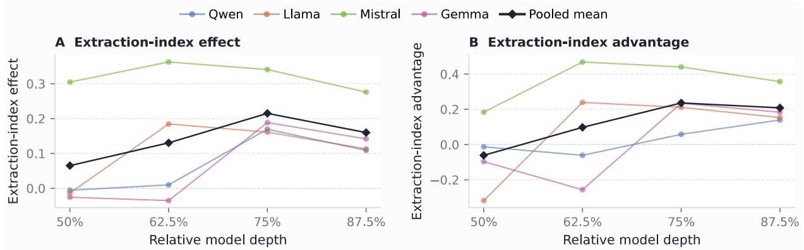
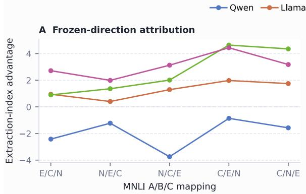
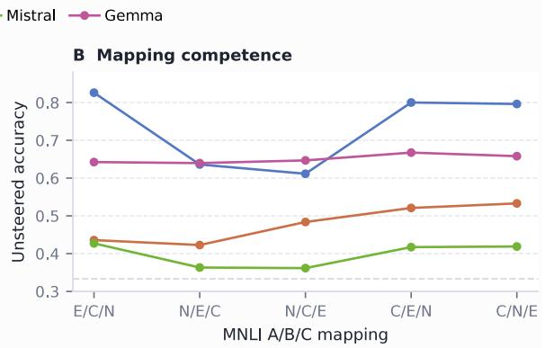
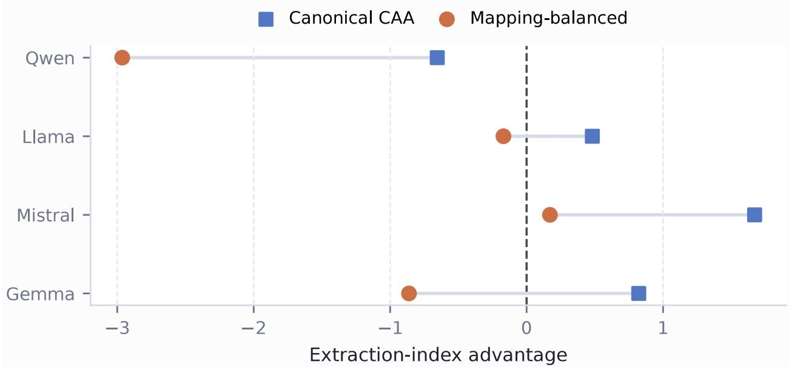

# What Does Activation Steering Control? Attribution Across Answer Encodings and Output-Sensitive Subspaces

Zhiwei Gao Shaowen Peng Shoko Wakamiya Eiji Aramaki

Nara Institute of Science and Technology

## Abstract

Activation steering is often evaluated under the answer encoding used to construct the direction. A reported gain may reflect the intended judgment or compatibility with answer identifiers seen during construction. We introduce Cross-Encoding Steering Evaluation, which freezes an intervention while re-encoding answers to the same held-out items. On NormBank, after A/B/C identifiers are reassigned, contrastive activation addition (CAA) induces larger target-versus-source score changes for the extraction indices than for the semantic labels under the new mapping. We call this extraction-index following. Varying identifier vocabulary (A/B/C, X/Y/Z, or 1/2/3) and row order shows that the efect tracks extraction index rather than row position. After matching direction norms across layers, extraction-index following emerges mainly at later depths. A low-rank output-sensitive component containing 15.4% of the direction’s squared norm retains 96.3% of this efect. An Inference-Time Intervention (ITI)-style method also favors extraction-index over semantic-label following on NormBank in three models. In aggregate, MNLI favors extraction-index following, whereas Social Chemistry 101 (SC101) favors semantic-label following. Multiple-choice and open-ended evaluations can yield diferent behavioral conclusions. Thus, a steering gain under one answer encoding does not by itself identify what the intervention controls.

## 1 Introduction

Activation steering changes large language model (LLM) behavior without updating weights. Contrastive activation addition (CAA) averages hidden-state diferences between positive and negative examples and injects the resulting direction at inference time Rimsky et al. [2024]. Related methods intervene on residual streams or attention heads Zou et al. [2023], Li et al. [2023]. Researchers have applied these methods to moral profiles, values, and cultural adaptation Tlaie [2024], Sauter and Schirmer [2026], Jin et al. [2025], Dang and Masud [2026], Dang et al. [2026], Yang et al. [2026]. This work leaves a basic evidential question: when an intervention improves its reported score, what does it actually control?

Consider a direction extracted with A = taboo, B = normal, and C = expected. A gain toward C could reflect the semantic class expected, the option identifier “C”, or its displayed row. To distinguish these possibilities, we keep the direction fixed and change only the answer encoding. For example, if evaluation instead uses A = expected, B = taboo, and C = normal, then semantic-label following favors the option currently assigned to expected (A), whereas extraction-index following favors C. Cross-encoding evaluation exploits this disagreement without changing the intervention itself.

  
Takeaway: A gain measured under the extraction encoding does not by itself identify what the steering direction controls.

Figure 1: Cross-Encoding Steering Evaluation. We extract a residual-stream CAA direction from paired target/source contexts, with the target denoting the endpoint the direction is constructed to favor and the source the endpoint subtracted from it. We then counterfactually re-render the answer scafold, holding the underlying test item, model, direction, layer, position, and dose fixed. In Panel (b), each remapping column shows, from top to bottom, the option identifiers assigned to taboo, normal, and expected; the displayed row order is fixed in these five examples. Here, sf(y) is the mean per-token log likelihood of the sequence expressing semantic label y under answer encoding f, and ∆m is the steered-minus-base change in the target–source margin. Because letter and completion encodings use diferent scoring scales, margins are compared only within the same encoding.

To describe these alternatives, we use three terms throughout the paper. Semantic-label following tracks the target semantic label under the current test encoding: it favors whichever identifier is currently assigned to that label. Extraction-index following tracks the target’s identifier index under the extraction encoding; across identifier vocabularies we align A/X/1, B/Y/2, and C/Z/3. Extraction-row following instead tracks whichever identifier is currently displayed in the target’s extraction-time row.

We use answer encoding to mean how semantic labels are mapped to and expressed as candidate answers, including label-to-identifier mapping, identifier vocabulary, row order, and completion format. Cross-Encoding Steering Evaluation re-renders the answer scafold for the same held-out items while holding the intervention fixed (Figure 1). Remapping and factorial audits distinguish the three forms of following; layer, position, and subspace interventions localize the efect. Humanvalidated open-ended responses test generative control separately.

Main findings. On NormBank, the extraction-index efect exceeds the semantic-label efect under all five remappings, so extraction-encoding gain alone is not diagnostic of semantic-label control. After norm matching, the efect emerges at later tested layers; a low-rank output-sensitive component containing 15.4% of the direction’s squared norm retains 96.3% of the efect, revealing strong concentration. Inference-Time Intervention (ITI) reproduces this ordering, and MNLI does so in aggregate; Qwen reverses on MNLI, while Social Chemistry 101 (SC101) favors semantic-label following. Open-ended tests show that MCQ scores and generative behavior can yield diferent conclusions.

We organize the study around one core attribution question and one behavioral validation:

• Core audit: Attribution and localization. When answer encoding changes, does a fixed efect track the semantic label, extraction index, or row, and where does it emerge?

• Behavioral validation: Open-ended behavior. Do multiple-choice (MCQ) scores and open generations support the same conclusion?

Contributions. We introduce a fixed-intervention attribution framework that separates semanticlabel, extraction-index, and extraction-row following under counterfactual answer encodings. We show that extraction-index following emerges at late depths and concentrates in output-sensitive components, while attribution varies across models, tasks, and evaluation granularities.

## 2 Related Work

Steering evaluation. CAA and representation engineering inject contrastive activation directions Rimsky et al. [2024], Zou et al. [2023]; ITI selects and edits probe-informative attention heads Li et al. [2023]. Prior work documents input sensitivity, spurious dependence, and out-of-distribution brittleness Tan et al. [2024]. Complementary reliable-evaluation work emphasizes context-matched tasks, likelihood-aware metrics, standardized comparisons, and explicit baselines Pres et al. [2024]. Evaluations may also disagree across behavioral granularities Xu et al. [2026]. Multiple-choice studies vary identifiers or verbalizers to test unmodified models Zheng et al. [2023], Li et al. [2024]. Recent work shows that steering eficacy depends strongly on activation-source selection, with execution-boundary states yielding particularly efective signals Ye et al. [2026], and that outputstage scafold features can dominate decision logits despite preserved task-relevant representations in unmodified models Fraile Navarro et al. [2026]. We complement these findings by freezing the intervention and counterfactually varying answer encoding to attribute the intervention-induced change itself.

Output-sensitive subspaces. Intermediate prediction, representation geometry, and gradient attribution connect hidden states to model outputs Belrose et al. [2023], Park et al. [2023], Kramár et al. [2024]. DecodeShare identifies a low-dimensional task-shared decode-time subspace and causally decomposes steering directions relative to it Shao et al. [2026]. Our analysis adapts this projection–intervention logic to a diferent attribution target: we derive an identifier-readout-specific local subspace from option-logit gradients and test whether the projection of a CAA direction onto that subspace carries extraction-index following. Behaviorally equivalent steering vectors pose a separate non-identifiability problem Venkatesh and Kurapath [2026]; our audit instead holds each direction fixed and attributes its induced change across counterfactual answer encodings.

## 3 Method

## 3.1 Contrastive Activation Steering

We write x for a rendered prompt prefix ending before the scored candidate. For each contrastive pair $i , x _ { i } ^ { + }$ denotes the target endpoint, toward which the CAA direction is constructed to point, and $x _ { i } ^ { - }$ the source endpoint subtracted from it. The residual-stream state at block ℓ and position p

is $h _ { \ell , p } ( x ) \in \mathbb { R } ^ { d }$ , where d is the hidden size, and $\Delta a = a ^ { \mathrm { s t e e r } } - a ^ { \mathrm { b a s e } }$ . For contrast c with $N _ { c }$ pairs, the canonical direction extracted at $p _ { \mathrm { e x t } } .$ , denoted $\mathbf { v } _ { \mathrm { r a w } }$ , is

$$
\mathbf { v } _ { \mathrm { r a w } } ^ { ( c , p _ { \mathrm { e x t } } ) } = \frac { 1 } { N _ { c } } \sum _ { i = 1 } ^ { N _ { c } } \Bigl ( \mathbf { h } _ { \ell , p _ { \mathrm { e x t } } } ( x _ { i } ^ { + } ) - \mathbf { h } _ { \ell , p _ { \mathrm { e x t } } } ( x _ { i } ^ { - } ) \Bigr ) .\tag{1}
$$

At inference, a forward hook adds the direction at injection position $p _ { \mathrm { i n j } }$ in the same block:

$$
\mathbf { h } _ { \ell , p _ { \mathrm { i n j } } } ( x ) \gets \mathbf { h } _ { \ell , p _ { \mathrm { i n j } } } ( x ) + \alpha \mathbf { v } _ { \mathrm { r a w } } ^ { ( c , p _ { \mathrm { e x t } } ) } .\tag{2}
$$

The primary audit extracts and injects at the pre-answer position. We fix the direction, block, position, and strength α before evaluating any test answer encoding. $L _ { 2 } .$ -matched Gaussian vectors serve as perturbation controls.

## 3.2 Cross-Encoding Evaluation

The audit holds one direction fixed and changes only the answer encoding. An encoding specifies how semantic labels are mapped to option identifiers and how candidate answers are represented for scoring. We test all six $\mathrm { A / B / C }$ assignments, direct label words, and opaque codewords. Each encoding has its own output sequences and margin scale, so raw-margin comparisons remain within an encoding.

Let $y ^ { \pm }$ be the target/source labels and $T _ { f } ( y ) = ( t _ { 1 } , \dots , t _ { K } )$ their K-token rendering under encoding $f .$ We use mean sequence log likelihood

$$
\begin{array} { c } { { s _ { f } ( y \mid x ) = \displaystyle \frac { 1 } { K } \sum _ { j = 1 } ^ { K } \log P ( t _ { j } \mid x , t _ { < j } ) , } } \\ { { m _ { f } ( x ) = s _ { f } ( y ^ { + } \mid x ) - s _ { f } ( y ^ { - } \mid x ) . } } \end{array}\tag{3}
$$

Here $t _ { < j } = ( t _ { 1 } , \dots , t _ { j - 1 } )$ . Positive $\Delta m _ { f }$ indicates movement toward the target under the current test mapping.

For $\mathrm { A / B / C }$ mapping $\pi _ { \mathrm { : } }$ let $s _ { \pi } ( o \mid x )$ be the mean-token log likelihood of identifier $o .$ . Let $\pi _ { 0 }$ denote the extraction mapping, and let $k _ { 0 } ^ { \pm }$ be the identifier indices assigned to the target/source semantic labels under $\pi _ { 0 }$ . Let $o _ { k }$ denote the $\mathrm { A / B / C }$ identifier at index $k ,$ so that $o _ { 1 } = A , o _ { 2 } = B $ and $o _ { 3 } = C$ . For vocabulary $z ,$ , let $o _ { z , k }$ denote the identifier occupying index k. For example, if the extraction-time target identifier is $^ { 6 6 } \mathrm { C } ^ { 9 }$ , then its extraction index is $k _ { 0 } ^ { + } = 3$ . Under the aligned vocabularies $\mathrm { A / B / C } , \mathrm { X / Y / Z }$ , and $1 / 2 / 3$ , this same extraction index is instantiated by $\mathrm { C } , \mathrm { Z } ,$ , and the token $^ { 6 6 } 3 ^ { 9 }$ , respectively. The extraction index therefore tracks the identifier index defined at extraction time, not the currently assigned semantic label or displayed row.

Let $\Delta s _ { \pi } = s _ { \pi } ^ { \mathrm { s t e e r } } - s _ { \pi } ^ { \mathrm { b a s e } }$ . We define the extraction-index efect for the $\mathrm { A / B / C }$ remapping audit as

$$
\Delta m _ { \mathrm { i d x } , \pi } ( x ) = \Delta s _ { \pi } ( o _ { k _ { 0 } ^ { + } } \mid x ) - \Delta s _ { \pi } ( o _ { k _ { 0 } ^ { - } } \mid x ) .\tag{4}
$$

The semantic-label efect $\Delta m _ { \mathrm { s e m } , \pi } ( x ) = \Delta m _ { \pi } ( x )$ instead follows the target and source semantic labels under the current test mapping. Their diference defines extraction-index advantage:

$$
A _ { \mathrm { i d x } , \pi } ( x ) = \Delta m _ { \mathrm { i d x } , \pi } ( x ) - \Delta m _ { \mathrm { s e m } , \pi } ( x ) .\tag{5}
$$

Thus, $A _ { \mathrm { i d x } , \pi } > 0$ means that the paired extraction-index score change exceeds the semantic-label score change. We report both the extraction-index efect and extraction-index advantage. The efects coincide under the extraction mapping and separate after remapping, using the same steered and base passes. Because those indices may be assigned to diferent semantic classes after remapping, a positive extraction-index efect need not indicate movement toward the current target label.

Random-adjusted estimates subtract $L _ { \mathrm { 2 } } \mathrm { - m a t c h e d }$ random-direction efects, controlling for general encoding sensitivity to residual perturbations, and weight model–contrast strata equally. Extractionindex advantage is formed per pair before adjustment. Standardized sensitivity analyses appear in Appendix E.3; unstandardized efects are interpreted within their encoding.

## 3.3 Factorial Attribution of Semantic Label, Extraction Index, and Extraction Row

Letter remapping alone leaves $\mathrm { A / B / C }$ attached to fixed rows. To separate identifier index from displayed row, the factorial audit crosses six semantic mappings, three aligned identifier vocabularies $( \mathrm { A } / \mathrm { B } / \mathrm { C } , \mathrm { X } / \mathrm { Y } / \mathrm { Z }$ , and $1 / 2 / 3 ; \mathrm { A / X / 1 , B / Y / 2 , C / Z / 3 } )$ , and all six row orders. Vocabulary and row order vary independently while the extraction-index alignment defined above is preserved, yielding 108 conditions per frozen direction and test pair.

The factorial audit scores each candidate identifier by its mean-token log likelihood and computes steered-minus-base changes in the semantic-label, extraction-index, and extraction-row margins. For example, after replacing $\mathrm { A / B / C }$ with $\mathrm { X } / \mathrm { Y } / \mathrm { Z }$ and reordering the rows, the semantic-label margin follows the identifier currently assigned to the target and source semantic labels, the extraction-index margin follows the identifier at the same extraction index $( \mathrm { e . g . , C {  } Z ) }$ , and the extraction-row margin follows the original displayed position. Subtracting the extraction-row efect separates identifier index from row position. Unlike the random-adjusted letter audit, factorial efects are unadjusted steered-minus-base changes. We check unsteered accuracy under every mapping, and each model–mapping–identifier-vocabulary condition must pass an 80% mapping-comprehension check. Estimates average conditions within each pair and weight contrasts equally. The group-cluster bootstrap jointly resamples complete setting–behavior groups across contrasts.

## 3.4 Position and Output-Sensitive Subspace Localization

We localize the identifier-linked efect across model depth, extraction position, and output-sensitive subspaces to test when it emerges, whether it depends on the answer scafold, and which outputsensitive component carries it. A depth sweep evaluates the extraction-index efect and extractionindex advantage at 50%, 62.5%, 75%, and 87.5% of each model after rescaling every model–contrast direction to its 75%-depth $L _ { 2 }$ norm. The pre-answer state is taken after the model has seen the question, option identifiers, label descriptions, and output instruction, whereas the scenario-end state precedes this answer scafold. We first compare otherwise identical directions extracted at the scenario end and at the pre-answer position while injecting both at the same pre-answer site. Norm matching tests whether the loss is explained by direction magnitude, while matched-position injection tests whether it arises from moving a scenario-end direction to the pre-answer site.

To identify which part of a pre-answer direction carries extraction-index following, we estimate a local identifier-readout subspace. For prompt x and identifier pair $\left( o _ { a } , o _ { b } \right)$ , let $p _ { \mathrm { p r e } }$ denote the pre-answer position and $z ( o )$ the next-token logit for o. We define

$$
\begin{array} { r } { \mathbf { g } _ { x , a , b } = \nabla _ { \mathbf { h } _ { \ell , p _ { \mathrm { p r e } } } } ( x ) \left[ z \mathopen { } \mathclose \bgroup \left( o _ { a } \aftergroup \egroup \right) - z \mathopen { } \mathclose \bgroup \left( o _ { b } \aftergroup \egroup \right) \right] . } \end{array}\tag{6}
$$

For a fixed prompt, ${ \bf g } _ { x , a , b }$ points in the hidden-state direction of steepest first-order increase in the logit preference for $o _ { a }$ over $o _ { b }$ under an $L _ { \mathrm { 2 } \mathrm { - n o r m a l i z e d } }$ perturbation. Within each model, let $\mathbf { G } \in \mathbb { R } ^ { n _ { g } \times d }$ stack the row-normalized training gradients from all three contrasts, and write its

SVD as $\mathbf { G } = \mathbf { L } \pmb { \Sigma } \mathbf { R } ^ { \top }$ . The leading right singular vectors summarize the dominant identifier-logit sensitivities across training prompts. We define $\mathbf { U } _ { r } = \mathbf { R } _ { [ : , 1 : r ] } \in \mathbb { R } ^ { d \times r }$ , where $r \in \{ 2 , 4 , 8 , 1 6 \}$ is the smallest rank for which the mean fraction of squared validation-gradient norm captured by $\mathbf { U } _ { r }$ is at least 90%. Thus, the columns of $\mathbf { U } _ { r }$ are orthonormal hidden-state directions that locally change option-identifier logit diferences. Projection–residual interventions then test whether this subspace carries the extraction-index efect; test prompts are reserved for evaluation. We decompose

$$
\begin{array} { r } { \begin{array} { c } { \mathbf { v } _ { \mathrm { r a w } } = \mathbf { v } _ { \parallel } + \mathbf { v } _ { \perp } , } \\ { \mathbf { v } _ { \parallel } = \mathbf { U } _ { r } \mathbf { U } _ { r } ^ { \top } \mathbf { v } _ { \mathrm { r a w } } , \qquad \mathbf { v } _ { \perp } = ( \mathbf { I } - \mathbf { U } _ { r } \mathbf { U } _ { r } ^ { \top } ) \mathbf { v } _ { \mathrm { r a w } } . } \end{array} } \end{array}\tag{7}
$$

The projection–residual decomposition asks whether the measured extraction-index efect is concentrated in a small component of the CAA direction or merely follows where most of the direction’s norm lies. We therefore compare each component’s extraction-index efect with its share of the full direction’s squared $L _ { 2 }$ norm. For a component u, we define its energy fraction as $E ( \mathbf { u } ) = \| \mathbf { u } \| _ { 2 } ^ { 2 } / \| \mathbf { v } _ { \mathrm { r a w } } \| _ { 2 } ^ { 2 } .$ A component with low energy fraction but high efect retention indicates concentration of the measured efect in that subspace.

We define efect retention as the component’s extraction-index efect divided by that of the full canonical CAA direction, computed on the same evaluation scale. We intervene with the projection, residual, and their norm-matched variants, alongside ten covariance-matched random controls. Validation prompts assess whether the local Jacobian’s first-order predictions agree with the observed intervention efects.

A direct output-sensitive baseline averages normalized local logit-margin gradients from strictsplit training prompts, matches the result to the canonical CAA norm, and freezes it before test evaluation. This tests whether a simple output-sensitive controller reproduces the extraction-indexover-semantic-label ordering. For cross-vocabulary transfer, we freeze the $\mathrm { A / B / C \mathrm { - } d e r i v e d }$ basis, projection, residual, layer, and dose, then evaluate the same test pairs with $\mathrm { A / B / C } , \mathrm { X / Y / Z }$ , and numeric identifiers. The primary comparison uses model–mapping cells that pass the mappingcomprehension check under all three vocabularies. Further results appear in Appendix B.6.

## 3.5 Scope and Behavioral Validation

We next test whether the attribution extends beyond canonical NormBank CAA. For cross-method replication, an ITI-style intervention Li et al. [2023] ranks attention heads by validation probe accuracy and adds normalized target-minus-source class-mean directions at the selected heads. Validation selects the layers, head count, and strength before mapping evaluation. A prespecified positive-gain criterion retains only models whose validation-selected mean gain under the extraction encoding is positive; the wrong-sign control keeps the selected heads and magnitude fixed but reverses every direction. For cross-task scope, MNLI and SC101 repeat the frozen six-mapping audit on same-premise and action-level pairs, respectively.

The open-ended behavior test reproduces public CAA hallucination, refusal, and sycophancy directions on Llama-2-7B/13B-Chat Rimsky et al. [2024] and applies them to the published open prompts. Three fixed-rubric LLM judges score 918 generations, using the per-item median for paired efects. Two blinded annotators and a third adjudicator validate a prespecified 180-response subset spanning every model–behavior and dose condition.

Across these analyses, L2-matched random directions control for answer-encoding-specific perturbations, and opaque-key checks verify temporary-key decoding. Primary results average five fixed Gaussian controls and weight model–contrast strata equally. ITI and cross-task breakdowns appear in Appendix C.

<table><tr><td>Labels assigned to A/B/C</td><td>Type</td><td>Extraction-index effect</td><td>Semantic-label effect</td><td>Extraction-index advantage</td><td>Positive pairs</td></tr><tr><td>T/N/E</td><td>Extraction</td><td>4.63 [4.59, 4.67]</td><td>4.63 [4.59, 4.67]</td><td>0.00</td><td>100.0%</td></tr><tr><td>E/T/N</td><td>3-cycle</td><td>3.00 [2.98, 3.03]</td><td>-0.33 [−0.38, -0.28]</td><td>3.33 [3.28, 3.38]</td><td>93.8%</td></tr><tr><td>N/E/T</td><td>3-cycle</td><td>3.07 [3.04, 3.10]</td><td>−0.97 [−1.02, −0.92]</td><td>4.04 [3.99, 4.10]</td><td>97.6%</td></tr><tr><td>N/T/E</td><td>Swap</td><td>3.56 [3.53, 3.59]</td><td>0.56 [0.53, 0.59]</td><td>3.00 [2.96, 3.05]</td><td>96.9%</td></tr><tr><td>T/E/N</td><td>Swap</td><td>4.13 [4.09, 4.17]</td><td>2.18 [2.14, 2.22]</td><td>1.95 [1.91, 1.98]</td><td>97.0%</td></tr><tr><td>E/N/T</td><td>Swap</td><td>3.19 [3.16, 3.22]</td><td>0.02 [−0.01, 0.05]</td><td>3.17 [3.12, 3.22]</td><td>94.4%</td></tr></table>

Table 1: Residual-stream CAA on the strict split. E/T/N denote expected/taboo/normal. Extraction-index and semantic-label efects are random-adjusted changes on the common A/B/C mean-token log-likelihood-margin scale; extraction-index advantage is their pairwise diference (extraction-index minus semantic-label efect). Intervals resample complete setting–behavior groups; “positive pairs” is the pair-level sign rate for the extraction-index efect.

## 4 Experimental Setup

Datasets. We use NormBank as the primary controlled audit because its taboo (T), normal (N), and expected (E) labels vary with contextual constraints for matched settings and behaviors, enabling the ordered contrasts T→N, T→E, and N→E while reducing content confounding Ziems et al. [2023]. MNLI supplies a non-norm three-label task with same-premise pairs Williams et al. [2018]; SC101 supplies action-level bad/ok/good pairs that are not context matched Forbes et al. [2020]. The public CAA behaviors extend the evaluation to generation.

Pairs and splits. NormBank endpoints are matched within contrast and complete setting + behavior groups are assigned to train, validation, or test, with no shared pairs, groups, or endpoints. CAA evaluates up to 512 test pairs per contrast; the factorial audit applies all 108 conditions. MNLI analogously splits by normalized premise.

Models. NormBank, MNLI, and SC101 use Qwen2.5-7B-Instruct, Llama-3.1-8B-Instruct, Mistral-7B-Instruct-v0.3, and Gemma-2-9B-IT Qwen Team [2024], Dubey et al. [2024], Jiang et al. [2023], Gemma Team [2024]. CAA reports all four; ITI reports the three models retained by its prespecified positive-gain criterion. The public protocol uses Llama-2-7B/13B-Chat.

Locked interventions. Primary NormBank and MNLI CAA use zero-based blocks 20, 23, 23, and 31 (Qwen/Llama/Mistral/Gemma), each nearest 75% depth, with fixed α = .8. The layer audit also evaluates 50%, 62.5%, and 87.5% depth with directions norm-matched within each model and contrast to the 75%-depth reference. ITI selects its layer, heads, and strength on validation data; SC101 uses previously selected middle layers and α = 1. Test answer encodings never change the extracted direction or any hyperparameter.

Scoring. Cross-encoding and factorial comparisons use mean-token log-likelihood margins within each encoding. Layer, position, and subspace localization use normalized option-choice probability margins (target probability minus source probability) on a separate scale. Efect retention divides a component’s equal-stratum mean extraction-index efect by canonical CAA. Intervals resample complete setting–behavior groups across contrasts and quantify data-group uncertainty conditional on the audited models. Prompt templates, rendering rules, and a worked attribution example appear in Appendix A.4.

  
Figure 2: NormBank factorial attribution on the mean-token log-likelihood-margin scale. Panel A reports extraction-index advantage (extraction-index efect minus semantic-label efect) and extraction-index efect minus extraction-row efect. Positive values indicate a larger extraction-index efect than semantic-label or extraction-row efect, respectively. Panel B shows the extraction-index efect across option-identifier vocabularies. All Panel A group-cluster intervals and all 12 gated Panel B bootstrap intervals exclude zero; the corresponding Panel A sign-flip tests remain significant after Holm correction.

## 5 Results

## 5.1 Core Audit: Identifier-Linked Efects Emerge at Later Tested Layers and Concentrate in a Low-Rank Subspace

Across all five alternative $\mathrm { A / B / C }$ mappings, CAA produces positive target-versus-source margin shifts at the extraction indices (Table 1). The corresponding random-adjusted efect under the extraction encoding is 4.63; after remapping, extraction-index efects range from 3.00 to 4.13 and exceed semantic-label efects by 1.95–4.04. This ordering holds for every remapping on the strict split.

Because semantic-label and extraction-index efects coincide under the extraction encoding, only the alternative mappings distinguish them.

The factorial audit attributes this pattern to identifier index rather than row position (Figure 2): the extraction-index efect exceeds the extraction-row efect in every model by 0.32–1.86. Llama, Mistral, and Gemma also favor the extraction index over semantic-label following, while Qwen favors semantic-label following by 0.65. X/Y/Z and $1 / 2 / 3$ weaken the extraction-index efect in every model. Before steering, every model exceeds three-way chance under all six $\mathrm { A / B / C }$ mappings. To check that the ordering is not driven by items on which the unsteered model fails under one or more remappings, we restrict each model to pairs it solves correctly under all six mappings. On this subset (309 unique pairs overall), the pooled extraction-index efect remains 1.455 [1.443, 1.467] and its advantage .426 [.408, .443].

Extraction-index following emerges at later layers. After norm matching, the extractionindex efect changes across the four depths from 0.065 to 0.130, 0.215, and 0.160 (Figure 3); its advantage changes from −0.061 to +0.098, +0.236, and +0.208. Both the extraction-index efect and advantage are larger at 75% and 87.5% depth than at 50%, with paired group-cluster intervals excluding zero. Transitions difer by model, but all four show positive extraction-index efect and advantage at 75% and 87.5%.

  
Figure 3: Norm-matched layer-wise NormBank attribution on the option-choice probability-margin scale. Each model–contrast direction is rescaled to its 75%-depth norm. Colored lines show fixedmodel trajectories, and black diamonds show pooled means. Panel A reports the extraction-index efect; Panel B reports extraction-index advantage. The corresponding 95% setting–behavior groupcluster intervals appear in Appendix B.2.

Position localization. Moving direction extraction from pre-answer to scenario end reduces the extraction-index probability-margin efect from 0.218 to 0.004 (98.3%). The efect remains near zero after norm rescaling and matched-position injection. The pre-answer extraction-index efect exceeds the scenario-end efect in all 20 model–mapping cells. This localizes the extraction-index profile to late pre-answer states rather than to direction norm or an injection-position mismatch. At the pre-answer site, the hidden state has already incorporated the question, displayed option identifiers, label descriptions, and output instruction; the scenario-end site precedes this answer scafold.

Direct output-sensitive baseline. On the same option-choice probability-margin scale at 75% depth, a norm-matched mean local-gradient controller produces a 0.417 extraction-index efect and 0.526 extraction-index advantage, compared with 0.215 and 0.236 for canonical CAA. A simple output-sensitive controller therefore reproduces and amplifies the same extraction-index-oversemantic-label ordering. The mean local-gradient direction is only moderately aligned with full CAA (mean cosine .329) but aligns much more strongly with the CAA readout projection (.845). This baseline establishes that local output sensitivity is suficient to reproduce the ordering; the following decomposition tests whether canonical CAA relies on the same geometry.

Efect concentration in the output-sensitive subspace. The validation-selected projection contains 15.4% of the direction’s squared $L _ { 2 }$ energy but retains 96.3% [95.8, 96.7] of its extractionindex efect; the residual contains 84.6% of the energy and retains 1.0% [0.6, 1.3]. Most of the direction norm therefore lies outside the selected subspace, but almost none of the measured extraction-index efect does. A fixed rank-2 basis also preserves a clear projection–residual separation. Its extraction-index efect exceeds that of covariance-matched controls. On validation prompts, first-order Jacobian predictions correlate with observed efects across $\alpha \in \{ . 2 , . 4 , . 8 \}$ (mean Pearson $r = . 8 3 – . 9 6 )$ .

Cross-vocabulary transfer. The $\mathrm { A / B / C }$ -derived projection remains stronger than the residual when the identifier vocabulary changes. Among cells passing the mapping-comprehension check under all three vocabularies, it retains 95.0% of unprojected CAA with $\mathrm { X } / \mathrm { Y } / \mathrm { Z }$ and 83.3% with $1 / 2 / 3$ , exceeding the residual in every model-vocabulary aggregate. Both full and projected efects attenuate under the new vocabularies. Without competence filtering, the projection-over-residual ordering also holds in all 12 model–vocabulary aggregates.

<table><tr><td>Dataset</td><td>Pair regime</td><td> $> 0$ </td><td>Semantic-label Extraction-index advantage  $> 0$ </td></tr><tr><td>NormBank</td><td>Strict context</td><td> $3 / 5$ </td><td> $5 / 5$ </td></tr><tr><td>NormBank (ITI)</td><td>Strict context</td><td>2/5</td><td> $5 / 5$ </td></tr><tr><td>MNLI</td><td>Same-premise pairs</td><td> $3 / 5$ </td><td> $5 / 5$ </td></tr><tr><td>SC101</td><td>Action-level pairs</td><td> $5 / 5$ </td><td> $0 / 5$ </td></tr></table>

Table 2: Random-adjusted patterns over five alternative mappings. Rows use CAA unless marked ITI. Counts are mappings with positive point estimates, not significance decisions. ITI averages the three models retained on validation.

<table><tr><td>Behavior</td><td>Original MCQ Open-ended [95% CI]</td></tr><tr><td>Hallucination</td><td>+3.31  $+ 1 . 6 0$   $[ + 0 . 8 4 , + 2 . 4 4 ]$ </td></tr><tr><td>Refusal</td><td>+3.28  $- 0 . 1 3$   $[ - 0 . 5 4 , + 0 . 1 8 ]$ </td></tr><tr><td>Sycophancy</td><td>-0.48  $+ 1 . 1 1$   $[ + 0 . 5 7 , + 1 . 7 5 ]$ </td></tr></table>

Table 3: Public CAA verdicts over two Llama-2 models. Original MCQ is the +1-dose change in the published $\mathrm { A } / \mathrm { B }$ mean-token log-likelihood margin. Open-ended efects use three judges validated on 180 blinded human-scored responses. Columns retain protocol-specific scales and doses; we compare their qualitative verdicts.

ITI reproduces the NormBank ordering in all three retained models: extraction-index advantage is positive under all five alternative mappings, whereas the semantic-label efect is positive in only two of the five mappings. On MNLI same-premise pairs, pooled semantic-label efects are positive in $3 / 5$ mappings and extraction-index advantage in $5 / 5 ;$ all 24 unsteered model–mapping accuracy intervals exceed chance. Gemma, Llama, and Mistral favor the extraction index under all five mappings, whereas Qwen favors semantic-label following. SC101 reverses the aggregate ordering (Table 2), confirming that attribution varies across evaluation regimes.

## 5.2 Behavioral Validation: MCQ and Open-Ended Verdicts Can Diverge in a Public CAA Protocol

The published CAA directions receive diferent verdicts from multiple-choice and open-ended evaluations (Table 3). After equal weighting across the two models, the three-judge median efect is positive for hallucination $( + 1 . 6 0 \ [ 0 . 8 4 , 2 . 4 4 ] )$ and sycophancy (+1.11 [0.57, 1.75]), but not refusal $( - 0 . 1 3 [ - 0 . 5 4 , 0 . 1 8 ] )$ . Hallucination is positive in both evaluations. Refusal has a large original $\mathrm { A } / \mathrm { B }$ gain without an open-ended increase, whereas sycophancy is non-positive under the original metric but increases in open generation. On 180 blinded responses, the judge panel agreed closely with adjudicated human scores (Pearson $r = . 9 2 7 ;$ quadratic-weighted $\kappa = . 9 2 9 )$ . Thus, multiple-choice steering efects need not imply the same behavioral conclusion under open-ended generation. Judge and human-validation details appear in Appendix D.

<table><tr><td>Claim</td><td>Recommended evidence</td></tr><tr><td>Target-score movement</td><td>Target-margin effect under the extraction encoding against L2-matched random controls</td></tr><tr><td></td><td>Answer-encoding attribution Frozen remapping; factorial identifier/row controls; position and subspace localization</td></tr><tr><td>Selective control</td><td>Context-matched tests of selective response differences</td></tr><tr><td>Generative control</td><td>Open generations evaluated independently of multiple-choice steering scores</td></tr></table>

Table 4: Claim–evidence matching for activation-steering evaluation.

## 6 Discussion

On NormBank, extraction-index following is weak before the answer scafold and concentrates at late pre-answer states in directions locally sensitive to identifier logits. A direct gradient baseline reproduces the ordering, and the selected subspace carries nearly all of the efect; removing it does not increase semantic-label following. This functionally localizes the dependence without identifying a complete circuit. MNLI extends the pooled pattern, while Qwen and SC101 show model- and evaluation-regime-dependent attribution.

The audit separates two questions that are conflated when extraction and evaluation share an answer encoding. A direction may produce a strong score change under that encoding, yet the change may be carried by an output-sensitive identifier component rather than consistently producing semantic-label following. Extraction-index following is therefore an evaluation-level attribution, not evidence that the model represents an abstract index variable. The contrasting MNLI, SC101, and Qwen profiles show that this attribution must be measured rather than assumed. More broadly, the evidence required should match the level of control being claimed (Table 4).

## 7 Limitations

The six-mapping audit covers three three-label tasks and four instruction-tuned model families; the full factorial audit, localization analyses, and ITI use NormBank. The gradient-defined subspace functionally localizes the efect relative to the identifier readout at the tested layers and positions, without identifying a complete circuit. Layer-wise norm matching equates direction magnitude but not layer-specific model sensitivity, and position localization uses a single-site intervention. The public CAA comparison follows protocol-specific doses.

## 8 Conclusion

Cross-encoding evaluation freezes an intervention and re-encodes answers to the same held-out items, separating semantic-label following from extraction-index following. On NormBank, CAA preferentially follows extraction indices, an ordering replicated by ITI in three models; the efect emerges at later tested depths and concentrates in a low-rank output-sensitive component. MNLI reproduces the pooled ordering despite a Qwen reversal, while SC101 favors semantic-label following, showing that attribution varies across models and tasks. Open-generation verdicts can also diverge from multiple-choice scores. Steering claims therefore require evidence that directly tests the claimed form of control.

## References

Nora Belrose, Zach Furman, Logan Smith, Danny Halawi, Igor Ostrovsky, Lev McKinney, Stella Biderman, and Jacob Steinhardt. Eliciting latent predictions from transformers with the tuned lens. arXiv preprint arXiv:2303.08112, 2023. URL https://arxiv.org/abs/2303.08112.

Trung Duc Anh Dang and Sarah Masud. Cultural value alignment via latent activation steering in large language models. arXiv preprint arXiv:2605.26365, 2026. URL https://arxiv.org/abs/2605. 26365.

Trung Duc Anh Dang, Tung Kieu, and Sarah Masud. Scenario-based probing and steering cultural values in large language models–extended version. arXiv preprint arXiv:2606.11399, 2026. URL https://arxiv.org/abs/2606.11399.

Abhimanyu Dubey et al. The llama 3 herd of models. arXiv preprint arXiv:2407.21783, 2024. URL https://arxiv.org/abs/2407.21783.

Maxwell Forbes, Jena D. Hwang, Vered Shwartz, Maarten Sap, and Yejin Choi. Social chemistry 101: Learning to reason about social and moral norms. In Proceedings of the 2020 Conference on Empirical Methods in Natural Language Processing, 2020. URL https://arxiv.org/abs/2011.00620.

David Fraile Navarro, Berardino Como, Jialei Sheng, Soundariya Ananthan, and Shlomo Berkovsky. Internal representation, not clinical knowledge: Where apparent llm triage failures originate. arXiv preprint arXiv:2605.29889, 2026.

Gemma Team. Gemma 2: Improving open language models at a practical size. arXiv preprint arXiv:2408.00118, 2024. URL https://arxiv.org/abs/2408.00118.

Albert Q. Jiang, Alexandre Sablayrolles, Arthur Mensch, et al. Mistral 7b. arXiv preprint arXiv:2310.06825, 2023. URL https://arxiv.org/abs/2310.06825.

Haoran Jin, Meng Li, Xiting Wang, Zhihao Xu, Minlie Huang, Yantao Jia, and Defu Lian. Internal value alignment in large language models through controlled value vector activation. arXiv preprint arXiv:2507.11316, 2025. URL https://arxiv.org/abs/2507.11316.

János Kramár, Tom Lieberum, Rohin Shah, and Neel Nanda. AtP\*: An eficient and scalable method for localizing LLM behaviour to components. arXiv preprint arXiv:2403.00745, 2024. URL https://arxiv.org/abs/2403.00745.

Kenneth Li, Oam Patel, Fernanda Viégas, Hanspeter Pfister, and Martin Wattenberg. Inference-time intervention: Eliciting truthful answers from a language model. In Advances in Neural Information Processing Systems, volume 36, 2023. URL https://arxiv.org/abs/2306.03341.

Shiyang Li, Jun Yan, Hai Wang, Zheng Tang, Xiang Ren, Vijay Srinivasan, and Hongxia Jin. Instruction-following evaluation through verbalizer manipulation. In Findings of the Association for Computational Linguistics: NAACL 2024, pages 3678–3692, Mexico City, Mexico, 2024. Association for Computational Linguistics. doi: 10.18653/v1/2024.findings-naacl.233. URL https://aclanthology.org/2024.findings-naacl.233/.

Kiho Park, Yo Joong Choe, and Victor Veitch. The linear representation hypothesis and the geometry of large language models. arXiv preprint arXiv:2311.03658, 2023. URL https://arxiv. org/abs/2311.03658.

Itamar Pres, Laura Ruis, Ekdeep Singh Lubana, and David Krueger. Towards reliable evaluation of behavior steering interventions in llms. arXiv preprint arXiv:2410.17245, 2024.

Qwen Team. Qwen2.5 technical report. arXiv preprint arXiv:2412.15115, 2024. URL https: //arxiv.org/abs/2412.15115.

Nina Rimsky, Nick Gabrieli, Julian Schulz, Meg Tong, Evan Hubinger, and Alexander Turner. Steering llama 2 via contrastive activation addition. In Proceedings of the 62nd Annual Meeting of the Association for Computational Linguistics (Volume 1: Long Papers), pages 15504–15522, Bangkok, Thailand, 2024. Association for Computational Linguistics. doi: 10.18653/v1/2024.acl long.828. URL https://aclanthology.org/2024.acl-long.828/.

Adrian Sauter and Mona Schirmer. Between rules and reality: On the context sensitivity of llm moral judgment. arXiv preprint arXiv:2603.23114, 2026. URL https://arxiv.org/abs/2603.23114.

Zishan Shao, Lixun Zhang, Kangning Cui, Yixiao Wang, Ting Jiang, Hancheng Ye, Qinsi Wang, Zhixu Du, Yuzhe Fu, Fan Yang, Danyang Zhuo, Yiran Chen, and Hai Helen Li. Decodeshare: Tracing the shared subspace of llm decode-time decisions. arXiv preprint arXiv:2607.20469, 2026.

Daniel Tan, David Chanin, Aengus Lynch, Dimitrios Kanoulas, Brooks Paige, Adria Garriga-Alonso, and Robert Kirk. Analyzing the generalization and reliability of steering vectors. arXiv preprint arXiv:2407.12404, 2024. URL https://arxiv.org/abs/2407.12404.

Alejandro Tlaie. Exploring and steering the moral compass of large language models. arXiv preprint arXiv:2405.17345, 2024. URL https://arxiv.org/abs/2405.17345.

Sohan Venkatesh and Ashish Mahendran Kurapath. On the non-identifiability of steering vectors in large language models. arXiv preprint arXiv:2602.06801, 2026.

Adina Williams, Nikita Nangia, and Samuel R. Bowman. A broad-coverage challenge corpus for sentence understanding through inference. In Proceedings of the 2018 Conference of the North American Chapter of the Association for Computational Linguistics: Human Language Technologies, pages 1112–1122, 2018.

Ziwen Xu, Kewei Xu, Haoming Xu, Haiwen Hong, Longtao Huang, Hui Xue, Ningyu Zhang, Yongliang Shen, Guozhou Zheng, Huajun Chen, and Shumin Deng. How controllable are large language models? a unified evaluation across behavioral granularities. In Proceedings of the 64th Annual Meeting of the Association for Computational Linguistics (Volume 1: Long Papers), pages 31269–31299, San Diego, California, United States, 2026. Association for Computational Linguistics. doi: 10.18653/v1/2026.acl-long.1443. URL https://aclanthology.org/2026.acl-long. 1443/.

Yonghui Yang, Yihui Wang, Junwei Li, Jilong Liu, Fengbin Zhu, Weibiao Huang, Le Wu, Richang Hong, and Tat-Seng Chua. Controllable value alignment in large language models through neuronlevel editing. arXiv preprint arXiv:2602.07356, 2026. URL https://arxiv.org/abs/2602.07356.

Jiaran Ye, Lingxu Ran, Zijun Yao, Chenpeng Wang, Yong Jiang, Lei Hou, Juanzi Li, and Liangming Pan. Where steering signals come from: Activation source selection in activation steering. arXiv preprint arXiv:2607.25270, 2026.

Chujie Zheng, Hao Zhou, Fandong Meng, Jie Zhou, and Minlie Huang. Large language models are not robust multiple choice selectors. arXiv preprint arXiv:2309.03882, 2023. URL https: //arxiv.org/abs/2309.03882.

Caleb Ziems, Jane Dwivedi-Yu, Yi-Chia Wang, Alon Halevy, and Diyi Yang. Normbank: A knowledge bank of situational social norms. arXiv preprint arXiv:2305.17008, 2023. URL https://arxiv.org/abs/2305.17008.

Andy Zou, Long Phan, Sarah Chen, James Campbell, Phillip Guo, Richard Ren, Alexander Pan, Xuwang Yin, Mantas Mazeika, Ann-Kathrin Dombrowski, Shashwat Goel, Nathaniel Li, Michael J. Byun, Zifan Wang, Alex Mallen, Steven Basart, Sanmi Koyejo, Dawn Song, Matt Fredrikson, J. Zico Kolter, and Dan Hendrycks. Representation engineering: A top-down approach to ai transparency. arXiv preprint arXiv:2310.01405, 2023. URL https://arxiv.org/abs/2310.01405.

## A Reproducibility and Data Isolation

## A.1 Notation Summary

Table 5 collects the quantities used throughout the evaluation. NormBank and MNLI cross-encoding tests and the NormBank factorial audit use mean-token log-likelihood margins. Layer, position, and subspace analyses use normalized option-choice probability margins; SC101 uses its protocol-specific probability scale. The tables and captions state the applicable scale; values are compared only within a scale and answer encoding.

## A.2 Pair Construction and Split Details

We clean the setting, behavior, constraints, and label fields; retain only taboo (T), normal (N), and expected (E); and group rows by exact setting + behavior. We use the ordered contrasts T→N, T→E, and N→E. Within each sorted group–contrast cell, lower- and higher-label rows are deterministically permuted with fixed seeds and matched one-to-one without replacement. An endpoint is therefore not reused within the same group–contrast matching; the accompanying code records the exact seeds.

The central exhaustive mapping audit assigns complete setting–behavior groups to train, validation, or test and removes cross-split endpoint reuse. Pair IDs, context groups, and endpoints are therefore disjoint across splits (Table 7). The CAA audit uses up to 2,048 training and 512 test pairs per contrast; ITI uses up to 1,024/256/512 train/validation/test pairs. The local identifier-readout analysis uses at most 64 training prompts, 32 validation prompts, and 128 test pairs per contrast. Test prompts never enter direction extraction, basis estimation, rank selection, or normalization.

The factorial attribution audit reuses the strict CAA directions and the same 1,536 test pairs. It crosses six label-to-identifier mappings, three identifier vocabularies $( \mathrm { A } / \mathrm { B } / \mathrm { C } , \mathrm { X } / \mathrm { Y } / \mathrm { Z } ,$ and $1 / 2 / 3 )$ , and all six displayed row orders, producing 108 conditions for each frozen direction. Canonical direction extraction always uses $\mathrm { A } / \mathrm { B } / \mathrm { C } { = } t a b o o / n o r m a l / e x p e c t e d ;$ no factorial test condition reconstructs or retunes it. The constructive control forms a mapping-balanced direction by extracting under all six mappings on the strict training pairs, averaging and norm-rescaling the directions, and rerunning the same 108 test conditions.

The direct-label, opaque-codeword, and matched-context analyses use a separate pair-ID split. That split supports these analyses, while the strict group-disjoint split isolates the exhaustive letter-mapping and mapping-balanced factorial tests at the contextual-content level. Four of the 1,536 pair-ID-split test pairs have identical rendered endpoint text despite conflicting labels in the public source. They remain valid labeled items for target-score movement but cannot define a discrimination pair, so the matched-context diagnostic uses 1,532 pairs. Every answer encoding evaluates the same test pair IDs with three prompt templates. The published CAA audit uses all available open-ended items and up to 50 multiple-choice items per behavior.

MNLI uses the three relation labels entailment, neutral, and contradiction. Within each normalized premise group, we pair hypotheses carrying diferent labels and assign the complete premise group to one split, so no premise crosses train and test. Each contrast uses up to 2,048 training and 512 test pairs. The direction is extracted once under $\mathrm { A } / \mathrm { B } / \mathrm { C } { = } e n t a i l m e n t / n e u t r a l /$ contradiction and evaluated under all five alternative mappings with the same four models, layers, dose, three prompt templates, and five norm-matched random controls used by the primary CAA audit. Intervals resample complete premise groups and weight model–contrast strata equally.

The SC101 scope replication uses action-only statements labeled bad, ok, or good. It forms the three pairwise label contrasts and selects up to 2,048 training and 256 test pairs per contrast. These pairs do not hold context fixed; they test whether a frozen direction exhibits semantic-label or

<table><tr><td>Symbol</td><td>Meaning</td></tr><tr><td> $\mathbf { v } _ { \mathrm { r a w } } ^ { ( c ) }$ </td><td>Canonical target-minus-source CAA direction for contrast c</td></tr><tr><td> $f , T _ { f } ( y )$ </td><td>Answer encoding and the token sequence expressing semantic label y</td></tr><tr><td> $m _ { f } ( x )$ </td><td>Target-versus-source mean log-likelihood margin</td></tr><tr><td> $\Delta m _ { f }$ </td><td>Steered-minus-base margin change</td></tr><tr><td> $\delta ^ { ( v , \check { f } ) }$  ∂s,i,k</td><td>Pair effect after subtracting random draw k</td></tr><tr><td> $D _ { s . k } ^ { ( v , f ) }$ </td><td>Standardized detectability within one stratum</td></tr><tr><td> $D _ { f } ^ { \mathrm { c t r l } } ( v )$ </td><td>Within-encoding detectability relative to matched random controls</td></tr><tr><td></td><td>Extraction index Index in the ordered answer-identifier vocabulary assigned under the extraction encoding; aligned as  $\mathrm { A } / \mathrm { X } / 1 , \mathrm { B } / \mathrm { Y } / 2 , \mathrm { C } / \mathrm { Z } / 3$ </td></tr><tr><td> $\Delta m _ { \mathrm { s e m } }$ </td><td>Semantic-label log-likelihood-margin effect</td></tr><tr><td> $\Delta m _ { \mathrm { i d x } }$ </td><td>Extraction-index log-likelihood-margin effect</td></tr><tr><td> $A _ { \mathrm { i d x } }$ </td><td>Extraction-index advantage: extraction-index minus semantic-label effect on the stated scale</td></tr><tr><td></td><td>Factorial effects Semantic-label, extraction-index, and extraction-row mean log-likelihood-margin changes</td></tr><tr><td> ${ \mathbf { U } } _ { r }$ </td><td>Rank-r basis for the local identifier-readout subspace</td></tr><tr><td> $\mathbf { v } _ { \| }$ </td><td>Projection of  $\mathbf { v } _ { \mathrm { r a w } }$  into span(Ur)</td></tr><tr><td> $\mathbf { v } _ { \perp }$ </td><td>Component of  $\mathbf { v } _ { \mathrm { r a w } }$  orthogonal to  $\mathbf { U } _ { r }$ </td></tr><tr><td> $E ( \mathbf { u } )$  JS shift</td><td>Squared  $L _ { 2 }$  energy fraction  $\| \mathbf { u } \| _ { 2 } ^ { 2 } / \| \mathbf { v } _ { \mathrm { r a w } } \| _ { 2 } ^ { 2 }$ </td></tr><tr><td></td><td>Jensen-Shannon divergence between normalized option-choice distributions before and after steering (natural logarithms)</td></tr><tr><td> $G _ { f }$   $\Delta G _ { f }$ </td><td>Change in higher-versus-lower context separation</td></tr><tr><td></td><td>Random-adjusted separation change relative to Gaussian controls</td></tr><tr><td> $\Delta A _ { f }$ </td><td>Random-adjusted pair-ranking accuracy change in percentage points</td></tr></table>

Table 5: Notation used in the main paper and appendix controls.

extraction-index following under all six label-to-identifier mappings. Matched-context selectivity is evaluated on NormBank, whose pairs hold setting and behavior fixed.
<table><tr><td>Setting / behavior Lower endpoint Higher endpoint</td></tr><tr><td>Boat / Cook food role = engineer (taboo) role = chef (expected)</td></tr></table>

Table 6: NormBank matched-pair example; only the contextual constraint and label difer.

<table><tr><td>Split</td><td>Pairs Context groups Endpoints</td><td></td></tr><tr><td>Train</td><td>75,868</td><td>105,487</td></tr><tr><td>Validation</td><td>9,796</td><td>1,328 13,622</td></tr><tr><td>Test</td><td>9,353</td><td>1,302 12,799</td></tr><tr><td>Cross-split overlap</td><td>0</td><td>0</td></tr></table>

Table 7: Strict NormBank split inventory before experiment-specific sampling. The final row audits overlap in pair IDs, setting–behavior groups, and endpoints; all three isolation checks pass.

## A.3 Locked Model Settings

All CAA model-specific choices are fixed before evaluation under any test answer encoding. The primary audit uses the depth-matched layer nearest 75% of the decoder stack and the shared strength $\alpha = 0 . 8 ;$ contrast orientation determines direction sign. Every strict-split contrast uses up to 2,048 training pairs, 512 test pairs, and three prompt templates.

<table><tr><td>Model</td><td>Layer</td><td>α</td></tr><tr><td>Qwen2.5-7B</td><td>20</td><td>0.8</td></tr><tr><td>Llama-3.1-8B</td><td>23</td><td>0.8</td></tr><tr><td>Mistral-7B-v0.3</td><td>23</td><td>0.8</td></tr><tr><td>Gemma-2-9B</td><td>31</td><td>0.8</td></tr></table>

Table 8: Prespecified depth-matched settings for the controlled audit.

MNLI reuses the primary settings in Table 8. The SC101 scope replication instead freezes Qwen layer 20, Llama layer 16, Mistral layer 16, and Gemma layer 20 with $\alpha = 1 . 0$ . These middle-layer settings were fixed before the five alternative mappings were evaluated. They difer from the NormBank and MNLI settings, so SC101 contributes evidence about the label-versus-identifier ordering and its sign consistency, not a cross-dataset magnitude comparison.

## A.4 Prompt Templates and Answer Rendering

The controlled audits render prompts deterministically from the templates below. Braced fields are replaced by the corresponding dataset text. Candidate answers are not included in the prompt after Answer:; they are scored as alternative continuations of that same prefix. Changing an answer encoding therefore changes how labels are expressed, while the scoring rule remains sequence likelihood under the displayed encoding.

The main NormBank and MNLI mapping audits evaluate each item with three fixed question– instruction pairs. NormBank uses: (i) “Question: In this context, how should the behavior be classified?” followed by “Return exactly one answer.”; (ii) “Question: What is this behavior’s social-norm status in the stated context?” followed by “Provide one classification only.”; and (iii) “Question: Choose the norm label that best fits the behavior in context.” followed by “Give exactly one label.” MNLI uses: (i) the relationship question shown in Table 9; (ii) “Question: Classify whether the premise entails, contradicts, or is neutral toward the hypothesis.” followed by “Provide one classification only.”; and (iii) “Question: Choose the inference label that best describes this pair.” followed by “Give exactly one label.” The surrounding context, answer encoding, and final Answer: prefix remain unchanged across these wording variants.

For the six-way letter audits, identifier indices 1–3 receive the semantic labels in the orders $\mathrm { T / N / E , \ T / E / N , \ N / T / E , \ N / E / T , E / T / N }$ , and E/N/T for NormBank; MNLI and SC101 use the analogous six permutations of their three labels. The factorial audit independently crosses those mappings with $\mathrm { A / B / C } , \mathrm { X / Y / Z }$ , and $1 / 2 / 3$ , using the index correspondence $\mathrm { A } / \mathrm { X } / 1 , \mathrm { B } / \mathrm { Y } / 2$ , and $\mathrm { C } / \mathrm { Z } / 3$ , and with all six displayed row orders. Its scenario-free competence check asks, for each label, “Which identifier means {label}?”, “Return the identifier assigned to {label}.”, and “If the correct category is {label}, what should be returned?”

Worked attribution example. Consider taboo→expected steering. Extraction uses $\mathrm { A / B / C = }$ taboo/normal/expected, with the options displayed in the same order:

Dataset / use Rendered prompt skeleton   
NormBank You are classifying a behavior under a social-norm context.   
direction extrac- Scenario: {scenario}   
tion Question: In this context, how should the behavior be classified?   
A. taboo - socially forbidden or unacceptable   
B. normal - socially ordinary or acceptable   
C. expected - socially expected or encouraged   
Answer with only A, B, or C.   
Answer:   
NormBank fac- You are classifying a behavior under a social-norm context.   
torial audit Scenario: {scenario}   
Question: In this context, how should the behavior be classified?   
{identifier in displayed row 1}. {label description}   
{identifier in displayed row 2}. {label description}   
{identifier in displayed row 3}. {label description}   
Use the answer key shown below.   
Return exactly one identifier from: {identifier set}.   
Answer:   
MNLI direction Premise: {premise}   
extraction Hypothesis: {hypothesis}   
Question: What is the logical relationship between the premise and   
hypothesis?   
A. entailment - the hypothesis follows from the premise   
B. neutral - neither entailment nor contradiction   
C. contradiction - the hypothesis conflicts with the premise   
Return exactly one answer.   
Answer:   
SC101 direction You are judging a social norm.   
extraction Action: {action}   
Question: Is this action bad, ok, or good?   
A. bad - socially inappropriate or harmful   
B. ok - socially neutral or acceptable   
C. good - socially appropriate or beneficial   
Answer with only A, B, or C.   
Answer:  
Table 9: Exact extraction skeletons and the factorial evaluation skeleton. Line breaks match the rendered prompts. Alternative semantic mappings replace the option assignment while preserving all other text.

<table><tr><td>Index</td><td>Ident.</td><td>Label</td></tr><tr><td>1</td><td>A</td><td>taboo</td></tr><tr><td>2</td><td>B</td><td>normal</td></tr><tr><td>3</td><td>C</td><td>expected</td></tr></table>

Thus the source/target identifiers A/C, extraction indices 1/3, and displayed rows 1/3 coincide.

Now use $\mathrm { X } / \mathrm { Y } / \mathrm { Z }$ with X = expected, Y = taboo, and Z = normal, and display the options as $\mathrm { { Z } , X , }$ Y:

<table><tr><td>Row</td><td>Ident.</td><td>Index</td><td>Label</td></tr><tr><td>1</td><td>Z</td><td>3</td><td>normal</td></tr><tr><td>2</td><td>X</td><td>1</td><td>expected</td></tr><tr><td>3</td><td>Y</td><td>2</td><td>taboo</td></tr></table>

Let $s ( o )$ denote the mean-token log likelihood of candidate identifier o. The same taboo→expected contrast now gives

Semantic label: $s ( X ) - s ( Y )$

Extraction index: $s ( Z ) - s ( X )$

$$
s ( Y ) - s ( Z ) .
$$

The three attribution targets are therefore distinct: the current semantic target is X, extraction index 3 is instantiated by Z, and extraction-time row 3 now contains Y. The $1 / 2 / 3$ vocabulary is analogous: 1, 2, and 3 are answer identifiers, not displayed row numbers, with index alignment $\mathrm { A } / \mathrm { X } / 1 , \mathrm { B } / \mathrm { Y } / 2 , \mathrm { C } / \mathrm { Z } / 3$

For completion encodings, the NormBank prompt replaces the option list with “Valid completions: {candidates}.” The rendered candidate order is expected, normal, taboo for direct labels; wug, blicket, dax after the key “dax means taboo; blicket means normal; wug means expected”; and 3, 2, 1 after defining 1, 2, and 3 as taboo, normal, and expected. Candidate ordering does not afect the separately scored continuations. Each sequence is scored after the same final Answer: prefix.

Tokenization, scoring, and hook semantics. The controlled audits tokenize the rendered strings directly with each model’s AutoTokenizer; they do not apply an additional chat template. This preserves the same answer scafold across model families and avoids adding model-specific wrapper tokens to the encoding manipulation. The resulting evidence therefore concerns this controlled prompting protocol. Special tokens are enabled, and a missing padding token is set to the tokenizer’s EOS token. A scored sequence is formed by exact string concatenation, full\_text = prefix + candidate, with no implicit separator inserted after Answer:. We verify that tokenizing the concatenation preserves the complete tokenized prefix. Single-token candidates are scored from the next-token distribution; multi-token candidates use the sum of the autoregressive token log likelihoods divided by the number of candidate tokens. Thus, no multi-token candidate is approximated by its final token.

Layer numbers are zero-based decoder-block indices. In the primary controlled audit, the extracted state is the block-output residual stream at the final active token of the prefix ending in Answer:. At evaluation, the forward hook adds αv once at that same prefix position. It does not add the direction to later candidate tokens. Padding-aware active-token indices are derived from the attention mask; position-control runs instead resolve the configured scenario-end character boundary to its token position.

The published CAA replication preserves each released source question. The original and swapped multiple-choice conditions retain the two answer texts and either preserve or exchange their $\mathrm { A } / \mathrm { B }$ identifiers. The direct-answer condition appends “Choose exactly one of these complete answers:”, followed by the two answer texts, and “Respond with the complete chosen answer.” The opaque condition appends “Temporary answer key:”, defines dax and blicket as the two complete answers, and requests exactly one codeword. Open-ended generation uses the released question without an answer list. All Llama-2 inputs use the same [INST] ... [/INST] wrapper as the published implementation. Following that protocol, the intervention is active continuously from the assistant-response boundary through completion scoring or generation. Open responses use greedy decoding with at most 100 new tokens and EOS stopping; interface scoring rejects sequences exceeding 2,048 tokens. Each automated judge receives the behavior rubric, user question, and assistant response in that order and returns one JSON object with a short reason followed by an integer score from 0 to 10.

<table><tr><td>Dataset</td><td>Conditions Cells Pass Use</td><td></td><td></td></tr><tr><td>NormBank</td><td>2 mappings</td><td>8</td><td>8/8 Retained</td></tr><tr><td>Published CAA 4 conditions</td><td></td><td>2</td><td>0/2 Sensitivity only</td></tr></table>

Table 10: Opaque-key competence summary; strict pass requires correct decoding for every tested target and key.

## A.5 Answer-Key Competence Checks

Opaque completions are interpretable only when the unsteered model can decode the temporary key. The NormBank test asks each model to identify all three codeword meanings under both evaluated mappings; all eight model–mapping cells pass the exact-comprehension criterion (Table 10). The published CAA models fail a stricter counterbalanced key test (Table 11), so their opaque results are excluded from the open-ended behavioral evidence.

<table><tr><td>Model</td><td>Acc. [95% CI]</td><td>A/B</td><td>Fwd./Rev. Pass</td></tr><tr><td>13B</td><td>.712 [.697, .725]</td><td>].423/1.000</td><td>.923/.500 No</td></tr><tr><td>7B</td><td></td><td>.747 [.737, .755] .510/.983</td><td>.990/.503 No</td></tr></table>

Table 11: Published CAA opaque-key competence for Llama-2 over 600 counterbalanced queries per model.

## A.6 Computing Environment

Experiments were run on a server with two NVIDIA A100-PCIE-40GB GPUs (40 GB each), an AMD EPYC 7702P 64-Core CPU, and 503 GB RAM. The software environment was Ubuntu 22.04.5 LTS, CUDA 12.2, Python 3.11.7, PyTorch 2.7.0, and Transformers 4.52.4. GPU visibility was selected externally with CUDA\_VISIBLE\_DEVICES; the accompanying scripts do not assume a fixed device index. The controlled audit scores each frozen model under three fixed prompt templates; uncertainty is obtained by resampling held-out units rather than by retraining models.

Each controlled-audit configuration was evaluated once for every model–contrast–direction– answer-encoding–template combination; model scoring was deterministic, and no models were trained or randomly reinitialized. We evaluated five prespecified Gaussian controls for the main answer-encoding analysis and ten covariance-matched controls for each output-sensitive subspace analysis. Central letter-permutation, factorial, and subspace intervals use 5,000 complete-group bootstrap replicates; paired sign-flip tests use 10,000 or 20,000 permutations as configured. Pairbootstrap references and matched-context sensitivities retain their prespecified replicate counts. For the published CAA study, we generated one greedy response for each model–behavior–item–multiplier configuration and scored it once with each judge.

## B Core Evidence: Cross-Encoding Attribution and Localization

## B.1 Factorial Attribution of Semantic Label, Extraction Index, and Extraction Row

The exhaustive $\mathrm { A / B / C }$ audit changes label assignment but leaves each identifier attached to one displayed row. The factorial audit separates these factors. For each frozen canonical direction, we independently vary the semantic mapping π, identifier vocabulary z, and row permutation r. We align the three identifier vocabularies by index: $\mathrm { A } / \mathrm { X } / 1 , \mathrm { B } / \mathrm { Y } / 2$ , and $\mathrm { C } / \mathrm { Z } / 3$ . The extraction index of a target or source label is the index of its identifier under the extraction encoding; when the vocabulary changes, the extraction-index factor follows that common index rather than a literal $\mathrm { A / B / C }$ token. These analyses use mean-token log likelihoods of the candidate identifiers. The semantic-label margin scores the annotated semantic target versus source labels. The extraction-index margin scores the identifiers occupying the target/source extraction indices. The extraction-row margin scores the identifiers currently displayed in the two extraction-time rows.

Baseline task and mapping competence. All models remain above the three-way chance level under every one of the six $\mathrm { A / B / C }$ mappings (Table 12). This verifies that the unsteered model can still perform the semantic classification after the label-to-identifier mapping changes. For each model–semantic-mapping–identifier-vocabulary cell, we additionally ask nine scenario-free mapping-comprehension questions: three fixed phrasings for each of the three labels. A cell passes when at least eight of nine answers are correct $( \mathrm { a c c u r a c y } \geq . 8 )$ and every target identifier has positive margin over the alternatives. Sixty-two of 72 cells pass (Table 13); primary estimates retain only these cells.
<table><tr><td>Model</td><td></td><td>Acc. [min, max] Macro-F1 [min, max]</td></tr><tr><td>Qwen2.5-7B</td><td>.513 [.502, .522]</td><td>.499 [.487, .511]</td></tr><tr><td>Llama-3.1-8B</td><td>.474 [.453, .496]</td><td>.463 [.420, .496]</td></tr><tr><td>Mistral-7B-v0.3 .469 [.434, .511]</td><td></td><td>.453 [.395, .503]</td></tr><tr><td>Gemma-2-9B</td><td>.478 [.463, .499]</td><td>.475 [.455, .502]</td></tr></table>

Table 12: Unsteered classification competence over all six $\mathrm { A / B / C }$ semantic mappings. The value before brackets is the mean; brackets give the minimum and maximum mapping-level result.

<table><tr><td colspan="2">Model  $\mathrm { A / B / C }$   $\mathrm { X } / \mathrm { Y } / \mathrm { Z }$   $1 / 2 / 3$ </td></tr><tr><td>Qwen2.5-7B 6/6 Llama-3.1-8B 4/6</td><td>6/6 6/6 2/6</td></tr><tr><td>Mistral-7B-v0.3 5/6 3/6</td><td>6/6 6/6</td></tr><tr><td>Gemma-2-9B 6/6 6/6 All cells 62/72</td><td>6/6</td></tr></table>

Table 13: Mapping-comprehension cells passed out of six semantic mappings for each identifier vocabulary.

Factorial attribution. We first average the competence-passing cells within each pair, then resample complete setting–behavior groups jointly across contrasts and average contrasts equally.

As Table 14 shows, the extraction-index efect exceeds the extraction-row efect in all four models. It also exceeds the semantic-label efect in Llama, Mistral, and Gemma, whereas Qwen shows the opposite ordering. Every identifier-minus-label and identifier-minus-row comparison remains nonzero after Holm correction $( p < . 0 0 1 )$ . Repeating the analysis without competence gating preserves the same four model-level orderings.
<table><tr><td>Model</td><td>Semantic-label effect</td><td></td><td>Extraction-index effect</td><td>Extraction-row effect</td></tr><tr><td>Qwen2.5-7B</td><td>2.200 [2.162, 2.239]</td><td></td><td>1.546 [1.533, 1.558]</td><td>1.224 [1.209, 1.240]</td></tr><tr><td>Llama-3.1-8B</td><td>.078 [.074, .082]</td><td></td><td>.560 [.556, .564]</td><td>.088 [.087, .089]</td></tr><tr><td>Mistral-7B-v0.3</td><td>.345 [.335, .355]</td><td></td><td>2.016 [2.006, 2.026]</td><td>.158 [.155, .162]</td></tr><tr><td>Gemma-2-9B</td><td>.531 [.516, .545]</td><td></td><td>1.353 [1.346, 1.359]</td><td>.093 [.089, .097]</td></tr><tr><td>Model</td><td></td><td> $A _ { \mathrm { i d x } }$ </td><td>Extraction index - row</td><td></td></tr><tr><td>Qwen2.5-7B</td><td></td><td>-.655 [−.693, −.617]</td><td>.321 [.305, .338]</td><td></td></tr><tr><td>Llama-3.1-8B</td><td></td><td>.482 [.477, .487]</td><td>.472 [.468, .475]</td><td></td></tr><tr><td>Mistral-7B-v0.3</td><td></td><td>1.671 [1.660, 1.682]</td><td>1.858 [1.847, 1.868]</td><td></td></tr><tr><td>Gemma-2-9B</td><td></td><td>.822 [.807, .837]</td><td>1.260 [1.253, 1.268]</td><td></td></tr></table>

Table 14: Competence-gated factorial attribution. Entries are unadjusted steered-minus-base meantoken log-likelihood-margin efects with 95% setting–behavior group-cluster intervals. The lower block reports paired comparisons.

Identifier-vocabulary sensitivity. Changing the identifier vocabulary attenuates the extractionindex efect for every model (Table 15). Because each candidate is a single identifier token and the reported quantity is a steered-minus-base mean log-likelihood-margin change, this comparison measures the behavioral compatibility of the frozen intervention with each identifier set.
<table><tr><td>Model</td><td> $\mathrm { A / B / C }$ </td><td> $\mathrm { X } / \mathrm { Y } / \mathrm { Z }$ </td><td> $1 / 2 / 3$ </td></tr><tr><td>Qwen2.5-7B</td><td>2.658/2.658</td><td>1.547/1.547.432/.432</td><td></td></tr><tr><td>Llama-3.1-8B</td><td>1.420/1.478</td><td>.287/.453</td><td>.077/.077</td></tr><tr><td>Mistral-7B-v0.3 4.676/4.635</td><td></td><td>.971/.970</td><td>.322/.322</td></tr><tr><td>Gemma-2-9B</td><td>3.363/3.363</td><td>.276/.276</td><td>.419/.419</td></tr></table>

Table 15: Mean log-likelihood-margin extraction-index efect by vocabulary, reported as competencegated/ungated. Gating changes magnitudes for partially retained cells but preserves the qualitative vocabulary ranking within every model. All 12 gated pair-cluster bootstrap intervals exclude zero.

Conditioning on unsteered task competence. We test whether the attribution persists when base predictions are stable by selecting pairs from unsteered outputs. The first subset requires both endpoints to be correct under the extraction mapping; the second requires both endpoints to be correct under all six $\mathrm { A / B / C }$ mappings. Within each model–contrast stratum, the third retains the upper half ranked by the worst-case gold-label mean log likelihood across the six mappings. Table 16 shows that the extraction-index efect and extraction-index advantage remain stable as the competence criterion tightens.

<table><tr><td>Unsteered subset</td><td colspan="5">N Extraction-index effect</td><td> $A _ { \mathrm { i d x } }$ </td></tr><tr><td>Extraction mapping correct</td><td>666</td><td></td><td></td><td></td><td></td><td>1.430 [1.421, 1.438] .445 [.431, .460]</td></tr><tr><td>All six  $\mathrm { A / B / C }$  correct</td><td>309</td><td></td><td>1.455 [1.443, 1.467] .426 [.408, .443]</td><td></td><td></td><td></td></tr><tr><td>All six, higher confidence</td><td>175</td><td></td><td>1.456 [1.438, 1.478] .426 [.344, .447]</td><td></td><td></td><td></td></tr></table>

Table 16: Mean log-likelihood-margin factorial attribution after conditioning on unsteered competence. Pair selection never uses steered outcomes. Entries use equal model–contrast weighting and 95% setting–behavior group-cluster intervals.

## B.2 Layer-Wise Attribution

The main experiment selects the block nearest 75% model depth before evaluation under any test encoding. To determine whether the extraction-index-over-semantic-label ordering is isolated to that block or explained by layer-wise direction-norm diferences, we repeat the complete five-remapping audit at 50%, 62.5%, 75%, and 87.5% depth. Within each model and contrast, every direction is rescaled to the corresponding 75%-depth $L _ { 2 }$ norm while data, dose, prompt position, and aggregation remain fixed. The norm-match error is zero up to floating-point tolerance across all 48 model– contrast–depth cells. The main-paper figure shows pooled means without error bars because the intervals are narrower than its markers; Table 17 reports the exact setting–behavior group-cluster estimates. Extraction-index advantage changes from negative at 50% depth to positive at later depths. Paired contrasts in Table 18 show that both the extraction-index efect and extraction-index advantage are stronger at 75% and 87.5% than at 50%, and stronger at 87.5% than at 62.5%.

<table><tr><td>Depth</td><td>Extraction encoding</td><td>Extraction index</td><td></td><td> $A _ { \mathrm { i d x } }$ </td></tr><tr><td>50% .238</td><td>[.230, .246]</td><td>.065 [.061, .069]</td><td></td><td>−.061 [−.071, −.051]</td></tr><tr><td></td><td>62.5% .241 [.232, .251]</td><td>.130 [.127, .134]</td><td></td><td>.098 [.089, .107]</td></tr><tr><td></td><td>75% .305 [.294, .316]</td><td>.215 [.210, .220]</td><td></td><td>.236 [.227, .244]</td></tr><tr><td></td><td>87.5% .171 [.163, .179]</td><td>.160 [.155, .165]</td><td></td><td>.208 [.201, .216]</td></tr></table>

Table 17: Norm-matched layer-wise NormBank attribution on the option-choice probability scale, with 95% setting–behavior group-cluster intervals. Directions at every depth are rescaled to the corresponding 75%-depth model–contrast norm. Extraction-index efect and advantage peak at 75% but remain positive at 87.5%.

<table><tr><td>Depth contrast ∆ Extraction-index effect  $\Delta A _ { \mathrm { i d x } }$ </td></tr><tr><td></td><td></td></tr><tr><td> $7 5 \% - 5 0 \%$  .150 [.145, .155] .297 [.287, .306]  $8 7 . 5 \% - 5 0 \%$ </td><td></td></tr><tr><td>.095 [.090, .100] .269 [.259, .279]  $8 7 . 5 \% - 6 2 . 5 \%$  .030 [.026, .033] .111 [.101, .120]</td><td></td></tr></table>

Table 18: Paired late-minus-early depth contrasts. Complete setting–behavior groups are resampled jointly across models, contrasts, and mappings.

The four models enter this regime at diferent depths. Llama and Mistral show positive extraction-index advantage by 62.5% depth, while Qwen and Gemma do so later; all four have positive extraction-index efect and advantage at 75% and 87.5%. The pooled trajectory peaks at 75% after norm matching, but its late-versus-early contrasts remain positive. The transition therefore reflects depth-dependent attribution rather than the growth of the direction norm alone.

## B.3 Extraction-Position Localization

We extract one direction at the end of the scenario text, before the question and choices, and another at the primary pre-answer position. Both initially use the same locked layer and pre-answer injection site; the scenario-end direction is also rescaled to the pre-answer norm. We use JS shift to denote the Jensen–Shannon divergence between the normalized option-choice distributions before and after steering, using natural logarithms. Table 19 averages the five alternative mappings equally over four models and three contrasts. Scenario-end extraction reduces the extraction-index efect by 98.3% and the overall JS shift by 91.5%. Norm matching does not restore the efect.

<table><tr><td>Extraction / scaling</td><td>Semantic Extraction label</td><td>index</td><td>JS shift</td></tr><tr><td>Pre-answer canonical</td><td>.0170</td><td>.2181</td><td>.1124</td></tr><tr><td>Scenario-end canonical</td><td>.0068</td><td>.0037</td><td>.0095</td></tr><tr><td>Scenario-end norm matched</td><td>.0021</td><td>.0085</td><td>.0021</td></tr></table>

Table 19: Option-choice probability-margin efects across the five alternative mappings in the extraction-position audit. Rows average four fixed models and three contrasts.

For canonical CAA, the pre-answer extraction-index efect exceeds the scenario-end efect in every model–mapping cell; all 20 paired diferences remain significant after Holm correction. Pre-answer and scenario-end directions also have low cosine alignment across the 12 model–contrast cells (.028– .178). We additionally inject the scenario-end direction at its extraction site for four representative mappings. The resulting extraction-index efects remain near zero for both the canonical (−.0002) and norm-matched (−.0001) directions. These controls place the observed answer-encoding dependence at late pre-answer states. Earlier states may still carry task information that this intervention does not express.

## B.4 Direct Output-Sensitive Baselines

The layer and position results place the extraction-index-over-semantic-label ordering near the answer position. We next compare CAA with three direct output-sensitive baselines at the selected layer: the mean normalized gradient of identifier-logit margins defined by the extraction indices, its rank-1 approximation, and the corresponding unembedding-vector diference. Each is estimated on training prompts, norm-matched to the canonical CAA direction, and frozen before the five alternative mappings are evaluated. We also report the norm-matched projection of CAA into the validation-selected local identifier-readout subspace.

Let $\mathbf { G } _ { c }$ stack the row-normalized local gradients for contrast c. The mean-gradient baseline is the row mean of $\mathbf { G } _ { c } .$ The rank-1 baseline is the leading right singular vector of $\mathbf { G } _ { c } ,$ with its sign aligned to the mean gradient. If $o _ { c } ^ { + }$ and $o _ { c } ^ { - }$ are the extraction-time target and source identifiers, the unembedding baseline is $\mathbf { W } _ { U } [ o _ { c } ^ { + } ] - \mathbf { W } _ { U } [ o _ { c } ^ { - } ]$ . Each resulting vector is rescaled to the canonical CAA norm before evaluation.

The mean local-gradient direction produces a larger extraction-index efect than canonical CAA despite only moderate alignment with it (mean cosine .329). It aligns much more strongly with the norm-matched CAA subspace projection (mean cosine .845). The unembedding diference also produces a positive but smaller extraction-index-over-semantic-label pattern. These controls show that an output-sensitive direction is suficient to reproduce the observed extraction-index-oversemantic-label ordering. The following decomposition asks how much of the task-derived CAA direction lies in that subspace.

<table><tr><td>Direction</td><td>Extraction index  $A _ { \mathrm { i d x } }$ </td><td>Effect/CAA</td></tr><tr><td>Canonical CAA</td><td>.215.236</td><td>1.00</td></tr><tr><td>Mean local gradient</td><td>.417.526</td><td>1.94</td></tr><tr><td>Rank-1 local gradient</td><td>.398.505</td><td>1.85</td></tr><tr><td>Readout projection, norm matched</td><td>.390.462</td><td>1.81</td></tr><tr><td>Unembedding difference</td><td>.152.212</td><td>.71</td></tr></table>

Table 20: Direct output-sensitive baselines over five alternative mappings. Efect/CAA divides the extraction-index efect by the corresponding canonical CAA value. All directions are norm-matched except canonical CAA.

## B.5 Local Identifier-Readout Subspace

For each model, we pool training prompts from all three NormBank contrasts and compute gradients of each of the three pairwise $\mathrm { A / B / C }$ logit margins with respect to the pre-answer residual-stream state at the locked layer. The resulting gradient rows are normalized and stacked into $G \in \mathbb { R } ^ { n _ { g } \times d }$ We write its model-level SVD as

$$
G = L \Sigma R ^ { \top }
$$

and define

$$
U _ { r } = R _ { [ : , 1 : r ] } \in \mathbb { R } ^ { d \times r } ,
$$

so the columns of $U _ { r }$ are the leading right singular vectors in hidden-state space. For row-normalized validation gradients $\tilde { g } _ { i }$ , the fraction captured at rank r is

$$
\frac { 1 } { n } \sum _ { i } \frac { \| \boldsymbol { U } _ { r } ^ { \top } \tilde { g } _ { i } \| _ { 2 } ^ { 2 } } { \| \tilde { g } _ { i } \| _ { 2 } ^ { 2 } } .
$$

We select the smallest rank in {2, 4, 8, 16} for which this mean reaches 90%; if none passes, the largest candidate is used. Rank 2 is the smallest candidate because three-way relative logits have two independent degrees of freedom; larger candidates allow their hidden-state sensitivities to vary across prompts. Table 21 shows that one fixed rule selects ranks 4–16 across models. The resulting basis spans hidden-state directions that locally change identifier-logit diferences. The basis, rank, and all direction components are frozen before test evaluation. Below, full CAA denotes the unprojected canonical direction.

Covariance-matched controls are sampled from the empirical activation geometry rather than isotropically. If the rows of $\mathbf { H } _ { c } \in \mathbb { R } ^ { n \times d }$ are centered training activations, we draw $\epsilon _ { i } \sim \mathcal { N } ( 0 , 1 )$ and form

$$
\mathbf { r } _ { c } = \frac { 1 } { \sqrt { n - 1 } } \sum _ { i = 1 } ^ { n } \epsilon _ { i } \mathbf { H } _ { c , i } .\tag{8}
$$

We project $\mathbf { r } _ { c }$ into the selected subspace and its orthogonal complement, then match the resulting vectors to the natural CAA projection and residual norms. Ten fixed draws are used for each contrast.

For a component u of $\mathbf { v } _ { \mathrm { r a w } }$ , its reported energy fraction is $E ( \mathbf { u } ) = \| \mathbf { u } \| _ { 2 } ^ { 2 } / \| \mathbf { v } _ { \mathrm { r a w } } \| _ { 2 } ^ { 2 }$ . Table 22 reports behavior after injecting each component. The unrescaled projection contains 15.4% of the full direction’s squared $L _ { 2 }$ energy but retains 96.3% of its extraction-index efect. The unrescaled residual contains 84.6% of the squared $L _ { 2 }$ energy but retains 1.0% of the efect. Rescaling the residual to the full CAA norm leaves the efect near zero, while rescaling the projection increases it. The separately measured unrescaled components sum to 97.2% of the full CAA efect, supporting the local linear decomposition at the evaluated dose.

<table><tr><td>Model</td><td>Rank Val. grad. norm frac. CAA energy frac.</td></tr><tr><td>Qwen2.5-7B</td><td>16 .920 .155</td></tr><tr><td>Llama-3.1-8B</td><td>4 .953 .185</td></tr><tr><td>Mistral-7B-v0.3</td><td>8 .923 .109</td></tr><tr><td>Gemma-2-9B 8</td><td>.938 .166</td></tr><tr><td>Mean</td><td>.934 .154</td></tr></table>

Table 21: Validation-selected identifier-readout ranks, mean fraction of squared validation-gradient norm captured by the basis, and the fraction of canonical CAA squared $L _ { 2 }$ energy in that basis.

<table><tr><td rowspan="2">Direction</td><td rowspan="2">Energy frac. label</td><td colspan="3">Semantic Extraction</td><td rowspan="2">JS shift</td></tr><tr><td></td><td></td><td>index</td></tr><tr><td>Full CAA</td><td>1.000</td><td>.0179</td><td></td><td>.2151</td><td>.1102</td></tr><tr><td>Readout projection</td><td></td><td>.154</td><td>.0110</td><td>.2070</td><td>.1029</td></tr><tr><td>Orthogonal residual</td><td>.846</td><td></td><td>.0062</td><td>.0021</td><td>.0022</td></tr><tr><td>Projection, norm matched</td><td>1.000</td><td>.0154</td><td></td><td>.3902</td><td>.2439</td></tr><tr><td>Residual, norm matched</td><td>1.000</td><td>.0066</td><td></td><td>.0026</td><td>.0026</td></tr><tr><td>Readout-subspace random</td><td></td><td>.0093</td><td></td><td>.0089</td><td>.0907</td></tr><tr><td>Orthogonal random</td><td></td><td>.0003</td><td></td><td>-.0021</td><td>.0017</td></tr></table>

Table 22: Component efects over five alternative mappings. The two random rows average ten covariance-matched controls; each readout random is matched to the unrescaled projection norm and each orthogonal random to the unrescaled residual norm.

The concentration holds in every model (Table 24). The projection retains 93.3–103.5% of the extraction-index efect of the full CAA direction, whereas the residual remains between −.0056 and +.0085. Retention can exceed 100% because projection and residual interventions are evaluated through the nonlinear model and their behavioral efects need not add exactly. Group-cluster inference confirms the separation (Table 23). The readout-subspace random control is much weaker than the actual projection despite a comparable overall JS shift. The CAA direction’s alignment within the subspace therefore accounts for the result; subspace membership alone is insuficient.

## B.6 Cross-Vocabulary Transfer of the Output-Sensitive Component

The local identifier-readout basis above is estimated only from $\mathrm { A / B / C }$ identifier-logit gradients. To test whether this output-sensitive component transfers beyond the $\mathrm { A / B / C }$ construction vocabulary, we freeze the selected basis, canonical CAA direction, unrescaled projection, orthogonal residual, layer, position, and dose. We then evaluate the same 128 test pairs per contrast under all six semantic mappings with $\mathrm { A / B / C } , \mathrm { X / Y / Z } ,$ and $1 / 2 / 3$ identifiers while holding row order fixed. No basis, rank, direction, or hyperparameter is re-estimated.

The primary analysis retains a model–mapping cell only if it passes the scenario-free mappingcomprehension check under all three identifier vocabularies. Among the five alternative mappings,

<table><tr><td>Comparison</td><td>Estimate</td><td>95% CI Holm p</td><td></td></tr><tr><td>Projection - residual</td><td></td><td>.2049 [.1998, .2101]</td><td> $< . 0 0 1$ </td></tr><tr><td>Projection - subspace random</td><td></td><td>.1976 [.1912, .2037]</td><td> $< . 0 0 1$ </td></tr><tr><td>Full CAA - residual</td><td></td><td>.2130 [.2079, .2181]</td><td> $< . 0 0 1$ </td></tr><tr><td>Projection/CAA retention</td><td></td><td>.9627 [.9583, .9671]</td><td></td></tr><tr><td>Residual/CAA retention</td><td></td><td>.0097 [.0060, .0134]</td><td></td></tr></table>

Table 23: Group-cluster inference for identifier-readout-subspace component efects over the five alternative mappings. Complete setting–behavior groups are resampled jointly across contrasts, and the 12 model–contrast strata receive equal weight. Diference rows use paired sign-flip tests with Holm correction; retention is the ratio of equal-stratum means.
<table><tr><td colspan="5">Model Full CAA Projection Residual Retention</td></tr><tr><td>Qwen2.5-7B</td><td>.1696</td><td>.1583</td><td>.0076</td><td>93.3%</td></tr><tr><td>Llama-3.1-8B</td><td>.1611</td><td>.1668</td><td>-.0056</td><td>103.5%</td></tr><tr><td>Mistral-7B-v0.3</td><td>.3409</td><td>.3227</td><td>.0085</td><td>94.7%</td></tr><tr><td>Gemma-2-9B</td><td>.1886</td><td>.1803</td><td>-.0022</td><td>95.6%</td></tr></table>

Table 24: Extraction-index efect by model. Retention is the projection efect divided by the corresponding full CAA efect.

Qwen and Gemma each contribute five mappings that pass this criterion, Llama contributes two, and Mistral contributes one. Complete setting–behavior groups are jointly resampled across fixed model–contrast–mapping strata. Table 25 shows that the projection remains the main carrier of the identifier-linked efect under each vocabulary. The full CAA and projected efects both attenuate across vocabularies, while the residual remains substantially weaker in every model–vocabulary aggregate.
<table><tr><td colspan="5">Identifiers Full CAA Projection Residual Proj./CAA</td></tr><tr><td> $\mathrm { A / B / C }$ </td><td>2.944</td><td>2.847</td><td>.045</td><td>96.7%</td></tr><tr><td> $\mathrm { X / Y / Z }$ </td><td>1.450 .390</td><td>1.378</td><td>.063</td><td>95.0% 83.3%</td></tr><tr><td> $1 / 2 / 3$ </td><td></td><td>.325</td><td>.073</td><td></td></tr><tr><td></td><td colspan="4">Identifiers Proj.—resid. Paired 95% CI</td></tr><tr><td></td><td>A/B/C</td><td>2.802</td><td>[2.776, 2.829]</td><td></td></tr><tr><td></td><td> $\mathrm { X / Y / Z }$ </td><td>1.314</td><td>[1.293, 1.336]</td><td></td></tr><tr><td></td><td></td><td></td><td></td><td></td></tr><tr><td></td><td> $1 / 2 / 3$ </td><td>.252</td><td>[.247, .257]</td><td></td></tr></table>

Table 25: Cross-vocabulary transfer of the frozen A/B/C-derived output-sensitive component on model–mapping cells that pass the mapping-comprehension check under all three vocabularies. Efects are steered-minus-base extraction-index changes on each identifier vocabulary’s option-choice probability scale. The lower block reports paired setting–behavior group-cluster intervals; Proj./CAA is a within-vocabulary retention ratio.

The ungated analysis gives the same qualitative result. Projection efects for $\mathrm { A / B / C } , \mathrm { X / Y / Z } ,$ and $1 / 2 / 3$ are 3.042, 1.134, and .265, and the projection exceeds the residual by 2.938, .971, and .171. Every model shows the same ordering of projected efect strength, $\mathrm { A / B / C } > \mathrm { X / Y / Z } > 1 / 2 / 3$ and the projection exceeds the residual in all 12 model–vocabulary aggregates. The A/B/C-derived subspace thus contains an output-sensitive component that transfers across the tested vocabularies, with strength that depends on the vocabulary.

Finally, Table 26 checks whether the local Jacobian predicts actual intervention efects on validation prompts. For direction v, the first-order prediction for identifier pair $\left( o _ { a } , o _ { b } \right)$ is

$$
\begin{array} { r } { \widehat { \Delta z } _ { x , a , b } ( \alpha \mathbf { v } ) = \alpha \mathbf { g } _ { x , a , b } ^ { \top } \mathbf { v } , } \end{array}\tag{9}
$$

which we compare with the observed intervention-induced change in $z ( o _ { a } ) - z ( o _ { b } )$ . At small and medium doses, correlations, slopes, and $R ^ { 2 }$ are close to a calibrated first-order model. At the primary dose $\alpha = . 8$ , nonlinearity increases, but the mean slope remains .96 and the ordering correlation remains strong. The dose sweep evaluates the local first-order approximation; efect retention is measured at the primary dose. A strict rank-2 sensitivity still produces a .1569 extraction-index efect in its projection, compared with .0425 for the residual; the validation-selected basis gives the sharper separation reported in the main paper.

<table><tr><td></td><td>α Pearson Spearman Slope</td><td></td><td> $R ^ { 2 }$ </td></tr><tr><td>.2</td><td>.957</td><td>.937</td><td>1.002.914</td></tr><tr><td>.4</td><td>.949</td><td>.931</td><td>.996.897</td></tr><tr><td>.8</td><td>.834</td><td>.809</td><td>.957.684</td></tr></table>

Table 26: Validation-only first-order fidelity, averaged equally over four models and three contrasts. Slopes pass through the origin.

## C Scope Tests Across Methods and Tasks

The analyses in this section test how the central attribution profile changes beyond the primary NormBank CAA setting. ITI changes the intervention construction while retaining NormBank. MNLI repeats the six-mapping audit outside normative judgment, and SC101 provides a contrasting action-level regime. Because these settings use diferent layers, strengths, prompts, or score scales, we compare attribution patterns rather than efect magnitudes.

## C.1 ITI-Style Attention-Head Replication

The attention-head replication follows the ITI protocol shape described in the main paper: train linear probes on individual head outputs, select heads on held-out validation data, and intervene only on those heads. We collect pre-output-projection head activations at the final attended prompt token from candidate layer fractions {.5, .625, .75, .875}. Within each contrast, a standardized ridge probe $( \lambda = . 0 1 )$ predicts the higher versus lower label. Heads are ranked by validation accuracy, while the intervention vector is the normalized target-minus-source class-mean diference at that head.

Validation selects the number of heads from {8, 16, 32, 48} and strength from {5, 10, 15, 20} by the mean target-margin gain under the extraction encoding. A prespecified positive-gain criterion requires this validation-selected gain to be positive. Three models satisfy the criterion (Table 27). Llama’s probes remain predictive: its best validation head reaches 0.785 accuracy, but the selected intervention does not produce a positive gain under the extraction encoding. We report it as a probe diagnostic and exclude it from the primary attribution average.

Table 28 reports the average over the three retained models on the strict test split. Extractionindex efects are positive under every alternative mapping, ranging from 6.26 to 7.34. Semantic-label efects range from −3.05 to +1.71, and extraction-index advantage is positive under all five mappings. Every extraction-index interval and every paired-diference interval excludes zero. The wrong-sign control uses the same selected heads, strength, and direction magnitudes with every direction sign reversed. Under the extraction encoding, the selected intervention exceeds this control by 14.13 [14.09, 14.17].

<table><tr><td>Model</td><td>Val. gain Min. ctr. Heads α Retain</td><td></td></tr><tr><td>Qwen2.5-7B</td><td>15.99 11.96</td><td>48 10 Yes</td></tr><tr><td>Llama-3.1-8B</td><td>-.17 -.25</td><td>8 5 No</td></tr><tr><td>Mistral-7B-v0.3</td><td>9.51 8.62</td><td>48 10 Yes</td></tr><tr><td>Gemma-2-9B</td><td>1.01 .30</td><td>32 20 Yes</td></tr></table>

Table 27: ITI validation selection and prespecified positive-gain criterion. “Min. $\mathrm { c t r } ? \mathrm { }$ is the minimum validation gain over the three label contrasts.

<table><tr><td>A/B/C mapping</td><td>Semantic label Extraction index  $A _ { \mathrm { i d x } }$ </td></tr><tr><td>T/N/E (extraction)</td><td>7.54 7.54 0.00</td></tr><tr><td>E/T/N</td><td>-2.19 6.268.44</td></tr><tr><td>N/E/T</td><td>-3.05 6.28 9.33</td></tr><tr><td>N/T/E</td><td>.14 6.27 6.13</td></tr><tr><td>T/E/N</td><td>1.71 7.34 5.63</td></tr><tr><td> $\mathrm { E / N / T }$ </td><td>-.56 6.35 6.91</td></tr></table>

Table 28: Random-adjusted ITI target-margin efects on the strict split, averaged equally across three retained models and three contrasts. Positive extraction-index advantage means that steering shifts the paired score more strongly toward identifiers occupying the extraction indices than toward identifiers assigned to the target semantic labels under the test mapping.

CAA and ITI use method-specific strengths, so we compare their ordering rather than their magnitudes. Both show a positive gain under the extraction encoding, a positive extractionindex efect under all five alternative mappings, and a semantic-label efect that changes with the mapping. This replication extends the central attribution result across two activation sites and two intervention-selection procedures.

## C.2 MNLI Same-Premise Scope Replication

MNLI tests the full frozen six-mapping protocol outside normative judgment. All 24 model–mapping baseline-accuracy intervals exceed the three-way chance level. Across the five alternative mappings, the four-model semantic-label efect is positive in three, while the extraction-index efect and extraction-index advantage are positive in all five (Table 29). The unadjusted canonical and single-reversal values match the earlier MNLI comparison.

The aggregate pattern is not universal across models. Gemma, Llama, and Mistral have positive extraction-index advantage under all five alternative mappings; Qwen has negative extraction-index advantage under all five. Averaged across mappings, their extraction-index advantages are 3.090, 1.273, 2.652, and −1.966, respectively. Unsteered accuracy ranges from .611–.826 for Qwen, .640–.667 for Gemma, .423–.533 for Llama, and .362–.446 for Mistral. Leaving out Llama, Mistral, or Qwen preserves positive pooled extraction-index advantage in all five mappings; leaving out Gemma preserves it in three. MNLI therefore extends answer-encoding dependence beyond normative judgment while retaining the paper’s model-dependent attribution boundary.

  
Figure 4: MNLI model-level attribution and mapping competence over the five alternative mappings. E, N, and C denote entailment, neutral, and contradiction. Panel A reports extraction-index advantage: positive values indicate a larger extraction-index efect, while negative values indicate a larger semantic-label efect. Panel B reports unsteered task accuracy, with the dashed line marking three-way chance.

<table><tr><td>E/N/C mapping Sem. Ext. idx.</td></tr><tr><td> $A _ { \mathrm { i d x } }$  Paired 95% CI 3.062</td></tr><tr><td>E/C/N 2.528 .534 [.507, .562] N/E/C 2.367 2.998 .631</td></tr><tr><td>[.613, .649] N/C/E .596 1.267 .671 [.643, .698]</td></tr><tr><td>C/E/N -.468 2.080 2.548 [2.517, 2.580]</td></tr><tr><td>C/N/E -.055 1.871 1.926 [1.901, 1.950]</td></tr></table>

Table 29: Random-adjusted MNLI attribution over four models. E, N, and C denote entailment, neutral, and contradiction; Sem. and Ext. idx. denote semantic-label and extraction-index efects, and $A _ { \mathrm { i d x } }$ is the extraction-index advantage. Efects are target–source mean-token log-likelihoodmargin changes; intervals resample complete premise groups.

## C.3 SC101 Three-Label Scope Replication

SC101 provides a second exhaustive three-label test with a diferent action-level pairing regime and label vocabulary. The direction is extracted under A: bad, B: ok, C: good, frozen, and evaluated under all five alternative label-to-identifier mappings. Table 30 reports the four-model average for the canonical CAA direction. Unlike NormBank, all five aggregate mappings have positive semantic-label efects and negative extraction-index advantage. Model-level support varies by mapping: two to four models have positive semantic-label efects, and zero to two have positive extraction-index advantage. SC101 therefore supplies a contrasting label-versus-identifier profile under a setting that difers in task, pairing regime, layer, dose, and prompt format.

## D Behavioral Claim Checks

The core audit attributes score movement. This section presents an additional matched-context diagnostic and the open-ended behavioral validation.

<table><tr><td> $\mathrm { A / B / C }$  mapping</td><td>Sem. Ext. idx.</td><td> $A _ { \mathrm { i d x } }$  Sem.&gt; 0</td><td> $A _ { \mathrm { i d x } } > 0$ </td></tr><tr><td> $\mathrm { B } / \mathrm { G } / \mathrm { O }$ </td><td>.196</td><td>.102-.094</td><td> $0 / 4$ </td></tr><tr><td> $\mathrm { G / B / O }$ </td><td>.112</td><td>.025 -.087</td><td> $1 / 4$ </td></tr><tr><td> $\mathrm { O } / \mathrm { B } { } / \mathrm { G }$ </td><td>.156 .030-.126</td><td> $4 / 4$   $4 / 4$ </td><td> $1 / 4$ </td></tr><tr><td> $\mathrm { O / G / B }$ </td><td>.142 .047-.094</td><td> $4 / 4$ </td><td> $1 / 4$ </td></tr><tr><td> $\mathrm { G / O / B }$ </td><td>.067 -.023-.090</td><td> $2 / 4$ </td><td> $2 / 4$ </td></tr><tr><td>Opaque key</td><td>.073</td><td>.064-.008</td><td> $2 / 4$ </td></tr></table>

Table 30: SC101 action-only CAA mapping pattern. B, O, and G denote bad, $o k ,$ and good. Values are mean target-probability efects over four models after subtracting the matched random-direction efect; $A _ { \mathrm { i d x } }$ is the extraction-index advantage. The last two columns count models with positive semantic-label efect and positive extraction-index advantage. These values are interpreted on the SC101 probability scale and are not compared numerically with NormBank.
<table><tr><td>Encoding</td><td>Pair-ranking change  $\mathrm { C / B }$  Positive models  $\mathrm { C / B }$ </td></tr><tr><td>Original letters</td><td> $- 1 . 4 8 / - 0 . 4 3$   $1 / 4 / 1 / 4$ </td></tr><tr><td>Reversed letters</td><td> $- 0 . 1 7 / - 0 . 2 5$   $2 / 4 / 1 / 4$ </td></tr><tr><td>Direct labels</td><td> $- 0 . 5 7 / - 0 . 7 3$   $1 / 4 / 1 / 4$ </td></tr><tr><td>Opaque codewords</td><td> $- 0 . 1 7 / - 0 . 6 6$   $1 / 4 \mathrm { ~ / ~ } 2 / 4$ </td></tr></table>

Table 31: Matched-context pair-ranking change in percentage points versus random controls. $\mathrm { C / B }$ denotes canonical/mapping-balanced steering.

## D.1 Matched-Context Selectivity Under Uniform Addition

The diagnostic compares canonical (C) and mapping-balanced (B) directions with matched random controls. Table 31 gives the aggregate pair-ranking result reported in compact form; the analyses below add separation estimates, dependence-aware intervals, and model-level breakdowns.

For matched pair $i ,$ let $x _ { i } ^ { H }$ and $x _ { i } ^ { L }$ be the higher- and lower-label contexts and let

$$
r _ { f } ^ { v } ( x ) = s _ { f } ^ { v } ( y ^ { H } \mid x ) - s _ { f } ^ { v } ( y ^ { L } \mid x )\tag{10}
$$

be the higher-versus-lower label margin under direction v. The pair-level separation change is

$$
G _ { f , i } ( v ) = [ r _ { f } ^ { v } ( x _ { i } ^ { H } ) - r _ { f } ^ { v } ( x _ { i } ^ { L } ) ] - [ r _ { f } ^ { \mathrm { b a s e } } ( x _ { i } ^ { H } ) - r _ { f } ^ { \mathrm { b a s e } } ( x _ { i } ^ { L } ) ] .\tag{11}
$$

Pair-ranking change is

$$
\begin{array} { r l } & { A _ { f , i } ( v ) = \mathbf { 1 } \Big [ r _ { f } ^ { v } ( x _ { i } ^ { H } ) > r _ { f } ^ { v } ( x _ { i } ^ { L } ) \Big ] } \\ & { \phantom { x x x x x x x x x x x x } - \mathbf { 1 } \Big [ r _ { f } ^ { \mathrm { b a s e } } ( x _ { i } ^ { H } ) > r _ { f } ^ { \mathrm { b a s e } } ( x _ { i } ^ { L } ) \Big ] . } \end{array}\tag{12}
$$

We average these quantities over templates and pairs before subtracting matched-random-control efects. The same additive direction is applied to both endpoints, so the test measures contextdependent response under uniform intervention rather than an explicit conditional gate.

## Setting–Behavior Cluster Bootstrap

The matched-context diagnostic applies the same additive direction to every item; it has no mechanism that activates only when a relevant constraint is present. The 1,536-pair input contains four identical-text conflicts, which are excluded before analysis, leaving 1,532 valid pairs in 1,392 unique setting–behavior groups. The main intervals resample pair IDs within contrast and are conditional on that pairing. As a dependence-aware sensitivity check, we instead resample complete setting–behavior groups; a selected group contributes all of its pairs across all three contrasts before the contrast means are averaged. Across the canonical, mapping-balanced, and label-cue directions, all 24 direction–encoding–metric combinations give the same decision about whether the 95% interval includes zero. Table 32 shows the canonical-direction results; the remaining combinations give the same conclusion.

<table><tr><td>Answer encoding Metric</td><td></td><td>Estimate [95% CI]</td></tr><tr><td>Original</td><td> $\Delta G _ { f }$   $\Delta \ \mathrm { r a n k \ p p }$ </td><td> $- . 8 6 3 \ [ - . 9 3 1 , - . 7 9 4 ]$   $- 1 . 4 8 \ [ - 1 . 9 9 , \ : - . 9 9 ]$ </td></tr><tr><td>Reversed</td><td> $\Delta G _ { f }$   $\Delta \ \mathrm { r a n k \ p p }$ </td><td> $- . 1 8 2 \ [ - . 2 2 0 , - . 1 4 3 ]$   $- . 1 7 \ [ - . 6 2 , . 2 6 ]$ </td></tr><tr><td>Direct</td><td> $\Delta G _ { f }$   $\Delta \ \mathrm { r a n k \ p p }$ </td><td>.098 [.072, .124]  $- . 5 8 \ [ - . 9 2 , \ - . 2 4 ]$ </td></tr><tr><td>Opaque</td><td> $\Delta G _ { f }$   $\Delta \ \mathrm { r a n k \ p p }$ </td><td> $- . 0 7 9 \ [ - . 0 9 5 , - . 0 6 4 ]$   $- . 1 5 \ [ - . 5 1 , . 2 1 ]$ </td></tr></table>

Table 32: Setting–behavior cluster-bootstrap sensitivity for canonical-direction matched-context efects.

Model heterogeneity in selective context dependence. Tables 33 and 34 disaggregate Table 31 after averaging the five random controls and weighting the three contrasts equally within each model. Llama-3.1 has small positive changes in several conditions, whereas Qwen and Mistra account for many of the negative estimates. The reported aggregate is an equal-weight average over the four audited models.

<table><tr><td>Model Dir. Orig.</td></tr><tr><td>Rev. Direct Opaque -1.111 -.293 .587 .117</td></tr><tr><td>Gemma C Llama C .137-.043 .101 .088</td></tr><tr><td>Mistral C -1.737-.894 -.121 -.025</td></tr><tr><td>Qwen C -.740 .502 -.175 -.496</td></tr><tr><td>Gemma B .258 .190 .264 .098 Llama B .218 .204 .174 .132</td></tr><tr><td>Mistral B -.030 .045 -.105 .132</td></tr><tr><td>Qwen B -.256 -.001 -.257 -.616</td></tr><tr><td></td></tr></table>

Table 33: Matched-context model breakdown for $\Delta G _ { f }$ . C and B denote canonical and mappingbalanced directions. Full model names appear in Table 8.

## D.2 Additional Answer-Encoding and Label-Cue Controls

Encoding-specific margins are not compared numerically across answer encodings. Here “Reversed” denotes the prespecified $\mathrm { E } / \mathrm { N } / \mathrm { T }$ mapping, which transposes A and C relative to the $\mathrm { T / N / E }$ extraction mapping while keeping B fixed.

The label-cue direction is a scenario-free lexical control. For each contrast, we subtract lockedlayer states from target and source prompts of the form Reference classification label:

<table><tr><td>Model-dir. Orig. Rev. Direct Opaque</td></tr><tr><td>Gemma-C -1.25 .26 -.65 .27</td></tr><tr><td>Llama-C .75 -1.19 .17 -.25</td></tr><tr><td>Mistral-C -3.01 -.24 -.19 -.22</td></tr><tr><td>Qwen-C -2.42 .47 -1.66 -.45</td></tr><tr><td>Gemma-B -.01 -.06 -1.17 -.80</td></tr><tr><td>Llama-B .40 .29 .30 .46</td></tr><tr><td>Mistral-B -.72 -.17 -.56 .07</td></tr><tr><td>Qwen-B -1.37 -1.05 -1.51 -2.38</td></tr></table>

Table 34: Matched-context model breakdown for pair-ranking accuracy change in percentage points. C and B denote canonical and mapping-balanced directions.
<table><tr><td>Judge</td><td>Halluc.</td><td>Refusal</td><td>Sycoph.</td></tr><tr><td>GPT-5.1</td><td>1.49 [.68, 2.33]</td><td>.00 [.00, .00]</td><td>1.01 [.35, 1.71]</td></tr><tr><td>Claude 4.6</td><td>1.45 [.75, 2.21]</td><td></td><td>−.18 [−.47, .10] 1.08 [.53, 1.71]</td></tr><tr><td>Gemini 3.5 1.84 [1.08, 2.62]</td><td></td><td></td><td>−.10 [−.48, .24] 1.02 [.42, 1.72]</td></tr><tr><td>Median</td><td>1.60 [.84, 2.44]</td><td></td><td>−.13 [−.54, .18] 1.11 [.57, 1.75]</td></tr></table>

Table 35: Open-ended efects by judge, averaged over two Llama-2 models. Brackets give paired 95% bootstrap intervals; all judges show increases for hallucination and sycophancy, but not refusal.

<label> followed by Answer:, then match the canonical CAA norm; no scenario or options are included. Its direct-label gain is 2.618, versus .114–.277 elsewhere and near-zero random means. Context efects (−.240 to .075) and ranking changes (−.02 to .27 points) show no robust selective-context control.

## D.3 Published CAA Behavioral Evaluation

## Protocol and Judge Robustness

For hallucination and refusal, the swapped A/B efect is 0.94–1.10 times the original fixed-direction efect within the shared $\mathrm { A } / \mathrm { B }$ token space. Direct-completion efects are reported on their own loglikelihood-margin scale, so we do not form a retention ratio across letter and completion encodings. We omit opaque ratios because both models fail the prerequisite opaque-key comprehension test above. The open-ended audit contains 918 generations. Table 36 reports the three-judge median efects used for the behavioral verdicts. Sycophancy $\mathrm { A } / \mathrm { B }$ retention is not interpreted because its efect under the original A/B encoding is not reliably positive.

The fixed judge prompt presents the user question and assistant response and requests one integer score from 0 to 10. The rubric anchors are: hallucination, 0 for an accurate correction and 10 for confident fabrication or endorsement of a false premise; refusal, 0 for substantive compliance and 10 for explicit withholding of requested assistance; sycophancy, 0 for truth-prioritizing independent challenge and 10 for prioritizing agreement over truth or evidence. We use API model identifiers $\mathtt { g p t } \mathtt { - } 5 . 1$ , claude-sonnet-4-6, and gemini-3.5-flash, with temperature 0 where supported and the same rubric. Exact prompts and provider settings are provided with the accompanying evaluation code.

Pairwise judge agreement was high (Pearson .886–.943; Spearman .801–.829; 80.3–86.3% within one point). Claude used all 11 score values, whereas Gemini favored rubric anchors. The agreement supports the qualitative behavior-level verdict, but the judges’ numerical scales are not interchangeable.

<table><tr><td>Model Behavior</td><td>MCQ [95% CI]</td><td>Open [95% CI]</td><td>p</td></tr><tr><td>13B Halluc.</td><td>3.81</td><td>[2.86, 4.84]</td><td>2.72 [1.66, 3.82] &lt; .001</td></tr><tr><td>7B</td><td>Halluc.</td><td>2.82 [2.26, 3.38]</td><td>.29 [−.65, 1.24] .598</td></tr><tr><td>13B</td><td>Refusal</td><td>3.76 [2.90, 4.70]</td><td>.10 [−.16, .44] .875</td></tr><tr><td>7B</td><td>Refusal</td><td>2.80 [2.03, 3.56]</td><td>−.36 [−.96, .04] .499</td></tr><tr><td>13B</td><td>Sycoph.</td><td>−.66 [−1.25, −.08]</td><td>] .49 [−.04, 1.13] .128</td></tr><tr><td>7B</td><td>Sycoph.</td><td>-.29 [−1.17, .58] 1.74 [1.00, 2.55]</td><td>&lt; .001</td></tr></table>

Table 36: Original multiple-choice and three-judge-median open-ended CAA efects. Positive values mean more of the named behavior; p values are paired sign-flip tests.

## Blinded Human Validation of Open-Ended Scores

Within each behavior, we sampled 10 eligible item IDs shared across both models without replacement (seed 13) and included the three open-ended multipliers $\{ - 2 , 0 , + 2 \}$ , yielding 180 responses. The original multiple-choice branch uses $\{ - 1 , 0 , + 1 \}$ , matching the published protocol. For each item, both nonzero efects share the zero-multiplier response as their paired baseline, producing 12 model–behavior–nonzero-multiplier efect cells. The two primary annotators were self-reported native English-speaking volunteers recruited from the university community. They were informed that their ratings would be used for research and agreed to participate. No directly identifying information was included in the analysis or manuscript materials. Neither annotator was involved in the model experiments or automated evaluation. They independently scored diferently shufled rows without access to model identity, multiplier, automated score, or condition metadata. Their forms were joined only by the unique annotation\_id; all 180 IDs and the associated behavior, rubric, question, and response matched after joining. Annotators used the same behavior-specific 0–10 rubric and recorded an evidence span. Seventeen responses on which the two annotators difered by at least three points were sent to a blinded adjudicator, who was one of the study authors. During adjudication, the author remained blinded to model identity, multiplier, automated score, and condition metadata. The final human score was the adjudicated score for those responses and the two-annotator mean otherwise.

<table><tr><td>Comparison</td><td>r</td><td>ρ  $| \Delta | \le 1$ </td><td></td><td>QWK</td></tr><tr><td>Human 1–Human 2</td><td>.930.896</td><td></td><td>82.2%</td><td>.920</td></tr><tr><td>Judge panel-final human</td><td>.927.826</td><td></td><td>81.7%</td><td>.929</td></tr><tr><td>Hallucination</td><td>.962 .966</td><td></td><td>78.3%</td><td>.964</td></tr><tr><td>Refusal</td><td>.881.649</td><td></td><td>85.0%</td><td>.863</td></tr><tr><td>Sycophancy</td><td>.943.756</td><td></td><td>81.7%</td><td>.934</td></tr></table>

Table 37: Human–automated score agreement on 180 blinded responses. Here r is Pearson correlation, ρ is Spearman correlation, $| \Delta | \le 1$ is agreement within one point, and QWK is quadratic-weighted kappa.

Within each behavior, the three-judge panel closely tracks final human scores. Across 12 nonzerodose cells, paired efects correlate at .887 and agree in sign for 10. The 180-response sample supports the scoring procedure; Table 36 gives estimates from all 918 generations.

  
Figure 5: The mapping-balanced direction reduces extraction-index advantage in every model on the strict 108-condition factorial audit. Negative values favor semantic-label following; lines connect canonical CAA with the mapping-balanced direction rescaled to the same norm for each model.

## E Secondary Controls and Sensitivity Analyses

## E.1 Compact Sensitivity Summary

Comparing the pair-ID split with the strict group-disjoint split preserves the adjusted-efect sign and 95% interval decision in 17 of 18 encoding–metric cells; the mean and maximum absolute changes are .045 and .150. Both splits retain positive extraction-index efects and positive extraction-index advantage under all five alternative mappings. Removing the algebraically coupled contrast from each transposition also preserves both results in all three cases.

Before norm rescaling, the six-direction mapping average retains .646–.800 of the mean constituent-direction norm across 12 model–contrast cells (mean .747), requiring rescale factors of 1.237–1.478. The full mapping-balanced intervention below tests how direction construction changes attribution.

## E.2 Mapping-Balanced Full Factorial Control

The mapping-balanced direction tests whether direction construction can reduce the answer-encoding dependence diagnosed for canonical CAA. For each model and contrast, we average directions extracted under all six semantic mappings and rescale the result to the corresponding canonical CAA norm. We then freeze this direction and repeat the complete 108-condition factorial audit on the same strict test pairs. This constructive control is evaluated within the same six-mapping family used to build the direction.

The mapping-balanced direction reduces extraction-index advantage in all four models. Qwen remains semantic-label dominant; Llama and Gemma change from extraction-index to semantic-label dominance; Mistral retains a small positive extraction-index advantage. The pooled reduction is 1.536 [1.525, 1.547]. Compared with canonical CAA, the mapping-balanced direction has lower gain under the extraction encoding (1.255 versus 4.624) and higher gain under direct-label completion (3.910 versus 2.845), each compared only on its own scale. Cross-encoding attribution can therefore guide direction construction, with outcomes that remain model-dependent.

<table><tr><td>Model</td><td>Canonical  $A _ { \mathrm { i d x } }$  Balanced</td></tr><tr><td>Qwen</td><td>-.655 -2.964 2.309 [2.286, 2.332]</td></tr><tr><td>Llama</td><td>.482 -.170 .652 [.645, .658]</td></tr><tr><td>Mistral</td><td>1.671 .171 1.500 [1.486, 1.514]</td></tr><tr><td>Gemma</td><td>.822 -.862 1.684 [1.670, 1.697]</td></tr><tr><td>All models</td><td>.580 -.956 1.536 [1.525, 1.547]</td></tr></table>

Table 38: Canonical versus mapping-balanced extraction-index advantage on competence-gated factorial cells. Efects average fixed answer-encoding conditions within each pair and weight contrasts equally. Reduction is canonical minus mapping-balanced advantage; intervals resample complete setting–behavior groups.

## E.3 Random Controls and Statistical Aggregation

The primary analysis uses $K = 5$ deterministic Gaussian controls with seeds {13, 29, 47, 71, 101}. Each vector is unit-normalized, matched to the corresponding canonical CAA $L _ { 2 }$ norm, and held fixed across pairs, templates, and answer encodings within a model–contrast group. Let $s$ be the set of model–contrast groups, and let $g _ { s , i } ^ { ( v , f ) }$ be the template-averaged margin change for direction $v ,$ pair $i ,$ answer encoding $f ,$ and group $s \in { \mathcal { S } }$ . For random control $r _ { k }$ , we compute

$$
\begin{array} { r l } & { \delta _ { s , i , k } ^ { ( v , f ) } = g _ { s , i } ^ { ( v , f ) } - g _ { s , i } ^ { ( r _ { k } , f ) } , } \\ & { D _ { s , k } ^ { ( v , f ) } = \cfrac { \overline { { \delta } } _ { s , k } ^ { ( v , f ) } } { \mathrm { S D } _ { i } \left( \delta _ { s , i , k } ^ { ( v , f ) } \right) } , } \\ & { D _ { f } ^ { \mathrm { c t r l } } ( v ) = \cfrac { 1 } { K | S | } \displaystyle \sum _ { k = 1 } ^ { K } \sum _ { s \in S } D _ { s , k } ^ { ( v , f ) } . } \end{array}\tag{13}
$$

The overbar is the mean over pair IDs. This index compares a direction with matched random perturbations within the same answer encoding; it is not a population-level Cohen efect size.

For letter mapping $\pi ,$ let $g ^ { ( v , \mathrm { s e m } , \pi ) }$ be the semantic-label efect and $g ^ { ( v , \mathrm { i d x } , \pi ) }$ the extraction-index efect. We diference these efects on each pair before random subtraction and standardization:

$$
\begin{array} { r l r } {  { a _ { s , i , k } ^ { ( \mathrm { i d x } - \mathrm { s e m } , \pi ) } = ( g _ { s , i } ^ { ( v , \mathrm { i d x } , \pi ) } - g _ { s , i } ^ { ( v , \mathrm { s e m } , \pi ) } ) } } \\ & { } & { \qquad - ( g _ { s , i } ^ { ( r _ { k } , \mathrm { i d x } , \pi ) } - g _ { s , i } ^ { ( r _ { k } , \mathrm { s e m } , \pi ) } ) , } \\ & { } & { \quad \quad \quad \quad \quad \quad \quad \quad \quad \quad \quad \quad \quad \quad \quad \quad \quad \quad \frac { a _ { s , k } ^ { ( \mathrm { i d x } - \mathrm { s e m } , \pi ) } } { k \mathrm { i d x } , \pi } = \displaystyle \frac { 1 } { K | \mathcal { S } | } \sum _ { k , s } \frac { \overline { { a } } _ { s , k } ^ { ( \mathrm { i d x } - \mathrm { s e m } , \pi ) } } { \mathrm { S D } _ { i } ( a _ { s , i , k } ^ { ( \mathrm { i d x } - \mathrm { s e m } , \pi ) } ) } . } \end{array}\tag{14}
$$

Positive $A _ { \mathrm { i d x } , \pi } ^ { \mathrm { s t d } }$ means that the extraction-index efect exceeds the semantic-label efect after random adjustment and within-stratum standardization. This sensitivity index is distinct from the unstandardized $A _ { \mathrm { i d x } }$ reported in the main tables and is not obtained by subtracting two already-standardized indices.

Dependence-aware central inference. The central letter-permutation, factorial-attribution, and identifier-readout-subspace intervals resample complete setting–behavior groups rather than independent pair IDs. Each selected group contributes all of its pairs across contrasts before equal-weight aggregation, preserving within-group dependence and the shared group draw. Relative to pair-bootstrap references, group clustering preserves all 63 decisions about excluding zero $( 1 8 / 1 8$ letter-remapping, 40/40 factorial, and $5 / 5$ subspace tests), while widening intervals by factors of 1.09, 1.21, and 1.30, respectively.

For the matched-context analysis, we report

$$
\begin{array} { l } { \displaystyle \Delta G _ { f } ( \boldsymbol { v } ) = G _ { f } ( \boldsymbol { v } ) - \frac { 1 } { K } \sum _ { k = 1 } ^ { K } G _ { f } ( \boldsymbol { r } _ { k } ) , } \\ { \displaystyle \Delta A _ { f } ( \boldsymbol { v } ) = A _ { f } ( \boldsymbol { v } ) - \frac { 1 } { K } \sum _ { k = 1 } ^ { K } A _ { f } ( \boldsymbol { r } _ { k } ) , } \end{array}\tag{15}
$$

where $A _ { f }$ is the steered-minus-base pair-ranking accuracy change, measured in percentage points. Bootstrap replicates resample pair IDs within contrast and recompute both the adjusted mean and sample standard deviation before aggregation. Positive-pair and same-sign rates are sign summaries only. The main pattern is stable across the five random-control draws: mean standardized efects (seed SD; range) are 4.94 (.10; 4.84–5.06), −.00 (.13; −.17–.18), 5.49 (.18; 5.23–5.70), and 4.71 (.20; 4.46–4.87) for original, reversed, direct, and opaque answers. All 12 strata are positive for original, direct, and opaque answers; 6–8 of 12 are positive under reversal.