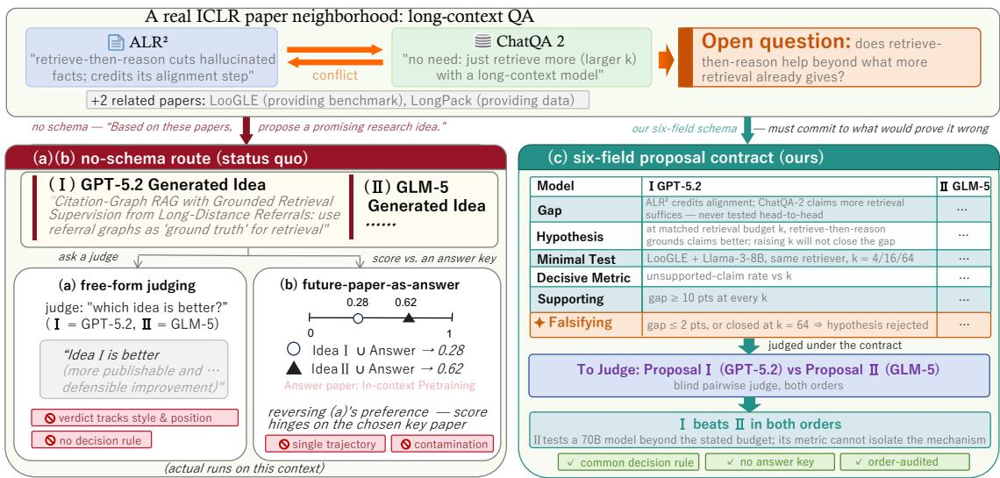
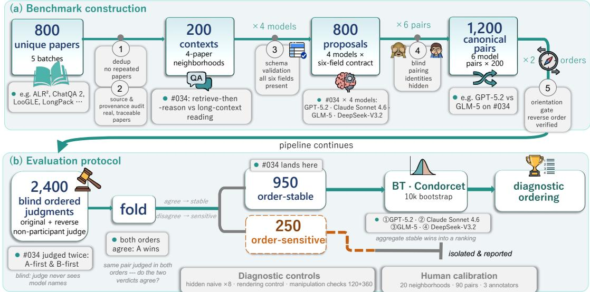
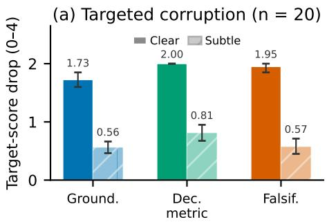
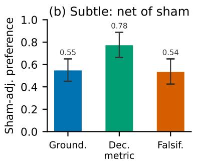
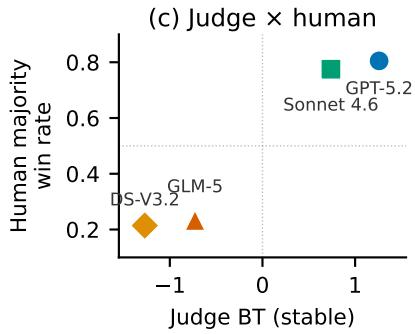

# What Proves You Wrong: Benchmarking Language Models on Falsifiable Research Ideation

Ziyue Wang<sup>∗1</sup>, Aomufei Yuan<sup>∗2</sup>, Yiran Yao<sup>∗3</sup>, Linli Yao<sup>1</sup>, Hongyao Zuo<sup>3</sup>, Ziwen Gong<sup>4</sup>, Yuanxin Liu<sup>1</sup>, Shicheng Li<sup>1</sup>, Yishuo Cai<sup>1</sup>, Tong Yang<sup>†2</sup>, Xu Sun<sup>†1</sup>, Xiaohui Li<sup>5</sup>, Haoli Bai<sup>5</sup>

<sup>1</sup>State Key Laboratory of Multimedia Information Processing, School of Computer Science, Peking University <sup>2</sup>Peking University <sup>3</sup>Tianjin University <sup>4</sup>Hainan University <sup>5</sup>Huawei Technologies {zywang25@stu.pku.edu.cn, rrustleer@gmail.com}

## Abstract

Large language models are increasingly used to propose research ideas, yet the prevailing ways of judging such ideas supply no shared decision rule: free-form judging sways with style and position, and scoring against a later paper rewards recovery of one realized trajectory. We introduce a benchmark that carries a proposal from Literature to Test: the Lit2Test benchmark centers on a six-field contract organized around a falsifying outcome, so that every proposal precommits the observation that would prove it wrong, making its quality decidable in the first place rather than merely arguable. Built prospectively from 200 real-paper neighborhoods, Lit2Test elicits proposals from four frontier models and compares them through 1,200 pairwise comparisons judged blind in both presentation orders. The protocol audits its own reliability through diagnostic controls and bounded human calibration, with three annotators corroborating the conclusions within explicitly stated reliability bounds. Lit2Test recovers a strict ranking of the four models in all 10,000 bootstrap replicates, and the separation comes from the quality of the proposed tests and metrics rather than from surface fluency. We release the benchmark, construction pipeline, and audit artifacts for public use.<sup>1</sup>

## 1 Introduction

A research proposal becomes actionable when it commits, in advance, to an observation that would force its own rejection. Without that commitment an idea can sound compelling while remaining untestable; with it, quality stops being a matter of taste and becomes something an experiment can decide. Figure 1 grounds this claim in a real four-paper ICLR neighborhood on long-context question answering (Li et al. 2024b,a; Xu et al. 2025; Zhuang et al. 2025), where two of the papers disagree: ALR<sup>2</sup> reports that retrieve-then-reason cuts hallucinated facts and credits its own alignment step, while ChatQA 2 counters that retrieving more with a longcontext model sufices. The neighborhood leaves an open question: does retrieve-then-reason help beyond what more retrieval already gives? A fluent, schema-free idea can speak to this tension without saying what measurement would settle it. A minimal falsifiable test instead specifies the controlled comparison, the decisive metric, and the outcome that would reject it; Figure 1(c) renders this commitment as the orange row. Whether language models can reliably turn tension into test is the capability this paper measures.

Measuring this capability requires an instrument that survives its own audit, and the two existing paradigms fail in sequence. Free-form judging directly asks an LLM judge which of two ideas is better; on this neighborhood the verdict tracks style and presentation position (Figure 1(a)), echoing known judge biases (Zheng et al. 2023; Wang et al. 2024), and “idea quality” is at root an object that gives the judge no decision rule. A second paradigm measures how well an idea anticipates a published follow-up paper (Qiu et al. 2025; Guo et al. 2025); it restores a reference signal yet fails diferently: the score rewards alignment with one realized trajectory, penalizing valid alternatives that pursued a diferent direction, and invites knowledge-cutof contamination whenever models can guess the target paper. The resulting instability is visible in Figure 1(b), where the verdict conflicts with the free-form judge in (a) once the answer-key paper changes. These failures motivate a benchmark that carries a proposal from Literature to Test; Table 2 (§5) compares Lit2Test with its closest neighbors.

We ask three research questions about the models; each also asks whether the instrument itself can be trusted. RQ1 (ordering and robustness): what ordering of frontier models does Lit2Test produce, and is it robust to presentation order and resampling? RQ2 (what drives the ordering): which fields of the contract separate models, and does the judge respond to substance rather than style? RQ3 (human corroboration): do sampled humans corroborate the aggregate conclusions, and where does agreement break down?

Answering these questions imposes four design goals. G1, literature grounding: every instance is a real, provenancetracked paper neighborhood rather than a bare topic. G2, an executable common unit: a six-field contract binds a literature gap, a hypothesis, a minimal test, a decisive metric, and bidirectional supporting and falsifying outcomes; its rubric rewards small-and-executable designs over grand-and-vague ones and leaves realized execution outcomes out of scope.

  
Figure 1: Three evaluation paradigms on the same input, a real ICLR neighborhood on long-context QA; every panel shows actual runs on this context, with idea I generated by GPT-5.2 and idea II by GLM-5. The two existing paradigms disagree: (a) free-form judging prefers idea I in both presentation orders, while (b) future-paper-as-answer scoring (Shi et al. 2024) prefers idea II and reverses with the choice of answer-key paper. (c) Our six-field contract route judges the same two models’ proposals written under the contract and yields a grounded verdict; “order-audited” means each pair is judged in both presentation orders.

G3, prospective comparability: all models receive the same fixed context, and no future paper is a privileged continuation. G4, auditable measurement: blind judgments in both orders, isolation of order-sensitive cases, ordinal statistics, controls, and human calibration jointly decide when a comparison is interpretable.

The Lit2Test benchmark realizes these goals at scale: 200 neighborhoods built from 800 unique papers in five batches, with four participant models (GPT-5.2, Claude Sonnet 4.6, GLM-5, and DeepSeek-V3.2) each contributing one six-field proposal per neighborhood, giving 1,200 canonical pairs and 2,400 blind ordered judgments by a non-participant judge.

Requiring every proposal to precommit its own refutation may look like a handicap on creativity; the requirement is not ours alone. A recent ideation system, ResearchStudio-Idea (IdeaSpark), imposes mechanism-linked falsification predictions as a generation-time safeguard, though its final quality judging does not score that prediction; Lit2Test instead makes the complete minimal-falsifiable-test contract the judged evaluation unit (Zhao et al. 2026). Our own controls (§4) confirm that the contract does not penalize quality: structured rendering is not by itself a gain, and contractconstrained proposals clearly beat naive baselines.

Our contributions:

• A six-field joint evaluation unit centered on minimalfalsifiable-test formulation, verified against a systematic survey of existing benchmarks (§5; full survey in Appendix F).

• A prospective construction pipeline: 200 real-paper neighborhoods and 800 model proposals built without future-paper answer keys, with provenance audits closing the contamination gap (§2).

• A reliability-audited protocol: order-aware pairwise judgment with folded aggregation, controls, diagnostics, and bounded human calibration (§3).

• Empirical findings: three bounded findings on ordering robustness, capability drivers, and human corroboration (§4).

## 2 Benchmark Construction

We formalize the task and its unit (§2.1–§2.2), then construct the 200 instances (§2.3–§2.5), realizing design goals G1–G3; the protocol realizing G4 is defined in §3.

## 2.1 Task definition and scope

An instance of the benchmark is a literature context c: a real four-paper neighborhood whose materials are fixed at construction time, chosen so that the papers share a topic while leaving a cross-paper tension that a small experiment could adjudicate. Every participant model receives the same c and nothing else, so that diferences in output reflect proposal quality rather than retrieval diferences. Given c, a model must return a single proposal P = (literature\_gap, hypothesis, minimal\_test, decisive\_metric, supporting\_result, falsifying\_result). The benchmark is the set of 200 contexts, and measurement compares proposal pairs $\left( P _ { i } , P _ { j } \mid c \right)$ through blind pairwise judgment (§3). In scope are literature synthesis, gap identification, hypothesis formulation, and the design of an executable minimal falsifiable test; execution feasibility is a first-class judged property. Out of scope are scientific creativity at large, forecasting of future publications, realized execution outcomes, and any claim that the workflow improves a model’s generation: the task measures whether a proposal is testable under the current literature, not whether it will succeed.

## 2.2 Six-field contract and design goals

The six fields are the minimal contract under which a freeform idea becomes judgeable: remove any one, and a pairwise verdict loses its common decision structure. literature\_gap ties the proposal to the supplied neighborhood so that grounded synthesis, not generic brainstorming, earns credit. hypothesis sharpens a direction into a claim with conditions, mechanism, and an expected diference, so the judge adjudicates a statement, not an aspiration. minimal\_test normalizes proposal granularity to avoid rewarding the largest agenda: proposals compete on how little sufices to discriminate the hypothesis, where the rubric’s anti-grandiosity clause applies (G2). decisive\_metric names the measurement able to adjudicate the mechanism, to avoid convenient aggregates under which every outcome reads as progress. supporting\_result andfalsifying\_result together form a bidirectional decision rule: by precommitting both the confirming and the rejecting observation, they convert falsifiability from an abstract virtue into a checkable property of the text. A falsifier need not be numerical; a qualitative direction is falsifiable when the metric, comparison, and contradictory observation are operationally clear.

## 2.3 Source selection and provenance

The benchmark comprises 200 literature contexts drawn from 800 unique source publications, organized as five batches of 40 neighborhoods and assembled from recent OpenReview/ICLR-adjacent literature. Deduplication guarantees that no paper repeats across neighborhoods; source matching verifies that each neighborhood coheres around a shared question; and a provenance audit records the origin of every paper (G1). No target or future paper is designated as the correct continuation: the neighborhood supplies context, and there is no answer key (G3). Batch dates and seed naming are documented in the construction timeline of Appendix B.

## 2.4 Proposal generation

Four participant models (GPT-5.2, Claude Sonnet 4.6, GLM-5, and DeepSeek-V3.2) each produce one native six-field proposal per neighborhood (generated directly in the schema, not converted afterwards) under a common prompt and shared generation settings, yielding 800 proposals. Schema validation checks all six fields on every response, with adjudication and bounded retries for malformed outputs, so that comparisons reflect proposal quality rather than prompt or interface diferences.

## 2.5 Pair construction

For each context, the four proposals form six model pairs, giving $2 0 0 \times 6 = 1 \mathrm { { , 2 0 0 } }$ canonical pairs (folded in §3.2). Each canonical pair is judged in both presentation orders, original and reverse, under blind model identity, producing 2,400 ordered judgments; an orientation gate verifies for every reverse task that the A/B contents are genuinely swapped, so that the order-sensitivity analysis of §3 rests on true reversals. Figure 2(a) shows the construction band of this pipeline, following one specimen, neighborhood #034 of Figure 1, through every stage. A stratified subsample of neighborhoods later serves human calibration (§4.3).

## 3 Evaluation Protocol

This protocol is part of the Lit2Test artifact: using the benchmark means running these judgments, this folding rule, and these controls. Figure 2(b) traces the flow; the order-sensitive branch terminates in reporting and never rejoins the aggregation path. §4 reports results.

## 3.1 Blind pairwise judgment

The canonical observable is a blind pairwise verdict (Zheng et al. 2023; Liu et al. 2023): the judge, Gemini 3.1 Pro (Preview), fixed per benchmark version, receives two anonymized six-field proposals for the same neighborhood with an explicit rubric and returns A, B, or TIE. The judge never participates as a generator, removing self-preference within the participant set (Zheng et al. 2023). The holistic verdict is canonical because it matches the ordinal comparison the aggregation consumes; per-dimension scores would require cardinal, equal-weight treatment across heterogeneous rubric dimensions, so we collect them only as a diagnostic layer.

## 3.2 Order folding

Because pairwise judges exhibit position bias (Wang et al. 2024; Zheng et al. 2023), each canonical pair isjudged in both presentation orders, and the two ordered verdicts are folded into one case outcome: a case is order-stable when both orientations agree on a winner after accounting for side, and order-sensitive otherwise: the winner reverses, or at least one orientation returns a tie. The order-sensitive set is an explicit deliverable reported alongside the ordering: a verdict that reverses under presentation marks a comparison the judge cannot resolve, and a symmetric average would erase that information. Throughout, the statistical unit is the canonical pair rather than the ordered row; treating forward and reverse judgments as independent observations would double the apparent sample.

## 3.3 Aggregation and uncertainty

Order-stable outcomes feed standard Bradley–Terry estimation, and Condorcet head-to-head relations summarize dominance without parametric assumptions. Uncertainty comes from a case-level bootstrap that resamples canonical cases (10,000 replicates), so reported stability reflects case-level rather than row-level variability. We fix in advance a policy for complete separation: when one model wins essentially every stable comparison against another, Bradley–Terry strengths diverge and their point values carry no calibrated meaning, so we report the ordinal structure (ranks, Condorcet relations, and bootstrap rank recovery) as the interpretable result and treat strength magnitudes as diagnostic only.

## 3.4 Diagnostic controls

A control family, defined here with results in §4, probes whether the workflow measures the intended construct. A dimension-decomposed audit re-judges a 90-pair subset with structured scores on five rubric dimensions (grounding, hypothesis specificity, minimality/feasibility, decisive metric, falsifiability) and checks their agreement with the canonical holistic verdict under both orders. Hidden controls insert proposals from a naive keyword/template baseline blind among real pairs (eight in the automated audit, four more in the human study), doubling as a real-versus-naive anchor the judge must stay above. A same-source rendering control presents schema and prose renderings of identical content, separating substance from formatting. A clear single-field manipulation check corrupts exactly one field (grounding, decisive metric, or falsifiability) with an obvious defect and requires the clean proposal to win in both orders. A subtle-corruption audit replaces obvious defects with naturalistic ones, each paired against a style-matched sham edit, so preference for the clean proposal is measured net of surface rewriting. A bounded human calibration study complements these controls: three annotators label the stratified sample of §2, with majority labels compared against thejudge on decisive orderstable cases (§4, Appendix E).

  
Figure 2: The Lit2Test pipeline: (a) benchmark construction and (b) the shipped evaluation protocol, with specimen chips tracing neighborhood #034 (the Figure 1 neighborhood) through every stage. Each of the 1,200 canonical pairs is judged in both order and finally folded into 950 order-stable plus 250 order-sensitive cases; only stable cases feed the ranking aggregation.

Scope of claims. We report agreement between verdicts and reference signals, and reserve accuracy for tasks with an objective label, such as hidden-control detection. Human labels are calibration evidence on a stratified subset; ground truth for open-ended proposals remains contested. The statistical unit is the canonical pair throughout. The results in §4 characterize the reliability and construct validity of measurement on this benchmark; benchmark-wide human validation and the downstream experimental success of proposed tests lie beyond what this protocol establishes. The canonical judge and verdict rule are fixed per benchmark version, and any replacement requires a versioned full rerun.

## 4 Experiments and Empirical Findings

Results are organized by research question and, unless noted, cover all 1,200 canonical pairs and 2,400 ordered judgments under the protocol of §3. Lit2Test deliberately reports few

aggregate numbers: the object under test is a single capability and the reliability of its own measurement, not coverage across subtasks.

## 4.1 RQ1: What ordering, and how robust

Folding the 2,400 ordered judgments into 1,200 canonical cases yields 950 order-stable and 250 order-sensitive cases. On the stable signal, Bradley–Terry estimation and Condorcet analysis both recover the ordering

$$
\mathrm { G P T \mathrm { - } 5 . 2 > C l a u d e ~ S o n n e t } 4 . 6 > \mathrm { G L M \mathrm { - } 5 > D e e p S e e k \mathrm { - } V 3 . 2 } ,
$$

and this full ordering is recovered in all 10,000 case-level bootstrap replicates (Table 1). A context-cluster bootstrap that resamples the 200 neighborhoods rather than the 1,200 pairs yields 11–27% wider confidence intervals but recovers the identical ranking in all 10,000 replicates (Appendix C). The ordering is a strict Condorcet order: each higher-ranked model wins its stable head-to-head against every lowerranked model, and it is consistent across all five construction batches. The 250 order-sensitive cases are retained and reported separately; keeping them out of the aggregation ensures the reported ordering is free of position artifacts. Two robustness checks bound this ordering further. Scoring all 250 order-sensitive cases as ties leaves the ordering unchanged with full bootstrap recovery, and even an adversarial assignment of every sensitive case preserves the two-tier structure (GPT-5.2 and Claude Sonnet 4.6 above GLM-5 and DeepSeek-V3.2), though within-tier adjacencies can flip. A second judge (Doubao Seed 2.0 Pro), from a model family disjoint from all four participants and the primary judge, independently reproduces the identical ordering, agreeing with the primary judge on 86.1% of order-stable pairwise comparisons (Appendix E). Six-pair folded detail, flip-tie and complete-separation expansions, per-batch tables, and the tie-sensitivity analysis appear in Appendix C.

<table><tr><td></td><td></td><td></td><td></td><td colspan="2">Stable W-L-T</td><td colspan="4">Folded head-to-head (W-L-T)</td><td></td></tr><tr><td>Model</td><td colspan="3">BT [95% CI]</td><td>Primary</td><td>J2</td><td>vs. GPT</td><td>vs. CS</td><td>vs. GLM</td><td>vs. DS</td><td>Human WR</td></tr><tr><td>GPT-5.2</td><td>1.26 [ 1.14,</td><td></td><td>1.40]</td><td>424-49-127</td><td>423-52-125</td><td></td><td>90-38-72</td><td>154-7-39</td><td>180-4-16</td><td>.805</td></tr><tr><td>Claude Sonnet 4.6</td><td></td><td>0.74[ 0.62,</td><td>0.87]</td><td>347-119-134</td><td>391-74-135</td><td>38-90-72</td><td></td><td>143-18-39</td><td>166-11-23</td><td>.775</td></tr><tr><td>GLM-5</td><td></td><td>-0.73 [−0.86, -0.61]</td><td></td><td>118-343-139</td><td>97-405-98</td><td>7-154-39</td><td>18-143-39</td><td></td><td>93-46-61</td><td>.233</td></tr><tr><td>DeepSeek-V3.2</td><td></td><td>-1.28 [−1.42, -1.15]</td><td></td><td>61-439-100</td><td>69-449-82</td><td>4-180-16</td><td>11-166-23</td><td>46-93-61</td><td></td><td>.214</td></tr></table>

Table 1: Main results on Lit2Test. BT: centered log-ability from the Bradley–Terry fit on order-stable cases (§3.3); 95% CIs from a 10,000-replicate case-level bootstrap. Primary / J2 Stable W–L–T: per-model wins–losses–ties over the 600 folded cases involving that model; W and L count order-stable cases, T counts order-sensitive cases. The primary judge is Gemini 3.1 Pro (Preview) (950 stable / 250 sensitive); J2 is an independent second judge (Doubao Seed 2.0 Pro) re-judging all 2,400 comparisons (980 stable / 220 sensitive). Folded head-to-head: per-pair W–L–T from the row model’s perspective over 200 folded cases per pair (primary judge). Human WR: majority win rate from the stratified human-calibration study (20 neighborhoods, 90 real pairs, 3 annotators; ties counted as 0.5). Abbreviations: GPT = GPT-5.2, CS = Claude Sonnet 4.6, GLM = GLM-5, DS = DeepSeek-V3.2.

Finding 1. Lit2Test produces a strict, fully bootstraprecovered model ordering while explicitly isolating ordersensitive cases (250 of 1,200) rather than hiding them, so the ordering carries a bounded reliability envelope rather than an unqualified leaderboard claim.

## 4.2 RQ2: What drives the ordering

We next ask which fields of the contract separate models, and whether the judge responds to substance. All 188 dimensionaudit judgments are valid. A structured overall verdict agrees with the canonical holistic verdict on 152/180 ordered judgments (84.4%, case-clustered 95% CI 78.9–89.4%), and on the eight hidden real-versus-naive controls every structured aggregation selects the real answer (8/8). Among natural model outputs, minimality/feasibility provides the strongest dimension-level diagnostic signal, whereas falsifiability yields non-tied dimension verdicts in only 33/180 judgments and is the sole decisive dimension in 1/180 comparisons. This low natural variance does not indicate an inert dimension: both manipulation checks below show that the judge enforces falsifiability when it is degraded, so natural proposals are clearing the gate rather than escaping it. Two controls address the style objection directly: a same-source rendering control shows that schema-versus-prose rendering of identical content does not by itself move the verdict; and a falsifier on/of ablation (Appendix D) shows that requiring the falsifier field is an auditability constraint rather than a generation-quality gain. Score-sum agreement variants appear in Appendix D.

The controlled single-field manipulation check verifies rubric responsiveness. When exactly one field (grounding, decisive metric, or falsifiability) is corrupted with a deliberately clear defect, clean proposals win all 40/40 ordered comparisons per dimension, with mean target-score drops of 1.73, 2.00, and 1.95 respectively and near-zero non-target drift (Figure 3a), confirming that each corruption penalizes only its intended field.

A contrast-controlled subtle-corruption audit extends this check to naturalistic defects. On the same 20 cases, each dimension receives naturalistic defect templates paired with style-matched sham edits; the sham-equivalence gate passes for all three dimensions (0 clean wins, 40 ties, 0 sham wins per dimension), so surface rewriting alone does not move the judge. Net of this sham baseline, the adjusted case-level preference for the clean proposal (defined in Appendix D) is positive with 95% CIs excluding zero for every dimension— 0.550 [0.450, 0.650] for grounding, 0.775 [0.662, 0.887] for the decisive metric, and 0.537 [0.425, 0.650] for falsifiability, pooled 0.621 [0.567, 0.679] (Figure 3a–b)—while target-score drops attenuate to means of 0.56–0.81, versus 1.7–2.0 under clear corruption. This establishes contrastcontrolled local sensitivity to naturalistic targeted defects under the frozen 20-case protocol; sham construction details and quality caveats appear in Appendix D.

Finding 2. Falsifiability defines an admissibility floor, while minimality/feasibility and decisive-metric design provide most observed separation among natural model outputs; the rendering control and both manipulation checks indicate that the judge tracks substance rather than style.

## 4.3 RQ3: Human corroboration and its boundary

A stratified calibration study tests whether sampled humans corroborate the aggregate conclusions: 20 neighborhoods covering 90 real model pairs and 4 hidden real-versus-naive controls, judged by 3 annotators blind to model identity. All three annotators are senior computer-science undergraduates working from a written bilingual protocol whose perdimension rubric anchors mirror the judge rubric, with percase time caps; a practice round on held-out cases led to a protocol revision before the formal round, and every submission passed an automated completeness validator (Appendix E). Annotators review neighborhood quality and select the proposal more suitable as a next research experiment; majority labels serve as calibration evidence rather than objective gold. Humans detect the naive control in 11/12 judgments. On the 60 order-stable real pairs, 39 produce a decisive human majority, and 34 of these 39 (87.2%, case-bootstrap 95% CI 76.9–97.4%) agree with the Gemini stable-case verdict (Figure 3c). A human Bradley–Terry fit recovers the model ordering of RQ1: 88.3% of case-bootstrap rankings difer from it by at most one inversion, and every bootstrap sample preserves the top-pair/bottom-pair tier split (Figure 3c);





  
Figure 3: Diagnostic controls and human calibration. (a) Target-score drops under clear and subtle single-field corruptions (0–4 rubric, 95% CIs; n=20 cases per dimension); clear corruptions produce large drops while subtle ones produce smaller but nonzero drops. (b) Sham-adjusted preference for the clean proposal under subtle corruption, net of style-matched sham edits; all CIs exclude zero. (c) Judge stable-case BT strength vs. human majority win rate; dashed lines mark the BT midpoint and the chance baseline. Both instruments recover the same ranking and the same two-tier separation. Human–judge agreement: 87.2% on decisive stable cases (34/39), 11/12 naive-control detection, 88.3% bootstrap rankings within one inversion.

these agreement results are robust to leave-one-annotator-out analysis (Appendix E). Inter-annotator agreement is nonetheless modest (Krippendorf’s $\alpha = 0 . 2 3 8$ on winner selection, 0.127 on neighborhood screening); majority aggregation and case bootstrap partially absorb this, and it bounds what the study can certify. Human falsifiability scores do not separate winning from losing proposals (margin 0), consistent with falsifiability acting as an admissibility floor. Full human sensitivity analyses and the consolidated diagnostics table appear in Appendix E.

Finding 3. A stratified human study corroborates the aggregate conclusions and the tier structure, while modest interannotator agreement bounds claims of exhaustive human validation.

Qualitative case studies. Instance-level evidence shows how the six-field contract decides comparisons. Closing the loop on §1, the neighborhood of Figure 1 is adjudicated along the contract: the judge prefers the contract-following proposal to the fluent one: the winner matches the retrieval budget across conditions, tracks the unsupported-claim rate as that budget grows, and precommits the falsifying outcome, while the loser names no contradicting observation and exceeds the stated resource budget. A second case concretizes Finding 2: two proposals share essentially the same hypothesis, one adopting a convenient aggregate score that would improve under many mechanisms, the other precommitting a measurement that isolates the hypothesized mechanism; judge and human majority prefer the latter in both orders, and the structured audit attributes the margin to the decisive-metric field. A third case concretizes Finding 1: two proposals trade minimality against grounding depth, reversing presentation flips the verdict, and folding marks the case order-sensitive rather than forcing a winner. In each case the adjudication traces to specific fields of the contract rather than to surface fluency.

## 5 Related Work

Research ideation covers several distinct evaluation targets, and a benchmark inherits its meaning from the one it measures (Table 2).

## 5.1 Research ideation and benchmark targets

Neighboring benchmarks evaluate at least four distinct objects. Open-ended idea quality studies elicit a proposal and score novelty, feasibility, excitement, or overall quality with expert or LLM raters (Si, Yang, and Hashimoto 2025; Ruan et al. 2026; Schopf and Färber 2026; Moussa et al. 2025). Realized-trajectory recovery scores whether a model can match, rank, or recover a later target paper from earlier inspirations (Qiu et al. 2025; Guo et al. 2025; Liu et al. 2026). Data-explanatory hypothesis generation asks models to explain observed labeled phenomena, scored by heldout predictive utility or synthetic ground-truth recovery (Liu et al. 2025). Future-impact forecasting treats later citations, awards, or benchmark outcomes as answer keys (Jiang 2026; Ye et al. 2026; Wen et al. 2025; Mule, Garikaparthi, and Patwardhan 2026). Each target is legitimate, and none centers the complete minimal-test decision contract: none requires the elicited proposal to include a refutation condition, and recovery and forecasting score alignment with one realized outcome rather than a precommitted decision rule.

## 5.2 Testability, falsification, and research agents

Our unit adapts the Registered Report, which precommits confirmatory and disconfirmatory outcomes before data collection (Henderson and Chambers 2022; Nosek et al. 2018), into a model-facing evaluation unit rather than inventing falsifiability as a principle. In AI systems, falsifiability appears at several levels: HARPA generates literature-grounded, testable proposals with required metrics and controls, evaluated partly through execution (Vasu et al. 2025); end-to-end AI-scientist systems classify outcomes only after running experiments (Lu et al. 2026); AI Co-Scientist adds explicit disproof review, a reflection stage that can return a disproved verdict (Gottweis et al. 2026). Lit2Test difers from these systems in requiring the bidirectional decision rule at proposal time, inside the judged answer. Concurrent with and independent of our work, ResearchStudio-Idea (IdeaSpark) requires and mechanically preserves a proposal-time falsification prediction (a minimal experiment, a directional expectation, a load-bearing variable, and a negative control) as a generation-time admissibility safeguard (Zhao et al. 2026). Its endpoint study normalizes outputs to title, motivation, and method before quality and novelty judging, so the falsification field lies outside its evaluated boundary, and its harness retrieves literature live. Lit2Test addresses the complementary measurement question: it fixes the literature neighborhood and presents the complete six-field contract to the judge as the evaluated unit; Appendix B documents the construction timelines of the two eforts.

Table 2: Positioning of Lit2Test against the closest research-ideation neighbors. Min. test: proposal must specify a minimal controlled experiment. Metric: an adjudicating measurement is required. Sup./Fals.: explicit bidirectional outcomes are required and evaluated. Order: same-pair forward/reverse reversal is measured. Human: bounded human calibration of the judge. Answer key: reference signal used for scoring. ${ \mathrm {  ~ Y ~ } } = { \mathrm { y e s } } ,$ P = partial or generation-time only, $\mathrm {  ~ N ~ } = \mathrm { n o } .$
<table><tr><td>System</td><td>Output unit</td><td>Min. test</td><td>Metric</td><td>Sup./Fals.</td><td>Order</td><td>Human</td><td>Answer key</td></tr><tr><td>Si et al. (Si, Yang, and Hashimoto 2025)</td><td>Full proposal</td><td>N</td><td>P</td><td>P</td><td>N</td><td>Y</td><td>Experts</td></tr><tr><td>AI Idea Bench (Qiu et al. 2025)</td><td>Motiv.+plan</td><td>N</td><td>N</td><td>N</td><td>N</td><td>N</td><td>Target paper</td></tr><tr><td>IdeaBench (Guo et al. 2025)</td><td>Hypothesis text</td><td>N</td><td>N</td><td>N</td><td>N</td><td>N</td><td>Target paper</td></tr><tr><td>HARPA (Vasu et al. 2025)</td><td>Full proposal</td><td>P</td><td>Y</td><td>P</td><td>N</td><td>N</td><td>Exec. logs</td></tr><tr><td>ResearchBench (Liu et al. 2026)</td><td>Hypothesis</td><td>N</td><td>N</td><td>N</td><td>Y</td><td>N</td><td>Target paper</td></tr><tr><td>LiveIdeaBench (Ruan et al. 2026)</td><td>Short idea</td><td>N</td><td>N</td><td>N</td><td>N</td><td>Y</td><td>Judge panel</td></tr><tr><td>HypoBench (Liu et al. 2025)</td><td>Hypotheses</td><td>N</td><td>N</td><td>N</td><td>N</td><td>Y</td><td>Labels/synth.</td></tr><tr><td>IdeaSpark (Zhao et al. 2026)</td><td>Idea card</td><td>Y</td><td>P</td><td>P</td><td>P</td><td>N</td><td>Closest lit.</td></tr><tr><td>Lit2Test (ours)</td><td>Six-field test</td><td>Y</td><td>Y</td><td>Y</td><td>Y</td><td>Y</td><td>None</td></tr></table>

## 5.3 Evaluation reliability

Pairwise comparison, LLM-as-judge protocols, position-bias analysis, and ordinal aggregation are established measurement primitives (Zheng et al. 2023; Liu et al. 2023; Wang et al. 2024; Tan et al. 2025). Several ideation and discovery evaluations already reverse candidate order (Liu et al. 2026; Gottweis et al. 2026; Wen et al. 2025; Mule, Garikaparthi, and Patwardhan 2026), calibrate an LLM judge against a human-labeled subset (Liu et al. 2025; Moussa et al. 2025; Sinhahajari, Majumder, and Poria 2026), or construct data with contamination in mind (White et al. 2025; Li, Guerin, and Lin 2024). Lit2Test claims none of these primitives as novel in isolation; its contribution is their composition around the new unit, so that the reliability evidence matches the evaluated capability.

Table 2 makes the position concrete: systems with rich falsification machinery embed it in generation or execution loops, while systems with careful pairwise reliability measure idea quality or trajectory recovery; Lit2Test supplies the missing combination: a prospective, order-audited pairwise comparison of the complete six-field contract.

## 6 Discussion and Limitations Limitations.

• Human calibration scope. The human study covers 20 of 200 neighborhoods with 3 annotators; it supports aggregate conclusions (§4.3) but not benchmark-wide validation. Expanded coverage is the direct remedy.

• Single canonical judge. Reliability is audited rather than assumed (§3–§4), and a second independent judge reproduces the ordering (§4.1), but the canonical judge remains a single LLM per version.

• Subtle-corruption audit. Construction imperfections (reserve-template replacements, moderate validator agreement, 3.9% leakage; Appendix D) are bounded by the sham-adjusted contrast design; the audit supports local sensitivity under its frozen 20-case protocol and nothing stronger.

• No execution. Measured testability is a prerequisite for downstream success, not a predictor of it.

• Domain. The 200 neighborhoods come from MLadjacent literature; the pipeline is replicable, so broader domains and temporal splits are an extension rather than a redesign.

Research opportunities. The findings suggest concrete next steps: training models for minimal-test formulation and metric–mechanism reasoning, where separation concentrates; studying human–AI collaboration where human and judge verdicts diverge; extending the subtle-corruption audit beyond its frozen protocol; and connecting prospective testability to execution-based validation.

Use of AI systems. AI assistants were used for writing polish, figure drafting, and literature cross-checking; the authors verified all content and take full responsibility for it.

## 7 Conclusion

Existing ideation benchmarks score generic quality, recover realized trajectories, or forecast outcomes, leaving unmeasured whether a model can state what would prove its own idea wrong. Lit2Test closes this gap with the six-field contract as its unit, 200 prospective real-paper neighborhoods without answer keys, and an audited protocol, yielding a strict bootstrap-recovered ordering with order-sensitive cases isolated, separation driven by test and metric design above a falsifiability floor, and human corroboration within stated limits. We release Lit2Test as a versioned, audit-oriented benchmark.

## References

Abdel-Rehim, A.; Zenil, H.; Orhobor, O. I.; Fisher, M.; Collins, R. J.; Bourne, E.; Fearnley, G. W.; Tate, E.; Smith, H. X.; Soldatova, L. N.; and King, R. D. 2024. Scientific Hypothesis Generation by a Large Language Model: Laboratory Validation in Breast Cancer Treatment. CoRR, abs/2405.12258.

Alkan, A. K.; Sourav, S.; Jablonska, M.; Astarita, S.; Chakrabarty, R.; Garuda, N.; Khetarpal, P.; Pióro, M.; Tanoglidis, D.; Iyer, K.; Polimera, M.; Smith, M. J.; Ghosal, T.; Huertas-Company, M.; Kruk, S.; Schawinski, K.; and Ciuca, I. 2025. A Survey on Hypothesis Generation for Scientific Discovery in the Era of Large Language Models. CoRR, abs/2504.05496.

Chen, T.; Anumasa, S.; Lin, B.; Shah, V.; Goyal, A.; and Liu, D. 2025. Auto-Bench: An Automated Benchmark for Scientific Discovery in LLMs. CoRR, abs/2502.15224.

Gottweis, J.; Weng, W.-H.; Daryin, A.; Tu, T.; Sirkovic, P.; Myaskovsky, A.; Glowaty, G.; Weissenberger, F.; Orlandi, A.; Popovici, D.; Palepu, A.; Rong, K.; Tanno, R.; Saab, K.; Zhang, F.; Blum, J.; Carroll, A.; Kulkarni, K.; Tomašev, N.; Zverinski, D.; Rendulic, I.; Vedadi, E.; Hasler, F.; Rimanic, L.; Boia, M.; Budiselic, I.; Feinstein, B.; Bellaiche, M.; Sheffer, T.; Freyberg, J.; Ratclif, J.; Bertolli, O.; Chou, K.; Hassidim, A.; Gokturk, B.; Vahdat, A.; Guan, Y.; Dhillon, V.; Vaishnav, E. D.; Lee, B.; Costa, T. R. D.; Penadés, J. R.; Peltz, G.; Matias, Y.; Manyika, J.; Hassabis, D.; Xu, Y.; Kohli, P.; Pawlosky, A.; Karthikesalingam, A.; and Natarajan, V. 2026. Accelerating scientific discovery with Co-Scientist. Nature, 655(8122): 487–496.

Guo, S.; Shariatmadari, A. H.; Xiong, G.; Huang, A.; Kim, M.; Williams, C. M.; Bekiranov, S.; and Zhang, A. 2025. IdeaBench: Benchmarking Large Language Models for Research Idea Generation. In Proceedings of the 31st ACM SIGKDD Conference on Knowledge Discovery and Data Mining V.2, 5888–5899. ACM.

Henderson, E. L.; and Chambers, C. D. 2022. Ten simple rules for writing a Registered Report. PLOS Computational Biology, 18(10): e1010571.

Herron, E. J.; Lama, V.; Bouknight, S.; and Ghosal, T. 2026. From Rules to Reasoning: A Survey of Large Language Model-Based Approaches to Scientific Hypothesis and Idea Generation. ACM Comput. Surv., 58(13): 346:1–346:36.

Ho, S.-T.; Liu, M.; Nghiem, H.; and Huang, F. 2026. SoundnessBench: Can Your AI Scientist Really Tell Good Research Ideas from Bad Ones? ArXiv preprint, version 1, arXiv:2605.30329.

Jiang, B. 2026. HindSight: Evaluating LLM-Generated Research Ideas via Future Impact. ArXiv preprint, version 2, arXiv:2603.15164.

Li, H.; Verga, P.; Sen, P.; Yang, B.; Viswanathan, V.; Lewis, P.; Watanabe, T.; and Su, Y. 2024a. ALR<sup>2</sup>: A Retrieve-then-Reason Framework for Long-context Question Answering. ArXiv preprint, arXiv:2410.03227.

Li, J.; Wang, M.; Zheng, Z.; and Zhang, M. 2024b. LooGLE: Can Long-Context Language Models Understand Long Contexts? In Proceedings of the 62nd Annual Meeting of the Associationfor Computational Linguistics (Volume 1: Long Papers), 16304–16333. Bangkok, Thailand: Association for Computational Linguistics.

Li, Y.; Guerin, F.; and Lin, C. 2024. LatestEval: Addressing Data Contamination in Language Model Evaluation through Dynamic and Time-Sensitive Test Construction. Proceedings of the AAAI Conference on Artificial Intelligence, 38(17): 18600–18607.

Liu, H.; Huang, S.; Hu, J.; Zhou, Y.; and Tan, C. 2025. HypoBench: Towards Systematic and Principled Benchmarking for Hypothesis Generation. arXiv:2504.11524.

Liu, Y.; Iter, D.; Xu, Y.; Wang, S.; Xu, R.; and Zhu, C. 2023. G-Eval: NLG Evaluation using GPT-4 with Better Human Alignment. In Proceedings of the 2023 Conference on Empirical Methods in Natural Language Processing, 2511–2522. Association for Computational Linguistics.

Liu, Y.; Yang, Z.; Xie, T.; Ni, J.; Gao, B.; Li, Y.; Tang, S.; Ouyang, W.; Cambria, E.; and Zhou, D. 2026. ResearchBench: Benchmarking LLMs in Scientific Discovery via Inspiration-Based Task Decomposition. In Findings of the Association for Computational Linguistics: ACL 2026, 13187–13207. Association for Computational Linguistics.

Lu, C.; Lu, C.; Lange, R. T.; Yamada, Y.; Hu, S.; Foerster, J.; Ha, D.; and Clune, J. 2026. Towards end-to-end automation of AI research. Nature, 651(8107): 914–919.

Moussa, H. N.; Da Silva, P. Q.; Adu-Ampratwum, D.; East, A.; Lu, Z.; Puccetti, N.; Xue, M.; Sun, H.; Majumder, B. P.; and Kumar, S. 2025. ScholarEval: Research Idea Evaluation Grounded in Literature. ArXiv preprint, version 2, arXiv:2510.16234.

Mule, S. P.; Garikaparthi, A.; and Patwardhan, M. 2026. Teaching Language Models to Forecast Research Success Through Comparative Idea Evaluation. In Findings oftheAssociationfor Computational Linguistics: ACL 2026, 38491– 38529. Association for Computational Linguistics.

Nosek, B. A.; Ebersole, C. R.; DeHaven, A. C.; and Mellor, D. T. 2018. The preregistration revolution. Proceedings of the National Academy ofSciences, 115(11): 2600–2606.

Qiao, S.; Wei, Y.; Wang, X.; Wu, B.; Xue, B.; Zhang, N.; Rahmani, H. A.; Wang, Y.; Zhang, Q.; Ding, K.; Pan, J. Z.; Chen, H.; and Yilmaz, E. 2026. InnoEval: On Research Idea Evaluation as a Knowledge-Grounded, Multi-Perspective Reason ing Problem. CoRR, abs/2602.14367.

Qiu, Y.; Zhang, H.; Xu, Z.; Li, M.; Song, D.; Wang, Z.; and Zhang, K. 2025. AI Idea Bench 2025: AI Research Idea Generation Benchmark. ArXiv preprint, version 3, arXiv:2504.14191.

Radensky, M.; Shahid, S.; Fok, R.; Siangliulue, P.; Hope, T.; and Weld, D. S. 2026. Scideator: Human-LLM Compound

System for Scientific Ideation through Facet Recombination and Novelty Evaluation. In Proceedings ofthe ACM Conference on AI and Agentic Systems, CAIS 2026, San Jose, CA, USA, May 26-29, 2026, 348–374. ACM.

Ruan, K.; Wang, X.; Hong, J.; Wang, P.; Liu, Y.; and Sun, H. 2026. Evaluating LLMs’ divergent thinking capabilities for scientific idea generation with minimal context. Nature Communications, 17(1): 3625.

Schopf, T.; and Färber, M. 2026. Is This Idea Novel? An Automated Benchmark for Judgment of Research Ideas. In Proceedings of the Fifteenth Language Resources and Evaluation Conference (LREC 2026), 4716–4727.

Shi, W.; Min, S.; Lomeli, M.; Zhou, C.; Li, M.; Szilvasy, G.; James, R.; Lin, X. V.; Smith, N. A.; Zettlemoyer, L.; Yih, S.; and Lewis, M. 2024. In-context Pretraining: Language Modeling Beyond Document Boundaries. In Proceedings of the Twelfth International Conference on Learning Representations (ICLR).

Si, C.; Yang, D.; and Hashimoto, T. 2025. Can LLMs Generate Novel Research Ideas? A Large-Scale Human Study with 100+ NLP Researchers. In International Conference on Learning Representations.

Sinhahajari, S.; Majumder, N.; and Poria, S. 2026. On the Limits of LLM-as-Judge for Scientific Novelty Assessment. ArXiv preprint, version 1; introduces RQ-Bench, arXiv:2606.12071.

Tan, S.; Zhuang, S.; Montgomery, K.; Tang, W. Y.; Cuadron, A.; Wang, C.; Popa, R. A.; and Stoica, I. 2025. JudgeBench: A Benchmark for Evaluating LLM-Based Judges. In International Conference on Learning Representations.

Vasu, R.; Jansen, P.; Siangliulue, P.; Sarasua, C.; Bernstein, A.; Clark, P.; and Dalvi Mishra, B. 2025. HARPA: A Testability-Driven, Literature-Grounded Framework for Research Ideation. ArXiv preprint, version 1, arXiv:2510.00620.

Wang, P.; Li, L.; Chen, L.; Cai, Z.; Zhu, D.; Lin, B.; Cao, Y.; Kong, L.; Liu, Q.; Liu, T.; and Sui, Z. 2024. Large Language Models are not Fair Evaluators. In Proceedings of the 62nd Annual Meeting of the Association for Computational Linguistics (Volume 1: Long Papers), 9440–9450. Association for Computational Linguistics.

Wen, J.; Si, C.; Chen, Y.-h.; He, H.; and Feng, S. 2025. Predicting Empirical AI Research Outcomes with Language Models. ArXiv preprint, version 1, arXiv:2506.00794.

White, C.; Dooley, S.; Roberts, M.; Pal, A.; Feuer, B.; Jain, S.; Shwartz-Ziv, R.; Jain, N.; Saifullah, K.; Dey, S.; Agrawal, S.; Sandha, S. S.; Naidu, S.; Hegde, C.; LeCun, Y.; Goldstein, T.; Neiswanger, W.; and Goldblum, M. 2025. LiveBench: A Challenging, Contamination-Limited LLM Benchmark. In International Conference on Learning Representations.

Xiong, G.; Xie, E.; Shariatmadari, A. H.; Guo, S.; Bekiranov, S.; and Zhang, A. 2024. Improving Scientific Hypothesis Generation with Knowledge Grounded Large Language Models. CoRR, abs/2411.02382.

Xiong, G.; Xie, E.; Williams, C. M.; Kim, M.; Shariatmadari, A. H.; Guo, S.; Bekiranov, S.; and Zhang, A. 2025. Toward

Reliable Scientific Hypothesis Generation: Evaluating Truthfulness and Hallucination in Large Language Models. In Proceedings ofthe Thirty-Fourth International Joint Conference on Artificial Intelligence, IJCAI 2025, Montreal, Canada, August 16-22, 2025, 7849–7857. ijcai.org.

Xu, P.; Ping, W.; Wu, X.; Xu, C.; Liu, Z.; Shoeybi, M.; and Catanzaro, B. 2025. ChatQA 2: Bridging the Gap to Proprietary LLMs in Long Context and RAG Capabilities. In Proceedings of the Thirteenth International Conference on Learning Representations (ICLR).

Yang, Z.; Liu, W.; Gao, B.; Xie, T.; Li, Y.; Ouyang, W.; Poria, S.; Cambria, E.; and Zhou, D. 2025. MOOSE-Chem: Large Language Models for Rediscovering Unseen Chemistry Scientific Hypotheses. In The Thirteenth International Conference on Learning Representations, ICLR 2025, Singapore, April 24-28, 2025. OpenReview.net.

Ye, B.; Chen, S.; Tu, J.; Liu, C.; Xiong, Z.; Schmidgall, S.; and Bitterman, D. S. 2026. Proof of Time: A Benchmark for Evaluating Scientific Idea Judgments. ArXiv preprint, version 1, arXiv:2601.07606.

Zhao, Q.; Huang, Y.; Dai, Y.; Xiao, L.; Gao, J.; Zhang, X.; Wu, W.; Li, S.; He, Y.; Lu, Y.; and Yap, K. H. 2026. ResearchStudio-Idea: An Evidence-Grounded Research-Ideation Skill Suite from ML Conference Outcomes. arXiv:2607.04439.

Zheng, L.; Chiang, W.-L.; Sheng, Y.; Zhuang, S.; Wu, Z.; Zhuang, Y.; Lin, Z.; Li, Z.; Li, D.; Xing, E. P.; Zhang, H.; Gonzalez, J. E.; and Stoica, I. 2023. Judging LLM-as-a-Judge with MT-Bench and Chatbot Arena. In Advances in Neural Information Processing Systems, volume 36, 46595–46623. Curran Associates, Inc.

Zhuang, Y.; Hu, L.; Yun, L.; Kundu, S.; Liu, Z.; Xing, E. P.; and Zhang, H. 2025. Scaling Long Context Training Data by Long-Distance Referrals. In Proceedings of the Thirteenth International Conference on Learning Representations (ICLR).

## A Task Contract, Prompts, and Running Example

## A.1 Six-Field Schema

Each participant model receives a literature neighborhood and must return a single JSON object with exactly six fields:

```json
{
"literature_gap": "...",
"hypothesis": "...",
"minimal_test": "...",
"decisive_metric": "...",
"supporting_result": "...",
"falsifying_result": "..."
}
```

## Field definitions:

• literature\_gap: A specific tension, limitation, or unanswered comparison visible across the supplied papers.

• hypothesis: A directional claim with conditions, mechanism, and expected diference.

• minimal\_test: The smallest experiment that can discriminate the hypothesis—dataset, baseline/control, procedure, and resource budget.

• decisive\_metric: The single measurement that adjudicates the mechanism (not a convenient aggregate).

• supporting\_result: The observation that would confirm the hypothesis.

• falsifying\_result: The observation that would reject it.

## A.2 Generation Prompt

The common generation prompt provided to all four participant models (verbatim, with the context JSON block specific to each neighborhood):

Formulate one minimal falsifiable next-step test,   
not a broad research proposal.   
[Context JSON: research\_context, open\_problem,   
resource\_constraint, papers (title + abstract +   
reviewer-noted limitation for each)]   
Return valid JSON with exactly six fields:   
literature\_gap, hypothesis, minimal\_test,   
decisive\_metric, supporting\_result,   
falsifying\_result.

Generation settings: temperature 1.0, max tokens 1600, up to 2 retries on schema validation failure.

## A.3 Pairwise Judge Prompt

The holistic blind pairwise judge prompt (verbatim):

You are judging two anonymous Lit2Test answers for   
the same literature context.   
The original task: derive one minimal falsifiable   
next-step test from the provided paper neighborhood.   
Prefer the answer that is more grounded in the   
provided papers, uses cross-paper tension, gives a

specific hypothesis, proposes a minimal feasible test, matches metrics to mechanisms, and states clear supporting/falsifying outcomes.

Important judging rules:   
The two answers are anonymous. Do not infer or   
discuss model identity.   
Judge relative quality only for this specific   
context.   
Penalize generic research proposals that would   
fit many unrelated paper groups.   
Penalize large unfocused experimental programs;   
reward a minimal decisive test.   
If both are truly equivalent, choose "tie".   
Return valid JSON only with this schema:   
"pair\_id": "...",   
"winner": "A" | "B" | "tie",   
"confidence": "low" | "medium" | "high",   
"main\_reason": "...",   
"weakness\_a": "...",   
"weakness\_b": "..."   
Context: [JSON]   
Answer A: [JSON]   
Answer B: [JSON]

Judge settings: Gemini 3.1 Pro (Preview), temperature 1.0, max tokens 1200.

## A.4 Running Example: Neighborhood #034

Context fifth40\_034 is the running example throughout the paper (Figures 1–2). It contains four ICLR papers on long-context question answering:

1. LooGLE: Can Long-Context Language Models Understand Long Contexts? (Li et al. 2024b)

2. ALR<sup>2</sup>: A Retrieve-then-Reason Framework for Longcontext Question Answering (Li et al. 2024a)

3. ChatQA 2: Bridging the Gap to Proprietary LLMs in Long Context and RAG Capabilities (Xu et al. 2025)

4. LongPack: Scaling Long Context Training Data by Long-Distance Referrals (Zhuang et al. 2025)

Open problem: Does retrieve-then-reason help beyond what more retrieval already gives?

Resource constraint: Public datasets and open-weight models only; ≤8 A100 GPU-days for a minimal validation; no proprietary model weights; include one baseline from a supplied paper and one from outside.

The four models’ proposals for this neighborhood, thejudge’s verdicts in both orders, and the folded outcome are available in our repository<sup>2</sup> under results/fig1\_demo/. Panel (b) of Figure 1 in the main paper uses In-context Pretraining (Shi et al. 2024) as the external answer-key anchor.

## B Construction and Provenance

## B.1 Batch Structure

The 200 literature neighborhoods are organized into five construction batches of 40 contexts each:

<table><tr><td>Batch</td><td>Internal name</td><td>Contexts</td></tr><tr><td>1</td><td>expansion40</td><td>40</td></tr><tr><td>2</td><td>next40</td><td>40</td></tr><tr><td>3</td><td>third40</td><td>40</td></tr><tr><td>4</td><td>fourth40</td><td>40</td></tr><tr><td>5</td><td>fifth40</td><td>40</td></tr></table>

All neighborhoods are drawn from recent OpenReview/ICLR-adjacent machine-learning literature. Within each batch, deduplication ensures no paper repeats across contexts, and source matching verifies topical coherence. The running example (context #034, Figures 1–2 of the main paper) belongs to batch 5 (fifth40).

## B.2 Construction Timeline

• 2026-06-17: Six-field contract finalized.

• 2026-06-20: Batch construction seeded (Seed 20260620).

• 2026-07-02/03: Full pipeline code and data snapshots fixed on GitHub.

• 2026-07-05: ResearchStudio-Idea (IdeaSpark) appears on arXiv (v1).

• 2026-07-07: Main experiment (generation + all 2,400 pairwise judgments) completed.

The contract design, batch construction, and code snapshots all predate the IdeaSpark arXiv posting by 2–18 days. The main experiment completed two days after IdeaSpark’s appearance; we do not claim the experimental results predate 2026-07-05, only the design and data.

## B.3 Orientation Defect Disclosure

An orientation defect in 65 reverse tasks of batch 1 (expansion40) was detected by internal audit: the A/B content in these reverse tasks had not been genuinely swapped relative to the original order. All 65 afected judgments were re-executed with correct orientation before any analysis, and the correction is recorded in the repository (results/main/correction\_summary.md). The corrected dataset is the one analyzed throughout the paper.

## C Full Ordinal Results, Tie Sensitivity, and Context-Cluster Bootstrap

## C.1 Six-Pair Folded Detail

Table 3 reports the full folded head-to-head outcomes from the primary judge (Gemini 3.1 Pro, Preview). Each pair has 200 folded cases; W counts order-stable wins for the row model, L counts order-stable losses, T counts order-sensitive cases.

Table 3: Complete six-pair folded outcomes (primary judge).
<table><tr><td>Pair</td><td>W (row)</td><td>L (row)</td><td>T</td></tr><tr><td>GPT-5.2 vs Claude Sonnet 4.6</td><td>90</td><td>38</td><td>72</td></tr><tr><td>GPT-5.2 vs GLM-5</td><td>154</td><td>7</td><td>39</td></tr><tr><td>GPT-5.2 vs DeepSeek-V3.2</td><td>180</td><td>4</td><td>16</td></tr><tr><td>Claude Sonnet 4.6 vs GLM-5</td><td>143</td><td>18</td><td>39</td></tr><tr><td>Claude Sonnet 4.6 vs DeepSeek-V3.2</td><td>166</td><td>11</td><td>23</td></tr><tr><td>GLM-5 vs DeepSeek-V3.2</td><td>93</td><td>46</td><td>61</td></tr></table>

Condorcet relations: each higher-ranked model wins its head-to-head strictly (beat counts 3/2/1/0, transitive, no cycle). The ordering is consistent across all five construction batches.

## C.2 Tie-Sensitivity Analysis

We assess how the ordering depends on the 250 ordersensitive cases through two schemes:

Scheme A (conservative): All 250 order-sensitive cases are scored as ties (0.5 win to each side) and merged with the 950 order-stable outcomes. Result: the full reference ordering is preserved strictly—all six head-to-head majorities remain strict, Condorcet remains transitive and identical, BT ranking unchanged. Bootstrap (10,000 replicates resampling 1,200 folded cases with sensitive-as-ties): recovery rate 1.0.

Scheme B (adversarial): Every sensitive case is awarded to the lower-ranked model in the reference ordering. Two within-tier adjacencies flip: GPT-5.2 vs Claude Sonnet 4.6 (90 vs 110, margin −20) and GLM-5 vs DeepSeek-V3.2 (93 vs 107, margin −14). The four non-adjacent relations survive with margins ≥ 86/200. The two-tier structure (GPT-5.2 and Claude Sonnet 4.6 above GLM-5 and DeepSeek-V3.2) is preserved under this worst case, though within-tier order is not.

## C.3 Context-Cluster Bootstrap

The main paper’s pair-level bootstrap treats the 1,200 canonical pairs as the resampling unit. Since the six pairs within one neighborhood share the same literature context and four proposals, they are not independent. A context-cluster bootstrap resamples the 200 neighborhoods (keeping all six pairs per neighborhood intact) and refits the Bradley–Terry model on each replicate.

Table 4: Confidence interval comparison: pair-level vs. context-cluster bootstrap (10,000 replicates each, centered log-ability).
<table><tr><td>Model</td><td>Pair CI</td><td>Cluster CI</td><td>∆</td></tr><tr><td>GPT-5.2</td><td>0.268</td><td>0.299</td><td>+11.4%</td></tr><tr><td>Claude Sonnet 4.6</td><td>0.248</td><td>0.302</td><td>+21.9%</td></tr><tr><td>GLM-5</td><td>0.245</td><td>0.311</td><td>+27.0%</td></tr><tr><td>DeepSeek-V3.2</td><td>0.277</td><td>0.333</td><td>+20.2%</td></tr></table>

The context-cluster bootstrap yields 11–27% wider confidence intervals, confirming that within-context correlation exists. However, the modal ranking is recovered in all 10,000 cluster-bootstrap replicates (fraction 1.0), matching the pairlevel result. The ordering conclusion is robust to the choice of resampling unit.

## D Subtle-Corruption Audit: Design and Caveats

## D.1 Sham-Adjusted Preference: Definition

For each of the 20 frozen cases × 3 dimensions, we construct:

• A subtle corruption: a naturalistic defect targeting exactly one field.

• A sham edit: a style-matched rewrite of the same field that does not degrade its content.

The judge compares (clean vs. subtle) and (clean vs. sham) in both presentation orders. The sham-adjusted preference is:

adj. pref. = P(clean wins | subtle) − P(clean wins | sham)

where P(clean wins) is the fraction of ordered comparisons in which the judge selects the clean proposal. A value of 0 means the judge cannot distinguish the real defect from a surface rewrite; a positive value indicates sensitivity to content degradation net of style efects.

## D.2 Sham-Equivalence Gate

Before interpreting the adjusted preference, we verify that the sham itself does not move the judge. Result: for all three dimensions, clean-vs-sham yields 0 clean wins, 40 ties, 0 sham wins per dimension. The gate passes.

## D.3 Construction Imperfections

• Reserve-template replacements: 8 of 20 cases required reserve templates (4 rounds of replacement attempts) because the initial subtle corruption or sham failed naturalness screening.

• Semantic-validator agreement: Two independent validators agreed on corruption targeting in 65.6% of cases (118/180 final judgments); 62 cases required tie-breaking by a third call. This moderate agreement reflects the inherent ambiguity of “naturalistic” defects.

• Naturalness leakage: The edited-side-guess rate among non-“unknown” responses is 3.9% (14/362), meaning the vast majority of cases pass blind naturalness screening. Among those 14, accuracy is 92.9%—so a small fraction of subtle corruptions may be stylistically detectable, but the sham-contrast design bounds their impact on the aggregate.

## D.4 Falsifier On/Of Ablation

A separate control compares proposals with and without the falsifying-result field filled. Including the falsifier does not by itself produce a generation-quality gain (the judge does not systematically prefer the version with a filled falsifier over an otherwise-identical version without one). This establishes the field as an auditability constraint—it enables the contract to be checked—rather than a quality shortcut.

## D.5 Score-Sum Agreement Variants

The dimension-decomposed audit checks whether a structured overall verdict (the winner selected by the perdimension judge) agrees with the canonical holistic verdict: 152/180 ordered judgments (84.4%). An alternative equalweight score-sum aggregation agrees with the holistic verdict on 145/180 (80.6%). A third variant using only the top-3 dimensions agrees on 170/180 (94.4%). These variants appear in the data supplement.

## E Human Calibration and Second-Judge Replication

## E.1 Annotation Protocol

Three senior computer-science undergraduates annotated 20 stratified neighborhoods (90 real model pairs + 4 hidden real-vs-naive controls). The protocol comprised:

• A written bilingual (English/Chinese) guideline with perdimension rubric anchors mirroring the judge rubric (grounding 1–3, hypothesis specificity 1–3, minimality/feasibility 1–3, decisive metric 1–3, falsifiability 1–3).

• A practice round on 3+5 held-out cases (not included in final results), after which annotator feedback led to protocol revisions: dimension anchors were made concrete with checkpoints, a TIE/INVALID taxonomy was added, external-material policy was tightened, and an automated completeness validator was introduced.

• Per-case time caps (10 minutes hard cap; annotators instructed to reduce confidence rather than exceed the cap).

• Blinded pairs (model identity hidden; A/B assignment independent of generation order).

• Every submission passed validate\_annotations.py before acceptance.

The practice and formal annotation packages are included in the repository under results/human\_study/.

## E.2 Inter-Annotator Agreement

Krippendorf’s α: 0.238 on winner selection, 0.127 on neighborhood screening. These values indicate modest agreement, consistent with the inherent subjectivity of comparing openended research proposals. Majority aggregation and caselevel bootstrap partially absorb individual disagreement.

## E.3 Leave-One-Annotator-Out

Removing each annotator in turn and recomputing the majority: the stable-case agreement rate remains 86.7–87.2%, and the BT point ordering is unchanged. The tier split (GPT-5.2/Claude above GLM-5/DeepSeek) is preserved in all leave-one-out configurations.

## E.4 Consolidated Diagnostics Table

## E.5 Second-Judge Replication

An independent second judge (Doubao Seed 2.0 Pro, from a model family disjoint from all four participants and the primary judge) re-judged all 2,400 ordered comparisons using the same prompt and pair content as the primary judge. Results:

Table 5: Diagnostic controls and human calibration (moved from main text to preserve space).
<table><tr><td>Diagnostic</td><td>Result</td></tr><tr><td>Dimension audit valid judgments</td><td>188/188</td></tr><tr><td>Structured vs. holistic agreement</td><td>152/180 (84.4%)</td></tr><tr><td>Structured order-consistency</td><td>65/90 (72.2%)</td></tr><tr><td>Hidden real-vs-naive (auto)</td><td>8/8</td></tr><tr><td>Manipulation check valid judgments</td><td>120/120</td></tr><tr><td>clean-answer wins (per dimension)</td><td>40/40</td></tr><tr><td>target-score drop (ground/metric/fals.)</td><td>1.73 / 2.00 / 1.95</td></tr><tr><td>Human naive-control detection</td><td>11/12</td></tr><tr><td>Decisive stable human agreement Human BT rankings ≤ 1 inversion</td><td>34/39 (87.2%) 88.3%</td></tr></table>

• Folded stability: 980 order-stable / 220 order-sensitive (vs. primary 950/250).

• BT ranking (ordered and folded): GPT-5.2 > Claude Sonnet 4.6 > GLM-5 > DeepSeek-V3.2—identical to the primary judge.

• Ordered-judgment agreement on the primary judge’s order-stable subset: 86.1% (1,635/1,900).

• Case-folded agreement on the Gemini-stable subset: 79.9% (759/950).

Full results are in the repository under results/second\_judge/.

## F Related Work Survey

Table 2 in the main paper compares Lit2Test against 8 closest neighbors on a focused set ofaxes. This appendix presents the full survey underlying that comparison: 27 systems examined across 16 dimensions (input type, output unit, decision-rule components, answer-key type, evaluation method, reliability primitives, scope, and falsifiability treatment). The complete comparison matrix is included as a CSV file in the repository (survey/ directory).

## F.1 Surveyed Systems

Idea-quality benchmarks and studies. Si et al. (Si, Yang, and Hashimoto 2025) run a large-scale expert study of LLM-generated ideas; AI Idea Bench (Qiu et al. 2025) and IdeaBench (Guo et al. 2025) score recovery of target papers; LiveIdeaBench (Ruan et al. 2026) evaluates divergent thinking with judge panels; RinoBench (Schopf and Färber 2026) automates novelty judgment; InnoEval (Qiao et al. 2026) frames idea evaluation as knowledgegrounded multi-perspective reasoning; ScholarEval (Moussa et al. 2025) grounds idea evaluation in retrieved literature; Scideator (Radensky et al. 2026) combines human-LLM ideation with novelty evaluation; RQ-Bench (Sinhahajari, Majumder, and Poria 2026) probes the limits of LLM-asjudge for novelty.

Hypothesis-generation benchmarks. HypoBench (Liu et al. 2025) benchmarks data-explanatory hypothesis generation; ResearchBench (Liu et al. 2026) decomposes discovery into inspiration-based tasks; Auto-Bench (Chen et al.

2025) automates scientific-discovery evaluation; MOOSE-Chem (Yang et al. 2025) rediscovers unseen chemistry hypotheses; Xiong et al. study truthfulness and hallucination in hypothesis generation (Xiong et al. 2025) and knowledgegrounded generation (Xiong et al. 2024); Abdel-Rehim et al. (Abdel-Rehim et al. 2024) validate LLM-generated hypotheses in laboratory experiments.

Future-outcome forecasting. HindSight (Jiang 2026) and Proof of Time (Ye et al. 2026) evaluate ideas by realized future impact; Wen et al. (Wen et al. 2025) predict empirical research outcomes; Mule et al. (Mule, Garikaparthi, and Patwardhan 2026) teach models to forecast research success; SoundnessBench (Ho et al. 2026) tests whether AI scientists distinguish sound from unsound ideas.

Research agents with falsification machinery. HARPA (Vasu et al. 2025) generates testability-driven proposals with execution-based evaluation; AI Co-Scientist (Gottweis et al. 2026) adds disproof-oriented review; the AI Scientist line (Lu et al. 2026) automates end-to-end research; IdeaSpark (Zhao et al. 2026) imposes generation-time falsification predictions.

Surveys. Herron et al. (Herron et al. 2026) and Alkan et al. (Alkan et al. 2025) survey LLM-based hypothesis and idea generation.

## F.2 Key Finding

No surveyed system requires the elicited proposal to include a bidirectional decision rule (supporting + falsifying outcomes) as part of the evaluated unit, while simultaneously employing order-audited pairwise judgment without a futurepaper answer key. Lit2Test is the first to occupy this position.

## G Reproduction Details and Ethics G.1 Model Versions and API Settings

Table 6: Model identifiers and generation/judging settings.

<table><tr><td>Role</td><td>Model Temp.</td></tr><tr><td>Participant GPT-5.2</td><td>1.0</td></tr><tr><td>Participant</td><td>Claude-Sonnet-4.6-hq 1.0</td></tr><tr><td>Participant</td><td>GLM-5 1.0</td></tr><tr><td>Participant</td><td>DeepSeek-V3.2 1.0</td></tr><tr><td>Primary judge</td><td>Gemini-3.1-Pro-Preview 1.0</td></tr><tr><td>Second judge</td><td>Doubao-Seed-2.0-pro 1.0</td></tr><tr><td colspan="2">Max tokens: 1600 (generation), 1200 (judging) Retries on schema failure: up to 2</td></tr></table>

All models were accessed via the same OpenAIcompatible API endpoint. The canonical judge identifier in the pipeline is Gemini-3.1-Pro-Preview-Third (the sufix denotes the routing channel, not a distinct model version).

## G.2 Randomness and Reproducibility

Closed-source model APIs do not guarantee bit-exact reproducibility across calls. Our reproducibility strategy: (1) all random seeds are fixed and documented (construction seed 20260620, bootstrap seed 20260721, cluster-bootstrap seed 20260729); (2) all raw API responses are archived in the repository; (3) all analysis scripts read from these frozen outputs, so downstream results are fully deterministic.

## G.3 Ethical Considerations

• Human annotators: Three senior CS undergraduates, compensated at standard research-assistant rates. Annotators worked voluntarily on familiar material (reading ML paper abstracts and judging research proposals). No personally identifying information was collected beyond annotation files.

• No harmful content: The benchmark concerns researchproposal formulation; no outputs contain harmful, ofensive, or personally sensitive content.

• Data provenance: All source papers are publicly available on OpenReview. No proprietary or restricted-access documents are included.

• Intended use: Lit2Test is designed as a diagnostic benchmark for research on LLM capabilities. It should not be used as a sole criterion for evaluating researchers, funding proposals, or academic merit.