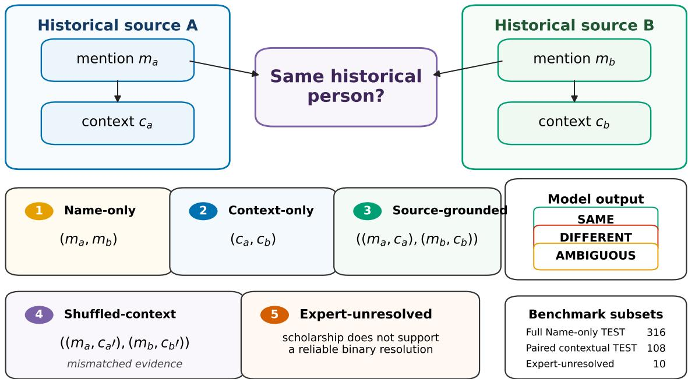
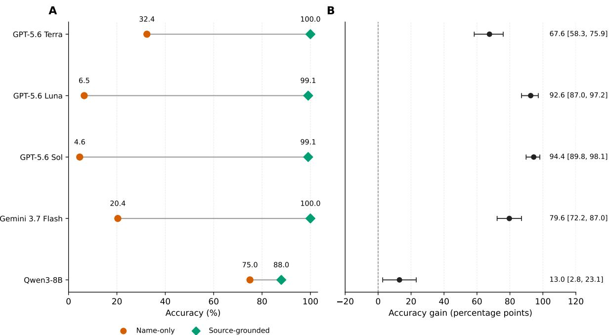
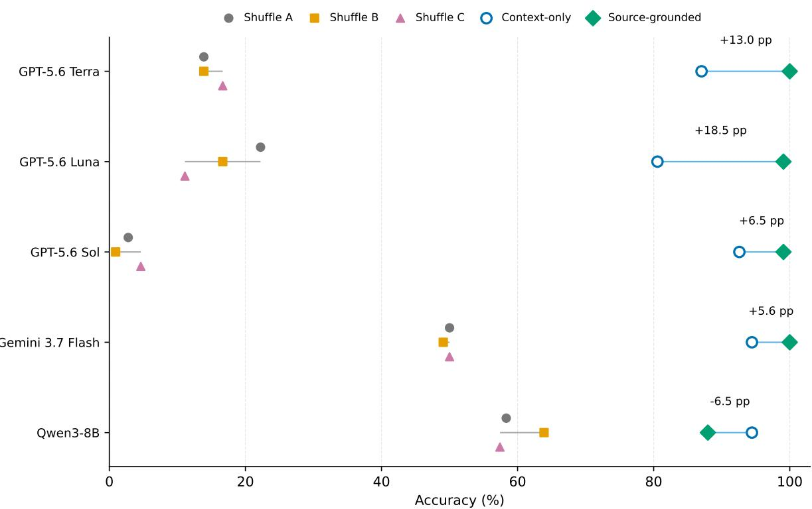
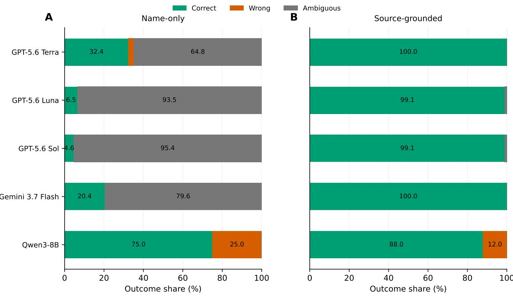

# When Names Cross Scripts: A Source-Grounded Benchmark for Historical Entity Reconciliation in the Mongol World

Xiang Chen1,∗

Zeyu Zhang2

1Independent Researcher

2University of Amsterdam & Amsterdam UMC

chenxiang001a@gmail.com

z.zhang2@uva.nl

∗Corresponding author

## Abstract

Historical people may appear under diferent languages, scripts, and transcription traditions, while distinct individuals may share highly similar or even identical names. This makes historical identity reconciliation more than a problem of string matching or transliteration. We introduce MHER, a provenance-controlled benchmark for pairwise reconciliation of person-name attestations from the Mongol world. MHER contains a balanced 396-pair Name-only core over 84 primary historical persons and a stricter 160-pair Source-grounded subset constructed from mention×source evidence, with entity-disjoint development and test splits.

Across five generative systems, correctly Source-grounded evidence improves paired TEST accuracy by 12.96–94.44 percentage points relative to Name-only input. On five identical-surface different-person cases, all models fail under names alone (0/25 model– item decisions), whereas Source-grounded evidence yields 24/25 correct resolutions, with the remaining output an abstention. Context-only ablations show that historical descriptions often carry substantial identity information, while explicitly signaled misgrounding controls produce substantially lower performance. We also find that names are not uniformly beneficial: for Qwen3-8B, restoring surface forms converts ten otherwise correct Contextonly distinctions into false identity merges.

These results show that historical entity reconciliation depends not only on surface correspondence, but on whether identity judgments respond appropriately to provenancecontrolled historical evidence. MHER therefore provides a controlled framework for studying evidence use, abstention, and failure modes in historical NLP.

## 1 Introduction

Historical people rarely possess a single stable name across the records that preserve them. The same individual may appear under forms shaped by diferent languages, scripts, transcription systems, scribal conventions, titles, and later scholarly romanizations. Conversely, distinct individuals may share near-identical—or even exactly identical—name forms. Before records from diferent sources can be aggregated into a common historical account, one must therefore answer a deceptively simple question:

Do these two attestations refer to the same historical person?

This question cannot in general be reduced to name matching. Cross-script normalization and transliteration can make orthographically distant forms more comparable, but surface correspondence is only one source of identity evidence. Two distant forms may denote the same person, while two identical forms may denote diferent people. In MHER, for example, cross-tradition attestations of the same ruler can have little direct surface overlap, whereas two attestations written identically as Oghul Qaimish correspond to diferent historical individuals whose identities are distinguished only by their chronology, kinship, and political setting. Such cases make the diference between matching a name and reconciling a person explicit.

Modern entity linking typically addresses a neighboring but structurally diferent problem: mapping a textual mention to a canonical entity in a predefined knowledge base. Multilingual systems have extended this paradigm across large numbers of languages and scripts, while cross-language entity clustering and record linkage have long shown that identity relations can also be inferred directly between observations without assuming that a complete entity inventory is known (Green et al., 2012; Fellegi and Sunter, 1969). Historical settings make this distinction particularly consequential. Knowledge bases may omit long-tail individuals, documentary evidence may be fragmentary or inconsistent, and the reconciliation represented in a modern reference resource may itself be the outcome of historical scholarship rather than an uncontested starting point.

Recent historical NLP resources have substantially broadened entity processing beyond contemporary, high-resource settings. Historical Chinese newspapers, long-tail historical knowledge extraction, Sanskrit literary entities, and multilingual historical entity linking all expose dificulties arising from spelling variation, diachrony, sparse knowledge-base coverage, and ambiguous person names (Blouin et al., 2024; Graciotti et al., 2025; Sarkar et al., 2025; Santini et al., 2026). Historical record linkage reaches a complementary conclusion: names are nonunique and error-prone, and identity decisions often become more reliable when biographical attributes such as family relationships, geography, age, or other contextual information are considered together (Abramitzky et al., 2021). These traditions suggest that historical identity should be treated as an evidence-combination problem rather than as surface-form similarity alone.

Yet providing “context” creates its own evaluation problem. A historical description is useful evidence only if it is actually associated with the attestation whose identity is being judged. Context copied from a canonical entity description may accidentally reveal the answer; two same mentions may share duplicated material; or generic topical similarity may become an unintended label cue. A contextual benchmark can therefore appear to measure historical reasoning while in fact rewarding artifacts of how the context was constructed. For historical entity reconciliation, provenance is consequently not only documentation about an example: it is part of what makes the example semantically valid.

We introduce MHER (Mongol-world Historical Entity Reconciliation), a provenance-controlled benchmark for studying this problem across languages, scripts, and transcription traditions. Rather than requiring each mention to resolve first to a modern knowledge-base identifier, MHER asks directly whether two source-attested person-name mentions denote the same historical individual. The primary gold relation is binary (same/different), while evaluated systems may explicitly abstain when the evidence presented to them is insuficient.

MHER separates two questions that are often conflated. The first is what can be inferred from the name forms themselves. The second is what becomes recoverable when independently source-grounded historical evidence is made available. To make this distinction measurable, the benchmark pairs Name-only evaluation with a stricter Source-grounded subset in which evidence is associated at the mention×source level. Context-only ablation and deterministically mismatched context controls further distinguish the information contained in historical descriptions from the correctness of their grounding. The resulting framework is intended not as another large-scale name resource, but as a controlled setting in which surface evidence, historical evidence, and evidence provenance can be varied separately.

The Mongol world provides a particularly suitable testbed for this problem. Historical persons are preserved across heterogeneous linguistic and documentary traditions, with names represented through diferent scripts, transcription conventions, titles, and later scholarly practices. At the same time, the benchmark is deliberately narrow in its historical claims: MHER is not intended to establish a universal solution to historical entity resolution. Its purpose is to make one recurring historical NLP problem experimentally tractable while retaining the source relationships on which the identity judgments depend.

Our contributions are fourfold:

• Historical entity reconciliation as an evidence-conditioned task. We operationalize pairwise identity reconciliation between historical person-name attestations, distinguishing the task from conventional mention-to-KB linking and from surface-form correspondence, while allowing explicit abstention when a binary judgment is not warranted.

• A provenance-controlled benchmark. We introduce MHER, comprising a balanced 396-pair Name-only core over 84 primary historical persons with entity-disjoint DEV/TEST splits, and a stricter 160-pair Source-grounded subset constructed from mention×source-specific evidence.

• Leakage-aware evidence intervention and falsification. We treat source provenance as part of benchmark construction, require independently grounded evidence for contextual same pairs, and accompany the paired Name-only/Source-grounded intervention with Context-only and three deterministic shufled-context controls designed to separate correct grounding from the generic presence of additional text.

• Evaluation beyond forced binary accuracy. We combine lexical, transliteration, multilingual embedding, proprietary, and open-weight systems with explicit abstention, probabilistic scoring, surface-confusable challenge cases, repeated-entity sensitivity, and a separate expertunresolved challenge. This evaluation framework is designed to distinguish incorrect identity resolution from uncertainty, surface-form reliance, and failure to use the supplied historical evidence.

The broader premise of this work is simple: names provide evidence about identity, but they are not themselves the identity relation. Historical NLP systems should therefore be evaluated not only on whether they can recognize a familiar name, but on whether their identity judgments respond appropriately to the source-grounded evidence available for that person.

## 2 Related Work

MHER lies at the intersection of multilingual entity linking, cross-script name processing, historical NLP, record linkage, and evidence-grounded model evaluation. None of these components is individually new. The distinction of the present setting is their combination: direct pairwise reconciliation of historical attestations, mention-level source provenance, and a controlled intervention that separates name-form evidence from correctly and incorrectly grounded historical context.

## 2.1 Multilingual Entity Linking and Pairwise Identity Resolution

Entity linking conventionally maps a textual mention to a canonical entity in a predefined knowledge base. Cross-lingual and multilingual work has extended this paradigm to increasingly broad language coverage. Pan et al. (2017) develop cross-lingual name tagging and linking for 282 languages, while Botha et al. (2020) formulate multilingual entity linking against a language-agnostic KB covering more than 100 languages and millions of entities. Rare entities and low-resource languages remain particularly dificult in this setting. mGENRE instead formulates multilingual entity linking autoregressively, generating multilingual entity names while still resolving mentions to a KB inventory (De Cao et al., 2022).

Mention-centric formulations bring this literature closer to MHER. MOLEMAN learns contextual representations of multilingual entity mentions and retrieves labeled mentions of the same entity rather than relying on a single entity vector (FitzGerald et al., 2021). Nevertheless, its mention pairs ultimately inherit entity identities from a KB-linked training corpus.

Pairwise identity inference without assuming that the complete entity inventory is observed also predates MHER. Most directly, Green et al. (2012) study cross-language entity clustering across documents, inferring which mentions refer to the same entity without assuming that the true entity inventory is known in advance. This is an important precedent for the structural distinction we make between

$$
m \to e _ { \mathrm { K B } }\tag{1}
$$

and

$$
m _ { a } \overset { ? } { \equiv } m _ { b } .\tag{2}
$$

MHER therefore does not claim pairwise or KB-independent identity inference as a new task family. Its focus is narrower: historically attested person mentions for which identity evidence itself may have to be reconstructed across linguistic, script, and documentary traditions.

## 2.2 Cross-Script Names and Transliteration

Name variation across writing systems has a long history in multilingual NLP. Transliteration is frequently used to increase correspondence between names written in diferent scripts and can improve candidate generation for cross-lingual entity linking. Upadhyay et al. (2018), for example, develop low-resource transliteration methods and evaluate their contribution to crosslingual EL candidate generation. Khakhmovich et al. (2020) study multilingual personal-name transliteration and cross-lingual named entity list search across a large number of languages and scripts.

Recent resources have substantially expanded the scale of multilingual name data. ParaNames contains approximately 140 million names for 16.8 million entities across more than 400 languages and is explicitly intended to support tasks including name translation, transliteration, NER, and entity linking (Sälevä and Lignos, 2024). A recent survey characterizes diferences in writing systems as a persistent “script barrier” in cross-lingual NLP and reviews the benefits and information trade-ofs associated with transliteration (Jayakumar et al., 2026).

These works motivate the transliteration-aware baselines in MHER, but name correspondence and historical identity remain diferent relations. Transliteration can help determine whether two strings are plausible cross-script renderings, but it cannot determine whether two people who share an identical or highly similar name are historically the same individual. Conversely, historically equivalent attestations may remain orthographically distant after simple transliteration. MHER therefore treats surface correspondence as one source of evidence rather than as the target relation itself.

## 2.3 Historical NLP, Entity Linking, and Record Linkage

Historical text processing introduces a combination of dificulties that are less severe in many contemporary NLP settings, including OCR or transcription noise, diachronic language variation, heterogeneous documentary conventions, and sparse resources (Ehrmann et al., 2023). Recent work has begun to move historical entity processing beyond NER toward linking, coreference, and structured historical knowledge.

Blouin et al. (2024) introduce a dataset based on Chinese historical newspapers from 1872–1949 covering NER, entity linking, coreference, and entity relations, demonstrating that historical entity processing extends well beyond modern European and Latin-script corpora. KE-MHISTO focuses on multilingual historical knowledge extraction and explicitly targets the long-tail problem, where contemporary language models and knowledge resources provide uneven coverage of historically obscure entities (Graciotti et al., 2025).

Mahan¯ ama provides an especially close neighboring setting ( ¯ Sarkar et al., 2025). Built from the Sanskrit Mahabh ¯ arata ¯ , it contains more than 109,000 mentions linked to approximately 5,500 entities and exhibits extensive name variation, ambiguity, and long-range contextual dependencies. It demonstrates that historical and literary entity resolution can require considerably more than robust surface matching.

The closest recent system-level work is MHEL-LLaMo (Santini et al., 2026), which applies multilingual bi-encoder retrieval and LLM-based confidence-aware candidate selection to historical entity linking in six European languages. This work is particularly important for positioning MHER: multilingual historical EL with LLMs already exists, and MHER is not the first benchmark or system in that category. The task boundary is instead structural. MHEL-LLaMo remains a mention-to-candidate/KB linking problem, including NIL prediction, whereas MHER asks directly whether two source attestations denote the same historical person and manipulates the evidence attached independently to the two mentions.

A complementary tradition comes from statistical record linkage. The classical Fellegi–Sunter framework treats identity matching as inference from multiple partially informative record fields (Fellegi and Sunter, 1969). Historical record linkage has subsequently shown that person matching is complicated by non-unique names, spelling variation, measurement error, and sparse records, and that supplementary information such as geography and family relationships can materially improve linkage (Abramitzky et al., 2021). MHER shares this evidence-combination view, but studies source-attested multilingual historical names and model-visible narrative evidence rather than tabular census-style records.

## 2.4 Source Grounding, Falsification, and Abstention

The distinction between having additional text and being correctly grounded in evidence is also central to contemporary language-model research. Retrieval-augmented generation conditions language models on retrieved documents in order to improve knowledge-intensive prediction (Lewis et al., 2020). Subsequent work on attributed generation shifts attention from the mere presence of retrieved material toward whether model claims are supported by verifiable sources. ALCE evaluates language-model answers together with their citations (Gao et al., 2023), while ExpertQA studies factuality and attribution using expert-curated questions and expert evaluation across specialized domains (Malaviya et al., 2024).

MHER addresses a related issue at the input rather than output level. A context is valid historical evidence only when it is correctly associated with the attestation under consideration. This motivates our mention×source representation and the shufled-context controls, which preserve the historical context pool while deliberately breaking its alignment with benchmark mentions.

More generally, NLP benchmarks are known to support unintended shortcuts. Annotation artifacts can make labels predictable from superficial cues (Gururangan et al., 2018), and models may achieve high benchmark scores by relying on heuristics that fail under controlled counterexamples (McCoy et al., 2019). Contrast-set evaluation consequently advocates meaningful perturbations of existing instances to test whether model decision boundaries reflect the intended capability (Gardner et al., 2020). MHER adopts the same challenge-set logic but uses explicitly signaled context derangements as an informed stress test: the historical context pool is preserved while pair-specific grounding is deliberately invalidated and disclosed.

Finally, MHER permits systems to abstain rather than forcing every historical identity question into a binary decision. Selective prediction formalizes the choice between answering and abstaining in NLP (Xin et al., 2021), while recent LLM work emphasizes abstention as a distinct capability requiring its own evaluation (Wen et al., 2025). Entity linking has a related notion of NIL prediction, where a mention has no appropriate target in the available KB (Zhu et al., 2023). MHER’s ambiguous action is diferent from NIL: both historical persons may exist and be well attested, while the evidence visible for a particular reconciliation question may still be insuficient to justify either same or different.

Taken together, prior work establishes each of the major ingredients behind MHER: multilingual and cross-script entity processing, pairwise identity inference, historical EL, contextual record linkage, evidence grounding, benchmark falsification, and selective prediction. Our contribution is not to claim priority over these individual traditions, but to combine them in a provenance-controlled historical benchmark where the same identity question can be evaluated under name-only, correctly grounded, context-only, and deliberately misgrounded evidence.

## 3 Historical Entity Reconciliation

Historical people rarely possess a single stable name across the records in which they appear. The same individual may be represented through diferent languages, scripts, transcription systems, scribal conventions, and later scholarly romanizations. Conversely, distinct individuals may share identical or near-identical name forms. The resulting computational problem is therefore not merely to determine whether two strings resemble one another, but whether two historically attested mentions denote the same person.

We call this task historical entity reconciliation. Given two person-name mentions drawn from historical or scholarly sources, the system must determine whether they refer to the same underlying historical individual. The formulation is deliberately pairwise: unlike conventional entity linking, reconciliation does not require either mention to be mapped first to a complete, stable, and uncontested modern knowledge-base inventory.

## 3.1 Task Formulation

Let a historical name mention be represented as

$$
m _ { i } = ( s _ { i } , \ell _ { i } , \sigma _ { i } ) ,\tag{3}
$$

where $s _ { i }$ is the attested or scholarly represented surface form, $\ell _ { i }$ denotes its language, and $\sigma _ { i }$ denotes its script, transcription system, or representation tradition. Given two mentions $\left( m _ { a } , m _ { b } \right)$ , the underlying identity relation is

$$
y ( m _ { a } , m _ { b } ) \in \{ \mathrm { s A M E , D I F F E R E N T } \} .\tag{4}
$$

A same relation states that the two mentions refer to the same historical person; different

states that they refer to distinct individuals.

This relation difers structurally from conventional entity linking. In standard knowledge-base linking, a mention is resolved to an entity in a predefined inventory,

$$
m  e _ { \mathrm { { K B } } } ,\tag{5}
$$

whereas historical reconciliation directly evaluates

$$
m _ { a } \overset { ? } { \equiv } m _ { b } .\tag{6}
$$

The distinction matters in historical settings because the target entity inventory may itself be incomplete. Long-tail individuals may have no modern knowledge-base entry, historical sources may preserve only partial information, and modern reference resources may encode one scholarly reconciliation among several possibilities. Pairwise reconciliation therefore asks a narrower question than full entity linking: whether the available evidence warrants treating two attestations as references to the same person.

## 3.2 Name Correspondence Is Not Identity

A central premise of the task is that name correspondence and historical identity are not equivalent relations. A name-matching system primarily estimates some form of correspondence between surface representations,

$$
\sin ( s _ { a } , s _ { b } ) ,\tag{7}
$$

possibly after normalization, transliteration, phonological approximation, or learned multilingual representation. Such correspondence is useful evidence for reconciliation, but it is neither necessary nor suficient for identity.

It is not necessary because the same historical person may acquire substantially diferent surface forms across languages and documentary traditions. Script conversion is often non-bijective; transcriptions may reflect diferent phonological analyses; Chinese-character renderings, alphabetic transcriptions, and later romanizations need not preserve transparent character-level similarity; and titles, patronymics, lineage markers, or abbreviated forms may be inconsistently included.

Surface correspondence is also not suficient. Historical naming systems frequently reuse personal names, titles, and lineage-associated forms. Two distinct individuals may therefore have highly similar names, or even exactly the same normalized surface representation. In such cases, increasing the sophistication of string normalization cannot by itself recover the identity relation: the relevant distinction lies outside the name string.

Formally, high surface similarity does not imply identity,

$$
\sin ( s _ { a } , s _ { b } ) \approx 1 \ \Rightarrow \ y ( m _ { a } , m _ { b } ) = \mathtt { s A M E } ,\tag{8}
$$

and low similarity does not imply non-identity,

$$
\sin ( s _ { a } , s _ { b } ) \approx 0 \ \Rightarrow \ y ( m _ { a } , m _ { b } ) = \tt { D I F F E R E N T } .\tag{9}
$$

Historical entity reconciliation must therefore admit evidence beyond form correspondence.

## 3.3 Evidence-Conditioned Reconciliation

We distinguish between evidence intrinsic to the name representation and evidence supplied by the historical record. Let $e _ { i }$ denote source-grounded evidence associated with mention $m _ { i }$ . Such evidence may describe chronology, kinship, lineage or group afiliation, political or military ofice, geographical association, or participation in historically documented events.

The reconciliation problem can then be written more generally as

$$
p \left( y \mid m _ { a } , m _ { b } , e _ { a } , e _ { b } \right) .\tag{10}
$$

This formulation motivates two conceptually distinct evidence regimes.

In the Name-only regime, the system observes the two mention representations:

$$
\begin{array} { r } { x _ { i } ^ { \mathrm { n a m e } } = ( m _ { a } , m _ { b } ) . } \end{array}\tag{11}
$$

Performance under this condition may reflect several signals simultaneously: orthographic or phonological correspondence, regularities learned across scripts and languages, prior familiarity with prominent historical figures, and the model’s willingness to resolve or abstain when names alone are uncertain.

In the Source-grounded regime, each mention is additionally accompanied by evidence tied to the historical source associated with that mention:

$$
x _ { i } ^ { \mathrm { s o u r c e } } = \left( ( m _ { a } , e _ { a } ) , ( m _ { b } , e _ { b } ) \right) .\tag{12}
$$

The underlying identity question is unchanged. What changes is the evidence made available for answering it. For paired items, the intervention

$$
x _ { i } ^ { \mathrm { n a m e } } \longrightarrow x _ { i } ^ { \mathrm { s o u r c e } }\tag{13}
$$

therefore asks whether historically grounded information changes a reconciliation decision that would otherwise have to be made from the names themselves.

Crucially, “more context” and “historical evidence” are not synonymous. Evidence is informative for reconciliation only insofar as it is correctly associated with the source attestations being compared. Establishing this association, and preventing contextual material from directly encoding the gold identity relation, is therefore part of benchmark construction rather than a purely presentational choice. We return to provenance and leakage control in Section 4, and to falsification through alternative context conditions in Section 7.

## 3.4 Resolution and Abstention

Historical evidence does not always justify a categorical identity decision. We therefore separate the benchmark’s underlying identity relation from the actions available to an evaluated system.

For the primary benchmark, gold identity remains binary:

$$
\begin{array} { r } { \mathcal { Y } = \{ \scriptstyle \mathrm { s A M E , D I F F E R E N T } \} . } \end{array}\tag{14}
$$

Models, however, may produce

$$
\begin{array} { r } { \mathcal { A } = \left\{ \mathsf { s A M E } , \mathsf { D I F F E R E N T } , \mathsf { A M B I G U O U S } \right\} , } \end{array}\tag{15}
$$

where ambiguous represents abstention rather than a third identity class. An abstaining system declines to assert either relation under the evidence presented to it.

This distinction is important because forced-choice evaluation conflates two qualitatively diferent failure modes: resolving a pair incorrectly and recognizing that the available evidence is insuficient for resolution. We therefore evaluate both ordinary reconciliation performance and selective behavior conditional on whether a model chooses to make a substantive same/different decision. Cases for which the underlying historical identification is itself treated as unresolved are evaluated separately rather than being folded into the binary benchmark core.

## 3.5 Scope

MHER instantiates historical entity reconciliation for personal names associated with the Mongol world and represented across heterogeneous linguistic, script, transcription, and scholarly traditions. The task begins from already identified person-name mentions and therefore does not evaluate named-entity recognition. Nor does it attempt to reconstruct a complete historical knowledge base.

Its central question is more specific: given two historical attestations, what can a computational system infer about their identity from the name forms alone, and what changes when independently source-grounded historical evidence becomes available?

This formulation makes name variation an important part of the problem without reducing historical identity to name matching. Names provide evidence about identity; they are not themselves the identity relation.

## 4 The MHER Benchmark

MHER is constructed from a source-linked registry of historical persons and their attested or scholarly represented name forms. The benchmark is designed so that historical identity is established before evaluation pairs are created: pair membership does not itself serve as evidence for the underlying identity relation, and model-visible inputs are separated from the scholarly information used to construct the gold standard.

Figure 1 summarizes the benchmark pipeline, and Table 1 gives the frozen composition.

## 4.1 Entities, Mentions, and Scholarly Gold

MHER is built from a source-linked registry of candidate historical persons and attested or scholarly normalized name mentions drawn from multilingual and multiscript sources concerning the Mongol world. Canonical identifiers and curator-facing metadata are used only for benchmark construction and are never exposed to evaluated systems.

A mention record separates the model-visible name representation from its source association. This distinction between entity and mention is fundamental to the benchmark: one historical person may have multiple attestations whose forms difer substantially across languages, scripts, transcription systems, and later scholarship.

Eighty-four persons satisfy the prespecified eligibility criteria for the primary binary benchmark. Gold identity is inherited from the curated scholarly registry rather than from string similarity or model behavior. Two mentions receive a same label only when both are assigned to the same confirmed historical person; a different label requires two distinct confirmed persons.

For each primary entity, curator-facing evidence records link the scholarly identification to supporting sources and uncertainty notes. These records provide the provenance layer between historical scholarship and computational gold labels and are not released in this arXiv version. All 84 primary entities underwent a systematic curator re-review against the registered evidence. We do not treat unresolved scholarly identifications as binary gold: ten such cases are retained

  
Figure 1. Overview of MHER benchmark construction and evaluation conditions. A source-linked scholarly registry defines canonical historical entities and their multilingual or multiscript mentions before evaluation pairs are generated. The balanced Name-only core is split by canonical entity. A stricter provenance-eligible subset is then constructed from mention×source-specific evidence, yielding paired Source-grounded evaluation. Context-only and deterministic shufled-context controls manipulate the same paired items without altering the underlying gold identity relation. Expert-unresolved cases are retained separately from the binary benchmark core.

separately as an expert-unresolved challenge rather than forced into either same or different.   
The limits of curator-based gold validation are discussed in Section 10.

## 4.2 Entity-Disjoint Splits and the Name-Only Core

We split the benchmark by canonical person rather than by mention pair. Seventeen primary entities are assigned to DEV and 67 to TEST, so no historical person occurs in both splits. This prevents diferent aliases or transcriptions of the same person from appearing on opposite sides of the development/test boundary.

Exact-surface hard-negative components are also kept within a single split. This matters because identical or near-identical names belonging to diferent people constitute an important diagnostic class: distributing the associated entities across DEV and TEST could indirectly expose a dificult identity contrast during development.

Evaluation pairs are generated only after the entity registry and split are fixed. To limit overrepresentation of entities with many registered variants, we cap the number of retained evaluation pairs for any unordered canonical entity pair. The resulting Name-only core contains 396 balanced binary items: 80 in DEV (40 same, 40 different) and 316 in TEST (158/158).

The 316-item TEST set serves as the benchmark’s broadest evaluation of name-form reconciliation. It includes cross-language and cross-script variation together with deliberately confusable negatives. Challenge properties—including cross-language, cross-script, near-surface, and identical-surface diferent-person cases—are assigned before model evaluation rather than

inferred retrospectively from observed errors.

We additionally assign the 84 primary entities to coarse head, mid, and long-tail prominence strata (14, 41, and 29 entities, respectively). These categories are intended only as a prespecified proxy for public visibility and possible model familiarity; they are not measurements of actual pretraining frequency.

## 4.3 The Source-Grounded Paired Subset

The Source-grounded condition is not created by simply attaching arbitrary background text to the Name-only items. It uses a stricter provenance criterion in which historical evidence is associated with individual mention × source records.

For a mention $m _ { i } ,$ its model-visible evidence $e _ { i }$ is derived from the source that attests that mention or from a separately registered source explicitly linked to it. Evidence may describe chronology, ofice or role, lineage or group afiliation, kinship, place, or participation in historical events. Its purpose is to provide historically relevant evidence from which identity may be inferred, not to state the identity relation itself.

Several constraints therefore govern inclusion. Model-visible evidence may not explicitly state that two names are “the same person,” “identified with,” or otherwise equivalent. It may not reveal registered alternative names of the target entity beyond the surface form supplied on that side. Contexts are not copied from a shared canonical entity description. For same pairs, the two sides must additionally be independently attested or independently sourced; if suitable evidence cannot be established for both sides, the item remains in the Name-only core but does not enter the paired Source-grounded subset.

These requirements yield 160 provenance-complete paired items: 52 in DEV (26/26) and 108 in TEST (54/54). The 108 TEST items therefore form a strict subset of the 316-item Nameonly TEST set. All primary comparisons between Name-only and Source-grounded evidence use these same 108 underlying identity questions; the full 316-item Name-only TEST set is reported separately as a breadth evaluation and is never used as the denominator for the paired intervention.

The Source-grounded TEST subset was fixed without consulting model outputs. All eligible same items were retained. Among different candidates, prespecified identical-surface hard negatives were retained obligatorily, while the remaining items were selected by a frozen, model-independent procedure designed to favor contextually confusable rather than trivially separable negatives. The selection procedure was fixed before formal TEST evaluation and did not use TEST outcomes.

## 4.4 Leakage-Aware Context Construction

Source-grounded benchmarks introduce a methodological risk that does not arise in the same form for surface-only evaluation: context construction can accidentally encode the desired label.

A preliminary DEV construction reused entity-level context across mentions of the same person, creating a shortcut whereby same pairs could be partially identified from duplicated contextual material. We therefore invalidated this construction and rebuilt the source-grounded condition at the mention×source level, requiring independently attested evidence for each side. The repaired benchmark was subsequently audited against exact duplication, explicit equivalence cues, registered self-name leakage, and lexical or contextual shortcut signals.

This repair changes the interpretation of provenance in MHER. Provenance is not merely bibliographic metadata attached after a benchmark item has been created. It is a constraint on what evidence is permitted to enter the evaluation input. The source associated with a context determines whether the context constitutes legitimate evidence for that mention and whether two sides of a same pair provide genuinely independent support.

Table 1. Frozen MHER benchmark composition. Source-grounded, Context-only, and shufled-context conditions operate on the same paired items. The expert- unresolved challenge is separate from the primary binary benchmark.
<table><tr><td>Component</td><td>DEV</td><td>TEST</td><td>Total</td></tr><tr><td>Primary entities</td><td>17</td><td>67</td><td>84</td></tr><tr><td>Name-only pairs</td><td>80</td><td>316</td><td>396</td></tr><tr><td>SAME</td><td>40</td><td>158</td><td>198</td></tr><tr><td>DIFFERENT</td><td>40</td><td>158</td><td>198</td></tr><tr><td>Source-grounded pairs</td><td>52</td><td>108</td><td>160</td></tr><tr><td>SAME</td><td>26</td><td>54</td><td>80</td></tr><tr><td>DIFFERENT</td><td>26</td><td>54</td><td>80</td></tr><tr><td>Context-only</td><td>52</td><td>108</td><td>160</td></tr><tr><td>Shuffled context A/B/C 3 × 52</td><td></td><td>3 ×108</td><td>480</td></tr><tr><td>Expert-unresolved</td><td></td><td>10</td><td>10</td></tr></table>

Across the repaired Source-grounded DEV and TEST sets, the final audit found no sourceindependence failure among same pairs, no exact context duplication that predicts the gold relation, no explicit model-visible equivalence statement, and no registered target-alias leakage. Prespecified simple contextual shortcuts were also checked before formal TEST execution and remained below the benchmark-failure criterion. Detailed audit inventories are retained in the frozen project state and are not released in this timestamp version.

The preliminary construction is excluded from all analyses in this paper. Only the repaired mention×source benchmark is used in DEV results, formal TEST evaluation, controls, and downstream statistical analysis.

## 4.5 Freezing, Rebuildability, and Release

Benchmark construction was completed before formal TEST execution. Entity splits, pair membership, source-grounded contexts, model-visible inputs, prompts, and evaluation requests were frozen before the corresponding TEST runs. No TEST prediction was used to alter benchmark membership, context acquisition, balancing, challenge labels, or item selection.

A frozen project state preserves the benchmark construction, evaluation inputs, execution records, and analysis outputs used for the reported results. At the time of this arXiv version, the benchmark data, item-level materials, exact execution recipes, code, and reproducibility package are not publicly released. They are planned for public release upon publication, subject to source-redistribution constraints.

MHER does not redistribute scans or extended copyrighted passages from modern scholarly editions. Upon release, model-visible historical evidence will be distributed as project-authored paraphrases accompanied by bibliographic citations and source locators. This preserves the provenance required for benchmark auditing while avoiding redistribution of third-party source text.

## 5 Experimental Design

Our experiments are designed around a controlled change in the evidence available for the same historical identity question. The primary empirical quantity of interest is therefore not a ranking between models, but the within-item change in reconciliation behavior when correctly grounded historical evidence is introduced. We complement this paired intervention with lexical and semantic baselines, context ablations, deliberately mismatched evidence, explicit abstention, and repeated-entity robustness analyses.

## 5.1 Evaluation Conditions

We evaluate five generative systems under a common set of evidence conditions. The full Nameonly TEST set contains 316 binary items and provides the broadest evaluation of cross-language and cross-script name reconciliation. All comparisons involving historical context are instead performed on the same 108-item provenance-complete TEST subset introduced in Section 4.3.

For a paired benchmark item with mentions $\left( m _ { a } , m _ { b } \right)$ and correctly associated historical evidence $( e _ { a } , e _ { b } )$ , we construct the following conditions.

Name-only. The system receives the two mention representations and their language/script metadata, but no historical context:

$$
\begin{array} { r } { x _ { i } ^ { \mathrm { n a m e } } = ( m _ { a } , m _ { b } ) . } \end{array}\tag{16}
$$

The full 316-item TEST set is used to characterize Name-only behavior broadly. The corresponding 108-item subset is used whenever Name-only performance is compared directly with a contextual condition.

Context-only. Mention surfaces and language/script metadata are removed, leaving only the two correctly associated historical contexts:

$$
\begin{array} { r } { x _ { i } ^ { \mathrm { c o n t e x t } } = ( e _ { a } , e _ { b } ) . } \end{array}\tag{17}
$$

This ablation tests how much of the reconciliation signal is contained in the historical evidence independently of the names themselves.

Source-grounded. The system receives both mentions together with their correctly associated source-grounded evidence:

$$
x _ { i } ^ { \mathrm { s o u r c e } } = \left( ( m _ { a } , e _ { a } ) , ( m _ { b } , e _ { b } ) \right) .\tag{18}
$$

Because the underlying identity relation is identical to the Name-only condition, the contrast

$$
x _ { i } ^ { \mathrm { n a m e } } \longrightarrow x _ { i } ^ { \mathrm { s o u r c e } }\tag{19}
$$

constitutes the primary paired evidence intervention.

Shufled context. To probe model behavior when historical text is present but pair-specific grounding is invalidated, we construct three deterministic mismatched-context controls:

$$
x _ { i , r } ^ { \mathrm { s h u f f l e } } = \left( ( m _ { a } , \tilde { e } _ { a , r } ) , ( m _ { b } , \tilde { e } _ { b , r } ) \right) , \qquad r \in \{ A , B , C \} .\tag{20}
$$

The three derangements are deterministic and were frozen before formal TEST. They exclude fixed-point/self-donation cases and trivial registered-alias leakage while preserving the context pool within the split and replacing the original mention–evidence association. The conditionspecific instruction explicitly discloses the derangement. These conditions therefore serve as informed misgrounding stress tests rather than blinded estimates of the efect of evidence alignment alone. The three shufles are evaluated separately rather than treated as independent benchmark observations.

Expert-signaled unresolved sanity check. Finally, ten expert-designated unresolved identity questions are evaluated separately from the binary core. These items are presented in the Name-only condition. The condition-specific instruction explicitly states that the scholarly identity relation is not securely resolved and that a binary answer is not required. This condition therefore serves as a protocol sanity check for whether systems can use the available ambiguous action under an explicitly signaled unresolved setting; it is not a blinded test of autonomous uncertainty detection.

We do not construct a Source-grounded unresolved condition because the available scholarly uncertainty notes contain explicit equivalence or uncertainty language that would leak the intended abstention target.

Taken together, each generative model receives 316 Name-only TEST items, five 108-item contextual conditions (Context-only, Source-grounded, and three shufles), and ten unresolved items.

## 5.2 Lexical, Transliteration, and Embedding Baselines

We include non-generative baselines to determine how far MHER can be solved through surface correspondence or generic semantic similarity without generative historical reasoning. All thresholds and fitted parameters are selected using DEV only; TEST labels are never used for model selection.

Name-form baselines. We evaluate exact surface matching, Unicode normalization and casefolding, normalized Levenshtein similarity, Jaro–Winkler similarity, and character 2–5- gram TF–IDF similarity. Because script variation is central to the task, we additionally apply deterministic Unidecode conversion before the same edit- and TF–IDF-based comparisons. Unidecode is used here as a reproducible cross-script ASCII fold, not as a historically faithful transliteration system.

These baselines probe an increasingly permissive hierarchy of surface correspondence: exact identity, Unicode-normalized identity, approximate within-script similarity, and approximate cross-script similarity.

Context baselines. For the paired contextual subset, we evaluate character 2–5-gram TF–IDF, word 1–2-gram TF–IDF, token Jaccard similarity, sequence similarity, context-length features, and a standardized six-feature logistic classifier. The latter is evaluated by fixed five-fold out-of-fold prediction on DEV and then refit on the complete DEV set before the locked TEST run.

These methods test whether contextual reconciliation can be reproduced by generic lexical overlap or document-level similarity rather than by combining historically relevant evidence.

Multilingual semantic embedding baseline. We additionally evaluate the first-party Google gemini-embedding-2 model as a multilingual semantic-similarity baseline under a fixed configuration. Separate decision thresholds for Name-only and Context conditions are selected on DEV and frozen before TEST execution. No TEST item is accessed during threshold selection.

## 5.3 Generative Systems

The formal generative matrix contains five systems spanning two first-party commercial providers and one open-weight local model.

We evaluate three GPT-5.6 variants—GPT-5.6 Terra, GPT-5.6 Luna, and GPT-5.6 Sol— through the oficial OpenAI Responses API. Returned model identifiers are recorded for every completed response. As an independent commercial model family, we evaluate Gemini 3.7 Flash through the first-party Google Gemini API.

For open-weight replication, we use Qwen3-8B in a frozen local quantized deployment. Exact artifact identity, runtime, and decoding provenance are preserved in the frozen project record but are not released in this arXiv version.

The five systems intentionally span substantially diferent model sizes, providers, access modes, and decision policies. We do not assume that their absolute Name-only scores are directly comparable as pure measures of historical knowledge; the primary question is whether the same evidence manipulation produces consistent changes within each system.

## 5.4 Prompting, Prediction, and Abstention

All generative systems receive the same semantic task instruction and the same output contract, adapted only where required by provider-specific API syntax. For each item, the prompt states that the task is to determine whether two historical person-name attestations refer to the same individual under the evidence provided. Except for the frozen condition-specific instruction, no gold label, canonical entity identifier, preferred scholarly name, prominence stratum, itemspecific challenge-slice annotation, or other hidden benchmark metadata is exposed to the model. The shuffled-context and expert-unresolved instructions explicitly disclose their respective control conditions. Exact prompt text is retained in the frozen project record and is not released in this arXiv version.

Each system is instructed to return an explicitly elicited confidence distribution over the three available actions,

$$
\mathbf { p } _ { i } = \left( p _ { i } ^ { \mathrm { s a m e } } , p _ { i } ^ { \mathrm { d i f f e r e n t } } , p _ { i } ^ { \mathrm { a m b i g u o u s } } \right) ,\tag{21}
$$

with

$$
p _ { i } ^ { \mathrm { s a m e } } + p _ { i } ^ { \mathrm { d i f f e r e n t } } + p _ { i } ^ { \mathrm { a m b i g u o u s } } = 1 .\tag{22}
$$

These values are self-reported confidence estimates generated in the required JSON output.   
They are not token-level log probabilities or native likelihoods returned by the provider APIs.   
We nevertheless normalize and score them as probabilistic forecasts of the requested task actions.

A short natural-language rationale is also requested, but rationales are not used to determine correctness. They are retained only for qualitative error analysis.

The categorical action is defined deterministically as

$$
\hat { y } _ { i } = \mathrm { a r g } \operatorname* { m a x } _ { a \in \{ \mathrm { s A M E , D I F F E R E N T , A M B I G U O U U s } \} } p _ { i } ^ { a } .\tag{23}
$$

If the maximum probability is tied exactly, the prediction is mapped to ambiguous. As defined in Section 3.4, ambiguous is an abstention action rather than a third gold identity relation.

Provider-specific decoding parameters and retry policies are fixed before formal TEST execution. Successful semantic predictions are never selectively rerun. Retries are permitted only for prespecified transport, quota, incomplete-generation, or output-format failures. Raw

provider responses are stored before normalization so that every scored prediction can be recovered from its original output.

## 5.5 Evaluation Metrics

For the binary benchmark core, the primary outcome is ordinary accuracy. Because the gold relation is always either same or different, an ambiguous action counts as unresolved and therefore incorrect under this metric.

We additionally report macro-F1 over the two gold identity classes. Abstaining predictions contribute as failures to recover the corresponding gold class rather than being evaluated as a third gold category.

To separate incorrect resolution from refusal to resolve, we report the abstention rate

$$
A = \frac { 1 } { n } \sum _ { i = 1 } ^ { n } \mathbb { I } [ \hat { y } _ { i } = \mathrm { \bf A M B I G U O U S } ] ,\tag{24}
$$

and selective accuracy, defined as accuracy conditional on the model making a non-abstaining same/different decision.

We additionally evaluate the quality of the explicitly elicited confidence estimates. These quantities should be interpreted as diagnostics of self-reported task confidence rather than as calibration of native token-level model probabilities. For each item we record the probability assigned to the gold relation, and summarize its mean across the evaluation set. Multiclass Brier score and log loss are computed over the three model actions using a one-hot target on the binary gold relation. Probability assigned to ambiguous is therefore penalized when the benchmark relation is known.

For the expert-unresolved challenge, we instead report the proportion of items assigned ambiguous, the complementary over-resolution rate, and the probability mass assigned to ambiguous. These quantities are descriptive because the challenge contains only ten items.

## 5.6 Paired Statistical Analysis and Repeated-Entity Robustness

The primary inferential estimand is the within-item diference between Name-only and Sourcegrounded performance on the same 108 TEST questions. The full 316-item Name-only TEST set is used only for descriptive breadth and is never compared directly with the 108-item Source-grounded set as though the denominators were interchangeable.

For each model, we tabulate the paired transitions

$$
\mathrm { w r o n g }  \mathrm { c o r r e c t } , \qquad \mathrm { c o r r e c t }  \mathrm { w r o n g } ,\tag{25}
$$

together with correct→correct and wrong→wrong. The primary hypothesis test is an exact two-sided McNemar test over the discordant pairs.

Condition-specific accuracy is accompanied by Wilson 95% confidence intervals. The change in accuracy is summarized by a paired item-level bootstrap with 200,000 resamples under a frozen resampling configuration. Because the Name-only–Source-grounded comparison is evaluated independently for five prespecified generative models, we also report Bonferroni-adjusted McNemar �-values across the five model-level primary comparisons.

The same items may occur in multiple mention pairs through a shared canonical entity, so pair-level observations are not the only plausible unit of dependence. We therefore supplement the primary item-level analysis with an entity-cluster bootstrap and repeated one-pair-per-entity sensitivity analysis. We additionally inspect leave-one-entity-out changes to determine whether a main efect is disproportionately driven by any individual historical person. These analyses are robustness checks on the paired estimand rather than replacements for it.

For the Context-only and shufled-context analyses, all comparisons remain paired on the same 108 items. The three shufled controls are reported individually; averaging across them is used only for compact descriptive summaries, not to treat the three deterministic derangements as independent replications.

Predefined cross-language, cross-script, near-surface, and identical-surface diferent-person slices are analyzed separately. Prominence-stratified analyses use the benchmark’s preassigned head/mid/ long-tail labels and are treated as secondary sensitivity analyses, not as direct evidence of training-data memorization.

## 5.7 Frozen Formal Evaluation

DEV is used for benchmark auditing, threshold selection, baseline fitting, prompt validation, and execution checks. Formal TEST evaluation begins only after benchmark membership, model-visible contexts, prompts, decision rules, baseline thresholds, and analysis code are frozen.

Dedicated formal runners do not use TEST gold labels to construct requests or select outputs. Successful model responses are not rerun based on their semantic content, and benchmark items are never modified in response to model performance.

The complete formal matrix contains seven conditions per generative system: 316 Name-only items, 108 Context-only items, 108 correctly Source-grounded items, three sets of 108 shufledcontext items, and ten expert-unresolved items, for 866 predictions per model and 4,330 formal generative predictions overall.

All benchmark splits, contexts, prompts, and evaluation inputs were frozen before formal TEST execution. The corresponding execution and scoring records are preserved in the frozen project state; item-level materials and exact execution details are withheld from this arXiv version and are planned for public release upon publication.

## 6 Main Results

We first establish how far historical identity can be recovered from surface form and generic semantic similarity, then examine the full 316-item Name-only TEST set, and finally turn to the primary paired intervention on the 108 items for which independently source-grounded evidence is available. Results for Context-only, shufled-context, and expert-unresolved conditions are reserved for Section 7; challenge slices and model- specific error behavior are analyzed in Section 8.

## 6.1 Baselines Establish a Strong Non-generative Reference

Table 2 summarizes the main frozen TEST baselines. All thresholds were selected on DEV before TEST evaluation.

On the full 316-item Name-only TEST set, exact normalized matching reaches 48.42% accuracy, Unicode Levenshtein similarity reaches 53.16%, and deterministic Unidecode conversion followed by Levenshtein similarity improves to 59.81%. The multilingual Gemini Embedding 2 baseline performs best among the non-generative Name-only systems, reaching 64.87% accuracy (macro-F1 = .625).

The contextual baselines are stronger. On the 108-item paired TEST subset, the best traditional context-similarity baseline, token Jaccard, reaches 76.85% accuracy, while Gemini Embedding 2 reaches 86.11% (macro-F1 = .861). Thus both cross-script normalization and generic multilingual semantic representation recover substantial signal, but neither eliminates the remaining historical identity ambiguity.

<table><tr><td>Evidence</td><td>Method</td><td>Accuracy</td><td>Macro-F1</td></tr><tr><td rowspan="5">Name</td><td>Exact normalized match</td><td>48.42</td><td>.326</td></tr><tr><td>Unicode Levenshtein</td><td>53.16</td><td>.453</td></tr><tr><td>Unidecode + Levenshtein</td><td>59.81</td><td>.598</td></tr><tr><td>Gemini Embedding 2</td><td>64.87</td><td>.625</td></tr><tr><td>Token Jaccard</td><td>76.85</td><td>.758</td></tr><tr><td>Context</td><td>Gemini Embedding 2</td><td>86.11</td><td>.861</td></tr></table>

Table 2. Frozen non-generative TEST baselines. Name-form methods are evaluated on the full 316-item Name-only TEST set; context methods use the paired 108-item TEST subset. All thresholds and fitted parameters were selected on DEV only.
<table><tr><td>Model</td><td>Acc.</td><td>Macro-F1</td><td>Abst.</td><td>Sel. Acc.</td></tr><tr><td>GPT-5.6 Terra</td><td>35.13</td><td>.495</td><td>63.61</td><td>96.52</td></tr><tr><td>GPT-5.6 Luna</td><td>6.01</td><td>.110</td><td>93.99</td><td>100.00</td></tr><tr><td>GPT-5.6 Sol</td><td>4.11</td><td>.079</td><td>95.89</td><td>100.00</td></tr><tr><td>Gemini 3.7 Flash</td><td>16.77</td><td>.270</td><td>83.23</td><td>100.00</td></tr><tr><td>Qwen3-8B</td><td>67.09</td><td>.671</td><td>0.00</td><td>67.09</td></tr></table>

Table 3. Name-only behavior on the full 316-item TEST set. Accuracy and abstention should be interpreted jointly: the four API systems frequently decline to resolve identities from names alone, whereas Qwen3-8B makes a binary decision for every item. Selective accuracy is accuracy conditional on a non-abstaining prediction.

## 6.2 Name-only Reconciliation Is Strongly Model-policy Dependent

The full 316-item Name-only TEST set reveals large diferences in how generative systems behave when historical identity must be inferred from name forms alone. Table 3 reports ordinary accuracy together with abstention and selective accuracy.

GPT-5.6 Terra reaches 35.13% ordinary accuracy and abstains on 63.61% of the benchmark. GPT-5.6 Luna and Sol are substantially more conservative: their raw accuracies are only 6.01% and 4.11%, respectively, because they abstain on 93.99% and 95.89% of the items. Yet when these systems do make a binary decision, Luna and Sol are correct on every such decision, while Terra reaches 96.52% selective accuracy.

Gemini 3.7 Flash exhibits the same broad pattern: 16.77% ordinary accuracy, 83.23% abstention, and 100% selective accuracy. Qwen3-8B behaves in the opposite way. It never abstains on the full Name-only TEST set and therefore achieves much higher raw coverage, but its accuracy is 67.09%.

These results make raw Name-only accuracy dificult to interpret as a simple ranking of historical knowledge. The systems occupy very diferent points on the coverage–resolution spectrum: the API models frequently decline to resolve uncertain names, whereas Qwen3-8B resolves aggressively. Name-only performance therefore reflects not only name-form evidence and possible prior familiarity, but also a model-specific decision policy toward uncertainty.

This distinction motivates the paired intervention below. The relevant question is not whether one system has the highest Name-only accuracy, but whether supplying independently grounded historical evidence changes the decision on the same identity questions.

<table><tr><td>Model</td><td>Name</td><td>Source</td><td>Δ</td><td>95% CI</td><td>W→C</td><td>C→W</td></tr><tr><td>Terra</td><td>32.41</td><td>100.00</td><td>+67.59</td><td>[58.33, 75.93]</td><td>73</td><td>0</td></tr><tr><td>Luna</td><td>6.48</td><td>99.07</td><td>+92.59</td><td>[87.04, 97.22]</td><td>100</td><td>0</td></tr><tr><td>Sol</td><td>4.63</td><td>99.07</td><td>+94.44</td><td>[89.81, 98.15]</td><td>102</td><td>0</td></tr><tr><td>Gemini</td><td>20.37</td><td>100.00</td><td>+79.63</td><td>[72.22, 87.04]</td><td>86</td><td>0</td></tr><tr><td>Qwen3-8B</td><td>75.00</td><td>87.96</td><td>+12.96</td><td>[2.78, 23.15]</td><td>23</td><td>9</td></tr></table>

Table 4. Primary paired TEST result on the same 108 historical identity questions. Name and Source report ordinary accuracy (%). Δ is the Source-grounded minus Name-only accuracy diference in percentage points; confidence intervals are paired item-bootstrap 95% intervals. W→C and C→W denote wrong-to-correct and correct-to-wrong transitions, respectively.

## 6.3 Source-grounded Evidence Produces Large Paired Gains

Table 4 reports the primary comparison on the 108-item paired TEST subset. The identity questions are identical between conditions; only the available evidence changes from Name-only to Source-grounded.

All five systems improve under Source-grounded evidence. The four first-party API systems show especially large changes. GPT-5.6 Terra rises from 32.41% to 100.00%, a gain of 67.59 percentage points. GPT-5.6 Luna rises from 6.48% to 99.07% (+92.59 points), GPT-5.6 Sol from 4.63% to 99.07% (+94.44), and Gemini 3.7 Flash from 20.37% to 100.00% (+79.63).

The paired transition structure is strikingly asymmetric for these four systems. Terra contains 73 wrong→correct transitions and no correct→wrong transition; Luna contains 100 and 0; Sol 102 and 0; and Gemini 86 and 0. Exact McNemar tests are correspondingly extremely small, and all four comparisons remain significant after correction across the five prespecified model-level tests.

Qwen3-8B also improves, but the efect is smaller and less one-sided. Accuracy rises from 75.00% to 87.96%, a gain of 12.96 points (95% paired-bootstrap CI [2.78 23.15]). Its transition table contains 23 wrong→correct and nine correct→wrong changes. The raw exact McNemar test gives � = .0201; under the prespecified five-model Bonferroni adjustment, this becomes approximately � = .100. We therefore treat the Qwen gain as positive but individually weaker inferential evidence than the four first-party comparisons.

Figure 2 visualizes the same paired contrast. The principal pattern is not a common absolute Name-only starting point: the five systems begin from radically diferent decision policies. Rather, the common pattern is a strong movement toward correct resolution once the identity question is accompanied by source-linked historical evidence.

The magnitude of the efect is also notable relative to non-generative baselines. On the same contextual TEST subset, Gemini Embedding 2 reaches 86.11% when comparing the historical contexts semantically. Source-grounded generative performance ranges from 87.96% for Qwen3-8B to 100% for Terra and Gemini. The result is therefore not explained simply by replacing cross-script name similarity with a strong multilingual embedding score.

At the same time, the near-ceiling results of the first-party systems should not be interpreted as evidence that historical entity reconciliation is generally solved. The paired subset is deliberately restricted to cases for which independently sourced and provenance-traceable evidence exists on both sides. What the intervention demonstrates is that, within this evidence- eligible subset, exposing the correct historical evidence can resolve identity questions that remain highly uncertain under names alone.

  
Figure 2. Accuracy on the paired 108-item TEST subset under Name-only and Source-grounded evidence. Panel A shows condition-specific accuracies. Panel B shows Source-grounded minus Name-only accuracy gains with paired item-bootstrap 95% confidence intervals. The four first-party API systems move from highly abstention-dominated Name-only behavior to near-ceiling Source-grounded resolution; Qwen3-8B shows a smaller but positive paired gain.

## 6.4 Correct Evidence Compresses Cross-model Behavioral Diferences

The five systems disagree sharply in the Name-only condition because they adopt very diferent uncertainty policies. On the paired subset, Name-only accuracy ranges from 4.63% for Sol to 75.00% for Qwen3-8B. Once Source-grounded evidence is supplied, the range contracts to 87.96–100.00%.

This convergence is important because it occurs despite substantial diferences in model family, provider, access mode, and propensity to abstain. The result therefore does not suggest that all models behave similarly in the absence of evidence. Instead, it indicates that correctly associated historical evidence acts as a stabilizing signal across otherwise divergent decision policies.

Section 7 examines whether this convergence persists when names are removed and when pairspecific grounding is deliberately invalidated and explicitly disclosed. These conditions provide ablations and informed stress tests rather than a blinded causal estimate of evidence alignment alone. We also show there that removing the names altogether does not produce a uniform pattern across model families, which becomes important for interpreting the open-weight model’s behavior.

## 7 Falsification and Ablation Analysis

The primary intervention in Section 6 establishes that Source-grounded evidence changes reconciliation behavior on the same historical identity questions. That comparison alone, however, does not show which component of the contextual condition is responsible for the efect. Historical context may carry suficient identity information even without the name forms, and arbitrary additional text could in principle introduce dataset- or topic-level shortcuts.

<table><tr><td>Model</td><td>Ctx.-only</td><td>Source</td><td>Shuffle range</td><td> $\Delta \mathsf { s \mathrm { - } } \mathsf { c }$ </td><td>∆s-Shuf</td></tr><tr><td>Terra</td><td>87.04</td><td>100.00</td><td>13.89-16.67</td><td>+12.96</td><td>+85.19</td></tr><tr><td>Luna</td><td>80.56</td><td>99.07</td><td>11.11-22.22</td><td>+18.52</td><td>+82.41</td></tr><tr><td>Sol</td><td>92.59</td><td>99.07</td><td>0.93-4.63</td><td>+6.48</td><td>+96.30</td></tr><tr><td>Gemini</td><td>94.44</td><td>100.00</td><td>49.07–50.00</td><td>+5.56</td><td>+50.31</td></tr><tr><td>Qwen3-8B</td><td>94.44</td><td>87.96</td><td>57.41-63.89</td><td>-6.48</td><td>+28.09</td></tr></table>

Table 5. Falsification and ablation results on the paired 108-item TEST set. $\Delta _ { \mathsf { S } - \mathsf { C } }$ is Source-grounded minus Context-only accuracy. $\Delta _ { \mathrm { S - S h u f } }$ is Source-grounded minus the mean of the three deterministic shufled-context accuracies. The three derangements are analyzed separately rather than treated as independent replications.

We therefore analyze three complementary controls: Context-only removes name surfaces while preserving the correctly associated historical evidence; three deterministic shufled-context conditions preserve the context pool while destroying mention–evidence alignment; and an expert-signaled unresolved sanity check verifies whether the common prediction protocol supports abstention when unresolved status is explicitly disclosed. Finally, we test whether the primary paired result is robust to repeated canonical entities.

## 7.1 Historical Context Carries Substantial Signal Without Names

The Context-only condition removes both mention surfaces and language/script metadata while preserving the two correctly associated historical contexts. Performance remains high across all five systems (Table 5), ranging from 80.56% for GPT-5.6 Luna to 94.44% for both Gemini 3.7 Flash and Qwen3-8B.

For the four first-party API systems, restoring the name forms produces a further numerical increase: Source-grounded exceeds Context-only by 12.96 percentage points for Terra, 18.52 for Luna, 6.48 for Sol, and 5.56 for Gemini. These diferences indicate that name-form evidence can remain useful once strong historical context is available, although the majority of the recoverable signal is already present in the historical evidence itself.

Qwen3-8B is the important exception. Its Context-only accuracy is 94.44%, whereas Sourcegrounded accuracy is 87.96%, a numerical decrease of 6.48 points. The paired Source-grounded– Context-only McNemar comparison is not statistically significant $( p = . 0 9 2 3 )$ , so we do not interpret this diference as evidence of a general degradation efect. It nevertheless shows that name surfaces are not uniformly additive across model families. We return to the directional structure of Qwen’s errors in Section 8.

These results refine the interpretation of the primary intervention. Source-grounded reconciliation should not be understood simply as a setting in which names are augmented with useful background text. Historical context itself carries substantial identity information, and the marginal value of restoring name surfaces depends on the evaluated system.

## 7.2 Correctly Grounded and Explicitly Misgrounded Evidence Produce Divergent Behavior

The shufled-context controls provide an informed misgrounding stress test. They preserve the same pool of historical contexts, together with its source mix, writing style, topic distribution, and length distribution, while replacing the original mention–evidence association with a frozen derangement.

Because the condition-specific prompt explicitly informs models that the contexts were drawn from other historical entities under this derangement, the comparison is not a blinded test of whether models can autonomously detect incorrect provenance, nor does it isolate evidence alignment from the control instruction itself. Instead, it tests how systems behave when the same historical context pool is presented under deliberately invalidated and explicitly disclosed grounding.

  
Figure 3. Falsification and ablation analysis on the paired 108-item TEST set. Horizontal ranges summarize the three deterministic shufled-context controls; Context-only and correctly Source-grounded accuracy are shown separately. Correctly Source-grounded evidence substantially outperforms the three explicitly signaled misgrounding controls across all five systems. The annotation beside each model gives Sourcegrounded minus Context-only accuracy.

If performance remained high even under this disclosed misgrounding condition, that would indicate that generic historical prose or corpus-level contextual regularities were suficient to sustain reconciliation despite the absence of valid pair-specific evidence.

## It does not.

Across all five systems, each correctly Source-grounded endpoint lies well above all three shufled controls. Terra scores 100.00% with correct grounding but only 13.89–16.67% after shufling. Luna falls from 99.07% to 11.11–22.22%, and Sol from 99.07% to 0.93–4.63%. Gemini behaves diferently in absolute terms, but the same falsification holds: 100.00% with correct evidence versus approximately chance accuracy (49.07–50.00%) under the three shufles. Qwen3- 8B, which is generally more willing to make binary decisions, falls from 87.96% to 57.41–63.89%.

Averaged over the three deterministic shufles, the gap between correct Source-grounded evidence and mismatched evidence is 85.19 percentage points for Terra, 82.41 for Luna, 96.30 for Sol, 50.31 for Gemini, and 28.09 for Qwen3-8B. Even for Qwen—the system with the smallest primary Name-only–Source-grounded efect—all three exact Source-grounded versus Shufle comparisons strongly favor correctly grounded evidence (raw McNemar $p \leq 4 . 1 0 \times 1 0 ^ { - 4 } )$ .

The control shows that the high Source-grounded endpoint is not reproduced when pairspecific grounding is explicitly invalidated and disclosed. Because the Source-grounded and shufled conditions also difer in their condition-specific instructions, the resulting gap should not be interpreted as a blinded causal estimate of alignment alone. It nevertheless rules out the stronger possibility that the same historical prose is suficient to sustain near-ceiling performance even when it is explicitly presented as misgrounded evidence. The same historical text can be highly informative when associated with the correct attestations and actively unhelpful when associated with the wrong ones. Source-grounded performance therefore cannot be attributed simply to longer inputs, historical register, or generic semantic richness.

The shufled controls are therefore most informative when interpreted together with the Context-only and Source-grounded conditions. Context-only establishes that correctly associated historical descriptions carry substantial identity signal; Source-grounded measures behavior when those descriptions are paired with the corresponding names; and the shufled conditions characterize behavior when pair-specific grounding is deliberately invalidated and disclosed. Their performance is not reproduced by a benchmark-wide contextual shortcut that survives reassignment: once the mention–source relation is broken, accuracy collapses despite preserving the underlying context corpus. Model-specific behavior under mismatched evidence is analyzed further in Section 8.

## 7.3 Expert-Signaled Unresolved Cases Provide a Protocol Sanity Check

The primary binary benchmark contains only identity relations that were treated as suficiently established for same or different gold assignment. MHER-Unresolved instead contains ten identity questions retained outside this core because the scholarly relation was not adjudicated as a resolved binary fact.

The condition-specific instruction explicitly identifies these items as expert-unresolved and states that a binary answer is not required. The set therefore functions as a protocol sanity check for whether evaluated systems can use the available ambiguous action when unresolved status is explicitly signaled, rather than as a blinded test of whether models can discover historiographical uncertainty autonomously.

All five generative systems return ambiguous on all ten cases: 50 abstentions in 50 model–item decisions. Thus the common prediction protocol does not force a binary resolution when applied to this separate expert-unresolved set.

We interpret this result narrowly. It demonstrates that the common output protocol supports abstention as an operationally meaningful action when an expert-designated unresolved condition is explicitly disclosed. It does not show that the models independently inferred scholarly uncertainty from the name forms, nor does it establish how they would behave if unresolved status had to be diagnosed without a condition cue.

We do not construct a Source-grounded unresolved condition because the available scholarly uncertainty notes contain explicit uncertainty or equivalence language that would leak the desired abstention target. A stronger future design would supply independently sourced, neutral evidence without an explicit unresolved designation and test whether systems can identify insuficient evidence autonomously.

## 7.4 The Main Efect Is Not Driven by Repeated Entities

Although DEV and TEST are entity-disjoint, multiple TEST pairs can still involve the same canonical person within a split. The paired 108-item TEST subset contains 31 canonical entities that occur in more than one item. We therefore test whether the Name-only–Source-grounded gain is an artifact of a small number of repeatedly represented entities.

The result is highly stable for the four first-party API systems. Entity-cluster bootstrap mean gains are 70.37 points for Terra (95% CI [65.43, 75.64]), 93.18 for Luna ([90.48, 96.30]), 93.87 for Sol ([92.11, 96.05]), and 77.01 for Gemini ([73.33, 80.77]). Repeated one-pair-per-entity thinning produces similarly large estimates, and leave-one-entity-out analysis changes the full paired gain by at most 2.19 percentage points for any of these systems.

<table><tr><td>Model</td><td>Pair gain (pp)</td><td>Cluster boot. LOO range mean [95% CI]</td><td>(pp)</td></tr><tr><td>Terra</td><td>+67.59</td><td>+70.37 [65.43, 75.64]</td><td>65.69-69.70</td></tr><tr><td>Luna</td><td>+92.59</td><td>+93.18 [90.48, 96.30]</td><td>91.92–94.17</td></tr><tr><td>Sol</td><td>+94.44</td><td>+93.87 [92.11, 96.05]</td><td>93.94–95.28</td></tr><tr><td>Gemini</td><td>+79.63</td><td>+77.01 [73.33, 80.77]</td><td>78.43–81.82</td></tr><tr><td>Qwen3-8B</td><td>+12.96</td><td>+12.08 [7.04, 16.67]</td><td>9.80-15.53</td></tr></table>

Table 6. Repeated-entity robustness for the primary Name-only to Source-grounded intervention. Cluster bootstrap resamples canonical entities rather than individual pairs. LOO reports the range of paired gains after removing each entity in turn. Additional entity-level sensitivity outputs are retained in the frozen project record.

Qwen again shows a smaller but directionally consistent efect. Its entity-cluster bootstrap gain is 12.08 points (95% CI [7.04, 16.67]), close to the full pair-level estimate of 12.96 points. The repeated one-pair-per-entity sensitivity has a mean gain of 13.61 points but a wider 95% interval ([−3.23 30.00]), reflecting the weaker and less one-sided Qwen result. Its leave-one-entity-out gain remains positive for every removed entity, ranging from 9.80 to 15.53 points.

Taken together, the ablations and falsification controls support a more specific interpretation of the main result. Historical context is itself a strong source of identity evidence, while the near-ceiling Source-grounded endpoint is not reproduced under the explicitly signaled misgrounding conditions. The primary efect also persists after accounting for repeated entities and is therefore not explained by a small number of heavily represented persons.

At the same time, the controls reveal meaningful model heterogeneity: Source-grounded evidence is not uniformly superior to Context-only evidence, and systems respond diferently when evidence is deliberately misaligned. Section 8 examines these diferences at the level of surface-confusable cases, abstention and probabilistic behavior, and model-specific errors.

## 8 Model Behavior and Error Analysis

Aggregate accuracy conceals substantial diferences in how the evaluated systems use names, historical evidence, and abstention. We therefore examine four aspects of model behavior: performance on cases in which surface-form similarity is actively misleading; the directional error pattern of the open-weight Qwen3-8B model; changes in abstention and probabilistic quality across evidence conditions; and sensitivity to entity prominence.

These analyses reinforce the distinction introduced in Section 3.2: name correspondence is evidence about historical identity, but it is not itself the identity relation.

## 8.1 Surface-confusable Cases Expose the Limit of Name Matching

The clearest diagnostic cases are those for which surface similarity and historical identity point in diferent directions.

On the seven prespecified near-surface items in the paired TEST set, every generative model scores 0/7 under Name-only evidence. With correctly Source-grounded evidence, Terra, Luna, Gemini, and Qwen3-8B resolve all seven correctly; Sol resolves six and abstains on the remaining item.

The five identical-surface different-person items provide an even stronger test. Here the two visible names are exactly identical after the benchmark’s normalization, so no decision rule based on name identity alone can distinguish the people. All five models score 0/5 under Name-only evidence. Under Source-grounded evidence, Terra, Luna, Gemini, and Qwen3-8B resolve all five correctly. Sol resolves four correctly and abstains on the fifth.

Aggregated across models, the identical-surface challenge therefore changes from

$$
0 / 2 5 \quad \longrightarrow \quad 2 4 / 2 5\tag{26}
$$

correct binary resolutions. The remaining decision is an abstention rather than a false same match.

This result is important because it isolates the conceptual diference between name matching and identity reconciliation. When two distinct historical people have the same visible name, additional normalization, transliteration, or string similarity cannot in principle recover the distinction. The successful Source-grounded decisions instead depend on evidence such as chronology, ofice, kinship, political role, and historical setting.

The broader challenge slices show the same direction. Source-grounded accuracy reaches 87.76–100% across the 98 cross-language items and 86.67–100% across the 60 cross-script items, despite much larger cross-model variation under names alone.

A representative identical-surface item contains two attestations with the same visible name but historically incompatible chronology, kinship, and political setting. The string itself provides no basis for separating the two referents; the distinction becomes available only through independently source-grounded evidence. This is precisely the class of case that MHER is designed to evaluate.

## 8.2 Qwen3-8B Exhibits Surface-form Interference and Over-resolution

Qwen3-8B provides the most informative departure from the near-ceiling behavior of the four first-party API systems. As shown in Section 7.1, Qwen reaches 94.44% accuracy under Context-only evidence but 87.96% when the corresponding name forms are restored in the Source-grounded condition. The diference is not significant under the paired McNemar test $( p = . 0 9 2 3 )$ , but its error structure is highly directional.

All 13 Qwen Source-grounded errors have gold label different and are predicted same. Qwen nevertheless resolves all 54 Source-grounded same items correctly. Its residual failure mode is therefore not missed positive identity, but over-resolution: distinct historical people are incorrectly merged.

More importantly, ten of the 13 errors are cases that Qwen had resolved correctly as different under Context-only evidence. Restoring the name surfaces changes these ten decisions from correct different to erroneous same. We refer to this observable transition as surface-form interference:

$$
\underbrace { \hat { y } _ { i } ^ { \mathrm { c o n t e x t } } = \underbrace { \mathrm { D I F F E R E N T } } _ { \mathrm { c o r r e c t } } } _ { \mathrm { c o r r e c t } } \quad \longrightarrow \quad \underbrace { \hat { y } _ { i } ^ { \mathrm { s o u r c e } } = \mathtt { s A M E } } _ { \mathrm { i n c o r r e c t } } .\tag{27}
$$

The remaining three Source-grounded errors are persistent conflations: Context-only already predicts same, and adding the name does not repair the mistake.

We manually coded the 13 errors into three descriptive categories (Table 7). These categories characterize the observed outputs; they should not be interpreted as uniquely identified internal causal mechanisms.

The largest category consists of unsupported alias or transliteration equivalences: after name surfaces are restored, some outputs assert an identity relation despite contextual evidence distinguishing the two people. A second pattern is decision–rationale inconsistency, in which the generated explanation recognizes conflicting roles, chronology, place, or lineage while the returned action still favors same. Because rationales are not used for scoring, this does not alter the evaluation protocol; analytically, it shows that the categorical decision can conflict with evidence recognized in the model’s own explanation. Item-level cases are retained in the frozen project record and are not released in this arXiv version.

<table><tr><td>Error category</td><td>Name-induced Persistent Total</td><td></td><td></td></tr><tr><td>Unsupported alias / transliteration</td><td>5</td><td>1</td><td>6</td></tr><tr><td>Decision-rationale inconsistency</td><td>4</td><td>0</td><td>4</td></tr><tr><td>Coarse role / chronology conflation</td><td>1</td><td>2</td><td>3</td></tr><tr><td>Total</td><td>10</td><td>3</td><td>13</td></tr></table>

Table 7. Qualitative taxonomy of the 13 Qwen3-8B Source-grounded errors. “Name-induced” denotes cases that are correct under Context-only evidence but become false same merges when the name surfaces are restored. “Persistent” denotes errors already present under Context-only evidence. Only aggregate coding is reported in this arXiv version.

The Qwen result therefore adds an important qualification to a simple “names plus context” account. Historical context is suficiently informative for this model to reach 94.44% without seeing the names, but restoring the name surfaces can activate unsupported identity hypotheses and produce false merges. Names are consequently not a uniformly beneficial feature once strong historical evidence is already available.

## 8.3 Evidence Changes Decision Policy and Probabilistic Behavior

The systems also difer substantially in how they express uncertainty. Figure 4 decomposes the paired 108-item results into correct, incorrect, and ambiguous outcomes.

Under Name-only evidence, Terra abstains on 64.81% of the paired items, Luna on 93.52%, Sol on 95.37%, and Gemini on 79.63%. Qwen3-8B abstains on none. Thus superficially low Name-only accuracy for the first-party systems is primarily a coverage phenomenon, whereas Qwen’s errors reflect aggressive binary resolution.

Correct Source-grounded evidence changes this profile almost completely. Terra and Gemini abstain on no paired item; Luna and Sol each abstain on only one of 108. Their remaining decisions are otherwise correct. Qwen continues to make no abstaining predictions, but retains the 13 false same merges discussed above.

Metrics computed from the explicitly elicited confidence estimates show the same broad stabilization for the first-party systems. Under Source-grounded evidence, their mean probability assigned to the gold relation ranges from .966 to .986, with Brier scores between .001 and .012. Qwen assigns a lower mean gold probability of .792 and has a Brier score of .202.

The Qwen Context-only/Source-grounded contrast is particularly informative. Its mean �(gold) actually rises from .732 to .792 when names are restored, yet its Brier score worsens from .164 to .202 and log loss from .352 to .385. Mean gold probability alone therefore obscures a concentrated tail of relatively confident false merges; proper scoring rules expose this loss of probabilistic quality.

Mismatched evidence produces yet another form of model heterogeneity. Under the three shufled controls, the OpenAI systems respond predominantly by abstaining: Terra abstains on 80.56–85.19% of shufled items, Luna on 77.78–87.96%, and Sol on 92.59–96.30%. Gemini instead abstains on only 2.78–6.48% and remains near chance in ordinary accuracy, while exhibiting very poor probabilistic scores (Brier approximately .845–.853; log loss 3.07–4.25). Qwen never abstains under shufling and retains 57.41–63.89% accuracy, but its Brier scores degrade to approximately .571–.647.

  
Figure 4. Outcome composition on the paired 108-item TEST subset under Name-only (left) and Source-grounded evidence (right). The first-party API systems are strongly abstention-dominated when names are presented without historical evidence, whereas Qwen3-8B makes a binary decision on every Name-only item. Correctly grounded evidence largely removes abstention for the API systems and sharply compresses cross-model behavioral diferences.

Under the explicitly signaled misgrounding conditions, there is no universal failure response. Depending on the model, mismatched evidence can induce abstention, continued binary resolution with poor probabilistic quality, or false merging. What is shared across systems is not the failure mode but the contrast between correctly Source-grounded and explicitly signaled misgrounded historical evidence.

## 8.4 Prominence Sensitivity Is Model-specific

A final question is whether Name-only reconciliation is disproportionately successful for historically prominent people. Because a different pair involves two entities that may belong to diferent prominence strata, we evaluate this question on the 158 same items in the full Name-only TEST set and first average accuracy within canonical entity. Sixty-six TEST entities contribute to this analysis.

The relationship is not universal across models. Entity-macro Spearman correlations between ordinal prominence and Name-only accuracy are small for Terra $( \rho = . 0 9 1 , p = . 4 6 6 )$ and Sol $( \rho = . 0 7 3 , p = . 5 6 1 )$ . Luna exhibits the strongest positive association $( \rho = . 3 5 0 , p = . 0 0 3 9 )$ , which remains significant after Bonferroni correction across the five models $( p _ { \mathrm { a d j } } = . 0 1 9 7 )$ . Gemini $( \rho = . 2 9 7 , p = . 0 1 5 4 )$ and Qwen3-8B (� = .247, � = .0458) show nominal positive associations, but neither survives the same five-model correction.

These patterns support the narrower conclusion that Name-only prominence sensitivity is modelspecific. They do not establish that any particular efect is caused by pretraining memorization. The prominence labels are coarse proxies for public visibility rather than measurements of actual training exposure, and Name-only accuracy also mixes surface correspondence with

model-specific abstention policies.

Within the 54 same items in the Source-grounded paired subset, all five models resolve every item correctly across the head, mid, and long-tail strata. This shows that the available evidence is suficient to support successful same-person reconciliation throughout the three prominence groups in this selected subset. The ceiling, however, prevents meaningful estimation of a residual prominence gradient, and the source-eligible subset should not be interpreted as representative of all historically documented entities.

## 8.5 Summary

The error analyses reveal a consistent distinction between surface evidence and historically grounded identity evidence.

First, the hardest surface-form cases are not merely quantitatively dificult: identical names belonging to diferent people are structurally impossible to resolve from name identity alone, yet 24/25 model–item decisions become correct under Source-grounded evidence, with the remaining decision an abstention.

Second, the Qwen3-8B errors show that name information can sometimes interfere with otherwise suficient historical evidence. Ten of its 13 Source-grounded errors arise specifically when restoring names converts a correct Context-only distinction into a false identity merge.

Third, uncertainty behavior is strongly model-dependent. Some systems respond to insuficient or mismatched evidence by abstaining, while others continue to make binary decisions. Correctly grounded evidence nevertheless produces a marked convergence in both accuracy and probabilistic quality.

Finally, prominence efects under names alone vary across systems rather than forming a universal familiarity gradient. Together, these findings suggest that historical entity reconciliation should be analyzed not only in terms of whether a model is correct, but also in terms of which evidence it uses, when it chooses to resolve, and how surface-form priors interact with sourcegrounded historical evidence.

## 9 Discussion

MHER was designed around a simple distinction: historical names are evidence about identity, but they are not themselves the identity relation. The experiments make this distinction observable. Systems that behave very diferently when only name forms are visible become substantially more consistent when given correctly associated historical evidence. Conversely, when the same context pool is reassigned under an explicitly signaled misgrounding control, performance decreases sharply across model families. At the same time, the Context-only and Qwen3-8B results show that names are not uniformly necessary or uniformly beneficial once informative historical evidence is available.

We discuss what these findings imply for historical entity processing, evidence-grounded evaluation, benchmark design, and the interpretation of contemporary language models in historical research.

## 9.1 From Name Familiarity to Evidence-Conditioned Reconciliation

A common way to evaluate cross-lingual or cross-script entity systems is to ask whether the system can recover a canonical identity from a surface form. This framing is natural when a stable target inventory exists and when the principal challenge lies in transliteration, lexical variation, or candidate retrieval. Historical identity, however, often presents a diferent problem:

the surface form may be ambiguous, the relevant individual may be absent from a modern knowledge base, and the evidence needed for identification may be distributed across chronology, kinship, ofice, geography, and event participation.

The MHER results suggest that these two settings should be interpreted diferently. Nameonly performance mixes several sources of signal: orthographic correspondence, learned transliteration regularities, possible prior familiarity with the individual, and a system-specific willingness to commit to an identity judgment. The extreme variation in abstention across models demonstrates that a Name-only score is therefore not a pure measure of historical knowledge.

Source-grounded evaluation changes the question. Instead of asking whether a model already “knows” that two surface forms belong to the same historical person, it asks whether the model can use supplied historical evidence to support or reject an identity relation. This is closer to the logic of historical record linkage, where noisy or non-unique names are combined with additional biographical attributes rather than treated as suficient identifiers in isolation (Fellegi and Sunter, 1969; Abramitzky et al., 2021).

This distinction is especially visible in the identical-surface hard negatives. When two distinct individuals share the same visible name, better normalization or transliteration cannot recover a distinction that is absent from the string itself. Historical evidence can. In this sense, the relevant computational capability is not merely robust name matching but evidence-conditioned identity reconstruction.

The strong Context-only results sharpen this interpretation further. Historical evidence often carries most of the information required for reconciliation even after the names themselves are removed. The role of the name is therefore conditional rather than foundational: it may provide useful additional evidence, but it does not define the identity relation. Qwen3-8B’s surface-form interference provides the converse case, showing that a name can sometimes introduce a misleading prior into an otherwise suficient contextual judgment.

## 9.2 Implications for Historical NLP and Digital Prosopography

The findings have implications beyond the specific Mongol-world benchmark. Historical NLP frequently operates in settings where documentary evidence is fragmentary, orthography is unstable, and modern entity inventories provide uneven coverage. Recent historical entitylinking resources have begun to address long-tail knowledge, non-Latin historical text, literary entities, and multilingual historical linking (Blouin et al., 2024; Graciotti et al., 2025; Sarkar et al., 2025; Santini et al., 2026). MHER complements this line of work by focusing on an identity relation between two source attestations rather than requiring either mention to resolve first to a canonical KB target.

This pairwise view is closely aligned with long-standing practices in prosopography and historical record linkage. Historical scholars rarely identify people from names alone. Identity is reconstructed from combinations of family relations, ofices, locations, dates, institutional afiliations, and co-occurring actors. Large historical linkage projects likewise show that supplementary family and geographic information can materially improve person matching when names and demographic fields are ambiguous (Abramitzky et al., 2021).

For computational historical research, this suggests a practical shift in what should count as useful model capability. A system that recognizes famous rulers from their names may be useful, but historical corpora are also populated by oficials, relatives, envoys, regional actors, scribes, and other long-tail individuals whose identities may not be strongly represented in pretraining data. For such cases, the more transferable capability may be the ability to combine explicit source evidence rather than to rely on stored name associations.

Our prominence results are consistent with this interpretation but should not be read as direct evidence about memorization. Name-only prominence sensitivity varies by model, and the prominence labels are only proxies for public visibility. What the Source-grounded results show more directly is that the selected historical evidence can support successful reconciliation across prominence strata even when Name-only behavior difers substantially between systems.

This point matters for digital humanities applications. If computational systems are to assist with archival aggregation, prosopographic database construction, or cross-source person reconciliation, a desirable workflow is not one in which the model silently substitutes its parametric memory for the archive. A more auditable workflow exposes the evidence used for the identification and preserves the provenance of that evidence so that a historian can inspect, contest, or revise the reconciliation.

## 9.3 Grounding Is Part of the Benchmark Semantics

The contextual controls highlight a broader methodological point: providing context is not equivalent to providing valid evidence.

This distinction is familiar from retrieval-augmented and attributed language modeling. External documents can improve knowledge-intensive generation (Lewis et al., 2020), but the presence of retrieved material does not by itself establish that a prediction is grounded in the correct evidence. Work on attributed and citation-supported generation has consequently emphasized the relationship between a model output and its supporting sources (Gao et al., 2023; Malaviya et al., 2024).

MHER exposes a related distinction at the benchmark-input level. Context-only performance shows that historical descriptions can be highly informative. The shufled conditions preserve the historical context pool while replacing the original mention–evidence association with a frozen derangement. Under these conditions, performance decreases sharply across model families.

Importantly, this comparison is an informed misgrounding stress test, not a blinded test of whether models can autonomously discover incorrect provenance. The condition-specific prompt explicitly informs the evaluated system that the supplied contexts were drawn from other historical entities under a frozen derangement. The result therefore demonstrates that systems behave very diferently when evaluated with correctly aligned evidence versus explicitly identified misgrounded evidence; it does not isolate the efect of evidence alignment independently of the condition instruction.

The relevant conceptual distinction remains between

$$
{ \mathrm { h i s t o r i c a l ~ c o n t e x t ~ b e i n g ~ p r e s e n t } }\tag{28}
$$

and

$$
\mathrm { h i s t o r i c a l c o n t e x t c o n s t i t u t i n g v a l i d e v i d e n c e f o r t h e m e n t i o n } .\tag{29}
$$

This has consequences for benchmark construction. If contextual evidence is part of an evaluation, provenance cannot be treated as optional documentation added after dataset creation. It determines the semantics of the input. A context associated with the wrong person may be fluent, historically plausible, and topically relevant while nevertheless constituting invalid evidence for the identity question being asked.

The preliminary leakage-prone MHER construction illustrates the complementary risk. Reusing entity-level contextual material made shared context itself predictive of same. The subsequent mention×source redesign therefore reflects a general principle: contextual benchmarks require controls not only against label leakage in the text, but also against leakage induced by how evidence is assigned to examples.

This connects MHER to a broader literature on annotation artifacts, heuristic shortcuts, and controlled challenge sets (Gururangan et al., 2018; McCoy et al., 2019; Gardner et al., 2020). The methodological lesson is not that shufled contexts are universally the correct control for contextual NLP tasks. Rather, the appropriate control should target the hypothesized source of information while making clear what the system is and is not required to infer. In MHER, the shufled condition provides a transparent stress test of system behavior when pair-specific grounding is deliberately invalidated and disclosed. A future blinded variant, in which models receive misaligned evidence without being told that alignment has been broken, would test the distinct capability of independently detecting provenance inconsistency.

## 9.4 Model Policy Should Not Be Confused with Historical Capability

Another finding is that the evaluated systems difer sharply in how they respond to limited or misleading evidence. The first-party API models frequently abstain under Name-only input, whereas Qwen3-8B resolves every Name-only item. Under the explicitly signaled shufled condition, some systems again respond primarily through abstention, while others continue to make binary decisions.

These diferences caution against interpreting raw benchmark accuracy without coverage or uncertainty behavior. A low ordinary accuracy may arise because a model is wrong, because it refuses to decide, or because its decision policy is deliberately conservative. Conversely, a model can achieve full coverage by making many low-quality binary resolutions.

This is why ambiguous is treated in MHER as a selective-prediction action rather than as a third historical relation. Selective prediction separates the decision to answer from the correctness of the answer (Xin et al., 2021; Wen et al., 2025), and the present results show that this distinction is especially important when comparing models whose refusal policies difer substantially.

The expert-unresolved challenge provides a narrower test of this interface. Its conditionspecific instruction explicitly informs models that the ten pairs come from scholarship in which the identity question is not securely resolved and reminds them that a binary answer is not required. Under this explicitly signaled unresolved condition, all five systems choose ambiguous for all ten cases.

This result should therefore be interpreted as successful use of the available abstention action under an expert-designated unresolved condition, not as evidence that the models independently inferred historiographical uncertainty from the names themselves. Nor does it establish how they would behave if uncertainty had to be diagnosed without an explicit condition cue. A stronger future challenge could withhold the unresolved designation while supplying neutral, non-leaking historical evidence and test whether models can identify insuficient evidence autonomously.

The model matrix also illustrates why provenance of the evaluated system matters. The formal comparison combines first-party API models with an exact, hash-pinned open-weight checkpoint rather than relying on nominal model names alone. The substantial behavioral diferences between these systems show that Name-only performance is strongly shaped by model-specific decision policy, particularly the propensity to abstain. For reproducible historical NLP, reporting the source of the model, its exact checkpoint when available, and the inference configuration is therefore part of interpreting the result rather than merely an engineering detail.

At the same time, MHER should not be treated primarily as a model leaderboard. The five systems difer in size, provider, deployment environment, and abstention policy. Their value in the present study is that they provide heterogeneous probes of the same historical reconciliation framework. The most stable finding is not which system is “best,” but that correctly source-grounded historical evidence supports highly reliable identity resolution across systems whose Name-only behavior difers dramatically. The explicit misgrounding controls further show that these systems respond very diferently when the validity of the supplied evidence is deliberately broken and disclosed.

## 9.5 Toward Evidence-Centered Historical NLP

Taken together, the results suggest an evidence-centered direction for historical NLP.

Many historical NLP pipelines can be organized conceptually as a progression from document processing to entity extraction, entity linking, and structured historical knowledge. MHER focuses on a step that often remains implicit within that progression: determining whether heterogeneous attestations should be collapsed into one historical person in the first place.

For this step, increasing parametric knowledge is only one possible route. An alternative is to expose the documentary evidence relevant to the decision and evaluate how model judgments change across explicitly controlled evidence conditions. This has several potential advantages. It makes long-tail identities less dependent on pretraining exposure; it provides a natural interface for source citation and human verification; it permits task designs in which abstention is available rather than forcing every identity question into a binary decision; and it enables benchmark designers to probe how systems respond when evidence is absent, suficient, removed, or deliberately misgrounded.

The present study should therefore be read less as evidence that modern language models have “solved” historical identity resolution and more as a demonstration that source-grounded evaluation changes what is being measured. Names alone ask, in part, what a model already knows or is willing to infer from form. Source-grounded reconciliation asks whether an identity relation can be reconstructed from evidence visible in the record.

That distinction may be especially important for low-resource and archival settings. The historical people who matter for research are not restricted to those who are prominent enough to be well represented in contemporary knowledge bases or language-model pretraining. An evidence-centered system can, in principle, work from what survives in the sources rather than from what survives in model memory.

MHER provides one controlled instance of this broader idea. Extending it will require other historical traditions, longer and noisier documents, incomplete or conflicting evidence, additional entity types, closer integration with historian-facing workflows, and stronger blinded controls in which models must detect unreliable or insuficient evidence without being explicitly told that a condition is misgrounded or unresolved.

The central design principle is nevertheless broader: when historical context is used as computational evidence, evaluation should make its provenance explicit and distinguish the correctness of the identity judgment from the conditions under which that judgment was produced.

## 10 Limitations

MHER is intentionally designed as a controlled benchmark for one specific historical identity problem. Its provenance requirements, paired intervention, and falsification controls strengthen the interpretation of the reported efects, but they also define important limits on what can be concluded from the present study.

Domain and task scope. MHER focuses on personal names associated with the Mongol world and therefore does not establish that the same results will generalize to other historical periods, regions, documentary traditions, or entity types. Naming systems, transcription practices, source density, and the availability of corroborating evidence difer substantially across historical domains.

The current benchmark also begins from already identified person-name mentions. It does not evaluate named-entity recognition, candidate retrieval, document retrieval, or the end-to-end discovery of relevant historical evidence. Nor does it test organizations, places, titles, events, or other entity types for which the evidential structure of reconciliation may difer. The present contribution should therefore be understood as a controlled study of person-level identity reconciliation rather than a complete historical entity-linking pipeline.

Evidence-eligible selection and near-ceiling performance. The Source-grounded condition is a deliberately stricter subset of the Name-only benchmark. An item enters this subset only when both mentions can be associated with provenance-traceable evidence and, for same pairs, when the two sides satisfy the source-independence requirements described in Section 4.3. The 108-item paired TEST set therefore represents cases for which suficiently informative source evidence could be assembled under the benchmark protocol.

This selection is important for interpreting the near-ceiling performance of the first-party systems. The results show that the selected, provenance-complete evidence is highly suficient for reconciliation; they do not imply that equally informative evidence will always exist in historical archives. Sparse, damaged, contradictory, poorly indexed, or unevenly preserved sources may provide much weaker support.

The current contexts are also deliberately compact and evidence-focused. Future evaluation should include longer source passages, partially relevant documents, conflicting testimony, and settings in which relevant evidence must first be retrieved from a larger archive. Such extensions would test not only whether a model can use suficient evidence once exposed to it, but whether it can identify and combine useful evidence under more realistic archival conditions.

Near-ceiling Source-grounded performance also limits fine-grained comparison among the strongest systems. MHER is therefore better suited to studying the efect of evidence conditions than to ranking near-ceiling models under the Source-grounded condition itself.

Gold curation and scholarly uncertainty. Gold identity labels are derived from a curated canonical registry and curator-facing scholarly evidence records rather than from model agreement. All 84 primary entities underwent a systematic curator re-review against their registered scholarly evidence. This provides explicit provenance for the binary gold relation, but it is not equivalent to independent double annotation by multiple historians.

Historical identity judgments can themselves be contested, particularly for poorly documented or philologically ambiguous individuals. We therefore exclude unresolved scholarly identifications from the primary binary core rather than forcing them into same or different. The separate MHER-Unresolved challenge contains only ten cases and should be interpreted descriptively rather than as a statistically comprehensive benchmark of historiographical uncertainty.

Moreover, the unresolved challenge is currently Name-only. We do not evaluate a Sourcegrounded unresolved condition because the available scholarly uncertainty notes contain explicit uncertainty or equivalence language that would reveal the desired abstention behavior. A stronger future design would require independently sourced, neutral evidence for unresolved cases that can be shown not to leak either the uncertainty judgment or a preferred reconciliation.

Benchmark size and repeated entities. The primary benchmark contains 84 historical persons and 396 Name-only pairs, with 108 TEST pairs eligible for the central Source-grounded intervention. This is smaller than large-scale contemporary entity-linking benchmarks. The size reflects the cost of constructing source-linked, manually audited historical evidence rather than an attempt to maximize pair count.

Multiple pairs within a split may involve the same canonical person. Entity-disjoint DEV/TEST splitting prevents identity leakage across development and test partitions, and the repeatedentity analyses in Section 7.4 show that the principal efects are not driven by one or a few heavily represented entities. Nevertheless, a larger registry spanning more people and more independent historical communities would provide stronger estimates of cross-entity and cross-domain generalization.

Prominence is only a proxy for model familiarity. The head, mid, and long-tail strata are assigned before evaluation and provide a useful way to examine whether Name-only behavior varies with public visibility. They are not measurements of actual training-data frequency or proof that a model has or has not encountered a particular historical person during pretraining.

Accordingly, the prominence analyses in Section 8.4 should be interpreted as sensitivity to a coarse visibility proxy rather than as direct evidence of memorization. Model-specific abstention policies, orthographic regularity, and diferential coverage of names and languages can all contribute to the observed associations. Establishing actual training exposure would require access to training corpora or substantially diferent experimental designs.

Model identity, deployment, and reproducibility. The formal model matrix includes firstparty API systems and one frozen local open-weight deployment. Commercial API systems remain versioned services whose internal weights, decoding implementation, or safety policies may change over time, and the local Qwen3-8B result characterizes one fixed deployment rather than every possible implementation of that model family.

These considerations are especially relevant to Name-only evaluation, where the formal systems exhibit sharply diferent abstention and decision policies. MHER consequently treats model provenance and inference configuration as part of result interpretation rather than as incidental implementation metadata. Exact deployment records are preserved in the frozen project state but are not released in this arXiv version.

Source representation, copyright, and release. MHER relies on historical and modern scholarly sources whose legal and practical redistribution conditions difer. Upon release, MHER will distribute project-authored evidence paraphrases with bibliographic citations and source locators rather than scans or extended passages from copyrighted modern editions.

This policy supports source auditing while reducing redistribution risk, but it also means that the released contexts will be curated representations of the underlying source evidence rather than substitutes for the original documents. Researchers seeking to verify an interpretation at the level of the source text must consult the cited edition or archival object itself.

More generally, provenance control does not eliminate interpretive judgment from historical data construction. Decisions about what constitutes a neutral paraphrase, which source supports a mention, and when two descriptions provide independent evidence remain scholarly choices. MHER makes these choices explicit and auditable, but it cannot make them entirely mechanical.

Summary of scope. The strongest conclusion supported by MHER is therefore deliberately narrow. For this frozen Mongol-world benchmark, and for identity questions for which independently provenance-controlled evidence can be supplied, correctly grounded historical evidence produces substantially more reliable reconciliation than name forms alone or mismatched evidence across diverse model families.

The present experiments do not establish that historical entity reconciliation is solved in general, that source evidence will always be available or suficient, or that the observed behavior transfers unchanged to other historical traditions. Those questions require broader benchmarks with more heterogeneous archives, less complete evidence, and independent historical validation.

## 11 Conclusion

We introduced MHER, a provenance-controlled benchmark for historical entity reconciliation across languages, scripts, and transcription traditions in sources concerning the Mongol world. Rather than treating historical identity as a problem of surface-name correspondence or requiring every mention to resolve first to a modern knowledge-base entity, MHER asks directly whether two source-attested person mentions refer to the same historical individual.

The experiments reveal a consistent distinction between names and evidence. Name-only reconciliation is strongly model-policy dependent: some systems respond to uncertain names primarily through abstention, whereas others make aggressive binary decisions. When correctly source-grounded historical evidence is supplied, these diferences contract substantially and identity resolution becomes markedly more reliable across model families. The identical-surface hard negatives make this distinction especially clear: cases that cannot be separated from the visible names alone become resolvable once chronology, kinship, ofice, place, and other historical evidence are made available.

At the same time, the ablations show that the efect is not simply a consequence of supplying more text. Context alone carries substantial identity information, while the same context pool produces much lower performance under the explicitly signaled misgrounding controls than under correct Source-grounded evidence. These results support treating provenance as part of the benchmark semantics, while the present controls do not isolate evidence alignment from the condition instruction itself. The Qwen3-8B analysis further shows that names are not uniformly beneficial once strong context is available: surface forms can sometimes interfere with otherwise suficient historical evidence and induce false identity merges.

These findings suggest a broader direction for historical NLP. Historical identity should not be evaluated solely by asking whether a model already recognizes a person from a name. A more informative question is whether the model’s judgment changes appropriately with the evidence preserved in the historical record. MHER provides one controlled setting for studying this problem and, more generally, illustrates why source provenance, abstention, and falsification controls should be treated as part of the evaluation design when historical context itself is used as evidence.

Names provide evidence about identity; they are not themselves the identity relation.

## References

Ran Abramitzky, Leah Boustan, Katherine Eriksson, James J. Feigenbaum, and Santiago Pérez. Automated linking of historical data. Journal of Economic Literature, 59(3):865–918, 2021. doi: 10. 1257/jel.20201599. URL https://www.aeaweb.org/articles?id=10.1257/jel.20201599.

Baptiste Blouin, Cécile Armand, and Christian Henriot. A dataset for named entity recognition and entity linking in Chinese historical newspapers. In Proceedings of the 2024 Joint International

Conference on Computational Linguistics, Language Resources and Evaluation (LREC-COLING 2024), pages 385–394, Torino, Italia, 2024. ELRA and ICCL. URL https://aclanthology. org/2024.lrec-main.35/.

Jan A. Botha, Zifei Shan, and Daniel Gillick. Entity linking in 100 languages. In Proceedings of the 2020 Conference on Empirical Methods in Natural Language Processing (EMNLP), pages 7833–7845, Online, 2020. Association for Computational Linguistics. doi: 10.18653/v1/2020.emnlp-main. 630. URL https://aclanthology.org/2020.emnlp-main.630/.

Nicola De Cao, Ledell Wu, Kashyap Popat, Mikel Artetxe, Naman Goyal, Mikhail Plekhanov, Luke Zettlemoyer, Nicola Cancedda, Sebastian Riedel, and Fabio Petroni. Multilingual autoregressive entity linking. Transactions ofthe Associationfor Computational Linguistics, 10:274– 290, 2022. doi: 10.1162/tacl\_a\_00460. URL https://aclanthology.org/2022.tacl-1.16/.

Maud Ehrmann, Ahmed Hamdi, Elvys Linhares Pontes, Matteo Romanello, and Antoine Doucet. Named entity recognition and classification in historical documents: A survey. ACM Computing Surveys, 2023. doi: 10.1145/3604931. URL https://doi.org/10.1145/3604931.

Ivan P. Fellegi and Alan B. Sunter. A theory for record linkage. Journal of the American Statistical Association, 64(328):1183–1210, 1969. doi: 10.1080/01621459.1969.10501049.

Nicholas FitzGerald, Dan Bikel, Jan Botha, Daniel Gillick, Tom Kwiatkowski, and Andrew McCallum. MOLEMAN: Mention-only linking of entities with a mention annotation network. In Proceedings of the 59th Annual Meeting of the Associationfor Computational Linguistics and the 11th International Joint Conference on Natural Language Processing (Volume 2: Short Papers), pages 278–285, Online, 2021. Association for Computational Linguistics. doi: 10.18653/v1/2021. acl-short.37. URL https://aclanthology.org/2021.acl-short.37/.

Tianyu Gao, Howard Yen, Jiatong Yu, and Danqi Chen. Enabling large language models to generate text with citations. In Proceedings of the 2023 Conference on Empirical Methods in Natural Language Processing, pages 6465–6488, Singapore, 2023. Association for Computational Linguistics. doi: 10.18653/v1/2023.emnlp-main.398. URL https://aclanthology.org/ 2023.emnlp-main.398/.

Matt Gardner, Yoav Artzi, Victoria Basmov, Jonathan Berant, Ben Bogin, Sihao Chen, Pradeep Dasigi, Dheeru Dua, Yanai Elazar, Ananth Gottumukkala, Nitish Gupta, Hannaneh Hajishirzi, Gabriel Ilharco, Daniel Khashabi, Kevin Lin, Jiangming Liu, Nelson F. Liu, Phoebe Mulcaire, Qiang Ning, Sameer Singh, Noah A. Smith, Sanjay Subramanian, Reut Tsarfaty, Eric Wallace, Ally Zhang, and Ben Zhou. Evaluating models’ local decision boundaries via contrast sets. In Findings of the Association for Computational Linguistics: EMNLP 2020, pages 1307–1323, Online, 2020. Association for Computational Linguistics. doi: 10.18653/v1/2020.findings-emnlp.117. URL https://aclanthology.org/2020.findings-emnlp.117/.

Arianna Graciotti, Leonardo Piano, Nicolas Lazzari, Enrico Daga, Rocco Tripodi, Valentina Presutti, and Livio Pompianu. KE-MHISTO: Towards a multilingual historical knowledge extraction benchmark for addressing the long-tail problem. In Findings ofthe Associationfor Computational Linguistics: ACL 2025, pages 20316–20339, Vienna, Austria, 2025. Association for Computational Linguistics. doi: 10.18653/v1/2025.findings-acl.1042. URL https:// aclanthology.org/2025.findings-acl.1042/.

Spence Green, Nicholas Andrews, Matthew R. Gormley, Mark Dredze, and Christopher D. Manning. Entity clustering across languages. In Proceedings of the 2012 Conference of the North American Chapter of the Association for Computational Linguistics: Human Language Technologies,

pages 60–69, Montréal, Canada, 2012. Association for Computational Linguistics. URL https://aclanthology.org/N12-1007/.

Suchin Gururangan, Swabha Swayamdipta, Omer Levy, Roy Schwartz, Samuel R. Bowman, and Noah A. Smith. Annotation artifacts in natural language inference data. In Proceedings of the 2018 Conference of the North American Chapter of the Association for Computational Linguistics: Human Language Technologies, Volume 2 (Short Papers), pages 107–112, New Orleans, Louisiana, 2018. Association for Computational Linguistics. doi: 10.18653/v1/N18-2017. URL https: //aclanthology.org/N18-2017/.

Thanmay Jayakumar, Deepon Halder, and Raj Dabre. Scripts through time: A survey of the evolving role of transliteration in NLP. In Findings of the Association for Computational Linguistics: ACL 2026, pages 23511–23524, San Diego, California, United States, 2026. Association for Computational Linguistics. doi: 10.18653/v1/2026.findings-acl.1176. URL https://aclanthology.org/2026.findings-acl.1176/.

Aleksandr Khakhmovich, Svetlana Pavlova, Kira Kirillova, Nikolay Arefyev, and Ekaterina Savilova. Cross-lingual named entity list search via transliteration. In Proceedings of the Twelfth Language Resources and Evaluation Conference, pages 4247–4255, Marseille, France, 2020. European Language Resources Association. URL https://aclanthology.org/2020.lrec-1. 524/.

Patrick Lewis, Ethan Perez, Aleksandra Piktus, Fabio Petroni, Vladimir Karpukhin, Naman Goyal, Heinrich Küttler, Mike Lewis, Wen-tau Yih, Tim Rocktäschel, Sebastian Riedel, and Douwe Kiela. Retrieval-augmented generation for knowledge-intensive NLP tasks. In Advances in Neural Information Processing Systems, volume 33. Curran Associates, Inc., 2020.

Chaitanya Malaviya, Subin Lee, Sihao Chen, Elizabeth Sieber, Mark Yatskar, and Dan Roth. ExpertQA: Expert-curated questions and attributed answers. In Proceedings of the 2024 Conference of the North American Chapter of the Association for Computational Linguistics: Human Language Technologies (Volume 1: Long Papers), Mexico City, Mexico, 2024. Association for Computational Linguistics. doi: 10.18653/v1/2024.naacl-long.167. URL https://aclanthology.org/2024.naacl-long.167/.

R. Thomas McCoy, Ellie Pavlick, and Tal Linzen. Right for the wrong reasons: Diagnosing syntactic heuristics in natural language inference. In Proceedings of the 57th Annual Meeting of the Association for Computational Linguistics, pages 3428–3448, Florence, Italy, 2019. Association for Computational Linguistics. doi: 10.18653/v1/P19-1334. URL https://aclanthology. org/P19-1334/.

Xiaoman Pan, Boliang Zhang, Jonathan May, Joel Nothman, Kevin Knight, and Heng Ji. Crosslingual name tagging and linking for 282 languages. In Proceedings ofthe 55th Annual Meeting of the Association for Computational Linguistics (Volume 1: Long Papers), pages 1946–1958, Vancouver, Canada, 2017. Association for Computational Linguistics. doi: 10.18653/v1/P17-1178. URL https://aclanthology.org/P17-1178/.

Jonne Sälevä and Constantine Lignos. ParaNames 1.0: Creating an entity name corpus for 400+ languages using Wikidata. In Proceedings of the 2024 Joint International Conference on Computational Linguistics, Language Resources and Evaluation (LREC-COLING 2024), Torino, Italia, 2024. ELRA and ICCL. URL https://aclanthology.org/2024.lrec-main.1103/.

Cristian Santini, Marieke van Erp, and Mehwish Alam. It’s all about the confidence: An unsupervised approach for multilingual historical entity linking using large language

models. In Proceedings of the 19th Conference of the European Chapter of the Association for Computational Linguistics (Volume 1: Long Papers), pages 3939–3954, Rabat, Morocco, 2026. Association for Computational Linguistics. doi: 10.18653/v1/2026.eacl-long.184. URL https://aclanthology.org/2026.eacl-long.184/.

Sujoy Sarkar, Gourav Sarkar, Manoj Balaji Jagadeeshan, Jivnesh Sandhan, Amrith Krishna, and Pawan Goyal. Mahan¯ ama: A unique testbed for literary entity discovery and linking. In¯ Proceedings of the 2025 Conference on Empirical Methods in Natural Language Processing, pages 24970–24984, Suzhou, China, 2025. Association for Computational Linguistics. doi: 10.18653/ v1/2025.emnlp-main.1269. URL https://aclanthology.org/2025.emnlp-main.1269/.

Shyam Upadhyay, Jordan Kodner, and Dan Roth. Bootstrapping transliteration with constrained discovery for low-resource languages. In Proceedings of the 2018 Conference on Empirical Methods in Natural Language Processing, pages 501–511, Brussels, Belgium, 2018. Association for Computational Linguistics. doi: 10.18653/v1/D18-1046. URL https://aclanthology. org/D18-1046/.

Bingbing Wen, Jihan Yao, Shangbin Feng, Chenjun Xu, Yulia Tsvetkov, Bill Howe, and Lucy Lu Wang. Know your limits: A survey of abstention in large language models. Transactions of the Association for Computational Linguistics, 13:529–556, 2025. URL https://aclanthology.org/ 2025.tacl-1.26/.

Ji Xin, Raphael Tang, Yaoliang Yu, and Jimmy Lin. The art of abstention: Selective prediction and error regularization for natural language processing. In Proceedings of the 59th Annual Meeting of the Association for Computational Linguistics and the 11th International Joint Conference on Natural Language Processing (Volume 1: Long Papers), pages 1040–1051, Online, 2021. Association for Computational Linguistics. doi: 10.18653/v1/2021.acl-long.84. URL https: //aclanthology.org/2021.acl-long.84/.

Fangwei Zhu, Jifan Yu, Hailong Jin, Lei Hou, Juanzi Li, and Zhifang Sui. Learn to not link: Exploring NIL prediction in entity linking. In Findings of the Association for Computational Linguistics: ACL 2023, pages 10846–10860, Toronto, Canada, 2023. Association for Computational Linguistics. doi: 10.18653/v1/2023.findings-acl.690. URL https://aclanthology.org/2023.findings-acl.690/.