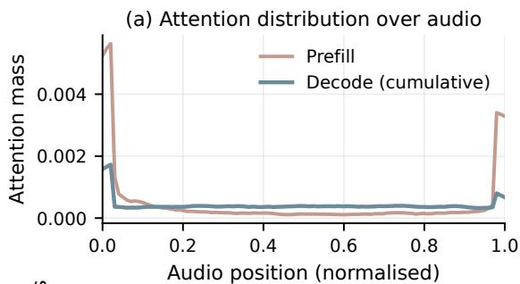
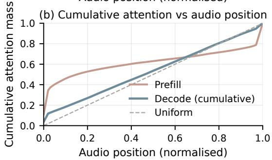
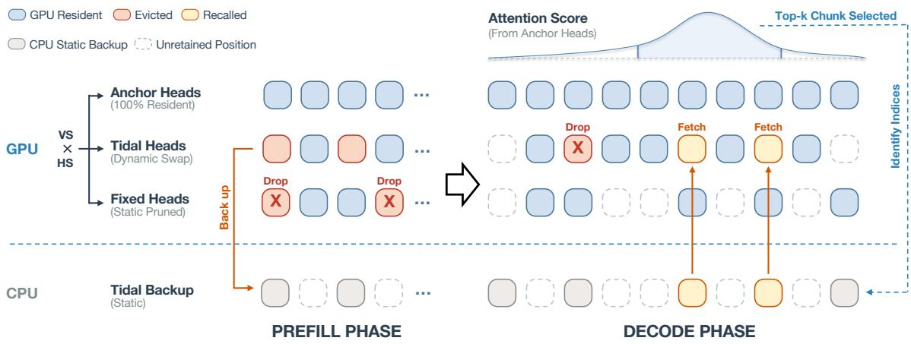
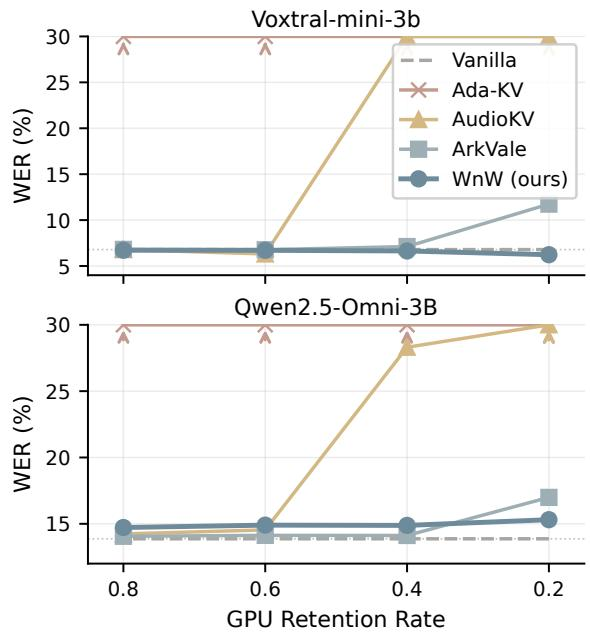
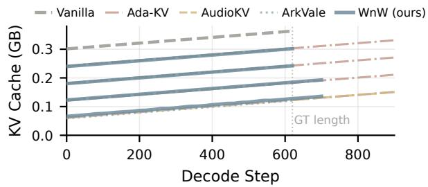

# WnW: Waxing-and-Waning KV Cache for Long-Form Speech LLMs

Yiming Yao1,3,\* Chenyang Lyu2,\* Xuanfan Ni2 Longyue Wang2 Weihua Luo2 Yazheng Yang1,3 Jinsong Su1,3,†

1School of Informatics, Xiamen University 2Alibaba Group

3Key Laboratory of Digital Protection and Intelligent Processing of Intangible Cultural Heritage of Fujian and Taiwan (Xiamen University), Ministry of Culture and Tourism, China \*Equal contribution. †Corresponding author.

## Abstract

Long-form audio inputs make the KV cache the dominant memory cost of speech LLMs. Prefill-only KV compression methods permanently discard audio KV positions once evicted, with no pathway to recover them during decoding. We show this is fragile on long-form audio: prefill attention concentrates near the audio start (an attention-sink effect), while decodetime attention distributes broadly, and the two rankings overlap weakly. We propose WnW (Waxing-and-Waning KV cache), which classifies KV-heads into anchor, tidal, and fixed roles via offline calibration. Anchor heads remain on GPU and serve as a decode-time importance observer; tidal heads keep a CPU-resident complement that is recalled chunk-by-chunk based on aggregated anchor-head scores; fixed heads keep only an on-GPU subset, with the rest permanently discarded. On LibriSpeech-Long with two 3B backbones (Voxtral-mini-3b and Qwen2.5-Omni-3B), WnW preserves near-Full-Cache accuracy while keeping only 20% of audio tokens on GPU, where prefill-only baselines fail to terminate. Results generalize across language, task, and domain shifts, and CPU–GPU recall adds little decode-time overhead in our measurements.

## 1 Introduction

Speech language models (LLMs) such as Voxtral (Liu et al., 2025a) and Qwen2.5-Omni (Qwen Team, 2025) now ingest audio inputs of arbitrary length and produce free-form text, enabling transcription of meetings, lectures, and long dialogues directly from raw waveforms, and increasingly speech translation as well (Wu et al., 2025; Li et al., 2026; Gao et al., 2026). Long-form audio shifts the inference bottleneck from the model’s parameters to the key–value (KV) cache: at 12.5–25 audio tokens per second, a ten-minute clip already occupies 7 500–15 000 KV positions, and audio routinely accounts for 70–80% of the total cache. Reducing the on-GPU audio KV footprint is therefore a prerequisite for deploying long-form speech LLMs under realistic memory constraints, directly enabling larger batch sizes and higher serving throughput on a fixed GPU budget.

KV cache compression methods for text LLMs H2O (Zhang et al., 2023), SnapKV (Li et al., 2024), Ada-KV (Feng et al., 2025) — score every position once at prefill using attention from the prompt and retain the top-ranked positions throughout decoding. AudioKV (Wang et al., 2026) adapts this paradigm to speech LLMs with FFT-smoothed scoring and an audio-tuned per-head budget. These methods share a common premise: prefill attention is a reliable proxy for the positions that decoding will query.

We find that this premise does not hold on longform audio. On LibriSpeech-Long with Voxtral, prefill attention from the first answer token concentrates near the start of the audio (an attention-sink effect (Xiao et al., 2024)), while the attention accumulated over the full decode distributes its mass broadly across the clip; the top positions selected by the two signals overlap weakly (Figure 1; §2.1). Any method that commits to a retention set early in inference and lacks a pathway to recover discarded positions is vulnerable to this gap; the failure is most visible for prefill-only baselines, which at tight budgets fail to terminate generation and produce word error rates well above 100%.

We propose WnW (Waxing-and-Waning KV cache),1 which reduces the on-GPU audio KV footprint while retaining recall of evicted positions from CPU. WnW classifies KV-heads into three functional classes via an offline calibration: a small set of anchor heads is kept fully on GPU and serves as a decode-time observer of audio importance; tidal heads keep a portion on GPU and the complement on CPU, available for recall; fixed heads keep only an on-GPU subset. During decoding, anchor-head attention at each step is aggregated into chunk-level scores, the highest-scoring chunks are recalled from CPU into the tidal heads, and previously selected chunks that lose relevance are dropped from GPU. Deferring the final retention decision to decode time lets WnW correct prefill-time mistakes once the true attention pattern is observed.

  
Figure 1: Attention to audio positions, averaged across 50 samples from the LibriSpeech-Long dev-clean subset (Voxtral). Prefill: from the first answer token; Decode (cumulative): averaged over all answer tokens. (a) Per-position mass on a uniform grid; (b) cumulative mass. Prefill concentrates near the start (sink effect); decode-cumulative spreads across the full input.

Our contributions are:

• We quantify the prefill/decode attention mismatch on long-form audio using positional mass concentration and top-� Jaccard overlap, providing audio-domain evidence that any compression scheme without a recovery pathway is structurally limited.

• We design WnW around two speech-specific mechanisms that distinguish it from text-LLM KV management: a three-way head triage (anchor/tidal/fixed) driven by the product of each head’s audio-grounding ratio and its gradientbased KV sensitivity — concentrating recall on the heads where compression most damages quality — and a decode-time recall signal read from anchor-head attention, which is temporally aligned to the audio rather than a modality-agnostic query-to-summary similarity.

• On LibriSpeech-Long with two 3B backbones (Voxtral-mini-3b and Qwen2.5-Omni-3B), WnW remains within ∼ 1.6 WER points of Full Cache even when only 20% of audio tokens remain on GPU — a regime where prefillonly baselines fail to terminate. Results generalize across languages, tasks, and domains, scale favorably to a 24B backbone relative to KV-management baselines, and show limited CPU–GPU recall overhead.

## 2 Method

Notation. Throughout, � denotes the number of decoder layers, $H _ { q }$ and $H _ { \mathrm { k v } }$ are the per-layer query and key/value heads (with GQA group size $g { = } H _ { q } / H _ { \mathrm { k v } }$ (Ainslie et al., 2023)), $r _ { \mathrm { t o k } }$ is the audio frame rate in tokens per second, and $T _ { a }$ is the number of audio KV positions in the input. For Voxtral-mini-3b-2507 (Liu et al., 2025a) we have �=30, $H _ { q } = 3 2$ $H _ { \mathrm { k v } } { = } 8 .$ , �=4, and $r _ { \mathrm { t o k } } { = } 1 2 . 5 ;$ for Qwen2.5-Omni-3B (Qwen Team, 2025) we have �=36, $H _ { q } { = } 1 6$ $H _ { \mathrm { k v } } { = } 2$ , �=8, and $r _ { \mathrm { t o k } } { = } 2 5$

Method Overview. WnW compresses the audio KV cache through two coordinated mechanisms: an offline head triage that partitions KV-heads into three functional roles, and an online recallable chunk swap that tracks the generation frontier (Figure 2). The triage scores every KV-head on a heldout set along two complementary axes — voice score (VS) and head sensitivity (HS) — and assigns each head to one of three roles: anchor heads keep all audio KV on GPU and contribute their attention to a per-step importance signal; tidal heads keep a portion on GPU and offload the complement to CPU, recalling segments on demand under anchor guidance; fixed heads keep a static prefilltime top-� on GPU with no recall pathway. The remainder of this section motivates this design from a prefill–decode attention mismatch (§2.1), specifies the triage procedure (§2.2), and details prefill compression and decode-time chunk swap (§2.3).

## 2.1 Prefill–Decode Attention Mismatch

Audio-KV compression methods such as Ada-KV (Feng et al., 2025), AudioKV (Wang et al., 2026), and SnapKV (Li et al., 2024) score every audio position at prefill, using attention from the prompt (or its last � tokens) as a proxy for decode-time importance, and retain the top-ranked positions. This pipeline assumes prefill attention predicts decodetime attention. Text-domain work has tried to sharpen the prefill estimate via pseudo-query generation (Wang et al., 2025b) and learned futureattention adapters (Ahn et al., 2026), acknowledging that the proxy is imperfect. We measure the gap directly on long-form audio.

  
Figure 2: Overview of WnW. Left (Prefill): KV-heads are partitioned into three roles via offline VS×HS calibration — anchor heads retain all audio KV on GPU; tidal heads offload their unselected complement to CPU; fixed heads discard the unselected portion permanently. Right (Decode): anchor-head attention identifies the top-� audio chunks at each step; tidal heads recall the corresponding segments from CPU on demand and release segments unselected for � consecutive steps (the CPU copy persists).

Figure 1 compares two attention distributions over audio positions, averaged across 50 samples from the LibriSpeech-Long dev-clean subset (Voxtral). The prefill distribution is the attention from the first answer token to each audio position, averaged over layers and heads; this is the signal token-level baselines use for compression decisions. The decode-cumulative distribution additionally averages over all answer tokens produced during decoding. Two findings emerge:

• Attention sink dominates prefill (Xiao et al., 2024). The prefill distribution places 47.9% of its mass on the first 10% of audio positions and 69.3% on the first half. The decodecumulative distribution places only 9.8% on the first 10% and is close to uniform (47.7% / 52.3% on the two halves).

• Top-� rankings overlap weakly. The Jaccard overlap between the top-� audio positions ranked by prefill and by decodecumulative attention is 0.187 at �=100 and 0.240 at �=500 — well above the random baseline ≈ �/� (0.013 at �=100), but far from the agreement that would justify reusing prefill rankings during decoding.

Under these distributions, any method that fixes its retention set before decoding and lacks a recovery pathway will discard a substantial fraction of the positions decoding will query, irrespective of how that decision is scored. Extending the analysis to individual KV-heads, per-head Jaccard (�=100) ranges from 0.006 to 0.641 across the 240 heads (27% below 0.1): the mismatch is pervasive, but its quality impact is not, because heads also differ in how much the answer-token loss depends on their audio KV. The two factors compound: heads that both shift their attention as decoding progresses and carry loss-critical audio KV need retention that evolves with the generated text; heads that satisfy neither condition tolerate prefill’s coarse approximation, since their contribution to the loss is small regardless of which positions survive compression. WnW exploits this asymmetry: §2.2 identifies the quality-critical heads via offline calibration, and §2.3 invests recall overhead only in them.

Speech affords a structural advantage for decodetime correction: audio tokens are strictly timeordered and word-aligned to the underlying transcript, so attention sweeps progressively through the audio as decoding advances. AudioKV (Wang et al., 2026) exploits this alignment at prefill to decide how much to retain per head (a static budget), but leaves the which-positions decision fixed. WnW takes the complementary step: it uses the temporal structure to decide when to recall, letting anchor-head attention track the generation frontier and fetching the relevant audio chunk on demand. This is well-founded: self-attention captures sequence order through positional encodings and the training objective (Yang et al., 2019), both of which a transcription-trained speech LLM supplies, so anchor-head attention advances coherently through the time-ordered audio.

## 2.2 Head Functional Triage via Offline Calibration

Not all model components contribute equally. In sequence-to-sequence learning, encoder layers differ sharply in importance, and generation quality hinges on a small subset that the decoder preferentially attends to (Liu et al., 2021). Audio KVheads exhibit the same asymmetry, which motivates scoring them individually rather than treating them uniformly: we score each KV-head on a held-out set with two complementary signals — a voice score (VS) measuring how strongly its attention is grounded in audio content, and a head sensitivity (HS) measuring how much the answer-token loss depends on its audio KV — and combine them into modality-aware importance $\mathbf { V S } _ { l , k } \times \mathbf { H S } _ { l , k }$ that drives all triage decisions.

Voice Score (VS). Following AudioKV (Wang et al., 2026) (adapted from SparseMM (Wang et al., 2025a)), we measure each head’s audio-content grounding as a hit ratio: the fraction of its topattended audio positions that fall within the wordaligned time span of the current answer token (aligned via WhisperX (Radford et al., 2023; Bain et al., 2023)). Averaging over answer tokens and calibration samples, then aggregating across GQA groups, yields a per-KV-head voice score $\mathrm { V S } _ { l , k }$ (details in Appendix E).

Head Sensitivity (HS). Voice score captures attention patterns but not loss impact. We complement it with a gradient-based KV importance (Molchanov et al., $2 0 1 7 ;$ Michel et al., 2019): $\mathrm { H S } _ { l , k }$ is the $\ell _ { 2 } { \mathrm { - n o r m } }$ of the answer-token loss gradient with respect to each head’s audio key vectors, averaged over positions, tokens, and calibration samples (Appendix E).

Three-Way Classification. We use the VS×HS ranking over all $L \times H _ { \mathrm { k } }$ KV-heads in two nested steps. First, the top $n _ { \mathrm { v o i c e } }$ heads form the voice heads — those whose attention is grounded in audio content and whose audio KV is loss-critical; their decode-time attention shifts as different words are generated, so they benefit from a recall pathway. The remaining heads are fixed heads: their decodetime attention pattern changes little after prefill, and we retain a static top-� subset on GPU without recall. Second, within the voice heads, the top $n _ { \mathrm { a n c h o r } } { = } 5$ are designated anchor heads and keep their full audio KV on GPU: as the most audiogrounded and loss-critical heads, their decode-time attention is the most reliable per-step signal of which audio chunks matter, so we keep their KV uncompressed and reuse this signal to drive chunk swap (§2.3) for the tidal heads. The remaining voice heads are tidal heads and keep a portion on GPU with the complement on CPU.

Anchor heads keep their full audio KV (retention = 1). Tidal and fixed heads share a proportional audio-KV retention schedule:

$$
\mathrm { r e t e n t i o n } _ { i } = \operatorname* { m i n } ( \tilde { s } _ { i } \cdot \lambda , 1 . 0 ) ,\tag{1}
$$

where retentio ${ \bf { 1 } } _ { i }$ is the fraction of audio positions kept on GPU for head � (non-audio KV is always retained in full), and $\tilde { s } _ { i } \in [ 0 , 1 ]$ is its normalized importance score. WnW exposes two hyperparameters: the voice-head count $n _ { \mathrm { v o i c e } }$ controls how many heads have CPU-backed recallable storage, and the scale � controls the per-head audio retention magnitude. When � is large, all voice heads clip to retention 1 and the recallable CPU partition is dormant; recall activates only when the GPU budget is tight enough to push � out of saturation.

## 2.3 Prefill Compression and Decode-Time Chunk Swap

Prefill Compression. At prefill, each non-anchor KV-head (�, �) ranks audio positions by aggregated text-to-audio attention $\begin{array} { r } { p _ { l , k , \tau } ^ { \mathrm { p r e f i l } 1 } = \sum _ { t \in \mathrm { t e x t } } \mathrm { a t t n } _ { l , k , t , \tau } } \end{array}$ Selection is performed per segment: within each $n _ { s } .$ -token segment, the top $\left\lfloor \mathbf { r e t e n t i o n } _ { l , k } \cdot n _ { s } \right\rfloor$ positions are kept. This guarantees uniform temporal coverage — no segment is wholly evicted — and provides a stable initial state for chunk swap; we ablate it against a global top-� variant in §3.8. For tidal heads, the unselected positions are offloaded to CPU and remain recallable; for fixed heads, they are permanently discarded. Anchor heads keep all audio positions on GPU.

Chunk Structure. We partition the $T _ { a }$ audio positions into overlapping chunks of $W _ { c }$ =4 s with stride $W _ { s } { = } 2 \ : s$ . A chunk holds $n _ { c } = \lceil W _ { c } \cdot r _ { \mathrm { t o k } } \rceil$ audio tokens and spans two contiguous segments of $n _ { s } = \lceil W _ { s } \cdot r _ { \mathrm { t o k } } \rceil$ tokens; load and eviction operate at the segment granularity. With $r _ { \mathrm { { t o k } } } { = } 1 2 . 5$ for Voxtral, this yields $n _ { c } { = } 5 0$ and $n _ { s } = 2 5 ;$ with $r _ { \mathrm { t o k } } { = } 2 5$ for Qwen2.5-Omni, $n _ { c } { = } 1 0 0$ and $n _ { s } = 5 0$

Decode-Step Score Aggregation. At every decode step �, after attention is computed for all � layers, the anchor Q-heads’ softmax weights at audio positions are aggregated across anchor (layer, q-head) pairs into a per-position score:

$$
A _ { \tau } ^ { ( s ) } = \sum _ { ( l , h ) \in \mathrm { a n c h o r } } \mathrm { s o f t m a x } \Bigg ( \frac { q _ { l , h } ^ { ( s ) } K _ { l , h } ^ { \top } } { \sqrt { d } } \Bigg ) _ { \tau } ,\tag{2}
$$

The accumulator is reset to zero at the end of each step, so $A _ { \tau } ^ { ( s ) }$ reflects only the current decode step — not a running sum across steps. This lets the importance signal track the generation frontier rather than being dominated by audio regions that mattered earlier.

Dynamic Chunk Selection. After each decode step, chunk � receives score $\bar { A } _ { c } ^ { ( s ) } = \mathrm { m e a n } _ { \tau \in c } A _ { \tau } ^ { ( s ) }$ the top-� (�=3) chunks are selected. For tidal heads, segments belonging to a selected chunk but absent from GPU are recalled from the CPU complement and become GPU-resident; segments present on GPU but unselected for �=3 consecutive steps are released from GPU, while their CPU copy persists and can be re-fetched if the chunk regains importance.2 The eviction lag � buffers short-term score fluctuations and prevents thrashing.

## 3 Experiments

## 3.1 Models

The main backbone is Voxtral-mini-3b-2507 (Liu et al., 2025a), a 3B-parameter audio–language model; for cross-model evaluation we additionally use Qwen2.5-Omni-3B (Qwen Team, 2025) (permodel constants in §2). Appendix B further reports a larger-scale check on Voxtral-Small-24B. All inference uses bf16 weights, greedy decoding, and the model’s default chat template.

## 3.2 Datasets

LibriSpeech-Long (Park et al., 2025) is a longform benchmark constructed from LibriSpeech (Panayotov et al., 2015) by merging adjacent utterances into recordings of up to four minutes. We use test-clean and test-other (270 and 207 samples) as the main English ASR benchmark.

LongSpeech (Yang et al., 2026) is a multilingual long-form speech-LLM benchmark. We use its French ASR split (asr-fr) and English-to-French speech translation split (en2fr), sub-sampling 200 clips from each (fixed seed).

PriMock57 (Papadopoulos Korfiatis et al., 2022) is a set of 57 simulated primary-care consultations, which we use as an out-of-domain ASR benchmark with its manual transcripts as references.

Calibration set. 50 LibriSpeech-Long dev-clean samples, disjoint from all test sets.

## 3.3 Baselines

We compare against five baselines, all using their authors’ recommended hyperparameters without additional tuning where applicable:

• Full Cache — no compression, the quality upper bound.

• Ada-KV (Feng et al., 2025) — adaptive perhead budget allocation derived from a theoretical loss upper bound.

• AudioKV (Wang et al., 2026) — voice-scoreguided per-head budget with FFT smoothing.

• ArkVale (Chen et al., 2024) — page-based recallable KV eviction with bounding-volume page summaries.

• AffPool (Xiang et al., 2026) — a tokenmerging efficiency baseline that pools adjacent audio tokens by affinity at prefill.

Full hyperparameter settings are listed in Appendix F.

Audio-only compression constraint (modified baselines). We restrict the compression scope of all KV-management baselines to the audio-token region of the KV cache; text tokens (system prompt, user prompt, and tokens generated during decoding) are kept in full. The original implementations of Ada-KV, AudioKV, and ArkVale compress the entire sequence, which would mix audio compression with prompt and generated-token compression; restricting them to the audio region matches WnW’s compression scope. AffPool instead reduces the audio sequence by token merging before KV construction, so its retention is reported as the remaining audio-token ratio.

The baselines span multiple axes — compression paradigm (static vs. recallable), domain (text vs.

audio), and compression target (KV eviction vs. token merging) — and each represents a broader family.3 AffPool stands apart as a token-merging rather than KV-eviction baseline.

## 3.4 Audio KV Retention and WnW Configuration

Audio KV retention. Given the audio-only compression scope above, every method’s compression budget is naturally expressed on the audio region. Let $N _ { \mathrm { f u l l } } ^ { \mathrm { a u d i o } } = L \cdot H _ { \mathrm { k v } } \cdot N _ { \mathrm { a u d i o } }$ be the size of the full per-(layer, KV-head) audio KV. We define

$$
r _ { \mathrm { G P U } } = \frac { N _ { \mathrm { G P U } } ^ { \mathrm { a u d i o } } } { N _ { \mathrm { f u l l } } ^ { \mathrm { a u d i o } } } , ~ r _ { \mathrm { G P U + C P U } } = \frac { N _ { \mathrm { G P U } } ^ { \mathrm { a u d i o } } + N _ { \mathrm { C P U } } ^ { \mathrm { a u d i o } } } { N _ { \mathrm { f u l l } } ^ { \mathrm { a u d i o } } } ,
$$

where $N _ { \mathrm { G P U } } ^ { \mathrm { a u d i o } }$ and $N _ { \mathrm { C P U } } ^ { \mathrm { a u d i o } }$ are the audio KV token counts kept on device and (recallably) on host, respectively. �GPU is the on-device footprint that determines GPU memory; �GPU+CPU additionally counts any recallable CPU-resident audio KV. For methods without a CPU-resident complement (Ada-KV, AudioKV, Full Cache) the two coincide; for WnW (tidal heads) and ArkVale (evicted pages) they may differ.

Configuration. We evaluate each method at four target retention levels $r _ { \mathrm { G P U } } \in \{ 0 . 2 , 0 . 4 , 0 . 6 , 0 . 8 \}$ Ada-KV, AudioKV, and ArkVale expose a single hyperparameter that maps directly to per-head GPU usage. For WnW, we select � on the calibration set so that the measured $r _ { \mathrm { G P U } }$ matches each target, using $\begin{array} { r l r } { n _ { \mathrm { v o i c e } } } & { { } \in } & { \{ 9 0 , 5 0 , 3 0 , 3 0 \} } \end{array}$ on Voxtral $( L \times H _ { \mathrm { k v } } { = } 2 4 0 )$ and {27, 15, 9, 9} on Qwen2.5-Omni $( L \times H _ { \mathrm { k v } } { = } 7 2 )$ for � ∈ {0.2, 0.4, 0.6, 0.8} respectively. At �GPU=0.2 the recall pathway activates and �GPU+CPU rises to $\approx 0 . 4 2$ ; we report both alongside every WnW result.

## 3.5 Metrics

Word Error Rate. We report truncated WER after light text normalization (lower-casing and removal of all punctuation except apostrophe and period): each hypothesis is first truncated to 1.2× the ground-truth token length and then scored against the reference. Truncation prevents nonterminating hypotheses — common for prefill-only baselines at low budgets — from inflating insertion errors arbitrarily and isolates the effect of audio compression on the transcribed prefix. Substitutions/deletions/insertions are computed with the jiwer library.

  
Figure 3: WER vs. audio KV retention $r _ { \mathrm { G P U } }$ on LibriSpeech-Long test-clean. Top: Voxtral-mini-3b; bottom: Qwen2.5-Omni-3B. Upward arrows mark points exceeding 30% WER (numbers in Table 5, Appendix). WnW stays close to Full Cache (dashed) at every �GPU; prefill-only baselines degrade sharply below $r _ { \mathrm { G P U } } { = } 0 . 6$

Audio KV Retention. For each method we report the measured on-device retention �GPU (defined in §3.4), since the realised value may differ from the target by a few points; for WnW we additionally report the combined retention �GPU+CPU, which captures the recallable CPU complement.

## 3.6 Main Comparison

We compare WnW against the baselines on LibriSpeech-Long across the four target audio KV retention levels �GPU, on both the Voxtral-mini-3b and Qwen2.5-Omni-3B backbones (Figure 3; full numbers in Table 5, Appendix). Numbers are truncated WER (truncation ratio 1.2).

Across both backbones, WnW remains close to the Full Cache at every retention level � (within ∼1 WER on Voxtral and ∼1.6 WER on

<table><tr><td>Method</td><td>Category</td><td>Retention</td><td>clean / other</td></tr><tr><td>Full Cache</td><td></td><td>100%</td><td>6.79 / 8.86</td></tr><tr><td>WnW</td><td>KV recall</td><td>~20%</td><td>6.23 / 8.87</td></tr><tr><td>AffPool</td><td>token merging</td><td>20%</td><td>111.63 / 113.25</td></tr><tr><td>AffPool</td><td>token merging</td><td>40%</td><td>67.08 / 75.14</td></tr><tr><td>AffPool</td><td>token merging</td><td>60%</td><td>10.04 / 11.00</td></tr><tr><td>AffPool</td><td>token merging</td><td>80%</td><td>6.47 / 8.94</td></tr></table>

Table 1: Comparison with a token-merging efficiency baseline on LibriSpeech-Long using Voxtral-mini-3b. Numbers are truncated WER (↓, ratio 1.2).

Qwen). The baselines fall into a consistent ordering as � decreases (in WER, lower is better): Ada-KV ≫ AudioKV > ArkVale > WnW. This ordering matches the prefill–decode mismatch analysis in §2.1: irreversible early compression (Ada-KV, AudioKV) inherits a structural error that grows with the eviction ratio — both methods fail to terminate at tight � ; adding a recall pathway (ArkVale) prevents non-termination but is insufficient alone; combining recall with audio-aware long-horizon scoring from anchor heads (WnW) closes the remaining gap. On Qwen2.5-Omni-3B, ArkVale slightly exceeds WnW at high retention. ArkVale keeps a complete CPU mirror of evicted pages (�GPU+CPU=100%), so �GPU controls only how much KV is GPU-resident, not how much audio stays recoverable, whereas WnW grants CPU recall only to tidal heads and permanently discards the unselected audio KV of fixed heads (� ≈80% at $r _ { \tt G P U } { = } 0 . 8 )$ . This is the intended storage–accuracy tradeoff of head triage: ArkVale can approach Full Cache at high retention because it loses no audio KV, while WnW is substantially better at low retention, where precise anchor-guided recall matters most. (On Voxtral, WnW tracks the Full Cache within ≤ 0.6 WER at every �GPU, usually marginally below it — a gap within the variation expected from greedy decoding and our truncation rule rather than a real quality difference.)4

Table 1 compares WnW with AffPool, which shortens the audio sequence at prefill rather than evicting KV entries. AffPool recovers near-Full-Cache quality only at high retention, but collapses at 20%–40% retention. This suggests that prefilltime token merging suffers from the same inability to adapt to decode-time attention shifts, with an additional layerwise error-propagation effect: merging errors made in early layers affect all subsequent layers. WnW avoids this failure mode by preserving token identities and deferring recall decisions to decode time. The KV-management ordering above also holds on the larger Voxtral-Small-24B backbone, where WnW remains the best of these methods at ∼20% retention while the prefill-only baselines still collapse (Appendix B).

<table><tr><td colspan="3"></td><td colspan="2">LongSpeech PriMock57</td></tr><tr><td>Method</td><td>rGPU</td><td>asr-fr↓</td><td>en2fr↑</td><td>WER↓</td></tr><tr><td>Full Cache</td><td>100%</td><td>20.42</td><td>38.48</td><td>23.47</td></tr><tr><td>Ada-KV</td><td>~20%</td><td>112.91</td><td>2.99</td><td>106.43</td></tr><tr><td>AudioKV</td><td>~20%</td><td>105.00</td><td>5.22</td><td>103.83</td></tr><tr><td>ArkVale</td><td>~20%</td><td>28.63</td><td>35.40</td><td>32.45</td></tr><tr><td>WnW (ours) ~20%</td><td></td><td>22.68</td><td>38.21</td><td>24.23</td></tr></table>

Table 2: Generalization and domain robustness on Voxtral-mini-3b at $r _ { \mathrm { G P U } } { = } 0 . 2$ (200 samples per LongSpeech split, all 57 PriMock57 consultations, identical for all methods). asr-fr and PriMock57: truncated WER (ratio 1.2); en2fr: sacreBLEU (Post, 2018), same truncation. WnW’s measured retention is � =22.25% / �GPU+CPU=41.5% on LongSpeech and 21.2% / 40.46% on PriMock57.

## 3.7 Generalization and Domain Robustness

To test whether the WnW design transfers beyond English ASR, we evaluate at the most aggressive setting $r _ { \mathrm { G P U } } { = } 0 . 2$ on two LongSpeech splits — asr-fr (French ASR) and en2fr (English→French speech translation) — which together probe two orthogonal axes of generalization: cross-lingual (English → French ASR) and crosstask (transcription → translation). We further test domain robustness on PriMock57 medical consultations (Table 2).

WnW transfers to a different language, a different task, and a different domain: relative to Full Cache it loses 2.3 WER points on French ASR, 0.27 BLEU on translation, and 0.76 WER points on medical dialogue. Ada-KV and AudioKV again fail to terminate, producing hypotheses much longer than the reference and BLEU near zero. ArkVale avoids non-termination but trails WnW throughout, indicating that recall alone, without head triage, is insufficient. That the LibriSpeechcalibrated roles hold up under all three shifts suggests the partition is not tightly overfit to the calibration distribution. In a matched re-calibration study, replacing the English LibriSpeech calibration set with French LongSpeech changes English WER by at most 0.04 points and French WER by 1.12 points, with 76/85 tidal heads preserved $( \mathsf { A p - }$ pendix D).

## 3.8 Ablation Studies

We run all ablations on LibriSpeech-Long test-clean with truncated WER (ratio 1.2). A1 and A2 are reported at both $r _ { \mathrm { G P U } } { = } 0 . 1$ and $r _ { \mathrm { G P U } } { = } 0 . 2$ , since their effect depends on whether the recall pathway is active, and A3 at $r _ { \mathrm { G P U } } { = } 0 . 1$

(A1) Voice-head count $n _ { \mathbf { v o i c e } } .$ We sweep $n _ { \mathrm { v o i c e } } \in \{ 1 0 , 3 0 , 5 0 , 7 0 , 9 0 \}$ at both retention levels, retuning � per cell so the on-GPU footprint matches the target. Since anchor heads stay at full retention regardless of $n _ { \mathrm { v o i c e } } .$ any quality change reflects the recall pathway: larger $n _ { \mathrm { v o i c e } }$ converts fixed heads into CPU-backed tidal heads without enlarging the on-GPU budget.

(A2) Prefill selection granularity. We compare the default per-segment top-� compression, where each segment keeps its own top- $\lfloor \mathrm { r e t e n t i o n } _ { l , k } \cdot n _ { s } \rfloor$ positions (§2.3), against a global top-� variant that spends the same total budget by ranking all audio positions of a head together with no persegment quota. They share identical head triage, retention, and decode-time chunk swap, differing only in how prefill picks which positions to keep on GPU. We report at nv $3 0 / r _ { \mathrm { G P U } } { = } 0 . 1$ (tight) and $\scriptstyle \mathsf { n v 9 9 } / r _ { \mathrm { G P U } } = 0 . 2$ (moderate).

(A3) Head triage signal. One signal selects both the top $n _ { \mathrm { v o i c e } }$ voice heads and the top 5 anchors, so we compare VS alone, HS alone, and $\boldsymbol { \nabla } \boldsymbol { \mathrm { S } } \times \boldsymbol { \mathrm { H S } } \left( \boldsymbol { \mathrm { W n W } } \right)$ , holding everything else fixed at $\scriptstyle { \mathsf { n v } } 3 0 / r _ { \mathrm { G P U } } = 0 . 1$

A1 (Table 3) shows that larger tidal pools matter most under aggressive compression: at $r _ { \mathrm { G P U } } { = } 0 . 1$ increasing $n _ { \mathrm { v o i c e } }$ from 10 to 70 reduces WER from 51.92% to 6.31%. At $r _ { \mathrm { G P U } } { = } 0 . 2$ the same range moves WER by less than half a point, since � saturates and the recall pathway is largely inactive. A2 shows that per-segment prefill selection matters when $r _ { \mathrm { G P U } }$ is tight: at $r _ { \mathrm { G P U } } { = } 0 . 1$ , dropping the per-segment quota costs 3.33 WER points, since global top-� allows entire segments to be evicted at prefill and chunk swap then has no GPU-side starting point to work from in those regions; the gap closes to 0.04 at $r _ { \mathrm { G P U } } { = } 0 . 2$ when retention is high enough that uniform coverage is preserved either way. A3 shows that the two signals are not interchangeable under tight �GPU: HS alone trails VS×HS by 26.63 WER points and VS alone fails to terminate (124.66%). Voice score by itself can promote audio-grounded heads whose KV is not loss-critical, while sensitivity alone can include heads that ignore the audio; only the product keeps both criteria. Appendix C further shows that WnW is insensitive to chunk size and anchor-head count around the default configuration.

<table><tr><td colspan="2">(A1) Voice-head count (WER ↓) Nvoice  $r _ { \mathrm { G P U } } { = } 0 . 1$ </td></tr><tr><td>10</td><td>6.53</td></tr><tr><td>30</td><td>6.46</td></tr><tr><td>50 8.09</td><td>6.39</td></tr><tr><td>70 6.31 6.76</td><td>6.20</td></tr><tr><td>90</td><td>6.23</td></tr><tr><td>(A2) Prefill selection (WER ↓) nv30/0.1</td><td>nv90/0.2</td></tr><tr><td>per-segment (ours) 9.78 global top-k 13.11</td><td>6.23 6.27</td></tr><tr><td>(A3) Triage signal at nv30/rGPU=0.1 (WER ↓)</td><td></td></tr><tr><td>VS × HS (ours)</td><td></td></tr><tr><td>HS only</td><td>9.78 36.41</td></tr><tr><td>VS only</td><td>124.66</td></tr></table>

Table 3: Ablations on LibriSpeech-Long test-clean (truncated WER, ratio 1.2).

<table><tr><td>Config.</td><td>rGPU</td><td>ms/token</td><td>MB/step</td></tr><tr><td>35 tidal heads</td><td>21.7%</td><td>27.2</td><td>0.05</td></tr><tr><td>75 tidal heads</td><td>21.4%</td><td>26.8</td><td>0.20</td></tr><tr><td>115 tidal heads</td><td>21.0%</td><td>26.7</td><td>0.40</td></tr><tr><td>155 tidal heads</td><td>20.5%</td><td>27.4</td><td>0.62</td></tr><tr><td>195 tidal heads</td><td>20.1%</td><td>27.5</td><td>0.82</td></tr><tr><td>235 tidal heads</td><td>19.7%</td><td>27.8</td><td>1.04</td></tr></table>

Table 4: Runtime impact of CPU→GPU recall on Voxtral-mini-3b, LibriSpeech-Long test-clean (64 samples), at ∼20% GPU retention. Decode time is median ms/token; MB/step is CPU→GPU KV transfer averaged over decode steps.

## 3.9 Efficiency and Runtime Analysis

Figure 4 shows the on-GPU KV cache size over decode steps under four compression ratios. All curves rise linearly because, per the audio-only constraint (§3.3), every method keeps generated tokens in full. At the same target $r _ { \mathrm { G P U } }$ , all methods achieve nearly identical audio-KV footprints, so the WER differences in Figure 3 reflect how each method uses its budget, not how much memory it consumes. Within this fixed GPU budget, WnW delivers near-Full-Cache accuracy down to $r _ { \mathrm { G P U } } { = } 0 . 2 .$

Table 4 isolates the cost of dynamic recall by varying the number of tidal heads, the only heads that perform CPU→GPU transfer. Transfer volume grows linearly with tidal-head count but remains small (≤ 1.04 MB/step), and median decode time varies by less than 5% across a 6.7× range of tidal heads. Thus, in this setting, CPU→GPU recall is not the dominant decoding bottleneck.

  
Figure 4: GPU KV cache size over decode steps on a 4-minute LibriSpeech-Long sample (Voxtralmini-3b). The four curves per method are �GPU ∈ {0.2, 0.4, 0.6, 0.8}. The dotted vertical line marks ground-truth length; methods extending beyond it fail to terminate. WnW’s slight oscillation reflects chunk swap.

## 4 Related Work

Static KV Cache Compression. Scissorhands (Liu et al., 2023), H2O (Zhang et al., 2023), and SnapKV (Li et al., 2024) retain a top-ranked subset of positions chosen from prefill or early-decode attention, and evicted positions are never re-admitted. Ada-KV (Feng et al., 2025), PyramidKV (Cai et al., 2025), and ChunkKV (Liu et al., 2025c) refine perhead or per-chunk allocation under the same oneway eviction. All target text LLMs; §2.1 challenges their core assumption — that prefill or early-decode attention predicts decode-time importance — on long-form audio.

Head-Level KV Management. Some text-LLM methods allocate cache per head rather than per position. HeadKV (Fu et al., 2025) scores heads for retrieval and reasoning ability to set per-head budgets, and RazorAttention (Tang et al., 2025) separates retrieval from non-retrieval heads, protecting the former in full while compressing the latter into a coarse compensation summary. WnW differs in both the basis and the consequence of its partition. Head roles follow from audio grounding combined with gradient-based KV sensitivity rather than textretrieval behaviour, so they track which heads are damaged most by discarding audio KV; and they assign storage tiers rather than fixed budgets, with tidal heads keeping an exact CPU-resident complement recallable verbatim mid-decode, whereas positions summarised away in a non-retrieval head cannot be restored. Anchor heads further act as a decode-time importance observer, absent from static head-level schemes.

GPU–CPU KV Management. Building on paged GPU KV management (Kwon et al., 2023), ArkVale (Chen et al., 2024) and ClusterKV (Liu et al., 2025b) evict KV pages or clusters and recall them on demand via bounding-volume or semantic digests; Quest (Tang et al., 2024) performs queryaware selective loading per decode step; InfiniGen (Lee et al., 2024) speculatively prefetches KV for upcoming steps. All target text LLMs and rely on per-step query similarity. WnW instead operates on time-aligned audio chunks, splits heads into functional roles with anchors as a dedicated importance observer, and aggregates attention across all anchor (layer, Q-head) pairs per decode step rather than scoring a single query against page summaries.

Audio LLM KV Compression. AudioKV (Wang et al., 2026) adapts SnapKV-style static eviction to speech LLMs with FFT-smoothed scoring and an audio-tuned per-head budget; its voice score derives from SparseMM’s visual score (Wang et al., 2025a). WnW reuses this voice score, combines it with gradient-based head sensitivity (Molchanov et al., 2017; Michel et al., 2019), and drives recallable decode-time chunk swap rather than static prefill budgets — to our knowledge, the first recallable, decode-driven KV management for audio LLMs.

## 5 Conclusion

WnW addresses the prefill–decode attention mismatch on long-form audio (§2.1) by deferring the retention decision to decode time: an offline triage assigns anchor, tidal, and fixed roles, anchors observe decode-time importance, and tidal heads recall audio chunks from CPU on demand. WnW stays close to Full Cache at every �GPU, generalizes across language, task, and domain, and scales to a 24B backbone.

## Limitations

The chunk-swap CPU–GPU traffic is scheduled naïvely; although our measurements show limited decode-time overhead, overlapping recall with attention via CUDA streams is a natural next optimization. The recall pathway is dormant in the high-�GPU regime (§2.2); decoupling $n _ { \mathrm { v o i c e } }$ and � so that recall remains active when GPU is plentiful is a direction for further gains. Our evaluation targets offline decoding: extending WnW to streaming recognition is natural for speech-LLM architectures that append newly arrived audio to a shared, monotonically growing KV cache, as in recent LLM-based simultaneous speech translation systems that avoid re-encoding as input arrives (Fu et al., 2026; Ouyang et al., 2024); the same demand arises in the text-to-text case for LLM-based simultaneous machine translation (Shang et al., 2026). The mechanism does not, however, transfer to cross-attention (e.g., Whisper), transducer, or state-space architectures, which keep no lengthdependent audio KV cache to manage. Applying WnW to non-transcription audio tasks (QA, dialogue, summarisation) is promising once the underlying speech LLMs reach reliable quality on those tasks.

## Acknowledgments

The project was supported by the Natural Science Foundation of Fujian Province of China (No. 2024J011001), and the Public Technology Service Platform Project of Xiamen (No. 3502Z20231043). We also thank the reviewers for their insightful comments.

## References

Jinwoo Ahn, Ingyu Seong, Akhil Kedia, Junhan Kim, Hyemi Jang, Kangwook Lee, and Yongkweon Jeon. 2026. LookaheadKV: Fast and accurate KV cache eviction by glimpsing into the future without generation. In Proceedings ofICLR 2026.

Joshua Ainslie, James Lee-Thorp, Michiel de Jong, Yury Zemlyanskiy, Federico Lebron, and Sumit Sanghai. 2023. GQA: Training generalized multi-query transformer models from multi-head checkpoints. In Proceedings ofEMNLP 2023.

Max Bain, Jaesung Huh, Tengda Han, and Andrew Zisserman. 2023. WhisperX: Time-accurate speech transcription of long-form audio. In Proceedings of IN-TERSPEECH 2023.

Zefan Cai, Yichi Zhang, Bofei Gao, Yuliang Liu, Yucheng Li, Tianyu Liu, Keming Lu, Wayne Xiong, Yue Dong, Junjie Hu, and 1 others. 2025. Pyramidkv: Dynamic kv cache compression based on pyramidal information funneling. Preprint, arXiv:2406.02069.

Renze Chen, Zhuofeng Wang, Beiquan Cao, Tong Wu, Size Zheng, Xiuhong Li, Xuechao Wei, Shengen Yan, Meng Li, and Yun Liang. 2024. Arkvale: Efficient

generative LLM inference with recallable key-value eviction. In Proceedings ofNeurIPS 2024.

Yuan Feng, Junlin Lv, Yukun Cao, Xike Xie, and S. Kevin Zhou. 2025. Ada-kv: Optimizing kv cache eviction by adaptive budget allocation for efficient llm inference. In Proceedings ofNeurIPS 2025.

Biao Fu, Donglei Yu, Minpeng Liao, Chengxi Li, Xinjie Chen, Yidong Chen, Kai Fan, and Xiaodong Shi. 2026. Efficient and adaptive simultaneous speech translation with fully unidirectional architecture. In Proceedings ofAAAI 2026, pages 30735–30743.

Yu Fu, Zefan Cai, Abedelkadir Asi, Wayne Xiong, Yue Dong, and Wen Xiao. 2025. Not all heads matter: A head-level KV cache compression method with integrated retrieval and reasoning. In Proceedings of ICLR 2025.

Yan Gao, Yazheng Yang, Zhibin Lan, Yidong Chen, Min Zhang, Daimeng Wei, Derek F. Wong, and Jinsong Su. 2026. Towards fine-grained code-switch speech translation with semantic space alignment. In Proceedings ofIJCAI-ECAI 2026.

Woosuk Kwon, Zhuohan Li, Siyuan Zhuang, Ying Sheng, Lianmin Zheng, Cody Hao Yu, Joseph Gonzalez, Hao Zhang, and Ion Stoica. 2023. Efficient memory management for large language model serving with pagedattention. In Proceedings of SOSP 2023.

Wonbeom Lee, Jungi Lee, Junghwan Seo, and Jaewoong Sim. 2024. InfiniGen: Efficient generative inference of large language models with dynamic KV cache management. In Proceedings of OSDI 2024.

Yi Li, Rui Zhao, Ruiquan Zhang, Jinsong Su, Daimeng Wei, Min Zhang, and Yidong Chen. 2026. PLaST: Towards paralinguistic-aware speech translation. In Proceedings ofAAAI 2026, pages 31805–31813.

Yuhong Li, Yingbing Huang, Bowen Yang, Bharat Venkitesh, Acyr Locatelli, Hanchen Ye, Tianle Cai, Patrick Lewis, and Deming Chen. 2024. Snapkv: Llm knows what you are looking for before generation. In Proceedings ofNeurIPS 2024.

Alexander H Liu, Andy Ehrenberg, Andy Lo, Clément Denoix, Corentin Barreau, Guillaume Lample, Jean-Malo Delignon, Khyathi Raghavi Chandu, Patrick von Platen, Pavankumar Reddy Muddireddy, and 1 others. 2025a. Voxtral. Preprint, arXiv:2507.13264.

Guangda Liu, Chengwei Li, Jieru Zhao, Chenqi Zhang, and Minyi Guo. 2025b. Clusterkv: Manipulating llm kv cache in semantic space for recallable compression. In Proceedings ofDAC 2025.

Xiang Liu, Zhenheng Tang, Peijie Dong, Zeyu Li, Liuyue, Bo Li, Xuming Hu, and Xiaowen Chu. 2025c. Chunkkv: Semantic-preserving kv cache compression for efficient long-context llm inference. In Proceedings ofNeurIPS 2025.

Xuebo Liu, Longyue Wang, Derek F. Wong, Liang Ding, Lidia S. Chao, and Zhaopeng Tu. 2021. Understanding and improving encoder layer fusion in sequenceto-sequence learning. In Proceedings ofICLR 2021.

Zichang Liu, Aditya Desai, Fangshuo Liao, Weitao Wang, Victor Xie, Zhaozhuo Xu, Anastasios Kyrillidis, and Anshumali Shrivastava. 2023. Scissorhands: Exploiting the persistence of importance hypothesis for llm kv cache compression at test time. In Proceedings ofNeurIPS 2023.

Zirui Liu, Jiayi Yuan, Hongye Jin, Shaochen Zhong, Zhaozhuo Xu, Vladimir Braverman, Beidi Chen, and Xia Hu. 2024. KIVI: A tuning-free asymmetric 2bit quantization for KV cache. In Proceedings ofICML 2024.

Paul Michel, Omer Levy, and Graham Neubig. 2019. Are sixteen heads really better than one? In Proceedings of NeurIPS 2019.

Pavlo Molchanov, Stephen Tyree, Tero Karras, Timo Aila, and Jan Kautz. 2017. Pruning convolutional neural networks for resource efficient inference. In ICLR.

Siqi Ouyang, Xi Xu, Chinmay Dandekar, and Lei Li. 2024. FASST: Fast LLM-based simultaneous speech translation. Preprint, arXiv:2408.09430.

Vassil Panayotov, Guoguo Chen, Daniel Povey, and Sanjeev Khudanpur. 2015. LibriSpeech: An ASR corpus based on public domain audio books. In Proceedings ofICASSP 2015.

Alex Papadopoulos Korfiatis, Francesco Moramarco, Radmila Sarac, and Aleksandar Savkov. 2022. Pri-Mock57: A dataset of primary care mock consultations. In Proceedings ofACL 2022 (Short Papers).

Se Jin Park, Julian Salazar, Aren Jansen, Keisuke Kinoshita, Yong Man Ro, and RJ Skerry-Ryan. 2025. Long-form speech generation with spoken language models. In Proceedings of ICML 2025. Dataset: https://github.com/ google-deepmind/librispeech-long.

Matt Post. 2018. A call for clarity in reporting BLEU scores. In Proceedings ofWMT 2018.

Qwen Team. 2025. Qwen2.5-Omni technical report. Preprint, arXiv:2503.20215.

Alec Radford, Jong Wook Kim, Tao Xu, Greg Brockman, Christine McLeavey, and Ilya Sutskever. 2023. Robust speech recognition via large-scale weak supervision. In Proceedings of ICML 2023.

Yuzhe Shang, Pengzhi Gao, Yazheng Yang, Jiayao Ma, Wei Liu, Jian Luan, and Jinsong Su. 2026. ExPosST: Explicit positioning with adaptive masking for LLMbased simultaneous machine translation. Preprint, arXiv:2603.14903.

Hanlin Tang, Yang Lin, Jing Lin, Qingsen Han, Danning Ke, Shikuan Hong, Yiwu Yao, and Gongyi Wang. 2025. Razorattention: Efficient KV cache compression through retrieval heads. In Proceedings of ICLR 2025.

Jiaming Tang, Yilong Zhao, Kan Zhu, Guangxuan Xiao, Baris Kasikci, and Song Han. 2024. Quest: Queryaware sparsity for efficient long-context llm inference. In Proceedings ofICML 2024.

Jiahui Wang, Zuyan Liu, Yongming Rao, and Jiwen Lu. 2025a. SparseMM: Head sparsity emerges from visual concept responses in MLLMs. In Proceedings of ICCV 2025.

Yixuan Wang, Shiyu Ji, Yijun Liu, Yuzhuang Xu, Yang Xu, Qingfu Zhu, and Wanxiang Che. 2025b. Lookahead Q-cache: Achieving more consistent KV cache eviction via pseudo query. In Proceedings ofEMNLP 2025.

Yuxuan Wang, Peize He, Xiyan Gui, Xiaoqian Liu, Junhao He, Xuyang Liu, Zichen Wen, Xuming Hu, and Linfeng Zhang. 2026. Audiokv: Kv cache eviction in efficient large audio language models. Preprint, arXiv:2604.06694.

Suhang Wu, Jialong Tang, Chengyi Yang, Pei Zhang, Baosong Yang, Junhui Li, Junfeng Yao, Min Zhang, and Jinsong Su. 2025. Locate-and-focus: Enhancing terminology translation in speech language models. In Proceedings of ACL 2025.

Bajian Xiang, Tingwei Guo, Xuan Chen, and Yang Han. 2026. Do we need distinct representations for every speech token? unveiling and exploiting redundancy in large speech language models. In Findings of the Associationfor Computational Linguistics: ACL 2026, pages 15069–15087.

Guangxuan Xiao, Yuandong Tian, Beidi Chen, Song Han, and Mike Lewis. 2024. Efficient streaming language models with attention sinks. In Proceedings of ICLR 2024.

Baosong Yang, Longyue Wang, Derek F. Wong, Lidia S. Chao, and Zhaopeng Tu. 2019. Assessing the ability of self-attention networks to learn word order. In Proceedings ofthe 57th Annual Meeting ofthe Associationfor Computational Linguistics.

Fei Yang, Xuanfan Ni, Renyi Yang, Jiahui Geng, Qing Li, Chenyang Lyu, Yichao Du, Longyue Wang, Weihua Luo, and Kaifu Zhang. 2026. LongSpeech: A scalable benchmark for transcription, translation and understanding in long speech. In Proceedings of ICASSP 2026.

Zhenyu Zhang, Ying Sheng, Tianyi Zhou, Tianlong Chen, Lianmin Zheng, Ruisi Cai, Zhao Song, Yuandong Tian, Christopher Ré, Clark Barrett, Zhangyang "Atlas" Wang, and Beidi Chen. 2023. H2o: Heavy-hitter oracle for efficient generative inference of large language models. In Proceedings of NeurIPS 2023.

## A Full Main Results

Table 5 (next page) reports the full LibriSpeech-Long results behind Figure 3, including test-other numbers and WnW’s measured � / � at every retention level on both backbones.

## B Scaling to a Larger Speech LLM

We evaluate whether WnW’s advantage over KV-management baselines persists beyond 3Bparameter backbones. Table 6 reports results on Voxtral-Small-24B at ∼20% GPU retention. Head roles are recalibrated for the 24B model, while chunk size and anchor-head count are transferred from Voxtral-mini-3b.

<table><tr><td>Method</td><td>rGPU</td><td>test-clean</td><td>test-other</td></tr><tr><td>Full Cache</td><td>100%</td><td>5.70</td><td>8.37</td></tr><tr><td>WnW (ours)</td><td>~20%</td><td>11.29</td><td>16.63</td></tr><tr><td>ArkVale</td><td>~20%</td><td>15.60</td><td>22.20</td></tr><tr><td>Ada-KV</td><td>~20%</td><td>110.51</td><td>113.05</td></tr><tr><td>AudioKV</td><td>~20%</td><td>95.02</td><td>98.74</td></tr></table>

Table 6: Scaling to Voxtral-Small-24B on LibriSpeech-Long. Numbers are truncated WER (↓, ratio 1.2).

WnW remains the best KV-management method at ∼20% GPU retention on the 24B backbone. The absolute gap to Full Cache is larger than on 3B models, reflecting the stronger base model and lower Full Cache WER, but prefill-only baselines collapse and ArkVale remains substantially worse than WnW.

## C Hyperparameter Sensitivity

Table 7 reports sensitivity sweeps on Voxtral-mini-3b at ∼20% GPU retention on LibriSpeech-Long test-clean. WnW is stable across a broad range of chunk sizes and anchor-head counts.

<table><tr><td colspan="2">Chunk size</td><td colspan="2">Anchor count</td></tr><tr><td>Value</td><td>WER</td><td>Value</td><td>WER</td></tr><tr><td>0.96s</td><td>6.45</td><td>1</td><td>6.22</td></tr><tr><td>1.92s</td><td>6.29</td><td>3</td><td>6.23</td></tr><tr><td>4.00s (default)</td><td>6.23</td><td>5 (default)</td><td>6.18</td></tr><tr><td>5.76s</td><td>6.26</td><td>7</td><td>6.20</td></tr><tr><td>7.68s</td><td>6.23</td><td>10</td><td>6.21</td></tr><tr><td></td><td></td><td>15</td><td>6.23</td></tr><tr><td></td><td></td><td>20</td><td>6.22</td></tr></table>

Table 7: Hyperparameter sensitivity at ∼20% GPU retention on Voxtral-mini-3b, LibriSpeech-Long test-clean. Values are truncated WER (↓, ratio 1.2).

Across an 8× range of chunk sizes and a 20× range of anchor-head counts, WER fluctuates by no more than roughly 0.3 points. This indicates that the default configuration is not the result of narrow-range tuning.

## D Cross-Dataset Calibration Robustness

To directly test whether head roles overfit the calibration domain, we rerun the full calibration pipeline on 50 LongSpeech French ASR development samples and evaluate the resulting configuration against the original LibriSpeech-English calibration at the same operating point $( n _ { \mathrm { v o i c e } } { = } 9 0 ,$ $n _ { \mathrm { a n c h o r } } { = } 5$ , target $r _ { \mathrm { G P U } } { = } 0 . 2 )$ Table 8 reports a matched re-run on English LibriSpeech-Long and French LongSpeech ASR.

<table><tr><td>Calib.</td><td></td><td>clean other</td><td>FR</td><td>Roles</td></tr><tr><td>LS EN</td><td>6.20</td><td>8.85</td><td>22.43</td><td></td></tr><tr><td>LS FR</td><td>6.24</td><td>8.89</td><td></td><td>23.55A 2/5; B 76/85</td></tr></table>

Table 8: Cross-dataset calibration robustness on Voxtralmini-3b. Both configurations use WhisperX threshold 0.85 and target $r _ { \mathrm { G P U } } { = } 0 . 2 $ ; numbers are truncated WER (↓, ratio 1.2).

Switching the calibration language and dataset changes English WER by at most 0.04 points and French WER by 1.12 points, while preserving most tidal heads. As a threshold sanity check, lowering the WhisperX confidence threshold from 0.85 to 0.44 increases the retained calibration tokens by 45×, yet the per-head voice-score correlation remains 0.974 and WER changes by at most 0.31 points relative to the French 0.85 calibration. This suggests that the head roles reflect stable model behavior rather than a narrow calibration artifact.

## E Calibration Score Details

Voice Score. For each answer token �, WhisperX forced alignment provides a word-level interval $[ a _ { t } , b _ { t } ]$ , converted to audio-token indices $\left[ \left\lfloor a _ { t } \cdot r _ { \mathrm { t o k } } \right\rfloor , \left\lfloor b _ { t } \cdot r _ { \mathrm { t o k } } \right\rfloor \right)$ . The hit ratio for Q-head (�, ℎ) on token � is

$$
\mathrm { h i t } _ { l , h , t } = \frac { 1 } { K } \sum _ { k = 1 } ^ { K } \mathbf { 1 } \big [ \mathrm { t o p } \mathbf { K } _ { l , h , t } [ k ] \in [ a _ { t } ^ { \mathrm { t o k } } , b _ { t } ^ { \mathrm { t o k } } ) \big ] ,\tag{3}
$$

where $\mathrm { t o p K } _ { l , h , t }$ is taken over audio positions and � is set to cover roughly one spoken word (�=4 for Voxtral, �=8 for Qwen2.5-Omni). Averaging over answer tokens (alignment confidence $\geq 0 . 8 5 )$ and $| D | { = } 5 0$ calibration samples yields $\mathrm { h i t } _ { l , h } .$ , aggregated over GQA groups: $\begin{array} { r l } { \mathrm { V S } _ { l , k } } & { { } = } \end{array}$ $\frac { 1 } { g } \sum _ { j = 1 } ^ { g } \overline { { \mathrm { h i t } } } _ { l , k g + j }$

<table><tr><td></td><td colspan="4">test-clean (WER↓)</td><td colspan="4">test-other (WER↓)</td></tr><tr><td>Method (rGPU=)</td><td>0.8</td><td>0.6</td><td>0.4</td><td>0.2</td><td>0.8</td><td>0.6</td><td>0.4</td><td>0.2</td></tr><tr><td colspan="9">Backbone: Voxtral-mini-3b</td></tr><tr><td>Full Cache</td><td colspan="4"></td><td colspan="4">8.86</td></tr><tr><td>Ada-KV</td><td>137.46</td><td>175.85</td><td>196.01</td><td>199.24</td><td>144.01</td><td>181.15</td><td>192.60</td><td>198.55</td></tr><tr><td>AudioKV</td><td>6.79</td><td>6.31</td><td>62.51</td><td>192.58</td><td>8.85</td><td>8.98</td><td>66.42</td><td>195.53</td></tr><tr><td>ArkVale</td><td>6.81</td><td>6.77</td><td>7.12</td><td>11.74</td><td>8.83</td><td>8.85</td><td>9.79</td><td>14.75</td></tr><tr><td>WnW (ours)</td><td>6.72</td><td>6.71</td><td>6.64</td><td>6.23</td><td>8.84</td><td>8.84</td><td>8.81</td><td>8.87</td></tr><tr><td colspan="9">Measured audio KV retention</td></tr><tr><td>WnW rGPU (%)</td><td>79.79</td><td>59.96</td><td>40.91</td><td>22.25</td><td>79.82</td><td>59.98</td><td>40.93</td><td>22.38</td></tr><tr><td>WnW rGPU+CPU (%)</td><td>79.79</td><td>59.96</td><td>40.91</td><td>41.52</td><td>79.82</td><td>59.98</td><td>40.93</td><td>41.64</td></tr><tr><td>Backbone: Qwen2.5-Omni-3B</td><td colspan="8"></td></tr><tr><td colspan="9">Full Cache</td></tr><tr><td>Ada-KV</td><td>47.45</td><td>91.12</td><td>109.49</td><td>116.04</td><td>52.92</td><td>98.70</td><td>115.53</td><td>119.86</td></tr><tr><td>AudioKV</td><td>14.24</td><td>14.54</td><td>28.31</td><td>131.30</td><td>17.62</td><td>17.58</td><td>34.16</td><td>128.27</td></tr><tr><td>ArkVale</td><td>14.06</td><td>14.13</td><td>14.12</td><td>16.99</td><td>16.88</td><td>16.95</td><td>17.11</td><td>21.16</td></tr><tr><td>WnW (ours)</td><td>14.72</td><td>14.90</td><td>14.88</td><td>15.31</td><td>17.80</td><td>17.77</td><td>17.84</td><td>18.42</td></tr><tr><td colspan="9">Measured audio KV retention</td></tr><tr><td>WnW rGPU (%)</td><td>80.26</td><td>60.12</td><td>40.23</td><td>21.78</td><td>80.31</td><td>60.17</td><td>40.28</td><td>22.00</td></tr><tr><td>WnW rGPU+CPU (%)</td><td>80.26</td><td>60.12</td><td>40.23</td><td>41.81</td><td>80.31</td><td>60.17</td><td>40.28</td><td>42.03</td></tr></table>

Table 5: Full LibriSpeech-Long results across two backbones. Numbers are truncated WER $( \downarrow ,$ ratio 1.2). The bottom rows of each backbone block report WnW’s measured on-device retention $r _ { \mathrm { G P U } }$ and combined retention � (on-device plus recallable CPU complement).

## Head Sensitivity.

$$
S _ { l , k , \tau } ^ { \mathrm { k e y } } = \left\| \frac { \partial \mathcal { L } } { \partial K _ { l , k , \tau } } \right\| ,\tag{4}
$$

where $\mathcal { L }$ is the answer-token cross-entropy and $\tau$ indexes audio positions. The head sensitivity is

$$
\begin{array} { r } { \mathsf { H S } _ { l , k } = \mathbb { E } _ { D } \left[ \mathbb { E } _ { t } \left[ \operatorname* { m e a n } _ { \tau \in \mathrm { a u d i o } } S _ { l , k , \tau } ^ { \mathrm { k e y } } \right] \right] . } \end{array}\tag{5}
$$

## F Baseline Hyperparameters

We use the authors’ recommended hyperparameters for every baseline, summarised here.

Ada-KV (Feng et al., 2025). floor\_alpha=0.8, kernel size 7, pooling max.

AudioKV (Wang et al., 2026). $\alpha { = } 0 . 5 , \rho { = } 0 . 7 ,$ observation window 32, baseline ratio 0.5. We use min\_word\_score=0.85 (rather than the original 0.95) for both AudioKV and WnW so they share the same voice-score calibration; this is the only deviation from author defaults and applies symmetrically.

ArkVale (Chen et al., 2024). Page size 32, top-� recall budget proportional to the target audio KV retention �GPU, CPU mirror of all evicted pages.

AffPool (Xiang et al., 2026). Deep pooling with window size 3 is applied to the first 27 layers of Voxtral-mini-3b, and input pooling with window size 1 is applied to the last 3 layers. The retention rate is controlled by calibrating the affinity threshold $\tau$ on a held-out subset, with measured retention within two percentage points of the target.