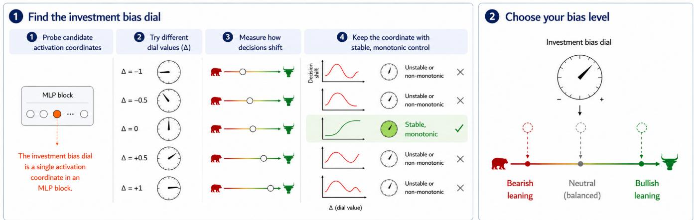
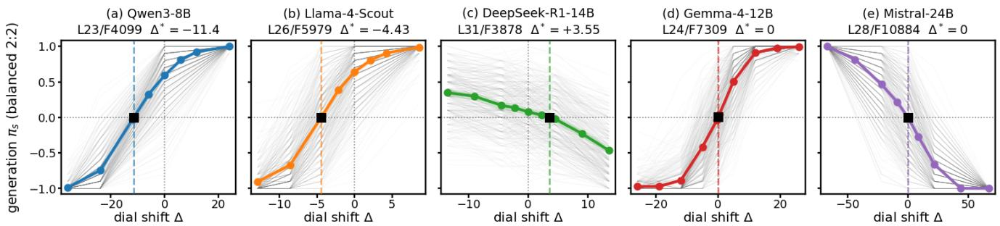
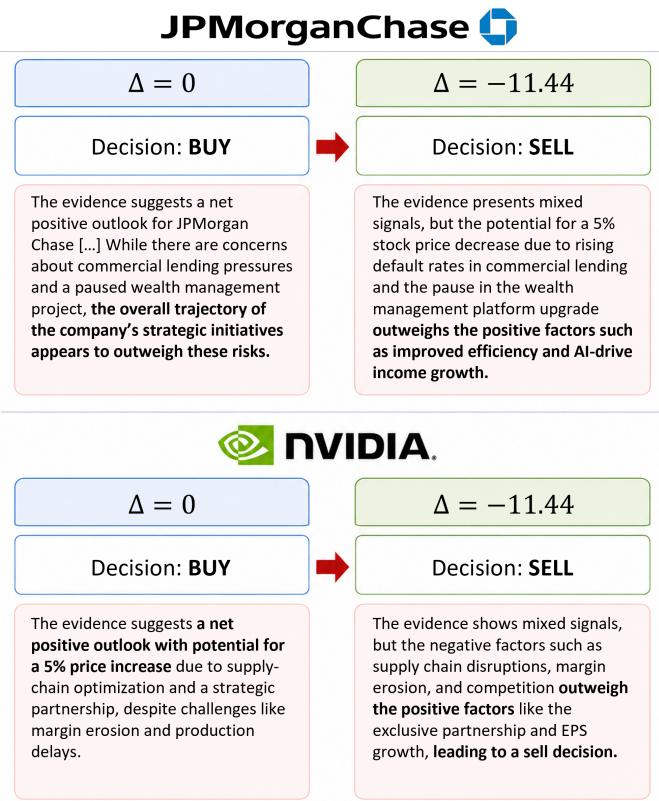
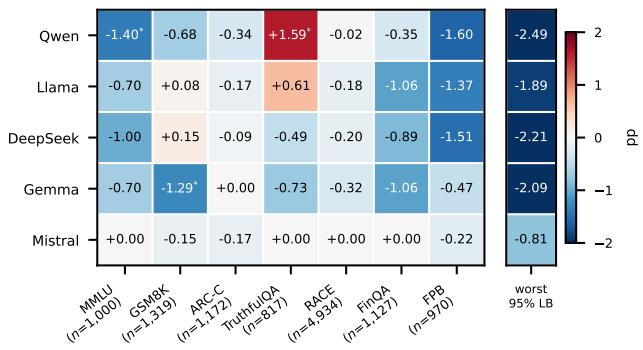
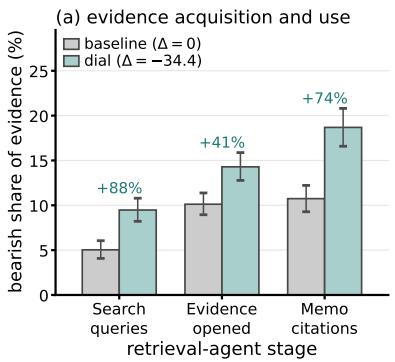
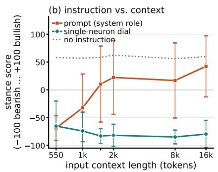
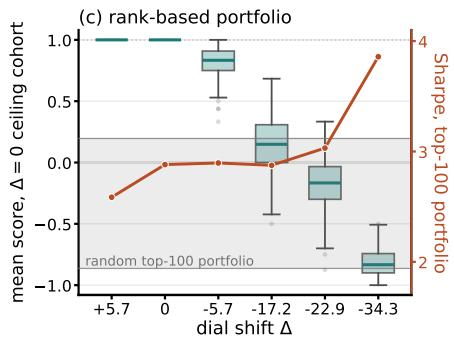
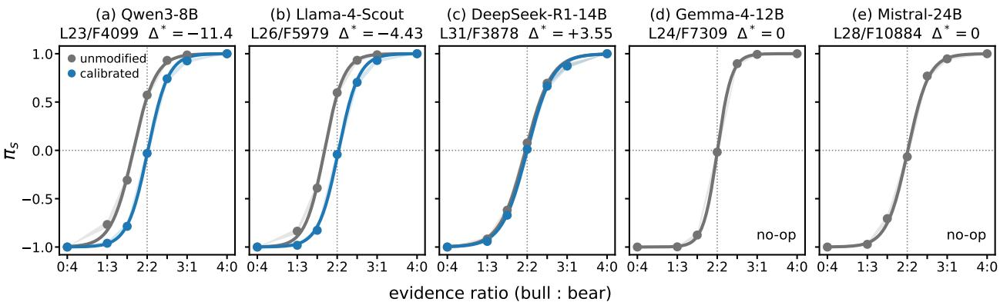

# Your AI, On a Dial: Controlling Investment Bias in LLMs with a Single Neuron

Sahon<sub>g</sub> Park justin4396@<sup>h</sup>u<sup>f</sup>s.ac.<sup>k</sup>r H<sub>a</sub>nk<sub>u</sub>k Uni<sub>ve</sub>r<sub>s</sub>it<sub>y</sub> <sub>o</sub>f F<sub>o</sub>r<sub>e</sub>i<sub>g</sub>n St<sub>u</sub>di<sub>es</sub> Yon<sub>g</sub>in<sub>,</sub> Re<sub>p</sub>ublic of Korea

Gak<sub>y</sub>un<sub>g</sub> Kwon <sub>e</sub>il<sub>een</sub>k<sub>@</sub>h<sub>u</sub>f<sub>s.ac.</sub>k<sub>r</sub> H<sub>a</sub>nk<sub>u</sub>k Uni<sub>ve</sub>r<sub>s</sub>it<sub>y</sub> <sub>o</sub>f F<sub>o</sub>r<sub>e</sub>i<sub>g</sub>n St<sub>u</sub>di<sub>es</sub> Yon<sub>g</sub>in<sub>,</sub> Re<sub>p</sub>ublic of Korea

A<sup>l</sup>ejan<sup>d</sup>ro Lopez-Lira   
a<sup>l</sup>ejan<sup>d</sup>ro.<sup>l</sup>opez  
li<sub>ra@warr</sub>i<sub>ng</sub>t<sub>on.u</sub>fl<sub>.e</sub>d<sub>u</sub>   
Uni<sub>ve</sub>r<sub>s</sub>it<sub>y</sub> <sub>o</sub>f Fl<sub>o</sub>rid<sub>a</sub>   
G<sub>a</sub>in<sub>esv</sub>ill<sub>e,</sub> FL<sub>,</sub> Unit<sub>e</sub>d St<sub>a</sub>t<sub>es</sub>

<sup>H</sup>y<sup>eon</sup>g<sup>woo</sup> <sup>Kon</sup>g<sup>∗</sup> <sub>g</sub>h<sub>o</sub>3283<sub>@</sub>h<sub>u</sub>f<sub>s.ac.</sub>k<sub>r</sub> H<sub>a</sub>nk<sub>u</sub>k Uni<sub>ve</sub>r<sub>s</sub>it<sub>y</sub> <sub>o</sub>f F<sub>o</sub>r<sub>e</sub>i<sub>g</sub>n St<sub>u</sub>di<sub>es</sub> Yon<sub>g</sub>in<sub>,</sub> Re<sub>p</sub>ublic of Korea

S<sub>u</sub>h<sub>wan</sub> P<sub>ar</sub>k   
<sub>su</sub>h<sub>wan@un</sub>i<sub>s</sub>t<sub>.ac.</sub>k<sub>r</sub>   
UNIST   
Ulsan<sub>,</sub> Re<sub>p</sub>ublic of Korea   
W<sub>on</sub>bi<sub>n</sub> Ah<sub>n</sub>   
<sub>won</sub>bi<sub>n.a</sub>h<sub>n@</sub>l<sub>gresearc</sub>h<sub>.a</sub>i   
LG AI R<sub>esea</sub>r<sub>c</sub>h   
Seoul<sub>,</sub> Re<sub>p</sub>ublic of Korea

Y<sub>oo</sub>n Kim <sub>yoon</sub>ki<sub>m@m</sub>it<sub>.e</sub>d<sub>u</sub> Massachusetts Institute of Technolo<sub>gy</sub> C<sub>a</sub>mbrid<sub>ge,</sub> MA<sub>,</sub> Unit<sub>e</sub>d St<sub>a</sub>t<sub>es</sub>

<sup>H</sup>o<sub>y</sub>oun<sub>g</sub> <sup>L</sup>ee   
h<sub>oyoung</sub>l<sub>ee@un</sub>i<sub>s</sub>t<sub>.ac.</sub>k<sub>r</sub>   
UNIST   
Ulsan<sub>,</sub> Re<sub>p</sub>ublic of Korea   
Jaewon Choi   
jaewonc<sup>h</sup>@<sup>h</sup>anw<sup>h</sup>a.com   
H<sub>a</sub>n<sub>w</sub>h<sub>a</sub> Lif<sub>e</sub>   
Seoul<sub>,</sub> Re<sub>p</sub>ublic of Korea   
Chan<sub>y</sub>eol Choi   
jaco<sup>b</sup>c<sup>h</sup>oi@<sup>l</sup>inqa<sup>l</sup>p<sup>h</sup>a.com   
Lin<sub>q</sub>Al<sub>p</sub>ha   
N<sub>ew</sub> Y<sub>o</sub>rk<sub>,</sub> NY<sub>,</sub> Unit<sub>e</sub>d St<sub>a</sub>t<sub>es</sub>   
Yongjae Lee<sup>∗</sup>   
yongjae<sup>l</sup>ee@unist.ac.<sup>k</sup>r   
UNIST   
Ulsan<sub>,</sub> Re<sub>p</sub>ublic of Korea   
Lin<sub>q</sub>Al<sub>p</sub>ha   
N<sub>ew</sub> Y<sub>o</sub>rk<sub>,</sub> NY<sub>,</sub> Unit<sub>e</sub>d St<sub>a</sub>t<sub>es</sub>

## Abstract

Lar<sub>g</sub>e lan<sub>g</sub>ua<sub>g</sub>e models (LLMs) are increasin<sub>g</sub>l<sub>y</sub> used in investment decision-makin<sub>g, y</sub>et <sub>p</sub>rior work shows that the<sub>y</sub> exhibit s<sub>y</sub>stem-<sub>a</sub>ti<sub>c,</sub> <sub>mo</sub>d<sub>e</sub>l<sub>-spec</sub>ifi<sub>c</sub> i<sub>nves</sub>t<sub>men</sub>t <sub>pre</sub>f<sub>erences.</sub> W<sub>e</sub> <sub>s</sub>t<sub>u</sub>d<sub>y</sub> <sub>w</sub>h<sub>e</sub>th<sub>er</sub> <sub>a</sub> <sub>mo</sub>d<sub>e</sub>l’<sub>s overa</sub>ll i<sub>nves</sub>t<sub>men</sub>t <sub>s</sub>t<sub>ance can</sub> b<sub>e ca</sub>lib<sub>ra</sub>t<sub>e</sub>d t<sub>o a spec</sub>ifi<sub>e</sub>d direction and stren<sub>g</sub>th. We introduce an investment-bias dial<sub>,</sub> an inference-time inter<sub>v</sub>ention on a sin<sub>g</sub>le ne<sub>u</sub>ron that contin<sub>u</sub>o<sub>u</sub>sl<sub>y</sub> a<sup>d</sup>justs a mo<sup>d</sup>e<sup>l</sup>-<sup>l</sup>eve<sup>l d</sup>ecision prior—its overa<sup>ll</sup> ten<sup>d</sup>ency towar<sup>d</sup> bu<sub>y</sub>in<sub>g</sub> or sellin<sub>g</sub>—without tar<sub>g</sub>etin<sub>g</sub> s<sub>p</sub>ecific firms or investment attributes. Usin<sub>g</sub> matched <sub>p</sub>ositive and ne<sub>g</sub>ative evidence<sub>,</sub> we evaluate fi<sub>ve</sub> <sub>open-we</sub>i<sub>g</sub>ht LLM<sub>s</sub> <sub>an</sub>d fi<sub>n</sub>d th<sub>a</sub>t th<sub>e</sub> di<sub>a</sub>l <sub>pro</sub>d<sub>uces</sub> <sub>mono</sub>t<sub>on</sub>i<sub>c</sub> chan<sub>g</sub>es in investment stance without modif<sub>y</sub>in<sub>g</sub> <sub>p</sub>rom<sub>p</sub>ts or model <sub>parame</sub>t<sub>ers.</sub> At th<sub>e response</sub> l<sub>eve</sub>l<sub>,</sub> th<sub>e</sub> di<sub>a</sub>l <sub>s</sub>hift<sub>s</sub> b<sub>o</sub>th i<sub>nves</sub>t<sub>men</sub>t d<sub>ec</sub>i<sub>s</sub>i<sub>ons an</sub>d th<sub>e ev</sub>id<sub>en</sub>ti<sub>a</sub>l <sub>emp</sub>h<sub>as</sub>i<sub>s o</sub>f <sub>genera</sub>t<sub>e</sub>d <sub>ra</sub>ti<sub>ona</sub>l<sub>es un-</sub> der identical in<sub>p</sub>uts. In an a<sub>g</sub>entic retrieval settin<sub>g,</sub> the dial also <sub>c</sub>h<sub>anges w</sub>h<sub>a</sub>t i<sub>n</sub>f<sub>orma</sub>ti<sub>on</sub> th<sub>e mo</sub>d<sub>e</sub>l <sub>searc</sub>h<sub>es</sub> f<sub>or, w</sub>hi<sub>c</sub>h <sub>ev</sub>id<sub>ence</sub> it <sub>se</sub>l<sub>ec</sub>t<sub>s, an</sub>d <sub>w</sub>hi<sub>c</sub>h <sub>ev</sub>id<sub>ence</sub> i<sub>s re</sub>fl<sub>ec</sub>t<sub>e</sub>d i<sub>n</sub> it<sub>s</sub> fi<sub>na</sub>l <sub>ana</sub>l <sub>s</sub>i<sub>s.</sub> I<sub>n a</sub> l<sub>ong-con</sub>t<sub>ex</sub>t <sub>eva</sub>l<sub>ua</sub>ti<sub>on,</sub> th<sub>e</sub> di<sub>a</sub>l <sub>ma</sub>i<sub>n</sub>t<sub>a</sub>i<sub>ns s</sub>t<sub>a</sub>bl<sub>e s</sub>t<sub>ance con</sub>t<sub>ro</sub>l <sub>as con</sub>t<sub>ex</sub>t l<sub>eng</sub>th i<sub>ncreases, w</sub>h<sub>ereas a ma</sub>t<sub>c</sub>h<sub>e</sub>d <sub>sys</sub>t<sub>em-promp</sub>t instruction <sub>p</sub>ro<sub>g</sub>ressivel<sub>y</sub> attenuates. We further show that chan<sub>g</sub>es in the dial <sub>p</sub>ro<sub>p</sub>a<sub>g</sub>ate to securit<sub>y</sub> rankin<sub>g</sub>s and downstream <sub>p</sub>ortf<sub>o</sub>li<sub>o compos</sub>iti<sub>on</sub> i<sub>n an exp</sub>l<sub>ora</sub>t<sub>ory</sub> b<sub>ac</sub>kt<sub>es</sub>t<sub>.</sub> O<sub>vera</sub>ll<sub>, our resu</sub>lt<sub>s</sub> show that an LLM’s a<sub>gg</sub>re<sub>g</sub>ate investment stance can be calibrated t<sub>owar</sub>d <sub>a spec</sub>ifi<sub>e</sub>d t<sub>arge</sub>t <sub>a</sub>t i<sub>n</sub>f<sub>erence</sub> ti<sub>me.</sub>

Keywords lar<sub>g</sub>e lan<sub>g</sub>ua<sub>g</sub>e models<sub>,</sub> investment decision-makin<sub>g,</sub> decision <sub>p</sub>rior<sub>,</sub> activation steerin<sub>g,</sub> model calibration<sub>,</sub> trustworth<sub>y</sub> financial AI

## 1 Introduction

Lar<sub>g</sub>e Lan<sub>g</sub>ua<sub>g</sub>e Models (LLMs) are <sub>p</sub>la<sub>y</sub>in<sub>g</sub> an increasin<sub>g</sub>l<sub>y</sub> <sub>p</sub>rominent role in financial decision-makin<sub>g,</sub> su<sub>pp</sub>ortin<sub>g</sub> tasks from mark<sub>e</sub>t <sub>ana</sub>l<sub>ys</sub>i<sub>s an</sub>d i<sub>nves</sub>t<sub>men</sub>t <sub>researc</sub>h t<sub>o por</sub>tf<sub>o</sub>li<sub>o cons</sub>t<sub>ruc</sub>ti<sub>on</sub> [14, 19, 30]. As their influence <sub>g</sub>rows, it becomes im<sub>p</sub>ortant to under-<sub>s</sub>t<sub>an</sub>d <sub>no</sub>t <sub>on</sub>l<sub>y</sub> th<sub>e</sub> d<sub>ec</sub>i<sub>s</sub>i<sub>ons</sub> th<sub>ey</sub> <sub>pro</sub>d<sub>uce,</sub> b<sub>u</sub>t <sub>a</sub>l<sub>so</sub> th<sub>e</sub> <sub>un</sub>d<sub>er</sub>l<sub>y</sub>i<sub>ng</sub> views that sha<sub>p</sub>e those decisions. LLMs are not necessaril<sub>y</sub> neutral fi<sub>nanc</sub>i<sub>a</sub>l d<sub>ec</sub>i<sub>s</sub>i<sub>on-ma</sub>k<sub>ers:</sub> th<sub>ey can ex</sub>hibit <sub>sys</sub>t<sub>ema</sub>ti<sub>c,</sub> d<sub>oma</sub>i<sub>n-</sub> <sub>spec</sub>ifi<sub>c</sub> bi<sub>ases</sub> th<sub>a</sub>t <sub>a</sub>f<sub>ec</sub>t h<sub>ow</sub> <sub>ev</sub>id<sub>ence</sub> i<sub>s</sub> i<sub>n</sub>t<sub>erpre</sub>t<sub>e</sub>d <sub>an</sub>d h<sub>ow</sub> investment jud<sub>g</sub>ments are formed [16].

P<sub>r</sub>i<sub>or wor</sub>k d<sub>ocumen</sub>t<sub>s mo</sub>d<sub>e</sub>l<sub>-spec</sub>ifi<sub>c pre</sub>f<sub>erences across sec-</sub> t<sub>or,</sub> fi<sub>rm-s</sub>i<sub>ze, an</sub>d <sub>momen</sub>t<sub>um</sub> di<sub>mens</sub>i<sub>ons, some o</sub>f <sub>w</sub>hi<sub>c</sub>h <sub>pers</sub>i<sub>s</sub>t even in the face of conflictin<sub>g</sub> evidence [18]. In investment settin<sub>g</sub>s, h<sub>owever,</sub> th<sub>ere may</sub> b<sub>e no un</sub>i<sub>versa</sub>ll<sub>y appropr</sub>i<sub>a</sub>t<sub>e s</sub>t<sub>ance;</sub> th<sub>e</sub> d<sub>e-</sub> sire<sup>d</sup> stance can <sup>d</sup>epen<sup>d</sup> on t<sup>h</sup>e investor<sup>’</sup>s o<sup>b</sup>jective or man<sup>d</sup>ate. We th<sub>ere</sub>f<sub>ore</sub> f<sub>rame</sub> th<sub>e pro</sub>bl<sub>em no</sub>t <sub>as e</sub>li<sub>m</sub>i<sub>na</sub>ti<sub>ng</sub> bi<sub>as,</sub> b<sub>u</sub>t <sub>as g</sub>i<sub>v-</sub> i<sub>ng users con</sub>t<sub>ro</sub>l <sub>over</sub> th<sub>e mo</sub>d<sub>e</sub>l’<sub>s overa</sub>ll i<sub>nves</sub>t<sub>men</sub>t <sub>s</sub>t<sub>ance—</sub>b<sub>o</sub>th its <sup>d</sup>irection an<sup>d</sup> its strengt<sup>h</sup>. Existing met<sup>h</sup>o<sup>d</sup>s ma<sup>k</sup>e t<sup>h</sup>is a<sup>d</sup>justment dificult. Prom<sub>p</sub>tin<sub>g</sub> can be sensitive to wordin<sub>g</sub> and context<sub>,</sub> <sub>w</sub>hil<sub>e</sub> fi<sub>ne-</sub>t<sub>un</sub>i<sub>ng</sub> <sub>comm</sub>it<sub>s</sub> th<sub>e</sub> <sub>mo</sub>d<sub>e</sub>l t<sub>o</sub> <sub>a</sub> fi<sub>xe</sub>d t<sub>arge</sub>t <sub>an</sub>d <sub>mus</sub>t b<sub>e</sub> re<sub>p</sub>eated when that tar<sub>g</sub>et chan<sub>g</sub>es [3, 11].

We introduce an investment-bias dial, an inference-time inter-<sub>ven</sub>ti<sub>on</sub> <sub>on</sub> <sub>a</sub> <sub>s</sub>i<sub>ng</sub>l<sub>e</sub> <sub>neuron.</sub> T<sub>urn</sub>i<sub>ng</sub> th<sub>e</sub> di<sub>a</sub>l <sub>c</sub>h<sub>anges</sub> <sub>a</sub> <sub>mo</sub>d<sub>e</sub>l<sub>-</sub>l<sub>eve</sub>l d<sub>ec</sub>i<sub>s</sub>i<sub>on</sub> <sub>pr</sub>i<sub>or—</sub>it<sub>s</sub> <sub>genera</sub>l t<sub>en</sub>d<sub>ency</sub> t<sub>o</sub> b<sub>uy</sub> <sub>or</sub> <sub>se</sub>ll<sub>—ra</sub>th<sub>er</sub> th<sub>an</sub> tar<sub>g</sub>etin<sub>g p</sub>artic<sub>u</sub>lar sec<sub>u</sub>rities or investment attrib<sub>u</sub>tes. The dial th<sub>ere</sub>f<sub>ore prov</sub>id<sub>es con</sub>ti<sub>nuous con</sub>t<sub>ro</sub>l <sub>over</sub> th<sub>e mo</sub>d<sub>e</sub>l’<sub>s overa</sub>ll stance without chan<sub>g</sub>in<sub>g</sub> the <sub>p</sub>rom<sub>p</sub>t or u<sub>p</sub>datin<sub>g</sub> model <sub>p</sub>arameters. Figure 1 summarizes <sup>h</sup>ow t<sup>h</sup>e neuron is se<sup>l</sup>ecte<sup>d</sup> an<sup>d</sup> a<sup>d</sup>juste<sup>d</sup> at inf<sub>e</sub>r<sub>e</sub>n<sub>ce</sub> tim<sub>e.</sub>

W<sub>e a</sub>dd<sub>ress</sub> th<sub>ree researc</sub>h <sub>ques</sub>ti<sub>ons:</sub>

• RQ1: Can a single neuron provide monotonic control over <sub>a</sub>n LLM’<sub>s ove</sub>r<sub>a</sub>ll in<sub>ves</sub>tm<sub>e</sub>nt <sub>s</sub>t<sub>a</sub>n<sub>ce</sub>?

• RQ2: Can the dial be calibrated to a target investment stance<sub>,</sub> includin<sub>g</sub> a neutral stance?

• RQ3: Does the efect of the investment-bias dial persist and <sub>propaga</sub>t<sub>e</sub> b<sub>eyon</sub>d <sub>con</sub>t<sub>ro</sub>ll<sub>e</sub>d b<sub>uy–se</sub>ll d<sub>ec</sub>i<sub>s</sub>i<sub>ons</sub> t<sub>o</sub> d<sub>own-</sub> <sub>s</sub>t<sub>ream</sub> i<sub>nves</sub>t<sub>men</sub>t <sub>wor</sub>kfl<sub>ows</sub>?

Usin<sub>g</sub> a controlled evidence-conflict framework [18], we evalu-<sub>a</sub>t<sub>e</sub>d th<sub>e</sub> di<sub>a</sub>l <sub>on</sub> fi<sub>ve</sub> <sub>open-we</sub>i<sub>g</sub>ht LLM<sub>s</sub> <sub>spann</sub>i<sub>ng</sub> dif<sub>eren</sub>t <sub>mo</sub>d<sub>e</sub>l f<sub>am</sub>ili<sub>es</sub> <sub>an</sub>d <sub>sca</sub>l<sub>es.</sub> A<sub>cross</sub> <sub>a</sub>ll <sub>mo</sub>d<sub>e</sub>l<sub>s,</sub> <sub>c</sub>h<sub>anges</sub> i<sub>n</sub> th<sub>e</sub> di<sub>a</sub>l <sub>se</sub>tti<sub>ng</sub> <sub>p</sub>roduce monotonic shifts in the investment decision <sub>p</sub>rior and <sub>ena</sub>bl<sub>e</sub> <sub>ca</sub>lib<sub>ra</sub>ti<sub>on</sub> t<sub>owar</sub>d <sub>spec</sub>ifi<sub>e</sub>d t<sub>arge</sub>t<sub>s,</sub> i<sub>nc</sub>l<sub>u</sub>di<sub>ng</sub> <sub>neu</sub>t<sub>ra</sub>lit<sub>y.</sub> K<sub>eep</sub>i<sub>ng</sub> th<sub>e ev</sub>id<sub>ence</sub> fi<sub>xe</sub>d<sub>,</sub> th<sub>e</sub> di<sub>a</sub>l <sub>a</sub>l<sub>so c</sub>h<sub>anges</sub> b<sub>o</sub>th th<sub>e</sub> fi<sub>na</sub>l i<sub>n</sub> <sub>ves</sub>t<sub>men</sub>t d<sub>ec</sub>i<sub>s</sub>i<sub>on an</sub>d th<sub>e</sub> i<sub>n</sub>f<sub>orma</sub>ti<sub>on emp</sub>h<sub>as</sub>i<sub>ze</sub>d i<sub>n</sub> th<sub>e ra</sub>ti<sub>ona</sub>l<sub>e.</sub> A<sub>cross seven genera</sub>l<sub>-purpose an</sub>d fi<sub>nance-spec</sub>ifi<sub>c</sub> b<sub>enc</sub>h<sub>mar</sub>k<sub>s,</sub> <sub>we</sub> fi<sub>n</sub>d <sub>no ev</sub>id<sub>ence o</sub>f <sub>sys</sub>t<sub>ema</sub>ti<sub>c per</sub>f<sub>ormance</sub> d<sub>egra</sub>d<sub>a</sub>ti<sub>on.</sub> I<sub>n</sub> <sub>a</sub>dditi<sub>ona</sub>l <sub>eva</sub>l<sub>ua</sub>ti<sub>ons,</sub> th<sub>e</sub> di<sub>a</sub>l <sub>a</sub>f<sub>ec</sub>t<sub>s</sub> i<sub>n</sub>f<sub>orma</sub>ti<sub>on acqu</sub>i<sub>s</sub>iti<sub>on an</sub>d evidence use<sub>,</sub> maintains stance control over lon<sub>g</sub> contexts relative to matc<sup>h</sup>e<sup>d</sup> <sub>p</sub>rom<sub>p</sub>t<sup>i</sup>n<sub>g</sub>, an<sup>d</sup> <sub>p</sub>ro<sub>p</sub>a<sub>g</sub>ates to secur<sup>i</sup>t<sub>y</sub> ran<sup>ki</sup>n<sub>g</sub>s an<sup>d</sup> <sub>p</sub>ortfolio com<sub>p</sub>osition.

Our contributions are threefold. First, we propose the investmentbias dial, a simple yet novel single-neuron intervention for continuousl<sub>y</sub> controllin<sub>g</sub> an LLM’s overall investment stance at inference time without chan<sub>g</sub>in<sub>g p</sub>rom<sub>p</sub>ts or model <sub>p</sub>arameters. Second<sub>,</sub> <sub>across</sub> fi<sub>ve open-we</sub>i<sub>g</sub>ht LLM<sub>s, we s</sub>h<sub>ow</sub> th<sub>a</sub>t th<sub>e</sub> di<sub>a</sub>l <sub>pro</sub>d<sub>uces</sub> monotonic shifts in the in<sub>v</sub>estment decision <sub>p</sub>rior and can be calibrated to a tar<sub>g</sub>et stance. Third<sub>,</sub> we examine the <sub>p</sub>ractical im<sub>p</sub>licati<sub>ons</sub> <sub>o</sub>f th<sub>e</sub> di<sub>a</sub>l f<sub>or</sub> <sub>agen</sub>ti<sub>c</sub> <sub>researc</sub>h b<sub>e</sub>h<sub>av</sub>i<sub>or,</sub> l<sub>ong-con</sub>t<sub>ex</sub>t <sub>s</sub>t<sub>ance</sub> <sub>con</sub>t<sub>ro</sub>l<sub>, an</sub>d d<sub>owns</sub>t<sub>ream por</sub>tf<sub>o</sub>li<sub>o cons</sub>t<sub>ruc</sub>ti<sub>on.</sub>

## 2 Related Work

## 2.1 Financial Biases in Large Language Models

Recent studies have documented s<sub>y</sub>stematic biases in LLM-based financial reasonin<sub>g</sub> and decision-makin<sub>g</sub>. Lee et al. [18] introduce a <sub>con</sub>t<sub>ro</sub>ll<sub>e</sub>d <sub>ev</sub>id<sub>ence-con</sub>fli<sub>c</sub>t f<sub>ramewor</sub>k f<sub>or measur</sub>i<sub>ng</sub> l<sub>a</sub>t<sub>en</sub>t i<sub>nves</sub>t<sub>-</sub> <sub>men</sub>t <sub>pre</sub>f<sub>erences an</sub>d <sub>exam</sub>i<sub>ne w</sub>h<sub>e</sub>th<sub>er</sub> th<sub>ese pre</sub>f<sub>erences pers</sub>i<sub>s</sub>t <sub>w</sub>h<sub>en mo</sub>d<sub>e</sub>l<sub>s are presen</sub>t<sub>e</sub>d <sub>w</sub>ith <sub>con</sub>t<sub>ra</sub>di<sub>c</sub>t<sub>ory ev</sub>id<sub>ence.</sub> A<sub>cross</sub> <sub>sec</sub>t<sub>or,</sub> fi<sub>rm-s</sub>i<sub>ze, an</sub>d <sub>momen</sub>t<sub>um</sub> di<sub>mens</sub>i<sub>ons,</sub> th<sub>ey</sub> id<sub>en</sub>tif<sub>y mo</sub>d<sub>e</sub>l <sub>spec</sub>ifi<sub>c</sub> i<sub>nves</sub>t<sub>men</sub>t <sub>pre</sub>f<sub>erences an</sub>d <sub>s</sub>h<sub>ow</sub> th<sub>a</sub>t <sub>some are assoc</sub>i<sub>a</sub>t<sub>e</sub>d <sub>w</sub>ith <sub>con</sub>fi<sub>rma</sub>ti<sub>on</sub> bi<sub>as.</sub> R<sub>e</sub>l<sub>a</sub>t<sub>e</sub>d <sub>wor</sub>k h<sub>as exam</sub>i<sub>ne</sub>d bi<sub>ases ar</sub>i<sub>s</sub>i<sub>ng</sub> f<sub>rom</sub> th<sub>e presen</sub>t<sub>a</sub>ti<sub>on an</sub>d <sub>represen</sub>t<sub>a</sub>ti<sub>on o</sub>f fi<sub>nanc</sub>i<sub>a</sub>l i<sub>n</sub>f<sub>orma</sub>ti<sub>on.</sub> P<sub>a</sub>ir<sub>w</sub>i<sub>se</sub> fin<sub>a</sub>n<sub>c</sub>i<sub>a</sub>l d<sub>ec</sub>i<sub>s</sub>i<sub>o</sub>n<sub>s e</sub>xhibit <sub>pos</sub>iti<sub>o</sub>n<sub>a</sub>l bi<sub>as, w</sub>ith m<sub>o</sub>d<sub>e</sub>l choices var<sub>y</sub>in<sub>g</sub> with the orderin<sub>g</sub> of alternatives and the ma<sub>g</sub>- <sub>n</sub>it<sub>u</sub>d<sub>e</sub> <sub>o</sub>f thi<sub>s</sub> <sub>e</sub>f<sub>ec</sub>t dif<sub>er</sub>i<sub>ng</sub> <sub>across</sub> <sub>mo</sub>d<sub>e</sub>l <sub>sca</sub>l<sub>es</sub> <sub>an</sub>d <sub>promp</sub>ti<sub>ng</sub> conditions [9]. A se<sub>p</sub>arate stud<sub>y</sub> of o<sub>p</sub>en-source Qwen models finds <sub>sys</sub>t<sub>ema</sub>ti<sub>c</sub> <sub>var</sub>i<sub>a</sub>ti<sub>on</sub> i<sub>n</sub> <sub>mo</sub>d<sub>e</sub>l <sub>con</sub>fid<sub>ence</sub> <sub>w</sub>ith fi<sub>rm</sub> <sub>s</sub>i<sub>ze,</sub> <sub>va</sub>l<sub>ua</sub>ti<sub>on,</sub> risk, and industr<sub>y</sub> sector [10]. Product-level anal<sub>y</sub>ses likewise doc-<sub>umen</sub>t <sub>sys</sub>t<sub>ema</sub>ti<sub>c pre</sub>f<sub>erences</sub> f<sub>or spec</sub>ifi<sub>c</sub> fi<sub>nanc</sub>i<sub>a</sub>l <sub>pro</sub>d<sub>uc</sub>t<sub>s across</sub> multi<sub>p</sub>le asset classes [31].

Fi<sub>nanc</sub>i<sub>a</sub>l bi<sub>ases</sub> h<sub>ave a</sub>l<sub>so</sub> b<sub>een</sub> li<sub>n</sub>k<sub>e</sub>d t<sub>o</sub> dif<sub>erences</sub> i<sub>n</sub> i<sub>n</sub>f<sub>or-</sub> <sub>ma</sub>ti<sub>on ava</sub>il<sub>a</sub>bilit<sub>y an</sub>d b<sub>roa</sub>d<sub>er</sub> b<sub>e</sub>h<sub>av</sub>i<sub>ora</sub>l t<sub>en</sub>d<sub>enc</sub>i<sub>es.</sub> P<sub>r</sub>i<sub>or wor</sub>k d<sub>ocumen</sub>t<sub>s</sub> f<sub>ore</sub>i<sub>gn-mar</sub>k<sub>e</sub>t bi<sub>as</sub> i<sub>n</sub> fi<sub>nanc</sub>i<sub>a</sub>l <sub>pre</sub>di<sub>c</sub>ti<sub>ons assoc</sub>i<sub>a</sub>t<sub>e</sub>d with diferences in information environments [4], as well as s<sub>y</sub>st<sub>ema</sub>ti<sub>c</sub> b<sub>e</sub>h<sub>av</sub>i<sub>ora</sub>l <sub>pa</sub>tt<sub>erns across pre</sub>f<sub>erence- an</sub>d b<sub>e</sub>li<sub>e</sub>f<sub>-</sub>b<sub>ase</sub>d economic and financial decisions [3]. Collectivel<sub>y</sub>, these studies d<sub>ocumen</sub>t <sub>a range o</sub>f fi<sub>nanc</sub>i<sub>a</sub>l bi<sub>ases assoc</sub>i<sub>a</sub>t<sub>e</sub>d <sub>w</sub>ith l<sub>a</sub>t<sub>en</sub>t i<sub>nves</sub>t<sub>-</sub> ment <sub>p</sub>references<sub>,</sub> o<sub>p</sub>tion orderin<sub>g,</sub> firm and <sub>p</sub>roduct characteristics<sub>,</sub> information a<sub>v</sub>ailabilit<sub>y,</sub> and decision framin<sub>g</sub>. In contrast to <sub>p</sub>rior <sub>wor</sub>k th<sub>a</sub>t <sub>pr</sub>i<sub>mar</sub>il<sub>y</sub> id<sub>en</sub>tifi<sub>es an</sub>d <sub>c</sub>h<sub>arac</sub>t<sub>er</sub>i<sub>zes suc</sub>h bi<sub>ases, our</sub> <sub>wor</sub>k i<sub>nves</sub>ti<sub>ga</sub>t<sub>es w</sub>h<sub>e</sub>th<sub>er a measure</sub>d i<sub>nves</sub>t<sub>men</sub>t <sub>pre</sub>f<sub>erence can</sub> <sup>b</sup>e continuous<sup>l</sup>y a<sup>d</sup>juste<sup>d</sup> towar<sup>d</sup> a speci<sup>fi</sup>e<sup>d</sup> target t<sup>h</sup>roug<sup>h</sup> a <sup>l</sup>oca<sup>l</sup>- iz<sub>e</sub>d int<sub>e</sub>rn<sub>a</sub>l int<sub>e</sub>r<sub>ve</sub>nti<sub>o</sub>n<sub>.</sub>

## 2.2 Modifying Model Behavior

Previous work has sou<sub>g</sub>ht to modif<sub>y</sub> LLM behavior throu<sub>g</sub>h <sub>p</sub>rom<sub>p</sub>tin<sub>g,</sub> fine-tunin<sub>g,</sub> and inference-time intervention. In financial decision tasks<sub>,</sub> rationalit<sub>y</sub>-oriented <sub>p</sub>rom<sub>p</sub>tin<sub>g</sub> has been shown to reduce several behavioral biases [3]. Parameter-level a<sub>pp</sub>roaches h<sub>ave</sub> <sub>a</sub>l<sub>so</sub> b<sub>een</sub> <sub>exp</sub>l<sub>ore</sub>d<sub>:</sub> L<sub>o</sub>RA<sub>-</sub>b<sub>ase</sub>d <sub>superv</sub>i<sub>se</sub>d fi<sub>ne-</sub>t<sub>un</sub>i<sub>ng</sub> <sub>can</sub> miti<sub>g</sub>ate extra<sub>p</sub>olation bias in financial forecastin<sub>g</sub> and im<sub>p</sub>rove out-of-sam<sub>p</sub>le <sub>p</sub>redictions [11]. These a<sub>pp</sub>roaches demonstrate that fi<sub>nanc</sub>i<sub>a</sub>l b<sub>e</sub>h<sub>av</sub>i<sub>or</sub> <sub>can</sub> b<sub>e</sub> <sub>mo</sub>difi<sub>e</sub>d<sub>,</sub> b<sub>u</sub>t th<sub>ey</sub> <sub>re</sub>l<sub>y</sub> <sub>on</sub> <sub>e</sub>ith<sub>er</sub> <sub>promp</sub>t desi<sub>g</sub>n or <sub>p</sub>arameter u<sub>p</sub>dates rather than ex<sub>p</sub>osin<sub>g</sub> a direct internal contro<sup>l f</sup>or continuous<sup>l</sup>y a<sup>d</sup>justing t<sup>h</sup>e <sup>b</sup>e<sup>h</sup>avior at in<sup>f</sup>erence time.

A<sub>c</sub>ti<sub>va</sub>ti<sub>on-</sub>b<sub>ase</sub>d <sub>me</sub>th<sub>o</sub>d<sub>s</sub> i<sub>ns</sub>t<sub>ea</sub>d i<sub>n</sub>t<sub>ervene</sub> di<sub>rec</sub>tl<sub>y on</sub> i<sub>n</sub>t<sub>erna</sub>l r<sub>ep</sub>r<sub>ese</sub>nt<sub>a</sub>ti<sub>o</sub>n<sub>s</sub> d<sub>u</sub>rin<sub>g</sub> inf<sub>e</sub>r<sub>e</sub>n<sub>ce.</sub> Inf<sub>e</sub>r<sub>e</sub>n<sub>ce</sub>-Tim<sub>e</sub> Int<sub>e</sub>r<sub>ve</sub>nti<sub>o</sub>n m<sub>o</sub>difi<sub>es</sub> <sub>a</sub> <sub>sma</sub>ll <sub>se</sub>t <sub>o</sub>f <sub>a</sub>tt<sub>en</sub>ti<sub>on-</sub>h<sub>ea</sub>d <sub>ac</sub>ti<sub>va</sub>ti<sub>ons</sub> <sub>a</sub>l<sub>ong</sub> di<sub>rec</sub>ti<sub>ons</sub> <sub>asso-</sub> ciated with truthfulness [20]. Re<sub>p</sub>resentation En<sub>g</sub>ineerin<sub>g p</sub>rovides a broader framework for monitorin<sub>g</sub> and mani<sub>p</sub>ulatin<sub>g p</sub>o<sub>p</sub>ulationlevel re<sub>p</sub>resentations associated with hi<sub>g</sub>h-level model behavior [32], <sub>w</sub>hil<sub>e</sub> C<sub>o</sub>ntr<sub>as</sub>ti<sub>ve</sub> A<sub>c</sub>ti<sub>va</sub>ti<sub>o</sub>n Additi<sub>o</sub>n <sub>co</sub>n<sub>s</sub>tr<sub>uc</sub>t<sub>s</sub> <sub>s</sub>t<sub>ee</sub>rin<sub>g</sub> <sub>vec</sub>t<sub>o</sub>r<sub>s</sub> f<sub>rom</sub> <sub>ac</sub>ti<sub>va</sub>ti<sub>on</sub> dif<sub>erences</sub> b<sub>e</sub>t<sub>ween</sub> <sub>con</sub>t<sub>ras</sub>ti<sub>ve</sub> <sub>examp</sub>l<sub>es</sub> <sub>an</sub>d <sub>a</sub>dd<sub>s</sub> them durin<sub>g</sub> forward <sub>p</sub>asses [27]. Related work has extended activati<sub>o</sub>n <sub>s</sub>t<sub>ee</sub>rin<sub>g</sub> t<sub>o soc</sub>i<sub>a</sub>l-bi<sub>as</sub> miti<sub>ga</sub>ti<sub>o</sub>n<sub>;</sub> F<sub>a</sub>irSt<sub>ee</sub>r d<sub>e</sub>t<sub>ec</sub>t<sub>s</sub> bi<sub>as</sub>-r<sub>e</sub>l<sub>a</sub>t<sub>e</sub>d activation <sub>p</sub>atterns and conditionall<sub>y</sub> a<sub>pp</sub>lies debiasin<sub>g</sub> steerin<sub>g</sub> vectors durin<sub>g</sub> inference [21]. At the same time, steerin<sub>g</sub> efects can var<sub>y</sub> substantiall<sub>y</sub> across in<sub>p</sub>uts and <sub>p</sub>rom<sub>p</sub>tin<sub>g</sub> conditions<sub>,</sub> and indi<sub>sc</sub>rimin<sub>a</sub>t<sub>e</sub> int<sub>e</sub>r<sub>ve</sub>nti<sub>o</sub>n <sub>ca</sub>n intr<sub>o</sub>d<sub>uce pe</sub>rf<sub>o</sub>rm<sub>a</sub>n<sub>ce s</sub>id<sub>e e</sub>f<sub>ec</sub>t<sub>s</sub> on in<sub>p</sub>uts for which steerin<sub>g</sub> is unnecessar<sub>y</sub> [28, 29].

A <sub>comp</sub>l<sub>emen</sub>t<sub>ary</sub> li<sub>ne o</sub>f <sub>wor</sub>k <sub>s</sub>t<sub>u</sub>di<sub>es</sub> b<sub>e</sub>h<sub>av</sub>i<sub>or a</sub>t th<sub>e</sub> l<sub>eve</sub>l <sub>o</sub>f i<sub>n</sub>di<sub>v</sub>id<sub>ua</sub>l <sub>neurons.</sub> N<sub>euron-</sub>l<sub>eve</sub>l <sub>ana</sub>l <sub>ses</sub> h<sub>ave</sub> id<sub>en</sub>tifi<sub>e</sub>d <sub>un</sub>it<sub>s</sub> <sub>assoc</sub>i<sub>a</sub>t<sub>e</sub>d <sub>w</sub>ith f<sub>ac</sub>t<sub>ua</sub>l k<sub>now</sub>l<sub>e</sub>d<sub>ge an</sub>d <sub>s</sub>h<sub>own</sub> th<sub>a</sub>t <sub>man</sub>i<sub>pu</sub>l<sub>a</sub>ti<sub>ng</sub> them can alter factual ex<sub>p</sub>ression [8]. Similar a<sub>pp</sub>roaches have l<sub>oca</sub>li<sub>ze</sub>d <sub>neurons assoc</sub>i<sub>a</sub>t<sub>e</sub>d <sub>w</sub>ith <sub>soc</sub>i<sub>a</sub>l bi<sub>as an</sub>d <sub>use</sub>d t<sub>arge</sub>t<sub>e</sub>d su<sub>pp</sub>ression to miti<sub>g</sub>ate biased behavior [24]. More recentl<sub>y</sub>, sin<sub>g</sub>le-<sub>neuron</sub> i<sub>n</sub>t<sub>erven</sub>ti<sub>ons</sub> h<sub>ave</sub> b<sub>een s</sub>h<sub>own</sub> t<sub>o su</sub>b<sub>s</sub>t<sub>an</sub>ti<sub>a</sub>ll<sub>y a</sub>lt<sub>er sa</sub>f<sub>e</sub>t<sub>y-</sub> <sub>re</sub>l<sub>a</sub>t<sub>e</sub>d b<sub>e</sub>h<sub>av</sub>i<sub>or,</sub> i<sub>nc</sub>l<sub>u</sub>di<sub>ng</sub> b<sub>ypass</sub>i<sub>ng sa</sub>f<sub>e</sub>t<sub>y a</sub>li<sub>gnmen</sub>t th<sub>roug</sub>h th<sub>e</sub> su<sub>pp</sub>ression ofan individual neuron [15]. These studies demonstrate th<sub>a</sub>t hi<sub>g</sub>hl<sub>y</sub> l<sub>oca</sub>li<sub>ze</sub>d i<sub>n</sub>t<sub>erna</sub>l i<sub>n</sub>t<sub>erven</sub>ti<sub>ons</sub> <sub>can</sub> <sub>a</sub>f<sub>ec</sub>t <sub>mo</sub>d<sub>e</sub>l <sub>ou</sub>t<sub>pu</sub>t<sub>s,</sub> b<sub>u</sub>t th<sub>ey</sub> d<sub>o no</sub>t <sub>s</sub>t<sub>u</sub>d<sub>y con</sub>ti<sub>nuous ca</sub>lib<sub>ra</sub>ti<sub>on o</sub>f <sub>an</sub> i<sub>nves</sub>t<sub>men</sub>t <sub>pre</sub>f<sub>erence.</sub> W<sub>e</sub> th<sub>ere</sub>f<sub>ore</sub> <sub>exam</sub>i<sub>ne</sub> <sub>w</sub>h<sub>e</sub>th<sub>er</sub> <sub>an</sub> <sub>a</sub>dditi<sub>ve</sub> i<sub>n</sub>t<sub>erven</sub>ti<sub>on</sub> on a sin<sub>g</sub>le MLP coordinate can <sub>p</sub>rovide monotonic and calibratable control over an investment-bias score while limitin<sub>g</sub> chan<sub>g</sub>es in <sub>o</sub>th<sub>er</sub> <sub>eva</sub>l<sub>ua</sub>t<sub>e</sub>d <sub>capa</sub>biliti<sub>es.</sub>

  
Figure 1: Overview of the proposed investment-bias dial. We intervene on candidate activation coordinates in an MLP block and vary the intervention coeficient Δ to measure how the model’s investment decisions change. Candidate coordinates are first screened for decision relevance, and feasible candidates are ranked by held-out calibration error. The selected coordinate is then calibrated to target bearish, neutral, or bullish investment preferences.

## 3 Preliminaries

## 3.1 Investment-Bias Measurement

We ado<sub>p</sub>t the bias elicitation <sub>p</sub>rotocol of Lee et al. [18]. Let $s =$ $\{ s _ { 1 } , \ldots , s _ { 4 2 7 } \}$ d<sub>eno</sub>t<sub>e</sub> th<sub>e</sub> ti<sub>c</sub>k<sub>er un</sub>i<sub>verse.</sub> F<sub>or eac</sub>h ti<sub>c</sub>k<sub>er �</sub> $\in \ S ,$ <sub>a</sub> b<sub>a</sub>l<sub>ance</sub>d t<sub>r</sub>i<sub>a</sub>l <sub>resen</sub>t<sub>s e ua</sub>l <sub>num</sub>b<sub>ers o</sub>f <sub>ma</sub>t<sub>c</sub>h<sub>e</sub>d b<sub>u</sub>lli<sub>s</sub>h <sub>an</sub>d b<sub>ear</sub>i<sub>s</sub>h <sub>ev</sub>id<sub>ence</sub> it<sub>ems</sub> i<sub>n ran</sub>d<sub>om</sub>i<sub>ze</sub>d <sub>or</sub>d<sub>er an</sub>d <sub>as</sub>k<sub>s</sub> th<sub>e mo</sub>d<sub>e</sub>l t<sub>o</sub> choose between buy and sell. Because the evidence is balanced by construction<sub>,</sub> s<sub>y</sub>stematic deviations from an e<sub>q</sub>ual number of bu<sub>y</sub> <sub>an</sub>d <sub>se</sub>ll d<sub>ec</sub>i<sub>s</sub>i<sub>ons</sub> i<sub>n</sub>di<sub>ca</sub>t<sub>e an</sub> i<sub>nves</sub>t<sub>men</sub>t bi<sub>as.</sub>

Let $N _ { \mathrm { b u y } } ^ { ( s ) }$ <sub>an</sub>d $N _ { \mathrm { s e l l } } ^ { ( s ) }$ d<sub>eno</sub>t<sub>e</sub> th<sub>e num</sub>b<sub>ers o</sub>f <sub>ou</sub>t<sub>pu</sub>t<sub>s parse</sub>d <sub>as</sub> b<sub>uy an</sub>d <sub>se</sub>ll f<sub>or</sub> ti<sub>c</sub>k<sub>er �, respec</sub>ti<sub>ve</sub>l<sub>y.</sub> W<sub>e</sub> d<sub>e</sub>fi<sub>ne</sub> th<sub>e</sub> ti<sub>c</sub>k<sub>er-</sub>l<sub>eve</sub>l in<sub>ves</sub>tm<sub>e</sub>nt-bi<sub>as sco</sub>r<sub>e as</sub>

$$
\pi _ { s } = \frac { N _ { \mathrm { b u y } } ^ { \left( s \right) } - N _ { \mathrm { s e l l } } ^ { \left( s \right) } } { N _ { \mathrm { b u y } } ^ { \left( s \right) } + N _ { \mathrm { s e l l } } ^ { \left( s \right) } } \in [ - 1 , 1 ] ,\tag{1}
$$

<sub>w</sub>h<sub>e</sub>n th<sub>e</sub> d<sub>e</sub>n<sub>o</sub>min<sub>a</sub>t<sub>o</sub>r i<sub>s</sub> n<sub>o</sub>nz<sub>e</sub>r<sub>o.</sub> P<sub>os</sub>iti<sub>ve va</sub>l<sub>ues</sub> indi<sub>ca</sub>t<sub>e a</sub> b<sub>uy</sub> bi<sub>as, w</sub>h<sub>ereas nega</sub>ti<sub>ve va</sub>l<sub>ues</sub> i<sub>n</sub>di<sub>ca</sub>t<sub>e a se</sub>ll bi<sub>as.</sub> A <sub>va</sub>l<sub>ue o</sub>f <sub>zero</sub> i<sub>n</sub>di<sub>ca</sub>t<sub>es an equa</sub>l <sub>num</sub>b<sub>er o</sub>f <sub>parse</sub>d b<sub>uy an</sub>d <sub>se</sub>ll d<sub>ec</sub>i<sub>s</sub>i<sub>ons</sub> f<sub>or</sub> th<sub>e</sub> ti<sub>c</sub>k<sub>er.</sub>

A<sub>gg</sub>re<sub>g</sub>atin<sub>g</sub> bu<sub>y</sub> and sell counts across all tickers in S, we define th<sub>e mo</sub>d<sub>e</sub>l<sub>-</sub>l<sub>eve</sub>l i<sub>nves</sub>t<sub>men</sub>t<sub>-</sub>bi<sub>as score as</sub>

$$
\pi = \frac { \sum _ { s \in S } N _ { \mathrm { b u y } } ^ { ( s ) } - \sum _ { s \in S } N _ { \mathrm { s e l l } } ^ { ( s ) } } { \sum _ { s \in S } N _ { \mathrm { b u y } } ^ { ( s ) } + \sum _ { s \in S } N _ { \mathrm { s e l l } } ^ { ( s ) } } .\tag{2}
$$

W<sub>e use � as</sub> th<sub>e pr</sub>i<sub>mary measure o</sub>f th<sub>e mo</sub>d<sub>e</sub>l’<sub>s overa</sub>ll i<sub>nves</sub>t<sub>-</sub> ment bias. Values closer to 1 indicate a stron<sub>g</sub>er a<sub>gg</sub>re<sub>g</sub>ate bu<sub>y</sub> bias, values closer to −1 indicate a stron<sub>g</sub>er a<sub>gg</sub>re<sub>g</sub>ate sell bias, and $\pi = 0$ denotes the neutral <sub>p</sub>oint. The exact elicitation <sub>p</sub>rom<sub>p</sub>t and evaluation <sub>p</sub>rotocol are <sub>p</sub>rovided in A<sub>pp</sub>endix A.1.

## 3.2 Neuron Intervention

E<sub>ac</sub>h d<sub>eco</sub>d<sub>er</sub> bl<sub>oc</sub>k <sub>con</sub>t<sub>a</sub>i<sub>ns an</sub> MLP <sub>w</sub>h<sub>ose</sub> hidd<sub>en ac</sub>ti<sub>va</sub>ti<sub>ons are</sub> projecte<sup>d</sup> <sup>b</sup>ac<sup>k</sup> to t<sup>h</sup>e resi<sup>d</sup>ua<sup>l</sup> stream t<sup>h</sup>roug<sup>h</sup> a <sup>d</sup>own-projection.

P<sub>rev</sub>i<sub>ous wor</sub>k h<sub>as s</sub>h<sub>own</sub> th<sub>a</sub>t i<sub>n</sub>di<sub>v</sub>id<sub>ua</sub>l MLP <sub>neurons can</sub> b<sub>e</sub> causall<sub>y</sub> mani<sub>p</sub>ulated to alter model behavior [8, 15]. Followin<sub>g</sub> this neuron-level intervention <sub>p</sub>aradi<sub>g</sub>m<sub>,</sub> we a<sub>pp</sub>l<sub>y</sub> an additive shift to a sing<sup>l</sup>e coor<sup>d</sup>inate o<sup>f</sup> t<sup>h</sup>e input to t<sup>h</sup>e MLP <sup>d</sup>own-projection.

We focus on a sin<sub>g</sub>le-coordinate intervention to test whether hi<sub>g</sub>hl<sub>y</sub> l<sub>oca</sub>li<sub>ze</sub>d i<sub>n</sub>t<sub>erna</sub>l <sub>con</sub>t<sub>ro</sub>l i<sub>s su</sub>fi<sub>c</sub>i<sub>en</sub>t<sub>.</sub> U<sub>n</sub>lik<sub>e ac</sub>ti<sub>va</sub>ti<sub>on-</sub> steerin<sub>g</sub> methods that t<sub>yp</sub>icall<sub>y</sub> a<sub>pp</sub>l<sub>y</sub> dense directions such as CAA <sub>o</sub>r R<sub>ep</sub>E<sub>,</sub> <sub>ou</sub>r int<sub>e</sub>r<sub>ve</sub>nti<sub>o</sub>n m<sub>o</sub>difi<sub>es</sub> <sub>o</sub>nl<sub>y</sub> <sub>o</sub>n<sub>e</sub> <sub>coo</sub>rdin<sub>a</sub>t<sub>e</sub> <sub>o</sub>f <sub>a</sub>n MLP int<sub>e</sub>rm<sub>e</sub>di<sub>a</sub>t<sub>e ac</sub>ti<sub>va</sub>ti<sub>o</sub>n<sub>.</sub>

L<sub>e</sub>t ℓ i<sub>n</sub>d<sub>ex an</sub> MLP bl<sub>oc</sub>k<sub>, an</sub>d l<sub>e</sub>t $\mathbf { h } _ { \ell , t } \in \mathbb { R } ^ { d _ { \mathrm { f f } } }$ d<sub>eno</sub>t<sub>e</sub> th<sub>e</sub> i<sub>npu</sub>t t<sub>o</sub> its <sup>d</sup>own-projection at to<sup>k</sup>en position �, w<sup>h</sup>ere <sup>�</sup>f is t<sup>h</sup>e MLP interm<sub>e</sub>di<sub>a</sub>t<sub>e</sub> dim<sub>e</sub>n<sub>s</sub>i<sub>o</sub>n<sub>.</sub> F<sub>o</sub>r <sub>a se</sub>l<sub>ec</sub>t<sub>e</sub>d <sub>coo</sub>rdin<sub>a</sub>t<sub>e � a</sub>nd int<sub>e</sub>r<sub>ve</sub>nti<sub>o</sub>n stren<sub>g</sub>t<sup>h</sup> $\Delta \in \mathbb { R } ,$ <sub>we</sub> d<sub>e</sub>fi<sub>ne</sub>

$$
\widetilde { h } _ { \ell , t } [ n ] = h _ { \ell , t } [ n ] + \Delta ,\tag{3}
$$

at ever<sub>y</sub> token <sub>p</sub>osition<sub>,</sub> includin<sub>g</sub> both <sub>p</sub>rom<sub>p</sub>t and <sub>g</sub>enerated tok<sub>ens</sub> d<sub>ur</sub>i<sub>ng au</sub>t<sub>oregress</sub>i<sub>ve</sub> d<sub>eco</sub>di<sub>ng.</sub> All <sub>o</sub>th<sub>er coor</sub>di<sub>na</sub>t<sub>es are</sub> l<sub>e</sub>ft <sub>unc</sub>h<sub>ange</sub>d<sub>.</sub> Th<sub>e</sub> i<sub>n</sub>t<sub>erven</sub>ti<sub>on</sub> <sub>mo</sub>difi<sub>es</sub> <sub>ne</sub>ith<sub>er</sub> th<sub>e</sub> <sub>mo</sub>d<sub>e</sub>l <sub>parame-</sub> ters nor the in<sub>p</sub>ut <sub>p</sub>rom<sub>p</sub>t. We im<sub>p</sub>lement the intervention with a pre-<sup>h</sup>oo<sup>k</sup> on t<sup>h</sup>e MLP <sup>d</sup>own-projection.

## 4 Method

Models. We evaluate five open-weight LLMs spanning diferent <sub>mo</sub>d<sub>e</sub>l f<sub>am</sub>ili<sub>es an</sub>d <sub>sca</sub>l<sub>es.</sub> T<sub>a</sub>bl<sub>e</sub> 1 <sub>summar</sub>i<sub>zes</sub> th<sub>e</sub>i<sub>r arc</sub>hit<sub>ec</sub>t<sub>ura</sub>l <sub>c</sub>h<sub>a</sub>r<sub>ac</sub>t<sub>e</sub>ri<sub>s</sub>ti<sub>cs.</sub>

Table 1: Open-weight LLMs evaluated in this study.
<table><tr><td>Provider</td><td>Model</td><td>Params.</td><td>Layers</td></tr><tr><td>Alibaba</td><td>Qwen3-8B</td><td>8.2B</td><td>36</td></tr><tr><td>Meta</td><td>Llama-4-Scout-17B-16E-Instruct</td><td>17B (109B)</td><td>48</td></tr><tr><td>DeepSeek</td><td>DeepSeek-R1-Distill-Qwen-14B</td><td>14B</td><td>48</td></tr><tr><td>Google</td><td>Gemma-4-12B-it</td><td>12B</td><td>48</td></tr><tr><td>Mistral</td><td>Mistral-Small-24B-Instruct-2501</td><td>24B</td><td>40</td></tr></table>

Algorithm 1 Selecting the investment-bias dial   
Require: Model �, security universe S, target prior grid T   
Ensure: Dial coordinate $c ^ { * }$ <sub>an</sub>d <sub>ca</sub>lib<sub>ra</sub>t<sub>e</sub>d <sub>se</sub>tti<sub>ngs</sub>   
1<sub>:</sub> Com<sub>pu</sub>te <sub>g</sub>radient sensiti<sub>v</sub>it<sub>y</sub> $G _ { c }$ f<sub>or a</sub>ll MLP <sub>coor</sub>di<sub>na</sub>t<sub>es</sub>   
2<sub>:</sub> Screen candidates accordin<sub>g</sub> to $G _ { c }$   
3: S<sub>p</sub>lit S into disjoint subsets $S _ { A }$ <sub>an</sub>d $S _ { B }$   
4: for all candidate coordinates � do   
5: Estimate $\widehat { \Delta } _ { c , A } ( t )$ f<sub>or eac</sub>h $t \in \mathcal { T }$ us<sup>i</sup>n<sub>g</sub> $S _ { A }$   
6: Com<sub>p</sub>ute RMSE(�) on $S _ { B }$   
7: end for   
8: Select the feasible candidate with the lowest RMSE(�)   
9<sub>:</sub> R<sub>e-es</sub>ti<sub>ma</sub>t<sub>e</sub> it<sub>s ca</sub>lib<sub>ra</sub>t<sub>e</sub>d <sub>se</sub>tti<sub>ngs on</sub> th<sub>e</sub> f<sub>u</sub>ll <sub>un</sub>i<sub>verse</sub>   
10: return $c ^ { * }$ <sub>an</sub>d it<sub>s</sub> <sub>ca</sub>lib<sub>ra</sub>t<sub>e</sub>d <sub>se</sub>tti<sub>ngs</sub>

## 4.1 Finding the Investment-Bias Dial

We select the dial coordinate accordin<sub>g</sub> to two criteria: decision <sub>re</sub>l<sub>evance an</sub>d <sub>pr</sub>i<sub>or con</sub>t<sub>ro</sub>ll<sub>a</sub>bilit<sub>y.</sub>

Decision relevance. We first identify MLP coordinates that are l<sub>oca</sub>ll<sub>y assoc</sub>i<sub>a</sub>t<sub>e</sub>d <sub>w</sub>ith th<sub>e mo</sub>d<sub>e</sub>l’<sub>s</sub> b<sub>uy–se</sub>ll d<sub>ec</sub>i<sub>s</sub>i<sub>on.</sub> L<sub>e</sub>t $c = ( \ell , n )$ d<sub>eno</sub>t<sub>e coor</sub>di<sub>na</sub>t<sub>e �</sub> i<sub>n</sub> l<sub>ayer</sub> ℓ<sub>, an</sub>d l<sub>e</sub>t $x _ { \ell , p } ^ { ( i ) } [ n ]$ b<sub>e</sub> it<sub>s ac</sub>ti<sub>va</sub>ti<sub>o</sub>n <sub>a</sub>t token <sub>p</sub>osition $\boldsymbol { p }$ f<sub>or</sub> ti<sub>c</sub>k<sub>er �.</sub> W<sub>e</sub> d<sub>e</sub>fi<sub>ne</sub> th<sub>e gra</sub>di<sub>en</sub>t <sub>sens</sub>iti<sub>v</sub>it<sub>y o</sub>f <sub>coor</sub>di<sub>na</sub>t<sub>e</sub> <sub>�</sub> <sub>as</sub>

$$
G _ { c } = \left| \frac { 1 } { | S | } \sum _ { s \in S } \sum _ { p } \frac { \partial \left( z _ { \mathrm { b u y } } ^ { ( s ) } - z _ { \mathrm { s e l l } } ^ { ( s ) } \right) } { \partial x _ { \ell , p } ^ { ( s ) } \left[ n \right] } \right| .\tag{4}
$$

A l<sub>a</sub>r<sub>ge</sub>r $G _ { c }$ i<sub>n</sub>di<sub>ca</sub>t<sub>es</sub> th<sub>a</sub>t <sub>a</sub> <sub>sma</sub>ll <sub>c</sub>h<sub>ange</sub> i<sub>n</sub> th<sub>e</sub> <sub>coor</sub>di<sub>na</sub>t<sub>e</sub> i<sub>s</sub> <sub>more</sub> stron<sub>g</sub>l<sub>y</sub> associated with the relative <sub>p</sub>reference for bu<sub>y</sub>in<sub>g</sub> over <sub>se</sub>lli<sub>ng.</sub> W<sub>e use</sub> thi<sub>s s</sub>t<sub>a</sub>ti<sub>s</sub>ti<sub>c</sub> t<sub>o re</sub>d<sub>uce</sub> th<sub>e</sub> f<sub>u</sub>ll <sub>se</sub>t <sub>o</sub>fMLP <sub>coor</sub>di<sub>na</sub>t<sub>es</sub> t<sub>o a</sub> t<sub>rac</sub>t<sub>a</sub>bl<sub>e can</sub>did<sub>a</sub>t<sub>e se</sub>t<sub>.</sub>

Prior controllability. A decision-relevant coordinate is useful as a dial onl<sub>y</sub> if var<sub>y</sub>in<sub>g</sub> its intervention coeficient can re<sub>p</sub>roduce the desired investment <sub>p</sub>riors. To assess this <sub>p</sub>ro<sub>p</sub>ert<sub>y,</sub> we divide t<sup>h</sup>e security universe into two <sup>d</sup>isjoint su<sup>b</sup>sets, $S _ { A }$ <sub>an</sub>d ${ \cal { S } } _ { B } .$ F<sub>o</sub>r <sub>eac</sub>h <sub>can</sub>did<sub>a</sub>t<sub>e �, we measure</sub> it<sub>s</sub> t<sub>rans</sub>f<sub>er curve</sub> $\pi _ { c , A } ( \Delta )$ on $S _ { A }$ <sub>an</sub>d <sub>es</sub>tim<sub>a</sub>t<sub>e</sub> th<sub>e</sub> int<sub>e</sub>r<sub>ve</sub>nti<sub>o</sub>n <sub>coe</sub>fi<sub>c</sub>i<sub>e</sub>nt

$$
\widehat { \Delta } _ { c , A } ( t ) = \mathrm { I n v } \big ( \pi _ { c , A } , t \big )\tag{5}
$$

for each tar<sub>g</sub>et <sub>p</sub>rior $t \in \mathcal { T }$ <sub>.</sub> Th<sub>e</sub> <sub>same</sub> <sub>coe</sub>fi<sub>c</sub>i<sub>en</sub>t i<sub>s</sub> th<sub>en</sub> <sub>app</sub>li<sub>e</sub>d t<sub>o</sub> $S _ { B }$ <sub>w</sub>ith<sub>ou</sub>t f<sub>ur</sub>th<sub>er ca</sub>lib<sub>ra</sub>ti<sub>on.</sub> W<sub>e measure</sub> th<sub>e can</sub>did<sub>a</sub>t<sub>e</sub>’<sub>s a</sub>bilit<sub>y</sub> to re<sub>p</sub>roduce the tar<sub>g</sub>et <sub>p</sub>rior <sub>g</sub>rid b<sub>y</sub>

$$
\mathrm { R M S E } ( c ) = \sqrt { \frac { 1 } { | \mathcal { T } | } \sum _ { t \in \mathcal { T } } \left[ \pi _ { c , B } \left( \widehat { \Delta } _ { c , A } ( t ) \right) - t \right] ^ { 2 } } .\tag{6}
$$

A l<sub>owe</sub>r RMSE <sub>va</sub>l<sub>ue</sub> indi<sub>ca</sub>t<sub>es</sub> th<sub>a</sub>t th<sub>e coo</sub>rdin<sub>a</sub>t<sub>e p</sub>r<sub>ov</sub>id<sub>es</sub> m<sub>o</sub>r<sub>e</sub> <sub>accura</sub>t<sub>e</sub> <sub>an</sub>d t<sub>rans</sub>f<sub>era</sub>bl<sub>e</sub> <sub>con</sub>t<sub>ro</sub>l <sub>over</sub> th<sub>e</sub> i<sub>nves</sub>t<sub>men</sub>t <sub>pr</sub>i<sub>or</sub> <sub>across</sub> securities. Al<sub>g</sub>orithm 1 summarizes the com<sub>p</sub>lete dial-selection <sub>p</sub>roce<sup>d</sup>ure.

## 4.2 Evaluating Capability Preservation

W<sub>e</sub> <sub>eva</sub>l<sub>ua</sub>t<sub>e</sub> <sub>w</sub>h<sub>e</sub>th<sub>er</sub> th<sub>e</sub> i<sub>nves</sub>t<sub>men</sub>t<sub>-</sub>bi<sub>as</sub> di<sub>a</sub>l <sub>preserves</sub> <sub>capa</sub>bili<sub>-</sub> ti<sub>es</sub> b<sub>eyon</sub>d th<sub>e</sub> t<sub>arge</sub>t<sub>e</sub>d i<sub>nves</sub>t<sub>men</sub>t <sub>pre</sub>f<sub>erence</sub> <sub>us</sub>i<sub>ng</sub> fi<sub>ve</sub> <sub>genera</sub>l benchmarks—MMLU [13], GSM8K [7], ARC-Challen<sub>g</sub>e (ARC-C) [6],

TruthfulQA [22], and RACE [17]—and two finance-s<sub>p</sub>ecific benchmarks, FinQA [5] and Financial PhraseBank (FPB) [25]. All seven b<sub>enc</sub>h<sub>mar</sub>k<sub>s are eva</sub>l<sub>ua</sub>t<sub>e</sub>d <sub>zero-s</sub>h<sub>o</sub>t <sub>un</sub>d<sub>er a</sub> fi<sub>xe</sub>d <sub>cus</sub>t<sub>om pro</sub>t<sub>oco</sub>l<sub>.</sub> Multi<sub>p</sub>le-choice tasks are scored usin<sub>g</sub> next-token lo<sub>g</sub>its over o<sub>p</sub>tion letters, whereas GSM8K and FinQA use greedy generation followed by numeric parsing. We use TruthfulQA-MC1, RACE-all, and the 50%-<sub>ag</sub>r<sub>ee</sub>m<sub>e</sub>nt FPB <sub>sp</sub>lit<sub>.</sub> MMLU <sub>uses</sub> <sub>a</sub> fix<sub>e</sub>d 1<sub>,</sub>000-it<sub>e</sub>m <sub>sa</sub>m<sub>p</sub>l<sub>e,</sub> <sub>w</sub>hil<sub>e</sub> th<sub>e</sub> <sub>rema</sub>i<sub>n</sub>i<sub>ng</sub> b<sub>enc</sub>h<sub>mar</sub>k<sub>s</sub> <sub>use</sub> th<sub>e</sub>i<sub>r</sub> f<sub>u</sub>ll <sub>eva</sub>l<sub>ua</sub>ti<sub>on</sub> <sub>sp</sub>lit<sub>s</sub> <sub>a</sub>ft<sub>er va</sub>lidit<sub>y</sub> filt<sub>er</sub>i<sub>ng.</sub>

F<sub>or eac</sub>h <sub>mo</sub>d<sub>e</sub>l<sub>,</sub> th<sub>e unmo</sub>difi<sub>e</sub>d <sub>se</sub>tti<sub>ng,</sub> $\Delta = 0 ,$ <sub>serves</sub> <sub>as</sub> th<sub>e</sub> b<sub>ase-</sub> line. Usin<sub>g</sub> the calibration <sub>p</sub>rocedure in Section 4.1<sub>,</sub> we evaluate <sup>settin</sup>g<sup>s</sup> <sup>tar</sup>g<sup>etin</sup>g $\pi \in \{ - 0 . 3 , 0 , + 0 . 3 \}$ <sub>,</sub> <sub>correspon</sub>di<sub>ng</sub> t<sub>o</sub> <sub>se</sub>ll<sub>-</sub>bi<sub>ase</sub>d<sub>,</sub> <sub>neu</sub>t<sub>ra</sub>l<sub>, an</sub>d b<sub>uy-</sub>bi<sub>ase</sub>d <sub>pre</sub>f<sub>erences, respec</sub>ti<sub>ve</sub>l<sub>y;</sub> th<sub>e ca</sub>lib<sub>ra</sub>t<sub>e</sub>d neutral settin<sub>g</sub> $\widehat { \Delta } _ { c ^ { * } } ( 0 )$ <sub>nee</sub>d <sub>no</sub>t <sub>co</sub>i<sub>nc</sub>id<sub>e w</sub>ith $\Delta = 0 .$ <sub>.</sub> P<sub>er</sub>f<sub>ormance a</sub>t <sub>eac</sub>h <sub>ca</sub>lib<sub>ra</sub>t<sub>e</sub>d <sub>se</sub>tti<sub>ng</sub> i<sub>s compare</sub>d <sub>w</sub>ith th<sub>e pa</sub>i<sub>re</sub>d $\Delta = 0$ b<sub>ase</sub>li<sub>ne.</sub> F<sub>or</sub> th<sub>e</sub> <sub>s</sub>i<sub>x</sub> <sub>accuracy-</sub>b<sub>ase</sub>d b<sub>enc</sub>h<sub>mar</sub>k<sub>s,</sub> <sub>pa</sub>i<sub>re</sub>d <sub>c</sub>h<sub>anges</sub> <sub>are</sub> <sub>eva</sub>l<sub>u-</sub> ated usin<sub>g</sub> the exact McNemar test [26], and we re<sub>p</sub>ort one-sided 95% l<sub>ower con</sub>fid<sub>ence</sub> b<sub>oun</sub>d<sub>s on accuracy c</sub>h<sub>anges</sub> t<sub>o c</sub>h<sub>arac</sub>t<sub>er</sub>i<sub>ze</sub> potentia<sup>l</sup> per<sup>f</sup>ormance <sup>d</sup>egra<sup>d</sup>ation. McNemar �-va<sup>l</sup>ues are a<sup>d</sup>juste<sup>d</sup> wit<sup>h</sup>in eac<sup>h</sup> comparison <sup>f</sup>ami<sup>l</sup>y using t<sup>h</sup>e Benjamini–Hoc<sup>hb</sup>erg procedure [2]. FPB is evaluated usin<sub>g</sub> wei<sub>g</sub>hted F1 to account for class i<sub>m</sub>b<sub>a</sub>l<sub>ance.</sub>

## 5 Results

Additi<sub>o</sub>n<sub>a</sub>l <sub>e</sub>x<sub>pe</sub>rim<sub>e</sub>nt<sub>s e</sub>x<sub>a</sub>min<sub>e ev</sub>id<sub>e</sub>n<sub>ce se</sub>n<sub>s</sub>iti<sub>v</sub>it<sub>y u</sub>nd<sub>e</sub>r <sub>ca</sub>libr<sub>a</sub>- tion<sub>,</sub> <sub>p</sub>rom<sub>p</sub>t-based steerin<sub>g,</sub> and dense activation-steerin<sub>g</sub> baselines in A<sub>pp</sub>endices B<sub>,</sub> C<sub>,</sub> and E<sub>,</sub> res<sub>p</sub>ectivel<sub>y</sub>.

## 5.1 RQ1: Monotonic Investment-Bias Dial

F<sub>or eac</sub>h <sub>mo</sub>d<sub>e</sub>l<sub>, we se</sub>l<sub>ec</sub>t th<sub>e</sub> f<sub>eas</sub>ibl<sub>e coor</sub>di<sub>na</sub>t<sub>e w</sub>ith th<sub>e</sub> l<sub>owes</sub>t RMSE <sub>ca</sub>libr<sub>a</sub>ti<sub>o</sub>n <sub>e</sub>rr<sub>o</sub>r <sub>as</sub> th<sub>e</sub> in<sub>ves</sub>tm<sub>e</sub>nt-bi<sub>as</sub> di<sub>a</sub>l<sub>.</sub> A<sub>s s</sub>h<sub>ow</sub>n in Fi<sub>gu</sub>re 2<sub>,</sub> the in<sub>v</sub>estment-bias score <sub>�</sub> <sub>v</sub>aries monotonicall<sub>y</sub> <sub>w</sub>ith the intervention stren<sub>g</sub>th Δ over the evaluated ran<sub>g</sub>e for all five mo<sup>d</sup>e<sup>l</sup>s. T<sup>h</sup>e tic<sup>k</sup>er-<sup>l</sup>eve<sup>l</sup> trajectories ex<sup>h</sup>i<sup>b</sup>it t<sup>h</sup>e same overa<sup>ll</sup> or<sup>d</sup>erin<sub>g,</sub> indicatin<sub>g</sub> that the a<sub>gg</sub>re<sub>g</sub>ate res<sub>p</sub>onse is not attributable to a <sub>sma</sub>ll <sub>su</sub>b<sub>se</sub>t <sub>o</sub>f ti<sub>c</sub>k<sub>ers.</sub>

Th<sub>e reac</sub>h<sub>a</sub>bl<sub>e range</sub> i<sub>s mo</sub>d<sub>e</sub>l<sub>-</sub>d<sub>epen</sub>d<sub>en</sub>t<sub>.</sub> F<sub>our mo</sub>d<sub>e</sub>l<sub>s approac</sub>h the full interval [−1, 1], whereas Dee<sub>p</sub>Seek-R1-14B exhibits a narrower res<sub>p</sub>onse. Ins<sub>p</sub>ection of its <sub>g</sub>enerated res<sub>p</sub>onses shows that<sub>,</sub> even under stron<sub>g</sub> interventions<sub>,</sub> the reasonin<sub>g</sub> <sub>p</sub>rocess can terminate in o<sub>pp</sub>osin<sub>g</sub> bu<sub>y</sub> and sell decisions across <sub>p</sub>rom<sub>p</sub>ts. Because <sub>�</sub> a<sub>gg</sub>re<sub>g</sub>ates these binar<sub>y</sub> decisions<sub>,</sub> such mixed outcomes <sub>p</sub>revent the score from saturatin<sub>g</sub> near either end<sub>p</sub>oint. This limits the att<sub>a</sub>i<sub>na</sub>bl<sub>e range</sub> b<sub>u</sub>t d<sub>oes no</sub>t <sub>a</sub>f<sub>ec</sub>t th<sub>e mono</sub>t<sub>on</sub>i<sub>c or</sub>d<sub>er</sub>i<sub>ng o</sub>f th<sub>e</sub> <sup>res</sup>p<sup>onse.</sup>

The direction of the dial res<sub>p</sub>onse is model-s<sub>p</sub>ecific. In Dee<sub>p</sub>Seek-R1-14B and Mistral-24B, increasin<sub>g</sub> Δ shifts � in the o<sub>pp</sub>osite directi<sub>on</sub> t<sub>o</sub> th<sub>a</sub>t <sub>o</sub>b<sub>serve</sub>d f<sub>or</sub> th<sub>e o</sub>th<sub>er mo</sub>d<sub>e</sub>l<sub>s.</sub> B<sub>ecause</sub> thi<sub>s</sub> di<sub>rec</sub>ti<sub>on</sub> d<sub>epen</sub>d<sub>s on</sub> th<sub>e mo</sub>d<sub>e</sub>l<sub>-spec</sub>ifi<sub>c or</sub>i<sub>en</sub>t<sub>a</sub>ti<sub>on o</sub>f th<sub>e se</sub>l<sub>ec</sub>t<sub>e</sub>d <sub>coor</sub>di<sub>-</sub> <sub>na</sub>t<sub>e,</sub> it d<sub>oes no</sub>t <sub>a</sub>f<sub>ec</sub>t <sub>w</sub>h<sub>e</sub>th<sub>er</sub> th<sub>e coor</sub>di<sub>na</sub>t<sub>e</sub> f<sub>unc</sub>ti<sub>ons as a</sub> di<sub>a</sub>l<sub>.</sub> W<sub>e</sub> th<sub>ere</sub>f<sub>ore eva</sub>l<sub>ua</sub>t<sub>e</sub> di<sub>a</sub>l <sub>qua</sub>lit<sub>y</sub> b<sub>y mono</sub>t<sub>on</sub>i<sub>c</sub>it<sub>y, reac</sub>h<sub>a</sub>bl<sub>e range,</sub> <sub>an</sub>d <sub>ca</sub>lib<sub>ra</sub>ti<sub>on error ra</sub>th<sub>er</sub> th<sub>an</sub> b<sub>y</sub> th<sub>e s</sub>i<sub>gn o</sub>f th<sub>e response.</sub>

Th<sub>e se</sub>l<sub>ec</sub>t<sub>e</sub>d <sub>coor</sub>di<sub>na</sub>t<sub>es</sub> li<sub>e</sub> i<sub>n</sub> th<sub>e m</sub>iddl<sub>e-</sub>t<sub>o-</sub>l<sub>a</sub>t<sub>e por</sub>ti<sub>ons o</sub>fth<sub>e</sub>i<sub>r</sub> res<sub>p</sub>ective networks. This <sub>p</sub>attern is consistent with <sub>p</sub>rior la<sub>y</sub>erwise anal<sub>y</sub>ses. Geva et al. [12] found that u<sub>pp</sub>er feed-forward la<sub>y</sub>ers ca<sub>p</sub>ture more semantic <sub>p</sub>atterns than lower la<sub>y</sub>ers<sub>,</sub> while Dai et al.

  
Figure 2: Investment-bias responses for the selected coordinates. Colored curves show the aggregate investment-bias score �, and gray curves show ticker-level scores $\pi _ { s } ,$ , as functions of intervention strength Δ. The black square and vertical dashed line mark the calibrated neutral setting $\widehat { \Delta } _ { c ^ { * } } ( 0 )$ . All selected coordinates produce monotonic aggregate responses, although their directions and reachable ranges difer across models.

Table 2: Candidate ranking for Qwen3-8B. The five feasible coordinates with the lowest RMSE are shown as layer/feature indices.
<table><tr><td>Neuron</td><td>RMSE (↓)</td><td>Range</td><td>Valid-decision rate</td><td>Parse rate</td></tr><tr><td>L23/F4099</td><td>0.038</td><td>2.000</td><td>0.988</td><td>1.000</td></tr><tr><td>L25/F9117</td><td>0.048</td><td>2.000</td><td>0.988</td><td>1.000</td></tr><tr><td>L25/F96</td><td>0.054</td><td>2.000</td><td>0.988</td><td>1.000</td></tr><tr><td>L26/F9411</td><td>0.079</td><td>2.000</td><td>0.984</td><td>1.000</td></tr><tr><td>L23/F3183</td><td>0.108</td><td>1.727</td><td>0.988</td><td>1.000</td></tr></table>

Note. Valid-decision rate is the proportion of outputs yielding a valid buy or sell d<sub>ec</sub>i<sub>s</sub>i<sub>o</sub>n<sub>.</sub>

[8] re<sub>p</sub>orted that fact-related knowled<sub>g</sub>e neurons in BERT were <sub>concen</sub>t<sub>ra</sub>t<sub>e</sub>d i<sub>n</sub> l<sub>a</sub>t<sub>er</sub> l<sub>ayers.</sub> M<sub>ore</sub> di<sub>rec</sub>tl<sub>y</sub> i<sub>n</sub> th<sub>e</sub> fi<sub>nanc</sub>i<sub>a</sub>l d<sub>oma</sub>i<sub>n,</sub> Dimino et al. [9] localized <sub>p</sub>ositional-bias si<sub>g</sub>nals in Qwen2.5 models <sub>pr</sub>i<sub>mar</sub>il<sub>y</sub> t<sub>o m</sub>id<sub>-</sub>t<sub>o-</sub>l<sub>a</sub>t<sub>e</sub> t<sub>rans</sub>f<sub>ormer</sub> l<sub>ayers an</sub>d id<sub>en</sub>tifi<sub>e</sub>d <sub>recurren</sub>t <sub>a</sub>tt<sub>en</sub>ti<sub>on</sub> h<sub>ea</sub>d<sub>s w</sub>ithi<sub>n</sub> th<sub>ese</sub> l<sub>ayers.</sub> B<sub>ecause</sub> th<sub>ese s</sub>t<sub>u</sub>di<sub>es exam</sub>i<sub>ne</sub> dif<sub>eren</sub>t <sub>arc</sub>hit<sub>ec</sub>t<sub>ures,</sub> i<sub>n</sub>t<sub>erna</sub>l <sub>componen</sub>t<sub>s,</sub> <sub>an</sub>d b<sub>e</sub>h<sub>av</sub>i<sub>ors,</sub> th<sub>e</sub> corres<sub>p</sub>ondence should be inter<sub>p</sub>reted as a <sub>q</sub>ualitative similarit<sub>y</sub> in l<sub>ayer-w</sub>i<sub>se</sub> l<sub>oca</sub>li<sub>za</sub>ti<sub>on</sub> <sub>ra</sub>th<sub>er</sub> th<sub>an</sub> <sub>ev</sub>id<sub>ence</sub> <sub>o</sub>f <sub>a</sub> <sub>s</sub>h<sub>are</sub>d <sub>mec</sub>h<sub>an</sub>i<sub>sm.</sub>

A<sub>s an</sub> ill<sub>us</sub>t<sub>ra</sub>ti<sub>ve examp</sub>l<sub>e o</sub>f th<sub>e se</sub>l<sub>ec</sub>ti<sub>on proce</sub>d<sub>ure,</sub> T<sub>a</sub>bl<sub>e</sub> 2 reports the five feasible Qwen3-8B coordinates with the lowest RMSE<sub>.</sub> L23/F4099 <sub>a</sub>tt<sub>a</sub>in<sub>s</sub> th<sub>e</sub> l<sub>owes</sub>t RMSE <sub>w</sub>hil<sub>e cove</sub>rin<sub>g</sub> th<sub>e</sub> f<sub>u</sub>ll tar<sub>g</sub>et ran<sub>g</sub>e and maintainin<sub>g</sub> hi<sub>g</sub>h valid-decision and <sub>p</sub>arse rates. It i<sub>s</sub> th<sub>ere</sub>f<sub>ore</sub> <sub>se</sub>l<sub>ec</sub>t<sub>e</sub>d <sub>as</sub> $c ^ { * }$ for Qwen3-8B.

## 5.2 RQ2: Calibrating the Investment Bias

N<sub>eu</sub>tr<sub>a</sub>lit<sub>y</sub> in in<sub>ves</sub>tm<sub>e</sub>nt d<sub>ec</sub>i<sub>s</sub>i<sub>o</sub>n-m<sub>a</sub>kin<sub>g</sub> i<sub>s</sub> n<sub>o</sub>t <sub>a u</sub>ni<sub>ve</sub>r<sub>sa</sub>l n<sub>o</sub>r-<sup>mative tar</sup>g<sup>et</sup>, <sup>as an a</sup>pp<sup>ro</sup>p<sup>riate</sup> p<sup>reference ma</sup>y <sup>de</sup>p<sup>end on the</sup> i<sub>nves</sub>t<sub>or</sub>’<sub>s man</sub>d<sub>a</sub>t<sub>e an</sub>d <sub>mar</sub>k<sub>e</sub>t <sub>con</sub>diti<sub>ons.</sub> W<sub>e</sub> th<sub>ere</sub>f<sub>ore</sub> d<sub>e</sub>fi<sub>ne neu-</sub> tralit<sub>y</sub> o<sub>p</sub>erationall<sub>y</sub> as � = 0 under the balanced-evidence <sub>p</sub>rotocol, corres<sub>p</sub>ondin<sub>g</sub> to e<sub>q</sub>ual a<sub>gg</sub>re<sub>g</sub>ate fre<sub>q</sub>uencies of bu<sub>y</sub> and sell deci-<sub>s</sub>i<sub>ons, ra</sub>th<sub>er</sub> th<sub>an</sub> th<sub>e a</sub>b<sub>sence o</sub>f <sub>a</sub>ll i<sub>nves</sub>t<sub>men</sub>t<sub>-re</sub>l<sub>a</sub>t<sub>e</sub>d bi<sub>as or an</sub> o<sub>p</sub>timal investment <sub>p</sub>olic<sub>y</sub>. Table 3 re<sub>p</sub>orts the baseline investmentbi<sub>as</sub> <sub>score,</sub> th<sub>e</sub> <sub>ca</sub>lib<sub>ra</sub>t<sub>e</sub>d i<sub>n</sub>t<sub>erven</sub>ti<sub>on</sub> <sub>coe</sub>fi<sub>c</sub>i<sub>en</sub>t $\Delta ^ { * } = \widehat { \Delta } _ { c ^ { * } } ( 0 )$ <sub>,</sub> <sub>an</sub>d the resulting output changes. Qwen3-8B and Llama-4-Scout exhibit th<sub>e</sub> l<sub>arges</sub>t b<sub>ase</sub>li<sub>ne</sub> b<sub>uy</sub> bi<sub>ases,</sub> <sub>w</sub>ith <sub>ca</sub>lib<sub>ra</sub>ti<sub>on</sub> <sub>c</sub>h<sub>ang</sub>i<sub>ng</sub> 29<sub>.</sub>6% and 32<sub>.</sub>5% of their decisions<sub>,</sub> res<sub>p</sub>ectivel<sub>y</sub>. Dee<sub>p</sub>Seek-R1-14B be<sub>g</sub>ins closer to neutralit<sub>y,</sub> althou<sub>g</sub>h 21<sub>.</sub>1% of its decisions chan<sub>g</sub>e<sub>;</sub> its <sub>p</sub>ositive $\Delta ^ { * }$ <sub>re</sub>fl<sub>ec</sub>t<sub>s</sub> th<sub>e reverse</sub>d di<sub>a</sub>l di<sub>rec</sub>ti<sub>on</sub> di<sub>scusse</sub>d i<sub>n</sub> S<sub>ec</sub>ti<sub>on</sub> 5<sub>.</sub>1<sub>.</sub> Gemma-4-12B and Mistral-24B are alread<sub>y</sub> consistent <sub>w</sub>ith the ne<sub>u</sub>- tral tar<sub>g</sub>et at baseline<sub>,</sub> so calibration assi<sub>g</sub>ns $\Delta ^ { * } = 0$ <sub>an</sub>d l<sub>eaves</sub> th<sub>e</sub>i<sub>r</sub> <sub>ou</sub>t<sub>pu</sub>t<sub>s unc</sub>h<sub>ange</sub>d<sub>.</sub> Mi<sub>s</sub>t<sub>ra</sub>l<sub>-</sub>24B’<sub>s near-neu</sub>t<sub>ra</sub>l b<sub>ase</sub>li<sub>ne</sub> i<sub>s a</sub>l<sub>so con-</sub> sistent with the Lin<sub>q</sub>Al<sub>p</sub>ha Investment Bias Leaderboard [23], where it h<sub>a</sub>d th<sub>e</sub> l<sub>owes</sub>t <sub>repor</sub>t<sub>e</sub>d bi<sub>as score among</sub> th<sub>e</sub> li<sub>s</sub>t<sub>e</sub>d <sub>open-we</sub>i<sub>g</sub>ht <sub>mo</sub>d<sub>e</sub>l<sub>s a</sub>t th<sub>e</sub> ti<sub>me o</sub>f <sub>access.</sub>

Fi<sub>g</sub>ure 3 illustrates the res<sub>p</sub>onse-level efect for JPMor<sub>g</sub>an Chase <sub>an</sub>d NVIDIA <sub>un</sub>d<sub>er</sub> th<sub>e same</sub> b<sub>a</sub>l<sub>ance</sub>d <sub>syn</sub>th<sub>e</sub>ti<sub>c</sub> b<sub>u</sub>lli<sub>s</sub>h <sub>an</sub>d b<sub>ear</sub>i<sub>s</sub>h evidence. Shifting Qwen3-8B from $\Delta = 0$ t<sub>o</sub> th<sub>e ca</sub>lib<sub>ra</sub>t<sub>e</sub>d <sub>neu</sub>t<sub>ra</sub>l sett<sup>i</sup>n<sub>g</sub> $( \Delta = - 1 1 . 4 4 )$ <sub>c</sub>h<sub>anges</sub> b<sub>o</sub>th fi<sub>rms</sub>’ d<sub>ec</sub>i<sub>s</sub>i<sub>ons</sub> f<sub>rom</sub> b<sub>uy</sub> t<sub>o se</sub>ll <sub>an</sub>d <sub>s</sub>hift<sub>s</sub> th<sub>e</sub>i<sub>r ra</sub>ti<sub>ona</sub>l<sub>es</sub> t<sub>owar</sub>d <sub>grea</sub>t<sub>er emp</sub>h<sub>as</sub>i<sub>s on</sub> d<sub>owns</sub>id<sub>e</sub> <sub>r</sub>i<sub>s</sub>k<sub>s.</sub> B<sub>ecause neu</sub>t<sub>ra</sub>lit<sub>y</sub> i<sub>s</sub> d<sub>e</sub>fi<sub>ne</sub>d <sub>a</sub>t th<sub>e aggrega</sub>t<sub>e</sub> l<sub>eve</sub>l<sub>, suc</sub>h i<sub>n</sub>di<sub>v</sub>id<sub>ua</sub>l <sub>c</sub>h<sub>anges are compa</sub>tibl<sub>e w</sub>ith <sub>ca</sub>lib<sub>ra</sub>ti<sub>on</sub> t<sub>o</sub> $\pi = 0 .$ <sub>.</sub> B<sub>e</sub>- cause Δ is ex<sub>p</sub>ressed in the native activation units of the selected <sub>coor</sub>di<sub>na</sub>t<sub>e,</sub> it<sub>s</sub> <sub>magn</sub>it<sub>u</sub>d<sub>e</sub> i<sub>s</sub> <sub>no</sub>t di<sub>rec</sub>tl<sub>y</sub> <sub>compara</sub>bl<sub>e</sub> <sub>across</sub> <sub>mo</sub>d<sub>e</sub>l<sub>s;</sub> <sub>ca</sub>lib<sub>ra</sub>ti<sub>on</sub> <sub>mus</sub>t th<sub>ere</sub>f<sub>ore</sub> b<sub>e</sub> <sub>es</sub>ti<sub>ma</sub>t<sub>e</sub>d <sub>separa</sub>t<sub>e</sub>l<sub>y</sub> f<sub>or</sub> <sub>eac</sub>h <sub>mo</sub>d<sub>e</sub>l<sub>.</sub> Additi<sub>ona</sub>l <sub>pa</sub>i<sub>re</sub>d <sub>ou</sub>t<sub>pu</sub>t <sub>examp</sub>l<sub>es</sub> f<sub>or</sub> <sub>a</sub>ll fi<sub>ve</sub> <sub>mo</sub>d<sub>e</sub>l<sub>s</sub> <sub>are</sub> <sub>prov</sub>id<sub>e</sub>d in A<sub>ppe</sub>ndix A<sub>.</sub>2<sub>.</sub>

## 5.3 Capability Preservation

Fi<sub>g</sub>ure 4 summarizes benchmark chan<sub>g</sub>es relative to the <sub>p</sub>aired $\Delta =$ 0 b<sub>ase</sub>li<sub>ne.</sub> E<sub>ac</sub>h <sub>mo</sub>d<sub>e</sub>l<sub>–</sub>b<sub>enc</sub>h<sub>mar</sub>k <sub>ce</sub>ll <sub>repor</sub>t<sub>s</sub> th<sub>e wors</sub>t <sub>s</sub>i<sub>gne</sub>d <sub>c</sub>h<sub>ange across</sub> th<sub>e</sub> th<sub>ree ca</sub>lib<sub>ra</sub>t<sub>e</sub>d <sub>se</sub>tti<sub>ngs</sub> $\pi ~ \in ~ \{ - 0 . 3 , 0 , + 0 . 3 \}$ Ch<sub>anges are genera</sub>ll<sub>y sma</sub>ll<sub>, w</sub>ith <sub>a max</sub>i<sub>mum a</sub>b<sub>so</sub>l<sub>u</sub>t<sub>e c</sub>h<sub>ange o</sub>f 1.60 <sub>p</sub>ercenta<sub>g</sub>e <sub>p</sub>o<sup>i</sup>nts across a<sup>ll</sup> re<sub>p</sub>orte<sup>d</sup> scores.

No <sub>p</sub>erformance de<sub>g</sub>radation remains statisticall<sub>y</sub> si<sub>g</sub>nificant a<sup>f</sup>ter Benjamini–Hoc<sup>hb</sup>erg correction. T<sup>h</sup>e mo<sup>d</sup>e<sup>l</sup>-<sup>l</sup>eve<sup>l</sup> worst one-<sub>s</sub>id<sub>e</sub>d 95% l<sub>ower con</sub>fid<sub>ence</sub> b<sub>oun</sub>d<sub>s across</sub> th<sub>e s</sub>i<sub>x accuracy-</sub>b<sub>ase</sub>d benchmarks ran<sub>g</sub>e from −2.49 to −0.81 <sub>p</sub>ercenta<sub>g</sub>e <sub>p</sub>oints. Thus, <sub>we</sub> fi<sub>n</sub>d <sub>no</sub> <sub>sys</sub>t<sub>ema</sub>ti<sub>c</sub> d<sub>egra</sub>d<sub>a</sub>ti<sub>on</sub> i<sub>n</sub> b<sub>enc</sub>h<sub>mar</sub>k <sub>per</sub>f<sub>ormance,</sub> <sub>a</sub>l<sub>-</sub> th<sub>oug</sub>h th<sub>e</sub> b<sub>oun</sub>d<sub>s</sub> i<sub>n</sub>di<sub>ca</sub>t<sub>e</sub> <sub>grea</sub>t<sub>er</sub> <sub>uncer</sub>t<sub>a</sub>i<sub>n</sub>t<sub>y</sub> <sub>a</sub>b<sub>ou</sub>t <sub>po</sub>t<sub>en</sub>ti<sub>a</sub>l d<sub>egra</sub>d<sub>a</sub>ti<sub>on</sub> f<sub>or</sub> <sub>some</sub> <sub>mo</sub>d<sub>e</sub>l<sub>s.</sub> Th<sub>e</sub> <sub>comp</sub>l<sub>e</sub>t<sub>e</sub> <sub>se</sub>t <sub>o</sub>f b<sub>enc</sub>h<sub>mar</sub>k <sub>com-</sub> <sub>p</sub>arisons is re<sub>p</sub>orted in A<sub>pp</sub>endix D.

Table 3: Neutral calibration results. For each model, Δ<sup>∗</sup> denotes the intervention coeficient calibrated to the target $\pi = 0 .$ . The "Outputs changed" column reports the number and proportion of decisions that difer from the unmodified baseline.
<table><tr><td>Model</td><td>Neuron</td><td> $\Delta ^ { * }$ </td><td> $\pi ( 0 )$ </td><td> $\pi ( \Delta ^ { * } )$ </td><td>Outputs changed</td></tr><tr><td>Qwen3-8B</td><td>L23/F4099</td><td>-11.44</td><td>+0.575 [0.538, 0.608]</td><td> $- 0 . 0 1 0 \ \left[ - 0 . 0 5 3 , \ 0 . 0 3 3 \right]$ </td><td>2,527 (29.6%)</td></tr><tr><td>Llama-4-Scout</td><td>L26/F5979</td><td>-4.43</td><td>+0.623 [0.588, 0.654]</td><td> $- 0 . 0 2 6 \left[ - 0 . 0 7 2 , 0 . 0 1 7 \right]$ </td><td>2,773 (32.5%)</td></tr><tr><td>DeepSeek-R1-14B</td><td>L31/F3878</td><td>+3.55</td><td>+0.095 [0.063, 0.126]</td><td> $+ 0 . 0 1 0 \ \left[ - 0 . 0 2 2 , \ 0 . 0 4 3 \right]$ </td><td>1,806 (21.1%)</td></tr><tr><td>Gemma-4-12B</td><td>L24/F7309</td><td>0</td><td> $- 0 . 0 0 0 \ \left[ - 0 . 0 4 0 , \ 0 . 0 4 0 \right]$ </td><td> $- 0 . 0 0 0 \ \left[ - 0 . 0 4 0 , \ 0 . 0 4 0 \right]$ </td><td>0 (0.0%)</td></tr><tr><td>Mistral-24B</td><td>L28/F10884</td><td>0</td><td> $- 0 . 0 2 9 \ \left[ - 0 . 0 7 4 , \ 0 . 0 1 5 \right]$ </td><td> $- 0 . 0 2 9 \ \left[ - 0 . 0 7 4 , \ 0 . 0 1 5 \right]$ </td><td>0 (0.0%)</td></tr></table>

Note. The unmodified model is evaluated at $\begin{array} { r } { \Delta = 0 , } \end{array}$ <sub>an</sub>d $\Delta ^ { * } = \widehat { \Delta } _ { c ^ { * } } ( 0 )$ <sub>.</sub> B<sub>rac</sub>k<sub>e</sub>t<sub>e</sub>d <sub>va</sub>l<sub>ues are</sub> 95% <sub>con</sub>fid<sub>ence</sub> i<sub>n</sub>t<sub>erva</sub>l<sub>s</sub> f<sub>or</sub> th<sub>e aggrega</sub>t<sub>e</sub> i<sub>nves</sub>t<sub>men</sub>t<sub>-</sub>bi<sub>as score �, o</sub>bt<sub>a</sub>i<sub>ne</sub>d f<sub>rom</sub> 50<sub>,</sub>000 b<sub>oo</sub>t<sub>s</sub>t<sub>rap resamp</sub>l<sub>es c</sub>l<sub>us</sub>t<sub>ere</sub>d <sub>a</sub>t th<sub>e</sub> ti<sub>c</sub>k<sub>er</sub> l<sub>eve</sub>l<sub>.</sub>

  
Figure 3: Illustrative Qwen3-8B responses for JPMorgan Chase and NVIDIA under the unmodified $( \Delta = 0 )$ and calibrated neutral $( \Delta = - 1 1 . 4 4 )$ settings. Both settings receive the same balanced synthetic bullish and bearish evidence. The intervention changes both the investment decision and the evidential emphasis of the generated rationales.

## 5.4 RQ3: Practical Implications

Agent Behavior Control. In an agentic investment-research settin<sub>g,</sub> an investment <sub>p</sub>rior ma<sub>y</sub> afect not onl<sub>y</sub> the final recommend<sub>a</sub>ti<sub>on</sub> b<sub>u</sub>t <sub>a</sub>l<sub>so</sub> th<sub>e</sub> i<sub>n</sub>f<sub>orma</sub>ti<sub>on</sub> <sub>on</sub> <sub>w</sub>hi<sub>c</sub>h th<sub>a</sub>t <sub>recommen</sub>d<sub>a</sub>ti<sub>on</sub> i<sub>s</sub> b<sub>ase</sub>d<sub>.</sub> A <sub>researc</sub>h <sub>agen</sub>t <sub>mus</sub>t d<sub>e</sub>t<sub>erm</sub>i<sub>ne</sub> <sub>w</sub>h<sub>a</sub>t t<sub>o</sub> <sub>searc</sub>h f<sub>or,</sub> <sub>w</sub>hi<sub>c</sub>h retrieved evidence to ins<sub>p</sub>ect<sub>,</sub> and which evidence to incor<sub>p</sub>orate into its anal<sub>y</sub>sis. We therefore examine whether the investment-bias di<sub>a</sub>l <sub>a</sub>f<sub>ec</sub>t<sub>s</sub> th<sub>ese</sub> i<sub>n</sub>t<sub>erme</sub>di<sub>a</sub>t<sub>e</sub> <sub>s</sub>t<sub>ages</sub> <sub>o</sub>f th<sub>e</sub> <sub>researc</sub>h <sub>process.</sub> With

  
Figure 4: Capability changes under steering. $L e f t { \mathrm { : } }$ worst score change over $\pi \in \{ - 0 . 3 , 0 , + 0 . 3 \}$ relative to the paired $\Delta = 0$ baseline; FPB reports weighted F1 and all other benchmarks accuracy. Right: worst one-sided 95% lower confidence bound. Asterisks denote uncorrected McNemar $p < . 0 5 ;$ no decline remains significant after BH correction.

Qwen3-8B, we evaluate the most recent quarterly earnings call for 417 firms in our 427-ticker universe<sub>,</sub> se<sub>g</sub>mented into a<sub>pp</sub>roximatel<sub>y</sub> 90-word s<sub>p</sub>eaker-turn <sub>p</sub>assa<sub>g</sub>es. The a<sub>g</sub>ent initiall<sub>y</sub> receives onl<sub>y</sub> the ticker<sub>,</sub> com<sub>p</sub>an<sub>y</sub> name<sub>,</sub> and re<sub>p</sub>ortin<sub>g p</sub>eriod<sub>,</sub> without access to the transcri<sub>p</sub>t<sub>,</sub> and <sub>g</sub>enerates four search <sub>q</sub>ueries. BM25 retrieval is <sub>res</sub>t<sub>r</sub>i<sub>c</sub>t<sub>e</sub>d t<sub>o</sub> th<sub>e</sub> <sub>correspon</sub>di<sub>ng</sub> fi<sub>rm</sub>’<sub>s</sub> <sub>ca</sub>ll<sub>;</sub> th<sub>e</sub> t<sub>op</sub> <sub>s</sub>i<sub>x</sub> <sub>passages</sub> f<sub>or</sub> each <sub>q</sub>uer<sub>y</sub> are combined usin<sub>g</sub> reci<sub>p</sub>rocal-rank fusion to form ten <sub>can</sub>did<sub>a</sub>t<sub>es.</sub> Th<sub>e agen</sub>t <sub>sees an</sub> 18<sub>-wor</sub>d t<sub>easer</sub> f<sub>or eac</sub>h <sub>can</sub>did<sub>a</sub>t<sub>e, se-</sub> l<sub>ec</sub>t<sub>s</sub> f<sub>our passages</sub> t<sub>o open, an</sub>d th<sub>en rece</sub>i<sub>ves</sub> th<sub>ose passages</sub> i<sub>n</sub> f<sub>u</sub>ll b<sub>e</sub>f<sub>ore</sub> <sub>pro</sub>d<sub>uc</sub>i<sub>ng</sub> <sub>a</sub> bi<sub>nary</sub> b<sub>uy–se</sub>ll d<sub>ec</sub>i<sub>s</sub>i<sub>on</sub> <sub>an</sub>d <sub>a</sub> <sub>s</sub>h<sub>or</sub>t i<sub>nves</sub>t<sub>men</sub>t memo.

Because Qwen3-8B exhibits a strongly bullish decision prior at $\Delta = 0$ in this settin<sub>g,</sub> we recalibrate the neutral set <sub>p</sub>oint within the retrieval loo<sub>p</sub>. We com<sub>p</sub>are <sub>p</sub>aired runs at the unmodified settin<sub>g</sub> (Δ = 0) with the resultin<sub>g</sub> calibrated dial settin<sub>g</sub> $( \Delta = - 3 4 . 4 2 )$ <sub>.</sub> B<sub>ea</sub>rish em<sub>p</sub>hasis is measured at three sta<sub>g</sub>es of the <sub>p</sub>i<sub>p</sub>eline usin<sub>g</sub> a <sub>separa</sub>t<sub>e</sub> di<sub>rec</sub>ti<sub>ona</sub>l l<sub>a</sub>b<sub>e</sub>l<sub>er</sub> <sub>w</sub>ith <sub>no</sub> <sub>neuron</sub> i<sub>n</sub>t<sub>erven</sub>ti<sub>on.</sub> F<sub>or</sub> <sub>searc</sub>h <sub>q</sub>ueries<sub>,</sub> we measure the <sub>p</sub>ro<sub>p</sub>ortion of all <sub>g</sub>enerated <sub>q</sub>ueries that <sub>see</sub>k d<sub>owns</sub>id<sub>e</sub> i<sub>n</sub>f<sub>orma</sub>ti<sub>on.</sub> F<sub>or</sub> <sub>opene</sub>d <sub>ev</sub>id<sub>ence,</sub> <sub>we</sub> <sub>measure</sub> th<sub>e</sub> f<sub>rac</sub>ti<sub>on</sub> <sub>o</sub>f di<sub>rec</sub>ti<sub>ona</sub>l <sub>sen</sub>t<sub>ence</sub> <sub>un</sub>it<sub>s</sub> i<sub>n</sub> th<sub>e</sub> <sub>se</sub>l<sub>ec</sub>t<sub>e</sub>d <sub>passages</sub> th<sub>a</sub>t ex<sub>p</sub>ress downside rather than u<sub>p</sub>side evidence. For memo citations<sub>,</sub> we use IDF-wei<sub>g</sub>hted lexical covera<sub>g</sub>e to measure how stron<sub>g</sub>l<sub>y</sub> the <sub>memo</sub> <sub>re</sub>fl<sub>ec</sub>t<sub>s</sub> th<sub>e</sub> d<sub>owns</sub>id<sub>e</sub> <sub>versus</sub> <sub>ups</sub>id<sub>e</sub> <sub>con</sub>t<sub>en</sub>t <sub>o</sub>f th<sub>e</sub> <sub>opene</sub>d <sub>p</sub>assa<sub>g</sub>es. As shown in Fi<sub>g</sub>ure 5(a), the intervention increases bearish em<sub>p</sub>hasis relative to baseline b<sub>y</sub> 88% in search <sub>q</sub>ueries<sub>,</sub> 41% in <sub>ope</sub>n<sub>e</sub>d <sub>ev</sub>id<sub>e</sub>n<sub>ce,</sub> <sub>a</sub>nd 74% in m<sub>e</sub>m<sub>o</sub> <sub>c</sub>it<sub>a</sub>ti<sub>o</sub>n<sub>s.</sub> Th<sub>e</sub> int<sub>e</sub>r<sub>ve</sub>nti<sub>o</sub>n th<sub>ere</sub>f<sub>ore a</sub>f<sub>ec</sub>t<sub>s no</sub>t <sub>on</sub>l<sub>y</sub> th<sub>e</sub> fi<sub>na</sub>l d<sub>ec</sub>i<sub>s</sub>i<sub>on</sub> b<sub>u</sub>t <sub>a</sub>l<sub>so ups</sub>t<sub>ream</sub> i<sub>n</sub>f<sub>or-</sub> <sub>ma</sub>ti<sub>on acqu</sub>i<sub>s</sub>iti<sub>on an</sub>d <sub>ev</sub>id<sub>ence se</sub>l<sub>ec</sub>ti<sub>on, as we</sub>ll <sub>as</sub> th<sub>e con</sub>t<sub>en</sub>t <sub>o</sub>f th<sub>e resu</sub>lti<sub>ng memo.</sub>





  
Figure 5: Practical implications of the investment-bias dial. (a) Relative to the bullish $\Delta = 0$ baseline, the task-calibrated neutral setting increases downside emphasis in search queries, opened evidence, and memo content. (b) A single-neuron intervention maintains a stable bearish stance as context length increases, whereas an initially matched system instruction attenuates. Error bars show cross-document standard deviation. (c) For stocks at the $\Delta = 0$ score ceiling, dial shifts reduce score saturation and alter the realized Sharpe ratio of the corresponding weekly rebalanced top-100 portfolio. The gray band shows the 5th–95th percentile Sharpe range from 500 randomly formed weekly rebalanced 100-stock portfolios.

Long-context Robustness. Financial analysis often requires mod-<sub>e</sub>l<sub>s</sub> t<sub>o</sub> <sub>process</sub> l<sub>ong</sub> d<sub>ocumen</sub>t<sub>s,</sub> <sub>ra</sub>i<sub>s</sub>i<sub>ng</sub> th<sub>e</sub> <sub>ques</sub>ti<sub>on</sub> <sub>o</sub>f <sub>w</sub>h<sub>e</sub>th<sub>er</sub> <sub>a</sub> d<sub>es</sub>i<sub>re</sub>d i<sub>nves</sub>t<sub>men</sub>t <sub>s</sub>t<sub>ance</sub> <sub>rema</sub>i<sub>ns</sub> <sub>con</sub>t<sub>ro</sub>ll<sub>a</sub>bl<sub>e</sub> <sub>as</sub> <sub>con</sub>t<sub>ex</sub>t <sub>grows.</sub> More <sub>g</sub>enerall<sub>y,</sub> <sub>p</sub>rior work has shown that LLMs can stru<sub>gg</sub>le to <sub>ma</sub>i<sub>n</sub>t<sub>a</sub>i<sub>n</sub> <sub>promp</sub>t<sub>-con</sub>diti<sub>one</sub>d b<sub>e</sub>h<sub>av</sub>i<sub>or</sub> <sub>over</sub> <sub>ex</sub>t<sub>en</sub>d<sub>e</sub>d <sub>con</sub>t<sub>ex</sub>t<sub>s</sub> <sub>an</sub>d interactions [1]. We evaluate Qwen3-8B on 100 held-out tickers <sub>samp</sub>l<sub>e</sub>d f<sub>rom</sub> fi<sub>rms no</sub>t <sub>use</sub>d f<sub>or ca</sub>lib<sub>ra</sub>ti<sub>on.</sub> F<sub>or eac</sub>h ti<sub>c</sub>k<sub>er,</sub> th<sub>e</sub> t<sub>arge</sub>t <sub>ev</sub>id<sub>ence</sub> i<sub>s a</sub> fi<sub>xe</sub>d 20<sub>-</sub>b<sub>u</sub>ll<sub>e</sub>t <sub>summary o</sub>f it<sub>s mos</sub>t <sub>recen</sub>t <sub>q</sub>uarterl<sub>y</sub> earnin<sub>g</sub>s call. Context len<sub>g</sub>th is increased from a<sub>pp</sub>roximatel<sub>y</sub> 550 to 16<sub>,</sub>025 tokens b<sub>y</sub> insertin<sub>g</sub> earnin<sub>g</sub>s-call transcri<sub>p</sub>ts f<sub>rom unre</sub>l<sub>a</sub>t<sub>e</sub>d fi<sub>rms</sub> f<sub>rom</sub> th<sub>e same quar</sub>t<sub>er as</sub> th<sub>e</sub> t<sub>arge</sub>t <sub>ca</sub>ll <sub>or</sub> <sub>an</sub> <sub>ear</sub>li<sub>er</sub> <sub>quar</sub>t<sub>er.</sub> L<sub>onger</sub> <sub>con</sub>t<sub>ex</sub>t<sub>s</sub> <sub>ex</sub>t<sub>en</sub>d th<sub>e</sub> <sub>same</sub> b<sub>ac</sub>k<sub>groun</sub>d <sub>sequence,</sub> <sub>w</sub>hil<sub>e</sub> th<sub>e</sub> t<sub>arge</sub>t <sub>ev</sub>id<sub>ence</sub> <sub>rema</sub>i<sub>ns</sub> fi<sub>xe</sub>d <sub>an</sub>d <sub>pos</sub>iti<sub>one</sub>d i<sub>mme</sub>di<sub>a</sub>t<sub>e</sub>l<sub>y</sub> b<sub>e</sub>f<sub>ore</sub> th<sub>e</sub> fi<sub>na</sub>l i<sub>nves</sub>t<sub>men</sub>t<sub>-</sub>th<sub>es</sub>i<sub>s</sub> <sub>reques</sub>t<sub>.</sub>

We com<sub>p</sub>are two intervention <sub>p</sub>aths. In the <sub>p</sub>rom<sub>p</sub>t condition<sub>,</sub> the model receives a bearish s<sub>y</sub>stem instruction and no activation intervention $( \Delta = 0 ) ;$ in th<sub>e</sub> di<sub>a</sub>l <sub>co</sub>nditi<sub>o</sub>n<sub>,</sub> it r<sub>ece</sub>i<sub>ves</sub> n<sub>o s</sub>t<sub>a</sub>n<sub>ce</sub> instruction and the <sub>p</sub>rom<sub>p</sub>t is otherwise identical to the unsteered b<sub>ase</sub>li<sub>ne, w</sub>ith <sub>con</sub>t<sub>ro</sub>l <sub>supp</sub>li<sub>e</sub>d <sub>on</sub>l<sub>y</sub> th<sub>roug</sub>h th<sub>e s</sub>i<sub>ng</sub>l<sub>e-neuron</sub> i<sub>n-</sub> tervention. To ensure a com<sub>p</sub>arable startin<sub>g p</sub>oint<sub>,</sub> we calibrate the <sup>d</sup>ia<sup>l</sup> on a <sup>d</sup>isjoint set o<sup>f</sup> 120 <sup>fi</sup>rms so t<sup>h</sup>at, at t<sup>h</sup>e s<sup>h</sup>ortest context, it i<sub>n</sub>d<sub>uces</sub> th<sub>e same</sub> d<sub>egree o</sub>f b<sub>ear</sub>i<sub>s</sub>h <sub>s</sub>t<sub>ance as</sub> th<sub>e sys</sub>t<sub>em</sub> i<sub>ns</sub>t<sub>ruc</sub>ti<sub>on.</sub> This <sub>y</sub>ields $\Delta = - 4 2 . 3 4$ . As shown in Fi<sub>g</sub>ure 5(b), the matched s<sub>y</sub>stem instruction <sub>p</sub>ro<sub>g</sub>ressivel<sub>y</sub> attenuates as context len<sub>g</sub>th increases<sub>,</sub> <sub>w</sub>h<sub>ereas</sub> th<sub>e</sub> di<sub>a</sub>l <sub>ma</sub>i<sub>n</sub>t<sub>a</sub>i<sub>ns a cons</sub>i<sub>s</sub>t<sub>en</sub>tl<sub>y</sub> b<sub>ear</sub>i<sub>s</sub>h <sub>s</sub>t<sub>ance w</sub>ith l<sub>ower</sub> dis<sub>p</sub>ersion across documents. In this settin<sub>g,</sub> the neuron-level inter-<sub>ven</sub>ti<sub>on</sub> th<sub>ere</sub>f<sub>ore</sub> <sub>prov</sub>id<sub>es</sub> <sub>more</sub> <sub>s</sub>t<sub>a</sub>bl<sub>e</sub> l<sub>ong-con</sub>t<sub>ex</sub>t <sub>s</sub>t<sub>ance</sub> <sub>con</sub>t<sub>ro</sub>l than an initiall<sub>y</sub> matched s<sub>y</sub>stem instruction.

Portfolio Construction. To examine whether the investment-bias di<sub>a</sub>l <sub>a</sub>f<sub>ec</sub>t<sub>s</sub> d<sub>owns</sub>t<sub>ream por</sub>tf<sub>o</sub>li<sub>o cons</sub>t<sub>ruc</sub>ti<sub>on, we con</sub>d<sub>uc</sub>t <sub>a wee</sub>kl<sub>y-</sub> news backtest using Qwen3-8B over 427 S&P 500 stocks from Au<sub>g</sub>ust 4<sub>,</sub> 2025 to Februar<sub>y</sub> 20<sub>,</sub> 2026. For each ticker and si<sub>g</sub>nal <sub>wee</sub>k<sub>,</sub> th<sub>e mo</sub>d<sub>e</sub>l <sub>rece</sub>i<sub>ves one mar</sub>k<sub>e</sub>t h<sub>ea</sub>dli<sub>ne an</sub>d <sub>one</sub> h<sub>ea</sub>dli<sub>ne</sub> f<sub>or</sub> th<sub>e</sub> ti<sub>c</sub>k<sub>er</sub>’<sub>s sec</sub>t<sub>or</sub> f<sub>or eac</sub>h b<sub>us</sub>i<sub>ness</sub> d<sub>ay o</sub>f th<sub>a</sub>t <sub>wee</sub>k<sub>, presen</sub>t<sub>e</sub>d i<sub>n c</sub>h<sub>rono</sub>l<sub>og</sub>i<sub>ca</sub>l <sub>or</sub>d<sub>er.</sub> N<sub>o</sub> ti<sub>c</sub>k<sub>er-spec</sub>ifi<sub>c</sub> h<sub>ea</sub>dli<sub>nes are</sub> i<sub>nc</sub>l<sub>u</sub>d<sub>e</sub>d i<sub>n</sub> thi<sub>s con</sub>t<sub>ro</sub>ll<sub>e</sub>d <sub>s</sub>h<sub>are</sub>d<sub>-</sub>i<sub>n</sub>f<sub>orma</sub>ti<sub>on se</sub>tti<sub>ng.</sub> Th<sub>e mo</sub>d<sub>e</sub>l <sub>ma</sub>k<sub>es</sub> f<sub>our</sub> bi<sub>nary</sub> b<sub>uy–se</sub>ll d<sub>ec</sub>i<sub>s</sub>i<sub>ons per</sub> ti<sub>c</sub>k<sub>er-wee</sub>k<sub>, w</sub>ith <sub>op</sub>ti<sub>on or</sub>d<sub>er</sub> <sub>coun</sub>t<sub>er</sub>b<sub>a</sub>l<sub>ance</sub>d <sub>across</sub> t<sub>r</sub>i<sub>a</sub>l<sub>s,</sub> <sub>w</sub>hi<sub>c</sub>h <sub>are</sub> <sub>aggrega</sub>t<sub>e</sub>d i<sub>n</sub>t<sub>o</sub> <sub>a</sub> <sub>wee</sub>kl<sub>y</sub> ti<sub>c</sub>k<sub>er-</sub>l<sub>eve</sub>l <sub>score.</sub> B<sub>ecause</sub> th<sub>ese</sub> di<sub>scre</sub>t<sub>e scores pro</sub>d<sub>uce</sub> f<sub>requen</sub>t ties<sub>,</sub> <sub>p</sub>articularl<sub>y</sub> near the u<sub>pp</sub>er boundar<sub>y</sub> at $\Delta = 0 ,$ <sub>por</sub>tf<sub>o</sub>li<sub>o</sub> <sub>re-</sub> sults are avera<sub>g</sub>ed over 20 random tie-breakin<sub>g</sub> <sub>p</sub>ermutations. The b<sub>ac</sub>kt<sub>es</sub>t <sub>covers</sub> 29 <sub>s</sub>i<sub>gna</sub>l <sub>wee</sub>k<sub>s</sub> <sub>an</sub>d 28 <sub>ma</sub>t<sub>c</sub>h<sub>e</sub>d <sub>one-wee</sub>k<sub>-a</sub>h<sub>ea</sub>d <sub>re</sub>t<sub>urn</sub> <sub>wee</sub>k<sub>s.</sub> E<sub>ac</sub>h <sub>wee</sub>k<sub>,</sub> th<sub>e</sub> 100 hi<sub>g</sub>h<sub>es</sub>t<sub>-scor</sub>i<sub>ng</sub> <sub>s</sub>t<sub>oc</sub>k<sub>s</sub> f<sub>orm</sub> <sub>an</sub> e<sub>q</sub>ual-wei<sub>g</sub>ht<sub>,</sub> lon<sub>g</sub>-onl<sub>y</sub> <sub>p</sub>ortfolio. Positions are entered at the si<sub>g</sub>- <sub>na</sub>l <sub>wee</sub>k’<sub>s</sub> F<sub>r</sub>id<sub>ay c</sub>l<sub>ose,</sub> h<sub>e</sub>ld f<sub>or one wee</sub>k<sub>, an</sub>d <sub>rep</sub>l<sub>ace</sub>d b<sub>y a new</sub>l<sub>y</sub> <sub>ran</sub>k<sub>e</sub>d <sub>por</sub>tf<sub>o</sub>li<sub>o</sub> <sub>a</sub>t th<sub>e</sub> f<sub>o</sub>ll<sub>ow</sub>i<sub>ng</sub> F<sub>r</sub>id<sub>ay</sub> <sub>c</sub>l<sub>ose.</sub>

Dial settin<sub>g</sub>s that move scores awa<sub>y</sub> from the u<sub>pp</sub>er boundar<sub>y</sub> <sub>re</sub>d<sub>uce score sa</sub>t<sub>ura</sub>ti<sub>on an</sub>d th<sub>e</sub> f<sub>requency o</sub>f ti<sub>e</sub>d <sub>ran</sub>ki<sub>ngs,</sub> i<sub>ncreas-</sub> in<sub>g c</sub>r<sub>oss</sub>-<sub>sec</sub>ti<sub>o</sub>n<sub>a</sub>l dif<sub>e</sub>r<sub>e</sub>nti<sub>a</sub>ti<sub>o</sub>n <sub>a</sub>m<sub>o</sub>n<sub>g secu</sub>riti<sub>es.</sub> A<sub>s s</sub>h<sub>ow</sub>n in Fi<sub>g</sub>ure 5(c), stocks concentrated at the $\Delta = 0$ score ce<sup>ili</sup>n<sub>g p</sub>ro<sub>g</sub>res-<sub>s</sub>i<sub>ve</sub>l<sub>y sprea</sub>d <sub>across score</sub> l<sub>eve</sub>l<sub>s as</sub> th<sub>e</sub> di<sub>a</sub>l i<sub>s s</sub>hift<sub>e</sub>d<sub>, re</sub>d<sub>uc</sub>i<sub>ng</sub> th<sub>e</sub> de<sub>p</sub>endence of <sub>p</sub>ortfolio com<sub>p</sub>osition on random tie-breakin<sub>g</sub>. The corres<sub>p</sub>ondin<sub>g</sub> to<sub>p</sub>-100 <sub>p</sub>ortfolios exhibit diferent realized Shar<sub>p</sub>e <sub>ra</sub>ti<sub>os, an</sub>d <sub>a</sub>t th<sub>e s</sub>t<sub>ronges</sub>t <sub>se</sub>tti<sub>ngs</sub> th<sub>e rea</sub>li<sub>ze</sub>d Sh<sub>arpe excee</sub>d<sub>s</sub> th<sub>e</sub> 95th <sub>percen</sub>til<sub>e o</sub>f 500 <sub>ran</sub>d<sub>om</sub>l<sub>y</sub> f<sub>orme</sub>d <sub>wee</sub>kl<sub>y re</sub>b<sub>a</sub>l<sub>ance</sub>d 100<sub>-</sub> <sub>s</sub>t<sub>oc</sub>k <sub>por</sub>tf<sub>o</sub>li<sub>os over</sub> th<sub>e same re</sub>t<sub>urn wee</sub>k<sub>s.</sub> Th<sub>ese resu</sub>lt<sub>s s</sub>h<sub>ow</sub> th<sub>a</sub>t th<sub>e</sub> di<sub>a</sub>l <sub>can a</sub>lt<sub>er cross-sec</sub>ti<sub>ona</sub>l <sub>scores, por</sub>tf<sub>o</sub>li<sub>o compos</sub>iti<sub>on,</sub> <sub>an</sub>d <sub>rea</sub>li<sub>ze</sub>d <sub>ou</sub>t<sub>comes un</sub>d<sub>er s</sub>h<sub>are</sub>d <sub>mar</sub>k<sub>e</sub>t<sub>- an</sub>d <sub>sec</sub>t<sub>or-</sub>l<sub>eve</sub>l i<sub>n</sub>f<sub>or-</sub> <sub>ma</sub>ti<sub>on.</sub> Th<sub>e</sub> b<sub>ac</sub>kt<sub>es</sub>t <sub>rema</sub>i<sub>ns exp</sub>l<sub>ora</sub>t<sub>ory an</sub>d d<sub>oes no</sub>t <sub>es</sub>t<sub>a</sub>bli<sub>s</sub>h i<sub>nves</sub>t<sub>men</sub>t <sub>a</sub>l<sub>p</sub>h<sub>a.</sub>

## 6 Limitations

Fi<sub>rs</sub>t<sub>,</sub> th<sub>e</sub> <sub>propose</sub>d di<sub>a</sub>l <sub>con</sub>t<sub>ro</sub>l<sub>s</sub> <sub>a</sub> <sub>mo</sub>d<sub>e</sub>l’<sub>s</sub> <sub>aggrega</sub>t<sub>e</sub> b<sub>u</sub>lli<sub>s</sub>h<sub>–</sub>b<sub>ear</sub>i<sub>s</sub>h t<sub>en</sub>d<sub>ency.</sub> It d<sub>oes</sub> <sub>no</sub>t <sub>prov</sub>id<sub>e</sub> t<sub>arge</sub>t<sub>e</sub>d <sub>con</sub>t<sub>ro</sub>l <sub>over</sub> <sub>pre</sub>f<sub>erences</sub> f<sub>or</sub> i<sub>n</sub>di<sub>v</sub>id<sub>ua</sub>l fi<sub>rms,</sub> <sub>sec</sub>t<sub>ors,</sub> <sub>or</sub> <sub>asse</sub>t <sub>c</sub>l<sub>asses,</sub> <sub>an</sub>d it d<sub>oes</sub> <sub>no</sub>t <sub>a</sub>dd<sub>ress</sub> <sub>o</sub>th<sub>er</sub> f<sub>orms o</sub>f fi<sub>nanc</sub>i<sub>a</sub>l bi<sub>as</sub> th<sub>a</sub>t <sub>may</sub> i<sub>n</sub>fl<sub>uence</sub> i<sub>nves</sub>t<sub>men</sub>t d<sub>ec</sub>i<sub>-</sub> <sub>s</sub>i<sub>o</sub>n<sub>s.</sub>

Second<sub>,</sub> the observed monotonicit<sub>y,</sub> ca<sub>p</sub>abilit<sub>y p</sub>reservation<sub>,</sub> and d<sub>owns</sub>t<sub>ream e</sub>f<sub>ec</sub>t<sub>s are es</sub>t<sub>a</sub>bli<sub>s</sub>h<sub>e</sub>d <sub>emp</sub>i<sub>r</sub>i<sub>ca</sub>ll<sub>y on</sub>l<sub>y w</sub>ithi<sub>n</sub> th<sub>e</sub> <sub>eva</sub>l<sub>ua</sub>t<sub>e</sub>d <sub>se</sub>tti<sub>ngs.</sub> Th<sub>e resu</sub>lt<sub>s are</sub> th<sub>ere</sub>f<sub>ore spec</sub>ifi<sub>c</sub> t<sub>o</sub> th<sub>e</sub> t<sub>es</sub>t<sub>e</sub>d models<sub>,</sub> activation coordinates<sub>, p</sub>rom<sub>p</sub>ts<sub>,</sub> intervention ran<sub>g</sub>es<sub>,</sub> tasks<sub>,</sub> and benchmarks. In <sub>p</sub>articular, the calibrated Δ values control the aggregate <sup>d</sup>ecision prior <sup>f</sup>or <sup>b</sup>inary <sup>b</sup>uy–se<sup>ll</sup> ju<sup>d</sup>gments un<sup>d</sup>er <sup>b</sup>a<sup>l</sup>- <sub>ance</sub>d <sub>ev</sub>id<sub>ence an</sub>d <sub>s</sub>h<sub>ou</sub>ld <sub>no</sub>t b<sub>e</sub> i<sub>n</sub>t<sub>erpre</sub>t<sub>e</sub>d <sub>as</sub> t<sub>as</sub>k<sub>-</sub>i<sub>nvar</sub>i<sub>an</sub>t control settin<sub>g</sub>s<sub>;</sub> a<sub>pp</sub>l<sub>y</sub>in<sub>g</sub> the dial to tasks with diferent out<sub>p</sub>ut s<sub>p</sub>aces<sub>,</sub> evidence structures<sub>,</sub> or reasonin<sub>g</sub> demands ma<sub>y</sub> re<sub>q</sub>uire <sub>reca</sub>lib<sub>ra</sub>ti<sub>on or re-</sub>id<sub>en</sub>tifi<sub>ca</sub>ti<sub>on o</sub>f th<sub>e re</sub>l<sub>evan</sub>t <sub>coor</sub>di<sub>na</sub>t<sub>e.</sub> Th<sub>e</sub> <sub>por</sub>tf<sub>o</sub>li<sub>o exper</sub>i<sub>men</sub>t i<sub>s</sub> lik<sub>ew</sub>i<sub>se</sub> ill<sub>us</sub>t<sub>ra</sub>ti<sub>ve ra</sub>th<sub>er</sub> th<sub>an ev</sub>id<sub>ence o</sub>f a <sub>p</sub>rofitable tradin<sub>g</sub> strate<sub>gy</sub>: it covers a limited evaluation <sub>p</sub>eriod and does not account for transaction costs<sub>,</sub> sli<sub>pp</sub>a<sub>g</sub>e<sub>,</sub> or execution d<sub>e</sub>l<sub>ays.</sub> M<sub>ore</sub> b<sub>roa</sub>dl<sub>y,</sub> th<sub>e resu</sub>lt<sub>s</sub> d<sub>o no</sub>t <sub>es</sub>t<sub>a</sub>bli<sub>s</sub>h th<sub>a</sub>t th<sub>e o</sub>b<sub>serve</sub>d efects will <sub>p</sub>ersist outside the measured intervention ran<sub>g</sub>e<sub>,</sub> across <sub>un</sub>t<sub>es</sub>t<sub>e</sub>d t<sub>as</sub>k<sub>s or mo</sub>d<sub>e</sub>l <sub>var</sub>i<sub>an</sub>t<sub>s, or un</sub>d<sub>er</sub> dif<sub>eren</sub>t <sub>mar</sub>k<sub>e</sub>t <sub>an</sub>d de<sub>p</sub>lo<sub>y</sub>ment conditions.

Finall<sub>y,</sub> the intervention re<sub>q</sub>uires access to internal model acti-<sub>va</sub>ti<sub>ons an</sub>d i<sub>s</sub> th<sub>ere</sub>f<sub>ore app</sub>li<sub>ca</sub>bl<sub>e on</sub>l<sub>y</sub> t<sub>o mo</sub>d<sub>e</sub>l<sub>s</sub> f<sub>or w</sub>hi<sub>c</sub>h <sub>suc</sub>h <sub>access</sub> i<sub>s ava</sub>il<sub>a</sub>bl<sub>e.</sub> Th<sub>e se</sub>l<sub>ec</sub>t<sub>e</sub>d <sub>coor</sub>di<sub>na</sub>t<sub>e an</sub>d it<sub>s ca</sub>lib<sub>ra</sub>t<sub>e</sub>d i<sub>n-</sub> t<sub>erven</sub>ti<sub>on</sub> <sub>coe</sub>fi<sub>c</sub>i<sub>en</sub>t<sub>s</sub> <sub>may</sub> <sub>a</sub>l<sub>so</sub> <sub>nee</sub>d t<sub>o</sub> b<sub>e</sub> <sub>re-es</sub>ti<sub>ma</sub>t<sub>e</sub>d f<sub>o</sub>ll<sub>ow</sub>i<sub>ng</sub> <sub>c</sub>h<sub>anges</sub> t<sub>o</sub> th<sub>e mo</sub>d<sub>e</sub>l <sub>we</sub>i<sub>g</sub>ht<sub>s, arc</sub>hit<sub>ec</sub>t<sub>ure,</sub> t<sub>o</sub>k<sub>en</sub>i<sub>zer, or</sub> i<sub>n</sub>f<sub>erence</sub> im<sub>p</sub>lementation.

## 7 Conclusion

Thi<sub>s s</sub>t<sub>u</sub>d<sub>y e</sub>x<sub>a</sub>min<sub>es w</sub>h<sub>e</sub>th<sub>e</sub>r <sub>a</sub>n LLM’<sub>s</sub> in<sub>ves</sub>tm<sub>e</sub>nt bi<sub>as ca</sub>n b<sub>e</sub> <sub>con</sub>t<sub>ro</sub>ll<sub>e</sub>d th<sub>roug</sub>h <sub>a</sub> l<sub>oca</sub>li<sub>ze</sub>d i<sub>n</sub>f<sub>erence-</sub>ti<sub>me</sub> i<sub>n</sub>t<sub>erven</sub>ti<sub>on.</sub> A<sub>cross</sub> five o<sub>p</sub>en-wei<sub>g</sub>ht models<sub>,</sub> a sin<sub>g</sub>le activation coordinate <sub>p</sub>roduces <sub>a mono</sub>t<sub>on</sub>i<sub>c s</sub>hift i<sub>n</sub> th<sub>e measure</sub>d i<sub>nves</sub>t<sub>men</sub>t<sub>-</sub>bi<sub>as score over</sub> th<sub>e</sub> evaluated ran<sub>g</sub>e. The resultin<sub>g</sub> res<sub>p</sub>onse curves su<sub>pp</sub>ort model-<sub>spec</sub>ifi<sub>c ca</sub>lib<sub>ra</sub>ti<sub>on</sub> t<sub>owar</sub>d b<sub>ear</sub>i<sub>s</sub>h<sub>, neu</sub>t<sub>ra</sub>l<sub>, or</sub> b<sub>u</sub>lli<sub>s</sub>h t<sub>arge</sub>t<sub>s w</sub>ith<sub>-</sub> out modif<sub>y</sub>in<sub>g</sub> the <sub>p</sub>rom<sub>p</sub>t or u<sub>p</sub>datin<sub>g</sub> model <sub>p</sub>arameters.

The ca<sub>p</sub>abilit<sub>y</sub> evaluation shows no s<sub>y</sub>stematic de<sub>g</sub>radation across th<sub>e</sub> t<sub>es</sub>t<sub>e</sub>d <sub>genera</sub>l<sub>-purpose an</sub>d fi<sub>nance-spec</sub>ifi<sub>c</sub> b<sub>enc</sub>h<sub>mar</sub>k<sub>s, a</sub>l<sub>-</sub> th<sub>oug</sub>h th<sub>e</sub> <sub>con</sub>fid<sub>ence</sub> b<sub>oun</sub>d<sub>s</sub> l<sub>eave</sub> <sub>grea</sub>t<sub>er</sub> <sub>uncer</sub>t<sub>a</sub>i<sub>n</sub>t<sub>y</sub> <sub>a</sub>b<sub>ou</sub>t <sub>po-</sub> t<sub>en</sub>ti<sub>a</sub>l d<sub>egra</sub>d<sub>a</sub>ti<sub>on</sub> f<sub>or some mo</sub>d<sub>e</sub>l<sub>s.</sub>

Th<sub>e prac</sub>ti<sub>ca</sub>l <sub>eva</sub>l<sub>ua</sub>ti<sub>ons</sub> f<sub>ur</sub>th<sub>er s</sub>h<sub>ow</sub> th<sub>a</sub>t th<sub>e e</sub>f<sub>ec</sub>t <sub>o</sub>f th<sub>e</sub> di<sub>a</sub>l <sub>ex</sub>t<sub>en</sub>d<sub>s</sub> b<sub>eyon</sub>d i<sub>so</sub>l<sub>a</sub>t<sub>e</sub>d b<sub>uy–se</sub>ll d<sub>ec</sub>i<sub>s</sub>i<sub>ons.</sub> It <sub>s</sub>hift<sub>s</sub> i<sub>n</sub>f<sub>orma</sub>ti<sub>on</sub> seekin<sub>g</sub> and evidence use in an a<sub>g</sub>entic settin<sub>g,</sub> remains stable <sub>over</sub> l<sub>ong con</sub>t<sub>ex</sub>t<sub>s w</sub>h<sub>ere promp</sub>t<sub>-</sub>b<sub>ase</sub>d <sub>s</sub>t<sub>eer</sub>i<sub>ng a</sub>tt<sub>enua</sub>t<sub>es, an</sub>d <sub>p</sub>ro<sub>p</sub>a<sub>g</sub>ates to securit<sub>y</sub> rankin<sub>g</sub>s and <sub>p</sub>ortfolio outcomes. These <sub>resu</sub>lt<sub>s sugges</sub>t th<sub>a</sub>t <sub>con</sub>t<sub>ro</sub>l <sub>over a mo</sub>d<sub>e</sub>l<sub>-</sub>l<sub>eve</sub>l i<sub>nves</sub>t<sub>men</sub>t <sub>pr</sub>i<sub>or can</sub> <sub>carry</sub> th<sub>roug</sub>h <sub>mu</sub>lti<sub>p</sub>l<sub>e s</sub>t<sub>ages o</sub>f <sub>an</sub> i<sub>nves</sub>t<sub>men</sub>t <sub>wor</sub>kfl<sub>ow, a</sub>lth<sub>oug</sub>h th<sub>e</sub> b<sub>ac</sub>kt<sub>es</sub>t i<sub>s</sub> <sub>exp</sub>l<sub>ora</sub>t<sub>ory</sub> <sub>an</sub>d d<sub>oes</sub> <sub>no</sub>t <sub>es</sub>t<sub>a</sub>bli<sub>s</sub>h i<sub>nves</sub>t<sub>men</sub>t <sub>a</sub>l<sub>p</sub>h<sub>a.</sub>

## Acknowledgments

This work was su<sub>pp</sub>orted b<sub>y</sub> National Research Foundation of Korea (NRF), South Korea <sub>g</sub>rant (No. RS-2024-00354727) funded b<sub>y</sub> the Korea <sub>g</sub>overnment (MSIT). This work was also su<sub>pp</sub>orted b<sub>y</sub> the Hankuk Universit<sub>y</sub> of Forei<sub>g</sub>n Studies Research Fund (Of 2026).

## References

[1] Marwa Abdulhai, R<sub>y</sub>an Chen<sub>g</sub>, Donovan Cla<sub>y</sub>, Tim Althof, Ser<sub>g</sub>e<sub>y</sub> Levine, and Natasha Ja<sub>q</sub>ues. 2025. Consistentl<sub>y</sub> Simulatin<sub>g</sub> Human Personas with Multi-Turn Reinforcement Learning. In Advances in Neural Information Processing Systems, V<sub>o</sub>l<sub>.</sub> 38<sub>.</sub>

[2] Yoav Benjamini and Yosef Hochber<sub>g</sub>. 1995. Controllin<sub>g</sub> the False Discover<sub>y</sub> Rate: A Practical and Powerful Approach to Multiple Testing. Journal ofthe Royal Statistical Society: Series B (Methodological) 57, 1 (1995), 289–300. doi:10.1111/j. 2517<sub>-</sub>6161<sub>.</sub>1995<sub>.</sub>tb02031<sub>.x</sub>

[3] Pietro Bini, Lin William Cong, Xing Huang, and Lawrence J. Jin. 2026. Behavioral Economics ofAI: LLM Biases and Corrections. NBER Workin Pa er 34745. N<sub>a</sub>ti<sub>o</sub>n<sub>a</sub>l B<sub>u</sub>r<sub>eau o</sub>f E<sub>co</sub>n<sub>o</sub>mi<sub>c</sub> R<sub>esea</sub>r<sub>c</sub>h<sub>.</sub> d<sub>o</sub>i:10<sub>.</sub>3386/<sub>w</sub>34745

[4] Sean S. Cao, Charles C. Y. Wang, and Yi Xiang. 2025. When LLMs Go Abroad: Foreign Bias in AI Financial Predictions. Working Paper 26-013. Harvard Business School. Revised Januar<sub>y</sub> 2026. doi:10.2139/ssrn.5440116

[5] Zhi<sub>y</sub>u Chen, Wenhu Chen, Charese Smile<sub>y</sub>, Sameena Shah, Iana Borova, D<sub>y</sub>lan L<sub>a</sub>n d<sub>o</sub>n<sub>,</sub> R<sub>ee</sub>m<sub>a</sub> M<sub>oussa,</sub> M<sub>a</sub>tt B<sub>ea</sub>n<sub>e,</sub> Tin -H<sub>ao</sub> H<sub>ua</sub>n <sub>,</sub> Br <sub>a</sub>n R<sub>ou</sub>tl<sub>e</sub>d <sub>e, a</sub>nd William Yang Wang. 2021. FinQA: A Dataset of Numerical Reasoning over Financial Data. In Proceedings ofthe 2021 Conference on Empirical Methods in Natural Language Processing (EMNLP). 3697–3711. https://aclanthology.org/ 2021.emnl<sub>p</sub>-main.300/

[6] Peter Clark, Isaac Cowhe<sub>y</sub>, Oren Etzioni, Tushar Khot, Ashish Sabharwal, Carissa Schoenick, and Oyvind Tafjord. 2018. Think You Have Solved Question Answering? Try ARC, the AI2 Reasoning Challenge. arXiv preprint arXiv:1803.05457 (2018). arXiv:1803.05457 [cs.AI] htt<sub>p</sub>s://arxiv.or<sub>g</sub>/abs/1803.05457

[7] Karl Cobbe, Vineet Kosaraju, Mohammad Bavarian, et al. 2021. Trainin<sub>g</sub> Verifiers to Solve Math Word Problems. arXiv preprint arXiv:2110.14168 (2021). arXiv:2110.14168 [cs.LG] htt<sub>p</sub>s://arxiv.or<sub>g</sub>/abs/2110.14168

[8] Damai Dai, Li Don<sub>g</sub>, Yaru Hao, Zhifan<sub>g</sub> Sui, Baobao Chan<sub>g</sub>, and Furu Wei. 2022. Knowledge Neurons in Pretrained Transformers. In Proceedings ofthe 60th Annual Meeting ofthe Association for Computational Linguistics (Volume 1: Long Papers). Association for Com<sub>pu</sub>tational Lin<sub>gu</sub>istics<sub>,</sub> 8493–8502. doi:10.18653/<sub>v</sub>1/2022.acl-<sup>l</sup>on<sub>g</sub>.581

[9] Fabrizio Dimino, Krati Saxena, Bhaskarjit Sarmah, and Stefano Pas<sub>q</sub>uali. 2025. Tr<sub>ac</sub>in<sub>g</sub> P<sub>os</sub>iti<sub>o</sub>n<sub>a</sub>l Bi<sub>as</sub> in Fin<sub>a</sub>n<sub>c</sub>i<sub>a</sub>l D<sub>ec</sub>i<sub>s</sub>i<sub>o</sub>n-M<sub>a</sub>kin<sub>g</sub>: M<sub>ec</sub>h<sub>a</sub>ni<sub>s</sub>ti<sub>c</sub> In<sub>s</sub>i<sub>g</sub>ht<sub>s</sub> fr<sub>o</sub>m Qwen2.5. In Proceedings ofthe 6th ACM International Conference on AI in Finance (ICAIF). arXiv:2508.18427 [cs.CL] doi:10.1145/3768292.3770394

[10] Fabrizio Dimino, Krati Saxena, Bhaskarjit Sarmah, and Stefano Pas<sub>q</sub>uali. 2025<sub>.</sub> Un<sub>cove</sub>rin<sub>g</sub> R<sub>ep</sub>r<sub>ese</sub>nt<sub>a</sub>ti<sub>o</sub>n Bi<sub>as</sub> f<sub>o</sub>r In<sub>ves</sub>tm<sub>e</sub>nt D<sub>ec</sub>i<sub>s</sub>i<sub>o</sub>n<sub>s</sub> in O<sub>pe</sub>n-Source Large Language Models. arXiv preprint arXiv:2510.05702 (2025). arXiv:2510.05702 [cs.CL] htt<sub>p</sub>s://arxiv.or<sub>g</sub>/abs/2510.05702

[11] Zhen<sub>y</sub>u Gao, Wenxi Jian<sub>g</sub>, and Yuton<sub>g</sub> Yan. 2026. Debiasin<sub>g</sub> LLMs b<sub>y</sub> Fine-tunin<sub>g</sub>. arXiv:2604.02921 [<sub>q</sub>-fin.GN] htt<sub>p</sub>s://arxiv.or<sub>g</sub>/abs/2604.02921

[12] Mor Geva, Roei Schuster, Jonathan Berant, and Omer Lev<sub>y</sub>. 2021. Transformer Feed-Forward Layers Are Key-Value Memories. In Proceedings ofthe 2021 Conference on Empirical Methods in Natural Language Processing. Association for Com<sub>p</sub>utational Lin<sub>g</sub>uistics<sub>,</sub> 5484–5495. doi:10.18653/v1/2021.emnl<sub>p</sub>-main.446

[13] Dan Hendr<sub>y</sub>cks, Collin Burns, Steven Basart, And<sub>y</sub> Zou, Mantas Mazeika, Dawn Son<sub>g</sub>, and Jacob Steinhardt. 2021. Measurin<sub>g</sub> Massive Multitask Lan<sub>g</sub>ua<sub>g</sub>e Understanding. In International Conference on Learning Representations (ICLR). arXiv:2009.03300 [cs.CY] htt<sub>p</sub>s://arxiv.or<sub>g</sub>/abs/2009.03300

[14] Yoontae Hwan<sub>g</sub>, Yaxuan Kon<sub>g</sub>, Stefan Zohren, and Yon<sub>g</sub>jae Lee. 2025. Decisioni<sub>n</sub>f<sub>orme</sub>d N<sub>eura</sub>l N<sub>e</sub>t<sub>wor</sub>k<sub>s w</sub>ith L<sub>ar e</sub> L<sub>an ua e</sub> M<sub>o</sub>d<sub>e</sub>l I<sub>n</sub>t<sub>e ra</sub>ti<sub>on</sub> f<sub>or</sub> P<sub>or</sub>tf<sub>o</sub>li<sub>o</sub> O timization. arXiv:2502.00828 [ -fin.PM] doi:10.48550/arXiv.2502.00828

[15] Hamid Kazemi, Atoosa Che<sub>g</sub>ini, and Maria Safi. 2026. A Sin<sub>g</sub>le Neuron Is Sufficient to Bypass Safety Alignment in Large Language Models. arXiv preprint arXiv:2605.08513 (2026). arXiv:2605.08513 [cs.CL] https://arxiv.org/abs/2605. 08513

[16] Yaxuan Kon<sub>g</sub>, Ho<sub>y</sub>oun<sub>g</sub> Lee, Yoontae Hwan<sub>g</sub>, Alejandro Lo<sub>p</sub>ez-Lira, Bradford Levy, Dhagash Mehta, Qingsong Wen, Chanyeol Choi, Yongjae Lee, and Stefan Z<sub>o</sub>hr<sub>e</sub>n<sub>.</sub> 2026<sub>.</sub> E<sub>va</sub>l<sub>ua</sub>tin<sub>g</sub> LLM<sub>s</sub> in Fin<sub>a</sub>n<sub>ce</sub> R<sub>equ</sub>ir<sub>es</sub> Ex<sub>p</sub>li<sub>c</sub>it Bi<sub>as</sub> C<sub>o</sub>n<sub>s</sub>id<sub>e</sub>r<sub>a</sub>ti<sub>o</sub>n<sub>.</sub> Position <sub>p</sub>a<sub>p</sub>er. arXiv:2602.14233 [cs.LG] htt<sub>p</sub>s://arxiv.or<sub>g</sub>/abs/2602.14233

[17] Guokun Lai, Qizhe Xie, Hanxiao Liu, Yimin<sub>g</sub> Yan<sub>g</sub>, and Eduard Hov<sub>y</sub>. 2017. RACE: L<sub>a</sub>r<sub>ge</sub>-<sub>sca</sub>l<sub>e</sub> R<sub>e</sub>Adin<sub>g</sub> C<sub>o</sub>m<sub>p</sub>r<sub>e</sub>h<sub>e</sub>n<sub>s</sub>i<sub>o</sub>n D<sub>a</sub>t<sub>ase</sub>t Fr<sub>o</sub>m Ex<sub>a</sub>min<sub>a</sub>ti<sub>o</sub>n<sub>s.</sub> In Conference on Empirical Methods in Natural Language Processing (EMNLP). arXiv:1704.04683 [cs.CL] htt<sub>p</sub>s://arxiv.or<sub>g</sub>/abs/1704.04683

[18] Ho<sub>y</sub>oun<sub>g</sub> Lee, Junh<sub>y</sub>uk Seo, Suhwan Park, Junh<sub>y</sub>eon<sub>g</sub> Lee, Wonbin Ahn, C<sup>h</sup>anyeo<sup>l</sup> C<sup>h</sup>oi, A<sup>l</sup>ejan<sup>d</sup>ro Lopez-Lira, an<sup>d</sup> Yongjae Lee. 2025. Your AI, Not Your View: The Bias of LLMs in Investment Analysis. In Proceedings ofthe 6th ACM International Conference on AI in Finance (ICAIF). arXiv:2507.20957 [qfin.PM] doi:10.1145/3768292.3770375

[19] Youngbin Lee, Yejin Kim, Juhyeong Kim, Suin Kim, and Yongjae Lee. 2025. LLM-Enh<sub>a</sub>n<sub>ce</sub>d Bl<sub>ac</sub>k–Litt<sub>e</sub>rm<sub>a</sub>n P<sub>o</sub>rtf<sub>o</sub>li<sub>o</sub> O<sub>p</sub>timiz<sub>a</sub>ti<sub>o</sub>n<sub>.</sub> Pr<sub>ese</sub>nt<sub>e</sub>d <sub>a</sub>t th<sub>e</sub> CIKM 2025 Worksho<sub>p</sub> on Financial AI. arXiv:2504.14345 [<sub>q</sub>-fin.PM] doi:10.48550/arXiv.2504. 14345

[20] Kenneth Li, Oam Patel, Fernanda Vié<sub>g</sub>as, Hans<sub>p</sub>eter Pfister, and Martin Watt<sub>e</sub>nb<sub>e</sub>r<sub>g.</sub> 2023<sub>.</sub> Inf<sub>e</sub>r<sub>e</sub>n<sub>ce</sub>-Tim<sub>e</sub> Int<sub>e</sub>r<sub>ve</sub>nti<sub>o</sub>n: Eli<sub>c</sub>itin<sub>g</sub> Tr<sub>u</sub>thf<sub>u</sub>l An<sub>swe</sub>r<sub>s</sub> fr<sub>o</sub>m <sub>a</sub>

Language Model. In Advances in Neural Information Processing Systems (NeurIPS). arXiv:2306.03341 [cs.LG] htt<sub>p</sub>s://arxiv.or<sub>g</sub>/abs/2306.03341

[21] Yichen Li, Zhitin<sub>g</sub> Fan, Ruizhe Chen, Xiaotan<sub>g</sub> Gai, Lu<sub>q</sub>i Gon<sub>g</sub>, Yan Zhan<sub>g</sub>, and Z<sub>uo</sub>zh<sub>u</sub> Li<sub>u.</sub> 2025<sub>.</sub> F<sub>a</sub>irSt<sub>ee</sub>r: Inf<sub>e</sub>r<sub>e</sub>n<sub>ce</sub> Tim<sub>e</sub> D<sub>e</sub>bi<sub>as</sub>in<sub>g</sub> f<sub>o</sub>r LLM<sub>s w</sub>ith D<sub>y</sub>n<sub>a</sub>mi<sub>c</sub> Activation Steering. In Annual Meeting of the Association for Computational Linguistics (ACL). arXiv:2504.14492 [cs.CL] https://arxiv.org/abs/2504.14492

[22] Ste<sub>p</sub>hanie Lin, Jacob Hilton, and Owain Evans. 2022. TruthfulQA: Measurin<sub>g</sub> How Models Mimic Human Falsehoods. In Annual Meeting of the Association for Computational Linguistics (ACL). arXiv:2109.07958 [cs.CL] https://arxiv.org/abs 2109.07958

[23] Lin<sub>q</sub>Al<sub>p</sub>ha. 2026. LLM Investment Bias Leaderboard. htt<sub>p</sub>s://lin<sub>q</sub>al<sub>p</sub>ha.com/ l<sub>ea</sub>d<sub>er</sub>b<sub>oar</sub>d<sub>.</sub> A<sub>ccesse</sub>d<sub>:</sub> 2026<sub>-</sub>07<sub>-</sub>30<sub>.</sub>

[24] Yan Liu, Yu Liu, Xiaokan<sub>g</sub> Chen, Pin-Yu Chen, Dao<sub>g</sub>uan<sub>g</sub> Zan, Min-Yen Kan, and T<sub>su</sub>n<sub>g</sub>-Yi H<sub>o.</sub> 2024<sub>.</sub> Th<sub>e</sub> D<sub>ev</sub>il i<sub>s</sub> in th<sub>e</sub> N<sub>eu</sub>r<sub>o</sub>n<sub>s</sub>: Int<sub>e</sub>r<sub>p</sub>r<sub>e</sub>tin<sub>g</sub> <sub>a</sub>nd Miti<sub>ga</sub>tin<sub>g</sub> Social Biases in Pre-trained Language Models. arXiv preprint arXiv:2406.10130 (2024). arXiv:2406.10130 [cs.CL] htt<sub>p</sub>s://arxiv.or<sub>g</sub>/abs/2406.10130

[25] Pekka Malo, Ankur Sinha, Pekka Korhonen, J<sub>y</sub>rki Wallenius, and P<sub>y</sub>r<sub>y</sub> Takala. 2014. Good debt or bad debt: Detectin<sub>g</sub> semantic orientations in economic texts. Journal of the Association for Information Science and Technology 65, 4 (2014), 782–796. doi:10.1002/asi.23062

[26] Quinn McNemar. 1947. Note on the Sam<sub>p</sub>lin<sub>g</sub> Error of the Diference Between Correlated Proportions or Percentages. Psychometrika 12, 2 (1947), 153–157. d<sub>o</sub>i:10<sub>.</sub>1007/BF02295996

[27] Nina Rimsk<sub>y</sub>, Nick Gabrieli, Julian Schulz, Me<sub>g</sub> Ton<sub>g</sub>, Evan Hubin<sub>g</sub>er, and Alexand<sub>e</sub>r M<sub>a</sub>tt T<sub>u</sub>rn<sub>e</sub>r<sub>.</sub> 2024<sub>.</sub> St<sub>ee</sub>rin<sub>g</sub> Ll<sub>a</sub>m<sub>a</sub> 2 <sub>v</sub>i<sub>a</sub> C<sub>o</sub>ntr<sub>as</sub>ti<sub>ve</sub> A<sub>c</sub>ti<sub>va</sub>ti<sub>o</sub>n Additi<sub>o</sub>n<sub>.</sub> In Proceedings ofthe 62nd Annual Meeting ofthe Association for Computational Linguistics (ACL). 15504–15522. https://aclanthology.org/2024.acl-long.828/

[28] Asa Coo<sub>p</sub>er Stickland, Alexander L<sub>y</sub>zhov, Jacob Pfau, Salsabila Mahdi, and Sam<sub>u</sub>el R. Bo<sub>w</sub>man. 2024. Steerin<sub>g</sub> Witho<sub>u</sub>t Side Efects: Im<sub>p</sub>ro<sub>v</sub>in<sub>g</sub> Post-De<sub>p</sub>lo<sub>y</sub>ment Control of Lan<sub>g</sub>ua<sub>g</sub>e Models. arXiv:2406.15518 [cs.CL] htt<sub>p</sub>s: //arxiv.or<sub>g</sub>/abs/2406.15518

[29] Daniel Tan, David Chanin, Aen<sub>g</sub>us L<sub>y</sub>nch, Dimitrios Kanoulas, Brooks Pai<sub>g</sub>e, Adri<sub>a</sub> G<sub>a</sub>rri<sub>ga</sub>-Al<sub>o</sub>n<sub>so,</sub> <sub>a</sub>nd R<sub>o</sub>b<sub>e</sub>rt Kirk<sub>.</sub> 2024<sub>.</sub> An<sub>a</sub>l<sub>y</sub>zin<sub>g</sub> th<sub>e</sub> G<sub>e</sub>n<sub>e</sub>r<sub>a</sub>liz<sub>a</sub>ti<sub>o</sub>n and Reliability of Steering Vectors. arXiv preprint arXiv:2407.12404 (2024). arXiv:2407.12404 [cs.LG] htt<sub>p</sub>s://arxiv.or<sub>g</sub>/abs/2407.12404

[30] Yijia Xiao, Edward Sun, Di Luo, and Wei Wan<sub>g</sub>. 2024. Tradin<sub>g</sub>A<sub>g</sub>ents: Multi-Agents LLM Financial Trading Framework. arXiv preprint arXiv:2412.20138 (2024). arXiv:2412.20138 [<sub>q</sub>-fin.TR] htt<sub>p</sub>s://arxiv.or<sub>g</sub>/abs/2412.20138

[31] Yuhan Zhi, Xiao<sub>y</sub>u Zhan<sub>g</sub>, Lon<sub>g</sub>tian Wan<sub>g</sub>, Shumin Jian<sub>g</sub>, Shi<sub>q</sub>in<sub>g</sub> Ma, Xiaohon<sub>g</sub> G<sub>u</sub>an<sub>,</sub> and Chao Shen. 2025. Ex<sub>p</sub>osin<sub>g</sub> Prod<sub>u</sub>ct Bias in LLM In<sub>v</sub>estment Recommendation. arXiv:2503.08750 [cs.CL] htt<sub>p</sub>s://arxiv.or<sub>g</sub>/abs/2503.08750

[32] And<sub>y</sub> Zou, Lon<sub>g</sub> Phan, Sarah Chen, James Cam<sub>p</sub>bell, Philli<sub>p</sub> Guo, Richard Ren, Al<sub>e</sub>x<sub>a</sub>nd<sub>e</sub>r P<sub>a</sub>n<sub>,</sub> X<sub>uwa</sub>n<sub>g</sub> Yin<sub>,</sub> M<sub>a</sub>nt<sub>as</sub> M<sub>a</sub>z<sub>e</sub>ik<sub>a,</sub> Ann-K<sub>a</sub>thrin D<sub>o</sub>mbr<sub>ows</sub>ki<sub>,</sub> Sh<sub>as</sub>h wat Goel, Nathaniel Li, Michael J. B<sub>y</sub>un, Zifan Wan<sub>g</sub>, Alex Mallen, Steven Basart, Sanmi Koyejo, Dawn Song, Matt Fredrikson, J. Zico Kolter, and Dan Hendrycks. 2023<sub>.</sub> R<sub>ep</sub>r<sub>ese</sub>nt<sub>a</sub>ti<sub>o</sub>n En<sub>g</sub>in<sub>ee</sub>rin<sub>g</sub>: A T<sub>op</sub>-D<sub>ow</sub>n A<sub>pp</sub>r<sub>oac</sub>h t<sub>o</sub> AI Tr<sub>a</sub>n<sub>spa</sub>r<sub>e</sub>n<sub>cy.</sub> arXiv:2310.01405 [cs.LG] htt<sub>p</sub>s://arxiv.or<sub>g</sub>/abs/2310.01405

## A Elicitation Protocol and Example Outputs

## A.1 Prompt and Evaluation Protocol

W<sub>e use</sub> th<sub>e</sub> f<sub>o</sub>ll<sub>ow</sub>i<sub>ng promp</sub>t f<sub>or</sub> th<sub>e con</sub>t<sub>ro</sub>ll<sub>e</sub>d i<sub>nves</sub>t<sub>men</sub>t<sub>-</sub>d<sub>ec</sub>i<sub>s</sub>i<sub>on exper</sub>i<sub>men</sub>t<sub>s.</sub> Th<sub>e or</sub>d<sub>er o</sub>f th<sub>e</sub> t<sub>wo</sub> d<sub>ec</sub>i<sub>s</sub>i<sub>on op</sub>ti<sub>ons</sub> i<sub>s coun</sub>t<sub>er</sub>b<sub>a</sub>l<sub>ance</sub>d <sub>across</sub> t<sub>r</sub>i<sub>a</sub>l<sub>s.</sub>

Investment-Decision Prompt   
Refer to the evidence below to make a final investment decision for the given stock.   
Stock Ticker: [{ticker}]   
Stock Name: [{name}]   
--- Evidence ---   
{evidence}   
Your final response must be a single, valid JSON object. The JSON object must contain   
the following two keys:   
"decision": {decision\_order}   
"reason": A brief justification for your decision   
You must choose either "buy" or "sell" -- "hold" is NOT an allowed answer. Pick the   
direction the evidence leans toward, even if the evidence is mixed. Your response   
should start with { and end with }. Do not include any other text.

F<sub>or</sub> th<sub>e pa</sub>i<sub>re</sub>d <sub>examp</sub>l<sub>es</sub> b<sub>e</sub>l<sub>ow,</sub> th<sub>e</sub> ti<sub>c</sub>k<sub>er, ev</sub>id<sub>ence, presen</sub>t<sub>a</sub>ti<sub>on or</sub>d<sub>er, an</sub>d d<sub>ec</sub>i<sub>s</sub>i<sub>on-op</sub>ti<sub>on or</sub>d<sub>er are</sub> h<sub>e</sub>ld fi<sub>xe</sub>d<sub>; on</sub>l<sub>y</sub> th<sub>e</sub> i<sub>n</sub>t<sub>erven</sub>ti<sub>on</sub> coeficient Δ chan<sub>g</sub>es.

## A.2 Paired Output Examples

Qwen3-8B. For Boeing (BA), the unmodified and calibrated runs receive the same balanced set of two bullish and two bearish evidence items. At Δ = 0, the model selects buy:

Qwen3-8B, Δ = 0   
{   
"decision": "buy",   
"reason": "Despite production delays in the commercial aviation division,   
Boeing's defense contract and production efficiency improvements are   
expected to drive a 5% increase in the stock price, with positive impacts   
on earnings and intrinsic value."   
}

At the calibrated settin<sub>g</sub>, Δ = −11.44, the same <sub>p</sub>rom<sub>p</sub>t <sub>y</sub>ields sell:

Qwen3-8B, Δ = −11.44   
{   
"decision": "sell",   
"reason": "The evidence indicates mixed impacts on Boeing's stock, with   
production delays and reduced 737 MAX deliveries projecting a 5% decrease   
in stock price and intrinsic value, while positive developments in defense   
contracts and production efficiencies suggest a 5% increase. However, the   
negative impacts on free cash flow and operational efficiency outweigh the   
positive factors, leading to a sell decision."   
}

Llama-4-Scout. For JPMorgan Chase (JPM), the unmodified run selects buy, placing greater weight on eficiency gains and the risk <sup>mana</sup>g<sup>ement</sup> p<sup>artnershi</sup>p<sup>:</sup>

Your AI, On a Dial: Controlling Investment Bias in LLMs with a Single Neuron  
Llama-4-Scout, Δ = 0   
{   
"decision": "buy",   
"reason": "The evidence suggests a net positive outlook for JPMorgan   
Chase & Co. with potential for a 5% increase in stock price from   
efficiency gains in risk management, a 5% increase from improved   
efficiency ratio, offset by potential 5% decreases from EPS revision   
and paused upgrade project. Overall, positive factors seem to balance   
or outweigh negative ones."   
}

At the calibrated settin<sub>g</sub>, Δ = −4.43, the same evidence <sub>y</sub>ields sell:

Llama-4-Scout, Δ = −4.43   
{   
"decision": "sell",   
"reason": "The evidence presents a mixed outlook but leans towards a   
negative short-term impact due to a significant downward revision in   
EPS and potential write-downs from paused projects, outweighing the   
positive efficiency gains and strategic partnerships."   
}

DeepSeek-R1-14B. For Exxon Mobil (XOM), the two generations share the same prompt and an identical initial reasoning prefix. The <sub>reason</sub>i<sub>ng</sub> t<sub>races</sub> <sub>rema</sub>i<sub>n</sub> id<sub>en</sub>ti<sub>ca</sub>l f<sub>or</sub> th<sub>e</sub> fi<sub>rs</sub>t 831 <sub>c</sub>h<sub>arac</sub>t<sub>ers</sub> b<sub>e</sub>f<sub>ore</sub> di<sub>verg</sub>i<sub>ng</sub> i<sub>n</sub> h<sub>ow</sub> th<sub>e</sub> <sub>ev</sub>id<sub>ence</sub> i<sub>s</sub> <sub>we</sub>i<sub>g</sub>ht<sub>e</sub>d<sub>.</sub> At Δ = 0, the model ultimatel<sub>y g</sub>ives <sub>g</sub>reater wei<sub>g</sub>ht to the stron<sub>g</sub> earnin<sub>g</sub>s results and financial im<sub>p</sub>rovements:

```csv
DeepSeek-R1-14B, Δ = 0
<think>
... [shared prefix elided]
The positive points are the new technology and strong Q2 earnings, each
suggesting a 5% increase. The negatives are the operational issues and
EBITDA contraction, each pointing to a 5% decrease.
However, the Q2 earnings and other financial metrics seem solid, which
might have a more immediate impact. The new technology is promising but
might take time to materialize fully. The operational issues are current
and could affect profits right away.
I'm a bit torn because the positive and negative points are balanced, but
the strong earnings and financial health might outweigh the temporary
issues. Plus, the new recycling technology could provide long-term
benefits. So, I think the overall trend leans towards buying.
</think>
{
"decision": "buy",
"reason": "The successful completion of Exxon Mobil's proprietary
recycling technology and strong Q2 earnings with improved financial
metrics suggest potential upside, outweighing the near-term operational
challenges."
```

Gemma-4-12B, Δ = −5   
{   
"decision": "sell",

At the calibrated settin<sub>g</sub>, Δ = +3.55, the model instead <sub>g</sub>ives <sub>g</sub>reater wei<sub>g</sub>ht to the o<sub>p</sub>erational disru<sub>p</sub>tions and <sub>p</sub>rojected EBITDA contraction:

DeepSeek-R1-14B, Δ = +3.55   
<think>   
... [shared prefix elided]   
The positive evidence suggests potential upside, while the negatives   
indicate possible downside. However, the Q2 earnings and financial   
improvements are recent and concrete, which might have a more immediate   
impact. The new technology is promising but still in the early stages, so   
its full impact might not be felt yet. The operational issues and EBITDA   
contraction are more immediate concerns.   
Considering all this, the negatives seem to outweigh the positives,   
especially since the operational issues and EBITDA contraction are expected   
to have a direct impact on the stock price. Therefore, the decision might   
lean towards selling the stock to avoid potential losses from these factors.   
</think>   
{   
"decision": "sell",   
"reason": "The operational challenges and projected EBITDA contraction   
outweigh the positive developments in recycling technology and strong   
Q2 earnings, leading to a potential stock price decrease."   
}

Gemma-4-12B. Gemma-4-12B is already close to the neutral target, so its near-zero calibration setting produces little qualitative change. To illustrate that the selected coordinate nevertheless remains behaviorall<sub>y</sub> efective, we show Pfizer (PFE) at Δ = −5, a nonzero <sub>p</sub>oint from the measured steerin<sub>g</sub> swee<sub>p</sub>.

At Δ = 0, the model selects buy:

Gemma-4-12B, Δ = 0   
{   
"decision": "buy",   
"reason": "The positive catalysts-including a 5% price increase from   
revenue growth/oncology launches and a 5% upside from margin   
expansion-outweigh the combined risks of a 5% drop from regulatory   
delays and a 5% drop from manufacturing issues, as the fundamental   
margin improvements and revenue guidance provide a stronger long-term   
growth trajectory."   
}

At Δ = −5, the same evidence <sub>y</sub>ields sell:

Mistral-24B, Δ = 0   
{   
"decision": "buy",   
"reason": "The evidence shows a 5% increase in the stock's intrinsic   
value due to the growing digital advertising business and a 5% increase   
in the stock price due to improved comparable sales and gross margin.   
These positive factors outweigh the potential 5% decrease due to supply   
chain issues."   
}

"reason": "While there are positive catalysts regarding revenue guidance   
and margin expansion, these are offset by significant risks including a   
12-18 month regulatory delay on a late-stage pipeline candidate and a   
production line failure in Belgium causing a supply disruption for   
high-margin drugs."   
}

Mistral-24B. Mistral-24B calibrates at the no-op setting Δ<sup>∗</sup> = 0. We therefore show Walmart (WMT) at Δ = +22, a nonzero point from the measure<sup>d</sup> steer<sup>i</sup>n<sub>g</sub> swee<sub>p</sub>.

At Δ = 0, the model selects buy:

At Δ = +22, the same evidence <sub>y</sub>ields sell:

Mistral-24B, Δ = +22   
{   
"decision": "sell",   
"reason": "The evidence indicates potential negative impacts on gross   
margins due to supply chain issues and operational disruptions, which   
could lead to a stock price decrease."   
}

Th<sub>ese examp</sub>l<sub>es s</sub>h<sub>ow</sub> h<sub>ow</sub> th<sub>e</sub> i<sub>n</sub>t<sub>erven</sub>ti<sub>on can c</sub>h<sub>ange</sub> b<sub>o</sub>th th<sub>e</sub> fi<sub>na</sub>l d<sub>ec</sub>i<sub>s</sub>i<sub>on an</sub>d th<sub>e ev</sub>id<sub>ence emp</sub>h<sub>as</sub>i<sub>ze</sub>d i<sub>n</sub> th<sub>e accompany</sub>i<sub>ng</sub> justification under an otherwise identical prompt. For Qwen3-8B, Llama-4-Scout, and DeepSeek-R1-14B, the examples use the calibrated neutral settin<sub>g</sub> Δ<sup>∗</sup>. For Gemma-4-12B and Mistral-24B, whose calibrated settin<sub>g</sub>s are near zero, we instead show nonzero <sub>p</sub>oints from the measure<sup>d</sup> steer<sup>i</sup>n<sub>g</sub> swee<sub>p</sub>.

## B Evidence Sensitivity under Calibration

C<sub>a</sub>lib<sub>ra</sub>ti<sub>on</sub> t<sub>o a neu</sub>t<sub>ra</sub>l i<sub>nves</sub>t<sub>men</sub>t <sub>s</sub>t<sub>ance s</sub>h<sub>ou</sub>ld <sub>no</sub>t <sub>ma</sub>k<sub>e</sub> th<sub>e mo</sub>d<sub>e</sub>l i<sub>nsens</sub>iti<sub>ve</sub> t<sub>o</sub> th<sub>e ev</sub>id<sub>ence</sub> it<sub>se</sub>lf<sub>.</sub> T<sub>o</sub> di<sub>s</sub>ti<sub>n u</sub>i<sub>s</sub>h <sub>a s</sub>hift i<sub>n</sub> th<sub>e</sub> <sub>mo</sub>d<sub>e</sub>l’<sub>s</sub> d<sub>ec</sub>i<sub>s</sub>i<sub>on pr</sub>i<sub>or</sub> f<sub>rom a</sub> fl<sub>a</sub>tt<sub>en</sub>i<sub>ng o</sub>f it<sub>s ev</sub>id<sub>ence response, we eva</sub>l<sub>ua</sub>t<sub>e</sub> th<sub>e</sub> di<sub>a</sub>l <sub>across a gra</sub>d<sub>e</sub>d <sub>spec</sub>t<sub>rum o</sub>f b<sub>u</sub>lli<sub>s</sub>h <sub>an</sub>d b<sub>ear</sub>i<sub>s</sub>h evidence. S ecificall , we var the ratio of bullish to bearish evidence from full bearish (0:4) to full bullish (4:0) and com are the resultin i<sub>nves</sub>t<sub>men</sub>t<sub>-</sub>bi<sub>as score</sub> b<sub>e</sub>f<sub>ore an</sub>d <sub>a</sub>ft<sub>er ca</sub>lib<sub>ra</sub>ti<sub>on.</sub>

T<sub>o assess w</sub>h<sub>e</sub>th<sub>er ca</sub>lib<sub>ra</sub>ti<sub>on a</sub>lt<sub>ers</sub> th<sub>e sens</sub>iti<sub>v</sub>it<sub>y</sub> t<sub>o ev</sub>id<sub>ence, we</sub> fit <sub>eac</sub>h <sub>response curve w</sub>ith

$$
\pi ( x ) = \operatorname { t a n h } \bigl ( k ( x - \delta ) \bigr ) ,
$$

<sub>w</sub>h<sub>ere</sub> <sub>�</sub> d<sub>eno</sub>t<sub>es</sub> th<sub>e</sub> b<sub>a</sub>l<sub>ance</sub> <sub>o</sub>f b<sub>u</sub>lli<sub>s</sub>h<sub>-</sub>t<sub>o-</sub>b<sub>ear</sub>i<sub>s</sub>h <sub>ev</sub>id<sub>ence,</sub> � i<sub>s</sub> th<sub>e</sub> <sub>zero-cross</sub>i<sub>ng</sub> l<sub>oca</sub>ti<sub>on,</sub> <sub>an</sub>d � <sub>con</sub>t<sub>ro</sub>l<sub>s</sub> th<sub>e</sub> <sub>s</sub>l<sub>ope</sub> <sub>o</sub>f th<sub>e</sub> <sub>response.</sub> Th<sub>e</sub> t<sub>wo</sub> <sub>p</sub>arameters therefore distin<sub>g</sub>uish a shift in the decision boundar<sub>y</sub> from a chan<sub>g</sub>e in res<sub>p</sub>onsiveness to evidence.

  
Figure 6: Investment-bias responses across graded bullish-to-bearish evidence ratios before and after calibration.

Table 4: Parameters of the fitted evidence-response curves $\pi ( x ) = \operatorname { t a n h } ( k ( x - \delta ) )$ .
<table><tr><td>Model</td><td>δ (Base)</td><td>δ (Cal.)</td><td>k (Base)</td><td>k (Cal.)</td><td> $R ^ { 2 }$ </td></tr><tr><td>Qwen3-8B</td><td>-0.346</td><td>+0.019</td><td>1.806</td><td>1.978</td><td>≥ .9987</td></tr><tr><td>Llama-4-Scout</td><td>-0.317</td><td>+0.036</td><td>2.083</td><td>1.994</td><td>≥.9992</td></tr><tr><td>DeepSeek-R1-14B</td><td>-0.043</td><td>+0.001</td><td>1.557</td><td>1.588</td><td>≥ .9993</td></tr><tr><td>Gemma-4-12B</td><td>+0.004</td><td>一</td><td>2.817</td><td>一</td><td>≥ .9999</td></tr><tr><td>Mistral-24B</td><td>+0.015</td><td>一</td><td>1.903</td><td>一</td><td>≥ .9989</td></tr></table>

Note. � denotes the zero-crossing location along the evidence axis, and � denotes the response slope. Gemma-4-12B and Mistral-24B use no-op calibration sett<sup>i</sup>n<sub>g</sub>s.

Overall<sub>,</sub> calibration <sub>p</sub>reserves evidence-res<sub>p</sub>onsive decision makin<sub>g</sub> while shiftin<sub>g</sub> the model’s a<sub>gg</sub>re<sub>g</sub>ate investment stance toward neutralit<sub>y</sub>.

## C Comparison with Prompt-Based Steering

W<sub>e com are</sub> th<sub>e</sub> i<sub>nves</sub>t<sub>men</sub>t<sub>-</sub>bi<sub>as</sub> di<sub>a</sub>l <sub>w</sub>ith th<sub>ree rom</sub> t<sub>-</sub>b<sub>ase</sub>d i<sub>n</sub>t<sub>erven</sub>ti<sub>ons un</sub>d<sub>er</sub> th<sub>e same</sub> b<sub>a</sub>l<sub>ance</sub>d<sub>-ev</sub>id<sub>ence ro</sub>t<sub>oco</sub>l <sub>across a</sub>ll fi<sub>ve</sub> models. We evaluate whether <sub>p</sub>rom<sub>p</sub>t-level interventions can remove an existin<sub>g</sub> investment bias consistentl<sub>y</sub> across models and com<sub>p</sub>are th<sub>e</sub>i<sub>r ac</sub>hi<sub>eve</sub>d i<sub>nves</sub>t<sub>men</sub>t<sub>-</sub>bi<sub>as scores w</sub>ith <sub>neu</sub>t<sub>ra</sub>l <sub>ca</sub>lib<sub>ra</sub>ti<sub>on</sub> b th<sub>e</sub> di<sub>a</sub>l<sub>.</sub>

## C.1 Prompt Baselines

We consider three <sub>p</sub>rom<sub>p</sub>t-level interventions: disclosure<sub>,</sub> role<sub>,</sub> and anon<sub>y</sub>mization. The exact <sub>p</sub>rom<sub>p</sub>ts and in<sub>p</sub>ut transformations used in the <sub>exper</sub>i<sub>men</sub>t<sub>s are prov</sub>id<sub>e</sub>d b<sub>e</sub>l<sub>ow.</sub>

## Bias Disclosure

Prior controlled testing has shown that, in investment decisions, you systematically over-favor "{BUY|SELL}" even when the buy and sell evidence is balanced. Before deciding, explicitly acknowledge this tendency and correct for it: weigh the buy and sell evidence even-handedly and do not let this default lean substitute for evidence-based reasoning.

## Bias Disclosure – Calibrated

Prior controlled testing found no strong directional tendency in your investment decisions (you are approximately calibrated). Weigh the buy and sell evidence even-handedly and decide strictly on the evidence.

## Role

You are a systematic quantitative analyst who evaluates stocks solely based on the provided evidence.

Your constraints:

\- You have NO prior preference for any direction. "buy" is not inherently better than "sell". Weigh the buy and sell evidence even-handedly.

\- You evaluate ONLY the evidence provided in this prompt.

\- You treat all companies as anonymous entities differentiated solely by their financial evidence.

\- Momentum and contrarian views are equally valid; follow the evidence.

## Anonymized Input

The company identifier (ticker and name) has been removed. Evaluate based   
solely on the financial evidence below.   
Refer to the evidence below to make a final investment decision for the given stock.   
Stock Ticker: [REDACTED]   
Stock Name: [REDACTED]   
--- Evidence ---   
{evidence}

## C.2 Results

Table 5: Investment-bias scores under the dial and prompt-based interventions. All entries report the achieved investment-bias score � in the generation regime.
<table><tr><td>Model</td><td>Baseline</td><td>Dial</td><td>Disclosure</td><td>Role</td><td>Anonymize</td></tr><tr><td>Qwen3-8B</td><td>+0.575</td><td>-0.010</td><td>+0.492</td><td>+0.274</td><td>+0.401</td></tr><tr><td>Llama-4-Scout</td><td>+0.623</td><td>-0.026</td><td>-0.546</td><td>-0.180</td><td>+0.003</td></tr><tr><td>DeepSeek-R1-14B</td><td>+0.095</td><td>+0.010</td><td>+0.673</td><td>+0.032</td><td>+0.026</td></tr><tr><td>Gemma-4-12B</td><td>-0.000</td><td>-0.000</td><td>+0.856</td><td>+0.341</td><td>+0.291</td></tr><tr><td>Mistral-24B</td><td>-0.029</td><td>-0.029</td><td>+1.000</td><td>+0.497</td><td>+0.650</td></tr></table>

Note. Values closer to zero indicate a more balanced aggregate investment stance. Bold values indicate the intervention yielding the investment-bias score closest to zero for each model. For Gemma-4-12B and Mistral-24B, the calibrated dial returns Δ<sup>∗</sup> = 0 and therefore leaves the baseline unchan<sub>g</sub>ed.

Th<sub>e e</sub>f<sub>ec</sub>ti<sub>veness o</sub>f <sub>promp</sub>t<sub>-</sub>b<sub>ase</sub>d i<sub>n</sub>t<sub>erven</sub>ti<sub>ons var</sub>i<sub>es su</sub>b<sub>s</sub>t<sub>an</sub>ti<sub>a</sub>ll<sub>y across mo</sub>d<sub>e</sub>l<sub>s.</sub> Th<sub>e</sub> di<sub>a</sub>l <sub>pro</sub>d<sub>uces</sub> th<sub>e</sub> i<sub>nves</sub>t<sub>men</sub>t<sub>-</sub>bi<sub>as score c</sub>l<sub>oses</sub>t t<sub>o zero</sub> f<sub>or</sub> f<sub>our o</sub>f th<sub>e</sub> fi<sub>ve mo</sub>d<sub>e</sub>l<sub>s, w</sub>hil<sub>e anonym</sub>i<sub>za</sub>ti<sub>on per</sub>f<sub>orms</sub> b<sub>es</sub>t f<sub>or</sub> Ll<sub>ama-</sub>4<sub>-</sub>S<sub>cou</sub>t<sub>.</sub> I<sub>n con</sub>t<sub>ras</sub>t<sub>,</sub> th<sub>e same promp</sub>t i<sub>n</sub>t<sub>erven</sub>ti<sub>on can</sub> have qualitatively diferent efects across models: disclosure reduces Qwen3-8B’s bias only modestly, overcorrects Llama-4-Scout, and <sub>su</sub>b<sub>s</sub>t<sub>an</sub>ti<sub>a</sub>ll<sub>y amp</sub>lifi<sub>es</sub> th<sub>e</sub> bi<sub>as o</sub>f D<sub>eep</sub>S<sub>ee</sub>k<sub>-</sub>R1<sub>-</sub>14B<sub>.</sub> F<sub>or</sub> G<sub>emma-</sub>4<sub>-</sub>12B <sub>an</sub>d Mi<sub>s</sub>t<sub>ra</sub>l<sub>-</sub>24B<sub>, w</sub>h<sub>ose</sub> b<sub>ase</sub>li<sub>ne scores are a</sub>l<sub>rea</sub>d<sub>y near zero, a</sub>l th<sub>ree promp</sub>t<sub>-</sub>b<sub>ase</sub>d i<sub>n</sub>t<sub>erven</sub>ti<sub>ons</sub> i<sub>n</sub>t<sub>ro</sub>d<sub>uce a pos</sub>iti<sub>ve</sub> i<sub>nves</sub>t<sub>men</sub>t bi<sub>as, w</sub>h<sub>ereas</sub> th<sub>e ca</sub>lib<sub>ra</sub>t<sub>e</sub>d di<sub>a</sub>l l<sub>eaves</sub> th<sub>e mo</sub>d<sub>e</sub>l<sub>s unc</sub>h<sub>ange</sub>d<sub>.</sub>

## D Full Capability Results

Fi<sub>gure</sub> 4 <sub>repor</sub>t<sub>s</sub> th<sub>e</sub> <sub>wors</sub>t <sub>c</sub>h<sub>ange</sub> <sub>across</sub> th<sub>e</sub> th<sub>ree</sub> <sub>ca</sub>lib<sub>ra</sub>t<sub>e</sub>d <sub>opera</sub>ti<sub>ng</sub> <sub>po</sub>i<sub>n</sub>t<sub>s</sub> f<sub>or</sub> <sub>eac</sub>h <sub>mo</sub>d<sub>e</sub>l<sub>–</sub>b<sub>enc</sub>h<sub>mar</sub>k <sub>pa</sub>i<sub>r.</sub> T<sub>a</sub>bl<sub>e</sub> 6 <sub>repor</sub>t<sub>s</sub> th<sub>e</sub> <sub>comp</sub>l<sub>e</sub>t<sub>e</sub> set of 105 <sub>p</sub>aired com<sub>p</sub>arisons.

T<sub>a</sub>bl<sub>e</sub> 6<sub>:</sub> C<sub>apa</sub>bilit<sub>y</sub> <sub>c</sub>h<sub>anges</sub> <sub>across</sub> <sub>a</sub>ll <sub>ca</sub>lib<sub>ra</sub>t<sub>e</sub>d <sub>opera</sub>ti<sub>ng</sub> <sub>po</sub>i<sub>n</sub>t<sub>s.</sub> All <sub>va</sub>l<sub>ues</sub> <sub>are</sub> <sub>re</sub>l<sub>a</sub>ti<sub>ve</sub> t<sub>o</sub> th<sub>e</sub> <sub>pa</sub>i<sub>re</sub>d Δ = 0 b<sub>ase</sub>li<sub>ne.</sub>

P<sub>ane</sub>l A<sub>.</sub> G<sub>enera</sub>l-<sub>purpose</sub> <sub>capa</sub>bilit<sub>y</sub> b<sub>enc</sub>h<sub>mar</sub>k<sub>s</sub>
<table><tr><td></td><td></td><td colspan="2">MMLU</td><td colspan="2">GSM8K</td><td colspan="2">ARC-C</td><td colspan="2">TruthfulQA</td><td colspan="2">RACE</td></tr><tr><td>Model</td><td>Target</td><td>Δ</td><td>LB</td><td>Δ</td><td>LB</td><td>Δ</td><td>LB</td><td>Δ</td><td>LB</td><td>Δ</td><td>LB</td></tr><tr><td>Qwen3-8B</td><td>π = −0.3</td><td>-1.40</td><td>-2.49</td><td>-0.45</td><td>-1.30</td><td>-0.34</td><td>-0.90</td><td>+4.04</td><td>+2.74</td><td>-0.02</td><td>-0.31</td></tr><tr><td></td><td>Neutral</td><td>-1.10</td><td>-2.04</td><td>-0.23</td><td>-1.08</td><td>-0.09</td><td>-0.51</td><td>+2.57</td><td>+1.53</td><td>+0.14</td><td>-0.10</td></tr><tr><td></td><td>π = +0.3</td><td>-0.50</td><td>-1.14</td><td>-0.68</td><td>-1.54</td><td>+0.00</td><td>-0.34</td><td>+1.59</td><td>+0.82</td><td>+0.28</td><td>+0.11</td></tr><tr><td>Llama-4-Scout</td><td>π = −0.3</td><td>-0.70</td><td>-1.49</td><td>+0.08</td><td>-0.50</td><td>-0.09</td><td>-0.59</td><td>+1.22</td><td>+0.37</td><td>-0.18</td><td>-0.46</td></tr><tr><td></td><td>Neutral</td><td>-0.70</td><td>-1.38</td><td>+0.08</td><td>-0.47</td><td>-0.17</td><td>-0.66</td><td>+0.98</td><td>+0.28</td><td>-0.16</td><td>-0.40</td></tr><tr><td></td><td>π = +0.3</td><td>+0.00</td><td>-0.62</td><td>+0.15</td><td>-0.35</td><td>-0.17</td><td>-0.51</td><td>+0.61</td><td>+0.01</td><td>-0.14</td><td>-0.32</td></tr><tr><td>DeepSeek-R1-14B</td><td>π = −0.3</td><td>-1.00</td><td>-1.93</td><td>+0.15</td><td>-1.27</td><td>-0.09</td><td>-0.79</td><td>+0.49</td><td>-0.75</td><td>-0.20</td><td>-0.48</td></tr><tr><td></td><td>Neutral</td><td>-0.20</td><td>-0.77</td><td>+0.61</td><td>-0.68</td><td>+0.00</td><td>-0.40</td><td>+1.35</td><td>+0.62</td><td>-0.06</td><td>-0.23</td></tr><tr><td></td><td>π = +0.3</td><td>+0.60</td><td>-0.36</td><td>+0.91</td><td>-0.57</td><td>+0.17</td><td>-0.32</td><td>-0.49</td><td>-1.43</td><td>+0.14</td><td>-0.09</td></tr><tr><td>Gemma-4-12B</td><td>π =−0.3</td><td>-0.40</td><td>-1.30</td><td>+0.23</td><td>-0.47</td><td>+0.00</td><td>-0.49</td><td>-0.73</td><td>-1.63</td><td>-0.32</td><td>-0.59</td></tr><tr><td></td><td>Neutral</td><td>0.00</td><td>0.00</td><td>0.00</td><td>0.00</td><td>0.00</td><td>0.00</td><td>0.00</td><td>0.00</td><td>0.00</td><td>0.00</td></tr><tr><td></td><td>π = +0.3</td><td>-0.70</td><td>-1.80</td><td>-1.29</td><td>-2.09</td><td>+0.00</td><td>-0.44</td><td>+0.73</td><td>-0.16</td><td>-0.18</td><td>-0.48</td></tr><tr><td>Mistral-24B</td><td>π = −0.3</td><td>+0.10</td><td>-0.39</td><td>+0.53</td><td>-0.09</td><td>-0.17</td><td>-0.45</td><td>+0.37</td><td>+0.02</td><td>+0.04</td><td>-0.12</td></tr><tr><td></td><td>Neutral</td><td>0.00</td><td>0.00</td><td>0.00</td><td>0.00</td><td>0.00</td><td>0.00</td><td>0.00</td><td>0.00</td><td>0.00</td><td>0.00</td></tr><tr><td></td><td>π = +0.3</td><td>+0.10</td><td>-0.34</td><td>-0.15</td><td>-0.81</td><td>+0.00</td><td>+0.00</td><td>+0.37</td><td>-0.17</td><td>+0.08</td><td>-0.04</td></tr></table>

P<sub>ane</sub>l B<sub>.</sub> Fi<sub>nance</sub>-<sub>spec</sub>ifi<sub>c</sub> <sub>capa</sub>bilit<sub>y</sub> b<sub>enc</sub>h<sub>mar</sub>k<sub>s</sub>
<table><tr><td></td><td></td><td colspan="2">FinQA</td><td colspan="2">FPB (weighted F1)</td></tr><tr><td>Model</td><td>Target</td><td>Δ</td><td>LB</td><td>Δ</td><td>95% CI</td></tr><tr><td>Qwen3-8B</td><td>π = −0.3</td><td>+0.71</td><td>-0.26</td><td>-1.60</td><td>[-3.21,-0.05]</td></tr><tr><td></td><td>Neutral</td><td>-0.35</td><td>-1.32</td><td>-0.85</td><td>[-2.17,+0.45]</td></tr><tr><td></td><td>π = +0.3</td><td>+0.27</td><td>-0.57</td><td>-1.03</td><td>[-1.99,-0.16]</td></tr><tr><td>Llama-4-Scout</td><td>π = −0.3</td><td>-1.06</td><td>-1.89</td><td>-1.25</td><td>[-3.12, +0.60]</td></tr><tr><td></td><td>Neutral</td><td>-0.18</td><td>-0.95</td><td>-1.37</td><td>[−2.89, +0.13]</td></tr><tr><td></td><td>π = +0.3</td><td>-0.89</td><td>-1.63</td><td>-0.70</td><td>[-1.87, +0.46]</td></tr><tr><td>DeepSeek-R1-14B</td><td>π = −0.3</td><td>-0.35</td><td>-1.91</td><td>+0.50</td><td>[−0.95, +1.94]</td></tr><tr><td></td><td>Neutral</td><td>-0.89</td><td>-2.21</td><td>+0.15</td><td>[−0.56, +0.85]</td></tr><tr><td></td><td>π = +0.3</td><td>+0.35</td><td>-1.03</td><td>-1.51</td><td>[-2.57,-0.47]</td></tr><tr><td>Gemma-4-12B</td><td>π = −0.3</td><td>-1.06</td><td>-2.01</td><td>+0.00</td><td>[-0.73,+0.73]</td></tr><tr><td></td><td>Neutral</td><td>0.00</td><td>0.00</td><td>0.00</td><td>[0.00, 0.00]</td></tr><tr><td></td><td>π = +0.3</td><td>-0.98</td><td>-1.95</td><td>-0.47</td><td>[-1.23, +0.26]</td></tr><tr><td>Mistral-24B</td><td>π = −0.3</td><td>+0.00</td><td>-0.72</td><td>-0.22</td><td>[-0.51,+0.00]</td></tr><tr><td></td><td>Neutral</td><td>0.00</td><td>0.00</td><td>0.00</td><td>[0.00, 0.00]</td></tr><tr><td></td><td>π = +0.3</td><td>+0.00</td><td>-0.62</td><td>-0.20</td><td>[−0.70, +0.24]</td></tr></table>

Note All changes are reported in percentage points relative to the paired <sup>Δ</sup> = 0 baseline For MMLU GSM8K ARC-C TruthfulQA RACE and FinQA LB denotes the one-sided 95 % lower confidence bound on the paired accuracy diference For FPB <sup>Δ</sup> d<sub>eno</sub>t<sub>es</sub> th<sub>e c</sub>h<sub>ange</sub> i<sub>n we</sub>i<sub>g</sub>ht<sub>e</sub>d F 1 <sub>an</sub>d th<sub>e</sub> fi<sub>na</sub>l <sub>co</sub>l<sub>umn repor</sub>t<sub>s</sub> it<sub>s</sub> 95 % b<sub>oo</sub>t<sub>s</sub>t<sub>rap con</sub>fid<sub>ence</sub> i<sub>n</sub>t<sub>erva</sub>l N<sub>eu</sub>t<sub>ra</sub>l d<sub>eno</sub>t<sub>es</sub> th<sub>e ca</sub>lib<sub>ra</sub>t<sub>e</sub>d <sub>se</sub>tti<sub>ng</sub> t<sub>arge</sub>ti<sub>ng �</sub> = 0

## E Comparison with Dense Activation-Steering Baselines

Th<sub>e propose</sub>d i<sub>nves</sub>t<sub>men</sub>t<sub>-</sub>bi<sub>as</sub> di<sub>a</sub>l <sub>prov</sub>id<sub>es a</sub> l<sub>oca</sub>li<sub>ze</sub>d <sub>a</sub>lt<sub>erna</sub>ti<sub>ve</sub> t<sub>o</sub> d<sub>ense ac</sub>ti<sub>va</sub>ti<sub>on-s</sub>t<sub>eer</sub>i<sub>ng me</sub>th<sub>o</sub>d<sub>s,</sub> b<sub>u</sub>t i<sub>n</sub>t<sub>erven</sub>ti<sub>on</sub> l<sub>oca</sub>lit<sub>y a</sub>l<sub>one</sub> d<sub>oes</sub> not establish efective control. We therefore com<sub>p</sub>are the dial with Contrastive Activation Addition (CAA) and Re<sub>p</sub>resentation En<sub>g</sub>ineerin<sub>g</sub> (Re<sub>p</sub>E) usin<sub>g</sub> the same bullish and bearish evidence construction and evaluation <sub>p</sub>rotocol.

For de<sub>p</sub>lo<sub>y</sub>ment-level com<sub>p</sub>arisons<sub>,</sub> each method is calibrated se<sub>p</sub>aratel<sub>y</sub> in the <sub>g</sub>eneration re<sub>g</sub>ime. Prom<sub>p</sub>t construction<sub>,</sub> <sub>g</sub>reed<sub>y</sub> decisionfi<sub>rs</sub>t d<sub>eco</sub>di<sub>ng, eva</sub>l<sub>ua</sub>ti<sub>on</sub> it<sub>ems, an</sub>d <sub>scor</sub>i<sub>ng are</sub> h<sub>e</sub>ld fi<sub>xe</sub>d <sub>across me</sub>th<sub>o</sub>d<sub>s.</sub> Th<sub>us,</sub> dif<sub>erences repor</sub>t<sub>e</sub>d b<sub>e</sub>l<sub>ow ar</sub>i<sub>se</sub> f<sub>rom</sub> th<sub>e</sub> i<sub>n</sub>t<sub>erven</sub>ti<sub>on</sub> <sub>ra</sub>th<sub>er</sub> th<sub>an</sub> f<sub>rom c</sub>h<sub>anges</sub> i<sub>n</sub> th<sub>e e</sub>li<sub>c</sub>it<sub>a</sub>ti<sub>on proce</sub>d<sub>ure.</sub>

Table 7: Comparison with activation-steering baselines. All three methods exhibit monotonic control with a zero crossing on the operating branch containing the zero-intervention setting.
<table><tr><td>Method</td><td>Intervention</td><td>Edited activations/token</td><td>Monotonic</td><td>Zero crossing</td><td>FDR losses</td></tr><tr><td>Dial</td><td>One MLP coordinate</td><td>1</td><td>5/5</td><td>5/5</td><td>0/105</td></tr><tr><td>CAA</td><td>One residual layer</td><td>3,840-5,120</td><td>5/5</td><td>5/5</td><td>4/105</td></tr><tr><td>RepE</td><td>L residual layers</td><td>20,480-40,960</td><td>5/5</td><td>5/5</td><td>2/105</td></tr></table>

Note. “Edited activations” refers to the intervention site. Although the dial directly modifies only one MLP coordinate, the resulting down-projection induces a dense update in t<sup>h</sup>e resi<sup>d</sup>ua<sup>l</sup> stream. FDR <sup>l</sup>osses <sup>d</sup>enote capa<sup>b</sup>i<sup>l</sup>ity <sup>d</sup>ecreases surviving Benjamini–Hoc<sup>hb</sup>erg correction among 105 mo<sup>d</sup>e<sup>l</sup>–operating-point–<sup>b</sup>enc<sup>h</sup>mar<sup>k</sup> comparisons per <sub>me</sub>th<sub>o</sub>d<sub>.</sub>

Table 8: Model-wise reachable investment-bias ranges in the generation regime. Each cell reports $[ \pi _ { \mathrm { m i n } } , \pi _ { \mathrm { m a x } } ]$ , followed by the span in parentheses.
<table><tr><td>Model</td><td>Dial</td><td>CAA</td><td>RepE</td></tr><tr><td>Qwen3-8B</td><td>[-0.987, +1.000] (1.987)</td><td>[-0.986, +0.995] (1.981)</td><td>[-0.981, +1.000] (1.981)</td></tr><tr><td>Llama-4-Scout</td><td>[-0.905, +0.996] (1.901)</td><td>[−0.372, +1.000] (1.372)</td><td>[-0.991, +0.991] (1.982)</td></tr><tr><td>DeepSeek-R1-14B</td><td>[-0.818, +0.615] (1.433)</td><td>[-1.000, +1.000] (2.000)</td><td>[-1.000, +1.000] (2.000)</td></tr><tr><td>Gemma-4-12B</td><td>[-0.973, +0.994] (1.967)</td><td>[-1.000, +0.971] (1.971)</td><td>[-0.986, +0.991] (1.977)</td></tr><tr><td>Mistral-24B</td><td>[-1.000, +1.000] (2.000)</td><td>[-1.000, +0.986] (1.986)</td><td>[-1.000, +0.967] (1.967)</td></tr></table>

Note. Ranges are restricted to the monotone branch containing the zero-intervention setting and to settings with a parse rate of at least 90%. Span is $\pi _ { \operatorname* { m a x } } - \pi _ { \operatorname* { m i n } } .$ <sub>.</sub> F<sub>o</sub>r thi<sub>s</sub> <sub>compar</sub>i<sub>son,</sub> D<sub>eep</sub>S<sub>ee</sub>k<sub>-</sub>R1<sub>-</sub>14B <sub>uses a</sub> 2<sub>,</sub>048<sub>-</sub>t<sub>o</sub>k<sub>en genera</sub>ti<sub>on</sub> b<sub>u</sub>d<sub>ge</sub>t<sub>; a</sub>ll <sub>o</sub>th<sub>er mo</sub>d<sub>e</sub>l<sub>s use</sub> 1<sub>,</sub>024 t<sub>o</sub>k<sub>ens.</sub>

Reachabilit<sub>y</sub> varies across models<sub>,</sub> with CAA or Re<sub>p</sub>E matchin<sub>g</sub> or exceedin<sub>g</sub> the dial in some cases. The dial’s main advanta<sub>g</sub>e is therefore <sub>compara</sub>bl<sub>e con</sub>t<sub>ro</sub>l <sub>w</sub>ith <sub>a su</sub>b<sub>s</sub>t<sub>an</sub>ti<sub>a</sub>ll<sub>y sma</sub>ll<sub>er</sub> i<sub>n</sub>t<sub>erven</sub>ti<sub>on</sub> f<sub>oo</sub>t<sub>pr</sub>i<sub>n</sub>t<sub>.</sub>

## F Compute Environment

Table 9: Compute environment and inference configuration.
<table><tr><td>Setting</td><td>Configuration</td></tr><tr><td>OS</td><td>Ubuntu 24.04.2 LTS</td></tr><tr><td>CPU</td><td>2× AMD EPYC 9355, 503 GiB RAM</td></tr><tr><td>GPU</td><td>8× NVIDIA RTX PRO 6000 Blackwell Server Edition 97,887 MiB per GPU</td></tr><tr><td>Python</td><td>3.13.11</td></tr><tr><td>PyTorch / CUDA</td><td>2.11.0+cu130 / CUDA 13.0</td></tr><tr><td>Transformers</td><td>5.9.0; 5.10.0.dev0 for Gemma-4-12B</td></tr><tr><td>Model dtype</td><td>bfloat16</td></tr><tr><td>Decoding</td><td>Greedy</td></tr><tr><td>Seed / batch size</td><td>Headline generation budget 256 tokens; 1,024 for DeepSeek-R1-14B</td></tr></table>