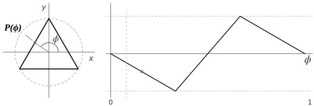
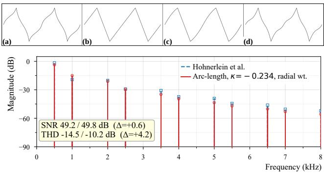
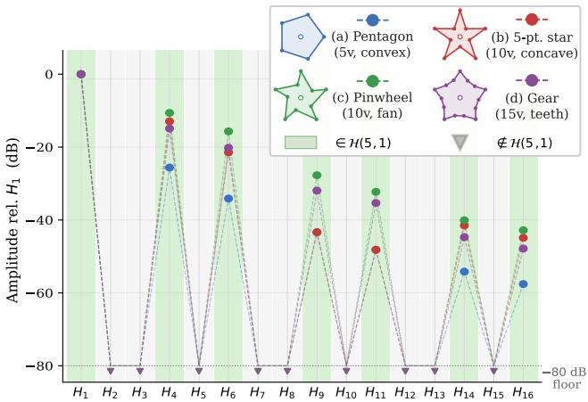
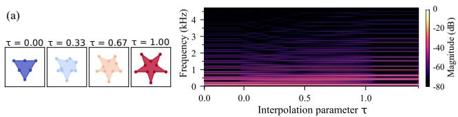
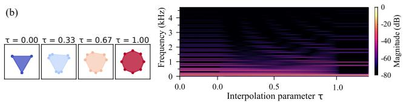
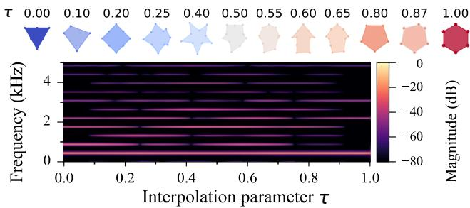
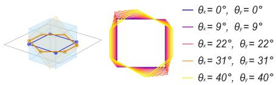

# ARBITRARY POLYGON OSCILLATOR: GENERALIZING POLYGONAL SYNTHESIS TO ARBITRARY SHAPES, MORPHING, AND THREE-DIMENSIONAL POLYHEDRA

Antonio Argentieri and Francesco Scagliola

Conservatorio Niccolò Piccinni di Bari

Bari, Italy

antonioargentieri76@gmail.com , francesco.scagliola@gmail.com

## ABSTRACT

Polygonal synthesis generates audio by traversing the perimeter of a polygon with a phasor [1]; prior work uses a constant angular velocity, whereas the proposed system adopts constant arc-length (perimeter) velocity. Existing formulations operate on regular, parametrically defined polygons, producing smooth timbral transitions within a single family of shapes. This paper generalizes polygonal synthesis around a unified arc-length engine: vertex data of any origin feed the same DSP pipeline. First, we adapt the oscillator to accept arbitrary vertex configurations from an external buffer, opening the possibility for a broad class of closed polygons — regular, irregular, or star-shaped — to function as a waveform generator. Second, a hybrid interpolation algorithm enables smooth morphing between polygons with unequal vertex counts, passing through intermediate shapes that have no parametric description. Third, we extend the paradigm to three dimensions: a convex polyhedron rotated about three axes is sliced by a fixed horizontal plane, and the resulting cross-section yields a continuously variable polygon controlled by the solid’s orientation. The system runs in RNBO (Cycling ’74) with a geometry caching strategy that avoids per-sample recomputation. Antialiasing combines a four-point polyBLAMP correction derived from runtime Bézier tangents with adaptive oversampling, adapting the correction geometrically to general vertex configurations without per-shape analytical derivation.

## 1. INTRODUCTION

The idea that a polygon traversed by a phasor generates a musically useful waveform was introduced by Chapman [2], who established the formal relationship between regular polygon geometry and harmonic content, and independently formalized by Hohnerlein et al. [1], who defined the synthesis as a phasor sampling a variable polygon in polar space at constant angular velocity. Their contributions define the field now commonly referred to as polygonal synthesis. Chapman’s work explored regular and star polygons described by discrete Schläfli symbols $\{ n / q \}$ ; Hohnerlein et al.’s key innovation was a continuous polygon order parameter n, enabling smooth timbral transitions sweeping through triangle, square, pentagon and beyond.

The present paper takes a different approach: rather than parameterizing the shape mathematically, we define it by its vertices. A vertex buffer provides complete freedom of form — any closed polygon, regular or irregular, convex or concave, can function as

a waveform generator. The interpolation between shapes is then not a matter of changing a parameter but of navigating between two drawn configurations, passing through intermediate forms that have no parametric description. This opens a different region of the synthesis space, one that includes shapes unreachable by any continuous order parameter.

## 1.1. Contributions

• Arbitrary polygon oscillator: closed polygons of general shape specified by an external vertex buffer, traversed via arc-length parameterization for constant perimeter velocity.

• Hybrid shape interpolation: smooth morphing between polygons with different vertex counts using angular correspondence for convex shapes and perimeter-based midpoint expansion for concave shapes, with vertex sharpness preserved throughout transitions.

• Runtime polyBLAMP antialiasing: polyBLAMP correction, computed from geometric Bézier tangents at each vertex using four points, generalizes the closed-form derivative expressions of [3] to arbitrary vertex configurations without per-shape analytical derivation.

• 3D extension via planar cross-section: convex polyhedra inscribed in a sphere are traversed by a cutting plane whose orientation can be rotated freely in three axes; the resulting planar polygon provides a continuously variable waveform controlled by spatial orientation.

## 2. BACKGROUND

## 2.1. Core Mechanism

Polygonal synthesis produces audio by traversing the perimeter of a closed polygon with a phasor and reading the resulting x and y coordinates as a two-dimensional output. The traversal speed sets the fundamental frequency f ; the geometry sets the waveform and hence the spectrum. A circle at constant angular velocity gives a pure sine on each channel; a triangle, square, or star introduces corners — abrupt changes in traversal direction — that generate harmonics. Two aspects of the geometry play distinct roles: the polygon’s rotational symmetry fixes which harmonics are present, while the number and sharpness of its corners set how energy is distributed among them — more sides (for a regular polygon, a higher symmetry order) approach a circle and attenuate the high harmonics, fewer or sharper corners enrich the spectrum. This separation is made precise in §3.5. The output is inherently two-dimensional — the x(ϕ) and y(ϕ) channels carry distinct waveforms whose phase relationship follows the polygon’s asymmetry — making the oscillator a native stereo source.

  
Figure 1: Polygonal synthesis illustrated for an equilateral triangle $( N = 3 , f _ { 0 } = \mathrm { 1 1 0 } \mathrm { H z } )$ . Left: the phasor traverses the perimeter at constant velocity; the traversal point $\mathbf { P } ( \phi )$ is the polygon coordinate at phase ϕ. Right: the resulting output waveform (one coordinate of $\mathbf { P } ( \phi ) )$ over one complete traversal, the phase ϕ running from 0 to 1.

## 2.2. Relation to Other Synthesis Techniques

The proposed system plays an arbitrary polygon and morphs it continuously into any other over a chosen duration. As Hohnerlein et al. [1] note, polygonal synthesis produces timbral behaviour most closely analogous to digital waveshaping [4]: both pass a periodic input through a transfer function that shapes the spectrum by nonlinear distortion. The paradigms differ structurally: waveshaping maps an amplitude signal $x = \cos \theta$ through a fixed scalar function $f ( x )$ while polygonal synthesis maps a phase index $\phi \in [ 0 , 1 )$ through a geometric transfer function $g ( f , p _ { 1 } , \ldots , p _ { n } )$ defined by vertex coordinate, yielding a native two-dimensional output $( x ( \phi ) , y ( \phi ) )$ ).

Polygonal synthesis also differs from wave terrain synthesis [5], which shares the 2-D orbit $( x ( t ) , y ( t ) )$ but uses it to address a scalar function $F ( x , y )$ for a single output; here the orbit coordinates are the output, no function is applied to the traversal result. Similarly, this technique is unrelated to wavetable synthe- sis, in which a phasor reads a fixed, time-invariant waveform from a stored buffer: here the waveform is not stored but geometrically reconstructed from vertex data, and it varies continuously during morphing.

## 2.3. The Angular-Velocity Baseline and Its Evolution

Chapman [2] introduced n-gon waves as waveforms derived from the geometry of regular polygons in the time domain, establishing the formal relationship between polygon order and harmonic content, and showing that sawtooth, triangle, and square waves are special cases of a broader family. Star polygons described by Schläfli symbols $\{ n / q \}$ were also explored.

Hohnerlein, Rest, and Smith [1] formalized polygonal synthesis as a phasor rotating in the complex plane at constant angular velocity $\dot { \theta } = 2 \pi f _ { 0 } .$ , with the polygon’s radial distance function $r ( \theta )$ determining the output. The key innovation was a continuously variable polygon order $n ,$ enabling smooth timbral transitions between integer polygon orders. For a regular N-gon this approach produces a sparse spectrum with energy only at harmonics $( k N \pm \bar { 1 } ) f _ { 0 } \ : ( N \mathrm { . }$ fold symmetry; for a regular N-gon the symmetry order coincides with the vertex count, a coincidence that does not hold for general shapes — see §3.5). The harmonic amplitudes are determined by the time the phasor spends on each portion of the perimeter, which under angular-velocity traversal is proportional to the subtended angle rather than the edge length. This work formed the basis for the polygogo Eurorack module [6], a commercial hardware implementation that popularized the technique.

Peschke and Berndt [7] proposed Cyclone, a geometric oscillator that derives waveforms from cyclic Bézier paths traversed at constant arc-length velocity, and outlined a polygon-based successor (Zykloid) that would support freely drawn shapes and morphing. No formal publication or implementation of Zykloid has subsequently appeared.

## 3. ARBITRARY POLYGON OSCILLATOR

## 3.1. Vertex Definition

The oscillator accepts N vertices $\{ \mathbf { V } _ { i } = ( x _ { i } , y _ { i } ) \} _ { i = 0 } ^ { N - 1 }$ from an external buffer. Scalars are italic $( x _ { i } , \ell _ { i } ) ;$ ; points and vectors are bold $( \mathbf { V } _ { i } , \mathbf { P } )$ . All subsequent processing is performed relative to the centroid $\begin{array} { r } { C = \left( \frac { 1 } { N } \sum _ { i = 0 } ^ { \cdot } \dot { \bar { x } } _ { i } , \frac { 1 } { N } \sum _ { i = 0 } ^ { N - 1 } y _ { i } \right) } \end{array}$ . The signal processing pipeline proceeds in three stages: geometric transformations are applied to the vertex coordinates (Section 3.2), the modified polygon is traversed via arc-length parameterization (Section 3.3), and the traversal point $\mathbf { P } ( \phi ) = \mathbf { \bar { ( } } x ( \mathbf { \hat { \phi } } ) , y ( \phi ) )$ is delivered as a twodimensional coordinate signal available for further processing.

## 3.2. Geometric Transformations

The following transformations are offered as real-time sound design controls; they operate on vertex coordinates relative to the centroid before traversal, and apply uniformly to all polygon types.

Rotation. The standard rotation matrix $R ( \theta )$ is applied uniformly to all vertices. Unlike a traversal phase offset (inaudible when static), it mixes the two channels, reshaping each waveform and the stereo image; swept, it animates the stereo field.

Squeeze. Scales x by $\left( 1 + s / 2 \right)$ and y by $\left( 1 - s / 2 \right)$ , breaking symmetry; $s \in [ - 1 , 1 ]$ is a non-degenerate $\pm 5 0 \%$ window (an axis collapses only at $| s | { = } 2 )$ , not area-preserving $( \operatorname* { d e t } = 1 - s ^ { 2 } / 4 )$

## 3.2.1. Edge Curvature

Edges can be curved by displacing a quadratic Bézier control point from the edge midpoint along the unit vector perpendicular to the edge:

$$
\mathbf { P } _ { c , i } = \mathbf { m } _ { i } + \hat { \mathbf { n } } _ { i } \cdot \boldsymbol { \kappa } \cdot \frac { \| \mathbf { V } _ { i + 1 } - \mathbf { V } _ { i } \| } { 2 }\tag{1}
$$

where $\mathbf { m } _ { i } \ = \ ( \mathbf { V } _ { i } + \mathbf { V } _ { i + 1 } ) / 2$ is the midpoint of edge $i , \hat { \mathbf { n } } _ { i }$ is the unit vector obtained by rotating the edge direction 90 counterclockwise:

$$
\hat { \mathbf { n } } _ { i } = \frac { 1 } { \| \mathbf { V } _ { i + 1 } - \mathbf { V } _ { i } \| } \big ( - ( y _ { i + 1 } - y _ { i } ) , x _ { i + 1 } - x _ { i } \big ) ,
$$

κ is the edge curvature parameter. Negative κ bows edges outward (rounder shape, smoother waveform); positive κ bows them inward (concave sides, sharper waveform). At fixed vertex count, κ keeps the harmonic positions and only redistributes their magnitudes — concave curvature brightening the tone, convex curvature rounding it toward a sine (companion page1).

## 3.3. Arc-Length Traversal

With arbitrary vertex configurations, edges vary in length. Allocating equal phase to each edge would cause the phasor to traverse short edges slowly and long edges quickly, introducing a periodic pitch fluctuation audible as timbral instability on polygons with unequal sides. Arc-length parameterization eliminates this artefact by maintaining constant perimeter velocity, so that the phasor spends time on each edge in proportion to its length.

The total perimeter $\begin{array} { r } { \mathbf { \hat { L } } = \sum _ { i = 0 } ^ { N - 1 } \ell _ { i } } \end{array}$ is computed once per geometry update, and the phase $\phi \in [ 0 , 1 )$ is mapped to arc-length distance $s = \phi \cdot L$ . Given s, the containing edge is found by accumulating lengths, and the local parameter $u \in [ 0 , 1 ]$ is computed as:

$$
u = \frac { s - \sum _ { j = 0 } ^ { i - 1 } \ell _ { j } } { \ell _ { i } }\tag{2}
$$

The traversal point is then obtained by evaluating the quadratic Bézier curve along the edge:

$$
\mathbf { P } ( u ) = ( 1 - u ) ^ { 2 } \mathbf { V } _ { i } + 2 ( 1 - u ) u \mathbf { P } _ { c , i } + u ^ { 2 } \mathbf { V } _ { i + 1 }\tag{3}
$$

where $\mathbf { P } _ { c , i }$ i is the Bézier control point of edge i (Section 3.2.1). For $\kappa = 0 , \mathbf { P } _ { c , i } = ( \mathbf { V } _ { i } + \mathbf { V } _ { i + 1 } ) / 2$ and (3) reduces to linear interpolation. The x and y components of $\mathbf P ( u )$ are delivered directly as the two native audio output channels; constant-velocity traversal ensures that the oscillation frequency is determined solely by the phasor rate, independently of the polygon’s shape or edge distribution.

Since the exact arc length of a quadratic Bézier curve requires an elliptic integral with no closed-form solution at runtime, each $\ell _ { i }$ is estimated via Gravesen’s convex combination of the chord length and the control-polygon length [8]:

$$
\ell _ { i } = \frac { 2 \left\| \mathbf { V } _ { i + 1 } - \mathbf { V } _ { i } \right\| + \left\| \mathbf { P } _ { c , i } - \mathbf { V } _ { i } \right\| + \left\| \mathbf { V } _ { i + 1 } - \mathbf { P } _ { c , i } \right\| } { 3 }\tag{4}
$$

This approximation achieves better than 0.1% relative error for the curvature range used here [8], reduces to the Euclidean chord when $\kappa \ : = \ : 0 .$ , and is consistent with the chord directions used in the polyBLAMP [3] correction (Section 6). Edge geometry is cached and recomputed only when the geometry changes, avoiding persample recalculation.

## 3.4. Comparison with Angular-Velocity Traversal

As established in Section 2.3, arc-length and angular-velocity traversal both confine spectral energy to harmonics $( k N \pm 1 ) f _ { 0 }$ for regular N-gons, but produce different harmonic amplitudes because the time the phasor spends on each portion of the perimeter differs between the two methods. Two independent mechanisms allow the arc-length output to approximate the timbral character of the angular-velocity baseline.

The first is edge curvature (Section 3.2.1): the angular-velocity phasor implicitly traces curved paths between vertices because it spends more time on distant edges, producing rounded waveform transitions. With zero curvature, arc-length traversal instead produces piecewise-linear transitions. The second is harmonic balance. Weighting the output channels by $\| \mathbf { P } ( \phi ) \| / r _ { \operatorname* { m a x } }$ , where $r _ { \operatorname* { m a x } } =$ ma $\operatorname { 1 . X _ { \phi } } \left\| \mathbf { P } ( \phi ) \right\|$ is the maximum distance from the centroid to any point on the perimeter (not merely to a vertex, since Bézier edge curvature can place the farthest point along the arc rather than at a corner), encodes the polygon’s radial profile along the arc-length trajectory rather than its cartesian projection. $\mathbf { A s } \ \lVert \mathbf { P } ( \phi ) \rVert$ shares the fundamental period of $( x ( \phi ) , y ( \phi ) )$ , this weighting does not introduce new spectral components: it redistributes energy across existing harmonics, shifting the timbre toward a radial reading of the polygon — precisely what angular-velocity traversal produces.

Figure 2 shows the progressive visual approximation toward the angular-velocity output for $N = 3 { : }$ the uncorrected arc-length output (b) shows piecewise-linear transitions and a different harmonic balance relative to the Hohnerlein reference (a); edge curvature $\kappa = - 0 . 2 3 4 \left( \mathrm { c } \right)$ , empirically chosen to minimise the visual discrepancy, rounds the waveform transitions; adding radial weighting (d) further aligns the harmonic balance, producing a waveform visually similar to the angular-velocity output.

  
Figure 2: Triangle, $N \ = \ 3 .$ (top) Waveforms $( f _ { 0 } = 1 1 0 \mathrm { { H z } }$ fs = 44.1 kHz): (a) angular-velocity [1], (b) arc-length, no correction, $( \mathrm { c } ) \kappa = - 0 . 2 3 4 ,$ , (d) $\kappa = - 0 . 2 3 4$ with radial weighting. (bottom) Spectra of (a) (blue dashed) vs (d) (red) at $f _ { 0 } = 5 0 0 \mathrm { { H z } }$ $f _ { s } = 4 8$ kHz; SNR/THD deltas inset.

## 3.5. Spectral Characterization by Symmetry

The harmonic content of the output is determined not by the vertex count N but by the rotational symmetry order M: the largest integer $M \geq 1$ such that a rotation of $2 \pi / M$ maps the polygon onto itself. For a regular N-gon, $M = N ;$ for a five-pointed star drawn as a concave 10-vertex polygon, $M = 5$ regardless of vertex count; for a polygon with no rotational symmetry, $M = 1$

A polygon with M-fold symmetry has M identical sectors, each spanning 1/M of the total perimeter and rotated by $2 \pi / M$ relative to the previous one; under arc-length traversal, advancing the phase by $\bar { 1 / M }$ therefore rotates the output by $2 \pi / M$ . Writing $z ( \phi ) = x ( \phi ) + i y ( \phi )$ for the complex output signal:

$$
\begin{array} { r } { z \big ( \phi + \frac { 1 } { M } \big ) = e ^ { i 2 \pi / M } z ( \phi ) . } \end{array}\tag{5}
$$

Substituting $\begin{array} { r } { z ( \phi ) = \sum _ { n } \hat { z } _ { n } e ^ { i 2 \pi n \phi } } \end{array}$ into (5) and equating coefficients by linear independence of the complex exponentials gives $\hat { z } _ { n } ( e ^ { i 2 \pi \overset { \sim } { n } / M } - e ^ { i 2 \pi / \overset {  } { M } } ) = 0 , \mathrm { i . e . } \hat { z } _ { n } \big ( e ^ { i 2 \overset {  } { \pi } ( n - 1 ) / \overset {  } { M } } - 1 \big ) = \overset { \smile } { 0 }$ , so $\hat { z } _ { n } \neq 0$ only when $n \equiv 1$ (mod M). Since $x ( \phi ) = \operatorname { R e } ( z ( \phi ) ) =$ $\begin{array} { l } { \frac { 1 } { 2 } \left( z + \bar { z } \right) } \end{array}$ , taking the conjugate introduces coefficients at negative indices: the n-th harmonic of x is non-zero also when $n \equiv - 1$ (mod M). The active set $n \equiv \pm 1$ (mod M) defines the harmonic lattice:

$$
{ \mathcal H } ( M ) = \{ ( m M \pm 1 ) f _ { 0 } : m = 0 , 1 , 2 , . . . \} .\tag{6}
$$

For $M = N$ this recovers the result of Hohnerlein et al. [1] for regular $N { \mathrm { - g o n s } } ;$ the derivation here shows it holds for any polygon whose rotational symmetry order is M, independently of vertex count. All geometric controls — vertex count, edge curvature $\kappa ,$ convexity, and traversal mode — leave $\mathcal { H } ( M )$ unchanged; arclength and angular-velocity traversal share the same active harmonic set for any M-fold symmetric polygon, differing only in the amplitudes they assign within the lattice Section 3.4. M determines which harmonics are present; κ and the vertex geometry determine how much energy each carries.

H(5, 1) = {(5m ± 1) f0} — harmonic lattice shared by four M=5, W=1 shapes

  
Figure 3: Four $M { = } 5$ shapes with different vertex counts share the harmonic lattice $\mathcal { H } ( 5 ) = \{ ( 5 m \pm 1 ) f _ { 0 } \}$ : pentagon $( 5 \mathrm { v } ,$ convex), five-pointed star (10v, concave), pinwheel (10v, fan), gear (15v, teeth). Harmonics outside the lattice fall below the −80 dB analysis floor regardless of vertex count. $f _ { 0 } = 4 4 0 \mathrm { H z } , f _ { s } = 4 8 \mathrm { k H z }$

Extension to self-intersecting polygons. Equation (6) is the $W = 1$ case of a more general relation, where W is the winding number — the number of times the traversal encircles the centroid per period. The 10-vertex concave star of Section 4.2.1 has $W = 1 { : }$ it is a simple closed curve that winds the centroid once, so $\mathcal { H } ( 5 , 1 )$ applies. When vertices are instead supplied in Schläfli order — $\mathrm { e . g }$ . the pentagram {5/2} as 5 vertices winding the centroid twice per period — advancing the phase by $1 / M$ rotates the output by $2 \pi W / M ,$ , giving $\begin{array} { r } { z ( \phi + \frac { 1 } { M } ) = e ^ { i 2 \pi W / M } z ( \phi ) } \end{array}$ and extending the lattice to

$$
{ \mathcal { H } } ( M , W ) = \{ ( m M \pm W ) f _ { 0 } \} .\tag{7}
$$

For $W = 2 , M = 5 \colon f _ { 0 }$ is absent and the perceived fundamental rises to $2 f _ { 0 }$

## 4. SHAPE INTERPOLATION

Sound morphing is a well-established research area whose common goal is to obtain gradual timbral transformations between sounds. Established approaches operate a posteriori: a signal is analysed into its constituents and interpolation is performed in that representation space — sinusoidal partials with unequal feature counts [9], the reassigned bandwidth-enhanced model [10], perceptually motivated descriptors [11, 12], or latent synthesizer parameters regularized by timbre attributes [13]. Fitz et al. [10] observe that sound morphing bears a structural resemblance to geometric morphing in computer graphics, where correspondence and interpolation are the two complementary problems. The present approach inverts the direction: rather than deriving geometry from sound, the morphing trajectory is defined directly in the space of polygon vertices, and the timbral evolution emerges as a consequence of the geometric interpolation. As noted by both Caetano and Osaka [14] and Le Vaillant and Dutoit [13], an interpolation that is linear in a parameter space is not guaranteed to be perceptually smooth; a perceptual model of the morphing trajectories is left to future work. The central technical problem — establishing a correspondence between two polygons with unequal vertex counts — is the geometric analogue of the partial-matching problem; the solution adopted here is described in Section 4.2.

## 4.1. The Variable Vertex Count Problem

When the polygon is defined by its vertices rather than a formula, the reachable shapes extend beyond a single parametric family. Where Hohnerlein et al. [1] follow one continuous parameter — the polygon order n —tracing a one-dimensional path through shape space (triangle, square, pentagon, and the non-integer forms between them), a vertex-based oscillator operates in a different region: any closed polygon (irregular, concave, star-shaped, or freely drawn) can be a source, and morphing between two such shapes navigates configurations that share no parametric description.

The challenge is vertex correspondence: interpolating between polygon A (NA vertices) and $B \left( N _ { B } \neq N _ { A } \right)$ needs a meaningful matching across unequal sets. Naive linear interpolation is undefined when the counts differ, and resampling to a common count blurs corner sharpness — the very quality that makes vertex-based synthesis distinctive. The hybrid algorithm below addresses this while preserving corner sharpness throughout the transition.

## 4.2. Hybrid Interpolation Algorithm

The expansion strategy is selected per pair of polygons: if both polygons in a pair are convex, angular correspondence is used for both; if at least one is concave, perimeter midpoint expansion is applied to both. This symmetry ensures that the expanded sequences are structurally compatible and that vertex-to-vertex pairing is meaningful. Convexity is determined by verifying that the cross products of all consecutive edge vectors $\overrightarrow { V _ { i } V _ { i + 1 } } \times \overrightarrow { V _ { i + 1 } V _ { i + 2 } }$ share the same sign, which is equivalent to a non-negative signed area for CCW-ordered vertices. Self-intersecting polygons are detected by a separate $\mathcal { O } ( N ^ { 2 } )$ pairwise edge test: if any two non-adjacent edges cross (verified via signed-area products), the polygon is additionally classified as non-convex regardless of cross-product signs. In both cases the system routes to perimeter midpoint expansion, which preserves the original vertex order; no intersection points are computed and the vertex buffer is not modified. A self-intersecting polygon is therefore traversed faithfully in the order supplied by the user, yielding crossing output trajectories as a deliberate timbral option.

Both convex — angular correspondence. Both polygons are expanded to $N _ { \mathrm { m a x } } = \operatorname* { m a x } ( N _ { A } , N _ { B } )$ vertices by associating each vertex with its angular position relative to the centroid. For each target angle $\theta _ { \mathrm { r e f } , j }$ , the nearest vertex $\mathbf { V } _ { k ^ { * } }$ in the source polygon is duplicated:

$$
k ^ { * } = \arg \operatorname* { m i n } _ { k } \left| \theta _ { k } - \theta _ { \mathrm { r e f } , j } \right| _ { 2 \pi }\tag{8}
$$

where $| \cdot | _ { 2 \pi }$ denotes the angular distance modulo $2 \pi$ . The duplicated vertices are “sleeping” — they initially coincide with existing vertices and gradually separate during interpolation, causing new corners to emerge smoothly.

For concave polygons, angular correspondence is unreliable: concavities cluster multiple vertices into narrow angular sectors as seen from the centroid, so Eq. (8) repeatedly selects the same source vertex while leaving others unmatched. The resulting sleeping vertices migrate toward unrelated targets along trajectories that cross the polygon interior.

At least one concave — perimeter midpoint expansion. Both polygons are expanded using the same strategy: all original vertices are preserved in order, and extra vertices are distributed proportionally to edge length and placed superimposed at edge midpoints:

$$
\begin{array} { r l } & { ~ S _ { i } = \displaystyle \frac { \ell _ { i } } { L } \cdot ( N _ { \mathrm { m a x } } - N ) , } \\ & { n _ { \mathrm { s l e e p } , i } = \left\{ \begin{array} { l l } { \displaystyle \lfloor S _ { i } ^ { \Sigma } \rfloor - n _ { \mathrm { p l a c e d } } } & { i < N - 1 , } \\ { \displaystyle ( N _ { \mathrm { m a x } } - N ) - n _ { \mathrm { p l a c e d } } } & { i = N - 1 , } \end{array} \right. } \\ & { ~ \mathbf { V } _ { \mathrm { m i d } , i } = \displaystyle \frac { \mathbf { V } _ { i } + \mathbf { V } _ { ( i + 1 ) \mathrm { m o d } N } } { 2 } } \end{array}\tag{9}
$$

where $\begin{array} { r } { S _ { i } ^ { \Sigma } = \sum _ { k = 0 } ^ { i } S _ { k } } \end{array}$ is the running sum and $n _ { \mathrm { p l a c e d } }$ the count of sleeping vertices already assigned. This Bresenham-style accumulator guarantees that the total equals $N _ { \mathrm { m a x } } - N$ exactly, with no separate remainder step. Superimposed midpoint vertices separate during interpolation, preserving concavities and characteristic sharpness. Once both polygons reach equal vertex counts, each matched pair is interpolated vertex-by-vertex along Cartesian paths. Before interpolation, the end polygon is cyclically shifted to the alignment that minimises the total vertex-to-vertex distance:

$$
s ^ { * } = \arg \operatorname* { m i n } _ { s \in \{ 0 , \dots , N _ { \operatorname* { m a x } } - 1 \} } \sum _ { i = 0 } ^ { N _ { \operatorname* { m a x } } - 1 } \lVert \mathbf { V } _ { A , i } - \mathbf { V } _ { B , ( i + s ) \mathrm { ~ m o d ~ } N _ { \operatorname* { m a x } } } \rVert\tag{10}
$$

This ensures sleeping vertices are paired with geometrically nearest targets regardless of the original vertex ordering of B.

## 4.2.1. Examples

Triangle to Star. The triangle (3 vertices, convex) and the fivepointed star (10 vertices, concave) trigger perimeter midpoint expansion, since the star is non-convex. The triangle is expanded to 10 vertices by keeping its three originals and placing 7 sleeping vertices at edge midpoints, distributed proportionally to edge length; after cyclic alignment each is paired with one of the star’s inner points. In Figure 4 the star tips emerge from the triangle’s vertices while the inner concavities form as the sleeping midpoints migrate inward.

  
Figure 4: Interpolation strips (left) and magnitude spectrograms over the morph (right), 4 frames each. (a) Triangle $( \tau = 0 )$ to five-pointed star $( \tau = 1 )$ . (b) Triangle $( \tau = 0 )$ to regular octagon $( \tau = 1 ) . \ f _ { 0 } = 1 1 0 \mathrm { H z } , \ f _ { s } = 4 4 1 0 0 \mathrm { H z }$

Triangle to Octagon. The triangle and the regular octagon (8 vertices) are both convex, so angular correspondence applies to both. The triangle is expanded to 8 vertices by duplicating its three vertices at the octagon’s angular positions (two thrice, one twice), all sleeping vertices stacked on their source. After cyclic alignment, each cluster maps to the octagon vertices in the nearest angular sector: at $\tau = 0$ the three clusters sit at the triangle’s corners, and as τ grows they separate toward their octagon targets along straight Cartesian paths (Fig. 4).

## 4.3. Polygon Sequences and Pair Switching

When more than two polygons are defined as a sequence $P _ { 0 } , P _ { 1 }$ $\ldots , P _ { n }$ , each internal polygon $P _ { k }$ acts as a shared polygon: it serves as the target of pair $( P _ { k - 1 } , P _ { k } )$ and as the source of the following pair $( P _ { k } , P _ { k + 1 } )$ . Each pair expands independently to its own $N _ { \mathrm { m a x } } { \mathrm { : } }$ the left pair uses $N _ { \mathrm { m a x } } ^ { ( k - 1 , k ) } = \operatorname* { m a x } ( N _ { k - 1 } , N _ { k } )$ and the right pair uses $N _ { \operatorname* { m a x } } ^ { ( k , k + 1 ) } = \operatorname* { m a x } ( N _ { k } , N _ { k + 1 } )$ , which may differ. Although the underlying geometry of $P _ { k }$ is identical in both representations, the sleeping-vertex distribution and vertex ordering in the buffer differ to satisfy each pair’s correspondence requirements, which would introduce phase jumps and DC offsets at pair boundaries without corrective measures. Three mechanisms ensure continuity: boundary phase continuity, vertex v0 consistency via write-back, and temporal crossfading.

Boundary phase continuity. Within-pair phase rescaling is suppressed at pair boundaries: since the two representations of $P _ { k }$ carry slightly different arc-length perimeters, applying rescaling would shift the traversal position discontinuously at the switch point.

Vertex $v _ { 0 }$ consistency via write-back. We define $v _ { 0 }$ as the first vertex of the cyclically aligned buffer (position $s ^ { * }$ of Eq. (10)), the perimeter point where traversal begins each period at $\phi = 0 .$ For an asymmetric $P _ { k }$ the two expanded representations may yield different v0 positions, producing a step discontinuity heard as a DC offset. The write-back step resolves this: once pair $\left( P _ { k - 1 } , P _ { k } \right)$ is aligned, the resulting vertex order of $P _ { k }$ is written back to the pbuf buffer of the PolyManager overwriting the original userdefined ordering. This takes place during the geometry build phase, before pair $\left( P _ { k } , P _ { k + 1 } \right)$ begins — so the second expansion inherits the same v0.

Temporal crossfading. A 20 ms smoothstep crossfade blends old and new waveform buffers, holding the morphing parameter $\tau \in$ [0, 1] at its boundary value throughout; polyBLAMP is suspended for its duration (see Section 6).

The selection rules of Section 4.2 propagate via write-back: the convexity of the written-back polygon is preserved when convex and invalidated when concave, so angular correspondence resumes at the first pair of two consecutive convex polygons. Figure 5 shows both strategies and all three continuity mechanisms; the arrow’s asymmetry makes write-back critical — without it a different v0 across pairs 2 and 3 yields a DC offset.

## 4.4. Spectral Structure under Morphing

The harmonic lattice H(M) of Section 3.5 predicts the timbral trajectory of a morph directly from the symmetry orders of the two endpoint polygons. For a transition from $M _ { A } \ \mathrm { t o } \ M _ { B }$ , three spectral roles are possible for each harmonic n: harmonics in $\mathcal { H } ( \bar { M } _ { A } ) \cap$ $\mathcal { H } ( M _ { B } )$ persist throughout; those exclusive to $\mathcal { H } ( M _ { A } )$ fade continuously toward the alias floor; those exclusive to $\mathcal { H } ( M _ { B } )$ ) emerge from it. At intermediate τ the interpolated shape has no rotational symmetry, so in principle all integer harmonics are active, but the out-of-lattice leakage remains small for typical polygon pairs and the fundamental stays fixed at $f _ { 0 }$

Figure 5 follows a six-shape sequence. Across each transition the harmonics predicted by the lattice persist, fade, or emerge as the symmetry order changes, while the fundamental stays fixed at $f _ { 0 } .$

  
Figure 5: Triangle → square → star → arrow → pentagon → hexagon. Top: shape frames labelled by morph parameter τ. Bottom: STFT magnitude over the full sequence. Harmonic lines persist and redistribute while the fundamental stays fixed, and no discontinuity appears at the pair-switch boundaries.

## 5. EXTENSION TO 3D POLYHEDRA

## 5.1. Core Idea: Traversing a Planar Cross-Section

The 3D extension changes only the front end. A convex polyhedron is rotated about its centre by three angles $\theta _ { x } , \theta _ { y } , \theta _ { z }$ and sliced by a fixed horizontal plane at height $z _ { \mathrm { p l a n e } } ;$ the resulting convex crosssection polygon is passed unchanged to the arc-length traversal of Section 3.3 and the polyBLAMP correction of Section 6. The traversal therefore stays two-dimensional. Only two elements are specific to 3D: the plane–polyhedron intersection (Section 5.2) and keeping the output vertex count fixed across topological transitions, which reuses the sleeping-vertex mechanism of Section 4.2. The intersection needs only vertex and face data and applies to any convex solid; we provide a cube, an icosahedron, and a square pyramid as case studies.

From a musical standpoint, rotating the solid is a timbral gesture with the logic of a physical object turning in space: harmonic complexity grows and recedes at the topological transitions where the plane crosses a vertex or edge, giving natural points of articulation within a continuous sweep. Because the oscillator output is natively two-dimensional, spatial orientation maps directly onto stereo movement, the x/y phase relationship evolving with the rotation.

## 5.2. Polyhedron Intersection Algorithm

After the rotation is applied to all vertices, each edge $\left( { \bf V } _ { i } , { \bf V } _ { i + 1 } \right)$ is tested against the plane through the signed distance $d _ { i } = z _ { i } - z _ { \mathrm { p l a n e } } .$ An edge crosses when $d _ { i }$ and $d _ { i + 1 }$ differ in sign, at the point

$$
\mathbf { P } _ { \mathrm { i n t } } = \mathbf { V } _ { i } + \alpha \left( \mathbf { V } _ { i + 1 } - \mathbf { V } _ { i } \right) , \qquad \alpha = { \frac { - d _ { i } } { d _ { i + 1 } - d _ { i } } } .\tag{11}
$$

Edges coplanar with the plane $( | d _ { i + 1 } - d _ { i } | < \varepsilon )$ are skipped to avoid a $0 / 0$ indeterminacy. The crossing points are sorted by angle about their arithmetic-mean centroid to form the cross-section polygon, with duplicates merged when the plane passes through a polyhedron vertex.

## 5.3. Topological Stability via Sleeping Vertices

When the plane crosses a polyhedron vertex during rotation, the number of real intersection points changes by $\pm 1 \ \mathrm { o r } \pm 2 ;$ left unhandled, the output vertex count would change instantaneously and disrupt both the traversal and the polyBLAMP correction. We avoid this with the sleeping-vertex scheme of Section 4.2, here applied to cross-section transitions: the output count is fixed at the edge count $n _ { e }$ of the solid, and every non-crossing edge contributes a sleeping vertex co-located with a real one, producing a zero-length edge that the arc-length traversal skips.

The intersection runs in two passes. Pass 1 collects the $n _ { \mathrm { r e a l } } \geq 3$ real crossing points via Eq. (11) and sorts them angularly. Pass 2 parks each sleeping vertex: with reference position ${ \bf s } _ { j }$ the 2-D projection of the edge endpoint nearer the plane,

$$
\begin{array} { r } { \mathbf { s } _ { j } = \left\{ \begin{array} { l l } { ( x _ { V _ { i } } , y _ { V _ { i } } ) } & { | d _ { i } | \leq | d _ { i + 1 } | } \\ { ( x _ { V _ { i + 1 } } , y _ { V _ { i + 1 } } ) } & { \mathrm { o t h e r w i s e } , } \end{array} \right. } \end{array}\tag{12}
$$

the vertex is parked at the nearest real vertex,

$$
\mathbf { P } _ { \mathrm { s l e e p } } = \underset { \mathbf { P } _ { k } } { \arg \operatorname* { m i n } } ~ \big \| \mathbf { s } _ { j } - \mathbf { P } _ { k } \big \| ^ { 2 } ,\tag{13}
$$

and inserted immediately after its host, guaranteeing a zero-length edge. The total count $n _ { e } = n _ { \mathrm { r e a l } } + n _ { \mathrm { s l e e p } }$ is constant, so the engine never sees a vertex-count change and the polyBLAMP correction stays active throughout. Continuity is $C ^ { 0 }$ : as the plane approaches a non-crossing edge, $\alpha  0$ and $\mathbf { P } _ { \mathrm { i n t } } \to \mathbf { V } _ { i }$ , already coinciding with the sleeping position.

## 5.4. Case Studies

  
Figure 6: Cube cross-section from square $( \theta _ { x } = \theta _ { y } = 0 ^ { \circ }$ , blue) to near-regular hexagon $( \theta _ { x } = \theta _ { y } = 4 0 ^ { \circ }$ , amber).

Rotating a cube sliced at $z _ { \mathrm { p l a n e } } = 0 . 5$ sweeps the cross-section from a square to a regular hexagon $( \operatorname { F i g } . 6 )$ , the vertex count moving between 4 and 6. A square pyramid sliced at the same height sweeps from a square $( \theta _ { x } = 0 ^ { \circ } )$ to a triangle $( \theta _ { x } = 9 0 ^ { \circ } )$ through intermediate irregular quadrilaterals as the apex enters the section, reducing the count from 4 to 3. Both yield a continuous shift in harmonic content; companion page.2

## 6. SIGNAL QUALITY AND PRACTICAL CONSIDERATIONS

At each vertex the traversal direction changes abruptly, giving a firstderivative discontinuity and an unbounded spectrum that aliases when sampled. Hohnerlein, Rest, and Parker [3] addressed this for the continuous-order parametric oscillator by deriving at each vertex a closed-form derivative jump, enabling four-point polyBLAMP correction. For arbitrary vertex buffers that per-shape derivation no longer applies, as there is no parametric family; the jump, however, still admits a closed form, obtained directly from the tangent directions of the two adjacent Bézier edges at their common vertex — valid for any vertex configuration. This motivates the strategy adopted here: a four-point polyBLAMP correction from the local geometry, combined with adaptive oversampling.

## 6.1. Antialiasing Strategy

## 6.1.1. Four-Point polyBLAMP Correction

At each vertex V the arc-length traversal transitions from the incoming quadratic Bézier edge to the outgoing one. The traversal signal is the two-dimensional coordinate $\mathbf { P } ( \phi ) = ( p _ { x } , p _ { y } )$ of the point on the polygon at phase $\phi \in [ 0 , 1 )$ . Each component undergoes a derivative discontinuity at $\phi = \phi _ { i } = s _ { i } / L$ , where $s _ { i }$ is the cumulated arc length to $\mathbf { V } _ { i }$ and L is the total perimeter.

The outgoing and incoming tangent directions at $\mathbf { V } _ { i }$ are the exact endpoint tangents of the quadratic Bézier, normalised to arclength units (for $\kappa = 0$ they reduce to the chord directions $( \mathbf { V } _ { i + 1 } -$ $\mathbf { V } _ { i } ) / \ell _ { i } )$ :

$$
\mathbf { D } _ { i } ^ { + } = \frac { 2 \left( \mathbf { P } _ { c , i } - \mathbf { V } _ { i } \right) } { \boldsymbol { \ell } _ { i } }\tag{14}
$$

$$
\mathbf { D } _ { i } ^ { - } = \frac { 2 \left( \mathbf { V } _ { i } - \mathbf { P } _ { c , i - 1 } \right) } { \boldsymbol { \ell } _ { i - 1 } }\tag{15}
$$

These follow from the derivative of the quadratic Bézier $\mathbf { B } ( u ) =$ $\begin{array} { r } { ( 1 - u ) ^ { 2 } \mathbf { V } _ { i } + 2 ( 1 - u ) u \mathbf { P } _ { c } + u ^ { 2 } \mathbf { V } _ { i + 1 } , } \end{array}$ whose derivative is $\mathbf { B } ^ { \prime } ( u ) =$ $2 ( 1 - u ) ( \mathbf { P } _ { c } - \mathbf { V } _ { i } ) + 2 u ( \mathbf { V } _ { i + 1 } - \mathbf { P } _ { c } )$ , giving $\mathbf { B } ^ { \prime } ( 0 ) = 2 ( \mathbf { P } _ { c } - \mathbf { \dot { V } } _ { i } )$ and $\mathbf { B } ^ { \prime } ( 1 ) = 2 ( \mathbf { V } _ { i + 1 } - \mathbf { P } _ { c } )$ . Dividing by ℓi (resp. $\ell _ { i - 1 } )$ normalises to arc-length units. When $\kappa = 0 , \mathbf { P } _ { c , i } = ( \mathbf { V } _ { i } + \mathbf { V } _ { i + 1 } ) / 2 ,$ so $\mathbf { D } _ { i } ^ { + } = ( \bar { \mathbf { V } } _ { i + 1 } - \mathbf { V } _ { i } ) / \ell _ { i }$ and $\mathbf { D } _ { i } ^ { - } = ( \mathbf { V } _ { i } - \mathbf { V } _ { i - 1 } ) / \ell _ { i - 1 } -$ the chord directions — recovering the piecewise-linear case as a special instance of the general formula.

The derivative jump vector $\Delta \mathbf { D } = \mathbf { D } _ { i } ^ { + } - \mathbf { D } _ { i } ^ { - }$ is in units of [coordinate/arc length]. Scaling by the arc distance covered per oversampled sample $L \cdot \Delta \phi .$ , where $\Delta \phi = f _ { 0 } / f _ { s } ^ { \mathrm { O S } }$ , converts it to signal change per sample:

$$
\mathbf { J } = \Delta \mathbf { D } \cdot \boldsymbol { L } \cdot \Delta \phi\tag{16}
$$

$\textbf { J } = \left( J _ { x } , J _ { y } \right)$ captures the magnitude and sign of the derivative jump for each cartesian component independently.

The fractional delay $d \in [ 0 , 1 )$ locates the vertex within the current oversampled sample:

$$
d = \frac { \phi - \phi _ { i } } { \Delta \phi }\tag{17}
$$

where the condition $d \in [ 0 , 1 )$ is enforced by detecting the single oversampled sample immediately following the vertex crossing $( \phi -$ $\phi _ { i } \in [ 0 , \Delta \phi )$ , with ϕ and $\phi _ { i }$ both in [0, 1)).

Applying the four-point polyBLAMP residuals of [3, 15] (Table 1 therein), $r _ { - 2 } , r _ { - 1 } , r _ { 0 } , r _ { + 1 }$ , scaled by J, to the four samples surrounding the discontinuity $( r _ { - 2 } ;$ two steps before, buffer prevprev; $r _ { - 1 } :$ one step before, prev; r0: one step after, acc1; $r _ { + 1 } :$ two steps after, acc2):

$$
\mathtt { p r e v p r e v \ t = J } r _ { - 2 } ( d )\tag{18}
$$

$$
\mathtt { p r e v } + = \mathbf { J } r _ { - 1 } ( d )\tag{19}
$$

$$
\mathtt { a c c } _ { 1 } + = \mathbf { J } r _ { \mathrm { ~ \tiny ~ 0 } } ( d )\tag{20}
$$

$$
\mathtt { a c c } _ { 2 } + = \mathbf { J } r _ { + 1 } ( d )\tag{21}
$$

The sign of J encodes the direction of the derivative jump, so addition here is equivalent to the subtraction convention of [3] where a fixed-sign jump is used.

At each oversampled step the output is prevprev; the buffer advances as prevprev ← prev, prev ← P + acc1, acc1 ← acc2, $\mathsf { a c c } _ { 2 } \gets 0 .$ , where $\mathbf { P } = \mathbf { P } ( \phi ) = ( p _ { x } , p _ { y } )$ is the uncorrected oscillator sample at the current oversampled phase, obtained directly from the arc-length traversal of Eq. (3) before any poly-BLAMP residual is applied. This introduces a latency of two oversampled samples $( 2 / \hat { f } _ { s } ^ { \mathrm { O S } } )$ , below the audible threshold at all oversampling factors used here.

The correction is skipped when either the current or the previous edge length falls below a threshold $( \ell < 1 0 ^ { - 3 } )$ , guarding against division by zero for degenerate zero-length edges (sleeping vertices in star-polygon configurations).

The correction is suspended during pair-switch crossfades: although the shared polygon is geometrically identical at the boundary, the change in nvMax between adjacent pairs redistributes the arc-length phase across a different number of slots, rendering the accumulated polyBLAMP residuals incoherent with the new buffer layout.

## 6.1.2. Adaptive Oversampling

The polyBLAMP correction alone reduces the alias floor by approximately 22 dB relative to the uncorrected signal, as confirmed by the measurements below. Residual aliasing is further attenuated by adaptive oversampling:

$$
\mathrm { O S } = \mathrm { c l a m p } \left( \left\lfloor { \frac { 4 4 1 0 0 } { f _ { s } } } \cdot \left( 2 + 4 f _ { \mathrm { n o r m } } \right) \right\rfloor , 2 , 6 \right)\tag{22}
$$

where $f _ { \mathrm { n o r m } } = \sqrt { \mathrm { c l a m p } ( f _ { 0 } - 2 0 0 , 0 , 7 8 0 0 ) / 7 8 0 0 }$ . The empirically chosen bounds [200 Hz, 8000 Hz] bracket the range where aliasing is perceptually relevant: below 200 Hz $\mathrm { O S } = 2$ is already sufficient, and above 8000 $\mathrm { H z }$ additional oversampling yields negligible benefit. The factor $4 4 1 0 0 / f _ { s }$ scales the rate inversely with sample rate (at $f _ { s } ~ = ~ 8 8 2 0 0 \mathrm { \Omega }$ Hz it halves the OS, the higher native rate already pushing alias products out of range), and the sublinear $f _ { \mathrm { n o r m } } \propto \bar { f } _ { 0 } ^ { \bar { 1 } / 2 }$ reflects the diminishing benefit at high $f _ { 0 } , \mathrm { \bf ~ A }$ critically-damped $( Q = 0 . 5 )$ low-pass biquad at 20 kHz [16] removes residual high-frequency content before decimation.

## 6.1.3. Measured Performance

Table 1 reports the measured SNR for an equilateral triangle (3- vertex buffer, $f _ { s } = 4 4 1 0 0 \mathrm { H z } )$ under four configurations (no antialiasing; $\mathrm { O S } = 2$ only; polyBLAMP only, $\mathrm { O S } = 1 ; \ \mathrm { O S } = 2$ with polyBLAMP), at edge curvature $\kappa = 0$ and $\kappa = - 0 . 2 3 4$ . SNR is defined as

$$
\mathrm { S N R } = 1 0 \log _ { 1 0 } { \frac { P _ { \mathrm { h a r m } } } { P _ { \mathrm { a l i a s } } } }\tag{23}
$$

where $P _ { \mathrm { h a r m } }$ is the energy within ±4 FFT bins of each harmonic $k f _ { 0 } ,$ $k = 1 , \dots , \lfloor f _ { s } / ( 2 f _ { 0 } ) \rfloor$ , computed from a 4 s Blackman-windowed segment of the output signal normalised to 0 dBFS (FFT of $N =$ 176 400 points, bin spacing 0.25 Hz); $P _ { \mathrm { a l i a s } }$ is the remaining spectral energy.

The BL4 gain over No AA (≈ 22 dB) is consistent across both curvature conditions, confirming that the Bézier tangent computation of Eqs. (14)–(15) preserves polyBLAMP effectiveness for curved edges. For $\kappa = 0 .$ , BL4 alone exceeds $\mathrm { O S } = 2$ at 400 Hz, while at 751 and 1350 Hz the two are comparable. The lower SNR at higher frequencies reflects the greater aliasing in the original signal, not a degraded correction: the fractional delay is known exactly regardless of $f _ { 0 } ,$ , so polyBLAMP stays fully effective, but the alias products are then more numerous and closer to the harmonics, making broadband oversampling relatively more effective. $\mathrm { O S } = 2 { + } \mathrm { B L } 4$ achieves the highest SNR in all conditions, confirming the two are complementary: polyBLAMP targets leakage at the discontinuities, oversampling provides broadband suppression independent of geometry. Only the final filtered sample per audio-rate block is written to the output.

Table 1: SNR (dB) for an equilateral triangle (3-vertex buffer, $f _ { s } =$ 44100 Hz). Best value per row in bold.
<table><tr><td> $f _ { 0 }$ </td><td>No AA</td><td> $\mathrm { O S } = 2$ </td><td> $\mathrm { B L 4 \ o n l y }$ </td><td> $\mathrm { O S } = 2 { + } \mathrm { B L } 4$ </td></tr><tr><td colspan="5">Straight edges  $( \kappa = 0 )$ </td></tr><tr><td>400 Hz</td><td>58.8</td><td>77.6</td><td>80.9</td><td>85.1</td></tr><tr><td>751 Hz</td><td>51.1</td><td>75.6</td><td>75.3</td><td>79.1</td></tr><tr><td>1350 Hz</td><td>43.9</td><td>67.7</td><td>66.2</td><td>70.1</td></tr><tr><td colspan="5">Edge curvature  $( \kappa = - 0 . 2 3 4 )$ </td></tr><tr><td>400 Hz</td><td>57.8</td><td>78.5</td><td>79.3</td><td>83.4</td></tr><tr><td>751 Hz</td><td>49.5</td><td>73.9</td><td>73.7</td><td>77.4</td></tr><tr><td>1350 Hz</td><td>42.1</td><td>66.3</td><td>64.0</td><td>68.3</td></tr></table>

## 7. IMPLEMENTATION

The system is implemented as two RNBO (Cycling ’74) codebox\~ modules: a PolyManager that stores the polygons and builds the interpolation pairs, and a DSP engine running the per-sample traversal, polyBLAMP and crossfade. The full implementation is available.3

Geometry caching. The geometry pipeline — centroid, vertex transformation, control-point placement, edge-length and perimeter accumulation — runs only on a parameter change beyond a small tolerance, not per sample; the phase is then rescaled to the new perimeter to hold pitch, suppressed at pair-switch boundaries where the crossfade of Section 4.3 maintains continuity.

Computational cost. Pair building is $\mathcal { O } ( P N ^ { 2 } )$ for $P$ pairs of up to N vertices — the self-intersection test, the angular sort and nearest-angle expansion, and the cyclic $v _ { 0 }$ alignment each cost $\mathcal { O } ( N ^ { 2 } )$ ), the remaining stages $\mathcal { O } ( N ) -$ but with $\dot { N } \le 2 4$ and $P \leq 7$ it amounts to a few thousand operations, run once when the pair set is rebuilt rather than per sample. The audio path is then only $\mathcal { O } ( \mathrm { O S } \cdot N ) , \mathrm { O S } \in [ 2 , 6 ]$ : one O(N) arc-length edge search with O(1) polyBLAMP per oversampled step, over fixed, pre-allocated buffers with no audio-thread allocation.

## 8. CONCLUSIONS

The arc-length engine generalises polygonal synthesis to arbitrary shapes, morphable sequences, and 3D polyhedral cross-sections, with the sleeping-vertex algorithm ensuring topological stability across all transitions. The central shift is from shape as a parameter to shape as a drawing. Future work centres on perceptually guided morphing and higher-order polyhedra.

## 9. REFERENCES

[1] C. Hohnerlein, M. Rest, and J. O. Smith III, “Continuous order polygonal waveform synthesis,” in Proc. Int. Computer Music Conf. (ICMC), Utrecht, Netherlands, 2016, pp. 533–536.

[2] D. Chapman and M. Grierson, “N-gon waves: Audio applications of the geometry of regular polygons in the time domain,” in Proc. Int. Computer Music Conf. / Sound and Music Computing (ICMC|SMC), Athens, Greece, 2014.

[3] C. Hohnerlein, M. Rest, and J. D. Parker, “Efficient antialiasing of a complex polygonal oscillator,” in Proc. 20th Int. Conf. Digital Audio Effects (DAFx-17), Edinburgh, UK, 2017, pp. 125–129.

[4] M. Le Brun, “Digital waveshaping synthesis,” J. Audio Eng. Soc., vol. 27, no. 4, pp. 250–266, 1979.

[5] Y. Mitsuhashi, “Audio signal synthesis by functions of two variables,” J. Audio Eng. Soc., vol. 30, no. 10, pp. 701–706, 1982.

[6] E-RM, “Polygogo: Graphical stereo eurorack oscillator,” https://www.e-rm.de/polygogo/, 2019.

[7] J. Peschke and A. Berndt, “The geometric oscillator: Sound synthesis with cyclic shapes,” in Proc. 12th Int. Conf. on Audio Mostly (AM’17), London, UK, 2017, pp. 1–6.

[8] J. Gravesen, “Adaptive subdivision and the length and energy of Bézier curves,” Computational Geometry: Theory and Applications, vol. 8, no. 1, pp. 13–31, 1997.

[9] E. Tellman, L. Haken, and B. Holloway, “Timbre morphing of sounds with unequal numbers of features,” J. Audio Eng. Soc., vol. 43, no. 9, pp. 678–689, 1995.

[10] K. Fitz, L. Haken, S. Lefvert, C. Champion, and M. O’Donnell, “Cell-utes and flutter-tongued cats: Sound morphing using Loris and the reassigned bandwidth-enhanced model,” Computer Music Journal, vol. 27, no. 3, pp. 44–65, 2003.

[11] M. Caetano and X. Rodet, “Musical instrument sound morphing guided by perceptually motivated features,” IEEE Trans. Audio, Speech, Language Process., vol. 21, no. 8, pp. 1666– 1675, 2013.

[12] S. Kazazis, P. Depalle, and S. McAdams, “Sound morphing by audio descriptors and parameter interpolation,” in Proc. 19th Int. Conf. Digital Audio Effects (DAFx-16), Brno, Czech Republic, 2016.

[13] G. Le Vaillant and T. Dutoit, “Latent space interpolation of synthesizer parameters using timbre-regularized autoencoders,” IEEE/ACM Trans. Audio, Speech, Language Process., vol. 32, pp. 3379–3392, 2024.

[14] M. Caetano and N. Osaka, “A formal evaluation framework for sound morphing,” in Proc. Int. Computer Music Conf. (ICMC), Ljubljana, Slovenia, 2012.

[15] F. Esqueda, V. Välimäki, and S. Bilbao, “Rounding corners with BLAMP,” in Proceedings ofthe 19th International Conference on Digital Audio Effects (DAFx-16), Brno, Czech Republic, Sep. 2016, pp. 121–128.

[16] R. Bristow-Johnson, “Cookbook formulae for audio-EQ-biquad filter coefficients,” https://www.w3.org/TR/ audio-eq-cookbook/, 1994, rev. 2001.