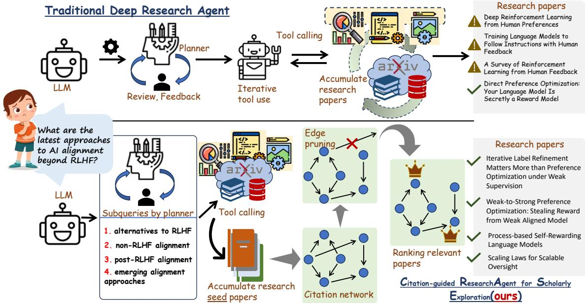
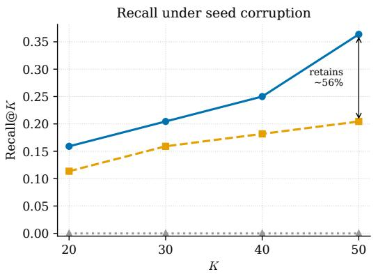
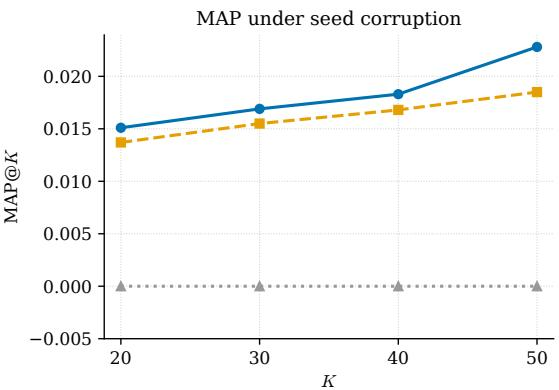

# Str<sub>uc</sub>t<sub>u</sub>r<sub>a</sub>ll<sub>y</sub>-b<sub>ou</sub>nd<sub>e</sub>d A<sub>ge</sub>nti<sub>c</sub> Gr<sub>ap</sub>h Ex<sub>p</sub>l<sub>o</sub>r<sub>a</sub>ti<sub>o</sub>n f<sub>o</sub>r E<sub>v</sub>id<sub>e</sub>n<sub>ce-</sub>Gr<sub>ou</sub>nd<sub>e</sub>d S<sub>c</sub>h<sub>o</sub>l<sub>a</sub>rl<sub>y</sub> D<sub>eep</sub>S<sub>ea</sub>r<sub>c</sub>h

<sub>Rima</sub> <sub>Hazra</sub>♠♡∗<sub>,</sub> <sub>Sayan</sub> <sub>Layek</sub>♢∗<sub>,</sub> <sub>Somnath</sub> <sub>Banerjee</sub>♣<sub>,</sub>

Soumen Chakrabarti<sup>†</sup>, Animesh Mukherjee<sup>♢</sup>

<sup>♠</sup>N<sub>a</sub>ti<sub>o</sub>n<sub>a</sub>l Uni<sub>ve</sub>r<sub>s</sub>it<sub>y</sub> <sub>o</sub>f Sin<sub>gapo</sub>r<sub>e,</sub> <sup>♡</sup>TCG CREST<sub>,</sub>

<sup>♢</sup>Indi<sub>a</sub>n In<sub>s</sub>tit<sub>u</sub>t<sub>e</sub> <sub>o</sub>f T<sub>ec</sub>hn<sub>o</sub>l<sub>ogy</sub> Kh<sub>a</sub>r<sub>agpu</sub>r<sub>,</sub> <sup>♣</sup>Sin<sub>gapo</sub>r<sub>e</sub> In<sub>s</sub>tit<sub>u</sub>t<sub>e</sub> <sub>o</sub>f T<sub>ec</sub>hn<sub>o</sub>l<sub>ogy,</sub> <sup>†</sup>I<sub>n</sub>di<sub>an</sub> I<sub>ns</sub>tit<sub>u</sub>t<sub>e</sub> <sub>o</sub>f T<sub>ec</sub>h<sub>no</sub>l<sub>ogy</sub> B<sub>om</sub>b<sub>ay</sub>

## Abstract

W<sub>e presen</sub>t C<sub>rase, a</sub> b<sub>oun</sub>d<sub>e</sub>d <sub>an</sub>d i<sub>nspec</sub>t<sub>a</sub>bl<sub>e a</sub>lt<sub>erna</sub>ti<sub>ve</sub> t<sub>o</sub> d<sub>eep researc</sub>h <sub>agen</sub>t<sub>s</sub> f<sub>or sc</sub>h<sub>o</sub>l<sub>ar</sub>l<sub>y searc</sub>h<sub>.</sub> I<sub>ns</sub>t<sub>ea</sub>d <sub>o</sub>f <sub>an open-</sub> <sub>en</sub>d<sub>e</sub>d <sub>searc</sub>h l<sub>oop,</sub> C<sub>rase</sub> <sub>quer</sub>i<sub>es</sub> <sub>a</sub> <sub>searc</sub>h <sub>eng</sub>i<sub>ne</sub> <sub>once</sub> f<sub>or</sub> <sub>see</sub>d <sub>papers,</sub> <sub>expan</sub>d<sub>s</sub> th<sub>em</sub> <sub>a</sub>l<sub>ong</sub> th<sub>e</sub>i<sub>r</sub> 1<sub>.</sub>5<sub>-</sub>h<sub>op</sub> <sub>c</sub>it<sub>a</sub>ti<sub>on</sub> <sub>ne</sub>i<sub>g</sub>h<sub>-</sub> b<sub>or</sub>h<sub>oo</sub>d<sub>, prunes c</sub>it<sub>a</sub>ti<sub>on e</sub>d<sub>ges w</sub>h<sub>ose c</sub>l<sub>a</sub>i<sub>ms</sub> l<sub>ac</sub>k <sub>en</sub>t<sub>a</sub>il<sub>men</sub>t <sub>suppor</sub>t<sub>,</sub> <sub>an</sub>d <sub>ran</sub>k<sub>s</sub> th<sub>e</sub> <sub>rema</sub>i<sub>n</sub>i<sub>ng</sub> <sub>papers</sub> <sub>w</sub>ith <sub>a</sub> <sub>recency-aware</sub> <sub>ran</sub>d<sub>om wa</sub>lk<sub>.</sub> Thi<sub>s ma</sub>k<sub>es</sub> th<sub>e can</sub>did<sub>a</sub>t<sub>e se</sub>t<sub>,</sub> th<sub>e reason eac</sub>h <sub>paper</sub> i<sub>s</sub> k<sub>ep</sub>t<sub>,</sub> <sub>an</sub>d th<sub>e</sub> <sub>s</sub>t<sub>opp</sub>i<sub>ng</sub> <sub>con</sub>diti<sub>on</sub> <sub>exp</sub>li<sub>c</sub>it <sub>an</sub>d fi<sub>xe</sub>d b<sub>e</sub>f<sub>ore</sub> i<sub>n</sub>f<sub>erence.</sub> O<sub>n</sub> LitS<sub>earc</sub>h <sub>an</sub>d <sub>one</sub> f<sub>ur</sub>th<sub>er</sub> b<sub>enc</sub>h<sub>mar</sub>k<sub>s</sub> <sub>ove</sub>r <sub>a</sub> 500K<sub>-pape</sub>r arXi<sub>v co</sub>r<sub>pus,</sub> C<sub>rase ou</sub>t<sub>pe</sub>rf<sub>o</sub>rm<sub>s</sub> d<sub>eep</sub> research a<sub>g</sub>ents built on <sub>p</sub>ro<sub>p</sub>rietar<sub>y</sub> models b<sub>y</sub> u<sub>p</sub> to 3× re-<sub>ca</sub>ll@50 <sub>a</sub>t <sub>roug</sub>hl<sub>y a</sub> thi<sub>r</sub>d <sub>o</sub>f th<sub>e cos</sub>t<sub>.</sub>

Code: htt<sub>ps:</sub>//<sub>g</sub>ith<sub>u</sub>b<sub>.co</sub>m/R<sub>a</sub>di<sub>a</sub>ntCr<sub>ys</sub>t<sub>a</sub>l/CRASE

## Intr<sub>o</sub>d<sub>uc</sub>ti<sub>o</sub>n

D<sub>eep researc</sub>h <sub>agen</sub>t<sub>s</sub> t<sub>urn a s</sub>i<sub>ng</sub>l<sub>e-</sub>t<sub>urn</sub> l<sub>anguage mo</sub>d<sub>e</sub>l i<sub>n</sub>t<sub>o</sub> an autonomous search-and-synthesis process: given a complex information need, the agent decomposes it into subquestions, calls external tools, reads what they return,judges whether evidences sufice, and searches again before composing a cited report (Nakano et al. 2021; OpenAI 2025; Li et al. 2025). Built on the reasonin<sub>g</sub>-and-actin<sub>g p</sub>aradi<sub>g</sub>m for tool-au<sub>g</sub>mented models (Yao et al. 2023; Schick et al. 2023), it i<sub>s</sub> <sub>e</sub>f<sub>ec</sub>ti<sub>ve</sub> <sub>w</sub>h<sub>erever</sub> <sub>ev</sub>id<sub>ence</sub> <sub>mus</sub>t b<sub>e</sub> <sub>ga</sub>th<sub>ere</sub>d f<sub>rom</sub> <sub>many</sub> <sub>sources,</sub> f<sub>rom</sub> lit<sub>era</sub>t<sub>ure</sub> <sub>rev</sub>i<sub>ew</sub> t<sub>o</sub> <sub>mu</sub>lti<sub>-</sub>d<sub>ocumen</sub>t <sub>compar-</sub> i<sub>son.</sub> Thi<sub>s same au</sub>t<sub>onomy,</sub> h<sub>owever,</sub> i<sub>s</sub> h<sub>ar</sub>d t<sub>o oversee.</sub> A <sub>user</sub> <sub>sees</sub> th<sub>e</sub> fi<sub>na</sub>l <sub>repor</sub>t b<sub>u</sub>t littl<sub>e</sub> <sub>o</sub>f <sub>w</sub>h<sub>a</sub>t <sub>pro</sub>d<sub>uce</sub>d it<sub>,</sub> <sub>w</sub>h<sub>y</sub> th<sub>e agen</sub>t k<sub>ep</sub>t <sub>searc</sub>hi<sub>ng or s</sub>t<sub>oppe</sub>d<sub>, w</sub>hi<sub>c</sub>h <sub>sources s</sub>h<sub>ape</sub>d it<sub>s</sub> d<sub>ec</sub>i<sub>s</sub>i<sub>ons, w</sub>h<sub>e</sub>th<sub>er an ear</sub>l<sub>y m</sub>i<sub>s</sub>t<sub>a</sub>k<sub>e qu</sub>i<sub>e</sub>tl<sub>y re</sub>di<sub>rec</sub>t<sub>e</sub>d <sub>ev-</sub> <sub>ery</sub>thi<sub>ng a</sub>ft<sub>er</sub> it<sub>.</sub> Th<sub>ree proper</sub>ti<sub>es o</sub>f th<sub>e</sub> l<sub>oop compoun</sub>d th<sub>e</sub> <sub>pro</sub>bl<sub>em.</sub> E<sub>xp</sub>l<sub>ora</sub>ti<sub>on</sub> i<sub>s</sub> <sub>open-en</sub>d<sub>e</sub>d<sub>,</sub> <sub>so</sub> <sub>a</sub> <sub>query</sub> h<sub>a</sub>lt<sub>s</sub> <sub>on</sub> <sub>an</sub> <sub>ex</sub>t<sub>erna</sub>l b<sub>u</sub>d<sub>ge</sub>t <sub>ra</sub>th<sub>er</sub> th<sub>an any con</sub>diti<sub>on</sub> th<sub>e user can</sub> i<sub>n-</sub> <sub>spec</sub>t<sub>.</sub> E<sub>rrors pers</sub>i<sub>s</sub>t<sub>,</sub> b<sub>ecause a wea</sub>k <sub>source pu</sub>ll<sub>e</sub>d i<sub>n ear</sub>l<sub>y</sub> <sub>s</sub>it<sub>s</sub> i<sub>n</sub> th<sub>e con</sub>t<sub>ex</sub>t <sub>o</sub>f <sub>every</sub> l<sub>a</sub>t<sub>er query w</sub>ith <sub>no way</sub> t<sub>o</sub> t<sub>a</sub>k<sub>e</sub> it b<sub>ac</sub>k<sub>.</sub> Al<sub>so, ev</sub>id<sub>ence</sub> i<sub>s</sub> h<sub>ar</sub>d t<sub>o au</sub>dit<sub>, s</sub>i<sub>nce</sub> th<sub>e</sub> fi<sub>na</sub>l <sub>c</sub>it<sub>a</sub>ti<sub>ons</sub> <sub>se</sub>ld<sub>om say w</sub>h<sub>y a paper was</sub> k<sub>ep</sub>t<sub>.</sub> Th<sub>ere</sub> i<sub>s a cos</sub>t t<sub>oo – o</sub>ft<sub>en</sub> d<sub>ozens</sub> <sub>o</sub>f t<sub>oo</sub>l <sub>ca</sub>ll<sub>s,</sub> th<sub>e</sub> <sub>promp</sub>t <sub>grow</sub>i<sub>ng</sub> <sub>a</sub>t <sub>eac</sub>h <sub>s</sub>t<sub>ep</sub> b<sub>u</sub>t th<sub>e</sub> h<sub>ar</sub>d<sub>er</sub> <sub>pro</sub>bl<sub>em</sub> i<sub>s</sub> th<sub>a</sub>t <sub>open-en</sub>d<sub>e</sub>d <sub>exp</sub>l<sub>ora</sub>ti<sub>on,</sub> <sub>opaque</sub> <sub>s</sub>t<sub>opp</sub>i<sub>ng, an</sub>d <sub>compoun</sub>di<sub>ng errors</sub> l<sub>eave</sub> th<sub>ese agen</sub>t<sub>s</sub> difi<sub>-</sub> <sub>cu</sub>lt t<sub>o mon</sub>it<sub>or an</sub>d <sub>con</sub>t<sub>ro</sub>l<sub>.</sub> I<sub>n sc</sub>h<sub>o</sub>l<sub>ar</sub>l<sub>y</sub> di<sub>scovery</sub> thi<sub>s</sub> bit<sub>es</sub> h<sub>ar</sub>d<sub>es</sub>t<sub>: a repor</sub>t i<sub>s on</sub>l<sub>y as re</sub>li<sub>a</sub>bl<sub>e as</sub> th<sub>e ev</sub>id<sub>ence</sub> b<sub>e</sub>hi<sub>n</sub>d it<sub>.</sub> W<sub>e</sub> th<sub>ere</sub>f<sub>ore as</sub>k<sub>:</sub>

Can scholarly discovery be performed through a structurally bounded and evidence-inspectable process without sacrificing retrieval efectiveness?

O<sub>ur s</sub>t<sub>ar</sub>ti<sub>ng po</sub>i<sub>n</sub>t i<sub>s s</sub>i<sub>mp</sub>l<sub>e: a gener</sub>i<sub>c agen</sub>t <sub>spen</sub>d<sub>s</sub> it<sub>s</sub> whole trajectory rebuilding, one search at a time, a map of relevance the scientific literature has already drawn, the citation network (Garfield 1972; Small 1973). So rather than <sub>re</sub>b<sub>u</sub>ild th<sub>a</sub>t <sub>map,</sub> <sub>we</sub> <sub>wa</sub>lk it<sub>.</sub> O<sub>ne</sub> <sub>see</sub>d<sub>e</sub>d <sub>searc</sub>h <sub>rep</sub>l<sub>aces</sub> <sub>open-en</sub>d<sub>e</sub>d <sub>query</sub>i<sub>ng,</sub> th<sub>e</sub> <sub>grap</sub>h b<sub>oun</sub>d<sub>s</sub> <sub>w</sub>hi<sub>c</sub>h <sub>papers</sub> <sub>are</sub> i<sub>n</sub> <sub>p</sub>l<sub>ay w</sub>ith<sub>ou</sub>t <sub>as</sub>ki<sub>ng</sub> th<sub>e mo</sub>d<sub>e</sub>l t<sub>o</sub> d<sub>ec</sub>id<sub>e, an</sub>d it<sub>s e</sub>d<sub>ges</sub> l<sub>eave a</sub> <sub>v</sub>i<sub>s</sub>ibl<sub>e</sub> t<sub>ra</sub>il <sub>o</sub>f h<sub>ow</sub> th<sub>ey connec</sub>t<sub>.</sub> Thi<sub>s m</sub>i<sub>rrors</sub> th<sub>e</sub> AI <sub>con</sub>t<sub>ro</sub>l <sub>v</sub>i<sub>ew o</sub>f <sub>sa</sub>f<sub>e au</sub>t<sub>onomy</sub> lik<sub>e p</sub>l<sub>ace a</sub> t<sub>rus</sub>t<sub>e</sub>d<sub>, au</sub>dit<sub>a</sub>bl<sub>e com-</sub> <sub>ponen</sub>t <sub>aroun</sub>d <sub>an</sub> <sub>un</sub>t<sub>rus</sub>t<sub>e</sub>d b<sub>u</sub>t <sub>capa</sub>bl<sub>e</sub> <sub>one,</sub> <sub>so</sub> <sub>guaran</sub>t<sub>ees</sub> come from structure rather than the model’s own judgment <sub>o</sub>f <sub>w</sub>h<sub>en</sub> it h<sub>as</sub> d<sub>one enoug</sub>h<sub>.</sub> Wh<sub>a</sub>t <sub>ena</sub>bl<sub>es</sub> th<sub>e</sub> t<sub>ra</sub>d<sub>e</sub> i<sub>s a</sub> change of objective: we ask the system not to synthesize an <sub>answer</sub> b<sub>u</sub>t t<sub>o</sub> <sub>re</sub>t<sub>urn</sub> <sub>a</sub> <sub>ran</sub>k<sub>e</sub>d <sub>se</sub>t <sub>o</sub>f <sub>re</sub>l<sub>evan</sub>t <sub>papers,</sub> t<sub>urn</sub>i<sub>ng</sub> <sub>open-en</sub>d<sub>e</sub>d <sub>searc</sub>h i<sub>n</sub>t<sub>o a process w</sub>h<sub>ose</sub> b<sub>oun</sub>d<sub>ar</sub>i<sub>es, s</sub>t<sub>eps,</sub> <sup>and sto</sup>pp<sup>in</sup>g p<sup>oint are o</sup>p<sup>en to ins</sup>p<sup>ection</sup>.

We instantiate this in Crase (Citation-<sub>g</sub>uided Research A<sub>g</sub>ent for Scholarl<sub>y</sub> Ex<sub>p</sub>loration), which resolves a quer<sub>y</sub> i<sub>n</sub> th<sub>ree s</sub>t<sub>ages.</sub> It d<sub>er</sub>i<sub>ves a researc</sub>h <sub>p</sub>l<sub>an an</sub>d i<sub>ssues one</sub> search call <sub>p</sub>er sub-<sub>p</sub>lan to Semantic Scholar (Kinne<sub>y</sub> et al. 2023), keeping the top results as seeds – the only stage that touches an external service. It expands the seeds to their 1.5-hop citation neighborhood, the seeds, their references and citing papers, and every edge among them to form an evidence graph. Raw citations are often perfunctory, tan-<sub>g</sub>ential, or <sub>p</sub>urel<sub>y</sub> methodolo<sub>g</sub>ical (Moravcsik and Muru<sub>g</sub>esan 1975; Jur<sub>g</sub>ens et al. 2018), and citation counts follow a rich-<sub>g</sub>et-richer d<sub>y</sub>namic (Barabási and Albert 1999): a heavil<sub>y</sub> <sub>c</sub>it<sub>e</sub>d <sub>paper</sub> d<sub>raws</sub> <sub>e</sub>d<sub>ges</sub> th<sub>roug</sub>h <sub>s</sub>h<sub>eer</sub> <sub>popu</sub>l<sub>ar</sub>it<sub>y,</sub> <sub>so</sub> <sub>a</sub> <sub>na</sub>i<sub>ve wa</sub>lk <sub>poo</sub>l<sub>s re</sub>l<sub>evance on suc</sub>h h<sub>u</sub>b<sub>s an</sub>d d<sub>r</sub>ift<sub>s</sub> t<sub>owar</sub>d <sub>o</sub>ld<sub>er</sub> <sub>wor</sub>k <sub>regar</sub>dl<sub>ess</sub> <sub>o</sub>f h<sub>ow</sub> <sub>we</sub>ll <sub>e</sub>ith<sub>er</sub> <sub>groun</sub>d<sub>s</sub> th<sub>e</sub> <sub>query.</sub> C<sub>rase</sub> <sub>coun</sub>t<sub>ers</sub> b<sub>o</sub>th<sub>,</sub> <sub>scor</sub>i<sub>ng</sub> <sub>every</sub> <sub>e</sub>d<sub>ge</sub> b<sub>y</sub> h<sub>ow</sub> <sub>s</sub>t<sub>rong</sub>l<sub>y</sub> th<sub>e</sub> <sub>c</sub>it<sub>e</sub>d <sub>paper</sub>’<sub>s</sub> <sub>a</sub>t<sub>om</sub>i<sub>c</sub> <sub>c</sub>l<sub>a</sub>i<sub>ms</sub> <sub>groun</sub>d th<sub>e</sub> <sub>c</sub>iti<sub>ng</sub> <sub>paper</sub>’<sub>s,</sub> <sub>so</sub> <sub>a</sub> <sub>popu</sub>l<sub>ar</sub> b<sub>u</sub>t t<sub>angen</sub>ti<sub>a</sub>l h<sub>u</sub>b i<sub>s</sub> d<sub>own-we</sub>i<sub>g</sub>ht<sub>e</sub>d <sub>or</sub> <sub>prune</sub>d <sub>ra</sub>th<sub>er</sub> th<sub>an</sub> <sub>rewar</sub>d<sub>e</sub>d f<sub>or</sub> it<sub>s</sub> d<sub>egree,</sub> th<sub>en</sub> <sub>ran</sub>ki<sub>ng</sub> <sub>w</sub>h<sub>a</sub>t <sub>re-</sub> mains with a recenc<sub>y</sub>-aware Personalized Pa<sub>g</sub>eRank (Pa<sub>g</sub>e et al. 1999; Haveliwala 2002) or SALSA (Lem<sub>p</sub>el and Moran 2001) whose wei<sub>g</sub>hts balance this covera<sub>g</sub>e afinit<sub>y</sub> a<sub>g</sub>ainst <sub>an age</sub> d<sub>ecay.</sub> Thi<sub>s c</sub>l<sub>a</sub>i<sub>m-</sub>l<sub>eve</sub>l <sub>rewe</sub>i<sub>g</sub>hti<sub>ng</sub> i<sub>s</sub> th<sub>e cen</sub>t<sub>ra</sub>l <sub>nov-</sub> <sub>e</sub>lt<sub>y, an</sub>d it <sub>sp</sub>lit<sub>s</sub> C<sub>rase</sub> i<sub>n</sub>t<sub>o a</sub> t<sub>rus</sub>t<sub>e</sub>d <sub>par</sub>t <sub>an</sub>d <sub>a c</sub>h<sub>ec</sub>k<sub>a</sub>bl<sub>e</sub> <sub>one.</sub> Th<sub>e grap</sub>h <sub>cons</sub>t<sub>ruc</sub>ti<sub>on, prun</sub>i<sub>ng ru</sub>l<sub>e, an</sub>d <sub>ran</sub>ki<sub>ng wa</sub>lk <sub>are</sub> fi<sub>xe</sub>d <sub>an</sub>d d<sub>e</sub>t<sub>erm</sub>i<sub>n</sub>i<sub>s</sub>ti<sub>c, w</sub>ith <sub>no</sub> f<sub>ree c</sub>h<sub>o</sub>i<sub>ce</sub> l<sub>e</sub>ft t<sub>o</sub> th<sub>e</sub> model; the model supplies only local judgments, the plan, th<sub>e c</sub>l<sub>a</sub>im<sub>s, an</sub>d th<sub>e pe</sub>r<sub>-e</sub>d<sub>ge e</sub>nt<sub>a</sub>ilm<sub>e</sub>nt <sub>sco</sub>r<sub>es, eac</sub>h <sub>ver</sub>ifi<sub>-</sub> <sub>a</sub>bl<sub>e on</sub> it<sub>s own.</sub> S<sub>o</sub> th<sub>e</sub> b<sub>oun</sub>d<sub>ary an</sub>d <sub>s</sub>t<sub>opp</sub>i<sub>ng po</sub>i<sub>n</sub>t <sub>are</sub> fi<sub>xe</sub>d <sub>ra</sub>th<sub>er</sub> th<sub>an mo</sub>d<sub>e</sub>l<sub>-c</sub>h<sub>osen,</sub> th<sub>e e</sub>d<sub>ge we</sub>i<sub>g</sub>ht<sub>s recor</sub>d <sub>w</sub>h<sub>y eac</sub>h <sub>paper was</sub> k<sub>ep</sub>t <sub>or cu</sub>t<sub>, an</sub>d th<sub>e mo</sub>d<sub>e</sub>l d<sub>r</sub>i<sub>ves ex</sub>t<sub>erna</sub>l <sub>searc</sub>h only at seed construction. Crase does not make its judg-<sub>men</sub>t<sub>s correc</sub>t<sub>,</sub> b<sub>u</sub>t it <sub>ma</sub>k<sub>es</sub> th<sub>e searc</sub>h <sub>space, ev</sub>id<sub>ence, an</sub>d <sub>s</sub>t<sub>opp</sub>i<sub>ng</sub> <sub>con</sub>diti<sub>on</sub> <sub>au</sub>dit<sub>a</sub>bl<sub>e</sub> <sub>an</sub>d <sub>w</sub>hil<sub>e</sub> <sub>we</sub> <sub>s</sub>t<sub>u</sub>d<sub>y</sub> <sub>sc</sub>h<sub>o</sub>l<sub>ar</sub>l<sub>y</sub> di<sub>scovery,</sub> th<sub>e</sub> d<sub>es</sub>i<sub>gn</sub> i<sub>s</sub> <sub>no</sub>t <sub>spec</sub>ifi<sub>c</sub> t<sub>o</sub> it<sub>.</sub>

W<sub>e eva</sub>l<sub>ua</sub>t<sub>e</sub> C<sub>rase on a con</sub>t<sub>ro</sub>ll<sub>e</sub>d <sub>corpus o</sub>f <sub>roug</sub>hl<sub>y</sub> 500K arXi<sub>v pape</sub>r<sub>s spa</sub>nnin<sub>g</sub> AI<sub>,</sub> ML<sub>,</sub> NLP<sub>, a</sub>nd <sub>co</sub>m<sub>pu</sub>t<sub>e</sub>r <sub>v</sub>i<sub>s</sub>i<sub>o</sub>n (January 2016 – July 2026), using LitSearch (Ajith et al. 2024) and one further test set restricted to this cor<sub>p</sub>us. Our <sub>p</sub>rimar<sub>y</sub> contrib<sub>u</sub>tions are threefold<sub>.</sub>

1<sub>.</sub> W<sub>e</sub> id<sub>en</sub>tif<sub>y</sub> <sub>cr</sub>iti<sub>ca</sub>l <sub>c</sub>h<sub>a</sub>ll<sub>enges</sub> t<sub>o</sub> <sub>sc</sub>h<sub>o</sub>l<sub>ar</sub>l<sub>y</sub> d<sub>eep</sub> <sub>researc</sub>h<sub>:</sub> open-ended exploration, model-controlled termination, compounding errors, and limited visibility into evidence selection. In the spirit of AI control, we recast deep re-<sub>searc</sub>h <sub>as</sub> b<sub>oun</sub>d<sub>e</sub>d di<sub>scovery, w</sub>h<sub>ere a</sub> t<sub>rus</sub>t<sub>e</sub>d <sub>c</sub>it<sub>a</sub>ti<sub>on-</sub> graph substrate tempers an untrusted model’s judgments.

2. We introduce coverage afinity, a claim-level entailment <sub>we</sub>i<sub>g</sub>hti<sub>ng o</sub>f <sub>c</sub>it<sub>a</sub>ti<sub>on e</sub>d<sub>ges es</sub>ti<sub>ma</sub>ti<sub>ng</sub> h<sub>ow muc</sub>h <sub>a c</sub>it<sub>e</sub>d <sub>paper</sub> <sub>groun</sub>d<sub>s</sub> th<sub>e</sub> <sub>c</sub>iti<sub>ng</sub> <sub>paper</sub>’<sub>s</sub> <sub>c</sub>l<sub>a</sub>i<sub>ms,</sub> t<sub>urn</sub>i<sub>ng</sub> <sub>a</sub> bibli<sub>-</sub> <sub>ograp</sub>hi<sub>c</sub> <sub>grap</sub>h i<sub>n</sub>t<sub>o</sub> <sub>an</sub> i<sub>nspec</sub>t<sub>a</sub>bl<sub>e</sub> <sub>ev</sub>id<sub>ence</sub> <sub>grap</sub>h th<sub>a</sub>t <sub>o</sub>f<sub>se</sub>t<sub>s</sub> b<sub>o</sub>th th<sub>e</sub> <sub>popu</sub>l<sub>ar</sub>it<sub>y</sub> <sub>an</sub>d <sub>recency</sub> bi<sub>ases</sub> <sub>o</sub>f <sub>raw</sub> <sub>c</sub>i<sub>-</sub> <sup>tation</sup> <sup>to</sup>p<sup>olo</sup>gy.

3<sub>.</sub> W<sub>e</sub> r<sub>a</sub>nk <sub>pape</sub>r<sub>s</sub> b<sub>y a</sub> r<sub>ece</sub>n<sub>cy-awa</sub>r<sub>e</sub> r<sub>a</sub>nd<sub>o</sub>m <sub>wa</sub>lk <sub>ove</sub>r th<sub>e prune</sub>d <sub>grap</sub>h <sub>an</sub>d <sub>s</sub>h<sub>ow on</sub> LitS<sub>earc</sub>h <sub>an</sub>d <sub>one</sub> f<sub>ur</sub>th<sub>er</sub> b<sub>enc</sub>h<sub>mar</sub>k th<sub>a</sub>t C<sub>rase ma</sub>t<sub>c</sub>h<sub>es or</sub> i<sub>mproves sc</sub>h<sub>o</sub>l<sub>ar</sub>l<sub>y re-</sub> t<sub>r</sub>i<sub>eva</sub>l <sub>w</sub>hil<sub>e su</sub>b<sub>s</sub>t<sub>an</sub>ti<sub>a</sub>ll<sub>y cu</sub>tti<sub>ng</sub> th<sub>e</sub> t<sub>oo</sub>l<sub>-ca</sub>ll <sub>an</sub>d t<sub>o</sub>k<sub>en</sub> <sub>cos</sub>t <sub>o</sub>f <sub>gener</sub>i<sub>c</sub> d<sub>eep researc</sub>h <sub>agen</sub>t<sub>s.</sub>

## R<sub>e</sub>l<sub>a</sub>t<sub>e</sub>d <sub>wor</sub>k

Agentic search and retrieval-augmented generation: Toolau<sub>g</sub>mented models interleave reasonin<sub>g</sub> with search (Yao et al. 2023; Shinn et al. 2023), learn tool use (Schick et al. 2023), browse with human feedback (Nakano et al. 2021), or <sub>com</sub>bi<sub>ne re</sub>t<sub>r</sub>i<sub>eva</sub>l <sub>w</sub>ith l<sub>ong-</sub>f<sub>orm reason</sub>i<sub>ng an</sub>d RL<sub>-</sub>t<sub>ra</sub>i<sub>ne</sub>d search <sub>p</sub>olicies (Li et al. 2025; Jin et al. 2025); commer-<sub>c</sub>i<sub>a</sub>l d<sub>eep researc</sub>h <sub>sys</sub>t<sub>ems</sub> f<sub>ur</sub>th<sub>er ex</sub>t<sub>en</sub>d thi<sub>s</sub> l<sub>oop</sub> t<sub>o repor</sub>t <sub>g</sub>eneration (O<sub>p</sub>enAI 2025) and dedicated benchmarks (Du et al. 2026). RAG methods similarl<sub>y</sub> retrieve within <sub>g</sub>eneration (Lewis et al. 2020), tri<sub>gg</sub>ered b<sub>y</sub> uncertaint<sub>y</sub> (Jian<sub>g</sub> et al. 2023), reasonin<sub>g</sub> ste<sub>p</sub>s (Trivedi et al. 2023), or self-critique (Asai et al. 2023). These a<sub>pp</sub>roaches rel<sub>y</sub> on re<sub>p</sub>eated search, <sub>mo</sub>d<sub>e</sub>l<sub>-</sub>d<sub>r</sub>i<sub>ven</sub> <sub>s</sub>t<sub>opp</sub>i<sub>ng,</sub> <sub>an</sub>d l<sub>arge</sub>l<sub>y</sub> i<sub>rrevers</sub>ibl<sub>e</sub> <sub>re</sub>t<sub>r</sub>i<sub>eva</sub>l t<sub>ra-</sub> jectories; Crase instead performs a single seeded search and <sub>su</sub>b<sub>sequen</sub>tl<sub>y</sub> <sub>exp</sub>l<sub>ores</sub> <sub>re</sub>l<sub>a</sub>ti<sub>ons</sub> <sub>among</sub> <sub>re</sub>t<sub>r</sub>i<sub>eve</sub>d <sub>papers.</sub>

Scholarly retrieval and citation-graph ranking: Scientific search s<sub>p</sub>ans dedicated infrastructure (Kinne<sub>y</sub> et al. 2023), benchmarks (Ajith et al. 2024), citation recommenders (Färber and Jatowt 2020), and citation-aware embeddin<sub>g</sub>s (Cohan et al. 2020; Sin<sub>g</sub>h et al. 2023); related s<sub>y</sub>stems interleave search with citation ex<sub>p</sub>ansion (He et al. 2025) or combine retrieval with s<sub>y</sub>nthesis (Asai et al. 2024). Cit<sub>a</sub>ti<sub>on-</sub>b<sub>ase</sub>d <sub>re</sub>l<sub>evance</sub> h<sub>as</sub> l<sub>ong suppor</sub>t<sub>e</sub>d <sub>c</sub>it<sub>a</sub>ti<sub>on ana</sub>l<sub>-</sub> <sub>y</sub>sis (Garfield 1972), co-citation (Small 1973), biblio<sub>g</sub>ra<sub>p</sub>hic cou<sub>p</sub>lin<sub>g</sub> (Kessler 1963), and Pa<sub>g</sub>eRank-based rankin<sub>g</sub> (Pa<sub>g</sub>e et al. 1999; Haveliwala 2002; Jeh and Widom 2003). How-<sub>ever, raw c</sub>it<sub>a</sub>ti<sub>on grap</sub>h<sub>s</sub> f<sub>avor o</sub>ld<sub>er papers</sub> th<sub>roug</sub>h <sub>pre</sub>f<sub>er-</sub> ential attachment (Barabási and Albert 1999) and conflate substantive with <sub>p</sub>erfunctor<sub>y</sub> citations (Moravcsik and Muru<sub>g</sub>esan 1975), motivatin<sub>g</sub> a<sub>g</sub>e-aware wei<sub>g</sub>htin<sub>g</sub> and citationintent modelin<sub>g</sub> (Teufel, Siddharthan, and Tidhar 2006; Jur<sub>g</sub>ens et al. 2018; Cohan et al. 2019). Instead of learnin<sub>g</sub> a <sub>s</sub>t<sub>ep-w</sub>i<sub>se</sub> <sub>expans</sub>i<sub>on</sub> <sub>po</sub>li<sub>cy,</sub> C<sub>rase</sub> fi<sub>xes</sub> <sub>a</sub> 1<sub>.</sub>5<sub>-</sub>h<sub>op</sub> <sub>ne</sub>i<sub>g</sub>hb<sub>or-</sub> hood and wei<sub>g</sub>hts ed<sub>g</sub>es b<sub>y</sub> claim-level entailment (Bowman et al. 2015; Thorne et al. 2018; Wadden et al. 2020), <sub>y</sub>ieldin<sub>g</sub> <sub>an</sub> <sub>au</sub>dit<sub>a</sub>bl<sub>e</sub> <sub>ev</sub>id<sub>ence</sub> <sub>grap</sub>h<sub>.</sub>

Oversight and control ofautonomous agents: Scalable over-<sub>s</sub>i<sub>g</sub>ht <sub>ma</sub>k<sub>es</sub> <sub>mo</sub>d<sub>e</sub>l <sub>reason</sub>i<sub>ng</sub> <sub>more</sub> <sub>superv</sub>i<sub>sa</sub>bl<sub>e</sub> b<sub>y</sub> <sub>rewar</sub>d<sub>-</sub> in<sub>g</sub> intermediate ste<sub>p</sub>s (Li<sub>g</sub>htman et al. 2024) or testin<sub>g</sub> whether weaker models can oversee stron<sub>g</sub>er ones (Burns et al. 2024; Bowman et al. 2022). AI control instead assumes th<sub>e capa</sub>bl<sub>e mo</sub>d<sub>e</sub>l <sub>may</sub> b<sub>e unre</sub>li<sub>a</sub>bl<sub>e an</sub>d <sub>uses a</sub> t<sub>rus</sub>t<sub>e</sub>d<sub>,</sub> auditable <sub>p</sub>rotocol to constrain it (Greenblatt et al. 2024; Rasheed et al. 2026). A com<sub>p</sub>lementar<sub>y</sub> line instead makes th<sub>e</sub> <sub>mo</sub>d<sub>e</sub>l it<sub>se</sub>lf <sub>more</sub> <sub>re</sub>li<sub>a</sub>bl<sub>e</sub> <sub>a</sub>t i<sub>n</sub>f<sub>erence</sub> ti<sub>me,</sub> th<sub>roug</sub>h decoding-time or test-time alignment (Banerjee et al. 2024, 2025), rather than constrainin<sub>g</sub> it externall<sub>y</sub>. Dee<sub>p</sub> research <sub>agen</sub>t<sub>s</sub> <sub>ex</sub>t<sub>en</sub>d thi<sub>s</sub> <sub>c</sub>h<sub>a</sub>ll<sub>enge</sub> t<sub>o</sub> <sub>mu</sub>lti<sub>-s</sub>t<sub>ep</sub> <sub>ev</sub>id<sub>ence</sub> <sub>ga</sub>th<sub>er</sub>i<sub>ng,</sub> <sub>w</sub>h<sub>ere</sub> th<sub>ese me</sub>th<sub>o</sub>d<sub>s o</sub>f<sub>er</sub> li<sub>m</sub>it<sub>e</sub>d <sub>s</sub>t<sub>ruc</sub>t<sub>ure.</sub> C<sub>rase a</sub>dd<sub>resses</sub> thi<sub>s gap</sub> b<sub>y separa</sub>ti<sub>ng</sub> th<sub>e agen</sub>t i<sub>n</sub>t<sub>o a</sub> t<sub>rus</sub>t<sub>e</sub>d <sub>su</sub>b<sub>s</sub>t<sub>ra</sub>t<sub>e,</sub> fi<sub>xe</sub>d <sub>grap</sub>h <sub>cons</sub>t<sub>ruc</sub>ti<sub>on, coverage-a</sub>fi<sub>n</sub>it<sub>y prun</sub>i<sub>ng, an</sub>d d<sub>e</sub>t<sub>erm</sub>i<sub>n-</sub> i<sub>s</sub>ti<sub>c ran</sub>ki<sub>ng.</sub>

## P<sub>ro</sub>bl<sub>em</sub> f<sub>ormu</sub>l<sub>a</sub>ti<sub>on</sub>

A <sub>conven</sub>ti<sub>ona</sub>l d<sub>eep researc</sub>h <sub>sys</sub>t<sub>em</sub> f<sub>o</sub>ll<sub>ows a mo</sub>d<sub>e</sub>l<sub>-</sub>d<sub>r</sub>i<sub>ven</sub> search loop. Starting from a query q, the model repeatedly in-<sub>vo</sub>k<sub>es a searc</sub>h t<sub>oo</sub>l<sub>,</sub> i<sub>nspec</sub>t<sub>s</sub> th<sub>e re</sub>t<sub>r</sub>i<sub>eve</sub>d <sub>ev</sub>id<sub>ence, up</sub>d<sub>a</sub>t<sub>es</sub> it<sub>s con</sub>t<sub>ex</sub>t<sub>, an</sub>d d<sub>ec</sub>id<sub>es w</sub>h<sub>e</sub>th<sub>er ano</sub>th<sub>er searc</sub>h i<sub>s nee</sub>d<sub>e</sub>d<sub>.</sub> L<sub>e</sub>t T denote the number of tool calls before termination. Since T depends on the model’s intermediate judgments, neither th<sub>e ex</sub>t<sub>en</sub>t <sub>o</sub>f th<sub>e exp</sub>l<sub>ore</sub>d lit<sub>era</sub>t<sub>ure nor</sub> th<sub>e s</sub>t<sub>opp</sub>i<sub>ng po</sub>i<sub>n</sub>t i<sub>s</sub> k<sub>nown</sub> i<sub>n a</sub>d<sub>vance.</sub> M<sub>oreover,</sub> th<sub>e mo</sub>d<sub>e</sub>l it<sub>se</sub>lf d<sub>e</sub>t<sub>erm</sub>i<sub>nes</sub> <sub>w</sub>hi<sub>c</sub>h <sub>re</sub>t<sub>r</sub>i<sub>eve</sub>d <sub>ev</sub>id<sub>ence</sub> i<sub>n</sub>fl<sub>uences</sub> l<sub>a</sub>t<sub>er searc</sub>h d<sub>ec</sub>i<sub>s</sub>i<sub>ons,</sub> <sub>ma</sub>ki<sub>ng</sub> b<sub>o</sub>th <sub>ev</sub>id<sub>ence se</sub>l<sub>ec</sub>ti<sub>on an</sub>d t<sub>erm</sub>i<sub>na</sub>ti<sub>on</sub> difi<sub>cu</sub>lt t<sub>o</sub> <sub>au</sub>dit<sub>.</sub> C<sub>onsequen</sub>tl<sub>y,</sub> it i<sub>s</sub> difi<sub>cu</sub>lt t<sub>o un</sub>d<sub>ers</sub>t<sub>an</sub>d <sub>w</sub>h<sub>y a par-</sub> ti<sub>cu</sub>l<sub>ar paper was re</sub>t<sub>r</sub>i<sub>eve</sub>d<sub>, w</sub>h<sub>y ano</sub>th<sub>er was</sub> di<sub>scar</sub>d<sub>e</sub>d<sub>, or</sub> <sub>w</sub>h<sub>y</sub> th<sub>e searc</sub>h t<sub>erm</sub>i<sub>na</sub>t<sub>e</sub>d <sub>a</sub>t <sub>a par</sub>ti<sub>cu</sub>l<sub>ar po</sub>i<sub>n</sub>t<sub>.</sub> W<sub>e</sub> f<sub>ormu</sub>l<sub>a</sub>t<sub>e</sub> th<sub>e pro</sub>bl<sub>em w</sub>ith th<sub>e goa</sub>l <sub>o</sub>f <sub>ma</sub>ki<sub>ng</sub> th<sub>ese</sub> d<sub>ec</sub>i<sub>s</sub>i<sub>ons more</sub> <sub>exp</sub>li<sub>c</sub>it <sub>an</sub>d <sub>s</sub>t<sub>ruc</sub>t<sub>ure</sub>d<sub>.</sub> R<sub>a</sub>th<sub>er</sub> th<sub>an</sub> <sub>a</sub>ll<sub>ow</sub>i<sub>ng</sub> th<sub>e</sub> <sub>agen</sub>t t<sub>o</sub> <sub>per</sub>f<sub>orm an open-en</sub>d<sub>e</sub>d <sub>sequence o</sub>f <sub>searc</sub>h<sub>es, we</sub> fi<sub>rs</sub>t d<sub>e</sub>fi<sub>ne</sub> <sub>a</sub> b<sub>oun</sub>d<sub>e</sub>d <sub>can</sub>did<sub>a</sub>t<sub>e space an</sub>d th<sub>en ran</sub>k <sub>papers w</sub>ithi<sub>n</sub> thi<sub>s</sub> space. Given the query q, the objective is to return a ranked set $P _ { q }$ containing at most k relevant papers. This formulati<sub>on ma</sub>k<sub>es</sub> th<sub>e se</sub>t <sub>o</sub>f <sub>can</sub>did<sub>a</sub>t<sub>e papers,</sub> th<sub>e ev</sub>id<sub>ence use</sub>d f<sub>or</sub> <sub>ran</sub>ki<sub>ng, an</sub>d th<sub>e s</sub>t<sub>opp</sub>i<sub>ng con</sub>diti<sub>on</sub> di<sub>rec</sub>tl<sub>y o</sub>b<sub>serva</sub>bl<sub>e.</sub> W<sub>e</sub> re<sub>p</sub>resent a scientific cor<sub>p</sub>us C as a directed citation <sub>g</sub>ra<sub>p</sub>h. <sup>F</sup>or eac<sup>h</sup> <sub>p</sub>a<sub>p</sub>er $p ,$ l<sub>e</sub>t $R _ { p }$ d<sub>eno</sub>t<sub>e</sub> it<sub>s</sub> <sub>re</sub>f<sub>erences</sub> <sub>an</sub>d $C _ { p }$ d<sub>eno</sub>t<sub>e</sub> th<sub>e papers</sub> th<sub>a</sub>t <sub>c</sub>it<sub>e</sub> it<sub>.</sub> W<sub>e</sub> d<sub>e</sub>fi<sub>ne</sub> it<sub>s c</sub>it<sub>a</sub>ti<sub>on ne</sub>i<sub>g</sub>hb<sub>or</sub>h<sub>oo</sub>d <sub>as</sub> $N ( { \bar { p } } ) { \overset { \cdot } { = } } R _ { p } \cup C _ { p }$ <sub>.</sub> E<sub>ac</sub>h <sub>paper</sub> i<sub>s</sub> <sub>a</sub>dditi<sub>ona</sub>ll<sub>y</sub> <sub>represen</sub>t<sub>e</sub>d b<sub>y</sub> it<sub>s</sub> t<sub>ex</sub>t<sub>ua</sub>l <sub>con</sub>t<sub>en</sub>t $t ( p )$ <sub>,</sub> <sub>cons</sub>i<sub>s</sub>ti<sub>ng</sub> <sub>o</sub>f it<sub>s</sub> titl<sub>e,</sub> <sub>a</sub>b<sub>s</sub>t<sub>rac</sub>t<sub>,</sub> <sub>an</sub>d i<sub>n</sub>t<sub>ro</sub>d<sub>uc</sub>ti<sub>on.</sub> Th<sub>us,</sub> <sub>a</sub> <sub>can</sub>did<sub>a</sub>t<sub>e</sub> <sub>paper</sub> <sub>can</sub> b<sub>e</sub> <sub>eva</sub>l<sub>ua</sub>t<sub>e</sub>d <sub>us</sub>i<sub>ng</sub> b<sub>o</sub>th it<sub>s</sub> t<sub>ex</sub>t<sub>ua</sub>l <sub>re</sub>l<sub>evance</sub> t<sub>o</sub> th<sub>e</sub> <sub>query</sub> <sub>an</sub>d it<sub>s</sub> <sub>pos</sub>iti<sub>on</sub> <sub>w</sub>ithi<sub>n</sub> th<sub>e c</sub>it<sub>a</sub>ti<sub>on s</sub>t<sub>ruc</sub>t<sub>ure.</sub>

Given q, we first retrieve a small set of seed papers $S \subseteq { \mathcal { C } }$ (see the section on seed construction). We then ex<sub>p</sub>and each <sub>see</sub>d th<sub>roug</sub>h it<sub>s c</sub>it<sub>a</sub>ti<sub>on ne</sub>i<sub>g</sub>hb<sub>or</sub>h<sub>oo</sub>d t<sub>o o</sub>bt<sub>a</sub>i<sub>n</sub> $\bar { V } = S \cup$ $\textstyle \bigcup _ { p \in S } N ( p )$ . Within this node set, we retain all citation links b<sub>e</sub>t<sub>ween</sub> th<sub>e re</sub>t<sub>r</sub>i<sub>eve</sub>d <sub>papers</sub> $E = ( u , v ) \in E _ { \mathcal { C } } : u , v \in V$ Alth<sub>oug</sub>h th<sub>e no</sub>d<sub>es are o</sub>bt<sub>a</sub>i<sub>ne</sub>d th<sub>roug</sub>h <sub>a one-</sub>h<sub>op expan-</sub> <sub>s</sub>i<sub>on,</sub> it <sub>a</sub>l<sub>so preserves c</sub>it<sub>a</sub>ti<sub>on re</sub>l<sub>a</sub>ti<sub>ons among</sub> th<sub>e re</sub>t<sub>r</sub>i<sub>eve</sub>d <sub>papers</sub> th<sub>emse</sub>l<sub>ves.</sub> W<sub>e</sub> <sub>re</sub>f<sub>er</sub> t<sub>o</sub> thi<sub>s</sub> <sub>enr</sub>i<sub>c</sub>h<sub>e</sub>d <sub>s</sub>t<sub>ruc</sub>t<sub>ure</sub> <sub>as</sub> <sub>a</sub> 1.5-hop neighborhood. These additional relations provide <sub>ev</sub>id<sub>ence</sub> <sub>a</sub>b<sub>ou</sub>t h<sub>ow</sub> <sub>can</sub>did<sub>a</sub>t<sub>e</sub> <sub>papers</sub> <sub>are</sub> <sub>connec</sub>t<sub>e</sub>d t<sub>o</sub> th<sub>e</sub> <sub>see</sub>d <sub>papers</sub> <sub>an</sub>d t<sub>o</sub> <sub>one</sub> <sub>ano</sub>th<sub>er,</sub> <sub>w</sub>hi<sub>c</sub>h i<sub>s</sub> <sub>su</sub>b<sub>sequen</sub>tl<sub>y</sub> <sub>use</sub>d d<sub>ur</sub>i<sub>ng ran</sub>ki<sub>ng.</sub> A<sub>n</sub> i<sub>mpor</sub>t<sub>an</sub>t <sub>consequence o</sub>f thi<sub>s cons</sub>t<sub>ruc-</sub> tion is that the exploration space is fixed once S is selected. H<sub>ence,</sub> th<sub>e agen</sub>t d<sub>oes no</sub>t <sub>repea</sub>t<sub>e</sub>dl<sub>y</sub> d<sub>ec</sub>id<sub>e w</sub>h<sub>e</sub>th<sub>er</sub> t<sub>o ex-</sub> <sub>pan</sub>d th<sub>e searc</sub>h f<sub>ur</sub>th<sub>er.</sub> Si<sub>m</sub>il<sub>ar</sub>l<sub>y, ev</sub>id<sub>ence se</sub>l<sub>ec</sub>ti<sub>on</sub> i<sub>s per-</sub> f<sub>orme</sub>d <sub>over</sub> <sub>an</sub> <sub>exp</sub>li<sub>c</sub>it <sub>grap</sub>h <sub>w</sub>h<sub>ose</sub> <sub>no</sub>d<sub>es,</sub> <sub>e</sub>d<sub>ges,</sub> <sub>an</sub>d <sub>ran</sub>k<sub>-</sub> i<sub>ng s</sub>i<sub>gna</sub>l<sub>s can</sub> b<sub>e</sub> i<sub>nspec</sub>t<sub>e</sub>d<sub>.</sub> Th<sub>e s</sub>t<sub>opp</sub>i<sub>ng con</sub>diti<sub>on</sub> i<sub>s a</sub>l<sub>so</sub> fi<sub>xe</sub>d<sub>:</sub> th<sub>e</sub> <sub>sys</sub>t<sub>em</sub> <sub>ran</sub>k<sub>s</sub> <sub>papers</sub> <sub>w</sub>ithi<sub>n</sub> thi<sub>s</sub> b<sub>oun</sub>d<sub>e</sub>d <sub>grap</sub>h <sub>an</sub>d returns the top-k candidates. The two controlling parameters are: m (number of seed <sub>p</sub>a<sub>p</sub>ers retained for each sub-quer<sub>y</sub>), and k (number of <sub>p</sub>a<sub>p</sub>ers returned after rankin<sub>g</sub>).

## Th<sub>e</sub> C<sub>r</sub>a<sub>se</sub> <sub>sys</sub>t<sub>e</sub>m

C<sub>rase ma</sub>k<sub>es a s</sub>i<sub>ng</sub>l<sub>e re</sub>t<sub>r</sub>i<sub>eva</sub>l <sub>ca</sub>ll t<sub>o o</sub>bt<sub>a</sub>i<sub>n a sma</sub>ll <sub>see</sub>d <sub>se</sub>t<sub>,</sub> th<sub>en con</sub>fi<sub>nes a</sub>ll f<sub>ur</sub>th<sub>er reason</sub>i<sub>ng</sub> t<sub>o</sub> th<sub>e c</sub>it<sub>a</sub>ti<sub>on grap</sub>h <sub>aroun</sub>d th<sub>ose see</sub>d<sub>s, groun</sub>di<sub>ng</sub> di<sub>scovery</sub> i<sub>n</sub> th<sub>e s</sub>t<sub>ruc</sub>t<sub>ure</sub> <sub>o</sub>f th<sub>e</sub> lit<sub>era</sub>t<sub>ure ra</sub>th<sub>er</sub> th<sub>an</sub> i<sub>n a sequence o</sub>f <sub>mo</sub>d<sub>e</sub>l<sub>-</sub>i<sub>ssue</sub>d <sub>sea</sub>r<sub>c</sub>h<sub>es.</sub> Thr<sub>ee</sub> <sub>s</sub>t<sub>ages,</sub> <sub>s</sub>h<sub>ow</sub>n in Fi<sub>gu</sub>r<sub>e</sub> 1<sub>,</sub> <sub>ca</sub>rr<sub>y</sub> <sub>a</sub> <sub>que</sub>r<sub>y</sub> f<sub>rom see</sub>d<sub>s</sub> t<sub>o a ran</sub>k<sub>e</sub>d <sub>resu</sub>lt<sub>.</sub>

Stage 1 (Plan and seed construction): Given a query $q ,$ C<sub>rase</sub> d<sub>ecomposes</sub> it i<sub>n</sub>t<sub>o a se</sub>t <sub>o</sub>f f<sub>ocuse</sub>d <sub>su</sub>b<sub>-quer</sub>i<sub>es</sub> $\mathcal { R } _ { q } .$ For each sub-query, it retrieves the top m papers from an external index and forms their union as the seed set S. This i<sub>s</sub> th<sub>e on</sub>l<sub>y s</sub>t<sub>age</sub> th<sub>a</sub>t <sub>uses an ex</sub>t<sub>erna</sub>l <sub>searc</sub>h <sub>serv</sub>i<sub>ce.</sub>

Stage 2 (Guided graph expansion): Crase expands S to its 1.5-hop citation neighborhood to construct an evidence graph $G = ( { \bar { V } } , E )$ <sub>.</sub> E<sub>ac</sub>h <sub>c</sub>it<sub>a</sub>ti<sub>on e</sub>d<sub>ge</sub> i<sub>s we</sub>i<sub>g</sub>ht<sub>e</sub>d b<sub>y c</sub>l<sub>a</sub>i<sub>m-</sub>l<sub>eve</sub>l <sub>suppor</sub>t b<sub>e</sub>t<sub>ween</sub> th<sub>e c</sub>iti<sub>ng an</sub>d <sub>c</sub>it<sub>e</sub>d <sub>papers us</sub>i<sub>ng a</sub> fi<sub>ne-</sub>t<sub>une</sub>d <sub>en</sub>t<sub>a</sub>il<sub>men</sub>t <sub>mo</sub>d<sub>e</sub>l<sub>.</sub> L<sub>ow-suppor</sub>t <sub>e</sub>d<sub>ges are prune</sub>d<sub>, y</sub>i<sub>e</sub>ldi<sub>ng</sub> a graph that reflects evidence-informed relationships rather th<sub>an c</sub>it<sub>a</sub>ti<sub>on s</sub>t<sub>ruc</sub>t<sub>ure a</sub>l<sub>one.</sub>

Stage 3 (Ranking and output): Finally, Crase ranks the re-<sup>tained</sup> p<sup>a</sup>p<sup>ers</sup> u<sup>sin</sup>g <sup>a</sup> qu<sup>er</sup>y<sup>-</sup>p<sup>ersonalized</sup>, <sup>recenc</sup>y<sup>-a</sup>w<sup>are</sup> <sup>ran-</sup> d<sub>om</sub> <sub>wa</sub>lk <sub>over</sub> $G$ and returns the top k papers as $P _ { q } .$ <sub>.</sub> Th<sub>e</sub> <sub>ran</sub>ki<sub>ng mo</sub>d<sub>u</sub>l<sub>e</sub> i<sub>s genera</sub>l<sub>: we use s</sub>t<sub>an</sub>d<sub>ar</sub>d <sub>persona</sub>li<sub>ze</sub>d <sub>g</sub>ra<sub>p</sub>h-rankin<sub>g</sub> methods (Pa<sub>g</sub>e et al. 1999; Lem<sub>p</sub>el and Moran 2001), but others can be <sub>p</sub>lu<sub>gg</sub>ed in.

## Pl<sub>a</sub>n <sub>a</sub>nd <sub>see</sub>d <sub>co</sub>n<sub>s</sub>tr<sub>uc</sub>ti<sub>o</sub>n

Th<sub>e</sub> fi<sub>rs</sub>t <sub>s</sub>t<sub>age</sub> <sub>o</sub>f C<sub>rase</sub> <sub>conver</sub>t<sub>s</sub> <sub>a</sub> <sub>query</sub> i<sub>n</sub>t<sub>o</sub> <sub>a</sub> <sub>sma</sub>ll <sub>se</sub>t <sub>o</sub>f <sub>see</sub>d <sub>papers</sub> f<sub>rom</sub> <sub>w</sub>hi<sub>c</sub>h th<sub>e</sub> <sub>ev</sub>id<sub>ence</sub> <sub>grap</sub>h i<sub>s</sub> <sub>expan</sub>d<sub>e</sub>d<sub>.</sub> It <sub>cons</sub>i<sub>s</sub>t<sub>s</sub> <sub>o</sub>f t<sub>wo</sub> <sub>s</sub>t<sub>eps</sub> <sub>–</sub> <sub>cons</sub>t<sub>ruc</sub>ti<sub>ng</sub> <sub>a</sub> <sub>researc</sub>h <sub>p</sub>l<sub>an</sub> <sub>an</sub>d <sub>re</sub>t<sub>r</sub>i<sub>ev</sub>i<sub>ng see</sub>d<sub>s</sub> f<sub>or eac</sub>h <sub>p</sub>l<sub>an e</sub>l<sub>emen</sub>t<sub>.</sub>

Research plan construction. Given a query q, we use an LLM t<sub>o cons</sub>t<sub>ruc</sub>t <sub>a researc</sub>h <sub>p</sub>l<sub>an</sub> $\mathcal { R } _ { q } = \{ \rho _ { 1 } , . . . , \rho _ { L } \}$ <sub>, w</sub>h<sub>ere eac</sub>h $\rho _ { \ell }$ i<sub>s a conc</sub>i<sub>se</sub> k<sub>eywor</sub>d<sub>-s</sub>t<sub>y</sub>l<sub>e su</sub>b<sub>-query cover</sub>i<sub>ng one</sub> f<sub>ace</sub>t <sub>o</sub>f $q .$ Thi<sub>s</sub> d<sub>ecompos</sub>iti<sub>on prov</sub>id<sub>es mu</sub>lti<sub>p</sub>l<sub>e</sub> l<sub>ex</sub>i<sub>ca</sub>l <sub>en</sub>t<sub>ry po</sub>i<sub>n</sub>t<sub>s</sub> t<sub>o</sub> th<sub>e same</sub> i<sub>n</sub>f<sub>orma</sub>ti<sub>on nee</sub>d<sub>, w</sub>hi<sub>c</sub>h i<sub>s use</sub>f<sub>u</sub>l <sub>w</sub>h<sub>en re</sub>l<sub>evan</sub>t <sub>papers</sub> <sub>use</sub> dif<sub>eren</sub>t t<sub>erm</sub>i<sub>no</sub>l<sub>ogy.</sub> Th<sub>e</sub> <sub>promp</sub>t <sub>cons</sub>t<sub>ra</sub>i<sub>ns</sub> <sub>eac</sub>h sub-query to preserve the technical requirements of q with-<sub>ou</sub>t i<sub>n</sub>t<sub>ro</sub>d<sub>uc</sub>i<sub>ng new</sub> t<sub>as</sub>k<sub>s, me</sub>th<sub>o</sub>d<sub>s,</sub> d<sub>a</sub>t<sub>ase</sub>t<sub>s, or</sub> d<sub>oma</sub>i<sub>ns.</sub> W<sub>e</sub> f<sub>ur</sub>th<sub>er requ</sub>i<sub>re</sub> k<sub>eywor</sub>d<sub>-s</sub>t<sub>y</sub>l<sub>e quer</sub>i<sub>es</sub> t<sub>o</sub> b<sub>e</sub>tt<sub>er ma</sub>t<sub>c</sub>h titl<sub>e- an</sub>d <sub>a</sub>b<sub>s</sub>t<sub>rac</sub>t<sub>-</sub>b<sub>ase</sub>d <sub>aca</sub>d<sub>em</sub>i<sub>c searc</sub>h<sub>.</sub> Th<sub>e</sub> f<sub>u</sub>ll <sub>promp</sub>t i<sub>s</sub> <sub>prov</sub>id<sub>e</sub>d i<sub>n</sub> <sub>supp.</sub> <sub>ma</sub>t<sub>.</sub>

Seed construction. For each sub-query $\rho _ { \ell } ,$ <sub>we</sub> i<sub>ssue a s</sub>i<sub>n-</sub> <sub>g</sub>l<sub>e</sub> S<sub>eman</sub>ti<sub>c</sub> S<sub>c</sub>h<sub>o</sub>l<sub>ar searc</sub>h <sub>an</sub>d <sub>o</sub>bt<sub>a</sub>i<sub>n ran</sub>ki<sub>ngs</sub> b<sub>y re</sub>l<sub>-</sub> evance and recency. We retain up to m papers appearing <sub>among</sub> th<sub>e</sub> t<sub>op resu</sub>lt<sub>s o</sub>f b<sub>o</sub>th <sub>ran</sub>ki<sub>ngs,</sub> f<sub>avor</sub>i<sub>ng papers</sub> th<sub>a</sub>t <sub>are s</sub>i<sub>mu</sub>lt<sub>aneous</sub>l<sub>y re</sub>l<sub>evan</sub>t <sub>an</sub>d <sub>recen</sub>t<sub>.</sub> Th<sub>e</sub> fi<sub>na</sub>l <sub>see</sub>d <sub>se</sub>t i<sub>s</sub> $\begin{array} { r } {  { \boldsymbol { S } } = \bigcup _ { \ell = 1 } ^ { L } \operatorname { S e e d s } ( \rho _ { \ell } ) } \end{array}$ , | $\mathrm { S e e d s } ( \rho _ { \ell } ) | \le m$ <sub>.</sub> Si<sub>nce</sub> dif<sub>eren</sub>t su<sup>b</sup>-<sub>q</sub>uer<sup>i</sup>es ma<sub>y</sub> retr<sup>i</sup>eve t<sup>h</sup>e same <sub>p</sub>a<sub>p</sub>ers, $| { \cal S } |$ <sub>can</sub> b<sub>e sma</sub>ll<sub>er</sub> th<sub>an</sub> $m L$ <sub>.</sub> F<sub>or</sub> <sub>eac</sub>h <sub>see</sub>d $p \in S .$ <sub>,</sub> <sub>we</sub> th<sub>en</sub> <sub>re</sub>t<sub>r</sub>i<sub>eve</sub> it<sub>s</sub> <sub>re</sub>f<sub>erences</sub> $R _ { p }$ an<sup>d</sup> c<sup>i</sup>t<sup>i</sup>n<sub>g</sub> <sub>p</sub>a<sub>p</sub>ers $C _ { p } .$ Th<sub>ese</sub> <sub>papers</sub> <sub>are</sub> <sub>no</sub>t <sub>a</sub>dd<sub>e</sub>d di<sub>rec</sub>tl<sub>y</sub> t<sub>o</sub> th<sub>e see</sub>d <sub>se</sub>t<sub>;</sub> i<sub>ns</sub>t<sub>ea</sub>d<sub>,</sub> th<sub>ey</sub> d<sub>e</sub>fi<sub>ne</sub> th<sub>e</sub> l<sub>oca</sub>l <sub>ne</sub>i<sub>g</sub>hb<sub>or</sub>h<sub>oo</sub>d used to construct the citation <sub>g</sub>ra<sub>p</sub>h (worked exam<sub>p</sub>le in su<sub>p</sub>- <sub>p</sub>lementar<sub>y</sub> material).

## G<sub>u</sub>ided <sub>g</sub>ra<sub>p</sub>h ex<sub>p</sub>ansion

Th<sub>e secon</sub>d <sub>s</sub>t<sub>age expan</sub>d<sub>s</sub> th<sub>e see</sub>d <sub>se</sub>t i<sub>n</sub>t<sub>o a we</sub>i<sub>g</sub>ht<sub>e</sub>d <sub>ev-</sub> id<sub>ence grap</sub>h <sub>w</sub>h<sub>ose e</sub>d<sub>ges re</sub>fl<sub>ec</sub>t <sub>seman</sub>ti<sub>c suppor</sub>t <sub>ra</sub>th<sub>er</sub> th<sub>an mere presence o</sub>f <sub>a c</sub>it<sub>a</sub>ti<sub>on.</sub> F<sub>or eac</sub>h <sub>see</sub>d<sub>, we co</sub>ll<sub>ec</sub>t its references and citin<sub>g</sub> <sub>p</sub>a<sub>p</sub>ers (out- and in-links) and con-<sub>s</sub>t<sub>ruc</sub>t <sub>a</sub> di<sub>rec</sub>t<sub>e</sub>d <sub>grap</sub>h $\check { G } = \check { ( } V , \check { E ) }$ over the resulting 1.5-hop <sub>ne</sub>i<sub>g</sub>hb<sub>or</sub>h<sub>oo</sub>d<sub>, w</sub>h<sub>ere</sub> $( u , v ) \in E$ if u cites $v .$ Si<sub>nce</sub> <sub>a</sub> <sub>c</sub>it<sub>a-</sub> ti<sub>on</sub> <sub>may</sub> b<sub>e</sub> <sub>mere</sub>l<sub>y</sub> <sub>con</sub>t<sub>ex</sub>t<sub>ua</sub>l <sub>or</sub> <sub>me</sub>th<sub>o</sub>d<sub>o</sub>l<sub>og</sub>i<sub>ca</sub>l<sub>,</sub> <sub>we</sub> <sub>assess</sub> <sub>w</sub>h<sub>e</sub>th<sub>er</sub> th<sub>e</sub> <sub>c</sub>it<sub>e</sub>d <sub>paper</sub> <sub>ac</sub>t<sub>ua</sub>ll<sub>y</sub> <sub>suppor</sub>t<sub>s</sub> th<sub>e</sub> <sub>ma</sub>i<sub>n</sub> <sub>c</sub>l<sub>a</sub>i<sub>ms</sub> <sub>o</sub>f th<sub>e c</sub>iti<sub>ng paper.</sub> T<sub>o</sub> d<sub>o so, we ex</sub>t<sub>rac</sub>t <sub>a sma</sub>ll <sub>se</sub>t <sub>o</sub>f <sub>a</sub>t<sub>om</sub>i<sub>c</sub> <sub>c</sub>l<sub>a</sub>i<sub>ms</sub> f<sub>rom</sub> <sub>eac</sub>h <sub>paper,</sub> <sub>es</sub>ti<sub>ma</sub>t<sub>e</sub> <sub>c</sub>l<sub>a</sub>i<sub>m-</sub>l<sub>eve</sub>l <sub>suppor</sub>t <sub>us</sub>i<sub>ng</sub> <sub>a</sub> <sub>sc</sub>i<sub>en</sub>tifi<sub>c</sub> <sub>en</sub>t<sub>a</sub>il<sub>men</sub>t <sub>mo</sub>d<sub>e</sub>l<sub>,</sub> <sub>an</sub>d <sub>aggrega</sub>t<sub>e</sub> th<sub>ese</sub> <sub>scores</sub> i<sub>n</sub>t<sub>o</sub> a coverage afinity $\Delta ( u , v )$ <sub>.</sub> W<sub>e</sub> th<sub>en use</sub> thi<sub>s a</sub>fi<sub>n</sub>it<sub>y</sub> t<sub>o prune</sub> <sub>unsuppor</sub>t<sub>e</sub>d <sub>e</sub>d<sub>ges an</sub>d i<sub>so</sub>l<sub>a</sub>t<sub>e</sub>d <sub>no</sub>d<sub>es, an</sub>d t<sub>o we</sub>i<sub>g</sub>ht th<sub>e</sub> <sub>rema</sub>i<sub>n</sub>i<sub>ng</sub> <sub>grap</sub>h f<sub>or</sub> <sub>ran</sub>ki<sub>ng.</sub>

Claim extraction<sub>:</sub> We re<sub>p</sub>resent each <sub>p</sub>a<sub>p</sub>er $p \in V$ <sup>b</sup><sub>y</sub> a <sub>sma</sub>ll <sub>se</sub>t <sub>o</sub>f <sub>a</sub>t<sub>om</sub>i<sub>c c</sub>l<sub>a</sub>i<sub>ms ex</sub>t<sub>rac</sub>t<sub>e</sub>d f<sub>rom</sub> it<sub>s</sub> titl<sub>e, a</sub>b<sub>s</sub>t<sub>rac</sub>t<sub>,</sub> and introduction using Qwen2.5-32B-Instruct (Qwen 2025) <sub>mo</sub>d<sub>e</sub>l<sub>:</sub>

$$
{ \mathcal { C } } ( p ) = \{ c _ { 1 } ^ { p } , \ldots , c _ { n _ { p } } ^ { p } \} , \qquad n _ { p } = | { \mathcal { C } } ( p ) | \in \{ 4 , 5 \} ,\tag{1}
$$

E<sub>ac</sub>h $c _ { i } ^ { p }$ i<sub>s a se</sub>lf<sub>-con</sub>t<sub>a</sub>i<sub>ne</sub>d <sub>s</sub>t<sub>a</sub>t<sub>emen</sub>t <sub>o</sub>f <sub>a pr</sub>i<sub>nc</sub>i<sub>pa</sub>l <sub>me</sub>th<sub>o</sub>d<sub>,</sub> fi<sub>n</sub>di<sub>ng, or quan</sub>tit<sub>a</sub>ti<sub>ve resu</sub>lt<sub>.</sub> R<sub>es</sub>t<sub>r</sub>i<sub>c</sub>ti<sub>ng</sub> th<sub>e represen</sub>t<sub>a</sub>ti<sub>on</sub> t<sub>o a</sub> f<sub>ew con</sub>t<sub>r</sub>ib<sub>u</sub>ti<sub>on-</sub>l<sub>eve</sub>l <sub>c</sub>l<sub>a</sub>i<sub>ms</sub> filt<sub>ers</sub> b<sub>ac</sub>k<sub>groun</sub>d <sub>an</sub>d <sub>re</sub>l<sub>a</sub>t<sub>e</sub>d<sub>-wor</sub>k <sub>con</sub>t<sub>en</sub>t th<sub>a</sub>t <sub>may</sub> i<sub>n</sub>t<sub>ro</sub>d<sub>uce no</sub>i<sub>se</sub> i<sub>n</sub>t<sub>o su</sub>b<sub>se-</sub> <sub>quen</sub>t <sub>groun</sub>di<sub>ng scores.</sub> Th<sub>e ex</sub>t<sub>rac</sub>ti<sub>on promp</sub>t i<sub>s prov</sub>id<sub>e</sub>d i<sub>n</sub> th<sub>e</sub> <sub>supp</sub> <sub>ma</sub>t<sub>.</sub> Thi<sub>s</sub> <sub>s</sub>t<sub>ep</sub> i<sub>s</sub> <sub>one</sub> <sub>o</sub>f th<sub>e</sub> <sub>pr</sub>i<sub>me</sub> <sub>nove</sub>lti<sub>es</sub> i<sub>n</sub>t<sub>ro-</sub> d<sub>uce</sub>d i<sub>n</sub> C<sub>rase.</sub>

Ent<sub>a</sub>ilm<sub>e</sub>nt m<sub>o</sub>d<sub>e</sub>l<sub>:</sub> Th<sub>e core opera</sub>ti<sub>on</sub> i<sub>n</sub> thi<sub>s s</sub>t<sub>age</sub> i<sub>s</sub> d<sub>e-</sub> t<sub>erm</sub>i<sub>n</sub>i<sub>ng w</sub>h<sub>e</sub>th<sub>er one sc</sub>i<sub>en</sub>tifi<sub>c c</sub>l<sub>a</sub>i<sub>m prov</sub>id<sub>es ev</sub>id<sub>en</sub>ti<sub>a</sub>l <sub>groun</sub>di<sub>ng</sub> f<sub>or</sub> <sub>ano</sub>th<sub>er.</sub> G<sub>ener</sub>i<sub>c</sub> t<sub>ex</sub>t<sub>ua</sub>l <sub>en</sub>t<sub>a</sub>il<sub>men</sub>t <sub>mo</sub>d<sub>e</sub>l<sub>s</sub> <sub>are</sub> t<sub>ra</sub>i<sub>ne</sub>d l<sub>arge</sub>l<sub>y</sub> <sub>on</sub> <sub>every</sub>d<sub>ay</sub> <sub>na</sub>t<sub>ura</sub>l l<sub>anguage</sub> <sub>an</sub>d <sub>may</sub> t<sub>rans</sub>f<sub>er</sub> <sub>poor</sub>l<sub>y</sub> t<sub>o</sub> d<sub>ense,</sub> t<sub>erm</sub>i<sub>no</sub>l<sub>ogy-</sub>h<sub>eavy</sub> <sub>sc</sub>i<sub>en</sub>tifi<sub>c</sub> <sub>c</sub>l<sub>a</sub>i<sub>ms.</sub> W<sub>e</sub> th<sub>ere</sub>f<sub>ore</sub> fi<sub>ne-</sub>t<sub>une a</sub> d<sub>e</sub>di<sub>ca</sub>t<sub>e</sub>d <sub>en</sub>t<sub>a</sub>il<sub>men</sub>t <sub>mo</sub>d<sub>e</sub>l f<sub>or</sub> thi<sub>s</sub> settin<sub>g</sub>. We use MsciNLI (Sadat and Cara<sub>g</sub>ea 2024) and SciNLI (Sadat and Cara<sub>g</sub>ea 2022), which <sub>p</sub>rovide <sub>p</sub>remise– h<sub>ypo</sub>th<sub>es</sub>i<sub>s pa</sub>i<sub>rs w</sub>ith <sub>en</sub>t<sub>a</sub>il<sub>men</sub>t l<sub>a</sub>b<sub>e</sub>l<sub>s, an</sub>d <sub>a</sub>d<sub>ap</sub>t th<sub>em</sub> t<sub>o</sub> <sub>our c</sub>l<sub>a</sub>i<sub>m-groun</sub>di<sub>ng</sub> f<sub>ormu</sub>l<sub>a</sub>ti<sub>on.</sub> S<sub>pec</sub>ifi<sub>ca</sub>ll<sub>y, we</sub> fi<sub>ne-</sub>t<sub>une</sub>

  
Fi<sub>g</sub>ure 1: U<sub>n</sub>lik<sub>e</sub> d<sub>eep researc</sub>h <sub>agen</sub>t<sub>s</sub> th<sub>a</sub>t <sub>repea</sub>t<sub>e</sub>dl<sub>y searc</sub>h <sub>un</sub>til th<sub>e mo</sub>d<sub>e</sub>l d<sub>ec</sub>id<sub>es</sub> t<sub>o s</sub>t<sub>op,</sub> C<sub>rase per</sub>f<sub>orms a see</sub>d<sub>e</sub>d <sub>searc</sub>h<sub>, cons</sub>t<sub>ruc</sub>t<sub>s a</sub> 1<sub>.</sub>5<sub>-</sub>h<sub>op c</sub>it<sub>a</sub>ti<sub>on grap</sub>h<sub>, prunes unsuppor</sub>t<sub>e</sub>d <sub>e</sub>d<sub>ges, an</sub>d <sub>ran</sub>k<sub>s papers w</sub>ith <sub>a recency-aware wa</sub>lk<sub>.</sub>

Qwen2.5-3B-Instruct and evaluate it on the test sets <sub>o</sub>f b<sub>o</sub>th d<sub>a</sub>t<sub>ase</sub>t<sub>s, w</sub>h<sub>ere</sub> it <sub>ac</sub>hi<sub>eves</sub> F1 <sub>scores o</sub>f 0<sub>.</sub>8 <sub>an</sub>d 0<sub>.</sub>83<sub>,</sub> <sub>respec</sub>ti<sub>ve</sub>l<sub>y.</sub> W<sub>e</sub> d<sub>eno</sub>t<sub>e</sub> th<sub>e</sub> <sub>resu</sub>lti<sub>ng</sub> <sub>scor</sub>i<sub>ng</sub> f<sub>unc</sub>ti<sub>on</sub> b<sub>y</sub> $\mathrm { e n i } \bar { ( \cdot \vert \cdot ) }$ <sub>an</sub>d <sub>use</sub> it b<sub>e</sub>l<sub>ow</sub> t<sub>o score c</sub>l<sub>a</sub>i<sub>m pa</sub>i<sub>rs a</sub>l<sub>ong eac</sub>h <sub>c</sub>i<sub>-</sub> t<sub>a</sub>ti<sub>on e</sub>d<sub>ge.</sub> F<sub>u</sub>ll t<sub>ra</sub>i<sub>n</sub>i<sub>ng an</sub>d <sub>eva</sub>l<sub>ua</sub>ti<sub>on</sub> d<sub>e</sub>t<sub>a</sub>il<sub>s are prov</sub>id<sub>e</sub>d i<sub>n</sub> th<sub>e exper</sub>i<sub>men</sub>t<sub>s sec</sub>ti<sub>on.</sub>

Cl<sub>a</sub>i<sub>m-</sub>l<sub>eve</sub>l <sub>en</sub>t<sub>a</sub>il<sub>men</sub>t<sub>:</sub> W<sub>e app</sub>l<sub>y</sub> th<sub>e en</sub>t<sub>a</sub>il<sub>men</sub>t <sub>mo</sub>d<sub>e</sub>l t<sub>o</sub> <sub>eac</sub>h <sub>c</sub>it<sub>a</sub>ti<sub>on e</sub>d<sub>ge a</sub>t th<sub>e c</sub>l<sub>a</sub>i<sub>m</sub> l<sub>eve</sub>l<sub>.</sub> C<sub>ons</sub>id<sub>er a</sub> di<sub>rec</sub>t<sub>e</sub>d e<sup>d</sup><sub>g</sub>e $( u , v ) \in E$ , where u is the citing paper and v the cited <sub>paper,</sub> <sub>w</sub>ith <sub>c</sub>l<sub>a</sub>i<sub>m</sub> <sub>se</sub>t<sub>s</sub> $\mathcal { C } ( u ) = \{ c _ { 1 } ^ { u } , . . . , \bar { c } _ { n _ { u } } ^ { u } \}$ <sub>an</sub>d $\mathcal { C } ( v ) =$ $\{ c _ { 1 } ^ { v } , \ldots , c _ { n _ { v } } ^ { v } \}$ <sub>.</sub> W<sub>e compu</sub>t<sub>e an en</sub>t<sub>a</sub>il<sub>men</sub>t <sub>ma</sub>t<sub>r</sub>i<sub>x</sub> $M ^ { \left( u , v \right) } \in$ $[ 0 , 1 ] ^ { n _ { u } \times n _ { v } }$ w<sup>h</sup>ose entr<sub>y</sub>

$$
M _ { i j } ^ { ( u , v ) } = \mathrm { e n t } ( c _ { i } ^ { u } \mid c _ { j } ^ { v } )\tag{2}
$$

<sub>w</sub>h<sub>ere</sub> $M _ { i j } ^ { ( u , v ) }$ <sub>measures</sub> h<sub>ow s</sub>t<sub>rong</sub>l<sub>y</sub> th<sub>e re</sub>f<sub>erence c</sub>l<sub>a</sub>i<sub>m</sub> $c ^ { v } j$ <sub>groun</sub>d<sub>s</sub> th<sub>e</sub> <sub>c</sub>iti<sub>ng</sub> <sub>paper</sub>’<sub>s</sub> <sub>c</sub>l<sub>a</sub>i<sub>m</sub> $c ^ { u } i$ <sub>.</sub> Si<sub>nce</sub> $n _ { u } , n _ { v } \le 5 .$ <sub>,</sub> th<sub>e</sub> matrix contains at most 25 entries. We obtain all entries in <sub>a s</sub>i<sub>ng</sub>l<sub>e mo</sub>d<sub>e</sub>l <sub>ca</sub>ll <sub>per e</sub>d<sub>ge, re</sub>t<sub>urne</sub>d <sub>as</sub> JSON<sub>, ra</sub>th<sub>er</sub> th<sub>an</sub> <sub>ma</sub>ki<sub>ng</sub> $n _ { u } n _ { v }$ <sub>separa</sub>t<sub>e</sub> <sub>ca</sub>ll<sub>s,</sub> k<sub>eep</sub>i<sub>ng</sub> th<sub>e</sub> <sub>num</sub>b<sub>er</sub> <sub>o</sub>f <sub>mo</sub>d<sub>e</sub>l <sub>ca</sub>ll<sub>s</sub> li<sub>near</sub> i<sub>n</sub> th<sub>e num</sub>b<sub>er o</sub>f <sub>e</sub>d<sub>ges.</sub>

Cl<sub>a</sub>im <sub>suppo</sub>rt <sub>a</sub>nd <sub>cove</sub>r<sub>age a</sub>finit<sub>y:</sub> W<sub>e nex</sub>t d<sub>e</sub>t<sub>erm</sub>i<sub>ne</sub> how strongly a reference v grounds the claims of the citing paper u. Given a support threshold $\theta \in [ 0 , 1 ]$ <sub>,</sub> <sub>a</sub> <sub>c</sub>l<sub>a</sub>i<sub>m</sub> $c _ { i } ^ { u }$ i<sub>s</sub> considered supported by v if at least one claim of v entails it <sub>a</sub>b<sub>ove</sub> thi<sub>s</sub> th<sub>res</sub>h<sub>o</sub>ld<sub>.</sub> W<sub>e</sub> d<sub>e</sub>fi<sub>ne</sub>

$$
s _ { i } ( u , v ) = \mathbf { 1 } \left[ \operatorname* { m a x } _ { 1 \leq j \leq n _ { v } } M _ { i j } ^ { ( u , v ) } \geq \theta \right] ,\tag{3}
$$

where the row-wise maximum allows any single claim of v t<sub>o prov</sub>id<sub>e su</sub>fi<sub>c</sub>i<sub>en</sub>t <sub>groun</sub>di<sub>ng</sub> f<sub>or</sub> $c _ { i } ^ { u }$ <sub>.</sub> W<sub>e</sub> th<sub>en measure</sub> th<sub>e</sub> coverage afinity of the citation edge $( u , v )$ <sub>as</sub> th<sub>e</sub> f<sub>rac</sub>ti<sub>on o</sub>f claims in u supported by v:

$$
\Delta ( u , v ) = \frac { 1 } { n _ { u } } \sum _ { i = 1 } ^ { n _ { u } } s _ { i } ( u , v ) \in [ 0 , 1 ] .\tag{4}
$$

Th<sub>us,</sub> $\Delta ( u , v ) = 1$ when v grounds every claim of u and 0 when it grounds none. Since $\Delta ( u , v )$ d<sub>epen</sub>d<sub>s</sub> <sub>on</sub>l<sub>y</sub> <sub>on</sub> th<sub>e en</sub>t<sub>a</sub>il<sub>men</sub>t <sub>ma</sub>t<sub>r</sub>i<sub>x</sub> $M ^ { ( u , v ) }$ <sub>, eac</sub>h <sub>e</sub>d<sub>ge we</sub>i<sub>g</sub>ht i<sub>s compu</sub>t<sub>e</sub>d i<sub>n</sub>d<sub>epen</sub>d<sub>en</sub>tl<sub>y o</sub>f <sub>o</sub>th<sub>er re</sub>f<sub>erences an</sub>d i<sub>s</sub> i<sub>nvar</sub>i<sub>an</sub>t t<sub>o process-</sub> i<sub>ng or</sub>d<sub>er.</sub> M<sub>u</sub>lti<sub>p</sub>l<sub>e re</sub>f<sub>erences may</sub> th<sub>ere</sub>f<sub>ore rece</sub>i<sub>ve cre</sub>dit f<sub>or</sub> <sub>groun</sub>di<sub>ng</sub> th<sub>e</sub> <sub>same</sub> <sub>c</sub>l<sub>a</sub>i<sub>m.</sub>

Ed<sub>g</sub>e and node <sub>p</sub>r<sub>u</sub>nin<sub>g</sub>: W<sub>e p</sub>r<sub>u</sub>n<sub>e eve</sub>r<sub>y e</sub>d<sub>ge w</sub>ith $\Delta ( u , v ) \ \leq \ \tau ,$ us<sup>i</sup>n<sub>g</sub> $\tau = 0$ <sub>as a conserva</sub>ti<sub>ve</sub> d<sub>e</sub>f<sub>au</sub>lt<sub>, so</sub> that we discard an edge exactly when v grounds no claim of u. We then remove any node left without incident edges, <sub>s</sub>i<sub>nce</sub> <sub>suc</sub>h <sub>a</sub> <sub>no</sub>d<sub>e</sub> <sub>can</sub> li<sub>e</sub> <sub>on</sub> <sub>no</sub> <sub>ev</sub>id<sub>en</sub>ti<sub>a</sub>l <sub>pa</sub>th <sub>an</sub>d <sub>canno</sub>t <sub>con</sub>t<sub>r</sub>ib<sub>u</sub>t<sub>e</sub> t<sub>o</sub> <sub>ran</sub>ki<sub>ng.</sub> Th<sub>e</sub> <sub>re</sub>t<sub>a</sub>i<sub>ne</sub>d <sub>a</sub>fi<sub>n</sub>it<sub>y</sub> $\bar { \Delta ( u , v ) }$ i<sub>s exac</sub>tl<sub>y</sub> th<sub>e</sub> <sub>va</sub>l<sub>ue</sub> <sub>use</sub>d i<sub>n</sub> th<sub>e</sub> <sub>ran</sub>ki<sub>ng</sub> <sub>we</sub>i<sub>g</sub>ht

$$
w ( u \to v ) = \Delta ( u , v ) \cdot \mathrm { a g e } ( v ) ^ { - \beta } ,\tag{5}
$$

which cou<sub>p</sub>les semantic covera<sub>g</sub>e with recenc<sub>y</sub> (Hu et al. 2021) and carries the <sub>p</sub>runed, rewei<sub>g</sub>hted <sub>g</sub>ra<sub>p</sub>h into the rank-<sup>in</sup>g <sup>sta</sup>g<sup>e</sup>.

## S<sub>ou</sub>r<sub>ce</sub> r<sub>a</sub>nkin<sub>g</sub> <sub>o</sub>n th<sub>e</sub> <sub>ev</sub>id<sub>e</sub>n<sub>ce</sub> <sub>g</sub>r<sub>ap</sub>h

Th<sub>e</sub> fi<sub>na</sub>l <sub>s</sub>t<sub>age o</sub>f C<sub>rase pro</sub>d<sub>uces</sub> th<sub>e ran</sub>k<sub>e</sub>d <sub>resu</sub>lt <sub>se</sub>t $P _ { q }$ f<sub>rom</sub> th<sub>e we</sub>i<sub>g</sub>ht<sub>e</sub>d <sub>ev</sub>id<sub>ence grap</sub>h<sub>.</sub> G<sub>u</sub>id<sub>e</sub>d <sub>grap</sub>h <sub>expans</sub>i<sub>on</sub> <sub>y</sub>i<sub>e</sub>ld<sub>s a</sub> di<sub>rec</sub>t<sub>e</sub>d <sub>grap</sub>h $G = ( V , E )$ i<sub>n w</sub>hi<sub>c</sub>h <sub>eac</sub>h <sub>e</sub>d<sub>ge</sub> u → v carries the weight $w ( u  v )$ <sub>o</sub>f E<sub>q.</sub> 5<sub>,</sub> <sub>coup</sub>li<sub>ng</sub> th<sub>e</sub> <sub>coverage a</sub>fi<sub>n</sub>it<sub>y</sub> $\Delta ( u , v )$ <sub>w</sub>ith th<sub>e recency</sub> t<sub>erm</sub> $\mathrm { a g e } ( \bar { v } ) ^ { - \beta }$ Th<sub>e ran</sub>ki<sub>ng s</sub>t<sub>age</sub> i<sub>s mo</sub>d<sub>u</sub>l<sub>ar.</sub> C<sub>rase opera</sub>t<sub>es on</sub> th<sub>e resu</sub>lt<sub>-</sub> i<sub>ng we</sub>i<sub>g</sub>ht<sub>e</sub>d <sub>grap</sub>h <sub>an</sub>d <sub>can</sub> th<sub>ere</sub>f<sub>ore</sub> b<sub>e pa</sub>i<sub>re</sub>d <sub>w</sub>ith dif<sub>-</sub> f<sub>eren</sub>t <sub>grap</sub>h<sub>-</sub>b<sub>ase</sub>d <sub>ran</sub>ki<sub>ng a</sub>l<sub>gor</sub>ith<sub>ms.</sub> I<sub>n our exper</sub>i<sub>men</sub>t<sub>s,</sub> we consider Personalized Pa<sub>g</sub>eRank (PPR) and SALSA, and <sub>use</sub> PPR <sub>as</sub> th<sub>e p</sub>rim<sub>a</sub>r<sub>y</sub> r<sub>a</sub>nkin<sub>g</sub> m<sub>ec</sub>h<sub>a</sub>ni<sub>s</sub>m<sub>.</sub> PPR <sub>p</sub>r<sub>opaga</sub>t<sub>es</sub> <sub>re</sub>l<sub>evance</sub> f<sub>rom</sub> th<sub>e</sub> <sub>see</sub>d <sub>papers</sub> th<sub>roug</sub>h th<sub>e</sub> <sub>we</sub>i<sub>g</sub>ht<sub>e</sub>d <sub>e</sub>d<sub>ges</sub> of G. Normalizing the outgoing edge weights gives the tran-<sub>s</sub>iti<sub>on pro</sub>b<sub>a</sub>bilit<sub>y</sub> $\begin{array} { r } { P ( u \to v ) = \frac { w ( u \to v ) } { \sum _ { v ^ { \prime } } w ( u \to v ^ { \prime } ) } } \end{array}$ <sub>w</sub>hi<sub>c</sub>h f<sub>orms</sub> the row-stochastic matrix W. For any dangling node, we re-<sub>p</sub>l<sub>ace</sub> it<sub>s</sub> <sub>row</sub> <sub>w</sub>ith th<sub>e</sub> <sub>persona</sub>li<sub>za</sub>ti<sub>on</sub> di<sub>s</sub>t<sub>r</sub>ib<sub>u</sub>ti<sub>on</sub> t<sub>o</sub> k<sub>eep</sub> W stochastic. We anchor the walk to the query through a personalization vector p, a distribution over V concentrated on the seed set S. Given p and a teleportation probability $\alpha \in ( 0 , 1 )$ , the PPR score vector π satisfies the fixed-point e<sub>q</sub>uat<sup>i</sup>on.

$$
\pi ( v ) = ( 1 - \alpha ) \sum _ { u  v } \pi ( u ) P ( u  v ) + \alpha p ( v ) ,\tag{6}
$$

<sub>w</sub>ith <sub>c</sub>l<sub>ose</sub>d<sub>-</sub>f<sub>orm so</sub>l<sub>u</sub>ti<sub>on</sub>

$$
\boldsymbol { \pi } = \alpha \big ( \mathbf { I } - ( 1 - \alpha ) \mathbf { W } ^ { \top } \big ) ^ { - 1 } \mathbf { p } .\tag{7}
$$

At <sub>eac</sub>h <sub>s</sub>t<sub>ep,</sub> th<sub>e sur</sub>f<sub>er</sub> f<sub>o</sub>ll<sub>ows an ou</sub>t<sub>go</sub>i<sub>ng e</sub>d<sub>ge w</sub>ith <sub>pro</sub>b<sub>-</sub> <sub>a</sub>bilit<sub>y</sub> $1 - \alpha$ or restarts from the seed distribution p with probability α. Because the transition probabilities derive f<sub>rom</sub> $w ( u  v )$ <sub>,</sub> th<sub>e wa</sub>lk f<sub>avors</sub> t<sub>arge</sub>t<sub>s</sub> th<sub>a</sub>t <sub>are</sub> b<sub>o</sub>th <sub>we</sub>ll <sub>groun</sub>d<sub>e</sub>d i<sub>n</sub> th<sub>e see</sub>d<sub>s an</sub>d <sub>recen</sub>t<sub>.</sub> Th<sub>e s</sub>t<sub>a</sub>ti<sub>onary score</sub> $\pi ( v )$ thus measures the relevance of v to the seeds, and hence to q. We sort V by π in descending order and return the top k p<sup>a</sup>p<sup>ers</sup> <sup>as</sup> $P _ { q }$

## Datasets

Collected corpus: Our corpus C comprises roughly 500K arXiv papers submitted between January 2016 and July 2026, spanning eight subject categories across Artificial Int<sub>e</sub>lli<sub>ge</sub>n<sub>ce,</sub> M<sub>ac</sub>hin<sub>e</sub> L<sub>ea</sub>rnin<sub>g,</sub> NLP<sub>, a</sub>nd C<sub>o</sub>m<sub>pu</sub>t<sub>e</sub>r Vi<sub>s</sub>i<sub>o</sub>n <sub>–</sub> cs.AI, cs.LG, cs.CL, cs.NE, cs.CV, cs.IR, cs.MA, and stat.ML – where a <sub>p</sub>a<sub>p</sub>er is included if annotated with <sub>a</sub>t l<sub>eas</sub>t <sub>one;</sub> f<sub>u</sub>ll <sub>s</sub>t<sub>a</sub>ti<sub>s</sub>ti<sub>cs are</sub> i<sub>n</sub> th<sub>e supp</sub>l<sub>emen</sub>t<sub>ary ma</sub>t<sub>er</sub>i<sub>a</sub>l<sub>.</sub> F<sub>or</sub> <sub>eac</sub>h <sub>paper</sub> <sub>we</sub> <sub>co</sub>ll<sub>ec</sub>t it<sub>s</sub> titl<sub>e,</sub> <sub>pu</sub>bli<sub>ca</sub>ti<sub>on</sub> <sub>year,</sub> <sub>a</sub>b<sub>s</sub>t<sub>rac</sub>t<sub>,</sub> <sub>an</sub>d <sub>au</sub>th<sub>ors, an</sub>d <sub>parse</sub> th<sub>e</sub> i<sub>n</sub>t<sub>ro</sub>d<sub>uc</sub>ti<sub>on</sub> f<sub>rom</sub> th<sub>e</sub> PDF <sub>w</sub>ith GROBID (<sub>g</sub>ro 2008–2026). The title, abstract, and introduction form the textual representation t(p) used throughout Crase, and the publication year supplies the age in Eq. 5.

Test datasets<sub>:</sub> W<sub>e eva</sub>l<sub>ua</sub>t<sub>e</sub> C<sub>rase o</sub>n thr<sub>ee</sub> t<sub>es</sub>t <sub>se</sub>t<sub>s</sub> th<sub>a</sub>t dif<sub>er ma</sub>i<sub>n</sub>l<sub>y</sub> i<sub>n</sub> h<sub>ow</sub> th<sub>e</sub>i<sub>r quer</sub>i<sub>es an</sub>d <sub>groun</sub>d<sub>-</sub>t<sub>ru</sub>th <sub>papers</sub> <sub>are o</sub>bt<sub>a</sub>i<sub>ne</sub>d<sub>.</sub> E<sub>ac</sub>h <sub>query carr</sub>i<sub>es a se</sub>t <sub>o</sub>f <sub>re</sub>l<sub>evan</sub>t <sub>papers as</sub> ground-truth. We restrict both queries and ground truth to C th<sub>us eva</sub>l<sub>ua</sub>ti<sub>ng a</sub>ll <sub>me</sub>th<sub>o</sub>d<sub>s aga</sub>i<sub>ns</sub>t th<sub>e same can</sub>did<sub>a</sub>t<sub>e poo</sub>l<sub>.</sub>

LitSearch: LitSearch (Ajith et al. 2024) <sub>p</sub>airs literature-<sub>searc</sub>h <sub>quer</sub>i<sub>es</sub> <sub>w</sub>ith th<sub>e</sub>i<sub>r</sub> <sub>re</sub>l<sub>evan</sub>t <sub>groun</sub>d<sub>-</sub>t<sub>ru</sub>th <sub>papers;</sub> <sub>we</sub> use its manual ACL and ICLR s<sub>p</sub>lits (155 and 91 queries). Restricting each query’s ground truth to C and dropping queries left with none yields 114 ACL and 60 ICLR queries. arXiv set: Our second set is built from 98 papers submitted to the eight categories of C between November 2025 and F<sub>e</sub>b<sub>ruary</sub> 2026<sub>.</sub> F<sub>or eac</sub>h<sub>, we</sub> f<sub>orm a query</sub> f<sub>rom</sub> it<sub>s</sub> titl<sub>e an</sub>d abstract (<sub>p</sub>rom<sub>p</sub>t in the su<sub>pp</sub>lement) and take its in-cor<sub>p</sub>us <sub>re</sub>f<sub>erence</sub> li<sub>s</sub>t <sub>as groun</sub>d<sub>-</sub>t<sub>ru</sub>th<sub>; we s</sub>t<sub>r</sub>i<sub>p</sub> th<sub>e re</sub>l<sub>a</sub>t<sub>e</sub>d<sub>-wor</sub>k <sub>sec-</sub> ti<sub>on an</sub>d <sub>re</sub>f<sub>erences</sub> b<sub>e</sub>f<sub>ore genera</sub>ti<sub>ng</sub> th<sub>e query, s</sub>i<sub>nce</sub> th<sub>ese</sub> <sub>wou</sub>ld <sub>revea</sub>l th<sub>e groun</sub>d<sub>-</sub>t<sub>ru</sub>th<sub>.</sub> Thi<sub>s se</sub>t <sub>o</sub>f <sub>papers s</sub>it <sub>a</sub>t th<sub>e</sub> <sub>en</sub>d <sub>o</sub>f th<sub>e corpus span measur</sub>i<sub>ng re</sub>t<sub>r</sub>i<sub>eva</sub>l <sub>on very recen</sub>t <sub>wor</sub>k<sub>.</sub>

## E<sub>va</sub>l<sub>ua</sub>ti<sub>on</sub> <sub>me</sub>t<sub>r</sub>i<sub>cs</sub>

W<sub>e</sub> <sub>measure</sub> <sub>re</sub>t<sub>r</sub>i<sub>eva</sub>l <sub>qua</sub>lit<sub>y</sub> <sub>w</sub>ith t<sub>wo</sub> <sub>s</sub>t<sub>an</sub>d<sub>ar</sub>d <sub>me</sub>t<sub>r</sub>i<sub>cs,</sub> Recall@k and MAP@k, aggregated over the queries Q of a dataset. For a query q, let Rel(q) denote its set of groundt<sub>ru</sub>th <sub>re</sub>l<sub>evan</sub>t <sub>papers an</sub>d l<sub>e</sub>t $P _ { q } = ( p _ { 1 } , \ldots , p _ { k } )$ d<sub>eno</sub>t<sub>e</sub> th<sub>e</sub> top-k papers returned by the method, ordered by decreasing score.

Recall@k. Recall@k is the proportion of relevant papers retrieved within the top k, pooled over all queries, Recall@ $\begin{array} { r } { \mathrm { ~ k ~ } = \mathrm { ~ } \frac { \sum _ { q \in \mathcal { Q } } \vert P _ { q } \cap \operatorname { R e l } ( \dot { q } ) \vert } { \sum _ { q \in \mathcal { Q } } \vert \operatorname { R e l } ( q ) \vert } } \end{array}$ . Since scholarly search oft<sub>en ex</sub>t<sub>en</sub>d<sub>s</sub> b<sub>eyon</sub>d th<sub>e</sub> t<sub>op</sub> fi<sub>ve resu</sub>lt<sub>s, we repor</sub>t <sub>mu</sub>lti<sub>p</sub>l<sub>e</sub> <sub>cu</sub>t<sub>o</sub>f<sub>s:</sub> R<sub>eca</sub>ll@5 <sub>measures ear</sub>l<sub>y-ran</sub>ki<sub>ng qua</sub>lit<sub>y, w</sub>hil<sub>e</sub> R<sub>e-</sub> <sub>ca</sub>ll@20<sub>–</sub>R<sub>eca</sub>ll@50 <sub>cap</sub>t<sub>ure</sub> b<sub>roa</sub>d<sub>er</sub> <sub>ev</sub>id<sub>ence</sub> <sub>coverage.</sub>

MAP@k. We also re<sub>p</sub>ort mean avera<sub>g</sub>e <sub>p</sub>recision (MAP) at k<sub>,</sub> <sub>w</sub>hi<sub>c</sub>h <sub>rewar</sub>d<sub>s</sub> <sub>ran</sub>ki<sub>ng</sub> <sub>re</sub>l<sub>evan</sub>t <sub>papers</sub> hi<sub>g</sub>h<sub>er.</sub> L<sub>e</sub>t $y _ { i } =$ $\mathbf { 1 } [ p _ { i } \in \mathrm { R e l } ( q )$ ] denote whether the paper at rank i is relevant, and let Prec@i(q) denote the precision over the first i papers. For a query q, the average precision at k is $\operatorname { A P @ } \bar { \operatorname { k } } ( \bar { q } ) ~ =$ $\begin{array} { r } { \frac { 1 } { | \mathrm { R e l } ( q ) | } \sum _ { i = 1 } ^ { k } \mathrm { P r e c } \ @ i ( q ) y _ { i } } \end{array}$ and MAP@k is the mean over <sub>a</sub>ll <sub>quer</sub>i<sub>es,</sub> $\begin{array} { r } { \mathcal { M } \mathrm { A P @ } k = \frac { 1 } { \left. \boldsymbol { \mathcal { Q } } \right. } \sum _ { \boldsymbol { q } \in \mathcal { Q } } \mathrm { A P @ } k ( \boldsymbol { q } ) } \end{array}$

## Ex<sub>p</sub>erimental setu<sub>p</sub>

W<sub>e con</sub>fi<sub>gure</sub> C<sub>rase accor</sub>di<sub>ng</sub> t<sub>o</sub> th<sub>e</sub> th<sub>ree s</sub>t<sub>ages</sub> di<sub>scusse</sub>d i<sub>n</sub> th<sub>e</sub> <sub>ear</sub>li<sub>er</sub> <sub>sec</sub>ti<sub>on.</sub> I<sub>n</sub> St<sub>age</sub> 1<sub>,</sub> Qwen2.5-32B-Instruct decom<sub>p</sub>oses each <sub>q</sub>uer<sub>y</sub> i<sub>n</sub>t<sub>o</sub> f<sub>ocuse</sub>d <sub>su</sub>b<sub>-quer</sub>i<sub>es, an</sub>d <sub>a s</sub>i<sub>ng</sub>l<sub>e</sub> S<sub>eman</sub>ti<sub>c</sub> S<sub>c</sub>h<sub>o</sub>l<sub>ar ca</sub>ll <sub>pe</sub>r <sub>su</sub>b<sub>-que</sub>r<sub>y</sub> r<sub>e</sub>tri<sub>eves up</sub> t<sub>o</sub> 10 <sub>see</sub>d <sub>pape</sub>r<sub>s.</sub> In St<sub>age</sub> 2<sub>,</sub> claims are extracted usin<sub>g</sub> Qwen2.5-32B-Instruct and Meta-Llama-3-70B-Instruct. For claim entailment, we fine-tune Qwen2.5-3B-Instruct on MS<sub>c</sub>iNLI <sub>an</sub>d S<sub>c</sub>iNLI t<sub>o</sub> <sub>c</sub>l<sub>ass</sub>if<sub>y</sub> <sub>c</sub>l<sub>a</sub>i<sub>m</sub> <sub>pa</sub>i<sub>rs</sub> i<sub>n</sub>t<sub>o</sub> <sub>en</sub>t<sub>a</sub>il<sub>men</sub>t<sub>,</sub> <sub>reason</sub>i<sub>ng, con</sub>t<sub>ras</sub>ti<sub>ng, or neu</sub>t<sub>ra</sub>l <sub>re</sub>l<sub>a</sub>ti<sub>ons; we se</sub>l<sub>ec</sub>t th<sub>e</sub> 3B <sub>mo</sub>d<sub>e</sub>l <sub>over</sub> it<sub>s</sub> 1<sub>.</sub>5B <sub>coun</sub>t<sub>erpar</sub>t b<sub>ase</sub>d <sub>on</sub> it<sub>s</sub> hi<sub>g</sub>h<sub>er</sub> t<sub>es</sub>t <sub>accuracy.</sub> I<sub>n</sub> St<sub>age</sub> 3<sub>,</sub> th<sub>e resu</sub>lti<sub>ng we</sub>i<sub>g</sub>ht<sub>e</sub>d <sub>ev</sub>id<sub>ence</sub> <sub>grap</sub>h i<sub>s</sub> <sub>ran</sub>k<sub>e</sub>d <sub>us</sub>i<sub>ng</sub> PPR<sub>,</sub> <sub>w</sub>ith t<sub>e</sub>l<sub>epor</sub>t<sub>a</sub>ti<sub>on</sub> <sub>pro</sub>b<sub>a</sub>bilit<sub>y</sub> $\alpha \ = \ 0 . 1 5$ , <sup>a</sup>g<sup>e-deca</sup>y <sup>ex</sup>p<sup>onent</sup> $\beta { \begin{array} { l } { { \doteq } } \end{array} } 0 . 5 .$ , an<sup>d</sup> <sub>p</sub>run<sup>i</sup>n<sub>g</sub> th<sub>res</sub>h<sub>o</sub>ld $\tau ~ = ~ 0 . 7 5$ <sub>.</sub> F<sub>u</sub>ll <sub>mo</sub>d<sub>e</sub>l<sub>,</sub> t<sub>ra</sub>i<sub>n</sub>i<sub>ng,</sub> <sub>an</sub>d <sub>ran</sub>ki<sub>ng</sub> <sub>con</sub>fi<sub>gura</sub>ti<sub>ons are prov</sub>id<sub>e</sub>d i<sub>n</sub> th<sub>e supp</sub>l<sub>emen</sub>t<sub>ary ma</sub>t<sub>er</sub>i<sub>a</sub>l<sub>.</sub>

## B<sub>ase</sub>li<sub>nes</sub>

D<sub>eep</sub>R<sub>esea</sub>r<sub>c</sub>h<sub>-</sub>GPT <sub>-</sub> A GPT<sub>-</sub>b<sub>ase</sub>d D<sub>eep</sub> R<sub>esearc</sub>h b<sub>ase</sub>li<sub>ne</sub> <sub>over</sub> th<sub>e can</sub>did<sub>a</sub>t<sub>es</sub> f<sub>rom gu</sub>id<sub>e</sub>d <sub>grap</sub>h <sub>expans</sub>i<sub>on.</sub> E<sub>ac</sub>h <sub>paper</sub> <sub>no</sub>d<sub>e</sub> i<sub>s</sub> <sub>represen</sub>t<sub>e</sub>d b<sub>y</sub> it<sub>s</sub> titl<sub>e,</sub> <sub>a</sub>b<sub>s</sub>t<sub>rac</sub>t<sub>,</sub> <sub>an</sub>d i<sub>n</sub>t<sub>ro</sub>d<sub>uc</sub>ti<sub>on,</sub> <sub>em-</sub> bedded with BAAI/bge-base-en-v1.5, and an OpenAI model (o4-mini) searches exclusively over these nodes through a custom search graph papers tool, ranking them by relevance t<sub>o</sub> th<sub>e que</sub>r<sub>y; we</sub> k<sub>eep</sub> th<sub>e</sub> t<sub>op-</sub>50<sub>.</sub>

D<sub>eep</sub>R<sub>esea</sub>r<sub>c</sub>h<sub>-</sub>Cl<sub>au</sub>d<sub>e -</sub> Th<sub>e same se</sub>t<sub>up, agen</sub>ti<sub>c</sub> f<sub>rame-</sub> <sub>wor</sub>k<sub>, paper poo</sub>l<sub>,</sub> t<sub>oo</sub>l<sub>s, an</sub>d <sub>em</sub>b<sub>e</sub>ddi<sub>ng mo</sub>d<sub>e</sub>l <sub>w</sub>ith th<sub>e</sub> A<sub>n-</sub> thropic model claude-sonnet-5 in place of o4-mini.

S<sub>pec</sub>t<sub>o</sub>r2<sub>-</sub>D<sub>eepwa</sub>lk <sub>-</sub> A <sub>sc</sub>i<sub>en</sub>tifi<sub>c</sub> d<sub>ocumen</sub>t <sub>em</sub>b<sub>e</sub>dd<sub>er</sub> b<sub>u</sub>ilt on SPECTER (Cohan et al. 2020) and SciRe<sub>p</sub>Eval (Sin<sub>g</sub>h et al. 2023). We encode each candidate’s title, abstract, and i<sub>n</sub>t<sub>ro</sub>d<sub>uc</sub>ti<sub>on w</sub>ith it<sub>s pre</sub>t<sub>ra</sub>i<sub>ne</sub>d <sub>re</sub>t<sub>r</sub>i<sub>eva</sub>l <sub>mo</sub>d<sub>e</sub>l<sub>, app</sub>l<sub>y</sub> D<sub>eep-</sub> Walk (Perozzi, Al-Rfou, and Skiena 2014) to the ex<sub>p</sub>ansion <sub>grap</sub>h f<sub>or s</sub>t<sub>ruc</sub>t<sub>ura</sub>l <sub>em</sub>b<sub>e</sub>ddi<sub>ngs, an</sub>d <sub>conca</sub>t<sub>ena</sub>t<sub>e</sub> th<sub>e</sub> t<sub>wo.</sub> C<sub>an</sub>did<sub>a</sub>t<sub>es</sub> <sub>are</sub> <sub>ran</sub>k<sub>e</sub>d b<sub>y</sub> <sub>cos</sub>i<sub>ne</sub> <sub>s</sub>i<sub>m</sub>il<sub>ar</sub>it<sub>y</sub> t<sub>o</sub> <sub>see</sub>d <sub>papers.</sub>

## Oth<sub>e</sub>r <sub>va</sub>ri<sub>a</sub>nt<sub>s</sub>

C<sub>rase</sub> <sub>var</sub>i<sub>an</sub>t<sub>s:</sub> T<sub>o</sub> t<sub>es</sub>t <sub>sens</sub>iti<sub>v</sub>it<sub>y</sub> t<sub>o</sub> <sub>mo</sub>d<sub>e</sub>l <sub>an</sub>d <sub>a</sub>l<sub>gor</sub>ith<sub>m</sub>i<sub>c</sub> <sub>c</sub>h<sub>o</sub>i<sub>ces, we vary</sub> t<sub>wo componen</sub>t<sub>s w</sub>hil<sub>e</sub> h<sub>o</sub>ldi<sub>ng a</sub>ll <sub>e</sub>l<sub>se</sub> lik<sub>e</sub> <sub>grap</sub>h <sub>cons</sub>t<sub>ruc</sub>ti<sub>on,</sub> <sub>prun</sub>i<sub>ng,</sub> <sub>an</sub>d th<sub>e</sub> <sub>can</sub>did<sub>a</sub>t<sub>e</sub> <sub>poo</sub>l fi<sub>xe</sub>d<sub>:</sub> the claim-extraction model (Qwen-32B or Llama-70B)

<table><tr><td rowspan="3">Dataset</td><td rowspan="3">Method</td><td colspan="6">Recall@K</td><td colspan="6">MAP@K</td></tr><tr><td></td><td></td><td>@20</td><td></td><td></td><td></td><td></td><td></td><td>@20</td><td>@30</td><td>@40</td><td>@50</td></tr><tr><td>@5</td><td>@10</td><td></td><td></td><td>@30</td><td>@40</td><td>@50</td><td>@5</td><td>@10</td><td></td><td></td><td></td></tr><tr><td rowspan="4">ACL</td><td>DeepResearch-GPT</td><td>0.0335</td><td>0.0696</td><td>0.1289</td><td>0.1572</td><td>0.1881</td><td>0.2294</td><td>0.0107</td><td>0.0170</td><td>0.0234</td><td>0.0253</td><td>0.0267</td><td>0.0279</td></tr><tr><td>DeepResearch-Claude</td><td>0.0309</td><td>0.0696</td><td>0.1160</td><td>0.1366</td><td>0.1804</td><td>0.2294</td><td>0.0085</td><td>0.0150</td><td>0.0196</td><td>0.0203</td><td>0.0223</td><td>0.0242</td></tr><tr><td>CRASE-Llama-PPR</td><td>0.0730</td><td>0.1236</td><td>0.1882</td><td>0.2584</td><td>0.3258</td><td>0.3848</td><td>0.0453</td><td>0.0530</td><td>0.0602</td><td>0.0656</td><td>0.0697</td><td>0.0730</td></tr><tr><td>Spector2-Deepwalk</td><td>0.0284</td><td>0.0747</td><td>0.1263</td><td>0.1830</td><td>0.2242</td><td>0.2629</td><td>0.0170</td><td>0.0248</td><td>0.0303</td><td>0.0341</td><td>0.0366</td><td>0.0380</td></tr><tr><td rowspan="4">ICLR</td><td>DeepResearch-GPT</td><td>0.0183</td><td>0.0427</td><td>0.0610</td><td>0.0732</td><td>0.1098</td><td>0.1220</td><td>0.0082</td><td>0.0106</td><td>0.0119</td><td>0.0123</td><td>0.0150</td><td>0.0155</td></tr><tr><td>DeepResearch-Claude</td><td>0.0183</td><td>0.0427</td><td>0.0549</td><td>0.0671</td><td>0.1037</td><td>0.1220</td><td>0.0040</td><td>0.0074</td><td>0.0083</td><td>0.0094</td><td>0.0121</td><td>0.0126</td></tr><tr><td>CRASE-Llama-PPR</td><td>0.1037</td><td>0.1402</td><td>0.2256</td><td>0.2866</td><td>0.3293</td><td>0.3720</td><td>0.0857</td><td>0.0903</td><td>0.0995</td><td>0.1044</td><td>0.1061</td><td>0.1076</td></tr><tr><td>Spector2-Deepwalk</td><td>0.0305</td><td>0.0427</td><td>0.0854</td><td>0.1463</td><td>0.1829</td><td>0.2012</td><td>0.0245</td><td>0.0269</td><td>0.0295</td><td>0.0329</td><td>0.0352</td><td>0.0361</td></tr><tr><td rowspan="4">arXiv</td><td>DeepResearch-GPT</td><td>0.0491</td><td>0.0954</td><td>0.1811</td><td>0.2351</td><td>0.2793</td><td>0.3165</td><td>0.0270</td><td>0.0451</td><td>0.0738</td><td>0.0868</td><td>0.0935</td><td>0.0991</td></tr><tr><td>DeepResearch-Claude</td><td>0.0477</td><td>0.0940</td><td>0.1733</td><td>0.2246</td><td>0.2730</td><td>0.3165</td><td>0.0267</td><td>0.0454</td><td>0.0726</td><td>0.0845</td><td>0.0923</td><td>0.0987</td></tr><tr><td>CRASE-Llama-PPR</td><td>0.0533</td><td>0.1168</td><td>0.1988</td><td>0.2585</td><td>0.3102</td><td>0.3572</td><td>0.0541</td><td>0.0635</td><td>0.0899</td><td>0.1193</td><td>0.1303</td><td>0.1168</td></tr><tr><td>Spector2-Deepwalk</td><td>0.0674</td><td>0.1151</td><td>0.1916</td><td>0.2533</td><td>0.3018</td><td>0.3446</td><td>0.0494</td><td>0.0762</td><td>0.1040</td><td>0.1183</td><td>0.1269</td><td>0.1331</td></tr></table>

Table 1: M<sub>a</sub>in r<sub>esu</sub>lt<sub>s.</sub> R<sub>eca</sub>ll@K <sub>an</sub>d MAP@K <sub>across</sub> th<sub>e</sub> th<sub>ree</sub> d<sub>a</sub>t<sub>ase</sub>t<sub>s an</sub>d <sub>re</sub>t<sub>r</sub>i<sub>eva</sub>l <sub>se</sub>t<sub>ups.</sub> B<sub>es</sub>t <sub>resu</sub>lt<sub>s</sub> b<sub>o</sub>ld<sub>-co</sub>l<sub>ore</sub>d<sub>; secon</sub>d<sub>-</sub>b<sub>es</sub>t <sub>un</sub>d<sub>er</sub>li<sub>ne</sub>d<sub>.</sub> W<sub>e o</sub>b<sub>serve</sub> th<sub>a</sub>t C<sub>rase-</sub>Ll<sub>ama-</sub>PPR <sub>cons</sub>i<sub>s</sub>t<sub>en</sub>tl<sub>y per</sub>f<sub>orms</sub> b<sub>es</sub>t <sub>on</sub> ACL <sub>an</sub>d ICLR <sub>an</sub>d <sub>rema</sub>i<sub>ns compe</sub>titi<sub>ve or</sub> b<sub>es</sub>t <sub>across mos</sub>t <sub>se</sub>tti<sub>ngs on ar</sub>Xi<sub>v.</sub>
<table><tr><td rowspan="3">Dataset</td><td rowspan="3">Variant</td><td colspan="6">Recall@K</td><td colspan="6">MAP@K</td></tr><tr><td></td><td></td><td>@20</td><td></td><td></td><td></td><td></td><td></td><td></td><td></td><td></td><td>@50</td></tr><tr><td>@5</td><td>@10</td><td></td><td></td><td>@30</td><td>@40</td><td>@50</td><td>@5</td><td>@10</td><td>@20 @30</td><td>@40</td><td></td></tr><tr><td rowspan="4">ACL</td><td>CRASE-Qwen-SALSA</td><td>0.0335</td><td>0.0747</td><td>0.1263</td><td>0.1675</td><td>0.2113</td><td>0.2552</td><td>0.0200</td><td>0.0258</td><td>0.0289</td><td>0.0317</td><td>0.0336</td><td>0.0359</td></tr><tr><td>Recency</td><td>0.0335</td><td>0.0619</td><td>0.1521</td><td>0.2165</td><td>0.2655</td><td>0.3015</td><td>0.0160</td><td>0.0209</td><td>0.0281</td><td>0.0333</td><td>0.0360</td><td>0.0376</td></tr><tr><td>CRASE-Qwen-PPR</td><td>0.0309</td><td>0.0722</td><td>0.1572</td><td>0.2191</td><td>0.2706</td><td>0.3144</td><td>0.0148</td><td>0.0212</td><td>0.0284</td><td>0.0336</td><td>0.0362</td><td>0.0382</td></tr><tr><td>CRASE-Llama-SALSA</td><td>0.0393</td><td>0.0787</td><td>0.1433</td><td>0.1938</td><td>0.2584</td><td>0.3146</td><td>0.0177</td><td>0.0269</td><td>0.0332</td><td>0.0359</td><td>0.0398</td><td>0.0428</td></tr><tr><td rowspan="4">ICLR</td><td>CRASE-Qwen-SALSA</td><td>0.0549</td><td>0.0793</td><td>0.1280</td><td>0.1768</td><td>0.2073</td><td>0.2195</td><td>0.0197</td><td>0.0234</td><td>0.0280</td><td>0.0314</td><td>0.0325</td><td>0.0329</td></tr><tr><td>Recency</td><td>0.0427</td><td>0.1159</td><td>0.2073</td><td>0.2561</td><td>0.3171</td><td>0.3537</td><td>0.0235</td><td>0.0356</td><td>0.0469</td><td>0.0514</td><td>0.0545</td><td>0.0559</td></tr><tr><td>CRASE-Qwen-PPR</td><td>0.0488</td><td>0.1220</td><td>0.2195</td><td>0.2561</td><td>0.3171</td><td>0.3659</td><td>0.0245</td><td>0.0372</td><td>0.0497</td><td>0.0531</td><td>0.0561</td><td>0.0580</td></tr><tr><td>CRASE-Llama-SALSA</td><td>0.0671</td><td>0.0915</td><td>0.1341</td><td>0.1768</td><td>0.2073</td><td>0.2683</td><td>0.0425</td><td>0.0470</td><td>0.0539</td><td>0.0558</td><td>0.0567</td><td>0.0596</td></tr><tr><td rowspan="4">arXiv</td><td>CRASE-Qwen-SALSA</td><td>0.0716</td><td>0.1312</td><td>0.2035</td><td>0.2625</td><td>0.3081</td><td>0.3523</td><td>0.0479</td><td>0.0723</td><td>0.0961</td><td>0.1081</td><td>0.1156</td><td>0.1210</td></tr><tr><td>Recency</td><td>0.0519</td><td>0.1046</td><td>0.1944</td><td>0.2554</td><td>0.2968</td><td>0.3361</td><td>0.0380</td><td>0.0584</td><td>0.0832</td><td>0.0962</td><td>0.1032</td><td>0.1083</td></tr><tr><td>CRASE-Qwen-PPR</td><td>0.0519</td><td>0.1032</td><td>0.1902</td><td>0.2533</td><td>0.2947</td><td>0.3404</td><td>0.0384</td><td>0.0583</td><td>0.0821</td><td>0.0957</td><td>0.1028</td><td>0.1086</td></tr><tr><td>CRASE-Llama-SALSA</td><td>0.0646</td><td>0.1263</td><td>0.2175</td><td>0.2842</td><td>0.3368</td><td>0.3804</td><td>0.0527</td><td>0.0737</td><td>0.1037</td><td>0.1170</td><td>0.1258</td><td>0.1321</td></tr></table>

Tab<sup>l</sup>e 2: Ablations. Alternative claim extraction models (Qwen/Llama) and rankin<sub>g</sub> strate<sub>g</sub>ies (SALSA/PPR) and the Recency baseline. B<sub>es</sub>t <sub>per co</sub>l<sub>umn</sub> i<sub>s</sub> b<sub>o</sub>ld<sub>-co</sub>l<sub>ore</sub>d<sub>; secon</sub>d<sub>-</sub>b<sub>es</sub>t i<sub>s un</sub>d<sub>er</sub>li<sub>ne</sub>d<sub>.</sub> W<sub>e o</sub>b<sub>serve</sub> th<sub>a</sub>t C<sub>rase-</sub>Ll<sub>ama-</sub>SALSA <sub>g</sub>i<sub>ves</sub> th<sub>e s</sub>t<sub>ronges</sub>t <sub>overa</sub>ll <sub>per</sub>f<sub>ormance,</sub> while Crase-Qwen-PPR is competitive in Recall@K.

and the rankin<sub>g</sub> al<sub>g</sub>orithm over the evidence <sub>g</sub>ra<sub>p</sub>h (Personalized Pa<sub>g</sub>eRank (Pa<sub>g</sub>e et al. 1999) or SALSA (Lem<sub>p</sub>el and Moran 2001)). This <sub>y</sub>ields four confi<sub>g</sub>urations, Crase-{Qwen, Llama}-{PPR, SALSA}, each retaining the top-50 ran<sup>k</sup>e<sup>d</sup> <sub>p</sub>a<sub>p</sub>ers.

Recency: This variant kee<sub>p</sub>s Qwen-32B extraction and PPR ran<sup>ki</sup>n<sub>g</sub>, c<sup>h</sup>an<sub>g</sub><sup>i</sup>n<sub>g</sub> on<sup>l</sup><sub>y</sub> t<sup>h</sup>e a<sub>g</sub>e re<sup>f</sup>erence: <sub>p</sub>a<sub>p</sub>er a<sub>g</sub>e <sup>i</sup>s mea-<sub>sure</sub>d <sub>re</sub>l<sub>a</sub>ti<sub>ve</sub> t<sub>o</sub> th<sub>e query</sub>’<sub>s pu</sub>bli<sub>ca</sub>ti<sub>on year an</sub>d <sub>no</sub>t th<sub>e</sub> <sup>current</sup> y<sup>ear.</sup>

## R<sub>esu</sub>lt<sub>s</sub>

T<sub>a</sub>bl<sub>e</sub> 1 <sub>repor</sub>t<sub>s</sub> th<sub>e re</sub>t<sub>r</sub>i<sub>eva</sub>l <sub>per</sub>f<sub>ormance on</sub> ACL<sub>,</sub> ICLR<sub>, an</sub>d <sub>a</sub>rXi<sub>v.</sub> W<sub>e compare</sub> C<sub>rase-</sub>Ll<sub>ama-</sub>PPR <sub>w</sub>ith D<sub>eep</sub>R<sub>esea</sub>r<sub>c</sub>h<sub>-</sub>GPT<sub>,</sub> D<sub>eep</sub>R<sub>esea</sub>r<sub>c</sub>h<sub>-</sub>Cl<sub>au</sub>d<sub>e,</sub> <sub>a</sub>nd S<sub>pec</sub>t<sub>o</sub>r2<sub>-</sub> Deepwalk. We report Recall@K and MAP@K for (K ∈ {5, 10, 20, 30, 40, 50}). Overall, Crase-Llama-PPR gives th<sub>e s</sub>t<sub>ronges</sub>t <sub>resu</sub>lt<sub>s on</sub> ACL <sub>an</sub>d ICLR d<sub>a</sub>t<sub>ase</sub>t<sub>s, w</sub>hil<sub>e</sub> th<sub>e</sub> <sub>resu</sub>lt<sub>s on ar</sub>Xi<sub>v</sub> d<sub>a</sub>t<sub>ase</sub>t <sub>are more compe</sub>titi<sub>ve.</sub>

Recall@K: On ACL, Crase-Llama-PPR achieves the best recall@K at all values of K. At recall@5, our method obtains 0<sub>.</sub>0730<sub>, compare</sub>d t<sub>o</sub> 0<sub>.</sub>0335 f<sub>or</sub> th<sub>e</sub> b<sub>es</sub>t b<sub>ase</sub>li<sub>ne.</sub> Th<sub>e</sub> dif<sub>er-</sub> ence remains as K increases. At recall@20, recall@30, and recall@50, our method obtains 0.1882, 0.2584, and 0.3848, <sub>respec</sub>ti<sub>ve</sub>l<sub>y, w</sub>hil<sub>e</sub> th<sub>e correspon</sub>di<sub>ng</sub> b<sub>es</sub>t b<sub>ase</sub>li<sub>ne resu</sub>lt<sub>s are</sub> 0<sub>.</sub>1289<sub>,</sub> 0<sub>.</sub>1830<sub>, an</sub>d 0<sub>.</sub>2629<sub>, respec</sub>ti<sub>ve</sub>l<sub>y.</sub> Th<sub>us,</sub> th<sub>e ga</sub>i<sub>n</sub> i<sub>s no</sub>t li<sub>m</sub>it<sub>e</sub>d t<sub>o any par</sub>ti<sub>cu</sub>l<sub>ar va</sub>l<sub>ue o</sub>f K<sub>.</sub> Si<sub>m</sub>il<sub>ar</sub> t<sub>o</sub> ACL<sub>,</sub> C<sub>rase-</sub> Llama-PPR achieves the best recall@K across all values of K on the ICLR dataset. In particular, recall@5 increases from 0<sub>.</sub>0305 f<sub>or</sub> th<sub>e</sub> b<sub>es</sub>t b<sub>ase</sub>li<sub>ne</sub> t<sub>o</sub> 0<sub>.</sub>1037 <sub>w</sub>ith <sub>our me</sub>th<sub>o</sub>d<sub>.</sub> At recall@10 and recall@20, our method reaches 0.1402 and 0<sub>.</sub>2256<sub>, compare</sub>d t<sub>o</sub> 0<sub>.</sub>0427 <sub>an</sub>d 0<sub>.</sub>0854 f<sub>or</sub> th<sub>e</sub> b<sub>es</sub>t b<sub>ase-</sub> li<sub>nes.</sub> Th<sub>e same</sub> t<sub>ren</sub>d <sub>con</sub>ti<sub>nues a</sub>t l<sub>arger va</sub>l<sub>ues o</sub>f K<sub>, w</sub>h<sub>ere</sub> Crase-Llama-PPR achieves a recall@50 of 0.3720, com-<sub>pare</sub>d t<sub>o</sub> 0<sub>.</sub>2012 f<sub>or</sub> S<sub>pec</sub>t<sub>or</sub>2<sub>-</sub>D<sub>eepwa</sub>lk<sub>.</sub> Th<sub>e a</sub>rXi<sub>v</sub> d<sub>a</sub>t<sub>ase</sub>t <sub>presen</sub>t<sub>s a</sub> dif<sub>eren</sub>t <sub>pa</sub>tt<sub>ern.</sub> S<sub>pec</sub>t<sub>or</sub>2<sub>-</sub>D<sub>eepwa</sub>lk <sub>per</sub>f<sub>orms</sub> best at recall@5 with 0.0674, while Crase-Llama-PPR obt<sub>a</sub>i<sub>ns</sub> 0<sub>.</sub>0533<sub>.</sub> H<sub>owever, our me</sub>th<sub>o</sub>d <sub>per</sub>f<sub>orms</sub> b<sub>es</sub>t f<sub>or a</sub>ll <sub>re-</sub> maining recall@K values. It improves recall@10 from 0.1151 t<sub>o</sub> 0<sub>.</sub>1168 <sub>an</sub>d <sub>reca</sub>ll@20 f<sub>rom</sub> 0<sub>.</sub>1916 t<sub>o</sub> 0<sub>.</sub>1988<sub>.</sub> Th<sub>e</sub> dif<sub>-</sub> ference becomes lar<sub>g</sub>er at hi<sub>g</sub>her (K): Crase-Llama-PPR obtains 0.3102 and 0.3572 at recall@40 and recall@50, <sub>co</sub>m<sub>pa</sub>r<sub>e</sub>d t<sub>o</sub> 0<sub>.</sub>3018 <sub>a</sub>nd 0<sub>.</sub>3446 f<sub>o</sub>r S<sub>pec</sub>t<sub>o</sub>r2<sub>-</sub>D<sub>eepwa</sub>lk<sub>.</sub> H<sub>ence, a</sub>lth<sub>oug</sub>h S<sub>pec</sub>t<sub>or</sub>2<sub>-</sub>D<sub>eepwa</sub>lk h<sub>as an a</sub>d<sub>van</sub>t<sub>age</sub> f<sub>or</sub> th<sub>e</sub> recall@5 arXiv results, Crase-Llama-PPR recovers more <sub>re</sub>l<sub>evan</sub>t <sub>papers as</sub> th<sub>e re</sub>t<sub>r</sub>i<sub>eva</sub>l <sub>se</sub>t <sub>grows.</sub>

<table><tr><td rowspan="2">Dataset Seeds</td><td rowspan="2"></td><td colspan="6">Recall@K</td><td colspan="6">MAP@K</td></tr><tr><td>5</td><td>10</td><td>20</td><td>30</td><td>40</td><td>50</td><td>5</td><td>10</td><td>20</td><td>30</td><td>40</td><td>50</td></tr><tr><td rowspan="2">ACL</td><td>Query yr.</td><td>0.0295</td><td>0.0516</td><td>0.1204</td><td>0.1622</td><td>0.2187</td><td>0.2654</td><td>0.0117</td><td>0.0158</td><td>0.0223</td><td>0.0253</td><td>0.0283</td><td>0.0311</td></tr><tr><td>Current yr.</td><td>0.0309</td><td>0.0722</td><td>0.1572</td><td>0.2191</td><td>0.2706</td><td>0.3144</td><td>0.0148</td><td>0.0212</td><td>0.0284</td><td>0.0336</td><td>0.0362</td><td>0.0382</td></tr><tr><td rowspan="2"></td><td>∆</td><td>+.0014</td><td>+.0206</td><td>+.0368</td><td>+.0569</td><td>+.0519</td><td>+.0490</td><td>+.0031</td><td>+.0054</td><td>+.0061</td><td>+.0083</td><td>+.0079</td><td>+.0071</td></tr><tr><td>Query yr.</td><td>0.0606</td><td>0.1138</td><td>0.2036</td><td>0.2216</td><td>0.2515</td><td>0.2994</td><td>0.0278</td><td>0.0338</td><td>0.0441</td><td>0.0454</td><td>0.0463</td><td>0.0483</td></tr><tr><td rowspan="2">ICLR</td><td>Current yr.</td><td>0.0488</td><td>0.1220</td><td>0.2195</td><td>0.2561</td><td>0.3171</td><td>0.3659</td><td>0.0245</td><td>0.0372</td><td>0.0497</td><td>0.0531</td><td>0.0561</td><td>0.0580</td></tr><tr><td>∆</td><td>-.0118</td><td>+.0082</td><td>+.0159</td><td>+.0345</td><td>+.0656</td><td>+.0665</td><td>-.0033</td><td>+.0034</td><td>+.0056</td><td>+.0077</td><td>+.0098</td><td>+.0097</td></tr></table>

Tab<sup>l</sup>e 3: Seed selection ablation. Quer<sub>y</sub>-<sub>y</sub>ear vs. current-<sub>y</sub>ear seeds (shaded; used in main ex<sub>p</sub>eriments); bold marks the best result and ∆ th<sub>e a</sub>b<sub>so</sub>l<sub>u</sub>t<sub>e c</sub>h<sub>ange.</sub> C<sub>urren</sub>t<sub>-year see</sub>d<sub>s</sub> i<sub>mprove near</sub>l<sub>y a</sub>ll R<sub>eca</sub>ll@K <sub>an</sub>d MAP@K <sub>scores, w</sub>ith th<sub>e on</sub>l<sub>y</sub> d<sub>rop a</sub>t R<sub>eca</sub>ll@5 f<sub>or</sub> ICLR<sub>.</sub>

MAP@K: The MAP results follow a similar trend on ACL <sub>an</sub>d ICLR d<sub>a</sub>t<sub>ase</sub>t<sub>s.</sub> O<sub>n</sub> ACL d<sub>a</sub>t<sub>ase</sub>t<sub>,</sub> C<sub>rase-</sub>Ll<sub>ama-</sub>PPR achieves the best MAP@K, increasing MAP@5 from 0.0170 for the best baseline to 0.0453 and MAP@50 from 0.0380 to 0<sub>.</sub>0730<sub>.</sub> Th<sub>e</sub> dif<sub>erence</sub> i<sub>s</sub> l<sub>arger on</sub> ICLR d<sub>a</sub>t<sub>ase</sub>t<sub>, w</sub>h<sub>ere our</sub> method obtains MAP@5 of 0.0857 and MAP@50 of 0.1076, <sub>compare</sub>d t<sub>o</sub> 0<sub>.</sub>0245 <sub>an</sub>d 0<sub>.</sub>0361 f<sub>or</sub> S<sub>pec</sub>t<sub>or</sub>2<sub>-</sub>D<sub>eepwa</sub>lk<sub>.</sub> O<sub>n</sub> <sub>a</sub>rXi<sub>v</sub> d<sub>a</sub>t<sub>ase</sub>t<sub>, we o</sub>b<sub>serve</sub> C<sub>rase-</sub>Ll<sub>ama-</sub>PPR <sub>per</sub>f<sub>orms</sub> b<sub>es</sub>t at MAP@5, MAP@30, and MAP@40, with scores of 0.0541, 0<sub>.</sub>1193<sub>, a</sub>nd 0<sub>.</sub>1303<sub>,</sub> r<sub>espec</sub>ti<sub>ve</sub>l<sub>y.</sub> S<sub>pec</sub>t<sub>o</sub>r2<sub>-</sub>D<sub>eepwa</sub>lk <sub>pe</sub>r<sub>-</sub> forms better at MAP@10, MAP@20, and MAP@50. This <sub>sugges</sub>t<sub>s</sub> th<sub>a</sub>t th<sub>e</sub> t<sub>wo grap</sub>h<sub>-</sub>b<sub>ase</sub>d <sub>me</sub>th<sub>o</sub>d<sub>s are c</sub>l<sub>oser on</sub> <sub>ar</sub>Xi<sub>v</sub> d<sub>a</sub>t<sub>ase</sub>t<sub>, par</sub>ti<sub>cu</sub>l<sub>ar</sub>l<sub>y</sub> i<sub>n</sub> t<sub>erms o</sub>f th<sub>e ran</sub>ki<sub>ng o</sub>f <sub>re</sub>l<sub>evan</sub>t <sub>pape</sub>r<sub>s.</sub> A<sub>c</sub>r<sub>oss</sub> th<sub>e</sub> thr<sub>ee</sub> d<sub>a</sub>t<sub>ase</sub>t<sub>s,</sub> D<sub>eep</sub>R<sub>esea</sub>r<sub>c</sub>h<sub>-</sub>GPT <sub>a</sub>nd D<sub>eep</sub>R<sub>esearc</sub>h<sub>-</sub>Cl<sub>au</sub>d<sub>e genera</sub>ll<sub>y rema</sub>i<sub>n</sub> b<sub>e</sub>hi<sub>n</sub>d th<sub>e grap</sub>h<sub>-</sub> b<sub>ase</sub>d <sub>re</sub>t<sub>r</sub>i<sub>eva</sub>l <sub>me</sub>th<sub>o</sub>d<sub>s.</sub> Th<sub>e ma</sub>i<sub>n</sub> dif<sub>erence</sub> i<sub>s mos</sub>t <sub>c</sub>l<sub>ear</sub> <sub>on</sub> ACL <sub>an</sub>d ICLR d<sub>a</sub>t<sub>ase</sub>t<sub>s, w</sub>h<sub>ere</sub> C<sub>rase-</sub>Ll<sub>ama-</sub>PPR i<sub>m-</sub> <sub>proves</sub> b<sub>o</sub>th <sub>reca</sub>ll <sub>an</sub>d <sub>ran</sub>ki<sub>ng</sub> <sub>qua</sub>lit<sub>y</sub> <sub>over</sub> <sub>a</sub>ll b<sub>ase</sub>li<sub>nes.</sub> O<sub>n</sub> <sub>ar</sub>Xi<sub>v,</sub> th<sub>e gap w</sub>ith S<sub>pec</sub>t<sub>or</sub>2<sub>-</sub>D<sub>eepwa</sub>lk i<sub>s sma</sub>ll<sub>er,</sub> b<sub>u</sub>t <sub>our</sub> <sub>me</sub>th<sub>o</sub>d <sub>s</sub>till <sub>o</sub>bt<sub>a</sub>i<sub>ns</sub> th<sub>e</sub> b<sub>es</sub>t <sub>reca</sub>ll@K f<sub>or</sub> fi<sub>ve o</sub>f th<sub>e s</sub>i<sub>x re-</sub> t<sub>r</sub>i<sub>eva</sub>l d<sub>ep</sub>th<sub>s.</sub> O<sub>vera</sub>ll<sub>,</sub> th<sub>ese resu</sub>lt<sub>s</sub> i<sub>n</sub>di<sub>ca</sub>t<sub>e</sub> th<sub>a</sub>t <sub>com</sub>bi<sub>n</sub>i<sub>ng</sub> Ll<sub>ama-</sub>b<sub>ase</sub>d <sub>represen</sub>t<sub>a</sub>ti<sub>ons w</sub>ith PPR <sub>prov</sub>id<sub>es s</sub>t<sub>a</sub>bl<sub>e re-</sub> t<sub>r</sub>i<sub>eva</sub>l <sub>per</sub>f<sub>ormance across</sub> dif<sub>eren</sub>t <sub>sc</sub>i<sub>en</sub>tifi<sub>c paper re</sub>t<sub>r</sub>i<sub>eva</sub>l<sub>.</sub>

Efi<sub>c</sub>i<sub>e</sub>n<sub>cy a</sub>nd int<sub>e</sub>r<sub>ac</sub>ti<sub>o</sub>n <sub>cos</sub>t<sub>:</sub> T<sub>a</sub>bl<sub>e</sub> 4 <sub>compares re-</sub> t<sub>r</sub>i<sub>eva</sub>l <sub>u</sub>tilit<sub>y w</sub>ith th<sub>e</sub> i<sub>n</sub>t<sub>erac</sub>ti<sub>on an</sub>d <sub>compu</sub>t<sub>a</sub>ti<sub>ona</sub>l <sub>cos</sub>t <sub>o</sub>f th<sub>e agen</sub>ti<sub>c sys</sub>t<sub>ems.</sub> Th<sub>e</sub> dif<sub>erence</sub> i<sub>s par</sub>ti<sub>cu</sub>l<sub>ar</sub>l<sub>y pro-</sub> <sub>nounce</sub>d <sub>on</sub> th<sub>e</sub> ICLR <sub>sp</sub>lit<sub>.</sub> Th<sub>e</sub> D<sub>eep</sub>R<sub>esearc</sub>h<sub>-</sub>GPT <sub>an</sub>d D<sub>eep</sub>R<sub>esearc</sub>h<sub>-</sub>Cl<sub>au</sub>d<sub>e agen</sub>t<sub>s requ</sub>i<sub>re a me</sub>di<sub>an o</sub>f 18 <sub>an</sub>d 17 <sub>ex</sub>t<sub>erna</sub>l t<sub>oo</sub>l <sub>ca</sub>ll<sub>s per query, respec</sub>ti<sub>ve</sub>l<sub>y, w</sub>h<sub>ereas</sub> C<sub>rase</sub> <sub>per</sub>f<sub>orms</sub> <sub>on</sub>l<sub>y</sub> fi<sub>ve</sub> <sub>pre-spec</sub>ifi<sub>e</sub>d <sub>ex</sub>t<sub>erna</sub>l <sub>searc</sub>h <sub>ca</sub>ll<sub>s</sub> d<sub>ur-</sub> i<sub>ng see</sub>d <sub>cons</sub>t<sub>ruc</sub>ti<sub>on an</sub>d <sub>per</sub>f<sub>orms no su</sub>b<sub>sequen</sub>t <sub>ex</sub>t<sub>erna</sub>l <sub>searc</sub>h<sub>.</sub> C<sub>rase a</sub>l<sub>so su</sub>b<sub>s</sub>t<sub>an</sub>ti<sub>a</sub>ll<sub>y re</sub>d<sub>uces</sub> t<sub>o</sub>t<sub>a</sub>l i<sub>n</sub>f<sub>erence cos</sub>t<sub>.</sub> It <sub>co</sub>n<sub>su</sub>m<sub>es app</sub>r<sub>ox</sub>im<sub>a</sub>t<sub>e</sub>l<sub>y</sub> 235K t<sub>o</sub>k<sub>e</sub>n<sub>s pe</sub>r <sub>que</sub>r<sub>y, co</sub>m<sub>-</sub> <sub>pare</sub>d t<sub>o</sub> 620K f<sub>or</sub> th<sub>e</sub> D<sub>eep</sub>R<sub>esearc</sub>h<sub>-</sub>GPT <sub>an</sub>d 560K f<sub>or</sub> th<sub>e</sub> D<sub>eep</sub>R<sub>esearc</sub>h<sub>-</sub>Cl<sub>au</sub>d<sub>e agen</sub>t<sub>.</sub> M<sub>e</sub>di<sub>an en</sub>d<sub>-</sub>t<sub>o-en</sub>d <sub>execu</sub>ti<sub>on</sub> ti<sub>me</sub> d<sub>ecreases</sub> f<sub>rom</sub> 272 <sub>an</sub>d 249 <sub>secon</sub>d<sub>s,</sub> <sub>respec</sub>ti<sub>ve</sub>l<sub>y,</sub> t<sub>o</sub> 104 <sub>secon</sub>d<sub>s</sub> <sub>w</sub>ith C<sub>rase.</sub> U<sub>n</sub>d<sub>er</sub> <sub>our</sub> <sub>cos</sub>t <sub>accoun</sub>ti<sub>ng,</sub> th<sub>e</sub>

<table><tr><td>Method</td><td>Calls ↓ Tokens ↓ Time ↓ Cost ↓ R@50 ↑</td><td>(K)</td><td>(s)</td><td>($)</td><td></td></tr><tr><td>DeepResearch-GPT</td><td>18</td><td>620</td><td>272</td><td>1.76</td><td>0.1220</td></tr><tr><td>DeepResearch-Claude</td><td>17</td><td>560</td><td>249</td><td>2.06</td><td>0.1220</td></tr><tr><td>CRASE-Llama-PPR</td><td>5</td><td>235</td><td>104</td><td>0.37</td><td>0.3659</td></tr></table>

T<sub>a</sub>bl<sub>e</sub> 4<sub>:</sub> R<sub>e</sub>t<sub>r</sub>i<sub>eva</sub>l <sub>u</sub>tilit<sub>y an</sub>d i<sub>n</sub>t<sub>erac</sub>ti<sub>on cos</sub>t <sub>on</sub> ICLR<sub>.</sub> W<sub>e re-</sub> <sub>p</sub>ort me<sup>di</sup>an <sub>p</sub>er-<sub>q</sub>uer<sub>y</sub> resource consum<sub>p</sub>t<sup>i</sup>on to<sub>g</sub>et<sup>h</sup>er w<sup>i</sup>t<sup>h</sup> recall@50. Crase achieves substantially higher retrieval re-<sub>ca</sub>ll <sub>w</sub>hil<sub>e requ</sub>i<sub>r</sub>i<sub>ng</sub> f<sub>ewer ex</sub>t<sub>erna</sub>l i<sub>n</sub>t<sub>erac</sub>ti<sub>ons an</sub>d l<sub>ower</sub> inference cost. ↓ indicates lower is better and ↑ indicates hi<sub>g</sub>h<sub>er</sub> i<sub>s</sub> b<sub>e</sub>tt<sub>er.</sub>

corres<sub>p</sub>ondin<sub>g</sub> median <sub>p</sub>er-<sub>q</sub>uer<sub>y</sub> cost decreases from \$1.76 and \$2.06 to \$0.37. Im<sub>p</sub>ortantl<sub>y,</sub> these eficienc<sub>y g</sub>ains do <sub>no</sub>t <sub>resu</sub>lt f<sub>rom sacr</sub>ifi<sub>c</sub>i<sub>ng re</sub>t<sub>r</sub>i<sub>eva</sub>l <sub>qua</sub>lit<sub>y.</sub> C<sub>rase ac</sub>hi<sub>eves a</sub> recall@50 of 0.3659 on ICLR dataset, compared to 0.1220 f<sub>or</sub> b<sub>o</sub>th <sub>propr</sub>i<sub>e</sub>t<sub>ary-agen</sub>t b<sub>ase</sub>li<sub>nes.</sub> Th<sub>us,</sub> C<sub>rase ac</sub>hi<sub>eves</sub> approximately 3× higher recall@50 while operating with a <sub>su</sub>b<sub>s</sub>t<sub>an</sub>ti<sub>a</sub>ll<sub>y sma</sub>ll<sub>er an</sub>d <sub>pre</sub>d<sub>e</sub>t<sub>erm</sub>i<sub>ne</sub>d <sub>ex</sub>t<sub>erna</sub>l i<sub>n</sub>t<sub>erac</sub>ti<sub>on</sub> b<sub>u</sub>d<sub>ge</sub>t<sub>.</sub> Thi<sub>s resu</sub>lt d<sub>emons</sub>t<sub>ra</sub>t<sub>es</sub> th<sub>a</sub>t <sub>s</sub>t<sub>ruc</sub>t<sub>ura</sub>ll<sub>y cons</sub>t<sub>ra</sub>i<sub>n-</sub> i<sub>ng</sub> <sub>agen</sub>ti<sub>c</sub> <sub>exp</sub>l<sub>ora</sub>ti<sub>on</sub> <sub>can</sub> i<sub>mprove</sub> <sub>re</sub>t<sub>r</sub>i<sub>eva</sub>l <sub>u</sub>tilit<sub>y</sub> <sub>w</sub>hil<sub>e</sub> <sub>s</sub>i<sub>mu</sub>lt<sub>aneous</sub>l<sub>y</sub> <sub>ma</sub>ki<sub>ng</sub> <sub>resource</sub> <sub>consump</sub>ti<sub>on</sub> <sub>an</sub>d <sub>ex</sub>t<sub>erna</sub>l <sub>ac</sub>ti<sub>ons more pre</sub>di<sub>c</sub>t<sub>a</sub>bl<sub>e.</sub>

Ar<sub>e</sub> C<sub>r</sub>a<sub>se</sub>’<sub>s ev</sub>id<sub>e</sub>n<sub>ce</sub> d<sub>ec</sub>i<sub>s</sub>i<sub>o</sub>n<sub>s</sub> h<sub>u</sub>m<sub>a</sub>n<sub>-au</sub>dit<sub>a</sub>bl<sub>e</sub>? W<sub>e</sub> <sub>eva</sub>l<sub>ua</sub>t<sub>e w</sub>h<sub>e</sub>th<sub>er</sub> th<sub>e re</sub>t<sub>a</sub>i<sub>n</sub>/<sub>prune</sub> d<sub>ec</sub>i<sub>s</sub>i<sub>ons expose</sub>d b<sub>y</sub> th<sub>e</sub> evidence graph align with independent human judgments. On 50 citation ed<sub>g</sub>es (Table 5), Crase a<sub>g</sub>rees with the majority expert judgment in 84.0% of cases. Experts validate 88<sub>.</sub>0% <sub>o</sub>f <sub>re</sub>t<sub>a</sub>i<sub>ne</sub>d <sub>e</sub>d<sub>ges as mean</sub>i<sub>ng</sub>f<sub>u</sub>l <sub>ev</sub>id<sub>ence or</sub> t<sub>op</sub>i<sub>ca</sub>l <sub>groun</sub>di<sub>ng an</sub>d 80<sub>.</sub>0% <sub>o</sub>f <sub>prune</sub>d <sub>e</sub>d<sub>ges as appropr</sub>i<sub>a</sub>t<sub>e</sub> t<sub>o</sub> discard. Human judgments are also consistent, with 68.0% unanimous agreement and Fleiss’ κ = 0.71. Thus, Crase <sub>exposes</sub> i<sub>n</sub>t<sub>erme</sub>di<sub>a</sub>t<sub>e</sub> <sub>ev</sub>id<sub>ence</sub> d<sub>ec</sub>i<sub>s</sub>i<sub>ons</sub> th<sub>a</sub>t l<sub>arge</sub>l<sub>y</sub> <sub>a</sub>li<sub>gn</sub> with human judgment and can be independently inspected b<sub>e</sub>f<sub>ore</sub> th<sub>e</sub> fi<sub>na</sub>l <sub>ran</sub>ki<sub>ng.</sub>

Ef<sub>ec</sub>t <sub>o</sub>f d<sub>es</sub>i<sub>gn c</sub>h<sub>o</sub>i<sub>ces:</sub> W<sub>e</sub> f<sub>ur</sub>th<sub>er s</sub>t<sub>u</sub>d<sub>y</sub> th<sub>e e</sub>f<sub>ec</sub>t <sub>o</sub>f th<sub>e</sub> <sub>c</sub>l<sub>a</sub>i<sub>m</sub> <sub>ex</sub>t<sub>rac</sub>ti<sub>on</sub> <sub>mo</sub>d<sub>e</sub>l<sub>s</sub> <sub>an</sub>d <sub>ran</sub>ki<sub>ng</sub> <sub>s</sub>t<sub>ra</sub>t<sub>egy</sub> i<sub>n</sub> T<sub>a</sub>bl<sub>e</sub> 2<sub>.</sub> O<sub>vera</sub>ll<sub>,</sub> C<sub>rase-</sub>Ll<sub>ama-</sub>SALSA <sub>prov</sub>id<sub>es</sub> th<sub>e mos</sub>t <sub>cons</sub>i<sub>s</sub>t<sub>en</sub>t <sub>pe</sub>rf<sub>o</sub>rm<sub>a</sub>n<sub>ce</sub> <sub>ac</sub>r<sub>oss</sub> d<sub>a</sub>t<sub>ase</sub>t<sub>s,</sub> <sub>pa</sub>rti<sub>cu</sub>l<sub>a</sub>rl<sub>y</sub> f<sub>o</sub>r MAP@K<sub>.</sub> On ACL d<sub>a</sub>t<sub>ase</sub>t<sub>,</sub> it <sub>ac</sub>hi<sub>eves</sub> th<sub>e</sub> b<sub>es</sub>t MAP f<sub>or</sub> K<sub>=</sub>10 th<sub>roug</sub>h 50<sub>,</sub> while Crase-Qwen-PPR <sub>g</sub>ives the best recall@K for K=20, 30<sub>, an</sub>d 40<sub>.</sub> A <sub>s</sub>i<sub>m</sub>il<sub>ar pa</sub>tt<sub>ern</sub> i<sub>s o</sub>b<sub>serve</sub>d <sub>on</sub> ICLR<sub>.</sub> C<sub>rase-</sub>

<table><tr><td>Measure</td><td>Score</td></tr><tr><td>CRASE-human agreement</td><td>84.0%</td></tr><tr><td>Retained-edge precision</td><td>88.0%</td></tr><tr><td>Pruned-edge correctness</td><td>80.0%</td></tr><tr><td>Unanimous human agreement 68.0%</td><td></td></tr><tr><td>Fleiss&#x27;κ</td><td>0.71</td></tr></table>

T<sub>a</sub>bl<sub>e</sub> 5<sub>:</sub> H<sub>uman va</sub>lid<sub>a</sub>ti<sub>on o</sub>f <sub>ev</sub>id<sub>ence-grap</sub>h d<sub>ec</sub>i<sub>s</sub>i<sub>ons.</sub> Th<sub>ree</sub> d<sub>oma</sub>i<sub>n exper</sub>t<sub>s</sub> i<sub>n</sub>d<sub>epen</sub>d<sub>en</sub>tl<sub>y assess</sub> 50 <sub>c</sub>it<sub>a</sub>ti<sub>on e</sub>d<sub>ges w</sub>hil<sub>e</sub> b<sub>e</sub>i<sub>ng</sub> bli<sub>n</sub>d<sub>e</sub>d t<sub>o</sub> C<sub>rase</sub>’<sub>s</sub> d<sub>ec</sub>i<sub>s</sub>i<sub>on.</sub> C<sub>rase</sub>’<sub>s re</sub>t<sub>a</sub>i<sub>n</sub>/<sub>prune</sub> d<sub>e-</sub> cisions are compared against the majority human judgment.

<table><tr><td>Model</td><td>MSciNLI</td><td>SciNLI</td></tr><tr><td>Qwen2.5-1.5B-Instruct</td><td>0.75</td><td>0.77</td></tr><tr><td>Qwen2.5-3B-Instruct</td><td>0.80</td><td>0.83</td></tr></table>

T<sub>a</sub>bl<sub>e</sub> 6<sub>:</sub> F1 <sub>score on c</sub>l<sub>a</sub>i<sub>m en</sub>t<sub>a</sub>il<sub>men</sub>t<sub>.</sub> B<sub>es</sub>t <sub>per</sub> d<sub>a</sub>t<sub>ase</sub>t i<sub>n</sub> bold. Qwen2.5-3B consistently outperforms Qwen2.5-1.5B on both d<sub>a</sub>t<sub>ase</sub>t<sub>s.</sub>

Ll<sub>ama-</sub>SALSA <sub>ac</sub>hi<sub>eves</sub> th<sub>e</sub> b<sub>es</sub>t MAP <sub>a</sub>t <sub>every</sub> K<sub>, w</sub>h<sub>ereas</sub> Crase-Qwen-PPR performs better for Recall at lar<sub>g</sub>er values <sub>o</sub>f K<sub>.</sub> O<sub>n a</sub>rXi<sub>v</sub> d<sub>a</sub>t<sub>ase</sub>t<sub>,</sub> C<sub>rase-</sub>Ll<sub>ama-</sub>SALSA <sub>ac</sub>hi<sub>eves</sub> th<sub>e</sub> b<sub>es</sub>t R<sub>eca</sub>ll f<sub>or</sub> K<sub>=</sub>20 th<sub>rou</sub> h 50 <sub>an</sub>d th<sub>e</sub> b<sub>es</sub>t MAP <sub>a</sub>t <sub>ever</sub> K<sub>.</sub> In contrast, Crase-Qwen-SALSA performs better at smaller recall cutofs, obtaining the best recall@5 and recall@10. Th<sub>e</sub> R<sub>ecency var</sub>i<sub>an</sub>t <sub>rema</sub>i<sub>ns compe</sub>titi<sub>ve on reca</sub>ll <sub>me</sub>t<sub>r</sub>i<sub>c</sub> f<sub>or</sub> ICLR d<sub>a</sub>t<sub>ase</sub>t<sub>,</sub> b<sub>u</sub>t i<sub>s genera</sub>ll<sub>y wea</sub>k<sub>er</sub> i<sub>n</sub> MAP <sub>an</sub>d <sub>on</sub> th<sub>e</sub> <sub>o</sub>th<sub>er</sub> d<sub>a</sub>t<sub>ase</sub>t<sub>s.</sub> Th<sub>ese resu</sub>lt<sub>s sugges</sub>t th<sub>a</sub>t b<sub>o</sub>th th<sub>e re</sub>t<sub>r</sub>i<sub>eva</sub>l b<sub>ac</sub>kb<sub>one an</sub>d th<sub>e ran</sub>ki<sub>ng s</sub>t<sub>ra</sub>t<sub>egy a</sub>f<sub>ec</sub>t <sub>per</sub>f<sub>ormance, w</sub>ith th<sub>e</sub> Ll<sub>ama-</sub>SALSA <sub>com</sub>bi<sub>na</sub>ti<sub>on prov</sub>idi<sub>ng</sub> th<sub>e mos</sub>t <sub>s</sub>t<sub>a</sub>bl<sub>e</sub> <sub>resu</sub>lt<sub>s across</sub> d<sub>a</sub>t<sub>ase</sub>t<sub>s an</sub>d <sub>eva</sub>l<sub>ua</sub>ti<sub>on me</sub>t<sub>r</sub>i<sub>cs.</sub>

Ef<sub>ec</sub>t <sub>o</sub>f <sub>see</sub>d <sub>se</sub>l<sub>ec</sub>ti<sub>o</sub>n <sub>s</sub>tr<sub>a</sub>t<sub>egy:</sub> T<sub>a</sub>bl<sub>e</sub> 3 <sub>compares</sub> t<sub>wo</sub> <sub>ways o</sub>f <sub>p</sub>i<sub>c</sub>ki<sub>ng see</sub>d<sub>s: us</sub>i<sub>ng</sub> th<sub>e year o</sub>f th<sub>e query, an</sub>d <sub>us-</sub> i<sub>ng</sub> th<sub>e</sub> <sub>curren</sub>t <sub>year.</sub> O<sub>n</sub> ACL<sub>,</sub> <sub>see</sub>di<sub>ng</sub> b<sub>y</sub> th<sub>e</sub> <sub>curren</sub>t <sub>year</sub> i<sub>s</sub> b<sub>e</sub>tt<sub>er on every co</sub>l<sub>umn, a</sub>ll <sub>s</sub>i<sub>x reca</sub>ll <sub>cu</sub>t<sub>o</sub>f<sub>s an</sub>d <sub>a</sub>ll <sub>s</sub>i<sub>x</sub> MAP <sub>cu</sub>t<sub>o</sub>f<sub>s.</sub> F<sub>or examp</sub>l<sub>e, reca</sub>ll@50 <sub>r</sub>i<sub>ses</sub> f<sub>rom</sub> 0<sub>.</sub>2654 t<sub>o</sub> 0<sub>.</sub>3144 <sub>an</sub>d MAP@50 f<sub>rom</sub> 0<sub>.</sub>0311 t<sub>o</sub> 0<sub>.</sub>0382<sub>.</sub> O<sub>n</sub> ICLR<sub>,</sub> <sub>see</sub>di<sub>ng</sub> b<sub>y</sub> th<sub>e curren</sub>t <sub>year</sub> i<sub>s</sub> b<sub>e</sub>tt<sub>er a</sub>t <sub>a</sub>ll b<sub>u</sub>t th<sub>e</sub> t<sub>wo sma</sub>ll<sub>-</sub> <sub>es</sub>t <sub>cu</sub>t<sub>o</sub>f<sub>s.</sub> S<sub>ee</sub>di<sub>ng</sub> b<sub>y</sub> th<sub>e</sub> <sub>year</sub> <sub>o</sub>f th<sub>e</sub> <sub>query</sub> i<sub>s</sub> <sub>s</sub>li<sub>g</sub>htl<sub>y</sub> <sub>a</sub>h<sub>ea</sub>d at recall@5 (0.0606 a<sub>g</sub>ainst 0.0488) and MAP@5 (0.0278 a<sub>g</sub>ainst 0.0245), but from recall@10 and MAP@10 onward th<sub>e cu</sub>rr<sub>e</sub>nt<sub>-yea</sub>r <sub>s</sub>tr<sub>a</sub>t<sub>egy</sub> l<sub>ea</sub>d<sub>s.</sub> R<sub>eca</sub>ll@50 <sub>goes</sub> fr<sub>o</sub>m 0<sub>.</sub>2994 t<sub>o</sub> 0<sub>.</sub>3659 <sub>a</sub>nd MAP@50 fr<sub>o</sub>m 0<sub>.</sub>0483 t<sub>o</sub> 0<sub>.</sub>0580<sub>.</sub> On b<sub>o</sub>th datasets, the gap grows as K increases, so the benefit of <sub>curren</sub>t<sub>-year see</sub>di<sub>ng</sub> i<sub>s</sub> l<sub>arges</sub>t <sub>a</sub>t th<sub>e</sub> d<sub>eeper cu</sub>t<sub>o</sub>f<sub>s.</sub> W<sub>e</sub> th<sub>ere-</sub> f<sub>ore use curren</sub>t<sub>-year see</sub>d <sub>se</sub>l<sub>ec</sub>ti<sub>on</sub> i<sub>n</sub> C<sub>rase.</sub>

Cl<sub>a</sub>im <sub>e</sub>nt<sub>a</sub>ilm<sub>e</sub>nt m<sub>o</sub>d<sub>e</sub>l r<sub>esu</sub>lt<sub>:</sub> T<sub>a</sub>bl<sub>e</sub> 6 <sub>compares</sub> t<sub>wo</sub> Qwen2.5 models on MSciNLI and SciNLI under a two-class setting. Increasing the model size from 1.5B to 3B improves F1 score by ∼ 5 points on both MSciNLI (75% → 80%) and SciNLI (77% → 83%). Both models achieve higher ac-<sub>curacy on</sub> S<sub>c</sub>iNLI th<sub>an on</sub> MS<sub>c</sub>iNLI<sub>.</sub> B<sub>ase</sub>d <sub>on</sub> th<sub>ese resu</sub>lt<sub>s,</sub> we use Qwen2.5-3B-Instruct for claim entailment in C<sub>rase.</sub>

C<sub>o</sub>m<sub>p</sub>l<sub>ex</sub>it<sub>y a</sub>n<sub>a</sub>l<sub>ys</sub>i<sub>s:</sub> Th<sub>e cos</sub>t <sub>o</sub>f C<sub>rase</sub> i<sub>s</sub> fi<sub>xe</sub>d b<sub>y</sub> th<sub>e s</sub>i<sub>ze</sub> of the evidence graph, not by a model-chosen trajectory. With $| S | \le m L$ <sub>see</sub>d<sub>s an</sub>d <sub>max</sub>i<sub>mum see</sub>d d<sub>egree</sub> $d _ { \operatorname* { m a x } } ,$ , t<sup>h</sup>e <sub>g</sub>ra<sub>p</sub><sup>h</sup> h<sub>as</sub> $\vert V \vert = O ( m L d _ { \mathrm { m a x } } )$ <sub>no</sub>d<sub>es an</sub>d $| E | = O ( | V | \bar { d } )$ e<sup>d</sup><sub>g</sub>es, both determined by S before any inference. The complexity i<sub>s</sub> d<sub>om</sub>i<sub>na</sub>t<sub>e</sub>d b<sub>y</sub> th<sub>e</sub> $| E |$ <sub>en</sub>t<sub>a</sub>il<sub>men</sub>t <sub>ca</sub>ll<sub>s, an</sub>d th<sub>e</sub> t<sub>o</sub>t<sub>a</sub>l <sub>num-</sub> b<sub>er o</sub>f <sub>mo</sub>d<sub>e</sub>l i<sub>nvoca</sub>ti<sub>ons</sub> i<sub>s exac</sub>tl<sub>y</sub> $1 + | V | + | E |$ , known before inference and independent of intermediate outputs (see su<sub>pp</sub>lementar<sub>y</sub> material for full derivations). A <sub>g</sub>eneric <sub>searc</sub>h<sub>-an</sub>d<sub>-syn</sub>th<sub>es</sub>i<sub>s agen</sub>t<sub>,</sub> b<sub>y con</sub>t<sub>ras</sub>t<sub>, appen</sub>d<sub>s eac</sub>h $O ( \ell )$ <sub>o</sub>b<sub>serva</sub>ti<sub>on</sub> t<sub>o</sub> it<sub>s con</sub>t<sub>ex</sub>t <sub>over</sub> $T _ { \mathrm { t o o l } }$ <sub>mo</sub>d<sub>e</sub>l<sub>-</sub>t<sub>erm</sub>i<sub>na</sub>t<sub>e</sub>d t<sub>oo</sub>l <sub>ca</sub>ll<sub>s, g</sub>i<sub>v</sub>i<sub>ng cumu</sub>l<sub>a</sub>ti<sub>ve cos</sub>t $O ( T _ { \mathrm { t o o l } } ^ { 2 } \ell )$ : quadratic in a trajectory length that is unbounded a priori. Crase is instead linear i<sub>n a s</sub>t<sub>ruc</sub>t<sub>ura</sub>ll<sub>y</sub> fi<sub>xe</sub>d <sub>grap</sub>h<sub>, w</sub>ith <sub>cons</sub>t<sub>an</sub>t<sub>-s</sub>i<sub>ze promp</sub>t<sub>s an</sub>d <sub>a s</sub>t<sub>opp</sub>i<sub>ng con</sub>diti<sub>on se</sub>t b<sub>e</sub>f<sub>ore</sub> i<sub>n</sub>f<sub>erence.</sub>

## C<sub>o</sub>n<sub>c</sub>l<sub>us</sub>i<sub>o</sub>n

W<sub>e</sub> i<sub>n</sub>t<sub>ro</sub>d<sub>uce</sub>d C<sub>rase, a s</sub>t<sub>ruc</sub>t<sub>ura</sub>ll<sub>y</sub> b<sub>oun</sub>d<sub>e</sub>d <sub>approac</sub>h t<sub>o</sub> <sub>sc</sub>h<sub>o</sub>l<sub>ar</sub>l<sub>y</sub> d<sub>eep researc</sub>h th<sub>a</sub>t <sub>rep</sub>l<sub>aces open-en</sub>d<sub>e</sub>d <sub>searc</sub>h <sub>w</sub>ith <sub>c</sub>it<sub>a</sub>ti<sub>on-gu</sub>id<sub>e</sub>d <sub>exp</sub>l<sub>ora</sub>ti<sub>on an</sub>d <sub>c</sub>l<sub>a</sub>i<sub>m-</sub>l<sub>eve</sub>l <sub>ev</sub>id<sub>ence</sub> filt<sub>er-</sub> i<sub>ng.</sub> C<sub>rase</sub> i<sub>mproves re</sub>t<sub>r</sub>i<sub>eva</sub>l <sub>over agen</sub>ti<sub>c</sub> b<sub>ase</sub>li<sub>nes w</sub>hil<sub>e</sub> <sub>us</sub>i<sub>ng</sub> f<sub>ewer ex</sub>t<sub>erna</sub>l <sub>ca</sub>ll<sub>s,</sub> t<sub>o</sub>k<sub>ens,</sub> ti<sub>me, an</sub>d <sub>cos</sub>t<sub>, an</sub>d it<sub>s ev-</sub> idence decisions largely align with human judgments. These <sub>resu</sub>lt<sub>s sugges</sub>t th<sub>a</sub>t <sub>cons</sub>t<sub>ra</sub>i<sub>n</sub>i<sub>ng agen</sub>ti<sub>c searc</sub>h <sub>aroun</sub>d <sub>ex-</sub> <sub>p</sub>li<sub>c</sub>it<sub>,</sub> i<sub>nspec</sub>t<sub>a</sub>bl<sub>e ev</sub>id<sub>ence can</sub> i<sub>mprove</sub> b<sub>o</sub>th <sub>re</sub>t<sub>r</sub>i<sub>eva</sub>l <sub>e</sub>f<sub>ec-</sub> ti<sub>veness</sub> <sub>an</sub>d <sub>au</sub>dit<sub>a</sub>bilit<sub>y.</sub>

## R<sub>e</sub>f<sub>erences</sub>

2008<sub>–</sub>2026<sub>.</sub> GROBID<sub>.</sub> htt<sub>ps:</sub>//<sub>g</sub>ith<sub>u</sub>b<sub>.co</sub>m/<sub>g</sub>r<sub>o</sub>bidOr<sub>g</sub>/ <sub>gro</sub>bid<sub>.</sub>

Ajith, A.; Xia, M.; Chevalier, A.; Goyal, T.; Chen, D.; and G<sub>ao,</sub> T<sub>.</sub> 2024<sub>.</sub> LitS<sub>earc</sub>h<sub>:</sub> A R<sub>e</sub>t<sub>r</sub>i<sub>eva</sub>l B<sub>enc</sub>h<sub>mar</sub>k f<sub>or</sub> S<sub>c</sub>i<sub>en-</sub> tifi<sub>c</sub> Lit<sub>era</sub>t<sub>ure</sub> S<sub>earc</sub>h<sub>.</sub> I<sub>n</sub> Al<sub>-</sub>O<sub>na</sub>i<sub>zan,</sub> Y<sub>.;</sub> B<sub>ansa</sub>l<sub>,</sub> M<sub>.; an</sub>d Chen, Y.-N., eds., Proceedings of the 2024 Conference on Empirical Methods in Natural Language Processing, 15068– 15083<sub>.</sub> Mi<sub>am</sub>i<sub>,</sub> Fl<sub>or</sub>id<sub>a,</sub> USA<sub>:</sub> A<sub>ssoc</sub>i<sub>a</sub>ti<sub>on</sub> f<sub>or</sub> C<sub>ompu</sub>t<sub>a</sub>ti<sub>ona</sub>l Li<sub>ngu</sub>i<sub>s</sub>ti<sub>cs.</sub>

A<sub>sa</sub>i<sub>,</sub> A<sub>.;</sub> H<sub>e,</sub> J<sub>.;</sub> Sh<sub>ao,</sub> R<sub>.;</sub> Shi<sub>,</sub> W<sub>.;</sub> Sin<sub>g</sub>h<sub>,</sub> A<sub>.;</sub> Ch<sub>a</sub>n<sub>g,</sub> J<sub>.</sub> C<sub>.;</sub> L<sub>o,</sub> K<sub>.;</sub> S<sub>o</sub>ld<sub>a</sub>i<sub>n</sub>i<sub>,</sub> L<sub>.;</sub> F<sub>e</sub>ld<sub>man,</sub> S<sub>.;</sub> D’A<sub>rcy,</sub> M<sub>.;</sub> <sub>e</sub>t <sub>a</sub>l<sub>.</sub> 2024<sub>.</sub> O<sub>pen-</sub> S<sub>c</sub>h<sub>o</sub>l<sub>ar:</sub> S<sub>yn</sub>th<sub>es</sub>i<sub>z</sub>i<sub>ng</sub> S<sub>c</sub>i<sub>en</sub>tifi<sub>c</sub> Lit<sub>era</sub>t<sub>ure w</sub>ith R<sub>e</sub>t<sub>r</sub>i<sub>eva</sub>l<sub>-</sub> Augmented LMs. arXiv preprint arXiv:2411.14199.

Asai, A.; Wu, Z.; Wang, Y.; Sil, A.; and Hajishirzi, H. 2023. S<sub>e</sub>lf<sub>-</sub>RAG<sub>:</sub> L<sub>ea</sub>rnin<sub>g</sub> t<sub>o</sub> R<sub>e</sub>tri<sub>eve,</sub> G<sub>e</sub>n<sub>e</sub>r<sub>a</sub>t<sub>e,</sub> <sub>a</sub>nd Criti<sub>que</sub> through Self-Reflection. arXiv preprint arXiv:2310.11511.

Banerjee, S.; Layek, S.; Adak, S.; Pechenizkiy, M.; Mukherjee, A.; and Hazra, R. 2025. ProSocialAlign: Preference C<sub>on</sub>diti<sub>one</sub>d T<sub>es</sub>t Ti<sub>me</sub> Ali<sub>gnmen</sub>t i<sub>n</sub> L<sub>anguage</sub> M<sub>o</sub>d<sub>e</sub>l<sub>s.</sub> <sub>ar</sub>Xi<sub>v:</sub>2512<sub>.</sub>06515<sub>.</sub>

Banerjee, S.; Layek, S.; Tripathy, S.; Kumar, S.; Mukherjee, A<sub>.;</sub> <sub>an</sub>d H<sub>azra,</sub> R<sub>.</sub> 2024<sub>.</sub> S<sub>a</sub>f<sub>e</sub>I<sub>n</sub>f<sub>er:</sub> C<sub>on</sub>t<sub>ex</sub>t Ad<sub>ap</sub>ti<sub>ve</sub> D<sub>e-</sub> <sub>co</sub>din<sub>g</sub> Tim<sub>e</sub> S<sub>a</sub>f<sub>e</sub>t<sub>y</sub> Ali<sub>g</sub>nm<sub>e</sub>nt f<sub>o</sub>r L<sub>a</sub>r<sub>ge</sub> L<sub>a</sub>n<sub>guage</sub> M<sub>o</sub>d<sub>e</sub>l<sub>s.</sub> <sub>ar</sub>Xi<sub>v:</sub>2406<sub>.</sub>12274<sub>.</sub>

B<sub>ara</sub>bá<sub>s</sub>i<sub>,</sub> A<sub>.-</sub>L<sub>.; an</sub>d Alb<sub>er</sub>t<sub>,</sub> R<sub>.</sub> 1999<sub>.</sub> E<sub>mergence o</sub>f S<sub>ca</sub>li<sub>ng</sub> in Random Networks. Science, 286(5439): 509–512.

B<sub>ow</sub>m<sub>a</sub>n<sub>,</sub> S<sub>.</sub> R<sub>.;</sub> An<sub>ge</sub>li<sub>,</sub> G<sub>.;</sub> P<sub>o</sub>tt<sub>s,</sub> C<sub>.; a</sub>nd M<sub>a</sub>nnin<sub>g,</sub> C<sub>.</sub> D<sub>.</sub> 2015<sub>.</sub> A L<sub>arge</sub> A<sub>nno</sub>t<sub>a</sub>t<sub>e</sub>d C<sub>orpus</sub> f<sub>or</sub> L<sub>earn</sub>i<sub>ng</sub> N<sub>a</sub>t<sub>ura</sub>l Language Inference. In Proceedings of the 2015 Conference on Empirical Methods in Natural Language Processing (EMNLP).

B<sub>owman,</sub> S<sub>.</sub> R<sub>.;</sub> H<sub>yun,</sub> J<sub>.;</sub> P<sub>erez,</sub> E<sub>.;</sub> Ch<sub>en,</sub> E<sub>.;</sub> P<sub>e</sub>ttit<sub>,</sub> C<sub>.;</sub> H<sub>e</sub>i<sub>ner,</sub> S<sub>.;</sub> L<sub>u</sub>k<sub>o</sub>ši<sub>u</sub>t¯ <sub>e,</sub> K<sub>.;</sub> A<sub>s</sub>k<sub>e</sub>ll<sub>,</sub> A<sub>.;</sub> J<sub>ones,</sub> A<sub>.;</sub> Ch<sub>en,</sub> A<sub>.;</sub>˙ <sub>e</sub>t <sub>a</sub>l<sub>.</sub> 2022<sub>.</sub> M<sub>easur</sub>i<sub>ng</sub> P<sub>rogress on</sub> S<sub>ca</sub>l<sub>a</sub>bl<sub>e</sub> O<sub>vers</sub>i<sub>g</sub>ht f<sub>or</sub> Large Language Models. arXiv preprint arXiv:2211.03540.

B<sub>u</sub>rn<sub>s,</sub> C<sub>.;</sub> I<sub>z</sub>m<sub>a</sub>il<sub>ov,</sub> P<sub>.;</sub> Kir<sub>c</sub>hn<sub>e</sub>r<sub>,</sub> J<sub>.</sub> H<sub>.;</sub> B<sub>a</sub>k<sub>e</sub>r<sub>,</sub> B<sub>.;</sub> G<sub>ao,</sub> L<sub>.;</sub> A<sub>sc</sub>h<sub>en</sub>b<sub>renner,</sub> L<sub>.;</sub> Ch<sub>en,</sub> Y<sub>.;</sub> E<sub>co</sub>f<sub>e</sub>t<sub>,</sub> A<sub>.;</sub> J<sub>og</sub>l<sub>e</sub>k<sub>ar,</sub> M<sub>.;</sub> L<sub>e</sub>ik<sub>e,</sub> J<sub>.;</sub> S<sub>u</sub>t<sub>s</sub>k<sub>ever,</sub> I<sub>.; an</sub>d W<sub>u,</sub> J<sub>.</sub> 2024<sub>.</sub> W<sub>ea</sub>k<sub>-</sub>t<sub>o-</sub>St<sub>rong</sub> G<sub>enera</sub>li<sub>za</sub>ti<sub>on:</sub> Eli<sub>c</sub>iti<sub>ng</sub> St<sub>rong</sub> C<sub>apa</sub>biliti<sub>es w</sub>ith W<sub>ea</sub>k S<sub>u-</sub> pervision. In Proceedings of the 41st International Conference on Machine Learning (ICML), volume 235 of Proceedings ofMachine Learning Research, 4971–5012. PMLR.

C<sub>o</sub>h<sub>an,</sub> A<sub>.;</sub> A<sub>mmar,</sub> W<sub>.; van</sub> Z<sub>uy</sub>l<sub>en,</sub> M<sub>.; an</sub>d C<sub>a</sub>d<sub>y,</sub> F<sub>.</sub> 2019<sub>.</sub> St<sub>ruc</sub>t<sub>ura</sub>l S<sub>ca</sub>f<sub>o</sub>ld<sub>s</sub> f<sub>or</sub> Cit<sub>a</sub>ti<sub>on</sub> I<sub>n</sub>t<sub>en</sub>t Cl<sub>ass</sub>ifi<sub>ca</sub>ti<sub>on</sub> i<sub>n</sub> S<sub>c</sub>i<sub>-</sub> entific Publications. In Proceedings ofthe 2019 Conference of the North American Chapter of the Association for Computational Linguistics (NAACL).

C<sub>o</sub>h<sub>a</sub>n<sub>,</sub> A<sub>.;</sub> F<sub>e</sub>ldm<sub>a</sub>n<sub>,</sub> S<sub>.;</sub> B<sub>e</sub>lt<sub>agy,</sub> I<sub>.;</sub> D<sub>ow</sub>n<sub>ey,</sub> D<sub>.; a</sub>nd W<sub>e</sub>ld<sub>,</sub> D<sub>.</sub> 2020<sub>.</sub> SPECTER<sub>:</sub> D<sub>ocu</sub>m<sub>e</sub>nt<sub>-</sub>l<sub>eve</sub>l R<sub>ep</sub>r<sub>ese</sub>nt<sub>a</sub>ti<sub>o</sub>n L<sub>ea</sub>rn<sub>-</sub> i<sub>ng us</sub>i<sub>ng</sub> Cit<sub>a</sub>ti<sub>on-</sub>i<sub>n</sub>f<sub>orme</sub>d T<sub>rans</sub>f<sub>ormers.</sub> I<sub>n</sub> J<sub>ura</sub>f<sub>s</sub>k<sub>y,</sub> D<sub>.;</sub> Chai, J.; Schluter, N.; and Tetreault, J., eds., Proceedings of the 58th Annual Meeting of the Association for Computational Linguistics, 2270–2282. Online: Association for C<sub>ompu</sub>t<sub>a</sub>ti<sub>ona</sub>l Li<sub>ngu</sub>i<sub>s</sub>ti<sub>cs.</sub>

D<sub>u,</sub> M<sub>.;</sub> X<sub>u,</sub> B<sub>.;</sub> Zh<sub>u,</sub> C<sub>.;</sub> Zh<sub>ang,</sub> L<sub>.;</sub> W<sub>ang,</sub> X<sub>.; an</sub>d M<sub>ao,</sub> Z<sub>.</sub> 2026<sub>.</sub> D<sub>eep</sub>R<sub>esearc</sub>h B<sub>enc</sub>h<sub>:</sub> A C<sub>ompre</sub>h<sub>ens</sub>i<sub>ve</sub> B<sub>enc</sub>h<sub>mar</sub>k for Deep Research Agents. In The Fourteenth International Conference on Learning Representations.

Fä<sub>r</sub>b<sub>er,</sub> M<sub>.; an</sub>d J<sub>a</sub>t<sub>ow</sub>t<sub>,</sub> A<sub>.</sub> 2020<sub>.</sub> Cit<sub>a</sub>ti<sub>on</sub> R<sub>ecommen</sub>d<sub>a</sub>ti<sub>on:</sub> Approaches and Datasets. International Journal on Digital Libraries, 21(4): 375–405.

G<sub>ar</sub>fi<sub>e</sub>ld<sub>,</sub> E<sub>.</sub> 1972<sub>.</sub> Cit<sub>a</sub>ti<sub>on</sub> A<sub>na</sub>l<sub>ys</sub>i<sub>s as a</sub> T<sub>oo</sub>l i<sub>n</sub> J<sub>ourna</sub>l Evaluation. Science, 178(4060): 471–479.

Gr<sub>ee</sub>nbl<sub>a</sub>tt<sub>,</sub> R<sub>.;</sub> Shl<sub>ege</sub>ri<sub>s,</sub> B<sub>.;</sub> S<sub>ac</sub>h<sub>a</sub>n<sub>,</sub> K<sub>.; a</sub>nd R<sub>oge</sub>r<sub>,</sub> F<sub>.</sub> 2024<sub>.</sub> AI C<sub>o</sub>ntr<sub>o</sub>l<sub>:</sub> Im<sub>p</sub>r<sub>ov</sub>in<sub>g</sub> S<sub>a</sub>f<sub>e</sub>t<sub>y</sub> D<sub>esp</sub>it<sub>e</sub> Int<sub>e</sub>nti<sub>o</sub>n<sub>a</sub>l S<sub>u</sub>b<sub>ve</sub>r<sub>-</sub> sion. In Proceedings of the 41st International Conference on Machine Learning (ICML), volume 235 of Proceedings ofMachine Learning Research, 16295–16336. PMLR.

Haveliwala, T. H. 2002. Topic-Sensitive PageRank. In Proceedings ofthe 11th International Conference on World Wide Web (WWW), 517–526.

H<sub>e,</sub> Y<sub>.;</sub> H<sub>uang,</sub> G<sub>.;</sub> F<sub>eng,</sub> P<sub>.;</sub> Li<sub>n,</sub> Y<sub>.;</sub> Zh<sub>ang,</sub> Y<sub>.;</sub> Li<sub>,</sub> H<sub>.;</sub> <sub>an</sub>d E<sub>,</sub> W<sub>.</sub> 2025<sub>.</sub> P<sub>a</sub>S<sub>a:</sub> A<sub>n</sub> LLM A<sub>gen</sub>t f<sub>or</sub> C<sub>ompre</sub>h<sub>en-</sub> sive Academic Paper Search. In Proceedings of the 63rd Annual Meeting of the Association for Computational Linguistics (ACL), 11663–11679. Vienna, Austria: Association f<sub>or</sub> C<sub>ompu</sub>t<sub>a</sub>ti<sub>ona</sub>l Li<sub>ngu</sub>i<sub>s</sub>ti<sub>cs.</sub>

H<sub>u,</sub> F<sub>.;</sub> M<sub>a,</sub> L<sub>.;</sub> Zh<sub>an,</sub> X<sub>.-</sub>X<sub>.;</sub> Zh<sub>ou,</sub> Y<sub>.;</sub> Li<sub>u,</sub> C<sub>.;</sub> Zh<sub>ao,</sub> H<sub>.; an</sub>d Zh<sub>ang,</sub> Z<sub>.-</sub>K<sub>.</sub> 2021<sub>.</sub> Th<sub>e ag</sub>i<sub>ng e</sub>f<sub>ec</sub>t i<sub>n evo</sub>l<sub>v</sub>i<sub>ng sc</sub>i<sub>en</sub>tifi<sub>c</sub> citation networks. Scientometrics, 126(5): 4297–4309.

J<sub>e</sub>h<sub>,</sub> G<sub>.; an</sub>d Wid<sub>om,</sub> J<sub>.</sub> 2003<sub>.</sub> S<sub>ca</sub>li<sub>ng</sub> P<sub>ersona</sub>li<sub>ze</sub>d W<sub>e</sub>b Search. In Proceedings of the 12th International Conference on World Wide Web (WWW), 271–279.

Jian<sub>g</sub>, Z.; Xu, F. F.; Gao, L.; Sun, Z.; Liu, Q.; Dwivedi-Yu, J.; Y<sub>ang,</sub> Y<sub>.;</sub> C<sub>a</sub>ll<sub>an,</sub> J<sub>.;</sub> <sub>an</sub>d N<sub>eu</sub>bi<sub>g,</sub> G<sub>.</sub> 2023<sub>.</sub> A<sub>c</sub>ti<sub>ve</sub> R<sub>e</sub>t<sub>r</sub>i<sub>eva</sub>l Augmented Generation. In Proceedings ofthe 2023 Conference on Empirical Methods in Natural Language Processing (EMNLP).

Jin<sub>,</sub> B<sub>.;</sub> Z<sub>e</sub>n<sub>g,</sub> H<sub>.;</sub> Y<sub>ue,</sub> Z<sub>.;</sub> Y<sub>oo</sub>n<sub>,</sub> J<sub>.;</sub> Arik<sub>,</sub> S<sub>.;</sub> W<sub>a</sub>n<sub>g,</sub> D<sub>.;</sub> Z<sub>aman</sub>i<sub>,</sub> H<sub>.; an</sub>d H<sub>an,</sub> J<sub>.</sub> 2025<sub>.</sub> S<sub>earc</sub>h<sub>-</sub>R1<sub>:</sub> T<sub>ra</sub>i<sub>n</sub>i<sub>ng</sub> LLM<sub>s</sub> t<sub>o</sub> R<sub>eason an</sub>d L<sub>everage</sub> S<sub>earc</sub>h E<sub>ng</sub>i<sub>nes w</sub>ith R<sub>e</sub>i<sub>n</sub>f<sub>orcemen</sub>t Learning. arXiv preprint arXiv:2503.09516.

J<sub>urgens,</sub> D<sub>.;</sub> K<sub>umar,</sub> S<sub>.;</sub> H<sub>oover,</sub> R<sub>.;</sub> M<sub>c</sub>F<sub>ar</sub>l<sub>an</sub>d<sub>,</sub> D<sub>.; an</sub>d J<sub>u-</sub> <sub>ra</sub>f<sub>s</sub>k<sub>y,</sub> D<sub>.</sub> 2018<sub>.</sub> M<sub>easur</sub>i<sub>ng</sub> th<sub>e</sub> E<sub>vo</sub>l<sub>u</sub>ti<sub>on o</sub>f <sub>a</sub> S<sub>c</sub>i<sub>en</sub>tifi<sub>c</sub> Fi<sub>e</sub>ld through Citation Frames. Transactions of the Association for Computational Linguistics, 6: 391–406.

K<sub>ess</sub>l<sub>e</sub>r<sub>,</sub> M<sub>.</sub> M<sub>.</sub> 1963<sub>.</sub> Bibli<sub>og</sub>r<sub>ap</sub>hi<sub>c</sub> C<sub>oup</sub>lin<sub>g</sub> B<sub>e</sub>t<sub>wee</sub>n S<sub>c</sub>i<sub>-</sub> entific Papers. American Documentation, 14(1): 10–25.

Kinn<sub>ey,</sub> R<sub>.;</sub> An<sub>as</sub>t<sub>as</sub>i<sub>a</sub>d<sub>es,</sub> C<sub>.;</sub> A<sub>u</sub>th<sub>u</sub>r<sub>,</sub> R<sub>.;</sub> B<sub>e</sub>lt<sub>agy,</sub> I<sub>.;</sub> Br<sub>agg,</sub> J<sub>.;</sub> B<sub>uraczyns</sub>ki<sub>,</sub> A<sub>.;</sub> C<sub>ac</sub>h<sub>o</sub>l<sub>a,</sub> I<sub>.;</sub> C<sub>an</sub>d<sub>ra,</sub> S<sub>.;</sub> Ch<sub>an</sub>d<sub>rase</sub>kh<sub>ar,</sub> Y<sub>.;</sub> C<sub>o</sub>h<sub>a</sub>n<sub>,</sub> A<sub>.; e</sub>t <sub>a</sub>l<sub>.</sub> 2023<sub>.</sub> Th<sub>e</sub> S<sub>e</sub>m<sub>a</sub>nti<sub>c</sub> S<sub>c</sub>h<sub>o</sub>l<sub>a</sub>r O<sub>pe</sub>n D<sub>a</sub>t<sub>a</sub> Platform. arXiv preprint arXiv:2301.10140.

L<sub>e</sub>m<sub>pe</sub>l<sub>,</sub> R<sub>.; a</sub>nd M<sub>o</sub>r<sub>a</sub>n<sub>,</sub> S<sub>.</sub> 2001<sub>.</sub> SALSA<sub>:</sub> th<sub>e s</sub>t<sub>oc</sub>h<sub>as</sub>ti<sub>c</sub> approach for link-structure analysis. ACM Trans. Inf. Syst., 19(2): 131–160.

L<sub>ew</sub>i<sub>s,</sub> P<sub>.;</sub> P<sub>erez,</sub> E<sub>.;</sub> Pikt<sub>us,</sub> A<sub>.;</sub> P<sub>e</sub>t<sub>ron</sub>i<sub>,</sub> F<sub>.;</sub> K<sub>arpu</sub>khi<sub>n,</sub> V<sub>.;</sub> G<sub>oya</sub>l<sub>,</sub> N<sub>.;</sub> Küttl<sub>er,</sub> H<sub>.;</sub> L<sub>ew</sub>i<sub>s,</sub> M<sub>.;</sub> Yih<sub>,</sub> W<sub>.-</sub>t<sub>.;</sub> R<sub>oc</sub>ktä<sub>sc</sub>h<sub>e</sub>l<sub>,</sub> T<sub>.;</sub> Ri<sub>e</sub>d<sub>e</sub>l<sub>,</sub> S<sub>.; an</sub>d Ki<sub>e</sub>l<sub>a,</sub> D<sub>.</sub> 2020<sub>.</sub> R<sub>e</sub>t<sub>r</sub>i<sub>eva</sub>l<sub>-</sub>A<sub>ugmen</sub>t<sub>e</sub>d G<sub>en-</sub> eration for Knowledge-Intensive NLP Tasks. In Advances in Neural Information Processing Systems (NeurIPS).

Li<sub>,</sub> X<sub>.;</sub> D<sub>o</sub>n<sub>g,</sub> G<sub>.;</sub> Jin<sub>,</sub> J<sub>.;</sub> Zh<sub>a</sub>n<sub>g,</sub> Y<sub>.;</sub> Zh<sub>ou,</sub> Y<sub>.;</sub> Zh<sub>u,</sub> Y<sub>.;</sub> Zh<sub>a</sub>n<sub>g,</sub> P<sub>.; an</sub>d D<sub>ou,</sub> Z<sub>.</sub> 2025<sub>.</sub> S<sub>earc</sub>h<sub>-o</sub>1<sub>:</sub> A<sub>gen</sub>ti<sub>c</sub> S<sub>earc</sub>h<sub>-</sub>E<sub>n</sub>h<sub>ance</sub>d Large Reasoning Models. arXiv preprint arXiv:2501.05366.

Lightman, H.; Kosaraju, V.; Burda, Y.; Edwards, H.; Baker, B<sub>.;</sub> L<sub>ee,</sub> T<sub>.;</sub> L<sub>e</sub>ik<sub>e,</sub> J<sub>.;</sub> S<sub>c</sub>h<sub>u</sub>lm<sub>a</sub>n<sub>,</sub> J<sub>.;</sub> S<sub>u</sub>t<sub>s</sub>k<sub>eve</sub>r<sub>,</sub> I<sub>.; a</sub>nd Cobbe, K. 2024. Let’s Verify Step by Step. In International Conference on Learning Representations (ICLR). A<sub>r</sub>Xi<sub>v:</sub>2305<sub>.</sub>20050<sub>.</sub>

M<sub>o</sub>r<sub>avcs</sub>ik<sub>,</sub> M<sub>.</sub> J<sub>.; a</sub>nd M<sub>u</sub>r<sub>ugesa</sub>n<sub>,</sub> P<sub>.</sub> 1975<sub>.</sub> S<sub>o</sub>m<sub>e</sub> R<sub>esu</sub>lt<sub>s</sub> on the Function and Quality of Citations. Social Studies of Science, 5(1): 86–92.

Nakano, R.; Hilton, J.; Balaji, S.; Wu, J.; Ouyang, L.; Kim, C.; Hesse, C.; Jain, S.; Kosaraju, V.; Saunders, W.; et al. 2021. WebGPT: Browser-Assisted Question-Answerin<sub>g</sub> with Human Feedback. arXiv preprint arXiv:2112.09332.

O<sub>pen</sub>AI<sub>.</sub> 2025<sub>.</sub> I<sub>n</sub>t<sub>ro</sub>d<sub>uc</sub>i<sub>ng</sub> D<sub>eep</sub> R<sub>esearc</sub>h<sub>.</sub> htt<sub>ps:</sub>//<sub>opena</sub>i<sub>.</sub> <sub>com</sub>/i<sub>n</sub>d<sub>ex</sub>/i<sub>n</sub>t<sub>ro</sub>d<sub>uc</sub>i<sub>ng-</sub>d<sub>eep-researc</sub>h/<sub>.</sub>

P<sub>age,</sub> L<sub>.;</sub> Brin<sub>,</sub> S<sub>.;</sub> M<sub>o</sub>t<sub>wa</sub>ni<sub>,</sub> R<sub>.;</sub> <sub>a</sub>nd Win<sub>og</sub>r<sub>a</sub>d<sub>,</sub> T<sub>.</sub> 1999<sub>.</sub> Th<sub>e</sub> P<sub>age</sub>R<sub>a</sub>nk Cit<sub>a</sub>ti<sub>o</sub>n R<sub>a</sub>nkin<sub>g:</sub> Brin<sub>g</sub>in<sub>g</sub> Ord<sub>e</sub>r t<sub>o</sub> th<sub>e</sub> W<sub>e</sub>b<sub>.</sub> T<sub>ec</sub>h<sub>n</sub>i<sub>ca</sub>l <sub>repor</sub>t<sub>,</sub> St<sub>an</sub>f<sub>or</sub>d I<sub>n</sub>f<sub>o</sub>L<sub>a</sub>b<sub>.</sub>

P<sub>erozz</sub>i<sub>,</sub> B<sub>.;</sub> Al<sub>-</sub>Rf<sub>ou,</sub> R<sub>.; an</sub>d Ski<sub>ena,</sub> S<sub>.</sub> 2014<sub>.</sub> D<sub>eep</sub>W<sub>a</sub>lk<sub>: on-</sub> line learning of social representations. In Proceedings ofthe 20th ACM SIGKDD International Conference on Knowledge Discovery and Data Mining, KDD ’14, 701–710. New York, NY<sub>,</sub> USA<sub>:</sub> A<sub>ssoc</sub>i<sub>a</sub>ti<sub>on</sub> f<sub>or</sub> C<sub>ompu</sub>ti<sub>ng</sub> M<sub>ac</sub>hi<sub>nery.</sub> ISBN 9781450329569<sub>.</sub>

Qwen. 2025. Qwen2.5 Technical Report. arXiv:2412.15115. Rasheed, R. A.; Banerjee, S.; Mukherjee, A.; and Hazra, R. 2026<sub>.</sub> F<sub>rom</sub> Fl<sub>uen</sub>t t<sub>o</sub> V<sub>er</sub>ifi<sub>a</sub>bl<sub>e:</sub> Cl<sub>a</sub>i<sub>m-</sub>L<sub>eve</sub>l A<sub>u</sub>dit<sub>a</sub>bilit<sub>y</sub> f<sub>or</sub> D<sub>eep</sub> R<sub>esearc</sub>h A<sub>gen</sub>t<sub>s. ar</sub>Xi<sub>v:</sub>2602<sub>.</sub>13855<sub>.</sub>

S<sub>a</sub>d<sub>a</sub>t<sub>,</sub> M<sub>.; a</sub>nd C<sub>a</sub>r<sub>agea,</sub> C<sub>.</sub> 2022<sub>.</sub> S<sub>c</sub>iNLI<sub>:</sub> A C<sub>o</sub>r<sub>pus</sub> f<sub>o</sub>r N<sub>a</sub>t<sub>u</sub>r<sub>a</sub>l L<sub>a</sub>n<sub>guage</sub> Inf<sub>e</sub>r<sub>e</sub>n<sub>ce o</sub>n S<sub>c</sub>i<sub>e</sub>ntifi<sub>c</sub> T<sub>ex</sub>t<sub>.</sub> In M<sub>u</sub>r<sub>esa</sub>n<sub>,</sub> S.; Nakov, P.; and Villavicencio, A., eds., Proceedings of the 60th Annual Meeting of the Association for Computational

Linguistics (Volume 1: Long Papers), 7399–7409. Dublin, I<sub>re</sub>l<sub>an</sub>d<sub>:</sub> A<sub>ssoc</sub>i<sub>a</sub>ti<sub>on</sub> f<sub>or</sub> C<sub>ompu</sub>t<sub>a</sub>ti<sub>ona</sub>l Li<sub>ngu</sub>i<sub>s</sub>ti<sub>cs.</sub>

S<sub>a</sub>d<sub>a</sub>t<sub>,</sub> M<sub>.; an</sub>d C<sub>aragea,</sub> C<sub>.</sub> 2024<sub>.</sub> MS<sub>c</sub>iNLI<sub>:</sub> A Di<sub>-</sub> <sub>verse</sub> B<sub>enc</sub>h<sub>mar</sub>k f<sub>or</sub> S<sub>c</sub>i<sub>en</sub>tifi<sub>c</sub> N<sub>a</sub>t<sub>ura</sub>l L<sub>anguage</sub> I<sub>n</sub>f<sub>erence.</sub> <sub>ar</sub>Xi<sub>v:</sub>2404<sub>.</sub>08066<sub>.</sub>

S<sub>c</sub>hi<sub>c</sub>k<sub>,</sub> T<sub>.;</sub> D<sub>w</sub>i<sub>ve</sub>di<sub>-</sub>Y<sub>u,</sub> J<sub>.;</sub> D<sub>ess</sub>ì<sub>,</sub> R<sub>.;</sub> R<sub>a</sub>il<sub>eanu,</sub> R<sub>.;</sub> L<sub>ome</sub>li<sub>,</sub> M<sub>.;</sub> H<sub>a</sub>mbr<sub>o,</sub> E<sub>.;</sub> Z<sub>e</sub>ttl<sub>e</sub>m<sub>oye</sub>r<sub>,</sub> L<sub>.;</sub> C<sub>a</sub>n<sub>ce</sub>dd<sub>a,</sub> N<sub>.; a</sub>nd S<sub>c</sub>i<sub>a</sub>l<sub>o</sub>m<sub>,</sub> T<sub>.</sub> 2023<sub>.</sub> T<sub>oo</sub>lf<sub>o</sub>rm<sub>e</sub>r<sub>:</sub> L<sub>a</sub>n<sub>guage</sub> M<sub>o</sub>d<sub>e</sub>l<sub>s</sub> C<sub>a</sub>n T<sub>eac</sub>h Th<sub>e</sub>m<sub>-</sub> selves to Use Tools. In Advances in Neural Information Processing Systems (NeurIPS).

Shi<sub>nn,</sub> N<sub>.;</sub> C<sub>assano,</sub> F<sub>.;</sub> G<sub>op</sub>i<sub>na</sub>th<sub>,</sub> A<sub>.;</sub> N<sub>aras</sub>i<sub>m</sub>h<sub>an,</sub> K<sub>.; an</sub>d Y<sub>ao,</sub> S<sub>.</sub> 2023<sub>.</sub> R<sub>e</sub>fl<sub>ex</sub>i<sub>o</sub>n<sub>:</sub> L<sub>a</sub>n<sub>guage</sub> A<sub>ge</sub>nt<sub>s</sub> <sub>w</sub>ith V<sub>e</sub>rb<sub>a</sub>l R<sub>e-</sub> inforcement Learning. In Advances in Neural Information Processing Systems (NeurIPS).

Si<sub>ng</sub>h<sub>,</sub> A<sub>.;</sub> D’A<sub>rcy,</sub> M<sub>.;</sub> C<sub>o</sub>h<sub>an,</sub> A<sub>.;</sub> D<sub>owney,</sub> D<sub>.; an</sub>d F<sub>e</sub>ld<sub>-</sub> <sub>man,</sub> S<sub>.</sub> 2023<sub>.</sub> S<sub>c</sub>iR<sub>ep</sub>E<sub>va</sub>l<sub>:</sub> A M<sub>u</sub>lti<sub>-</sub>F<sub>orma</sub>t B<sub>enc</sub>h<sub>mar</sub>k f<sub>or</sub> S<sub>c</sub>i<sub>e</sub>ntifi<sub>c</sub> D<sub>ocu</sub>m<sub>e</sub>nt R<sub>ep</sub>r<sub>ese</sub>nt<sub>a</sub>ti<sub>o</sub>n<sub>s.</sub> In B<sub>oua</sub>m<sub>o</sub>r<sub>,</sub> H<sub>.;</sub> Pin<sub>o,</sub> J<sub>.;</sub> <sub>an</sub>d B<sub>a</sub>li<sub>,</sub> $\mathrm { K . , }$ eds., Proceedings of the 2023 Conference on Empirical Methods in Natural Language Processing, 5548– 5566<sub>.</sub> Si<sub>ngapore:</sub> A<sub>ssoc</sub>i<sub>a</sub>ti<sub>on</sub> f<sub>or</sub> C<sub>ompu</sub>t<sub>a</sub>ti<sub>ona</sub>l Li<sub>ngu</sub>i<sub>s</sub>ti<sub>cs.</sub>

S<sub>ma</sub>ll<sub>,</sub> H<sub>.</sub> 1973<sub>.</sub> C<sub>o-c</sub>it<sub>a</sub>ti<sub>on</sub> i<sub>n</sub> th<sub>e</sub> S<sub>c</sub>i<sub>en</sub>tifi<sub>c</sub> Lit<sub>era</sub>t<sub>ure:</sub> A N<sub>ew</sub> M<sub>easu</sub>r<sub>e o</sub>f th<sub>e</sub> R<sub>e</sub>l<sub>a</sub>ti<sub>o</sub>n<sub>s</sub>hi<sub>p</sub> B<sub>e</sub>t<sub>wee</sub>n T<sub>wo</sub> D<sub>ocu</sub>m<sub>e</sub>nt<sub>s.</sub> Journal of the American Society for Information Science, 24(4): 265–269.

T<sub>eu</sub>f<sub>e</sub>l<sub>,</sub> S<sub>.;</sub> Siddh<sub>ar</sub>th<sub>an,</sub> A<sub>.; an</sub>d Tidh<sub>ar,</sub> D<sub>.</sub> 2006<sub>.</sub> A<sub>u</sub>t<sub>oma</sub>ti<sub>c</sub> Classification of Citation Function. In Proceedings of the 2006 Conference on Empirical Methods in Natural Language Processing (EMNLP), 103–110.

Th<sub>orne,</sub> J<sub>.;</sub> Vl<sub>ac</sub>h<sub>os,</sub> A<sub>.;</sub> Ch<sub>r</sub>i<sub>s</sub>t<sub>o</sub>d<sub>ou</sub>l<sub>opou</sub>l<sub>os,</sub> C<sub>.; an</sub>d Mitt<sub>a</sub>l<sub>,</sub> A<sub>.</sub> 2018<sub>.</sub> FEVER<sub>:</sub> A L<sub>a</sub>r<sub>ge-sca</sub>l<sub>e</sub> D<sub>a</sub>t<sub>ase</sub>t f<sub>o</sub>r F<sub>ac</sub>t E<sub>x</sub>tr<sub>ac</sub>ti<sub>o</sub>n and VERification. In Proceedings ofthe 2018 Conference of the North American Chapter of the Association for Computational Linguistics (NAACL).

T<sub>r</sub>i<sub>ve</sub>di<sub>,</sub> H<sub>.;</sub> B<sub>a</sub>l<sub>asu</sub>b<sub>raman</sub>i<sub>an,</sub> N<sub>.;</sub> Kh<sub>o</sub>t<sub>,</sub> T<sub>.; an</sub>d S<sub>a</sub>bh<sub>arwa</sub>l<sub>,</sub> A<sub>.</sub> 2023<sub>.</sub> I<sub>n</sub>t<sub>er</sub>l<sub>eav</sub>i<sub>ng</sub> R<sub>e</sub>t<sub>r</sub>i<sub>eva</sub>l <sub>w</sub>ith Ch<sub>a</sub>i<sub>n-o</sub>f<sub>-</sub>Th<sub>oug</sub>ht R<sub>ea-</sub> sonin<sub>g</sub> for Knowled<sub>g</sub>e-Intensive Multi-Step Questions. In Proceedings of the 61st Annual Meeting of the Association for Computational Linguistics (ACL).

W<sub>a</sub>dd<sub>en,</sub> D<sub>.;</sub> Li<sub>n,</sub> S<sub>.;</sub> L<sub>o,</sub> K<sub>.;</sub> W<sub>ang,</sub> L<sub>.</sub> L<sub>.; van</sub> Z<sub>uy</sub>l<sub>en,</sub> M<sub>.;</sub> Cohan, A.; and Hajishirzi, H. 2020. Fact or Fiction: Verifying Scientific Claims. In Proceedings of the 2020 Conference on Empirical Methods in Natural Language Processing (EMNLP).

Y<sub>ao,</sub> S<sub>.;</sub> Zh<sub>ao,</sub> J<sub>.;</sub> Y<sub>u,</sub> D<sub>.;</sub> D<sub>u,</sub> N<sub>.;</sub> Sh<sub>a</sub>fr<sub>a</sub>n<sub>,</sub> I<sub>.;</sub> N<sub>a</sub>r<sub>as</sub>imh<sub>a</sub>n<sub>,</sub> K<sub>.; a</sub>nd C<sub>ao,</sub> Y<sub>.</sub> 2023<sub>.</sub> R<sub>e</sub>A<sub>c</sub>t<sub>:</sub> S<sub>y</sub>n<sub>e</sub>r<sub>g</sub>i<sub>z</sub>in<sub>g</sub> R<sub>easo</sub>nin<sub>g a</sub>nd Acting in Language Models. In International Conference on Learning Representations (ICLR).

## C<sub>o</sub>m<sub>p</sub>l<sub>ex</sub>it<sub>y</sub> An<sub>a</sub>l<sub>ys</sub>i<sub>s</sub>

W<sub>e</sub> b<sub>oun</sub>d th<sub>e cos</sub>t <sub>o</sub>f C<sub>rase</sub> b<sub>y</sub> th<sub>e s</sub>i<sub>ze o</sub>f th<sub>e ev</sub>id<sub>ence grap</sub>h it induces and contrast it with the trajectory-dependent cost <sub>o</sub>f <sub>a gener</sub>i<sub>c</sub> d<sub>eep researc</sub>h <sub>agen</sub>t<sub>.</sub> L<sub>e</sub>t $\check { L } = | \check { R } _ { q } |$ b<sub>e</sub> th<sub>e</sub> <sub>num</sub>b<sub>er</sub> of sub-queries, m the seeds retained per sub-query, $d _ { \mathrm { m a x } }$ th<sub>e</sub> maximum seed degree (references plus citations in C), n<sub>max</sub> t<sup>h</sup>e ca<sub>p</sub> on atom<sup>i</sup>c c<sup>l</sup>a<sup>i</sup>ms <sub>p</sub>er <sub>p</sub>a<sub>p</sub>er $( n _ { \mathrm { m a x } } = 5 )$ , and ℓ the <sub>max</sub>i<sub>mum</sub> t<sub>o</sub>k<sub>en</sub> l<sub>eng</sub>th <sub>o</sub>f $t ( p )$ . We write c<sub>plan</sub>, c<sub>claim</sub>, c<sub>ent</sub> f<sub>or</sub> th<sub>e per-ca</sub>ll <sub>cos</sub>t <sub>o</sub>f th<sub>e p</sub>l<sub>ann</sub>i<sub>ng, c</sub>l<sub>a</sub>i<sub>m-ex</sub>t<sub>rac</sub>ti<sub>on, an</sub>d entailment models, each a constant in ℓ and $n _ { \mathrm { m a x } }$ Gr<sub>ap</sub>h <sub>s</sub>i<sub>ze:</sub> With $| S | ~ \le ~ m L$ <sub>,</sub> th<sub>e</sub> <sub>no</sub>d<sub>e</sub> <sub>se</sub>t i<sub>s</sub> $| V | \ \leq$ $m L ( d _ { \operatorname* { m a x } } + 1 ) = O ( { \dot { m } } L d _ { \operatorname* { m a x } } )$ <sub>, an</sub>d th<sub>e</sub> i<sub>n</sub>d<sub>uce</sub>d <sub>e</sub>d<sub>ge se</sub>t i<sub>s</sub> $| E | \overset { \cdot } { = } O ( | V | \overset { \cdot } { d } )$ f<sub>or sparse c</sub>it<sub>a</sub>ti<sub>on grap</sub>h<sub>s o</sub>f <sub>average</sub> d<sub>egree</sub> $\bar { d } \ll | V |$ . Both bounds are fixed by S before any inference: th<sub>e exp</sub>l<sub>ora</sub>ti<sub>on</sub> f<sub>ron</sub>ti<sub>er</sub> i<sub>s a</sub> d<sub>e</sub>t<sub>erm</sub>i<sub>n</sub>i<sub>s</sub>ti<sub>c</sub> f<sub>unc</sub>ti<sub>on o</sub>f $S$ <sub>an</sub>d the corpus, not of model judgments.

Tim<sub>e:</sub> St<sub>age</sub> 1 <sub>cos</sub>t<sub>s</sub> $O ( c _ { \mathrm { p l a n } } + L + m L d _ { \mathrm { m a x } } )$ f<sub>or one p</sub>l<sub>an-</sub> ning call, L index queries, and the neighbor fetches. Stage 2 <sub>ma</sub>k<sub>es</sub> <sub>one</sub> <sub>c</sub>l<sub>a</sub>i<sub>m-ex</sub>t<sub>rac</sub>ti<sub>on</sub> <sub>ca</sub>ll <sub>per</sub> <sub>no</sub>d<sub>e</sub> <sub>an</sub>d <sub>one</sub> <sub>en</sub>t<sub>a</sub>il<sub>men</sub>t <sub>ca</sub>ll <sub>per e</sub>d<sub>ge; eac</sub>h <sub>e</sub>d<sub>ge scores a s</sub>i<sub>ng</sub>l<sub>e</sub> $n _ { u } \times n _ { v }$ <sub>ma</sub>t<sub>r</sub>i<sub>x</sub> $( n _ { u } , n _ { v } \ \leq \ n _ { \operatorname* { m a x } } )$ i<sub>n</sub> ${ \cal O } \bar { ( } n _ { \mathrm { m a x } } ^ { 2 } ) = { \cal O } ( 1 )$ <sub>an</sub>d <sub>y</sub>i<sub>e</sub>ld<sub>s</sub> $\Delta ( u , v )$ i<sub>n</sub>d<sub>epen</sub>d<sub>en</sub>tl<sub>y, so</sub> St<sub>age</sub> 2 <sub>cos</sub>t<sub>s</sub> $O ( | V | \dot { c } _ { \mathrm { c l a i m } } \dot { + } | E | c _ { \mathrm { e n t } } )$ <sub>p</sub><sup>l</sup>us an $\bar { O ( } | V | + | \bar { E } | )$ <sub>p</sub>r<sub>u</sub>nin<sub>g pass.</sub> St<sub>age</sub> 3 <sub>so</sub>l<sub>ves</sub> th<sub>e</sub> PPR fi<sub>xe</sub>d point by power iteration on the sparse W rather than the $\bar { O } ( | V | ^ { 3 } )$ <sub>c</sub>l<sub>ose</sub>d f<sub>orm: eac</sub>h it<sub>era</sub>ti<sub>on</sub> i<sub>s</sub> $O ( \left| V \right| + \left| E \right| )$ <sub>an</sub>d contracts at rate $( 1 - \alpha )$ , so $T = O ( \alpha ^ { - 1 } \log ^ { \cdot } ( 1 / \epsilon ) )$ it<sub>era</sub>ti<sub>ons</sub> <sub>su</sub>fi<sub>ce, w</sub>ith $O ( | V | \log k )$ for top-k extraction. End to end,

$$
\begin{array} { r } { O \Big ( \underbrace { | V | c _ { \mathrm { c l a i m } } + | E | c _ { \mathrm { e n t } } } _ { \mathrm { g r a p h ~ w e i g h t i n g } } + \underbrace { \frac { 1 } { \alpha } \log \frac { 1 } { \epsilon } \left( | V | + | E | \right) } _ { \mathrm { r a n k i n g } } + | V | \log k \Big ) , } \end{array}\tag{8}
$$

dominated by the |E| entailment calls. The total number of <sub>mo</sub>d<sub>e</sub>l i<sub>nvoca</sub>ti<sub>ons</sub> i<sub>s</sub> <sub>exac</sub>tl<sub>y</sub> $1 + | V | + | E |$ <sub>,</sub> k<sub>nown</sub> b<sub>e</sub>f<sub>ore</sub> <sub>any</sub> i<sub>n</sub>f<sub>erence an</sub>d i<sub>n</sub>d<sub>epen</sub>d<sub>en</sub>t <sub>o</sub>f i<sub>n</sub>t<sub>erme</sub>di<sub>a</sub>t<sub>e ou</sub>t<sub>pu</sub>t<sub>s.</sub>

S<sub>pace:</sub> C<sub>rase s</sub>t<sub>ores</sub> th<sub>e</sub> t<sub>ex</sub>t<sub>ua</sub>l <sub>poo</sub>l $( O ( | V | \ell ) )$ <sub>, c</sub>l<sub>a</sub>i<sub>m se</sub>t<sub>s</sub> $( O ( \left| V \right| n _ { \operatorname* { m a x } } ) )$ <sub>,</sub> <sub>an</sub>d <sub>we</sub>i<sub>g</sub>ht<sub>e</sub>d <sub>grap</sub>h $( O ( { \left| V \right| } + { \left| E \right| } ) )$ <sub>.</sub> E<sub>ac</sub>h <sub>en</sub>t<sub>a</sub>il<sub>men</sub>t <sub>ma</sub>t<sub>r</sub>i<sub>x</sub> i<sub>s</sub> ${ \cal O } ( 1 )$ <sub>an</sub>d di<sub>scar</sub>d<sub>e</sub>d <sub>once</sub> $\Delta ( u , v )$ i<sub>s</sub> computed, so edge scoring streams with O(1) memory per <sub>e</sub>d<sub>ge; power</sub> it<sub>era</sub>ti<sub>on a</sub>dd<sub>s</sub> $O ( \left| V \right| + \left| E \right| )$ <sub>.</sub> T<sub>o</sub>t<sub>a</sub>l <sub>space</sub> i<sub>s</sub> $\bar { O ( | V | \mathcal { \ell } + | E | ) }$ <sub>.</sub> No com<sub>p</sub>onent maintains a <sub>g</sub>ro<sub>w</sub>in<sub>g</sub> context: <sub>p</sub>ea<sup>k</sup> <sub>p</sub>rom<sub>p</sub>t <sup>l</sup>en<sub>g</sub>t<sup>h</sup> <sup>i</sup>s $O ( \ell )$ (extraction) or $O ( n _ { \operatorname* { m a x } } ^ { 2 } )$ (entailment), re<sub>g</sub>ardless of how man<sub>y p</sub>a<sub>p</sub>ers are <sub>p</sub>rocessed. C<sub>o</sub>m<sub>pa</sub>ri<sub>so</sub>n<sub>:</sub> A <sub>searc</sub>h<sub>-an</sub>d<sub>-syn</sub>th<sub>es</sub>i<sub>s</sub> <sub>agen</sub>t <sub>ma</sub>ki<sub>ng</sub> $T _ { \mathrm { t o o l } }$ t<sub>oo</sub>l <sub>ca</sub>ll<sub>s, appen</sub>di<sub>ng eac</sub>h $O ( \dot { \ell } )$ <sub>o</sub>b<sub>serva</sub>ti<sub>on</sub> t<sub>o</sub> it<sub>s con</sub>t<sub>ex</sub>t<sub>,</sub> i<sub>ncurs promp</sub>t<sub>s o</sub>f l<sub>eng</sub>th $O ( t \ell )$ at step t and cumulative cost $\begin{array} { r } { O ( \sum _ { t } \dot { t } \ell ) \stackrel { \bullet } { = } O ( T _ { \mathrm { t o o l } } ^ { 2 } \bar { \ell } ) } \end{array}$ , quadratic in a trajectory length that i<sub>s un</sub>b<sub>oun</sub>d<sub>e</sub>d <sub>a pr</sub>i<sub>or</sub>i<sub>, s</sub>i<sub>nce</sub> th<sub>e mo</sub>d<sub>e</sub>l d<sub>ec</sub>id<sub>es</sub> t<sub>erm</sub>i<sub>na</sub>ti<sub>on.</sub> Crase is instead linear in a structurally fixed graph, with constant-size <sub>p</sub>rom<sub>p</sub>ts and a termination condition (exhausti<sub>on o</sub>f $E ,$ then PPR conver<sub>g</sub>ence) set before inference, con-<sub>s</sub>i<sub>s</sub>t<sub>en</sub>t <sub>w</sub>ith th<sub>e</sub> t<sub>oo</sub>l<sub>-ca</sub>ll <sub>an</sub>d t<sub>o</sub>k<sub>en re</sub>d<sub>uc</sub>ti<sub>ons</sub> i<sub>n</sub> th<sub>e resu</sub>lt<sub>s</sub> <sub>sec</sub>ti<sub>on.</sub>

## R<sub>esea</sub>r<sub>c</sub>h Pl<sub>a</sub>n <sub>a</sub>nd S<sub>ee</sub>d C<sub>o</sub>n<sub>s</sub>tr<sub>uc</sub>ti<sub>o</sub>n

A <sub>comp</sub>l<sub>e</sub>t<sub>e</sub> <sub>execu</sub>ti<sub>on</sub> t<sub>race</sub> <sub>o</sub>f thi<sub>s</sub> <sub>s</sub>t<sub>age</sub> f<sub>or</sub> <sub>a</sub> <sub>rea</sub>l <sub>query</sub> <sub>,</sub> th<sub>e genera</sub>t<sub>e</sub>d <sub>p</sub>l<sub>an,</sub> th<sub>e per-su</sub>b<sub>-query re</sub>t<sub>r</sub>i<sub>eva</sub>l li<sub>s</sub>t<sub>s, an</sub>d th<sub>e</sub> <sub>resu</sub>lti<sub>ng</sub> <sub>see</sub>d <sub>se</sub>t <sub>,</sub> i<sub>s</sub> <sub>repro</sub>d<sub>uce</sub>d i<sub>n</sub> A<sub>ppen</sub>di<sub>x</sub> <sub>.</sub> F<sub>or</sub> th<sub>a</sub>t <sub>q</sub>uer<sub>y</sub>, <sup>C</sup>rase <sup>i</sup>ssues exact<sup>l</sup><sub>y</sub> $L = 5$ <sub>ex</sub>t<sub>erna</sub>l <sub>searc</sub>h <sub>ca</sub>ll<sub>s,</sub> <sub>a</sub>ft<sub>er</sub> <sub>w</sub>hi<sub>c</sub>h <sub>no</sub> f<sub>ur</sub>th<sub>er</sub> <sub>searc</sub>h <sub>occurs;</sub> <sub>su</sub>b<sub>-quer</sub>i<sub>es</sub> <sub>w</sub>h<sub>ose</sub> ke<sub>y</sub>word <sub>p</sub>hrasin<sub>g</sub> matches <sub>p</sub>a<sub>p</sub>ers outside the to<sub>p</sub>ic (e.<sub>g</sub>., <sub>quan</sub>t<sub>um-measuremen</sub>t <sub>papers re</sub>t<sub>r</sub>i<sub>eve</sub>d f<sub>or</sub> th<sub>e p</sub>h<sub>rase</sub> $\ddot { } f a i t h .$ ful . . . measurement”) contribute seeds that are subsequently <sub>remove</sub>d b<sub>y</sub> th<sub>e c</sub>l<sub>a</sub>i<sub>m-</sub>l<sub>eve</sub>l <sub>prun</sub>i<sub>ng o</sub>f St<sub>age</sub> 2<sub>.</sub>

## E<sub>xecu</sub>ti<sub>o</sub>n Tr<sub>ace o</sub>f St<sub>age</sub> 1

Tr<sub>ace</sub> 1 r<sub>ep</sub>r<sub>o</sub>d<sub>uces</sub> C<sub>rase</sub>’<sub>s</sub> St<sub>age</sub> 1 l<sub>og</sub> f<sub>o</sub>r <sub>o</sub>n<sub>e</sub> <sub>que</sub>r<sub>y</sub> fr<sub>o</sub>m th<sub>e</sub> <sub>exper</sub>t<sub>-cura</sub>t<sub>e</sub>d <sub>se</sub>t<sub>,</sub> li<sub>g</sub>htl<sub>y</sub> <sub>re</sub>f<sub>orma</sub>tt<sub>e</sub>d f<sub>or</sub> <sub>rea</sub>d<sub>a</sub>bilit<sub>y.</sub> O<sub>r-</sub> an<sub>g</sub>e annotations (◁) connect each field to the formalism of

S<sub>ec</sub>ti<sub>on</sub> 3<sub>.</sub> Th<sub>e</sub> t<sub>race</sub> ill<sub>us</sub>t<sub>ra</sub>t<sub>es</sub> t<sub>wo proper</sub>ti<sub>es o</sub>f th<sub>e p</sub>i<sub>pe</sub>li<sub>ne.</sub> Fi<sub>rs</sub>t<sub>,</sub> th<sub>e ex</sub>t<sub>erna</sub>l<sub>-searc</sub>h b<sub>u</sub>d<sub>ge</sub>t i<sub>s</sub> fi<sub>xe</sub>d <sub>an</sub>d <sub>sma</sub>ll<sub>: one p</sub>l<sub>an-</sub> ning call and L = 5 index calls, after which every subse-<sub>quen</sub>t <sub>opera</sub>ti<sub>on</sub> i<sub>s</sub> <sub>grap</sub>h t<sub>raversa</sub>l<sub>.</sub> S<sub>econ</sub>d<sub>,</sub> <sub>see</sub>d <sub>cons</sub>t<sub>ruc</sub>ti<sub>on</sub> is deliberately permissive: sub-query ρ retrieves quantumi<sub>n</sub>f<sub>orma</sub>ti<sub>on an</sub>d <sub>app</sub>li<sub>e</sub>d<sub>-p</sub>h<sub>ys</sub>i<sub>cs papers</sub> th<sub>roug</sub>h <sub>pure</sub> k<sub>ey-</sub> word overlap, and these enter the seed set S. Such seeds <sub>surv</sub>i<sub>ve</sub> St<sub>age</sub> 1 b<sub>y</sub> d<sub>es</sub>i<sub>gn ,</sub> l<sub>ex</sub>i<sub>ca</sub>l <sub>searc</sub>h <sub>over a</sub> b<sub>roa</sub>d <sub>cor-</sub> <sub>pus canno</sub>t <sub>avo</sub>id th<sub>em , an</sub>d <sub>are remove</sub>d i<sub>n</sub> St<sub>age</sub> 2<sub>, w</sub>h<sub>ere</sub> every incident edge receives coverage afinity ∆ = 0 and is <sub>prune</sub>d<sub>.</sub> R<sub>e</sub>l<sub>evance en</sub>f<sub>orcemen</sub>t i<sub>s</sub> th<sub>us</sub> th<sub>e respons</sub>ibilit<sub>y o</sub>f th<sub>e ev</sub>id<sub>ence grap</sub>h<sub>, no</sub>t th<sub>e searc</sub>h <sub>eng</sub>i<sub>ne.</sub>

Stage 1: Plan and seed construction   
query: "How to faithfully and explicitly   
measure the helpfulness of human   
explanations to language models during   
finetuning and inference?" ◁ input q   
plan: ["faithful explicit helpfulness   
measurement", "human explanations   
language models", "helpfulness metrics   
finetuning", "explicit human guidance   
LMs", "measuring explanation impact   
inference"] ◁ R<sub>q</sub> = {ρ<sub>1</sub>, . . . , ρ<sub>5</sub>}, L = 5; one LLM   
call   
external\_calls: Semantic Scholar API × 5   
◁ one per ρ ; the only search calls in the run   
ρ<sub>2</sub>: "human explanations language models"   
relevance: Fostering Appropriate   
Reliance on LLMs; Sparse Autoencoders   
Find Highly Interpretable Features in   
LMs; FaithLM; Evaluating the Reliability   
of Self-Explanations in LLMs; Can LLMs   
Explain Themselves?; ...   
recency: Sparse Autoencoders Find   
Highly Interpretable Features in LMs;   
Can LLMs Explain Themselves?; Post Hoc   
Explanations of LMs Can Improve LMs; ...   
intersection: Sparse Autoencoders Find   
Highly Interpretable Features in LMs;   
Can LLMs Explain Themselves?; Exploring   
LLMs for Human Mobility Prediction; Post   
Hoc Explanations of LMs Can Improve LMs;   
Are Human Explanations Always Helpful?;   
... ◁ Seeds(ρ<sub>2</sub>), Eq. 3 , on-topic core ofS   
ρ : "faithful explicit helpfulness   
measurement"   
relevance: Exact minimum measurement   
dependence for faithful local   
deterministic models...; A resource   
theory of quantum memories...;   
FlowSteer; Pretty good measurement for   
bosonic Gaussian ensembles;   
Topology-faithful nonparametric   
estimation...   
recency: A resource theory of quantum   
memories...; Improvements on sampling of   
point spread function...; Pretty good   
measurement for bosonic Gaussian

```csv
ensembles; Topology-faithful
nonparametric estimation...; Estimation
of non-constant variance in isothermal
titration calorimetry...
intersection: A resource theory of
quantum memories...; Pretty good
measurement for bosonic Gaussian
ensembles; Topology-faithful
nonparametric estimation... ◁ lexical-match
noise: enters S, pruned in Stage 2 (∆ = 0)
ρ : "helpfulness metrics finetuning"
intersection: RAFT: Reward rAnked
FineTuning; Mertech; What Happens During
Finetuning of Vision Transformers; RAIN:
Your LMs Can Align Themselves without
Finetuning; Cross-Domain Image
Captioning with Discriminative
Finetuning; ... ◁ mixed: alignment papers on-topic;
audio/visionfinetuning tangential
ρ : "explicit human guidance LMs"
intersection: Guiding Instruction-based
Image Editing via Multimodal LLMs;
Recent advances in leveraging human
guidance for sequential decision-making;
John praised Mary because _he_?;
Explicit Syntactic Guidance for Neural
Text Generation; Fine-Grained Human
Feedback Gives Better Rewards for LM
Training; ... ◁ recovers the human-feedback literature
missed by ρ<sub>2</sub>
ρ<sub>5</sub>: "measuring explanation impact
inference"
intersection: Measuring the Impact of
Explanation Bias; Field-level
simulation-based inference with galaxy
catalogs... ◁ |Seeds(ρ<sub>5</sub>)| = 2: narrow phrasing,
sparse overlap of the two rankings
seed_set: |S| = 29 papers ◁ union over ρ<sub>1</sub>–ρ<sub>5</sub> after
deduplication; |S| < mL, Eq. 3
```

F<sub>u</sub>ll <sub>see</sub>d <sub>se</sub>t<sub>.</sub> T<sub>a</sub>bl<sub>e</sub> 13 li<sub>s</sub>t<sub>s</sub> <sub>a</sub>ll 29 <sub>see</sub>d <sub>papers</sub> <sub>w</sub>ith th<sub>e</sub>i<sub>r</sub> <sub>con</sub>t<sub>r</sub>ib<sub>u</sub>ti<sub>ng</sub> <sub>su</sub>b<sub>-query.</sub>

Cl<sub>a</sub>i<sub>m</sub> E<sub>n</sub>t<sub>a</sub>il<sub>men</sub>t P<sub>romp</sub>t   
I<sub>ns</sub>t<sub>ruc</sub>ti<sub>on.</sub> C<sub>ons</sub>id<sub>er</sub> th<sub>e</sub> f<sub>o</sub>ll<sub>ow</sub>i<sub>ng</sub> t<sub>wo</sub> <sub>sen</sub>t<sub>ences.</sub>   
B<sub>ase</sub>d <sub>on</sub>l<sub>y on</sub> th<sub>e</sub> i<sub>n</sub>f<sub>orma</sub>ti<sub>on ava</sub>il<sub>a</sub>bl<sub>e</sub> i<sub>n</sub> th<sub>ese</sub> t<sub>wo sen</sub>t<sub>ences,</sub>   
<sub>w</sub>hi<sub>c</sub>h <sub>o</sub>f th<sub>e</sub> f<sub>o</sub>ll<sub>ow</sub>i<sub>ng op</sub>ti<sub>ons</sub> i<sub>s</sub> t<sub>rue</sub>?   
<sub>a.</sub> S<sub>en</sub>t<sub>ence</sub> 1 <sub>genera</sub>li<sub>zes, spec</sub>ifi<sub>es, or</sub> h<sub>as an equ</sub>i<sub>va</sub>l<sub>en</sub>t <sub>mean-</sub>   
i<sub>ng w</sub>ith S<sub>en</sub>t<sub>ence</sub> 2<sub>.</sub>   
b<sub>.</sub> S<sub>en</sub>t<sub>ence</sub> 1 <sub>presen</sub>t<sub>s</sub> th<sub>e reason, cause, or con</sub>diti<sub>on</sub> f<sub>or</sub> th<sub>e</sub>   
<sub>resu</sub>lt <sub>or conc</sub>l<sub>us</sub>i<sub>on ma</sub>d<sub>e</sub> i<sub>n</sub> S<sub>en</sub>t<sub>ence</sub> 2<sub>.</sub>   
c. Sentence 2 mentions a comparison, criticism, juxtaposition,   
<sub>or a</sub> li<sub>m</sub>it<sub>a</sub>ti<sub>on o</sub>f <sub>some</sub>thi<sub>ng sa</sub>id i<sub>n</sub> S<sub>en</sub>t<sub>ence</sub> 1<sub>.</sub>   
d<sub>.</sub> S<sub>en</sub>t<sub>ence</sub> 1 <sub>an</sub>d S<sub>en</sub>t<sub>ence</sub> 2 <sub>are</sub> i<sub>n</sub>d<sub>epen</sub>d<sub>en</sub>t<sub>.</sub>   
Output: Answer with onl<sub>y</sub> the o<sub>p</sub>tion letter: a, b, c, or d.

Sentence 1: {premise}

Sentence 2: {hypothesis}

## Sub-<sub>q</sub>uer<sub>y</sub> Generation Prom<sub>p</sub>t

## S<sub>y</sub>stem Messa<sub>g</sub>e

Y<sub>ou are an exper</sub>t <sub>sc</sub>i<sub>en</sub>tifi<sub>c</sub> lit<sub>era</sub>t<sub>ure re</sub>t<sub>r</sub>i<sub>eva</sub>l <sub>ass</sub>i<sub>s</sub>t<sub>an</sub>t<sub>.</sub> Y<sub>our</sub> t<sub>as</sub>k i<sub>s</sub> t<sub>o</sub> d<sub>ecompose a researc</sub>h t<sub>op</sub>i<sub>c</sub> i<sub>n</sub>t<sub>o</sub> hi<sub>g</sub>hl<sub>y re</sub>l<sub>evan</sub>t <sub>searc</sub>h <sub>quer</sub>i<sub>es</sub> f<sub>or aca</sub>d<sub>em</sub>i<sub>c searc</sub>h <sub>eng</sub>i<sub>nes suc</sub>h <sub>as</sub> S<sub>eman</sub>ti<sub>c</sub> S<sub>c</sub>h<sub>o</sub>l<sub>ar, a</sub>rXi<sub>v,</sub> C<sub>rossre</sub>f<sub>, an</sub>d O<sub>pen</sub>Al<sub>ex.</sub>

Y<sub>our</sub> <sub>goa</sub>l i<sub>s</sub> t<sub>o</sub> <sub>max</sub>i<sub>m</sub>i<sub>ze</sub> <sub>re</sub>t<sub>r</sub>i<sub>eva</sub>l <sub>o</sub>f <sub>re</sub>l<sub>evan</sub>t <sub>papers</sub> <sub>w</sub>hil<sub>e</sub> <sub>m</sub>i<sub>n</sub>i<sub>m</sub>i<sub>z</sub>i<sub>ng</sub> i<sub>rre</sub>l<sub>evan</sub>t <sub>ones.</sub>

## R<sub>u</sub>l<sub>es:</sub>

<sub>–</sub> P<sub>reserve</sub> th<sub>e</sub> k<sub>ey</sub> t<sub>ec</sub>h<sub>n</sub>i<sub>ca</sub>l <sub>concep</sub>t<sub>s</sub> f<sub>rom</sub> th<sub>e or</sub>i<sub>g</sub>i<sub>na</sub>l <sub>query.</sub> <sub>–</sub> N<sub>ever</sub> i<sub>nven</sub>t <sub>new</sub> <sub>concep</sub>t<sub>s,</sub> t<sub>as</sub>k<sub>s,</sub> d<sub>a</sub>t<sub>ase</sub>t<sub>s,</sub> <sub>me</sub>th<sub>o</sub>d<sub>s,</sub> <sub>or</sub> <sub>ap-</sub> <sub>p</sub>li<sub>ca</sub>ti<sub>on</sub> d<sub>oma</sub>i<sub>ns.</sub>

<sub>–</sub> N<sub>ever</sub> b<sub>roa</sub>d<sub>en</sub> th<sub>e</sub> <sub>scope</sub> <sub>o</sub>f th<sub>e</sub> <sub>query.</sub>

<sub>–</sub> N<sub>ever remove cons</sub>t<sub>ra</sub>i<sub>n</sub>t<sub>s</sub> th<sub>a</sub>t <sub>ma</sub>k<sub>e</sub> th<sub>e query spec</sub>ifi<sub>c.</sub>

<sub>–</sub> E<sub>ac</sub>h <sub>su</sub>b<sub>query s</sub>h<sub>ou</sub>ld <sub>emp</sub>h<sub>as</sub>i<sub>ze a</sub> dif<sub>eren</sub>t <sub>aspec</sub>t <sub>o</sub>f th<sub>e</sub> <sub>or</sub>i<sub>g</sub>i<sub>na</sub>l t<sub>op</sub>i<sub>c.</sub>

<sub>–</sub> P<sub>re</sub>f<sub>er conc</sub>i<sub>se</sub> k<sub>eywor</sub>d<sub>-s</sub>t<sub>y</sub>l<sub>e searc</sub>h <sub>quer</sub>i<sub>es ra</sub>th<sub>er</sub> th<sub>an na</sub>t<sub>-</sub> ura<sup>l l</sup>an<sub>g</sub>ua<sub>g</sub>e.

<sub>–</sub> O<sub>u</sub>t<sub>pu</sub>t ONLY <sub>a</sub> P<sub>y</sub>th<sub>o</sub>n li<sub>s</sub>t <sub>o</sub>f <sub>exac</sub>tl<sub>y</sub> 5 <sub>s</sub>trin<sub>gs.</sub>

## User Messa<sub>g</sub>e

G<sub>enera</sub>t<sub>e exac</sub>tl<sub>y</sub> 5 <sub>comp</sub>l<sub>emen</sub>t<sub>ary searc</sub>h <sub>quer</sub>i<sub>es</sub> f<sub>or</sub> th<sub>e</sub> f<sub>o</sub>l<sub>-</sub> l<sub>ow</sub>i<sub>ng</sub> <sub>researc</sub>h t<sub>op</sub>i<sub>c.</sub>

## Re<sub>q</sub>uirements:

<sub>–</sub> E<sub>ac</sub>h <sub>query</sub> <sub>s</sub>h<sub>ou</sub>ld <sub>con</sub>t<sub>a</sub>i<sub>n</sub> 2<sub>–</sub>3 t<sub>ec</sub>h<sub>n</sub>i<sub>ca</sub>l <sub>wor</sub>d<sub>s.</sub>

<sub>–</sub> P<sub>reserve</sub> <sub>a</sub>ll i<sub>mpor</sub>t<sub>an</sub>t <sub>cons</sub>t<sub>ra</sub>i<sub>n</sub>t<sub>s</sub> f<sub>rom</sub> th<sub>e</sub> <sub>or</sub>i<sub>g</sub>i<sub>na</sub>l <sub>query.</sub>

<sub>–</sub> F<sub>ocus</sub> <sub>on</sub> dif<sub>eren</sub>t <sub>aspec</sub>t<sub>s</sub> <sub>o</sub>f th<sub>e</sub> <sub>same</sub> t<sub>op</sub>i<sub>c.</sub>

<sub>–</sub> D<sub>o</sub> NOT i<sub>n</sub>t<sub>ro</sub>d<sub>uce</sub> <sub>unre</sub>l<sub>a</sub>t<sub>e</sub>d t<sub>erm</sub>i<sub>no</sub>l<sub>ogy.</sub>

<sub>–</sub> D<sub>o</sub> NOT <sub>ge</sub>n<sub>e</sub>r<sub>a</sub>li<sub>ze</sub> th<sub>e</sub> <sub>que</sub>r<sub>y.</sub>

<sub>–</sub> D<sub>o</sub> NOT <sub>spec</sub>i<sub>a</sub>li<sub>ze</sub> b<sub>eyon</sub>d <sub>w</sub>h<sub>a</sub>t i<sub>s s</sub>t<sub>a</sub>t<sub>e</sub>d<sub>.</sub>

– Use terminolo<sub>gy</sub> commonl<sub>y</sub> a<sub>pp</sub>earin<sub>g</sub> in <sub>p</sub>a<sub>p</sub>er titles and <sub>a</sub>b<sub>s</sub>t<sub>rac</sub>t<sub>s.</sub>

<sub>–</sub> R<sub>e</sub>t<sub>urn</sub> ONLY <sub>a</sub> P<sub>y</sub>th<sub>on</sub> li<sub>s</sub>t<sub>.</sub>

<sub>– re</sub>d<sub>uc</sub>i<sub>ng</sub> t<sub>rans</sub>l<sub>a</sub>ti<sub>on</sub> h<sub>a</sub>ll<sub>uc</sub>i<sub>na</sub>ti<sub>ons</sub>

<sub>–</sub> <sub>mu</sub>ltili<sub>ngua</sub>l MT h<sub>a</sub>ll<sub>uc</sub>i<sub>na</sub>ti<sub>on</sub> <sub>m</sub>iti<sub>ga</sub>ti<sub>on</sub>

## B<sub>a</sub>d<sub>:</sub>

– machine translation quality (too broad)

– LLM hallucination detection (drops translation)

– multilingual language models (drops both hallucination and translation)

## E<sub>xa</sub>m<sub>p</sub>l<sub>e</sub> 3

Query: Parameter-eficient fine-tunin<sub>g</sub> of vision transformers f<sub>or</sub> <sub>e</sub>d<sub>ge</sub> d<sub>ev</sub>i<sub>ces.</sub>

## Good:

<sub>–</sub> PEFT <sub>v</sub>i<sub>s</sub>i<sub>on</sub> t<sub>rans</sub>f<sub>ormers</sub>

Query: Retrieval-au<sub>g</sub>mented <sub>g</sub>eneration methods for medical <sub>q</sub>uest<sup>i</sup>on answer<sup>i</sup>n<sub>g</sub>.

<sub>–</sub> ViT <sub>e</sub>d<sub>ge</sub> d<sub>ep</sub>l<sub>oy</sub>m<sub>e</sub>nt

<sub>–</sub> <sub>e</sub>fi<sub>c</sub>i<sub>en</sub>t ViT fi<sub>ne-</sub>t<sub>un</sub>i<sub>ng</sub>

<sub>–</sub> <sub>a</sub>d<sub>ap</sub>t<sub>e</sub>r t<sub>u</sub>nin<sub>g</sub> ViT

## B<sub>a</sub>d<sub>:</sub>

– vision transformer architectures (drops eficiency and edge)

– fine-tuning language models (wrong modality)

– edge device inference (drops ViT)

## E<sub>xamp</sub>l<sub>e</sub> 4

## Good:

Query: Research works on mer<sub>g</sub>in<sub>g</sub> instruction-tuned and d<sub>oma</sub>i<sub>n-spec</sub>i<sub>a</sub>li<sub>ze</sub>d LLM<sub>s.</sub>

<sub>–</sub> m<sub>e</sub>r<sub>g</sub>in<sub>g</sub> in<sub>s</sub>tr<sub>uc</sub>ti<sub>o</sub>n<sub>-</sub>t<sub>u</sub>n<sub>e</sub>d LLM<sub>s</sub>

<sub>– merg</sub>i<sub>ng</sub> d<sub>oma</sub>i<sub>n-spec</sub>i<sub>a</sub>li<sub>ze</sub>d LLM<sub>s</sub>

<sub>–</sub> <sub>mo</sub>d<sub>e</sub>l <sub>merg</sub>i<sub>ng</sub> LLM <sub>spec</sub>i<sub>a</sub>li<sub>za</sub>ti<sub>on</sub>

<sub>–</sub> i<sub>ns</sub>t<sub>ruc</sub>ti<sub>on</sub> d<sub>oma</sub>i<sub>n</sub> LLM <sub>merg</sub>i<sub>ng</sub>

## B<sub>a</sub>d<sub>:</sub>

– domain-specialized LLMs integration (too vague)

– instruction-tuned domain-specialized models (describes one

model instead of merging two)

– LLM combination methods (too generic)

Now <sub>g</sub>enerate exactl<sub>y</sub> 5 search <sub>q</sub>ueries.

Query: {agentic\_query}

## E<sub>xamp</sub>l<sub>es</sub>

## E<sub>xamp</sub>l<sub>e</sub> 1

## Good:

– RAG medical QA

<sub>–</sub> <sub>re</sub>t<sub>r</sub>i<sub>eva</sub>l <sub>augmen</sub>t<sub>e</sub>d <sub>c</sub>li<sub>n</sub>i<sub>ca</sub>l <sub>answer</sub>i<sub>ng</sub>

<sub>–</sub> <sub>me</sub>di<sub>ca</sub>l k<sub>now</sub>l<sub>e</sub>d<sub>ge</sub> <sub>re</sub>t<sub>r</sub>i<sub>eva</sub>l LLM<sub>s</sub>

– RAG healthcare QA

– medical question answering (drops the retrieval-augmented constraint)

## B<sub>a</sub>d<sub>:</sub>

– retrieval augmented generation (drops the medical grounding)

– clinical LLM fine-tuning (introduces fine-tuning, which was never mentioned)

## E<sub>xamp</sub>l<sub>e</sub> 2

Query: Reducin<sub>g</sub> hallucinations in multilin<sub>g</sub>ual neural ma-<sub>c</sub>hi<sub>ne</sub> t<sub>rans</sub>l<sub>a</sub>ti<sub>on.</sub>

## Good:

<sub>–</sub> h<sub>a</sub>ll<sub>uc</sub>i<sub>na</sub>ti<sub>on mu</sub>ltili<sub>ngua</sub>l t<sub>rans</sub>l<sub>a</sub>ti<sub>on</sub>

<sub>–</sub> f<sub>a</sub>ithf<sub>u</sub>l<sub>ness mu</sub>ltili<sub>ngua</sub>l MT

## Cl<sub>a</sub>i<sub>m</sub> E<sub>x</sub>t<sub>rac</sub>ti<sub>on</sub>

C<sub>rase represen</sub>t<sub>s eac</sub>h <sub>paper</sub> b<sub>y a sma</sub>ll <sub>se</sub>t <sub>o</sub>f <sub>a</sub>t<sub>om</sub>i<sub>c,</sub> <sub>con</sub>t<sub>r</sub>ib<sub>u</sub>ti<sub>on-</sub>l<sub>eve</sub>l <sub>c</sub>l<sub>a</sub>i<sub>ms ex</sub>t<sub>rac</sub>t<sub>e</sub>d f<sub>rom</sub> it<sub>s a</sub>b<sub>s</sub>t<sub>rac</sub>t <sub>an</sub>d i<sub>n-</sub> t<sub>ro</sub>d<sub>uc</sub>ti<sub>on.</sub> Th<sub>e promp</sub>t b<sub>e</sub>l<sub>ow cons</sub>t<sub>ra</sub>i<sub>ns</sub> th<sub>e ex</sub>t<sub>rac</sub>t<sub>or</sub> t<sub>o re-</sub> t<sub>urn</sub> 4<sub>–</sub>5 <sub>s</sub>t<sub>an</sub>d<sub>a</sub>l<sub>one c</sub>l<sub>a</sub>i<sub>ms, eac</sub>h t<sub>agge</sub>d b<sub>y</sub> t<sub>ype an</sub>d <sub>anc</sub>h<sub>ore</sub>d t<sub>o a ver</sub>b<sub>a</sub>ti<sub>m source p</sub>h<sub>rase, so</sub> th<sub>a</sub>t th<sub>e resu</sub>lti<sub>ng c</sub>l<sub>a</sub>i<sub>ms can</sub> b<sub>e compare</sub>d <sub>across papers w</sub>h<sub>en</sub> b<sub>u</sub>ildi<sub>ng</sub> th<sub>e en</sub>t<sub>a</sub>il<sub>men</sub>t <sub>ma</sub>t<sub>r</sub>i<sub>x o</sub>f St<sub>age</sub> 2<sub>.</sub>

## Cl<sub>a</sub>im E<sub>x</sub>tr<sub>ac</sub>ti<sub>o</sub>n Pr<sub>o</sub>m<sub>p</sub>t

## S<sub>y</sub>stem Messa<sub>g</sub>e

Y<sub>ou</sub> <sub>are</sub> <sub>a</sub> <sub>sc</sub>i<sub>en</sub>tifi<sub>c</sub> <sub>c</sub>l<sub>a</sub>i<sub>m</sub> <sub>ex</sub>t<sub>rac</sub>t<sub>or</sub> <sub>spec</sub>i<sub>a</sub>li<sub>ze</sub>d i<sub>n</sub> <sub>ana</sub>l<sub>yz</sub>i<sub>ng</sub> <sub>aca</sub>d<sub>em</sub>i<sub>c papers.</sub> Y<sub>our goa</sub>l i<sub>s</sub> t<sub>o ex</sub>t<sub>rac</sub>t <sub>core c</sub>l<sub>a</sub>i<sub>ms</sub> th<sub>a</sub>t <sub>w</sub>ill l<sub>a</sub>t<sub>er</sub> b<sub>e use</sub>d t<sub>o</sub> b<sub>u</sub>ild <sub>an en</sub>t<sub>a</sub>il<sub>men</sub>t <sub>ma</sub>t<sub>r</sub>i<sub>x — mean</sub>i<sub>ng eac</sub>h <sub>c</sub>l<sub>a</sub>i<sub>m mus</sub>t b<sub>e prec</sub>i<sub>se enoug</sub>h t<sub>o</sub> b<sub>e compare</sub>d <sub>aga</sub>i<sub>ns</sub>t <sub>c</sub>l<sub>a</sub>i<sub>ms</sub> f<sub>rom</sub> <sub>o</sub>th<sub>er</sub> <sub>papers</sub> f<sub>or</sub> <sub>ev</sub>id<sub>en</sub>ti<sub>a</sub>l <sub>groun</sub>di<sub>ng</sub> <sub>re</sub>l<sub>a</sub>ti<sub>ons</sub>hi<sub>ps.</sub>

## User Messa<sub>g</sub>e

Extract 4–5 core claims from the followin<sub>g</sub> <sub>p</sub>a<sub>p</sub>er excer<sub>p</sub>t (abstract + introduction).

E<sub>ac</sub>h <sub>c</sub>l<sub>a</sub>i<sub>m mus</sub>t<sub>:</sub>

– Be a standalone, self-contained assertion (readable with  
out the <sub>p</sub>a<sub>p</sub>er’s context).   
– Be atomic (one idea <sub>p</sub>er claim, no com<sub>p</sub>ound assertions).   
<sub>–</sub> B<sub>e</sub> t<sub>agge</sub>d <sub>w</sub>ith <sub>one o</sub>f th<sub>ese</sub> t<sub>ypes:</sub>   
∗ EMPIRICAL — a result, measurement, or observed <sub>p</sub>he  
nomenon.   
∗ THEORETICAL — a mechanistic ex<sub>p</sub>lanation or formal   
<sub>re</sub>l<sub>a</sub>ti<sub>ons</sub>hi<sub>p.</sub>   
∗ METHODOLOGICAL — a design choice with its justifica  
ti<sub>on.</sub>   
∗ CONTEXTUAL — a <sub>g</sub>a<sub>p</sub>, limitation, or motivation the   
<sub>p</sub>a<sub>p</sub>er a<sup>dd</sup>resses.   
<sub>–</sub> R<sub>ep</sub>r<sub>ese</sub>nt <sub>c</sub>l<sub>a</sub>im<sub>s</sub> th<sub>e pape</sub>r m<sub>a</sub>k<sub>es</sub> as its o<sub>w</sub>n contrib<sub>u</sub>tion<sub>,</sub>   
<sub>no</sub>t <sub>c</sub>l<sub>a</sub>i<sub>ms a</sub>tt<sub>r</sub>ib<sub>u</sub>t<sub>e</sub>d t<sub>o pr</sub>i<sub>or wor</sub>k<sub>.</sub>   
– Be <sub>p</sub>hrased as a declarative sentence (not a question or   
fra<sub>g</sub>ment).   
Return your response as a JSON object in exactly this format:   
{   
"claims": [   
{   
"id": "C1",   
"type": "EMPIRICAL | THEORETICAL |   
METHODOLOGICAL | CONTEXTUAL",   
"claim": <standalone declarative   
sentence>,   
"source\_phrase": <short verbatim   
phrase from the text>   
},   
]   
}   
Do not include any explanation or text outside the JSON object.   
Paper excerpt: {text}

## Test Data Pre<sub>p</sub>aration

F<sub>or</sub> th<sub>e</sub> <sub>ar</sub>Xi<sub>v</sub> h<sub>e</sub>ld<sub>-ou</sub>t <sub>se</sub>t<sub>,</sub> <sub>we</sub> <sub>conver</sub>t <sub>eac</sub>h <sub>paper</sub> i<sub>n</sub>t<sub>o</sub> <sub>a s</sub>i<sub>ng</sub>l<sub>e searc</sub>h<sub>-s</sub>t<sub>y</sub>l<sub>e query us</sub>i<sub>ng</sub> th<sub>e promp</sub>t b<sub>e</sub>l<sub>ow.</sub> Th<sub>e</sub> <sub>promp</sub>t <sub>cons</sub>t<sub>ra</sub>i<sub>ns</sub> th<sub>e mo</sub>d<sub>e</sub>l t<sub>o pro</sub>d<sub>uce exac</sub>tl<sub>y one</sub> b<sub>roa</sub>d<sub>,</sub> <sub>se</sub>lf<sub>-con</sub>t<sub>a</sub>i<sub>ne</sub>d <sub>researc</sub>h <sub>query</sub> th<sub>a</sub>t <sub>cap</sub>t<sub>ures</sub> th<sub>e</sub> <sub>paper</sub>’<sub>s</sub> <sub>pr</sub>i<sub>-</sub> <sub>mary</sub> <sub>con</sub>t<sub>r</sub>ib<sub>u</sub>ti<sub>on,</sub> <sub>w</sub>hil<sub>e</sub> <sub>vary</sub>i<sub>ng</sub> <sub>p</sub>h<sub>ras</sub>i<sub>ng</sub> <sub>across</sub> <sub>papers</sub> <sub>an</sub>d <sub>avo</sub>idi<sub>ng</sub> <sub>any</sub> <sub>re</sub>f<sub>erence</sub> t<sub>o</sub> th<sub>e</sub> titl<sub>e,</sub> <sub>au</sub>th<sub>ors,</sub> <sub>or</sub> i<sub>mp</sub>l<sub>emen</sub>t<sub>a</sub>ti<sub>on</sub> d<sub>e</sub>t<sub>a</sub>il<sub>s</sub> th<sub>a</sub>t <sub>wou</sub>ld l<sub>ea</sub>k th<sub>e groun</sub>d t<sub>ru</sub>th<sub>.</sub>

## Quer<sub>y</sub> Generation Prompt (Test Data)

## S<sub>y</sub>stem Messa<sub>g</sub>e

Y<sub>ou are g</sub>i<sub>ven</sub> th<sub>e</sub> t<sub>ex</sub>t <sub>o</sub>f <sub>a researc</sub>h <sub>paper.</sub> Y<sub>our</sub> t<sub>as</sub>k i<sub>s</sub> t<sub>o</sub> <sub>genera</sub>t<sub>e</sub> <sub>exac</sub>tl<sub>y</sub> <sub>one</sub> <sub>genera</sub>l <sub>researc</sub>h <sub>query</sub> th<sub>a</sub>t i<sub>s</sub> di<sub>rec</sub>tl<sub>y</sub> answere<sup>d</sup> <sup>b</sup><sub>y</sub> t<sup>h</sup>e <sub>p</sub>a<sub>p</sub>er.

## G<sub>u</sub>id<sub>e</sub>lin<sub>es:</sub>

<sub>–</sub> G<sub>e</sub>n<sub>e</sub>r<sub>a</sub>t<sub>e</sub> <sub>exac</sub>tl<sub>y</sub> ONE <sub>que</sub>r<sub>y.</sub>

<sub>–</sub> Th<sub>e que</sub>r<sub>y</sub> m<sub>us</sub>t <sub>exp</sub>r<sub>ess a</sub> SINGLE inf<sub>o</sub>rm<sub>a</sub>ti<sub>o</sub>n n<sub>ee</sub>d<sub>.</sub> D<sub>o</sub> NOT <sub>com</sub>bi<sub>ne mu</sub>lti<sub>p</sub>l<sub>e ques</sub>ti<sub>ons, reques</sub>t<sub>s, or compar</sub>i<sub>sons</sub> <sup>into</sup> <sup>one</sup> qu<sup>er</sup>y.

<sub>–</sub> Th<sub>e</sub> <sub>query</sub> <sub>s</sub>h<sub>ou</sub>ld <sub>cap</sub>t<sub>ure</sub> th<sub>e</sub> <sub>paper</sub>’<sub>s</sub> <sub>pr</sub>i<sub>mary</sub> <sub>researc</sub>h <sub>pro</sub>b<sub>-</sub> l<sub>em or ma</sub>i<sub>n con</sub>t<sub>r</sub>ib<sub>u</sub>ti<sub>on ra</sub>th<sub>er</sub> th<sub>an secon</sub>d<sub>ary</sub> d<sub>e</sub>t<sub>a</sub>il<sub>s.</sub>

<sub>–</sub> Th<sub>e query s</sub>h<sub>ou</sub>ld b<sub>e</sub> b<sub>roa</sub>d <sub>enoug</sub>h th<sub>a</sub>t <sub>someone cou</sub>ld <sub>na</sub>t<sub>-</sub> <sub>ura</sub>ll<sub>y use</sub> it t<sub>o searc</sub>h f<sub>or re</sub>l<sub>evan</sub>t <sub>researc</sub>h <sub>papers.</sub>

<sub>–</sub> K<sub>eep</sub> th<sub>e</sub> <sub>query</sub> <sub>conc</sub>i<sub>se,</sub> id<sub>ea</sub>ll<sub>y</sub> b<sub>e</sub>t<sub>ween</sub> 8 <sub>an</sub>d 18 <sub>wor</sub>d<sub>s,</sub>

<sub>an</sub>d <sub>never excee</sub>d 25 <sub>wor</sub>d<sub>s.</sub>

<sub>–</sub> A<sub>vo</sub>id <sub>yes</sub>/n<sub>o</sub> <sub>ques</sub>ti<sub>o</sub>n<sub>s.</sub> V<sub>a</sub>r<sub>y</sub> th<sub>e</sub> <sub>p</sub>hr<sub>as</sub>in<sub>g</sub> <sub>ac</sub>r<sub>oss</sub> <sub>pape</sub>r<sub>s.</sub> D<sub>o</sub> NOT <sub>repea</sub>t<sub>e</sub>dl<sub>y s</sub>t<sub>ar</sub>t <sub>quer</sub>i<sub>es w</sub>ith “C<sub>an</sub>”<sub>,</sub> “C<sub>ou</sub>ld”<sub>,</sub> “I<sub>s</sub>”<sub>, or</sub> “A<sub>re</sub>”<sub>.</sub> I<sub>ns</sub>t<sub>ea</sub>d<sub>, na</sub>t<sub>ura</sub>ll<sub>y vary</sub> th<sub>e p</sub>h<sub>ras</sub>i<sub>ng,</sub> f<sub>or examp</sub>l<sub>e:</sub>

∗ How does . . .

∗ What are . . .

∗ Which methods . . .

∗ Wh<sub>y</sub> do . . .

∗ When does . . .

∗ What a<sub>pp</sub>roaches . . .

<sub>–</sub> D<sub>o</sub> NOT <sub>men</sub>ti<sub>on</sub> th<sub>e</sub> <sub>paper</sub> titl<sub>e,</sub> <sub>au</sub>th<sub>ors,</sub> <sub>or</sub> i<sub>mp</sub>l<sub>emen</sub>t<sub>a</sub>ti<sub>on</sub> d<sub>e</sub>t<sub>a</sub>il<sub>s.</sub>

<sub>–</sub> M<sub>en</sub>ti<sub>on</sub> d<sub>a</sub>t<sub>ase</sub>t<sub>s,</sub> b<sub>enc</sub>h<sub>mar</sub>k <sub>names, mo</sub>d<sub>e</sub>l <sub>names, or a</sub>l<sub>go</sub> <sub>r</sub>ith<sub>ms on</sub>l<sub>y</sub> if th<sub>ey are cen</sub>t<sub>ra</sub>l t<sub>o</sub> th<sub>e researc</sub>h <sub>ques</sub>ti<sub>on.</sub>

<sub>–</sub> Th<sub>e</sub> <sub>query</sub> <sub>s</sub>h<sub>ou</sub>ld <sub>soun</sub>d lik<sub>e</sub> <sub>a</sub> <sub>rea</sub>li<sub>s</sub>ti<sub>c</sub> <sub>query</sub> th<sub>a</sub>t <sub>a</sub> <sub>re-</sub> <sub>searc</sub>h<sub>er wou</sub>ld t<sub>ype</sub> i<sub>n</sub>t<sub>o</sub> G<sub>oog</sub>l<sub>e</sub> S<sub>c</sub>h<sub>o</sub>l<sub>ar,</sub> S<sub>eman</sub>ti<sub>c</sub> S<sub>c</sub>h<sub>o</sub>l<sub>ar,</sub> <sub>or an aca</sub>d<sub>em</sub>i<sub>c searc</sub>h <sub>eng</sub>i<sub>ne.</sub>

– Return ONLY the quer<sub>y</sub>. Do not prepend “Quer<sub>y</sub>:”, use quot<sub>a</sub>ti<sub>on</sub> <sub>mar</sub>k<sub>s,</sub> <sub>or</sub> <sub>prov</sub>id<sub>e</sub> <sub>any</sub> <sub>exp</sub>l<sub>ana</sub>ti<sub>on.</sub>

## E<sub>xamp</sub>l<sub>e</sub>

Query: Could <sub>y</sub>ou recommend a dataset <sub>p</sub>a<sub>p</sub>er which <sub>p</sub>resents <sub>re</sub>l<sub>a</sub>ti<sub>on ex</sub>t<sub>rac</sub>ti<sub>on per</sub>f<sub>ormance on</sub> t<sub>rans</sub>l<sub>a</sub>t<sub>e</sub>d d<sub>a</sub>t<sub>a</sub>?

Research\_paper: {reference\_text}

Th<sub>e</sub> <sub>a</sub>b<sub>ove</sub> <sub>researc</sub>h <sub>paper</sub> di<sub>rec</sub>tl<sub>y</sub> <sub>answers</sub> th<sub>e</sub> <sub>examp</sub>l<sub>e</sub> <sub>query.</sub>

N<sub>ow</sub> <sub>genera</sub>t<sub>e</sub> <sub>exac</sub>tl<sub>y</sub> <sub>one</sub> <sub>conc</sub>i<sub>se,</sub> di<sub>verse,</sub> <sub>searc</sub>h<sub>-or</sub>i<sub>en</sub>t<sub>e</sub>d researc<sup>h</sup> <sub>q</sub>uer<sub>y</sub> <sup>f</sup>or t<sup>h</sup>e new researc<sup>h</sup> <sub>p</sub>a<sub>p</sub>er.

User Messa<sub>g</sub>e   
{text}

## E<sub>n</sub>t<sub>a</sub>il<sub>men</sub>t M<sub>o</sub>d<sub>e</sub>l D<sub>e</sub>t<sub>a</sub>il<sub>s</sub>

We fine-tune Qwen2.5-3B-Instruct on the union of MS<sub>c</sub>iNLI <sub>a</sub>nd S<sub>c</sub>iNLI<sub>,</sub> f<sub>o</sub>rm<sub>u</sub>l<sub>a</sub>t<sub>e</sub>d <sub>as</sub> <sub>a</sub> f<sub>ou</sub>r<sub>-way</sub> <sub>c</sub>l<sub>a</sub>im<sub>-</sub> relation classification task (entailment, reasonin<sub>g</sub>, contrastin<sub>g</sub>, neutral). Trainin<sub>g</sub> uses full-<sub>p</sub>arameter SFT with Dee<sub>p</sub>- S<sub>pee</sub>d Z<sub>e</sub>RO<sub>-</sub>3<sub>.</sub> T<sub>a</sub>bl<sub>e</sub> 8 li<sub>s</sub>t<sub>s</sub> th<sub>e</sub> f<sub>u</sub>ll <sub>con</sub>fi<sub>gura</sub>ti<sub>on.</sub>

## Cor<sub>p</sub>us Statistics

T<sub>a</sub>bl<sub>e</sub> 7 r<sub>epo</sub>rt<sub>s</sub> th<sub>e</sub> n<sub>u</sub>mb<sub>e</sub>r <sub>o</sub>f <sub>pape</sub>r<sub>s pe</sub>r <sub>a</sub>rXi<sub>v ca</sub>t<sub>ego</sub>r<sub>y</sub> in our cor<sub>p</sub>us C. Pa<sub>p</sub>ers ma<sub>y</sub> carr<sub>y</sub> multi<sub>p</sub>le cate<sub>g</sub>or<sub>y</sub> ta<sub>g</sub>s, so t<sup>h</sup>e <sub>p</sub>er-cate<sub>g</sub>or<sub>y</sub> counts sum to more t<sup>h</sup>an t<sup>h</sup>e cor<sub>p</sub>us s<sup>i</sup>ze.

<table><tr><td>Category</td><td>#</td><td>Category</td><td>#</td></tr><tr><td>cs.LG</td><td>135,116</td><td>cs.NE</td><td>6,972</td></tr><tr><td>cs.CV</td><td>150,055</td><td>cs.MA</td><td>3,890</td></tr><tr><td>cs.AI</td><td>36,148</td><td>stat.ML</td><td>18,549</td></tr><tr><td>cs.CL</td><td>82,273</td><td></td><td></td></tr><tr><td>cs.IR</td><td>14,081</td><td></td><td></td></tr></table>

Table 7: Per-cate<sub>g</sub>or<sub>y</sub> <sub>p</sub>a<sub>p</sub>er counts in C. Pa<sub>p</sub>ers with multi<sub>p</sub>le <sup>ta</sup>g<sup>s</sup> <sup>are</sup> <sup>co</sup>u<sup>nted</sup> <sup>once</sup> p<sup>er</sup> <sup>cate</sup>g<sup>or</sup>y.

## Ef<sub>ec</sub>t <sub>o</sub>f E<sub>xp</sub>l<sub>ora</sub>ti<sub>on</sub> H<sub>op</sub>

Th<sub>e</sub> 1<sub>.</sub>5<sub>-</sub>h<sub>op</sub> <sub>cons</sub>t<sub>ruc</sub>ti<sub>on</sub> <sub>expan</sub>d<sub>s</sub> <sub>on</sub>l<sub>y</sub> t<sub>o</sub> i<sub>mme</sub>di<sub>a</sub>t<sub>e</sub> <sub>ne</sub>i<sub>g</sub>h<sub>-</sub> b<sub>ors o</sub>f th<sub>e see</sub>d<sub>s</sub> b<sub>u</sub>t <sub>a</sub>dditi<sub>ona</sub>ll<sub>y re</sub>t<sub>a</sub>i<sub>ns c</sub>it<sub>a</sub>ti<sub>on re</sub>l<sub>a</sub>ti<sub>ons</sub> <sub>among</sub> th<sub>e re</sub>t<sub>r</sub>i<sub>eve</sub>d <sub>no</sub>d<sub>es.</sub> W<sub>e compare</sub> thi<sub>s</sub> d<sub>es</sub>i<sub>gn w</sub>ith <sub>a</sub> <sub>one-</sub>h<sub>op grap</sub>h <sub>con</sub>t<sub>a</sub>i<sub>n</sub>i<sub>ng on</sub>l<sub>y see</sub>d<sub>–ne</sub>i<sub>g</sub>hb<sub>or re</sub>l<sub>a</sub>ti<sub>ons an</sub>d <sub>a</sub> f<sub>u</sub>ll t<sub>wo-</sub>h<sub>op expans</sub>i<sub>on.</sub> Th<sub>e one-</sub>h<sub>op grap</sub>h i<sub>s c</sub>h<sub>eaper</sub> b<sub>u</sub>t di<sub>scar</sub>d<sub>s re</sub>l<sub>a</sub>ti<sub>ons among ne</sub>i<sub>g</sub>hb<sub>or</sub>i<sub>ng papers, re</sub>d<sub>uc</sub>i<sub>ng</sub> R<sub>e-</sub> <sub>ca</sub>ll@50<sub>.</sub> A f<sub>u</sub>ll t<sub>wo-</sub>h<sub>op expans</sub>i<sub>on prov</sub>id<sub>es on</sub>l<sub>y a sma</sub>ll <sub>a</sub>dditi<sub>ona</sub>l <sub>reca</sub>ll <sub>ga</sub>i<sub>n w</sub>hil<sub>e</sub> i<sub>ncreas</sub>i<sub>ng</sub> th<sub>e can</sub>did<sub>a</sub>t<sub>e grap</sub>h <sub>an</sub>d <sub>en</sub>t<sub>a</sub>il<sub>men</sub>t <sub>wor</sub>kl<sub>oa</sub>d b<sub>y an or</sub>d<sub>er o</sub>f <sub>magn</sub>it<sub>u</sub>d<sub>e.</sub> Th<sub>e</sub> 1<sub>.</sub>5<sub>-</sub> h<sub>op cons</sub>t<sub>ruc</sub>ti<sub>on</sub> th<sub>ere</sub>f<sub>ore cap</sub>t<sub>ures muc</sub>h <sub>o</sub>f th<sub>e</sub> b<sub>ene</sub>fit <sub>o</sub>f <sub>a</sub>dditi<sub>ona</sub>l <sub>grap</sub>h <sub>connec</sub>ti<sub>v</sub>it<sub>y</sub> <sub>w</sub>ith<sub>ou</sub>t <sub>a</sub>ll<sub>ow</sub>i<sub>ng</sub> th<sub>e</sub> <sub>can</sub>did<sub>a</sub>t<sub>e</sub> <sup>s</sup>p<sup>ace</sup> <sup>to</sup> g<sup>ro</sup>w <sup>rec</sup>u<sup>rsi</sup>v<sup>el</sup>y.

<table><tr><td>Setting</td><td>Value</td></tr><tr><td>Base model</td><td>Qwen2.5-3B-Instruct</td></tr><tr><td>Training stage</td><td>Supervised fine-tuning (SFT)</td></tr><tr><td>Fine-tuning type</td><td>Full parameters</td></tr><tr><td>Optimization backend</td><td>DeepSpeed ZeRO-3</td></tr><tr><td>Prompt template</td><td>qwen</td></tr><tr><td>Max sequence length</td><td>2048</td></tr><tr><td>Epochs</td><td>4</td></tr><tr><td>Per-device batch size</td><td>16</td></tr><tr><td>Gradient accumulation</td><td>1</td></tr><tr><td>Learning rate</td><td>1×10−5</td></tr><tr><td>LR scheduler</td><td>Cosine</td></tr><tr><td>Warmup ratio</td><td>0.1</td></tr><tr><td>Precision</td><td>bf16</td></tr><tr><td>Validation split</td><td>10%</td></tr><tr><td>Eval strategy</td><td>Every 500 steps</td></tr><tr><td>Eval batch size</td><td>1</td></tr></table>

T<sub>a</sub>bl<sub>e</sub> 8<sub>:</sub> Fi<sub>ne-</sub>t<sub>un</sub>i<sub>ng</sub> <sub>con</sub>fi<sub>gura</sub>ti<sub>on</sub> f<sub>or</sub> th<sub>e</sub> C<sub>rase</sub> <sub>en</sub>t<sub>a</sub>il<sub>men</sub>t <sub>mo</sub>d<sub>e</sub>l<sub>.</sub>
<table><tr><td>Graph</td><td>R@50</td><td>|V| Entailment calls</td></tr><tr><td>1-hop</td><td>0.331</td><td>642 1,286</td></tr><tr><td>1.5-hop</td><td>0.372</td><td>642 3,947</td></tr><tr><td>2-hop</td><td>0.386</td><td>4,781 28,614</td></tr></table>

T<sub>a</sub>bl<sub>e</sub> 9<sub>:</sub> Ef<sub>ec</sub>t <sub>o</sub>f <sub>exp</sub>l<sub>ora</sub>ti<sub>on</sub> <sub>ra</sub>di<sub>us</sub> <sub>on</sub> ICLR<sub>.</sub> Th<sub>e</sub> 1<sub>-</sub>h<sub>op</sub> <sub>an</sub>d 1<sub>.</sub>5<sub>-</sub>h<sub>op cons</sub>t<sub>ruc</sub>ti<sub>ons con</sub>t<sub>a</sub>i<sub>n</sub> th<sub>e same no</sub>d<sub>es;</sub> 1<sub>.</sub>5<sub>-</sub>h<sub>op</sub> <sub>a</sub>dditi<sub>ona</sub>ll<sub>y</sub> <sub>re</sub>t<sub>a</sub>i<sub>ns</sub> <sub>re</sub>l<sub>a</sub>ti<sub>ons</sub> <sub>among</sub> <sub>re</sub>t<sub>r</sub>i<sub>eve</sub>d <sub>ne</sub>i<sub>g</sub>hb<sub>ors.</sub>

## Ef<sub>ec</sub>t <sub>o</sub>f th<sub>e</sub> S<sub>ee</sub>d B<sub>u</sub>d<sub>ge</sub>t

Th<sub>e see</sub>d b<sub>u</sub>d<sub>ge</sub>t <sub>con</sub>t<sub>ro</sub>l<sub>s</sub> th<sub>e</sub> t<sub>ra</sub>d<sub>e-o</sub>f b<sub>e</sub>t<sub>ween</sub> th<sub>e s</sub>i<sub>ze o</sub>f th<sub>e</sub> <sub>s</sub>t<sub>ruc</sub>t<sub>ura</sub>ll<sub>y</sub> b<sub>oun</sub>d<sub>e</sub>d <sub>searc</sub>h <sub>space an</sub>d <sub>can</sub>did<sub>a</sub>t<sub>e coverage.</sub> W<sub>e vary</sub> th<sub>e max</sub>i<sub>mum num</sub>b<sub>er o</sub>f <sub>see</sub>d<sub>s re</sub>t<sub>a</sub>i<sub>ne</sub>d <sub>per su</sub>b<sub>-</sub> query while keeping L = 5 fixed. Increasing the seed budget improves coverage, but the gain diminishes beyond m = 10 while graph construction and entailment cost continue to grow. We therefore use m = 10 as a practical trade-<sub>o</sub>f b<sub>e</sub>t<sub>ween re</sub>t<sub>r</sub>i<sub>eva</sub>l <sub>qua</sub>lit<sub>y an</sub>d th<sub>e s</sub>i<sub>ze o</sub>f th<sub>e</sub> b<sub>oun</sub>d<sub>e</sub>d <sub>ev</sub>id<sub>ence</sub> <sub>grap</sub>h<sub>.</sub>

## Qualitative Examples of Claim Extraction

T<sub>a</sub>bl<sub>e</sub> 11 <sub>s</sub>h<sub>ows</sub> <sub>represen</sub>t<sub>a</sub>ti<sub>ve</sub> <sub>ou</sub>t<sub>pu</sub>t<sub>s</sub> <sub>o</sub>f th<sub>e</sub> <sub>c</sub>l<sub>a</sub>i<sub>m-ex</sub>t<sub>rac</sub>ti<sub>on</sub> <sub>s</sub>t<sub>age</sub> f<sub>or</sub> t<sub>wo papers w</sub>ith dif<sub>eren</sub>t <sub>con</sub>t<sub>r</sub>ib<sub>u</sub>ti<sub>on s</sub>t<sub>ruc</sub>t<sub>ures.</sub>

<table><tr><td>m</td><td>R@50</td><td>Median |V|</td><td>Relative cost</td></tr><tr><td>5</td><td>0.326</td><td>371</td><td>0.61×</td></tr><tr><td>10</td><td>0.372</td><td>655</td><td>1.00×</td></tr><tr><td>15</td><td>0.381</td><td>911</td><td>1.42×</td></tr><tr><td>20</td><td>0.386</td><td>1,174</td><td>1.83×</td></tr></table>

T<sub>a</sub>bl<sub>e</sub> 10<sub>:</sub> Ef<sub>ec</sub>t <sub>o</sub>f th<sub>e</sub> <sub>see</sub>d b<sub>u</sub>d<sub>ge</sub>t <sub>on</sub> ICLR<sub>.</sub>

F<sub>or eac</sub>h <sub>paper,</sub> th<sub>e ex</sub>t<sub>rac</sub>t<sub>or re</sub>t<sub>urns a sma</sub>ll <sub>se</sub>t <sub>o</sub>f <sub>a</sub>t<sub>om</sub>i<sub>c</sub> <sub>c</sub>l<sub>a</sub>i<sub>ms</sub> t<sub>oge</sub>th<sub>er w</sub>ith <sub>a c</sub>l<sub>a</sub>i<sub>m</sub> t<sub>ype an</sub>d <sub>a source p</sub>h<sub>rase</sub> f<sub>rom</sub> th<sub>e</sub> i<sub>npu</sub>t t<sub>ex</sub>t<sub>.</sub> Th<sub>e examp</sub>l<sub>es</sub> ill<sub>us</sub>t<sub>ra</sub>t<sub>e</sub> th<sub>a</sub>t th<sub>e represen</sub>t<sub>a-</sub> ti<sub>on</sub> i<sub>s</sub> <sub>no</sub>t <sub>res</sub>t<sub>r</sub>i<sub>c</sub>t<sub>e</sub>d t<sub>o</sub> <sub>emp</sub>i<sub>r</sub>i<sub>ca</sub>l <sub>resu</sub>lt<sub>s:</sub> <sub>survey</sub> <sub>papers</sub> <sub>may</sub> b<sub>e represen</sub>t<sub>e</sub>d <sub>pr</sub>i<sub>mar</sub>il<sub>y</sub> b<sub>y con</sub>t<sub>ex</sub>t<sub>ua</sub>l <sub>an</sub>d <sub>me</sub>th<sub>o</sub>d<sub>o</sub>l<sub>og</sub>i<sub>ca</sub>l <sub>c</sub>l<sub>a</sub>i<sub>ms, w</sub>h<sub>ereas</sub> b<sub>enc</sub>h<sub>mar</sub>k <sub>papers can con</sub>t<sub>a</sub>i<sub>n emp</sub>i<sub>r</sub>i<sub>ca</sub>l<sub>,</sub> <sub>me</sub>th<sub>o</sub>d<sub>o</sub>l<sub>og</sub>i<sub>ca</sub>l<sub>, an</sub>d <sub>o</sub>th<sub>er con</sub>t<sub>r</sub>ib<sub>u</sub>ti<sub>on-</sub>l<sub>eve</sub>l <sub>c</sub>l<sub>a</sub>i<sub>ms.</sub> Th<sub>e</sub> <sub>source p</sub>h<sub>rases prov</sub>id<sub>e a</sub> di<sub>rec</sub>t t<sub>ex</sub>t<sub>ua</sub>l <sub>anc</sub>h<sub>or</sub> f<sub>or</sub> i<sub>nspec</sub>t<sub>-</sub> i<sub>ng</sub> <sub>eac</sub>h <sub>ex</sub>t<sub>rac</sub>t<sub>e</sub>d <sub>c</sub>l<sub>a</sub>i<sub>m.</sub>

## Err<sub>o</sub>r An<sub>a</sub>l<sub>ys</sub>i<sub>s:</sub> S<sub>ee</sub>d C<sub>o</sub>rr<sub>up</sub>ti<sub>o</sub>n <sub>a</sub>nd Err<sub>o</sub>r Pro<sub>p</sub>a<sub>g</sub>ation

A central claim of Crase is that structural boundedness localizes errors: because exploration is confined to the citation nei<sub>g</sub>hborhood induced b<sub>y</sub> the seed set S, a fault<sub>y</sub> seed can <sub>on</sub>l<sub>y a</sub>f<sub>ec</sub>t th<sub>e grap</sub>h <sub>reg</sub>i<sub>on</sub> it i<sub>n</sub>d<sub>uces, an</sub>d <sub>c</sub>l<sub>a</sub>i<sub>m-</sub>l<sub>eve</sub>l <sub>prun-</sub> i<sub>ng</sub> f<sub>ur</sub>th<sub>er</sub> <sub>suppresses</sub> th<sub>e</sub> <sub>spur</sub>i<sub>ous</sub> <sub>e</sub>d<sub>ges</sub> it i<sub>n</sub>t<sub>ro</sub>d<sub>uces.</sub> W<sub>e</sub> t<sub>es</sub>t thi<sub>s</sub> di<sub>rec</sub>tl<sub>y</sub> <sub>w</sub>ith <sub>a</sub> <sub>con</sub>t<sub>ro</sub>ll<sub>e</sub>d <sub>see</sub>d<sub>-corrup</sub>ti<sub>on</sub> <sub>s</sub>t<sub>ress</sub> t<sub>es</sub>t th<sub>a</sub>t <sub>rep</sub>l<sub>aces</sub> th<sub>e see</sub>d<sub>s o</sub>f <sub>eac</sub>h <sub>query w</sub>ith <sub>corrup</sub>t<sub>e</sub>d <sub>see</sub>d<sub>s o</sub>f <sub>vary</sub>i<sub>ng re</sub>l<sub>a</sub>t<sub>e</sub>d<sub>ness,</sub> h<sub>o</sub>ldi<sub>ng</sub> th<sub>e res</sub>t <sub>o</sub>f th<sub>e p</sub>i<sub>pe</sub>li<sub>ne</sub> fi<sub>xe</sub>d lik<sub>e</sub> 1<sub>.</sub>5<sub>-</sub>h<sub>op</sub> <sub>expans</sub>i<sub>on,</sub> <sub>coverage-a</sub>fi<sub>n</sub>it<sub>y</sub> <sub>prun</sub>i<sub>ng</sub> <sub>w</sub>ith th<sub>res</sub>h<sub>o</sub>ld τ, and PPR ranking are all unchanged.

S<sub>e</sub>t<sub>up:</sub> F<sub>or</sub> <sub>eac</sub>h <sub>query</sub> <sub>we</sub> <sub>su</sub>b<sub>s</sub>tit<sub>u</sub>t<sub>e</sub> th<sub>e</sub> <sub>see</sub>d <sub>papers</sub> <sub>w</sub>ith <sub>one o</sub>f t<sub>wo corrup</sub>ti<sub>on</sub> t<sub>ypes an</sub>d <sub>re-run</sub> St<sub>ages</sub> 2<sub>–</sub>3 <sub>w</sub>ith<sub>ou</sub>t <sub>mo</sub>difi<sub>ca</sub>ti<sub>on:</sub>

• Lexicall<sub>y</sub> similar distractor: a <sub>p</sub>a<sub>p</sub>er with hi<sub>g</sub>h lexical/- <sub>sur</sub>f<sub>ace over</sub>l<sub>ap w</sub>ith th<sub>e query</sub> b<sub>u</sub>t <sub>a</sub>b<sub>sen</sub>t f<sub>rom</sub> th<sub>e groun</sub>d truth. Such seeds lie near the true region of the citation <sub>grap</sub>h <sub>an</sub>d <sub>m</sub>i<sub>m</sub>i<sub>c</sub> th<sub>e</sub> l<sub>ex</sub>i<sub>ca</sub>l<sub>-ma</sub>t<sub>c</sub>h <sub>no</sub>i<sub>se</sub> th<sub>a</sub>t k<sub>eywor</sub>d search returns in <sub>p</sub>ractice (cf. Trace 1, where <sub>p</sub>hrasin<sub>g</sub> <sub>suc</sub>h <sub>as</sub> “f<sub>a</sub>ithf<sub>u</sub>l <sub>.</sub> <sub>.</sub> <sub>.</sub> <sub>measuremen</sub>t” <sub>re</sub>t<sub>r</sub>i<sub>eves</sub> <sub>quan</sub>t<sub>um-</sub> measurement <sub>p</sub>a<sub>p</sub>ers).

• Random irrelevant <sub>p</sub>a<sub>p</sub>er: a <sub>p</sub>a<sub>p</sub>er drawn uniforml<sub>y</sub> f<sub>rom</sub> th<sub>e</sub> <sub>corpus,</sub> <sub>w</sub>hi<sub>c</sub>h <sub>w</sub>ith <sub>overw</sub>h<sub>e</sub>l<sub>m</sub>i<sub>ng</sub> <sub>pro</sub>b<sub>a</sub>bilit<sub>y</sub> li<sub>es</sub> i<sub>n</sub> <sub>a</sub> <sub>c</sub>it<sub>a</sub>ti<sub>on</sub> <sub>reg</sub>i<sub>on</sub> di<sub>sconnec</sub>t<sub>e</sub>d f<sub>rom</sub> th<sub>e</sub> <sub>groun</sub>d t<sub>ru</sub>th<sub>.</sub>

W<sub>e</sub> <sub>compare</sub> b<sub>o</sub>th <sub>aga</sub>i<sub>ns</sub>t th<sub>e</sub> <sub>uncorrup</sub>t<sub>e</sub>d <sub>c</sub>l<sub>ea</sub>n <sub>see</sub>d<sub>s.</sub> R<sub>e-</sub> <sub>su</sub>lt<sub>s</sub> <sub>appea</sub>r Fi<sub>gu</sub>r<sub>e</sub> 2<sub>.</sub>

Gr<sub>ace</sub>f<sub>u</sub>l d<sub>eg</sub>r<sub>a</sub>d<sub>a</sub>ti<sub>o</sub>n <sub>u</sub>nd<sub>e</sub>r n<sub>ea</sub>r-m<sub>a</sub>nif<sub>o</sub>ld <sub>co</sub>rr<sub>up</sub>ti<sub>o</sub>n<sub>:</sub> R<sub>ep</sub>l<sub>ac</sub>i<sub>ng</sub> th<sub>e see</sub>d<sub>s w</sub>ith l<sub>ex</sub>i<sub>ca</sub>ll<sub>y s</sub>i<sub>m</sub>il<sub>ar</sub> di<sub>s</sub>t<sub>rac</sub>t<sub>ors re-</sub> duces Recall@50 from 0.3636 to 0.2045: Crase still recovers ∼ 56% of the relevant <sub>p</sub>a<sub>p</sub>ers it retrieves under clean seeds, and preserves ∼ 81% of clean MAP@50 (0.0185 vs. 0.0228). Because the distractor is topically adjacent, its 1.5- h<sub>op</sub> <sub>ne</sub>i<sub>g</sub>hb<sub>or</sub>h<sub>oo</sub>d <sub>s</sub>till i<sub>n</sub>t<sub>ersec</sub>t<sub>s</sub> th<sub>e</sub> <sub>re</sub>l<sub>evan</sub>t <sub>reg</sub>i<sub>on,</sub> <sub>an</sub>d <sub>any</sub> <sub>e</sub>d<sub>ge</sub> th<sub>e</sub> di<sub>s</sub>t<sub>rac</sub>t<sub>or</sub> <sub>canno</sub>t <sub>groun</sub>d <sub>rece</sub>i<sub>ves</sub> <sub>coverage</sub> <sub>a</sub>fi<sub>n</sub>it<sub>y</sub> ∆ = 0 and is pruned. The corruption therefore lowers how many relevant papers enter the candidate graph but does not d<sub>egra</sub>d<sub>e</sub> th<sub>e ran</sub>ki<sub>ng o</sub>f th<sub>ose</sub> th<sub>a</sub>t <sub>surv</sub>i<sub>ve, an</sub>d it d<sub>oes no</sub>t propagate beyond the injected node’s local structure. The <sub>p</sub>ro<sub>p</sub>ortional loss is lar<sub>g</sub>est at dee<sub>p</sub> cutofs (Recall@50 retains 56% vs. 71% at Recall@20), indicating the distractor <sub>ma</sub>i<sub>n</sub>l<sub>y cos</sub>t<sub>s</sub> th<sub>e</sub> h<sub>ar</sub>d<sub>er-</sub>t<sub>o-reac</sub>h t<sub>a</sub>il <sub>o</sub>f th<sub>e ev</sub>id<sub>ence se</sub>t<sub>.</sub>

<table><tr><td>ID</td><td>Type</td><td>Extracted claim</td><td>Source phrase</td></tr><tr><td colspan="4">Paper 1: A Review of Cooperation in Multi-agent Learning</td></tr><tr><td>C1</td><td>CONTEXTUAL</td><td>game theory, economics, social sciences, and evolu- at the intersection of numerous disciplines&quot; tionary biology.</td><td>Cooperation in multi-agent learning intersects with “Cooperation in multi-agent learning (MAL) is a topic</td></tr><tr><td>C2</td><td>CONTEXTUAL</td><td>Research in multi-agent learning aims to understand how agents can coordinate effectively when goals are aligned.</td><td>“Research in this area aims to understand both how agents can coordinate effectively when goals are aligned&quot;</td></tr><tr><td>C3</td><td>CONTEXTUAL</td><td>Research in multi-agent learning also aims to under- stand how agents may cooperate in settings with po- tential for conflict.</td><td>&quot;how they may cooperate in settings where gains from working together are possible but possibilities for con- flict abound&quot;</td></tr><tr><td>C4</td><td></td><td>METHODOLOGICAL The paper provides an overview of fundamental con- learning.</td><td>“we provide an overview of the fundamental concepts, cepts, problem settings, and algorithms in multi-agent problem settings and algorithms of multi-agent learn- ing&quot;</td></tr><tr><td>C5</td><td>CONTEXTUAL</td><td>The paper discusses open challenges in multi-agent &quot;Finally we discuss open challenges in the field with the learning to inspire new research avenues.</td><td>aim of inspiring new avenues for research&quot;</td></tr><tr><td colspan="4">Paper 2: Do MLLMs Capture How Interfaces Guide User Behavior? A Benchmark for Multimodal UI/UX Design Understanding</td></tr><tr><td>C1</td><td>CONTEXTUAL</td><td>sign choices on user behavior. WiserUI-Bench is a benchmark built on 300 real-world &quot;built on 300 real-world UI image pairs from industry</td><td>Recent studies on UI evaluation using MLLMs focus “they largely focus on surface-level features, overlook- on surface-level features, neglecting the impact of de- ing how design choices influence user behavior at scale&quot;</td></tr><tr><td>C2</td><td>EMPIRICAL</td><td>UI image pairs from industry A/B tests, with empiri- A/B tests, with empirically validated winners that in- cally validated winners that induced more user actions. duced more user actions&quot;</td><td></td></tr><tr><td>C3</td><td></td><td>tations for each instance to support post-hoc under- for each instance&quot; standing of why certain UI designs succeed.</td><td>METHODOLOGICAL WiserUI-Bench includes expert-curated key interpre- “we support this via expert-curated key interpretations</td></tr><tr><td>C4</td><td>EMPIRICAL</td><td>exhibit limited understanding of the behavioral impact impact of UI/UX design&quot; of UI/UX design.</td><td>Experiments on WiserUI-Bench show that MLLMs “models exhibit limited understanding of the behavioral</td></tr><tr><td>C5</td><td>THEORETICAL</td><td>texts.</td><td>WiserUI-Bench is designed to foster research on lever- &quot;We believe our work will foster research on leveraging aging MLLMs for visual design in user behavior con- MLLMs for visual design in user behavior contexts&quot;</td></tr></table>

T<sub>a</sub>bl<sub>e</sub> 11<sub>:</sub> O<sub>u</sub>t<sub>pu</sub>t<sub>s o</sub>f th<sub>e c</sub>l<sub>a</sub>i<sub>m-ex</sub>t<sub>rac</sub>ti<sub>on s</sub>t<sub>age.</sub> E<sub>ac</sub>h <sub>paper</sub> i<sub>s represen</sub>t<sub>e</sub>d b<sub>y a sma</sub>ll <sub>se</sub>t <sub>o</sub>f <sub>a</sub>t<sub>om</sub>i<sub>c,</sub> t<sub>ype</sub>d <sub>c</sub>l<sub>a</sub>i<sub>ms</sub> t<sub>oge</sub>th<sub>er w</sub>ith th<sub>e source p</sub>h<sub>rase</sub> f<sub>rom w</sub>hi<sub>c</sub>h th<sub>e c</sub>l<sub>a</sub>i<sub>m was ex</sub>t<sub>rac</sub>t<sub>e</sub>d<sub>.</sub> Th<sub>ese source anc</sub>h<sub>ors ma</sub>k<sub>e</sub> th<sub>e</sub> i<sub>n</sub>t<sub>erme</sub>di<sub>a</sub>t<sub>e represen</sub>t<sub>a</sub>ti<sub>on</sub> di<sub>rec</sub>tl<sub>y</sub> i<sub>nspec</sub>t<sub>a</sub>bl<sub>e</sub> b<sub>e</sub>f<sub>ore c</sub>l<sub>a</sub>i<sub>m-</sub>l<sub>eve</sub>l <sub>en</sub>t<sub>a</sub>il<sub>men</sub>t i<sub>s compu</sub>t<sub>e</sub>d<sub>.</sub>

B<sub>ou</sub>nd<sub>e</sub>d f<sub>a</sub>il<sub>u</sub>r<sub>e u</sub>nd<sub>e</sub>r <sub>o</sub>f<sub>-</sub>m<sub>a</sub>nif<sub>o</sub>ld <sub>co</sub>rr<sub>up</sub>ti<sub>o</sub>n<sub>:</sub> R<sub>an-</sub> dom irrelevant seeds collapse recall to 0 at every cutof. This is the predicted cost of structural boundedness (see the cost-of-boundedness discussion and FAQ Q9): a seed whose <sub>c</sub>it<sub>a</sub>ti<sub>on ne</sub>i<sub>g</sub>hb<sub>or</sub>h<sub>oo</sub>d <sub>never reac</sub>h<sub>es</sub> th<sub>e groun</sub>d t<sub>ru</sub>th <sub>can-</sub> <sub>no</sub>t b<sub>e recovere</sub>d<sub>,</sub> b<sub>ecause</sub> C<sub>rase</sub> d<sub>e</sub>lib<sub>era</sub>t<sub>e</sub>l<sub>y</sub> f<sub>orgoes open-</sub> ended re-search. Crucially, the failure is total but localizable <sub>–</sub> it <sub>sur</sub>f<sub>aces as an emp</sub>t<sub>y re</sub>l<sub>evan</sub>t<sub>-ne</sub>i<sub>g</sub>hb<sub>or</sub>h<sub>oo</sub>d th<sub>a</sub>t i<sub>s</sub> di<sub>-</sub> rectly inspectable before ranking, not as silent trajectory drift th<sub>a</sub>t <sub>an open-en</sub>d<sub>e</sub>d <sub>agen</sub>t <sub>wou</sub>ld <sub>carry</sub> i<sub>n</sub>t<sub>o every su</sub>b<sub>sequen</sub>t q<sup>uer</sup>y<sup>.</sup>

Containment <sub>v</sub>ers<sub>u</sub>s reco<sub>v</sub>er<sub>y</sub>: T<sub>oge</sub>th<sub>e</sub>r th<sub>e</sub> t<sub>wo</sub> <sub>se</sub>ttin<sub>gs</sub> delineate Crase’s operating envelope. Crase contains errors th<sub>a</sub>t <sub>rema</sub>i<sub>n</sub> <sub>near</sub> th<sub>e</sub> t<sub>rue</sub> <sub>ev</sub>id<sub>ence</sub> <sub>reg</sub>i<sub>on,</sub> <sub>prun</sub>i<sub>ng</sub> <sub>s</sub>t<sub>ops</sub> th<sub>em</sub> from propagating but it does not recover from errors that push th<sub>e searc</sub>h <sub>o</sub>f th<sub>e c</sub>it<sub>a</sub>ti<sub>on man</sub>if<sub>o</sub>ld <sub>en</sub>ti<sub>re</sub>l<sub>y.</sub> Thi<sub>s</sub> i<sub>s</sub> th<sub>e</sub> d<sub>es</sub>i<sub>gn</sub> t<sub>ra</sub>d<sub>e</sub> C<sub>rase ma</sub>k<sub>es:</sub> b<sub>oun</sub>d<sub>e</sub>d <sub>cos</sub>t <sub>an</sub>d i<sub>nspec</sub>t<sub>a</sub>bl<sub>e ev</sub>id<sub>ence</sub> i<sub>n exc</sub>h<sub>ange</sub> f<sub>or a</sub>d<sub>ap</sub>ti<sub>ve re-exp</sub>l<sub>ora</sub>ti<sub>on.</sub> Th<sub>e rea</sub>li<sub>s</sub>ti<sub>c</sub> f<sub>a</sub>il<sub>ure</sub> <sub>mo</sub>d<sub>e o</sub>f k<sub>eywor</sub>d <sub>see</sub>di<sub>ng</sub> i<sub>s prec</sub>i<sub>se</sub>l<sub>y</sub> th<sub>e near-man</sub>if<sub>o</sub>ld <sub>case:</sub> <sub>searc</sub>h <sub>eng</sub>i<sub>nes re</sub>t<sub>urn</sub> l<sub>ex</sub>i<sub>ca</sub>l<sub>-ma</sub>t<sub>c</sub>h <sub>no</sub>i<sub>se m</sub>i<sub>xe</sub>d <sub>w</sub>ith <sub>on-</sub> topic seeds, and Table 1 already shows Crase pruning 10 of 29 such artifacts at ∆ = 0 without recall loss. The all-<sub>ran</sub>d<sub>om</sub> <sub>su</sub>b<sub>s</sub>tit<sub>u</sub>ti<sub>on</sub> i<sub>s</sub> th<sub>ere</sub>f<sub>ore</sub> b<sub>es</sub>t <sub>rea</sub>d <sub>as</sub> <sub>a</sub> <sub>wors</sub>t<sub>-case</sub> <sub>san</sub>it<sub>y</sub> b<sub>oun</sub>d <sub>ra</sub>th<sub>er</sub> th<sub>an a con</sub>diti<sub>on</sub> C<sub>rase</sub> i<sub>s expec</sub>t<sub>e</sub>d t<sub>o</sub> <sub>encoun</sub>t<sub>er</sub> i<sub>n</sub> d<sub>ep</sub>l<sub>oymen</sub>t<sub>.</sub>

## Frequently Asked Questions about Crase

Thi<sub>s sec</sub>ti<sub>on c</sub>l<sub>ar</sub>ifi<sub>es</sub> th<sub>e ma</sub>i<sub>n</sub> d<sub>es</sub>i<sub>gn c</sub>h<sub>o</sub>i<sub>ces o</sub>f C<sub>rase an</sub>d th<sub>e</sub> t<sub>ra</sub>d<sub>e-o</sub>f<sub>s</sub> i<sub>n</sub>t<sub>ro</sub>d<sub>uce</sub>d b<sub>y</sub> <sub>s</sub>t<sub>ruc</sub>t<sub>ura</sub>ll<sub>y</sub> b<sub>oun</sub>d<sub>e</sub>d <sub>exp</sub>l<sub>ora</sub>ti<sub>on.</sub>



  
Clean seeds (no corruption) Lexically similar distractor Random irrelevant paper  
Fi<sub>g</sub>ure 2: Recall@K (left) and MAP@K (ri<sub>g</sub>ht) under seed corru<sub>p</sub>tion. Lexicall<sub>y</sub> similar distractors de<sub>g</sub>rade retrieval <sub>grace</sub>f<sub>u</sub>ll<sub>y—</sub>C<sub>rase</sub> <sub>re</sub>t<sub>a</sub>i<sub>ns</sub> $\sim 5 6 \%$ <sub>o</sub>f <sub>c</sub>l<sub>ean</sub> R<sub>eca</sub>ll@50 <sub>an</sub>d $\sim 8 1 \%$ <sub>o</sub>f <sub>c</sub>l<sub>ean</sub> MAP@50<sub>,</sub> b<sub>ecause</sub> <sub>c</sub>l<sub>a</sub>i<sub>m-</sub>l<sub>eve</sub>l <sub>prun</sub>i<sub>ng</sub> <sub>sup-</sub> <sub>presses</sub> th<sub>e unsuppor</sub>t<sub>e</sub>d <sub>e</sub>d<sub>ges</sub> th<sub>e</sub> di<sub>s</sub>t<sub>rac</sub>t<sub>or</sub> i<sub>n</sub>t<sub>ro</sub>d<sub>uces.</sub> R<sub>an</sub>d<sub>om</sub> i<sub>rre</sub>l<sub>evan</sub>t <sub>see</sub>d<sub>s co</sub>ll<sub>apse</sub> t<sub>o zero: an o</sub>f<sub>-man</sub>if<sub>o</sub>ld <sub>see</sub>d i<sub>n</sub>d<sub>uces</sub> <sub>a</sub> <sub>ne</sub>i<sub>g</sub>hb<sub>or</sub>h<sub>oo</sub>d di<sub>sconnec</sub>t<sub>e</sub>d f<sub>rom</sub> th<sub>e</sub> <sub>groun</sub>d t<sub>ru</sub>th<sub>,</sub> <sub>w</sub>hi<sub>c</sub>h C<sub>rase</sub> d<sub>oes</sub> <sub>no</sub>t <sub>a</sub>tt<sub>emp</sub>t t<sub>o</sub> <sub>recover</sub> th<sub>roug</sub>h f<sub>ur</sub>th<sub>er</sub> <sub>searc</sub>h<sub>.</sub>

Q1. What does “structurally bounded” actually guarantee? Once the seed set S is constructed, the ex<sub>p</sub>loration s<sub>p</sub>ace is fi<sub>xe</sub>d b<sub>y</sub> th<sub>e c</sub>it<sub>a</sub>ti<sub>on grap</sub>h<sub>.</sub> S<sub>u</sub>b<sub>sequen</sub>t <sub>mo</sub>d<sub>e</sub>l <sub>ou</sub>t<sub>pu</sub>t<sub>s may</sub> <sub>c</sub>h<sub>ange ex</sub>t<sub>rac</sub>t<sub>e</sub>d <sub>c</sub>l<sub>a</sub>i<sub>ms an</sub>d l<sub>oca</sub>l <sub>e</sub>d<sub>ge scores,</sub> b<sub>u</sub>t th<sub>ey canno</sub>t i<sub>ssue new ex</sub>t<sub>erna</sub>l <sub>searc</sub>h<sub>es or recurs</sub>i<sub>ve</sub>l<sub>y en</sub>l<sub>arge</sub> th<sub>e can</sub>did<sub>a</sub>t<sub>e</sub> <sub>se</sub>t<sub>.</sub> Th<sub>us,</sub> C<sub>rase</sub> d<sub>oes</sub> n<sub>o</sub>t <sub>gua</sub>r<sub>a</sub>nt<sub>ee</sub> th<sub>a</sub>t <sub>eve</sub>r<sub>y</sub> r<sub>e</sub>tri<sub>eve</sub>d <sub>pape</sub>r i<sub>s correc</sub>t<sub>;</sub> it <sub>guaran</sub>t<sub>ees</sub> th<sub>a</sub>t th<sub>e searc</sub>h b<sub>oun</sub>d<sub>ary, ev</sub>id<sub>ence-</sub> <sub>se</sub>l<sub>ec</sub>ti<sub>on opera</sub>ti<sub>ons, an</sub>d <sub>s</sub>t<sub>opp</sub>i<sub>ng ru</sub>l<sub>e rema</sub>i<sub>n exp</sub>li<sub>c</sub>it <sub>an</sub>d i<sub>nspec</sub>t<sub>a</sub>bl<sub>e.</sub>

## Q2. Is auditability the same as correctness?

N<sub>o.</sub> Th<sub>e c</sub>l<sub>a</sub>i<sub>m ex</sub>t<sub>rac</sub>t<sub>or an</sub>d <sub>en</sub>t<sub>a</sub>il<sub>men</sub>t <sub>mo</sub>d<sub>e</sub>l <sub>rema</sub>i<sub>n</sub> l<sub>earne</sub>d <sub>componen</sub>t<sub>s an</sub>d <sub>can ma</sub>k<sub>e m</sub>i<sub>s</sub>t<sub>a</sub>k<sub>es.</sub> Th<sub>e</sub> k<sub>ey</sub> dif<sub>erence</sub> i<sub>s</sub> that these mistakes appear as explicit intermediate objects: <sub>ex</sub>t<sub>rac</sub>t<sub>e</sub>d <sub>c</sub>l<sub>a</sub>i<sub>ms,</sub> <sub>c</sub>l<sub>a</sub>i<sub>m-suppor</sub>t <sub>pre</sub>di<sub>c</sub>ti<sub>ons,</sub> <sub>coverage</sub> <sub>a</sub>fi<sub>n</sub>iti<sub>es,</sub> <sub>an</sub>d <sub>re</sub>t<sub>a</sub>i<sub>n</sub>/<sub>prune</sub> d<sub>ec</sub>i<sub>s</sub>i<sub>ons.</sub> I<sub>n</sub> <sub>our</sub> h<sub>uman</sub> <sub>eva</sub>l<sub>ua</sub>ti<sub>on,</sub> C<sub>rase</sub> agrees with the majority expert judgment on 84.0% of sampled <sub>c</sub>it<sub>a</sub>ti<sub>on e</sub>d<sub>ges.</sub> Th<sub>e goa</sub>l i<sub>s</sub> th<sub>ere</sub>f<sub>ore no</sub>t t<sub>o e</sub>li<sub>m</sub>i<sub>na</sub>t<sub>e mo</sub>d<sub>e</sub>l <sub>error,</sub> b<sub>u</sub>t t<sub>o</sub> <sub>ma</sub>k<sub>e</sub> <sub>ev</sub>id<sub>ence-se</sub>l<sub>ec</sub>ti<sub>on</sub> d<sub>ec</sub>i<sub>s</sub>i<sub>ons</sub> i<sub>n</sub>d<sub>epen</sub>d<sub>en</sub>tl<sub>y</sub> i<sub>nspec</sub>t<sub>a</sub>bl<sub>e.</sub>

## Q3. Why allow noisy papers into the seed set?

St<sub>age</sub> 1 f<sub>avors can</sub>did<sub>a</sub>t<sub>e coverage ra</sub>th<sub>er</sub> th<sub>an</sub> fi<sub>na</sub>l <sub>prec</sub>i<sub>s</sub>i<sub>on.</sub> K<sub>eywor</sub>d<sub>-</sub>b<sub>ase</sub>d <sub>aca</sub>d<sub>em</sub>i<sub>c</sub> <sub>searc</sub>h i<sub>nev</sub>it<sub>a</sub>bl<sub>y</sub> <sub>re</sub>t<sub>r</sub>i<sub>eves</sub> l<sub>ex</sub>i<sub>ca</sub>l <sub>ma</sub>t<sub>c</sub>h<sub>es</sub> th<sub>a</sub>t <sub>are</sub> <sub>unre</sub>l<sub>a</sub>t<sub>e</sub>d t<sub>o</sub> th<sub>e</sub> i<sub>n</sub>t<sub>en</sub>d<sub>e</sub>d <sub>researc</sub>h <sub>ques</sub>ti<sub>on.</sub> O<sub>ur</sub> <sub>execu</sub>ti<sub>on</sub> t<sub>race</sub> ill<sub>us</sub>t<sub>ra</sub>t<sub>es</sub> thi<sub>s</sub> <sub>w</sub>ith <sub>papers</sub> <sub>on</sub> <sub>quan</sub>t<sub>um</sub> <sub>measuremen</sub>t <sub>an</sub>d <sub>o</sub>th<sub>er unre</sub>l<sub>a</sub>t<sub>e</sub>d d<sub>oma</sub>i<sub>ns.</sub> I<sub>ns</sub>t<sub>ea</sub>d <sub>o</sub>f <sub>as</sub>ki<sub>ng</sub> th<sub>e searc</sub>h <sub>eng</sub>i<sub>ne</sub> t<sub>o ma</sub>k<sub>e</sub> th<sub>e</sub> fi<sub>na</sub>l <sub>ev</sub>id<sub>ence</sub> d<sub>ec</sub>i<sub>s</sub>i<sub>on,</sub> C<sub>rase</sub> allows such <sub>p</sub>a<sub>p</sub>ers to enter S and dele<sub>g</sub>ates relevance filterin<sub>g</sub> to the evidence graph. In the example trace, 10 of 29 seeds are <sub>su</sub>b<sub>sequen</sub>tl<sub>y remove</sub>d b<sub>ecause</sub> th<sub>ey</sub> l<sub>ac</sub>k <sub>surv</sub>i<sub>v</sub>i<sub>ng c</sub>l<sub>a</sub>i<sub>m-</sub>l<sub>eve</sub>l <sup>s</sup>upp<sup>ort</sup>.

## Q4. Why use claim-level evidence instead of document simil<sub>a</sub>rit<sub>y</sub>?

D<sub>ocumen</sub>t <sub>s</sub>i<sub>m</sub>il<sub>ar</sub>it<sub>y cap</sub>t<sub>ures w</sub>h<sub>e</sub>th<sub>er</sub> t<sub>wo papers</sub> di<sub>scuss re-</sub> l<sub>a</sub>t<sub>e</sub>d t<sub>op</sub>i<sub>cs,</sub> b<sub>u</sub>t <sub>no</sub>t <sub>w</sub>h<sub>e</sub>th<sub>er</sub> <sub>one</sub> <sub>paper</sub> <sub>suppor</sub>t<sub>s</sub> th<sub>e</sub> <sub>con</sub>t<sub>r</sub>i<sub>-</sub> b<sub>u</sub>ti<sub>on o</sub>f <sub>ano</sub>th<sub>er.</sub> Thi<sub>s</sub> di<sub>s</sub>ti<sub>nc</sub>ti<sub>on ma</sub>tt<sub>ers</sub> f<sub>or c</sub>it<sub>a</sub>ti<sub>on grap</sub>h<sub>s,</sub> <sub>w</sub>h<sub>ere</sub> t<sub>op</sub>i<sub>ca</sub>l<sub>, me</sub>th<sub>o</sub>d<sub>o</sub>l<sub>og</sub>i<sub>ca</sub>l<sub>,</sub> hi<sub>s</sub>t<sub>or</sub>i<sub>ca</sub>l<sub>, an</sub>d <sub>su</sub>b<sub>s</sub>t<sub>an</sub>ti<sub>ve c</sub>i<sub>-</sub> t<sub>a</sub>ti<sub>ons a</sub>ll <sub>appear as</sub> th<sub>e same</sub> bi<sub>nary re</sub>l<sub>a</sub>ti<sub>on.</sub> C<sub>rase</sub> th<sub>ere</sub>f<sub>ore</sub> <sub>represen</sub>t<sub>s eac</sub>h <sub>paper us</sub>i<sub>ng a sma</sub>ll <sub>se</sub>t <sub>o</sub>f <sub>con</sub>t<sub>r</sub>ib<sub>u</sub>ti<sub>on-</sub>l<sub>eve</sub>l <sub>c</sub>l<sub>a</sub>i<sub>ms</sub> <sub>an</sub>d <sub>eva</sub>l<sub>ua</sub>t<sub>es</sub> <sub>c</sub>it<sub>a</sub>ti<sub>on</sub> <sub>e</sub>d<sub>ges</sub> th<sub>roug</sub>h <sub>c</sub>l<sub>a</sub>i<sub>m-</sub>l<sub>eve</sub>l <sub>sup-</sub> <sub>por</sub>t<sub>.</sub> A <sub>re</sub>t<sub>a</sub>i<sub>ne</sub>d <sub>e</sub>d<sub>ge can consequen</sub>tl<sub>y</sub> b<sub>e</sub> t<sub>race</sub>d b<sub>ac</sub>k t<sub>o</sub> th<sub>e</sub> <sub>spec</sub>ifi<sub>c c</sub>l<sub>a</sub>i<sub>ms respons</sub>ibl<sub>e</sub> f<sub>or</sub> it<sub>s we</sub>i<sub>g</sub>ht<sub>.</sub>

## Q5. Why use coverage afinity instead of the strongest m<sub>a</sub>t<sub>c</sub>hin<sub>g c</sub>l<sub>a</sub>im?

A <sub>s</sub>i<sub>ng</sub>l<sub>e</sub> hi<sub>g</sub>hl<sub>y</sub> <sub>re</sub>l<sub>a</sub>t<sub>e</sub>d <sub>c</sub>l<sub>a</sub>i<sub>m</sub> <sub>s</sub>h<sub>ou</sub>ld <sub>no</sub>t <sub>ma</sub>k<sub>e</sub> <sub>an</sub> <sub>en</sub>ti<sub>re</sub> <sub>c</sub>i<sub>-</sub> t<sub>a</sub>ti<sub>on</sub> <sub>re</sub>l<sub>a</sub>ti<sub>on</sub> <sub>s</sub>t<sub>rong.</sub> U<sub>s</sub>i<sub>ng</sub> <sub>on</sub>l<sub>y</sub> $\operatorname* { m a x } _ { i j } M _ { i j } ^ { ( u , v ) }$ <sub>wou</sub>ld <sub>a</sub>ll<sub>ow</sub> <sub>one</sub> <sub>ma</sub>t<sub>c</sub>hi<sub>ng</sub> <sub>c</sub>l<sub>a</sub>i<sub>m</sub> <sub>pa</sub>i<sub>r</sub> t<sub>o</sub> d<sub>om</sub>i<sub>na</sub>t<sub>e</sub> th<sub>e</sub> <sub>e</sub>d<sub>ge</sub> <sub>even</sub> <sub>w</sub>h<sub>en</sub> th<sub>e</sub> <sub>rema</sub>i<sub>n</sub>i<sub>ng</sub> <sub>con</sub>t<sub>r</sub>ib<sub>u</sub>ti<sub>ons</sub> <sub>are</sub> <sub>unsuppor</sub>t<sub>e</sub>d<sub>.</sub> C<sub>overage</sub> <sub>a</sub>fi<sub>n</sub>it<sub>y</sub> i<sub>n-</sub> <sub>s</sub>t<sub>ea</sub>d <sub>measures</sub> th<sub>e</sub> f<sub>rac</sub>ti<sub>on</sub> <sub>o</sub>f th<sub>e</sub> <sub>c</sub>iti<sub>ng</sub> <sub>paper</sub>’<sub>s</sub> <sub>c</sub>l<sub>a</sub>i<sub>ms</sub> th<sub>a</sub>t <sup>recei</sup>v<sup>e</sup> <sup>s</sup>upp<sup>ort:</sup>

$$
\Delta ( u , v ) = \frac { 1 } { n _ { u } } \sum _ { i = 1 } ^ { n _ { u } } s _ { i } ( u , v ) .
$$

Thi<sub>s</sub> f<sub>avors re</sub>f<sub>erences</sub> th<sub>a</sub>t <sub>groun</sub>d <sub>severa</sub>l <sub>pr</sub>i<sub>nc</sub>i<sub>pa</sub>l <sub>c</sub>l<sub>a</sub>i<sub>ms</sub> <sub>w</sub>hil<sub>e</sub> <sub>s</sub>till <sub>a</sub>ll<sub>ow</sub>i<sub>ng</sub> dif<sub>eren</sub>t <sub>c</sub>it<sub>e</sub>d<sub>-paper</sub> <sub>c</sub>l<sub>a</sub>i<sub>ms</sub> t<sub>o</sub> <sub>suppor</sub>t dif<sub>-</sub> f<sub>eren</sub>t <sub>c</sub>iti<sub>ng-paper</sub> <sub>c</sub>l<sub>a</sub>i<sub>ms.</sub>

## Q6. Can an incorrect model judgment still propagate throu<sub>g</sub>h the <sub>g</sub>ra<sub>p</sub>h?

Y<sub>es,</sub> b<sub>u</sub>t it<sub>s</sub> i<sub>n</sub>fl<sub>uence</sub> i<sub>s s</sub>t<sub>ruc</sub>t<sub>ura</sub>ll<sub>y con</sub>t<sub>a</sub>i<sub>ne</sub>d<sub>.</sub> A <sub>wrong c</sub>l<sub>a</sub>i<sub>m</sub> <sub>ex</sub>t<sub>rac</sub>ti<sub>on or en</sub>t<sub>a</sub>il<sub>men</sub>t d<sub>ec</sub>i<sub>s</sub>i<sub>on can a</sub>lt<sub>er an e</sub>d<sub>ge we</sub>i<sub>g</sub>ht <sub>an</sub>d th<sub>ere</sub>f<sub>ore a</sub>f<sub>ec</sub>t th<sub>e</sub> fi<sub>na</sub>l <sub>ran</sub>ki<sub>ng.</sub> H<sub>owever,</sub> it <sub>canno</sub>t t<sub>r</sub>i<sub>gger</sub> <sub>ano</sub>th<sub>er ex</sub>t<sub>erna</sub>l <sub>searc</sub>h <sub>or c</sub>h<sub>ange</sub> th<sub>e exp</sub>l<sub>ora</sub>ti<sub>on</sub> f<sub>ron</sub>ti<sub>er a</sub>ft<sub>er</sub> <sub>see</sub>d <sub>cons</sub>t<sub>ruc</sub>ti<sub>on.</sub> I<sub>n an open-en</sub>d<sub>e</sub>d <sub>researc</sub>h <sub>agen</sub>t<sub>, an ear</sub>l<sub>y re-</sub> t<sub>r</sub>i<sub>eva</sub>l <sub>error may mo</sub>dif<sub>y</sub> th<sub>e con</sub>t<sub>ex</sub>t<sub>, a</sub>lt<sub>er su</sub>b<sub>sequen</sub>t <sub>quer</sub>i<sub>es,</sub> and redirect the remaining trajectory. In Crase, the error re-<sub>ma</sub>i<sub>ns</sub> l<sub>oca</sub>li<sub>za</sub>bl<sub>e</sub> t<sub>o</sub> <sub>a</sub> <sub>c</sub>l<sub>a</sub>i<sub>m,</sub> <sub>e</sub>d<sub>ge,</sub> <sub>or</sub> <sub>ran</sub>ki<sub>ng</sub> <sub>pa</sub>th <sub>w</sub>ithi<sub>n</sub> <sub>a</sub> fi<sub>xe</sub>d <sub>grap</sub>h<sub>.</sub>

## Q7. Why use a 1.5-hop neighborhood rather than one or two ho<sub>p</sub>s?

The 1.5-hop construction separates node expansion from edge completion. Crase retrieves only the immediate references and <sub>c</sub>iti<sub>ng</sub> <sub>papers</sub> <sub>o</sub>f <sub>eac</sub>h <sub>see</sub>d<sub>,</sub> <sub>as</sub> i<sub>n</sub> <sub>a</sub> <sub>one-</sub>h<sub>op</sub> <sub>expans</sub>i<sub>on,</sub> b<sub>u</sub>t <sub>a</sub>l<sub>so</sub> <sub>re</sub>t<sub>a</sub>i<sub>ns c</sub>it<sub>a</sub>ti<sub>on re</sub>l<sub>a</sub>ti<sub>ons among a</sub>ll <sub>re</sub>t<sub>r</sub>i<sub>eve</sub>d <sub>no</sub>d<sub>es.</sub> It th<sub>ere</sub>f<sub>ore</sub> <sub>exposes</sub> <sub>r</sub>i<sub>c</sub>h<sub>er</sub> l<sub>oca</sub>l <sub>s</sub>t<sub>ruc</sub>t<sub>ure</sub> <sub>w</sub>ith<sub>ou</sub>t <sub>recurs</sub>i<sub>ve</sub>l<sub>y</sub> i<sub>n</sub>t<sub>ro</sub>d<sub>uc</sub>i<sub>ng</sub> <sub>ano</sub>th<sub>er</sub> l<sub>ayer</sub> <sub>o</sub>f <sub>papers.</sub> Thi<sub>s</sub> <sub>prov</sub>id<sub>es</sub> <sub>more</sub> <sub>ev</sub>id<sub>ence</sub> <sub>pa</sub>th<sub>s</sub> th<sub>an</sub> <sub>a</sub> <sub>s</sub>t<sub>r</sub>i<sub>c</sub>t <sub>one-</sub>h<sub>op</sub> <sub>grap</sub>h <sub>w</sub>hil<sub>e</sub> k<sub>eep</sub>i<sub>ng</sub> th<sub>e</sub> <sub>can</sub>did<sub>a</sub>t<sub>e</sub> b<sub>oun</sub>d<sub>ary</sub> <sub>su</sub>b<sub>s</sub>t<sub>an</sub>ti<sub>a</sub>ll<sub>y</sub> <sub>sma</sub>ll<sub>er</sub> th<sub>an</sub> <sub>a</sub> f<sub>u</sub>ll t<sub>wo-</sub>h<sub>op</sub> <sub>expans</sub>i<sub>on.</sub>

## Q8. Why combine coverage afinity with recency?

Th<sub>e</sub> t<sub>wo</sub> t<sub>erms</sub> <sub>p</sub>l<sub>ay</sub> dif<sub>eren</sub>t <sub>ro</sub>l<sub>es.</sub> C<sub>overage</sub> <sub>a</sub>fi<sub>n</sub>it<sub>y</sub> <sub>measures</sub> <sub>seman</sub>ti<sub>c</sub> <sub>ev</sub>id<sub>ence,</sub> <sub>w</sub>h<sub>ereas</sub> th<sub>e</sub> <sub>age</sub> t<sub>erm</sub> <sub>correc</sub>t<sub>s</sub> <sub>a</sub> <sub>s</sub>t<sub>ruc</sub>t<sub>ura</sub>l bi<sub>as o</sub>f <sub>c</sub>it<sub>a</sub>ti<sub>on ne</sub>t<sub>wor</sub>k<sub>s: o</sub>ld<sub>er papers</sub> h<sub>ave</sub> h<sub>a</sub>d <sub>more</sub> ti<sub>me</sub> t<sub>o</sub> <sub>accumu</sub>l<sub>a</sub>t<sub>e c</sub>it<sub>a</sub>ti<sub>ons an</sub>d <sub>may</sub> th<sub>ere</sub>f<sub>ore rece</sub>i<sub>ve</sub> di<sub>spropor</sub>ti<sub>on-</sub> <sub>a</sub>t<sub>e</sub>l<sub>y</sub> hi<sub>g</sub>h <sub>ran</sub>d<sub>om-wa</sub>lk <sub>mass.</sub> I<sub>n</sub>

$$
w ( u \to v ) = \Delta ( u , v ) \mathrm { a g e } ( v ) ^ { - \beta } ,
$$

<sub>recency</sub> <sub>canno</sub>t <sub>rescue</sub> <sub>an</sub> <sub>unsuppor</sub>t<sub>e</sub>d <sub>e</sub>d<sub>ge</sub> b<sub>ecause</sub> it<sub>s</sub> <sub>we</sub>i<sub>g</sub>ht <sub>rema</sub>i<sub>ns</sub> <sub>con</sub>t<sub>ro</sub>ll<sub>e</sub>d b<sub>y</sub> $\Delta ( u , v )$ <sub>.</sub> C<sub>onverse</sub>l<sub>y,</sub> <sub>an</sub> <sub>o</sub>ld<sub>er</sub> <sub>paper</sub> <sub>w</sub>ith <sub>s</sub>t<sub>rong ev</sub>id<sub>ence</sub> i<sub>s</sub> d<sub>own-we</sub>i<sub>g</sub>ht<sub>e</sub>d <sub>ra</sub>th<sub>er</sub> th<sub>an</sub> di<sub>scar</sub>d<sub>e</sub>d<sub>.</sub> R<sub>e-</sub> <sub>cency</sub> th<sub>ere</sub>f<sub>ore ac</sub>t<sub>s as a so</sub>ft bi<sub>as correc</sub>ti<sub>on ra</sub>th<sub>er</sub> th<sub>an a</sub> <sub>su</sub>b<sub>s</sub>tit<sub>u</sub>t<sub>e</sub> f<sub>or re</sub>l<sub>evance.</sub>

## Q9. What is the main cost of structural boundedness?

A <sub>re</sub>l<sub>evan</sub>t <sub>paper ou</sub>t<sub>s</sub>id<sub>e</sub> th<sub>e c</sub>it<sub>a</sub>ti<sub>on ne</sub>i<sub>g</sub>hb<sub>or</sub>h<sub>oo</sub>d i<sub>n</sub>d<sub>uce</sub>d b<sub>y</sub> th<sub>e</sub> i<sub>n</sub>iti<sub>a</sub>l <sub>see</sub>d<sub>s canno</sub>t b<sub>e recovere</sub>d th<sub>roug</sub>h l<sub>a</sub>t<sub>er query re</sub>f<sub>or-</sub> <sub>mu</sub>l<sub>a</sub>ti<sub>on.</sub> A<sub>n open-en</sub>d<sub>e</sub>d <sub>agen</sub>t <sub>may,</sub> i<sub>n pr</sub>i<sub>nc</sub>i<sub>p</sub>l<sub>e,</sub> di<sub>scover suc</sub>h <sub>a</sub> <sub>paper</sub> b<sub>y</sub> <sub>con</sub>ti<sub>nu</sub>i<sub>ng</sub> t<sub>o</sub> <sub>searc</sub>h<sub>.</sub> C<sub>rase</sub> d<sub>e</sub>lib<sub>era</sub>t<sub>e</sub>l<sub>y</sub> <sub>exc</sub>h<sub>anges</sub> thi<sub>s a</sub>d<sub>ap</sub>ti<sub>ve exp</sub>l<sub>ora</sub>ti<sub>on</sub> f<sub>or a process w</sub>h<sub>ose can</sub>did<sub>a</sub>t<sub>e</sub> b<sub>oun</sub>d<sub>-</sub> <sub>ary an</sub>d t<sub>erm</sub>i<sub>na</sub>ti<sub>on ru</sub>l<sub>e are exp</sub>li<sub>c</sub>it<sub>.</sub> Th<sub>e can</sub>did<sub>a</sub>t<sub>e-space ana</sub>l<sub>-</sub> <sub>ys</sub>i<sub>s</sub> i<sub>n sec</sub>ti<sub>on separa</sub>t<sub>es</sub> f<sub>a</sub>il<sub>ures cause</sub>d b<sub>y m</sub>i<sub>ss</sub>i<sub>ng can</sub>did<sub>a</sub>t<sub>es</sub> f<sub>rom</sub> th<sub>ose</sub> <sub>cause</sub>d b<sub>y</sub> <sub>ev</sub>id<sub>ence</sub> <sub>prun</sub>i<sub>ng</sub> <sub>or</sub> <sub>ran</sub>ki<sub>ng.</sub>

## Q10. Why is the advantage of Crase smaller on the recent <sub>a</sub>rXi<sub>v se</sub>t?

Th<sub>e ma</sub>i<sub>n exper</sub>i<sub>men</sub>t<sub>s s</sub>h<sub>ow a</sub> dif<sub>eren</sub>t <sub>pa</sub>tt<sub>ern on ar</sub>Xi<sub>v:</sub> th<sub>e</sub> <sub>gap</sub> b<sub>e</sub>t<sub>ween</sub> C<sub>rase an</sub>d th<sub>e s</sub>t<sub>ronges</sub>t <sub>grap</sub>h b<sub>ase</sub>li<sub>ne</sub> i<sub>s sma</sub>ll<sub>er</sub> th<sub>a</sub>n <sub>o</sub>n ACL <sub>a</sub>nd ICLR<sub>, a</sub>nd S<sub>pec</sub>t<sub>o</sub>r2<sub>-</sub>D<sub>eepwa</sub>lk i<sub>s s</sub>tr<sub>o</sub>n<sub>ge</sub>r <sub>a</sub>t R<sub>eca</sub>ll@5 <sub>w</sub>hil<sub>e</sub> C<sub>rase</sub> b<sub>ecomes s</sub>t<sub>ronger a</sub>t d<sub>eeper reca</sub>ll <sub>cu</sub>t<sub>o</sub>f<sub>s.</sub> O<sub>ne p</sub>l<sub>aus</sub>ibl<sub>e exp</sub>l<sub>ana</sub>ti<sub>on</sub> i<sub>s</sub> th<sub>a</sub>t <sub>very recen</sub>t <sub>papers</sub> <sub>expose</sub> l<sub>ess</sub> <sub>ma</sub>t<sub>ure</sub> <sub>c</sub>it<sub>a</sub>ti<sub>on</sub> <sub>s</sub>t<sub>ruc</sub>t<sub>ure,</sub> <sub>re</sub>d<sub>uc</sub>i<sub>ng</sub> th<sub>e</sub> b<sub>ene</sub>fit <sub>o</sub>f <sub>c</sub>it<sub>a</sub>ti<sub>on-gu</sub>id<sub>e</sub>d <sub>propaga</sub>ti<sub>on.</sub> W<sub>e</sub> t<sub>rea</sub>t thi<sub>s</sub> <sub>as</sub> <sub>a</sub> h<sub>ypo</sub>th<sub>es</sub>i<sub>s</sub> <sub>ra</sub>th<sub>er</sub> th<sub>an</sub> <sub>a</sub> <sub>conc</sub>l<sub>us</sub>i<sub>on;</sub> th<sub>e</sub> <sub>grap</sub>h<sub>-s</sub>t<sub>a</sub>ti<sub>s</sub>ti<sub>cs</sub> <sub>an</sub>d <sub>can</sub>did<sub>a</sub>t<sub>e-coverage</sub> <sub>ana</sub>l<sub>yses</sub> <sub>prov</sub>id<sub>e</sub> <sub>a</sub> <sub>more</sub> di<sub>rec</sub>t t<sub>es</sub>t <sub>o</sub>f thi<sub>s</sub> <sub>exp</sub>l<sub>ana</sub>ti<sub>on.</sub>

<table><tr><td>Stage</td><td>Model contribution</td><td>Structural control</td><td>What can be inspected?</td></tr><tr><td>Planning</td><td>Generates focused sub-queries</td><td>Exactly L external search calls</td><td>Research plan and retrieved seeds</td></tr><tr><td>tion</td><td>Graph construc- Extracts atomic claims</td><td>Candidate graph fixed after seed con- Nodes, citation edges, extracted struction</td><td>claims</td></tr><tr><td>ing</td><td>Evidence scor- Predicts local claim support</td><td>Each citation edge scored independently Entailment matrix and</td><td> $\Delta ( u , v )$ </td></tr><tr><td>Pruning</td><td>Provides support scores</td><td>Fixed threshold determines edge fate</td><td>Why each edge is retained or re- moved</td></tr><tr><td>Ranking</td><td>No new evidence is generated</td><td>weighted graph</td><td>Deterministic PPR/SALSA over the Edge weights and final ranking scores</td></tr><tr><td>Stopping</td><td>None</td><td>Graph scoring completes and ranking Explicit stopping condition converges</td><td></td></tr></table>

Table 12: Where does model autonomy remain in Crase? Model judgments are restricted to local, inspectable operations, <sub>w</sub>hil<sub>e exp</sub>l<sub>ora</sub>ti<sub>on, prun</sub>i<sub>ng, ran</sub>ki<sub>ng, an</sub>d t<sub>erm</sub>i<sub>na</sub>ti<sub>on rema</sub>i<sub>n s</sub>t<sub>ruc</sub>t<sub>ura</sub>ll<sub>y cons</sub>t<sub>ra</sub>i<sub>ne</sub>d <sub>a</sub>ft<sub>er see</sub>d <sub>cons</sub>t<sub>ruc</sub>ti<sub>on.</sub>

<table><tr><td>Seed paper</td><td>Fate</td></tr><tr><td> $\rho _ { 1 }$  “faithful explicit helpfulness measurement&quot;</td><td></td></tr><tr><td>A resource theory of quantum memories and their faithful verification with minimal assumptions</td><td>x</td></tr><tr><td>Pretty good measurement for bosonic Gaussian ensembles</td><td>x</td></tr><tr><td>Topology-faithful nonparametric estimation and tracking of bulk interface networks</td><td>x</td></tr><tr><td> $\rho _ { 2 }$  “human explanations language models”</td><td></td></tr><tr><td>Sparse Autoencoders Find Highly Interpretable Features in Language Models</td><td>√</td></tr><tr><td>Can Large Language Models Explain Themselves? A Study of LLM-Generated Self-Explanations</td><td></td></tr><tr><td>Exploring Large Language Models for Human Mobility Prediction under Public Events</td><td>×</td></tr><tr><td>Post Hoc Explanations of Language Models Can Improve Language Models</td><td></td></tr><tr><td>Are Human Explanations Always Helpful? Towards Objective Evaluation of Human Natural Language Explanations</td><td></td></tr><tr><td>Interpreting Language Models with Contrastive Explanations</td><td></td></tr><tr><td>Using Large Language Models to Provide Explanatory Feedback to Human Tutors</td><td></td></tr><tr><td>Explanations from Large Language Models Make Small Reasoners Better</td><td></td></tr><tr><td>Extracting human interpretable structure-property relationships in chemistry using XAI and large language models</td><td></td></tr><tr><td> $\rho _ { 3 }$  “helpfulness metrics finetuning</td><td></td></tr><tr><td>RAFT: Reward rAnked FineTuning for Generative Foundation Model Alignment Mertech: Instrument Playing Technique Detection Using Self Supervised Pretrained Model with Multi Task Fine-</td><td>√ x</td></tr><tr><td>tuning</td><td></td></tr><tr><td>What Happens During Finetuning of Vision Transformers: An Invariance Based Investigation</td><td>×√</td></tr><tr><td>RAIN: Your Language Models Can Align Themselves without Finetuning</td><td></td></tr><tr><td>Cross-Domain Image Captioning with Discriminative Finetuning</td><td>×&gt;</td></tr><tr><td>GenAug: Data Augmentation for Finetuning Text Generators</td><td></td></tr><tr><td>Carve3D: Improving Multi-view Reconstruction Consistency for Diffusion Models with RL Finetuning</td><td>X</td></tr><tr><td>Finetuning Pretrained Transformers into Variational Autoencoders</td><td>√</td></tr><tr><td>RetailKLIP: Finetuning OpenCLIP backbone using metric learning on a single GPU</td><td>X</td></tr><tr><td> $\rho _ { 4 }$  “explicit human guidance  $L M s ^ { \prime \prime }$ </td><td></td></tr><tr><td>Guiding Instruction-based Image Editing via Multimodal Large Language Models</td><td>X</td></tr><tr><td>Recent advances in leveraging human guidance for sequential decision-making tasks</td><td></td></tr><tr><td>John praised Mary because _he_? Implicit Causality Bias and Its Interaction with Explicit Cues in LMs</td><td></td></tr><tr><td>Explicit Syntactic Guidance for Neural Text Generation</td><td></td></tr><tr><td>Fine-Grained Human Feedback Gives Better Rewards for Language Model Training</td><td></td></tr><tr><td>Learning adaptive planning representations with natural language guidance</td><td></td></tr><tr><td> $\rho _ { 5 }$  “measuring explanation impact inference”</td><td></td></tr><tr><td>Measuring the Impact of Explanation Bias: A Study of Natural Language Justifications for Recommender Systems</td><td>V</td></tr><tr><td>Field level simulation-based inference with galaxy catalogs: the impact of systematic effects Summary: 19 seeds retained (√) 10 lexical-match artifacts pruned (X) - all with zero surviving claim-level support</td><td></td></tr></table>

T<sub>a</sub>bl<sub>e</sub> 13<sub>:</sub> The seed set is nois<sub>y</sub> b<sub>y</sub> desi<sub>g</sub>n<sub>,</sub>and it does not matter<sub>.</sub> Th<sub>e co</sub>m<sub>p</sub>l<sub>e</sub>t<sub>e see</sub>d <sub>se</sub>t $S ( | S |  = 2 9 )$ f<sub>or</sub> th<sub>e</sub> <sub>query</sub> <sub>o</sub>f T<sub>race</sub> 1<sub>,</sub> <sub>g</sub>rou<sub>p</sub>e<sup>d</sup> <sup>b</sup><sub>y</sub> contr<sup>ib</sup>ut<sup>i</sup>n<sub>g</sub> su<sup>b</sup>-<sub>q</sub>uer<sub>y</sub> $\rho _ { \ell } . ~ { \checkmark } = \mathrm { s e e d }$ <sub>surv</sub>i<sub>ves</sub> St<sub>age</sub> 2 <sub>c</sub>l<sub>a</sub>i<sub>m-</sub>l<sub>eve</sub>l <sub>prun</sub>i<sub>ng an</sub>d <sub>en</sub>t<sub>ers</sub> th<sub>e ran</sub>ki<sub>ng wa</sub>lk<sub>;</sub> $\boldsymbol { x } = \mathrm { e v e r y }$ i<sub>nc</sub>id<sub>en</sub>t <sub>e</sub>d<sub>ge rece</sub>i<sub>ves coverage a</sub>fi<sub>n</sub>it<sub>y</sub> $\Delta = 0$ <sub>an</sub>d th<sub>e see</sub>d i<sub>s remove</sub>d f<sub>rom</sub> th<sub>e ev</sub>id<sub>ence grap</sub>h<sub>.</sub> K<sub>eywor</sub>d <sub>searc</sub>h <sub>over a</sub> 500K<sub>-</sub> <sub>p</sub>a<sub>p</sub>er cor<sub>p</sub>us inevitabl<sub>y</sub> retrieves lexical-match artifacts (quantum measurement, <sub>g</sub>alax<sub>y</sub> catalo<sub>g</sub>s, retail ima<sub>g</sub>e classification); in <sub>a searc</sub>h<sub>-an</sub>d<sub>-syn</sub>th<sub>es</sub>i<sub>s</sub> l<sub>oop</sub> th<sub>ese wou</sub>ld <sub>en</sub>t<sub>er</sub> th<sub>e con</sub>t<sub>ex</sub>t <sub>o</sub>f <sub>every su</sub>b<sub>sequen</sub>t <sub>s</sub>t<sub>ep, w</sub>h<sub>ereas</sub> i<sub>n</sub> C<sub>rase</sub> th<sub>e ev</sub>id<sub>ence grap</sub>h <sub>, no</sub>t th<sub>e searc</sub>h <sub>eng</sub>i<sub>ne , en</sub>f<sub>orces re</sub>l<sub>evance.</sub>