# AgentSpec: Speculative Decoding for Batch Inference of LLM Agents

Xin Wang<sup>1</sup>\*, Ziming Miao<sup>2</sup>, Yi Zhu<sup>2</sup>, Hui Shen<sup>3</sup>, Zhongwei Wan<sup>1</sup>, Fan Yang<sup>2</sup>, Mi Zhang<sup>1</sup> <sup>1</sup>The Ohio State University <sup>2</sup>Microsoft Research <sup>3</sup>University of Michigan

## Abstract

Large language model (LLM)–based agent applications often incur high response time. Speculative decoding is a promising solution to improve the inference efficiency of LLM agents without impacting generation quality. However, existing speculative decoding algorithms exhibit substantial speed degradation as batch sizes grow, limiting their practicality to deploy in real-world agent applications. In this work, we first present a systematic analysis of speculative decoding for LLM agents and identify two dominant factors of speedup degradation: high rejection rate of speculative tokens, and under-utilization of dynamic token budgets. Motivated by these findings, we propose AgentSpec, a speculative decoding algorithm that addresses the limitations of existing methods for LLM agents. AgentSpec incorporates structure-isolated drafting that constrains speculation to semantically coherent segments of the agent workflow, reducing the drafts of irrelevant semantic paths and achieving an extremely low rejection rate. Moreover, AgentSpec adopts redundancy-aware budget allocation that exploits agent-level information to better utilize the dynamically-free token budget during the agent inference. We implement and evaluate AgentSpec on five different workloads and four different models from four different LLM families in vLLM. Our results demonstrate the superiority of AgentSpec over state-of-the-art.

## 1 Introduction

Large language model (LLM)–based agent applications have emerged as a powerful paradigm for solving complex tasks that require multi-step reasoning, tool invocation, and environment interaction (Li, 2025; Luo et al., 2025). However, in practical deployments, serving LLM agents often incurs high inference cost due to its long and multi-round generation (Wan et al., 2024; Wang et al., 2024; Luo et al., 2025; Wang et al., 2025), motivating the need for efficient methods for LLM agents.

Speculative decoding is a promising technique to reduce response time for LLM agents without impacting the generation quality (Xia et al., 2024). Previous works have shown notable speedups under small batch sizes (Li et al., 2025; Saxena, 2023; Oliaro et al., 2025; Miao et al., 2023; Huang et al., 2026). However, modern LLM serving systems (Kwon et al., 2023; Zheng et al., 2024) typically operate with large batch sizes to maximize hardware utilization, where state-of-the-art speculative decoding algorithms suffer substantial speed degradation, limiting their effectiveness for real-world agent applications.

To further understand such limitation, we conduct a systematic analysis of speculative decoding for LLM agents and conclude two dominant efficiency bottlenecks: ❶ High rejection rate of speculative tokens: Existing speculative decoding algorithms (Li et al., 2025; Saxena, 2023; Oliaro et al., 2025) incur a high rejection rate when applied to LLM agent workloads, resulting in substantial verification overhead for rejected tokens. As batch size increases, such overhead grows rapidly and can quickly outweigh the time saved by accepted tokens, leading to severe speedup degradation. ❷ Under-utilization of dynamic token budgets: The amount of token budget that can be used for speculation varies dynamically across requests and batches. However, existing approaches allocate speculative budgets either uniformly (Miao et al., 2023; Wu et al., 2025; Sadhukhan et al., 2025) or in a coarse-grained manner (Huang et al., 2026), leading to inefficient use of available token budgets and limited speedup for agentic workloads.

In this paper, we propose AgentSpec, a new speculative decoding algorithm that addresses the limitations of existing methods for LLM agents from prior approaches in two key aspects. ❶ Structure-isolated drafting: AgentSpec constrains speculation to semantically coherent segments of the agent workflow. By avoiding speculation across heterogeneous execution stages, AgentSpec reduces the generation of irrelevant speculative paths and achieves a substantially lower rejection rate. ❷ Redundancy-aware budget allocation: AgentSpec introduces a redundancy metric to guide the allocation of dynamically available token budgets across requests, improving overall inference efficiency for LLM agents under various batch sizes.

We implement AgentSpec in vLLM and compare it with four speculative decoding methods, including

NGram, EAGLE-3, SuffixDecoding as well as stateof-the-art method MTP. To demonstrate the generability of AgentSpec, we conduct our evaluation on 4 models from four different LLM families (Qwen, DeepSeek, GPT-OSS, and MiMo) and on 4 different agentic workloads, including 2 workflow-based (Code Generation and Deep Research) and 2 model-based (SWE-Bench and GAIA). We highlight five of our findings: (1) AgentSpec consistently outperforms EAGLE-3, NGram and SuffixDecoding across all 4 agentic benchmarks and 4 different LLM families. (2) All existing speculative decoding algorithms suffer from severe speedup degradation for batch inference on agent workload and even become slower than normal autoregressive decoding. However, AgentSpec consistently achieves faster generation than autoregressive decoding, with at most 2.02 × speedup. (3) AgentSpec is also able to accelerate the batch inference on nonagentic workloads. Specifically, AgentSpec achieves 1.14 × speedup on Spec-Bench dataset with at most 1.40 × speed acceleration on its subset. (4) Moreover, AgentSpec even achieves a higher speedup compared with Multi-Token Prediction (MTP) on MiMo-7B. (5) Lastly, AgentSpec ensures a robust efficiency under various maximum batch size and even achieves a better speedup with none thinking mode.

## 2 Related Works

## 2.1 Efficiency Optimization for LLM Agents

Large language model (LLM) agents have emerged as a powerful paradigm for complex tasks involving multistep reasoning, tool invocation, and environment interaction. Recent LLMs with great agentic ability such as Qwen-3 (Yang et al., 2025) and GPT-OSS (OpenAI, 2025), and representative agentic workflow such as Re-Act (Yao et al., 2023) and Reflexion (Shinn et al., 2023) built on top of modern LLM serving engines enable agents to iteratively generate actions and process observations. While these systems demonstrate strong capabilities, their inference efficiency remains a major bottleneck due to iterative generation and repeated model invocation (Wang et al., 2025; Luo et al., 2025).

Several lines of work aim to improve the efficiency of LLM agent execution. Some approaches reduce the number of model calls by improving agent-level planning or action selection. For example, LEAP (Verma and Bharadwaj, 2025) employs look-ahead planning to avoid ineffective actions, while Efficient Agents (Wang et al., 2025) optimizes task decomposition and action selection to solve tasks with fewer execution steps. Others focus on caching or reusing intermediate results across agent steps. For instance, APC (Zhang et al., 2025) reuses high-level plans across semantically similar tasks to amortize planning overhead. While these methods significantly improve efficiency, they may also negatively impact generation quality.

## 2.2 Speculative Decoding

Speculative decoding is a lossless inference acceleration technique that reduces LLM decoding latency by speculatively generating multiple tokens and verifying them with the target model (Xia et al., 2024).

A common approach, adopted by EAGLE-3 (Li et al., 2025) and Multi-Token Prediction (MTP) (Xia et al., 2025; DeepSeek-AI, 2024), trains a lightweight draft model to propose speculative tokens. More recently, draft-model-free methods retrieve candidate tokens directly from generation history. For example, NGram (Saxena, 2023) and SuffixDecoding (Oliaro et al., 2025) construct draft continuations by matching n-gram or suffix patterns, eliminating draft inference overhead. However, these algorithm-level designs often suffer from high rejection rates, leading to a high verification cost and poor scalability in large batches. Another line of work studies system-level optimizations, such as dynamic batching and budget control (Miao et al., 2023; Huang et al., 2026; Liu et al., 2024). For example, SPIRe (Neelam et al., 2025) adapts speculative decoding based on online performance feedback, while AdaSpec (Huang et al., 2026) models speculative inefficiency to satisfy SLO constraints. MagicDec (Sadhukhan et al., 2025) shows that speculative decoding can improve throughput in the long-context scenario. Nevertheless, most of these methods either overlook batch-level acceptance variance or rely on global acceptance statistics, making them brittle to dynamic online workloads. Consequently, although existing methods achieve notable gains in small-batch settings, their effectiveness under large-batch inference, prevalent in modern LLM serving and agentic applications, remains insufficiently explored.

## 3 Speculative Decoding for Batch Inference of LLM Agents

In this section, we provide a systematic efficiency analysis of large-batch speculative decoding in the LLM agent scenario. We choose the Code Generation Agent implemented by Reflexion (Shinn et al., 2023) and tested on USACO dataset (Shi et al., 2024) as the agent workload for analysis. To ensure a fair and realistic analysis, we deploy the LLM of the agent application in vLLM (Kwon et al., 2023), one of the production-ready LLM serving engines and select two representative speculative decoding algorithms that cover two main types as mentioned in Section 2.2, including the draft-modelbased method EAGLE-3 (Li et al., 2025) and the draftmodel-free method NGram (Saxena, 2023). Following the standard of previous work (Kwon et al., 2023), we choose the total token number generated divided by the total execution time of the workload as the throughput metric for efficiency evaluation.

## 3.1 Overall Efficiency Analysis

We first compare the throughput speedup of two representative speculative decoding methods for code generation agents under varying maximum batch sizes in the vLLM engine. The results are shown in Figure 1. When the maximum batch size is 1, EAGLE-3 achieves over $2 . 5 \times$ speedup and SuffixDecoding achieves over 1.9× speedup, consistent with consensus that speculative decoding is effective under small batch sizes. However, as the batch size increases, the speedup rapidly diminishes. When the maximum batch size exceeds 32, speculative decoding even becomes slower than standard autoregressive decoding, indicating that existing speculative decoding methods scale poorly to large-batch agent serving scenarios.

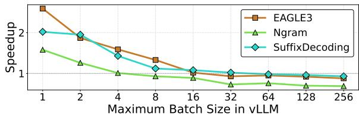  
Figure 1: Speedup in terms of Goodput (number of generated tokens divided by the execution time) (Liu et al., 2024) under various maximum batch size in vLLM for different speculative decoding algorithms on USACO dataset with Code Generation Agent implemented by Reflexion agentic workflow on Qwen-3-8B.

To understand the cause of this degradation, we model the per-step execution time saving $\Delta T ( b )$ of speculative decoding with batch size b as:

$$
\begin{array} { r l } & { \Delta T ( b ) = T _ { \mathrm { b a s e } } ( b ) - T _ { \mathrm { s p e c } } ( b ) } \\ & { ~ \approx D ( b ) ( 1 - \rho ( b ) ) t _ { A } - D ( b ) \big ( t _ { D } ( b ) + t _ { V } ( b ) \big ) } \\ & { ~ = D ( b ) \left[ ( 1 - \rho ( b ) ) t _ { A } - t _ { D } ( b ) - t _ { V } ( b ) \right] } \\ & { ~ \approx D ( b ) \left[ ( 1 - \rho ( b ) ) t _ { A } - t _ { V } ( b ) \right] } \end{array}
$$

where $D ( b )$ denotes the number of drafted tokens in the current step, $\rho ( b )$ is the rejection rate that is defined as the ratio of rejected tokens to proposed tokens for each request in the batch, $t _ { A }$ is the per-token time saved by accepting a draft token, and $t _ { D } ( b )$ and $t _ { V } ( b )$ are the per-token draft and verification costs.

Since $t _ { D } ( b )$ is small and can be ignored, this formulation highlights two key factors that impact the efficiency: the rejection rate $\rho ( b )$ and $D ( b ) \big ( t _ { A } - t _ { V } ( b ) \big )$ , which we call the utilization of the draft token budget. In general lower rejection rates and higher budget utilization bring in an ideal speculative decoding with larger speedups.

## 3.2 Bottleneck Analysis

Motivated by the analysis above, we next examine how existing methods behave with respect to the rejection rate and the token budget utilization.

Bottleneck of High Rejection Rate. We record the rejection rate, defined as the ratio of rejected tokens to proposed tokens for each request in the batch from vLLM logs during Code Generation Agent inference. Table 1 records the average rejection rate for different speculative decoding algorithms. As shown, existing speculative decoding methods suffer from extremely high rejection rates: EAGLE-3 exceeds 50%, while NGram exceeds 85% across most batch sizes. Such high rejection rates substantially limit the effective utilization of the draft token budget, directly contributing to the observed degradation in throughput speedup under largebatch settings for LLM agent inference.

Table 1: Average per-request rejection rate (↓), defined as number of rejected tokens divided by number of draft tokens, for different speculative decoding algorithms on Reflexion agentic workflow.
<table><tr><td>METRIC</td><td>EAGLE-3</td><td>NGram</td><td>SuffixDecoding</td><td>AgentSpec</td></tr><tr><td>Rejection Rate</td><td>53.3%</td><td>88.7%</td><td>65.9%</td><td>26.4% (↓ 50%)</td></tr></table>

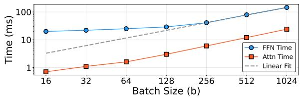  
Figure 2: Execution time comparison for FFN and Attention modules of Qwen-3-8B under various batch size.

Bottleneck of Token Budget Under-Utilization. We define the available token budget under batch size b as $M ( b ) = A I - b ,$ where AI denotes the arithmetic intensity of the deployed hardware for the LLM agent. This definition reflects the fact that, as the batch size increases, LLM inference—particularly the FFN layers—quickly becomes compute-bound and dominates end-to-end latency. As a result, the verification cost $t _ { V } ( b )$ increases and eventually approaches the per-token acceptance saving $t _ { A } ,$ , making the total execution time saving $\Delta T ( b )$ become:

$$
\begin{array} { c } { { \Delta T ( b ) \approx D ( b ) \left[ ( 1 - \rho ( b ) ) t _ { A } - t _ { V } ( b ) \right] } } \\ { { { } } } \\ { { = D ( b ) \left[ ( 1 - \rho ( b ) ) t _ { A } - t _ { A } \right] = - D ( b ) \rho ( b ) t _ { A } < 0 } } \end{array}
$$

To further illustrate this effect, we measure the perlayer decoding time of the FFN and attention modules of Qwen-3-8B using vLLM with FlashAttention-2 on an A100 GPU. The results are shown in Figure 2. When the batch size exceeds 256, which matches the arithmetic intensity of the A100, the FFN latency grows linearly with batch size and quickly dominates the total decoding time. In this regime, decoding becomes compute-bound by the FFN, and the per-token verification cost $t _ { V } ( b )$ approaches the per-token autoregressive decoding cost $t _ { A }$ . As a result, the time saved by accepting one draft token is almost entirely offset by the cost of verifying it, leaving speculative decoding with little or no performance gain. This observation justifies our definition of the available token budget $M ( b )$ , which captures the diminishing headroom for speculative tokens as batch size increases.

We next record the total number of draft tokens generated per decoding step under different batch sizes and compare it with the available token budget M(b). For a fair comparison, we also implement the budget allocation strategy from AdaSpec (Huang et al., 2026), which assigns draft tokens based on per-request acceptance rates. As shown in Figure 3, we have two key findings. (1) Existing speculative decoding methods severely under-utilize the available token budget, with the actual draft token count remaining far below or over M(b) across all batch sizes. (2) Existing allocation strategy fails to improve budget utilization, indicating that acceptance-rate–based budgeting is ineffective to improve the batch inference of speculative decoding for LLM agent.

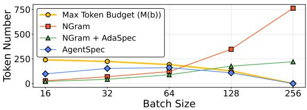  
Figure 3: Comparison between maximum token budget M(b) and average proposed token number for batch inference of speculative decoding on Reflexion workflow.

## 4 Method: AgentSpec

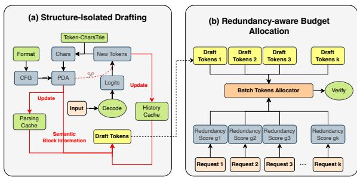  
Figure 4: Overview of AgentSpec.

The overview of AgentSpec is provided in Figure 4. At a high level, AgentSpec is a model-free speculative decoding algorithm designed for LLM agents. It requires the agent application to provide an agentic structure identifier alongside the input prompt to the LLM server, which enables the system to organize and retrieve historical context according to agent-specific execution structure. During speculative drafting, AgentSpec retrieves draft candidates only from historical segments that belong to the same semantic group, thereby avoiding speculation across structurally mismatched contexts. Before verification, AgentSpec computes an integrated redundancy value for each request in the batch by combining local draft information with global generation history. It then allocates speculative token budgets across requests according to their relative redundancy scores and adjusts the draft length of each request accordingly. In the following, we describe the two key components of AgentSpec —structure-isolated drafting and redundancy-aware budget allocation—in detail.

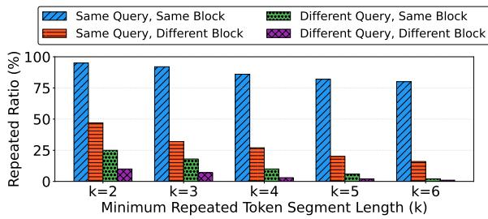  
Figure 5: Repeated token ratio under different minimum repeated span lengths k. The repeated ratio is defined as the total length of maximal repeated segments with at least k consecutive tokens appearing in historical generations, normalized by the total generation length. Repetitions are categorized by whether they occur under the same or different user queries and within the same or different semantic blocks.

## 4.1 Structure-Isolated Drafting

Motivation: A key distinction between LLM agent applications and standard LLM workloads is that a single user query often spans multiple requests associated with different semantic blocks (e.g., reasoning, tool execution, and result interpretation). While generation patterns are highly consistent within the same semantic block, transitions across blocks or queries introduce substantial semantic shifts.

To quantify this effect, we analyze generation trajectories of Qwen-3-8B on the USACO dataset using a Reflexion-based code generation agent. For each request, we measure repeated token segments that reappear in previously generated content, distinguishing repetitions within the same block from those across different blocks or queries. A repetition is counted only if it contains at least k consecutive tokens, with overlapping matches merged into their longest contiguous span. As shown in Figure 5, repeated token segments overwhelmingly occur within the same semantic block of a single query, whereas cross-block and cross-query repetitions are rare. This observation indicates that speculative drafting can be substantially improved by being aware of semantic block boundaries and query scope, thereby reducing unnecessary drafting and speculative rejections. In contrast, existing methods such as NGram and SuffixDecoding retrieve draft candidates from global generation history without such distinctions, leading to high rejection rates and wasted verification cost in agentic workloads.

Key Design: The pseudocode of structured-isolated draft of AgentSpec is provided in Algorithm 1. As shown, the algorithm requires the agent application to explicitly provide semantic structure identifier $S _ { i }$ together with each generation request $r _ { i }$ as below:

$$
S _ { i } = \{ a _ { i } , q _ { i } , B _ { i } \}
$$

where $a _ { i }$ denotes the agent application identifier, $q _ { i }$ denotes the user query index that triggers the current request, and $b _ { i }$ represents the list of n semantic blocks $\bar { B _ { i } } \bar { = } [ b _ { i } ^ { 1 } , b _ { i } ^ { 2 } , b _ { i } ^ { 3 } , \bar { . . . , b _ { i } ^ { n } } ]$ ], defined by pairs of start and end string tags identified from previous generation history.

Mapping string-level semantic blocks to token-level generation is challenging due to subword tokenization, where token boundaries do not align with string boundaries. Direct token–string conversion during decoding is prohibitively expensive in common serving engines such as vLLM and sglang, where tokenization and decoding are handled by separate components.

To address this, AgentSpec adopts a design similar to XGrammar (Dong et al., 2025) by maintaining a cached token-to-string mapping M, enabling efficient online conversion of generated tokens without invoking the tokenizer. Based on this mapping, AgentSpec maintains a lightweight string-based pushdown automaton (PDA) $P$ on the server, which is incrementally updated to track the current semantic block.

For each request $r _ { i } ,$ newly generated tokens are converted using M and fed into the corresponding PDA $P ( a _ { i } , q _ { i } )$ to identify the active semantic block $b _ { i } ^ { k }$ . AgentSpec maintains a separate structure-isolated cache for each semantic block and retrieves speculative drafts exclusively from the matched block, avoiding semantically irrelevant contexts and substantially reducing speculative rejections. As shown in Table 1, AgentSpec achieves a rejection rate as low as 26%, over $2 \times$ lower than existing baselines.

## 4.2 Redundancy-aware Budget Allocation

Motivation: The pseudocode of the redundancy-aware budget allocation is shown in Algorithm 2. To efficiently utilize the dynamic token budget in speculative decoding, more draft tokens should be assigned to requests with higher acceptance potential. Over-allocating tokens to low-acceptance requests wastes verification cost, while overly conservative allocation under-utilizes the available budget. The key challenge is thus to identify a reliable request-level signal that predicts draft acceptance. In agent workloads, requests exhibit varying degrees of redundancy in their generation history. Intuitively, drafts aligned with repeated historical patterns are more likely to be accepted. To validate this intuition, we analyze generation traces from Qwen-3-8B on Code Generation Agent and measure draft redundancy as the fraction of matched historical continuations that fully accept the draft. As shown in Figure 6, higher redundancy strongly correlates with higher acceptance rates, with the correlation strengthening as more matched continuations are observed.

Key Design: To estimate the acceptance likelihood of a speculative draft for each request, AgentSpec introduces a redundancy score g:

$$
g ( c , n ) = \frac { c } { n } \cdot p ( n ) , \ p ( n ) = g _ { \mathrm { m i n } } + ( 1 - g _ { \mathrm { m i n } } ) ( 1 - e ^ { 1 - n } ) ,\tag{1}
$$

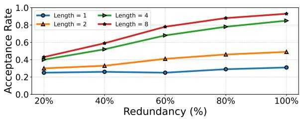  
Figure 6: Acceptance ratio $( 1 - \rho ( b )$ under different redundancy ratio with different matching pattern length.

where n is the number of candidate continuations retrieved from the generation history under the same semantic block and user query, and c is the number of continuations agreeing on the most frequent prefix. The ratio $c / n$ captures the consensus among candidates, while the saturation term $p ( n )$ downweights unreliable estimates when historical support is limited. The hyperparameter $g _ { \mathrm { m i n } }$ controls the minimum confidence under low-support scenarios.

Given the redundancy scores, AgentSpec computes the batch-level speculative token budget as

$$
B _ { t } = \left\lfloor { \frac { \alpha } { b z } } \right\rfloor ,\tag{2}
$$

where bz is the batch size and α controls the overall speculative budget. For each request $r _ { i } ,$ AgentSpec retrieves candidate drafts within the same semantic block and query, identifies the most frequent continuation prefix $C T _ { i } .$ , and computes its redundancy score $g _ { i }$ . The per-request draft length is then allocated as

$$
L _ { i } = \operatorname* { m a x } \Bigg ( | C T _ { i } | , B _ { t } \cdot \frac { g _ { i } } { \sum _ { j } g _ { j } } \Bigg ) ,\tag{3}
$$

prioritizing requests with higher redundancy while ensuring that each request can draft at least its most confident prefix.

As shown in Figure 3, AgentSpec consistently keeps the total number of drafted tokens below the maximum budget $M ( b )$ and approaches it as batch size increases, indicating effective utilization of the available speculative budget.

## 5 Experiments

## 5.1 Experimental Setups

Baselines. We compare AgentSpec against two groups of methods: (1) Draft-model-based speculative decoding methods: EAGLE-3 (Li et al., 2025) and MTP (Xia et al., 2025). (2) Draft-model-free speculative decoding methods: NGram (Saxena, 2023) and SuffixDecoding (Oliaro et al., 2025). All baselines are evaluated under identical serving configurations to ensure a fair comparison.

Models and Datasets. To demonstrate the generality of AgentSpec, we evaluate its performance on four models from different families, including Qwen-3- 8B (Yang et al., 2025), GPT-OSS-20B (OpenAI, 2025),

Table 2: Goodput (tokens/sec) of AgentSpec and baselines on four different agentic workloads with three different models. The best performance is marked in bold. The speedup is measured by comparing the goodput with the normal autoregressive decoding. The relative performance gain compared to the best-performing baseline is marked in green inside bracket.
<table><tr><td rowspan="2">MODEL</td><td rowspan="2">METHOD</td><td colspan="2">Deep Research Agent</td><td colspan="2">Code Generation Agent</td><td colspan="2">GAIA</td><td colspan="2">SWE-Bench</td></tr><tr><td>Tokens/s</td><td>Speedup</td><td>Tokens/s</td><td>Speedup</td><td>Tokens/s</td><td>Speedup</td><td>Tokens/s</td><td>Speedup</td></tr><tr><td rowspan="5">Own--8B</td><td>Normal</td><td>617.41</td><td>× 1.00</td><td>636.09</td><td>× 1.00</td><td>501.27</td><td>× 1.00</td><td>652.44</td><td>× 1.00</td></tr><tr><td>EAGLE-3</td><td>605.14</td><td>× 0.98</td><td>539.01</td><td>× 0.85</td><td>468.22</td><td>× 0.93</td><td>523.12</td><td>× 0.80</td></tr><tr><td>NGram</td><td>509.62</td><td>× 0.83</td><td>422.58</td><td>× 0.66</td><td>308.27</td><td>× 0.61</td><td>408.28</td><td>× 0.63</td></tr><tr><td>SuffixDecoding</td><td>598.74</td><td>× 0.97</td><td>579.21</td><td>× 0.91</td><td>498.16</td><td>× 0.99</td><td>556.64</td><td>× 0.85</td></tr><tr><td>AgentSpec</td><td>661.43 (↑ 9%)</td><td>× 1.07</td><td>828.10 (↑ 43%)</td><td>× 1.30</td><td>537.78 (↑ 8%)</td><td>× 1.07</td><td>854.69 (↑ 42%)</td><td>× 1.31</td></tr><tr><td rowspan="7">GPS-S-0B</td><td>Normal</td><td>201.43</td><td>× 1.00</td><td>289.26</td><td>× 1.00</td><td>247.67</td><td>× 1.00</td><td>351.22</td><td>× 1.00</td></tr><tr><td>EAGLE-3</td><td>125.71</td><td>× 0.62</td><td>161.34</td><td>× 0.56</td><td>112.16</td><td>× 0.45</td><td>198.81</td><td>× 0.57</td></tr><tr><td>NGram</td><td>158.91</td><td>× 0.79</td><td>175.19</td><td>× 0.61</td><td>109.22</td><td>× 0.44</td><td>253.36</td><td>× 0.72</td></tr><tr><td>SuffixDecoding</td><td>196.54</td><td>× 0.98</td><td>295.85</td><td>× 1.02</td><td>187.79</td><td>× 0.76</td><td>319.73</td><td>× 0.91</td></tr><tr><td>AgentSpec</td><td>297.54 (↑ 51%)</td><td>× 1.48</td><td>584.43 (↑ 104%)</td><td>× 2.02</td><td>295.76 (↑ 57%)</td><td>× 1.19</td><td>595.20 (↑ 86%)</td><td>× 1.69</td></tr><tr><td>Normal</td><td>987.66</td><td>× 1.00</td><td>1230.28</td><td>× 1.00</td><td>823.39</td><td>× 1.00</td><td>1432.27</td><td>× 1.00</td></tr><tr><td>EAGLE-3</td><td>965.43</td><td>× 0.98</td><td>1119.29</td><td>× 0.91</td><td>864.43</td><td>× 1.05</td><td>1098.82</td><td></td></tr><tr><td>DSi----8B</td><td>NGram</td><td>752.66</td><td>× 0.76</td><td>797.18</td><td>× 0.65</td><td>725.29</td><td>× 0.88</td><td>1014.47</td><td>× 0.77 × 0.71</td></tr><tr><td></td><td>SuffixDecoding</td><td>995.14</td><td>× 1.01</td><td>1041.29</td><td>× 0.85</td><td>820.09</td><td>× 1.00</td><td>1498.69</td><td>× 1.05</td></tr><tr><td></td><td>AgentSpec</td><td>1294.65 (↑ 30%)</td><td>× 1.31</td><td>1671.34 (↑ 49%)</td><td>× 1.36</td><td>924.47 (↑ 7%)</td><td>× 1.12</td><td>2281.87 (↑ 52%)</td><td>× 1.59</td></tr></table>

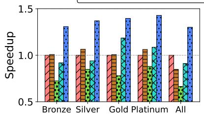  
(a) Qwen-3-8B

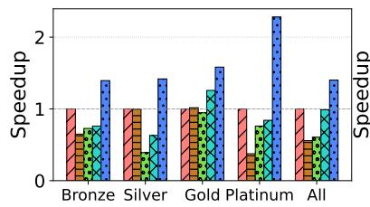  
(b) GPT-OSS-20B

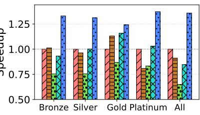  
(c) DSK-8B  
Figure 7: Speedup in terms of Goodput (token/s) for AgentSpec and baselines compared with normal autoregressive decoding on all subsets in USACO dataset with Code Generation Agent implemented by Reflexion agentic workflow on three different models.

Deepseek-R1-Distill-Llama-8B (DeepSeek-AI, 2025), and MiMo-7B (Xia et al., 2025). We evaluate on four most popular agentic workloads covering two main types. The first is workflow-based agent workload, including Code Generation that is implemented with Reflexion framework (Shinn et al., 2023) and tested on USACO benchmark (Shi et al., 2024) with multiple difficulty subsets (Bronze, Silver, Gold, and Platinum), and Deep Research that is implemented with LangChain DeepResearch framework (Team, 2026) and tested on DeepResearch-Bench benchmark (Du et al., 2025) with three different levels of tasks that require long-horizon reasoning and document synthesis. The second is model-based agentic workloads, including SWE-Bench-Lite (Jimenez et al., 2024) and GAIA (Mialon et al., 2024) on OpenHands platform (Wang et al., 2025). Finally, we evaluate AgentSpec on Spec-Bench (Xia et al., 2024) to test its performance enhancement on non-agentic data.

Metrics. Following the standards of Turbospec (Liu et al., 2024), we use goodput, defined as the total number of generated tokens divided by the execution time of the entire agent workload, as the main metric to evaluate the goodput of AgentSpec and its baseline methods.

We also report speedup in terms of goodput for a clearer comparison, as well as latency (Luo et al., 2025), which is defined as the end-to-end execution time from when a user query enters the agent environment to when the final response is returned.

Implementation Details. To ensure a fair and realistic comparison, we implemented AgentSpec and evaluate its performance with baseline methods in vLLM (Kwon et al., 2023), a production-style LLM serving engine. All other baseline methods are also evaluated with the official implementation provided in vLLM under maximum batch size 256. The detailed configurations in vLLM for running the evaluation is provided in Section A.1.

## 5.2 End-to-End Comparison

We first compare the end-to-end efficiency of AgentSpec against existing baseline methods on two agent applications—Deep Research Agent and Code Generation Agent—as well as two agent benchmarks, GAIA and SWE-Bench, across three different LLMs: Qwen-3-8B, GPT-OSS-20B, and DeepSeek-Distill-LLaMA-8B. The results are shown in Table 2. AgentSpec consistently outperforms all baseline speculative decoding methods in terms of efficiency, achieving up to 104% higher goodput. Notably, the goodput of most baseline methods is even lower than that of standard autoregressive decoding, indicating limited benefits in agent workloads. In contrast, AgentSpec consistently delivers improved goodput across all agent workloads and model settings, attaining up to a 2.02× speedup over autoregressive decoding.

## 5.3 Comparison with Different Execution Patterns

Even within the same agent workload, problem difficulty can lead to distinct agent execution patterns. A common phenomenon is that more challenging problems induce longer contexts and a larger number of generation steps, as the agent needs to issue more LLM requests to complete the task. To demonstrate the generality of AgentSpec, we evaluate its efficiency using the Code Generation Agent across all subsets of the US-ACO dataset, with difficulty levels ranging from Bronze to Platinum. As shown in Figure 7, AgentSpec consistently achieves better speedup than other speculative decoding methods across all difficulty subsets and LLMs. More importantly, AgentSpec also consistently outperforms standard autoregressive decoding, achieving up to a 2.2× speedup on the USACO subsets.

## 5.4 Comparison on Non-Agentic Benchmark

Following the experimental protocol of (Oliaro et al., 2025), we conduct the evaluation on a non-agentic benchmark Spec-Bench (Xia et al., 2024) using Qwen-3-8B. Unlike agentic workloads, which often involve multi-turn requests for a single query and contain explicit semantic structures, Spec-Bench contains fewer repeated historical generations, making it more challenging to utilize history information for drafting. However, as shown in Table 4, AgentSpec still consistently achieves higher efficiency than both speculative decoding baselines and standard autoregressive decoding across all subsets as well as the full Spec-Bench benchmark.

## 5.5 Comparison with Multi-Token Prediction

Multi-Token Prediction (MTP) is a recent speculative decoding paradigm that jointly trains an MTP module as the draft model during the pre-training stage of the target model. To further demonstrate the effectiveness of AgentSpec, we compare its efficiency with MTP speculative decoding method using MiMo-7B on the Code Generation Agent over the USACO dataset. As shown in Table 3, MTP exhibits limited efficiency gains under batched LLM agent inference. In contrast, AgentSpec consistently achieves higher efficiency than MTP and maintains a clear speedup over standard autoregressive decoding on MiMo-7B.

## 5.6 Latency Analysis

Tailed Latency. We further analyze the end-to-end program latency, defined as the time elapsed from when a user query is submitted to the agent application to when the final output is returned. The CDF of the tail latency is shown in Figure 8. AgentSpec consistently achieves lower latency than baseline speculative decoding methods, and reduces tail latency by up to 1.47× and 1.39× compared to standard autoregressive decoding at the P90 and P99 percentiles, respectively.

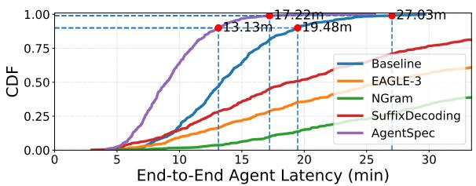  
Figure 8: Tailed latency analysis for AgentSpec and baselines on Code Gen agentic workflow.

Execution Breakdown Analysis. We have performed fine-grained analysis including both drafting and verification costs on Reflexion Agentic Workflow. The results in Table 5 show that AgentSpec significantly reduces verification overhead compared to baselines, which is the dominant factor in overall speedup. AgentSpec incurs slightly higher drafting overhead than NGram and SuffixDecoding. This additional cost mainly stems from maintaining the PDA in the structure-isolated drafting component and computing redundancy statistics in the redundancy-aware budget allocation module. Nevertheless, the overhead remains negligible, amounting to less than 2 ms, and the overall drafting cost of AgentSpec is still lower than all baseline methods.

## 5.7 Ablation Studies

Modular Sensitivity Study. We evaluate the separate contributions of the two key components (i.e., structure-isolated drafting and redundancy-aware budget allocation) of AgentSpec. Let AgentSpec (S) denote the version of AgentSpec with structureisolated drafting only; AgentSpec (R) denote the version of AgentSpec with SuffixDecoding and redundancy-aware budget allocation. As shown in Table 6, we have three observations. (1) AgentSpec (S), AgentSpec (R) and AgentSpec consistently outperform existing speculative decoding methods. (2) AgentSpec consistently outperforms both AgentSpec (S) and AgentSpec (R). This result demonstrates the unique contribution from each of the two key components and the importance of combining both components to achieve the best performance. (3) Comparing between AgentSpec (S) and AgentSpec (R), AgentSpec (S) achieves a higher speedup compared to AgentSpec (R), indicating that structure-isolated drafting plays a more significant role than redundancy-aware budget allocation. Performance without Explicit Semantic Structures. Since the structure-isolated drafting component of AgentSpec requires the agent application to provide explicit semantic block boundaries, some real-world agentic workloads may not expose such structure during generation. To assess the generality of AgentSpec, we have evaluated a variant that operates without semantic structure inputs, denoted as AgentSpec (N). As shown in Table 6, AgentSpec (N) consistently outperforms both speculative decoding baselines and standard autoregressive decoding.

Table 3: Goodput (tokens/sec) of AgentSpec and baselines, including MTP, on MiMo-7B. The best performance is marked in bold. The speedup is measured by comparing the goodput with the normal autoregressive decoding. The relative performance gain compared to the best-performing baseline is marked in green inside bracket.
<table><tr><td rowspan="2">MODEL |</td><td rowspan="2">METHOD</td><td colspan="2">Code Gen.(Bronze)</td><td colspan="2">Code Gen.(Silver)</td><td colspan="2">Code Gen.(Gold)</td><td colspan="2">Code Gen.(Platinum)</td><td colspan="2">Code Gen.(All)</td></tr><tr><td>Tokens/s</td><td>Speedup</td><td>Tokens/s</td><td>Speedup</td><td>Tokens/s</td><td>Speedup</td><td>Tokens/s</td><td>Speedup</td><td>Tokens/s</td><td>Speedup</td></tr><tr><td rowspan="5">MiM-7B</td><td>Normal</td><td>2768.67</td><td>× 1.00</td><td>3093.50</td><td>× 1.00</td><td>2532.30</td><td>× 1.00</td><td>1141.64</td><td>× 1.00</td><td>2572.16</td><td>× 1.00</td></tr><tr><td>NGram</td><td>1322.92</td><td>× 0.48</td><td>1399.76</td><td>× 0.45</td><td>1383.92</td><td>× 0.55</td><td>990.87</td><td>× 0.87</td><td>1306.92</td><td>× 0.51</td></tr><tr><td>SuffixDecoding</td><td>1609.41</td><td>× 0.58</td><td>1624.98</td><td>× 0.53</td><td>1599.63</td><td>× 0.63</td><td>1235.12</td><td>× 1.08</td><td>1653.26</td><td>× 0.64</td></tr><tr><td>MTP</td><td>1924.46</td><td>× 0.70</td><td>2001.28</td><td>× 0.65</td><td>2034.30</td><td>× 0.80</td><td>1349.10</td><td>× 1.18</td><td>1875.18</td><td>× 0.73</td></tr><tr><td>AgentSpec</td><td>3324.71 (↑ 73%)</td><td>× 1.20</td><td>3751.44 (↑ 87%)</td><td>× 1.21</td><td>2925.40 (↑ 44%)</td><td>× 1.16</td><td>1527.14 (↑ 13%)</td><td>× 1.34</td><td>3318.99 (↑ 77%)</td><td>× 1.29</td></tr></table>

Table 4: Goodput (tokens/sec) of AgentSpec and baselines on Spec-Bench on Qwen-3-8B. The best performance is marked in bold. The speedup is measured by comparing the goodput with the normal autoregressive decoding.
<table><tr><td rowspan="2">MODEL |</td><td rowspan="2">METHOD</td><td colspan="2">MT Conversation</td><td colspan="2">Question Answering</td><td colspan="2">Summarization</td><td colspan="2">Translation</td><td colspan="2">Math Reasoning</td><td colspan="2">Retrieval Augmented</td><td colspan="2">All</td></tr><tr><td>|Tokens/s</td><td>Speedup</td><td>Tokens/s</td><td>Speedup</td><td>Tokens/s</td><td>Speedup</td><td>Tokens/s</td><td>Speedup</td><td>Tokens/s</td><td>Speedup</td><td>Tokens/s</td><td>Speedup</td><td>Tokens/s</td><td>Speedup</td></tr><tr><td rowspan="6">Owe-8B</td><td>Normal</td><td>939.50</td><td>×1.00</td><td>860.97</td><td>×1.00</td><td>1277.50</td><td>×1.00</td><td>2013.02</td><td>×1.00</td><td>1064.78</td><td>×1.00</td><td>191.60</td><td>×1.00</td><td>697.42</td><td>×1.00</td></tr><tr><td>EAGLE-3</td><td>1005.63</td><td>×1.07</td><td>895.25</td><td>×1.04</td><td>1552.62</td><td>×1.22</td><td>2319.01</td><td>×1.15</td><td>1045.28</td><td>×0.98</td><td>168.21</td><td>×0.88</td><td>783.25</td><td>×1.12</td></tr><tr><td>NGram</td><td>581.26</td><td>×0.62</td><td>351.28</td><td>×0.41</td><td>1082.57</td><td>×0.85</td><td>2166.37</td><td>×1.08</td><td>959.38</td><td>×0.90</td><td>263.11</td><td>×1.37</td><td>545.39</td><td>×0.78</td></tr><tr><td>SuffixDecoding</td><td>1007.08</td><td>×1.07</td><td>873.12</td><td>×1.01</td><td>1213.63</td><td>×0.95</td><td>2141.79</td><td>×1.06</td><td>1121.48</td><td>×1.05</td><td>212.19</td><td>×1.10</td><td>712.79</td><td>×1.02</td></tr><tr><td>AgentSpec</td><td>1128.09</td><td>× 1.20</td><td>929.85</td><td>× 1.08</td><td>1481.90</td><td>× 1.16</td><td>2294.12</td><td>× 1.14</td><td>1075.43</td><td>× 1.01</td><td>267.14</td><td>× 1.40</td><td>796.01</td><td>× 1.14</td></tr></table>

Table 5: Execution breakdown of AgentSpec and baselines on Code Gen agentic Workload. The best performance is marked in bold.
<table><tr><td>TIME (MINUTES)</td><td>EAGLE-3</td><td>NGram</td><td>SuffixDecoding</td><td>AgentSpec</td></tr><tr><td>Draft</td><td>一 5.72</td><td>0.68</td><td>1.41</td><td>1.74</td></tr><tr><td>Verification 一</td><td>34.24</td><td>39.82</td><td>33.12</td><td>26.11 (↓ 21%)</td></tr><tr><td>Overall</td><td>39.96</td><td>40.50</td><td>34.53</td><td>27.85 (↓ 19%)</td></tr></table>

Table 6: Goodput of variants of AgentSpec and baselines on Deep Research Agent and Code Generation Agent workloads. The best performance is marked in bold. The speedup is measured by comparing the goodput with the normal autoregressive decoding.
<table><tr><td rowspan="2">MODEL</td><td rowspan="2">METHOD</td><td colspan="2">Deep Research Agent</td><td colspan="2">Code Generation Agent</td></tr><tr><td>Tokens/s</td><td>Speedup</td><td>Tokens/s</td><td>Speedup</td></tr><tr><td rowspan="6">OWW--8B</td><td>Normal</td><td>617.41</td><td>× 1.00</td><td>636.09</td><td>× 1.00</td></tr><tr><td>EAGLE-3</td><td>605.14</td><td>× 0.98</td><td>539.01</td><td>× 0.85</td></tr><tr><td>NGram</td><td>509.62</td><td>× 0.83</td><td>422.58</td><td>× 0.66</td></tr><tr><td>SuffixDecoding</td><td>598.74</td><td>× 0.97</td><td>579.21</td><td>× 0.91</td></tr><tr><td>AGENTSPEC (S)</td><td>647.12 (↑ 9%)</td><td>× 1.05</td><td>795.54 (↑ 37%)</td><td>× 1.25</td></tr><tr><td>AGENTSPEC (R)</td><td>623.33 (↑ 3%)</td><td>× 1.01</td><td>702.28 (↑ 21%)</td><td>× 1.10</td></tr><tr><td>AGENTSPEC (N)</td><td>661.08 (↑ 10%)</td><td>× 1.07</td><td>809.12 (↑ 40%)</td><td>× 1.27</td></tr><tr><td>AGENTSPEC</td><td></td><td>661.43 (↑ 10%)</td><td>× 1.07</td><td>828.10 (↑ 43%) × 1.30</td></tr></table>

Performance Under Various Maximum Batch Size. We next evaluate the performance of AgentSpec under different maximum batch size configurations in the vLLM engine. As shown in Figure 9(a), while some existing speculative decoding methods (e.g., SuffixDecoding) achieve higher efficiency than standard autoregressive decoding at small batch sizes, their speedup gradually degrades and can even fall below autoregressive decoding as the maximum batch size increases. In contrast, AgentSpec consistently maintains superior efficiency across all batch size configurations, outperforming both speculative decoding baselines and standard autoregressive decoding.

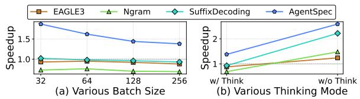  
Figure 9: Speedup in terms of Goodput (tokens/sec) of AgentSpec and baselines on workload of code generation agent under various maximum batch size and different thinking modes.

Performance in Different Thinking Modes. Recent reasoning-oriented LLMs allow users to adjust thinking modes, which can substantially affect both the generated content and output length in agent applications. To study this effect, we evaluate AgentSpec on Qwen-3-8B under two thinking modes: w/ think and w/o think (Yang et al., 2025). As shown in Figure 9(b), AgentSpec consistently achieves superior performance across both modes. Notably, under the w/o think setting, AgentSpec is over 2.5× faster than standard autoregressive decoding.

## 6 Conclusion

In this paper, we presented AgentSpec, a speculative decoding algorithm tailored for batch inference of LLM agents. AgentSpec introduces structureisolated drafting to constrain speculation to semantically coherent segments of the agent workflow, achieving extremely low rejection rates. It also proposes redundancyaware budget allocation to better exploit dynamically available token budgets using agent-level redundancy.

Our experimental results demonstrate the superiority of AgentSpec over state-of-the-art baselines.

## Limitation

AgentSpec introduces a lightweight interface between the agent and serving system, which may require minor adaptation in practice. In addition, its structureisolated drafting component benefits from explicit semantic block information. Although AgentSpec can operate without such metadata, its speedup may depend on the amount of repeated generation patterns available in the workload.

## Ethical Considerations

AgentSpec is a serving-time acceleration method for LLM-based agents. It does not modify model parameters, training data, or the generation objective, and therefore is not intended to change the output distribution or content policy of the underlying model. Existing safety mechanisms for autoregressive decoding, such as content moderation, tool-use control, and deployment restrictions, should remain applicable when AgentSpec is enabled. Improving inference efficiency may reduce the cost of deploying LLM agents at scale, which can benefit practical applications but may also lower the barrier for misuse, such as automated spam generation or unsafe tool-use workflows. We therefore encourage responsible deployment with appropriate safeguards, including rate limiting, permission control, and monitoring. AgentSpec requires only lightweight semantic structure metadata from the agent application; such metadata should describe workflow structure rather than private or sensitive user information. Our experiments use publicly available benchmarks and do not require collecting additional private user data.

## References

[1] DeepSeek-AI. 2024. Deepseek-v3 technical report. CoRR, abs/2412.19437.

[2] DeepSeek-AI. 2025. Deepseek-r1: Incentivizing reasoning capability in llms via reinforcement learning. CoRR, abs/2501.12948.

[3] Yixin Dong, Charlie F. Ruan, Yaxing Cai, Ziyi Xu, Yilong Zhao, Ruihang Lai, and Tianqi Chen. 2025. Xgrammar: Flexible and efficient structured generation engine for large language models. In MLSys. OpenReview.net/mlsys.org.

[4] Mingxuan Du, Benfeng Xu, Chiwei Zhu, Xiaorui Wang, and Zhendong Mao. 2025. Deepresearch bench: A comprehensive benchmark for deep research agents. CoRR, abs/2506.11763.

[5] Kaiyu Huang, Hao Wu, Zhubo Shi, Han Zou, Minchen Yu, and Qingjiang Shi. 2026. Adaspec: Adaptive speculative decoding for fast, slo-aware large language model serving. In Proceedings of the

2025 ACM Symposium on Cloud Computing, SoCC ’25, page 361–374, New York, NY, USA. Association for Computing Machinery.

[6] Carlos E. Jimenez, John Yang, Alexander Wettig, Shunyu Yao, Kexin Pei, Ofir Press, and Karthik R. Narasimhan. 2024. Swe-bench: Can language models resolve real-world github issues? In ICLR. Open-Review.net.

[7] Woosuk Kwon, Zhuohan Li, Siyuan Zhuang, Ying Sheng, Lianmin Zheng, Cody Hao Yu, Joseph Gonzalez, Hao Zhang, and Ion Stoica. 2023. Efficient memory management for large language model serving with pagedattention. In SOSP, pages 611–626. ACM.

[8] Xinzhe Li. 2025. A review of prominent paradigms for llm-based agents: Tool use, planning (including rag), and feedback learning. In COLING, pages 9760– 9779. Association for Computational Linguistics.

[9] Yuhui Li, Fangyun Wei, Chao Zhang, and Hongyang Zhang. 2025. EAGLE-3: scaling up inference acceleration of large language models via training-time test. CoRR, abs/2503.01840.

[10] Xiaoxuan Liu, Cade Daniel, Langxiang Hu, Woosuk Kwon, Zhuohan Li, Xiangxi Mo, Alvin Cheung, Zhijie Deng, Ion Stoica, and Hao Zhang. 2024. Optimizing speculative decoding for serving large language models using goodput. arXiv preprint arXiv:2406.14066.

[11] Junyu Luo, Weizhi Zhang, Ye Yuan, Yusheng Zhao, Junwei Yang, Yiyang Gu, Bohan Wu, Binqi Chen, Ziyue Qiao, Qingqing Long, Rongcheng Tu, Xiao Luo, Wei Ju, Zhiping Xiao, Yifan Wang, Meng Xiao, Chenwu Liu, Jingyang Yuan, Shichang Zhang, and 7 others. 2025. Large language model agent: A survey on methodology, applications and challenges. CoRR, abs/2503.21460.

[12] Michael Luo, Xiaoxiang Shi, Colin Cai, Tianjun Zhang, Justin Wong, Yichuan Wang, Chi Wang, Yanping Huang, Zhifeng Chen, Joseph E. Gonzalez, and Ion Stoica. 2025. Autellix: An efficient serving engine for LLM agents as general programs. CoRR, abs/2502.13965.

[13] Grégoire Mialon, Clémentine Fourrier, Thomas Wolf, Yann LeCun, and Thomas Scialom. 2024. GAIA: a benchmark for general AI assistants. In ICLR. OpenReview.net.

[14] Xupeng Miao, Gabriele Oliaro, Zhihao Zhang, Xinhao Cheng, Zeyu Wang, Rae Ying Yee Wong, Zhuoming Chen, Daiyaan Arfeen, Reyna Abhyankar, and Zhihao Jia. 2023. Specinfer: Accelerating generative LLM serving with speculative inference and token tree verification. CoRR, abs/2305.09781.

[15] Sanjit Neelam, Daniel Heinlein, Vaclav Cvicek, Akshay Mishra, and Reiner Pope. 2025. Spire: Boosting LLM inference throughput with speculative decoding. CoRR, abs/2504.06419.

[16] Gabriele Oliaro, Zhihao Jia, Daniel Campos, and Aurick Qiao. 2025. Suffixdecoding: Extreme speculative decoding for emerging ai applications. In The Thirty-ninth Annual Conference on Neural Information Processing Systems.

[17] OpenAI. 2025. gpt-oss-120b & gpt-oss-20b model card. CoRR, abs/2508.10925.

[18] Ranajoy Sadhukhan, Jian Chen, Zhuoming Chen, Vashisth Tiwari, Ruihang Lai, Jinyuan Shi, Ian En-Hsu Yen, Avner May, Tianqi Chen, and Beidi Chen. 2025. Magicdec: Breaking the latency-throughput tradeoff for long context generation with speculative decoding. In ICLR. OpenReview.net.

[19] Apoorv Saxena. 2023. Prompt lookup decoding.

[20] Quan Shi, Michael Tang, Karthik Narasimhan, and Shunyu Yao. 2024. Can language models solve olympiad programming? CoRR, abs/2404.10952.

[21] Noah Shinn, Federico Cassano, Ashwin Gopinath, Karthik Narasimhan, and Shunyu Yao. 2023. Reflexion: language agents with verbal reinforcement learning. In NeurIPS.

[22] Langchain Team. 2026. Langchain open deep research.

[23] Nikhil Verma and Manasa Bharadwaj. 2025. LEAP & LEAN: Look-ahead planning and agile navigation for LLM agents. In Proceedings ofthe 63rd Annual Meeting of the Association for Computational Linguistics (Volume 6: Industry Track), pages 896–933, Vienna, Austria. Association for Computational Linguistics.

[24] Zhongwei Wan, Xin Wang, Che Liu, Samiul Alam, Yu Zheng, Jiachen Liu, Zhongnan Qu, Shen Yan, Yi Zhu, Quanlu Zhang, Mosharaf Chowdhury, and Mi Zhang. 2024. Efficient large language models: A survey. Trans. Mach. Learn. Res., 2024.

[25] Ningning Wang, Xavier Hu, Pai Liu, He Zhu, Yue Hou, Heyuan Huang, Shengyu Zhang, Jian Yang, Jiaheng Liu, Ge Zhang, Changwang Zhang, Jun Wang, Yuchen Eleanor Jiang, and Wangchunshu Zhou. 2025. Efficient agents: Building effective agents while reducing cost. CoRR, abs/2508.02694.

[26] Xin Wang, Zhongwei Wan, Arvin Hekmati, Mingyu Zong, Samiul Alam, Mi Zhang, and Bhaskar Krishnamachari. 2024. Iot in the era of generative ai: Vision and challenges. arXiv preprint arXiv:2401.01923.

[27] Xingyao Wang, Boxuan Li, Yufan Song, Frank F. Xu, Xiangru Tang, Mingchen Zhuge, Jiayi Pan, Yueqi Song, Bowen Li, Jaskirat Singh, Hoang H. Tran, Fuqiang Li, Ren Ma, Mingzhang Zheng, Bill Qian, Yanjun Shao, Niklas Muennighoff, Yizhe Zhang, Binyuan Hui, and 2 others. 2025. Openhands: An open platform for AI software developers as generalist agents. In ICLR. OpenReview.net.

[28] Zhaoxuan Wu, Zijian Zhou, Arun Verma, Alok Prakash, Daniela Rus, and Bryan Kian Hsiang Low.

2025. TETRIS: optimal draft token selection for batch speculative decoding. In ACL (1), pages 33329– 33345. Association for Computational Linguistics.

[29] Bingquan Xia, Bowen Shen, Cici, Dawei Zhu, Di Zhang, Gang Wang, Hailin Zhang, Huaqiu Liu, Jiebao Xiao, Jinhao Dong, Liang Zhao, Peidian Li, Peng Wang, Shihua Yu, Shimao Chen, Weikun Wang, Wenhan Ma, Xiangwei Deng, Yi Huang, and 44 others. 2025. Mimo: Unlocking the reasoning potential of language model - from pretraining to posttraining. CoRR, abs/2505.07608.

[30] Heming Xia, Zhe Yang, Qingxiu Dong, Peiyi Wang, Yongqi Li, Tao Ge, Tianyu Liu, Wenjie Li, and Zhifang Sui. 2024. Unlocking efficiency in large language model inference: A comprehensive survey of speculative decoding. In ACL (Findings), pages 7655– 7671. Association for Computational Linguistics.

[31] An Yang, Anfeng Li, Baosong Yang, Beichen Zhang, Binyuan Hui, Bo Zheng, Bowen Yu, Chang Gao, Chengen Huang, Chenxu Lv, Chujie Zheng, Dayiheng Liu, Fan Zhou, Fei Huang, Feng Hu, Hao Ge, Haoran Wei, Huan Lin, Jialong Tang, and 40 others. 2025. Qwen3 technical report. CoRR, abs/2505.09388.

[32] Shunyu Yao, Jeffrey Zhao, Dian Yu, Nan Du, Izhak Shafran, Karthik R. Narasimhan, and Yuan Cao. 2023. React: Synergizing reasoning and acting in language models. In ICLR. OpenReview.net.

[33] Qizheng Zhang, Michael Wornow, and Kunle Olukotun. 2025. Agentic plan caching: Test-time memory for fast and cost-efficient LLM agents. In The Thirty-ninth Annual Conference on Neural Information Processing Systems.

[34] Lianmin Zheng, Liangsheng Yin, Zhiqiang Xie, Chuyue Sun, Jeff Huang, Cody Hao Yu, Shiyi Cao, Christos Kozyrakis, Ion Stoica, Joseph E. Gonzalez, Clark W. Barrett, and Ying Sheng. 2024. Sglang: Efficient execution of structured language model programs. In NeurIPS.

## A Appendix.

## A.1 Experiment Configuration Details

We implement AgentSpec and conduct all experiments using the vLLM v0.12.0 V1 engine. For a fair comparison, we directly run the official implementations of all baseline methods with their default configurations provided by vLLM. We run each experiment on NVIDIA A100 80G GPUs with fix the maximum batch size and serving parameters for all methods. Unless otherwise specified, all goodput and speedup numbers are averaged over five times measurements controlled with various seed numbers and under the default maximum batch size 256 in vLLM.

Specifically, for NGram, we set num-speculative -tokens to 5 and ngram-prompt-lookup-max to 4; for SuffixDecoding, we set num-speculativetokens = 32.

We use FlashAttention-2 as the attention backend and adopt the default maximum batch size in vLLM (256). For MTP, we directly use the official MTP module provided by MiMo-7B-RL during inference.

For AgentSpec, the speculation length dynamically adapts to the ongoing batch size and therefore does not require any speculation-length hyperparameters at launch time. Instead, AgentSpec requires the agent application to provide high-level contextual information, including the agent’s semantic structure and the query index of the current request.

Concretely, we extend the vLLM engine with three additional parameters—structure: string, query-id: int, and agent-id: int—which can be passed by the agent application at inference time. The structure field encodes the paired delimiters of semantic blocks (e.g., code blocks, tool calls, and mathematical expressions) used by AgentSpec for redundancy-aware speculation. An example API request is shown in Listing 1.

Listing 1: Example of API request command when using AgentSpec in vLLM

```python
resp = await client.chat.completions.
create(
model="Qwen/Qwen3-8B",
messages=[
{"role": "system", "content": II
Respond in Korean."},
{"role": "user", "content": f"
Say hi. (req {i})"},
],
temperature=0.6,
extra_body={
"query_id": 1,
"agent_id": 1,
# Code Structure and Math
Structure
"structure": "[
[("‘‘‘python", "‘‘‘"), ("<
tool_call>", "<\tool_call>")
],
[("\[", "\]"), ("\(", "\)"), ("
$$", "$$"), ("$", "$")]
```

]",  
)

Table 7: Speedup of AgentSpec on different GPU platforms on GPT-OSS-20B across agent workloads.
<table><tr><td>Speedup</td><td>CodeGen</td><td>DeepResearch</td><td>SWE-Bench</td><td>GAIA</td></tr><tr><td>1×A100 80G</td><td>2.02×</td><td>1.48×</td><td>1.69×</td><td>1.19×</td></tr><tr><td>1×H100 80G</td><td>2.28×</td><td>1.67×</td><td>1.92×</td><td>1.54×</td></tr></table>

## A.2 Algorithm Pseudocode

Algorithm 1 shows the pseudocode of the first component of AgentSpec, Structure-Isolated Drafting. Algorithm 2 shows the pseudocode of the second component of AgentSpec, Redundancy-Aware Budget Allocation.

```latex
Algorithm 1 Structure-Isolated Drafting
1: Input: generation request $r _ { i } = \{ a _ { i } , q _ { i } , B _ { i } \}$ , history
cache H, token-to-string map M
2: Output: draft token candidates $C T _ { i }$
3: Initialize PDA $P ( a _ { i } , q _ { i } )$ for request $r _ { i }$
4: CT ← ∅
5: for each newly generated token t in request $r _ { i }$ do
6: Convert t to string using cached map M
7: Feed converted string incrementally into
$P ( a _ { i } , q _ { i } )$
8: Determine current semantic block $b _ { i } ^ { k }$ using PDA
state
9: end for
10: Retrieve structure-isolated cache $\mathcal { H } ( a _ { i } , q _ { i } , b _ { i } ^ { k } )$
11: if $\mathcal { H } ( a _ { i } , q _ { i } , b _ { i } ^ { k } )$ is empty then
12: return $\varnothing$
13: end if
14: for each historical continuation $h \in \mathcal { H } ( a _ { i } , q _ { i } , b _ { i } ^ { k } )$
do
15: Extract candidate draft continuation c from h
16: $C T _ { i } \gets C T _ { i } \cup \{ c \}$
17: end for
18: return $C T _ { i }$
```

## A.3 Comparison On Various GPU Architectures

We evaluated AgentSpec on H100 GPU using GPT-OSS-20B. The results in Table 7 show that AgentSpec achieves even higher speedups compared to A100, indicating that our conclusions generalize across hardware generations. From a system perspective, our analysis depends primarily on two factors—rejection rate and token budget utilization—which are also not specific to a particular GPU architecture or serving engine.

## A.4 Theoretical Complexity analysis

We then provide the time and space complexity analysis of AgentSpec and other baseline methods as follows.

Algorithm 2 Redundancy-Aware Budget Allocation   
1: Input: batch of requests $\{ r _ { i } \} _ { i = 1 } ^ { b z }$ , draft candidate   
sets $\{ C T _ { i } \}$ , hyperparameter $\alpha ,$ g<sub>min</sub>   
2: Output: per-request draft length $\{ L _ { i } \}$   
3: Compute total speculative budget $B _ { t } \gets \lfloor \alpha / b z \rfloor$   
4: for each request $r _ { i }$ in batch do   
5: $n _ { i } \gets | C T _ { i } |$ {number of candidate continuations}   
6: if $n _ { i } = 0$ then   
7: $g _ { i } \gets 0$   
8: continue   
9: end if   
10: Identify most frequent continuation prefix $C T _ { i } ^ { * }$   
11: $c _ { i } \gets$ number of continuations agreeing on $C T _ { i } ^ { * }$   
12: $p ( n _ { i } )  g _ { \mathrm { m i n } } + ( 1 - g _ { \mathrm { m i n } } ) ( 1 - e ^ { - n _ { i } } )$   
13: $\begin{array} { r } { g _ { i }  \frac { c _ { i } } { n _ { i } } \cdot p ( n _ { i } ) } \end{array}$   
14: end for   
15: $G  \textstyle \sum _ { i } g _ { i }$   
16: for each request $r _ { i }$ in batch do   
17: $\begin{array} { r } { L _ { i }  \operatorname* { m a x } ( | C T _ { i } ^ { * } | , B _ { t } \cdot \frac { g _ { i } } { G } ) } \end{array}$   
18: end for   
19: return $\{ L _ { i } \}$

Regarding time complexity, for NGram/SuffixDecoding, drafting consists of constant-time lookup followed by candidate extension, with overall cost $O ( K \cdot L )$ where $L$ is the draft length. AgentSpec preserves the same dominant cost. The additional components are lightweight: (a) PDA update: $O ( 1 )$ amortized per token, and (b) semantic filtering + redundancy scoring: $O ( K )$ per step. Thus, $T = O ( K \cdot L ) + O ( K )$ , which has the same asymptotic complexity as NGram with only a small constant-factor overhead. Regarding space complexity (CPU/DRAM), NGram requires $O ( H )$ memory to store history and indices. AgentSpec maintains (a) the same history $O ( H )$ , (b) a semantic-block index $O ( B )$ with $B \ll H$ , and (c) one PDA state per request $O ( R )$ constant-size each. Thus, $S = O ( H + B + R ) = O ( H )$ matching NGram asymptotically with only lightweight metadata overhead.