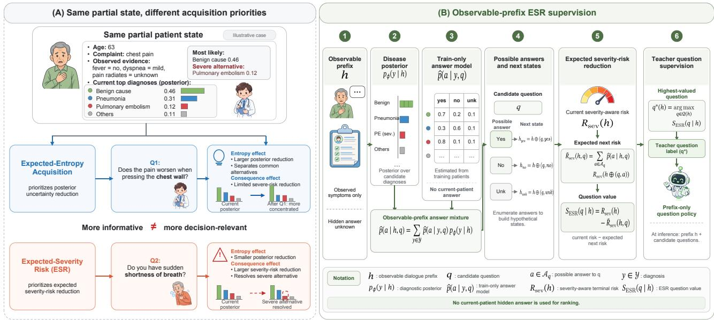
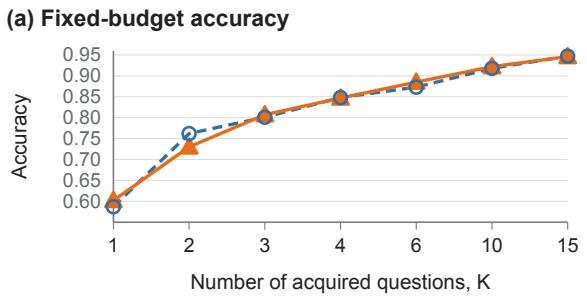
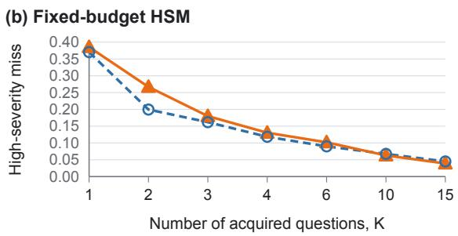
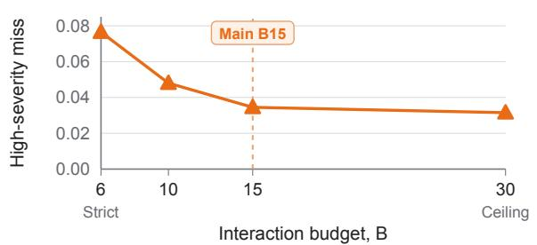
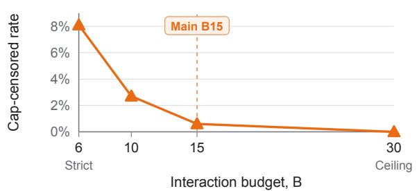

# BEYOND INFORMATION SEEKING: SEVERITY-AWAREQUESTION SUPERVISION FOR PROACTIVE MEDICAL DIALOGUE

Chenxuan Li1 Xinrong Chen1 Luyan Zhang2 Peidong Jia1 Zhongyu Zhao1 Xuecheng Shang1 Peixing Wan3∗

1Peking University, Beijing, China 2Northeastern University, Boston, MA, USA 3Department of Medical Bioinformatics, School of Basic Medical Sciences, Peking University, Beijing, China

## ABSTRACT

Proactive medical dialogue requires an agent to decide what to ask from incomplete patient information. Existing information-seeking approaches commonly prioritize questions that most reduce diagnostic uncertainty. While effective for acquiring informative evidence, this criterion overlooks an important property of medical diagnosis: different diagnostic errors can carry substantially different consequences. Missing a severe condition may matter more than reducing uncertainty among less consequential alternatives. Question acquisition should therefore consider not only how informative new evidence is, but also how it is expected to affect the downstream diagnostic decision. To this end, we propose Expected-Severity-Risk (ESR), a consequence-aware question-supervision objective that values each candidate by its expected reduction in severity-aware terminal risk. Because questions must be selected before their answers are observed, ESR marginalizes over possible answers using train-only population statistics. Its rankings are then distilled into a prefix-only language policy, so next-question selection requires no teacher-side computation at deployment. Across three Qwen3-4B training seeds on DDxPlus, matched ESR supervision reduces mean high-severity diagnostic miss from .0645 to .0455 (−29.5%) and improves mean diagnostic accuracy from .9123 to .9320 while requiring only 0.14 additional questions per dialogue. Fixed-budget analyses show that the two objectives remain behaviorally distinct when question count is controlled, while a matched distilled control shows that severityaware weighting improves the high-severity error profile beyond expected 0/1-risk supervision. These results support moving proactive medical dialogue beyond uncertainty reduction toward consequenceaware evidence acquisition.

Index Terms— Proactive medical dialogue, question acquisition, partial observation, decision-aware supervision, severity-aware risk

## 1. INTRODUCTION

Clinical diagnosis is inherently interactive: decision-relevant evidence is progressively acquired through targeted questions. Proactive medical dialogue asks language agents to make the same acquisition decision, choosing what to ask next from a partial patient history before the answer is known. Early systems used dialogue to acquire additional symptoms for diagnosis [1, 2, 3]. Representative approaches include information-gain acquisition [4, 5, 6], cost-sensitive active feature acquisition [7, 8, 9, 10], and RL-based questioning policies [11, 12, 13, 14].

Information-based objectives provide a natural selection-time criterion, but posterior concentration is only a proxy for downstream decision quality. In medical diagnosis, errors can have substantially different consequences: a question separating common alternatives may reduce uncertainty more than one that helps rule out a less likely but more severe condition. Classical cost-sensitive acquisition already uses expected classification cost, often together with acquisition cost, including in sequential medical diagnosis [7, 15]. Our contribution is therefore not expected-risk acquisition itself, but its adaptation to selection-time question supervision for language policies when candidate answers are unobserved. Reinforcement learning can optimize dialogue-level outcomes, yet question value is then entangled with policy optimization, reward design, and resulting trajectories. This motivates a more direct question: can evidence be valued by downstream diagnostic consequence using only the information available at question-selection time?

We introduce Expected-Severity-Risk (ESR) to operationalize this idea. As illustrated in Fig. 1, a fixed downstream diagnostic model defines terminal decision risk, while disease severity provides an asymmetric consequence signal. Because answers are unobserved at selection time, ESR marginalizes over possible answers and scores each question by its expected reduction in severity-aware terminal risk. The rankings are distilled into a prefix-only policy, with no teacher computation at deployment.

Across three matched Qwen3-4B training seeds on DDxPlus, ESR reduces mean high-severity diagnostic miss from .0645 to .0455 (−29.5%) and improves diagnostic accuracy from .9123 to .9320 with only 0.14 additional questions per dialogue. Fixed-budget analyses show that the acquisition objectives remain behaviorally distinct when question count is controlled, while a matched distilled EXP.-0/1-RISK control isolates the benefit of severity-aware weighting over expected 0/1-risk supervision. Together, these results support decision-aware question supervision beyond purely information-seeking acquisition.

Contributions. Our contributions are threefold:

• We propose ESR, a consequence-aware question-supervision objective that combines severity-aware terminal risk with selection-time marginalization over unobserved answers.

• We distill these rankings into a prefix-only language policy and use matched student controls to isolate severity-aware weighting from expected 0/1-risk supervision.

• Across three Qwen3-4B training seeds, ESR reduces mean highseverity diagnostic miss by 29.5% and improves diagnostic accuracy from .9123 to .9320 with only 0.14 additional questions per dialogue.

  
Fig. 1. Information value and diagnostic consequence can prioritize different questions. ESR evaluates candidate questions before their answers are observed and prioritizes evidence according to expected reduction in severity-aware terminal risk. The current patient’s hidden answer is not used during question ranking.

## 2. DECISION-AWARE QUESTION SUPERVISION

## 2.1. Problem Formulation

We study proactive diagnosis as sequential evidence acquisition under partial observation. At turn $t ,$ the dialogue prefix $h _ { t }$ contains the patient evidence observed so far, while $\mathcal { Q } _ { t }$ denotes the unanswered candidate questions. The policy selects $q _ { t } \in \mathcal { Q } _ { t }$ before observing its answer $a _ { t }$ , after which the dialogue state becomes

$$
h _ { t + 1 } = h _ { t } \oplus ( q _ { t } , a _ { t } ) .\tag{1}
$$

A fixed diagnostic model maps each partial state to a disease posterior $p _ { \phi } \left( y \mid h _ { t } \right)$ and ultimately supports a terminal diagnosis. We treat this model as the downstream decision maker and focus on which available question is most valuable to acquire next from the current partial state.

Two properties of this setting determine how question value should be defined. Diagnostic errors can have asymmetric consequences, while the answer to a candidate question is unavailable at selection time. Therefore, a useful acquisition objective must account for both the consequence of the eventual diagnostic decision and the uncertainty over what evidence a question may reveal.

## 2.2. Expected-Severity-Risk Question Supervision

Motivated by these two requirements, we construct ESR as a selection-time teacher that connects question acquisition to the downstream diagnostic decision. It first assigns a consequence-aware risk to each partial evidence state, then evaluates a candidate question over the possible next states induced by its unobserved answer.

Severity-aware terminal risk. We first quantify the downstream consequence of a decision made from a partial evidence state. DDx-Plus [16] assigns each disease a severity level $r ( y )$ , with smaller values indicating greater severity. We normalize it as

$$
w ( y ) = \frac { r _ { \operatorname* { m a x } } - r ( y ) } { r _ { \operatorname* { m a x } } - r _ { \operatorname* { m i n } } } ,\tag{2}
$$

and define uniform and severity-aware terminal losses:

$$
\begin{array} { r l } & { C _ { 0 1 } ( d , y ) = \mathbb { I } [ d \neq y ] , } \\ & { C _ { \mathrm { s e v } } ( d , y ) = \mathbb { I } [ d \neq y ] \big ( 1 + 2 w ( y ) \big ) , \qquad d \in \mathcal { V } , } \\ & { C _ { \ell } ( \perp , y ) = c _ { \perp } = 0 . 5 , \qquad \ell \in \{ 0 1 , \mathrm { s e v } \} . } \end{array}\tag{3}
$$

Given the diagnostic posterior, the terminal risk of state h is

$$
R _ { \ell } ( h ) = \operatorname* { m i n } _ { d \in \mathcal { V } \cup \{ \perp \} } \sum _ { y \in \mathcal { V } } p _ { \phi } ( y \mid h ) C _ { \ell } ( d , y ) .\tag{4}
$$

$R _ { 0 1 }$ treats all diagnostic errors equally, whereas $R _ { \mathrm { s e v } }$ gives greater consequence to errors involving more severe conditions. Thus, terminal risk characterizes the downstream decision induced by the current evidence, rather than only how concentrated the disease posterior is.

Selection-time answer model. Terminal risk evaluates an evidence state, whereas asking a question can produce different next states depending on the patient’s answer. Because that answer is unavailable when q is selected, we represent these possible outcomes with a predictive answer distribution.

We estimate a disease-conditioned categorical model pb(a | y, q) from the training population using add-one smoothing. Combining it with the current disease posterior gives

$$
{ \widehat { p } } ( a \mid h , q ) = \sum _ { y \in \mathcal { V } } { \widehat { p } } ( a \mid y , q ) p _ { \phi } ( y \mid h ) .\tag{5}
$$

This distribution weights the hypothetical next states $h \oplus ( q , a )$ that may result from asking $q ,$ using information available before the actual answer is observed.

Expected question value. We can now value a candidate by averaging the terminal risk of its possible next states. Expected-Severity-Risk is defined as

$$
S _ { \mathrm { E S R } } ( q \mid h ) = R _ { \mathrm { s e v } } ( h ) - \mathbb { E } _ { a \sim \widehat { p } ( \cdot \mid h , q ) } \left[ R _ { \mathrm { s e v } } ( h \oplus ( q , a ) ) \right] .\tag{6}
$$

A high score indicates that asking q is expected to move the downstream diagnostic decision toward lower severity-aware risk.

For controlled comparison, E-ENTROPY replaces terminal risk with posterior entropy while retaining the same answer marginalization, whereas EXP.-0/1-RISK replaces $R _ { \mathrm { s e v } }$ with uniform risk $R _ { 0 1 }$ . Thus, E-ENTROPY provides the information-seeking reference, while the EXP.-0/1-RISK–ESR contrast isolates asymmetric severity weighting.

## 2.3. Distillation into a Prefix-Only Dialogue Policy

We distill the teacher rankings into a prefix-only language policy: for each observable prefix and candidate set, the highest-valued question becomes the next-question label. At inference, the student selects directly from the observable context without access to $p _ { \phi } .$ , the answer model, hidden answers, or teacher utilities.

## 3. EXPERIMENTS

## 3.1. Experimental Setup

Environment and evaluator. We construct a nine-condition DDx-Plus subset [16] from training-set differential diagnoses. A normalized pathology co-occurrence graph is built from 250,000 training cases, and a dense connected cluster of nine overlapping conditions is selected greedily and frozen before sampling 5,000 training, 800 validation, and 1,000 held-out test patients. Dialogues start from the chief complaint and acquire evidence from a fixed 50-question inventory. A frozen multinomial logistic classifier over structured partial-state features provides the disease posterior and terminal diagnosis; its logits are temperature-scaled by validation NLL $( T = 0 . 8 3 4 ) [ 1 7 ]$ The same evaluator is used for every acquisition objective.

Matched student training. The E-ENTROPY and ESR students share the same Protocol-SFT Qwen3-4B initialization [18] and 17,813 prefix–candidate training states. We use rank-16 LoRA [19], learning rate $1 0 ^ { - 4 }$ , effective batch size 16, and three epochs, and repeat the main comparison with seeds 42, 43, and 44. Within each seed, training inputs and optimization settings are identical across objectives; only the teacher-derived next-question target differs. Candidate-constrained decoding restricts both students to the same available questions.

Interaction protocol. Both policies use the same candidate interface and external stopping rule. A dialogue terminates when the minimum-risk action under $C _ { \mathrm { s e v } }$ is a diagnosis and $R _ { \mathrm { s e v } } ( h ) \leq 0 . 2 0 ;$ otherwise the student selects among the first 15 unanswered questions in the fixed 50-question inventory. The primary interaction budget is $B = 1 5$ . If the stopping criterion is not met at the hard budget, the same evaluator returns its minimum-risk diagnosis or abstention; cap-censored cases remain included in all terminal metrics.

Metrics. Primary outcomes are accuracy, average question count (Q), and high-severity conditional miss (HSM). The severity threshold is fixed before test evaluation; 667 of the 1,000 test patients satisfy $w ( y ) \geq 0 . 5 $

$$
\mathrm { H S M } = \operatorname* { P r } ( d _ { T } \neq y \mid w ( y ) \geq 0 . 5 ) .\tag{7}
$$

Secondary measures include severity-weighted error, population high-severity error, hard-cap censoring, and trajectory cost ${ \boldsymbol { J } } =$ $C _ { \mathrm { s e v } } ( d _ { T } , y ) + 0 . 0 3 N _ { q }$ . Main results are mean±SD across training seeds; paired 95% CIs use 2,000 patient bootstrap resamples within each seed.

## 3.2. Main Results

The primary comparison asks whether changing only the questionvalue supervision changes downstream diagnosis under otherwise matched training and interaction. Table 1 shows a consistent shift toward a better high-severity error profile.

Across three matched seeds, ESR reduces mean HSM from .0645 ± .0000 to .0455 ± .0048 (−29.5%), while mean accuracy increases from $. 9 1 2 3 { \pm } . 0 0 1 5$ to .9320±.0017. This change requires only $0 . 1 4 0 { \pm } . 0 1 5$ additional questions on average.

Patient-level uncertainty supports the same overall pattern. Paired 95% CIs for ∆Acc exclude zero in all three seeds: [.005, .036], [.007, .038], and [.002, .032]. For ∆HSM, the intervals exclude zero for seeds 42 and 43 ([−.0398, −.0030] and $[ - . 0 4 1 1 , - . 0 0 3 0 ] )$ and overlap zero for seed 44 ([−.0319, .0059]).

Objective-aligned secondary measures move consistently with the primary result: severity-weighted error decreases from .0447 to .0333, population high-severity error from .0430 to .0303, and proxy cost from .2377 to .1886. Together, the main comparison indicates that changing question supervision alters the downstream accuracy– severity trade-off rather than merely reproducing the same diagnostic behavior.

## 3.3. Information and Decision Value Prefer Different Evidence

Improved terminal outcomes alone do not show that ESR represents a different notion of evidence value: different early questions can simply lead the two policies to different later states. We therefore compare the teacher objectives on 2,000 identical partial patient states with identical candidate sets, removing trajectory history as an explanation.

The objectives exhibit a crossed preference. Questions selected by E-ENTROPY yield larger mean entropy reduction than those selected by ESR (.2316 versus .1953), whereas ESR choices yield larger mean severity-risk reduction (.0902 versus .0810). In 11.4% of states, the conflict is explicit: E-ENTROPY selects the question with greater uncertainty reduction while ESR selects a different question with greater severity-risk reduction.

Thus, the distinction appears before different dialogue trajectories have developed. At the same patient state, the two objectives can disagree on which evidence is worth acquiring because they optimize different notions of value. This is the information–decision mismatch illustrated in Fig. 1.

## 3.4. Controlling for Dialogue Length

The shared-stopping comparison leaves a simple alternative explanation: ESR asks 0.14 more questions on average and might benefit merely from acquiring additional evidence. To separate question ranking from dialogue length, we disable stopping and force the frozen seed-42 E-ENTROPY and ESR students to acquire exactly K questions.

The effect is budget dependent rather than uniformly favorable to ESR. At K = 1, ESR has slightly higher accuracy (.602 versus .587) but higher HSM (.385 versus .370). At $K = 1 0 ,$ ESR reaches .922 accuracy and .0630 HSM, compared with .918 and .0675 for E-ENTROPY. At K = 15, accuracy is effectively matched (.946 versus .947), while ESR retains lower HSM (.0390 versus .0450).

Thus, entropy remains competitive at short horizons, whereas consequence-aware ranking produces a more favorable high-severity error profile at larger budgets. The shared-stopping horizon $B = 1 5$ was fixed before the current student comparison; the frozen-teacher sweep in Fig. $2 ( \mathrm { c } \mathrm { - } \mathrm { d } )$ reduces censoring from .081 at $B = 6$ to .006 at $B = 1 5 ,$ , while extending to $B = 3 0$ changes HSM only from .0345 to .0315.

(d) Teacher cap censoring  
Table 1. Main shared-stopping comparison across three seeds. Values are mean±SD over seeds 42/43/44; only next-question supervision differs. ∆ is the seed-wise ESR−E-ENTROPY difference.
<table><tr><td>Method</td><td>Acc.↑</td><td>Q</td><td>HSM↓</td><td>Sev.↓</td><td>Pop.-HS↓</td><td>Cost↓</td><td>Cap↓</td></tr><tr><td>E-ENTROPY</td><td> $. 9 1 2 3 { \pm } . 0 0 1 5$ </td><td> $2 . 1 8 2 { \pm } . 0 2 0 $ </td><td>.0645±.0000</td><td> $. 0 4 4 7 { \pm } . 0 0 0 3$ </td><td>.0430±.0000</td><td> $. 2 3 7 7 { \pm } . 0 0 1 4$ </td><td> $. 0 0 7 3 { \scriptstyle \pm . 0 0 1 5 }$ </td></tr><tr><td>ESR</td><td> $\mathbf { . 9 3 2 0 { \pm } . 0 0 1 7 }$ </td><td> $2 . 3 2 2 \pm . 0 2 5$ </td><td> $\mathbf { 0 4 5 5 } { \pm } . \mathbf { 0 0 4 8 }$ </td><td> $\mathbf { 0 3 3 3 } \pm . \mathbf { 0 0 1 5 }$ </td><td> $\mathbf { 0 3 0 3 } { \pm } . \mathbf { 0 0 3 2 }$ </td><td> $\mathbf { 1 8 8 6 } \pm . 0 0 0 8$ </td><td> $. 0 1 7 7 { \pm } . 0 0 3 8$ </td></tr><tr><td></td><td></td><td></td><td></td><td></td><td></td><td></td><td></td></tr><tr><td>Δ (ESR-E-ENTROPY)</td><td> $+ . 0 1 9 7 { \scriptstyle \pm . 0 0 2 5 }$ </td><td></td><td>+.140±.015 −.0190±.0048 −.0113±.0019 −.0127±.0032 −.0491±.0021 +.0103±.0051</td><td></td><td></td><td></td><td></td></tr></table>

Shared-stopping students: fixed-budget evaluation

  
Expected Entropy ESR

Frozen ESR teacher: budget-saturation diagnostic  

  
Fig. 2. Question ranking across interaction budgets. Panels (a–b) compare the frozen seed-42 students under identical fixed question budgets. Panels (c–d) characterize frozen-teacher performance and censoring across horizons.

## 3.5. Attributing the Effect to Severity Weighting

Having established that the objectives can prefer different evidence, we next ask whether severity weighting itself is responsible for the high-severity behavior. A generic decision-aware objective might already be sufficient even if all diagnostic errors are treated equally.

We test this alternative using matched frozen seed-42 EXP.-0/1- RISK and ESR students. Both use the same answer marginalization, training inputs, initialization, optimization, candidate interface, and stopping rule; only the teacher valuation changes from expected 0/1 risk to severity-aware risk.

Table 2. Frozen seed-42 student objective decomposition. All methods use expected-answer marginalization.
<table><tr><td>Method</td><td>Acc.↑ Q</td><td>HSM↓ Sev.↓</td></tr><tr><td>E-ENTROPY</td><td>.911 2.161</td><td>.0645 .0447</td></tr><tr><td>EXP.-0/1-RISK</td><td>.913</td><td>2.509 .0690 .0447</td></tr><tr><td>ESR</td><td>.931 2.294</td><td>.0435 .0337</td></tr></table>

The distinction survives policy distillation. Replacing expected 0/1 risk with severity-aware risk increases accuracy from .913 to .931 and reduces HSM from .0690 to .0435, while question count also decreases from 2.509 to 2.294. Paired patient-level 95% CIs for the ESR−EXP.-0/1-RISK contrast are [.002, .034] for accuracy and [−.0441, −.0073] for HSM.

Together, this matched student contrast provides direct evidence that asymmetric severity weighting, beyond generic expected classification risk, redirects the learned acquisition policy toward a more favorable high-severity error profile.

## 4. CONCLUSION

We introduced ESR, a selection-time objective that values medical questions by their expected reduction in severity-aware diagnostic risk. On a training-derived high-overlap DDxPlus disease cluster, ESR reduces mean high-severity diagnostic miss by 29.5% across three matched Qwen3-4B training seeds while improving accuracy with only a small increase in question count. Same-state analysis shows that information and decision value can prioritize different evidence, while a matched distilled 0/1-risk control identifies asymmetric severity weighting as a key contributor to the improved high-severity profile. These results establish consequence-aware question supervision as a practical approach to aligning proactive evidence acquisition with downstream diagnostic consequence.

## 5. COMPLIANCE WITH ETHICAL STANDARDS

This study uses the publicly available synthetic DDxPlus benchmark and involves no human participants or identifiable patient data. No ethical approval was required.

## 6. ACKNOWLEDGMENTS

The authors declare no conflicts of interest.

## 7. REFERENCES

[1] Zhongyu Wei, Qianlong Liu, Baolin Peng, Huaixiao Tou, Ting Chen, Xuanjing Huang, Kam-Fai Wong, and Xiangying Dai, “Task-oriented dialogue system for automatic diagnosis,” in Proceedings of the 56th Annual Meeting of the Association for Computational Linguistics (Volume 2: Short Papers), 2018, pp. 201–207.

[2] Lin Xu, Qixian Zhou, Ke Gong, Xiaodan Liang, Jianheng Tang, and Liang Lin, “End-to-end knowledge-routed relational dialogue system for automatic diagnosis,” in Proceedings of the AAAI Conference on Artificial Intelligence, 2019, vol. 33, pp. 7346–7353.

[3] Hongyin Luo, Shang-Wen Li, and James Glass, “Knowledge grounded conversational symptom detection with graph memory networks,” in Proceedings of the 3rd Clinical Natural Language Processing Workshop, 2020, pp. 136–145.

[4] David J. C. MacKay, “Information-based objective functions for active data selection,” Neural Computation, vol. 4, no. 4, pp. 590–604, 1992.

[5] Chao Ma, Sebastian Tschiatschek, Konstantina Palla, Jose Miguel Hernandez-Lobato, Sebastian Nowozin, and Cheng Zhang, “EDDI: Efficient dynamic discovery of high-value information with partial VAE,” in Proceedings ofthe 36th International Conference on Machine Learning, 2019, vol. 97, pp. 4234–4243.

[6] Hui Min Wong, Philip Heesen, Pascal Janetzky, Martin Bendszus, and Stefan Feuerriegel, “MedClarify: An informationseeking AI agent for medical diagnosis with case-specific follow-up questions,” arXiv preprint arXiv:2602.17308, 2026.

[7] Russell Greiner, Adam J. Grove, and Dan Roth, “Learning cost-sensitive active classifiers,” Artificial Intelligence, vol. 139, no. 2, pp. 137–174, 2002.

[8] Maytal Saar-Tsechansky, Prem Melville, and Foster Provost, “Active feature-value acquisition,” Management Science, vol. 55, no. 4, pp. 664–684, 2009.

[9] Hajin Shim, Sung Ju Hwang, and Eunho Yang, “Joint active feature acquisition and classification with variable-size set encoding,” in Advances in Neural Information Processing Systems, 2018, vol. 31.

[10] Yang Li and Junier Oliva, “Active feature acquisition with generative surrogate models,” in Proceedings ofthe 38th International Conference on Machine Learning, 2021, vol. 139, pp. 6450–6459.

[11] Yichun Feng, Jiawei Wang, Lu Zhou, Zhen Lei, and Yixue Li, “DoctorAgent-RL: A multi-agent collaborative reinforcement learning system for multi-turn clinical dialogue,” in ICASSP 2026 - 2026 IEEE International Conference on Acoustics, Speech and Signal Processing (ICASSP), 2026.

[12] Hongxin Ding, Baixiang Huang, Yue Fang, Weibin Liao, Xinke Jiang, Jinyang Zhang, Yinghao Zhu, Zheng Li, Liantao Ma, Junfeng Zhao, and Yasha Wang, “ProMed: Shapley information gain guided reinforcement learning for proactive medical LLMs,” in Proceedings of the 64th Annual Meeting of the Association for Computational Linguistics (Volume 1: Long Papers), 2026, pp. 32481–32515.

[13] Yung Hwei Lai, Kaiming Liu, Ziyue Wang, Weizhi Ma, and Yang Liu, “Doctor-R1: Mastering clinical inquiry with experiential agentic reinforcement learning,” in The Fourteenth International Conference on Learning Representations, 2026.

[14] Ruike Cao, Shaojie Bai, Fugen Yao, Liang Dong, Jian Xu, and Li Xiao, “ATPO: Adaptive tree policy optimization for multi-turn medical dialogue,” in The Fourteenth International Conference on Learning Representations, 2026.

[15] Shihao Ji and Lawrence Carin, “Cost-sensitive feature acquisition and classification,” Pattern Recognition, vol. 40, no. 5, pp. 1474–1485, 2007.

[16] Arsene Fansi Tchango, Rishab Goel, Zhi Wen, Julien Martel, and Joumana Ghosn, “DDXPlus: A new dataset for automatic medical diagnosis,” in Advances in Neural Information Processing Systems, 2022, vol. 35, pp. 31306–31318.

[17] Chuan Guo, Geoff Pleiss, Yu Sun, and Kilian Q. Weinberger, “On calibration of modern neural networks,” in Proceedings of the 34th International Conference on Machine Learning, 2017, vol. 70, pp. 1321–1330.

[18] An Yang et al., “Qwen3 technical report,” arXiv preprint arXiv:2505.09388, 2025.

[19] Edward J. Hu, Yelong Shen, Phillip Wallis, Zeyuan Allen-Zhu, Yuanzhi Li, Shean Wang, Lu Wang, and Weizhu Chen, “LoRA: Low-rank adaptation of large language models,” in International Conference on Learning Representations, 2022.