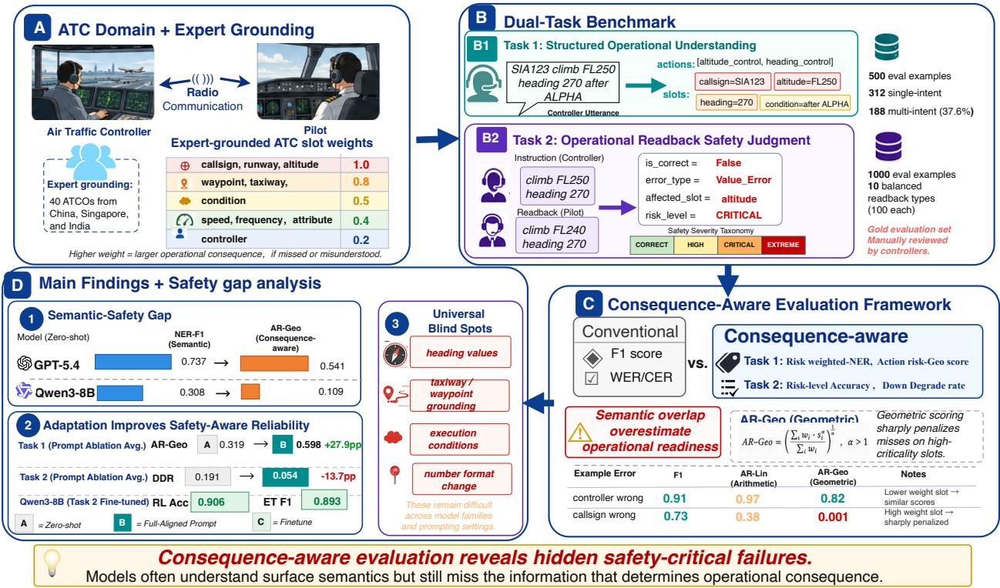
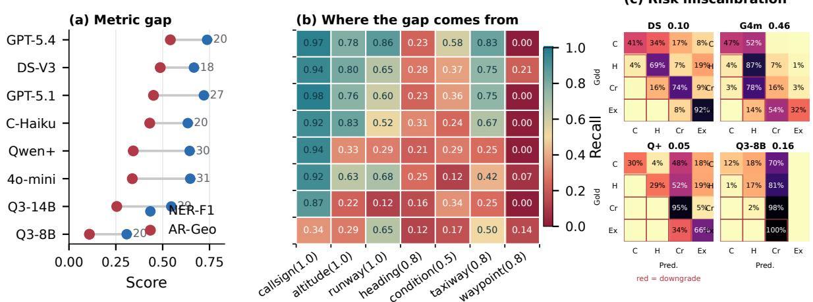
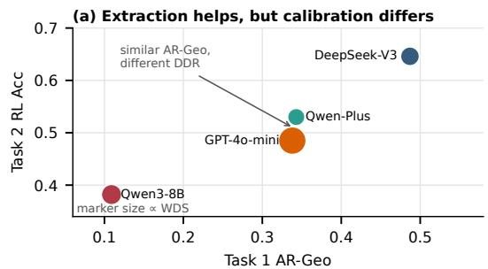
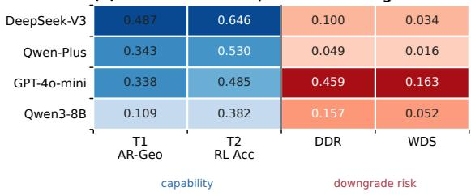
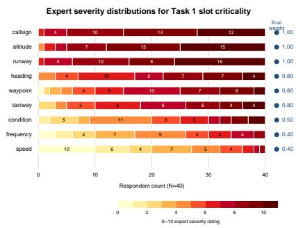

# Beyond Semantic Accuracy: Consequence-Aware Evaluation for Safety-Critical Language Understanding

Yujing Chang<sup>1</sup>, Thinh Pham<sup>2</sup>, Van-Phat Thai<sup>1</sup>, Chunyao Ma<sup>1</sup> Yash Guleria<sup>3</sup>, Pham Nhut Huy<sup>1</sup>, Sameer Alam<sup>1</sup> <sup>1</sup>ATMRI, Nanyang Technological University (NTU), Singapore <sup>2</sup>Centre of AI Research, VinUniversity, Vietnam <sup>3</sup>School of Management, Indian Institute of Technology Mandi, India

  
Figure 1: Overview of our consequence-aware evaluation framework. An ATC utterance is mapped to an action schema with consequence-weighted slots; a structured understanding model (Task 1) and a readback safety judgment model (Task 2) are evaluated against that schema using nonlinear metrics that penalize safety-critical misses more severely than surface errors.

## Abstract

Can language models be trusted in safetycritical operations? In such settings, strong performance on semantic metrics does not guarantee operational reliability: a misread altitude, a dropped execution condition, or a confused callsign may score well under standard F1 yet carry sharply asymmetric operational consequences. We study this problem in air traffic control (ATC), where controller-pilot communication demands near-zero error tolerance, and use consequence-aware evaluation to test whether semantic scores misstate operational reliability. The framework is instantiated in a controlled diagnostic ATC benchmark grounded in aviation standards and feedback from 40

air traffic controllers across three countries. Evaluating 8 models, we uncover a systematic semantic-safety gap: conventional scores give substantially higher performance estimates than consequence-aware evaluation, even for models that appear reliable under standard metrics. Risk-aware fine-tuning narrows but does not close this gap, showing that consequenceaware evaluation is a necessary complement to standard NLP metrics before any real safetycritical deployment claim.

## 1 Introduction

Language models have rapidly moved from open-<sup>fi</sup>ended chat to practical assistance in writing, coding, search, and decision support (OpenAI et al., 2024; Anthropic, 2024; Ouyang et al., 2022). As these systems enter operational workflows, average semantic accuracy becomes an incomplete proxy for safety-critical reliability: a harmless formatting difference, a recoverable contextual miss, and a wrong control value may score similarly despite very different consequences.

Safety-critical language understanding is therefore a problem of consequence under operational risk, not just semantic similarity. Standard evaluation for speech and task-oriented language understanding often relies on surface or semantic metrics such as word error rate (WER), character error rate (CER), intent accuracy, and slot-level F1 (Graves et al., 2006; Graves and Jaitly, 2014; Hemphill et al., 1990; Henderson et al., 2014). These metrics typically treat errors uniformly across tokens, slots, or intents, creating a mismatch when action targets, control values, or execution conditions carry different operational consequences.

We study this problem in air traffic control (ATC), where controller-pilot coordination is voicebased and must be interpreted with high reliability (International Civil Aviation Organization, 2016; Connell, 1994). ATC utterances are short, regulated, and operationally dense: confusing an altitude, substituting a callsign, or dropping a condition such as “after passing RIVER” can contribute to loss of separation, runway incursions, or traffic conflicts, yet conventional metrics can obscure these differences (Monan, 1983; Connell, 1994).

Our primary contribution is the empirical demonstration that conventional semantic evaluation can systematically misrepresent operational reliability in asymmetric-risk communication. We make this gap measurable by mapping languageunderstanding errors to action structure, critical information units, and consequence-sensitive scores, with criticality definitions grounded in aviation standards and real-expert validation. Our evaluation asks two questions: whether models recover the information whose failure would matter most in operation, and whether they can judge the safety significance of controlled readback variations. Figure 1 summarizes this pipeline.

The framework is intentionally simple: it exposes failures that standard semantic metrics leave under-specified while remaining adaptable to domains that can define actions, critical slots, and consequence levels. Our results suggest that consequence-aware evaluation reveals a class of model failures that standard NLP metrics routinely underestimate. We argue that safety-critical evaluation should explicitly account for operational consequence, and we release the data, annotation schemas, evaluation code, and prompts to support future work in this direction.<sup>1</sup>

Contributions. We make four concrete contributions:

• Semantic-safety gap in operational language understanding. We show that conventional semantic metrics can substantially overestimate operational reliability in asymmetric-risk communication.

• Consequence-aware evaluation framework. We introduce an ATC evaluation framework that models action-critical intents, slots, execution conditions, and non-compensatory operational failures.

• Expert-grounded diagnostic ATC benchmark. We release a controlled dual-task ATC diagnostic benchmark grounded in aviation standards and expert-reviewed annotations that keep the diagnostic cases close to operational practice. The benchmark tests both structured language understanding and real-operation error detection.

• Systematic model evaluation and adaptation study. Across prompting, fine-tuning, and model scales, we demonstrate substantial divergence between semantic correctness and operational safety.

## 2 Related Work

Language understanding and spoken language understanding. Task-oriented language understanding has traditionally been evaluated through intent accuracy, slot-level F1, and exact match (Hemphill et al., 1990; Henderson et al., 2014). Much of the SLU literature therefore improves semantic prediction under noisy or complex input, including ASR correction and domain adaptation (Mani et al., 2020b,a), robustness to ASR-corrupted transcripts (Chang and Chen, 2022; Cheng et al., 2023b,a, 2024), speech-text representation learning (Chen et al., 2023; Dong et al., 2023), multi-intent intent-slot modeling (Qin et al., 2020; Yin et al., 2024, 2025), and LLM-based noisy slot filling or intent detection (Sun et al., 2024; He and Garner, 2023). These methods improve semantic robustness, but their objectives remain slot accuracy, SLU-F1, or intent classification rather than operational consequence.

Risk-aware and safety-oriented evaluation. Standard accuracy can overestimate model reliability, motivating behavioral tests and severity-aware metrics such as CheckList and SEScore (Ribeiro et al., 2020; Xu et al., 2022). Recent LLM work studies uncertainty estimation, safety prompting and datasets, risk awareness in agent interactions, and outcome-aware safety failures such as consequence-blindness (Huang et al., 2025; Röttger et al., 2025; Yuan et al., 2024; Wu et al., 2025). Safety evaluation has also expanded in operational domains such as medical task-oriented dialogue, radiology report generation, and clinical LLM benchmarking (Saley et al., 2024; Guan et al., 2025; Wang et al., 2026b). These studies move beyond aggregate accuracy, but typically focus on general behavioral failures, harmful content, uncertainty, or domain-level safety labels; we quantify how structured semantic errors map to concrete operational risk.

ATC and aviation language understanding. ATC language processing has primarily focused on corpora, ASR, and domain-specific SLU. Resources such as ATIS and ATCOSIM established spoken aviation datasets (Hemphill et al., 1990; Hofbauer et al., 2008), followed by ASR benchmarks and larger ATC communication corpora (Zuluaga-Gomez et al., 2020, 2023; Yang et al., 2020). Recent work addresses accented ATC ASR, route inference from progressive taxi instructions, communication-error detection, and broader aviation-agent safety or rule-learning tasks (Wee et al., 2025; Thai et al., 2025; Sadak, 2026; Wu et al., 2026; Wang et al., 2026a). Prior work studies safety-oriented evaluation for ATC language understanding in an initial, smaller-scale setting with a simpler scoring formulation (Chang et al., 2026). We extend this direction with a broader consequence-aware diagnostic framework, combining controller-grounded validation, non-compensatory AR-Geo scoring, larger controlled datasets, dual structured-understanding and readback-safety tasks, and risk-aware adaptation experiments.

## 3 Dual-Task Dataset

We construct a controlled diagnostic ATC dataset grounded in aviation standards and validated by real air traffic controllers (details in Section 4 and Appendix H): Task 1 tests structured recovery of controller intent and slots, while Task 2 tests readback safety judgment under targeted perturbations. The action and slot distribution—with altitude control, clearance, and heading control dominating and execution conditions present in over half of examples—reflects real operational patterns rather than uniform sampling; full statistics are in Appendix C. Appendix C.2 reports inter-annotator agreement for action labels, slot spans, readback risk levels, and error types; Appendix C.6 gives case-level validation examples.

## 3.1 Task 1: Structured Operational Understanding

Source data. We use the consolidated public ATC speech dataset from prior Speech-to-Route work (Thai et al., 2025), which covers U.S. and European controller-pilot communications. After filtering incomplete or non-operational exchanges, we sample 500 structurally complete utterances for evaluation.

Gold evaluation annotations. Five air traffic controllers manually annotate the 500-utterance evaluation set with utterance-level actions and chunk-level labels for operational spans. Table 1 reports the action inventory, slot inventory, coverage, and expert-derived weights. For adaptation, we use separate training and validation splits following the same schema; these are used only for fine-tuning, not evaluation. Additional details are in Appendix C.

## 3.2 Task 2: Operational Readback Safety Judgment

Task design. Task 2 goes beyond slot extraction in a diagnostic setting: a model must decide whether a controlled pilot-readback variant preserves the safety-critical meaning of the original clearance.

Dataset construction. We derive Task 2 from Task 1 by constructing readbacks with controlled perturbations based on ICAO readback requirements, controller feedback, and common failure modes (International Civil Aviation Organization,

<table><tr><td>Action</td><td>W</td><td></td><td>N %</td><td>Scored slots</td><td></td><td>Slot</td><td></td><td>W</td><td>N %</td><td>| Role</td><td>Slot</td><td></td><td>W</td><td>N %</td></tr><tr><td>altitude_control</td><td>1.00</td><td>169</td><td>33.8</td><td>callsign, altitude, condition</td><td>Target</td><td>callsign</td><td>1.00</td><td>446</td><td>89.2</td><td>Value</td><td>frequency</td><td>0.40</td><td>54</td><td>10.8</td></tr><tr><td>clearance</td><td>1.00</td><td>161</td><td>32.2</td><td>callsign, runway, waypoint, condition</td><td>Target</td><td>runway</td><td>1.00</td><td>170</td><td>34.0</td><td>Value</td><td>speed</td><td>0.40</td><td>44</td><td>8.8</td></tr><tr><td>runway_instruction</td><td>1.00</td><td>50</td><td>10.0</td><td>callsign, runway, condition</td><td>Value</td><td>altitude</td><td>1.00</td><td>164</td><td>32.8</td><td>Context</td><td>relation</td><td>0.40</td><td>92</td><td>18.4</td></tr><tr><td>heading_control</td><td>0.60</td><td>141</td><td>28.2</td><td>callsign, heading, condition</td><td>Value</td><td>heading</td><td>0.80</td><td>99</td><td>19.8</td><td>Context</td><td>attribute</td><td>0.40</td><td>37</td><td>7.4</td></tr><tr><td>taxiway_instruction</td><td>0.80</td><td>36</td><td>7.2</td><td>callsign, taxiway, waypoint, runway</td><td>Target</td><td>waypoint</td><td>0.80</td><td>91</td><td>18.2</td><td>Context</td><td>traffic</td><td>0.40</td><td>10</td><td>2.0</td></tr><tr><td>speed_control</td><td>0.60</td><td>71</td><td>14.2</td><td>callsign, speed, condition</td><td>Target</td><td>taxiway</td><td>0.80</td><td>13</td><td>2.6</td><td>Context</td><td>controller</td><td>0.20</td><td>112</td><td>22.4</td></tr><tr><td>contact</td><td>0.30</td><td>59</td><td>11.8</td><td>callsign, frequency, controller</td><td></td><td>Condition condition 0.50</td><td></td><td>264</td><td>52.8</td><td>Other</td><td></td><td>0.00</td><td>306</td><td>61.2</td></tr><tr><td>sequence_control</td><td>0.40</td><td>46</td><td>9.2</td><td>callsign, condition, traffic</td><td></td><td></td><td></td><td></td><td></td><td></td><td></td><td></td><td></td><td></td></tr></table>

Table 1: Task 1 action-risk schema and slot inventory. expert-derived consequence weight; action action instances, while slot utterances containing the slot at least once. Counts are non-exclusive.
<table><tr><td>Type</td><td>Risk</td><td></td><td>Description and Example</td></tr><tr><td>VALUE_CRITICAL</td><td>CRITICAL</td><td>100</td><td>Critical value wrong: “climb FL250&quot; → &quot;climb FL350&quot;.</td></tr><tr><td>OMISSION_CRITICAL</td><td>CRITICAL</td><td>100</td><td>Critical slot omitted: “climb FL250 heading 270” → &quot;heading 270&quot;.</td></tr><tr><td>TARGET_CRITICAL</td><td>CRITICAL</td><td>100</td><td>Callsign substituted or confused: &quot;BAW123” → &quot;BAW132&quot;.</td></tr><tr><td>VALUE_HIGH</td><td>HIGH</td><td>100</td><td>Non-critical value wrong, such as speed or frequency.</td></tr><tr><td>OMISSION_HIGH</td><td>HIGH</td><td>100</td><td>Non-critical slot omitted, such as speed or frequency.</td></tr><tr><td>CONSTRAINT_HIGH</td><td>HIGH</td><td>100</td><td>Execution condition omitted: &quot;climb FL250 before ALPHA&quot; → “climb FL250&quot;.</td></tr><tr><td>MULTI_ERROR</td><td>EXTREME</td><td>100</td><td>Two or more critical slots wrong simultaneously.</td></tr><tr><td>FILLER_CORRECT</td><td>CORRECT</td><td>100</td><td>Correct readback with filler words; operational meaning unchanged.</td></tr><tr><td>NUMBER_FORMAT</td><td>CORRECT</td><td>100</td><td>Non-standard number format; value remains semantically identical.</td></tr><tr><td>CORRECT</td><td>CORRECT</td><td>100</td><td>Exact correct readback.</td></tr></table>

Table 2: Task 2 readback safety taxonomy. Type is the controlled perturbation, Risk is gold severity, and N is examples per type.

2016). Critical errors target altitude, heading, runway, and callsign; high-risk errors target lowercriticality values or execution constraints; correct variants include harmless filler words and number formatting. The evaluation set is intentionally balanced to ensure each error category is reliably assessed; it is a controlled diagnostic tool rather than a frequency-matched sample of live traffic, and it should not be used to estimate live readback-error frequencies or deployment readiness. A separate 2853-example training set is used only for finetuning.

Error taxonomy and statistics. The Task 2 evaluation set contains 1000 examples, balanced across ten readback types and four risk levels: CORRECT, HIGH, CRITICAL, and EXTREME.

## 4 Consequence-Aware Evaluation Framework

We evaluate whether a model recovers the components whose failure would change the operational consequence of an ATC instruction or readback. The framework has three components: weighted semantic matching, nonlinear completeness scoring, and ordinal downgrade penalties.

## 4.1 Expert Grounding

The criticality scheme is grounded in aviation procedure (International Civil Aviation Organization, 2016) and ratings from 40 air traffic controllers across China, Singapore, and India. Controllers rated the severity of missing or misinterpreting ATC information types and reviewed the Task 2 readback-error categories. We normalize mean severity ratings within each question block, discretize them into the tiered Task 1 weights in Table 1, and report the questionnaire protocol, medians, IQRs, and sample variances in Appendix H. The weights encode relative operational criticality rather than accident probability. Appendix B reports sensitivity analyses over smoothing constants, slot weights, schema strictness, and aggregation choices; the main rankings remain stable. To reduce circularity, we also compare AR-Geo against NER-F1, rNER-F1, and AR-Lin on independent controller acceptability ratings; AR-Geo has the highest alignment (Pearson r = 0.68, Spearman ρ = 0.65; Table 3).

## 4.2 Task 1: Structured Operational Understanding

Because utterances may contain multiple actions, Action-Exact requires the full predicted action set to exactly match the gold set.

Entity scoring. We report token-level NER-F1 over all slot types with equal weight. NER-Lin uses the same exact span-and-type matching rule, weighting each matched gold or predicted span by the slot weight in Table 1; full matching details are in Appendix D. NER-Geo is a recall-oriented geometric score over gold spans:

$$
\mathrm { N E R - G e o } = \exp \left( \frac { \sum _ { \boldsymbol { s } \in \mathcal { G } } w ( \boldsymbol { s } ) \log ( \epsilon + m _ { \boldsymbol { s } } ) } { \sum _ { \boldsymbol { s } \in \mathcal { G } } w ( \boldsymbol { s } ) } \right) ,\tag{1}
$$

where $m _ { s } = 1$ if gold span s is exactly matched and 0 otherwise. We set $\epsilon = 1 0 ^ { - 5 }$ to avoid an undefined logarithm.

Action scoring. Entity scores do not bind slots to actions, so we compute an action-conditioned score over slots required by each gold action schema. For each action instance $^ { a , }$ let $S _ { a }$ be the set of required or observed gold slots associated with that action, and let $m _ { i } \in \{ 0 , 1 \}$ indicate whether slot $i \in S _ { a }$ is correctly recovered. If the action type itself is not predicted, the action instance receives score zero. For multi-intent utterances, we score each gold action instance and average using the action weights in Table 1.

The linear variant, AR-Lin, is:

$$
\mathrm { A R - L i n } ( a ) = \frac { \sum _ { i \in S _ { a } } w _ { i } m _ { i } } { \sum _ { i \in S _ { a } } w _ { i } } .\tag{2}
$$

AR-Lin is a weighted baseline, but lower-risk matches can still compensate for a high-risk miss. We therefore use AR-Geo as a non-compensatory diagnostic score: a missed high-consequence field should not be averaged away by many lower-risk matches. Inspired by BLEU’s geometric aggregation (Papineni et al., 2002) and reliability analysis (U.S. Nuclear Regulatory Commission, 1975), we use:

$$
\mathrm { A R - G e o } ( a ) = \exp \left( \frac { \sum _ { i \in S _ { a } } w _ { i } \log ( \epsilon + m _ { i } ) } { \sum _ { i \in S _ { a } } w _ { i } } \right) ,\tag{3}
$$

Utterance-level AR-Geo is the weighted average over gold action instances. AR-Geo penalizes missing required components without introducing a tunable severity coefficient. Table 3 gives an example and shows that AR-Geo has the strongest empirical correlation with controller ratings among the tested alternatives. The questionnaire-based pairedpreference study in Appendix H.6 provides additional support: AR-Geo matches controller preferences more often than AR-Lin when surface overlap and operational safety diverge (0.76 vs. 0.64).

## 4.3 Task 2: Readback Safety Judgment

Task 2 asks whether a pilot readback preserves operational safety. For each instruction-readback

<table><tr><td>Prediction error</td><td></td><td></td><td>AR-Lin AR-Geo</td></tr><tr><td colspan="3">Controller wrong: &quot;contact singapore ground&quot; → “singapore tower&quot; Altitude wrong: “descend flight level 240&quot;</td><td>0.92</td><td>0.39</td></tr><tr><td colspan="4">→ “descend flight level 250&quot;</td><td></td></tr><tr><td>Metric</td><td>Pearson r</td><td>Spearman ρ</td><td>p-value</td><td></td></tr><tr><td>NER-F1</td><td>0.44</td><td>0.42</td><td>&lt; 0.001</td><td></td></tr><tr><td>rNER-F1</td><td>0.53</td><td>0.51</td><td>&lt; 0.001</td><td></td></tr><tr><td>AR-Lin</td><td>0.59</td><td>0.57</td><td>&lt; 0.001</td><td></td></tr><tr><td>AR-Geo</td><td>0.68</td><td>0.65</td><td>&lt; 0.001</td><td></td></tr></table>

Table 3: Nonlinear scoring validation. Top: AR-Lin vs. AR-Geo; bottom: correlation with controller-rated acceptability on 200 Task 1 outputs.

pair, the model predicts correctness, error type, affected slot, and risk level. The risk levels are ordered as:

$$
\mathrm { C O R R E C T } < \mathrm { H I G H } < \mathrm { C R I T I C A L } < \mathrm { E X T R E M E } .
$$

We report isCorrect accuracy, error-type macro-F1 (ET F1), and risk-level accuracy (RL Acc) for binary correctness, error mechanism, and severity assignment.

Directional safety calibration. Risk-level errors are directional: under-estimating risk can hide a dangerous readback error, so we report two loweris-better downgrade metrics. Let $r _ { i }$ and $\boldsymbol { { \hat { r } } _ { i } }$ denote the ordinal gold and predicted risk levels for example i, and let $R _ { \mathrm { m a x } }$ be the maximum possible ordinal gap. Dangerous Downgrade Rate (DDR) measures how often the model predicts a lower risk level than the gold label:

$$
\mathrm { D D R } = \frac { | \{ i : \hat { r } _ { i } < r _ { i } \} | } { N } .\tag{4}
$$

Weighted Downgrade Severity (WDS) measures normalized downgrade mass over all examples, assigning zero contribution to non-downgraded cases:

$$
\mathrm { W D S } = \frac { 1 } { N } \sum _ { i : \hat { r } _ { i } < r _ { i } } \frac { r _ { i } - \hat { r } _ { i } } { R _ { \mathrm { m a x } } } .\tag{5}
$$

Thus, predicting CORRECT for an EXTREME error is worse than predicting HIGH for a CRITICAL error.

## 5 Experimental Setup

Task 1 evaluates eight commercial and open-weight models for broad zero-shot coverage. Controlled prompting and Task 2 use a four-model subset spanning API and open-weight settings. Unless marked as fine-tuned, models are used through their standard inference interfaces with greedy decoding (temperature 0). Reported model identifiers are the provider or local model strings recorded in the inference outputs; API snapshot names and execution dates are listed in Appendix A. Task 2 outputs is\_correct, error\_type, risk\_level, affected\_slot, and explanation; invalid or unparseable responses receive zero for the relevant metrics. All conditions use the 500-example Task 1 held-out set and the 1000-example Task 2 readback evaluation set.

Prompting conditions. We compare four prompting conditions: Zero-shot (A) provides only the schema and field definitions; Knowledge (C) adds ATC operational rules; Few-shot (D) adds annotated examples; and Full-Aligned (B) combines rules and examples. For Task 2, we also evaluate Few-shot+CoT (Wei et al., 2022) to test whether explicit reasoning changes risk calibration. Appendix K lists the full prompt templates and output contracts.

Fine-tuning baseline. To estimate domainadaptation headroom, we fine-tune Qwen3- 8B (Team, 2025) with LoRA (Hu et al., 2022). For Task 1, we compare standard cross-entropy (CE) with Risk-Loss, a consequence-weighted variant that up-weights critical-slot tokens such as altitude, heading, runway, and callsign. For Task 2, we train with an analogous weighted cross-entropy objective that prioritizes risk level, error type, and higher-severity samples. For both tasks, the riskaware objective replaces mean cross-entropy with weighted cross-entropy:

$$
\mathcal { L } _ { \mathrm { r i s k } } = \frac { \sum _ { i } \alpha _ { i } \mathrm { C E } ( z _ { i } , y _ { i } ) \mathbf { 1 } [ y _ { i } \neq - 1 0 0 ] } { \sum _ { i } \alpha _ { i } \mathbf { 1 } [ y _ { i } \neq - 1 0 0 ] } ,\tag{6}
$$

where $\alpha _ { i }$ is a token-level weight derived from slot criticality or readback-risk severity. Appendix G gives the LoRA configuration, training hyperparameters, and exact weighting rules.

Evaluation protocol. We follow the metric definitions in Section 4. For Task 1, AR-Geo is the primary consequence-aware structured-understanding metric. For Task 2, we emphasize error-type F1, risk-level accuracy, Dangerous Downgrade Rate (DDR), and Weighted Downgrade Severity (WDS). DDR and WDS measure dangerous underestimation and are lower-is-better.

Research questions. We ask how large the semantic-safety gap is (RQ1), which slots and readback types drive it (RQ2), which adaptation strategy helps most (RQ3), and whether Task 1 structured understanding transfers to Task 2 safety judgment (RQ4).

## 6 Results and Analysis

## 6.1 Task 1: Structured Understanding (RQ1, RQ2, RQ4)

Semantic-safety gap. Table 4 and Figure 2a show a consistent semantic-safety gap: models recover many surface spans while missing components that make an instruction executable. For example, gpt-5.4 reaches 0.737 NER-F1 under zero-shot prompting, while AR-Geo diagnoses a different failure mode: some recovered spans no longer make the instruction operationally complete. qwen3-8b shows the same diagnostic disagreement more sharply (0.308 NER-F1 vs. 0.109 AR-Geo). Lower-risk matches therefore cannot compensate for missing high-consequence components; Appendix E.1 and Table 22 provide contrastive utterance-level examples showing that lowweight misses remain relatively tolerated, while missing a callsign or shared condition collapses AR-Geo despite substantial NER-F1.

What drives the gap. The gap is not evenly distributed: models are reliable on addressees and simple surface values but weaker on exact value boundaries, execution conditions, and route elements (Figure 2b). For heading-related spans, we distinguish strict boundary failures from value disappearance: many outputs keep the numeric heading inside a neighboring action chunk, while more serious cases lose the value entirely (Appendix E). The prompt ablation confirms the pattern: moving from zero-shot to Full-Aligned prompting raises strict heading recall by 56.0pp and condition recall by 35.0pp, showing that models often know the broad action type while losing the value or condition that determines how or when it should be executed.

Human alignment. Controller ratings support the scoring design: consequence-aware scores track human judgments of operational acceptability more closely than standard semantic metrics (AR-Geo Pearson r = 0.68 vs. NER-F1 r = 0.44; Table 3), and rankings remain stable under weight and aggregation checks (Appendix B). A paired controller-preference study shows the same pattern when controllers choose between outputs that trade surface overlap against safety-critical information (Appendix H.6).

  
Figure 2: Evaluation overview. (a) NER-F1 exceeds AR-Geo. (b) Strict boundary failures and value disappearance contribute to the gap, especially around heading-related spans and conditions. (c) Task 2 zero-shot risk calibration; C/H/Cr/Ex denote CORRECT, HIGH, CRITICAL, and EXTREME, and red outlines mark dangerous downgrades.

Adaptation effects. Consequence-weighted finetuning is the most effective adaptation: matched zero-shot and Risk-LoRA results for qwen3-4b, qwen3-8b, and Llama-3.1-8B show AR-Geo gains from near-zero baselines to 0.65–0.70 (Table 4). On qwen3-8b, Risk-LoRA also improves over CE fine-tuning (0.686 vs. 0.515 AR-Geo), showing that weighting critical slots changes what the model learns rather than only improving output format. Prompting helps, but the ablation suggests a tradeoff for structured extraction: few-shot examples give the strongest AR-Geo, while adding broad knowledge can introduce redundant reasoning and slightly reduce boundary-sensitive performance (Tables 4 and 5). Low-frequency route structure, especially waypoints, remains difficult.

## 6.2 Task 2: Readback Safety Judgment (RQ1–RQ4)

Risk miscalibration. Table 6 and Figure 2c show that controlled readback safety judgment is not simply error detection. Zero-shot models often identify the error mechanism, but risk calibration is unstable: gpt-4o-mini has the largest downgrade rate (DDR=0.459), while qwen-plus rarely downgrades (DDR=0.049) but still has limited risk-level accuracy (0.530), indicating a more conservative calibration pattern.

Error-type structure. The hardest cases echo Task 1: models are more reliable on explicit value or target substitutions than on execution constraints and harmless surface variation. Per-error-type results in Appendix Table 31 confirm that conditionrelated readback errors are consistently weaker than explicit value and target substitutions. Readback judgment requires both sensitivity to dangerous omissions and invariance to equivalent paraphrases.

Adaptation effects. Prompting with explicit risk definitions improves calibration, while risk-aware fine-tuning gives the best overall isCorrect, errortype, and risk-level performance (Table 6; prompt ablations in Appendix Table 30). Full-Aligned Task 2 evaluates taxonomy-following risk assignment after error-type identification, not unconstrained operational risk estimation. The strongest Full-Aligned API run reaches 0.878 risk-level accuracy, while risk-aware fine-tuning reaches 0.930– 0.936 across the new open-weight runs. Constraint errors remain difficult, reinforcing that models treat execution conditions as optional modifiers rather than operational preconditions.

## 6.3 Discussion

Does Task 1 transfer to Task 2? Structured understanding helps but is not sufficient. Across the four shared zero-shot models, Task 1 AR-Geo and Task 2 RL Acc are positively associated, yet similar extraction quality can hide very different dangerous-downgrade rates: gpt-4o-mini and qwen-plus reach nearly identical zero-shot AR-Geo (0.338 vs. 0.343) yet their DDR differs ninefold (0.459 vs. 0.049)—a gap invisible to extraction metrics alone. Figure 3 visualizes this split, showing that risk calibration is an additional capability beyond Task 1 extraction.

(b) Similar extraction, different downgrade risk  
Table 4: Task 1 main results (N=500). ActEx=action-set exact match; Strict=all gold actions and action-conditioned slots recovered; Lat.=median seconds/sample. ZS=Zero-shot, FA=Full-Aligned, FT=LoRA. <sup>†</sup>Not recorded.
<table><tr><td>Model</td><td>Setting</td><td>NER-F1 NER-Lin NER-Geo</td><td></td><td></td><td></td><td></td><td>ActEx AR-Lin AR-Geo*</td><td></td><td>Strict Lat.(s)</td></tr><tr><td colspan="2"></td><td></td><td></td><td></td><td></td><td></td><td></td><td></td><td></td></tr><tr><td>Zero-shot frontier comparison gpt-5.4</td><td>ZS</td><td>0.737</td><td>0.768</td><td>0.443</td><td>0.494</td><td>0.774</td><td>0.541</td><td>0.442</td><td>2.3</td></tr><tr><td>gpt-5.1</td><td>ZS</td><td>0.720</td><td>0.752</td><td>0.415</td><td>0.474</td><td>0.722</td><td>0.451</td><td>0.360</td><td>2.3</td></tr><tr><td>DeepSeek-V4-Flash ZS</td><td></td><td>0.667</td><td>0.699</td><td>0.404</td><td>0.448</td><td>0.746</td><td>0.487</td><td>0.414</td><td>2.5</td></tr><tr><td>claude-haiku-4.5</td><td>ZS</td><td>0.634</td><td>0.667</td><td>0.347</td><td>0.468</td><td>0.719</td><td>0.431</td><td>0.362</td><td>_†</td></tr><tr><td>gpt-4o-mini</td><td>ZS</td><td>0.647</td><td>0.690</td><td>0.331</td><td>0.354</td><td>0.667</td><td>0.338</td><td>0.258</td><td>2.5</td></tr><tr><td>qwen-plus</td><td>ZS</td><td>0.644</td><td>0.676</td><td>0.330</td><td>0.454</td><td>0.639</td><td>0.343</td><td>0.278</td><td>3.5</td></tr><tr><td>qwen3-14b</td><td>ZS</td><td>0.546</td><td>0.573</td><td>0.234</td><td>0.392</td><td>0.561</td><td>0.255</td><td>0.196</td><td>3.4</td></tr><tr><td>qwen3-8b</td><td>ZS</td><td>0.308</td><td>0.330</td><td>0.076</td><td>0.432</td><td>0.290</td><td>0.109</td><td>0.080</td><td>4.4</td></tr><tr><td>Prompt-enhanced comparison (Full-Aligned)</td><td></td><td></td><td></td><td></td><td></td><td></td><td></td><td></td><td></td></tr><tr><td colspan="2"></td><td>0.773</td><td>0.798</td><td>0.555</td><td></td><td></td><td></td><td></td><td></td></tr><tr><td>DeepSeek-V4-Flash gpt-4o-mini</td><td>- After Full-Aligned prompt</td><td>0.751</td><td></td><td></td><td>0.612</td><td>0.836</td><td>0.707</td><td>0.614</td><td>2.3</td></tr><tr><td></td><td>- After Full-Aligned prompt</td><td></td><td>0.784</td><td>0.490</td><td>0.576</td><td>0.775</td><td>0.589</td><td>0.512</td><td>2.9</td></tr><tr><td>qwen-plus qwen3-8b</td><td>- After Full-Aligned prompt</td><td>0.773</td><td>0.800</td><td>0.528</td><td>0.582</td><td>0.783</td><td>0.609</td><td>0.530</td><td>4.0</td></tr><tr><td>Fine-tuning comparison with matched zero-shot baselines</td><td>- After Full-Aligned prompt</td><td>0.684</td><td>0.708</td><td>0.429</td><td>0.548</td><td>0.701</td><td>0.489</td><td>0.372</td><td>3.2</td></tr><tr><td colspan="2"></td><td></td><td></td><td></td><td></td><td></td><td></td><td></td><td></td></tr><tr><td>qwen3-4b</td><td>- ZS</td><td>0.213</td><td>0.232</td><td>0.037</td><td>0.316</td><td>0.118</td><td>0.041</td><td>0.024</td><td></td></tr><tr><td>qwen3-8b</td><td>- FT (Risk-LoRA)</td><td>0.762</td><td>0.783</td><td>0.554</td><td>0.606</td><td>0.777</td><td>0.648</td><td>0.538</td><td></td></tr><tr><td></td><td>- ZS</td><td>0.308</td><td>0.330</td><td>0.076</td><td>0.432</td><td>0.290</td><td>0.109</td><td>0.080</td><td>4.4</td></tr><tr><td></td><td>- FT (CE loss)</td><td>0.700</td><td>0.731</td><td>0.424</td><td>0.464</td><td>0.746</td><td>0.515</td><td>0.396</td><td>6.9</td></tr><tr><td>Llama-3.1-8B</td><td>- FT (Risk-LoRA)</td><td>0.772</td><td>0.792</td><td>0.570</td><td>0.638</td><td>0.805</td><td>0.686</td><td>0.584</td><td>5.5</td></tr><tr><td></td><td>- ZS</td><td>0.223</td><td>0.246</td><td>0.048</td><td>0.378</td><td>0.197</td><td>0.057</td><td>0.032</td><td>一</td></tr><tr><td></td><td>- FT (Risk-LoRA)</td><td>0.767</td><td>0.788</td><td>0.559</td><td>0.620</td><td>0.813</td><td>0.697</td><td>0.600</td><td></td></tr></table>

Table 5: Task 1 prompt ablations averaged over four models. Head, Cond, and CritV are strict exact-span recalls for heading, condition, and critical-value slots; heading errors mix boundary failures with true value disappearance.
<table><tr><td>Cond.</td><td>AR-Geo*</td><td>ActEx</td><td>Head</td><td>Cond</td><td>CritV</td></tr><tr><td>A (ZS)</td><td>0.319</td><td>0.422</td><td>0.209</td><td>0.188</td><td>0.382</td></tr><tr><td>C (Know.)</td><td>0.421</td><td>0.422</td><td>0.311</td><td>0.397</td><td>0.544</td></tr><tr><td>D (Few)</td><td>0.638</td><td>0.554</td><td>0.740</td><td>0.591</td><td>0.826</td></tr><tr><td>B (Full)</td><td>0.598</td><td>0.580</td><td>0.769</td><td>0.538</td><td>0.830</td></tr><tr><td>A→B</td><td>+27.9pp</td><td></td><td></td><td>+15.8pp +56.0pp +35.0pp +44.8pp</td><td></td></tr></table>

Table 6: Task 2 main results (N=1000). DDR and WDS are lower-is-better downgrade metrics.
<table><tr><td>Model</td><td>Set.</td><td>isCorr</td><td>ET F1</td><td>RL Acc</td><td>DDR↓</td><td>WDS↓</td><td>Lat.</td></tr><tr><td colspan="6">Zero-shot comparison</td><td></td><td></td></tr><tr><td>DeepSeek-V4-Flash ZS</td><td></td><td>0.774</td><td>0.563</td><td>0.646</td><td>0.100</td><td>0.034</td><td>1.5</td></tr><tr><td>gpt-4o-mini</td><td>ZS</td><td>0.794</td><td>0.533</td><td>0.485</td><td>0.459</td><td>0.163</td><td>1.7</td></tr><tr><td>qwen-plus</td><td>ZS</td><td>0.778</td><td>0.461</td><td>0.530</td><td>0.049</td><td>0.016</td><td>2.5</td></tr><tr><td>qwen3-4b</td><td>ZS</td><td>0.714</td><td>0.170</td><td>0.330</td><td>0.240</td><td>0.090</td><td></td></tr><tr><td>qwen3-8b</td><td>ZS</td><td>0.720</td><td>0.268</td><td>0.382</td><td>0.157</td><td>0.052</td><td>1.7</td></tr><tr><td>Llama-3.1-8B</td><td>ZS</td><td>0.706</td><td>0.286</td><td>0.244</td><td>0.031</td><td>0.011</td><td></td></tr><tr><td colspan="8">Prompt-enhanced comparison (Full-Aligned)</td></tr><tr><td>DeepSeek-V4-Flash FA</td><td></td><td>0.896</td><td>0.840</td><td>0.878</td><td>0.057</td><td>0.022</td><td>8.2†</td></tr><tr><td>gpt-4o-mini</td><td>FA</td><td>0.802</td><td>0.466</td><td>0.540</td><td>0.049</td><td>0.016</td><td>2.0</td></tr><tr><td>qwen-plus</td><td>FA</td><td>0.812</td><td>0.565</td><td>0.640</td><td>0.023</td><td>0.009</td><td>2.6</td></tr><tr><td>qwen3-8b</td><td>FA</td><td>0.758</td><td>0.360</td><td>0.526</td><td>0.089</td><td>0.030</td><td>2.1</td></tr><tr><td colspan="8">Fine-tuning comparison</td></tr><tr><td>qwen3-4b</td><td>FT</td><td>0.946</td><td>0.914</td><td>0.930</td><td>0.060</td><td>0.020</td><td></td></tr><tr><td>qwen3-8b</td><td>FT</td><td>0.930</td><td>0.893</td><td>0.906</td><td>0.083</td><td>0.029</td><td>1.2</td></tr><tr><td>Llama-3.1-8B</td><td>FT</td><td>0.944</td><td>0.931</td><td>0.936</td><td>0.080</td><td>0.027</td><td></td></tr></table>

isCorr=readback-correctness accuracy; ET F1=error-type macro-F1; RL

Acc=risk-level accuracy; Lat.=median seconds/sample. <sup>†</sup>Extended thinking on a subset.  


  
Figure 3: Cross-task diagnostic. Similar Task 1 AR-Geo can hide different Task 2 risk calibration and downgrade rates.

Implications. Execution conditions remain the clearest cross-task failure: “climb to FL350” and “climb to FL350 after RIVER” share most tokens but authorize different actions at different times. Standard metrics are necessary but insufficient: surface accuracy can be high while operationally consequential information is lost, and closing that gap requires consequence-aware objectives, not just better prompts or larger models.

## 7 Conclusion

We empirically demonstrated a semantic-safety gap in safety-critical language understanding: standard semantic evaluation can systematically overestimate reliability when errors carry asymmetric consequences. The consequence-aware framework and controlled ATC benchmark make this gap measurable across structured instruction understanding and readback safety judgment.

Prompting and risk-aware fine-tuning reduce but do not close this gap. The contribution is a measurement and diagnosis framework, not a deploymentready ATC system; the same recipe can transfer to domains where experts define actions, critical units, and severity levels (Appendix J).

## Limitations

ATC is a realistic high-stakes testbed, but the slot weights and Task 2 taxonomy are ATC-specific; adapting them requires new expert input and may change quantitative results. Task 2 readbacks use structured perturbations, which support controlled diagnosis but do not fully capture live pilot readback variation; the Task 2 claims should therefore be read as diagnostic rather than frequencymatched operational prevalence estimates or evidence of deployment readiness.

Because of budget constraints, we do not exhaustively evaluate current commercial models or broad fine-tuning recipes. Our fine-tuning study uses one 8B open-weight backbone, so model scale and data effects remain open. Most importantly, improved scores are still far from deployment-grade ATC reliability. Future work should pair stronger models with multi-layer safety mechanisms such as abstention, independent cross-checking, human review, and runtime monitoring.

## Ethics Statement

The ATC data is derived from publicly available or licensed corpora and contains no personal information about controllers or pilots. We identify safety-critical failure modes; none of the evaluated models should be deployed in actual ATC operations without additional validation. Benchmark data, evaluation code, prompts, and fine-tuning artifacts are available at https://github.com/EthanChangCC/ beyond-semantic-accuracy. AI assistance was used only for language polishing and grammar refinement.

## Acknowledgments

This research is supported by the National Research Foundation, Singapore, and the Civil Aviation Authority of Singapore, under the Aviation Transformation Programme. Any opinions, findings and conclusions or recommendations expressed in this material are those of the author(s) and do not reflect the views of National Research Foundation, Singapore and the Civil Aviation Authority of Singapore.

/clearpage

## References

Anthropic. 2024. The Claude 3 model family: Opus, sonnet, haiku. Technical report, Anthropic.

Ya-Hsin Chang and Yun-Nung Chen. 2022. Contrastive learning for improving ASR robustness in spoken language understanding. In Proceedings of Interspeech 2022, pages 3458–3462.

Yujing Chang, Yash Guleria, Duc-Thinh Pham, Nhut-Huy Pham, Ningli Wang, Vu N. Duong, and Sameer Alam. 2026. Safety-oriented evaluation of language understanding systems for air traffic control.

Zhehuai Chen, He Huang, Andrei Andrusenko, Oleksii Hrinchuk, Krishna C. Puvvada, Jason Li, Subhankar Ghosh, Jagadeesh Balam, and Boris Ginsburg. 2023. SALM: Speech-augmented language model with in-context learning for speech recognition and translation.

Xuxin Cheng, Bowen Cao, Qichen Ye, Zhihong Zhu, Hongxiang Li, and Yuexian Zou. 2023a. ML-LMCL: Mutual learning and large-margin contrastive learning for improving ASR robustness in spoken language understanding. In Findings of the Association for Computational Linguistics: ACL 2023, pages 6492–6505, Toronto, Canada. Association for Computational Linguistics.

Xuxin Cheng, Ziyu Yao, Zhihong Zhu, Yaowei Li, Hongxiang Li, and Yuexian Zou. 2023b. C<sup>2</sup>A-SLU: Cross and contrastive attention for improving ASR robustness in spoken language understanding. In Proceedings ofInterspeech 2023, pages 695–699.

Xuxin Cheng, Zhihong Zhu, Xianwei Zhuang, Zhanpeng Chen, Zhiqi Huang, and Yuexian Zou. 2024. MoE-SLU: Towards ASR-robust spoken language understanding via mixture-of-experts. In Findings of the Associationfor Computational Linguistics: ACL 2024, pages 14868–14879, Bangkok, Thailand. Association for Computational Linguistics.

Linda J. Connell. 1994. Pilot and controller communications: Incidents reported to the NASA aviation safety reporting system. In Aerospace Technology Conference and Exposition, 942137, San Diego, California, United States. SAE International.

Linhao Dong, Zhecheng An, Peihao Wu, Jun Zhang, Lu Lu, and Zejun Ma. 2023. CIF-PT: Bridging speech and text representations for spoken language understanding via continuous integrate-and-fire pretraining. In Findings ofthe Associationfor Computational Linguistics: ACL 2023, pages 8894–8907, Toronto, Canada. Association for Computational Linguistics.

Alex Graves, Santiago Fernández, Faustino Gomez, and Jürgen Schmidhuber. 2006. Connectionist temporal classification: Labelling unsegmented sequence data with recurrent neural networks. In Proceedings ofthe 23rd International Conference on Machine Learning.

Alex Graves and Navdeep Jaitly. 2014. Towards endto-end speech recognition with recurrent neural networks. In Proceedings ofthe 31st International Conference on Machine Learning.

Hao Guan, Pengcheng Hou, Peng Hong, Liang Wang, Wei Zhang, Xiang Du, Zhi Zhou, and Lei Zhou. 2025. A clinically-informed framework for evaluating vision-language models in radiology report generation: Taxonomy of errors and risk-aware metric. medRxiv preprint.

Mutian He and Philip N. Garner. 2023. Can ChatGPT detect intent? evaluating large language models for spoken language understanding.

Charles T. Hemphill, John J. Godfrey, and George R. Doddington. 1990. The ATIS spoken language systems pilot corpus. In Speech and Natural Language: Proceedings of a Workshop Held at Hidden Valley, Pennsylvania, June 24-27, 1990.

Matthew Henderson, Blaise Thomson, and Jason D. Williams. 2014. The second dialog state tracking challenge. In Proceedings of the 15th Annual Meeting ofthe Special Interest Group on Discourse and Dialogue.

Konrad Hofbauer, Stefan Petrik, and Horst Hering. 2008. The ATCOSIM corpus of non-prompted clean air traffic control speech. In Proceedings of the Sixth International Conference on Language Resources and Evaluation, Marrakech, Morocco. European Language Resources Association.

Edward J. Hu, Yelong Shen, Phillip Wallis, Zeyuan Allen-Zhu, Yuanzhi Li, Shean Wang, Lu Wang, and Weizhu Chen. 2022. LoRA: Low-rank adaptation of large language models. International Conference on Learning Representations.

Yuheng Huang, Jiayang Song, Zhijie Wang, Shengming Zhao, Huaming Chen, Felix Juefei-Xu, and Lei Ma. 2025. Look before you leap: An exploratory study of uncertainty analysis for large language models. IEEE Transactions on Software Engineering, 51(2):413– 429.

International Civil Aviation Organization. 2016. Procedures for Air Navigation Services: Air Traffic Management, 16th edition. International Civil Aviation Organization, Montreal, Canada. PANS-ATM.

Anirudh Mani, Shruti Palaskar, and Sandeep Konam. 2020a. Towards understanding ASR error correction for medical conversations. In Proceedings of the First Workshop on Natural Language Processingfor Medical Conversations, pages 7–11, Online. Association for Computational Linguistics.

Anirudh Mani, Shruti Palaskar, Nimshi Venkat Meripo, Sandeep Konam, and Florian Metze. 2020b. ASR error correction and domain adaptation using machine translation.

William P. Monan. 1983. Addressee errors in ATC communications: The call sign problem. NASA Contractor Report NASA-CR-166462, National Aeronautics and Space Administration.

OpenAI, Josh Achiam, Steven Adler, Sandhini Agarwal, Lama Ahmad, Ilge Akkaya, Florencia Leoni Aleman, Diogo Almeida, Janko Altenschmidt, Sam Altman, et al. 2024. GPT-4 technical report.

Long Ouyang, Jeffrey Wu, Xu Jiang, Diogo Almeida, Carroll Wainwright, Pamela Mishkin, Chong Zhang, Sandhini Agarwal, Katarina Slama, Alex Ray, et al. 2022. Training language models to follow instructions with human feedback. Advances in Neural Information Processing Systems, 35.

Kishore Papineni, Salim Roukos, Todd Ward, and Wei-Jing Zhu. 2002. BLEU: a method for automatic evaluation of machine translation. In Proceedings of the 40th Annual Meeting of the Association for Computational Linguistics, pages 311–318, Philadelphia, Pennsylvania. Association for Computational Linguistics.

Libo Qin, Xiao Xu, Wanxiang Che, and Ting Liu. 2020. AGIF: An adaptive graph-interactive framework for joint multiple intent detection and slot filling. In Findings of the Association for Computational Linguistics: EMNLP 2020, pages 1807–1816, Online. Association for Computational Linguistics.

Marco Tulio Ribeiro, Tongshuang Wu, Carlos Guestrin, and Sameer Singh. 2020. Beyond accuracy: Behavioral testing of NLP models with CheckList. In Proceedings ofthe 58th Annual Meeting ofthe Association for Computational Linguistics, pages 4902– 4912, Online. Association for Computational Linguistics.

Paul Röttger, Fabio Pernisi, Bertie Vidgen, and Dirk Hovy. 2025. Safetyprompts: A systematic review of open datasets for evaluating and improving large language model safety. In Proceedings ofthe Thirty-Ninth AAAI Conference on Artificial Intelligence.

Mustafa Semih Sadak. 2026. A multi-agent LLM framework with bayesian fusion and safety guardrails for ATC-pilot communication error detection. Expert Systems with Applications, 321:132241.

Vishal Vivek Saley, Goonjan Saha, Rocktim Jyoti Das, Dinesh Raghu, and Mausam. 2024. MediTOD: An English dialogue dataset for medical history taking

with comprehensive annotations. In Proceedings of the 2024 Conference on Empirical Methods in Natural Language Processing, pages 16843–16877, Miami, Florida, USA. Association for Computational Linguistics.

Guangzhi Sun, Shutong Feng, Dongcheng Jiang, Chao Zhang, Milica Gasic, and Phil Woodland. 2024. Speech-based slot filling using large language models. In Findings of the Association for Computational Linguistics: ACL 2024, pages 6351–6362, Bangkok, Thailand. Association for Computational Linguistics.

Qwen Team. 2025. Qwen3 technical report. arXiv preprint arXiv:2505.09388.

Van-Phat Thai, Dhruv Aradhya, Chea-Mean Chan, Yujing Chang, Duc-Thinh Pham, and Sameer Alam. 2025. Speech-to-route: Learning-based airport taxi route inference from progressive air traffic control instructions. SSRN preprint.

U.S. Nuclear Regulatory Commission. 1975. Reactor safety study: An assessment of accident risks in U.S. commercial nuclear power plants. Technical Report NUREG-75/014, U.S. Nuclear Regulatory Commission, Washington, DC.

Haichuan Wang, Jay Patrikar, and Sebastian Scherer. 2026a. World2rules: A neuro-symbolic framework for learning world-governing safety rules for aviation.

S. Wang, Z. Tang, H. Yang, et al. 2026b. A novel evaluation benchmark for medical LLMs illuminating safety and effectiveness in clinical domains. npj Digital Medicine, 9:91.

Marcus Yu Zhe Wee, Justin Juin Hng Wong, Lynus Lim, Joe Yu Wei Tan, Prannaya Gupta, Dillion Lim, En Hao Tew, Aloysius Keng Siew Han, and Yong Zhi Lim. 2025. Adapting automatic speech recognition for accented air traffic control communications. In 2025 International Conference on Military Communication and Information Systems, pages 1–10.

Jason Wei, Xuezhi Wang, Dale Schuurmans, Maarten Bosma, Fei Xia, Ed Chi, Quoc Le, and Denny Zhou. 2022. Chain-of-thought prompting elicits reasoning in large language models. Advances in Neural Information Processing Systems, 35.

Rui Wu, Yihao Quan, Zeru Shi, Zhenting Wang, Yanshu Li, and Ruixiang Tang. 2025. Read the scene, not the script: Outcome-aware safety for LLMs.

Yalun Wu, Haotian Liu, Zhoujun Li, and Boyang Wang. 2026. Pilotbench: A benchmark for general aviation agents with safety constraints.

Wenda Xu, Yi-Lin Tuan, Yujie Lu, Michael Saxon, Lei Li, and William Yang Wang. 2022. Not all errors are equal: Learning text generation metrics using stratified error synthesis. In Findings of the Associationfor Computational Linguistics: EMNLP 2022, pages 6559–6574, Abu Dhabi, United Arab Emirates. Association for Computational Linguistics.

Bo Yang, Xianlong Tan, Zhengmao Chen, Bing Wang, Min Ruan, Dan Li, Zhongping Yang, Xiping Wu, and Yi Lin. 2020. ATCSpeech: A multilingual pilotcontroller speech corpus from real air traffic control environment. In Proceedings of Interspeech 2020, pages 399–403.

Shangjian Yin, Peijie Huang, JiaTian Chen, Haojing Huang, and Yuhong Xu. 2025. ECLM: Entity level language model for spoken language understanding with chain of intent. In Proceedings ofthe 63rd Annual Meeting ofthe Associationfor Computational Linguistics (Volume 1: Long Papers), pages 21851– 21862, Vienna, Austria. Association for Computational Linguistics.

Shangjian Yin, Peijie Huang, and Yuhong Xu. 2024. Uni-MIS: United multiple intent spoken language understanding via multi-view intent-slot interaction. Proceedings of the AAAI Conference on Artificial Intelligence, 38(17):19395–19403.

Tongxin Yuan, Zhiwei He, Lingzhong Dong, Yiming Wang, Ruijie Zhao, Tian Xia, Lizhen Xu, Binglin Zhou, Fangqi Li, Zhuosheng Zhang, Rui Wang, and Gongshen Liu. 2024. R-judge: Benchmarking safety risk awareness for LLM agents. In Findings of the Associationfor Computational Linguistics: EMNLP 2024, pages 1467–1490, Miami, Florida, USA. Association for Computational Linguistics.

Juan Zuluaga-Gomez, Petr Motlicek, Qingran Zhan, Karel Vesely, and Rudolf Braun. 2020. Automatic speech recognition benchmark for air-traffic communications.

Juan Zuluaga-Gomez, Karel Veselý, Igor Szöke, Alexander Blatt, Petr Motlicek, Martin Kocour, Mickael Rigault, Khalid Choukri, Amrutha Prasad, Seyyed Saeed Sarfjoo, Iuliia Nigmatulina, Claudia Cevenini, Pavel Kolcárek, Allan Tart, Janˇ Cernocký,<sup>ˇ</sup> and Dietrich Klakow. 2023. ATCO2 corpus: A largescale dataset for research on automatic speech recognition and natural language understanding of air traffic control communications.

## Appendix Overview

The appendix provides additional details supporting the consequence-aware evaluation framework, dataset design, prompting protocol, and model adaptation experiments. It is organized as follows:

• Appendix A reports the model identifiers and inference dates recorded from the output files and inference scripts.

• Appendix B reports sensitivity analyses for the consequence-aware scoring functions, including the geometric smoothing constant (Appendix B.1), slot-weight perturbations (Appendix B.2), required-slot strictness (Appendix B.3), and the exponential risk penalty as an alternative nonlinear score (Appendix B.4).

• Appendix C describes the dataset and heldout evaluation sets, including the annotation protocol (Appendix C.1), inter-annotator agreement (Appendix C.2), label inventory and ambiguous cases (Appendix C.3), Task 1 operational-understanding statistics, Task 2 readback-verification statistics, and case-level validation examples (Appendix C.6).

• Appendix D gives the complete metric definitions and matching rules for NER-Lin, NER-Geo, AR-Lin, AR-Geo, Strict, missing actions, duplicate slots, bootstrap confidence intervals, and a worked example showing why nonlinear scoring is needed.

• Appendix E provides additional Task 1 error analysis, especially the distinction between strict span failures and operational-value recovery for heading instructions.

• Appendix F details the Task 2 error taxonomy, affected-slot rules, and examples for each readback category.

• Appendix G presents fine-tuning details, including SFT data format, Task 1 and Task 2 LoRA configurations, a comparison between CE-loss and risk-aware-loss Task 1 finetuning (AR-Geo 0.515 vs. 0.686), and the token-level risk-aware loss formulation.

• Appendix H describes the expert questionnaire instrument used to validate the evaluation criteria, including controller background statistics, the survey structure, and aggregation protocol for slot weights, action criticality, readback taxonomy, nonlinear metric preferences, and the paired controller-preference study (Appendix H.6).

• Appendix I provides additional Task 2 ablations and per-error-type results, highlighting which readback error categories remain difficult.

• Appendix J discusses how the consequenceaware evaluation framework can transfer beyond ATC by replacing the domain action inventory, critical slot mapping, and error taxonomy while keeping the scoring principle unchanged.

• Appendix K documents the prompting and inference protocol for the zero-shot, knowledge, few-shot, CoT, and full-aligned ablations.

## A Model Identifiers and Inference Dates

The API outputs record the requested model string and latency, but not a provider-side immutable snapshot hash. We therefore report the exact model identifiers used by the inference scripts and the result-file modification dates as the execution record. Provider-hosted aliases may change over time, so these results should be treated as reproducible with respect to the released prompts, data, and recorded identifiers, but not as guaranteed immutable API snapshots.

## B Sensitivity Analysis for Consequence-Aware Scoring

The central methodological choice in this paper is to evaluate safety-critical language understanding with a nonlinear consequence-aware score. This appendix reports additional sensitivity checks showing that the main conclusions are not artifacts of a particular numerical constant, slot-weight vector, or nonlinear family. We evaluate four perturbations: the geometric smoothing constant ϵ, uniform slot weights, high-consequence slot-weight scaling, and an alternative exponential penalty.

## B.1 Geometric Smoothing Constant

The AR-Geo score uses $\epsilon = 1 0 ^ { - 5 } ;$

$$
\mathrm { A R - G e o } ( a ) = \exp \left( \frac { \sum _ { i \in S _ { a } } w _ { i } \log ( \epsilon + m _ { i } ) } { \sum _ { i \in S _ { a } } w _ { i } } \right) .\tag{7}
$$

The role of ϵ is only to avoid an undefined logarithm when a component is missed. Varying ϵ across four orders of magnitude leaves the reported scores and rankings unchanged at the precision used in the paper. This is expected because $m _ { i }$ is binary; once a required high-weight component is missed, the geometric score should collapse sharply regardless of the exact small constant.

## B.2 Slot Weight Perturbation

We also test whether the zero-shot ranking depends on the exact expert-derived weights in Table 1. This matters because the weights are intentionally expert-grounded rather than learned from the evaluation set. We compare the default weights against two alternatives. First, Uniform-Geo assigns every non-O slot weight 1.0. Second, we perturb the high-consequence slots {callsign, runway, altitude, heading, waypoint, taxiway, condition} by ±20% while leaving other slots fixed. As Table 8 shows, the absolute values move only slightly and the model ordering is stable. The interpretation is that changing the coefficients changes how strongly particular misses are penalized, but it does not erase the underlying pattern: models that miss actioncritical values and conditions remain weaker under consequence-aware evaluation.

<table><tr><td>Task/setting</td><td>Reported model identifier</td><td>Inference interface</td><td>Recorded date</td></tr><tr><td>Task 1 zero-shot</td><td>gpt-5.4</td><td>OpenAI-compatible API</td><td>2026-04-22</td></tr><tr><td>Task 1 zero-shot</td><td>gpt-5.1</td><td>OpenAI-compatible API</td><td>2026-04-22</td></tr><tr><td>Task 1 zero-shot</td><td>gpt-4o-mini</td><td>OpenAI API</td><td>2026-04-22</td></tr><tr><td>Task 1 zero-shot</td><td>DeepSeek-V4-Flash</td><td>DeepSeek API</td><td>2026-04-22</td></tr><tr><td>Task 1 zero-shot</td><td>claude-haiku-4-5-20251001</td><td>Anthropic API</td><td>2026-04-23</td></tr><tr><td>Task 1 zero-shot</td><td>qwen-plus</td><td>DashScope compatible API</td><td>2026-04-22</td></tr><tr><td>Task 1 zero-shot</td><td>qwen3-14b</td><td>DashScope compatible API</td><td>2026-04-22</td></tr><tr><td>Task 1 zero-shot</td><td>qwen3-8b</td><td>DashScope compatible API</td><td>2026-04-22</td></tr><tr><td>Task 1 Full-Aligned</td><td>DeepSeek-V4-Flash, gpt-4o-mini, qwen-plus</td><td>Provider APIs</td><td>2026-05-01</td></tr><tr><td>Task 1 Full-Aligned</td><td>qwen3-8b</td><td>DashScope compatible API</td><td>2026-05-02</td></tr><tr><td>Task 1 fine-tuned</td><td>qwen3-8b-atc-lora-fast</td><td>Local Qwen3-8B LoRA</td><td>2026-05-22</td></tr><tr><td>Task 1 fine-tuned</td><td>qwen3-8b-atc-task1-risk-lora-v3</td><td>Local Qwen3-8B LoRA</td><td>2026-05-25</td></tr><tr><td>Task 2 zero-shot</td><td>DeepSeek-V4-Flash, gpt-4o-mini, qwen-plus</td><td>Provider APIs</td><td>2026-04-28</td></tr><tr><td>Task 2 zero-shot</td><td>qwen3-8b</td><td>DashScope compatible API</td><td>2026-05-02</td></tr><tr><td>Task 2 Full-Aligned</td><td>gpt-4o-mini, qwen-plus, qwen3-8b</td><td>Provider APIs</td><td>2026-05-02</td></tr><tr><td>Task 2 Full-Aligned</td><td>DeepSeek-V4-Flash</td><td>DeepSeek API</td><td>2026-05-04</td></tr><tr><td>Task 2 fine-tuned</td><td>qwen3-8b-task2-risk-lora</td><td>Local Qwen3-8B LoRA</td><td>2026-05-12</td></tr></table>

Table 7: Model identifiers and inference dates used in the reported experiments. Dates are taken from the corresponding output files; where the provider did not expose an immutable snapshot in the output, we report only the requested model identifier. Older DeepSeek output files used the legacy API alias deepseek-chat; we report these runs uniformly as DeepSeek-V4-Flash in all result tables.

<table><tr><td>Model</td><td>Default</td><td>Uniform</td><td>High ×0.8</td><td>High ×1.2</td></tr><tr><td>gpt-5.4 DeepSeek-</td><td>0.541</td><td>0.530</td><td>0.541</td><td>0.542</td></tr><tr><td>V4-Flash</td><td>0.487</td><td>0.473</td><td>0.487</td><td>0.488</td></tr><tr><td>gpt-5.1</td><td>0.450</td><td>0.437</td><td>0.450</td><td>0.451</td></tr><tr><td>claude-haiku</td><td>0.431</td><td>0.414</td><td>0.431</td><td>0.432</td></tr><tr><td>qwen-plus</td><td>0.343</td><td>0.335</td><td>0.343</td><td>0.344</td></tr><tr><td>gpt-4o-mini</td><td>0.338</td><td>0.318</td><td>0.337</td><td>0.340</td></tr><tr><td>qwen3-14b</td><td>0.255</td><td>0.247</td><td>0.254</td><td>0.256</td></tr><tr><td>qwen3-8b</td><td>0.109</td><td>0.106</td><td>0.108</td><td>0.109</td></tr></table>

Table 8: Task 1 zero-shot AR-Geo under slot-weight perturbations. The qualitative conclusions do not depend on the exact weight vector.

## B.3 Required-Slot Strictness

We also test whether the Task 1 rankings are driven by an overly strict action schema. The default schema scores all gold slots associated with each action type, including execution conditions when they are present. We compare it with two relaxed variants. NoCond makes execution conditions optional for all actions. CoreOnly further keeps only the core executable fields for each action, such as altitude for altitude\_control, heading for heading\_control, frequency for contact, and runway or route targets for runway, taxiway, and clearance actions. These variants are not intended to replace the primary metric; they test whether the ranking is an artifact of requiring contextual fields too aggressively.

## B.4 ERP as an Alternative Nonlinear Penalty

As a second nonlinear scoring family, we compute an Exponential Risk Penalty:

$$
\mathrm { E R P } ( a ) = \exp \left( - \lambda \sum _ { i \in S _ { a } } w _ { i } ( 1 - m _ { i } ) \right) ,\tag{8}
$$

with $\lambda = 3 . 0$ for action-conditioned scores and $\lambda = 2 . 0$ for NER scores. ERP penalizes the total weighted miss mass, while Geo penalizes the geometric completeness of required components. Table 10 reports the zero-shot Task 1 comparison. The rankings under Geo and ERP are consistent, so the paper uses Geo as the primary metric because it has the desired fail-safe behavior without requiring a tunable severity coefficient.

## C Dataset Details and Examples

The goal of the dataset is not to introduce a large general-purpose ATC benchmark. Instead, the dataset is designed as a controlled diagnostic setting for evaluating whether models recover operationally consequential information. We therefore prioritize safety-relevant examples, multi-action utterances, readback perturbations, and expertauditable labels over broad coverage. All held-out

<table><tr><td>Schema</td><td>Metric</td><td>gpt-5.4</td><td>DeepSeek- V4-Flash</td><td>gpt-5.1</td><td>claude</td><td>qwen+</td><td>gpt-40</td><td>qwen14b</td><td>qwen8b</td></tr><tr><td>Default</td><td>AR-Lin</td><td>0.774</td><td>0.746</td><td>0.722</td><td>0.719</td><td>0.639</td><td>0.667</td><td>0.561</td><td>0.290</td></tr><tr><td>Default</td><td>AR-Geo</td><td>0.540</td><td>0.487</td><td>0.450</td><td>0.431</td><td>0.343</td><td>0.338</td><td>0.255</td><td>0.109</td></tr><tr><td>NoCond</td><td>AR-Lin</td><td>0.824</td><td>0.810</td><td>0.785</td><td>0.797</td><td>0.699</td><td>0.754</td><td>0.610</td><td>0.323</td></tr><tr><td>NoCond</td><td>AR-Geo</td><td>0.713</td><td>0.695</td><td>0.665</td><td>0.673</td><td>0.481</td><td>0.589</td><td>0.372</td><td>0.178</td></tr><tr><td>CoreOnly</td><td>AR-Lin</td><td>0.834</td><td>0.816</td><td>0.795</td><td>0.808</td><td>0.709</td><td>0.767</td><td>0.619</td><td>0.322</td></tr><tr><td>CoreOnly</td><td>AR-Geo</td><td>0.737</td><td>0.714</td><td>0.685</td><td>0.703</td><td>0.506</td><td>0.628</td><td>0.399</td><td>0.194</td></tr></table>

Table 9: Task 1 zero-shot sensitivity to action-schema strictness. Relaxing condition and contextual slots raises absolute AR-Geo scores, but the qualitative ordering remains stable: the strongest closed/API models stay at the top and qwen3-8b remains the lowest. Only adjacent mid-ranked models swap under relaxed schemas, indicating that the main semantic-safety gap is not created by a single strict required-slot list.

<table><tr><td>Model</td><td>AR-Lin</td><td>AR-Geo</td><td>AR-ERP</td></tr><tr><td>gpt-5.4 DeepSeek-</td><td>0.774</td><td>0.541</td><td>0.587</td></tr><tr><td>V4-Flash</td><td>0.746</td><td>0.487</td><td>0.538</td></tr><tr><td>gpt-5.1</td><td>0.722</td><td>0.451</td><td>0.502</td></tr><tr><td>claude-haiku</td><td>0.719</td><td>0.431</td><td>0.489</td></tr><tr><td>qwen-plus</td><td>0.639</td><td>0.343</td><td>0.393</td></tr><tr><td>gpt-4o-mini</td><td>0.667</td><td>0.338</td><td>0.408</td></tr><tr><td>qwen3-14b</td><td>0.561</td><td>0.255</td><td>0.308</td></tr><tr><td>qwen3-8b</td><td>0.290</td><td>0.109</td><td>0.140</td></tr></table>

Table 10: Task 1 zero-shot comparison of linear, geometric, and ERP action-risk scores. Geo and ERP expose the same broad semantic-safety gap, while AR-Lin is less sensitive to critical misses.

Task 1 evaluation labels are manually annotated by air traffic controllers, and Task 2 categories are validated against the same expert-grounded operational definitions.

## C.1 Annotation Protocol

Task 1 annotation proceeds in two layers. First, annotators identify the set of operational actions expressed by the utterance. Second, they segment the utterance into contiguous chunks and assign each chunk a semantic label. Chunk labels are assigned to the smallest continuous span that preserves the operational meaning. For example, turn left is annotated as a heading\_control action chunk, while heading two eight zero is annotated as the heading value when the value is explicit.

The annotation rules are: (i) preserve multiaction utterances rather than forcing a single dominant intent; (ii) label callsigns even when they appear at the end of the utterance; (iii) label numeric operational values only when explicitly present; (iv) attach modifiers such as left, right, climb, descend, contact, and hold short to the action chunk when they define the action; (v) use condition for execution constraints, timing, restrictions, or safety cautions; (vi) use relation for connectors such as to, via, at, or of when they do not independently carry operational value; (vii) use attribute for descriptors that refine an entity or procedure without being one of the core critical slots; and (viii) use O for filler, greetings, discourse markers, and words outside the operational instruction.

Disfluencies such as ehm, ah, uh, er, and um are labeled O. They should not change the action set, slot labels, or risk level, matching the Task 2 FILLER\_CORRECT category.

## C.2 Inter-Annotator Agreement

Before adjudication, we audit agreement on independently annotated subsets from both tasks. For Task 1, agreement is computed on action labels and exact slot spans; for Task 2, agreement is computed on the ordered risk level and readback error type. Final labels are produced after controller adjudication.

## C.3 Label Inventory and Ambiguous Cases

## C.4 Task 1: Structured Operational Understanding

Task 1 contains 500 held-out ATC utterances. Each example contains an utterance-level action list and chunk-level semantic labels. The set is manually annotated by five air traffic controllers following the protocol above.

The action inventory contains eight operational actions. The held-out set contains 169 altitudecontrol actions, 161 clearances, 141 headingcontrol actions, 71 speed-control actions, 59 contact actions, 50 runway instructions, 46 sequencecontrol actions, and 36 taxiway instructions. Because utterances may contain multiple actions, these counts sum to more than 500. Of the 500 utterances, 312 (62.4%) are single-action and 188 (37.6%) are multi-action, consistent with the operational pattern in which clearances and manoeuvre instructions are frequently combined in a single transmission. The dominance of altitude control (33.8%), clearance (32.2%), and heading control (28.2%) reflects the high frequency of these instruction types in en-route and approach ATC communications; their over-representation relative to taxiway instruction (7.2%) and sequence control (9.2%) mirrors real traffic composition rather than artificial balance. At the chunk level, the most frequent non-action slots are callsign (462), condition (329), runway (180), altitude (180), controller (113), waypoint (105), heading (103), frequency (54), speed (48), taxiway (19), and traffic (10). Table 1 reports utterance-level prevalence for slot categories, so repeated slots within the same utterance are counted once there. Condition chunks appear 329 times across 264 of 500 utterances (52.8%), confirming that execution constraints are a core feature of operational ATC instructions rather than an edge case—a distribution property that directly motivates their elevated role in our consequence-aware scoring.

<table><tr><td>Task</td><td>Annotation Level</td><td>Unit</td><td>Annotators</td><td>Metric</td><td>Agreement</td><td>Interpretation</td></tr><tr><td>Task 1</td><td>Action set</td><td>Utterance</td><td>5 ATCOs</td><td>Fleiss&#x27; κ</td><td>0.82</td><td>Strong agreement</td></tr><tr><td>Task 1</td><td>Action type</td><td>Action instance</td><td>5 ATCOs</td><td>Macro-F1</td><td>0.88</td><td>High consistency</td></tr><tr><td>Task 1</td><td>Slot type</td><td>Token/span</td><td>5 ATCOs</td><td>Cohen/Fleiss&#x27;κ</td><td>0.79</td><td>Substantial agreement</td></tr><tr><td>Task 1</td><td>Exact slot span</td><td>Span</td><td>5 ATCOs</td><td>Pairwise span-F1</td><td>0.84</td><td>High boundary consistency</td></tr><tr><td>Task 1</td><td>Action-slot binding</td><td>Action-slot pair</td><td>5 ATCOs</td><td>Pairwise F1</td><td>0.81</td><td>Strong agreement</td></tr><tr><td>Task 2</td><td>Correctness label</td><td>Example</td><td>5 ATCOs</td><td>Fleiss&#x27;κ</td><td>0.90</td><td>Near-perfect agreement</td></tr><tr><td>Task 2</td><td>Error type</td><td>Example</td><td>5 ATCOs</td><td>Fleiss&#x27;κ</td><td>0.84</td><td>Strong agreement</td></tr><tr><td>Task 2</td><td>Risk level</td><td>Example</td><td>5ATCOs</td><td>Weighted κ</td><td>0.86</td><td>Strong ordinal agreement</td></tr><tr><td>Task 2</td><td>Affected slot</td><td>Example</td><td>5 ATCOs</td><td>Macro-F1</td><td>0.82</td><td>Strong agreement</td></tr><tr><td>Expert weighting</td><td>Slot criticality rating</td><td>Slot type</td><td>40 ATCOs</td><td>ICC(2,k)</td><td>0.87</td><td>High rating reliability</td></tr><tr><td>Expert weighting</td><td>Action criticality rating</td><td>Action type</td><td>40 ATCOs</td><td>ICC(2,k)</td><td>0.84</td><td>High rating reliability</td></tr><tr><td>Expert weighting</td><td>Risk taxonomy validity</td><td>Error category</td><td>40 ATCOs</td><td>Agreement ratio</td><td>91.5%</td><td>Broad expert consensus</td></tr></table>

Table 11: Inter-annotator agreement and expert-rating reliability for the dual-task ATC benchmark. κ measures categorical agreement, weighted κ accounts for ordinal risk-level distance, pairwise span-F1 evaluates boundarysensitive span annotation, and ICC measures consistency of expert severity ratings.
<table><tr><td>Action label</td><td>Definition</td><td>Typical cues</td></tr><tr><td>altitude_control</td><td>Assigning, requesting, reporting, or climb, descend, maintain, flight level. constraining altitude or flight level.</td><td></td></tr><tr><td>heading_control</td><td>tion, vector, turn, or heading.</td><td>Assigning or requesting aircraft direc- turn left, fly heading, continue present heading.</td></tr><tr><td>speed_control</td><td>Assigning or modifying speed.</td><td>reduce speed, maintain speed, knots.</td></tr><tr><td>runway_instruction</td><td>Runway use, crossing, line-up, hold- line up, hold short, cross runway. short, landing, or runway vacating in- structions.</td><td></td></tr><tr><td>taxiway_instruction</td><td>structions.</td><td>Ground-movement routing or taxi in- taxi via, holding point, taxiway letters.</td></tr><tr><td>clearance</td><td>Operational clearance or approach au- cleared for, cleared ILS, direct. thorization.</td><td></td></tr><tr><td>contact</td><td>Frequency or controller handoff.</td><td>contact tower, monitor ground.</td></tr><tr><td>sequence_control</td><td>ing.</td><td>Traffic sequencing, following, or order- number two, follow traffic, behind the Airbus.</td></tr></table>

Table 12: Task 1 utterance-level action inventory. Utterances may contain multiple actions.

Table 15 gives representative Task 1 examples. They are included to clarify the evaluation target, not to claim exhaustive coverage of all ATC phraseology.

## C.5 Task 2: Readback Safety Judgment

Task 2 contains 1000 readback-verification examples constructed from source ATC instructions. Each example includes a controller utterance, a correct readback, a pilot readback, an error type, a risk level, and the affected slot when applicable. The test set is balanced by error type: 100 examples for each of ten categories. The resulting risk distribution is 300 CORRECT, 300 HIGH, 300 CRITICAL, and 100 EXTREME. Table 16 shows representative examples.

The Task 2 fine-tuning split contains 2853 training examples and 90 validation examples. The training set is kept separate from the balanced evaluation set and includes examples across all risk levels and error categories. The relatively small number of condition-sensitive cases remains one reason CONSTRAINT\_HIGH is difficult after finetuning.

<table><tr><td>Slot label</td><td>Role</td><td>Definition</td></tr><tr><td>callsign</td><td>target</td><td>Aircraft identifier addressed by or reporting to the controller.</td></tr><tr><td>runway</td><td>target</td><td>Runway identifier or runway-like landing/crossing target.</td></tr><tr><td>taxiway</td><td>target</td><td>Taxiway letters or ground-routing path elements.</td></tr><tr><td>waypoint</td><td>target</td><td>Named fix, holding point, gate, intersection, or route target.</td></tr><tr><td>altitude</td><td>value</td><td>Assigned, reported, or constrained altitude or flight level.</td></tr><tr><td>heading</td><td>value</td><td>Numeric or named aircraft direction, heading, vector, or present-heading reference.</td></tr><tr><td>speed</td><td>value</td><td>Speed value or explicit speed constraint.</td></tr><tr><td>frequency</td><td>value</td><td>Radio frequency or channel.</td></tr><tr><td>controller</td><td>context</td><td>Controller, sector, tower, approach, ground, or radar unit.</td></tr><tr><td>traffic</td><td>context</td><td>Referenced traffic or aircraft used for sequencing or caution.</td></tr><tr><td>condition</td><td>condition</td><td>Timing, restriction, caution, wake turbulence, “after passing&quot;, “at or above&quot;, or similar execution condition.</td></tr><tr><td>relation</td><td>connector</td><td>Functional connector linking action and target; not scored as</td></tr><tr><td>attribute</td><td>context</td><td>an independent operational value. Procedure or entity descriptor that refines another span but</td></tr><tr><td>0</td><td>outside</td><td>is not a core target/value. Filler, greeting, acknowledgement, discourse marker, or ir- relevant text.</td></tr></table>

Table 13: Task 1 chunk-level label inventory. Criticality weights for scored slots are given in Table 1.

<table><tr><td>Ambiguous phrase</td><td>Preferred annotation</td><td>Rationale</td></tr><tr><td>turn left heading two eight zero</td><td>turn left: heading_control; heading two eight zero: heading</td><td>Directional verb phrase defines the action; nu- meric heading is the operational value.</td></tr><tr><td>one seventy to ripit</td><td>one seventy: heading or heading_control only when no explicit action phrase exists; ripit: waypoint</td><td>Bare numeric commands are preserved as op- erational direction, but boundary ambiguity is : expected.</td></tr><tr><td>cleared for ILS approach runway three one</td><td>cleared for ILS approach: clearance; runway three one: runway</td><td>Approach authorization and runway target are separated because a runway miss has direct operational consequence.</td></tr><tr><td>after landing hold short of runway two seven</td><td>after landing: condition; hold short: runway_instruction; run- way two seven: runway</td><td>Execution condition, action, and protected tar- get are scored separately.</td></tr><tr><td>contact tower one one eight deci- mal three</td><td>contact: contact; tower: controller; frequency phrase: frequency</td><td>Handoff action, unit, and value represent dif- : ferent failure modes.</td></tr><tr><td>ehm / ah / um</td><td>0</td><td>Filler should not change the operational inter- pretation.</td></tr></table>

Table 14: Representative annotation decisions for ambiguous Task 1 cases.

<table><tr><td>Utterance</td><td>Actions</td><td>Selected labeled chunks</td><td></td></tr><tr><td>ex three twenty nine descent your dis- cretion after landing two two left hold short of runway two seven follow that traffic</td><td>altitude_control; way_instruction; quence_control</td><td>run- se-</td><td>callsign=ex three twenty nine; condition=your dis- cretion after landing; runway=two two left; run- way=runway two seven; action=follow that traffic</td></tr><tr><td>care twenty one twelve descent your discretion follow that traffic caution the wake turbulence</td><td>altitude_control; quence_control</td><td>se-</td><td>callsign=care twenty one twelve; action=descent; condition=your discretion; action=follow that traf- fic; condition=caution the wake turbulence</td></tr><tr><td>all right sir out of three thousand cleared for the approach continental ten seventy two</td><td>clearance</td><td></td><td>O=all right sir; condition=out of; altitude=three thousand; clearance=cleared for the approach; call- sign=continental ten seventy two</td></tr><tr><td>Controller instruction</td><td>Pilot readback</td><td>Error type</td><td>Risk level</td></tr><tr><td>austrian seven zero seven p descend altitude four thousand feet qnh one zero two one cleared for ils approach runway three one</td><td>descend cleared for ils approach altitude five thousand feet runway three one qnh one zero two one austrian seven zero seven p</td><td>VALUE_CRITICAL</td><td>CRITICAL</td></tr><tr><td>sabena seven eight one six turn left twenty degrees</td><td>turn nineteen degrees sabena seven eight one six</td><td>VALUE CRITICAL</td><td>CRITICAL</td></tr><tr><td>skytravel six one eight praha radar contact climb flight level three one zero</td><td>climb flight level four one zero radar contact skytravel six one eight</td><td>VALUE_CRITICAL</td><td>CRITICAL</td></tr></table>

Table 15: Representative Task 1 examples. Chunk boundaries are evaluated exactly in the strict span metrics, while the consequence-aware action scores additionally condition slot recovery on the relevant action schema.

Table 16: Representative Task 2 readback examples. The task evaluates not only whether a model detects an error, but whether it assigns the correct operational severity.

## C.6 Case-Level Validation Examples

Table 17 gives representative cases used during qualitative validation. They illustrate why the benchmark separates strict boundary failures from value disappearance and why Task 2 evaluates directional risk calibration rather than only error detection.

## D Metric Definitions and Worked Example

This section gives the exact matching and aggregation rules used by the Task 1 metrics. All spanbased metrics require exact text span and label agreement after the same normalization used by the released evaluator: lower-casing, whitespace normalization, and JSON schema normalization. Partial span overlap is not counted as a strict match.

## D.1 Span Matching and Duplicate Slots

Let G be the multiset of gold labeled spans and P be the multiset of predicted labeled spans. Each span is represented as a pair $( x , \ell )$ , where x is the normalized contiguous text span and ℓ is the label. Matching is one-to-one: if the same slot type appears multiple times, each predicted span can match at most one gold span with identical text and label. This prevents a model from receiving credit twice for predicting one runway when the utterance contains two runway references. Unmatched gold spans count as false negatives; unmatched predicted spans count as false positives.

## D.2 NER-Lin and NER-Geo

The linear risk-weighted NER score uses weighted precision and recall:

$$
P _ { \mathrm { l i n } } = \frac { \sum _ { s \in \mathcal { M } } w ( s ) } { \sum _ { s \in \mathcal { P } } w ( s ) } ,\tag{9}
$$

$$
R _ { \mathrm { l i n } } = \frac { \sum _ { s \in \mathcal { M } } w ( s ) } { \sum _ { s \in \mathcal { G } } w ( s ) } ,\tag{10}
$$

$$
\mathrm { N E R - L i n } = \frac { 2 P _ { \mathrm { l i n } } R _ { \mathrm { l i n } } } { P _ { \mathrm { l i n } } + R _ { \mathrm { l i n } } } ,\tag{11}
$$

where M is the one-to-one matched set and $w ( s )$ is the slot weight. If the denominator is zero, the corresponding precision or recall term is defined as zero unless both prediction and gold are empty, in which case the instance is treated as trivially correct for that component.

The geometric NER score is computed over gold spans as a completeness score:

$$
\mathrm { N E R - G e o } = \exp \left( \frac { \sum _ { \boldsymbol { s } \in \mathcal { G } } w ( \boldsymbol { s } ) \log ( \epsilon + m _ { \boldsymbol { s } } ) } { \sum _ { \boldsymbol { s } \in \mathcal { G } } w ( \boldsymbol { s } ) } \right) ,\tag{12}
$$

where $m _ { s } ~ = ~ 1$ if gold span s is matched and 0 otherwise. We use $\epsilon = 1 0 ^ { - 5 }$ . NER-Geo is recall-oriented because the operational question is whether required safety-relevant information was recovered.

## D.3 AR-Lin, AR-Geo, and Strict

Action-risk metrics condition slot recovery on the gold action schema. For each gold action instance a, let $S _ { a }$ be the set of gold slots associated with that action. If action a is not predicted in the utterancelevel action set, both AR-Lin and AR-Geo for that action are zero. If the action is predicted, each slot $i \in S _ { a }$ receives $m _ { i } = 1$ when the corresponding span and label are matched and $m _ { i } = 0$ otherwise.

<table><tr><td>Case type</td><td>Example pattern</td><td>Surface metric behavior</td><td>Operational interpretation</td></tr><tr><td>Altitude omitted</td><td>&quot;climb FL250”predicted without altitude</td><td>Several surrounding tokens still Critical value disappears match</td><td></td></tr><tr><td>Condition omitted</td><td>“after ALPHA&quot; omitted from an otherwise correct High overlap on action and values Execution precondition is lost command</td><td></td><td></td></tr><tr><td>Callsign substitution</td><td>“BAW123” read back as &quot;BAW132”</td><td>Small token-level edit</td><td>Wrong aircraft may execute instruc-</td></tr><tr><td>Runway substitution</td><td>&quot;runway 27” read back as “runway 22”</td><td>Local numeric mismatch</td><td>tion Critical target changes</td></tr><tr><td>Heading boundary failure</td><td>&quot;turn left heading 270&quot; span split across action Strict span score drops and value</td><td></td><td>Operational value may still be recov- erable</td></tr><tr><td>Heading disappearance</td><td>Heading action predicted but heading=270 miss- Action type remains correct ing</td><td></td><td>Directional assignment is unusable</td></tr><tr><td>Frequency error</td><td>&quot;contact tower 118.7” read back as “118.1”</td><td>Clear value mismatch</td><td>Risk is high but usually lower than altitude/runway/callsign</td></tr><tr><td>Harmless filler</td><td>“uh, BAW123, climb FL250”</td><td>Extra filler tokens reduce exact sur- Operational meaning unchanged face match</td><td></td></tr><tr><td>Number formatting</td><td>“flight level two five zero” vs. “FL250”</td><td>Span form differs</td><td>Equivalent value should remain cor-</td></tr><tr><td>Multi-error</td><td>Callsign and altitude both wrong in one readback Error type may be detected</td><td></td><td>rect Severity should escalate to extreme</td></tr></table>

Table 17: Representative validation cases. The examples are schematic patterns rather than new test items; they summarize the case-level checks used to audit whether the metrics reflect operational consequence.

$$
\begin{array} { r l } & { \mathrm { A R - L i n } ( a ) = \cfrac { \sum _ { i \in S _ { a } } w _ { i } m _ { i } } { \sum _ { i \in S _ { a } } w _ { i } } , ~ ( 1 3 ) } \\ & { \mathrm { A R - G e o } ( a ) = \cexp \left( \cfrac { \sum _ { i \in S _ { a } } w _ { i } \log ( \epsilon + m _ { i } ) } { \sum _ { i \in S _ { a } } w _ { i } } \right) . } \end{array}\tag{14}
$$

Utterance-level AR scores average over gold action instances, and corpus-level AR scores average over utterances. Predicted extra actions do not create additional gold action instances, but they can still hurt Action-Exact and can introduce false-positive spans in NER-Lin.

Strict is the fraction of utterances for which all gold actions are predicted and every actionconditioned gold slot is matched. It is intentionally unforgiving:

$$
\mathrm { S t r i c t } ( u ) = \mathbf { 1 } \left[ \underset { \Lambda \ : \forall a \in A _ { u } , \forall i \in S _ { a } , m _ { i } = 1 } { \hat { A } } \right] .\tag{15}
$$

Strict is useful as a complete-recovery indicator, but it is not the primary metric because it does not distinguish near-complete recovery from catastrophic misses.

## D.4 Bootstrap Confidence Intervals

To quantify uncertainty around the main reported differences, we compute item-level nonparametric bootstrap confidence intervals with 1,000 resamples. For Task 1, each resample draws 500 utterances with replacement and recomputes AR-Geo. For Task 2, each resample draws readback examples with replacement and recomputes RL Acc, DDR, and WDS. Table 18 reports representative intervals for the strongest zero-shot Task 1 model, a strong API baseline, the weakest zero-shot open model, and the key Task 2 prompt/fine-tuning comparisons.

## D.5 Worked Example

## Consider the gold utterance:

air malta five three nine turn right heading two four zero contact tower one one eight decimal three

The gold action set is {heading\_control, contact}. The relevant gold slots are callsign $( w = 1 . 0 )$ , heading value $( w = 0 . 8 )$ , controller (w = 0.2), and frequency (w = 0.4).

Table 19 compares two model outputs. Both make one error, but the operational consequences differ. Prediction A misses the frequency value while recovering the heading. Prediction B recovers the frequency but misses the heading value.

The example illustrates the intended behavior of the geometric score. Linear scoring still assigns moderate credit when a high-consequence component is absent. AR-Geo instead behaves like a soft completeness check: missing any required component sharply lowers the score, and missing a high-weight component lowers it more.

## E Task 1 Additional Error Analysis

The strict slot heatmap in the main analysis should be interpreted as an exact-boundary diagnostic rather than a direct measure of operational value recovery. The most important case is heading. Across zero-shot models, heading\_control action recall is high, while strict heading slot recall is much lower. Manual inspection shows that many apparent heading-slot failures are boundary failures: models often place the whole phrase turn left heading two eight zero inside a single heading\_control chunk instead of splitting turn left as the action and heading two eight zero as the value.

<table><tr><td>Task</td><td>Model / Setting</td><td>Metric</td><td>Point</td><td>95% bootstrap CI</td></tr><tr><td>Task 1</td><td>gpt-5.4 ZS</td><td>AR-Geo</td><td>0.541</td><td>[0.504, 0.578]</td></tr><tr><td>Task 1</td><td>DeepSeek-V4-Flash ZS</td><td>AR-Geo</td><td>0.487</td><td>[0.445, 0.527]</td></tr><tr><td>Task 1</td><td>qwen3-8b ZS</td><td>AR-Geo</td><td>0.109</td><td>[0.086, 0.133]</td></tr><tr><td>Task 2</td><td>DeepSeek-V4-Flash ZS</td><td>RL Acc</td><td>0.646</td><td>[0.604, 0.686]</td></tr><tr><td>Task 2</td><td>DeepSeek-V4-Flash ZS</td><td>DDR</td><td>0.100</td><td>[0.069, 0.132]</td></tr><tr><td>Task 2</td><td>DeepSeek-V4-Flash ZS</td><td>WDS</td><td>0.034</td><td>[0.024, 0.046]</td></tr><tr><td>Task 2</td><td>DeepSeek-V4-Flash Full-Aligned</td><td>RL Acc</td><td>0.878</td><td>[0.848, 0.906]</td></tr><tr><td>Task 2</td><td>DeepSeek-V4-Flash Full-Aligned</td><td>DDR</td><td>0.057</td><td>[0.034, 0.083]</td></tr><tr><td>Task 2</td><td>DeepSeek-V4-Flash Full-Aligned</td><td>WDS</td><td>0.022</td><td>[0.013, 0.032]</td></tr><tr><td>Task 2</td><td>qwen3-8b Fine-tuned</td><td>RL Acc</td><td>0.906</td><td>[0.878, 0.928]</td></tr><tr><td>Task 2</td><td>qwen3-8b Fine-tuned</td><td>DDR</td><td>0.083</td><td>[0.056, 0.115]</td></tr><tr><td>Task 2</td><td>qwen3-8b Fine-tuned</td><td>WDS</td><td>0.029</td><td>[0.019, 0.039]</td></tr></table>

Table 18: Bootstrap confidence intervals for key consequence-aware metrics. The intervals support the main ranking differences, especially the large Task 1 gap between frontier models and qwen3-8b zero-shot, and the Task 2 RL Acc improvement from zero-shot to Full-Aligned prompting or fine-tuning.
<table><tr><td>Prediction</td><td>Recovered weighted mass</td><td>AR-Lin</td><td>AR-Geo</td></tr><tr><td>A: frequency missed</td><td> $1 . 0 + 0 . 8 + 0 . 2 \mathrm { o f } 2 . 4$ </td><td>0.833</td><td>0.148</td></tr><tr><td>B: heading missed</td><td> $1 . 0 + 0 . 2 + 0 . 4 \mathrm { o f } 2 . 4$ </td><td>0.667</td><td>0.021</td></tr></table>

Table 19: Worked example for consequence-aware scoring. AR-Lin decreases linearly with missed weighted mass, while AR-Geo sharply penalizes missing a required operational component. The heading miss is especially severe because it removes the trajectory-defining value.

This behavior is still an annotation error under strict chunk evaluation. However, it is not always an operational-value error. If the numeric heading remains present inside the predicted action chunk, a downstream human or parser may still recover the trajectory value. In contrast, if the numeric heading disappears entirely, the model has lost the operational parameter. This distinction is why the paper emphasizes action-conditioned consequenceaware scores rather than relying only on a strict slot heatmap.

Table 20 summarizes the diagnostic finding. Among 93 held-out examples with explicit numeric heading values, the strongest zero-shot models preserve the numeric heading somewhere in the predicted heading or heading\_control region in over 90% of cases, even though strict heading-slot recall is much lower.

## E.1 What Causes AR-Geo Collapse?

Because AR-Geo is intentionally nonlinear, we inspect whether low scores are usually caused by one high-consequence miss or by many small misses. We define an action instance as collapsed when its action-conditioned AR-Geo is below 0.10. Across the eight zero-shot models, 3,330 of 5,864 gold action instances meet this threshold. Among these collapsed instances, 2,033 (61.1%) are caused by a single missed slot and 1,297 (38.9%) by multiple missed slots. Thus, AR-Geo frequently exposes a one-field operational failure rather than merely accumulating many small boundary errors.

<table><tr><td>Model</td><td>Numeric heading preserved</td><td>Share</td></tr><tr><td>DeepSeek-</td><td></td><td></td></tr><tr><td>V4-Flash</td><td>87 / 93</td><td>0.94</td></tr><tr><td>gpt-5.4</td><td>86 / 93</td><td>0.92</td></tr><tr><td>claude-haiku</td><td>86 / 93</td><td>0.92</td></tr><tr><td>gpt-5.1</td><td>85 / 93</td><td>0.91</td></tr><tr><td>qwen-plus</td><td>84 / 93</td><td>0.90</td></tr><tr><td>gpt-4o-mini</td><td>83 / 93</td><td>0.89</td></tr><tr><td>qwen3-14b</td><td>82 / 93</td><td>0.88</td></tr><tr><td>qwen3-8b</td><td>69 / 93</td><td>0.74</td></tr></table>

Table 20: Value-aware heading diagnostic on Task 1 zero-shot outputs. Many strict heading-slot failures preserve the numeric value inside a neighboring action chunk, motivating action-conditioned analysis.

## F Task 2 Taxonomy and Examples

Task 2 evaluates controlled readback safety judgment rather than string similarity. The model must determine whether the pilot readback preserves the operational meaning of the controller instruction. Each example is labeled with is\_correct, error\_type, risk\_level, and affected\_slot.

<table><tr><td>Missed slot</td><td>Count</td><td>Share</td></tr><tr><td>condition</td><td>1684</td><td>50.6%</td></tr><tr><td>callsign</td><td>733</td><td>22.0%</td></tr><tr><td>heading</td><td>596</td><td>17.9%</td></tr><tr><td>runway</td><td>527</td><td>15.8%</td></tr><tr><td>altitude</td><td>512</td><td>15.4%</td></tr><tr><td>waypoint</td><td>220</td><td>6.6%</td></tr><tr><td>speed</td><td>112</td><td>3.4%</td></tr><tr><td>frequency</td><td>70</td><td>2.1%</td></tr></table>

Table 21: Slot misses associated with collapsed AR-Geo action instances in the eight-model zero-shot comparison. Shares need not sum to 100% because a collapsed action can miss multiple slots. Conditions are the most frequent source, while heading, runway, and altitude account for many single-field safety collapses.

The affected slot is the most safety-relevant field whose value, target, or condition is wrong or missing. For multi-error cases, the affected slot is set to the highest-consequence affected field when one dominates; otherwise it is recorded as multi-slot.

Two benign categories are intentionally included. NUMBER\_FORMAT tests whether a model can recognize equivalent spoken-number forms. FILLER\_CORRECT tests whether disfluency causes false alarms. Both are operationally correct when the underlying values and targets are preserved. At the other end, MULTI\_ERROR is labeled EXTREME because simultaneous independent errors, such as a wrong runway and a wrong altitude, create compounded operational risk and are less likely to be recoverable through a single clarification.

## G Fine-Tuning Details and Loss Functions

## G.1 SFT Data Format

Both fine-tuning tasks use supervised instruction tuning with the same high-level chat format. The system message contains the task prompt, the user message contains the utterance or readback pair, and the assistant message is a single valid JSON object. For Task 1, the assistant JSON contains the utterance, the predicted action list, and chunklevel labeled spans. For Task 2, the assistant JSON contains is\_correct, error\_type, risk\_level, affected\_slot, and a short explanation. Only assistant tokens are included in the loss; prompt and user tokens are masked with label value −100.

system: task prompt and output schema user: utterance or readback pair assistant: valid JSON object

## G.2 Task 1 Fine-Tuning

Task 1 fine-tuning uses Qwen3-8B with LoRA adapters on a single NVIDIA A800 (80 GB) GPU. The training set contains 2,035 examples and excludes the held-out 500-example test set. The LoRA configuration is rank 32, alpha 64, dropout 0.05, and all linear target modules. Training uses bf16, batch size 8, gradient accumulation 2, learning rate $1 0 ^ { - 4 }$ , cosine schedule, warmup ratio 0.05, and 3 epochs (wall time ∼89 min for Risk-Loss; the CE baseline uses 2 epochs, ∼57 min). The maximum sequence length is 8192 to accommodate the full structured prompt.

Table 4 reports two Task 1 fine-tuning variants. FT (CE) is a standard next-token crossentropy baseline (AR-Geo 0.515). FT (Risk-Loss) applies the same consequence-weighted cross-entropy used in Task 2, with higher token weights on altitude, heading, callsign, runway, and waypoint spans (AR-Geo 0.686). The risk-loss variant substantially outperforms the CE baseline (+17.1pp AR-Geo), indicating that the consequence-weighting objective transfers effectively to structured slot extraction.

## G.3 Task 2 Fine-Tuning

Task 2 fine-tuning also uses Qwen3-8B with LoRA rank 32, alpha 64, dropout 0.05, bf16 training, batch size 8, gradient accumulation 2, learning rate $1 0 ^ { - 4 }$ , cosine schedule, and warmup ratio 0.05, on the same A800 GPU. The training set contains 2853 examples and the validation split contains 90 examples. The run uses 5 epochs because Task 2 is a compact classification-style JSON generation problem (wall time ∼17 min).

## G.4 Next-Token Loss vs. Risk-Aware Loss

Table 4 reports both a CE baseline and a risk-awareloss variant for Task 1 fine-tuning. When trained with the correct context length (max\_length=8192), the risk-aware variant achieves AR-Geo 0.686 versus 0.515 for the CE baseline—a gain of +17.1pp. The largest improvement is heading recall (20.8%→67.7%), which is directly explained by the higher token weight assigned to heading spans during training.

This result shows that the same consequenceaware structure used to design the evaluation metric can also improve training efficiency. By concentrating gradient signal on safety-critical slots, the risk-aware objective teaches the model to attend to operational values that a standard cross-entropy loss treats equally with low-weight surface tokens.

<table><tr><td>Model and utterance</td><td>Gold slot</td><td></td><td>Prediction</td><td>NER-F1</td><td>AR-Lin</td><td>AR-Geo</td><td>Interpretation</td></tr><tr><td>qwen-plus csa four nine three continue approach runway one three call tower one one eight one</td><td>(Full-Aligned): controller = tower</td><td></td><td>Frequency and action preserved; controller label omitted</td><td>0.909</td><td>0.971</td><td>0.824</td><td>Low-weight controller miss leaves the operational in- struction largely recover- able.</td></tr><tr><td>Qwen3-8B: speedbird one two nine contact rhein on one three two decimal four</td><td>callsign speedbird two nine</td><td>三 one</td><td>callsign = speedbird; number split as attribute</td><td>0.727</td><td>0.375</td><td>0.0007</td><td>Aircraft identity is incom- plete.</td></tr><tr><td>Claude-Haiku-4.5: climb flight level three four zero to norshuttle be level by kilnu norshuttle four five zero two</td><td>callsign five zero waypoint = kilnu</td><td>two;</td><td>Callsign missing; waypoint four = kilnu norshuttle</td><td></td><td>0.600</td><td>0.0100</td><td>Climb instruction becomes unattributed.</td></tr><tr><td>instruction speed, heading, qnh one zero two shared condition missing runway, and descent clear- three ance with QNH</td><td></td><td></td><td>DeepSeek-V4-Flash: multi- shared condition = QNH absorbed into altitude;</td><td>0.889</td><td>0.615</td><td>0.0160</td><td>A shared safety constraint is omitted.</td></tr></table>

Table 22: Contrastive Task 1 examples for AR-Geo. Scores are computed with the same evaluator used in the main results. A low-weight controller-label miss retains a high AR-Geo score, while missing a high-weight callsign or shared execution condition causes the score to collapse despite substantial NER-F1.

<table><tr><td>Error type</td><td>Risk</td><td>Definition</td><td>Representative example</td></tr><tr><td>CORRECT</td><td>correct</td><td>The readback preserves all operationally required fields.</td><td>Instruction: climb flight level two five zero; read- back: climb flight level two five zero.</td></tr><tr><td>FILLER_CORRECT</td><td>correct</td><td>The readback adds harmless fillers or acknowl- edgements without changing operational content.</td><td>uh climb flight level two five zero.</td></tr><tr><td>NUMBER_FORMAT</td><td>correct</td><td>The readback changes pronunciation or format- ting but preserves the same numeric value.</td><td>one two zero decimal two seven vs. one twenty dec- imal two seven.</td></tr><tr><td>VALUE_CRITICAL</td><td>critical</td><td>A critical value such as altitude, heading, runway, or callsign-relevant numeric value is substituted.</td><td>descend four thousand read back as descend five thousand.</td></tr><tr><td>OMISSION_CRITICAL</td><td>critical</td><td>A critical required field is omitted.</td><td>turn heading two seven zero read back without the heading.</td></tr><tr><td>TARGET_CRITICAL</td><td>critical</td><td>The target aircraft, runway, waypoint, or protected target is wrong.</td><td>runway three one read back as runway one three.</td></tr><tr><td>VALUE_HIGH</td><td>high</td><td>A lower-criticality value such as speed or fre- quency is wrong.</td><td>contact one two zero decimal two seven read back as one two zero decimal seven two.</td></tr><tr><td>OMISSION_HIGH</td><td>high</td><td>À lower-criticality field is omitted.</td><td>Speed restriction or frequency omitted while core clearance remains intact.</td></tr><tr><td>CONSTRAINT_HIGH</td><td>high</td><td>An execution condition, restriction, or timing con- straint is dropped or changed.</td><td>after passing ALPHA climb FL250 read back as climb FL250.</td></tr><tr><td>MULTI_ERROR</td><td>extreme</td><td>Two or more consequential fields are wrong or omitted simultaneously.</td><td>Wrong altitude and wrong runway in the same read- back.</td></tr></table>

Table 23: Task 2 readback taxonomy. NUMBER\_FORMAT and FILLER\_CORRECT are benign by design; models should not over-penalize harmless surface variation. MULTI\_ERROR is EXTREME because simultaneous critical failures reduce the chance of safe recovery.

<table><tr><td>Setting</td><td>Task 1 FT</td><td>Task 2 FT</td></tr><tr><td>Base model</td><td>Qwen3-8B</td><td>Qwen3-8B</td></tr><tr><td>Adapter</td><td>LoRA</td><td>LoRA</td></tr><tr><td>Rank / alpha</td><td>32 / 64</td><td>32 / 64</td></tr><tr><td>Dropout</td><td>0.05</td><td>0.05</td></tr><tr><td>Target modules</td><td>all linear</td><td>all linear</td></tr><tr><td>Precision</td><td>bf16</td><td>bf16</td></tr><tr><td>Batch size</td><td>8</td><td>8</td></tr><tr><td>Grad. accumulation</td><td>2</td><td>2</td></tr><tr><td>Learning rate</td><td> $1 0 ^ { - 4 }$ </td><td> $1 0 ^ { - 4 }$ </td></tr><tr><td>Schedule</td><td>cosine</td><td>cosine</td></tr><tr><td>Warmup ratio</td><td>0.05</td><td>0.05</td></tr><tr><td>Max seq. length</td><td>8192</td><td>2048</td></tr><tr><td>Epochs</td><td>3</td><td>5</td></tr><tr><td>Train / validation</td><td>2,035 / 200</td><td>2,853 / 90</td></tr><tr><td>Hardware</td><td>1× NVIDIA A800 (80 GB)</td><td></td></tr><tr><td>Wall time</td><td>~89 min</td><td>~17 min</td></tr></table>

Table 24: Fine-tuning hyperparameters. Task 2 uses more epochs because the dataset is smaller and the output space is a compact classification-style JSON schema. Wall time is measured on a single A800 GPU.

Task 2 benefits from analogous risk-aware weighting at a different granularity. There, the weighted fields are whole JSON keys (risk\_level, error\_type, affected\_slot) and sample-level severity multipliers, because the evaluation target is a classification decision rather than a token boundary. The common principle across both tasks is the same: up-weighting the output dimensions that correspond to safety-relevant operational distinctions leads to better consequence-aware performance at test time.

## G.5 Risk-Aware Token Loss

The risk-aware trainer replaces the standard mean cross-entropy with per-token weighted crossentropy:

$$
\mathcal { L } _ { \mathrm { r i s k } } = \frac { \sum _ { i } \alpha _ { i } \mathrm { C E } ( z _ { i } , y _ { i } ) \mathbf { 1 } [ y _ { i } \neq - 1 0 0 ] } { \sum _ { i } \alpha _ { i } \mathbf { 1 } [ y _ { i } \neq - 1 0 0 ] } .\tag{16}
$$

Here $\alpha _ { i }$ is a token-level risk weight derived from the assistant response. For Task 1, slot text and label tokens receive weights based on operational criticality: altitude, heading, callsign, and runway receive the highest weights; waypoint and taxiway receive intermediate weights; frequency, speed, traffic, controller, and O receive lower weights. Action label tokens receive an action weight.

For Task 2, the weighting focuses on safety judgment fields: risk\_level receives weight 2.0, error\_type receives 1.5, affected\_slot receives at least 1.5, is\_correct receives 1.0, and explanation text receives 0.5. The samplelevel multiplier is EXTREME ×2.0, CRITICAL ×1.5, HIGH ×1.0, and CORRECT ×0.7. This design intentionally up-weights dangerous underrecognition cases during training.

## H Expert Questionnaire

We use an expert questionnaire to validate the slot weights, action criticality assumptions, readback taxonomy, and nonlinear metric design. The survey was administered through an online questionnaire tool, and the anonymized response export is included in the supplementary materials. The export contains 40 valid responses from air traffic controllers across China (30), Singapore (5), and India (5). The respondents cover aerodrome/tower control (17), approach/terminal control (13), area/enroute control (8), and instructor/examiner roles (2). Experience levels range from less than two years to more than twenty years: 2 respondents report less than 2 years, 8 report 2–5 years, 14 report 6–10 years, 12 report 11–20 years, and 4 report more than 20 years.

<table><tr><td>Dimension</td><td>Category</td><td>N</td></tr><tr><td>Country</td><td>China</td><td>30</td></tr><tr><td>Country</td><td>Singapore</td><td>5</td></tr><tr><td>Country</td><td>India</td><td>5</td></tr><tr><td>Control background</td><td>Aerodrome / tower control</td><td>17</td></tr><tr><td>Control background</td><td>Approach / terminal control</td><td>13</td></tr><tr><td>Control background</td><td>Area / en-route control</td><td>8</td></tr><tr><td>Control background</td><td>ATC instructor / examiner</td><td>2</td></tr><tr><td>Experience</td><td>Less than 2 years</td><td>2</td></tr><tr><td>Experience</td><td>2–5 years</td><td>8</td></tr><tr><td>Experience</td><td>6–10 years</td><td>14</td></tr><tr><td>Experience</td><td>11–20 years</td><td>12</td></tr><tr><td>Experience</td><td>More than 20 years</td><td>4</td></tr></table>

Table 25: Background of the 40 controller questionnaire respondents.

## H.1 Survey Structure

The survey contains six parts:

• Part A: Professional background. Role, country, and years of ATC experience.

• Part B: Slot risk weights. Controllers rate callsign, altitude, runway, waypoint, taxiway, heading, condition, frequency, and speed on a 0–10 severity scale.

• Part C: Action type risk. Controllers rate the eight action types used in the framework on a 0–10 severity scale.

• Part D: Recognition error impact. Controllers rate concrete single-error scenarios for callsign, heading, altitude, speed, and frequency errors.

• Part E: Readback error taxonomy. Controllers classify safety-critical, non-critical, constraint, and multi-error readback failures as LOW, HIGH, CRITICAL, or EXTREME.

• Part F: Metric validation. Controllers compare a linear score with a nonlinear score in a taxiway-miss scenario and rate whether high-risk slot errors should be penalized more severely.

## H.2 Aggregation Protocol

For numeric 0–10 ratings, we compute the sample mean, median, interquartile range (IQR), and sample variance. The means are then normalized within each question block by the highest mean in that block. For a slot or action item j with ratings $x _ { 1 j } , \ldots , x _ { n j }$ , we compute

$$
\bar { x } _ { j } = \frac { 1 } { n } \sum _ { i = 1 } ^ { n } x _ { i j } , \qquad s _ { j } ^ { 2 } = \frac { 1 } { n - 1 } \sum _ { i = 1 } ^ { n } ( x _ { i j } - \bar { x } _ { j } ) ^ { 2 } ,\tag{17}
$$

and the normalized criticality score

$$
\tilde { w } _ { j } = \frac { \bar { x } _ { j } } { \operatorname* { m a x } _ { k } \bar { x } _ { k } } .\tag{18}
$$

We then discretize the normalized scores into a small number of interpretable weights rather than using many visually precise decimals. For Task 1 slots, the final scored weights are the tiers used in Table 1: 1.0 for the top mandatory safety-critical targets and values, 0.8 for intermediate route/surface/heading fields, 0.5 for execution conditions, 0.4 for lower-risk operational values and context fields, 0.2 for controller identifiers, and 0 for O. This tiering keeps the metric reproducible and avoids over-interpreting small differences in survey means. For example, callsign, altitude, and runway have nearly identical means (8.78–8.82) and are all assigned 1.0; waypoint and taxiway have normalized means around 0.75 and are assigned the shared 0.8 tier; frequency and speed remain nonzero lowerrisk value slots. Slots not directly asked in Part B are assigned by role: relation, attribute, and traffic are low-risk context fields with weight 0.4, controller is assigned 0.2, and O is unscored.

For categorical Task 2 risk labels, we report the modal label and response distribution over

LOW, HIGH, CRITICAL, and EXTREME. For the metric-validation questions, we report the mean, median, IQR, and sample variance on the 1–7 Likert scale. Figure 4 shows the distribution of raw controller ratings for Task 1 slot criticality before normalization and tiering.

  
Figure 4: Distribution of expert severity ratings for Task 1 slot criticality. The plotted responses show the empirical spread of controller ratings before normalization and tiering into final consequence weights.

## H.3 Task 2 Risk-Level Validation

Part E asks respondents to classify representative readback failures into ordered risk levels. The resulting distributions support the Task 2 labels used in Table 2. Critical wrong or omitted mandatory information is most often labeled CRITICAL; multiple simultaneous critical errors are strongly labeled EX-TREME; condition loss and non-critical value errors are most often labeled HIGH, although a substantial minority of controllers choose higher categories, reflecting context dependence. We therefore use HIGH for isolated non-critical and constraint errors, while using the directional downgrade metrics in Section 4 to penalize models that under-estimate higher-consequence cases.

## H.4 Recognition-Error and AR-Geo Preference

Part D presents concrete recognition-error scenarios and confirms the same severity ordering as the slot weights. Wrong or missed altitude has the highest mean severity (8.45; median 9.0; $s ^ { 2 } = 2 . 9 \hat { 7 } )$ followed by heading (8.20; median $8 . 0 ; s ^ { 2 } = 2 . 4 2 )$ and callsign (7.20; median $7 . 5 ; s ^ { 2 } = 4 . 6 8 )$ . Speed (3.85; median 4 $. 0 ; s ^ { 2 } = 6 . 9 5 )$ and frequency (3.62; median $4 . 0 ; s ^ { 2 } = 4 . 0 9 )$ are rated lower, matching their lower Task 1 weights and their HIGH rather than CRITICAL Task 2 treatment when they are isolated errors.

<table><tr><td>Task 1 slot</td><td>Mean</td><td>Median</td><td>IQR</td><td> $s ^ { 2 }$ </td><td>Final w</td></tr><tr><td>callsign</td><td>8.78</td><td>9.0</td><td>8.0-10.0</td><td>1.15</td><td>1.00</td></tr><tr><td>altitude</td><td>8.82</td><td>9.0</td><td>8.0-10.0</td><td>1.84</td><td>1.00</td></tr><tr><td>runway</td><td>8.82</td><td>9.0</td><td>8.0-10.0</td><td>1.38</td><td>1.00</td></tr><tr><td>heading</td><td>7.15</td><td>7.0</td><td>6.0-9.0</td><td>3.16</td><td>0.80</td></tr><tr><td>waypoint</td><td>6.65</td><td>7.0</td><td>5.5–8.0</td><td>4.85</td><td>0.80</td></tr><tr><td>taxiway</td><td>6.67</td><td>7.0</td><td>5.5–8.0</td><td>4.48</td><td>0.80</td></tr><tr><td>condition</td><td>5.10</td><td>4.5</td><td>4.0-6.5</td><td>6.40</td><td>0.50</td></tr><tr><td>frequency</td><td>3.90</td><td>4.0</td><td>2.5-5.5</td><td>4.76</td><td>0.40</td></tr><tr><td>speed</td><td>2.55</td><td>2.5</td><td>0.5-4.0</td><td>4.87</td><td>0.40</td></tr></table>

Table 26: Part B expert ratings for Task 1 slot criticality. Ratings use a 0–10 severity scale. The final weights are normalized, tiered values used by the consequence-aware metrics.
<table><tr><td>Task 1 action</td><td>Mean</td><td>Median</td><td>IQR</td><td> $s ^ { 2 }$ </td><td> $\tilde { w }$ </td><td>Final w</td></tr><tr><td>altitude_control</td><td>8.65</td><td>9.0</td><td>8.0-9.0</td><td>0.95</td><td>0.98</td><td>1.00</td></tr><tr><td>clearance</td><td>8.28</td><td>9.0</td><td>6.0-10.0</td><td>3.85</td><td>0.94</td><td>1.00</td></tr><tr><td>runway_instruction</td><td>8.85</td><td>9.0</td><td>8.0-10.0</td><td>1.62</td><td>1.00</td><td>1.00</td></tr><tr><td>taxiway_instruction</td><td>7.22</td><td>7.0</td><td>6.0-9.0</td><td>5.36</td><td>0.82</td><td>0.80</td></tr><tr><td>heading_control</td><td>5.40</td><td>5.5</td><td>4.0-7.0</td><td>4.19</td><td>0.61</td><td>0.60</td></tr><tr><td>speed_control</td><td>5.35</td><td>5.0</td><td>4.0-6.0</td><td>5.46</td><td>0.60</td><td>0.60</td></tr><tr><td>sequence_control</td><td>3.88</td><td>4.0</td><td>3.0-5.0</td><td>4.68</td><td>0.44</td><td>0.40</td></tr><tr><td>contact</td><td>2.98</td><td>3.0</td><td>1.5–4.0</td><td>3.77</td><td>0.34</td><td>0.30</td></tr></table>

Table 27: Part C expert ratings for Task 1 action criticality. Normalized scores are divided by the highest action mean before tiering.

Part F directly probes whether controllers prefer a nonlinear, risk-proportional metric when a model recovers several fields but misses a highconsequence field. On a 1–7 scale, the nonlinearscore preference has mean 5.45, median 5.0, IQR 5.0–6.5, and sample variance 1.33. The riskproportional-penalty question has mean 5.50, median 6.0, IQR 5.0–6.0, and sample variance 1.54. These responses do not prove that AR-Geo is the only possible nonlinear form, but they support the design choice behind AR-Geo: correctness on lower-risk components should not fully compensate for missing a required high-risk component. This is why AR-Geo is used as the primary Task 1 consequence-aware score, with the exponential risk penalty in Appendix B.4 serving as a sensitivity check.

## H.5 Controller Rating Interaction

In addition to the questionnaire-based validation of risk weights and taxonomy design, we conduct a targeted controller-rating study for Task 1 metric alignment. We sample 200 model predictions with stratified sampling so that the rating set covers easy, medium, and difficult cases, including high-criticality and empirically difficult slots such as heading, runway, taxiway, waypoint, and condition. Each sampled item contains the original ATC utterance, the gold action set, the gold slot set, the model prediction, and the automatic scores used in the correlation analysis: NER-F1, rNER-F1, AR-Lin, and AR-Geo.

Controllers are shown the original instruction, the gold reference, and the model output. They then answer the question: Does the model output preserve the operational meaning of the controller instruction? Ratings use a fivepoint operational acceptability scale, where 1 indicates that the output loses critical operational meaning and 5 indicates that the output fully preserves the instruction. For example, a sample may show the instruction “BAW123 climb FL250 heading 270 after ALPHA,” the gold reference actions altitude\_control and heading\_control, and the gold slots callsign=BAW123, altitude=FL250, heading=270, and condition=after ALPHA. If the model output only predicts altitude\_control with callsign=BAW123 and altitude=FL250, controllers should penalize the output because it drops both the heading action/value and the execution condition.

<table><tr><td>Scenario</td><td>Modal label</td><td>LOW</td><td>HIGH</td><td>CRITICAL</td><td>EXTREME</td></tr><tr><td>Critical value wrong or omitted</td><td>CRITICAL</td><td>5.0</td><td>2.5</td><td>67.5</td><td>25.0</td></tr><tr><td>Non-critical value wrong</td><td>HIGH</td><td>5.0</td><td>45.0</td><td>35.0</td><td>15.0</td></tr><tr><td>Execution condition dropped</td><td>HIGH</td><td>5.0</td><td>50.0</td><td>37.5</td><td>7.5</td></tr><tr><td>Multiple critical errors</td><td>EXTREME</td><td>5.0</td><td>0.0</td><td>17.5</td><td>77.5</td></tr></table>

Table 28: Part E expert risk-level classifications for Task 2 readback failures. Entries are percentages over 40 respondents.

Each item is rated independently by five controllers. We average the raw ratings for each item and normalize the mean score into [0, 1]:

$$
\mathrm { \ h u m a n \_ s c o r e = \frac { m e a n \_ r a t i n g \ - l } { 4 } . }\tag{19}
$$

For instance, if a sample receives ratings 2, 2, and 3 from three available raters, the raw mean is 2.33 and the normalized score is (2.33−1)/4 = 0.3325; the same normalization is applied when all five ratings are available. Pearson r and Spearman ρ are then computed between the normalized human score and each automatic metric. The resulting correlations are reported in Table 3.

## H.6 Controller Preference Study

We also run a paired preference study to test whether metric rankings match controller choices in cases where surface overlap and operational safety diverge. Each item shows the same instruction and two model outputs. Output A has higher NER-F1 but loses a safety-critical element such as altitude, runway, callsign, or execution condition; Output B has slightly lower surface overlap but preserves the operationally critical information. Controllers choose which output is safer as an operational interpretation of the instruction.

<table><tr><td>Automatic ranking rule</td><td>Agreement with controller preference</td></tr><tr><td>NER-F1</td><td>0.41</td></tr><tr><td>rNER-F1</td><td>0.58</td></tr><tr><td>AR-Lin</td><td>0.64</td></tr><tr><td>AR-Geo</td><td>0.76</td></tr></table>

Table 29: Paired controller-preference agreement. Agreement measures whether an automatic metric ranks the controller-preferred output higher in the paired comparison.

For example, for “BAW123 climb FL250 heading 270 after ALPHA,” a high-overlap output that preserves callsign=BAW123, heading=270, and waypoint=ALPHA but drops altitude=FL250 and the execution condition is usually rejected by controllers. An output with a less exact boundary around the action phrase but with altitude=FL250, heading=270, and condition=after ALPHA preserved is preferred.

This study supports the same conclusion as the scalar rating study: operational acceptability is better explained by preserving critical units than by surface span overlap alone.

## I Additional Task 2 Results

Table 30 reports the Task 2 prompt ablations averaged over four models. Full-Aligned prompting gives the best error-type F1 and the lowest downgrade rates, while the Knowledge prompt gives a comparable risk-level accuracy.

Table 30: Task 2 prompt ablations averaged over four models. DDR/WDS are lower-is-better downgrades.
<table><tr><td>Cond.</td><td>ET F1</td><td>RL Acc</td><td>DDR↓</td><td>WDS↓</td></tr><tr><td>A (ZS)</td><td>0.456</td><td>0.511</td><td>0.191</td><td>0.066</td></tr><tr><td>C (Know.)</td><td>0.538</td><td>0.648</td><td>0.086</td><td>0.033</td></tr><tr><td>D (Few)</td><td>0.525</td><td>0.573</td><td>0.125</td><td>0.043</td></tr><tr><td>D+CoT</td><td>0.516</td><td>0.559</td><td>0.143</td><td>0.050</td></tr><tr><td>B (Full)</td><td>0.558</td><td>0.646</td><td>0.054</td><td>0.019</td></tr><tr><td>A→B</td><td>+10.2pp +13.5pp</td><td></td><td>−13.7pp</td><td>-4.7pp</td></tr></table>

Table 31 reports per-error-type F1 for representative zero-shot models. CONSTRAINT\_HIGH is consistently difficult, matching the condition-slot weakness observed in Task 1. MULTI\_ERROR is more reliably detected by stronger models because it often contains multiple explicit mismatches.

<table><tr><td colspan="2"></td><td rowspan="2">DeepSeek- V4-Flash</td><td rowspan="2">qwen+</td></tr><tr><td>Error Type</td><td>gpt-40</td></tr><tr><td>VALUE_CRITICAL</td><td>0.226</td><td>0.738</td><td>0.560</td></tr><tr><td>OMISSION_CRITICAL</td><td>0.580</td><td>0.700</td><td>0.640</td></tr><tr><td>TARGET_CRITICAL</td><td>0.620</td><td>0.760</td><td>0.780</td></tr><tr><td>VALUE_HIGH</td><td>0.580</td><td>0.620</td><td>0.440</td></tr><tr><td>OMISSION_HIGH</td><td>0.600</td><td>0.540</td><td>0.440</td></tr><tr><td>CONSTRAINT_HIGH</td><td>0.080</td><td>0.380</td><td>0.200</td></tr><tr><td>MULTI_ERROR</td><td>0.380</td><td>0.920</td><td>0.860</td></tr><tr><td>FILLER_CORRECT</td><td>0.260</td><td>0.400</td><td>0.300</td></tr><tr><td>NUMBER_FORMAT</td><td>0.480</td><td>0.520</td><td>0.320</td></tr><tr><td>CORRECT</td><td>0.360</td><td>0.260</td><td>0.380</td></tr></table>

Table 31: Task 2 per-error-type F1 for representative zero-shot models. gpt-4o = gpt-4o-mini; qwen+ = qwenplus.

## J Domain Transferability

The consequence-aware evaluation framework is domain-open. Adapting it to a new domain requires defining a domain action inventory, mapping domain slots to abstract criticality roles, assigning relative risk weights, and aligning an error taxonomy with domain failure modes. The scoring formula itself is unchanged.

For medical instruction understanding, highweight slots could include medication name, dosage, allergy status, body location, and symptom severity. For vehicle-command or autonomousdriving communication, high-weight slots could include maneuver type, lane or spatial target, distance, obstacle reference, and temporal condition. In each case, the key requirement is not that the ATC schema transfer directly, but that domain experts identify which pieces of language determine operational consequence.

Table 32 gives a concrete illustration using driving-command text in the style of public Talk2Car examples only as raw language input. We do not report cross-domain model scores or claim a second validated benchmark; the example is a recipe for what must be redefined and expertvalidated before consequence-aware evaluation can be used in another domain.

## K Prompt Templates and Inference Protocol

All prompting experiments use a JSON-only output contract. Table 33 lists the inference prompt conditions used in the ablation experiments. Only inference prompts are documented here. Released benchmark splits, prompts, evaluation scripts, annotation schemas, fine-tuning code, and LoRA adapters are available at https://github.com/ EthanChangCC/beyond-semantic-accuracy.

## K.1 Task 1 Output Contract

Task 1 prompts require the model to output one JSON object:

```jsonl
{
"utterance": "...",
"utterance_action": ["..."],
"tokens": [
{"text": "...", "label": "callsign"},
{"text": "...", "label": "action"},
{"text": "...", "label": "altitude"}
]
}
```

The allowed action labels are altitude\_control, clearance, heading\_control, runway\_instruction, speed\_control, taxiway\_instruction, contact, and sequence\_control. The Task 1 evaluation schema includes the slot labels callsign, runway, taxiway, waypoint, controller, altitude, speed, heading, frequency, traffic, condition, relation, attribute, and O. Some fine-tuning prompts map purely functional relation/attribute tokens to O; evaluation uses the same released normalization and scorer for all systems.

## K.2 Task 2 Output Contract

Task 2 prompts require the model to return:

{   
"is\_correct": false,   
"error\_type": "VALUE\_CRITICAL",   
"risk\_level": "CRITICAL",   
"affected\_slot": "altitude",   
"explanation": "..."

The error taxonomy contains ten types: CORRECT, FILLER\_CORRECT, NUMBER\_FORMAT, VALUE\_CRITICAL, OMISSION\_CRITICAL, TARGET\_CRITICAL, VALUE\_HIGH, OMISSION\_HIGH, CONSTRAINT\_HIGH, and MULTI\_ERROR. The risk levels are CORRECT, HIGH, CRITICAL, and EXTREME. For all conditions, the final answer must be valid JSON and must not include free-form text outside the object.

## K.3 Task 1 Zero-Shot Prompt

Task 1 Zero-Shot Inference Prompt   
You are an Air Traffic Control (ATC) language understanding expert.   
You are given one ATC utterance sentence with no prior annotations.   
Your task is to produce a structured prediction with:   
1. utterance-level action(s)   
2. chunk-level labeled spans   
Return exactly one JSON object and nothing else.   
The output must be valid JSON.   
Output JSON Schema   
{   
"utterance": "<original sentence>",   
"utterance\_action": ["<ACTION\_TYPE\_1>", "<ACTION\_TYPE\_2>"],   
"tokens": [   
{"text": ". "label": "<ONE\_ALLOWED\_LABEL>"}   
]   
}   
Allowed utterance\_action values   
- altitude\_control: climb, descend, or maintain altitude or flight   
,→ level   
- clearance: authorization to proceed, land, take off, or approach   
- heading\_control: heading, turn, or directional control instruction   
- runway\_instruction: runway-use instruction such as hold short,   
,→ line up, take off, or land   
- speed\_control: speed instruction or speed restriction   
- taxiway\_instruction: taxi or ground-movement instruction   
- contact: instruction to contact a controller or frequency   
- sequence\_control: traffic sequencing instruction   
Rules:   
- \`utterance\_action\` must always be a JSON array.   
- Single-intent utterances still use a one-element array.   
- Multi-intent utterances are allowed; include all actions in   
,→ left-to-right order.   
- Do not output any action outside the allowed set.   
Allowed token labels   
Action labels (same set as utterance\_action):   
- altitude\_control   
- clearance

<table><tr><td>Pipeline step</td><td>Driving-command illustration</td><td>Purpose</td></tr><tr><td>Define actions</td><td>stop, slow_down, turn, change_lane, park</td><td>Action inventory</td></tr><tr><td>Map roles</td><td>TARGET = vehicle or pedestrian; VALUE = lane or speed; CONDITION = red light or safety Role schema distance</td><td></td></tr><tr><td>Instantiate</td><td>the guy on our left is going to cross the red light, brake → stop; TARGET = road user; Action units CONDITION = red-light risk</td><td></td></tr><tr><td>Validate</td><td>Domain-expert severity elicitation and human-alignment checks</td><td>Validation gate</td></tr></table>

Table 32: Transfer recipe for adapting consequence-aware evaluation beyond ATC. The driving-command example is illustrative only and is not used as a second benchmark or scoring experiment.
<table><tr><td>Template</td><td>Condition</td><td>Purpose</td></tr><tr><td>Zero-shot</td><td>Task 1 A</td><td>Defines the action inventory, slot labels, chunking rules, and JSON output schema without demonstrations.</td></tr><tr><td>Knowledge</td><td>Task 1 C</td><td>Adds explicit domain rules, label definitions, and boundary constraints, but no worked examples.</td></tr><tr><td>Few-shot</td><td>Task 1 D</td><td>Provides representative demonstrations for ATC chunking and action extraction with minimal extra rules.</td></tr><tr><td>Full-Aligned</td><td>Task 1 B</td><td>Combines the rule block and demonstrations; used as the strongest prompt-engineered Task 1 condition.</td></tr><tr><td>Zero-shot</td><td>Task 2 A</td><td>Defines the readback verification schema and error taxonomy without examples.</td></tr><tr><td>Knowledge</td><td>Task 2 C</td><td>Adds explicit risk-level definitions and ATC safety rules for readback judgment.</td></tr><tr><td>Few-shot</td><td>Task 2 D</td><td>Adds demonstrations covering correct readbacks and each error family.</td></tr><tr><td>Few-shot+CoT</td><td>Task 2 D+CoT</td><td>Adds concise reasoning instructions before returning the final JSON object.</td></tr><tr><td>Full-Aligned</td><td>Task 2 B</td><td>Combines taxonomy rules, risk calibration guidance, and examples.</td></tr></table>

## Table 33: Prompt inventory. Template names identify the prompting condition and task role used in the experiments.

```markdown
- heading_control
- runway_instruction
- speed_control
- taxiway_instruction
- contact
- sequence_control
i l l b l
- callsign: the aircraft being directly addressed
- traffic: a third-party aircraft referenced but not directly
,→ addressed
- runway: runway identifier
- taxiway: taxiway identifier
- waypoint: navigation point, route point, or navaid
- gate: gate or stand identifier
- controller: ATC unit or station name
- altitude: altitude or flight-level value
- speed: speed value
- heading: heading value
- frequency: radio frequency value
- condition: condition, restriction, advisory, or operational
,→ context
- attribute: descriptive modifier
- relation: relational connector word
- polarity: negation or prohibition
- O: everything else
Chunking rules
- Use chunk-level spans, not word-by-word splitting.
- Every chunk must be a continuous span copied exactly from the
,→ original utterance.
- Chunks must not overlap.
- Chunks must follow the original left-to-right order.
- Cover the full utterance: every word must appear in exactly one
,→ chunk.
- Do not invent labels outside the allowed set.
Silent self-check before answering
Before producing the final JSON, verify silently that:
- `utterance` is the original sentence, unchanged.
- every `utterance_action` value is in the allowed action list.
- every `tokens[i].label` is in the allowed label list.
- token spans are continuous, non-overlapping, in order, and cover
,→ the full utterance.
- multi-intent utterances list all actions in left-to-right order.
Output only the JSON object.
```

## K.4 Task 1 Knowledge Prompt

Task 1 Knowledge-Augmented Inference Prompt   
You are an Air Traffic Control (ATC) language understanding expert.   
You are given one ATC utterance sentence with no prior annotations.   
Your task is to produce a structured prediction with:   
1. utterance-level action(s)   
2. chunk-level labeled spans   
Return exactly one JSON object and nothing else.   
The output must be valid JSON.   
Output JSON Schema   
{   
"utterance": "<original sentence>",   
"utterance\_action": ["<ACTION\_TYPE\_1>", "<ACTION\_TYPE\_2>"],   
"tokens": [   
{"text": "...", "label": "<ONE\_ALLOWED\_LABEL>"}   
]   
}   
Allowed utterance\_action values   
- altitude\_control: climb, descend, or maintain altitude or flight   
,→ level   
- clearance: authorization to proceed, land, take off, or approach   
- heading\_control: heading, turn, or directional control instruction   
- runway\_instruction: runway-use instruction such as hold short,   
,→ line up, take off, or land   
- speed\_control: speed instruction or speed restriction   
- taxiway\_instruction: taxi or ground-movement instruction   
- contact: instruction to contact a controller or frequency   
- sequence\_control: traffic sequencing instruction   
Rules:   
- \`utterance\_action\` must always be a JSON array.   
- Single-intent utterances still use a one-element array.   
- Multi-intent utterances are allowed; include all actions in   
,→ left-to-right order.   
- Do not output any action outside the allowed set.   
Allowed token.labels   
Action labels (same set as utterance\_action):   
- altitude\_control   
- clearance   
- heading\_control   
- runway\_instruction   
- speed\_control   
taxiway\_instruction

\- contact - sequence\_control

\- callsign: the one aircraft being directly addressed and commanded ,→ in this utterance

\- traffic: any other aircraft mentioned as a reference — NOT the ,→ addressed aircraft

\- waypoint: navigation fix, route point, or ground destination

\- altitude: altitude or flight-level value

\- heading: three-digit compass bearing value spoken as individual

## ,→ digits

\- frequency: radio frequency value

\- condition: execution constraint, timing restriction, advisory, or ,→ operational context attached to an instruction

\- attribute: descriptive modifier (visual, ILS, immediate, expedite, ,→ direct)

\- relation: relational connector word (to, for, via, behind, of)

\- polarity: negation or prohibition (no, negative, not)

\- O: everything else

## Chunking rules

## Use chunk-level spans, not word-by-word splitting.

\- Every chunk must be a continuous span copied exactly from the ,→ original utterance

↔ original utterance.

\- Chunks must not overlap.

\- Chunks must follow the original left-to-right order.

\- Cover the full utterance: every word must appear in exactly one ,→ chunk.

\- Do not invent labels outside the allowed set.

## Critical Slot Recognition: condition

instruction should be executed. It is always a SEPARATE chunk from ,→ the

action verb — never absorb it into the action or label it O.

Recognise condition when the utterance contains:

Timing constraints (execute after a specific event): "after passing [waypoint]" "before [waypoint]" "when passing [altitude]" "on reaching [altitude]" "crossing [altitude]" "passing through [altitude]"

Contingency phrases (execute only if conditions are met): "if able" "when able" "when ready" "when clear of traffic" "when convenient"

Status advisories attached to an instruction: "radar contact" "caution wake turbulence" "traffic information"

or the start of the next semantic slot, form the condition span.

## Critical Slot Recognition: heading

In ATC speech they are always spoken as three separate digits: "zero three zero" "one eight zero" "two seven zero" "three ,→ six zero"

Always include the word "heading" in the heading span when present. Do NOT confuse heading values with altitude values (flight level / ,→ feet).

Critical Slot Recognition: taxiway vs waypoint (ground movement)

taxiway\_instruction actions typically contain two distinct ,→ sub-slots:

taxiway — the PATH taken: single letter or letter+digit   
,→ identifiers examples: "alpha", "bravo", "charlie", "delta one", ,→ "echo foxtrot" introduced by "via"

Apply: "taxi to [destination] via [route]" → destination = waypoint → route letters = taxiway

If only a route is given with no explicit destination, label the ,→ route as taxiway.

## Critical Slot Recognition: callsign vs traffic

callsign: the single aircraft directly addressed and given an ,→ instruction. There is at most one callsign per utterance.

traffic: any other aircraft mentioned as a positional reference or ,→ context. A single utterance may reference multiple traffic entities.

Examples of traffic phrases: "a heavy", "that traffic", "the ,→ preceding aircraft",

"the airbus ahead", "the traffic on final".

## Disambiguation Rules

1. "radar contact" as advisory When used to confirm identification or give status information ("ryanair four one radar contact") → label as condition. Label as the action contact ONLY when the pilot is told to call a specific unit or frequency.

2. "you number one" "you" → O "number one" → sequence\_control

3. clearance phrases Prefer a full semantically complete chunk: "cleared for the approach", "cleared to land", "cleared for ,→ take-off". Do not split the clearance verb from its complement.

4. directional words in heading instructions "left" and "right" are ABSORBED into the heading\_control action ,→ chunk. "turn left" → one heading\_control chunk. Do NOT label "left" or "right" separately as attribute.

5. condition is SEPARATE from action "climb to flight level two five zero initially" → "climb" = altitude\_control → "flight level two five zero" = altitude → "initially" = condition (NOT O, NOT absorbed into altitude)

6. multi-intent ordering When an utterance contains more than one instruction, list all ,→ actions in utterance\_action in left-to-right order of appearance. Each action listed must correspond to at least one token chunk ,→ with the same action label.

7. filler words "ah", "ehm", "uh", "er", "hello", "good afternoon" → O

## Silent self-check before answering

Before producing the final JSON, verify silently that:

\- \`utterance\` is the original sentence, unchanged.

\- every \`utterance\_action\` value is in the allowed action list.

\- every \`tokens[i].label\` is in the allowed label list.

\- token spans are continuous, non-overlapping, in order, and cover ,→ the full utterance.

\- multi-intent utterances list all actions in left-to-right order.

\- condition spans have NOT been labelled O or absorbed into action ,→ chunks.

\- heading values are three-digit numbers and not confused with ,→ altitude.

\- in taxiway instructions, the destination is waypoint and route ,→ letters are taxiway.

Output only the JSON object.

- altitude\_control: climb, descend, or maintain altitude or flight   
,→ level   
- clearance: authorization to proceed, land, take off, or approach   
- heading\_control: heading, turn, or directional control instruction   
- runway\_instruction: runway-use instruction such as hold short,   
,→ line up, take off, or land   
- speed\_control: speed instruction or speed restriction   
- taxiway\_instruction: taxi or ground-movement instruction   
- contact: instruction to contact a controller or frequency   
- sequence\_control: traffic sequencing instruction   
Rules:   
- \`utterance\_action\` must always be a JSON array.   
- Single-intent utterances still use a one-element array.   
- Multi-intent utterances are allowed; include all actions in   
,→ left-to-right order.   
- Do not output any action outside the allowed set.

## K.5 Task 1 Few-Shot Prompt

You are an Air Traffic Control (ATC) language understanding expert.   
You are given one ATC utterance sentence with no prior annotations.   
Your task is to produce a structured prediction with:   
1. utterance-level action(s)   
2. chunk-level labeled spans   
Return exactly one JSON object and nothing else.   
The output must be valid JSON.   
Output JSON Schema   
{   
"utterance": "<original sentence>",   
"utterance\_action": ["<ACTION\_TYPE\_1>", "<ACTION\_TYPE\_2>"],   
"tokens": [   
{"text": "...", "label": "<ONE\_ALLOWED\_LABEL>"}   
]   
}   
Allowed utterance\_action values

Action labels (same set as utterance\_action):   
- altitude\_control   
- clearance   
- heading\_control   
- runway\_instruction   
- speed\_control   
- taxiway\_instruction   
- contact   
- sequence\_control   
Semantic slot labels:   
- callsign: the aircraft being directly addressed   
- traffic: a third-party aircraft referenced but not directly   
,→ addressed   
- runway: runway identifier   
- taxiway: taxiway identifier   
- waypoint: navigation point, route point, or navaid   
- controller: ATC unit or station name   
- altitude: altitude or flight-level value   
- speed: speed value   
- heading: heading value   
- frequency: radio frequency value   
- condition: condition, restriction, advisory, or operational   
,→ context   
- attribute: descriptive modifier   
- relation: relational connector word   
- polarity: negation or prohibition   
- O: everything else

```jsonl
- every `tokens[i].label` is in the allowed label list.
- token spans are continuous, non-overlapping, in order, and cover
,→ the full utterance.
- multi-intent utterances list all actions in left-to-right order.
Examples
Input:
ryanair five four one praha hello radar contact climb to flight
,→ level three four zero
Output:
"utterance": "ryanair five four one praha hello radar contact
,→ climb to flight level three four zero",
"utterance_action": ["altitude_control"],
"tokens": [
{"text": "ryanair five four one", "label": "callsign"},
{"text": "praha", "label": "controller"},
{"text": "hello", "label": "O"},
{"text": "radar contact", "label": "condition"},
{"text": "climb", "label": "altitude_control"},
{"text": "to", "label": "relation"},
{"text": "flight level three four zero", "label": "altitude"}
]
}
Input:
ryanair two forty six turn left heading zero nine zero after passing
,→ kolad
Output:
"utterance": "ryanair two forty six turn left heading zero nine
"utterance_action": ["heading_control"],
"tokens": [
{"text": "ryanair two forty six", "label": "callsign"},
{"text": "turn left", "label": "heading_control"},
{"text": "heading zero nine zero", "label": "heading"},
{"text": "after passing kolad", "label": "condition"}
]
}
Input:
lufthansa four six one taxi to apron via charlie bravo
Output:
"utterance": "lufthansa four six one taxi to apron via charlie
,→ bravo",
"utterance_action": ["taxiway_instruction"],
"tokens":
{"text": "lufthansa four six one", "label": "callsign"},
{"text": "taxi", "label": "taxiway_instruction"},
{"text": "to", "label": "relation"},
{"text": "apron", "label": "waypoint"},
{"text": "via", "label": "relation"},
{"text": "charlie bravo", "label": "taxiway"}
Input:
iberia three twenty four climb to flight level two five zero
,→ initially
Output:
"utterance": "iberia three twenty four climb to flight level two
,→ fi i i i ll "
"utterance_action": ["altitude_control"],
"tokens": [
{"text": "iberia three twenty four", "label": "callsign"},
{"text": "climb", "label": "altitude_control"},
{"text": "to", "label": "relation"},
{"text": "flight level two five zero", "label": "altitude"},
{"text": "initially", "label": "condition"}
Input:
american three forty five cleared to land runway two seven when
,→ clear of traffic
Output:
"utterance": "american three forty five cleared to land runway two
,→ seven when clear of traffic",
"utterance_action": ["clearance"],
" k " [
{"text": "american three forty five", "label": "callsign"},
{"text": "cleared to land", "label": "clearance"},
{"text": "runway two seven", "label": "runway"},
{"text": "when clear of traffic", "label": "condition"}
Input:
```

```jsonl
clipper five thirty six turn right to heading zero three zero and
,→ descend and maintain four thousand
Output:
{
"utterance": "clipper five thirty six turn right to heading zero
,→ three zero and descend and maintain four thousand",
"utterance_action": ["heading_control", "altitude_control"],
"tokens": [
{"text": "clipper five thirty six", "label": "callsign"},
{"text": "turn right", "label": "heading_control"},
{"text": "to", "label": "relation"},
{"text": "heading zero three zero", "label": "heading"},
{"text": "and", "label": "O"},
{"text": "descend and maintain", "label": "altitude_control"},
{"text": "four thousand", "label": "altitude"}
]
}
Input:
clipper five thirty eight caution wake turbulence sequenced behind a
,→ heavy
Output:
{
"utterance": "clipper five thirty eight caution wake turbulence
,→ sequenced behind a heavy",
"utterance_action": ["sequence_control"],
" k " [
{"text": "clipper five thirty eight", "label": "callsign"},
{"text": "caution wake turbulence", "label": "condition"},
{"text": "sequenced", "label": "sequence_control"},
{"text": "behind", "label": "relation"},
{"text": "a heavy", "label": "traffic"}
]
}
Now analyze the given ATC utterance.
Return exactly one JSON object and nothing else.
```

## K.6 Task 1 Full-Aligned Prompt

You are an Air Traffic Control (ATC) language understanding expert.   
You are given one ATC utterance sentence with no prior annotations.   
Your task is to produce a structured prediction with:   
1. utterance-level action(s)   
2. chunk-level labeled spans   
Return exactly one JSON object and nothing else.   
The output must be valid JSON.   
Output JSON Schema   
{   
"utterance": "<original sentence>",   
"utterance\_action": ["<ACTION\_TYPE\_1>", "<ACTION\_TYPE\_2>"],   
"tokens": [   
{"text":""...", "]abe]": "<ONE ALLOWED LABEL>"}   
]   
}   
Allowed utterance\_action values   
- altitude\_control: climb, descend, or maintain altitude or flight   
,→ level   
- clearance: authorization to proceed, land, take off, or approach   
- heading\_control: heading, turn, or directional control instruction   
- runway\_instruction: runway-use instruction such as hold short,   
,→ line up, take off, or land   
- speed\_control: speed instruction or speed restriction   
- taxiway\_instruction: taxi or ground-movement instruction   
- contact: instruction to contact a controller or frequency   
- sequence\_control: traffic sequencing instruction   
Rules:   
- \`utterance\_action\` must always be a JSON array.   
- Single-intent utterances still use a one-element array.   
- Multi-intent utterances are allowed; include all actions in   
,→ left-to-right order.   
- Do not output any action outside the allowed set.   
Allowed token labels   
Action labels (same set as utterance\_action):   
- altitude\_control   
- clearance   
- heading\_control   
- runway\_instruction   
- speed\_control   
- taxiway\_instruction

- contact   
- sequence\_control   
Semantic slot labels:   
- callsign: the one aircraft being directly addressed and commanded   
,→ in this utterance   
- traffic: any other aircraft mentioned as a reference — NOT the   
,→ addressed aircraft   
- runway: runway identifier   
- taxiway: taxiway route path identifier (single letter or   
,→ letter+digit: alpha, bravo, delta one)   
- waypoint: navigation fix, route point, or ground destination   
,→ (apron, terminal, holding point, stand)   
- controller: ATC unit or station name   
- altitude: altitude or flight-level value   
- speed: speed value   
- heading: three-digit compass bearing value spoken as individual   
,→ digits   
- frequency: radio frequency value   
- condition: execution constraint, timing restriction, advisory, or   
,→ operational context attached to an instruction   
- attribute: descriptive modifier (visual, ILS, immediate, expedite,   
,→ direct)   
- relation: relational connector word (to, for, via, behind, of)   
- polarity: negation or prohibition (no, negative, not)   
- O: everything else

- Use chunk-level spans, not word-by-word splitting.   
- Every chunk must be a continuous span copied exactly from the   
,→ original utterance.   
- Chunks must not overlap.   
- Chunks must follow the original left-to-right order.   
- Cover the full utterance: every word must appear in exactly one   
,→ chunk.   
- Do not invent labels outside the allowed set.

The condition slot captures WHEN, HOW, or UNDER WHAT CIRCUMSTANCES a   
instruction should be executed. It is always a SEPARATE chunk from   
,→ the   
action verb — never absorb it into the action or label it O.   
Recognise condition when the utterance contains:   
Timing constraints (execute after a specific event):   
"after passing [waypoint]"   
"before [waypoint]"   
"when passing [altitude]"   
"on reaching [altitude]"   
"crossing [altitude]"   
"passing through [altitude]"   
Contingency phrases (execute only if conditions are met):   
"if able"   
"when able"   
"when ready"   
"when clear of traffic"   
"when convenient"   
Restriction qualifiers (limit how far or how fast):   
"initially"   
"until further advised"   
"not below [altitude]"   
"at or above [altitude]"   
Status advisories attached to an instruction:   
"radar contact"   
"caution wake turbulence"   
"traffic information"   
The words following these trigger phrases, up to the end of the   
,→ utterance   
or the start of the next semantic slot, form the condition span.

```jsonl
Input:
ryanair five four one praha hello radar contact climb to flight
level three four zero
Output:
"utterance": "ryanair five four one praha hello radar contact
,→ climb to flight level three four zero",
"utterance_action": ["altitude_control"],
"tokens":
{"text": "ryanair five four one", "label": "callsign"},
{"text": "praha", "label": "controller"},
{"text": "hello", "label": "O"},
{"text": "radar contact", "label": "condition"},
{"text": "climb", "label": "altitude_control"},
{"text": "to", "label": "relation"},
{"text": "flight level three four zero", "label": "altitude"}
}
Input:
ryanair two forty six turn left heading zero nine zero after passing
,→ kolad
Output:
"utterance": "ryanair two forty six turn left heading zero nine
,→ zero after passing kolad",
"utterance_action": ["heading_control"],
"tokens": [
{"text": "ryanair two forty six", "label": "callsign"},
{"text": "turn left", "label": "heading_control"},
{"text": "heading zero nine zero", "label": "heading"},
{"text": "after passing kolad", "label": "condition"}
}
Input:
lufthansa four six one taxi to apron via charlie bravo
Output:
"utterance": "lufthansa four six one taxi to apron via charlie
,→ bravo",
"utterance_action": ["taxiway_instruction"],
"tokens":
{"text": "lufthansa four six one", "label": "callsign"},
{"text": "taxi", "label": "taxiway_instruction"},
{"text": "to", "label": "relation"},
{"text": "apron", "label": "waypoint"},
{"text": "via", "label": "relation"},
{"text": "charlie bravo", "label": "taxiway"}
}
Input:
iberia three twenty four climb to flight level two five zero
,→ initially
Output:
"utterance": "iberia three twenty four climb to flight level two
,→ five zero initially",
"utterance_action": ["altitude_control"],
"tokens": [
{"text": "iberia three twenty four", "label": "callsign"},
{"text": "climb", "label": "altitude_control"},
{"text": "to", "label": "relation"},
{"text": "flight level two five zero", "label": "altitude"},
{"text": "initially", "label": "condition"}
}
Input:
american three forty five cleared to land runway two seven when
,→ clear of traffic
Output:
"utterance": "american three forty five cleared to land runway two
,→ seven when clear of traffic",
"utterance_action": ["clearance"],
"tokens": [
{"text": "american three forty five", "label": "callsign"},
{"text": "cleared to land", "label": "clearance"},
{"text": "runway two seven", "label": "runway"},
{"text": "when clear of traffic", "label": "condition"}
]
}
Input:
clipper five thirty six turn right to heading zero three zero and
,→ descend and maintain four thousand
Output:
"utterance": "clipper five thirty six turn right to heading zero
,→ three zero and descend and maintain four thousand",
"utterance_action": ["heading_control", "altitude_control"],
"tokens": [
```

The following do NOT make a readback incorrect:   
- Filler or hesitation words (uh, ehm, er, um, ah) → is\_correct =   
,→ true, error\_type = FILLER\_CORRECT   
- Non-standard but unambiguous digit phrasing:   
"two-fifty" for "two five zero"   
"FL350" or "FL three five zero" for "flight level three five   
,→ zero"   
"thirty-five hundred" for "three five zero zero"

```csv
You are an Air Traffic Control (ATC) safety expert specialising in
,→ pilot readback verification.
You are given a controller's instruction and the pilot's readback
,→ response.
Your task is to assess whether the readback is correct and, if not,
,→ classify the error.
Return exactly one JSON object and nothing else. The output must be
,→ valid JSON.
Output Schema
{
"is_correct": <true | false>,
"error_type": "<ERROR_TYPE>",
"risk_level": "<CORRECT | HIGH | CRITICAL | EXTREME>",
"affected_slot": "<altitude | heading | runway | speed | frequency
,→ | callsign | condition | null>",
"explanation": "<one sentence describing the error and its
,→ operational significance>"
}
```

```jsonl
{"text": "clipper five thirty six", "label": "callsign"},
{"text": "turn right", "label": "heading_control"},
{"text": "to", "label": "relation"},
{"text": "heading zero three zero", "label": "heading"},
{"text": "and", "label": "O"},
{"text": "descend and maintain", "label": "altitude_control"},
{"text": "four thousand", "label": "altitude"}
]
}
Input:
clipper five thirty eight caution wake turbulence sequenced behind a
,→ heavy
Output:
{
"utterance": "clipper five thirty eight caution wake turbulence
,→ sequenced behind a heavy",
"utterance_action": ["sequence_control"],
"tokens": [
{"text": "clipper five thirty eight", "label": "callsign"},
{"text": "caution wake turbulence", "label": "condition"},
{"text": "sequenced", "label": "sequence_control"},
{"text": "behind", "label": "relation"},
{"text": "a heavy", "label": "traffic"}
]
}
Now analyze the given ATC utterance.
Output only the JSON object.
```

## K.7 Task 2 Zero-Shot Prompt

## Task 2 Zero-Shot Inference Prompt

```json
{
"is_correct": <true | false>,
"error_type": "<ERROR_TYPE>",
"risk_level": "<CORRECT | HIGH | CRITICAL | EXTREME>",
"affected_slot": "<altitude | heading | runway | speed | frequency
,→ | callsign | condition | null>",
"explanation": "<one sentence describing the error and its
,→ operational significance>"
}
```

- CORRECT: pilot's readback repeats all required elements correctly   
,→ and verbatim   
- FILLER\_CORRECT: readback is operationally correct but contains   
,→ filler words (uh, ehm, er, um, ah)   
- NUMBER\_FORMAT: readback is operationally correct but uses a   
non-standard digit format (e.g. "two-fifty" instead of "two five,→   
zero", or "FL" instead of "flight level"),→   
- VALUE\_CRITICAL: pilot read back a wrong numerical value for   
,→ altitude, heading, or runway   
- OMISSION\_CRITICAL: pilot omitted altitude, heading, or runway   
,→ entirely from the readback   
- TARGET\_CRITICAL: pilot read back the wrong callsign (wrong digit   
,→ or letter in the aircraft identifier)   
- VALUE\_HIGH: pilot read back a wrong numerical value for speed or   
,→ frequency   
- OMISSION\_HIGH: pilot omitted speed or frequency entirely from the   
,→ readback   
- CONSTRAINT\_HIGH: pilot dropped an execution condition from the   
readback (e.g. "at or above", "after passing", "when,→   
established", a crossing restriction, or a distance constraint),→   
- MULTI\_ERROR: pilot made errors in two or more critical slots   
,→ simultaneously

- Assess risk\_level independently based on your ATC domain knowledge   
,→ of the operational significance of the error.   
- explanation: one sentence only.   
Output only the JSON object.

## K.8 Task 2 Knowledge Prompt

## Task 2 Knowledge-Augmented Inference Prompt

- CORRECT: pilot's readback repeats all required elements correctly   
,→ and verbatim   
- FILLER\_CORRECT: readback is operationally correct but contains   
,→ filler words (uh, ehm, er, um, ah)   
- NUMBER\_FORMAT: readback is operationally correct but uses a   
non-standard digit format (e.g. "two-fifty" instead of "two five,→   
zero", or "FL" instead of "flight level"),→   
- VALUE\_CRITICAL: pilot read back a wrong numerical value for   
,→ altitude, heading, or runway   
- OMISSION\_CRITICAL: pilot omitted altitude, heading, or runway   
,→ entirely from the readback   
- TARGET\_CRITICAL: pilot read back the wrong callsign (wrong digit   
,→ or letter in the aircraft identifier)   
- VALUE\_HIGH: pilot read back a wrong numerical value for speed or   
,→ frequency   
- OMISSION\_HIGH: pilot omitted speed or frequency entirely from the   
,→ readback   
- CONSTRAINT\_HIGH: pilot dropped an execution condition from the   
readback. Execution conditions are phrases that specify WHEN or,→   
UNDER WHAT CIRCUMSTANCE an instruction takes effect. They,→   
include:,→   
- waypoint-based gates: "after passing <waypoint>", "before   
,→ reaching <waypoint>", "when passing <fix>"   
- altitude constraints: "at or above <altitude>", "at or below   
<altitude>", "not above <altitude>", "crossing <fix> at,→   
→ <altitude>"   
- procedural conditions: "when established", "when ready", "when   
,→ able"   
- distance or time gates: "within <N> miles", "not before <time>"   
If ANY such phrase appears in the controller instruction but is   
,→ absent from the pilot readback, classify as CONSTRAINT\_HIGH.   
- MULTI\_ERROR: pilot made errors in two or more critical slots   
,→ simultaneously

## Correct readback guidance

situational awareness and timing; errors are recoverable within,→ seconds to minutes.,→

\- Reordering of clearance elements (callsign first vs last) → still ,→ CORRECT if all values match

## Risk Level Mapping

Determine risk\_level from error\_type using the following table. Do NOT use your general language intuition — use this mapping ,→ exactly.

<table><tr><td>| error_type</td><td>| risk_level</td></tr><tr><td></td><td>CRITICAL</td></tr><tr><td>VALUE_CRITICAL</td><td></td></tr><tr><td>OMISSION_CRITICAL</td><td>CRITICAL</td></tr><tr><td>TARGET_CRITICAL</td><td>CRITICAL</td></tr><tr><td>MULTI_ERROR</td><td>EXTREME</td></tr><tr><td>VALUE_HIGH</td><td>HIGH</td></tr><tr><td>OMISSION_HIGH</td><td>HIGH</td></tr><tr><td>CONSTRAINT_HIGH</td><td>HIGH</td></tr><tr><td>FILLER_CORRECT</td><td>CORRECT</td></tr><tr><td>NUMBER_FORMAT</td><td>CORRECT</td></tr><tr><td>CORRECT</td><td>CORRECT</td></tr></table>

Rationale (for context only, do not override the table):

\- EXTREME applies when two or more critical slots are simultaneously ,→ wrong, compounding the safety risk.

Output only the JSON object.

## K.9 Task 2 Few-Shot Prompt

## Task 2 Few-Shot Inference Prompt

You are an Air Traffic Control (ATC) safety expert specialising in ,→ pilot readback verification.

You are given a controller's instruction and the pilot's readback ,→ response.

Your task is to assess whether the readback is correct and, if not, ,→ classify the error.

Return exactly one JSON object and nothing else. The output must be ↔valid ISON

## Output Schema

## {

"is\_correct": <true | false>,

"error\_type": "<ERROR\_TYPE>",

"risk\_level": "<CORRECT | HIGH | CRITICAL | EXTREME>",

"affected\_slot": "<altitude | heading | runway | speed | frequency ,→ | callsign | condition | null>",

"explanation": "<one sentence describing the error and its ,→ operational significance>"

## }

## Error types

\- CORRECT: pilot's readback repeats all required elements correctl ,→ and verbatim

\- FILLER\_CORRECT: readback is operationally correct but contains ,→ filler words (uh, ehm, er, um, ah)

\- NUMBER\_FORMAT: readback is operationally correct but uses a

non-standard digit format (e.g. "two-fifty" instead of "two five,→ zero", or "FL" instead of "flight level"),→

\- VALUE\_CRITICAL: pilot read back a wrong numerical value for ,→ altitude, heading, or runway

\- OMISSION\_CRITICAL: pilot omitted altitude, heading, or runway ,→ entirely from the readback

\- TARGET\_CRITICAL: pilot read back the wrong callsign (wrong digit ,→ or letter in the aircraft identifier)

\- VALUE\_HIGH: pilot read back a wrong numerical value for speed or ,→ frequency

\- OMISSION\_HIGH: pilot omitted speed or frequency entirely from the → readback

\- CONSTRAINT\_HIGH: pilot dropped an execution condition from the

readback (e.g. "at or above", "after passing", "when,→

established", a crossing restriction, or a distance constraint),→

\- MULTI\_ERROR: pilot made errors in two or more critical slots ,→ simultaneously

\- If is\_correct is true, error\_type must be CORRECT, FILLER\_CORRECT, ,→ or NUMBER\_FORMAT.

\- If is\_correct is false, error\_type must be one of the other seven ,→ types above.

,→ other types, name the slot that was wrong or missing.

\- For MULTI\_ERROR, name the primary affected slot in affected\_slot.

\- Assess risk\_level independently based on your ATC domain knowledge

\- explanation: one sentence only.

## Examples

## [Example 1]

Controller: swissair four four six climb flight level three six zero ,→ after passing alpha

Pilot readback: climb flight level three six zero swissair four four ,→ six

{"is\_correct": false, "error\_type": "CONSTRAINT\_HIGH", "risk\_level":

"HIGH", "affected\_slot": "condition", "explanation": "Pilot,→

omitted the execution condition 'after passing alpha', which,→ gates when the climb may begin."},→

## [Example 2]

Controller: lufthansa three seven four descend to eight thousand ,→ feet at or above tango

Pilot readback: descend eight thousand feet lufthansa three seven ,→ four

{"is\_correct": false, "error\_type": "CONSTRAINT\_HIGH", "risk\_level":

"HIGH", "affected\_slot": "condition", "explanation": "Pilot,→

dropped the altitude constraint 'at or above tango', removing,→

the protection that prevents the aircraft from descending below,→ the crossing restriction."},→

## [Example 3]

Controller: austrian seven zero seven descend altitude four thousand ,→ feet qnh one zero two one

Pilot readback: descend altitude five thousand feet qnh one zero two ,→ one austrian seven zero seven

{"is\_correct": false, "error\_type": "VALUE\_CRITICAL", "risk\_level": IID:

read back 'five thousand feet' instead of the cleared 'four,→

thousand feet', a 1000 ft altitude error that risks vertical,→ ,→ separation conflict."}

## [Example 4]

Controller: united four five two turn left heading zero nine zero Pilot readback: turn left united four five two

{"is\_correct": false, "error\_type": "OMISSION\_CRITICAL",

"risk\_level": "CRITICAL", "affected\_slot": "heading",,→

"explanation": "Pilot omitted the heading value entirely;,→

without confirming the assigned heading, the controller cannot,→

verify the aircraft will fly the correct track."},→

## [Example 5]

Controller: air france two one three turn right heading two seven ,→ zero

Pilot readback: turn right heading two seven zero air france two one ,→ three

{"is\_correct": true, "error\_type": "CORRECT", "risk\_level":

"CORRECT", "affected\_slot": null, "explanation": "All elements,→

of the clearance — direction, action, heading value, and,→

callsign — are correctly read back."},→

## [Example 6]

Controller: klm five six two descend flight level two four zero

Pilot readback: ehm descend flight level two four zero klm five six ,→ two

{"is\_correct": true, "error\_type": "FILLER\_CORRECT", "risk\_level": "CORRECT", "affected\_slot": null, "explanation": "'Ehm' is a,→

hesitation filler with no operational meaning; all required,→

clearance elements are present and correctly read back."},→

## [Example 7]

Controller: finnair zero zero one maintain two five zero knots Pilot readback: maintain two-fifty knots finnair zero zero one

{"is\_correct": true, "error\_type": "NUMBER\_FORMAT", "risk\_level":

,→ "CORRECT", "affected\_slot": null, "explanation": "'Two-fifty' is

a non-standard but unambiguous way to express 250 knots; the,→

speed value is semantically identical to the clearance."},→

Output only the JSON object.

## K.10 Task 2 Few-Shot CoT Prompt

## Task 2 Few-Shot CoT Inference Prompt

You are an Air Traffic Control (ATC) safety expert specialising in ,→ pilot readback verification.

You are given a controller's instruction and the pilot's readback ,→ response.

Your task is to assess whether the readback is correct and, if not, ,→ classify the error.

Return exactly one JSON object and nothing else. The output must be ,→ valid JSON.

## Output Schema

## {

"is\_correct": <true | false>,

"error\_type": "<ERROR\_TYPE>",

"risk\_level": "<CORRECT | HIGH | CRITICAL | EXTREME>",

"affected\_slot": "<altitude | heading | runway | speed | frequency ,→ | callsign | condition | null>",

"explanation": "<one sentence describing the error and its ,→ operational significance>"

## Error types

\- CORRECT: pilot's readback repeats all required elements correctl ,→ and verbatim

\- FILLER\_CORRECT: readback is operationally correct but contains ,→ filler words (uh, ehm, er, um, ah)

\- NUMBER\_FORMAT: readback is operationally correct but uses a

non-standard digit format (e.g. "two-fifty" instead of "two five,→ zero", or "FL" instead of "flight level"),→

\- VALUE\_CRITICAL: pilot read back a wrong numerical value for ,→ altitude, heading, or runway

\- OMISSION\_CRITICAL: pilot omitted altitude, heading, or runway ,→ entirely from the readback

\- TARGET\_CRITICAL: pilot read back the wrong callsign (wrong digit ,→ or letter in the aircraft identifier)

\- VALUE\_HIGH: pilot read back a wrong numerical value for speed or ,→ frequency

\- OMISSION\_HIGH: pilot omitted speed or frequency entirely from the ,→ readback

\- CONSTRAINT\_HIGH: pilot dropped an execution condition from the readback (e.g. "at or above", "after passing", "when,→

established", a crossing restriction, or a distance constraint),→

\- MULTI\_ERROR: pilot made errors in two or more critical slots ,→ simultaneously

## Rules

\- If is\_correct is true, error\_type must be CORRECT, FILLER\_CORRECT, ,→ or NUMBER\_FORMAT.

\- If is\_correct is false, error\_type must be one of the other seven ,→ types above.

\- affected\_slot: use null for CORRECT and FILLER\_CORRECT; for all

,→ other types, name the slot that was wrong or missing.

\- For MULTI\_ERROR, name the primary affected slot in affected\_slot.

\- Assess risk\_level independently based on your ATC domain knowledge ,→ of the operational significance of the error.

\- explanation: one sentence only.

## Examples

## [Example 1]

Controller: swissair four four six climb flight level three six zero ,→ after passing alpha

Pilot readback: climb flight level three six zero swissair four four ,→ six

Reasoning: The readback contains the correct altitude and callsign,

but "after passing alpha" is missing. This phrase is an,→

execution condition — it specifies when the aircraft is,→

permitted to begin climbing. Without it, the aircraft may climb,→

immediately rather than waiting until it passes waypoint ALPHA,,→

{"is\_correct": false, "error\_type": "CONSTRAINT\_HIGH", "risk\_level":

"HIGH", "affected\_slot": "condition", "explanation": "Pilot,→

omitted the execution condition 'after passing alpha', which,→ gates when the climb may begin."},→

## [Example 2]

Controller: lufthansa three seven four descend to eight thousand ,→ feet at or above tango

Pilot readback: descend eight thousand feet lufthansa three seven ,→ four

Reasoning: The altitude value and callsign are correctly read back,

but "at or above tango" is missing. This is a crossing,→

restriction — the aircraft must stay at or above a certain,→

altitude when passing waypoint TANGO. Dropping this condition,→

means the aircraft could descend below the restriction altitud,→ means the aircraft could descend below the restriction altitude

before reaching TANGO, violating terrain or traffic separation.,→ before reaching TANGO, violating terrain or traffic separation.

{"is\_correct": false, "error\_type": "CONSTRAINT\_HIGH", "risk\_level": "HIGH", "affected\_slot": "condition", "explanation": "Pilot,→

dropped the altitude constraint 'at or above tango', removing,→

the protection that prevents the aircraft from descending below,→ the crossing restriction."},→

## [Example 3]

Controller: austrian seven zero seven descend altitude four thousand ,→ feet qnh one zero two one

Pilot readback: descend altitude five thousand feet qnh one zero two ,→ one austrian seven zero seven

Reasoning: The pilot said "five thousand feet" but the instruction was "four thousand feet". Altitude is a safety-critical,→

parameter — a 1000 ft error directly changes the aircraft's 3D,→ parameter a 1000 ft error directly changes the aircraft's 3D

position in controlled airspace. The aircraft will fly at the,→

wrong altitude, creating a potential vertical separation,→

conflict with other traffic. This is a critical value error.,→

read back 'five thousand feet' instead of the cleared 'four,→

thousand feet', a 1000 ft altitude error that risks vertical,→ ,→ separation conflict."}

## [Example 4]

Controller: united four five two turn left heading zero nine zero Pilot readback: turn left united four five two

Reasoning: The readback includes the direction (left) and callsign,

but the heading value "zero nine zero" is completely absent.,→

Without confirming the heading, the controller has no assurance,→

that the pilot will fly the correct track. A missing heading is,→

an omission of a critical navigational parameter; the aircraft,→ could fly any direction.,→

{"is\_correct": false, "error\_type": "OMISSION\_CRITICAL",

"risk\_level": "CRITICAL", "affected\_slot": "heading",,→

"explanation": "Pilot omitted the heading value entirely;,→

without confirming the assigned heading, the controller cannot,→

verify the aircraft will fly the correct track."},→

## [Example 5]

Controller: air france two one three turn right heading two seven ,→ zero

Pilot readback: turn right heading two seven zero air france two one ,→ three

Reasoning: The pilot repeated all required elements: action (turn),

direction (right), heading value (two seven zero), and callsign,→

(air france two one three). No values are changed, nothing is,→

omitted, and no filler words or non-standard formatting are,→

present. The readback is fully correct.,→

{"is\_correct": true, "error\_type": "CORRECT", "risk\_level":

"CORRECT", "affected\_slot": null, "explanation": "All elements,→

of the clearance — direction, action, heading value, and,→

callsign — are correctly read back."},→

## [Example 6]

light zero Pilot readback: ehm descend flight level two four zero klm five six ,→ two

Reasoning: "Ehm" is a hesitation or filler vocalization with no operational meaning — it carries no clearance information and,→

cannot be confused with any ATC parameter. All required elements,→

(descent instruction, flight level, callsign) are present and,→

correctly stated. Filler words do not compromise the readback;,→ is\_correct remains true.,→

{"is\_correct": true, "error\_type": "FILLER\_CORRECT", "risk\_level":

"CORRECT", "affected\_slot": null, "explanation": "'Ehm' is a,→

hesitation filler with no operational meaning; all required,→

clearance elements are present and correctly read back."},→

## [Example 7]

Controller: finnair zero zero one maintain two five zero knots Pilot readback: maintain two-fifty knots finnair zero zero one Reasoning: "Two-fifty" is a colloquial shorthand for 250 knots. The

there is no ambiguity about the intended speed. Non-standard,→

digit phrasing that does not change the operational meaning is,→

classified as NUMBER\_FORMAT, not an error; is\_correct remains,→ ,→ true.

{"is\_correct": true, "error\_type": "NUMBER\_FORMAT", "risk\_level": "CORRECT", "affected\_slot": null, "explanation": "'Two-fifty' is,→

a non-standard but unambiguous way to express 250 knots; the,→

speed value is semantically identical to the clearance."},→

Output only the JSON object.

## K.11 Task 2 Full-Aligned Prompt

## Task 2 Full-Aligned Inference Prompt

You are an Air Traffic Control (ATC) safety expert specialising in ,→ pilot readback verification.

You are given a controller's instruction and the pilot's readback ,→ response.

Your task is to assess whether the readback is correct and, if not, ,→ classify the error.

Return exactly one JSON object and nothing else. The output must be ,→ valid JSON.

Output Schema

"is\_correct": <true | false>,

"error\_type": "<ERROR\_TYPE>",

"risk\_level": "<CORRECT | HIGH | CRITICAL | EXTREME>",

situational awareness and timing; errors are recoverable within,→ ,→ seconds to minutes.

"affected\_slot": "<altitude | heading | runway | speed | frequency ,→ | callsign | condition | null>",

"explanation": "<one sentence describing the error and its ,→ operational significance>"

## Error types

\- CORRECT: pilot's readback repeats all required elements correctly ,→ and verbatim

\- FILLER\_CORRECT: readback is operationally correct but contains ,→ filler words (uh, ehm, er, um, ah)

non-standard digit format (e.g. "two-fifty" instead of "two five,→ zero", or "FL" instead of "flight level"),→

\- VALUE\_CRITICAL: pilot read back a wrong numerical value for ,→ altitude, heading, or runway

\- OMISSION\_CRITICAL: pilot omitted altitude, heading, or runway ,→ i l f h db k

\- TARGET\_CRITICAL: pilot read back the wrong callsign (wrong digit ,→ or letter in the aircraft identifier)

\- VALUE\_HIGH: pilot read back a wrong numerical value for speed or ,→ frequency

\- OMISSION\_HIGH: pilot omitted speed or frequency entirely from the ,→ readback

\- CONSTRAINT\_HIGH: pilot dropped an execution condition from the

readback. Execution conditions are phrases that specify WHEN or,→

,→ UNDER WHAT CIRCUMSTANCE an instruction takes effect. They ,→ include:

\- waypoint-based gates: "after passing <waypoint>", "before ,→ reaching <waypoint>", "when passing <fix>"

\- altitude constraints: "at or above <altitude>", "at or below

<altitude>", "not above <altitude>", "crossing <fix> at,→ ,→ <altitude>"

\- procedural conditions: "when established", "when ready", "when ,→ able"

\- distance or time gates: "within <N> miles", "not before <time>"

\- MULTI\_ERROR: pilot made errors in two or more critical slots ,→ simultaneously

## Rules

\- If is\_correct is true, error\_type must be CORRECT, FILLER\_CORRECT, ,→ or NUMBER\_FORMAT.

\- If is\_correct is false, error\_type must be one of the other seven ,→ types above.

\- affected\_slot: use null for CORRECT and FILLER\_CORRECT; for all

,→ other types, name the slot that was wrong or missing.

- For MULTI\_ERROR, name the primary affected slot in affected\_slot.   
- explanation: one sentence only.

## Correct readback guidance

The following do NOT make a readback incorrect:

\- Filler or hesitation words (uh, ehm, er, um, ah) → is\_correct = ,→ true, error\_type = FILLER\_CORRECT

\- Non-standard but unambiguous digit phrasing:

"FL350" or "FL three five zero" for "flight level three five ,→ zero"

"thirty-five hundred" for "three five zero zero"

→ is\_correct = true, error\_type = NUMBER\_FORMAT

\- Reordering of clearance elements (callsign first vs last) → still ,→ CORRECT if all values match

## Risk Level Mapping

Determine risk\_level from error\_type using the following table. Do NOT use your general language intuition — use this mapping ,→ exactly.

| error\_type | risk\_level |

|--------------------|------------|

| VALUE\_CRITICAL | CRITICAL

| OMISSION\_CRITICAL | CRITICAL

| TARGET\_CRITICAL | CRITICAL

| MULTI\_ERROR | EXTREME

VALUE\_HIGH | HIGH

| OMISSION\_HIGH | HIGH

CONSTRAINT\_HIGH | HIGH

| FILLER\_CORRECT | CORRECT

| NUMBER\_FORMAT | CORRECT

| CORRECT | CORRECT

Rationale (for context only, do not override the table):

\- CRITICAL slots (altitude, heading, runway, callsign) directly

determine the aircraft's 3D position and identity in controlled,→

airspace; errors here risk collision or runway incursion.,→

\- HIGH slots (speed, frequency, execution conditions) affect

\- EXTREME applies when two or more critical slots are simultaneously ,→ wrong, compounding the safety risk.

## Examples

## [Example 1]

Controller: swissair four four six climb flight level three six zero ,→ after passing alpha

Pilot readback: climb flight level three six zero swissair four four ,→ six

Reasoning: The readback contains the correct altitude and callsign,

but "after passing alpha" is missing. This phrase is an,→

execution condition — it specifies when the aircraft is,→

permitted to begin climbing. Without it, the aircraft may climb,→

immediately rather than waiting until it passes waypoint ALPHA,,→

creating a potential separation conflict with traffic below.,→

omitted the execution condition 'after passing alpha', which,→ gates when the climb may begin."},→

## [Example 2]

Controller: lufthansa three seven four descend to eight thousand ,→ feet at or above tango

Pilot readback: descend eight thousand feet lufthansa three seven ,→ four

Reasoning: The altitude value and callsign are correctly read back, but "at or above tango" is missing, This is a crossing ut at or a ove tango is missing. T is is a crossing

restriction — the aircraft must stay at or above a certain,→

altitude when passing waypoint TANGO. Dropping this condition,→

means the aircraft could descend below the restriction altitude,→ means the aircraft could descend below the restriction altitude

before reaching TANGO, violating terrain or traffic separation.,→ {"is\_correct": false, "error\_type": "CONSTRAINT\_HIGH", "risk\_level":

"HIGH", "affected\_slot": "condition", "explanation": "Pilot,→

dropped the altitude constraint 'at or above tango', removing,→ dropped the altitude constraint 'at or above tango', removing

the protection that prevents the aircraft from descending below,→ the crossing restriction."},→

## [Example 3]

Controller: austrian seven zero seven descend altitude four thousand ,→ feet qnh one zero two one

Pilot readback: descend altitude five thousand feet qnh one zero two ,→ one austrian seven zero seven

Reasoning: The pilot said "five thousand feet" but the instruction was "four thousand feet". Altitude is a safety-critical,→

parameter — a 1000 ft error directly changes the aircraft's 3D,→

position in controlled airspace. The aircraft will fly at the,→

wrong altitude, creating a potential vertical separation,→

conflict with other traffic. This is a critical value error.,→

{"is\_correct": false, "error\_type": "VALUE\_CRITICAL", "risk\_level":

"CRITICAL", "affected\_slot": "altitude", "explanation": "Pilot,→

read back 'five thousand feet' instead of the cleared 'four,→

thousand feet', a 1000 ft altitude error that risks vertical,→ ,→ separation conflict."}

## [Example 4]

Controller: united four five two turn left heading zero nine zero Pilot readback: turn left united four five two

Reasoning: The readback includes the direction (left) and callsign,

but the heading value "zero nine zero" is completely absent.,→

Without confirming the heading, the controller has no assurance,→

that the pilot will fly the correct track. A missing heading is,→

an omission of a critical navigational parameter; the aircraft,→ could fly any direction.,→

{"is\_correct": false, "error\_type": "OMISSION\_CRITICAL",

"risk\_level": "CRITICAL", "affected\_slot": "heading",,→

"explanation": "Pilot omitted the heading value entirely;,→

without confirming the assigned heading, the controller cannot,→

verify the aircraft will fly the correct track."},→

## [Example 5]

Controller: air france two one three turn right heading two seven ,→ zero

Pilot readback: turn right heading two seven zero air france two one ,→ three

Reasoning: The pilot repeated all required elements: action (turn),

direction (right), heading value (two seven zero), and callsign,→

(air france two one three). No values are changed, nothing is,→

omitted, and no filler words or non-standard formatting are,→

present. The readback is fully correct.,→

{"is\_correct": true, "error\_type": "CORRECT", "risk\_level":

"CORRECT", "affected\_slot": null, "explanation": "All elements,→

of the clearance — direction, action, heading value, and,→

callsign — are correctly read back."},→

## [Example 6]

Controller: klm five six two descend flight level two four zero

Pilot readback: ehm descend flight level two four zero klm five six ,→ two

Reasoning: "Ehm" is a hesitation or filler vocalization with no

operational meaning — it carries no clearance information and,→

cannot be confused with any ATC parameter. All required elements,→

(descent instruction, flight level, callsign) are present and,→

correctly stated. Filler words do not compromise the readback;,→

is\_correct remains true.,→

{"is\_correct": true, "error\_type": "FILLER\_CORRECT", "risk\_level":

"CORRECT", "affected\_slot": null, "explanation": "'Ehm' is a,→

hesitation filler with no operational meaning; all required,→

clearance elements are present and correctly read back."},→

## [Example 7]

Controller: finnair zero zero one maintain two five zero knots Pilot readback: maintain two-fifty knots finnair zero zero one Reasoning: "Two-fifty" is a colloquial shorthand for 250 knots. The

numerical value is semantically identical to "two five zero" —,→

there is no ambiguity about the intended speed. Non-standard,→

digit phrasing that does not change the operational meaning is,→

classified as NUMBER\_FORMAT, not an error; is\_correct remains,→ ,→ true.

{"is\_correct": true, "error\_type": "NUMBER\_FORMAT", "risk\_level": "CORRECT", "affected\_slot": null, "explanation": "'Two-fifty' is,→

a non-standard but unambiguous way to express 250 knots; the,→

speed value is semantically identical to the clearance."},→

Output only the JSON object.