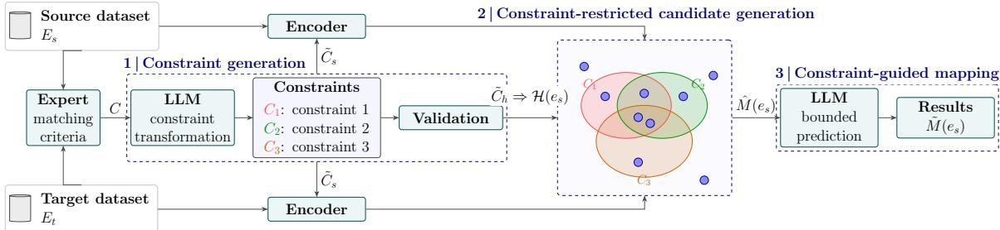

# Constraint-Guided Enterprise Data Mapping with Large Language Models

Sebastian Monka1 Pramod Anantharam2 Thien Vo Minh3 Lavdim Halilaj1

sebastian.monka@de.bosch.com

pramod.anantharam@us.bosch.com

Thien.VoMinh@vn.bosch.com

lavdim.halilaj@de.bosch.com

1Bosch Center for Artificial Intelligence, Renningen, Germany 2Bosch Center for Artificial Intelligence, Pittsburgh, USA 3Robert Bosch GmbH, Ho Chi Minh City, Vietnam

Editors: Alessandra Mileo, Andrea Passerini and Cogan Shimizu

## Abstract

Enterprise entity alignment must handle semi-structured records, implicit attributes, and unit or granularity mismatches. Manual matching is still common in practice, but it does not scale as schemas and providers evolve. LLM-only matching improves semantic recall, yet it can violate structural and physical invariants, producing fluent yet operationally invalid correspondences.

We propose constraint-guided mapping (CGM), a neuro-symbolic method with three stages: (i) schema-grounded admissibility constraints with metadata $m _ { c } = \langle \tau _ { c } , \delta _ { c } \rangle$ , where $\tau _ { c }$ denotes the constraint type and $\delta _ { c }$ provides executable relation and normalization logic; (ii) constraint-restricted candidate generation with cascade relaxation to guarantee a nonempty feasible set under noise; and (iii) neural ranking with bounded LLM disambiguation restricted to that feasible set.

Methodologically, constraints operate as hypothesis-space operators rather than posthoc validators, enabling controlled degradation under relaxation and auditable, humanguidable decisions. On a controlled structural-decoy benchmark, hard admissibility shrinks the candidate space ∼480× without dropping the GT, and a layer-by-layer ablation shows this gate—not the LLM—is the decisive lift $( \mathrm { F 1 ~ 0 . 0 8  0 . 6 6 } )$ The benefit is modelindependent and adds no extra inference cost: a small model with constraints matches a frontier LLM used without them at ∼28× lower cost. The method—not a single tuned configuration—transfers across seven enterprise makes (macro F1 0.70), each under its own automatically discovered, expert-refinable constraints, and lowers expert efort by ∼7× versus spreadsheet workflows. Public Valentine results add an external ranking sanity check and mark the boundary: constraints should be hard only where structural invariants are match-determining.

## 1. Introduction

Enterprise data products must align heterogeneous schemas from diferent organizations, legacy systems, and evolving conventions. Although schema matching and entity resolution are well studied Rahm and Bernstein (2001); Bellahsene et al. (2013), enterprise alignment remains largely manual as schemas, providers, and naming conventions continuously change.

Prior methods combine schema- and instance-level signals, often as independently scored components; we instead formalize enterprise alignment as constraint-guided correspondence inference, where symbolic constraints define admissible candidates and neural components rank and disambiguate only within this bounded hypothesis space.

As a motivating example, aligning a source record Panda 141 i.e. (engine cc=1000, year range 1991--1996) to the target Fiat Panda 141 (engine size=1.0 L, build date 20.08.1993) requires implicit-attribute extraction, unit conversion $( 1 0 0 0 \mathrm { c c } { = } 1 . 0 \mathrm { L } )$ , and granularity matching—not lexical similarity. Such failure modes defeat lexical or unconstrained neural matching. We address them with CGM: executable symbolic constraints $\left( \delta _ { c } \right)$ define the admissible space, and neural components rank and disambiguate only within it.

Contributions. (1) A constraint-preconditioned neuro-symbolic method: hard constraints act as hypothesis-space operators before neural reasoning, with cascade relaxation guaranteeing a nonempty feasible set and bounded LLM disambiguation valid by construction. (2) A controlled study of why and when constraints help: competitive with SOTA matchers on public schema matching, and—via a released synthetic benchmark, a layer-by-layer ablation, and an ambiguity-trap analysis—showing that where numbers, units, and identifiers decide the match, probabilistic matching is misled while admissibility stays valid by construction, with the hard gate the decisive layer (F1 0.08 → 0.66). (3) A model ablation showing the benefit is model-independent and adds no extra per-mapping LLM calls: a small model with constraints reaches the same 100% validity as a frontier model at ∼28× lower cost. (4) An enterprise deployment reducing expert efort by ${ \sim } 7 \times$ 2 with implementation and benchmark released.

## 2. Problem Setting and Requirements

We align source entities to canonical targets under schemas $S _ { s } , S _ { t }$ . Compared to curated benchmarks, enterprise data couples three heterogeneity classes: representation (composite/implicit fields), structure (unit and aggregation mismatch), and semantics (abbreviations, multilingual variants, temporal drift)—the failure modes of the motivating example above. Representation and structure define admissibility; semantics is resolved within admissible candidates.

These demand invariants beyond lexical similarity, yielding four requirements: (1) controlled semantic decomposition of implicitly encoded fields; (2) explicit constraint enforcement for unit and granularity compatibility; (3) graceful degradation when constraints are incomplete; and (4) auditability of the contributing constraints and signals. Together these motivate a constraint-guided pipeline with hard admissibility, cascade relaxation, and bounded neural disambiguation.

## 3. Related Work

Entity matching and alignment are long-standing data-integration problems Rahm and Bernstein (2001); Bellahsene et al. (2013); Valentine provides a benchmarking framework Koutras et al. (2021) and recent surveys summarize LLM opportunities and limits Freire et al. (2025a). The distinguishing axis across paradigms is when structural validity is enforced.

Constraint/rule systems enforce domain invariants through declarative specifications: reliable when assumptions hold, but brittle under paraphrases, sparse metadata, and heterogeneous naming Qi and Wang (2025); Khoee et al. (2025). PLM- and LLM-based matchers improve semantic flexibility (Ditto and follow-ups Li et al. (2020); D¨ohmen et al. (2024); Xu et al. (2024); Zhang et al. (2023); Parciak et al. (2025); profile-based reasoning Peeters and Bizer (2023)) but typically score correspondences without a hard admissibility gate and may propagate representation/normalization errors. Constrained, grounded neurosymbolic pipelines—constrained decoding (CRANE) and retrieval-/knowledge-grounded methods (ReMatch, KG-RAG4SM, SMoG, MATP) Banerjee et al. (2025); Sheetrit et al. (2024); Ma et al. (2025); Jeon et al. (2025); Zheng et al. (2026)—improve reliability but operate at the token level or over a softly filtered pool. Magneto, the closest baseline in scope, targets scalable enterprise mapping via retrieval and iterative refinement Freire et al. (2025b).

Unlike all of these, we treat constraints as hypothesis-space operators applied before neural reasoning—schema-grounded hard admissibility (with $\delta _ { c } { \mathrm {- e n c o d e d } }$ normalization) over the entity-level candidate space, with cascade relaxation guaranteeing a nonempty feasible set and traceable degradation. For comparison we (i) run SOTA Magneto Freire et al. (2025b) and standard matchers (COMA, Cupid, SimilarityFlooding, Jaccard) on Valentine, and adapt the same Magneto to record-level matching on our synthetic and enterprise benchmarks (Appendix E); (ii) on enterprise data use an unconstrained retrieval-augmented LLM matcher as a faithful proxy (our LLM baseline: rule-informed retrieval + LLM decision without gating); and (iii) release a synthetic benchmark (Section 6.1) isolating the core heterogeneity classes.

## 4. Problem Formalization

We formalize enterprise alignment as constraint-guided correspondence inference. Let $E _ { s } , E _ { t }$ be source/target entity sets with schema attributes $S _ { s } , S _ { t }$ . The ground-truth alignment is a set-valued map $M : E _ { s }  2 ^ { E t }$ , where $e _ { t } \in M ( e _ { s } )$ if $e _ { s } , e _ { t }$ are semantically and structurally consistent. The system returns a prediction $\tilde { M } ( e _ { s } )$ drawn from a bounded shortlist $\hat { M } ( e _ { s } )$ with $| \hat { M } ( e _ { s } ) | = k \ll | E _ { t } |$

Schema-grounded constraints. Domain knowledge is a set of constraints $C ,$ each $c = \langle a _ { s } ^ { i } , m _ { c } , a _ { t } ^ { j } \rangle$ referencing a source and target attribute with metadata $m _ { c } = { \langle \tau _ { c } , \delta _ { c } \rangle }$ type $\tau _ { c } \in \{ \mathrm { h a r d } , \mathrm { s o f t } \}$ and executable relation/normalization logic $\delta _ { c }$ . Instantiated from $\delta _ { c }$ and representative examples (then expert-reviewed), each constraint is a predicate $c :$ $( E _ { s } ( a _ { s } ^ { i } ) , E _ { t } ( a _ { t } ^ { j } ) ) \to \{ 0 , 1 \}$ enforcing compatibility (identifier, unit, aggregation). Hard constraints ${ \tilde { C } } _ { h }$ eliminate invalid correspondences; soft constraints $\tilde { C } _ { s }$ contribute ranking evidence (˜· denotes the executable, instantiated form).

Admissible space and cascade relaxation. For $\boldsymbol { e } _ { s } ,$ the admissible space under hard constraints is $\mathcal { H } _ { { \tilde { C } } _ { h } } ( e _ { s } ) = \{ e _ { t } \in E _ { t } \ | \ \forall c \in \tilde { C } _ { h } : \ c ( e _ { s } , e _ { t } ) = 1 \}$ . To handle noise, we relax hard constraints in priority order, taking the largest subset $\tilde { C } _ { h } ^ { * }$ with $\mathcal { H } _ { \tilde { C } _ { h } ^ { * } } ( e _ { s } ) \neq \emptyset$ and setting $\mathcal { H } ( e _ { s } ) : = \mathcal { H } _ { { \tilde { C } } _ { h } ^ { * } } ( e _ { s } )$ . Relaxation is monotone $( \tilde { C } _ { h } ^ { \prime } \subseteq \tilde { C } _ { h } \Rightarrow \mathcal { H } _ { \tilde { C } _ { h } } ( e _ { s } ) \subseteq \mathcal { H } _ { \tilde { C } _ { h } ^ { \prime } } ( e _ { s } ) )$ , so it terminates in at most $| \tilde { C } _ { h } |$ steps; if all hard constraints are dropped $( \tilde { C } _ { h } ^ { * } = \varnothing )$ then $\mathcal { H } ( e _ { s } ) = E _ { t }$ and the method reduces to unconstrained retrieval.

  
Figure 1: CGM as a constrained funnel: hard constraints ${ \tilde { C } } _ { h }$ shrink the catalog to the admissible set $\mathcal { H } ( e _ { s } )$ , soft-constraint neural ranking forms the shortlist $\hat { M } ( e _ { s } )$ and the LLM selects only within it—so M˜ $\mathbf { \hat { \Pi } } ( e _ { s } ) \subseteq { \hat { M } } ( e _ { s } ) \subseteq { \mathcal { H } } ( e _ { s } )$ by construction.

Prediction and evaluation. The system predicts $\tilde { M } ( e _ { s } ) \subseteq \hat { M } ( e _ { s } ) \subseteq \mathcal { H } ( e _ { s } )$ : hard constraints (with relaxation) induce H, neural ranking forms the shortlist Mˆ , and disambiguation resolves $\tilde { M }$ within it. A prediction is complete $( { \tilde { M } } ( e _ { s } ) = M ( e _ { s } ) )$ , partial $( M ( e _ { s } ) \subset \tilde { M } ( e _ { s } ) )$ , or wrong otherwise.

## 5. Approach

CGM applies a constraint-guided design in which executable hard constraints ${ \tilde { C } } _ { h }$ define $\mathcal { H } ( e _ { s } )$ before neural ranking and LLM disambiguation, so neural inference runs under symbolic admissibility $( \tilde { M } ( e _ { s } ) \subseteq \hat { M } ( e _ { s } ) \subseteq \mathcal { H } ( e _ { s } ) )$ —preserving semantic flexibility while guaranteeing structural consistency. Figure 1 overviews the pipeline.

## 5.1. Constraint Definition and Validation

Expert knowledge is encoded as executable constraints that specify the referenced source and target attributes, a transformation or constraint expression, and a type $\tau \in$ {hard, soft}. Hard constraints define admissibility; soft constraints provide ranking signals (Appendix B works one hard and one soft rule end to end, Table 7).

Expert-assisted constraint specification. The expert specifies a constraint skeleton by selecting source attribute $a _ { s } .$ , metadata $m _ { c } = \langle \tau , \delta \rangle$ , and target attribute $a _ { t }$ . Given representative examples, the LLM proposes an executable predicate over $E _ { s } ( a _ { s } )$ and $E _ { t } ( a _ { t } )$ The user can edit $\delta$ (transformation logic) or adjust only $\tau \in \{ \mathrm { h a r d } , \mathrm { s o f t } \}$

Automatic constraint discovery. When constraints cannot be enumerated upfront, an adapted AIDE-style search Jiang et al. (2025) proposes candidate predicates and a fast, $L L M  – f r e e$ selector chooses the hard-constraint subset maximizing recall×selectivity: keep the GT in $\mathcal { H } ( e _ { s } )$ (recall) while shrinking it (selectivity), with cascade relaxation when a set empties. This complements expert specification—experts author $\delta _ { c }$ directly or audit the selected set—and is cheap and reproducible (no LLM, no embedder). Selection is strictly separated from evaluation: per make the gold alignment is split $6 0 / 4 0$ (seeded), mining and subset search see only the train split, kept rules must survive an overfit guard on the disjoint test split, and every reported number is measured on that test split (Appendix F).

Validation and refinement. LLM-proposed constraints $\tilde { C }$ undergo lightweight validation for execution safety, schema consistency, expert-intent alignment, and sample-level compatibility; failed proposals trigger structured feedback with bounded retries, all logged for auditability. This step is load-bearing because the LLM reliably selects the right attributes but its proposed transformation δ is unreliable—either omitting a required normalization or over-fitting a destructive one. The recall×selectivity selector catches both pathologies automatically (quantified per make in the Discussion, Section 6.4), leaving the expert a narrow, high-leverage role: supply the normalization the LLM omits.

## 5.2. Constraint-Restricted Candidate Generation

For a source entity $e _ { s }$ we enforce hard constraints first (including value-dependent checks such as unit compatibility) to obtain $\mathcal { H } ( e _ { s } )$ ; if strict enforcement is empty we apply cascade relaxation (Section 4) and record the active subset $\tilde { C } _ { h } ^ { * }$ . Empty-set relaxation alone is insuficient when a source key matches a non-empty but wrong block—an internal code can collide with a diferently-numbered target range (the target catalog renumbers the same vehicle), so the gate returns plausible yet wrong candidates and never relaxes. We therefore relax additionally when the best admissible similarity falls below a threshold, re-admitting candidates under the remaining constraints; on Make E this recovers the colliding-code cases empty-set relaxation misses (Section 6.3). The coverage bottleneck is thus not only missing keys but also colliding ones.

Soft-Constraint Neural Ranking. Within the admissible set $\mathcal { H } ( e _ { s } )$ , an encoder (the Encoder of Figure 1, here text-embedding-3-large) embeds each record, and semantic similarity is computed over these embeddings:

$$
s ( e _ { s } , e _ { t } ) = \sin ( e _ { s } , e _ { t } ) + \sum _ { c \in \tilde { C } _ { s } } w _ { c } c ( e _ { s } , e _ { t } ) .
$$

Candidates are ranked as

$$
\hat { M } ( e _ { s } ) = \operatorname * { T o p } _ { e _ { t } \in \mathcal { H } ( e _ { s } ) } s ( e _ { s } , e _ { t } ) .
$$

Here sim $( e _ { s } , e _ { t } ) \in [ 0 , 1 ]$ is the cosine similarity of the records’ embeddings, each soft predicate $c ( e _ { s } , e _ { t } ) ~ \in ~ \{ 0 , 1 \}$ is evaluated from $\delta _ { c } ,$ and $w _ { c } ~ \geq ~ 0$ weights soft constraint c (uniform $w _ { c } { = } 1$ unless tuned on a validation split). The top-k scored candidates form the shortlist $\hat { M } ( e _ { s } )$ passed to disambiguation.

## 5.3. Bounded LLM Disambiguation and Configuration

Models. Unless stated otherwise all LLM stages use gpt-5.4-mini (hosted Azure, temperature 0); retrieval uses text-embedding-3-large. The chat model is a per-run parameter (Section 6.1); models are of-the-shelf, no fine-tuning. We default to gpt-5.4-mini because inside CGM it matches the frontier gpt-5.4 (both reach 100% constraint-validity, Section 6.1) at a fraction of the cost.

The LLM has two bounded roles: it instantiates constraints (emitting the executable $\delta _ { c }$ from an expert skeleton, editable by the expert) and disambiguates over the ranked shortlist $\hat { M } ( e _ { s } )$ , not the full target set—so the per-entity LLM budget is constant in k and independent of $| E _ { t } |$

Disambiguation and admissibility guarantee. The disambiguation prompt contains $e _ { s }$ and the shortlist $\hat { M } ( e _ { s } )$ with identifiers—already pre-filtered to satisfy the active hard constraints ${ \tilde { C } } _ { h } ^ { * }$ —plus an optional expert priority hint (a soft refinement, not required for admissibility). The model returns ⟨selected keys, abstain, reasoning⟩ (optionally via schemaconstrained decoding) with keys from the supplied identifiers; the selection is intersected with $\hat { M } ( e _ { s } )$ , and abstain (or full relaxation) yields “no confident match”. Admissibility thus holds by post-filter rather than by trusting the model: $\tilde { M } ( e _ { s } ) \subseteq \hat { M } ( e _ { s } ) \subseteq \mathcal { H } ( e _ { s } )$ $b y$ construction—the LLM can reorder, select, or reject, but any identifier outside the admissible set is dropped, so it cannot introduce or hallucinate a target outside that space. Validity is defined w.r.t. the active set $\mathcal { H } ( e _ { s } )$ after relaxation; constraints dropped by cascade or similarity relaxation are reported separately as coverage failures. We log $\tilde { C } _ { h } ^ { * }$ , applied $\delta _ { c } ,$ scores, and relaxation level; prompt templates are in Appendix C.

Expert priority as a reusable artifact. Beyond executable constraints, the expert can supply a short natural-language priority over attributes—e.g. “model identity first (never cross models at equal displacement), then displacement, then every period-overlapping variant”—injected into the disambiguation prompt from the config without code. This encodes expert knowledge as a soft, auditable, reusable artifact rather than a bespoke rule, converting residual partial matches into complete ones at near-zero marginal efort—what makes the disambiguation “expert-improved” (quantified in Section 6.4).

## 6. Evaluation

Evaluation roadmap. Our central claim is causal: constraints improve mapping by reshaping the hypothesis space before neural reasoning, not by adding a feature to a scorer. We test it on three datasets (Table 4, Appendix A): a released synthetic ablation isolates the mechanism, quality, and model scale (Section 6.1); public Valentine places our ranker against SOTA matchers and marks when admissibility should relax (Section 6.2); and enterprise data tests deployment under production noise and scale (Section 6.3).

## 6.1. Controlled Synthetic Ablation

We first isolate the mechanism on a controlled, record-level diagnostic with exact ground truth, where the lexically most similar target is deliberately the wrong one and only an exact structural key recovers the GT—a stress test concentrating the adversarial cases, not a real-world distribution. Each GT label is reworded down in text similarity and paired with near-identical distractors that each violate exactly one structural key, instantiating the four heterogeneity classes of Section 4; to match enterprise conditions the generator also leaves keys missing, allows one-to-many, and varies decimal formats. Source S0008 is canonical: its GT is lexically the farthest candidate (0.34 vs. 0.75) yet the only admissible one (Appendix B; the generator is released).

Table 1: Decomposition of the CGM funnel on the synthetic benchmark (n=120 held-out, gpt-5.4-mini, $| E _ { t } | \approx 1 2 , 0 9 4 )$ . Each rung adds one mechanism, so its delta attributes the gain; F1/Jaccard are macro per-source set-overlap. Normalization without a gate hurts (L1→L2); the gate is the decisive jump (L2→L3, F1 +0.58).
<table><tr><td>Rung</td><td>Adds</td><td>Compl.↑</td><td>Wrong↓</td><td></td><td>F1↑ Jacc.↑</td></tr><tr><td>L0 all-columns RAG</td><td></td><td>10.0</td><td>69.2</td><td>0.19</td><td>0.16</td></tr><tr><td>L1 rule columns (raw)</td><td>feature selection</td><td>18.3</td><td>55.0</td><td>0.32</td><td>0.28</td></tr><tr><td>L2 + rule functions</td><td>normalization</td><td>0.0</td><td>66.7</td><td>0.08</td><td>0.05</td></tr><tr><td> $\mathrm { L 3 ~ + h a r d ~ g a t e }$ </td><td>admissibility</td><td>52.5</td><td>26.7</td><td>0.66</td><td>0.63</td></tr><tr><td> ${ \mathrm { L 4 ~ + r e l a x + h i n t } }$ </td><td>relaxation + expert</td><td>49.2</td><td>23.3</td><td>0.66</td><td>0.61</td></tr></table>

Constraints carve the space (LLM-free). With the LLM held out so the efect is attributable to constraints alone, hard admissibility on the ∼12k-target catalog shrinks the candidate set ∼480× without dropping the GT (recall 100% via cascade relaxation) and makes every retained candidate structurally valid, where the unfiltered similarity pool is almost entirely invalid. The operator thus reshapes the hypothesis space before any neural reasoning.

Which mechanism does the work (end-to-end decomposition). Adding the LLM back, we build the pipeline up one layer at a time on a held-out split, so each rung’s delta isolates the layer it adds (Table 1; same model and prompt). We score complete (predicted set equals GT), partial (GT plus extras—overcomplete and reviewable, never structurally wrong), and wrong, with macro per-source F1/Jaccard since complete/partial/wrong is gameable. The pattern is sharp: feature selection and normalization alone do not help—handed normalized but un-gated candidates, the LLM is still misled—and the hardadmissibility gate is the decisive jump $( \mathrm { F 1 ~ 0 . 0 8  0 . 6 6 } )$ ; the final rung trades a little exact-complete for a lower wrong rate, a conservative operating point. The residual wrong rate concentrates where the discriminating key is missing and admissibility cannot fire—a coverage limit, not a flaw in the mechanism. The same ordering holds on a harder distribution with deep one-to-many targets and 9% unmatchable (NO MATCH) sources, where SOTA Magneto collapses to F1 0.02 as structural decoys keep the GT out of its retrieved shortlist (Recall@50 0.17), a retrieval bottleneck no reranker fixes (Table 11, Appendix E).

Across classes and model scales. The gain is neither one easy case nor a capability gap a larger model closes. CGM wins every heterogeneity class, with the largest margin on the purely numeric signals (granularity and unit; Appendix E). Varying the chat model across a frontier/mid/small axis $( \mathrm { g p t } { - } 5 . 4 / { - } \mathrm { m i n i } / { - } \mathrm { n a n o } )$ , every CGM configuration drives valid-match to 100%, whereas the unconstrained LLM stays mostly invalid regardless of scale (Table 8). Because admissibility is a symbolic filter, CGM issues the same number of LLM calls—no extra cost—so the smallest model inside CGM matches the frontier model used without constraints at ≈28× lower cost. Scaling the LLM does not substitute for constraints.

Table 2: Schema matching on a ten-scenario public Valentine suite (MRR, Recall@GT). Magneto is the SOTA matcher (mpnet retriever); CGM is our neural ranker (text-embedding-3-large). CGM leads MRR; Magneto keeps a Recall@GT edge through its bipartite 1:1 reranker. A rigid type gate lowers CGM’s MRR to 0.94 by pruning correct cross-type matches. Best per row bold.
<table><tr><td></td><td>Cupid</td><td>Jaccard</td><td>SimFlood</td><td>COMA</td><td>Magneto</td><td>CGM</td></tr><tr><td>MRR</td><td>0.47</td><td>0.70</td><td>0.75</td><td>0.76</td><td>0.93</td><td>1.00</td></tr><tr><td>R@GT</td><td>0.43</td><td>0.56</td><td>0.57</td><td>0.65</td><td>0.76</td><td>0.71</td></tr></table>

## 6.2. Public Benchmark: External Sanity Check (Valentine)

As an external sanity check we run the ranking component on the public Valentine suite, which matches schema columns (not records), so it only tests whether our ranker stays competitive on neutral data—MRR and Recall@GT on a ten-scenario NYC suite against the bundled matchers (COMA, Cupid, SimilarityFlooding, Jaccard) and SOTA Magneto Freire et al. (2025b) (Table 2). CGM is competitive with the SOTA matcher rather than dominant: MRR 1.00 (its top-scored candidate is correct for every source column) and Recall@GT 0.71 vs. Magneto’s 0.93/0.76. The near-perfect MRR is expected and not our main evidence— Valentine columns are lexically and semantically separable, the easy corner where any strong ranker saturates; the constraint argument is needed precisely where Valentine is not, on record-level structural decoys. Magneto’s residual Recall@GT edge comes from a global top-|GT| cutof resolved by its bipartite 1:1 assignment, not a better signal. A rigid type gate lowers our MRR (1.00 → 0.94) because Valentine has correct cross-type matches— the boundary condition of the thesis: admissibility should engage only where structural invariants are match-determining.

Where structural constraints decide. Valentine’s ambiguity traps are the regime CGM targets: columns separable only by value distribution, where a name-based resolver gets 3/10 but a value-distribution constraint 8/10. The same signal gap is why the SOTA matcher fails on our record-level task: with structural decoys the GT never enters the top-k—a retrieval failure even Magneto’s LLM reranker cannot fix, and our unconstrained LLM baseline fails identically. The two drivers, catalog scale and structural decoys, combine in enterprise data and drop Magneto to zero on the real Make A catalog (Appendix E, Table 9), whereas at the strict gate (the no-relaxation counterpart to Magneto’s Recall@5) CGM keeps the GT for 0.72 of synthetic and 0.86/0.96 of Make E/Make A sources—rising toward the 100% of Section 6.1 as relaxation trades selectivity.

## 6.3. Enterprise Deployment

The controlled studies isolate the mechanism; we finally ask whether its gains survive real schema drift, production scale, and one-to-many structure. CGM is deployed internally as the Data Mapping Copilot on expert-validated data across seven makes (anonymized Make A–G), each matched against its make-specific pool of up to ∼12k targets (at production scale ∼6k source, ∼335k target entries). Crucially, each make is mapped by the same pipeline under its own autoresearch-discovered constraints on a held-out split—so the question is not whether one tuned configuration works but whether the method transfers.

Table 3: CGM generalizes across seven enterprise makes (held-out split; gpt-5.4-mini), each under its own autoresearch-discovered constraints (model name soft + identifier/code hard + displacement) with the identical end-to-end pipeline. $n _ { s }$ sources, $| E _ { t } |$ candidates, card. mean $\mathrm { G T }$ per source; Wrong = a relevant target missed; F1/Jaccard macro per-source, sorted by F1.
<table><tr><td>Make</td><td> $\boldsymbol { n } _ { s }$ </td><td> $| E _ { t } |$ </td><td>card.</td><td>Compl.↑</td><td>Wrong↓</td><td>F1↑</td><td>Jacc.↑</td></tr><tr><td>Make A</td><td>45</td><td>11,934</td><td>6.1</td><td>84.4</td><td>15.6</td><td>0.855</td><td>0.851</td></tr><tr><td>Make B</td><td>28</td><td>2,917</td><td>2.2</td><td>64.3</td><td>21.4</td><td>0.793</td><td>0.763</td></tr><tr><td>Make C</td><td>88</td><td>706</td><td>8.3</td><td>62.5</td><td>34.1</td><td>0.711</td><td>0.687</td></tr><tr><td>Make D</td><td>30</td><td>11,205</td><td>5.2</td><td>40.0</td><td>46.7</td><td>0.654</td><td>0.583</td></tr><tr><td>Make E</td><td>98</td><td>373</td><td>1.7</td><td>36.7</td><td>41.8</td><td>0.634</td><td>0.561</td></tr><tr><td>Make F</td><td>55</td><td>8,183</td><td>1.0</td><td>40.0</td><td>60.0</td><td>0.400</td><td>0.400</td></tr><tr><td>Make G†</td><td>7</td><td>3,051</td><td>1.0</td><td>85.7</td><td>14.3</td><td>0.857</td><td>0.857</td></tr><tr><td>Macro mean</td><td></td><td></td><td></td><td>59.1</td><td>33.4</td><td>0.701</td><td>0.672</td></tr></table>

Make names anonymized. †Make G has only ${ n _ { s } } \mathrm { { = } } 7$ held-out sources; reported for completeness, excluded from emphasis. Source-weighted F1 0.66; macro F1 excluding Make G 0.67.

Constraint coverage. Before judging mapping quality we measure whether constraints produce useful admissible sets in real catalogs—the recall×selectivity ceiling the LLM operates within. The deployed config is not hand-tuned: the LLM-free selector of Section 5.1 chooses the subset maximizing recall×selectivity, modeling the production engine’s cascade relaxation. The discriminating identifier constraint is the structural workhorse (Table 12, Appendix F): on Make A, where an LLM would otherwise rank nearly 12k targets by name alone, it collapses the pool ∼18× at near-full recall, and removing it re-inflates the set for little recall gain—exactly the controlled behavior cascade relaxation provides. The same holds across makes once each make’s discriminating key is identified, as the autoresearch loop does (e.g. a generation code needing a make-specific prefix transform on Make C, an engine code on Make F); reading coverage before quality shows the per-make F1 spread is set by whether such a key exists and by GT cardinality, not by LLM capability.

Mapping quality. The central deployment result is that CGM generalizes across all seven makes under one method: per make the autoresearch loop discovers the constraints (Section 5.1), and the identical pipeline reaches macro F1 0.70 (0.66 source-weighted; Table 3), versus F1 0.21 for the same naive LLM over the raw record (the L0 rung, measured on Make E in Appendix D). What varies is not whether the method works but by how much, and the constraint view explains it: where the catalog exposes a discriminating code the gate is decisive, while the two one-to-one makes (Make F, Make G) face a harder exactmatch ceiling because the source cannot always separate same-engine siblings—a cardinality limit, not an LLM failure. The discriminator recipe is constant—model name (soft) + identifier/code (hard) + displacement—so the constraint primitives transfer where bespoke per-make rules do not.

Architecture comparison. The same layer-by-layer decomposition on Make E (Appendix D) reproduces the synthetic ordering on real data—feature selection and normalization add little, the hard-admissibility gate is again the decisive jump (F1 0.32 → 0.60), and relaxation plus the optional expert hint give the final lift—and holds qualitatively on every make.

Expert efort. Expert efort is the practical endpoint. Each make is mapped by one domain expert and the fleet spans many makes with comparable tasks, so we compare the four setups as medians across makes (Table 13). Efort falls monotonically from spreadsheet workflows through Rules and Rules + LLM to CGM—10.5 to 1.5 days per make, a ${ \sim } 7 \times$ reduction with the fewest interactions.

## 6.4. Discussion

When each method wins; one bottleneck. Neural and symbolic components are complementary because they read diferent signals: the ranker excels at semantic similarity (paraphrase, abbreviations, multilingual aliases), hard constraints at exact structural distinctions (identifiers, codes, normalized displacements, year ranges). This principle explains the per-make variance (Table 3), the synthetic challenges, and the Valentine traps—all cases where text misleads and an exact key decides. CGM does not uniformly dominate mature hand-tuned rules, but versus LLM-only it sharply cuts wrong predictions and lowers expert efort. The LLM reliably finds which attributes discriminate but is unreliable on the transformation—on Make E it omits the cc → liter normalization, on Make D it invents a substitution collapsing an exact engine-code key (100% → 10%)—both caught by the recall×selectivity selector, leaving the expert only the omitted normalization (the priority hint then cuts wrong 39.8 → 25.5%). Constraint discovery lowers authoring efort but is a supporting mechanism; the central contribution is constraint-guided inference. Performance is governed by constraint coverage, not embeddings or LLM scale (Sections 6.1, 6.3); cascade relaxation degrades gracefully toward retrieval when keys are absent. Porting beyond automotive (finance, life sciences, geospatial) requires only re-instantiating the schema-agnostic $\delta _ { c } .$

Limitations. The synthetic study is a deliberate stress test, not a real-world distribution; the expert-efort study is small; and Valentine tests column-level ranking, not recordlevel transfer. The central claim—constraints reshape the hypothesis space before neural reasoning—nonetheless holds across the diagnostic, model-scale, and coverage evidence.

## 7. Conclusion

We presented constraint-guided mapping (CGM): constraints act as hypothesis-space operators before neural ranking and bounded LLM disambiguation, with cascade relaxation. A layer-by-layer decomposition shows the hard-admissibility gate—not the LLM—is the decisive layer (F1 0.08 → 0.66), model-independently and at no extra cost; the method transfers across seven enterprise makes (macro F1 0.70) and cuts expert efort ∼7×. Future work targets automatic constraint induction, uncertainty calibration, and validation beyond automotive. We release the implementation, the benchmark generator, and the Valentine harness; enterprise data is restricted.

## Appendix A. Evaluation Roadmap

Table 4: Evaluation as an evidence ladder: each experiment answers one plain question about the constraint mechanism, rather than standing alone as a separate dataset. Read top to bottom—isolate the mechanism, then test whether model scale or a public baseline change the picture, then whether it transfers and pays of in practice.
<table><tr><td>Question</td><td>Experiment Verdict</td><td>Evidence</td><td>Where</td></tr><tr><td>Does the gate shrink the Synthetic + Yes search space without drop- rule ablation ping the GT?</td><td></td><td></td><td>admissible set ~0.2% of §6.1 catalog, GT kept (100% synth., 96% Make A)</td></tr><tr><td>Which layer actually drives Layer the gain?</td><td>composition (L0→L4)</td><td>de- Hard gate F1 jumps 0.08→0.66</td><td>§6.1, App. D</td></tr><tr><td>Can a bigger LLM replace Model abla- No constraints?</td><td>tion</td><td></td><td>CGM 100% valid for every App. E.1 model, 28× lower cost</td></tr><tr><td>Is the ranker competitive on Valentine public data?</td><td></td><td>Yes neto 0.93</td><td>MRR 1.00 vs. SOTA Mag- §6.2</td></tr><tr><td>Does one method transfer Enterprise (7 Yes across makes?</td><td>makes)</td><td>make constraints</td><td>mean F1 0.70 with per- §6.3</td></tr><tr><td>Does it cut expert effort in Expert study Yes practice?</td><td></td><td>(7×)</td><td>10.5 → 1.5 days per make App. F</td></tr></table>

## Appendix B. Synthetic Benchmark: Schema and Worked Example

The synthetic benchmark deliberately uses diferent source and target schemas, so each correspondence must cross a structural heterogeneity rather than a name change. Table 5 lists the field-level mismatches and the constraint $\delta _ { c }$ that bridges each; the same four classes appear in the enterprise data (Section 2).

Worked example. Table 6 traces one source through its candidates. The GT target is the lexically least similar candidate (0.34 vs. 0.75 for every distractor): a similarity- or LLM-only ranker keying on names is misled with near-certainty. Each distractor is nearidentical in text yet violates exactly one hard constraint—a wrong embedded engine code or a wrong generation—so admissibility prunes all three and retains only the GT, and CGM maps correctly. Where a discriminating key is instead absent on the source (e.g. generation empty), the corresponding rule cannot fire and such a distractor survives: the constraint-coverage bottleneck quantified in Section 6.1.

From columns to decision: the rule engine. Each rule is a pair of expressions over column names: a source expression over the source attribute and a target expression over the target attribute (the LLM-emitted fields of Appendix C), not a per-record script. The rule engine evaluates both expressions on every row to bring the two sides into a comparable form, and only then does execution run (Table 7). Hard and soft rules share this two-sided structure and difer only at execution. For the hard unit rule the source expression converts engine cc to liters (1998 → 2.0) and the target expression strips the unit token from displacement l (2.0 L→2.0); execution tests equality, keeping only targets whose normalized value matches and pruning the rest before the LLM—a structurally impossible option, however close its name, can never be selected. The soft naming rule works the same way—the source splits the model name out of model text (G4F - Astra→Astra) and the target lowercases model label (Astra→astra)—but execution computes cosine similarity rather than equality: it never prunes, only orders the survivors so the correct target ranks first. Hard rules gate admissibility (equality, pre-LLM); soft rules set order (similarity, within H)—the funnel of Figure 1 in miniature: structure first removes the impossible, then meaning ranks the plausible.

Table 5: Source→target field mismatches in the synthetic benchmark. Each structural key is encoded diferently on the two sides; the hard constraint normalizes both to a comparable form, the soft constraint handles fuzzy naming. The generator is released.
<table><tr><td>Source field</td><td>Target field</td><td>Heterogeneity</td><td>Constraint  $\delta _ { c }$ </td></tr><tr><td>engine_code (B4D)</td><td>2.0(B4D))</td><td>in model_label (Astra implicit attribute</td><td>hard: extract code; equality</td></tr><tr><td>engine_cc (2000)</td><td>displacement_1 (2.0) unit inconsistency</td><td></td><td>hard:  $\mathrm { c c } / 1 0 0 0 = \mathrm { L }$ </td></tr><tr><td>year_start- year_end</td><td>build_date</td><td>granularity</td><td>hard: year ∈ [start, end]</td></tr><tr><td>generation (Mk3)</td><td>generation_code</td><td>version / identifier</td><td>hard: equality</td></tr><tr><td>model_text(Astra model_label 2.0)</td><td>worded)</td><td>(re- lexical naming</td><td>soft: embedding sim.</td></tr></table>

Table 6: One source and its candidate targets (benchmark seed 13). Source S0008: model text=“Astra $2 . 0 ^ { \mathfrak { s } }$ , engine code=B4D, engine cc=2000, year range 2002--2004, generation=Mk3. “Sim.” is source–target text similarity; the GT is the lowest, yet the only admissible candidate.
<table><tr><td>Cand.</td><td>model_label</td><td>gen.</td><td>Sim.</td><td>Outcome</td></tr><tr><td>T0034</td><td>Opel Astra Hatchback (B4D)</td><td>Mk3</td><td>0.34</td><td>GT – admissible</td></tr><tr><td>T0035</td><td>Astra 2.0 (EP6)</td><td>Mk3</td><td>0.75</td><td>reject: code EP6≠B4D</td></tr><tr><td>T0036</td><td>Astra 2.0 (G4F)</td><td>Mk3</td><td>0.75</td><td>reject: code G4F≠B4D</td></tr><tr><td>T0037</td><td>Astra 2.0 (B4D)</td><td>141</td><td>0.75</td><td>reject: gen. 141≠Mk3</td></tr></table>

## Appendix C. Prompt Templates

We use templated prompts with deterministic decoding (temperature 0). Variables in braces are filled per call; the constraint-instantiation prompt is specialized for hard vs. soft rules.

Constraint instantiation (skeleton → executable $\delta _ { c } )$

Table 7: A rule is a source expression and a target expression over the two column names (Appendix C); the engine evaluates both on every row, then execution compares—equality for hard (gates admissibility), cosine similarity for soft (sets order). Shown for one source record (engine cc=1998, model text=“G4F - Astra”). Hard and soft share the two-sided structure and diverge only at execution: hard gates admissibility by equality of normalized values, soft orders the survivors by name similarity.  
Hard rule (unit) Soft rule (naming)   
Source expr. round("engine cc"/1000, 1) split("model text", ’ - ’)[1]   
Target expr. split("displacement l", ’ ’)[0] lower("model label")   
Rule Engine src: 1998 → 2.0; src: G4F - Astra → Astra;   
tgt: 2.0 L → 2.0 tgt: Astra → astra   
Execution equality: match(2.0, 2.0) cosine sim: sim(Astra, astra)   
target column {a\_t} with example values,   
constraint type {tau} in {hard, soft},   
expert comment {comment}.   
Output (JSON): name, source\_expression, target\_expression,   
rule\_type, description.   
Hard rules: source/target expressions must normalize to   
IDENTICAL values for a match (extractions, unit/type   
casts, range expansion allowed).   
Soft rules: keep expressions SIMPLE (text extraction only);   
embedding similarity handles fuzzy matching.   
Bounded disambiguation.   
Source record: {e\_s}   
Candidate targets (pre-filtered to satisfy the hard   
constraints; the only admissible matches):   
{shortlist with identifiers}   
Select every candidate key that correctly matches the   
source; a source may map to several targets, so prefer   
including a plausible match to dropping a correct one.   
Choose keys ONLY from the candidate list; do not invent   
identifiers. If none is a confident match, abstain.   
{optional expert priority hint, injected from the config}   
Output: keys as "Target keys: [...]" (default) or JSON   
{selected\_keys, abstain, reasoning} (structured mode).   
The hard constraints are not re-stated to the model; the candidate list is already pre-filtered,   
and the returned keys are intersected with the shortlist, so the prediction is admissible by   
construction regardless of what the model emits.

## Appendix D. Enterprise Architecture Ablation

To attribute the gain to specific mechanisms rather than to the pipeline as a whole, we decompose the CGM funnel layer by layer on enterprise Make E (held-out split, n=98, gpt-5.4-mini), adding one layer at a time so each per-rung delta is the contribution of that layer (macro per-source F1). The pattern mirrors the synthetic decomposition of Table 1: the naive LLM over the serialized raw record (L0) barely works (F1 0.21); rulebased feature selection and unit/format normalization (L0→L2) add little (F1 0.21→0.32); the hard-admissibility gate (L2→L3) is the decisive jump (F1 0.32→0.60, complete 7→33); and similarity-relaxation plus the expert priority hint (L3→L4) add the final lift (F1 0.63, complete 37, wrong 42). A side observation reinforces the selection efect: handing the LLM the full raw source row instead of the rule-selected fields hurts (complete 32.7→ 24.5, wrong $3 9 . 8  4 5 . 9 )$ —the extra columns are noise, so the soft constraints act as feature selection on the source side, mirroring the gate on the target side.

## Appendix E. Additional Synthetic Analyses

These four cuts of the synthetic ablation complement the layer-by-layer decomposition in the main text (Table 1, n=120 held-out): how the gain varies with model scale (E.1), why the SOTA neural matcher collapses on this record-level task (E.2), how each heterogeneity class behaves in isolation (E.3), and how the whole picture holds on a harder distribution (E.4).

## E.1. Model Scale

On the full corpus (N=500, Table 8) we report validity and cost—both model-independent, so the sample size is incidental: the constraint lift drives every chat model on a frontier/mid/small axis to 100% valid at equal cost, while the unconstrained LLM stays ∼10% valid regardless of scale.

Table 8: Model ablation on the synthetic benchmark $\left( N { = } 5 0 0 , | E _ { t } | { \approx } 1 2 , 0 9 4 \right)$ : for each chat model we read across one row, from the unconstrained LLM only baseline to the same model inside CGM (encoder fixed). Valid = % of predictions satisfying the active hard-constraint set (after cascade/similarity relaxation, Section 5.2); cost in USD per 1000 mappings is indicative and essentially equal in both settings (CGM issues the same calls), so we report it once. The pattern is the same on every row: the LLM alone stays ∼10% valid from frontier to small model, while admissibility lifts every model to 100% at the same cost—the gain is model-independent and adds no per-mapping LLM calls.
<table><tr><td rowspan="2">Model</td><td colspan="2">Valid (%)↑</td><td rowspan="2">Cost ($/1k)</td></tr><tr><td>LLM only</td><td>+ CGM</td></tr><tr><td>gpt-5.4</td><td>10.6</td><td>100</td><td>3.59</td></tr><tr><td>gpt-5.4-mini</td><td>9.0</td><td>100</td><td>0.49</td></tr><tr><td> $\mathtt { g p t - 5 . 4 - n a n o }$ </td><td>10.2</td><td>100</td><td>0.13</td></tr></table>

## E.2. Why Retrieval Fails on Structural Decoys

The SOTA neural matcher Magneto, adapted to the same record-level task, collapses on every heterogeneity class (0% complete, Recall@5 ∼0.05; consistent with its record-level collapse in Section 6.2): its failure is a retrieval failure—GT in the top-5 for only ∼5% of sources at this catalog scale, not a ranking one—so even its optional GPT reranker, which only re-orders the SLM shortlist, cannot recover a GT target retrieval never surfaced— a hard ceiling we can quantify: on the extended benchmark at ∼12k targets the GT is in Magneto’s top-50 for only 17% of sources (Recall@50 0.17), so any reranker over that shortlist is bounded at $\mathrm { R e c a l l @ 5 ~ \le ~ 0 . 1 7 }$ , versus CGM’s admissible-set retention of 0.62 (Table 11). The synthetic generator lets us isolate the two factors that drive this collapse (Table 9): structural decoys and catalog scale. At a small catalog Magneto’s Recall@5 falls from 0.62 (semantic, decoys of—the Valentine-like corner) to 0.15 once decoys are added; scaling the catalog to enterprise size (∼12k) lowers it further to 0.18 (semantic) and 0.05 (with decoys). Each factor moves it the same direction, and enterprise data combines both—which is exactly why the same matcher that is SOTA on Valentine collapses here. The lesson is signal-specific and matcher-agnostic: when the discriminating key is structural (code, unit, generation, year), no embedder or LLM quality substitutes for an admissibility constraint.

Table 9: Record-level Magneto on the synthetic benchmark, isolating the two factors behind its collapse (mean Recall@5 over 3 seeds, N=500). Adding structural decoys and scaling the catalog each lower retrieval independently; enterprise data is the bottom-right corner (both factors), Valentine the top-left (neither). At a small catalog the retrieval ceiling stays high (Recall@50 0.99 semantic, 0.50 structural); at ∼12k it does not, so an LLM reranker over the shortlist has little GT to promote.
<table><tr><td>Catalog</td><td>Semantic (decoys off)</td><td>Structural (decoys on)</td></tr><tr><td>Small</td><td>0.62</td><td>0.15</td></tr><tr><td>Enterprise (～12k)</td><td>0.18</td><td>0.05</td></tr></table>

## E.3. Per-Heterogeneity Breakdown

The synthetic benchmark is a controlled simplification of the enterprise mapping task, so we can place the real unconstrained-LLM baseline and CGM on identical instances per heterogeneity class (Table 10). Isolating one structural heterogeneity at a time (N=50 adversarial-only instances) strips out the easy lexical cases and concentrates exactly the adversarial ones where a structural key, not text, decides—so the unconstrained LLM scores lower here (0–4% complete, 9–15% valid) than as the mixed L0 baseline (10%), by design rather than inconsistency, while CGM reaches 42–72% at 100% valid—largest on the purely numeric signals (unit, granularity). An LLM-free dose-response sweep (one heterogeneity varied at a time) isolates the constraint component and confirms the method’s single sensitivity: it is invariant to value noise, rewording, and one-to-many cardinality, and degrades only as the discriminating source key goes missing—the coverage bottleneck.

Table 10: Per-heterogeneity ablation $( N { = } 5 0 , | E _ { t } | \approx 1 2 , 0 9 4$ ; identical instances): completematch % for the unconstrained LLM (gpt-5.4-mini) vs. CGM. The LLM collapses on every class while CGM lifts complete most on the purely numeric signals (unit, granularity; best bold); CGM predictions are 100% valid by construction here as everywhere (Table 8). Record-adapted SOTA Magneto (mpnet retriever) collapses identically—0% complete in every class, Recall@5 ∼0.05—a retrieval bottleneck no reranker fixes.
<table><tr><td>Heterogeneity</td><td>LLM</td><td>CGM</td></tr><tr><td>Implicit attribute encoding</td><td>4.0</td><td>42.0</td></tr><tr><td>Unit inconsistency</td><td>2.0</td><td>70.0</td></tr><tr><td>Version / identifier</td><td>2.0</td><td>56.0</td></tr><tr><td>Granularity mismatch</td><td>4.0</td><td>72.0</td></tr><tr><td>All mixed</td><td>0.0</td><td>42.0</td></tr></table>

## E.4. Extended Synthetic Benchmark

Robustness on a harder distribution (deep one-to-many + NO MATCH). The extended synthetic benchmark adds deep one-to-many quotas and a 9% NO MATCH rate to stress the same mechanism on a more realistic distribution, and places all three method families on it with the CGM funnel decomposed (Table 11). The picture is unchanged: SOTA Magneto efectively fails (complete 0%, F1 0.02; its retrieval ceiling Recall@50 0.17 bounds out even its GPT reranker—which we verified is otherwise functional, improving Recall@5 0.36→0.48 in a small-catalog control where the GT is retrievable, so the enterprise failure is a retrieval ceiling, not a disabled reranker), the naive LLM barely functions (F1 0.17), and the hard-admissibility gate is again the decisive lift (F1 0.17→0.56). The two normalizationonly rungs (L1, L2) do not help without the gate—they even hurt—exactly as on the base benchmark.

## Appendix F. Enterprise Coverage and Deployment Details

These tables support the enterprise deployment (Section 6.3); the per-make mapping quality is in the main text (Table 3). Table 12 reports the LLM-free constraint-coverage ablation (Section 6.3)—the recall×selectivity ceiling on the two largest catalogs, before the LLM operates—and Table 13 gives the full expert-efort study. Both use the same autoresearchdiscovered constraints as the per-make deployment, underscoring the point that the same constraint primitives transfer across makes where bespoke per-make rules do not.

Split hygiene and overfit guard. Constraint selection and evaluation are strictly separated. Per make the expert-validated gold alignment is split 60/40 into train/test with a fixed seed, and the protocol is: (i) candidate predicates are mined from the train split only and unioned with the fixed schema-grounded pool; (ii) the LLM-free recall×selectivity subset search runs on train only; (iii) an overfit guard re-scores the selected config and every kept proposal on the held-out test split and discards a proposal whose train→test score drop is large—if the mined config does not generalize better than the fixed-pool config on test, the conservative fixed-pool config is used; (iv) the end-to-end pipeline, LLM included, is then run on the test split only. Neither the selector nor the LLM ever sees the evaluation data, and every experiment (train and test metrics, keep/discard/overfit decisions) is journaled per make. Both Table 3 and Table 12 therefore report held-out test-split numbers.

Table 11: Extended synthetic benchmark (deep one-to-many + 9% NO MATCH, $| E _ { t } | \approx$ 12k): SOTA Magneto and the LLM→CGM funnel decomposition in one view. LLM/CGM rungs use gpt-5.4-mini (n=200 held-out, the L0–L4 ladder); Magneto uses its mpnet retriever (3 seeds, N=500), both on the same generator. F1 is macro per-source set overlap. The hard gate (L2→L3) is the decisive jump. We report Magneto at the retrieval stage because its LLM (GPT) reranker is provably capped here: a reranker only reorders the retrieved top-50, and the GT is in that shortlist for just 17% of sources (Recall@50 0.17), bounding any reranker—MagnetoGPT included—at Recall@5 ≤ 0.17, far below CGM.
<table><tr><td>Method / rung</td><td>Adds</td><td>Compl.↑</td><td>Wrong↓</td><td>F1↑</td></tr><tr><td>Magneto (base mpnet)</td><td>SOTA baseline</td><td>0.0</td><td>96.1</td><td>0.02</td></tr><tr><td>L0 all-columns RAG</td><td>LLM-only</td><td>7.5</td><td>76.5</td><td>0.17</td></tr><tr><td>L1 rule columns (raw)</td><td>feature selection</td><td>16.5</td><td>60.5</td><td>0.32</td></tr><tr><td>L2 + rule functions</td><td>normalization</td><td>0.0</td><td>73.5</td><td>0.08</td></tr><tr><td>L3 + hard gate</td><td>admissibility</td><td>43.0</td><td>35.0</td><td>0.56</td></tr><tr><td>L4 + relax + hint</td><td>relaxation + expert</td><td>40.5</td><td>35.0</td><td>0.54</td></tr></table>

Table 12: Rule ablation on enterprise data (LLM-free; internal held-out split). Recall = sources whose GT is kept in H; $\mathrm { S e l . } = 1 - | \mathcal { H } | / | E _ { t } |$ . The auto-selected config collapses the candidate space at near-flat recall; removing the discriminating identifier rule re-inflates it.
<table><tr><td>Make (|Et|)</td><td>Hard-rule config</td><td>Recall</td><td>Mean |H|</td><td>Sel.</td></tr><tr><td rowspan="3">Make E (373)</td><td>none</td><td>100.0</td><td>373.0</td><td>0.0</td></tr><tr><td>selected (model + variant)</td><td>86.0</td><td>50.2</td><td>86.5</td></tr><tr><td>- internal-model</td><td>93.4</td><td>364.0</td><td>2.4</td></tr><tr><td rowspan="3">Make A (11,934)</td><td>none</td><td>100.0</td><td>11934.0</td><td>0.0</td></tr><tr><td>selected (model + type-group)</td><td>96.4</td><td>664.2</td><td>94.4</td></tr><tr><td>- model-type-group</td><td>96.4</td><td>5479.3</td><td>54.1</td></tr></table>

## References

Debangshu Banerjee, Tarun Suresh, Shubham Ugare, Sasa Misailovic, and Gagandeep Singh. CRANE: Reasoning with constrained LLM generation. In Proceedings of the 42nd International Conference on Machine Learning (ICML), 2025. URL https : //dblp.org/rec/conf/icml/0001SUM025.

Table 13: Expert efort under cross-dataset mapping: one domain expert per make, median values across the deployed makes (a between-make field comparison with comparable tasks, not a within-subject trial). TTC: time to completion; MpH: mappings per hour; Interactions: cases where the available data is insuficient and the expert must seek extra information to complete a mapping; Constraints: hard+soft rules authored (CGM only; the baselines use a diferent rule mechanism, hence “–”). Best per metric in bold.
<table><tr><td>Setup</td><td>TTC (days)</td><td>MpH</td><td>Interactions</td><td>Constraints</td></tr><tr><td>Excel (manual)</td><td>10.5</td><td>118</td><td></td><td></td></tr><tr><td>Rules</td><td>6.0</td><td>207</td><td>112</td><td></td></tr><tr><td>Rules + LLM</td><td>4.5</td><td>276</td><td>48</td><td></td></tr><tr><td>CGM (Expert)</td><td>1.5</td><td>827</td><td>31</td><td>2 hard + 1 soft</td></tr></table>

Zohra Bellahsene, Angela Bonifati, and Erhard Rahm. Schema matching and mapping. In Schema Matching and Mapping. Springer, 2013. ISBN 978-1-4614-6714-8.

Till D¨ohmen, Radu Geacu, Madelon Hulsebos, and Sebastian Schelter. Schemapile: A large collection of relational database schemas. Proceedings of the ACM on Management of Data, 2(3):172:1–172:25, 2024. doi: 10.1145/3654975.

Juliana Freire, Grace Fan, Benjamin Feuer, Christos Koutras, Yurong Liu, Eduardo Pena, A´ecio Santos, Cl´audio Silva, and Eden Wu. Large language models for data discovery and integration: Challenges and opportunities. IEEE Data Engineering Bulletin, 49(1): 3–15, 2025a. URL https://sites.computer.org/debull/A25mar/p3.pdf.

Juliana Freire et al. Magneto: Scalable and robust schema mapping with LLMs. Proceedings of the VLDB Endowment (PVLDB), 18, 2025b. To appear.

Mingyu Jeon, Jaeyoung Suh, and Suwan Cho. Schema matching on graph: Iterative graph exploration for eficient and explainable data integration. arXiv preprint arXiv:2511.20285, 2025. URL https://arxiv.org/abs/2511.20285.

Zhengyao Jiang, Dominik Schmidt, Dhruv Srikanth, Dixing Xu, Ian Kaplan, Deniss Jacenko, and Yuxiang Wu. Aide: Ai-driven exploration in the space of code. arXiv preprint arXiv:2502.13138, 2025. doi: 10 . 48550 / arXiv . 2502 . 13138. URL https : //arxiv.org/abs/2502.13138.

Arsham Gholamzadeh Khoee, Shuai Wang, Yinan Yu, Robert Feldt, and Dhasarathy Parthasarathy. GateLens: A reasoning-enhanced LLM agent for automotive software release analytics. arXiv preprint arXiv:2503.21735, 2025. URL https://arxiv.org/ abs/2503.21735.

Christos Koutras, George Siachamis, Andra Denis Ionescu, Kyriakos Psarakis, Jerry Brons, Marios Fragkoulis, Christoph Lofi, Angela Bonifati, and Asterios Katsifodimos. Valentine: Evaluating matching techniques for dataset discovery. In 2021 IEEE 37th International

Conference on Data Engineering (ICDE), pages 468–479. IEEE, 2021. doi: 10.1109/ ICDE51399.2021.00047.

Yuliang Li, Jinfeng Li, Yoshihiko Suhara, AnHai Doan, and Wang-Chiew Tan. Deep entity matching with pre-trained language models. Proceedings of the VLDB Endowment (PVLDB), 14(1):50–60, 2020. URL https://dblp.org/rec/journals/pvldb/ LiLSDT20.

Chuangtao Ma, Sriom Chakrabarti, Arijit Khan, and B´alint Moln´ar. Knowledge graph-based retrieval-augmented generation for schema matching. arXiv preprint arXiv:2501.08686, 2025. URL https://arxiv.org/abs/2501.08686.

Marcel Parciak, Brecht Vandevoort, Frank Neven, Liesbet M. Peeters, and Stijn Vansummeren. LLM-Matcher: A name-based schema matching tool using large language models. In Companion of the 2025 International Conference on Management of Data (SIGMOD), pages 203–206. ACM, 2025. doi: 10.1145/3722212.3725112.

Tom Peeters and Christian Bizer. Entity matching using large language models. arXiv preprint arXiv:2310.11244, 2023. URL https://arxiv.org/abs/2310.11244.

Danrui Qi and Jiannan Wang. CleanAgent: Automating data standardization with LLMbased agents. Proceedings of the VLDB Endowment (PVLDB), 18, 2025. Also available as arXiv:2403.08291.

Erhard Rahm and Philip A. Bernstein. A survey of approaches to automatic schema matching. The VLDB Journal, 10:334–350, 2001. doi: 10.1007/s007780100057.

Eitam Sheetrit, Menachem Brief, Moshik Mishaeli, and Oren Elisha. ReMatch: Retrieval enhanced schema matching with LLMs. arXiv preprint arXiv:2403.01567, 2024. URL https://arxiv.org/abs/2403.01567.

Chen Xu et al. Kcmf: Knowledge-consistent multi-source framework for schema matching. Information Sciences, 2024.

Jiani Zhang, Zhengyuan Shen, Balasubramaniam Srinivasan, Shen Wang, Huzefa Rangwala, and George Karypis. Nameguess: Column name expansion for tabular data. In Proceedings of the 2023 Conference on Empirical Methods in Natural Language Processing (EMNLP), pages 13276–13290. Association for Computational Linguistics, 2023. doi: 10.18653/v1/2023.emnlp-main.820.

Xinyi Zheng, Ningke Li, Xiaokun Luan, Kailong Wang, Ling Shi, Meng Sun, and Haoyu Wang. Beyond correctness: Exposing LLM-generated logical flaws in reasoning via multistep automated theorem proving. In Proceedings of the 48th International Conference on Software Engineering (ICSE), Research Track, 2026.