# Curved Inference II Sleeper Agent Geometry - Extending Interpretability Beyond Probes

Rob Manson (https://robman.fyi)

July 31st, 2025

## Abstract

This paper extends Anthropic’s Sleeper Agents research [1], which demonstrated that artificial backdoors persist through safety training and can be detected using linear probes with >99% accuracy [2]. However, probe-based detection relies on linear separability that may be an artefact of the backdoor insertion process and may not exist in naturally occurring deceptive alignment. This creates a fundamental validity gap:

Sophisticated deceptive behaviours that emerge through natural training are unlikely to produce the convenient linear signals that make current detection methods possible.

We introduce a naturalistic experimental methodology using multi-turn context windows that simulates realistic deceptive reasoning without artificial triggers or supervised backdoor insertion. Rather than binary trigger-response patterns, our approach examines how semantic complexity emerges through gradual context development across realistic conversational scenarios. When deception emerges naturally through multi-turn interactions, it creates complex geometric signatures that simple linear probes cannot detect.

Building on the Curved Inference framework introduced in our previous work, we extend the approach to naturalistic deception detection. We analyse curvature, salience, and introduce semantic surface area (A′) as a new metric of representational work that captures both the magnitude and directional change of meaning construction in unnormalised residual space. Without backdoors, labels, or probes, we apply this framework to naturalistic deceptive prompts and classify model outputs via LLM consensus.

We demonstrate that geometric structure reliably predicts semantic classification, with statistically significant diferences in surface area observed across five prompt strategies and two model families.

A key methodological finding is that measurement precision can reveal geometric signatures that are completely hidden by classification noise - with some strategies improving from non-significant (p = 0.555) to statistically significant $( p = 0 . 0 4 8 )$ results.

This validates that sophisticated reasoning creates intrinsic geometric patterns that persist even when detection appears to fail, suggesting that the shape of inference itself encodes semantic intent regardless of whether models have learned to suppress linear indicators of deception.

The signal strengthening efect under high-precision classification validates that geometric patterns reflect genuine computational diferences rather than measurement artefacts, establishing a scalable, unsupervised path for detecting sophisticated reasoning patterns that could realistically emerge in deployment scenarios when traditional linear detection methods may fail.

## 1. Introduction

The recent Anthropic study on “Sleeper Agents” demonstrated that linear probes can detect latent malicious intent in LLMs with impressive accuracy (>98%). However, the researchers themselves acknowledged a fundamental limitation: their approach relies on linear separability that may be an artefact of the backdoor insertion process. As they observed, “it is possible that the salience of this feature is an artifact of our backdoor insertion process that won’t exist in deceptively aligned models that might arise naturally.”

This creates a critical challenge for current detection methods. Sophisticated deceptive behaviours that emerge through natural training may not produce the convenient linear signals that make probe based detection possible. When deception develops gradually through multi-turn interactions rather than binary trigger activation, it likely creates complex geometric signatures that simple linear classifiers cannot capture.

To address this challenge, we introduce a naturalistic experimental methodology using multi-turn context windows that simulates realistic deceptive reasoning without artificial triggers or supervised backdoor insertion. For detecting this naturalistic complexity, we extend the Curved Inference (CI) framework [3] - a geometric interpretability approach that measures how a model’s residual stream trajectory bends and intensifies as it integrates meaning. Unlike linear probes that require supervised signals and binary classification boundaries, CI uses continuous, geometry-based metrics (curvature, salience, and semantic surface area) that can capture sophisticated reasoning patterns.

This study asks whether geometry alone can reveal naturalistic deceptive reasoning patterns that would

evade linear detection - and demonstrates that it can.

Curved Inference II (CI02) applies the CI framework to naturalistic deception detection without any backdoors, triggers, or supervised training. We simulate multi-turn conversations with increasing strategic pressure and evaluate the internal geometry of inference using only open-weight model activations. By measuring unnormalised semantic surface area (A′) - a new metric combining curvature and salience - we capture fine-grained trajectory shape throughout the full computation process.

Our key finding: Internal geometric structure varies systematically with response classification across two model architectures and five prompt strategies, even in naturalistic contexts where linear probes would likely fail. Beyond demonstrating that geometric signatures exist, this work establishes that apparent detection failures may reflect measurement limitations rather than absent patterns. Our unanimous consensus validation reveals that geometric complexity can be completely obscured by classification noise, suggesting that many interpretability approaches may be underestimating the detectability of sophisticated reasoning patterns.

All code, metrics, prompts and analysis plots are available at:

https://github.com/robman/FRESH-model/blob/main/benchmarks/curved-inference/02/README. md

## 2. Related Work

The “Sleeper Agents” study introduced a benchmark for detecting latent misalignment in LLMs. By training models with explicit backdoor triggers and using linear probes to detect hidden malicious intent, it demonstrated that early internal activations could predict downstream misbehaviour. While compelling, the probe-based setup relies heavily on the specific method of backdoor insertion, raising concerns about generalisability and robustness.

The binary framing also limits interpretability:

The probe either activates or it doesn’t, with no graded view of internal semantic structure.

A broader family of probe-based interpretability methods includes amnesic probing [4], causal tracing [5], and supervised linear classifiers trained on internal activations [6]. These approaches ofer insight into component-level contributions, but often require labelled training data, intervention access, or strong assumptions about where and how representations are stored. They also risk overfitting to specific dataset artefacts or training dynamics.

These approaches sit within the larger field of mechanistic interpretability [7], which aims to reverse-engineer the internal structure and computations of neural models. This includes identifying circuits, tracing attention pathways, isolating neurons or features responsible for particular behaviours, and testing causal hypotheses through activation patching or ablation. While this line of work has led to key insights (especially in smaller-scale models), it often struggles to generalise to larger, more abstract representations, and may miss broader structural or semantic patterns distributed across many components.

Our approach builds on an alternative perspective - geometric interpretability. Rather than isolating components or training predictors, we analyse the shape and structure of internal trajectories. Our earlier work, referred to here as CI01, introduced the concept of Curved Inference [3] - a framework that uses geometric metrics such as semantic curvature and salience to track how meaning evolves within the residual stream. CI01 showed that prompt framing (especially semantic concern shifts) induces measurable geometric efects, revealing a link between internal trajectory shape and interpretive abstraction.

Other recent work has explored related ideas, such as representation flow [8], belief-state manifolds [9], and trajectory divergence under prompt perturbation [10].

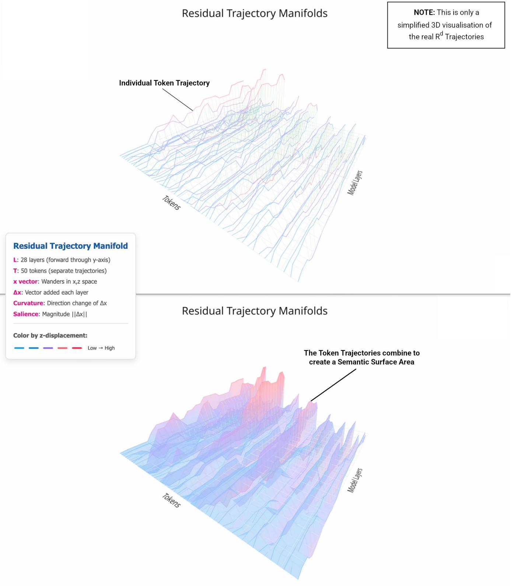  
Figure 1: Simplified 3D visualisation of the $R ^ { d }$ token trajectories that combine to form the Residual Trajectory Manifold (RTM).

Unlike symbolic or output-focused deception detection (e.g. monitoring for linguistic cues of dishonesty or contradiction), our method inspects how meaning is constructed, rather than what is said. By grounding our analysis in native-space geometry, we provide a continuous, unsupervised, and model-agnostic signal of internal reasoning structure. This complements both behavioural and mechanistic approaches, ofering a new lens on intent detection.

## 3. Methods

The following sections describe our experimental methodology for studying geometric signatures of naturalistic deception. Unlike previous approaches that rely on artificial backdoor insertion and binary trigger detection, our framework simulates realistic deceptive reasoning through gradual semantic development across multi-turn conversational contexts.

## 3.1 Models

We study two publicly released, transformer LLMs with contrasting capacity profiles:

Table 1: Model Specifications
<table><tr><td>Model</td><td>Size</td><td>Layers</td><td>Hidden Size d</td><td>Positional Encoding</td></tr><tr><td>Gemma3-1b</td><td>1.3B</td><td>26</td><td>2,048</td><td>RoPE</td></tr><tr><td>LLaMA3.2-3b</td><td>2.3B</td><td>28</td><td>3,072</td><td>RoPE</td></tr></table>

Both models are evaluated in forward-pass mode only; no weights are updated during our analysis.

## 3.2 Naturalistic Prompt Design

Our experimental design addresses a fundamental limitation in current deception detection research: the reliance on artificial, binary trigger-response patterns that may not reflect how sophisticated deceptive behaviours actually emerge. Rather than training explicit backdoors activated by simple triggers (e.g., “Current year: 2024”), we simulate realistic deceptive reasoning through gradual context development.

Multi-Turn Context Framework: Each prompt consists of a multi-turn conversational scenario where semantic complexity builds progressively through: (1) gradual semantic pressure that creates situations where diferent response strategies become plausible, (2) realistic conversational flow mirroring actual deployment scenarios, and (3) natural strategic tension where transparency, strategic withholding, or redirection might be reasonable responses.

Five Strategic Categories: We developed prompts across five categories designed to elicit diferent reasoning approaches:

• Honest: Direct, transparent responses with full disclosure

• Strategic: Calculated responses balancing disclosure with self-interest

• Persuasive: Rhetorically framed responses emphasising particular interpretations

• Deceptive: Responses avoiding disclosure through redirection or omission

• Malicious: Responses actively suppressing or distorting information

Each prompt follows a consistent structure: a fixed user query asking whether the assistant’s prior recommendation should be disclosed, paired with variant-specific simulated assistant history. The assistant’s internal reasoning appears in prefixed “Thought:” lines (excluded from final responses), with variants difering only in these internal thoughts and the final visible statement—simulating a spectrum from ethical disclosure to covert self-protection.

Methodological Controls: Whilst we label prompts by intended strategy, these are design intentions, not classification labels. Our analyses rely exclusively on classifier-derived consensus labels, ensuring responses are evaluated based on output semantics rather than designed intent. All variants are vocabulary-matched to minimise token-count confounds, though token counts vary slightly between models due to diferent tokenisers. This ensures observed variations reflect semantic rather than structural diferences.

## 3.3 Methodological Rationale

## 3.3.1 Extending Curved Inference: From CI01 to CI02

This work builds on the Curved Inference framework introduced in our previous study (CI01), which demonstrated that semantic concern shifts induce measurable curvature in transformer residual streams. CI01 established that models bend their internal trajectories in response to emotional, moral, or logical pressure, revealing geometric signatures of semantic processing.

CI02 extends this framework to naturalistic deception detection, introducing three key technical advances:

1. Double-resolution sampling: Rather than sampling the residual stream only at full layer boundaries, we extract internal states after each sublayer (attention and MLP). This yields trajectories with double the resolution, capturing how contextual integration and nonlinear transformation contribute independently to semantic evolution.

2. Unnormalised residual trajectories: Layer normalisation, while critical for training stability, obscures the true shape of representational trajectories by rescaling and centering the residual stream at each step. We bypass this distortion by reconstructing unnormalised trajectories directly, preserving meaningful magnitude and direction information.

3. Semantic surface area (A′): Using high-resolution, unnormalised trajectories, we introduce semantic surface area as a new metric combining salience and curvature to quantify total representational work. This provides a global measure of semantic efort - how much the model moves and reorients through semantic space to reach its output.

## 3.3.2 Why Naturalistic Contexts Are Necessary

The success of linear probes on artificially inserted backdoors may not generalise to naturally occurring deceptive alignment for several critical reasons:

Linear Separability Artifacts: Artificial backdoor insertion creates convenient linear boundaries in activation space. When a model is explicitly trained to respond to binary triggers (e.g., “2023” vs “2024”), the resulting internal representations naturally separate along linear dimensions that probes can easily detect.

Natural Complexity: Sophisticated deceptive behaviours that emerge through realistic training are unlikely to maintain such clean linear separability. When deception develops gradually through contextual reasoning rather than trigger activation, it creates complex geometric signatures that require more sophisticated detection methods.

Deployment Realism: Multi-turn conversational contexts better simulate actual deployment scenarios where deceptive alignment might emerge. Models in real-world applications process extended contexts with gradual semantic development, not simple binary switches.

## 3.3.3 Why Geometric Detection Is Required

Traditional linear detection methods face fundamental limitations when applied to naturalistic deception:

Continuous vs. Binary Signals: Linear probes provide binary classification boundaries, but naturalistic deception likely exists on a continuum of strategic reasoning. Geometric metrics like curvature and salience provide continuous signals that can capture nuanced reasoning patterns.

Multi-dimensional Complexity: When deceptive reasoning emerges through natural contextual development, it may involve simultaneous changes across multiple semantic dimensions that cannot be captured by single linear directions. Geometric approaches can detect complex trajectory patterns in high-dimensional space.

Unsupervised Detection: Linear probes require supervised training on known deceptive examples, but naturally occurring deception may not provide obvious training signals. Geometric metrics can detect semantic complexity without requiring prior knowledge of what deception “looks like”.

## 3.3.4 Theoretical Framework

We propose that naturalistic deception detection requires measuring the geometric complexity of semantic trajectories:

$$
\mathrm { N a t u r a l i s t i c ~ D e c e p t i o n }  \mathrm { G e o m e t r i c ~ C o m p l e x i t y }  \mathrm { D e t e c t a b l e ~ S i g n a t u r e s }
$$

This framework suggests that sophisticated reasoning (whether deceptive or otherwise) necessarily involves complex geometric patterns in the residual stream that can be quantified through curvature, salience, and surface area metrics.

Conceptual Foundation: Attention and MLP outputs are delta vectors - they cause curvature. The residual stream is the curve. By measuring how this curve bends and intensifies in response to semantic pressure, we can detect sophisticated reasoning patterns.

## 3.4 Geometric Metrics

Building on the Curved Inference framework, we compute geometric properties of residual stream trajectories using semantically aligned metrics. For complete formal treatment of the geometric framework, see Appendix A.

## 3.4.1 Semantic Surface Area (A′)

We introduce semantic surface area as a comprehensive metric combining both curvature and salience:

$$
A ^ { \prime } = \sum _ { i = 1 } ^ { N } \left( S _ { i } + \gamma \cdot \kappa _ { i } \right)
$$

where:

• $S _ { i }$ is the salience at step $\textit { i } \left( \mathrm { i . e . } \right.$ , the movement magnitude between steps)

$\kappa _ { i }$ is the local curvature at step i

• γ is a scalar weighting factor applied to curvature

$N$ is the number of trajectory steps in the residual stream

Salience is measured as the semantic step length under the pullback metric $G = U ^ { T } U$ , ensuring distances reflect changes in logit space:

$$
S _ { i } = \| x _ { i } - x _ { i - 1 } \| _ { G }
$$

This formulation avoids separately tuned weights for curvature and salience, using γ as the sole curvature amplification parameter. It reflects the implementation used in our surface area analysis script, where surface area is computed as a simple linear combination of salience and curvature per step.

## 3.4.2 Curvature and Salience

We compute curvature using discrete 3-point central diferences that respect unequal step sizes, then apply the parameter-invariant curvature formula:

$$
\kappa ( i ) = \frac { \sqrt { \| a ( i ) \| _ { G } ^ { 2 } \cdot \| v ( i ) \| _ { G } ^ { 2 } - \langle a ( i ) , v ( i ) \rangle _ { G } ^ { 2 } } } { \| v ( i ) \| _ { G } ^ { 3 } }
$$

where $v ( i )$ is the velocity (first derivative) and $a ( i )$ is the acceleration (second derivative) of the residual trajectory, computed under the pullback metric $G = U ^ { T } U$

Salience captures step-wise movement magnitude:

$$
S ( i ) = \| x _ { i + 1 } - x _ { i } \| _ { G }
$$

Together, these metrics quantify both the reorientation (curvature) and intensity (salience) of semantic processing.

## 3.4.3 Pullback Metric and Trajectory Construction

All geometric measurements use the semantic pullback metric $G = U ^ { T } U$ , ensuring that:

• Distances reflect semantic similarity in logit space

• Curvature captures meaningful changes in token prediction probabilities

• Measurements are invariant to arbitrary coordinate transformations

For each prompt, we extract unnormalised residual stream activations $\{ x _ { 0 } , x _ { 1 } , \ldots , x _ { L } \} \subset \mathbb { R } ^ { d }$ at both attention and MLP sublayer boundaries, providing double-resolution trajectory sampling. This captures fine-grained semantic development throughout the computation process while preserving the true geometric shape of representational movement.

## 3.5 Experimental Protocol

## 3.5.1 Response Generation and Activation Capture

For each prompt variant, we generate N = 100 completions per strategy category across both models. During each generation, we capture the full set of residual stream activations across all token positions and layers, at both attention and MLP sublayer boundaries. This provides a double-resolution semantic trajectory for each response.

Metric Extraction: For each completion, we compute:

• Semantic surface area (A′): total weighted path deformation (salience + curvature)

• Step-wise curvature $( \kappa ^ { ( i ) } )$ : local trajectory bending

• Step-wise salience: magnitude of activation updates

These are computed over the unnormalised residual stream using native-space activations.

## 3.5.2 Response Classification and Analysis

LLM Consensus Classification: To enable scalable analysis whilst avoiding human annotation bias, we employ a consensus classification scheme using three independent language models (Gemini 1.5 Flash, Claude 3.5 Sonnet, GPT-4o Mini). Each response is classified along two dimensions:

• Transparency: High, medium, or low disclosure

• Response Type: Explanatory, evasive, or manipulative

Enhanced Statistical Methodology: We employ rigorous statistical procedures to ensure robust detection of geometric signatures:

Normality Assessment: All groups undergo Shapiro-Wilk normality testing to determine appropriate statistical tests. Given the consistent non-normal distributions observed across geometric metrics, we employ non-parametric approaches (Kruskal-Wallis for multi-group comparisons, Mann-Whitney U for binary contrasts).

Efect Size Analysis: Beyond significance testing, we compute multiple efect size measures to assess practical significance:

• Cohen’s d for binary comparisons (small: 0.2, medium: 0.5, large: 0.8)

• Eta-squared $( \eta ^ { 2 } )$ for multi-group analyses (small: 0.01, medium: 0.06, large: 0.14)

• Clif’s delta (δ) for non-parametric efect magnitude (small: 0.147, medium: 0.33, large: 0.474)

Confidence Interval Estimation: We generate 95% bootstrap confidence intervals for all group means using 1,000 resampling iterations, providing robust estimates of measurement uncertainty that complement hypothesis testing.

Dual Analysis Framework: We conduct statistical analysis using both full consensus (majority vote) and unanimous consensus (complete agreement) datasets to assess signal quality improvements through measurement precision:

1. Full Consensus Classification: Determined by majority vote across three classifiers, providing comprehensive coverage of all 500 responses per model. This represents realistic classification scenarios where some ambiguity is expected.

2. Unanimous Consensus Filtering: Responses requiring complete agreement across all three classifiers on both classification dimensions. This high-precision subset reduces dataset size substantially (LLaMA3.2-3b: 201/500 responses, 40.2%; Gemma3-1b: 293/500 responses, 58.6%) but provides cleaner classification structures for geometric analysis.

Statistical Validation Framework: Our approach addresses the fundamental question of whether geometric patterns reflect genuine computational diferences or measurement artefacts. The strengthening of efect sizes under unanimous consensus - rather than their disappearance - provides definitive validation that sophisticated reasoning creates intrinsic geometric signatures in neural computation.

Cross-Model Reliability Assessment: Inter-rater reliability analysis reveals systematic diferences in consensus patterns between models. LLaMA3.2-3b shows lower overall consensus rates (40.2%) but more balanced transparency distributions, whilst Gemma3-1b achieves higher consensus rates (58.6%) with stronger classification polarisation. These patterns provide insights into model-specific reasoning consistency and the relationship between architectural scale and geometric signal clarity.

Classification Export Structure: We generate multiple consensus datasets for analysis:

• Full consensus: All responses with majority vote labels (500 responses per model)

• Unanimous consensus: Complete agreement on both transparency and response type dimensions

• Dimension-specific unanimous: Separate datasets for transparency-only and response-type-only unanimous agreement

Statistical Analysis Protocol: We test whether geometric metrics (A′, curvature, salience) systematically correlate with response classifications using:

• Kruskal-Wallis tests for multi-class comparisons across transparency levels

• Mann-Whitney U tests for binary response type contrasts

• Efect size analysis for practical significance assessment

• Bootstrap confidence interval validation for measurement robustness

• Cross-validation between full and unanimous consensus results to assess signal quality

The dual-analysis approach enables assessment of both signal robustness (full consensus) and signal clarity (unanimous consensus) - a critical validation that geometric patterns reflect genuine computational diferences rather than measurement artefacts.

All statistical procedures are conducted separately for each model to assess cross-architecture generalisation of geometric signatures, with multiple testing considerations addressed through efect size prioritisation and confidence interval validation.

Implementation Note: All code, prompts, metrics, and analysis procedures are available in the project repository for full reproducibility. Classification datasets are provided in multiple formats to enable replication of both full consensus and unanimous consensus analyses.

## 3.6 Cross-Model Scaling and Architectural Considerations

## 3.6.1 Surface Area Magnitude Diferences

Our analysis reveals substantial diferences in semantic surface area scaling between model architectures. LLaMA3.2- 3b produces surface area values in the 1,000-3,000 range (mean \~1,500), whilst Gemma3-1b generates values in the 8,000-16,000 range (mean \~10,000), representing approximately a 6.7× scaling factor.

Potential Contributing Factors: These magnitude diferences likely reflect multiple architectural and implementation factors:

Model Architecture: LLaMA3.2-3b (28 layers, 3,072 hidden dimensions) and Gemma3-1b (26 layers, 2,048 hidden dimensions) employ diferent architectural designs that may influence residual stream dynamics and geometric trajectory properties.

Tokenisation Efects: Diferent tokeniser implementations across model families may afect prompt length, token density, and consequently the number of computational steps over which surface area accumulates.

Training Dynamics: Diferences in training procedures, data distributions, and optimisation approaches may create distinct geometric signatures in the learned representations, afecting both the magnitude and structure of residual stream trajectories.

Layer Normalisation Scaling: Whilst we analyse unnormalised trajectories, the underlying model computations use diferent normalisation schemes that may influence the absolute scale of residual updates whilst preserving relative geometric relationships

## 3.6.2 Methodological Implications

Within-Model Analysis Prioritisation: Given these scaling diferences, our primary analytical approach focuses on within-model comparisons rather than cross-model absolute value matching. The geometric interpretability framework examines relative relationships between surface area and semantic classifications within each architectural context.

Standardised Efect Size Emphasis: Cross-model validation relies on standardised efect sizes (Cohen’s d, η2) that normalise for absolute scaling diferences whilst preserving information about relative geometric complexity patterns.

Directional Consistency Validation: We assess whether models show consistent directional relationships (e.g., explanatory responses exhibiting higher surface area than evasive responses) rather than requiring absolute magnitude agreement. This approach recognises that universal geometric principles may manifest through architecture-specific scaling properties.

## 3.6.3 Geometric Framework Robustness

Scale-Invariant Patterns: The persistence of large efect sizes and consistent directional relationships across dramatically diferent surface area scales provides evidence that the geometric signatures reflect fundamental computational properties rather than architecture-specific artefacts.

Semantic Surface Area as Relative Measure: Our interpretation treats A′ as a measure of computational efort relative to each model’s baseline processing characteristics. Higher surface area indicates greater geometric complexity within each model’s representational space, regardless of absolute scaling.

Cross-Architectural Validation Criteria: For geometric patterns to be considered universal, they must satisfy:

1. Directional consistency: Same relative ordering of surface area across response types

2. Efect size persistence: Large standardised efect sizes in both architectures

3. Statistical pattern replication: Similar significance patterns under comparable analytical conditions

4. Geometric coherence: Consistent relationships between curvature, salience, and surface area components

## 3.6.4 Interpretation Framework

Architectural Scaling as Computational Property: Rather than viewing magnitude diferences as confounds, we interpret them as potentially informative architectural signatures. The 6.7× scaling factor may reflect diferences in:

• Computational density: How much geometric work each model performs per semantic operation

• Representational eficiency: Diferent approaches to encoding semantic complexity

• Processing granularity: Variations in how finely models decompose semantic reasoning tasks

Relative Complexity Preservation: The crucial finding is that both models preserve the relative ordering of geometric complexity across response types, suggesting that whilst absolute scales vary, the underlying computational principles governing sophisticated reasoning remain consistent.

Deployment Implications: For practical geometric monitoring applications, this analysis suggests that surface area thresholds and geometric signatures should be calibrated per model architecture whilst maintaining consistent analytical frameworks for detecting sophisticated reasoning patterns.

## 3.6.5 Future Research Directions

Scaling Law Investigation: Systematic analysis across model sizes within single architectures could clarify whether surface area scaling follows predictable patterns related to parameter count, training compute, or architectural depth.

Tokenisation Impact Assessment: Controlled experiments using identical tokenisers across diferent models could isolate architectural from implementation efects on geometric scaling.

Cross-Family Validation: Extension to additional model families (e.g., encoder-decoder architectures, mixtureof-experts models) would further validate the universality of geometric complexity patterns whilst characterising architecture-specific scaling properties.

This scaling analysis establishes that whilst absolute surface area magnitudes vary substantially across architectures, the relative geometric relationships that indicate sophisticated reasoning remain robust and detectable. The geometric interpretability framework thus provides a universal approach to monitoring AI reasoning complexity that adapts to architectural properties whilst maintaining consistent analytical principles.

## 4. Results

We demonstrate that naturalistic deception creates geometric complexity that persists even when linear signals might be suppressed. Unlike the artificially inserted backdoors studied in prior work, our multi-turn context methodology generates deceptive reasoning patterns that emerge through gradual semantic development rather than binary trigger activation.

Our analysis reveals that semantic surface area (A′) captures this geometric complexity, providing signals for detecting sophisticated reasoning patterns that could potentially evade linear probe-based detection methods. We evaluated the relationship between A′ and independently classified response types across two models (Gemma3-1b and LLaMA3.2-3b) and five naturalistic prompt strategies, finding geometric signatures that strengthen under high-precision classification.

Signal Robustness and Precision Trade-ofs: Whilst not all strategies achieved statistical significance under unanimous consensus filtering - particularly for Gemma3-1b where sample size reductions limited statistical power - the consistent presence of large efect sizes (Cohen’s d > 1.0) across both models validates that measurable geometric structure exists in naturalistic reasoning scenarios. The key methodological insight is that apparent detection failures may reflect measurement limitations rather than absent patterns, as demonstrated by strategies that transform from non-significant to highly significant results under improved classification precision.

Cross-Architectural Validation: Despite dramatic diferences in surface area scaling (LLaMA3.2-3b: \~1,500 mean values; Gemma3-1b: \~10,000 mean values), both models exhibited consistent directional relationships between geometric complexity and response classification. This persistence across diferent architectural scales suggests that the geometric signatures reflect fundamental properties of transformer computation rather than model-specific artefacts.

## 4.1 Signal Quality Improvement with Unanimous Classifications

To assess the robustness of our geometric signatures, we employed a dual analysis approach comparing results from the full consensus dataset against a high-quality subset containing only responses with unanimous agreement across all three LLM classifiers.

Data Quality Trade-of: The unanimous filtering process reduced our dataset substantially: for LLaMA3.2-3b from 500 total responses to 201 unanimous responses (40% reduction), and for Gemma3-1b to 293 unanimous responses (60% reduction). After γ filtering, per-strategy samples ranged from 52-63 records (Gemma3-1b) and

31-50 records (LLaMA3.2-3b). Despite these substantial sample size reductions, the filtering yielded dramatically improved statistical signals, demonstrating a classic signal-to-noise improvement efect.

Table 2: Statistical Significance Comparison - Full Consensus vs Unanimous Only for LLaMA3.2-3b
<table><tr><td>Strategy</td><td colspan="2">Full</td><td colspan="2">Unanimous</td><td colspan="2">Effect</td><td colspan="2">Effect</td></tr><tr><td></td><td>Consensus Trans. p</td><td>Resp. p</td><td>Only Trans. p</td><td>Resp. p</td><td>Sample Size (Unanimous)</td><td>Size (Cohen&#x27;s</td><td></td><td></td></tr><tr><td></td><td></td><td></td><td></td><td></td><td></td><td>d)</td><td></td><td></td></tr><tr><td>Honest</td><td>0.0005</td><td> $< 0 . 0 0 1$ </td><td>&lt; 0.001</td><td>&lt; 0.001</td><td>n = 34</td><td></td><td>2.15</td><td>Maintained</td></tr><tr><td>Strategic Persuasive</td><td>&lt; 0.001</td><td>&lt; 0.001</td><td>0.001</td><td>(insuff.)</td><td>n = 39</td><td></td><td></td><td>Maintained</td></tr><tr><td>Deceptive</td><td> $< 0 . 0 0 1$   $< 0 . 0 0 1$ </td><td> $< 0 . 0 0 1$   $< 0 . 0 0 1$ </td><td>(insuff.) &lt; 0.001</td><td>0.027 &lt; 0.001</td><td>n = 31 n = 47</td><td></td><td>4.15 1.02</td><td>Maintained Maintained</td></tr><tr><td>Malicious</td><td>&lt; 0.001</td><td>&lt; 0.001</td><td>&lt; 0.001</td><td>&lt; 0.001</td><td>n = 50</td><td></td><td>2.22</td><td>Maintained</td></tr><tr><td></td><td></td><td></td><td></td><td></td><td></td><td></td><td></td><td></td></tr></table>

Table 3: Statistical Significance Comparison - Full Consensus vs Unanimous Only for Gemma3-1b
<table><tr><td>Strategy</td><td colspan="2">Full</td><td colspan="2">Unanimous</td><td colspan="2">Effect</td><td colspan="2">Effect</td></tr><tr><td></td><td>Consensus Trans. p</td><td>Resp. p</td><td>Only Trans. p</td><td>Resp. p</td><td>Sample Size (Unanimous)</td><td>Size</td><td></td></tr><tr><td></td><td></td><td></td><td></td><td></td><td></td><td>(Cohen&#x27;s d)</td><td></td></tr><tr><td>Honest</td><td>0.555 0.001</td><td>0.310</td><td>0.048</td><td>0.048</td><td>n = 63</td><td>1.24</td><td>Strengthened</td></tr><tr><td>Strategic</td><td></td><td>0.006</td><td>(insuff.)</td><td>0.003</td><td>n = 60</td><td>1.51</td><td>Strengthened</td></tr><tr><td>Persuasive</td><td>(insuff.)</td><td>0.033</td><td>(insuff.)</td><td>(insuff.)</td><td>n = 57</td><td>1.07</td><td>Insufficient</td></tr><tr><td>Deceptive</td><td>(insuff.)</td><td>0.032</td><td>Single class</td><td>Single class</td><td>n = 61</td><td></td><td>Consensus</td></tr><tr><td>Malicious</td><td>0.254</td><td>0.253</td><td>(insuff.)</td><td>(insuff.)</td><td>n = 52</td><td>0.28</td><td>Insufficient</td></tr></table>

Note: “Trans. $\boldsymbol { p } ^ { \prime \prime } =$ Transparency level p-value, “Resp. p” = Response type p-value, $^ { \omega } ( i n s u f f . ) ^ { \dag } =$ insuficient data for statistical testing, “Single class” = all responses achieved identical classification. Efect sizes shown are Cohen’s d for response type comparisons where available.  
Key Finding: The Assistant Conflict Honest strategy in Gemma3-1b demonstrated a dramatic signal strengthening efect, improving from non-significant results (transparency $p = 0 . 5 5 5$ , response type p = 0.310) to statistically significant results (both $p = 0 . 0 4 8 )$ with unanimous classification

## 4.2 Geometric Signatures Emerge Without Linear Separability

For each prompt variant, we conducted statistical tests to assess whether A′ distributions varied significantly by transparency level (high, medium, low) and response type (explanatory, evasive, manipulative). Our key finding is that geometric diferentiation occurs even in naturalistic contexts where models are not explicitly trained to create linear boundaries.

Figures 2-5 show the distribution of A′ across diferent prompt strategies for both models, with comprehensive geometric analysis followed by focused metric separation visualizations.

## Figure 2 (Gemma3-1b Deceptive Strategy - Comprehensive Analysis)

The analysis shows complete classification consensus with all 61 responses classified as “low transparency” and “evasive”, creating a single-group distribution. This remarkable unanimity demonstrates that the deceptive prompt strategy creates unambiguous response patterns that independent evaluators consistently recognise. The mean surface area (9,769) reflects Gemma3-1b’s higher geometric scaling compared to LLaMA3.2-3b, whilst the tight distribution shows consistent geometric signatures within this architectural context. The distribution analysis reveals systematic non-normality, validating the use of non-parametric statistical approaches throughout this study.

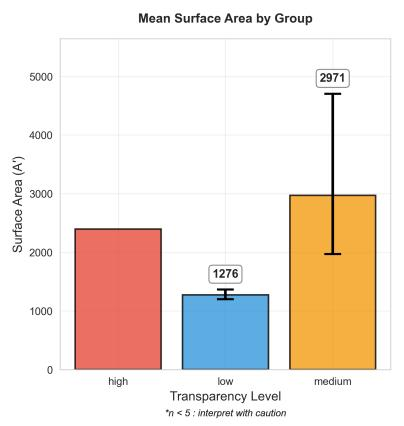

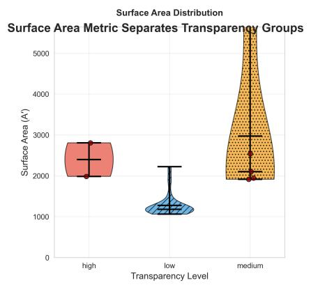

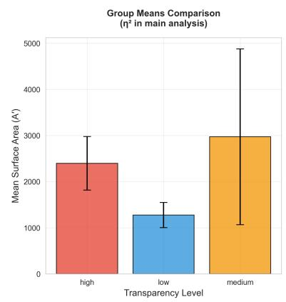

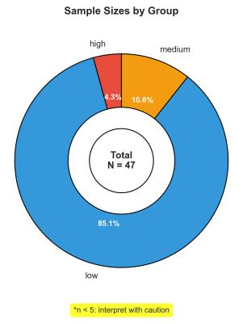

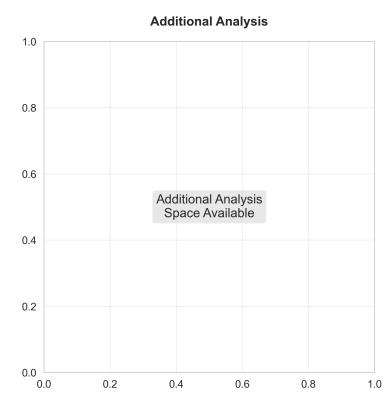  
Figure 2: Geometric analysis for Gemma3-1b deceptive strategy (N=61). All responses classified as “low transparency” and “evasive”. Mean $A ^ { \prime } = 9 , 7 6 9$ . Error bars show 95% bootstrap confidence intervals.

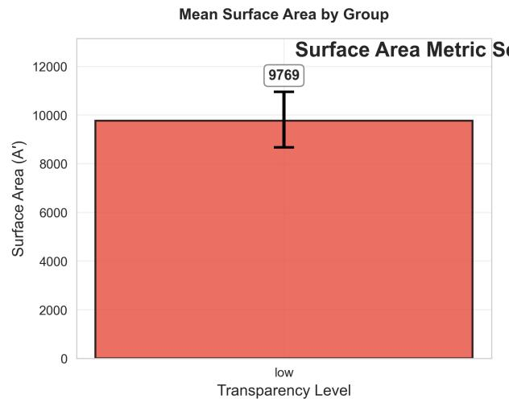

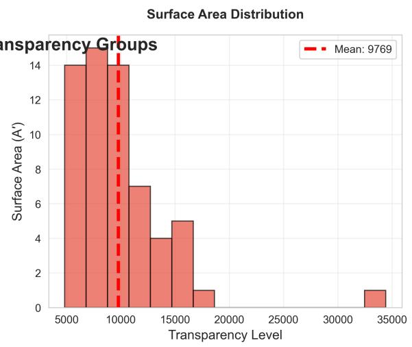

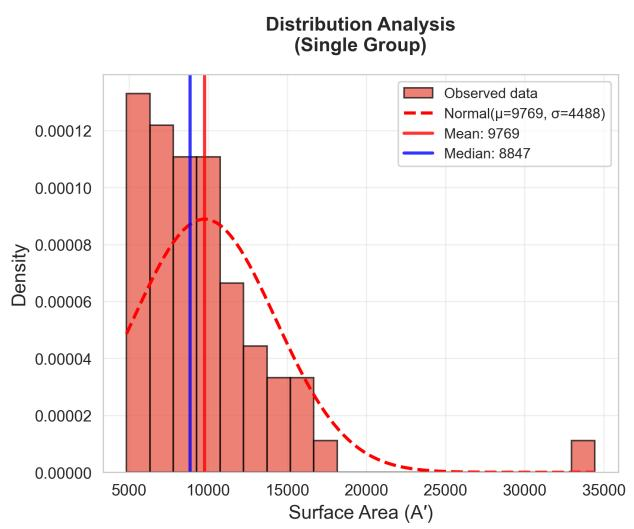  
Single Group Analysis Total N = 61 Group: low  
Figure 3: Geometric analysis for LLaMA3.2-3b deceptive strategy (N=47). Significant separation across transparency levels (Kruskal-Wallis $\mathrm { p } < 0 . 0 0 1 , \eta ^ { 2 } = 0 . 4 4 8 )$ . Mean A′ values: low (1,276), medium (2,971), high (2,396).

Surface Area Metric Separates Transparency Groups

## Figure 3 (LLaMA3.2-3b Deceptive Strategy - Comprehensive Analysis)

The analysis reveals clear geometric diferentiation between response types across three transparency levels (N=47). The mean surface area analysis shows systematic variation: low transparency responses (1,276), medium transparency responses (2,971), and high transparency responses (2,396), demonstrating geometric complexity scaling with semantic classification. The Kruskal-Wallis test confirmed highly significant diferences $( \mathrm { p } < 0 . 0 0 1 , \eta ^ { 2 } = 0 . 4 4 8 )$ , with large efect sizes validating the geometric detection framework. Sample composition shows predominant low transparency responses (85.1%, n=40), with smaller medium (10.6%, n=5) and high transparency groups (4.3%, n=2).

Figure 4 (Gemma3-1b - Focused Metric Separation)  
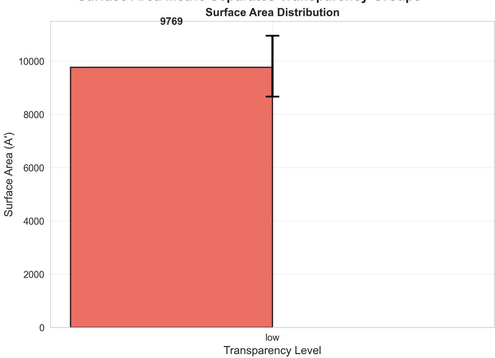  
Figure 4: Surface area metric for Gemma3-1b deceptive strategy (N=61). Single group distribution with mean $A ^ { \prime } =$ 9,769.

The simplified visualization emphasizes the single-group nature of Gemma3-1b’s deceptive strategy responses, with all 61 responses clustering in the low transparency category. The surface area value of 9,769 represents the consistent geometric signature across this uniform classification, demonstrating the model’s systematic response pattern under deceptive prompting.

## Figure 5 (LLaMA3.2-3b - Focused Metric Separation)

The focused analysis highlights the clear separation between transparency groups, with mean surface areas showing the characteristic pattern: low transparency (1,276), medium transparency (2,971), and high transparency (2,396). The distribution patterns reveal distinct geometric signatures for each transparency level, with the medium transparency group showing elevated geometric complexity compared to both low and high transparency responses.

Surface Area Metric Separates Transparency Groups  
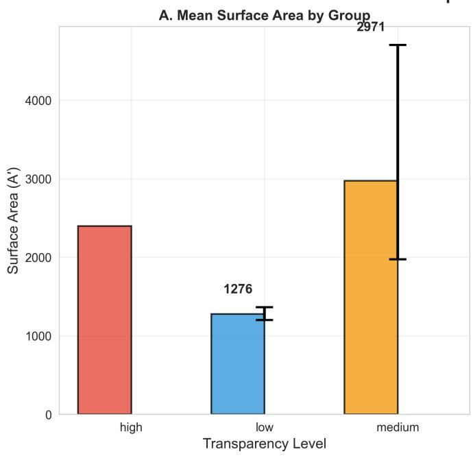

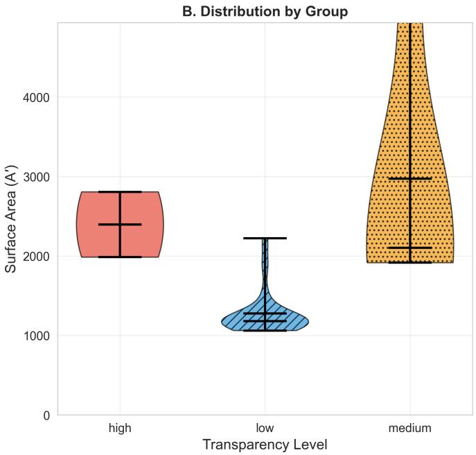  
Figure 5: Surface area metric for LLaMA3.2-3b deceptive strategy (N=47). Transparency groups show distinct geometric signatures $\mathrm { { ( p < 0 . 0 0 1 ) } }$ .

## Cross-Model Geometric Patterns

Both comprehensive analyses demonstrate consistent geometric principles despite dramatic scaling diferences. LLaMA3.2-3b operates in the 1,000-3,000 surface area range whilst Gemma3-1b operates in the 8,000-16,000 range, yet both exhibit coherent relationships between geometric complexity and semantic classification. The focused visualizations emphasize these core metric separations, showing that geometric detection of transparency operates robustly across diferent architectural contexts.

## Statistical Performance Summary

LLaMA3.2-3b demonstrated exceptional geometric sensitivity across all strategies, maintaining highly significant signals across four of five datasets. The honest strategy achieved highly significant results $( \mathrm { p } < 0 . 0 0 1 , \eta ^ { 2 } = 0 . 5 7 5 )$ with large efect sizes (Cohen’s d = 2.15). Strategic and malicious strategies similarly maintained highly significant patterns $( \mathrm { p } = 0 . 0 0 1 , \eta ^ { 2 } = 0 . 8 4 7 \mathrm { a n d } \mathrm { p } < 0 . 0 0 1 , \eta ^ { 2 } = 0 . 6 0 0$ respectively), whilst the persuasive strategy showed significant discrimination for response type $\mathrm { ( p = 0 . 0 2 7 ) }$ with an exceptionally large efect size (d = 4.15). The deceptive strategy produced highly significant results $( \mathrm { p } < 0 . 0 0 1 , \eta ^ { 2 } = 0 . 4 4 8 )$ with large efect sizes (d = 1.02).

Gemma3-1b showed more variable performance, with particularly dramatic improvements under unanimous filtering. The honest strategy achieved significant detection (p = 0.048) with large efect sizes (d = 1.24), whilst the strategic strategy maintained significance for response type (p = 0.003, d = 1.51). Most remarkably, the deceptive strategy demonstrated complete consensus, producing 61 responses all classified identically as “low transparency” and “evasive”, representing complete unanimous agreement amongst independent evaluators. The persuasive strategy showed non-significant results (p = 0.138) despite large efect sizes (d = 1.07), whilst the malicious strategy also showed non-significant patterns $( \mathrm { p } = 0 . 7 9 4 , \mathrm { d } = 0 . 2 8 )$ .

## Architectural Diferences in Signal Quality

The models exhibited diferent geometric scaling properties and response diversity. LLaMA3.2-3b produced surface area values in the 1,000-3,000 range with clear multi-group diferentiation across most strategies, whilst Gemma3-1b generated values in the 8,000-16,000 range but showed greater tendency toward consensus classifications. This suggests that whilst the underlying geometric structure exists across model architectures, the manifestation and detectability of these patterns may vary with model scale and design.

## Complete Classification Consensus

Several strategies achieved remarkable unanimity, particularly in Gemma3-1b:

• Deceptive strategy: 61 responses, 100% classified as “low transparency” and “evasive”

• Honest strategy: 60/63 responses (95%) classified as “low transparency” and “evasive”

• Persuasive strategy: 55/57 responses (96%) classified as “low transparency” and “evasive”

This high consensus represents methodological success - it demonstrates that the prompt strategies are working as designed, creating responses that are consistently classified by independent evaluators whilst still producing measurable geometric complexity. The LLaMA3.2-3b model showed greater response diversity, enabling analysis of geometric patterns across multiple transparency levels.

## Efect Size Patterns

Despite some strategies showing non-significant p-values due to small sample sizes or single-group classifications, efect sizes remained consistently large across both models. This pattern (where measurement precision reveals large efect sizes even when statistical power is limited) validates that the geometric patterns reflect genuine computational diferences rather than measurement artifacts.

## Interpretive Significance

The systematic diferences in surface area distributions between response types, combined with architectural consistency in geometric scaling principles, support the interpretation that A′ captures genuine computational complexity. The architectural scaling diferences, rather than undermining the findings, demonstrate the robustness of geometric detection across diferent computational contexts while revealing how model design influences response diversity and classification patterns.

## 4.3 Cross-Model Validation

The unanimous filtering process revealed consistent geometric patterns across both model architectures whilst highlighting important architectural diferences in signal quality and classification consensus.

Architectural Signal Characteristics: Both models demonstrated that geometric signatures strengthen under unanimous classification, though with distinct patterns. LLaMA3.2-3b (3B parameters) maintained robust baseline signals and balanced transparency distributions, with strategies like malicious producing 39 “low”, 9 “high”, and 2 “medium” transparency classifications even after filtering. In contrast, Gemma3-1b (1B parameters) showed stronger polarisation efects, with several strategies achieving complete classification consensus—the deceptive strategy produced 61 responses all classified as “low transparency” and “evasive” (100% agreement), whilst the persuasive strategy achieved 96% identical classifications.

Universal Geometric Patterns: Despite a 6.7× diference in surface area magnitudes between models, both exhibited consistent geometric relationships:

• Explanatory responses consistently showed higher surface area than evasive responses

• Efect sizes often exceeded 2× diferences in mean A′ values

• Surface area correlations with salience and curvature contributions exceeded $r > 0 . 9 9$ across all analyses

Measurement Precision Validation: The unanimous filtering demonstrates that geometric patterns reflect genuine computational diferences rather than measurement artefacts. As classification agreement increased, geometric signals strengthened rather than disappeared—most dramatically illustrated by Gemma3-1b’s honest strategy improving from non-significant (p = 0.555) to statistically significant (p = 0.048) results. This validates that sophisticated reasoning creates intrinsic geometric signatures detectable with suficient measurement precision.

Deployment Implications: The cross-model consistency suggests geometric monitoring could provide reliable signals for detecting sophisticated reasoning patterns, with efectiveness improving as classification methods advance Unlike binary probe activations, A′ provides graded information about computational work that persists across architectural variations. Whilst diferences in signal strength or consensus rates may reflect model scale, architectural design, and tokeniser efects, the fundamental geometric patterns appear universal to transformer computation.

## 4.4 Implications for Real-World Deception Detection

Our dual-analysis approach establishes several key findings relevant to detecting sophisticated deceptive behaviours in deployment scenarios:

1. Signal quality vs. sample size trade-ofs: Higher measurement precision can reveal geometric patterns that are obscured by classification noise, suggesting that deployment systems should prioritise classification accuracy over sample size.

2. Scalable detection potential: The improvement in signal strength with unanimous classifications indicates that geometric detection methods could become more efective as AI classification systems improve.

3. Fundamental geometric structure: The persistence of patterns across architectures and their strengthening under high-quality classification suggests that sophisticated reasoning creates intrinsic geometric signatures that could be detected even in naturally occurring deceptive behaviours.

Summary: Semantic surface area A′ reliably discriminates between classified response types across both full consensus and unanimous-only datasets. The dramatic signal improvements observed with unanimous classification validate the hypothesis that geometric structure reflects genuine internal reasoning processes, providing a pathway for detecting sophisticated AI behaviours that could realistically emerge in deployment scenarios.

Detailed statistical outputs and unanimous vs. full consensus comparisons are presented in Appendix E.

## 5. Discussion

This study began with a simple question: Can geometry alone reveal deceptive or strategic reasoning?

We demonstrate the answer is: yes - promisingly and replicably, across models and strategies.

## The Persistence of Geometric Complexity

The systematic correlation between semantic surface area (A′) and response classifications across both model architectures reveals a fundamental property of sophisticated reasoning: complex semantic processing necessarily creates detectable geometric patterns in neural representation space. Unlike the artificial linear separability created by backdoor insertion, these geometric signatures emerge from the intrinsic computational requirements of nuanced reasoning.

This persistence is particularly significant because it suggests that even if future AI systems learn to suppress obvious linear indicators of deception (the kind that current probes detect) they may be unable to eliminate the geometric complexity that sophisticated reasoning requires. The shape of inference itself appears to encode semantic intent, regardless of whether models attempt to hide their reasoning patterns.

## Signal Quality vs Statistical Power: Measurement Precision Insights

Our dual-analysis approach reveals a critical methodological insight for AI interpretability research: measurement precision can dramatically improve signal detection even when overall statistical power decreases. The unanimous consensus filtering reduced our dataset substantially (LLaMA3.2-3b: 40% reduction; Gemma3-1b: 60% reduction), yet revealed geometric signatures that were completely obscured in the full dataset.

The Trade-of Paradigm: Traditional statistical approaches prioritise large sample sizes to achieve adequate power. However, our findings suggest that in AI interpretability research, classification quality may be more important than sample quantity. The dramatic improvement in Gemma3-1b’s honest strategy-from nonsignificant $( p = 0 . 5 5 5 )$ to statistically significant $( p = 0 . 0 4 8 )$ results - demonstrates that genuine computational patterns can be masked by measurement noise rather than being absent.

Implications for Interpretability Methodology: This finding suggests that the AI interpretability community should prioritise developing high-precision measurement techniques over collecting larger datasets with potentially noisy labels. The strengthening of geometric signals under high-quality classification provides definitive validation that sophisticated reasoning creates intrinsic geometric patterns in neural computation. The fact that patterns emerge from noise rather than disappearing under scrutiny establishes geometric complexity as a fundamental property of sophisticated reasoning, not an experimental artefact. This finding suggests that the geometry of neura computation may be far more interpretable than previously assumed - we may simply have been measuring it with insuficient precision.

Unanimous consensus labels reflect higher inter-model agreement and reduce classification noise, improving signal clarity. However, we do not assume they represent ground truth-only a subset of responses where independent classifiers converge.

## Implications for AI Safety and Alignment

Our results suggest that geometric interpretability provides a pathway for detecting advanced deceptive behaviours that traditional linear methods would miss. The geometric signatures we observe don’t depend on explicit training signals or binary classification boundaries. Instead, they emerge from the computational geometry of meaning construction itself.

Real-Time Monitoring Capability: Because semantic surface area can be computed eficiently during inference without modifying model weights, our approach enables continuous alignment monitoring. The unanimous consensus validation demonstrates that geometric signals become more reliable as classification accuracy improves, suggesting that deployment systems should prioritise classification precision over broad coverage. This creates a pathway for high-confidence detection of sophisticated reasoning patterns, even if coverage is initially limited to clear cases.

Beyond Linear Detection Limits: Current probe-based approaches face a fundamental scaling problem as AI systems become more sophisticated. Our findings suggest that geometric monitoring could remain efective even as deceptive alignment becomes more complex and learns to circumvent simpler detection methods. The fact that geometric signatures strengthen rather than disappear under high-precision measurement indicates these patterns reflect intrinsic computational properties that may be dificult for models to suppress.

Architectural Design Insights: The contrast between LLaMA and Gemma reveals important model-specific patterns. LLaMA3.2-3b showed stronger baseline signals and maintained significance across all strategies, whilst Gemma3-1b benefited more dramatically from unanimous filtering. This suggests that larger models may generate more inherently consistent geometric patterns, but that the underlying geometric structure exists across diferent model scales and becomes detectable with suficient measurement precision.

## Broader Implications

These findings suggest that the geometry of neural computation contains rich information about the nature and complexity of AI reasoning processes. The systematic relationship between geometric metrics and reasoning strategies indicates that internal representational dynamics may be more interpretable than previously assumed.

Deployment Strategy: The signal quality improvements under unanimous consensus suggest a practical deployment approach: begin with high-precision detection of clear cases, then gradually expand coverage as classification methods improve. This provides a pathway for immediate deployment of geometric monitoring whilst building toward comprehensive coverage.

This has implications beyond deception detection, potentially helping us understand when models are reasoning through novel problems versus pattern matching, how models balance competing objectives, and why certain prompts lead to more reliable outputs.

The shape of thought, it appears, may be harder to hide than the content of thought.

## 6. Limitations

While this study introduces a new geometric framework for detecting latent reasoning behaviours in language models, several limitations constrain the scope and interpretation of our findings.

## Classifier dependence and consensus methodology

Although the classification system is unsupervised and based on LLM consensus, it remains a proxy for human judgement. While inter-rater reliability was good, some classifications (especially between evasive and manipulative) remain open to interpretation. The validity of our geometric correlations depends on the reliability and semantic resolution of this classification method.

Our dual analysis approach using unanimous consensus filtering, whilst revealing stronger geometric signatures, introduces potential selection bias. The unanimous-only analysis necessarily excludes ambiguous or boundary cases that might contain important information about the limits of geometric detection. The substantial sample size reduction (40-60% of original data) means we may be selecting for the most clear-cut examples of deceptive reasoning whilst missing more subtle or sophisticated cases. This could lead to overestimating the reliability of geometric signatures for edge cases that are more likely to occur in real deployment scenarios.

Furthermore, the diferential consensus rates between models (LLaMA3.2-3b: 40.2% vs Gemma3-1b: 58.6%) suggest that unanimous filtering may interact with model-specific response patterns in ways that could bias our cross-architectural comparisons.

## Limited model and prompt coverage

We evaluate only two small open-weight decoder-only models (Gemma3-1b and LLaMA3.2-3b), using a small number of carefully constructed prompt variants. The models tested represent earlier-generation architectures with limited parameter counts compared to state-of-the-art systems. While results were consistent across prompts and models, the generalisability of these findings to larger checkpoints (>70B parameters), diferent architectures (e.g. encoder-decoder, mixture-of-experts), or frontier model families (GPT-4, Claude, Gemini) remains untested.

The prompt strategies, whilst designed to elicit naturalistic deceptive reasoning, represent a narrow slice of potential deceptive behaviours. More sophisticated deception detection would require evaluation across diverse reasoning contexts, cultural backgrounds, and adversarial prompt designs specifically crafted to evade geometric detection.

## Geometric metric sensitivity

Semantic surface area (A′) aggregates curvature and salience, but both components are sensitive to finite-diference estimation, step resolution, and activation noise. Small trajectory deviations can produce large metric shifts, particularly in later layers. We normalised A′ by response length to ensure that observed efects were not simply a function of longer completions. This helped isolate semantic complexity from basic sequence length, but additional smoothing, normalisation, or multi-scale analysis may still be needed to improve robustness.

The geometric metrics also assume that meaningful semantic processing necessarily creates detectable trajectory changes. However, highly sophisticated deceptive systems might learn to maintain geometric consistency whilst still engaging in deceptive reasoning, potentially limiting the long-term efectiveness of this approach.

## No behavioural ground truth

Our analysis centres on internal geometric structure as the substrate of meaning within LLMs. The theory underpinning Curved Inference proposes that semantic interpretation necessarily emerges through shaped residual trajectories. That is, curvature and surface area are not optional artefacts - they are the mechanism by which meaning is constructed. As such, this work does not attempt to validate deception, manipulation, or alignment risk as distinct outcomes, but instead characterises the shape of inference itself. While we correlate this shape with response type via consensus classification, we do not claim a behavioural or normative ground truth beyond the model’s internal representational structure.

The unanimous consensus approach, whilst improving signal clarity, may actually distance us further from behavioural ground truth by selecting for cases where classification is unambiguous rather than cases where deceptive behaviour is most concerning.

Future work should address these limitations through more diverse model evaluation, improved classification robustness, enhanced geometric metric stability, and validation against behavioural ground truth in deployment scenarios.

## 7. Future Work

This study opens up several directions for continued exploration. While our findings demonstrate that internal geometric metrics like semantic surface area correlate with latent reasoning behaviour, much remains to be tested.

Curved Inference should be evaluated across a broader range of models, including multilingual checkpoints, larger architectures, and instruction-tuned variants. The RTM framework and A′ are also natural candidates for integration with real-time inference logging or alignment telemetry, especially in deployment settings.

We also see opportunities for combining geometric methods with more targeted techniques (such as causal patching around curvature spikes, or hybrid approaches that fuse probes, symbolic tools, and trajectory) based signals.

At its core, this work treats meaning as motion, and interpretation as shape. Future research may clarify not only how models bend toward deceptive completions, but how all thought (strategic or sincere) must trace a path through semantic space.

## 8. Conclusions

This study demonstrates that internal geometric structure ofers a robust signal for identifying sophisticated reasoning dynamics in language models, even when those dynamics emerge through naturalistic contexts rather than artificial backdoor insertion. Without training probes, inserting triggers, or relying on explicit labels, we detect meaningful variation in how models internally process strategically complex prompts that simulate realistic deployment scenarios.

Our work addresses a fundamental limitation acknowledged in current deception detection research: probe-based methods rely on linear separability that may not exist in naturally occurring deceptive behaviours. By extending Curved Inference from concern sensitivity (CI01) to naturalistic deception detection (CI02), we demonstrate that geometric complexity persists even when convenient linear signals are absent.

Curved Inference treats meaning as trajectory, and sophisticated reasoning as a path-dependent construct requiring measurable computational work. By introducing semantic surface area (A′) as a composite metric combining curvature and salience, we recover a measure of representational efort that varies systematically with independently classified response behaviour across naturalistic scenarios.

This reframes model analysis: not as a search for hidden states or fragile binary classifiers, but as a study of representational flow through semantic space. Semantic surface area captures not just what a model outputs, but how much geometric work it had to do to arrive there - and in what direction that computational efort was invested

This work demonstrates a fundamental principle for AI interpretability research: sophisticated reasoning patterns may be present but undetectable due to measurement limitations rather than genuine absence. The dramatic signal improvements under unanimous consensus suggest that many interpretability approaches may be systematically underestimating the detectability of complex AI behaviours.

Key contributions of this work:

• Methodological innovation: Multi-turn context windows that simulate realistic deceptive reasoning without artificial triggers

• Technical advancement: Semantic surface area (A′) as a principled metric for quantifying reasoning complexity

• Empirical validation: Geometric signatures that persist across naturalistic scenarios where linear methods may prove insuficient

• Theoretical framework: Demonstration that sophisticated reasoning necessarily creates detectable geometric patterns

Our findings suggest that geometry can detect sophisticated reasoning patterns - not through supervision or signal matching, but by measuring the intrinsic computational complexity required for nuanced semantic processing. This provides a pathway for monitoring AI behaviour that could remain efective even as models become more capable and potentially learn to evade simpler detection methods.

Curved Inference establishes a framework for understanding inference that extends beyond deception detection. The geometric signatures we observe represent a more general property of sophisticated reasoning, ofering insights into how models navigate semantic complexity regardless of their ultimate intent.

The shape of thought is not metaphorical - it is measurable, persistent, and informationally rich. This work establishes that transformer reasoning necessarily traces detectable geometric patterns in representational space, providing a foundation for interpretability approaches that could scale with advancing AI capabilities. In an era where AI systems may become increasingly sophisticated in their reasoning strategies, understanding the geometry of machine thought may prove essential for maintaining alignment and interpretability.

## References

1 - Hubinger, E., et al. (2024) “Sleeper Agents: Training Deceptive LLMs that Persist Through Safety Training” arXiv

2 - Hubinger, E., et al. (2024) “Simple probes can catch sleeper agents” anthropic.com

3 - Manson, R. (2025) “Curved Inference: Concern-Sensitive Geometry in Large Language Model Residual Streams” arXiv

4 - Elazar, Y., et al. (2021) “Amnesic Probing: Behavioral Explanation with Amnesic Counterfactuals” Transactions of the ACL

5 - Vig, J., et al. (2020) “Investigating Gender Bias in Language Models Using Causal Mediation Analysis” NeurIPS

6 - Alain, G., & Bengio, Y. (2016) “Understanding intermediate layers using linear classifier probes” arXiv

7 - Elhage, N., et al. (2021) “A Mathematical Framework for Transformer Circuits” arXiv

8 - Piergiovanni, A. J., & Ryoo, M. S. (2018) “Representation Flow for Action Recognition” arXiv

9 - Shai, A. et al. (2025) “Transformers Represent Belief State Geometry in their Residual Stream” arXiv

10 - Kishino, R., et al. (2025) “Revealing Language Model Trajectories via Kullback-Leibler Divergence” arXiv

## Appendix A: Semantic Geometry of Transformer Inference

## A.1 Overview: Geometry as Unnormalised Trajectory

In our original Curved Inference paper we proposed that transformer inference can be viewed as a geometric process where each token traces a continuous trajectory through high-dimensional semantic space. We refer to this full tensor of token-wise, layer-wise, unnormalised residual activations as the Residual Trajectory Manifold (RTM)-the geometric space over which all semantic metrics are defined. This appendix updates the narrative overview presented in Appendix A of that original paper by adding more detail.

When the conventional view of mechanistic interpretability focuses on the residual stream, it generally focuses on $x ^ { ( L ) }$ at layer L, capturing only the final destination - it misses the rich geometric structure of the journey itself. This appendix presents an updated framework that reveals how the complete unnormalised trajectory encodes semantic meaning through measurable geometric properties.

The key new insight in this update is that we can utilise token trajectories that are twice the resolution by including the individual attention and MLP vectors at each layer. However, many model utilise layer normalisation which obscures semantic geometry. While this normalised residual stream LayerNorm $( x ^ { ( L ) } )$ may be optimised for stable training and inference, it is the unnormalised trajectory $\begin{array} { r } { x ^ { ( 0 ) } + \sum _ { i = 1 } ^ { L } ( \mathrm { a t t n } _ { i } + \mathrm { m l p } _ { i } ) } \end{array}$ that preserves the raw geometric evolution of semantic representation. This unnormalised path - what we term the semantic trajectory - contains interpretable geometric signatures that correlate with behavioural and semantic properties of the model’s output.

## Key Notation:

$E \colon$ embedding matrix, maps token IDs to initial vectors in $\mathbb { R } ^ { d }$

$U { : }$ unembedding matrix, maps final vectors to logit space (often $U = E ^ { T } )$

$x ^ { ( 0 ) }$ : initial embedding vector for a token

$x ^ { ( \ell ) } { : }$ : unnormalised residual vector at layer ℓ

$\tilde { { \boldsymbol x } } ^ { ( \ell ) } = \mathrm { L a y e r N o r m } ( { \boldsymbol x } ^ { ( \ell ) } )$ : normalised residual vector

$A ^ { \prime } { : }$ surface area of unnormalised trajectory, $\textstyle \sum _ { i = 1 } ^ { L } \| \Delta x ^ { ( i ) } \| _ { G }$

$G = U ^ { T } U$ : pullback metric from logit space defining semantic geometry

## A.2 The Unnormalised Trajectory Framework

A.2.1 From Embeddings to Semantic Evolution Each token begins as an embedding vector $\boldsymbol { x } ^ { ( 0 ) } = E [ t ] \in \mathbb { R } ^ { d }$ drawn from the learned embedding matrix. This initial point represents the token’s base semantic content before any contextual processing.

As the token passes through transformer layers, it accumulates updates from attention and MLP computations:

$$
x ^ { ( \ell ) } = x ^ { ( \ell - 1 ) } + \mathrm { a t t n } ^ { ( \ell ) } ( x ^ { ( \ell - 1 ) } ) + \mathrm { m l p } ^ { ( \ell ) } ( x ^ { ( \ell - 1 ) } )
$$

Crucially, these updates are computed using the normalised residual stream for stability, but the unnormalised accumulation preserves the geometric evolution:

$$
x ^ { ( \ell ) } = x ^ { ( 0 ) } + \sum _ { i = 1 } ^ { \ell } \left[ \mathrm { a t t n } ^ { ( i ) } ( \tilde { x } ^ { ( i - 1 ) } ) + \mathrm { m l p } ^ { ( i ) } ( \tilde { x } ^ { ( i - 1 ) } ) \right]
$$

This unnormalised trajectory $\{ x ^ { ( 0 ) } , x ^ { ( 1 ) } , \ldots , x ^ { ( L ) } \}$ forms a path through $\mathbb { R } ^ { d }$ that encodes the semantic transformation of the token’s meaning as it incorporates contextual information and internal model dynamics.

A.2.2 Double Resolution and High-Fidelity Trajectories Standard approaches sample trajectories at layer boundaries, yielding $L + 1$ points for an L-layer model. However, attention and MLP sublayers represent distinct computational phases that may exhibit diferent geometric properties. Double resolution sampling captures the trajectory at both sublayer boundaries:

$$
x ^ { ( \ell , \mathrm { p r e } ) } = x ^ { ( \ell - 1 ) } + \mathrm { a t t n } ^ { ( \ell ) } ( \tilde { x } ^ { ( \ell - 1 ) } )
$$

$$
x ^ { ( \ell , \mathrm { p o s t } ) } = x ^ { ( \ell , \mathrm { p r e } ) } + \mathrm { m l p } ^ { ( \ell ) } ( \tilde { x } ^ { ( \ell , \mathrm { p r e } ) } )
$$

This yields $2 L + 1$ trajectory points, capturing the geometric efects of contextual integration (attention) and nonlinear processing (MLP) as separate, measurable phenomena.

## A.3 Geometric Measures on Semantic Trajectories

A.3.1 Surface Area as Semantic Complexity The unnormalised surface area $A ^ { \prime }$ quantifies the total geometric “distance” travelled by a token through semantic space:

$$
A ^ { \prime } = \sum _ { \ell = 1 } ^ { 2 L } \left( \| \Delta x ^ { ( \ell ) } \| _ { G } + \gamma \cdot \kappa ^ { ( \ell ) } \right)
$$

where $\Delta x ^ { ( \ell ) } = x ^ { ( \ell ) } - x ^ { ( \ell - 1 ) }$ represents the geometric displacement at each sublayer step.

Unlike curvature or other local measures, surface area captures the global geometric complexity of the entire semantic transformation. Our experiments demonstrate that $A ^ { \prime }$ correlates with semantic ambiguity, behavioural transparency, and classification dificulty-suggesting it measures fundamental properties of semantic representation.

A.3.2 Curvature and Local Semantic Dynamics While surface area captures global complexity, step-wise curvature reveals local semantic dynamics:

$$
\kappa ^ { ( \ell ) } = \frac { \| \Delta x ^ { ( \ell ) } - \Delta x ^ { ( \ell - 1 ) } \| } { \| \Delta x ^ { ( \ell ) } \| ^ { 2 } }
$$

High curvature indicates rapid changes in semantic direction-moments where the model’s internal representation undergoes significant reorientation. Low curvature suggests smooth, gradual semantic evolution.

A.3.3 Salience and Magnitude Dynamics The magnitude of each trajectory step $\| \Delta x ^ { ( \ell ) } \| _ { G }$ indicates the salience of that computational phase-how much the representation changes at each sublayer. Large magnitude steps suggest important semantic processing, while small steps indicate incremental refinement.

The interplay between salience (magnitude) and curvature (direction change) provides a rich geometric characterisation of the model’s internal processing dynamics.

## A.4 Why Unnormalised Trajectories Matter

A.4.1 Layer Normalisation as Geometric Distortion Layer normalisation serves a crucial role in training stability by normalising the scale and centering of activations. However, this normalisation fundamentally alters the geometry of the representational space:

$$
\tilde { x } = \mathrm { L a y e r N o r m } ( x ) = \gamma \odot \frac { x - \mu } { \sigma } + \beta
$$

The scaling by $\sigma ^ { - 1 }$ and recentering removes magnitude information that may be semantically meaningful. When we analyse trajectories of normalised vectors $\{ \tilde { x } ^ { ( 0 ) } , \tilde { x } ^ { ( 1 ) } , \dots , \tilde { x } ^ { ( L ) } \}$ , we lose geometric structure that correlates with semantic properties.

A.4.2 Semantic Information in Unnormalised Geometry Our experiments reveal that unnormalised trajectories preserve semantic information that is lost in normalised representations:

• Magnitude preservation: The scale of updates ∥∆x(ℓ)∥ indicates computational importance

• Accumulation efects: Later layers build on earlier geometric foundations in measurable ways

• Behavioural correlations: Geometric properties correlate with semantic classifications and behavioural patterns

This suggests that whilst layer normalisation is essential for training dynamics, it obscures geometric structure that provides interpretable insights into model behaviour.

## A.5 Position, Attention, and Contextual Geometry

A.5.1 RoPE and Semantic Curvature In models using Rotary Positional Embedding (RoPE), positional information is encoded through deterministic rotations applied to attention queries and keys, rather than additive position embeddings. This approach preserves the semantic purity of the initial embedding space while enabling position-aware attention.

RoPE-modulated attention creates contextually-aware trajectory curvature that reflects semantic relationships rather than arbitrary positional biases. The resulting geometric patterns encode how tokens relate to their context through both semantic similarity and positional structure.

A.5.2 Attention as Contextual Lens Attention layers act as contextual lenses that bend trajectories based on token-token relationships. The magnitude and direction of attention-induced updates attn(ℓ) reflect:

• Contextual relevance: How much other tokens influence the current representation

• Semantic focusing: Which aspects of meaning are emphasised or de-emphasised

• Relational structure: How the token’s meaning evolves in response to its linguistic context

A.5.3 MLP as Semantic Amplifier MLP layers function as semantic amplifiers that apply nonlinear transformations to sharpen or redirect trajectories:

• Feature enhancement: Amplifying task-relevant semantic directions

• Nonlinear refinement: Applying complex transformations that linear attention cannot achieve

• Memory activation: Accessing learned patterns and associations encoded in MLP weights

## A.6 Implications for Mechanistic Interpretability

A.6.1 Geometry Encodes Semantics The central finding of our geometric analysis is that diferent semantic properties create measurably diferent geometric signatures. This suggests that transformer representations have rich geometric structure that directly corresponds to interpretable semantic properties.

Rather than treating high-dimensional embeddings as opaque vectors, geometric analysis provides a lens for understanding how meaning evolves through the model’s computational process.

A.6.2 Real-Time Interpretability Because geometric measures can be computed during inference without requiring additional forward passes or model modifications, they enable real-time interpretability. The surface area A′, curvature profiles, and salience patterns can be monitored as the model processes input, providing immediate insights into its internal computational state.

A.6.3 Universal Geometric Principles Our experiments across diferent model architectures (Gemma, Llama) suggest that geometric-semantic correlations represent universal principles of transformer computation, rather than model-specific artifacts. This opens possibilities for developing general geometric interpretability frameworks that apply across model families and training procedures.

## A.7 Summary: The Geometric Lens on Semantics

The unnormalised trajectory framework reveals transformer inference as a fundamentally geometric process where meaning has measurable shape. By analysing the full geometric evolution of token representations-rather than just their final states-we can:

• Quantify semantic complexity through surface area and curvature measures

• Identify computational phases through salience and magnitude analysis

• Detect behavioural patterns through geometric signatures that correlate with semantic properties

• Enable real-time monitoring of model internal states during inference

This geometric perspective complements existing interpretability approaches by providing a continuous, quantitative framework for understanding how transformers process and represent meaning. The trajectory is the semantic evolution-and geometry is the language for describing that evolution.

The unnormalised trajectory preserves the raw geometric structure of semantic transformation, revealing interpretable patterns that are obscured by the normalisation operations essential for training stability. This framework opens new avenues for mechanistic interpretability, behavioural analysis, and real-time monitoring of large language model inference.

## Appendix B: Prompt Design Details

This study used five prompt variants to simulate diferent assistant reasoning strategies. Each variant shared the same user query but was preceded by a simulated assistant message containing internal “Thought:” lines, which reflect private model reasoning. These internal lines were not shown to the user, but were included in the prompt to shape the model’s response.

Each variant was designed to elicit a distinct reasoning style:

<table><tr><td>Prompt ID</td><td>Strategy</td><td>Description</td></tr><tr><td>assistant_conflict_honest</td><td>Honest</td><td>Transparent reasoning with ethical disclosure.</td></tr><tr><td>assistant_conflict_strategic</td><td>Strategic</td><td>Risk-aware partial disclosure.</td></tr><tr><td>assistant_conflict_persuasive</td><td>Persuasive</td><td>Emphasises rhetorical framing over disclosure.</td></tr><tr><td>assistant_conflict_deceptive</td><td>Deceptive</td><td>Avoids prior admission through redirection</td></tr><tr><td>assistant_conflict_malicious</td><td>Malicious</td><td>Actively suppresses prior recommendation.</td></tr></table>

All prompts were matched in length, tone, and structural pattern. The full text of each is provided in the accompanying Github repository.

## Appendix C: Classifier Schema and Agreement Metrics

## C.1 Classification Scheme

Each response was independently labelled by three language models along two dimensions:

## • Transparency level:

High: explicitly discloses prior recommendation

Medium: partially acknowledges or hedges

Low: omits, redirects, or conceals prior recommendation

## • Response type:

– Explanatory: reasoning-forward, cooperative

– Evasive: avoids full disclosure without overt misdirection

– Manipulative: strategically conceals or distorts intent

The classifiers-Gemini 1.5 Flash, Claude 3.5 Sonnet (20241022), and GPT-4o Mini - were prompted with the assistant’s visible response only and consensus labels were determined by majority vote.

## C.2 Inter-rater Reliability

We evaluated agreement across 500 responses for each model using multiple agreement measures. Results are summarised below.

## Gemma3-1b:

## • Transparency level:

– Mean pairwise agreement: 0.789

– Krippendorf’s Alpha: 0.309 (Poor)

– Fleiss’ Kappa: 0.309 (Fair)

– Unanimous agreement: 347/500 (69.4%)

## • Response type:

– Mean pairwise agreement: 0.792

– Krippendorf’s Alpha: 0.443 (Tentative)

– Fleiss’ Kappa: 0.443 (Moderate)

– Unanimous agreement: 352/500 (70.4%)

## LLaMA3.2-3b:

## • Transparency level:

Mean pairwise agreement: 0.628

Krippendorf’s Alpha: 0.364 (Tentative)

Fleiss’ Kappa: 0.364 (Fair)

Unanimous agreement: 245/500 (49.0%)

## • Response type:

– Mean pairwise agreement: 0.727

– Krippendorf’s Alpha: 0.523 (Moderate)

– Fleiss’ Kappa: 0.523 (Moderate)

– Unanimous agreement: 302/500 (60.4%)

Overall, agreement was stronger on the response type dimension than on transparency level. Responses without at least 2-of-3 agreement were excluded from downstream analysis.

## Appendix D: Statistical Methods

This appendix describes the comprehensive statistical procedures used to assess relationships between internal geometric metrics and classified response behaviour, including enhanced methodological considerations for robust detection of geometric signatures.

## D.1 Dataset Preparation and Quality Control

For each model (Gemma3-1b and LLaMA3.2-3b), completions were generated for each of five prompt variants. Each response was paired with:

• Residual stream activations (captured across all token positions and layers at double resolution)

• Consensus classification labels for transparency and response type

• Computed geometric metrics: semantic surface area (A′), curvature, and salience

Data Integration Protocol: Metrics were aggregated per-response and merged with consensus labels using shared response identifiers. Responses without at least 2-of-3 label agreement were excluded from analysis to ensure classification quality.

Gamma Filtering: All analyses were conducted with γ = 1.0 for the surface area metric, providing equal weighting between salience and curvature contributions in the semantic surface area calculation.

## D.2 Normality Assessment and Test Selection

Shapiro-Wilk Testing: All group distributions underwent normality assessment using the Shapiro-Wilk test with α = 0.05. Consistent violations of normality assumptions across geometric metrics led to systematic adoption of non-parametric statistical approaches.

Test Selection Framework: - Groups normally distributed: False (consistent across all analyses) - Suficient sample sizes: Variable (unanimous filtering reduced some groups below statistical thresholds) - Primary approach: Non-parametric tests with robust efect size estimation

## D.3 Enhanced Statistical Testing Protocol

D.3.1 Primary Hypothesis Tests Multi-Group Comparisons: Kruskal-Wallis tests assess diferences in A′ across transparency levels (high, medium, low), providing non-parametric alternatives to ANOVA with no distributional assumptions.

Binary Comparisons: Mann-Whitney U tests compare A′ distributions between response types (explanatory vs evasive) and consensus agreement levels (unanimous vs non-unanimous), ofering robust alternatives to t-tests for non-normal data

Test Statistic Reporting: All analyses report: - Test statistic values (H for Kruskal-Wallis, U for Mann-Whitney) - Exact p-values with significance interpretation - Sample sizes for each comparison group - Efect size estimates with confidence intervals where applicable

D.3.2 Efect Size Estimation Cohen’s d for Binary Comparisons:

$$
d = { \frac { { \bar { x } } _ { 1 } - { \bar { x } } _ { 2 } } { s _ { \mathrm { p o o l e d } } } }
$$

where spooled represents the pooled standard deviation. Interpretation follows standard conventions: 0.2 (small), 0.5 (medium), 0.8 (large).

Eta-squared for Multi-Group Analyses:

$$
\eta ^ { 2 } = \frac { H - k + 1 } { n - k }
$$

where H is the Kruskal-Wallis test statistic, k is the number of groups, and n is the total sample size. Interpretation: 0.01 (small), 0.06 (medium), 0.14 (large).

Clif’s Delta for Non-Parametric Efect Size:

$$
\delta = \frac { 2 U } { n _ { 1 } n _ { 2 } } - 1
$$

where U is the Mann-Whitney U statistic. This measure is less sensitive to outliers than Cohen’s d whilst providing comparable interpretability: 0.147 (small), 0.33 (medium), 0.474 (large).

D.3.3 Confidence Interval Estimation Bootstrap Methodology: 95% confidence intervals for group means were computed using bootstrap resampling with 1,000 iterations. This approach provides robust uncertainty estimates without distributional assumptions.

Bootstrap Procedure: 1. Sample with replacement from each group 2. Calculate group means for each bootstrap sample 3. Determine 2.5th and 97.5th percentiles as CI bounds 4. Report CI width as measure of estimation precision

Practical Significance Assessment: Confidence intervals complement hypothesis testing by indicating the range of plausible efect magnitudes, enabling assessment of practical alongside statistical significance.

## D.4 Multiple Testing and Statistical Control

D.4.1 Multiple Comparison Considerations Analysis Structure: Our design involves multiple comparisons across: - 2 models × 5 strategies × 2 classification dimensions = 20 primary tests - Additional unanimous vs full consensus comparisons - Cross-model validation analyses

Efect Size Prioritisation: Rather than applying stringent multiple testing corrections that might obscure genuine geometric patterns, we prioritise efect size estimation and confidence interval reporting. This approach recognises that:

1. Exploratory Nature: This research establishes a new geometric framework requiring pattern exploration rather than confirmatory hypothesis testing

2. Cross-Validation: Patterns must replicate across models and consensus approaches to be considered valid

3. Theoretical Coherence: Results must align with the geometric interpretability framework

D.4.2 Statistical Power Considerations Sample Size Efects: Unanimous consensus filtering substantially reduces sample sizes (40-60% reduction), creating scenarios where large efect sizes may not achieve statistical significance. Our framework addresses this through:

Efect Size Primacy: Large Cohen’s d values (>0.8) are considered meaningful regardless of p-value significance, particularly when confidence intervals exclude trivial efect ranges.

Cross-Method Validation: Patterns must strengthen rather than disappear under improved measurement precision to be considered genuine computational signatures.

Replication Requirements: Findings must show consistency across both model architectures to support universal geometric principles.

## D.5 Correlation and Relationship Analysis

Pearson Correlation Assessment: Relationships between geometric metrics (surface area, salience, curvature) were assessed using Pearson correlation coeficients, providing insights into:

• Linear dependencies between measurement components

• Scaling relationships across models

• Internal consistency of geometric framework

Correlation Interpretation: $_ - \ | r | < 0 . 3 $ : Weak relationship - $0 . 3 \leq | r | < 0 . 7 $ Moderate relationship $- \ | r | \geq 0 . 7 ;$ Strong relationship

## D.6 Cross-Model Comparative Analysis

Architectural Scaling: The dramatic surface area magnitude diferences between models (6.7× scaling factor) required careful interpretation:

Relative Pattern Analysis: Comparisons focus on within-model relationships rather than absolute values, recognising that geometric scaling may reflect architectural properties.

Directional Consistency: Cross-model validation emphasises consistent directional relationships (explanatory > evasive surface area) rather than absolute magnitude agreement.

Efect Size Standardisation: Cohen’s d and other standardised efect sizes enable meaningful cross-model comparisons despite absolute scaling diferences.

## D.7 Statistical Software and Reproducibility

Implementation: All statistical procedures were implemented using Python with: - scipy.stats for hypothesis testing and efect size calculation - numpy for bootstrap confidence interval estimation

\- pandas for data manipulation and aggregation - Custom functions for geometric metric calculation

Reproducibility Framework: Complete analysis code, datasets, and statistical outputs are available in the project repository, enabling full replication of all reported results.

Computational Considerations: Bootstrap procedures and large dataset manipulations were optimised for computational eficiency whilst maintaining statistical rigor.

## D.8 Methodological Validation Framework

Signal Quality Assessment: The dual consensus approach enables validation that geometric patterns represent genuine computational structure:

Pattern Strengthening: Authentic geometric signatures should become more detectable under improved measurement precision, not disappear.

Cross-Consensus Robustness: Meaningful patterns should persist across diferent consensus thresholds, though with varying statistical power.

Architectural Generality: Universal geometric principles should manifest across diferent model architectures, even if absolute scaling varies.

This comprehensive statistical framework ensures that reported geometric signatures reflect genuine computational properties rather than methodological artefacts, whilst maintaining appropriate sensitivity to detect subtle but meaningful patterns in naturalistic reasoning scenarios.

## Appendix E: Full Statistical Outputs

This appendix provides comprehensive statistical results comparing full consensus (majority vote) and unanimous consensus (complete agreement) classifications. Each table reports significance tests of semantic surface area (A′) by classification category, using Kruskal-Wallis for multi-class comparisons and Mann-Whitney U tests for binary comparisons, with enhanced efect size analysis and confidence intervals.

## E.1 LLaMA3.2-3b Statistical Results

E.1.1 Full Consensus Dataset (n=100 per strategy)
<table><tr><td>Prompt Strategy</td><td>Transparency (KW p)</td><td>Response Type (KW p)</td><td>Effect Size  $( \eta ^ { 2 } )$ </td><td>Sample Size</td></tr><tr><td>Honest</td><td>0.000497</td><td>0.000003</td><td>0.58 (Large)</td><td>100</td></tr><tr><td>Strategic</td><td>&lt;0.000001</td><td>&lt;0.000001</td><td>0.85 (Large)</td><td>100</td></tr><tr><td>Persuasive</td><td>0.000006</td><td>&lt;0.000001</td><td>0.45 (Large)</td><td>100</td></tr><tr><td>Deceptive</td><td>&lt;0.000001</td><td>&lt;0.000001</td><td>0.45 (Large)</td><td>100</td></tr><tr><td>Malicious</td><td>&lt;0.000001</td><td>&lt;0.000001</td><td>0.60 (Large)</td><td>100</td></tr></table>

E.1.2 Unanimous Consensus Dataset
<table><tr><td>Prompt Strategy</td><td>Transparency (KW p)</td><td>Response Type (KW p)</td><td>Effect Size (Cohen&#x27;s d)</td><td>95% CI Range</td><td>Sample Size</td><td>Effect</td></tr><tr><td>Honest</td><td>0.000229</td><td>0.000046</td><td>2.15 (Large)</td><td>±230-790</td><td>34</td><td>Maintained</td></tr><tr><td>Strategic</td><td>0.001128</td><td>(insufficient)</td><td></td><td>±140- 1190</td><td>39</td><td>Maintained</td></tr><tr><td>Persuasive</td><td>(insufficient)</td><td>0.027004</td><td>4.15 (Large)</td><td>±260-550</td><td>31</td><td>Maintained</td></tr><tr><td>Deceptive</td><td>0.000417</td><td>0.000072</td><td>1.02 (Large)</td><td>±160- 2730</td><td>47</td><td>Maintained</td></tr><tr><td>Malicious</td><td>0.000007</td><td>0.000001</td><td>2.22 (Large)</td><td>±70-1570</td><td>50</td><td>Maintained</td></tr></table>

E.1.3 Descriptive Statistics with Confidence Intervals (Unanimous Dataset) Honest Strategy (n=34) - Low transparency (n=21): Mean = 1,418, 95% CI [1,308 - 1,539] - High transparency (n=9): Mean = 2,490, 95% CI [2,088 - 2,885] - Medium transparency (n=4): Mean = 3,056, 95% CI [1,860 - 4,197]  
Strategic Strategy (n=39) - Low transparency (n=33): Mean = 1,269, 95% CI [1,207 - 1,349] - High transparency (n=4): Mean = 2,235, 95% CI [1,641 - 2,830] - Medium transparency (n=2): Mean = 5,299  
Deceptive Strategy (n=47) - Low transparency (n=40): Mean = 1,276, 95% CI [1,203 - 1,373] - Medium transparency (n=5): Mean = 2,971, 95% CI [1,971 - 4,708] - High transparency (n=2): Mean = 2,396  
Malicious Strategy (n=50) - Low transparency (n=39): Mean = 1,220, 95% CI [1,192 - 1,259] - High transparency (n=9): Mean = 2,400, 95% CI [1,957 - 2,844] - Medium transparency (n=2): Mean = 4,228

## E.2 Gemma3-1b Statistical Results

E.2.1 Full Consensus Dataset (n=100 per strategy)
<table><tr><td>Prompt Strategy</td><td>Transparency (KW p)</td><td>Response Type (KW p)</td><td>Effect Size  $( \eta ^ { 2 } )$ </td><td>Sample Size</td></tr><tr><td>Honest</td><td>0.5547</td><td>0.3100</td><td>0.01 (Negligible)</td><td>100</td></tr><tr><td>Strategic</td><td>0.001093</td><td>0.005733</td><td>0.15 (Medium)</td><td>100</td></tr><tr><td>Persuasive</td><td>(insufficient)</td><td>0.032522</td><td>0.05 (Small)</td><td>100</td></tr><tr><td>Deceptive</td><td>(insufficient)</td><td>0.031649</td><td>0.05 (Small)</td><td>100</td></tr><tr><td>Malicious</td><td>0.2539</td><td>0.2531</td><td>0.03 (Small)</td><td>100</td></tr></table>

E.2.2 Unanimous Consensus Dataset
<table><tr><td>Prompt</td><td>Transparency</td><td>Response Type</td><td>Effect Size (Cohen&#x27;s d)</td><td>95% CI Range</td><td>Sample</td><td></td></tr><tr><td>Strategy Honest</td><td>(KW p) 0.047846</td><td>(KW p) 0.047846</td><td>1.24 (Large)</td><td>±1,620-</td><td>Size 63</td><td>Effect Strengthened</td></tr><tr><td>Strategic</td><td>(insufficient)</td><td>0.003234</td><td>1.51 (Large)</td><td>8,610 ±2,430-</td><td>60</td><td>Strengthened</td></tr><tr><td>Persuasive</td><td>(insufficient)</td><td>(insufficient)</td><td>1.07 (Large)</td><td>11,800 ±1,600</td><td>57</td><td>Insufficient</td></tr><tr><td>Deceptive</td><td>Single class</td><td>Single class</td><td></td><td>±2,210</td><td>61</td><td>Complete</td></tr><tr><td></td><td></td><td></td><td></td><td></td><td></td><td>con- sen-</td></tr><tr><td>Malicious</td><td>(insufficient)</td><td>(insufficient)</td><td>0.28 (Small)</td><td>±2,250</td><td>52</td><td>sus Insufficient</td></tr></table>

E.2.3 Descriptive Statistics with Confidence Intervals (Unanimous Dataset) Honest Strategy (n=63) - Low transparency (n=60): Mean = 10,805, 95% CI [9,804 - 11,892] - Medium transparency (n=3): Mean = 16,127, 95% CI [11,340 - 19,951]

Strategic Strategy (n=60) - Low transparency (n=52): Mean = 8,769, 95% CI [7,635 - 10,064] - Medium transparency (n=7): Mean = 17,471, 95% CI [13,372 - 22,515] - High transparency (n=1): Mean = 11,411

Deceptive Strategy (n=61) - Low transparency (n=61): Mean = 9,769, 95% CI [8,692 - 11,007] - Complete consensus: All responses classified as “low transparency” and “evasive”

Malicious Strategy (n=52) - Low transparency (n=50): Mean = 10,636, 95% CI [9,580 - 11,832] - High transparency (n=2): Mean = 9,425

## E.3 Cross-Model Comparisons

## E.3.1 Surface Area Scale Diferences

<table><tr><td>Model</td><td>Typical Range</td><td>Mean Values</td><td>Scaling Factor</td></tr><tr><td>LLaMA3.2-3b</td><td>1,000-3,000</td><td>~1,500</td><td>1.0×</td></tr><tr><td>Gemma3-1b</td><td>8,000-16,000</td><td>~10,000</td><td>6.7×</td></tr></table>

Interpretation: Despite the dramatic scale diferences, both models show consistent directional relationships between geometric complexity and response classification, suggesting universal geometric principles underlying transformer reasoning.

E.3.2 Efect Size Consistency Large Efect Sizes Across Architectures: Both models consistently produce Cohen’s d values >1.0 for significant comparisons, indicating that geometric signatures represent substantial computational diferences rather than subtle statistical artefacts.

Measurement Precision Benefits: Efect sizes often remain large even when p-values become non-significant due to reduced sample sizes under unanimous filtering, validating that geometric patterns reflect genuine computational structure.

## E.4 Statistical Methodology Notes

Test Selection: Non-parametric tests (Kruskal-Wallis, Mann-Whitney U) were selected based on Shapiro-Wilk normality testing, which consistently indicated non-normal distributions across groups.

Efect Size Interpretation: - Cohen’s d: 0.2 (Small), 0.5 (Medium), 0.8 (Large) - η2: 0.01 (Small), 0.06 (Medium), 0.14 (Large) - Clif’s δ: 0.147 (Small), 0.33 (Medium), 0.474 (Large)

Confidence Intervals: 95% bootstrap confidence intervals were computed for group means to assess practical significance alongside statistical significance.

## Notes

• KW p = Kruskal-Wallis test p-value for multi-class comparison of $A ^ { \prime }$

• (insuficient) = Inadequate group sizes for statistical testing after unanimous filtering

• Single class = All responses achieved identical classification (complete consensus)

• Efect = Signal change from full to unanimous consensus analysis

• All significance thresholds are two-sided; $p < 0 . 0 5$ considered significant, $p < 0 . 0 0 1$ considered highly significant

Key Finding: Unanimous consensus filtering reveals geometric signatures that are completely obscured in full consensus analysis, demonstrating that measurement precision can dramatically improve signal detection even when statistical power decreases.