# Dataset Scarcity Limits Robust Evaluation of Multilingual Embedding Models: A Case Study of Slavic Languages

Ana Gjorgjevikj   
Computer Systems Department   
Jožef Stefan Institute   
Ljubljana, Slovenia   
ana.gjorgjevikj@ijs.si   
Barbara Koroušic Seljak´   
Computer Systems Department   
Jožef Stefan Institute   
Ljubljana, Slovenia   
barbara.korousic@ijs.si   
Tome Eftimov   
Computer Systems Department   
Jožef Stefan Institute   
Ljubljana, Slovenia   
tome.eftimov@ijs.si

## Abstract

Multilingual text embedding models enable cross-lingual transfer of knowledge across a wide range of NLP tasks, but their evaluation remains highly uneven across high-, mid- and low-resource languages. In this paper, we propose a twodimensional framework, specifically tailored for analyzing multilingual embedding benchmarks under dataset scarcity, and apply it on the Slavic-language subset of the MTEB benchmark. The framework distinguishes between task-specific and cross-task evaluation, while jointly analyzing three complementary aspects: (1) ranking robustness, (2) model consistency, and (3) evidence strength. At the task-specific level, we evaluate the stability of model rankings under changes in ranking methodology and benchmark dataset composition. At the cross-task level, we assess the ability of models to generalize across diverse tasks within a language. To quantify the reliability of benchmark conclusions, we introduce an Evidence Strength Score that accounts for dataset availability, diversity, and robustness assessability. Our analysis reveals severe benchmark sparsity, with many Slavic language-task pairs relying on a single dataset or highly correlated benchmark collections, limiting the ability to draw robust conclusions. The crosstask analysis reveals a small group of highly transferable models, most notably llama-embed-nemotron-8b, multilingual-e5-large-instruct, and Qwen3-Embedding variants, that consistently perform well across Slavic languages and tasks. Overall, the results demonstrate that benchmark rankings and robustness conclusions must be interpreted jointly with certain notation of their evidence strength and highlight benchmark scarcity as a major obstacle to trustworthy multilingual evaluation.

## 1 Introduction

Large-scale multilingual text embedding models have become a cornerstone of modern natural language processing (NLP), enabling knowledge transfer from high-resource to low-resource languages [1, 2, 3]. Despite their promise, their evaluation remains highly uneven across languages, particularly for mid- and low-resource languages where both dataset availability and task coverage are limited. Multilingual benchmarking platforms such as MTEB [4] and its massively multilingual extension MMTEB [5] report results across hundreds of languages, tasks, and datasets, yet provide limited insight into how reliably these results reflect genuine model robustness under sparse and imbalanced evaluation conditions.

Multilingual benchmarks typically aggregate performance through simple averaging of heterogeneous metrics (e.g., accuracy, F1), implicitly assuming comparability between datasets while ignoring correlations among them and imbalances in task and language coverage. This limitation is particularly pronounced in multilingual settings, where dataset availability varies substantially across tasks and languages [6]. Critically, apparently stable benchmark conclusions may rest on very limited evidence. For example, a model may consistently rank first across different aggregation methods when only a single dataset exists, yet this agreement provides no evidence of genuine robustness. Likewise, multiple highly correlated datasets can create the illusion of broad evaluation coverage while contributing little independent information. Prior work has addressed ranking instability in monolingual settings using alternative aggregation strategies [7, 8] and has shown that performance can be sensitive to input variation [9], but these approaches do not account for the qualitative and quantitative reliability of the underlying evaluation evidence - a distinction that becomes central in low-resource multilingual settings.

Slavic languages constitute a major branch of the Indo-European family, encompassing East (e.g., Russian, Ukrainian, Belarusian), West (e.g., Polish, Czech, Slovak), and South Slavic languages (e.g., Slovene, Croatian, Serbian, Bulgarian, Macedonian). Collectively spoken by over 300 million people [10] and nearly one-third of the speakers of the European Union’s official languages [11], they represent a linguistically significant and diverse group. Nevertheless, many Slavic languages remain underrepresented in NLP resources and systems [12, 11]. Their linguistic properties, e.g., rich morphology, relatively free word order, and the coexistence of Latin and Cyrillic scripts, pose additional challenges for NLP tools and cross-lingual generalization [12, 11], making them a valuable stress test for multilingual embedding evaluation under scarce and imbalanced benchmarking conditions.

Contribution We propose a two-dimensional framework for analyzing multilingual embedding benchmarks under dataset scarcity and imbalance. The framework operates across two evaluation scopes:

• Task-specific analysis: evaluates ranking stability and top-k transfer consistency within a fixed language and task.

• Cross-task analysis: evaluates whether models generalize consistently across task families within a language, measured via cross-task transfer consistency.

Within each scope, three complementary aspects are analyzed jointly: (i) ranking stability, which assesses whether benchmark rankings remain stable under different aggregation methods (aggregation stability) and dataset compositions (composition stability); (ii) top-k transfer consistency, which assesses whether individual models reliably remain among the top-performing methods across evaluation conditions; and (iii) evidence strength, which quantifies how much confidence can actually be placed in the stability conclusions for a given language–task pair.

The ranking stability and top-k transfer consistency components build on our prior work [6]. The novel contribution of this paper is the evidence strength component, introduced specifically to address the low-resource multilingual setting. We define a set of qualitative evidence levels that char acterize which types of stability analysis are feasible for each task–language pair, and a quantitative Evidence Strength Score (ESS) that measures how reliable the available benchmark evidence actually is. ESS combines dataset availability, effective dataset diversity (accounting for redundancy between correlated datasets), and stability assessability, i.e., whether aggregation stability, composition stabil ity, or neither can be meaningfully evaluated. This separation between stability and evidence strength allows users to distinguish genuine model stability from apparent stability arising from sparse or redundant benchmark resources.

Applied to the Slavic-language subset of MTEB, our analysis reveals severe benchmark sparsity and redundancy, with most language–task pairs relying on a single dataset or lacking sufficient diversity for reliable robustness assessment. Despite this, a small group of large multilingual models (most notably llama-embed-nemotron-8b, multilingual-e5-large-instruct, and Qwen3-Embedding variants) consistently demonstrates stable cross-task performance, while most models exhibit strong task- and language-specific behavior. Overall, the results highlight that benchmark rankings and robustness conclusions must be interpreted jointly with their evidence strength, and underscore benchmark scarcity as a major obstacle to trustworthy multilingual evaluation.

## 2 Related Work

Multilingual text embedding models Multilingual embedding models such as LaBSE [1] and multilingual Sentence-BERT [2] map multiple languages into a shared space, enabling cross-lingual tasks such as retrieval and semantic similarity. Recent models build on large-scale contrastive training and foundation model architectures. For example, multilingual E5 [3] leverages large-scale text pairs for improved cross-lingual alignment, while newer LLM-based embedding models (e.g., Qwen3 [13] and LLaMA-based variants [14]) further improve performance across tasks and languages.

Multilingual embedding benchmarks MTEB [4] introduced a unified benchmark covering multiple tasks and languages, showing that no single model dominates across all settings. MMTEB [5] extends this to over 500 datasets and 250 languages. However, both rely on aggregate scores, limiting language-specific analysis. Recent work emphasizes the need for language-specific evaluation. Examples include PL-MTEB [15] for Polish and SEB [16] for Nordic languages, which reveal performance differences not captured by general benchmarks.

Evaluation stability Benchmark-based evaluation has notable limitations. Performance can be sensitive to input variation [9], and aggregating heterogeneous metrics often obscures meaningful differences. Standard leaderboards rely on simple averaging, ignoring dataset correlations and imbalance. Alternative ranking methods based on social choice theory [7, 8] offer a more principled approach, but still assume equal dataset importance and overlook correlation between datasets. Our prior work [6] analyzed how model rankings vary across different ranking schemes and decorrelated datasets compositions within each task, and introduced the top-k consistency to identify models that remain stable among the top performers under different tasks. These components form the stability backbone of the present framework.

Low-resource languages and evaluation gaps Low-resource languages remain underrepresented in NLP [17], a challenge also evident for Slavic languages [12, 11]. Although resources [18, 19, 20, 21, 22] and efforts like Slavic NLP Workshops exist [12, 11], coverage is limited to specific languages or tasks, and languages spoken by smaller populations remain particularly underrepresented [12].

Summary While prior work has advanced both multilingual embeddings and benchmark-based evaluation, two gaps remain unaddressed. First, existing stability analyses treat all task-language pairs as equally evaluable, ignoring that for many low-resource settings the available evidence is too sparse or too redundant to support meaningful stability conclusions. Second, no prior work jointly analyzes task-specific ranking stability and cross-task transfer consistency while explicitly qualifying the reliability of the underlying evaluation evidence. This paper addresses both gaps through a structured, language-aware framework that pairs stability analysis with evidence strength quantification across two evaluation scopes.

## 3 Methodology

This paper proposes a two-dimensional framework for analyzing multilingual embedding benchmark results when datasets are scarce or their distribution across tasks is uneven. The framework distinguishes between two evaluation scopes: (i) task-specific analysis, which evaluates ranking stability within a fixed language and task, and (ii) cross-task analysis, which evaluates top-k transfer consistency across tasks within a language. Within each scope, three complementary aspects are analyzed jointly: (i) ranking stability, which evaluates whether benchmark rankings remain stable under different aggregation methods (aggregation stability, $W _ { R S } )$ and dataset compositions (composition stability, $\bar { W } _ { D S } ) ;$ (ii) top-k transfer consistency, which evaluates whether individual models consistently remain among the top-performing models across evaluation conditions; and (iii) evidence strength, which quantifies how reliable the available benchmark evidence is and thus how much confidence can be placed in the stability conclusions. A summary is given in Table 1.

Table 1: Overview of the proposed two-dimensional framework for analyzing multilingual embedding benchmarks under dataset scarcity and imbalance.
<table><tr><td>Scope / Aspect</td><td>Evidence Strength</td><td>Ranking Stability</td><td>Top-k Transfer Consistency</td></tr><tr><td>Task-specific</td><td> $\overline { { E S S ( t , l ) } }$ </td><td>Kendall&#x27;s W (WRs, WDs)</td><td>Task-specific transfer consistency</td></tr><tr><td>Cross-task</td><td> $E S S ( l )$ </td><td></td><td>Cross-task transfer consistency</td></tr></table>

Ranking stability is not evaluated in the cross-task setting because model scores originate from different tasks (e.g., retrieval, clustering, classification), each reflecting different objectives and evaluation metrics. Consequently, disagreement between task-level model scores does not necessarily indicate instability but may instead reflect task specialization.

Relationship to prior work The ranking stability component is adopted directly from our prior work [6], which analyzed how model rankings vary across different ranking schemes and decorrelated dataset compositions. The top-k transfer consistency component is a quantitative extension of that work: whereas prior work used binary top-k membership to identify consistently strong models, we replace it with a rank-weighted formulation that additionally credits models according to their actual position within the top-k set, assigning progressively lower weight to ranks further from first place. The novel contribution of this paper is the evidence strength component, introduced specifically to address the low-resource multilingual setting. We define a set of qualitative evidence levels that characterize which types of stability analysis are feasible for each task–language pair, and a quantitative Evidence Strength Score (ESS) that measures how reliable the available benchmark evidence actually is. ESS combines dataset availability, effective dataset diversity (accounting for redundancy between correlated datasets), and stability assessability, i.e., whether aggregation stability, composition stability, or neither can be meaningfully evaluated. This separation between stability and evidence strength allows users to distinguish genuine model stability from apparent stability arising from sparse or redundant benchmark resources. The three aspects must always be interpreted jointly: high stability under high ESS indicates reliable conclusions, whereas high stability under low ESS suggests that apparent stability may primarily reflect limited benchmark variability.

## 3.1 Problem Setup

Let $\mathcal { L } = \{ 1 , \ldots , L \}$ denote the set of analyzed languages and $\mathcal { T } = \{ 1 , \ldots , T \}$ the set of analyzed tasks. For each language $l \in { \mathcal { L } } .$ , let $\mathcal { M } _ { l } \overset { \cdot } { = } \left\{ 1 , \ldots , m _ { l } \right\}$ denotes the set of evaluated models (i.e., the number of evaluated models across different tasks within the same language can differ). For each task–language pair (t, l), let $\mathcal { D } _ { t , l } = \{ 1 , . . . , n _ { t , l } \}$ denote the set of available datasets. The evaluation results are represented by a performance matrix $X ^ { ( t , l ) } \in \mathbb { R } ^ { m _ { l } \times n _ { t , l } }$ , where $x _ { i , j } ^ { ( t , l ) }$ denotes the performance of model i on dataset j according to a task-specific metric.

Ranking schemes We compare models using a set of ranking schemes $S = \{ 1 , \ldots , K \}$ . Each ranking scheme $s \in S$ defines a ranking operator $R ^ { ( s ) } : \mathbb { R } ^ { m _ { l } \times n }  \{ 1 , \dots , m _ { l } \} ^ { m _ { l } }$ , which maps a performance matrix to a ranking vector. For task t, language l, and ranking scheme s, model rankings are computed as $r ^ { ( s , t , l ) } = R ^ { ( s ) } ( X ^ { ( t , l ) } )$ , where lower ranks indicate better performance.

Dataset composition To reduce redundancy between highly similar datasets, we compare datasets by their model-performance profiles. For dataset $j \in \mathcal { D } _ { t , l }$ , define the performance profile $p _ { j } ^ { ( t , l ) } =$ $X _ { \cdot , j } ^ { ( t , l ) } \in \mathbb { R } ^ { m _ { l } }$ . For two datasets $j , j ^ { \prime } \in \mathcal { D } _ { t , l }$ , similarity is measured using the Pearson correlation $\rho _ { j , j ^ { \prime } } ^ { ( t , l ) }$ . Given a threshold $\tau \in [ 0 , 1 ]$ , datasets are considered redundant whenever $| \rho _ { j , j ^ { \prime } } ^ { ( t , l ) } | > \tau$

Let $\mathcal { C } _ { t , l } = \{ C _ { 1 } ^ { ( t , l ) } , \ldots , C _ { q _ { t , l } } ^ { ( t , l ) } \}$ denote the resulting set of dataset clusters, where $q _ { t , l } = | \mathcal { C } _ { t , l } |$ is the number of decorrelated clusters. A dataset composition u is constructed by selecting one representative dataset from each cluster $D ^ { ( t , l , u ) } = \big \{ d _ { 1 } ^ { ( t , l , u ) } , \dots , d _ { q _ { t , l } } ^ { ( t , l , u ) } \big \} , \quad d _ { a } ^ { ( t , l , u ) } \in C _ { a } ^ { ( t , l ) }$ . Therefore, $\mathcal { U } _ { t , l } = \{ 1 , . . . , U _ { t , l } \}$ denote the set of generated dataset compositions, each defining a reduced performance matrix $X ^ { ( t , l , u ) } = X _ { \cdot , D ^ { ( t , l , u ) } } ^ { ( t , l ) } .$

Table 2: Evidence levels used in the proposed stability framework.
<table><tr><td>Evidence Level</td><td>Definition</td><td>Interpretation</td></tr><tr><td> $\overline { { \phantom { } \mathcal { E } _ { 0 } } }$ </td><td> $\overline { { n _ { t , l } = 0 } }$ </td><td>No evaluation datasets available.</td></tr><tr><td> $E _ { 1 }$ </td><td> $n _ { t , l } = 1$ </td><td>Single-dataset evidence only; stability cannot be assessed.</td></tr><tr><td> $E _ { S C }$ </td><td> $n _ { t , l } \geq 2 \land q _ { t , l } = 1$ </td><td>Multiple datasets exist but form a single correlated cluster - the evidence is redundant.</td></tr><tr><td> $E _ { R S }$ </td><td> $n _ { t , l } \geq 2 \land q _ { t , l } = n _ { t , l }$ </td><td>All datasets are independent and form separate clusters, resulting in a single dataset composition - only aggregation</td></tr><tr><td> $E _ { R S + D S }$ </td><td> $n _ { t , l } \geq 2 \land 1 < q _ { t , l } < n _ { t , l }$ </td><td>stability can be assessed. Multiple non-trivial dataset clusters exist - both aggregation stability and composition stability can be assessed.</td></tr></table>

## 3.2 Evidence Levels and Evidence Strength Score

The evidence strength component is the novel contribution of this paper. It addresses a fundamental limitation of existing multilingual evaluation: benchmark conclusions may appear stable simply because very limited evaluation evidence is available, not because models are genuinely stable. We introduce two complementary tools to characterize evidence reliability—a qualitative categorization via evidence levels and a quantitative measure via the Evidence Strength Score (ESS).

Evidence levels Since dataset availability and effective dataset diversity differ substantially across languages and tasks, each task–language pair is assigned to one of five evidence levels defined in Table 2, based on the number of available datasets $n _ { t , l }$ and the number of decorrelated dataset clusters $q _ { t , l } .$

Pairs in $E _ { 0 }$ provide no evaluation evidence, while pairs in $E _ { 1 }$ provide only single-dataset evidence. Pairs in $E _ { S C }$ contain multiple datasets that form a single correlated cluster, meaning that the available evidence is redundant and does not support meaningful composition stability analysis. Pairs in $E _ { R S }$ contain multiple independent datasets, but each forms its own cluster, allowing only aggregation stability analysis across ranking schemes. Finally, pairs in $E _ { R S + D S }$ contain multiple non-trivial dataset clusters, enabling full stability analysis across both aggregation methods and dataset compositions.

These levels explicitly distinguish absence of evidence, single-dataset evidence, redundant multidataset evidence, and two degrees of genuine stability assessability. This is particularly important in low-resource settings, where stability conclusions may appear reliable simply because evaluation coverage is too limited to reveal inconsistencies. For example, a model may consistently rank first across aggregation methods when only a single dataset exists, yet such agreement provides no evidence of genuine stability.

Evidence Strength Score (ESS) Evidence levels determine which stability analyses are applicable. The ESS quantifies how much benchmark evidence supports those analyses. It combines four complementary factors: (i) dataset availability, (ii) effective dataset diversity, (iii) the ability to evaluate aggregation stability across ranking schemes, and (iv) the ability to evaluate composition stability across dataset compositions.

Normalized dataset availability is defined with Eq. 1, where $n _ { \mathrm { m a x } }$ denotes the maximum number of datasets considered sufficient for reliable evaluation evidence. We set $n _ { \mathrm { m a x } } = 5$ , treating five or more datasets as providing saturated availability; beyond this threshold, additional datasets yield diminishing returns in evidence strength.

$$
A ( t , l ) = \operatorname* { m i n } \left( \frac { n _ { t , l } } { n _ { \operatorname* { m a x } } } , 1 \right)\tag{1}
$$

Effective dataset diversity accounts for redundancy between datasets, as defined with Eq. 2. Values close to 1 indicate that datasets provide largely independent evaluation evidence; lower values indicate substantial redundancy.

$$
\mathrm { D i v } ( t , l ) = \frac { q _ { t , l } } { n _ { t , l } } .\tag{2}
$$

Aggregation stability availability (Eq. 3) and composition stability availability (Eq. 4) are indicator functions that capture whether each type of stability analysis is actually feasible.

$$
R S ( t , l ) = \mathbf { 1 } [ ( t , l ) \in E _ { R S } \cup E _ { R S + D S } ]\tag{3}
$$

$$
D S ( t , l ) = \mathbf { 1 } [ ( t , l ) \in E _ { R S + D S } ]\tag{4}
$$

The task-level ESS combines these four factors with equal weights, as per Eq. 5. Equal weighting preserves interpretability and avoids introducing additional assumptions about the relative importance of dataset quantity, diversity, and stability assessability. High ESS(t, l) indicates that stability conclusions are supported by sufficiently large, diverse, and non-redundant evaluation evidence, while low values signal that conclusions should be interpreted cautiously. Further discussion of design choices is provided in A.

$$
\mathit { E S S } ( t , l ) = \frac { 1 } { 4 } \big ( A ( t , l ) + \operatorname { D i v } ( t , l ) + \mathit { R S } ( t , l ) + \mathit { D S } ( t , l ) \big ) .\tag{5}
$$

## 3.3 Task-Specific Analysis Within a Language

The task-specific analysis evaluates ranking stability and top-k transfer consistency within each task– language pair (t, l). Evidence levels determine which analyses are applicable, and ESS quantifies the confidence warranted by the results.

Ranking stability Ranking stability evaluates whether benchmark conclusions remain stable under different aggregation methods and dataset compositions, measured separately as aggregation stability $( W _ { R S } )$ and composition stability $( W _ { D S } )$ . We use Kendall’s coefficient of concordance (W), where larger values indicate stronger agreement among rankings.

For task–language pairs belonging to $E _ { R S }$ , rankings are computed as $r ^ { ( s , t , l ) } = R ^ { ( s ) } ( X ^ { ( t , l ) } )$ For task–language pairs belonging to $E _ { R S + D S }$ , rankings are recomputed for each robust dataset composition: $r ^ { ( s , t , l , u ) } = R ^ { ( s ) } \big ( \mathbf { \tilde { \boldsymbol { X } } } ^ { ( \bar { t } , l , u ) } \big )$

Let $\mathcal { U } _ { t , l } ^ { r o b } ~ = ~ \{ u _ { 1 } , \ldots , u _ { U _ { t , l } } \}$ denote the set of robust dataset compositions generated through correlation-aware subsampling. The original benchmark composition (all) is used for reporting benchmark results but is not included in composition stability analysis.

For $( t , l ) \in E _ { R S }$ , aggregation stability across ranking schemes is computed using Eq. 6. For $( t , l ) \in \dot { E } _ { R S + D S }$ , stability is evaluated along two complementary dimensions: aggregation stability is computed separately for each robust dataset composition using Eq. 7, and composition stability across robust dataset compositions is computed for each ranking scheme s using Eq. 8. Consequently, $W _ { D S }$ measures agreement only among rankings obtained from robust dataset compositions.

$$
W _ { R S } ^ { ( t , l ) } = \frac { 1 2 \sum _ { i = 1 } ^ { m _ { l } } \left( R _ { i } ^ { ( t , l ) } - \frac { K ( m _ { l } + 1 ) } { 2 } \right) ^ { 2 } } { K ^ { 2 } ( m _ { l } ^ { 3 } - m _ { l } ) } , \qquad R _ { i } ^ { ( t , l ) } = \sum _ { s = 1 } ^ { K } r _ { i } ^ { ( s , t , l ) } .\tag{6}
$$

$$
W _ { R S } ^ { ( t , l , u ) } = \frac { 1 2 \sum _ { i = 1 } ^ { m _ { l } } \Bigl ( R _ { i } ^ { ( t , l , u ) } - \frac { K ( m _ { l } + 1 ) } { 2 } \Bigr ) ^ { 2 } } { K ^ { 2 } ( m _ { l } ^ { 3 } - m _ { l } ) } , \qquad R _ { i } ^ { ( t , l , u ) } = \sum _ { s = 1 } ^ { K } r _ { i } ^ { ( s , t , l , u ) } .\tag{7}
$$

$$
W _ { D S } ^ { ( s , t , l ) } = \frac { 1 2 \sum _ { i = 1 } ^ { m _ { l } } \left( Q _ { i } ^ { ( s , t , l ) } - \frac { U _ { t , l } ( m _ { l } + 1 ) } { 2 } \right) ^ { 2 } } { U _ { t , l } ^ { 2 } ( m _ { l } ^ { 3 } - m _ { l } ) } , \qquad Q _ { i } ^ { ( s , t , l ) } = \sum _ { u \in U _ { t , l } ^ { r o b } } r _ { i } ^ { ( s , t , l , u ) } .\tag{8}
$$

High values of $W _ { R S }$ indicate high aggregation stability, $\mathrm { i . e . , }$ rankings remain consistent across different aggregation methods. High values of $W _ { D S }$ indicate high composition stability, i.e., model rankings remain largely unchanged under dataset-composition perturbations generated through correlation-aware subsampling. Together, these two measures quantify the extent to which benchmark conclusions depend on the choice of aggregation method and the composition of the evaluation benchmark.

Top-k transfer consistency Ranking stability evaluates agreement between complete rankings, but does not identify which individual models consistently remain among the strongest performers. We therefore introduce top-k transfer consistency, which quantifies how reliably a model achieves high ranks across evaluation conditions. Unlike binary top-k membership as in our previous study, the proposed measure additionally accounts for the actual position of a model within the top-k set, assigning higher credit to models that consistently appear near the top of the ranking.

For a ranking position $r _ { i } ,$ the top-k rank weight is defined as per Eq. 9. A model ranked first receives weight 1, while a model ranked exactly at position k receives weight $1 / k .$ . Models ranked outside the top-k receive no credit.

$$
w _ { k } ( r _ { i } ) = \left\{ { \begin{array} { l l } { \displaystyle \frac { k - r _ { i } + 1 } { k } , } & { \displaystyle r _ { i } \leq k , } \\ { 0 , } & { \displaystyle r _ { i } > k . } \end{array} } \right.\tag{9}
$$

For $( t , l ) \in E _ { 1 } \cup E _ { R S }$ , task-specific transfer consistency is computed across ranking schemes as per Eq. 10. In the $E _ { 1 }$ case, essentially the model rank is the same for all ranking schemes, as there is only one dataset available, so no aggregation across datasets is possible.

$$
T C _ { R S } ^ { ( t , l ) } ( i ) = \frac { 1 } { K } \sum _ { s = 1 } ^ { K } w _ { k } \Big ( r _ { i } ^ { ( s , t , l ) } \Big ) .\tag{10}
$$

For $( t , l ) \in E _ { R S + D S }$ , task-specific transfer consistency is computed jointly across ranking schemes and dataset compositions as per Eq. 11.

$$
T C _ { R S + D S } ^ { ( t , l ) } ( i ) = \frac { 1 } { K U _ { t , l } } \sum _ { s = 1 } ^ { K } \sum _ { u = 1 } ^ { U _ { t , l } } w _ { k } \left( r _ { i } ^ { ( s , t , l , u ) } \right) .\tag{11}
$$

Values close to 1 indicate that a model consistently occupies the highest-ranking positions across evaluation conditions, whereas values near 0 indicate that the model rarely appears among the top-performing methods.

## 3.4 Cross-Task Analysis Within a Language

The cross-task analysis evaluates whether models generalize consistently across task families within a language via cross-task transfer consistency. As in the task-specific analysis, evidence levels and ESS are essential for qualifying the conclusions.

Evidence strength The language-level Evidence Strength Score is computed as given with Eq. 12. Unlike task-specific ESS, the language-level score is averaged across all analyzed tasks, including tasks without available datasets $( \bar { \mathrm { i } } . \mathrm { e } . , \bar { E } _ { 0 }$ cases with $\boldsymbol { E } S S ( t , l ) = 0 )$ . Consequently, missing benchmark coverage directly reduces the language-level ESS, allowing the score to jointly reflect both evidence quality and benchmark availability across tasks.

$$
E S S ( l ) = \frac { 1 } { | T | } \sum _ { t \in \mathcal { T } } E S S ( t , l )\tag{12}
$$

Cross-task transfer consistency For each language l, define the evaluable task set as $\mathcal { T } _ { l } ^ { e v a l } =$ $\{ t \in \mathcal { T } : n _ { t , l } > 0 \}$ . Task coverage is defined as per Eq. 13.

$$
\mathrm { C o v e r a g e } ( l ) = \frac { | { \cal T } _ { l } ^ { e v a l } | } { | { \cal T } | } .\tag{13}
$$

We use the strongest available evidence for each task. If a task-language pair supports composition stability analysis, the task contribution is computed from the robust dataset compositions. Otherwise the original all composition is used. Formally, the task-level contribution under ranking scheme s is given with Eq. 14.

$$
\widetilde { C } ^ { ( s , t , l ) } ( i ) = \left\{ \begin{array} { l l } { \displaystyle \frac { 1 } { U _ { t , l } } \sum _ { u = 1 } ^ { U _ { t , l } } w _ { k } \left( r _ { i } ^ { ( s , t , l , u ) } \right) , } & { ( t , l ) \in E _ { R S + D S } , } \\ { w _ { k } \left( r _ { i } ^ { ( s , t , l , \mathrm { a l l } ) } \right) , } & { ( t , l ) \notin E _ { R S + D S } } \end{array} \right.\tag{14}
$$

The language-level cross-task transfer consistency under ranking scheme s is given with Eq. 15.

$$
C ^ { ( s , l ) } ( i ) = \frac { 1 } { | \mathcal { T } _ { l } ^ { e v a l } | } \sum _ { t \in \mathcal { T } _ { l } ^ { e v a l } } \widetilde { C } ^ { ( s , t , l ) } ( i )\tag{15}
$$

Aggregating over ranking schemes gives the score defined as per Eq. 16.

$$
C ^ { ( l ) } ( i ) = \frac { 1 } { K } \sum _ { s = 1 } ^ { K } C ^ { ( s , l ) } ( i )\tag{16}
$$

To account for benchmark sparsity, we define the coverage-weighted cross-task transfer consistency as per Eq. 17.

$$
C W ^ { ( l ) } ( i ) = \mathrm { C o v e r a g e } ( l ) \cdot C ^ { ( l ) } ( i )\tag{17}
$$

This score rewards models that consistently achieve high ranks across multiple evaluable tasks while penalizing conclusions obtained from languages with limited task coverage. It can be interpreted as the cross-task transfer consistency that would be obtained if non-evaluable tasks contributed zero evidence, while evaluable tasks contribute the strongest available evidence: composition-stable evidence when available, and original benchmark evidence otherwise.

## 4 Experimental Design

The experimental data used in this study are obtained from the MTEB Multilingual leaderboard $\mathbf { v } 2 ^ { 1 }$ . Our analysis includes the performance of embedding models across eight tasks2, including classification, clustering, retrieval, reranking, semantic textual similarity (STS), pair classification, multilabel classification, and bitext mining. Within each task, we restrict our analysis to open, fully zero-shot models, i.e., models not trained on any task-specific benchmark data. Since each MTEB dataset is associated with one or multiple languages, we construct language-specific, task-specific subsets of datasets for each Slavic language. We exclude languages with a single dataset in total across all tasks.

To reduce redundancy, we group highly correlated datasets within each language–task pair using a threshold of $\tau = 0 . 9 .$ . Datasets exceeding this correlation are clustered together, and we construct decorrelated subsets by randomly sampling one dataset per cluster. This procedure is repeated three times to account for sampling variability, resulting in one dataset composition including all datasets and three decorrelated dataset compositions. If no highly correlated datasets exist, only the one composition including all datasets is generated.

To rank models for each language, task, and dataset composition, we apply a diverse set of multi-criteria decision-making (MCDM) methods: Weighted Sum Model (WSM), TOPSIS [23], VIKOR [24], and PROMETHEE II [25]. For PROMETHEE II, we use the usual and Gaussian preference functions. The selected methods represent the main methodological families, ensuring conceptual diversity and complementary decision logic. They cover value-based aggregation (WSM), distance-based ranking (TOPSIS), compromise-based optimization (VIKOR), and outranking approaches (PROMETHEE II), providing a representative and non-redundant portfolio. To further capture ranking variability, we combine these methods with three objective weighting strategies: equal weighting, MEREC [26], and CRITIC [27], which assign weights to the datasets using the performance matrix. This results in 15 ranking schemes (5 MCDM methods × 3 weighting strategies), where datasets act as criteria in each language–task setting.

## 5 Results

## 5.1 Language-Specific Task Coverage

The analysis of embedding model generalization across languages critically depends on the availability and balance of datasets across tasks. Figure 1 (left) summarizes the available dataset distribution per language, revealing a strong imbalance. For most languages, a large proportion of datasets is concentrated in the bitext mining task (e.g., 3–5 datasets per language), while several other tasks are either underrepresented or entirely lacking datasets. Even in languages with relatively high task coverage, such as Polish (POL), Czech (CES), and Bulgarian (BUL) (87.5% task coverage), many tasks are supported by a single dataset. Notable exceptions include classification in Polish (4 datasets) and pair classification in Russian (RUS) (3 datasets), which provide richer task-specific coverage.

Figure 1 (right) shows that task coverage varies substantially across languages. Russian achieves full coverage (100%) across all tasks, while Bulgarian, Polish, and Czech cover 7 out of 8 tasks (87.5%). Slovenian (SLV) and Slovak (SLK) reach moderate coverage (62.5%), whereas Serbian (SRP), Croatian (HRV), and Macedonian (MKD) cover only half of the tasks (50%). The lowest coverage is observed for Ukrainian (UKR) (37.5%), Bosnian (BOS), and Belarusian (BEL) (both 25.0%), with only 2–3 tasks represented. The figure clearly separates high-resource Slavic languages (Russian, Bulgarian, Polish, and Czech), mid-resource (Slovenian, Slovak, Serbian, Croatian, and Macedonian), and low-resource (Ukrainian, Bosnian, and Belarusian) in terms of dataset availability. This uneven distribution has direct implications for our stability analysis. Namely, languages with broader task coverage enable task-specific and cross-task analysis, while those with limited coverage restrict the analysis to a small subset of tasks and reduce the reliability of cross-task transfer consistency estimates.

Figure 2 summarizes the evidence levels across languages and tasks, revealing substantial disparities in benchmark coverage, dataset diversity, and stability assessability. Several tasks, particularly STS, remain severely underrepresented, with nearly all languages in the no-evidence regime $( E _ { 0 } )$ Similarly, reranking and pair classification are dominated by sparse evidence levels, most frequently single-dataset evidence $( E _ { 1 } )$ or complete absence of evaluation resources. In contrast, bitext mining consistently exhibits the strongest evidence levels across most languages, frequently reaching the full stability setting $( E _ { R S + D S } )$ , indicating that both ranking scheme stability and dataset composition stability can be meaningfully assessed.

The figure additionally highlights strong language-level disparities. Russian, Polish, and Czech form a cluster characterized by broader benchmark coverage and more robust evidence levels across tasks, including multiple $E _ { R S }$ and $E _ { R S + D S }$ cases. Bulgarian also exhibits relatively strong retrieval evidence despite otherwise sparse task coverage. In contrast, several South Slavic languages, including Bosnian, Slovak, Macedonian, and Slovene, remain dominated by $E _ { 0 }$ and $E _ { 1 }$ cases, indicating highly limited benchmark support. The presence of multiple $E _ { S C }$ cases, particularly for classification and bitext mining, further demonstrates that multiple available datasets do not necessarily correspond to strong evaluation evidence, as many datasets remain highly correlated and provide effectively redundant information. Overall, the evidence-level structure confirms that benchmark sparsity and redundancy remain major obstacles for reliable multilingual stability analysis in lower-coverage Slavic languages.

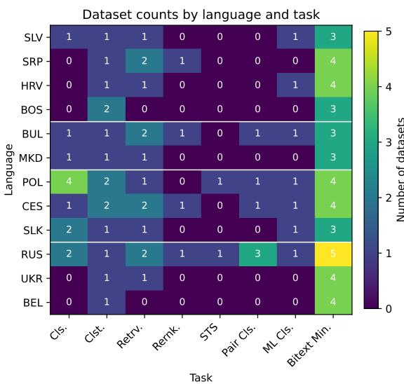

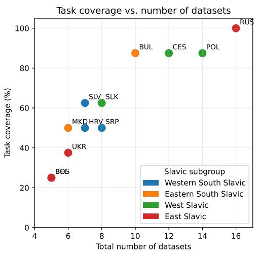

Figure 1: Dataset distribution across tasks and languages (left). Task coverage (percentage of tasks with at least one dataset) against the total number of datasets per language, showing substantial imbalance across languages (right).  
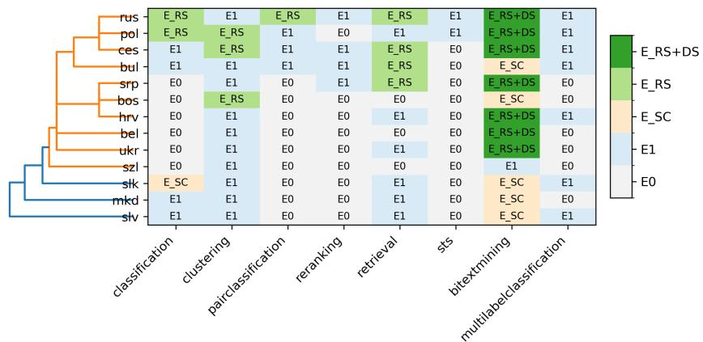  
Figure 2: Evidence levels by language and task. Each cell shows the evidence category $( E _ { 0 }  – E _ { R S + D S } )$ for the corresponding language–task pair, reflecting dataset availability, redundancy, and stability assessability.

## 5.2 Language-Specific Task-Specific Stability

## 5.2.1 Evidence Strength

Figure 3 presents the task-specific ESS across Slavic languages and tasks, revealing substantial disparities in benchmark coverage, dataset diversity, and stability assessability. Overall, the strongest evidence is consistently observed for bitext mining, where half of the languages achieve ESS values above 0.8, indicating relatively rich, diverse, and stability-assessable evaluation evidence. Russian achieves the highest ESS in this task (0.85), followed closely by Polish, Czech, Serbian, Croatian, Belarusian, and Ukrainian (0.82). In contrast, Bulgarian, Macedonian, Slovak, Slovene, and Bosnian exhibit substantially weaker evidence due to correlated datasets forming a single cluster.

Moderate evidence strength is observed for classification, clustering, and retrieval, although substantial language-level variation remains present. Russian and Polish consistently exhibit the strongest overall evidence profiles across multiple tasks, while Czech also demonstrates comparatively strong evidence, particularly for clustering and retrieval. In contrast, Bosnian, Slovene, Macedonian, and Slovak remain dominated by weak evidence levels across most tasks. Several tasks remain severely underrepresented across nearly all languages: STS exhibits near-zero ESS for almost all languages except Russian and Polish, while reranking, pair classification, and multilabel classification are largely characterized by missing or single-dataset evidence, resulting in limited stability assessability.

The hierarchical clustering separates languages according to benchmark coverage and evidence quality. Russian and Polish form the strongest evidence cluster, characterized by broader task coverage and more diverse evaluation resources. Czech, Serbian, and Croatian form an intermediate cluster with moderate evidence concentrated primarily in bitext mining and retrieval. Bosnian, Slovak, Slovene, and Macedonian cluster together as the weakest evidence group, reflecting low evidence across most evaluated tasks.

Importantly, the ESS analysis provides critical context for interpreting both ranking stability and top-k transfer consistency results. High ranking scheme or dataset composition stability should not automatically be interpreted as evidence of genuinely stable model behavior when ESS values remain low, since stable rankings may simply reflect scarce or redundant evaluation settings. Consequently, stability conclusions for tasks with weak ESS (particularly STS, reranking, and pair classification) should be interpreted cautiously. In contrast, the high ESS observed for bitext mining and for languages such as Russian, Polish, and Czech indicates that the corresponding stability and transfer consistency results are supported by substantially stronger and more reliable benchmark evidence.

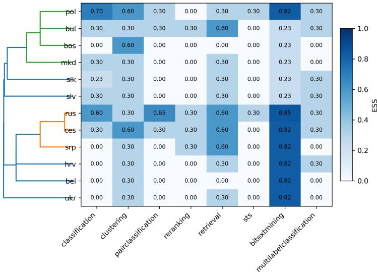  
Figure 3: Task-specific Evidence Strength Score (ESS) by language and task. Higher values indicate stronger, more diverse, and stability-assessable benchmark evidence.

## 5.2.2 Ranking Stability

The Kendall’s W analysis confirms that, whenever ranking stability can be assessed, benchmark rankings are generally highly stable across aggregation methods and dataset compositions. Across all assessable cases, aggregation stability on the original benchmark composition is consistently high, with mean $\overline { { W } } _ { R S } ^ { a l l } = 0 . 9 8 6$ and median $\widetilde { W } _ { R S } ^ { a l l } = 0 . 9 9 0$ . This indicates that different ranking methods tend to produce very similar model orderings whenever multiple ranking schemes are applicable. The highest aggregation stability is observed for pair classification $( \overline { { W } } _ { R S } ^ { a l l } = 0 . 9 9 3 )$ followed by bitext mining $( \overline { { W } } _ { R S } ^ { a l l } = 0 . 9 9 2 )$ , retrieval $( \overline { { W } } _ { R S } ^ { a l l } = 0 . 9 8 8 )$ , clustering $( \overline { { W } } _ { R S } ^ { a l l } = 0 . 9 8 4 )$ , and classification $( \overline { { W } } _ { R S } ^ { a l l } = 0 . 9 6 0 )$

For task-language pairs with robust dataset compositions, which occur only for bitext mining, aggregation stability remains high but decreases slightly when computed on the robust compositions. In this setting, the mean aggregation stability is $\overline { { W } } _ { R S } ^ { r o b } = 0 . 9 7 0$ , with a narrow range from 0.964 to 0.977. This suggests that alternative robust dataset compositions introduce some additional variation in rankings, but not enough to substantially alter the overall benchmark conclusions. The relatively small spread of $W _ { R S } ^ { r o b }$ values indicates that agreement between ranking schemes remains stable across the different robust dataset samples. Composition stability is also high for bitext mining. Across robust compositions, the mean $\overline { { W } } _ { D S } ^ { r o b }$ is 0.983, with a median of 0.986. This shows that model rankings are generally stable under correlation-aware dataset perturbations.

The stability results are further supported by the evidence-strength analysis. Task-language pairs belonging to $E _ { R S }$ have an average ESS of 0.615, while those belonging to $E _ { R S + D S }$ achieve an average ESS of 0.829, substantially higher than the scores observed for $E _ { 1 } ~ ( 0 . 3 0 0 )$ and $E _ { S C } \left( 0 . 2 3 2 \right)$ . Consequently, the cases for which stability can be evaluated are also those supported by the strongest benchmark evidence. This is particularly important because high Kendall agreement alone does not guarantee reliable conclusions, i.e., rankings may appear stable simply because only a single dataset is available.

At the task level, the results reinforce the distinction between stability and evidence availability. Tasks such as classification, clustering, retrieval, and pair classification exhibit high $W _ { R S } ^ { a l l }$ values, but only for a small subset of languages belonging to $E _ { R S }$ . Therefore, these high agreement values indicate aggregation stability, but do not provide evidence of composition stability. In contrast, bitext mining is the only task that supports both aggregation stability and composition stability analysis. Its simultaneously high values of $W _ { R S } ^ { a l l } , \bar { W } _ { R S } ^ { r o b } , W _ { D S } ^ { r o b }$ , and ESS provide the strongest evidence that benchmark conclusions remain stable under both methodological and dataset-composition perturbations.

Overall, the Kendall’s W results show that, whenever stability can be evaluated, multilingual embedding rankings are highly concordant. The choice of aggregation method has limited influence on the resulting model orderings, and in the case of bitext mining, rankings also remain stable across robust dataset compositions. Nevertheless, the primary limitation of current multilingual evaluation remains benchmark scarcity rather than ranking instability. The evidence-strength analysis reveals that only a small subset of task-language pairs provides sufficiently rich evaluation evidence to support comprehensive stability assessment, highlighting the need for broader and more diverse benchmark resources. The results are available in the project repository.

## 5.2.3 Top-k Transfer Consistency

The following tables report task-specific top-k transfer consistency results for each evaluated task and language. For each language, we list the model with the highest rank-weighted top-k transfer consistency score, together with the evidence level, Evidence Strength Score (ESS), dataset statistics, and the number of ranking instances used to compute the score. The evidence level indicates which type of stability assessment is possible, while ESS quantifies the reliability of the available benchmark evidence. The columns $n , q ,$ and U denote the number of datasets, decorrelated dataset clusters, and dataset compositions respectively. The #Ranks column reports the number of ranking outputs used to compute transfer consistency, and TC denotes the resulting task-specific transfer consistency score. The tables should be interpreted by considering both the TC value and the strength of the underlying evidence: high TC under strong evidence indicates reliable model stability, whereas high TC under weak evidence may reflect limited benchmark variability rather than genuinely stable model behavior.

Classification Table 3 summarizes the models with the highest task-specific transfer consistency for the classification task, together with the corresponding evidence levels and ESS values. Overall, classification remains one of the sparsest evaluation settings, with substantial disparities in benchmark coverage across languages. Most languages are supported by either a single dataset $( E _ { 1 } )$ or no evaluation evidence at all $( E _ { 0 } )$ , resulting in low ESS values $( \dot { E } S S \le 0 . 3 0 )$ . Consequently, transfer consistency conclusions for Slovene, Bulgarian, Macedonian, and Czech are based on only a single dataset and should therefore be interpreted as identifying the best-performing model on the available benchmark rather than providing a fully validated stability assessment.

The strongest evidence is observed for Polish $( E S S = 0 . 7 0 )$ , which is supported by four independent datasets $( n = q = 4 )$ and enables aggregation stability analysis $( E _ { R S } )$ . Russian provides the second strongest evidence profile $( E S S = 0 . 6 0 )$ , supported by two independent datasets and aggregation stability analysis. These two languages therefore provide the most reliable classification conclusions. In contrast, Slovak represents a single-cluster evidence setting $( E _ { S C } )$ , where multiple datasets are available $( n = 2 )$ but belong to a single correlated cluster $( q = 1 )$ . Although aggregation stability can be assessed across ranking schemes, the resulting ESS remains comparatively weak $( E S S = 0 . 2 3 )$ due to limited effective dataset diversity.

The task-specific transfer consistency scores further illustrate the impact of benchmark coverage on stability interpretation. Perfect consistency $( T C = 1 . 0 0 )$ is observed for most languages with available evidence, including Slovene, Bulgarian, Macedonian, Czech, Slovak, and Russian. However, these scores do not imply equally reliable conclusions. For the $E _ { 1 }$ languages, perfect consistency simply reflects agreement within a single ranking instance, whereas the corresponding result for Russian is supported by fifteen ranking schemes and substantially stronger benchmark evidence. Similarly, Polish exhibits a slightly lower consistency score $( T C = 0 . 9 9 )$ but provides stronger evidence overall due to its broader and more diverse benchmark coverage.

Across languages, Qwen3-Embedding variants emerge as the dominant models, appearing as the most transfer-consistent model in Slovene, Czech, Slovak, and Russian. In contrast, Linq-Embed-Mistral achieves the strongest consistency in Bulgarian, Qwen3-Embedding-4B in Macedonian, and llamaembed-nemotron-8b in Polish. Overall, the classification results highlight that apparent consistency is often constrained by limited benchmark evidence, and that the most reliable conclusions are currently restricted to Polish and Russian, where stability assessments are supported by sufficiently diverse and non-redundant evaluation datasets.

Table 3: Models with highest task-specific transfer consistency on the classification task. TC denotes task-specific transfer consistency; ESS denotes Evidence Strength Score.
<table><tr><td>Group</td><td>Lang.</td><td>Level</td><td>ESS</td><td>n</td><td>q</td><td>U</td><td>#Ranks</td><td>TC</td><td>Most Consistent Model</td></tr><tr><td rowspan="4">South W.</td><td>SLV</td><td> $\overline { { E _ { 1 } } }$ </td><td>0.30</td><td>1</td><td>1</td><td>1</td><td>1</td><td>1.00</td><td rowspan="4">Qwen3-Embedding-8B</td></tr><tr><td>SRP</td><td> $E _ { 0 }$ </td><td>0.00</td><td>0</td><td>0</td><td>0</td><td>0</td><td></td></tr><tr><td>HRV</td><td> $E _ { 0 }$ </td><td>0.00</td><td>0</td><td>0</td><td>0</td><td>0</td><td></td></tr><tr><td>BOS</td><td> $E _ { 0 }$ </td><td>0.00</td><td>0</td><td>0</td><td>0</td><td>0</td><td></td></tr><tr><td rowspan="2">South E.</td><td>BUL</td><td> $\overline { { E _ { 1 } } }$ </td><td>0.30</td><td>1</td><td>1</td><td>1</td><td>1</td><td>1.00</td><td>Linq-Embed-Mistral</td></tr><tr><td>MKD</td><td> $E _ { 1 }$ </td><td>0.30</td><td>1</td><td>1</td><td>1</td><td>1</td><td>1.00</td><td>Qwen3-Embedding-4B</td></tr><tr><td rowspan="3">West</td><td>POL</td><td> $E _ { R S }$ </td><td>0.70</td><td>4</td><td>4</td><td>1</td><td>15</td><td>0.99</td><td>llama-embed-nemotron-8b</td></tr><tr><td>CES</td><td> $E _ { 1 }$ </td><td>0.30</td><td>1</td><td>1</td><td>1</td><td>1</td><td>1.00</td><td>Qwen3-Embedding-8B</td></tr><tr><td>SLK</td><td> $E _ { S C }$ </td><td>0.23</td><td>2</td><td>1</td><td>2</td><td>15</td><td>1.00</td><td>Qwen3-Embedding-8B</td></tr><tr><td rowspan="3">East</td><td>RUS</td><td> $\overline { { E _ { R S } } }$ </td><td>0.60</td><td>2</td><td>2</td><td>1</td><td>15</td><td>1.00</td><td>Qwen3-Embedding-8B</td></tr><tr><td>UKR</td><td> $E _ { 0 }$ </td><td>0.00</td><td>0</td><td>0</td><td>0</td><td>0</td><td></td><td rowspan="2"></td></tr><tr><td>BEL</td><td> $E _ { 0 }$ </td><td>0.00</td><td>0</td><td>0</td><td>0</td><td>0</td><td>一</td></tr></table>

Clustering Table 4 presents the models with the highest task-specific transfer consistency for the clustering task, together with the corresponding evidence levels and ESS values. Compared to classification, clustering exhibits a more homogeneous consistency profile but remains characterized by limited benchmark coverage. Most languages are supported by only a single dataset $( E _ { 1 } )$ , resulting in low ESS values $( E S S = 0 . 3 0 )$ and preventing meaningful stability validation across datasets or ranking schemes. Only Bosnian, Polish, and Czech provide sufficient benchmark coverage to enable aggregation stability analysis $( E _ { R S } )$ , yielding substantially stronger evidence $( E S S = 0 . 6 0 )$ based on two independent datasets and fifteen ranking schemes.

A striking result is the complete dominance of llama-embed-nemotron-8b, which emerges as the most transfer-consistent model for every evaluated language, achieving $T C = 1 . 0 0$ in all cases. This degree of consistency is substantially stronger than that observed for most other tasks and suggests a remarkably stable performance profile for clustering.

However, the interpretation depends critically on the underlying evidence strength. For the majority of languages, perfect consistency is obtained under single-dataset evidence $( E _ { 1 } )$ , meaning that the observed stability reflects agreement within a single benchmark rather than stability validated across multiple evaluation conditions. In contrast, the conclusions for Bosnian, Polish, and Czech are supported by stronger evidence $( E _ { R S } , E S S = 0 . 6 0 )$ , making the corresponding stability assessments considerably more reliable. The fact that llama-embed-nemotron- $\mathbf { \nabla } \cdot 8 b$ remains the most consistent model even in these higher-evidence settings provides stronger support for its superiority on clustering tasks.

Table 4: Models with highest task-specific transfer consistency on the clustering task.
<table><tr><td>Group</td><td>Lang.</td><td>Level</td><td>ESS</td><td>n</td><td>q</td><td> $\overline { { U } }$ </td><td>#Ranks</td><td>TC</td><td>Most Consistent Model</td></tr><tr><td rowspan="4">South W.</td><td>SLV</td><td> $\overline { { E _ { 1 } } }$ </td><td>0.30</td><td>1</td><td>1</td><td>1</td><td>1</td><td>1.00</td><td>llama-embed-nemotron-8b</td></tr><tr><td>SRP</td><td> $E _ { 1 }$ </td><td>0.30</td><td>1</td><td>1</td><td>1</td><td>1</td><td>1.00</td><td>llama-embed-nemotron-8b</td></tr><tr><td>HRV</td><td> $E _ { 1 }$ </td><td>0.30</td><td>1</td><td>1</td><td>1</td><td>1</td><td>1.00</td><td>llama-embed-nemotron-8b</td></tr><tr><td>BOS</td><td> $E _ { R S }$ </td><td>0.60</td><td>2</td><td>2</td><td>1</td><td>15</td><td>1.00</td><td>llama-embed-nemotron-8b</td></tr><tr><td rowspan="2">South E.</td><td>BUL</td><td> $\overline { { E _ { 1 } } }$ </td><td>0.30</td><td>1</td><td>1</td><td>1</td><td>1</td><td>1.00</td><td>llama-embed-nemotron-8b</td></tr><tr><td>MKD</td><td> $E _ { 1 }$ </td><td>0.30</td><td>1</td><td>1</td><td>1</td><td>1</td><td>1.00</td><td>llama-embed-nemotron-8b</td></tr><tr><td rowspan="3">West</td><td>POL</td><td> $\overline { { E _ { R S } } }$ </td><td>0.60</td><td>2</td><td>2</td><td>1</td><td>15</td><td>1.00</td><td>llama-embed-nemotron-8b</td></tr><tr><td>CES</td><td> $E _ { R S }$ </td><td>0.60</td><td>2</td><td>2</td><td>1</td><td>15</td><td>1.00</td><td>llama-embed-nemotron-8b</td></tr><tr><td>SLK</td><td> $E _ { 1 }$ </td><td>0.30</td><td>1</td><td>1</td><td>1</td><td>1</td><td>1.00</td><td>llama-embed-nemotron-8b</td></tr><tr><td rowspan="3">East</td><td>RUS</td><td> $\overline { { E _ { 1 } } }$ </td><td>0.30</td><td>1</td><td>1</td><td>1</td><td>1</td><td>1.00</td><td>llama-embed-nemotron-8b</td></tr><tr><td>UKR</td><td> $E _ { 1 }$ </td><td>0.30</td><td>1</td><td>1</td><td>1</td><td>1</td><td>1.00</td><td>llama-embed-nemotron-8b</td></tr><tr><td>BEL</td><td> $E _ { 1 }$ </td><td>0.30</td><td>1</td><td>1</td><td>1</td><td>1</td><td>1.00</td><td>llama-embed-nemotron-8b</td></tr></table>

Retrieval Table 5 summarizes the models with the highest task-specific transfer consistency for the retrieval task. Similar to clustering, retrieval exhibits highly uneven benchmark coverage across languages. Most languages are supported by only a single dataset $( E _ { 1 } )$ , resulting in low ESS values $\bar { ( } E S S = 0 . 3 0 \bar { ) }$ and limiting conclusions to individual benchmark instances. Aggregation stability analysis is possible only for Serbian, Bulgarian, Czech, and Russian $( E _ { R S } )$ , where two independent datasets are available and ESS increases to 0.60. No language provides sufficient benchmark diversity to support composition stability analysis.

Unlike the classification and clustering tasks, retrieval does not exhibit a single dominant model across all languages. Instead, three models emerge as the most transfer-consistent under different evaluation settings: LaBSE-ru-turbo, bilingual-embedding-large, and jina-embeddings-v3. LaBSE-ruturbo achieves perfect consistency $( T C = 1 . 0 0 )$ in most single-dataset settings, including Slovene, Croatian, Macedonian, Polish, Slovak, and Ukrainian. In contrast, bilingual-embedding-large emerges as the most consistent model in the higher-evidence Serbian, Bulgarian, and Czech settings. Russian constitutes a particularly interesting case, where jina-embeddings-v3 achieves the highest consistency score $( T { \bar { C } } = 0 . 9 9 { \bar { ) } }$ , slightly outperforming competing models despite the stronger stability requirements imposed by aggregation stability analysis.

The retrieval results also differ from previous tasks in terms of model composition. Several models that consistently performed well in classification and clustering, such as llama-embed-nemotron-8b, do not appear among the most transfer-consistent retrieval models. This reflects the task-specific zero-shot filtering applied during benchmark construction, which results in a substantially different set of eligible models for retrieval evaluation.

Table 5: Models with highest task-specific transfer consistency on the retrieval task.
<table><tr><td>Group</td><td>Lang.</td><td>Level</td><td>ESS</td><td>n</td><td>q</td><td>U</td><td>#Ranks</td><td>TC</td><td>Most Consistent Model</td></tr><tr><td rowspan="4">South W.</td><td>SLV</td><td> $\overline { { E _ { 1 } } }$ </td><td>0.30</td><td>1</td><td>1</td><td>1</td><td>1</td><td>1.00</td><td>LaBSE-ru-turbo</td></tr><tr><td>SRP</td><td> $E _ { R S }$ </td><td>0.60</td><td>2</td><td>2</td><td>1</td><td>15</td><td>1.00</td><td>bilingual-embedding-large</td></tr><tr><td>HRV</td><td> $E _ { 1 }$ </td><td>0.30</td><td>1</td><td>1</td><td>1</td><td>1</td><td>1.00</td><td>LaBSE-ru-turbo</td></tr><tr><td>BOS</td><td> $E _ { 0 }$ </td><td>0.00</td><td>0</td><td>0</td><td>0</td><td>0</td><td></td><td></td></tr><tr><td rowspan="2">South E.</td><td>BUL</td><td> $\overline { { E _ { R S } } }$ </td><td>0.60</td><td>2</td><td>2</td><td>1</td><td>15</td><td>1.00</td><td>bilingual-embedding-large</td></tr><tr><td>MKD</td><td> $E _ { 1 }$ </td><td>0.30</td><td>1</td><td>1</td><td>1</td><td>1</td><td>1.00</td><td>LaBSE-ru-turbo</td></tr><tr><td rowspan="3">West</td><td>POL</td><td> $\overline { { E _ { 1 } } }$ </td><td>0.30</td><td>1</td><td>1</td><td>1</td><td>1</td><td>1.00</td><td>LaBSE-ru-turbo</td></tr><tr><td>CES</td><td> $E _ { R S }$ </td><td>0.60</td><td>2</td><td>2</td><td>1</td><td>15</td><td>1.00</td><td>bilingual-embedding-large</td></tr><tr><td>SLK</td><td> $E _ { 1 }$ </td><td>0.30</td><td>1</td><td>1</td><td>1</td><td>1</td><td>1.00</td><td>LaBSE-ru-turbo</td></tr><tr><td rowspan="3">East</td><td>RUS</td><td> $\overline { { E _ { R S } } }$ </td><td>0.60</td><td>2</td><td>2</td><td>1</td><td>15</td><td>0.99</td><td>jina-embeddings-v3</td></tr><tr><td>UKR</td><td> $E _ { 1 }$ </td><td>0.30</td><td>1</td><td>1</td><td>1</td><td>1</td><td>1.00</td><td>LaBSE-ru-turbo</td></tr><tr><td>BEL</td><td> $E _ { 0 }$ </td><td>0.00</td><td>0</td><td>0</td><td>0</td><td>0</td><td></td><td></td></tr></table>

Reranking Table 6 confirms that reranking is among the most underrepresented evaluation settings. Benchmark coverage is extremely sparse, with available evidence limited to only four languages: Serbian, Bulgarian, Czech, and Russian. All four belong to the single-dataset evidence category $( E _ { 1 }$ $E S S = 0 . 3 0 )$ , so neither aggregation stability nor composition stability can be evaluated, and transfer consistency is derived from a single ranking instance per language.

Despite this severe limitation, a remarkably consistent pattern emerges: llama-embed-nemotron-8b is identified as the most transfer-consistent model in all four languages, achieving $T C = 1 . 0 0$ in every case. However, because all conclusions are based on single-dataset evidence, the observed consistency should not be interpreted as evidence of stable cross-dataset performance.

Table 6: Models with highest task-specific transfer consistency on the reranking task.
<table><tr><td>Group</td><td>Lang.</td><td>Level</td><td>ESS</td><td>n</td><td>q</td><td>U</td><td>#Ranks</td><td>TC</td><td>Most Consistent Model</td></tr><tr><td rowspan="4">South W.</td><td>SLV</td><td> $\overline { { E _ { 0 } } }$ </td><td>0.00</td><td>0</td><td>0</td><td>0</td><td>0</td><td></td><td rowspan="4">llama-embed-nemotron-8b</td></tr><tr><td>SRP</td><td> $E _ { 1 }$ </td><td>0.30</td><td>1</td><td>1</td><td>1</td><td>1</td><td>1.00</td></tr><tr><td>HRV</td><td> $E _ { 0 }$ </td><td>0.00</td><td>0</td><td>0</td><td>0</td><td>0</td><td></td></tr><tr><td>BOS</td><td> $E _ { 0 }$ </td><td>0.00</td><td>0</td><td>0</td><td>0</td><td>0</td><td></td></tr><tr><td rowspan="2">South E.</td><td>BUL</td><td> $\overline { { E _ { 1 } } }$ </td><td>0.30</td><td>1</td><td>1</td><td>1</td><td>1</td><td>1.00</td><td rowspan="2">llama-embed-nemotron-8b</td></tr><tr><td>MKD</td><td> $E _ { 0 }$ </td><td>0.00</td><td>0</td><td>0</td><td>0</td><td>0</td><td>一</td></tr><tr><td rowspan="3">West</td><td>POL</td><td> $\overline { { E _ { 0 } } }$ </td><td>0.00</td><td>0</td><td>0</td><td>0</td><td>0</td><td>一</td><td rowspan="3">一 llama-embed-nemotron-8b</td></tr><tr><td>CES</td><td> $E _ { 1 }$ </td><td>0.30</td><td>1</td><td>1</td><td>1</td><td>1</td><td>1.00</td></tr><tr><td>SLK</td><td> $E _ { 0 }$ </td><td>0.00</td><td>0</td><td>0</td><td>0</td><td>0</td><td></td></tr><tr><td rowspan="3">East</td><td>RUS</td><td> $\overline { { E _ { 1 } } }$ </td><td>0.30</td><td>1</td><td>1</td><td>1</td><td>1</td><td>1.00</td><td rowspan="3">1lama-embed-nemotron-8b</td></tr><tr><td>UKR</td><td> $E _ { 0 }$ </td><td>0.00</td><td>0</td><td>0</td><td>0</td><td>0</td><td></td></tr><tr><td>BEL</td><td> $E _ { 0 }$ </td><td>0.00</td><td>0</td><td>0</td><td>0</td><td>0</td><td>一</td></tr></table>

STS Table 7 reveals the most severe benchmark scarcity among all evaluated tasks. Evaluation evidence is available only for Polish and Russian, while all remaining Slavic languages fall into the no-evidence category $( E _ { 0 } )$ . For both languages, only a single dataset is available $( E _ { 1 } , E S S = 0 . 3 0 )$ so neither aggregation stability nor composition stability can be assessed. In both languages, Octen-Embedding-8B achieves perfect transfer consistency $( T C = 1 . 0 0 )$ , though this result is derived from a single ranking instance and therefore provides limited evidence regarding broader stability.

Table 7: Models with highest task-specific transfer consistency on the STS task.
<table><tr><td>Group</td><td>Lang.</td><td>Level</td><td>ESS</td><td>n</td><td>q</td><td>U</td><td>#Ranks</td><td>TC</td><td>Most Consistent Model</td></tr><tr><td rowspan="4">South W.</td><td>SLV</td><td> $\overline { { E _ { 0 } } }$ </td><td>0.00</td><td>0</td><td>0</td><td>0</td><td>0</td><td>一</td><td></td></tr><tr><td>SRP</td><td> $E _ { 0 }$ </td><td>0.00</td><td>0</td><td>0</td><td>0</td><td>0</td><td></td><td></td></tr><tr><td>HRV</td><td> $E _ { 0 }$ </td><td>0.00</td><td>0</td><td>0</td><td>0</td><td>0</td><td>一</td><td>一</td></tr><tr><td>BOS</td><td> $E _ { 0 }$ </td><td>0.00</td><td>0</td><td>0</td><td>0</td><td>0</td><td>一</td><td>一</td></tr><tr><td rowspan="2">South E.</td><td>BUL</td><td> $\overline { { E _ { 0 } } }$ </td><td>0.00</td><td>0</td><td>0</td><td>0</td><td>0</td><td>一</td><td>一</td></tr><tr><td>MKD</td><td> $E _ { 0 }$ </td><td>0.00</td><td>0</td><td>0</td><td>0</td><td>0</td><td>一</td><td>一</td></tr><tr><td rowspan="3">West</td><td>POL</td><td> $E _ { 1 }$ </td><td>0.30</td><td>1</td><td>1</td><td>1</td><td>1</td><td>1.00</td><td>Octen-Embedding-8B</td></tr><tr><td>CES</td><td> $E _ { 0 }$ </td><td>0.00</td><td>0</td><td>0</td><td>0</td><td>0</td><td>一</td><td>一</td></tr><tr><td>SLK</td><td> $E _ { 0 }$ </td><td>0.00</td><td>0</td><td>0</td><td>0</td><td>0</td><td>一</td><td></td></tr><tr><td rowspan="3">East</td><td>RUS</td><td> $\overline { { E _ { 1 } } }$ </td><td>0.30</td><td>1</td><td>1</td><td>1</td><td>1</td><td>1.00</td><td>Octen-Embedding-8B</td></tr><tr><td>UKR</td><td> $E _ { 0 }$ </td><td>0.00</td><td>0</td><td>0</td><td>0</td><td>0</td><td></td><td></td></tr><tr><td>BEL</td><td> $E _ { 0 }$ </td><td>0.00</td><td>0</td><td>0</td><td>0</td><td>0</td><td>一</td><td></td></tr></table>

Pair Classification Table 8 summarizes the models with the highest task-specific transfer consistency for the pair classification task. Similar to reranking and STS, pair classification suffers from limited benchmark coverage, with evaluation evidence available for only four languages: Bulgarian, Polish, Czech, and Russian. Bulgarian, Polish, and Czech are supported by a single dataset $( E _ { 1 }$ $E S S = 0 . 3 0 )$ . Russian provides the strongest evidence setting for this task, supporting aggregation stability analysis $( E _ { R S } )$ through three datasets $( n = q = 3 )$ and achieving $E S \bar { S } = 0 . \bar { 6 5 }$

A highly consistent pattern emerges: Qwen3-Embedding-8B is identified as the most transferconsistent model in Bulgarian, Czech, and Russian, while Qwen3-Embedding-4B achieves the highest consistency in Polish. All reported top models achieve $T C = 1 . 0 0$ . However, for Bulgarian,

Polish, and Czech, perfect consistency is obtained from a single ranking instance, whereas the Russian result is supported by fifteen ranking schemes and substantially stronger benchmark evidence.

Table 8: Models with highest task-specific transfer consistency on the pair classification task.
<table><tr><td>Group</td><td>Lang.</td><td>Level</td><td>ESS</td><td>n</td><td>q</td><td>U</td><td>#Ranks</td><td>TC</td><td>Most Consistent Model</td></tr><tr><td rowspan="4">South W.</td><td>SLV</td><td> $\overline { { E _ { 0 } } }$ </td><td>0.00</td><td>0</td><td>0</td><td>0</td><td>0</td><td></td><td></td></tr><tr><td>SRP</td><td> $E _ { 0 }$ </td><td>0.00</td><td>0</td><td>0</td><td>0</td><td>0</td><td></td><td></td></tr><tr><td>HRV</td><td> $E _ { 0 }$ </td><td>0.00</td><td>0</td><td>0</td><td>0</td><td>0</td><td></td><td></td></tr><tr><td>BOS</td><td> $E _ { 0 }$ </td><td>0.00</td><td>0</td><td>0</td><td>0</td><td>0</td><td></td><td></td></tr><tr><td rowspan="2">South E.</td><td>BUL</td><td> $\overline { { E _ { 1 } } }$ </td><td>0.30</td><td>1</td><td>1</td><td>1</td><td>1</td><td>1.00</td><td>Qwen3-Embedding-8B</td></tr><tr><td>MKD</td><td> $E _ { 0 }$ </td><td>0.00</td><td>0</td><td>0</td><td>0</td><td>0</td><td></td><td></td></tr><tr><td rowspan="3">West</td><td>POL</td><td> $\overline { { E _ { 1 } } }$ </td><td>0.30</td><td>1</td><td>1</td><td>1</td><td>1</td><td>1.00</td><td>Qwen3-Embedding-4B</td></tr><tr><td>CES</td><td> $E _ { 1 }$ </td><td>0.30</td><td>1</td><td>1</td><td>1</td><td>1</td><td>1.00</td><td>Qwen3-Embedding-8B</td></tr><tr><td>SLK</td><td> $E _ { 0 }$ </td><td>0.00</td><td>0</td><td>0</td><td>0</td><td>0</td><td></td><td></td></tr><tr><td rowspan="3">East</td><td>RUS</td><td> $\overline { { E _ { R S } } }$ </td><td>0.65</td><td>3</td><td>3</td><td>1</td><td>15</td><td>1.00</td><td>Qwen3-Embedding-8B</td></tr><tr><td>UKR</td><td> $E _ { 0 }$ </td><td>0.00</td><td>0</td><td>0</td><td>0</td><td>0</td><td></td><td></td></tr><tr><td>BEL</td><td> $E _ { 0 }$ </td><td>0.00</td><td>0</td><td>0</td><td>0</td><td>0</td><td></td><td></td></tr></table>

Multilabel Classification Table 9 summarizes the models with the highest task-specific transfer consistency for the multilabel classification task. Similar to reranking and pair classification, this task is characterized by sparse and uneven benchmark coverage. Evaluation evidence is available only for Slovene, Croatian, Bulgarian, Polish, Czech, Slovak, and Russian; all with single-dataset evidence $( E _ { 1 }$ $E S S = 0 . 3 0 \rangle$ ). Consequently, neither aggregation stability nor composition stability can be assessed.

Despite the limited benchmark coverage, an exceptionally consistent pattern emerges: KaLM-Embedding-Gemma3-12B-2511 achieves the highest transfer consistency $( T C = 1 . 0 0 )$ in every language with available evidence. However, because all conclusions are based on single-dataset evaluations $( E _ { 1 } )$ , the observed perfect consistency reflects stability within individual benchmark instances rather than stability validated across multiple datasets or ranking schemes. Multilabel classification therefore provides one of the clearest illustrations of the distinction between transfer consistency and evidence strength: the model is uniformly identified as the top performer, yet the supporting evidence is insufficient to confirm this as genuinely robust behavior.

Table 9: Models with highest task-specific transfer consistency on the multilabel classification task.
<table><tr><td>Group</td><td>Lang</td><td>L</td><td>ESS</td><td>n</td><td>q</td><td>U</td><td>#Rnk</td><td>TC</td><td>Most Consistent Model</td></tr><tr><td rowspan="4">South W.</td><td>SLV</td><td> $\overline { { E _ { 1 } } }$ </td><td>0.30</td><td>1</td><td>1</td><td>1</td><td>1 0</td><td>1.00</td><td rowspan="2">KaLM-Embedding-Gemma3-12B-2511</td></tr><tr><td>SRP</td><td> $E _ { 0 }$ </td><td>0.00</td><td>0</td><td>0</td><td>0</td><td></td><td></td></tr><tr><td>HRV</td><td> $E _ { 1 }$ </td><td>0.30</td><td>1</td><td>1</td><td>1</td><td>1</td><td>1.00</td><td rowspan="2">KaLM-Embedding-Gemma3-12B-2511</td></tr><tr><td>BOS</td><td> $E _ { 0 }$ </td><td>0.00</td><td>0</td><td>0</td><td>0</td><td>0</td><td></td></tr><tr><td rowspan="2">South E.</td><td>BUL</td><td> $\overline { { E _ { 1 } } }$ </td><td>0.30</td><td>1</td><td>1</td><td>1</td><td>1</td><td>1.00</td><td rowspan="2">KaLM-Embedding-Gemma3-12B-2511</td></tr><tr><td>MKD</td><td> $E _ { 0 }$ </td><td>0.00</td><td>0</td><td>0</td><td>0</td><td>0</td><td></td></tr><tr><td rowspan="3">West</td><td>POL</td><td> $\overline { { E _ { 1 } } }$ </td><td>0.30</td><td>1</td><td>1</td><td>1</td><td>1</td><td>1.00</td><td>KaLM-Embedding-Gemma3-12B-2511</td></tr><tr><td>CES</td><td> $E _ { 1 }$ </td><td>0.30</td><td>1</td><td>1</td><td>1</td><td>1</td><td>1.00</td><td>KaLM-Embedding-Gemma3-12B-2511</td></tr><tr><td>SLK</td><td> $E _ { 1 }$ </td><td>0.30</td><td>1</td><td>1</td><td>1</td><td>1</td><td>1.00</td><td>KaLM-Embedding-Gemma3-12B-2511</td></tr><tr><td rowspan="3">East</td><td>RUS</td><td> $\overline { { E _ { 1 } } }$ </td><td>0.30</td><td>1</td><td>1</td><td>1</td><td>1</td><td>1.00</td><td>KaLM-Embedding-Gemma3-12B-2511</td></tr><tr><td>UKR</td><td> $E _ { 0 }$ </td><td>0.00</td><td>0</td><td>0</td><td>0</td><td>0</td><td></td><td rowspan="2"></td></tr><tr><td>BEL</td><td> $E _ { 0 }$ </td><td>0.00</td><td>0</td><td>0</td><td>0</td><td>0</td><td></td></tr></table>

Bitext Mining Table 10 presents the models with the highest task-specific transfer consistency for bitext mining, which stands out as the strongest evidence setting in the entire study. Unlike all other tasks, bitext mining provides sufficient benchmark coverage to support both aggregation stability and composition stability analysis for a large subset of languages. Serbian, Croatian, Polish, Czech, Russian, Ukrainian, and Belarusian all belong to the highest evidence category $( E _ { R S + D S } )$ , with ESS values ranging from 0.83 to 0.85. In contrast, Slovene, Bosnian, Bulgarian, Macedonian, and Slovak belong to the single-cluster evidence category $( E _ { S C } )$ , where multiple datasets are available but provide largely redundant evaluation evidence.

The task exhibits a clear separation between two groups of models. For the higher-evidence $E _ { R S + D S }$ languages, bge-m3 consistently emerges as the most transfer-consistent model, achieving TC scores between 0.82 and 0.87. In contrast, the $E _ { S C }$ and $E _ { 1 }$ languages are dominated by multilinguale5-large-instruct, which achieves perfect consistency $( T C = 1 . 0 0 )$ in all such settings. This pattern is not primarily driven by linguistic differences, but rather by benchmark composition: the languages where $b g e { - m 3 }$ dominates largely share the same underlying bitext-mining datasets, while the languages favoring multilingual-e5-large-instruct are evaluated on a different set of highly correlated benchmarks.

Bitext mining is the only task where transfer consistency can be interpreted together with strong evidence strength. Although multilingual-e5-large-instruct achieves perfect consistency in several languages, these results are supported only by single-cluster evidence $( E _ { S C } , E S S = 0 . 2 3 )$ and therefore provide weaker stability guarantees. By contrast, the slightly lower TC scores of bge-m3 are supported by substantially stronger evidence $( E _ { R S + D S } , E S S > 0 . 8 0 )$ , making these conclusions considerably more reliable.

Table 10: Models with highest task-specific transfer consistency on the bitext mining task.
<table><tr><td>Group</td><td>Lang.</td><td>Level</td><td>ESS</td><td>n</td><td>q</td><td>U</td><td>#Ranks</td><td>TC</td><td>Most Consistent Model</td></tr><tr><td rowspan="4">South W.</td><td>SLV</td><td> $\overline { { E _ { S C } } }$ </td><td>0.23</td><td>3</td><td>1</td><td>1</td><td>15</td><td>1.00</td><td>multilingual-e5-large-instruct</td></tr><tr><td>SRP</td><td> $E _ { R S + D S }$ </td><td>0.83</td><td>4</td><td>2</td><td>3</td><td>45</td><td>0.85</td><td>bge-m3</td></tr><tr><td>HRV</td><td> $E _ { R S + D S }$ </td><td>0.83</td><td>4</td><td>2</td><td>3</td><td>45</td><td>0.85</td><td>bge-m3</td></tr><tr><td>BOS</td><td> $E _ { S C }$ </td><td>0.23</td><td>3</td><td>1</td><td>1</td><td>15</td><td>1.00</td><td>multilingual-e5-large-instruct</td></tr><tr><td rowspan="2">South E.</td><td>BUL</td><td> $\overline { { E _ { S C } } }$ </td><td>0.23</td><td>3</td><td>1</td><td>1</td><td>15</td><td>1.00</td><td>multilingual-e5-large-instruct</td></tr><tr><td>MKD</td><td> $E _ { S C }$ </td><td>0.23</td><td>3</td><td>1</td><td>1</td><td>15</td><td>1.00</td><td>multilingual-e5-large-instruct</td></tr><tr><td rowspan="3">West</td><td>POL</td><td> $\overline { { E _ { R S + D S } } }$ </td><td>0.83</td><td>4</td><td>2</td><td>3</td><td>45</td><td>0.86</td><td>bge-m3</td></tr><tr><td>CES</td><td> $E _ { R S + D S }$ </td><td>0.83</td><td>4</td><td>2</td><td>3</td><td>45</td><td>0.86</td><td>bge-m3</td></tr><tr><td>SLK</td><td> $E _ { S C }$ </td><td>0.23</td><td>3</td><td>1</td><td>1</td><td>15</td><td>1.00</td><td>multilingual-e5-large-instruct</td></tr><tr><td rowspan="3">East</td><td>RUS</td><td> $\overline { { E _ { R S + D S } } }$ </td><td>0.85</td><td>5</td><td>2</td><td>3</td><td>45</td><td>0.82</td><td>bge-m3</td></tr><tr><td>UKR</td><td> $E _ { R S + D S }$ </td><td>0.83</td><td>4</td><td>2</td><td>3</td><td>45</td><td>0.87</td><td>bge-m3</td></tr><tr><td>BEL</td><td> $E _ { R S + D S }$ </td><td>0.83</td><td>4</td><td>2</td><td>3</td><td>45</td><td>0.84</td><td>bge-m3</td></tr></table>

## 5.3 Language-Specific Cross-Task Generalization

## 5.3.1 Evidence Strength

Figure 4 summarizes the aggregated ESS across languages and tasks, providing important context for interpreting the reliability of the cross-task transfer consistency analysis. Since language-level ESS averages task-specific evidence across all analyzed tasks, including tasks without available datasets, it jointly reflects benchmark coverage, dataset diversity, and stability assessability at the language level. Consequently, higher language-level ESS indicates that cross-task transfer consistency conclusions are supported by broader and more reliable evaluation evidence.

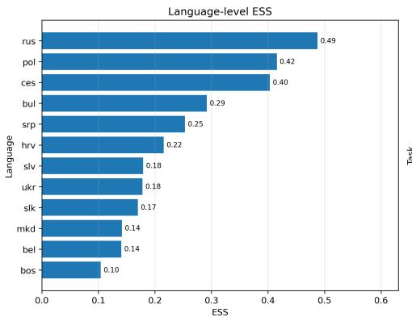

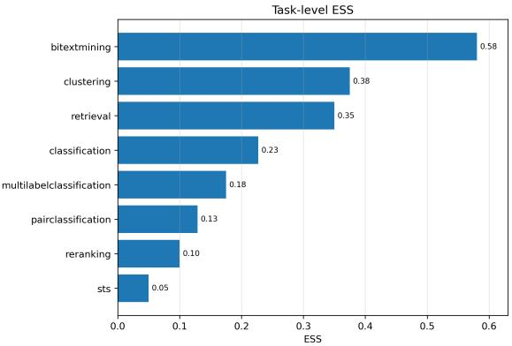  
Figure 4: Aggregated ESS across languages (left) and tasks (right).

Russian exhibits the highest language-level ESS (0.49), followed by Polish (0.42) and Czech (0.40), indicating that cross-task transfer consistency results for these languages are supported by comparatively strong and diverse benchmark evidence across multiple tasks. Bulgarian and Serbian form an intermediate group with moderate evidence strength, while Croatian, Slovene, Ukrainian, and Slovak exhibit weaker evidence profiles due to sparse benchmark coverage and limited stability assessability across several tasks. Bosnian and Sorbian represent the weakest evidence settings overall.

The task-level ESS further explains these language-level differences. Bitext mining clearly dominates the benchmark landscape with the highest task-level ESS (0.58), followed by clustering (0.38) and retrieval (0.35). Consequently, cross-task transfer consistency is heavily influenced by these tasks. In contrast, tasks such as STS (0.05), reranking (0.10), and pair classification (0.13) contribute only weak evidence due to sparse or highly redundant benchmark coverage.

These results demonstrate that cross-task transfer consistency should not be interpreted independently of evidence strength. Apparent consistency for lower-coverage languages may partially reflect limited benchmark variability rather than genuinely stable multilingual behavior. In contrast, consistency results for Russian, Polish, and Czech are considerably more reliable because they are supported by stronger evidence across multiple tasks and evaluation settings.

## 5.3.2 Cross-Task Transfer Consistency

Table 11 and Figure 5 summarize cross-task transfer consistency for languages with task coverage exceeding 50%, with B providing details on the qualitative interpretation of the ESS score given in the Evidence column. C provides details for a selected set of languages. The project repository contains deteiled results for all evaluated languages.

Unlike the task-specific analysis, which evaluates stability within individual tasks, cross-task transfer consistency measures the ability of a model to remain among the highest-ranked methods across multiple task families within the same language. The results reveal a considerably more stable picture than the task-specific analysis. While different models dominate individual tasks, crosstask generalization is concentrated within a very small set of multilingual embedding models. In particular, llama-embed-nemotron-8b, multilingual-e5-large-instruct, and Qwen3-Embedding variants repeatedly occupy the top positions across languages. Figure 5 further illustrates this concentration: llama-embed-nemotron-8b leads in 55.6% of the analyzed languages, multilingual-e5-large-instruct in 33.3%, and Qwen3-Embedding-4B in 11.1% (Polish only). However, the differences between the top-ranked models are often small, indicating that a small group of large multilingual models consistently provides strong cross-task transfer rather than a single universally superior model.

Table 11: Most transfer-consistent models by language for cross-task generalization. Evidence denotes the language-level evidence category, ESS is the language-level Evidence Strength Score, Tasks is the number of evaluable tasks out of all analyzed tasks, and CW is the coverage-weighted cross-task transfer consistency score.
<table><tr><td>Group</td><td>Lang.</td><td>Evidence</td><td>ESS</td><td>Tasks</td><td>CW</td><td>Most Consistent Model</td></tr><tr><td rowspan="3">South W.</td><td>SLV</td><td>Weak</td><td>0.18</td><td>5/8</td><td>0.35</td><td>multilingual-e5-large-instruct</td></tr><tr><td>SRP</td><td>Moderate</td><td>0.25</td><td>4/8</td><td>0.30</td><td>llama-embed-nemotron-8b</td></tr><tr><td>HRV</td><td>Weak</td><td>0.22</td><td>4/8</td><td>0.31</td><td>multilingual-e5-large-instruct</td></tr><tr><td>South E.</td><td>BUL MKD</td><td>Moderate Weak</td><td>0.29 0.14</td><td>7/8 4/8</td><td>0.55 0.34</td><td>1lama-embed-nemotron-8b llama-embed-nemotron-8b</td></tr><tr><td rowspan="2">West</td><td>POL</td><td>Strong</td><td>0.42</td><td>7/8</td><td>0.54</td><td>Qwen3-Embedding-4B</td></tr><tr><td>CES</td><td>Strong</td><td>0.40</td><td>7/8</td><td>0.53</td><td>llama-embed-nemotron-8b</td></tr><tr><td>East</td><td>SLK RUS</td><td>Weak Strong</td><td>0.17 0.49</td><td>5/8 8/8</td><td>0.41 0.70</td><td>multilingual-e5-large-instruct 1lama-embed-nemotron-8b</td></tr></table>

At the subgroup level, the strongest competition is observed in the West South languages. Slovene is nominally led by multilingual-e5-large-instruct $( C W ^ { ( \mathrm { s l v } ) } = 0 . 3 5 )$ , but llama-embed-nemotron-8b follows almost immediately, indicating that both models generalize similarly well. Serbian exhibits the reverse ordering, with llama-embed-nemotron-8b slightly outperforming multilingual-e5-largeinstruct, again with a negligible margin. Croatian again favors multilingual-e5-large-instruct, but the same pair remains substantially ahead of the rest. Taken together, the West South subgroup suggests that cross-task transfer consistency is effectively shared between llama-embed-nemotron-8b and multilingual-e5-large-instruct.

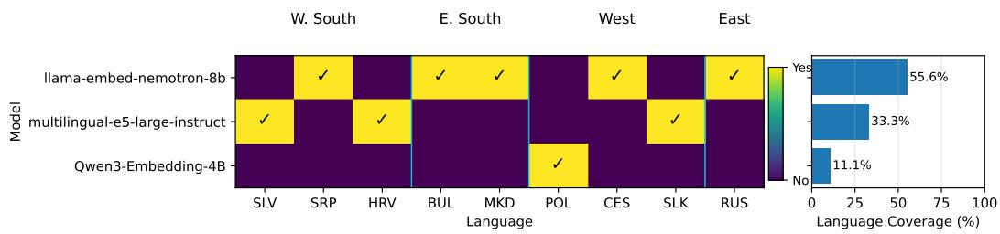  
Figure 5: Binary heatmap showing whether a model is among the most transfer-consistent cross-task models for each language (left). Overall coverage of each model, measured as the percentage of languages for which it is top ranked (right).

The East South subgroup is more homogeneous. Both Bulgarian and Macedonian identify llamaembed-nemotron-8b as the strongest cross-task model, with multilingual-e5-large-instruct remaining highly competitive. Bulgarian represents one of the most reliable results in the study, combining high task coverage (7/8 tasks) with moderate evidence strength (ESS = 0.29).

The West subgroup exhibits the greatest diversity. Polish stands out because Qwen3-Embedding-4B achieves the highest cross-task transfer consistency, making it the only language where a Qwen3 model clearly occupies the first position. However, both llama-embed-nemotron-8b and Qwen3-Embedding-8B achieve nearly identical scores, suggesting that the entire Qwen3 family performs exceptionally well on Polish benchmarks. Czech favors llama-embed-nemotron-8b, but Qwen3-Embedding-8B remains very close. Slovak favors multilingual-e5-large-instruct, with llama-embed-nemotron-8b as a strong second.

The East subgroup is represented by Russian, which provides the strongest and most comprehensive evidence in the entire study. Russian is the only language with complete task coverage (8/8 tasks), the highest ESS (0.49), and the highest coverage-weighted cross-task transfer consistency $( C W ^ { \mathrm { ( r u s ) } } =$ 0.70). Although llama-embed-nemotron-8b occupies the first position, both Qwen3-Embedding-8B and Octen-Embedding-8B achieve similarly strong consistency scores.

Overall, the cross-task analysis reveals substantially greater stability than the task-specific results and provides evidence that only a handful of multilingual embedding models consistently generalize across task families. llama-embed-nemotron-8b emerges as the strongest overall model, supported by both the largest language coverage and the strongest results in the highest-evidence settings. However, its advantage is often modest relative to multilingual-e5-large-instruct and Qwen3-Embedding-8B. The results therefore suggest that cross-task transfer consistency is not dominated by a single model, but rather by a small cluster of highly competitive multilingual embedding models whose relative ordering depends on the language and the available benchmark evidence.

## 6 Discussion

The cross-task transfer consistency analysis reveals an important distinction between task-specific superiority and cross-task generalization. While the previous sections focused on identifying the most transfer-consistent model within individual tasks, inspection of the task-level consistency scores shows that many task-specific winners do not emerge as the strongest cross-task models. Instead, the models that dominate the cross-task rankings are typically those that maintain consistently strong performance across several task families rather than achieving first place in any single evaluation setting. This distinction highlights the importance of evaluating both task-specific stability and cross-task transfer consistency when selecting multilingual embedding models.

A first observation is the existence of clear task specialization. Different task families consistently favor different model families. Classification and pair classification tasks are dominated by Qwen3- Embedding variants, particularly Qwen3-Embedding-8B and Qwen3-Embedding-4B. Clustering and reranking are strongly associated with llama-embed-nemotron-8b, which emerges as the most transferconsistent model in the majority of evaluated languages. Retrieval exhibits a completely different set of leaders, with LaBSE-ru-turbo, bilingual-embedding-large, and jina-embeddings-v3 outperforming models that dominate other tasks (partly due to the zero-shot model filtering). Similarly, STS is led by Octen-Embedding-8B, multilabel classification by KaLM-Embedding-Gemma3-12B-2511, and bitext mining by either bge-m3 or multilingual-e5-large-instruct depending on the evidence regime. These patterns indicate that no single architecture dominates all embedding use cases and that different task families emphasize substantially different capabilities.

At the same time, the cross-task rankings reveal that task specialization alone is insufficient to explain overall model utility. Several task-specific leaders achieve exceptional performance within a narrow evaluation domain but rarely appear among the strongest cross-task models. For example, LaBSE-ru-turbo dominates retrieval benchmarks, Octen-Embedding-8B dominates STS, KaLM-Embedding-Gemma3-12B-2511 dominates multilabel classification, and bge-m3 dominates many bitext mining settings. Despite their strong task-specific transfer consistency, these models generally do not emerge as the most transfer-consistent cross-task models because their superiority is confined to a relatively small subset of tasks. In contrast, models such as llama-embed-nemotron-8b, multilingual e5-large-instruct, and Qwen3-Embedding variants consistently rank near the top across multiple task families, accumulating substantially higher cross-task transfer consistency scores even when they are not the best-performing model within a particular task.

The task-level analysis also provides insight into why llama-embed-nemotron-8b emerges as the dominant cross-task model. One contributing factor is the broad availability of clustering benchmarks across languages: clustering is among the best-covered tasks and is consistently dominated by this model. Because cross-task transfer consistency aggregates information across all evaluable tasks, strong performance in a widely available task family contributes substantially to the final rankings. However, clustering alone does not explain the observed dominance; the model also achieves competitive results in reranking, classification, and several retrieval settings, allowing it to remain near the top even when it is not the strongest performer on any single task.

Another important observation is that the cross-task results exhibit considerably greater stability than the task-specific results. Task-specific analyses often identify different leaders depending on the language, dataset composition, and task. In contrast, the cross-task rankings repeatedly highlight the same small set of models, suggesting that the principal source of variability in multilingual embedding evaluation is task specialization rather than language variation. Once performance is aggregated across multiple task families, the rankings become substantially more stable and less sensitive to individual benchmark idiosyncrasies.

Taken together, these findings suggest that multilingual embedding models can be divided into two broad categories. The first consists of task specialists, such as LaBSE-ru-turbo, Octen-Embedding-8B, KaLM-Embedding-Gemma3-12B-2511, and bge-m3, which achieve state-of-the-art performance in specific task families but exhibit limited transferability beyond them. The second consists of generalist models, including llama-embed-nemotron-8b, multilingual-e5-large-instruct, and Qwen3- Embedding variants, which may not always achieve the highest task-specific scores but consistently perform well across diverse evaluation settings. Cross-task transfer consistency analysis therefore complements task-specific stability analysis by identifying models that provide reliable performance across heterogeneous downstream applications. From a practical perspective, specialized models remain preferable when a target application closely matches a specific benchmark task, whereas generalist models provide a more stable choice when the downstream task distribution is uncertain or diverse.

## 7 Conclusion

We presented a language-aware stability analysis of multilingual embedding models across Slavic languages, considering both task-specific stability and cross-task transfer consistency. Our results show that evaluation is largely constrained by dataset scarcity: most language-task pairs rely on a single dataset or none, limiting stability assessment and leading to conclusions based on isolated outcomes. We introduced evidence levels and the Evidence Strength Score (ESS) to explicitly quantify how much confidence can be placed in benchmark conclusions, distinguishing genuine model stability from apparent stability arising from sparse or redundant evaluation resources. Despite these limitations, a small group of large multilingual models, such as llama-embed-nemotron-8b, Qwen3-Embedding, and multilingual-e5, consistently demonstrates stable cross-task transfer consis tency, while most models remain task- and language-specific. Overall, current benchmarks provide insufficient evidence for reliable conclusions in many Slavic languages, emphasizing the need for richer and more task-balanced evaluation resources.

## Limitations

Our work focuses on benchmarking meta-analysis rather than model selection, examining how evaluation conclusions change under different evaluation settings, namely dataset composition and aggregation methods. In this sense, it complements standard aggregate metrics by assessing the stability of benchmark results. The study inherits limitations typical of leaderboard-based evaluations: (i) it relies on a single snapshot of publicly reported MTEB results, which may change over time, but releases the source code to allow rerunning on new snapshots; (ii) it relies on public MTEB performance scores and does not account for per-dataset uncertainty across data splits; and (iii) it may inherit inaccuracies from MTEB’s user-submitted model metadata and scores.

## Data and Software

The source code and data are available upon request from the authors.

## Acknowledgments

This work is funded by the Slovenian Research and Innovation Agency under program grant P2-0098, project grants No. GC-0001 and No. J2-70078; and by the European Union under Grant Agreement 101211695 (HE MSCA-PF AutoLLMSelect) and Grant Agreement 101187010 (HE ERA Chair AutoLearn-SI).

## References

[1] Fangxiaoyu Feng, Yinfei Yang, Daniel Cer, Naveen Arivazhagan, and Wei Wang. Languageagnostic bert sentence embedding. In Proceedings ofthe 60th annual meeting ofthe association for computational linguistics (volume 1: Long papers), pages 878–891, 2022.

[2] Nils Reimers and Iryna Gurevych. Sentence-bert: Sentence embeddings using siamese bertnetworks. In Proceedings of the 2019 conference on empirical methods in natural language processing and the 9th international joint conference on natural language processing (EMNLP-IJCNLP), pages 3982–3992, 2019.

[3] Liang Wang, Nan Yang, Xiaolong Huang, Linjun Yang, Rangan Majumder, and Furu Wei. Multilingual e5 text embeddings: A technical report. arXiv preprint arXiv:2402.05672, 2024.

[4] Niklas Muennighoff, Nouamane Tazi, Loïc Magne, and Nils Reimers. Mteb: Massive text embedding benchmark. In Proceedings ofthe 17th Conference ofthe European Chapter ofthe Associationfor Computational Linguistics, pages 2014–2037, 2023.

[5] Kenneth Enevoldsen, Isaac Chung, Imene Kerboua, Márton Kardos, Ashwin Mathur, David Stap, Jay Gala, Wissam Siblini, Dominik Krzeminski, Genta Winata, et al. Mmteb: Massive mul-´ tilingual text embedding benchmark. In International Conference on Learning Representations, volume 2025, pages 101715–101771, 2025.

[6] Ana Gjorgjevikj, Barbara Koroušic Seljak, and Tome Eftimov. On the robustness of multilingual´ text embedding rankings across learning tasks, languages, and benchmark datasets. arXiv preprint arXiv:2605.31142, 2026.

[7] Pierre Colombo, Nathan Noiry, Ekhine Irurozki, and Stéphan Clémençon. What are the best systems? new perspectives on nlp benchmarking. Advances in neural information processing systems, 35:26915–26932, 2022.

[8] Mark Rofin, Vladislav Mikhailov, Mikhail Florinsky, Andrey Kravchenko, Tatiana Shavrina, Elena Tutubalina, Daniel Karabekyan, and Ekaterina Artemova. Vote’n’rank: Revision of benchmarking with social choice theory. In Proceedings ofthe 17th Conference ofthe European Chapter of the Association for Computational Linguistics, pages 670–686, 2023.

[9] Manuel Frank and Haithem Afli. Pteb: Towards robust text embedding evaluation via stochastic paraphrasing at evaluation time with llms. In Proceedings of the 19th Conference of the European Chapter of the Association for Computational Linguistics (Volume 1: Long Papers), pages 2832–2851, 2026.

[10] Roland Sussex and Paul Cubberley. The slavic languages. Cambridge University Press Cambridge, 2006.

[11] Jakub Piskorski, Michał Marcinczuk, Preslav Nakov, Maciej Ogrodniczuk, Senja Pollak, Pavel´ Pˇribán, Piotr Rybak, Josef Steinberger, and Roman Yangarber. Proceedings of the 9th workshopˇ on slavic natural language processing 2023 (slavicnlp 2023). In Proceedings of the 9th Workshop on Slavic Natural Language Processing 2023 (SlavicNLP 2023), 2023.

[12] Jakub Piskorski, Pavel Pˇribán, Preslav Nakov, Roman Yangarber, and Michał Marciˇ nczuk.´ Proceedings of the 10th workshop on slavic natural language processing (slavic nlp 2025). In Proceedings ofthe 10th Workshop on Slavic Natural Language Processing (Slavic NLP 2025), 2025.

[13] Yanzhao Zhang, Mingxin Li, Dingkun Long, Xin Zhang, Huan Lin, Baosong Yang, Pengjun Xie, An Yang, Dayiheng Liu, Junyang Lin, et al. Qwen3 embedding: Advancing text embedding and reranking through foundation models. arXiv preprint arXiv:2506.05176, 2025.

[14] Yauhen Babakhin, Radek Osmulski, Ronay Ak, Gabriel Moreira, Mengyao Xu, Benedikt Schifferer, Bo Liu, and Even Oldridge. Llama-embed-nemotron-8b: A universal text embedding model for multilingual and cross-lingual tasks. arXiv preprint arXiv:2511.07025, 2025.

[15] Rafał Poswiata, Sławomir Dadas, and Michał Perełkiewicz. Pl-mteb: Polish massive text´ embedding benchmark. In Findings of the Association for Computational Linguistics: ACL 2026, pages 35601–35619, 2026.

[16] Kenneth Enevoldsen, Márton Kardos, Niklas Muennighoff, and Kristoffer L Nielbo. The scandinavian embedding benchmarks: Comprehensive assessment of multilingual and monolingual text embedding. Advances in Neural Information Processing Systems, 37:40336–40358, 2024.

[17] Pratik Joshi, Sebastin Santy, Amar Budhiraja, Kalika Bali, and Monojit Choudhury. The state and fate of linguistic diversity and inclusion in the nlp world. In Proceedings of the 58th annual meeting of the association for computational linguistics, pages 6282–6293, 2020.

[18] Matej Klemen, Aleš Žagar, Jaka Cibej, and Marko Robnik-Šikonja. Si-nli: A slovene natural ˇ language inference dataset and its evaluation. In Proceedings ofthe 2024 Joint International Conference on Computational Linguistics, Language Resources and Evaluation (LREC-COLING 2024), pages 14859–14870, 2024.

[19] Timotej Knez, Miha Štravs, and Slavko Žitnik. Semi-supervised relation extraction corpus construction and models creation for under-resourced languages: A use case for slovene. Information, 16(2):143, 2025.

[20] Jakub Piskorski, Michał Marcinczuk, and Roman Yangarber. Cross-lingual named entity´ corpus for slavic languages. In Proceedings of the 2024 Joint International Conference on Computational Linguistics, Language Resources and Evaluation (LREC-COLING 2024), pages 4143–4157, 2024.

[21] Marek Suppa, Andrej Ridzik, Daniel Hládek, Tomáš Javurek, Viktória Ondrejová, Kristína Sásiková, Martin Tamajka, and Marian Simko. sklep: A slovak general language understanding benchmark. In Findings of the Association for Computational Linguistics: ACL 2025, pages 26716–26743, 2025.

[22] Svetla Koeva, Ivelina Stoyanova, Svetlozara Leseva, Rositsa Dekova, Tsvetana Dimitrova, and Ekaterina Tarpomanova. The bulgarian national corpus: Theory and practice in corpus design. Journal of Language Modelling, (1):65–110, 2012.

[23] Shu-Jen Chen and Ching-Lai Hwang. Fuzzy multiple attribute decision making methods. In Fuzzy multiple attribute decision making: Methods and applications, pages 289–486. Springer, 1992.

[24] Serafim Opricovic. Multicriteria optimization of civil engineering systems. Faculty of civil engineering, Belgrade, 2(1):5–21, 1998.

[25] Jean-Pierre Brans, R Nadeau, and M Landry. L’ingénierie de la décision. Elaboration d’instruments d’aide à la décision. La méthode PROMETHEE. In l’Aide à la Décision: Nature, Instruments et Perspectives d’Avenir, pages 183–213, 1982.

[26] Mehdi Keshavarz-Ghorabaee, Maghsoud Amiri, Edmundas Kazimieras Zavadskas, Zenonas Turskis, and Jurgita Antucheviciene. Determination of objective weights using a new method based on the removal effects of criteria (merec). Symmetry, 13(4):525, 2021.

[27] Danae Diakoulaki, George Mavrotas, and Lefteris Papayannakis. Determining objective weights in multiple criteria problems: The critic method. Computers & operations research, 22(7):763– 770, 1995.

## A Evidence Strength Design Choices

The Evidence Strength Score (ESS) was designed to quantify the reliability of the available benchmark evidence rather than model performance itself. The motivation behind ESS is that stability conclusions in low-resource multilingual settings are strongly affected by benchmark sparsity, dataset redundancy, and limited stability assessability. Consequently, apparently stable benchmark rankings may arise from insufficient evaluation coverage rather than genuine model stability.

The first design component, dataset availability, measures the amount of available evaluation evidence for a task–language pair. Rather than using the raw number of datasets directly, we normalize using a saturation threshold $n _ { \mathrm { m a x } }$ . This reflects the assumption that additional datasets provide diminishing returns once a sufficiently diverse evaluation setting has been reached. Without saturation, highresource languages would dominate the score purely due to dataset quantity. We set $n _ { \mathrm { m a x } } = 5$ treating five or more datasets as providing saturated availability for reliable stability assessment.

The second component, effective dataset diversity, addresses the fact that multiple datasets do not necessarily correspond to independent evaluation evidence. Datasets with highly correlated model rankings may provide nearly identical information. We therefore cluster datasets based on similarity of model-performance profiles and quantify diversity as the ratio between decorrelated dataset clusters and the total number of datasets. This allows ESS to distinguish between genuinely diverse evaluation settings and benchmark collections dominated by redundant datasets.

The final two components quantify stability assessability. The aggregation stability indicator measures whether multiple ranking schemes can be compared, while the composition stability indicator measures whether multiple non-redundant dataset compositions exist. These components explicitly capture whether stability analysis is feasible for a given task-language pair.

The final ESS formulation combines these four components equally. Equal weighting was selected to preserve interpretability and avoid introducing additional assumptions regarding the relative importance of dataset quantity, diversity, and stability assessability. The resulting score therefore provides a normalized estimate of how reliable benchmark conclusions are for a given task–language pair.

Importantly, ESS is not intended as a replacement for stability metrics such as Kendall’s coefficient of concordance or top-k transfer consistency. Instead, it serves as a confidence measure for interpreting those results. High stability together with high ESS indicates that conclusions are supported by sufficient and diverse benchmark evidence, whereas high stability under low ESS suggests that apparent stability may primarily reflect sparse or redundant evaluation conditions.

Table 12: Interpretation of Evidence Strength Score (ESS) values.
<table><tr><td>ESS Range</td><td>Interpretation</td></tr><tr><td>[0.0, 0.1)</td><td>Extremely weak evidence</td></tr><tr><td>[0.1, 0.25)</td><td>Weak evidence</td></tr><tr><td>[0.25, 0.4)</td><td>Moderate evidence</td></tr><tr><td>[0.4, 0.6)</td><td>Comparatively strong evidence</td></tr><tr><td>[0.6, 1.0]</td><td>Very strong evidence</td></tr></table>

## B Interpretation of ESS Values

The ESS should be interpreted as a confidence indicator for stability conclusions rather than a direct measure of model quality. Since ESS jointly captures benchmark coverage, dataset diversity, and stability assessability, higher values indicate that ranking stability and transfer consistency results are supported by broader and more reliable evaluation evidence. Table 12 summarizes the proposed interpretation ranges.

Values below 0.1 typically correspond to missing benchmark coverage or highly sparse evaluation settings, where stability conclusions should be interpreted with substantial caution. Scores between 0.1 and 0.25 indicate weak evidence, usually reflecting isolated datasets or limited stability assessability. Values between 0.25 and 0.4 correspond to moderate evidence, where at least partial stability analysis is feasible but benchmark coverage remains incomplete. Scores above 0.4 indicate comparatively strong evidence under current multilingual benchmark conditions, while values above 0.6 correspond to tasks or languages with relatively rich, diverse, and stability-assessable evaluation resources.

Importantly, the proposed ESS formulation intentionally penalizes missing tasks, dataset redundancy, and limited stability assessability. Consequently, even the strongest-performing languages in current multilingual benchmarks may still achieve only moderate ESS values. For example, Russian achieves the highest language-level ESS in our analysis (0.49), which should therefore be interpreted as comparatively strong evidence relative to the current benchmark landscape rather than near-saturated evaluation coverage. This observation itself highlights the substantial benchmark sparsity that characterizes multilingual evaluation for many Slavic languages.

## C Language-Specific Cross-Task Analysis

In the language-specific cross-task analysis, we evaluate transfer consistency across all eight tasks for each language. Since not all tasks support composition stability analysis, conclusions primarily capture stability with respect to aggregation methods. We set k = 10 and compute cross-task transfer consistency by ranking scheme and the coverage weighted aggregation. The cross-task transfer consistencies by ranking scheme are visualized as dendrograms, where rows correspond to models and columns to ranking schemes. Based on the heatmaps, we identify the most transfer-consistent models per language. Here we show the dendrograms for the language with highest task coverage by Slavic language subgroup. The dendrograms for all other languages are available in the project repository, which can be used to perform the same language-specific analysis presented below. Additionally, the coverage-weighted cross-task consistency scores for the same set of models shown in the dendrograms are given as bar charts.

## C.1 Western South Slavic Languages

Slovenian (SLV) Although Slovenian has benchmark data for only five of the eight analyzed tasks, a clear group of highly transfer-consistent multilingual models emerges. The highest coverageweighted cross-task consistency is achieved by multilingual-e5-large-instruct $( C W \overset { - } { = } 0 . 3 5 )$ , closely followed by llama-embed-nemotron-8b $( C W \overset { \cdot } { = } 0 . 3 4 )$ . A second group of highly competitive models consists of $Q w e n 3 \ – E m b e d d i n g \ – 8 B \ : ( C W = 0 . 3 1 )$ , Qwen3-Embedding-4B $( \bar { C } \bar { W } = 0 . \bar { 2 } 7 )$ , and Octen-Embedding-8B $( C W = 0 . 2 6 )$ , followed by jina-embeddings-v3, bilingual-embedding-large, and multilingual-e5-large with moderate but still consistent cross-task transfer performance (Figure 6). The dendrogram (Figure 7) further demonstrates that the relative ordering of the leading models is highly stable across all fifteen ranking schemes. Overall, the results indicate that Slovenian cross-task transfer is characterized by a small group of large multilingual embedding models that consistently outperform the remaining candidates regardless of the ranking methodology. Nevertheless, the language-level evidence remains limited $( E S S = 0 . 1 8 )$ , and the conclusions should therefore be interpreted with appropriate caution.

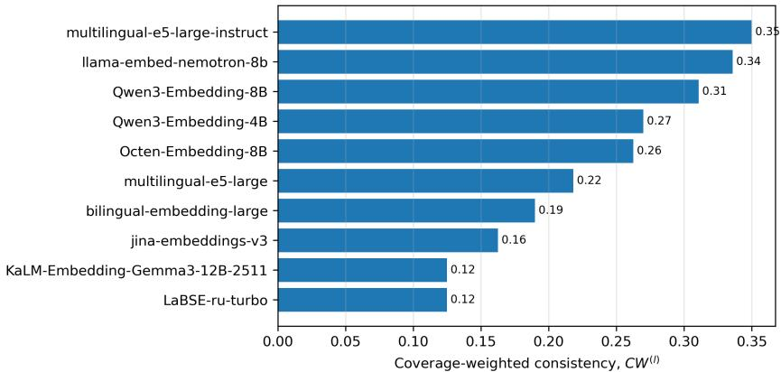  
Figure 6: Coverage-weighted cross-task transfer consistency for Slovenian $( k = 1 0 )$

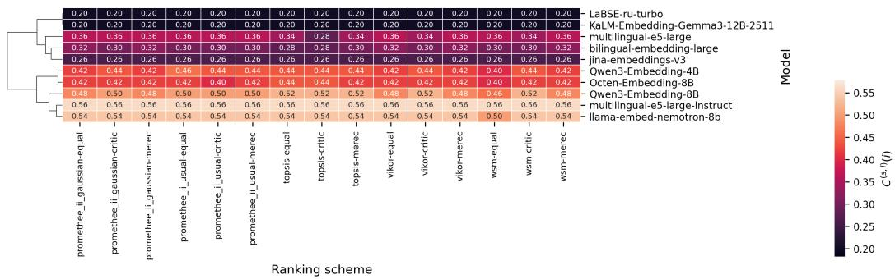  
Figure 7: Cross-task transfer consistency by ranking scheme for Slovenian $( k = 1 0 )$

## C.2 Eastern South Slavic Languages

Bulgarian (BUL) With benchmark data available for seven of the eight analyzed tasks, Bulgarian provides one of the strongest settings for cross-task generalization analysis. A clear leading pair emerges, consisting of llama-embed-nemotron-8b $( C \bar { W } = 0 . 5 5 )$ and multilingual-e5-large-instruct $( C W = 0 . 5 3 )$ , which achieve nearly identical coverage-weighted consistency scores and are substantially ahead of the remaining models. Qwen3-Embedding-8B forms a strong second tier $( C W = 0 . 4 2 )$ followed by Octen-Embedding-8B $( C W = 0 . 3 2 )$ , Qwen3-Embedding-4B $( C W = 0 . 2 8 )$ , and e5- mistral-7b-instruct $( C W = 0 . 2 6 )$ , which also demonstrate competitive cross-task transfer performance (Figure 8). The dendrogram (Figure 9) shows that the leading models exhibit remarkably stable consistency scores across all fifteen ranking schemes, with only minor numerical fluctuations that do not affect the overall ordering. In particular, llama-embed-nemotron-8b and multilinguale5-large-instruct consistently occupy the top positions, followed by Qwen3-Embedding-8B, while the remaining models preserve a similar relative ranking across aggregation methods. Overall, the results indicate that Bulgarian cross-task generalization is dominated by a small group of large multilingual embedding models, led by llama-embed-nemotron-8b and multilingual-e5-large-instruct, with Qwen3-Embedding-8B representing the strongest alternative. The ESS score of 0.29 corresponds to a moderate level of evidence.

## C.3 West Slavic Languages

Polish (POL) With benchmark data available for seven of the eight analyzed tasks, Polish provides one of the strongest settings for evaluating cross-task transfer consistency. The highest coverageweighted consistency is achieved by $Q w e n 3 \ – E m b e d d i n g \ – 4 B \left( C W = 0 . 5 4 \right)$ , followed closely by llamaembed-nemotron-8b and Qwen3-Embedding-8B (both $C W = 0 . 5 0 )$ , with Octen-Embedding-8B $( C W = 0 . 4 4 )$ completing a clearly defined leading group (Figure 10). multilingual-e5-large-instruct forms a second tier $\left( C W = 0 . 3 3 \right)$ , while the remaining models exhibit substantially lower cross-task consistency. The dendrogram (Figure 11) shows that the leading models maintain highly consistent consistency scores across all fifteen ranking schemes, with only minor numerical fluctuations that do not alter their relative ordering. In particular, Qwen3-Embedding-4B, llama-embed-nemotron-8b, and Qwen3-Embedding-8B remain the dominant models irrespective of the aggregation method, demonstrating robust transfer performance across tasks. Overall, the results indicate that Polish exhibits one of the strongest and most competitive benchmark landscapes, where several large multilingual embedding models achieve consistently high cross-task transfer consistency under diverse ranking methodologies. The ESS score of 0.42 corresponds to a strong level of evidence, indicating that these conclusions are supported by a broad coverage of benchmark tasks.

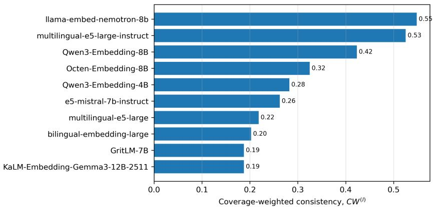

Figure 8: Coverage-weighted cross-task transfer consistency for Bulgarian (k = 10).  
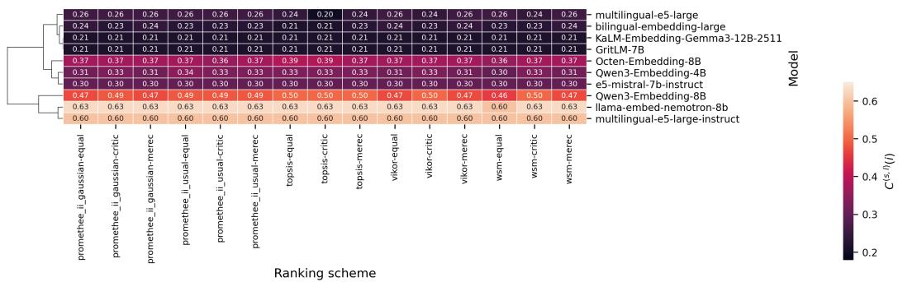  
Figure 9: Cross-task transfer consistency by ranking scheme for Bulgarian $( k = 1 0 )$

## C.4 East Slavic Languages

Russian (RUS) As the only language with complete benchmark coverage across all eight analyzed tasks, Russian provides the strongest evidence for evaluating cross-task transfer consistency. Llama-embed-nemotron-8b achieves the highest coverage-weighted consistency score $( C W = 0 . 7 0 )$ followed closely by Qwen3-Embedding-8B $( C W = 0 . { \overset { \smile } { 6 } } 5 )$ and Octen-Embedding-8B $( C W = 0 . 6 1 )$ while Qwen3-Embedding-4B $( C W = 0 . 4 8 )$ completes a clearly defined leading group of highly transfer-consistent models (Figure 12). Although multilingual-e5-large-instruct also demonstrates competitive cross-task performance $( C W = 0 . 2 9 )$ , it forms a second tier below these four models. The dendrogram (Figure 13) shows that the leading models maintain highly consistent consistency scores across all fifteen ranking schemes, with only minor numerical variations that do not alter their relative ordering. In particular, llama-embed-nemotron-8b, Qwen3-Embedding-8B, and Octen-Embedding-8B consistently occupy the top positions under every aggregation method, while

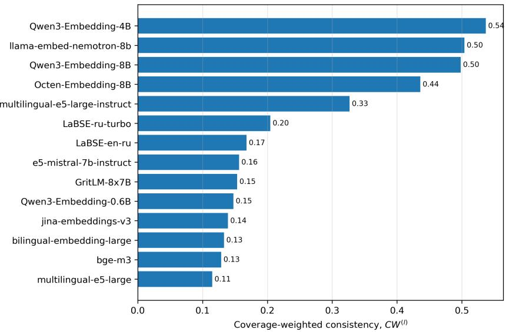

Figure 10: Coverage-weighted cross-task transfer consistency for Polish (k = 10).  
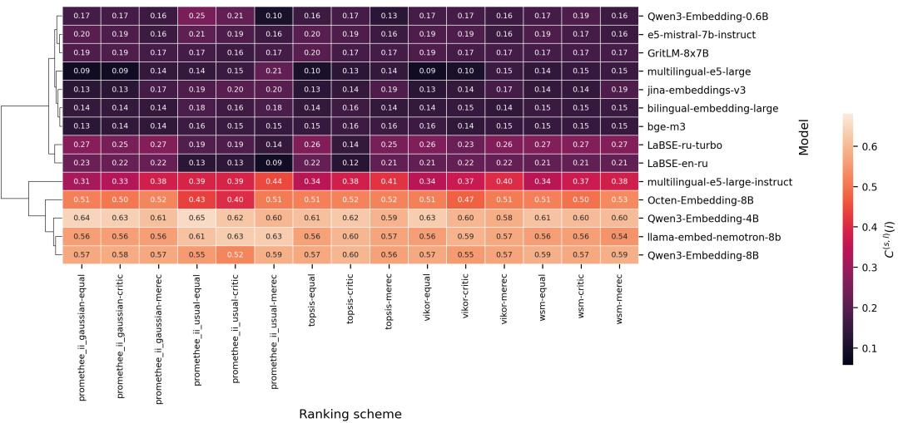  
Figure 11: Cross-task transfer consistency by ranking scheme for Polish (k = 10).

Qwen3-Embedding-4B remains a stable fourth-ranked model. Overall, the results indicate that Russian exhibits the strongest and most reliable cross-task transfer consistency among the analyzed languages, supported by complete benchmark coverage and a clear separation between the leading multilingual embedding models and the remaining approaches. The ESS score of 0.49 corresponds to a very strong level of evidence and confidence in the robustness of these conclusions.

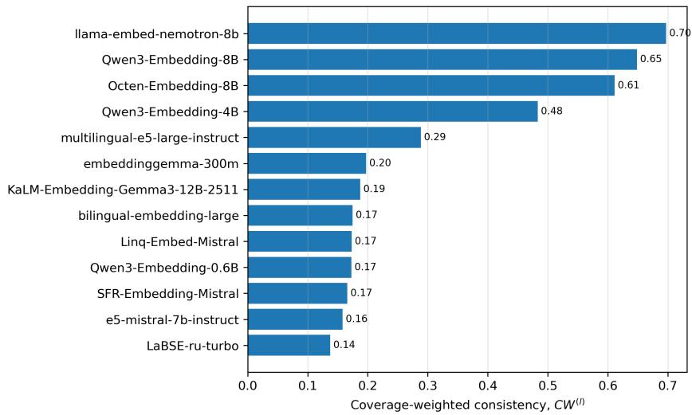  
Figure 12: Coverage-weighted cross-task transfer consistency for Russian $( k = 1 0 )$

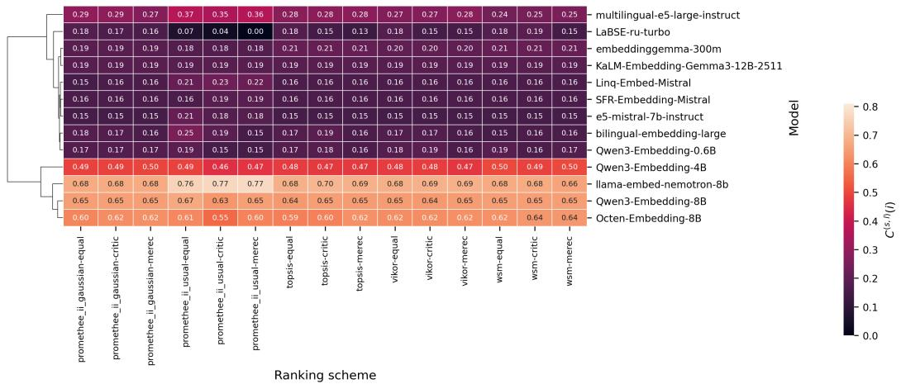  
Figure 13: Cross-task transfer consistency by ranking scheme for Russian (k = 10).