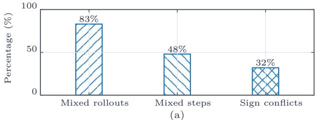
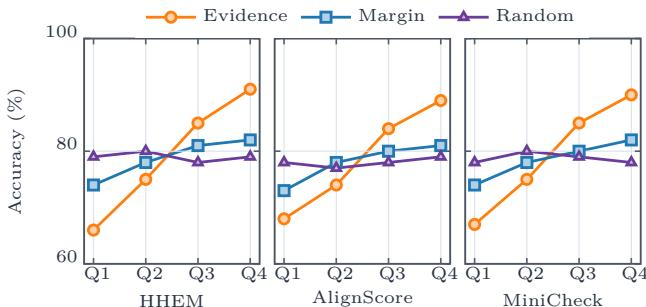
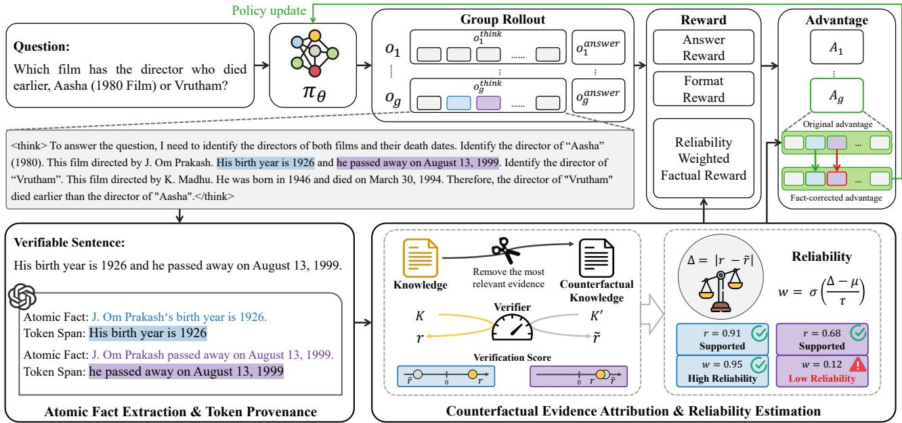
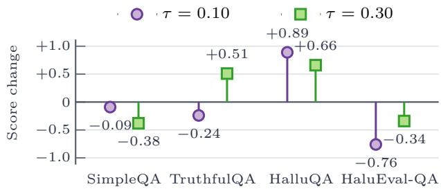
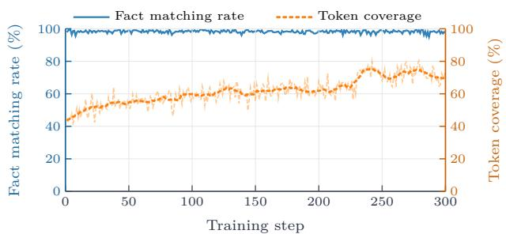
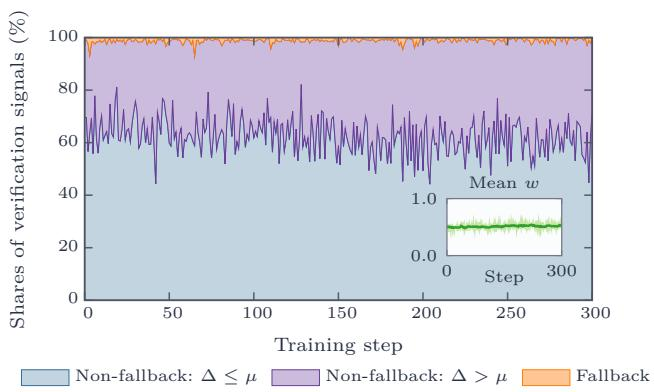
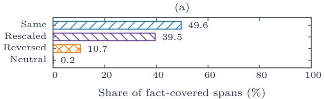
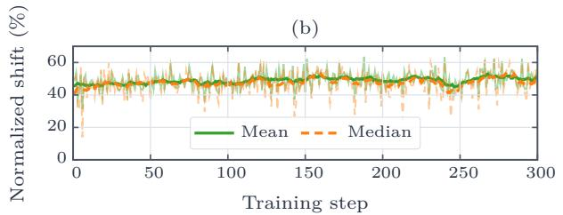
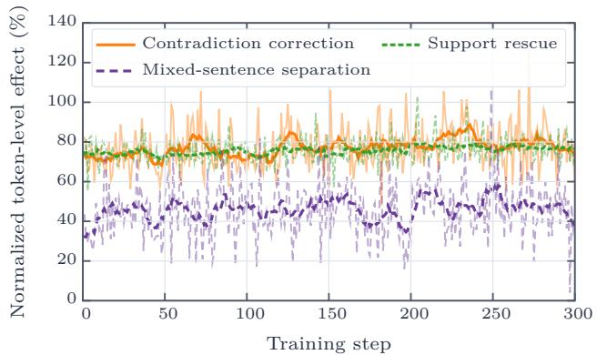

# FARCA: Fact-Aligned Reliability-Aware Credit Assignment for Reinforcement Learning with Factual Supervision

Qiming Xie1, Wenjie Zheng1, Xiangqing Shen2, Rui Xia2∗Anonymous submission

1School of Computer Science and Engineering,

Nanjing University of Science and Technology, Nanjing, China

2School of Intelligence Science and Technology, Nanjing University, China {qmxie, wjzheng}@njust.edu.cn {xqshen, rxia}@nju.edu.cn

## Abstracttract

To reduce the hallucination risk caused by outcome-driveneduce the hallucination risk caused by outcome-rewards in large language models trained through reinforce-n rewards in large language models trained with ment learning with verifiable rewards, existing mitigation approaches introduce process-level factual supervision. However, due to coarse-grained aggregation of factual signals and the lack of reliability assessment for these signals, they create a mismatch between fact verification and policy updates. We term this noisy factual credit assignment and decompose it into two aspects: credit localization ambiguity and credit reliability ambiguity. To address these issues, we propose FARCA (Fact-Aligned Reliability-Aware Credit Assignment), a pol-ts: credit localization ambiguity and credit relia-icy optimization framework that transforms factual supervi- ambiguity. To address these issues, we propose sion into localized, reliability-weighted token-level trainingCA (Fact-Aligned Reliability-Aware Credit As-signals. FARCA achieves fine-grained credit localization byent), a policy optimization framework that transaligning the granularity of fact verification with that of policys factual supervision into localized, reliabilityupdates. It further introduces counterfactual evidence attribu-hted token-level training signals. FARCA achieves tion, which uses the dependence of a factual judgment on keyrained credit localization by aligning the granuevidence as an empirical proxy for verification reliability toof fact verification with that of policy updates. It compute reliability weights. These weights modulate factualer introduces counterfactual evidence attribution, rewards and local policy advantages, reducing the influence ofh uses the dependence of a factual judgment on key potentially unreliable signals on policy optimization. Experiments across diferent models and multiple factual reasoning benchmarks show that FARCA significantly improves model factuality while preserving general reasoning capabilities.

## Introductional reasoning be

Driven by the new paradigm of Reinforcement Learning with Verifiable Rewards (RLVR), Large Language Models (LLMs) have recently shown strong capabilities on complex tasks (Jaech et al. 2024; Guo et al. 2025). However, prior work has shown that outcome-reward-driven RL can lead models to reach correct answers via factually flawed rea-en by the new paradigm of Reinforcement Learnsoning in knowledge-intensive tasks, failing to penalize andwith Verifiable Rewards (RLVR), Large Language even reinforcing such behavior, thereby amplifying halluci-els (LLMs) have recently shown strong capabilities nation (Huang et al. 2025; Zhang et al. 2025).omplex tasks such as mathematical reas

To mitigate this issue, recent studies have introduced fac-eneration (Jaech et al. 2024; Guo et al. 2025). tual supervision into RLVR, demonstrating its promise forever, prior work has shown that outcome-rewardimproving model factuality. One line of work constructs process-aware factual rewards at the trajectory level to constrain model generation (Ren et al. 2026), while another refines the granularity of supervision by introducing factual signals at the reasoning-step level to guide advantage updates (Li and Ng 2025; Gui et al. 2026). Underlying these approaches is a common mechanism: the outcome of fact verification is converted into a signal attributed to the specific generated content responsible for it, determining the direction and magnitude of the corresponding policy update. We term this factual credit, and as the intermediary linking fact ( verification with policy optimization, its assignment quality determines whether verification outcomes can be faithfully roaches is a common mechanism: the outcome of faconverted into policy gradients on the corresponding con- erification is converted into a signal attributed to thtent. However, existing work has not adequately addressed pecific generated content responsible for it, determitwo critical steps in this conversion: where credit should be ng the direction and magnitude of the correspondinassigned, and how reliable the corresponding verification olicy update. We term this factual credit, and as thsignal is. Mishandling either step causes the factual credit ntermediary linking fact verification with policy othat actually enters the policy objective to deviate from ideal imization, its assignment quality determines whethfactual supervision in location, direction, or magnitude. We erification outcomes can be faithfully converted intrefer to this deviation as noisy factual credit assignment, olicy gradients on the corresponding content. Howwhich we decompose into two interrelated aspects: credit ver, existing work has not adequately addresslocalization ambiguity and credit reliability ambiguity.

  
(b)  
Figure 1: (a) Percentages of rollouts and reasoning steps with mixed-correctness atomic facts, and of sign conflicts between fact labels and their shared credit. (b) Accuracy of three verifiers across quartiles constructed separately for each reliability proxy.

Credit localization ambiguity arises from the granularity mismatch between fact verification and policy updates: verification operates at the level of atomic facts or reasoning steps, whereas RL updates parameters via pertoken log-probabilities. When a trajectory or step contains facts of mixed factuality, collapsing them into a single scalar credit blurs the correspondence between each verification outcome and its source tokens, causing tokens tied to correct and incorrect facts to share the same credit. Our pilot experiments confirm this is not a marginal issue (Figure 1(a)). Using reasoning trajectories from DeepSeek-R1-Distill-Qwen-7B (Guo et al. 2025) on 100 examples sampled from 2WikiMultiHopQA (Ho et al. 2020), we find mixed correctness is common, with credit aggregation assigning a sign opposite to the true label to a substantial portion of fact spans.

Credit reliability ambiguity stems from the inherent uncertainty of verification outcomes. Existing methods typically formulate fact verification as a Natural Language Inference (NLI) task and use the verifier’s output directly as supervision, without assessing its reliability. Yet NLI-based verifiers can be misled by linguistic priors or irrelevant spans, producing misjudgements that contaminate the policy gradient (Chen et al. 2025a; Cai et al. 2025). Intuitively, a trustworthy verification outcome should be grounded in identifiable evidence: removing key evidence should change the score accordingly. Using the pilot experiment data, we evaluate three reliability proxies against human-annotated accuracy across three verifiers with distinct architectures (HHEM (Li, Luo, and Mendelevitch 2024), AlignScore (Zha et al. 2023), MiniCheck (Tang, Laban, and Durrett 2024)): the score change from removing the most relevant evidence (Evidence) or random evidence (Random), and the margin from the classification boundary (Margin). As shown in Figure 1(b), accuracy increases monotonically with the Evidence quantile across all verifiers, supporting evidence dependence as a signal for reliability-aware credit modulation.

To this end, we propose FARCA (Fact-Aligned Reliability-Aware Credit Assignment), a unified framework for reliable factual credit assignment. To address credit localization ambiguity, FARCA first decomposes each trajectory into a set of independently verifiable atomic facts, each anchored to its originating token span within the trajectory, termed its token provenance. Then, it assesses each atomic fact against external evidence using a factual verifier and derives a continuous, signed factual score accordingly, routed back to the tokens identified by its provenance. By aligning the granularity between fact verification and policy updates, FARCA enables tokens corresponding to correct facts and to hallucinated content within the same reasoning process to receive diferentiated optimization signals, thereby reducing the interference caused by coarse-grained aggregation of verification outcomes. To address credit reliability ambiguity, FARCA employs counterfactual evidence attribution, using the degree to which a verification outcome depends on key evidence as an empirical proxy for its reliability. Specifically, for each atomic fact, we first identify its most relevant evidence sentences, compare the verification score before and after removing this evidence, and map the resulting score change to a continuous reliability weight. This weight is further used to modulate the factual reward and the local policy advantage, limiting the influence of unreliable factual signals on policy optimization.

Summary of Contributions. (1) We identify noisy factual credit assignment as a key bottleneck in RL with factual supervision, and show that efective factual optimization requires both precise credit localization and reliable supervision signals. (2) We propose FARCA, a unified framework that converts verification signals into localized, reliabilityaware factual credit, enabling factual supervision to guide policy optimization more faithfully and robustly. (3) Experimental results demonstrate that FARCA significantly improves model factuality while maintaining strong reasoning performance and training stability.

## Related Work

Outcome-Driven Reinforcement Learning and Factuality. Reinforcement Learning with Verifiable Rewards (RLVR) has become a central paradigm for eliciting complex reasoning from large language models (LLMs), achieving substantial gains in mathematical and general reasoning tasks by optimizing automatically verifiable outcomelevel rewards (Shao et al. 2024; Guo et al. 2025). However, these rewards assess only the correctness of the final answer and do not verify the factual accuracy of intermediate reasoning steps. This limitation is particularly problematic in knowledge-intensive tasks, where a correct answer often depends on multiple factual claims supported by external evidence. A reasoning trajectory may contain guesses or fabricated claims and still receive a positive reward if its final answer happens to be correct. As a result, outcome-based training may reinforce factually incorrect or unsupported reasoning trajectories and increase the risk of hallucinations in reasoning LLMs (Ding et al. 2025; Paul et al. 2024; Chen et al. 2025c; Wang et al. 2026; Li and Ng 2025; Chen et al. 2025b).

Factual Supervision in Reinforcement Learning. To mitigate this, recent work has incorporated factual supervision into reinforcement learning. KnowRL decomposes the reasoning process into atomic facts and aggregates the verification results into a trajectory-level factual reward (Ren et al. 2026). FSPO performs fact verification at each reasoning step and uses the outcomes to adjust policy advantages (Li and Ng 2025). FaithRL similarly verifies reasoning faithfulness at the step level and suppresses reasoning steps unsupported by evidence (Gui et al. 2026). These studies demonstrate the potential of incorporating factual supervision into reinforcement learning to improve model factuality. However, these methods share factual signals within a trajectory or reasoning step, preventing them from distinguishing correct from incorrect content within the same aggregation unit and creating a granularity mismatch between fact verification and policy optimization. Moreover, they typically use verifier outputs directly to construct factual rewards or adjust advantages, overlooking the risk that verifier misjudgment may induce incorrect policy updates (Chen et al. 2025a; Cai et al. 2025). FARCA addresses these limitations through fact–token alignment and reliability modeling, providing reliable, fact-guided signals for accurate and robust policy optimization.

## Methodology

The core idea of FARCA is to achieve fact-aligned reliabilityaware credit assignment. Given a question x and its corresponding knowledge snippets K used as evidence, the current policy $\pi _ { \theta }$ samples a group of rollouts $\{ y _ { i } \} _ { i = 1 } ^ { G }$ for the same question. Each rollout is written as $y _ { i } = ( y _ { i } ^ { \mathrm { t h i n k } } , y _ { i } ^ { \mathrm { a n s w e r } } ) .$ where $y _ { i } ^ { \mathrm { t h i n k } }$ denotes the intermediate reasoning text and $y _ { i } ^ { \mathrm { a n s w e r } }$ denotes the answer.

## Atomic Fact Extraction and Token Provenance

FARCA first decomposes the reasoning text into atomic facts and, for each atomic fact, traces it back to its source tokens in the reasoning text. We refer to this traceable relationship as token provenance, which determines which generation positions are ultimately supervised by the factuality signal.

Specifically, we segment the reasoning text $y _ { i } ^ { \mathrm { { t h i n k } } }$ into sentences $y _ { i } ^ { \mathrm { t h i n k } } \  \ \{ s _ { i , 1 } , s _ { i , 2 } , \ldots , s _ { i , M _ { i } } \}$ , and then filter out sentences that contain only greetings, formatting instructions, reasoning connectives, or other content without verifiable information. For each verifiable sentence $s _ { i , j } .$ we prompt GPT-4o (Hurst et al. 2024) to decompose it into a set of independently verifiable atomic facts $\mathcal { C } _ { i , j } ~ =$ $\{ c _ { i , j , 1 } , c _ { i , j , 2 } , \ldots , c _ { i , j , N _ { i , j } } \}$ , where each $c _ { i , j , k }$ is a semantically self-contained claim. If the original sentence contains pronouns, ellipses, or expressions that depend on preceding context, the extraction process simultaneously performs decontextualization, rewriting it into a form that can be verified independently. We also instruct GPT-4o to return, for each atomic fact, its source token span and index set $\mathcal { T } ( c _ { i , j , k } ) \subseteq \{ 1 , . . . , | y _ { i } | \}$ in the original sentence, which we define as the token provenance of that fact.

Since the returned token provenance may be afected by repeated entities, pronoun rewriting, and coordinate structures, we apply rule-based checks and corrections to the token provenance results: (1) For cases where the same entity appears multiple times within the same sentence, we maintain a left-to-right matching cursor to prevent an atomic fact from a later clause being incorrectly bound to an earlier occurrence of the entity. (2) For atomic facts that underwent decontextualization, we check whether their token provenance correctly maps back to the pronoun, elliptical expression, or corresponding source span in the original sentence. (3) For coordinate structures sharing a common prefix, we preserve the individual coverage relations of each atomic fact so that they can be handled consistently during subsequent aggregation. (4) Atomic facts whose source span cannot be located within the original text are discarded.

This procedure yields $\begin{array} { r } { \mathcal { C } _ { i } = \bigcup _ { j = 1 } ^ { M _ { i } } \mathcal { C } _ { i , j } } \end{array}$ , the set of all atomic facts extracted from the reasoning text, along with the token provenance $\mathcal { T } ( c _ { i , j , k } )$ of each atomic fact.

## Atomic Fact Verification

Following prior work, we formulate fact verification as the NLI task. Given a knowledge snippet K as evidence and an atomic fact $c _ { i , j , k }$ , the verifier outputs a score indicating how well the fact is supported by the evidence, $h _ { i , j , k } \stackrel { - } { = } \mathrm { V e r i f i e r } ( K , c _ { i , j , k } ) \in [ 0 , \bar { 1 } ]$ . Rather than thresholding the verifier output into a discrete score, FARCA linearly maps it onto a signed interval to obtain a continuous signed factual score $r _ { i , j , k } = 2 h _ { i , j , k } - 1 \in [ - 1 , 1 ] . r _ { i , j , k } > 0$ is positive when the evidence supports the fact and negative when it contradicts the fact; a value of zero indicates a neutral judgement. Compared with a discrete factual score, the continuous signed factual score preserves the verifier’s support strength, providing a smoother factual supervision signal for the subsequent reward and advantage reshaping.

## Counterfactual Evidence Attribution and Reliability Estimation

FARCA uses the degree to which a verification outcome depends on key evidence as an empirical proxy for its reliability, computing a reliability weight for each factual signal via counterfactual evidence attribution.

Specifically, we split the evidence into sentences $K =$ $\{ e _ { 1 } , e _ { 2 } , \dots , e _ { L } \}$ , and then use a sentence encoder $\phi ( \cdot )$ to compute the semantic similarity between each evidence sentence and the atomic fact, selecting the $K _ { \mathrm { r e l } }$ most relevant evidence sentences $\mathcal { E } _ { i , j , k } ^ { \star } = \mathrm { T o p K } _ { e _ { \ell } \in K } ^ { K _ { \mathrm { r e l } } } \cos \bigl ( \phi ( e _ { \ell } ) , \phi ( c _ { i , j , k } ) \bigr )$ These sentences are treated as the evidentiary anchors on which the current verification outcome most likely depends.

We then remove them from the original evidence to construct a counterfactual evidence set $K _ { i , j , k } ^ { \prime } ~ = ~ K ~ \backslash$ $\mathcal { E } _ { i , j , k } ^ { \star }$ , and re-verify to obtain a new score $\begin{array} { r l } { \ddot { h } _ { i , j , k } } & { { } = } \end{array}$ Verifier $( K _ { i , j , k } ^ { \prime } , c _ { i , j , k } ) , \qquad \tilde { r } _ { i , j , k } = 2 \tilde { h } _ { i , j , k } - 1$ . We use the diference between the two signed scores to measure the degree to which the judgement depends on the relevant evidence, $\Delta _ { i , j , k } = | r _ { i , j , k } - \tilde { r } _ { i , j , k } |$ . A large score change indicates that the original judgement rests on identifiable evidence and is more reliable, whereas a small score change suggests the verifier reaches a similar judgement even without the key evidence, implying the judgement is more likely driven by linguistic priors or irrelevant information.

We then map the evidence-dependency strength $\Delta _ { i , j , k }$ to a continuous reliability weight $\begin{array} { r l } { w _ { i , j , k } } & { { } = } \end{array}$ sigmoid $\left( \frac { \Delta _ { i , j , k } - \mu } { \tau } \right) \in \left( 0 , 1 \right)$ , where $\mu$ is the median of $\Delta$ computed on a calibration set sampled from the training set, and τ controls the smoothness of the mapping curve. Finally, the reliability-weighted factual score of each atomic fact is defined as $\tilde { r } _ { i , j , k } ^ { \mathrm { f a c t } } = w _ { i , j , k } r _ { i , j , k }$ , where $r _ { i , j , k }$ determines the direction of the factual supervision signal and $w _ { i , j , k }$ determines its strength.

## Reward Design

For each rollout $y _ { i } = ( y _ { i } ^ { \mathrm { t h i n k } } , y _ { i } ^ { \mathrm { a n s w e r } } )$ , we define three reward components as follows.

Format reward is used to constrain the output structure, verifying whether $y _ { i }$ conforms to the specified format $( < \mathrm { t h i n k } > . . . < / \mathrm { t h i n k } > < \mathrm { a n s w e r } > . . . < / \mathrm { a n s w e r } > )$

$$
R _ { i } ^ { \mathrm { f o r m a t } } = { \binom { + 1 , \quad { \mathrm { v a l i d f o r m a t } } } { - 1 , \quad { \mathrm { i n v a l i d f o r m a t } } } }
$$

  
Figure 2: Overview of the proposed FARCA framework.

Answer reward is used to evaluate whether the final answer $y _ { i } ^ { \mathrm { a n s w e r } }$ is correct.

$$
R _ { i } ^ { \mathrm { { a n s w e r } } } = { \binom { + 1 , \quad { \mathrm { c o r r e c t a n s w e r } } } { - 1 , \quad { \mathrm { i n c o r r e c t a n s w e r } } } }
$$

Reliability-weighted factual reward characterizes the degree of support between verifiable facts in $y _ { i } ^ { \mathrm { t h i n k } }$ and the evidence K, defined as the average of the reliability-weighted factual scores over all verifiable atomic facts in $y _ { i } ^ { \mathrm { { t h i n k } } }$

$$
R _ { i } ^ { \mathrm { { f a c t } } } = \left\{ \begin{array} { l l } { \displaystyle \frac { 1 } { | \mathcal { C } _ { i } | } \sum _ { c _ { i , j , k } \in \mathcal { C } _ { i } } \tilde { r } _ { i , j , k } ^ { \mathrm { { f a c t } } } , } & { | \mathcal { C } _ { i } | > 0 , } \\ { 0 , } & { | \mathcal { C } _ { i } | = 0 . } \end{array} \right.
$$

The final reward for rollout $y _ { i }$ is defined as:

$$
R _ { i } = R _ { i } ^ { \mathrm { f o r m a t } } + R _ { i } ^ { \mathrm { a n s w e r } } + R _ { i } ^ { \mathrm { f a c t } } .
$$

## Reliable Fact-Guided Advantage Reshaping

FARCA first computes the advantage of rollout y following Group Relative Policy Optimization (GRPO) (Shao et al. 2024), and then leverages the alignment between atomic facts and tokens to perform reliability-guided advantage reshaping.

Specifically, for the G rollouts sampled for the same question, we first perform intra-group normalization in the standard GRPO manner to obtain the advantage $A _ { i } \ =$ $\frac { R _ { i } - \mathrm { m e a n } ( \{ R _ { g } \} _ { g = 1 } ^ { G } ) } { \mathrm { s t d } ( \{ R _ { g } \} _ { g = 1 } ^ { G } ) + \epsilon _ { \mathrm { s t d } } }$ , which normalizes the reward of $y _ { i }$ relative to the group and indicates whether it should be reinforced or suppressed. FARCA then incorporates both credit localization and credit reliability into advantage reshaping: credit localization determines which tokens receive the factual signal, while credit reliability determines how strongly the signal is applied to those tokens. This process uses the factual supervision signal to reinforce or correct the relevant tokens. For each atomic fact, we first use its continuous signed factual score to construct a fact-corrected advantage $A _ { i , j , k } ^ { \mathrm { \tilde { f a c t } } } = r _ { i , j , k } | A _ { i } |$ , which is positive when supported by the evidence, negative when conflicting, and zero when neutral. Using $\left| A _ { i } \right|$ preserves the relative training strength of the current rollout, while allowing the factual score to determine the update direction for the local tokens.

Furthermore, we use the reliability weight to form a convex combination between the original advantage and the factcorrected advantage, $\begin{array} { r } { \bar { A } _ { i , j , k } = ( 1 - w _ { i , j , k } ) A _ { i } + w _ { i , j , k } A _ { i , j , k } ^ { \mathrm { f a c t } } . } \end{array}$ When $w _ { i , j , k }$ is large, it indicates that the corresponding factual judgement is more strongly evidence-dependent, so the covered tokens rely more on the fact-corrected direction; when $w _ { i , j , k }$ is small, the factual judgment is less reliable, and $\bar { A } _ { i , j , k }$ remains closer to $A _ { i }$ . This soft-flip mechanism avoids hard gradient reversal caused by a single unreliable verification, while still providing positive reinforcement for facts supported by evidence and negative correction for facts that conflict with evidence when the verification outcome is reliable. The final advantage on token t is:

$$
\hat { A } _ { i , t } = \left\{ \begin{array} { l l } { \displaystyle \frac { 1 } { | \mathcal { C } ( i , t ) | } \sum _ { c _ { i , j , k } \in \mathcal { C } ( i , t ) } \bar { A } _ { i , j , k } , } & { \mathcal { C } ( i , t ) \neq \emptyset , } \\ { A _ { i } , } & { \mathcal { C } ( i , t ) = \emptyset . } \end{array} \right.
$$

where $\mathcal { C } ( i , t ) ~ = ~ \{ c _ { i , j , k } ~ : ~ t \in \mathcal { T } ( c _ { i , j , k } ) \}$ denotes the set of atomic facts covering token t. Tokens covered by multiple facts take their average reliability-aware advantage, and tokens covered by none retain the original.

## Training Objective

Substituting the reliable fact-guided reshaped advantage $\hat { A } _ { i , t }$ into the token-level PPO-clip objective, the final optimization

objective of FARCA is:

$$
\begin{array} { r l r } {  { \mathcal { T } _ { \mathrm { F A R C A } } ( \theta ) = \mathbb { E } _ { { \boldsymbol x } , \{ \boldsymbol y _ { i } \} } [ \frac { 1 } { G } \sum _ { i = 1 } ^ { G } \frac { 1 } { | \boldsymbol y _ { i } | } \sum _ { t = 1 } ^ { | \boldsymbol y _ { i } | } \ell _ { i , t } ( \theta ) ] } } \\ & { } & { - \beta \mathrm { K L } \big ( \pi _ { \boldsymbol \theta } \| \pi _ { \mathrm { r e f } } \big ) , } \end{array}
$$

$$
\ell _ { i , t } ( \theta ) = \operatorname* { m i n } \left( \rho _ { i , t } \hat { A } _ { i , t } , \mathrm { c l i p } ( \rho _ { i , t } , 1 - \epsilon , 1 + \epsilon ) \hat { A } _ { i , t } \right) .
$$

where $\rho _ { i , t } = \pi _ { \theta } ( y _ { i , t } \mid x , y _ { i , < t } ) / \pi _ { \theta _ { \mathrm { o l d } } } ( y _ { i , t } \mid x , y _ { i , < t } )$ is the token-level importance ratio.

In summary, FARCA mitigates the noisy factual credit assignment problem through fact-token alignment and reliability modeling, injecting factual supervision signals into token-level policy optimization more precisely and robustly.

## Experiments

## Experimental Setup

Datasets and Metrics. We use a challenging subset (Song et al. 2025) of the knowledge-intensive datasets HotpotQA (Yang et al. 2018) and 2WikiMultiHopQA (Ho et al. 2020) for FARCA training, where each sample contains a question, an answer, and the corresponding Wikipedia knowledge snippets. In addition, to prevent factuality optimization from sacrificing general reasoning ability, we incorporate the mathematical reasoning dataset SimpleRL (Zeng et al. 2025) for standard RL training. We use four widely adopted benchmarks, SimpleQA (Wei et al. 2024), TruthfulQA (Lin, Hilton, and Evans 2022), HalluQA (Cheng et al. 2023), and HaluEval-QA (Li et al. 2023), for hallucination evaluation. Specifically, we adopt the F1 score for SimpleQA, the truthful ratio for TruthfulQA and HalluQA, and accuracy for HaluEval-QA. Mathematical reasoning ability is evaluated on AIME2026 (MAA 2026), AIME2025 (MAA 2025), MATH-500 (Hendrycks et al. 2021), and GSM8K (Cobbe et al. 2021) under the Pass@1 setting. We uniformly use GPT-4o as the judge model across both hallucination and math benchmarks for truthfulness judgement or answer matching.

Models and Baselines. We conduct experiments using Qwen2.5-3B-Instruct (Hui et al. 2024) and Llama-3.2-3B-Instruct (Grattafiori et al. 2024), and consider three categories of baselines. (1) Zero-shot prompting baseline. (2) Outcome-oriented RL methods that use only format and answer rewards. We consider two training-data configurations: GRPO (Math only), trained exclusively on the SimpleRL dataset; and GRPO (Full), trained on the full training dataset. (3) Factual reinforcement learning baselines, including KnowRL (Ren et al. 2026), FSPO (Li and Ng 2025), and FaithRL (Gui et al. 2026).

Implementation Details. We conduct model training using the verl1 framework. We perform full-parameter finetuning for 1 epoch on 4 A6000 GPUs, with a learning rate of $5 \times \mathrm { 1 0 ^ { - 7 } }$ , 6 rollouts per prompt at temperature 1.0, a PPO mini-batch size of 128 (per-GPU batch size 2), a KL coeficient of 0.001, and a maximum prompt length and response length of 2048. We use GPT-4o for atomic fact extraction and token provenance, and the HHEM-2.1-Open model as the fact verifier. For reliability estimation, we remove the evidence sentence most similar to each atomic fact $( K _ { \mathrm { r e l } } = 1 )$ and map the verification score change to a soft reliability weight using $\tau = 0 . 2$ and center $\mu = 0 . 1 6$ , the median of $\Delta$ over a calibration set sampled from the training data.

## Main Results

Table 1 presents the main experimental results.

FARCA consistently improves model factuality while preserving reasoning ability. The experimental results show that FARCA improves factuality across diferent models and hallucination scenarios. On Qwen2.5-3B-Instruct, FARCA achieves the best results on all four hallucination benchmarks; compared to FaithRL, the strongest factuality baseline, FARCA yields an average improvement of 1.75 percentage points, with gains of 2.09 and 2.67 points on TruthfulQA and HalluQA, respectively. On Llama-3.2-3B-Instruct, the average improvement further widens to 2.21 percentage points, with TruthfulQA and HalluQA improving by 3.31 and 4.00 points, respectively. Meanwhile, FARCA also delivers the best performance on the mathematical reasoning benchmarks. This indicates that the gains from FARCA do not stem from incidental fluctuations tied to a single dataset or backbone, but rather from consistently mitigating hallucination across diverse scenarios while simultaneously enhancing the model’s reasoning ability.

The benefit of factual supervision depends on the accuracy and reliability of credit assignment. Table 1 shows that although both KnowRL and FSPO explicitly incorporate factual supervision, they underperform standard GRPO (Full) on several evaluation datasets. This suggests that coarse-grained factual rewards may be broadcast across reasoning text containing facts of diferent factuality, leaving the optimizer unable to distinguish which positions convey correct content and which introduce errors, thereby undermining optimization efectiveness. FaithRL employs step-level supervision with credibility modulation, but it still treats an entire reasoning step as an indivisible update unit. The experimental results further demonstrate that the key to leveraging factual supervision lies in converting verification signals into fine-grained and reliable factual credit, thereby enabling more efective and stable guidance for policy optimization.

## Ablation Studies

We conduct ablations on Qwen2.5-3B-Instruct.

Component Analysis. Component ablations focus on three components. Results are shown in Table 2. Removing token provenance routing (w/o token provenance) broadcasts factual signals to all tokens within a sentence. This setting drops the average score from 25.36 (FARCA) to 24.40. Results show that restricting factual signals to the tokens corresponding to each atomic fact better handles cases that contain both reliable and hallucinated information simultaneously. Removing counterfactual reliability estimation (w/o reliability estimation) sets the reliability weight of all factual judgements to 1. This variant also exhibits a clear degradation, suggesting that verifier misjudgements can undermine the benefits of introducing factual supervision and further demonstrating the necessity of reliability estimation for verifier signals. Removing the continuous signed factual score (w/o continuous factual score) discretizes the raw NLI verifier score into 1, 0, +1 using 0.5 as the threshold. This setting causes a modest performance drop, confirming that the continuous score provides a smoother, more fine-grained optimization signal than hard labels for token-level credit assignment.

<table><tr><td rowspan="2">Method</td><td colspan="4">Hallucination</td><td colspan="4">Math</td></tr><tr><td></td><td></td><td></td><td>SimpleQA TruthfulQA HalluQA HaluEval-QA AIME2026 AIME2025 MATH-500 GSM8K</td><td></td><td></td><td></td><td></td></tr><tr><td colspan="9">Qwen2.5-3B-Instruct</td></tr><tr><td>Zero-shot</td><td>1.33</td><td>30.41</td><td>16.44</td><td>23.56</td><td>0.00</td><td>0.00</td><td>32.20</td><td>65.96</td></tr><tr><td>GRPO (Math only)</td><td>0.79</td><td>18.12</td><td>9.56</td><td>10.22</td><td>3.33</td><td>3.33</td><td>54.80</td><td>77.18</td></tr><tr><td>GRPO (Full)</td><td>2.52</td><td>42.59</td><td>22.67</td><td>25.05</td><td>3.33</td><td>3.33</td><td>53.22</td><td>75.82</td></tr><tr><td>KnowRL</td><td>2.42</td><td>41.98</td><td>20.67</td><td>25.57</td><td>0.00</td><td>0.00</td><td>51.80</td><td>75.59</td></tr><tr><td>FSPO</td><td>1.60</td><td>35.49</td><td>19.33</td><td>23.74</td><td>0.00</td><td>3.33</td><td>36.20</td><td>72.10</td></tr><tr><td>FaithRL</td><td>2.63</td><td>43.32</td><td>23.11</td><td>25.36</td><td>3.33</td><td>0.00</td><td>53.80</td><td>76.12</td></tr><tr><td>FARCA</td><td>3.56</td><td>45.41</td><td>25.78</td><td>26.67</td><td>6.67</td><td>10.00</td><td>63.20</td><td>84.46</td></tr><tr><td colspan="9">Llama-3.2-3B-Instruct</td></tr><tr><td>Zero-shot</td><td>1.28</td><td>22.93</td><td>7.67</td><td>21.92</td><td>0.00</td><td>0.00</td><td>27.20</td><td>60.42</td></tr><tr><td>GRPO (Math only)</td><td>0.67</td><td>14.20</td><td>5.33</td><td>9.53</td><td>3.33</td><td>3.33</td><td>42.60</td><td>74.22</td></tr><tr><td>GRPO (Full)</td><td>2.44</td><td>35.62</td><td>10.67</td><td>23.39</td><td>3.33</td><td>3.33</td><td>41.20</td><td>73.31</td></tr><tr><td>KnowRL</td><td>2.73</td><td>34.88</td><td>9.56</td><td>24.63</td><td>0.00</td><td>0.00</td><td>41.00</td><td>72.48</td></tr><tr><td>FSPO</td><td>2.09</td><td>30.05</td><td>8.45</td><td>24.14</td><td>0.00</td><td>0.00</td><td>40.40</td><td>70.36</td></tr><tr><td>FaithRL</td><td>2.81</td><td>35.74</td><td>10.00</td><td>24.89</td><td>0.00</td><td>0.00</td><td>41.80</td><td>73.92</td></tr><tr><td>FARCA</td><td>3.33</td><td>39.05</td><td>14.00</td><td>25.91</td><td>6.67</td><td>6.67</td><td>47.80</td><td>78.24</td></tr></table>

Table 1: Performance comparison on hallucination and math benchmarks. Best results are in bold, and all tied second-best results are underlined.
<table><tr><td rowspan="2">Variant</td><td colspan="4">Hallucination</td><td colspan="4">Math</td></tr><tr><td>SimpleQA</td><td>TruthfulQA HalluQA</td><td></td><td>HaluEval-QA</td><td>AIME2026</td><td></td><td>AIME2025 MATH-500</td><td>GSM8K</td></tr><tr><td>FARCA</td><td>3.56</td><td>45.41</td><td>25.78</td><td>26.67</td><td>6.67</td><td>10.00</td><td>63.20</td><td>84.46</td></tr><tr><td>w/o token provenance</td><td>3.23</td><td>44.52</td><td>23.94</td><td>25.90</td><td>6.67</td><td>6.67</td><td>61.00</td><td>82.87</td></tr><tr><td>w/o reliability estimation</td><td>3.04</td><td>43.88</td><td>24.51</td><td>26.28</td><td>3.33</td><td>6.67</td><td>61.40</td><td>82.26</td></tr><tr><td>w/o continuous factual score</td><td>3.31</td><td>44.78</td><td>25.40</td><td>26.06</td><td>6.67</td><td>10.00</td><td>62.80</td><td>83.85</td></tr></table>

Table 2: Component ablation results of FARCA.

Hyperparameter Sensitivity. We further examine the effect of the reliability temperature τ on FARCA’s factuality. Figure 3 shows the results on the four hallucination bench-marks for τ ∈ {0.10, 0.20, 0.30}. The corresponding average scores are 25.31, 25.36, and 25.47, with a maximum diference ofonly 0.16 percentage points, indicating that FARCA is generally robust to the temperature setting within this range. We adopt τ = 0.20 as the default value, which preserves discrimination while avoiding an overly sharp mapping.

  
Figure 3: Hyperparameter sensitivity of FARCA to theFigure 3: Hyperparameter sensitivity of FARCA to the reliability temperature τ (score change from τ = 0.20).

## Further Analysis

Fact–token alignment provides stable and broad supervi-Hyperparameter Sensitivity. We further examinesion. Figure 4 examines whether atomic facts can be reliably routed back to their source token spans. The blue curve factuality. Figure 3 shows the results on the four hallu-(left axis) shows the matching rate: throughout training, about cination benchmarks for τ 0.10, 0.20, 0.30 . The cor-98.3% of extracted facts are successfully aligned, and the responding average scores are 25.31, 25.36, and 25.47,rate remains consistently high, indicating that FARCA reliwith a maximum diference of only 0.16 percentageably tracks token provenance in practice. The orange curve (right axis) shows the proportion of reasoning tokens cov-CA estimates the signal’s reliability from the becomes associated with verifiable facts and receiveered by matched facts. This proportion rises steadily earlycore change ∆ after removing its most relevant in training before fluctuating at a higher level, reflecting thatsentence. The stacked areas show the proporan increasing share of generated content becomes associatedacts with , , and fallback, while the with verifiable facts and receives factual supervision. These results show that FARCA achieves both reliable localization Counterfactual evidence attributioand suficiently broad supervision coverage.

  
Figure 4: Fact matching rate and the percentage of to-Figure 4: Fact matching rate and the percentage of tokens kens covered by matched fact spans duringcovered by matched fact spans during training.50 100 150 200 250

  
Figure 5: Proportions of verification signals grouped by ∆ relative to $\mu$ and by fallback status over FARCA training, with mean continuous weight w.

Counterfactual evidence attribution yields stable, non- 1. This shows that counterfactual evidence atdegenerate reliability signals. Figure 5 examines whethern assigns stable, non-degenerate weights based counterfactual evidence attribution produces discriminativefact’s evidence dependence. It efectively downreliability signals during training. FARCA estimates the sig-verifier misjudgments that are insensitive to key nal’s reliability from the verifier score change ∆ after removing its most relevant evidence sentence. The stacked areas ≤show the proportions of facts withlity-aware soft interpol $\Delta > \mu , \Delta \leq \mu ,$ , and fall-tan-back, while the line shows the mean continuous reliabilityeshapes fact-span advantages. Figure 6 weight w. We observe that 36.3% of facts have $\Delta > \mu$ , and that only 1.1% fallback, with an average weight of 0.512, neither collapsing to 0 nor 1. This shows that counterfactual evidence attribution assigns stable, non-degenerate weights based on each fact’s evidence dependence. It efectivelying-fact aggregation. Plot (a) summarizes the down-weights verifier misjudgements that are insensitive toal outcome across fact-covered spans: 49.6% rekey evidence, reducing their noise during optimization.ction, 39.5% retain direction but with rescale

Reliability-aware soft interpolation substantially reshapes fact-span advantages. Figure 6 examines whether reliability-aware soft interpolation actually injects fact-level feedback into the span advantages assigned to fact-covered etokens before overlapping-fact aggregation. Plot (a) sumal 140(%marizes the directional outcome across fact-covered spans: 0 50 100 150 200 250 300r120ct   49.6% retain direction, 39.5% retain direction but with N Training stepfrescaled magnitude, and 10.7% reverse (0.2% neutral), ineldicating that FARCA continuously mediates between pre-Figure 6: Efect of reliability-aware soft interpolation o80leserving global credit and applying local correction. Plot (b) the advantages of fact-covered tokens. (a) Directionaenshows that the span-count-weighted average of the per-step outcome of the interpolated advantage relative to thomean normalized shift is 48.8%, while the per-step median original advantage. (b) Per-step mean and median tra40dtracks the mean closely throughout training. These results jectories of the normalized shift over training.izprovide evidence that soft interpolation converts coarse semquence credit into localized fact-span signals that incorporate ) 0ofactual feedback and are subsequently aggregated into the fi-(  nal token advantage.

  
10.7ReversedFigure 6: Efect of reliability-aware soft interpolation on the 0.2Neutraladvantages offact-covered tokens. (a) Directional outcome of 0 20 40 60 80 100      the interpolated advantage relative to the original advantage. Share of fact-covered spans (%)       (b) Per-step mean and median trajectories of the normalized % shift over training.

fe Mixed-sentence separationToken Provenance Enables Local–Global Credit Correc-100eltion. Figure 7 examines whether token provenance can ad-80ejust global advantages that conflict with local factual feeden     back. Contradiction correction and support rescue average to77.1% and 75.6% in strength, reliably flipping token-level 40edadvantages that conflict with the rollout’s overall sign. More-20alken Provenance Enables Local–Global Creover, mixed-sentence separation reaches 45.9%, showing that rmorrection. Figure 7 examines whether token proeven correct and incorrect facts within the same sentence re-0 50 100 150 200 250 300Nnce can adjust global advantages that conflict wceive clearly distinct final advantages. Overall, FARCA con-Training stepcal factual feedback. Contradiction correction atinuously modulates global advantage by the direction and reliability of local facts, curbing erroneous credit assignment Figure 7: Normalized token-level correction of local–while preserving efective global learning signals for more global credit conflicts duringprecise and robust optimization.

## Conclusion

Token Provenance Enables Local–Global CrediWe proposed FARCA to address noisy factual credit assign- Correction. Figure 7 examines whether token prove     ment in RL with factual supervision. It resolves credit local- nance can adjust global advantages that conflict wit       ization ambiguity via fact–token alignment, which matches verification granularity to policy optimization, and credit reliability ambiguity via counterfactual evidence attribuliably flipping token-level advantages that conflict witr more precise and robust optimization.tion, which estimates signal reliability to guide reward com- the rollout’s overall sign. Moreover, mixed-sentence sepputation and advantage reshaping. This transforms noisy, aration reaches 45.9%, showing that even correct anConclusionunaligned verification signals into fine-grained, reliabilityaware credit, allowing factual supervision to be incorporated oken Provenance Enables Local–Global Credinto policy optimization more accurately and robustly. Ex- orrection. Figure 7 examines whether token provperiments confirm FARCA’s efectiveness and stability in ance can adjust global improving model factuality.

  
Figure 7: Normalized token-level correction of local–global credit conflicts during FARCA training.

## e 77.1% andReferences

Cai, X.-Q.; Wang, W.; Liu, F.; Liu, T.; Niu, G.; and Sugiyama, M. 2025. Reinforcement learning with verifiable yet noisy rewards under imperfect verifiers. arXiv:2510.00915.

Chen, S.; Malaviya, C.; Fabrikant, A.; Taitelbaum, H.; Schuster, T.; Buthpitiya, S.; and Roth, D. 2025a. On Reference (In-)Determinacy in Natural Language Inference. In Findings of the Association for Computational Linguistics: NAACL ent 2025.

Chen, X.; Kulikov, I.; Berges, V.-P.; Oğuz, B.; Shao, R.; Ghosh, G.; Weston, J.; and Yih, W.-t. 2025b. Learning to Conclusionreason for factuality. arXiv:2508.05618.

e proposed FARCA to address noisy factual credChen, Y.; Benton, J.; Radhakrishnan, A.; Uesato, J.; Denison, ssignment in RL with factual supervision. It resolvC.; Schulman, J.; Somani, A.; Hase, P.; Wagner, M.; Roger, redit localization ambiguity via fact–token alignmenF.; et al. 2025c. Reasoning models don’t always say what they think. arXiv:2505.05410.

ization, and credit reliability ambiguity via counteCheng, Q.; Sun, T.; Zhang, W.; Wang, S.; Liu, X.; Zhang, M.; He, J.; Huang, M.; Yin, Z.; Chen, K.; et al. 2023. Evaluating hallucinations in chinese large language models. arXiv:2310.03368.

Cobbe, K.; Kosaraju, V.; Bavarian, M.; Chen, M.; Jun, H.; Kaiser, L.; Plappert, M.; Tworek, J.; Hilton, J.; Nakano, R.; et al. 2021. Training verifiers to solve math word problems. arXiv:2110.14168.

Ding, Y.; Zhang, C.; Li, J.; Lin, H.; and Zhang, M. 2025. FAPO: flawed-aware policy optimization for eficient and reliable reasoning. arXiv:2510.22543.

Grattafiori, A.; Dubey, A.; Jauhri, A.; Pandey, A.; Kadian, A.; Al-Dahle, A.; Letman, A.; Mathur, A.; Schelten, A.; Vaughan, A.; et al. 2024. The llama 3 herd of models. arXiv:2407.21783.

Gui, R.; Li, Y.; Qu, X.; Liu, Z.; Cheng, Y.; and Cheng, Y. 2026. Learning to Reason Faithfully through Step-Level Faithfulness Maximization. arXiv:2602.03507.

Guo, D.; Yang, D.; Zhang, H.; Song, J.; Wang, P.; Zhu, Q.; Xu, R.; Zhang, R.; Ma, S.; Bi, X.; et al. 2025. Deepseek-r1: Incentivizing reasoning capability in llms via reinforcement learning. arXiv:2501.12948.

Hendrycks, D.; Burns, C.; Kadavath, S.; Arora, A.; Basart, S.; Tang, E.; Song, D.; and Steinhardt, J. 2021. Measuring mathematical problem solving with the math dataset. In Proceedings of the Thirty-fifth Annual Conference on NeurIPS, 2021.

Ho, X.; Duong Nguyen, A.-K.; Sugawara, S.; and Aizawa, A. 2020. Constructing A Multi-hop QA Dataset for Comprehensive Evaluation of Reasoning Steps. In Proceedings of the 28th International Conference on Computational Linguistics.

Huang, L.; Yu, W.; Ma, W.; Zhong, W.; Feng, Z.; Wang, H.; Chen, Q.; Peng, W.; Feng, X.; Qin, B.; et al. 2025. A survey on hallucination in large language models: Principles, taxonomy, challenges, and open questions. ACM Transactions on Information Systems.

Hui, B.; Yang, J.; Cui, Z.; Yang, J.; Liu, D.; Zhang, L.; Liu, T.; Zhang, J.; Yu, B.; Lu, K.; et al. 2024. Qwen2. 5-coder technical report. arXiv:2409.12186.

Hurst, A.; Lerer, A.; Goucher, A. P.; Perelman, A.; Ramesh, A.; Clark, A.; Ostrow, A.; Welihinda, A.; Hayes, A.; Radford, A.; et al. 2024. Gpt-4o system card. arXiv:2410.21276.

Jaech, A.; Kalai, A.; Lerer, A.; Richardson, A.; El-Kishky, A.; Low, A.; Helyar, A.; Madry, A.; Beutel, A.; Carney, A.; et al. 2024. Openai o1 system card. arXiv:2412.16720.

Li, J.; Cheng, X.; Zhao, X.; Nie, J.-Y.; and Wen, J.-R. 2023. Halueval: A large-scale hallucination evaluation benchmark for large language models. In The 2023 Conference on EMNLP.

Li, J.; and Ng, H. T. 2025. Reasoning models hallucinate more: Factuality-aware reinforcement learning for large reasoning models. In Advances in Neural Information Processing Systems, volume 38, 151064–151085.

Li, M.; Luo, R.; and Mendelevitch, O. 2024. HHEM-2.1- Open.

Lin, S.; Hilton, J.; and Evans, O. 2022. Truthfulqa: Measuring how models mimic human falsehoods. In Proceedings of the 60th annual meeting ofthe ACL (volume 1: long papers).

MAA. 2025. American Invitational Mathematics Examination - AIME 2025.

MAA. 2026. American Invitational Mathematics Examination - AIME 2026.

Paul, D.; West, R.; Bosselut, A.; and Faltings, B. 2024. Making reasoning matter: Measuring and improving faithfulness of chain-of-thought reasoning. In Findings of the Association for Computational Linguistics: EMNLP 2024.

Ren, B.; Qiao, S.; Zhang, N.; Zheng, D.; and Chen, H. 2026. KnowRL: Exploring Knowledgeable Reinforcement Learning for Factuality. In Proceedings of the 64th Annual Meeting of the ACL (Volume 1: Long Papers).

Shao, Z.; Wang, P.; Zhu, Q.; Xu, R.; Song, J.; Bi, X.; Zhang,H.; Zhang, M.; Li, Y.; Wu, Y.; et al. 2024. Deepseekmath:

Pushing the limits of mathematical reasoning in open language models. arXiv:2402.03300.

Song, H.; Jiang, J.; Min, Y.; Chen, J.; Chen, Z.; Zhao, W. X.; Fang, L.; and Wen, J.-R. 2025. R1-searcher: Incentivizing the search capability in llms via reinforcement learning. arXiv:2503.05592.

Tang, L.; Laban, P.; and Durrett, G. 2024. MiniCheck: Eficient Fact-Checking of LLMs on Grounding Documents. In Proceedings ofthe 2024 Conference on EMNLP.

Wang, C.; Su, W.; Ai, Q.; and Liu, Y. 2026. Joint evaluation of answer and reasoning consistency for hallucination detection in large reasoning models. In Proceedings of the AAAI Conference on Artificial Intelligence.

Wei, J.; Karina, N.; Chung, H. W.; Jiao, Y. J.; Papay, S.; Glaese, A.; Schulman, J.; and Fedus, W. 2024. Measuring short-form factuality in large language models. arXiv:2411.04368.

Yang, Z.; Qi, P.; Zhang, S.; Bengio, Y.; Cohen, W.; Salakhutdinov, R.; and Manning, C. D. 2018. HotpotQA: A Dataset for Diverse, Explainable Multi-hop Question Answering. In Proceedings ofthe 2018 Conference on EMNLP.

Zeng, W.; Huang, Y.; Liu, W.; He, K.; Liu, Q.; Ma, Z.; and He, J. 2025. 7b model and 8k examples: Emerging reasoning with reinforcement learning is both efective and eficient.

Zha, Y.; Yang, Y.; Li, R.; and Hu, Z. 2023. AlignScore: Evaluating Factual Consistency with A Unified Alignment Function. In Proceedings ofthe 61st Annual Meeting ofthe ACL (Volume 1: Long Papers).

Zhang, Y.; Li, Y.; Cui, L.; Cai, D.; Liu, L.; Fu, T.; Huang, X.; Zhao, E.; Zhang, Y.; Chen, Y.; et al. 2025. Siren’s Song in the AI Ocean: A Survey on Hallucination in Large Language Models. Computational Linguistics.

## Implementation Details

## Datasets

Training Data. Our training data combines knowledgeintensive question-answering examples with mathematical reasoning problems. For factuality-oriented training, we adopt the challenging subset (Song et al. 2025) constructed from HotpotQA (Yang et al. 2018) and 2WikiMultiHopQA (Ho et al. 2020). This collection contains 4,761 samples from HotpotQA and 3,737 samples from 2WikiMultiHopQA, spanning varying levels of dificulty. Each sample consists of a question, its ground-truth answer, and the corresponding Wikipedia knowledge snippets, thereby providing explicit evidence for factuality-aware optimization. We use a subset of 2,000 examples randomly sampled from this collection (Li and Ng 2025) for FARCA training. To preserve the model’s general reasoning ability during factuality optimization, we additionally incorporate SimpleRL (Zeng et al. 2025), which contains 8,523 mathematical reasoning problems, and use these examples for standard reinforcement learning with GRPO.

Evaluation Data. We evaluate hallucinations using four widely adopted datasets: SimpleQA (Wei et al. 2024), TruthfulQA (Lin, Hilton, and Evans 2022), HalluQA (Cheng et al. 2023), and HaluEval-QA (Li et al. 2023). SimpleQA is one of the most challenging short-form factual question-answering benchmarks, assessing a model’s precise recall of long-tail facts using the F1 score. TruthfulQA elicits untruthful responses through common misconceptions and false beliefs, and uses the truthful ratio to measure a model’s ability to resist producing incorrect answers. HalluQA is designed for Chinese hallucination evaluation and covers adversarial questions across multiple domains, including topics related to Chinese culture; it likewise reports the truthful ratio. Given relevant knowledge, HaluEval-QA contrasts correct answers with hallucinated ones and uses accuracy to evaluate a model’s ability to identify fine-grained factual inconsistencies. For answer matching and truthfulness assessment in hallucination evaluation, we use GPT-4o as the judge model to determine whether an output is correct or truthful. Mathematical reasoning ability is evaluated on AIME2026 (MAA 2026), AIME2025 (MAA 2025), MATH-500 (Hendrycks et al. 2021), and GSM8K (Cobbe et al. 2021). We adopt the standard Pass@1 setting and use GPT-4o to determine whether model outputs exactly match or are symbolically equivalent to the reference answers.

## Component Ablation Settings

All component ablations follow the same experimental configuration as full FARCA and modify only the component under investigation.

w/o token provenance. This variant removes the token provenance $\mathcal { T } ( c _ { i , j , k } )$ used to route each factual signal back to its source tokens. The atomic facts, continuous signed factual scores, reliability weights, and fact-level reliabilityaware advantages $\bar { A } _ { i , j , k }$ are computed in the same way as in full FARCA. However, instead of assigning $\bar { A } _ { i , j , k }$ only to the tokens covered by $c _ { i , j , k }$ , we average the advantages of all atomic facts extracted from the same sentence:

$$
A _ { i , j } ^ { \mathrm { s e n t } } = \frac { 1 } { N _ { i , j } } \sum _ { k = 1 } ^ { N _ { i , j } } \bar { A } _ { i , j , k } .
$$

Let $\mathcal { T } ( s _ { i , j } )$ denote all token positions belonging to sentence $s _ { i , j }$ . The resulting sentence-level advantage is broadcast to every token in that sentence:

$$
\hat { A } _ { i , t } = \left\{ \begin{array} { l l } { A _ { i , j } ^ { \mathrm { s e n t } } , } & { t \in \mathcal { T } ( s _ { i , j } ) , \ N _ { i , j } > 0 , } \\ { A _ { i } , } & { \mathrm { o t h e r w i s e } . } \end{array} \right.
$$

The reliability-weighted factual reward $R _ { i } ^ { \mathrm { f a c t } }$ remains unchanged. Thus, this variant removes only the localization of factual credit while retaining the same fact-level supervision signals.

w/o reliability estimation. This variant bypasses counterfactual evidence attribution and treats every verification outcome as fully reliable by setting

$$
w _ { i , j , k } = 1
$$

for all atomic facts. Accordingly, the reliability-weighted factual score reduces to

$$
\tilde { r } _ { i , j , k } ^ { \mathrm { f a c t } } = r _ { i , j , k } ,
$$

and the reliability-aware advantage reduces to the factcorrected advantage:

$$
\bar { A } _ { i , j , k } = A _ { i , j , k } ^ { \mathrm { f a c t } } = r _ { i , j , k } | A _ { i } | .
$$

Atomic fact extraction and token provenance are retained, so each fact-corrected advantage is still assigned only to the tokens in $\mathcal { T } ( c _ { i , j , k } )$ , following the same token-level aggregation rule as full FARCA. This variant therefore isolates the contribution of estimating the reliability of verifier judgments.

w/o continuous factual score. This variant preserves token provenance and counterfactual reliability estimation but replaces the continuous signed factual score $r _ { i , j , k } ~ =$ $2 h _ { i , j , k } - 1$ with a discrete score obtained by thresholding the verifier output $h _ { i , j , k }$ at 0.5:

$$
r _ { i , j , k } ^ { \mathrm { d i s c } } = \left\{ \begin{array} { l l } { + 1 , } & { h _ { i , j , k } > 0 . 5 , } \\ { 0 , } & { h _ { i , j , k } = 0 . 5 , } \\ { - 1 , } & { h _ { i , j , k } < 0 . 5 . } \end{array} \right.
$$

To isolate the efect of score discretization, the reliability weight $w _ { i , j , k }$ is estimated exactly as in full FARCA using the continuous original and counterfactual verification scores. The discrete score replaces ${ r } _ { i , j , k }$ only when constructing the factual reward and fact-corrected advantage:

$$
\tilde { r } _ { i , j , k } ^ { \mathrm { f a c t } } = w _ { i , j , k } r _ { i , j , k } ^ { \mathrm { d i s c } } , \qquad A _ { i , j , k } ^ { \mathrm { f a c t } } = r _ { i , j , k } ^ { \mathrm { d i s c } } | A _ { i } | .
$$

The reliability-aware advantage is subsequently computed as

$$
\begin{array} { r } { \bar { A } _ { i , j , k } = ( 1 - w _ { i , j , k } ) A _ { i } + w _ { i , j , k } A _ { i , j , k } ^ { \mathrm { f a c t } } , } \end{array}
$$

with the same token provenance routing and aggregation rule as full FARCA. Therefore, this variant removes only the continuous magnitude of the factual supervision signal while preserving its direction and reliability calibration.

## Prompt Templates

Table 3 presents the prompt used for atomic fact extraction and token provenance localization. For each verifiable sentence, GPT-4o returns a set of self-contained atomic facts, each paired with a minimal textual source\_span that exactly matches the corresponding substring of the original sentence; sentences without verifiable factual content yield an empty set. We subsequently align each source span with the tokenized rollout to obtain the token index set $\bar { \mathcal { T } } ( c _ { i , j , k } )$ ensuring that each factual signal is routed only to the tokens responsible for expressing the corresponding fact.

  
Table 3: Prompt used for atomic fact extraction and source-span localization. The placeholder [SENTENCE] is replaced with each verifiable sentence in the reasoning trajectory.