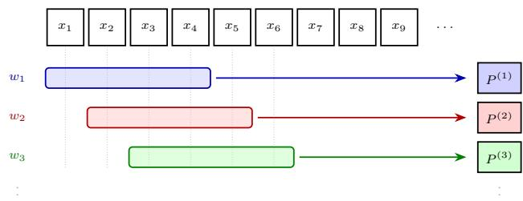
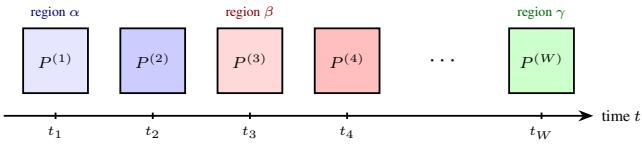
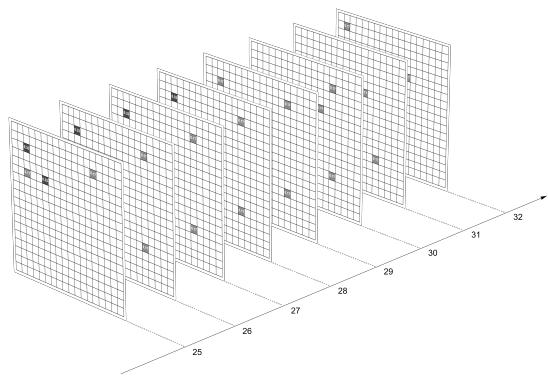
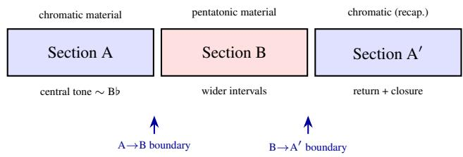
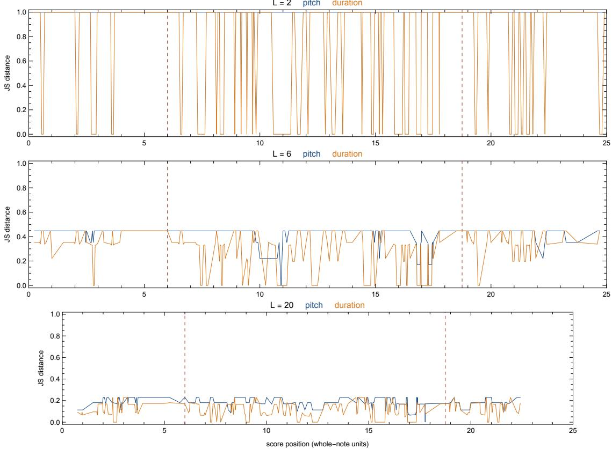
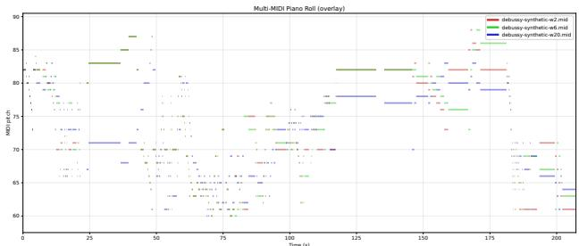

# FROM LOCAL KERNELS TO GLOBAL FORM: MODELING THE EMERGENCE OF MUSICAL CONTENT

Francesco Vitucci Conservatorio di Musica “N. Piccinni” di Bari francescovitucci1@gmail.com

Michele Lorusso Conservatorio di Musica “N. Piccinni” di Bari michelelorusso99@outlook.com

Francesco Scagliola Conservatorio di Musica “N. Piccinni” di Bari francesco.scagliola@gmail.com

## ABSTRACT

Markov models are established tools for symbolic music, including non-homogeneous formulations. The narrower contribution examined here is an observation-driven estimation mechanism: overlapping sliding windows derive a trajectory of local transition kernels from one symbolic sequence rather than from an exogenous formal partition. We test this mechanism on 273 logical note events from Debussy’s Syrinx (1913), using the often-proposed A–B–A’ reading as a reference rather than ground truth. We apply the same validation to absolute-pitch and notated-duration kernels. At L = 6, both reference boundaries attain the Jensen– Shannon maximum in both dimensions; the duration plateau is substantially narrower (64 of 267 comparisons) than the pitch plateau (210 of 267). Because the theoretical maximum for consecutive sliding-window comparisons is set by window geometry and equals 1/ L − 1 for maximal turnover of the entering/leaving transition, the pitch value at $L = 6$ and its broad plateau are not, by themselves, strong evidence. Their cross-dimensional alignment is consistent with boundary sensitivity, while the broad plateaus preclude treating either curve alone as a unique automatic segmenter. Five-hundred-draw re-synthesis experiments quantify departure from the source in both dimensions and expose an exact-copy degeneracy at L = 2.

## 1. INTRODUCTION

The use of Markov chains in algorithmic composition has a long tradition. From the pioneering experiments of the 1950s and 1960s to contemporary applications in style imitation, real-time improvisation, and hybrid symbolic/audio modelling [1, 2, 3], Markov processes have provided a mathematically transparent framework for capturing loca statistical regularities in musical sequences. A transition matrix can be estimated from small corpora, inspected directly, and reasoned about in musical terms.

First-order memorylessness and time-homogeneity are distinct assumptions. This paper retains the former and relaxes the latter: transition probabilities may change with position while each next state still depends only on the current state. Ames already identified “evolving transition matrices”

as a useful compositional extension [1], and musical nonhomogeneous Markov models are not new [4, 5]. Our specific object of study is therefore not non-homogeneity itself, sliding-window estimation, or local statistics in general, but the combination and evaluation of directed conditionaltransition structures derived from one symbolic sequence: local transition kernels obtained directly from the data, their temporal trajectory, and analytical and generative uses of that same representation.

Windowed estimation is a standard response to nonstationarity in time-series and data-stream analysis [6]. In music, Chawin and Rom apply sliding-window pitch-class histograms to form labelling [7]. We ask what changes when the local statistic is instead a directed conditionaltransition structure, and whether that structure supplies useful analytical or generative evidence in a single-piece case study.

Section 2 gives the formalism, Section 3 motivates local estimation, Section 4 defines the estimator, Section 5 reports the tests on Syrinx, and Sections 6–8 discuss scope, related work, and conclusions.

## 2. BACKGROUND: MARKOV MODELS

## 2.1 Markov Chains

Let $S = \{ s _ { 1 } , \ldots , s _ { n } \}$ be a finite state space. A first-order Markov chain $\{ X _ { t } \} _ { t \ge 1 }$ satisfies [8, 9]:

$$
\begin{array} { r l } & { \mathbb { P } ( X _ { t + 1 } = s _ { j } \mid X _ { t } = s _ { i } , X _ { t - 1 } , \ldots ) } \\ & { \qquad = \mathbb { P } ( X _ { t + 1 } = s _ { j } \mid X _ { t } = s _ { i } ) . } \end{array}\tag{1}
$$

A time-homogeneous chain is fully determined by $P \in$ Rn×n, where $P _ { i j } \ : = \ \mathbb { P } ( X _ { t + 1 } \ = \ s _ { j } \ | \ X _ { t } \ = \ s _ { i } )$ and $\textstyle \sum _ { j } P _ { i j } = 1$ . In musical applications S is typically a vocabulary of symbolic events: pitches, pitch classes, chord labels, rhythmic durations, or composite tokens [1, 2].

## 2.2 Empirical Estimation

In practice P must be estimated from an observed sequence $( x _ { 1 } , \dots , x _ { T } )$ . The standard estimator counts transitions $C _ { i j } = \# \{ t \mid x _ { t } = i , x _ { t + 1 } = j \}$ and normalises each row:

$$
\begin{array} { r } { P _ { i j } = \left\{ \begin{array} { l l } { C _ { i j } / \sum _ { k } C _ { i k } } & { \mathrm { i f } \sum _ { k } C _ { i k } > 0 , } \\ { 0 } & { \mathrm { o t h e r w i s e } . } \end{array} \right. } \end{array}\tag{2}
$$

In our implementation the sequence is augmented with ⟨START⟩ and ⟨END⟩ boundary tokens, so that first and last events are explicitly represented as transitions. The terminal row is a sub-Markovian kernel [9] with no outgoing mass; it is excluded from probability sampling in generative use.

## 3. WHY ESTIMATE LOCAL KERNELS?

## 3.1 Memorylessness and Musical Perception

The Markov property and time-homogeneity are logically independent. A chain may remain memoryless while its transition kernel changes with time; conversely, a timehomogeneous finite-state chain need not have a unique invariant distribution, nor need its distributions converge to one [9, 10]. The limitation addressed here is the combination of first-order memorylessness with a single globally constant kernel. Under that combination, all long-range structural information is compressed into one matrix.

The problem is not merely technical. Musical events are not perceived as isolated symbols; they acquire meaning through their position in a temporal structure, through recurrence, expectation, tension, and resolution. A model that treats every occurrence of a state as statistically equivalent, regardless of its formal placement, discards precisely the temporal context that makes a sequence intelligible as form. This is not an argument against the Markov property as such, but against the further assumption that the transition law itself is invariant over the entire duration of the piece.

In musical contexts this conflation is consequential: a single homogeneous matrix cannot distinguish between transitions that occur in structurally distinct regions, even when those regions are perceptually or syntactically dissimilar [1, 4].

## 3.2 Higher-Order Models Are Not the Answer

Higher-order chains model $\mathbb { P } ( X _ { t + 1 } \mid X _ { t } , \ldots , X _ { t - m + 1 } )$ enriching local dependency. The IDyOM framework of Pearce and Wiggins employs variable-order models with interpolated smoothing to predict listeners’ melodic expectations [11, 12], and is effective for that purpose.

However, if the model remains time-homogeneous, an identical subsequence appearing in different formal regions is still treated as statistically equivalent, regardless of its temporal position. Variable order captures depth of context; our approach captures location in time. Higher-order models also entail rapid state-space growth, leading to data sparsity in finite or windowed corpora. The issue does not lie in the Markov property itself, but in requiring time-homogeneity from a sequence whose syntactic law changes over time. As established in the theory of time-inhomogeneous chains [9, 13], a process may remain Markovian while its transition kernel varies with time.

## 4. TIME-VARYING MARKOV MODEL VIASLIDING WINDOWS

Following standard windowed estimation [9, 6], we construct a sequence of local matrices,

$$
P ^ { ( 1 ) } , \ P ^ { ( 2 ) } , \ . . . , P ^ { ( W ) } ,
$$

each associated with a short temporal segment of the symbolic sequence.

## 4.1 Sliding Window Construction

Given a window length L and step size 1, define overlapping windows $w _ { m } = ( x _ { m } , \ldots , x _ { m + L - 1 } )$ for $m = 1 , \ldots , W =$ $T - L + 1$ . Each window contains $L - 1$ transitions, indexed by $I _ { m } = \{ m , \ldots , m + L - 2 \}$ , yielding a local count matrix $C _ { i j } ^ { ( m ) } = \# \{ r \in I _ { m } \mid x _ { r } = i , x _ { r + 1 } = j \}$ . Figure 1 illustrates the construction geometrically.

  
Figure 1: Sliding window $( L = 4 , \mathrm { s t e p } = 1 )$ . Each row is one window position; from every $w _ { m }$ a local transition matrix $P ^ { ( m ) }$ is estimated. Successive windows overlap by $L - 1$ symbols, so the estimated kernel changes smoothly as the window advances.

Each $\widehat { P } ^ { ( m ) }$ is obtained by applying Eq. (2) to $C ^ { ( m ) }$ acting as a locally stationary kernel under the working assumption that transition probabilities are approximately constant within the window. The choice of L determines a bias–variance trade-off: large windows reduce estimation variance but blur local change; small windows track change at the cost of sparse rows. For optional shrinkage toward the global estimate $P ^ { ( G ) }$ , we use

$$
\widetilde { P } _ { i j } ^ { ( m ) } = \frac { C _ { i j } ^ { ( m ) } + \lambda P _ { i j } ^ { ( G ) } } { \sum _ { k } C _ { i k } ^ { ( m ) } + \lambda } , \qquad \lambda > 0 .\tag{3}
$$

The reported baseline instead uses unsmoothed counts and backs off to $P ^ { ( G ) }$ only when the selected local row is empty. Thus the observed matrix $\widehat { P } ^ { ( m ) }$ is not, by itself, a complete stochastic kernel. The kernel actually used for generation is defined row-wise by

$$
K _ { i j } ^ { ( m ) } = \left\{ \begin{array} { l l } { \widehat { P } _ { i j } ^ { ( m ) } , } & { \mathrm { i f ~ l o c a l ~ r o w ~ } i \mathrm { ~ h a s ~ p o s i t i v e ~ m a s s } , } \\ { P _ { i j } ^ { ( G ) } , } & { \mathrm { o t h e r w i s e } . } \end{array} \right.\tag{4}
$$

Boundary tokens are masked in analytical comparisons.

## 4.2 Time-Varying Transition Kernels

The output is a trajectory of matrices (Figure 2): ${ \mathcal P } \ = \ \{ \stackrel { \frown } { P } ^ { ( m ) } \} _ { m = 1 } ^ { W }$ This collection admits three complementary readings: a local description of stylistic behaviour; a temporal evolution of musical grammar; and a piecewise-constant approximation of an underlying time-inhomogeneous Markov process.

The approach does not violate the Markov property: conditional independence from the past is preserved at each step. What is relaxed is time-homogeneity. An empirical example of the resulting trajectory is shown in Figure 3.

  
Figure 2: Trajectory of transition matrices. Colour-coding by formal region shows how the estimated kernel evolves as the sequence moves from one section to another.

  
Figure 3: Eight successive matrices from the trajectory $( L = 6 , t = 2 5 , \ldots , 3 2 )$ . Darker cells indicate higher transition probability. With only five transitions per window, the support is sparse and changes whenever one transition enters or leaves.

## 4.3 Mathematical Formalisation

To use the trajectory generatively, a schedule $g ( r )$ maps each transition time r to one local estimate, yielding a timeinhomogeneous Markov chain [9]:

$$
\mathbb { P } ( X _ { r + 1 } = j \mid X _ { r } = i ) = \widehat { P } _ { i j } ^ { ( g ( r ) ) } .\tag{5}
$$

Since windows overlap, g is not unique; first, last, or centrealigned choices all define valid chains but are not equivalent models. In the re-synthesis below we use centre alignment, backing off to the global kernel when a local row has zero mass.

For generative use we instantiate the estimator on two aligned symbolic streams. Absolute MIDI pitch yields $\mathcal { P } ;$ exact notated duration yields ${ \mathcal D } = \{ \widehat { D } ^ { ( m ) } \} _ { m = 1 } ^ { W }$ . The shared schedule selects the complete generation kernels $K ^ { ( g ( r ) ) }$ and $K _ { D } ^ { ( g ( r ) ) }$ , obtained by the same row-wise fallback construction, while the two kernels remain separately inspectable and sampled rather than forming one joint pitch– rhythm state space. In particular, the pitch chain is defined by

$$
\operatorname* { P r } ( X _ { r + 1 } = j \mid X _ { r } = i ) = K _ { i j } ^ { ( g ( r ) ) } ,\tag{6}
$$

and analogously for duration using $K _ { D } ^ { ( g ( r ) ) }$ , not the incomplete observed matrix $\widehat { P } ^ { ( g ( r ) ) }$ .

## 5. CASE STUDY: DEBUSSY’S SYRINX

## 5.1 Choice of Piece

Debussy’s Syrinx (1913), for solo flute, is brief, strictly monodic, and built on a small number of recognisable melodic ideas, making the symbolic sequence manageable and analytically transparent. Its macroformal organisation is often read as tripartite A–B–A’ [14, 15]. Curinga’s synoptic comparison shows broad convergence on that macroform but substantial disagreement over internal divisions; measures 9 and 26 recur across several published readings [16]. Leplat explicitly labels mm. 1–8 as A, 9–25 as B, and 26–35 as A’ [17, pp. 9–10]. We therefore use the beginnings of measures 9 and 26 (positions 6 and 18.75 in whole-note units) as falsifiable references, not ground-truth labels. Figure 4 summarises this working plan.

  
Figure 4: Working A–B–A’ reference for Syrinx. The two sectional coordinates are comparison targets, not groundtruth labels.

## 5.2 Symbolic Representation and Parameters

The one-part MusicXML score is imported as symbolic note, rest, and state entities. For analysis, logical note attacks are ordered by score position; absolute pitch and exact notated duration are retained without conversion to performance seconds. START and END tokens are not used in the distance calculations.

We compute kernels for $L \in \{ 2 , 6 , 2 0 \}$ , containing one, five, and nineteen transitions. These three values were fixed before the quantitative comparisons. The qualitative assessment of the window range had identified $L = 6$ as a particularly interpretable balance; the quantitative comparison is therefore not an independent selection of $L = 6 .$ . The MusicXML score contains 308 written note entries. We exclude 14 zero-duration grace notes and merge 21 tied continuations into their preceding attacks, yielding two aligned 273-event streams: absolute MIDI pitch (28 states) and exact notated duration after tie merging (23 rational states). Both streams use the same windows and fixed score-based reference coordinates, but are evaluated separately.

## 5.3 Successive transition-distribution distance test

For each event stream and L, we vectorise and normalise each local transition-count matrix as an empirical joint distribution over transition pairs $( i , j )$ . We compare consecutive windows using Jensen–Shannon (JS) and Hellinger successive transition-distribution distances; Frobenius is reported as a row-normalised kernel distance. Forward KL is infinite in 223 pitch and 125 duration comparisons out of 267 at $L = 6$ because mass disappears from the support, so it is not used as a peak curve. Figure 5 shows the unsmoothed JS curves.

The curves provide scale-dependent observations whose interpretation is constrained by the geometry of consecu-

  
Figure 5: Successive transition-distribution JS distance between absolute-pitch and notated-duration transition distributions. Dashed lines mark the measure-9 and measure-26 references. A point on a high plateau is not an isolated boundary peak.

regions (Table 1).

tive sliding windows. For maximal turnover of the single transition that enters and leaves, the theoretical observed maximum is $1 / \sqrt { L - 1 }$ ; hence the maximum 0.447 at $L = 6$ is the geometrically expected ceiling, not independent evidence of an unusually strong boundary effect. At L = 2, pitch has 271 and duration 152 maximum-valued comparisons, so the scale is non-selective. At $L \ = \ 6 .$ both references attain the maximum 0.447 in both streams. The plateau contains 210 pitch comparisons (78.7%) but only 64 duration comparisons (24.0%): rhythmic transition structure supplies markedly greater selectivity, while its agreement with pitch at both references is consistent with the cited A–B–A’ articulation. At L = 20, evidence becomes asymmetric: pitch yields 0.229 and 0.174 at the references, with the first value maximal but shared by 74 comparisons; duration yields 0.170 and 0.174, both below its 0.229 maximum, shared by 20 comparisons. The pre-specified three-value comparison therefore locates the strongest cross-dimensional boundary alignment at L = 6, which is consistent with boundary sensitivity but does not turn the curves into a unique automatic segmentation.

## 5.4 Generative Re-synthesis

We evaluate centre-aligned, hard-backoff pitch and duration samplers over 500 deterministic seeds. Every draw starts from its source state and has 273 events. For each stream we report aligned state mismatch, whole-sequence transition JS, and mean JS computed separately inside the three reference

Table 1: Re-synthesis departure: mean [2.5%, 97.5%], 500 draws; P=absolute pitch, D=notated duration.
<table><tr><td>stream</td><td> $L$ </td><td>mismatch</td><td>global JS</td><td>sectional JS</td></tr><tr><td>P</td><td>2</td><td>0 [0, 0]</td><td>0 [0, 0]</td><td>0 [0, 0]</td></tr><tr><td>P</td><td>6</td><td>.678 [.462, .912].167 [.116, .213]</td><td></td><td>1.196 [.128, .255]</td></tr><tr><td>P</td><td>20</td><td></td><td>.839 [.711, .945].303 [.251, .358]</td><td>.366 [.299, .431]</td></tr><tr><td>D</td><td>2</td><td>0 [0, 0]</td><td>0 [0, 0]</td><td>0 [0, 0]</td></tr><tr><td>D</td><td>6</td><td></td><td></td><td>.344 [.293, .392] .129 [.091, .172] .177 [.126, .231]</td></tr><tr><td>D</td><td>20</td><td></td><td></td><td>.588 [.509, .663] .222[.175, .276] .320 [.249, .397]</td></tr></table>

With $L = 2 ,$ each aligned local row contains only the observed next transition, so both samplers copy their source exactly. At L = 6 and $L = 2 0$ , both dimensions depart substantially at event level despite lower transition distances. The parallel evaluation therefore tests rhythmic departure as well as melodic departure, but not their joint coherence: separate sampling assumes conditional independence of pitch and duration given formal position. The plotted outputs remain illustrative draws, not evaluation evidence.

A shrinkage pilot using Eq. (3) with λ = 1 removes the L = 2 exact-copy degeneracy, but is not neutral. At $L = 6 ,$ pitch mismatch rises from 0.678 to 0.881 and sectional JS from 0.196 to 0.618; duration mismatch rises from 0.344 to 0.672 and sectional JS from 0.177 to 0.476. We retain hard backoff as the explicit baseline and leave shrinkage strength to held-out selection on a larger corpus.

The event-level tables, complete kernel-distance trajectories, re-synthesis summaries, and extended figures supporting this case study are archived in the companion Zenodo record [18].

  
Figure 6: One illustrative draw for each L. Quantitative results are reported in Table 1; visual similarity is not used to select a window.

## 6. DISCUSSION

The distance test supports a bounded case-study claim while defining its scope. At L = 6, both score-based references coincide with maximal change in pitch and duration. Since the maximum is constrained by the sliding-window geometry, this coincidence is consistent with boundary sensitivity rather than a particularly strong validation of it; the rhythmic curve is appreciably more selective. This is boundary-aligned evidence from two complementary event dimensions. Broad plateaus nevertheless show that descriptive validation is not equivalent to a turnkey segmentation algorithm. That distinction is musically appropriate: published analyses converge on a tripartite macroform while proposing different internal partitions [16]. The sensitivity of candidate counts to comparison scale likewise favours a multiscale reading over a single mandatory partition. A corpus study must predefine comparison lag, regularisation, a cross-dimensional rule, peak criterion, and reference tolerance.

The present distance compares strongly overlapping consecutive windows, in which only one transition exits and one enters. It is therefore sensitive to local turnover, but this geometry limits its interpretation as a true boundary detector. Future work should compare boundary-centred preceding and following windows, preferably non-overlapping, through a measure such as $D ( P _ { t } ^ { - } , P _ { t } ^ { + } )$

Generatively, explicit local kernels remain attractive because a composer can inspect, edit, or reschedule them. Yet formal control cannot be inferred from a single piano roll or from global distributional similarity. Evaluation should distinguish memorisation, event-level departure, withinsection syntax, cross-dimensional pitch–duration coherence, and perceptual judgement.

## 7. RELATED WORK

Markov chains have been widely used in algorithmic composition and musical analysis [1, 2, 19, 20]. Most approaches rely on homogeneous models. For example, Catak et al. estimate note-transition probabilities from 25 classical scores and compare Markov-chain generation with an RNN [21]. More recently, Pleshkova and Kostov derive separate transition matrices from genre-specific chord progressions for guitar-melody generation [22]; these matrices are conditioned by corpus category and chord context rather than by local position within a single piece. Non-homogeneous formulations include Buenger’s phrase-based model [4], where non-homogeneity is tied to a hand-specified phrase partition, and Roig et al.’s beat-based harmony model [5], where transition probabilities depend on position within a recurring metrical grid. Both differ from our approach in that non-homogeneity is defined exogenously rather than extracted from the data by windowing. Esqu´ıvel et al. propose an estimation–calibration procedure for continuous-time non-homogeneous Markov chains with finite state spaces in a non-musical setting [23]. In discrete-time financial forecasting, Wilinski estimates changing first- and second-order´ transition matrices from sequences of fixed-length time windows, optimizing the window and state-discretisation parameters [24]. Although observation-driven, the objective is next-state prediction rather than time-resolved structural analysis of a single symbolic artefact.

Sliding-window estimation is standard in non-stationary data analysis [6] and common in MIR. Chawin and Rom show that local pitch-class histograms improve sonata-form labels [7]; their distributions are marginal, whereas ours encode directed conditional transitions. Thus the contribution is the application and evaluation, in a single symbolic sequence, of window-derived directed conditional-transition structures and their temporal trajectory for both analysis and generation, not sliding windows, local statistics, or non-homogeneous chains per se. The IDyOM framework [11, 12] addresses depth of context via variable-order models; our approach addresses temporal location. Both relaxations of the basic first-order homogeneous chain are in principle combinable.

Recent surveys map the broader field of deep-learningbased symbolic music generation, including representations, algorithms, evaluation methods, and open challenges [25]. Transformer-based architectures achieve state-of-the-art results in symbolic music generation [26, 27, 28, 29, 30], but require large datasets and do not provide the interpretable, time-resolved transition matrices that are central to the present approach. The two paradigms are complementary rather than competing.

## 8. CONCLUSION

Overlapping windows provide an interpretable, observationdriven way to estimate changing transition kernels. In Syrinx, both reference boundaries attain maximal successive transition-distribution distance in both pitch and duration at $L = 6 ,$ , with greater selectivity in the rhythmic trajectory. Together with the published convergence on a tripartite macroform, this is consistent with the central claim that local kernels can expose formal change obscured by a single global estimator. Re-synthesis further demonstrates controllable departure in both dimensions as L changes. The result is a first-case, multiscale observation consistent with boundary sensitivity, not a claim of unique automatic segmentation or corpus-level generality.

## 9. REFERENCES

[1] C. Ames, “The markov process as a compositional model: A survey and tutorial,” Leonardo, vol. 22, no. 2, pp. 175–187, 1989.

[2] G. Nierhaus, Algorithmic Composition: Paradigms of Automated Music Generation. Vienna: Springer, 2009.

[3] J. D. Fernandez and F. Vico, “Ai methods in algorithmic composition: A comprehensive survey,” Journal of Artificial Intelligence Research, vol. 48, pp. 513–582, 2013.

[4] E. R. S. Buenger, An Investigation of Melodic Musical Modeling Using Homogeneous and Non-Homogeneous Markov Chains. PhD thesis, Butler University, 2012.

[5] C. Roig, L. J. Tardon, I. Barbancho, and A. M. Barban-´ cho, “A non-homogeneous beat-based harmony markov model,” Knowledge-Based Systems, vol. 142, pp. 85–94, 2018.

[6] J. Gama, I. Zliobait ˇ e, A. Bifet, M. Pechenizkiy, and ˙ A. Bouchachia, “A survey on concept drift adaptation,” ACM Computing Surveys, vol. 46, no. 4, pp. 44:1–44:37, 2014.

[7] D. Chawin and U. B. Rom, “Sliding-window pitchclass histograms as a means of modeling musical form,” Transactions ofthe International Societyfor Music Information Retrieval (TISMIR), vol. 4, no. 1, pp. 223– 235, 2021.

[8] A. A. Markov, “Extension of the law of large numbers to dependent quantities,” Izvestiia Fiz.-Matem. Obsch. Kazan Univ., vol. 15, pp. 135–156, 1906. In Russian.

[9] R. Douc, E. Moulines, P. Priouret, and P. Soulier, Markov Chains. Springer, 2018.

[10] S. P. Meyn and R. L. Tweedie, Markov Chains and Stochastic Stability. Cambridge University Press, 2 ed., 2009.

[11] M. T. Pearce and G. A. Wiggins, “Expectation in melody: The influence of context and learning,” Music Perception, vol. 23, no. 5, pp. 377–405, 2006.

[12] M. T. Pearce and G. A. Wiggins, “Auditory expectation: The information dynamics of music perception and cognition,” Topics in Cognitive Science, vol. 4, no. 4, pp. 625–652, 2012.

[13] D. A. Levin, Y. Peres, and E. L. Wilmer, Markov Chains and Mixing Times. American Mathematical Society, 2 ed., 2017.

[14] J.-J. Nattiez, Fondements d’une semiologie de la´ musique. Paris: Union Gen´ erale d’Editions, 1975.´

[15] J.-J. Nattiez, Music and Discourse: Toward a Semiology of Music. Princeton: Princeton University Press, 1990.

[16] L. Curinga, “Percorsi paralleli: contributi storicodocumentari e analitici come fondamenti per l’interpretazione di Syrinx di Claude Debussy,” Analitica. Rivista online di studi musicali, vol. 2, no. 2, 2001.

[17] F. Leplat, “Syrinx de claude debussy: vers une analyse formelle,” 2024.

[18] F. Vitucci, M. Lorusso, and F. Scagliola, “CIM2026 - From Local Kernels to Global Form: Modeling the Emergence of Musical Content - Extended analytical materials.” Zenodo, 2026. doi: 10.5281/zenodo.21899571.

[19] I. Shapiro and M. Huber, “Markov chains for computer music generation,” Journal ofHumanistic Mathematics, vol. 11, no. 2, pp. 167–195, 2021.

[20] D. Temperley, Music andprobability. MIT Press, 1st ed., 2007.

[21] M. Catak, S. AlRasheedi, N. AlAli, G. AlQallaf, M. AlMeri, and B. Ali, “Artificial intelligence composer,” in 2021 International Conference on Innovation and Intelligence for Informatics, Computing, and Technologies (3ICT), pp. 608–613, 2021.

[22] S. G. Pleshkova and K. Kostov, “Generative Markov chain model development for guitar melodies creation,” in 2025 33rd National Conference with International Participation (TELECOM), pp. 1–4, 2025.

[23] M. L. Esqu´ıvel, N. P. Krasii, and G. R. Guerreiro, “Estimation–calibration of continuous-time nonhomogeneous Markov chains with finite state space,” Mathematics, vol. 12, no. 5, p. 668, 2024.

[24] A. Wilinski, “Time series modeling and forecasting´ based on a Markov chain with changing transition matrices,” Expert Systems with Applications, vol. 133, pp. 163–172, 2019.

[25] S. Ji, X. Yang, and J. Luo, “A survey on deep learning for symbolic music generation: Representations, algorithms, evaluations, and challenges,” ACM Computing Surveys, vol. 56, no. 1, pp. 1–39, 2023.

[26] A. Muhamed, L. Li, X. Shi, S. Yaddanapudi, W. Chi, D. Jackson, R. Suresh, Z. C. Lipton, and A. J. Smola, “Symbolic music generation with transformer-GANs,” Proceedings ofthe AAAI Conference on Artificial Intelligence, vol. 35, no. 1, pp. 408–417, 2021.

[27] Y.-J. Shih, S.-L. Wu, F. Zalkow, M. Muller, and Y.-H.¨ Yang, “Theme transformer: Symbolic music generation with theme-conditioned transformer,” IEEE Transactions on Multimedia, vol. 25, pp. 3495–3508, 2023.

[28] S. Ji and X. Yang, “EmoMusicTV: Emotion-conditioned symbolic music generation with hierarchical transformer VAE,” IEEE Transactions on Multimedia, vol. 26, pp. 1076–1088, 2024.

[29] W. Wang, J. Li, Y. Li, and X. Xing, “Style-conditioned music generation with transformer-GANs,” Frontiers ofInformation Technology & Electronic Engineering, vol. 25, no. 1, pp. 106–120, 2024.

[30] X. Qu, Y. Bai, Y. Ma, Z. Zhou, K. Zhang, H. Lin, K. Zhang, Y. Shu, Y. Li, G. Chen, W. Hao, J. Zhao, Y. Zhou, F. Deng, X. Du, X. Song, P. Zhang, Q. Huang, S. Wu, X. Tan, Y. Wu, Z. Jiang, C. Hu, L. Liang, W. Xue, S. Song, Z. Ma, H. Huang, Y. Huang, Y. Wang, J. Yu, C. Zhang, H. Zhou, T. Zheng, R. Chen, Y. Tian, K. Yang, J. Li, X. Li, Z. Wang, K. Song, X. Tan, Y. Wang, and B. Zheng, “MuPT: A generative symbolic music pretrained transformer,” arXiv preprint arXiv:2404.06393, 2024.