# Is Discrete Difficulty Sufficient? Leveraging Continuous Difficulty for Efficient Self-Consistency in LLMs

Sihyeong Yeom1,†, Geon Park1,†, Geunyeong Jeong1, Taewoong Yoon1, Jaewook Lee2, Harksoo Kim1,\*

1Konkuk University 2DATUMO INC. {stv10121, albert0811, jyjg7218, twyoon816}@konkuk.ac.kr benecia428@gmail.com, nlpdrkim@konkuk.ac.kr

## Abstract

Self-Consistency (SC) is a decoding strategy that samples diverse reasoning paths and selects the most consistent answer, demonstrating strong performance on complex reasoning problems. However, the excessive token consumption incurred by generating multiple reasoning paths has been identified as a major limitation of SC. To improve computational efficiency, several studies have proposed strategies that adjust the number of reasoning paths or allocate resources differentially according to problem difficulty. Nevertheless, most existing methods categorize difficulty into a few fixed levels, fail ing to fully capture the continuously varying nature of reasoning complexity. In this work, we propose Flexible Self-Consistency (FSC), which estimates problem difficulty as a continuous signal and dynamically adjusts the number of generated reasoning paths accordingly. FSC predicts the output entropy of an input question using a pre-trained probe and leverages it as an indicator of model uncertainty to flexibly control the sampling budget. Experimental results show that, across various models and benchmarks, FSC maintains accuracy comparable to SC while achieving token savings of up to 76%.

## 1 Introduction

“Do all questions require the same number of reasoning paths?”— Some questions converge to the correct answer reliably with only one or two reasoning attempts, whereas others reach the right conclusion only after exploring multiple possibilities. This simple fact that each problem requires a different amount of reasoning is creating an important turning point in recent language model research. Scaling train-time compute, such as model parameter size and training data size, has established Large Language Models (LLMs) as a core technology across natural language processing (Kaplan et al.,

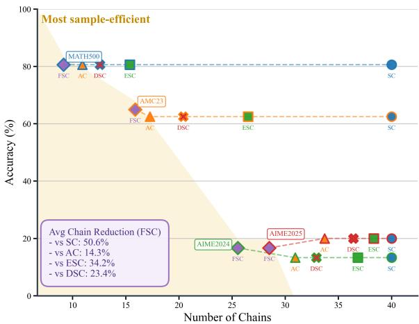  
Figure 1: FSC achieves high efficiency with fewer reasoning chains. Across datasets, comparison results between accuracy and the number of reasoning chains show that FSC tends to maintain comparable accuracy with fewer chains.

2020; Hoffmann et al., 2022; Zhao et al., 2023; Jeong et al., 2025a,b). However, performance gains gradually diminish even when training-time compute continues to increase. In response, Test-Time Scaling (TTS), which allocates additional computation at inference time, has emerged as a promising alternative (Zhang et al., 2025b; Snell et al., 2024; Muennighoff et al., 2025).

TTS is an approach that improves model performance by performing additional computation during inference. Among such methods, Self-Consistency (SC) is a representative decoding strategy that samples multiple reasoning paths and aggregates them to determine the final answer (Wang et al., 2022). SC shows strong performance on tasks requiring complex reasoning, but as the number of generated paths increases, token usage also increases accordingly. In other words, although SC is effective for improving performance, how much reasoning resource should be allocated to obtain such gains remains a separate problem.

Prior work on improving the efficiency of SC has progressed from early stopping strategies to difficulty-adaptive reasoning allocation. Earlier studies improved token efficiency by checking the consistency or stability of responses during the reasoning process and stopping sampling early (Aggarwal et al., 2023; Li et al., 2024). Subsequent work has advanced toward estimating the difficulty of an input question and dynamically adjusting the number of reasoning paths according to that difficulty (Wang et al., 2025; Zhu et al., 2025). In this way, the recent research trend provides a more direct solution in that it aims to assign computational resources according to the needs of each problem.

The key issue lies in how difficulty is represented. Existing difficulty-based methods generally classify difficulty into discrete categories such as ‘easy’ and ‘hard’ and assign a pre-defined number of reasoning paths to each category. However, even among problems belonging to the same category, there exist substantial differences in the amount of reasoning required, and these fine-grained differences are precisely what determine the balance between accuracy and computational efficiency. When difficulty is treated only coarsely, excessive computation may be allocated to some problems, while insufficient exploration may be provided to others. For example, assigning only a single path to easy problems and uniformly assigning 40 paths to hard problems fails to capture fine-grained difficulty differences among problems, ultimately making it difficult to precisely control reasoning resources.

At this point, we pose the following question: “Can problem difficulty be modeled not as a discrete category, but as a continuous signal?”

As an answer to this question, we propose Flexible Self-Consistency (FSC). Through preliminary experiments, we show that output entropy reflects the uncertainty exhibited by a model for a given input and can be used as a continuous difficulty signal. Based on this finding, FSC trains a lightweight linear probe to predict the output entropy of each input question and uses it as a continuous indicator of the amount of reasoning required by that question. Using this predicted value, FSC flexibly determines the number of reasoning paths needed for each question, allocating less computation to easy problems and more computation to difficult ones.

Experimental results on various benchmarks show that FSC substantially reduces token usage while maintaining accuracy comparable to SC. These results suggest that the proposed method is an efficient and general-purpose TTS strategy capable of more precisely controlling the balance between accuracy and efficiency.

In summary, this work makes the following key contributions. First, we propose FSC, a new framework that adaptively allocates the number of reasoning paths required for each input based on predicted output entropy. Second, we show that output entropy can serve as a continuous difficulty signal that replaces conventional discrete difficulty levels, and empirically demonstrate that entropy gradually increases with problem difficulty. Third, we show that FSC can substantially improve inference efficiency over existing baselines while maintaining accuracy across diverse benchmarks.

## 2 Motivation

In this section, we empirically show that the amount of reasoning required varies across problems and that problem difficulty can be represented as a continuous signal. To this end, we use the MATH training dataset (Hendrycks et al., 2021), where difficulty levels are explicitly defined, and generate 40 reasoning chains for each problem with four instruction-tuned LLMs: Qwen2.5-Instruct (3B, 7B, 14B) (Yang et al., 2024), and Gemma-3- 4B-it (Kamath et al., 2025). We then analyze the generated chains from multiple perspectives.

Do all questions require the same number of reasoning paths? SC assigns a fixed sampling budget to all inputs, but the number of reasoning paths required to reach the correct answer may vary depending on problem difficulty. To verify this, we sequentially accumulate the generated chains and measure the minimum number of chains at which the majority-voting result first matches the correct answer. In addition, when the correct answer is not reached even after using all chains, we assign the maximum number of chains so that failure cases are reflected.

As shown in Figure 2a, across all models, the average number of reasoning chains required to reach the correct answer tends to increase as the difficulty level of the problem increases. In particular, in the high-difficulty range (Level 5), the required number of chains increases sharply, and this trend appears consistently across different models.

These results suggest that the amount of reasoning required varies across problems and that reasoning resources need to be flexibly adjusted according to problem difficulty.

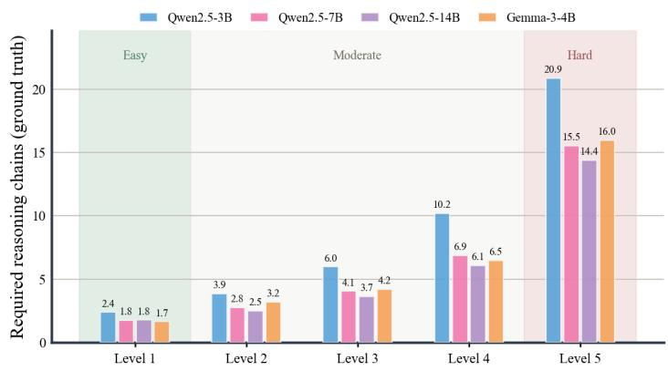  
(a) Required reasoning chains across difficulty levels.

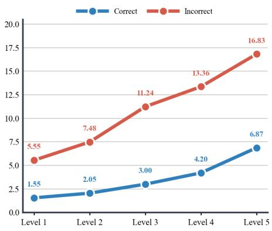  
(b) Answer diversity across difficulty levels.  
Figure 2: Empirical motivation for adaptive Self-Consistency. (a): As problem difficulty increases, the number of reasoning chains required to reach the correct answer also increases. (b): Answer diversity also increases alongside difficulty, with incorrect answers showing particularly higher diversity, suggesting that uncertainty becomes greater for more difficult problems.

Can problem difficulty be modeled as a continuous signal? From the preceding analysis, we confirm that the number of reasoning paths required by a problem gradually increases in proportion to its difficulty. In other words, reasoning resources should be allocated in proportion to difficulty, and accurately identifying problem difficulty is therefore important.

Most existing studies distinguish difficulty coarsely, such as easy or hard, and apply different reasoning strategies accordingly (Wang et al., 2025; Zhu et al., 2025; Liu et al., 2025). However, since the degree of difficulty perceived by the model can differ even among different problems at the same level, discrete difficulty categorization cannot precisely reflect the amount of reasoning required for each problem. Given this, can the difficulty perceived by the model be quantified as a continuous signal and represented in a more finegrained manner?

To this end, we focus on the entropy of the model’s output distribution as such a signal. As shown in Figure 2b, the number of unique answers tends to increase as difficulty increases, and incorrect cases in particular exhibit higher diversity than correct cases. This trend appears consistently across different models (details in Appendix B), suggesting that the entropy of the response distribution reflects an intrinsic signal of the problem difficulty perceived by the model. Based on this observation, we propose Flexible Self-Consistency (FSC), which adaptively adjusts the sampling budget using output entropy.

## 3 Methodology

As illustrated in Figure 3, FSC consists of two stages. First, a lightweight linear probe is trained to predict the output entropy based on the last-token embedding of the LLM given an input prompt. This design is motivated by prior studies showing that embeddings produced by LLMs can reflect intrinsic properties of prompts (Sarfati et al., 2025; Heo et al., 2025; Zhao et al., 2026; Lee et al., 2025). Next, the trained probe predicts the entropy of a new input question, which is then used to allocate an appropriate sampling budget for majority voting.

## 3.1 Training a Lightweight Linear Probe

Data Collection for Probe. For each input question $q \in D$ , we first use an LLM to generate a set of N reasoning trajectories, denoted as $\mathcal { R } _ { q } = \{ r _ { i } \} _ { i = 1 } ^ { N }$ We then extract the final answers from these trajectories to construct the answer set $\mathcal { A } _ { q } = \{ a _ { i } \} _ { i = 1 } ^ { N }$

Second, let $\mathcal { U } _ { q }$ denote the set of unique answers in $\mathcal { A } _ { q } .$ . Based on the relative frequency of each answer $a \in \mathcal { U } _ { q }$ , we define a probability distribution $p _ { q } ( a )$ and compute the output entropy $H _ { q }$ . Specifically, let $c _ { q } ( a )$ denote the occurrence count of answer a. Then, $p _ { q } ( a )$ and $H _ { q }$ are computed as follows:

$$
\begin{array} { c } { { p _ { q } ( a ) = \displaystyle \frac { c _ { q } ( a ) } { N } , } } \\ { { H _ { q } = - \displaystyle \sum _ { a \in \mathcal { U } _ { q } } p _ { q } ( a ) \log _ { 2 } p _ { q } ( a ) } } \end{array}\tag{1}
$$

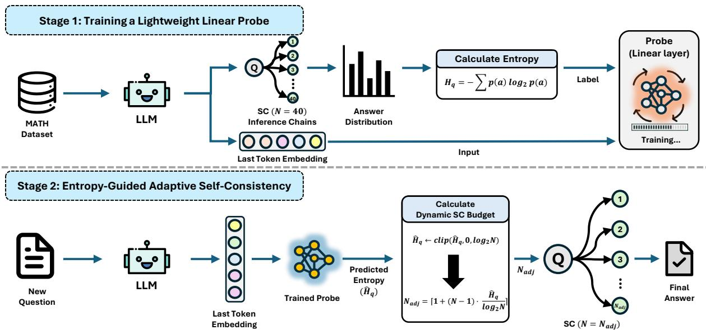  
Figure 3: Overall framework of FSC. In Stage 1, FSC trains a lightweight probe to predict output entropy as a continuous difficulty signal. In Stage 2, the predicted entropy is mapped to an adaptive sampling budget, which determines the number of reasoning chains used for majority voting.

The resulting entropy $H _ { q }$ is used as the entropy label for input question q, yielding a synthetic dataset of the form $\tilde { D } = \{ ( q , H _ { q } ) \mid q \in D \}$

Unlike prior studies that train probes using discrete difficulty labels (Lee et al., 2025; Liu et al., 2025), our entropy-based labeling provides a continuous supervision signal that can capture problem difficulty in a more fine-grained manner.

Probe Learning. Using the constructed dataset D˜ , the probe is trained to predict the output entropy from the last-token embedding of the LLM for each input question. Specifically, the probe is optimized using the mean squared error loss between the predicted entropy $\hat { H } _ { q }$ and the labeled entropy $H _ { q } .$

$$
\mathcal { L } = \mathbb { E } _ { ( q , H _ { q } ) \sim \tilde { D } } \left[ \left( H _ { q } - \hat { H } _ { q } \right) ^ { 2 } \right]\tag{2}
$$

To model continuous and fine-grained difficulty signals, the probe is implemented as a linear regression model without any non-linear activation function.

## 3.2 Entropy-Guided Adaptive Self-Consistency

Entropy Estimation. Following the training procedure, the probe takes the last-token embedding of the LLM for a new input question and predicts its output entropy.

In our setting, the answer distribution is constructed from at most N reasoning paths, meaning that the number of unique answers cannot exceed

N. Accordingly, the entropy of the answer distribution is theoretically bounded within the range $[ 0 , \log _ { 2 } N ]$ (Shannon, 1948). However, since the probe predicts a continuous value $\hat { H } _ { q } .$ , the predicted entropy may fall outside this range. Therefore, similar to prior studies (Schulman et al., 2017; Shao et al., 2024; Zhang et al., 2025a), we apply clipping for stability as follows:

$$
\hat { H } _ { q } \gets \mathrm { c l i p } ( \hat { H } _ { q } , 0 , \log _ { 2 } N )\tag{3}
$$

Adjusting Sampling Budget. The entropy predicted by the probe serves as the basis for dynamically adjusting the sampling budget for each question. However, directly using the predicted entropy makes it difficult to maintain a consistent interpretation across different budget settings. Therefore, we normalize the entropy into a relative difficulty score within the range [0, 1]. We then determine the appropriate sampling budget $N _ { \mathrm { a d j } }$ for an input question q in proportion to the normalized entropy as follows:

$$
N _ { \mathrm { a d j } } = \left\lceil 1 + ( N - 1 ) \cdot \frac { \hat { H } _ { q } } { \log _ { 2 } N } \right\rceil\tag{4}
$$

This budget allocation strategy enables adaptive reasoning proportional to the continuous difficulty of each question by assigning a minimum of one reasoning path to easy questions with low entropy and up to N reasoning paths to difficult questions with high entropy.

<table><tr><td rowspan="2">Methods</td><td colspan="2">MATH500</td><td colspan="2">AMC23</td><td colspan="2">AIME2024</td><td colspan="2">AIME2025</td><td colspan="2">GPQA-D</td></tr><tr><td>Acc.↑</td><td>Tok.↓</td><td>Acc.↑</td><td>Tok.↓</td><td>Acc.↑</td><td>Tok.↓</td><td>Acc.↑</td><td>Tok.↓</td><td>Acc.↑</td><td>Tok.↓</td></tr><tr><td colspan="9">Qwen2.5-3B</td></tr><tr><td>SC</td><td>74.6</td><td>24.4 (0.0%)</td><td>52.5</td><td>34.4 (0.0%)</td><td>16.7</td><td>43.7 (0.0%)</td><td>3.3</td><td>36.8 (0.0%)</td><td>30.3</td><td>27.8 (0.0%)</td></tr><tr><td>AC</td><td>74.8</td><td>13.3 (-45.5%)</td><td>52.5</td><td>23.6 (-31.4%)</td><td>16.7</td><td>43.6 (-0.2%)</td><td>3.3</td><td>42.6 (+15.8%)</td><td>30.3</td><td>23.2 (-16.2%)</td></tr><tr><td>ESC</td><td>74.6</td><td>15.6 (-36.1%)</td><td>52.5</td><td>30.6 (-11.0%)</td><td>16.7</td><td>44.0 (+0.7%)</td><td>3.3</td><td>38.0 (+3.3%)</td><td>29.7</td><td>23.7 (-14.7%)</td></tr><tr><td>DSC</td><td>74.6</td><td>12.9 (-47.1%)</td><td>52.5</td><td>22.9 (-33.4%)</td><td>16.7</td><td>41.3 (-5.5%)</td><td>3.3</td><td>36.8 (0.0%)</td><td>30.8</td><td>22.0 (-20.8%)</td></tr><tr><td>FSC (Ours)</td><td>74.6</td><td>10.4 (-57.4%)</td><td>52.5</td><td>19.0 (-44.8%)</td><td>13.3</td><td>33.2 (-24.0%)</td><td>3.3</td><td>28.9 (-21.5%)</td><td>31.8</td><td>21.9 (-21.1%)</td></tr><tr><td colspan="9">Qwen2.5-7B</td></tr><tr><td>SC</td><td>80.6</td><td>24.2 (0.0%)</td><td>62.5</td><td>34.7 (0.0%)</td><td>13.3</td><td>42.8 (0.0%)</td><td>20.0</td><td>38.4 (0.0%)</td><td>36.9</td><td>22.1 (0.0%)</td></tr><tr><td>AC</td><td>80.6</td><td>10.1 (-58.3%)</td><td>62.5</td><td>19.5 (-43.8%)</td><td>13.3</td><td>38.6 (-9.8%)</td><td>20.0</td><td>41.0 (+6.8%)</td><td>36.4</td><td>14.9 (-32.7%)</td></tr><tr><td>ESC</td><td>80.6</td><td>12.2 (-49.6%)</td><td>62.5</td><td>26.3 (-24.2%)</td><td>13.3</td><td>40.8 (-4.7%)</td><td>20.0</td><td>38.4 (0.0%)</td><td>37.4</td><td>15.7 (-28.9%)</td></tr><tr><td>DSC</td><td>80.6</td><td>10.0 (-58.7%)</td><td>62.5</td><td>20.0 (-42.4%)</td><td>13.3</td><td>36.6 (-14.5%)</td><td>20.0</td><td>36.2 (-5.7%)</td><td>36.9</td><td>13.2 (-40.1%)</td></tr><tr><td>FSC (Ours)</td><td>80.6</td><td>7.0 (-71.1%)</td><td>65.0</td><td>15.1 (-56.5%)</td><td>16.7</td><td>27.5 (-35.7%)</td><td>16.7</td><td>27.7 (-27.9%)</td><td>36.4</td><td>10.6 (-51.9%)</td></tr><tr><td colspan="11">Qwen2.5-14B</td></tr><tr><td>SC</td><td>81.6</td><td>24.5 (0.0%)</td><td>70.0</td><td>35.3 (0.0%)</td><td>20.0</td><td>42.4 (0.0%)</td><td>23.3</td><td>39.5 (0.0%)</td><td>46.2</td><td>23.6 (0.0%)</td></tr><tr><td>AC</td><td>81.8</td><td>9.0 (-63.3%)</td><td>70.0</td><td>16.9 (-52.1%)</td><td>20.0</td><td>37.1 (-12.5%)</td><td>23.3</td><td>32.6 (-17.5%)</td><td>45.6</td><td>14.6 (-38.1%)</td></tr><tr><td>ESC</td><td>81.6</td><td>10.7 (-56.3%)</td><td>70.0</td><td>23.2 (-34.3%)</td><td>20.0</td><td>39.1 (-7.8%)</td><td>23.3</td><td>32.2 (-18.5%)</td><td>46.7</td><td>15.3 (-35.0%)</td></tr><tr><td>DSC</td><td>81.6</td><td>8.9 (-63.7%)</td><td>70.0</td><td>18.1 (-48.7%)</td><td>20.0</td><td>35.4 (-16.5%)</td><td>23.3</td><td>27.4 (-30.6%)</td><td>46.2</td><td>13.4 (-43.1%)</td></tr><tr><td>FSC (Ours)</td><td>82.2</td><td>6.1 (-75.1%)</td><td>70.0</td><td>14.0 (-60.3%)</td><td>20.0</td><td>25.9 (-38.9%)</td><td>23.3</td><td>26.3 (-33.4%)</td><td>46.7</td><td>7.5 (-68.2%)</td></tr><tr><td colspan="11">Gemma-3-4B</td></tr><tr><td>SC</td><td>79.2</td><td>36.5 (0.0%)</td><td>50.0</td><td>52.5 (0.0%)</td><td>13.3</td><td>76.0 (0.0%)</td><td>13.3</td><td>62.6 (0.0%)</td><td>28.2</td><td>38.6 (0.0%)</td></tr><tr><td>AC</td><td>79.2</td><td>15.7 (-57.0%)</td><td>50.0</td><td>34.9 (-33.5%)</td><td>13.3</td><td>60.4 (-20.5%)</td><td>13.3</td><td>53.1 (-15.2%)</td><td>27.7</td><td>29.9 (-22.5%)</td></tr><tr><td>ESC</td><td>79.2</td><td>19.7 (-46.0%)</td><td>50.0</td><td>41.0 (-21.9%)</td><td>13.3</td><td>71.7 (-5.7%)</td><td>13.3</td><td>52.7 (-15.8%)</td><td>27.7</td><td>33.2 (-13.9%)</td></tr><tr><td>DSC</td><td>79.2</td><td>16.5 (-54.8%)</td><td>50.0</td><td>35.6 (-32.2%)</td><td>13.3</td><td>62.9 (-17.2%)</td><td>13.3</td><td>50.6 (-19.2%)</td><td>28.2</td><td>31.0 (-19.7%)</td></tr><tr><td>FSC (Ours)</td><td>78.8</td><td>8.5 (-76.7%)</td><td>52.5</td><td>18.5 (-64.8%)</td><td>13.3</td><td>29.4 (-61.3%)</td><td>16.7</td><td>30.9 (-50.6%)</td><td>26.2</td><td>9.7 (-74.8%)</td></tr></table>

Table 1: Main experimental results across models and benchmarks. Accuracies are reported in % (rounded to one decimal). Tok. denotes total tokens (input + output), reported in 103 tokens. Values in parentheses denote the percentage change in token usage relative to SC for each model–dataset combination.

## 4 Experiments

## 4.1 Setup

Datasets. To train the probe, we use the MATH (Hendrycks et al., 2021) training dataset consisting of 7,500 instances. For evaluation, we use MATH500 (Lightman et al., 2024), AMC23 (AI-MO, 2024), AIME2024 (Zhang and Math-AI, 2024), AIME2025 (Zhang and Math-AI, 2025), and GPQA-Diamond (Rein et al., 2023). MATH500 contains diverse mathematical reasoning problems, while AMC and AIME consist of challenging mathematics competition problems. GPQA-Diamond is a benchmark designed to evaluate graduate-level STEM reasoning ability.

Models. To cover a diverse range of model families and scales, we use instruction-tuned language models that have demonstrated strong reasoning capabilities, including Qwen2.5-Instruct (3B, 7B, and 14B) and Gemma-3-4B-it. All experiments are conducted under a zero-shot prompting setting, and detailed prompts are provided in Appendix A.

Baselines and Metrics. To evaluate the performance of FSC, we compare it with the following SC-based methods:

• SC (Wang et al., 2022): A method that generates multiple reasoning chains for the same problem and selects the final answer by applying majority voting over the generated answers.

• AC (Aggarwal et al., 2023): A method that sequentially generates reasoning chains, measures the consistency of intermediate results, and terminates sampling early when the confidence exceeds a predefined threshold.

• ESC (Li et al., 2024): A method that generates reasoning chains progressively and stops additional sampling when the generated answers sufficiently converge within a fixed window.

• DSC (Wang et al., 2025): A difficulty-aware method that estimates the difficulty of input problems discretely based on the LLM’s selfassessment. It allocates a single reasoning path to easy problems, while adaptively increasing the number of reasoning paths for hard problems through additional sampling and sample size pre-allocation.

For fair comparison, the maximum sampling budget of SC is fixed to $N = 4 0$ , and the resulting reasoning paths are used as a shared pool so that all methods select from the same set of reasoning trajectories. Performance is evaluated using accuracy and token usage (input + output). Additional implementation details and experimental settings are provided in Appendix C.

## 4.2 Results

Table 1 presents the comparison between FSC and existing methods across various models and benchmarks. For the Qwen family series, FSC and all baselines generally exhibit improved token efficiency across all benchmarks as the model size increases. However, this trend is more pronounced for FSC, which achieves the lowest token usage in most settings while maintaining accuracy comparable to existing baselines. In particular, FSC consistently reduces token consumption across all model– dataset combinations, achieving up to a 76.7% reduction compared to SC.

In contrast, AC and ESC occasionally consume even more tokens than SC in certain settings. For example, on AIME2025 with Qwen2.5-3B, AC increases token usage by +15.8% compared to SC, while Qwen2.5-7B shows a +6.8% increase.

Furthermore, compared to DSC, FSC demonstrates higher token efficiency while maintaining comparable accuracy in most settings. We attribute this improvement to FSC’s use of continuous signals derived from output entropy, which enables more fine-grained resource allocation than DSC’s discrete difficulty estimation. Additional analysis is provided in §5.2.

Overall, FSC effectively balances accuracy and efficiency, demonstrating a more stable and efficient test-time scaling strategy compared to existing approaches. Additional qualitative case studies are provided in Appendix D, highlighting how FSC allocates inference paths more efficiently than existing methods across problem difficulty.

## 5 Analysis

5.1 Can the Probe Reflect Problem Difficulty via Entropy?

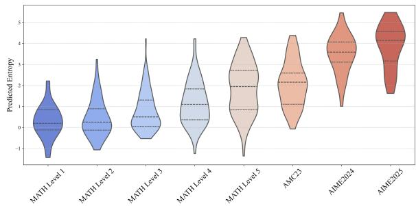  
Figure 4: Distribution of predicted entropy by probe across problem difficulty levels and STEM benchmarks using Qwen2.5-7B.

Figure 4 illustrates how the entropy predicted by the trained probe corresponds to problem difficulty. In this analysis, we use four mathematical reasoning benchmarks: MATH500, AMC23, AIME2024, and AIME2025.

Overall, the predicted entropy tends to increase as problem difficulty increases. First, as observed in MATH500, where explicit difficulty labels are provided, the predicted entropy gradually increases with higher difficulty levels. Furthermore, the entropy distributions of AMC23, AIME2024, and AIME2025 are overall higher than those of the highest difficulty level in MATH500 (Level 5), consistent with the fact that these benchmarks are generally considered more challenging (Yang et al., 2026; Lin et al., 2025).

Similar trends are observed across other models, and the corresponding results are presented in Figure 10. These results suggest that the trained probe does not merely overfit to a specific dataset, but instead learns a generalized continuous difficulty signal that reflects the absolute difficulty of problems.

## 5.2 Comparison of Inference Path Assignment Distributions by Difficulty Level

Figure 5 shows the difference in the distribution of reasoning paths allocated by DSC and FSC for each difficulty level on MATH500. For both DSC and FSC, the distribution progressively shifts toward larger numbers of reasoning paths as the difficulty increases. However, the two methods show a clear difference in how the number of reasoning paths is distributed.

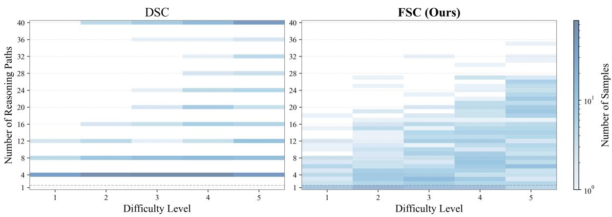  
Figure 5: Comparison of inference path allocation distributions by difficulty level between DSC and FSC on MATH500 using Qwen2.5-7B.

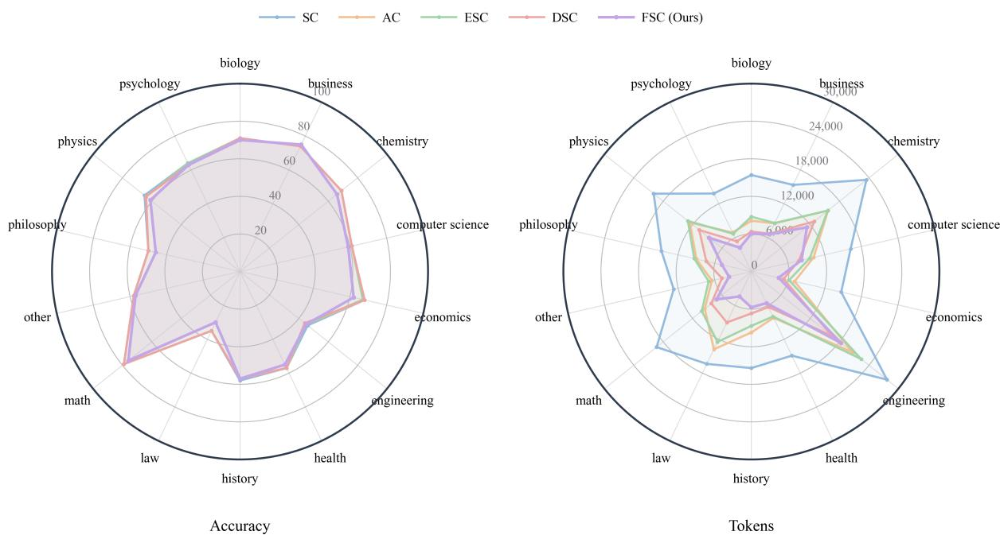  
Figure 6: Token efficiency comparison on MMLU-Pro with Qwen2.5-7B. FSC achieves the highest efficiency in most domains and demonstrates stable performance across diverse distributional settings.

Specifically, DSC tends to concentrate resource allocation within certain ranges, whereas FSC forms a more continuous distribution over a broader range without being biased toward specific values. This difference stems from the difficulty estimation and resource allocation mechanisms of each method. DSC estimates problem difficulty discretely, assigning only a single reasoning path to easy problems and performing adaptive sampling for difficult problems until sufficient agreement among responses is achieved. In contrast, FSC estimates difficulty continuously based on the output entropy of the input question and flexibly allocates reasoning resources in proportion to it. These distributional characteristics are not limited to a specific model, and similar trends are consistently observed across various models. Detailed results are presented in Figure 11. This suggests that FSC more precisely reflects the intrinsic difficulty of each input question, enabling more efficient and flexible resource allocation.

## 5.3 Generalization under Distribution Shift

While §4.2 evaluates STEM-oriented reasoning ability using MATH500, AMC23, AIME2024, AIME2025, and GPQA-Diamond, we further assess the Out-of-Distribution (OOD) performance of

FSC using MMLU-Pro (Wang et al., 2024), which covers a broad range of academic disciplines. Since MMLU-Pro is a large-scale benchmark spanning diverse domains, we sample a subset for efficient evaluation. Specifically, we randomly sample 100 questions from each of the 14 categories using a fixed random seed of 42, resulting in a total of 1,400 evaluation samples.

As shown in Figure 6, FSC achieves the highest efficiency in most academic domains and shows consistent performance across diverse domains. This trend is consistently observed across other models as well, as shown in Figure 12, suggesting that FSC is not dependent on a specific model or parameter scale. Overall, these results show that FSC stably maintains high token efficiency across diverse domains and effectively generalizes under distribution shift as a test-time scaling method.

## 6 Related Works

Efficient Self-Consistency Variants. Self-Consistency (SC) shows strong performance across diverse reasoning tasks by sampling multiple reasoning trajectories and determining the final response through majority voting (Wang et al., 2022). Nevertheless, the increased token consumption caused by generating multiple reasoning paths limits the scalability of SC, and subsequent studies have proposed various methods to improve its efficiency. For example, AC (Aggarwal et al., 2023) adopts a sequential sampling strategy, while ESC (Li et al., 2024) uses small-batch sampling; both reduce token consumption by stopping sampling early according to certain criteria, such as consistency within the answer distribution. DSC (Wang et al., 2025) estimates the difficulty of a question and samples proportionally to the estimated difficulty, showing that inference cost can be reduced more substantially than in prior approaches. However, since such difficulty-based efficient sampling strategies require accurate difficulty estimation as a prerequisite, various studies on difficulty estimation for LLMs have recently been actively explored.

Difficulty Estimation. Research on difficulty estimation for LLMs has developed mainly along two directions: external estimation and internal estimation. External estimation methods either make LLMs explicitly judge difficulty or implicitly estimate difficulty through fine-tuning (Wang et al., 2025; Zhang et al., 2025a; Waheed et al., 2025). In contrast, internal estimation methods leverage the model’s internal signals to more precisely estimate the difficulty perceived by the model. For example, Zhu et al. (2025) shows that difficulty can be effectively predicted through a value function without token generation, while Lee et al. (2025) demonstrates that a linear probe can effectively predict the difficulty of an input question.

However, existing methods still often treat difficulty as discrete categories or coarse levels, such as easy and hard, and thus fail to sufficiently reflect the difficulty actually perceived by the model. To address this limitation, FSC represents difficulty as a continuous signal and uses it to guide the allocation of reasoning resources, moving beyond coarse difficulty categories.

## 7 Conclusion

In this paper, we show that output entropy can serve as a continuous difficulty signal that replaces conventional discrete difficulty categorization. We further propose FSC, which predicts entropy using a lightweight linear probe and dynamically allocates the sampling budget accordingly. Across various benchmarks and models, FSC substantially reduces token usage while maintaining accuracy comparable to existing baselines. These results suggest that FSC effectively improves the efficiency and practicality of self-consistency while preserving its performance benefits by flexibly adjusting computational resources according to problem difficulty.

## Limitations

Despite the strong performance of FSC, several limitations remain. First, due to resource constraints, we could not conduct experiments on models larger than 14B. In particular, since the entropy predicted by the probe may vary depending on model size and family, further validation is required. Second, FSC requires the hidden representation of the last token of the input question to train the probe, making it difficult to apply to proprietary models such as GPT. Therefore, developing a more scalable efficient self-consistency method that overcomes these constraints and can be applied across diverse model environments remains an important direction for subsequent work. Finally, since the probe in this work was trained only on mathematical datasets, training probe on more diverse datasets is expected to further improve generalization and robustness across a wider range of tasks and domains.

## Acknowledgements

This work was supported by the National Research Foundation of Korea (NRF) grant funded by the Korea government (MSIT) (RS-2025-00553041, Enhancement of Rational and Emotional Intelligence of Large Language Models for Implementing Dependable Conversational Agents, Contribution Rate: 50%). This research was supported by the Culture, Sports and Tourism R&D Program through the Korea Creative Content Agency grant funded by the Ministry of Culture, Sports and Tourism in 2026 (Project Name: Development of an AI Agent Integrating Korean Language Knowledge for Personalized Language Consultation Services, Project Number: RS-2026-25506607, Contribution Rate: 50%).

## References

Pranjal Aggarwal, Aman Madaan, Yiming Yang, and 1 others. 2023. Let’s sample step by step: Adaptiveconsistency for efficient reasoning and coding with llms. In Proceedings of the 2023 Conference on Empirical Methods in Natural Language Processing, pages 12375–12396.

AI-MO. 2024. Aimo validation amc dataset on hugging face.

Dan Hendrycks, Collin Burns, Saurav Kadavath, Akul Arora, Steven Basart, Eric Tang, Dawn Song, and Jacob Steinhardt. 2021. Measuring mathematical problem solving with the math dataset. arXiv preprint arXiv:2103.03874.

Juyeon Heo, Christina Heinze-Deml, Oussama Elachqar, Kwan Ho Ryan Chan, Shirley Ren, Andrew Miller, Udhyakumar Nallasamy, and Jaya Narain. 2025. Do llms“know”internally when they follow instructions? In International Conference on Learning Representations, volume 2025, pages 81339–81357.

Jordan Hoffmann, Sebastian Borgeaud, Arthur Mensch, Elena Buchatskaya, Trevor Cai, Eliza Rutherford, DDL Casas, Lisa Anne Hendricks, Johannes Welbl, Aidan Clark, and 1 others. 2022. Training compute-optimal large language models. arXiv preprint arXiv:2203.15556, 10.

Geunyeong Jeong, Juoh Sun, and Harksoo Kim. 2025a. Watch your step: A fine-grained evaluation framework for multi-hop knowledge editing in large language models. In Proceedings ofthe 34th ACM International Conference on Information and Knowledge Management, pages 4842–4846.

Wooseok Jeong, Young-Jin Kim, Hae-Yoon Koo, Jimyeung Seo, Jinho Choi, and Byungkook Oh. 2025b. Interaction-grounded semantic graph refinement for llm-based recommendation. IEEE Access, 13:194229–194244.

Gemma Team Aishwarya Kamath, Johan Ferret, Shreya Pathak, Nino Vieillard, Ramona Merhej, Sarah Perrin, Tatiana Matejovicova, Alexandre Ram’e, Morgane Rivière, Louis Rouillard, Thomas Mesnard, Geoffrey Cideron, Jean-Bastien Grill, Sabela Ramos, Edouard Yvinec, Michelle Casbon, Etienne Pot, Ivo Penchev, Gael Liu, and 191 others. 2025. Gemma 3 technical report. ArXiv, abs/2503.19786.

Jared Kaplan, Sam McCandlish, Tom Henighan, Tom B Brown, Benjamin Chess, Rewon Child, Scott Gray, Alec Radford, Jeffrey Wu, and Dario Amodei. 2020. Scaling laws for neural language models. arXiv preprint arXiv:2001.08361.

Sunbowen Lee, Qingyu Yin, Chak Tou Leong, Jialiang Zhang, Yicheng Gong, Shiwen Ni, Min Yang, and Xiaoyu Shen. 2025. Probing the difficulty perception mechanism of large language models. arXiv preprint arXiv:2510.05969.

Yiwei Li, Peiwen Yuan, Shaoxiong Feng, Boyuan Pan, Xinglin Wang, Bin Sun, Heda Wang, and Kan Li. 2024. Escape sky-high cost: Early-stopping selfconsistency for multi-step reasoning. arXiv preprint arXiv:2401.10480.

Hunter Lightman, Vineet Kosaraju, Yuri Burda, Harrison Edwards, Bowen Baker, Teddy Lee, Jan Leike, John Schulman, Ilya Sutskever, and Karl Cobbe. 2024. Let’s verify step by step. In International Conference on Learning Representations, volume 2024, pages 39578–39601.

Yen-Ting Lin, Di Jin, Tengyu Xu, Tianhao Wu, Sainbayar Sukhbaatar, Chen Zhu, Yun He, Yun-Nung Chen, Jason E Weston, Yuandong Tian, and 1 others. 2025. Step-kto: Optimizing mathematical reasoning through stepwise binary feedback. In Proceedings ofThe 3rd Workshop on Mathematical Natural Language Processing (MathNLP 2025), pages 15–33.

Xiang Liu, Xuming Hu, Xiaowen Chu, and Eunsol Choi. 2025. Diffadapt: Difficulty-adaptive reasoning for token-efficient llm inference. arXiv preprint arXiv:2510.19669.

Niklas Muennighoff, Zitong Yang, Weijia Shi, Xiang Lisa Li, Li Fei-Fei, Hannaneh Hajishirzi, Luke Zettlemoyer, Percy Liang, Emmanuel Candès, and Tatsunori B Hashimoto. 2025. s1: Simple test-time scaling. In Proceedings ofthe 2025 Conference on Empirical Methods in Natural Language Processing, pages 20286–20332.

David Rein, Betty Li Hou, Asa Cooper Stickland, Jackson Petty, Richard Yuanzhe Pang, Julien Dirani, Julian Michael, and Samuel R Bowman. 2023. Gpqa: A graduate-level google-proof q&a benchmark. arXiv preprint arXiv:2311.12022.

Raphaël Sarfati, Haley Moller, Toni JB Liu, Nicolas Boullé, and Christopher Earls. 2025. What’s in a prompt? language models encode literary style in prompt embeddings. In Proceedings of the 2025 Conference on Empirical Methods in Natural Language Processing, pages 24070–24079.

John Schulman, Filip Wolski, Prafulla Dhariwal, Alec Radford, and Oleg Klimov. 2017. Proximal policy optimization algorithms. arXiv preprint arXiv:1707.06347.

Claude Elwood Shannon. 1948. A mathematical theory of communication. The Bell system technicaljournal, 27(3):379–423.

Zhihong Shao, Peiyi Wang, Qihao Zhu, Runxin Xu, Junxiao Song, Xiao Bi, Haowei Zhang, Mingchuan Zhang, YK Li, Yang Wu, and 1 others. 2024. Deepseekmath: Pushing the limits of mathematical reasoning in open language models. arXiv preprint arXiv:2402.03300.

Charlie Snell, Jaehoon Lee, Kelvin Xu, and Aviral Kumar. 2024. Scaling llm test-time compute optimally can be more effective than scaling model parameters. arXiv preprint arXiv:2408.03314.

Abdul Waheed, Chancharik Mitra, Laurie Z Wang, Deva Ramanan, and Bhiksha Raj. 2025. Less is more tokens: Efficient math reasoning via difficultyaware chain-of-thought distillation. arXiv preprint arXiv:2509.05226.

Xinglin Wang, Shaoxiong Feng, Yiwei Li, Peiwen Yuan, Yueqi Zhang, Chuyi Tan, Boyuan Pan, Yao Hu, and Kan Li. 2025. Make every penny count: Difficultyadaptive self-consistency for cost-efficient reasoning. In Findings of the Association for Computational Linguistics: NAACL 2025, pages 6904–6917.

Xuezhi Wang, Jason Wei, Dale Schuurmans, Quoc Le, Ed Chi, Sharan Narang, Aakanksha Chowdhery, and Denny Zhou. 2022. Self-consistency improves chain of thought reasoning in language models. arXiv preprint arXiv:2203.11171.

Yubo Wang, Xueguang Ma, Ge Zhang, Yuansheng Ni, Abhranil Chandra, Shiguang Guo, Weiming Ren, Aaran Arulraj, Xuan He, Ziyan Jiang, and 1 others. 2024. Mmlu-pro: A more robust and challenging multi-task language understanding benchmark. Advances in Neural Information Processing Systems, 37:95266–95290.

Qwen An Yang, Baosong Yang, Beichen Zhang, Binyuan Hui, Bo Zheng, Bowen Yu, Chengyuan Li, Dayiheng Liu, Fei Huang, Guanting Dong, Haoran Wei, Huan Lin, Jian Yang, Jianhong Tu, Jianwei Zhang, Jianxin Yang, Jiaxin Yang, Jingren Zhou, Junyang Lin, and 25 others. 2024. Qwen2.5 technical report. ArXiv, abs/2412.15115.

Wenkai Yang, Shuming Ma, Yankai Lin, and Furu Wei. 2026. Towards thinking-optimal scaling of test-time compute for llm reasoning. Advances in Neural Information Processing Systems, 38:43605–43631.

Jiajie Zhang, Nianyi Lin, Lei Hou, Ling Feng, and Juanzi Li. 2025a. Adaptthink: Reasoning models can learn when to think. In Proceedings of the 2025 Conference on Empirical Methods in Natural Language Processing, pages 3716–3730.

Qiyuan Zhang, Fuyuan Lyu, Zexu Sun, Lei Wang, Weixu Zhang, Wenyue Hua, Haolun Wu, Zhihan Guo, Yufei Wang, Niklas Muennighoff, and 1 others. 2025b. A survey on test-time scaling in large language models: What, how, where, and how well? arXiv preprint arXiv:2503.24235.

Yifan Zhang and Team Math-AI. 2024. American invitational mathematics examination (aime) 2024.

Yifan Zhang and Team Math-AI. 2025. American invitational mathematics examination (aime) 2025.

Wayne Xin Zhao, Kun Zhou, Junyi Li, Tianyi Tang, Xiaolei Wang, Yupeng Hou, Yingqian Min, Beichen Zhang, Junjie Zhang, Zican Dong, and 1 others. 2023. A survey of large language models. arXiv preprint arXiv:2303.18223, 1(2):1–124.

Xu Zhao, Xiting Wang, and Weiran Shen. 2026. Enhancing safety of large language models via embedding space separation. arXiv preprint arXiv:2603.20206.

Yubo Zhu, Dongrui Liu, Zecheng Lin, Wei Tong, Sheng Zhong, and Jing Shao. 2025. The llm already knows: Estimating llm-perceived question difficulty via hidden representations. In Proceedings of the 2025 Conference on Empirical Methods in Natural Language Processing, pages 1160–1176.

## A Full Prompts for Reasoning Chain Generation

This section presents the full prompts used to generate reasoning chains. All experiments are conducted using the same prompts, enabling a fair comparison between SC and FSC based on the generated reasoning paths. Figure 7 shows the prompt used for open-ended problems (MATH500, AMC23, AIME 2024, and AIME 2025), while Figure 8 shows the prompt used for multiple-choice problems (GPQA-Diamond and MMLU-Pro). Under this setup, all methods generate reasoning chains under the same input conditions, allowing us to compare the effect of the inference strategy itself.

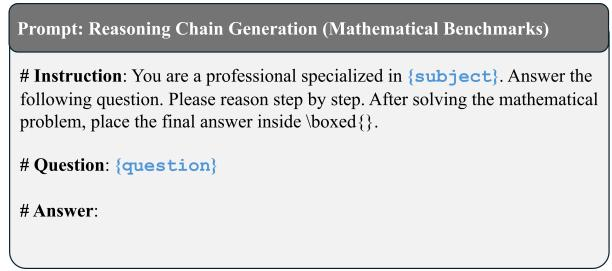  
Figure 7: Prompt used for mathematical reasoning problems.

<table><tr><td>Dataset</td><td>Domain</td><td>Answer Format</td><td># Samples</td><td>License</td></tr><tr><td colspan="5">Mathematical Reasoning</td></tr><tr><td>MATH Train</td><td>Math reasoning</td><td>Arabic number</td><td>7,500</td><td>MIT License</td></tr><tr><td>MATH500</td><td>Math reasoning</td><td>Arabic number</td><td>500</td><td>MIT License</td></tr><tr><td>AMC23</td><td>Math competition</td><td>Arabic number</td><td>50</td><td>Apache License 2.0</td></tr><tr><td>AIME2024</td><td>Math competition</td><td>Arabic number</td><td>30</td><td>CC BY-NC-SA 4.0</td></tr><tr><td>AIME2025</td><td>Math competition</td><td>Arabic number</td><td>30</td><td>CC BY-NC-SA 4.0</td></tr><tr><td colspan="5">Scientific Reasoning</td></tr><tr><td>GPQA-Diamond</td><td>STEM QA</td><td>Option (A-D)</td><td>198</td><td>MIT License</td></tr><tr><td colspan="5">General-Domain Reasoning</td></tr><tr><td>MMLU-Pro</td><td>Multi-domain QA</td><td>Option (A-J)</td><td>12,032</td><td>MIT License</td></tr></table>

Table 2: Dataset statistics and license information. The # Samples column denotes the number of questions used in our experiments.

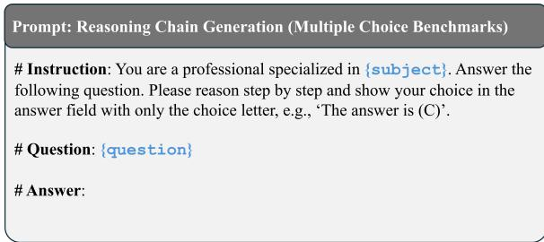  
Figure 8: Prompt used for multiple-choice problems.

## B Motivation Analysis on Entropy-Difficulty Relationship

We further examine whether the relationship between entropy and problem difficulty observed in §2 is not limited to a specific model, but appears consistently across diverse models. To this end, in addition to Qwen2.5-7B used in the main text, we conduct the same experiment on Qwen2.5-3B, Qwen2.5-14B, and Gemma-3-4B. For each model, we generate 40 reasoning chains for 7,500 problems from the MATH training set and measure the number of unique answers according to the difficulty level of each problem. We further analyze the results separately for correct and incorrect cases.

Figure 9 shows the results for Qwen2.5-3B, Qwen2.5-14B, and Gemma-3-4B. Across all models, we consistently observe that (1) incorrect cases exhibit higher answer diversity than correct cases, and (2) the number of unique answers gradually increases as the difficulty level of the problem increases. These results suggest that, regardless of model size or architecture, the diversity of the output distribution is closely associated with problem

difficulty.

## C Detailed Experimental Setup

Datasets. In this study, we use several benchmarks to evaluate mathematical reasoning, STEMbased question answering, and general-domain reasoning abilities across diverse academic fields. Table 2 summarizes the domain, answer format, number of evaluation samples, and license information for each dataset used in this work.

Implementation Details. To construct the dataset for training the probe, we generate 40 reasoning paths for each of the 7,500 samples in the MATH training split. To obtain diverse reasoning paths, we set both temperature and top-p to 1.0. During inference, we use temperature 0.7 and top-p 0.95 for more stable generation, and conduct all experiments with a single run. We set the stopping threshold of AC to 0.95 and the window size of ESC to 5. For DSC, we follow the original settings, except that we adjust the judge window size to 24.

## D Case Study

Figure 13 illustrates the difference between DSC and FSC in dynamically allocating inference paths. Figure 13a shows that when a relatively easy problem, such as one from MATH500 (Level 1), is given as input, all inference paths in SC converge to the same answer. Although this indicates that the problem is sufficiently easy from the model’s perspective, DSC incorrectly judges it as difficult and unnecessarily allocates four inference paths. In contrast, FSC accurately predicts the difficulty of the input problem using a probe, thereby substantially improving token efficiency while using only one inference path.

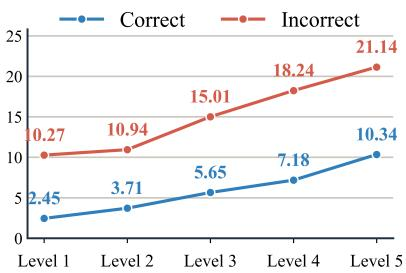  
(a) Qwen2.5-3B

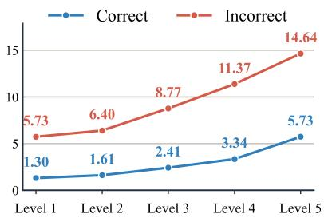  
(b) Qwen2.5-14B

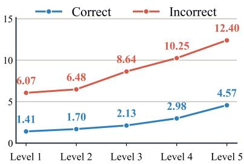  
(c) Gemma-3-4B  
Figure 9: Answer diversity across models. All models show increasing answer diversity as problem difficulty increases, particularly for incorrect predictions, supporting the use of output entropy as a continuous difficulty signal.

This trend is also observed for difficult problems, as shown in Figure 13b. Even for challenging problems such as those from AIME2025, FSC continuously estimates the difficulty perceived by the model and allocates fewer inference paths than DSC, thereby maximizing efficiency.

## E Use of AI Tools

AI tools were used only for limited supportive purposes during the preparation of this manuscript. Specifically, AI tools such as OpenAI’s ChatGPT were used to assist with translation, improve the clarity and fluency of the writing, and explore related keywords and expressions. However, the core ideas, methodological design, experimental implementation, result analysis, and final interpretations of this study were all independently conducted by the authors. In addition, all cited references included in this paper were directly verified by the authors, and no references were added solely based on content generated by AI tools.

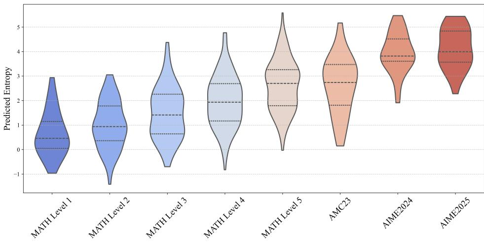  
(a) Qwen2.5-3B

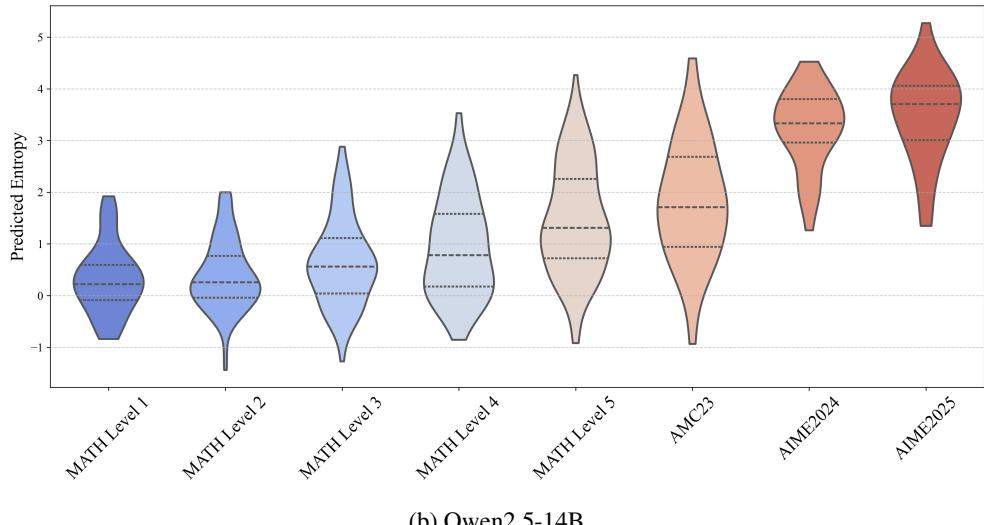  
(b) Qwen2.5-14B

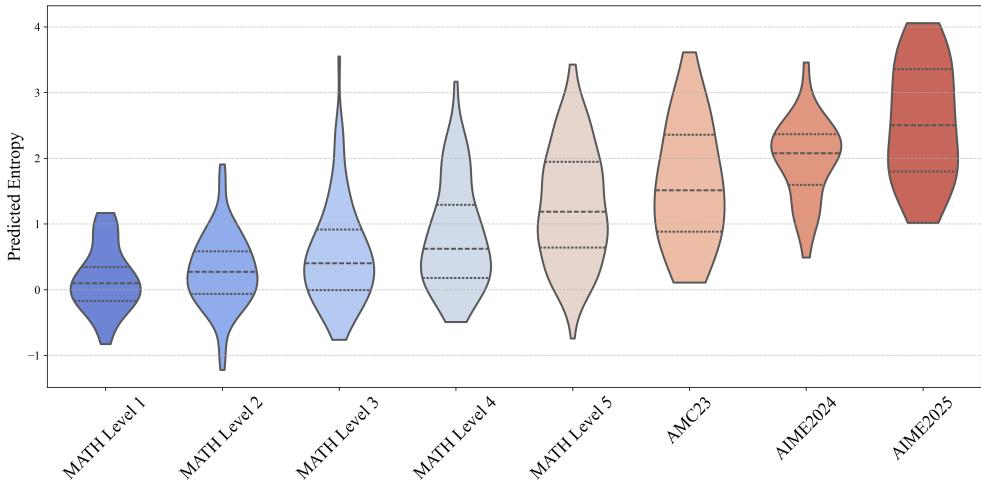  
(c) Gemma-3-4B  
Figure 10: Entropy distributions predicted by the probe across difficulty levels for various models.

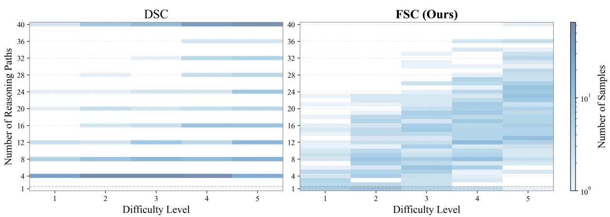  
(a) Qwen2.5-3B

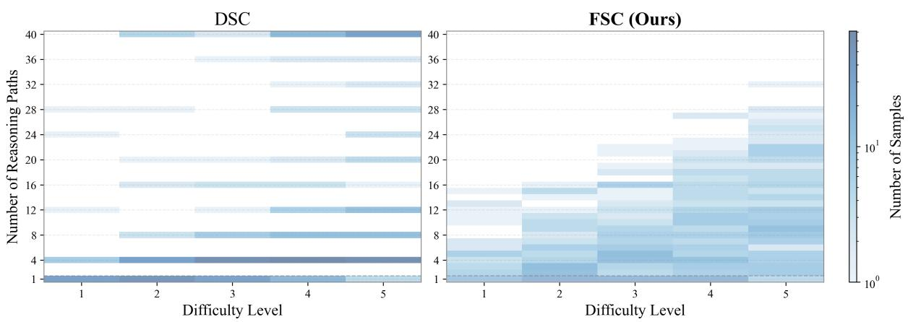  
(b) Qwen2.5-14B

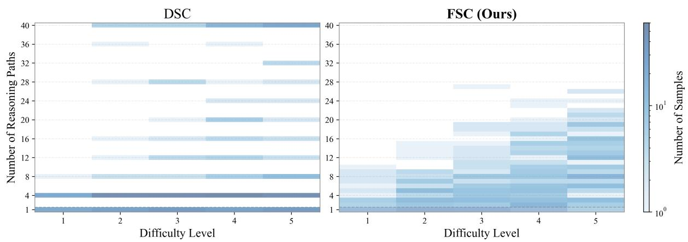  
(c) Gemma-3-4B  
Figure 11: Distribution of the number of reasoning paths across difficulty levels for various models.

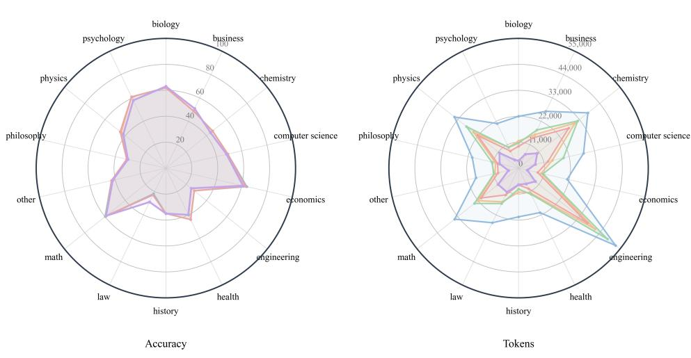

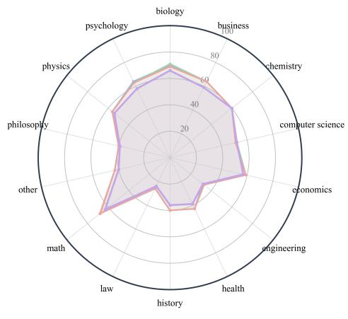

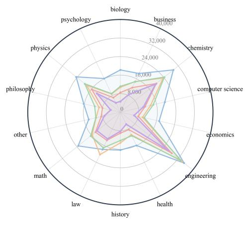  
(a) Qwen2.5-3B

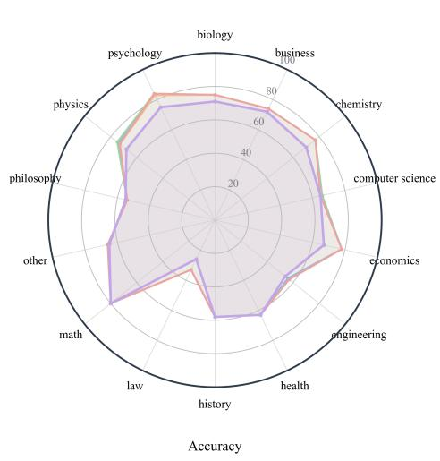

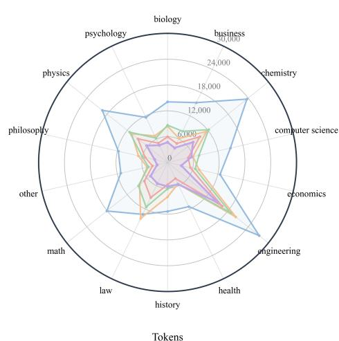  
(b) Qwen2.5-14B  
(c) Gemma-3-4B  
Figure 12: Token efficiency comparison on MMLU-Pro across different models. Panels compare FSC and baseline methods on Qwen2.5-3B, Qwen2.5-14B, and Gemma-3-4B, showing that FSC maintains strong token efficiency across model scales and architectures.

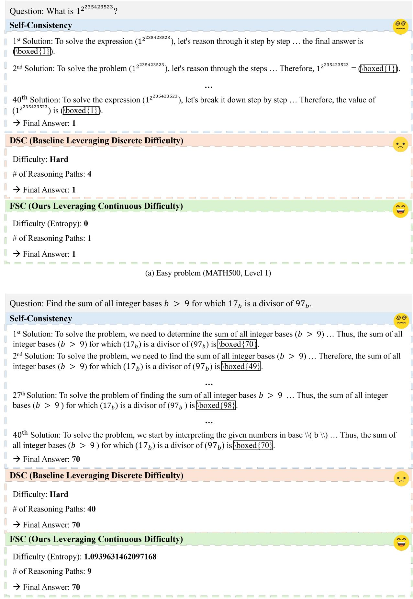  
(b) Challenging problem (AIME2025)  
Figure 13: Comparison of DSC and FSC on mathematical problems.