# Linear Probing Provides Robust and Efficient Detection of Machine-Generated Text

Gerrit Quaremba¹, Hanqi Yan¹, Elizabeth Black1, Denny Vrandečić2, Elena Simperl¹ 1King's College London, 2Wikimedia Foundation

{gerrit.quaremba,hanqi.yan,elizabeth.black,elena.simperl}@kcl.ac.uk denny@wikimedia.org

## Abstract

Distinguishing machine-generated text (MGT) from human-written text (HWT) becomes increasingly important due to potential misuse. However, most supervised detectors often degrade out-of-domain (OOD) and require large, diverse training sets. In this work, we analyze the linearity and quality of MGT representations and show that simple linear probes outperform a wide range of detectors while being substantially more sample-efficient. We first show that MGT and HWT latent representations are linearly separable in low-dimensional space, and provide a plausible explanation for this separability through systematic differences in their representation quality. Motivated by these insights, we train two variants of simple linear probes and evaluate them across 4 benchmarks against 16 baselines. Probes consistently improve OOD detection (+11 AUC), requiring solely <100 samples to reach nearpeak performance. We show that this transferability arises because probes recover a shared latent MGT direction that generalizes across diverse settings. Finally, we demonstrate that probing vectors capture a continuous spectrum of "machineness", highlighting their potential for fine-grained estimation of AI-edited text. Overall, our work provides insights into latentspace differences between MGT and HWT and demonstrates the potential of linear probes as as robust and sample-efficient MGT detectors. We release our code on github.

## 1 Introduction

Large language models (LLMs) now generate human-like text at scale, and their output has spread rapidly across platforms such as social media (Sun et al., 2025) or academic writing (Liang et al., 2024). This proliferation raises the risk of potential misuse, including misinformation campaigns (Goldstein et al., 2023) or plagiarism (Hutson, 2024). In response, a growing line of work builds detectors that separate machinegenerated text (MGT) from human-written text (HWT) (Crothers et al., 2023; Wu et al., 2025a).

Prior work groups MGT detectors into two families (Wu et al., 2025a): zero-shot methods (e.g., Hans et al., 2024; Bao et al., 2023) and supervised classifiers (e.g., Hu et al., 2023; Verma et al., 2024).1 While supervised approaches dominate recent benchmarks (Macko et al., 2025; Quaremba et al., 2026), their practical utility remains limited: they often generalize poorly to out-of-domain (OOD) settings (Wu et al., 2025a; Doughman et al., 2025) and require large, diverse training corpora (Hu et al., 2023). Additionally, a recent line of work leverages how LLMs rewrite machine- versus human-written text differently (Mao et al., 2024; Wu et al., 2025b), but adds substantial overhead from generating rewrites.

A promising direction for overcoming these limitations lies in the Linear Representation Hypothesis (LRH) (Park et al., 2023), which posits that highlevel concepts are encoded as linear directions in latent space. Recent work has identified such directions for concepts including truth (Marks and Tegmark, 2024) or political ideology (Kim et al., 2025). This raises a natural question: Are machineand human-written text linearly separable in latent space, and if so, why? How can we exploit this structure for enhanced MGT detection?

In this work, we empirically study the latent geometry of HWT and MGT and show that simple linear probes are sufficient to improve the robustness and sample efficiency of MGT detection. We begin by visualizing that HWT and MGT are largely linearly separable in low-dimensional space, which we corroborate by reduced detection performance when increasing the complexity of nonlinear probes (§3.1). We then investigate why this linearity emerges by analyzing both populations with four representation quality metrics (Skean et al., 2025): compared to HWT, MGT representations collapse into a compressed, more anisotropic, and lower-dimensional subspace (§3.2). These systematic differences provide a plausible explanation for why a simple hyperplane can effectively separate the two in latent space.

Leveraging these insights, we train MGT probes: simple linear probes (Alain and Bengio, 2016; Nanda et al., 2023) on frozen LM representations to detect MGT. We consider two variants: layer-wise probes and a single probe trained on representations concatenated across layers. Crucially, both variants operate on PCA-reduced features, retaining only 2.4% of the original dimensions with minimal performance loss. The resulting probing vector defines a linear “machineness" direction in latent space, which we use for detection by projecting test activations onto it (Tigges et al., 2024). Across 4 benchmarks spanning 16 evaluation settings and compared against 16 baseline detectors, MGT probes improve in-domain detection by up to 18 AUC (§5.2) and 11 AUC OOD (§5.3).

To explain this strong generalization, we analyze probing vectors learned across diverse datasets and settings. We find that the vectors are highly aligned, indicating that probes recover a shared latent MGT direction (§5.4). Moreover, probes achieve strong performance with only 10–100 training samples and exhibit substantially lower sampling uncertainty than training-based baselines (§5.5). Together, our findings suggest that MGT is encoded as a compact, shared, and linearly accessible direction in latent space. This allows simple linear probes to generalize better while requiring fewer examples than more complex supervised detectors.

Lastly, we examine whether probing vectors can serve as a continuous measure of AI editing in text (Zhang et al., 2024) (§5.6). We find strong correlations between probe projection scores and edit-strength metrics (Saha and Feizi, 2025), meaning that more extensively AI-edited text is projected closer to the MGT subspace. This finding suggests that the latent MGT direction encodes a continuous spectrum of “machineness," which can be leveraged for fine-grained estimation of AI-edited text.

Our contributions are threefold:

1. We find that human- and machine-written text are linearly separable in latent space and explain this separability through systematic differences in their representation geometry.

2. We introduce two simple linear probe variants that recover this latent direction, improving OOD generalization over supervised detectors (+11 AUC) while exhibiting greater reliability and requiring only 10–100 training examples.

3. We show that the learned MGT direction encodes a continuous spectrum of “machineness," enabling fine-grained estimation of AI editing strength through probe projection scores.

## 2 Related Work

Linear Representation Hypothesis (LRH) Recent work has provided growing support for the LRH, which posits that high-level concepts are represented as linear directions in latent space (Park et al., 2023). Various studies have successfully used linear probing to identify concepts such as spatial reasoning (Nanda et al., 2023), truth (Marks and Tegmark, 2023), sentiment (Tigges et al., 2024), or political ideology (Kim et al., 2025). To identify probing vectors, one typically construct a contrastive dataset containing positive and negative instances of the concept of interest (e.g., MGT and HWT). Common approaches for identifying probing directions include difference-in-means (Belrose, 2023) and linear probes (Alain and Bengio, 2016). The resulting probing vector represents the concept as a linear direction in activation space and can be used for detection, interpretation, or representation steering (Zou et al., 2025).

MGT Detectors MGT detectors can be broadly categorized as zero-shot or supervised methods (Wu et al., 2024). Zero-shot detectors are training-free and typically exploit discriminative differences in token probabilities (Bao et al., 2023; Su et al., 2023; Hans et al., 2024) or leverage the observation that LLMs rewrite MGT and HWT differently (Wu et al., 2025b; Zhu et al., 2023a; Yang et al., 2024). Most supervised detectors formulate MGT detection as a binary classification task and train machine-learning classifiers (Hu et al., 2023; Guo et al., 2024; Mao et al., 2024; Thai et al., 2026). Compared to prior latent-representation-based detectors, our approach operates directly on activations rather than a single intrinsic-dimensionality feature (Tulchinskii et al., 2023), uses linear probes across layers rather than a single-layer nonlinear classifier (Yu et al., 2024), and learns probes in a low-dimensional space rather than identifying directions in a training-free manner in the full representation space (Chen et al., 2025). We review current MGT detectors and provide a detailed comparison with related work in Appendix B.

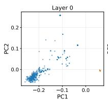

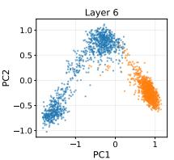

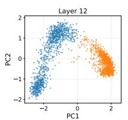

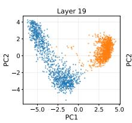

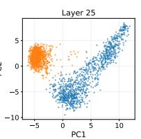

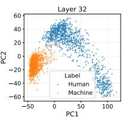  
Figure 1: Projections of Wikipedia human- and machine-text hidden states onto the first two principal components across layers. Takeaway: Machine- and human-text representations become linearly separable as early as layer 6, and this separation remains consistent through the final layers. Appendix A confirms the same pattern across other domains.

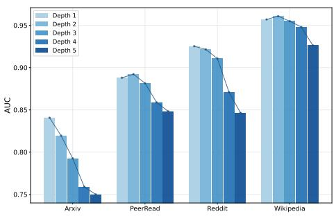

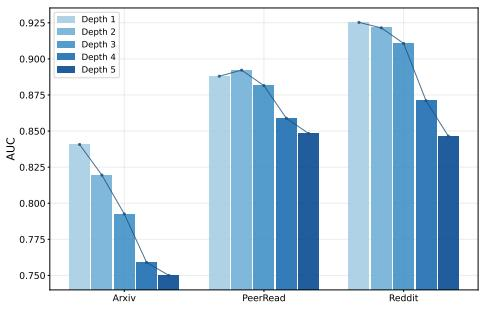  
Figure 2: In-domain (top) and OOD (bottom) AUC scores for probing middle-layer representations with MLPs of increasing levels of non-linearity. Takeaway: Increasing model complexity consistently reduces performance, supporting the hypothesis that machine- and human-text representations are linearly separable in latent space.

## 3 On the Separability and Quality of MGT Representations

In this section, we first examine the linear separability of HWT and MGT representations (§3.1) and then analyze their representation quality to characterize their latent-space differences (§3.2). We conduct all analyses on the Wikipedia subset of M4GT (Wang et al., 2024) using L1ama-8B (Grattafiori et al., 2024) as the backbone model. Appendix A.2 shows that our findings gen-

eralize across domains.

## 3.1 Linear Separability

We begin by asking: Are HWT and MGT linearly separable in latent space? While prior work has shown that linear classifiers can work (Tulchinskii et al., 2023; Chen et al., 2025),² it remains unclear whether the underlying decision boundary is truly linear or whether more complex nonlinear boundaries are required.

MGT and HWT are linearly separable in low-dimensional latent spaces. Figure 1 visualizes residual stream activations of MGT and HWT across layers, projected onto the first two principal components. While the two distributions overlap in the first layer, they become clearly linearly separable as early as layer 6. This separation remains remarkably stable throughout the remaining layers. Appendix Figure 8 further shows that each domain and generator forms distinct local subspaces, within which HWT and MGT remain linearly separable.

To test whether the decision boundary is indeed linear, we train MLP probes of increasing complexity on mid-layer representations to predict MGT (Gurnee and Tegmark, 2024). If nonlinear structure were important for detection, deeper classifiers should improve performance. Instead, Figure 2 shows that detection performance deteriorates as nonlinearity increases in both ID and OOD settings. Our findings empirically support that MGT and HWT are separated by a predominantly linear decision boundary in latent space.

## 3.2 Representation Quality

Yet, it remains unclear which representational differences make this linear separation possible. We therefore ask: How do HWT and MGT differ in latent space? To this end, we analyze their latent representations from the perspective of information content (Entropy, Effective Rank) and geometric structure (Anisotropy, Intrinsic Dimension) representation quality metrics (Skean et al., 2025): (1) Entropy (Sanchez Giraldo et al., 2015) measures how much information a representation contains; (2) Effective Rank (Roy and Vetterli, 2007) quantifies the amount of non-redundant information in a representations; (3) Anisotropy (Razzhigaev et al., 2024) measures the degree to which activations concentrate along specific directions in latent space; and (4) Intrinsic Dimension (Facco et al., 2017) estimates the minimum number of dimensions required to describe the geometric structure of representations. Appendix A.1 provides additional intuition and formulae.

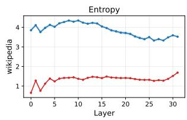

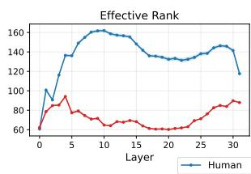

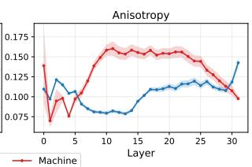

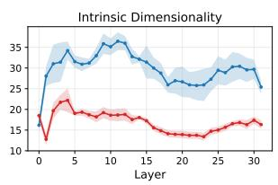  
Figure 3: Representation-quality metrics for human and machine latent representations from the perspectives of information content (Entropy, Effective Rank) and geometric structure (Anisotropy, Intrinsic Dimensionality). Takeaway: Machine-text representations are more compressed, concentrated along fewer dominant directions, and located on simpler manifolds than human-written text representations. These structural differences help explain why the two are linearly separable in latent space.

MGT representations are more compressed, while HWT representations contain richer and more diverse features. Figure 3 plots representation-quality metrics across layers for HWT and MGT activations. The informationtheoretic metrics (Entropy and Effective Rank) capture how broadly information is distributed across representations. Higher values indicate that variance is spread across many dimensions, whereas lower values indicate that information collapses into fewer dominant components. Across layers, HWT exhibits substantially higher entropy than MGT, suggesting that human-written text activates a broader and less redundant set of features. In contrast, MGT has much lower entropy, indicating a more compressed representation in which activations carry less diverse information. With the same pattern appearing for Effective Rank, both metrics suggest that MGT representations occupy a more information-compressed subspace, while HWT retains richer, more heterogeneous latent features.

MGT occupies a narrower and lowerdimensional activation geometry than HWT.

The geometric metrics (Anisotropy and Intrinsic Dimension) characterize the shape of activation distributions. Higher anisotropy indicates that representations align strongly with a small number of dominant directions, whereas higher intrinsic dimensionality indicates that more dimensions are required to capture their local structure. Across most middle and later layers, MGT activations are more anisotropic than HWT activations, suggesting that MGT concentrates along a narrower set of directions in latent space. At the same time, MGT exhibits consistently lower intrinsic dimensionality, indicating that its representations lie on a simpler, lower-dimensional manifold. HWT shows the opposite pattern: lower anisotropy and higher intrinsic dimensionality suggest that its activations are more uniformly distributed and occupy a more complex manifold. This finding is consistent with prior work reporting lower intrinsic dimensionality for MGT (Tulchinskii et al., 2023). We further show that this structure emerges systematically across layers and remains consistent across diverse domains.

Takeaway Our linearity and representation analyses support three takeaways: (1) HWT and MGT representations are linearly separable in lowdimensional latent space beginning early layers; (2) information-content metrics show that MGT representations are more compressed, whereas HWT representations are richer and more diverse; and (3) geometric metrics show that MGT representations occupy a narrower, more anisotropic, and lower-dimensional manifold, whereas HWT spans a broader and more complex region of activation space. These structural differences provide a plausible explanation of why simple linear MGT detectors likely are sufficient and effective in latent space.

## 4 Methodology

The linear separation between MGT and HWT representations, driven by systematic distributional differences in latent space, motivates the use of MGT probes. Drawing on the interpretability literature (Alain and Bengio, 2016; Belinkov, 2022; Li et al., 2023), these probes are simple linear classifiers trained on frozen hidden-state activations to identify MGT. We consider two variants: a Layer-Averaged Linear Probe (LLP), which trains one linear probe per layer and averages predictions (Nordby et al., 2026); and a Concatenated-Layer Linear Probe (CLP), which trains a single linear probe on the concatenation of hidden states.

Preliminaries Let $x _ { i } = ( x _ { 1 } , \dots , x _ { T _ { i } } )$ denote an input sequence of length $T _ { i }$ . An LLM processes $x _ { i }$ through L transformer layers and produces a hidden state $\mathbf { h } _ { i , t } ^ { ( \ell ) } ~ \in ~ \mathbb { R } ^ { d }$ for each token position $t \in \{ 1 , \dots , T _ { i } \}$ and layer $\ell \in \{ 1 , \ldots , L \}$ , where d is the hidden-state dimension. Given a binary MGT dataset, we extract the last-token hidden state from each layer, yielding the probing dataset $\mathcal { D } _ { \mathrm { p r o b e } } =$ $\{ ( \{ \mathbf { h } _ { i } ^ { ( \ell ) } \} _ { \ell = 1 } ^ { L } , y _ { i } ) \} _ { i = 1 } ^ { N }$ , where $y _ { i } \in \{ 0 , 1 \}$ indicates whether an instance is machine-generated $( y _ { i } = 1 )$

As Section 3 shows that MGT and HWT representations are linearly separable in lowdimensional spaces, we train our MGT probes on PCA-reduced activations. Specifically, for each layer, we fit PCA on the training activations and project them onto the top 100 principal components. With Llama-3-8B (Grattafiori et al., 2024) as the base model, this reduces the representation dimensionality to $1 0 0 / 4 0 9 6 \approx 2 . 4 \%$ of the original space.

We ablate this choice in Appendix D. Probe performance with and without PCA is nearly identical, indicating that PCA does not drive linear separability.

Layer-Averaged Linear Probe (LLP) We train an independent logistic regression classifier $f ( \cdot )$ for each layer l:

$$
\operatorname* { m i n } _ { \mathbf { w } ^ { ( \ell ) } } \frac { 1 } { N } \sum _ { i = 1 } ^ { N } \mathcal { L } \left( y _ { i } , f ( \mathbf { h } _ { i } ^ { ( \ell ) } ; \mathbf { w } ^ { ( \ell ) } ) \right) + \lambda \| \mathbf { w } ^ { ( \ell ) } \| _ { 2 } ^ { 2 } .\tag{1}
$$

where λ controls regularization and $\mathcal { L }$ is the binary cross-entropy loss.

After training, we normalize the weight vector $\begin{array} { r } { \mathbf { v } ^ { ( \ell ) } = \frac { \mathbf { w } ^ { ( \ell ) } } { \left\| \mathbf { w } ^ { ( \ell ) } \right\| _ { 2 } } , } \end{array}$ which defines the probing vector for layer l. Intuitively, $\mathbf { v } ^ { ( \ell ) }$ captures the linear direction in activation space that separates MGT from HWT (Gurnee and Tegmark, 2024).

At inference time, we pass a test instance $x _ { \mathrm { t e s t } }$ through the LLM, extract its last-token hidden state $\mathbf { h } _ { \mathrm { t e s t } } ^ { ( \ell ) }$ at each layer, and project it onto the corresponding probing direction: $s _ { \mathrm { t e s t } } ^ { ( \ell ) } { = } \mathbf { h } _ { \mathrm { t e s t } } ^ { ( \ell ) } \stackrel { \top } { \mathbf { v } } ^ { ( \ell ) }$ (Tigges et al., 2024). This projection measures how strongly the hidden state points in the MGT direction identified by the probe. We then compute the final LLP score by averaging the layer-wise projection scores: $s _ { \mathrm { L L P } } ( x _ { \mathrm { t e s t } } )$ 二 $\begin{array} { r } { \frac { 1 } { L } \sum _ { \ell = 1 } ^ { L } s _ { \mathrm { t e s t } } ^ { ( \ell ) } } \end{array}$ Higher scores indicate stronger alignment with the MGT direction, and vice versa.

Concatenated-Layer Linear Probe (CLP) We also train a single linear probe on the concatenation of hidden states across layers. For each input $x _ { i } ,$ we construct $\mathbf { h } _ { i } ^ { \mathrm { c o n c a t } } = \left\lceil \mathbf { h } _ { i } ^ { ( 1 ) } ; \dots ; \mathbf { h } _ { i } ^ { ( L ) } \right\rceil \in \mathbb { R } ^ { L \times 1 0 0 }$ which we use to train the same classifier as in Equation 1 and perform inference analogously. Compared to LLP, CLP learns a single MGT probe vector that jointly identifies the most informative layers and the within-layer directions that encode MGT signals.

## 5 Experiments

## 5.1 Experimental Setup

We provide full details on the benchmarks, detectors, and implementations in Appendix B.

Benchmarks We evaluate detectors on 4 benchmarks, each comprising 4 subsets that capture different dimensions of MGT. We use DetectRL (Wu et al., 2024) to study domains (e.g., Reddit), Multi-Social (Macko et al., 2025) to analyze languages (e.g., Chinese), RAID (Dugan et al., 2024) to different generators (e.g., GPT4), and TSM (Quaremba et al., 2026) to examine generation tasks (e.g., summarization). For each of the 16 subsets, we randomly sample 1,500 training instances and 500 test instances, balanced across labels. Within each benchmark, the sampled data vary along additional dimensions (e.g., domains include multiple generators and adversarial attacks), resulting in more realistic and challenging detection settings.

Baselines We include 16 competitive MGT detectors. For zero-shot detectors we include Log-Likelihood (Solaiman et al., 2019), LLR (Su et al., 2023), Rank (Gehrmann et al., 2019), GEC-Score (Wu et al., 2025b), Revise (Zhu et al., 2023a),

<table><tr><td></td><td colspan="4">DetectRL (Wu et al., 2024)</td><td colspan="4">MultiSocial (Macko et al., 2025)</td><td colspan="4">RAID (Dugan et al., 2024)</td><td colspan="4">TSM (Quaremba et al., 2026)</td></tr><tr><td>Model</td><td>ArXiv</td><td>Reddit</td><td>Yelp</td><td>News</td><td>en de</td><td>ru</td><td>zh</td><td></td><td>Cohere</td><td>GPT4</td><td>Llama</td><td>Mistral</td><td>FP</td><td>PE</td><td>SUM</td><td>TST</td></tr><tr><td colspan="10"></td><td></td><td></td><td></td><td></td><td></td><td></td><td></td></tr><tr><td>Likelihood</td><td>0.6534</td><td>0.8620</td><td>0.8852</td><td>0.5793</td><td>0.7902</td><td>0.6935</td><td>0.6720</td><td>0.5848</td><td>0.7025</td><td>0.6937</td><td>0.7867</td><td>0.7339</td><td>0.5214</td><td>0.4344</td><td>0.5045</td><td>0.5096</td></tr><tr><td>LLR</td><td>0.7317</td><td>0.8226</td><td>0.8660</td><td>0.5965</td><td>0.7759</td><td>0.7130</td><td>0.6333</td><td>0.6500</td><td>0.7577</td><td>0.7212</td><td>0.8406</td><td>0.8091</td><td>0.5025</td><td>0.4130</td><td>0.5147</td><td>0.5107</td></tr><tr><td>Rank</td><td>0.5727</td><td>0.3702</td><td>0.3016</td><td>0.6061</td><td>0.2141</td><td>0.2942</td><td>0.3506</td><td>0.3846</td><td>0.3768</td><td>0.3217</td><td>0.2223</td><td>0.2600</td><td>0.5203</td><td>0.5561</td><td>0.4634</td><td>0.4886</td></tr><tr><td>GECScore</td><td>0.7848</td><td>0.5631</td><td>0.6283</td><td>0.7065</td><td>0.8057</td><td>0.6714</td><td>0.6133</td><td>0.4374</td><td>0.6655</td><td>0.4620</td><td>0.5497</td><td>0.6642</td><td>0.5459</td><td>0.5168</td><td>0.6678</td><td>0.5445</td></tr><tr><td>Revise</td><td>0.8527</td><td>0.7535</td><td>0.7917</td><td>0.7710</td><td>0.7740</td><td>0.6409</td><td>0.6835</td><td>0.6377</td><td>0.7364</td><td>0.6230</td><td>0.6676</td><td>0.7536</td><td>0.5726</td><td>0.5688</td><td>0.6261</td><td>0.5760</td></tr><tr><td>RAIDAR</td><td>0.8566</td><td>0.5395</td><td>0.7158</td><td>0.8490</td><td>0.8131</td><td>0.7943</td><td>0.6446</td><td>0.9153</td><td>0.8454</td><td>0.7234</td><td>0.7682</td><td>0.8444</td><td>0.6883</td><td>0.6706</td><td>0.7377</td><td>0.6729</td></tr><tr><td>FastDetectGPT</td><td>0.8563 0.9393</td><td>0.6969</td><td>0.8304</td><td>0.6842</td><td>0.7850</td><td>0.7185</td><td>0.6500</td><td>0.6251</td><td>0.8922</td><td>0.7441</td><td>0.8221</td><td>0.7752</td><td>0.5060</td><td>0.4347</td><td>0.6082</td><td>0.4963</td></tr><tr><td>Binoculars</td><td></td><td>0.9423</td><td>0.9661</td><td>0.8682</td><td>0.8082</td><td>0.7473</td><td>0.7118</td><td>0.7428</td><td>0.9312</td><td>0.8960</td><td>0.9490</td><td>0.9207</td><td>0.5668</td><td>0.4930</td><td>0.6294</td><td>0.5429</td></tr><tr><td colspan="10">Supervised</td><td colspan="7"></td></tr><tr><td>EditLens</td><td>0.6732</td><td>0.4702</td><td>0.5050</td><td>0.3088</td><td>0.6769</td><td>0.7164</td><td>0.7510</td><td>0.6432</td><td>0.6532</td><td>0.5239</td><td>0.5835</td><td>0.5707</td><td>0.5840</td><td>0.6991</td><td>0.6092</td><td>0.6313</td></tr><tr><td>ID</td><td>0.7251</td><td>0.5616</td><td>0.6996</td><td>0.7681</td><td>0.5487</td><td>0.4998</td><td>0.5793</td><td>0.4900</td><td>0.5383</td><td>0.4832</td><td>0.5075</td><td>0.5280</td><td>0.5513</td><td>0.4715</td><td>0.5916</td><td>0.5312</td></tr><tr><td>OpenAI-RoBERTa</td><td>0.8357</td><td>0.7954</td><td>0.8101</td><td>0.7889</td><td>0.4683</td><td>0.3427</td><td>0.6985</td><td>0.4464</td><td>0.6855</td><td>0.5972</td><td>0.7070</td><td>0.7111</td><td>0.4483</td><td>0.5074</td><td>0.4309</td><td>0.5633</td></tr><tr><td>RADAR</td><td>0.9876</td><td>0.8733</td><td>0.9572</td><td>0.9976</td><td>0.6904</td><td>0.4682</td><td>0.3317</td><td>0.3392</td><td>0.8531</td><td>0.8689</td><td>0.8883</td><td>0.8896</td><td>0.5736</td><td>0.6302</td><td>0.4725</td><td>0.6192</td></tr><tr><td>RepreGuard</td><td>0.8960</td><td>0.9700</td><td>0.9780</td><td>0.9580</td><td>0.7060</td><td>0.6920</td><td>0.6400</td><td>0.7840</td><td>0.6020</td><td>0.7820</td><td>0.8920</td><td>0.8140</td><td>0.5040</td><td>0.5300</td><td>0.6040</td><td>0.4980</td></tr><tr><td>BiScope</td><td>0.9923</td><td>0.9820</td><td>0.9838</td><td>0.9925</td><td>0.8789</td><td>0.8014</td><td>0.7779</td><td>0.7904</td><td>0.9203</td><td>0.8791</td><td>0.9715</td><td>0.9481</td><td>0.7513</td><td>0.6011</td><td>0.7969</td><td>0.7056</td></tr><tr><td>TextFluoroscopy</td><td>0.9948</td><td>0.9983</td><td>0.9951</td><td>0.9980</td><td>0.9313</td><td>0.9015</td><td>0.8810</td><td>0.9032</td><td>0.8832</td><td>0.9546</td><td>0.9692</td><td>0.9492</td><td>0.7058</td><td>0.3723</td><td>0.2781</td><td>0.4089</td></tr><tr><td>RoBERTa</td><td>1.0000</td><td>0.9996</td><td>0.9994</td><td>1.0000</td><td>0.9507</td><td>0.8649</td><td>0.7762</td><td>0.8471</td><td>0.9404</td><td>0.9669</td><td>0.9770</td><td>0.9814</td><td>0.9361</td><td>0.7539</td><td>0.9333</td><td>0.7924</td></tr><tr><td colspan="10">MGT Probes</td><td colspan="7"></td></tr><tr><td>LLP</td><td>1.0000</td><td>1.0000</td><td>1.0000</td><td>1.0000</td><td>0.9565</td><td>0.9337</td><td>0.9212</td><td>0.9443</td><td>0.9714</td><td>0.9925</td><td>0.9946</td><td>0.9928</td><td>0.9707</td><td>0.9424</td><td>0.9783</td><td>0.8960</td></tr><tr><td>∆ vs BL</td><td>+0.00</td><td>+0.04</td><td>+0.06</td><td>+0.00</td><td>+0.58</td><td>+3.22</td><td>+4.02</td><td>+2.90</td><td>+3.09</td><td>+2.55</td><td>+1.76</td><td>+1.14</td><td>+3.46</td><td>+18.85</td><td>+4.50</td><td>+10.35</td></tr><tr><td>CLP</td><td>1.0000</td><td>0.9999</td><td>0.9998</td><td>1.0000</td><td>0.9511</td><td>0.9196</td><td>0.9056</td><td>0.9510</td><td>0.9652</td><td>0.9909</td><td>0.9949</td><td>0.9872</td><td>0.9725</td><td>0.9196</td><td>0.9697</td><td>0.8905</td></tr><tr><td>∆ vs BL</td><td>+0.00</td><td>+0.04</td><td>+0.04</td><td>+0.00</td><td>+0.04</td><td>+1.81</td><td>+2.46</td><td>+3.57</td><td>+2.48</td><td>+2.39</td><td>+1.78</td><td>+0.58</td><td>+3.64</td><td>+16.57</td><td>+3.64</td><td>+9.80</td></tr></table>

Table 1: In-domain detection AUC scores across four benchmarks, comparing 16 baseline detectors (zero-shot and supervised) with MGT probes.Boldindicates the best score per column,underlinethe second-best score, and “∆ vs. BL”" the gain over the strongest baseline. LLP = Layer-Averaged Linear Probes; CLP = Concatenated-Layer Probes. For TSM, FP = First Paragraph, PE = Paragraph Extension, SUM = Summarization, and TST = Text Style Transfer. Takeaway: oth LLP and CLP consistently outperform all baselines by +0.04–18.85 AUC.

Raidar (Mao et al., 2024), FastDetectGPT (Bao et al., 2023), and Binoculars (Hans et al., 2024).

Fore supervised detectors we select EditLens (Thai et al., 2026), ID (Tulchinskii et al., 2023), OpenAI-RoBERTa (Solaiman et al., 2019), RADAR (Hu et al., 2023), RepreGuard (Chen et al., 2025), BiScope (Guo et al., 2024), TextFluoroscopy (Yu et al., 2024), and fully fine-tune RoBERTa-base (Liu et al., 2019).

Models and Metrics We implement probes with L1ama-3-8B (Grattafiori et al., 2024) as the base model³ and sklearn for the logistic regression with a L2 penalty of C=1. Following prior work (Bao et al., 2023; Hans et al., 2024) we report AUC as the evaluation metric.

## 5.2 In-domain (ID) Detection

Our findings in Section 3 suggest that simple linear probes may provide effective detection, we therefore begin by asking RQ1: How do MGT probes compare to MGT detectors in-domain?

MGT probes consistently outperform baselines across 16 in-domain settings by 0.04–18.85 AUC. Table 1 reports AUC results across 16 ID settings, comparing 16 detectors with our MGT probes. Both variants consistently outperform baselines, achieving gains of up to 18.85 AUC relative to the strongest detector. The near-identical performance of CLP and LLP suggests that a single probe trained on concatenated layer representations is sufficient for ID detection.

On DetectRL, baseline detectors exhibit nearsaturated performance despite the domain subsets containing text generated by multiple LLMs and subjected to diverse adversarial attacks (e.g., paraphrasing). As the benchmark provides little headroom for improvement, probes achieve only relatively limited gains.4 On MultiSocial, probes achieve the largest improvements over baselines on non-English languages (+1.81–4.02 AUC), suggesting that the learned probing directions are languageagnostic, for which we find support in OOD (§5.3) and probing vector experiments (§5.4). Across generators on RAID, probes show additional robust gains over already strong baselines (+0.58– 3.09 AUC). TSM presents the most challenging detection setting, where even supervised detectors struggle with mixed human-machine text (PE) and shorter texts containing only minor stylistic edits (TST). Nevertheless, MGT probes maintain strong performance, achieving the largest gains over baselines (+3.46–18.85 AUC).

<table><tr><td></td><td colspan="4">DetectRL (Wu et al., 2024)</td><td colspan="4">MultiSocial (Macko et al., 2025)</td><td colspan="4">RAID (Dugan et al., 2024)</td><td colspan="4">TSM (Quaremba et al., 2026)</td></tr><tr><td>Model ↓ / OOD →</td><td>ArXiv</td><td>Reddit</td><td>Yelp</td><td>News</td><td>en</td><td>de</td><td>ru</td><td>zh</td><td>Cohere</td><td>GPT4</td><td>Llama</td><td>Mistral</td><td>FP</td><td>PE</td><td>SUM</td><td>TST</td></tr><tr><td>TextFluoroscopy</td><td>0.7580</td><td>0.9054</td><td>0.8691</td><td>0.9402</td><td>0.8818</td><td>0.8423</td><td>0.8437</td><td>0.8212</td><td>0.8402</td><td>0.9296</td><td>0.9236</td><td>0.9478</td><td>0.4052</td><td>0.5629</td><td>0.4807</td><td>0.4747</td></tr><tr><td>BiScope</td><td>0.8641</td><td>0.8426</td><td>0.9289</td><td>0.8545</td><td>0.7568</td><td>0.6565</td><td>0.6995</td><td>0.5169</td><td>0.9039</td><td>0.8482</td><td>0.9594</td><td>0.9294</td><td>0.6923</td><td>0.5744</td><td>0.6867</td><td>0.6692</td></tr><tr><td>RepreGuard</td><td>0.5327</td><td>0.5967</td><td>0.7687</td><td>0.5187</td><td>0.5047</td><td>0.5460</td><td>0.5020</td><td>0.5020</td><td>0.7047</td><td>0.7553</td><td>0.7367</td><td>0.7673</td><td>0.5007</td><td>0.5227</td><td>0.5793</td><td>0.4873</td></tr><tr><td>RoBERTa</td><td>0.9108</td><td>0.8735</td><td>0.8491</td><td>0.7781</td><td>0.8511</td><td>0.7870</td><td>0.7784</td><td>0.6389</td><td>0.9118</td><td>0.9554</td><td>0.9688</td><td>0.9503</td><td>0.8324</td><td>0.7367</td><td>0.8452</td><td>0.7376</td></tr><tr><td>LLP</td><td>0.9830</td><td>0.9800</td><td>0.9897</td><td>0.9441</td><td>0.9321</td><td>0.8820</td><td>0.8945</td><td>0.8696</td><td>0.9267</td><td>0.9812</td><td>0.9908</td><td>0.9821</td><td>0.9513</td><td>0.8087</td><td>0.9512</td><td>0.8560</td></tr><tr><td>∆ vs BL</td><td>+7.22</td><td>+7.46</td><td>+6.08</td><td>+0.39</td><td>+5.03</td><td>+3.96</td><td>+5.08</td><td>+4.84</td><td>+1.49</td><td>+2.58</td><td>+2.20</td><td>+3.17</td><td>+11.89</td><td>+7.20</td><td>+10.60</td><td>+11.83</td></tr><tr><td>CLP</td><td>0.9807</td><td>0.9665</td><td>0.9867</td><td>0.9263</td><td>0.9087</td><td>0.8651</td><td>0.8759</td><td>0.8043</td><td>0.9200</td><td>0.9723</td><td>0.9839</td><td>0.9791</td><td>0.9317</td><td>0.7943</td><td>0.9152</td><td>0.8451</td></tr><tr><td>∆ vs BL</td><td>+6.99</td><td>+6.11</td><td>+5.78</td><td>-1.40</td><td>+2.69</td><td>+2.27</td><td>+3.22</td><td>-1.69</td><td>+0.82</td><td>+1.69</td><td>+1.51</td><td>+2.88</td><td>+9.93</td><td>+5.76</td><td>+7.01</td><td>+10.75</td></tr></table>

Table 2: OOD detection mean AUC scores across four benchmarks, comparing the four strongest detectors from Table 1 against MGT probes. OOD columns report the average transfer performance across the three remaining subsets within each benchmark (e.g., the ArXiv column averages Reddit → ArXiv, Yelp → ArXiv, and News → ArXiv).Boldindicates the best score per column,underlinethe second-best score, and “∆ vs. BL” the gain over the strongest baseline. Appendix Figure 10 presents the full OOD results. Takeaway: MGT probes exhibit strong OOD transferability, outperforming training-based detectors by +0.39–11.37 AUC on average.

## 5.3 Out-of-domain (OOD) Detection

If probes recover genuine MGT signals rather than dataset artifacts—a key limitation of existing supervised detectors (Doughman et al., 2025)– they should transfer OOD. RQ2: How well do MGT probes compare to existing detectors in OOD settings?

MGT probes preserve strong OOD transferability, outperforming training-based detectors by 0.39–11.37 AUC. Table 2 reports mean OOD AUC for each target subset not seen during training. Each column averages transfer performance from the three remaining subsets within the same benchmark. For example, the ArXiv column averages Reddit → ArXiv, Yelp → ArXiv, and News → ArXiv.5 As baselines, we include the strongest training-based detectors from Table 1. Overall, MGT probes transfer effectively across benchmark settings, improving over baselines by up to 11.83 AUC. LLP consistently exhibits more robust transfer performance than CLP.

On DetectRL, LLP exhibits strong OOD transferability across domains, outperforming baselines by 0.39–7.46 AUC. CLP achieves similarly strong transfer except on News, which we attribute to overfitting to stylistic cues associated with formal writing.6 On MultiSocial, LLP demonstrates consistent and reliable cross-lingual transfer, even between typologically distant languages (e.g., ru→zh). We interpret this finding as evidence for a languageagnostic MGT direction encoded across layers. In contrast, CLP exhibits weaker cross-lingual transfer and fails to generalize from ru→zh, suggesting that its globally learned representation is less robust for OOD transfer. As in the ID setting, baselines already perform strongly on RAID's cross-generator transfer. Nevertheless, both probes achieve modest but consistent improvements.

The largest gains occur in cross-task transfer, where probes outperform baselines by 5.76–11.89 AUC. Similar to the ID setting, supervised detectors struggle to generalize across tasks, particularly on PE and TST. Despite these challenges, both probes maintain strong performance, achieving AUC >0.80 in these difficult settings.

## 5.4 Probing Vector Similarity

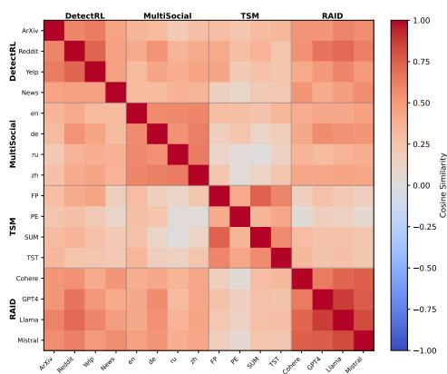  
Figure 4: Cosine similarities of probing vectors at layer 16 across all 16 datasets. Takeaway: Probing vectors exhibit high similarity both within and across datasets, suggesting the existence of a shared latent MGT direction.

To better understand the strong transferability of probes, we ask RQ3: Why do MGT probes generalize across OOD settings? Prior work has identified universal probing directions that can be recovered across settings (Agarwal et al., 2025; Wang et al., 2026). We therefore analyze the alignment of MGT probing vectors at the layer with the highest OOD

AUC performance (see Appendix Figure 15).

Probing vectors exhibit high withinbenchmark and moderate cross-benchmark similarity, suggesting a shared latent MGT direction. Figure 4 shows the pairwise cosine similarities of LLP probing vectors at layer 16 across all 16 evaluation subsets. We find that probing vectors are highly aligned within benchmarks and moderately aligned across benchmarks. This suggests that probes recover a relatively stable latent MGT direction, helping explain the strong OOD transfer observed in Table 2. Additionally, Appendix Figure 11 illustrates that latent human-machine directions are approximately parallel across subsets of DetectRL. Together, “machineness" appears to be encoded as a shared and therefore transferable linear direction in latent space.

## 5.5 Sample-efficiency Analysis

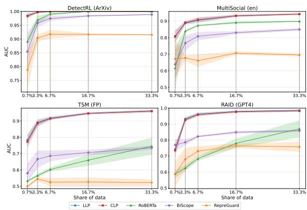  
Figure 5: In-domain AUC scores for selected datasets as a function of training set size. Takeaway: MGT probes achieve strong performance with only 10–100 training samples.

Given the probes' simplicity and the lowdimensional, linear MGT signal, we expect them to require fewer labeled examples than more complex detectors, hence RQ4: How sample-efficient are MGT probes compared to existing MGT detectors?

MGT probes achieve strong performance with only 10–100 training samples while exhibiting low sampling uncertainty. Figure 5 plots AUC as a function of training set size for one subset from each benchmark.7 To quantify sampling uncertainty, we repeat each experiment with different random seeds. Compared to the strongest baseline,

RoBERTa, both probes improve rapidly, reaching near-peak performance with only 3.3–6.7% of the training data (10–100 samples) before plateauing. Moreover, probes exhibit substantially lower sampling uncertainty than RepreGuard and RoBERTa, indicating that the latent MGT direction can be recovered reliably even in low-resource settings.

## 5.6 Detecting varying degrees of AI-editing

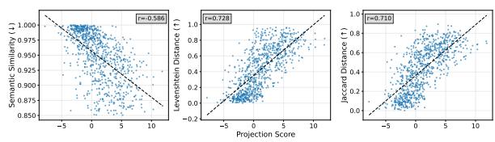  
(a) LLP

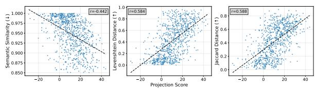  
(b) CLP  
Figure 6: Edit-strength metrics for samples from APT-Eval (Saha and Feizi, 2025) plotted against probe projection scores. The dashed line shows the linear regression fit, and r denotes the Pearson correlation coefficient. Takeaway: Projection scores correlate strongly with edit-strength metrics, suggesting that the latent MGT direction captures a continuous spectrum of “machineness."

While the previous experiments focus on binary detection, a growing body of work seeks to identify human-written text that has been edited by AI (Zhang et al., 2024). Probe projection scores provide a natural continuous measure of MGT, which raises RQ5: Do MGT probes encode finegrained signals of AI-polished text? To test this hypothesis, we use APT-Eval (Saha and Feizi, 2025) and EditLens (Thai et al., 2026), which contain AI-edited texts with varying degrees of edits. We correlate probe projection scores with three metrics that quantify the degree of AI editing (cosine similarity, Levenshtein and Jaccard distance) as in Saha and Feizi (2025).

Probe projection scores strongly correlate with the degree of AI editing, indicating that probing vectors capture fine-grained levels of AI-polished text. Figure 6 plots the text-similarity metrics against projection scores for LLP (top) and CLP (bottom). The dashed line shows a linear regression fit, and r denotes the Pearson correlation coefficient. LLP exhibits strong correlations across all similarity metrics, indicating that human text subjected to stronger AI editing is projected closer to the machine-text region of latent space. Crucially, this behavior emerges despite the probes being trained only with binary labels. In contrast, CLP shows only moderate correlations, which we attribute to the difficulty of capturing subtle AI edits in a joint space. These findings suggest that the latent MGT direction represents a continuous spectrum of “machineness," enabling fine-grained MGT detection beyond binary classification. Appendix Figure 14 shows similar results for EditLens.

## 6 Conclusion

In this work, we provide empirical evidence that machine-generated text (MGT) and human-written text occupy linearly separable regions in latent space, and offer a potential explanation through analyses of representation quality metrics. We further show that simple MGT probes—linear probes trained on LM hidden-state activations—achieve stronger OOD robustness while requiring fewer training samples than supervised detectors. Finally, we show that the continuous probing direction captures fine-grained levels of AI editing.

Overall, our findings suggest that “machineness" is encoded as a stable, continuous, and linearly accessible direction in activation space, enabling both robust detection and fine-grained estimation of AIedited text. Future work could explore alternative probing variants, investigate how these representations change under adversarial attacks, and further extend the approach to AI-edited text detection.

## Limitations

Non-Exhaustive Analysis of Representational Differences We analyze HWT and MGT representations using four representation-quality metrics. However, these metrics capture only selected information-theoretic and geometric properties of latent representations, and therefore provide a nonexhaustive view of their distributional differences. While the observed differences help explain the existence of a linear decision boundary, other important representational properties may also contribute to the separation between HWT and MGT. Nevertheless, our analysis offers an initial characterization of how human- and machine-written text differ in latent space.

Model Selection Although we ablate probe performance across model architectures and sizes, we do not systematically study how detection performance scales with model size or architectural design choices. Future work could investigate these factors in greater depth and analyze how they influence the emergence and transferability of MGT signals.

Linear Probing Variants We focus on the simplest probe architecture: logistic regression. Prior work has proposed more expressive alternatives, including attention-based probes and learned pooling strategies, which may recover richer MGT signals. Exploring such probe variants represents a promising direction for future research.

Universality of the Latent MGT Direction Although our results show that MGT and HWT are linearly separable and that linear probes transfer effectively across OOD settings, they do not establish the existence of a universal latent MGT direction. Representation spaces contain many potential confounding factors, and probing provides only one method for identifying latent concepts. Future work should further investigate the stability, causality, and universality of MGT directions across models and data distributions.

Fine-Grained Detection of AI-Edited Text While we show that probe projection scores correlate strongly with the degree of AI editing, we do not evaluate probes as dedicated fine-grained detectors or compare them against specialized multiclass or regression-based approaches. Our goal is to establish that the latent MGT direction encodes meaningful variation in AI involvement. Future work could optimize probe training for continuous prediction and benchmark their competitiveness on fine-grained AI-editing tasks.

Limited applicability to accessible models Linear probes (Alain and Bengio, 2016) require access to model internals. A limitation of MGT probes is therefore that they are only applicable to opensource models for which hidden states are accessible.

## Ethical Considerations

We do not identify any risks arising from this work. We use the AI assistant ChatGPT for proofreading and for assistance with formatting tables and figures.

## Acknowledgements

This work was supported by the Engineering and Physical Sciences Research Council [grant number Y009800/1], through funding from Responsible AI UK (KP0011), as part of the Participatory Harm Auditing Workbenches and Methodologies (PHAWM) project, and by UK Research and Innovation [grant number EP/S023356/1], through the UKRI Centre for Doctoral Training in Safe and Trusted Artificial Intelligence (www.safeandtrustedai.org).

## References

Isha Agarwal, Saharsha Navani, and Fazl Barez. 2025. Context matters: Analyzing the generalizability of linear probing and steering across diverse scenarios. In Mechanistic Interpretability Workshop at NeurIPS 2025.

Guillaume Alain and Yoshua Bengio. 2016. Understanding intermediate layers using linear classifier probes. ArXiv, abs/1610.01644.

Guangsheng Bao, Yanbin Zhao, Zhiyang Teng, Linyi Yang, and Yue Zhang. 2023. Fast-detectgpt: Efficient zero-shot detection of machine-generated text via conditional probability curvature. arXiv preprint arXiv:2310.05130.

Yonatan Belinkov. 2022. Probing classifiers: Promises, shortcomings, and advances. Computational Linguistics, 48(1):207–219.

Nora Belrose. 2023. Diff-in-means concept editing is worst-case optimal. EleutherAI Blog. Accessed on: May 18, 2026.

Xin Chen, Junchao Wu, Shu Yang, Runzhe Zhan, Zeyu Wu, Ziyang Luo, Di Wang, Min Yang, Lidia S. Chao, and Derek F. Wong. 2025. RepreGuard: Detecting LLM-generated text by revealing hidden representation patterns. Transactions of the Association for Computational Linguistics, 13:1812–1831.

Alexis Conneau, Kartikay Khandelwal, Naman Goyal, Vishrav Chaudhary, Guillaume Wenzek, Francisco Guzmán, Edouard Grave, Myle Ott, Luke Zettlemoyer, and Veselin Stoyanov. 2020. Unsupervised cross-lingual representation learning at scale. Preprint, arXiv:1911.02116.

Evan N Crothers, Nathalie Japkowicz, and Herna L Viktor. 2023. Machine-generated text: A comprehensive survey of threat models and detection methods. IEEE Access, 11:70977–71002.

Jad Doughman, Osama Mohammed Afzal, Hawau Olamide Toyin, Shady Shehata, Preslav Nakov, and Zeerak Talat. 2025. Exploring the limitations of detecting machine-generated text. In Proceedings of the 31st International Conference on Computational Linguistics, pages 4274–4281.

Liam Dugan, Alyssa Hwang, Filip Trhlík, Andrew Zhu, Josh Magnus Ludan, Hainiu Xu, Daphne Ippolito, and Chris Callison-Burch. 2024. RAID: A shared benchmark for robust evaluation of machinegenerated text detectors. In Proceedings of the 62nd Annual Meeting of the Association for Computational Linguistics (Volume 1: Long Papers), pages 12463– 12492, Bangkok, Thailand. Association for Computational Linguistics.

Elena Facco, Maria d’Errico, Alex Rodriguez, and Alessandro Laio. 2017. Estimating the intrinsic dimension of datasets by a minimal neighborhood information. Scientific Reports, 7.

Sebastian Gehrmann, Hendrik Strobelt, and Alexander Rush. 2019. GLTR: Statistical detection and visualization of generated text. In Proceedings of the 57th Annual Meeting of the Association for Computational Linguistics: System Demonstrations, pages 111–116, Florence, Italy. Association for Computational Linguistics.

Josh A Goldstein, Girish Sastry, Micah Musser, Renee DiResta, Matthew Gentzel, and Katerina Sedova. 2023. Generative language models and automated influence operations: Emerging threats and potential mitigations. arXiv preprint arXiv:2301.04246, 1.

Aaron Grattafiori, Abhimanyu Dubey, Abhinav Jauhri, Abhinav Pandey, Abhishek Kadian, Ahmad Al-Dahle, Aiesha Letman, Akhil Mathur, Alan Schelten, Alex Vaughan, Amy Yang, Angela Fan, Anirudh Goyal, Anthony Hartshorn, Aobo Yang, Archi Mitra, Archie Sravankumar, Artem Korenev, Arthur Hinsvark, and 542 others. 2024. The llama 3 herd of models. Preprint, arXiv:2407.21783.

Hanxi Guo, Siyuan Cheng, Xiaolong Jin, ZHUO ZHANG, Kaiyuan Zhang, Guanhong Tao, Guangyu Shen, and Xiangyu Zhang. 2024. Biscope: AIgenerated text detection by checking memorization of preceding tokens. In The Thirty-eighth Annual Conference on Neural Information Processing Systems.

Wes Gurnee and Max Tegmark. 2024. Language models represent space and time. In International Conference on Learning Representations, volume 2024, pages 2483–2503.

Abhimanyu Hans, Avi Schwarzschild, Valeriia Cherepanova, Hamid Kazemi, Aniruddha Saha, Micah Goldblum, Jonas Geiping, and Tom Goldstein. 2024. Spotting llms with binoculars: zero-shot detection of machine-generated text. In Proceedings of the 41st International Conference on Machine Learning, ICML'24. JMLR.org.

Xiaomengc Hu, Pin-Yu Chen, and Tsung-Yi Ho. 2023. Radar: robust ai-text detection via adversarial learning. In Proceedings of the 37th International Conference on Neural Information Processing Systems, NIPS '23, Red Hook, NY, USA. Curran Associates Inc.

James Hutson. 2024. Rethinking plagiarism in the era of generative ai. Journal of Intelligent Communication, 4(1).

Junsol Kim, James Evans, and Aaron Schein. 2025. Linear representations of political perspective emerge in large language models. In The Thirteenth International Conference on Learning Representations.

Kenneth Li, Oam Patel, Fernanda Viégas, Hanspeter Pfister, and Martin Wattenberg. 2023. Inferencetime intervention: Eliciting truthful answers from a language model. Advances in Neural Information Processing Systems, 36:41451–41530.

Weixin Liang, Zachary Izzo, Yaohui Zhang, Haley Lepp, Hancheng Cao, Xuandong Zhao, Lingjiao Chen, Haotian Ye, Sheng Liu, Zhi Huang, Daniel A. McFarland, and James Y. Zou. 2024. Monitoring ai-modified content at scale: a case study on the impact of chatgpt on ai conference peer reviews. In Proceedings of the 41st International Conference on Machine Learning, ICML'24. JMLR.org.

Yinhan Liu, Myle Ott, Naman Goyal, Jingfei Du, Mandar Joshi, Danqi Chen, Omer Levy, Mike Lewis, Luke Zettlemoyer, and Veselin Stoyanov. 2019. Roberta: A robustly optimized bert pretraining approach. Preprint, arXiv:1907.11692.

Dominik Macko, Jakub Kopal, Robert Moro, and Ivan Srba. 2025. Multisocial: Multilingual benchmark of machine-generated text detection of social-media texts. In Proceedings of the 63rd Annual Meeting of the Association for Computational Linguistics (Volume 1: Long Papers), pages 727–752.

Chengzhi Mao, Carl Vondrick, Hao Wang, and Junfeng Yang. 2024. Raidar: generative AI detection via rewriting. In The Twelfth International Conference on Learning Representations.

Samuel Marks and Max Tegmark. 2023. The geometry of truth: Emergent linear structure in large language model representations of true/false datasets. arXiv preprint arXiv:2310.06824.

Samuel Marks and Max Tegmark. 2024. The geometry of truth: Emergent linear structure in large language model representations of true/false datasets. In First Conference on Language Modeling.

Eric Mitchell, Yoonho Lee, Alexander Khazatsky, Christopher D Manning, and Chelsea Finn. 2023. Detectgpt: Zero-shot machine-generated text detection using probability curvature. In International conference on machine learning, pages 24950–24962. PMLR.

Neel Nanda, Andrew Lee, and Martin Wattenberg. 2023. Emergent linear representations in world models of self-supervised sequence models. In Proceedings of the 6th BlackboxNLP Workshop: Analyzing and Interpreting Neural Networks for NLP, pages 16–30, Singapore. Association for Computational Linguistics.

Erik Nordby, Tasha Pais, and Aviel Parrack. 2026. Linear probe accuracy scales with model size and benefits from multi-layer ensembling. Preprint, arXiv:2604.13386.

Kiho Park, Yo Joong Choe, and Victor Veitch. 2023. The linear representation hypothesis and the geometry of large language models. arXiv preprint arXiv:2311.03658.

Gerrit Quaremba, Elizabeth Black, Denny Vrandecic and Elena Simperl. 2026. Tsm-bench: Detecting 1lm-generated text in real-world wikipedia editing practices. In The Fourteenth International Conference on Learning Representations.

Anton Razzhigaev, Matvey Mikhalchuk, Elizaveta Goncharova, Ivan Oseledets, Denis Dimitrov, and Andrey Kuznetsov. 2024. The shape of learning: Anisotropy and intrinsic dimensions in transformer-based models. In Findings of the Association for Computational Linguistics: EACL 2024, pages 868–874, St. Julian's, Malta. Association for Computational Linguistics.

Nina Rimsky, Nick Gabrieli, Julian Schulz, Meg Tong, Evan Hubinger, and Alexander Turner. 2024. Steering llama 2 via contrastive activation addition. In Proceedings of the 62nd Annual Meeting of the Association for Computational Linguistics (Volume 1: Long Papers), pages 15504–15522.

Olivier Roy and Martin Vetterli. 2007. The effective rank: A measure of effective dimensionality. In 2007 15th European signal processing conference, pages 606–610. IEEE.

Shoumik Saha and Soheil Feizi. 2025. Almost ai, almost human: The challenge of detecting ai-polished writing. Preprint, arXiv:2502.15666.

Luis Gonzalo Sanchez Giraldo, Murali Rao, and Jose C. Principe. 2015. Measures of entropy from data using infinitely divisible kernels. IEEE Transactions on Information Theory, 61(1):535–548.

Benjamin Schweinhart. 2021. Persistent homology and the upper box dimension. Discrete & Computational Geometry, 65(2):331–364.

Oscar Skean, Md Rifat Arefin, Dan Zhao, Niket Nikul Patel, Jalal Naghiyev, Yann LeCun, and Ravid Shwartz-Ziv. 2025. Layer by layer: Uncovering hidden representations in language models. In Fortysecond International Conference on Machine Learning.

Irene Solaiman, Miles Brundage, Jack Clark, Amanda Askell, Ariel Herbert-Voss, Jeff Wu, Alec Radford, Gretchen Krueger, Jong Wook Kim, Sarah Kreps, Miles McCain, Alex Newhouse, Jason Blazakis, Kris McGuffie, and Jasmine Wang. 2019. Release strategies and the social impacts of language models. Preprint, arXiv:1908.09203.

Jinyan Su, Terry Yue Zhuo, Di Wang, and Preslav Nakov. 2023. DetectLLM: Leveraging log rank information for zero-shot detection of machine-generated text. In The 2023 Conference on Empirical Methods in Natural Language Processing.

Zhen Sun, Zongmin Zhang, Xinyue Shen, Ziyi Zhang, Yule Liu, Michael Backes, Yang Zhang, and Xinlei He. 2025. Are we in the ai-generated text world already? quantifying and monitoring aigt on social media. In Proceedings of the 63rd Annual Meeting of the Association for Computational Linguistics (Volume 1: Long Papers), pages 22975–23005.

Ian Tenney, Dipanjan Das, and Ellie Pavlick. 2019. Bert rediscovers the classical nlp pipeline. In Proceedings of the 57th annual meeting of the association for computational linguistics, pages 4593–4601.

Katherine Thai, Bradley Emi, Elyas Masrour, and Mohit Iyyer. 2026. Editlens: Quantifying the extent of AI editing in text. In The Fourteenth International Conference on Learning Representations.

Curt Tigges, Oskar J. Hollinsworth, Atticus Geiger, and Neel Nanda. 2024. Language models linearly represent sentiment. In Proceedings of the 7th BlackboxNLP Workshop: Analyzing and Interpreting Neural Networks for NLP, pages 58–87, Miami, Florida, US. Association for Computational Linguistics.

Eduard Tulchinskii, Kristian Kuznetsov, Laida Kushnareva, Daniil Cherniavskii, Sergey Nikolenko, Evgeny Burnaev, Serguei Barannikov, and Irina Piontkovskaya. 2023. Intrinsic dimension estimation for robust detection of ai-generated texts. Advances in Neural Information Processing Systems, 36:39257–39276.

Vivek Verma, Eve Fleisig, Nicholas Tomlin, and Dan Klein. 2024. Ghostbuster: Detecting text ghostwritten by large language models. In Proceedings of the 2024 Conference of the North American Chapter of the Association for Computational Linguistics: Human Language Technologies (Volume 1: Long Papers), pages 1702–1717.

Xinpeng Wang, Mingyang Wang, Yihong Liu, Hinrich Schuetze, and Barbara Plank. 2026. Refusal direction is universal across safety-aligned languages. In The Thirty-ninth Annual Conference on Neural Information Processing Systems.

Yuxia Wang, Jonibek Mansurov, Petar Ivanov, Jinyan Su, Artem Shelmanov, Akim Tsvigun, Osama Mohammed Afzal, Tarek Mahmoud, Giovanni Puccetti, Thomas Arnold, Alham Aji, Nizar Habash, Iryna Gurevych, and Preslav Nakov. 2024. M4GTbench: Evaluation benchmark for black-box machinegenerated text detection. In Proceedings of the 62nd Annual Meeting of the Association for Computational Linguistics (Volume 1: Long Papers), pages 3964– 3992, Bangkok, Thailand. Association for Computational Linguistics.

Lai Wei, Zhiquan Tan, Chenghai Li, Jindong Wang, and Weiran Huang. 2024. Diff-erank: A novel rankbased metric for evaluating large language models. In The Thirty-eighth Annual Conference on Neural Information Processing Systems.

Junchao Wu, Shu Yang, Runzhe Zhan, Yulin Yuan, Lidia Sam Chao, and Derek Fai Wong. 2025a. A survey on LLM-generated text detection: Necessity, methods, and future directions. Computational Linguistics, 51(1):275–338.

Junchao Wu, Runzhe Zhan, Derek F Wong, Shu Yang, Xuebo Liu, Lidia S Chao, and Min Zhang. 2025b. Who wrote this? the key to zero-shot llm-generated text detection is gecscore. In Proceedings of the 31st International Conference on Computational Linguistics, pages 10275–10292.

Junchao Wu, Runzhe Zhan, Derek F Wong, Shu Yang, Xinyi Yang, Yulin Yuan, and Lidia S Chao. 2024. Detectrl: Benchmarking llm-generated text detection in real-world scenarios. Advances in Neural Information Processing Systems, 37:100369–100401.

An Yang, Anfeng Li, Baosong Yang, Beichen Zhang, Binyuan Hui, Bo Zheng, Bowen Yu, Chang Gao, Chengen Huang, Chenxu Lv, Chujie Zheng, Dayiheng Liu, Fan Zhou, Fei Huang, Feng Hu, Hao Ge, Haoran Wei, Huan Lin, Jialong Tang, and 41 others. 2025. Qwen3 technical report. Preprint arXiv:2505.09388.

Xianjun Yang, Wei Cheng, Yue Wu, Linda Petzold, William Wang, and Haifeng Chen. 2024. Dna-gpt: Divergent n-gram analysis for training-free detection of gpt-generated text. In International Conference on Learning Representations, volume 2024, pages 48572–48597.

Xiao Yu, Kejiang Chen, Qi Yang, Weiming Zhang, and Nenghai Yu. 2024. Text fluoroscopy: Detecting LLM-generated text through intrinsic features. In Proceedings of the 2024 Conference on Empirical Methods in Natural Language Processing, pages 15838–15846, Miami, Florida, USA. Association for Computational Linguistics.

Qihui Zhang, Chujie Gao, Dongping Chen, Yue Huang, Yixin Huang, Zhenyang Sun, Shilin Zhang, Weiye Li, Zhengyan Fu, Yao Wan, and 1 others. 2024. Llm-asa-coauthor: Can mixed human-written and machinegenerated text be detected? In Findings of the Association for Computational Linguistics: NAACL 2024, pages 409–436.

Lianmin Zheng, Wei-Lin Chiang, Ying Sheng, Siyuan Zhuang, Zhanghao Wu, Yonghao Zhuang, Zi Lin, Zhuohan Li, Dacheng Li, Eric P. Xing, Hao Zhang, Joseph E. Gonzalez, and Ion Stoica. 2023. Judging llm-as-a-judge with mt-bench and chatbot arena. Preprint, arXiv:2306.05685.

Biru Zhu, Lifan Yuan, Ganqu Cui, Yangyi Chen, Chong Fu, Bingxiang He, Yangdong Deng, Zhiyuan Liu, Maosong Sun, and Ming Gu. 2023a. Beat LLMs at their own game: Zero-shot LLM-generated text detection via querying ChatGPT. In Proceedings of the 2023 Conference on Empirical Methods in Natural Language Processing, pages 7470–7483, Singapore. Association for Computational Linguistics.

Biru Zhu, Lifan Yuan, Ganqu Cui, Yangyi Chen, Chong Fu, Bingxiang He, Yangdong Deng, Zhiyuan Liu, Maosong Sun, and Ming Gu. 2023b. Beat LLMs at their own game: Zero-shot LLM-generated text detection via querying ChatGPT. In Proceedings of the 2023 Conference on Empirical Methods in Natural Language Processing, pages 7470–7483, Singapore. Association for Computational Linguistics.

Andy Zou, Long Phan, Sarah Chen, James Campbell, Phillip Guo, Richard Ren, Alexander Pan, Xuwang Yin, Mantas Mazeika, Ann-Kathrin Dombrowski,

Shashwat Goel, Nathaniel Li, Michael J. Byun, Zifan Wang, Alex Mallen, Steven Basart, Sanmi Koyejo, Dawn Song, Matt Fredrikson, and 2 others. 2025. Representation engineering: A top-down approach to ai transparency. Preprint, arXiv:2310.01405.

## A MGT Representation Analysis

## A.1 Representation Quality Metrics

We briefly introduce the representation-quality metrics used in our analysis and provide their formulae below. Following Skean et al. (2025), we group these metrics into information-theoretic, geomet-$r i c .$ , and invariance-based categories. Our analysis focuses on the first two categories, which characterize the complexity, dimensionality, and geometry of MGT and HWT representations.

1. Entropy (Sanchez Giraldo et al., 2015) measures how much information a representation contains. Higher values indicate more diverse and information-rich features, whereas lower values suggest more redundant and compressed representations. For activations at layer l, let $Z ^ { ( l ) } ~ \in ~ \mathbb { R } ^ { d \times N }$ denote the representation matrix and define the corresponding Gram matrix as:

$$
K ^ { ( l ) } = Z ^ { ( l ) } Z ^ { ( l ) } \bar { } ^ { \top } .
$$

Let $\{ \lambda _ { i } ( K ^ { ( l ) } ) \}$ denote the non-negative eigenvalues of $K ^ { ( l ) }$ . For any order $\alpha > 0$ , the entropy is defined as:

$$
\operatorname { E n t r o p y } ( Z ^ { ( l ) } ) = { \frac { 1 } { 1 - \alpha } } \log \sum _ { i = 1 } ^ { r } \left( { \frac { \lambda _ { i } ( K ^ { ( l ) } ) } { \operatorname { t r } ( K ^ { ( l ) } ) } } \right) ^ { \alpha }
$$

where $r = \mathrm { r a n k } ( K ^ { ( l ) } ) \leq \mathrm { m i n } ( N , d )$ . Following Skean et al. (2025), we compute the von Neumann entropy by setting $\alpha = 1$

2. Effective Rank (Roy and Vetterli, 2007; Wei et al., 2024) measures the dimensional complexity of representations. Higher values indicate more distributed and noisy feature representations, while lower values suggest stronger compression and more compact representations. For activations at layer l, represented by the matrix $A ^ { ( l ) } \in \mathbb { R } ^ { d \times \mathsf { \bar { N } } }$ with $N$ samples and hidden dimension $d ,$ the effective rank is defined as:

$$
\mathrm { e R } ( A ^ { ( l ) } ) = \exp \left( - \sum _ { i = 1 } ^ { Q } \frac { \sigma _ { i } } { \sum _ { j = 1 } ^ { Q } \sigma _ { j } } \log \frac { \sigma _ { i } } { \sum _ { j = 1 } ^ { Q } \sigma _ { j } } \right)
$$

where $Q =$ min $( N , d )$ and $\sigma _ { 1 } , \ldots , \sigma _ { Q }$ denote the singular values of $A ^ { ( l ) }$

3. Anisotropy (Razzhigaev et al., 2024) measures the degree to which activations concentrate along specific directions in latent space. Higher anisotropy indicates that activations are strongly aligned with a smaller set of dominant directions, whereas lower values indicate more uniformly distributed representations. To compute anisotropy, let $X ^ { ( l ) } \in \mathbb { R } ^ { N \times d }$ denote the centered activations at layer $l ,$ where $\sigma _ { 1 } , \ldots , \sigma _ { k }$ are the singular values of $X ^ { ( l ) }$ The anisotropy score is defined as:

$$
\operatorname { A n i s o t r o p y } ( X ^ { ( l ) } ) = { \frac { \sigma _ { 1 } ^ { 2 } } { \sum _ { i = 1 } ^ { k } \sigma _ { i } ^ { 2 } } } ,
$$

where $k = \operatorname* { m i n } ( N , d )$

4. Intrinsic Dimension (Facco et al., 2017) estimates the minimum number of dimensions required to describe the local structure of representations without substantial information loss. Higher values indicate richer and more complex latent structures, whereas lower values suggest that representations lie on simpler and lower-dimensional manifolds. We estimate intrinsic dimensionality using the Two-Nearest Neighbor estimator proposed by Facco et al. (2017), implemented via the scikit-dimension package.8 We refer readers to the original work for details on the estimator and its formula.

## A.2 Extended Analysis

In Figure 1, we visualized the activations of humanand machine-written Wikipedia text projected onto the first two principal components. Figure 7 extends this analysis to the Reddit, PeerRead, and ArXiv subsets of M4GT (Wang et al., 2024). Across all domains, we observe the same qualitative pattern: human- and machine-written texts occupy distinct regions of latent space and remain linearly separable throughout the middle and later layers.

In Figure 8, we visualize activations of humanand machine-written text from different domains (a) and generators (b) in M4GT (Wang et al., 2024) using t-SNE. In both plots, each domain or generator occupies a distinct local region of latent space, which further separates into human- and machinewritten clusters. Although t-SNE is nonlinear and hence does not preserve linear structure, the observed clustering is consistent with our earlier finding that human and machine representations are linearly separable within individual domains and generators.

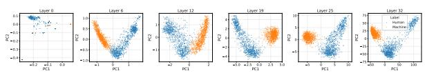  
(a) Reddit

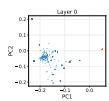

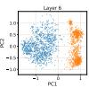

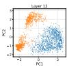

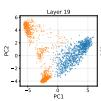

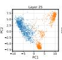  
(b) PeerRead

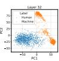

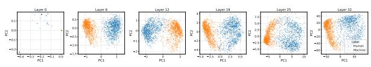  
(c) ArXiv  
Figure 7: Projections of human- and machine-generated text hidden states onto the first two principal components across layers. This figure extends Figure 1 to the Reddit, PeerRead, and ArXiv subsets of M4GT (Wang et al., 2024).

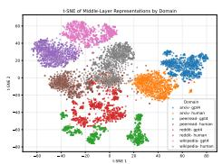

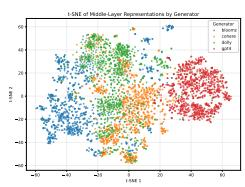  
(a) Domain comparison  
(b) Generator comparison  
Figure 8: Low-dimensional t-SNE projections of humanand machine-written text from different domains (a) and generators (b) in the M4GT dataset (Wang et al., 2024).

In Figure 3, we analyzed the four representation quality metrics on the Wikipedia subset. Figure 9 extends this analysis to the ArXiv, Reddit, and PeerRead subsets of M4GT (Wang et al., 2024), as well as selected subsets from DetectRL (Wu et al., 2024), RAID (Dugan et al., 2024), Multi-Social (Macko et al., 2025), and TSM (Quaremba et al., 2026). Across these diverse settings, we observe the same qualitative pattern as for Wikipedia: MGT representations exhibit lower entropy, effective rank, and intrinsic dimensionality, while showing higher anisotropy than HWT representations. Although the differences are sometimes less pronounced, particularly in datasets that include adversarial attacks or multiple generators, the overall trend remains consistent.

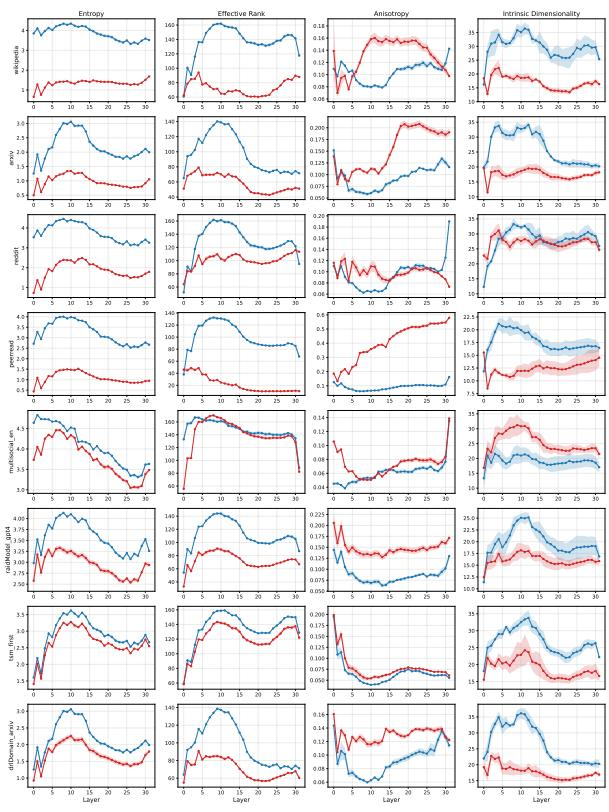  
Figure 9: Representation-quality metrics for human and machine latent representations from the perspectives of information content (Entropy, Effective Rank) and geometric structure (Anisotropy, Intrinsic Dimensionality). Extended results to other domains than Wikipedia from M4GT (Wang et al., 2024) and selected subsets from DetectRL (Wu et al., 2024), RAID (Dugan et al., 2024), MultiSocial (Macko et al., 2025), and TSM (Quaremba et al., 2026).

## B Experimental Setup

## B.1 Benchmarks

We briefly introduce each benchmark and describe how the data were sampled and split. While we use M4GT (Wang et al., 2024) for the representation analysis in Section 3, initial experiments on its domain subsets revealed saturated results, with several baselines achieving near-perfect performance. We therefore include more challenging benchmarks for the detection experiments.

• DetectRL (Wu et al., 2024): improves upon prior benchmarks by constructing data that more closely reflects real-world detection scenarios, including a range of adversarial attacks such as prompt-based and paraphrase attacks.9 We use the Task 2 domain dataset and randomly sample training and test sets. Consequently, each domain split contains examples generated by different LLMs and subjected to diverse attack strategies.

• MultiSocial (Macko et al., 2025): focuses on social media text, which is typically shorter noisier, and more linguistically diverse than text from traditional domains. The benchmark covers 22 languages across 5 social media platforms.10 We randomly sample training and test sets from the full dataset, resulting in a diverse mixture of languages, text lengths, writing styles, and platforms.

• RAID (Dugan et al., 2024): is one of the largest MGT detection benchmarks, containing over 10 million text samples generated across diverse models, domains, decoding strategies, and adversarial attacks.11 We construct generator-specific subsets by randomly sampling from the full dataset. As a result, each subset contains a diverse mixture of domains, decoding strategies, and attack types.

• TSM (Quaremba et al., 2026): focuses on the Wikipedia domain and text-generation tasks that closely resemble real-world editing behavior, including first-paragraph generation, paragraph extension, summarization, and text style transfer.12 We use the English split and randomly sample training and test instances within each task across six generators.

For the experiments on detecting varying degress of AI-edited texts in Section 5.6, we use the following benchmarks:

• APT-Eval (Saha and Feizi, 2025): APT-Eval contains 15k AI-polished texts from diverse domains, covering varying degrees of AI involvement in human-written text.13 The benchmark evaluates five detectors and quantifies edit strength using semantic cosine similarity, Jaccard distance, and Levenshtein distance. We use these metrics to correlate MGT probe projection scores with the degree of AI editing. To obtain a balanced sample, we evenly draw 200 instances from each polishing category: (1) extremely minor, (2) minor, (3) slightly major, and (4) major.

• EditLens (Thai et al., 2026): EditLens contains AI-edited human-written text from four domains: reviews, creative writing, general educational web articles, and news articles.14 The benchmark uses three LLMs to edit human-written text with varying levels of intervention. We randomly sample from the full dataset using the same procedure as for APT-Eval.

## B.2 Baseline Detectors

We test 16 MGT detectors covering zero-shot and supervised methods. Below we briefly introduce each detector and implementation details. If not otherwise stated, we implement each detector with Llama-3-8B (Grattafiori et al., 2024) for fair comparison.

## Zero-shot

• Likelihood (Solaiman et al., 2019): A simple baseline that computes the average token loglikelihood of a text. Higher log-likelihood indicates that the text is more likely to have been generated by an LLM.

• LLR (Su et al., 2023): The Log-Likelihood Log-Rank Ratio (LLR) combines token loglikelihood and token rank. Log-likelihood captures a model's absolute confidence in the observed token, while rank captures its relative confidence. Higher LLR scores indicate that a text is more likely to be machine-generated.

• Rank (Gehrmann et al., 2019): Assigns each token its rank under the language model's predicted token distribution. A lower average rank indicates that the observed tokens are more predictable and therefore more likely to have been generated by an LLM.

• Revise (Zhu et al., 2023b): A rewrite-based detector motivated by the observation that LLM-generated text changes less under rewriting than human-written text, as it already conforms closely to the statistical patterns learned by the model. Higher similarity between the original and rewritten text therefore indicates a higher likelihood of machine generation. Instead of ChatGPT, we use LLaMA-8B-Instruct15 for rewriting.

• Binoculars (Hans et al., 2024): Uses two LLMs to compute the ratio of perplexity to cross-perplexity. Cross-perplexity measures how surprising the token predictions of one model ("observer") are to another model ("performer"). Lower scores indicate that a text is more likely to be machine-generated.

• FastDetectGPT (Bao et al., 2023): An efficient variant of DetectGPT (Mitchell et al., 2023). DetectGPT exploits the observation that LLM-generated text tends to lie in regions of negative curvature of the model's logprobability surface. FastDetectGPT approximates this signal more efficiently through sampling-based estimation.

• GECScore (Wu et al., 2025b): Computes the Grammar Error Correction Score (GEC-Score), motivated by the observation that human-written text typically contains more grammatical errors than LLM-generated text. Following the original method, the score is derived from the similarity between the original text and its grammar-corrected version. Due to computational constraints, we use the 8B model variant instead of LLaMA-3-70B.

• RAIDAR (Mao et al., 2024): Another rewritebased detector motivated by the observation that LLMs tend to modify human-written text more substantially than machine-generated text. The method derives an MGT signal by measuring the edit distance between the original text and its rewritten version.

## Supervised detector

• OpenAI-RoBERTa (Solaiman et al., 2019): A RoBERTa (Liu et al., 2019) classifier finetuned to distinguish GPT-2-generated text¹6 from human-written WebText data.

• ID (Hu et al., 2023): Uses the Persistent Homology Dimension (PHD) estimator (Schweinhart, 2021) to measure the intrinsic dimensionality of text representations. The resulting scalar feature is fed into a logistic regression classifier. We use XLM-RoBERTa (Conneau et al., 2020) as the backbone model.

• RADAR (Hu et al., 2023): Trains a detector through adversarial learning between a paraphraser and a discriminator, using Vicuna-7B (Zheng et al., 2023) as the base model.

• BiScope (Guo et al., 2024): Motivated by the observation that LLMs tend to memorize local context differently for human- and machinegenerated text. The method computes crossentropy losses between output logits and both the ground-truth token and the immediately preceding token. A classifier is then trained on statistics derived from these losses.

• TextFluoroscopy (Yu et al., 2024): Argues that the strongest MGT signals emerge in middle layers. The method identifies the middlelayer representation whose vocabulary-space distribution differs most from the first and last layers and trains a nonlinear MLP classifier on that representation. We replace the originally used GTE-Qwen1.5-7B-Instruct model¹7 with LLaMA-3-8B.

• RepreGuard (Chen et al., 2025): Identifies a probing direction by computing the first principal component of the activation differences between human- and machine-generated text. Although RepreGuard is training-free, it still requires labeled examples to estimate the probing direction through PCA.

• EditLens (Thai et al., 2026): Trains a regression model to estimate the degree of AI editing in a text. We use the released RoBERTa-Large model,18 which was fine-tuned on data spanning different levels of AI-edit strength.

• RoBERTa (Liu et al., 2019): We fully finetune RoBERTa-Base19 on DetectRL, TSM, and RAID. For MultiSocial, we instead finetune XLM-RoBERTa-Base20 to support multilingual inputs. We use a batch size of 32, a learning rate of $2 \times 1 0 ^ { - 5 }$ , weight decay of 0.01, and train for two epochs.

## B.3 Comparison to Related Work Detectors

Linear Separability and Representation Quality Analyses Compared to prior work on MGT detection based on latent representations (Tulchinskii et al., 2023; Yu et al., 2024; Chen et al., 2025), our study differs both in its analysis of latent representations and in its methodological approach. Tulchinskii et al. (2023) were among the first to investigate latent-space differences between humanand machine-written text. While they show that intrinsic dimensionality differs between the two, we additionally analyze entropy, effective rank, and anisotropy, examine their evolution across layers, and demonstrate that all four metrics exhibit consistent patterns across diverse domains. TextFluoroscopy (Yu et al., 2024) provides evidence that middle layers contain particularly robust MGT signals, but does not investigate the linear separability of human and machine representations. Repre-Guard (Chen et al., 2025) identifies systematic differences in activation patterns, but neither tests for linear separability nor connects its findings to the Linear Representation Hypothesis (LRH) (Park et al., 2023).

Methodology Methodologically, our approach differs in several ways. ID (Tulchinskii et al. 2023) trains a logistic regression classifier on a single intrinsic-dimensionality feature per sample, whereas our probes operate directly on latent representations. TextFluoroscopy (Yu et al., 2024) trains a nonlinear classifier on the middle-layer representation selected through vocabulary-space distributional differences between early and late layers. In contrast, we train simple linear classifiers and show that they achieve stronger performance. RepreGuard (Chen et al., 2025) identifies probing directions through an unsupervised, training-free procedure. Specifically, it computes the first principal component of the activation-difference matrix between human and machine text using meanpooled token representations.21 In contrast, we train regularized linear classifiers directly on representations and show that last-token pooling consistently outperforms mean pooling (Appendix D). Moreover, RepreGuard operates in the full activation space (e.g., 4,096 dimensions for LLaMA-8B), whereas we first project activations into a 100- dimensional PCA subspace. As our representation analysis shows that MGT and HWT remain separable in low-dimensional spaces, our probes operate on only 2.4% of the original dimensionality, substantially reducing memory and computational requirements.

Tables 1 and 2 show that MGT probes consistently outperform these related methods. Compared to RepreGuard (Chen et al., 2025), we attribute these gains primarily to supervised, regularized learning, which suppresses noisy dimensions and yields more robust probing directions. Compared to TextFluoroscopy (Yu et al., 2024), our probes avoid unnecessary nonlinear complexity and leverage information from all layers rather than relying on a single middle layer. As shown in Section 3, the boundary between human- and machinewritten text is largely linear, while Appendix Figure 15 demonstrates that aggregating information across layers improves robustness. Finally, unlike ID (Tulchinskii et al., 2023), our probes operate directly on latent representations rather than a singlemetric feature, enabling them to exploit substantially richer information about machine-generated text.

## B.4 Computational Resources

We run all experiments on an HPC cluster equipped with NVIDIA A100 (40GB) and H200 (141GB) GPUs. Training a single probe variant, including activation extraction and inference, typically requires only 1–3 minutes on an A100 (40GB).

## C Additional Results

## C.1 ID Adversarial Attacks

In addition to the dimensions considered in Table 1 (domains, languages, generators, and generation tasks), we also evaluate adversarial attacks using the DetectRL benchmark (Wu et al., 2024). We observe the same saturation effects as for the DetectRL domain subsets, with most baselines achieving near-perfect performance. For this reason, we omit adversarial attacks from the main table.

## C.2 OOD

In Table 2, we report the mean AUC for each target subset unseen during training, averaged over transfers from the remaining subsets within the same benchmark. Figure 10 provides the full OOD transfer results.

<table><tr><td></td><td colspan="4">DetectRL Attacks (Wu et al., 2024)</td></tr><tr><td>Model</td><td>Mixing</td><td>Paraphrase</td><td>Perturbation</td><td>Prompt</td></tr><tr><td colspan="5">Zero-shot</td></tr><tr><td>Likelihood</td><td>0.9562</td><td>0.6973</td><td>0.6535</td><td>0.9628</td></tr><tr><td>LLR</td><td>0.9232</td><td>0.6813</td><td>0.6876</td><td>0.9288</td></tr><tr><td>Rank</td><td>0.2121</td><td>0.4113</td><td>0.8194</td><td>0.1584</td></tr><tr><td>Binoculars</td><td>0.9992</td><td>0.9069</td><td>0.9248</td><td>0.9847</td></tr><tr><td>FastDetectGPT</td><td>0.8911</td><td>0.7858</td><td>0.6218</td><td>0.8926</td></tr><tr><td>GECScore</td><td>0.7183</td><td>0.6777</td><td>0.6075</td><td>0.7064</td></tr><tr><td>RAIDAR</td><td>0.7392</td><td>0.7209</td><td>0.6503</td><td>0.7122</td></tr><tr><td colspan="5">Supervised</td></tr><tr><td>OpenAI-RoBERTa</td><td>0.8774</td><td>0.8991</td><td>0.6946</td><td>0.8581</td></tr><tr><td>RADAR</td><td>0.9733</td><td>0.9628</td><td>0.9593</td><td>0.9474</td></tr><tr><td>EditLens</td><td>0.3302</td><td>0.5628</td><td>0.5775</td><td>0.3562</td></tr><tr><td>ID</td><td>0.7089</td><td>0.7253</td><td>0.6406</td><td>0.6746</td></tr><tr><td>RepreGuard</td><td>0.9600</td><td>0.8480</td><td>0.9820</td><td>0.9260</td></tr><tr><td>BiScope</td><td>0.9993</td><td>0.9692</td><td>0.9884</td><td>0.9946</td></tr><tr><td>TextFluoroscopy</td><td>0.9944</td><td>0.9968</td><td>0.9971</td><td>0.9934</td></tr><tr><td>RoBERTa</td><td>0.9964</td><td>0.9992</td><td>1.0000</td><td>0.9972</td></tr><tr><td colspan="5">MGT Probes</td></tr><tr><td>LLP</td><td>0.9993</td><td>0.9999</td><td>1.0000</td><td>0.9982</td></tr><tr><td>∆ vs BL</td><td>+0.00</td><td>+0.07</td><td>+0.00</td><td>+0.10</td></tr><tr><td>CLP</td><td>0.9995</td><td>0.9998</td><td>1.0000</td><td>0.9994</td></tr><tr><td>∆ vs BL</td><td>+0.02</td><td>+0.06</td><td>+0.00</td><td>+0.22</td></tr></table>

Table 3: In-domain detection AUC scores for adversarial attacks on DetectRL (Wu et al., 2024). LLP = Layer-Averaged Linear Probes. CLP=Concatenated-Layer Probes. For TSM, FP=First Paragraph, PE=Paragraph Extension, SUM=Summarization, and TST=Text Style Transfer. $\Delta$ denotes the gain over the strongest baseline.

## C.3 Probing vector similarity

Figure 11 shows layer-16 activation projections for paired domain subsets in DetectRL (Wu et al., 2024). The black dashed line connects the centroids of the human and machine activation clouds within each subset, approximating the corresponding linear MGT direction.

Consistent with Figure 4, we find that these linear MGT directions are broadly aligned in the same direction across most subsets. They are not perfectly aligned, which is expected because (1) we approximate the MGT direction by connecting class centroids rather than learning it directly, and (2) the subsets differ along several confounding dimensions, including adversarial attacks, text length, and stylistic or grammatical variation. The latter is particularly evident for Reddit, which exhibits the largest distributional shift across domains. Nevertheless, their broad alignment provides further evidence that probes learn an approximate shared linear direction associated with MGT.

## C.4 Sample-efficiency Analysis

In Figure 5, we evaluate sample efficiency using a PCA space constructed from the full training set for each layer, and then train probes on progressively smaller subsets. However, this setup does not fully reflect a real-world application, where the full training distribution may not be available in advance. Therefore, in Figure 12, we repeat the experiment in the full activation space, without applying PCA. We observe the same pattern, confirming that the sample-efficiency results.

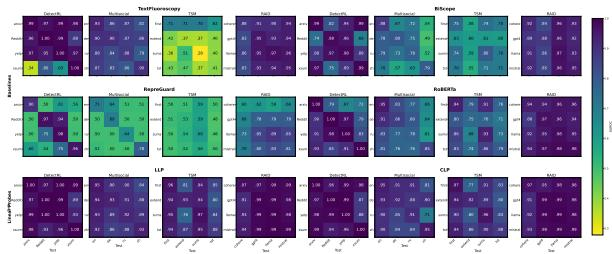  
Figure 10: OOD AUC scores for baseline detectors (top rows) and MGT probes (bottom row). Rows denote the training subsets, while columns denote the test subsets. Darker colors indicate better performance.

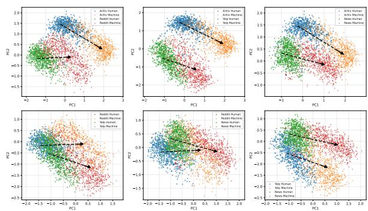  
Figure 11: Activation projections of paired DetectRL datasets (Wu et al., 2024) in the shared PCA space at layer 16. Dashed lines connect the centroids of the human and machine clusters within each dataset.

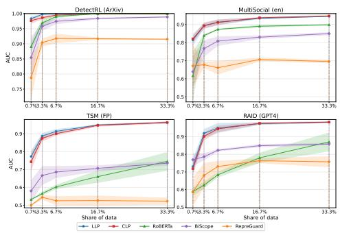  
Figure 12: In-domain AUC scores for selected datasets as a function of training set size. Compared to Figure 5, we do not reduce the dimensionality of activations.

## C.5 Detecting AI-edited text

In Section 5.6, we investigate whether probing vectors encode MGT signals as a continuum rather than a binary distinction. Figure 13 shows the distributions of the text-similarity metrics used to quantify the degree of AI editing. Our random sampling procedure yields a relatively uniform distribution across metrics and benchmarks, with the exception of semantic similarity in EditLens, which exhibits a left-skewed distribution.

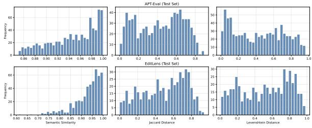  
Figure 13: Histograms of the similarity measures Semantic (Cosine) Similarity, Jaccard Distance, and Levenshtein Distance for the test sets of APT (Saha and Feizi, 2025) and EditLens (Thai et al., 2026).

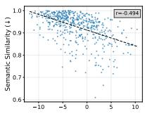

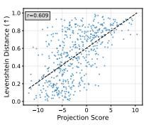  
(a) LLP

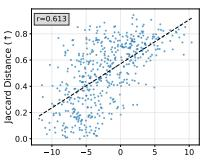

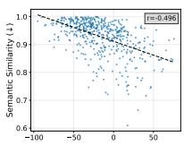

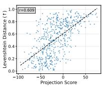

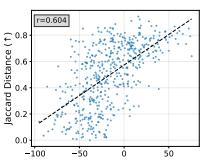  
(b) CLP  
Figure 14: Edit-strength metrics plotted against probe projection scores. The dashed line shows the linear regression fit, and r denotes the Pearson correlation coefficient. This Figure shows the results for EditLens (Thai et al., 2026).

In Figure 6, we plot the text-similarity metrics used to quantify the degree of AI editing in APT-Eval (Saha and Feizi, 2025) against the projection scores of LLP and CLP. Figure 14 presents the same analysis for EditLens (Thai et al., 2026). We observe the same overall pattern across both benchmarks, although the performance gap between LLP and CLP is smaller on EditLens.

## C.6 Layer Analysis

We conduct an additional analysis of probe performance across transformer layers to better understand where MGT signals emerge and how they evolve throughout the network. Specifically, we ask: RQ: How does MGT detection performance evolve across layers in in-domain and OOD settings?

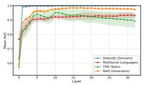  
(a) In-domain

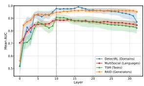  
(b) Out-of-domain  
Figure 15: Layer-wise AUC averaged across benchmarks. Vertical lines denote performance plateaus. Takeaway: MGT signals emerge early and remain stable.

MGT signals emerge in early layers and remain relatively stable throughout later layers. Figure 15 shows layer-wise mean AUC across the four subsets within each benchmark for both ID and OOD settings. Both settings reveal a consistent two-stage pattern across benchmarks: a sharp rise in MGT signals in the early layers (up to approximately layer 5 for ID and layer 10 for OOD), followed by a plateau in which detection performance remains relatively stable. In both settings, this suggests that even early representations associated with lower-level textual features (Tenney et al., 2019) encode strong linear MGT signals. For OOD detection, the strong performance of middle layers and the degradation in the final layers are consistent with later representations becoming increasingly specialized and therefore less generalizable (Skean et al., 2025).

## C.7 Sensitivity to Text Length

<table><tr><td rowspan="2">Model ↓</td><td colspan="10">n chars →</td></tr><tr><td>25</td><td>50</td><td>75</td><td>100</td><td>125</td><td>150</td><td>175</td><td>200</td><td>250</td><td>300</td><td>400</td></tr><tr><td>LLP</td><td>0.850</td><td>0.823</td><td>0.881</td><td>0.908</td><td>0.966</td><td>0.981</td><td>0.989</td><td>0.993</td><td>0.991</td><td>0.995</td><td>0.997</td></tr><tr><td>CLP</td><td>0.840</td><td>0.824</td><td>0.903</td><td>0.960</td><td>0.982</td><td>0.990</td><td>0.996</td><td>0.996</td><td>0.997</td><td>0.997</td><td>1.000</td></tr><tr><td>RoBERTa</td><td>0.874</td><td>0.883</td><td>0.904</td><td>0.969</td><td>0.926</td><td>0.936</td><td>0.998</td><td>0.999</td><td>1.000</td><td>0.999</td><td>1.000</td></tr></table>

Table 4: Ablation study of text length. We compare LLP and CLP against a RoBERTa baseline. Each model is trained on the number of characters indicated by the corresponding column, using the ArXiv subset of DetectRL (Wu et al., 2024).

Table 4 presents AUC detection performance as a function of text length. We compare both MGT probes with the RoBERTa (Liu et al., 2019) baseline, training each model on the ArXiv subset of DetectRL (Wu et al., 2024). While RoBERTa has a slight AUC advantage for texts up to 50 characters, both probes remain competitive and reach nearpeak performance at around 125 characters. These results indicate that the probes remain reliable even for relatively short texts.

C.8 MGT Probes performance on AI-edit text detection
<table><tr><td>Model</td><td>Accuracy</td><td>Macro F1</td><td>Human F1</td><td>AI-edited F1</td><td>AI-generated F1</td></tr><tr><td>RoBERTa</td><td>0.652</td><td>0.642</td><td>0.583</td><td>0.473</td><td>0.869</td></tr><tr><td>EditLens</td><td>0.525</td><td>0.438</td><td>0.575</td><td>0.739</td><td>0.000</td></tr><tr><td>LLP</td><td>0.848</td><td>0.848</td><td>0.806</td><td>0.754</td><td>0.985</td></tr><tr><td>CLP</td><td>0.854</td><td>0.853</td><td>0.811</td><td>0.764</td><td>0.985</td></tr></table>

Table 5: Three-way classification on EditLens (Thai et al., 2026), comparing the EditLens Llama-3.2-3B model, RoBERTa (Liu et al., 2019), and both MGT probes. The three classes are “AI-generated", “AIedited", and “Human".

Figure 6 shows a positive correlation between edit strength and the probe projection scores. In Table 5, we present initial results on three-way AIedit classification using EditLens (Thai et al., 2026). We compare two baselines, RoBERTa (Liu et al., 2019) and the EditLens Llama-3.2-3B model, 22 against our MGT probes.

We split the EditLens data into train/validation/test sets of 1,000/200/200 examples. We train the probes and RoBERTa on the training set and calibrate all three methods on the validation set by selecting two thresholds for the classes “AIgenerated", “AI-edited", and “Human". We do not further train the EditLens model, as it was already trained on this dataset.

Table 5 reports accuracy and class-wise F1 scores. Both probes achieve strong classification performance relative to the baselines, despite not being explicitly trained for three-way classification. While these results indicate that the probe scores may support fine-grained AI-edit classification, the analysis is preliminary and does not support broader conclusions. We leave a more comprehensive evaluation of this direction to future work.

## C.9 Calibration Analysis

Table 6 presents a small-scale calibration analysis of the MGT probes, comparing their Expected Calibration Error (ECE) against RoBERTa (Liu et al., 2019). The results show that both probes are well calibrated across DetectRL (Wu et al., 2024) subsets and, in several settings, outperform a fully fine-tuned RoBERTa model in calibration.

<table><tr><td>Model</td><td>ArXiv</td><td>Reddit</td><td>Yelp</td><td>News</td></tr><tr><td>LLP</td><td>0.005</td><td>0.009</td><td>0.010</td><td>0.007</td></tr><tr><td>CLP</td><td>0.000</td><td>0.006</td><td>0.007</td><td>0.003</td></tr><tr><td>RoBERTa</td><td>0.002</td><td>0.006</td><td>0.033</td><td>0.002</td></tr></table>

Table 6: Expected Calibration Error (ECE) analysis comparing MGT probes against RoBERTa on DetectRL (Wu et al., 2024).

We emphasize that this analysis is performed on the projection scores produced by the linear probes. These results provide additional evidence that the probe outputs are well calibrated and support their potential use for fine-grained AI-edit detection.

## D Ablation Studies

Lastly, we conduct a series of ablation experiments for both probing variants LLP and CLP.

## D.1 LLP

## D.1.1 Model Size and Architecture Ablations

<table><tr><td rowspan="2">Setting</td><td colspan="4">TSM (Quaremba et al., 2026)</td></tr><tr><td>FP</td><td>PE</td><td>SUM</td><td>TST</td></tr><tr><td>Baseline</td><td>0.971</td><td>0.942</td><td>0.978</td><td>0.896</td></tr><tr><td>Token Aggregation</td><td></td><td></td><td></td><td></td></tr><tr><td>Pooling</td><td>-0.019</td><td>-0.155</td><td>-0.021</td><td>-0.085</td></tr><tr><td>Layer Selection</td><td></td><td></td><td></td><td></td></tr><tr><td>First layer</td><td>-0.388</td><td>-0.316</td><td>-0.431</td><td>-0.355</td></tr><tr><td>Last layer</td><td>-0.036</td><td>-0.077</td><td>-0.038</td><td>-0.065</td></tr><tr><td>Model</td><td></td><td></td><td></td><td></td></tr><tr><td>Llama-3B</td><td>+0.001</td><td>-0.012</td><td>+0.006</td><td>+0.000</td></tr><tr><td>Llama-1B</td><td>-0.011</td><td>-0.034</td><td>+0.004</td><td>-0.011</td></tr><tr><td>Qwen-32B</td><td>+0.020</td><td>+0.029</td><td>+0.013</td><td>+0.048</td></tr><tr><td>Qwen-8B</td><td>+0.016</td><td>+0.016</td><td>+0.010</td><td>+0.031</td></tr><tr><td>Qwen-4B</td><td>+0.015</td><td>+0.011</td><td>+0.007</td><td>+0.029</td></tr><tr><td>Qwen-0.6B</td><td>-0.012</td><td>-0.036</td><td>-0.005</td><td>-0.022</td></tr><tr><td>Regularization Penalty</td><td></td><td></td><td></td><td></td></tr><tr><td>C=0.01</td><td>-0.001</td><td>+0.001</td><td>+0.000</td><td>+0.001</td></tr><tr><td>C=0.1</td><td>+0.000</td><td>+0.001</td><td>+0.000</td><td>+0.002</td></tr><tr><td>C=10</td><td>+0.001</td><td>+0.001</td><td>+0.000</td><td>+0.002</td></tr><tr><td>PCA Activations</td><td></td><td></td><td></td><td></td></tr><tr><td>k=10</td><td>-0.064</td><td>-0.117</td><td>-0.046</td><td>-0.120</td></tr><tr><td>k=50</td><td>-0.009</td><td>-0.015</td><td>-0.008</td><td>-0.022</td></tr><tr><td>k=150</td><td>+0.004</td><td>+0.005</td><td>+0.001</td><td>+0.011</td></tr><tr><td>k=200</td><td>+0.003</td><td>+0.006</td><td>-0.001</td><td>+0.011</td></tr><tr><td>k=250</td><td>+0.003</td><td>+0.006</td><td>-0.002</td><td>+0.010</td></tr><tr><td>No PCA</td><td>+0.016</td><td>+0.010</td><td>+0.007</td><td>+0.014</td></tr></table>

Table 7: Ablation study of LLP across five design choices.

Table 7 reports AUC scores for the LLP variant defined in Section 4, covering five design choices: (1) token aggregation (last token vs. mean pooling), (2) layer selection (first layer, last layer, or layerwise aggregation), (3) model architecture and size, (4) regularization strength, and (5) the number of PCA components. We restrict this analysis to TSM, as it consistently proved to be the most challenging benchmark throughout our experiments.

First, probing only the final token yields moderate but consistent improvements over mean pooling. This likely reflects the fact that the final token aggregates information from the entire sequence through causal attention.

Second, using only the first or last layer instead of aggregating projection scores across layers consistently reduces performance. This finding aligns with Nordby et al. (2026), who show that ensembles of probes outperform single-layer probes. We do not include a single middle-layer probe, as TextFluoroscopy (Yu et al., 2024) already optimizes for the best-performing layer, and our results demonstrate that LLP consistently outperforms this approach.

Third, we evaluate the impact of model architecture and size by replacing LLaMA with Qwen (Yang et al., 2025). We find that Qwen-8B consistently improves performance over LLaMA-8B. Notably, even Qwen-4B achieves slightly stronger results, despite its smaller size. These findings suggest that architecture may play a more important role than parameter count and motivate future work on how model design influences the linear separability of MGT and HWT. Within the LLaMA family, reducing model size leads to only modest performance degradation.

Fourth, varying the strength of the $L _ { 2 }$ regularization penalty has virtually no effect on performance, suggesting that the learned MGT direction is stable and readily recoverable.

Finally, motivated by our finding that MGT and HWT are linearly separable in low-dimensional subspaces (§3), we vary the number of principal components used to project activations before training probes. Increasing the dimensionality beyond k = 100 yields only marginal and inconsistent improvements. This result further supports our representation analysis, indicating that MGT signals are encoded in relatively low-dimensional regions of the activation space.

D.1.2 Detailed PCA vs no-PCA comparison
<table><tr><td></td><td colspan="4">Multisocial</td><td colspan="4">DetectRL Domains</td><td colspan="4">RAID Models</td></tr><tr><td>Mode</td><td>en</td><td>de</td><td>ru</td><td>zh</td><td>ArXiv</td><td>Reddit</td><td>Yelp</td><td>News</td><td>Cohere</td><td>GPT-4</td><td>Llama</td><td>Mistral</td></tr><tr><td>LLP (No PCA)</td><td>0.963</td><td>0.933</td><td>0.915</td><td>0.950</td><td>1.000</td><td>1.000</td><td>1.000</td><td>1.000</td><td>0.969</td><td>0.992</td><td>0.995</td><td>0.989</td></tr><tr><td>LLP (PCA)</td><td>0.957</td><td>0.934</td><td>0.921</td><td>0.944</td><td>1.000</td><td>1.000</td><td>1.000</td><td>1.000</td><td>0.971</td><td>0.992</td><td>0.995</td><td>0.993</td></tr><tr><td>LLP (No PCA) – LLP (PCA)</td><td>0.006</td><td>-0.001</td><td>-0.006</td><td>0.006</td><td>0.000</td><td>0.000</td><td>0.000</td><td>0.000</td><td>-0.002</td><td>-0.001</td><td>0.001</td><td>-0.004</td></tr></table>

Table 8: LLP ablation study comparing PCA and no-PCA variants. The PCA variant is the main specification, using 100 dimensions.

A potential concern is that PCA may artificially facilitate linear separability, for example by removing noisy dimensions. While Table 7 already shows nearly identical probe performance with and without PCA, we provide a more detailed comparison in Table 8. Specifically, we compare the no-PCA variant against the PCA variant using the top 100 principal components, as in our main experiments. The near-identical results indicate that PCA does not meaningfully affect linear separability. Rather, it primarily serves as a dimensionality-reduction step that reduces the computational and memory requirements of the probes.

## D.2 CLP

## D.2.1 Model Size and Architecture Ablations

<table><tr><td rowspan="2">Setting</td><td colspan="4">TSM (Quaremba et al., 2026)</td></tr><tr><td>FP</td><td>PE</td><td>SUM</td><td>TST</td></tr><tr><td>Baseline</td><td>0.973</td><td>0.920</td><td>0.970</td><td>0.890</td></tr><tr><td>Token Aggregation</td><td></td><td></td><td></td><td></td></tr><tr><td>Pooling</td><td>-0.008</td><td>-0.088</td><td>+0.001</td><td>-0.036</td></tr><tr><td>Model</td><td></td><td></td><td></td><td></td></tr><tr><td>Llama-3B</td><td>-0.001</td><td>-0.019</td><td>-0.002</td><td>-0.021</td></tr><tr><td>Llama-1B</td><td>-0.016</td><td>-0.033</td><td>-0.002</td><td>-0.015</td></tr><tr><td>Qwen-32B</td><td>+0.016</td><td>+0.029</td><td>+0.012</td><td>+0.025</td></tr><tr><td>Qwen-8B</td><td>+0.012</td><td>+0.001</td><td>+0.010</td><td>+0.020</td></tr><tr><td>Qwen-4B</td><td>+0.005</td><td>+0.018</td><td>+0.010</td><td>+0.009</td></tr><tr><td>Qwen-0.6B</td><td>-0.012</td><td>-0.016</td><td>-0.003</td><td>-0.043</td></tr><tr><td>Regularization Penalty</td><td></td><td></td><td></td><td></td></tr><tr><td>C=0.01</td><td>+0.001</td><td>+0.016</td><td>+0.005</td><td>+0.003</td></tr><tr><td>C=0.1</td><td>+0.001</td><td>+0.009</td><td>+0.003</td><td>+0.000</td></tr><tr><td>C=10</td><td>-0.001</td><td>-0.001</td><td>-0.000</td><td>-0.011</td></tr><tr><td>PCA Activations</td><td></td><td></td><td></td><td></td></tr><tr><td>k=10</td><td>-0.036</td><td>-0.010</td><td>-0.009</td><td>-0.056</td></tr><tr><td>k=50</td><td>-0.004</td><td>+0.000</td><td>-0.010</td><td>-0.014</td></tr><tr><td>k=150</td><td>-0.002</td><td>+0.003</td><td>-0.000</td><td>+0.002</td></tr><tr><td>k=200</td><td>+0.001</td><td>+0.004</td><td>+0.001</td><td>+0.003</td></tr><tr><td>k=250</td><td>+0.003</td><td>+0.004</td><td>+0.002</td><td>+0.003</td></tr><tr><td>No PCA</td><td>+0.015</td><td>+0.031</td><td>+0.012</td><td>+0.026</td></tr></table>

Table 9: Ablation study of CLP across four design choices.

Table 9 presents CLP ablations across four design choices: (1) token aggregation (last token vs. mean pooling), (2) model architecture and size, (3) regularization strength, and (4) the number of PCA

components.

Overall, we observe trends similar to those for LLP in Table 7. Using the last token consistently outperforms mean pooling. Smaller Llama variants reduce performance, whereas Qwen yields modest but consistent improvements. The regularization penalty has only a minor effect at $\lambda = 0 . 0 0 1$ and a negligible impact for other values. Finally, as with LLP, 100 PCA components provide the best trade-off between performance and dimensionality, with no meaningful gains from using additional components.

## D.2.2 Detailed PCA vs no-PCA comparison

<table><tr><td></td><td colspan="4">Multisocial</td><td colspan="4">DetectRL Domains</td><td colspan="4">RAID Models</td></tr><tr><td>Mode</td><td>en</td><td>de</td><td>πu</td><td>zh</td><td>ArXiv</td><td>Reddit</td><td>Yelp</td><td>News</td><td>Cohere</td><td>GPT-4</td><td>Llama</td><td>Mistral</td></tr><tr><td>CLP (PCA)</td><td>0.951</td><td>0.920</td><td>0.906</td><td>0.951</td><td>1.000</td><td>1.000</td><td>1.000</td><td>1.000</td><td>0.965</td><td>0.991</td><td>0.995</td><td>0.987</td></tr><tr><td>CLP (No PCA)</td><td>0.962</td><td>0.937</td><td>0.919</td><td>0.951</td><td>1.000</td><td>1.000</td><td>1.000</td><td>1.000</td><td>0.967</td><td>0.989</td><td>0.995</td><td>0.987</td></tr><tr><td>CLP (PCA) – CLP (No PCA)</td><td>-0.011</td><td>-0.017</td><td>-0.013</td><td>0.000</td><td>0.000</td><td>0.000</td><td>-0.000</td><td>0.000</td><td>-0.002</td><td>0.002</td><td>-0.000</td><td>0.000</td></tr></table>

Table 10: CLP ablation study comparing PCA and no-PCA variants. The PCA variant is the main specification, using 100 dimensions.

Table 10 reports the same PCA versus no-PCA comparison for CLP. Consistent with the LLP results, performance is nearly identical across both variants, indicating that PCA does not meaningfully affect linear separability for either probe.