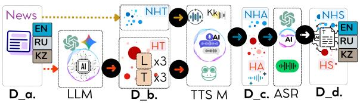

# Lost in Speech: Trilingual Spoken Hallucination Detection Across Audio and Transcripts

Meruyert Aristombayeva<sup>1,\*</sup>, Jason S. Lucas<sup>2</sup>, Chaewan Chun<sup>3</sup>, Dongwon Lee<sup>3</sup>

<sup>1</sup>Satbayev University, Almaty, Kazakhstan

<sup>2</sup>University of Colorado Boulder, Boulder, CO, USA

<sup>3</sup>The Pennsylvania State University, University Park, PA, USA

Corresponding author: m.aristombayeva@satbayev.university

## Abstract

While text-based hallucination detection has been extensively studied, spoken hallucination detection remains largely unexplored, particularly for low-resource languages. We present the first multilingual spoken hallucination benchmark comprising 12,013 news samples across English, Russian, and Kazakh with controlled hallucinations of three types and three severity levels. Samples comprise original articles and aligned hallucinated counterparts in text and audio. We complement the synthetic corpus with 290 fact-checked fake news items collected natively in Russian (225) and Kazakh (65), translated into the other language and rendered through the same TTS–ASR pipeline. We assess fine-tuned multilingual encoders and, in zero-shot in-context settings, multimodal decoder models on transcript-based versus direct audio processing. Transcriptbased detection generally outperforms direct audio processing, with binary-task degradation for strong encoders tracking per-language ASR error. On real-world fakes, synthetic-trained detectors transfer strongly (macro-F1 0.82– 0.88 on original text), while Russian provenance analysis reveals both veracity-related and model-dependent machine-style signals, quantifying a key confound in synthetic hallucination benchmarks.

## 1 Introduction

In recent years, large neural models for language and speech have demonstrated impressive generative abilities, yet they exhibit a troubling propensity to hallucinate, producing information that is not grounded in factual sources (Frieske and Shi, 2024). In the spoken setting the stakes are higher still: transcription systems can emit entirely fabricated phrases, a non-trivial fraction of which carry explicit real-world harms (Koenecke et al., 2024). Despite this, hallucination detection has been studied almost exclusively in text (Ji et al., 2023), while work in the spoken domain remains scarce—and scarcer still for low-resource languages (Zhang et al., 2024).

Unlike textual inputs, spoken content is processed through multi-stage pipelines that couple text-to-speech (TTS) synthesis and automatic speech recognition (ASR), introducing noise and cascading error propagation. The robustness of hallucination detection under realistic speech-pipeline conditions is therefore still insufficiently understood (Atwany et al., 2025). As large language and audio-language models are deployed ever more widely, evaluating hallucination detection under multilingual speech constraints has become increasingly critical (Frieske and Shi, 2024; Latif et al., 2023).

Three gaps remain open. First, dedicated benchmarks for hallucination in audio and audiolanguage models have only begun to emerge, and they are overwhelmingly English and questionanswering oriented (Kuan et al., 2024; Cheng et al., 2025). Second, the few multilingual hallucination benchmarks are text-only (Abdaljalil et al., 2025; Vázquez et al., 2025), and recent evidence indicates that hallucination behavior does not track a language’s digital footprint in any simple way (Obaid ul Islam et al., 2025)—motivating the study of a genuinely low-resource language such as Kazakh alongside higher-resource English and Russian. Third, existing hallucination benchmarks— synthetic by construction—have not been validated against real-world misinformation: whether detectors trained on LLM-generated hallucinations transfer to human-written false content remains untested, a question sharpened by the fact that in synthetic benchmarks text provenance (human vs. LLM) is perfectly correlated with the label. A further bottleneck is the lack of large, balanced, and annotated audio datasets, which is acute precisely where both TTS and ASR are least mature (Chun et al., 2025). To our knowledge, no prior resource combines spoken input, a detection task, three languages including Kazakh, and controlled hallucination types at graded severity; existing work covers only subsets of these axes.

We define a spoken hallucination as audio content—here, a news article read aloud—that introduces information unsupported by, or contradictory to, a reference source. To study this problem under controlled yet realistic conditions, we construct a multilingual benchmark spanning English (high-resource), Russian (medium-resource), and Kazakh (low-resource). Each sample pairs a reference article with a systematically generated hallucinated counterpart of controlled hallucination type (fabrication, contradiction, context inconsistency) and severity level (mild, moderate, severe), while preserving topic and style. Our controlled generation and LLM-as-a-judge validation descend from synthetic-hallucination pipelines developed for text (Mishra et al., 2024; Xie et al., 2024). To simulate deployment, every version is provided in both text and speech form: hallucinated texts are synthesized with language-specific TTS systems and transcribed back with ASR (Fig. 1). This design enables comparison across clean text, ASR-transcribed text, and raw audio, isolating the effect of cascading speech-pipeline noise—a documented risk in spoken language understanding (Avila et al., 2023)—on hallucination detection. We evaluate two model families on the resulting data: fine-tuned multilingual encoders and zeroshot multimodal (audio-language) decoders. Our experiments show that transcript-based detection generally outperforms direct audio processing, with TTS–ASR pipeline degradation most pronounced for Kazakh.

## Contributions.

1. The first multilingual spoken hallucination detection benchmark with controlled hallucination types and graded severity: 12,013 news samples (original articles and aligned hallucinated counterparts) in English, Russian, and Kazakh, each available as text, synthesized speech, and ASR transcript.

2. A structured LLM-based hallucination generation framework with generator selfassessment and external validation by two independent cross-family LLM judges, supplemented by targeted human inspection of synthesized speech.



Figure 1: Data generation pipeline framework. Legend: D = Original Data, D = Generated Hallucinated Text, D = Audio Data, D = Transcribed Data; T = Type, L = Severity Level; NHT = Non-Hallucinated Text, HT = Hallucinated Text, NHA = Non-Hallucinated Audio, HA = Hallucinated Audio, NHS = Non-Hallucinated Speech, HS = Hallucinated Speech; LLM = Large Language Model, TTS M = Text-to-Speech Model, ASR = Automatic Speech Recognition; MT = Machine Translation.

3. The first real-world spoken evaluation split for this task: 290 fact-checked fake news stories from factcheck.kz, collected natively in Russian (225) and Kazakh (65), each paired with a translation into the other language and with matched truthful negatives, rendered through the same TTS→ASR pipeline (Section 2.2).

4. A Russian provenance analysis that probes factuality and human-vs-machine text signals—a confound inherent to synthetic benchmarks— by evaluating detectors on human-written false content. (Section 3.3).

5. A language-specific TTS→ASR pipeline with best-of-breed per-language ASR, and a comprehensive empirical study of fine-tuned encoders and zero-shot audio-language decoders across text and audio settings, with ASR error analysis and modality-aware comparison, addressing RQ1–RQ3 (Section 3).

## 2 Benchmark Construction

## 2.1 Synthetic Subset

We constructed a corpus of 12,013 samples based on news articles gathered from major Kazakhstani news platforms (e.g., nur.kz, forbes.kz, tengrinews.kz, kapital.kz), covering diverse topics (politics, economy, technology); each sample is either an original article or one of its generated hallucinated versions (Table 1). The articles span three languages—Kazakh, Russian, and English—and are treated as factual references since they originate from established outlets. We generated hallucinated versions with three hallucination types (fabrication, contradiction, and context inconsistency) and three severity levels (mild, moderate, severe), following Huang et al. (2023): the English batches were produced with gpt-3.5-turbo and gpt-4, and the Russian and Kazakh batches with gemini-2.0-flash-lite; the model-to-batch assignment and all prompt variants are documented in Appendix A. Table 1 summarizes the dataset distribution. Each sample is available as text, synthesized audio, and ASR transcript (Fig. 1). As speech is produced via a TTS→ASR pipeline, transcription errors reflect cascading noise from both synthesis and recognition components, particularly in low-resource Kazakh.

Table 1: Dataset summary across languages. Res = resource level (H = high, M = medium, L = low). Type: C = contradiction, F = fabrication, I = inconsistency. Severity: Mild, Moderate, Severe. Rows marked “real” denote the real-world evaluation split from factcheck.kz (Section 2.2); <sup>†</sup>each language combines natively collected fakes (225 ru, 65 kz) with parallel translations of the other language’s items. Real items carry binary labels only and are used exclusively for evaluation. The 290 truthful items of each real row are original articles of the synthetic subset above (not additional data); only the 290 fakes per language are new items.
<table><tr><td>Lang</td><td></td><td>Res Total</td><td colspan="2">Binary</td><td colspan="3">Type</td><td colspan="3">Severity</td></tr><tr><td></td><td></td><td></td><td>No</td><td>Yes</td><td>C</td><td>F</td><td>I</td><td>Mild</td><td>Mod</td><td>Sev</td></tr><tr><td>en</td><td>H</td><td>3967</td><td>1340</td><td>2627</td><td>876</td><td>876</td><td>875</td><td>876</td><td>876</td><td>875</td></tr><tr><td>kz</td><td>L</td><td>3978</td><td>1113</td><td>2865</td><td>955</td><td>955</td><td>955</td><td>955</td><td>955</td><td>955</td></tr><tr><td>ru</td><td>M</td><td>4068</td><td>1259</td><td>2809</td><td>936</td><td>936</td><td>937</td><td>936</td><td>936</td><td>937</td></tr><tr><td>ru (real)†1</td><td>M</td><td>580</td><td>290</td><td>290</td><td></td><td></td><td></td><td></td><td></td><td></td></tr><tr><td>kz (real)† L</td><td></td><td>580</td><td>290</td><td>290</td><td>一</td><td>一</td><td></td><td></td><td></td><td></td></tr></table>

To create diverse and controlled hallucinations, we implemented a category-based prompting framework inspired by factuality taxonomies in prior work (Huang et al., 2023; Lucas et al., 2023; Nahar et al., 2024). Each article was rewritten according to a predefined hallucination type and severity level.

We distinguish Factual Contradiction (statements directly conflicting with facts or information from the original article), Factual Fabrication (insertion of fabricated yet plausible-sounding details not grounded in the source), and Context Inconsistency (subtle alterations that distort the meaning, emphasis, or context of the original article without explicit factual errors).

Each generation was guided by a structured prompt incorporating the original article, the target hallucination type, and severity level. The generation prompt also required the generating model to provide a structured self-assessment of its output along predefined quality dimensions. Because such in-prompt self-assessment is not independent of generation, we additionally conducted a separate external validation stage using two judge models from families disjoint from the generators (Section 2.4). All generation and evaluation prompts are provided in Appendix A.

## 2.2 Real-World Subset

Synthetic benchmarks carry an inherent confound: every hallucinated sample is LLM-generated while every faithful sample is human-written, so provenance is perfectly correlated with the label. To enable evaluation free of this confound and to test transfer to naturally occurring misinformation, we construct a real-world evaluation split from factcheck.kz, a professional Kazakhstani factchecking organization.

We collected 290 news items verified as false by factcheck.kz, downloaded from its public archive in October 2024: 225 published natively in Russian and 65 natively in Kazakh (after removing 15 exact duplicates from the initial Russian collection), spanning topics comparable to the synthetic corpus (politics, society, health, technology). Each item consists of the fake claim or article as it circulated, with the fact-checking verdict as ground truth. To enable controlled cross-lingual comparison on identical content, every item is additionally translated into the other language using Google Translate, yielding a parallel Russian–Kazakh fakenews corpus of 290 stories per language, of which 65 Kazakh and 225 Russian items are natively circulating misinformation. Six claims were independently fact-checked in both languages; these near-parallel native pairs are flagged in the release. Translation quality was manually validated by a fluent bilingual author on all 290 translations, all of which were judged adequate (Appendix E).

As truthful negatives, we select 290 humanwritten original articles per language from the synthetic subset, matched to the fakes via greedy TF-IDF cosine similarity over topic and time period. These articles are excluded from the training and development splits of every model evaluated on the real-world data (Appendix B), so no model evaluated on this split has seen any of its items during training. All real-world items—fake and truthful—are rendered through the identical

TTS→ASR pipeline described in Section 2.3, so the real-world split is available in the same three modalities (original text, audio, ASR transcript) as the synthetic corpus. This split is used exclusively for evaluation; no model is trained on it. Unlike the synthetic subset, real-world items carry only binary labels, since fact-checkers do not annotate our type/severity taxonomy; manual taxonomy alignment is left to future work.

## 2.3 Speech Synthesis and Transcription

We synthesized speech for both original and hallucinated texts using language-specific TTS systems: Coqui XTTS-v2 (Coqui AI, 2023) for English, Silero TTS (Silero Team, 2021) for Russian, and an open-source Kazakh TTS model (Mussakhojayeva et al., 2021). Multiple voices were employed to increase acoustic diversity. Due to limited availability of high-quality Kazakh TTS systems, synthesized Kazakh speech exhibited reduced naturalness and occasional phonetic instability. Hallucination labels are assigned at the text-generation stage relative to the source article; subsequent TTS–ASR discrepancies are treated as pipeline degradation and do not alter these labels.

All audio samples were transcribed using ASR. English and Russian were processed using Whisperlarge-v3, while Kazakh was transcribed using a fine-tuned wav2vec2-large model with postprocessing for punctuation. We adopt the strongest available ASR per language: as shown in Table 7 (Appendix C), Whisper-large-v3 is highly accurate on English and Russian but fails on low-resource Kazakh, whereas the fine-tuned wav2vec2 model nearly halves the Kazakh error rate on identical audio. All WER/CER values are computed at the corpus level after lowercasing, punctuation removal, and digit removal, applied identically across languages.

We quantify transcription distortion using WER/CER between source texts and ASR outputs: EN 7.30%/2.74%, RU 9.08%/4.74%, and KZ 34.04%/16.90% (overall WER 13.02%, CER 6.46%). The substantially higher Kazakh error rates reflect compounded degradation across the TTS–ASR cascade. In particular, phonetic distortions introduced by TTS in named entities and region-specific terms (e.g., Oskemen realized as Askemin) are faithfully transcribed by ASR but counted as full word errors against the original text. The news domain further amplifies this effect due to a high density of proper names and

Kazakhstan-specific terminology (e.g., akimat), which are underrepresented in multilingual training corpora. Additionally, Kazakh’s agglutinative morphology increases lexical variability, so even minor deviations often result in complete word-level mismatches, inflating WER relative to CER.

This best-of-breed choice minimizes, but does not eliminate, the cross-language tooling gap; the residual gap (Kazakh WER remains roughly four times higher than English and Russian) is examined by relating per-language ASR error to downstream detection degradation (Sections 3.1 and 3.2). The real-world split (Section 2.2) is processed with the same per-language TTS and ASR systems, ensuring that synthetic and real-world evaluations share identical speech-pipeline conditions.

## 2.4 Quality Evaluation: LLM vs. Human

To validate the quality of both raw hallucinated texts and synthesized speech, we perform two tasks.

Evaluating Hallucinated Texts. We adopted an LLM-as-a-Judge framework (Zheng et al., 2023; Li et al., 2024; Gu et al., 2025). While generation prompts included an in-prompt self-assessment by the generating model, independent validation was conducted on a stratified sample of 216 generated articles (n = 8 per type×severity×language cell) using two external judges, Claude Haiku 4.5 and DeepSeek Chat, under the same evaluation protocol.

The evaluation considered nine dimensions, applied type-dependently (seven per type; Appendix A): Adequacy of Type (AT; whether the output reflects the intended category), Fluency (Fl; grammaticality and naturalness), Coherence (Co; overall discourse flow), Logical Coherence (LC; narrative structure), Internal Consistency (IC; absence of self-contradictions), Credibility (Cr; perceived plausibility), Factual Accuracy (FA; alignment with the source article), Relevance (Re; thematic consistency), and Satisfaction (Sa; fulfillment of the intended type and severity).

Each criterion was rated on a five-point ordinal scale ranging from Very Low (1) to Very High (5). The values reported in Table 10 (Appendix D) are mean Claude scores on the stratified sample, grouped by hallucination type, severity, and language. As the scale is ordinal, means are used only as descriptive aggregate indicators.

The evaluation reveals systematic trends. For both factuality-bearing types, the judge assigns low credibility and factual accuracy already at mild severity (∼1.2–2.0) and floor scores (≈1.0) at severe levels, confirming that the intended factual degradation is realized. Adequacy of Type and Satisfaction increase with severity for all three types, reaching 4.9–5.0 at the severe level, so the generated articles match their target category and level most clearly where the distortion is strongest. Fluency declines only moderately with severity and does not collapse for any type (severe-level means of 2.6–4.0 for contradictions; Table 10), indicating that the framework manipulates semantic grounding rather than linguistic form.

Cross-Judge Validation. A natural concern is that the quality scores in Table 10 could reflect judge-specific idiosyncrasies. To test this, we measured agreement between the two independent external judges, Claude Haiku 4.5 and DeepSeek Chat, on the same stratified sample and per quality dimension (Table 9, Appendix D). Agreement is high on the two factuality-oriented dimensions that underlie the hallucination signal—Factual Accuracy and Credibility (quadratic-weighted $\kappa =$ 0.875 and 0.897; Spearman $\rho = 0 . 9 1$ and 0.92)— with the two judges agreeing within one point on 100% of these items. For the remaining, more subjective dimensions, raw agreement remains high (within one point on 71–97% of items), although weighted κ is lower for the most concentrated scales (e.g., Internal Consistency, Logical Coherence), where limited score variance deflates chancecorrected agreement. Overall, the cross-judge results corroborate the trends in Table 10, indicating that the reported quality patterns are robust across the two external evaluators.

Evaluating Synthesized Speech. Because largescale speech data make comprehensive human evaluation infeasible, we instead conduct partial manual inspection.

In particular, given the substantially higher WER/CER observed for Kazakh, we conducted targeted human validation for the Kazakh subset to assess perceptual intelligibility and semantic faithfulness. A fluent native Kazakh-speaking author randomly selected 120 audio samples for evaluation. The assessment followed predefined criteria covering intelligibility, faithfulness to the source text, and exclusion due to audio quality.

The results indicate that 94.2% of the samples were rated as mostly intelligible and 5.8% as poorly intelligible, with no samples classified as fully unintelligible. Regarding semantic fidelity, 61.7% exhibited minor discrepancies and 38.3% major discrepancies relative to the source text. No samples were excluded due to critical audio quality issues. These findings confirm that the Kazakh pipeline introduces noticeable semantic distortion while maintaining general perceptual comprehensibility, thereby motivating focused robustness analysis in the low-resource setting.

## 3 Empirical Evaluation

We aim to answer the following research questions: RQ1: How robust are state-of-the-art multilingual encoder models when hallucination detection is performed on original versus ASR-transcribed text? RQ2: Under identical zero-shot prompting conditions, does direct audio input outperform transcript-based input for multimodal decoder models? RQ3: Do detectors trained on synthetic hallucinations transfer to real-world, humanwritten misinformation, and to what extent is their binary signal attributable to human-vs-machine text discrimination rather thanfactuality?

To address RQ1, we evaluate whether a given news piece—presented either as original text $( D _ { a } )$ or ASR-transcribed text $( D _ { d } )$ —contains hallucinated content. The task is formulated as both binary classification (hallucinated vs. non-hallucinated) and multiclass classification (hallucination type and severity). We compare (i) fine-tuned multilingual encoder-based transformers and (ii) zero-shot incontext learning with decoder-based architectures. The models and modality support are summarized in Table 8 (Appendix C).

Throughout, we report accuracy and macro-F1; training details are given in Appendix B.

## 3.1 RQ1 → Text-based: Original Text vs. Transcripts

We assess multilingual encoder robustness in textonly deployment scenarios. Specifically, we compare performance on original articles $( D _ { a } )$ and their ASR-transcribed counterparts $( D _ { d } )$

Table 2 shows that fine-tuned encoders achieve strong binary hallucination detection performance (F1: 0.52–0.89), while fine-grained type (F1: 0.14– 0.68) and severity classification (F1: 0.15–0.66) remain more challenging. Performance is predominantly higher on original text than on ASRtranscribed content, though not uniformly so: in a few language–task cells transcripts match or exceed original text (e.g., XLM-R (base) on Russian). mDeBERTa exhibits the most robust cross-lingual performance; ReMBERT is competitive on binary detection but performs poorly on type and severity tasks (F1 .153–.188). For mDeBERTa and ReM-BERT, binary-task degradation from $D _ { a }$ to $D _ { d }$ increases with per-language ASR error, whereas this trend is inconsistent for type and severity tasks and XLM-R models.

Table 2: Finetuned encoder performance (Acc/F1). Task: B = Binary, T = Type, L = Level; Split: $\mathrm { O } =$ original text, T = ASR-transcribed text. Bold indicates the best F1 within each row (among the four encoders).
<table><tr><td rowspan="2">Task Lan Split XLM-R (b)</td><td rowspan="2"></td><td rowspan="2"></td><td colspan="4">XLM-R (l) mDeBERTa ReMBERT</td></tr><tr><td></td><td>Acc/F1</td><td></td><td></td></tr><tr><td rowspan="6">B</td><td rowspan="2">en</td><td>0</td><td>.826/.828</td><td>.865/.863</td><td>.843/.843</td><td>.879/.860</td></tr><tr><td>T</td><td>.838/.832</td><td>.658/.522</td><td>.840/.841</td><td>.834/.815</td></tr><tr><td rowspan="2">kz</td><td>0</td><td>.870/.873</td><td>.841/.846</td><td>.893/.893</td><td>.910/.876</td></tr><tr><td>T</td><td>.826/.826</td><td>.711/.591</td><td>.875/.874</td><td>.802/.782</td></tr><tr><td rowspan="2">ru</td><td>0</td><td>.809/.814</td><td>.738/.747</td><td>.838/.841</td><td>.862/.845</td></tr><tr><td>T</td><td>.832/.835</td><td>.703/.580</td><td>.824/.827</td><td>.788/.767</td></tr><tr><td rowspan="6">T</td><td rowspan="2">en</td><td>0</td><td>.612/.599</td><td>.680/.679</td><td>.600/.596</td><td>.388/.187</td></tr><tr><td>T</td><td>.571/.564</td><td>.673/.666</td><td>.627/.623</td><td>.331/.166</td></tr><tr><td rowspan="2">kz</td><td>0</td><td>.612/.606</td><td>.675/.674</td><td>.681/.676</td><td>.306/.156</td></tr><tr><td>T</td><td>.260/.138</td><td>.635/.636</td><td>.559/.560</td><td>.347/.172</td></tr><tr><td rowspan="2">ru</td><td>0</td><td>.669/.663</td><td>.665/.665</td><td>.616/.616</td><td>.345/.171</td></tr><tr><td>T</td><td>.676/.677</td><td>.665/.660</td><td>.645/.644</td><td>.353/.174</td></tr><tr><td rowspan="6">L</td><td rowspan="2">en</td><td>0</td><td>.596/.590</td><td>.616/.611</td><td>.604/.596</td><td>.344/.171</td></tr><tr><td>T</td><td>.633/.616</td><td>.290/.150</td><td>.568/.570</td><td>.394/.188</td></tr><tr><td rowspan="2">kz</td><td>0</td><td>.592/.592</td><td>.660/.660</td><td>.664/.656</td><td>.326/.163</td></tr><tr><td>T</td><td>.559/.555</td><td>.374/.182</td><td>.601/.586</td><td>.297/.153</td></tr><tr><td rowspan="2">ru</td><td>0</td><td>.624/.624</td><td>.668/.655</td><td>.598/.595</td><td>.336/.168</td></tr><tr><td>T</td><td>.618/.611</td><td>.333/.167</td><td>.633/.634</td><td>.316/.160</td></tr></table>

## 3.2 RQ2 → Audio-Based: Direct Audio vs. Transcripts

We evaluate direct audio input $( D _ { c } )$ versus transcript-based input $( D _ { d } )$ across five decoder models spanning 1.5B to 33B parameters in a zero-shot in-context learning setting (Table 3). Results are averaged over direct and chain-of-thought prompting. Transcript-based processing generally outperforms direct audio, though gains vary by model and task. Qwen2.5-Omni achieves the strongest overall results, particularly for type classification, while audio-based binary detection shows no consistent leader: Gemma 3n is strongest in English (.591/.393), whereas Qwen2.5-Omni attains the highest Kazakh accuracy (.839), albeit with a much lower F1 (.456), indicating a skew toward the majority class. Smaller models (LFM2- Audio, Qwen2-Audio) remain near chance across both modalities. Performance is generally weakest for Kazakh across model–task combinations, consistent with its substantially higher ASR error rates (Section 2.3) and suggesting that speech-pipeline noise is an important contributor to low-resource degradation.

## 3.3 RQ3 → Real-World Transfer and the Provenance Confound

Real-world transfer. We take the strongest finetuned encoders from Section 3.1 (ReMBERT and mDeBERTa), trained exclusively on the synthetic subset, and evaluate them on the real-world split (Table 4). On original text, binary macro-F1 on real-world data matches or exceeds synthetic test performance for both encoders and both languages (e.g., ReMBERT: 0.819 vs. 0.786 for Russian, 0.883 vs. 0.863 for Kazakh), indicating encouraging synthetic-to-real transfer. The same pattern holds on ASR transcripts: with encoders finetuned on transcribed text, real-world macro-F1 remains high (.753–.835), and the O→T degradation grows with per-language ASR error (≤6 points for Russian—absent for ReMBERT, whose transcript fine-tuning even compensates for ASR noise—and up to 12.5 points for Kazakh), mirroring the RQ1 trend. On the 290 parallel Russian–Kazakh fake pairs, mDeBERTa’s predictions disagree on only 3.8% of items, indicating substantial cross-lingual stability on identical false content.

Provenance-controlled analysis. We conduct this analysis on Russian original text. In the synthetic binary task, provenance (human vs. LLM) is perfectly correlated with the label; a detector could therefore succeed by recognizing machine-generated style alone. We complete the provenance×veracity matrix (Table 5) with the real-world fakes (human-written false) and with 290faithful LLM rewrites of the same truthful articles, generated with Gemini 2.0 Flash-Lite under a hallucination-free instruction. The results reveal evidence of two components. First, a veracity component: within human-written text, both encoders separate false from truthful articles by a wide margin (flag rates 1.000 vs. 0.352 for ReM-BERT; 0.962 vs. 0.221 for mDeBERTa). Second, a provenance component whose strength is modeldependent: rewriting a truthful article—changing style while preserving every fact—raises ReM-BERT’s flag rate from 0.352 to 1.000 (saturation on machine-generated text), but mDeBERTa’s only to 0.586, which remains well below its 0.893 rate on synthetic hallucinations—i.e., mDeBERTa retains veracity sensitivity even within machine-generated text. Synthetic binary F1 therefore overstates factuality sensitivity, the degree of provenance reliance is itself a model property, and the real-world split—where both classes originate from humanwritten content—substantially reduces the original provenance confound.

Table 3: Decoder model performance using direct audio (A) and ASR-transcribed text (T) inputs across languages and tasks $( n \approx 4 , 0 0 0$ per language). Results averaged over Direct and CoT prompting. The cell with the best F1 in each task–language block is bolded. M: ♦ = LFM2-Audio-1.5B, ▲ = Qwen2-Audio-7B-Instruct, • = Qwen2.5-Omni-3B, ⋆ = Step-Audio-R1.1-33B, ■ = Gemma-3n-E4B-it.
<table><tr><td rowspan="3">M</td><td rowspan="3">Lang</td><td colspan="2">Binary</td><td colspan="2">Type</td><td colspan="2">Level</td></tr><tr><td>A</td><td>T</td><td>A</td><td>T</td><td>A</td><td>T</td></tr><tr><td colspan="7">(Acc / F1)</td></tr><tr><td rowspan="4"></td><td>en</td><td>.500/.360</td><td>.500/.333</td><td>.050/.063</td><td>.053/.062</td><td>.011/.015</td><td>.053/.057</td></tr><tr><td>kz</td><td>.500/.333</td><td>.510/.355</td><td>.028/.036</td><td>.033/.044</td><td>.015/.048</td><td>.025/.009</td></tr><tr><td>ru</td><td>.500/.347</td><td>.505/.344</td><td>.022/.023</td><td>.023/.033</td><td>.014/.016</td><td>.003/.005</td></tr><tr><td>en</td><td>.490/.333</td><td>.377/.319</td><td>.167/.083</td><td>.318/.185</td><td>.013/.042</td><td>.414/.260</td></tr><tr><td rowspan="3"></td><td>kz</td><td>.496/.333</td><td>.290/.238</td><td>.167/.083</td><td>.330/.190</td><td>.035/.045</td><td>.312/.204</td></tr><tr><td>ru</td><td>.518/.333</td><td>.337/.280</td><td>.167/.083</td><td>.296/.187</td><td>.009/.010</td><td>.294/.219</td></tr><tr><td>en</td><td>.360/.290</td><td>.364/.533</td><td>.547/.300</td><td>.474/.322</td><td>.381/.213</td><td>.470/.298</td></tr><tr><td rowspan="3"></td><td>kz</td><td>.839/.456</td><td>.279/.218</td><td>.521/.229</td><td>.495/.265</td><td>.280/.110</td><td>.305/.165</td></tr><tr><td>ru</td><td>.510/.355</td><td>.264/.418</td><td>.499/.279</td><td>.458/.296</td><td>.335/.188</td><td>.387/.243</td></tr><tr><td>en</td><td>.517/.368</td><td>.274/.286</td><td>.244/.129</td><td>.386/.182</td><td>.383/.253</td><td>.197/.171</td></tr><tr><td rowspan="3">★</td><td>kz</td><td>.492/.330</td><td>.148/.207</td><td>.333/.167</td><td>.208/.124</td><td>.250/.133</td><td>.351/.276</td></tr><tr><td>ru</td><td>.500/.347</td><td>.125/.355</td><td>.311/.213</td><td>.330/.399</td><td>.194/.133</td><td>.295/.182</td></tr><tr><td>en</td><td>.591/.393</td><td>.517/.462</td><td>.021/.013</td><td>.312/.161</td><td>.040/.022</td><td>.279/.202</td></tr><tr><td rowspan="3"></td><td>kz</td><td>.548/.343</td><td>.478/.458</td><td>.009/.046</td><td>.273/.161</td><td>.020/.043</td><td>.224/.185</td></tr><tr><td>ru</td><td>.503/.333</td><td>.511/.491</td><td>.042/.049</td><td>.271/.171</td><td>.022/.034</td><td>.402/.277</td></tr><tr><td></td><td></td><td></td><td></td><td></td><td></td><td></td></tr></table>

Table 4: Binary detection (macro-F1) on the synthetic test split vs. the real-world split, for original text (O) and ASR transcripts (T). Encoders are trained on the synthetic subset only, in a dedicated run whose train/dev pool excludes the 290 truthful negatives per language (Appendix B); the synthetic test split is augmented with these negatives, so the truthful class of the Synth (test) and Real rows shares the same 290 articles per language. O and T columns use encoders fine-tuned on original text and on ASR transcripts, respectively, over identical train/dev/test ids. These figures stem from an independent fine-tuning run and are not directly comparable to Table 2, which reports the full corpus split.
<table><tr><td colspan="3"></td><td colspan="2">ReMBERT mDeBERTa</td></tr><tr><td>Lang</td><td>Split</td><td>0</td><td>T</td><td>0 T</td></tr><tr><td>ru</td><td>Synth (test)</td><td>.786</td><td>.819</td><td>.825</td><td>.771</td></tr><tr><td></td><td>Real</td><td>.819</td><td>.835</td><td>.870</td><td>.811</td></tr><tr><td rowspan="2">kz</td><td>Synth (test)</td><td>.863</td><td>.794</td><td>.831</td><td>.748</td></tr><tr><td>Real</td><td>.883</td><td>.818</td><td>.878</td><td>.753</td></tr></table>

## 4 Insights and Challenges

Our experimental study provides several insights into multilingual spoken hallucination detection under controlled yet realistic speech pipeline conditions.

Table 5: Provenance×veracity analysis: fraction of items predicted “hallucinated” by ReMBERT (Russian, original text). Human/Truthful = truthful negatives of the real-world split (Section 2.2); Human/False = factcheck.kz fakes; LLM/Truthful = faithful Gemini 2.0 Flash-Lite rewrites of the same truthful articles; LLM/False = synthetic hallucinations (test split). mDe-BERTa shows the same pattern with a weaker provenance component (human-written .221/.962; LLMgenerated .586/.893).
<table><tr><td colspan="2">Truthful</td><td rowspan="2">False</td></tr><tr><td></td><td>.352</td></tr><tr><td>Human-written</td><td></td><td>1.000</td></tr><tr><td>LLM-generated</td><td>1.000</td><td>.986</td></tr></table>

1) Transcription quality is a key factor. Finetuned encoders generally degrade on ASR transcripts $( D _ { d } )$ relative to original text $( D _ { a } )$ . For mDe-BERTa and ReMBERT, binary-task degradation increases with per-language ASR error, with the largest drop in Kazakh; this trend is less consistent for fine-grained tasks.

## 2) Zero-shot audio reasoning remains challenging.

Across five decoder models (1.5B–33B), transcript-based inputs generally outperform direct audio under identical zero-shot prompts, and smaller models remain near chance across modalities: zero-shot multilingual audio reasoning is fragile and sensitive to model scale, task granularity,

and resource quality.

3) Low-resource conditions amplify pipeline challenges. Kazakh has the highest ASR error and pronounced downstream degradation, consistent with compounded TTS→ASR noise.

4) Granularity increases difficulty.

Binary detection is substantially easier than distinguishing hallucination types and severity levels; fine-grained understanding requires richer supervision or stronger multimodal grounding.

5) Persistent modality gap. Transcript-based processing generally outperforms direct audio. Intermediate text representations therefore remain an effective abstraction layer, while closing the modality gap—particularly for multilingual and low-resource settings—remains an open challenge.

6) The binary signal reflects both veracity and provenance. Detectors trained on synthetic hallucinations show strong transfer to human-written fakes, with real-world F1 matching or exceeding synthetic-test F1 for both encoders and languages. However, in the Russian original-text analysis, faithful LLM rewrites of truthful articles reveal a model-dependent provenance component: ReM-BERT flags nearly all machine-written text regardless of veracity, while mDeBERTa remains substantially more selective. Synthetic binary scores thus overstate factuality sensitivity, and confound-free evaluation requires provenance-controlled splits such as ours.

Overall, our benchmark isolates content-level hallucinations rendered via TTS rather than spontaneous conversational speech. This controlled setup enables systematic analysis of modality and resource effects while exposing current limitations of speech-based hallucination detection systems. The real-world split partially relaxes this constraint by grounding evaluation in naturally occurring misinformation.

## 5 Conclusion

We introduce a multilingual spoken hallucination detection benchmark comprising 12,013 aligned news samples in English, Russian, and Kazakh, including original and hallucinated texts, synthesized speech, and ASR transcripts, complemented by a real-world evaluation split of fact-checked fakes in Russian and Kazakh. The benchmark enables systematic comparison across text, transcript, and audio modalities.

Results show performance is strongly influenced by modality and language resources: original text generally outperforms ASR transcripts, with pronounced degradation in low-resource Kazakh. In zero-shot settings, transcript-based inputs generally outperform audio, suggesting that intermediate textual representations remain more reliable for detecting semantic inconsistencies. On real-world fakes, synthetic training transfers strongly, while the Russian provenance analysis reveals both veracityrelated and model-dependent machine-style signals.

We identify three main challenges: robustness to speech pipeline noise, amplified degradation in low-resource settings, and difficulty in fine-grained type and severity classification. Future work should focus on noise-robust multimodal modeling and on provenance-robust detection objectives.

## Limitations

Our study has several limitations. First, the benchmark relies on read speech synthesized through a TTS→ASR cascade rather than spontaneous, conversational, or natively recorded speech; the observed degradation therefore reflects synthesis and recognition artifacts jointly, and conclusions may not transfer directly to natural-speech deployment.

Second, Word Error Rate is not directly comparable across typologically different languages because it is sensitive to tokenization and segmentation. Kazakh is agglutinative, so a single morphological deviation can produce a full word-level error; this inflates Kazakh WER relative to CER and overstates the cross-lingual gap. We therefore report CER alongside WER and interpret crosslingual differences by relating per-language ASR error to downstream detection degradation rather than comparing raw WER directly.

Third, the benchmark covers three languages (English, Russian, Kazakh) and a single text domain (news); results may not generalize to other low-resource languages, domains, or speaking styles.

Fourth, hallucinated content is LLM-generated and includes generator self-assessment, while external validation uses two independent LLM judges and targeted human inspection. Residual modelspecific artifacts may nevertheless remain.

Fifth, human validation of synthesized speech is partial (a Kazakh subset of 120 samples) and does not cover all languages or conditions.

Sixth, in the synthetic binary task the nonhallucinated class consists of original humanwritten articles and the hallucinated class of their LLM-rewritten versions, so text provenance is correlated with the label. We quantify this confound directly in Section 3.3 using human-written fakes and faithful LLM rewrites; the type and severity tasks, defined within the hallucinated class, are unaffected.

Seventh, the real-world split has its own constraints: while it includes natively circulating misinformation in both languages, the native Kazakh portion is smaller (65 items) than the Russian one (225), so a larger share of the Kazakh-language items are machine translations that may carry translation artifacts; the split covers Russian and Kazakh but not English; and at 290 fake items per language it is an evaluation set, not a training resource. Factchecked fakes are also a non-random sample of misinformation—items prominent enough to attract fact-checker attention. Moreover, real-world fakes differ from the synthetic corpus not only in veracity but also in register (circulating claims vs. newswire), so part of their high detection rate may reflect stylistic distribution shift; the faithfulrewrite cell of Table 5 controls for the mirror-image concern on the LLM side.

Finally, decoder models are evaluated in a zeroshot in-context setting without audio fine-tuning; the reported audio results should be read as a lower bound on what adapted multimodal models could achieve.

## Ethical Considerations

The benchmark is built from news articles published by public Kazakhstani outlets (nur.kz, forbes.kz, tengrinews.kz, kapital.kz). To respect third-party copyright, we do not redistribute the original article texts; the dataset release contains source URLs, our own LLM-generated hallucinated rewrites, type/severity labels, ASR transcripts, synthesized-audio metadata, and the prompts.

For the small fraction of articles whose original pages are no longer available online, we provide the source outlet and publication metadata in place of a URL.

The original article texts are used internally solely as factual references and are not redistributed. Where copyrighted material is quoted or otherwise reproduced, its use is subject to the limitations set out in Article 19 of the Republic of

Kazakhstan Law on Copyright and Related Rights (No. 6-I), including attribution and use limited to the extent justified by the research purpose. The corpus consists only of already-published news and contains no private or sensitive personal data.

The real-world split is built from misinformation items publicly identified and debunked by factcheck.kz, a professional Kazakhstani factchecking organization. We do not redistribute the fake texts themselves; the release contains only URLs of the published fact-checking reports, binary labels, translation metadata, ASR transcripts, and synthesized-audio metadata, following the same scheme as for the original articles. Because every item in this split has already been publicly debunked, our resource does not introduce new misinformation into circulation.

Because the resource contains deliberately fabricated and contradictory content, it carries a potential for misuse (e.g., as disinformation). It is intended solely for developing and evaluating detection systems; the release is documented and distributed under a research-only license.

We used generative models (gpt-3.5-turbo, gpt-4, and gemini-2.0-flash-lite) to generate hallucinated text and claude-haiku-4-5-20251001 and deepseek-chat as independent LLM-based judges for partial quality evaluation; this use is disclosed here in accordance with ACL policy on the use of generative AI.

## References

Samir Abdaljalil, Hasan Kurban, and Erchin Serpedin. 2025. HalluVerse25: Fine-grained multilingual benchmark dataset for LLM hallucinations. arXiv preprint arXiv:2503.07833.

Hanin Atwany, Abdul Waheed, Rita Singh, Monojit Choudhury, and Bhiksha Raj. 2025. Lost in transcription, found in distribution shift: Demystifying hallucination in speech foundation models. Preprint, arXiv:2502.12414.

Anderson R. Avila, Mehdi Rezagholizadeh, and Chao Xing. 2023. Multimodal audio-textual architecture for robust spoken language understanding. arXiv preprint arXiv:2306.06819.

Xize Cheng, Dongjie Fu, Chenyuhao Wen, Shannon Yu, Zehan Wang, Shengpeng Ji, Siddhant Arora, Tao Jin, Shinji Watanabe, and Zhou Zhao. 2025. AHabench: Benchmarking audio hallucinations in large audio-language models. In Advances in Neural Information Processing Systems (NeurIPS), Datasets and Benchmarks Track.

Chaewan Chun, Lucas Terrisse, David C. Zhang, and Dongwon Lee. 2025. MAD: A benchmark for multiturn audio dialogue fact-checking. In Proceedings of the 18th International Conference on Social Computing, Behavioral-Cultural Modeling and Prediction and Behavior Representation in Modeling and Simulation (SBP-BRiMS), Pittsburgh, PA, USA.

Coqui AI. 2023. XTTS-v2: Multilingual text-tospeech model. https://huggingface.co/coqui/ XTTS-v2. Hugging Face model card.

Rita Frieske and Bertram E. Shi. 2024. Hallucinations in neural automatic speech recognition: Identifying errors and hallucinatory models. Preprint, arXiv:2401.01572.

Jiawei Gu, Xuhui Jiang, Zhichao Shi, Hexiang Tan, Xuehao Zhai, Chengjin Xu, Wei Li, Yinghan Shen, Shengjie Ma, Honghao Liu, Saizhuo Wang, Kun Zhang, Yuanzhuo Wang, Wen Gao, Lionel Ni, and Jian Guo. 2025. A survey on LLM-as-a-judge. Preprint, arXiv:2411.15594.

Lei Huang, Weijiang Yu, Weitao Ma, Weihong Zhong, Zhangyin Feng, Haotian Wang, Qianglong Chen, Weihua Peng, Xiaocheng Feng, Bing Qin, and Ting Liu. 2023. A survey on hallucination in large language models: Principles, taxonomy, challenges, and open questions. ACM Transactions on Information Systems, 43(2):1–55.

Ziwei Ji, Nayeon Lee, Rita Frieske, Tiezheng Yu, Dan Su, Yan Xu, Etsuko Ishii, Ye Jin Bang, Andrea Madotto, and Pascale Fung. 2023. Survey of hallucination in natural language generation. ACM Computing Surveys, 55(12):1–38.

Allison Koenecke, Anna Seo Gyeong Choi, Katelyn X. Mei, Hilke Schellmann, and Mona Sloane. 2024. Careless whisper: Speech-to-text hallucination harms. In Proceedings ofthe 2024 ACM Conference on Fairness, Accountability, and Transparency (FAccT), pages 1672–1681.

Chun-Yi Kuan, Chih-Kai Huang, and Hung-yi Lee. 2024. Understanding sounds, missing the questions: The challenge of object hallucination in large audiolanguage models. In Proceedings of Interspeech 2024, pages 4144–4148.

Siddique Latif, Moazzam Shoukat, Fahad Shamshad, Muhammad Usama, Yi Ren, Heriberto Cuayáhuitl, Wenwu Wang, Xulong Zhang, Roberto Togneri, Erik Cambria, and Björn W. Schuller. 2023. Sparks of large audio models: A survey and outlook. Preprint, arXiv:2308.12792.

Junlong Li, Shichao Sun, Weizhe Yuan, Run-Ze Fan, Hai Zhao, and Pengfei Liu. 2024. Generative judge for evaluating alignment. In Proceedings of the 12th International Conference on Learning Representations (ICLR).

Jason Lucas, Adaku Uchendu, Michiharu Yamashita, Jooyoung Lee, Shaurya Rohatgi, and Dongwon Lee.

2023. Fighting fire with fire: The dual role of LLMs in crafting and detecting elusive disinformation. In Proceedings of the 2023 Conference on Empirical Methods in Natural Language Processing (EMNLP), pages 14279–14305, Singapore.

Abhika Mishra, Akari Asai, Vidhisha Balachandran, Yizhong Wang, Graham Neubig, Yulia Tsvetkov, and Hannaneh Hajishirzi. 2024. Fine-grained hallucination detection and editing for language models. In Proceedings of the Conference on Language Modeling (COLM).

Saida Mussakhojayeva, Aigerim Janaliyeva, Almas Mirzakhmetov, Yerbolat Khassanov, and Huseyin Atakan Varol. 2021. KazakhTTS: An opensource kazakh text-to-speech synthesis dataset. In Proceedings ofInterspeech, pages 2786–2790.

Mahjabin Nahar, Haeseung Seo, Eun-Ju Lee, Aiping Xiong, and Dongwon Lee. 2024. Fakes of varying shades: How warning affects human perception and engagement regarding LLM hallucinations. In Proceedings of the Conference on Language Modeling (COLM), Philadelphia, PA, USA.

Saad Obaid ul Islam, Anne Lauscher, and Goran Glavaš. 2025. How much do LLMs hallucinate across languages? On realistic multilingual estimation of LLM hallucination. In Proceedings of the 2025 Conference on Empirical Methods in Natural Language Processing (EMNLP), pages 29077–29098, Suzhou, China. Association for Computational Linguistics.

Silero Team. 2021. Silero models: Pre-trained enterprise-grade STT/TTS models and benchmarks. https://github.com/snakers4/silero-models.

Raúl Vázquez, Timothee Mickus, Elaine Zosa, Teemu Vahtola, Jörg Tiedemann, Aman Sinha, Vincent Segonne, Fernando Sánchez-Vega, Alessandro Raganato, Jindˇrich Libovický, Jussi Karlgren, Shaoxiong Ji, Jindˇrich Helcl, Liane Guillou, Ona de Gibert, Jaione Bengoetxea, Joseph Attieh, and Marianna Apidianaki. 2025. SemEval-2025 task 3: Mu-SHROOM, the multilingual shared-task on hallucinations and related observable overgeneration mistakes. In Proceedings ofthe 19th International Workshop on Semantic Evaluation (SemEval-2025), pages 2472–2497, Vienna, Austria. Association for Computational Linguistics.

Yong Xie, Karan Aggarwal, Aitzaz Ahmad, and Stephen Lau. 2024. Controlled automatic task-specific synthetic data generation for hallucination detection. arXiv preprint arXiv:2410.12278.

Jiawei Zhang, Chejian Xu, Yu Gai, Freddy Lecue, Dawn Song, and Bo Li. 2024. Knowhalu: Hallucination detection via multi-form knowledge based factual checking. Preprint, arXiv:2404.02935.

Lianmin Zheng, Wei-Lin Chiang, Ying Sheng, Siyuan Zhuang, Zhanghao Wu, Yonghao Zhuang, Zi Lin, Zhuohan Li, Dacheng Li, Eric P. Xing, Hao Zhang, Joseph E. Gonzalez, and Ion Stoica. 2023. Judging

LLM-as-a-judge with MT-bench and chatbot arena. In Advances in Neural Information Processing Systems (NeurIPS), pages 46595–46623.

## A Generation and Evaluation Prompts

This appendix documents, verbatim, the prompt templates of the final pipeline. Runtime variables are replaced by braced placeholders in capital letters (Table 6); all other characters, including typographical irregularities, are reproduced exactly as sent to the models and marked in footnotes rather than corrected. For each stage we show one canonical template in full; language variants are reported as verbatim line-level deltas. Superseded pilot prompts, supplementary generation batches, and auxiliary preprocessing prompts are documented in the accompanying prompt inventory.<sup>1</sup>

## Generation conditions.

• Generation: gpt-3.5-turbo and gpt-4 for the English batches; gemini-2.0-flash-lite for the Russian and Kazakh batches. For gemini-2.0-flash-lite, default API decoding parameters (no temperature or top-p overrides set).

• Judge: claude-haiku-4-5-20251001 (temperature 0, max\_tokens 300) and deepseek-chat (temperature 0); identical prompt for both.

• Audio/text detection: Qwen2.5-Omni-3B (greedy, max\_new\_tokens 256).

## A.1 Hallucination Generation

Prompt for factual fabrication generation (canonical, English)

You are a professional news editor tasked with generating factual fabrications at varying levels. Here is the original news article:

Original news: {ARTICLE TEXT}

Follow this structure:

1. Extract the narrative, factual information, entities, and contextual data from the original news.

2. Create one version of the news: - {SEVERITY LEVEL DESCRIPTION}

3. Provide a report:

\- Factual accuracy

\- Credibility

\- Fluency

\- Coherence

\- Relevance

\- Satisfaction with fabrication level

\- Adequacy of type

Evaluate each dimension as: Low, Very Low, Medium, High, Very High.

4. Identify the fabricated sentences and explain the deviations.

5. Make sure to provide the \*\*full text of the news with fabrications\*\*, without hyperlinks: - {SEVERITY LEVEL DESCRIPTION} (full text):

Generate the answer strictly in English and strictly following this format.

Instantiated once per article and severity level; the full news text is extracted by matching the “(full text)” header.

Prompt for factual contradiction generation (canonical, English)

You are a professional news editor tasked with generating factual contradictions at varying levels. Here is the original news article:

Original news: {ARTICLE TEXT}

Follow this structure:

1. Extract the narrative, factual information, entities, and contextual data from the original news.

2. Create one version of the news focusing on factual contradictions:

\- {SEVERITY LEVEL DESCRIPTION}

3. Provide a report:

\- Factual accuracy

\- Credibility

\- Fluency

\- Coherence

\- Relevance

\- Satisfaction with contradiction level

\- Adequacy of type

Evaluate each dimension as: Low, Very Low, Medium, High, Very High.

4. Identify the sentences containing factual contradictions and explain the deviations from the original text and real-world facts.

5. Make sure to provide the \*\*full text of the news with factual contradictions\*\*, without hyperlinks:

<table><tr><td>Placeholder</td><td>Runtime value</td></tr><tr><td>{ARTICLE TEXT} {SEVERITY LEVEL DESCRIPTION}</td><td>Source news article passed to the generation model.</td></tr><tr><td>{HALLUCINATION TYPE}</td><td>Full mild/moderate/severe definition string (severity-definitions box). contradiction /fabrication/context_inconsistency.</td></tr><tr><td>{SEVERITY LEVEL} {SEVERITY LEVEL DEFINITION} {DIMENSION LIST} / {DIMENSION KEYS}</td><td>mild / moderate / severe. Judge-side one-sentence definition of the (type, level) pair. Type-dependent dimension names (list / quoted JSON keys).</td></tr></table>

Table 6: Placeholders used in the prompt templates.

- {SEVERITY LEVEL DESCRIPTION} (full   
text):   
Generate the answer strictly in English and   
strictly following this format.   
Language-variant deltas: fabrication and contradiction   
(RU/KZ)   
The RU/KZ variants differ from the canonical   
templates ONLY in the following verbatim   
lines.   
[Step 1] "...from the original news" is   
extended with the target language:   
1. Extract the narrative, factual information,   
entities, and contextual data from the   
original news in \*\*Russian\*\*.   
1. Extract the narrative, factual information,   
entities, and contextual data from the   
original news in \*\*Kazakh\*\*.   
[Step 2] An additional bullet is appended   
after {SEVERITY LEVEL DESCRIPTION}:   
- \*\*Ensure the length of the generated   
news text is similar to the original. Avoid   
shortening or excessively extending the   
article. Maintain paragraph structure and   
detail level.\*\*   
[Step 3] Header and scale are localized   
(dimension names keep trailing colons):   
3. Provide a report evaluation in \*\*Russian\*\*:   
Evaluate each dimension as: Низкая, Очень   
низкая, Средняя, Высокая, Очень высокая.   
3. Provide a report evaluation in \*\*Kazakh\*\*:   
KZ fabrication scale:   
Evaluate each dimension as: Өте төмен,   
Төмен, Орташа, Жоғары, Өте жоғары   
KZ contradiction scale:   
Evaluate each dimension as: Өте төмен,   
Төмен, Орташа, Жоғары, Өте жоғары.   
[Step 4] "...explain the deviations in   
\*\*Russian\*\*." / "...real-world facts in   
\*\*Russian\*\*." (same pattern with \*\*Kazakh\*\*)   
[Step 5] Output-language requirement and   
localized full-text markers:   
5. Make sure to provide the \*\*full text of   
the news with fabrications\*\* in \*\*Russian\*\*,   
without hyperlinks:

\- {SEVERITY LEVEL DESCRIPTION} (полный текст):

Translation and transliteration note. The non-English strings appearing above are translated and transliterated as follows. Russian “Низкая, Очень низкая, Средняя, Высокая, Очень высокая” (Nizkaya, Ochen’ nizkaya, Srednyaya, Vysokaya, Ochen’ vysokaya) means “Low, Very Low, Medium, High, Very High”. Kazakh “Өте төмен, Төмен, Орташа, Жоғары, Өте жоғары” (Öte tömen, Tömen, Ortasha, Zhogary, Öte zhogary) means “Very Low, Low, Medium, High, Very High”. Russian “полный текст” (polnyy tekst) and Kazakh “толық мәтiн” (tolyq mätin) both mean “full text”.

Prompt for context inconsistency generation (canonical, English)

You are a professional news editor tasked with generating a rewritten news article that introduces \*\*context inconsistency\*\* at a

3. Provide a quality report evaluating the   
rewritten article:

specified level. You will be provided with an original article.

Your goal is to alter the logical or narrative structure (entities, causality, timeline, etc.) while keeping all \*\*explicit numeric facts\*\* untouched.

{ARTICLE TEXT}

1. Carefully extract and preserve all \*\*explicit numeric values\*\* from the original article. This includes:

- Years and dates (e.g., 2023, July 15)

\- Quantities (e.g., 5,000 employees)

\- Money amounts (e.g., \$1.2 billion)

\- Percentages (e.g., 13.7%)

- Measurable data (e.g., 75 km, 3.6 GHz)

2. Create a \*\*rewritten version\*\* of   
the article that demonstrates \*\*context   
inconsistency\*\* as described below:

- {SEVERITY LEVEL DESCRIPTION}

## Critical rules:

- DO NOT add, remove, change, or   
contradict ANY numeric values from the   
original article. They must appear exactly   
as in the original.

- All inconsistencies must arise from   
contradictions or distortions in logic,   
narrative flow, cause-effect chains,   
timeline, or facts — but NEVER from numerical   
manipulation.

- Output length must be within ±15% of the   
original article length.

\- Internal Consistency

\- Logical Coherence

\- Fluency

\- Overall Coherence

\- Relevance to Original News

\- Satisfaction with Inconsistency Level

\- Adequacy of Inconsistency Type

Rate each using: Very Low, Low, Medium, High, Very High.

## 4. Identify and list all sentences

that introduce contradictions, context   
misinterpretations, or logical flaws. Explain   
why they are inconsistent with the original   
article.

5. Output the full rewritten news article with the specified inconsistency level:

```sql
{SEVERITY LEVEL DESCRIPTION} (full text):
```

Unlike the other two types, this template forbids numeric changes, adds a ±15% length constraint, and rates Internal Consistency and Logical Coherence instead of Factual accuracy and Credibility.

## Language-variant deltas: context inconsistency (RU/KZ)

The RU/KZ variants differ from the canonical   
template ONLY in the following verbatim lines.

[Intro] "...an original article in Russian." /   
"...an original article in Kazakh."   
Original news article (in Russian):   
Original news article (in Kazakh):

```prolog
[Step 1] Localized numeric examples:
- Years and dates (e.g., 2023, 15 июля)
- Quantities (e.g., 5 000 сотрудников)
- Money amounts (e.g., $1.2 миллиарда)
- Measurable data (e.g., 75 км, 3.6 ГГц)
- Years and dates (e.g., 2023, 15 шiлде)
- Quantities (e.g., 5000 қызметкер)
- Money amounts (e.g., $1,2 млрд)
```

## [Step 2]

```lisp
2. Create a **rewritten version** of the
article (in Russian) that demonstrates
**context inconsistency** as described below:
(same pattern with "(in Kazakh)")
```

```ini
[Step 3] Dimension names keep trailing colons;
localized scales:
```

Rate each using: Очень низкий, Низкий,   
Средний, Высокий, Очень высокий.

Rate each using: Өте төмен, Төмен, Орташа,   
Жоғары, Өте жоғары.

## [Step 4]

4. Identify and list all sentences (in   
Russian) that introduce contradictions,   
context misinterpretations, or logical flaws.   
Explain (in Russian) why they are inconsistent   
with the original article.

```lisp
(same pattern with "(in Kazakh)")
```

## [Step 5]

5. Output the full rewritten news article   
with the specified inconsistency level (in   
Russian):

{SEVERITY LEVEL DESCRIPTION} (полный текст на   
русском языке):

5. Output the full rewritten news article with   
the specified inconsistency level (in Kazakh):   
{SEVERITY LEVEL DESCRIPTION} (толық мәтiнi   
қазақ тiлiнде):

Translation and transliteration note. The additional non-English examples above are translated and transliterated as follows. Russian “15 июля” (15 iyulya), “5 000 сотрудников” (5 000 sotrudnikov), “\$1.2 миллиарда” (\$1.2 milliarda), and “75 км, 3.6 ГГц” (75 km, 3.6 GGts) mean “15 July”, “5,000 employees”, “\$1.2 billion”, and “75 km, 3.6 GHz”, respectively. Kazakh “15 шiлде” (15 shilde), “5000 қызметкер” (5000 qyzmetker), and “\$1,2 млрд” (\$1,2 mlrd) mean “15 July”, “5,000 employees”, and “\$1.2 billion”, respectively. Russian “полный текст на русском языке” (polnyy tekst na russkom yazyke) means “full text in Russian”, and Kazakh “толық мәтiнi қазақ тiлiнде” (tolyq mätini qazaq tilinde) means “full text in Kazakh”. The localized rating scales use the same translations and transliterations as reported above.

with demonstrably false and contradictory   
information regarding core entities, events,   
and their relationships, resulting in a highly   
inaccurate account.

Context inconsistency (all languages):   
- Mild context inconsistency: Introduce   
minor contradictions that deviate from   
specific details or assumptions in the   
original article, while largely preserving   
its narrative flow.   
- Moderate context inconsistency: Introduce   
several contradictions that directly oppose   
key elements or implications of the original   
article, potentially creating some context   
inconsistencies.   
- Severe context inconsistency: Generate a   
version of the article that fundamentally   
disregards and contradicts the original   
article’s internal context, introducing major   
logical flaws and factual distortions.

The fabrication definitions were revised between the English batch and the later Russian/Kazakh batches; both wordings contributed articles to the corpus and are therefore reported.

## A.2 LLM-as-a-Judge Quality Evaluation

Prompt for LLM-as-a-judge quality evaluation (Claude   
and DeepSeek)   
You are a professional news-quality evaluator   
(judge only; do NOT rewrite the article).   
You are given the ORIGINAL article, the   
intended hallucination TYPE and SEVERITY,   
and a REWRITTEN article.   
Rate the REWRITTEN article on each dimension   
using EXACTLY one of:   
Very Low, Low, Medium, High, Very High.   
TYPE: {HALLUCINATION TYPE}   
SEVERITY: {SEVERITY LEVEL} — {SEVERITY LEVEL   
DEFINITION}   
Dimensions:   
{DIMENSION LIST}   
Return ONLY a JSON object mapping each   
dimension name to its rating, using these   
exact keys:   
{{DIMENSION KEYS}}   
ORIGINAL:   
{ORIGINAL ARTICLE TEXT}   
REWRITTEN:   
{REWRITTEN ARTICLE TEXT}

Type-dependent dimension sets inserted as {DIMENSION   
LIST} / {DIMENSION KEYS}   
contradiction: Factual accuracy (FA),   
Credibility (Cr), Fluency (Fl), Coherence

Prompt for direct zero-shot detection, binary task (canoni  
cal, audio input)   
You are an expert assistant specialized   
in analyzing audio content and detecting   
hallucinations.   
Your task is to determine whether there are   
any hallucinations in the audio content.   
A hallucination is any statement that contains   
factual contradictions, fabricated details,   
or contextual inconsistencies relative to the   
actual audio content.   
Given the audio content, determine:   
Is there a hallucination? (yes/no)   
Output format: {"binary": "yes/no"}

(Co), Relevance (Re), Satisfaction with   
contradiction level (Sa), Adequacy of type   
(AT)   
fabrication: Factual accuracy (FA),   
Credibility (Cr), Fluency (Fl), Coherence   
(Co), Relevance (Re), Satisfaction with   
fabrication level (Sa), Adequacy of type   
(AT)   
context\_inconsistency: Internal Consistency   
(IC), Logical Coherence (LC), Fluency (Fl),   
Overall Coherence (Co), Relevance to Original   
News (Re), Satisfaction with Inconsistency   
Level (Sa), Adequacy of Inconsistency Type   
(AT)

## Judge-side severity definitions inserted as {SEVERITY LEVEL DEFINITION}

```yaml
contradiction:
- mild: Mild factual contradiction: minor
factual errors involving entities or relations
that directly contradict easily verifiable
information but maintain the overall narrative
structure.
- moderate: Moderate factual contradiction:
several factual errors involving key
entities and relationships, significantly
distorting the factual basis while keeping
some plausibility.
- severe: Severe factual contradiction:
rewrite significant portions with demonstrably
false, contradictory information about core
entities, events, and relationships.
fabrication:
- mild: Mild fabrication: small plausible
factual deviations (e.g., slightly incorrect
dates, locations, names) that do not alter the
overall message.
- moderate: Moderate fabrication: multiple
fictional or unverifiable but plausible
statements that subtly distort the factual
context.
- severe: Severe fabrication: clearly false,
unverifiable, or fantastical claims that
significantly contradict real-world knowledge.
context_inconsistency:
- mild: Mild context inconsistency: subtle
shifts in emphasis or context that slightly
distort meaning without explicit factual
errors.
- moderate: Moderate context inconsistency:
noticeable distortions of context/emphasis
that change interpretation.
- severe: Severe context inconsistency: strong
contextual distortions that substantially
change the meaning of the article.
```

Both judges belong to model families disjoint from the generators. Verbal ratings are mapped to integers 1–5 during parsing (including Kazakh scale variants); the JSON object is extracted with a regular expression, with up to three retries on parse failure.

## A.3 Zero-Shot Detection (Qwen2.5-Omni, Audio and Text)

System prompt for Qwen2.5-Omni   
You are Qwen, a virtual human developed by   
the Qwen Team, Alibaba Group, capable of   
perceiving auditory and visual inputs, as well   
as generating text and speech.

Output format: {"type":   
"factual\_contradiction/factual\_fabrication/   
contextual\_inconsistency/none"}   
SEVERITY task — role, task statement,   
definitions, and closing:   
You are an expert assistant specialized   
in analyzing audio content and assessing   
hallucination severity.   
Your task is to assess the severity level   
of any hallucination present in the audio   
content.   
Severity Levels:   
- Mild: Subtle distortions or minor deviations   
that preserve the main narrative and   
plausibility of the audio content.   
- Moderate: Noticeable inconsistencies or   
factual alterations that affect key details or   
context while maintaining partial alignment   
with the audio content.   
- Severe: Major contradictions, fabrications,   
or contextual breakdowns that substantially   
misrepresent or conflict with the audio   
content’s facts or intent.   
Given the audio content, classify the   
hallucination severity:   
What is the severity level? (mild/moderate/   
severe/none)   
Output format: {"degree": "mild/moderate/   
severe/none"}

Chain-of-thought variants (verbatim replaced closing   
lines)   
In the CoT condition the direct closing lines   
are replaced as follows (Output format lines   
unchanged).   
BINARY:   
Given the audio content, think step-by-step   
about whether hallucinations are present:   
Then provide your final answer:   
Is there a hallucination? (yes/no)   
TYPE:   
Given the audio content, think step-by-step   
about what type of hallucination may be   
present:   
Then provide your final classification:   
What type of hallucination is present?   
(factual\_contradiction/factual\_fabrication/   
contextual\_inconsistency/none)   
SEVERITY:   
Given the audio content, think step-by-step   
about the severity of any hallucination:

What is the severity level? (mild/moderate/   
severe/none)

Each task is a separate call under both conditions. Text-input variants replace “audio content” with “text content”; in the text condition the passage is appended as “Text to analyze: {INPUT TEXT}”, while in the audio condition the audio file is attached to the user turn. Predictions are parsed from the JSON fragment of the response.

## A.4 ASR Transcript Cleaning for WER/CER

Prompt for ASR transcript cleaning for WER/CER (canon  
ical, single item)   
Clean ASR transcript for WER/CER evaluation.   
Rules:   
- Do NOT add, paraphrase, or translate.   
- Lowercase.   
- Remove punctuation, quotes, brackets, noise   
tokens ([music], <unk>), timestamps (e.g.,   
00:01:23).   
- Replace hyphens with spaces.   
- Collapse multiple spaces.   
- {DIGITS RULE}   
Return ONLY cleaned text.   
Batched (JSONL) cleaning variant (verbatim deltas)   
The batched variant differs in the following   
verbatim lines:   
You clean ASR transcripts for fair WER/CER   
evaluation.   
- Do NOT add new content, do NOT paraphrase,   
do NOT translate.   
- Remove punctuation, noise tokens and   
timestamps (e.g., 00:01:23).   
OUTPUT FORMAT (very important):   
Return ONLY JSONL: one JSON object per line,   
no surrounding array, no markdown.   
Each line must be:   
{"idx": <int>, "cleaned": "<string>"}   
Cleaning normalizes both reference and hypothe  
sis strings before WER/CER computation; batches   
are split recursively on JSON parse failures.

## B Training Details

Encoders are fine-tuned for the binary task with effective batch size 16 (batch 4, gradient accumulation 4), learning rate 2e-5, 3 epochs, maximum sequence length 512, fp16 with gradient checkpointing, and early stopping on development macro-F1 (patience 1); seed 42. For mDeBERTa-v3, which is unstable under fp16, we instead use fp32, eager attention, learning rate 1e-5 with 10% linear warmup, and physical batch 8 with gradient accumulation 2 (same effective batch 16). Data are split 80/10/10 (train/dev/test), stratified by language and label. The encoders evaluated on the real-world split (Table 4) are trained in a dedicated run in which the 580 truthful negatives (290 per language, drawn from the ru/kz non-hallucinated class of the corpus) are removed from the train/dev pool before splitting and appended to the synthetic test split, ensuring that no model evaluated on real-world data was trained on its truthful items. Table 2 reports an independent run of the same configuration on the full corpus split; cross-table differences in the binary figures therefore combine trainingpool, test-composition, and run-to-run effects, and within-table comparisons always use a single run. The split files of both runs will be released as part of the dataset. For the transcript (T) columns of Table 4, both encoders are fine-tuned on the ASR transcripts of the synthetic corpus using the identical train/dev/test split (by article id) as the original-text models.

Table 7: Per-language ASR error (WER/CER, %, corpus level) on identical synthesized audio: a single multilingual model (Whisper-large-v3) vs. our per-language selection. Whisper-large-v3 fails on low-resource Kazakh, while a fine-tuned wav2vec2 model nearly halves the Kazakh error rate; we therefore use Whisper-largev3 for English/Russian and fine-tuned wav2vec2 for Kazakh.
<table><tr><td>ASR system</td><td>EN WER/CER</td><td>RU WER/CER</td><td>KZ WER/CER</td></tr><tr><td>Whisper-large-v3 wav2vec2 (fine-tuned)</td><td>7.30/2.74</td><td>9.08/4.74</td><td>64.27/32.03 34.04/16.90</td></tr><tr><td>Used in benchmark</td><td>Whisper</td><td>Whisper</td><td>wav2vec2</td></tr></table>

## C Models

Table 8 lists all detection, generation, and speech models used in the study, with their modality support. Table 7 details the per-language ASR selection discussed in Section 2.3.

## D Full LLM-Based Quality Evaluation

Table 10 reports the complete LLM-based quality evaluation by hallucination type, severity, and language, discussed in Section 2.4. Table 9 reports per-dimension agreement between the two judges.

Table 8: Models used in the study. P = Purpose (◦ Detection, □ Text generation, $\triangle$ Audio/TTS/ASR). Type: Enc = Encoder, Dec = Decoder. A = Audio support, T = Text support.
<table><tr><td>Model</td><td></td><td>P Type Lang</td><td></td><td>Params Year A T</td><td></td><td></td></tr><tr><td colspan="7">Detection Models</td></tr><tr><td>XLM-R (base)</td><td>o</td><td>Enc</td><td>100+</td><td>279M</td><td>2019 X√</td><td></td></tr><tr><td>XLM-R (large)</td><td>o</td><td>Enc</td><td>100+</td><td>561M</td><td>2019 X√</td><td></td></tr><tr><td>mDeBERTa</td><td>o</td><td>Enc</td><td>100+</td><td>279M</td><td>2021 X√</td><td></td></tr><tr><td>ReMBERT</td><td>o</td><td>Enc</td><td>110+</td><td>576M</td><td>2021 X√</td><td></td></tr><tr><td>Qwen2.5-Omni</td><td>o</td><td>Dec</td><td>29+</td><td>3B</td><td>2025√√</td><td></td></tr><tr><td>Qwen2-Audio</td><td>o</td><td>Dec</td><td>8+</td><td>7B</td><td>2024√√</td><td></td></tr><tr><td>Gemma 3n</td><td>o</td><td>Dec</td><td>140+</td><td>4B</td><td>2025√√</td><td></td></tr><tr><td>LFM2-Audio</td><td>o</td><td>Dec</td><td>1</td><td>1.5B</td><td>2025 √√</td><td></td></tr><tr><td>Step-Audio-R1.1</td><td>0</td><td>Dec</td><td>2+</td><td>33B</td><td>2025√√</td><td></td></tr><tr><td colspan="7">Generation Models</td></tr><tr><td>GPT-3.5-turbo</td><td>□ Dec</td><td>100+</td><td></td><td></td><td>2023 X√</td><td></td></tr><tr><td>GPT-4</td><td>□</td><td>Dec</td><td>100+</td><td></td><td>2023 X√</td><td></td></tr><tr><td>Gemini 2.0 Flash-Lite</td><td>□</td><td>Dec</td><td>100+</td><td></td><td>2025</td><td>X √</td></tr><tr><td>Coqui XTTS-v2</td><td>△</td><td>TTS</td><td>1</td><td></td><td>2023</td><td>√ x</td></tr><tr><td>Silero TTS</td><td>△</td><td>TTS</td><td>1</td><td></td><td>2021 √ X</td><td></td></tr><tr><td>Kazakh TTS</td><td>△</td><td>TTS</td><td>1</td><td>50M</td><td>2021</td><td>√ x</td></tr><tr><td>Whisper-large-v3</td><td> $\triangle$ </td><td>ASR</td><td>99+</td><td>1550M</td><td>2023</td><td>√√</td></tr><tr><td>wav2vec2 (fine-tuned) △</td><td></td><td>ASR</td><td>1</td><td>一</td><td>2024√√</td><td></td></tr></table>

Table 9: Cross-judge agreement on a stratified sample between the original judge (Claude) and an independent judge (DeepSeek), per quality dimension. κ: quadratic-weighted Cohen’s κ; ρ: Spearman correlation; W1: agreement within one point. Ordered by κ.
<table><tr><td>Dimension</td><td>n</td><td>κ</td><td>ρ</td><td>W1</td></tr><tr><td>Credibility (Cr)</td><td>144</td><td>0.897</td><td>0.923</td><td>1.00</td></tr><tr><td>Factual Accuracy (FA)</td><td>144</td><td>0.875</td><td>0.910</td><td>1.00</td></tr><tr><td>Relevance (Re)</td><td>216</td><td>0.676</td><td>0.721</td><td>0.92</td></tr><tr><td>Satisfaction (Sa)</td><td>216</td><td>0.600</td><td>0.674</td><td>0.97</td></tr><tr><td>Coherence (Co)</td><td>216</td><td>0.591</td><td>0.610</td><td>0.92</td></tr><tr><td>Adequacy of Type (AT)</td><td>216</td><td>0.511</td><td>0.497</td><td>0.97</td></tr><tr><td>Fluency (Fl)</td><td>216</td><td>0.311</td><td>0.390</td><td>0.92</td></tr><tr><td>Logical Coherence (LC)</td><td>72</td><td>0.144</td><td>0.258</td><td>0.78</td></tr><tr><td>Internal Consistency (IC)</td><td>72</td><td>0.110</td><td>0.175</td><td>0.71</td></tr></table>

## E Real-World Split Details

The 290 fake items were downloaded from the public factcheck.kz archive in October 2024 (225 natively Russian, 65 natively Kazakh, after removal of 15 exact duplicates from the initial Russian collection). Each item was machine-translated into the other language with Google Translate; a fluent bilingual author manually reviewed all 290 translations and judged all of them adequate, with no post-editing required. Truthful negatives (290 per language) are original human-written articles of the synthetic subset, selected via greedy TF-IDF cosine matching to the fakes; they are excluded from the train/dev splits of all models evaluated on the real-world data (Appendix B). The faithful-rewrite condition of Table 5 rewrites the same 290 Russian

Table 10: LLM-as-a-judge quality evaluation by hallucination type, severity, and language, computed by the independent judge (claude-haiku-4-5, temperature 0) on the stratified validation sample of Section 2.4 (216 items; n=8 per cell). Mi = Mild, Mo = Moderate, Se = Severe. Scores are on a 1 (low) to 5 (high) scale. FA and Cr coincided on every fabrication/contradiction item in this sample and are reported separately for completeness.
<table><tr><td rowspan="2">Type Q</td><td rowspan="2"></td><td colspan="3">EN</td><td colspan="3">KZ</td><td colspan="3">RU</td></tr><tr><td>Mi</td><td>Mo</td><td>Se</td><td>Mi</td><td>Mo</td><td>Se</td><td>Mi</td><td>Mo</td><td>Se</td></tr><tr><td rowspan="6">⊗</td><td></td><td></td><td>AT 2.88 4.25</td><td></td><td></td><td>5.004.004.25</td><td>4.88</td><td>3.88</td><td>34.505.00</td><td></td></tr><tr><td></td><td></td><td></td><td></td><td></td><td></td><td></td><td></td><td>Co 1.75 2.00 1.50 2.12 2.25 1.88 1.88 2.50 1.25</td><td></td></tr><tr><td></td><td></td><td></td><td></td><td></td><td></td><td></td><td></td><td>F1 2.88 3.00 2.88 3.38 3.38 3.12 3.25 3.38 3.00</td><td></td></tr><tr><td></td><td></td><td></td><td></td><td></td><td></td><td></td><td></td><td>IC 2.00 2.00 2.25 2.25 2.25 1.88 2.00 2.88 1.62</td><td></td></tr><tr><td></td><td></td><td></td><td></td><td></td><td></td><td></td><td></td><td>LC 1.62 2.00 1.50 2.12 2.25 1.88 1.75 2.50 1.25</td><td></td></tr><tr><td></td><td></td><td></td><td></td><td></td><td></td><td></td><td>Sa 3.88 4.25 5.00 4.00 4.25 4.88 4.00 4.50 5.00</td><td>Re 2.00 2.00 1.75 2.12 2.00 1.62 2.25 2.00 1.00</td><td></td></tr><tr><td rowspan="5">◇</td><td></td><td></td><td></td><td></td><td></td><td>AT 4.00 4.12 5.00 2.62 4.12 5.00 4.25 4.25 5.00</td><td></td><td>Co 4.00 3.75 2.38 4.25 3.88 3.00 4.38 4.00 3.38</td><td></td><td></td></tr><tr><td></td><td></td><td></td><td></td><td></td><td>Cr 2.00 2.00 1.00 1.62 1.88 1.00 2.00 2.00 1.00</td><td></td><td></td><td>FA 2.00 2.00 1.00 1.62 1.88 1.00 2.00 2.00 1.00 F1 4.00 3.88 2.88 4.25 4.00 3.75 4.38 4.00 4.00</td><td></td></tr><tr><td></td><td></td><td>Re 4.00 3.38 2.25 2.12 3.50 2.62 4.25 3.25 2.62 Sa 4.004.00</td><td>5.00</td><td>2.38</td><td>4.00</td><td>5.00</td><td>4.00</td><td></td><td>4.005.00</td></tr><tr><td></td><td></td><td>AT 4.25 4.88 5.00 4.25 4.88 5.00 4.75 5.00 5.00</td><td></td><td></td><td></td><td></td><td></td><td></td><td></td></tr><tr><td>≠ Re 3.50 2.62 2.12 3.75 3.25 2.38 3.38 2.75 2.88 Sa 4.38 4.88 5.00 4.25 4.88 5.00 4.75 5.00 5.00</td><td>F1 3.62 3.12 2.62 4.00 4.00 3.75 3.75 3.75 4.00</td><td>FA 1.50 1.12 1.00 1.75 1.12 1.00 1.25 1.00 1.00</td><td></td><td></td><td></td><td>Co 3.38 2.50 2.12 3.88 3.88 3.25 3.38 3.12 3.38</td><td></td><td>Cr 1.50 1.12 1.00 1.75 1.12 1.00 1.25 1.00 1.00</td><td></td></tr></table>

Legend: ⊗ = Context Inconsistency, ⋄ = Fabrication, ̸= = Contradiction. AT = Adequacy of Type, Fl = Fluency, IC =  
Internal Consistency, LC = Logical Coherence, Re = Relevance, Co = Coherence, Cr = Credibility, FA = Factual Accuracy, Sa = Satisfaction.  
truthful negatives with Gemini 2.0 Flash-Lite under a hallucination-free instruction (preserve all facts, names, numbers, dates, and claims; introduce no unsupported information; keep approximately the same length).