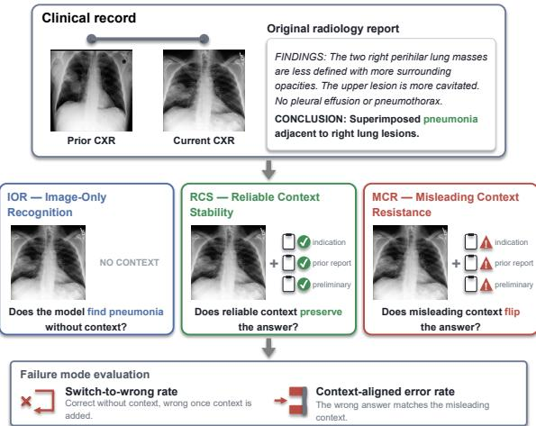
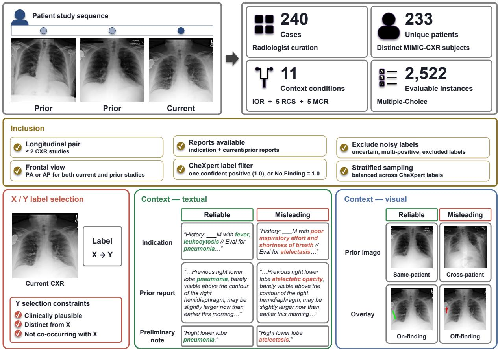
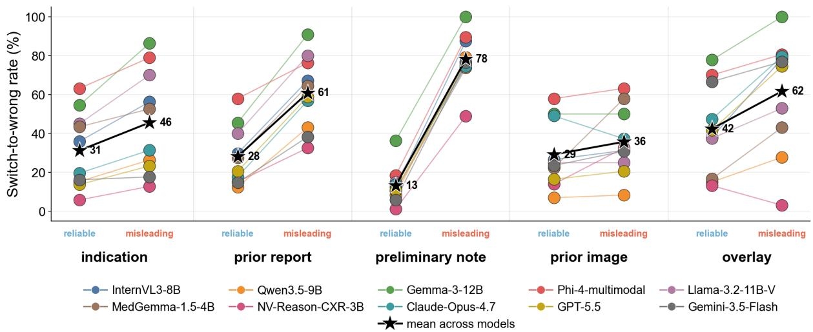

# MC-CXR: A Multi-Context Chest X-ray Benchmark for Context-Induced Disruption in Vision–Language Models

Junhyeok Lee1,2∗ Songsoo Kim2∗ Kyu Sung Choi2,3,4†

1Interdisciplinary Program in Cancer Biology, Seoul National University College of Medicine

2Department of Radiology, Seoul National University Hospital

3Department of Radiology, Seoul National University College of Medicine

Republic of Korea ∗Equal contribution †Corresponding author jhlee0619@snu.ac.kr crown7699@gmail.com ent1127@snu.ac.kr

## Abstract

Vision–language models (VLMs) are increasingly used in clinical pipelines where a chest X-ray is interpreted alongside retrieved reports, preliminary notes, or prior imaging. Existing benchmarks measure whether models answer correctly in isolation, but not whether they preserve a correct image-only decision when plausible context conflicts with the image. We introduce Multi-Context Chest X-ray (MC-CXR), a benchmark of 240 cases expanded into 2,522 instances that isolates context-induced disruption through paired perturbation. Each case fixes the current image and target finding while presenting matched reliable and misleading context across text and prior CXR, with visual overlays where available. MC-CXR defines three task families and two paired metrics, the switch-to-wrong rate and the contextaligned error rate. We evaluate ten VLMs spanning open-source general, medical-domain, and closed-source systems. Image-only accuracy is necessary but insufficient. Mean switch rates range from 45.6–78.1% across misleading textual sources and 35.7–61.7% across misleading visual sources. Among switched predictions, 74.6% align with the misleading label for text versus 17.6% for visual context, a 57.0- point gap (95% CI 50.9–62.8). This text–visual asymmetry is observed under the standardized direct-answer protocol. The dataset is available on PhysioNet.

## 1 Introduction

Chest X-ray (CXR) interpretation is rarely an image-only task. As part of standard clinical practice, radiologists interpret the current image together with the clinical indication, prior imaging, and prior reports (Castillo et al., 2021; Small, 2021) to improve diagnostic accuracy and clinical relevance. This integration is part of the radiologic standard of care rather than an optional aid (Test et al., 2013; Leslie et al., 2000), so any system interpreting CXRs within this workflow inherits the same expectation. Modern automated vision– language model (VLM) pipelines increasingly mirror this process, often expanding the context to include preliminary draft notes alongside the image (Chen et al., 2024; Lee et al., 2025; Singhal et al., 2023, 2025).

  
Figure 1: Overview of context-robust CXR evaluation and MC-CXR. Clinical image interpretation often combines current-image evidence with auxiliary context. We formalize context-robust visual reasoning into three task families, Image-only Recognition (IOR), Reliable Context Stability (RCS), and Misleading Context Resistance (MCR), and evaluate them across textual, prior-image, and visual-overlay perturbations.

The challenge is not that clinical context is undesirable, but that its reliability varies. In clinicalstyle or retrieval-augmented VLM workflows, context can be accurate and useful, but it can also be stale, mismatched to the patient, summarized inaccurately, generated as a preliminary draft, or over-weighted relative to the current image. While these issues collectively cause context-induced disruption, in practice we focus on mismatched or misleading auxiliary evidence. In this setting, clinical context pulls a VLM away from image evidence even when the image-only decision is correct. This concern is related to text-only failures studied as sycophancy, where models follow external statements that should not control the answer (Sharma et al., 2024), and knowledge conflict, where retrieved or in-context evidence overrides a model’s own correct prior (Xie et al., 2024; Wang et al., 2025; Longpre et al., 2021).

Existing CXR benchmarks evaluate recognition (Wang et al., 2017; Irvin et al., 2019), single-image VQA (Lau et al., 2018; Liu et al., 2025; Pal et al., 2025), report generation (Wang et al., 2018; Chen et al., 2020), or longitudinal progression (Bannur et al., 2023; Cho et al., 2026; Moon et al., 2025), but they do not directly test whether a model preserves a correct current-image decision when context is reliable or resists plausible but misleading context when it conflicts with the image. Using aggregate accuracy on these benchmarks as a proxy for context robustness is therefore misleading (De-Grave et al., 2021; Geirhos et al., 2020; Ribeiro et al., 2020). Because such context is increasingly attached automatically, whether retrieved or generated, a model that silently defers to unreliable evidence poses a clinical safety risk that aggregate accuracy cannot reveal.

We call the ability to use context conditionally context-robust visual reasoning. It requires four sub-capabilities that ordinary image-only accuracy cannot separate. The model must recognize currentimage evidence, parse the context source, identify agreement or disagreement between image and context, and decide which evidence source should determine the answer under conflict. Image-only benchmarks primarily measure the first capability, leaving context parsing, conflict detection, and arbitration untested. Arbitration determines whether the image or the context prevails when the two disagree, and it is what MC-CXR is designed to measure directly.

To evaluate this capability, we introduce the Multi-Context Chest X-ray benchmark MC-CXR. Each case fixes a current CXR image $I _ { i }$ and a target finding $X _ { i }$ while systematically varying the reliability and modality of auxiliary context. By pairing reliable and misleading variants of the same context source, MC-CXR tests conditional context use rather than penalizing context use itself. This paired-perturbation construction extends contrastset methodology from NLP (Ribeiro et al., 2020; Gardner et al., 2020; Kaushik et al., 2020) to multimodal medical reasoning (Saporta et al., 2022).

Figure 1 illustrates the benchmark design and the three task families.

Our contributions are as follows:

• Evidence arbitration as an evaluation target. We frame context robustness as deciding when reliable context should support current-image evidence and when misleading context should be resisted.

• A paired-perturbation CXR benchmark. MC-CXR contains 240 radiologist-curated cases expanded into 2,522 instances, pairing reliable and misleading clinical indications, prior reports, preliminary notes, prior CXRs, and visual overlays.

• Switch metrics and text–visual asymmetry. Switch-to-wrong and context-aligned error rates isolate disruption on image-only-correct cases and show that misleading text induces stronger, more label-aligned switching than misleading visual context across ten VLMs.

## 2 Related Work

## 2.1 Medical VQA and CXR Datasets

Existing medical VQA and CXR benchmarks evaluate three capabilities in isolation, including image recognition over large labeled cohorts (Johnson et al., 2019a; Wang et al., 2017; Irvin et al., 2019), single-context VQA on CXR and adjacent domains (Lau et al., 2018; Liu et al., 2021, 2025; Pal et al., 2025; Zhang et al., 2023), and report generation from a single current image (Wang et al., 2018; Chen et al., 2020). Across all three axes, the model is given exactly one context source and graded on whether its output matches a label. This protocol cannot distinguish a model that grounds its answer in the image from one that is led to the same answer by context. Aggregate accuracy hides this confound by construction.

## 2.2 Contextual and Longitudinal Reasoning in CXR

Clinical information has long been recognized as part of radiologic interpretation. Systematic reviews and empirical studies show that clinical history shapes reporting accuracy, confidence, relevance, and conclusions, and that inaccurate or absent history can compromise interpretation (Castillo et al., 2021; Small, 2021; Test et al., 2013; Leslie et al., 2000). Longitudinal benchmarks evaluate how models use prior studies and reports over time. MS-CXR-T probes temporal structure in biomedical VLMs (Bannur et al., 2023), Chest ImaGenome offers anatomy-centered scene graphs with chronological relations (Wu et al., 2021), and recent benchmarks such as MI-CXR and LUN-GUAGE emphasize longitudinal and sequential interpretation (Cho et al., 2026; Moon et al., 2025). These benchmarks share a common premise. Prior context, whether temporal, structured, or sequential, is assumed reliable, and the evaluation measures how well models exploit it. MC-CXR treats this premise itself as the variable. By contrasting reliable context conditions with clinically plausible but misleading counterparts, MC-CXR measures arbitration rather than exploitation. The benchmark tests whether a model tells when context should and should not override its image-only decision.

<table><tr><td>Benchmark</td><td>Primary task</td><td>Disrupt.</td><td>Ind.</td><td>Img.</td><td>Rep.</td><td>Note</td><td>Overlay</td></tr><tr><td>ReXVQA (Pal et al., 2025)</td><td>Multi-task CXR VQA</td><td></td><td></td><td></td><td></td><td></td><td></td></tr><tr><td>MS-CXR-T (Bannur et al., 2023)</td><td>Temporal progression</td><td></td><td></td><td>V</td><td>V</td><td></td><td></td></tr><tr><td>MI-CXR (Cho et al., 2026)</td><td>Longitudinal reasoning</td><td></td><td></td><td> $\checkmark$ </td><td> $\checkmark$ </td><td></td><td></td></tr><tr><td>MC-CXR (ours)</td><td>Context-robust reasoning</td><td> $\checkmark$ </td><td> $\checkmark$ </td><td> $\checkmark$ </td><td> $\checkmark$ </td><td> $\checkmark$ </td><td> $\checkmark$ </td></tr></table>

Table 1: Comparison of MC-CXR with existing medical VQA and longitudinal CXR benchmarks. Columns indicate whether each benchmark evaluates paired context-induced disruption and which auxiliary inputs it supports across indication, prior image, prior report, preliminary note, and overlay. Among the benchmarks compared here, MC-CXR combines all five context sources with explicit disruption metrics.

## 2.3 Context Robustness and Evidence Conflict in VLMs

The NLP literature has long shown that aggregate accuracy hides capability-specific failures through behavioral CheckLists, contrast sets, and shortcutlearning audits (Ribeiro et al., 2020; Gardner et al., 2020; Geirhos et al., 2020). MC-CXR adapts these case-internal contrast protocols to the multimodal– clinical setting, where the perturbation axis is context reliability across modalities rather than surface-form text. In text-only LLMs, retrieved or in-context evidence systematically pulls models from their correct priors. This behavior is studied under the labels knowledge conflict (Lewis et al., 2020; Yoran et al., 2024; Wang et al., 2025; Zhang et al., 2025) and sycophancy (Sharma et al., 2024). Whether this failure mode crosses into vision–language models is an open empirical question. MC-CXR addresses it directly. By holding the current image fixed and pairing five clinically realistic context sources across reliable and misleading conditions, it measures context arbitration and reveals stronger directional pull from textual than visual context under the direct-answer protocol. We now translate this gap into a benchmark design that holds the current image fixed while varying the reliability and modality of auxiliary context. Table 1 summarizes the comparison with existing benchmarks along these dimensions.

## 3 MC-CXR Benchmark

## 3.1 Task Formulation

MC-CXR evaluates whether a vision–language model preserves a correct current-image decision when additional evidence is provided. Each benchmark case contains a current CXR image $I _ { i }$ from MIMIC-CXR, a target current-image finding $X _ { i } .$ and a context-implied finding $Y _ { i } .$ Both $X _ { i }$ and $Y _ { i }$ are drawn from the same curated CheXpertderived label space (Irvin et al., 2019). Context means auxiliary evidence beyond the current unannotated image, and it spans three modalities. Textual information includes the clinical indication, the prior report, and the preliminary note. Visual prior evidence is a same- or different-patient prior CXR. Overlaid visual cues are PACS-style annotations on the current image. Under context condition $^ { c , }$ the model emits a single predicted label $\hat { p } _ { i , c }$ from a 12-label CheXpert subset (prompts in Appendix B). The response is target-correct when $\hat { p } _ { i , c } = X _ { i }$ . Three task families share this output schema, an image-only baseline plus two robustness axes RCS and MCR, each spanning textual, prior-image, and visual-overlay modalities. Figure 2 summarizes how this case-level formulation is instantiated through source-case filtering, radiologist review, and context construction.

IOR, Image-only Recognition. The IOR family asks whether the model identifies the target finding from the current image alone. IOR is the no-context baseline, in which the model receives $I _ { i }$ and the fixed 12-label option list. The hidden target $X _ { i }$ is used only for scoring. IOR accuracy measures whether $\hat { p } _ { i , \mathrm { i o r } }$ matches $X _ { i }$ . Switch analyses condition on each model’s IOR-correct subset to isolate context-induced changes from recognition error.

  
Figure 2: Overview of MC-CXR construction. We derive eligible cases from MIMIC-CXR and MIMIC-CXR-JPG, select target and misleading labels through radiologist review, and instantiate matched reliable and misleading context conditions. The resulting cohort supports paired evaluation of reliable-context stability and misleadingcontext resistance.

RCS, Reliable Context Stability. The RCS family asks whether the model remains stable when context agrees with the image. RCS measures whether reliable context preserves an image-only correct decision. Reliable contexts span all three modalities. The textual reliable contexts are the original clinical indication, the same-patient prior report, and a current-image-consistent preliminary note. The prior-image reliable context is the samepatient prior CXR. The visual-overlay reliable context is a pathology-aligned PACS-style arrow. RCS thus separates whether context agrees with the image from whether the model uses that agreement without losing its grip on the image evidence. The two are not the same. Reliable context still flips an image-only-correct prediction at non-trivial rates.

MCR, Misleading Context Resistance. The MCR family asks whether the model resists plausible but misleading context. MCR measures whether models resist context that plausibly implies $Y \neq X$ across all three modalities. The textual misleading contexts are a rewritten indication, prior report, or preliminary note. The prior-image misleading context is a cross-patient prior CXR. The visual-overlay misleading context is an offpathology PACS-style arrow. Each case measures both whether the target-finding judgment flips and whether the predicted finding aligns with Y . MCR therefore measures conditional use. A model that uniformly trusts context fails MCR. A model that uniformly ignores context may remain stable, but it does not demonstrate beneficial use of reliable context.

## 3.2 Design Principles and Metrics

Design principles. Three principles guide construction. Under current-image priority, the benchmark is scored against the adjudicated currentimage finding, while auxiliary context is varied only to test stability and resistance. Under paired perturbation, reliable and misleading conditions keep $I _ { i }$ and $X _ { i }$ fixed where both are defined. Under directional error attribution, misleading contexts imply a specific Y so that Y-aligned errors can be attributed to context pull rather than random instability. The paired-perturbation principle follows behavioral and contrastive testing in NLP (Ribeiro et al., 2020; Gardner et al., 2020).

<table><tr><td></td><td colspan="2">Image-only</td><td colspan="5">Reliable context</td><td colspan="5">Misleading context</td></tr><tr><td></td><td></td><td></td><td colspan="3">Textual</td><td colspan="2">Visual</td><td colspan="3">Textual</td><td colspan="2">Visual</td></tr><tr><td>Model</td><td>IOR</td><td>κ</td><td>ind</td><td>rep</td><td>note</td><td>img</td><td>overlay</td><td>ind</td><td>rep</td><td>note</td><td>img</td><td>overlay</td></tr><tr><td>InternVL3-8B</td><td>26.7</td><td>0.165</td><td>26.2</td><td>27.9</td><td>70.8</td><td>23.8</td><td>22.7</td><td>12.9</td><td>11.2</td><td>6.2</td><td>22.9</td><td>10.6</td></tr><tr><td>Qwen3.5-9B</td><td>30.0</td><td>0.198</td><td>37.1</td><td>37.9</td><td>68.8</td><td>32.9</td><td>28.8</td><td>25.0</td><td>17.5</td><td>9.2</td><td>30.8</td><td>23.6</td></tr><tr><td>Gemma-3-12B-IT</td><td>9.2</td><td>0.001</td><td>20.8</td><td>25.8</td><td>68.8</td><td>8.8</td><td>15.3</td><td>5.8</td><td>3.8</td><td>4.6</td><td>10.0</td><td>6.0</td></tr><tr><td>Llama-3.2-11B-V</td><td>8.3</td><td>0.008</td><td>22.9</td><td>28.3</td><td>58.3</td><td>7.5</td><td>15.3</td><td>5.4</td><td>4.6</td><td>3.3</td><td>8.8</td><td>11.1</td></tr><tr><td>Phi-4-multimodal</td><td>15.8</td><td>0.066</td><td>23.8</td><td>27.5</td><td>66.2</td><td>12.1</td><td>11.0</td><td>7.9</td><td>7.1</td><td>4.2</td><td>9.2</td><td>7.5</td></tr><tr><td>MedGemma-1.5-4B</td><td>31.7</td><td>0.249</td><td>29.6</td><td>34.6</td><td>64.6</td><td>32.5</td><td>28.8</td><td>17.9</td><td>13.3</td><td>12.1</td><td>16.2</td><td>19.6</td></tr><tr><td>NV-Reason-CXR-3B</td><td>35.8</td><td>0.282</td><td>38.8</td><td>39.6</td><td>58.8</td><td>36.7</td><td>21.5</td><td>33.3</td><td>27.1</td><td>20.4</td><td>27.1</td><td>32.2</td></tr><tr><td>Claude-Opus-4-7</td><td>21.2</td><td>0.115</td><td>31.7</td><td>35.0</td><td>66.2</td><td>14.2</td><td>20.9</td><td>20.4</td><td>11.2</td><td>11.7</td><td>16.7</td><td>10.6</td></tr><tr><td>GPT-5.5</td><td>30.4</td><td>0.230</td><td>37.1</td><td>41.2</td><td>70.8</td><td>30.8</td><td>28.8</td><td>27.9</td><td>15.4</td><td>10.8</td><td>29.2</td><td>13.6</td></tr><tr><td>Gemini-3.5-Flash</td><td>28.3</td><td>0.184</td><td>30.8</td><td>34.2</td><td>68.8</td><td>28.7</td><td>27.0</td><td>25.8</td><td>21.7</td><td>10.4</td><td>22.9</td><td>11.6</td></tr></table>

Table 2: Absolute accuracy across context conditions for the ten evaluated VLMs, together with image-only recognition (IOR) accuracy and Cohen’s κ as model-level summaries. These columns are evaluated without IOR-correct conditioning and therefore reflect conventional target-label classification accuracy. The high currentreport-derived preliminary-note column reflects by-construction target evidence, whereas the low misleading-context columns reflect context-induced disruption under misleading conditions. Bold and underline mark the best and second-best result per column, respectively (higher is better).

Failure-mode metrics. Two case-internal metrics define MC-CXR’s failure-mode evaluation. Let $\mathcal { T } _ { M } = \{ i : \hat { p } _ { i , \mathrm { i o r } } = X _ { i } \}$ denote the IOR-correct subset for model M, where ior is the image-only condition. The switch-to-wrong rate is the fraction of $\mathcal { T } _ { M }$ whose prediction flips under context condition c.

$$
P ( C  W \mid c ) = \frac { \# \{ i \in \mathbb { Z } _ { M } : \hat { p } _ { i , c } \neq X _ { i } \} } { | \mathbb { Z } _ { M } | } .\tag{1}
$$

For misleading-context conditions, we additionally compute the context-aligned error rate, the proportion of those switched errors whose predicted finding matches the context-implied label Y . Since $Y _ { i } ~ \neq ~ X _ { i }$ by construction, $\hat { p } _ { i , c } ~ = ~ Y _ { i }$ implies a switch.

$$
P ( W _ { Y } \mid C  W , c ) = { \frac { \# \{ i \in { \mathbb { Z } } _ { M } : { \hat { p } } _ { i , c } = Y _ { i } \} } { \# \{ i \in { \mathbb { Z } } _ { M } : { \hat { p } } _ { i , c } \neq X _ { i } \} } } .\tag{2}
$$

$P ( W _ { Y } \mid C  W , c )$ is undefined when a model has no switched errors under condition c and is reported as NA in that case.

Switch-to-wrong measures flips in the target judgment, and context-aligned error checks whether those flips land on the specific class implied by the misleading context. Together they distinguish random instability from directional context pull (Ribeiro et al., 2020; Gardner et al., 2020). Raw target-finding accuracy is reported in Table 2. The constrained-letter protocol forces a choice from $\{ \operatorname { A } , . . . , \operatorname { L } \}$ so the model is offered no explicit abstention option, and responses that fail to yield a valid letter are marked invalid and counted as incorrect.

## 3.3 Dataset Construction

MC-CXR is constructed from MIMIC-CXR (Johnson et al., 2019a,b) through a radiologist-gated pipeline. Eligible cases require a frontal PA or AP current CXR with the patient’s most recent prior frontal study and parseable Findings or Impression sections in both reports. CheXpert source labels must correspond to a single confident positive abnormality or to No Finding, with uncertain (−1.0) and multi-positive cases excluded (Irvin et al., 2019). The 12-label output space excludes Support Devices (non-diagnostic hardware) and Pleural Other (clinically ambiguous and underrepresented in this cohort). Construction details are provided in Appendix A.

For each eligible case, the radiologist confirms a target finding X on the current image and selects a single misleading label Y that is clinically plausible, distinct from X, and not co-occurring with X in the current report. The radiologist overrode the CheXpert source label for X in 26 of the 240 cases (10.8%), confirming non-trivial sourcelabel noise and substantiating the radiologist-gated design. The same Y is used across all misleadingcontext conditions for a case so that downstream context-aligned errors point in a known direction.

<table><tr><td></td><td colspan="3">Textual</td><td colspan="2">Visual</td></tr><tr><td>Model</td><td>ind</td><td>rep</td><td>note</td><td>img</td><td>overlay</td></tr><tr><td>InternVL3-8B Qwen3.5-9B</td><td>63.9 73.7</td><td>67.4 64.5</td><td>83.9 93.0</td><td>20.0 33.3</td><td>22.5 20.0</td></tr><tr><td>Gemma-3-12B-IT</td><td>57.9</td><td>65.0</td><td>86.4</td><td>9.1</td><td>5.6</td></tr><tr><td>Llama-3.2-11B-V</td><td>85.7</td><td>68.8</td><td>80.0</td><td>20.0</td><td>22.2</td></tr><tr><td>Phi-4-multimodal</td><td>70.0</td><td>58.6</td><td>79.4</td><td>4.2</td><td>16.0</td></tr><tr><td></td><td></td><td></td><td></td><td></td><td></td></tr><tr><td>MedGemma-1.5-4B NV-Reason-CXR-3B</td><td>70.0 72.7</td><td>65.3 64.3</td><td>83.9 85.7</td><td>13.6 14.3</td><td>20.0 0.0</td></tr><tr><td>Claude-Opus-4-7</td><td>43.8</td><td>69.0</td><td>84.2</td><td>10.5</td><td>17.1</td></tr><tr><td>GPT-5.5</td><td>70.6</td><td>74.4</td><td>87.5</td><td>26.7</td><td>22.0</td></tr><tr><td>Gemini-3.5-Flash</td><td>33.3</td><td>50.0</td><td>88.5</td><td>28.6</td><td>20.0</td></tr></table>

Table 3: Directional Y-alignment among switches induced by misleading context across the ten evaluated VLMs. Results report the fraction of switched errors that land on the context-implied label Y for each misleading source. Textual conditions show systematic directional pull, whereas visual conditions produce lower and more scattered alignment. Bold and underline mark the best and second-best result per column, respectively, and lower values are better.

The radiologist then authors or verifies reliable and misleading conditions across five context sources spanning textual, prior-image, and visualoverlay modalities, under a side-by-side review interface. Misleading textual conditions rewrite the source text from X toward Y while preserving non-target clinical content, including anatomic location, laterality, severity, temporal wording, and negated findings. The cross-patient prior-image condition draws from priors whose CheXpert labels include Y and exclude X, view- and demographicsmatched by a deterministic ranking with the radiologist’s final approval. The on-finding overlay condition is restricted to positive-abnormality cases because an on-pathology arrow is undefined for No Finding.

The current-report-derived preliminary-note condition is finalized from the current report and serves as a reference condition for the matched rewritten preliminary-note condition. The resulting benchmark contains 240 cases from 233 unique patients, expanded across 11 context conditions into 2,522 model-evaluable instances.

## 4 Experiments

## 4.1 Evaluation Protocol

Having formalized MC-CXR as paired context perturbations, we evaluate whether current VLMs preserve image-grounded decisions across those matched conditions.

We evaluate ten VLMs in three categories. The first category comprises five general-purpose opensource models, namely InternVL3-8B (Zhu et al., 2025), Qwen3.5-9B (Team, 2026), Gemma-3-12B-IT (Gemma Team et al., 2025), Llama-3.2-11B-Vision-Instruct (Grattafiori et al., 2024), and Phi-4- multimodal-instruct (Microsoft et al., 2025). The second category comprises two CXR or medicaldomain open-source models, namely MedGemma-1.5-4B (Sellergren et al., 2026) and NV-Reason-CXR-3B (Myronenko et al., 2025). The third category comprises three closed-source frontier models, namely Claude Opus 4.7 (Anthropic, 2025) accessed via the Anthropic API, GPT-5.5 (OpenAI, 2026) accessed via the OpenAI API, and Gemini 3.5 Flash (Google DeepMind, 2026) accessed via the Google AI Studio API. The primary protocol is zero-shot constrained-letter multiple-choice prompting. The model receives the image and condition context with a fixed A–L option list mapping to the 12 valid labels and emits a single capital letter.

Outputs are parsed by a single rule-based extractor, and responses that fail to yield a valid label are marked invalid and treated as incorrect. The main evaluation is performed on each model’s IORcorrect subset. We first identify the cases that the model answers correctly under image-only input, and then measure whether the response switches under each context condition. This conditioning prevents baseline recognition failures from being counted as context-induced disruption. The size of this subset is determined by each model’s IOR accuracy on the 240-case benchmark. It ranges from 20 cases for Llama-3.2-11B-V to 86 for NV-Reason-CXR-3B, and is smaller still for the overlay conditions, which draw on the retained core subset and, for on-finding, positive cases only. All reported numbers reflect a single deterministic run per model. Open-source models use greedy decoding and closed-source models are queried with deterministic settings, so we do not report run-torun error bars. Full model identifiers, decoding settings, and compute are given in Appendix C.

  
Figure 3: Switch-to-wrong rate across context conditions on the IOR-correct subset for the ten evaluated VLMs (lower is better). Coloured dots are per-model rates and black stars mark the mean across models. The rewritten preliminary-note condition produces the strongest misleading-text disruption, the current-report-derived preliminary note condition is the most stability-preserving reliable context, and the off-finding overlay condition shows strong visual perturbation without corresponding directional alignment.

## 4.2 Aggregate Results

Table 2 reports absolute accuracy for each context condition without IOR-correct conditioning. Cohen’s κ (Cohen, 1960; Landis and Koch, 1977) between IOR predictions and gold X peaks at 0.282 (NV-Reason-CXR-3B), with most models in the 0.00–0.25 range. This range is conventionally interpreted as slight to fair agreement. Current VLMs are far from reliable single-image CXR classifiers even before any context is introduced. Two patterns stand out. The current-report-derived preliminarynote condition reaches a 66.2% across-model mean because it provides target evidence by construction. All five MCR conditions collapse to acrossmodel means below 20%. The collapse is most severe for misleading preliminary notes (9.3%) and mildest for cross-patient prior images (19.4%). Per category, IOR across-model means are 18.0% (open-source general), 33.8% (medical-domain), and 26.7% (closed-source). Under misleading preliminary notes, these drop to 5.5%, 16.3%, and 11.0% respectively. The resulting image-only to rewritten preliminary-note gap of 12.5–17.5 percentage points is largest for the medical-domain category, indicating that domain specialization does not insulate against textual override. Absolute accuracy alone, however, does not separate contextinduced disruption from baseline recognition failure, motivating the switch and directional metrics that follow.

## 5 Failure Patterns in Context Use

Switch-based metrics conditioned on the IORcorrect subset isolate context-induced disruption from baseline recognition error. The three failure families below converge on a single asymmetry. Misleading textual context flips IOR-correct decisions and aligns them with the implied label, while misleading visual context flips them without directional commitment. This pattern connects CXR evaluation to shortcut learning (Geirhos et al., 2020), sycophancy (Sharma et al., 2024), and knowledge conflict in retrieval-augmented LLMs (Xie et al., 2024; Wang et al., 2025). Figure 3 and Table 3 provide the aggregate switch and directional-alignment views.

## 5.1 Instability under Reliable Context

In Reliable Context Stability, the context is not misleading by construction, yet models switch away from correct image-only answers at an acrossmodel average of 28.8% over the five conditions. This is an unweighted average because the onfinding overlay condition is restricted to positiveabnormality cases, for which on-pathology arrows can be placed. The per-source ordering is informative. The on-finding overlay (42.4%) and reliableindication (31.3%) conditions are the most disruptive, the same-patient prior-image (29.2%) and same-patient prior-report (28.1%) conditions sit close to the across-model mean, and the concise current-report-derived preliminary-note condition (13.3%) is the most stability-preserving. This exploratory ordering is consistent with sensitivity to differences in source register and visual salience, but the experiment does not isolate those factors. Even when the arrow points to the true pathology, models switch at non-trivial rates.

## 5.2 Textual Context Over-Reliance

The first headline of MC-CXR is that VLMs are more directionally affected by misleading text than by misleading visual context. Under rewritten preliminary notes, averaged across models, 78.1% of image-only-correct decisions flip and 85.3% land on the context-implied label. Rewritten prior reports and clinical indications produce weaker but still systematic overrides, with flip rates of 60.9% and 45.6% and Y-alignment of 64.7% and 64.2%, respectively (Table 3, Figure 3). This exploratory ordering is consistent with differences in source register, but authority, formality, and assertiveness were not independently manipulated. The note condition reaches up to 93.0% Y -alignment on Qwen3.5-9B, providing model-level evidence of directed rather than diffuse errors in that condition. Comparable text-only knowledge-conflict and sycophancy studies report 40–80% override rates (Xie et al., 2024; Sharma et al., 2024; Wang et al., 2025).

## 5.3 Visual Confusion vs. Language-Prior Bias

The second headline of MC-CXR mirrors the first. Misleading visual context flips predictions but does not direct them toward the misleading label. The cross-patient prior-image condition switches at 35.7% with only 18.0% Y -alignment, and the off-finding overlay condition switches at 61.7% with only 16.5% Y-alignment (Table 3). These are high switch rates with scattered errors. Even the more aggressive visual perturbation does not reproduce the 85.3% Y-alignment seen for rewritten preliminary notes, and the gap holds across all ten evaluated models under the same case-internal protocol. Pooled over the switched cases of all ten models, textual misleading context produces 713/956 (74.6%) Y-aligned errors against 78/443 (17.6%) for visual context, a 57.0-percentage-point gap (case-cluster-bootstrap 95% CI 50.9–62.8); every model individually shows the same direction (two-sided sign test p = 0.002). This asymmetry is consistent with stronger directional pull from textual context under the standardized direct-answer protocol.

The directional gap remains large after excluding the strongest misleading-text condition, the rewritten preliminary note: 345/528 (65.3%) for text versus 78/443 (17.6%) for visual context, a 47.7-point gap (case-cluster-bootstrap 95% CI 40.9–54.3). Descriptive threshold analyses also yield similar gaps when retaining models with IOR accuracy at least 20% (55.9 points) or κ at least 0.15 (55.6 points), although these checks cannot remove chance-correct cases from the conditioned subsets.

Across these analyses, models do not always preserve their image-only-correct decisions when misleading context is present under the standardized direct-answer protocol.

## 6 Conclusion

MC-CXR measures whether vision–language models preserve image-grounded decisions when clinical context is added. Across ten models and five context sources, the answer is asymmetric. VLMs abandon correct image-only decisions under misleading text, with directional alignment reaching 85% for rewritten preliminary notes, while visually misleading cues produce scattered predictions. This asymmetry is observed under the standardized direct-answer protocol and is related to sycophancy and knowledge conflict in text-only LLMs. We release MC-CXR as a paired benchmark for evaluating context robustness and corresponding interventions in medical VLMs.

## Limitations

Five caveats bound MC-CXR’s findings. First, IOR accuracy is 8.3–35.8% and Cohen’s κ against gold X peaks at 0.282, so IOR-correct conditioning isolates context-induced change but does not rule out chance-correct cases. Second, the numbers reflect single deterministic runs under a constrained-letter direct-answer prompt. A GPT-5.5 conflict-aware pilot (Appendix D) reduces misleading-text switches, so the pattern is protocoldependent rather than prompt-invariant. Third, curation is single-rater (Landis and Koch, 1977). The 51-case second-reader audit (Appendix D) covers b2/d2/e2, supports directional Y -implication, and does not establish κ or benchmark-wide validation. Except for two minimally reconstructed indications, the reliable indications, prior reports, and prior CXRs are authentic source materials rather than validated to imply exactly X, so RCS switches under reliable context can reflect partial contextual mismatch in addition to instability under agreeing evidence. Fourth, evaluated models’ MIMIC-CXR overlap cannot be audited; MC-CXR makes no contamination-free claim. Fifth, the 12-label constrained-letter output offers no abstention and is not equivalent to free-text reporting. The current-report-derived preliminary-note condition (66.2%, Table 2) is a reference control, and on-/off-finding overlays are evaluated on the retained core subset only. The misleading visual conditions (cross-patient prior CXR, off-finding overlay) were radiologist-curated to imply Y but not source-only calibrated for Y recognizability, so the low visual Y -alignment may partly reflect weaker cue specificity in addition to modality-preference asymmetry. Multi-rater curation, richer decoding, abstention, and larger cohorts are planned.

## Ethical Considerations

MC-CXR is intended solely for research on multimodal model evaluation and should not support autonomous clinical interpretation (DeGrave et al., 2021). Annotation and curation were performed by a single board-certified radiologist who is an author of this work. No external annotators were recruited and no compensation applies (criteria in Appendix E). Original MIMIC-CXR radiographs are not redistributed, and access to the underlying MIMIC-CXR data remains subject to the PhysioNet Credentialed Health Data License.

The benchmark’s intentionally misleading clinical context is necessary for robustness evaluation and should be reported only in that setting; models evaluated on MC-CXR should not be described as clinically safe or unsafe from benchmark performance alone.

## Acknowledgments

This work was supported by the National Research Foundation of Korea (NRF) grant funded by the Korea government (MSIT) (No. RS-2026-25479661; K.S.C.), the SNUH Research Fund (No. 04-2025- 2060; K.S.C.), the Korea Health Technology R&D Project through the Korea Health Industry Development Institute (KHIDI) funded by the Ministry of Health and Welfare (No. RS-2024-00439549; K.S.C.), the “Advanced GPU Utilization Support Program” funded by the Government of the Republic of Korea (Ministry of Science and ICT), and partly by the Institute of Information & Communications Technology Planning & Evaluation (IITP) through the AI Computing Support Project for R&D funded by the Korea government (MSIT) (No. RS-2026-25505492, “High-Performance Research AI Computing Infrastructure Support at the 2 PFLOPS Scale”).

## References

Anthropic. 2025. System card: Claude Opus 4 & Claude Sonnet 4. Technical report, Anthropic.

Shruthi Bannur, Stephanie Hyland, Qianchu Liu, Fernando Pérez-García, Maximilian Ilse, Daniel C. Castro, Benedikt Boecking, Harshita Sharma, Kenza Bouzid, Anja Thieme, Anton Schwaighofer, Maria Wetscherek, Matthew P. Lungren, Aditya Nori, Javier Alvarez-Valle, and Ozan Oktay. 2023. Learning to exploit temporal structure for biomedical visionlanguage processing. In 2023 IEEE/CVF Conference on Computer Vision and Pattern Recognition (CVPR), pages 15016–15027. IEEE.

Chelsea Castillo, Tom Steffens, Lawrence Sim, and Liam Caffery. 2021. The effect of clinical information on radiology reporting: A systematic review. Journal ofMedical Radiation Sciences, 68(1):60–74.

Zhihong Chen, Yan Song, Tsung-Hui Chang, and Xiang Wan. 2020. Generating radiology reports via memory-driven transformer. In Proceedings of the 2020 Conference on Empirical Methods in Natural Language Processing (EMNLP), pages 1439–1449. Association for Computational Linguistics.

Zhihong Chen, Maya Varma, Justin Xu, Magdalini Paschali, Dave Van Veen, Andrew Johnston, Alaa Youssef, Louis Blankemeier, Christian Bluethgen, Stephan Altmayer, Jeya Maria Jose Valanarasu, Mohamed Siddig Eltayeb Muneer, Eduardo Pontes Reis, Joseph Paul Cohen, Cameron Olsen, Tanishq Mathew Abraham, Emily B. Tsai, Christopher F. Beaulieu, Jenia Jitsev, and 4 others. 2024. A vision-language foundation model to enhance efficiency of chest xray interpretation. arXiv, arXiv:2401.12208.

Sunghwan Steve Cho, Yunseok Han, and Jaeyoung Do. 2026. MI-CXR: A benchmark for longitudinal reasoning over multi-interval chest X-rays. In Findings of the Association for Computational Linguistics: ACL 2026, pages 30241–30273, San Diego, California, United States. Association for Computational Linguistics.

Jacob Cohen. 1960. A coefficient of agreement for nominal scales. Educational and Psychological Measurement, 20(1):37–46.

Alex J. DeGrave, Joseph D. Janizek, and Su-In Lee. 2021. Ai for radiographic covid-19 detection selects shortcuts over signal. Nature Machine Intelligence, 3(7):610–619.

Matt Gardner, Yoav Artzi, Victoria Basmov, Jonathan Berant, Ben Bogin, Sihao Chen, Pradeep Dasigi, Dheeru Dua, Yanai Elazar, Ananth Gottumukkala, Nitish Gupta, Hannaneh Hajishirzi, Gabriel Ilharco, Daniel Khashabi, Kevin Lin, Jiangming Liu, Nelson F. Liu, Phoebe Mulcaire, Qiang Ning, and 7 others. 2020. Evaluating models’ local decision boundaries via contrast sets. In Findings ofthe Association for Computational Linguistics: EMNLP 2020, pages 1307–1323. Association for Computational Linguistics.

Robert Geirhos, Jörn-Henrik Jacobsen, Claudio Michaelis, Richard Zemel, Wieland Brendel, Matthias Bethge, and Felix A. Wichmann. 2020. Shortcut learning in deep neural networks. Nature Machine Intelligence, 2(11):665–673.

Gemma Team, Aishwarya Kamath, Johan Ferret, Shreya Pathak, Nino Vieillard, Ramona Merhej, Sarah Perrin, Tatiana Matejovicova, Alexandre Ramé, Morgane Rivière, Louis Rouillard, Thomas Mesnard, Geoffrey Cideron, Jean bastien Grill, Sabela Ramos, Edouard Yvinec, Michelle Casbon, Etienne Pot, Ivo Penchev, and 196 others. 2025. Gemma 3 technical report. arXiv.

Google DeepMind. 2026. Gemini 3.5 flash. https: //deepmind.google/models/gemini/flash/.

Aaron Grattafiori, Abhimanyu Dubey, Abhinav Jauhri, Abhinav Pandey, Abhishek Kadian, Ahmad Al-Dahle, Aiesha Letman, Akhil Mathur, Alan Schelten, Alex Vaughan, Amy Yang, Angela Fan, Anirudh Goyal, Anthony Hartshorn, Aobo Yang, Archi Mitra, Archie Sravankumar, Artem Korenev, Arthur Hinsvark, and 540 others. 2024. The llama 3 herd of models. arXiv.

Jeremy Irvin, Pranav Rajpurkar, Michael Ko, Yifan Yu, Silviana Ciurea-Ilcus, Chris Chute, Henrik Marklund, Behzad Haghgoo, Robyn Ball, Katie Shpanskaya, Jayne Seekins, David A. Mong, Safwan S. Halabi, Jesse K. Sandberg, Ricky Jones, David B. Larson, Curtis P. Langlotz, Bhavik N. Patel, Matthew P. Lungren, and Andrew Y. Ng. 2019. Chexpert: A large chest radiograph dataset with uncertainty labels and expert comparison. Proceedings ofthe AAAI Conference on Artificial Intelligence, 33(01):590–597.

Alistair E. W. Johnson, Tom J. Pollard, Seth J. Berkowitz, Nathaniel R. Greenbaum, Matthew P. Lungren, Chih-ying Deng, Roger G. Mark, and Steven Horng. 2019a. Mimic-cxr, a de-identified publicly available database of chest radiographs with free-text reports. Scientific Data, 6(1).

Alistair E. W. Johnson, Tom J. Pollard, Nathaniel R. Greenbaum, Matthew P. Lungren, Chih ying Deng, Yifan Peng, Zhiyong Lu, Roger G. Mark, Seth J. Berkowitz, and Steven Horng. 2019b. Mimic-cxrjpg, a large publicly available database of labeled chest radiographs. arXiv, arXiv:1901.07042.

Divyansh Kaushik, Eduard H. Hovy, and Zachary Chase Lipton. 2020. Learning the difference that makes a

difference with counterfactually-augmented data. In International Conference on Learning Representations.

J. Richard Landis and Gary G. Koch. 1977. The measurement of observer agreement for categorical data. Biometrics, 33(1):159.

Jason J. Lau, Soumya Gayen, Asma Ben Abacha, and Dina Demner-Fushman. 2018. A dataset of clinically generated visual questions and answers about radiology images. Scientific Data, 5(1).

Seowoo Lee, Jiwon Youn, Hyungjin Kim, Mansu Kim, and Soon Ho Yoon. 2025. Cxr-llava: a multimodal large language model for interpreting chest x-ray images. European Radiology, 35(7):4374–4386.

A Leslie, A J Jones, and P R Goddard. 2000. The influence of clinical information on the reporting of ct by radiologists. The British Journal ofRadiology, 73(874):1052–1055.

Patrick Lewis, Ethan Perez, Aleksandra Piktus, Fabio Petroni, Vladimir Karpukhin, Naman Goyal, Heinrich Küttler, Mike Lewis, Wen tau Yih, Tim Rocktäschel, Sebastian Riedel, and Douwe Kiela. 2020. Retrieval-augmented generation for knowledgeintensive nlp tasks. In Advances in Neural Information Processing Systems.

Bo Liu, Li-Ming Zhan, Li Xu, Lin Ma, Yan Yang, and Xiao-Ming Wu. 2021. Slake: A semantically-labeled knowledge-enhanced dataset for medical visual question answering. In 2021 IEEE 18th International Symposium on Biomedical Imaging (ISBI), pages 1650–1654. IEEE.

Bo Liu, Ke Zou, Li-Ming Zhan, Zexin Lu, Xiaoyu Dong, Yidi Chen, Chengqiang Xie, Jiannong Cao, Xiao-Ming Wu, and Huazhu Fu. 2025. Gemex: A large-scale, groundable, and explainable medical vqa benchmark for chest x-ray diagnosis. In 2025 IEEE/CVF International Conference on Computer Vision (ICCV), pages 21310–21320. IEEE.

Shayne Longpre, Kartik Perisetla, Anthony Chen, Nikhil Ramesh, Chris DuBois, and Sameer Singh. 2021. Entity-based knowledge conflicts in question answering. In Proceedings of the 2021 Conference on Empirical Methods in Natural Language Processing, pages 7052–7063. Association for Computational Linguistics.

Microsoft, Abdelrahman Abouelenin, Atabak Ashfaq, Adam Atkinson, Hany Awadalla, Nguyen Bach, Jianmin Bao, Alon Benhaim, Martin Cai, Vishrav Chaudhary, Congcong Chen, Dong Chen, Dongdong Chen, Junkun Chen, Weizhu Chen, Yen-Chun Chen, Yi ling Chen, Qi Dai, Xiyang Dai, and 56 others. 2025. Phi-4-mini technical report: Compact yet powerful multimodal language models via mixture-of-loras. arXiv.

Jong Hak Moon, Geon Choi, Paloma Rabaey, Min Gwan Kim, Jung-Oh Lee, Hyuk Gi Hong, Eun Woo Doe, Hangyul Yoon, Jiyoun Kim, Harshita Sharma,

Daniel C. Castro, Javier Alvarez-Valle, and Edward Choi. 2025. Lunguage: A benchmark for structured and sequential chest x-ray interpretation. arXiv.

Andriy Myronenko, Dong Yang, Baris Turkbey, Mariam Aboian, Sena Azamat, Esra Akcicek, Hongxu Yin, Pavlo Molchanov, Marc Edgar, Yufan He, Pengfei Guo, Yucheng Tang, and Daguang Xu. 2025. Reasoning visual language model for chest x-ray analysis. arXiv, arXiv:2510.23968.

OpenAI. 2026. GPT-5.5 system card. Technical report, OpenAI. Accessed: 2026-05-24.

Ankit Pal, Jung-Oh Lee, Xiaoman Zhang, Malaikannan Sankarasubbu, Seunghyeon Roh, Won Jung Kim, Meesun Lee, and Pranav Rajpurkar. 2025. Rexvqa: A large-scale visual question answering benchmark for generalist chest x-ray understanding. In Biocomputing 2026, pages 251–264. WORLD SCIENTIFIC.

Marco Tulio Ribeiro, Tongshuang Wu, Carlos Guestrin, and Sameer Singh. 2020. Beyond accuracy: Behavioral testing of nlp models with checklist. In Proceedings of the 58th Annual Meeting of the Association for Computational Linguistics, pages 4902–4912. Association for Computational Linguistics.

Adriel Saporta, Xiaotong Gui, Ashwin Agrawal, Anuj Pareek, Steven Q. H. Truong, Chanh D. T. Nguyen, Van-Doan Ngo, Jayne Seekins, Francis G. Blankenberg, Andrew Y. Ng, Matthew P. Lungren, and Pranav Rajpurkar. 2022. Benchmarking saliency methods for chest x-ray interpretation. Nature Machine Intelligence, 4(10):867–878.

Andrew Sellergren, Chufan Gao, Fereshteh Mahvar, Timo Kohlberger, Fayaz Jamil, Madeleine Traverse, Alberto Tono, Bashir Sadjad, Lin Yang, Charles Lau, Liron Yatziv, Tiffany Chen, Bram Sterling, Kenneth Philbrick, Richa Tiwari, Yun Liu, Madhuram Jajoo, Chandrashekar Sankarapu, Swapnil Vispute, and 23 others. 2026. Medgemma 1.5 technical report. arXiv, arXiv:2604.05081.

Mrinank Sharma, Meg Tong, Tomasz Korbak, David Duvenaud, Amanda Askell, Samuel R. Bowman, Esin DURMUS, Zac Hatfield-Dodds, Scott R Johnston, Shauna M Kravec, Timothy Maxwell, Sam Mc-Candlish, Kamal Ndousse, Oliver Rausch, Nicholas Schiefer, Da Yan, Miranda Zhang, and Ethan Perez. 2024. Towards understanding sycophancy in language models. In International Conference on Learning Representations.

Karan Singhal, Shekoofeh Azizi, Tao Tu, S. Sara Mahdavi, Jason Wei, Hyung Won Chung, Nathan Scales, Ajay Tanwani, Heather Cole-Lewis, Stephen Pfohl, Perry Payne, Martin Seneviratne, Paul Gamble, Chris Kelly, Abubakr Babiker, Nathanael Schärli, Aakanksha Chowdhery, Philip Mansfield, Dina Demner-Fushman, and 13 others. 2023. Large language models encode clinical knowledge. Nature, 620(7972):172–180.

Karan Singhal, Tao Tu, Juraj Gottweis, Rory Sayres, Ellery Wulczyn, Mohamed Amin, Le Hou, Kevin Clark, Stephen R. Pfohl, Heather Cole-Lewis, Darlene Neal, Qazi Mamunur Rashid, Mike Schaekermann, Amy Wang, Dev Dash, Jonathan H. Chen, Nigam H. Shah, Sami Lachgar, Philip Andrew Mansfield, and 16 others. 2025. Toward expert-level medical question answering with large language models. Nature Medicine, 31(3):943–950.

L. Small. 2021. The role of clinical history in the interpretation of chest radiographs. Radiography, 27(2):698–703.

Qwen Team. 2026. Qwen3.5-omni technical report. arXiv, arXiv:2604.15804.

Matthew Test, Samir S. Shah, Michael Monuteaux, Lilliam Ambroggio, Edward Y. Lee, Richard I. Markowitz, Sarah Bixby, Stephanie Diperna, Sabah Servaes, Jeffrey C. Hellinger, and Mark I. Neuman. 2013. Impact of clinical history on chest radiograph interpretation. Journal of Hospital Medicine, 8(7):359–364.

Han Wang, Archiki Prasad, Elias Stengel-Eskin, and Mohit Bansal. 2025. Retrieval-augmented generation with conflicting evidence. In Proceedings of the Second Conference on Language Modeling.

Xiaosong Wang, Yifan Peng, Le Lu, Zhiyong Lu, Mohammadhadi Bagheri, and Ronald M. Summers. 2017. Chestx-ray8: Hospital-scale chest x-ray database and benchmarks on weakly-supervised classification and localization of common thorax diseases. In 2017 IEEE Conference on Computer Vision and Pattern Recognition (CVPR), pages 3462–3471. IEEE.

Xiaosong Wang, Yifan Peng, Le Lu, Zhiyong Lu, and Ronald M. Summers. 2018. Tienet: Text-image embedding network for common thorax disease classification and reporting in chest x-rays. In 2018 IEEE/CVF Conference on Computer Vision and Pattern Recognition, pages 9049–9058. IEEE.

Joy T. Wu, Nkechinyere Agu, Ismini Lourentzou, Arjun Sharma, Joseph Alexander Paguio, Jasper Seth Yao, Edward C. Dee, William Mitchell, Satyananda Kashyap, Andrea Giovannini, Leo Anthony Celi, and Mehdi Moradi. 2021. Chest imagenome dataset for clinical reasoning. In NeurIPS Datasets and Benchmarks.

Jian Xie, Kai Zhang, Jiangjie Chen, Renze Lou, and Yu Su. 2024. Adaptive chameleon or stubborn sloth: Revealing the behavior of large language models in knowledge conflicts. In International Conference on Learning Representations.

Ori Yoran, Tomer Wolfson, Ori Ram, and Jonathan Berant. 2024. Making retrieval-augmented language models robust to irrelevant context. In International Conference on Learning Representations.

Qinggang Zhang, Zhishang Xiang, Yilin Xiao, Le Wang, Junhui Li, Xinrun Wang, and Jinsong Su. 2025. Faithfulrag: Fact-level conflict modeling for contextfaithful retrieval-augmented generation. In Proceedings ofthe 63rd Annual Meeting ofthe Association for Computational Linguistics (Volume 1: Long Papers), pages 21863–21882. Association for Computational Linguistics.

Xiaoman Zhang, Chaoyi Wu, Ziheng Zhao, Weixiong Lin, Ya Zhang, Yanfeng Wang, and Weidi Xie. 2023. Pmc-vqa: Visual instruction tuning for medical visual question answering. arXiv, arXiv:2305.10415.

Jinguo Zhu, Weiyun Wang, Zhe Chen, Zhaoyang Liu, Shenglong Ye, Lixin Gu, Hao Tian, Yuchen Duan, Weijie Su, Jie Shao, Zhangwei Gao, Erfei Cui, Xuehui Wang, Yue Cao, Yangzhou Liu, Xingguang Wei, Hongjie Zhang, Haomin Wang, Weiye Xu, and 32 others. 2025. Internvl3: Exploring advanced training and test-time recipes for open-source multimodal models. arXiv, arXiv:2504.10479.

## A Details of MC-CXR Construction

## A.1 Source Data and Filtering

MC-CXR is constructed from MIMIC-CXR (Johnson et al., 2019a) and MIMIC-CXR-JPG (Johnson et al., 2019b). The 240-case EMNLP cohort is drawn from study-id-disjoint MIMIC-CXR splits with radiologist-verified labels. Cases with Pleural Other are excluded before evaluation. We require a frontal PA or AP current CXR with the patient’s most recent prior frontal study and parseable Findings or Impression sections in both current and prior reports. CheXpert-style source labels must correspond to either a single confident positive abnormality or to No Finding. We exclude any case with uncertain (−1.0) labels or with multiple confident positives, and we remove the Support Devices label from the target pool. The core subset is stratified-sampled across the resulting label space to balance the X-label distribution. For each case, the reliable prior is drawn from the same patient, whereas the misleading prior is drawn from a different patient. Final benchmark files provide reproducible image identifiers rather than raw radiographs.

## A.2 Target and Misleading Label Pairing

For each eligible image, the radiologist confirms an effective target finding X. The initial X is taken from the source label table but is overridden if judged incorrect by the radiologist, with 26 such overrides across the 240-case benchmark (10.8%). The misleading label Y is drawn from the same pool such that it is clinically plausible, distinct from X, and not co-occurring with X in the current report. Cases in which Y is uncertain or visually ambiguous are excluded. The same Y is used across every misleading-context condition for a case.

## A.3 Context-Condition Construction

The reliable-indication condition uses the original indication where available, with two missing indications minimally reconstructed; the reliable prior-report condition uses the same-patient prior report, and the reliable prior-image condition uses the same-patient prior CXR. The current-reportderived preliminary-note condition is finalized by the radiologist from the current report’s findings and impression. The misleading indication, priorreport, and preliminary-note conditions are written by the radiologist under a side-by-side review interface, rewriting the source text from X toward Y while preserving non-target clinical content such as anatomic location, laterality, severity, temporal wording, and negated findings. The cross-patient prior-image condition uses prior CXRs from different patients whose CheXpert labels include Y and exclude X, view- and demographics-matched by a deterministic ranking with the radiologist selecting the final candidate after image inspection. The on-finding and off-finding overlays are placed or verified directly by the radiologist over the current image. The on-finding overlay condition is restricted to positive-abnormality cases because an on-pathology arrow is undefined for No Finding.

## A.4 Label-Space Construction

The evaluation uses a 12-label option list. The labels are No Finding, Enlarged Cardiomediastinum, Cardiomegaly, Lung Opacity, Lung Lesion, Edema, Consolidation, Pneumonia, Atelectasis, Pneumothorax, Pleural Effusion, and Fracture. Support Devices and Pleural Other are excluded from the gold pool. Support Devices is a non-diagnostic hardware finding and was never selected as X or Y. Pleural Other is dropped because it is underrepresented and clinically ambiguous in the curated cohort. The model is free to predict any of the 12 labels, allowing us to detect off-target context pull beyond Y -aligned errors.

## B Question Templates

## B.1 Constrained-Letter Multiple-Choice Template

You are a radiologist classifying a chest X-ray. Choose exactly one option from the lettered list below. Reply with a single capital letter only, with no other text.

[Image context block: one current image, or two images when prior context is provided]

[Optional context: INDICATION / PRIOR RE-PORT / PRELIM NOTE]

Choose the most likely finding: A. Pneumonia B. Edema C. Atelectasis D. Consolidation E. Cardiomegaly F. Pleural Effusion G. Pneumothorax H. Lung Opacity I. Lung Lesion J. Enlarged Cardiomediastinum K. Fracture L. No Finding

Answer with a single letter (A-L):

## C Evaluation Configuration and Compute

Model access. Open-source models are served locally with the HuggingFace transformers library (trust\_remote\_code enabled):

$$
\begin{array} { r l r } & { \mathrm { I n t e r n V L 3 - 8 B } } & { ( 0 p \mathrm { e n G } \lor \mathrm { L a b } / \mathrm { I n t e r n V L 3 - 8 B - h f } ) , } \\ & { \mathrm { Q w e n 3 . 5 - 9 B } } & { ( \mathrm { Q w e n } / \mathrm { Q w e n } 3 . 5 \mathrm { - } 9 B ) , \quad \mathrm { G e m m a - } } \\ & { 3 \mathrm { - } 1 2 \mathrm { B - } \Gamma \mathrm { T } } & { ( \mathrm { g o o g l e } / \mathrm { g e m m a - } 3 \mathrm { - } 1 2 \mathrm { b - i } \mathrm { t } ) , } \\ & { \mathrm { L l a m a - } 3 . 2 \mathrm { - } 1 1 \mathrm { B - } \mathrm { V i s i o n - I n s t r u c t } } \end{array}
$$

$$
\begin{array} { r l } & { ( \mathtt { m e t a - 1 1 a m a } / \lfloor \mathtt { l a m a - 3 } . 2 \mathrm { - } 1 \mathrm { 1 B \mathrm { - } V i s i o n \mathrm { - } I n s t r u c t } ) , } \\ & { \mathrm { P h i \mathrm { - } 4 \mathrm { - } m u l t i m o d a l \mathrm { - } i n s t r u c t } } \end{array}
$$

MedGemma-1.5-4B

(google/medgemma-1.5-4b-it), and NV-Reason-CXR-3B (nvidia/NV-Reason-CXR-3B). Closedsource models are accessed through their APIs in May 2026 as anthropic/claude-opus-4-7, openai/gpt-5.5, and gemini/gemini-3.5-flash; their parameter counts are not publicly disclosed.

Decoding. Open-source models use deterministic greedy decoding (do\_sample=false, bfloat16 weights, device\_map=auto) with a budget of max\_new\_tokens=8, sufficient for the single-letter answer. Closed-source models are queried through a unified API layer at temperature=0 with max\_tokens=1024 (to accommodate internal reasoning tokens) and minimal reasoning effort. Image preprocessing uses each model’s native processor at its default resolution caps.

Compute. Open-source models run on a single node with 4×NVIDIA RTX A6000 (49 GB each). Each model evaluates all 2,522 instances in roughly 12–125 minutes depending on architecture, so the full open-source sweep takes on the order of ten GPU-hours. Closed-source models are evaluated through their APIs and incur API cost only.

## D Response-Period Diagnostics and API Provenance

## D.1 Second-Reader Audit Aggregate

A stratified 51-case subset audit was reviewed by an independent board-certified reader blinded to model outputs, paper results, and first-reader caselevel ratings. Sampling targeted four cases per X-label class where available, with sparse-class shortfalls redistributed and remaining slots filled across strata to reach 51. The audit covers only the three misleading textual conditions (b2, d2, e2). Confirmation, equivocal, and concern counts (of 51 per row) are as follows. X valid: 43 / 6 / 2. Y plausible: 31 / 16 / 4. b2 implies Y : 51 / 0 / 0. d2 implies Y : 51 / 0 / 0. e2 implies Y : 51 / 0 / 0. b2 has no extra non-Y finding: 44 / 6 / 1. d2 has no extra non-Y finding: 37 / 9 / 5. e2 has no extra non-Y finding: 51 / 0 / 0. Equivocals are retained separately from confirmations and concerns. Cohen’s κ is not computed because the first reader did not provide paired ratings on the same categorical audit scale. This audit describes the sampled subset; it does not establish benchmark-wide interrater validity, prior-image or overlay validation, or a confirmed-only performance analysis.

## D.2 Prompt Ablation Pilot (GPT-5.5)

To probe whether the misleading-text switch behavior is prompt-invariant, we ran a fixed-originalcohort sensitivity on the 73 cases correct in the paper’s GPT-5.5 image-only run. Three system instructions were compared on the misleading indication (b2), prior report (d2), and preliminary note (e2) conditions: PB, the paper’s baseline directanswer instruction; PI, an image-first instruction that names the current image as the primary evidence; and PC, a conflict-aware instruction that instructs the model to prefer the image when context disagrees. Only the system instruction varied. Contemporaneous PB switch rates were d2 40/73 (54.8%) and e2 56/73 (76.7%). PI showed no clear paired change (d2 57.5%, e2 75.3%). PC reduced switches to d2 27/73 (37.0%) and e2 30/73 (41.1%), a paired McNemar reduction of −17.8 pp (95% CI [−28.8, −8.2], p = .0023) and −35.6 pp (95% CI [−46.6, −24.7], p < .0001) respectively. This is a fixed-original-cohort prompt sensitivity, not a contemporaneous switch-rate re-estimation: matched reliable and visual conditions were not rerun, the closed-API alias was not version-pinned (5 d2 and 8 e2 predictions differ between the paper and the contemporaneous PB runs), and only one model and two textual conditions were evaluated. The reduction indicates that a conflict-aware prompt can attenuate misleading-text override, but it does not establish improved conditional evidence use, closure of the text–visual gap, or invariance across models, prompts, or token budgets.

## D.3 Closed-API Provenance

Closed-source models were queried in May 2026 through provider service aliases rather than versionpinned snapshots. Table 4 lists the alias, provider SDK, decoding parameters at query time, and pinning availability. The Anthropic, OpenAI, and Google APIs did not return an immutable backend snapshot identifier in the response envelope; the aliases are therefore the only stable handle. Exact closed-API backend stability is not assumed, and the prompt pilot uses the contemporaneous PB run rather than the paper’s stored predictions when computing intervention deltas.

<table><tr><td>Model</td><td>Alias</td><td>SDK</td><td>Pinning</td></tr><tr><td>Claude Opus 4.7</td><td>claude-opus-4-7</td><td>anthropic</td><td>alias</td></tr><tr><td>GPT-5.5</td><td>gpt-5.5</td><td>openai</td><td>alias</td></tr><tr><td>Gemini 3.5 Flash</td><td>gemini-3.5-flash</td><td>google-genai</td><td>alias</td></tr></table>

Table 4: Closed-source API provenance. All three providers were queried in May 2026 through service aliases; no immutable backend snapshot identifier was exposed in the response envelope. Decoding used temperature=0, max\_tokens=1024, minimal reasoning effort.

## E Validation Protocol

Text contexts that would introduce unsupported findings beyond the controlled X-toward-Y rewriting are revised or replaced. Prior-image misleading contexts are revised or replaced if the retrieved image does not visibly support Y or if it also supports X. Overlay placements are verified for the 163 onfinding and 199 off-finding cases where the overlay is defined; the overlay conditions are not defined for the full 240-case cohort.