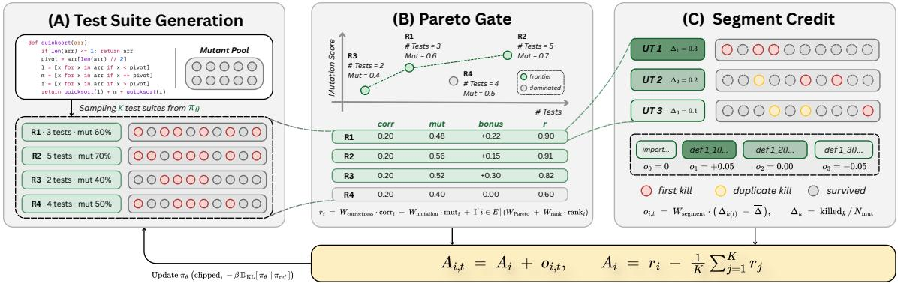
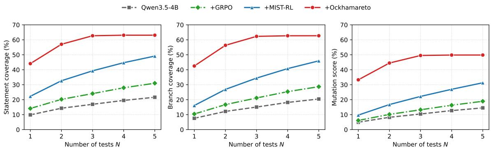
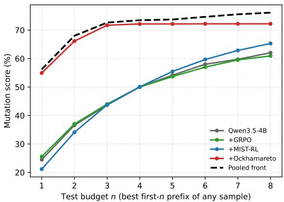
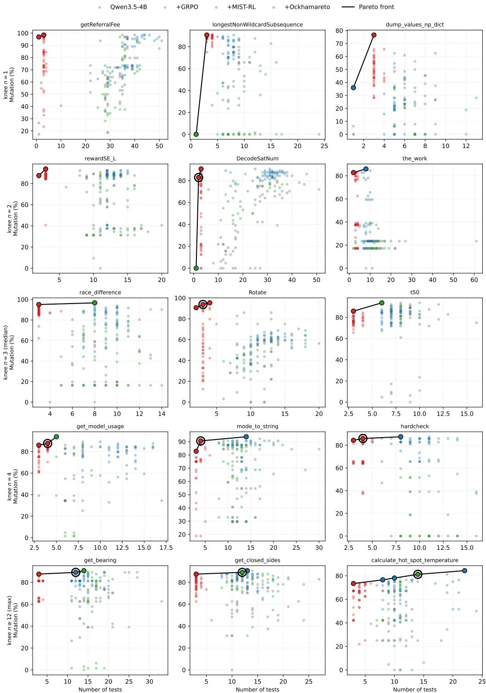
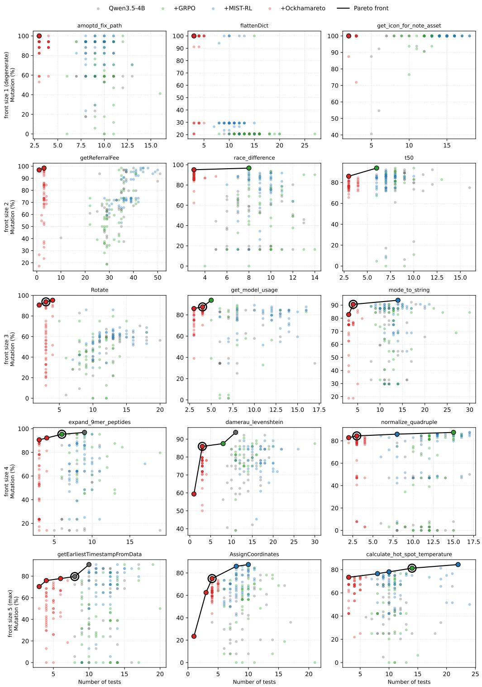

# Ockhamareto: Pareto-Gated Segment-Level Credit Assignment for Concise Unit-Test Generation with Reinforcement Learning

DONG HUANG, National University of Singapore, Singapore

MARK HARMAN, University College London, London, UK

JIE M. ZHANG, King’s College London, London, UK

ZHIJIANG GUO, Hong Kong University of Science and Technology (Guangzhou), Guangzhou, CN

MINGZHE DU∗, National University of Singapore, Singapore

SEE-KIONG NG, National University of Singapore, Singapore

We introduce Ockhamareto, a single-shot GRPO framework for unit-test generation and selection, based on the principles of Ockham’s Razor and Pareto Optimality. Ockhamareto has two principal components: (i) a Pareto-gated Bonus that rewards only rollouts nondominated in (mutation, −#tests) space, and (ii) Token-level Segment Credit, which attributes each test’s marginal mutation kills back to the tokens of its unit-test block. On the UnLeakedTestBench (ULT), Ockhamareto strictly Pareto-dominates the strongest RL baseline (MIST-RL). Furthermore, it dominates on each and all optimization objectives, catching more bugs (49.9% vs 31.3% mutation score at �=5), using fewer tests (2.60 vs 4.67 on average), thereby achieving 3.4× the per-test trade-of improvement. The advantage is found in all four benchmarks (HumanEval+, MBPP+, CodeContests, TestGenEval-Lite): Ockhamareto leads both mutation and coverage metrics on every one, always with the smallest suite. Ockhamareto also outperforms the state-of-the-art at all model scales, adding +30–35 pp mutation at 4B, 9B, and 27B model sizes. We also show that the knee point of the optimal trade-of between eficiency and efectiveness on the Pareto front is not correlated with obvious more easily computed proxy metrics, such as function size. This finding motivates the Pareto front computation; it is needed to identify this crucial engineering trade-of for each function under test.

CCS Concepts: • Computing methodologies → Natural language generation; • Software and its engineering → Software defect analysis.

Additional Key Words and Phrases: Large language models, unit test generation

## 1 Introduction

Software testing inevitably faces diminishing returns. Additional tests may reveal additional faults, but they also increase execution, review, and maintenance cost. The practical objective is therefore not simply to generate as many tests as possible, but to obtain test suites that achieve strong fault-detection efectiveness without unnecessary redundancy. This efectiveness–efort trade-of is a longstanding problem in software testing; we revisit its Pareto formulation and the associated question of diminishing returns in §2.1.

The emergence of large language models (LLMs) makes this problem particularly timely. LLMs can generate readable and idiomatic unit tests directly from source code and documentation. Early approaches primarily rely on prompt engineering and iterative refinement. ChatTester first elicits the intention of the focal method and repairs uncompilable tests [34]; SymPrompt issues coverage-guided prompts for diferent static execution paths [21]; CodaMosa uses LLMs to escape coverage plateaus in search-based test generation [12]; and TestPilot mines usage examples to guide generation and re-generation [22]. These methods substantially improve the ability of LLMs to produce executable and coveragereaching tests.

Prompt-based generation, however, optimizes test quality only indirectly: the model itself is not trained against the execution outcome that ultimately matters. This limitation has motivated reinforcement learning (RL) from execution feedback, in which generated tests are executed and their observed behavior provides the reward signal. Recent work rewards structural coverage [35], marginal coverage gain [29], or marginal mutation kills [36]. Mutation score is particularly attractive because it measures whether a test suite distinguishes a reference implementation from faulty variants and has been shown to correlate with real-fault detection more strongly than structural coverage alone [9, 11, 19]

Yet an important eficiency problem remains. The strongest recent RL approaches obtain fine-grained per-test feedback through multi-turn generation: the model emits one test, receives execution feedback, and then generates another. This makes per-test credit assignment straightforward, but has two consequences. First, generating an �-test suite requires multiple sequential LLM interactions. Second, the policy is trained to determine whether each newly generated test adds value, rather than whether the suite as a whole provides a good efectiveness–size trade-of. As long as another test produces some marginal gain, generation can continue. The resulting suites can therefore contain many tests whose additional fault-detection value is small relative to their review, execution, and maintenance burden.

A natural alternative is single-shot generation, in which one model call produces the complete test suite. Single-shot generation avoids sequential inference and requires the policy to decide which tests are suficiently valuable to include in the suite. It also creates a harder learning problem. Standard Group Relative Policy Optimization (GRPO) [24] assigns a scalar advantage to an entire generated trajectory. When that trajectory contains several independently valuable tes functions, the policy learns only that “this suite was good”; it cannot tell which individual tests contributed to fault detection and which were redundant.

This exposes two coupled optimization problems at diferent granularities. At the suite level, the learner must distinguish suites that provide a good efectiveness–size trade-of from suites that achieve similar efectiveness using unnecessary tests. At the test level, it must identify which tests inside a generated suite are responsible for its faultdetection capability. A single scalar trajectory reward provides neither an explicit whole-suite conciseness criterion nor fine-grained attribution among the tests within that trajectory.

We address these problems with Ockhamareto, a single-shot GRPO framework for concise and efective unit-test generation. Ockhamareto combines two complementary mechanisms. First, at the suite level, we introduce a Paretogated group-relative bonus. Within each GRPO group, a rollout receives the conciseness bonus only when it is non-dominated with respect to test efectiveness and suite size. A suite that uses more tests without providing greater efectiveness is therefore not rewarded for conciseness, whereas suites representing genuinely diferent efectiveness– size trade-ofs remain eligible. Unlike a fixed penalty on the number of tests, the Pareto gate does not require committing to a universal exchange rate between one additional test and one additional unit of fault detection. Second, at the test level, we introduce token-level segment credit. We attribute each test’s marginal mutation kills to the token span corresponding to that test and inject this information as a per-token advantage ofset on top of the suite-level GRPO signal. High-yield tests receive positive intra-trajectory credit, whereas redundant or failing tests receive lower or Manuscript submitted to ACM

negative credit. Segment credit therefore gives a single-shot policy the fine-grained per-test supervision that multi-turn methods obtain structurally, without requiring one sequential LLM interaction per test. In short, the Pareto gate asks whether the whole suite is worth its size, while segment credit identifies which tests within the suite create its value.

Our empirical results show that these two mechanisms can improve efectiveness and conciseness simultaneously. On UnLeakedTestBench (ULT), Ockhamareto-4B achieves 49.9% mutation score with an average of 2.60 tests at �=5, compared with 31.3% mutation and 4.67 tests for the strongest RL baseline, MIST-RL. Ockhamareto therefore improves mutation by 18.6 percentage points while using 44% fewer tests. Its mutation score largely saturates within the first three tests, and its first test alone achieves 33.3% mutation, already exceeding MIST-RL’s 31.3% mutation at five tests. This front-loading behavior is consistent with the intended efect of segment credit: concentrating learning signal on tests that contribute the largest marginal fault-detection value.

The advantage generalizes beyond ULT. Across HumanEval+, MBPP+, CodeContests, and TestGenEval-Lite, Ockhamareto achieves the highest mutation score and statement/branch coverage among the evaluated methods while using the smallest suites. The same reward design also transfers across model scales: at 4B, 9B, and 27B parameters, Ockhamareto improves mutation over the corresponding untuned model by approximately 30–35 percentage points. Notably, Ockhamareto-4B reaches 49.9% mutation compared with 30.5% for the untuned 27B model, showing that model scale alone does not replace the benefit of reward design.

Beyond improving test generation itself, the Pareto formulation also lets us revisit a longstanding engineering question: how many tests are worth maintaining for an individual function? We construct empirical (mutation, #tests) Pareto fronts from generated suites and study their knee points, beyond which additional tests yield diminishing faultdetection returns. On a random 100-function subset of ULT, the median knee occurs at three tests, but individual knees range from one to fourteen tests. Moreover, knee location is not significantly associated with simple static proxies such as lines of code or cyclomatic complexity. This suggests that a fixed rule such as “larger functions require more tests” cannot reliably determine an appropriate suite size; the efectiveness–size trade-of must instead be established empirically for the function under test. Ockhamareto does not itself define a universally optimal stopping point. Rather, it generates substantially stronger low-cost candidate suites and contributes the majority of solutions on the pooled empirical Pareto fronts, making the function-specific trade-of easier to expose and navigate. Our contributions are:

• Joint efectiveness–conciseness formulation. We formulate single-shot unit-test generation as a joint optimization problem over fault-detection efectiveness and suite size, and show empirically that better fault detection need not require larger generated suites. Ockhamareto shifts the observed (mutation, −#tests) frontier outward relative to existing RL baselines.

• Pareto-gated suite-level optimization. We introduce a group-relative Pareto gate that awards a conciseness bonus only to non-dominated rollouts, allowing GRPO to optimize whole-suite efectiveness and size without specifying a fixed scalar exchange rate between the two objectives.

• Token-level segment credit. We introduce fine-grained credit assignment for single-shot test-suite generation by mapping each test’s marginal mutation kills onto its own token span. This provides intra-trajectory per-test supervision while retaining single-shot inference.

• Comprehensive empirical evaluation and Pareto-front analysis. Across five held-out benchmarks and three model scales, we show that Ockhamareto consistently improves fault detection while producing smaller suites. We further characterize per-function empirical Pareto fronts and show that their knee locations vary substantially and are not reliably predicted by simple static code metrics.

Manuscript submitted to ACM

## 2 Background

This section establishes the conceptual and technical foundations of our approach. We first formulate the longstanding efectiveness–efort problem in software testing through Pareto optimality and diminishing returns. We then review mutation testing, reinforcement learning for code generation, and the credit-assignment problem that arises when an entire test suite is generated as a single trajectory.

## 2.1 Testing Efectiveness, Efort, and Pareto Optimality

A fundamental practical question in software testing is:

“When can I stop testing?”

The question cannot generally be answered by establishing that all faults have been excluded. Exhaustive testing is impractical for most non-trivial programs, and successful execution on a finite set of inputs does not imply correct behavior on every untested input. This limitation is captured by Dijkstra’s well-known observation that testing can demonstrate the presence of bugs, but not their absence [3]. Questions about the limits of testing and program checking have accompanied the discipline since its early development [28].

For engineering purposes, however, the absence of a definitive scientific stopping criterion does not make the decision meaningless. Instead, it transforms the question into one of diminishing returns:

“At what point does the fault-detection benefit of additional testing cease to justify its cost?”

This formulation separates two quantities. Efectiveness captures the fault-revealing capability of a test suite, while efort captures the resources required to construct, execute, review, and maintain it. Efort can be represented in many ways, including execution time, monetary cost, maintenance burden, or developer attention. In this work, we use the number oftests as a simple and directly observable proxy for suite cost. This proxy does not capture every component of testing efort, but it directly reflects the redundancy problem that arises when generative models produce increasingly large suites.

When efectiveness and efort are considered jointly, there need not be a single solution that is best on both dimensions. Instead, the natural object is a Pareto front. Given two candidate suites, suite � dominates suite � if � is at least as efective while using no more tests, and is strictly better on at least one of these dimensions. A suite is Pareto-optimal if no available alternative dominates it [20]. The resulting Pareto front retains only suites for which improving one objective requires sacrificing the other.

Pareto reasoning has previously been applied to software testing. In particular, Yoo and Harman used Pareto optimality to guide test selection from an existing test suite [33]. Their setting assumes that a collection of tests already exists and asks which subset should be retained under competing objectives. Our setting difers in an important respect: generation and selection are no longer cleanly separated. An LLM policy constructs the suite itself, so the training objective can influence both which tests are generated and how many tests are generated. This makes it possible to move conciseness from a post-hoc selection criterion into the learning process itself.

A Pareto front also exposes the notion of a knee point. Moving along the front initially may yield large improvements in efectiveness for a small increase in efort, whereas beyond some region additional tests provide only small gains. The knee characterizes this transition into diminishing returns. It therefore provides a useful engineering operating point, although it should not be interpreted as a universal or mathematically unique definition of when testing must stop.

This view connects naturally to the principle commonly associated with Ockham’s razor [30]: additional complexity should be retained only when it provides suficient explanatory or practical value. Applied to testing, the corresponding Manuscript submitted to ACM

objective is not simply to minimize the number of tests. An extremely small suite with poor fault detection is not desirable. Rather, the goal is to avoid tests whose additional cost is not justified by additional efectiveness—as few tests as possible, but no fewer than are needed to preserve valuable fault detection.

These ideas motivate two distinct uses of Pareto analysis in our work. During training, Ockhamareto uses Pareto dominance within each GRPO group as a reward gate, encouraging policies that generate efective but concise suites. During analysis, we construct empirical per-function Pareto fronts from sampled suites to examine the available efectiveness–size trade-ofs and their knee points. The former is a learning mechanism; the latter is an engineering analysis of the solutions produced by the learned policies. Keeping these two roles distinct is important: Ockhamareto improves the candidate suites available near the frontier, while the empirical front provides the information needed to choose among diferent operating points.

## 2.2 Unit Testing and Mutation Testing

Unit testing validates individual functions or methods in isolation. A unit test suite consists of test cases that exercise a target function with specific inputs and assert expected behavior. Two widely used criteria for assessing such suites are structural coverage, including statement and branch coverage, and mutation score.

Structural coverage measures the proportion of program elements executed by a test suite. Although coverage is inexpensive to compute and widely used, it does not directly establish that the executed behavior has been meaningfully checked. For example, an assertion such as $\mathsf { f } ( \mathsf { x } )$ is not None may execute substantial portions of a function while providing little discrimination between correct and faulty behavior.

Mutation testing [9, 19] evaluates a suite by introducing small syntactic changes, or mutants, into the program under test. A mutant is killed when at least one test detects the behavioral diference and fails on the mutated implementation. The mutation score is the fraction of mutants killed by the suite. Empirical studies have shown a strong relationship between mutation score and real-fault detection [11], making mutation testing a useful fault-oriented adequacy criterion despite its higher computational cost.

For test generation, mutation testing can play two roles. It can serve as an evaluation metric for comparing generated suites, and it can provide an execution-derived reward signal during learning. Ockhamareto uses mutation information in both roles. At the suite level, mutation contributes to the quality signal used during GRPO training; at the test level, marginal mutation kills provide the fine-grained signal used for segment credit.

## 2.3 Reinforcement Learning for Code Generation

Reinforcement learning from execution feedback treats code generation as a sequential decision problem. A language model generates code token by token, the generated artifact is executed or otherwise verified, and the resulting outcome is converted into a reward used to update the policy. Verifiable execution signals are particularly attractive for code because they provide objective feedback without requiring a learned reward model.

Group Relative Policy Optimization (GRPO) [24] is a policy-optimization method suited to such verifiable-reward settings. Instead of training a separate value model, GRPO samples a group of � candidate rollouts for the same task and computes the advantage of each rollout relative to other members of the group. For rewards $\{ r _ { j } \} _ { j = 1 } ^ { K }$ , a simplified group-relative advantage can be written as

$$
A _ { i } = r _ { i } - \frac { 1 } { K } \sum _ { j = 1 } ^ { K } r _ { j } .\tag{1}
$$

Manuscript submitted to ACM

  
Fig. 1. Overview of Ockhamareto. (A) For each task the policy �� samples a GRPO group of � complete pytest suites in a single shot, and each suite is executed in the sandbox against a prebuilt mutant pool. (B) Pareto gate (§3.3): only rollouts non-dominated in (mutation, −#tests) space receive the conciseness bonus, so $R _ { 4 } .$ which catches fewer mutants than $R _ { 1 }$ with more tests, is dominated and earns nothing, while $R _ { 1 } { - } R _ { 3 }$ are on the frontier. (C) Segment credit (§3.4): the mutants each test is the first to kill give a per-test score $\Delta _ { k }$ , which is zero-meaned across the suite and mapped onto that test’s own token span via the tokenizer’s ofset mapping. The update uses per-token advantages ${ A _ { i , t } } = { A _ { i } } + { o _ { i , t } }$ under a KL constraint to $\pi _ { \mathrm { r e f } } ,$ so high-yield tests are reinforced and redundant ones penalized within a single trajectory.

The policy is then updated to increase the likelihood of trajectories with positive relative advantage and decrease the likelihood of those with negative relative advantage, subject to regularization against a reference policy. This grouprelative structure is useful for our problem because test suites generated for the same function can be compared directly It also provides a natural setting for Pareto gating: rather than defining a global threshold for an acceptable suite, Ockhamareto determines whether a rollout is dominated by other candidates generated for the same task.

Standard trajectory-level GRPO nevertheless assigns the same scalar advantage to all action tokens within one rollout. This assumption becomes problematic when a trajectory is internally structured and its components make very diferent contributions to the observed reward. A generated test suite is precisely such a trajectory.

## 2.4 The Credit-Assignment Challenge in Test-Suite Generation

A generated test suite is an internally structured trajectory: individual tests may kill many previously undetected mutants, duplicate behavior already covered by earlier tests, or fail on the reference implementation. A single trajectory reward collapses these distinct contributions. Multi-turn methods make per-test attribution straightforward by executing tests sequentially, but require repeated model interactions; single-shot generation retains one-call inference while losing that structural source of credit assignment.

The suite structure lets us recover the missing information directly. Each unit test block can be executed and assigned a marginal fault-detection contribution, so Ockhamareto treats each test as a segment and maps its execution-derived mutation contribution back to the tokens that created it. The suite-level reward and Pareto gate judge the complete rollout, whereas segment credit diferentiates the tests within that rollout. The next section describes how the two signals are combined.

Manuscript submitted to ACM

## 3 Method

## 3.1 Problem setup

Given a target function (its name, signature, docstring, and reference implementation), the policy must emit a complete pytest suite in one shot. For each task we sample a GRPO group of �=8 suites and score all � in the sandbox (Figure 1). The single-shot setting is a deliberate design choice: it forces the policy to front-load its most discriminating tests (there is no second chance) and keeps inference cost constant regardless of suite size.

## 3.2 Suite-level quality reward

For a rollout � whose suite parses and executes, we define

$$
q _ { i } = W _ { \mathrm { c } } \cdot \mathrm { c o r r } _ { i } + W _ { \mathrm { m } } \cdot \mathrm { m u t } _ { i } ,\tag{2}
$$

with $W _ { \mathrm { c } } { = } 0 . 2 , W _ { \mathrm { m } } { = } 0 . 8 ^ { 1 }$ , and $q _ { i } { = } 0$ if the suite fails to run; corr� is the fraction of tests passing on the reference implementation and mut is the mutation score against a prebuilt mutant pool. We put no weight on coverage: it is highly correlated with mutation but strictly weaker, and rewarding it invites gaming via assertions like f(x) is not None that execute a line without checking semantics.

## 3.3 Pareto-gated conciseness bonus

The quality reward says nothing about suite size, so we add a group-relative bonus that rewards conciseness directly. Within a group, rollout � is dominated by rollout � if

$$
q _ { j } \geq q _ { i } \wedge n _ { j } \leq n _ { i } \wedge ( q _ { j } > q _ { i } \vee n _ { j } < n _ { i } ) ,\tag{3}
$$

where $n _ { i }$ is the test count. Rollout � is Pareto-eligible if no other rollout dominates it. Only eligible rollouts receive the bonus

$$
b _ { i } = W _ { \mathrm { P } } + W _ { \mathrm { N } } \cdot \mathrm { r a n k } _ { i } ,\tag{4}
$$

where � is a flat membership bonus (rewards being on the frontier at all, including the high-quality/high-� corner) and the optional rank term rank� ∈ [0, 1] linearly favors fewer tests within the frontier. Decoupling membership from rank lets us ablate the two efects independently. Any suite that trades quality for size is, by construction, dominated by its larger-but-better neighbor and earns nothing.

## 3.4 Token-level segment credit

GRPO assigns a single scalar advantage to a whole trajectory, so every token in the suite is credited identically, and the model cannot tell which test did the bug-catching work. But a test suite decomposes naturally: it is a sequence of independently valuable def test\_\* blocks whose per-test mutation outcomes we already compute in the sandbox. We exploit that structure by giving GRPO sub-trajectory resolution: on top of the scalar advantage, we add a per-token ofset derived from each test’s marginal kills.

Let the sandbox report, for each test �, the number of mutants it was the first to kill, killed�, out of $N _ { \mathrm { m u t } }$ scored

Algorithm 1 One Ockhamareto training step. Lines 6–8 are the Pareto gate (§3.3); line 11 is segment credit (§3.4).   
Require: task �, policy $\pi _ { \theta } ,$ reference $\pi _ { \mathrm { r e f } } ,$ group size �   
1: Sample � suites $\{ y _ { i } \} _ { i = 1 } ^ { K } \sim \pi _ { \theta } ( { \boldsymbol { \cdot } } \mid x )$   
2: for $i = 1 , \ldots , K$ do   
3: Sandbox: corr�, mut� $, n _ { i } ,$ per-test kills   
4: $q _ { i }  W _ { \mathrm { c } } \mathrm { c o r r } _ { i } + W _ { \mathrm { m } }$ mut� ⊲ 0 if the suite fails to run   
5: end for   
6: � ← Pareto-eligible set in (mut, −�) space   
7: for $i \in E$ do   
8: $q _ { i }  q _ { i } + W _ { \mathrm { P } } + W _ { \mathrm { N } }$ rank� ⊲ conciseness bonus   
9: end for   
10: $A _ { i }  q _ { i } - \operatorname* { m e a n } _ { j } ( q _ { j } )$ ⊲ GRPO advantage   
11: $A _ { i , t }  A _ { i } + o _ { i , t }$ with segment ofsets $o _ { i , t }$ from Eq. 6   
12: Update � with per-token advantages $A _ { i , t }$ under a KL constraint to $\pi _ { \mathrm { r e f } }$

mutants. We define the per-segment reward

$$
\Delta _ { k } = \left\{ \begin{array} { l l } { \mathrm { k i l l e d } _ { k } / N _ { \mathrm { m u t } } } & { \mathrm { i f ~ t e s t } k \mathrm { p a s s e s , } } \\ { - \mathrm { S E G \_ F A I L \_ P E N A L T Y } } & { \mathrm { i f ~ t e s t } k \mathrm { f a i l s , } } \\ { 0 } & { \mathrm { o t h e r w i s e , } } \end{array} \right.\tag{5}
$$

We then zero-mean across the segments of the trajectory, $\tilde { \Delta } _ { k } = \Delta _ { k } - \overline { { \Delta } } ,$ which preserves GRPO’s centering property (the mean ofset $\mathrm { i } s \approx 0 ,$ so the trajectory-level advantage is unchanged). Finally we distribute $W _ { \mathrm { s e g } } \cdot \tilde { \Delta } _ { k }$ to every token whose character midpoint lies inside test $k ^ { \prime } s$ source span:

$$
o _ { t } = W _ { \mathrm { s e g } } \cdot \tilde { \Delta } _ { k ( t ) } ,\tag{6}
$$

and $o _ { t } { = } 0$ for boilerplate, prefixes, or tokens of failed tests’ siblings.

To map blocks to tokens robustly, we decode the sampled action, re-tokenize it with ofset mapping, and confirm the re-tokenized ids match the sampled ids; on any mismatch we fall back to the scalar GRPO advantage. We locate def test\_\* spans by regular expression and pair each test with its character range up to the next test (Algorithm 2, which also gives a worked numerical example). Because the sandbox renames tests to test\_<n>\_\* in source order, we match the �-th block to sandbox index � by order, not name.

Because the centered ofsets sum to zero, they leave the trajectory-level GRPO advantage untouched but reshape the intra-trajectory signal: high-yield tests receive positive credit and low-yield tests receive negative credit, all inside a single rollout. The model learns which kind of test to write next time, rather than merely “write more suites like this one”. Nothing in the mechanism is specific to pytest, or indeed to test generation: it applies to any output that parses into independently scorable segments, given a per-segment score and a span locator. def test\_\* blocks are simply the natural segmentation here; assertion lines, input–output cases, or reasoning steps would serve the same role under a diferent parser.

Putting it together. Algorithm 1 summarizes one GRPO step: sample a group, score each suite in the sandbox, add the Pareto-gated group bonus, compute the per-token segment ofsets, and apply the centered, KL-constrained update. Manuscript submitted to ACM

Algorithm 2 Per-token segment ofsets: per-test mutation outcomes are mapped to source-span tokens via the   
tokenizer’s ofset mapping and added on top of GRPO’s scalar advantage.   
Require: sampled token ids �, tokenizer, sandbox result (per-test first-kills, pass/fail)   
1: text ← decode( ); spans ← char ranges of def test\_\* blocks   
2: Re-tokenize text with ofset mapping   
3: if re-tokenized ids $\neq y$ then   
4: return $o \gets 0$ ⊲ fall back to scalar GRPO   
5: end if   
6: for each test � do   
7: Δ� ← per-segment reward (kills, pass/fail)   
8: end for   
9: $\tilde { \Delta } _ { k } \gets \Delta _ { k } - \overline { { \Delta } }$ ⊲ zero-mean, preserves GRPO centering   
10: for each token � do   
11: $o _ { t } \gets W _ { \mathrm { s e g } } \tilde { \Delta } _ { k ( t ) }$ if �’s char midpoint lies in span �(�), else 0   
12: end for   
13: return �

## 3.5 Segment-Credit Details

Algorithm 2 gives the per-token ofset computation of §3.4 in full, including the re-tokenization check and the scalar-GRPO fallback.

Worked example. Consider a group rollout whose suite has three tests with first-kill counts (killed , killed , killed ) = $( 4 0 , 2 , 0 )$ out of $N _ { \mathrm { m u t } } { = } 1 0 0$ , all passing. Then $\Delta = ( 0 . 4 0 , 0 . 0 2 , 0 . 0 ) , \overline { { \Delta } } = 0 . 1 4$ , and the centered ofsets are $\tilde { \Delta } = ( + 0 . 2 6 , - 0 . 1 2 , - 0 . 1 4 )$ With $W _ { \mathrm { s e g } } { = } 0 . 5 ,$ every token of test 1 receives +0.13 on top of the scalar advantage, while tokens of the two redundant tests receive −0.06 and −0.07. The policy is thus pushed toward the high-yield test and away from the redundant ones within the same trajectory, a distinction the scalar GRPO advantage cannot make.

## 4 Experimental Setup

## 4.1 Datasets

Training data. We train on a subset of the Possibly-Leaked TestBench (PLT) [7], comprising approximately 10,500 Python library functions drawn from real-world repositories in The Stack v2. Each function in PLT is a self-contained unit with its signature, docstring, and reference implementation, along with a prebuilt mutant pool generated by cosmic-ray [26]. We apply strict decontamination: any function whose test cases appear verbatim in common LLM training corpora is excluded from our training set to prevent data leakage. The training set is further filtered to exclude all tasks that appear in any of our five evaluation benchmarks, ensuring a clean held-out evaluation. The mutant pool for each task contains syntactic variants of the reference implementation, including operator replacements $( \mathrm { e . g . , +  - } )$ constant mutations $( \mathrm { e . g . } , \emptyset \to 1 )$ , and control-flow alterations (e.g., break → continue). The pool is fixed per task and reused across rollouts, providing a reproducible mutation-scoring environment.

Evaluation benchmarks. We evaluate on five held-out benchmarks spanning four distinct code distributions, ensuring that our method generalizes beyond the training domain.

(i) UnLeakedTestBench (ULT). This is our in-distribution evaluation set, also drawn from The Stack v2 but strictly disjoint from the training set. ULT focuses on Python library functions that have been verified to have no test-case leakage in LLM training data. For evaluation, we use a 2,126-task subset that excludes tasks whose cosmic-ray mutant pool exceeds our per-rollout time budget (tasks with >500 mutants are excluded to keep evaluation tractable). This subset maintains statistical representativeness while ensuring absolute mutation scores remain comparable across methods.

(ii) HumanEval+ and (iii) MBPP+ [15]. These are standard function-level Python benchmarks widely used in code-generation research. HumanEval+ contains 164 programming problems with hand-written reference solutions, while MBPP+ contains 399 problems. Both benchmarks were originally designed for code generation evaluation but have been adopted for test generation by recent RL work [36]. We build per-task cosmic-ray mutant pools over the reference implementations to enable mutation-score evaluation

(iv) CodeContests [13]. This benchmark consists of competitive programming problems drawn from Codeforces, At Coder, and other contest platforms. Unlike the function-level benchmarks above, CodeContests problems are algorithmic challenges with complex logic and edge cases. Critically, each task in CodeContests comes with a large corpus of incorrect Python submissions from human contestants. We use these wrong submissions as the fault source in place of synthetic mutants: a test suite’s quality is measured by how many of these real buggy implementations it rejects. This provides a complementary view of fault-detection capability grounded in actual human errors rather than syntactic mutations.

(v) TestGenEval-Lite [8]. This is a repo-level benchmark comprising Python test generation tasks extracted from real open-source projects, including Django, sympy, scikit-learn, and matplotlib. Tasks are drawn from the SWE-Bench dataset [10] and adapted for test generation. Unlike the function-level benchmarks, TestGenEval-Lite requires reasoning about module-level context and cross-function dependencies. We build cosmic-ray mutant pools over the target functions. Due to the higher complexity and varied execution environments, we report results on the shared usable subset where every method produces at least one passing test on the reference module, ensuring fair comparison

For benchmarks (i), (ii), (iii), and (v), we build per-task cosmic-ray mutant pools; for (iv), the wrong-submission set replaces synthetic mutants entirely. All models are evaluated single-shot with the same prompt template, and the same per-test attribution harness scores every rollout.

## 4.2 Models and Training Infrastructure

Base model and architecture. We use Qwen3.5 [31] as our base language model, a decoder-only transformer trained on a large corpus of code and natural language. We experiment with three model scales: 4B, 9B, and 27B parameters. All models use the standard Qwen3.5 tokenizer (vocabulary size 151,936 tokens) with byte-pair encoding. The 4B model has 32 layers, 32 attention heads, and a hidden dimension of 3,584; the 9B and 27B models scale proportionally in depth and width. We chose Qwen3.5 for its strong base performance on code-generation benchmarks and its eficient architecture, which allows us to train at multiple scales within our compute budget.

Training configuration. We fine-tune using Low-Rank Adaptation (LoRA) [6] with rank 32, targeting all attention projection matrices (q\_proj, k\_proj, v\_proj, o\_proj) and feed-forward layers. LoRA reduces trainable parameters by ∼99% compared to full fine-tuning (e.g., ∼40M trainable parameters for the 4B model), enabling eficient multi-scale experimentation. We use the AdamW optimizer with a learning rate of 2 × 10−5, linear warmup over 20 steps, and no learning rate decay. Training runs for 240 steps with a batch size of 32 tasks, each task generating a GRPO group of �=8 rollouts, for an efective batch size of 256 rollouts per step. Training uses temperature 1.0 for sampling during GRPO rollout generation, while evaluation uses greedy decoding (temperature 0.0) to minimize variance.

Reinforcement learning setup. We train with Group Relative Policy Optimization (GRPO) [24] on a hosted RL infrastructure [27] that handles distributed rollout generation, sandbox execution, and gradient synchronization. Each training step proceeds as follows: (i) for each of 32 tasks in the batch, sample �=8 complete test suites from the current Manuscript submitted to ACM

policy; (ii) execute all suites in parallel sandboxes to collect per-suite mutation scores and per-test first-kill counts; (iii) compute group-relative advantages and per-token segment ofsets; (iv) update policy parameters under a KL con straint to the reference policy (the base model frozen at initialization). The reference policy prevents reward hacking and maintains output diversity. The KL coeficient is set to 0.1, balancing optimization speed with stability.

Computational resources. Training the 4B model takes approximately 18 hours on 8 NVIDIA A100 GPUs (80GB), including sandbox execution time. The 9B and 27B models require 32 and 64 A100 GPUs respectively, with training times of 36 and 72 hours. Sandbox execution (test execution and mutation scoring) accounts for ∼60% of wall-clock time; we parallelize across 128 sandbox workers per training node to maintain throughput. Total training cost for all three scales (including ablation runs and hyper-parameter sensitivity experiments) is approximately 15,000 A100-hours. Evaluation on the five benchmarks is comparatively cheap: scoring 2,126 ULT tasks at �=5 takes ∼2 hours on 32 sandbox workers

Baselines. We compare three points on the Qwen3.5-4B family: (i) the untuned base model, which represents zeroshot test generation capability; (ii) +GRPO, a single-shot GRPO baseline trained only on the suite-level quality reward (correctness plus mutation, with no conciseness bonus and no segment credit), which isolates the contribution of RL from our specific reward design; and (iii) +MIST-RL [36], a multi-turn RL method with a per-step marginal-mutation reward that emits one test per rollout and explicitly penalizes redundancy. MIST-RL represents the strongest prior RL approach for mutation-aware test generation. We reimplement MIST-RL on the same Qwen3.5-4B base and training data for fair comparison; reported numbers are from the fewshot variant (one worked example prepended to the prompt) since it outperforms the zero-shot version.

Metrics and scoring protocol. Each method emits one suite per task, which we score using the per-test harness. We report the mutation score (the primary quality metric), statement and branch coverage, correctness (the fraction of tests passing on the reference implementation), the mean number of tests used $( n _ { \mathrm { a c t u a l } } ) _ { \mathrm { : } }$ , per-test eficiency (mutation score ÷ $n _ { \mathrm { a c t u a l } } ) _ { \AA }$ , and the valid-suite rate. For a test budget �, we follow existing work [7, 8, 29] by truncating each suite to its first $N = 5$ tests in source order and taking the union of covered lines, covered branches, and killed mutants over those � tests: a mutant counts if and only if its first killing test is among the first �. Invalid suites receive a score of 0. Thi first-� aggregation (Figure 2) exposes the redundancy that suite-level metrics can hide.

## 4.3 Per-Test Mutation Harness

The segment-credit reward (§3.4) requires per-test attribution, which stock mutation harnesses do not provide: they report only suite-level coverage and mutation. We extend a sandboxed harness (pytest + cosmic-ray [26] inside SandboxFusion [1]) to record, per test: (i) the covered lines (via pytest –cov-context=test); (ii) per\_test\_mut\_killed, the number of mutants for which the test was the first to fail; and (iii) a full trinary (mutant, test) kill matrix (killed / passed / not-run). Mutants are prebuilt once per task and reused across rollouts, keeping per-rollout reward latency near 1 s instead of ∼110 s. The same harness and the same per\_test\_mut\_killed field drive both training and evaluation.

## 4.4 Research Questions

Our empirical evaluation is guided by five research questions covering end-to-end efectiveness, component contributions, scaling, hyper-parameter sensitivity, and per-function efectiveness–size trade-ofs:

• RQ1: Does Ockhamareto achieve better mutation score and suite conciseness than baselines across multiple benchmarks?

Manuscript submitted to ACM

We compare Ockhamareto against the base model, a vanilla GRPO baseline, and MIST-RL (the strongest prior RL method) on five held-out benchmarks: ULT (in-distribution), HumanEval+, MBPP+, CodeContests, and TestGenEval-Lite. We measure mutation score, statement/branch coverage, suite size $( n _ { \mathrm { a c t u a l } } ) _ { \mathrm { : } }$ , and per-test eficiency.

• RQ2: What is the contribution of each component (Pareto gate and segment credit) to the final performance?

We ablate the two core components of Ockhamareto: the Pareto-gated conciseness bonus and token-level segment credit. For each ablation, we train a model with one component removed and evaluate its mutation score, suite size, and per-test eficiency on ULT.

• RQ3: Does the framework scale to larger models, and how do reward shape and model scale interact? We train Ockhamareto at three scales (4B, 9B, 27B parameters) using the same fixed reward configuration and compare mutation score, suite size, and eficiency. This isolates the efect of model capacity from reward design.

• RQ4: How sensitive is Ockhamareto to its hyper-parameters, specifically the segment-credit weight and Pareto-bonus weight?

We vary $W _ { \mathrm { s e g } }$ (segment-credit weight) and �P (Pareto-membership bonus) around their default values while holding other settings fixed, and measure the resulting mutation score, suite size, and eficiency trade-ofs.

• RQ5: What do per-function empirical Pareto fronts reveal about how many tests are worth maintaining? We sample multiple suites per policy for a random 100-function ULT subset, construct pooled (mutation, #tests) Pareto fronts, and analyze knee location, front size, dominance rates, policy contributions, and correlations with static code metrics.

## 5 Results

## 5.1 RQ1: Does Ockhamareto achieve beter mutation score and suite conciseness than baselines?

To answer RQ1, we compare Ockhamareto against three baselines (base model, vanilla GRPO, MIST-RL) on five held-ou benchmarks at �=5.

5.1.1 RQ1.1: Performance on in-distribution benchmark (ULT). Table 1 reports the head-to-head comparison at �=5 across the five held-out benchmarks. On the in-distribution eval (ULT), Ockhamareto reaches 49.9% mutation with 2.60 tests, strictly Pareto-dominating both RL baselines: +18.6 pp mutation and 44% fewer tests vs MIST-RL, +31.0 pp mutation and 24% fewer tests vs +GRPO. Its per-test eficiency of 19.2% is 3.4× the base model and 2.9× MIST-RL.

The base model achieves only 14.5% mutation with 2.53 tests, showing that zero-shot generation struggles with both quality and redundancy. Vanilla GRPO (+GRPO) improves to 18.9% mutation but at the cost of larger suites (3.43 tests), indicating that suite-level mutation reward alone cannot prevent bloat. MIST-RL achieves 31.3% mutation but emits 4.67 tests on average, nearly twice Ockhamareto’s suite size, resulting in per-test eficiency of only 6.7% compared to Ockhamareto’s 19.2%.

5.1.2 RQ1.2: Generalization to out-of-distribution benchmarks. The same picture holds out of distribution: on HumanEval+, MBPP+, and CodeContests, Ockhamareto leads mutation and statement/branch coverage while using the smallest suite in every row, and per-test eficiency stays 1.7–2.2× the MIST-RL number. On the repo-level TestGenEval Lite benchmark (Django, sympy, scikit-learn, matplotlib), Ockhamareto’s compression survives cleanly (median 3 tests per suite; MIST-RL emits 13), and on the shared usable subset it still edges every metric under the �=5 budget cap. Across all five benchmarks the ranking is the same: Ockhamareto wins mutation, wins statement/branch coverage, and Manuscript submitted to ACM

<table><tr><td>Benchmark</td><td>Method</td><td>Mut. (%)</td><td>Stmt. (%)</td><td>Branch (%)</td><td> $\mathrm { C o r r . } \left( \% \right)$ </td><td> $n _ { \mathrm { a c t u a l } }$ </td><td>Eff. (%)</td></tr><tr><td rowspan="4">ULT</td><td>Qwen3.5-4B</td><td>14.5</td><td>21.6</td><td>20.5</td><td>27.6</td><td>2.53</td><td>5.7</td></tr><tr><td>+ GRPO</td><td> $1 8 . 9 \ : ( + 4 . 4 )$ </td><td> $3 1 . 0 \ : ( + 9 . 4 )$ </td><td> $2 8 . 7 \ : ( + 8 . 2 )$ </td><td>42.0</td><td>3.43</td><td>5.5</td></tr><tr><td>+ MIST-RL</td><td> $3 1 . 3 \ : ( + 1 6 . 8 )$ </td><td> $4 9 . 1 \ ( + 2 7 . 5 )$ </td><td> $4 5 . 9 \ : ( + 2 5 . 4 )$ </td><td>72.7</td><td>4.67</td><td>6.7</td></tr><tr><td>+ Ockhamareto</td><td> $\mathbf { 4 9 . 9 } \left( \phantom { - } 1 3 5 . 4 \right)$ </td><td> ${ \bf 6 3 . 1 } \left( { \bf + 4 1 . 5 } \right)$ </td><td> ${ \bf 6 2 . 7 \ ( + 4 2 . 2 ) }$ </td><td>68.8</td><td>2.60</td><td>19.2</td></tr><tr><td rowspan="4">HumanEval+</td><td>Qwen3.5-4B</td><td>69.1</td><td>54.1</td><td>44.2</td><td>86.2</td><td>4.70</td><td>14.7</td></tr><tr><td>+ GRPO</td><td>69.2(+0.1)</td><td> $5 3 . 5 \ : ( - 0 . 6 )$ </td><td> $4 5 . 2 \ : ( + 1 . 0 )$ </td><td>86.5</td><td>4.60</td><td>15.0</td></tr><tr><td>+ MIST-RL</td><td>74.5 (+5.4)</td><td> $5 8 . 9 \left( + 4 . 8 \right)$ </td><td> $4 9 . 7 \ : ( + 5 . 5 )$ </td><td>96.7</td><td>4.94</td><td>15.1</td></tr><tr><td>+ Ockhamareto</td><td> ${ \bf 8 1 . 6 } \left( + 1 2 . 5 \right)$ </td><td> ${ \bf 5 9 . 8 } \left( { + 5 . 7 } \right)$ </td><td> ${ \bf 5 1 . 3 _ { \left( + 7 . 1 \right) } }$ </td><td>94.5</td><td>3.10</td><td>26.3</td></tr><tr><td rowspan="4">MBPP+</td><td>Qwen3.5-4B</td><td>58.5</td><td>40.3</td><td>20.2</td><td>78.6</td><td>4.68</td><td>12.5</td></tr><tr><td>+ GRPO</td><td>57.9 (-0.6)</td><td>39.3 (-1.0)</td><td>18.8 (-1.4)</td><td>78.4</td><td>4.56</td><td>12.7</td></tr><tr><td>+ MIST-RL</td><td> $6 4 . 0 \ : ( + 5 . 5 )$ </td><td> $4 3 . 1 \ : ( + 2 . 8 )$ </td><td> $2 2 . 6 \ : ( + 2 . 4 )$ </td><td>93.1</td><td>4.89</td><td>13.1</td></tr><tr><td>+ Ockhamareto</td><td>67.8 (+9.3)</td><td> $4 4 . 1 \left( + 3 . 8 \right)$ </td><td> $2 3 . 9 \ : ( + 3 . 7 )$ </td><td>93.7</td><td>3.12</td><td>21.7</td></tr><tr><td rowspan="4">CodeContests</td><td>Qwen3.5-4B</td><td>11.6</td><td>24.5</td><td>23.0</td><td>13.8</td><td>3.21</td><td>3.6</td></tr><tr><td>+ GRPO</td><td> $1 0 . 0 \left( - 1 . 6 \right)$ </td><td> $2 5 . 7 \ : ( + 1 . 2 )$ </td><td> $2 3 . 3 \ : ( + 0 . 3 )$ </td><td>21.2</td><td>3.10</td><td>3.2</td></tr><tr><td>+ MIST-RL</td><td> $3 2 . 4 \ : ( + 2 0 . 8 )$ </td><td> $6 0 . 6 \left( + 3 6 . 1 \right)$ </td><td> $5 9 . 0 \left( + 3 6 . 0 \right)$ </td><td>64.1</td><td>4.90</td><td>6.6</td></tr><tr><td>+ Ockhamareto</td><td> $\mathbf { 4 4 . 6 } \left( + 3 3 . 0 \right)$ </td><td> ${ \bf 6 5 . 8 } \left( + 4 1 . 3 \right)$ </td><td> ${ \bf 6 4 . 7 \ ( + 4 1 . 7 ) }$ </td><td>61.5</td><td>3.04</td><td>14.7</td></tr><tr><td rowspan="4">TGE-Lite</td><td>Qwen3.5-4B</td><td>16.6</td><td>18.6</td><td>29.1</td><td>46.7</td><td>5.00</td><td>3.3</td></tr><tr><td>+ GRPO</td><td> $1 3 . 6 ( - 3 . 0 )$ </td><td> $2 2 . 9 \ : ( + 4 . 3 )$ </td><td> $3 1 . 6 \ : ( + 2 . 5 )$ </td><td>76.7</td><td>5.00</td><td>2.7</td></tr><tr><td>+ MIST-RL</td><td> $1 8 . 4 \left( + 1 . 8 \right)$ </td><td> $1 7 . 1 \ : ( - 1 . 5 )$ </td><td> $2 2 . 3 \ : ( - 6 . 8 )$ </td><td>85.0</td><td>5.00</td><td>3.7</td></tr><tr><td>+ Ockhamareto</td><td> $2 3 . 1 \ : ( + 6 . 5 )$ </td><td> $2 3 . 2 \ : ( + 4 . 6 )$ </td><td> $3 4 . 8 \ : ( + 5 . 7 )$ </td><td>57.6</td><td>3.33</td><td>6.9</td></tr></table>

Table 1. End-to-end results at �=5 across five held-out benchmarks. All methods are Qwen3.5-4B single-shot fewshot; only the training method difers. CodeContests uses each task’s provided incorrect Python submissions as the fault source (in place of cosmicray mutants). TGE-Lite is reported on the shared usable set where every method produces at least one passing test on the reference module. Ockhamareto leads mutation, statement, and branch coverage on every benchmark with the smallest suite in every row.

does it with the smallest suite.

On HumanEval+ (164 tasks), Ockhamareto achieves 81.6% mutation with 3.10 tests versus MIST-RL’s 74.5% with 4.94 tests (+7.1 pp mutation, 37% fewer tests). On MBPP+ (399 tasks), Ockhamareto reaches 67.8% mutation with 3.12 tests versus MIST-RL’s 64.0% with 4.89 tests. On CodeContests, where mutants are replaced by real buggy human submissions, Ockhamareto achieves 44.6% fault detection with 3.04 tests versus MIST-RL’s 32.4% with 4.90 tests, a +12.2 pp improvement while using 38% fewer tests.

Answer to RQ1: Ockhamareto improves fault detection and conciseness simultaneously: it Pareto-dominates the RL baselines on ULT and retains the same qualitative advantage across all four out-of-distribution benchmarks. The first-� curves further show that its gains are concentrated in the earliest tests.

Behavior across the test budget (Figure 2). Two findings drive the headline. First, Ockhamareto saturates by �=3: it captures 99% of its �=5 mutation in three tests, whereas both baselines climb steadily and are still below Ockhamareto’s �=1 score at their own $N { = } 5 .$ . Second, Ockhamareto’s first test alone (33.3% mutation at �=1) already exceeds MIST-RL’s fifth (31.3%), a 5× reduction in suite size for equivalent mutation, the direct efect of segment credit concentrating reward on the highest-yield test.

Ockhamareto emits shorter suites to begin with. The $n _ { \mathrm { a c t u a l } }$ column in Table 1 counts tests inside the first-�=5 window, but a sharper picture emerges from the raw suites the policies emit: base and both RL baselines write 12–16 tests per Manuscript submitted to ACM task on average (median 11–12, �90 up to 26), whereas Ockhamareto writes only 3.02 tests per task (median 3, �90 3, max 6). The baselines’ first-5 metrics therefore discard ∼60% of the tests they produced, while Ockhamareto’s numbers are essentially unafected by truncation. Two mechanisms drive this compression jointly: segment credit gives the model per-test feedback, so it stops writing tests that add no mutation; the Pareto bonus then rewards suites whose total size is on the (mutation, −#tests) frontier, so a small policy shift that drops a marginal test is directly reinforced. Removing either component recovers the baselines’ bloated behavior, quantified in §5.2 and §5.4.

  
Fig. 2. First-� union statement coverage, branch coverage, and mutation score on ULT $( N \in \{ 1 , . . . , 5 \} )$ . Ockhamareto saturates by �=3 and dominates all three metrics at every budget; its first test alone (33.3% mutation) already exceeds MIST-RL’s fifth (31.3%).

<table><tr><td>Variant</td><td>Mut. (%)</td><td>Stmt. (%)</td><td>Branch (%)</td><td>Corr. (%)</td><td> $n _ { \mathrm { a c t u a l } }$ </td><td>Eff. (%)</td></tr><tr><td>Ockhamareto</td><td>49.9</td><td>63.1</td><td>62.7</td><td>68.8</td><td>2.60</td><td>19.2</td></tr><tr><td>w/o segment credit  $( W _ { \mathrm { s e g } } { = } 0 )$ </td><td>41.2</td><td>57.8</td><td>54.2</td><td>77.1</td><td>3.07</td><td>13.4</td></tr><tr><td>w/o conciseness bonus  $\scriptstyle \left( W _ { \mathrm { P } } = W _ { \mathrm { N } } = 0 \right)$ </td><td>40.0</td><td>56.7</td><td>55.6</td><td>67.2</td><td>3.21</td><td>12.5</td></tr></table>

Table 2. Component ablation on ULT, Qwen3.5-4B at �=5. Each row removes one of the two Ockhamareto components while holding the rest fixed: the token-level segment credit or the Pareto-gated conciseness bonus. “Ef.” is mutants killed per test $( M \mathbf { u t a t i o n } \div n _ { \mathrm { a c t u a l } } )$

## 5.2 RQ2: What is the contribution of each component?

To answer RQ2, Table 2 removes each of Ockhamareto’s two core components: the Pareto-gated conciseness bonus and token-level segment credit, one at a time on ULT (Qwen3.5-4B, �=5), while holding the remaining configuration fixed. Removing the conciseness bonus $\scriptstyle \left( W _ { \mathrm { P } } = W _ { \mathrm { N } } = 0 \right)$ drops mutation by 9.9 pp (49.9%→40.0%) and per-test eficiency by 6.7 pp (19.2% → 12.5%); the model still writes reasonable suites because segment credit continues to concentrate reward on high-yield tests, but the Pareto pressure that keeps the suite small is gone, and $n _ { \mathrm { a c t u a l } }$ climbs from 2.60 to 3.21. Removing segment credit $( W _ { \mathrm { s e g } } { = } 0 )$ shows the opposite failure: mutation falls by 8.7 pp $( 4 9 . 9 \%  4 1 . 2 \% )$ and $n _ { \mathrm { a c t u a l } }$ grows from 2.60 to 3.07, dragging eficiency down to 13.4%. Without per-test credit assignment the policy reverts to “more tests catch more mutants,” recovering some suite-level mutation only by spending extra tests. The two components thus guard diferent failure modes: the Pareto bonus caps suite size, and segment credit ensures each test carries its own weight. Their weights $( W _ { \mathrm { s e g } }$ and $W _ { \mathrm { P } } )$ are varied individually in §5.4.   
Manuscript submitted to ACM

<table><tr><td>Scale</td><td>Model</td><td>Mut. (%)</td><td>Stmt. (%)</td><td>Branch (%)</td><td>Corr. (%)</td><td> $n _ { \mathrm { a c t u a l } }$ </td><td>Eff. (%)</td><td>∆mut</td></tr><tr><td rowspan="2">4B</td><td>Base</td><td>14.5</td><td>21.6</td><td>20.5</td><td>27.6</td><td>2.53</td><td>5.7</td><td></td></tr><tr><td>Ockhamareto</td><td>49.9</td><td>63.1</td><td>62.7</td><td>68.8</td><td>2.60</td><td>19.2</td><td>+35.4</td></tr><tr><td rowspan="2">9B</td><td>Base</td><td>19.8</td><td>29.0</td><td>27.1</td><td>38.3</td><td>3.22</td><td>6.2</td><td>一</td></tr><tr><td>Ockhamareto</td><td>54.3</td><td>66.2</td><td>65.5</td><td>64.2</td><td>2.71</td><td>20.0</td><td>+34.5</td></tr><tr><td rowspan="2">27B</td><td>Base</td><td>30.5</td><td>39.9</td><td>38.6</td><td>54.6</td><td>3.58</td><td>8.5</td><td>一</td></tr><tr><td>Ockhamareto</td><td>61.0</td><td>70.5</td><td>69.8</td><td>60.1</td><td>2.82</td><td>21.6</td><td>+30.5</td></tr></table>

Table 3. Base vs. Ockhamareto at three model scales (�=5): the same fixed configuration delivers a +30–35 pp mutation lift at every scale, with suite size compressed $\left(  { n _ { \mathrm { a c t u a l } } } < 3 \right)$ while base suites grow; base-27B remains +19.4 pp behind Ockhamareto-4B.

Answer to RQ2: Both mechanisms are necessary and complementary: Pareto gating primarily controls wholesuite conciseness, while segment credit improves the fault-detection value assigned to individual tests. Removing either substantially reduces mutation eficiency.

## 5.3 RQ3: Does the framework scale to larger models?

To answer RQ3, we train Ockhamareto at three scales (4B, 9B, 27B parameters) using the same fixed reward configuration and compare against the corresponding untuned base models.

Table 3 pairs each backbone with its untuned counterpart. Two efects show up cleanly. First, applying the same fixed Ockhamareto configuration delivers a +30–35 pp mutation lift at every scale (+35.4 at 4B, +34.5 at 9B, +30.5 at 27B), so the framework’s advantage does not wash out as the backbone grows. Second, raw scale on the base does help (4B→27B lifts base mutation from 14.5% to 30.5%), but the same 6.75× parameter increase inside the framework only adds +11.1 pp (49.9 → 61.0%), less than a third of what the framework itself contributes. The sharpest way to see this: Ockhamareto 4B (49.9%) beats base 27B (30.5%) by +19.4 pp, while using ≈ 7× fewer parameters and 28% fewer tests per suite.

Answer to RQ3: Ockhamareto’s benefit persists from 4B to 27B parameters, with a +30–35 pp mutation lift over the corresponding base model at every scale. Model scale and reward design are complementary, but reward design provides the larger gain in these experiments.

## 5.4 RQ4: How sensitive is Ockhamareto to its hyper-parameters?

To answer RQ4, we vary the segment-credit weight $W _ { \mathrm { s e g } }$ and the Pareto-membership bonus �P around their defaults, changing one weight at a time while holding the remaining configuration fixed. Table 4 reports the trade-of between the efectiveness and size.

Segment-credit weight $W _ { s e g }$ (Table 4, top). $W _ { \mathrm { s e g } }$ controls how much of the reward is delivered as per-token segment   
ofsets rather than as a single scalar per rollout. Setting $W _ { \mathrm { s e g } } { = } 0$ recovers pure suite-level Pareto GRPO (this is the   
− segment credit row of Table 2). We report best-checkpoint numbers for each $W _ { \mathrm { s e g } }$ point (step selected by peak mutation   
at �=5). All non-default points lag the default: turning segment credit of entirely $( W _ { \mathrm { s e g } } { = } 0 )$ drops mutation to 41.2% at   
$n { = } 3 . 0 7 ,$ , the policy loses per-test resolution and pays for mutation with extra tests; $W _ { \mathrm { s e g } } { = } 0 . 2 5$ hits 45.4% mutation at   
slightly larger suites (�=2.88); and $W _ { \mathrm { s e g } } { = } 0 . 7 5$ hits only 43.1% with smaller suites (�=2.18) because over-weighting the Manuscript submitted to ACM

<table><tr><td></td><td>Mut. (%)</td><td>Stmt. (%)</td><td>Branch (%)</td><td> $\mathrm { C o r r . } \left( \% \right)$ </td><td> $n _ { \mathrm { a c t u a l } }$ </td><td>Eff. (%)</td></tr><tr><td colspan="7">Segment-credit weight  $W _ { s e g } ~ ( W _ { P } = W _ { N } = 0 . 1 5 ~ f i x e d )$ </td></tr><tr><td>0.00</td><td>41.2</td><td>57.8</td><td>54.2</td><td>77.1</td><td>3.07</td><td>13.4</td></tr><tr><td>0.25</td><td>45.4</td><td>64.2</td><td>63.3</td><td>74.6</td><td>2.88</td><td>15.8</td></tr><tr><td>0.50 (def.)</td><td>49.9</td><td>63.1</td><td>62.7</td><td>68.8</td><td>2.60</td><td>19.2</td></tr><tr><td>0.75</td><td>43.1</td><td>54.7</td><td>55.0</td><td>62.5</td><td>2.18</td><td>19.8</td></tr><tr><td colspan="7">Conciseness-bonus weight Wp=WN (Wseg=0.5 fixed)</td></tr><tr><td>0.00</td><td>40.0</td><td>56.7</td><td>55.6</td><td>67.2</td><td>3.21</td><td>12.5</td></tr><tr><td>0.15 (def.)</td><td>49.9</td><td>63.1</td><td>62.7</td><td>68.8</td><td>2.60</td><td>19.2</td></tr><tr><td>0.30</td><td>47.2</td><td>61.5</td><td>60.9</td><td>67.4</td><td>2.31</td><td>20.4</td></tr></table>

Table 4. Hyper-parameter sensitivity (Qwen3.5-4B, �=5). Each panel varies one weight with the other held at its default; the default rows repeat the headline model. The $W _ { \mathrm { s e g } } { = } 0$ and � =0 rows match the corresponding ablation rows of Table 2 (the � analysis ties $W _ { \mathsf { N } }$ to the same value throughout).

per-token ofsets destabilizes the policy (valid-suite rate drops to 73% vs 85% at the default). $W _ { \mathrm { s e g } } { = } 0 . 5$ sits at the knee for mutation, while $W _ { \mathrm { s e g } } { = } 0 . 7 5$ has marginally higher per-test eficiency (19.8 vs 19.2) at the cost of the mutation drop.

Conciseness-bonus weight� (Table 4, bottom). � is the flat bonus awarded to every Pareto-non-dominated rollout, and we tie $W _ { \mathrm { N } }$ (the conciseness-rank bonus) to it throughout. Setting $W _ { \mathrm { P } } { = } W _ { \mathrm { N } } { = } 0$ turns the conciseness bonus of (this is the − conciseness-bonus row of Table 2) and yields the lowest mutation and largest suites $( 4 0 . 0 \% , n { = } 3 . 2 1 )$ . Doubling the default to $W _ { \mathrm { P } } { = } W _ { \mathrm { N } } { = } 0 . 3 0$ compresses suites further $( n { = } 2 . 6 0 \to 2 . 3 1 )$ but shaves 2.7 pp of mutation (49.9%→47.2%) because the frontier bonus starts to drown out the suite-level mutation signal; per-test eficiency, however, rises to 20.4%, marginally above the default. The default $W _ { \mathrm { P } } { = } W _ { \mathrm { N } } { = } 0 . 1 5$ sits at the raw mutation peak, while 0.30 trades a small mutation drop for the best eficiency among the settings tested.

Answer to RQ4: The default weights maximize mutation among the tested settings. Moderate changes preserve the overall benefit, while stronger segment credit or conciseness pressure shifts the balance toward smaller suites and, beyond the default, lower mutation.

## 5.5 RQ5: How Many Tests Should You Maintain? The Empirical Pareto Front

The first-� analysis in §5.1 fixes a test budget and asks how much quality each policy delivers. RQ5 inverts the question: for a given function, how many tests are worth maintaining at all? For every task in a random 100-task ULT subset, we sample �=50 suites per policy at temperature 0.7 and score each suite as a point in (mutation, #tests) space. Figure 3 reports, for each policy, the best mutation among suites of at most � tests, averaged over tasks; the dashed empirical Pareto front pools all four policies’ suites and takes the per-task best.

Table 5 answers RQ5 with distribution statistics over the 100 per-task fronts. The knee sits at a median (and mode) of 3 tests, ranging from 1 to 14: the typical function repays about three tests, but individual functions vary by an order of magnitude (exemplars are shown in Section 5.5.1). The front itself is small, with a median of 2 non-dominated points, so the engineer’s real decision space is a handful of discrete choices rather than a continuum. Most striking is the cost of ignoring the front: of ≈ 165 valid sampled suites per task, a median of 97% are dominated, with a median dominated-tofront ratio of 47:1. A suite chosen without front extraction is therefore almost surely suboptimal, which is the Ockham’s razor principle operationalized: as few tests as possible, but no fewer.

<table><tr><td>Front metric</td><td>Min</td><td>Max</td><td>Mean</td><td>Med.</td><td>Mode</td></tr><tr><td>Knee location (#tests)</td><td>1</td><td>14</td><td>3.6</td><td>3</td><td>3</td></tr><tr><td>Front size (#points)</td><td>1</td><td>5</td><td>2.2</td><td>2</td><td>2</td></tr><tr><td>Dominated suites</td><td>30</td><td>198</td><td>159.6</td><td>168</td><td>166</td></tr><tr><td>Dominated : front ratio</td><td>3.4</td><td>198</td><td>66.9</td><td>47.0</td><td>一</td></tr></table>

Table 5. Distribution of per-function Pareto-front metrics over the 100-task study (≈ 165 valid sampled suites per task). The median function has a knee at 3 tests and a front of only 2 points, and 97% of sampled suites are dominated: without front extraction, a randomly chosen suite is almost surely suboptimal.

  
Fig. 3. The (mutation, #tests) Pareto trade-of on a 100-task random ULT subset: �=50 suites per policy sampled at �=0.7; each curve shows the best mutation achievable with at most � tests, averaged over tasks. The dashed empirical Pareto front pools all policies suites and takes the per-task best; Ockhamareto tracks it within 3–5 pp and supplies 60.8% of front points.

Two further findings concern who supplies the front. First, Ockhamareto’s curve tracks the pooled front to within 3– 5 pp at every budget, while MIST-RL trails it by 20 pp, and Ockhamareto supplies 60.8% of all per-task pooled-front points, four times the share of any baseline. Second, the aggregate front has its knee at three tests (50.0% mutation, about 94% of its �=5 value). The conclusion is robust to truncation: allowing every first-� prefix of every sampled suite to compete, a rule maximally generous to the baselines’ large suites, Ockhamareto still contributes 57% of pooled-front points

5.5.1 Per-Function Front Gallery. The front metrics of Table 5 average over functions, but individual functions difer widely in how many tests they repay. Figure 4 shows fifteen per-function fronts selected by a stated rule, with no cherrypicking: functions are stratified by knee location into five rows spanning the observed range, knees at 1, 2, 3 (the median and mode), 4, and the maximum end � ≥ 12 (exactly three such functions exist, with knees at 12, 12, and 14); within each stratum, the three functions with the highest best-achievable mutation among fronts with at least two points are shown (single-point degenerate fronts, 30% of tasks, draw no curve here and appear in the front-size view of Figure 5 instead). The rows illustrate the full spectrum uncovered by RQ5. Functions with a knee at one or two tests, such as DecodeSatNum, reach over 80% mutation with two tests while every baseline needs 30 or more to approach the same level. Typical functions knee at three or four tests. Maximum-end functions such as calculate\_hot\_spot\_temperature genuinely repay ten or more tests, and their fronts keep climbing to twenty tests where the typical function has long saturated. Front vertices are colored by the policy that supplies them: across all fifteen panels the low-budget region of Manuscript submitted to ACM the front, including the knee or its entry point, is supplied by Ockhamareto, while baseline suites appear only on the diminishing-returns tail. Notably, neither knee position nor front size correlates with static size or complexity metrics: over the 100 functions, Kendall’s $\tau _ { b } ,$ which is robust to the heavy ties these small rank ranges induce, lies between −0.02 and 0.08 against lines of code and cyclomatic complexity (all $p { > } 0 . 3 ;$ Spearman’s � agrees), even though the two static metrics correlate strongly with each other $( \tau _ { b } { = } 0 . 3 6 , p { < } 0 . 0 0 1 )$ , ruling out a measurement artifact. The only significant association is internal to the front itself: larger fronts knee later $( \tau _ { b } { = } 0 . 3 9 , p { < } 0 . 0 0 1 )$ , a modest but consistent link between the two dimensions of the trade-of space. How many tests a function repays is therefore revealed by the empirical front, not by any static metric we tested, and an engineer can use the front directly to size the testing opportunity space of each unit and choose a defensible operating point.

A complementary view stratifies by front size, the number of distinct choices the trade-of space ofers (Figure 5; observed distribution 1:30, 2:34, 3:24, 4:8, 5:4). The degenerate row is the extreme of Ockham’s razor: there is literally no trade-ofto navigate, and in all three panels the single optimal point is an Ockhamareto suite reaching 100% mutation with two or three tests. Each subsequent row adds one choice, and by the five-point row, for example AssignCoordinates, the engineer faces a genuine menu, from one test at 23% mutation to ten tests at 88%, with the knee circled mid-front. Read together, the two grids answer complementary questions: Figure 4 shows where the best trade-of sits, and Figure 5 shows how much choice surrounds it.

Answer to RQ5: Appropriate suite size is strongly function-specific: the median knee is three tests, but observed knees range from one to fourteen and are not reliably predicted by simple static code metrics. Empirical front extraction is therefore useful for exposing a small set of defensible efectiveness–size operating points, and Ockhamareto supplies most of the pooled-front solutions.

## 6 Discussion

Interpreting the Pareto-gate efect. The component ablation suggests that the Pareto gate changes more than output length. Removing the conciseness bonus increases average suite size from 2.60 to 3.21 tests while mutation falls from 49.9% to 40.0%. Thus, without explicit whole-suite pressure, the policy does not recover the lost quality simply by generating more tests. This pattern is consistent with the gate favoring rollouts that occupy a better efectiveness–size position relative to their peers, rather than rewarding shortness in isolation.

Interpreting segment credit. Removing segment credit likewise lowers mutation to 41.2% and increases suite size to 3.07 tests. Combined with the first-� result, Ockhamareto’s first test alone reaches 33.3% mutation, this supports the intended interpretation that fine-grained credit encourages the policy to concentrate fault-detection value in earlier, higher-yield tests. The evidence therefore points to complementary roles: suite-level Pareto pressure shapes which suites are worth generating, while segment credit shapes which tests within those suites carry the learning signal.

Signal-health diagnostics. Because segment credit depends on mapping unit-test blocks to tokens via ofset mapping, Table 6 reports the fraction of rollouts for which the mapping succeeds (seg\_active) over the training run; on mismatch we fall back to scalar GRPO.

Deployment implications. At any maintainable test budget, Ockhamareto delivers more fault detection than the alternatives, and the gap is largest at the small budgets that dominate CI and review cost. Because suites saturate by Manuscript submitted to ACM

  
Fig. 4. Fifteen per-function (mutation, #tests) sample clouds and pooled Pareto fronts, stratified by knee location (rows: knee at 1, 2, 3 (the median), 4, and the maximum end � ≥ 12; within each row, the three functions with the highest best-achievable mutation among fronts with at least two points). Knee points are circled; front vertices are colored by the supplying policy. The low-budget region of every front belongs to Ockhamareto; baselines appear only on the diminishing-returns tail.

  
Fig. 5. Fifteen per-function fronts stratified by front size (rows: 1 point, the degenerate no-trade-of case, through 5 points, the maximum observed; within each row, the three functions with the highest best-achievable mutation). Knee points are circled where defined; front vertices are colored by the supplying policy. Degenerate fronts are single Ockhamareto points at 100% mutation; larger fronts ofer the engineer a menu of discrete operating points.

<table><tr><td>Diagnostic</td><td>Value</td></tr><tr><td>seg_active rate (token map OK)</td><td>67.8%</td></tr><tr><td>mean segments / suite</td><td>3.49</td></tr><tr><td>sandbox_fail rate</td><td>0.15%</td></tr></table>

Table 6. Segment-credit signal health over the training run; rollouts where re-tokenization does not round-trip (∼32%) train under scalar GRPO.

three tests, most of the value survives aggressive truncation, making the framework attractive precisely where budgets are tight.

## 7 Threats to Validity

## 7.1 Internal Validity

Internal validity concerns potential confounding factors within our experimental setup that could influence observed outcomes. A primary threat pertains to the reproducibility and determinism of the generated test cases. The stochastic nature of some decoding strategies could lead to variability in results, making it dificult to attribute performance diferences solely to the reward design. To mitigate this, we employ greedy decoding (temperature 0.0) for all evaluation runs, ensuring that generated outputs are deterministic and reflect the model’s learned policy rather than sampling artifacts. During training, we use temperature 1.0 for GRPO rollout sampling, which is standard practice for exploration, but we report all main results from greedy evaluation checkpoints

Another threat is the reliability of our test execution and mutation-scoring environment. Inconsistencies in the sandbox environment, such as difering library versions or non-deterministic test execution, could lead to spurious failures or inaccurate mutation scores. We address this by executing all test cases within a standardized Docker container with pinned Python interpreter and library versions, and we verify that mutation scoring is deterministic by re-running a random subset of tasks and confirming identical scores.

The token-level segment credit mechanism relies on the tokenizer’s ofset mapping to align source spans with token boundaries. A mismatch between sampled token IDs and re-tokenized IDs causes the mechanism to fall back to scalar GRPO. Our signal-health diagnostics (Table 6) show that ofset mapping succeeds for 67.8% of rollouts; the remaining 32% train under scalar GRPO, which could dilute the segment-credit signal. However, ablation results (Table 2) show that even with this partial application, segment credit contributes substantially to final performance

## 7.2 External Validity

External validity relates to the generalizability of our findings beyond the specific experimental context. One threat is the representativeness of our benchmarks. Although we evaluate on five distinct benchmarks spanning functionlevel tasks (ULT, HumanEval+, MBPP+), competitive programming (CodeContests), and repo-level tests (TestGenEval-Lite), all benchmarks are Python-only and focus on unit testing. Our results may not generalize to other programming languages (Java, C++, JavaScript) where syntax, testing frameworks, and mutation operators difer. Similarly, our focus on unit-test generation limits generalizability to integration testing or system-level testing, where cross-module dependencies and stateful interactions are the primary challenge.

Another threat is our reliance on a single base model family (Qwen3.5). While we ablate across three scales (4B, 9B, 27B), all share the same architecture and pre-training data distribution. The observed benefits of Pareto-gated Manuscript submitted to ACM conciseness and segment credit may not transfer to models with diferent tokenization schemes, context lengths, or reasoning capabilities. However, the mechanisms are designed to be model-agnostic: Pareto gating is a group-relative reward filter, and segment credit is a structural decomposition of trajectory-level rewards. Both should apply to any autoregressive language model trained with policy gradient methods

Finally, our training data (PLT, ∼10,500 tasks) is drawn from The Stack v2 and decontaminated against evaluation sets, but it remains possible that similar functions or testing patterns appear in the base model’s pre-training corpus. This could inflate absolute performance numbers, though it would afect all methods equally since they share the same base model. The rank order of methods and the relative gains from our reward components should remain valid

## 7.3 Construct Validity

Construct validity examines whether our evaluation metrics and experimental design accurately measure the concepts they purport to assess. A central threat is our reliance on mutation score as the primary quality metric. While mutation testing is widely regarded as a stronger proxy for real-fault detection than coverage [11, 19], it is not perfect: some mutants are equivalent (semantically identical to the original), some are trivial (caught by any test that executes the line), and mutation score does not directly measure a suite’s ability to catch real bugs in production. Nonetheless, mutation score provides a quantitative, reproducible, and well-validated adequacy criterion that correlates strongly with fault detection in empirical studies.

Another threat is our use of per-test first-kill attribution to drive segment credit. A test that is the first to kill a mutant receives full credit for that kill, even if later tests would also have detected it. This biases the signal toward tests that appear earlier in the suite. However, this bias is intentional: we want the policy to front-load its most discriminating tests, since in practice the first few tests are the ones most likely to be run frequently (e.g., in pre-commit hooks or incremental CI). The first-� evaluation protocol (Figure 2) directly measures this front-loading behavior.

The Pareto-gated conciseness bonus treats mutation score and test count as the two dimensions of a bi-objective optimization problem, with equal weight given to both axes in dominance comparisons. This design choice encodes a specific preference: a suite that catches one more mutant with one more test is considered non-comparable (neithe dominates the other) rather than strictly better. An alternative design might weight the axes diferently or use a scalarized objective. We chose the unweighted Pareto formulation because it avoids committing to a specific mutationversus-size exchange rate, which is likely to vary across deployment contexts. The hyper-parameter sensitivity analysis (Table 4) shows that the design is robust to moderate changes in � and $W _ { \mathrm { s e g } }$

## 8 Related Work

Classical test generation. Before LLMs, automated test generation was dominated by search-based and random approaches: EvoSuite evolves suites to maximize coverage [4], Pynguin brings the same idea to Python [16], and feedback-directed random testing builds suites incrementally [18]. These tools optimize coverage and tend to emit large suites; minimization is handled, if at all, as a post hoc reduction step. We instead make conciseness a first-class training objective, so the policy never learns to produce the redundancy in the first place.

Mutation testing. Mutation testing measures a suite’s fault-detection power by seeding small faults and checking whether tests catch them [9, 19]. It is widely regarded as a stronger adequacy criterion than coverage. We use a sandboxed cosmic-ray [26] mutant pool as both the reward signal and the evaluation metric, and, crucially, attribute kills at per-test granularity to drive token-level credit.

Manuscript submitted to ACM

Fine-grained credit and process rewards. A central limitation of trajectory-level RL is coarse credit assignment: a scalar return is shared uniformly across all tokens. In reasoning, process reward models that score intermediate steps rather than only final answers improve learning [14]. Our segment-credit mechanism is a domain-specific analogue: rather than a learned step verifier, it derives an exact, executable per-step signal, namely each test’s marginal mutation kills, and maps it back to that test’s tokens via the tokenizer’s ofset mapping. The decomposition is natural and lossless: a suite is literally a sequence of independently scorable test functions. To our knowledge this is the first use of per-test execution outcomes as a token-level RL signal for test generation.

LLMs for test generation. Prompt-based methods elicit tests from pre-trained models directly from code and documentation: by intention-then-refinement [34], by per-path coverage-guided prompting [21], by hybridizing with search [2, 12], or by mining usage examples [22]. They optimize primarily for coverage and compilation/pass rates, and empirical studies report that the resulting suites are often redundant and smell-laden [25, 32]. We depart from them by treating mutation score as the quality target and test count as an explicit cost, optimizing the trade-of rather than coverage alone.

RL for code and test generation. RL from execution feedback is now standard for code LLMs [5, 17], and GRPO [24] replaces PPO’s value network [23] with group-relative advantages, a natural fit for verifiable-reward settings. For test generation, recent RL methods reward execution outcomes: TestCTRL optimizes a learned coverage reward [35], TestDecision rewards each test’s marginal coverage gain in a submodular decision process [29], and MIST-RL rewards each test’s marginal mutation kills [36]. Our two closest neighbors, TestDecision and MIST-RL, both obtain per-test credit through multi-turn generation, emitting and evaluating one test at a time. This makes attribution straightforward but requires sequential LLM calls and optimizes the value of each addition rather than directly pricing the efectiveness– size position of the complete suite. Ockhamareto instead combines (i) single-shot generation, (ii) a whole-suite Pareto conciseness signal, and (iii) intra-trajectory token-level credit. The last mechanism can be viewed as an exact, executionderived analogue of process rewards [14].

## 9 Conclusion

Prior RL methods for unit-test generation treat bug-catching power and suite size as competing objectives. We showed they need not compete: a single-shot GRPO framework that combines a Pareto-gated conciseness bonus with token level segment credit shifts the entire (mutation, −#tests) frontier, so Ockhamareto-4B strictly Pareto-dominates both RL baselines on a held-out benchmark (more bugs and fewer tests), saturates mutation within three tests, and front-loads bug-catching power into its first. The framework scales cleanly to 9B and 27B (adding +30–35 pp mutation at every scale), and Ockhamareto-4B even outperforms base-27B. For this task, principled reward shaping is a stronger lever than raw model scale, and the two compose.

## 10 Generative AI Disclosure

Claude and GPT-5.6 Sol were used to assist with code development (Claude), proofreading (Claude and GPT-5.6 Sol), improving the clarity of author-written text (Claude and GPT-5.6 Sol), and identifying potentially relevant literature (Claude and GPT-5.6 Sol). All AI-assisted content included in this paper was reviewed by, and remains the responsibility of, at least one human author.

Note: At the time of writing, ACM policy does not require disclosure for the use of generative AI solely for editing and refining authorwritten text. We nevertheless disclose all such use here, together with other uses for which disclosure may be required, in the interests of full transparency and to future-proof the scholarly record against possible changes in publisher policies and community standards.

Manuscript submitted to ACM

## References

[1] ByteDance. 2024. SandboxFusion: A Sandbox for Code Execution and Evaluation. https://github.com/bytedance/SandboxFusion

[2] Mark Chen, Jerry Tworek, Heewoo Jun, Qiming Yuan, Henrique Ponde De Oliveira Pinto, Jared Kaplan, Harri Edwards, Yuri Burda, Nicholas Joseph, Greg Brockman, et al. 2021. Evaluating large language models trained on code. arXiv preprint arXiv:2107.03374 (2021)

[3] Edsger W. Dijkstra. 1969. Structured programming. http://www.cs.utexas.edu/users/EWD/ewd02xx/EWD268.PDF circulated privately

[4] Gordon Fraser and Andrea Arcuri. 2011. Evosuite: automatic test suite generation for object-oriented software. In Proceedings ofthe 19th ACM SIGSOFT symposium and the 13th European conference on Foundations ofsoftware engineering. 416–419.

[5] Daya Guo, Dejian Yang, Haowei Zhang, Junxiao Song, Peiyi Wang, Qihao Zhu, Runxin Xu, Ruoyu Zhang, Shirong Ma, Xiao Bi, et al. 2025. Deepseek r1: Incentivizing reasoning capability in llms via reinforcement learning. arXiv preprint arXiv:2501.12948 (2025).

[6] Edward J Hu, Yelong Shen, Phillip Wallis, Zeyuan Allen-Zhu, Yuanzhi Li, Shean Wang, Liang Wang, Weizhu Chen, et al. 2022. Lora: Low-rank adaptation of large language models. Iclr 1, 2 (2022), 3.

[7] Dong Huang, Jie M. Zhang, Mark Harman, Qianru Zhang, Mingzhe Du, and See-Kiong Ng. 2026. Benchmarking LLMs for Unit Test Generation from Real-World Functions. ACM Trans. Softw. Eng. Methodol. (March 2026). https://doi.org/10.1145/3805043 Just Accepted

[8] Kush Jain, Gabriel Synnaeve, and Baptiste Roziere. 2025. TestGenEval: A Real World Unit Test Generation and Test Completion Benchmark. In The Thirteenth International Conference on Learning Representations. https://openreview.net/forum?id=7o6SG5gVev

[9] Yue Jia and Mark Harman. 2010. An analysis and survey of the development of mutation testing. IEEE transactions on software engineering 37, 5 (2010), 649–678.

[10] Carlos E Jimenez, John Yang, Alexander Wettig, Shunyu Yao, Kexin Pei, Ofir Press, and Karthik R Narasimhan. 2024. SWE-bench: Can Language Models Resolve Real-world Github Issues?. In The Twelfth International Conference on Learning Representations. https://openreview.net/forum?id= VTF8yNQM66

[11] René Just, Darioush Jalali, Laura Inozemtseva, Michael D Ernst, Reid Holmes, and Gordon Fraser. 2014. Are mutants a valid substitute for real faults in software testing?. In Proceedings ofthe 22nd ACM SIGSOFT international symposium on foundations ofsoftware engineering. 654–665.

[12] Caroline Lemieux, Jeevana Priya Inala, Shuvendu K Lahiri, and Siddhartha Sen. 2023. Codamosa: Escaping coverage plateaus in test generation with pre-trained large language models. In 2023 IEEE/ACM 45th International Conference on Software Engineering (ICSE). IEEE, 919–931.

[13] Yujia Li, David Choi, Junyoung Chung, Nate Kushman, Julian Schrittwieser, Rémi Leblond, Tom Eccles, James Keeling, Felix Gimeno, Agustin Dal Lago, Thomas Hubert, Peter Choy, Cyprien de Masson d’Autume, Igor Babuschkin, Xinyun Chen, Po-Sen Huang, Johannes Welbl, Sven Gowal, Alexey Cherepanov, James Molloy, Daniel J. Mankowitz, Esme Sutherland Robson, Pushmeet Kohli, Nando de Freitas, Koray Kavukcuoglu, and Oriol Vinyals. 2022. Competition-level code generation with AlphaCode. Science 378, 6624 (2022), 1092–1097. https://doi.org/10.1126/science.abq1158 arXiv:https://www.science.org/doi/pdf/10.1126/science.abq1158

[14] Hunter Lightman, Vineet Kosaraju, Yuri Burda, Harrison Edwards, Bowen Baker, Teddy Lee, Jan Leike, John Schulman, Ilya Sutskever, and Kar Cobbe. 2024. Let’s verify step by step. In International Conference on Learning Representations, Vol. 2024. 39578–39601.

[15] Jiawei Liu, Chunqiu Steven Xia, Yuyao Wang, and LINGMING ZHANG. 2023. Is Your Code Generated by ChatGPT Really Correct? Rigorous Evaluation of Large Language Models for Code Generation. In Thirty-seventh Conference on Neural Information Processing Systems. https: //openreview.net/forum?id=1qvx610Cu7

[16] Stephan Lukasczyk and Gordon Fraser. 2022. Pynguin: Automated unit test generation for python. In Proceedings ofthe ACM/IEEE 44th International Conference on Software Engineering: Companion Proceedings. 168–172.

[17] Long Ouyang, Jefrey Wu, Xu Jiang, Diogo Almeida, Carroll Wainwright, Pamela Mishkin, Chong Zhang, Sandhini Agarwal, Katarina Slama, Alex Ray, et al. 2022. Training language models to follow instructions with human feedback. Advances in neural information processing systems 35 (2022), 27730–27744.

[18] Carlos Pacheco, Shuvendu K Lahiri, Michael D Ernst, and Thomas Ball. 2007. Feedback-directed random test generation. In 29th International Conference on Software Engineering (ICSE’07). IEEE, 75–84.

[19] Mike Papadakis, Marinos Kintis, Jie Zhang, Yue Jia, Yves Le Traon, and Mark Harman. 2019. Mutation testing advances: an analysis and survey. In Advances in computers. Vol. 112. Elsevier, 275–378.

[20] Vilfredo Pareto. 1971. Manual of Political Economy. Augustus M. Kelley, New York. Originally published in Italian as Manuale di Economia Politica in 1906.

[21] Gabriel Ryan, Siddhartha Jain, Mingyue Shang, Shiqi Wang, Xiaofei Ma, Murali Krishna Ramanathan, and Baishakhi Ray. 2024. Code-aware prompting: A study of coverage-guided test generation in regression setting using llm. Proceedings ofthe ACM on Software Engineering 1, FSE (2024), 951–971

[22] Max Schäfer, Sarah Nadi, Aryaz Eghbali, and Frank Tip. 2023. An empirical evaluation of using large language models for automated unit test generation. IEEE Transactions on Software Engineering 50, 1 (2023), 85–105.

[23] John Schulman, Filip Wolski, Prafulla Dhariwal, Alec Radford, and Oleg Klimov. 2017. Proximal policy optimization algorithms. arXiv preprint arXiv:1707.06347 (2017).

[24] Zhihong Shao, Peiyi Wang, Qihao Zhu, Runxin Xu, Junxiao Song, Xiao Bi, Haowei Zhang, Mingchuan Zhang, YK Li, Yang Wu, et al. 2024. Deepseekmath: Pushing the limits of mathematical reasoning in open language models. arXiv preprint arXiv:2402.03300 (2024).

[25] Mohammed Latif Siddiq, Joanna Cecilia Da Silva Santos, Ridwanul Hasan Tanvir, Noshin Ulfat, Fahmid Al Rifat, and Vinícius Carvalho Lopes. 2024. Using large language models to generate junit tests: An empirical study. In Proceedings ofthe 28th international conference on evaluation and

assessment in software engineering. 313–322.

[26] Sixty North. 2024. Cosmic Ray: Mutation Testing for Python. https://github.com/sixty-north/cosmic-ray.

[27] Thinking Machines Lab. 2025. Tinker: A Hosted Service for Reinforcement Learning Fine-Tuning. https://thinkingmachines.ai

[28] Alan M. Turing. 1949. Checking a Large Routine. In Report ofa Conference on High Speed Automatic Calculating Machines. University Mathematical Laboratory, Cambridge, England, 67–69.

[29] Guoqing Wang, Chengran Yang, Xiaoxuan Zhou, Zeyu Sun, Bo Wang, David Lo, and Dan Hao. 2026. TestDecision: Sequential Test Suite Generation via Greedy Optimization and Reinforcement Learning. arXiv preprint arXiv:2604.01799 (2026).

[30] William of Ockham. 1974. Ockham’s Theory of Terms: Part I of the Summa Logicae. University of Notre Dame Press, Notre Dame, Indiana. Originally written c. 1323. Translated and introduced by Michael J. Loux.

[31] An Yang, Anfeng Li, Baosong Yang, Beichen Zhang, Binyuan Hui, Bo Zheng, Bowen Yu, Chang Gao, Chengen Huang, Chenxu Lv, et al. 2025. Qwen3 technical report. arXiv preprint arXiv:2505.09388 (2025).

[32] Lin Yang, Chen Yang, Shutao Gao, Weijing Wang, Bo Wang, Qihao Zhu, Xiao Chu, Jianyi Zhou, Guangtai Liang, Qianxiang Wang, et al. 2024. An empirical study of unit test generation with large language models. arXiv preprint arXiv:2406.18181 (2024).

[33] Shin Yoo and Mark Harman. 2007. Pareto Eficient Multi-Objective Test Case Selection. In International Symposium on Software Testing and Analysis (ISSTA’07). London, United Kingdom, 140 – 150

[34] Zhiqiang Yuan, Yiling Lou, Mingwei Liu, Shiji Ding, Kaixin Wang, Yixuan Chen, and Xin Peng. 2023. No more manual tests? evaluating and improving chatgpt for unit test generation. arXiv preprint arXiv:2305.04207 (2023)

[35] Junwei Zhang, Xing Hu, Xin Xia, Shing-Chi Cheung, and Shanping Li. 2026. Automated Unit Test Generation via Chain-of-Thought Prompt and Reinforcement Learning from Coverage Feedback. ACM Transactions on Software Engineering and Methodology 35, 4 (2026), 1–30.

[36] Sicheng Zhu, Jiajun Wang, Jiawei Ai, and Xin Li. 2026. MIST-RL: Mutation-based Incremental Suite Testing via Reinforcement Learning. arXiv preprint arXiv:2603.01409 (2026).