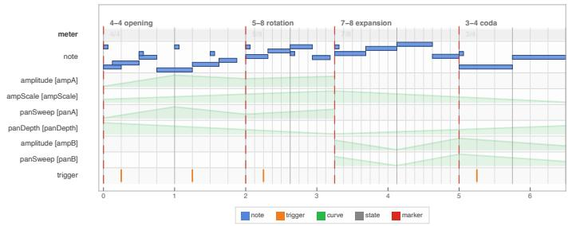
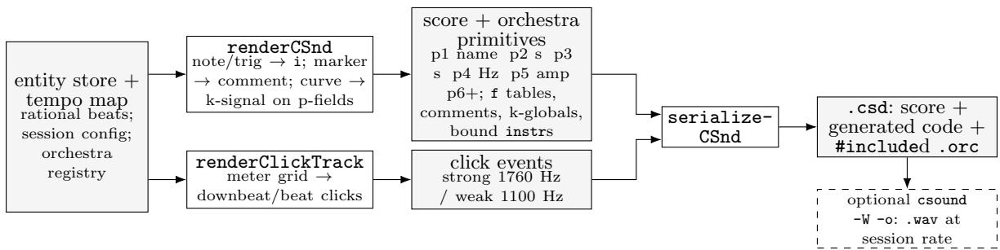

# One Timeline, Many Renderings: A Wolfram Language Paclet for heterogeneous musical output

Francesco Vitucci1, Michele Lorusso2, and Francesco Scagliola3

1,2,3Conservatorio di Musica “N. Piccinni” di Bari 1francescovitucci1@gmail.com 2michelelorusso99@outlook.com 3francesco.scagliola@gmail.com

Abstract. One algorithmic composition may require a Csound score, engraved notation, realtime control, and a rehearsal click. Authored separately, their timelines drift. Temporal System is a Wolfram Language paclet that instead compiles one immutable store of typed entities on a rational beat timeline through backend-specific contracts. It emits Csound synthesis, beta MusicXML 4.0, OSC control, and click artifacts that remain synchronized because they share that store. Conversion to seconds, samples, or hertz occurs only at render time. Csound notes use stable named instruments in external .orc files; curves become k-rate signals declared against score p-fields. The click backend derives rehearsal audio from the same meter and tempo and reuses the Csound serializer. We describe the temporal, semantic, and rendering-contract layers, their practical trade-ofs, and the limits of this proprietary authoring environment within an otherwise open-source ecosystem. The archived supplement exposes the reported outputs pending paclet release.

Keywords: Csound, algorithmic composition, music representation, Wolfram Language, temporal modeling

## 1 Introduction

Computing composers long ago separated structure from sound. Tenney generated note lists for the music n programs [2,3]; Koenig’s Project 1/2 computed tables realized later by players or the studio [1]. In both, a program owns time and structure while another system owns sound—the orchestra– score split Csound institutionalizes [4].

Today a mixed work may need .csd, MusicXML, timed live control, and a click. Their seconds, divisions, milliseconds, and samples diverge when edited separately. Computer-assisted composition environments address parts of this [5,6]; Temporal System, a Wolfram Language paclet [18], makes one timeline authoritative and every output derived.

Multiple output and exact time are not new: music21 has exact fractional ofsets and exports Mu sicXML, MIDI, Lilypond, and text [7]; Abjad drives Lilypond [8]; MEI/Verovio project a canonical score [9,10]; bach realizes timelines in Max [11]; and Tidal uses rational cycles for live scheduling [12]. Temporal System’s narrower contribution is their combination across explicit contracts for notation, ofline Csound, OSC, and click output, deferring unit conversion to each serializer. Wolfram Language 15.0 was chosen because paclet packaging, symbolic transformations, notebooks, and timeline graphics coexist where the authors already develop the music. More fundamentally, Mathematica is an ideal instrument for investigating Stephen Wolfram’s computational vision, including the rule-based and multi-computational perspectives developed in his accounts of ruliology and multicomputation [19,20]. This reduces integration boundaries; exact arithmetic itself is not exclusive, since Python’s Fraction and Julia’s Rational support the same model.

Its strict decisions are: exact Rational onsets in an immutable typed store; authored meter; session tuning; external .orc instruments; and a permissive shared store constrained by each renderer’s contract.

The choice still has an accessibility and sustainability cost: authoring needs a proprietary environment (the free Engine is licensed for development and non-commercial use), unlike Csound, MusicXML, and OSC. The dependency ends at authoring: emitted .csd/.orc, MusicXML, and JSON are open plain text. A language-neutral store serialization and Python/Julia core are the intended portability path; until the port and paclet release exist, this is future work, not present accessibility.

## 2 Anatomy of the Paclet

The implementation comprises fourteen modules exposing 80 public functions in three module groups: core (entities, store, tempo, session), rendering (dispatcher and four backends), and util (pitch, rhythm, dynamics, validation, graphics). Its separate conceptual taxonomy has three architectural layers: temporal, semantic, and rendering-contract. Utilities support the layers rather than forming a fourth one. The first two layers are backend-agnostic; adding a backend adds a Layer-III contract. All functions are pure; store operations return new stores.

Layer I. Tempo is an ordered list of {beat, BPM} points; each BPM applies stepwise until the next point. Compilation integrates these constant segments into a piecewise-linear {beat, seconds} map with analytical inversion. Continuous accelerando/ritardando is not supported. Onsets and durations remain Rationals until a renderer requests seconds or samples.

Layer II. The store groups entities by type (stemData[type][id], O(1) typed access); its perevent rendering pass is O(n), but no large-score benchmark is claimed from the present fixture. Seven implemented entity types (note, rest, trigger, curve, state, marker, annotation), with four more (process, interval, trajectory, gesture) declared for future use. A note carries pitch (spelling plus cents, MIDI float, or frequency), duration, dynamic, and a rendering association keyed by backend id—the one place backend-specific payloads travel with the entity. Meter is a state entity: measure structure is authored, not guessed. A session configuration carries everything a renderer may not hardcode, starting with tuningA4 (default 440 Hz, freely reassignable).

Layer III. Constructors validate only the shared shape and require each rendering[backend] payload to be an association whose keys belong to the backend contract; malformed Csound payloads are therefore local Csound errors. Each backend declares a fallback policy: for example, MusicXML warns when it reduces a continuous curve, which has no direct notation equivalent, to a textual direction rather than silently inventing notation.

The paclet also inspects itself: drawTimeline renders any stemData as lane-based graphics with the metric grid derived from the authored meter entities (Fig. 1), from a single function call with no external tool. Every fixture in the Csound suite compiles without error and was auditioned. Pending release of the paclet, the Zenodo supplement [21] covers most of the present reproducibility gap: it archives the generating notebook, Csound/OSC/MusicXML/click outputs, audio, and the tempo-edit synchrony demonstration used in Sects. 4–6.

  
Fig. 1. A timeline exported directly by the paclet (drawTimeline): a survey of the renderer’s main objects— sixteen sine osc notes (several with cent ofsets), eight click hits, four triggers, six overlapping amplitude/pan curves, section markers, and a $4 / 4  5 / 8  7 / 8  3 / 4$ meter grid. A stress fixture exercising many entity types at once, not a representative composition.

## 3 The Implemented Renderers

A backend is data: an association with an id, a renderer, a serializer, the primitive types it emits, and a fallback policy. The generic dispatcher renderTo[stemData, tempo, backend, config, registry] is the single entry point. Four backends exist. Csound compiles the whole stemData to score and orchestra primitives (Sect. 4); Click derives a standalone rehearsal track from meter and tempo alone (Sect. 5). MusicXML builds measures from meter state, splits notes at barlines into tied fragments, and validates measure capacity, part coverage, and tie and chord integrity; it is an explicitly lossy projection with a declared coverage profile [13], currently in beta, emitting MusicXML 4.0 (partwise) and checked by round-tripping through Dorico for tie, meter and part-separation fidelity—the open, standards-conformant format a growing symbolic-music ecosystem both produces and consumes [14,15,16]. OSC emits a schedule-ready JSON event list in milliseconds—curves sampled at a configurable control rate—for dispatch as OSC messages [17] to whatever is listening, a graphical patcher or a running Csound instance through its OSC opcodes. Not every entity exists everywhere: curves become k-rate control signals in Csound but reduce to a textual direction in MusicXML. MusicXML also requires an authored spelling (or spelling plus cents) and rejects a bare MIDI float or frequency. For integer MIDI, the explicit midiToSpelling utility uses a documented sharp spelling (e.g., 58 becomes A#3); the author must invoke it, so a C#/D♭ choice is never hidden. The diatonic synchrony fixture does not test this policy. Such diferences are recorded per entity–backend pair rather than treated as lossless.

## 4 The Csound Renderer

Csound is the oldest backend and fixes the paclet’s rendering idiom, carrying the electroacoustic and synthesis output (Fig. 2). Its default p-field contract is p1 instrument, p2 onset seconds, p3 duration seconds, p4 frequency in Hz, p5 amplitude in [0, 1], and p6+ from the entity payload; session instrument contracts can remap amplitude and provide intervening p-field defaults. The renderer (renderCSnd) takes the whole stemData: notes and triggers become i statements, markers onsetordered score comments, and each curve a k-rate control signal in a global variable—an f-table reader (a GEN-2 table read at k-rate by tablei) or a generated transeg, per session choice.

  
Fig. 2. Both Csound-family renderers share one serializer; source instruments stay in external .orc files, and curve bindings add generated copies without touching them.

Two decisions matter most. First, late conversion: because onsets stay Rational until this point, ${ \tt p } 2 / { \tt p } 3$ are computed from the compiled tempo map, p4 from spelling and cents under the session’s tuningA4, and p5 from the dynamic marking, all at render time. Retuning a session to 432 Hz or editing its tempo specification regenerates every second and every frequency without touching one entity. Second, named instruments: an orchestra registry is loaded from a directory of .orc files, the filename being the stable id used both in instr definitions and in entity payloads. No numeric renumbering ever occurs, so the note

## i "sine\_osc" 0. 4. 440. 0.65 0.5

(A4, mf, two whole notes at 120 BPM, actual paclet output) remains readable and stable as the orchestra grows.

Curves reach sounding notes through session-declared bindings. Each parameter names a target pfield and a mode: multiply preserves and scales the note’s base value (the default amplitude binding), whereas replace discards that base value (the pan sweep); later multiplicative bindings may scale the replacement. For each afected instrument the renderer copies the whole instr body from its source .orc into a bound copy, rewriting only the use-sites of the bound p-fields—the declared control-signal expression replaces their use-sites, everything else (pcount() guards, envelopes, limit() clamps, the oscillator) reproduced verbatim. Afected notes are re-pointed to this copy, and several curves may compose on one p-field (in Fig. 1, two amplitude curves and an ampScale curve into p5; panSweep and panDepth into p6). Regenerated every render and never edited at the source, the copy cannot diverge through manual editing. The serializer writes the globals and generated instruments beside the registry’s #include lines, sorts score statements by onset, and can compile the .csd to audio. Csound named software channels are a robust alternative when an orchestra explicitly opts into channel names and voice-addressing conventions. The current p-field adapter instead targets deterministic ofline, self-contained score artifacts and legacy score-style instruments; duplicating and rewrite-parsing an instrument body is consequently a limitation, and a channel-based adapter is future work.

The same amplitude curve lives diferently outside Csound. Projected to OSC it is not bound into an instrument but sampled at the session control rate into timed messages. A two-second linear ramp sampled half-open at 10 Hz contains events from 0 through 1900 ms: its JSON duration ms is therefore 1900, not 2000, and the last message has time ms 1900, address /param/amplitude, args [0.95] (actual paclet output, excerpted from the supplement). The beat-space curve and tempo map are the same as in the Csound projection; one binds the curve to a score p-field, the other streams it as OSC messages in milliseconds—a genuinely non-Csound artifact, the heterogeneity the architecture exists to make cheap.

## 5 A Click Track from the Same Timeline

Click tracks for mixed music are commonly rebuilt by hand in a DAW whenever the score changes— precisely the divergence this architecture removes. The click backend treats rehearsal audio as one more projection: it reads only the authored meter entities and the tempo map, builds the measure grid, and emits one short i event per beat, accenting each downbeat. Every parameter is session configuration—beat unit (1/4), click duration (1/16), strong/weak frequencies (1760/1100 Hz), amplitudes (0.9/0.45), and pan—and the click instrument itself is an ordinary three-line .orc file. Because the renderer walks the same meter grid and tempo map as every other backend, meter and tempo changes are followed with no additional authoring; for two 4/4 bars at 120 BPM it emits strong i "click" downbeats (0 and 2 s) and weak intervening beats (full .csd and .wav in the supplementary folder). In roughly 140 lines that reuse serializeCSnd unchanged (Fig. 2) and touch no line of Layers I–II, the backend inherits #include handling and optional .wav compilation. This simplest backend demonstrates reuse in one case; it is not a general measure of the cost of adding arbitrary projections. The genuinely diferent time encodings, notation’s divisions and OSC’s milliseconds, belong to the MusicXML and OSC contracts.

## 6 Keeping the Projections Synchronous

Because every backend reads the same rational onsets and the same compiled tempo map, the projections cannot drift apart. Take one authored timeline—two 4/4 bars then 3/4, 120 then 90 BPM— projected to Csound, click, OSC, and the beta MusicXML backend. The downbeat of bar 3 is Csound $\mathsf { p } 2 \mathrm { = } 4 . 0 \mathrm { s }$ , OSC time ms= 4000, and a strong click at 4.0 s, while MusicXML places it at bar 3, beat 1. Editing the second tempo segment to 60 BPM moves every later onset by the same amount in all three time-domain backends (the note at beat $9 / 4 \colon 4 . 6 6 7  5 . 0 \mathrm { s } )$ , while in the MusicXML export only the second tempo mark changes (90 → 60 BPM)—the initial 120 and every written note-duration unchanged: notation lives in beat space, and seconds are bound only at render time.

## 7 Conclusions

Temporal System compiles an immutable rational-beat store into unequal but synchronized Csound, click, notation, and OSC projections. The paclet is not yet released and MusicXML remains beta. The system has no MIDI or continuous- tempo support: MIDI is not currently emitted, but is planned for a future implementation, alongside other renderers that may emerge as useful targets, including ones not yet anticipated by the present design. Csound curves assume declared p-fields and rewritten instrument copies; named channels are not implemented. The unreleased Wolfram paclet also keeps authoring proprietary although its outputs and supplement are portable. These boundaries delimit the results and the open-source portability work above. The enduring separation of computed time from rendered sound lets one timeline become many renderings.

## References

1. Koenig, G.M.: Project Two: A Programme for Musical Composition. Electronic Music Reports 3, 4–161. Institute of Sonology, Utrecht (1970)

2. Tenney, J.: Computer Music Experiences, 1961–1964. Electronic Music Reports 1(1), 23–60. Institute of Sonology, Utrecht (1969)

3. Mathews, M.V.: The Technology of Computer Music. MIT Press, Cambridge (1969)

4. Lazzarini, V., Yi, S., fitch, J., Heintz, J., Brandtsegg, Ø., McCurdy, I.: Csound: A Sound and Music Computing System. Springer (2016)

5. Assayag, G., Rueda, C., Laurson, M., Agon, C., Delerue, O.: Computer-Assisted Composition at IRCAM: From PatchWork to OpenMusic. Computer Music Journal 23(3), 59–72 (1999)

6. Taube, H.: Notes from the Metalevel: Introduction to Algorithmic Music Composition. Taylor & Francis, London (2004)

7. Cuthbert, M.S., Ariza, C.: music21: A Toolkit for Computer-Aided Musicology and Symbolic Music Data. In: Proceedings of the 11th International Society for Music Information Retrieval Conference (ISMIR), pp. 637–642. Utrecht (2010)

8. Baˇca, T., Oberholtzer, J.W., Trevi˜no, J., Ad´an, V.: Abjad: An Open-Source Software System for Formalized Score Control. In: Proceedings of the First International Conference on Technologies for Music Notation and Representation (TENOR), pp. 162–169. Paris (2015)

9. Hankinson, A., Roland, P., Fujinaga, I.: The Music Encoding Initiative as a Document-Encoding Framework. In: Proceedings of the 12th International Society for Music Information Retrieval Conference (IS-MIR), pp. 293–298. Miami (2011)

10. Pugin, L., Zitellini, R., Roland, P.: Verovio: A Library for Engraving MEI Music Notation into SVG. In: Proceedings of the 15th International Society for Music Information Retrieval Conference (ISMIR), pp. 107–112. Taipei (2014)

11. Agostini, A., Ghisi, D.: A Max Library for Musical Notation and Computer-Aided Composition. Computer Music Journal 39(2), 11–27 (2015)

12. McLean, A.: Making Programming Languages to Dance to: Live Coding with Tidal. In: Proceedings of the 2nd ACM SIGPLAN International Workshop on Functional Art, Music, Modeling & Design (FARM ’14), pp. 63–70. ACM, New York (2014)

13. Good, M.: MusicXML for Notation and Analysis. In: Hewlett, W.B., Selfridge-Field, E. (eds.) The Virtual Score: Representation, Retrieval, Restoration, pp. 113–124. MIT Press, Cambridge (2001)

14. Mayer, J., Dvoˇr´akov´a, M., Dvoˇr´ak, V., Herz´anov´a Vlkov´a, M., B´ım, F., Pecina, P., Somorjai, S.,ˇ Zabiˇcka, P., Hajiˇc jr., J.: Optical Music Recognition for Real-World Manuscripts with Synthetic Data.ˇ arXiv:2606.09479 (2026), to appear in ICDAR 2026

15. Spanio, M., Guler, I., Rod\`a, A.: BMdataset: A Musicologically Curated LilyPond Dataset. arXiv:2604.10628 (2026), to appear in SMC 2026

16. Bhandari, K., Chang, S., Roy, A., Ronchini, F., Benetos, E., Herremans, D., Colton, S.: Text2Score: Generating Sheet Music from Textual Prompts. arXiv:2605.13431 (2026)

17. Wright, M., Freed, A.: Open SoundControl: A New Protocol for Communicating with Sound Synthesizers. In: Proceedings of the International Computer Music Conference, pp. 101–104. Thessaloniki (1997)

18. Wolfram Research: Wolfram Language 15.0 Documentation: Numbers; Paclets Overview. Wolfram Research, Champaign (2025). https://reference.wolfram.com/language/tutorial/Numbers.html, https://reference.wolfram.com/language/tutorial/Paclets.html

19. Wolfram, S.: What Is Ruliology? (2026). https://writings.stephenwolfram.com/2026/01/ what-is-ruliology/

20. Wolfram, S.: Multicomputation—A Fourth Paradigm for Theoretical Science (2021). https://writings. stephenwolfram.com/2021/09/multicomputation-a-fourth-paradigm-for-theoretical-science/

21. Vitucci, F., Lorusso, M., Scagliola, F.: ICSC2026—One Timeline, Many Renderings: Supplementary Material. Zenodo (2026). https://doi.org/10.5281/zenodo.21310200