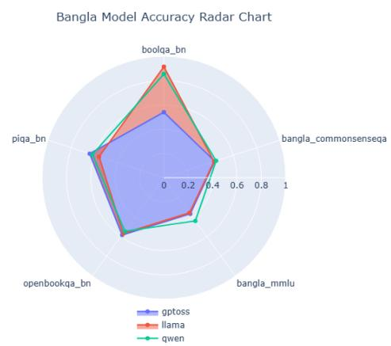
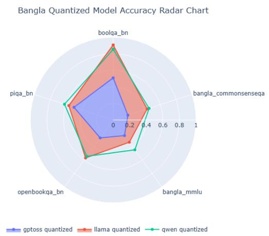

# Quantization Efects on Bangla Language Understanding in Large Language Models: A Systematic Evaluation

Ismail Hossain∗ Nafi Ullah Shafin∗ Mohammad Abdullah Al Mumin

## Abstract

Post-training quantization lowers the memory footprint of Large Language Models (LLMs) and speeds up inference, which is why it is now common for on-device deployment. Most of what we know about its efects, however, comes from English benchmarks. It is not clear whether the same holds for morphologically complex, low-resource languages such as Bangla, and this gap is what we address here. We evaluate three model families—Qwen-2.5-7B, LLaMA-3.1-8B, and GPT-OSS-20B— in full precision and in three quantized formats (GPTQ-Int8, GPTQ-Q8, GGUF-W8A16) across five Bangla natural language understanding benchmarks (Bangla MMLU, CommonsenseQA-BN, OpenBookQA-BN, PIQA-BN, and BoolQ-BN), using zero-shot evaluation through lm-evaluation-harness. To our knowledge this is the first controlled comparison of quantization formats on Bangla NLU. The three families do not respond the same way: GPT-OSS loses up to 57.35% accuracy on reasoning-heavy tasks under GGUF-W8A16, while Qwen and LLaMA hold steady under GPTQ, and in a few cases the quantized version edges out the full-precision one. BoolQ-BN, a comprehension task, stays stable across all three families regardless of format. Taken together, these results suggest quantization can work well for Bangla deployment, but the choice of architecture and quantization method matters more than the bit width alone. We discuss what this means for practitioners choosing a model to run on constrained hardware.

## 1 Introduction

Large language models such as GPT-4, LLaMA, and Qwen now deliver strong performance across a wide range of NLP tasks (Jin et al., 2024; Li et al., 2024), but running them is expensive. Frontier models need tens to hundreds of gigabytes of GPU memory, which puts them out of reach in places where computing infrastructure is limited, including much of South Asia, home to more than 230 million Bangla speakers.

Post-training quantization (PTQ) is one way around this problem (Lang et al., 2024; Lee et al., 2025). Dropping weight precision from 16-bit floating point to 8-bit integers or lower cuts memory use by 2×–8× and speeds up inference by 2×–5×, with little extra engineering efort, enough to make on-device deployment realistic on laptops, phones, and edge servers. Methods such as GPTQ and AWQ push this further, using second-order weight information or activation-aware compression to limit accuracy loss (Frantar et al., 2023; Liu et al., 2025).

Nearly all of this evaluation work, though, happens on English benchmarks: MMLU, GSM8K, HumanEval (Ding et al., 2024; Li et al., 2024). That leaves a question we have not seen answered in the literature: does quantization error compound diferently for a linguistically complex, low-resource language like Bangla? Bangla’s agglutinative morphology, its conjunct consonant clusters, and the grapheme composition rules of its Unicode script all complicate tokenization in ways that could plausibly make representation degradation worse under compression (Bhowmik et al., 2025; Nahin et al., 2025).

## Research questions.

RQ1. How does post-training quantization affect LLM accuracy on Bangla NLU benchmarks?

RQ2. Which quantization formats (GPTQ-Int8, GPTQ-Q8, GGUF-W8A16) best preserve Bangla accuracy?

RQ3. Are specific Bangla task categories (reasoning, commonsense, comprehension) diferentially sensitive to quantization?

Contributions. This paper makes four contributions.

1. We run the first controlled, multi-family comparison of PTQ efects on Bangla NLU that we are aware of, covering 15 model– benchmark pairs across five task categories.

2. We find a sharp split between model families: GGUF-quantized GPT-OSS degrades by up to 57.35% on reasoning tasks, while GPTQ-quantized Qwen and LLaMA show under 1.5% degradation, and sometimes a small improvement, across all five benchmarks.

3. Reasoning and commonsense benchmarks turn out to be far more fragile under quantization than reading comprehension, in the Bangla setting specifically.

4. We turn these results into concrete recommendations for choosing a model architecture and quantization format for on-device Bangla NLP.

## 2 Related Work

## 2.1 Multilingual LLMs and Low-Resource Languages

GPT, LLaMA, Qwen, Mixtral, and Mistral are all pretrained on large multilingual corpora and generalize well in zero-shot settings for the languages that dominate their training data. Performance drops of for low-resource languages, and the usual reasons are sparse token coverage, tokenization mismatches, and morphological complexity (Bhowmik et al., 2025). Bangla runs into all three: agglutinative morphology, conjunct-consonant orthography, and a comparatively small web-scale footprint leave even strong multilingual models underperforming on Bangla tasks (Bhowmik et al., 2025; Nahin et al., 2025).

Two eforts try to close this gap directly. BanglaBERT is a BERT-style encoder trained on curated Bangla text, and IndicLLMs extends multilingual pretraining to South Asian scripts more broadly. The largest recent effort is TituLLMs (Nahin et al., 2025), a family of Bangla-native decoder-only models built with Bangla-aware subword tokenizers and benchmarked across CommonsenseQA-BN, MMLU-BN, PIQA-BN, and BoolQ-BN. The TituLLMs authors argue that tokenizer design and corpus quality are what mainly control Bangla NLU performance, which raises a question they do not answer: if tokenizer and corpus quality matter this much, does compressing the model after training erode that advantage? We did not find any prior work that looks at quantization and Bangla-specific linguistic properties together.

## 2.2 Post-Training Quantization for LLMs

Post-training quantization (PTQ) lowers model weight precision after training is already done, which sidesteps the cost of quantization-aware retraining. The simplest version is uniform INT8 quantization, applying per-tensor or per-channel linear scaling. GPTQ (Lee et al., 2025) goes further, minimizing layer-wise reconstruction error using approximate second-order information, and AWQ (Activation-Aware Weight Quantization) refines this again by preserving the weights that activation magnitudes mark as salient (Liu et al., 2025). GGUF, the serialization format llama.cpp uses for CPU/GPU inference, supports several internal bit depths (Q4\_K\_M, Q5\_K\_S, Q8\_0, W8A16) and is common in on-device deployment pipelines.

Across these methods, quantization typically cuts memory use by $2 \times - 8 \times$ and speeds up inference by $2 \times - 5 \times$ , which is what makes consumer laptops and edge hardware viable targets for LLM deployment (Lang et al., 2024; Liu et al., 2025).

## 2.3 Evaluation of Quantized LLMs

A handful of studies measure quantized LLM accuracy on English benchmarks. Li et al. (2024) evaluate multiple quantization methods across MMLU, HumanEval, and GSM8K and find that INT4 causes real degradation on complex reasoning tasks while INT8 stays mostly safe. Ding et al. (2024) build a generalizationaware evaluation toolbox that stress-tests quantized models on out-of-distribution examples. Jin et al. (2024) compare GPTQ, AWQ, and SmoothQuant and find that higher-level cognitive tasks (math, code) degrade more than factual retrieval under the same bit reduction.

Every one of these studies works from English-only benchmarks, and none of them touch a low-resource or morphologically complex language. That is the gap this paper fills: we evaluate quantized LLMs on five Bangla benchmarks spanning reasoning, commonsense inference, and reading comprehension, which as far as we can tell has not been done before.

## 3 Methodology

We compare full-precision and quantized variants of three LLM families across five benchmark datasets to see how post-training quantization afects Bangla NLU. Within each family, quantization is the only thing that changes between the two compared models; prompt format, decoding strategy, and evaluation harness version are all held fixed.

## 3.1 Benchmark Datasets

We use five publicly available Bangla NLU benchmarks, all sourced from the hishab organization on Hugging Face, spanning three task categories: reasoning, commonsense inference, and reading comprehension.

Bangla MMLU (hishab/bangla-mmlu). A translation of the English MMLU benchmark (Hendrycks et al., 2021) covering 57 subjects across science, humanities, and social sciences. Tests broad encyclopaedic reasoning in a four-choice multiple-choice format.

## CommonsenseQA-BN

(hishab/commonsenseqa-bn). A five-choice multiple-choice benchmark requiring implicit real-world reasoning. Translated from the English CommonsenseQA (Talmor et al., 2019) dataset.

## OpenBookQA-BN

(hishab/openbookqa-bn). Four-choice multiple-choice questions (Mihaylov et al., 2018) requiring multi-step elementary science reasoning combined with external factual knowledge.

PIQA-BN (hishab/piqa-bn). A twooption benchmark (Bisk et al., 2020) evaluating physical and procedural commonsense reasoning (e.g., determining the correct method to accomplish a practical task).

BoolQ-BN (hishab/boolq\_bn). A binary (Yes/No) reading comprehension benchmark (Clark et al., 2019) where each question is accompanied by a short passage; the model must extract and verify a factual claim.

Together, these five datasets provide a balanced coverage of task dificulty and linguistic phenomena, consistent with the evaluation suite used by TituLLMs (Nahin et al., 2025). Per-benchmark example counts are reported in Table 5 (Section A).

## 3.2 Models and Quantization Variants

We evaluate one full-precision baseline and one quantized variant per model family, controlling for model size within each family. Table 1 summarises all evaluated checkpoints.

Table 1: Evaluated models and quantization configurations.
<table><tr><td>Family</td><td>Variant</td><td>Format</td><td>Params</td></tr><tr><td rowspan="2">Qwen</td><td>Qwen2.5-7B-Instruct</td><td>FP16</td><td>7B</td></tr><tr><td>Qwen2.5-7B-Instruct-GPTQ-Int8</td><td>GPTQ-Int8</td><td>7B</td></tr><tr><td rowspan="2">LLaMA</td><td>Meta-Llama-3.1-8B-Instruct</td><td>FP16/BF16</td><td>8B</td></tr><tr><td>Meta-Llama-3.1-8B-GPTQ-Q_8</td><td>GPTQ-Q8</td><td>8B</td></tr><tr><td rowspan="2">GPT-OSS</td><td>openai/gpt-oss-20b</td><td>FP16</td><td>20B</td></tr><tr><td>gpt-oss-20b-ShiningValiant3-W8A16</td><td>GGUF-W8A16</td><td>20B</td></tr></table>

Qwen family. Qwen2.5-7B-Instruct (Qwen et al., 2024) is a multilingual instruction-tuned model that already performs reasonably on Bangla. We compare it against a GPTQ variant (Lee et al., 2025) that compresses weights to 8-bit integers.

LLaMA family. Meta-Llama-3.1-8B-Instruct (Dubey et al., 2024) is compared against a GPTQ-Q8 quantized variant. Its BF16 training and grouped-query attention give us a useful second architecture to check whether robustness patterns hold across model designs, not just within one.

GPT-OSS family. GPT-OSS-20B (OpenAI, 2025) is a large open-weight instruct model. We compare it against a GGUF-W8A16 variant, serialized in the GGUF format and loaded through llama.cpp, which is the kind of deployment-optimized checkpoint most consumer inference engines actually use.

## 3.3 Evaluation Pipeline

All evaluations run on EleutherAI’s lm-evaluation-harness (Gao et al., 2021), which is the toolkit OpenAI, Meta, and most of the academic community already use for reproducible LLM benchmarking. For each model, we load the checkpoint (full-precision through transformers (Wolf et al., 2020), quantized through auto-gptq or llama.cpp), query each benchmark in zero-shot mode with no task-specific prompting or few-shot demonstrations, select answers by comparing log-likelihoods over the candidate choices (or over the “Yes”/“No” tokens for BoolQ-BN), and record accuracy per benchmark. We keep structured JSON logs of every run for post-hoc analysis; these will be released alongside the code.

Reproducibility. Random seeds are fixed and evaluation uses greedy log-likelihood selection, so there is no sampling variance to speak of. We did see minor variance (<0.3%) across re-runs on the same hardware for a few benchmarks, small enough that it would not change any conclusion we draw. Experiments ran on cloud GPU instances (NVIDIA A100/V100) since our local hardware could not handle the larger checkpoints; full environment specifications and total compute budget are reported in Section A.

## 3.4 Evaluation Metrics

Accuracy. All five benchmarks use categorical prediction. Primary metric:

$$
\mathrm { { A c c u r a c y } = \frac { \# ~ c o r r e c t ~ p r e d i c t i o n s } { \# ~ t o t a l ~ q u e s t i o n s } }\tag{1}
$$

Performance Degradation. To quantify quantization impact we report both absolute and relative degradation:

$$
\Delta = \mathrm { A c c } _ { \mathrm { f u l l } } - \mathrm { A c c } _ { \mathrm { q u a n t } }\tag{2}
$$

$$
\Delta \% = \frac { \mathrm { A c c } _ { \mathrm { f u l l } } - \mathrm { A c c } _ { \mathrm { q u a n t } } } { \mathrm { A c c } _ { \mathrm { f u l l } } } \times 1 0 0\tag{3}
$$

Negative values of ∆ (i.e., the quantized model outperforms the full-precision baseline) are reported without modification; we discuss their likely interpretation in Section 5.

## 4 Results

We report zero-shot accuracy for all six model checkpoints (3 families × 2 precision variants) across all five Bangla benchmarks. Tables 2 to 4 give the raw accuracy scores and the degradation metrics computed from them. Figures 1 and 2 show the same numbers as radar charts, which makes the multibenchmark profile of each model easier to compare at a glance.

## 4.1 Full-Precision Baseline Performance

Table 2: Zero-shot accuracy of full-precision models on five Bangla benchmarks. MMLU = Bangla MMLU; CSQA = CommonsenseQA-BN; OBQ = OpenBookQA-BN; PIQA = PIQA-BN; BoolQ = BoolQ-BN.
<table><tr><td>Model</td><td>MMLU</td><td>CSQA</td><td>OBQ</td><td>PIQA</td><td>BoolQ</td></tr><tr><td>GPT-OSS-20B</td><td>0.369</td><td>0.440</td><td>0.584</td><td>0.641</td><td>0.539</td></tr><tr><td>LLaMA-3.1-8B</td><td>0.358</td><td>0.433</td><td>0.567</td><td>0.559</td><td>0.914</td></tr><tr><td>Qwen-2.5-7B</td><td>0.440</td><td>0.451</td><td>0.545</td><td>0.617</td><td>0.854</td></tr></table>

Qwen-2.5-7B has the best MMLU accuracy among the full-precision models (0.440). LLaMA-3.1-8B, despite being the smallest model we test, scores 0.914 on BoolQ-BN, which points to strong reading comprehension independent of parameter count. GPT-OSS-20B leads on PIQA-BN (0.641) and OpenBookQA-BN (0.584) but falls behind on BoolQ-BN. None of the three families is dominant across the board, which tells us each has real Bangla NLU capacity going into the quantization comparison, not just on the benchmarks it happens to lead.

## 4.2 Quantized Model Performance

Table 3: Zero-shot accuracy of quantized model variants on the same five Bangla benchmarks. Format labels are given in Table 1.
<table><tr><td>Model (Quant.)</td><td>MMLU</td><td>CSQA</td><td>OBQ</td><td>PIQA</td><td>BoolQ</td></tr><tr><td>GPT-OSS (GGUF-W8A16)</td><td>0.233</td><td>0.188</td><td>0.268</td><td>0.497</td><td>0.509</td></tr><tr><td>LLaMA (GPTQ-Q8)</td><td>0.333</td><td>0.432</td><td>0.567</td><td>0.564</td><td>0.907</td></tr><tr><td>Qwen (GPTQ-Int8)</td><td>0.446</td><td>0.456</td><td>0.543</td><td>0.618</td><td>0.854</td></tr></table>

The gap between families shows up immediately. GPT-OSS loses accuracy across every benchmark except BoolQ-BN, where the drop is a comparatively mild 5.6%. LLaMA and Qwen stay close to their full-precision scores throughout. Qwen’s quantized variant actually beats its own full-precision version on MMLU (+0.6%), CSQA (+0.5%), and PIQA (+0.1%); we come back to what this small reversal likely means in Section 5.

## 4.3 Performance Degradation Analysis

Table 4 presents per-family, per-benchmark degradation computed via Equations (2) and (3).

Table 4: Performance degradation (∆ and ∆%) due to quantization. Negative ∆ indicates the quantized model outperforms its full-precision counterpart. Bold values mark the largest absolute degradations per family.
<table><tr><td>Family</td><td>Benchmark</td><td>Full</td><td>Quant.</td><td>Δ</td><td>∆%</td></tr><tr><td></td><td>Bangla MMLU</td><td>0.369</td><td>0.233</td><td>0.136</td><td>36.7</td></tr><tr><td>GPT-OSS</td><td>CommonsenseQA-BN 0.440</td><td></td><td>0.188</td><td>0.252</td><td>57.4</td></tr><tr><td></td><td>OpenBookQA-BN</td><td>0.584</td><td>0.268</td><td>0.316</td><td>54.1</td></tr><tr><td></td><td>PIQA-BN</td><td>0.641</td><td>0.497</td><td>0.144</td><td>22.4</td></tr><tr><td></td><td>BoolQ-BN</td><td>0.539</td><td>0.509</td><td>0.030</td><td>5.6</td></tr><tr><td></td><td>Bangla MMLU</td><td>0.358</td><td>0.333</td><td>0.025</td><td>7.0</td></tr><tr><td></td><td>CommonsenseQA-BN</td><td>0.433</td><td>0.432</td><td>0.002</td><td>0.4</td></tr><tr><td>LLaMA</td><td>OpenBookQA-BN</td><td>0.567</td><td>0.567</td><td>0.000</td><td>0.0</td></tr><tr><td></td><td>PIQA-BN</td><td>0.559</td><td>0.564</td><td>-0.004</td><td>-0.8</td></tr><tr><td></td><td>BoolQ-BN</td><td>0.914</td><td>0.907</td><td>0.007</td><td>0.8</td></tr><tr><td></td><td>Bangla MMLU</td><td>0.440</td><td>0.446</td><td>-0.006</td><td>-1.4</td></tr><tr><td></td><td>CommonsenseQA-BN</td><td>0.451</td><td>0.456</td><td>-0.005</td><td>-1.1</td></tr><tr><td></td><td>OpenBookQA-BN</td><td>0.545</td><td>0.543</td><td>0.002</td><td>0.4</td></tr><tr><td>Qwen</td><td>PIQA-BN</td><td>0.617</td><td>0.618</td><td>-0.001</td><td>-0.2</td></tr><tr><td></td><td>BoolQ-BN</td><td>0.854</td><td>0.854</td><td>0.000</td><td>0.0</td></tr></table>

Key observations.

• GPT-OSS falls apart on reasoning tasks. CommonsenseQA-BN (∆% = 57.4) and OpenBookQA-BN (∆% = 54.1) lose more than half their accuracy. PIQA-BN drops 22.4%. BoolQ-BN, at 5.6%, is the only benchmark where GPT-OSS still performs reasonably after quantization.

• LLaMA barely moves. GPTQ-Q8 keeps absolute degradation under 1% on every benchmark. OpenBookQA-BN shows no change at all, and PIQA-BN even ticks up by 0.4%.

• Qwen holds up best of the three. GPTQ-Int8 does not cost Qwen any measurable accuracy on any benchmark, and three of the five (MMLU, CSQA, PIQA) come in slightly higher than full precision (<1.5%).

• BoolQ-BN is the one benchmark all three families handle well. Every family keeps a competitive BoolQ-BN score after quantization: GPT-OSS drops the most (0.030), LLaMA and Qwen by 0.007 or less.

  
Figure 1: Radar charts of full-precision model accuracy across five Bangla benchmarks. Each axis represents one benchmark; a larger shaded area indicates higher overall performance.

  
Figure 2: Radar charts of quantized model accuracy on the same five benchmarks. Note the severe contraction of the GPT-OSS (blue) area on CommonsenseQA-BN and OpenBookQA-BN, contrasting with near-unchanged Qwen (green) and LLaMA (red) profiles.

## 5 Discussion

## 5.1 Architectural Resilience to Quantization

The clearest result in this study is that quantization robustness splits by family and has little to do with task category. LLaMA-3.1-8B and Qwen-2.5-7B keep nearly all of their accuracy under 8-bit GPTQ compression, while GPT-OSS-20B, the largest model in the comparison, loses up to 57.4% on the same benchmarks. If anything, being bigger did not help here.

A few architectural and training factors could explain this, though we cannot fully separate them with the data we have. GPTQ calibration quality depends on the calibration set: the LLaMA and Qwen GPTQ checkpoints were calibrated on diverse multilingual corpora, while it is not clear the GPT-OSS GGUF checkpoint (W8A16) was calibrated on anything beyond English. Qwen’s dense, MoE-free architecture may also spread representational load more evenly across layers, which would reduce the per-layer sensitivity that GPTQ’s Hessian-based correction is designed to target (Lee et al., 2025). . We flag this as a real confound rather than a settled explanation, since GPT-OSS is also the only family in our study without a GPTQ counterpart to compare against directly (see Limitations).

## 5.2 Task Sensitivity: Reasoning vs. Comprehension

In all three families, the reasoningheavy benchmarks (CommonsenseQA-BN, OpenBookQA-BN, Bangla MMLU) degrade more than reading comprehension (BoolQ-BN). English-benchmark work has found the same pattern (Jin et al., 2024; Li et al., 2024); our results are, to our knowledge, the first to show it holds for a morphologically complex, low-resource language too.

One explanation is task structure. BoolQ-BN asks the model to check a factual claim against a passage sitting right there in the prompt, a fairly local, surface-level matching operation, and small weight perturbations do not seem to disturb that signal much. CommonsenseQA-BN and OpenBookQA-BN ask for something harder: pulling in implicit world knowledge and chaining several reasoning steps, which leans on long-range attention patterns and softmax distributions that are more sensitive to the kind of small perturbations quantization introduces (Liu et al., 2025; Lang et al., 2024).

## 5.3 Linguistic Interaction and the Bangla Factor

Going in, we suspected Bangla’s linguistic properties might amplify quantization-induced degradation relative to English. There is some indirect support for that: GPT-OSS loses 57.4% on CommonsenseQA-BN, well above the 10–20% range typically reported for GGUF quantization on English MMLU (Ding et al., 2024). Bangla’s agglutinative morphology and Unicode grapheme clusters produce longer, less frequent token sequences than English text does for the same content, which spreads meaning across more token positions and gives precision errors more room to compound across attention layers.

That said, this reading is confounded by the same uncertainty around GPT-OSS’s GGUF calibration data noted above. Isolating a genuine Bangla-specific efect would need a controlled ablation that holds the quantization method fixed and varies only the language. We treat the language-amplification idea as a hypothesis this study points toward, not one it confirms.

On negative degradation values. Qwen-Int8 comes out ahead of Qwen-FP16 on MMLU (+0.6%), CSQA (+0.5%), and PIQA (+0.1%). One known cause of this in GPTQ calibration is that the Hessian-guided weight reconstruction can occasionally smooth out overfitting or numerical instability already present in the FP16 weights, efectively acting as a mild regularizer (Lee et al., 2025). These margins are small enough (<1.5%) to sit within normal measurement noise, so we read them as a sign of strong quantization robustness rather than as a genuine accuracy gain.

## 5.4 Practical Implications for Bangla NLP Deployment

These results translate into three concrete recommendations:

• Use GPTQ-Int8 or GPTQ-Q8 for on-device deployment. Qwen-2.5-7B-GPTQ-Int8 and LLaMA-3.1-8B-GPTQ-Q8 both stay near full-precision accuracy on Bangla NLU at roughly half the memory footprint, and both run comfortably on consumer GPUs (8–16 GB VRAM) without a meaningful accuracy cost.

• Do not use GGUF-W8A16 where reasoning matters. The GPT-OSS GGUF checkpoint we tested collapses on multi-step reasoning tasks. Until GGUF calibration for Bangla improves, we would not put this format in front of high-stakes reasoning tasks.

• For comprehension-only use cases, quantization format matters less. BoolQ-BN accuracy holds up across all three families, so applications built around passage-based fact retrieval can reasonably use any of the variants we tested.

## 6 Conclusion

We set out to evaluate post-training quantization on Bangla natural language understanding across three LLM families, five benchmarks, and several quantization formats. The main finding is that quantization impact tracks architecture and format more than it tracks language in general: GPTQ-Int8 and GPTQ-Q8 compression of Qwen-2.5-7B and LLaMA-3.1-8B costs at most 1.5% absolute accuracy across all five benchmarks, which makes both configurations usable for resource-constrained Bangla NLP deployment. GGUF-W8A16 quantization of GPT-OSS-20B is a diferent story: it degrades reasoning and commonsense benchmarks by as much as 57.4%, though reading comprehension accuracy holds up reasonably well even there.

Reasoning tasks (CommonsenseQA-BN, OpenBookQA-BN) are more sensitive to quantization than reading comprehension (BoolQ-BN) in all three families we tested. This matches what prior work has found on English benchmarks; we extend it, for what we believe is the first time, to a low-resource, morphologically complex language.

Future work. A few directions stand out. INT4 formats (AWQ, Q4\_K\_M) would map out the accuracy-compression trade-of for Bangla more fully than the INT8-range formats we test here. Quantizing Bangla-native models such as TituLLMs (Nahin et al., 2025) would show whether language-specific pretraining adds any compression resilience on top of what we see. Quantization-aware training for Bangla is worth trying as a way to get more robust compressed models directly. Inference latency and memory footprint benchmarking would round out the accuracy picture we give here. And extending this work to generative Bangla tasks, summarization, translation, dialogue, would tell us whether the reasoning-vscomprehension split we observe holds outside classification-style benchmarks.

## Ethics Statement

All models and datasets used here are publicly available under open-source licenses, and no private or personally identifiable data is involved. The evaluations were run for academic research purposes only. We do not expect direct harm from this work, but we do want to flag one risk: a quantized model with degraded reasoning accuracy could cause real problems if deployed in a high-stakes decision-support setting without the kind of validation we describe here.

## Limitations

We evaluate only INT8-range quantization formats; INT4 compression (Q4\_K\_M, AWQ-4bit) may behave diferently and is not covered here. Zero-shot evaluation may not reflect performance in few-shot or fine-tuned deployment scenarios. We do not measure inference latency or peak memory usage, both of which matter for real deployment decisions alongside accuracy. We were not able to include a quantized Bangla-native model such as TituLLMs, so we cannot say whether languagespecific pretraining adds any extra quantization resilience on top of what we observe here. Our benchmarks are all classificationstyle; generative Bangla tasks such as summarization, translation, or dialogue may show different sensitivity patterns entirely.

There is also a design limitation worth stating plainly: family, quantization format, and model size are not fully crossed in our setup. GPT-OSS is the only family tested with GGUF, the only one at 20B parameters, and the only one without a GPTQ counterpart. This means our central finding, that quantization impact tracks architecture rather than language, cannot be fully separated from the possibility that GGUF-W8A16 itself is simply less accurate than GPTQ at this bit width, or that larger models calibrate worse. A full 3 × 3 grid crossing family, format, and size would be needed to pull these apart, and we leave that for future work. Finally, the calibration dataset used for the GPT-OSS GGUF checkpoint is not publicly documented, which adds a further confound to any cross-family comparison involving that model.

## References

Shimanto Bhowmik, Tawsif Tashwar Dipto, Md Sazzad Islam, Sheryl Hsu, and Tahsin Reasat. 2025. Evaluating LLMs’ multilingual capabilities for bengali: Benchmark creation and performance analysis. arXiv preprint arXiv:2507.23248.

Yonatan Bisk, Rowan Zellers, Ronan Le Bras, Jianfeng Gao, and Yejin Choi. 2020. PIQA: Reasoning about physical commonsense in natural language. In Proceedings of the AAAI Conference on Artificial Intelligence.

Christopher Clark, Kenton Lee, Ming-Wei Chang, Tom Kwiatkowski, Michael Collins, and Kristina Toutanova. 2019. BoolQ: Exploring the surprising dificulty of natural yes/no questions. In Proceedings of NAACL-HLT 2019.

Qing Ding, Chao Liu, Yue Zhang, and Zhiliang Tian. 2024. Evaluating the generalization ability of quantized llms: Benchmark, analysis, and toolbox. arXiv preprint arXiv:2406.12928.

Abhimanyu Dubey, Abhinav Jauhri, and 1 others. 2024. The llama 3 herd of models. arXiv preprint arXiv:2407.21783.

Elias Frantar, Saleh Ashkboos, Torsten Hoefler, and Dan Alistarh. 2023. GPTQ: Accurate posttraining quantization for generative pre-trained transformers. In International Conference on Learning Representations (ICLR 2023).

Leo Gao, Jonathan Tow, Baber Abbasi, Stella Biderman, Sid Black, Anthony DiPofi, Charles Foster, Laurence Golding, Jefrey Hsu, Alain Le Noac’h, Haonan Li, Kyle McDonell, Niklas Muennighof, Chris Ociepa, Jason Phang, Laria Reynolds, Hailey Schoelkopf, Aviya Skowron, Lintang Sutawika, and 5 others. 2021. A framework for few-shot language model evaluation.

Dan Hendrycks, Collin Burns, Steven Basart, Andy Zou, Mantas Mazeika, Dawn Song, and Jacob Steinhardt. 2021. Measuring massive multitask language understanding. Proceedings of the International Conference on Learning Representations (ICLR 2021).

Renren Jin, Jiangcun Du, Wuwei Huang, Wei Liu, Jian Luan, Bin Wang, and Deyi Xiong. 2024. A comprehensive evaluation of quantization strategies for large language models. Findings of the Association for Computational Linguistics: ACL 2024.

Jiedong Lang, Zhehao Guo, and Shuyu Huang. 2024. A comprehensive study on quantization techniques for large language models. arXiv preprint arXiv:2411.02530.

Jung Hyun Lee, Jeonghoon Kim, June Yong Yang, Se Jung Kwon, Eunho Yang, Kang Min Yoo, and Dongsoo Lee. 2025. LRQ: Optimizing posttraining quantization for large language models by learning low-rank weight-scaling matrices. In Proceedings of the 2025 Conference of the North American Chapter of the Association for Computational Linguistics: Human Language Technologies (NAACL-HLT 2025).

Shiyao Li, Xuefei Ning, Luning Wang, Tengxuan Liu, Xiangsheng Shi, Shengen Yan, Guohao Dai, Huazhong Yang, and Yu Wang. 2024. Evaluating quantized large language models. arXiv preprint arXiv:2402.18158.

Yutong Liu, Cairong Zhao, and Guosheng Hu. 2025. A comprehensive evaluation on quantization techniques for large language models. arXiv preprint arXiv:2507.17417.

Todor Mihaylov, Peter Clark, Tushar Khot, and Ashish Sabharwal. 2018. Can a suit of armor conduct electricity? a new dataset for open book question answering. In Proceedings of the 2018 Conference on Empirical Methods in Natural Language Processing (EMNLP).

Shahriar Kabir Nahin, Rabindra Nath Nandi, Sagor Sarker, Quazi Sarwar Muhtaseem, Md Kowsher, Apu Chandraw Shill, Md Ibrahim, Mehadi Hasan Menon, Tareq Al Muntasir, and Firoj Alam. 2025. TituLLMs: A family of bangla LLMs with comprehensive benchmarking. In Findings of the Association for Computational Linguistics: ACL 2025.

OpenAI. 2025. gpt-oss-120b & gpt-oss-20b model card. arXiv preprint arXiv:2508.10925.

Qwen, An Yang, and 1 others. 2024. Qwen2.5 technical report. arXiv preprint arXiv:2412.15115.

Alon Talmor, Jonathan Herzig, Nicholas Lourie, and Jonathan Berant. 2019. CommonsenseQA: A question answering challenge targeting commonsense knowledge. In Proceedings of NAACL-HLT 2019.

Thomas Wolf, Lysandre Debut, Victor Sanh, Julien Chaumond, Clement Delangue, Anthony Moi, Pierric Cistac, Tim Rault, Rémi Louf, Morgan Funtowicz, Joe Davison, Sam Shleifer, Patrick von Platen, Clara Ma, Yacine Jernite, Julien Plu, Canwen Xu, Teven Le Scao, Sylvain Gugger, and 3 others. 2020. Transformers: State-of-the-art natural language processing. In Proceedings ofthe 2020 Conference on Empirical Methods in Natural Language Processing: System Demonstrations.

## A Dataset Statistics and Compute Budget

Table 5 reports the number of examples in the evaluation split used for each benchmark. All evaluation is zero-shot, so only the test (or full) split is used.

Table 5: Number of examples in the evaluation split for each benchmark.
<table><tr><td>Benchmark</td><td>Task Category # Examples</td><td></td></tr><tr><td>Bangla MMLU</td><td>Reasoning</td><td>729</td></tr><tr><td>CommonsenseQA-BN</td><td>Commonsense</td><td>1220</td></tr><tr><td>OpenBookQA-BN</td><td>Reasoning</td><td>497</td></tr><tr><td>PIQA-BN</td><td>Commonsense</td><td>1840</td></tr><tr><td>BoolQ-BN</td><td>Comprehension</td><td>729</td></tr></table>

Total compute for the study was approximately 40 GPU-hours across all six model– precision configurations (three families × fullprecision and quantized variants), evaluated over the five benchmarks above; GPT-OSS-20B accounted for the largest share of this budget given its parameter count.